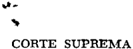

TOMO 310

Volumen 3

1987

REPUBLICA ARGENTINA

## FALLOS

DE LA

SUPREMA

CORTE

DE

## JUSTICIA DE LA N ACION

PUBLICACION A CARGO DEL DEPARTAMENTO DE JURISPRUDENCIA y PUBLICACIONES DEL TRIBUNAL

## DICIEMBRE INmCES

TOMO 310 VOLUMEN 3

1987

--

## DICIEMBRE

## ABENERA CASALONE HNOS. S.B.L.

RECUR~O EXTRAORDINARIO: Requisitos propios. Cuestión federal. Cuestiones federales complejas. IncoTlStitucionólídad de normas 1j MtoS nMionales.

Es formalmente procedente el recurso extraordinario, si se ha cuestionado .la inconstitucionalidad de las leyes 21.864 y 22.161 y la decisión del Superior Tribunal de la causa es contraria a las peticiones del recurrente.

CONSTITUCION NACIONAL: Constitucionalidad e incons.titucionalidad. Leyes naGÍonailes. Varias.

L¡t ley 22.161 no es inconstitucional, ya que no existe. una doble impo. sición de pena por un solo hecho, pues esa ley y la 21.864 tienen .finalidades distintas: la primera determina ¡as sanciones aplicables a las infracciones a las obligaciones que ella contempla, y la segunda establece el régimen para mantener el poder adquisitivo de las sumas adeudadas y resarcir el perjuicio causado por la mora de su integración a la Caja.

DICTAMEN DEL PHOCURADOH FISCAL DE LA CORTE SUPREMA

## Suprema Corte:

Se interpone recurso extraordinario contra la sentencia de fs. 51/52 que confirmó la resolución de la accionada por la que se había impuesto multa a la .empresa actara por considerar que esta última había efectuad'O el aporte y entregado la declaración jurada corresp'Ondiente al mes de enero de 1985 fuera de término.

Expresa la apelante que la ley 22.161, l'OsartS. 8, 10 Y 16 de la ley 21.864 y la resolución 372/79 del Ministeri'O de Bienestar Social resultan violatorias de la Constitución Naci'Onal. Dice también que Al decis'Orio es arbitrario.

La protesta se dirige, por una parte, a sostener que los recargos y multas establecidos en las leyes mencionadas se superponen y resultan confiscatorios.

En mi opinión, 'la protesta carece, en este aspecto, de debida fundamentación.

Es que, en lo que se refiere a la supuesta superpOSIclOn, la apelante se limita a afirmar que ella se produoe, pero no intenta demostrar su aserto ni a través del examen de las normas ni controvirtiendo la afirmación de la Cámara (fs. 51/51 vta.) en el sentido de que los ordenamientos legales en cuestión tienen distintas finalidades, ya que el de la ley 21.864 está referido a la forma en que las sumas adeudadas por los obligados deban ser tratadas paramantener su poder adquisitivo y el perjuicio ocasionado por la mora, mientras que el de la ley 22.161 tiene otro propósito.

Tampoco se efectúa en ,el remedio federal una crítica razonada de los arts. 10 y 16 de la ley 21.864 y de la resolución 372/79, limitándose la apelante a expresar una breve objeción a los incisos a), b) Y c) del ar!. 8 9 y, sólo toma un aspecto parcial de sus disposiciones. No IJega a demostrar, por ello, que el recargo del diez por ciento por mora durante el primer mes de atraso, veinte por ciento durante el segando y treinta por ciento durante el tercero que establecen sus disposiciones, constituya un exceso de carácter confiscatorio, tal como afirma.

Asimismo, no resulta admisible que la recurrente ataque la validez de la ley 22.161 en su totalidad dado el procedimiento de su sanción, pero se acoja al régimen de recursos que la misma estabÍece en su ar!. 7 9 (fs. 13).

Además, la presunta lesión al prinCIpIO de igualdad ante la ley expresada a fs. 56 vta. resulta una cuestión introducida extemporáneamente ya que no fue propuesta 'Oportunamente ante el tribunal ordinario, según surge de la presentación de fs. 13/15, en la que por otra parte se acepta la competencia de 1.1 demandada, ya que se deduce ante ella recurso de revocatoria por la sanción que había impuesto.

-

/

Corresponde agregar que la sentencia atacada cuenta con suficiente fundamentación y que ello la hace insusceptible de ser descalificada por la vía de la arbitrariedad, oomo se desprende de las razones expuestas por el a quo en .el considerando segundo de su pronunciamiento.

En consecuencia, considero que el remedio federal de fs. 54/57 es improcedente, y que así corresponde que V.E. lo declare. Buenos Aires, 16 de noviembre de 1987. Jo'/"ge Tomás Médici.

## FALLO DE LA CORTE SUPREMA

Buenos Aires, 19 d~ diciembre de 1987.

Vistos los autüs: "Arenera Casalone Hnos. S.B.L. s/infracción".

## Considerando:

- 19) Que contra la resolución de la Sala VIII. de la Cámara Nacional de Apelaciones del Trabajo de la Capital Federal que confirmó la sanción impuesta al recurrente por la Caja de Asignaciones Familiares para el Personal de la Estiba, interpuso r,ecursü extraordinario, que fue concedido a fs. 67.
- 2 9) Que el recursü es formalmente procedente por haberse cuestionado la constitucionalidad de las leyes 21.864 y 22.161 Y ser la decisión del Superior Tribunal de la causa contraria a las peticiones del recurrente.
- 39) Que el recurrente plantea la inconstitucionalidad de la ley 22.161 por considerarla confiscatoria en tanto establece una doble sanción por una misma infracción. Afirma que ella es así toda vez que la ley 21.864 ya fija recargos por la demora en entregar fuera de término las planillas a la Caja, a más de aportes de los cuales la cuestionada ley 22.161 faculta a esa entidad a aplicar multas por el mismo hecho.

En esta instancia, también plantea la inconstitucionalidad de la ley 21.864 por entender que los recargos, actualizaciones e intereses

derivados de la mora en el pago de aportes son arbitrarios, exagerados y violan el derecho de propiedad.

- 49 ) Que la inconstitucionalidad planteada de la ley 22.161 por la recurrente no puede ser acogida favorablemente.

En efecto, como bien lo ha interpretado el a qua, no existe una doble imposición' de pena por un solo hecho, p~les ambas disposiciones tienen finalidades distintas; la ley citada determina las sanciones aplicables a las infracciones a las obligaciones que ella contempla, mientras que la ley 21.864 establece el régimen para mantener el poder adquisitivo de las sumas adeudadas y resarcir d perjuicio causado por la mora de su integración a la Caja.

Por ello, y lo dictaminado por el señor Procurador Fiscal, se deelará procedente .el recurso y se confirma la sentencia apelada. ~~:\_¡.~

AUGUSTO CÉSAR BELLUSCIO 'CARLOS S. FA YT JORGE ANTONIO BACQU~:.

## IGNACIO RAMON ALBA v. BALPALA CONSTRUCCIONES FERROVIARIAS S.A.

RECURSO EXTRAORDINARIO: Requisitos lJl"Opios. Cuestiones no federales. Sentencias arbitrarias. Procedencia del recurso. Exceso ritual manifiesto.

Corresp'onde dejar sin efecto la sentencia que no hizo mérito de un expe-' diente administrativo, considerando que no fue ofrecido como prueba y que su producción fue tardía, si ese expediente fonna una unidad, sólo escindida por la parcial apariencia derivada de las distintas cafÚtulas, con otro expediente que sí se ofreció como prueba (1).

RECURSO EXTRAORDINARIO: Requisitos propios. Cuestiones no federal€s. Séntencias arbitrarias. Procedencia del recurso. Exceso ritual manifiesto.

Si después de estar habilitado por anteriores decisiones de la Corte para esclarecer el problema relativo a un expediente administrativo ofrecido

(1) 1 Q de diciembre.

-\

como prueba, de" advertir que esas actUaciones estaban incomp'letas y de tener a la vista los elementos de juicio faMantes, en lugar de responder a la verdad objetiva, el juzgador cierra sus ojos so capa del carácter' tardío del planteo, se' ha 'consagrado el triunfo del rigor formal excesivo sobre la verdad.

RECURSO EXTRAORDINARIO:' RequisitlJlS propios. Cuestiones no federales. SentencÚlS arbitrarias. Procedencia del recurso. Exceso ritual manifiesto.

La renuncia consciente a la verdad es incompatible con el servicio de la justicia (1).

## JUECES.

No cabe prescindir, en el cumplimiento de la IlllSlOn que incumbe a los magistrados, de la preocupación por realizar, la justicia ( 2 ).

## JUECES .

- .La función judicial no se agota en la letra de la ley, con olvido de la efectiva y eficaz realización del derecho ( 3 ).

## JUSTICIA.

La justicia es, en suma, una virtud al servicio de la verdad sustancial (4).

RECURSO EXTRAORDINARIO: Requisitos propios. Cuestiones no federales. Sentencias arbitrarioS'. Procedencia del recurso. Exceso ritual manifiesto.

Reconoce base constitucional la necesidad de acordar primacía a la verdad jurídica objetiva e imp'edir su ocultamiento ritual como exigencia del arto 18 de la J Ley Fundamental (5).

- ( 1) Fallos: 238: 550.
- (2) Fallos: 243:80; 249:37; 263:267; 272: 13!:l. '
- (3) Fallos: 238:550; 248:291; 249:37.

'

- (4) Fallos: 280:228; 296:65.
- (5) Fallos: 247:176; 268:71.

## DIRECCION GENERAL IMPOSITIVA v. JUAN TENNYSON HAYS

. RECURSO EXTRAORDINARIO: Requisitos propios. Cuestiones no federa1es. SentenCÚlS arbi!;rarias. Procedencia del recurso. Valoraci6n de circunstancias de hecho y p1'tleb~.

Corresponde dejar sin efecto la sentencia que no hizo lugar a la terceria de dominio con el objeto de obtener el leva.'1tamiento del embargo de un inmueble de la cónyuge del demandado en una ejecución fiscal, por considerar que las escrituras -respectivas nocontenÍ"an mención alguna acerca del origen de los fondos empleados en su adquisición y que la prueba producida no era convinceIÍte, por lo que juzgó que estaba comprendido en el ámbito de üdministración del 'marido y respondía por sus deudas, por apliéación de la. segunda parte del arto 1276 del Código Civil,

RECURSO EXTRAORDINARIO: Requisitos 'flrop¡;os. Cuestiones no federttl.es. lnterpre'laci6n de normas .y actos comunes.

Procede el recurso .extraordinario contra la sentencia que consideró que un inmueble de la mujer respondía p'or las deudas del marido por hallarse comprendido en la segunda parte del arto 1276 del CódigO"Civil, pues si bien remite el examen .de cuestiones de derecho común, la solución traduce una aplicación in~decuada de las normas, que las desviI1túa y vuelve inoperantes, lo que equivale a decidir en contra o con prescindencia de sus -términos, todo lo cual redunda en evidente menoscabo de la garantía de la defensa en juicio y de la correcta fundamentación exigible a los fallos judiciales.

## SOCIEDAD CONYUGAL.

El primer apartado del arto 1276 del Código Civil debe conjugarse con el arto 5\&gt; de la ley 11.357 en cuanto oonsagra, resp'ecto de la mujer, que '10s bienes propios y los gananciales que ella adquiera no responden por las deudas del marido".

## SOCIEDAD CONYUGAL.

Lo esencial del primer apartado del a-rt. 1276 del Código Civil así como ,del 'art1. s\&gt; de la ley 11.357, se ha1la en la atribución de Ja gestión a quien resulte ser. el ,adquirente, cualesquiera que fuesen los fondos empleados .en la adquisición, que pueden provenir del trabajo personal o de cualquier otro título legítimo.

## SOCIEDAD CONYUGAL.

La propiedad de los bienes gananciales y el consiguiente derecho de administrar y disponer de ellos pertenecerá al cónyuge, en cuyo nombre

o por' el cual los bienes son adquiridos, sea cual fuere la causá de dicha adquisición.

## SOCIEDAD CONYUGAL.

La segunda parte del arto 1276 del Código Civil sólo pudo 'razonablemente referirse a aquellos bienes respecto de los cuales no cabe la ap'licación del principio general ni puede determinarse cuál de los cónyuge.· o efectuó la adquisición, vgr: los que no tienen un titular cierto y cuya posesión es oomún -los muebles del hogar, acciones al portador, etc.pero jamás pudo incluir el inmueble adquirido por la mujer por medio de la pertinente escritura pública de la cual surge indubitablernente b individualización del adquirente.

## SOCIEDAD CONYUGAL.

En el régimen de la sociedad conyugal, la ausencia de mención en el título del origen de 1:osfo~dos empleados en la compra del inmueb!e, resulta inconducente p'ara determinar el sistema de gestión y la responsabilidad por las deudas, pues la titularidad de la adquisición es el criterio de atribución que informa la materia.

## FALLO DE LA CORTE SUPREMA

Buenos Aires, 19 de diciembre de 1987.

Vistos los autos: "Fisco Nacional (D;C.I.) c/Hays, Juan Tennyson s/incidente tercería de dominio'~.

## Considerando:

19) Que contra el pronunciamiento de la Sala Primera Civil de la Cámara Federal de Apelaciones de La Plata qq.e, al confirmar el fallo de la instancia anterior~no hizo lugar a la tercería de dominio con el Objeto de obtener el levantamiento del embargo trabado sobre un inmueble, propiedad de la cónyuge del demandado en una ejecución fiscal, la tercerista dedujo el recurso extraordinario que fue concedido a fs.' 386. '

29) r Que el Tribunal señaló que las escrituras respectivas no contenían mencIón alguna acerca del origen de los fondos empleados

para la adquisición del inmueble embargado y que la prueba producida por la actora en el expediente no era convincente, por lo que juzgó que el inmueble estaba comprendido en el ámbito de administración del marido de la tercerista y respondía por las deudas por él contraídas en aplicación del artículo 1276, segunda parte, del Código Civil, que dispone que "si no puede determinarse el origen de los bienes o la prueba fuera dudosa, la administración y disposición c:orresponde al marido. salvo lo dispuesto por el artículo ,1277".

- 3 9 ) Que los agravios propuestos suscitan cuestión federal bastante para su tratamiento por la vía intentada, pues si bien el tema involucrado en el recurso remite al examen de cuestiones de derecho oomún, materia propia de los jueces de la causa y extraña a la instancia del artículo 14 de la ley 48, cabe hacer excepción a la regla mencionada cuando -como en el casola solución respectiva traduce una aplicación inadecuada de las normas que las desvirtúa y vuelve inoperantes, lo que equivale a decidir en contra o con prescindencia de sus términos, todo lo cual redunda en evidente menoscabo de la garantía de la defensa en juicio y de la correcta fundamentación exigible a los fallos judiciales (Fallos: 278:35; 294:363; 302:1112, entre otros).
- 4 9 ) Que tal situación se ha verificado en el sub lite cuando la alzada excluyó al inmueble de propiedad de la apelante, cuya ganancialidad no se cuestiona en esta instancia federal, del régimen de gestión separada de los bienes de la sociedad conyugal, consagrado por el artículo 1276, primer apartad'Ü, del Código Civil, después de la reforma introducida por la ley 17.711, el cual establece que "cada uno de los cónyuges tiene la libre administración y disposición de sus bienes propios y de los gananciales adquiridos con su trabajo personal o por cualquier otro título legítimo, con la salvedad prevista en el artículo 1277",norma que debe conjugarse con el artículo 59 de la ley l1.357.en cuanto consagra respecto de la mujer que "los bienes propios y los gananciales que ella adquiera no' responden por las deudas del marido".
- 59) Que la norma citada en primer término alude a la "libre administración y disposición que corresponde al cónyuge que adquirió el bien", y 1'0 esencial de este precepto legal, así como del artículo 59 de la. ley 11.357, se halla en la atribución de la gestión a quien resulte

. ser el adquirente, cualesquiera que fuesen los fondos empleados en la adquisición, ya que la ley no distingue, y pueden provenir, en todo caso, del trabajo personal o de cualquier otro título legítimo. La propiedad de los bienes gananciales y el consiguiente derecho de administrar y disponer de ellos pertenecerá al cónyuge, en cuyo nombre o por el cual los bienes son adquiridos, sea cual fuere la causa de dicha adquisición.

6 9) Que la segunda parte del artículo 1276 -citada por el a quosólo pudo razonablemente referirse a aquellos bienes respecto de los cuales no cabe la aplicación del principio general ni puede determinarse cuál de los cónyuges efectuó la adquisición, vgr: los que no tienen un titular cierta y cuya posesión es común -los muebles del hogar, acciones al portador, etc.pero jamás pudo incluir al inmueble adquirido por la mujer por medio de la pertinente escritura pública, como se verificó en el sub examine (fs. 74/79 Y 8'0/87), de la cual surge indubitable la individualización del adquirente; bien entendido, que la ausencia de mención en el título del origen de los fondos empleados en la compra resulta inconducente para determinar el sistema de gestión y la responsabilidad por las deudas, puesto que ninguna disposición legal exige tal constancia y que dicha materia aparece informada por otro criterio de atribución: la titula;ridad d~ la adquisición.

,

7 9) Que, finalmente, no constituye obstáculo a lo expresado la simulación opuesta como simple defensa en el proceso y circunscripta a una escritura aclaratoria otorgada por ambos cónyuges para determinar el origen de los fondos empleados por la recurrente (fs. 88/90), toda vez que no fue objeto de sustanciación con ésta ni con el restante interviniente en el acto y, en todo caso, dejó incólumes a los actos notariales traslativos de la propiedad a la tercerista -no redargüidos dc falsos ni impugnados por la acción o reconvención de simulación o fraudepor lo que no advierte 'esta Corte, en .función de las razones expuestas precedentemente, la existencia de fundamento normütivo o fáctico idóneo que justifique mantener el embargo trabado sobre un inmueble de la actora para responder eventualmente al crédito del Fisco contra su cónyuge, circunstancia que hace procedente el acogimiento del remedio federal al existir nexo directo e inmediato

entre lo resuelto y las garantías constitucionales que se invocan como vulneradas (art. 15 de la ley 48), ya que en definitiva resulta mEDOSeabado el derecho de propiedad de la actora consagrado por el art. 17 dE la Constitución al conducir a hacer ~fectiva mediante la ejecución de un bien de su propiedad la deuda por la cual no es legalmente responsable.

Por ello se declara procedente el recurso extraordinario y S(~ deja sin efect.;)la sentencia. CQn costas. Vuelvan los autos al tribunal de origen a fin de que, por medio de quien corresponda, proceda a dictar nuevo pronmiciamiento.

JosÉ SEVERO CABALLERO -. AUGUSTO CÉSAR BELLUSCIO -CARLOS S. FA YT,

## MUNICIPALIDAD DE BABIA BLANCA Y. ANGEL DIONISIO CRIVARO y OTnos

## RECURSO EXTRAORDNARIO: Requisitos comunes. Gravamen.

El reCUrso extraordinario es improcedente, por prematuro, si la recurrente se agravia de la afectación del derecho de propiedad que le ocasionaría la aplicación al caso de la léy 10.235 de Buen'os Aires, que otorga carácter meramente declarativo a las sentencias firmes que condenen a las provincias y a las municipalidades .al pago de sumas de dinero. La supuesta demora en el pago sólo se trasuntará en .un gravamen concreto al p'rocederse a los trámites de ejecución, .oportunidad en la que la parte deberá intentar los recursos que considere idóneos.

## DICTAMEN DEL PROCURADOR GENERAL SUSTITUTO

SJpre~a Corte:

Contra el. falJo de la Cámara de Apelación en lo Civil y Comercial del departamento judicial de Bahía Bla~ca, interpusieron los expropiados recurso .extraordinario federal a fs. 425/4'31, agraviados,

entre otras razones, por la afectación del derecho de propiedad que les ocasionaría la aplicación al caso de las. prescripciones de la ley provincial 10.235 (punto VIII de la pieza recursiva):

La Cámara departamental concedió la apelación, fundada en que. el planteo de inconstitucionalidadde lá norma no fue motivo de ,la apelación extraordinaria loc~l, intentada también por los recurrentes ante el Superior Tribunal de la Provincia. yen atención a que el recurso extraordinario fue interpuesto con anterioridad al prollunciamiento de V.E. en el caso "Strada", según lo interpretado tambi~n por esta Corte in re "Tellez".

A mi modo de ver, el recurso en análisis deviene improcedente,. toda vez que a su notoria insuficiencia argumental aúna el carácter de prematuro, habida cuenta que ex,hibe agravios meramente conjeturales. Así ,lo pienso, pues las norm~s consagradas en la ley 10.235, que otorga carácter meramente declarativo a las sentencias fü:mes que condeñen a la Provincia de Buenos Aires y a las municipalidades de la misma al pago de sumas de dinero, no impiden ;que espontáneamente el ente condenado proceda a abonar la indemnización fijada, dado que no establece una suspensión del trámil'e del luicio ni prohíbe el cumplimiento de las sent-encüls. Por tanto, la. supuesta demora en el pago que agravaría a la apelante sólo se trasuntará en un gravamen concreto en oportunidad de procederse a los trámites de ejecución, oportunidad en la que la parte deberá ii;ltentar los recursos que considere idóneos.

Por lo expuesto, soy de opnión que corresponde denegar por improcedente el recurso extraordinario, en lo' que' ha sido materia de concesión por el a quo a fs. 459. Buenos Aires, 23 de octubre de 1987. José Osvaldo Casas.

## FALLO DE LA CORTE SUPREMA

Buenos Aires, 1 9 de diciembre de 1987.

Vistos los autos: "Municipalidad de Bahía Blanca cl Crivaro, Angel Dionisia y otros sI expropiación".

## Considerando:

Que esta Corte comparte los términos del dictamen del Sr. Procurador General sustituto, a los que se remite por razones de brevedad.

Por ello, se declara improcedente el ,recurso extraordinario interpuesto con costas. (art. 68 del COdigo Procesal Civil y Comercial de la Nación).

-~

AUGUSTO CESAR BELLUSCIO -CARLOS S. FM;T -ENRIQUE SANTIAGO PETRACCHI -JORGE ANTONIO BACQuk

## TELECOR SOCIEDAD ANONIMA COMERCIAL E INDUSTRIAL v. PROVINCIA DE CATAMARCA

## MEDIDA DE NO INNOVAR.

Corresponde hacer lugar a la medida de no innovar y Hbrar oficio a las autoridades de una empresa a fin de que, en el plaZo de 24 horas, se abstenga, y en su caso cese de utilizar, en forma no autorizada por el Comité Federal de RadilodifusiÓI1 la estación repetidora de televisión correspondiente a la actora.

## FALLO DE LA CORTE SUPREMA

Buenos Aires, 1Q de diciembre de 1987.

Autos y Vistos; COnsiderando:

Que mediante el certificado de fs. 27 el Comité Federal de Radiodifusión informa que autoridades de Catamarca Televisora Color le hicieron saber que, a partir del 12 de Illoviembre de 1987, la citada empresa había comenzado a difundir distinta programación en el horario que allí se detalla, mediante la utilización de la repe-

,

tidora perteneciente a TELECOR S.A.I.C., ubicada en Sierra Ancasti, Provincia de Catamarca.

Que tales actos resultan prima facie contrarios a disposiciones emanadas de la autoridad y jurisdicción nacionales invocadas por la 'demandante; tal es el caso de la ley 22.285, del decreto 2938/84 y de las resoluciones n Q 963/84, n 9 690/85 y n Q 136/86 del Comité antes referido (ooo£r. art.230, ine. 1Q, del Código Procesal; Fallos: 250:154; 251:336; A.492.XX "Comité Federal .de Radiodifusión cl Neuquén, Provincia del sI inconstitucionalidad", resolución del 17 de enero de 1986; y C.706.XXI."Comité Federal de Radiodifusión el Formosa, Provincia de s/nulidad", sentencia del 7 de julio de 1987). Por lo demás, a juicio de esta Corte, de los antecedentes incorporados a la causa, surge similar peligro en la demora al ponderado por el Tribunal en las dos últimas decisionesallldidas (con£. inc. 2 9 del arto 230 mencionado).

Por ello,. se hace lugar a la medida de no innovar solicitada.' Consecuentemente, deberá librarse oficio a las autoridades de la empresa Catamarca Televisara Color a fin de que, en el plazo de 24 horas, se abstenga, y en su caso cese de utilizar, en forma no autorizada por el Comité Federal de Radiodifusión, la esta~ión repetidora (canal 11) correspondiente a la actora. Ubrese la comunicación mencionada con habilitación de días y horas inhábiles.

JosÉ SEVERO CABALLERO AUGUSTO CÉSAR BELLUSCIO -CARLOS S. FAYT -JORGE ANTONIO BACQUÉ.

## MARCELO DANIEL TIERNO v. COMISION MUNICIPAL DE LA VIVIENDA

JURISDICCION :y CO¥PETENCIA: Competencia federal. Por las personas. NacWn. }

La circunstancia de que el Banco Hipotecario Nacional haya sido citado aJi juicio en los términos del arto 94 del Código Procesal Civil y Comercial de la -Nación, no modifica la competencia federal (1).

(1) 1Q de diciembre. Fallos: 305:2001; 307:655.

JURISDICCION y COMPETENCIA: Competencia federal. Por las. persofUls. Nación ..

- La coÍnp'etencia federal en .el caso en que el Banco Hipotecario Nacional es citado .ál juicio en los términos del arto 94 del Código Procesal Civil y Comercial de la Nación no resulta afectada' por la prórroga de jurisdicción convenida, desde que para el hanco la misma es res .ínter alícs acta .(art. 1195 in fine del Código Civil).

## JURISDICCION y COMPETENCIA: Competencia federal. Por las persofUlS. Nación.

- La competencia federal en el caso en que el Banco Hipotecario Nacional es citado al juiCio en los' términos' delart. 94 del Código Procesal Civil y Comercial de la Nación es aplicable aún cuando intervengan otras personas no aforadas, sin que quepan' distinciOnes.. respecto del grado y carácter de tal participación procesal (1).

## RAMON FLORES v. COMISION MUNICIPAL DEl.A VIVIENDA

JURISDICCION y COMPETENCIA: Competencia federal. Por la materia. Causas regidas por normas federdles.

Corresponde atribuirle competencia al fuero civil y comercial federal en la demanda de escrituración fundada en un boleto de compraventa celebrado con la Comisión Municipal de la Vivienda de la Ciudad de 'Buenos Aires en el marco de la ley 2Ü5in (FONAVI) ,norma de carácter federal, y la cuestión planteada, atinente a que habría vencido el plazo del arto 12 de la ley, no remite directa e. inmediatamente a la consideración de temas reglados por el derecho administrativo no cuestionándose actos de la administración nacional (2).

- (1). 307:2033.
- (2) 11' de diciembre. Fallo: 308:393.

JURlSDICCION y COMPETENCIA: Cuestiones de competenc:a. In~ervenci6n de la Corte Suprema.

Es facuJtad de la COrte Suprema otorgar el conocimiento de las causa; a los jueces realmente competentes para entender en ellas aunque no hubiesen sido parte en la contienda (1).

ANTONIO NOVARA v.HOSPITAL DE CLINICAS JOSE DE SAN MARTIN '

"

DANOS Y PERJUICIOS, Prilncipios generales.

En principio, para que proceda el resarcimiento de los per¡mclOs sufridos debe acreditarse que han existido y que son oonsecuencia directa e inmediata de un obrar negligente de aquel a quien se imputa su producción ( 2 ).

RECURSO EXTRAORDINARIO: Requisitos propios. CuestioneS no federales. Sentend'as arbitrarias. Procedencia del recurso. Falta de fundamentación SIlficicnte,'.

COuesponde dejar sin efecto la sentencia' que condenó a la reparación del daño sufrido por el actor a .consecuencia de la muerte de su hijo, omitiendo establecer de qué modo las falencias de organización admi. nistJm:tiva rep'rbchables a la demandada" incidieron para que el evento dañoso se produjera.

SIMBOLO CÍA. FINANCIERA S.A. v. SUCESION DE EDUARDO CARLINO

RECURSO EXTRAORDINARIO: Requisitos propios. Cuestiones no federales. Sentencias arbitrarias. Procedencia del recurso. Valoraci6n de círcu1lS tancías de hecho y prueba.

COrresponde dejar" sin efecto la sentencia que rechazó la suspensión dd .trámite de una ejecución hipotecaria, de honorarios solicitada por el Banco.

- (1) Fallos: 280:36; 281:374; 301:728.
- ( 2) 1Q de diciembre.

Central en una ejecución omitiendo considerar que el crédito tenía un origen anterior a la quiebra de la entidad financiera actora, inescindible de:! momento en que se habla prestado la Jabor profesional generadora de los honorarios ( 1).

## ENTIDADES FINANCIERAS.

El arto 51 de la ley 21.526 alude indistintamente al "título" o a la "causa" del crédito, términos que dentro de la economla de ese articulo no cabe tomar como sinónimos stricto sensu sino, más bien, como una referencia :alternativa para juzgar con mayor amplitud el origen temporal de los créditos involucrados en la ",uspensión de actos ,ejecutorios.

## ENTIDADES FINANCIERAS.

La excepción contenida en la parte final del art. 51 de la ley 21.526 está dirigida a los créditos prendarios o hipotecarios que gravan bienes de la entidad fallida, en razón del priviJegio especial que ellos tienen, pero no a la inversa.

## ENTIDADES FINANCIERAS.

La excepción contenida en' la parte final del arto 51 de la ley 21.526 no comprende los créditos hipotecarios de que es titular la entidad -fallida ni, menos aún, las costas que pudieren generarse a ralz de su ejecución contra el tercero que los adeuda.

## ENTIDADES FINANCIERAS.

La excepcibn contenida en la parte final del arto 51 de ~ ley 21.526 debe interpretarse restrictivamente.

RECURSO EXTRAORDINARIO: Requisitos propios. Cuestiones no federalf!s. Interpretación, de nOmlaS y actos comunes.

No procede el recurso extráordinario contra la ,sentencia 'que rechazó la suspensión deJ. trámite de Ullil ejecuCión de honorarios solicitada por el Banco Central en una ejecución hipotecaria considerando aplicable la excepción que prevé el art.51 de la ley 21.526, por tratarse de honorario", regulados con posterioridad al p'edido de quiebra de la sociedad intervenida y, además, en razón de .que tales emolumentos se originaron en un juicio por cobro de un crédito hipotecario, pues versa sobre ~aterias regidas por normas de derecho común y local, ajenas a la

## (1) 1Q, de diciembre.

instancia que prevé el art.' 14 de ,la' ley 48 (Disidencia de los doctores Enrique Santiago Petracchi y Jorge Antonio Bacqué) (1).

JORGE N. DABUL y OTROv. BANCO CENTRAL DE LA REPUBLICA ARGENTINA

## ENTIDADES FINANCIERAS.

El -Banco Central no es el sujeto responsable, durante el período de intervención cautelar de una entidad financiera, \_ del pago de un certificado de depósito emitido por la entidad; lo oontrario importana otor~ garle al instituto que regula el -art. 24 de la ley 22.529 un alcance que excede el que es propio de su naturaleza, aún con las p'articularidades que expresamente surgen de la ley especiail, teniendo en cuenta los sujetos involucrados Y -las finalidades del régimen de entidades financieras.

## FALLO DE LA CORTE SUPREMA

~uenos Aires, 3 de diciembre de 1987.

Vistos 1-os autos: "Dabul, Jorge N. y Dabul, José c/B.C.R.A. s/oobro de pesos".

## Considerando:

- 1 9 ) Que la Sala N9 4 de la Cámara Nacional de Apelaciones en lo Contencioso Administrativo Federal, revoCÓla sentencia apelada e hizo lugaI: a la demanda deducida contra el Banco Central de la República Argentina, mediante la cual los actores, en su carácter de titulares de un certificado de depósito emitido por una entidad financiera cuya liquidación había dispuesto el ente rector, pretendían el cobro de diferencias de actualización monetaria ,e intereses, con más

-1

2470

sus accesorios, liquidados a raíz del pago insuficiente de dicho certificado.

- 2 9 ) Que para así decidir, el a quo consideró que el único tema en discusión era el relativo a si el pago efectuado por el Banco Central de la República Argentina -tachado de parcial por los actores-, tuvo o no efectos cancelatorios en los términos del arto 624 del Código Civil, y al respecto se pronunció por la negativa. Dispuso en conse~uencia que se abonara a los actores la suma que resulte de la liqui-' dacíón a practicarse "conforme a lo que surge de la interpretación del arto 56 de la ley 21.526 efectuada" en la sent,encia de primera instancia, según la cual el Banco Central de la República Argentina debe abonar los depósitos :amparados por la garantía establecida en dicha norma, dentro de los treinta días del vencimiento de aquéllos.
- 3 9 ) Que contra tal pronunciamiento, el ente oficial interpuso recurso extraordinario, que fue concedido en cuanto se controvierte la inteligencia de normas federales, y denegado con respecto a la tacha de arbitrariedad, lo cual dio lugar a la queja que se resuelve por separado.
- 4 9 ) Que el juez de primera instancia excluyó del debate lo atinente a los alcances del citado art. 56 de la Ley de Eritidades Financieras, en razón de que la demanda .se rechazó por haberle atribuido efectos cancelatorios al pago efectuado a los actores por el Banco Central de la República Argentina, sin perjuicio de lo cual se expidió sobre aquel punto que había sido materia de' expresa articulación en la contestación de la demanda, y mantenida, aunque de manera genérica, en la contestación del trasladó de la apelación (fs. 93 vta,).
- 59) Que, en tales condiciones, el Tribunal de alzada ha incurrido en contradicción al señalar que la única cuestión en debate era la relativa a los efectos del pago impugnado por parcial, mientras que por otra parte y mediante una escueta remisión, hizo suya la inteligencia que del precepto federal se había establecido en el fallo apelado, lo que resulta corroborado por el auto de concesión del remedio extraordinario en cuanto se vincula con dicho aspecto del pronunciamiento. En consecuenciá, toda vez que se encuentran cumplidos los restantes requisitos para la procedencia del recurso concedido, corresponde examinar la cuestión planteada.

6Q) Que para admitir el reclamo de los actores y condenar al demandado al pago de "diferencias de actualización monetaria" el Tribunal de alzada tomó como premisa laexistertcia de mora atribuible a este último, con respecto. al cumplimiento de la obligación de restitUIrle a los primeros el monto del depósito con sus accesorios, lo cual se apoya, a su turno, en considerar que el plazo de treinta días para el pago de tales obligaciones'que prevé el arto56 de la ley 21.526, modificada por la ley 22.051, debe computarse a partir del vencimiento de los certificados de depósito.

- 79) Que si bien este Tribunal ha decidido que de conformidad con lo prescripto por el arto 56 de la ley 21.526 (texto citado), su reglamentación y el arto 568 del Código de Comercio, durante el periodo de la intervención cautelar de una entidad financiera, las imposiciones vencidas y no canceladas continúan devengando intereses (sentencia del 19 de octubre de 1987, in re: C.15'xXI. "Corbo, Miguel Angel y otro c/Banco Central de la República Argentina s/ cobro de pesos"), también ha señalado que los órganos de la soci:edadque se desplazan al disponerse la intervención cautelar, son los que por sus actos obligan a la persona jurídica en los términos del 'arto 58 de la ley 19.550,y sólo responden por los daños y perjuicios que resultaren de su acción u omisión cuando faltaren a sus obligaciones (s.entencia del 29 de octubre de 1987, in re: M.383.XXI., "Mateo, Fernando y otra c/ Banco Central de la República Argentina"), circunstancias que no fueron objeto de pronunciamiento en las instancias ordinarias.

8 9) Que, por consiguiente, en el sub examiné se ha atribuido indebidamente la mora al demandado, quien no es el sujeto responsable del pago del certificado durante el período de la intervención cautelar, ~.lo que cabe agregar que lo contrario importaría otorgarle al instituto que regula d arto 24 de la ley 22.529, "un alcance que excede el que es propio de su naturaleza, aun con las particularidades que expresamente surgen de la ley especial, teniendo .en cuenta los sujetos involucrados y las finalidades del régimen de entidades financieras" (sentencia citada en segundo término en el punto anterior).

P.or ello, se revoca el fallo de fs. 95/97, y se rechaza la demanda (art. 16, segunda parte, de la ley 48). .

.

CARLOS S. FAYT -ENRIQUE SANTIAGO PETRACCHI JORGE ANTONIO BACQUÉ.

",

## FORD MOTOR ARGENTINA S.A.

RECURSO EXTRAORDINARIO: Requwitos propios. Cuestión federal. Cuestiones federales simples. Interpretación dé las leyes federales.

Procede el recurso extraordinario contra la sentencia que interpretó que el arto 813 ,clel Código Aduanero no distingue acerca de si las devoluciones efectuadas son cancelatorias' a los efectos de liquidar la actualización, en razón de que está controvertido el alcance de una norma de naturalezá federal y la sentencia definitiva del Superior Tribunal de la causa es contraria a las pretensiones que la recurrente sustenta en ella. ,

## ADUANA: Principios generales.

Elart. 813 del Código Aduanero, al especificar el ,ámbito de validez temporal de la ac:tualización de los imp'ortes que corresponde devolver, determina que dicho accesorio se devenga por el lapso comprendido entre el reclamo de devolución del pago efectuado sin causa, y el penúJtimo ,mes anterior a aquel en el cual se comp1eta la devolución, o el pago que implica la extinción de la obligación del deudor por' producir efectos liberatorios ocancelatorios del total adeudado; la circunstancia de que se realicen pagos parciales no obsta a la aplicación de la conclusión que antecede.,

## ADUANA: Principios generales.

Efectuado un p'ago parcial, él implica la cancelación de 10 adeudado en la proporción que resulte de relacionar la suma devuelta con el capital actualizado, de conformidad al procedimiento previsto en el arto 813 del Código Aduanero, a la fecha del pago realizado.

## ADUANA: Principios generales.

Efectuado un, pago parcial, el saldo de capital original no devuelto debe actualizarse desde el reclamo de devolución, hasta el penúltimo mes anterior a aquel en el cual se produjo la cancelación íntegra mediante un segundo pago, tal como lo dispone el 'arto 813 del Código Aduanero.

## FALLO DE LA CORTE SUPREMA

Buenos Aires, 3 de diciembre de 1987.

Vistos los. autos: "Ford Motor Argentina S.A. s/recurso de apelaci6n".

Considerando:

- 19) Que la Sala IV de la Cámara Nacional de Apelaciones en lo Cont~ncioso Administrativo Federal confirmó la decisión de lainstancia anterior, en cuanto había admitidO'que elcapita:l que corresponde devolver a la actora se actualice hasta el penúltimo mes ante. dar a aquel en el cual se hizo efectiva la devolución, y que. si bien el acreedor no está obligado a recibir pagos parciales, en el caso de que acepte hacerlo, no puede obtener de ello un beneficio al liquidar la. actualización de los importes percibido~ desde d pago realiz~do.
- 29) Que para así resolver, el TribuI:\al a quo interpretó que el arto 813 del Código Aduanero no distingue acerca de si las devolucioIles efectuadas son cancelatorias a los efectos de liquidar la actualiZación, y que de ser ello así, se produciría "un enriquecimierit? sin causa a"favor de una de las partes.
- . 39) Que contra dicho pronunciamiento la adora interpuso recurso extraordinario, que fue concedido y es procede~te, en razón de que está controvertido el alcance de una norma de naturaleza federal y la sentencia definitiva del Superior Tribunal de la causa es contraria a las pretensiones que la recurrente sustenta en ella.
- 49) Que el arto 813 del Código Adua~eroestablece: "Cuando se hiciere lugar ala .repetición de los importes por tributos que se hubieran pagado espontáneamente ante el servicio aduanero, aquéllos serán actualizados de acuerdo a la variación del Índice de pre'; . dos al por mayor (nivel general), elaborado por er Instituto Nacio. nal de Estadística y Censos o por el organismo oficial que cumpliere sus funciones, desde el mes en que se hubiere efectuado el reclamo de los mIsmos hasta el.penúltimo mes anterior a aquel en que se hiciere efectiva la devolución".
- 59) Que dicho precepto legal, al especificar el ámbito de validez temporal de la actualización de los importes que corresponde devolver, determina que dicho accesorio se devenga por el lapso comprendido entre el reclamo de devolución del pago efectuado sin causa, y el penúltimo mes anterior a aquel en el cual se completa la devolución, o el pago que implica la extinción de la obligación del

..

deudor por producir efectos liberatorios o cancelatorios del total adeu~do. La circunstancia de que se realicen pagos parciales no obsta "a la aplicación de la conclusi6n que antecede.

- 69 ) Que, en tales condiciones, en el caso de autos" el pago parcial efectuado implica la cancelación de lo' adeudado en la propor,ci6n que resulte de' relacionar la suma devuelta con el capital actualizado, de conformidad al procedimiento previsto en el arto 813 del Código Aduanero, a la fecha del, pago realizado.
- · Al ser así; el saldo de capital original no dev'uelto debe actualizarse desde el reclamo de devolución, hasta el penúltimo' mes an; terior a aquel en el cual se produjo la cancelación íntegra mediante un segundo. pago tal como lo dispone la norma iegal, mencionada.
- , 7 9 ) Que, por otra parte, la demandada no invoca la existencia de otra norma obligatoria para la aplicación del arto 813 del Código Aduanero, destinada a subsana~ las consecuencias derivadas de reco'nacer a dicho artículo un alcance distinto al que se le atribuye en el considerando anterior.
- 89 ) Que no obsta a las conClusionesque anteceden los agravios vertidos con respecto a las manifestaciones efectuadas en el considerando 59 del pronunciamiento recurrido, los que no pueden pros. perar habida cuenta que. son atinentes a cuestiones fácticas no sus'ceptibles de revisión por' la vía del recurso deducido.
- Por ello, se revoca la sentencia apelada (art. 16, la. parte, de la ley 48). Las costas de esta instancia se distribuyen en el orden causado, en razón de que la demandada pudo creerse con derecho a sostener su posición (arto 68, 2a. parte, del Código Procesal).

CARLOS S. FAYT -ENRIQUE SANTIAGO PETRACClU -JORGE ANTONIO BACQUÉ.

JUAN FRANCO BATTAGLIA v. UNION OBRERA METALURGICA DE LA REPUBLICA ARGENTINA

RECURSO ORDINARIO DE APELACION: Tercera instancia. Juicio-; en que la Nación es parte.

,

Procede el recurso ordinario de apelación si ha sido articulado en un proceso en que la Nación; aún indirectamente, reviste el carácter de . parte.

## RECURSO ORDINARIO DE APELACION: Tercera instancia. Generali&lt;Uule!.

Es improcedente el reCUrSOordinario de apelación si los agravios del recurrenJte sólo constituyen reiteración de las consideraciones fO,rmuladas con anterioridad o, en el mejor de los casos, meras discrepancias con d criterio del sentenciante en la materia examinada, pero distan de contener, una crítica concreta 'y razonada de los fundamentos que iÍúorman la sentencia 'y resultan, finalmente, ineficaces al fin perseguido. '

RECf.!RSO ORDINARIO DE' APELACION: Tercera instancia. Generalidade3.

Es improcedente considerar en la instanCiaordinaria,de~pelaci6n cue~tiones no sometidas a la decisión ~e los tribunales inferiore¡¡.

## FALLO DE LA CORTE SUPREMA

'Buenos Aires, 3 de diciembre de 1987.

Vistos los autos: "Battaglia, Juan Franco e/Unión Obrera Metalúrgica de la República Argentina si ordinario".

## Considerando:

19) Que la Sala N9 2 de la Cámara Nacional de ApelaCiones en lo Civil y Comercial Federal confirmó el fallo de'la instancia anterior, que había hecho lugar a la demanda iniciada por el arquitecto Juan Franco Battaglia, y que tuvo por objeto el cobro de sus honorarios profesionales por los proyectos y anteproyectos realizados para la construcción de viviendas, que debieron haberse efectuado con el auspicio de la Confederación General del Trabajo de la República Argentina y conforme al convenio que la entidad gremial celebró con

'

el Ministerio de Bienestár Social de la NaciÓn, como' ásÍ 'también la indemnización por el lucro cesante producido como consecuencia del desistimj~nto unilateral de la demandada en cuanto a la realización de las obras. Contra dicho pronunciamiento la parte vencida interpuso el recurso 'Ordinariode apelación que fue concedido a fs. 677.

f'

2 9 ) Que, para así decidir, y en lo que al caso concierne, el a qua ponderó, en primer lugar, la conducta del Banco Hipotecario Nacional, que, citado a juicio en los términos del arto 94 del Código Procesal Civil y Comercial, no articuló ninguna objeción f.ormal para la dilucidación actual de su responsabilidad. En este aspecto, y sobre la base de jurisprudencia del fuero que cita, consideró que en razón de que el préstamo no había sido acordado, la institución crediticia pudo dejar sin efecto la operatoria respecto de ,los proyectos pendientes de realización, pues así se lo permitía la reglamentación aprobada.

- '3 9 ) Que el sentenciante agregó que los términos de los compromisos suscriptos por la Confederación General del Trabajo con el Ministerio de Bienestar Social y con el Banco Hipotecario Nacional (fs. 576 y fs. 223/226) no modificaban la situación, ya que estos documentos no tuvieron carácter contractual, ni existían elementos que hicieran presumir una ruptura intempestiva o un apartamiento arbitrario o abusivo que justificase ubicar el caso dentro de los supuestos de responsabilidad extrac'Üntractual.
- 4 9 ) Que, asimismo, la Cámara aludió a que no podía interpretarse que a través de tales instrumentos el banoo demandado hubiera asumido la obligación de mantener en vigencia el plan "a cualquier precio", ni que el otorgamiento de los préstamos para las cien mil viviendas debiera hacerse con abstracción de cualquier circunstancia económica. En tal sentido,' hizo mérito de que ni la Confederación General del Trabajo de la República Argentina ni el Banco Hipotecario Nacional hubieran reclamado el cumplimiento de tal hipotética 'obligación, y puso en evidencia' que el banco' no era el beneficiario de los proyectos, Ceomo asimismo que los requisitos a cumplir por el peticionario del préstamo, entre lbs que estaban los planos y proyec'tos, implicaban gastos proporcionales a la envergadura de la obra, que comprendía la asunción de un riesgo empresario sujeto a las oontin-

gencias,propias de la ,.oper~ción, ~ sin que, de, ello se deriv:ase.un dere-, cho creditorio,.a ,favor:.'de la entidad solicitante. ',' .

59) Que, 'además,'estimó el,Tribunal que nada podía hacer supone~ que la razón invocada por el banco para suspender la aplicación dé! plan de viviendas fúera falsa o arbitraria. A tí~lo aclaratoriO' señaló que aun en .la' hipótesis de que a aquél cupiera alguna responsabilidad, nunca se hubiese podido concluir en que de ella derivase lisa y llánamente la' obÚgación de pagar los honorados de los arquitectos'. La consecuencia sería, en todo caso -agrególa responsabilidad dé ID, in1\titución de crédit'O por los perjuicios verdaderamente sufridos por el fracaso de los préstamos, que no resultaban necesariamente idénticos al costo de los proyectos. Indicó, finalmente, que nunca pudo pretendetse que el banco se hiciera cargo de las obligaciones de la demandada" tal oomo fue solicitado en autos por la vía de la ci. tació,n t)fectuada, y que en cuanto al planteo de la, ausencia de culpa. d" la Confederación General del Trabajo de la República Argentina, no podía discutirse su responsabilidad respecto de la falta de pago de los trabajos encomendados y realizados efectivamente por el actor, pues los adeudaba y fue morosa en su pago.

69) Que, en principio, el recurso deducido debe considerarse procedente, en cuanto ha sido, articulado en, un proceso en que la Nación, aun indirectamente, reviste el carácter de parte y el valor en el que se pretende la modificación de la, sentencia apelada, supera el límite establecido por el arto 24, inc. 69, apartado e), del decreto-ley 1285/58, actualizado por resolución n9 487/86 de esta Corte Suprema, dictada el 19 de agosto de 1986 en el expediente de Superintendencia Judicial S.2323/78.

7 9) Que, sin embargo, lo alegado en la presentación de fs. 708/ 716 en torno a la ausencia de culpa, a que no se dio a los compromisos firmados su verdadera entidad jurídica y a que la suspensión del plan resultó un hecho insuperable, en los términ'Osdel arto 513 del' Código Civil, no aporta ningún nuevo elemento de convicción u otras razones que justifiquen una solución distinta de la adoptada por el a quo. Tal circunstancia, que esta Corte ha oonsiderado a fin de determinar la suficiencia del recurso y, consecuentemente, del alcance de su Jurisdicción en la tercera instancia ,'Ordinaria,alcanza para desesti-

,

marIas agravios de la demandada sobre estos puntos, pues sus consideraciones sólo constituyen reiteración de las formuladas con anterioridad o, en el mejor de los casos, meras discrepancias con el criterio del sentencümte en la materia examináda, pero distan de contener una crítica concreta y razonada de los fundamentos que informan la sentencia y' resultan, finalmente,' ineficaces al fin perseguido (Fallos:' 285: 19; 289:329;305:1667;causa S.293.XX."Sáenz y Marcó Empresa Constructora S.R.L. c/D.N.V. s/revocación de resolución", fallada el 6 de febrero de 1986 y sus citas, entre otros).

89 ) Que, por lo demás, el agravio referente a que el pago de los honorarios del actor estaba sujeto a la condición de que el Banco Hipotecario Nacional otorgara los créditos que posibilitaran la realización de las 'Obras,no fue planteado ante la Cámara en el, escrito de fs. 646/655. En tales condiciones, resulta de aplicación al caso la jU" risprudencia de esta Corte Suprema según la cual es improcedente considerar en esta instancia cuestiones no sometidas a la decisión de los tribunales inferiores (Fallos: 263:219; 270:323; 305:724).

Por ello, se declara improcedente el recurso de apelación interpuesto.

JOSÉ SEVERO CABALLERO BELLUSCIO -CARLOS ANTONIO BACQuÉ. AUGUSTO CÉSAR S. FAYT JORGE

## PHOVINCIA DE LA PAMPA v. PROVINCIA DE' MENDOZA

,

RIOS.

,

Debe reconocerse el carácter interprovincial de la cuenca hidrográfica del río AtueI.

## TERRITORIOS NACIONAL,ES:

El concepto de territorio supone una división administrativa de la' Na¡. ción, sometida temporariamente 3: b jurisdicción y legislación, del go-

310

mos.

mos.

mos.

mos.

Tanto las 'autoridades nacionales como las provinciales consideraron el no Atuel como interior de. la Provincia de Mendoza, y la participación del gobierno federail resultó, en todo caso, encuadrada en el marco de las atribuciones del inc. ] 6 del arto 67 de la Constitución, más que derivada del ejercicio de las que le confería la legislac:ón sancionada sobre la base del inc. 14 de esa oláusula constitucional.

](;mSDICCION y COMPETENCIA: Competencia federal, Competencia originaria de la Corte Suprema. Queias interprovínciales.

El arto 109 de la Constitución Nacional supone conferir' al más alto tribunal de la República la trascendente misión de dirimir los conflictos interprovinciales" propósito inspirado, sin duda, en la penosa y prolongada secuela de discordias entre las provincias que siguió al inicio de nuestra' vida independiente.

bierno federal y destinada a convertirse en provincia autónoma una veZ satisfechas las exigencias' que la ley resp'ectiva impone. Es de su esencia, parece evidente, la condición temporaria y su potencialidad latente para incorporarse a las unidades autónomas del régimen federaL

El caracter de río no navegable no empece a la condición de bien' del dominio público.

Ni los fundamentos del proyecto de 'ley 12.650 ni las manifestaciones vertidas t1n las sesiones parlamentarias correspondientes hacen sup'oner 'el reconocimiento, siquiera implícito, de que el río Atuel fuera interprovincial o de que, al legislar sobre el tema,' se comprometieran eventuales derechos del entonces territorio de La Pampa, sometido a la jurisdicción del Estado nacional.

Tanto olas autoridades nacionales como las provinciales y, en particular, los integrantes del Congreso de la Nación que intervinieron en la preparación y discusi6n de la que, sería la ley 12.650, para nada contenlpIaron la hipótesis de que el río Atuel ,conformara un recurso compartÚlo entre la Provincia de Mendoza y el gobierno federal como autoridad que era .por enton~ en el territorio de La Pampa.

]URlSDlCCION y COMPETENCIA:. Competencia federal. Competencia ori!ginaría de la Corte St{prema. Quejas interprovinciales.

La adjudicaci'ón a la CoI'te de las causas pertinentes, por el arto 109 de la Constitución Naciana.], está fundada en la necesidad de establecer la más perfecta igualdad entre las provincias.

]URlSDICCION y COMPETENCIA: . Competencia federal. Competencia originaria de la Corte Suprema. Quejas interprovinciales.

La Con&amp;itución (arlt. 109) quiso que después de largos aíi.os de guerra civil entre las provincias tuviesen un juez común para sus. contiendas de derecho para que no ap'elasen a .]as armas y disolviesen el vínculo federativo y, al manifestar que ninguna pr9vincia puede declarar ni hacer la guerra a otra provincia agrega, confirmando 10s poderes de la Suprema'. Corte, que sus. quejas deben ser sometidas a ella."

]URlSDICCION' y COMPETENCIA: Competencia federal. Competencia originaria de la Corte Suprema. Quejas interpravinciales.

El delicado equilibrio del sistema federalista que asegura la armonía y el respeto recíproco de los estados provinciales -y la de éstos con el poder centralrequería que, como medio de garantizar la paz interior, la Corte Suprema interviniese para reSGlverlas querellas entre estos órgarnsinos autónomos p'artes del cuerpo de la Nación, en ejercicio de las facultades que le conciernen como' intérprete final de la Constitución y con la sola exigencia de que taJes quejas asumieran la calidad formal de una demanda judicial.

]URlSDICCION y COMPETENCIA: Competencia federal. Competencia origi-~ naría de la Corte Suprema. Quejas interprovinciales.

En el estudio de los antecedentes norteamericanos es donde pueden . encontrarse los fundamentos de la intervención de la Corte como' árbitro final de los conflictos entre las provincias (art. 109 de la Constitución) y la naturaleza misma de los alcances de aquélla.

]URISDICCION y COMPETENCIA: Competencia federal. Competencia originaría ,de la Corte Suprema. Quejas inte:provinciales.

Los conflictos interestatales en' el :marco de un sistema fei1eral asumen,' cuando surten la competencia originaria de la Corte en el marco del .art. 109 de la Constitución. NaciQIlal, un caráoter diverso al de otros casos en que participan las provincias y cuyo cono~imiento también corresponde de manera originaria al Tribunal. No se trata de una "causa civil" en el concepto desarrollado por las leyes reglamentarias de esa

3~0, competencia, p'or ejemplo la ley 48 y el decreto-ley 1285/58, y tal CO!I!0. lo concibió la jurisp'rudencia de la Corte, ni una controversia' de las que ordinariamente resuelven 'los';'jueces 'y cuya decisión les compete por el 'arto 100 de la Constitución Nacional.

]VRlSDICCION' Y COMPETENCIA: Competencia federal:' Competencia originaria de la Corte Suprema. QueJastnterprdvinciales. ' · "

La competencia originaria de la Corte en los casos del aJ!t. 109 de la Constitución Nacional requiere tan solo un conflicto entre diferentes proviricias producido oOmó consecuencia del' ejerCicio de los poderes no délegados que son el resUltado del reconocimiento de sU' autonomía. Estas 'cuestiones, de naturaleza muchas veces compleja, concernientes a las relaciones políticas entre los Estados, requieren para su solución que se otorguen al Tribunal 'amplias facultades para determinar el" derecho 'aplicable al litigio.

]URlSDICCION y COMPETENCIA:" CompetenCia' federal. Competencia originaria de la Corte Suprema. Queias interprovinciales.

En principio, el derecho ap\licable a los litigios a que se refiere el arto 109' de la Consrtitución Nacional ,será el. derecho. constitucional, nacional (l comparado y; eventualmente, si su aplicación analógica, es posible, lo que la Corte noIil:eamericana denomina "common law federal" y el: derecho internacional púbHco.

,RlOS.

No es admisible la' pretensión, de aplicar las restricciones' al dominio . qué consagra el Código Civil, a bienes del dominio público, para. decidir un conflicto interprovincial en materia de aprovechamiento y regulación de\ aguas de un río.

## ACCIONES POSESORIAS.

La acción turbatoria de la posesión parece inconciliable con las cosas que forman p'arte del dominio público del Estado y que, por consiguiente, están fuera del comercio (art. 2400 del Código Civil), y tal principio no resulta invalidado ni .siquiera en el supuesto de admitirse defenslls posesorias derivadas de relaciones nacidas del ejercicio de derechos reales 'administrativos como la ooncesión y el permiso.

## PROVINCIAS.

En definitiva, la garantía constitucional de la igualdad entr~ los estados que forman' una feder~ción" no importa la igualdad económica.

2482

RlOS .

RIOS.

## RIOS.

RlOS.

RlOS.'

RIOS.

. La decisión de una provincia, de respetar los usos consuntivos "efectivos" y "actuaJes"de las aguas de un río por otra provincia, supone, natural. mente, limitar el reconocimiento a aquellos' que resulten nacioriales a la luz de los .sistemas de ,riego existentes. Supone, también, que en esos límites no' importan t'urbaciondel derecho de aquelJa p'rovincia.

Habida cuenta dé que no ha quedado acreditado de manera clara y convincente un notorio mal uso dé la: red de riego mendocina del río Atuel, pese a las imperfecciones y deficiencias constatadas y que, aún la obtención de un rendimiento relevante del sistema que, lleve su eficiencia a 0,501 no produciría excedente, la reconocid~ aceptación por la Provincia de La Pampa de los consuntivos "actuales" y "efectivos" conduce a desestimar su reclamo toda vez que no ha acreditado con la necesaria certezn el uso abusivo que atribuye a la Provincia de Mendoza.

La cuenca hidrográfica se caracteriza como una unidad 'constituida por todas las aguas superficiales y freáticas que fluyen hacia una desembocadura común, y esa noción de unidad adquiere relevancia jurídica, con un sentido funcional, en cuanto correspondE: a las realidades humanas.

El princIpIO de la utilización equitativa, fundamental del reglmende los CUl1S0S de agua internacionales, se traduce en el derecho de los Estados a una participación razonable y equitativa en los usos y beneficios de laf aguas del curso de aguas internacionales.

La ap'licación del prinCIpIOde la utilización equitativa difícilmente puede resultar de la conducta individual de uno de los Estados del sistema, en razón de que no existen normas genéricas' aplicables automáticamente a .los distintos cursos de agua y a las distintas cuestiones que con relación a cada uno de ellos puedan plantearse.

La determinación de lo que constituye un uso "equitativo" y "razonable" de un ourso de agua exige valorar una serie de circunstancias propias de cada, caso, que no pueden ser comprendidas' en una definición conceptual

:310

RIOS.

.

RIOS.

absoluta. Aquella determinación se asienta en una serie,de principio~ generales.

El derecho a una participación "equitativa" y "razonable" en el uso de un curso de agua, obsta a que la anterioridad en la utilización confiera al Estado del uso prioritario, un derecho inconmovible. Los usos existentes no deben convertirse en un impedimento definitivo que frustre el desarroUo económico de los Estados ribereñ~s postergados en el uso. Pueden ellos aspirar a un uso nuevo y beneficioso, ejerciendo un derecho propio, aun si con la nueva utilización se interfiere con alguna utilización anterior. Ha de considerarse que ejercen un derecho propio si la nueva utilización se ajusta a una equitativa distribución y el uso anterior en otro Estado excede la participación que a este último corresponde.

La armonía de los derechos respectivos a una distribución equitativa necesita, p'ara su efectiva realización, de la cooperación de buena' fe de los Estados de cursos de agua.

RIOS.

RIOS .

RIOS.

La cooperaclOn de buena fe entre los .Estados respecto de la utilización de un curso de agua internacional es un fundamento esencial para el funcionamiento sin tropiezos de otras reglas de procedimiento y, en última instancia, para lograr y preservar una distribución de los usos y beneficios del curso de aguas.

. La unidad natural de cada sistema de un curso de agua internacional determina la unidad de propósitos que los Estados del sistema deben mostrar con espíritu de "buena fe" y de "relaciones de buena vecindad". Resulta inherente a este concepto jurídico la necesidad y la obligación de que los Estados del sistema cooperen en la utiLización y en la participación de un curso de agua internacional de manera razonable y equitativa.

y La cooperaclOn de los Estados en la utilización y en la participación de un curso de agua internacional ha de procurarse a través de negociaciones que, para cada caso concreto, precisen cu:íl es la participación equitativ3 y razonable a que tiene derecho cada Estado y, de ser conveniente,

RIOS.

RIOS.

La negociilCión de los Estados, de un curso de agua internaci~nal no podría reducirse a exigencias puramente formales, como la de tomar nota de las reclamaciones', 'protestas ~ disculpas presentadas 'por el Estado del curso inferior.

RIOS.

El despla~am'iento 'de las ag~s por el territorio de un Estado al territorio de otro Estado, considerado a la luz de' los cambios incesantes de la cantidad de agua disponible como consecuencia de las variaciones del ciclo hidrológico y de la necesidad de una cooperación plena y amistOS&lt;l entre los Estados para la mejor utilización de este recurso natural esencial, .con~tituye' -una situación especial -una realidad, una condición natural ,únicaque sólo, ,puede regularse mediante acuerdos entre los, Estados del sistema como, ,resultado de negociaciones celebradas de buena" fe.

RIOS.

Para resolver lo referente a la utilización de las aguas del río Atuel por las provincias de La Pampa y Mendoza, ,es menester tomar en consideración las normas, ,que, pu~den ser asumidas como costumbre en el derecho internaciopal, ,y los principios ver¡:idos .en diversas, conyenciones, resoluciones y declaraciones interna,cionaIes 'que traducen un consenso generalizado .de la coJl1upidad internacional y los prop'ios criterios de nuestro ,país, reflejados ~ormativamen~e, en cuanto presuponen el carácter de recurso natUral compartido de los cursos de agua internacionales y afirman el concepto' de una participación equitativa y razonable.

En ejf{rcicio de la facultad que confiere ala Coofte el arto 109 de la Constitución Naciopal, corresponde, deolarar que el río Amel es interprovincbl y que el ac))erdo ,c~,lebrado.entre el Estado nacional y la Provincia de

RIOS.

" .determ,ipen" cuále~.hap de, ser los mecanismos o. procedü~ientqs ad~cuados para la administración y gestión del¡ curso de agua. La n~gociación ha de reflejar buena voluntad y no ha de encubrir una mera formalidad.

La obligación de negociar de l~s Estados de un curso qe aguas ipternadQnai \_ consiste no sólo en entablar negociaciones, sino también en proseguir ,éstas lo más, .lejos posible, con miras a concretar acuerdos, aun cuapdo la obligación de negociar -no 'Üllplica la de ,llegar" a un acuerdo.

## RIOS.

## RIOS.

En ejercIcIo de la facultad que le confiere el arto 109 de la Constitución Nacional, la Corte exhorta a las provincias de La Pampa y Mendoza a celebrar convenios tendientes a una p'articipación razonable y equitativa' en los usos futuros de las aguas del río Atuel, sobre la base de los principios generales y las pautas fijadas en los considerandos de su sentencia.

]URISDICCION y COMPETENCIA: Competencia federal. Competencia originaria de la Corte Suprema. Que¡as imerprovinciales.

El arto 109 de la Constitución NaCional confía a lá Corte Suprema una función esencial al establecer que "ninguna provincia puede declarar ni hacer la guerra a otra provincia, sus quejas deben ser sometidas a la Corte Suprema de Justicia y dirimidas por ella" (DisidenCia del Dr. Carlos S. Fayt).

]URISDICCION y COMPETENCIA: Competencia federal. Competencia originaria de la Corte Suprema. Que¡as irnerprovinciaZes.

M~diante las quejas que prevé el art.109 la ConstituCión' NaCional ordena que la Coite resuelva aquellos conflictos entre los estados provinCiales qoi.re no tienen soluCión dentro de cada provincia, ni en el ámbito de la justiCia naCional, tar como éste es delimitado en el art: 100 de la Ley Fundamentall, ni en la esfera de competenCias de otros poderes como es el tema del arto 67, inc. 14, de aquélla (Disidencia del Dr. Carlos S. Fayt).

]URISDICCION y COMPETENCIA: Competencia federal: Competencia originaria de la Corte Suprema. Que¡as 'interprovinciales.

Las quejas que prevé el a'rt. 109 dé la ConstituCión Nacional tiene):} un carácter' diverso' al de otros casos en que' partiCipan las provinCias y cuyo

,

Mendoza el 17 de junio de 1941 no tiene efecto vinculatorio para la ProvinCia de La Pampa.

En ejerCiCiode la facultad que confiere a la Corte el arto 109 de la OmstituCión NaCional, corresponde rechazar la acCión posesoria promovida por la ProvinCia de La P.ampa contra la de Mendoza y la pretensión de que se dé cumplimiento a la resoluCión 50/49 d~ Agua y Energía Eléctrica y que se regule la utilizaCión en forma comp~tida entre ambas provinCias de la cuenca del río Atuel y sus afluentes, siempre que la ProvinCia de Mendoza mantenga sus usos consuntivos actuales aplicados sobre la superfiCie reconocida en la sentencia.

!486

conocimiento también corresponde de manera originaria a' la Corte. No se trata de una "causa civil" en el concepto desarrollado por las leyes reglamentarias de esa competencia y tal como la concibió la jurisprudencia de la Corte (Disidencia del Dr. Carlos S. Fayt).

]VRISDICCION Y COMPETENCIA: Competencia federal. Competencia originarÚJ de la Corte Suprema. Que¡as interprovinciales.

La competencia originaria de la Corte en las quejas que prevé el arto 109 de la Constitución Nacional requiere tan solo la existencia de un conflicto entre diferentes provincias producido como consecuencia del ejercicio de los poderes no delegados que son el resultado del reconocimiento de su autonomía (Disidencia del Dr. Carlos So Fayt).

]URISDICCION y COMPETENCIA: Competencia federal. Competencia originaria de' la Corte Suprema. Que¡as inrterprovincidles.

a Tan enfática como la prohibición a las pro~incias de declarara hacer la gtierraa otra es el establecimiento de su remedio substituto. La Corte tiene asignado por el arto 109 de la Constitución Nacional la potestad de dirimir los conflictos entre diferentes provincias producidos como consecuencia del ejercicio de los poderes no delegados que son el resultado del reconocimiento de su autonomía (Disidencia del Dr. Carlos S. Fayt).

]URISDICCION y COMPETENCIA: Competencw federal. Competencia originaria de la Corte Suprema. Que¡as interprovinciales.

'.

La competencia de la Corte en el caso del arto 109 de la Constitución Nacional"nace de la sola existencia de la queja' que se le somete. No requiere, para su pleno ejercicio, de la conformidad de las' partes, ni éstas pueden limitarla ni encausada del modo que se convierte o delimita jos poderes de un árbitro (Disidencia del Dr. Carlos S. Fayt).

## FEDERALISMO.

En tantq la Nación Argentina ha acordado para su gobierno la forma federal, los estados provinciales concurrentes a los pactos preexistentes y los representantes del pueblo ,de la Nación que han decretado la Constitución Nacional han establecido una unión indisoluble. Dentro de tal unión indisoluble no es admisible que pleitos que no tendrían sino soluci\'m por la vía vedada de la guerra interprovincial, queden sin decisión, sin que tal unión devenga por ello ilusoria (Disidencia del Dr. Carlos S. Fayt).

]URISDICCION y COMPETENCIA: Competencia federal. Competencia originarw de la Corte Suprema. Quejas inrterprovinciales.

La atribución del arto 109 de la Constitución Nacional tiene' cierta similitud con el arbitraje internacional, lo cual induciría a ver un indicio de

soberanía.. Pero la diferencia está en esto: que el arbitraje internacional presupone consentimiento de .las entidades que a él se someten, al paso que'en el sistema de la Constitución, el arbitraje está impuesto a las provincias (Disidencia del Dr. Carlos S. Fayt).

¡URISDICCION y COMPETENCIA: Competencia federal. Competencia originaria de la Corte Suprema. Quejas interprovinciales.

- Si la Constitución Naciona1.'(art. 109) ha confiado la decisión de las quejas interprovinciales a la Corte,' que es un tribunal de justicia, aunque la tarea encomendada no sea de aquellas propias de los jueces (confr. aÑ. 100 de la Constitución) cabe inferir que al preferir, de entre los poderes supremos del Estado, en este caso, al que por sus funciones ordinarias está constantemente. abocado a tomar decisiones fundadas en derecho, ha deseado que sean en el ámbito del derecho que las quejas interprovinciales 'sean resueltas (Disidencia del Dr. Carlos S. Fayt).

¡URISDICCION y COMPETENCIA: Competencia federal. Competencia originaria de' la Cone Suprema. Quejas interprovinciales.

- , El fundamento normativo de la solución en las quejas interprovinciales (art. 109 de la Constitución Nacional) s610 podrá surgir de, modo directo de la Constitución, en La que aquella institución halla origen (Disidencia del Dr. Carlos ,S. Fayt).

¡URISDICCION y COMPETENCIA: Competencia federal. Competencia origintlria de la Corte Suprema. Quejas interprovinciales.

- A ef~ctos de la solución de las quejas 'interprovinciales (art. 109), la Constitución Nacional proporciona algunas guías que, por generales, no son menos seguras, como son las que surgen de su Preámbulo, en especial, para el caso, el constituir la unión nacional, asegurar la paz interior y promover el bienestar general. A esta guía normativa deberán los magistrados agregar el uso de la razón, el conocimiento de la realidad, b comprensión del pasado y la proyección de las consecuencias futuras (Disidencia del Dr. Carlos S. Fayt).

¡URISDICCION y COMPETENCIA: Competencia federal. Competencia originaria de la Corte Suprema. Quejas interprovinciales.

En la solución de, las quejas interprovinciale¡; (art. 109 de la Constitución .Nacional) es admisible que se recurra a la sabiduría que atesoran el derecho comparado, el derecho .internacional público y la legisiación dictada por el Congreso Nacional. Dentro del derecho comparado ocupa pqr razones históricas un .lugar destacado aquel emanado de los Estados Unidos de América, cuya Constitución ha inspirado la nuestra. Pero debe

enfáticamente señalarse que este recurso a la sabiduría jurídica no implica. la aplicación analógica ni supletoria de normas,' sino que aquél se integra a través de la razan, el conocimiento y demás factores (Disidencia del Dr. Carlos S. Fayt).

JURiSDICCION y COMPETENCIAiCompetencia federal. Competencia originaria de la Corte Suprema. Quejas interprovincwles.

Dirimir no es j~zgaT, y por ello' es función que si el arto 109 de la Constitución Nacional confirió 'a los jueces lo fue en razón no de la índole de la tarea sino dé una preferencia del constituyente en el rep'arto de tareas que efectuó (Disidencia del Di:'. Carlos S. Fayt).

JURISDICCION y COMPETENCIA: Competencia federal. Competencia originaria de la Corte Suprema. Quejas interprovincwles.

El al"t. 109 de la ConS1l:itución Nacional, que. crea este peculiar y precioso sistema paTa "ajustar, fenecer, componer" controversias entre provincias, asegurando así la paz interior, tiene origen en el derecho constitucional latinoamericano y no se halla en la Constitución de los Estados Unidos. La toma Alberdi de la constitución de Mora Granade y el constituyente argentino adopta la norina por él propuesta con leve variante en un término.

## PROVINCIAS.

Las provincias no pueden celebrar tratados entre sí, si no es acerca de los objetivos netos y exp'lícitos determinados en la Constitución (Disidencia del Dr. Carlos S. Fayt).

## PROVINCIAS.

Las provincias no tienen personería para discutir sus diferencias políticas por su propia autoridad; en consecuencia, sus cuestiones deben ser sometidas al gobierno federal, deben ser sometidas a alguna autoridad superior que prevenga las conflagraciones armadas y esa autoridad no puede ser otra que la Corte Suprema (Disidencia del Dr. Carlos S. Fayt).

JURISDICCION y COMPETENCIA: Competencia federal. Competencia originario. de la Corte Suprema. Quejas interprovincwles.

El arto 109 de la Constitución Nacional es fruto de nuestros antecedentes; está impuesto' por nuestra luctuosa historia civil;, sin él la tranquilidad del país p'eligraríay, como sabemos, ha sido uno de los primordiales objetivos que la CónSll:ituciónse propuso alcanzar (Disidencia del Dr. Carlús S. FayÍ:).

'

## PROVINCIAS.

La Constitución ha querido hacer un solo país para un solo pueblo; no habría Nación si cada provincia se condujera económicamente como una potencia independiente. Pero no se ha .propuesto hacer una Nación. centralizada. La Con~titución ha fundado una' unión iridestructible, pero de estados indestructibles (arts. 13 y 67; inc.14); (DisidenCia del Dr. Carlos' S. Fayt). ..

## CONSTITUCION NACIONAL: Principios generales.

El valor mayor de la Constitución no está en los textos escritos qu~ adoptó y que antes de ella habían adoptado los ensayos constitucionales que M~ sucedieron en el país durante cuarenta años, sin lograr realidad, sino en la obra práctica, realista, que significó encontrar la fórnlula. que armonizaba intereses, tradiciones, pasiones contradictorias y belicosas (Disidencia del Dr. Garlos S. Fayt).

## INTERPRETACION DE LA CONSTITUCION.

La interpretación auténtica de la Constitución no puede olvidar los antecedentes que hicieron de elIa una creación viva, impregnada de realidad .argentina, a fin &lt; de que dentro de su elasticidad y generalidad que le impide envejecer en el cambio de ideas, crecimiento o redistribución dl~ intereses, siga siendo el instrumento de la ordenación política y moral de la Nación (Disidencia del Dr. Carlos S. Fayt).

## mos.

## mos.

La resolución 50/49 de la Dirección Geneml de Agua y Energía Eléctrica, enmarcada en el régimen de la ley 13.030, importó el reconocimiento por parte de la dependencia técnica nacional, del carácter interprovincial del. río Atuel que, antes de la utilización de sus aguas por la p.rovincia de Mendo~a, llegaba al noroeste pampeano (Disidencia del Dr.. Carlos S. Fayt).

La dete~inación de los dereéhos relativos de las provincias respecto del uso de aguas. que las atraviesan no depende de las mismas consideracio"; nes, ni está gobernada por las mismas reglas que se aplican para la solu-. ci6n .de ciiestiones similares de 'derecho. privado. (Disidencia del Dr. Car.los S. Fayt).

.

2490

mos.

mos.

La mera prioridad crono16gica en el uso de las aguas de un río por una de las provincias no debe necesariamente prevalecer sobre los factores que conforman las reglas generales que presiden el concepto de utilizaci6~ equitativa (Disidencia del Dr. Carlos S. Fayt).

## TERRITORIOS NACIONALES.

Los tratados celebrados por la Naci6n, en tiempos en que La Pampa era territorio nacional y que resultan perjudiciales a los intereses del' actual estado provincial no le ~on oponibles (Disidencia del Dr. Carlos S. Fayt).

## PROVINCIAS.

Si al considerar la queja interprovincial (art. 109 de la Constitución Nacional) resulta que el cabal reconocimiento de los derechos de la Provincia de La Pampa sobre las aguas del río Atuel sería de una exGesiva onerosidad en relación al benefiéio que significaría para ella, debe reconocerse su pretensi6n en una medida que armonice la totalidad de ántereses en juego (Disidencia del Dr. Carlos S. Fayt).

lURlS'DICCION y COMPETENCIA: Competencia federal. Competencia origmaria, de la Corte Suprema. Que;as interprovinciales.

Para la soluci6n de una queja interprovincial (art. 109 de la Constituci6n Nacional) la Corte debe atender prioritariamente a los intereses de los estados comprometidos y de sus comunidades en el marco de la unión nacional (Disidencia del Dr. Carlos S. Fayt).

## PROVINCIAS.

Al decidir la queja interprovincial' (art. 109 de la Constitución Nacional) por el uso de las aguas del río Atuel, cabe instar a las p"rovinCIaS

En el conflicto entre dos provincias de un mismo Estado nacional por el uso de las aguas de un río corresponde hacer referencia a algunas reglas generales en la materia que, fundamentalmente, se inspiran en el principio sustancial de derecho que impide a un Estado miembro de la comUÍlidad internacional dañar a otro. Todo perjuicio importante que ~e traduzca en una disminuci6n sensible del volumen o la calidad de las aguas debe ser evitado, toda obra o proyecto que pueda llegar a afectarlas tiene que ser puesta en conocimiento del Estado o los Estados respectivos y su uso' debe ser equitativo y razonable (Disidencia del Dr. Carlos S. Fayt).

en oonflicto a integrar un ente administrativo oon, representantes de ambas, a los efectos de cumplir oon lo que la Corte decide y de estudiar y disponer empresas futuras de aprovechamiento de la cuenca (Disidencia del Dr. Carlos S. Fayt).

## PROVINCIAS.

Los derechos de la Provincia ce La Pampa sobre las aguas del río' Atuel, que motivaron la queja interprovincial (art. 109 de la Constitución Na. cional) y que no pueden hoy satisfacerse sin serio perjuicio econ6mico, podrán ser replanteados de producirse mejoras en la ciencia y la tecnología que hagan desaparecer la excesiva onerosidad (Disidencia del Dr. Carlos S. Fayt). ..

## FALLO DE LA CORTE SUPREMA

Buenos Aires, .3 de diciembre de 1987.

Vistos los autos: "La Pampa, Provincia de c/Mendoza, Provincia de slacción posesoria de aguas y regulación de usos", de los que

## Resulta:

- 1) Que la Provincia de La Pampa inicia demanda contra la de Mendozá a: fin de que se la condene a no' turbar la. posesión que ejerce y le atañe sobre las aguas públicas interjurisdiccionales qqe integran la subcuenca del río Atuel y sus afluentes, a cumplir lo dispuesto en la resolución 50/49 de Agua y Energía Eléctrica y para' q\,e se reglen los usos 'en forma compartida entre ambas provincias.

Expresa que el proceso de aprovechamiento intensivo e inconsulto de los ríos interjurisdiccionales en la zona sur del territorio de la: Provincia de Mendoza, con el consiguiente trastorno en el régimen de escurrimiento del Atuel, se intensificó en el siglo actual y destaca una serie de hechos que causaron esos efectos, entre los cuales, señala: principalmente, la construcción del dique El Nihuil. Tras la finalización de esta obra, en el año 1948, des~parecieron los caudales que llegaban a jurisdicción pampeana con la continuidad y perennidad que tipifican el concepto de río, pese a lo cual las aguas inundan el viejo cauce en forma periódica tal como lo demuestran los antecedentes que invoca.

Señala que se realizaron un sinnúmero de gestiones, tanto privadas como públicas, para recuperar el rf\curso y, entre las. primeras, las que trajeron aparejado el dictado de la resolución 50/49 de Agua y Energía Eléctrica que disponía sueltas periódicas de agua hacia territorio pampeano y que, pese a los reclamos que efectuaron , tanto las autoridades como las fuerzas vivas provinciales, nunca llegó a cumplirse.

Las gestiones oficiales fueron también intensas y selmclaron hacia 1949 cuando La Pampa era aún territorio nacional y se mantuvieron permanentemente determinando una serie de decisiones de las autoridades federales de las que infiere su reconocimiento de la condición interprovincial del río.

Esta condición, afirma, ha sido negada por la Provincia de Mendoza, pero su tesis de que solamente ,p-nforma esporádica ha llegado al territorio pampeano es contradecida por los antecedentes geográficos, históricos, geológicos, agronómicos, hidrológicos y legislativos y la opinión de destacados especialistas, de imparcialidad inobjetable, como son aquellos a quienes encargó estudios sobre el tema, cuyas conclusiones principales se volcaron en un acta redactada en la Casa de La Pampa, sita en esta Capital, el 12 de septiembre de 1979. Esas conclusiones acreditan la interprovincialidad, la forma en que el régimen del río fue alterado por ,el uso y la posibilidad de .revertir ese prooeso mediante la recuperaci6n de caudales y la . mejora del sistema de riego ,en Mendoza (ver fs. 19 vta.lSO). Distintos antecedentes que mencionan ratifican estos conceptos.

En otro orden de ideas, describe las consecuencias del cese de los escurrimientos en territorio de La Pampa y recuerda cómo la' "extraordinaria irrigación de la :z¡ona había dado vigor a todo el oeste pampeano" (fs. 32), 10' que se vio afectado por los aprovechamientos inconsultos y la construcción del dique El Nihuil con el consiguiente retrainliento deniográfico y económico.

Pasa luego a considerar el derecho ap,licabk En ese sentido sostiene que las..provincias gO,zanen nuestro. orden. constit~cional. de una absoluta igualdad a la que tuvo acceso La Pampa cuando fl,le provincializada. De ese principio deduce, siguiendo a' Joaquín V.' González, que en sus relaciones esos estados se rigen por las formas

,

.

y princIpIOs dél derecho' internacional 'público, como lo reafirman otras opiniones doctrinarias .y la jurisprudencia de esta Corte. Aque-' Uos principios prolúben' usar 'abusivamente de un derecho altérando las condiciones de' un recurso natural.

También nuestro derecho privado interno reconoce esas soluciones, por ejemplo, en" los aits. 2645 y 2646 del Código Civil cuya constitucionalidad' no ofrece dudas.

Por las razoneS antedichas es que "se puede afirmar qué Mendoza ha a"busadope su derecho, que en forma irraciona:I y deficiente utiliza las aguas del río Atuel y que nunca ha respetado lós principios de buena fe y que hacen a las buenas costumbres eÍ1tx:e los vecinos" .· en violación a lo dispuesto por el arto 1071 de aquel texto legal. Todo ello, jusi:ifica la acción de turbaCión posesoria iniciada que .encuentra fundamento en normas como.los arts. 2637,2638, 2643, 2651, 26~3 Y los ya citados"2645 Y 2646, pues "estas,lrestricciones al dominio inspiran todó nuestro derecho hidráuliCo". "

Pero' también "existe un derecho" federal que debe completarse con 'las decisiones deV.E. como viene acaeciendo con el derecho fedenil jurisprudencial hidráulico" (£s. 39 vta.) que ha surgido con los Estadós Unidos de Norteaméi:ica y'cuyo caso más importante es la sentencia en el litigio entre los estados de Kansas y Colorado dictada en 1~06cuyos principales fundamentos comenta y sintetiza: 1) los Estados tienen un derecho igual a obtener los beneficios de las corrientes de agua naturales que dividen o atraviesan sus respecti,:"osterritorios; 2) esta doctrina recibe aplicación, cualquiera sea el sistema legal imperante en cada Estado, 3) de esa jurisprudencia nace un derecho común interestatal, concepto con que traduce la expresión iniJe'rstate common Zaw.

En el campo del derecho internacional que se nutre, según se expresa, de la opinión de los autores, se 'desarrollaron teorías aplicables al caso planteado ante el Tribunal. Desde opiniones hoy desechadas, como la que inspiró la doctrina Harmon, se fue evolucionando como lo muestran las citas do?trinarias que se transcriben hasta la actualidad en la' que "la conclusión definitiva, es de que en materia de ríos que atraviesan el terrÍtorio de un Estado, existen derechos y obligaciones reCíprocas en la utilización de las vías de agua de interés

internacional y en caso de utilización concurrente, se impone el principiode participación equitativa de las aguas" (fs. 44).

Criterio como el que propugna ha sido el fruto de las r~uniones de institutos científicos como el de Derecho Internacional que se refirió a~ tema en sus sesiones de Madrid (1911) Neufchatel (1959) y Salzburgo, donde se establecían los derechos y límites' al uso de los ríos compartidos, la necesidad de la consulta y la aplicación de «la equidad teniendo en cuenta especialmente las respectivas necesidades" (fs. 45). También la Internacional Law Association se ocupó del tema en las sesiones de Edimburgo y Dubrovnik para aprobar, finalmente, en 1966, las llamadas Reglas de Helsinki. Si bien ambas instituciones son de carácter privado -continúasu prestigio hace que sus conclusiones puedan ser .consideradas como fuente de derecho en el sentido del arto 38 del Estatuto de la Corte Internacional de La Haya.

Cita por ú'himo la jurisprudencia y las convenciones internacionales de las que extrae conceptos que apoyarían su reclamo y destaca la trascendencia del caso con relación a la posición internaci'onal de nuestro país en materia de recursos naturales compartidos.

11)A fs. 201/203 la Provincia de Mendoza opone la excepción previa de defecto legal (art. 347, inc. 59, del Código Procesal) por ,cuanto considera que el petitorio de la parte adora adolece de imprecisión en lo que hace al caudal o porcentaje del volumen de agua del río pretendido y en lo que respecta a la inclusión o no de la proveniente de los 'rÍos Salado-Desaguadero y sus eventuales tributarios.

111)A fs. 460/462, la Provincia de La Pampa oontestael traslado conferido. En lo atinente a la primera de las observaciones arriba mencionadas afirma que su demanda está dirigida "a que se condene a la Provincia de Mendoza a no turbar la posesión que ejerce y le atañe a la Provincia de La Pampa, sobre las aguas públicas interjurisdiccionales que integran la subcuenca del río Atuel y sus afluentes, a cumplir lo dispuesto en la resolución 50/49 de Agua y Energía y para que se reglen ].os usos compartidos entre ambas provincias dueñas del recurso". Su petición -agrega"es clara y precisa y si alguien pretende que se establezca qué porcentaje de agua del mó- dulo del río Atuel peticiona La Pampa, no quedan dudas que ello

es imposible determinarlo a priori y que surgirá de toda la prueba a producirse y máxime cuando su representada ha expresado reiteradamente que respetará los usos consuntivos efectivos actuales de la cuenca, caso contrario -concluye"hubiese reclamado, directamente el 50 % de las aguas del río Atuel" (fs. 460/460 vta.). Más adelante, expresa: "La Provincia de La Pampa no. pide ni pretende el 1 %, el 99 % o el 50 % de las aguas del río Atuel, sino lo justo, ni más ni menos", y finaliza rechazando el intento de vincular su reclamo con las aguas del Salado-Desaguadero.

IV) A fs. 510, el Tribunal desestim6 la excepci6n planteada por entender que "las precisiones que efectúa la parte actora en su escrit.o de fs. 460/462 excluyen toda duda razonable en cuanto a los puntos debatidos".

V) A fs. 371/453, obra la contestaci6n de demanda de la Prov~ncia de Mendoza.

Tras algunas consideraciones de carácter general referidas al desarrollo del valle del Atuel en territorio mendocino, afirma que el río pierde su condición de tal aguas abajo de la localidad de Carmensa toda vez que no mantiene su perennidad. En ese sentido, dice que era originariamente tributario de la laguna de Llancanello y que desde fines de la década de 1910, al salir de los Andes e ingresar al pedemonte, aguas arriba de El Nihuil, se ha desviado parcialmente y al mismo tiempo hacia el norte y el sur; 'en el primer caso hacia la zona conocida como Piedras de Afilar y en el segundo escurriendo hacia Llancanello. Ese fen6meno, consecuencia del constante crecimiento de los conos de deyección, se agravó entre 1917 y 1933 Y determin6 que el curso del Atuel, en la zona de cultivos mendocina y consecuentemente en La Pampa, quedara sin aguas, por lo que el gobierno provincial, en colaboración con las autoridades nacionales. debió construir obras que son las que hoy permiten que el río llegue a la provincia actora. Destaca otros hechos, de ,origen natural, que han influido en la disminución de loOs caudales, entre ellos, la tendencia declinante de todos los ríos andinos.

Tra.s hacer comentarios sobre las gestiones que llevaron al dictado de la resolución 50/49 Yrefutar afirmaciones 'de Índole hidroló-

;,:

.

gica o referentes al, Il1anejo,de las agua~.ve~tidas por .la ,actora y los especial~stasporella contratados,.entre otras las que aluden a la ine,ficiencia del sistema de riego, las pérdidas. d~ caudales. y las posi,bilidades de recuperación,haceparticl.).la~ mención a la ley nacional 12.650 yel contrato celebrado con el gobierno federal el 17 de junio ;de 1941, atril;myendoa este último. la decisión política de afianzar el desarrollo del sur Illendocino auna sabiendas de que ello significaba .privar de agua al. territorio ,de. La Pampa y transcri~e la opiJ:.lión de los parlamentarios que .partiC?iparon en los debates originados por el proyecto de la que sería la ley 12.650.

Más adelante vuelve sübre este tema para afirmar, en lo sustancial, que la ley y el consiguiente contrato, celebrado por el gobierno federal entonces administrador del territorio de La Pampa, obligan a esta Provincia por los efectos del principio que rige la sucesión entre estados en el derecho internadona1. La provincia que se constituye sobre la base de lo que era hasta entonces un territorio nacional ---:-afirma- adquiere el status político y jurídico de las demás provincias, pero adquiere su territorio y sus. recursos en las condiciones en que se encontraban y "La Pampa:no puede impugnar, ni desoonocer, ni incumplir un contrata que, celebrado por el estado federal bajo cuya jurisdicción exclusiva se hallaba su territorio a esa fecha (1941), afectó un río que acaso sería (según las pretensiones de la actora) interjurisdiccional (fs. 420 vta.). Otras consideraciones que efectúa sobre este tema unidas a la circunstancia de que el Poder Ejecutivo Nadonal "estaba avisado, al firmar el contrato del 17 de junio de 1941, de que. al construirse el dique del Nihuil no llegaría --:sino excepcionalmente~ más agua a La Pampa, reafirman la aplicabilidad actual a La Pampa de las estipulaciones de dicho. contrata" (fs. 422/423).

En el desarrollo de su contestación, alude al concepto de igualdad entre las provincias para refutar la interpretación de la actora y reitera que el río Atuel no es interprovincial, desconociendo legitimación a la Provincia actora para efectuar £u reclamo. Rechaza la procedencia de la acción posesoria intentada toda vez que el Código Civil es inaplicable a este litigio por las razones que invoca, entre ellas, las vi~culadas al carácter de una demanda iniciada ante esta

Corte sobre la base de lo dispuesto en el arto 109 de la Constituci6n. Por lo demás, agrega, aun en la' hipótesis de que se admitiera la aplicación de aqúel cuerpo legal, laacci6n posesoria estaría prescripta y tdcha de inconstituCional la interpretación que se hace de los alcances del arto 2646, como la que pretende reconocer en el gobierno nacional facultades para regular el uso de las" aguas ya que su dominio pertenece a las provincias.

Más adelante se' refiere a los princIpIos de la distribución equitativa y razonable de las aguas en las cuencas interjurisdiccionales para destacar", en primer" lugar,. la prevalencia en el derecho internacional de las normas contractuales y, posteriormente, las reglas del derecho común interestádual norteamericano respecto de las cuales recuerda las establecidas en el litigio entre los estados de Kansas y Colorado, también citado por la actora, pero de las que extrae conclusiones diversas que favorecen su postura. Entre ellas, señala también las que disponen que deben protegerse las econ'omÍas preexistentes, ,el respecto de los usos cronológicamente anteriores y los derechos adquiridos. Cita el caso de Nebraska c/Wyoming para reafirmar la preferencia por la prioridad y, al mismo tiempo, la pauta comparativa entre los lisos previos y los más recientes.

En igual sentido, se refiere al derecho fluvial internacional y en particular a las Reglas de Helsinki que consagran el principio del uso equitativo y razonable y que en su arto V contiene los elementos orientadores de este concepto. Transcribe esos factores relevantes que, entiende, respaldan plenamente su derecho. Hace alusión al' interés nacional y pide que se integre la litis con el Estado nacional el que se presenta y formula las breves consideraciones que expone el escrito de fs. 457/459.

## Considerando:

1 Q) Que la Provincia de Mendoza ha sostenido en su escrito de responde que el río Atuel no es interprovincial y, por tanto, de su dominio exclusivo toda vez que, aguas abajo de la localidad de Carmensa, pierde la condición de perenne. Por consiguiente, no tiene, desde el punto de vista jurídico, la condición de río en razón de que la perennidad, que sería su elemento jurídicamente sustantivo, "está

directa e inexcusablemente ligada físicamente a los usos de las aguas. Ningún uso, que por su esencia debe ser continuo, puede ser hecho y asegurado si nO' hay disponibilidad continua del caudal" .. Desde Ulpiano hasta la' más moderna doctrina los autores han señalado esta &lt;;ondición necesaria.

El ríO' Atuel, sostiene, era originariamente tributariO' de la laguna de Llancanello; que es una cuenca cerrada. Desde fines de la década de 1910, el río, al' salir de los Andes e ingresar al pedemonte, aguas arriba de El Nihuil, se ha desviado hacia el norte forman00 bañados en la zona conocida como Piedras de Afilar y hacia el Sur, con su afluente, el Salado, escurriendo hacia Llancanello. De esa manera se produjo un crecimiento natural constante de los conos de deyección producto de Ia sedimentación del material sólido que arrastran las aguas. Ese fenómeno se agravó entre 1917' Y 1933 Y determinó que el curso del Atuel qúedara casi sin aguas en la zona de cultivos y consecuentemente en La Pampa. En esas condi-' dones, el gobierno nacional en colaboración con el mendocino, cons~ truyó en las inmediaciones del paraje conocido como Las Juntas "importantes obras para reencauzar las aguas hacia su' antiguo cauce". Estos trabajos fueron los que permitieron que hayan retornado a "sus pauces. originales".

Por otra parte, cabe afirmar -dice Mendozaque es una constante histórica la baja del módulo anual de los ríos andinos que produce ondas cíclicas descendent~s del flujo' de las aguas. Así lo reconoce el Ing. Pontussi, hoy asesor de La Pampa, en un informe que reproduce. Todavía' en la actualidad el agua' se infiltra y escurre subterráneamente al ingresar al pedemonte en la zona de Las Juntas en tal medida que los técnicos de la sociedad del Estado Agua y Energía Eléctrica estiman que las pérdidas son superiores al 35 % de ese módulo.

De tal manera, el río se pierde totalmente como curso superficial después de las tomas de San Pedro del Atuel, a la aItura de Carmensa, donde existen los últimos cultivos hechos con sus aguas. Sin duda, pendiente abajo' existen cauces en formación deltaica por los que a veces escurre hacia territorio pampeano con una perio-

dicidad media que es de menos de 4 meses cada 4 años. Esos ~atices no son, por lo tanto, ríos en un sentido jurídico aunque lo 'Sean para geomQffología.

2 Q ) Que, con el propósito de acreditar la condición interprovincial del Atuel, .La Pampa requirió de los peritos en geografía, hidrografía e hidrología, hidrogeología y fotointerpretación, información específicamente vinculada con el tema.

En ese sentido, es necesario analizar los respectivos dictámenes incorporados a la causa en cuerpos autónomos integrados al expediente. Los cuerpos XXXIV y XXXV contienen el dictamen del perito geógrafo Dr. Alfredo' 'Siragusa, que informa sobre los puntos requeridos de manera exclusiva por la parte actora. En ese .sentido, guarda particular atinencia con el tema en debate la contestación al punto pericial LP 101 (ver fs. 32/49, cuerpo XXXIV). En la determinación de la cuenca hidrográfica del Atuel, tras un extenso estudio de sus características que abarca la delimitación física, la supeficie atribuible, y la caracterización de las secciones en que la divide conforme a la ciencia geográfica y geormorfológica, .concluye que: a) la cuenca del río abarca un total de 54.800 km:':de los cuales 36.600 están ubicados en territorio mendocino y 18.200 en territorio pampeano; b) que la aliinentaci6n principal del río se . produce en las cuencas superior y media. ubicadas .en Mendozaj c) que el régimen del Atuel presenta fueltes oscilaciones y que los .consumos de agua que se producen en el valle medio y primera parte del valle inferior llegan a comprometer totalmente sus caudales en épocas o ciclos de pobres precipitaciones, determinando que los cauces en La Pampa se sequen, situación que se modifica .cuando las precipitaciones en la cuenca superior y media sobrepasan .ciertos límites, que en tal caso, al no consumirse las aguas totalmente, fluyen a la provnlcia actora, y, finalmente, que ese flujo "dentrO' de~' territorio de La Pampa por las noticias existentes fue permanente" (fs. 49). Por otra parte, cuando se refiere a lo que denomina "vaHe inferior del Atuel" señala que el ríO' cruza el paralelo 36Q que divide a las provincias de Mendoza y La Pampa "llegando a unirse (sus brazos) dentro del territorio de esta última d cota 270 ms." y peI!etrando unos 170 kms..

- 39) Que el peritaje geográfico contiene otras referencias de interés al comentar ,el informe preparado para, la ,actora por el ,profesor Daus, en particular Ias atinentes al concepto' &lt;le río expresado, desde luego, desde el punto, de vist~ del Gonocimiento geográfico. En ese sentido, a fs. 4, al referirse al párrafo 16 del informe Daus, recuerda 'que al definir su concepto advierte sobre la variación de los caudales que pueden menguar- hasta desaparecer casi totalmente sin que ,'esto altere su perennidad, y agrega que "considera correcta esta interpretación aúnque cree que puede llegar a, desaparecer Ia visibilidad de las aguas durante tiempos más o menos prolongados, sin que deje de tener validez el topónimo , de río". Más adelante, &lt; cuando contesta a las explicaciones requeridas por la demandada, destaca que la "denominación río .. no implica permanencia de agua en el cauce" (fs. 194).
- 49) Que los peritos fotointérpretes, al igual que los hidrólogos e hidrogeólogos, debieron responder a igual pregunta' formulada por La Pampa. Es opoituno hacer mención, en primer término, a su informe (cuerpo XXXII). Al contestar al punto LP 115; los expertos indican los límites de la cuenca hidrográfica en el plano U-l, que involucra zonas ubicadas en las dos provincias que da un total de 30.115 km2 , de los cuales 24.222 se encuentran en Mendoza y c--vnstituyenel 80% de ese total (fs. 19, 63 y-tá.). Por otra parte, para fijar Ia sección de cierre de cuenca, han tomado el seguimiento de una línea imaginaria que pasa por Paso de los Algarrobos, zona que está ubicada en territorio pampeano (fs. 19 vta.). En otro sentido, a fs. 62 vta. aventan las dudas que podía suscitar el uso del símbolo cartográfico de intermitencia y destacan que ese signo 110' alude al carácter natural del río sino a las condiciones de éste reflejadas en el material utilizado y que corresponden al período entre 1960 y 1978179.' Sus explicaciones de fs. 63/64 ilustran sobre las razones que dan lugar a la discrepancia en la superficie de cuenca que, en territorio pampeano, refleja el peritaje geográfico (18.200 km 2 ) y su propio trabajo (5.8SOkm 2 ).
- 59) Que, por su parte, en las conclusiones de su informe pericial (cue~po XVII, págs. 9/10, pregunta LP 104), los hidrólogos admiten como límites de la cuenca hidrográfica los que fijan los fo-

tOintérpretes y califican: al' río CO'nío "un:-curso de agúadefinido'! ... "que ct?mpreÍlde íos teriitórios. dé la Provincia de Mendoza y de la Provincia de La Pampa" incluidos' en el plano confeccionado por aquéllos, y afirman ,que "desemboca a través del 'arroyo La Barda en er río Salado-Chadileuvú, en las inmediaciones de Paso de los Algarrobos" (v~r también; fs. 297, del cuerpo XVIII). Más adelante, refiriéndose a su cuenca, de llanura, señalan que "agua abajo de la estaci6n de aforo Paralelo 36&lt;&gt;, ubicada a unos' 12 kins. del m~ncion.ado paralelo, el río se abre en dos brazos, que alimentan' una gran ?:ona de bañados, para' escurrir luego por un brazo único a la altura del paraje La Puntilla y alcanzar, finalmente y "con un caudal muy disminuido, a confluir con el Salado o .Chadileuvú en la localidad de Paso de los Algarrobos" (fs. 22). A fs. 296 del cuerpo XVIII, al describir la delimitación de la cuenca, afirman que desde la localidad de El Sosneado hacia aguas abajo, se ha constatado la existencia de un "cursopennanente" que ingresa. a La Pampa para confluir, como ya se ha dicho, 'en el Paso de los Algarrobos con el Salado o Chadileuvú.

6&lt;» Que igualmente vinculadas a la cuestión se presentan las conclusiones de los expertos al contestar el punto C1 propuesto de común acuerdo por las partes, Se requería "establecer el régimen hidrológico del río Atuel", ya s'ea en sus condiciones naturales o considerando los aprovechariúentos realizados para verificar su comportamiento en determinados puntos geográficos, entre ellos el parelelo 36&lt;&gt; que, como se sabe, fija el límite entre las dos provincias, A fs. 4 del. cuerpo XVII afirman, con fundamento en los estudios realizados en el capítulo 10 de su trabajo (fs. 393/398, cuerpo XVIII), ;que la circuladón de caudales en todo el tramo Rincón del Atuel (aguas arriba de la zona de riego) hasta dicho paralelo se haría sin más alteración que la propia interacCión localizada con el cauce permeable, conocida como almacenamiento de' banco, .según la' sucesi6n de crecientes y bajantes, el aporte de' águas subterráneas' provenientes de zonas de recarga y mennas por evaporación y por' desbordes en épocas de crecidas' importantes', La escaSa cantidad de los 'aportes y de' las mermas que se estímá que' podrían' ocurrir én situacióries de régimen' sin obras, permiten suponer' él eqtiilibrio .entre 'unos y otras:' con más 'razón ci.).ando Se consideran promedios mensuales de un período extenso. En conSe-

"

cuencia, a la luz de los.conceptos anteriores, se concluye que, a todo efecto práctico, 'el régimen naturrfl del Atuelen el límite- interprovincial puede ,supcmerse casi COrÍIIlCi&amp;elnte n el oo del Rinicón del .Atuel. Por el contrario -agregan"con la influencia de las obras se 'ha caracterizado por la interrupción. artificial de su escurrimiento en virtud de la derivación total o parchil de los caudales con fines de riego aguas abajo del Rincón del Atue!. Dicho escurrilniento ha presentado intermitencias cada vez más pronunciadas a partir de las primeras décadas del siglo, en correspondencia con el desarrollo de la' red de riego. Desde 1947, en correspondencia con la entrada .en openición de El Nihuil, cesó por completo hasta 1973, en que nuevamente en forma esporádica y luego continua, a partir de 1979, volvieron a ingresar caudales en territorio pampeano".

- 7Q ) Que, por otro lado, la contestación a las explicaciones requeridas respecto al punto LP 104, ratifica estas afirmaciones. En efecto, tras Señalar que la señalización del Atuel como intermitente surge del plano confeccionado por los fotointérpretes, entienden que el irÍa "no es naturalmente intermitente". Las interrupciones en su escurrimiento -dicentienen origen ya sea en las costas (gastos) provocadas por Valle Grande según sus planes operativos y en la disminución de caudales para riego en el tramo Valle Grande-~armensao Por lo tanto, el curso "debe interpretarse como naturalmente permanente ,en toda su extensión hasta su ingreso a La Pampa" (cuerpo XIX, [s. 667).

8 9) Que a comprobaciones semejantes llegan, igualmente, los hidrogeólogos.. Cuando contestan a la pregunta LP 107, en la .que La Pampa requiere la delimitación de la. cuenca hidrográfica del Atuel, también definen como tal a la que señalan en su dictamen los fotointérpretes (ver fs. 239, cuerpo XXI; opinión del perito tercero, Oscar J. Ruiz Huidobro a fs. 650, cuerpo XXIII). En otros puntos de su informe ratifican su criterio sobre la interprovincialidad del río; por ejemplo, cuando señalan las características que presentan sus cauces en La Pampa (fs. 556 Y 559 vta., cuerpo XXII) y, más espeCialmente, al afirmar' que "tanto cualitativa como cuantitativamente la presencia de las aguas del río Atuel en la Provincia de La Pampa fue y debe ser un hecho normal en condiciones naturales de no interferencia" (fs. 560 vta.). Por lo demás, párrafos antes ha-

bfaD:señalado que las, descargas en la proporci6n ,registra,da en los, últimos años de 20 a 30 mts3 prueba, pese a las obras existentes; "el trabajo de un río cuyas aguas para merecer tal nombre no necesitan ser permanentes", toda vez que la literatura especializada no desco-, noce los regímenes de agua efímeros' o transitorios (fs. 559):

- 9 Q ) Que, aunque los peritajes en lúdráulica' y agronomía no tenían como contenido específico puntos vinculados al tema, hacen alusi6n a él. Los agr6nonlOs,por ejemplo, mencionan qué el río tiene "escurrimientos que van más allá del paralelo 36Q" (cuerpo XXVIII, pág. 75 vta.) y los ingenieros hidráulicos vinculan la sitUaci6n en La Pampa con las consecuencias de la explotaci6n de las aguas del Atuel (cuerpo XXIV, fs. 45/46)" Estas aseveraciones se encuentran ratificadas por numerosa prueba documental aportada al expediente, de la que cabe señalar la más relevante, con prescindencia de aquella vinculada con la resoluci6n 1560173 que otorg6 a La Pampa participaci6n en las regalías lúdroeléctricas del Atuel, habida cuenta de la posici6n asumida por Mendozaen el sentido de que tal decisi6n, pese al tiempo transcurrido, no se encontraría firme.
- 10) Que entre esos elementos probatorios asumen particular gravitación los atinentes al dictado, por parte de la entonces Direcci6n General de Agua y Energía' Eléctrica" de la' resolución 50/49, cuyos antecedentes obran en el expediente 146.091. Esa resolución, enmar~ cada en el régimen de la ley 13.030, import6 el reconocimiento po:t:' parte de la dependencia técnica nacional del carácter ÍnterproVÍncial del río que, ,antes de 'la utilizaci6n de sus aguas ¡X;r la provincia cuyana, llegaba al noroeste pampeano. Se decía así que tras la inauguraci6n del dique El Nihuil, correspondía adoptar los recaudos necesarios para asegurar '1a libre circulaCi6n de los caudales acumulados y su equitativa distribuci6n y utilizaci6n 'en todo el curso del río", A tal efecto -apuntaba el director de la repartici6n citada en nota al secretario de Industria 'y Comercio, de fecha 20 de enero de 1949y de acuerdo a los antecedentes disponibles, "consistentes en un censo levantado en años anteriores y diversas informaciones que acusan el aprovechamiento de un caudal para el, regadío de unas 1500 has.", se tendría que esa superficie utilizada en La Pampa, "representa el 2 % del total de las 70.000 has., aprorimadamente, que se sirven en Mendoza. De esa manera y tendiendo 'a restablecer las

I

llegadas del caudal del Atuel ,Operadasen sus crecientes, se disponía que de "las descargas desde el ,embalse de El Nihuil, un volumen equivalente al 2~~ :% deLderrame anual del río, establecido en 1100 hm3, se destinará a bebida de poblaciones y ganado, regadío de las praderas naturares y alimentación de represas y lagunas en la zona noroeste de La Pampa, como compensación por los caudales sobrantes y de creciente que recibía dicha zona con anterioridad al aumento de la supedicie con caudales bajo riego del mencionado río en la Provincia' de Mendoza". Se establecían, también, las modalidades de esas sueltas y el compromiso de realizar estudios técnicos apropiados.

11) Que distintos funcionarios nacionales reconocieron, durante los últimos 50 años, el carácter interprovincial del Atuel. Entre ellos, es importante el informe del Ing. Félix Duhart, del 5 de octubre de 1948, antecedente inmediato de la Citada resolución que reproduce buena, parte de sus conceptos. Allí se destacaba que antes del desarrollo del riego en el valle del Attiel "a principios del siglo actual" la zona noroeste de La Pampa recibía las crecientes periódicas del río, bañándose así grandes extensiones de campos en los departamentos de Chalileo y Chicalcó, se reseñaban los efectos del aprovechalIÚento en Mendoza y la gravitación, desfavorable para la provincia pampeana, de la construcción del dique El Nihuil. Para evitar estos efectos proponía asignar un volumen de agua teniendo en cuenta el censo levantado por pedido de la 'ex Dirección General de Irrigación de fecha 14 de mayo de 1934 y que, "según las declaraciones juradas de cinco usuarios de agua del río Atuel en el territorio de La Pampa que obran a fs. 14/25 del citado expediente, éstos han denunciado el aprovechamiento de agua para riego de 1500 has. que representan aproximadamente el 2 % de las 70.000 has. bajo riego en Mendoza". Es decir -continuaba-;"que correspondería fijar el 2 % del derrame anual para su aprovechamiento ,en La Pampa". A ello habría que agregar el J4 !% del derrame, estimado .en 1100 hm 3 , para alimentación de personas y animales (fs. '33/36). Por su parte, el Jng. Juan G. Dietsch, integrante de la Dirección Nacional de Irrigación, señalaba en 1939, las circunstancias reseñadas, por el Ing. José A. Balbi, que' atribuía la interrupción de la llegada de las aguas a la zona de Santa Isabel y Algarrobo del Aguila a la utilización del caudalaguas arriba ,y a los desvíos y tapones no autorizados, y concluía en que "por su situación geográfica tienen derechos naturales sobre

las aguas del do Atuel, los terrenos que posteriormente por la división política de la Nación han quedado parte en la Provincia de Mendoza y parte en el territorio de :La Pampa" (prueba R.33, caja ne.&gt; 7). El informe Balbi, más .explícito en el punto que nos interesa, recordaba que las zonas de La Pampa citadas, "habían sido evidentemente el campo de derrame de las aguas del Atuel en los años en que el caudal del río no se utilizaba para la irrigación de tierras .en la Provincia de Mendoza" y que en su discurrir, abi;arto en dos brazos, pasaba "al este de la población de Santa Isabel y se unía al Salado en el punto llamado 'Paso de la Horqueta' y formaba dos arroyos: el Butaló y el de La Banda". Servían así al "desarrollo de vegetación apta para el sustento de ganados y al mismo de aguadas para poblaciones y haciendas". ConcluÍá, finalmente, en que el Atuel "bañaba en años anteriores" -.escribe en 1938"extensiones de campo en el territorio de La Pampa (Santa Isabel, Algarrobo del Aguila)" y que la zona primeramente citada "no recibe más derrames del río Atuel" (prueba R.32, caja ne.&gt; 7).

- 12) Que, asimismo, el informe de otro funcionario de la Dirección de Irrigación, el Ing. .Carlos Alberto DilIon, admite el ingreso del Atuel en La Pampa, como surge del documento R. 69, caja 10. También el entonces direotor de Coordinación HÍdrica, Iug. Julio C. Huidobro Saravia, tras reproducir los fundamentos de la citada resolución 50/49, sostuvo como conclusión de su informe en el expediente 173/73 del :Ministerio d~ Obras Públicas que "de los antecedentes expuestos se infiere que l~ condición interprovincial o interjurisdiccional de las aguas del Atuel es inequívoca y tiene plena vigencia" (documentación R.21, caja n 9 7).
- 13) Que, por último, es conveniente recordar que en 0p\lrtunidad de debatirse en el Senado de la Nación la ley de pr.ovineializaeión de los territorios nacionales, el miembro informante, Dr: Pablo A. Ramella, señalaba en su descripción geográfica de La Pampa que "en cuanto a sus ríos, uno de los principales y cuyo caudal de agua es fundame~~talpara este territorio, es el Atuel que viene de la Provincia de Mendoza. Antes -decía--:entraba por el arroyo Butaló, actWllmente por el arroyo Las Bardas" (Diario de Sesiones de la Honorable Cámara de Senadores de la Nación, año 1951, T.I,' pago 456)

y que el propio letrado de la demandada ha admitido que "salvo la cuenca cerrada de la laguna Llancanello (que incluye el pequeño río Malargüe) todos los ríos mendocinos son interprovinciales" lo que, obviamente, involucra al Atuel (Cano, Guillermo J. "Reseña Crítica de la Legislación y Administración de Aguas en Mendoza", 1967, pág. 53).

14) Que la Provincia de Mendoza ha pretendido demostrar que una serie de circunstancias reseñadas al enumerar las defensas por las que negaba la in.terprovincialidad del río, debidas algunas a hechos de la naturaleza y otras a la acción humana, le han privado -si alguna vez la tuvode esa condición y que no goza, por lo tanto, del atributo, a su juicio indispensable, de la perennidad. En su al.egato sosticne, esencialmente, que alrededor de la década de 1920 (entre 1917 y 1933) "por he.cho de la naturaleza, el Atuel se dispersó en la zona de Las Juntas, al salir de la cordillera a la llanura, de modo tal que sus aguas no sólo no llegaban continuamente a La Pampa sino tampoco a la zona mendocina cultivada con sus aguas, lo que anuló la interprovincialidad del río si es que la hubiera tenido (lo que admitimos por hipótesis). Esa situación fue corregida por la acción humana de modo que si llegan ocasionalmente al territorio pampeano es a ra:íz de tales obras encaradas por Mendoza y las autorida. des nacionales" (fs. 22 vta., cuerpo XXXVIII).

15) Que la Provincia demandada requirió de los peritos hidroge'ólogos su opinión sobre este particular por medio de las preguntas M 43 y M 44. Los peritos de parte sostuvieron opiniones discordantes. Para el Ing. Zakalik, técnico de Mendoza, los dos Salado y Atuel se desviaron por causas naturales de sus cauces, derivando el primero hacia la laguna Llancanello y el segundo hacia la zona de Piedras de Afilar. Si bien no puede precisar el volumen de agua perdido del cauce principal por estas consecuencias, entiende que era "un importante caudal", en ambos casos, hasta la construcción de las defensasen 1934, admitiendo que las pérdidas pr.aducidas en la actualidad por efectos de la evaporación e infiltración es del &lt;.&gt;rdendel 29,2% para el año 1979. No hay, en el peritaje, ratificación expresa de h afirmación de Mendoza de que el proceso de dispersión se haya produ~:ido entre .los años 1917/33. Sólo se afirma que es anterior

a las obras encaradas, pero no cuánto tiempo anterior (cuerpo XXI, fs. 250 vta./253, ver también, cuerpo XXIII, fs. 736/741). Estas conclusiones no son compartidas por el Dr. Sala, perito de La Pampa.

16) Que, en efecto, el mencionado profesional, tras extensas consideraciones afirma. que no ha habido desvíos de los cursos naturales de los ríos que son aquellos "por los cuales escurre el agua en la actualidad, tanto en. el estiaje como durante las crecientes". Esoscursos no pudieron ser desviados por el hombre aun mediante la realización de obras que, en el caso, "s'Üninsigilificantes en relación a los fenómenos naturales" (fs. 261), y agrega que si los ríos "en tiempos geológicamente más antiguos hubieran escurrido en otras direcciones, hace miles de años que fluyen por sus cauces actuales" (Es.264 vta.). A fs. 7491752 ratifica este aserto. '

17) Que estas opiniones controvertidas acerca de la evidencia j la oportunidad del desví-:)de los ríos Salado y Atuel, se reiteran cuando los peritos deben responder al punto M 44 que perseguía la comprobación del destino natural de sus aguas superficiales si no se hubiéran construido en 1983, las obras de reencauce invocadas. Para el Dr. Zakalik, que ilustra su dictamen con fotografías, su destino físico no sería el actual toda vez que, en ambos casos, un importante caudal se desviaba del cauce principal hasta que se erigieron las defensas. Estas defensas y sus objetivos -afirmaestán descriptos en un informe del Ing. Federico. Tapper al director general de Irrigación de la. Nación; fechado en 1932. Por su parte,. el Dr. Sala afirma, en cambio, que de no haberse llevado a cabo las obras, las aguas habrían seguido, igualmente, su curso presente.

,

18) Que frente a estas. diferencias cabe señalar la opinión del perito tercero, DI. Ruiz Huidobr{), que no resulta tan categórica como las vertidas por sus colegas. A fs. 254 dice: "Como se describió en la pregunta C 9 y en F Historia Geológica (Texto general, 2a. par~ te) los ríos Salado (mendocino) y Atuel cambiaron su curso durante el pleistoceno". "8-obre un viejo curso del Salado que iba hacia la la- . guna Llancanello escurre el arroyo Malo. La separación del río Salado del arroyo Malo es debida a un fenómeno natural de evolución geomórfica.. El hombre desde antiguo realiza obras de defensa y contEnción de las aguas del r{o Salado, por temor de que vuelvan a su

antiguo cauce". Luego continúa: "Lo dicho más arriba vale para el río Atuel, aunque en este caso oonvendrÍa proseguir con la ejecución de defensas de la margen derecha a fin de evitar que pueda dirigirse hacia las ciénagas de Piedra de Afilar, tenÍendo en cuenta que la tendencia del drenaje, en su evolución geológica, es. la de migrar hacia el norte".

19) Que, por otro lado, al oontestar .la pregunta M 44 que requería determinar el destino físico actual de las aguas del Salado y del Atuel si no se hubieran construido las obras. de reencauce, responde: "El río Salado habría mantenido lo mismo su cauce. Sin embargo, se considera que las defensas evitaron, durante los períodos de creciente, que cuando el río sale de su cauce, erosione la terraza que lo separa del arroyo Malo, que es la defensa natural que tiene hoy. día. Lo dicho vale con respecto a la defensa de la margen norte del río Atuel, que evitará en el futuro la erosión y posible flujo hacia las ciénagas de Piedra de Afilar" (fs. 270). Su dictamen sobre el punto se completa con la respuesta al pedido de explicaciones que corre a fs. 733, donde señala que so.n bien notables los CIltSOS aluvionales construidos por dichos dos y la "evolución geomórfica de los ríos Atuel y Salado en tiempos pasados hacia el sur y del sur hacia el norte, respectivamente",

.

20) Que, sin perjuicio de señalar que las respuestas del perito tercero no favorecen una clara interpretación del punto, cabe deducir que reconoce una tendencia de las aguas a divagar en su dirección hacia Llancanello y Piedra de Afilar y la construcción de defensas con el propósito de evitarla en las épocas de crecida. No obstante, no existe afirmación alguna que permita apreciar si ese fenómeno se produjo en el lapso que invoca la demandada o medir su magnitud; sí existen, por el contrario, manifestaciones en el sentido de que se habría producido en épocas muy remotas (ver fs. 773, cuerpo XXIII). .

- 21) Que el dictamen de los hidrólog.os contiene, asimismo, elementos que sirven para ilustrar la cuestión. En efecto, al contestar el . p edi 9 0 de explicaciones de Mendoza :l la pregunta e 1 vinculada a la determinación del régimen hidrológico del. Atuel y por las que les requería lá razón de no haber considerado el efecto de "los fenómenos

naturales aludidos en las preguntas M 43 Y M 45", señala-l1que efec- . .tivamente la demandada habí'a construido obras de contenci6n para "evitar los desbordes", que para medir su gravitación sobre el m6dulo del río se practicaron estudios técnicos apropiados y que, tras su consideraci6n; "no se observan modificaciones significativas del régimen del río Atuel, que tendrían que reflejarse en un increnlento sostenido del módulo a partir de la fecha de funcionamiento de las obras de reencauce". .. "En opini6n de esta pericia -siguen-, las obras de referencia habrían contribuido eficazmente en disminuir o evitar los desbordes de las crecidas anuales hacia la laguna LlancanelIo y las ciénagas de La Piedra de Afilar, respectivamente, pero no pueden' estimar porcentajes ni magn!lud de caudales desbordados por. cuanto no conocen las cotas críticas de desbordes ni los niveles alcanzados por las aguasen los períodm: de crecidas, tanto ordinarias como ex.. traordinarias". "En todo caso -agregan por últimosurge del análisis de las series estadísticas tratadas que los volúmenes desbordados con anterioridad a la fecha de construcción de las obras y reencauzados a posteriori de las mismas, si bien pudieron ser importantes en valores 'absolutos en el momento de las crecida~, no alcanzaron a .ser lo suficientemente significativos dentro del balance global de las pérdidas como para modificar el régimen del río, ya sea por la escasa permanencia anual de niveles altos o por su baja recurrencia durante el período estadístico analizado, que se traducirían en caudales no detectables a través de los caudales medios anuales de las series" (fs. 651/655, cuerpo XIX).

22) Que, pOr su parte, el perito geógrafo Dr. Siragusa también . consideró este tema. A fs.. 29 del cuerpo XXXIV señala la influencia' de la laguna de Llancanello a la que, de controlarse los escurrimientos, podrían derivar las aguas del Atuel y del Salado, dejando sin ese el~mento vital a la zOna .de riego, y reconoce que en la zona de Las Juntas la Provincia de Mendoza realizó obras que 'califica de "sim-. plemente zanjas y pequeños terraplenes", pero que contribuyen a reforzar el caudal del Atuel. Más adelante, cuando describe la cuenca hidrográfica del río, señala que aguas del Salado engrosan al Atuel en Las Juntas y que otras se pierden en la laguna de LlancaneHo (fs. 39 y a fs. 54), que "los derrames incontrolados" producen en la planicie de Llancanello "insunción de agua que luego

formará pantanos". Al contestar las explicaciones solicitadas (ver fs. 271) señala que en "la década de 1933 se restableció una conexión que amenazaba con desviar, por cierto tiempo, palie de la afluencia del Salado al Atuel".

23) Que se vinculan con las obras de reencauce las actuaciones iniciadas por la Dirección General de Irrigación, cuyas copias figuran, agregadas por la demandada, de fs. 275 a fs. 302 de los 'autos principales. Un informe encomendado al Ing. Federico Tapper, sobre cuya base se proponen los trabajos, señala la previa e infructuosa construcción de obras que trataron de impedir desvíos del Atuel hacia Piedras de Afilar y del Salado hacia Llancanello que se veían favorecidos por los desbordes. 'Por ello, aconsejaba nuevos trabajos de reencauce de ambos ríos con el fin de atender las nece-. sidades de riego en Mendoza. Al igual que el Ing. Tapper, el inspector general de la Zona Sud,. Ing. Ballester, alude a estas obras en su nota al director de Irrigación del 22 de agosto de 1932. Por su parte el director, Ing. Outes, destacaba al ministro del Interior que se procuraba evitar los derrames del Atual y del Salado y prevenir "ht escasez de agua que sufren algunos años los extensos regadíos de. Mendoza" servidos por el primero. En ningún caso existen referencias en el sentido de que esas obras fueran determinadas por una alteración del curso del río operada en los años inmediatamente anteriores, como lo sostiene Mendoza ..

24) Que si bien se han aportado a la causa elementos probatorio:&gt; que sirven para demostrar el fenómeno de dispersión. que se opera en los casos de desbordes en la zona del pedemonte hacia la laguna de Llancanello y la región conocida como Piedra de Afilar, como así también que las autoridades .nacionales y las de la Provincia realizaron en su momento obras de reencauce para evitar ese efecto, la prueba producida no es suficiente para acreditar las argumentaciones centra~es de la demanda; esto es, que el proceso de dispersión haya tenido, como consecuencia directa, que esas aguas no sólo no llegaran "continuamente a La Pampa s~no tampoco a la zona mendocina cultivada con sus aguas, lo que anuló la interprovincialidad del río si es que la hubiera tenido" (ver ,alegato, fs. 26), que se produjera en el lapso denunciado, y que las obras mencionadas hayan sido las deter-

minantesde qu,e hayau1 retornado, como se afirma" a sus cauees originarios.

25) Que, en efecto, las discrepantes oonclusiones de los peritos hidrogeólogos no autorizan tal interpretación, toda vez que la opinión más favorable a la tesis mendocina, emitida por el Dr. Zakalik, no alcanza a demostrar que los hechos denunciados, que - da por existentes, hayan acaecido entre los años 1917 y 1933, Y menos aún la avala el criterio que sobre el punto exponen los expertos en hidrología. Esas afirmaciones, confrontadas con la evidencia de que las obras y los usos han provocado la interrupción artificial de un escurrimiento que según aquéllos ha "presentado intermitencias 'cada vez más pronunciadas a partir de las primeras décadas del siglo en correspondencia con el desarrollo de la red de riego" (cuerpo XVIII, fs. 393/398), requieren una demostración más acabada que la que se ha obtenido en el expediente. Por otra parte, si, como se anticipó, la circulación de caudales en el tramo Rincón del Atuel-Paralelo 369 presenta, sin considerar 'las obras, un régimen sin mayores variantes que si se altera si se éomputan los aprovechamientos, resulta razonable atribuir a estos y no a aquéllos fenómenos la interrupción o disminución de ese escurrimiento.

26) Que otras consideraciones, fundadas en elementos probatorios emanados del peritaje en hidrología, aseveran lo expuesto. Pareciera obvio, si se atiende a la trascendencia que Mendoza asigna al hecho físico denunciado y a las obras de reencauce, que el derram,e del Atuel mostrara diferencias cuantitativas antes y después de la construcción de los trabajos. Sin embargo, esto. no es así, y la prueba más concluyente sobre el particular la constituyen, e::1tre otros elementos, las planillas de caudales medios y derrames medidos en las estaciones de Rincón del Atuel y La Angostura que cubren el período 1917/18 -1981/82, serie' que los pelitos hidrólogos destacan como 'la más confiable (fs. 33, 108 y 109 del cuerpo XVII, y la figura 1.2. de fs. 57, de ese cuerpo). Si se computan los registros de cauda1es y derrames por el lapso 1Q17/18-1926/27, que abarcan diez períodos anteriores a la realización de los trabajos de reencauce donde el proceso de disminución de caudales aparecería, según Mendoza, 'en su culminación,

con otro lapso igual pero posterior a las obras (1933/34 - 1942/43), las variaciones, ya sea del caudal medio o los derrames, no off(~cen mayor diferencia (en efecto, de un caudal medio promedio de 34,5 m3 para el primer caso, se pasa a otro de 34,2 y de un de.trame anual de 1.088 hm3 a 1.093 hm3 ). Por su lado, el gráfico de fs. 57, comparativo de los caudales medios de los ríos Atuel, Mendaza y San Juan para los años 1909110 y 1980/82, indica la regularidad del primero a 10 largo de la serie, cQmo que, a su respecto, el decrecimiento de caudales no es significativo. Estos datos reciben, por lo demás, ratificación suficiente en los cuadros elaborádos por los hidrólogos para responder al pedi?o de explicaciones formulado por la demandada que corren a fs. 653/654 del cuerpo XlX y en los que aquéllos se apoyaron para emitir las conclusiones citadas en el considerando 21). Por último, corresponde agregar otra conclusión no menos trascendente: una variación geomorfológica como la denunciada por Mendoza no parece posible que se haya eperado en un tiempo histórico tan reducido.

27) Que, descartadas las defensas de la demandada, debe re-:" conocerse el carácter interprovincial de la cuenca hidrográfica del AtueI. Sólo corresponde alguna consideración sobre el requisito de la perennidad cuya necesidad aduce para calificar, desde el punto de vista jurídico, a un río como tal. "Ningún uso -ha dicho Mendozaque por su esencia debe ser continuo, puede ser hecho y asegurado si no hay disponibilidad continua del caudal"; pero tal afirmación, inobjetable como razonamiento abstracto, omite la cir-. cunstancia de que la interrupción o discontinuidad de las llegadas de las. aguas a La Pampa se debe a la intensidad de los usos consumitivos operados en su territorio como lo han comprobado los elementos probatorios analizados en los párrafos precedentes. \_

28) Que, decidido el carácter interprovincial del río, se torna necesario considerar la defensa de la demandada basada en la significación que atribuye al convenio que celebró con la Nación en el año 1941 y a la ley 12.650 que -sostiene-, obligan a la Provincia de La Pampa, sucesora del Estado nacional, por entonces nutoridad territorial.

Ese contrato del 17 de junio de 1941 -explicafue formalizado en virtud de, la ley 12.650 y vinculó al gobierno federal y a Mendoza. Se trata de un contrato de derecho público concertado entre estados y enmarcado en el derecho intrafederal. Para la demandaaa s610 caben dos interpretaciones de sus alcances: a) si d río Atuel es mendocino, el contrato implicó para la autoridad nacional el reconocimiento de tal condición; b) de lo contrario, era, ~n 1941, un río interjurisdiccional y esa autoridad tenía "plena competencia para convenir con Mendoza el aprovechamientO' del curso de agua que penetraba en un territorio nacional (La Pampa) sometido entonces a jurisdicción federal exclusiva". Po'r lo tanto, resulta innegable que "estaba en condiciones constitucionales de disponer de un río que atravesaba una provincia y un territorio de jllrisdicción federal mediante acuerdo con esa Provincia" (fs. 416).

29) Que, agrega, esa disposición de un bien del dominio público, como lo es un río (art.. 2340, inc. 3, del Código Civil), no presenta dificultades cuando se opera el traspaso a otro dominio público, toda vez que, como lo destaca la doctrina que cita, no se ~lOdifica la condición jurídica del bien ya que su afectación a ese tipo d~ dOminio permanece inalterable. De tal manen~."tratándose de un río cuya titularidad "pudo' haber estado compartida entre . dos de los estados que forman la República Argentina, es decir entre la Provincia de Mendoza' y el Estado nacional, que tenía PoI dominio de los bienes públicos situados en 'su' territorio de La Pampa, no existía ningún' obstáculo' jurídico para que dichos entes reglamentasen sus respectivos derechos sobre las aguas del mencionado río e incluso uno 'reconociese' los derechos del otro" (Is. 417). Si era un recurso compartible, no había ningún. inconveniente en que la autoridad nacional, en cumplimiento de objetivos de bien común, tomara medidas para propender al "bienestar general" como lo dispone el preámbulo de la Constitución. Ese contrato es oponible a La Pampa y la obliga.

30) Que, a su juicio, apoya tal aseveraClOnla situación jurídicoinstitucional en que se encontraba por entonces La Pampa, que, por su condición de terrirorio, no era una entidad política autónoma sino sólo' una circunscripci6n administrativa del Estado federal, el cual

podía disponer del río como lo hizo. Cuando La Pampa adquirió el status de Provincia en 1951, se encontró sometida a las condiciones preexistentes y no podía pretender mejores derechos que los del Estado federal al que pertenecía su territorio hasta ese momento. Se configuró por lo tanto -afirmaun caso de sucesión de estados que, si bien es propio del derecho internacional público, contiene elementos que se vuelven aplicables cuando, dentro de un Estado federal, se forma una Provincia con territorio que hasta entonces estába sujeto a aquella jurisdicción. Como corolario de estas consideraciones y tras citar opiniones de doctrina, concluye en que "si el río Atuel no fuera, como Mendoza entiende que es, un río exclusrvamente provincial, de su exclusivo dominio y jurisdicción, las aguas que llegaran a La Pampa no podrían ser pretendidas por ésta al margen y con desconocimiento del contrato de 1941 y del principio de sucesión entre estados" (fs. 421).

Esta Corte ya definió la condición del río, por lo que corresponde el estudio de las cuestiones que plantea la Provincia de Mendoza.

- 31) Que no se observan, en nuestros antecedentes nacionales, precedentes que guarden analogía con la situación planteada en autos. La propia demandada ha recordado una sentencia de esta Corte, la publicada en Fallos: 274:169, que, como lo reconoce, sólo se limita a reproducir la opinión de un tribunal provincial sin que haya sido el punto objeto de su específica decisión. Sin duda, pudo haber recurrido a otros ejemplos que sí consideraron los efectos, frente a las .lluevas provincias, de los actos. del gobierno federal (Fallos: 263:151),; 264:306 y 277:133), pero, cabe advertir, respecto a una categoría de bienes -las tierras fiscalesque no guarda identidad con la que caracteriza al recurso natural de que aquí se trata.
- 32) Que, en efecto, al resolver el publicado en Fallos: 264:306, in re, "Haurteloup, Andrés c/Provincia de Santa Cruz", el Tribunal sostuvo que la Provincia no podía "desconocer los derechos emanados de los actos válidos que la Nación consumó con anterioridad a la provincialización respecto de los bienes de los que podía disponer y con .arreglo a las leyes de provincialización respectivas" y citó en apoyo de este argumento la opinión de Corwin en "The Constitution of the United States"~ La' solución, continuaba la sentencia, "apar-

"

,

le de garantizar la seguridad jurídica y estabilidad de los actos conduidos . .. S::l compadece con lo que disponen los arts. 1195, 3266 cel Código Civil y normas .afines". Tales afirmaciones que, en principio, acordarían fundamento a la posición mendocina, no son aplicables al sub lite. En ese caso, como en l'Osotros citados, se trataba de situaciones que, como se anticipó, tenían por objeto tierras fiscales que constituyen. bienes del dominio privado del Estado; en este juicio está involucrado un bien de su dominio público. Corresponde, por lo tanto, estudiar si éstos son los bienes de los que el Estado nacional, en tanto administrador del territorio, podía disponer como se destacaba con sustento. en la opinión del citado constitllcionalista norteamericano.

33) Que para ello resulta necesario precisar la condición jurídica de los territorios a la luz de los antecedentes legislativos nacionales, inspirados, como se sostiene generalmente, en los norteamericanos. En efecto, el mensaje enviado el 20 de julio de 1883 por el Poder Ejecutivo acompañando .el proyecto de la que sería la ley 1532, advertía sobr.e :la necesidad de dictar una ley general "si se tiene en cuenta el progreso de los territorios y la conveniencia de fomentarlos" y la 'evidencia de que se trataba de "zonas extensas .que serán ocupadas bien pronto por una población laboriosa". "Entendía el Poder Ejecutivo que por tal razó~ era imprescindible acordarles un régimen apropiado "como acertadamente se ha hecho en los Estados Unidos de Norteamélica". A su vez, cuand'O en 1884 SE? debatió en la Cámara de Diputados el pr'Oyecto que dio base a la ley 1532, el miembro informante, Ramóri J. Cárcano, reconocía que el proyecto de territorialización se inspirapa en aquellos antecedentes y, en particular, en 'el .espíritu de la "Ordinance f'Or the Government of the United States Territo'ry of the Northwest of the Ohio River" de. 1787; y otro de sus integrantes, el diputado Nicolás A. Calvo, sostuvo que "nuestra ley fue presentada en proyecto por el diputad'O Cárcano, 10 más igual posible a la de los Estados Unidos (Diario de Sesiones de la Honorable Cámara de Diputados, 1884, págs. 1068, 1070). Igual opinión expresó, durante la discusión en el Senado, el senador Nougués (Diario de Sesiones del Honorable Sepado, 1884, pág. 764) Y los autores que se ocuparon del tema.

,

34) Que el diputado Cárcano, cuando describía el estado de desamparo de las vastas regiones de nuestro país para las que requería un ordenamiento institucional por medio de una ley de territorios, afirmó la necesidad de' dictar normas que las organizaran, "de manera que se aseguren sus intereses, para la actualidad y para el porvenir, asentando sus condiciones civiles y administrativas de conformidad al espíritu de nuestras instituciones, una ley que consagre los mismos derechos y garantías de que gozan los habitantes de las provincias de la República, que como la famosa Ordenanza Norteamericana de 1787, sea la incubadora de nuevos estados que más tarde. han de incorporarse a la Unión Argentina para seguir las manifestaciones de su engrandecimiento". Cárcano sostenía que "bajo cualquier punto de vista que se considere los territorios nacionales ya origina-o riamente adquiridos por la conquista, o más tarde por la cesión, el gobierno tiene el derecho de administrarlos por el sistema que estime' más propio y conveniente" y, siguiendo a Story, recordaba que "nin~ guno de ellos, tiene título alguno para reclamar un gobierno indivi-. dual", de manera que su administración quedaba librada 'a la voluntad del Congreso Nacional, cuya competencia en la materia emanaba de la propia Constitución (art. 67, inc. 14). "Los Estados Unidos -continuaba Cárcanocon una disposición constitucional idéntica, han hecho lo mismo que nosotros pretendemos hacer ahora (Diario de Sesiones, pág. 1068).

35) Que las mismas opiniones reconocían que '10s territorios que organicen, son la gestación de tl1UeVaSrovincias p que, más tarde,. han de incorporarse a la vida nacional, con su autonomía y soberanía local, su gobierno propio, su constitución y leyes especiales, de manera que la forma de gobierno que hoy se adopte debe ser apropiada para instruirlos y adiestrarlos en el rol que con el tiempo están llamados a desempeñar en el mecanismo' de nuestras instituciones". Si carecían en el presente de entidad política -decía Cárcanoy eran. dependientes del gobierno federal, "apoyados por 'la mano poderosa de la Nación, van a fecundar su progreso al calor del trabajo constante, hasta que el crecimiento de su prosperidad permita abandonarlos a sus propias fuerzas". El dip.utado Puebla, por su parte, aludía a los territorios caracterizándolos como "provincias en embrión" (Diario de Sesiones, 1884, pág. 1199).

36) Que esas expresiones, suficientemente explicativas del carácter de los territorios, encuentran ratificación en la exposición de motivos con que el Poder Ejecutivo acompañó, tiempo más tarde, el proyecto de ley elevado al Congreso con fecha 30 de septiembre de 1924. Allí se destacaba que la ley 1532 había tenido como objetivo "la evolución orgánica de los territorios" y se reconocía la necesidad de' propiciar medidas que favorecieran un "procedimiento preparatorio para su transformación .en provincias" (Diario de Sesiones de la Honorable Cámara de Diputados; año 1924, pág. 920/921). Del conjunto de estas manifestaciones y de la opinión generalizada de la doctrina surge claro que el concepto de territorio supone una división administrativa de. la Nación, sometidª temporariamente a la jurisdicción y legislación del gobierno federal y destinada a convertirse en provincia autónoma una vez satisfechas las exigencias que la ley respectiva impone. Es de su esencia, parece evidente, la condición temporaria y su potencialidad latente para incorporarse a las unidades autónomas del régimen federal.

37) Que tales principios habían sido recogidos en la doctrina constitucional norteamericana. Para Henry Campbell Black, los territorios 1110 son estados de la Unión sino entiead.es administrativas sujetas a.la autoridad nacional y a la legislación del Congreso (Handbook of American Constitutional Law, ed. 1927, pág. 16). Corwin, a su vez, sostiene que "en los territorios 'el Congreso ejerce plena jurisdicción tanto nacional como local y tiene plenas facultades legislativas" (The Constitution of the Unites States, ed. 1953, pág. 703). Pero no son estos conceptos los que más interesan en el presente caso. Westel W. Willoughby, tras señalar que no se discute el poder absoluto del ,Congreso en cuanto a legislar en los territorios, agrega, en su obra sobre "The Constitutional Law ofthe United States": "No puede haber dudas de que era intención general al tiempo en que se dictó la Constitución que todo el territorio entonces bajo la soberanía de los Estados Unidos y no incluido dentro de los límites de alguno de. los entonces "several states" sería posteriormente dividido e incorporado como nuevos estados a la Unión" (vol. 1, Ed. 1929, pág. 413). y los tratados que cita, como los celebrados con motivo de la cesión de Louisiana o Florida, o el suscripto con Méjicó en 1848, por el que este país resignó sus derechos a la Alta Ca:lifornia y Nuevo Méjico,

contuvieron explícita o implícitamente esta convicción. Había en quienes los suscribieron -dice Willoughby"la certeza de que los territorios así adquiridOs lo eran para incorporarse como elementos integrantes de los Estados Unidos y, finalmente, constituidos oomo estados y admitidos en la Unión "in full and equal fellowship with the original states" (pág. 403/404). Por eso puede definirlos como estados en embrión (embryo states).

38) Que estas características destacadas por Willoughby, que de-' notan la particular condición jurídico-institucional del territorio, fueron advertidas desde temprano por la jurisprudencia de la Corte norteamericana. En el caso que cita ese autor ("Loughborough c/Blake"; 5 Wh. 317), el juez Marshall asimiló esa condición a "a state of infancy, advancing to .manhood, looking forward to complete equality as soon as that state of manhood shall be attained" (un estado de minoridad avanzando hacia la adultez, en búsqueda de una completa igualdad tan pronto como se alcance ese desarrollo); y en otro precedente que también recoge Willoughby y cuya cita se haráfrecuentemente a lo largo de esta sentencia se dijo: "Los territorios son administrados (held) con el objeto de que tan pronto como su población y aptitud lo justifiquen, sean admitidos en la Unión como es'.ados ,en el mismo plano de igualdad (equal footing) que los estados originarios en todos los sentidos" ("Shively c/Bowlby", 152 U.S., 1). Más adelante, en O'Donoghue e/USA (289 U.S., 516) se reiteró el carácter temporario y al hacerse mención de la condición de los jueces territoriales se la adjudicó, citando el caso de 182 U.S., 244, 293 a la "presumably ephemeral nature of a territorial govcrment" (la condición presumiblemente efímera del gobierno del territorio ) y se recordó que existían precedentes que calificaban a los territorios como sometidos a un régimen de tutoría ("the territorial state is one .Qf pupilage at best"); ("during the t'erm of their pupilage as territories, they are mere dependencies 'of the United States" "-18 Wall 317), y citando la trascendente decisión de "Pollards iLesse e/Hagan" (3 Haw, 212) se destacó que tenían una condición temporaria (temporary territorial goverment).

En tiempos mucho más cercanos se volvió a reconocer el "status of pupilage"; se dijD que "desde su creación los territorios estaban

destinados a ser admitidos como estados en la Unión", y se aludió, también, a su naturaleza transitoria (409 U.S. 418).

39) Que dada esa particu!ar característica de los territorios, es ,oportuno precisar, desde un punto de vista general, cuáles son, en principio, los poderes del Congreso Federal. Estos han sido reconocidos tanto en la doctrina nacional como en la norteamericana como amplios, y así lo sostiene la jurisprudencia. En el caso "National Bank c/Country of Yankton" (101 U.S., 129) se dijo que el Congreso no sólo podüi abrogar leyes de la legislatura local (se refiere a los casos en que existían legislaturas territoriales), sino que podía legislar por sí mismo en ese ámbito. "Puede descalificar un acto legislativo local válido o validar otro que no lo fuera", y se precisaba: "En otras palabras, tiene plena y completa autoridad sobre el territorio' y todos los departamentos del gobierno territorial". Esos amplios poderes fueron reconocidos en 114 U.S., 431;198:371 y 301:308, entre otros. En principio, y salvo las excepciones que luego se señalarán, los actos realizados por la autoridad federal durante su' vigencia temporal obligarán a los nuevos estados que se constituyan. Así, por ejemplo, se dijo en 267 U.S., 30 que un estado creado sobre la base de un territorio y sobre cuyos límites físicos decidió el gobierno nacional "is bound by the previous recognition and adoption of that line by the United 'States her predecessor and cannot be heard to, disav{)w the boundary so recognized" (está ligado por el reconocin'liento y adopción de la línea de frontera efectuado por los Estados Unidos, su antecesor, y no puede desoonocer esos límites ya admitidos).

40) Que también han sido objeto de consideración los alcances, en cuanto a plenitud de derechos, de la incorporación a la Unión de un nuevo estado, constituido sobr~ la base de un territorio preexistente. La doctrina y jurisprudencia nOl~teamericanashan s,ostenido que esa incorporación debe hacerse bajo la regla del "equal footing", esto es, que debe estar presidida por el principio de la igualdad. En un precedente fundamental como fue el ya citado "Pollard~s Lessee", resueIto hacia 1845, se destacó que el estado de Alabama ingresaba a la Unión en un plano de iguaÍdad con los estados ya oonstituidos y el principio se reiteró en numerosas oportunidades. A medida que las complejidades de la conformación institucional del país aumenta-

ban, la Corte delineó con mayor rigor el concepto. En el casa de 339 U.S. 707, se dijo: "El principia de la igualdad (equal faating) se ha referida hasta ahora a los derechas palíticas y a la soberanía. Na incluye el aspecto económica. Nunca ha habida igualdad entre los es-. tadas en ese sentido". Y más adelante se refería a las condicianes que han creado gran diversidad en los aspectas ecanómicos de las estados. El requerimiento .de la igualdad, se dijo, no se elaboró para borrar estas diversidades sino para establecer una paridad en el plana palítico y de la soberanía.

Esta regla, como vemas, no asegura la igualdad ecanómica. Pero las excepciones a sus principias deben ser claras e inequívacas (363 U.S. 142; 410 U.S. 702) tada vez que es "esencial al armaniaso funcianamiento del sistema sabre cuya base se organizó la República" (221 U.S. 559). Autores coma Willaughby y Campbell Black cainciden con este criterio.

41) Que estas precisiones procuran determinar si el alcance de las prerrogativas conferidas al gobierno federal le autorizó, en el caso que nos ocupa, a disponer por medio del convenia celebrada can Mendoza sobre la base de la ley 12.650,de un recurso natural incarparado entonces a su daminio pública y' si, como cansecuencia de ello, ese acto que autorizó el aprovechamiento de las aguas del río" Atuel, es oponible a la Provincia de La Pampa, su sucesora desde 1951. Se trata, en suma, de apreciar si el ejercicio de esa autoridad admite restricciones inspiradas en la necesidad de atender a los 'Objetivos mismos que justificaron la creación de los territorios, esta es, el desarrollo institucional y económico de esas regiones sometidas temporariamente a su jurisdicción y según el' elocuente lenguaje de la Corte norteamericana a un estado "described as one of pupilage at best" (409 U.S. 418). Para ello~resulta indispensable el estudio de los antecedentes que registra la jurisprudencia de ese Tribunal.

42) Que por medio de una vasta labor jurisprudencial, la Corte norteamericana fue resolviendo los problemas que suscitó la sucesiva incorporación a la Unión de nuevos estados. Entre ellos" ocupó un papel preponderante el que planteaba la oponibilidad,frente a esas estados recién oonstituidos, de los actos emanados del gobierno federal durante el períoda de su administración o, incluso, anteriores

a la adquisición del territorio y llevados a cabo por las autoridades que por entonces ejercían la soberanía (por ejemplo en el caso de los territori-os sometidos a la autoridad española o mejicana). Desde luego, se debe recordar que 105 poderes del gobierno federal eran prácticamente irrestrictos en tanto' se admitía que los territorios eran meras dependencias adminlstrátivas, pero también, que su autoridad era temporaria, destínida,corrio la; doctrina norteamericana y la nacional lo reconocían a 'preparar el camino para que esas regiones, alcanzado un grado específiéo de desarrolÍo, pasaran a constituir unidades políticas definidas y 'autónomas en' el' contexto de las respectivas organizaciones constitucionales. '

43) Que, en. ese sentido, no ofrecen dificultad aquellos actos que ob~decen a los fi~~s perseguidos para lograr ese -objetivo últi-' mo. Por' ejemplo, la coloniZación, que favorecía el asentamiento de núcleos poblaciou'ales para impulsar las fuerzas productivas hasta entonces desaprovechadas (las "waste imd unappropiated lands" que mencionaba el juez .Mc Kinley e~ Pollard) supuso la libre disposición de la~ llamadas "public 'lands" y no s'e han objetado los actos llevad'os a cabo sobr~ ellas por ~l gobierno federal, que conservó importantes extensio~les en los ;l1Uev~s estados. Esas tierras, pertenecientes al estado f.ederál, fueron definidas por la jurisprudencia como aquellas "habitually' used in o~r legislatíon to describe such as are subject to sale' or other disposal under general laws" (las que según la legislación están sujetas a vel~ta u otro acto de disposición por las leyes generales). ESta, caracterización, expuesta en U.S. 153:284 y reiterada en' otros casos, coincide con la que nuestro Código Civil hace de las llamadas tierras'fiscales y que integran el dominio privado del Estado (art. 2342, inc. 'lQ).

Ahora bien, si respecto a estos bienes ninguna duda se suscitó acerca de la competencia del gobierno federal, distinta fue la situación en lo atinente a otrqs, como las playas y los lechos de los ríos navegables, que merecieron un tratamiento distinto a paltir de pronunciamientos tan iznportantes como los de los casos "Martín et al e/WaddelI", y especialmente "PoHard's Lessee c/Hagan et al", resueltos en los años J .1842. Y.1845, respectivamente. Pero para la me,jorcomprensión del. tema, ,es conveniente una Iigera referencia al

régimen del "common law" inglés y la recepción que merecieron sus principios en los Estados Unidos.

El sistema legal del cornmon law, prevalentemente en Inglaterra, otorgó a la Corona la propiedad de los cauces de los ríos navegables, a los que defini6 como tales sobre la base de una peculiar concepci6n, pero sujeta al derecho de uso y goce público' para fines, entre otros, de navegación o pesca. Ese dominio puede ser objeto de concesi6n, pero ésta no debe afectar el uso público. Respecto de los ríos no navegables, la solución era distinta toda vez que el derecho del propietario ribereño prevalecía y el cauce seguía al dominio sobre los fundos.

Estos principios no fueron unánimemente receptados en los Estados Unidos. La reserva legislativa en favor de los estados hizo que se presentaran soluciones dispares; unas, más ceñidas al concepto del common law, mayoritarias en los estados del Este, hist6ricamente más antiguos y apegados a una visi6n más tradicional; otras, las de los estados del Oeste, que se orientaron hacia concepciones más apropiadas a los fines de la coloiúzaci6n. Muchos estados se reservaron el dominio de las playas y los lechos de los ríos navegables y a casos suscitados en este contexto se refieren los antecedentes jurisprudenciales que se citarán en lo sucesivo. En todos los supuestos, los conflictos versaron sobre los lechos' o cauces, esto es, los que se señalan como "soils under high water marks", o "tidal lands", definición que coincide con nuestro concepto de cauce, o alveo del río que involucra las tierras hasta donde llegan las más altas aguas en sus crecidas ordinarias. En nuestra legislación, estos bienes forman parte del dominio público (art. 2340. inc. 3 Q, Código Civil).

44) Que en el año 1845, la Corte debió resolver el caso "Pollard's lessee e/Hagan .~t al". Se trataba allí de las facultades de la autoridad federal a la cual dos estados originarios, los de Virginia y Georgia, le habían cedido tierras con el prop6sito de estimular su desarrollo y en interés común de todos los integrantes de la Unión. Aquí aparecía evidente que el poder federal estapa limitado por su propia condición y la Corte puntua'lizó qu~ sólo se le había conferido "for temporary purposes and to execute 'the trusts created by the acts of the Virginia and Georgia legislatures and the deeds of

cession executed by then to the United States" (para fines temporarios y para ejecutar los fideicomisos creados por las leyes de las legislaturas de Virginia y Georgia y la cesión llevada a cabo por ellas a los Estados Unidos, ver U. S. Howard's Report 3, pág~ 221) .. El estado de Alabama -sostenía el Tribunalcreado sobre la base dx esos territorios, era sucesor de los derechos de los estados originarios, entre ellos los que se referían a las costas y los lechos de las aguas navegables, y ejercía los mismos atrjbutos de soberanía que aquéllos. En cambio, los actos de disposición que tuvieron por objeto las "public lands" (tierras fiscales, en nuestro concepto jurídico) eran válidos toda vez que, sin duda, cumplían con los objetivos perseguidos al cederse los territorios para su colonización y ulterior incorporación a la Unión. De tal manera, cuando Alabama fue admitida en la ti nión, "on equal footing with the original states" (en un pie de igualdad con los estados originarios) accedió a "todos los derechos de soberanía, jurisdicción y dominio eminente que Geor. gia poseía a la fecha de la cesión, excepto en la medida en que este . derecho fuera disminuido por las tierras fiscales que permanecían aún bajo la posesión y control de los Estados Unidos para los fines temporarios previstos en el acta de cesión (pág. 223).

El caso Pollard, aunque condicionado en sus alcances por sus circunstancias particulares, indica que ninguna ohj'ecíón cabía al ejercicio de la autoridad en tanto se orientara al cumplimiento del m~ndato conferido, en ese caso, por estados preexistentes.

45) Que este pronunciamiento fue influido por el voto del juez Taney en la causa: "Martín et al c/Waddell", fallada en enero de 1842 (Pet's XVI, pág. 367/434), donde tras estudiar los antecedentes históricos ingleses y el dominio de la Corona sobre las aguas navegables v sus lechos, se destacó que después de la independencia los estados se convirtieron en soberanos y, en tal carácter, tuvieron derechos sobre sus aguas navegables y sus lechos afectados al uso común. Ese dominio de la Corona -había dicho Taneyera ejercido en interés de la comunidad (abierto al uso común) y admitía las concesiones reales que, empero, requerían una explícita manifestación por lo que no cabía presumirlas (pág. 411). Sobre esas bases, el'juez Mc Kinley pudo decir en Pollard (pág. 229) que al nuevo estado de Alabama

"belong the navigable waters and solís under them. in controversy in this case, subject to the rights surrendered by the Constitution to the United States" (le pertenecen las aguas navegables y sus lechos, aquí en litigio, suj-eto a los derechos otorgados en la Constitución al gobiel'no federal). Las aguas navegables, se destacaba, asimismo, eran "publíc hoghways" (caminos públicos).

46) Que esta doctrina fue objeto de reVlS10n en oportunidad de fallarse otro importante caso, el de Shively c/Bowlby, en 1893 (152U.S. l/58), bien que en circunstancias distintas, toda vez que se tra~ taba de brenes ubicados en el estado de Oregón, constituido sobre la base del territorio del mismo nombre y donde la autoridad federal no sufrió los condicionamientos expuestos enPollard, es decir, no me-' diaba soberanía estatal preexistente; por ello -en lugar de invocar los alcances de la cesión se hizo mérito de la regla del "equal footing" (pág. 26). El juez Gray, que estudió el caso, tras una minuciosa .revisión de números precedentes qQe reiteraban, en términos generales, los principios de Pollard, declaró que no obstante, el concepto de que la autoridad federal carecía de poder para efectuar concesiones de tierras bajo la línea de alta marea de las' aguas navegables' (high water maru) no era absolutamente verdadero (is not strictly true, pág, 47). Para formular esta afirmación recordó la opinión vertida en "Goodtitle c/Kibbe" (U.S. 9 How; 477/478), donde la potestad del estado federal para otorgar una concesión sobre tierras de aquella naturaleza fue l'econocida porque había sido anterior a la constitución del nuevo estado.

47) Que el voto recordado destacó que los Estados Unidos tenían sobre los territorios, y en tanto permanecieran en esa condición, toda la autoridad en d plano local y federal y en su ejercicio podían "make grants of lanos below high water marks of navigable watersin any territory of the United States, whenever it becomes necessary to do so in order to perform international obligations, or to effect the improvement of such lands for the promotion and convenience of commerce with foreing nations and among the several states, ar to carry out othr;r publíc pwrPOS8'S appropíate to the objects for which theUnited States hold the territory (hacer concesiones de tierras ubicadas bajo la línea de la alta marea -esto es el lecho o cauce del ríode las aguas navegables en cualquiera de los territorios de la Unión, donde

fuera necesario para satisfacer deberes de carácter internacional, efec~ tuar la mejora de esas tierras para el desarrollo del comercio internacional e interestatal o llevar a cabo otros prop6sitos de interés pú\_ blico apropúu:1ospara el ob;eto para cuyo cumplimiento los Estados Unidos administraban el territorio) (pág. 48). Sólo en atención a estos fines se justificaba una concesiÓn porque tales tierras, por ejemplo los lechos de los ríos, no son aptos para la explotación agraria. Son sí de gran valor para el uso público destinadas al comercio, la navegación o. la pesca. Su explotación por particulares sólo se permite de nianera incidental o subordinada al uso público. Por lo tanto, el título y el control de estas tierras es conferido a la autoridad para el beneficio de toda la comunidad (£or the benefit of the whole people, pág. 57). Perolas concesiones deben ser expresas y no inferirse de una ley de carácter general. /

.Com9 se advierte, el fallo distingue la natmaleza de las tierras. Opone las existentes bajo las aguas navegables a las "public lands" (tier.ras fiscales) toda vez que respecto a éstas no existen semejantes restricciones pues -como ya se señalóson aquéllas "habitualy used in our legislation to describe such as are subjetc to sale or other disposal under general Laws" (las que según la legislación están sujetas a venta u otro acto de disposición por las leyes generales).

48) Que poco tiempo antes, en 1891, la Corte había reiterado que los estados ejercían el dominio sobre los suelos cubiertos por las "tide waters" siguiendo así los principios del common law inglés, aunque admitía que debían respetarse los derechos de propiedad que el gobierno mejicano, anterior dueño de las tierras de California, había concedido como consecuencia de la aplicación del Tratado de Guadalupe Hidalgo y que, aun de no existir previsión alguna en ese contrato, cabía acatar como consecuencia de los principios del derecho internacional (142 U.S. 183/184). En el mismo año en que decidió el caso Shively, efectuó en "Mann c/Tacoma Land Company" nuevas precisiones. Así dijo que el derecho de los estados a las "tide lands" (tierras cubiertas por las mareas) había sido consagrado repetidas veces por el Tribunal y que en alguno de los primeros pronunciamientos sobre el tema se había avanzado tanto en esa afirmación que se le habían negado facultades al gobierno federal aun en .el período de su administración territorial. Sobre esa base, se reprodujo el criterio

del caso Shively y se hicieron otras consideraciones interesantes: 1) nunca el Congreso dispuso de estas tierras por medio de una ley general sino que fue necesario dictar normas .expresaspara otorgar cualquier concesión; 2) en cambio, la legislación general resulta aplicable a las tierras fiscales sujetas a venta u otro acto de disposición.

49) Que en 1905, la sentencia del caso "United States c/Winans" (198 U.S., 371) volvió a plantear el tema. Se discutía el derecho de una t!ibu india a pescar en un río navegable, concedido por un tratado, cuestionado por quienes invocaban un título posterior otorgado por clestado de Washington. El tribunal se fundó, de manera substancial, en lo resuelto en "Shively c/Bowlby", y afirmó que los Estados Unidos tenían el poder necesario para crear o conceder derechos apropiados al objeto por el que administraban el territorio y que, en el caso, "the extinguishment of the Indian title, opening the land for setIement and pr.eparing the way for future stares were appropiated to the objects far which the Uníte:d States held tHe territory" (la extinción del título de los indios y la apertura de las tierras a la colonización y la preparación del camino para los futuros estados eran medios apropiados a los fines por los que Estados Unidos admiIiistraba el territorio). Por su parte, en 227 U.S. 229, se repitió que el domini.o de los lechos de los ríos navegables pertenece a los estados sujeto sólo al control del Congreso Federal.

50) Que en la década de 1920 dos nuevos pronunciamientos ratificaron los principios de Shively. En "Brewer Elliot Oil and Gas c/ United States" se tuvo en ~¿nsideraci6n que la concesión cuestionada parecía "a public purpose appropiated to the objects for which the United States held the territory" (un prop6sito apropiado al objeto por el que los Estados Unidos administran el territorio). En términos parecidos se expidió el Tribunal en "United States c/Holt State Bank" (270 U.S. 49) aunque cabe señalar que sostuvo que los lechos de las aguas navegables eran retenidos por el gobierno federal durante su administración "fOI' the ultimate benefit of future states and so has refrained from making any disposal thereof, save on exceptional circunstance" (para el beJfl1eficio de los futuros estados y para cumplir tal objetivo se había abstenido de llevar a cabO' actos de disposición salvo en circunstancias excepcionales"). Términos más o menos simi-

lares, se reprodujeron en los casos de 295 U.S. 1 y 296 U.S. 10 y en el litigio, resuelto en 1969. entre la ClChoctawNation" y el estado de Oklahoma, donde se recordó la doctrina de Brewer Elliot y United States c/Holt. Por último, en el caso "Montana c/United States" (450 U.S. 540, reseñado en Lawyer's Edition 67 2nd. 493) se dijo que" el dominio de los estados sobre los lechos de los ríos navegables está sujeto a la sola limitación de la autoridad del Congreso ejercida para asegurar la libre navegación~ También que la autoridad federal puede disponer sobre las tierras que constituyen el lecho de un río navegable y de esa manera restringir los títulos de un nuevo estado, si debe atender a obligaciones internacionales, la promoción del comercio internacional o interestadual o llevar a cabo otros de los propósitos para cuyo cumplimiento los Estados Unidos administraban el territorio. Se reiteraba así. en fecha reciente, una doctrina consolidada a lo largo de casi un siglo.

51) Que de esta extensa reseña pueden extraerse algunas conclusiones que se estiman conducentes: 1) que el gobierno federal ejerce una autoridad plena durante el periodo territorial; 2) que, en general, sus actos obligan a los nuevos estados que se constituyan; 3) que durante aquel lapso puede disponer libremente de ciertos bienes como las tierras fiscales. ~ya colonización y explotación sería uno de sus objetivos de gobierno; 4) que. en cambio, el poder de disposición"o de efectuar concesiones aparece seriamente limitado si se trata de otros. como los recursos naturales afectados al uso y goce público, y por tanto asimilable a nuestros bienes .de dominio público, con relación a los cuales sólo es reconocido si se lo ejerce para satisfacer los fines tenidos en vista para la creación del territorio y si surge de una clara e inequívoca manifestación de voluntad; y 5) que, salvo esta última circunstancia, los nuevos estados acceden con plenitud al dominio de estos bienes enstentes en su territorio.

52) Que, por lo expuesto, cabe afirmar que la experiencia histórica de los Estados Unidos revela que las amplias atribuciones del legislador nacional le permitieron disponer, para el cumplimiento de los propósitos de colonización y desarrollo de los territorios, de las tierras afectadas a ese fin. Por tal razón, las fiscales pudieron ser cedidas, sin restricción alguna, a los particulares o"continuar afecta-

das por el gobierno federal aun después de la constitución de los nuevos estados para cumplir con ésos objetivos (por ejemplo: constituir réservas in,dÍgenas o ecológicas). En cambio, bienes como los lechos de los ríos navegables,' considerados vías de comunicación públicas (public highways) y, por lo tanto, afectados al uso y goce general, sólo podían ser objeto de disposición o concesión si 'contemplaban el interés del futuro estado, sometido, por entonces, a la dependencia de la autoridad nacional. Esto resultaba compatible con el carácter de su administración temporaria" ejercida, como invariablemente lo sostuvo la jurisprudencia, "in trust for the future estates" (152 U.S., 1 y otros) y la naturaleza de ciertos recursos naturales que presentan las características que en nuestro l'égimen legal definen a los bienes del dominio público.

53) Que resta entonces por resolver si .la disposición de las aguas del río Atuel, bien del dominio público, condición a la que no empece su carácter de río no navegable, efectuada por el gobierno nacional en su carácter de titular entonces de ese dominio, resulta oponible a La Pampa como lo afirma Mendoza. Es decir, es necesario comprobar si esa disposición atendió a los fines que justificaron la creación del territorio y que la legislación del gobierno federal debió contemplar (art. 67, inc. 14, de la Constitución) tal como se puso de manifiesto en el debate parlamentario citado en los considerandos 33, 34 Y 35 Y lo sostuvo la más autorizada doctrina, y si se evidenció a través de la inequívoca IÍ1anifestaciónde voluntad que exigíala jurisprudencia de la Corte norteamericana. Es claro que esa postura de la demandada no se concilia con otra, también expuesta 'en su contestación de demanda, por la que adjudica al gobierno de la Nación la decisión política de desarrollar el sur mendocino, toda vez que si bien ese propósito resultaría inobjetable en el marco del arto 07, inc. 16, de la Constitución, .no se ve' cómo podría inhibir el reclamo de la parte ,actora.

54) Que de modo alguno avalan aquella interpretación de la parte demandada los antecedentes parlamentarios de la ley 12.650 ni los términos del convenio suscripta entre' el gobierno federal y Mendoza, habida cuenta, como se verá más adelante, de que no contienen, unos y otro, 'referencia al carácter interjurisdiccional del

río ni expresión, siquiera relativamente explícita, de que el gobierno nacional disponía, por intermedio de esos actos. de un bien afectado, (')nes'e entonces, a su ,dominio público.

Esa autoridad, por lo demás, debía concurrir, oomo lo destacaba el diputado Cárcano, a estimular el progreso y el crecimiento de la prosperidad de esas regiones, único medio, cabría agregar, "de que se aseguren sus intereses para la actualidad y para el porvenir", actitud, por cierto, compatible con la incuestionada doctrina de la Corte norteamericana de que la autoridad territorial- es ejercida, como se dijo, "in h'ust for the future states" (considerandos 33 a 35 y 52 de esla sentencia). Inferir de tales antecedentes, de particular relevancia para la decisión del tema, una voluntad del gobierno federal como la que pretende la demandada, que debió ser categóricamente expuesta, resulta inaceptable. .

55) Que los considerandos precedentes han l'ecogido y estudiado extensamente la cuestión planteada por la demanda acerca de los efectos del recordado convenio que celebró con el gobierno federal,. y a la que acordaba singular gravitación en el supuesto de reconocerse como se ha decidido, la interprovincialidad del río.

Pero es del caso indagar si hay entre los antecedentes vinculados con el tema, y a los que se hizo una referencia sumaria en el considerando anterior, elementos que avalen ,esa interpretación.

56) Que ni los fundamentos del proyecto de ley presentado por el senador mendocino Gilberto Suárez Lago, ni las manifestaciones vertidas por el mencionado legislador y su par, Héctor González Iramain, en las sesiones parlamentarias correspondientes, hacen suponer el reconocimiento, siquiera implícito, de que el río Atuel fuera interprovincial o de que, al legislar sobre el tema, se comprometieran eventuales der~chos del entonces territorio de La Pampa, sometido a la iurisdicci6n del Estado nacional. La iniciativa de SuárezLagoi hizo mérito de las ventajas que habrían significado para Mendoza las obras propuestas toda vez que el río Atuel sirve en esa Provincia "extensas y feraces zonas vitícolas, rrutÍcolas y hortícolas en los departamentos de San Rafael y General Alvear" (Congreso de la Nación, Diario de Sesiones, Cámara de Senadores, año 1939, T. 1, pág. 194/195). Las obras, insisti6 'luego González lramain, fueron previstas

.

para serVIr una necesidad, que ha llamado angustiosa" de la Provincia cuyana originada en la circunstancia de que el río Atue! «riega, ahora, deficientemente, 70.000 hectáreas de esos departamentos de San Rafael y General Alvear, cuando están empadronados con derecho a riego en esa región, 132.000hectáreas en posibilidad y en necesidad de recibirlo. Para salvar esa deficiencia los departamentos de irrigación de la Nación y de la Provincia de Mendoza han estudiado este proyecto y gestionan la realización de estas obras desde el año 1907" (pág. 197).

57) Que, por su parte, el diputado Palero Infante, quien informó en la Cámara de' Diputados, hizo referencias "al esfuerzo de los hijos de Mendo!Za"que ha traído para esta Provincia una «grandeza y una pujanza económica extraordinaria" que atribuía al uso del agua de sus ríos, entre los que se encontraban -según sostenÍael Atuel y el Diamante, que riegan los departamentos de San Rafael y General Alvear. Todo ese esfuerzo -decía Palero Infanteera obra de los habitantes de la Provincia, por lo que consideraba "de justicia que la Nación se preocupe de contribuir a salvar la situación difícil que actualmente sufre la región mencionada" (Congreso de la Nación. Cámara de Diputados, Diario de Sesiones, Año 1940 IV, pág. 583).

58) Que estas manifestaciones como las restantes intervenciones suscitadas durante el breve debate que originó la discusión del proyecto, omiten toda referencia a la interprovincialidad del río, que, por el contrario, r.esulta implícita pero claramente considerado como mendocino, y no son distintas las conclusiones que arrojan el estudio de la ley 12.650 y el convenio suscripto, como consecuencia, entre Mendoza y el gobierno federal el 17 de junio de 1941. Este convenio (ver 1er. cuerpo, fs. 129/135), celebrado ad referendum del Poder Ejecutivo Nacional y de la !Legislatura provincial, da como destino de las obras '~el aprovechamiento 'en primer término de los derechos empadronados en el Atuel, en la medida de lo posible" (art. 29). Por su parte, el arto 39 define las características de las obras, y por el arto 89 'el gobierno federal se obliga a entregar en las tomas de la presa la cantidad de agua necesaria a los cultivos en las épocas oportunas, de acuerdo a las .disponibilidades de agua en el embalse. A fs. 136 y a fs. 243 obran copias de la ley 1427 de la PlOvincia y del decreto 106.004/3146 del Poder Ejecutivo Nacional

que aprueban el convenio. Este último texto hace referencia en sus considerandos a la finalidad de las obras ("mejorar las condiciones de los importantes regadíos del cío Atuel, con 70.000 ha. actualmente regadas y 131.000 empadronadas con derecho a riego"). Conviene acotar. habida cuenta de lo expresado por Mendoza en su alegato, que no existe compromiso expreso del Estado nacional de "asegurar el riego de las referidas 132.636 ha." (ver fs. 49 vta.).

- 59) Que estos antecedentes indican que tanto las autoridades nacionales como las provinciales y, en particular, los integrante~ del Congreso de la Nación que intervinieron en la preparación y discusión de la que sería la ley 12.650, para nada contemplaron la hipótesis de que el irÍo Atuel conformara un recurso compartido entre la Provincia de Mendoza y el gobierno federal como autoridad que era por entonces en el territorio de La Pampa. En esas intervenciones, como en los textos legales y administrativos atinentes, consideraron al río como interior de la provincia demandada, y la participación del gobierno federal resultó, en todo caso, encuadrada en el marco de las atribuciones del inc. 16 del arto 67 de la Constitución, más que ~erivada del ejercicio de las que le confería la legislación sancionada sobre la base del inc. 14 de esa cláusula constitucional.-
- 60) Que decidida la interprovincialidad del río Atuel y descartado que el convenio entre el gobierno de Mendoza y el Estado nacional tenga efectos vinculantes respecto de la Provincia de La Pampa, corresponde el estudio de su reclamo, respecto de li participación en el aprovechamiento de sus aguas, cuya regulaci6n ha solicitado mediante la invocación de las facultades que le acuerda el arto 109 de la Constitución.
- . 61) Que ambas partes han reconocido que la intervención de er.ta Corte encuentra fundamento en lo prescripto en esa norma de la Constitución. Como se sabe, la cláusula supone conferir al más alto Tribunal de Ia República la trascendente misión de derimir los conflictos interprovinciales, propósito inspirado, sin duda, en la penosa y prolongada secuela de discordias entre las provincias que siguió al inicio de nuestra vida independiente. Su aplicación por el Tribunal ha sido afortunadamente muy .poco frecuente y resulta necesario, por lo tanto, fijar el marco conceptual en que debe desarrollarse su intervención.

62) Que es oportuno para eHo recordar la opmlOn de Joaquín V. González sobre el part~cular. En su "Manual de la Constitución Argentina" destacó la importancia de los conflictos interprovinciales que podían comprometer la tan trabajosamente acordada unidad nacional,' y sostenía que la adjudicación a la Corte de las causas pertinentes estaba fundada en la necesidad de establecer la más perfc::ctaigualdad entre las provincias. "La Constitución quiso -decía fl1 ilustre riojanoque después de largos años de guerra civil entre las provincias, tuviesen un juez común para sus contiendas de derecho para que no apelasen a las armas y disolviesen el vínculo federativo y, al manifestar que ninguna provincia puede declarar ni hacer la guerra a otra provincia agrega,' confirmando los poderes de la Suprema Corte, que sus quejas deben ser sometidas a ella "Manual de la Constitución Argentina", pág. 616, ed. 1959). Al expresarse así González citaba "El Federalista", de George Hamilton, y los comentarios de Story a la Constitución de los Estados Unidos de Norteamérica.

63) Que el delicado equilibrio del sistema federalista, que asegura la armonía y el respeto recíproco de los estados provinciales -y la de éstos con el poder centralrequería que, como medio de garantizar la paz interior, la Corte Suprema interviniese para resolver las querellas entre estos organismos autónomos partes del cuerpo de la Nación, en ejercicio de las facultades que le conciernen como intérprete final de la Constitución y con la sola exigencia de que tales quejas asumieran la calidad formal de una demanda judicial (Fallos: 165:83, entre otros).

,-64) Que resulta significativa la cita que González hace en su obra de las opiniones de Hamilton y Story, lo que indica, como los datos de la experiencia lo confirman, que era en el estudio de los antecedentes norteamericanos donde podían encontrarse los fundamentos de esta intervención de la Corte como árbitro' final de semejantes conflictos y la naturaleza' misma de los alcances de aquélla. Tal surge de la obra de Bernard Schwartz sobre los poderes del gobierno cuando estudia los poderes federales y estatales. En efecto, al comentar la jurisprudencia de la Corte Suprema afirma: "De acuerdo con el Supremo Tribunal, su jurisdicción originaria es uno

de los poderosos instrumentos que los constituyentes proporcionaIOn a fin de que estuvie!a disponible el adecuado mecanismo para el arreglo pacífico de las disputas entre los estados, y como prueba de su aserto recuerda el caso de 324 U.S., 439, donde la Corte señaló que los procedimientos judiciales ante ella eran el pacífico sucedáneo de la confrontaci6n bélica o de la alternativa, imposible por fa naturaleza de los estados, ,de la negociaci6n diplomática (Schwartz: "los Poderes del Gobierno", T. 1, pág. 472, edición de la Facultad de Derecho de la Universidad Aut6noma de México, 1966).

El mismo autor ponía como ejemplo de esa intervenci6n los coñflictos interestatales sobre utilización de las aguas que, según expresa, "han llegado a ser el segundo motivo que origina más litigios eútre los 'estados de que conoce la Suprema Corte" (oi? cit., pág. 473).

65) Que en uno de esos casos, el suscitado entre los estados de North Dakota y Minnessota, la Corte norteamericana expresó: "La jurisdicci6n y el procedimiento ante esta Corte en, las causas entre estados difiere d~ los casos de demandas entre particulares. Esto nace de la propia génesis de la creación de ~os poderes que la Constitución leconfiri6 como sustituto para el arreglo diplomático de las controversias entre entes soberanos y una posible respuesta al uso de la fuerza. La jurisdicci6n está, por consiguiente, limitada a las disputas que, enh'e estados enteramente independientes podrían ser materia de un arreglo diplomático. "Estos casos -añadía el Tribunaldeben ser planteados por un estado ante un daño o ,gi'avamen a. su cap~cidad cuasi soberana". Pero, dada esta situaci6n, la carga de la prueba pesa sobre el estado demandante de manera más aca-' bada que si se tratara de igual exigencia en un juicio ordinario entre particulares, de forma tal que para la Corte ejerza su 'extraor-, dinario poder para juzgar la conducta de un estado demandado por otro, la lesi6n a esos derechos amenazados debe ser de seria magnitud y establecida por una prueba clara y convincente (263 U.S. 365).

66) Que tales principios habían sido, ya objeto de enunciación en el conocido caso de Kansas e/Colorado que dio lugar a repetidas int&lt;::rvencionesdel Tribuna!' En el registrado en el tomo 206, pág: 46, al ,discutirse las normas aplicables, reivindicó sus atribuciones:

,

Después de todo, dijo, el "common law" está formado por las reiteradas expresiones de los diferentes tribunales en sus esfuerzos par"a decidir qué es justo y correcto entre los individuos respecto de sus disputas 'privadas. Como el Congreso no puede formular tratados entre estados, como no puede, respecto a ciertos asuntos, obligarlos mediante su legislación a actuar independientemente, las disputas entre estados deben ser resueltas por la fuerza O," en su defecto, mediante un recurso ante los tribunales competentes para " .' determinar su razón o su error. La fuerza, en nuestro sistema de gobierno,está abolida. El claro lenguaje de la Constitución otorga a esta Corte el poder para resolver estas disputas. Hemos ejercido ese poder en una variedad de casos, "determinando en varios de ellos la justicia del reclamo. Ni aun queda desplazada nuestra jurisdicción admitiendo que Kansas y Colorado sean estados soberanos e independientes en asuntos locales y que sus relaciones dependan del derecho internacional. El derecho internacional no es ajeno a esta Corte ("International law is no alíen in this tribunal"). TambiéI?-se recordaba la opinión de su integrante el juez Fuller que, en el fallo publicado en 185 U:S. 125, sobre el mismo caso afirmó: "sitting, as it were, as an interna~ional, as well as a domestic tribunal, we apply federal law, state law, and international law, as the exigencies of the particular case may demand" (actuando ya sea como un tribunal internacional o como uno nacional, aplicamos la ley federal, la ley local y la ley internacional según lo requieran .las circunstancias del caso).

67) Que en la reiterada disputa sobre el aprovechamiento del río Arkansas, la Corte volvió sobre estos temas en el tomo "320U.S. 383, donde sostuvo que el motivo de la prudencia judicial" en adjudicar los derechos de los estados en casos semejantes al analiZado se debía a que mientras la Corte tenga competencia en. esas disputas, "debemos recordar que involucran los intereses de cu~si soberanos, presentan cuestiones delicadas y co'mplejas y debido a la posibilidad de una futura alteración de las condiciones existentes, requieran más de una experta administración" que' de la decisión judicial basada sobre reglas demasiado estrictas. Tales controversias podrían resolverse mediante la negociación y el a'cuerdo en el marco de la cláusula de los tratados de la Constitución". Este

era a juicio del Tribunal el medio más adecuadO' y recordaba que sometido un caso a su decisión, se requería por parte del .de~ mandante una categórica comprobación de sus derechos tal como lo imponían los precedentes éitados.

68) Que, empero, es en el caso de Connecticut c/Massachussets (282 U.S. 660) donde las conclusiones sobre la intervención de la Corte aparecen más explícitas. También en relación con el aprovechamiento de aguas, se ratificó, -como se haría poco después en 283 U.S. 336-, que para la decisión de conflictos entre estados se considera y aplica la ley estatal, federal o internacional cónforme a las exigencias que el caso particular requiera. La determinación de los derechos relativos de ~os estados contendientes. respecto del uso de aguas que los atraviesan no depende de las mismas consideraciones ni están gobernados por las mismas reglas que se aplican para la solución de cuestiones similares de derecho privado (for the decision of suits between States, federal, state and international law are considered and aplied by this Courts as the experiences of the particular case may- require. The determination of the relative rights of contending states in respect oE the use of streams flowig through them does not depend upon th!'l same considerations and is not governed by the same rules oE law that are applied in such states of similar questions of prívate right). También se reiteraba la necesidad de establecer el derecho mediante evidencias claras y convincentes (cl~r and convincing evi. dence). No obstante y sin que ello invalide los alcances de estas decisiones, no puede dejarse de lado que influyen en estos casos los efectos de la autonomía legislativa estatal existente en aquel país y sus eventuales discordancias.

69) Que de lo expuesto, cabe concluir que' los conflictos interestatales en el marco de un sistema federal asumen, cuando surten la competencia originaria de la Corte en el marco del arto 109 de la Constitución, un carácter diverso al de otros casos en que participan las provincias y cuyo conocimiento también corresponde de manera originaria al Tribunal. No se trata de una "causa civil" en. el concepto desarrollado por las leyes reglamentarias de esa Competenci~, por ejemplo la ley 48 o el decreto-ley 1285/58,

y tal como la concibió la jurisprudencia de esta Corte, ni de una controversia de las que ordinariamente. resuelven los jueces y cuya decisión les compete por el arto 100 de la Constitución Nacional; la competencia originaria en estos casos requiere tan sólo un conflicto entre diferentes provincias producido como consecuencia del ejercicio de los poderes no delegados que son el resultado del reconocimiento de su autonomía. Estas cuestiones, de naturaleza mucbas veces compleja, concernientes a las relaciones políticas entre los estados (Fallos: 166:35$, dictamen del Procurador General, Dr. Horacio R. Laneta), requieren para su solución que se otorguen al Tribunal amplias facultades para determinar el derecho a)?licable al litigio. Que, en principio, será el derecho constitucional nacional o comparado y, eventualmente, si su aplicación analógica es posible, lo que la Corte norteamericana denomina "common law federal" y el derecho internacional público tal como lo admiten las dos partes de esta contienda.

70) Que las afirmaciones precedentes sirven para desechar la aplicación al presente ~aso de disposiciones del derecho privado como son, por ejemplo, la posesión y las acciones que la protegen, y los arts. 2645 y 2646 del Código, Civil, que invoca, entre otras normas, la Provincia de La Pampa para fundar su pretensión.

71) Que es sabido que en nuestra legislación los ríos,. sean navegables o no, forman parte del dominio público nacional o privincial (art. 2340, inc. 3 9, del Código Civil) y que, por tal condibión, se encuentran sometidos a él y fuera del ámbito del definido como privado. Por consiguiente, las restricciones a ese dominio, carácter que claramente corresponde acordar a las previstas en el arto 2646 dada su ubicación sistemática en el título VI del libro nI de aquel cuerpo lega:l, parecen enteramente inaplicables al caso de antos. En efecto, no s610 cabría señalar que la nota al arto 2611 afirma el pensamiento del codificador en el sentido de que el "único objeto de ese título son las restricciones al dominio privado en mira a salvar otros derechos de las propiedades contiguas", sino porque aquéllas que ostentan tal carácter, pero sólo "en el interés público", son también excluidas del Código Civil y regidas, como lo dice el art. 2611 recordado, por el derecho administrativo. Si aun estas úl-

timas restricciones son ajenas al derecho civil, es indudable que pretender aplicar las que éste consagra a bienes del dominio público para decidir un conflicto interprovincial en materia de aprovechamiento y regulación de aguas, no es admisible.

72) Que igualmente improcedente es la aplicación de la acción turbatoria de la posesión. Este instituto parece inconciliable con las cosas que forman parte del dominio público del Estado y que, por consiguiente, están fuera del comercio (art. 2400 del Código Civil), y tal principio no resulta invalidado ni siquiera en el supuesto de admitirse defensas posesorias derivadas de relaciones nacidas del ejercicio de derechos reales administrativos. como la concesión y el permiso; así lo ha establecido esta Corte en antiguos pronunciamientos (FaIlos: 141:307; 146:363; 181:111). Por lo demás, gravitan en favor de tal opinión las modalidades que caracterizan a esta controversia. entre personas de derecho público en el marco del arto 109 de la Constitución Nacional.

Pero la inaplicabilidad de tales normas no es óbice para que se resuelva el caso a la luz de otros principios invocados por la Provincia de La Pampa, aunque cabe advertir que interesarán de manera subsidiaria toda vez que su solución discurrirá por los caminos por los que encauzó su demanda, tal como se enunciará más adelante .. No obstante, es oportuno hacer previamente otras consideraciones a las que esta Corte asigna relevancia.

73) Que resulta importante, en criterio del Tribunal, una breve referencia histórica vinculada a los procesos de colonización cumplidos a partir de las últimas décadas del siglo pasado en la parte noroeste de La Pampa y la región del sur mendocino. Esta descripción no descuidará, desde luego, la reconocida gravitación que los usos del agua del Atuel puedan haber tenid,? en el desarrollo, a todas luces desigual, de estas áreas de las respectivas provincias.

.El llamado "Estudio de investigación histórica de la cuenca del río Atue!", elaborado por el Dr. Horacio Difrieri y que la parte actora acompañó con la demanda, trae abundantes referencias a los sucesivos intentos de relevamientos, registros catastrales y empresas de colonización, por lo que constituye un material apropiado para los fines perseguidos.

o

.

74) Que a fs. 141 de ese informe, el Dr. Difrieri hace alusión a la primera diligencia de mensura efectuada en la zona, que realizó hacia fines de 1884 el agrimensor Félix Da;badie sobre un campo ubicado, parte en la Provincia de Mendoza y parte en el entonces territorio de La Pampa, propiedad de Diego de Alvear, con una superficie de 509 leguas cuadradas de 2.700 ha. la legua. Para entonoes, Dabadie pudo verificar la existencia de pobladores dedicados a la ganadería (fs. 144).

Poco tiempo después y concretamente en San Rafael, Mendoza, el geógrafo Corvetti, que visitó esa zona proveniente de la ciudad de Mendoza, comprobó el desarrollo de la colonización y la existencia de cultivos. Según expresa, "el desarrollo del cultivo traerá el deseuvolvimiento "de Ia región, y ya la ley de colonización del 13 de abril de 1875 preveía "la construcción de canales de riego en las colonias que mandaba formar en el sur", Pero sólo por ley del 25 de noviembre de 1880 se encaró seriamente el problema y se dispuso la construcción de la obra, que tenía por objeto formar una zona de cultivos' alrededor de la villa nueva de San Rafael. Por decreto del 27 de julio de 1882 se licitó la obra y el 2 de marzo de 1883 -cita Difrierise apr{)bó el contrato. En 1882, el gobierno de Mendoza creó subdelegaciones de agua en San Rafael y Tunuyán, y dos años más tarde se concedió el primer derecho de aguas del Diamante.

Hacia 1885 la memoria preparada por la Provincia cuyana para la exposición interprovincial a celebrarse ese año informaba que en San Rafael existían 10.222 ha. de terren{)s cultivados y para 1890 se preveía en esa zona un loteo de 120 km2 cuya cabecera sería un pueblo denominado Villa Felicia (Difrieri, fs.. 244 y 245). El inf.orme del ingeniero Carlos ~auters, aunque crítico acerca del manejo del recurso, ilustra sobre el desarrollo de San Rafael (£s.246/253). En 1921 se organiza una subdivisión de tierras en San Pedro del Amel (Carmensa),

75) Que son igualmente ilustrativos los cuadros que acompaña el certificado mencionado a fs. 284/286, En ellos se puede comprobar que de 1.427 ha. cultivadas en San Rafael en 1884, se pasa a 13.030 en 1888, a 16.196 en 1895 y 27.600 en 1908. En 1885, las irri-

.

gadas con agua del Atuel suman 10.222 ha. Para 1929, los cultivos llegan ya a 70.000 ha.

Estos datos, o algunos de ellos, son ratificados en el "resumen explicativo" de la Comisión de Estudios Hidráulicos de los ríos Atuel y Salado, del año 1932, elaborado por el Ing. Tapper. Allí se indica que "de unas pocas miles de hectáreas habidas en 1907, se ha pasado a decenas con tar1ta rapidez que en el año 1930 ya se había llegado a unas 70.000. Para Tapper se había alcanzado el máximo de aprovechamiento por lo que se aconsejaba una "científica y racional distribución" (fs. 258/261).

76) Que el informe del perito en historia Dr. Combetto ratifica J.os datos apuntados por Difrieri y agrega otros. Para 1913, afirma, había empadronadas 97.424 ha. en San Rafael y destaca que en 1903 esta ciudad "queda vinculada a la red general de ferrocarriles" (fs. 70, cuerpo XXXIII, ver también fs. 96 cuerpo XIII). Parecían cumplirse así las predicciones del general Roca, que otorgabá al departamento de San Rafael gran importancia futura. El Atuel y el Diamante, decía Roca en 1876, "están esperando que venga la mano del hombre a sacar canales de sus flancos, para fecundar cientos de miles de cuadras. que se pueden cubrir de viñedos" (fs. 68, cuerpo citado).

Por último, en sus conclusiones, Difrieri destaca que "las aguas del Atuel son utilizadas desde fines del' siglo pasado para la irrigación en la zona de San Rafael y, más tarde, de General Alvear", que en 1924 existen "varias colonias con cultivos sistemáticos que abarcan gran extensión" y que ya con anterioridad a 1948, cuando comenzó a funcionar el sistema de diques, las sangrías eran tan caudalosas que se había alcanzado "el punto crítico señalado ad nauseam por los té'cnicos". También informa Difrieri que las explotaciones agrícolas eran en 1947, 2.020 en General Alvear y 5.559 en San Rafael, y en 1974 aicanzaban a 3.400 y 7.338, respectivamente (fs. 280). El mismo autor da para 1973/1974 una superficie efectivamente inigada de 105.732 ha., sin distinguir si lo son con las aguas del Atuel o del Diamante .

. A su vez, el peritaje económico reproduce las cifras del censo de población de 1980. Ellas atribuyen a los departamentos de San Rafael y General Alvear un total de 186.805 habitantes, de los que, según

la demandada, alrededor de 100.000 se ubican en el área dependiente del Atuel (ver fs. 395). En cambio, en los de Chalileo y Chicalcó, en La Pampa, hay 3024 habitantes (peritaje económico, cuerpo XXXVI, fs. 45).

77) Que mientras este proceso de colonización y desarrollo regional se producía en el te~Titorio mendocino, la situación en el no-' roeste de La Pampa no presentaba iguales características:

El gobierno de la Nación, administrador de los varios territodas incorporados como consecuencia de la conquista del desierto y, entre ellos, el que sería antecesor de la actual Provincia de La Pampa, debió legislar para organizar esas tierras. La ley 1532, ya citada en esta sentencia, organizó administrativamente a los territorios y leyes como la 4167 del 8 de enero de 1903, procuraron el fraccionamiento y uso de las tierras fiscales. Precisamente, con este propósito se dispone la creación, en 1008, de una oalonia agrícola en La Pampa que sería la denominada Butaló.

78) Que esa colonia, cuyos antecedentes y evolución describe el perito Combetto (pregunta LP 97, cuerpo XXXIII) estaba destinada a labores agrícolas y "emplaz&amp;da en la zona árida pampeana", dependía del agua subterránea o la proveniente del Atuel (fs. 31, cuerpo citado). En 1910, el administrador de la colonia destacaba su ubicación, distante unas cuarenta leguas al oeste de la estación Telén, punta de rieles del ferrocarril a Bragado y cuatro leguas del entonces "paraje denominado Santa Isabel, muy próximo al río Atuel". Sus expectativas no son muy alentadoras: situada lejos de centros de población y de estaciones ferroviarias, sus productos soportarán pesados fletes que encarecerán sus costos y provocarán "precios sumamente exagerados y por consiguiente imposibles de obtener" (fs. 32). Además, era indispensable la instalación de líneas férreas (recordemos que en 1003 el ferrocarril había llegado a San Rafael).

El administrador, Santiago F. Vacca, llevó adelante un censo que comprobó que todos los lates tenían un concesionario, salvo unos' pocos, que "sólo se encuentran ocupados por intrusos cuatro lotes. dedicados a la ganadería'? y que el resto "permanece baldío". Un único lote tenía vestigios de siembra de maíz en una superficie de media

hectárea (fs. 35). En 1911, un nuevo inf.orme reitera las dificultades de la colonia (fs. 35/37).

79) Que esas perspectivas no mejoran en informes posteriores. En 1913 se destacan los pocos adelantos: la sequía y las difíciles comunicaciones crean graves dificultades. Estas últimas son una barrera Ílisalvable para el productor y se reitera la necesidad de que llegue el ferrocarril; en 1915 el inspector informa que no ha encontrado "un solo concesionario, vec'ino o intruso que no esté perfectamente de acuerdo con manifestar que son peregrinas, antojadizas e ininteligibles las opiniones que en sentido favorable pueden hacerse referente a la aptitud de estas tierras". La mitad de la oolonia se ve inundada -agregapor "los continuos desbordamientos del río Atuel y del arroyo Butaló" (fs. 40). A ello se une la escasa calidad de la~ pasturas naturales y la condición salobre de aquellas aguas..

80) Que para 1920, cuando ya se alude a desvíos del curso, la colonia "se encuentra casi en su totalidad baldía" (fs. 42). Difrieri también cita este inf.orme que señala que el Atuel sufre derrames "por los embalses continuos que efectúan en la provincia vecina" (Mendoza). La Comisión de la Inspeción General de Tierras que reali. zó la inspección considera oportuna la celebración de convenios entre el gobierno nacional y Mendoza para aprovechar el riego y aconseja "la creación de un pueblo en el paraje de Santa Isabel donde hay bastante población diseminada en puestos pastoriles con pequeños culo tiyos de consumo local" (fs. 182). Para ese entonces, la superficie cultivada con riego del Atuel en Mendoza, alcanzaba a 48.625 ha (fs. 188).

Por último, cabe señalar que en 1934, como oonsecuencia de desvíos del curso de agua qu~ motivan la protesta de algunos vecinos, la Dirección Nacional de Irrigación, que "no tiene ningún antecedente sobre el aprovechamiento de agua para riego en el territorio de La Pampa", considera oportuna la propuesta de levantar un censo de usuarios. Las comisarías de Algarrobo del Aguila y Santa Isabel son las encargadas de efectuarlo : la primera sólo registra a Fidel Páez y Marcelino Zuñiga, "únicos posesionaríos de ti€jrras";la segunda aSisto Pereyra, Eleno Casenave y AnÍbal del Río.

'

- 81) Que .estos antecedentes, reveladores d;e la t~mprana existencia de un polo de desarrollo en el sur mendocino, fruto de una política decidida de colonizaci6n por parte del gobierno provincial y al que contribuy6, asimismo, el gobierno nacional, muestran un marcado contraste con la situaci6n del noroeste pampeano, donde s610el frustrado intento de la colonia Butaló parece indicar alguna preocupaci6n de las autoridades federales para promover su explotaci6n agropecuaria. Mientras los planes deexpansi6n ,en San Rafael ocupan ya en las postrimerías del siglo pasado al gobierno mendocino y el ferrocarril llega en 1903 a la regi6n (en 1908, 27.600 hectáreas están bajo cultivo según Difrieri), sólo hacia 1909 culminan las tar.eas preparatorias de la puesta en marcha de Butal6, cuyas inmediatas dificultades, provenientes no s610de los usos del agua del Atuel en Mendoza, ya se han destacado.
- 82) Que este. testimonio de los destinos desiguales de una y otra región, que tantos- otros ejemplos ilustran en sus consecuencias no deseadas, exige una valoración objetiva que prescinda de todo juicio crítico toda vez que o ern definitiva, 'la garantía constitucional de la igualdad entre los estados que forman una federación, no importa la igualdadecon6mica (339 U.S. 706) e influirá al momento de pronunciarse sobre la gravitación de los usos preexistentes, tema que, por su trascendencia, ha justificado estas referencias históricas.
- 83) Que sin perjuicio de las consideraciones que se efectuarán más adelante, resultan de particular trascendencia los alcances que la actora otorg6 al contenido de su pretensión y que, a juicio de .esta Corte, determinan el ámbito litigioso. En efecto, cuando contest6 la excepción de defecto legal opuesta por la contraparte expres6: "La petición ,es clara y precisa, y si alguien pretende que se establezca qué porcentaje de agua del m6dulo del río Atuel peticiona La Pampa, no quedan dudas que elIDes imposible determinarlo a priori y que surgirá fehacientemente de toda la prueba a producirse y máxime cuando su representada ha expresado reiteradamente que res.petará los usos C011Stlln#VOS efectivos actuales de la cuenca. Caso contrario hubiese reclamado directamente el 50% de las aguas del río Atuel" (ver fs. 460 vta.).
- 84) Que ,esa decisi6n de respetar los usos consuntivos "efectivos" y "actuales" supone, naturalmente, limitar el reconocimiento a aquellos

que resulten racionales a la luz de los sistemas de riego existentes.- Supone, también, que en esos límites no importan turbación del derecho de La Pampa.

En tales términos es, por lo demás, que cobran trascendencia los puntos periciales incorporados, de común acuerdo, en los cuestionarios presentados a los expertos agrónomos.e hidráulicos; en particular, los destinados a determinar la extensión de las superficies efectivamente regadas en las áreas del Atuel, los requerimientos de agua que suscitan y las dotaciones utilizadas, así como la eficiencia de conducción y la oferta hídrica ~xistente.

85) Que los peritos agrónomos, como asimismo los fotointérpretes, han debido establecer las superficies efectivamente regadas en el área del Atuel. A los primeros se les requirió informes sobre las que lo fueran en forma permanente, en fOfila no permanente (como máximo uno de cada tres años), y aqu~las que no han sido regadas en los últimos cinco años (pregunta e 22, fs. 14/18, cuerpo XXVIII). Para contestar el punto los .expertos han considerado el ciclo agrícola 1979/80 y han clasificado las tierras en diferentes categorías. Según sus estimaciones, el 84 1 % de la superficie cultivada y regada corresponde a cultivos de carácter perenne, como viñas, frutaIes, alfalfa y otros que requieren riego todos los años, y el 16% restante está destinado a cultivos anuales. Estos, más una superficie de 14.726 ha, configuran un área dentro de la cual rotarían los cultivos de manera que, cada tres o cuatro años, se regaría un porcentaje que variará en función de la demanda de los productos de cultivo anual. Hay, además, una supeficie que .se califica de abandonada que, aunque sistematizada, puede estimarse como no regada en los últimos cinco años. Aclaran que los cálculos admiten pequeñas diferencias en las áreas. sometidas a rotación y las consideradas como abandonadas y concluyen, en este aspecto, que las superficies que dan como cultivadas y regadas deben .entenderse como netas, o sea que no incluyen construcciqnes, caminos intel"iores, acequias, etc. Sobre la base de estos elementos elaboran, finalmente" el cuadro de fs. 18 que da una superficie cultivada y regada -aguas abajo de Valle Grandede 61.034 ha. subdividida en la afectada a cultivos perennes y anuales y una superficie sistematizada no cultivada de 24.388 ha., dentro

d.e la cual 14.727 ha. están sometidas al l"égimen de rotación y 9.661 se definen como abandonadas.

86) Que, a su vez, los fotointérpretes efectúan su propia clasi-' ficación, que no difiere d.e la de los agrónomos. En ese sentido, describen las superficies sistematizadas que son "las áreas de la región que en el año de referencia (1979) estuvieran cultivadas, preparadas para cultivar o exhibieran claros indicios de haber sido cultivadas en el pasado" que comprenden 90.000 ha.; las superficies efectivamente regadas, obtenidas según las técnicas' habituales en fotointerpretación que excluyen servicios no directamente vinculados al riego ni discriminan el orIgen del agua y que ascienden a 68.160 ha. y las que califioan de cultivadas "brutas" que incluyen las abandonadas que suman 78.000 ha. (fs. 1/13, respuesta al punto c 28, en particular ítems 2.1. 5.1. a 2.1. 5.4. cuerpo XXXII).

87) Que estas conclusiones merecieron el requerimiento de explicaciones por ambas partes y, en lo que hace al peritaje agronómico, la impugnación de la I actora formulada en términos inconsistentes (ver fs. 644/650, cuerpo XXXI). De las 'explicaciones de La Pampa, resulta significativa la que persigue precisar -el área efectivamente regada po:r .el Atuel toda vez que -a su juiciose involucran en la calculada por los agrónomos, zonas abastecidas por aguas que no provienen de ese río como los aportes del' arroyo La Aguadita, pero es evidente que no cabe otorgar a ,la respuesta de los peritos una condición tan asertiva como lo pretende la actora habida cuenta de que la reducción que efectúan es sólo "para el supuesto" de que no deriven del Atue:l (ver fs. 660/661 vta., cuerpo XXXI). Por su parte, las formuladas por Mendoza no alteran las pautas esencia-' les del informe (fs. 633/642).

En lo atinente al peritaje en fotointerpretación, tampoco ¡meden extraerse consecuencias significativas de las explicaciones' suministradas. La Pampa pretendió que los expertos aclararan si el material fotográfico utilizado permitía diferenciar la superficie cultivada de la sistematizada pero cubierta por maleza, a lo que respondieron que la imposibilidad de hacerlo sólo podía existir en pequeñas zonas intercaladas (fs. 62, cuerpo XXXII), y Mendoza preguntó, sin éxito, si la condición de "superficie abandonada" conespondía a

la situación existente en 1979 o era comprensiva de la de los últimos . cinco años anteriores (£s. 67/68 del citado cuerpo).

88) Que de los antecedentes reseñados surge la necesidad. de determinar cuál es la extensión de la superficie efectivamente abastecida con agua del río Atuel sobre la cual las partes discrepan. Mientras La Pampa la estima en 54.178 ha. al deducir los aportes que atribuye a caudales foráneos, Mendoza sostiene que debe computarse la que aparece como sistematizada en los cálculos de los fotointérpretes, es decir, 90.000 ha.; aunque no resigna su derecho a regar las 132.636 sobre las que existen concedidos derechos de riego.

Si bien no ofrece dificultades desestimar esta última pretensión, toda vez que ninguna vinculación presenta con los usos consuntivos reales, la exclusión dé la superficie sistematizada no resulta tan sencilla. En rigor, está constituida por tierras que según los fotointérpretes exhiben "claros indicios de haber sido cultivadas en el pasado", lo que demandó esfuerzo e inversiones, pero no es menas cierto que ostentan la condición de abandonadas que, según los agrónomos, es la calificación que merecen las no regadas en los últimos cinco años. En cambio, parece exageradamente restrictivo limitar el concepto a las 54.178 ha. como lo pretende La Pampa, habida cuenta de que, por un lado, no se ha acreditado con el grado de certeza necesario que haya caudales no provenientes del Atuel que justifiquen la reducción a esa cifra y, por el otro, porque los propios agrónomos demosh'aron las variacj.anes estacionales de la superficie regada en las sucesivas campañas agrícolas (ver fs. 16/17, cuerpo XXVIII).

Por esas razones, el Tribunal entiende que resulta apropiado computar el área sometida a rotación de cultivos, toda vez que si bien no encuadra en la condición de sujeta a riego "permanente" que definen aquellos expertos, se encuentra en ese estado par las exigencias de un buen uso agrícola. De tal forma, la superficie afectada al riego derivado de las aguas del río Atue! alcanza a 75.761 ha., que es la que los técnicos agrónomos determinan como resultante de la adición, a la que dan como efectivamente regada, de las sometidas a aquella .modalidad del cultivo, y que no difiere, en sustancia, de la que los fotointérpretes definen como cultivada "bruta", que agrega, además, las áreas afectadas .a servicios interiores (ver punto 2.1. 5.2., £s. 6,

cuerpo XXXII). Obviamente, quedan fuera de consideración las tierras abandonadas.

89) Que, aSImIsmo, se solicitó a los peritos agrónomos e hidráulicos el cálculo de los requerimient-os de agua en las actuales zonas de riego del Atuel. Al contestar la preguna C 21 (ver fs. 4/13 del cuerpo XXVIII) los agrónomos fijaron los concernientes a los usos agrícolas y conexos (consumo de los vegetales, eficiencia de conducción, operación y aplicación y el agua necesaria para el lavado de los suelos salinos) y otras actividades. En cuanto a los primeros, que constituyen el renglón más significativo, establecen un requerimiento de 16.386m3 por ha. anuales, cantidad que oonstituye como 10 aclaran, la célula de cultivo incluido el requerimiento de lavado y con Ulla eficiencia general estimada en 0.50, que no es, conviene dejarlo aclarado, la real en el sistema de riego analizado. Tal conclusión fue motivo de impugnación por la actora' y de las explicaciones de fs. 647 y 648, que no parecen sustantivas, como así tampoco las que intentó la demandada, de manera que aquella cifra puede ser aceptad.! como los fundamentos técnicos en que se apoya. Por lo demás, no hay objeciones técnicas fundadas respecto de la magnitud del requerimiento para lixiviación..

90) Que, por su parte, los peritos hidráulicos también dieron su opinión sobre el tema. Así, al comentar el trabajo del Ing. Cotta que La Pampa acompañó con el escrito de demanda, sostienen en el punto "F" que el requerimiento no ya teórico sino aplicado a la eficiencia actual del sistema que es de 0.30, arrojaría la cantidad de 1.667 hm 3 por año que disminuiría a 1.000hm3 si se mejorara el rendimiento a 0,50. Todas estas cifras aplicadas a las necesidades de 61.034 ha. que, como se sabe, no constituye la superficie admitida por el Tribunal. Estos datos basados en las estimaciones de los agrónomos se reiteran en el anexo "DI' del peritaje (fs. 160/162, cuerpo XXIV).

91) Que la determinación de esas necesidades constituye tan sólo el primer paso en la comprobación de la eficacia del sistema de riego mendocino, a cuyo muy deficiente funcionamiento atribuye La Pampa que el agua del Atuel no llegue a su territorio en. condiciones que permitan su aplicación al riego. Es también importante, a estos fines, determinar la magnitud de la oferta hídrica o disponibilidad de agua

-

. afectada, no sólo por esa alegada ineficiencia, sino por las pérdidas que se producen, ubicadas principalmente como lo señalan los peritajes, en la zona conocida como Las Juntas, aguas arriba del área &lt;:leriego.

92) Que como ya se expiicó en los considerandos precedentes, el Atuel presenta en Las Juntas pérdidas considerables respecto de cuyos efectos, analizados por los peritos hidrogeólogos e hidrólogos, ya ha hecho mérito esta sentencia (ver considerandos 15 y sigs.¡. Por ejemplo, a fs. 5 del cuerpo XVII los hidrólogos informan que "en el tramo del sistema del Atuel, comprendido entre las estaciones de aforo del río Salado en Cañada Ancha, Atuel en el Sosneado y Atuel en La Angostura, se producen pérdidas de caudal cuya magnitud representa en promedio para el período 1972/1981 el 29,7 % del aporte al sistema, lo que equivale anualmente a 501,8hm3 o un caudal medio de .15,9 m3/s. Dichas pérdidas son producto de las infiltraciones que ocurren en el tramo superior de amhos ríos, antes de su confluencia total en la zona de Las Juntas. Estas conclusiones son compartidas por los ingenieros hidráulicos, que admiten cifras prácticamente idénticas (ver anexo B fs. 95, anexo D, fs. 158). Otras pérdidas son detectadas en el tramo donde están instaladas las obras hídricas, tal como lo recuerdan los ingenieros hidráulicos siguiendo al peritaje en hidrogeología (anexo D, fs. 158/159).

Sobre la base de estos elementos de juicio se llega a una oferta hídrica de 1.204 hm3 / año resultante de la disponibiHdad anual media al pie de la presa de Valle Grande, equivalente a 918hm3, de la proveniente de aguas suhterráneas, que suman 150hm3 , y de las recuperadas en la red de riego (fs. 162, anexo D, cuerpo XXIV). Cabe señalar que el aporte de aguas subterráneas, utilizado por bombeo, comprende no sólo el del Atuel sino que involucra, sin que se precise la proporción, el del río Diamante (fs. 33, cuerpo XXIV).

93) Que habida cuenta de los requerimientos de que se ha hecho mérito, calculados según el grado de eficiencia de la red de riego, ya sea que se adopte una referencia teórica o una real, y confrontadas esas necesidades con la oferta hídrica, podrá determinarse la existencia de excedentes o 'faltantes, es decir, si el recurso hídrico es sufi. ciente para abastecer -el uso consuntivo en Mendoza y factible de

aprovechamiento para usos agrícolas en La Pampa; o si, por el contrario, sólo cubre aquella utilización que la actora ha admitido en la medida de su racionalidad. Desde luego, juega aquí un papel muy importante la eficacia del sistema de riego. Es necesario advertir, por lo demás, que las cifras manejadas por los expertos deben relacionarse con la superficie de 75.671 ha. reconocida por la Corte.

94) Que, como un paso previo Iiecesario, corresponde hacer referencia al sistema de riego del Atuel. Al responder a la pregunta e 27, los ingenieros agrónomos hacen una descripción de sus características más destacadas.

Según lo afirman, la "importante obra de riego del río Atuel" es similar, en su extensión, a la existente en el Alto Valle del HÍo Negro con rasgos, en cuanto a sí misma y a Su administración, semejantes a los existentes en otras. redes de riego. del país. Para los' expertos, son la consecuencia "de la forma en que se inicia la evolución del área a fines del siglo pasado y primeras décadas del. presente. Su desarrollo ha sido i¡lOrgánico,lento en el tiempo y, esencialmente, fruto del empeño de la actividad privada, que se extendió dentro de le. limitada estrechez de sus posibilidades; sin apoyo técnico en riego desde el punto de vista agronómico pero con el entusiasmo propio de los pioneros". La zona de riego está ubicada -como ya se señalóal sur de la Provincia de Mendoza, en los departamentos de San Rafael y General Alvear, a lo largo de 100 hm a ambas márgenes del río, predominando el área regada, en una proporción de un 80 %, sobre la costa izquierda de su curso. Existen -informandos zonas diferenciadas, unas aguas arriba de la presa de Valle Grande y otra, que concentra el 98,8% del riego, aguas abajo de esta última.

También integran el área el dique El Nihuil con sus centrales hidroeléctricas y la presa oompensadora de. Valle Grande y "rutas troncales pavimentadas, ferrocarriles, profusa red de caminos pavimentados y de tierra, líneas de alta y baja tensión, puentes, poblaciones y el importante centro comercial de General Alvear" (fs. 42. vta.l43, cuerpo XXVIII).

El área servida por el Atuelestá ubicada en una región árida, con una precipitación media anual levemente superior a los 300 mm,

,

temperatura media de 15° y excelente insolación. Estas características se dan también en la zona de Santa Isabel, ya &lt;enterritorio pampeano (fs. 42 vta.l43).

95) Que el aprovechamiento de las tierras basado en el riego se inició a fines del siglo pasado al punto que hacia 1909 se estima entre 6000 y 7000 ha,' la superficie regada. Años después y '~no más allá de 1930" se integró la totalidad de la red de riego por gravitación existente en la actualidad, y a partir de 1960 comenzó el uso complementario por el método de bombeo. Casi en su totalidad recibe el agua de la presa de Valle Grande que compensa las aguas que plOvienen del dique El Nihuil y una "profusa red de canales comienza n extenderse a 12,7 km de la compensadora y se desprenden del río, 13 canales matrices de distintas magnitudes 'que alimentan el área regada" (fs. 43 vta.) y que conjuntamente con ramales, canales menores e hijuelas abarcan' una "importante infraestructura que, alcanza a 2451 km" (fs. 44). Existe, asimismo, una red de desagües de 1128 km.

El sistema -continúanestá administrado por el Departamento Ceneral de Irrigación creado mediante la sanción, en el orden provincial, de la ley general de aguas de 1884 y su complementaria de 1888. '

96) Que el estudio de la administración del sistema indica que, en cuanto a captación y almacenamiento, los diques de El Nihuil y Valle Grande desempeñan una importante función que se ve afectada por la falta de una sistematización adecuada aguas abajo. Juegan de manera negativa una serie de circunstancias que puntualizan a fs. 49 y que los lleva a afirmar que "todo' el sistema de riego y drenaje del río Atue! lo podemos considerar en regular estado, oon .dificultades en cuanto a las entregas de agua, especialmente en lo que hace a la captación del agua desde el río" (fs. 50). Formulan otras consideraciones sobre la operación y el mantenimiento y concluyen, como síntesis, que "a pesar de ser el sistema de riego de magnitud significativa, complejo y de avanzada edad, se lo opera y administra en forma razonable" (fs. 51). Por último, realizan una detallada descripción de la red.

97) Que, por su parte, los peritos hidráulicos dedican el anexo e de su peritaje (cuerpo XXIV) a la descripción de la red. Destacan

que el río Atuel "a través de su sistema de riego actual~ tiene primerÍsima participación en la explotación agrícola frutihortícola de una importante región ubicada en los departamentos mendocinos de San Rafael y General Alvear" y que aquélla no se adecua "en su diagramación general, a lo que. sería una red sistemática, sino a un conjunto de subredes independientes 'entre sí que responde a 13 canales matrices existentes. Su extensión es de 594 km, dentro de los cuales sólo, el 5,7 % está revestido" (fs. 141/150, 155/156).

Por otro lado, a fs. 39 del peritaje, califican al sistema como "precario y vetusto, ,en malas condiciones de funcionamiento, con escasas tareas de mantenimiento y renovación" que se dificultan por "su alto costo en relación a los bene¡ficiosposibles". De tal manera, las obras de derivación actuales, "es decir las de t~mas libres en los canales matrices de la red de riego, no están en condiciones de abastecer las demandas máximas" que se operan en los meses de noviembre a febrero (fs. 48).

98) Que estas conclusiones hacen necesario establecer, en un sentido técnico, el grado de eficiencia del sistema y los métodos posibles de mejoramiento toda vez que -como se anticipóel reconocimiento de los "usos consuntivos efectivos actuales" que efectúa La Pampa sólo cobra senti,do de no existir, como lo afirma, una grave ineficiencia y gran derroche de agua. A tal efecto, adquieren singular gravitación los informes de los agrónomos, especialmente su respuesta a los puntos e 23 (fs. 22/28, cuerpo XXVIII) Y e 25 (fs. 36/40 de ese mismo cuerpo).

99) Que esos expertos discriminaron los conoeptos de eficiencia en la conducción, en la aplicación y en la operación para finalmente subsumirlos en el omnicomprensivo de 'eficiencia general. La conducción por los canales matrices fue calculada sobre la base de aforos efectuados en el ámbito de canales ~atrices, ramales e hijuelas en una extensión de 155;05km. y arrojó un promedio del 70 % (0,70), la eficiencia de aplicación comprobada sobre ,el trabajo en fincas eS del 50!% (0,50) Y la de operación del 85 % (0,85) para lo cual tomaron en cuenta la existencia y estado de las obras de distribución que estimaron aceptables "dentro del tiempo de su uso" y la organización del régimen (fs. 24/vta.). Con esos elementos, determinaron

.

-

la' de carácter general a la que definen como "la que indica en forma cuantitativa cómo se utiliza .el agua de riego. En suma -afirmanc~ánta agua de la ingresada al sistema es positivamente aprovechada por los cultivos y cuánta, se pierde por percolación, descarga a lüs desagües, lagunas, etc." (fs. 24 vta./25). El resultado de esa estimación alcanzó a un grado de eficacia general de 0,2975, aunque se adopt6 0,30 que se ubica en el rango de baja pero en el límite de la calificaci6n regular dentro de la escala que el,aboran (fs. 25). Esto significa que el 70 '% del agua derivada del río al sistema de riego se pierde.

100) Que esos cálculos son, a juicio de los expertos, acordes a "los valores generales de otras obras de riego del país en estado similar en cuanto a las características de sus sistemas y modalidades de operaci6n., Esto -sostienennü significa que esa calificaci6n no puede ser mejorada con la aplicaci6n de nueva tecnología, aspecto que consideran al contestar la pregunta C.25 (fs. 36 y sigs.).

En tal sentido, "todas las obras de riego que han superado los cincuenta años de uso, de las características de construcci6n y estado en que se ,encuentra el sistema de riego del río Atuel, necesitan entrar en un decidido programa de rehabilitaci6n integral de su red de riego y drenaje, como también a nivel de parcela, para poder cumplir tres objetivos fundamentales: ahorrar agua, mejorar y prevenir el problema de salinización y/o sodificaci6n de los suelos e incrementar los rendimientos unitarios de las cosechas". P.ero ese programa requiere un ",esfuerzo técnico, humano y econ6mico financiero" que es "muy difícil encararlo total y decididamente" (fs. 36). Una serie de acciones "debidamente proyectadas y planificadas" permitiría alcanzar una eficiencia del 50:% (0,50) considerada buena, y en el piso de la estimada 6ptima (ver fs. 25) pero -reiteran~ el valor del 30 % (0,30) es el que se encuentra comúnmente en nuestro país y también en otros (fs. 36 vta.).

Los problemas principales que se comprobaron tanto ,en las obras como en las fincas derivan de la inexistencia de un desarrollo planificado, la carencia de un plan orgánico de rehabilitación -aunque ha habido importantes acciones en aspectos parcialesy la existencia de ciclos de escasez de agua que, con la construcción de los diques, pudieron superarse en parte.

\

En suma, para los Ings. Casamiquela, Mizuno y Roca, que suscriben de común acuerno el dictamen, "son importantes las causas que han originado los problemas detectados" pero se "repiten en la gran mayoría de las áreas de riego del país. Es más, en América, Estados Unidos y Méjico son los países con mayores superficies regadas. Ambos tuvieron y tienen los mismos problemas, originados por causas similares a las antes señaladas" (fs. 37). No obstante, agregan, existen medios técnicos pero costosos, para mejorar la situación, aunque puede encararse un plan de acción inmediata, de alcances más modestos, que describen a fs. 40.

101) Que esas conclusiones merecieron la impugnación de La P~mpa en términos que no llegaron a comnoverlas, toda vez que se reiteraron las insuficiencias que presentaron otras como ya el Tribunal pudo señalar (ver consid. 87). Tampoco son significativas las explicaciones requeridas a fs. 647 vta./650, cuerpo XXXI. En cambio, se considera un material útil para corroborar la real trascendencia de la eficacia adjudicada al sistema, la prueba documental ofrecida por Mendoza como' "anexo Q" con el escrito de contestación de demanda (fs. 318/321). Como la contraparte ha reconocido su autenticidad formal y ha limitado su observación a que las estimaciones comparativas que contiene son meros "comentarios (no citas textuales) sobre textos que versan acerca de la eficiencia general del sistema de riego, comentarios que son a título personal, del Ing. Ag. Osvaldo Cappé" sin controvertir, como pudo haberlo hecho, los datos allí vertidos provenientes de una obra notoria en la materia: "On Irrigation Efficiencies" de M. G. Bos y J. Nugteren publicado por el Instituto Internacional para Rehabilitación y Mejoramiento de Tierras, de Wateningen, Holanda (ver fs. 318/321 y fs. 486 vta.), la Corte cree apropiado, ante tan débil objeción, considerar dicha prueba documental, por lo demás, reproducida íntegramente en el memorándum técnico n Q 30 "Sobre las eficiencias de riego", que publicó la Subsecretaría de Operación de la Secretaría de Recursos Hidráulicos de la República de Méjico. Allí, en estricta correspondencia con lo informado por el Ing. Cappé, se indica que sobre un total de 56 proyectos de riego encuestados por la Comisión Internacional de Riego y Drenaje, 32 se ubican bajo la pauta de eficiencia general del 30% (0,30), 14 entre 0,31 y 0,40 Y sólo 4 superaron el 0,50. Cabe desta-

car que la encuesta distribuyó la' investigación en cuatro áreas climatológicas y una de ellas con 28 casos correspondía a zonas de gran escasez de lluvias y dependiente totalmente del riego.

102) Que, por otra parte, el concepto de eficiencia de un método de utilización de agua ha sido precisado por autores y las decisiones recaídas en el ámbito del derecho internacional.

lerome !Lipper, en el artículo sobre "Equitable Utilization" señala: "As respects the efficiency of the method of utilization, as in most other rivers problems, the matter must be consideroo in a relative sense. Therecan be Httle doubt that an international tribunal would not countenance waste due to willfl.uness of indifference by a 'cori. parian state, where the waters of the rivers are insufficient to mect the needs of all. Where, however, inefficiency stems not from misfeasance or malfeasance, but from limitations of technical and financial resources, the result may welI be different. It may be, unreasonable, for example, to expect, and thus to require, an underdeveloped 5tate to meet the standard of effic~encyfor the utilization 6f irrigation waters prevalent in parts of highly dev.eloped countries": ('The Law International Drainage Basing", 1967, publicado por el Instituto de Derecho Internacional, de la Universidad de Nueva York). (Respecto de la eficiencia de un método de utilización, como en otros problemas propios de los ríos, el punto debe ser considerado en un sentido relativo. Puede haber pocas dudas de que un tribunal internacional no protegerá perdidas debidas a la mala voluntad o indiferencia del estado corribereño, donde las aguas son insuficientes para cubrir las necesidades. de todos. Pero donde la Mleficienciano 'es atribuible a una mala conducta, sino a limitaciones de orden técnico o financiero, el resultado, puede ser otro. Sería inazonable, por ejemplo, esperar y por lo tanto requerir, que un estado subdesarrollado alcance el "standard" de eficiencia para el uso de la irrigaci6n prevaleciente en partes de paÍs,es altamente desarrollados).' .

Ese autor cita en sentido favorable a sus afirmaciones las razones tomadas en cuenta por la Comisión Rau encargada de resolver el conflicto entre las provincias hindúes d~ Puojab y Sind y concluía que ningún usuario "may be wilfulIy wasteful, or inefficient when it has the means to reduce inefficiency", op. cit. pág. 47 (puede ser ioten-

o

cionalmente despilfarrador o ineficiente cuarido tiene medios paza reducir la ineficiencia). Estos comentarios son suficientemente ilustrativos, a juicio del Tribunal, y plenamente aplicables a las circunstancias de esta causa.

103) Que establecidos estos presupuestos, parece claro que el sistema de. riego del río Atuel, aunque padece de los defectos que se han puesto en evidencia, no revela un nivel de ineficiencia tal que import,e un derroche injustificado del recurso hídrico. Pero es del caso ahora considerar las disponibilidades de agua resultantes de la magnitud de la oferta hídrica relacionada con los requerimientos de riego para lo cual deberá tenerse en cuenta el nivel de eficiencia existente de 0,30 yel que resultaría de llevarse acabo ciertas .obras estimado en 0,50. Los cálculos de los peritajes, conviene advertirlo, se han .efectuado siguiendo las pautas fijadas por los peritos agrónomos para determinar la superficie regada que, como se sabe, asciende a 61.034ha. o según la petición de Mendoza hecha por vía de las explicaciones solicitadas a los expertos hidráulicos que requería la adecuaoión de las estimaciones a la de 90.000 ha. denunciadas como sistematizadas.

- . 104) Que los cálculos de los peritajes consideraron, asimismo, la gravitación que corresponde atribuir a la recuperación de caudales, posible -según lo expresanmediante las obras que indican, como medio de atender las demandas de riego que, con las actuales de derivación (tomas libres en los canales matrices) resulta imposible abastecer (ver respuesta de los peritos hidráulicos al punto LP ,109, fs. 48, cuerpo XXIV).

Los hidráulicos han atendido a este tema al contestar el punto M48 a fs. 49 y sigs. Allí señalan' que una mayor disponibilidad de agua de manera de satisfacer un "uso beneficioso" en La Pampa, podría obtenerse por medio de la mejora de la red de riego, que aumentaría su eficiencia, o mediante la realización de "obras de gran envergadura en la alta cuenca del Atuel... que permitan una recuperación de los caudales que en el presente se pierden en la zona de la Junta por infiltración y evaporación".

105) Que este último aspecto de la cuestión se desarrolla más extensamente en el anexo D de su peritaje (puntos 5, 1, 2 Y 3, fs. 157/159). En él expresan que "el río Atuel desde -la estación de

aforos El Sosneado y luego de recibir a su principal afluente, el Salado, experimenta una serie de pérdidas o mermas sucesivas de sus caudales debido a las características físicas propias de su lecho \_ en los distintos tramos, a la construcción de obras hidráulicas en su curso que alteraron las condiciones naturales preexistentes y al desarrollo de una gran zona de riego mendocina" (£s. 157). Esas pérdidas ascienden en Las Juntas, para el período entre 1972/73 y 1981/82, en el que existe un registro complejo de observaciones hidrométricas, a 15,9m3 / s equivalentes a 500,6hm3, computados en valores medios -anuales. Estas cifras arrojan resultados más módicos para el lapso 1965/66 a 1981/82 (ver fs. 158). A su vez, en el tramo correspondiente a 1as obras, las pérdidas por evaporación e infiltración alcanzaron como media anual, la de 1,4 m3/s por evaporación y 2,9 m 3 / s. por infiltración. De tal forma, el módulo del río Atuel al pie de Valle Grande supone para el período 1965/66 a 1979/80 una media de 28,3 m3 / s equivalente a 892 hm3 y para 1965/ 66 a 1981182, 29,1 m 3 /s Ó 918hm3 . Aguas abajo de VaUe Grande, el río no sufre pérdidas "en todo el tramo en correspondencia con la zona de riego mendocina hasta Carmensa" (fs. 159).

106) Que, a su vez, los hidrólogos informan que "en el tramo del sistema del Atuel, comprendido entre las estaciones de aforos del río Salado en Cañada Ancha, Atuel en. el Sosneado y Atuel en La Angostura, se producen pérdidas de caudal cuya magnitud representa en promedio para el período 1972/81 el 29,7%del aporte al sistema, lo que equivale a 501,8 hm3 o un caudal medio de 15,9m 3 /s. En la zona de las obras hidráulicas, en el lapso 1965/66 a 1981/82 se comprobaron pérdidas del orden medio de 4,3 m3/ s discriminadas en un -1,4m3 / s debidas a evaporación y 2,9 m3/ s a infiltración, cifras que guardan estricta correspondencia con las suministradas por los hidráulicos. Como éstos, también hacen mención al carácter efluente del río entre Rincón del Atuel y Paso de la Arena, donde no registra pérdidas (puntos c.3, cA, fs. 5/7 cuerpo XVII)~ Ambos grupos de expertos consideran también la posibilidad de recuperar caudales: para los hidráulicos, las obras a llevarse a cabo en Las Juntas permitirían captar un promedio de 421hm3/año en El Nihuil para el período 1972/73 a 1981/82 y de 374 hm3/año si se computa el período entre 1965/66 y 1981/82, y habría exceden-

tes en la z&lt;:made riego si se alcanzara una eficacia de 0,50 (ver fs. 17, cuerpo. XXIV); por su parte, los hidrólogos admiten una recupe:iración media de. 12m3/ s, que significa para el sistema de aguas abajo un incremento de 31,6% del derrame medio, sin que sea. factible modificar las condiciones en el área de las obras hidráulicas. Un mayor grado de eficacia en la zona de riego incrementaría el volumen del caudal (fs. 10/11, cuerpo XVII),

Por otro lado, tanto los ingenieros hidráulicos como los agró110moscoinciden en que no se justifican los intentos de recuperar agua en el colector de la Marzolina (ver fs. 19 y 666, cuerpos XXIV y XXVII, peritaje hidráulico, fs. 33; cuerpo XXVII, peritaje .agronómico).'

107) Que, establecidas las posibilidades de recuperación de caudales mediante la realización de obras de cuya envergadura técnica y econÓmica se hará mérito .más adelante, corresponde cuantifi.ear los eventuales excedentes tomando como punto de partida la afirmación de los 'expertos hidráülicos de que el agua aprovechable en las circunstancias actuales no alcanza para asegurar y garantlzar la llegada permanente a territorio pampeano de una determinada cantidad con fines razonablemente útiles y con un mínimo de calidad (fs. 38, cuerpo XXIV). A tal fin, es necesario recordar que e!~tosperitos computaron en un pnmer momento como superficie a regar las 61.034 ha. indicadas por los agrónomos, y luego, a petición oc Mendoza, las proyectaron sobre 00.000 ha. Deben tenerse en cuenta, como es natural, los requerimientos de agua y la importanCIa de la oferta hídrica y, en especial, que esta Corte adopta como extensiÓn regada y cultivada -afectada a los usos consuntivos .del agua del Atuella de 75.761 ha.

108) Que sobre la base del informe de los peritos agrónomos, los expertos en hidráulica establecieron que tomando 'en consideración una eficiencia global, como la presente, de 0,30, el derrame anual l!ecesario en la cabecera de la red para 61.034 ha. sería de 1666,8 hm3/ año (1667 hm3). A su vez, los recursos lúdricos,. conformados por la disponibilidad media anual al pie de la presa de Valle Grande, más el aporte de agua subterránea y de la recuperable en la red de

riego (estos supuestos previstos en el estudio de la consultora FrankJin-Ge'omines)sería de 1204 hm3/año. Se produce en tal supuesto, un déficit del recurso de 463 hmJ/año. En cambio, una mayor eticiencia global de riego permitiría -si~mprt:: sobre 61.034 ha.un excedente de 204hm3 que serviria para regar en La Pampa 15.000 ha. con destino, aparentemente, a cultivos de forrajeras y pasturas (ver fs. 33/35, cuerpo XXIV; cuadro 6, £S. 189). Estas condiciones l)odrían alcanzar una mejoría más significativa si se llevaran a cabo obras que, al reducir las pérdidas en Las Juntas, permitieran una disponibilidad al pie del Valle Grande de 1528 hm3/año, toda vez que entonces el excedente subiría a 528 hm3/año, equivalente a. un ,(;¡mdalde 16,7 m3/s.

. 109) Que a distintos resultados llegaron los expertos cuando la Provincia de Mendoza les requirió, sin objeción de la contraria, que tomaran como punto de partida una superficie regada de 90.000 ha., que es la que Se definió como sistematizada (ver fs. 628/629, cuerpo XXVII). En efecto, los cálculos practicados sobre estas bases indicaron que con una eficiencia global de 0,30, el requerimiento de agua sería de 2458 hm3/año frente a una disponibilidad de 1204 m3. Una elevación de la eficiencia del sistema a 0,50 no alcanzaría a modificar ese estado de cosas pues subsistiría un déficit de 271 hm3 y sólo de llevarse a cabo las obras en Las Juntas ambos factores de consuno, crearían un magro excedente de 53 hm3/año (ver planillas de fs. 7071708 del citado cuerpo XXVII).

110) Que corresponde, tras estas estimaciones, adecuarlas a la superficie de 75.671 ha. Desde luego, de mantenerse como pauta una eficiencia de 0,30 no ,habrá excedente posible toda vez que no la hubo para el cálculo sobre 61.034 ha. Pero es particularmente importante advertir que no cambiaría esa situación aun de lograrse una eficiencia en el régimen de riego de 0,50 toda vez que el déficit, aunque más reducido, se mantendría. Sólo la realización de obras de recuperación de caudales, unida a la aludida mejora, provocaría un excedente de alrededor de 298 hm3 · En suma, las obras para llevar agua a h La Pampa deberán involucrar, necesariamente, ambos aspectos, habida cuenta de que, como lo destacan los agrónomos, los

usos de la Provincia de Meridoza no éuentan "en adelante con más agua que la naturaleza le aporta" (ver fs. 75, cuerpo XXVIII).

Cabe recordar, por último, que estos cálculos se basan en una oferta de agua comprensiva de aportes como el de bombeo que provi~nen, no sólo del Atuel, sino de una cuenca foránea como la del Diamante (ver fs. 39, cuerpo XXIV), cuya exclusión aumentaría el déficit (ver fs. 668 vta., cuerpo XXVII).

111) Que corresponde, en esta instancia, hacer referencia a las obras tendientes a lograr la disponibilidad de excedentes hÍdricos que los peritajes en materia agronómica, hidrológica e hidráulica admiten como necesarias. En particular, son estos últimos quienes se expiden con mayor amplitud sobre el tema al contestar la pregunta c 20 a fs. 40 y sigs. del cuerpo XXIV.

"En las diferentes alternativas estudiadas, los peritos hidráulicos -dicenhan concordado en que, en la zona de aguas arriba de El Nihuil y con el propósito de evitar las pérdidas por evaporación e infiltración, es factible técnicamente la ejecución de un canal colector que partiendo de Cañada Ancha sobre el río Salado, pase por el Sosneado sobre el río Atuel y derive la mayor parte de las aguas de ambos ríos mediante un canal que faldeando la cota 1400 del IGM evite entrar en los conos aluviales sumamente permeables que han formado los ríos y vuelque sus aguas directamente en t'l embalse del Nihuil. Dentro de ese recorrido total de 154 km se puede disponer -continúan los expertosde cuatro saltos donde cabría incorporar centrales hidroeléctricas con una potencia total instalada de 161 MW aunque sin energía garantizada por la falta de embalses reguladores. El canal principal desde el Sosneado (río Atuel) tendría una capacidad máxima de conducción de 74 m3/s con las aguas de ambos ríos, permitiendo una recuperación media de unos 400 hm3 equivalentes a 12,7 m3/s".

Con. esa recuperación de caudales la disponibilidad al pie de Valle Grande sería de 1242 hm3 en vez de los 918 hril 3 que constituye el vo!umen medio actual. .

112) Que aguas abajo de Valle Grande," según afirman, "y con el mismo propósito de evitar pérdidas, toda el agua debería conducirse por el canal matriz previsto en el proyecto Franklin Geomine5 para toda la zona de riego mendocina, adecuándolo a los nuevos caudales", y al finalizar, dicho canal se empalmaría con otro, des~ cripta por los peritos en el anexo "0''' de su informe para hacer llegar las aguas a la localidad' pampeana de Santa Isabel. En lo específicamente relacionado oon el sistema de riego y a fin de dotarlo de una eficiencia del orden del 0,50, informan que el canal matriz a construir debería ser "un canal unificado con su presa de deriva~ ción de cabecera", con "impermeabilización de la red troncal y secundaria de canales, parcial o total; reparación de estructuras, de desear. gadores y partidores para su correcto funcionamiento; mejoramiento de la red de desagües y drenajes parcelarios".

113) Que el oosto de tales trabajos que se describen en detalll;l a fS.,I71/173, asciende en dólares norteamericanos a U$S 676.000.000 (ver fs. 42, 52/57) Y"la totalidad de estas obras son, a juicio de 'esta pericia -dicen los hidráulicos a fs. 666 vta. del cuerpo XXVIIlas que necesariamente se tendrían que realizar para hacer disponible, derivar y conducir con seguridad y calidad de aguas los caudales para su utilización en la zona de Santa Isabel". A estas cifras, no cuestionadas en -elescrito de fs. 630/641 del cuerpo XXVII y sólo 'Objeto de tardías observaciones en el escrito de Is. 115/136 donde se "impugna el peritaje económico, corresponde adicionar los "costos de mantenimiento, conservación y reconstrucción" (ver fs. 56, cuerpú XXIV). Estos costos y su financiación superan ampliamente toda factibilidad económica financiera ante los relativamente magros resultados de producción y beneficios que podrían obtenerse considerando solamente el noroeste de la Provincia de La Pampa (fs. 51 de' ese cuerpo).

114) Que los' agrónomos coinciden en lo sustancial con la opinión de los hidráulicos en el sentido de que las obras a encarar consisten, básicamente, en la recuperación de caudales en Las Juntas y en la rehabilitación integral del distrito de riego, lo que demandará "fuertes inversiones, grandes esfuerzos humanos, aun sacri. ficios y un tiempo considerable" y que si fueran iniciadas de inmediato

"superaría fácilmente más allá de la segunda década del próximo siglo" (fs. 76, cuerpo XXVIII), y en sentido semejante se expiden los hidr610gos, que al referirse a ,los caudales recuperables indican los medios para lograrlo (respuesta a la pregunta LP 106, cuerpo XVII).

115) Que, por otro lado, tampoco cabe revertir la situaci6n por medio de un mejoramiento en el Iégimen de operaci6n de los embalses que permita un mayor recurso hidráulico toda vez que, como lo destaca el" peritaje hidráulico, ello no importaría eliminar los déficit en los mOlflentosde mayor demanda ni aportaría beneficios para una eventual zona de riego en La Pampa (punto c 15, fs. 13, cuerpo XXIV).

116) Que esta Corte nú encuentra mérito para apartarse de las conclusiones de los peritajes que ha desarrollado en los considerandos precedentes y que no han sidq objeto de una impugnación lo suficientemente convincente por la parte actora. Por lo tanto, habida cuenta de que no ha quedado acreditado de manera clara y convincente un notorio mal uso de la red de riego mendocina pese a las imperfecciones y deficiencias constatadas y que, aun la obtención de un rendimiento relevante del sistema que lleve su eficiencia a 0,50, 110produciría excedente, la reconocida ~ceptaci6n de La Pampa de los consuntivos "actuales" y "efectivos" conduce a desestimar su reclamo, toda vez que no ha acreditado con la necesaria certeza el uso abusivo que atribuye a Mendoza.

117) Que aún con prescindencia de la autolimitaci6n que supone el reclamo de la parte actora, tal como se lo plecis6 a fs. 460 vta., la solución del litigio no resultaIÍa distinta a la luz de los antecedentes del derecho federal norteamericano y las directivas que imponen las . reglas del derecho internacional público. En particular debe considerarse, muy espp-cialmente, el principio generalizado en uno y otro ámbito del aprovechamiento equitativo y la importancia que en la determinaci6n de tal concepto se ha otorgado a los usos ya existenks, concepto que no importa, necesariamente, privilegiar s610la mera prioridad cronológica. Por lo demás, la conducta de la Provincia de La Pampa, al admitir el respeto de los. usos ()onsuntivos, no significó otra cosa que reconocer trascendencia a los que efectúa Mendoza, bIen que en .Ios límites de un ejercicio racional.

En este estudio se hará referencia, en primer término, a los precedentes de la Corte Suprema de los Estados Unidos sobre la materia. que, como se ha dicho, dio lugar a uno de los conflictos interestaduales que con más frecuencia se han debatido ante sus estrados.

118) Que, entre esos casos, pinguno guarda mayor semejanza con el presente que el suscitado entre los estados de Colorado y Nuevo Méjico con relación 'al uso del río Vermejo, el que motivó dos intervenciones sucesivas del Tribunal; el 13 de septiembre de 1982 y posteriormente, el 4 de junio de 1984 (ver Boletines del Lawyers' Edition: Vol. 74 L Ed., 2d. nI?5, pág. 348 y Vol. 81 L Ed. 2d., n Q 1, pág. 247). PoOl' tal razón, resulta útil tomar en cuenta el criterio que presidió esas decisiones.

119) Que el primero de esos fallos no juzgó satisfactorio el informe del experto designado por el Tribunal a los fines de instruir la faz plobatoria del proceso y ordenó la sustanciación de nuevos medios de prueba. Al definir las características fácticas del caso,' el juez Marshall señaló que el litigio versaba sobre el aprovechamiento de las aguas de un río interestadual que "son hasta el presente aprovechadas por los usuarios ubicados en d territorio de Nuevo Méjico". Definía al Vermejo como "un pequeño río no navegable" que se forma de los deshielos de las nieves de las montañas Rocallosas y afirmaba que "en la actualidad no existe aprovechamiento de sus caudales por parte de Colorado ni ha existido aprovechamiento ni derivación alguna en el pasado. En Nuevo Méjico, en cambio, los granjeros e industriales han utilizado las aguas del Vermejo por muchos años" (Lawyers' 74 L., pág. 352).

120) Que la sentencia hacía referencia l!los principios sobre los . cuales correspondía decidir el litigio y en tal sentida ponía límites :J la teoría, desarrollada en los estados del Oeste, de la "prior appropiation" (prioridad en el uso) que comparte con la de. los "riparian rights" (derechos de los ribereños) prevalecientes en 'los estados del Este, la legislación sobre la materia en los Estados UnidQs. Para ello, hacía mérito de la doctrina del aprovechamiento equitativo (equitable apportionment) definida como la doctrina "del common law federal que regula lós conflictos entre estados en lo concerniente a los derechos de cada una en la utilización de las aguas de un río interesta.

dual" y que se había aplicado, entre otros, en los precedentes de 206 U,S. 46,283 U.S. 336, 259 U.S. 419 y 325 U.S. 589. En este último caso, precisamente, aunque se aceptó que la prioridad en el uso es un prin. cipio rector, se sostuvo que usos más recientes podían prevalecer si eran más beneficiosos y amparaban una "established economy" (Ne~ braska c/Wyoming). Esa teoría calificada como "flexible" y que lleva implícito "el ejercicio de un criterio judicial fundado en un sinnúmero de circunstancias de hecho", obligaba a considerar las "condiciones físicas y climáticas, el aprovechamiento de las aguas para consumo en las diversas secciones del río, la magnitud y la frecuencia de los reflujos, la extensión de los usós ya establecidos, la capacidad de los depósitos de agua, el efecto concreto que produce la disipación del recurso en las áreas de aguas abajo y el daño de las superiores comparado con el beneficio de aquéllas si se les impone una limitación en el uso".

121) Que estas y otras pautas de 'orientación fueron propuestas como elementos adicionales por la Corte al "Special Master" admitiendo como un presupuesto sustancial de su decisión que el "principio de equidad que fundamenta la protección de las economías existentes es generalmente vinculante (will usually be compelling) (pág. 358). La razón que lo justifica es, a juicio del Tribunal, que el quebrantamiento() de los usos ya establ~cidos origina un daño inmediato en tanto que los usos ya establecidos origina un qaño inmediato en tanto que los beneficios de una derivación propuesta resultan conjeturales. Pero sus alcances podrán atenuarse o dejarse de lado cuando el estado que pretende la derivación demuestre en forma clara y convincente que lo()s beneficios que ella ocasiona sobrepasan cualquier daño que pueda resultar.

122) Que satisfechos los requerimientos de la Corte, ésta dictó sentencia definitiva el 4 junio de 1984 y rechazó la pretensión de Colorado con la sola disidencia del juez Stevens. El juez O'Connor informó el caso que fue apreciado, en el aspecto probatorio, mediante una pauta clara y convincente (clear and convincing evidence). "En oposición al proceso ordinario" -dijo O'Connorque es juzgado por una pauta de "predominio de evidencia" (preponderance of the evidence), para decidir sobre la regulación so()bre el uso de las aguas es necesaria una prueba terminante del derecho porque -reiteraba-

.el daño que puede resultar de romper con los usos establecidos e:&gt; indudable e inmediato, mientras que los benificios potenciales pueden ser especulativos y remotos". Por eso, agregaba, "la derivación que pretende Colorado só].oserá admitida si ineficiencias reales en los usos presentes o beneficios futuros a causa de otros usos son altamente. probables". "En resumen -continuaba la sentenciaaunque los principios fundamentales de la justicia apoyan, en principio, la protección de los usos ya establecidos, la Corte ha decidido que otros factores tales como el derroche, disponibilidad de medidas de conservación razonables y el balance entre. el beneficio y los daños podrían considerarse 'en el cálculo de la distribución". Por ello se ponía a cargo de la parte actora la acreditación de dos extremos fundamentales: 1) demostrar qué medidas razonables de conservación podrán compensar, en todo o en parte, la derivación de las aguas, y 2) que el daño a la demandada, si existiese, tendría poca importancia comparado con los beneficios que recibirá la contraria.

123) Que, asimismo, el Tribunal sentó su propio criterio respecto de las posibilidádes de mejorar la eficiencia de un sistema de riego. Esas posibilidades, dijo, "exigen sólo medidas de conservación que sean financiera y físicamente posibles y dentro de límites accesibles" (our cases requiere only conservative measures that are financially and physically feasible and within practicable limits) y citó en apoyo de esta tesis sus precedentes, entre ellos el de Fallos 259 US 419, y su propia anterior decisión en este litigio. Desde luego, agregaba, sería demasiado pedirle al estado qua propone la derivación, una evidencia infalible sobre usos futuros y medidas de conservación, pero todo esfuerzo de eficacia, "financiera y físicamente. posible" -reiterabadebe incluir un estudio cuidadoso de los usos futuros. Con tales argumentos, se rechazó la demanda.

Cabe señalar, por lo demás, que la disidencia del juez Stevens, DU cuestionó la aplicación de estos principios, sino el criterio con que la mayoría juzgó los medios de prueba. En ese sentido y toda vez que guarda implícita atinencia con la situación debatida en autos, debe puntualizarse que sostuvo que la eficiencia general del distrito de conservación del río en Nueva Méjico era de 24,6% (ver Lawfers~ 81, pág. 263) Y le reprochaba a ese estado su "virtualmente

inexistente administración del Vermejo (New México's manifestly lax, indeed virtually non existent administration of the Vermejo, pág. 226). Para Stevens, los usos futuros proyectados por Colorado ocasionarían más beneficios que los paños que podría ocasionar la derivación.

124) Que estas consideraciones S&lt;&gt;I1 aplicables al presente casco En efecto, ha quedado comprobado que aun medidas razonables de cunservación que elevarían la eficiencia del sistema del Atuel a 0,50 no son suficientes para generar excedentes, y que para ello se necesitaría realizar las ohras de recuperación en Las Juntas. Tales trabajos no parecen ser "financiera ni físicamente posibles" ni tamp000 se ha acreditado "clara y convincentemente" la existencia de usos benéficos futuros que justifiquen el conjunto de los trabajos que han descripto los peritos hidráulicos. .

125) Que en ese sentido, la Corte considera oportuna la cita de las conclusiones del peritaje económico realizado por el Dr. Eduardo A. Zalduendo. Aunque la Provincia de La Pampa lo ha considerado como una prueba que calificó de intrusa (ver fs. 115, cuerpo XXXVI), es oportuno recordar que la sentencia comentada consideró procedente acreditar los efectos económicos de una derivación de aguas (Lawyers' 81, pág. 258) y que los factores económicos son contemplados en las' Reglas de Helsinki a fin de determinar la distribuciÓn equitativa de las aguas (art. V, inc.. e y g), y en su antecedente, la resolución de la International Law Association de Dubrovnik, 1956. Por lo demás, las impugnaciones formuladas en subsidio no logran conmover las afirmaciones avaladas por las explicaciones de fs. 153/171.

En su informe, el Dr. Zalduendo, al contestar la pregunta M 54, considera que, analizadas todas las hipótesis de trabajo qlle plantea el caso, "los resultados económicos son negativos, o sea que los beneficios del proyecto no compensan los costos de los recurso~ que serían necesarios para la oonstrucción". También -agrega"se observa que las diferencias son considerables, esto es, que las pérdidas serán cuantiosas en caso de encararse d proyecto. Este resultado es aún más desalentador si se tiene en cuenta que se ha trabajado con hipó\_o tesis optimistas en cuanto. al ritmo de incorporación de las nuevas

tierras regadas" (se refiere a las de la región pampeana que recibi-rüin riego) a la producción efectiva. Esta apreciación se basa en la -experiencia nacional de desarrollo de áreas de riego, que incluso se ha reflejado en la experiencia de zona en la provincia de La Pampa. Por tal razón, concluía: -"En síntesis, aun en las condiciones más favorables, el proyecto desde el punto de vista económico, no es aconsejable" (fs. 12 y 14, cuerpo XXXVI).

126) Que tampoco deben perderse de vista los efectos que, sobre una economía establecida como la del sur mendocino, tendría la derivación de aguas sin el complemento de obras. Es obvio que en las ,condiciones actuales, el río no genera excedentes por lo que si aún .así se decidiera derivar 16 m3 / s, volumen que constituye la mitad de .su módulo, quedaría sin utilización entre un 40 % y un 45 % de la jnfraestructura económica de la Provincia demandada que, a valores ,de reposición, significarían, según los cálculos para marzo de 1984, "mas de mil .millones de dólares" (ver fs. 15 y fs. 107).

127) Que el principio del aprovechamiento equitativo ha recibido, también, consagración en el derecho internacional, donde se lo reconoce como una doctrina idónea 'para resolver conflictos de esta natul'aleza al punto que, para muchos autores, se ha convertido en una norma de derecho consuetudinario. Es procedente, por lo tanto, estudiar los alcances de su aplicación en ese ámbito al que ambas P!lrtes ban acudido como fuente alternativa para la decisión de este litigio.

128) Que distintas teorías han sido utilizadas a ese fin. Julio A. Barberis recuerda en su obra sobre recursos naturales compartidos, cómo las posiciones extremas que suponen la tesis de Harmon, con la que los Estados Unidos pretendieron legitimar su utilización de las aguas del río Grande frente al reclamo del gobierno mejicano, o la de la integridad territorial absoluta, han cedido pas'o frente a otras concepciones, menos estrictas, las de la utilización equitativa o "soberanía limitada" en las que gravitan las necesidades crecientes del eficaz aprovechamiento hidroeléctrico o el desarrollo de los sistemas de riego (Barberis, Julio A., "Los recursos naturales compartidos entre estados y el derecho internacional", Editorial Tecnos, Madrid, 1979).

Estas últimas teorías parten del reconocimiento objetivo de que entre los estados ribereños -o "estados del sistema de un curso de

agua internacional", como han sido denominados en el ámbito de la C.DJ. (Comisi6n de Derecho Internacional de la ONU)se configura una dependencia física permanente, como ya lo sostuvo la resoluci6n del Instituto de Derecho Internacional, dictada en la reuni6n celebrada en Madrid en 1911, que fue recogida en la jurisprudencia internacional. En el caso relacionado con el río Oder -que recuerda la actora en su alegatola Corte Permanente de Justicia Internacional sostuvo que existe entre los estados una "comunidad de intereses" que se oonvierte "en la base de una comunidad de derecho cuyos rasgos esenciales son la perfecta igualdad de todos los estados ribereños en el uso de todo el recorrido del río y la exclusi6n de todo privilegio en favor de un ribereño cualquiera en relaci6n con los otros" (C.P.J.!., series AIB, núm. 23, p~27).

La Corte parece presumir que el curso de agua internacional es un recurSo natural compartido. Y, como ha escrito un ex presidente de la Corte Internacional de Justicia: "A pesar de que este principio progresivo fue invocado por la Corte como de lege lata s610respecto de la navegaci6n, sus conceptos fundamentales de igualdad de derechos y comunidad de intereses son aplicables a todas las utilizaciones de los cursos de aguas internacionales" (E. Jiménez de Aréchaga; "El derecho internacional contemporáneo", p. 230, E. Tecnos, Madrid, año 1980).

En sentido similar, el juez Oliver \Vendell Holmes, al fundar el voto de la Suprema Corte de los Estados Unidos en el caso "New Jersey v. New York", 283 U.S. 336-1931, había expn~sado: "Un río es algo más que una conveniencia: es un tesoro. Brinda un eleménto indispensable para 'la vida que debe racionarse entre quienes sobre él detentan poderes. Nueva York detenta el poder físico de cortar toda el agua dentro de su jurisdicci6n. Sin embargo, es evidente que no podría admitirse el ejercicio de esa potestad en detrimento de los intereses de los estados del curso inferior. Por -otra parte, tampoco podría permitirse que Nueva Yersey exigiera a Nueva York que renunciara a su potestad en forma absoluta, a fin de poder recibir sin disminución el caudal del río aguas abajo. Ambos estados tienen intereses reales y considerables en el río, intereses que deben reconciliarse de la mejor manera posible. Las diferentes tradiciones y prácticas en

distintos lugares del país pueden conducir a resultados diversos, pero siempre ha de ponerse empeño en obtener una distribución equitativa, sin caer en argumentos sofístico s acerca de fórmulas". (New Jersey, v. New York, 283 U.S. 336-1931).

El posterior pacto de la cuenca del río Delaware entre los cuatro estados de la cuenca y el gobierno federal habría de afirmar U1l principio valioso, el de que: "c) los recursos h.ídricos de la cuenca tienen entre sí una relación funcional y los usos de estos recursos son iilterdependientes ... ", (citados en el Tercer Informe sobre el D~recho de los Usos de los Cursos de Agua Internacionales para Fi. nes Distintos de la Navegación, elaborado por el Sr. Stephen C. Mc. Coffrey, Relator Especial de la C. D. l., párrafos 16 y 11, A/GN. 4/406, 30 de marzo de 1987).

129) Que simultáneamente a esta evolución, que se reflejó en pronunciamientos judiciales, en declaraciones y convenciones internacionales, se ha producido el afianzamiento de un concepto, también de singular importancia: el de cuenca hidrográfica, caracterizada como una unidad constituida por todas las aguas superficiales y freáticas que fluyen hacia una desembocadura comúJ;l y que mereció consagración en el arto 11 de las Reglas de Helsinki sobre los Usos de lus Aguas de los Ríos Internacionales aprobadas por la Internationa1 Law Association en 1966.

Este criterio ha comenzado a prevalecer en lo que hace al uso y aprovechamiento industrial y agrario de los ríos y esa noción de unidad adquiere relevancia jurídica, con un sentido funcional, en' cuanto corresponde a olasrealidades humanas. Fue usado por el Tribunal Arbitral en el Asunto del lago Lanoux, entre Francia y España, donde, en lo que interesa al caso, dijo: "Le Tribunal ne saurait méconnaitre la réalité, au point de vue de la géographie physique, de chaque bassin fluvial, qui constitue, comme le coutient le Mé. moire espagnol ... , cune unité'. Mais cette constatation n'autorise pas les conséquences absolues que. voudrait en tirer la these espagn01e. L'unité d'un bassin n'est sanctionné sur le plan juridique que dans la mesure ou elle correspond a des réalités humaines. Une dérivation avec restitution, comme celle envisagée par le projet francais, ne

modifie pas un état de choses or,denné en fonctions des exigences de la vie sociale" ("El Tribunal no puede desconocer la realidad, desde el punto de vista de la geografía física, de cada cuenca fluvial, que constituye, como lo sostiene la memoria española, una unidad. Pero, esta comprobación no autoriza las consecuencias absolutas que de ella quiere deducir a la tesis española. La unidad de una cuenca sólo está sancionada en el plano jurídico en la medida en que corresponda a las realidades humanas. Una derivación con restitución, como la considerada en el proyecto francés, no modifica un estado de cosas ordenado en función de las exigencias de la vida social" (citado por Barberis, op. cit., págs. 24/25; Reports of Intemational Arbitral Awards, Vol. 12, págs. 285 a 317).

130) Que sentadas estas consideraciones, corresponde invocar, por resultar decisivo, el principio fundamental del régimen de los CurSOsde aguas intemacionales~ el de la utilización equitativa, que se traduce en el derecho de los estados a una participación razonable y equitativa en los usos y beneficios de las aguas del curso de aguas internacionales .

.Este critelio se caracteriza por su flexibilidad y las ventajas que de ella derivan. De allí que resulta adecuado a la diversidad de lo~ sistemas de curso de aguas internacionales, cada uno de los cuales posee caracteres diferentes, tanto en sus aspectos físicos como en los humanos.

Ha servido de base a numerosas convenciones intemacionale~, muchas de ellas de reciente data y ha sido el criterio que ha presidido acuerdos en los que nuestro país es parte y declaraciones que reflejan su posición jurídica.

En este sentido, son demosh'ativos el Acta de Buenos Aires so-, bre Cuencas Hidrológicas suscriptas con Bolivia el 12 de julio de 1971 y el Acta de Santiago sobre Cuencas Hidrológicas suscripta con Chile el 26 de junio de 1971, los que concuerdan en l~ regla fundamental según la cual: " ... la utilización de las aguas fluviales (y lacustres) se hará siempre en forma equitativa y razonable" y en el reconocimiento mutuo del " ... derecho de utilizar dentro de sus respectivos territorios, las agúas (de sus lagos comunes y) de los

ríos- internacionales de curso sucesivo, en razón de sus necesidades y siempre que no se causa perjuicio sensible a la otra". (La referencia a lagos sólo figura en el acuerdo con Chile).

Empero, la aplicación del principio di!Ícilmente pueda resultar de la conducta individual de uno de los estados del sistema, en razón de que lÍo existen normas genéricas aplicables auto'máticamente a los distintos cursos de agua y a las distintas cuestiones que con relación a cada una de ellos puedan plantearse.

De tal modo, la determinación de lo que constituye un uso "equitativo y razonable" exige valorar una serie de circunstancias propias de cada caso, que no pueden ser comprendidas en una definición conceptual absoluta. Aquella determinación se asienta en una serie de principios generales.

Uno de los primeros intentos de formular tales principIOS fue realizado en la reunión de la International Law Association, oelebrada en Dubrovnik, Yugoeslavia, en 1956. AlIí se asignó relevancia a: 1) el derecho de cada estado a un uso razonable del agua; 2) el grado de dependencia de cada estado \_ respecto de ese r,ecurso; 3) los beneficios comparativos que, en lo social y económico, obtiene cada uno de ~llos; 4) la existencia de acuerdos preexistentes; y 5) la utilización previa del recurso.

y allí se anticipó también el valioso criterio de la consulta previa en caso de nuevas obras que puedan afectar la utilización de un curso de agua internacional por otro estado.

A la vez, en el arto IV de las ya mencionadas Reglas de HeIsinki, tras la afirmación del criterio básico conforme al cual "... todo estado ribereño de una cuenca tiene derecho, dentro de su territorio, a una participación razonable y equitati~a en los usos beneficiosos de una cuenca hidrográfica internacional" (ILA, Report of the Fifty-second Conference, Helsinky, 1966, Londres, 1967, pág. 486), se establecen, en el arto V, "los factores pertinentes de cada caso particular", a fin de determinar qué constituye una participación razonable y equita. tiva. Son ellos: a) la geografía de 'la cuenca, en particular la extensión de la zona de desagüe en el territorio de cada estado -ribereño; b¡ la hidrología de la cuenca, en particular la oontribuciónde agua

de cada estado ribereño; c) el clima de la cuenca; d) la utilización pasada de las aguas de la cuenca, y en particular, su utilización actual; e) las .necesidades económicas y sociales de cada estado de la cuenca; f) la población que necesita de las aguas de la cuenca en cada estado ribereño; g) los costos comparativos de otros medios que puedan adoptarse para satisfacer las necesidades económicas y sociales de cada Estado de la cuenca; h) la disponibilidad de otros recursos; i) la prevención del ,desaprovechamiento innecesario en el empleo de [as aguas de la cuenca; j) la posibilidad de que la indemnización a uno o más estados conibereños de la cuenca sea medio de arreglar conflictos entre usuarios y el grado en que pueden satisfacerse las necesidades de un estado ribereño sin causar perjuicio notable a un estado corribemño: "El valor de cada factor -continúa el apartado 3)'se determinará por su importancia comparada con la de otros factores atinentes, Para determinar la participaci6n razonahle y equitativa se estudiarán todos los factores pertinentes y se llegará a una conclusión sobre la base de una evaluación conjunta'''.

131) Que en el Segundo Informe sobre el Derecho de los Cursos de Agua antes mencionado, elaborado por el relator especial Stephen C. 'Mc. Caffrey del 19 de marzo de 1987 (doc. A/CN. 4/339) se determinan como factores a tener en cuenta a los mismos fines, l'Üssiguientes: a) los factores geográficos, hidrográficos, hidrológicos y climáticos, junto con otras circunstancias pertinentes relativas al curso de agua de' que se trate; b) las necesidades especiales del estado del curso de agua interesad'Ürespecto del uso o de los usos de que se trate en comparación con las necesidades de otros estados del curso de agua; c) el logro de un equilibrio razonable y equitativo entre los derechos e intereses pertinentes de los estados del curso de agua interesado; d) la contribuci6n del agua al curso de agua internacional por parte del estado del curso de agua en comparación con la de otros estados del curso c;1e agua; e) el aprovechamiento y la conservación por el estado del curso de agua interesado del curso de agua internacional y de sus aguas; f) l'Üsdemás usos de las aguas de, un curso de agua .. internacional por el estado interesado ,en comparación oon .los usos.' por otros estados del curso de agua, incluida la eficacia de esos cursos;', g) la cooperación con otros estados del curso de agua en proyectos' o programas para obtener utilizaci6n, protecci6n.y .control' óptimos del

curso de agua y de sus aguas, teniendo en cuenta la eficacia en cuanto al costo y los costos de l'Üsproyectos alternativos; h) la contaminaci6n por el estado o los estad'Üs del curso de agua interesados del curso de agua internacional en general y como consecuencia de ese 'Usoespecífico, si la hubiera; i) cualquier 'Otrainterferencia o cualquier otro efecto adverso, si lo hubiera, de -ese uso en los usos, derechos o intereses de otros estados del curso de agua, incluidos, pero /liDlimitarse a ellos, los efect'Üs adversos en los usos existentes de . las aguas del curso de agua internacional por esos estados y su repercusi6n en las medidas de protecci6n y control adoptadas por otros est\ldos del curso de agua; j), la disponibilidad para el estado inten,;sado y para otros estados del curso de agua de recursos hídricos alternativos; k) el modo y el grado de cooperaci6n establecido entre el estado del curso de agua interesado y otros estados del curso de agua en programas y proyectos relativos al uso de que se trate y a otros usos de las aguas del curso de agua internacional para obtener su utilizaci6n 6ptima, su ordenaci6n razonable y su protecci6n y control.

Como es fácil advertir, las reglas de Helsinki transcriptas y las propuestas en el ámbito de la Comisi6n de Derecho Internacional han recogido principios generales reflejados en la práctica y que cuentan, en general, con el consenso de los estados, por lo que adquiere importancia hacer referencia a alguno de los comentarios que -con relaci6n a aquellas reglas, y como conclusiones efectúa Jerome Lipper en su obra "Equitable Utilization", ya citada,

Allí reitera que la utilizaci6n equitativa no supone una divisi6n igualitaria de las aguas, sino que apunta al derecho que tiene cada estado ribereño a compartirlas "sobre la base de sus necesidades econ6micas y sociales, conforme a los derechos correspondientes de los corribereños y excluyendo la consideraci6n de factores no relacionados a tales necesidades", También destaca ese autor que la utilizaci6n equitativa exige un uso benéfico de las aguas. Este concepto signifi~a, en la opini6n de Lipper, qu.e debe producir un beneficio econ6mico o social suficiente para el usuario como para que justifique su continuidad aunque caben al respecto. dos observaciones: la pr.imera, que la protecci6n se otorga s610cuandoexist'e' un uso real, y la segunda, que para lograr ese amparo el uso no necesita ser "el uso

óptimo y más beneficioso", sino razonablemente eficaz. "Mientras no cabe aceptar el derroche intencional o la indiferencia en el uso, el método de utilización no necesita ser el de mayor eficiencia tecnológicamente posible. La tecnología y' los recursos finan~ieros disponibles por un estado son relevantes para determinar si el método' es indebidamente dilapidador" (pág. 63).

El referido principio de la "distribución equitativa" determina, conforme a las invocadas reglas de Helsinki (art. VII), que: "A un. estado de la cuenca no se le puede negar, con el fin de reservar el aprovechamiento futuro de dichas aguas en favor de un estado corri. bereño, el uso razonable que en el presente hace de las aguas de una cuenca hidrográfica". Y también (art. VIII), que: "El uso razonable actual podrá continuar, a menos que los factores que justifiquen su continuación pierdan fuerza fr.ente a la importancia mayor de otros factores que pueden conducir a la conclusión de que dicho uso debe modificarse o terminarse a fin ,de facilitar otro uso que compita y. sea incompatible con .el primero".

En verdad, ese derecho a una "participación aquitativa y razonable" obsta a que la anterioridad en la utilización confiera al estado del uso prioritario, un d.erecho inconmovible. Los usos existentes no deben convertirse en un impedimento definit,ivo que frustre el des-. arrollo económico dé los estados ribereños postergados en el uso. Pueden ellos aspirar a un uso nuevo y beneficioso, ejerciendo un derecho propio, aun si con la nueva utilización se interfiere con alguna utilización anterior. Ha de considerarse que ejercen un derecho propio si la nueva utilización se ajusta a una equitativa distribución y el uso anterior en otro estado excede la participación que a este último corresponde (Jiménezde Aréchaga, E., op. cit., pág. 233).

132) Que, en todo caso, la armonización de los derechos respectivos a una distribución equitativa necesita para su efectiv~ realización de la cooperación de buena fe de los estados de cursos de agua.

Como lo expresó el relator especial de la C.D.!., Sthepen C. Mc. Caffrey en el ya mencionado Tercer Informe sobre el Derecho de los Usos de los Cursos de Aguas Internacionales para Fines Distihtós'de la Navegación (A/CN4/406, 30 de marzo de 1987,párrafo 23): ~'lM Cooperación de buena fe entre los' estados respect.Qde la utili-

zación .de un curso de agua internacional es un fundament.Q esencial para el funcionamiento sin tropiezos de otras reglas de procedimiento y, en última instancia, para lograr y preservar una distribución de los usos y beneficios del curso de aguas". Esta obligación de cooperar había sido ya expresada por el Tribunal Arbitral en el asunto del lago Lanoux al señalar que " ... hoy día los estados tienen plena conciencia de la importancia de .los intereses contradictorios, que pone en tela de juicio el aprovechamiento industrial de los ríos internacionales, y de la necesidad de conciliarlos mediante concesiones mutuas. El único medio de llegar a transacciones de interés es lá oonclusión de acuerdos, partiendo de una base cada vez más amplia. La práctica internacional refleja la convicción de que los estados deben tratar de concluir tales acuerdos; habría así una obligación de aceptar de buena fe todas las conversaciones que, con una amplia confrontación' de 'intereses unida a la buena voluntad recíproca, deben ponerlos en condiciones óptimas de concluir acuerdos".

Fue también manifestada por la Corte Internacional de Justicia en los casos de la Plataforma Continental del Mar del Norte (República Federal de Alem::mia e/Países Bajos y República Federal de Alemania e/Dinamarca, LC.]. Reports, ~969, fallo del 20 de febrero de 1969),donde subrayó la necesidad de resolver la oontroversia cooperar¡.do a través de negociaciones de buena fe y decidió que: "... la delimitación (de la plataforma continental) debe hacerse por vía de acuerdo con arreglo a principios equitativos y teniendo en cuenta todas las circunstancias pertinentes".

En el caso, la C.I.}. precisó cuáles eran "los factores que debían tomarse en consideración.. .en el curso de las negociaciones" dispuestas en la sentencia (párr. 101, pág. 53).,

A la vez, .en el Caso de la Competencia en materia de P~qtierías (Reino Unido e/Islandia -fondo-) I.C.J. Reports, 1974, fallo del 25 de julio de 1974, la Corte habló de: " ... la obligación de tener en cuenta los derechos de otros, estados y las neces.idades de la conservación... " (párrafo 71) e instó a las partes: " ... a,realizar sus negociaciones en forma que, cada una, de buena fe, tenga razonablemente en cuenta los derechos de la otra... a fin de llegar a un reparto

'

,

.

equitativo de los recursos pesqueros, basados en los datos de la situación local ... " (párrafo 78).

133) Que esa necesidad de cooperación de los estados en la explotación de los recursos naturales compartidos 'fue firmemente estable cida, entre otros instrumentos internacionales, en la Carta de los Derechos y Deberes Eoonómicos de los Estados (resolución 3281 (XXIX) de la Asamblea General, del 12 de diciembre de 1974), cuyo arto 3 establece: ."En la explotación de los recursos naturales compartidos entre dos o más países, cada estado debe cooperar sobre la base dc un sistema de información y consulta previa con el objeto de obtener una óptima utilización de los mismos que no cause daño a los legítimos intereses de los otros".

Se ha considerado con razón que "... el enunciado de esta disposición abarca claramente los cursos de agua internacionales" (S. Schwebel, relator especial de la C.D.!., Primer Informe sobre el Derecho de los Usos de los Cursos de Agua Internacionales para Fines Distintos de la Navegación-Anuario de la Comisión de Derecho Internacional, 1979, Vol. II, primera parte, p. 175, doc. AtCN. 4/320 párr. 112).

Tal necesidad se halla expresada en otros instrumentos internacionales de carácter general (por ejemplo, los emanados de la Conferencia de las Naciones Unidas sobre el Agua, celebrada en Mar del Plata en 1967), y también de carácter regional.

El Consejo de Europa promulgó la Carta Europea del Agua (1967), en la que se declara: "El agua no tiene fronteras. Es un recurS'Ü común que precisa cooperación internacional" (Principio XII).. Y además,. que: "Conviene tener en cuenta el hecho de que, en los límites' de una cuenca, todas las utilizaciones de aguas superficiales y profundas son interdependientes y es recomendable que su administración lo sea también". (Principio XI, párr. segundo).

A su turno, el Consejo Interamericano Económico y Social declaró en su resolución sobre Regulación y Aprovechamiento Económico de las Cuencas Hidrológicas y los Cursos de Agua en América Latina que: "La regulación y el mejor aprovechamiento de las vías, cuencas y accidentes hidrográficos que. .. forman parte del patrimonio común

de los países (miembros). .. contribuirán a acelerar la integración de América latina y a multiplicar las capacidades potenciales de desarrollo de, es.as mismos países ... " (Res. 24-4/66).

Nuestro país, en sus relaciones internacionales, ha reconocido en materia de cursos de aguas internacionales el principio de la coopera-. ción. En este sentido, el Tratado de la Cuenca del Plata, firmado por los cancilleres de los países de l~ Cuenca del Plata en Brasilia, el 23 de abril de 1961, y la ulterior Acta de Asunción sobre el Aprovechamiento de Ríos Internacionales, firmada por los cancilleres de esos mismos países en su IVa. Reunión (1 9 al 3 de junio de 1971), reflejan, entre otros actos, ese espíritu cooperativo.

La unidad natural de cada sistema de un curso de agua internacionales determina la unidad de propósitos que los estadas del sistema deben mostrar con espíritu de "buena fe" y de "relaciones de buena vecindad".

Resulta inherente a este concepto jurídico la nece.'iidad y la obligación de que los ~stados del sistema cooperen en la utilización y en la participación de un curso de agua internacional de manera razonáble y equitativa.

134) Que esa cooperación ha de procurarse a través de negociaciones que, para cada caso concreto, precise cuál es la participación equitativa y razonable a que tiene derecho cada estado y, de ser conveniente, determine cuáles han de ser los mecanismos o procedimientos adecuados para la adrninistTación y gestión del curso de agua. '

La negociación ha de reflejar buena voluntad y no ha de encubrir una mera formaIidad.

Como lo, sostuvo le C.P.J.!' en el caso del Trráfico fe1'11omario entre Utuania y ;Polonia, dicha obligaci6n, la de negociar, consiste " ... no sólo en entablar negociaciones, sino también en prose,guir éstas lo más lejos posible con miras. a concertar acuerdos, ami cuando la obligación de negociar no implica la de llegar a un acuerdo" (C.P.J.!' Serie A/B, ale;&gt; 42, 1931, p. 116).

La negociación, según el Tribunal Arbitral en el señalado caso del lago Lanoux, " ... no podría reducirse a exigencias puramente

fonnales~ como la de tomar nota de las reclamaciones, protestas o disculpas presentadas por el estado del curso inferior".

Como lo expresó el señor SÚ~phenM. Schwebel, relator especial de la c.ü.!., en su Segundo Infonnesobre el ya referido tema sobre el Derecho de los Usos de los Cursos de Agua (año 1980): "El desplazamiento de las aguas por el territorio de un estado al territorio de otro estado, considerado a la luz de los cambios incesantes, de la cantidad de agua disponible como consecuencia de las variaciones del ciclo hidrológico y de la neoesidad de una cooperación plena y amistosa entre los estados para la mejor utilización de este recurso natural esencial, constituye una situación especial -una realidad, una condición natural únicaque sólo puede regularse mediante acuerdos entre los estados del sistema como resultado de negociaciones celebradas de buena fe".

Se ha expresado, en este orden de cosas, que la obligación de procurar acuerdos negociados deriva de las exigencias del derecho internacional consuetudinario a la luz de su evolución actual, al punto de considerar que hay: '~ ... una analogía entre la obligación de 'los estados de negociar de buena fue que, según determinó la Corte Internacional de Justicia en los Asuntos relativos a la Plataforma Continental del Mar del Norte... existía en el contexto de la Plataforma Continental y la obligación de los estados de negociar de buena fe acuerdos relativos a los usos de las aguas de sistemas de cursos de aguas internacionales".

Así lo estableció la Corte Suprema de lo Estados Unidos: "Los convenios y los acuerdos mutuos deberían, en lo posible, ser el medio de solución el'.. lugar de la inv()cación de nuestra potestad jurisdiccional".

Ha podido entonces concluirse en el mencionado informe presentado a la C.D.!. que, tomando en consideración los derechos respectivos de los estados de un curso de agua, "... ordenarles que negocien es, por consiguiente, una manera justificada en este caso de ejercer la función judicial" (Schwebel, informe cit., p. 26).

135) Que esta obligación de negociar ha de ser, considerada, como se verá, 'a los fines de la regulación futura del río Atuel, como parte de la decisión de esta Corte.

En conclusión: los razonain'ientos precedentes llevan al Tribunal a laconvicci6n de que para resolver la presente causa en el aspecto referente a la utilización, de las aguas del río Atuel es meñester tomar en consideración las normas que p.ueden ser asumidas como costumbre en el derecho internacional, los principios vertidos en diversas convenciones, resoluciones y declaraciones internacionales que traducen un consenso generaIízado de la comunidad internacional y los propios criterios de nuestro país, reflejados normativamente, en cuanto presuponen el carácter de recurso natural compartido de los cursos de agua internacionales y afirman el co~cepto de una participación equitativa y razonable.

'Estos principios, aplicables por directa analogía a los cursos de agua interprovinciales, deben ser confrontados con las características que presenta en concreto el caso sub examine, sin excluir s~s circunstancias procesales.

De tal cotejo se desprenden consecuencias significativas. La cuenca hidrográfica del río Atuel está ubicada, según los peritos en fotointerpretación, en alrededor de un 80 ,% en territorio mendocino, donde nace 'y por donde discurre con la mayor contribución de agua. No hay duda acerca de la preexistencia de los usos e,n la Provincia demandada, como que el desarrollo económico de las zonas de San Ráfael y General Alvear está basado, fundamentalmente, en un sistema de riego servido Con aguas 'del Ame!' ~se desarrollo ha creado una importante infraestructura. económico-social y estimulado el crecimiento demográfico que alcanza, en la actualidad, a alrededor de 100.000 habitantes dedicados, ,casi totalmente, a la activida.d agraria.

También ha quedado descartada la existencia de usos altamente 'ineficaces. No hay dudas, tampoco, de que La Pampa estuvo lejos de demostrar que los usos pretendidos superen en importancia a los actuales. Y resulta evidente que &lt;lasobras destinadas a regar una superficie de alrededor de 15.000 has. de La Pampa son inconvenientes, pue~ su onerosidad resulta desproporcionada con los bene£idos que se podrían obtener.

,

2578

- .La valoraci6n de todos estos factores es necesaria para solucionar la cuesti6n atinente a la utilizaci6n del curso de agua ínterprovincial de modo razonable y equitativo.
- Tal valoración conduce a desestimar el reclamo actual de la Provincia de La Pampa, soluci6n. que, -por lo demás-, se adecua a los términos en que esta Provincia plante6 su pretensión, que importa respetar los usos consuntivos "efectivos y actuales" (fs. 460 vta.).

Ello trae la consecuencia de que la Provincia de Mendoza ha de' mantener los ,usos consuntivos actuales sin exceder los límites de · 1 ' , 75.671 has., pero no ex.cluye, en principio, el derecho de La Pampa a participaren los usos futuros del curso de agua interprovincial.

En cuanto a esos us'os futuros, las partes deberán negociar de buena fe. y con espíritu de buena, vecindad con miras a lograr un ácuerdo que regule su participaci6n razonable y equitativa, teniendo en consideración, a partir de los usos actuales, las circunstancias pertinentes a que se ha hecho mención en los considerandos precedentes.

Por ello, y en ejercicio de la facultad que le confiere el arto 109 de la Constituci6n Nacional, el Tribunal decide:

- 1) Declarar que el río Atuel es interprovincial y que el acuerdo celebrado entre ,el Estado nacional y la Provincia de Mendoza ~l 17 de junio de 1941 no tiene efecto vinculatorio para la Provincia de La Pampa.
- 2) Rechazar la acci6n posesoria promovida por la Provincia de La Pampa y las pretensiones de que se dé cumplimiento a la resolución 50/49 Y que se regule la utilizaci6n en forma compartida enb"e ambas provincias de la cuenca del río Atue! y sus afluentes, siempre que b Provincia de Mendoza m~ntenga sus usos consuntivos actuales aplicados sobre la superficie reconocida en el consid. 88.
- 3) Exhortar a las partes a celebrar convenios tendi.entes a una participación razonable y equitativa en los us.os futuros de las aguas del río Atuel, sobre la base de los principios gen~rales y las pautas fijadas en los considerandos de esta sentencia.

".

310

Costas por su orden en atención al resultado de las cuestiones .entabladas.

JOSÉ SEVERO CABALLERO -AUGUSTO CÉSAR HELLUSCIO -CARLOS S. F AYT (€In. disiden. cia) -EN1UQu'E SANTIAGO PETRACCHI -JORGE ANTONIO BACQUÉ.

DISIDENCIA DEL SEÑOR MINISTRO DOCTOR DON CARLOS S. FAYT

Considerando:

1

1 9 ) Que el artículo 109 de la Constitución Nacional confía a esta Corte Suprema una función esencial al establecer. que "ninguna provincia puede declarar, ni hacer la guerra a otra provincia, sus quejas, .deben ser sometidas a la Corte Suprema de Justicia y dirimidas por ella".

El hecho de que por primera ve-zen su historia llegue hasta los .estrados del Tribunal una queja interproVÍ!ncialno puede dejar de ser .señalado, pues se está frente a la inauguración en el uso de una institución constitucional, cuyo contenido y finalidad deben ser de primordial importancia para un estado que ha adoptado la forma federal para su gobierno.

Cabe por ello que en esta ocasión precise la Coite la índole de .estas quejas, el sentido de su decisión por ella y los medios conducentes a esa decisión.

- 2 9 ) Que mediante las quejas que prevé .el art. 109 la Constitución Nacional ordena que el Tribunal resuelva aquellos conflictos entre los estados provinciales que no tienen solución dentro. de cada provincia, ni .en el ámbito de la justicia Nacional, tal como éste es delimitado en el art. 100 de la Ley Fundamental, ni en la esfera de competencias de otros poderes como es el tema del arto 67, inc. 14, de aquélla. Tienen un carácter diverso al de otros casasen que

participan las provincias y cuyo conocimiento también couesponde de manera 'Originaria al Tribunal. No se trata de una "causa civil" en el concepto desarrollado por las leyes reglamentarias de esa competencia y tal oomo la concibió la jurisprudencia de esta Corte. La competencia originaria en aquellas quejas requiere tan solo la existencia de un conflicto entre diferentes provincias producido como consecuencia del ejercicio de los poderes no delegados que son el resultado del reconocimiento de su autonomía.

- 3Q) Que tan enfática como la prohibición a las provincias de declarar o hacer la guerra a otra, es el establecimiento de su remedio y substituto. Esta Corte tiene asignado por el arto 109 citado la potestad de dirimir tales conflictos. Su competencia al resp.ecto nace, pues, de la sola existencia de la queja que se le somete. No requiere, para su pleno ejercicio de la conformidad de las partes, ni éstas pueden limitarla ni encausada del modo que se conviene y delimita los poderes de un árbitro. Esto, porque en tanto la Nación Argentina ha acordado para su gobierno la forma federal, los estados provinciales concurrentes a los pactos preexistentes y los representantes del pueblo de la Nación que han decretado la Constitución Nacional han ,establecido una unión indisoluble. Dentro de. tal unión indisoluble no es admisible que pleitos que no tendrían sino solución por la vía vedada de la guerra interprovincial, queden sin decisión, sin que tal unión devenga por ello ilusoria. Ya Bielsa observaba que "la atribución del arto 109 citado tiene cierta similitud con el arbitraje int~nacional, lo cual induciría a ver un indicio de soberanía. Pero la diferencia está en esto: que el arbitraje internacional presupone consentimiento de las entidades que a él se someten, al paso que en el sistema de la Constitución, el arbitraje está impuesto a las provincias. Se diría, quizá, que 1'0 está por propia voluntad, por el llamado pacto de las entidades provinciales, y en suma, como un acto emanado de la soberanía del pueblo de la Nación, expresado por sus representantes, según declaración expresa del Preámbulo~' (Rafael Bielsa, "Derecho Constitucional", t. Il, p. 795).
- 4 Q) Que si la Constitución Nacional ha confiado la decisión de las quejas interprovinciales a esta Corte, que es un tribunal de justicia, aunque la tarea encomendada no sea de aquellas propias de los jueces (confr. arto 100 citado de la Constitución Nacional) cabe

inferir que al preferir, de entre los poderes supI'emos del Estado, en este caso, al que por sus funciones ordinarias está constantemente avocado a tomar decisiones fundadas en derecho, ha deseado que sean en el ámbito del derecho que las quejas interprovinciales se resuelvan. Empero, frente a conflictos que desde su origen 'escapan a las potestades regulares de los jueces, será difícil hallar siempre en las leyes su solución. El fundamento normativo de ésta sólo podrá surgir de ~odo directo de la Constitución Nacional, en la que la institución de las qu.ejas interprovinciales palla origen.

La Constitución Nacional proporciona a tal efecto 'algunas guías que, por generales, !DO son menos seguras, como son las que surgen de su Preámbulo, en especial, para el caso, el, constituir la unión nacional, asegurar la paz interior y promover el bienestar general. A esta guía normativa deberán los magistrados agregar el uso de la razón, el conocimiento de la realidad, la comprensión del pasado y la proyección de las consecuencias futuras.

Esto sentado' es admisible que se recurra a la, sabiduría que atesoran el derecho comparado, el derecho internacional público -que ambas partes han aducido en esta causay la legislación dictada por el Congreso Nacional. Dentro del derecho comparado ocupa por razones históricas un lugar destacado, aquél emanado de los Estados Unidos de América, cuya Constitución ha inspiradó la nuestra. Pero debe enfáticamente señalarse que este recurso a la sabiduría jurídica no implica la aplicación analógica ni supletoria de normas, sino que aquél se integra a través de la razón, el conocimiento y los demás factores s.eñalados en el párrafo anterior.

Deberá quedar en claro, asimismo, que los fines del Constituyente deben primar sobre las soluciones que sólo descansan en fundamentos de Índole técnico-jurídica.

5 Q ) QU,eésta es, finalmente, la ocasión de efectuar algunas precisiones doctrinarias sobre la Índole de la jurisdicción dirimente de la Corte Suprema de Justicia de la Nación, que como señaló es muy diversa a la establecida por los artÍculos 100 y 101 para su actuaCión como tribunal de justicia.

Dirimir no es juzgar, y por ello es función que si la Constitución Nacional confió a jueces, lo fue en razón no de la Índole de la tarea

sinO'de una preferencia del constituyente en el reparto de tareas que efectuó. En las acepciones que nO'sinteresan, juzgar es "deliberar, quien tiene autoridad para ello acerca de la culpabilidad de alguno O'de la razón que le asiste en cualquier asunto, y sentenciar lo procedente"; dirimir es "ajustar, fenecer, componer una controversia" (Academia).

- El arto 109 de la Constitución Nkcional que crea este peculiar y precioso sistema para "ajustar, fenecer, componer" oontroversias entre provincias, asegurando así la paz interior, tiene origen en el derecho constitucional latinoamericano y no se halla en la Constitución de los Estados Unidos. La toma Alberdi de la Constitución de M'ÜraGranade yel constituyente argentino adopta la norma por él propuesta con leve variante en un término.

LO'smiembros de este tribunal cabe que se sientan honrados especialmente al cumplir con esta función no judicial que se les confió. Perfecto Araya 'Observó que "uno de los principales motivos de la institución de la Corte Suprema fue el de oonsolidar la paz interior de las provincias, sometiendo al fallO'tranquilo de la soberanía nacional las contiendas que aquéllas antes entregaban a la suerte de las propias armas, costeadas y sostenidas con el dinero Y.la sangre de los pueblos, ,promovidas a cada instante!'ln una vida inacabable de resuelta por los industriales del militarismo y de la política, que aspiraban a ejercer un mayor poder en esa forma para explotarlo en provecho de su rango, fortuna y vanagloria, porque en esa época de guerra, de injusticia y constante desorden, era ése el medio de llegar a donde normal y equitativamente lleva en un país democrático el sufragio triunfante, emitido en el hermoso campo de las elecciones libres y pacíficas. Esta disposición, el fruto de nuestros antecedentes luctuosos, es, pues, una garantía de paz, porque tiende a suprimir hostilidades que tuvieron su germen en mezquinas rivalidades de predominio, que debían concluir desde el día en que unidas todas las pl'Ovinciasal amparo de una autoridad oentral, quedaron sus poderes públicos asegurados en el desempeño de sus funciones dentro del estricto límite de su extensión gubernativa. Nuestra Constitución, para que las provincias no desO'yesensu imperioso mandato y acudieran al juez común que les ha destinado para sus contiendas ... "

(Perfecto Araya, "Comentario a la Constitución de la Nación Argentina", t. 2).

Según Montes de Oca, "las relaciones interprovinciales están regladas por una nOlma invariable de gobierno. Las provincias no pueden celebrar tratados entre sÍ, si no es acerca de los objetivos netos y explícitos determinados en la Constitución. En cuanto a sus diferencias políticas, lo, hemos dicho ya, las provincias no tienen personería para discutirlas por su propia autoridad; en consecuencia sus cuestiones deben ser sometidas al gobierno federal, deben ser sometidas a alguna autoridad superior que prevenga las conflagraciones .armadas, y esa autoridad no puede ser otra que la Corte Suprema. El arto 109 es fruto de nuestros antecedentes; está impuesto por nuestraluctuosa historia civil; sin él la tranquilidad del país peligraría y, como sabemos, ha sido uno de los primordiales objetivos que la Constitución se propuso alcanzar. La facultad dada a la Corte de dirimir los conflictos de las provincias -entre sí es una garantía de paz, cuya eficacia ha podido demostrarse después de nuestra organización. Las provincias no han sido ensangrentadas por esas luchas externas' (po\_ drían denominarse así) de que dieron tantos y tan repetidos ejemplos durante la gestión de nuestra nacionalidad; los movimientos sediciosos observados después de la reorganización han sido alzamientos en armas de una provincia o de parte de una provincia contra el gobierno nacional; pero las luchas y disensiones de las provincias que espían sus movimientos recíprocos, 'a causa de celos y de rivalidades, se han acabado en virtud de lo dispuesto en el arto 109" (Manuel A. Montes de Oca, "Lecciones de Derecho Constitucional", t. 2, p. 455).

Sobre la jurisdicción dirimente dijo Joaquín V. González que "su adjudicación a la Suprema Corte está fundada en la necesidad de establecer la más perfecta igualdad entre ellas, desde que ninguna puede ser a la vez juez y parte, como resultaría si sus propios tribunales pudiesen entender en sus pleitos o querellas. La Constitución quiso 'que después de largos años de guerra civil entre las provincias tuviesen un juez común para sus contiendas de demchos, porque no apelasen a las armas y disolviesen el vínculo federativo; y al manifestar que ninguna provincia puede declarar ni hacer la guerra a otra provincia; agr~ga, confirmando los pode~es de la Suprema Corte, que

sus quejas deben ser sometidas a ella y dirimidas por ella" (Joaquín V. González, "Manual de la Constitución Argentina", p. 632).

A lo dicho por 'estos maestros desde ,el pasado puede hoyañadirse que en circunstancia-s más pacíficas, ese "juez común" debe atender no sólo a la paz interior sino además al bienestar general, así pudo decir la Corte en Fallos: 178:19 que "la Constitución ha querido hacer un solo país para un solo pueblo; no habría nación si cada provincia se condujera económicamente como una potencia independiente. Pero no se ha propuesto hacer una nación centralizada. La Constitución ha fundadO' .una unión indestructible pero de estados indestructib1es (arts. 13 y 67, inc. 14). Los constituyentes actores y testigos presenciales del proceso que tuvo su término en la Constitución de 1853, establecieron una unidad, no por supresión de las provincias, camino que había obligado a desahuciar una terrible experi~ncta, sino por conciliación' de la extrema diversidad de situación, riqueza, población y destino de los catQfce estados y la creación de un órgano para esa conciliación, para la protección y estíínulo de los intereses locales, cuyo conjunto se confunde con la nación misma".

[J,a Corte Suprema de Justicia es, en el campo que el arto 109 acota. el órgano de esa conciliación y no podrá 'olvidar en la tarea que aquí emprende lo que dijo t~mbién en -el fallo citado; con palabras que tienen ahora una especial vigencia: "El valor mayor de la Constitución no está en los textos escritos que adoptó y que antes de ella habían adoptado los ensflYosconstitucionales que se sucedieron en el país dur~nte cuarenta años, sin lograr realidad, sino en la obra práctica, realista, que significó encontrar la fórmula que armonizaba intereses, tradiciones, pasiones contradictorias y belicosas. Su interpretación auténtica no puede olvidar los antecedentes que hicieron de ella una creación viva, impregnada de realidad arg.entinl1, a fin de que dentro de su elasticidad y generalidad que le impide envejecer con el cambio de ideas, crecimiento o redistribución de intereses, siga siendo el- instrumento de la ordenación política y moral de la Nación" (Fallos: 178:19).

Esta Corte sentirá por todo lo 'expuesto que ha cumplido con eficacia la labor que la Constitución Nacional le encomienda si su

310

decisión lleva a los litigantes a cobrar cabal conciencia de que son partes de una misma Nación, y que por ello importará más en definitiva a sus intereses la solución en común de, sus' problemas que la satisfacción de sus pretensiones primarias.

El mayor provecho que 'puede generarse de tal conciencia es la comprensi6n de las ventajas de la elaboración de un proyecto en unión que satisfaga a ambas partes y de sumar sus esfuerzos en la realización de dicho proyecto.

II

69 ) Que la Provincia de Mendoza ha sostenido en su escrito de responde que él río Atuel no es interprovincial y por tanto de su dominio exclusivo toda vez 'que, abajo de la localidad de Carmensa, pierde la condición de perenne. Por consiguiente, po tiene, desde el punto de vista jurídico, la condición de río 'en razón de que la perennidad, que sería su elemento jurídicamente sustantivo, "está directa e Inexcusablemente ligada físicamente a los usos de las aguas. Ningún uso, que por su esencia debe ser continuo, puede ser " hecho y asegurado si no hay disponibilidad continua del caudal". Desde Ulpiano hasta la más moderna doctrina los autores han señalado esta condición necesaria.

El río Atuel, sostiene, era originariamente tributario de la laguna de Llancanello que es una cuenca cerrada. Desde fines de la década de 1910, el río, al salir de los Andes e ingresar al pedemonte, aguas arriba del Nihuil, se ha desviado hacia el Norte formando bañados en la zona conocida como Piedras de Afilar y hacia el Sur, con su afluente, el Salado, escurrIendo hacia Llancanello. De esa manera se produjo un crecimiento natural constante de los conos de deyección producto de la sedimentación del material sólido que arrastran las aguas. Ese fenómeno se agravó entre 1917 y 1933 Y det{mninó que el curso del Atuel quedara casi sin aguas en la zona de cultivos y consecuentemente en La Pampa. En esas condiciones, el gobierno nacional; en colaboración con el mendocino,' construyó en las inmediaciones del paraje conocido como Las Juntas; '''importan-

tes obras para reencauzar las aguas hacia su antiguo cauce". Esos trabajos fueron los que permitieron que hayan 'retornado a "sus cauces originales".

Por otra parte, cabe afirmar -dice Mendozaque es una constante histórica la baja del I!lódulo añual de los rlOSandinos que produce ondas cíclicas descendentes del flujo de las aguas. Así lo reconoce el Jng. Pontussi, hoy asesor de La Pampa, en un informe que reproduce. Todavía en la actualidad el agua se infiltra y escurre subterráneamente al ingresar al pedemonte en la zona de Las Juntas en tal medida que los técnicos de la sociedad del Estado Agua y Energía Eléctrica estiman que las pérdidas son superiores al 35 % de ese mód.ulo.

De tal manera, el río se pierde totalmente como curso superficial después de las tomas de San Pedro del Atuel, a la altura de Carmensa, donde existen los últimos cultivos hechos con sus aguas. Sin duda, pendiente abajo, existen cauces en formación deltaica por los qu~ a v.eces escurre hacia territorio pampeano oon una periodicidad media que es de menos de 4 meses cada 4 años. Esos cauces no son, por lo' tanto, ríos en un sentido jurídico aunque lo sean para la geomorfología. '

- 7 9) Que con el propósito de acreditar la condición interprovincial del Atuel, La Pampa requirió de los peritasen geografía, hidrografía e hidrología, hidrogeología y fotointerpretación, información específicamente vinculada con el tema.

En ese sentido, es necesario analizar los respeCtivos dictámenes incorporados a la causa a través de cuerpos autónomos integrados al expediente. [,os cuerpos XXXIV y XXXV contienen el dictamen del perito geógrafo Dr. Alfredo Siragusa, que informa sobre los puntos requeridos de manera exclusiva por la parte actora. En ese sentido guarda particular atinencia con el tema en debate, la contestación al punto pericial LP 101 (ver fs. 32/4'9, cuerpo XXXIV). En la determinación de la cuenca hidrográfica del Atuel, tras un extenso estudio de sus características que abarca la delimitación física, la superficie atribuible y la caracterización de las secciones en que la divide conforme a la ciencia geográfica y geomorfológica, concluye

que: a) la cuencia del río abarca un total de 54.800 km2 , de las cuales 36.600 están ubicados en territorio mendocina y 18.200 en territorio pampeano; b) que la alimentación principal del río se praduce en las cuencas superiar y media, ambas ubicadas en Mendoza'; 'c) que el régimen del Atuel presenta fuertes ascilacianes y que los cansumas de agua que se producen en el valle medio y primera parte del valle inferior llegan a comprameter totalmente sus caudales en épocas y ciclos de pobres precipitacianes, determinanda que los cauces en La Pampa se sequen, situación que se modifica cuando las precipitaciones en la cuenca superiar' y media sobrepasan ciertos límites y al na consumirse las aguas tatalmente, fluyen a la Provincia actara y, finalmente, que ese fluja "dentra del territorio de La Pampa por las noti-, cias existentes fue permanente" (fs. 49). Par .otra parte, cuanda se refiere a lo que denamina "valle inferior del Atud", señala que el río cruza el paralelo 36 9 que divide a las provincias de Mendoza y La Pampa "llegando a unirse (sus brazos) dentro del territorio de esta última a cota 270 ms." y penetrando unos 170 km.

89 ) Que el peritaje geográfico contiene otras referencias de interés al camentarel informe preparada para la actora par el prafesor Daus, en particular las atinentes al concepto de río expresado, desde luego, desde el punta de vista del conocimiento geográfica. En ese sentido a fs. 4, al referirse al párrafo 16 del informe, Daus recuerda que al -definir su concepta advierte sobre la variación de las caudales que pueden menguar hasta desaparecer casi totalmente sin que esta altere su perennidad y agr'ega que "considera correcta esta interpretaci6n aunque cree que puede llegar a desaparecer la visibilidad de las aguas durante tiempas más o menos prolangados, sin que deje de tener validez el topónimo de río". Más adelante, cuando contesta a las explicaciones requeridas por la demandada, destaca que la "denominaci6n ría no implica permanencia de agua en el cauce" (fs. 194).

9 9 ) Que los peritos fataintérpretes, al, igual que las hid.r610gos,e hidroge610gas, debieron responder a igual pregunta farmulada por La Pampa. Es oportuna hacer menci6n,en primer término, a su infarme(cuerpa XXXII). Al cantestar al punta LP 115, los expertos indican los límites de la cuenca hidrográfica en el plano 11-1 que involucra zanas ubicadas en las dos provincias (fs. 19, 63 vta.). Por otra parte, para fijar la secci6n de cierre de cuenca, han tamado el seguimiento

de una línea imaginaria que pasa por Paso de los Algarrobos, zona que está ubicada en territorio pampeano (fs. 19 vta.). En otro sentido, a fs. 62 vta. aventan las dudas que podía suscitar el uso del símbolo cartográfico de intermitencia y se destaca que ese signo no alude al carácter natural del río sino a las condiciones de éste reflejadas en el material utilizado y que corresponden al período entre 1960 y 1978/79. Sus explicaciones de fs. 63/64 ilustran sobre las razones que' explican la discrepancia en la superficie de cuenca que, en territorio pampeano, refleja el peritaje geográfico (18.200 km2 ) y su propio trabajo (5.880 km2 ).

- 10) Que, por su parte, los hidrólogos en las conclusiones de su informe pericial (cuerpo XVII, págs. 9/l'Ü, pregunta LP 104) adrñiten como límites de la cuenca hidrográfica los que fijan los fotointérpretes y califican al río como "un curso de agua definido". .. "que comprende los territorios de la Provincia de Mendoza y de la Provincia de La Pampa", incluidos en el plano confeccionado por aquéllos y afirman que "desemboca a través del arroyo La Barda en el río SaladoChadileuvú, en las inmediaciones de Paso de los Algarrobos (ver también fs. 297). Más adelante, refiriéndose a su cuenca de llanura, señalan que "agua abajo de la estación aforo 'Paralelo 36' ubicada a unos 12 km. del mencionado paralelo, el río se abre en dos brazos, que alimentan una gran zona de bañados, para escurrir luego por un brazo único a la altura del paraje La Puntilla para alcanzar, finalmente y con un caudal muy disminuido, a confluir con el Salado o Chadileuvú ,en la localidad de Paso de los Algarrobos" (fs. 22). A fs. 296 del cuerpo XVIII al describir la delimitación de la cuenca, afirman que desde la localidad del Sosneado hacia aguas abajo se ha constatado la existencia de un "curso permanente" que' ingresa a La Pampa para concluir, como ya se ha dicho, en el Paso de los Algarrobos con el Salado o Chadileuvú.
- 11) Que igualmente vinculadas a la cuestión se presentan las conclusiones de los expertos al contestar el punto e 1 propuesto d0 común acuerdo por las partes. Se requería "establecer el régimen hidrológico del Río Atuel", ya sea en sus condiciones naturales o considerando l,os aprovechamientos realizados para verificar su comportamiento en determinados puntos geográficos; i entre ellos el paralelo 3f1 que, como se sabe, fija el límite entre las dos provincias. A fs. 4

del cuerpo XVII afirman, con fundamento en los estudios realizados en el capítulo 10 de su trabajo (fs.393/398, cuerpo XVIII), que la circulación de caudales en todo el tramo Rincón del Atuel (aguas arriba de la zona de riego) hasta dicho paralelo "se haría sin más alteración que la propia interacción localizada con el cauce permeable, conocida como almacenamiento de banco, según la sucesión de crecientes y bajantes, el aporte de aguas subterráneas provenientes de zonas de recarga y mermas por evaporación y por desbordes en épocas de crecidas importantes. La escasa cantidad de los aportes y de las mermas que se estima podrían ocurrir en situaciones de régimen sin obras permiten suponer el equilibrio de las mismas, con más r~zón cuando se consideran promedios mensuales de un período extenso. En consecuencia, a la luz de los conceptos aúteriores se concluye que, . a todo efécto práctico, el régimen natural del Atu.el en el límite in. terprovincicl puede suponerse casi coincidente con el del Rinc6n del Atuel". ,Por el contrario -agregan"con la influencia de las obras se ha caracterizado por la interrupción artificial de su escurrimiento en virtud de la derivación t'Ütal o parcial de los caudales con fines de riego aguas abajo del Rincón de Atuel. Dicho escurrimiento ha presentado intennitencias cada vez más pronunciadas a partir de las primeras décadas del siglo, en correspondencia con el desarrollo de la red de riego. Desde 1947, en correspondencia coil la entrada en operación de El Nihuil, cesó por completo hasta 1973, en que nuevamente ,en forma esporádica y luego continua a partir de 1979 volvieron a ingresar caudales en territorio pampeano".

12) Que, por otro lado, la contestación a las explicaciones requeridas respecto al punto LP 104, nltifica estas afirmaci'Ünes. En efecto, tras señalar que la señalización del Atuel como intermitente surge del plano confeccionado por los fotointérptetes, entienden que el río "no es naturalmente intermitente". Las interrupciones en su escurrimiento -dicentiene origen ya sea en las costas (gastos) provocadas por Valle Grande según sus planes operativos y/o en la disminución de caudales para riego en el tramo Valle Grande-Carmensa. Por lo tanto, el curso "debe interpretarse como naturalmente perma-' nente en toda su extensión hasta su ingreso a La Pampa" (cuerpo XIX fs. 667).

13) Que a comprobaciones semejantes llegan, iguálmente, los hidroge610gos. Cuando cOIltestan a la pregunta LP 107 en la que La Pampa requiere la delimitaci6n de la cuenca hidrográfica del Atuel, también definen como tal a la que señalan en su dictamen los fotointérpretes (ver fs. 239, cuerpo XXI; opini6n del perito tercero, Oscar J. Ruiz Huidobro a fs. 650, cuerpo XXIII). En otros puntos de su informe ratifican su concepto de la interprovincialidad del río; por ejemplo, cuando señalan las características que presentan sus cauces en La Pampa (fs. 556 y 559, cuerpo XXII) y más especialmente,' al afirmar que "tanto cualitativa como cuantitativamente la pre'sencia de las aguas del río Atuel en la Provincia de La Pampa fue y' debe ser un hecho normal en condiciones naturales de no interferencia" (fs. 560 vta.). Por lo demás, párrafos antes habían señalado que las descargas en la proporci6n registrada en los últimos años de 20 &amp;. 30 mt3/s prueban, pese a las obras existentes "el trabajo de un río cuyas aguas para mer,ecer tal nombre no necesitan ser permanentes", toda vez que la literatura especializada no desconoce los regímenes de agua efímeros o transitorios (fs. 559).

14) Que aunque los peritajes en hidráulica y agronomía no tenían como contenido específico puntos vinculados al tema, hacen alusi6n a él. Los agr6nomos, por ejemplo, mencionan que el río tiene "escurrimientos que van más allá del paralelo 369 " (cuerpo XXVIII, pág. 78) Y los ingenieros hidráulicos vinculan la situaci6n COIllas consecuencias de la explotaci6n de las aguas del Atuel (cuerpo XXIV, fs. 45/46). Estas aseveraciones se encueÍ1tran ratificadas por numerosa prueba documental aportada al expediente de ía que cabe señalar la' más relevante, con prescindencia de aquélla vinculada con la resoluci6n 1560/73 que otorg6 a La Pampa participaci6n e~ las regalías hidroeléctricas del Atuel, habida cuenta de la posici6n asumida por Mendoza en el sentido de que tal decisi6n, pese al tiempo transcurrido, [10 se enoontrarÍa firme.

15) Que entre esos elementos probatorios asume particular gravitaci6n los atinentes al dictado, por parte de la entonces Direcci6n General de Agua y Energía Eléctrica, de la resoluci6n 50/49 cuyos antecedentes obran en el expediente 146.091. Esa resoluci6n enmarcada ~n el régimen de la ley 13.030 import6 el reconocimiento por

parte de la dependencia técnica nacianal del carácter interprovinCÍal del ría que, antes de la utilización de sus aguas por la Provincia cuyana, llegaba al noroeste pampeano. Se decía así que tras la inauguración del dique El Nihuil, carrespondía adaptar los recaudos necesarios para asegurar "la libre circulación de los caudales acumulados y su equitativa distribución y utilización en tada el curso del río". A tal efecto -apuntaba el director de la repartición citada en nota al Secretario de Industria y Comercio. de fecha 20 de enero de 1949y de acuerda a los antecedentes disponibles, "consistentes en un censo levantado en años anteriores y diversas informacianes que acusan el apravechamienta de un caudal para el regadía de unas 1500 ha.", 'se tendría que esa superficie utilizada en La Pampa, "representa el 2 % del total de las 70.000 ha, aproximadamente, que se sirven- ,en Mendaza. De esa manera y tendiendo a restablecer las llegadas del caudal del Atuel aperadas en sus crecientes, se disponía que de "las descargas desde el ,embalse de El Nihuil, un volumen equivalente al 2Jf% del derrame anual del río, establecida en nao hm3 , se destinará a bebida de poblaciones y -ganada, regadía de las praderas naturales y alimentación de ¡represas y lagunas en la zana naroeste de La Pampa, coma compensación par las caudales sobrantes y de creciente que recibía dicha zona con anterioridad al aumento de la superficie con caudal-es baja riega del mencionado ría en la Provincia de Mendaza". Se establecían, también, las modalidades de esas 'sueltas y el campromiso de realizar estudios técnicas apropiadas.

16) Que distintas funcionarios nacionales reconocieron, durante los últimos 50 años, el carácter interprovincial del Atuel. Entre ellos, es importante el informe del Ing. Félix Duhart, del 5 de 'Octubre de 1948, antecedente inmediato de la citada resolución que reproduce buena parte de sus conceptos. Allí se destacaba que antes del desarrollo del riego en el valle del Atuel "a principios del siglo actuar, la zona noroeste de La Pampa recibía las crecientes periódicas del ría bañándose así grandes extensiones de campo en las departamentas de Chalileo y Chicalcó, se reseñaban los efectos del aprovechamiento en Mendoza y la gravitación, desfavorable para la Provincia pampeana, de la consh'ucción del dique El Nihuil. Para evitar estos efectos proponía' asignar un volumen de agua, pata lo cual debía tenerse ,en cuenta el "censo levantado por pedido de la ex Dirección

General de Irrigaci6n de fecha 14 de mayo de 1934" y que', según las declaraciones juradas de cinco usuarios de agua del río Atuel en, el territorio de La Pampa que obran a fs. 14/25 del citado expediente, éstos han denunciado el aprovechamiento de agua para riego de 1500 ha. que representan aproximadamente el 2 % de las 70.000 ha. bajo riego en Mendoza. Es decir -continuaba"que correspondería fijar el 2 % del derrame anual para su. aprovechamiento en La Pampa". A ello habría que agregar el 1/2 % del derrame, estimado en nao hm3 para alimentaci6n de personas y animales (fs. 33/36). Por su parte, el Ing. Juan G. Dictsch, integrante de la Direcci6n Nacional de Irrigaci6n, señalaba, en 1939, las circunstancias reseñadas por el Ing. José A. Balbi que atribuía la interrupcí6n de la llegada de las aguas a la zona de 'Santa Isabel y Algarrobo del Aguila a la utilización del caudal aguas arriba y a los desvíos y tapones no autorizados, y concluía que, "por su situaci6n geográfica tienen del'echos naturales sobre las aguas del río Atuel los terrenos que posteriormente, por la divisi6n política de la Naci6n, han quedado parte en la Provincia de Men'doza y parte en el territorio de La Pampa" (prueba R.33, Caja n Q 7). El informe Balbi, más explícito en el' punto que nos interesa, recordaba que las zonas de La Pampa cita-' das "habían sido evidentemente el campo de derrame de las aguas del Atuel en los años en que el caudal del río no se utilizaba para la irrigaci6n de tierras en la Provincia de Mertdoza" y que en su. discurrir, abierto en dos brazos, pasaba "al Este de l~ poblaci6n de Santa Isabel y se unía al Salado en el punto llamado Paso de la Horqueta y funnaba dos arroyos: el Buta16 y el de La Barda". Servían así al "desarrollo de vegetaci6n apta para el sustento de ganados y al mismo tiempo de aguadas para poblaciones y haciendas". Concluía, finalmente, en que el Atuel '1)añaba en añqs anteriores ~escribe en 1938-extensiones de campo en el territorio de La Pampa (Santa Isabel, Algarrobo del Aguila)" y que la zona primeramente citada "n'o recibe más derrames del río Atue!" (prueba R.32, caja n Q 7).

17) Que, aS1l11lSmO, l e informe de otro funcionario de la úirecci6n de Irrigaci6n, el Ing. Carlos Alberto Dillon, admite el ingreso del Atuel 'en La Pampa, como surge del documento R.69, caja 10. También el entonces director de Coordinaci6n HÍdrica, Ing. Julio C.

Huidobro Saravia, tras reproducir los fundamentos de la citada resolución 50/49 sostuvo como conclusión de su informe en el expediente 173/73 del Ministerio dI:&lt; Obras Públicas que "de los antecedentes ~1[puestos se infiere que la condici6n interprovincial o interjurisdiccional, de las aguas del Atuel es inequívoca y tiene plena vigencia" (documentaci6n R.21, caja nQ 7).

18) Que, por último, es conveniente recordar que en oportunidad de debatirse en el Senado de la Nación la ley de provincialización de los territorios nacionales, el miembro informante, Dr. Pablo .A. HamelJa, señalaba en su descripción geográfica de La Pampa que "en cuanto a sus ríos, uno de los principales y cuyo caudal de agu,l es fundamental para este territorio, es el Atuel que viene de la Provincia de Mendoza. Antes -decía,entraba por el arroyo Butaló, actualmente por el arroyo Las Bardas" (Diario de sesiones de la Honorable Cámara de Senadores de la Nación, año 1951, T.I. pág. 456) Yque el propio letrado de la demandada ha admitido que "salvo la cuenca cerrada de la laguna Llancanello (que incluye el pequeño río Malargüe) todos los ríos mendocinos son interprovinciales", lo que, obviamente, involucra al Atuel. (Cano, Guillermo J. "Reseña Crítica d~ la Legislación y Administración de Aguas de Mendoza", 1967, pág. 53). '

19) Que la Provincia de Mendoza ha' pretendido demostrar que una serie de circunstancias reseñadas al enumerar las defensas por la que negaba la interprovincialidad del río, debidas algunas a hechos de la naturaleza y otras a la acción humana, le han privado, si alguna vez la tuvo, de esa condición y que no goza, por lo tanto, del atributo, a su juicio indispensable, de la perennidad. En su alegato sostiene, esencialmente, que alrededor de la década de 1920 (entre 1917 y 1933) "por hecho de la naturaleza, el Atuel se dispersó en 1:1 zona de las Juntas, al salir de la cordillera a la llanura, de modo tal que sus aguas no sólo no llegaban continuamer,te a La Pampa sino tampoco a la zoná mendocina cultivada oan sus aguas, lo que anuló la interprovincialidad del río, si es que la hubiera tenido (lo que admitimos por hip6tesis). Esa situación fue corregida por la acciór:l humana de modo que si llegan ocasionalmente al territorio pampeano es a raíz de tales obras &lt;;:ncaradaspor Mendoza y las autoridades nacioriales". '

20) Que la provincia demandada requirió de los peritos hidrogeólogos su opinión sobre este particular por intermedio de las preguntas M 43 Y M 44. Los peritos de parte sostuvieron opiniones discordantes. Para el Ing. Zakalik, técnico de Mendoza, los ríos Salado y Atuel se desviaron por causas naturales de sus cauces derivando el primero hacia la laguna LIancanello y, el segundo, hacia la zona de Piedras de Afilar. Si bien no puede precisar el volumen de agua perdido del cauce principal por estas consecuencias, entiende que era "un importante caudal", en ambos casos, hasta la construcción de las defensas en 1934, admitiendo que las pérdidas producidas en la actualidad por efectos de la evaporación e infiltración es del orden del 29,2 % para el año 1979. No hay en el peritaje ratificación expresa de la afirmación de Mendoza de que el proceso de dispersión se haya producido entre los años 1917/33. Sólo se afirma que es anterior a las obras encaradas, pero no cuánto anterior (cuerpo XXI,\_fs. 25'0 vta.l253, ver también, cuerpo XXIII, fs. 736/41). Estas conclusiones no son compartidas por el Dr. Sala, perito de La Pampa.

- 21) Que, en efecto, el mencionado profesional, tras extensas consideraciones, afirma quena ha habido desvíos de los cursos naturales de los ríos que son aquellos "por los cuales escurre el agua en la actualidad, tanto en el estiaje como durante las crecientes". Esos cursos no pudieron ser desviados por-el hombre aun mediante la realización de obras que, en el caso, "son insignificantes en relación a los fenómenos naturales" (fs. 261), y agrega que si los ríos "en tiempos geológicamente más antiguos tlUbieran escurrido en otras direcciones, hace miles de años que fluyen por sus cauces actuales" (fs. 261). A fs. 749/752 ratifica 1 este aserto.

22) Que estas opiniones controvertidas acerca de la evidencia y la oportunidad del desvío de los ríos Salado y Atuel, se reiteran cuando los peritos deben responder al punto M 44 que perseguía la comprobación del destino natural de sus aguas superficiales si no se hubieran construido en 19'33, las obras de reencauce invocadas. l'ara el Dr. Zakalik, que ilustra su dictamen con fotografías, su destino físico no sería el actual, toda vez que, en ambos casos, un importante caudal se desviaba del cauce principal hasta que se erigieron las defensas. Esas defensas y sus objetivos -afirmaestán des-

criptas en un informe del Ing. Federico Tapper .al director general de Irrigación de la Nación, fechado en 1932. Por su parte, el Dr. Sala afirma, en cambio, que de no haberse llevado a cabo las obras; las aguas hubieran seguido, igualmente, su c~rso presente.

23) Que frente a estas diferencias cabe señalar la opinión del perito tercero, Dr. Ruiz Huidobro, que no resulta tan categórica como las vertidas por sus colegas. A fs. 254 dice: "Como se describió en la pregunta C 9 y F Historia Geológica (Texto General, 2a. parte) los ríos Salado (mendocino) y Atuel cambiaron' su curso durante el pleistoceno. Sobl'~ un. viejo curso del Salado que iba hacia la laguna LlancanelIo escurre el arroyo Malo. La separación del río Salado del arroyo Malo es debida a un fenómeno natural de evolución geomórfica.Él hombre desde antiguo realiza obras de defensa y contención de las aguas del río Salado, por temor de que vuelvan a su antiguo cauce". Luego continúa: "Lo dicho más arriba vale para el río Atuel; aunque en este caso convendría proseguir con la ejecución de defensas de la margen derecha a fin de evitar que pueda dirigirse hacia las ciénagas de Piedra de Afilar, teniendo en cuenta que la tendencia del drenaje, en su evolución geológica" es el de mig'rar hacia el -norte". .

24) Que, por otro lado, al contestar la pregunta M 44 que requería determinar el destino....ísico f act~al de las aguas del Salado y del Atuet si no se hubieran construido las obras de reencauoe, responde: "El río Salado habría mantenido lo mismo su cauce. Sin embargo, se considera que, las defensas evitaron, durante los períodos de creciente, que cuando el río sale de su cauce, erosione la terraza que lo separa del arroyo Malo, que es la defensa natural que tiene hoy día. Lo dicho vale con respecto a la defensa de la margen norte del río Atuel, que evitará en el futuro la erosión y posible flujo hacia las ciénagas de Piedra de Afilar" (fs. 270). Su dictamen sobre el punto se, completa con la respuesta al pedido de explicaciones que corre a fs. 733 donde señala que son bien notables los cursos aluvionales construidos por dichos ríos y la "evolución geomórfica de los ríos Atuel y Sala.do en tiempos pasados hacia el Sur y del, Sur hacia el Norte, respectivamente".

25) Que, sin perJUIcIOde señalar que las respuestas del perito tercero no favorecen una clara interpretación del punto, cabe deducir que reconoce una tendencia de las aguas a divagar en su dirección hacia Llancanello y Piedras de Afilar y que se construyeron defensas con el propósito de evitarla en las épocas de crecida. No obstante, no existe afirmación aJguna que permita apreciar si ese fenómeno se' produjo en el lapso temporal que invoca la demandada o medir su magnitud; sí existen, por el contralio, manifestaciones en el sentido de que se habría producido en épocas muy remotas (ver fs. 775, cuerpo XXVIII).

26) Que el dictamen de los hidrólogos contiene, aSImIsmo,elementos que sirven para ilustrar la cuestión. En efecto, al contestar el pedido de explicaciones de Mendoza a la pregunta e 1 vinculada a la determinación del régimen hidrológico del Atuel y por las que les requería la razón de no haber considerado el efecto de ~'los fenómenos naturales aludidos en las preguntas M 43 y M 45", señalan que efectivamente la demandada había construido obras. de con: tención para "evitar los desbordes", que para medir su gravitación sobre el ,módulo del río se practicaron estudios técnicos apropiados que, tras su consfderación, "no se observan modificaciones significativas del régimen del río Atuel, que tendrían que reflejarse en un incremento sostenido del módulo a partir de la fecha de fundonamiento de las obras de reencauce" ... "Es opinión de esta pericia" siguen las obras' de referencia habrían contribuido eficazmente a disminuir o evitar los desbordes de las crecidas anuaJes hacia la laguna Llancanello y las ciénagas de la Piedra de Afilar, respectivamente, pero no pueden estimar porcentajes ni magnitud de caudales desbordados por cuanto no conocen las cotas críticas de desbordes ni los niveJ.es alcanzados- por las aguas: en los períodos de crecidas, tanto ordinarias como extraordinarias". "En todo caso" -agrega por último"surge del análisis de las series estadísticas tratadas que los volúmenes desbordados con anterioridad a la fecha de construcción de las obras y reencauzados a PQlSterio1'i de las mismas, si bien pudieron ser importantes en valores absolutos en el momento de Jas crecidas, no alcanzaron a ser lo suficientemente significativos dentro del bal~nce global de las pér-

didas" como para modificar el régimen del río ya sea por la escasa permanencia anual de niveles altos o por su baja recurrencia durante el período estadístico analizado, que se traducirían en caudales no detectables a través de los caudales m~dios anuales de las series" (fs. 6511,655, cuerpo XIX).

27)' Que, por su parte, el perito geógrafo Dr. Siragusa también consideró este tema. A fs. 29 del cuerpo XXXIV señala la influencia de la laguna de Llancailello a la que, de controlarse los escurrimientos, podrían derivar las aguas del Atuel y del Salado, dejando sin ese elemento vital a la zona de riego y reconoce que en la zona de Las Juntas la Provincia de Mendoza realizó obras que califica de "simplemente zanjas y pequeños terraplenes", pero que contribuyen a reforzar' el caudal del Atuel. Más adelante, cuando describe la Cuenca hidrográfica del río, señala que aguas del Salado engrosan al Atuel en Las Juntas y que otras se pierden en la laguna de Llancanello (fs. 39 y a fs. 54) que los "derrames incontrolados" producen en la planicie de Llancanello "insunción de agua que luego formará pantanos". Al contestar las 'explicaciones solicitadas (ver fs. 271), señala que en 'la década de 1933 se restableció una oonexión que amenazaba con des"iar por cierto tiempo parte de la afluencia del Salado al Atuel".

28) Que se vinculan con las obras de reencauce las actuaciones iniciadas por la Dirección Gral. de Irrigación, cuyas copias figuran agregadas por la demandada, de fs. 275 a fs. 302 de los autos principales. Un informe encomendado al Ing. Federioo Tapper, sobre cuya base se proponen los trabajos, señala la previa e infructuosa construcción de obras que trataron de impedir desvios del Atuel hacia Piedras de Afilar y del Salado hacia Llancanello que se veían favorecidos por los desbordes. Por eHo, aconsejaba nuevos trabajos de reencauce de ambos ríos con el fin de atender las necesidades de liego en Mendoza. Al igual que el Ing. Tapper, el Inspector general de la Zona Sud, Ing. Ballester, alude a estas obras en su nota al director de Irrigación del 22 de agosto de 1932. Por su parte el director, Ing. Gutes, destaéaba al ministro del Interior que se procuraba evitar los derrames del Atuel y del Salado y prevenir "la escasez de agua que sufren algunos años" 'los ,eJl.i;ensosegadíos r de Mendoza" servidos por ,el primero. En ningún caso existen referencias en el sentido

de que esas obras fueran determinadas por una alteración del curso del río operada en los años inmediatamente anteriores como lo sostiene Mendoza.

29) Que si bien se han aportado a la causa elementos probatorios que sirven para demostrar el fenómeno de dispersión que se opera en los casos de desbordes en la zona del pedemonte hacia la laguna de Llancanello y la región conocida como Piedra de Afilar, como así también que las autoridades .nacionales y de la Provincia realizaron en su momento obias de reencauce para evitar ese efecto, la prueba ~roducida no es suficiente para acreditar las argumentaciones centrales de la demandada: esto es, que el proceso de dispersión haya tenido, como consecuencia directa, que esas aguas no sólo no llegaran "continuamente. a La Pampa sino tampoco a la zona mendocina cultivada con sus aguas, lo que anuló la interprovincialidad del río si es que la hubiera tenido" (ver ale. gato fs. 26), que se produjera en el lapso temporal denunciado y que las obras mencionadas hayan sido las determinantes de que hayan retornado -como se afirmaa sus cauces originarios.

30) Que, en efecto, las discrepantes conclusiones de los peritos hidrogeólogos no autorizan tal interpretación toda vez que la opinión más favorable a la tesis mendocina, emitida por el Dr. Zakalik, no alcanza a demostrar que los hechos denunciados -que da por eXÍsteriteshayan acaecido entre los afias 1917 y 1933 Y menos aún la avala el criterio que sobre el punto exponen los expertos en hidrología. Esas afirmaciones confrontadas con la evidencia de que las obras y los usos han provocado la interrupció!1 artificial de un escurrimiento que según aquéllos ha "presentado intermitencias cada vez más pronunciadas a partir de las primeras décadas del siglo en correspondencia con el desarrollo de la red de riego" (cuerpo XVIII, fs. 393/398) requieren una demostración más acabada que la que se ha obtenido en el expediente. Por otra parte, si como se anticipara, la circulación de caudales en el. tramo Rincón del Atuel, paralelo 36 9 presenta -sin considerar las obrasun régimen sin mayores variantes que sí se altera si se computan los aprovechamientos, resulta razonable atribuir a éstos y no a aquellos fenómenos la interrupción o disminución de ese escurrimiento.

31) Que otras consideraciones, fundadas en elementos probatorios emanados del peritaje en hidrología, aseveran lb expuesto. Pareciera obvio, si se atiende a la h-ascendencia que Mendoza asÍgna al. hecho físico denunciado y a las obras de reencauce, que el derrame del Atuel mostrara diferencias cuantitativas antes y después de la construcción de los trabajos. Sin embargo, esto no es así y la prueba más concluyente sobre el particular la constituyen, entre otros elementos, las planillas de caudales medios y derrames medidos en las estaciones de Rincón del Atuel y La Angostura que cubren el período 191711918-1981/1982, serie que los peritos hidrólogos destacan como la más confiable (£s. 33, 108 Y 109 del cuerpo XVII) y la figura 1.2. de £s. 57 de ese cuerpo. Si se computan los registros de caudales y derrames por el lapso 191711918-192611927, que abarcan diez períodos anteriores. a la realización de los trabajos de reencauce donde el proceso de disminución de caudales aparecería, según Mendoza, en su culminación, con otro lapso igual pelO posterior a las obras (193311934-194211943),las variaciones, ya sea del caudal medio o los derrames, no ofrecen mayor diferencia (en efecto, de .un caudal medio promedio de 34,5m3/s para el primer caso, .se pasa a otro de 34,2 y de un derrame anual de 1088hm3 a 1093hm 3 ). Por su lado, el gráfico de fs. \_ 57, comparativo de los caudales medios de los ríos Atuel, Mendoza y San Juan para los años. 1909'11910y 198011982, indica la regul:'Jridad del primero a lo largo de la .serie como que, a su respecto, el decrecimiento de caudales no es significativo. Estos datos reciben, por lo demás, ratificación suficiente en los cuadros elaborados por los hidrólogos para responder al pedido de explicaciones .solicitado por la demandada que corren a fs. 653/654 del cuerpo XIX y en los que aquéllos se apoyaran para .emitir las conclusiones citadas en el considerando 21). Por último, corresponde agregar otra conclusión no menos trascendente: una variación geomorfológica como la denunciada por ~'lendoza no parece posible que se haya op-erado en un tiempo histórico tan reducido.

32) Que descartadas las defensas de la demandada, debe reconocerse el. carácter interprovincial de la cuenca hidrográfica del Atue!. Sólo corresponde alguna consideración sobre el requisito de la perennidad cuya necesidad aduce para calificar, desde el punto

de vista jurídico, a un río como tal. "Ningún uso" -ha dicho Men. doza'''que por su esencia debe ser continuo, puede ser hecho y asegurado si no hay disponibilidad continua del caudal", pero tal afirmacIón, inobjetable como razonamientO' abstracto, omite la circunstancia de que la interrupción o discontinuid~d de las llegadas de las aguas a La Pampa se debe a la intensidad de los usos consuntivos operados' en su territorio como lo han comprobado los elementos probatorios analizados en ,los párrafos precedentes.

33) Que decidido el carácter interprovincial del río, se torna necesario considerar la defensa de la demandada basada en la significación que atribuye al convenio que celebró con la Nación en el año 1941 y a la ley 12.650 que, sostiene, obligan a la Provincia de La Pampa, sucesora del Estado nacional; por entonces autoridad territorial.

Ese contrato, del 17 de junio de 1941 -explicafue formalizado en virtud de la ley 12.650 y vinculó al gobierno federal y a Mendaza. Se trata de un cánh'ato de derecho público concertado entre estados y enmarcado en el derecho inh'a federal. Para la demandada sólo caben dos interpretaciones de sus alcances: a) si el río Atúel es mendocino, el contrato implicó para la autoridad nacional el reconocimiento de tal condición; b) de lo contrario, era, en 1941, un río interjurisdiccional y esa autoridad tenía "plena competencia . para convenir con Mendoza. el aprovechamiento del curso de agua que penetraba en un territorio nacional (La Pampa) sometido entonces a jurisdicción federal exclusiva". Por lo tanto, resulta innegable que "estaba en éondicio'nesconstitucionales de disponer de un río que atravesaba una provincia y un territorio de jurisdicción federal mediante acuerdo con esa provincia" (fs. 416).

34) Que -agregaesa disposición de un bien del dominio públicocomo lo es un río ll1av~gableo no (art. 2340, inc. 3 9 , del Código Civil')no presenta dificultades cuando se opera el traspaso a otro dominio público toda vez que, como lo destaca la doctrina que cita, no se modifica la condición jurídica del bien ya que su afectación a ese tipo de dominio permanece inalterable. De tal manera, "tratándose de un río cuya tihllalidad 'pudo' haber estado compartida entre dos de los estados que forman la' República Argentina, es decir entre

la Provincia de Mendoza y el Estado nacional, que tenía el dominio de los bienes públicos situados en 'su' territorio de La Pampa, no existía ningún obstáculo jurídico para que dichos entes reglamentasel~ sus respectivos derechos sobre las aguas del mencionado río e incluso uno 'reconociese' los derechos del otro" (fs. 417). Si era un recurso compartible, no había ningún inconveniente en que la autoridad nacional, en cumplimiento de objetivos de bien común, tomara medidas para propender al "bienestar general", como lo dispone el preámbulo de la Constitución. Ese contrato es oponible a La Pampa y la obliga.

35) Que, a su JUICIO, apoya tal aseveración la situación jurÍdicoinstitucional en que se encontraba por entonces La Pampa, que, por su condición de territorio, no era una entidad política autónoma sino sólo una circunscripción administrativa del estado federal, por lo que podía disponer del río como lo hizo. Cuando La Pampa adquirió el status de provincia en 1951, se encontró sometida a las condiciones preexistentes y no podía pretender mejores derechos que los del estado federal al que pertenecía su territorio hasta ese momento. Se configuró por lo tanto -afirmaun caso de sucesión de estados que, si bien es propio del derecho internacional público, contiene elemen. tos que se vuelven aplicables cuando, dentro de un estado federal, se forma una provincia con territofio que hasta entonces estaba sujeto a aquella jurisdicción. Como corolario de estas consideraciones y tras citar opiniones de doctrina, concluye en que "si el río Atue] no fuera -como ~1endoza entiende que esun río exclusivamente provincial, de su exclusivo dominio y jurisdicción, las aguas que llegaran a La Pampa no podrían ser pretendidas por ésta al margen y oon desconocimiento del contrato de 1941 y del principio de sucesiónentre estados" (fs. 421).

Esta Corte ya definió la condición del río por lo que. corresponderá el estudio de las cuestiones que plantea la Provincia de Mendoza.

36) Que no se observan, en nuestros antecedentes nacionales," precedentes que guardan analogía con la situación planteada en autos y la propia demandada ha recordado un fallo de esta Corte, el publicado en el tomo 274:169 de su colección, que ODmolo reconoce,

s610 se limita a reproducir la opinión de un tribunal provincial, sin que haya sido el punto objeto de su específica decisión. Sin duda, pudo haber recurrido a otros ejemplos que sí consideraron los efectos, frerte a las nuevas provincias de los actos del gobierno federal (Fallos: 263:158; 264:306 y 277:133), pero, cabe advertir, respecto a ~na categoría de bienes -las tierras fiscalesque no guarda identidad con la que caracteriza al recurso natural de que aquí se trata.

37) Que, en efecto, al resolver el publicado en Fallos: 264:306, in ~e "Hourteloup,' Andrés c/Provincia de Santa Cruz", el Tribunal sostuvo que la Provincia no podía "desconocer los derechos emanados. de los actos válidos que la Nación consumó con anterioridad a la provincialización respecto de los bienes de los que podía. disponer y con arreglo a las leyes de provincialización respectivas", y citó en apoyo de este argumento la opinión de COl"vvin en "The Constitution of the United States". La solución -continuaba la sentencia"aparte de garantizar la seguridad jurídica y estabilidad de los actos concluidos ... se compadece con lo que disponen los arts. 1195, 3266 del Código Civil y normas afines". Tales afirmaciones que, en principio, acordarían fundamento a la posición mendocina, no son absolutamente aplicables al sub lite. En este caso, como en los otros citados, se trataba de situaciones que, como se anticipó, tenían por objeto tierras fis- . cales que constituyen bienes del dominio privado del Estado; en este juicio está involucrado un bien de su' dominio público. Corresponde, por lo tanto, estudiar si éstos son los bienes de los que el Estado nacional, en tanto detentador del territorio, "podía disponer" como se destacaba con sustento en la opinión del citado constitucionalista norteamericano.

38) Que para ello resulta necesario precisar la condición jurídica de los territorios a la luz de los antecedentes legislativos nacionales inspirados, como se sostiene g~J.eralmente, en los norteamericanos. En efecto, el mensaje enviado el 20 de julio de 1883 por el Poder Ejecutivo acompañando el proyecto de la que sería la ley 1532, advertía sobre la necesidad de dictar una ley general "si se tiene en cuenta el progreso de los territorios y la conveniencia de fomentarlos" y la evidencia de que se trataba de "zonas extensas que serán ocupadas bien pr,onto por una población laboriosa". En-

tendía el Poder Ejecutivo que por tal razón era imprescindible acordarles un régimen apropiado "como acertadamente se ha hecho en los Estados Unidos de América". A su vez, cuando en 1884 se debatió en la Cámara de Diputados la sanción de la ley 1532, el miembro informante, Ramón J. Cárcano, reconocía que el proyecto de territorialización se inspiraba en aquellos antecedentes y, en particular; en el espíritu de la "Ordinanoe £01' the Government of the Unites States Territory of the Northwest of the Ohio River",de 1787 y otro de sus integrantes, el diputado Nicolás A. Calvo, sostuvo que "nuestra ley fue presentada en proyecto por el diputado Cárcano, 10 más igual posible a la de los Estados Unidos (Diario de Sesiones de la Honorable Cámara de Diputados, 1884, págs. 1068, 1070). Igual opinión expresó durante la discusión en el Senado, el senador. Juan L. Nougués (Diario de Sesiones del Honoráble Senado, 1884, pág. 764) y los autores que se ocuparon del tema.

39) Que el diputado Cárcano, cuando describía el estado de desamparo de las vastas regiones de nuestro país para las que requería un ordenamiento institucional por medio' de una ley de territorios, afirmó la necesidad de dictar normas que las organizara, "dé manera que se aseguren sus intereses, para la actualidad y para el porvenir, asentando sus condiciones civiles y administrativas de conformidad al espíritu de nuestras instituciones, una ley que cOfJsagrtl los mismos derechos y garantías de que gozan los habitantes de las provincias de la República,. que como la famosa Ordenanza Norteamericana de 1787, sea la incubadora de nuevos estados que más tarde han de incorporarse a la Unión Argentina para seguir las manifestaciones de su engrandecimiento". Cárcano sostenía que 'bajo cualquier punto de vista que se considere los territorios nacionales y~ originariamente adquiridos por la conquista, o más tarde por la cesión, el gobierno tiene el derecho de administrarlos por el sistema que estime más propio y conveniente", y siguiendo a Story, recordaba que "ninguno de ellos, tiene título alguno para reclamar un gobierno individual", de manera que su administración quedaba librada a la voluntad del Congreso Nacional cuya competencia en la materia emanaba de la propia Constitución (art. 67, inc. 14). "Los Estados Unidos -continuaba Cárcanocon una disposición cons-

.

2604

,

titucional idénticá, han hechó lo mismo que nosotros pretendemos hacer ahora'.: (Diario' de Sesiones, pág. 1068).

40) Que las misnias opiniones recónocían que "los territorios que se organicen son la gestadón de nuevas provincias que, más tarde, han de incorporarse a la vida nacional, con su aut&lt;:ll1omía y soberanía local, su gobierno propio, su constitución y leyes espe. ciales, de manera que la forma de gobierno que 'hoy se adopte, debe ser apropiada para instruirlos y adiestrarlos, en el rol que o;:m el tiempo, están llamados a desempeñar en el mecanismo de nuestras iJ:stituciones". Si carecían en el presente de entidad política -decía Cárcanoy eran dependientes del gobierno federal, "apoyados P:Jr la mano poderosa de, la Nación, van a fecundar su progreso al calor del trabajo constante, hasta que el crecimiento 'de su prosperidad permita abandonarlos a sus propias fuerzas". El diputado Puebla, por su parte, aludía a los territorios caracterizándolos como "provincias en embrión" (Diario de Sesiones, 1884, pág. 1199).

- 41) Que esas expresiones, suficientemente explicativas del carácter de los territorios, encuentran ratificación en la exposición de motivos con que el Poder Ejecutivo acompañó, tiempo más tarde, el proyecto de ley elevado al Congreso con fecha 30 de septiembre de 1924. Allí se destacaba que la ley 1532 había tenido. como objetivo "la evolución orgánica de .los territorios" y se reconocía la necesidad de propiciar medidas que favorecieran un "procedimiento preparatorio para su transformación en provincias" (Diario de Sesiones de la Honorable Cámara de Diputados, año 1924, pág. 920/21). Del conjunto de estas manifestaciones' y de la opinión generalizada de la doctrina surge claro que el conceptb de territorio supone una división administrativa de la Nación, sometida temporariamente a la jurisdicción y legislación del gobierno federal- y destinada a convertirse en provincia autónoma una vez satisfechas las exigencias que la ley respectiva impone. Es de. su esencia, parece evidente, la condición temporaria y su potencialidad latente para incorporarse a las unidades autónomas del régimen, federal.
- 42) Que tales principios habían sido recogidos en la doctrina oonstitucional norteamericana. Para Henry Campbell Black, los territorios no son estados de la Unión, sino entidades ad~inistrativas

sujetas a la autoridad nacional y a la legislación del. Congreso (Handbook of American Constitutional Law, ed. 1927, pág. 16). Corwin, a su vez, sostiene que "en los territorios el Congreso ejerce plena jurisdicción tanto nacional como local y tiene plenas facultades legislativas" (The Constitution of the United States, ed. 1953, pág. 703). Pero no son estos conceptos los que más interesan en el presente' caso. Westel W. Wil1oughby, tras señalar que no se discute el poder absoluto del Congreso en cuanto a legislar en los territorios, agrega, en su obra sobre "The Constitutional Law of the United States": "No puede haber dudas de que era intención general al tiempo en que se dictó la Constitución que todo el territorio entonces bajo la soberanía de los Estados Unidos y no incluido dentro de los límites de alguno de los entonces several states sería posteriormente dividido e incorporado como nuevos estados a la Unión" (vol. 1, Ed. 1929, pág. 41.3). Y los tratados que cita, como los celebrados con motivo de la cesión de Louisiana o Florida, o el suscripto con Méjico en 1848 por el que este país resignó sus derechos a la Alta California y Nuevo Méjico, contuvieron explícita o implícitamente esta convicción. Había en quienes los suscribieron -dice Willoughby"la certeza de que los territorios así aquiridos lo eran para incorporarse como elementas integrantes de los Estados Unidos y finalmente, constituidos como estados y admitidos en la Unión "in full and equal fellowship with the original states" (pág. 403/404). Por eso puede definirlos como estados en embrión (embryo states).

43) Que estas características destacadas por Willoughby, que denotan la particular condición jurídico-institucional del territorio, fueron advertidas desde temprano por la jurisprudencia de la Corte norteamericana. En el caso que cita ese autor ("Loughborough c/Blake"; 5 Wh.- 317) el juez Marshall asimiló esa condición a "state of infancy, advancing to manhood, looking forward to complete equality as soon as that state of manhood shall be attained" (un estado de minoridad, avanzando hacia la adultez en búsqueda de la igualdad absoluta tan pronto como se alcance ese desarrollo), y en otro precedente que también recoge Willoughby y cuya cita se hará freCllentemente a In largo de esta sentencia se dijo: "Los territorios son administrados (held) con el objetD de que tan pronto como su población y aptitud lo justifiquen, sean admitidos en la Unión como

estados en el mismo plano de igualdad (equal footing) que los estados originarios en todos los sentidos" (Shively c/Bowlby 152 U.S. 1). Más adelante en O'Donoghue e/USA (289 US, 516) se reiteró el carácter temporario y al hacerse mención de l,a condición de l'Os jueces territoriales se la adjudicó citando el caso de 182 US, 244, , 293 a la "presumably ephemeral nature of a territorial government" (la condición presumiblemente efímera del gobierno del territorio) y se i'ecordó que existían precedent,es que calificaban a los territorios como sometidos a un régimen de tutoría ("the territorial state is one o£ pupilage at best"); (during the term of their pupilage as territories, they are mere dependencies o£ the United States (18 Wall, 317) y citando la trascendente decisión de "Pollard's Lessee e/Hagan" (3 How, 212) se destacó que tenían una condición temporaria (temporary territorial government).

En tiempos mucho más cercanos se volvió a reconocer el "status o£ pupilage" y se dijo qüe "desde su creación los territorios estaban destinados a ser admitidos como estados en la Unión", y se aludió, también, a su naturaleza transitoria (409 US 418).

44) Que dada esa particular característica de los territorios, es oportuno precisar, desde un punto de vista general, cuáles son, en principio, los poderes del Congreso federal. Estos han sido reconocidos tanto en la doctrina nacional como norteamericana como amplios y así lo sostiene la jurisprudencia. En el caso "National Bank c/Country of Yanlcton" (101 US 129) se dijo que el Congreso no sólo podía abrogar leyes de la legislatura local (se refiere a los casos en que existían legislaturas territoriales) sino que podía legislar por sí mismo en ese ámbito. "Puede descalificar un acto legislativo local vfllido o validar otro que no lo fuera", y se precisaba: "En otras palabras, tiene plena y completa autoridad sobre el territorio y todos los departamentos del gobierno t~rritorial". Esos amplios poderes fueron reconocidos en 114 US 43; 198:383; 301:308, entre otros. En principio y' salvo las .excepciones que luego s'e señalarán, los actos realizados por la autoridad federal durante su vigencia temporal obligarán a los nuevos estados que se constituyan. Así, por ejemplo, se dijo en 247 US 30, que un estado creado sobre la base de un territorio y sobre cuyos límites físicos decidió el gobierno nacional "is bound by the previous recognition and adoption of that line by the

.

United States her predecessor and cannot. be heard to desabow the obundary so recognized" (está ligado por el reconocimiento y adopción de la línea de frontera efectuado por los Estados Unidos, su antecesor, y no puede desconocer .esos límites ya admitidos).

45) Que también ha sido objeto de consideración los alcances, en cuanto a plenitud de derechos, de la incorporación a la Unión de un nuevo .estado, constituido sobre la base de un territorio preexistente. La doctrina y jurisprudencia norteamericana han sostenido que esa incorporación debe hacerse bajo la regla del "equal footing", esto es, .que debe estar presidida por el principio de la igualdad. En un precedenb~ fundamental como fue el ya citado Pol1ard's Lessee, resuelto hacia 1845, se destacó que el estado de Alabama ingresaba a la Unión en un plano de igualdad con los estados ya constituidos y el principio se reiteró en numerosas oportunidades. A medida que .las complejidades de la conformación institucional del país aumentaba, la Corte delineó con mayor rigor el concepto. En el caso de 339 US 706, se dijo: "El principio de la igualdad (equal footing) se ha referido hasta ahora a los derechos políticos y a la soberanía. No incluye el aspecto económico. Nunca ha habido igualdad entre los estados en ese sentido". Y más adelante, se refería a las condiciones que han creado gran diversidad en los aspectos económicos de los estados. El requerimiento de la igualdad -se dijono se elaboró para borrar estas diversidades sino para establecer una paridad en el plano político y de la soberanía.

Esta regla, como v.emos, no asegura la igualdad económica. Pero las excepciones a sus principios deben ser claras e inequívocas (363 US 142; 410 US 702) toda vez que es "esencial al armonioso funcionamiento del sistema sobre cuya base se organizó la República" (221 US 559). Autores como Willoughby y Campb~l1 Black coinciden con este criterio.

.

46) Que estas precisiones procuran determinar si el alcance de las prerrogativas conferidas al gobierno federal le autorizó, en el caso que nos ocupa, a disponer por medio del convenio celebrado con Mendoza sobre la base de la ley 12.650, de un recurso natural incorporado entonces a su dominio público y si, oomo consecuencia de ello, ese acto que autorizó .el aprovechamiento de las aguas del río Atuel, es oponible'a la Provincia de La Pampa, su sucesora desde

1951. Se trata, en suma, de apreciar si el ejercicio de esa autoridad admite restricciones inspiradas en la necesidad de atender a los objetivos mismos que justificaron la creación de los territorios, esto es, el desarrollo institucional y económico de esas regiones sometidas temporaria mente a su jurisdicción; y según el elocuente lenguaje. de la Corte norteamericana a un estado "described as one (lf pupilage at best" (409 US 418). Para ello, resulta indispensable el estudio de los antecedentes. que registra la jurisprudencia de este Tribunal.

47) Que por medio de la vasta labor jurisprudencial, la Corte norteamericana fue resolviend(l los problemas que suscitó la sucesiva incorporación a la Unión de nuevos estados. Entre ellos, ocupó un papel preponderante el que planteaba la oponibilidad, frente a esos estados recién constituidos, de los act(lS emanados del gobiern(l federal durante el período de su administración o, incluso, anteriores a la adquisición del territorio y llevados a cabo por las autoridades que por entonces detentaban la soberanía (por ejemplo en el caso de los territorios sometidos a la autoridad española o mejicana). Desde luego, debemos recordar que los poderes del gobierno federal eran prácticamente irrestrictos en tanto se admitía que los territori(ls eran meras dependencias administrativas, pero también que su autoridad era temporaria, destinada, como la doctrina norteamericana y nacional lo reoonocÍa, a preparar el camino para que esas regiones, alcanzando un grado específioo de desarrollo, pasar~n a constituir unidades políticas definidas y au.tónomas en el contexto de las respectivas organizaciones constitucionales.

48) Que, en ese sentido, no ofrecen dificultad aquellos actos que obedecen a los fines perseguidos para lograr ese objetivo último. Por ejemplo, la colonización que favorecía el asentamiento de núcleos poblacionales para impulsar las fuerzas productivas hasta entonces desaprovechadas (las "waste and unappropiated laüds" que mencionaba el Juez Me Kinley .en Pollard) supuso la libre disposición de las llamadas "public lands" y no se han objetado los actos llevados a cabo sobre ellas por el gobierno federal que oonservó importantes exten-. siones en los nuevos estados. Esas tierras, pertenecientes al estado federal, fueron definidas por la jurisprudencia como aquellas "habitually used in our legislation to describe such as are subject to sale or other disposal under general laws" (las que según la legis-

.

lación están sujetas a venta u otro acto de disposición por las leyes generales). Esta caracterización expuesta en US 153:284 y reiterada en otros casos, coincide con la que nuestro Código Civil hace de las llamadas tierras fiscales y que integran el dominio privado del Estado (art. 2342, me. 1 Q) ·

Ahora bien, si respeCto a estos bienes ninguna duda se suscitó acerca de la competencia del gobierno federal, distinta fue la situación en lo atinente a otros como las playas y. los hechos de los ríos nrlvegabJes, que merecieron un tratamiento distinto a partir de pronunciamientos tan importantes como los de los casos "Martin et al c/Waddell" y especialmente: "Pollard's Lessee c/Hagan et al", resueltos en los años 1842 y 1845, respectivamente. Pero pina la mejor compre.nsión del tema, es conveniente una ligera referencia al régimen del common law ingiés y la recepción que merecieron sus principios en los Estados Unidos.

El sistema legal del common law, prevalentemente en Inglaterra, otorgó a la Corona la propiedad de los cauces de los ríos navegables, a los que definió como tales sobre la base de una peculiar concepción, pero sujeta al derecho de -uso y goce público para fines, entre otros, de navegación o pesca. Ese dominio puede -ser' objeto de concesión, pero ésta no debe afectar el uso público. Respecto de los ríos no navegables, la solución era. distinta, toda vez que el derecho del propietario ribereño prevalecía y el cauce seguía al dominio sobre los fundos.

49) Que estos principios no fueron unánimemente receptados en los Estados Unidos. La reserva legislativa en favor de los estados, hizo que se presentaran soluciones. dispares; unas, más ceñidas al cuncepto del common law, mayoritarias en los estados del Este, históricamente más antiguos apegados a una visión más tradicional; otras, las de los estados del "oeste, que se orientaron hacia concepciones más apropiadas a los fines de la colonización. :Muchos estados se reservaron el dominio de las playas y l'Üsl'echos de los rí'ÜsnavegabIes y se refieren a casos suscitados en este contexto los antecedentes jurisprudenciales que se citarán en lo sucesivo. En todos los supuestos, los conflictos verSaron sobre los lechos o cauces, esto es, lo.; que se señalan como "soils under high water marks", o "tida]

lands", definición que coincide con nuestro ooncepto de cauce. o alveo del río que involucra las tierras hasta donde llegan las más altas aguas en sus crecidas ordinarias. En nuestra legislación, estos bienes forman parte del dominio público (art. 2340, inc. 3 9 , Código Civil).

50) Que en el año 1845, la Corte debió resolver el caso "Pollard's Lessee c/Hagan et al". Se b'ataba allí de las facultades de la aut'oridad federal a quien dos estados origina¡;ios, los de Virginia y Georgia, le habían cedido tierras con el propósito de estimular su desarrollo y en interés común de todos los integrantes de la Unión. Aquí aparecía evidente que el poder federal estaba limitado por su propia condición y la Corte puntualizó que sólo se le había conferido "for temporary purposes and to execute the trust created by the acts of the Virginia and Georgia legislatures and the deeds of cessión executed by them to the United Btates" (para fines temporarios y para ejecutar el fideicomiso creado por las actas de las legislaturas de Virginia y Georgia y la cesión llevada a cabo por ellas a los Estados Unidos, ver US Howard's Report 3, pág. 221). El estado de Alabama, sostenía el Tribunal, creado sobre la base de esos terri.torios, era sucesor de los derechos de los estados originarios, entre ellos los que se referían a las costas y los lechos de las aguas navegables, y ejercía los mismos atributos de soberanía que aquéllos. En cambio, los actos de disposición que tuvieron por objeto las "public lands" (tierras fiscales, en nuestro concepto jurídico) eran válidos toda vez que, sin duda, cumplían con los objetivos perseguidos al cederse los territorios para su colonización y ulterior incorpmación a la Unión. De tal manera, cuando Alabama fue admitida en la Unión, "on equal footing with the original states'1 (en un pie de igualdad con los estados originarios), accedió a "todos los derechos de soberanía, jurisdicción y dominio eminente que Georgia poseía a la fecha de la cesión, excepto en la medida en que este derecho fnera disminuido por las tierras fiscales que permanecían aún bajo la posesión y control de los Estados Unidos para los fines temporarios previstos en el acta de cesión" (pág. 223).

El caso Pollard, aunque condicionado en sus alcances por sus circunstancias particulares, indica que ninguna objeción cabía al ejer-

.CiClO de la autoridad en tanto se orientara al cumplimiento del mandelta conferido, en ese cas-o, por estados preexistentes.

51) Que este pronunciamiento fue influido por el voto del juez Taney en la causa "Martín et al c/Waddell", fallada en enero de 1842 (Pet's XVI, pág. 367/434), donde tras estudiar los antecedéntes bistóricos ingleses y el dominio de la Corona sobre las aguas navegables y sus lechos, se destacó que después de la independencia los .est?dos se convirtieron en soberanos y, en tal carácter, tuvieron derechos sobre sus aguas navegables y sus lechos afectados al uso .común. Ese dominio de la Corona -había dicho Taneyera ejercido en interés de la oomunidad (abierto al uso común) y admitía las concesiones reales que, empero, requerían una explícita manifestación por lo que no cabía presumirlas (pág. 411). Sobre esas :bases, el juez MeKinley pudo decir en PoHard (pág. 229) que al nuevo estado de Alabama "belong the navigable water s .and soils under them, in controversy in this case, subject to the rights surren. . dered by the Gonstitution to the United States" (le pertenecen las .aguas navegables y sus lechos aquí en litigio, sujeto a los derechos otorgados en la Constitución al gobierno federal). Las aguas nave~ gables se destacaba, asimismo, eran "public highways" (caminos públicos).

52) Que esta doctrina fue objeto de reVlSlonen oportunidad de fallarse otro importante caso, el de Shively c/Bowlby, en 1983 (152-US l/58), bien que en circunstancias distintas, toda vez que se trataba de bienes ubicados en el estado de Oregón, constituido sobre la base del territorio del mismo nombre y donde la autoridad federal n&lt;:&gt; sufrió los condicionamientos expuestos en PoHard, es decir, no mediaba soberanía estatal preexistente; por eHo en lugar de invocar los alcances de la cesión se hizo mérito de la regla del "equal footing" (pág. 26). El juez Cray que estudió el caso, tras una minuciosa revisión de numerosos precedentes que reiteraban, en términos generales, los principios de PoHard, declaró que no obstante, el concepto de que la autoridad federal carecía de poder para efectuar concesiones de tierras hajo la línea de alta marea de las aguas navegables (high water mark) no era absolutamente verdadero (is not strictlytrue, pág. 47). Para f,ormular esta afirmación recordó la opi-

ni6n vertida en "Goodtitle c/Kibbe" (US 9 How; 477/78), donde la potestad del estado federal para otorgar una concesión sobre tierras de aquella naturaleza fue reconocida porque había sido anterior a la constitución del nuevo estado.

53) Que el voto recordado destacó que los Estados Unidos tenían sobre los territorios, y en tanto permanecieran en esa condición, toda la autoridad en el plano local y federal y en su ejercicio podían "make grants of lands below high water marks of navigable waters in any territory of the United States, whenever it becomes necessary te do so in orden to perform international obligations, or to effect the improvement of such lands for the promotion and convenience oí commerce ""ith foreign nations and among the several states, Ol" . to carry out other public purposes appropiate to the objects' for wich the United States hold the territory (hacer concesiones de tierras ubicadas bajo la línea de la alta marea, esto es el lecho o cauce del río, de las aguas navegables en cualquiera de los territorios de la Unión, donde fuera necesario para satisfacer deberes de carácter internacional, efectuar la mejora de esas tierras para el desarrollo del comercio internacional e interestatal o llevar a cabo otros propósitos de interés público apropiados para el objeto para cuyo cumplimíentó los Estados Unidos administraban el territorrio, pág. 48). Sólo en atención a estos fines se justificaba una concesión, porque tales tierras, por ejemplo los lechos de los ríos, no son aptos para la explotación agraria. Son sí de gran valor para el uso público destinadas al comercio, la navegación o la pesca. Su explotación por particulares sólo se permite de manera inddental o subordinada al uso público. Por lo tanto, el título y el control de estas tierras es conferido a la autoridad para el beneficio de toda la comunidad (for the beneHt of the whole people, pág. 57). Pero las concesiones deben ser expresas y no inferirse de una ley de carácter general.

. Como se advierte, el fallo distingue la naturaleza de las tierras. Opone las existentes bajo las aguas navegables a las "public lands" (tierras fiscales) toda vez que, respecto a éstas no existen semejantes l:estricciones pues, como ya se señaló, son aquéllas "habitually used in our legislation to describe such as are subject to sale or other disposal under general laws" (las que según la legislación están sujetas a venta u otro acto de' disposición por las leyes generales).

54) Que poco tiempo antes, en 1891, la Corte había reiterado que los estados ejercían el dominio sobre los suelos cubiertos por las 'tide water s" siguiendo así los principios del common law inglés, aunque admitía que debían respetarse los derechos de propiedad que el gobierno mejicano, anterior dueño de las tierras de California, había concedido como. consecuencia de la aplicación del Tratado de Guadalupe Hidalgo y que, aun de no existir previsión alguna en ese, contrato, cabía acatar como consecuencia de los principios del derecho internacional (142 US 183/84). En el mismo año en que decidió el caso Shively, efectuó en "Mann c/Tacoma Land Company" nuevas precisiones. Así dijo que el derecho de los estados a las "tide lanas" (tierras cubiertas por las mareas) había sido consagrado repetidas veces por el Tribunal y que, en alguno de los primeros pronunciamientos sobre el tema, se había avanzado tanto en esa afirmación que se le habían negado facultades al gobierno federal aun en el período de su administración territorial. Sobre esa base, se reprodujo el criterio del caso Shively y se hicieron otras consideraciones interesantes:. 1) nunca el Congreso dispuso de estas tierras por medio de una ley general sino que fue necesario dictar normas expresas para otorgar cualquier concesión; 2) en cambio, la legislación general resulta aplicable a las tierras fiscales sujetas a venta u otro acto de disposición.

55) Que en 1905, la sentencia del caso "United States c /Winans" (198 u'S, 371) volvió a plantear el tema. Se discutía el derecho de una tribu india a pescar en un río navegable concedido por un tratado, cuestionado por quienes invocaban un título posterior otorgado por el estado de Washington. El Tribunal se fundó, de manera substancial, en la resuelta en Shively c/Bowlby y afirmó que los Estados Unidos tenían el poder necesario para crear o oonceder derechos apropiados al objeto por el que administraban el territorio y que, en el caso "the .extinguishment of the lndian title, opening the land £or seulement and preparing the way for future states were apropiated to the obfects for which the United States held the territory" (la extinción del título de los indios y la apertura de las tieras a la colonización y la preparación del camino para los futuros estados eran medios apropiados a los fines por los que Estados Unidos administraba el territorio). Por su parte, en 227 US 229, se repitió que el

dominio de los lechos de los ríos navegables pertenece a los estados sujeto sólo al control del Congreso federal.

56) Que en la década de 1920 dos nuevos pronunciamientos ratificaron los principios de Shively. En "Brewer El1iot Oil and Gas c/United States" se tuvo en consideración que la concesión cuestionada parecía "a public purpose appropiated to the objects for which the United States held the territory" (un propósito apropiado al objeto por el que los Estados Unidos administran el territorio). En términos parecidos se expidió el Tribunal en "United States c/Holt State Bank" (270 US 49), aunque cabe señalar que sostuvo que los lechos de las aguas navegables eran detentados por el gobierno. federal durante su administración "for the ultimate belllefit of future stat.e'S and so lU18 refrained from making any disposal thereof, save in exceptional circunstances" (para el beneficio de los futuros estados y r para cumplir tal objetivo se, había abstenido de llevar a cabo actos de disposición salvo en circunstancros excepcionales" (270 US 49). Términos más o menos similares, se reprodujeron en los casos de 295 US 1 y 296 US 9 y en el litigio, resuelto en 1969, entre la "Choctaw Nation", y el estado de Oklahoma donde se recordó la doctrina de Brewer Elliot y United States c/Holt. Por último, en el caso "Montana c/United States" (450 US 540, reseñado en Lawyer's Edition 67 2nd. 493) se dijo que el dominio de los estados sobre los lechos de los ríos navegables está sujeto a la sola limitación de la autoridad del Congreso ejercida para asegurar la libre navegación. También que la autoridad federal puede disponer sobre las tierras que constituyen el lecho de un río navegable y de esa manera r~stringir los títulos de un nuevo estado, si debe atender a obligaciones internacionales, la promoción del comercio internacional o interestadual o nevar a cabo otros de los propósitos para cuyo cumplimiento los Estados Unidos administraban el territorio. Se reiteraba así, ,en fecha reciente, una doctrina consolidada a lo largo de casi un siglo.

57) Que de esta extensa reseña pueden extraerse algunas conclusiones que se estiman conducentes: 1) que el gobierno federal ejerce una autoridad plena durante el período territorial; 2) que, en general, sus actos obligan a' los nuevos estados que se constituyan; 3) que durante aquel lapso puede disponer libremente de ciertos

bienes como las tierras fiscales, cuya colonización y explotación sería uno de sus objetivos de gobierno; 4) que, en cambio, el poder de disposición o de efectuar concesiones aparece seriamente limitado si se trata de otros, como.los recursos naturales afectados al uso y gooe público, y por tanto asimilable a nuestros bienes en derecho priva- . do, con relación a los cuales sólo es reconocido si se lo ejerce para satisfacer los fines tenidos en vista para 1a creación del territorio y si surge de una clara e inequívoca manifestación de voluntad, y 5) que, salvo esta última circunstancia, los nuevos estados acceden con plenitud al dominio de los bienes existentes en su territorio.

58) Que, por lo expuesto, cabe afirmar que la experiencia hist6rica de los Estados Unidos rev.ela que las amplias atribuciones' del legislador nacional le permitieron disponer, para el cumplimiento de los propósitos de colonización y desarrollo de los territorios, de las tierras afectadas a ese fin. Por tal razón, las fiscales pudieron' ser cedidas, sin restricci6n alguna a los particulares o continuar afectadas por el gobierno federal aún después de la constitución de los nuevos estados para cumplir con esos objetivos (por .ejemplo: constituir reservas indígenes o ecoI6gicas). En cambio, bienes como los lechos de los ríos navegables, considerados vías de comunicación públicas (public highways) y, por lo tanto, afectados al uso y goce. general, s610podían ser objeto de disposición o concesión si contem. pIaban el interés del fu.turoestado, sometido, por entonces, a la dependencia de la autoridad nacional. Esto resultaba compatible con el carácter de su. administración temporaria, ejercida, como invariablemente lo sostuvo la jurisprudencia, "in trust for the future states" (152 .US, 1 Y otros) y la naturaleza de ciertos recursos naturales que presentan las características que, en nuestro régimen legal, definen a los bienes del dominio público.

59) Que resta entonces resolver si la disposición de lás aguas del río Atuel, bien del dominio público, condici6n a 1a que no empece su carácter de río no navegable, efectuada por el gobierno nacional en su carácter de titular entonces de ese dominio, a tenor de tales antecedentes, es oponible a La Pampa como lo afirma Mendoza. Es decir, es necesario comprobar si esa disposición atendió a los' fines que justificaron la cr.eación del territorio y que la legislación del gobierno federal debió contemplar (art. 67, inc. 14, de la Cons-

titución), tal como se puso de manifiesto en el debate parlamentario citado en los considerandos 33, 34 Y 35 Y lo sostuvo la más autorizada doctrina y si se evidenció a través de la inequívoca manifestación de voluntad que exigía la jurisprudencia de la Corte norteamericana. Va de suyo que esa postura de la- demand3.da '110 se concilia con otra, tamb,ién expuesta en su contestación de demanda, por la que adjudica al gobierno de la Nación la decisión política de desarrollar el sur mendocino, toda vez que si bien ese propósito resul. taría inobjetable en el marco del arto 67, inc. 16, de la Constitución, no se -yecómo podría inhibir el ¡reclamo de la parte actora.

- . 60) Que de modo alguno avalan aquella interpretación de la parte demandada los antecedentes parlamentarios de la ley 12.650, ni los términos del convenio suscripto entre el gobierno federal y Mendoza, habida cuenta, como se verá más adelante, de que no contienen, unns y otros, referencia al carácter interjurisdiccional del río ni expresión, siquiera reÍativamente explícita, de ,que el gobierno nacional disponía, por intermedio de esos actos, de un bien afectado, en ese entonces, a su dominio público.

Esa autoridad, por lo demás, debía concurrir, como 10 destaca el diputado Cárcano, a estimular el progreso y el crecimiento de la prosperidad ele esas regiones, único medio -cabría agregar"de que se aseguren sus intereses para la actualidad y para el porvenir" actitud, por cierto. compatible con la incuestionada doctriJ"Jade la Corte norteamericana de que la autoridad territorial es ejercida, como se dijo, "in trust for the future states" (considerandos 34, 35 Y 53 de esta sentencia). Inferir de tales antecedentes, de particular relevancia para la decisión del tema, una voluntad del. gobierno federal como la que pretende la demandada, que debió ser. categóricamente expuesta, resulta inaceptable'.

- 61) Que los considerandos precedentes han recogido y estudiado extensamente la cuestión planteada por la demandada acerca de los efectos del recordado convenio que celebró con el gobierno fe'deral, y' a la que acordaba singular gravitación en el supuesto de reconocerse, como se ha decidido, la int-erprovincialidad del río.

Pero es del caso indagar si hay ,entre los antecedentes vinculados con el tema, y a los que se hizo referencia sumaria en el considerando anterior, elementos que avalen esa interpretación.

62) Que ni los fundamentos del proyecto de ley presentado por -&lt;:;1 senador mendocino Gilberto Suárez Lago, ni las manifestaciones vertidas por el mencionado legislador y su par, Héctor González Iramain, en las sesiones parlamentarias correspondientes, hacen suponer el reconocimiento, siquiera implícito, de que el río Atuel fuera interprovincial o de que al legislar sobre el tema se comprometían eventuales derechos del entonces territorio de La Pampa, sometido a la jurisdicción del Estado nacional. La iniciativa de Suárez Lago hace mérito de las ventajas que significarán para Mendoza las obras propuestas, toda vez que el río Atuel sirve en esa Provincia "extensas y feraces zonas' vitícolas, frutíoolas y hortícolas en los departamentos de San Rafael y General Alvear" (Congreso ele la Nación, Diario de 'Sesiones, Cámara de Senadores, año 1939, T. 1, pág. 194/195). Las obras, insiste luego González Iramain, están previstas para servir "una [loeeesidad, con un llamado angustioso" de la Provincia cuyana origjnada en la circunstancia de que el río Atuel "riega, ahora, deficientemente 70.000 hectáreas de esos departamentos de San Hafael y General Alvear, cuando están empadronados con derecho a riego en esa región 132.000 hectáreas en posibilidad y en necesidad de recibirlo. Para salvar esa deficiencia los departamentos de irrigación de la Nación y de la provincia de Mendoza han estudiado este proyecto y gestionan la realización de estas obras desde el año 1907" (pág. 197).

63) Que por su parte, el diputado. Palero Infante, quien informó en la Cámara de D~putados, hizo referencias "al esfuerzo' de los hijos. de Mendoza", que ha traído esta Provincia una "grandeza y una pujanza económica extraordinaria" que atribuía al uso del agua de sus ríos, entre los que se encuentran -según sostieneel Atuel y el Diamante que riegan los departamentos de San Rafael y General Alvear. Todo ese esfuerzo -decía Palero Infanteera obra de los habitantes de la Provincia, por lo que consideraba "de fusticia que la Nación se preocupe de contribuir a salvar la situación difícil que actualmente sufre la región mencionada" (Con-

greso de la Naci6n, Cámara de Diputados, Diario de Sesiones, año 1940, IV, ,pág. 583).

64) Que estas manifestaciones, como las restantes intervenciones suscitadas durante el breve debate que origin6 la discusión del proyectO', omiten toda referencia a la interprovincialidad del río que, por el contrario, resulta implícita, pero claramente considerado como mendocino y no son distintas las conclusiones que arrojan el estudio de la ley 12.650 yel convenio suscriptu, como consecuencia,entre Mendoza y el gobierno federal el 17 de junio de 1941. Este convenio (ver ler. cuerpo, fs. 129/135), celebrado ad refe'1'endum del Poder Ejecutivo Nacional y la legislatura provincial da como destino de las obras "d aprovechamiento en primer término' de lus derechos empadronados en el Atuel, en la medida de lo posible (art. 2 9). Por su parte, el arto 3 9 definía las características de las obras -y por el arto 89 el gobierno federal se obligaba a entregar en ¡liS tomas de la presa la cantidad de agua necesaria a ,los cultivos en las épocas oportunas, de acu~do a las disponibilidades de agua en el embalse. A fs. 136 y a fs. 243 obran copias 'de la ley 1427 de la Provincia y del decreto 106004/3146 del Poder Ejecutivo Nacional que aprueban el convenio. Este. último texto hace referencia en sus considerandos a la finalidad de las obras .("mejorar las condiciones de los importantes regadíos del .xÍo Atuel, con 70.000 ha actualmente regadas y 131.000 empadronadas con derecho a riego"). Conviene acotar, habida cuenta de lo expresado por Mendoza en su alegato, que no . existe compromiso expreso del Estado nacional de "asegurar el riego de las referidas 132.636 ha".

65) Que estos anteceden res indican que tanto las autoridades nacionales como las provinciales y, en particular, los integrantes del Pod~r Legislativo Nacional que intervinieron en la preparación y discusión de la que sería la 'ley 12.650, para nada contemplaron la hipótesis de que el río Atuel conformara un recurso compartido entre la Provincia de Mendoza y el gobierno federal autoridad por entonces en el territorio de' La Pampa. En esas intervenciones, como en los textos legales y administrativos atinentes, consideraron al río como interior de la Provincia demandada y la participación del gobierno federal resultó, en todo caso, encuadrada en el marcO'de

las atribuciones del inc. 16 del arto f51 de la Constitución, más que derivada del ejercicio de las que le confería la legislación sancioQada sobre la base del inc. 14 ele esa cláusula constitucional.

III

66) Que como ya se resolvió en la parte 1 de esta decisión, la determinación de los der'echos relativos de las provincias contendientes respecto del uso de aguas que las atraviesan no depende de las mismas consideraciones, ni están gobernados por las mismas reglas que se aplican para la solución de cuestiones similares de derecho privado (conf. 282 US 660). Los' conflictos interprovinciales en el marco de un sist'ema federal asumen, cuando surten la competencia originaria de la Corte en el marco del arto 109 de la Constitución -tal como se ha señalado-, un carácter diverso al de otros casos en que participan las provincias y cuyo conocimiento también corresponde de manera originaria al Tribunal. Debé por ello desecharse la aplicación al presente caso de disposiciones de derecho privado como son, por ejemplo, elíristituto posesorio y sus acciones' y los arts. 2645 y 2646 del Código' CiviI, que invoca, entre normas, la Provincia de La Pampa para fundar su pretensión.

67) Que es sabido que 'en nuestra legislación, los ríos, sean navegables o no, forman parte del dominio, público, nacional o provincial (art. 2340, inc. 3 9 , del Código Civil) y que, por tal condición, se encuentran sometidos a él y fuera del ámbito del definido como pri~ vado. Por consiguiente, las restricciones a ese dominio, carácter que claramente corresponde acordar a las previstas en el arto '2646, dada su ubicación sistemática en el título VI del libro III de aquel cuerpo legal, parecen enteramente inaplicables al caso de autos. En efecto, DO sólo cabría señalar que la nota al arto 2611 afirma el pensamiento del codificador en 'el sentido de que el "único objeto de ese título son las restricciones al dominio privado en mira a salvar otros derechos de las propiedades contiguas", sino porque aquellas que ostentan tal carácter, pero sólo "en el interés público", son también excluidas del Código Civil y regidas, como lo dice el arto 2611 recor-

!

2620

dado, por el' derecho. administrativo, Si aún estas últimas restricciones son ajenas al derecho civil; es indudable que pretender aplicar la~ que éste consagra a, bienes del ,dominio público para decidir un conflicto interprovincial en materia de aprovechamiento y regulaci6n de aguas, no es admisible.

68) Que igualmente improcedente es la aplicación de la acción turbatoria de la, posesión. Este, instituto parece inconciliable con las cosas que forman parte del dominio público del Estado y que, por consiguiente, están fuera del comercio (art. 2400 del Código Civil) y, tal principio no resulta invalidado aún en el supuesto de admitirse defensas. posesorias derivadas de relaciones nacidas del ejercicio de derechos reales a'dministrativos como la cóncesión y el permiso y así lo ha establecido esta Corte en antiguos pronunciamientos (Fallos: 141:307; 146:363; 181:111). Por lo demás, gravitan en favor de tal opinión las modalidades que caracterizan a esta controversia en,tre personas de derecho público en 'el marco del arto 109 de la Constitución Nácional.

Pero la inaplicabilidad de tales normas no es óbice para que se resuelva el caso a la luz de otros principios invocados por la Provincia de La Pampa, aunque cabe advertir desde ya que interesarán de manera subsidiaria toda vez que su solución discurrirá por los caminos por los que encauzó su demanda, tal como se enunciará más adelante. Pero, previameilte, s-on oportunas otJas consideraciones a las que esta Corte asigna relevancia.

IV

69) Que JesuIta importante, en criterio del Tribunal, una breve referencia histórica vinculada a los procesos de colonización cumplidos a partir de las últimas décadas del siglo pasado en la parte noroeste de La Pampa y la región del sur mendocino. Esta de,scripción no descuidará, desde luego, la reconocida gravitación que los usos del agua del Atuel pueda haber tenido ,en el desarrollo, a todas luces desigual, de estas áreas de las respectivas provincias.

El llamado "Estudios de investigación histórica de la cuenca del río Atuel", elaborado por el Dr. Horado Difrieri y que la parte actora acompañó con la demanaa, trae abundantes referencias a los sucesivos intentos de relevamientos, registros catastrales y empresas de colonización, pur lQ que constituye un material apropiado para, los fines perseguido~.

7'0) Que a fs. 141- de ese informe, &gt;elDr. Difrieri hace alusión ,a la primera diligencia de mensura efectuada en l.a zona, que realizó hacia fines de 1884 el agrimersor Félix Dabadie sobre un campo ubicado parte en la Provincia de Mendoza y parte en el entonces territorio de La Pampa, propiedad de Diego de Alvear, con una superficie de 509 leguas cuadradas de 2700 ha. la legua. Para entonces, Dabadie pudo verificar la existencia de pobladóresdedicados a la ganadería (£s. 144).

Poco tiempo después y concretamente en San Rafael, Mendoza, el geógrafo Corvetti que visitó esa zona proveniente de la ciudad dp Mendoza, comprobó el d~sarrollo de la colonización y la existencia de cultivos. Según expresa, "el desarrollo del cultivo traerá el desenvolvimiento" de la región y ya la ley de colonización del 13 de abril de 1875 preveía "la construcción de canales de riego en~las colonias que mandaba' formar en el Sur. Pero recién por ley del 25 de noviembre de 1880 se encaró seriamente el problema y se dispuso la construcción de la obra, que tenía por objeto formar una zona de cultivos alrededor de la viUa nueva de San Rafael". Por decreto del 27 de julio de 1882 se licitó la obra y el 2 de marzo do 1883 -cita Difrierise aprobó el contrato. En 1882, el gobierno de Mendoza crea subdelegaciones de agua en San Rafael y Tunuyán y dos añós más tarde se concede el primer derecho oc aguas del Diamante.

Hacia 1885 la memoria preparada por la Provincia cuyana para la exposición interprovinci~l a celebrarse ese año, informa que en San Rafael existen 10.222 ha. de terrenos cultivados y, en 1890 se prevé en esa zona un loteo de 120 km cuadrados cuya cabecera sería un pueblo denominado Villa Felicia (Difrieri, fs. 244 y 245). El informe del ingeniero Carlos Wauters, aunque crítico acerca del

manejo del recurso, ilustra sobre el desarrollo de San Rafael (fs. 246./253). En 1921, se organiza una subdivisi6n de tierras en San Pedro del Atuel (Carmensa).

71) Que son igualmente ilustrativos los cuadros que acampana el certi£~cado menci'Ünado a fs. 284/286. En ellos, se puede comprobar que de 1427 ha. cultivadas en San Rafael en 1884, se pasa a 13.030 en 1888, a 16.196 en 1895 y 27.600 en 1908. En 1885, las irrigadas con agua del Atuel suman 10.222 ha. Para 1929, los cultivos llegan ya a 70.000 ha.

Estos datos, o algunos de ellos, son ratificados en el "resumen explicativo" de la Comisión de Estudios Hidráulicos de los Ríos Atuel y 'Salado, del añ'Ü1932, elaborado por el Ing. Tapper. Allí se indica que "de unas pocas miles de hectáreas habidas en 1907, se ha pasado a decenas con tanta rapidez que en el año 1930 ya se había llegado a unas 70.000. Para Tapper se había alcanzado el máximo de aprovechamiento por lo que se aconseja una "científica y racional distri. buci6n" (fs. 258/261).

Que el informe del' perito en historia, Dr. Combetto, ratifica l'Üsdatos apuntados por Difrieri y agrega ('tras. Para 1913, afirma, había empadronadas 97.424 ha. en San Rafael y destaca que en 1903 esta ciudad queda vinculada a la red general de ferrocarriles" (fs. 70, cuerpo XXXIII, ver también fs. 96 cuerpo XIII). Parecían cumplirse así las predicciones del general Roca, que otorgaba al departamento de San Rafael gran impo~tancia futura. 'El Atuel y el Diamante, decía Roca en 1876, "están esperando que venga la mano del hombre a sacar canales de sus flancos, para fecundar cientos de miles de cuadros que se pueden cubrir de viñedos" (fs. 68, cuerpo citado).

Por último, en sus conclusiones Difrieri destaca que "las aguas del Atuel son utilizadas desde fines' del siglo pasado para la irrigaci6n en la zona de San Rafael y, más tarde, de General Alvear", que en el año 1924 existen "varias colonias con cultivos sistemáticos que abarcan gran extensi6n" y que ya con anterioridad a 1948, cuando comenzó a funcionar el sistema de diques, las sangrías eran tan caudalosas que se había alcanzado "él punto crítico señalado ad nauseam por los técnicos". También informa Difrieri que las explotaciones

'

agrícolas eran, en 1947, 2020 en General Alvear y 5559 en San Rafael y, en 1974, alcanzaban a 3400 y 7338, respectivament'e (fs. 280,). El mismo autor da para 1973/74 una superficie efectivamente irrigada de 105.732ha. sin distinguir si lo son con las aguas del Atuel o del - Diamante.

A su vez, el peritaje económico reproduce las cifras del cem.o de población de 1980. Ellas atribuyen a los departamentos de San Rafael y General Alvear un total de 186.80~habitantes, de los que, según la demandada, alrededor de 100.000 se ubican en el área dependiente del Atuel (ver fs. 395). En cambio, en los de Chalileo y Chicalcó, en La Pampa, hay 3.024 habitantes (peritaje económico, cuerpo XXXVI, fs. 46).

Que mientras este proceso de colonización y. desarrollo regional se producía en el territorio mendocino, la s.ituación en el noroeste de La Pampa no presentaba iguales características.

El gobiei'no de la Nación, adIJ.linistradorde los vastos' territorios incorporados como consecuencia de la conquista del desierto y entre ellos, el que sería antecesor de la actual Provincia de La Pampa, debió legislar para organizar esas tierras. La ley 1532, ya citada en esta sentencia, organizó administrativamente a los territorios r leyes como la 4167 del 8 de enero de 1003 procuraron el fraccionamiento y uso de las tierras fiscales. Precisamente, con este propósito se dispone la creación, en 1908, de una colonia agrícola en La Pampa: que sería la denominada Butaló.

72) Que esa colonia, cuyos antecedentes y evolución describe el perito Combetto (pregunta LP 97, cuerpo XXXIII), estaba destinada a labores agrícolas y "emplazada en la zona árida pampeana", dependía del agua subterránea o la proveniente del Atuel (fs. 31, cuerpo -citado). En 1910, el administrador de la colonia destacaba su ubicación, distante unas cuarenta leguas al oeste de la estación Telén, punta de rieles del ferrocarril a Bragado, y cuab'o leguas del entonces "paraje -denominado Santa Isabel, muy próximo al río Atuel". Sus expectativas no son muy alentadoras: situada lejos de centros de población y de estaciones ferroviarias, sus productos soportarán pesados fletes que encarecerán sus costos y provocarán "precios suma-

2624

mente exagerados y por consiguiente imposibles de obtener" (fs. 32). Además, era. indispensable la instalación de líneas férreas (recordemos que, en 1903, el ferrocarrH había llegado a San Rafael).

El administrador, Santiago F. Vacca, llevó adelante un censo que comprobó que todos los lotes tenían un concesionario, salvo unos pocos, que "sólo se encuentran ocupados por intrusos cuatro lotes dedicados a la ganadería". y que el resto "permanece baldío". Un único lote tenía vestigios de siembra de maíz en una superficie ue media hectárea (fs. 35). En 1911, un nuevo informe reitera las Jificultades de la colonia (fs. 35/37).

73) Que esas perspectivas no mejoran en informes posteriores. En UH3 se destacan los pocos adelantos: la sequía y las difíciles comunicaciones crean graves dificultades. Estas últimas son una ba~rera insalvable para el productor y se reitera la necesidad de que liegue el ferrocarril; en 1915 el inspector informa que no ha encontrado "un solo ooncesionario, vecino o intruso que no esté perfectamente de acuerdo con manifestar que son peregrinas, antojadizas e ininteligibles las opiniones que en sentido favorable pueden hacerse referente a la aptitud de estas tierras". La mitad de la colonia se ve inundada -agrega--..: por "los continuos desbordamientos del río Atuel y del arroyo Butaló" (fs. 40). A ello se une la escasa calidad de las pasturas naturales y la condición salobre de aquellas aguas.

74) Que para 1920, cuando ya se aludía a desvíos del curso, la colonia "se encuentra casi en su totalidad baldía" (fs. 42). Difriel'i también cita este informe que señala que el Atuel sufre derrames "por los embalses continuos que efectúan en la Provincia vecina" (Mendoza). La Comisión de la Inspección General de Tierras que realizó la inspección considera oportuna la celeb'ración de convenios entre el gobierno nacional y Mendoza para aprovechar el riego y aconseja "la creación de un pueblo en el paraje de Santa Isabel donde hay bastante población diseminada en puestos pastoriles con pequeños cultivos de consumo local (£s. 182). Para ese entonces, la sup~rficie cultivada con riego del Atuel, 'en Mendoza, alcanzaba a 48.625 ha. (£s. 188).

Por último, cabe señalar que en 1934, como oonsecuencia de desvíos del curso de agua que motivan la protesta de algunos veci-

nos, la Dirección Nacional de Irrigaci6n que "no tiene ningún antecedente sobre el aprovechamiento de agua para riego en el territorio de La Pampa", considera opartuna la propuesta de levantar un censo dl" usuarios. Las comisarías de. Algarrobo del Aguila y 'Santa Isabel Son las encargadas de efectuarlo; la primera sólo registra a Fidel Páez y Marcelino Zúniga "únicos posesionarios de tierras"; lasegunda, aSisto Pereyra, Eleno Casenave y Aníbal del Río.

- 75) Que estos antecedentes, reveladores de la temprana existencia de un polo de desarrollo en el sur mendocino, frutO'de una política decidida de colonización por parte del gobierno provincial y al que contribuyó, asimismo, el gobierno nacional, muestran un marcado contraste con la situación del noroeste pampeano, donde sólo el frustrado intento de la colonia Butaló parece indicar alguna preocupación de las autoridades federales para lograr la incentivación económica. Mientras los planes de expansión en San Rafael ocupan ya en las pos- . trimerías del siglo.pasado al gobierno mendocino y el ferrocarril llega en 1903 a la región (en 1908, 27.600 hectáreas están bajo cultivo según Difrieri), recién hacia 1909 culminan las tareas preparatorias de la puesta en marcha de Butaló, cuyas inmediatas dificultades, provenientes no sólo de los usos del agua del Atuel en Mendoza, ya hemos destacado.
- 76) Que este testimonio de los destinos desiguales de una y otra región, que tantos otros ejemplos ilustran eh sus consecuencias no deseadas, exige una valoración objetiva. que prescinda de todo juicio crítico toda vez que, en definitiva, la garantía constitucional de la igualdad entre los estados que forman una federación, no importa la igualdad económica (339 US706) .e influirá al momento de pronunciarse sobre la gravitación de los usos preexistentes, tema que, por su trascendencia, ha justificado estas pr,eferencias históricas.

v

- 77) Que sin perjuicio de las consideraciones que se' 'efectuarán ;más adelante, resultan de particular trascendencia los alcances que la actora otorgó al contenido de su pretensión y que, a. juicio de esta

Corte, determinan el ámbito litigioso. En efedo, cuando contestó la excepción de defecto legal opuesta por la contraparte expresó: "La petici6nes clara y precisa, y si alguien pr:etende que se establezca 'qué porcentaje de agua del módulo del .río Atuel peticiona La Pampa, no quedan dudas que ello .es imposible determinarlo a priori y que surgirá fehacientemente de toda la prueba a producirse y máxime cuando su representada ha expresado reiteradamenfe que respetará los usos consuntívos efectivos actualJes de la cuenca. Caso contrario hubiese reclamado directamente el, 50 % de las aguas del Río Atuel" (ver fs. 460 vta.).

78) Que esa decisión de respetar los usos consuntivos "efectivos" y "actuales" supone, naturalmente, limitar el reconocimiento a aquellos que resulten racionales a la luz de los sistemas de. riego existentes. Supone, también, que en esos límites no importan turbaci6n del derecho de La Pampa.

En tales términos es, por lo demás, que oobran trascendencia los puntos de los informes periciales incorporados, de común acuerdo, en los cuestionarios a los expertos agrónomos e hidráulicos; en 'particular, los destinados a determinar la extensión de las superficies efectivamente regadas en las áreas del Atuel, los requerimientos de agua que suscitan y las dotaciones utilizadas, así como la eficiencia de conducción y la oferta hídrica existente.

79) Que los peritos agrónomos, como asimismo los fotointérpretes, han debido establecer las superficies efectivamente regadas en el área del Atuel. A los primeros se les requirió informes sobre las que lo fueran en forma permanente, en forma no permanente (como máximo uno de cada tres años) y aquellas que no han sido regadas en los últimos cinco años (pregunta e22, fs. 14;/18, cuerpo XXVIII). Para contestar el punto los expertos han considerado el ciclo agrícola 1979/80 y han clasificado las tierras en diferentes categorías. Según sus estimaciones, el 84 % de la superficie cultivada y regada corresponde-a cultivos de carácter perenne, como viñas, frutales, alfalfa y otros que requieren riesgo todos los años, y el 16% restante está destinado a cultivos anuales. Estos, más una superficie de 14.726ha., configuran un área dentro de la cual dotarían los cultivos, de manera que, cada tres o cuatro años, se regaría un porcentaje.

que variará en.£unción de la demanda de los productos de cultivo anual. Hay, además, una superficie que se califica de abandonada que, aunque sistematizada, puede estimarse como no regada en los últimos cinco años. Aclaran que los cálculos admiten pequeñas diferencias en las áreas sometidas a rotación y las consideradas como abandonadas y concluyen, en este aspecto, que las superficies que dan como cultivadas y regadas deben entenderse como netas, o sea que no incluyen construcciones, caminos interiores, acequias, etc. Sobre la base de estos elementos elaboran, finalmente, el cuadro de fs. 18 que da una superficie cultivada y regada, aguas abajo de Valle Grande, de 61.034 ha., subdividida en la afectada a cultivos perennes y anuales y una superficie sistematizada no cultivada de 24.388 ha., dentro de la cual 14.727 ha. están sometidas al régimen de rotación y 9661 se definen como abandonadas.

80) Que, a ,su vez, los fotointérpretes efectúan su propia clasificación que no difiere de la de los agrónomos. En ese sentido describen las superficies sistematizadas, que son "las áreas de la región que en el año de referencia (1979) estuvieran cultivadas, preparadas para cultivar o exhibieran claros indicios de haber sido cultivadas en el pasado" que comprenden 90.000 ha.; las superficies efectivamente regadas, obtenidas según las técnicas habituales en fotointerpretación que excluyen servicios no directamente vinculados al riego ni discriminan el origen del agua y que ascienden a 68.160 ha. y las que califican de cultivadas "brutas" que incluyen las abandonadas que suman 78.000 ha. (fs. 1/13, respuesta al punto c 28, en particutar Ítem 2.1.5.1. a 2.1.5.4., cuerpo XXXII).

81) Que estas conclusiones merecieron el requerimiento de explicaciones por ambas -partes y, en lo que hace al peritaje agronómico, la impugnación de la actora formulada en términos inconsistentes (ver fs. 644/50 cuerpo XXXI). De las explicaciones de La Pampa, resulta significativa la que persigue precisar el área efectivamente regada por el Autel roda vez que, a su juicio, se involucran en la calculada por los agrónomos zonas abastecidas por aguas que no provienen de ese río como los aportes del arroyo La Aguadita, pero es evidente que no cabe otorgar a la respuesta de los peritos una condición tan asertiva como lo pretende la actora, habida cuenta

2628

dE: que la reducción que efectúan es sólo "para el supuesto de que no deriven del Atuel" (ver fs. 660/661vta., cuerpo XXXI). Por su parte, las formuladas por Mendoza no alteran las pautas esenciales / del informe (fs. 633/642). .

En lo atinente al peritaje en forointerpretación, tampoco pueden extraerse de las explicaciones brindadas consecuencias significativas. La Pampa pretendió que los expertos aclararan si el material foto~ gráfico utilizado permitía diferenciar .la superficie cultivada de la sistematizada pero cubierta por maleza, a lo que respondieron que la imposibilidad de hacerlo sólo podía existir en pequeñas zonas intercaladas (fs. 48, cuerpo XXXII), y Mendoza preguntó, sin éxito, si la condición de "superficie. abandonada" correspondía a la situa,ción existente en 1979 o era comprensiva de la de los últimos cinco años anteriores (fs. 67/68 del citado cuerpo).

82) Que de los antecedentes reseñados surge la necesidad de determinar cuál es la extensión de la superficie efectivamente abastecida con agua del río Atuel sobre la cual las partes discrepan. Mientras La Pampa la estima en 54.178 ha. al deducir los apOltes que atribuye a caudales foráneos, Mendoza sostiene que debe computarse la que aparece como sistematizada en los cálculos de lOos fotointérpretes, es decir, 90.000 ha., aunque no resigna su derecho a regar las 132.636 sobre las que existen concedidos derechos de riego.

No ofrece dificultades desestimar esta última pretensión, toda vez que ninguna vinculación presenta con los usos consuntivos reales y procede, asimismo, la exclusión de la superficie sistematizada. En rigor, está constituida por tierras que según los fotointérpretes exhiben "claros indicios de haber sido cultivadas en el pasado", lo que demandó esfuerzo e inversiones, pero no es menos cierto qu,e ost.entan la condición de abandonadas que, según los agrónomos, es la calific:ación que merecen las no regadas en los últimos cinco años. En rambio, parece exageradamente restrictivo limitar el concépto a las 54.178ha., como lo pretende La Pampa, habida cuenta de que, por un lado, no se ha acreditado con el grado de certeza necesario que haya caudales no provenientes del Atuel que justifiquen la reducción a esa cifra y, por el otro, porque los propios agrónomos demostraron

las variaciones estacionales de la superficie regada en las sucesivas campañas agrícolas (ver fs. 16/17, cuerpo XXVIII).

~or esas razones, el Tribunal entiende que resulta apropiado computar el área de 61.034, que surge del considerando 79 in fiMo

83) Que, asimismo, se solicitó a los peritos agrónomos e hidráulicos el cálculo de los requerimientos de agua en las actuales zonas de riego del A~uel. Al contestar la pregunta e 21 (ver fs. 4/13 del cuerpo XXVIII), los agrónomos fijaron los concernientes a los usos agrícolas y conexos (consumo de los vegetales, eficiencia de conducción, operación y aplicación y el agua necesaria para el lavado de los suelos salinos) y otras actividades. En cuanto a los primeros, que constituyeron el renglón más significativo, establecen un requerimiento de 16.386 m' p/ha. anuales, cantidad que consideran, como. lo aclaran, la célula de cultivo incluido el requerimiento de lavado y con una eficiencia general estimada en 0,50 que no es, conviene dejarlo aclarado, la real 'en el sistema de riego analizado. Tal conclusión fue motivo de impugnación por la actora y de las explicaciones de fso 647 y 648 que no parecen sustantivas, como así tampoco las que intentÓ' la demandada, de manera que aquella cifra puede ser aceptada como los fundamentos técnicos en que se apoya. flor lo demás, no hay objeciones técnicas fundadas respecto de la magnitud del requerimiento para lixiviación.

84) Que, por su parte, los peritos hidráulioos también dieron su opinión sobre el tema. Así, al comentar .el trabajo del rngo Cotta que La Pampa acompañó con 'el escrito de demanda, sostienen en el punto "F" que el requerimiento no ya teórico sino aplicado a la eficiencia actual del sistema que es de 0,30 arrojaría la cantidad de 1667 hm' por año que disminuiría a 1000 hm3 si se mejorara el rendimiento a 0,50. Todas estas cifras aplicadas a las necesidades de 61.034 ha. que constituye la superficie admitida por el Tribunal. Estos datos están basados en las estimaciones de los agrónomos que se reiteran en el anexo "D" del peritaje (fs. 160/162, cuerpo XXIV)o

85) Que la determinación de esas necesidades constituye tan solo el primer paso en la comprobación de la eficacia del sistema de riego mendocino a cuyO'muy deficiente funcionamiento atribuye La Pampa que el agua del Atuel no llegue a su territorio ,en condiciones que

2630

permitan su aplicación al riego. Es también importante, a estos fines, determinar la magnitud d:e la oferta hídrica a disponibilidad de agua afectada, no sóla paresa alegada ineficiencia, sinó por las pérdidas que se producen, ubicadas principalmente, como lo señalan los peritajes, en la zana conocida como Las Juntas, aguas arriba del área de riego.

86) Que, como ya se explicó, el Atuel presenta en Las Juntas pérdidas considerables respecto de cuyos efectos, analizados por los peritos hidrogeólogos e hidrólogos, ya ha hecho mérito esta sentencia. Por ejempla, a fs. 5 del cuerpo XVII, los hidrólogos informan que "en el tramo del sistema del Atuel, comprendido entre las estaciones dE' aforo del río Salado en Cañada Ancha, Atuel ~n el Sosneado y Atuel en La Angostura, se producen pérdidas de caudal cuya magnitud representa en promedio para el período 1972/81 el 29,7 % del aporte al sistema, lo que equivale anualmente a 50L8 hm 3 o un caudal medio de 159 mt/s. Dichas pérdidas son producto de las infiltraciones que ocurren en el tramo superior de ambos ríos, antes de su confluencia total en la zona de Las Juntas. Estas conclusiones son compartidas por los ingenieros hidráulicos que admiten cifras prácticamente idénticas (ver anevo B, fs. 95, anexo D, fs. 158). Otras pérdidas son detectadas en el tramo donde están instaladas las obras hídricas tal como lo recuerdan los ingenieros hidráulicos siguiendo al peritaje en hidrogeología (anexo D, fs. 158/159).

Sobre la base de estos elementos de juicio se llega a una oferta hídrica de 1.204 hm3/ año, resultante de la disponibilidad anual media al pie de la presa de Valle Grande, ,equival'ente a 918 hm 3 /año de la proveniente de aguas subterráneas que suman 150 hm 3 y de las recuperadas en la red de riego (fs. 162, anexo D, cuerpo XXIV).

VI

87) Que habida cuenta de los requerimientos de que se ha hecho mérito, calculados según el grado de eficiencia de la red de riego, ya sea que se adopte una referencia teórica o una real, y confrontadas esas necesidades con la of.erta hídrica podrá determinarse la existencia de 'excedentes a faltantes, es decii, si el recurso hídrica es sufi-

ciente para abastecer el uso consuntivo en Mendoza, y factible el aprovechamiento para usos agrícolas en La Pampa o si, por el contrario, sólo cubre aquella utilización que la actora ha admitido en la medida de su racionalidad. Desde luego, juega aquí un papel muy importante la eficacia del sistema de riego. Es necesario advertir, por lo demás, que las cifras manejadas po~ los expertos deben relacionarse con la superficíe de 61.034 ha., reconocida por la Corte.

88) Que, como un paso previo necesario, corresponde hacer l"eferencia al sistema del riego del Atuel. Al responder a la pregunta e 27, los ingenieros agrónomqs hacen una descripción de sus características más destacadas.

Según lo afirman, la "importante obra de riego del río Atuel" es similar, en su extensión, a la existente en el Alto Valle del Río Negro, Con rasgos, en cuanto a sí misma y a: su administración. semejantes a los existentes en otras redes de riegO' del país. Para los 'expertos, son la consecuencia "de, la forma en gue se inicia la evolución del área a fines del sigla pasado y primeras décadas del presente. Su desarrollo ha sido inorgánico, lento en el tiempo y, esencialmente. fruto del empeño de la actividad privada, que se extendió dentro d(~ la limitada estrechez de sus posibilidades' sin apoyo técnico en riego desde el punto de vista agronómico, pero con el entusiasmo pIOpio de los pioneros". Estas circunstancias, al tiempo que hacen especialmente meritoria la obra- de aquéllos, constituyen un reproche para el estado provmcial mendocino. La zona de riego está ubicada -romo ya se señalaraal sur de la Provinciá de Mendoza, en los departamentos de San Rafael y General Alvear, a lo largo de 100 lan a ambas márgenes del río, predominando el área regada en una llroporción de :un 80 %, sobre la costa izquierda de su curso. Existen -informandos zonas diferenciadas: una, aguas arriba de la presa de Valle Grande y, otra, que concentra el 98% del riego, aguas abaJO de esta última.

También integlan el área el dique El NihuiI con sus centrales hidroeléctricas y la presa compensadora de Valle Grande y "rutas troncales pavimentadas, ferrocarriles, profusa red de caminos pavimentados y de tierra, líneas de alta y baja tensión, puentes, pobla-

ciones y el importante centro comercial de General Alvear" (fs. 42 vta.! 43, cuerpo XXVIII).

El área -servida por el AtueI está ubicada en una región árida, con una precipitación media anual levemente superior a los 300 mm, temperatura media de 15° y excelente insolación. Estas caracterÍs. tlcas se dan también en la zona de Santa Isabel, ya en territorio pampeano (fs. 42 vta.!43).

89) Que el aprovechamiento de las tierras basado en el riego se inidó a fines del siglo pasado, al punto que hacia 1909 se estima entre 6000 y 7000 ha. la superficie regada. Años después y "no más allá de 1930r', se integra la totalidad de la red de riego por gravitación existente en la. actualidad y a partir de 1960 comienza el uso complementario por él método de bombeo. Casi en su totalidad redbe el agua de la presa de Valle Grande que compensa las aguas que provienen del dique El Nihuil y una "profusa red de canales comienza a ,extenderse a 12,7 km de la compensadora, y se desprenden del río 13 canales matrices de distintas magnitudes que alimentan el área regada" (fs. 43, vta.) y que conjuntamente con ramales; canales menores e hijuelas abarcan una "importaD;teinfraestructura que a1caI'lzaa 2451 km." (fs. 44). Existe, asimismo, una red de desa. gües de 1128 km.

El sistema -continúanesta administrado por el Departarrien~ to General de Irrigación, creado mediante la sanción, en el orden provincial, de la Ley General de Aguas de 1884 y su complementaria de 1888.

90) Que el estudio de la administración del sistema indica que, en cuanto a captación y almacenamiento, los diques de El Nihuil y Valle Grande desempeñan una importante función que se ve afectada por la falta de una sistematización adecuada aguas abajo. Juegan de manera negativa una serie de circunstancias que puntualizan a fs. 49 y que los lleva a afirmar que "todo el sistema de riego y dren&lt;'ljedel río Atuel lo podemos considerar en regular estado, con di-' ficultades en cuanto a las entregas de agua, especialmente en lo que hace a la captación del agua desde el río" (fs. 50).

91) Que, por su parte, los peritos hidráulicos dedican el anexo e de su peritaje (cuerpo XXIV) a la descripci6n de la' red. Destacan Que el río Atuel "a través de su sistema de riego actual, tiene primerÍsima participaci6n en la explotaci6n agrícola frutihortícola de una important~ regi6n ubicada en los departamentos mendocinos de San Rafael y General Alvear", y que aquélla no se adecua "en su diagramación gen~ral, a lo Bue seda una red sistemática, sino a un conjunto de subredes independientes entre sí que responde a 13 canales matrices .existentes. Su extensi6n es de 594. km, dentro de los cuales sólo el 57 % está revestido (fs. 141/150, 155/156).

Por otro lado, a fs. 39 del peritaje, califican al sistema como "precario y vetusto, en malas condiciones de funcionamiento, con escasas tareas de' mantenimiento y renovación".

92) Que estas conclusiones hacen necesario establecer en un sentido técnico, el grado de eficiencia del sistema y los métodos po\_ sibles de mejoramiento toda vez que, como se anticipó, el reconocimiento de los "usos consuntivos efectivos actuales" que efectúa La Pampa s610 cobra sentido de no existir, como lo afirma, una grave ineficiencia y gran derroche de agua. A tal efecto, adquieren singular gravitación los informes de los agr6nomos, especüllmente S'.lS respuestas a los puntos e 23 (fs 22/28, cuerpo XXVIII) y e 25 (fs. 36/40 de este mismo cuerpo).

93) Que esos expertos discriminaron los conceptos de eficiencia en la conducción, en la aplicaci6n y en la operación para finalmente subsumirlos en el omnicomprensivo de eficiencia general. La conducción por los canales matrices fue calculada sobre la base de aforos efectuados en el ámbito de canales matrices, ramales e hijuelas en una extensi6n de 155,05 km Y arrojó un promedio del 70 % (0,70), la eficiencia de aplicación comprobada sobre el trabajo en fincas es del 50 % .(0',,50) Y la de operaci6n del 85 % (0,85) para lo cual tomaron en cuenta la existencia y estado de las obras de distribución que estimaron aceptables "dentro del tiempo de su uso" y la organizaci6n del régimen (fs. 24 vta.). Con esos elementos, determinaron la de carácter general a la que definen, como "la que indica en forma cuantitativa cómo se utiliza el agua de riego", En suma -afir-

man"cuánta agua, de la ingresada al sistema, es positivamente aprovechada por los cultivos y cuánta se pierde por percolación, descarga a los desagües, lagunas, etc." (fs.. 24 vta./25). El resultado de esa estimación alcanzó a un grado de eficacia general de 0,2975 aunque se adoptó 0,30 que se ubica en el rango de baja. Esto -sostienenno significa que esa calificación no puede ser mejorada con la aplicación de nueva tecnología, aspecto .que consideran al contestar la pregunta C 25 (fs. 36 y sigs.).

En tal sentido, "todas las obras de riego que han superado los cincuenta años de uso, de las características de construcción y estado en que se encuentra el sistema de riego del río Atuel, necesitan entrar en un decidido programa de rehabilitación integral de su red de riego y drenaje, como también a nivel de parcela, para poder cumplir tres objetivos fundamentales: ahorrar agua, mejorar y prevenir el problema de salinización y/o modificación de los suelos e incrementar los rendimientos unitarios de las cosechas". Una serie de acciones "debidamente proyectadas y planificadas" permitiría alcanzar una eficiencia del 50 % (0,50) considerada buena, y en el piso de la estimada óptima (ver fs. 25).

Los problemas principales que se comprobaron tanto en las .obras como en las fincas derivan de la inexistencia de un desarrollo planificado, la caI'encia de un plan orgánico de I'ehabilitaeión, aunque ha habido importantes acciones' puntuales, y la existencia de ciclos de .escasez de agua que con ia construcción de los diques pudieron superarse en parte .

.En suma, para los ingenieros Casamiquela, Mizuno y Roca, que suscriben de con~ún acuerdo el dictamen, "son importantes las causas. que han originado los problemas detectados", pero se "repiten en la. gran mayoría de las áreas de riego del país". Es más, en América, Estados Unidos y Méjico son los' países con mayores superficies regadas. Ambos tuvieron y tienen los mismos problemas, originados por causas similares a las antes señaladas (£s. 37). No obstante,' agre:- .. gan, existen medios técnicos para mejorar la situación y señalan que puede encararse un plan de acción inmediata, de alcances más mo-. destos, que describen a £~.40.

94) Que parece claro que el sistema de riego del río Atllel adolece de los defectos que se han puesto en evidencia, que revelan un nivel de ineficiencia remediable. Pero es del caso ahora considerar las disponibilidades de agua resultantes de la magnitud de la oferta hídrica relacionada con los requerimientos de riego para lo cual deberá .tenerse en cuenta el nivel de eficiencia existente de 0,30 y el que resultaría de llevarse a cabo ciertas obras estimado en 0,50. Los cálculos de los peritajes, conviene advertirlo, se han efectuado, por una parte, siguiendo las pautas fijadas por los peritos agrónomos para determinar la supeIficie regada, que asciende a 61.034 ha. 'que esta Corte considera la adecuada, y, por la otra, según la peti~ ción de Mendoza hecha por vía de las explicaciones solicitadas a los expertos hidráulicos, que requeriría la adecuación de las estimaciones a la de 90.000 ha. denunciadas como sistematizadas.

95) Que los cálculos de los peritajes consideraron, asimismo, la gravitación que corresponde atribuir a la recuperación de caudales, posible -según lo expresanmediante las obras que indican; como medio de atender las demandas de riego que, con las actuales de derivación (tomas libres en los canales matrices), resulta imposible abastecer (ver respuesta de los peritos hidráulicos al punto LP 109, fs. 48, cuerpo XXIV).

Los hidráulicos han atendido a este tema al contestar el punto 1\1 48 a fs. 49 y sigs. Allí señalan que una mayor disponibilidad de agua de manera de satisfacer un "uso beneficioso" en La Pampa podría obtenerse por medio de la mejora de la red de riego que aumentaría su eficiencia o mediante la realización de "obras de gran envergadura en la alta cuenca. del Atuel... que permitan una recuperación de los caudales que en el presente se pierden en la zona de I;as Junta~, por infiltración y evaporación".

96) Que este último aspecto de la cuestión se d~sarrolla más extensamente en el anexo D de su peritaje (puntos 5, 1, 2 y 3, fs. 157/159). En él expresan que "el río Atuel desde la estación de aforos El Sosneado y luego de recibir a su principal afluente, el Salado, experimenta una serie de pérdidas o mermas sucesivas de sus cau-

dales debida a las características físicas propias de su lecho en los distintos tramos a la construcción de obras hidráulicas en su curso que alteraron las condiciones naturales preexistentes y al desarrollo de una gran zona de riegü mendocina" (fs. 157). Esas pérdidas ascienden en Las Juntas, para el período entre 1972-73 y 1981-82 en el que existe un registro completo de observaciones hidrométricas, a 15,9 m3 l s por equivalente a 500,6 hm, computados en valores medios anuales. Estas cifras arrojan resultados más módicos para el lapso 1965-66a 1981-82 (ver fs. 158). A su vez, en el tramo correspondiente a las obras las pérdidas por evaporación alcanzaron como -media anual la de 1,4 m3/s por evaporación y 2,9 mS/s por infiltración. De tal forma, el módulo del río Atuel al pie de Valle Grande supone para el período 1965-66 a 1979-80 una media de 28,3 m 3 / s equivalente a 892hm3 y para 1965-66 a 1981-82, 29,1mS/s 6 918hm s . Aguas abajo de Valle Grande, el río no sufre pérdidas "en tüdo el tramo en correspondencia con la zona de riego mendocina hasta Carmensa" (fs. 159).

97) Que, asu vez, los hidrólogos infurman que "en el tramo del sistema del Atuel, comprendido .entre las estaciones de aforos del río Salado en Cañada Ancha, Atuel en El Sosneado y Atuel en La Angostura, se producen pérdidas de caudal cuya magnitud representa en promedio para el período 1972-81 el 29,3:% del aporte al sistema lo que equivale a 501,8 hm3 o un caudal medio de 15,9 mS/s. En la zona de las obras hidráulicas, en el lapso 1965-66a 1981-82 se comprobaron pérdidas del orden medio de 4,3 m 3 /s discriminadas en un 1,4 m 3 /s debidas aev~poración y 2,9 mS/ s a infiltración, cifras .que guardan estricta corr.espondencia con las brindadas por los hidráulicos. Como estos también hacen mención al carácter afluente del río entre Rincón del Atuel y Paso de la Arena donde no registra pérdidas (puntos c.3, cA, fs. 5/7 cuerpo XVII). Ambos grupos de expertos consideran también la posibilidad de recuperar caudales: para los hidráulicos, las obras a llevarse a cabo en Las Juntas permitirían captar un promedio de 421 hms/ año en El Nihuil para el período 1972-73 a 1981-82y de 374 hm3/año si se computa el período entre 1965-66 y 1981-82 Y habríaexcedentes en la zona de riego si se alcanzara una eficacia de 0,50 (ver fs. 17, cuerpo XXIV); por su parte los hidrólogos admiten una recuperación media de 12 m3/s que significa para .el sistema de

aguas abajo un incremento de 31,6 del derrame medio, sin que sea factible modificar las condiciones en el área d.e las obras hidráulicas. Un mayor grado de eficacia en la zona de. riego incrementará el volumen del caudal (fs. 10/11, cuerpo XVII).

Por otro lado, tanto los ingenieros hidráulicos como los agrónomos coinciden en que no se justifican los intentos' de recuperar agua en el colector de la Marzolina (ver fs. 19 y 666, cuerpos XXIV y XXVII, peritaje hidráulico, fs. 33, cuerpo XXVII, peritaje agronómico).

98) Que sobre la base del informe de los peritos agrónomos, los expertos ,en hidráulica establecieron que tomando en consideración una eficiencia global, como la presente, de 0,30 el "derrame anual necesario en la cabecera de la red para 61.034 ha. sería 1666,8 11I11. / año (1667 hm 3 ). A su vez. los recursos hÍdricos, conformados por la disponibilidad media anual al pie de la presa de Valle Grande, más el aporte de agua subterránea y de la r,ecuperable en la red de riego (estos supuestos previstos en el estudio de la consultora FranklinGeomines) sería de 1204 hm3/año. Se produce en tal supuesto, un déficit del recurso de 463 hm/ año. En cambio una mayor eficiencia. global de riego permitiría, siempre sobre 61.034 ha. un excedente de 204 hm3 que serviría para regar en La Pampa 15.000 ha. con destino, aparentemente, a cultivos de forrajeras y pasturas (ver fs. 35, cuerpo XXIV; cuadro 6, fs. 189). Estas condiciones podrían alcanzar una mejoría más significativa si se llevaran a cabo obras que, al reducir las pérdidas en Las Juntas, per~itieran una disponi:bilidad al pie del Valle Grande de 1528 hm3/año, toda vez que entonces el excedente subiría a 528 hm3/año, equivalente a un caudal de 16,7 m3/s.

99) Que a distintos resultados llegaron los expertos cuando la Provincia de Mendoza les requirió, sin objeción de la contraria, que tomaran caíno punto de partida una superficie regada de 90.000 ha. que es la que se definió como sistematizada (ver fs. 628/629, cuerpo XXVII). En efecto, los cálculos practicados sobre estas bases, indicaron que con una eficiencia global de 0,30, el requerimiento de agua sería de 2458 hm 3 /año frente a una disponibilidad de 1204 m3 · Una ,elevación de la eficiencia del sistema a 0,50 no alcanzaría a modificar ese estado de cosas de tenerse en cuenta la superficie citada que la Corte no ha admitido pues subsistiría un déficit de 271 hm3

y sólo de llevarse a cabo las obras ,en Las Juntas ambos factores, de consuno, crearían un magro excedente de 53 hm 3 / año (ver planillas de fs. 7071708 del citado cuerpo XXVII).

100) Que habida cuenta de que ha quedado acreditado un mal uso de la red de riego mendocina por las imperfecciones y deficiencias constatadas y que la obtención de un rendimiento relevante del sistema que lleve su eficiencia a 0,50 produciría excedentes, la reconocida aceptación de La Pampa de los consuntivos "actuales" y "efectivos" conduce a admitir parcialmente su reclamo.

Por lo demás, la conducta de la Provincia de La Pampa, al admitir el respeto de los usos consuntivos, no significó otra cosa que reconocer trascendencia a los que efectúa Mendoza bien que ,en.los límites de un ejercicio racional.

101) Que las medidas razonables de conservación que elevarían la eficiencia del sistema del Atuel a 0,50 no son suficientes, empero, para generar excedentes de acuerdo a las expectativas de Mendoza ni de La' Pampa ni el aprovechamiento óptimo de la cuenca. S.e necesitaría para ello realizar las obras de recuperación de Las Juntas. Tales trabajos no parecen ser "financiera ni físicamente posibles ni tampoco se ha acreditado clara y. convincentemente" la existencia de usos benéficos futuros que desplacen a los actuales y que justifiquen el conjunto de los trabajos que han descripto los peritos hidráulicos.

102) Que en ese sentido, esta Corte considera oportuna la cita de las conclusiones del peritaje económico realizado por el' Dr. Eduardo A. Z:ilduendo. Aunque la Provincia de La Pampa lo ha considerado como una prueba que calificó de intrusa (ver fs. 115, cuerpo XXXVI), cabe que el Tribunal la tenga en cuenta si ella es apta pa. ra arribar a la verdad jurídica objetiva toda vez que no está ceñido en la materia por constreírimientos procesales.

En su informe, el Dr. Zalduendo, al contestar la pregunta M 54, considera que, analizadas todas las hipótesis de trabajo que plantea el caso, "los resultados económicos son negativos. o sea que los beneficios del proyecto no compensan los costos de ~os recursos que serían necesarios para la construcción". También -agrega-: "Se observa que las diferencias son considerables, esto es, que las pérdidas

serán cuantiosas en caso de encararse el proyecto. Este resultado es aún más ,desalentador si se tiene en cuenta que se ha trabajado con hipótesis optimistas en cuanto al ritmo de incorporación de las nuevas tierras regadas" (se refiere a las de la región pampeana 'que recibirían riego) a la producción efectiva. Esta apreciación se basa en fa experiencia nacional de desarrollo de áreas de riego que incluso se ha reflejado en la experiencia de zona en la Provincia de La Pampa. Por tal razón, concluía: "En síntesis, aún en las condiciones más favorables, el proyecto, desde el punto de vista económico, no cs aconsejable" (fs. 12 y 14, cuerpo XXXVI).

Estas conclusiones no impiden el replanteo futuro del tema, si éste se hace desde puntos de partida diferentes, como los que podrían presentar la previsión de otros aprovechamientos vinculados a las obras o mejoras científicas o t'ecnológicas que dismi.nuyan los costos de su realización.

103) Que el principio del aprovechamiento equitativo, originado por la Corte norteamericana, ha recibido consagración en el derecho internacional donde se la reconoce como una doctrina idónea para resolver conflictos de esta naturaleza al punto que, para muchos autores, se ha convertido en una norma de derecho consuetudinario. Es procedente, por lo tanto, estudiar los alcances de su aplicación ~n ese ámhito al que ambas partes han acudido como fuente alternativa para la decisión de este litigio.

104) Que distintas teorías han sido utilizadas a ese fin. Julio A. Barberis recuerda en su obra sobre recursos naturales compartidos, f;omo las posiciones extremas que suponen la tesis de Rarmon, con la que los Estados Unidos pretendieron legitimar su utilización de las aguas del río Grande frente al reclamo del gobierno mejicano, o la de la integridad territorial absoluta, han cedido paso frente a otras concepciones, menos estrictas, en las que gravitan las necesidades crecientes del eficaz aprovechamiento hidroeléct.rico o el desarrollo de. los sistemas de riego (Barberis,' Julio A. "Los recursos naturales compartidos entre Estados y el derecho internacional", Editorial Tecnos, Madrid, 1979).

Es por tales razones que se ha procurado encontrar soluciones apropiadas a ese objeto, a veces inspiradas en remisiones e institutos

del derecho privado, o principios generales del derecho, mediante las cuales se ha pretendido reglamentar la utilización de aguas interjurisdiccionales.

Estas teorías partían del reconocinliento objetivo de que entre los estados ribereños se configura una dependencia física permanente como sostuvo la resoiución del Instituto de D'erecho Internacional dictada en la reunión celebrada en Madrid en 1911 y merecieron recepción en :la jurisprudencia internacional. En el caso relacionado con el río Oder -que recuerda la actoraen su alega.tola Corte Internacional de Justicia sostuvo que existe entre los estados una "comunidad de intereses". Esta circunstancia se da especialmente en el caso donde las partes son estados provinciales integrantes de upa federación, y por ello sin derecho de secesión.

105) Que simultáneamente a esta evolución doctrinaria se ha producido el afianzamiento de un concepto, también de singular importancia en este tipo de conflictos, cual es el de cuenca lúdrográfica, caracterizada como una unidad. constituida por todas las aguas superfkiales y freáticas que fluyen hacia una desembocadura común y que mereció consagración en el arto 2 9 de las Regias de Hdsinki sobre el uso de aguas internacionales, aprobadas por .la International Law Assüciation en 1966. Esta interpretación ha comenza.do a prevalecer en lo que hace al uso y aprovechamiento industrial y agrario de los ríos y esa noCión de unidad apunta menos a un sentido geográfico que al de las actividades humanas desarrolladas en el área. Tal criterio fue usado por la Corte Internacional en el litigio enh'e Francia y España por el lago Lanoux, donde, entre otras cosas, dijo: "Le Tribunal ne saurait méconnaitre la réalité, au point de vue de la géographie physique de chaque bassin fluvial, qui constitue, comme le soutient le Mémoire espagnoI. .. , 'une unité'. Mais cette constatation n'autorise pas les conséquences absolues que voudrait. en tirer la these espagnole. L'unité d'un bassin n'est sanctionné sur le plan .juridique que dans la mesure ou elle correspond a des réalités humaines. Une dérivation avec restitution, comme celle enviasagée par le projet francais, ne modifie pas un état de choses ordonné en fonctions des exigences de la vie sociale" (el Tribunal no puede desconocer la realidad, desde el punto de vista

de la geografía física, de cada cuenca fluvial, que constituye como lo sostiene la memoria española una unidad. Pero, esta comprobación no autoriza las consecuencias absolutas que de ella quiere deducir la tesis española. La unidad de una cuenca solo está sancio~ nada en el plano jurídico en la medida en que corresponda a las realidades humanas. Una derivación con restitución como la considerada en el proyecto francés no modifica un estado de cosas ordenado en función de las exigencias de la vida social" (citado por Barberis, op. cito págs. 24/25).

Es oportuno acotar la importancia que esa decisión otorga a "las exigencias de 1a. vida social" como consecuencia de la significación de las que llama "las realidades humanas".

106) Que sentadas estas consideraciones y recordando que en el caso se está ante un conflicto entre dos provincias de un mismo Estado nacional, corresponde hacer' referencia a algunas reglas generales en la' materia que, fundamentalmente, se inspiran en el principio sustancial de derecho que impide a un estado miembro de la comunidad internacional dañar a otro. Todo perjuicio importante que se traduzca en una disminución sensible del volumen o la calidad de las aguas debe ser evitado, toda obra o proyecto que pueda llegar a afectarlas tiene que ser puesta en conocimiento del estado o los estados respectivos y su uso debe ser equitativo y razonable. Ei&gt;te último principio no supone, ha dicho la Corte Internacional de Justicia, "una cuestión de aplicación de la equidad simplemente como una cuestión de justicia abstracta. sino de aplicación de una regla de derecho que prescribe la adopción de principios de equi~ dad" (Corte Intemaciona,l de Justicia, en el caso sobre delimitación de la plataforma continental planteado' entre Alemania, por un lado, y Holanda y Dinamarca, por el oh'o. Recueil, 1969,46/47).

Estos principios se consagrar~:men numerosos acuerdos internacionales y parecen acordes con la postura ql,le nuestro país ha adoptado en sus relaciones internacionales y destacado en 10s informes del Ministerio de Relaciones Exteriores citados por la parte actora en su alegato.

107) Que la determinación de lo que constituye un uso "equitativo y razonable" supone considerar una serie de circunstancias propia's de cada caso y no es susceptible de una definición conceptual absoluta sino que se asienta en una serie de principios de caJácter general. Ha de tenerse en cuenta, por ejemplo, el ámbito natural de la cuenca, su geografía y el clima. Además deben contemplarse las necesidades económicas y sociales de los estados, la medida en que l!i economía depende de un recurso natural, los asentamientos poblacionales concentrados en la región y usufructuarios del agua y la utilización preexistente. Desde luego, el concepto no supone, necesariamente, una distribución matemáticamente igualitaria sino, como lo ha sostenido un prestigioso internacionalista, "an equal right (de los Estados) to use the waters... in accordance with their needs" (Andrassy, citado por Lipper, pág. 44).

108) Que uno de los primeros intentos de formular prinCIpIOs generales sobre el tema fue considerado en la reunión de la International Law Association, celebrada en Dubrovnik, Yugoslavia, en 1956. Allí se asign6 relevancia a: 1) El derecho de cada estado a un uso razonable del agua; 2) el grado de dependencia de cada estádo respecto de ese recurso; 3) los beneficios comparativos que, en lo social y económico, obtiene- cada uno de ellos; 4) la existencia de acuerdos preexistentes y 5) la, utilización previa del recurso. Estas pautas recogen reglas trascendentes que ya habían sido consideradas en conflictos internacionales. Por ejemplo, cuando la Corte Internacional de Justicia decidió el litigio sobre las pesquerías suscitado entre Inglaterra y Noruega afirm6 que el Tribunal no podía pasar por alto: "economic interests peculiar to a region, the reality and importance of which are clearIy evidenced by a long use" (1. C. J. report, 1951).

109) Que, también, y como ya se ha insinuado, los usos preexistentes adquieren gravitación en ese ámbito del derecho. No obstante y 'como lo había señalado la Corte norteamericana, tales usos no reconocen un derecho absoluto. En efecto, aunque constituyen un factor relevante, deben considerarse de' consuno con otros elementos y aun los más recientes pueden ser preferidos si, como se dijo en 325 US 589, responden a una economía "establecida".

Por lo tarito, la mera prioridad cronológica no debe necesariamente prevalecer sobre los factores que conforman las reglas generales que presiden el concepto de utilización equitativa que, como veremos a continuación, fueron objeto de una nueva enunciación en las reglas de Helsinki elaboradas por la International Law Association en 1966.

110) Que el arto 49 de las mencionadas reglas declara que "todo estado ribereño de una cuenca tiene derecho, dentro de los límites de su territorio, a una participación razonable y equitativa en los usos beneficios'os de las aguas' de una cuenca hidrográfica internacional", la que se determinará "según los factores pertinentes dc cada caso particular, ~ntre los que el art. 59 menciona los siguientes: a) la geografía de la cuenca, en particular la extensión de la zona de desagüe en el territorio de cada estado ribereño; b) la hidrología de la cuenca, en particular la contribución de agua de cada estado ribereño; e) el cHma de la cuenca; d) la utilización pasada de las aguas de la cuenca, y en particular su utilización actual; e) las necesidades económicas y sociales de cada estado de la cuenca; f) la población que necesita de las aguas de la cuenca en cada estado ribereño; g) los costo~ comparativos de otros medios que puedan adoptarse para satisfacer las necesidades económicas y sociales de cada estado de la cuenca; h) la disponibilidad de otros recursos; i) la prevención del desaprovechamiento innecesario en el empleo de las aguas de la cuenca; j) la posibilidad de que la indemnización a uno o más estados corribereños de la cuenca sea medio de arreglar conflictos entre usuarios y el grado en que puedan satisfacerle las necesidades de un estado ribereño sin causar perjuicios notable a un. estado corribereño. "El valor de cada factor -continúa el apartado 3)se determinará por su importancia comparada con la de otros factores atinentes. Para determinar la participación razonable y equitativa se estudiarán todos los factores pertinentes y se llegará a una conclusión sobre la base de una evaluación conjunta,"

111) Que, por su parte, el arto 7 9 prescribe: "A un estado de la cuenca no se le puede negar, con el fin de reservar el aprovechamÍE~nto futuro de dichas aguas en favor de un estado corribereño,

el uso razonable que en el presente hace de las 'aguas de una cuenca hidrográfica' ", y el 89 establece: "El uso razonable actual podrá continuar, a menos que los factores que justifiquen su continuación pierdan fuerza f~ente a la importancia mayor de otros factores que. pueden conducir a la conclusión de que dicho uso debe modificarse o terminarse a fin de facilitar otro uso que compita y sea incompatible con el primero" (Enciclopedia Mundial de Reliwi::mesInternacionales y Naciones Unidas", por Edmund Jan Osmañezyk; Fondode Cultura Económica, México, 1976).

112) Que como es fácil advertir, las reglas de Helsihki han recogido los principios generales mencionados precedentemente, porlo que adquiere importancia hacer referencia a alguno de los CQmentarios que como conclusiones de su trabajo efectúa Jerome Lipperen la obra ya citada. Allí reitera que la utilización equitativa no, supone una división igualitaria de las aguas sino que apunta al del'echo que tiene cada estado ribereño a compartirlas sobre la base: de sus neces~dades económicas y sociales, conf.orme a los derechos. correspondientes de los corribereños y excluyendo la consideración de factores no relacionados a tales necesidades (pág. 63). También. destaca ese autor que la utilización equitativa exige un uso benéfico delas aguas. Este concepto significa, en la opinión de Lipper, que debe. producir un beneficio económico o social suficiente para el usuariocomo para que justifique su continuidad aunque caben al respecto dos observaciones: la primera, que la protección se otorga sólo cuandoexiste un uso real y, la segunda, que para lograr ese amparo el uso no' necesita ser "the optimun and most beneficial use" (un uso óptimo' o el más beneficioso) siI?o razonablemente eficaz. "While intentional waste, 01' indifference to waste, will not be countenanced, the method of utilization need not be the most efficient technologically posible. The technical know-how and financial resources available to a state are relevant to determining whether its method of utilization is unduly wasteful" (mientras no cabe aceptar el derroche intencional o la indiferencia en el uso, el método de utilización no necesita ser el más eficiente desde el punto de vista técnico. La tecnología y los recursos financieros disponibles son relevantes para determinar si el método es- indebidamente dilapidador, pág. 63)..

113) Que más adelante se reproducen conceptos igualmente apropiados. La doctrina de la prioridad, SEl afirma, no se aplica en Su sentido absoluto; la mera secuencia temporal sólo sirve para proteger usos actuales frente a los propuestos y en ese sentido: "It cannot be .doubted that an existing beneficial use will not readly be disturbed ~()make way for a new use". Sin embargo, un uso más nuevo podría prevalecer si sus beneficios son de tal magnitud que superen el daño causado a los existentes (of such great magnitude as toa outweigh the injury to the existing use, pág. 65).

114) Que cotejadas las exigencias de las reglas de Hélsinki y la doctrina, con las características que presenta el caso sub examine se desprenden conclusiones significativas. La cuenca hidrográfica del río Atuel está ubicada, según los peritos en fotointerpretación, en alrededor de un 80 % en territorio mendocino, donde nace y por donde discurre, con la mayor contribución de agua el río. No hay duda acerca de la preeXistencia de los usos en la provincia demandada, como que el desarrollo económico de las zonas de San Rafael y General Alvear está basado, fundamentalmente, en un sistema de riego servido con aguas del Atuel. Ese desarrollo ha creado una importante infraestructura económico-social y estimulado el crecimiento demográfico que alcanza, en la actualidad, a alrededor de 100.000 habitantes dedicados, casi totalmente, a la actividad agraria. Se ha concluido, por otra parte, en la existencia de usos ineficientes por la Provincia de Mendoza. La Pampa, por su parte, no demostró que los usos pretendidos superen. en importancia a los actuale~. El reoonocimiento de todos estos factores, principalmente el que merecen los usos preexistentes -cuya validez ha reconocido la actora, como ya hemos vistono es sino, en el lenguaje que usó la Corte Internacionál de Justicia en el caso del Lanoux "la admisión' de un estado de cosas ordenado en función de las exigencias de la vida social".

115) Que las consideraciones precedentes concurren a admitir parcialmente el reclamo de la Provincia de La Pampa tendiente a lograr una participación en los usos de las aguas del río AtueI. Admitido que su pretensión importa respetar los usos consuntivos "efectivos y actuales" (ver fs. 460 vta.) ha demostrado, de conformi-"

dad a los criterios prevalecie~tes en la doctrina y jurisprudencia atinentes a la materia, un grado de ineficiencia por parte de la Pro.vincia de Mendoza que parece en parte remediable, dentro de un razonable costo. Esto es especialmente así si se recuerda las limitaciones impuestas a los derechos que derivan de la prioridad en el uso y a la necesidad de armonizar los distintos factores en juego, por lo que aquel costo razonable no supone la matemática comprobación de las ventajas económicas de las obras a emprender, sino que es tal por efectuar una adecuada composición de intereses y derechos, que no es posible efecttiar sin gasto alguno para las partes.

116) Que en relación a cuál sería un caudal razonable a recibir por La Pampa, éste resultaría de atender las afirmaciones de la pericia hidráulica conforme a la cual al aumentar la eficiencia global de la red de regadíos mendocina se produciría un excedente de 204 hm3/año si no se la computa. En tales condiciones parece adecuado y equitativo adoptar la cantidad de 100 hm 3 / año.

En .cuanto al plázo .de realización de las obras de ingemena a realizar, parece adecuado el de 5 años, determinado en el mismo informe pericial arriba citado.

- 117) Que de lo expuesto cabe extraer las siguientes conclusiones:
- 1 9) La. cuenca hidrográfica del Atuel tiene carácter interprovincial.
- 2 9) Los tratados celebrados par la Nación, en tiempos en que La Pampa .era territorio nacional y que resultan perjudiciales a los intereses del actual estado provincial no le son oponibles.
- 39) .El cabal reconocimiento de los derechos de La Pampa resultaría de una excesiva onerosidad en relación al beneficio que significaría para ella. Por ello debe reconocerse su pretensión en una medida que armonice la totalidad de intereses en juego, máxime que esta Corte no está resolviendo por vía de la presente un pleito jndicial, sino una queja interprovincial, para cuya solución debe atender prioritariamente a los intereses de los estados comprometidoi y de sus comunidades, en el marco de la unión nacional.

- 49) En este, espíritu es adecuado no tener en cuenta los proyectos para aguas arriba de Valle Grande, como el de Las Juntas, y disponer que en un plaz.o razonable, la Provincia de Mendoza mejore la eficiencia de su red de riego entre Valle Grande y Carmensa, superando el grado de obsolescencia que padece y elevando el de su eficiencia global de 0,30 a 0,50. La realización de estas obras es responsabilidad de la Provincia de Mendoza, excepto aquellas que sólo tienen sentido con miras al aprovechamiento de un caudal hídrico por la Provincia de La Pampa. Estas obras son: parcialmente en una quinta parte el canal unificador previsto en el proyecto de Franklin Gebmines, y totalmente la conducción entre Carmensa y Santa Isabel.
- 59) En cumplimiento de lo anterior deberá generarse un aumento del volumen hídrico del que la Provincia de Mendoza permitirá el paso, en condiciones climáticas regulares, a la Provincia de. La Pampa de 100 hm3 anuales.
- 6 9) El plazo para la realización de las obras y el cumplimiento de lo dispuesto en el punto anterior será de 5 años, a partir de la fecha en que la Provincia de La Pampa manifieste su conformidad para efectuar los pagos que le corresponden.
- 79) La administración de tales obras se hará por l~ Provincia dp. Mendoza en las obras a realizarse en su territorio con control de la de La Pampa en cuanto a su costo y al destino de los aportes que esta última efectúe, y 'por la de La Pampa en los a realizarse en el territorio de ella.
- 8 9) Los emprendimientos futuros que acuerden realizar los estados provinciales ribereños se costearán por ambos en la proporción en que ellos aprovechen los intereses de cada uno.
- 9 9) Cabe instar a las provincias a integrar un ente administrativo con representantes de ambas a los efectos de. cumplir con lo que aquí se decide y de estudiar y disponer empresas futuras de aprovechamiento de la cuenca, como pueden ser las obras proyectadas en la zona de Las Juntas, si resultara de interés concretarlas ..
- 10) Los derechos de La Pampa que no puedan hoy satisfacerse sin serio perjuicio económico, ~podrán ser replanteados de producil.'se

mejoras en la ciencia y l~ tecnología que hagan desaparecer' la excesiva onerosidad señalada. El ente ~uya creación se sugiere en el punto anterior podrá también entender en este tema.

PoOl'ello, esta Corte dirime la presente queja interprovincial (art. 109 de la Constitución Nacional) en los siguientes términos:

- 1 9) La cuenca hidrográfica del Atuel -que se extiende por territorio de las provincias de Mendoza y La Pampatiene carácter inte~provincial.
- 29 ) La Provincia de Mendoza deberá realizar las obras necesarias para mejorar la eficiencia de su red d~ riego entre Valle Grande y Carmensa y permitirá a su. terminación el paso de 100 hm3 anuales hacia territorio de la Provincia de La Pampa, en oondiciones meteorológicas normales. Las obras deberán realizarse en el plazo y condiciones señalados en el considerando precedente.
- 39) Instase a las partes a crear un ente administrativo común a los efectos del mejor cumplimiento de lo resuelto y para encarar las obras que en el futuro sean de su interés.
- 4 9 ) Impónense las costas de esta queja en el orden causado y, las comuT.\espor mitades.
- Hágase saber por óficio lo resuelto, con copia de la presente, a los señores gobernadores sIe las provincias de La Pampa y de Mendoza. Ca.rlos S. Fa.yt.

## LUCAS SILVANO PENNA BORES

¡URISDICCION y COMPETENCIA: Competencia federal. Competencia origillaria de la Corte Suprema. Generalidades.

La demanda .de un afiliado a un partido político provincial tendiente a que se invaliden las resoluciones de la Corte Suprema local que anularon las decisiones del Colegio Electoral provincial de disolverse y cursar despacho al gobernador para que convoque a nuevas elecciones de

electotes del Poder Ejecutivo, no es una causa o caso de los contemplados por los arts. 100 y 101 de la Constltuci6n Nacional y 2Q de la ley 27, que condicionan el ejercicio de la jurisdicci6n originada de la Corte.

## ACCION DIRECTA DE INCONSTITUCIONALIDAD.

Es admisible el ejerdcio de acciones directas de inc.onstitucionalidad como medio id6neo -ya sea bajo la forma de amparo, acci6n de mera -certeza o el juicio sumario en materia oonstitucionalpara prevenir o impedir las lesiones de derechos de base constitucional (Voto del Dr. Enrique Santiago Petracchi).

JURISDICCION y COMPETENCIA: Competencia federal. Principios generale~.

- El Poder Judicial de la Nación, conferido a la Corte Suprema de Justicia y a los Tribunales nacionales por los a¡1ts. 94, 100 y 101 de la Constituci6n se define, de acuerdo con invariableinterpretaci6n -q'le el Congreso argentino y la jurisprudencia de la Corte han recibido de b doctrina constitucional de los. Estados Unidoscomo el que se ejercita en las causas de carácter contencioso a las que se refiere el arto 2\' de la ley 27 (Voto del Dr. Enrique Santiago Petracchi).

JURISDICCION y COMPETENCIA: Competencia federal. Principios generales.

Las causas de carácter contencioso a las que se refiere el alt. 2Q de la ley 27 son aquellas en las que se persigue en concreto la determinaci6n de derechos debatidos entre pa-rtes adversas, cuya titularidad alegan quienes los demandan (Voto del Dr. Enrique Santiago Petracchi).

CONSTITUCION NACIONAL: ContrOl de co71.stitucioruriidad. Facultades del Poder Judicial.

La existencia de un interés partiaular del demandante en el derecho que alega, exigido por la doctrina constitucional federal para la existencia de un caso en justicia, no aparece como un requisito tendiente a eludir cuestiones de repercusi6n pública (Voto del Dr. Enr.ique Santiago Pctracchi).

CONSTITUCION NACIONAL: Control de constifucionalidad. Facufltades del Poder Judicial.

La atribuci.'ín de declarar: la in"alidez constitucional de los actos de los otrosp'oderes reconocidos a Jos tribunales federales ha sido equilibrada poniendo como límite infranqueable la necesidad de un caso con-

2650

creto para que aquélla sea puesta en juego (Voto del Dr. Enrique Santiago Petracchi).

CONSTITUCION NACIONAL: Control de const;tucionalidad. Facultades del PodeT Judicial.

El sistema de control constitucional en la esfera federal excluye el control genérico o abstracto, o la acción popular (Voto del Dr. Enrique Santiago Petracchi).

CONSTITUCION NACIONAL: Control de constitucionalidad. Facultades del PodeT Judicial;

El fin y las consecuencias de "control" encomendado a la justicia sobre las actividades ejecutiva y Jegislativa requieren que el requisito de la existencia de un "caso" o "controversia judicial" sea observado rigurosamente para la preservación del principio de división de los poderes (Voto del Dr. Enrique Santiago Petracchi).

## FALLO DE LA CORTE SUPREMA

Buenos Aires, 9 de diciembre de 1987.

Autos y Vistos:

Por no ser la presente una causa o caso de los contemplados por los arts. 100 y 101 de la Constituci6n Nacional y 2 Q de la ley 27, que condicionan el ejercicio de la jurisdicci6n originaria de esta Corte, no ha lugar a lo solicitado.

JosÉ SEVERO CABALLERO -AUGUSTO CÉSAR BELLUSCIO -CARLOS S. FAYT -ENRIQUE SANTIAGO PETRACCHI (según mi voto) -JORGE ANTONIO BACQuÉ.

VOTO DEL SEÑOR MINISTRO DOCTOR DON ENRIQUE SANTIAGO PETRACCIU

## Considerando;

19) Que según cabe deducirlo de las manifestaciones del peticionario (£s. 5 vta. y £s. 7, punto 3 9) éste, en su simple carácter de afiliado del Partido Provincial Bandera Blanca, inicia demanda -posi-

blemente de amparo, fs. 4contra la Provincia de Tucumán, en jurisdicción originaria de esta Corte Suprema, con el fin de que se invalide la decisión de la Corte Suprema local por la cual fueron declaradas nulas las decisiones adoptadas por el Colegio Electoral de la Provincia en su sesión del día 5 de noviembre de 1987.

Esas decisiones consistieron en la propia disolución del Colegio Electoral y en cursar despacho al gobernador de la Provincia con el objeto de que convocara a nuevas elecciones de electores del Poder Ejecutivo.

Las razones que fundan la demanda son, principalmente, la alegada violación de la cosa juzgada y la arbitrariedad que imputa el peticionario al fallo del alto Tribunal provincial.

- 2 ).Que 9 en tanto tramita la causa, solicita el demandante que se disponga una medida de no innovar destinada a impedir que asuma sus funciones el gobernador electo por el Colegio después de anulada por la Corte Suprema de Tucumán la referida decisión del 5 de noviembre.
- 3 9 ) Que, en primer término, es cierto que esta Corte ha admitido el ejercicio de acciones directas de ineonstitucionalidad como medio idóneo -ya sea bajo la forma del amparo, la acción de mera certeza o el juicio sumario en materia 'constitucionalpara prevenir o impedir las lesiones de derechos de base constitucional (sentencia de fecha 12 de diciembre de 1985 in re "Lqrenzo, Constantino e/Estado nacional s/nulidad e inconstituciomtlidad - ordinario', Comp. n 9 515.XX,considerandos 4 9) y 59).
- 4 9 ) Que, empero, en el fallo precedentemente citado se recordó enfáticamente que el Poder Judicial de la Nación conferido a la Corte Suprema de Justicia y alas tribunales nacionales por los arts. 94, 100 Y 101 de la. Constitución se define, de acuerdo .con invariable interpretación -que el Congreso Argentino y la jurisprudencia de este Tribunal han recibido de la doctrina constitucional de los Estados Unidoscomo el que se ejercita en las causas de carácter contencioso.a las que se refiere el arto 29 de la ley 27. Tales causas son aquellas en las que se persigue en concreto la determinación de .derechos debatidos entre partes adversas, cuya titularidad alegan quie-

'.

nes los demandan (sentencia dictada en la mencionada causa "Lorenzo, Constantino c/Estado nacional s/nulidad-, e inconstituciona'lidad - ordinario", considerando 29 y sus citas).

- 59) Que debe subrayarse que la existencia de un interés particular del demandante en el der,echo que alega, exigido por la doctrina constitucional federal para la existencia de un caso en justicia, no aparece como un requisito tendiente a eludir cuestiones de ~'epercusión pública. Al respecto, cabe observar que la atribución de declarar la invalidez constitucional de los actos de los otros poderes reconocida a los tribunales federales ha sido. equilibrada poniendo como límite infranqueable la necesidad de un caso concreto, en el sentido antes definido, para que aquélla sea puesta en juego. Por sus modalidades y consecuencias, el sistema de control constitucional en la esfera federal excluye, pues, el control gené~ico o abstracto o la acción popular.

La exclusión de tales modalidades impide que la actividad del Tribunal se dilate hasta adquirir las características del Poder Legislativo, y dentro de la marcha del proceso constitucional, subordina la 'eficacia final de un pronunciamiento al consenso que encuentren en el pueblo.

En consonancia con lo ,expuesto, la Corte recordó,' en el mencionado fallo, considerando 3 9), que "el fin y las consecuencias del 'control' encomendado a la justicia sobre las actividades ejecutiva y legislativa, requieren que 'este requisito de la existencia de un 'caso' o 'controversia judicial' sea observado rigurosamente para la preservación del principio de la división de los poderes, según lo expone el juez Frankfurter, con fundamento en la jurisprudencia norteamericana (341 U.S. 149)", ver considerandos 69 ) y 79 ) de la sentencia dictada el 19 de noviembre de 1987, in re: "Incidente promovido por la quer~lla s/inconstitucionalidad del decreto 2125 del P.E.N." -1. 17S.xX.

- 69) Que, con arregio a todo lo expresado, la presente no es una causa o caso de los contemplados por los arts. 100 y 101 de la Constitución Nacional y 29 de la ley 27, únicos supuestos e~ los cuales

cabe el ejercIcIo de la jurisdicción originaria atribuida por aquellas normas a esta' Corte Suprema.

Por' ello se declara la inadmisibilidad de la demanda planteada.

## Enrique Santía,go Petracchi:

## HOTEL INTERNACIONAL IGUAZU S. A. v. NACION ARGENTINA

## DAÑOS Y PERJUICIOS: Culpa. Contractual.

No se trata de que quien incumple soporte todo el daño, sino s610 aquellos que además de estar en una relaci6n causal adecuada con el hecho antecedente entren en la categoría específica que en cada ámbito de responsabilidad juegan: en el caso, las 'reguladas en los arts. 519 a 522 del ~6digo Civil.

## DANOS Y PERJUICIOS: Principios generales.

El' damnificado debe p'oner la diligencia necesaria para reducir la magnitud del daño que el incumplimiento de la otra parte le ocasiona, caso contrario incurrirá en una culpa que deberá catalogarse como concausa del perjuicio 5Ufrido.

## D ..ffVOS. y PERJUICI09: Pmncipios generales.

Si la p'retensi6n de la actora. tuvo como objetivo probar que su incumplimiento de la obligaci6n de terminar en el plazo la obra fue totalmente atribuible a las omisiones del estado demandado, y no consigue probar que la invocada culpa del estado fue causa exclusiva de su incumplimiento, sino s6lo causa parcial, los dafios consiguientes debén ser soportados en la p'art~ proporcional por elJa, sin que esto constituya infraéci6n alguna al onus pl'Obanifi o a los principios que regulan lo atinente .a la culpa presunta en el incumplimiento de las obligaciones de . origen contractual.

## IMPUESTO AL VALOR AGREGADO.

No habiendo existido un "tratamiento prefer,"mcial" para los. hoteles intemacionaJes con relaci6ri al impuesto a las ventas, no existi6 obligación

.

del Estado de dictar una disposición .reglame.'Jtaria que exumera a la actora de aplicar el IVA (com. arto 35 de la ley 20.631).

## LEY: Principios generales.

El carácter "programático" de la ley 18.575 no esC-l\usa que ¡for sí sola justifique una inacci6n sine die del Estado' en hacer efectivas sus disposiciones. La promoción regional que la ley enfáticamente establece pudo dilatarse en tiempo, pero no quedar en letra muerta.

## DAROS Y PER](jzCIOS: Determinación de la indemnización. Daño material.

Una cosa es la responsabilidad en la demora y en los daños de ella derivados, que en razÓ!i1de la' concurrencia causal se hace soportar por mitudes a la actora y demandado; y otra distinta aquellas erogaciones que la actora hizo con el fin de reducir la entidad del daño, qu~ deben serle resarcidas íntegramente.

## COSTAS: Resultado del litigio.

Si algunas pretensiones de la aotora fueron receptadas in totum, otras s610 en fonna parcial y ciertos reclamos fueron rechazados totalmente, corresponde imponer las costas de ¡1rimera y segunda instancia por ro orden. .

## FALLO DE LA CORTE SUPREMA

.

Buenos Aires, 10 de diciembre de 1987.

Vistos los autos: "Hotel Internacional Iguazú S.A. e/Estado nacional s/ ordinario".

## Considerando.:

l Q) Que la Sala Ide la Cámara Nacional de Apelaciones en lo Civil y Comercial Federal confirmó en lo principal la sentencia de primera instancia que había hecho lugar a la demanda por cobro de daños y perjuicios promovida por la actora contra el Estado nacional, resolución que modificó: en cuanto a la extensión de la condena y a la distribución de las costas, a cuyo respecto decidió .que .las de ambas instancias fueran soportadas en el orden causado.

2 Q ) Que contra dicho pronunciamiento tanto la actora corno la demandada interpusieron sendos recursos ordinarios de apelaci6n, que fueron conoedidos por el Tribunal y que son formalmente viables, toda vez que se trata de un fallo definitivo recaído en esta causa en que la Nación es parte, y el valor cuestionado; actualizado a la fecha de deducción de los recursos, supera el mínimo establecido en el arto 24, inc. 6, ap. a), del decreto-ley 1285/58, modificado según la ley 21.708 y resolución de la Corte n Q 487/86.

SQ) Que la actara, propietaria de un hotel internacional frente a las Cataratas del Iguazú, fue adjudicataria del concurso público n Q 2/72 por el cual se puso a la venta una parcela de tierra ubicada en las cercanías de aquéllas con el compromiso de construir, dentro de determinado plazo, un hotel cuyas características estableCÍa el pliego del concurso. Tiempo después de finalizada la obra, la actora demandó al Estado nacional por cobro de los dafios y perjuicios que diversos incumplimientos de éste le habrían provocado, 10 que, en apretada síntesis, conprendÍan desde los derivados de la demora en la iniciación, prosecución y conclusión de aquélla (mayores costos de construcción y financiación, erogaciones que en diversas áreas debió hacer la demandante, lucro cesante que sufrió, carencia de inversiones desgravadas con las que contaba, entre otros rubros), hasta los relativos a exenciones impositivas, arancelarias y previsionales a las que se consideraba acreedora y de las que no gozó.

La sentencia de primera instancia hizo lugar a la demanda y condenó o=¡l Estado nacional a indemnizar los daños y perjuicios correspondientes a cinco rubros, a saber: 1 Q) Inversión para proveer hgua, energía y servicio sanitario; 2Q ) Mayor costo de la construcción; 3 9 ) Perjuicio por diferencia de costo financiero; 4Q ) Reintegro IVA y 59) Productos químicos blanqueadores para lavado mantelería y blanco'. La resolución impuso las costas a la demandada y, en 10 que aquí interesa, interpretó que el que denominó "plexo normativo contractual" estaba integrado no sólo por las cláusulas del concurso n 9 2/72 sino también por una nota de fecha 23 de noviembre de 1972 que la actora habría presentado a la demandada y en la que se planteaban una serie de reservas y con-

dicionamientos que el sentenciante entendió que habían sido aceptados por .el Estado nacional (fs. 908/924).

La decisión fue apelada por ambas partes y la Sala III de la Cámara Nacional de Apelaciones en lo Civil y Comercial Federal confirmó en lo principal la sentencia recurrida. Con relación a la mencionada nota del 23 de noviembre de 1972, dicho Tribunal consideró, de modo semejante al de primera instancia, que el Estado nacional, al efectuar la adjudicación, había aceptado implícitamente las reservas y condiciones que aquélla contendría (fs. 1082/1097). Interpuesto recurso extraordinario por el Estado nacional, su denegación motivó la queja de fs. 1379/1386, a la que esta Corte hizo lugar en su pronunciamiento de fs. 1401/1405, en el cual se declaró procedente el remedio federal intentado y se dej'ó sin efecto la sentencia apelada. En sustancia, el Tribunal determinó que las estipulaciones contenidas en la mentada nota del 23 de noviembre de 1972 no podían ser consideradas como incorporadas al contrato y que, por lo tanto, quedaba descalificada la. sentencia que había examinado la pretensión, indemnizatoria sobre ese inexacto presupuesto.

Reenviadas las actuaciones al Tribunal de origen, la Sala I dictó una nueva sentencia (fs. 1415/1426), contra la cual ambas partes dedujeron los recursos ordinarios que corresponde al TribunaJ considerar. En síntesis, el a qua admitió parcialmente la demanda e hizo lugar a la totalidad de los importes fijados en concepto de: a) inversión para proveer agua, energía y servicio sanitario, con excepción de la suma relativa a comunicaciones, y b) productos químicos blanqueadores, en tanto que sólo declaró procedente el 50 % de las sumas fijadas en concepto de "mayor costo de la cOÍlstrucd6n" y "perjuicio por diferencia de costo financiero", criterio de admisión parcial que también aplicó al rubro "lucro cesante", cuya determinación difirió para la etapa procesal de ejecución de sentencia. En cuanto a, las costas, dispuso que fueran distribuidas en el orden causado y por mitades las concernientes a' los peritajes. Resulta oportuno señalar que la decisión consistente en indemnizar ciertos daños solamente en el 50 % de su monto encontró su fundamento en la circunstancia de qlie el a qua consideró que, al ser

la demora en concluir la obra imputable no total sino parcialmente al Estado' nacional los daños derivados de aquélla debían ser soportados por el demandado sólo en la proporción en que había gravitado ' su .incumplimiento..

4 9) Que corresponde abordar los agravios esgrimidos por la actora en su memorial de fs. 1480/1537 contra la sentencia en recurso.

Reubicación del lote: Conviene tener presente que la adjudicación a la demandante, como consecuencia del ya citado concurso público n Q 2/72, fue hecha el 15 de enero de 1973 por resolución 0038173 de la Dirección Nacional d~ Servicios Turísticos y que el boleto de venta de la fracción sobre la que debía construirse el hotel fue suscripto el 12 de julio de 1973 (anexos 5 y 62 de las carpetas que contienen la prueba documental). Posteriormente, el 4 de octubre de 1973, el Poder Ejecutivo Nacional dictó el decI'eto n Q 1714, , por el cual, además de ratificar la adjudicación efectuada por la resolución 0038/73, se reubicó el lote sobre el que debía levantarse la construcción. En los considerandos de dicho decreto se señaló que diversos organismos del Estado habían "establecido la conveniencia de efectuar un ligero desplazamiento en la ubicación del lote número tres, situado en la Reserva Nacional Iguazú y en el que se construirá un hotel de turismo internacional, a fin de proteger los aspectos estéticos y de atracción turística y evitar la superposición de visuales con respecto a las Cataratas del Iguazú entre el nuevo hotel y ~l Hotel Cataratas ya existente: Que este temperamento es aceptado expresamente por la empresa adjudicataria, única presentada al concurso públioo al que se llamó para la venta del lote indicado con cargo de construir un hotel internacional" (anexo 8).

La actora sostiene que el atraso en la iniciación de la obra que tal reubicación generó fue producto exclusivo del error inicial del Estado, que situó originalmente el lugar donde debía construirse el hotel en un lote en el cual -por la "superposición de visuales" aludida en el decreto Ill Q 1714/73tal obra r.esultaba imposible (fs. 1484 vta. y 1485 Y 1485 vta.). Señala que la Cámara, al negar indemnización por este concepto, confunde "consentimiento con la reubicación del lote" con "consentimiento con la eximición de responsabilidad". Si bien admite que la actora "no podría estar nunca

disconforme con que el hotel se reubicara, ya que si ello no se efectuaba, la obra no podría iniciarse y el concurso no podría tampoco cumplirse" y que, por lo tanto, "es absurdo entonces suponer que mi mandante hubiera podido manifestar en algún momento su disconformidad con la reubicación" (fs. 1485), ello no significa que la demandante haya querido eximir al Estado nacional de las consecuencias resarcitorias de su yerro (fs. 1485 vta.).

Establecido, entonces, que la demandante estuvo totalmente de acu.erdo con la reubicación, porque de otro modo la obra devenía ~mposible, la magnitud del error que evidencia el primitivo emplazamiento, enfatizado por la propia actora, se vuelve en su contra, por aplicación del viejo axioma que impide invocar la propia torpeza. En efecto, si desde el inicio la ubicación era incorrecta y, por lo tanto, .el concurso no podía cumplirse, por la "superposición de visuales" (loe. cit.), tal hecho debió ser advertido por la concursunte rápidamente y con relativa facilidad, de haber aplicado una mínima diligencia, a cuyo fin debe advertirse que la entidad del proyecto que se pretendía encarar exigía la realización' de serios estudios técnicos que permitieran concluir en que la obra era factible. Es decir, que el inexcusable error que se imputa al 'demandado le resulta a sí misma aplicable, lo que permite entender por qué no sólo no se opus.o a la "reubicación" sino que estuvo de acuerdo con ella. Desde tal perspectiva, no puede pretender resarcimiento alguno por la necesidad de cambiar el lote sobre el cual se asentaría la construcción.

59) Que el agravio desarrollado a fs. 1487/1493 se apoya en la existencia de ocupantes -empleados del antiguo Hotel 'Cataratasen parte del lote sobre el cual debía edificarse el hotel, al momento de . iniciarse la obra, situación que se prolongó durante bastante tiempo (ver acta de fecha 31 de octubre de 1975, anexo 9). Tam. 'bién se alega la demora en entregar la posesión formal del inmueble. Las circunstancias apuntadas configurarían un incumplimiento del Estado nacional que, sumado a otros análogos, sería causa de la demora en la terminación de la obra (2 años y medio).

La sentencia apelada no desconoce que los hechos reseñados constituyeron incumplimientos por parte del dem¡mdado, como otros

que se analizarán más adelante, pero no. les atribuye entidad suficiente corno para justificar el mencionado atraso de dos años y medio. Sí, en cambio, les adjudica una gravitación causal, a unos y otros, de un 50 % en el retardo.. .

- El argüir de la apelante no logra desvirtuar las conclusiones .l que arribó el a quo. A .este respecto, es menester hacer alguna, precisiones:
- a) La sentencia recurrida encuadra a las señaladas circunstancias como incumplimientos del Estado nacional. Y, por cierto, no "nimios e irrelevantes" -corno la actora quiere hacer decir a aquélla (fs. 1491)sino de gravedad suficiente como para atribuir al demandado, en el plano de la imputatio facti, el 50 % de las consecuencias dañosas de la demora.
- b) En este agravio de la actora, corno en varios. otros, está subyacente una confusión entre el incumplimiento, no negado en cuanto a este punto se refiere, y su incidencia causal en el daño sufrido por el reclamante. Pues DO se trata de que quien incumple soporte todo daño, sino sólo aquellos que, además de estar en una relación causal adecuada con el hecho antecedente, entren en las categorías específicas que en cada ámbito de responsabilidad juegan (en el sub lite las reguladas en los arts. 519 a 522 del Código Civil). Por otra parte, el damnificado debe poner la diligencia necesaria para reducir la magnitud del daño que el incumplimiento le ocasiona, y si así no lo hace incurrirá en una culpa que deberá catalogarse como concausa del perjuicio sufrido.
- c) La actora debía comenzar a construir- a partir del momento en que tuviera la tenencia (cláusula 20 de las "particulares" del concurso, anexo 6), tenencia de la cual -con las limitaciones ya indicadasha gozado por lo menos desde noviembre de 1973, fecha en que comenzaron los trabajos (fs. 1488) y que es casi inmediata al dictado del decreto de "reubicación" (octubre de 1973). Resulta reveladora la terminología empleada en las "cláusulas. particulares" -tenencia---,' que flexibiliza el sentido que ha tenido el posterior uso del vocablo "posesión" (cláusulas 4~ y 6~ del boleto de venta, anexo 62).

2660

d) Con esa tenencia, la actora pudo efectuar impo"rtantes tareas que enumera el a quo (fs. 1417 vta.l1418) y que, al mes de noviembre de 1974, llegaban. a la estructura de hormigón armado correspondiente a la planta baja y al primer piso (fs. 1489 vta.). Si bien dicha estructura a esa feéha no estaba terminada, tal como inicialmente lo preveía el plan de obra (loc. cita.), las pruebas rendidas en el expediente no permiten concluir en que los ocupantes de parte de la fracción fueran la causa impeditiva -exclusiva y excluyentede ello. Es importante subrayar que la propia pericia citada por la actora atribuye el ritmo menguado de la obra, durante los primeros añ.os, a carencias atinentes más bien al aspecto "inversiones" (fs. 1489 y vta.).

Lo hasta aquí expuesto demuestra que el agravio no debe prosperar.

6Q) Que a similares conclusiones cabe arribar respecto de los incumplimentos del demandado relativos a proveer agua y energía eléctrica. Que en estos puntos existió incumplimiento, resulta claro. En cuanto a la provisión de agua, el juez de primera instancia consideró, tal como lo destaca el a quo a fs. 1419, que aquélla era necesaria a la luz de lo dispuesto en el pliego de cláusulas particulares, como así también que el Estado nacional no la había suministrado, conclusiones ambas. que no aparecen rebatidas por el demandado (fs. 1419). En lo que hace a la energía eléctrica, éste sólo la proveyó en mayo de 1978 (v. pericia, fs. 643 vta. in fine y fs. 644), pese a que el arto 17, párrafo 1Q,del pliego de cláusulas particulares -según el cual aquélla debía ser proporcionada hasta el límite del terreno sobre el que se construiría el hotelno puede sino interpretarse como que tal provis~6n debía preceder a: la construcción.

Empero, aquí vuelve a tener vigencia lo afirmado precedentemente sobre la influencia causal del incumplimiento sobre la consecuencia dañosa alegada (dos años y medio de demora). La actora pretende que las mencionadas faltas de suministro, en conjunción con las circunstancias enunciadas en los considerandos 49 .y 59 Y otras análogas, explican el l'etardo, contrariamente a lo de'cidido por el a qoo, que les atribuye una incidencia parcial en aquél.

El peritaje del ingeniero civil (fs. 637/657) respalda, en ténninos inequívocos, esta última conclusión. Así, por ejemplo, cuando expresa; "Lo expuesto significa que las obras no fueron iniciadas en 'condiciones lógicas y regulares según lo establecido en las cláusulas ,contractuales, pero estimo que una vez superadas la provisión de agua, el montaje del grupo electrógeno, el montaje de la motorola y la excavación de los pozos negros, la obra, con la lógica demora que i,~suma la construcción de esas instalaciones, pudo haberse iniciado no en las condiciones ideales contractuales, pero sí en condidones que si bien le pennitenen general una cierta continuidad de obra, le plantean en partícul,af y referido a la provisión de energía eléctrica, la alternativa de su constante mantenimiento, periódicas falencias y la perspectiva dé llegar al final de la obra sin la energía eléctrica necesaria para la prueba y puesta en marcha de todas las instalaciones y consiguiente habilitación del hotel" (fs. 645 vta. punto 13). Coincidentemente a fs. 646 (punto 14) expresa que "si la actora hubiera encarado decididamente la provisión a su cargo y a su costo -de los servicios que el Estado debió proveerle y no le proveyóla única postergación en el tiempo de inicio de obra hubiera sido el tiempo que insume la compra y montaje de un grupo electrógeno y la extensión de la cañería de agua del tanque existente al obrador. Es decir, la obra se hubiera comenzado no en las condiciones ideales -como dije anteriormente, pero sí en condiciones de mantener una derta continuidad de obra",

Aquí no está en cuestión que la actora debe ser resarcida de la totalidad de las erogaciones hechas para suplir las citadas carencias, conforme a lo expuesto en el considerando 5 Q , sub b) -instalaciones para proveerse de agua, energía eléctrica,etc.-, sino otro tema distinto, cual es el concerniente a detenninar si aquellas dificultades, solucionadas al menos en parte por el accionar de la demandante, justifican por sí solas la demora de dos años y medio en concluir la obra. 0, dicho de otro modo, si tienen virtualidad causal suficiente como para ser consideradas origen exclusivo de un retardo de tal magnitud.

Los explícitos términos del peritaje y el hecho de que ciertas insuficiencjas, como la falta de suficiente energía eléctrica, sólo podrían adquirir gravitante dimensión en el último tramo de la construcción

(época de colocar ascensores y equipos de aire acondicionado, ver fs. 648), impiden adjudicarles esa entidad, lo que impone concluir que una cuota de causalidad en la demora y, consiguientemente, en los daños derivados de ella, debe imputarse a quien, por definición, era la responsable de concluir el hotel en término, es decir la actora. Es, ni más ni menos, lo que resume el perito cuando manifiesta que "desde el punto de vista estrÍGta11'l£lnte técnico el ritmo de obra no fue razonable teniendo fundamentalmente como referencia el plazo de 30 meses contractual y lo manifestado en la contestación del punto 14 de esta pericia" (fs. 649, punto 19).

- 79) Que en el ítem "comunicaciones" la actora reconoce que no puede computarse la falta de aquéllas necesarias para la construcción del hotel, en lo cual coincide con el a quo, pero alega que las dudas, la falta de certeza en cuanto a que las otras, las necesarias. para el funcionamiento del establecimiento (art. 17 del pliego), estuvieran terminadas al momento de la finalización de la obra, justificó que no se avanzara en la construcción (£s. 1498 vta./I501). El agravio tampoco prospera en este punto. En primer lugar, se pretende justificar el propio retraso en la "falta absoluta de confianzá' en la provisión de los servicios de comunicaciones por el demandado (fs. 1500 vta.), con lo que el ritmo lento de la obra encontraría su fundamento en una conjetura. Por otra parte, en su nota de fecha 31 de marzo de 1977 (anexo 52), la demandante había sostenido que la responsabilidad por daños y perjuicios "correspondería" -repárese en el tiempo verbal empleado"si el hotel terminado no pudiera funcionar por falta de los servicios". En esa nota se calculaba terminar la obra entre marzo y abril de 1978 y lo cierto es' que, según sus propios dichos, "en junio de 1978 dichos servicios (de comunicaciones) estuvieron listos y la conexión pudo efectuarse" (fs. 1501).
- 8 9) Que cuando, de manera global, la actora desarrolla el agravio que le ocasiona la imputación de una responsabilidad sólo parcial al demandado, en lo que hace a los daños derivados de las tantas veces mencionada demora de dos años y medio en concluir la obra, su argumentación puede resumirse de este modo: carecería de fundamento hacer cargar a la demandante con parte de .esas conse~ cuencias dañosas, porque los únicos incumplimientos que se habrían

acreditado serían aquellos en que se incurri6 el Estado nacional (fs. I501 vta.! 1506).

La apelante no plantea la cuesti6n en sus debidos términos. En efecto, toda ll;l demanda, en lo relativo al tema de la demora, se asienta sobre el hecho indubitable de su existencia y que, por consiguiente, ha habido una discordancia objetiva entre los plazos pre.vistos en el contrato para que la adjudicataria cóncluyera el hotel y aquéllos que efectivamente demand6 la construcci6n. Es, justamente, sobre ese presupuesto que se apoya' el reclamo, consistente, en esencia, en sostener que el retardo no fue imputable a la empresa y que de él se derivaron daños que ésta no tiene que soportar. En otras palabras, la pretensi6n de Hotel Internacional Iguazú S. A. tiene como objetivo probar que el incumplimiento de la obligaci6n de terminar en plazo la obra que de suyo tenía por suj'eto pasivo a la actora, fue totalmente atribuible a las omisiones del demandado, por lo cual éste debería cargar con el 100 % de los daños que de él provinieron.

De lo hasta aquí expuesto resulta que si la actora no conseguía probar que la invocada culpa del Estado había sido causa exclusiva de su incumplimiento -demorasino sólo, como en definitiva sucedió, causa parcial, los daños consiguientes también deberían, ser soportados en la parte proporcional por la demandante, sin que pueda verse en esto infracci6n alguna al onU8 probandi o a los principios que regulan lo atinente a la culpa presunta en el incumplimiento de las obliga&lt;;:iones de origen contractual.

En cuanto a la proporción establecida por el a quo con relación a los daños derivados de la demora, 50 % de atribuci6n para cada parte, el criterio resulta adecuado a las probanzas aportadas al expediente y a la dificultad que de ellas surge para determinar con total precisi6n la influencia causal de cada culpa, probada o presunta, en la producción del daño.

9 Q ) Que en torno al reclamo por lucro cesante la actora cuestiona que dicho rubro sea reducido al 50 % por aplicación del concepto según el cual el demandado s6lo es responsable parcial de los daños derivados de la demora en la conclusión de la obra (fs. 1506

in fine/1506 vta.). En este punto cabe remitirse a 10 expuesto en los coIÍsiderandos precedentes, lo que es suficiente para rechazar el agravio.

Pero también la demandante objeta las pautas que la sentencia fijó para la determinación del lucro cesante (fs. 1506 vta./1509). La decisión no ,tomó en cuenta" las conclusiones a que arribó el peritaje hotelero porque éste habría partido de una caracterización inadecuada del capítulo y porque, además, utilizó como pauta decisiva la evaluación preliminar del proyecto preparado por el estudio Seoane, Cánepa y Cía., con fecha 3 de septiembre de 1975, lo que habría ubicado a la cuestión en un plano "preponderantemente ideal" (v. capítulo Xli de la sentencia, fs. 1424 vta./1425). Fue por ello que difirió la determInación de este ítem a las conclusiones de un nuevo peritaje que debía tomar como base las utilidades netas percibidas por el hotel a partir de cumplido un año de su inauguración (loe. cit.).

En este último aspecto, el agravio de la demandante debe acogerse. El diferir el cálculo del lucrU1n cessans a las .eventuales utilidades que pudieron haberse obtenido durante el período comprendido entr~ el 30 de junio de 1979 y el 30 de septiembre de 1980, 00mo 10 hace la sentencia, importa ignorar que en autos existe abundante prueba pericial, informativa y testimonial que acredita la no. table merma que para esa época se había producido, fundamentalmente por razones que hacen al tipo de cambio, en la corriente turística que entraba a nuestro país (fs. 331/332, 340 vta., 348/ 349, 357, 358 vta., 574 y 625, entre otras). A guisa de ejemplo, a fs. 332 se informa "que .en los años 19751l9rJ6estábamos invadidos pOI turistas, principalmente de origen brasileño, tanto en Buenos Aires como en Cataratas y Bariloche; por el contrario, en el período 1977/ 1980 el tráfico turístico se invierte desapareciendo prácticamente el turismo receptivo". No se advierte por qué esa disminución en la afluencia tudstica, que obviamente debe haberse traducido en menores ingresos para la actora, tiene que incidir en la determinación del lucro cesante, si lo que realmente interesa es "la utilidad que haya dejado de percibir el acreedor de la obligación, por la ineje. cución de ésta a debido tiempo" (art. 519 del Código Civil). La de.

mora a que tanto se ha aludido es la que comprende el período que va desde enero de 1976 hasta junio de 1978, Jo que nO'justifica que se tomen en cuenta circunstancias acaecidas años después. En suma, si la demora de esos dos años y medio es atribuible a la actora y al demandado en partes iguales, es la "utilidad dejada de percibir" en ese lapso, y no en otro, lo único que importa.. Consecuencia dañosa que será soportada por el demandado sólo en un 50 %.

Sobre estas bases deberá calcularse el lucro cesante, para lo cual no podrá prescindirse de realizar un nuevo peritaje, de modo semejante al ordenado por el a quo, pues la pretensión de la actora en el sentido de que bastaría atenerse a los datos consignados .en los anexos VII, VIII, IX, XVI, XVII. Y XVIII de fs. 591/617 y sobre &lt;::110s fectuar e una liquidación (fs. 15(9), no se compadece con lo que en materia de impuesto al valor agregado se resuelve mfra, pues los citados anexos VII, VIII Y IX consignan las columnas correspondientes a las ventas como "sin IVA" (fs. 594 y 594 vta./ 595), es decir, sin consideración a ese gravamen y a la incidencia que podría haber tenido sobre. aquéllas.

10) Que en los capítulos VI y VII de su memorial (fs. 1509 vta.! 1522) la actora sostiene que el demandado -al incumplir con su obligación de otorgar, en modo y tiempo' propios, las desgravaciones previstas en el régimen de la 1ey 17.752la dejó ,huérfana, al menos parcialmente,' de los aportes de inversionistas beneficiados por el régimen de la citada ley. Estos aportes, según las expectativas de la demandante, debían ser por lo menos equivalentes al 50 % del costo total de la obra.

Debe tellerse presente que la ley 17.752 establecía en su arto 69 que los inversionistas en empresas. como la de autos, destinadas a la construcción y explotación de hoteles de turismo internacio-. nal, podrían, cumplidos ciert:os requisitos, deducir de sus réditos el 100 % de las sumas invertidas' como aportaciones directas de capital o suscripción de acciones. La posibilidad de esa deducción, que por el art 79 podrá efectuarse hasta el 31 de diciembre de 1972, fue extendida, en virtud de la prórroga dispuesta por la ley 19.079, hasta el 31 de diciembre de 1975.

.

La argumentación de la apelante presenta falencias que impiden acoger el agravio:

- A) En primer lugar, el decreto 1103 del 31 de diciembre de 1973 (v. anexo 10) que incluyó a la sociedad actora en el régimen de la ley 17.75Z y su modificatoria 19.949, prorrogada por la ley 19.079 (art. 1 9) Y acordó a los accionistas de la füma Hotel Internacional Cataratas del Iguazú S.A.C. Cen formación) las franquicias establecidas en el art. 69 del primero de los cuerpos legales citados (art.3 9 ), no fue dictado con la. demora que se alega. En efecto, adviértase -merced al decreto 1714 (v. anexo 8)el problema concerniente a la reubicación del lote sobre el cual se emplazaría el hotel, cuyos alcances fueron analizados en el consideraIldo 49 y que, según los propios dichos de la actora, constituyó en su. momento un real impedimento para que el concurso se ejecutara y el hotel se construyera (fs. 1484vta.). Con una sih.Iación como la descripta, no puede .conjeturarse sobre inversiones perdidas, pues no es razonable que fueran a concretarse en esas condiciones.
- B) En noviembre de 1973 se inicia la obra (v. informe pericial, fs. 644vta.), sobre la base de una tenencia de que evidentemente ya se gozaba y que era la relación real que el art. 20 de las "cláusulas particulares" (anexo 6) tomaba en cuenta como punto de partida para el. cómputo del plazo dentro del cual se debía construir el hotel. Ello revela una contemporaneidad entre el comienzo de las tareas y el decreto que acordaba las franquicias.
- C) Durante 1974 y 1975 estuvo vigente el régimen de desgravación. A este respecto la actora exagera indebidamente los alcances que tuvo la sanción de la ley 20.628 que creó el impuesto a las ganancias que sustituyó, entre otros, al impuesto a los réditos (art. lOS). Como este último era el contemplado en el régimen de la ley 17.752 se habría creado, según la demandante, una situación legal que hipotéticamente podría haber creado "dudas interpretativas" en potenciales inversores (fs. 1513vta.). Si existieron tales incertidumbres, fueron sin duda alguna infundadas, por cuanro el arto 106 de la mencionada ley 20.628 establecía categóricamente que

"cuando can arreglo a regímenes que tengan por objeto la promoción sectorial o regional, sancionados con anterioridad al 25 de mayo de 1973, se hubieren otorgado tratamientos preferencial es en relac:íón a los gravámenes que se derogan, el Poder Ejecutivo disponurá los alcances que dicho tratamiento tendrá respecto del tributo que se crea por la presente ley, a fin de asegurar los derechos adquiridos y, a través de éstos, la continuidad de los programas aprobados con anterioridad a la sanción de la presente ley". Como lógico ('oralario de esa norma legal se dictó ellO de julio de 1974 el decreto r¡9 70 que en su art. 19 dispuso que "Las empresas que al 31 de diciembre de 1973 tuvieran otorgadas, en. los términos del decreto-ley 17.752/68 Y sus modificaciones, franquicias impositivas en los impuestos a los réditos y sustitutivo del gravamen a la transmisión gratuita de bienes, tEmdráh correlativamente derecho, ('on relación a .los impuestos a las ganancias, ley 2.0.628,y sobre capitales y patrimonios, ley 20.629, título 1, a las mismas franquicias por la cantidad de eJercicios anuales necesarios para completar el término de franquicias originalmente otorgado frente a -cada uno de aquellos tributos". El art. 3 9 de dicho decreto 70/74 estableció que "los inversionistas en empresas que se hallen en las. condiciones de los artículos precedentes gozarán respecto del impuesto a las ganancias de las franquicias concedidas para el impuesto a los réditos por los arts. 69 y 79 del decreto-ley 17.752/68 y sus modificaciones, siendo de aplicación a tal efecto, los requisitos y condiciones establecidos por dichas normas".

D) La demora en otorgar la posesión formal, que b actora considera un obstáculo insalvable para la consecución de inversiones desgravad~s, no puede apreciarse como causa que justifique la ausencia de aportes de capital. No ~,ecOmpadece con la tenencia mentada en el artículo vigésimo de las "cláusulas particulares", ya analizado, de la cual la demandante gozaba por lo menos desde noviembre de 1973 y que le permitía afirmar, el 4 de noviembre de 1974, que "nosotros s.eguimos con el ritmo de obra" (fs. 1499 vta.), ni con los dichos de quienes informaron sobre las tratativas efectuadas con la sociedad actora con mjras a canalizar inversiones de terceros, las que se habrían interrumpido en 1975. Así, de Is. 323 y 323 vta. y fs. 339/340, resulta que lo alegado para no concretar

2668

aquéllas fue la falta de dictado del decreto de desgravación, lo que resulta inexplicable, pues el decreto de marras fue dictado el 31 de diciembre de 1973, y no lo atinente al tema del otorgamiento de la posesión formal.

- E) Una nueva prórroga del plazo que posibilitó inversiones que gozaran del beneficio de la desgravaci6ú impositiva fue el que provino de la ley 21.694 qU0, por su arto 4 9 , tuvo efectos a partir del 19 de enero de 1976 y extendió aquél hasta el .31 de diciembre de 1978. Si bien es cierto que la citada ley fue sancionada en 1977, lo que da pie a la actora para aducir la existencia de' un lapso durante el cual no existió. régimen promocional, debe repararse en que ya para esa época comenzaba a producirse el retardo en la conclusión de la obra, 10 que impide determinar con el necesario grado de certeza, o aún de seria probabilidad, si una hipotética retracción de inversionistas pudo o no tener su caiIsa en aquella circunstancia.
- F) Por .fin, debe ponderarse que, según las categóricas expresiones formuladas en la demanda, la actora poseía el 60% de los f.ondos necesarios para la construcción, lo que reducía su necesidad d~ aportes de terceros a un 40 % (v. fs. 24). Esa afirmación -según la cual, sobre 5 millones de dólares, 3 millones "ya los tenía" (loe. cit.)debe primar, por lo rotunda, sobre aquella otra, formulada en la. ampliación de la demanda (fs. 55 vta.), en la que se dice haber "contado" con que un grupo francés aportaría una cifra "del orden" de los u$s. 2.500.000. .

Puesto que las inversiones que gozaron del beneficio de la .desgravación impositiva ascendieron al 39,36 % sobre el costo total de la obra (v. pericia contable, punto a.lO, fs. 689 vta.) -porcentaje que la demandante' interpreta que debe ser reducido al 33,82 % (v. memorial, fs. 1520 vta./1521)se advierte que, tomanqo cualquiera de las dos cifras, se ha orillado los montos que se confiaba obtener, lo que lleva a desestimar el agravio. Esta conclusión se refuerza en tanto se repare que una cosa es tener expectativas y otra bien distinta poder reprochar al Estado que éstas no se concreten.

- 11) Que la actora, en el capítulo VIII de su memorial (fs. 1522/1527), se agravia de que el a quo no haya hecho lugar a los

perjUIcIOsderivados de la incidencia que la aplicación del Impuesto ·· 1 Valor Agregado tuvo en el monto de las tarifas que debió cobrar a los usuarios, las que se vieron encarecidas, en razón de ese gravamen, en comparación con aquellas que cobraban los hoteles brasileños. La apelante sostiene que era acreedora a un "tratamiento preferencial" que -atento lo dispuesto por el arto 35 de la ley 20.631, por la cual se creó el IVAobligaba al Estado a sancionar una disposición reglamentaria enderezada a mantener aquél (fs. 1525). El mencionado arto 35 establece, en lo que aquí interesa, que en los casos en los cuales, con arreglo a regímenes de promoción, se hubieran otorgado tratamientos preferenciales en relación al gravamen derogado pórel artículo anterior -se refiere al impuesto a las ventas"el Poder Ejecutivo dispondrá los alcances que dichos tratamientos tendrán respecto del tributo que se crea por la presente ley, a fin de asegurar los derechos adquiridos, y a través de éstos la continuidad de los programas emprendidos".

En la estructura lógica del agravio es esencial sostener, como lo hace la demandante, que ella gozaba de un "tratamiento preferencial" en relación con el impuesto a las ventas que derogó el arto 34 de la citada ley 20.631. Sobre ese presupuesto es que pretende -en virtud de lo dispuesto en el arto 35que el demandado, por no háber dictado la reglamentación aludida .en el párrafo precedente, debe ser condenado a resarcir los daños y perjuicios que tal omisión provocó (fs. 1525 in fine). .

Empero, no resulta de la legislación aplicable que ese "tratamiento preferencial" haya existido para hoteles internacionales por el solo hecho de serlo. En primer lugar, debe repararse en que la ley que promociona la construcción de dichos establecimientos (la n Q 17.752 del año 1968) nada menciona con relación al impuesto a las ventas, por la sencilla razón de que, a esa fecha, tal gravamen no afectaba la actividad hotelera. No tendría fundamento conjetl,lrar que, de haber .existido, tal vez se lo habría comprendido en el régimen de promoción. Pero, por otra parte, el 31 de diciembre de 1969 se sanciona y promulga la ley 18.528 que modifica la ley 12.143 (t.o. en 1968) y sus modificaciones, incorporando el art. 10, inc. d), entre otros apartados, uno que reza: "Hoteles, moteles y posadas". A partir de ese momento la actividad hotelera, sin distinciones de. ninguna cIa-

se, quedó incluida en el régimen del impuesto a las ventas. Y puesto que ninguna salvedad se hizo respecto del tipo de establecimientos hoteleros, también los de nivel "internacional" quedaron comprendidos en el gravamen, razón por la cual puede afirmarse que, en el marco ,normativo dentro del qu.e Sfl llama al concurso y se hace la adjudicación, no existía "tratamiento preferencial" para los hoteles internacionales con relación al impuesto a las ventas. En consecuencia, al no darse el presupuesto sobre el que se funda el agravio -existencia de un "tratamiento preferencial" relativo al impuesto a las ventasno se da tampoco la consecuencia que se pretende, cual sería la supuesta obligación del demandado de dictar una disposición reglamentaria que eximiera a la actora de aplicar el IVA (conf. arto 35 d(. la ya citada ley 20.631).

12) Que un tema distinto del tratado en el considerando anterior es el concerniente a los alcances de la ley 18.575 (B.O. 3/2170), que establece previsiones tendientes a promover el desarrollo e integración de las zonas y áreas de frontera. A él se refiere el agravio que la actora vierte en el capítulo IX de su memorial (fs. 1527/1532 vta.). Dicha ley, después de enumerar en su arto 2 9 los objetivos generales a alcanzar en la zona de frontera, establece en su arto 6 9: "Las medidas promocionales para la zona y en especial las áreas de frontera deberán proporcionar... inc. d). Régimen especial crediticio, impositivo y arancelario para instalar industrias o ampliar las existentes". La ley fue reglamentada por el decreto 468170. Al punto también se refieren los decretos 362176 y 2336/78. En su momento, el decreto 759/80 (anexo 19) determinó que una parte del Departamento Iguazú, donde ya se hallaba funcionando el hotel, y que hasta ese momento había sido "zona - de frontera", pasaba a ser "área de frontera".

El a qua entendió que ningún derecho cabía reconocer a la demandante con base en el arto 6, inc. d), de la ley 18.575. Para arribar a esa conclusión esgrimió dos razones. La una, vinculada con el carácter "programático" de .la citada ley, que requería para su operatividad el dictado de medidas concretas de ejecución, otorgables discrecionalmente. La otra, consistió en señalar que los "regímenes espeC:iales" nombrados en la norma legal no equivalían necesaria-

mente a "exenciones", .como lo pretendería la recurrente (cap. XI de la sentencia, fs. 1423 vta./1424). Esto último es evidente. Pero, en cambio, el señalado carácter de la ley no es causa que por sí sola justifique una inacción sine die del Estado en hacer efectivas sus disposiciones, pues, de otro modo, como bien lo señala la actora, habría que admitir que fue dictada para satisfacer inquietudes puramente liter~rias, conclusión ésta que indudablemente no puede aceptarse.

Debe advertirse que en el sub examine, la actora participa del concurso, resulta adjudicataria y celebra el contrato, cuando la ya citada ley de "zonas y áreas de frontera" (18.575) estaba vigente y, por lo tanto, integraba, junto con otras. normas, el marco legal que la demandante tuvo necesariamente que tener en consideración para el encuadramiento de su situación jurídica y las perspectivas económico financieras de la empresa que acometía. La promoción regional, ya no sectorial, que la -ley tan enfáticamente establece pudo, tal vez, dilatarse un tiempo, pero no quedar en letra muerta, porque así se desajustaron los cálculos que razonablemente debió hacer la actora.

Lo expuesto lleva a admitir un daño por este concepto consistenteen la no concreción de los regímenes especiales que, en materia crediticia, impositiva y arancelaria, debían proporcionarse a una empresa que, como la actora, se instaló en una de esas zonas, a tenor de la norma legal ya mencionada.

La determinación en concreto de la cuantía del perJUIcIOsufrido reviste, en el caso, particular dificultad, lo que admite expresamente la recurrente. cuando alude a elementos "prácticamente inasibles o de muy difícil determinación" (fs. 1532). A esto no resulta ajeno lo señalado por el a Cf/!10 en el sentido de que "régimen especial" no puede considerarse sinónimo de "exención total". Es por ello que, sin desdeñar como pautas indicativas los elementos aportados por el peritaje contable practicado en autos, el Tribunal, en ejercicio de las facultades que le confiere el arto 165, último párrafo, del Código Procesal Civil y Comercial de la Nación, estima; prudente fijar por este concepto la suma de setecientos cincuenta mil australes (A 750.000), calculada a valores del mamento en que se dicta la pre-

sente, como suma que indenlniza el daño que en este capítulo se ha analizado. Ella será actualizada hasta el efectivo pago y devengará intereses en igual forma que la determinada por el a qua en su sentencia (fs. 1425 vta./1426).

13) Que los agravios del demandado están expresados en su escrito de fs. 1474/1478. Corresponde analizar sólo aquellos que, en un context,o por cierto bastante desordenado, reúnen los requisitos exigidos por el arto 265 del Código Procesal Civil y Comercial de la Nación.

Así, por ejemplo, el apelante encuentra infundado que la Cárnara haya establecido, por una parte, que la demora en la realización de la obra es imputable en un 50 % a la actora y en iguail proporción al Estado nacioúal, y que, por la otra, haya hecho soportar a este último la totalidad de los gastos efectuados por aquélla en materias tales como grupos electrógenos, blanquería, provisión de agua y otros semejantes.

La conb'adicción que pretende descubrir el recurrente no existe. En efecto, el punto ya ha sido analizado en el considerando 59, sub b), y en el considerando 69, especialmente penúItinlo párrafo. Una cosa es la responsabilidad en la demora y en los daños de ella derivados, que en razón de la concurrencia causal en su momento apuntada se hace soportar por mitades, y otra distinta aquellas erogaciones que olaactora hizo con el fin de reducir la entidad del daño (considerando 59), sub b). Estas últimas, es evidente, deben serie resarcidas íntegramente. 'En suma, el aquí apelante no ha percibido que se trata de "ítems" distintos que, por serlo, tienen fundamentos propios.

En cuanto a la responsabilidad parcial que, en lo que hace a la demora, el a qu,(J atribuye al demandado, éste no cuestiona adecuadamente los incumplimientos que la sentencia apelada pormenorizadamente destacó y que en .la presente han sido analizados en los considerandos precedentes (especialmente 59, 69 Y 89). Además, no ataca el aserto del a qu,(J que categóricamente afirmó que "la vinculación causal entre los incumplünientos deJ Estado, la consiguiente demora en la iniciación y ejecución de la obra y los perjuicios expe-

rimeñtados. " es 'un hecho indiscutible, siendo apropiado poner de relieve que, por lo demás, no concurren, aún mediante la proyec~ ción de un temperamento benévolo agravios del Estado que critiquen en forma concreta y razonada la relación de conexidad antes mencionada" (fs. 1421).

Con relación a la "capacidad económico-financiera" que, según el arto 7, inc. b), de las "cláusulas particuhU'es" debía justificar el adjudicatario, carece de fundamento el planteo' del récurrente según el cual tal capacidad debería ser entendida como exigencia de poseer el 100 % del capital necesario para la realización de la obra. Con esa rígida interpretación carecería de sentido haber encuadrado el concurso en el régimen de la ley 17.752 que, pJecisamente, prevé la inversión de terceros que se busca fomentar a través de la desgravación impositiva. Lo dicho conduce a desechar el agravio del demandado, de acuerdo al cual la admisión por parte de la actma d.e que esperaba financiar con aqueílos aportes parte de la obra, revelaría una supuesta "culpa" que liberaría al Estado de cargar con las consecuencias de sus propias omisiones.

Tampoco procede el agravio que intenta extraer de la mencionada "capacidad económico-financiera", requerida en las "cláusulas particulares", una exención total de responsabilidad para el demandado en materia de "mayores costos financieros". Este "ítem" no se vincula con aquélla sino con los "mayores costos" en que incurrió la .actOJa en la construcción del hotel, como consecuencia de la demora tantas veces mencionada (fs. 1416). Si la responsabilidad en ésta es atribuible en un 50% a cada parte, es lógico que los dos rubros aludidos sean soportados por ellas en igual prop&lt;?fción, como lo resuelve el a qua (fs. 1421'vta. in fine, 1422 y 1425 vta.).

14) Que la decisión de la Cámara que impuso las costas de las dos instancias por su orden fue cuestionada por ambas partes. Sin embargo, atento lo establecido por el arto 71 del Código Prücesal Civil y Comercial de la Nación y puesto que algunas pretensiones de la actora fueron receptadas in tatum, otras sólo en' forma parcial y ciertos reclamos fueron recha.zados totalmente, procede también en este punto confirmar la sentencia apelada.

15) Que en razón de la forma en que se decide el sub lite, las regulaciones de honorarios se difieren hasta que quede determinado el valor eCOnómico d.el litigio (arg. arto 279 del Cód. Procesal Civil y Comercial de la Nación).

Por' ello, se resuelve: A) Confirmar la sentencia apelada en todas sus partes, salvo en lo relativo a los agravios de la actor a tratados en los considerandos 9 9) y 12), a los' que se hace lugar en la forma en ellos determin~da; B) Imponer bs costas de la presente instancia en un 20 % a la actora y en un 80 % a la demandada (art. 71 del. Código Procesal Civil y Comercial d~ la Nación); C) Diferir las regulaciones de honorarios hasta la etapa procesal oportuna.

AUGUSTO CÉSAR BELLUSCIO -CARLOS S.. FAYT -ENRIQUE SANTIAGO PETRACCHI -JORGE ANTONIO BACQUÉ.

## BANCO DE LA NACION ARGENTINA v. JOSE RODRIGUEZ. y OTRO

LEY: Interpretaci6n y aplicacit5n.

Es regla .en la interpretación de las leyes dar pleno afecto a la intención del legislador, computando la totalidad de sus preceptos de manera que se compadezcan con el ordenamiento jurídico restante y con' los principios y garantías de la Constitución Nacional. Ese propósito no puede ser obviado por los jueces con motivo de las posibles imp'erfecciones técnicas de su instrumentación legal, toda vez que ellos, corno servidore$ del derecho para la realización de la justicia, no dehen prescindir de la ratio legis.

## LE)': InferprettM;i6n y aplicacWn.

La exégesis de la' ley requiere la máxima prudencia, cuidando que la inteligencia que se le asigne no pueda llevar a la pérdida de un derecho, o el apego a la letra no desnaturalice la finalidad que ha inspirado su sanción.

## CONCURSOS.

Atento -a lo dispuesto en el arto 301 de la ley 19.551, la .regulación del trámite del concurso y .Jos p'rincip~os que la informan tienen prioridad respecto de las normas procesales locales.

## CONCURSOS.

La finalidad del arto 137, párrafo primero, de la ley 19.551 es evidentemente posibilitar tll demandante -en los supuestos &lt;le 'litisconsorcio facultativoel desistimiento de la acción diri~daoontra aquel codemandado cuyo estado de falencia arrastrarla a todo proceso -en virtud del fuero de atracción y no de darse el mentado desistimientoal juzgado que conoce en la quiebra.

JURISDICCION y COMPETENCIA: Competencia ordinaria. Por la materia. Cuestiones civl1es y comerciales. Quírebra. Fuero de atmcción.

El actor puede optar por continuar las actuaciones contra los otros codemandados ante el Tribunal en que estaban radicadas, "sin perjuicio de solidtar la veñficación de su crédito" (art. 137 de la ley 19.551) en la quiebra del fallido. El ejercicio de esa opción, que puede resultar de conveniencia p'ara el acreedor, Ílo está, obviamente, subordinada al parecer 'del fallido, por lo que carecería de sentido otorgar a éste la oportunidad procesal de pronunciarse sobre clla.

.}URISDICCION y COMPETENCIA: Competencia orrdinaria. Por la materia. Cuestiones civiles y comerciales. Quiebra. Fuero de atracción.

Nada impide proyectar la solución del primer párrafo del arto 137 de la ley 19.551 a la análoga situadón que se presenta en el concurso preventivo, cuando el concursado no es el único demandado y se está en presencia de un litis consorcio voluntario, hipótesis ésta que omitió contemplar el arto 22 ,de la ley 19.551.

## CONCURSO PREVENTIVO.

- La ratio legis que informa la solución del primer párrafo del arto 137 de la ley 19.551 resulta igualmente aplicable al concurso preventivo, puesto que no tendría justificación postular una 'solución diversa para supue.~tos que, en lo sustancial, no ,difieren. Por consiguiente, el desis-, .timiento de la acción contra el concursado tiene, en estos casos, las '-características y efectos del que se concreta con relación al fallido: no reqll:iere su sustanciaci6n y permite al juez originario continuar entendiendo en el proceso contra los otros codemandados.

## DICTAMEN DEL PROCURADOR GE:/I.TERALSUSTITUTO

## Suprema Corte:

Tanto el señor juez a cargo del Juzgado Federal dé Primera Instancia NQ2 de Santa Fe como el magistrado a cargo del Juzgado de la Segunda Nominación en lo Civil y Comercial de la referida Provincia, se han declarado incompetentes. para continuar entendiende: en el presente proceso. En tales condiciones ha quedado plantf::ado un conflicto de competencia que corresponde a esta Corte dirimir en su carácter de órgano superior jerárquico común (art. 24, inc. 7 Q , del decreto-ley 1285/58).

En cuanto al fondo del asunto, debo señalar que la entidad actora. desistió, luego de cumplida la respectiva intimación de pago, del . proceso contra uno de los codemandados en virtud del trámite de su concurso preventivo (v. fs. 22), sin perjuicio de lo cual el referido magistrado federal remitió la causa al juez del juicio universal, dado que interpretó en orden a la suspensión del trámite de los juicios de contenido patrimonial prevista por el arto 22, inc. l Q , de la ley 19.551, que al mismo le correspondía tramitar el desistimiento del proceso en los términos de los artículos 304 del Código Procesal Civil y Comercial de la Nación y 229 del ordenamiento de forma de la Proviúcia de Santa Fe (v. fs. 23 y 26).

Debo poner de manifiesto, en primer término, que ha sostenido este Tribunal que de acuerdo con lo establecido por el artículo 137 de la ley 19.551 -norma que en mi parecer resulta por extensión aplicable a supuestos como el de autos de deudores, concursados (no fallidos)-, qué el actor, acreedor común, tiene derecho de perseguir el cobro total de su crédito contra parte de los deudores, desistiendo, como ocurre en autos, de la acción ordinaria contra aquel eventualmente insolvente o fallido; ello sin perjuicio de solicitar la verificación de la deuda ante el juez del ooncurso. Además la eventual solidaridad pasiva entre los demandados suscitaría un litisconsorcio facultativo, no necesario, (art. 705 del Código. Civil), de lo que' se sigue la no configuración del supuesto contemplado por el arto 137, segundo párrafo, de la ley 19.551 (v. sobre el particular sentencia del 16 de junio de 1987, Competencia 250, XXI,

"B.U.C.I. c/Bodegas y Viñedos Castro Hnos. 'Soc. Anón. Ind. Como Plácido Castro Gómez, Laura F. de Castro y Beatriz Castro de Yanzon" qu y remite s,obre el particular al dictamen de esta Procuración -punto lII-).

Por otra parte, es mi parecer que a los fines de dilucidar la cuestión no resultan de aplicación las normas generales de los respectivos códigos' procesales -que coinciden en su contenido en materia de desistimiento-, desde que se encuentra vigente el citado régimen especial que reglamenta el tema en los juicios de concurso (v. Fallos: 305:373), sin requerir, a diferencia de aquéllos, la conformidad del demandado. Además pues sólo se han de considerar los referidos Tegímenes procesales en cuanto no esté expresamente dispuesto por la ley 19.551 (v. artículo 301 de la misma).

Por todo ello soy de opinión que corresponde dÍl'imir la contienda planteada atribuyendo la competencia de la causa al señor juez a cargo del Juzgado Federal de Primera Instancia NQ 2 de Santa Fe. -Buenos Aires, 28 de septiembre de 1987. José Osvaldo Casas.

## FALLO DE LA CORTE SUPREMA

Buenos Aires, 10 de diciembre de 1987.

Autos y Vistos; Considerando:

'1 Q) Que en las preseiltes actuaciones, adecuadamente reseñadas en el dictamen del señor Procurador Fiscal, el juez federal de Santa Fe declaró su incompetencia sobre la base de considerar que no podía abrir juicio sobre el desistimiento de la ejecución respecto del codemandado concursado, en razón de que dicho desistimiento debía sustanciarse con su intervención (art. 304 del Código Procesal Civil y Comercial de la Nación y arto 229 del Código de Procedimientos provincial), trámite que, por efecto de la suspensión establecida por el arto 22, inc. 1Q, de la ley de concursos (t.o. por el decreto 2449/84), debería llevarse a cabo ante el magistrado local que entiende en el concurso (v. fs. 23 y 26).

.

- , 2 Q ) Que es regla en la interpretación de las leyes dar pleno efecto a la intención del legislador, computando la totalidad de sus preceptos de manera que se compadezcan con el ordenamiento jurídico restante y con los principios y garantías de la Constitución Nacional (Fallos: 182:486; 184:5; 186:258; 200:165; 281:146; 296:22; 297:142; 299:93; 301:460; 304:794). Ese propósito no puede ser obviado por los jueces con motivo de las posibles imperfecciones técnicas de su instrumentación legal, toda vez que ellos, como servidores del derecho para la realización de la justicia, no deben prescindir de la ratio legís (Fallos: 257:99; 259:63; 271:7; 302:973). La ,exégesisde la ley requiere la máxima prudencia, cuidando que la' inteligencia que se le asigne no pueda nevar a la pérdida de un derecho, o el apego a la letra no desnaturalice la finalidad que ha inspirado su sanción (Fallos: 303:578), (confr. sentencia de fecha 4 de junio de 1985 in re "Banco General de Negocios S.A. c/Industria Tecnográfica Argentina S.A.!. y C. s/ejecutivo", Comp. n Q 167.XX., considerando 3 Q).
- 3 Q ) Que a la luz de estos criterios es preciso efectuar una armónica interpretación de los preceptos legales en juego. En primer término debe subrayarse que, atento a lo dispuesto en el arto 301 de la ley 19.551, la regulación del trámite del concurso y los principios que la informan tienen prioridad respecto de las normas procesales locales. En segundo lugar, la finalidad del arto 137, párrafo 1Q , de dicha leyes evidentemente posibilitar al demandante, en los supuestos de litis consorcio facultativo, el desistimiento de la acción dirigida contra aquel codemandado cuyo estado de falencia arrastraría a todo el pr,oceso, en virtud del fuero de atrac5;ión y de no darse el mentado desistimiento, al juzgado que conoce en la quiebra. De ese modo, el actor puede optar por continuar las actuaciones contra los otros codemandados ante el Tribunal en el que estaban radicadas, "sin perjuicio de solicitar la verificación de su crédito" (art. 137) en la quiebra del fallido. El ejercicio de esa opción, que puede resultar de conveniencia para el acreedor, no está, obviamente, subordinada al parecer del fallido, por lo que carecería de sentido otorgar a éste la oportunidad procesal de pronunciarse sobre ella.
- 4 Q ) Que no se advierte ninguna razón que impida proyectar la solución de .esa norma legal a la análoga situación que se presenta en el concurso preventivo, cuando el concursado no es el único de-

/

mandado y se está en presencia de un litis consorcio voluntario, hip6tesis ésta que omiti6 contemplar el arto 22 de la ley 19.551. Como el inciso 29 de dicha norma establ'ece un fuero pe atracción limitado (v. sentencia de fecha 19 de septiembre pe 1985 dictada en la causa "Aguirre, Jorge Raúl c/Vilaplana, Eliseo y otro s/simulaci6n", Comp. n 9 420.XX. considerando 39), la ratio legis que informa la solución del primer párrafo del a~t. 137 de la citada ley resulta igualmente aplicable al sub examine, puesto que no tendría justificación postular una solución diversa para supuesto que, en lo sustancial, no difieren. Por consiguiente, el desistimiento de la acción contra d concursado tiene, en estos casos, las características y efectos del que se concreta con relación al fallido. En suma, no requiere su sustanciación y pennite al juez originario continuar .entendiendo en el proceso contra los otros codemandados.

Por ello, y lo concordemente dictaminado por el señor Procurador Fiscal, se declara la competencia del señor juez a cargo del Juzgado Federal de Primera Instancia N9 2, de Santa Fe, para proseguir entendiendo .en estos actuados. Hágase saber al señor juez a cargo del Juzgado de Primera Instancia -en lo Civil y Comercial de la Segunda Nominación de la Primera Circunscripción Judicial de la Provincia de Santa Fe.

AUGUSTO CÉSAR BELLUSCIO -CARLOS S. F AYT -ENt\IQUE SANTIAGO PETRACCHI -JORGE ANTONIO BACQUÉ.

## RHODIA ARGENTINA TEXTIL S.A.I.C.F. v. MARQU~Z y CÍA. PROD. DE ALCOHOLES S.R.L.

]URISDICCION y COMPETENCIA: Cuestiones de competencia. Intervencióll de la Corte Suprema.

Si la Cámara de Apelaciones en pleno ha resuelto cuál de sus salas. debe entender un incidente de nulidad, esa decisión debe cumplirse de inmediato para no incurrir en una efectiva privación de justicia que es misión de la Corte evitar (1 ).

(1) 10 de diciembre.

## EMILIO ALBERTO CORMILLOT y OTROS v. NACION ARGENTINA (MINISTERIO DE TRABAJO)

ACCION DE AMPARO~~ Acfos u omisiones de autoridades públicas. Prindpios generales.

La declaración de incompetencia en la acción de amparo está expresamente admitida por el arto 41', segundo párrafo, de la ley 16.986.

ACCION DE AMPARO: Actos u omisiones de autoridades vúblicas. Primcipios generales.

No obsta a la declaración de incompetencia en la acción de amp'aro lo dispuesto en el arto 16 de la ley 16.986, pues esta norma tiende a impedir el planteamiento de defensas o excepciones previas que obstaculicen la celeridad d~l trámite que debe imprimirse a estas caUS~L~.

]URISDICCION i COMPETENCIA: Competencia federal. Por la materia. Causas excluidas de la competencia federal.

El fuero contencioso administrativo federal es incompetente para entender en la acción de amparo deducida contra el decreto del Poder Ejecutivo nI' 2196/86 que dispuso la paralización y suspensión de los juicios previsionales.

JURISDICCION y COMPETENCIA: Competencia ordinaria. Por la materia. Cuestiones previsúmales.

Las demandas atinentes al derecho previsional deben ser resueltas por la Justicia Nacional del Trabajo, dado que él estudio de la cuestión de fondo exige una específica versación en aquella materi{l, idoneidad 'que poseen los jueces con esa esp'ecialidad, 'aun cuando no exista norma expresa que les atribuya dicha competencia ni otra que imponga .Ulla solución contraria. .

JURISDICCION y COMPETENCIA: Competencia ordinaria. Por la materUl. Cuestiones previsionales.

La Justicia Nacional del Trabajo es .competente para entender en la acción de amparo deducida contra el decreto del Poder Ejecutivo nI' 2196/ 86 que dispuso la paralización y susp'ensión de los juicios previsionales.

RECURSO EXTRAORDINARIO: Requisitos propios. Sentencia definitiva. Resoluciones anteriores a la sentencia definitiva. Cuestiones de competencia.

No constituye una sentencia definitiva o equiparable a tal (art. 14 -le la ley 48) la decisión que declaró la incompetencia del fuero contencioso

?

administrativo federal para entender en la acción de amparo deducida contra el decreto del Poder Ejecutivo nQ 2196/86 que dispuso la paralización y' suspens'i6n de los juicios' previsionales (Disid~ncia d~l Dr. Au~ gusto Césa.r Belluscio).

## FALLO DE LA CORTE SUPREMA

Buenos. Aires, 10 de diciembre de 1987.

.Vistos los autos: "Recurso de hecho deducido por la actora en la causa Cormillot, Emilio Alberto y otros c/Estado nacional (Ministerio de Trabajo-Secretaría de Seguridad Social)", para decidir sobre su procedencia.

## Considerando:

1 9 ) Que la Sala IV de la Cámara Nacienal de Apelaciones en lo Contencioso Administrativo Federal revocó la decisión de primera instancia y declaró la incompetencia del fuero para entender en la acción de amparo deducida contI:a .el decreto del Poder Ejecutivo n 9 2.196';86, que dispuso la paralización y suspensión de los juicios' previsionales. Contra tal pronunciamiento los actores interpusieron el recurso extraordinario, cuya denegación motiva la presente queja.

2 9 ) Que los recurrentes sostienen que de conformidad con lo dispuesto por el arto 15 de la ley 16.986, la providencia que resuelve sobre la competencia es inapelable y que, de acuerdo con el arto 16 de dicha ley, no p'odrán articularse cuestiones de competencia ni excepciones previas.

3 9 ) Que la declaración de incompetencia en la aCClOnde amparo está expresamente admitida por el arto 4Q , segundo párrafo, de la ley 16.986, que dice: "Se observarán en lo pertinente, las normas sobre compete.ncia por razón de la materia, salvo que aquéllas engendraran dudas razonables al respecto, en cuyo caso el juez requerido deberá conocer de la acción". A ello no obsta 10 dispuesto en el arto 16 de dicha ley, que veda la articulación de cuestiones de co~petencia, pues esta norma tiende a impedir el planteamiento de

defensas o excepciones previas que obstaculicen la celeridad del trámite que debe imprimirse a estas causas (Fallos: 270:348).

- 49) Que, sobre esta base, la incompetencia ha sido bien declarada por el a qua, toda vez que, con arreglo a conocida jurisprudencia de esta Corte, las demandas atinentes al derecho previsional deben ser resueltas por la Justicia Nacional del Trabajo, dado que el estudio de la cuestión de fondo exige una específica versación en aquella materia, idoneidad que poseen los jueces con esa especialidad, aun cuando no exista norma expresa que les atribuya dicha competencia ni otra que imponga una solución contraria (Fallos 303: 568; 304:377 y 1082).

Por ello, se confirman la sentencia.

AUGUSTO CÉSAR BELLUSCIO (en di.sidencia) -CARLOS S. F AYT -ENRIQUE SANTIAGO PETRACCHI ~ JORGE ANTONIO BACQuÉ.

DISIDENCIA DEL SEÑOR MINISTRO DoCTOR DON AUGUSTO CÉSAR BELLUSCIO

Considerando:

Que el recurso extraordinario, cuya denegación ongma esta queja, no se dirige contra una sentencia definitiva o equiparable a tal (art. 14 de la ley 48).

Por ello, se desestima la queja.

AUGUSTO CÉSAR BELLUSCIO

## SENOK y OTROS

RECURSO EXTRAORDINARIO: Requisitos propios. Sentencia definitiva. R.3soluciones anteriores a la sentencia definitiva. Varias.

Resulta equiparable a una sentencia definitiva la resolución que resolvió que el recurso previsto en el arto 16 de la ley 22.315 se encuentraa1can-

zado por la regulación supletoria del arto 243 del Código Procesal y, en consecuencia, la mera concesión del recurso de apelación tiene efecto suspensivo.

RECURSO EXTRAORDINARIO: Requisitos propios. Cuesti6n federal. Cuestiones federales simple~. Interpretaci6n de las leyes federales.

La ley 19.549 de procedimientos administrativos es una norma federal.

## PROCEDIMIENTO ADMINISTRATIVO.

La ley 19.549 contiene normas de fondo junto á otras de estricto carácter procesal administrativo; entre las primeras se halla el arto 12, que establece que el acto administrativo goza de presunción de legitimidad y que su fuerza ejecutoria faculta a la Administración a ponerlo en práctica por sus propios medios.

RECURSO EXTRAORDINARIO: Requisitos propios. Cuesti6n federal. Cuestiones federales simples. Interpretaci6n de las leyes federales.

Encont~ándose en' discusión el alcance que cabe asignar a una norma de derecho federal, la Corte Suprema no se encuentra limitada en su decisión por los argumentos de las partes o del juez, sino que le incumbe realizar una declaratoria sobre el punto disputado.

RECURSO EXTRAORDINARIO: Requisitos propios. Cuestiones no federales. Interpretación de fWTT1UJS y actos comunes.

El análisis e interpretación de normas de derecho común no le está vedado a la Corte cuando éstas aparecen. íntimamente vinculadas a aquellas que, por su Índole federal, abren la instancia extraordinaria.

## INSPECCION GENERAL DE JUSTICIA.

La mera interposicióal del recurso que contempla el arto 16 de la ley 22.315, que dispone la posibilidad de apelar ante la Cámara Nacional de Apelaciones en lo Civil las resoluciones del Ministerio de Educación y Justicia de la Nación que se refieren a asociaciones civiles y fundaciones, no produce per se y de modo automático efectos suspensivos respecto del acto administrativo atacado.

## INSPECCION GENERAL DE JUSTICIA.

El arto 18 de la ley 22.315 exclusivamente atribuye efecto suspensivo a los recursos por los que se atacan resoluciones que imponen apercibi-

mientos ccm publicación o multas; en los demás casos, los recursos contemplados en. el arto 16 carecerán de dicho efecto.

## lNSPECCION GENERAL DE JUSTICIA.

La pe~uHar naturaleza de r~cursos como el prévisto en el arto 16 de la' ley 22.315 obliga a tener en cuenta primordialmente lás normas que específicamente los reglan y los principios propios de la rama del derecho a la que peI'tenecen, lo que impide una remisión simplista y mecánica a las normas del Código Procesal Civil y Comercia1.

## D~CTAMEN DEL PROCURADOR GENERA:LSUSTITUTO

Suprema Corte:

Las asociaciones denominadas a través de las siglas SENOC y OIKOS y la fundaci6n FADES interpusieron el recurso previsto en el al'l. 16 de la ley 22.315 contra la resoluci6n 2363/85 del Ministerio dE: Educaci6n y Justicia, que resolvi6 que estas estructuras asociativas n.o satisfacen el interés público que pudo justificar sus creaciones y, en consecuencia, dispuso el retiro de la autorizaci6n para funcionar, su disoluci6Í1 y liquidaci6n .

- . Ante ~1 pedido de los apelantes en el sentido de que el a qua suspenda la ejecutoriedad del acto impugnado, la Sala B de la Cámara Nacional de Apelaciones en lo Civil, por mayoría, estableci6 que se hada innecesaria la provisi6n de una medida cautelar, toda vez que el recurso intentadO' tenía efecto suspensivo.

Contra esta decisi6n interpuso recurso extraordinario la repre-. sentación del Estado !llacional, que, denegado por el a qua, ha dado origen a la presente queja.

Dada la Índole de la medida impugnada, estimo que, en primei: lugar, corresponde .que me expida acerca de su definitividad en orden a la apelaci6n federal. A mi modo de ver, el auto que otorga carácter suspensivo al recurso en sede judicial, en el caso y dadas sus especiales connotaciones, debe ser asimilado a. una sen~ tencia definitiva, toda vez que enerva temporariamente el ejercicio de facultades de las que está dotado el 6rgano administrativo,

dificultando la consecución del interés público que determinó la disolución de las entidades. En ese sentido, estimo que resultan altamente significativas las graves imputaciones que se formulan respecto del manejo de fondos estatales en los considerandos que' motivan la resolución impugnada, a la vez que se da cuenta de la promoción de acciones penales, investigaciones administrativas y proc¿~dimientosllevados a cabo por el Tribunal de Cuentas de la Nación y la Fiscalía Nacional de Investigaciones Administrativas. Estas circunstancias, que ponen de relieve el presunto desvío de los subsidios otorgados por organismos estatales y su incorporación al patrimonio de las entidades en liquidación, podrían agravarse en el caso de impedirse la pronta ejecución del acto impugnado, e, incluso, tornar ilusoria la eventual reparación del perjuicio, situación que se configura ante el efecto suspensivo dispuesto por el tribunal apelado.' Estimo que, por ende, la decisión apeláda trae a la quejosa un agravio de muy difícil o imposible compensación ulterior, que permite, como dije, equiparar a definitiva la decisión en recurso.

En cuanto al fondo de la cuestión, entiendo que los agravios propuestos suscitan cuestión federal bastante para su tratamiento por la vía intentada, p~es si bien el tema involucrado en el recurso remite al examen de cuestiones de Índole procesal, materia ajena, en principio, a la instancia del artículo 14 de la ley 48, ello no impide a esta Corte conooer en un planteo de esa naturaleza cuan,do la sentencia impugnada se aparta de las normas conducentes pam su debida solución, todo lo cual redunda en evidente menoscabo de la garantía de la defensa en juicio y de la correcta fundamentación exigible a los pronunciamientos judiciales.

En tal sentido, tiene dicho el Tribunal que la doctrina de la arbitrariedad autoriza a revisar fallos que versen sobre cuestiones de derecho común y local, cuando éstos consagren una interpretación de las normas con relación a las circunstancias del caso, en términos que equivalgan a su prescindencia, pues ello configura una lesión al derecho constitucional de la defensa en juicio (Fallos: 297: 100; 299:226 y sentencia del 15110/87 en autos: "Compañía Finan-

ciera Munro S.A. s/pedido de quiebra por el Banco Central de la República Argentina").

Entiendo que el reproche formulado contra el pronunciamiento en recurso debe prosperar, habida cuenta de que el a quo, al sostener el carácter suspensivo del recurso previsto en el arto 16 de la ley 22.315, por aplicación de la norma genérica contenida en el arto 243 del código ritual del fuero, ha prescindido totalmente de lo dispuesto en el arto 18 de la ley citada en primer término, que consagra ese efecto sólo para los casos de resoluciones que impongan las sanciones de apercibimiento, con publica.ción, y de multa, lo que lleva a sostener que las restantes -como las analizadas en a'.Itosdeben recibir un tratamiento procesal diferente, en atención a la ejecutoriedad del acto adminisÚativo que fluye del artículo 12 de la ley 19.549.

En la especie, el argumento, que sostengo se impone por aplicación del arto 48 in fine del Código Civil, que acuerda la viabilidad de los recursos judiciales del arto 45 del mismo ordenamiento respecto de la decisión administrativa sobre retiro de la personería a personas jurídicas que necesitan expresa autorización estatal para funcionar, estableciendo que' "el juez podrá disponer la suspensión provisional de los efectos de la resolución recurrida", de lo cual se deriva, sin hesitación, que la medida cautelar que eventualmente pueda disponerse en sede judicial debe constituir un pronunciamiento fundado, con arreglo a las circunstanCias de la causa, y no ser constituida por el efecto automático suspensivo del recurso previsto en el art. 16 de la ley 22.315.

Por las razones expuestas,. opino que corresponde hacer lugar a la presente queja, anular la resolución de fs. 403 y vuelta, apartado Il, de los autos principales agregados por cuerda, y disponer que, por quien corresponda, se dicte nuevo prou!.mciamiento.Buenos Aires, 6 de noviembre de 1987. Jorge Tonuís ~édici.

## FALLO DE LA CORTE SUPREMA

Buenos Aires, 10 de diciembre de 1987.

Vistos los autos: "Recurso de hecho deducido por el Estado nacional - Ministerio de Educación y Justicia en la causa SENOC, OIKOS y FADES s/resoluci6n LC.J.", para decidir sobre su procedencia.

## Considerando:

19) Que el Ministro de Educación y Justicia de la Nación dictó, COnfecha 12 de septiembre de 1985, la resolución n 9 2363 por la cual declaró que las, "estructuras asociativas" denominadas Asociación para la Promoción de Sistemas Educativos no Convencionales (SENOC), Fundación Argentina de Estudios Sociales (FADES) y Asociación para la Promoción de los Estudios Territoriales y Ambientales (OIKOS) no satisfacían el interés público que pudo justificar la creación de éstas (art. 19). Sobre esa base, retiró a esas personas jurídicas las autorizaciones oportunamente conferidas y dispuso que se las disolviera y liquidara, con' incorporación de la totalidad de sus brenes al Estado Nacional, "en cabeza del Consejo Nacional de Investigaciones Científicas y Técnicas (CONICET)" (arts. 29 y 39).

En la mencionada resolución se hizo una detallada reseña de las anomalías que fundamentarían la decisión. Esas irregularidades motivaron diversos informes y sumarios originados en el CONICET, una investigación y posterior dictamen de la Fiscalía Nacional de Investigaciones Administrativas, una auditoría del Tribunal de Cuentas practicada en el CONICET -a la que siguió un sumario de responsabilidad y la presentacióñ de una denuncia ante el Juzgado :t\iacionalde Primera Instancia en lo Criminal y Correccional Federal N9 4-, la instrucción de un sumario por la Procuración del Tesoro y, por fin, el expediente administrativo agregado por cuerda, en el cual se dictó, después de diversas actuaciones. la resolución n~)2363/85 (v. fs. 120/121 del citado expediente).

Las referidas investigaciones habrían permitido constatar que algunas asociaciones y fundaciones contribuye~on a pervertir elsis-

tema de subsidios que el aONICET otorga con el fin de promover el desarrollo científico nacional, todo ello facilitado por un actuar permisivo y complaciente de las anteriores autoridades del mencionado ente. De ese modo, hubo asociaciones y fundaciones que se apropiaron de fondos públicos, con conocimiento del CONICET, "a través de una intrincada trama de adquisiciones, subsidios y donaciones, obviándose procedimientos y controles" (fs. 123). Además, esas entidades estaban integradas' mayoritariaulente por agentes del CONICET, que actuaban en un doble carácter, lo que determinaba una duplicación de sus beneficios y ventajas y, por otra parte, en muchos casos las asociaciónes y fundaciones estaban vinculadas entre sí (fs. 124). En ese cuadro de situación estaban comprendidas, según la decisión ministerial, SENOC, OIKOS y FADES, las que no se habrían limitado a la indebida apropiación de rentas, que ingresaron a sus patrimonios, sino que también habrían recibido fondos sin la debida justificación académica (loe. cit.). En suma, que de conformidad con la resolución n Q 2363, se habría demostrado que las mencionadas entidades "fueron utilizadas fuera del marco legal de sus constituciones, contrariañdo manifiestamente los fines para los que fueron creadas, con afectación de fondos públicos sin contralor legal y ético" (fs. 137).

2 9 ) Que contra la resolución n 9 2363/85, las entidades afectadas interpusieron el recurso que autoriza el arto 16 de la ley 22.315, al que denominaron la "vía ordinaria prevista por el art. 48 del Código Civil" (fs. 224 del expediente n 9 018831). En él pidieron que se rf'vocara la resolución recurrida, a la que calificaron como manifiestamente nula por violación de la garantía constitucional de la defensa en juicio y, además, arbitraria, por estar fundada en hechos inexistentes o en notorias falsedades. Arguyeron que no se les había dado la oportunidad de ser oídos en el expediente administrativo que culminó con la resolución n 9 2363, proceder que consideraron violatorio de la ley 19.549. A todo evento dejaron planteada, para el caso que se entendiera que dicho derecho no resulta garantizado por la ley 22.315, la inconstitucionalidad de este último cuerpo legal. En cuanto a las aducidas irregularidades que enumera la resolución n 9 2363, cuestionaron en forma pormenorizada que aquéllas pudieran revestir tal carácter (v. fs. 226/266 del expediente

nO018831. Debe señalarse que, además de la revocaCIon de las ya tantas veces citada resolución n9 2363/85 del Ministerio de Educadón y Justicia de Ja Nación que se solicitó en el escrito inicial, posteriormente las recurrentes pidieron que, como medida cautelar, se ordenara la suspensión del acto administrativo impugnado en el recurso (fs. 394).

39 ) Que la Sala B de la Cámara Nacional de Apelaciones en lo Civil de la Capital ,Federal resolvió a fs. 403/404, por mayoría, que el recurso previsto en el arto 16 de la ley 22.315 se encontraba alcanzado por la regulación supletoria del arto 243 del Código Procesal y que, en consecuencia, la mera concesión del recurso de apelación tenía efecto suspensivo, lo que tornaba innecesario decidir sobre la medida cautelar solicitada por los recurrentes. Sostuvo, adeinás, que en su carácter de tribunal judicial "imperativamente se rige por las normas de aquel ordenamiento legal y no por la ley 19.549" (fs. 403 vta.).

49 ) Que a fs. 416/425 el apoderado del Ministerio de Educación y Justicia de la Nación interpuso recurso extraordinario contra la decisión mencionada en el considerando precedente. Previo traslado a la contraparte, la Sala B de la Cámara Naciona,l de Apelaciones en lo Civil 'de la Capital Federal, resolvió a fs 461 no conceder el remedio federal intentado, lo que motivó que el Estado nacional -:Miriisterio de Educación y Justicia de la Nacióninterpusiera el recurso de hecho que aquí se considera.

59) Que, en primer término, corresponde analizar si el recurso plantea una cuestión federal que habilite la instancia extraordinaria del Tribunal. La respuesta debe ser afirmativa, atento a que el Estado nacional sostiene que la decisión apelada -que resulta equipaf'lble a una sentencia definitiva, pues ésta es la ocasión pertinente para la tutela del derecho que se estima vulnerado (confr. doctrina de Fallos: 241:371 y 256:263)lesiona la presunción de legitimidad de que goza el acto administrativo en virtud de lo establecido en el arto 12 de la ley 19.549. Esta última ha sido caracterizada como norma federal (Fallos: 301:953; 302:545; 304:898) y sus alcances se hallan discutidos en el sub lite, además de haber sido la resolución apelada contraria al derecho que el recurrente pretende sustentar en

aquélla. A lo dicho no obsta el contenido de la resolución n Q 2363/85 del Ministerio de Educación y Justicia de la Nación, puesto que, si bien es cierto que el otorgamiento o retiro de la autorización que requieren las personas jurídicas se produce en el ámbito local de las diversas jurisdicciones, no lo es menos que el acto de un ministro de la Nación es el propio --en cuanto a su forma, consecuencias y virtualidadesde una autoridad nacional que, como tal, sólo puede estar reglado por la citada ley 19.549, cuya naturaleza federal queda así evidenciada (doctrina de Fallos: 278:240). Dicho cuerpo legal contiene, por lo demás, y al margen de que haya recibido la denominación de "ley de procedimientos administrativos", normas de fondo, junto a otras de estricto carácter procesal administrativo. Entre las primeras se halla, justamente, el mentado arto 12.

6 Q) Que, por otra parte, resulta conveniente recordar que al encontrarse en discusión ,el alcance que cabe asignar a una norma de derecho federal, la Corte Suprema no se encuentra limitada en su decisión por los argumentos de las partes o del a qua, sino que le incumbe realizar una declaratoria sobre el punto disputado (sentencia de fecha 29 de abril de 1986 in rre "Municipalidad de Laprida e/Universidad de Buenos Aires - Facultad de Ingeniería y Medicina s/ ejecución fiscal", M.376.XX, consid. 5Q ) Y su cita, entre otros). A esto cabe añadir que el análisis e interpretación de normas de derecho común no le está vedado al Tribunal cuando éstas aparecen Íntimamente vinculadas a aquéllas que, por su Índole federal, abren la instancia extraordinaria (doctrina de Fallos: 202:93).

7 9) Que, desde esta perspectiva, una correcta hermenéutica del arto 12 de la ley 19.549, que establece, en lo que aquí interesa, que el acto administrativo goza de presunción de legitimidad y que su fuerza ejecutoria faculta a la Administración a ponerlo en práctica por sus propios medios, obliga a concluir que la mera interposición del recurso que contempla el art . 16 de la ley 22.315, que dispone la posibilidad de apelar ante la Cámara Nacional de Apelaciones en lo Civil las resoluciones del Ministerio de Educación y Justicia de la Nación que se refieran a asociaciones civiles y fundaciones, no produce per se y de modo automático' efectos suspensivos respecto del acto administrativo atacado. Tal consecuencia no se compadecería con los caracteres que el legislador atribuye a las resoluciones admi-

nistrativas en el ya recordado arto 12 de la ley 19.549, ni tampoco con lo que surge del arto 48 del Código Civil, según el cual, cuando la decisión administrativa sobre retiro de la personería o intervención de la entidad ,es impugnada judicialmente, "el juez podrá disponer la suspensión provisional de los efectos de la resolución recurrida". Con relación a esto último, carecería de sentido que la ley otorgase esa facultad al órgano jurisdiccional si la mera deducción del recurso produjera por sí sola tal consecuencia.

8 9) Que, por otra parte, el arto 18 de la ley 22.315 establece que "el recurso contra las resoluciones que impongan las sanciones de aperCibimiento con publicación y de multa será concedido con efecto suspensivo". El sentido de esta norma n~ es claro, sobre todo si se tiene ~n cuenta que su antecedente, el arto 7 de la ley 18.805, después de un primer párrafo casi idéntico, disponía que "en los demás supuestos lo será con efecto devolutivo, salvo que el Tribunal de Apeladones, en atención a la naturaleza especial del caso, disponga la suspensión de la resolución recurrida", parte que en el texto de la ley 22.315ha sido suprimida.

Sin embargo, a la luz del principio de presunción de legitimidad del acto administrativo, cuyo carácter general tan enfáticamente subraya la ley 19.549, y de las pertinentes disposiciones del Código Civil, todo lo cual se ha analizado en el considerando precedente, sólo cabe interpretar, en consonancia con la regla que impone dar alcance restrictivo a las excepciones a las normas que sientan principios generales, que el arto 18 de la ley 22.315 exclusivamente atribuye efecto suspensivo a los recursos por los que se atacan resoluciones que, imponen apercibimientos con publicación o multas. Ello lleva a concluir que, en los demás casos, los recursos contemplados en el arto 16 car.ecerán de dicho efecto.

9 9) Que, por fin, la peculiar naturaleza de recursos como el previsto en el arto 16 de la ley 22.315, que pese a denominarse de apelación presentan perfiles muy diferentes a los de aquellos por los cuales se recurre de la sentencia de un tribunal de instancia inferior, obliga a tener en cuenta primordialmente las normas que específicamente l'Osreglan y los principios propios de la rama del derecho a la que pertenecen, lo que impide una remisión simplista y mecá-

nica a las n()rmas del Código Procesal Civil y Comercial, como la hecha por el a quo en la resolución apelada.

Por ello, y lo concordemente dictaminado por el señor Procurador Fiscal, se hace lugar a la queja, se declara procedente el recurso extraordinario de £s. 416/425 Y se deja sin efecto la sentencia apelada. Con costas. Vuelvan los autos al tribunal de origen para que dicte nuevo pronunciamiento con arreglo al presente. Agréguese la queja al principal.

AUGUSTO CÉSAR BELLUSCIO CARLOS S. FAYT -ENRIQUE SANTIAGO PETRACCIU -JORGE ANTONIO BACQuÉ.

## ANTONIO DESIDERIO RODRIGUEZ

RECURSO EXTRAORDINARIO: Requisitos propios. Cuestiones no federdles. Interpretación de. normas y actos "locales en general.

Es improcedente el recurso extraordinario si los agravios sólo se dirigen a la aplicación e interpretación de normas de derecho local. Así ocurre en el caso en que ~e rechazó el reclamo de adicionales por función política como parte integrante de la remuneración total de agentes en actividad para caliCUlarel porcentaje de sus haberes jubilatorios, ya que las pretensiones no surgen del decreto del Poder Ejecutivo provincial que denegÓ' el pago adicional, sino de preceptos normativos que establecieron el carácter no remunerativo -artS. 24 y 26, de la ley 4353 de la Provincia de La Riojale la asignación (1).

## ALFREDO TOTH

RECURSO EXTRAORDINARIO: I,iequiYitos formales. Introducción de la cuel:t'ÍÓn federal. Opor;(¡unidad. Planteamiento en el escrito de interposición del re.curso extmordinario.

Es improcedente el recurso extraordinario deducido contra la sentencia que condenó al procesado por el delito de tenencia de estupefacientes, ya que la cuestión federal relativa a una supuesta lesión a. la garantía de ser juzgado por los jueces naturales, ha sido introducida tardíamente al sólo ser invocada en oportunidad de interponerse el recurso, resultando el planteo extemporáneo (1).

## RECURSO DE QUEJA: Fundamentación.

La queja carece de fundamento si los argumentos exp'uestos intentando justificar su omi~ión al deducir el recurso extraordinario no demuestran la imposibilidad fáctica de formu¡ar planteos como el que se pretende. introd~cir -lesión a la garantía constitucional de ser juzgado por los . jueces naturales-, y los motivos que se aluden se muestran carentes de respaldo en vista a la actividad jurisdiccional llevada a cabo por la Corte respectiva (2).

RECURSO EXTRAORDINARIO: Requisitosfol'males. Introducción de la cuestión fedeml. Op01'tunidad. Planteamiento en el eSCTito de interpoSición del recUTSO extmol'dinal'io.

Si la impugnación de inconstitucionalidad del arto 69 de la ley 20.771 sólo se efectuó en el escrito de interp'osición de la queja, el planteo deviene manifiestamente extemporáneo.

## RAMON CABANAS

## ]UBlLACION DE MAGISTRADOS Y DlPLOMATICOS.

Para tener derecho .al haber de retiro previsto por el art. 16 de la ley 18.464 (t.o. decreto 2700) los que "cesen" o "hayan cesado" en cargos

- (1) 10 de diciembre. Fallos: 300:596; 302:656, 705; 306:2023.
- (2) Fallos: 297:535; 298:308, 717; 300:328, 571, 1159; 301:319, 1217; 302:167; ~03:1205, 1464; 304:539, 1678; 305:997.

2694

del art, 19 deben, al momento del cese, haberse desempeñado durante 5 años en los referidos cargos (1).,

## ¡UBILACION DE MAGISTRADOS Y DIPLOMATICOS.

El anticipo del haber de retiro se rige por el arto 59 de la ley 18.464 en cuanto a su procedencia, porcentaje y efectos: se abona p'or un plazo máximo de 12 meses y es pago a cuenta del haber, deduciéndose de la retroactividad que se acumule.

## ¡UBILACION y PENSION.

Según lo dispuesto por la ley 23.278 la conceSlOn de la jubilación no se retrotrae al momento del "cese", sino que se otorga al tiempo de la petición.

## CARLOS MARIA CAMPOS URIBURU

RECURSO EXTRAORDINARIO: Requisitos propias. Cuestión federal. Cues'tiones federales simples. Interpretación de las leyes federales.

Procede el recurso extraordinario' deducido contra la sentencia que -luego de interpretar las normas del decreto "S" 4639/73, reglamentario de la ley 19.373otorgó la jubilación extraordinaria a favor de im .agente civil del S.I.D.E. Ello es así, pues se ha controvertido la inteligencia de normas federales, y el re~tado es adverso a las p'retensiones de la recurrente.

## ]UBILACION y PENSION.

,

La exigencia de un tiempo mmuno de serviCIOSes uno de los requisitos generales en que se sustenta la procedencia de todo beneficio jubilatorio dentro de los regímenes previsionales vigentes, y se vincula con los principios básicos que hacen al equilibrio económico-financiero de todo sistema de este tipo. La ley puede reconocer excepciones a dichos principios, debiendo surgir en forma inequívoca de los textos específicos, como sucede con los arts. 19 , de la ley 20.572, 15, de la ley 21.221, )'

19, del decreto 170/75, y de no ocurrir así, se debe presumir que la in. tención del legislador, que no puede ser obviada por posibles imperfecciones técnicas en su instrumentación legal, está enderezada a imponer iguales exigencias a quienes defiere iguales beneficios.

## ]UBILACION y PENSION.

Tanto el arto 18, inc. f), de la ley "5" 19.373, como el arto 140 del decreto reglamentario "5" 4639/73 -que se refieren a las causales de cese de los agentes deL S.I.D.E.-, al expresar ''haber reunido los requisiltos para obtener la jubilación ... ", sin hacer referencia al tipo de prestación, se refiere a la jubilación denominada "plena", es decir, a la jubilación ordinaria y no a la extraordinaria.

## DICTAMEN DEL PROCURAOOR FISCAL DE LA CORTE SUPREMA

## Suprema Corte:

Por la resolución "R" n9 266/84, del 19 de marzo de 1984, el señor secretario de Inteligencia de Estado dispuso la iniciación del trámite de jubilación .extraordinaria del titular de estas actuaciones, don Carlos María Campos Uriburu, por haber sobrepasado la edad límite para quienes se desempeñan como agentes civiles en el mencionado organismo (ver fs. 3 de estos actuados).

A través de otra resolución, de fecha 15 de mayo de 1984, se dispuso el ces.edel agente, con fundamento en d hecho de que habría reunido los requisitos para obtener jubilación y no ser necesarios sus stTVicios(ver fs. 37/38).

El director de la Caja de Retiros, Jubilaciones y Pensiones de la Policía Federal, entidad a la que está obligatoriamente afiliado el personal civil de la S.I.D.E., resolvió no hacer lugar a la jubilación del nombrado Campos Uriburu hasta tanto no reuniera el tiempo mínimo de servicios necesario (v. fs. 15/18). Este criterio fue' compartido por el señor ministro del Interior en la resolución n 9 1646/84 (v. fs. 21/22).

Contra esa decisión el interesado promovlO, por medio de apod6rado, recurso de apelación ante la justicia federal.

Expresa en dicho escrito que el directorio de la Caja Policial sustentó la denegatoria en la ley 21.965, orgánica para el personal de la Policía Federal Argentina, desconociendo que los derechos previsionales de los agentes civiles del organismo de Inteligencia de Estado están regidos por normas específica, cuales son los arts. 77 a 87 del decreto "S" 4639/73, que reglamentó la ley "S" 19.373.

Tal confusión pudo ser provocada, agregó, por el hecho que la última de las leyes citadas en su arto 13, apartado h), inc. 59, prescribe que los mencionados agentes tienen derecho a los «beneficios jubilatorios en vigencia' para el personal superior de seguridad de la Policía Federal con afiliación' obligatoria a la Caja de Retiros, Jubilaciones y Pensiones de la Policía Federal", sin advertir que tal remisión sólo tiene por objeto establecer que los beneficios de tales agentes deben liquidarse de acuerdo a la escala de porcentajes que prescribe el arto 100 de la ley 21.965.

A raíz de ello, sigue diciendo, la Caja Policial no tuvo en cuenta que la norma aplicable a su caso no era otra que el arto 77, mc. e), acápite 4 9 , del decreto "S" 4639/73, que claramente prescribe que quienes sobrepasen la edad límite fijada por el organismo de inteligencia pueden acoeder a la jubilación extraordinaria sin exigencia alguna respecto al tiempo de servicios prestados en sus funciones.

Por ello, pidió la revocación del decisorio que le denegó el beneficio por no contar con un mínimo de diez años de servicios simples en la órbita de la Caja Policial.

Los jueces de la Sala N9 3 de la Cámara Nacional de Apelaciones en lo Contencioso Administrativo Federal, a. cuyo conocimiento llegaron las actuaciones, luego de interpretar las normas pertinentes del decreto reglamentario «S" 4639/73 acogieron, en lo sustancial, la argumentación del ~'ecurrente y, por ello, arribaron a la conclusión de que don Campos Uriburu tenía derecho al beneficio que pretendía.

Contra esta decisión interpuso la Caja demandada recurso extraordinario a fs. 75/79 vta. que, previo traslado de ley, le fue concedido a fs. 85, en tanto se rebatía en autos la inteligencia de normas de carácter federal, pero denegado respecto de la alegada arbitrariedad del fallo. Acerca de esto último es de señalar que no medió deducción de la pertinente queja.

Por ello, es que estimo procedente el recurso en la medida en que fue concedido, esto es, por haberse controvertido la inteligencia de normas federales, y el resultado fue adverso a las pretensiones de la Caja recurrente (Fallos: 295:486 y 546).

En cuanto al fondo del asunto, la cuestión por resolver consiste en determinar si los agentes de la Secretaría de Inteligencia de Estado que han alcanzado la edad límite fijada por el organismo necesitan o no, para acceder a la jubilación, reunir un mÍnimó de diez años de servicios prestados en el mencionado ente con los consiguientes aportes a la Caja Policial.

La cuestión ha sido resuelta por la Cámara a quo en el sentido de que la ley no exige 'ese mínimo,. y éste es, justamente, el punto que motiva los agravios de la citada Caja.

Cabe, ante todo, señalar que los beneficios jubilatorios a que tienen derecho los agentes civiles de la Secretaría de Inteligencia de Estado se encuentran establecidos en el arto77, del decreto "S" 4639/73. Ellos son: la jubilación voluntaria contemplada en el inc. a), la ordinaria en el b) y, por último, la jubilación .extraordinaria que se acuerda acaecidas las circunstancias descriptas en los cinco acápites del inc. c).

Es la ya citada inteligencia acordada por la Cámara al cuarto de los cinco acápites del mencionado inc. c) lo que, repito, motiva los agravios de la Caja recurrente. Tal .exégesis, vale decirlo, en~ cuentra apoyo en la circunstancia de que se estipule en un apartado independiente, como uno de los' casos de jubilación extraordinaria: "Sobrepasada la ,edad límite fijada por cada organismo de inteligencia".

Desde esta perspectiva, parecería que la norma no exigies0 una cantidad mínima de años de servicios para acceder a la jubilación referida, y ,este es el criterio en que se sustenta el fallo recurrido.

Sin embargo, en un caso como el presente me parece inconveniente reducir los criterios hermenéuticos a un mero análisis gramatical, aislado del contexto, sin indagar sobre el significado de la norma desde una perspectiva más amplia que atienda a la finalidad que ella persigue.

,

Conviene recordar, en tal sentido, que la exigencia de un tiempo mínimo de servicios el&gt;uno de los requisitos generales en que sustenta la pr,ocedencia todo beneficio jubilatorio dentro de los regímenes previsionales vigentes y que dicho requisito se vincula con los principios básicos que hacen al equilibrio económico-financiero dé todo sistema de este tipo.

Podría alegarse que en algunos casos la ley puede reconocer excepciones a dichos principios, pero tampoco debe olvidarse que las distinciones o excepciones a los principios generales deben surgir en forma inequívoca de los textos específicos como sucede, verbigracia, con los arts. 1Q, de la ley 20.572, 15, de la ley 21.221 y 1Q, del decreto 4170/75.

De no ocurrir ello así, el intérprete de la ley debe presumir que la intención del legislador, que no puede ser obviada por posibles imperfecciones técnicas en su instrumentación legal, está enderezflda a imponer iguales, exigencias a quienes defiere iguales beneficios.

Cabe señalar al respeCto que cuando la disposición ha querido admitir la posibilidad que la prestación sea otorgada sin exigencia alguna respecto al tiempo de servicios computados, lo ha expresado .paladinamente (v. acápite 1, del inc. c), del arto 77), hecho del que es lícito prever que si el designio de aquél hubiere sido extender igual critel'io al acápite 4 9, lo hubiera expresado de la misma manera.

De tal premisa se deriv~ que no es lícito, aun cuando se arguya el arribar a soluciones justas, agregar por vía de interpretación excepciones no contempladas expresamente por la norma, pues ello puede dar lugar a que dichas soluciones disten mucho de alcanzar ese fin.

Ejemplo de ell'Ües que siguiendo el criterio sostenido por la Cámara se podría otorgar un beneficio jubilatorio por el simple hecho de haber alcanzado una cierta edad, a un agente que sólo compute un lapso de servicios en el organismo de muy pocos días, mientras que todos l'Üsdemás, aun aquellos confirmados y que no pudiera!1 volver a la actividad a raíz de sufrir accidentes o enfermedades graves acaecidas fuera del servicio y por causas ajenas a él, para lograr

igual beneficio debían indefectiblemente computar un mínimo de 'diez años de servicios o, caso contrario, serían dados de baja por razones de salud, como resulta de armonizar el contenido del acápite 2Q, del inc. c), del arto 77 y el texto de los arts. 52 y 61 del decreto "8" 4639/73 (ver también en tal sentido, el criterio sostenido por la Cámara a quo en la causa que posteriormente arribara a conocimiento del Tribunal caratulada C. 655, L. XX "Campastri, Mauricio César s/jubilaci6n" sentenciada por V.E.el 6 de noviembre de 1986).

Por lo demás, el requisito de computar un mínimo de diez años de servicios con aportes a la Caja Policial, cabe señalarlo, también surge al analizar la situaci6n establecida por el párrafo 3 Q , según resulta del juego arm6nico de los arts. 77 inc. a), 161, 163, 164 Y 182 del citado decreto reglamentario.

Por todo ello, a mi juicio, no existe raz6n alguna salvo, repito, la que puede derivar de una exégesis ajustada s610 exteriormente a la letra de la norma, que permita sostener que la antedicha exigencia no debe cumplirse también en ,el caso contemplado por el acápite 4 Q ·

De las razones expuestas s610 cabe concluir, según pienso, que el recaudo de computar como mínimo diez años de servicios en el ente de inteligencia en que actúen, es también exigible a quienes hayan sobrepasado la edad fijada como límite para desempeñarse en el organismo respectivo.

Así lo considero, ya que, co~o creo haber demostrado, este criterio salva la coherencia del contexto normativo que instituye los derechos previsionales de los mencionados agentes al armonizar, no s610 sus normas entre sí sino, también, a éstas con los principios esenciales que hacen a esta rama de la seguridad social. El término opuesto, o sea el sostenido por la Cámara, lleva, por el contrario, a la desarticulaci6n y desmembramiento del citado cuerpo legal, instaurando un supuesto de extremado privilegio, ni ética ni jurídicamente sostenible.

Al margen de lo expresado, y recordando' que es tarea del intérprete, magüer las posibles imperfecciones en su instrumentaci6n legal, desentrañar el sentido y alcance de una norma para conocer la finalidad para la que ha sido creada, pienso que no cabe sino con-

cluir, para otorgar razonabilidad al conjunto del sistema, que el acá~ pite en examen no tiene validez plena en sí mismo sino que debe ser concordado con los conceptos normativos del párrafo que le sigue y que en el mencionado inc. c), está numerado como 5.

Así lo considero, pues de' la misma manera que, como antes lo expresé, se torna francamente ilógico e inaceptable que un funcionario pueda acceder al goce. de un beneficio jubilatorio sin haber prestado, cuando menos, un tiempo lazonable de servicios en una función, tampoco está investido de racionalidad ni de justicia que por la mera invocación dé razones de servicio pueda obligarse a aco~ gerse a la jubilación a quien simplemente se limitó a no ejercer su derecho a s,olicitar la prestación voluntaria esperando cumplir los requisitos para lograr la ordinaria que, obviamente, le r,esulta más favorable.

En cambio, uniendo ambos conceptos tras interpretar razonablemente que en su redacción puede haber mediado un mero error formal en la transcripción definitiva, la norma se torna aceptable.

Pues de ello resulta que el titular del organismo, mediando razones de servicio, puede intimar a jubilarse a quien, cumpliendo con los requisitos para acceder a la jubilación voluntaria, haya, a su vez, sobrepasado la edad límite fijada por la Secretaría del Estado.

No empece a lo dicho, lo prescripto, tanto por el arto 18, inc. f), de la ley "8" 19.373, cuanto por el arto 140 de su decreto reglamentario "8" 4649/73, que se refieren a las causales de cese de los agentes, ya que al expresar la ley "Haber reunido los requisitos para obtener la jubilación ... " sin hacer referencia al tipo de prestación, se está refiriendo, según conceptúo, a la jubilación denominada "plena", es decir, en el caso, la jubilación ordinaria y no a la extraordinaria' oomo en la causa lo ha venido a entender la autoridad administrativa en la 'ya citada resolución de fs. 37/38.

En mérito de todo lo expuesto, pienso qu~ debe revocarse la sent,encia en recurso. Buenos Aires, 30 de septiembre de 1987. Jorge Tomás Médici. '

## FALLO DE LA CORTE SUPREMA

Buenos Aires, 15 de diciembre de 1987.

Vistos los autos: "Campos Uriburu, Carlos María c/I'es. n Q 1646 del Ministerio del Interior s/jubilación extraordinaria".

Considerando:

Que esta Corte comparte y hace suyos los términos y conclusiones del dictamen del señor Procurador Fiscal, los que se dan por reproducidos por razones de brevedad.

Por ello, se declara procedente el recurso extraordinario interpuesto; se deja sin efecto la sentencia apelada y se devuelven los autos al Tribunal de origen para que, por quien corresponda, proceda el dictado de otra nueva.

AUGUSTO CÉSAR BELLUSCIO CARLOS S. FAYT -ENRIQUE SANTIAGO PETRACCHI -J ORCE ANTONIO BACQUÉ.

## NESTOR OSCAR DUGNANI v. RUBEN BELLANI y OTRO

RECURSO EXTRAORDINARIO: Requisitos propios. TribulUll superior.

Cuando las partes consideren que las vías previstas en el ordenamiento local han quedado, para el caso concreto, terminadas con la intervención de las instancias inferiores a la del órgano judicial sup'remo de la provincia, deberán exponer las razones pertinentes al interponer el recurso extraordinario, cuya concesión o denegación habrá de fundame~tar, también en este aspecto, el tribunal de la causa.

RECURSO EXTRAORDINARIO: Requisitos propios. Cuestiones no federales. Interpretación de IUlrmas locales de procedimientos. Doble instancia y recursos.

En caso de encontrarse en juego resoluciones por las cuales los jueces de la causa deciden acerca de la admisibilidad o inadmisibilidad de re-

2702

cursos extraordinarios por arbitrariedad, si bien incumbe exclusivamente a la ~rte Suprema juzgar sobre la existencia o no de dicho supuesto, ello no exime' a los órganos judiciales de resolver circunstancia1mentp. si la apelación federal, pri'l1UJ facie valorada, cuenta respecto de cada uno de los agravios que la originan con fundamentos suficientes para dar sustento a la invocación de un caso de inequívoco camcter excepcional como lo es el de arbitrariedad.

## RECURSO EXTRAORDINARIO: Trámite.

Corresponde declarar la nulidad de la resolución que concedió el recurso extraordinario omitiendo pronunciarse acerca de si se encontraba observado el requisito previsto en el arto 14 de la l,ey 48, respecto del tribunal del que debe provenir la sentencia apelada.

## FALLO DE LA CORTE SUPREMA

Buenos Aires, 15 de diciembre de 1987.

Vistos los autos: "Du.gnani, Néstor Oscar c/BelIani, Hubén y otro s/daños y perjuicios".

## Considerando:

1 9) Que la Sala 1 de la Cámara de Apelación en lo Civil y Comercial del Departamento Judicial de Morón concedió el recurso extraordinario interpuesto por la actora con sustento en la arbib'ariedad del fallo, sin pronunciarse acerca de si se encontraba observado el requisito previsto en el artículo 14 de la ley 48 acerca del tribunal del que debe provenir la sentencia apelada.

- 2 9) Que tal omisión importa desconocer lo resuelto por esta Corte, in re S.168.XX. y S,436.XX. "Strada, Juan Luis c/ocupantes del perí-. metro ubicado entre las calles Deán Funes, Saavedra, Barra y Cullen" (sentencia del 8 de abril de 1986). En efecto, como fue expresado en esa ocasión, cuando las partes consideren que las vías previstas en el ordenamiento local han quedado, para el caso concreto, terminadas con la intervención de las instancias inferiores a la del órgano judicial supremo de la provincia, deberán exponer las razones pertinentes al interponer el recurso extraordinario, cuya concesión o pene-

gaclOn habrá de fundamentar, también en este aspecto, el tribunal de la causa (consid. 10, párrafo último).

- 39) Que, por otro lado, atento a enoontrarse en juego la motivación de resoluciones por las cuales los jueces de la causa deciden acerca de la admisibilidad o inadmisibilidad de recursos extraordil}arios por arbitrariedad, es apropiado efectuar la siguiente consideración.
- 49) Que, si bien incumb~ exclusivamente a esta Corte juzgar sobre la existencia o no de dicho supuesto (Fallos: 215:199), no es menos cierto que ello no exime a los órganos judiciales llamados a dictar pronunciamientos de la naturaleza antes indicada, de resolver circunstanciadamente si la apelación federal, prima facie valorada, cuenta respecto de cada uno de los agravios que la originan con fundament,os suficientes para dar sustento, a la luz de conocida doctrina de esta Corte, a la invocación de un caso de inequívoco carácter excepcional, como lo es el de arbitrariedad.
- 59) Que tanto en este último aspecto como en el anteriormente tratado, de ser seguida una orientación opuesta, el Tribunal debería admitir que su jurisprudencia extraordinaria se viese, en princIpIo, habilitada o denegada si!l razones que avalen uno u otro resultado, lo cual irroga' un claro perjuicio al derecho de defensa de los litigantes y al adecuado servicio de justicia de la Corte.
- 69) Que, en tales condiciones, la concesión del remedio federal nQ aparece debidamente fundada, por lo que debe ser declarada su nulidad al no dar satisfacción a los requisitos idóneos para la obtención de la finalidad a la que se hallaba destinada (sentencias del 11 de diciembre de 1986 in "re B.137.xXI. "Banco de Crédito Provincial S.A. c/Díaz, Luis Carlos y otra sI cobro ejecutivo" y P.57.xXl. "Picón, Miguel Angel R. c/Catamarca-Rioja Refrescos S.A. s/ind. por despido-recurso extraordinario").

Por ello, se declara la nulidad de la resolución por la que se concedió el recurso extraordinario (£s. 162) de manera que las actuaciones deberán ser devueltas al tribunal de origen a fin de que, por

quien corresponda, se dicte una nueva decisión sobre el punto con arreglo a la presente.

AUGUSTO CÉSAR BEÚ,USCIO -CARLOS S. FAYT -ENRIQUE SANTIAGO PETRACCHI -JORGE ANTONIO BACQUÉ.

## EDUARDO ALBERTO MUI~O

]URISDICCION y COMPETENCIA: Competencia federal. Por la materia. Causas excluidas de la compete11cia federal.

La justicia federal es incomp'etente para conocer en la diligencia preliminar a fin de preparar un juicio por daños y perjuicios contra el Instituto Municipal; de Obra Social, por cuanto el arto 26 de la ley 20.382 dispone que estará sometido exclusivamente a la jurisdicción de los tribunales ordinarios de la Capital Federal.

]URISDICCION y COMPETENCIA: Co'mpetencia ordinaria. Por la materiJ. Cuestiones civiles y comerciales. Locación de obra.

Un sistema como el del Instituto Municipal de Obra Social que tiene como característiica esencial la financiaciÓh compulsiva de las prestaciones médico-asistenciales que incluye, mediante el aporte obligatorio de los beneficiarios (arg. arts, 3, 7, 8 y 9 de la ley 20.382) no puede ser encuadrado en los tip'os contractuales a que alude el arto 46, inc. a) del decreto-ley 1285/58: locación de obra y servicios.

]URISDICCION y COMPETENCIA: Competencia ordinaria. Por la materia. Cuestiones civiles y comerciales. Locación de obra.

La justicia nacional en lo civil de la Capital Federa~ es competente para conocer la diligencia preliminar a fin de preparar un juicio por daños y perjuicios contra el InStituto Municipal de Obra Social (art. 43 del , decreto-ley 1285/58), no obstante que la cuestión a resolver pueda eventualmente presentar aspectos que vayan más allá de los estrictos marcos del derecho privado.

## DICTAMEN DEL PROCURADOR GENERAL SUSTITUTO

## Suprema Corte:

Tanto la señora juez a cargo del Juzgado Nacional en lo Civil número 14, cuanto la Sala IV de la Cámara Nacional de Apelaciones en lo Contencioso Administrativo Federal, ambos de esta Capital Federal, se declararon incompetentes para seguir interviniendo en el proceso, por lo que corresponde a esta Corte dirimir el conflicto plantea-do conforme lo prescripto por el artículo 24, inciso 7 9 , del decreto-ley 1285/58.

A mi modo de ver, sin perJuIcIo que la cuestión de fondo que ha de debatirse en autos es relativa a la responsabilidad por los daños y perjuicios ocasionados por un tratamiento odontológico, y dirigida contra un instituto de obra social, no resulta de aplicación al sub lite el precedente jurisprudencial de esta Corte del día 1 9 de octubre de 1985 -Competencia n 9 46, Libro XX "Echeverría de Anzorena, Hosa c/Marconi, Hoberto y otro s/daños y ,perjuicios"en cuanro atribuyó el conocimiento de ese juicio a la justicia federal en orden al sometimiento del instituto allí dema,ndado a la jurisdicción de una entidad nacional, y a la eventualidad, consecuentemente, que en aquel proceso se viera comprometido el interés de la Nación o de un organismo que de ella dependa.

Ello es así por cuanto -el régimen legal especial que crea el Instituto Municipal de Obra Social, demandado en autDs, dispone que esta entidad estará sometida exclusivamente a la jurisdicción de los tribunales ordinarios de la Capital Federal (v. arto 26 de la ley 20.382).

Advierto que, en mi parecer, esta disposición legal se encuentra vigente, y resulta aplicable al sub lite, por una parte, pues ,el personal dependiente de la Municipalidad de la Ciudad de Buenos Aires y los jubilados y pensionados de la misma están excluidos del sistema previsto por la Ley de Obras Sociales, quedando cubiertos por las "... correspondientes a cada una de esas actividades, de acuerdo con sus respectivas disposiciones legales" (v. arto 3 9, inc. c), y penúltimo párrafo de la ley 22.269), y de otra, pues no se encuentra demostrado en el proceso que la entidad demandada haya ejercido la opción de

adhesión prevista por los arts. 39, último párrafo, y 20 de la mencionada ley 22.269.

No puedo dejar de señalar a mayor abundamiento que el referido precepto de la ley 20.382 resulta, en mi parecer, compatible con el origen, objeto, integración, estructura y funcionamiento del referido Instituto Municipal de Obra Social, desde que el mismo, sin perjuicio de su carácter autárquico, se encuentra sustancialmente sometido a la jurisdicción de la Municipalidad de la Ciudad de Buenos Aires -organismo de carácter local(v. Fallos: 305:1780 y arts. 10, 12, inc. f), Y g), 14, Y especialmente 27 de la ley 20.382). Resulta entonces viable que sea la justicia ordinaria local en el ámbito de la Capital Federal la que entienda en los juicios en que la entidad es parte.

En tales condiciones, en orden a la perspectiva propia de la etapa en que se -encuentra el presente proceso, atendiendo a que la pretensión formulada -en el escrito de demanda encuentra su fundamento central en la responsabilidad por daños ocurridos durante el curso de ejecución de una prestación de servicios, atribuido a una entidad autárquica (art. 2 9 de la ley 20.382), soy de opinión que procede declarar la oompetencia de los tribunales especiales en lo civil y comercial de la Capital Federal, en razón de lo preceptuado por el artículo 46, inciso a), del decreto-ley 1285/58 (redacción establecida por la ley 22.093) según el cual aquéllos conocerán en los "juicios derivados de contratos de locación de obra y de servicios". Ello es así aunque se interprete que se encuentra en juego la regla general contenida en el arto 97 de la ley 19.987desde que ha de considerarse de aplicación -por remisiónla mencionada norma del artículo 46 del decreto-ley 1285/58 (sentencia del 24 de septiembre de 1987, Competencia n 9 31, Libro XXI -"Riva S.A. c/M.C.B.A. s/cobro de pesos").

Por otra parte, si bien el presente trámite sólo persigue .el cumplimiento de determinadas diligencias preparatorias, cabe señalar que en las medidas preliminares, como la presente, será juez competente el que deba conocer en el proceso principal (v. arto 69, inciso 49, del Código Procesal Civil y Comercial de la Nación).

Finalmente, no constituye un obstáculo a la aplicación del criterio expuesto la falta de intervención del fuero de referencia en la cuestión, desde que esta Corte, según lo tiene reiteradamente esta-\_blecido, cuenta con la facultad de otorgar el conocimiento de las causas a los jueces realmente competentes para entender en ellas, aunque no hubiesen sido parte en la contienda (v. sentencia del 10 de marzo de 1987, Competencia n9 11lL.XXI, "Laviano, Néstor Aldo c/Centro Médico de Control del Riesgo S.A. s/sumario daños y perjuicios, disolución sociedad considerando tercero in fine").

Por todo ello soy de opinión que la Justicia Nacional Especial en lo Civil y Comercial es la competente para seguir interviniendo en este juicio. Buenos Aires, 6 de noviembre de 1987. Jorge Tonuís Médici.

## FALLO DE LA CORTE SUPREMA

Buenos Aires, 15 de diciembre de 1987.

Autos y Vistos; Considerando:

- 19) Que tanto la señora juez a cargo del Juzgado Nacional de Primera Instancia en lo Civil N9 14, como la Sala IV de la Cámara Nacional de Apelaciones en lo Contencioso Administrativo Federal, se declararon inoompetentes para entender en las presentes actuaciones. En consecuencia, corresponde a esta Corte dirimir el conflicto, de conformidad con lo prescripto por el arto 24, inc. 7 9 , del decreto-ley 1285/58.
- 29) Que en la presentación que da inicio a este proceso se solicita una diligencia preliminar a fin de preparar un juicio por daños y perjuicios contra el Instituto Municipal de Obra 'Social "y/o" una odontóloga que trabaja para la mencionada entidad (fs. 1). Esta profesional habría incurrido en una negligencia que causó los daños cuyo resarcimiento se persigue (fs. 6).
- 39) Que lo establecido en el arto 6, inc. 4 9 , del Código Procesal Civil y Comercial de la Nación obliga a determinar cuál es el juez

que debe entender en el proceso principal y, en este punto, el Tribunal comparte lo expuesto en el dictamen del señor Procurador Fiscal en cuanto a que no resulta competente la justicia federal para conocer en .el sub examine. En efecto, dicha jurisdicción no surge según se lo explicIta en los párrafos segundo, tercero, cuarto y quinto, del ya .mencionado dictamen que, en esa parte, cabe dar por reproducido en razón de brevedad.

4 9 ) Que, en cambio, esta Corte no considera aplicable al caso el arto 46, inc. a), del decreto-ley 1285/58 (texto según la ley 22.093) de conformidad al cual los tribunales del fuero especial en lo civil y oomercial de la Capital Federal son los competentes para entender en los juicios derivados de contratos de locación de obra y de servicios. En efecto, un sistema que tiene por característica esencial la financiación compulsiva de las prestaciones médicoasistenciales que instituye, mediante el aporte obligatorio de los beneficiarios (arg. arts. 3, 7, 8 y 9 de la ley 20.382), no puede ser encuadrado en los tipos contractuales a que alude el arto 46, inc. a), del decreto-ley ya citado. Por otra parte, el futuro demandante dirigirá su reclamo también contra la profesional que -según sus dichostrabaja para el instituto y que lo habría hecho víctima de un cuasidelito (v. fs. 1), persona con relación a la cual no se alega vínculo alguno que no sea el emergente de la responsabilidad aquiliana.

Lo señalado determina que en el sub lite deba entender la justicia nacional en lo civil de la Capital Federal, cuya competencia genérica resulta de lo establecido en el arto 43 del decreto-ley 1285/58 y a la que no obsta que la cuestión a resolver pueda eventualmente presentar aspectos que vayan más allá de los estrictos marcos del derecho privado (doctrina de la sentencia de fecha 24 de septiembre de 1987 in re "Riva S.A. c/M.C.B.A. s/cobro de pesos", Comp. n 9 3LXXI., tanto en los votos de mayoría como de minoría).

Por ello, habiendo dictaminado el señor Procurador Fiscal, se declara competente para seguir entendiendo en la presente causa a la señora juez a cargo del Juzgado Nacional de Primera Instancia en lo Civil N9 14, de la Capital Federal, a cuyo efecto le será remi-

.

310

tida. Hágase saber a la Sala IV de la Cámara Nacional de Apelaciones en lo Contencioso Administrativo Federal.

AUGUSTO CÉSAR BELLUSCIO CARLOS S. FAYT -ENRIQUE SANTIAGO PETRACCHI -JORGE ANTONIO BACQUÉ.

## CAJA NACIONAL DE AHORRO y SEGURO v. N.C.R. ARGENTINA SALC.

CONSTITUCION NACIONAL: Derechos y garantías. Defensa en iuicio. Procedimiento y sentencia.

El pronunciamiento judicial que desconoce o acuerda derechos no debat2dos es incom¡p'atible con las garantías de los arts. 17 y 18 de la Constitución Naciona!.

CONSTITUCION NACIONAL: Derechos y garantías. Defensa en iuicio. Procedimiento y sentencia.

El juzgador no puede convertirse en intérprete de la voluntad implícita de una de .Las partes, sin alterar, de tal modo, el equilibrio procesal de los litigarutes en desmedro de la parte contraria.

CONSTITUCION NACIONAL: Derechos y garantías. Defensa en iuicío. Procedimiento y sentencia.

Si bien la determinación del alcance de las cuestiones comprendidas en la litis es materia privativa de los magistrados que en ella entienden, tal principio reconoce excepción cuando lo decidido, con mengua de la defensa en juicio, signifique un apartamiento de las pretensiones enunciadas al trabarse el diferendo, incorporando temas no introducidos p'or las partes en el pleito. Esa regla no puede cohonestarse con la invocación de la norma iura novit curia por parte del sentenciante, cuando éste excede el ámbito de lo que le es propio.

## PODER JUDICIAL.

No incumbe a los jueces, en ejercIcIO regular de su mlSlOill,sustituirse a los podere~ dd. Estado en atribuciones que les son propias, ya que la

2710

fUI'!ci6n más delicada del Poder Judicial es la de saberse mantener den.tro de)a 6rbita de su jurisdicción, sin menoscabar las facultades que incumben a otros poderes o jurisdicciones.

## CONSTITUCION NACIONAL: Derechos y garantías. Generdlidades.

Los derechos fundados en cualquiera de las cláusulas de la Constituci6n Nacional tienen igual jerarquía. La interpretaci6n debe armonizarlas, ya se trate de derechos individuaJes. o de atribuciones estatales.

## DIVISION DE LOS PODERES.

La regla de separaci6n de poderes fue instituida como una garantía de los derechos de la comunidad y no como una prerrogativa del' Estado frente a los particulares.

## AC1'OS ADMINISTRATIVOS.

La Cámara no pudo introducir, de oficio, el tema de la caducidad de la acción por no haberse impugnado el ilcto administrativo dentro del plazo del arto 25 de la ley 19.549.

## ACTOS ADMINISTRATIVOS.

- Si el derecllO de fondo que se esgrime -estrictamente patrimoniales renunciable, la Administración puede, en ejercicio discrecional de sus defensas, aducir temporáneamente, o no hacerlo en absoluto, la caducidad que consagra el arto 25 de la ley 19.549, en la que podía haberse amparado.

## DICI'A:MEN DEL PROCURADOR GENERAL Susnru"tO

.

## Suprema Corte:

- A efectos de una mejor comprensión de las cuestiones comprendidas en la litis, efectuaré, con carácter liminar, un breve relato de sus circunstancias relevantes.
- A través de una contratación directa, autorizada por la presidencia de -la Caja Nacional de Ahorro y Seguro, se adjudic6 a N.C.H. Argentina S.A.C.l. el aáendamiento con opción de compra de un sistema de computación electrónico destinado a satisfacer los requerimientos de aquella entidad.

Una vez que el servicio fue puesto en ejecución, surgieron divergencias entre los contratantes en punto a las condiciones que debía reunir. En tanto la arrendataria sostenía que N.GR. Argentina S.A.LC. no había cumplido con las condiciones estipuladas en el respectivo acuerdo, esta última entendía, por el conh"ario, que su conducta se había ajustado en un todo al pacto.

La controversia desembocó en el dictado de la resolución 469 de la entidad oficial, en la que se rescindió el contrato y se formuló a la contraria un cargo en concepto de multa, a más de reclamarse a esta última -las sumas que se le habían abonado a título de adelanto.

N.GR. rechazó esa medida, por lo cual la Caja Nacional de Ahorro y Seguro promovió demanda en la que reclamó el pago de los rubros mencionados en el párrafo anterior.

Tal pretensión fue resistida por N.C.R. la. cual, a su vez, reconvino por los daños y perjuicios que entendió que se le habían irrogado a raíz de la, a su juicio, incausada ruptura de la relación contractual.

La contienda se centró, en rigor, en determinar si la accionada se encontraba o no obligada a efectuar las pruebas técnicas que exigía la Caja en punto al sistema de computación aludido.

En primera instancia (fs. 312/3,13 de los autos principales, a cuya foliatura me referiré en lo sucesivo) la sentencia, que acogió en lo que al tema respecta las conclusiones del perito interviniente, estableció que la rescisión del contrato no se encontraba justificada. Decidió, por tanto, que el acto administrativo de la Caja, resolución 469, debía. generar el resarcimiento de los daños y perjuicios que se determinaron.

La actora apeló y fundó el recurso en la memoria de fs. 322/330. Centró sus agravios, exclusivamente, .en las objeciones que le merecía el peritaje técnico en que se había apoyado el fallo que impugnaba.

A fs. 338/437, la Sala Contencioso Administrativo NQ 4 de la Cámara Nacional de Apelaciones en lo Contencioso Administrativo

Federal revocó el fallo de grado, acogió la demanda y rechazó la reconvención.

Contra ese pronunciamiento, la accionada deduj'o el recurso extraordinario de fs. 350/362, cuya denegatoriá dio lugar a la presentación directa en análisis. .

- El Tribunal. de alzada ~ostuvo, en esencia, para fundar su decisión, que 'era aplicable la doctrina plenar'Í'a establecida por la Cámara in re "Petracca e Hijos S.A.C.LF.L y otros c/Estado nacionalEnte Au~árquico Mundial '78 si cobro de pesos", en la que se establece que no es admisible la acción de cobro de pesos e indemnización de daños y perjuicios sin impugnar, dentro del plazo del art, 25 de la ley 19.549 1 , la legitimidad del acto administrativo que ha desestimado la misma pretensión o cuyo contenido excluye el pago de lo reclamado.
- Tal situación, sostuvo la Cámara, se ha: producido en la especie por el juego de los' plazos cuya ponderación se efectúa ene! último párrafo del acápite V del fallo (fs. 339 vta.l340). En efecto, dete:minó en tal sentido que la impugnación al acto administrativo dp la Caja se produjo ya agotado el término que establece e! artículo25 de la ley 19.549.

Ello, según la sentencia, debe conducir al 'rechazo' de la pretensión de la accionada,' por ser extemporánea.

Es por demás evidente que toda la construcción teórica que sustenta el criterio del juzgador se asienta en la afirmación de un principio que no fue introducido en la litis, cual es el de .la caducidad operada en virtud del artículo 25 de la ley 19.549.

De momento, para facilitar mi análisis, hago' abstracCión de las razones en que se, apoyó el a quo para justificar la introducción ex officÍ() del tema de la caducidad.

Partiendo de esa premisa, no puedo dejar de lado la constante y reiterada doctrina del Tribunal que se vincula con el principio de congruencia, y su estrecha vinculación con la garantía del dertcho de defensa en juicio que consagra el artículo, 18 de la Constitución Nacional.

El desarrollo ulterior de mi línea de pensamiento justifica, a mi juicio, el énfasis que pongO' en el recuel'do de ciertos precedentes jurisprudenciales de V.E. en los que V.E. abordó dicho tema.

La regla primera es aquella que determiria que el pronunciamiento judicial que desconoce o acuerda derechos no debatidos es incompatible con las garantías de los artículos 17 y 18 de la Constitución 'Nacional (Fallos: 284:115), pues el juzgador no puede convertirse en intérprete de la voluntad implícita de una de las partes, sin alterar, de tal modo, el equilibrio procesal de los litigantes en desmedro de la parte contraria (Fallos: 283:213).

En consecuencia, si bien la determinación del alcance de las cuestiones comprendidas en la litis es materia privativa de los magistrados que en ella entienden (Fallos: 270:162; 271:402; 276:111 y muchos otros), tal principio reconoce excepción cuando lo decid.ido, con mengua de la defensa en juicio, signifique un apartamiento de las pretensiones enunciadas al trabarse el diferendo, incorporando temas no introducidos por las partes en el pleito (FaHas: 239:442; 252.:13; 255:237, entre otros). Esa regla no puede cohonestarse con la invocación de la norma' iura novit curia por parte del sentenciante, cuando éste excede el ámbito de 10 que le es propio (Fallos: 288:21; 256:52.9; 261:284; 263:335; 300:1015, causa "González, Osvaldo Augusto y otro c/Gotica de Lencinas, Zoila Hermela y otros s/recurso de queja", G. 37, LXX, sentencia del 6 de septiembre de 1984, entre muchos otros). Ello, porque reconocer derechos no debatidos es, como principio, incompatible con el artículo 18 de la Constitución Nacional (Fallos: 237:3,28; 239:442; 267:419; 284:47 y 115 causa "Bromaq S.A. c/nobles, Roberto Raúl", B.567, L. XIX, sentencia del 30 de agosto de 1984).

Dicho recuerdo doctrinario no se agota en la enunciaclOn, no exhaustiva, de los pronunciamientos que resene. Esa es la doctrina general, por demás cierta, clara y conocida, del alto Cuerpo sobre el punto.

Hay otra más específica, que se deriva de la anterior y que atañe en forma directa a las cuestiones materia de juicio.

¿

La señala la recurrente: es la registrada en Fallos: 273:24 y 295:784 y se vincula al supuesto del aoogimiento por parte de los jueces de la causa de una defensa -caducidad de la acción administrativaque el Estado no hizo valer en abierta contradicción con el artículo 18 de la Constitución Nacional, tesis que fue reiterada por V.E. en la causa "DÍaz Rodríguez, Amadeo e/Universidad Nacional de La Plata s/contencioso administrativo (ordinario)", D.628, LXVIII, sentencia del 29 de abril de 1982.

Me parece, pues, evidente que a la luz de los princIpIOs gene-¡ rales enunciados, el a quo no estaba habilitado para introducir como lo hizo, de oficio, el tema de la caducidad de la impugnación que efectuó la accionada en punto a la resolución del 24 de abril de 1981.

Lo expuesto debería conducir, necesariamente, a la descalificación de lo resuelto oon apoyo suficiente. en la reseñada jurisprudencia de V.E.

Me encuentro, empero, con un novedoso argumento sobre cuya base la Cámara pretende convalidar su vocación jurisdiccional, una suerte de conjunción entre la cosa juzgada administrativa y el principio de separación de poderes.

Este tema es de naturaleza federal y habilita a V.E. para su tratamiento por la vía del artículo 14 de la ley 48. El fallo plantea esta cuestión: ¿puede el Poder Judicial en la especie volver sobre los efectos de un acto administrativo que, al margen de la voluntad de la propia administración y de los afectados por aquél, ha adquirido calidad de cosa juzgada e inmutabilidad? La respuesta para el Tribunal es negativa. Se apoya para llegar a tal conclusión en el principio de división de poderes. Si el acto es inconmovible por falta de impugnación oportuna, no cabe que un poder ajeno a aquel que lo dictó juzgue sobre sus alcances.

A mi modo de ver, la tesis de la Cámara no resulta razonable.

Pienso, en efecto, que adjudica un alcance exhorbitante a la " regla sobre la cual apoya la peculiar solución otorgada al diferendo.

Vuelvo sobre el planteo que se efectúa en el fallo. La Cámara reconoce que, en principio, no es lícito alterar los límites .que marca

el principio de congruencia pero, en el caso, ellos puedqn ser desbordados. en función de la existencia de un acto cuya inconmovilidad, no alegada por quien podría prevalerse de ella, tiene una fuerza tal que no admite el análisis que compete a los jueces de la Nación. De hacerlo -sigo el argumento del falloestos últimos se inmiscuirían en funciones que no les son propias.

Opino que la regla invocada por el a quo más parece indicar un camino oontrario al seguido.

En efecto, tengo para mí que si el derecho de fondo que se esgrime, es~rictamente patrimonial, es renunciable, la Administración pudo, en ejercicio discrecional de sus defensas, aducir temporáneamente, o no hacerlo en absoluto, la caducidad que C011sagra el artículo 25 de la ley 19.549, en la que podía haberse amparado conforme al criterio sentado por la mayoría en el caso "Petracca".

Dada la actitud de la Administración, considero que el fallo, lejos de expresar la voluntad de aquélla en punto a un derecho funcionalmente disponible, invadió su esfera de actuación adjudicando a su silencio un alcance que no surge de norma alguna, sea de carácter administrativo o de derecho común.

Cabe acotar al respecto, que es doctrina de la Corte (Fallos: 270: 169), que no incumbe a los jueces, en ejercicio regular de su misión, substituirse a los poderes del Estado en atribuciones que les ~on propias, ya que la función más delicada del Poder Judicial es la de saberse mantener dentro de la órbita de su jurisdicción, sin menoscabar las facultades que incumben a otros poderes o jurisdicciones (Fallos: 272:231).

Señalo, en otro orden de ideas, que aquí se cóntraponen dos valores o, si se quiere y en forma más precisa, dos principios constitucionales: el de división de poderes y la defensa en juicio.

En la especie, opino que la conciliación de esas reglas fundamentales debe llevar a una s-olucióndiversa a la que propugna el fallo cuestionado.

Parto del recuerdo de que los derechos fundados en cualquiera de las cláusulas de la Constitución Nacional tienen igual jerarquía.

2716

La interpretación debe armonizarlas ya se trate de derechos indivituales o de atribuciones estatales (Fallos: 255:293; 264:94; 272:231).

Esa compatibilidad, a mi modo de ver, no se da si se entiende que la regla de separación de poderes funci-ona como un fin en sí mismo, desvinculado del estado de derecho y de los principios republicanos que le dan vida y que determinan que fue instituida como una garantía de los derechos de la comunidad, y no como una prerrogativa del Estado frente a los particulares.

El Tribunal, en su actual composición, sentó doctrina que tiende al afianzamiento de las garantías del artículo 18 de la Constitución Nacional al consagrar, con apoyo en los pronunciamientos registrados en Fallos: 274:247 y 295:784, la irrevisibilidad de una decisión administrativa dictada sin que hubiese puesto en juego la caducidad de la acción deducida por quien esgrima un detecho contra el resueIto en aquélla (causa "Díaz Hodríguez, Amadeo e/Universidad Nacional de La Plata s/ contenciosoadministrativo (ordinario)").

Una correcta exégesis de las reglas supremas en juego debe, en conclusión, llevar en la causa al afianzamiento del derecho de defensa en juicio que tan reiterada jurisprudencia de V.E. ha contribuido a afianzar.

En virtud de lo expuesto, no creo oonveniente expedirme sobre el restante tema federal contenido en el recurso, esto es, el referido al cuestionamiento de la doctrina plenaria que sustenta el fallo.

Considero, por ende, que corresponde revocar' el fallo impugnado y mandar se dicte uno nuevo con arreglo a lo expuesto. Buenos Air'es, 4 de noviembre de 1987. Jorge Tomás Médici.

## FALLO DE LA CORTE SUPREMA

Buenos Aires, 15 de diciembre de 1987.

Vistos los autos: "Hecurso de hecho deducido por la demandada en la causa Caja Nacional de Ahorro y Seguro e/N. C. R. Argentina S,A.LC,", para decidir sobre su procedencia.

## Considerando:

f Que esta' Corte hace suyos los fundament'Üs y conclusiones del dictamen que antecede, a los que cabe remitirse por razones de brevedad.

Por ello, de acuerdo con !o expuesto por el señor Procurador. Fiscal, se hace lugar a la queja y se deja sin efecto la sentencia. Con costas. Vuelvan l'Üs autos al tribunal de origen a fin de que, por quien corresponda, se dicte nuevo pronunciamiento. Reintégrese el depósito de fs. 1.

AUGUSTO CÉSAR BELLUSCIO CARLOS S. FAYT -ENRIQUE SANTIAGO PETRACCHI -JORGE ANTONIO BACQuÉ.

DOMINGO. SEMPRINI y OTRO v. MUNICIPALIDAD DE BUENOS AIRES .~. \_\_~~.1I¿ EXPROPIACION: Principios generales.

Conforme al arto 29 de la ley 21.499 resulta innegable la facultad del expropiante de desistir de la acción -en tanto no haya mediado perfeccionamientocuando circunstancias sobrevinientes o hechos anteriores desconocidos demuestren, a juicio de los poderes políticos del Estado, que la utilidad pública declarada no existe o ha desaparecido.

## DAFJOS y PERJUICIOS:: Responsabilidad dil E~tado. C080S varios.

Si como consecuencia del desistimiento llevado a cabo por el expropiante se ocasionaron perjuicios al propietario, éste tendrá derecho a ejercer las acciones legales correspondientes para obtener el respectivo resarcimiento.

## DAFJOS y PERJUICIOS: Responsabilidad del Estado. C080S vario~.

Los. jueces deben actuar con suma prudencia cuando se trata de resarcir J,ps daños derivados del desistimiento de la expropiación, debiendo, además de verificar, como es obvio, si efectivamente se han producido, comprobar en cada caso s~ éstos fueron una consecuencia .directa e inme-

diata de la efectación y posterior desafectación del inmueble, cuidando de no otorgar reparaciones que puedan derivar en soluciones' manifiestamente irrazonables.

RECURSO EXTRAORDINARIO: Requisiios propios. Cuestiones no federales. Sentencias arbitrari(lSJ. Procedencia del recurso. Defectos en la consideraci6n de extremos conducentes.

Corresp'onde dejar sin efecto la sentencia que condenó a la expropiante a pagar una indemnización en concepto de daños materiales y de daño moraL causados por la afectación del inmueble de la actora y su posterior desafectaci6n, si la posible depreciación y dificultades de venta inmediata que se proyectó sobre el inmueble no genera la suficiente relación causal con el agravamiento de la situación financiera de los actores.

## DlcrAMEN DEL PROCURADOR GENERAL

## Suprema Corte:

La Sala "B" de la Cámara Nacional de Apelaciones en lo Civil revocó el fallo de primera instancia y condenó a la Municipalidad de la Ciudad de Buenos Aires a pagar una indemnización en concepto de daños mateliales y de daño moral, causados por la afectación del inmueble de la parte actora a expropiación y su posterior clesafectación, medidas que habrían imposibilitado la venta del bien y, con su producido, sostener la industria que explotaban los accionantes, obligándolos, en cambio, a obtener créditos en condiciones perjudiciales.

La condenada interpuso recurso extraordinario, cuya denegación ha provocado la presente queja, agraviándose por lo infundado del decisorio, que impuso, a su criterio, un resarcimiento que no reconuceuna relación directa e inmediata con los actos del municipio, \'Í1~ci.Iladcis la a expropiación del inmueble.

D;e acuerdo con reiterada doctrina del Tribunal, conforme al arto 29 de la ley 21.499, resulta innegable la facultad del expropiante de desistir de la acción, en tanto no haya mediado perfeccionamiento, cuanto' ci~cunstancias sobrevinientes o hechos anteriores desconocidos demuestren, a juicio de los poderes políticos del Estado, que la utilidad pública declarada no existe o ha desaparecido. Tam-

bién ha sostenido que resulta indiscutible que, si como consecuencia del desistimiento llevado a cabo por el expropiante, se ocasionaron perjuicios al propietario, éste tendrá derecho a ejeroer las acciones legales correspondientes para obtener el respectivo resarcimiento.

Sin embargo, se ha especialmente puntualizado que los jueees deben actuar con suma prudencia cuando se trata de resarcir tales daños, debiendo, además de verificar, como es obvio, si efectivamente se han producido, comprobar en cada caso si éstos fueron una consecuencia directa e inmediata de la afectación y posterior desafectación del inmueble" cuidando de no otorgar reparaciones que puedan derivar ,en soluciones manifiestamente irrazonables (con. sentencias del 1 9 de julio de 1986, in re "Begher, Carlos e/Municipalidad de la Ciudad de Buenos Aires"; 19 de diciembre de 1986, in u-e "Klyck S.A. e/Municipalidad de la Ciudad de Buenos Aires"; y 5 de febrero de 1987, in re "Costoya, Jesús y otros e/Municipalidad de la Ciudad de Buenos Aires" y sus citas).

Por aplicación de la doctrina citada, encuentro que deben acogerse los agravios de la comuna, cuando tacha de arbitraria la sentencia traída en recurso.

Ello así, por cuanto en autos no existen suficientes elementos de juicio que demuestren la necesaria relación causal que debe exisir entre los actos de afectación, y posterior desaf.ectación del inmueble, y las penurias económicas que debieron soportar los actores. De la prueba testimonial rendida, se trasluoe que sus dificultades encuentran origen en la situación general que sufrió la actividad mercantil, relacionada con la rama textil que explotaban, a punto que -según los testigosposeían cuatro locales de comercia de venta de ropa, que tuvieron que cerrar. A ello cabe sumar que no se ha traído prueba en autos que permita discriminar documentadamente, lo que no hubfera sido difícil por el carácter de comerciantes de los actores, los distintos créditos que dicen haber concertado y la aplicación que de las sumas así obtenidas hicieron en sus negocios, contándose sólo con las informes de fs. 91 y 119, que no dan cuenta del destino de los fondos, y el de fs. 62/63 que anoticia acerca de un préstamo posterior a la desafectación del inmueble (foliaturas todas correspondientes al expediente principal agregado por cuerda). En cuan-

2720

to a lo gravoso de los mutuos concertados, resulta notorio que cláusulas de actualización similares a las pactadas han sido impugnadas judicialmente con éxito, por inequitativas, con lo que se adiciona un gravamen que no puede ser atribuido, desde esta perspectiva, totalmente a la demandada.

Asigno particular importancia /a la aludida calidad de los actores, pues un peritaje sobre los libros que están obligados a llevar según el arto 43 y sigo del Código de COmercio hubiera surtido un valioso elemento de juicio para sustentar su pretensión.

Descartada, a mi modo de ver, la relación directa e inmediata, que exige la jurisprudencia de V.E.,entre las cargas crediticias y la imposibilidad de enajenación del inmueble, el cual, dicho sea de paso, permaneció siempre en posesión de los actOl'es, por lo que no. cabe descartar otro tipo de aprovechamiento, encuentro que los padecimientos psíquicos, que con. la sola prueba testimonial se han dado por acreditados .en la actora, tampoco pueden ser motivo de resarcimiento, porque no parece lógico hablar de un sentimiento de impotencia frente a un acontecimiento insoluble como lo hace el fallo, cuando en rigor aquél encontraba remedio por la vía judicial de la expropiación irregular que intentaron los demandantes, quienes al usarla se sometieron a las dilaciones y contingencias ordinarias de un pleito.

En resumen, a mI JUICIO, a l posible depreciación y dificultad de venta inmediata que se proyectó sobre el inmueble, alcanzado por los actos comunales, no genera la suficiente relación causal con el agravamiento de la situación financiera de los actores, que acudieron a la contratación de préstamos para auxiliar su explotación comercial ya deficita;ria, pero no acreditaron en autos que, contando con el producido de la venta en situación normal, sus negocios pudieron haberse rehabilitado sin la necesidad de otras fuentes crediticias.

La ausencia de tal demostración obsta, a mi modo de ver, al otorgamiento de la indemnización pretendida y descalifica la s.entencia que la decidió, por ausencia de prueba suficiente que dé andamiento al decisorio.

,

Por las razones expuestas, opino que corresponde hacer lugar a la presente queja y anular la sentencia recurrida, mandando dictar nuevo pronunciamiento, por quien corresponda. Buenos Aires, 19 de noviembre de 1987. Andrés José D'Alessio. . .;,

## FALLO DE LA CORTE SUPREMA

Buenos Aires, 15 de diciembre de 1987.

Vistos los autos: "Recurso de hecho deducido por la demandada en la causa Semprini, Domingo y otro c/Municipalidad de la Ciudad de Buenos Aires", para decidir sobre su procedencia.

## Considerando:

Que esta Corte hace suyos los fundamentos y conclusiones del dictamen que antecede, a los que cabe remitirse por razones de brevedad.

Por ello, de acuerdo con lo expuesto por el señor Procurador General, se hace lugar a la queja y s'e deja sin efecto la sentencia. Con costas. Vuelvan los autos al tribunal de origen a fin de que, por quien corresponda, se dicte nuevo pronunciamiento. Agréguese la queja al principal.

AUGUSTO CÉSAR BELLUSCIO CARLOS S. FAYT -ENRIQUE SANTIAGO PETRACCHI -JORGE ANTONIO BACQuÉ.

## BEATRIZ ID.~ GUARINO DE OTHEGUY

RECURSO EXTRAORDINARIO: Requisitos propios. Cuestiones no federales. Sentencias arbitra1'Íils. I.,.(¡procedencia del recurso.

Es improcedente el recurso extraordinario contra la sentencia que abso~vió por los delitos de estafa, f¡W",ificaciánde documentos y hurtó y rechazó el pedido. de indemnizaciPn del daño moral y material, si no se advierte

2722

un caso de arbitrariedad o gravedad institucional que justifique la inter. vención de la Corte en materias que son ajenas a su comp'etencia extraordinaria.

## RECURSO EXTRAORDINARIO: Gravedad institucional.

No se configura gravedad institucional si no se encuentran afectados principios de orden social vinculados con instituciones básicas del derecho, ni se 'advierte que ~a intervención de la Corte tenga otro objeto que el de revisar, eventualmente, intereses particulares (Voto del doctor Carlos S. Fayt). .

RECURSO EXTRAORDINARIO: Requisitos propios. Cuestiones no federales. ~1Jterpretaci6n. de normas locales de procedimientos. Casos varios.

La forma en que deban cumplirse las reglas estipuladas por el arto 495 del Código de Procedimientos en Materia Penal es tema de derecho procesal, ajeno, en principio, al conocimiento de la Corte por la vía del art'o 14 de la ley 48 (Voto del Dr. Carlos S. Fayt).

RECURSO EXTRAORDINARIO: Requisitos propios. Cuestiones no federales. lnterprettJci6n de normas locales de p~ocedimientos. Casos varios.

La cuestión referente a la falta de citas legales en el fallo se encuentra fuera .del ámbito del remedio federal (Voto del Dr', Carlos S. F'ayt).

RECURSO EXTRAORDINARIO: Requisito!'; formales. Interposici6n del reO1I1"SO. Fundamento. .

Corresponde desestimar el recurso' que no se ha hecho cargo de los fu...damentos del a qua y carece de la crítica concreta y razonada que exigen el art. 15 de la ley 48 y la jurisprudencia de la Corte (Voto del Dr. Carlos S. Fayt).

RECURSO EXTRAORDINARIO: Requisitos comunes. Gravamen.

No procede el recurso extraordinario si el impugnante no demuestra en forma concreta el 'gravamen que lo decidido le ocasiona y el remedio parece fundado en el interés de terceros cuya representación no se invoca (Voto del Dr. Carlos S. Fayt).

RECURSO EXTRAORDINARIO: Requisitos propios. Cuestiones no federales. Interpretaci6n de normas y actos comunes.

Los planteas concernientes a la interpretación de los arts. 26 y 41 del Código Penal no habilitan la vía federal, pues 'aún cuando sea cierto

que la audiencia ha sido establecida para la individualización de la pena en caso de condena y no para formar juicio de la capacidad de culpabilidad del reo, lo concreto es que el examen visual del acusado no es impuesto por la ley a los jueces revisores sino totalmente facultativo; sin olvidar que todo ello constitu)'e cuestiones de derecho común (Voto del Dr. Carlos S. Fayt).

## RECURSO DE APELACION.

Si en el escrito de expresión de agravios contra el fallo de primera instancia la quere1la no se hizo cargo de los fundamentos del magistrado la Cámara no estaba obÜgada a tratar una cuestión inconducente (Voto del Dr. Carlos S. Fayt).

RECURSO EXTRAORDINARIO: Requisitos propios. Cuestiones no federales . .sentencias arbitrm!ias. Improcedencia de recurso.

La remisión a los fundamentos del, juez de primera instancia no hace procedente la tacha de arbitrariedad (Voto del Dr. Carlos S. Fayt).

RECURSO EXTRAORDINARIO: Requisitos propios. Cuestiones no federales. lnterpretaoió'n de normas y actos comunes.

El arto 34, inc. 1Q, del Código Penal es una norma de derecho común cuyo alcance debe ser determinado por los jueces de la causa (Voto del Dn Carlos S. Fayt). .

RECURSO EXTRAORDINARIO: Requisitos propios. Cuestiones no federales . .sentencias arbitrarias. Improcedencia del recurso.

Toda vez que el estado de. incertidumbre a que se refiere el arto 13 del Código de Procedimientos en ~i[ateria Penal se desarrolla en el fuero interno de los magistrados, como consecuencia de la apreCiación de los elementos del proceso' en su conjunto, no corresponde a lit Corte inmiscuirse p'ara suplantar su juicio sobre situaciones cuya evaluación le e~ exclusiva, de manera que la tacha de arbitrariedad resulta en estas condiciones de aplicación particularmente restringida (Voto del Dr. Carlos S. Fayt).

RECURSO EXTRAORDINARIO: Requisitos propios. Cuestiones no federales. :Sentencias ar~itrarias. Improcedencia del recurso;

La .alegación de que se hábría contradicho la propia jurisprudencia de la Cámara no sustenta la tacha 'de arbitrariedad (Vpto del Dr. Carlo~ S. Fayt).

-

310

## NULIDAD DE SENTENCIA:

Las partes no pueden alegar la nulidad de una sentencia dictada fuera de término, después de conocido el resultado del fallo (Voto del Dr. Carlos S. Fayt).

## FALLO DE LA CORTE SUPREMA

Buenos Aires, 15 de diciembr,e de 1987.

Vistos los autos: "Recurso de hecho deducido por Jorge Pedro Viñas en la causa Guarino de Otheguy, Beatriz Ida s/hurto, .etc." para decidir sobre su procedencia.

## Considerando:

Que, a juicio de esta Corte, no se advierte un caso de arbitrariedad o gravedad institucional qu"e justifique su intervención en materias que, según el arto 14 de la ley 48, son ajenas a su competencia extraordinaria.

Por ello, se rechaza la queja. Declárase perdido el depósito de fs. l.

JaSE SEVERO CABALLERO -AUGUSTO CÉSAR BELLUSCIO -CARLOS S. FAYT (según su voto) -ENRIQUE SANTIAGO PETRACCHI -JORGE ANTqmo BACQUÉ.

VOTO DEL SEÑOR MINISTRO DOCTOR DON CARLOS S. FAYT

## Considerando:

l Q ) Que la Sala I de la Cámara Nacional de Apelaciones en lo Criminal y Correccional confirmó el fallo de la instancia anterior en cuanto había declarado la nulidad parcial de la acusación particular y absuelto a Beatriz .Ida Guarino de Otheguy de los delitos de estafa reiterada y falsificación de instrumento privado equiparado a público a los efectos de la pena, rechazando el pedido de indemnización de

dalÍo moral y mat'erial solicitado por la parte querellal1te. Asimismo, 10 revocó en lo concerniente a la condena que le fuera impuesta por los delitos de hurto reiterado en concurso ideal con falsificación de documento público reiterada, absolviendo a la acusada. Contra dicha decisión, el querellante interpuso el r,ecurso extraordinario, que al ser denegado, dio motivo a la presente queja.

- 2 9) Que el juez de primera instancia había entendido, en síntesis, que la abogada procesada tenía plena capacidad para delinquir en los primeros meses de 1981, cuando se apoderó ilegítimamente de dos cheques oorrespondieultes a la cuenta del querellante, oon quien compartía un estudio jurídico; como así también en septiembre y octubre de ese afio, cuando falsificó las firmas de aquél en un juicio suce~orio en el que solicitó que se le regulasen honorarios. Por otra parte, dicho lnagistrado estimó que la acusada no estafó a su psiquiatra y a quien le vendía diarios cuando les entregó tales cheques, habida cuenta de que ello fue en pago de obligaciones anteriores, y no los determinó a realizar disposición patrimonial alguna, por lo que no existieron ni el ardid ni el ,engaño propios de tal figura, toda vez que, además, cuando aquéllos reclamaron por el rechazo de los títulos, les pagó su importe en .efectivo. Asimismo, que correspondía beneficiarla con la duda conforme al arto 13 del Código de Procedimientos en Materia Penal en lo conoerniente a la supuesta falsificación de los cheques o al libramiento de éstos en formulario ajeno sin autorización, atento a que no se había podido incautar los originales; por último, que la falsificación de documento público atribuida -escritos judiciales presentados en juicioabsorbía las figuras de estafa procesal y de uso de documento falso propuestas, sin que pudiera ser motivo de juicio el prevaricato por el que acusó la querella, en razón de que antes había existido un sobreseimiento al respecto, confirmado por la Cámara.
- 3 9) Que a su turno, si bien el a quo afirmó que oompartía casi íntegramente la valoración del juez anterior sobre la materialidad de los hechos y la intervención que en ellos cupo a la querellada y descartó los argumentos propuestos por la querellante, puso énfasis en destacar que el meollo del proceso pasaba por la capacidad de culpabilidad atribuida a la acusada, a quien consideró que correspondía beneficiar por la duda, ante la demostrada posibilidad de que se

hallara, en la época de los hechos investigados, bajo los .efectos de una alteración de sus facultades compatible con el arto 34, inc. lQ, del Código Penal. Para así concluir, se basó en la naturaleza de los delitos atribuidos a la encausada y en lo que surgía de la historia clínica, además de los diferentes peritajes médicos realizados, lo que lo llevó a afirmar que no podía descartarse que al tiempo de tales sucesos la procesada padeciera trastornos mentales transitorios de intensidad bastante como para impedirle dirigir sus acciones. Destacó que la letrada intentó suicidarse tres veces y que por ello y por la desviación de su juicio. tuvo que ser internada en el hospital nacional neuropsiquiátrico Dr. José T. Borda, donde permaneció varios meses; que un testigo médico insospechable se refirió a "interregnos de pérdida de capacidad judicativa"; que las afecciones eran tan graves que impedían la realización de un tratamiento ambulatorio y la hacían peligrosa para sí; y que la oposición no absoluta entre las opiniones de los expertos oficiales y el de la querella por un lado, y el d:e la defensa, por el otro, conducía a dar preferencia a este último, que había ,expuesto,en forma extensa y fundamentada un criterio absolutamente concordante con el expuesto, mientras que los certificados de los señores médicos forenses oficiales exhibían menor contundencia y admitían en algún grado hipotético ciertos puntos sostenidos por su colega particular, cual era lo referente a los trastornos que pudieran derivarse de un tratamiento con psicofármacos mal controlados en el marco de la enfermedad de la encausada. En tal virtud, el sentenciante sostuvo que surgía una fundada duda sobre la capacidad de reprochabilidad de la doctora Guarino, y aún analizó la carencia total de antecedentes judiciales reveladora de una vida honesta, la impresión que su conHictuada personalidad había causado en la audiencia de conocimiento personal, las características de las acciones atribuidas, todo lo que coadyuvó a formar la razonable duda \ que resolvió conforme al arto 13 del Código de Procedimientos en Materia Penal.

- 4 Q ) Que el r'ecurrente afirma que la decisión ha. violado las garantías establecidas en los artículos 16, 17 Y 18 de la Constitución Nacianal, y que resulta arbitraria, al tiempo que aduce que el caso r.eviste gravedad institucional.

- 59) Que refiere el quejoso que el fallo es nulo pues no contiene citas legales, con lo qu.e habría dejado de lado lo establecido en el arto 495 del Código de P.rocedimientos en Materia Penal.
- 69) Que, además, menciona que la sentencia es autocontradictoria, pues aunque confirmó el pronunciamiento anterior que declaró imputable a la encausada respecto de los delitos de estafa reiterada y falsificación de instrumento privado equiparado a público a 10sefectos de la pena, lo revocó en cuanto a los hurtos y a las falsificaciones de documento público, por considerarla ~'imputable disminuida",
- 79) Que el recun:ente se queja porque el juez que emitió su voto en primer' término, al que adhirió el restante magistrado, mencionó que en caso de hacer mayoría su posición, ello conduciría "a la absolución de la causa", En tal sentido, refiere que no ha existido una absolución libre, sino condicionada a una nueva inv¡;stigación o nuevas pruebas que se aporten, y que la absolución de la causa está ve.dada, pues no puede decretarse en forma condicionada para imponerlo así el arto 497 del Código de Procedimientos en Materia Penal; de modo. que se ha violado la garantía del 110'11 bis in ídem.
- 89) Que también expresa que la sentencia ~mitió un juicio de l'esponsabilidad penal sin aplicar pena, ya' que celebró la audiencia de conocimiento personal señalada en el alt, 41 del Código Penal y después absolvió a la acusada, valorando los antecedentes y la impresión que recogió en aquel acto, cuyos fines desnaturalizó, Del mismo modo, expone que el referir que el proceso "en el peor de los casos, concluiría con una condena de ejecución condicional" el a qua afirmó su certeza condenatoria, para terminar absolviendo, con lo que también alteró lo establecido en el arto 26 del Código Penal, que fija las pautas para imponer la condena de ejecución condicional.
- 99) Que también arguye que la sentencia: prescindió de tratar sus agravios concernientes a la validez de la acusación por prevaricato efectuada.
- 10) Que continúa agraviándose porque la Cámara revocó la condena por hurto de cheques y falsificación de instrumento público, sin explicitar los presupuestos que justificasen el veredicto, y porque no

/

,

se pronunció sobre la calificación de libramiento de cheque en formulario ajeno sin autorización, omitiendo en todo ello el tratamiento de la materialidad de los hechos.

- JI) Que se dedica' luego a demostrar por qué se consumaron los hechos que el a quo dio por probados (hurto de cheques y falsificación de documentos públicos), y se agravia porque no sabe qué se hizo con sus argumentos sobre autoría, adecuación típica, antijuridicidad y culpabilidad, tanto más cuanto que al revocar el fallo se afirma que hubo sustracción pero que no hubo hurto, y que no hay ilicitud, por lo que 1a Cámara habría declarado lícitos los actos, dando derecho a percibir honorarios por la actuación en el juicio donde la doctora Guarino presentó los escritos con fir!TIafalsa.
- 12) Que el querellante se queja con relación a los hechos ilícitos que el sentenciante -tuvo por no configurados, aspecto en el que confirmó el pronunciamiento anterior. Menciona cuestiones vinculadas con la apr'eciación de la prueba, con la existencia de perjuicio para la fe pública, con los elementos que integran los tipos penales de los arts. 172, 292, 297 Y 302, inc. 49, del Código Penal, con el ardid, con el perjuicio que sufrió, con la idoneidad de los escritos para inducir a error, y con las consecuencias del silencio del querellante.
- 13) Que en lo que hace al núcleo del fallo, el querellante afirma la imputabilidad de la doctora Guarino, y anuncia que la Cámara desvirtuó y tornó inoperante el arto 34, inc. 1 9, del Código Penal al "haber declarado a los semi-imputables incluidos en éste". Aduce que la querellada no tiene una personalidad fronteriza ni síntomas morbosos, sino, en cambio, que es del tipo "histérico-mentiroso, con disturbios psicológicos". También, que los jueces contrariaron las constancias de la causa, verbigraci~, los testimonios, la historia clínica, el examen psiquiátrico y los peritajes; que los trastornos ment:,L1es transitorios no se probaron, como así tampoco que fuesen subordinados a causas patológicas, y que, por otra parte, aquéllos sólo pueden tener corta duración, que los intentos de suicidio no quedaron demostrados, y que en Fallos: 196:625 la Corte Suprema afirmó que no existe la responsabilidad atenuada dentro del sistema del Código Penal.

- 14) Que para concluir, expresa que la sentencia fue dictada vencido el plazo del arto 537 del Código de Procedimientos en Materia Penal.
- 15) Que sí cabe destacar, en primér término, que pese a lo extenso del escrito copiado a fs. 6361715 de la carpeta anexa, aquél posee dudosa fundamentación autónoma, ya que presenta los hechos de modo entremezclado y confuso, sin aclarar desde el principio en qué consistieron, al igual que los argumentos del a quo, y que no se halla configurada la pretendida gravedad institucional, pues no se encuentran afectados principios de orden social vinculados con instituciones básicas del derecho, ni se advierte que la intervención del Tribunal tenga otro objeto que el de revisar, eventualmente, intereses particulares (causas M.363.XX "Montenegro, Guillermo p.s.a. homicidio culposo"; C. 443.XX1 "Castro, Daniel Alberto; Castro, Néstor Raúl s/infr. ley nQ 20.771", falladas el 30 de julio de 1985 y el 20 de agosto de 1987).
- 16) Que la cuestión r'eferente a la falta de citas legales en el fallo apelado se encuentra fuera del ámbito del remedio federal que S3 intenta, pues el Tribunal tiene expresamente declarado que la forma en que deban c~mplirse las reglas estipuladas por aquella norma es tema de derecho procesal, ajeno en principio al conocimiento de esta Corte por la vía del arto 14 de la ley n Q 48 (Fallos: 303:1848).
- 17) Que en relación a la supuesta autocontradicción del fallo apelado, la versión que ofrece el impugnante revela, cuando menos, una lectura ligera de los fallos dictados en la causa. El sentenciante ae:eptó lo expuesto por el magistrado inferior para descartar la materialidad de los primeros hechos ilícitos, habida cuenta de que, en un caso, la acción atribuida no constituyó delito, y, en el segundo, la prueba reunida sobre aquella materialidad no permitió fundar un fallo de condena y, en cambio, aún cuando entendió que estaban probados los sucesos por los que Guarino fue condenada, tuvo que apartarse de las conclusiones del juez de primera instancia sobre la prueba de la imputabilidad, en virtud de la fundada duda que lo llevó a beneficiarla conforme al arto 13 del código de forma. Lo expuesto, entonces, basta para desestimar el recurso en este aspecto, ya que no se ha

hechq' cargp ~e, los fund~mentos del a qU() y carece de la, crítica concreta .y;razonada. que exigen el art; 15 de la ley 48 y la jurisprudencia del Tribunal (causas: G.313.XX "Gutiérrez, Patricio Eduardo y De L¡¡. Rosa, Abelardo Sixto si causa n9 20.882"; y N.87.XX "Núñez, César. Edüardo' s/infr. ley 20.771"; falladas el 19 Y el 29 de octubre de 1985).

18). Que' más allá .de que de las actuaciones se infiere. que 10 expuest.o por el r'ecurrente sobre la supuesta violación. del principio non bis in idem parece dirigido únicamente a destacar una afirmación fuera' de su contexto, lo concreto es que el agravio resulta im~ proceden~e, pues el impugnante no demuestra en forma concreta el gravamen que lo decidido le ocasiona, y el remedio parece fundado en el interés de terceros cuya representación no se invoca (causas P.313.XX "Peralta, Raúl Omar y Gómez, José Luis s/robo -robo automot.or--':' asociación ilícita y privación ilegal de la libertad"; D.375.XX "Décima, YolándaCorina y Mancini, Alberto Daniel s/homologación", falladas el 8 de mayo y el 4 de septiembre de 1986).

19) Que frente a los agravios reseñados en el considerando 89, cabe observar que la Cámara se refirió hipotéticamente a este último supuesto, por lo que, una vez más, el apelante tergiversa el cOmún sentido de aquellas expresiones, y sus planteas concernientes a la interpretación de los arts.26 y 41 del Código Penal no habilitan la vía federal, pues, aún cuando sea cierto que la exigencia de la audiencia ha sido establecida para la individualización de la pena en caso de condena y no para formar juicio acerca de la capacidad de culpabilidad del reo (causa: P.202.XX "Pagano, Juan José s/hurto", fallada el 13 de marzo de 1986), lo concreto es que el examen visual del acusado no es impuesto por la ley a los jueces revisores, sino total. mente facultativo (misma causa citada); sin olvidar que todo ello constituye cuestiones de derecho común (Fallos: 293:218; causa B.386.XX "Borda, Armando Segundo slrecurso de apelación (excarcelación)", fallada el 10 de septiembre de 1985).

20) Que con respecto a la falta de tratamiento de sus agravios por parte del a qU() debe señalars.e que los jueces ~'de grado 'l1~ incurrieronen arbitrariedad, habida cuenta de que en el escrito de expresión de agravios contra el fallo de primera instancia (fs. 608 vta./610 de la carpeta anexa) la querella no se hizo cargoqe los

f,undamentos del ~agistrado, relativos a la firmeza del sobreseimiento r~caído respecto a este delito, por lo que .la Cámara no :estaba obligada a tratar una cu~stión ipconducente (Fallos: 301:602;,302:235).

- 21) Que con relación a la revocación de la condena por hurto de cheque. y falsifiéación de documento público, cabe destacar que el a quo se remitió en estos temas a los fundamentos del juez de 'primera instancia, por lo 'que tampoco cabe hacer lugar a la tacha formulada (Fallos: 302:1675; causa B.309.XX"Bloch, Alejandro s/denuncia", fallada el 22 de'agosto de 1985).
- 22) Que con referencia a los argumentos detallados en el considerando n, la Cámara" por los argumentos del quejoso o por otros, concluyó en que, haJ;&gt;íaacción, tipicidad y antijuridicidad, pero que existían dudas sobre l~ imputabilidad. Los actos no dejaron así de ser antijurídicos, y las consecuenCias que se produzcan en ,otros juicios no son necesariamente las que propone el impugnante, cuyas alegaciones no guardan relación con lo resuelto (causas B.192.XX "Brunó, Juan si causa nQ 28.429" y E. 141.XX "Empresa Obras SaÍ:lÍtarias de la Nación c/LLocuoco,Domingo", faPadas el 13 de agosto de 1985 y 10 de septiembre de 1985, respectivamente).
- 23) Que el tratamiento de los agravios reseñados en el considerando 12 no sólo resulta improcedente, ya que envíán al examen dé temas de hecho y prueba y 'de derecho común y procesal, sobre los que. se pronunciaron los magistrados intervinientes con fun~amentos bastantes, sino también inoficioso, en razón de que aun cuando se hubieran configurado los delitos, igualmente el a quó habría absuelto a la acusada, por tratarse de hechos producidos al tiempo en que aquélla padecía trastornos mentales, que fueron el motivo determinante para que se la absolviese por duda sobre su imputabilidad en cuanto a los hechos efectivamente probados.
- 24) Que los argravios referidos a la imputabilidad de la acusada no pueden prosperar, pues se asientan, en, definitiva, en la discrepancia con el criterio empleado por el juzgador en la valoración de las circunstancias del caso. Asimismo, cabe' tener en cuenta que el arto 34, inc. 1Q, del Código Penal es una norma de derecho común, cuyo alcance debe ser determinado por los jueces de la causa (cau-

sas: B.392.XX "Bolla Aponte de Murano, María de las Mercedes s/ C:1Usa n Q 15.735"; P.202.XX "Pagano, Juan José s/hurto"; e 1. 141.XX "Ibarra, Clemente Alfredo s/ abuso de armas", falladas el 5 de noviembre de 1985, el 13 de marro y el 1Qde abril de 1986) y, muy especialmente, que la sentencia absolvió a la doctora Guarino por aplicación del arto 13 del Código de Procedimientos en Materia Penal, a raíz de la duda existente Iespecto de su capacidad de repIOchabilidad, de tal suerte que " ... toda vez que dicho estado de incertidumbre se desarrolla en el fuero interno de los magistrados como consecuencia de la apreciación de los elementos del proceso en su conjunto, no corresponde a esta Corte inmiscuirse para suplantar su juicio sobre situaciones cuya evaluación les es exclusiva, de manera que la tacha de arbitrariedad resulta en estas condiciones de aplicación particularmente' restringida ... " (causas: F.307.xX "Freud, Enrique y otros s/homicidio culposo"; F.354.XX "Fiscal c/Robledo Parodi, Beatriz María s/infracción ley n Q 20.771"; y T.195.XX "Tonini, Carlos Alberto c/ Administración Nacional de Aduanas", falladas el 20 de agosto y el 24 de septiembre de 1985, y el 6 de mayo de 1986). Por último, si bien es cierta la cita que efectúa, en tal ocasión la Corte ejercía la éompetencia ordinaria de apelación que el arto 3, inc. 1 Q ,ap. 5 in fil1,e de la ley n Q 4055 (hoy derogado implícitamente por el arto 24, ine. 6 Q , del decreto-ley n Q 1285/58) le concedía respecto de los fallos de las Cámaras Federales de Apelaciones que hubiesen impuesto penas superiores a diez años de presidio o penitenciaría, y 'podía pronunciarse libremente sobre un tema de derecho común.

. 25) Que en relación al vencimiento del plazo para dictar sentencia, el a quo señaló que la audiencia de conocimiento personal (art. 41 del Código Penal) suspendió este pla;zo, y las alegaciones del apelante sobre este tema de carácter procesal, en el sentido de que se habría contradicho la propia jurisprudencia de la Cámara, no sustentan la tacha de arbitrariedad (causas: F.250.XX "Fernández Bados, Orlando Néstor slhomicidio culposo"; y V.207.XX "Van Brooke, Federico y otros sI defraudación", falladas el 30 de diciembre de 1985); má~ime cuando, de acuerdo con la doctrina de Fallos: 288: 113, 118 Y 302:837, 843, las partes no pueden alegar la nulidad de

una 'sentencia dictada fuera de término después de conocido el resultado del fallo.

Por ello, se rechaza la qu.eja. Declárase perdido el depósito de fs. 1.

CARLOS S. FAYT.

JULIO CESAR mCCARDI y OTRos v. DARON S.A.

RECURSq EXTRAORDINARIO: Requisitos propi()s. Sentencia definitiva. R~soludones anteriores a la sentencia defJ,nitiva. Varias.

Lás resoluciones que declaran la nulidad de 'actuaciones procesales no consti.'t:uyen'sentencia definitiva en los términos del arto 14 de la [ey 48, sin que J;a invocación de Ja tacha de arbitrariedad o garantías constitucionales suplan ese requisito (1).

## NOTIFICACION.

No viola la cosa juzgada la sentencia que declar6 la nulidad de todo 10 actuado fundada en que la cédub de notificación del traslado de la demanda no había sido dirigida aaidomicilio legal de la accionada, ~i al resolver el juez de primera instancia sobre la validez de dicha diligencia s610 se expidi6 sobre sus aspectos formales vinculados al cumplimiento de lo normado en el art. 141 del Código Procesal.

## ANTONIO GALASSI

RECURSO EXTRAORDINARIO: Requisitos propios. Resoluci6n contraria.

Es formalmente procedente el recurso extraordinario, si ha sido declarada la invalidez de una norma federal (art. 23, inc. 12, de la Ley de Mi-

- (1) 15 de diciembre. Fallos: 259:51; 261:419; 267:484; 300:1061;" 301 :859.

2734

nisterios) por considerársela repugnante a la Constitución Nacional, ha. biendo fundado en ella su derecho la apelante (art., 14 de. la ~ey 48).

## JUECES.

Los magistrados tienen la facultad y el deber de discurrir los conflictus litigiosos según el derecho vigente, calificando autónomamente la reali. dad fáctica y subsumiéndola en las normas jurídicas que las rigen, con prescindencia de los fundamentos que enuncian las parltes.

## CONSTITUCION NACIONAL: Control de constitucioruilidad. Facultades del Poder Judicial.

Si la empresa sancionada cuestionó en definitiva todo el sistema de fiscalización que !lleva a cabo el Ministerio de Trabajo y Seguridad social de. la Nación, aduciendo que tal atribución compete en exclusiva al orden local, no se, advierte trans'gresidn alguna sr el juez, en ejercicio del principio turia curia nov~t so~tiene la inconstitucionalidad, de la Ley de Ministerios, aunque no haya sido ésta expresamente atacada por la actora. '. .

## INTERPRETACION DE LA CONSTITUCION.

Una correcta inteligencia de las normas constitucionales' debe partir de su an{¡J~sis como un conjunto armónico, en la que c~da una hade inter.pretarse d~ acuerdo con el contenido de las demás.

## FEDERALISMo.

Frente a la for~a ..federal adoptada. por la Constitución; la regla. -y no la excepciónes la existencia de jurisdicciones compartidas entre h Nación y las provincias, debiendo intelp'retarse aquélla de modo que SllS autoridades se desenvuelvan armoniosamente y procurando que actúen para ayuda~se' y no para destruirse.

## FOLICIA DEL TRABAJO.

El Ministerio de Trabajo y Seguridad Social de la Nación es compet:mte iJara entender en la fiscalización y sanción del incumplimiento de las nonnas relativas a la higieile, salubridad. y .seguridad ,del' trabajo, en el territorio provincial, cuando se trata de la explotación de una estación de servicio; que se encuentra dentro de la actividad calificada como' infraestTúcrnra (lel transporte terrestre y, por lo tanto, incluida. en la enumeración del art: 1 Q de decreto 736/70 reglamentario de la ley 18.608.

## DE JUSTICIA DE LA NACIÓN

## DICTAMEN DEL PROCURADOR GENERAL SUSTITUTO

Suprema' Corte:

1

La actora, que explota una estación de serVICIO en l Bahía Blanca, fue objeto de una' sanción de multa, por haber transgredido normas relativas a la higiene, salubridad y seguridad del trabajo, impuesta por el delegado regional del Min!sterio' de Trabajo y Seguridad Social de la Nación. '

Recúrrida la decisión en sede judicial, a fs. 45/50 se la declaró nula, lo que provocó Hl. apelación federal de' la representación del Estado yelpronunciamiento de V.E. de fs. 117/118, por el que 'se dejó sin efecto la sentencia. '

Vueltos los autos al juzgado federal de Bahía Blanca, la juez subrogantese' pronunció a fs. 127/141 haciendo lugar al recurso de apelación interpue~to por la firma sancionada y declaró ~'que el arto 23, inc. 12, de la Ley de Miqisterios 22.520 (t.o. en 1983, decreto 132/83)en cuanto atribuye a una entidad nacional jurisdicción para aplicar en el territorio de las provincias las leyes comunes es contrario a los arts. 67, incs. 11, 104 Y 105, de la Constitución Nacional".

Contra este pronunciamiento interpusieron recurso extraordinario los apoderados del Ministerio dé Trabajo y Seguridad Social de la Nación, apelación que fue concedida a fs. 164.

II

Desde un punto de vista formal; coincido' con el a qua en cuanto , a la procedencia del recurso extraordinario, toda vez que en autos ha . sido declarada la invalidez de una norma federal (ley de Ministe:rios, arto 23, inc. 12), por considerársela repugnante a la Constitución Nacional, habiendo fund.ad,oen ella su derecho la apelante (arto 14, inc., 1 Q, ley 48).

## IU

Se agravia en primer término la recurrente porque a su juicio el a quo ha fallado ultra petíta toda vez que la empresa sancionada sólo planteó en autos lainconstitucionalidad del decreto 1111/73, en forma tenue y subsidiaria, sin impugnar la norma que en definitiva el juzgador consideró Írrita.

A mi modo de ver, no asiste en este aspecto razón a la apelante. Ello sí, por cuanto la sumariada si bien hizo mención al decreto 1111173 como contrario a la Constitución.Nacional, desde su primera intervenci6n en el expediente administrativo en oportunidad de ejercer su defensa, planteó la incompetencia del Ministerio de Trabajo (obviamente nacional) para fiscalizarla y sancionarla (fs. 9 de las actuaciones agregadas), argumento que reiteró en oportunidad de recurrir la multa en sede judicial, sosteniendo que el poder de policía en el ámbito laboral pertenece a la p:l'Ovincia y excluyetoda intervención de organismos nacionales, con apoyo en .el arto 104 de la Ley . Fundamental y cita de la ley 10.149 como exponente de la voluntad de la provincia de ejercer su competencia en la materia.

Ha sostenido esta Cbrte que los magistrados tienen la facultad y el deber de discurrir los conflictos litigiosos y dirimirlos según el derecho vigente, calificando autónomamente la realidad fáctica y subsumiéndola en las normas jurídicas que las rigen, con prescindencia de los fundamentos que enuncian las partes (Fallos: 305:1975). Desde esta perspectiva, entiendo que no existe en la causa apartamiento de los términos de la litis contestatio, toda vez que la empresa cuestionó en definitiva todo el sistema de fiscalización que lleve a cabo el órgano nacional en la materia, aduciendo que esta atribución compete en exclusiva al orden local, por lo que no advierto transgresión alguna cuando el a qoo, en ejercicio del principio iura curia flO1.;'Ít, sostiene la inconstitucionalidad de la prescripción de la Ley de Ministerios, aunque no haya sido ésta expresamente atacada por la actora.

El segundo de los agravios desplegados por la representación estatal se vincula con el cercenamiento de potestades de la Administración nacional que fluye de la decisión, la que excluye la competencia del ministerio en el caso, al declarar inconstitucional la norma que lo habilita para el ejercicio del poder de policía en materia laboral.

A mI )UlclO,el fallo trasunta una lectura parcial de las disposiciones en juego, contraponiendo abiertamente la ley nacional con la local y, en la disyuntiva, inclinándose por la validez de esta última. Se ha dicho de manera reiterada que una correcta inteligencia de las normas constitucionales debe partir de. su análisis como un conjunto armónico, en la que cada una ha de interpretarse de acuerdo con el contenido de las demás. F~ente a la forma federal adoptada por la Constitución, la regla, y no la excepción, es la existencia de jurisdicciones compartidas entre la Nación y las provincias, debiendo interpretarse aquélla de modo que sus autoridades se desenvuelvan armoniosamente y procurando que actúen para ayudarse y no para destruirse (Fallos: 301:1122).

En este sentido, ha tenido el Tribunal ocasión de establecer la concurrencia de las facultAdes locales y nacionales en punto al ejercicio de la policía del trabajo relativo a las concretas condiciones de orden, moralidad, seguridad, higiene, etc. En Fallos: 208:497, se sostuvo que las provincias tienen la facultad específica de legislar en esta materia -por ende, a mi juicio, cabe la atribución de aplicar en los casos concretos tal normativacon sujeción a tres órdenes de limitaciones. En primer lugar, la derivada del arto 67, inc. ll, de la Constitución Nacional, con arreglo al cual incumbe al Congreso legislar 10 constitutivo, orgánico y permanente de la materia aludida; en segundo término, la restricción que surge de la primacía de la legislación nacional en las materias respecto de las cuales concurren las facultades legislativas de la Nación y las provincias, como la prevista en los arts. 67, inc. 16 y 107, y, en tercer término, lo dispuesto por el arto 67 inc. 9 y 12 de la Ley Fundamental, que reserva para el Congreso la articulación de regular el comercio interprovincial.

En esta línea de pensamiento, creo que debe efectuarse una interpretación que armonice las distintas prescripciones nacionales y provinciales que concurren en el caso, dándoles valor a todas y permitiendo su armoniosa convivencia. En efecto, el art. 23, inc. 12, de la ley 22.520 (t.o. según decreto 132/83) atribuye competencia in genere al Ministerio de Trabajo y Seguridad Social para "entender en el ejercicio del poder de policía en el orden laboral en todo el.territorio de la Nación", pero el alcance de esta disposición se halla reglamentado por normas específicas que mantienen su vigencia, como es

la ley 18.608. A ella también se refiere la ley, 19.587,'cuyas prescripciones establecen las bases de. la higiene y seguridad en el trabajo, que fueron aplicadas al presente caso. El arto 12 de esta última dispone que las infracciones a la ley y sus reglanientaciones serán sancionadas por la autoridad nacional o provincial 'que corresponda, según lo' prescripto en la ley 18.608.

En consecuencia, a los efectos de dilucid~r el campo de actuadón del organismo nacional en territorio de las provincias, corresponde tomar en cuenta que el ejercicio del poder de policía le corresponderá, el)tre otros casos, cuando se trate de actividades que por sus características están vinculadas al com~rcio interprovincial o internacional, quedando su enumeración en manos del reglamento que 'dicte la autoridad ejecutiva (art. 39 , inc. a, ley 18.608).

En el caso de autos se trata de la explotación de una estación de servicio. que, sin mayor hesitación, se encuentra dentro de la acti:vidad calificada como infraestructura del transporte terrestre. y, por lo tanto, incluida dentro de la enumeración. del arto 1Q del decreto 736/70, norma cuya validez no ha sido discutida .en el sub lite, reglamentario de la ley 18.608.

Por lo demás, la aplicación de las leyes locales que fueron motivo . de tratamiento en la sentencia apelada no desv:irtúan la interpretación que vengo sosteniendo. AsÍ, la :Ley de Ministerios 10.132, de la Provincia de Buenos Aires, atribuye al Ministerio de Acción Social las cuestiones relativas al trabajo en todas sus formas, ejerciendo en plenitud el poder de policía sobre ellas (art. 25, ine. 1Q), Yla ley 10.149, relativa a la competencia de la Subsecretaría de Trabajo, le' otorga intervención en lo relacionado con la higiene, salubridad y seguridaJ de los ámbitos laborales (art. 3 9, incs. c, e y f); no obstante, mediante . el convenio celebrado entre el gobierno nacional -por intermedio del Ministro de Trabajo y Seguridad Socialy el local -represen. tado por el gobernador de la Provinciael 9/4/86, se coordinó la actuación de ambas jurisdicciones. En lo que al caso interesa, se resolvió que la policía. del trabajo, y especialmente la fiscalización ,del cumplimiento de las normas de higiene y seguridad, corresponderá al organismo provincial,' excepto los casos en que resulte afectado el interés nacional (arts. 6 9 y 7Q );. quedando establecido 'que el minis-

terio nacional' se avocará al conocimiento. de todo 'asunto en el que interprete que se encuentra 'comprometido el mentado' interés, en cuyo caso el organismo provincial deberá de&lt;.::linarsu competencia remitiéndole los antecedentes (art. 11 9).

IV

Por lo expuesto, opino que.' 'corresponde hacer lugar al recurso extraordinario y revocar la' sentencia apelada, mandando dictar una n~evapor quien corresponda, sobre la base de sostener la oompe~encia del órgano nacional para entender en la fiscalización y sanción de las infracciones a las normas laborales, debatidas en el ~b exa.mine~. Buenos, Aires, 15 de octubre de 1987. José Osvaldo Casas.

## FALLO DE LA CORTE SUPREMA

Buenos Aires, 17 de diciembre de 1987.

Vistos los autos: "Galassi, Antonio s/recurso de apelación".'

Considerando:

Que esta Corte comparte y hace suyos los términos del .dictamen del señor procurador fiscal sustituto a los que se remite y da por reproducidos por razones de brevedad.

Por ello, se declara pr.ocedente' el recursó extraordinario deducido, se deja sin efecto' la sentencia apelada y se .devueh:en los autos al tribunal de origen para que, por quien corresponda, proceda al dictado de otra nueva.

AUGUSTO CÉSAR BELLUSCIO ~ CARLOS S. FAYT -ENRIQUE SANTIAGO .PETRACCHI -JORGE ANTONIO BACQuÉ. '. .

## ASOCIACION TRABAJADORES DEL ESTADO y OTRO v. NACION ARGENTINA

ACCION DE AMPARO: Actos u omisiones de autoridades públicas. Requisito." 1 nexl1stencia de otrasvws..

La decisión atinente a la existencia de otras vías legales para la tutela de derechos invocados por medio del amparo no es susceptible de reverse en la instancia extraordinaria, en tanto no medie arbitrariedad ni pal¡marío desconocimiento de garantías o principios constitucionales, pues ese procedimiento de excepción no está destinado a reemplazar los medios normalmente instruidos para la soilución de controversias jurídicas (1).

ACCION DE AMPARO: Actos u omisiones de autorklades públicas. Requisitos. Ilegalidad o arbitrariedad manifiestas.

Por ser el amparo un proceso excepcional, cuya utiLización en las delicadas y extremas situaciones en las que por carencia de otras vías leg.1les aptas p'eligra fu salvaguarda de derechos fundamentales, exige para su apertura circunstancias muy particulares, caracterizadas por la presencia de arbitrariedad o ilegalidad manifiestas que, ante la ineficacia de los procedimientos ordinarios, provoca un daño concreto y grave, sólo eventualmente reparable por esta vía urgente y expeditiva (2').

ACCION DE AMPARO: Actos u omisiones de au,toridades públicas. Requisitos, Otros requisitos.

No procede el recurso extraordinario contra la decisión que rechazó la acción de amparo interpuesta por una asociación de trabajadores del Estado pretendiendo enervar b aplicación del decreto 2193/86 que dispone la reducción de los planteles de las áreas ministeriales y la eventual aplicación del arto 47 de la ley 22.140, si no se ha denunciado que hayan sido puestos en situación de. disponibilidad los firmantes de la pretensión inicial o alguno de lios afiliados a la asociación, por lo que el análisis de la inconstitucionalidad de las normas atacadas se convertiría en un juicio en absitracto (3). .

- (1) 17 de diciembre. Fallos: 301:489.
- (2') Fallos: 307:747.
- (3) . Fallos: 306: 1125.

3lÓ

## ROSA ALONSO DE GONZALEZ v. BRENTA S.A.C.LA. y OTRA

## INTERDICTO DE RECOBRAR.

La dilucidacióri de la cuestión de límites suscitada entre dos provincias y la atinente al derecho de dominio son ajenas al interdicto de recobrar la posesión (1).

## I ..·..ERDICTO T DE RECOBRAR.

La admisibilidad del interdicto de recobrar la posesión sólo requiere aCreditar el hechop'reexistente de la posesión y las exigencias del arto 614, inc. 2\&gt;,del Código Procesal.

## CAÑOMAT S.A. v. SECRETARIA DE ESTADO DE DESARROLLO INDUSTRIAL DE LA PROVINCIA DE SAN JUAN

## 1./ClT ACION.

No puede interpretarse que en el caso de' licitaciones internacionales, financiadas con préstamos del Banco Interamericano de Desarrollo, la concesión de los beneficios previstos en la ley 20.852 se operaba de manera automática con la sola exigencia de que el ente licitante mani. festara en los pliegos respectivos que la contratación se regiría por esa ley y sus disposiciones complementarias (Z).

## l.IC1T ACION.

Sólo a partir de la resolución por la que la Secretaría de Desarrollo Industrial estableció el procedimiento en virtud del cual la. empresa beneficiaria de una licitación publica habría de percibir los reembolsos establecidos en la ley 20.852, se generó su derecho a los reembolsos, por la que no cabe considerar que el Estado nacional haya incurrido en mora que justifique el reclamo por depreciación monetaria e intereses a partir de la entrega de los materücles.

(1) 17 de diciembre.

(2') 17 de diciembre.

~742

## ENRIQUE. GRAZIANI

lURISDICCION y COMPETENCIA,: Competencia ordinaria. Par el territorio. Lugar del deUto ..

. Es c&lt;:mpetente (01 juez del lugar donde se realizó la entrega de los cheques postdatados, que constituyó, prima ¡acie, el ardid .determinante del acto de disposición, cónfigurativo. del delito de estafa.

JURISDICCION y COMPETENCIA,: Competencia ordinaria. Por el territorio. Lugar del delito.

Es competente el juez de la jurisdicción del banco girado, si el hecho encuadra en la hipótesis del inc. 1Q del arto 302 del Código Penal ( Di. sidencia de los Ores. José Severo Caballero y Augusto César Belluscio).

## ESTAFA.

Si los cheques estaban postdatados y no hubo simultaneidad entre su recepción y la entrega de la mercadería, su dación no constituyó el ardid determinante. de la contraprestación, configurativo del delito de estafa (Disidencia del Dr. José Severo Caballero).

## CHEQUE SIN PROVISION DE FONDOS.

Encuadra, prima ¡acie, en el inc. 1Q del arto 302 del .Código Penal, el rechazo del cheque por cuenta cerrada (Disidencia del Dr. José Severo Caballero) .

## DICTAMEN DEL PROCURADOR GENERAL

## Suprema Corte:

A mi juicio,-las constancias agregadas a la causa permiten encuadrar el hecho denunciado en el arto 302 del Código Penal lo que, por aplicación de la doctrina sentada en Fallos: 293:115 y posteriores, conduce a dirimir el conflicto planteado entre la Justicia Nacional de esta Capital y la Penal de la -Provincia de Buenos Aires en favor de la competencia de esta última; ya que el banco girádo tiene su domicilio dentro de esa última jurisdicción.

- Opino, pues, que el señor Juez en lo Penal de San Isidro, Provincia de Buenos Aires, debe entender del proceso. Buenos Aires, 30 de diciembre de 1986. Juarn Octat:io Gauna..

## FALLO DE LA CORTE SUPREMA

Buenos Aires, 17 de diciembr'e de 1987.

Autos y Vistos; Considerando:

Que tanto el Juzgado en lo Penal NQ 5 del Departamento Judicial de San Isidro, Provincia de Buenos Aires, como el Juzgado Nacional de Primera Instancia en lo Criminal de Instrucción NQ 29 se declararon incompetentes para entender en estos autos, en los que se imputa a StelIa Maris Lucesole haber entregado a Enrique Gr.aziani, en pago de mercaderías adquiridas en ese acto, cuatro" cheques posdatados, uno de los cuales al ser presentado al cobro fue. rechazado por haberse cerrado la cuenta de su titular.

Que, en esas circunstancias y en "la medida necesaria para decidir la competencia, puede considerarse que la entrega de los cheques co~stituyó, prima facie, el ardid determinante" del acto de disposición del denunciante, configurativo del delito de estafa, que .deberá ser investigado por el juez del lugar donde ella se realizó (FalJos: 297:161; 304:408; 306:735, entre muchos otros, esto es, en la Capital Federal.

Por ello, y habiendo dictaminado el señor Procurador General, se resuelve que deberá entender en estos autos, por ahora; el Juzgado Nacional de Primera Instancia en 10Q'riminal de Instrucción NQ 29, al que se le remitirán. Hágase saber al Juzgado en Jo Penal Nl) 5, del Departamento Judicial de San Isidro, Provincia de Buenos Aires.

JosÉ SEVERO CABALLERO (en disidencia) \_ AUGUSTO CÉSAR BELLUSCIO (en disidencia)' -CARLoS S. FAYT -ENRIQUE SANTIAGO PETRACCHI -JORGE ANTONIO BAcQuÉ.

2744.

DISIDENCIA DEL SEÑOR PRESIDENTE DOCTOR DON JOSÉ SEVERO CABALLERO

## Considerando:

1 Q) Que tanto el Juzgado en lo Penal NQ5 del Departamento Judicial de San Isidro, Provincia de Buenos Aires, como el Juzgado Nacional de Primera Instancia en lo Criminal de Instrucción NQ 29 se declararon' incompetentes para entender en estos autos, en ~os que se imputa a Stella Maris Lucesole haber entregado a Enrique Graziani, en pago de mercaderías ~dquiridas en ese acto, cuatro cheques posdatados uno de los cuales al ser presentado al cobro fue rechazado por haberse cerrado la cuenta de su titular. La contienda se funda en la diferente significación jurídica del hecno que hacen los ~agistrados intervinientes, el primero como delito de estafa (art. 172 del Código Penal), mientras que el segundo entiende que es típico del arto 302 del código sustantivo.

2Q) Que en cuanto a la cuestión sobre la cual versa el conflicto de competencia, este Tribunal comparte los fundamentos y conclusiones del precedente dictamen del señor Procurador General. En efecto, tanto de la declaración del denunciante (fs., 1 y 30/vta.) como del cheque y de la factura obrante a fs. 3 y 29, se infiere que aquél recibió los documentos con fechas posdatadas previendo su cobro escalonado, extremo que autoriza a suponer que la operación fue realizada, mediante el otorgamiento de crédito y no de contado, asumiendo el riesgo ulterior de que aquéllos fueran o no viables al momento de su presentación ante el banco girado. Además, de la confro.:ntac~'6l'1 de las fechas de la factura, 14 de diciembre de 1985, por un lado y de la entrega de la mercadería, 23 de diciembre de 1985, que se estipuló por el otro, surge prima facle que no hubo simultaneidad entre la recepción de los cheques escalonados y la entrega de aquélla por quien se presenta como damnificado, razón por la cú~l parece claro que la dación de aquéllos no habría consti~ido el ardid determinante de la contraprestación configurativo del delito de estafa, tanto más si se tiene en cuenta que de los cuatro cheques. entregados por ~a imputada, tres fueron abonados quedando sólo el último impago ante el

rechazo bancario por cuenta cerrada hecho ocurrido casi dos meses después de la venta en cuestión.

- 3 Q ) Que, a la luz de estas consideraciones, resulta, pri11ULfacie~ que, en la medida requerida para discernir la competencia, el hecho denunciado encuadra en la hipótesis del ine. 1Q del arto 302 de~ Código Penal, por lo que conforme reiterada doc~ina del Tribunal corresponde conocer en el proceso al señor juez de la jurisdicción del banco girado (doctrina de Fallos: 293:115; 297; 136; 302:1086).

Por ello, y de conformidad con lo dictaminado por el Sr. Procurador General, se resuelve que deberá entender en estos autos~ por ahora, el Jñzgado en lo Penal NQ 5 del Departamento Judicial de San Isidro, Provincia de Buenos Aires, a}'que se le remitirán. Hágase saber al Juzgado Nacional de Primera Instancia en lo Criminal de Instrucción NQ 29.

## JosÉ SEVERO CAllALLERO

DISIDENCIA DEL SEÑOR MINISTRO DOCTOR DON AUGUSTO CÉSAR BELLUSCIO

## Considerando:

Que tanto el Juzgado en lo Penal NQ 5 del Departamento Judicial de San Isidro, Provincia de Buenos Aires, como el Juzgado Nacional de Primera Instancia en lo Criminal de Instrucción NQ 29 se dedara~on incompetentes para entender en estos autos, en los que se ,imputa a Stella Maris Lucesole haber entregado a Enrique Craziani, en pago de mercaderías adquiridas en ese acto; cuatro cheques posdatados, uno de los cuales al ser presentado al cobro fue rechazado por haberse cerrado ,la cuenta de su titular.

Que esta Corte comparte los fundamentos y conclusiones del precedente dictamen del señor Procw-ador General.

Por ello, se resuelve que deberá entender eh estos autos, por ahora, el Juzgado en lo Penal NQ 5 del Departament? Judicial de San Isidro, Provincia de Buenos Aires, al que se remitirán. Hágase

,saber al' Juzgado Nacional de Primerl'l.Instancia en lo Criminal de Instrucción NQ 29.

## AUGUSTO CÉSAR BELLUSCIO.

## DANIEL OSVALDO CARRA

## lURISDICCION y COMPETENCIA.: C~npetencia militar.

Sien ila causa no existe personal militar o de las fuenas de seguridad, suficientemente individualizado, que se halle procesado o al menos imputado ,como autor directo de los hechos, no puede encuadrárselos en las disposiciones del arto 10 de la ley 23.049.

]URISDICCION y COMPETENCIA: Competencia federal. Causas penales. DeLVtos que obstruyen el normal funCl'pnamiento de la.~ instituoiones nacionaleS'.

Corresponde a la justicia federal entender en el sumario en que se investiga el delito de privación ilegítima de la libertad si el hecho pudiera ser de los que corrompen o afectan el buen servicio de los, emp1leados públicos de la Nación.

## ]URISDICCION y COMPETENCIA,: Competencia militar.

Las funciones de control, otorgadas a las cámaras federales por e~ arto 10 de l,! ley 23.049, deben interpretarse, al no haber existido intervención previa de la jurisdicción militar, teniendo en clienta la nueva situación creada por la aplicació~ del arto 2 Q de la ley 23.492.

## DrGrAMEN DEL PROCURADOR GENERAL

'Sllprema Corte:

La presente. contienda negativa de competencia se ha trabado entre la Cámara Federal de Apelaciones de Bahía Blanca, Provincia de Buenos Aires, y la Cámara Nacional de Apelaciones 'en lo Criminal y Correccional Federal de la Capital Federal.

A mi entender, V.E. es competente para dirimifla en virtud de lo preceptuado por el art. 24, inc. 7 9, del decreto-ley 1285/58.

El hecho aquí analizado se relaciona con la privación ilegítima de la libertad de la cual ha sido víctima Daniel Osvaldo Carra, el que fue secuestrado el día 24 de diciembre de J 1976, en horas de la madrugada, en el domicilio sito en Alberdi 70, de Punta Alta, Provincia de Buenos Aires. '

De la investigación lle~ada a cabo hasta ahora no ha surgido imputación concreta en contra de personal militar o integrantes de alguna fuerza de seguridad, solamente la denunciante aporta la versión suministrada por esa llamada anónima que le dijo que el hijo había estado en Baterías, dependencia de la Marina de Guerra, sita en Puerto Belgrano (£s.6 del hábeas corpus).

A mi modo de ver, el presente conflicto jurisdiccional es sustancialmente análogo al planteado en la causa Comp. 210 XXI "Subsecretaría de Recursos Humanos", en la cual tuve oportunida:d de emitir opinión con fecha 30 de marzo de 1987.

A mérito de las consideraciones allí vertidas, a las que me remito con homenaje a la brevedad, opino que corresponde dirimir la contienda declarando que resulta competente para entender del proceso la Cámara Federal de Apelaciones de Bahía Blanca, Provincia de Buenos Aires. Buenos Aires, 12 de mayo de 1987. lU(ln Octavio Gauna.

## FALLO DE LA CORTE SUPREMA

Buenos Aires, 17 de diciembre de 1987.

## Autos y Vistos; Considerando:

1 9 ) Que en la presente causa se ha planteado una contienda negativa de competencia entre la: Cámara Federal de Apelaciones de Bahía Blanca, Provincia de Buenos Aires, y la Cámara Nacional de Apelaciones en lo Criminal y Correccional Federal de la Capital Federal.

En ese sumario se investiga la privación ilegítima de la libertad. de que habría sido víctima Daniel Osvaldo Garra, el día 26 de diciembre de 1976, en la ciudad de Punta Alta, Provincia de Buenos Aires.

29) Que el Tribunal citado en primer término se declaró incompetente por considerar que el hecho investigado habría tenido lugar en bases navales o. buques de guerra que dependerían del ex Comando en Jefe de la Armada, con sede en esta Capital.

Por su parte, el Tribunal Federal de la Capital tampoco acepta ser competente, pues afirma que los lugares donde se habrían cometido los delitos inv.estigados dependían del comandante de Operaciones Navales, cuya sede de comando se hallaba en la Base Naval d(;;Puerto Belgrano.

39) Que en la presente causa no existe personal militar o de .las fuerzas de seguridad suficientemente individualizado que se halle procesado o al menos imputado como autor directo de los hechos de autos. Tal circunstancia impide encuadrar a los hechos citados en las disposiciones del arto 10 de la ley 23.049 (comr. A.464. XX. "Argente, Jorge D. s/priv. ilegal de la libertad en su perjuicio", sentencia del 2 de abril de 1987 y sus citas).

49) Que, ello sentado, la .circunstancia de que los hechos en cuestión pudieran ser de los que corrompan o afecten el buen servicio de los empleados públicos de la Nación, determina que este sumario, en cuanto se refiere a la investigación de los hechos ilícitos cometidos y su autoría directa, corresponda a la competencia de la justicia federal, atento a lo dispuesto por el arto 39 , inciso 39 , de la ley 48 (confr. el fallo dictado in re "Subsecretaría de Derechos Humanos s/denuncia (Eraldo, N. E.; Carra Pereyra, D. O.; Mantovani de Montovani, M. M.)", Comp. 210.xXI, considerando 59, del 28 de lI~ayode 1987, y sus citas).

59) Que en lo que respécta a las responsabilidades que cupiera investigar a raíz de las órdenes que hayan impartido personas con mando superior, cabe concluir que corresponde ejercer la función de control prevista en el arto 10 de la ley 23.049, a la Cámara Federal de Apelaciones de Bahía Blanca, Provincia de Buenos Aires.

Ello es así dado que el ex comandante Emilio Eduardo Massera fue absuelto de todos los delitos que integraron el objeto del decreto n Q lS8/83, acerca. de los que no hubo acusación ni condena. en virtud de la sentencia pasada en autoridad de cosa juzgada dictada en la cauSa n Q 13/84 por la Cámara Nacional de Apelaciohes ea lo Criminal y Correccional Federal de la Capital Federal, por lo cual las órdenes que aquellas personas investidas de mando superior pudieran haber impartido en el caso, habrían sido transmitidas desde la sede del Comando de Operaciones N:avales, cuyo asiento se hallaba en Puerto Belgrano, Provincia de Buenos Aires (confr. el citado pronunciamiento en la Comp. nQ 21O.xXI, considerando 69).

6 Q ) Que cabe agregar, por último, que las citadas funciones de control, ,otorgadas a las cámaras federales, deben interpretarse -al no haber existido en la presente intervención previa de la jurisdicción militarteniendo en cuenta la nueva situación creada por la aplicación del art. 2 de la ley 23.492, conforme a lo que surge del pronunciamiento dictado in re "Causa arto 10 de la ley 23.049 por hechos ocurridos en las provincias de Buenos Aires, Río Negro y Neuquén bajo control operacional que habría correspondido al V Cuerpo de Ejército". Comp. 17S.xXI., del 26 de febrero de 1987.

Por ello, y lo concordemente dictaminado por el señor Procurador General, se declara que debe entender en los autos el señor juez federal de primera instancia de Bahía Blanca, Provincia de Buenos Aires, en los términos del considerando 4 Q, sin perjuicio de que extraiga los testimonios pertinentes a fin de que se forme causa en la cual la Cámara Federal de Apelaciones de Bahía Blanca actúe de la manera indicada en los considerandos SQ y 6 Q · Remítase al juez aludido y hágase saber a la Cámara Federal de Apelaciones de Bahía Blanca y a la Cámara Nacional de Apelaciones en lo Criminal y Correccional 'Federal de la Capital Federal.

'~.'~

JosÉ SEVERO CABALLERO -AUGUSTO CÉSAR BELLUSCIO -CARLOS S. FAYT -ENRIQUE SANTIAGO PETRAccm -JORGE ANTONIO BACQuÉ.

2750

## IRENE DELFINA MOLINAR! DE CHEQUE

## ¡,UfUS,DICCION y COMPETENCIA: Competencia ,militar.

- Si existe personal de las Fuerzas Armadas suficientemente individualiza-
- do que se encuentra imp'utado, es aplicable el arto 10 de la ley 23.049 (1).

## ¡URISDICCION y COMPETENCIA: Competencía militar.

Si los hechos investigados pudieran p.aberse originado en órdenes emanadas del Comando de Operaciones Navales con -asiento en la ciudad de Bahía Blanca, debe ser la Cámara Federal ,de Apelaciones de Bahía Blanca ia que ejerza las funciones de control previstas, en el arto 10 de la ley 23,049 (2').

## ¡URISDICCION y COMPETENCIA: Competencia militar.

La facultad de control otorgada por el arto 10 de la ley 23.049 a las cámaras federa~es debe interpretarse -al no haber existido intervención previa de la jurisdicción militarteniendo en cuenta la nueva situación creada por la aplicación del arto 2Q de la ley 23.492 ( 3 ).

## JORGE O. PEREYRA y OTRA

## JURISDICClON y COMPETENCIA: Competencla militar.

Si existe personal militar suficientemente individualizado que se encuentra imputado, resultan aplicables, a su respecto, las disposiciones del arto 10 de la ley 23.049.

- (1) 17 de diciembre. Causa: "Procurador Fiscal Dr. Juan M. Romero Victorica plantea incompetencia por declinatoria en causa nQ 40.780, "Fateche Carlos José", de fecha 14 de abril de 1987.
- (2) Sentencia ..del 28 de mayo de 1987 en causa "Subsecretaría de Derechos Humanos (Eraldo, N. E.; Carrá Pereyra D. O.; Montovani de Montovani M. N. )".
- (3) Fallos: 310:395.

## ]URlSDICCION y COMPETENCIA: Compete/Wia militar.

Si uno de los imputados se desempeñaba con el grado de coronel, comO'comandante de l,a Subzona 15, en la época en que se habría producido el presunto enfrentamiento, en el cuall, según se dice, encontró la muerte la víctima, la circunstancia de que la citada subzona dependía del Comando de Zona 1 con sede en la Capital, determina que sea la Cámara Nacional de Ap'elaciones en lo Criminal y Correccional Federal de la Capital Federal la que deba ejercer las funciones, de control previstas en el arto 10 de la ley 23.049.

## ]URISDICCION y COMPETENCIA: Competencia militar.

La facultad de control conferida a las cámaras federales por el arto 10 de la ley 23.049 debe interpretarse, al no haber mediado intervención previa de la jurisdicci6n militar, teniendo en cuenta la nueva situación creada pÜ'r &gt;laaplicación del arto 2 Q de la ley 23.429.

## DICTAMEN DEL PROCURADOR GENERAL

Suprema Corte:

La presente contienda negativa de competencia se ha trabado entre la Cámara Federal de Apelaciones de Bahía Blanca, Provincia de Buenos Aires, y la Cámara Nacional de Apelaciones en lo Crim1nal y Correccional F,ederal, la que en sus resoluciones de fs. 94 y 96, respectivamente, declinan su competencia para seguir conociendo en los presentes actuados.

En mi entender, V.E. es competente para dirimirla en virtud de lo preceptuado por el arto 24, inc. 7 9 , del decreto-ley 1285/58.

Los hechos motivo de la presente investigación han consistido en la privación ilegítima de la libertad, tormentos seguidos de muerte de las que habría sido víctima Liliana Carmen Pereyra, quien fuera secuestrada el día 5 de octubr,e de 1977, aproximadamente a las 20.30 horas, de la pensión donde vivía junto a su esposo Eduardo A. Gagfiola, sita en la calle Catamarca 2254, de la ciudad de Mar del Plata, Provincia de Buenos Aires, según lo declarado por su señor padre a fs. 46. El cadáver de su hija fue ,enoontrado sepultado 'en el cementerio de La Plata, y presentaba un balazo en la cabeza. De ,1'0

/

manifestado por testigos presenciales surge que Liliána Carmen Pereyra estuvo detenida en la Base de Mar del Plata, luego fue .trasladada a la Escuela de Mecánica de la Armada y posteriormente retirada de la misma, desconociéndose su destino final (fso 2/3 Expte. 2454).

A mi modo de v.er, el presente conflicto jurisdiccional es sustancialmente análogo al planteado en la .causa Comp. 210 L. XXI caratulada "Subsecretaría de Recursos Humanos s/denuncia" en la que ha recaído sentencia con fecha 28 de mayo de 1987.

A mérito de las consideraciones allí vertidas, a las que me remito ~n homenaje a la bre\'edad, opino que corresponde dirimir la contienda declarando que resulta competente para entender del proceso al Juzgado Federal de Mar del Plata, Provincia de Buenos Aires. Buenos Aires, 19 de junio de 1987. Juan Octat'Ío Gauna.

## FALLO DE LA CORTE SUPREMA

Buenos Aires, 17 de dicIembre de 1987.

Autos Y Vistos; Considerando:

1 Q ) Que en los autos se ha planteado una contienda negativa de competencia entre la Cámara Federal de Apelaciones de Bahía Blanca, Provincia de Buenos Aires, y la Cámara Nacional de Apelaciones en lo Criminal y Correccional Federal de la Capital Federal, que corresponde a esta Corte resolver en virtud de lo dispuesto por el art. 24, inc. 7 Q , del decreto-ley 1285/58, ratificado por ley 14.467.

Los hechos motivo de la presente causa han consistido, en primer lugar, en la privación ilegítima de la libertad y tormentos de los que habría sido víctima Liliana Carmen Pereyra, quien fue s.ecuestrada el día 5 de octubre de 1977 de la pensión donde vivía, sita en la ciudad de Mar del Plata (ver testimonio de fs. 85/86 del expte. agregado por cuerda nQ 998).

La persona nombrada habría estado detenida en la base naval de la ciudad mencionadl;l,lugar desde donde habría sido trasladada a la Escuela Mecánica de la Armada, en la Capital Fed~raI. En

dicho lugar, Liliana Carmen Pereyra dio a luz, según se afirma, a una criatura de sexo masculino. D.espués, la detenida habría sido retirada de la 'Escuela de Mecánica de la Armada por pecsonal de la Marina de Guerra de la ciudad de Mar del Plata (ver constancias de fs. 2 del .expte. 2454, y fs. 287/295 del expte. 998).

Por otra parte, existen elementos de prueba de los que prima tacie resulta, que, posteriormente, Liliana Carmen Pereyra falleció a consecuencia de disparos de armas de fuego, recibidos en ocasión de un presunto enfrentamiento con fuerzas de seguridad, en el cual habría intervenido el Comando de Subzona 15, ocurrido en la ciudad de Mar del Plata el día 15 de julio de 1978, y que más tarde su cadáver fue inhumado .en el cementerio de dicha ciudad (ver al respecto constancias de fs. 104, 110, 166, 192/215, 220/221, 333 del expte. n9 998).

2 9 ) Que la Cámara Federal de Apelaciones de Bahía' Blanca, basándose en lo resuelto por ella en la causa "Frigerio, Rosa Ana s/privación ilegítima de su libertad", Comp. n 9 307.XXI, no aceptó la competencia que le asignó su igual de la Capital Federal, en razón de considerar que todo posible delito, cometido por personal de la Armada en ocasión de la lucha antisubversiva, respondía a directivas del Comando en Jefe de la Armada, con asiento en la Capital F.ederal. El tribunal federal de la Capital resolvió, en cambio, también con remisión al caso "Frigerio", que los hechos investigados se originaron en órdenes emanadas del Comando de Operaciones Navales, cuya sede se .encuentra en Puerto Belgrano, en jurisdicción del tribunal federal de Bahía Blanca.

3 9 ) Que en la presente causa existe personal .militar suficientemente individualizado que se .encuentra imputado, toda vez que a fs. 390 del expte. 998 figura la resolución del juez federal de Mar del Plata en la cual se cita a prestar declaración (art. 236, 2(\ parte, del Código de Procedimientos en Materia Penal) a los oficiales superiores del Ejército Argentino, Alda-Carlos Máspero y Virtom Modesto Mendfaz.

Tal circunstancia determina que sean aplicables, respecto de IlDs nombrados, las disposiciones del arto 10 de la ley 23.049, conforme a lo que surge de una conocida jurisprudencia de esta Corte (confr. el pronunciamiento dictado in re "Procurador fiscal Dr. Juan M. Ro-

mero Victoricá - plantea incompetencia por declinatoria en causa n Q 40.780, «Fateche, Carlos José s/víctima de privación ilegal de la libertad.". P.231.XX.,del 14 de abril de 1987,y sus citas).

4 Q) Que, por otra parte, el mencionado oficial del Ejército Argentino, Aldo Carlos Máspero, se desempeñaba con el grado de coronel -como comandante de la Subzona 15-en la época en que se habría producido el presunto enfrentamiento, en el cual, según se dice, encontró la muerte Liliana Carmen Pereyra.

En consecuencia, la circunstancia de que la citada Subzona 15 dependía del Comando de Zona 1, con sede ,en esta Capital, determina que sea la Cámara Nacional de Apelaciones en lo Criminal y Cmreccional Federal de la Capital Federal la que deba ejercer en la presente las funciones de control previstas en el arto 10 de la ley 23.049.

Cabe agregar, ,en refuerzo de esta solución, que, en el caso de acreditarse fehacientemente en autos la permanencia de Liliana Carmen Pereyra en la Escuela de Mecánica de la Armada, la Cámara Federal de la Capital también sería competente respecto de los posibles delitos cometidos en aquella dependencia militar.

5 Q ) Que, por último, cabe señalar que la citada facultad de ,control conferida a las cámaras federales debe interpretarse, al no haber mediado en la presente intervención previa de la jurisdicción militar, teniendo en cuenta la nueva situación creada por la aplicación del arto2Qde la ley '23.492,conforme a lo que surge del pronunciamiento dictado in re "Causa arto 10 de la ley 23.049'por hechos ocurridos en las provincias de Buenos Aires, Río Negro y Neuquén bajo control operacional que habría oorrespondido al V CueIpo de Ejército", Comp. n Q 175.xXI., del 26 de f.ebrero de 1987.

Por ello, habiendo dictaminado ,el señor Procurador General, se declara que debe entender en la presente la Cámara Nacional de Apelaciones en 1'0 Criminal y Correccional Federal de esta Capital, a la que se remitirán las actuaciones. Hágase saber lo resuelto a la Cámara Federal de Apelaciones de Bahía Blanca.

JosÉ SEVERO CABALLERO AUGUSTO CÉSAR BELLUSCIO CARLOS S. FAYT -ENRIQUE SANTIAGO PETRACCHI -JORGE ANTONIO BACQuÉ.

310

## DE JUSTICIA DE LA NACIÓN

## RICARDO GUSTAVO RECONDO

## ]URISDlCCION y COMPETENCIA: Prindpios gen8rales.

Las declatacioncs del imputado han de ser tenidas en consideración a los efectos de determinar la competencia, en la medida que no sean contradich"s por otros elementos ele la causa.

## HEBELION.

Cahe (olar de lado la calificación de rebelión (art. 226 del Código Penal) ~i no surgen elementos que permitan afirmar que el procesado pretendi6 arrancar una medida o concesión a alguno de los Jloderes públicos del gobierno nacional, sino que buscó, principalmente, llamar . la atellc.i&lt;ín de sus superiores orgánicos acerca del malestar existente en la fuerza Ejército a raíz ele los problemas de carácter institucional producida por las consecuencias de la lucha antisubversiva.

## ]URISDICCION )' COMPETENCIA: Cuestiones de competencia. GeneralilÚldes.

Las cuestiones de competc:mcia en materia penal deben decidirse de acu ~rdo con la real naturaleza del delito y las circunstancias especiales cn que se haya producido, según pueden apreciarse pri.ma facie y con prescindencia de la calificación que, en iguales condiciones, le atribu)'cn los jueces en conflicto.

## DELITOS MILITARES.

Tipifica prima focie el delito de motín la conducta de quien usó las armas contra el director de la Escuela de Infantería y lo desplazó del mando, que a partir de entonces él mismo comenzó a ejercen, obligándolo a abandonar la unidad bajo amenaza de muerte si no acataba su exigencia.

## JURISDICCION y COMPETENCIA: Competencia militar.

Corresponde atríbuir competencia a los tribunales militares toda vez que el delito de motín lesiona la disciplina y es esencialmente militar, de acue¡.do con el art. 108 del Código de Justicia Militar.

## REBELION.

Es posible la separaclon del delito de rebelión re~})ecto de aquelloque aun cuando se cometieran durante su transcurso fueran independientes (Disidencia del Dr. Enrique Santiago Petracchi).

¡URI,SDICCION y COMPETENCIA: Comp@/;encia ordinaria. Por la materia. Cuestiones penales. Pluralidad de deliltos.

Si se puede establecer que los hechos objeto de la causa habrían configurado dos delitos distintos, enderezados a proteger bienes jurídicos diversos y consumados mediante conductas ,temporalmente diferenciadas -motín y' rebeliónes posible distinguirlos a los efectos de su juzgamiento sin que se produzca la hipótesis del concurso ideal, y en consecuencia sin que se viole el principio non bis in ídem (Disidencia del Dr. Enrique Santiago Petracchi).

## CONCURSO DE DELITOS.

La conetxiónde medio a fin no configura un supuesto de concurso ideal (Disidencia del Dr. Enrique Santiago Petracchi).

## CONCURSO DE DELITOS.

Si la rebelión constituye una nueva resolución delictiva adoptada con posterioridad al motín, no existe una absoluta coincidencia del elemento objetivo y subjetivo de ~as acciones que fuerce admitir la presencia de un concurso ideal (Disidencia del Dr. Enrique Santiago Petracchi).

]URISDICCION y COMPETENCIA: Competencia ordinaria. Por la materia. Cuestiones penales. Pluralidad de delitos.

Considerando los inconvenientes de ~arácter práctico que podrían generarse como consecuencia' del juzgamiento simultáneo de los delitos de motín y rebelión, corresponde apartarse del arto 42 del Código de Procedimientos en Materia Penal y por aplicación del arto 113 del Código de Justicia Militar disponer que intervenga en primer lugar el tribunal al cual le competa entender respecto del delito de pena mayor, el que deberá remitir posteriormente al acusado a la otra jurisdicción, para el juzgamiento del hecho que le corresponda (Disidencia del Dr. Enrique Santiago Petracchi). '

]URISDICCION y COMPETENCIA: Cuestiones de competencia. GenertiZidades.

En la resolución de cuestiones de competencia, dada su naturaleza específica, destinada a determinar cuál es el juez al que prima facie corresponde intervenir, no cabe sujetarse en demasía a consideraciones de derecho de fondo (Disidencia del Dr. Enrique Santiago Petracchi).

¡URISDICCION y COMPETENCIA: Cuestiones de competencia. Generalidades.

Las resoluciones de cuestiones de competencia tienden a obtener la mejor, más expedita y uniforme administración de justicia (Disidencia del Dr. Enrique Santiago Petracchi).

## DELITOS MILITARES.

El matín es determinada únicamente por actO's del serVICIO' militar, y e~ una farma grave de insubardinación, parque es colectiva, concertada y armada; camO' tal, supane en alta, grada la perversión del sentimiento militar, base esencial de disciplina, y le acarrea a ésta peligros tan graves e inmediatos, que se hace necesariO', para evitar los efectos del contagio, castigar pronto y en forma dura (Disidencia del Dr. Enrique Santiago Petracchi) .

## REBELION.

La rebelión, o sea el alzamiento armado con fines que se relacionan tan sólo con las instituciones 10' con la marcha del gobierno, na supone d mismo grado de perversión de sentimiento militar que el motín, por que no es hijo de la repulsión o de la resistencia a los actos del servicio, sino de una perturbación momentánea producida por un ambiente que actúa sobre tO'dos 1,os espíritu~, la mismo del militar que del particular (Disidencia del Dr. Enrique Santiago Petracchi).

## DELITOS MILITARES.

El motín es un delito que afecta la disciplina interna en forma grave, de ahí lo riguroso de su penalidad, pero que no impUca exigencia u oposición alguna a los poderes públicos (Disidencia del Dr. Enrique Santiago Petracchi).

## DELITOS MILITARES.

ElI motín es un delito esencialmente militar, que por afectar la existencia de la institución, tan sólo las leyes militares prevén y sancionan (Disidencia del Dr. Enrique Santiago Petracchi).

## DELITOS MILITARES.

El motín es. uno de los delitos que sólo pueden ser cometidos por quienes están sujetos a deberes militares, porque consisten precisamente en la infracción a esos deberes (Disidencia de~ Dr. Enrique Santiago Petracchi) .

## ¡URISDICCION y COMPETENCIA: Cuestiones de competencia. Generalidades.

Los casos en los cuales la ley distribuye la competencia según la calificaciWr del hecho, no pueden dar lugar a cuestiones de competencia en las que el tribunal del conflictO' deba determinar dicha calificación,

I

por encima de los encuadramientos efectuados por los jueces de la causa (Disidencia del DI. Jorge Antonio Bacqué).

]URISDICCION y COMPETENCIA: Competencia ordinaria. Por la materia. Cuestiones penales. Principios generales.

En el caso del concurso ideal se debe atribuir el único proceso sobre el único hecho, con todas las calificaciones posibles al juez qU:e tiene competencia para, e! hecho más severamente penado (Disidencia del DI. Jorge Antonio Bacqué).

]URISDICCION y COMPETENCIA: Competencia ordinaria. Por' 'la materia. Cuestiones penal'es. Principios generales.

En el caso de! concurso de leyes, el tribunal del conflicto deberá avanzar en el terreno sustantivo para determinar cuál es la figura absorbente y asignar total comp'etencia al juez que deba 'en,tender a sú respecto (Disidencia del Dr. Jorge Antonio' Bacqué).

]URISDICCION y COMPETENCIA: Competencia ol'dinaria. Por la materia. Cuesti~e3 penates. Principioos generales.

No cabe discutir las calificaciones efectuadas por los jueces de la cau~a -m.otín y rebeliónsino determinar si el hecho de autos es efectivamente único, y entonces cuál es la relación en que se hallan las diversas figuras en que se lo encuadra, para fijar la competencia de acuerdo a lo que quepa concluir sobre este último punto (Disidencia del Dr. Jorge Antonio Bacqué).

## CONCURSO DE DELITOS.

El concurso ideal y e! aparente exigen la presencia de unidad de acciÓn y pluralidad de encuadramiento típico, esto es la amplia cqincidencia objetiva y subjetiva de la' conducta subsumida en normas diversas (Disidencia del Dr. Jorge Antonio Bacqué).

## REBELION.

Reclamar una "solución política" de cualquier naturaleza implica el pretender obtener una medida o concesión del poder p'olítico: el gobierno nacional (art. 226 del Código Penal) (Disidencia del DI. Jorge Antonio Bacqué).

## SEDICION.

Se da una relación de especialidad agravada entre losarts. 705 del Código dé Justicia Militar y 234 del Código Penal (D~idencia del Dr. Jorge Antonio Bacqué).

## DELITOS.

La relación consuntiva tiene por hipótesis más características a las infracciones progresivas que se concretan cuando a la violación de la ley principal se va negando por. grados sucesivos, uno. o varios de los cuales pueden ya en sí mismos ser delictuosd'S, pero los hechos están de tal modo vinculados, que la etapa superior del delito va absorbiendo totalmente a la menor, en su pena y en su tipo o figura (Disidenoia del Dr. Jorge Antonio Bacqué).

## DELITOS.

La relación de consunClOn se da cuando uno de los hechos punibles, si bien no está contenido necesariamente en ,la figura correspondiente a otro (entonces se trataría de un caso de especíalidad) se presenta en forma regular u ordinaria -no necesariajunto a una acción más severamente penada (Disidencia del Dr. Jorge Antonio Bacqué).

## REBELION.

El tip'o. penal del delito de atentado al orden constitucional (art. 226 del Código Penal) supone necesariamente, en el plano, del tipo objetivo, los mismos elementos del deHto. de motín (Disidencia del Dr. Jorge Antonio Bacqué ).

## REBELION.

Luego de más de medio siglo de avatares, la sociedad argentina está terminantemente convencida de que la intangibilidad del orden constitucional legado por el pasado y sostenido por el sentimiento popular constituye un bien inapreciable de cuya integridad depende la garantía de la vida, libertad, honor y patrimonio de cada uno de los habitantes del país, como en el caso quedó palpablemente demostrado p'or la actitud asumida por la ciudadanía, reunida en la Plaza de Mayo y en otras plazas mayores de la República (Disidencia del Dr. Jorge Antonio Bacqué).

## REBELION.

Comparada con bienes de tal suprema jerarquía como la vida, libertad, honor y patrimonio de cada uno de los habitantes del país, la disciplina

militar na resulta sinO' un valar instrumental cuya cansideración en el arden de la penalidad inevitablemente debe quedar pospuesta a la ]1rotección del arden .constitucional. Por ella la ley 23.077 reprime la rebelión cometida par militares con la más alta de las penas temparales que canoce el CódigO' Penal, y ha cambiada su nambre par el de "atentada contra el O'rden constitucianal y la vida demacrática" (Disidencia del Dr. Jarge Antania Bacqué).

## REBELION.

El arto 649 del CódigO' de Justicia Militar, de antigua data, pane a la rebelión coma figura ~special respecta de tadas las atras que cancurran con ella en unidad de acción, camprendienda en el conceptO' de esta última, canfO'rme a la O'pinión tradiciO'nal, después de abandanada pO'r la jurisprudencia de la CO'rte, a la relación entre el delitO' media y el delitO' fin (Disidencia del Dr. Jarge Antania Bacqué).

## REBELION.

La circunstancia de que el atentadO' al O'rden constituciO'nal en tiempO' de paz haya dejadO' de estar previstO' en el O'rdenamienta penal castrense nO' significa que el arto 649 del CódigO' de Justicia Militar na tenga vigencia respecta del actual arto 226 del CódigO' Penal (Disidencia del Dr. Jarge AntaniO' Bacqué).

## REBELION.

TO'das las narmas sO'bre rebelión pertenecen al derecha penal federal nO' militar, cualquiera sea su ubicación en las códigas (pisidencia del Dr. JO'rge AntO'nia Bacqué).

## DICTAMEN DEL PROCURADOR GENERAL

## Suprema Corte:

Requiere V.E. mi dictamen respecto de este conflicto negativo de competencia, suscitado entre el juez' a cargo del Juzgado de Instrucción Militar NQ21 de la Dirección General de Institutos Militares y el titular del Juzgado Federal de 'San Isidro, Provincia de Buenos Aires, originada en el rechazo de la inhibitoria que requiriera el primero respecto de la cáusa instruida con motivo de los hechos ocurridos, durante la pasada Semana Santa, en la Escuela dI:! Infantería Pedro Eugenio ArambUlu, situada en Campo de Mayo.

/

Observo, en primer término, que las resoluciones de ambos magistrados adolecen de defectos frente a la reiterada doctrina por la cual V.E. ha -exigido, para la correcta traba de contiendas, que los jueces describan los hechos y los califiquen, aun con el grado de provisoriedad que es propio de la oportunidad procesal en que debe determinarse la c-ompetencia.

Ello así, porque tanto en el auto de fs. 15/16 (fotocopia), con el cual requirió la inhibitoria, como en el de fs. 54/55, por el que mantuvo su tesis y decidió elevar la contienda a decisión del Tribunal, el iuez castrense se limitó a sostener que el objeto de la causa consistía en "graves hechos contra la disciplina, exclusivamente previstos y penados por el Código de Justicia Militar", sin descrihirlos ni calificarlos de modo más concreto que su mención del Titulo III del Libro II de ese cuerpo de leyes.

A su vez, la resolución del magistrado federal, si hien contiene la afirmación de que presume configurado el delito del artículo 226 del Código Penal, reformado por ley 2:3.077, con la atenuante prevista en el artículo 232, no luce otras razones para fundar ese aserto que la referencia a que el acto de rebelión "no es ~ólo el que tien&lt;: por finalidad cambiar la Constitución o derrocar alguno de los poderes públicQS del gobierno nacional, sino también aquel encaminado a arrancarle a uno de esos poderes una medida o c:oncesión", sin hacer explícito de qllé modo satisfacen ese recaudo las conductas a juzgarse.

Empero, estimo que existen elementos en la cama que permiten "prescindir de los posibles defectos en el planteamiento y traba del conflicto y avocarse a resolver la- cue~tión suscitada" (Fallos: 277: 89; 277:240; 281:388, entre muchos .otros) c.uando medien circunstancias que lo torne~ razonable como son, a mi juicio, la existencia de detenidos y la radicación de la ccntienda ante el Tribunal desde el pasado 2 de junio.

En efecto, si bien el juez de Instrucción Militar se remite, como ya dijera, a las infracciones contra la disciplÍ11a sin discriminar en cuál de las numerosas destinadas a tutelar ese bien jurídic-o encuadra a, los hechos de la causa, considero posible suplir esa deficiencia

á través de la compulsa del expediente, de pasajes de la resolución de fs. 54/55 y de la propia estructura del título respectivo.

En primer término, no existe polémica entre los magistrados sobre la faz objetiva de los hechos. Nadie cuestiona que el 17 de abril de 1987 el teniente coronel Aldo Rico, jefe del Regimiento de Infantería 18 situado en San Javier, Provincia de Misiones, abandonó dicha sede y se trasladó a la Escuela de Infantería, donde procedió a desplazar, junto con otros oficiales, al jefe del instituto y a ocupar sus instalaciones, con exhibición de armas y ostensible decisión de resistir con ellas cualquier intento de recuperación del mando por parte de las autoridades legítimas; ni que mantuvo esa actitud hasta el día 19, en que la depuso frente a la intervención personal del presidente de la República.

Tales actos, a mi juicio, pueden oonstituir infracción a normas de los capítulos 1, 11, 111,V Y VI del título mencionado por el juez militar, pero el artículo 683, con que el último se inicia, además de contener una definición general, engloba a las acciones previstas en todos los otros cuando en ellas participan más de tres personas.

A su vez, después de ese primer acotamiento, la calificación se precisa mejor a través de la afirmación que hace el instructor castrense, para rebatir los argumentos con que el juez federal rechazó la inhibitoria, de que "las penas contempladas por el citado cuerpo de normas (refiriéndose al Código de Justicia Militar) son sensiblemente superiores a las que prevé el Código Penal para la figura típica en que se pretende encuadrar el hecho" (fs. 55, punto 3) pues, según mi parecer, ella sólo puede referirse -descartado el artículo 686 que no guarda relación con los hechos de autosa las alcauzadas por el 687, únicas que satisfacen la superioridad señalada.

Finalmente, la validez de la tesis sostenida por el señor juez Federal de San Isidro en el auto de fs. 41/50 se encuentra subordinada a la demostración, a través de las constancias de la causa, de que los hechos tenían como propósito "arrancar al gobierno nacional alguna medida o concesión" (Código Penal, arto 226), 10 que a mi juicio supone que el móvil de los actos de fuerza posea concreción suficiente, es decir no se limite a la superación de un estado de co-

sas, sino a la exigencia de que ello se logre por medio de una determinada medida o concesión de loOS órganos federales.

Opino, en consecuencia, que la compulsa de la prueba agregada -a fin de determinar, prima fade y en la medida necesaria para resolver la contienda, si existió el elemento subjetivo que menciona el magish'ado judicial o si los hechos de autos encuadran en alguna de las figuras a las que aludiera el juez militarconstituye el primer paso para dilucidar el conflicto en ejercicioO de las atribuciones que al Tribunal confiere el artículo 24, inciso 7 Q , del decretoley 1285/58.

Considero que oorresponde excluir de tal análisis las piezas que son meras versiones peri.odísticas, salvo que hayan sido reconocidas, y referirse de modo exclusivo a las actuaciones que constituyan declaraciones testimoniales, insh'umentos u oh'os medios admisibles de prueba.

Según mi parecer, la enorme repercusión pública que los hechos tuvieron, el temor que suscitaron de que a través de el10s pudiera retomarse a situaciones que la enorme mayoría de los argentinos repudia y la existencia de grupos decididos a generar confusión frente a una realidad que les niega cualquier espectativa de éxito, hace más evidente la necesidad de esa discriminación jurídicamente obvia.

A su vez, pienso que cuando se debe distinguir enh'e actitudes tan similares, dentro de ese contexto, como el propósito de "arrancar una medida o concesión" (C. P., .art. 226) y, por ejemplo, "reclamar o peticionar" (C. J. M., arto 684, inc. 1 y 2), es necesario exh'cmar la precisión con que se examine la prueba, por lo que no son admisibles conclusiones que se exh'aigan por inferencia o resulten de oOscuridades del lenguaje.

Ello establecido, observo que de las constancias del' expediente militar, en lo que estimo relevante. resulta:

.~

- a) Que de las declaraciones informativas de oficiales que concurrieron.a la Escuela de Infantería no Sl,U'genelementos que 00rroboren la tesis del señor juez federal.

o

- b) Que la declaración testimonial del teniente primero Gustavo Luis Salema (fs. 357/3,65), si bien se extiende sobre al objetividad de los hechos ocurridos en la Escuela y sus antecedentes, nada aporta acerca del móvil de quienes ocuparon el instituto, más allá de la imputación por parte del procesado Hico al coronel Hezzet de "ambigüedades", por las cuales "el ma:ndo de la Escuela se les había ido dA las manos", antes de invitarlo a que se retirara.
- c) Que la declaración indagatoria de Enrique Carlos Venturina (fs. 254/261) no dHiele de la insubstancial versión que surte de lo anteriormente reseñado.

Hevisado con iglul criterio el -expediente judicial, se advierte:

- a) Que el procesado Rico tomó la Escuela de Infantería como modo de protesta por lo que consideraba "una degradación permanente que se llega a través de .. \_ los encarcelamjB~1tos... del ataque de los medios de comunicación social" (versión de sus deelaraciones radiales, reconocidas en la indagatoria. fs. m vta.) y reClamando un:l solución para ello ql1(~ se negó a especificar.
- b) Que ante las diversas personalidades civiles que concurrieron a la escuela, se expusieron similares quejas sin plantear "exigencia concreta que pudiere interpretarse como una medida o conccsión, cuyo otorgamiento fuere de la competencia de alguno de los podetes públicos del gobierno nacional" (respuestas uniformemente coincidentes a la pregunta de ese tenor, en los testimonios de los senadores Ricardo Laferriére -:-fs. 86y Adolfo Gass -fs. 88/89-; intendente de San Isidro, Melchor Angel Posse -fs. 125-; Armando O. Cavalieri -fs. 141-; ministro de Defensa, José Horacio Jaunarena -fs. 142/143-; obispo ~astrense, José Miguel Medina -fs. 16~; Héctor Alfredo Basualdo -Es. 187y diputados naciona:es Antonio Francisco Cafiero -fs. 194- y Alberto S\_ Melón -£s. 233-.
- c) Que no discrepan con tales relatos, en lo que aquí intertsa, las declaraciones del en!onces jefe del Estado Mayor del Ejército, general de división Héctor Rios Ereñú, ya que si bien menciona redamos de que la situación fuera retrotraída "a la vigente al día de la no presentación del mayor Barreiro" y "ql'e el JEMGE debía pe-

dir su retiro", ninguno de ambos coinciden con la inteligencia que arriba asigné a este elemento subjetivo del tipo de rebelión (fs. 130).

- d) Que aún cuando el desplazado jefe de la Escuela de Infantería, coronel Luis Alberto Pedrazzini, atribuyó a quienes ocuparon ese instituto intenciones de obtener "una amnistía general e inmediata" (fs. 147), él mismo se encarga de señalar que ello fue negado, en el momento, por dichos oficiales (fs. 149).
- e) Que en sentido coincidente se registran, además, las declaraciones testir,lOniales prestadas a fs. 151/157, 176/178, 189, 204/2005 Y 210/211.
- f) Que, fina.]mente, quien por S1) carácter de titular del Poder EJecutivo y comandante en jefe de las Fuerzas Armadas y su intervención personal en la finalización del episodio constituye un testigo calificado, suministra una descripción de los hechos absolutamente arejada de la figura de la rebelión, sin mencionar exigencia alguna por parte de los autores y afirmando, por el contrario, que al ordenarles que depusieran su actitud, lo "cumplieron de modo incondicional" .

De tales éOnsOtanciasno surgen, en mi opinión, elementos que contradigan la versión del procesado Rico en sus indagatorias (fs. 36/39 del expediente judicial y 219/224 del sumario militar) quien, si bien admite a través de su reconocimiento del reportaje periodístico y su remisión a un documento anterior denominado "reflexiones respecto a las últimas citaciones de la justicia a personal militar", que actuó con el propósito de obtener una reversión de lo que consideraba una degradante situación para las Fuerzas Armadas, niega cualquier conducta que pueda estimarse adecuada al delito que surte la jurisdicción civil.

En cambio, según mi parecer, el hecho de fuerza contra las autoridades militares, tanto de la unidad ocupada como las superiores de la fuerza Ejército, cuyo cambio pretendió, atribuyéndose la representación de sus integrantes, como medio para que, eü la forma más rápida posible, se llegara a una solución ~oIítica respecto de la guerra contra la subversión y se sentaran las bases para lo que denominó "la reconcillación de la sociedaq argentina", brinda apo-

yo para su juzgamiento por la autoridad militar a la luz de las normas que prevén esas formas y circunstancias de reclamar o peticionar.

Por ser ello así, considero que debe v.E. declarar la competencia del Juzgado de Instrucción Militar NQ 21 para conocer de esta causa. Buenos Aires, 30 de noviembre de 1987. Andrés losé D'Alessio.

## FALLO DE LA CORTE SUPREMA

Buenos Aires, 17 de diciembre de 1987.

Autos y Vistos; Considerando:

- 19) Que tanto el Juzgado de Instrucción Militar N9 21 como el Juzgado Federal de Primera Instancia en lo Criminal y Correccional de Sal) Isidro, Provincia de Buenos Aires, se declararon competentes para entender en esta causa, en la que se "investigan los hechos prodeducidos de la Escuela de Infantería Teniente General Pedro Eugenio Aramburu, entre el 16 y el 19 de abril de 1987, y en la que se procesa al teniente coronel Aldo Rico.
- 29) Que a fs. 19 de la causa instruida ante el juzgado militar se entendió que los hechos investigados configurarían prima facie delitos contra la disciplina que, por ser esencialmente militares caen bajo su jurisdicción, de conf.ormidad con lo establecido por el artículo 108 del Código de Justicia Militar. Por su parte, el juez federal entendió que los hechos encuadraban en el delito de rebelión, previsto y reprimido por el artículo 226 del Código Penal, y por lo tanto rechazó la inhibitoria. El juzgado militar insistió en su planteo, y elevó los autos a esta Corte, la que debe dirimir el conflicto en virtud de las atribuciones conferidas por el artículo 43, inciso 4 9 , del Código de Procedimientos en Materia Penal y el artículo 24, inc. 7 9 , del decreto-ley 1285/58, ratificado por la ley 14.467.
- 39) Que de acuerdo con las constancias agregadas en los autos que se sustancian tanto ante la justicia federal como ante la militar, surge, en la medida requerida para determinar la competencia, que a raíz de los hechos"ocurridos el día 15 de abril en las instalaciones

del Regimiento de Infantería 14, con asiento en la Provincia de Córdoba, varios .oficiales del Ejército se presentaron en la mencionada Escuela de Infantería ubicada en Campo de Mayo, a partir dE' las primeras horas del día 16 de abril, procurando información sobre tales acontecimientos (v. declaraciones obrantes en la causa del Juzgado de Instrucción Militar N9 21 de los tenientes coroneles Jorge Alfonso, fs. 207/209; Arturo Félix González Naya, fs. 211/212; Gustavo Zen6n Martínez Zuviría, fs. 216/217; el mayor Armando Enrique Zarabozo, fs. 191/193; los capitanes Luis Alejandro Candia, fs. 68/70; Francisco Pablo D'Aloia, fs. 61/63; Gustavo Luis Beide Obeid, fs. 74/75; David Cabrera Rojo, fs. 76/77; Luis Alberto L6pez, fs. 79/80; Osvaldo Hugo Vercellotti, fs. 81/83; Juan Bautista Sasiaiñ, fs. 84/85; Víctor Alejandro Gallo, fs. 86/87; Jorge Guillermo Villarreal, fs. 88/89; José Martiniano Duarte, fs. 90/91; Miguel Angel Macchi, fs. 92/94; Ernesto Hanse Larramendi, fs. 95/96; Martín Eduardo Sánchez Zinny, fs. 97/98; Enrique Guillermo Rivas, fs. 101/ 102; Jorge Baúl Daura, fs. 1031104; Andrés Oscar Avalos, fs. 105/ 107; Jorge Ram6n Cáceres, fs. 108/109; Emilio Pedro MOl'ello, fs. 110/111; Amoldo Rafael Loblosco, fs. 112/113; Ricardo Alfredo Morici, fs. 114/116; Carlos Felipe Maissonnave, fs. 117/119; Juan Jorge Ferreyra, fs. 120/121; Ricardo Beltrán Balestrino, fs. 112/124; Daniel Atilio Onetto, fs. 125/127; Jorge Julio Mfanni, fs. 139/140; Pablo Andrés Oliva, fs. 149/151; Pedro Edgardo Mercado, fs. 153/155; Horacio Linari, fs. 184/186; Carlos Armando Geravi, fs. 188/189; los tenientes primeros Marcelo Alejandro Anadón, fs. 141/142; Horacio Roberto Malberti, fs. 143/144; Enrique Alfredo Ferraris, fs. 146/147; Marcos Augusto Cantón, fs. 158/161; Hugo Vicente, fs. 162/164; Ricardo Sánchez Gavier, fs. 165/167; Alejandro Eugenio Fotheringham, fs. 168/171, Carlos Alberto Meier, fs. 172/175, Claudia Eduardo Otamendi, fs. 177/178, y Andrés Máximo Maisano, fs. 180/182).

49) Que de acuerdo oon los testimionios citados en el considerando anterior, el personal militar que se hizo presente en la Escuela de Infantería fue reunido en presencia de su director, el coronel Luis Alberto Pedrazzini, y del subdirector, el teniente coronel Fortunato Valentín Rezett, e invitado por ellos a pem1anecer en la unidad para mantenerse informado sobre el desarrollo de los hechos en Córdoba.

Cabe consignar en este sentido que algunos de esos oficiales pertenecían a la Escuela de Infantería y otros eran ajenos a ella, y que muchos fueron convocados en virtud de una cadena de, llamados realizada con la invocación del nombre del coronel Pedrazzini, quien al prestar declaración negó haber ordenado tal convocatoria (fs. 144/150 vta.).

59) Que aproximadamente al mediodía del 16 de abril se hizo. presente en la Escuela de Infantería, proveniente del Regimiento N9 18, con asiento en la ciudad de San Javier, Provincia de Misiones, el teniente coronel Aldo Rico, el que junto con los tenientes coroneles Enrique Carlos Venturina y Víctor Rafael Vstorti se entrevistaron con el coronel Pedrazzini y le manifestaron su intención de ponerse a sus órdenes, afirmando que se hallaban consustanciados con los problemas del Arma y esperaban el desarrollo de los acon-. tecimientos en Córdoba (v. declaraciones ante la justicia federal de Aldo Rico, fs. 36/39; Luis Alberto Pedrazzini, fs. 1441150 vta.; Fortunato Valentín Rezett, fs. 176/178 vta.; y ante la justicia militar de Enrique Carlos Venturina, fs. 254/257; Víctor Rafael Listorti, fs. 268/ 271, Y Gustav.o Luis Salema, fs. 357/365).

6 9) Que con posterioridad a esta entrevista, el coronel Pedrazzini asistió a una reunión en la Dirección General de Institutos Militares, presidida por el general Augusto José Vidal, por entonces director del Instituto de Perfeccionamiento del Ejército, de la que participaron directores y subdirectores de las escuelas, en la que puso en conocimiento de los asistentes la presentación de Rico, después de lo cual fue común la inquietud respecto del resquebrajamiento en la disciplina que se comenzaba a producir dentro de la institución (v. decl. de Pedrazzini, fs. 144/150 vta.). A su regreso a la Escuela de Infantería, alrededor de las 17.30, el director fue informado por el teniente coronel Rezett de que pese a haber sido invitados a abandonar la Escuela luego del almuerz.o, muchos capitanes ajenos a esa unidad permanecieron en el lugar. Una vez reunido con los oficiales, el ooronel Pedrazzini les informó acerca de las novedades que tenía sobre los acontecimientos, y después de ello, el director fue convocado a una reunión con el general Naldo

.

,'310

Dasso, director general de Institutos Militares y, en consecuencia, sugirió a los oficiales que esperaran su regreso:

79 ) Que a poco de llegar a ese lugar, aproximadamente a la" UJ.lO, el coronel Pedrazzini recibió un llamado telefónico del teniente coronel Rezett, informándole que por la parte posterior de la Escuela había penetrado el teniente coronel Rico en compañía dc otros oficiales.

Ante esta circunstancia, el director retornó a la Escuela de Infantería, donde fue detenido, junto con otros hombres que intentaron protegerlo, por un grupo de seis o siete -oficiales que les apuntaban con fusiles F.A.L. y respondían al mando de Rico. Este último le informó que, ante su inoperancia para contener lo que el procesado calificaba como "profundo desorden", como oficial más antiguo se haría cargo del mando de la Escuela y que no se opusiera, baja amenaza de muerte ('porque no quiero matar a un superior", dijo). Para evitar un enfrentamiento armado, frente a esa concreta amenaza, el coronel Pedrazzini se retiró junto con el teniente coronel Rezett, quedando la unidad, a pal tir de ese momento, al mando del teniente coronel Hico (v. declaraciones de Pedrazzini, fs. 144/150 vta.; Hezett, fs. 176/178 vta.; Rico, fs. 36/39).

89 ) Que, de acuerdo con las declaraciones del teniente coronel Hico a fs. 36/39 -las que en virtud de la doctrina del Tribunal han de: ser tenidas en consideración a los efectos de determinar la competencia en la medida que no sean contradichas par otros elementos de la causa (Fallos: 306:1.387; Competencia n9 179.{(XI "Salto, Muria Antonia" resuelta el 1 9 de septiembre de 1887)esta acción armada contra las autoridades de la Escuela de Infantería se produjo porque el grupo de oficiales que respondía a las órdenes del procesado Hioa no compartía la forma en que el coronel Pedrazzini se condujo frente al estado de inquietud que provocaron los sucesos ocurridos en Córdoba. A tenor de las constancias de la causa antes reseñadas, este desplazamiento de la jefatura de la unidad se habría producida en las últimas horas de la tarde del 16 de abril.

9 9 ) Que, conforme a esas mismas declaraciones, tras ocupar el mando de la Escuela de Infantería, el teniente coronel Rico res-

pondió a requisitorias periodísticas acerca de la situación que había originado. Aclaró, sin embargo, que los conceptos que había expresado, referentes a su preocupación por el desarrollo de los juicios a personal militar, por la situación del mayor Barreiro y de los hombres que se sublevaron en Córdoba, y POI: la necesidad de buscar una solución política a la situación planteada dentro del Ejército como consecuencia de los procesamientos dispuestos por la Justicia, debían ser interpretados dentro de las circunstancias en que aquel requerimiento no previsto se pr,odujo, y en medio de las dificultades urgentes que surgían del ejercicio del Gomando a su cargo. En igual sentido, afirmó que en todo momento buscó mantener su actividad en el plano estrictamente institucional, que permanentemente hizo referenCia a la voluntad de respetar el orden constitucional, que autolimitó sus fuerzas a este fin, que no exigió al Poder Ejecutivo Nacional que se dictara una ley de amnistía, y que su pedido se refería a una solución de cualquier naturaleza.

10) Que, finalmente, tras una entrevista con el Presidente de la Nación, que tuvo lugar en la Dirección General de Institutos Militares, ocurrida el 19 de abril, el teniente coronel Rico y los demás oficiales que lo secundaron depusieron las armas, sin que fuese necesario hacer uso material de la fuerza (v. fs. 24).

11) Que de la lectura de las actuaciones es posible inferior que existió un hecho único, que no encuadra en más de una figura delictiva, porque el encausado siempre ordenó su accionar a la realización de un resultado que, por lo investigado hasta el presente, no es otro que el previsto en el artículo 683 del Código de Justicia .Militar.

En efecto, por ahora no surgen elementos que permitan afirmar que el procesado pretendió arrancar una medida o concesión a alguno de los poderes públicos del gobierno nacional, por lo que cabe dejar de lado la calificación ensayada por el magistrado fedeTal. En cambio, de acuerdo a la prueba producida, se deduce que Rico buscó, principalmente, llamar la atención de sus superiores orgánicos acerca del malestar existente en la fuerza Ejército a raíz de los problemas de carácter institucional producidos por las conse.c.uencias de la lucha antisubversiva (confr. las declaraciones testi-

moniaIes -úbrantes en el expediente instruido por el juez federalde los senadores naci'Ünales Ricardo Laferriére -fs. 86y Adolfo Gass -fs. 88/89-; del intendente municipal de San Isidro, Melchor Angel Posse -fs. 125-; del dirigénte gremial Armando Oriente Cavalieri -£s. 141-; del ministro de Defensa de la Nación, José Horacio Jaunarena -fs. 142/143-; del coronel Francisco Cervo -fs. 151/157-; del 'Obispo castrense, José Miguel Medina -fs. 159/ 160-; del diputado nacional Héctor Adolfo Basualdo -fs. 187/187 vta.-; del coronel Heriberto Justo Ahuel -fs. 189-; del diputado nacional Antonio Francisco Cafiero -fs. 194/194 vta.-; del general Augusto José Vidal -[s. 210-; del diputado nacional Alberto Melón -fs. 232/233-; Y del señor Presidente de la Nación, Raúl Ricardo AlfonsÍn -fs. 126/127 de la presente contienda-). Corrobora lo expuesto la nota que el procesado Rico envió al comandante de la XIIa. Brigada de Infantería dos meses antes de amotinarse, en !a que eleva reflexiones "respecto a las .últimas citaciones de la Justicia a personal militar", y formula fuertes críticas a la conducción .de la Fuerza (fs. 227/230 de la causa instruida por la justicia militar).

12) Que el tribunal castrense, al dictar el auto de prisión preventiva rigürosa de fs. 225, encuadró la conducta de Rico en los -delitos de desobediencia, aballdono de destino, y usurpación de man.(lo (artículos 674,613, inciso 1Q Y 705, primer párrafo, del Código de Justicia. Militar).

Sin embargo, esta Corte tiene dicho que las cuestiones de competencia en materia penal deben decidirse de acuerdo éon la real naturaleza del delito y las circunstancias especiales en que se haya producido, según pueden apreciarse prima fOOe, y con prescindencia de la calificación, que en iguales condiciones le atribuyan los jueces en conflicto (Fallos: 227:81; 242:529; 244:303, entre otros).

En tal sentido, no puede soslayarse el hecho, ya señalado en considemndos anteriores, de qlJ(~ el procesado usó las armas contra el director de la Escuela de Infantería y lo desplazó del mando, que a partir de entonces él mismo comenzó a ejercer, obligándolo a abandonar la unidad baj'O amenaza de muerte si no acataba su exigencia (v. declaraciones mencionadas en el considerando 79 ),

por lo que su actividad excedió a las figuras seleccionadas por la autoridad castrense y tipificó pril1w faeie el delito de motín, que por tal motivo desphza a los anteriores.

- 13) Que, ello establecido, toda vez qu~ el delito de motín lesiona la disciplina y e's esencialmente militar de acuerdo con el artículo 108 del código castrense, correspO'nde, por ahora, atribuir competencia a los tribunales militares, sin perjuicio de que la prüfundización de la pesquisa, cuya conveniencia fue señalada oportunamente por la Cámara Federal de Apelaciones de San Martín, permita la incorporación de probanzas que determinen a revisar lo decidido sobre el puntO'.

Por ello, y lo ooncordemente dictaminado por el señor Prücurador General, se declara que en esta causa deberá seguir entendiendo el Juzgado de Instrucción Militar N9 21, al que se remitirá. Hágase saber a la Cámara Federal de Apelaciones de San Martín, y, por su intermedio, al Juzgado Federal en lo Criminal y Correccional de San Isidro.

JosÉ SEVERO CABALLERO -AUGUSTO CÉSAR BELLUSCIO -CARLOS S. FA YT ENRIQUE SANTIAGO PETRACCHI (en disidencia) -JORGE ANTONW BACQUÉ (en dis:denc'a).

## DISIDENCIA DEL SEÑOR MINISTRO DOCTOR DON ENRIQUE SANTIAGO PETRACCHI

## Considerando:

19) Que tanto el Juzgado de Instrucción Militar N9 21 como ,el Juzgado Federal de Primera Instancia de San Isidro, Provincia de Buenos Aires, se declararon competentes para entender en esta causa, en la que se investigan los hechos producidos en la Escuela de Infantería Teniente General Pedro Eugenio Aramburu, entre el 16 y el 19 de abril de 1987, y en la que se procesa al teniente coronel Aldo Rico.

2 9 ) Que a fs. 19 de la causa instruida ante el juzgado militar, se entendió que los hechos investigados configurarían prima facie delitos contra la disciplina que, por ser esencialmente militares caen bajo su jurisdicción de conformidad con lo establecido por el arto 108 &lt;:lel Código de Justicia Militar. Par su parte, el juez federal entendió que los hechos encuadran en el delito de rebelión, previsto y reprimido por .el arto 226 del Código Penal, y por lo tanto rechazó la inhibitoria. El juzgado militar insistió en su planteo, y elevó los autos a esta Cort.e, la que deberá dirimir el conflicto en virtud de las atribuciones conferidas por el arto 43, inc. 49, del Código de Pro&lt;:edimientos en Materia Penal y el arto 24, inc. 79, del decreto-ley 1285/58, ratificado por la ley 14.467.

3 9 ) Que de acuerdo con las constancias agregadas en los autos ,que se sustancian tanto ante la justicia federal como ante la militar, surge, en la medida requerida para determinar la competencia, que a raíz de los hechos ocurridos el día 15 de abril en las instalaciones ,del Regimiento de Infantería 14, con asiento en la Provincia de Córdoba, varios oficiales del E;ército se presentaron en la mencionada Escuela de Infantería, ub!cada en Campo de Mayo, a partir de las primeras horas del día 16 de abril, procurando información sobre tales acontecimientos (v. declaraciones obrantes en la causa del Juzgado de Instrucción Militar N9 21 de los tenientes coroneles Jorge Alfonso, fs. 207/209; Altura Félix González Naya, fs. 211/212; Gustavo Zenón Martínez ZuvirÍa, fs. 216/217; el mayor Armando Enrique Zarabozo, fs. 191/193; los capitanes Luis Alejandro Candia, fs. 68/70; Francisco Pablo D'Aloia, fs. 61163; Gustavo Luis Beide Obeid, fs. 74/75; David Cabrera Rojo, fs. 76/77; Luis Alberto López, fs. 79/80; Osvaldo Hugo Vercellotti, fs. 81/83; Juan Bautista Sasiaiñ, Is. 84/85; Víctor Alejandro Gallo, fs. 86/87; Jorge Guillermo Villarreal, fs. 88/89; José Martiniano Duarte, fs. 90/91; Miguel Angel Macchi, fs. 92/94; Ernesto Hanse Larramendi, fs. 95/96; Martín Eduardo Sá'chez Zinny, fs. 97/98; Enrique Gui11ermo Rivas, fs. 1011102; Jorge Raúl Daura, fs. 103/104; Andrés Osear Avalas, fs. 105/107; Jorge Ramón Cáceres, fs. 108/109; Emilio Pedro Morello, fs. 110/111; Amoldo Rafael Loblosco, fs. 112/113; Ricardo Alfredo Morici, fs. 114/116; Carlos Felipe Maissonnave, fs. 117/119; Juan Jorge Fen'eym, fs. 120/121; Ricardo Beltrán Balestrino, fs. 112/124; Du-

niel Atilio Onetto, fs. 125/127; Jorge Julio Affani, fs. 139/140; Pablo Andrés Oliva, fs. 149/151; Pedro Edgardo Mercado, fs. 153/155; Horacio Linari, fs. 184/186; Carlos Armando Geravi, fs,. 188/189; los tenientes primeros Marcelo Alejandro Anadón, fs. 141/142; Horacio Roberto Malberti, fs. 143/144; Enrique Alfredo F,erraris, fs. 146/147; Marcos Augusto Cantón, fs. 158/161; Rugo Vicente, fs. 162/164; Ricardo Sánchez Gavier, fs. 165/167; Alejandro Eugenio Fotheringham, fs. 168/171; Carlos Alberto Meier, fs. 172/175; Claudia Eduardo Otamendi, fs. 177/178, y Andrés Máximo Maisano, fs. 180/182).

- 49) Que de acuerdo con los testimonios citados en el considerando anterior, el personal militar que se hizo presente en la Escuela de Infantería fue reunido en presencia de su director, el coronel Luis Alberto Pedrazzini, y del subdirector, el teniente coronel Fortunato ValentÍn Rezett, e invitado por ellos a permanecer en la unidad para mantenerse informado sobre el desarrollo de los hechos en Córdoba.

Cabe consignar en este sentido que algunos de ,esosoficiales pertenecían a la Escuela de Infantería y otros eran ajenos a ella, y que muchos fueron convocados en virtud de una cadena de llamados realizada con la invocación del nombre del coronel Pedrazzini, quien al prestar declaración negó haber ordenado tal convocatoria (fs. 144/150 vta.).

- 59) Que aproximadamente al mediodía del 16 de abril se hizo presente en la Escuela de Infantería, proveniente del Regimiento número 8 con asiento en la ciudad de Posadas, Provincia de Misiones, el teniente coronel Aldo Rico, el que junto con los tenientes coroneles Enrique Garlas Venturina y Víctor Rafael Listorti se entr.evistaran con el coronel Pedrazzini y le manifestaron su intención de ponerse a sus órdenes, afirmando que se hallaban consustanciados, con los problemas del Arma y esperaban el desarrollo de los acontecimientos 'en Córdoba (v. declaraciones ante la justicia federal de Aldo Rico, fs. 36/39; Luis Alberto Pedrazzini, fs. 144/150 vta.; Fortunato ValentÍn Rezett, fs. 176/178 vta.; y ante la justicia militar de Enrique Carlos Venturina, fs. 254/257; Víctor Rafael Listorti, fs. 268/271, y Gustavo Luis Salema, fs. 357/365).

6 9 ) Que oon posterioridad a esta entrevista, el coronel Pedrazzmi asistió a una reunión en la Dirección General de Institutos Militares, presidida por el general Augusto José Vidal, por entonces director del Instituto de Perfeccionamiento del Ejército, de la que participaron directores y subdirectores de las Escuelas, en la que puso en co~ocimiento de los asistentes la presentación de Rico, luego de' lo cual fue común la inquietud respecto del resquebrajamiento en la disciplina que se comenzaba a producir dentro de la Institución (v. decI. de Pedrazzini, fs. 144/150 vta.)~ A su regreso de la Escuela de Infantería, alrededor de las 17.30, el director fue informado por el teniente coronel Rezett, que pese a haber sido invitados a abandonar la Escuela luego del almuerzo, muchos capitanes ajenos a .esa unidad permanecieron en el lugar. Una vez reunido con los oficiales, el coronel Pedrazzini les informó acerca de las novedades que tenía sobre los acontecimientos, y puso de r.esalto que la actitud de quienes protagonizaban los hechos de Córdoba implicaba un alzamiento en contra de la autoridad del comandante supremo de las Fuerzas Armadas. Luego de ello, el director fue convocado a una reunión con el general Naldo Dasso, director general de Institutos Militares, y en consecuencia sugirió a los oficiales que esperaran su regreso.

7 9 ) Que a poco de llegar a ese lugar, aproximadamente a las 19.10, el coronel Pedrazzini recibió un llamado telefónico del teniente coronel Rezett, informándole que por la parte posterior de la Escuela había penetrado el teniente coronel Rico en compañh de otros oficiales,.,

Ante esta circunstancia, el director retornó a la Escuela de Infantería, donde fue detenido, junto con otros hombres que intentaron protegerlo, pmo un grupo de seis o siete oficiales que,empuñando fusiles FA.L., respondían al mando de Rico. Este último le informó que, ante su inoperancia para contener lo que el procesado calificaba como "profundo desorden", como oficial más antiguo se haría cargo del mando de la Escuela. Para evitar un enfrentamiento armado, frente a la eoncreta amenaza de muerte, el coronel Pedrazzini se retiró junto con el teniente coronel Rezett, quedando la unidad, a partir de ese .momento, al mando del teniente coronel

Rico (V. declaraciones de Pedrazzini, fs. 144/150 vta.; Rezett, fs. 176/ 178 vta.; Rico, fs. 36/39).

- 89) Que, de acuerdo con las declaraciones del teniente coronel Rico a fs. 36/39 -las que en virtud de la doctrina del Tribunal han de ser tenidas 'en consideración a los efectos de determinar la competencia en la medida que no sean contradichas con otros elementos de la causa (Fallos: 306:1387; Competencia n!? 179.XXI. "Salto, María Antonia" resuelta el 1 9 de septiembre de 1987)esta acción armada contra las autoridades de la Escuela de Infantería se produjo porque el grupo de oficiales que respondían a las órdenes del proces1do Bico no compartía la forma en que el coronel Pedrazzini se condujo frente al estado de inquietud que provocaron los sucesos ocurridos en Córdoba. A tenor de las constancias de la causa antes re~eñadas, este desplazamiento de la jefatura de la unidad se habría producido en las últimas horas de la tarde del 16 de abril.
- 99) Que, con posterioridad a -ocupar el mando de la Escuela de Infantería, el teniente coronel Rico se negó a deponer su actitud ante las intimaciones judiciales hechJ.s de acuerdo con lo establecido por el arto 231 del Código Penal, y manifestó a varios legisladores y en una declaración radial cuya transcripción obra a fs. 90/95, su preocupación por el desarrollo de los juicios a personal militar, así como también por la situación del mayor Barreiro y los hombres que se sublevaron en Córdoba, agregando que consideraba necesario buscar una solución política a la situación planteada dentro del Ejército como consecuencia de los procesamientos dispuestos por la Justicia.
- 10) Que, finalmente, luego de una entrevista con el Presidente de la Nación que tuvo lugar en la Dirección General de Institutos Militares, ocurrida el 19 de abril, el teniente coronel Rico y los demás oficiales que lo secundaron depusieron las armas, sin que fuese necesario hacer uso material de la fuerza (v. fs. 24).
- en 11) Que luego de una detenida lectura de las actuaciones, es posible Gistinguir dos tramos ddintosen el desarrollo de los acontecimientos que es necesario separar para calificar adecuadamente b conducta a los efectos de determinar la competencia: un primer tramo

habría tenido lugar cuando el teniente cor.onel Rico y los restantes oficiales que lo seguían en la Escuela de Infantería, utilizaron sus armas para amenazar a los oficiales investidos de legítima autoridad y usurpar el mando de la Escuela, en clara transgresión a la disciplina militar; por otra parte, un segundo tramo se habría iniciada posteriormente, cuando estos oficiales, una vez que obtuvieron por ese medio el control de la unidad, se negaron a deponer su actitud frente a las intimaciones judiciales e hicieron conocer a las autorid:ldes públicas una serie de exigencias que no se relacionaban con el concreto acto de indisciplina que habían cometido previamente, sino que estaban dirigidas directamente a captar la atención de las autoridades públicas respecto de su disconf.ormidad con la marcha de los procesos judiciales que se siguen a militares imputados de varios delitos que se habrían cometido durante la lucha contra la subversión.

Esta conclusión se robustece especialmente si se tiene en cuenta que, según las constancias colectadas hasta el momento, al llegar el teniente coronel Rico a la Escuela de Infantería no hizo manifestación alguna que pudiese considerarse como un alzamiento contra sus superiores, o contra el orden constitucional, sino que se puso inmediatamente a las órdenes del coronel Pedrazzini, esperando el desenlace de los hechos de Córdoba. Es más, la violenta toma del mando y desplazamiento del director de la Escuela de Infantería fue justificada por el procesado como una medida adoptada por los oficiales reunidos en la unidad, al observar la inoperancia del director para hacer frente a los sucesos y al "profundo desorden" que tal actitud provocaba en el establecimiento. A ello debe agregarse los términos en que prestó declaración testimonial el señor Pres\dente de la República a fs. 126/127, los que resultan prima facie coincidentes con esta afirmación.

12) Que fue con posterioridad a este hecho, en oportunidad en que las autoridades militares y el ministro de Defensa conminaron al procesado y sus hombres a que depusiesen su actitud, y se produjeron las intimaciones judiciales de las que se da cuenta a fs. 5/.5 vta. y 7/7 vta. de la causa instruida ante el juzgado federal, cuando el teniente coronel Rico manifestó públicamente su intención de

2778

solidarizarse con el mayor Barreiro y el teniente coronel Polo, y exigió al gobierno nacional una solución política a los procesos judiciales que se siguen a integrantes de las Fuerzas Armadas.

En este sentido, debe tenerse en cuenta especialmente que las actuaciones ante la justicia federal se iniciaron oon la denuncia formulada por el subsecretario de Justicia a las 15.45 del día 17, y que. las dos intimaciones judiciales se realizaron ese día a las 15.57 y 16.17 (v. fs. 5/5 vta. y 7/7 vta.). A partir de entonces, el procesado comenzó a mantener entrevistas con autoridades de los poderes Ejecutivo y Legislativ'o, a quienes manifestó que era su intención obtener una solución política a la cuestión de los juicios a los militares (v. declaracianes de los senadores Ricardo Lafferriére, fs. 86 y 86 vta. y Adolfo Gass, fs. 88/89; los diputados nacionales Héctor Alfredo Basualdo, fs. 187/187 vta. y Antonio Francisco Cafiero, fs. 194/194 vta.) ..

Esta circunstancia es avalada por los propios dichos de Rico en oportunidad de prestar declaración indagatoria (fs. 36/39), y en sus. declaraciones por radio al periodista Juan Carlos Mm'eco en circunstancias en que aún se encontraba en la Escuela de Infantería, cuya. transcripción obra a fs. 90/95, y que fueran reconocidas por el procesado.

De este modo, los elementos de juicio reseñados permiten deducir, en principio, y en la medida necesaria para determinar la competencia, que se habría configurado el delito de rebelión previsto. por el arto 226 del Código Penal.

- 13) Que el carácter separable de las infracciones comunes y militares ya aludidas surg.~ de que, desde antiguo esta Corte ha admitido la posible separación del delito de rebelión respecto de aquellos que aun cuando se cometieran durante su transcurso, fueran independientes (Fallos: 25:38; 106:394; 166:331; 170:400, entre otros).

De acuerdo con lo relatado en los considerandos anteriores, se puede establecer, a esta altura de la investigación, que los hechos objeto de esta causa habrían configurado dos delitos distintos, enderezados a proteger bienes jurídicos diversos y consumados mediante conductas temporalmente diferenciadas, circunstancia esta últi-

ma, que permite distinguirlos a los efectos de su juzgamiento sin que se produzca ,la hipótesis del concurso ideal, y en oonsecuencia, sin que se viole el principio non bis in idem (v. dictame~l del Procurador General en Fallos: 282:58).

Esta conclusión no variaría aun en el caso en que se considerase que uno de los delitos fue el medio para cometer el otro, pues, como bien se hizo notar en el dictamen antes mencionado, para afirmar en ese caso que existe un concurso ideal habría que adoptar el criterio que considera la conexión de medio a fin como supuesto de ese tipo de concursos, lo cual no es admisible en el derecho argentino, dados los antecedentes que inspiraron la sanción del arto 54 del Código Penal (Fallos: 282:58, pág. 81).

En consecuencia, se advierte que en la especie no existe una absoluta coincideilcia del elemento objetivo y subjetivo de las acciones que fuerce a admitir la presencia de un concurso ideal, pues aquí la rebelión constituiría una nueva resolución delictiva adoptada con posterioridad al motín.

14) Que los hechos imputados al teniente coronel Rico deben, en principio, sustanciarse contemporáneamente, de acuerdo con lo dispuesto por el arto 42 del Código de Procedimientos en Materia Penal

Sin embargo, el Tribunal considera que los inconvenientes de carácter práctico que podrían generarse como consecuencia del juzgamiento simultáneo, justifican apartarse del principio antes señalado (doc. de Fallos: 256:164; 263:349; 277:201; 280:334; 281:52; 291:579), y disponer un orden de prelación acorde con las circunstancias del caso, en uso de la facultad conferida por el último párrafo de la norma citada.

En este sentido, las particularidades de las cuestiones a resolver aconsejan la aplicación del arto 113 del Código de Justicia Militar. toda vez que, dada la naturaleza militar del personal involucrado, esa norma resulta la más apta, en virtud de su especificidad. En consecuencia corresponde que intervenga en primer lugar el tribunal al cual le competa entender respecto del delito de pena mayor, el que deberá remitir posteriormente al acusado a la otra jurisdicción,

para el juzgamiento del hecho que le corresponda. A esta solución no empece lo dispuesto por el art. 649 del Códig-o de Justicia Militar, en el sentido, de que "si durante la rebelión o para llegar a ella, se cometiere cualquier otra infracción de carácter común o militar, se aplicará al rebelde la pena del hecho más grave, con las agravaciones a que hubiere lugar". En efecto, el carácter independiente de los hechos juzgados no permite acreditar la conexión de medio a fin a la que se refiere esa norma.

15) Que, a estos fines ho.. de tenerse en cuenta que la conducta por la cual se procesa a Aldo Rico ante la justicia federal debe encuadrarse prima facie, tal como lo ha hecho la Cámara Federal de Apelaciones de San Martín en el auto por el que se oonfirmó la prisión preventiva, como rebelión agravada por el estado militar del agente y por la ostentación de armas, con la circunstancia atenuante de haberse disuelto el movimiento rebelde sin la causación de otro mal que la perturbación del .arden (arts. 226, 232 Y 235 del Código Penal.

El delito de rebelión es reprimido con pena de pnSlOn de cinco a quince años. El mínimo se incrementa en un tercio -de acuerdo con el último párafo del art, 226cuando es perpetrado por per~ sanas que tuvieren estado, empleo o asimilación militar. Por -otra parte, si bien en virtud del arto 235 el máximo de la pena se aumenta al doble por el uso u ostentación de armas y demás materiales ofensivos que se les hayan confiado en su calidad de jefes agente" de la fuerza pública, por la atenuante del arto 232 se reduce a la mitad cuando el tumulto se disuelve sin haber causado otro mal que la perturbación momentánea del orden. En consecuencia, l~ escala penal aplicable a este delito quedaría en principio ubicada entre tre:; años y cuatro meses y quince años de prisión, de acuerdo con esta calificación provisoria.

16) Que, por su parte, el tribunal militar consideró que la conducta de Rioo no excedió en su conjunto de un mero delito contra la disciplina militar, y al dictar el auto de prisión preventiva rigurosa de fs. 225, la encuadró en los delitos de desobediencia (art. 674), abandono de destino (art. 613, inc. 1 9) y usurpación de mando (art.

705 primer párrafo, todos del Código de Justicia Militar). A los efectos de establecer la prelación en el orden de juzgamiento es preciso determinar si el hecho oontr:1 la disciplina militar atribuido a Rico puede circunscribirse a las figuras citadas, teniendo en cuenta la doctrina de esta Corte en el sentido de que las cuestiones de competencia en materia penal deben decidirse de acuerdo con la naturaleza del delito y las circunstancias especiales ,en que se haya producido, según puedan apreciarse prima faeie, y con prescinoencia de la calificación que, en iguales condiciones, le atribuyen los jueces en conflicto (Fallos: 227:81; 242:529; 244:303, entre 'Ütros). En este sentido, es necesario subrayar que en la resolución de cuestiones de competencia, dada su naturaleza específica, destinada a determinar cuál es el juez al que prima faeie corresponde intervenir, no cabe sujetarse en demasía a consideraciones de derecho de fondo (Fallos: 293:115). Sobre todo si se tiene en cuenta el propósito de las resoluciones de ese tipo, tendientes a obtener la mejor, más expedita y uniforme administraci6n de justicia (Fallos: 261:20, cons. 3 9 ). Consideraciones extremadamente terminantes acerca de los tipos penales que se hallan en juego en el caso podrían conducir al Tribunal a efectuar afirmaciones que resulten improcedentes a esta altura del pr-oceso.

De conformidad con lo dispuesto por el arto 674 del Código de Justicia Militar, "incurre en desobediencia el militar que, sin rehusar obediencia de modo ostensible o expreso, deja de cumplir, sin causa justificada, una orden del servicio".

Sin perjuicio del carácter provisorio de esta calificación, el aná... lisis de las constancias de autos no permiten descartar que la conducta desarrollada por el teniente coronel Rico hubiera excedido la mera negativa a cumplir una orden a la que se refiere la norma transcripta, toda vez que es posible afirmar -tan solo en la medida requerida para determinar la competenciaque al mando de otros oficiales, usó las armas contra el director de la Escuela de Infantería y lo desplazó del mando, que a partir de entonces él mismo comenzó a ejercer, obligándolo a abandonar la unidad bajo amenaza de muerte si no acataba su exigencia (v. declaraciones de Pedrazzini, fs. 144/150 vta.; Rico, fs. 36/391; Rezett, fs. 176/178 vta.). Del mismo

modo excede a la figura de usurpación de mando, que se limita a reprimir con prisión menor al militar que asuma o retenga un mando sin autorización (art. 705 del Código de Justicia Militar).

17) Que, en cambio, no puede descartarse en este estado de la causa, que el hecho configure, prima fade, el delito de motín, previsto en el arto 683 del código mencionado, que reprime a los militares que, en número de cuatro o más, cometieren vías de hecho contra el superior, irrespetuosidad o insubordinación, toda vez que la conducta de Rico y de los oficiales que lo acompañaron, puede asimilarse a aquellas que se mencionan a título ejemplificativo en el arto 684.

Teniendo en cuenta esta calificación de los hechos, cabe recordar que el Tribunal ha establecido las diferencias entre las figuras de rebelión y motín al fallar la causa V.152.XX. "Videla, Jorge Rafael si excepción de incompetencia pr,omovida por el procesado en la causa n 9 4852", resuelta el 7 de abril del corriente año, en la que se citaron las propias palabras de José M. Bustillo, autor de la reforma al Código de Justicia Militar introducida por la ley 4708, quien, considerando a la rebelión como un delito común y distinto del motín, expresó: "El motín es determinado únicamente por actos del servicio militar, y es una forma grave de insubordinación, porque es colectiva, concertada y armada; como tal, supone en alto grado la perversión del sentimiento militar, base esencial de disciplina, y le acarrea a ésta peligros tan graves e inmediatos, que se hace necesario, para evitar los efectos del contagio, castigar pronto y en forma dura; mientras que la rebelión o sea el alzamiento armado con fines que se relacionan tan sólo con las instituciones o con la marcha del gobierno, no supone el mismo grado de perversión del sentimiento militar, porque no es hijo de la repulsión o de la resistencia a los actos del servicio, sino de una perturbación momentánea producida por un ambiente que actúa sobre todos los espíritus, lo mismo del militar que del particular" (confr. "Leyes de Justicia para el servicio del Ejército y la Armada", cuarta edición, Imprenta Litográfica del Arsenal Principal de Guerra, Buenos Aires, 1906, págs. XXXV a XXXVII).

18) Que en el actual Código de Justicia Militar establecido por .18 ley 14.029 y sus modificatorias, no obstante la oscuridad del sistema adoptado según se hizo notar en el considerando 9 9 ) del fallo .citado más arriba, subsiste la distinción formulada por Bustillo entre motín y rebelión, desde que mientras la primera se incluye dentro del título II "Delitos contra los poderes públicos y el orden constitucional", el motín corresponde al título III "Delitos contra la .disciplina".

19) Que el motín es un delito que afecta la disciplina interna :en forma grave, de ahí lo riguroso de su penalidad, pero que 'no implica exigencia u oposición alguna a los poderes públicos. Es, en el lenguaje del arto 108 del Código de Justicia Militar, un ¿elito esencialmente militar, que por afectar la existencia de la institución, tan sólo las leyes militares prevén y sancionan. Es uno de los delitos que, según el criterio sustentado por esta Corte en la antes citada causa "Videla", sóla pueden ser cometidos por quienes están .sujetos a deberes militares, porque consisten precisamente en la infracción a esos deberes (considerando 7 9 ).

~O) Que, a los efectos de determinar la prelación a la que se refiere el arto 113 del Código de Justicia Militar, cabe consignar que el motín es penado por los arts. 683 y siguientes de ese Código, con prisión de cinco a veinticinco años respect,') de sus promotores, cabe. cillas y oficiales de mayor graduación o antigüedad (art. 687).

21) Que la mayor severidad con que se reprime el motín respecto de la rebelión ya fue explicada por el propio Bustillo en el informe antes mencionado, quien luego de remarcar las diferencias entre ambas figuras que ha sido transcripta en el oonsiderando 17), :agregó: "y fuera de esta razón general, que hace que la rebelión no .sea castigada con penas tan duras coma las del motín, en que se llega fácilmente a la de muerte, hay otra razón particular que se Tefiere a las revoluciones de este país. Ninguna de ellas ha sido un .estallido realmente popular, todas, sin excepción, no han sido otra .cosa que sublevaciones de Ejército y, no obstante esto, la Constitudón, consagrando la tradición invariable del país, ha dispuesto que -en ningún caso se aplique pena de muerte por hechos que tengan .conexión con movimientos políticos. Esta consideración es la que

ha inducido a establecer en general, para la rebelión, una penalidad algo más benigna que la del motín; si bien bastante dura siempre, para que pueda servir de oorrectivo" (op. cit., pág. XXXVI).

De este modo ha de concluirse que el delito más severamente castigado de aquellos que en principio cabe atribuir al procesado Rico, es el que afecta a la disciplina militar, cuyo juzgamiento éorresponde a la justicia militar.

Por ello, habiendo dictaminado el señor Procurador General, se declara que deberá continuar entendiendo en estas actuaciones, a los efectos de investigar la presunta comisión de delitos oontra la disciplina militar, el Juzgado de Instrucción Militar N9 21, al que se remitirán, y el que, con posterioridad al dictado de un pronunciamiento definitivo y firme, deberán remitir al procesado a la justicia federal, para que lo juzgue en orden a la presunta comisión del delito de rebelión. Hágase saber al Tribunal mencionado en último término.

## ENRIQUE SANTIAGO PETRACCHI.

DISIDENCIA DEL SEÑOR MINISTRO DOCTOR DON JORGE ANTONIO BACQuÉ

## Considerando:

- 1 Q) Que tanto el Juzgado de Instrucción Militar N9 21 como el Juzgado Federal de Primera Instancia de San Isidro, Provincia de Buenos Aires, se declararon competentes para entender en esta causa, en la que se investigan los hechos producidos en la Semana Santa de 1987, en la Escuela de Infantería Teniente General Pedro Eugenio Aramburu, y en la que se procesa al teniente coronel Aldo Rico.
- 2 Q ) Que a fs. 19 del sumario instruido ante el juzgado militar, se entendió que los hechos investigados configurarían prima facie delitos contra la desciplina que, por ser esencialmente militares, caen bajo su jurisdicción de conformidad con 10 establecido por el arto 108 del Código de Justicia Militar. Por su parte, el juez federal estimó que los hechos encuadran ,en el delito de rebelión, pl.'evisto y reprimido por el arto 226 del Código Penal, y por 10 tanto rechazó la inhi-

bitoria planteada por el juez de instrucción militar. Este insistió en su planteo, y elevó los autos a esta Corte, con lo cual ha quedado trabado un oonflicto positivo de competencia, que debe ser dirimido por el Tribunal, con arreglo a las atribuciones conferidas por el arto 43, inc. 4 9 , del Código de Procedimientos en Materia Penal y el arto 24, inc~ 79, del decreto-ley 1285/58, ratificado por la ley 14.461.

39) Que a los fines de la resolución del caso cabe reseñar los datos relevantes de los procesos instruidos en sedes civil y militar.

Resulta que, con motivo de aquellos sucesos, el subsecretario de Justicia de la Nación, Ricardo Gustavo Recando, en cumplimiento de instrucciones impartidas por el ministro de Justicia, denunció ante el juez federal de San Isidro, doctor Alberto Piotti, el 17 de abril de 1987, que "la Escuela de Infantería de Campo de Mayo... se sublevó a los mandos naturales de la Fuerza, al mando del teniente coronel Aldo Rico, a quien se le habrían plegado 'Oficiales de distinta jerarquía del Ejército Argentino, acantonándose en dependencias de dicho instituto militar" (fs. 2).

4 9 ) Que por considerar que el hecho constituía un "atentado al orden constitucional y a la vida democrática", el mismo Viernes Santo el juez federal dio a las actuaciones el trámite previsto por el arto 16 de la ley 23.077, procedió a intimar al teniente coronel Rico en los términos del arto 231 del Código Penal y, como la actitud de los rebeldes subsistiera, puso en conocimiento de lo que acontecía al ministro de Defensa de la Nación (Exp. 9858, fs. 10 y 11). Asimismo decretó el procesamiento de Rico citándolo a prestar declaración indagatoria para la tarde de ese mismo día (id.). Como el pI1Ocesado no se presentara fue declarado rebelde (Exp. 9858, fs. 13).

59) Que pocos días después de concluida la sublevación del domingo de Pascua, el juez federal ordenó librar oficio al ministro de Defensa, a fin de que informara si había sido necesario recurrir al uso de la fuerza pública para hacer cesar "el estado de rebelión investigado", y, también, "si se había dado intervención a la autoridad militar competente para juzgar acerca de eventuales infracciones al Código de Justicia Militar", oficio que fue oontestado por el subsecretario de Defensa, en el sentido de que no había sido necesario hacer uso m~terial de la fuerza, porque los insurgentes habían depues-

to las armas ante el Presidente de la Nación y que, aSImIsmo, se había procedido a investigar las infracciones de carácter militar que hubieran podido cometerse conforme al libro JI, título JII, del Código .de Justicia Militar ("delitos contra la disciplina" Exp. 9858, £s. 24).

- 69) Que, en efecto, el sábado de GloTia, 1.8 de abril, el dÍJ'ector general de Institutos Militares había ordenado insh'uir sumario y de.signar como juez de instrucción al titular del Juzgado N9 21, coronel Alberto Martínez.
- 79) Que dicho juez militar requirió la Í'nhibitoria del juez federal .con asiento en San Isidro, el 22 de abril, porque -según sostenÍa-". " los hechos en cuestión encuadrarían en las disposiciones legales inherentes a los delitos contra la disciplina", y que, en cambio, "no sur.gen el,ementos de juicio que conlleven a considerar, ]Jl'irna facie, a las .transgresiones aludidas como atentados contra el orden constitucional .Y la vida democrática". Sostuvo oeljuez de instrucción militar, a este .r.especto, que "de los actos puestos de manifiesto por los presuntos infractores, no se desprende, en modo alguno, la intenciol1alidad que .exige el tipo penal referenciado, lo que constituye presupuesto nece.sario y ,esencial del encuadramiento aludido" (fs. 1/2 del incidente de inhibitoria, esp. puntos 2, 3 Y 4).
- 8 9) Que, entretanto, ambos magistrados continuaron las ¡respecti-vas investigaciones. El 24 de abril, el teniente coronel Rico prestó .declaración indagatoria ante el juez federal en orden al delito previstoen el arto 226 del Código Penal, en tanto el 15 de mayo lo hizo ante el juez de instrucción militar, quien dictó la prisión preventiva ateIlUada del prooesado, entre otros partícipes, por resultar suficientemente comprobada la ,existencia de las infracciones milita.res de "des.obediencia" (art. 674 C.J.M,), "abandono de destino" (art. 713, inc. 1, .G.J.M.) Y "usurpación de mando" (art. 705, primer párrafo C.J.M.) .(h. 36/39 del Exp. 9858, "Reoando, su denuncia" y fs. 219/223 y 225 .del Exp. "Número indeterminado de pers.onal de cuadros en la Escuela de Infantería Teniente General Pedro Eugenio Aramburu, por presunta comisión d~ infracciones conh'a la disciplina").
- 99) Que la resolución de la presente contienda ha sido encarada desde dos distintas perspectivas. La adoptada por el voto de la maymÍa, siguiendo al señor procurador general, sostiene la existencia de

un hecho único que no correspondería ser calificado como rebelión, .sino como motín. Con ello se modifican las calificaciones efectuadas \_por-los jueces de la causa y se declara la competencia militar para .entender en autos, mientras la investigación no indique que corresponda retornar a la calificación de atentado al orden constitucional, y por tanto, a la competencia de los tribunales federales.

La posición sostenida por el voto del juez preopinante consiste .en entablecer que son objeto de la causa dos hechos perfectamente diferenciables: en primer lugar, y primero en el tiempo, un motín, y después, el atentado contra el orden constitucional. La primera infracción habría de juzgarla con prioridad el fuero castrense, según la interpretación que el voto aludido otorga al arto 42 del Código ¿e Procedimientos ~n Material Penal, y después conocerían de la segunda los tribunales federales.

10) Que el criterio de la mayoría es pasible de objeción fundada .en que los casos en los cuales la ley distribuye la competencia según .la calificación del hecho, no pueden dar lugar a cuestiones de competencia en las -que el tribunal del oonflicto deba determinar dicha calificación, por encima de los encuadramientos efectuados por los jlleces de la causa.

En efecto, cuando dos jueces, por ejemplo, discuten un conJ1icto, si un hecho encuadra como defraudación .0 como emisión de -cheque sin fondos, están refiriéndose a un único hecho, que no puede ser objeto sino de un único enjuiciamiento en virtud del principio constitucional del non bis in ídem.

Si en tal situación, el tribunal del conflicto determinara que el el hecho aparece, piJ'Íma facie, calificable como defraudación, r.emitiéndolo a la justicia en lo criminal, y si ésta hallara, en definitiva, 'que tal defraudación no se da, pero que en cambio puede existir .emisión de cheque sin fondos, entonces se llegaría a una situación :sin salida: si el juez en lo criminal sobreseyera por la defraudación y enviara el pr-oceso al juez en lo penal económico competente para la restante figura, quedaría violado el principio constitucional de reJerencia. Si, en cambio, se limitara a declararse incompetente, deja-\_ría sin resolver la situación procesal del imputado, con desmedro del

prinCIpIO igualmente constitucional que impide mantener procesos abiertos sin un pronunciamiento final que desvincule al imputada de la causa.'

Esta aporía tiene su origen en el olvido de las disposiciones de la ley penal de fondo acerca del concurso. Un único hecho encuadrable, prima focie, en distintas normas, da lugar necesariamente a un concurso ideal o a un concurso de leyes, con aplicación de una pena única por un único juez y en un único' proceso (esto último como consecuencia del non bis in ídem).

Para determinar cuál debe ser ese único juez y único proceso, no es preciso ni debido revisar las calificaciones efectuadas por los jueces de la causa. Basta, en el caso del concurso ideal, atribuir el único proceso sobre el único hecho, con todas las calificaciones pQsibIes, al juez que tiene competencia para el hecho más severamente penado. En el concurso de leyes no se puede reproducir esta solución, porque la figura absorbente puede ser de carácter atenuado; en otras palabras, en esta clase de concursos la relación entre figuras no se resuelve, necesariamente, por predominio de la más grave. En tales condiciones, el tribunal del conflicto deberá avanzar en el terreno sustantivo para determinar cuál es la figura absorbente y asignar total competencia al juez que deba entender a su respecto.

Es cierto que la jurisprudencia de la Corte ofrece numerosos ejemplos en los cuales la contienda trabada respecto de un hechiJ único cuyo encuadramiento se discutía entre los jueces en conflicto, fue dirimida declarando cuál era, a juicio de la Corte, la calificación correcta. Que tal orientación conduce a la aporía antes señalada lo prueba el dictamen del procurador general Dr. Eduardo H. Marquardt en Fallos: 260:145 y 266:14. En ellos, dicho magistrado sostuvo que en los casos en que un hecho es encuadrado como defraudación o emisión de cheques sin fondos y el juez en lo criminal que conoce respecto de la de defraudación estime que ésta no se configura, debe sobreseer al respecto por el delito de su competencia y remitir la causa al juez en lo penal económico, para que éste se pronuncie acerca de la emisión de cheque sin fondos.

Tal solución es diametralmente opuesta a la que auspiciara el procurador general Dr. Ramón Lazcano en Fallos: 248:232, en la

cual se sostuvo que el principio del non bis in idem impedía que el Tribunal que había juzgado al recurrente por exceso en la legítima defensa, ordenara, en la misma sentencia condenatoria, que se abriera un proceso para investigar si las puñaladas que habría recibido la víctima luego de muerta, podrían constituir el delito imposible de homicidi.o.

El criterio de ese dictamen del Dr. Ramón Lazcano se ha transformado en firme jurisprudencia del Tribunal, como lo demuestra 1::. decisión dictada por esta Corte, en su actual composición y con las firmas de todos sus integraultes en la Competencia n9 817.XX. "Hernández, Ernesto y otros s/lesiones en accidente ferroviario", con f.echa 16 de septiembre de 1986. Allí se ha puesto énfasis en que no es admisible, en virtud del principio non b'is in üJem, que un juez federal sobresea sólo por una presunta interrupción del tráfico ferroviario (art. 194 del Código Penal) y a la vez decline su competencia para entender en 10 concerniente al delito de lesiones del art. 94 de nuestro Código, sufridas en la colisión que causó la perturbación del tráfico.

Dados tales principios, si como 10 hace el voto de la mayoría ~e sostiene que el hecho de autos ,debe ser encuadrado, prima facie, como motín, sin perjuicio de un eventual retorno a la calificación del arto 226 del Código Penal, entonces se consentiría en que se sobresea por la calificación de motín que ahora la mayoría de la Corte sostiene, y se prosiga d proceso por rebelión, o bien se debería de en. tender que no es dable un sobreseimiento por la infracción castrense y que la situación del imputado en el proceso militar habría de quedar irresuelta hasta cumplirse la prescripción (por un delito cuya pena máxima ,es de 25 años).

En el primer caso se abandonaría calladamente la jurisprudencia sobre el non bis in ídem elaborada durante 27 años, y que significó un importante progreso de la doctrina constitucional.

En el segundo supuesto, al dejarse indefinidamente abierta la instancia militar, se desconocería 10 proclamado por la Corte en el :precedente de Fallos: 272:178, considerando la), afirmando el "derecho que tiene toda persona a liberarse del estado de sospecha que importa la acusación de haber cometido un delito, mediante una sen-

.

2790

tencia que establezca, de una vez para siempre, su situación frentea la ley penal".

- 11) Que, en consecuencia, no cabe discutir las calificaciones efec-tuadas por los jueces de la causa que han sido consignadas en el considerando 29, sino determinar si el hecho de autos es efectivamente único, y entonces cuál es la relación en que se hallan las diversas figuras en que se lo encuadra, para fijar la competencia de acuerdo a lo que quepa concluir sobre este último punto.

De todos modos, el análisis acerca del carácter unitario del hecho, que exige examinar lo concerniente al elementO'subjetivo que lo integra, da ocasión a que quede manifi:esto lo inexacto del punto de vista que excluye, en el presente estado de la investigación, la existencia del atentado al orden constitucional que reprime el arto 226 del Código Penal.

Por otra parte, el análisis a realizar también comportará una crítica a la idea de que el hecho de autos es separable en etapas autónomas, susceptible entonces de diferentes juzgamientos.

- 12) Que, al respecto, conviene recordar que mientras los casos de divisibilidad de los hechos dan .lugar a un concurso real (art. 55 del Código Penal), los supuestos de indivisibilidad originan hipótesis de concurso ideal (art. 54 de dicho cuerpo legal), 'O concurso aparente o de leyes. Acerca de ello, en Fallos: 282:58 la Corte, compartiendo el dictamen del procurador general, sostuvo la tesis bien. conocida, y desde entonces muchas veces reiterada por el Tribunal, de que el concurso ideal y el aparente exigían la presencia de unidad de acción y pluralidad de encuadramiento típico, esto es la amplia coincidencia objetiva y subjetiva de la conducta subsumida en normas diversas.
- 13) Que c'Orresponde,pues, analizar las constancias de la causa para determinar si la conducta del acusado puede descomponerse en un segmento de acción que sólo tuviera la intención originaria de perturbar la disciplina militar y -en 'Otroposterior que hubiera tenido. como objetivo atentar contra el orden constitucional, deponer alguno de los poderes públicos del gobierno nacional, arrancarle alguna medida 'O concesión o impedir, aunque sea temporariamente, el libre

ejercIcIO de sus facultades constitucionales 'o su formación o renova-ción en los términos y formas legales.

El análisis del expediente permite concluir, sin lugar a dudas, que ya la acción inicial del procesado, de separar ilegítimamente de su cargo al comandante de la Escuela de Infantería -y aún la de abandonar su destino como jefe del Regimiento de Infantería 18,\_ con asiento ,en San Javier, Provincia de Misionesestaba acompañada del ánimo de obtener del gobierno oonstitucional una medida o concesión, consistente en una solución política a presuntos problemas originados en secuelas de la guerra contra la subversión.

A ese respecto resulta suficiente confrontar algunas piezas releval1tes de las actuaciones tramitadas ante la Justicia Federal.

Ante todo corresponde tener en cuenta que durante el reportaje que emitió el programa radial "Cordialmente", el mismo día de los sucesos, bajo la oonducción del periodista Juan Carlos Mareco, el propio Rico 'expresó: "... y hemos tomado esta actitud para reclamar. " una solución polítiica al problema de las secuencias de la guerra contra la subversión... lo único objetivo, es decir, una solución política cualquiera sea, que tendrá que discriminar el Poder Ejecutivo, el Poder Legislativo o los cuerpos intermedios, etc. . .. a los problemas de la guerra contra la subversión, .. " es decir ,estamos pidiendo que se den las bases para la verdadera a'eoonciliación de la sociedad argentina" (fs. 90 vta. y 91).

y más adelante agrega con alusión al Presidente de la República:: "Bueno, a él le estamos precisamente, ante la falencia de nuestroscomandos, reclamando esa solución; es decir, precisamente estamos pidiendo eso, no sólo al Poder Ejecutivo y nuestro coman-dante en jefe, sino a los oh"os poderes que tiene la Nación que tam-bién pueden aportar iniciativas" (fs. 91 vta.) .

A su vez, en su declaración indagatoria de fs. 36/39, el proce-sado manifestó que, tras invitar a retirarse al entonces directox de la Escuela, coronel Pedrazzini, se había hecho cargo de la unidad "para imponer orden y evitar un peticionamiento tumultuoso" (fs. 37).\_ Esta circunstancia induce a pensar que el alzamiento se concretó para efectuar un peticionamiento, bien que realizado "en orden", desde el punto de vista del procesado.

Pero más claramente se desprende la presencia de tal elemento subjetivo del injusto, de la aclaración de fs. 38: " ... la solicitud de una solución política al problema de las secuelas de la guerra contra la subversión se debe colocar en el marco de una petición o expresión de anhelo que no trascendiera el marco militar". En tal contexto, el procesado parece querer atribuirle a esta última circunstancia un carácter disculpatorio o atenuante del contenido del ilícito del hecho. Sin embargo, el reclamar una "solución política" de cualquier naturalezl, implica e'1 pretender obtener una medida o concesión del poder político: el gobierno nacional. Por 10 tanto, el propio procesado reconoce haber tenido el fin ulterior de lograr una solución política, por la vía del conflicto originado en la sublevación, aunque pretenda querer atribuirle a esa finalidad un efecto jurídico no compatible con el delito de rebelión.

Por su parte, el coronel Pedrazzini, en su declaración de fs. 144/150 vta., manifiesta haber mantenido diversas reuniones el día de los acontecimientos, con varios oficiales ajenos a la Escuela de Infantería, y que, tras sostener él, que "la posición de las Fuerzas Armadas debe ser legitimada a través de la justicia... y que el teDiente coronel Rico va más allá de 10 exigido por Barreiro, pretendiendo una amnistía general e inmediata que yo (el declarante) estimaba impracticable de momento", los oficiales cuestionaron sus palabras y, entre otras cosas, expr,esaron su "rechazo a la idea de golpe de estado", a 10 cual el entonces director de la escuela replicó: " ... que las exigencias por la vía que lo hacían los rebeldes impIicaban de por sí un alzamiento contra la, autoridad del comandante supremo de las Fuerzas Armadas y, por ende, un golpe".

De modo análogo, en su declaración de fs. 88/89, el senador Adolfo Gass manifestó que durante las entrevistas mantenidas con oficiales sublevados en Campo de Mayo, "concretamente el oficial Rico, insistió en que eran los representantes del verdadero Ejército, en ese momento, reiterando las críticas a sus superiores y pidiendo una amnistía general y la reposición del ex mayor Barreiro en su cargo".

Esa declaración del senador Gass coincide con la del entonces diputado Antonio Caffiero, que si bien respondió "no" (fs. 194 vta.)

a la pregunta relativa a "si alguien del mencionado personal militar planteó exigencia concreta que pudiere interpretarse como una medida o concesión cuyo otorgamiento fuere de la competencia de alguno de los poderes públicos del gobierno nacional" (fs. 56 vta.), al ser preguntado sob.e "si puede referir alguna otra circunstancia que fuere de interés para el esclarecimiento del hecho investigado", contestó: "... que ante la propuesta de uno de los oficiales que una ley de amnistía sería el modo idóneo de solucionar el problema, manifesté que ni yo personalmente ni la fuerza política que integro, estábamos dispuestos a apoyar una disposición legal en tal sentido".

Tambi~n, a fs. 10) y sigo obra el documento que el procesado Rico elevó al comandante de la Xlla. Brigada de Infantería, el 18 de febrelO anterior al conflicto, cuyo contenido global puede ser entendido como una proclama de probable levantamiento futuro, al efecto de lograr ciertos objetivos políticos vinculados a los juicios habidos por la violación de los de]echos fundamentales del hombre durante el pasado régimen, por cuya redacción fue sancionado con "apercibimiento" equivalente a 10 días de arresto el 13 de ab1i1 de 1987, por el comandante coronel Marragana (v. fs. 113). Especialmente iJustrativoes el siguiente párrafo: "... no es el vericueto de la ley y la 'chicana jurídica' el ámbito natural del soldado. El soldado está formado para 'mostrar los dientes y morder'; su naturaleza propia es el combate y su poder descansa en detentar el monopolio de la vio'lencia".

"En el plano jmídico el conflicto no tiene futuro. Hasta ahora sólo ha pospuesto la batalla final dejando la desagradable consecuen~ cía de la dialéctica entre 'retirados' y en 'actividad'" (fs. 110).

"Es cierto que tal vez se esté considerando la probabi'1idad de una amnistía en caso de agudizarse el confli.cto, o después de las elecciones de octubre, en caso de que el oficialismo salga fortal~ido de las mismas".

"La amnistía es ignOmInIOSade por sí. ¿Por qué amnistía si peleamos una guerra justa y necesaria? Sin embargo, a fin de preservar el orden constitucional parece ser la única solución viable".

"Pero, ¿en qué condiciones es menester llegar a ella? ¿Agobiados, debilitados y divididos, recibiéndola como una dádiva luego de soportar el encarcelamiento de 20 ó 30 camaradas más o desde una posición de fuerza y exigencia?" (fs. 111).

Por ende, el elemento subjetivo que caracteriza a un mOVImIento armado como delito de "rebelión" se encuentra prima facie acreditado. ¿Qué otro caso podría haber más claro que éste, de alzamiento ··'" para arrancar al gobierno nacional una medida o concesión"~

14) Que del análisis efectuado en el considerando anterior se desprende que se trata de una unidad de acción que quedaría entonces subsumida en normas que se relacionan en concurso aparente, pues las infracciones perseguidas por el juez de instrucción militar han quedado resumidas en el delito de atentado al orden constitucional y a la vida democrática.

Esto es así, primeramente respecto del delito de usurpaclOn de mando (art. 705 del Código de\_Justicia Militar), uno de los que motivan el auto de prisión preventiva dictado por el juez castrense. En efecto, el arto 234 del Código Penal dispone que: "El que sedujere tropas o usurpare el mando de ellas, de un buque de guerra, de una plaza fuerte o de un puesto de guardia o retuviere ilegalmente un mando político o militar para cometer una rebelión o una sedición, será reprimido con la mitad de la pena c-arrespondiente al delito que trataba de perpetrar".

"Si llegare a tener efecto la rebelión 00 la sedición, la pena será la establecida para los autores de la rebelión o de la sedición en lo~ casos respectivos".

En consecuencia, la usurpación de mando realizada con el peculiar elemento subjetivo de la norma transcripta ,está contenida necesariamente en la figura que esta última traza, esto es, que se da una relaCión de especialidad agravada entre los arts. 705 del Códig-o de Justicia Militar y 234 del Código Penal (ver sobre el tema de la relación de especialidad la referencia contenida en el dictamen del señor procurador general, Dr. EduardoM. Marquardt de Fallos: 279:369, pág. 374 in fine, que fue C'ompartidopor la Corte).

Además, la relación consuntiva existente entre el a~entado al orden constitucional del arto 226 del Código Penal y la figura del arto 234 de dicho código estaría patente aún sin lo dispuesto expresamente por el último párrafo del segundo de dichos preceptos, pues tal clase de relación tiene por hipótesis más característica a las infracciones progresivas que se concretan "cuando a la violación de la ley principal se va llegando por grados sucesivos, uno o varios de los cuales pueden ya en sí mismos ser delictuosos, pero los hechos están de tal modo vinculados, que la etapa superior del delito va absorbiendo totalmente a la menor, en su pena y en su tipo o figura" (ver Soler, Derecho Penal Argentino, Tomo H, tercera reimpresión total, Bs. As., 1956, págs. 180/181).

Para percibir cómo las otras infracciones militares (abandono de destino y desobediencia) quedan consumidas por la figura del arto 226 del Código Penal, basta leer el párrafo del dictamen invocado arriba, que, al hablar de la relación de consunción, expresa: ... "En efecto, como lo dice Mezger (Tratado de Derecho Penal, traducción de José A. Rodríguez Muñoz, Madrid, 1949, T. n, Pág. 370), esta relación se da cuando uno de los hechos punibles, si bien no está contenido necesariamente en la figura ccrrespondiente a otro (entonces se trataría de un caso de especialidad); se presenta en forma regular u ordinaria -no necesariajunto a una acción más severamente penada (d. asimismo, Mezger-Blei, Strafrecht, Allgemeiner Teil, 12a. Edición, Munich, 1967, pág. 311). En esos supuestos se entiende que el legislador ha tomado en cuenta, al prescribir la sanción más grave, el disvalor de las restantes figuras delictivas.. .o'.

15) Que con lo dicho queda más que suficientemente probado, desde el punto de vista dogmático, que las infracciones militares en las cuales el instructor castrense subsume la conducta juzgada, están abs-orbidas por el delito de atentado al orden constitucional.

Pero finalmente si, en contra de lo que aquí se sostiene, se creyera en la posibilidad de modificar la calificación otorgada al hecho por ~l juez inhibente, la solución permanecería invariable, pues el delito de "motín" exige la realización de vías de hecho contra el superior, irrespetuosidad o insubordinación, en número de cuatro o

más, o bien la adopción colectiva de una actitud hostil o tumultuosa hacia el comando. Y por consiguiente el tipo penal del delito de atentado al orden constitucional supone necesariamente, en el plano del tipo objetivo, los mismos elementos del delito de motín, porque por un lado "alzarse en armas" constituye una "vía de hecho" t&lt;~mbién en el sentido del Código de Justicia Militar; por otra, el artículo 226 del Código Penal presupone la posibilidad de una acción colectiva ("los que se alzaren ... ") y finalmente el alzamiento debe dirigirse contra alguien que jurídica y conceptualmente sea un superior; para -el caso paradigmático del golpe de estado, el Presidente de la República, comandante en jefe de las Fuerzas Armadas (art. 86, inc. 15, Consto Nac.).

16) Que es fácil ver que en favor de tal solución existen, además, importantes razones de carácter valorativo, que son las de impedir que la defensa del sistema democrático de gobierno, prevista en el Título X del Código Penal, se vea subordinada al valor del mantenimiento de la disciplina militar. En este orden de ideas, las palabras de Bustillo comentando el antiguo Código de Justicia Militar: " ... la rebelión... se relaciona tan sólo con las instituciones o con la marcha del gobierno ... ", por k) cual es menos grave que el motín, en razón de que éste "supone en alto grado la perversión del sistema militar, base esencial de la disciplina" (conf. "Leyes de Justicia para el servicio del Ejército y la Armada", cuarta edición, Imprenta Litográfica del Arsenal Principal de Guerra, Buenos Aires, 1906, págs. XXXV a XX,XVII), exhiben una estimación de la rebelión como acto heroico y romántico, que no pJdía sino configurar una hipótesis atenuada del motín. E,ta estimativa quedó reflejada en las escalas penales clásicas, pero éstas han sido alteradas, precisamente, porque luego de más de medio siglo de avatares, la sociedad argentina está terminantemente convencida de que la intangibilidad del orden constitucional legado por el pasado y sostenido por el sentimiento popular constituye un bien inapreciable de cuya integridad depende la garantía de la vida, libertad, honor y patrimonio de cada uno de los habitantes del país, como en el caso quedó palpablemente demostrado por la actitud asumida por la ciudadanía, reunida en la Plaza de Mayo y en otras plazas mayores de la República. Comparada CJn biene3 de tal suprema jerarquía, la disciplina militar no resulta sino un

valor instrumental cuya consideración en el orden de la penalidad inevitablemente debe quedar pospuesta a la protección del orden constitucional. Por ello, la ley 23.077 reprime la rebelión cometida por militares con la más alta de las penas temporales que conoce el Código Penal, y ha cambiado su nombre por el de "atentado contra el orden constitucional y la vida democrática".

- 17) Que corrobora la interpretación y conclusiones que anteceden, el mensaje que el Poder Ejecutivo Nacional remitiera al Congreso de la Nación al elevar el proyecto de la Ley de Defensa de la Democracia, con el propósito de "proporcionar a la sociedad argentina un instrumento legal idóneo para hacer cumplir su decisión de no tolerar en el futuro actos de violencia de cualquier signo que pretendan desconocer las reglas de la convivencia democrática" (Diario de Sesiones de la Cámara de Diputados de la Nación, 1983, pág. 120).

Dicho mensaje, refiriéndose a la necesidad de no consagrar la heroicidad de los autores de hechos como los que prima faci8 se han constatado en autos, dice:

"Por lo tanto, la tentativa de desconocer lá voluntad del pueblo, violando lo dispuesto en la Constitución Nacional para la designación de autoridades y la sanción de normas, oonstituye uno de los más graves crímenes que pueden cometerse contra los derechos de los individuos y los intereses del país".

"Ello exige elevar la penalidad que el arto 226 del Código Penal prevé para el delito que denomina de 'rebelión'. Esta terminología debe ser también modificada y reemplazada por la de 'atentado al orden oonstitucional', con el fin de privar a esta aberrante conducta de la connotación heroica. y romántoca que posiee el término rebelión' ".

Se compadece con este espíritu el procedimiento eficiente que la ley. instaura para el juzgamiento de tales delitos, y la atribución de competencia para juzgarlos a la justicia federal.

- 18) Que, en conclusión, sin negar la necesidad de tutelar la disciplina militar que ha sido tenida eq cuenta al diseñarse el actual

arto 226 del Código Penal ("el' DiaTio de Sesiones de la Cámara de Senadores de la Nación del 30 de mayo de 1984, págs. 495/496), es indudable, a la luz de la historia política de nuestro país, cual debe ser el valor supremo al que esta Corte, como guardián del sistema republicano, debe otorgar primacía.

El Código de Justicia Militar posee una norma que resuelve la cuestión precisamente en ese sentido, como lo es el art., 649, que está redactado de la siguiente manera: "Si durante la rebelión o para negar a ella, se cometiere cualquiera otra infracción de carácter común o militar, se apIlcará al ¡r,ebeldela pena del hecho más grave, con las agravaciones a que hubiere lugar".

Adviértase que la norma dice "se aplicará al rebelde la pena del hecho más grave", de manera que esta norma, de antigua data pone II la rebelión como figura especial respecto de todas las otras que concurran con ella en unidad de acción, compl'endiendo en el concepto de esta última, conforme a la opinión tradicional, después abandonada por la jurisprudencia de la Corte, a la relación entre el delito medio y el delito fin.

A la postre, el arto 649 del Código de Justicia Militar deja ver que aún en el tiempo en que la rebelión (hoy atentado al orden constitucional) cometida por militares se hallaba reprimida con timidez, su penalidad, en caso de concurrencia, era única y por consiguiente determinaba la intervención de un solo tribunal para el enjuiciamiento del conjunto.

Ciertamente, adolecía de algún artificio esta situación' en la cual el delito que resumía los demás concurrentes tenía una pena menor que era preciso sustituir por la del más severamente sancionado.

Después 'de la entrada en, vigor de la ley 23.077 se ha normalilizado la situalión, pues la figura en la cual se cumple la absorción prevista en el arto 649 del Código de Justicia Militar, resulta, según lo expresado anteriormente, la amenazada con la más alta pena temporal en el código represivo. En efecto, la pena del atentado al orden constitucional cometido por militares con uso u ostentación de armas es de 6 años y. ocho meses como' mínimo y treinta como máximo (arts. 226, especialmente último párrafo, y 235, úl-, timo párrafo, del Código Penal).

Por último, en cuanto al ámbito de aplicación del citad'O arte 649 del Código de Justicia Militar, la circunstancia de que el atentado al orden constitucional en tiempo de paz haya dejado de estar prevista en el ordenamiento penal castrense, no significa que dicho artículo no tenga vigencia respecto del actual arto 226 del Código Penal, toda vez que al fallar la causa V.152XXr,"Videla, Jorge Rafael sI excepción de incompetencia promovida por el procesado en la causa n9 4852", resuelta el 7 de abril de 1987, esta Corte ha dicho que todas las normas sobre rebelión pertenecen al derecho penal federal n'Omilitar, cualquiera sea su ubicación en los códigos.

19) Que cabe añadir que si se varía la calificación del hecho formulada por ,el instructor militar, se excede los límites de la tesis de la cual parte, según la cual los conflictas de la Índole del presente, pueden ser solucionados, contra lo que aquí se sostiene, mediante el cambia de calificación de los hechas en la medida en que ello resulte necesario. Desde esa perspectiva podrá discutirse si ha existido o no rebelión, pues de ello depende la competencia de los tribunales federales para entender en el asunto, pero establecida la competencia militar por la supuesta inaplicabilidad del arto 226 del Código Penal, no se advierte por qué debe indicarse al fuero castrense que la conducta imputada encuadra en una u otra forma de infracción a la disciplina militar.

- 20) Que en orden a otras objeciones de carácter técnico-jurídico, el suscripto no per~ibe cuáles son los inconvenientes. de orden práctico que en la óptica del vocal preopinante impedirían el juzgamiento simultáneo que para el caso del concurso real que su voto sostiene, prevé el arto 42 del Código de Procedimientos en Materia Penal, según el texto establecido por la ley 19.271.
- 21) Que atenta las razones expuestas, sólo cabe expedirse por la exclusiva competencia de la justicia federal para 'entender .en la presente causa.

Por ello, habiendo dictaminado el señor procuradar general, se declara que la competencia exclusiva para entender en las causas abiertas ante la justicia federal y la militar, oon motivo de las hechos investigados, corresponde a los Tribunales Federales del circuito de San Martín, Provincia de Buenos Aires, del modo previsto

por el Título II de la ley 23.077. Devuélvanse los autos al señor ju~z Federal en lo Criminal y Correccional de San Isidro y hágase saber al señor juez de Instrucción Militar, quien deberá remitir al primero el sumario incoado en el fuero castrense.

## JORGE ANTONIO BACQUÉ

## ALEJANDRO SANGENIS y ARTURO SASSI

## ¡URISDICCION YCOMPETENCIA: Competencia militar.

Si existen empleados de las fuerzas de seguridad que se encuentran suficientemente individualizados como presuntos autores de delitos cometidos en ocasión de las operaciones emprendidas con el motivo alegado de reprimir el terrorismo, son aplicables al citado personal las disposiciones del arto 10 de la ley 23.049 (1).

## ¡URISDICCION y COMPETENCIA: Competencia militar.

Si, no obstante que los hechos investigados habrían tenido e;ecución material en la Provincia de Tucumán, es razonable presumir que las órdenes que pudieron dar origen a los delitos denunciados emanaran del Tercer Cuerpo de Ejército con sede en la ciudad de Córdoba, corresp'onde atribuir competencia para ejercer las funciones de control previstas p'or el arto 10 de la ley 23.049 a la Cámara Federal de Apelaciones de Córdoba.

¡URISDICCION y COMPETENCIA: Compatencia ordinaria. Por la materia. Cue~tiones penales. Principios generales.

Los hechos delictivos se reputan cometidos en todas las jurisdicciones en las que se ha desarrollado alguna parte de la acción o del resultado, por lo que es preciso que la elección de alguna de esas jurisdicciones se determine atendiendo a las exigencias planteadas por la economía procesal,

- (1) 17 de diciembre. "Procurador Fiscal DI'. Juan M. Romero Victorica plantea incompetencia p"or declinatoria en causa nO 40.780" .y Comp. nQ 202 "Fateche, Carlos José s/vÍctima de privación ilegal de la libertad", de fecha 14 de abril de 1987.

2801

la necesidad de favorecer la marcha de la administración de justicia y, en su caso, la defensa de los imputados (1).

## ]URISDICCION y COMPETENCIA: Competencia militar.

Las facultades de control otorgadas a las cámaras federales por el arto 10 de la ley 23.049 deben interpretarse, 'al no haber existido intervención previa de la jurisdicción militar, teniendo en cuenta la nueva situación creada por aplicación del arto 2Q de la ley 23.492 (2').

## MURCHISON S.A. -ESTIBAJES y CARGAS

RECURSO EXTRAORDINARIO: Requisi~os comunes. Gravamen.

El pago sin hacer reserva alguna de continuar el trámite de apelación, imp'orta una renuncia o desistimiento tácito del recurso (3).

JOS E MARIA CANTOS vS. PROVINCIA DE SANTIAGO DEL ESTERO

## BENEFICIO DE LITIGAR SIN GASTOS.

- El arto 82 del Código Procesal establece que la resolución que denegara o acordare el beneficio de Htigar sin gastos no causará estado y que si fuere denegatoria el interesadO' podrá ofrecer pruebas y solicitar una nueva resolución y no obstante participar los pronunciamientos sobre la
- (1) Fallos: 310: 1154.
- (2) Fallos: 310:395.
- (3) 17 de diciembre. Fallos: 297:40; 302:559, 806, 949, 1264, 1404; 304:1962.

2802

materia de la característica de ,ser provisionales, no es admisible su revisión si únicamente se aportan nuevos elementos de juicio atinentes a los mismos hechos -y no respecto de circunstancias sobrevinientescon relación a los cuales ha recaído la resolución, ya que admitir lo contrario importaría tanto como 'dejar abierto indefinidamente el debate sobre el tema.

## FALLO DE LA CORTE SUPREMA

Buenos Aires, 22 de diciembre de 1987.

Autos y Vistos; Considerando:

- 19) Que, con el objeto de acreditar los requisitos exigidos para la procedencia del beneficio de litigar sin gastos solicitado, la actora ofrece la prueba oportunamente producida en el expediente Orig. C.1099.XXI "Cantos, José María e/Santiago del Estero, Provincia de y/o Estado nacional s/cobro de pesos", a la que agrega, con sustento en lo dispuesto en el arto 82 del Código Procesal, los nuevos elementos de convicción que indica a fs. 4/5 de este incidente. A su pedido se opone la demandada a fs. 33 vta.l34.
- 29) Que, por lo pronto, conviene recordar que mediante decisión de esta Corte del 18 de ag-ostode 1987, dictada en el respectivo incidente de la causa antes citada, y en el que participaron las partes que intervienen en este pleito, se rechazó similar petición de la demandant~. Para así resolver, se consideraron insuficientes las pruebas aportadas, a fin de justificar la carencia de recursos aludida en el arto 78 del texto legal ya referido.
- 39) Que, sentado ello, cabe señalar que, si bien el mencionado arto 82 establece que "la resolución que denegara o acordare el beneficio no causará estado" y que "si fuere denegatoria, el interesado podrá ofrecer otras pruebas y solicitar una nueva resolución", debe precisarse, el adecuado alcance que corresponde otorgar a tales términos.
- 4 9) Que, en efecto, no obstante'"participar los pronunciamientos sobre la materia de la característica de ser provisionales, no es ad-

misible su reVlSlon si únicamente se aportan nuevos elementos de juicio atinentes a los mismos hechos ~y no respecto de circunstancias sobrevinientescon relación a los cuales ha recaído la resolución. Ello es así, pues admitir una interpretación contraria importaría tanto como dejar abierto indefinidamente el debate sobre el tema, lo que, de suyo, resulta inaceptable.

5Q ) Que, en tales condiciones, cabe acoger la prueba documental individualizada a fs. 5, y, sólo en la medida en que el interrogatorio pertinente se ajuste a lo decidido en el considerando anterior -toda vez que el de fs. 4/5 no satisface ese recaudo-la testimonial ofrecida.

Por ello, así se resuelve. Con costas por su orden, habida cuenta de que se hace lugar a la pretensión de la actora en forma parcial {confr. arts. 68, 2~ parte, 69 y 71 del Código Procesal).

JOSÉ SEVERO CABALLERO BELLUSCIO -CARLOS A..·.· TONIO BACQUÉ. AUGUSTO CÉSAR S. FAYT -JORGE

## RUGO ALFREDO CONTRERAS SISTERO

]URISDICCION y COMPETENCIA: Competencia federal. Competencia originaria de la Corte Suprema. Agentes diplomáticos y consulares.

- El tiempo transcurrido desde que se libraron los oficios a efectos de que el estado respectivo preste la conformidad requerida por el arto 24, inc. 1Q del decreto-ley 1285/5~ para el juzgamiento del hijo de un ministro consejero, sin que se haya recibido contestación de la embajada extranjera, 'autoriza a considerar tácitamente denegado el pedido (1).

(1) 22 de diciembre. Fallos: 307:1280. "Vega, Rafael Juan s/denuncia por defraudación", del 25 de octubre de 1984.

## EMPRESA ,NACIONAL DE TELECOMUNICACIONES v. PROVINCIA DE BUENOS AIRES

## DAROS Y PERJUICIOS: Culpa. Extracontractual.

La sola circunstancia de la existencia de un riesgo reciproco no excluye la aplicación de lo dispuesto en el arto 1113, 2Q párrafo, del Código 'Civil, que regula lo atinente a la responsabilidad civil por el hecho de las cosas y, de tal suerte, en casos de accidentes protagonizados por dos o más áutomotores, se crean presunciones concurrentes como las que p'esan sobre el dueí'ío o guardián, quienes deben afrontar los daí'íos causados a otro, salvo que prueben la existencia de circunstancias exi~ mentes. Por lo demás, la invocación de una naturalización de los riesgos no resulta de por sí suficiente para dejar de lado los factores de atribución de responsabilidad que rigen en ese ámbito.

DANOS Y PERJUICIOS: Responsabilidad d/Ñ, Estado. Accidentes de tránsito.

Si los antecedentes de la causa indican que el vehículo de la policía provincial fue el embestido, ello desvirtúa la alegada prioridad de paso que la asegumdora le atribuye, ya que aquélla no tiene carácter absoluto y sólo juega cuando ambolvehículos se presentan en forma simultánea o casi simultánea.

## FALLO DE LA CORTE SUPREMA

Buenos Aires, 22 de diciembre de 1987.

Vistos los autos: "Empresa Nacional de Telecomunicaciones el Buenos Aires, Provincia de y otro sI cobro de pesos". de los que

## Resulta:

1) A fs. 68/71, se presenta la Empre~'l Nacional de Telecomunicaciones e inicia demanda por daños y perjuicios contra la Provincia de Buenos Aires y Gustavo Daniel Rossi.

Expresa que el 2 de noviembre de 1982, en oportunidad en que su dependiente, Aparicio Ezequiel López, conducía el automotor marca Citroen, patente C 347.275, por la calle Vena-ncio Flores, de la localidad de Ituzaingó, en dirección Oeste a Este y a una velocidad

.aproximada a los 40 Km. por hora, fue embestido al llegar a la intersección de aquélla con Ja caIje Soriano por un vehículo marca Torino de ia polida provincial que cüculaba a excesiva velocidad y .cuyo conductor no respetó la prioridad dé paso que le oórrespondía .al rodado de su propiedad que ya había transpuesto la bocacalle, .como 10 revela el lugar de los respectivos vehículos donde se produjo .el impacto. Como consecuencia del choque, el automóvil Citroen fue radiado de servicio sin que fuera posible su reparación, razón por la cual el monto a indemnizar debe corresponder a su valor de reposIción que estima provisionalmente en $a. 4.000 (A 4).

Pide que [e haga lugar a la demanda, con intereses, costas y la .actualización de su crédito, y que se cite en garantía al asegurador .del vehículo propiedad de la codemandada.

II) A fs. 98, habida cuenta de la tardía presentación de la Provincia de Buenos Aires, se le da por perdido el derecho a contestár la 'demanda.

III) A fs. 101 la codemandada solicita que se cite en garantía .a la Caja Nacional de Ahorro y Seguro.

IV) A fs. 107/109 se presenta la aseguradora. Niega que los he.chos hayan acontecido según los describe la actora y sostiene que el c.onductor del ve'Júculo Citroen era el qüe circulaba a una velo.cidad excesiva y quieR provocó la colisión. Aduce, asimismo, que ~a l)rioridad de paso favorecía a su asegurado. Cuestiona, por último, .el monto de los daños, advirtiendo que en la eventualidad de reconocerse algún resarcimiento indemniza torio debe tenerse en cuenta .el valor de rezago del vehículo.

V) A fs. 114 el codemandado Rossi se adhiere a los términos &lt;lel escrito mencionado precedentemente.

VI) A fs. 162 se admite la acusación de negligencia de la Caja Nacional de Ahorro y Seguro en la producción de la prueba ofrecida.

## C;onsiderando:

1 9 ) Que esta causa es de la competencia ongmaria de la Corte Suprema (arts. 100 y 101 de la Constitución).

29) Que cabe señalar, en primer término, la situación procesal de las codemandadas y citada en garantía, .toda vez que la Provincia de Buenos Aires no contestó la demanda -lo que produce, a su respecto, los efectos del arto 356, inciso 19 , del Código Procesalni ofreció, consecuentemente, prueba alguna, y que la aseguradora y Rossi no produjeron la ofrecida.

39) Que si bien esta Corte ha sostenido en casos de acoidentes protagonizados por dos o más automotoreS la inaplicabilidad del arto 1113, 2 9 párrafo, del Código Civil, sobre la base de que el riesgo recíproco creado por los vehículos enerva el fundamento de [a responsabilidad asignada por esa norma (Fallos: 306:1988), una revisión del problema conduce a una solución diversa.

En efecto, la sola circunstancia de la existencia de un riesgo recíproco no excluye la aplicación de lo dispuesto en ese precepto legal que regula 10 atinente a la responsabilidad civil por el hecho de las cosas, y, de tal suerte, en supuestos como el sometido a la consideración del Tribunal, se crean presunciones ooncurrentes como las que pesan sobre el dueño o guardián, quienes deben afrontar los daños causados a otro salvo que prueben la existencia de circunstancias eximentes. Por 10 demás la invocación de una neutralización de los riesgos no resulta de por sí suficiente para dejar de lado los factores de atribución de responsabilidad que rigen en ese ámbito.

49) Que habida cuenta deeUo, corresponde determinar si esas presunciones deben ser mantenidas a la luz de las pruebas aportadas en orden a destruirlas por la existencia de culpa de cada una de las víctimas recíprocas. Al respecto, son relevantes los antecedentes agregados a la causa que indican que el vehículo conducido por Rossi fue el embestidor, toda vez que, además de reconocerlo éste en su absolución de posiciones (ver posiciones 29 y 3 9 de fs. 139/139 vta.), lo demuestra la ubicación de los daños sufridos por los automotores y la violencia del impacto que provocó el vuelco del eitroen (ver, entre otros elementos, inspección de fs. 12, fotocopias de fs. 231 24, informe de fs. 12/13 incorporados al expediente penal n 9 745/83 agregado por cuerda y croquis ilustrativos del perito ingeniero mecánico a fs. 149 y su manifestación de fs. 151 vta.).

59) Que tales circunstancias desvirtúan la alegada prioridad de paso que la aseguradora atribuye al oonductor del Torino, toda vez que aquélla no tiene carácter absoluto y sólo juega cuando ambos vehiculos se presentan en forma simultánea o casi simultánea (Fallos: 297:210; 306:1198),situación que no resulta haber sido la del caso en estudio (ver el mencionado croquis del Ing. EIías).

- 6 9 ) Que, no obstante, tales elementos de juicio no excluyen la participación responsable del conductor del Citroen. En efecto, al establecer la velocidad a que circulaban los dos automotores, el Ing. EIías atribuye al de la propiedad de la actora un desplazamiento superior a los 38 Km. horarios, por lo que, a su juicio, obró concurrentemente para provocar el riesgo de colisión (fsi' 151/151 vta.). A esta conclusión del experto debe agregarse que su conductor, Sr. López, al declarar en el sumario policial sostuvo que transitaba a una velocidad de 40 a 50 Km. por hora, que parece excesiva para transponer una bocacalle. Por tales l'azones corresponde declarar que medió en el accidente concurrencia de culpas, la que se distribuye en un 80 % respecto a la demandada y e~ un 20 % para la actora.
- 7 9 ) Que resta tan sól.o determinar el monto del resarcimiento. Según el perito EIías, la camioneta Citroen experimentó una disminución del 80 % de su valor venal, que estima, para la fecha en que se produjo su informe, en 1.500 australes,:, Debe, asimismo, considerarse que la adora pudo obtener un valor de rezago del orden del 10 %, por lo que la suma a indemnizar se fija, al 6 de agosto de 1986, en 1.080 australes, cantidad que deberá ser actualizada hasta su pago .efectivo conforme al índice para los precios al consumidor que elabora la Dirección Nac~onal de Estadística y Censos.

Por ello, lo dispuesto en l'Osarts. 1109, 1113 Y conespondientes del Código Civil se decide: Hacer lugar parcialmente a la demanda seguida por la Empresa Nacional de Telecomunicaciones contra la Provincia de Buenos Aires y Gustavo Daniel Rossi y condenar a éstos a pagar, dentro del pla:oo de 30 días de quedar firme la liquidación que se practique, el capital que allí se establezca de acuerdo a las pautas fijadas en el considerando precedente. Dicha condena podrá hacerse efectiva respecto de la citada en garantía en' los tér-

minos del arto 13 del decreto-ley 17.418/67. Los intereses se liquidarán al 6 % a partir de la fecha del hecho dañoso. Las costas serán soportadas en un 80 % por los demanda.dos quedando el 20 % restante a cargo de la actora. Teniendo en cuenta la labor desarrolhda en el principal y de conformidad con lo dispuesto por los arts. e?, incs. a), b), c) y d); 7 9; 9'7; 22; 37 Y 38 de la ley 21.839 -según causa P. 78. XIX "Pacoalex S,.A. c/Buenos Aires, Provincia de s/indemnización por daños y perjuicios", del 31 de julio de 1986-, se regulan los honorarios del Dr. Osear López Vicente por los trabajos de representación' y patrocinio de la actora, en la suma de trescientos ochenta australes (A 380); de los Dres. Alejandro Fernández Llanos y Ernesto A. Marcer, por los trabajos de representación y patrocinio letrado de la demandada, en las sumas de treinta y cinco australes (A 35) Y ochenta y cuatro australes (A 84), respectivamente; y del Dr. Carlos G. Rocco, por la representación del tercero citado, en la suma de ciento veinte australes (A 120).

Atento asimismo a lo dispuesto por los decretos-ley 16.638/57 y 7.887/55, modificado por la ley 21.165, se regulan los honorarios del contador Ricardo Barbenza y del ingeniero mecánico Ramón Elías en las sumas de doscientos dieciocho australes (A 218) Y doscientos dieciocho australes (A 218), respectivamente.

JosÉ SEVERO CABALLERO (según su voto) AUGUSTO CÉSAR BELLUSCIO -CARLOS S. FAYT -ENRIQUE SANTIAGO PETRACCHI JORGE ANTONIO BAcQuÉ.

VOTO DEL SEÑOR PRESIDENTE' DOCTOR DON J OsÍ, SEVERO CABALLERO

## Resulta:

1) A fs. 68/71, se presenta la Empresa Nacional de Telecomunicaciones e inicia demanda por daños y perjuicios contra la Provincia de Buenos Aires y Gustavo Daniel Rossi.

Expresa que el 2 de noviembre de 1982, en oportunidaél en qU8 su dependiente, Aparicio Ezequiel López, conducía el automotor

marca Citroen, patente C 347.275, por la calle Venancio Flores, de la localidad de Ituzaingó, en dirección Oeste a Este y a una velocidad apr-aximada a los 40 Km. por hora, fue embestido al llegar a la intersección de aquélla con la calle 'Soriano por un vehículo marca Torino de la policía provine:ial que circulaba a excesiva velocidad y cuyo conductor no respetó la prioridad de .paso que le correspondía al rodado de su propiedad que ya había transpuesto la bocacalle, como lo revela el lugar de los respectivos vehículos donde se produjo el impacto. Como consecuencia del choque, el automóvil Citraen fue radiado de servicio sin que fuera posible su reparación, razón por la cual el monto a indemnizar debe corresponder a su valor de reposición que estima provisionalmente en $a 4.000 (A 4).

Pide que se haga lugar a la demanda, con intereses, costas y la actualización de su crédito, y que se cite en garantía al asegurador del vehículo propiedad de la codemandada.

JI) A fs. 98, habida cuenta de la tardía presentación de la Pr-ovincia de Buenos Aires, se le da por perdido el derecho a contestar la demanda.

nI) A fs. 101 la codemandada solicita que se cite en garantía a la Caja Nacional de Ahorro y Seguro.

IV) A fs. 107/l09 se presenta la aseguradora. Niega que los hechos hayan acontecido según los describe la actora y sostiene que el conductor del vehículo Citroen era el que circulaba a una velocidad excesiva y quien provocó la colisión. Aduce, asimismo, que la prioridad de paso favorecía a su asegurado. Cuestiona" por último, el monto de los daños, advirtiendo que en la eventualidad de reconocer.se algún resarcimiento indemnizatorio debe tenerse en cuenta el valor de rezago del vehículo.

V) A fs. 114 el codemandado Rossi se adhiere a los términos del escrito mencionado precedentemente.

VI) A fs. 162 se admite la acusación de negligencia de la Caja Nacional de Ahorro y Seguro en la producción de la prueba ofrecida.

Considerando:

- 19) Que esta causa es de la competencia originaria de la Corte ~u~rema (arts. 100 y 101 de la Constitución).
- 29) Que cabe señalar, en primer término, la situación procesal de las codemandadas y ci~ada en garantía, toda vez que la Provincia de Buenos Aires no contestó la demanda-lo que produce, a su respecto, los efectos del arto 356, inciso 1 9 , del Código Procesalni ofreció, consecuentemente, prueba alguna, y que la aseguradora y Rossi no produjeron la ofrecida.
- 3 9) Que si bien esta Corte ha sostenido en casos de accidentes protagonizados por dos o' más automotores la inaplicabilidaddel arto 1113, 2 9 párrafo, del Código Civil, sobre la base de que el riesgo recíproco creado por los vehículos enerva el fundamento de la responsabilidad asignada por esa norma (Fallos: 306:1988), una revisión dtI problema conduce a una solución diversa.
- En efecto, la sola circunstancia de la existencia de un riesgo recíproco no excluye la aplicación de lo dispuesto en ese precepto legal que regula lo atinente a la responsabilidad civil por el hech() de las cosas, y, de tal suerte, en supuestos como el sümetido a la consideración del Tribunal, se crean presunciones concurrentes como las que pesan sobre el dueño o guardián,' quienes deben afrontar los daños causados a otro salvo que prueben la existencia de circunstancias eximentes. Por lo demás la invocación de una neutralización de los riesgos no resulta de por sí suficiente para dejar de lado los factores de atribución de responsabilidad que rigen en ese ámbito.
- 49) Que, habid~ cuenta de ello, corresponde determinar si esa&lt;¡ presunciones deben ser mantenidas a la luz de las pruebas aportadas en orden a destruirlas por la existencia de culpa de cada una de las víctimas recíprocas. Al respecto, son relevantes los antecedentes agregados a la causa que indican que el vehículo conducido por Rossi fue el embestidor, toda vez que, además de reconocerlo éste en su absolución de posiciones (ver posiciones 29 y 39 de £s. 139/139 vta.), lo demuestra la ubicación de los daños sufridos por los automotores y la violencia del impacto que provocó el vuelco del Citroen (ver, entre otros eleInentos, inspección de fs. 12, fotocopias de fs. 23/24,

informe de fs. 12/13 incorporados al expediente penal n Q 745/83 agregado por cuerda y croquis ilustrativos del perito ingeniero me~ cánico a fs. 149 y su manifestación de fs. 151 vta.).

59) Que tales circunstancias desvirtúan la alegada pdoridad de paso que la aseguradora ab'ibuye al conductor del Torino, toda v'ez que aquélla no tiene carácter absoluto y sólo juega cIIando ambos yehículos se presentan en forma si;nultánea o casi simultánea (Fallos: 297:210; 306:1198), situación que no resulta haber sido la del caso en estudio ver el me:ncionado croquis del Ing. EiÍas).

6 9 ) Que, no obstante, tales elementos de juicio no excluyen la participación responsable del conductor del Citroen. En efecto, al establecer la velocidad a que circulaban los dos automotores, el Ing. EJías atribuye al de la propiedad de la actora un desplazamiento superior a los 38 Km horarios, por lo que, a su juicio, obró concurrentemente para provocar el riesgo de colisión (fs. 151/151 vta.). A esta conclusión del experto debe agregarse que su conductor; Sr. López, al declarar en el sumario policial sostuvo que transitaba a una velocidad de 40 a 50 Km por hora, que parece excesiva para transponer una bocacalle. Por tales razones corresponde declarar que la exculpación de la parte actora s610 puede funcionar hasta el 80%, por cuanto su actividad es constitutiva de una sola ilicitud, exceso de velocidad, y la demandada en un 20 % dado que su ilicitud es doble, exceso de velocidad y por no tener prioridad de paso.

7 9 ) Que resta tan s610 determinar el monto del resarcimiento. Según el perito Elías, la camioneta Citroen experiment6 una disminución del 80 % de su valor venal, que estima, para la fecha en que se:; produjo su informe, en 1.500 australes. Debe, asimismo, conside~ rarse que la actora pudo obtener un valor de rezago del orden del JO 'Yo, por lo que la suma a indemnizar se fija, al 6 de agostq de 1986, en 1.080 ausb'ales, cantidad que deberá ser actualizada hasta 'Su pago efectivo oonforme al Índice para los .precios al consumidor que elabora la DiTección Nacional de Estadística y Censos.

Por ello, lo dispuesto en los arts. 1109, 1113 y correspondientes del C6digo Civil se decide: Hacer lugar parcialmente a la demanda seguida por la Empresa Nacional de Telecomunicaciones contra la

Provincia de Buenos Aires y Gustavo Daniel Rossi y condenar a éstos a pagar, dentro del plazo de 30 días de quedar firme la liquida'Ción que se practique, el capital que allí se establezca de acuerdo a las pautas fijadas en el considerando precedente. Dicha condena podrá hacerse efectiva respecto de la citada en garantía en los términos del arto 118 del decreto-ley 17:418/67. Los intereses se liquidarán al 6 % a partir de la fecha del hecho dañoso. Las costas serán soportadas en un 80 % por los demandados, quedando el 20 % restante a cargo de la actora. Teniendo en cuenta la labor desarrollada en el principal y de conformidad con lo dispuesto por los arts. 6 Q , incs. a), b), e) y d); 7Q , 9Q , 22, 37 y 38 de la ley 21.839 -según C8usa p.78XrX. "PACOALEX S.A. e/Buenos Aires, Provincia de si indemnización por daños y perjuicios", del 31 de julio de 1986-, se regulan los honorarios del Dr. Osear López Vicente por los trabajos de representación y patrocinio de la actora, en la suma de trescientos ochenta australes (1)-. 380); de los Dres. Alejandro Fernández Llanos y Ernesto A. Marcer, por los trabajos de representación y patrocinio letrado de la demandada, en las sumas de treinta y cinco australes (1)-. 35) y ochenta y cuatro australes (1)-. 84), respectivamente; y del Dr. Carlos G. Rocco, por la representación del tercero citado, eH la suma de ciento veinte australes (1)-. 120).

Atento asimismo a lo dispuesto por los decretos-ley 16.638/57 y 7.887/55, modificado por la ley 21.165, se regulan los honorarios. del contador Ricardo Barbenza y del ingeniero mecánico Ramón Elías en las sumas de doscientos dieciocho australes (1)-. 218) Y doscientos dieciocho australes (A 218), respectivamente.

JosÉ SEVERO CABALLERO.

NACION ARGENTINA v. PROVINCIA DE SANTIAGO DEL ESTERO

ACCION DIRECTA DE INCONSTITUCIONALIDAD.

Toda vez que el pedido de declaración de inconstitucionalidad no tenga un carácter simplemente consultivo, no importe una indagación meramente

310

especulativa y responda a un "caso" que busque precaver los efectos de un acto en ciernes al que se atribuye ilegitimidad y lesión al régimen constitucional federal, constituye causa en los términos de la Ley Fundamental. Así ocurre en el caso en que el procurador del Tesoro de la Nación demandó a la Provincia de Santiago del Estero a fin de que se declare la inconstitucionalidad de la ley 5379 y del decreto 3017, de esa Provincia, por vulnerar normas de carácter federal que regulan el Plan Alimentario Nacional (Ley 23.056).

## FEDERALISMO.

,

La ley 23.056 y sus disposiciones reglamentarias, que tienden a la aplicación de un plan de asistencia social con vigencia en todo el ámbito territorial del país, atienden al mandato constitucional que autoriza a las autoridades federales a llevar a cabo planes tendientes a "proveer 10 conducente a la prosperidad del país, al adelanto y bienestar de todas las provincias". Todo ello en consonancia con uno de los elevados propósitos contenidos en el Preámbulo de la Ca,rta Fundamental de promover el bienestar general, síntesis que encierra la acción del gobierno dirigida a impulsar el desarrollo de las fuerzas sociales. Tales potestades, explicitadas en el inc. 16 del arto 67 de la Constitución, no excluyen el ejercicio concurrente por parte de los estados provinciales de otras orientadas a satisfacer, en sus respectivos territorios, iguales objetivos (arts. 104 y 107 de la Constitución).

## FACULTADES CONCURRENTES.

En caso de facultades concurrentes, una potestad legislativa nacional y una provincial pueden ejercerse sobre un mismo objeto o una misma materia sin que de esta circunstancia derive violación de principio o precepto jurídico alguno, y p'ara que una -cabal coexistencia de esas facultades sea constitucionalmente admisible es preciso que no medie una incompatibilidad manifiesta e insalvable.

## SUPREMACIA DE LA CONSTITUCION NACIONAL y LEYES NACIONALES.

Las proviIlcias carecen de facultades para retardar, impedir o de cualquier' manera contralorear el cumplimiento de las leyes sancionadas por el Congreso Nacional en ejercicio de facultades constitucionales, fundándose tal doctrina en el principio de supremacía consagrado en el arto 31 de la Constitución, aplicable toda vez que estén en juego los planes trazados o la política adoptada p'or el Congreso teniendo en vista los intereses del país como todo. Ello es así ya que uno de los altos fines cuya realización ha sido encomendada al Congreso argentino es la promoción de la pros-

peridad del país, dentro del &lt;:ual han de entenderse armónicamente incluidos el adelanto y bienestar de las provincias.

## CONSTITUCION NACIONAL: Constitucionalidad e inconstitucionalidad. Leyes Provinciales.

La ley 5379 y el decreto 3017 de Santiago del Estero importan una' alteración en las disposiciones del poder central que se manifiestan incompatibles con éstas y tornan ineficaz su acción. Si bien la paJlticip'ación provincial está contemplada en el arto 5 Q de la ley 23.056 por intermedio de la creación de un organismo especial de coordinación de ,la ,acción de las autoridades nacionales y provinciales cuyo funcionamiento reglamenta el decreto 908/84, ella no puede llegar al extremo de limitar las potestades del gobierno nacional, creando formas de intervención y control que las restrinjan notoriamente.

## DICTAMEN DEL PROCURADOR FISCAL DE LA CORTE SUPREMA

## Suprema Corte:

V.E. es competente para entender en la presente causa, toda vez que se trata de una acción iniciada por el Estado nacional contra la Provincia de Santiago del Estero.

En cuanto al fondo de asunto, la parte actora persigue la declaración de inconstitucionalidad de la ley .5379 y el decreto 3017. del 9 de septiembre de 1985, ambas, disposiciones de naturaleza local. Funda su petición en la circunstancia de que ambos preceptos tendrían por objetivo alterar las normas de naturaleza federal a través de las cuales se regula el denominado Programa Alimentario Nacional. Ello así, según sostiene, toda vez que el decreto y la ley que impugna otorgan a la Provincia la facultad de supervisar y controlar la distribución de las Cajas P.A.N., pudiendo llegar, incluso, .a incautarlas y distribuirlas posteriormente a su arbitrio, violen,tanda, de esa manera, el sistema implementado por el Congreso Nacional a través de la ley 23.056 y su decreto reglamentario. En tal sentido, señala que si bien puede considerarse que la materia regulada por dichas disposiciones versa sobre facultades concurrentes de las provincias y la Nación, en este último caso por medio del ejercicio de los poderes conferidos por el arto 67, incs. 16 y 17,

y 107 de la Constitución Nacional, dichas facultades, afirma, no pueden ser ejercitadas por las provincias en tanta perjudiquen o alteren la autoridad ejercida por el Estado nacionaL

La demandada, por su parte, invoca con carácter previo la improcedencia de la acción intentada, toda vez que, según afirma,' su .contraparte pretende la declaración de inconstitucionalidad de las normas a través de un proceso meramente declarátivo. Por lo' demás, .entiende que no existen coub:adicciones enu"e las disposiciones federales y locales, por cuanto la propia ley 23.056, en su artículo 5 Q , prevé la coparticipación de las provincias en la ejecución del Programa Alimentario Nacional por medio &lt;;lesus autoridades y la exis.tencia de un organismo especial en cada una de ellas para asegurar la coordinación entre los gobiernos federal y locales. Así también, añade, el arto 4Q , inc. b), del decreto del P.E.N. 908/84, atribuye a las citadas comisiones ejecutivas la' facultad de convenir con las .. autoridades provinciales las tareas tendientes al mejor cumplimiento del pr.agrama, suscribiendo los acuerdos pertinentes. En ese sentido, .señala que son múltiples las disposiciones de dicho decreto que confieren facultades a organismos provinciales, tales como la de fiscalización (art. 13, inc. a), adscripción del personal (art. 4 Q , inc. f), .entre otras.

Por último, destaca el carácter de agente natural del gobierno federal que reviste el gobernador de la Provincia, en virtud del cual .se encuentra obligadO' a velar por la recta aplicaciÓ'J1 de las leyes nacionales, actividades a la que se encuenb~a dirigido el dictado del decreto provincial serie "D" n Q 3017.

A mi modo de ver, el planteo formulado por la demandada respecto del carácter presuntam6nte abstracto de la cuestión planteada por el Estado nacibnal se encuentra superado a la luz de la medida .cautelar dictada por el Tribunal a fs. 19, en donde se señaló que las disposiciones cuestionadas operaban como un condicionamiento innecesario al cumplimiento del Plan Alimentario Nacional y que podían interferir. en sus propósitos, criterio reafirmado a fs. 53 al no hacerse lugar al recurso de reposición interpuesto por la Provincia y en el que se :i?vocaron argumentos similares a los aquí vertidos en .orden a dicho terna.

Por lo demás, ello se ajusta al criterio de V.E. según el cual la declaración de certeza, en tanto no tenga carácter simplemente consultivo, no importe una indagación meramente especulativa y responda a un "caso que busque precaver los efectos de un acto en ciernes al que se atribuye ilegitimidad y lesión al régimen constitucional federal, constituye causa en los términos de la Ley Fundamental" (A.362, "Asociación Civil Escuela Escocesa San Andrés y otros e/Buenos Aires, Provincia de y otro s/ declarativa", fallo del 21 de mayo de 1987 y sus citas).

Sentado ello, estimo que no se encuentra en discusión la facultad del gobierno federal de dictar la ley 23.0'56 y su decreto reglamentario 908/84 por los que se implementa un plan de asistencia social con vigencia en la totalidad del territorio del país bajo la denominación de Programa Alimentario Nacional. Así lo considero pues tal potestad ha sido reconocida expresamente por la accionada en la contestación de demanda. En ese orden de ideas, V.E. tiene señalado que existe una amplia esfera de actividades en las que pueden coexistir armónicamente poderes nacionales y provinciales dirigidos a promover el adelanto y la prosperidad, según se desprende de los arts. 67, inc. 16, y i07 de la Constitución Nacional (Fallos: 292:26) asi como también, que se encuentra entre las facultades del gobierno nacional la de trazar y llevar ,adelante planes tendientes a prever lo conducente a la prosperidad del país, al adelanto y bienestar de todas las provincias, ello en consonancia con uno de los elevados propósitos contenidos en el preámbulo de la Carta Fundamental de promover el bienestar general, síntesis que encierra la acción del gobierno dirigida a impulsar el desarrollo de las fuerzas sociales (Fallos: 295:338). Pienso, al respecto, que tales finalidades de satisfacción del interés general de la población son las que tienden a cubrirse, aunque sea en forma parcial, a través del Programa Alimentario Nacional.

Sobre la base de tal premisa resta analizar si los estados provinciales, en ejercicio de aquellas facultades concurrentes, pueden interferir en los instrumentos utilizados para el desarrollo y bienestar de la población por el gobierno federal, a punto tal de condicionar la efectividad o el desenvolvimiento de los planes trazados por éste.

En el presente caso, como se ha señalado, la Provincia de Santiago del Estero no ha ejercido su facultad concurrente con la del gobierno federal, de legislar sobre un plan alimentario yde mejoramiento de la situaci6n social de los sectores más rezagados de la población local, sino que ha dictado normas que de manera directa importan una modificación de las disposiciones del poder central y el establecimiento de controles y condicionamientos no previstos en la ley 23.056 y su decreto reglamentario.

En ese orden de ideas, deco poner de manifiesto que no se trata del ejercicio por los poderes central y local de facultades concurrentes que se interfieren entre sí en su aplicación, sino de la voluntad específica y concreta del gobierno local de sustitur la legislación aprobada por el gobierno federal, reemplazándola en algunos aspectos por la que él mismo establece.

Esa voluntad se pone de manifiesto p::&gt;r la determinación de disponer que toda ayuda social que se organice a nivel estatal deberá .canalizarse a través de las estructuras específicas de que dispone la Provincia a ese efecto (art. 5 Q de la ley 5379) así como por la ex'tgencia de que las cajas del P.A.N. sean distribuidas con la presencia indispensable de un delegado del Ministerio de Bienestar Social de la Provincia y la facultad para incautar las mencionadas cajas y proceder posteriormente a su reparto por medio de la autoridad local.

Admitir la validez de esa normativa importaría aceptar que un estado local pudiera erigirse en juez de las decisiones adoptadas por el Congreso Nacional y la aut-oridad de reglamentación en virtud de potestades propias modificando aquellos aspectos con los que discrepa. Tal situación, por ende, implicaría desarticular el sistema federal de gobierno que consagra el art. 1Q de la Constitución Nacional.

Dicho extremo revela la existencia de una directa y absoluta incompatibilidad entre las normas impugnadas y las dictadas por el gobierno federal (Fallos: 3:131 y 137:212) y la consiguiente viola, ción de lo establecido en el art. 31 de la Constitución Nacional, en cuanto se refiere a la supremacía de la legislación de igual carácter sobre la de naturaleza provincial.

Ello nose altera en virtud de la participación pr-ovincial previs.ta por el arto 59 de la ley 23.056, pues la norma no prevé la discre.cionalidad por parte de las autoridades locales para instrumentar .dicha participación, sino que señala que ella se efectuará a través .de un organismo especial creado por el gobierno central para coordinar la acción entre los dos niveles de autoridades. Al respecto, cabe señalar que en uso de sus facultades de reglamentación, el Poder Eje.cutivo Nacional dictó el decreto 908/84, en cuyos artículos 5 y 13, inc. .a), se contempla la participación de los estados provinciales, sin que :pueda entenderse, en mi opinión, que éstos se encuentren facultados \_para determinar por sí mismos, otras formas de intervención y con:trol que impliquen limitaciones a las potestades otorgadas al Estado .federal.

Por ello, opino que debe hacerse lugar ..a la demanda. Buenos .Aires, 11 de septiembre de 1987. José Osvaldo Casas.

## FALLO DE LA CORTE SUPREMA

Buenos Aires, 22 de diciembre de 19S7.

Vistos los autos: "Estado Nacional e/Santiago del Estero, Provin.cia de s/nulidad por :iJnconstitucionalidad, 'ley 5379 y decreto D. 3017", ,de los que

## Resulta:

1) A fs. 6/18 el Sr. procurador del Tesoro de la Nación inicia de-manda contra la Provincia de Santiago del Estero a fin de que se de.dare la inconstitucionalidad de la ley 5379 y del decreto 3017, serie -D, ambos de esa Provincia.

Expresa que por ley 23.056 se implementó el Programa Alimenta:.rio Nacional, que sería administrado por una comisión ejecutiva y en "el que las provincias coparticiparían mediante un organismo especial que coordinaría las actividades de las autoridades nacionales y provinciales. A su vez, el decreto reglamentario n 9 908, del 23 de marzo .de 1984, creó para funcionar en cada provincia, una comisión espe-

dal de coordinación, integrada por representantes de la Nación y de los gobiernos provinciales que sería responsable directa de la ejecudón y supervisión del programa en la jurisdicción provincial. Tales normas -sostieneno fueron objetadas por la demandada, que de:signó sus representantes en el organismo en varias opórtunidades, tal 'Comolo hizo, últimamente, mediante el decreto, serie D, nQ 313.

Sin embargo -continúa-, la Cámara de Diputados de Santiago ¿el Estero sancionó, el 15 de mayo de 1984, la ley 5379, que estableció en su artículo 1 Q que los planes de ayuda social, organizados u a nível estatal para servicio de la comunidad debían canalizarse a través de las esh'ucturas específicas de que dispone la Provincia a ese efecto", agregándose que "toda infracción a la presente ley sería sandonada con multa o decomiso, según procediera, quedando facultado el Poder Ejecutivo para graduar la medída punitiva, según la grave¿ad de la infracción" (art. 3 Q ). A su vez, con fecha 9 de septiembre de 1985, el P,oder Ejecutivo provincial dictó el decreto serie "D", nQ 3017 en el que se establecía que "las cajas de P.A.N. serán distribuidas. con la presencia indispensable de un delegado del Ministerio de Bienestar .social de la Provincia; que "en caso de violación de esta disposición, la autoridad policial podrá proceder a la incautación de las cajas del P.A.N. para su posterior reparto en debida forma" y que "a fin de no entorpecer la tarea del reparto, los delegados nacionales del P.A.N. &lt;1eberán comunicar a los agentes zonales, con adecuada anticipación, !las fechas y lugares del reparto, a fin de que éstos puedan cumplir .debidamente can sus funciones de contrarIar". Por último, el arto 5Q ¿el decreto transcripto establecía que "todos los agentes de la administración provincial deberán observar fielmente el cumplimiento de este decreto, evitando la instrumentación política del programa; la transgresión será considerada dentro"de las previsiones de la ley 4459".

Tales disposiciones evidencian claramente -expresa el Sr. procuradorla intención del gobierno provincial de alterar sustancialmente las condiciones en que fue regulado por normas de carácter federal el Plan Alimentario, toda vez que la autoridad local se atribuye facultades de supervisión, control y aun incautación, con posterior distribución a su arbitrio de los bienes que forman parte de aquél.

Esas potestades que se atribuye el gobierno de Santiago del Estero vulneran precept.os constitucionales que hacen a la propia organización del estado federal, 10 que se evidencia a la luz de un estudio detallado de las normas impugnadas. La ley 5379, por ejemplo, en tanto se refiere a todos los planes de ayuda que se organicen a "nivel estataj" debe entenderse que incluye en sus alcances al Programa Alimentario Nacional, máxime si se tiene en cuenta el contenido del mens8je teletipo gráfico nC?678, del 16 mayo de 1984, dirigido al Sr. Presidente de la Nación, lo que evidencia que aún al admitirse la existencia de facultades concurrentes sobre el punto, la actitud provincial importa un avance incompatible sobre las que corresponden al Estado federal. Esto resulta aún más notorio si se recuerdan las disposiciones contenidas en el decreto 3017 y permite ooncluir que ambos textos legales resultan violatorios de los arts. 31, 67, inc. 16; 86, inc. 2, y no de la Constitución.

II) A fs. 72/86 se presenta la Provincia de Santiago del Estero. En primer lugar, ñiega la procedencia de la acción que considera abstracta y en cuanto persigue una declaración genérica de inconstitucionalidad y pasa luego a contestar la demanda.

En lo atinente a la ley provincial nC?5379, sostiene que no contradice los fines de la 1&lt;~gislación nacional y que, en todo caso, importa el ejercicio de facultades reconocidas a las provincias en el marco de coparticipación que aquélla prevé y tal como se desprende de su texto, qüe comenta. Consideraciones más o menos similares se exponen para rechazar la inconstitucionalidad del decreto 3017, que no altera la impIementación del Programa Alimentario Nacional tal como está concebido en la ley y su reglamentación y que fue dictado por el señor gobernador de la Provincia como agente natural para el cumplimiento de las normas nacionales y para evitar las graves irregularidades producidas en la implementación del prógrama. Ese ejercicio del poder de pOlicía -se sostienese opera en el marco de las facultades concurrentes en la ínateria qüe son de origen constitucional.

Pide el rechazo de la demanda.

## Considerando:

1 C?)Que este juicio es de la competencia originaria de la Corte Suprema (arts. 100 y 101 de la Constitución).

2 9) Que en primer término, es necesario decidir sobre las objeciones que la Provincia demandada plantea respecto de la naturaleza de la acción instaurada y del carácter, que entiende genérico, de la solicitud de. declaración de inconstitucionalidad.

En ese sentido, es necesario recordar que el Tribunal ha establecido que toda vez que tal petición no tenga un carácter simplemente consultivo, no importa una indagación meramente especulativa y responda a un "caso" que busque precaver los efectos de un acto en ciernes al que se atribuye ilegitimidad y lesión al régimen constitucional federal, constituye causa en los términos de la Ley Fundamental (ver N.120.XX "Newland, Leonardo e/Santiago del Estero, Provincia de s/ declaración de inconstitucionalidad", resolución del 19 de marzo de 1987; A.362XXI "Asociación Civil Escuela Escosesa San Andrés e/Buenos Aires, Provincia de y otra s/dec1arativa", resolución del 21 de mayo de 1987). No existen dudas de que la situación debatida en el sub lite se ajusta al principio expuesto.

39) Que la demandada no ha puesto en tela de juicio las facultades del gobierno nacional para. dictar la ley 23.056 y sus disposiciones reglamentarias, que tienden a la aplicación de un plan de asistencia social con vigencia en todo el ámbito territorial del país. Por lo demás, dichas normas atienden al mandato constitucional que autoriza a las autoridades federales a llevar a cabo planes tendientes a "proveer lo conducente a la prosperidad del país, al adelanto y bienestar de todas las provincias ... todo ello en consonancia con lJIlO de los elevados propósitos contenidos en el Preámbulo de la Carta Fundamental de promover el bienestar general, síntesis que encierra la acción del gobierno dirigida a impulsar el desarrollo de las fuerzas sociales" (Fallos: 295:338, consid. 5 Q , entre otros). Tales potestades, explicitadas .en el inc. 16 del arto 67 de la Constitución, no excluyen el ejercicio concurrente por parte de los estados provinciales de otras orientadas a satisfacer, en sus respectivos territorios, iguales objetivos (arts. 104 y 107 de la Constitución).

4 9) Que en el caso de facultades concurrentes, esta Corte ha tenido oportunidad de examinar cuestiones que suscitan controversias como la aquí planteada y ha admitido que una potestad legislativa nacional y una provincial pueden ejercerse sobre un mismo

objAooO una misma materia sin que de esa circunstancia derive violación de principio o preceptO' jurídico alguno. Pero también ha sostenido que para que una cabal coexistencia de esas facultades. sea constitucionalmente admisible, es preciso que no medie una incompatibilidad manifiesta e insalvable (Fallos: 137:212; 246:237; 298:341; 301:1122, voto del Dr. Pedro J. Frías; causa A.349.XIX "Ambros-Parmegiani S.A. y Gennaro y Fernández S.A. Empresas Asociadas -Recurso directo s/resolución del Consejo de Ingenieros de la Provincia de Santa Fe", sentencia del 19 de abril de 1986).

59) Que al juzgar sobre dicha incompatibilidad, esta Corte ha establecido que las provincias "carecen de facultades para retardar, impedir O'de cualquier manera contralorear" d cumplimiento de las. leyes sancionadas por el Congreso Nacional (m ejercicio de facultades constitucionales (Fallos: 173:128, consid. 49; 226:408, consid. 59 y otros), y tal doctrina la ha fundado en el principio de supremacía consagrado .en el art. 31 de la Constitución, aplicable toda vez que "estén en juego los planes trazados O' la política adoptada por el Congreso Argentino es la promoción de la prosperidad del país, den(Fallos: 249:292, voto del Dr. Julio Oyhanarte). Ello es así ya que "uno de los altos fines cuya realización ha sido encomendada al Gongr.esoArgentino es la promoción de la prosperidad del país, dentro del cual han de entenderse armónicamente incluidos el adelanto y bienestar de las provincias" (del voto citado).

69) Que en tal marco conceptual deben analizarse las normas legales dictadas por la Provincia de Santiago del Estero. En .ese sentido, tal como lo destaca el dictamen de fs. 458/460, aquéllas importan una alteración en la aplicación de las disposiciones del poder central de manera tal que se manifiestan incompatibles con éstas y tornan ineficaz su acción (Fallos: 183:190; 295:238, consid. 69). En efecto, si bien es cierto que la participación provincial está contemplada en el arto 59 de la ley 23:D56 por intermedio de la creación de un organismo especial de coordinación de la acción de las autoridades nacionales y provinciales cuyo funcionamiento reglamenta el decreto 908/84 (ver arts. 59 y 13 a), ella no puede llegar al extremo de limitar las potestades del gobierno nacional, creando formas de intervención y control que las restrinjan notoriamente. Tanto es así que se advierte el propósito de canalizar toda la ayuda social

estatal por medio de los organismos creados por la ley provincial 5379 (art. 59), disposici6n que, obviamente, se pretendi6 aplicar al. régimen de la ley 23.056 (ver mensaje teletipo gráfico nQ 678, del 16. de mayo de 1984, a fs. 23, y los alcances de los arts. 19 a 4 del de-o creta serie "D" n9 3017, cuyo texto se encuentra reproducido a £s .. 2/4, que impone sistemas de fiscalizaci6nen la disti'ibuci6n de las. cajas del Programa Alimentario, los que subord1nan la intervenci6n. de los delegados nacionales y llegan a autorizar su incautaci6n para el ulterior reparto según el criterio del gobierno provincial.

Es evidente, a la luz de lo expuesto, que las disposiciones legales emanadas del gobierno de Santiago del Estero operan, en la práctica, en forma incompatible con las dictadas por la autoridad nacional, con efectos entorpecedores y condicionantes que con'ducen a su descalificaci6n constitucional.

Por ello, y de conformidad con lo dictaminado por el señor Procurador Fiscal, se decide declarar la inconstitucionalidad de la ley 5379 y el decreto serie "D" n Q 3017, ambos de la Provincia de Santiago del E.stero, en cuanto resultan incompatibles con la ley nacional 23.056 y sus -disposiciones['eglamentarias.

JosÉ SEVERO CABALLERO -AUGUSTO CÉSAR BELLUSCIO -CARLOS S. FAYT -El\TJUQUE SANTIAGO PETRACCHI -JORGE ANTONIO BACQuÉ.

## CIRCULO DE LA PRENSA v. INSTITUTO NACIONAL\_ DE ACCION MUTUAL

JURISDICCION y COMPETENCIA: Competencia federal. Por la materia. Call-' SM regidM por normas federales,

Es competente la justicia en ]0 contencioso administrativo federal para entender en la acción de amparo contra el Instituto Nacional de Acción Mutual a fin de que se declare judiciahnente -arto 322 del Código Pro-

2824

cesalque deberá abstenerse de realizar interpretaciones de los estatutus de la actora, por resultar dicha actividad de jurisdicción exclusiva de la asamblea de asociados de la entidad: arto 23 de la I!=lY Orgánica de Mutualidades 20.321 (1).

## CARLOS ALBEHTO GALANTI v. MUNICIPALIDAD DE LA CIUDAD DE BUENOS AIRES

## DAÑOS}' PERJUICIOS: Responsabilidad del Estaf:lo. Generdlidades.

- La realización de las obras requeridas para el cumplimiento de las funciones adminbtrativas, si bien es ciertamente lícita, no exime de responsabilidad al Estado cuando con aquellas obras se priva a un tercero de su liropiedad o se lesiona ésta en sus atributos esenciales (2).

## DAJ.'iOS }' PERJUICIOS: Responsabilida.d del Estado. Generalidade3.

Los jueces deben actuar con suma prudencia cuando se trata de' resarcir los daiios ocasionados en el cumplimiento de las funciones administrativas, debiendo verificar con antelación si efectivamente se han producido y, en su caso, constatar si fueron una consecuencia directa e inmediata de la actuación de los órganos del p'oder, con el fin de no otorgar reparacion-es que puedan derivar en soluciones manifiestamente irrazonables (.3).

## DAÑOS}' PERJUICIOS: Respollsabilidaddel Estado. Generdlidades.

Tratándose ele los elaüos ocasionados en el cumplimiento ele las funciones administrativas, al resarcirse el sacrificio individual no debe perderse de vista que la satisfaccipn elel interés público constituye un mandato imperativo de la comunielad del Estado e importa, indudablemente, un beneficio para caela uno de sus integrantes que, en ese sentido, no pueden pretender eximirse completamente de la carga particular que supone, necesariamente la realización del bien común.

- (1) 22 de diciembre. Fallos: 302.339; 306: 159.
- (2) 22 de diciembre.
- (3) Fallos: 30B: 1049.

## DAÑOS Y PERJUICIOS: Responsabilidad del Estado. Genero'zidades.

Para que proceda la indemnización de los daños ocasionados en el cumplimiento de las funciones administrativas es imp'rescindible la concurrencia de dos presupuestos: que medie una privación o lesión al derecho de propiedad y que aquélla sea consecuencia directa e inmediata del obrar del Estado.

## DAÑOS Y PERJUICIOS: Respollsabi.lidad del Estado. Casns varios.

No procede la acción de daños y perjuicios contra la comuna fundada en la existencia de terrenos baldíos, fruto de demoliciones efectuadas a efectos de la traza de una autopista, terrenos que son usados como basurales y refugio de vagabundos, pues además de su carácter 'circunstancial, tales perjuicios no son consecuencia directa e inmediata de' la afectación o desafecta ción del inmueble a la traza de la utopista.

## DAÑOS Y PERJUICIOS: Responsabilidad del Estado. Generali.dades.'

El cambio de fisonomía del vecindario, como consecuencia de la existencia de terrenos baldíos fruto de demoliciones efectuadas a efectos de la traza de una autopista de cuya construcción se desistió, no constituye una lesión indemnizable.

## DAÑOS Y PERJUICIOS,: Responsabilidad del Estado. Casos varios.

Dado que conforme al Código Civil, los propietarios no gozan de acción para sus reclamos de daños a sus vecinos que demuelen sus inmuebles o mantienen lotes vacíos, no parece razonable que por la sola circunstancia de tratarse de un ente público pueda exigirse a la municipalidad una responsabilidad mayor que la requerida a los particulares entre sí.

RECURSO EXTRAORDINARIO: Requisitos propios. Cuestio'l1es no federales. Sentenci.as a~bi.iraria~. Procedencia da!' recurso. DefEctos en la consideración de extremos conducentes.

Corresponde descalificar la sentencia que hizo lugar a la demanda de daños derivados de la modificación de la fisonomía del vecindario, ocurrida a raíz de la demolición de edificios expropiados linderos al inmueble del actor, omitiendo considerar los p'resupuestos necesarios para la admisihilidad del resarcimiento pedido.

## CARLOS L. VIDAL CASTRO v. UNIVERSIDAD DE BUENOS AIRES

RECURSO EXTRAORDINARIO: Requisitos propios. Cuest1'vn federal. Cuestiones federales complejas. IncofiStitucionalidad de normas ti actos nacionales.

Procede el recurso extraordinario contra la sentencia que declaró la ilegitimidad de la resolución del consejo académico de la Facultad de Agronomía dependiente de la Universidad de Buenos Aires, que dispuso el cese en sus funciones de un docente.

## UNNERSIDAD.

Conforme el arto 28 de la ley 22.207, los docentes interinos sólo pueden reclamar su permanencia en sus emp1eos durante el lapso de su designación, pero vencido éste carecen de titularidad activa para exigir una determinada conducta a la administración.

## EMPLEADOS PUBLICOS: Nombramiento ti cesaci6n. Estabilidad.

El transcurso del tiempo no es idóneo para trastocar de por sí la situación de revista de quien ha ingresado como agente transitorio y no ha sido. transferido a otra categoría por acto expreso del poder administrador.

## DOCENTE.

El docente interino no puede exigir la prlórroga o renovaClOn de su interinato y, mucho menos, pretender que éste se dispusiera por un plazodeterminado, cualquiera que fuese el tiempo por el cual se prorrogan las. designaciones de los restantes docentes, sin que las diferencias en uno. y otro caso puedan originar lesión alguna a la garantía de igualdad con-o sagrada en el texto constitucional.

## EMPLEADOS PUBLICOS: Nombrami'Cntoy cesación. Estabilidad.

El ingreso O&lt; la prórroga de la permanencia de los agentes en la administraci6n sólo puede tener origen en un acto expreso emanado de autori-. dad competente y queda sujeto a lo que en aquél se determine, por Jo que no cabe sostener que existió prólfroga tácita; p'or un lapso superior al que, en definitiva, fijó la resolución respectiva.

## FALLO DE LA CORTE SUPREMA

Buenos Aires, 22 de diciembre de 1987..

Vistos los autos: "Recurso de hecho deducido por la demandada. en la causa Vidal Castro, Carlos L. e/Universidad de Buenos Aires",. para decidir sobre su procedencia.

## Considerando:

- 19) Que conh'a la sentencia de la Cámara Nacional de Apelaciones en lo Contencioso Administrativo Federal (fs. 299 de los autos principales), que declaró la ilegitimidad de la resolución 109/83 del consejo académico de la Facultad de Agmnomía, dependiente de la Universidad de Buenos Aires, y condenó a ésta al pago de la suma de mil australes en concepto de reparación de los daños morales y materiales ocasionados al actor por el referido acto, la demandada dedujo el recurso extraordinario (fs. 306) cuya denegación dio origen a la presente queja.
- 29) Que la apelación federal deducida resulta procedente toda vez que en autos se ha puesto en tela de juicio la validez de un acto emanado de autoridad nacional, y la decisión definitiva del Superior Tribunal de la causa, ha sido contraria al derecho que en aquél funda la recurrente. ,
- 3 9) Que el actor se desempeiíó como profesor adjunto interino de la Cátedra de Economía del departamento de esa disciplina 'desde el 1 9 de junio de 1975 hasta el 31 de marzo de 1983, fecha ésta en que venció su última designación efectuada el 1 Q de abr.il de 1982. Con posterioridad, el 26 de abril de 1983, por resolución 109/83 del consejo académico, se le pmrrogó su nombramiento a partir del 19 de abril y hasta el 15 de mayo de 1983, momento en que cesó en sus funciones.
- 49) Que el 20 de diciembre de 1982, el actor había impugnado el concurso destinado a cubrir el cargo que ocupaba interinamente, por ilegitimidad del procedimiento y del acto, solicitando juicio académico por deshonestidad intelectual a uno de los miembros del jurado y, posteriormente, a todos sus integrantes.
- 59) Que, en autos, el docente peticionó la nulidad de la resolución 109/83 por oonstituir un acto viciado en su causa, objeto, finalidad y motivación, ya que la v.erdadera razón de la limitación de sus servicios fue la defensa de sus derechos en el concurso supra citado. Reclamó, además, su reincorporación al cargo y el pago de los salarios caídos.

- 6 9 ) Que el a qua, en lo sustancial, consideró que había existido, después del 31 de marzo de 1983, una prórroga del interinato verbal o tácita, y que la resolución impugnada la convalidó. Parella estimó que la limitación de los servidos del profesor interino antes de lo previsto requería, para su validez, que se cumpliera el procedimiento establecido en los arts. 27 y 28 de la ley 22.207 o, al menos, que no se incurriera en arbitrariedad, lo que ocurrió en el caso.
- 7 9 ) Que el arto 28 de la ley 22.207, al rderirse a las designaciol)es interinas de docentes, establece que quienes ocupen tales cargos en esas condiciones gozarán de estabilidad en sus puestos durante el tiempo por el cual han sido nombrados. Es decir, sólo pueden reclamar su permanencia en sus empleos durante el lapso de su designación, pero vencidü éste carecen de titularidad activa para exigir una determinada conducta de la Administración.
- 8 9 ) Que ello es así porque la transitoriedad inherente no queda borrada pür más que la relación de empleo se prolongue en el tiempo, ya que su transcurso no es idóneo para trastrocar de por sí la situación de revista de quien ha ingresado como agente transitorio y no ha sido transferido a otra categoría por acto expreso del poder administrador (con£. sentencias ,del 5 de febrero de 1987 Í-n re "Huffolo Basilota, Fausto s/recurso judicial arts. 40 y 42 de la ley 22.140". expediente H,2.34.XX., y del 30 de junio de 1987 in re J.51.XXI\."Jasso, Hamón Enrique s/amparo").
- 99 ) Que, en esas condiciünes, el actor no podía exigir la prórroga o renovación de su interinato y, mucho menos, pretender que éste se dispusiera por un plazo determinado, cualquiera que fuese el tiempo por el cual se prorrogaran las designaciones de los restantes docentes, sin que las diferencias en uno y otro caso puedan originar lesión alguna a la garantía de igualdad consagrada en el texto constitucional.
- 10) Que tampoco cabe sostener que existió prórroga tácita por un lapso superior al que, en definitiva, fijó la resolución 109/83, pues el ingreso o la prórroga de la permanencia de los agentes en la Administración sólo puede tener origen en un acto expreso ema-' nado de autoridad competente y queda su;eta a la que en aquél se determine.

:310

2829

- Por ello, se hace lugar a la queja,. se declara procedente el recurso extraordinario y se revoca la sentencia apelada, rechazándose la demanda.

AUGUSTO CÉSAR BELLUSCIO -CARLOS S. FAYT -ENRIQUE SANTIAGO PETRACCHI -JORGE ANTONIO BACQUÉ.

## HIDRONOR S.A. HIDROELECTRICA NORPATAGONICA v. IGLYS y NEYRPIC S.A.

## HONORARIOS DE ABOGADOS l' PROCURADORES.'

En caso de desistimiento de la acción y del derecho después de trabada la litis debe tomarse como monto del juicio el importe reclamado en la demanda, y tenerse en cuenta para graduar los honorarios la etapa en la que el desistimiento se produjo, de acuerdo a lo dispuesto por e( arto 37 de la ley 21.839.

## HONORARIOS DE ABOGADOS y PROCURADORES.

Lo acordado por la actora con otros codemandados en lo que hace al monto del juicio no resulta oponible a los letrados de la parte que no tuvo intervención en dicho acuerdo.

## COSTAS: Desarrollo del iuicio. Desistimiento.

Lo acordado por la actora con otros codemandados en lo que hace a la distribución de las costas no resulta oponible a los letrados de la parte que no tuvo intervención en dicho acuerdo.

## FALLO DE LA CORTE SUPREMA

Buenos Aires, 24 de diciembre de 1987.

Vistos los autos: "Hidronor S.A. Hidroeléctrica. Norpatagónica clIglys y Neyrpic S.A. si daños y perjuicios".

.

Considerando:

1 9) Que contra la sentencia de la Sala 3 de la Cámara Nacional de Apelaciones en lo Civil y Comercial Federal, modificatoria de la dictada en primera instancia, en cuanto fijó el monto del juicio, a los efectos de [a regulación de honorarios de los profesionales intervinientes, en el resultante de la transacción a la que arribaron la actora y uno de los codemandados, los letrados de Iglys S.A. dedujeron el recurso ordinario de apelacion (fs. 438/440), que fue concedido (fs. 441), y fundado a fs. 482/488. La parte actora evacuó el' respectivo traslado a fs. 490/495.

29) Que el recurso es formalmente procedente toda vez que se trata de una sentencia definitiva, recaída en una causa en que es parte 11aNación (Fallos: 303:1747; 305:1011), y el valor cuestionado, actualizado a la fecha de interposición del r,ccurso supera el mínimo establecido en el arto 24, inc. 6 9, apartado a, del decreto-ley 1285/58 y sus modificaciones.

3 9) Que sostienen los apelantes que la actora suscribió un acuerdo transaccional con las codemandadas que puso fin al presente litigio, excepto con su representada, quien no participó en el acuerdo. Agregan que según [os términos del referido convenio la actora se comprometía a desistir de su acción y derecho en este juicio, mientras que las demandadas se comprometían a abonarle una indemnización fijada en dólares estadounidenses; las costas fueron pactadas en el orden causado.

Relatan que su parte denunció dicho acuerdo como hecho nuevo y que solicitó, respecto de ella, que se tuviera a la actora por desistida y se le impusieran las costas. Acogida esa pretensión, sostienen que el monto del juicio debe computarse sobre la base de la suma rec'lamada en la demanda, por cuanto el emergente de la h'ansacción, de la que no fueron parte, les resulta inoponible.

4 9) Que, en primer lugar, cabe advertir que la Cámara concluyó en que al acarrear el convenio en cuestión la Jinalización del proceso, importó un desistimiento tácito respecto de Iglys S.A., que fue ajena a él (v. fs. 427 vta., in fine). Sobre este punto no pueden caber dudas, pu~s, como explica en su fallo el juez de primera ins-

tanoia, "según el mismo convenio, Hidronor S.A. debe desistir de la acción y del derecho en el presente y, a todo evento: no podría proseguir la acción contra Iglys S.A., dado que ha subrogado sus derechos a favor de terceros (confr. cláusula sexta). Habiendo concluido que la actora no puede proseguir la acción contra la contratista, no sólo por haber recibido la suma de [a transacción (la que se abonó 'por todo concepto'), con lo que de no desistir del derecho estaría violando el convenio, sino porque ya no tiene ese derecho (lo ha subrogado)" (v. fs. 308).

Desde esta perspectiva, aun cuando el aludido desistimiento sea consecuencia del acuerdo al que se arribó con los otros codeudores, lo cierto es que respecto de quien no intervino en e'l acuerdo, el juicio concluyó por desistimiento y no por transacción. Además, aun cuando esta conclusión pueda resultar opinable desde una ortodoxa técnica procesal, se encuentra firme por no mediar recurso ordinario de apelación contra ella, y por no poder prosperar el recurso extraordinario deducido por la actora -cuya denegación motivó el recurso de queja que corre agregado al presente-, por remitir la cuestión al examen de materias de índole procesall ajenas a la instancia extraordinaria, resueltas con fundamentos suficientes de ese carácter que excluyen la tacha de arbitrariedad.

59) Que cuando se trata del desistimiento de la aCCIOny del derecho después de trabada la litis, debe tomarse como monto del juicio el i~porte reclamado en la demanda, y tenerse en cuenta para graduar Jos honorarios la etapa en la que el desistimiento se produjo, de acuerdo a lo dispuesto por el art. 37 de la ley 21.839 (doctrina causa G.50SXX. "Gómez, Humberto Luján e/Sucesores de América Santiago Benini y otros", sentencia del 4 de noviembre de 1986)~

Además, producido dicho evento, por principio las costas son a cargo de quien desiste (id. 73, ap. 29, Código ProcesaI Civil y Comercial de la Nación), por lo que carecen de asidero las manJfestaciones de la actora en el sentido de que las costas deben ser impuestas en el orden causado.

6 9) Que tampoco pueden' tener acogida favorable las manifestaciones vertidas por la actora en el sentido de que la transacción es

.indivisible, pues este carácter se refiere a la estructura del acto o negocio (doctrina art. 834 del Código Civil). Aquí no está en juego la validez o nulidad de alguna de las cláusulas del convenio transaccional, sino su oponibilidad a quien no intervino en su celebración. Tampoco se advierte que la falta de eficacia del acuerdo respecto de Iglys S.A. signifique su nulidad parcial, ni el quebrantamiento de la interdependencia y reciprocidad que debe existir entre las distintas cláusulas de la transacción, es decir, entre las concesiones recÍ)?rocas, para quienes la consintieron.

7 9 ) Que, en consecuencia, debe concluirse que, tanto en lo que hace al monto del juicio como a la distribución de las costas, lo acordado por la adora con otras codemandadas no resulta oponible 'a la parte que no tuvo intervención en dicho acuerdo (arts. 851, 1196 Y 1199 del Código Civil, doctrina causa O.202.XX. "Obra Social de Mecánicos del Transporte Automotor c/Renault Argentina", sentencia del 3 de junio de 1986).

Respecto a las costas, la cuestión se encuentra resuelta por el arto 73 del Código Procesal, según el cual: "Si el juicio terminase por transacción o conciliación, las costas serán impuestas en el orden causado respecto de quienes celebraron el avenimiento; en cuanto a las partes que no lo suscribieron, se aplicarán las reglas generales" .

8 9 ) Que, por lo demás, no se altera el criterio expuesto por la solidaridad de la deuda, pues conforme al arto 853 del Código. de fondo, "la transacción hecha con uno de los deudores solidarlOS aprovecha a los otros, pero no puede serIes opuesta ... ". Explica el codificador en la nota a dicha norma, siguiendo a la doctrina francesa, que el deudor solidario puede mejorar la situación de sus cointeresados, pero no puede agravarla.

Esto desvanece, entonces, la afirmación de la actora de que no puede la codemandada beneficiarse con la transacción sin aceptar tambiénsus desventajas. Por otro lado, tampoco surge claramente que la codemandada Iglys se beneficie por completo con lo aoordado por quienes intervinieron en la transacción, ya que según la cláusula sexta del convenio obrante, a fs. 254, Hidronor cedió sus dere-

chos a las empresas firmantes para que demandasen a terceros ~que pudieran resultar responsables. Claro que nada debe decidirse sobre este punto por ser extraño al objeto de la presente lítís, ni mediar al respecto planteas de la apelante.

9 CJ ) Que, en razón de lo expüesto, corresponde dejar sin efecto la resolución apelada en cuanto redujo los honorarios de los Dres. :Mario J. Blanco y Guillermo F. Blanco, y confirmar los que fueran fijados a dichos profesionales por su actuación en el principal en la resolución de fs. 307/308, a la fecha de ese pronunciamiento, por no mediar recurso en esta instancia tendiente a su elevación o disminución.

Por ello, se deja sin efecto la s-entencia apelada con el alcance indicado en el considerando 99; con costas a la actorá (art. 68 de'! Código Procesal Civil y Comercial de la Nación).

AUGUSTO CÉSAR BELLUSCIO CARLOS S. FAYT -ENRIQUE SANTIAGO PETRACCHI -JORGE ANTONIO BACQUÉ.

## ASCENSORES VOLTA JOSE G. MUGGERI S.A.!.C.!.

RECURSO EXTRAORDINARIO: Requisitos propios. Tribunal superior.

El apelante no ha dado satisfacción al requisito del Superior Tribunal de la causa, si no hizo uso de ninguna de las vías de impugnación extraordinarias existentes por ante la Suprema Corte de Justicia de Buenos Aires -recursos de inaplicabilidad de ley y de nulidad extraordinaria (arts. 278 y 296 del Código Procesal de dicha Provincia)potencialmente aptas para considerar y resolver las cuestiones que, como federales. intenta someter a conocimiento de la Corte.

## RECURSO EXTRAORDINARIO: Requisí'tos propios. Tl'ibuna'l superior.

Cuando se intenta modificar la decisión recaída en un incidente de verificación 'de créditos, la interesada debe articular las cuestiones federales conducentes en el ámbito de los resp'ectivos recursos extraordinarios 10-

cales y, al mismo tiempo, impugnar la supuesta interpretación judicial que excluye su examen, toda vez que sus ,planteos se hallan, prima facie, comprendidos en el ámbito cognoscitivo propio de la Suprema Corte de Justicia de Buenos Aires, en cuant~, investida del poder, debe aplicar con preeminencia la Constitución y las leyes de la Nación. (art. 31 de la eohstituci6n Nacional) lo que constituye el fin supremo y fundamental de la actividad jurisdiccional.

## FALLO DE LA CORTE SUPREMA

Buenos Aires, 24 de diciembre de 1987.

Vistos los autos: "Ascensores Volta -José G. Muggeri S.A.LC.L si concurso preventivo".

## Considerando:

- 1 Q) Que contra el pronunciamiento de 1a Sala Primera de la Cámara de Apelación en Io Civil y Comercial de Mar del Plata, revocatoria de la dietada en primera instancia, que estableció que los créditos en moneda extranjera de las firmas J.B.M. y Banco Santander S.A. debían ser convertidos, a los fines de la percepción de las cuotas establecidas en el concordato, a moneda de curso Ilegal según el tipo de cambi~ vigente al momento del pago, la concursada dedujo el recurSo extraordinario (fs. 4738/4744), que fue concedido (fs. 4756).
- 2 9) Que sostiene el recurrente' que la sentencia apelada no es susceptible de ser revisada por la Suprema Corte de Justicia bonae.rense en virtud de la jurisprudencia de ese Tribunal que excluye su intervención respecto de las decisiones dictadas por ias Cámaras en materia de incidentes de verificación de créditos, por lo que juzga agotada la instancia máxima en el orden local y, por hallarse involucrada -en su criteriouna cuestión de Índole constitucional, conduye en la admisibilidad del remedio federal interpuesto.
- 3 9) Que en el sub lite el apelante no ha dado satisfacción al requisito del Superior Tribunal de la causa del cual debe provenir la sentencia definitiva, conforme al criterio sentado por esta Corte el 8

de abril de 1986 en la causa "Strada, Juan Luis c/acupantes del perÍmetra ubicada entre las calles Deán Funes, Saavedra, Barra y Cunen" (S.l68.XX y S.436.XX).EU.oporque na hizo usa de ninguna de las vías de impugnación extraardinádas existentes par ante la Suprema Carte de Justicia lacal -vgr.: recursas de inaplicabilidad de ley y de nulidad extráordinaria (arts. 278 y 296 del Códiga Pracesal de dicha Pravincia)patencialmente aptas para cansiderar y resalver Jas cuestiones que, como federales, intenta sameter a canacimiento de esta Corte, por lo que concurre un defecto farmal que prima faci.e ¡obsta a la pracedencia del recursa extraardinario deducido en esta sede.

4 9 ) Que ha dicha este Tribunal al resolver la causa C.1091.XX "Christou, H. y atras c/Municipalidad de Tres de Febrero s/amparo", con fecha 19 de febrero de 1987, ante un planteo sustancialmente análago al presente, que no constituye óbice decisiva a lo expuesto precedentemente la invocación de una jurisprudencia que clausuraría la posibilidad de accesa a ~a instancia suprema pravincial, en virtud del carácter no definitivo de los pronunciamientos que' recaen en juicios de verificación de créditos toda vez que, al haberse puesto en tela de juicio la oonstitucionalidad de una narma y, al mostrarse como definitivo. lo resuelto por la Cámara sobre la forma de conversión y pago de los créditos en moneda extranjera, no cabía apartarse de las principios que en la materia ha elaborado, la Corte nacional cama fiel intérprete y salvaguarda de los derechas y garantías recanocidos en la Ley Fundamental.

59) Que, sabre el particular, cabe recardar que esta Corte, en algunas aportunidades, atribuyó el carácter de sen~encias definitivas a decisiones recaídas en inCidentes de verificación de créditos en las procesos concursales, cuanda se demuestra que lo decidida causa un agravio de imposible 0 difícil reparación ulteriar (Fallas: 300:548; 305:866, 1976, entre atras).

En tales candicianes, la interesada debió articular las cuestiones federales canducentes en el ámbito de las respectivos recursas extraordinarias locales y, al mismo tiempo, impugnar la supuesta interpretación judicial restrictiva que menciana en su recursa, en tanto excluye su examen en supuestos como el presente, toda vez que

sus planteas se hallan, pril1w faC'ie, comprendidos en el ámbito cognoscitivo propio de la Corte bonaerense en cuanto, investida del poder, debe aplicar con preeminencia la Constitución y 'las leyes de la Nación (confr. art. 31 de la Constitución Nacional), lo que cons.tituye el fin supremo y fundamental de la actividad jurisdiccional (doctr. del caso "Strada" cit., considerandos 89 y 99).

Por elio, se declara mal concedido el recurso extraordinario interpuesto, con costas.

AUGUSTO CÉSAR BELLUSCIO CARLOS S. FAYT -ENRIQUE SANTIAGO PETRACCHI -JORGE ANTONIO BACQUÉ.

## GUSTAVO ADOLFO VON WERNICH

CONSTITUCION NACIONAL: Derechos y garantías. Derecho a la intimidad.

Tratándose de quien fue sorprendido fumando marihuana en un sitio público, el hecho no puede ser considerado como restringido a la esfera de la intimidad preservada p'or el arto 19 de la Constitución Nacional.

CONSTITUCION NACIONAL: Derechos y garant,ías. Derecho a ,la intimidad.

Es improcedente el recurso extraordinario contra la sentencia que condenó por tenencia de estupefacientes, si no sc han rebatido los argumentos de la sentencia referentes a que no se habría vulnerado el ámbito de privacidad protegido por el arto 19 de la Constitución Nacional habida cuenta que el acusado fue sorprendido fumando marihuana en un sitio público y a que existió peligro ciet-to y concreto en la acción prohibida, pues indujo a otros a consumir marihuana (Voto dc los Dres. José Severo Caballero y Carlos Fayt).

## DICTAMEN DEL PROCURADOR FISCAL DE LA CORTE SUPREl\1A

Suprema Corte:

1

Contra la sentencia de la Sala II de la Cámara Nacional de Apelaciones en lo Criminal y Correcci.onal de la Capital Federal (f5.

106/108), que revocó la de la instancia anterior (fs. 89/93), condenando a Gustavo Von 'Vernich como autor de delito de tenencia de estupefacientes a la pena de un afio de prisión en suspenso y multa d'e tres australes -arto 6 de la ley 20.771-, interpuso el acusado recurso extraordinario (fs. 116/117), el que fue concedido por el Tribunal a quo (fs. 127).

II

Preliminarmente, entiendo, corresponde ~eí1alar que el imputado t;;mbién articuló contra la sentencia citada recurso de inaplicabilidad de ley (fs. 114), el que no prosperó, por entender la Cámara que mediaba disparidad de presupuestos fácticos entre el fallo impugnado y los precedentes invocados por la defensa (fs. 122). En atendón a tal particular circunstancia, estimo que no resulta aplicable al sub lit.'e la doctrina de V.E. que dimana del pronunciamiento del 8 de agosto de 1985, recaído en la causa C. 2.35, L. XX., "Club Deportivo Dorrego c/Orechchia, José Juan Pablo y otros s/adquisición de dominio por usucapión", considerando tercero.

En tales condiciones el recurs.o extraordinario se encuentra bien dirigido, por incoarse contra la que devino ser la sentencia definitiva del Superior Tribunal de la causa.

## III

A pesar de poder sortearse el requisito preindicado, es mi parecer que los agravios agitados en el remedio federal no pued.en prosperar en esta instancia. Ello así, pues considero insuficiente la alegación por el imputado de lo decidido por esta Corte el 29 de agosto de 1986 en las causas B.85, L. XX, "Bazterrica, Gustavo Mario s/tenencia de estupefacientes" y C.821, L. XIX, "Capalbo, Alejandro Carlos s/tenencia de estupefacientes", y no cumplido el requisito de adecuada fundamentación que exige el artículo 15 de la ley 48, atento la falta de crítica concreta y razonada de todos los argumentos en que la decisión se apoya para arribar a las conclusiones que motivan los agravios' (Fallos: 299:258; 302:884).

En tal sentido, se mantiene incólume, al no rebatir el apelante, la línea de pensamiento expuesta por la Cámara, conforme a la cual "mal puede hablarse de violaciones al ámbito de privacidad del procesado -arto 19 de la Constitución Nacionaldesde que el citado fue sorprendido fumando marihuana en sitio público -la Plaza San lvJartínni tampoco alegarse ausencia de probanzas relativas al peligro abstracto que entraña la conducta prohibida, desde que éste ha .existido de manera cierta y concreta, pues el compañero de Von \Vernich fue inducido al consumo de estupefacientes... por el propio encausado"; a lo que agregó el inferior: "Puesto que la acusación sólo incluyó la conducta descripta en el arto 69 de la ley 20.771, mas no las del arto 7 9 inexplicablemente omitidas, en observancia al principio de congruencia considero que el hecho juzgado debe encuadrarse en la primera de tales disposiciones, para no incurrir en violación a la defensa en juicio ya que tal ministerio encaró su actividad desde tal perspectiva exclusivamente".

IV

En mérito a la falencia de fundamentación reseñada, 'es mi parecer, debe declararse improcedente el recurso extraordinario en dictamen. Buenos Aires, 18 de mayo de 1987. José Osvaldo Casas.

## FALLO DE LA CORTE SUPREMA

Buenos Aires, 24 de diciembre de 1987.

Vistos los autos: "Von \~Ternich, Gustavo Adolfo -Prio. Policial C.1. 10.435.710s/infr. al arto 6 9 de la ley 20.771".

## Considerando:

Que la Sala Segunda de la Cámara Nacional de Apelaciones en lo Criminal y Oorreccional revocó el fallo de la instancia anterior, y condenó a Gustavo Adolfo Von Wernich a la pena de un año de prisión en suspenso y multa de tres australes, por ser autor penal-

"

mente responsable del delito de tenencia de estupefacientes -1,8 gramos de marihuanaprevisto y reprimido por el artículo 6Qde la ley 20.771; aun cuando los actos. hubiesen encuadrado .en el artículo 7 Q de dicha ley, pues el Ministerio Público no había formulado acusación por estas últimas figuras. Contra tal decisión la defensa interpuso el recurso extraordinario de fs. 116/117 vta., que fue concedido, en el qu~ propone la inconstitucionalidad del referido artículo 6 Q como contrario al artículo 19 de la Ley Fundamental.

Qúe, como lo destaca el señor Procurador Fiscal, corresponde concluir en la improcedencia del i',emedio federal intentado, pues el recurrente no ha rebatido los argumentos sustanciales del sentenciante, referentes a que no se habría vulnerado el ámbito de privacidad protegido por el artículo 19 de la Constitución, habida cuenta de que el acusado fue sorprendido fumando marihuana en un sitio público -la plaza San Martíny a que existió peligro cierto y concreto en la acción prohibida, pues conforme a las declaraciones indagatorias de Van Wemich y del coprocesado Isidoro Julio Félix Martínez Platis, aquél indujo a éste a consumir marihuana en los instantes previos a ~u detención; a lo que se debe agregar que no resulta aplicable al caso la doctrina establecida ,por la mayoría de esta Corte en las causas B.85.XX "Bazterrica, Gustavo Mario s/tenencia de estupefacientes" y C.821.XIX "Capalbo, Alejandro Carlos s/tenencia de estupefacientes", falladas el 29 de agosto de 1986, pues el hecho imputado no puede ser considerado como restringido a la esfera de intimidad preservada por la norma constitucional antes mencionada.

Por ello, y lo concordemente dictaminado por ,el señor Procurador Fiscal, se declara improcedente el recurso extraordinario.

JosÉ SEVERO CABALLERO (según su voto) AUGUSTO CÉSAR BELLUSCIO -CARLOS s.. FAYT (por su voto) -ENRIQUE SANTIAGO PETRACCIU -JORGE ANTONIO BACQUÉ.

VOTO DEL SEÑOR PRESIDENTE DOCTOR DON JOSÉ SEVERO CABALLERO y DEL SEÑOR MINISTRO DOCTOR DON CARLOS S. FAYT

## Considerando:

Que la Sala Segunda de la Cámara Nacional de Apelaciones en lo Criminal y Correccional revocó el fallo de la instancia anterior, y condenó a Gustavo Adolfo Van Wernich a la pena de un año de prisión en suspenso, y multa de tres australes, por ser autor penalmente responsable del delito de tenencia de estupefacientes -1,8 gramos de marihuanaprevisto y reprimido por el artículo 6 9 de la ley 20.771; aun cuando los actos hubiesen encuadrado en el artículo 7 9 de dicha ley, pues el Ministerio P)Íblico no formuló acusación por estas últimas figuras. Contra tal decisión la defensa interpuso el recurso extraordinario de fs. 116/117 vta. que fue concedido, en el que propone la inconstitudonalidad del referido artículo. 6 9 como contrario al artículo 19 de la Ley Fundamental.

Que, como lo destaca el seiior Procurador Fiscal, corresponde ooncluir en la improcedencia del remedio federal intentado, pues el recurrente no ha rebatido los argumentos sustanciales del sentenciante, referentes a que no se habría vulnerado el ámbito de privacidad protegido por el artículo 19 de la Constitución, habida cuenta de que el acusado fue sorprendido fumando marihuana en un sitio público -la plaza San Martíny a que existió peligro cierto y concreto en la acción prohibida, pues conforme a las declaraciones indagatorias de Van Wernich y del coprocesado Isidoro Julio Félix Martínez Platis, aquél indujo a éste a consumir marihuana en los instantes previos a su detención.

Por ello, y lo dictaminado por el señor Procurador Fiscal, se declara improcedente el recurso extraordinario.

JosÉ SEVERO CABALLERO CARLOS S. FAYT

## MIGUEL RODOLFO CASANOVA v. PROVINCIA DE BUENOS AIRES

ACCION DE AMPARO: Actos u omisiones de autoridades públicas. Principios generales.

Es improcedente la aCClOnde amparo contra la resolución por la que el Registro de la Propiedad de la Provincia de Buenos Aires denegó la inscripción, con carácter definitivo. del título de dominio de un inmueble (1).

JURISDICCION y COMPETENCIA: Competencia federal. Competencia orzgmaria de la Corte Suprema. Causas en las que es parte una provincia. Causa&amp; civiles. Causas que versan sobre normas locales y actos de las autoridades provinciales regidos por aquéllas.

Es ajeno a la jurisdicción ongmaria de la Corte el reclamo que remite al examen de actos de derecho público local que no han sido impugnados como inconstitucionales.

## PROVINCIAS.

El respeto de la autonomía de la~ provincias requiere que se reserve a sus jueces el conocimiento y decisiÓlll de las causas que, en lo sustancial, versan sobre aspectos propios del derecho provincial, sin perjuicio, desde luego, que las cuestiones federales que también puedan comprender esos pleitos sean susceptibles de adecuada tutela por vía del recurSo extraordinario (2).

( 1) 24 de diciembre.

- (2) Fallos: 308:2057; 308:2467, 2564; 310:297, 1075, del 10 de febrero de 1987 en causa: "Dycasa Dragados y Construcciones Argentinas S.A.LC.L c/Santa Cruz, Provincia de s/cobro de intereses y actualizaciones".

## JORGE LAGOS CARRANZA

]URISDICCION y COMPETENCIA: Competencia ordinaria. Por la materia. Cuestiones penales. Pluralidad de delitos.

Nada obsta al juzgamiento por separado de la estafa que concurre materialmente con la falsificación de documentos ( 1).

## CONCURSO DE DELITOS.

La mera coincidencia subjetiva o finalidad no basta por sí sola p'ara afirmar que dos conductas previstas en la ley penal constituyen un único hecho o concurso formal (2').

## LUIS ANTONIO DIAZ v. MUNICIPALIDAD DE LA CIUDAD DE BUENOS AIRES

Y }URISDICCIONY COMPETENCIA: Conflictas entre jueces .

.La Cámara de Apelaciones, excede las facultades que le confiere el arto 24, inc. 79, del. decreto-ley 1285/58 al pretender declarar la competencia de un tercer magistrado que no intervino en el conflicto (3).

## 1''bIV ACION DE JUSTICIA.

Sin perjuicio de haber excedido la Cámara de Apelaciones las facultades que le confiere el art. 24, inc. 79, del decreto-ley 1285/58 al pretender declarar la competencia de un tercer magistrado que no intervino en d conflicto, al no aceptar éste tal decisión, se ha suscitado una contienda que toca a la Corte resolver a los fines de evitar una profusión de decisiones jurisdiccionales en torno al tema de la competencia, situación que va en desmedro del principio de la economía procesal y del buen servicio

- (1) 24 de diciembre, Fallos: 289:524; 293:549; 294:462.
- (2') Fallos: 282:58; 306:757.
- (3) 24 de diciembre. Fallos: 289:56; 310:1556.

de justicia, y que de perdurar podría llegar a configurar un caso de privación jurisdiccional (I ) .

## ]URISDICCION y COMPETENCIA: Principios generales.

Para determinar la competencia ha de estarse a la exposición de hechos que el actor formula en su demanda y después y sólo en la medida en que se adecue a ellos, al derecho que invoca como fundamento de su pretensión (2').

## ]URISDICCION y COMPETENCIA: Competencia ordinari:a. Por la materia. Cuestiones laboraMs.

La Justicia Nacional en lo Civil de la Capital Federal es competente para conocer en la demanda promovida contra la Municipalidad de la Ciudad de Buenos Aires por cobro de la indemnización que por accidente de trabajo corresponde según normas de derecho común, en ejercicio de la opciólll prevista por el arto 17 de la ley 9688.

## EMPLEADOS PUBLICOS: Principios generales.

Cuando el vínculo entre las partes resulta calificable como de empleo público, no cabe considerar que la demanda esté fundada en un contrato de trabajo o que la causa sea relativa a un vínculo de esa especie. Declarado por el actor el ejercicio de una "acción de derecho común", ello importa someter a las normas civiles como base fundamento de la pretensión, de donde resulta que la referencia al arto 17 de la ley 9688 -que confiere a obreros y empleados una acción de indemnización especialse limita a reconocer las acciones genéricas "que pudieran corresponderles según el derecho común ... " no autoriza a considerar la demanda como "fundada" en "disposiciones legales o reglamentarias del Derecho del Trabajo" (art. 20 de la ley 18.345) (3).

]URISDICCION y COMPETENCTA: Competencia ordinaria. Por la materia. Cuestiones civiles y comerciales&lt;. Casos varios.

Corresponde a los jueces nacionales de primera instancia en lo civil conocer en los asuntos regidos por las leyes civiles cuya competencia no esté

(1) Fallos: 306: 1422; 289:56; 310: 1556.

(2') Fallos: 306: 1056.

(3) Fallos: 307:1523.

atribuida a otro fuero (art. 43 del decreto-ley 1285/58 t.O. arto 1Q ley 22.093 (1).

## MUNICIPALIDAD DE LA CIUDAD DE BUENOS AIRES.

La remisión a la ley 19.809 que surgía del arto 97 de la Ley Orgánica de la Municipalidad de la Ciudad de Buenos Aires quedó sin virtualidad a partir de la sanción de la ley 21.203 (Voto de los Dres. Enrique Santiago Petra'cchi y Jorge Antonio Bacqué).

## HORACIO E. LOPEZ V. INSTITUTO SERVICIOS SOCIALES PARAEL PERSONAL FERROVIARIO

JURISDICCION y COMPETENCIA: Competencia federal. Princilpios generales.

Toda vez que el Congreso de la Nación crea un ente destinado a cumplir finalidades de la política social o económica que el legislador federal está autorizado a trazar, se halla presupuesto el derecho de preservar para la justicia nacional el conocimiento de las causas que deriven en su funcionamiento; tal es el caso del Instituto de Servicios Sociales para el Personal Ferroviario, arto 26 de la ley 18.290 (2).

## ALFREDO ESPOSITO

RECURSO EXTRAORDINARIO: Requisitos propios. Cuestiones no federales. Interpretación de normas y actos comunes.

El p'rincipio según el cual lo relativo a la aplicación y mensuraclOn de la pena es materia ajena al recurso extraordinario sólo es aplicable en tanto

- (1) Comp. 111 "Soriano, Néstor Aldo c/Centro Médico de Control del Riesgo S.A., de fecha 10 de marzo de 1987.
- (2) 24 de diciembre. Fallos: 310:1931.

las penas sean dictadas dentro de los límites mínimos y máximos establecidos por las leyes respectivas ( 1).

CONSTITUCION NACIONAL: Derechos y garantías. Defensa en iuicio. Procedimiento y sentencia.

Es violatoria del arto 18 de la Constitución Nacional la sentencia que aplicó al caso de tentativa de concusi,ón el monto máximo de inhabilitación especial que establece el arto 266 del Código Penal para el delito consumado (2).

## LUIS MAGIN SUAREZ

RECURSO EXTRAORDINARIO: Requisitos propios. Cuestiol)es no federales. Interpretación de normas locales de procedimientos. Casos vari.os.

Cuando se alega la violación de la garantía de los jueces naturales deben ceder las reglas según las cuales lo atinente a la composición del tribunal de la causa y la recusación que rechaza son cuestiones insusceptibles de considerarse por la vía del arto 14 de la ley 48.

## PROVINCIAS.

Si bien la Constitución Nacional garantiza a las provincias el es:tableeimiento de sus instituciones, el ejercici; de ellas y la elección de sus autoridades (arts. 59 y 105) ~as sujeta, a ellas y a la Nación, al sistema representativo y republicano de gobierno (arts. 1 9 Y 59) impone su supremacía sobre las constituciones y leyes locales (art. 31) y encomienda a la Corte el asegurarla (art. 100).

## JUICIO POLITICO.

La i~tervención de la Corte federal por vía del recurso extraordinario interpuesto contra la decisión de la Sala Juzgadora de la Honorable Cámara de Diputados de la Provincia de San Juan que destituyó a los integrantes de la Corte de Justicia de la Provincia y al Procurador General, inhabili-

- (1) 24 de diciembre. Fallos: 304:1626.
- (Z) Fallos:

305:710.

2846

tándolos para desempeñar cargos oficiales, no avasalla las autonomias provinciales, sino que procura la perfección de su funcionamiento, asegurando el acatamiento de aquellos principios superiores que las provincias han acordado respetar al concurrir al establecimiento de la Constitución Nacional.

CONSTITUCION NACIONAL: Derechos y garantías. Defensa en juicio. Ley anferiar y jueces naturales.

La declaración de que ningún habitante de la Nación puede ser sacado de los jueces designados por la ley antes de los hechos de la causa, presupone que esos jueces siguen conservando la jurisdicción en cuya virtud estaban llamados a. conocer de un determinado caso, porque, claro está, la sustracción de un caso particular a la jurisdicción de los jueces que siguen teniendo el poder de juzgar en otros casos similares, implica la negación de esa justicia imparcial e igual para todos, que la Constitución garantiza.

CONSTITUCION NACIONAL: Derechos y garantías. Defensa en juicio. Ley anterior y jueces naturales.

Si los jueces designados por la ley antes de los hechos de la causa han dejado de serlo, o su jurisdicción ha sido restringida por obra de la ley, no puede 'afirmarse que sigan teniendo poder p'ara juzgar las causas de que se trate.

CONSTITVCION NACIONAL: Derechos y garantías. Defensa en juicio. Ley anterior y jueces naturales.

Cuando a raíz de la renuncia, jubilación o muerte de un magistrado otro nuevo asume la función que a él corresponde y continúa conociendo en la causa iniciada con anterioridad, no hay sustracción al juez natural.

CONSTITUCION NACIONAL: Derechos y garantías. Defe1l8a en juicio. Ley anterior y jueces naturaXe4

Lo inadmisible, lo que la Constitución repudia, es el intento de privar a un juez de su jurisdicción en un caso concreto y determinado, para conferírsele a otro juez que no la tiene, en forma tal que por esta vía indirecta se llegue a constituir una verdadera comisión esp'ecial disimulada bajo la calidad de juez permanente de que se pretende investir a un magistrado de ocasión.

CONSTITUCION NACIONAL: Derechos y garantías. Defensa en juicic. Ley anteriar y jueces naturale9.

En la primera parte del arto 18 de la Constitución Nacional se ha establecido el principio de que nadie puede ser juzgado por comisiones espe-

ciales al margen del Poder Judicial; en la segunda se ha reforzado ese principio, eliminando la posibilidad de que se viole en forma indirecta tal prohibición mediante la remisión de un caso particular a conocimiento de tribunales a los que la ley no les ha conferido jurisdicción para conocer en general de la materia sobre la que el asunto versa.

CONSTITUCION NACIONAL: Derechos y garantías. Defensa en juicio. Leg anterior y jueces naturales:.

La competencia atribuida a la Cámara de Diputados de San Juan para juzgar a los recurrentes en lugar del jurado integrado por tres diputados y dos jueces letrado~,previsto por la Constitución anterior, tiene su causa en la sanción de la nueva Constitución en el año 1986, por lo que no se configura la alegada sustracción del juez natural, ya que el nuevo órgano que sustituye al designado antes del hecho de la causa ha sido creado por la ley -la más alta de las leyes provincialescon la jurisdiccióln necesaria para juzgar esta clase de hechos, y con carácter permanente y general para entender en asuntos de la misma naturaleza. No ha mediado una sustitución ilegal ni tampoco se 'advierte que se haya constituido una comisión especial creada al efecto,máxime cuando el cambio de sistema tiene su fuente en una reforma constitucional.

CONSTITUCION NACIONAL: Derechos y garantías. Defensa en juicio. Ley anterior y jueces naturaU3s.

No viola la garantía del arll. 18 de la Constitución Nacional la intervención de un nuevo tribunal en el asunto pendiente, como consecuencia de reformas introducidas por la nueva constitución a instituciones preexistentes.

## JURISDICCION y COMPETENCIA: Principios generales.

Las leyes modificatorias de la jurisdicción y competencia, aun en caso de silencio de ellas, se aplican de inmediato a las causas pendientes.

## LEYES PROCESALES.

La facultad de cambiar las leyes procesales es un derecho que pertenece a la soberanía.

## PROCEDIMIENTO.

No existe derecho adquirido a ser juzgado por un determinado ¡1rocedimiento, pues las leyes sobre procedimiento y jurisdicciÓln son de orden público.

2848

## ]URISDICCION y COMPETENCIA: Prmcipios generales.

No cabe objeción válida, desde el punto de vista constitucional, respecto de las nuevas leyes de competencia que impliquen cambiar la radicacion de causas después de los hechos que les hayan dado origen.

## PROCEDIMIENTO.

La posibilidad de ejecutar reformas debe ser siempre facultad de la legislatura, y se crearía una interminable confusión en los procedimientos si cada caso debiera ser solamente sustanciado de acuerdo con las reglas procesales vigentes cuando los hechos ocurrieron y sólo p'or los tribunales entonces existentes. La legislatura puede abolir tribunales y crear otros nuevos, y puede prescribir reglas totalmente diferentes de procedimiento de acuerdo a su discreción.

## ]URISDICCION y COMPETENCIA: Prindpiosgenerales.

Las garantías indispensables para la seguridad individual no sufren menoscabo por la aplicación retroactiva de las leyes sobre jurisdicción y competencia, pues una interpretación distinta serviría muchas veces de obstáculo a toda mejora en esta materia, obligando a conservar magistraturas o jurisdicciones dignas de supresión o de reformas.

CONSTlTUCION NACIONAD: Derechos y garantías. Defensa en juicio. Le'} a~erior y jueces naturales.

No es atendible la alegada violación de la garantía del juez natural, en tanto los recurrentes fueron en definitiva juzgados p'or la Cámara de Diputados de San Juan, dividida en Sala Acusadora y Sala Juzgadora, la que no puede considerarse comisión especial en los términos del arto 18 de la Constitución Nacional, pues su jurisdicción fue establecida en adelante para todos los casos de la índole del presente.

CONSTlTUCION NACIONAL: Derechos y garantías. Defensa en juicio. Ley anterior y jueces naturales.

La garantía del juez natural sólo tiende a impedir la sustracción arbitraria de una causa al tribunal que continúa teniendo jurisdicción para casos semejantes, con el fin de :&gt;.tribuir su conocimiento a uno que no la tiene.

CONSTITUCION NACIONAD: Derechos y garantías. Defensa en juicio. Ley anterior y jueces fUltural.es.

La garantía consagrada por el arto 18 de la Constitución Nacional comprende la exclusión de disposiciones penales posteriores al hecho infractor que impliquen emp'eorar las condiciones' de los encausados.

## FUNCIONARIOS PUBLICaS.

Los actos de un funcionario que pueden constituir "mal desempeño" son aquellos que perjudiquen el servicio público, deshonren al país o la investidura pública e impidan el ejercicio de los derechos y garantía~ de la Constitución.

## JUECES.

La remoción por "mal desempeño" procede cuando se acreditan graves actos de inconducta o que afecten seriamente el ejercicio de la función; en el caso de los magistrados judiciales el manejo de dichos concep'tos debe vincularse con el arto 96 de ia Constitución Nacional, dado que es la buena conducta lo que justifica su inamovilidad, garantía ésta de la independencia del Poder Judicial.

## JUECES.

El concepto de "mal desempei'ío" en términos constitucionales, guarda estrecha relación con el do "mala conducta", en la que media de que en el caso de magistrados judiciales, el arto 45 de la Constitución debe ser armonizado con lo dispuesto por el arto 96, que exige la buena conducta para la permanencia en el cargo de aquéllos.

## JUECES.

Hay dos tipos de causales de destitución que deben diferenciarse: por un lado, las vinculadas al "mal desempeño" o "mala conducta"; por otro, la comisión de delitos, ya sea en el ejercicio de funciones, o se trate de crímenes comunes. Ello resulta del texto del arto 45, tomado en su base de la Constitución de Nueva Granada, que se apartó de sus antecedentes nacionales, americanos e ingleses. Este es también el criterio seguido p'or el arto 219 de la nueva Constitución de San Juan.

## JUECES.

Las causales de destitución vinculadas al "mal desempeño" o "mala conducta", no requieren la comisión de un delito, sino que basta para separar a un magistrado la demostración de que no se encuentra en condiciones de desempeñar .el cargo en las circunstancias que los poderes públicos exigen; no es necesario una conducta criminal, es suficiente con que el imputado sea un mal juez. Las referidas causales de remoción tienen un sentido amplio, son imputaciones de conducta en el desempeño de las funciones ..

2850

## JUECES.

La causal de "mala conducta" prevista por la Constitución sanjuanina de 1927, en virtud de su amplio significado y del espíritu que la, anima, es comp'rensiva de la "falta de cumplimiento de los deberes a su cargo" prevista en la Constitución anterior; de esta manera, al no constituir la modificación una ley "ex post facto" que implique empeorar la situación de los recurrentes, no se ha configurado un apartamiento de los principios básicos que, en materia penal, establece la Constitución.

## CONSTITUCION NACIONAL. Derechos y garantías. Derecho de traba;ar:

La decisión de inhabilitar por tiempo indeterminado para ejercer cargos públicos a los magistrados destituidos conforme a lo previsto por el arto 227 de la actual Constitución de San Juan y p'or el arto 16 de la ley 5456, no resulta violatoria del derecho de trabajar consagrado pOI la Constitución Naciana!.

## CONSTITUCION NACIONAL: Derechos y garantías. GeneraUdades.

La garantía emergente del arto 14 de la Constitución Nacional está sujeta a las leyes que reglamentan su ejercicio, las que sólo pueden ser constitucionalmente cuestionadas cuando resulten irrazonables, o sea cual:do los medios que arbitren no se adecuen a los fines cuya realización procuren, o cuando consagren una manifiesta iniquidad.

## JUICIO POLÚ'ICO.

La inhabilitación para ejercer cargos públicos por un período determinado, para aquellos que han sido destituidos del que ostentaban por el p'rocedimiento de juicio político, se muestra como un arbitrio enteramente adecuado a las exigencias del buen funcionamiento de los poderes públicos y acorde con la naturaleza de las résponsabilidades que tales cargos suponen.

## ·CONSTITUCION NACIONAL: Derechos y garantías. Defensa en ;uicío. Pro.cedimiento y sentencia.

Si los .recurrentes han presentado su descargo y han tenido la oportunidad de ofrecer la prueba de que pudiesen valerse y las cuestiones que intentaron suscitar fueron repelidas tras un debate en cuyo transcurso fueron cabalmente oídos, no se ha conculcado la garantía constitucional de la defensa en juicio, ya que no hubo privación o restricción sustancial o efectiva de aquélla.

## LEY: Derogación.

La modificación de leyes por otras posteriores no da lugar a cuestión constitucional alguna, ya que nadie tiene un derecho adquirido al mantenimiento de leyes o reglamentos ni a la inalterabilidad de los mismos.

CONSTITUCION NACIONAn Derechos y garanftas. Defensa en juicio. Principios generales.

El arto 18 de la Constitución Nacional garantiza la intervención de una justicia imparcial e igual p'ara todos.

## RECUSACION.

La causal de recusación de interés en el pronunciamiento se refiere a intereses económicos o pecuniarios.'

## RECUSACION.

Las causales de recusación deben interpretarse restrictivamente.

## PROCEDIMIENTO ADMINISTRATIVO.

En el juicio administrativo, el debido proceso consiste en cumplir con las exigencias procedimentales que tenga establecidas el ordenamiento provincial vigente. '

## PROCEDIMIENTO ADMINISTRATIVO.

En el juicio administrativo no existe la obligación de designar defensor de oficio por parte del Estado cuando no se plantea una cuestión p'enal estrictamente, pudiendo aún el imputado ser juzgado en ausencia.

## JUICIO POLITICO.

A partir de la reforma constitucional de 1860, el "debido proceso" es el que establecen la constitución local, la ley provincial y el reglamento de juicio político que ha dictado la Cámara de Diputados de San Juan.

## JUICIO POLITICO.

El respeto por las instituciones provinciales debe ser especialmente tenido en cuenta cuando se está no ante una causa de índole judicial sino frente al resultado de un juicio político.

## RECURSO EXTRAORDINARIO: Requisitos comunes. Gravamen.

No se advierte el gravamen que 'se aduce, referente a que no se proveyó a los recurrentes de defensor oficial, si nombraron sus propios defensores,

2852

los que se tuvieron por designados, y tampoco se señala qué defensas se vieron privados de hacer valer por tal circunstancia, máxime si se atiende a su condición de abogados y a que pudieron producir ~us defensas oportunamente.

## SENTENCIA DE LA CORTE SUPREMA.

La circunstancia de que uno de los jueces de la Corte se haya expedido anteriormente por la inexistencia, en el caso, de cuestión justiciable, no imp'ide que se expida luego por la confirmación de la decisión recurrida, cuando la procedencia del recurso extraordinario ya quedó decidida por la mayoría del Tribunal.

## SENTENCIA DE LA CORTE SUPREMA.

Dado que el voto de la mayoría en una decisión previa obliga a la minoría en todo tribunal colegiado, es improcedente que ésta se niegue a intervenir, dejando desintegrada a la Corte.

## RECURSO EXTRAORDINARIO: Requisitos comunes. Tribunal de justicia.

Los órganos que las provincias han instituido para entender en las causas de responsabilidad que se intentan contra los magistrados judiciales, no revisten el 'caráoter de tribunales de justicia en los términos del arto 14 de la ley 48, y sus decisiones, en tanto entrañan d ejerciciO' de atribuciones de Índole política atinentes a la integraCión o sustitución de los componentes de los poderes en el orden provincial -regidas por la Constitución y las leyes respectivasno pueden revisarse por la vía extraordinaria (Voto del Dr. José Severo Caballero).

## RECURSO EXTRAORDINARIO: Requisitos comunes. Tribunal de justicia.

La invocación de garantías constitucionales y 1de la doctrina de la arbitrariedad no supera la ausencia de tribunal de justicia y de cuestión justiciable que autorice, en los casos precisos de enjuiciamiento de magistrados, la 'apertura del recurso extraordinario (Voto det Dr. José Severo Caballero).

## RECURSO EXTRAORDINARIO: Requisitos comunes. Cuestión just{ciable.

No basta que una cuestión tenga substancia jurisdiccional para que adquiera carácter judicial a los fines de la intervención de la Corte Suprema, según el arto 100 de la Ley fundamental (Voto del Dr. José Severo Caballero).

RECURSO EXTRAORDINARIO: Requisitos comunes. Cuestión iusticiable,

Las cuestiones jurisdiccionales, que puedan contener los actos' políticos o administrativos del estado provincial sólo pueden llegar a la Corte por la vía del arto 14 de la ley 48, cuando exista protección específica a un derecho subjetivo de ese carácter que se encuentra amparado constitucionalmente de manera directa; después de la reforma constitucional de 1957 esa protección o garantía se extiende a la estabilidad del empleado público en las provincias, condición que no reúnen quienes integraban el poder político del estado local y se hallaban sujetos a las condiciones de permanencia que aquéllas han establecido en ejercicio de su autonomía (Voto del Dr. José Severo Caballero).

CONSTITUCION NACIONAL: Derechos y garantíM. Defensa en iuicio. Principios generales',

El art. 18 de la Constitución Nacional garantiza el debido proceso legal en funcián de los derechos fundamentales del hombre, esto es, los llamados derechos humanos, que se refieren .a los derechos individuales y a las libertades públicas (Voto del Dr. José Severo Caballero).

CONSTITUCION NACIONAL: Derechos y garantfM. Defensa en iuioio. Principios generales.

El arto 18 de la Constitución Nacional no garantiza las circunstancias de permanencia en el cargo de los componentes de los poderes públicos de las provincias, quienes, en cuanto a su remoción, quedan sometidos a las determinaciones de los propios poderes locales, como expresión de su st)beranía, pues tratándose por su naturaleza de una medida administrativa, el único "debido proceso" es aquel que fija o establece la Constihlción provincial (Voto del Dr. José Severo Caballero),

RECURSO EXTRAORDINARIO: Requisitos cnmunes. Tribunal de ¡usUcia.

La decisión resultante del "juicio político", si bien puede importar un acto jurisdiccional, no configura un acto judicial que permita la inte~vención de la Corte Suprema (Voto del Dr. José Severo Caballero).

## JUICIO POLITICO.

La Constitución Nacional (art. 45) y la de la Provincia de San Juan de 1986 (arts. 219 y 227) no utilizan sistema judicial alguno para la separación de los componentes de la Corte Suprema de sus cargos, sino un sistema de responsabilidad política a la manera del instituido por la Constitución de los Estados Unidos de América (art. 11, sección 4) que, a su vez, adoptó el "impeachment" del derecho público inglés, y que resulta ser el procedimiento dirigido a la revocación del manda~o

2854

conferido al juez, privándolo del ejercIcIo de sus funciones públicas, sin perjuicio de someterlo luego a la jurisdicción judicial, si la materia de los hechos así lo impusiere, como en el supuesto de delito en el ejercicio de sus funciones, o comisión de crímenes comunes (Voto del Dr. José SeveroCaballero) .

## SENTENCIA DE LA CORTE SUPREMA.

El voto de la mayoría sobre un tema previo obliga a la minoría, pues aquélla es la que decide sobre cada punto objeto de las cuestiones, y no resulta admisible que en contra de la mayoría un juez se pronuncie por la incompetencia del Tribunal, y que luego lo deje desintegrado al negarse a votar la siguiente cuestión (Voto del DI. José Severo Caballero).

## JUICIO POLITICO.

No por ser político el juicio, lo que induce considerar su carácter nojurídico, debe prescindirse de las garantías propias de todo proceso en que haya acusación y fallo que puede implicar grave sanción (Disidencia de los doctores Enrique Santiago Petracchi y Jorge Antonio Bacqué).

## CONSTITUCION NACIONAL: Derechos y garantías. Generalidades.

Las garantías constitucionales serían ilusorias si no existiese la posibilidad efectiva, ante cualquier presunta violación de los principios del debido proceso, ocurrida en un procedimiento ante un órgano jurisdiccional ue recurrir a los tribunales en procura de una debida reparación (Disidencia de los doctores Enrique Santiago Petracchi y Jorge Antonio ~acqué).

## JUICIO POLITICO.

La Sala Juzgadora de la Honorable Cámara de Diputaci~s de la Provincia de San Juan que destituyó a los miembros integrantes de la Corte de Justicia de dicha Provincia, es un órgano jurisdiccional (Disidencia de los doctores Enrique Santiago Petracchi y Jorge Antonio Bacqué).

## RECURSO EXTRAORDINARIO: Requisitos comunes. Juicio.

Interpuesto recurso extraordinario contra la decisión de la Sala Juzgadora de la Honorable Cámara de Dip'utados de la Provincia de San Juan que destituyó a los miembros integrantes de la Corte de Justicia de dicha Provincia, resulta indudable la existencia de un "caso" o "controversia" (art!. 100 de la Constitución Nacional) toda vez que se persigue en concreto -la determinación del derecho debatido entre partes adversas, y el examen. de constitucionalidad de los actos del órgano juzgador aparece

como asp'ecto de un litigio común y como medida tendiente a superar el obstáculo que deriva de aquéllos para el reconocimiento del derecho invocado por la parte que los impugna (Disidencia de los doctores Enrique Santiago Petracchi y Jorge Antonio Bacqué).

## RECURSO EXTRAORDINARIO: Requisitos comunes. Cuestián justiciable.

Si la Constitución (art. 100) ha empleado los términos "todas las causas", no puede racionalmente hacerse exclusión de algunas causas para declarar sobre ellas la incomp'etencia de los tribunales (Disidencia de los doctores Enrique Santiago Petracchi y Jorge Antonio Bacqué).

## PROCEDIMIENTO.

La doctrina de la inmediata aplicación de las nuevas normas procesales a las causas pendientes reconoce excepción cuando dicha aplicación afecte la validez de actos realizados de acuerdo con la legislaciÓln anterior (Disidencia de los doctores Enrique Santiago Petracchi y Jorge Antonio Bacqué).

## PROCEDIMIENTO.

La estabilidad de los actos procesales legítimamente cumplidos es un valladar para el efecto retroactivo de Jas nuevas leyes procesales (Disidencia de los Dres. Enrique Santiago Petracchi y Jorge Antonio Bacqué).

CONSTITUCION NACIONAL: Derechos y garantías. Defensa en juicio. Procedimiento y sentencia.

Si el fallo de la Sala Juzgadora de la Honorable Cámara de Diputados de la Provincia de San Juan que destituyó a los integrantes de la Corte de Justicia de l~ Provincia y al Procurador General, ha recaído \Sobre hechos que no se hallaban comprendidos en la acusación original, y cuya hipotética producción es de fecha anterior a ese acto. la inclusión de tales hechos en el "dictamen-acusación" y en la sentencia, retrotrayéndose a un acto válidamente cumplido, importa. el menoscabo de la garantía de la defensa en juicio, consagrada en el arto 18 de la Constitución Nacional (Disidencia de los Dres. Enrique Santiago Petracchi y Jorge Antonio Bacqué).

## PRECLUSION.

El princip'io de la progresividad impide que el juicio se retrotraiga a etapas ya superadas, porque debe considerarse axiomático que lbs actos procesales se precluyen cuando han sido cumplidos observando las formas que la ley. establece. Lo contrario importaría el desmedro del fun-

damento garantizador, de raigambre constitucional, de uno de los pilares hásicos del proceso penal: el del non bis in idem (Disidencia de los Dres. Enrique Santiago Petracchi y Jorge Antonio Bacqué).

CONSTITUCION NACIONAL: Derechos y garantías. Defensa en juicio. Principios generales.

El fundamento de la regla non bis in idem es que no se le debe permitir al Estado, con todos sus recursos y poder, llevar a cabo esfuerzos repetidos pan condenar a un individuo por un supuesto delito, sometiéndolo así a n'.olestias, gastos y sufrimientos, y obligándolo a vivir en un continuo estado de ansiedad e inseguridad, aumentando también la posibilidad de que aun siendo inocente, sea hallado culpable (Disidencia de los Dres. Enrique Santiago Petracchi y Jorge Antonio Bacqué).

CONSTITUCION NACIONAL: Derechos y garantías. Defensa en juic.'o. Procer./Íento y sentencia.

Si curante la etapa de producción de la prueba, en el juicio político a los integrantes de la Corte de Justicia de la Provincia de San Jua;¡ -en la cual la legislación local prevé expresamente la posibilidad de su control por parte de la defensalos acusados carecieron de toda asistencia letrada, carencia que no fue subsanada por el cuerpo juzgador, ello determina una p'almaria violación al principio de defensa (Disidencia de los Dres. Enrique Santiago Petracchi y Jorge Antonio Bacqué).

CONSTITUCION NACIONAL: Derechos y garantías. Defensa en juicio. PTOcedimiento y sentencia.

La garantía del art( 18 de la Carta Magna exige que el acusado haya recibido una efectiva y sustancial asistencia de parte de su defensor (Disidencia de los Dres. Enrique Santiago Petracchi y Jorge Antonio Bacqué).

## DEFENSOR.

En materia tan delicada como es la que concierne a la defensa en sede penal es necesario que, tanto en primera como en segunda instancia, 103 juzgadores estén legalmente obligados a proveer lo necesario para que no se produzcan situaciones de indefensión, incluso contra la voluntad del procesado (Disidencia de los Dres. Enrique Santiago Petracchi y Jorge Antonio Bacqué).

## DEFENSOR.

El hecho de que los ~cusados no estuviesen presentes en las audiencias de prueba' hacía más imperioso aún que el órgano juzgador hiciese todo lo posible para asegurar su efectiva asistencia letrada en la mencionada

etapa procesal (Disidencia de los Dres. Enrique Santiago Petracchi y Jorge Antonio Bacqué).

CUNSTITUCION NACIONAL: Derechos y garan:ías. Defensa en juicio. Procedimiento y sentencia.

Es violatorio del arto 18 de la Constitución Nacional el juzgamiento del acusado llevado a cabo por un tribunal extranjero sin la intervención personal de aquél (Disidencia de los Dres. Enrique Santiago Petracchi y Jorge Antonio Bacqué).

RECURSO EXTRAORDINARIO: Requisitos comunes. Guésti6n justiciable.

Una vez admitido por la Corte, al declarar la procedencia formal del recurso extraordinario, que los agravios de los apelantes impar,tan materia justiciable, no cabe volver sobre tal punto, ya precluido, poniendo énfasis en el carácter privativo de las atribuciones de los cuerpos legislativos en el juicio político (Disidencia de los Dres. Enrique Santia~o Petracchi y Jorge Antonio Bacqué).

CONSTITUCION NACIONAL: Derechos y garantías. DefellSa en juicio. Generalidades.

No cabe admitir que en el juicio político las exigencias de la garantía del arto 18 de la Constitución Nacional sean mucho más laxas, toda vez que la citada disposición debe emplearse con el mismo rigor garantista y con las mismas p'autas elaboradas por la Corte en una larga serie de decisiones (Disidencia de los Dres. Enrique Santiago Petracchi y Jo'rge Antonio Bacqué).

## A,CCION PENAL.

La admisión de la denuncia, efectuada por el jurado de enjuiciamiento de magistrados, que dejó expedita .]a acción, constituyó una manifest:lción de la actividad persecutoria estatal, equiparable al ejercicio de la acción penal (Disidencia de los Dres. Enrique Santiago Petracchi y Jorge Antonio Bacqué).

## ¡mUSPRUDENCIA.

La relevancia del precedente aparece precisamente cuando, aunque los :hechos de aquél difieran de alguna forma de los hechos que están en estudio, tal diferencia no demuestra que quepa apartarse del principio general sentado (Disidencia de los Ores. Enrique Santiago Petracchi y jorge Antonio Bacqué).

2858

DEFENSOR.

Si bien todo acusado debe contar con una efectiva asistencia letrada en las etapas fundamentales del p'roceso, el imputado no tiene que encontrarse en una particular situación de indefensión para ser amparado pf,lr la garantía del arto 18 de la Constitución Nacional (Disidencia de los Dres. Enrique Santiago Petracchi y Jorge Antonio Bacqué);

## SENTENCIA DE LA CORTE SUPREMA.

Debiendo reputarse inválido el voto del presidente de la Corte, pues luego de considerar no justiciable el caso entr6 a tratar el fondo del asunto compartiendo el voto de la mayoría, resulta inválida la deliberación efectuada y la sentencia resultante (Disidencia de los Dres. Enrique Santiago Petracchi y Jorge Antonio Bacqué).

## DICTAIvIEN DEL PROCURADOR GENERAL

1

Como en fecha reciente tuve ocasión de dictaminar acerca de la eventual competencia de V.E. para intervenir en un conflicto entre poderes públicos provinciales análogo al presente, desde que allí también se pretendía abrir la vía del recurso extraordinario en el seno de un entuerto de tal índole sobre la base de reputarse violada la garantía de la defensa (ver la causa "Sueldía, Ricardo Néstor y otro e/Concejo Deliberante de Brandsen s/conflicto de poderes, Art. 187 de la Constitución provincial de Buenos Aires, Recurso de Hecho, S.C.S. 196, LXX", dictamen del 31 de marzo del corriente año), me veo en la necesidad de ratificar aquí mi parecer sobre tal importante y decisivo aspecto, desarrollándolo en parte dada la significación que oontiene y advirtiendo que es ésta la primera oportunidad en que puedo vertir opinión en la causa.

11

Es evidente que,' en prinCIpIO, la materia litigiosa del sub lite tiene estre~ha cons'o~ancia con uno de los problemas que pueden

considerarse todavía abiertos, tanto en la doctrina, cuanto en la jurisprudencia, de nuestro derecho constitucional, esto eS, el que se refiere a la no justiciabilidad de las llamadas "cuestiones políticas".

Como es sabido, ya en el primer precedente en el cual la Corte Suprema de Justicia de la Nación abarcó el estudio del tema (caso "Cullen, Joaquín M. c/Llerena, Baldomero" Fallos: 53:420), frente a la opinión mayoritaria que consagró la injusticiabilidad de las mentadas cuest~ones, el ministro Luis V. Varela suscribió, mediante un extenso voto, la opinión opuesta (la que -valga decirloluego él mismo desdicirÍa; ver su "Plan de reforma a la Constitución de Buenos Aires, E.T. p. 109). Mientras la primera tesis, sostenida por Benjamín Paz, Abel Bazán, Octavio Bunge y Juan E. Torrent y acordada, a su vez, por Sabiniano Kier en su carácter de Procurador General de la Nación, estableció que los actos de estricta naturaleza política no son susceptibles de ser ventilados en el Poder Judicial, dado que "es una regla elemental de nuestro derecho público que cada uno de los tres altos poderes que forman el gobierno de la Nación, aplica e interpreta la Constitución por sí mismo, cuando ejercita las facultades que ella les confiere respectivamente", el mi. nistro Varela, en lo fundamental, partió, al efecto de sustentar su interpretación contraria, de que "si la Constitución argentina ha dado jurisdicción a los tribunales federales, en todas las controversias que versen sobre puntos regidos por la Constitución, ni la ley ni la Corte Suprema pueden hacer excepciones"; a su criterio, "las funciones políticas privativas de los departamentos políticos del Estado no son susceptibles de un juicio ante los tribunales, cuando el ejercicio de esas funciones no han puesto la ley o el acto ejecutado en conflicto con la Constitución misma", pero -añadió"cuando una ~ey o un acto del Poder Ejecutivo están en conflicto con las disposiciones, derechos y garantías que la Constitución consagra, siempre surgirá un caso judicial, que podrá ser llevado ante los tribunales por la parte agraviada".

## III

Tras la estela de aquel precedente, la opmlOn invariablemente mayoritaria de la Corte persistió en sostener la no justiciabilidad de

2860

las "cuestiones políticas", salvo las exclusivas disidencias que plante6 el ministro Luis María Boffi Boggero.

AsÍ, entre otros, se sostuvo tal criterio en Fallos: 136:147; 171:14; 177:390; 178:199; 187:79; 193:495; 212:206; 238:320; 245:532; 250:373; 251:340; 252:60; 253:454; 259:11; 261:103; 262:212; 263:15; 264:7; 283:143; 243; 291:384; 300:243; 302:186; respecto de las disidencias aludidas, ellas constan, entre otros, en Fallos: 243:260; 248:61; 252:54; 253:386; 256:47; 264:9; etc.

IV

En el campo doctrinario de nuestro derecho constitucional hay una serie de calificados autores (el citado Boffi Boggero, Bidart Campos, Vanossi, etc.) que han venido criticando esta posición clásica de nuestra jurisprudencia, sosteniendo que, en definitiva, hace a la esencia del Poder Judicial su potestad jurisdiccional en dichas controversias, elaborando una serie de sólidas argumentaciones no exentas desde ya de reconocida enjundia, que tornan al tema discutido, como dije, en un problema todavía abierto a pesar de la secular jurisprudenda con que la Corte lo ha tenido resuelto.

Empero, pienso que en el sub examiné no estoy determinado a sumergirme en la profundidad del debate, ni, por ende, a valorar en detalle las diversas aristas de las contrarias tesis, desde que, como ya lo sostuve en el mencionado caso "Sueldía", antes que la no justiciabilidad de las denominadas "cuestiones políticas" lo que procede analizar en la causa es la injusticiabilidad federal de los conflictosentre poderes públicos de las provincias. Es decir, que no se dn aquí primariamente el tema referido a los límites de los poderes del Estado dentro del sistema republicano de gobierno. sino el de los lindes constitucionales levantados entre los estados provinciales y la jurisdicción de la justicia nacional, en el marco de nuestro federalismo, en especial atento a la implicancia expresa que s{)bre tal aspecto se derivó de la reforma introducida al texto de 1853 por la reforma de 1860.

Porque tal es, en efecto, el tema sustantivo: ¿Puede la Corte Suprema de "Justicia de la Nación intervenir, en su carácter de supre~lo tribunal judicial de la Nación, a fin de solucionar conflictos entre poderes provinciales?

Notorio es que el texto original de 1853 traía tal autorización en el contenido de su arto 97, que abarcaba las atribuciones del Poder Judicial, el cual estableCÍa que correspondía "a la Corte Suprema y a los tribunales inferiores de la Confederación, el conocimiento y decisión de... los conflictos entre los diferentes poderes públicos de una misma provincia".

Cuando dicho artículo se analizó en el seno de la Convención del Estado de Buenos Aires, encargada del examen de la Constitución Federal, expresó, entre otros conceptos, el convencional Dalmacio Vélez Sarsfield, que tal potestad era "una adición singular que se ha hecho a la Constitución de los Estados Unidos ... ", que "destruye completamente el sistema federal, porque un poder extraño, el Poder Nacional Judicial, viene a entrometerse .en las cuestiones interiores de los poderes públicos de una provincia". A lo cual añadía: "En caso de conflicto .entre los poderes provinciales, debe únicamente estarse a la constitución particular de cada estado, oomo que existe una soberanía provincial tan completa como la soberanía nacional en las materias que le están delegadas. Destruiríamos, señores, de otra manera las Constituciones de los estados particulares y la independencia interior de cada provincia si el Poder Nacional Judicial va a resolver las cuestiones políticas que pueden nacer cntre los poderes públicos de una provincia". Y concluía afirmando: "La constitución de los Estados Unidos está basada en el principio de la absoluta independencia interior de los 'estados y nunca 10s poderes nacionales tienen nada que hacer con los poderes públicos de cada estado. Las leyes nacionales son meramente para los individuos y no para los poderes públicos de los estados, tan soberanos en el territorio de cada uno como el Poder Nacional en las facultades que les ,están delegadas. Para conservar, pues, la independencia de cada provincia ysu propia Constitución, es de toda necesidad hacer

la supresión que la comisión ha propuesto" (7i!sesión ordinaria del 7 de mayo de 1860).

De su lado, el redactor de la Comisión Examinadora (integrada por Mitre, Vélez Sarsfield, Mármol, Obligado y Sarmiento), refiriéndose a este aspecto de la r-eforma propuesta, hacía constar que para cualquier supuesto litigioso la Corte Suprema .espera que la ley que se cuestiona "haya herido a un particular en un interés también particular, y esto porque el Poder Nacional, la Suprema Corte, no pueden sujetar a sus decisiones al gobierno, ni a la legislatura de los estados particulares, ni obrar jamás sobre los estados, ni sobm las autoridades, sino sobre los individuos particulares. .. Nunca, nunca, la Suprema Corte puede ser juez de los poder.es públicos, ni nacionales, ni provinciales. Los choques entre ellos son definidos por un juicio político, o por otros medios creados por sus respectivas constituciones". A lo cual de manera expresa agregaba: "Esa adición, pues, que se ha hecho a la Constitución de los Estados Unidos al mismo tiempo que en los demás se adoptaba 'su letra, puede ser de las más fatales consecuencias para la independencia yel gobierno propio de las provincias".

Marcelino Ugarte, en su estudio de 1866 sobre "las provincias ante la Corte", dejó bien reflejada la clara concepción federalista de los principales constituyentes de la época que forjaron la reforma. En dicho estudio -donde sostuvo frente a Bernardo de Irigoyen la postura extrema de que la Corte Suprema Nacional no debiera estar facultada para juzgar a las provincias en demandas interpuestas por simples particularesse puede leer varios testimonios vertidos en el Senado durante 1862 y que ilustran acerca del ánimo federal que impulsaba a quienes habían protagonizado los debates que decidieron la supresión que nos ocupa. "Toda intervención del Poder Nacional -dice Ugalteque no sea para sostener o restablecer las autoridades provinciales, según el arto 6 Q de la Constitución, es decir que no sea para hacer efectiva la garantía de que habla el alto 5Q, es una intervención depresiva de la autonomía provincial, centralizadora, absorbente, unitaria, que tiende a colocar el poder reservado en las provincias bajo la tuición o bajo la corrección del poder federativo". "La soberanía provincial -dice Vélez Sarsfieldreside en el estado o provincia particular. No hay una soberanía

superior que pueda destruirla, ni aún modificarla", "Los publicistas más notables -dijo Rawsonhan declarado que .la autonomía de los estados particulares era y debía ser, según la Constitución, inatacable, y que todo avance cometido contra ella era un golpe mortal al pacto de unión y a la unión misma", "Ni la legislatura -dijo Gorostiaga-, ni el pueblo de provincia alguna, puede abdicar su soberanía, ni renunciar a su g'Obierno propio". A todo lo cual Ugarte agrega en su estudi'Ümencionado: "La .Corte es .esencialmente nacional, pero no es esencialmente provincial. Su nombramiento se hace para que conozca de los negocios que son de su competencia, pero no se hace para que conozca de los negocios que correspondan al régimen interno de las provincias. Y no se diga -añadeque la condición del consentimient'O, que salva la soberanía, está llenada, porque las provincias han consentido en la cr.eación de la Suprema CArte, Han consentido, pero han consentido, para que la Corte juzgue lo que, por el carácter de las instituciones, debía someterse a su juicio, no para que las juzgue a ellas en l'Os negoci'Osde su régimen interno, Para ello no han consentido. Las provincias conservan todo el poder no delegado. Si la Corte pudiera juzgar de todos l'Osactos de los g'Obiernos pr'Ovinciales, que dieran lugar a una demanda, si pudieran ;r.evocarlos, ¿cuál sería el poder real que no resultaría delegado? Mantengámonos, pues -decía-, en la verdad. No adulteremos con la jurisprudencia el texto de la Constitución,. Apliquémosla según su espíritu, y confiemos en ella. No pI'etendamos colocar a los hombres y a los pueblos, a propósito de todo, bajo la tutela, muy bien int.encionada, yo lo creo, pero infecunda, si se hace U11iversal,del gobierno nacional. " Esa es la federación, Esa es la democracia".

## VI

Concretamente, con referencia a esta supresión hecha por la Re. forma de 1860 al anterior arto 97 del texto de 1853, dice Joaquín V. González en su clásico Manual, que ella se hizo "con el propósito de fundar un orden más federativo, dando autonomía de g'Obierno a las provincias, y para no desnaturalizar la Corte Supr.ema atribuyéndole funciones políticas, ajenas y cO'ntrarias a su destino constitucional". Al analizar específicamente 1'0 relacionado a los "conflictos internos" de los estados provinciales, dice que "es regla de todo gobierno federa-

tivo, que estas cuestiones corresponden al fuero local, ya para ser resueltas por el pueblo mismO',ya por .el poder o poderes que las respectivas constituciones hubiesen creado para ejercerlo, pues tal es el objeto de ellas". "Tal -añadees el sentido de las palabras de la Constitución relativas a las provincias: se dan sus propias instituciones IO'calesy se rigen parellas"; eligen sus funciO'narios"sin interven. ción del gobierno federal".; cada una "dicta su propia Constitución"; y tal fue el sentido de la reforma de 1860, que eliminó de entre las atribuciones del Poder Judicial de la Nación el decidir en "los conflictos entre los diferentes poderes púhlicos de una misma provincia".

En su estudiO'sobre "El Derecho Federal Argentino", Arturo M. Bas afirma que "conviene hacer presente que ,entre nO'sotroslas reformas introducidas a la Constitución del 53, por la Convenaión del 60, a raíz y como base de la incorporación de Buenos Aires, significaron, en su mayor parte, ampliar el concepto de dicha autonomía, inspirándose en los principios del estatuto americano de que los convencionales del 59 que propusieron la reforma se manifestaron entusiastas y decididos admiradores".

De su lado, González Calderón ratifica este indubitable propósito al decir que "la supresión de la cláusula que atribuía a la Corte Suprema el conocimiento de los conflidos entre los poderes públicos de una misma provincia .era fundada por los reformadores de 1860 en cieltos principios del régimen federal que conceptuaban violados por aquella disposición. Vélez Sarsfield, autor de tales enmiendas, pensaba que si no se hacía la 'eliminación de esa facultad de la Corte iba a destruirse completamente aquel régimen de gobierno".

Clodomiro Zavalía, en su obra también clásica "Derecho Federal", al comentar en nota la innovación del texto de 1853, en su momento defendido por Zapata, expresa: "En la convención preliminar de 1860 se hizo desaparecer esta innovación que había sido hecha -según lo expresaba la comisión encargada de aconsejar las reformas al texto de 1853«con tantO' desacierto como poca meditación». Se tuvo en cuenta, sin duda, que si se conservaba para la Corte Federal la facultad de intervenir en los conflictos de poderes provinciales, éstos estarían continuamente colocados bajo el control del poder central, con grave mengua para la integridad de las autonomías locales, que con tanto empeño se deseaba afianzar".

/ Asimismo Bielsa, al comentar el punto, expresa que en la Constitución se atribuía a la Corte Suprema jurisdicción para conocer y decidir "de los conflictos entre los diferentes poderes públicos de una misma provincia. Esta jurisdicción -diceafectaba también la autonomía, porque daba al gobierno federal un poder del estado interior provincial".

"La reforma constitucional de 1860 -reconoce Bidart Campossignificó alentar la autonomía provincial".

VII

Entre numúos-os casos de la jurispru'dencia de la Corte Suprema que han analizado el problema de que se trata, pueden ser extractados los siguientes:

El de Fallos: 136:149, donde V.E. destacó que el recurso extraordinario de la ley 48 "se refiere únicamente a las decisiones del Poder Judicial", de conformidad nn sus an~ecedentes nOit:,amerÍcanos (desde la Judiciary Act, Sección 25 de 1789 hasta la sección 709 de los estatutos revisados y el Código Judicial de 1911, Sección 237) y la opinión de Story y de Marshall. Añadió allí que los conflictos entre poderes locales, al suprimir la reforma de 1860 la atribución que le confería a esta Corte el texto de 1853, derivó la solución de tales pleitos al juicio político, haciendo oonstar qul el propio actor (don Joaquín Castellanos) reconocía no pretender que el Tribunal reviera el problema de fondo, sino tan sólo la legitimidad que la autoridad local esgrime. Concluyó V.E. que reoonocida la incompetencia de esta Corte para rever por apelación la resolución del Senado provincial en el juicio político, debía "reconocerse igualmente su incompetencia para hacerlo en una forma indirecta".

En Fallos: 212:206 expresó que toda vez que los arts. 104 y 105 de la Constitución Nacional consagran el ámbito de las autonomías de las provincias resulta contradictorio invocarlos para dar intervención a la Corte Suprema Nacional en lo que se presenta como un conflicto entre autoridades de una provincia.

"Con arreglo a la .jurisprudencia de esta Corte -dijo en Fallos: 259:11el Tribunal carece, de jurisdicción para entender respecto de las cuestiones que, según su esencia, constituyen conflictos de poderes locales -doctrina de Fallos: 171:14; 178:199; 212:286; 250:373 y sus citas".

Ratificando la anterior doctrina basada en la expresa supreslOn dé 1860, se dijo a su tumo en Fallos: 263:15 que aquélla, en définitiva, encuentra también fundamento en los arts. 104 y sigts. de la Constitución Nacional y en la autonomía que consagran de los estados provinciales; que su aplicación no variaba por tratarse de un amparo, ya que éste "no importa alteración de las instituciones vigentes ni justifica la extensión de la jurisdicción legal y constitucional de los jueces de la Nación -Fallos: 259l:l1, cons. 3 9 y sus citas-I&gt;, Destacóse, por lo demás, en este precedente que "la alegada violación del régimen republicano de gobierno no justifica la intervención del Tribunal fuera de los supuestos a que legal y constitucionalmente alcanza su jurisdicción, porque la determinación de la existencia de un supuesto semejante es insusceptible de ejercicio po:: esta Corte -Fallos: 253:454, cons. 29 y 6 9 Y sus citas"-.

En Fallos: 264:7 se reiteró otra vez este criterio de la carencia de jurisdicción respecto de los conflictos de poderes locales, "atribución suprimida por la reforma de 1860 de la cláusula respectiva de la Constitución del año 1853", la solución de tal conflicto -agregó"no es dudoso que debe fenecer en la pwvincia y sin intervención de la Justicia de la Nación".

En Fallos: 264:375 se enfatizó que dicha doctrina "encuentra fundamento inequívoco" en la reforma de 1860, añadiendo que "la clara injusticiabilidad nacional de la materia del caso no es superable por medio de la invocación de otras cláusulas genéricas de la Constitución Nacional, así sean las de los arts. 18 y 95 de ella -doctrina de Fallos: 260:64 y 159, entre otros; causa: «Carlos, Merlo Lagomarsina», sentencia del 28 de julio de 1965".

Seguidamente, en Fallos: 283:143 y 291:384, volvió a consagrarse el principio, ya vertido en el primigenio caso de Fallos: 136:149, de que no cabía sortear la carencia de jurisdicción interviniendo de

manera indirecta en el último caso aunque se invocasen otras cláusulas jurídicas de la Constitución como las de los arts. 17 y 18.

En Fallos: 303:243 vino a fijarse un concepto que es, precisamente, el que dejé expuesto al comienzo de este dictamen: "que el problema planteado... no se relaciona con el de la justiciabilidad de las cuestiones políticas por parte de este Tribunal, sino que apunta a la facultad de la Corte para decidir cuestiones litigiosas entre poder-es públicos provinciales, materia esta última que ha sido excluida de su competencia por la reforma constitucional de 1860".

Este último criterio fue reiterado en Fallos: 302:186.

## VIII

De esta reseña apretada de algunas de las más relevantes opiniones de los pr.otagonistas de la reforma de 1860 y de los 'principales exponentes doctrinarios de nuestro derecho constitucional, así como de la jurisprudencia constante de V.E., emerge un diáfano principio secularmente reconocido: la Corte Suprema de Justicia de la Nación carece de jurisdicción para resolver oonflictos de poderes locales. Y en la formulación y pacífica aceptación jurisprudencial dé tal principio no pesa, en rigor, el tema todavía discutible de la no justiciabilidad de las denominadas "cuestiones políticas" sino el referente a la concepción basal de nuestro federalismo que tornó, para el concepto de los padres oonstitucionales, inaceptable que la Corte Suprema Nacional pudiera tener inferencia en la autonomía -que ellos llamaban soberaníade los estados provinciales. Rawson sostenía que "tendríamos la chocante contradicción de una Nación constituida bajo el régimen federal y gobernada con el régimen unitario", y Sarmiento se ref.ería a "una jurisprudencia unitaria aplicada a una Constitución Federal". Para todos ellos se trataba, en síntesis, de la concepción elemental del federalismo, que Bryce caracterizaba al hablar de la "manera positiva" de la distribución de los poderes en el proceso de la formación federal". "La distribución -había dicho el eminente constitucionalista norteamericanode poderes entre el gobierno nacional y la de los estados se ha efectuado de dos maneras: de una manera positiva, concediendo ciertos poderes al

2868

gobierno nacional, y negativamente, imponiendo ciertas restricciones a los estados. Hubiera sido superfluo conferir poderes a los estados, porque conservan todos los que no les han sido negados expresamente". En esa línea decía Gorostiaga: "Como el gobierno nacional ha sido formado para responder a grandes necesidades generales y atender a ciertos intereses c:omunes .. sus poderes han sido definidos y son en pequeño número. Como el gobierno provincial, por el contrario, nenetra en todos. Jos detalles dé la sociedad. sus podel~es son indefinidos y en gran número. El gobierno de las provincias viene a ser la regla y el gobierno nacional es la excepción". De allí que, comentando estos conceptos, expresara Clodomiro Zavalía en su lmriortante y ya citada obra sohre el "Derecho Federal" que el "Poder Judicial de la Nación" participa de este carácter excepcional. «Nunca se insistirá demasiado -diceen el concepto de que la jurisdición federal es limitada yde excepción. Sólo penetrándolo eS posible comprender la verdadera función que tiene asignado el Poder Judicial de la Nación en el sistema institucional que nos rige. Unicamente es de su incumbencia lo que está esorito en la Constitución" ;

IX

Hecho este básico hincapié en la concepclOn rigurosamente histórica que motivó a los padres üonstitucionales la determinación de b reforma de 1860, en especial en el punto que nos ocupa, creo que ella es un dato insoslayable que impide cualquier interpretación amplia o bien dinámica en torno a la competencia de la Corte para intervenir, incluso por vía indirecta, en un conflicto de pode'res local.

Ni las definiciones, entre otras, de Jean Hivero, Cad Friedich, McChecney Cait, K. C. Vi'heare, en torno a la denominada teoría de la "dinámica del federalismo", cuya reseña trae en su completo tratado de la Ciencia del Derecho Constitucional, Segundo V. Linares Quintana, ni los principios sustentados por V.E. en redor de la interpretación a su vez dinámica de la Constitución (cf., entre otros, Fallos: 292:26; 302:146) dan cabida en este punto, a mi criterio, a

310

posibilitar otra manera de interpretar la exclusión de la jurisdiéción de la Corte Suprema Nacional en esta clase de cOlúlictos, atento a, precisamente, esa expresa decisión excluyente.

Si tratándose de la mera interpretación de la ley tiene muy dicho V.E. que la "exégesis de la norma, aún con el fin de adecuarla a los principios y garantías constitucionales, debe practicarse sin violencia de su letra y .de su espíritu" (277:213), y que, por ende, "es inadmisible una interpretación que equivalga a la prescindencia de la norma que gobierna la cuestión de cuyo juzgamiento se trata (277:213; 279:128), con cuánta mayor Tazón tales pautas hermenéuticas cabe sean tenidas en consideración cuando de lo que se trata e~ de no prescindir de una propia norma constitucional.

Asiriüsmo, V.E. ha dicho que la Constitución debe interpretarse de modo que el ejercicio de la autoridad nacional y provincial se desenvuelva armoniosamente (293:287), y debe hacerse siempre evitando darles aquel sentido que ponga en pugna sus .disposiciones, desfruyendo las unas por las otras (301:771), así como que debe tenerse en cuenta además de la letra, el dato histórico que permite desentraflar la finailÍdad perseguida y la voluntad del constituyente &lt; voto del Dr. Mario Justo López, fallos: 301:1122).

x

Como resultado de lo anteriormente expuesto debe concluirl'e, a mi entender, que nuestra Constitución no permite la intervención de V.E. eñ JOSdiferendos que se suscitan entre los poderes locale.~, de resullas de la reforma de 1860, de la cual se deriva que esa no es una potestaQ que los estados provinciales hayan ddegado en la jurisdicción federal.

Tras lo cual puede ahora plantearse el interrogante que ya nos .hiciéramos en el citado caso "Sueldía":

¿Podría aoeptarse, no obstante, que a tré!vés de la invocación de .la salvaguarda de garantías constitucionales que se dice conculcadas, las partes contendientes en esa clase de conflictos pudieren reclamar la intervencion .de la Corte, tal como en el caso lo pretenden

los recurrentes invocando lesiones a la del arto 18 de la Constitución Nacional, por la vía del recurso que prevé el arto 14 de ,la ley 48?

Por lo pronto, recordemos que ya el Tribunal, en varios pronunciamientos, respondió en forma negativa a este último planteo, como cOnsta en los citados casos de Fallos: 283:143 y más específicamente en. el de Fallos: 291:384, en que el Procurador General de la Nación, Dr. Enrique C. Petracchi, expresó que "la no justiciabilidad nacional de materias como la de autos no es superable por medio de la invocación de otras cláusulas genéricas de la Constitución, como la de loOs arts. 17 y 18 mencionadas por el apelante en su recurso, pues si la cuestión origen .de las actuaqi.ones debe constitucionalmente hallar solución sin inferencia de la justicia federal, no cabe que ella intervenga por vía indirecta".

Estimo que es éste el criterio correcto, desde que la presunta lesión a ,la garantía de la defensa no tiene fundamentalmente entidad en sí misma, sino con directa referencia al juicio dentro del cual la defensa se limite. Si el Tribunal no tiene jurisdicción, por expresa no delegación de los estados provinciales constituyentes, para entender en el proOceso, no cabe suponer que intempestivamente dicho litigio político no justiciable ante su estrado se convierta en causa justiciable al solO'efecto de que se vigile si se ha respetado en su desarrollo la garantía del arto 18.

## XI

Mas, como se sabe, para llegar a la Corte Suprema por el camino excepcional del recurso exh'aordinario previsto en el arto 14 de la ley 48, es un requisitO' esencial indispensable la preexistencia del denominado- '''caso'' o "causa" judicial, esto es, se presupone, tal como se destaca en la clásica obra de Imaz y Rey, A) la intervención anterior de un tribunal de justicia; B) que esa intervención haya tenido lugar en un juicio; C) que en ese juicio se haya resuelto una cuestión justiciable.

En cuanto a lo primero, es un criterio jurisprudencial constante que se entiende por tribunales de justicia a los que integraJl el Poder

Judiciai d~ la Nación y el de las provincias (Fallos: 136:147; 182:283; 183:100;185:46; 237:392; etc., de' conformidad a la Judiciary Act. Sección 25, Estatutos Revisados, Sección 709, el Código Judicial de 1911), sólo se equiparan las decisiones de tribunales administrativos que tengan reconocida una función jurisdiccional sin apelación a la justicia.

Respecto del segundo de los conceptos esenciales para la procedencia del recurso federal, es decir, del de "juicio~', Imaz y Rey ~o definen expresando que se trata de "los procedimientos que, según la ley o ia práctica judicial, pueden instruirse en los tribunales a los efectos del cumpJimiento de su función de administrar justicia", sobre la base de la definición a su turno expresada por el Juez Field, al que citan Robertson y Kirkham. .

En Fallos: 193:115, dijo V.E. que: "Todo asunto .. , susceptible de ser llevado ante los tribunales de jUsticia mediante alguno de los procedimientos establecidos a ese efecto, constituye un caso, juicio o pleito a los efectos del arí. 14 de ~a ley 48".

Yen Fallos: 156:318había dicho, a su vez, v.E. "que si para determinar la jurisdicción de esta Corte y de los demás tribunales de la l\'ación, no existiera la limitación derivada de la necesidad de un juicio, una contienda entre partes, entendido esto como "un pleito o demanda en derecho instituida con arreglo a un curso regular de procedimiento, según el concepto de Marshail, la Suprema Corte de Justiaia dispondría de una autoridad sin contralor sobre el gobierno de la República y podría llegar el caso de que los demás poderes del Estado le quedaran supeditados con mengua de la forma y del espíritu de la Carta Fundamental. El Poder Judicial de la Nación, ha dicho Vedia (ConstituCión Argentina, párrafos 541 y 542), no se extiende a todas las violaciones posibles de la Constritución, sino a las que son sometidas en la forma de un caso por una de las partes, si así no sucede, ño hay caso y no hay, por lo tanto, jurisdicción acordada",

## XII

En el supuesto que nos ocupa, la ausenCia de tales requisitos que .hacen a la procedencia de la apelación federal, se darían por

partida doble, en tanto el planteo que se intenta acontece en el ámbito de una causa ventilada por ante un tribunal de una pacÍficamente reconocida naturaleza política y no judicial (Fallos: 270:240; 271:69; 165; 277:23; '285:43; 292:565; 620; 300:488; 301:1226; 302:254), y en cuanto se da, de otro lado, en el marco de un conflicto de poderes públicos provinciales sustraído de la jurisdicción federal por la ConstrituciónNacional reformada en 1860. Es decir que no estaríamos, de acuerdo a la reiterada e invariable jurisprudencia del Tribunal, ni ante un tribunal de justicia, ni ante un juicio o causa judicial, ni ante una cuest¡ión justiciable, todo 1.0 cual vedaría por partida, esta vez digamos triple, Ia procédencia de la vía intentada.

¿Que todo ello -podría argüirsecae frente a la en definitiva última y fundamental razón de ser de la Corte Suprema Nacional, la cual no es otra que la de constituirse mediante su supremacía en "el intérprete final de la Constiitución", habilitada para intervenir, en los términos utilizados por Varela en su voto disidente en la causa "CuUen c/Llerena", en todas las controversias que versen sobre puntos regidos por la Constitución, como en el sub examine sería lo atinente a la eventual violación del derecho de defensa 1

## XIII

Es ésta, sin duda, una cuestáón en parte compleja, pero por sobre todo delicada, en cuya dilucidación debe primar de manera eminente la prudencia que cabe requerir, como virtud substantiva, de Ios pronunciamientos judiciales. Penetran en su campo, rozándose y por momentos confundiéndose, aspectos paralelos y ViÍtales,como el del deslinde de las jurisdicciones provinciales y federal, el del valor de los l'cquisitos formales y su vinculación generalmente estrecha con los problemas de fondo, el de la división de los poderes del gobierno, el de la seguridad y f:irmeza de los preceptos constitucionales, el de la -justiciabilidad de las cuestiones políticas, el de Ias materias y límites de la apelación federal, el del alcance de las materias indelega-das al gobierno nacional por parte de los estados provinciales, etc.

Si bien, como dije al principio de este dictamen, no creo nece.sario, o al menos indispensable, inmiscuirme en el tema de la no

justicia¡)ilidad de las cuestiones políticas, creo que, de todos modos, su eventual justiciabilidad no puede darse allende los ritos y las formas que regulan el sistema jurídico de las causas judiciales.

En tal sentido, aun cuando en principio podríamos estar dispuestos a acompañar alguno de los criterios doctrinarios actuales que equiparan la naturaleza del juicio político, al efecto de que se trata, a la del acto administrativo de índole jurisdiccional susceptible, por ende, de ser revisado a través del recurso extraordinario del arto 14 de la ley 48, siempre que se refiera a la validez o invalidez del procedimiento seguido o a la violación de la garantía constitucional de la defensa, nunca respecto de los hechos que le dieron lugar ni sobre la destitución en sí misma del magistrado (d. Quiroga/ Lavié, Alice, etc.), siempre persiste en el sub lite, a nuestro criterio, el insuperable valladar de la reforma expresa de 1860, que dimana de la clara filosofía federalista del constituyente y que convierte a la causa en n'Ü justiciable por la vía de excepción elegida, faltando, en consecuencia, el cumplimiento ineludible de uno de los requisitos esenciales para la procedencia del mencionado recurso.

Es evidente que la Constitución no pu(,de ser un témpano inmutable, toda vez que las relaciones jurídicas, que no son sino una forma de las vinculaciones humanas, resultan por naturaleza cambiantes y complejas, y que, por tanto, la teoría de la interpretación dinámica, que la Corte tiene reconocida y aplicada, es un mecanismo hermenéutico razonablemente utilizable sólo cuando la mutacióv. natural que se deriva del devenir histórico ha venido a tornar en su estricta letra anacrónico el context.o de alguna de sus cláusulas, pero dicho modo de interpretar es inaplicable ante la clara disposición de una norma que traduce la concepción jurídica y filosófica del constituyente. En est,e último caso se la debe aplicar sin hesitación y su supuesto anacronismo no puede tener, en vez de la vía interpretativa, otra hipotética superación que no sea su reforma mediante el modo inexcusable que la propia Constitución prevé.

La Corte no puede dejar de ser 'la fiel intérprete final de la Constitución", desde que tal es su propia e invalorable función constitucional, pero está fuera de toda posibilidad, y de toda conveniencia, que se convierta en la reformadora de las expresas normas

2874

establecidas, como si se tratara, en sus implicancias más extremas y desnaturalizadoras, de esa que Wilson entrevió como "una convención constituyente en sesión permanente".

Como se tiene reconocido, "el recurso extraordinario es, además, una suerte de intervención federal en las provincias" ("Recurso extraordinario federal", Jorge Reinaldo A. Vanossi), pero como este mismo distinguido jurista lo destaca, "la regla es la no intervención, mientras que la excepción está dada por las intervenciones". Por 'principio, para las provincias, en el plano de las causas de conflictos políticos, la corrección de las violaciones a las garantías republicanas y constitucionales está prevista en el arto 69 de la Constitución Nacional, que consagra la intervención federal, antes que en el 31 y el 100 -de donde quedaron expresamente excluídasde la misma Constitución.

En el seno de eventualmente proxlmas convenciones constituyentes, se podrán modificar o no tales jurisdicciones, más no cuadra que, por encima de éstas y desoyendo de tal suerte no sólo el arto 100 sino también el 30 de nuestra Carta Fundamental, se pretenda que lo haga la Corte.

Porque, como lo ha reiterado varias v.eces V.E., "la autoridad suprema de los fallos de la Corte se basa sobre el supuesto de mantenerse en los límites de su competencia" (300:244). "No compete a la Corte valorar ni emitir juicios generales sobre situaciones cuyo gobierno no le está encomendando; se lo impide la naturaleza específica de sus funciones en el contexto de las instituciones fundamentales de la República y su reiterada doctrina de que la autoridad suprema de sus fallos se basa sobre el supuesto de mantenerse en los límites de su competenciá" (300:1282).

En razón de ello asimismo dijo que "la facultad de los particulares para acudir ante los jueces en procura de tutela de los derechos que les asisten no autoriza a prescindir de los límites de la jurisdicción de la Corte Suprema, cuyo respeto cuidadoso le está impuesto por la grave naturaleza de su función institucional carpo cabeza de uno de los poderes del Estado" (30Z: 1680) .

Opino, por tanto, que por no ser la causa justiciable por la justicia federal, el recurso extra.ordinario interpuesto es improcedente, razón por la que, en consecuencia, considero que no debo emitir opinión acerca del problema de fondo. Buenos Aires, 29 de mayo de 1987. Jua.n Octa.vio Gauna..

## FALLO DE LA CORTE SUPREMA

## Buenos Aires, 29 de diciembre de 1987..

Vistos los autos: "Fiscal de Estado doctor Luis Magín Suárez s/fórmula denuncia-solicita jurado de enjuiciamiento y sus acumulados (juicio político a los miemb~os de la Corte de Justicia de San Juan)".

## Considerando:

1 Q ) Que contra la decisión de la Sala Juzgadora de la Honorable Cámara de Diputados de la Provincia de San Juan que dispuso destituir a los miembros integrantes de la Corte de Justicia de dicha provincia, doctores Carlos S. Graffigna Latino y Eduardo Aguiar Aranciva, y al procurador general de ese Tribunal, Dr. Ventura Mario Manrique, así como declararlos inhabilitados para desempeñar otros cargos oficiales por los términos de cinco, tres y dos años, respectivamente (fs. 246/264), los citados magistrados dedujeron el recurso extraordinario (fs. 269/278) que, al ser denegado (fs. 276/278), motivó la presente queja (fs. 354/362).

2 Q ) Que a fs. 366 esta Corte, al hacer lugar a la lJueja y requerir la remisión de los autos principales, declaró la admisibilidad for. mal del recurso, aspecto que se encuentra firme. Se hizo mención en esa oportunidad de lo l"eSueltoen la causa G.558.xX. "Graffigna Latino, Carlos y ob"os s/acción de amparo", con fecha 19 de junio de 1986, en la que si bien se .estableció que "conforme a reiterada jurisprudencia del Tribunal, la dilucidaci6n de la compatibilidad de las instifuciones provinciales con lo dispuesto en el aro; 5Q de la Constitución Nacional -forma 'republicana de gobierno, ,división de poderes, delegación de éstosenvuelve, en principio, una cuestión de naturaleza política y está, como tal, vedada a los tribunales de justicia

(Fallos: 187:79 y los antecedentes allí citados; 216:267 y 'Otros)", se seilaló también que "las ,excepcionesal principio, aludido, propuestas en las disidencias de Fallos: 261:104 y 264:7 y 375, Y que se fundan en la posibilidad de distinguir entre los oonflictos locales de poderes en sentido estricto y los supuestos en los que se trata de hacer valer a favor de personas individuales la garantía constitucional de la defensa en juicio, podrán hallar, de tados madas, su campo, n0' en el ejercicia de la jurisdicción originaria del Tribunal, sino en el de la apelada (v. doctrina de Fallos: 216:267)".

- 39) Que, asimismo, en lo atinente a la admisibilidad formal del recurso, tampaco resulta aplicable la jurisprudencia según la cual lo atinente a la composicióndel tribunal de la causa y la recusación que rechaza son cuestianes insusceptibles de considerarse por la vía del arto 14 de la ley 48 (Fallos: 228:714; 232:185; 233:92; 234:115; 241:22; 247:249; 249:354), pues desde antiguo se ha admitido que tales reglas deben ceder cuando se alega la violación de la garantía de los jueces naturales (Fallos: 183:30 y 262:212).

49) Que también ha dicho este Tribunal en las causas S.674.XX. y S.627.XX."Suelda de Pósleman, Mónica R. y otra s/acción de amparo-medida de no innovar-inconstitucionalidad", de fecha 22 de abril de 1987, que "si bien la Constitución Nacional garante a las provincias el establecimiento de sus instituciones, el ejercicio de ellas y la elección de sus autoridades (art. 59 y 105), las sujeta a ellas y a la Nación al sistema representativo y republicano de gobierno (arts. 1 9 y 59, citados), impone su supremacía sobre las. constituciones y leyes locales (art. 31) Yencomienda a esta Corte el asegurarla (art. 100). De este modo, ante situaciones como la planteada en autos, la intervención de este Tribunal federal no avasalla las autonomías provinciales, sino que procura la perfección de su funcionamiento, as-eguranda el acatamiento de aquellos principios superiores que las provincias han acordado respetar al concurrir al establecimiento de la Constitución Nacional".

De tal manera, al mediar importantes razones que justifican la actuación de esta Corte, en la medida en que le quepa ejercer las funciones que las cláusulas constitucionales le atribuyen, corresponde pronunciarse sobre los agravios de las l'ecurrentes vinculados con

supuestas violaciones a las garantías consagradas por el arto 18 de la Constitución Nacional.

- 59) Que los recurrentes aducen diversos agravios enderezados a concluir que en su caso ha faltado la garantía del debido proceso, que surge del arto 18 de la Constitución Nacional.

Estimaron, en lo esencial, que debió atenerse a las recusaciones fonnuladas a fs. 37/39, fs. 65/66 y fs. 75/80, instituto reconocido tanto en la Constitución provincial de 1927 como -respecto del enjuiciamiento de magistradosen la de 1986. Por otra parte, señalan que la Constitución provincial de 1927 establecía en su arto 134 un jurado para juzgar a los miembros de la Corte Suprema local y reservaba para los titulares del Poder Ejecutivo provincial el juicio político, y conforme a ella se inició su juzgamiento por tal jurado, por lo que vulneró la garantía constitucional de los jueces naturales la decisión de aquél de declarar su incompetencia y remitir las actuaciones tras la sanción de la nueva Constitución. Esta establece un sistema diverso de juzgamiento, efectuado por la Cámara de Diputados provincial, que fue e.l que se les aplicó.

- ; Agregan que la decisión de aquélla, que los separó de sus cargos e inhabilitó por diversos lapsos, fue ,dictada vencido el plazo de 60 días a contar desde la admisión de la demanda, que bajo pena de nulidad establecía el arto 134 de la Constitución de 1927.

Se agravian también en tanto bajo la vigencia de la Constitución de 1927 la causal admitida de juzgamiento a su respecto era la de "mala conducta", la que fue invocada en la denuncia que inició las actuaciones, pese a lo cual se los condenó bajo el imperio: de la Constitución de 1986 por "falta de cumplimiento de los deberes a su cargo". Señ,alan, además, que no se les proveyó de defensor oficial en su enjuiciamiento por la Cámara de Diputados, como lo dispone la Constitución actua~.

- 6 9) Que corresponde resolver, en primer término, si la sanción de la nueva Constitución de la Provincia de San Juan, en tanto organizó un sistema de enjuiciamiento de magistrados diferentes del instituido por el arto 134 de la Constitución de esa Provincia en 1927, implicó para los recurrentes no haber sido juzgados por su juez, natural, según lo exige el arto 18 de la Constitución Nacional.

La declaración de que ningún habitante de la Nación puede ser s3cado de los jueces designados por la ley antes de los hechos de la causa, presupone que esos jueces siguen conservando la jurisdicción en cuya virtud estaban llamados a conocer de un determinado caso, porque, claro está, la sustracción de un caso particular a la jurisdicción de jueces que siguen teniendo el poder de juzgar en otros casos similares, implica la negación de esa justicia imparcial e igual para todos que la Constitución garantiza. Ahora bien, si esos jueces han dejado de serlo, o su jurisdicción ha sido restringida por obra de la ley, entonces no puede afirmarse que sigan teniendo poder para juzgar las causas de que se trate. AsÍ, cuando a raíz de la renuncia, jubilación o muerte de un magistrado, otro nuevo asume la función que a él corresponde y continúa conociendo en la causa iniciada con anterioridad, no hay sustracción al juez natural. Lo inadmisible, lo que la Constitución repudia, es el intento de privar a un juez de su jurisdicción en un caso concreto y determinado, para conferÍrsela a otro juez que no la tiene, en forma tal que por esta vía indirecta se llegue a constituir una verdadera comisión especial disimulada bajo la calidad de juez permanente de que se pretende investir a un magistrado de ocasión.

En definitiva, en la primera parte de la cláusula constitucional se ha estableciqo el principio de que nadie puede ser juzgado por comisiones 'especiales al margen del Poder Judicial; en la segunda, se ha reforzado ese principio, eliminando la posibilidad de que se viole en forma indirecta tal prohibición, mediante la remisión de un caso particular a conocimiento de tribunales a los que la ley no les ha conferido jurisdicción para conocer en general de la materia sobre la que -el asunto versa (dictamen del procurador general Sebastián Soler en Fallos: 234:482).

- 7 9) Que, ,en el caso sub examine, la competencia atribuida a la Cámara de Diputados provircial para juzgar a los recurrentes, en lugar del jurado integrado por tres diputados y dos jueces letrados previstos por la Constitución anterior, tiene su causa en la sanción de la nueva Constitución en el año 1986. De tal manera, no se configura la alegada sustracción del juez natural, ya que el nuevo órgano que sustituye al designado antes del hecho de la causa ha sido creado

por la ley -en la especie la más alta de las leyes provincialescon la jurisdicción necesaria para juzgar esta clase de hechos, y con carácter permanente y general para entender en asuntos de la misma naturaleza. No ha mediado una sustitución ilegal, ni tampoco se advierte que se haya constituido una comisión especial creada al efecto, rr:áxime cuando el cambio de sistema tiene su fuente en una reforma .constitucional.

Sólo podría reputarse violada la garantía si las facultades asignadas a la Cámara de Diputados no llenasen los requisitos previstos por la Constitución o la ley, o si se le hubiese asignado jurisdicción para entender en forma especial o accidental, sacando a los enjuidados de la jurisdicción permanente, circunstancias que aquí no se presentan. No lo está, en cambio, por la intervención de un nuevo tribunal en el asunto pendiente como consecuencia de reformas intro.ducidas por la nueva Constitución a instituciones preexistentes (doctrina de Fallos: 234:482).

Tampoco es imaginable suponer que la reforma constitucional .concretada obedeciera al propósito de perjudicar la situación de los -aquí recurrentes, más aún cuando la ley 5419, que dispuso la convo.catoria de la Convención Constituyente y autorizó su reforma total, .data del 25 de julio de 1985. Se trata tan solo del ejercicio por parte de una provincia de su facultad de establecer sus instituciones y de regular las cuestiones vinculadas a la OJ;ganización y funcionamiento de los poderes públicos, lo cual se encuentra garantizado por la .constitución Nacional (arts. 59 y 105).

8 9) Que, en las condiciones expuestas, resulta aplicable la juris:prudencia que esta Corte ha establecido desde antiguo, en el sentido de que las leyes modificatorias de la jurisdicción y competencia, aun .en caso de silencio de ellas, se aplican de inmediato a las causas pendientes (Fallos: 17:22; 24:432; 27:170 y 400; 32:94; 62:130; 68:179; 95:201; 114:89; 163:: 231; 181:288; 213:29,0 y 421; 215:125; 233:62; 234:482; 242:308; 24Sl:343 y 496; 274:64; 275:459 y 499; 281:92; y sen,tencias dictadas en las causas: Competencia n 9 65. XX. "Fernández, Marcos J. s/infracción ley 19.982", con fecha 4 de septiembre de 1984; Competencia nQ 160.XX.; Comp. n9 185.XX. y Comp. n 9 221.&lt;CX., resueltas el 1Q de noviembre de 1986).

Ello es así porque la "facultad de cambiar las leyes procesales es un derecho que p'eTte1l'ece la soberanía" a (Fallos: 163:231; pág. 259) Yno existe derecho adquirido a ser juzgado por un determinado procedimiento, pues las leyes sobre procedimiento y jurisdicción son de orden público (Fallos: 193:192; 249:343 y otros), lo que resulta compatible con la garantía del arto 18 de la Constitución Nacional, como surge de la doctrina establecida ya en Fallos: 17:22 (ver en el mismo sentido, Fallos: 114:89; 135:190; 145:271; 186:41; 187:459 y 491; 208:30; 212:11 y otros).

De este modo, no cabe objeción válida, desde el punto de vista constitucional, il'especto de las nuevas leyes de competencia que impliquen cambiar la radicación de causas después de los hechos que les hayan dado origen. "La posibilidad de ejecutar reformas -dijo Cooleydebe ser siempre facultad de la legislatura, y se crearía una interminable confusión en los procedimientos si cada caso debiera ser solamente sustanciado de acuerdo con las reglas procesales vigentes cuando los hechos ocurrieron y sólo por los tribunales entonces existentes. La legislatura puede abolir tribunales y crear otros nuevos, y puede prescribir :mglas totalmente diferentes de procedimiento de acuerdo a su discreción... " ("Treatise on Constitutional Limitations", cap. 9, párrafO' 272, citado por el dictamen del procurador general Sebastián Soler en Fallos: 234:482).

Un criterio contrario al expuesto llevaría a la conclusión de que el Poder Legislativo vería siempre coartada su facultad de establecer nuevos tribunales, suprimir otl'OS,o. reformar los existentes. Ello no escapó a las previsiones de esta Corte, que ya en Fallos: 17:22 afirmó el principio de que las garantías indispensables para la seguridad individual no sufren menoscabo por la aplicación retl'Oactiva de las leyes sobr.e jurisdicción y competencia, pues una interpretación distinta "serviría muchas veces de obstáculo a toda mejora en esta materia, obligando a conservar magistraturas o jurisdicciones dignas de supresión o de reformas".

- 9 9 ) Que la admisión de los principios 'expuestos obsta a la consideración de los agravios de los recurrentes relacionados con el cambio de las illormas que regían ,en la Provincia de San Juan el enjuiciamiento de los magistrados y del fiscal de la Corte Suprema de Jus-

ticia, así como el referente al rechazo de la recusación que formularon contra los miembros de la legislatura local vinculados con el Partido Bloquista, pues tal instituto '110 se halla contenido 'en la Constitución provincial actual -que sólo la admite para el jurado previsto en el arto 229-, y es vedado por la ley local 5502, en su arto 2Q ·

Además, en lo que atañe a las recusaciones, cabe señalar que ellas fueron desestimadas por extensas consideraciones de hecho y de derecho público local (v. fs. 146/153), que no han sido objeto de crítiCa en el recurso extraordimario,por lo que, en .este aspecto, carece de la debida fundamentación. Sin perjuicio de ello, al haberse descartado en el presente la invocada violación de la garantía del juez natural, lo atinente a la integración del tribunal no resulta susceptible de ser examinado en la instancia del arto 14 de la ley 48, en razón de los límites con qu.e fue declarado admisible el recurso (v. considerando 3Q ).

Por otra parte, el dictamen efectuado por el fiscal con fecha 14 de marzo de 1986 ante el jurado de enjuiciamiento sólo se vincula con la admisibilidad de las denuncias en contra de los magistrados y no importó una formal acusación, ya que ésta debía llevarse a cabo en la oportunidad que preveía el arto 29 de la ley 5289, acto que no llegó a cumplirse en virtud de la vigencia de la nu.eva Constitución local y las leyes 5496 y 5502.

10) Que tampoco es atendible la alegada violación de la garantía del juez natural, en tanto fueron en deHnitiva juzgados por la Cámara de Diputados, dividida en Sala Acusadora y Sala Juzgadora, la que no puede considerarse comisión especial en los términos del arto 18 de la Constitución Nacional, pues su jurisdicción fue establecida en adelante para todos los casos de la índole del presente. La cláusula de referencia sólo tiende a impedir la sustracción arbitraria de una causa al tribunal que continúa teniéndola para casos semejantes, con el fin de atribuir su oonocimiento a uno que [lO la tiene (Fallos: 234:482).

11) Que el cambio de las causales de enjuiciamiento admitidas por la Constitución de 1927 por obra de la actualmente vigente, por la. cual fueron destituidos, no implicó en el caso una alteración de los hechos, que no fueron distintos de los expuestos en la acusación

y objeto de debate en .el trámite de las actuaciones, cuya calificación es facultad propia del tribunal de la causa (confr. Fallos: 265:141; 267:486; 276:294).

Aun cuando se acepte que el enjuiciamiento de magistrados r,eviste naturaleza l'epresiva, tampoco así el cambio aludido de las causales que permiten la l'emoción significa un agravio amparad'O constitucionalmente, pues la gamntía consagrada por el arto 18 de la Constitución Nacional comprende la exclusión de disposiciones penales posteriores al hecho infractor que impliquen empeorar las condiciones &lt;:lel'Osencausados (Fallos: 287:76 y sus citas), sin que esa situación se configure en el sub examine.

En efecto, de acuerdo a la Constitución de 1927, vigente al momento de formularse la denuncia, la causal de remoción prevista era la de "mala conducta", en tanto la Constitución sancionada en 1986 se refiere a la "falta de cumplimiento de los deberes a su cargo" (art. 219). Es indudable que en la variedad de supuestos que pueden tener cabida en la apreciación de la "mala conducta", la "falta de cumplimient'O de los deberes a su cargo" se encuentra comprendida, en una suerte de relación género-especie.

Como ha señalado Joaquín V. González, con expresa remlSlon al informe de la Comisión Examinadora de la Constitución Federal designada en 1860 por el Estado de Buenos Aires, los actos de un funcionario que pueden constituir "mal desempeño", son aquellos que perjudiquen el s'ervicio público, deshonren al país o la investidura pública e impidan el ejercicio de los derechos y garantías de la Constitución (Manual de la Constitución Argentina, pág. 504, n Q 506). Se advierte, pues, que la remoción por el indicado motivo, procede cuan&lt;:lose acreditan graves act'Os de inconducta o que afecten seriamente el ejercicio de la función. En el caso de los magistrados judiciales, el manejo de dichos conceptos debe vincularse con el arto 96 de la Constitución Nacional, dado que es la buena conducta lo que justifica su inamovilidad, garantía ésta de la independencia del Poder Judicial.

En este orden de ideas, el concepto de "mal desempeño" en términos constitucionales, guarda estrecha relación con el de "mala con.ducta", en la medida de que en el caso de magistrados judiciales, el

arto 45 de ia Constitución debe ser armonizado con lo dispuesto por el arto 96, que exige la buena conducta para la perman€Jlcia en el cargo de aquéllos. En la Constitución Nacional hay dos tipos de causales de destitución que deben diferenciarse: por un lado, las vinculadas al "mal desempeño" o "mala conducta"; por otro, la oomisión &lt;:ledelitos, ya sea en el ejercicio de funciones, o se trate de crímenes .comunes. Ello resulta del texto del arto 45, tomado en su base de la Constitución de Nueva Granada, que se apartó de sus antecedentes nacionales, americanos e ingleses. Este es también el criterio seguido por el arto 219 de la nueva Constitución de San Juan.

Es así que las del primer grupo, "mal desempeño" o "mala con&lt;Iucta", no requieren la oomisión de un delito, sino que basta para separar a un magistrado la demostración de que no se 'encuentra en condiciones de desempeñar .el cargo en las circunstancias que los po-&lt;Jerespúblicos exigen; no es necesaria una éonducta criminal, es suficiente con que el imputado sea un mal juez. Puede .entonces apre.ciarse que las refelidas causales de remoción tienen un sentido amplio, son imputaciones de oonductaen .el desempeño de las funciones.

12) Que, en lo que respecta al pr.esente caso, se impone como 'Conclusión que la causal de "mala conducta", prevista por la Constitución sanjuanina de 1927, en virtud de su amplio significado y del espíritu que la anima, es comprensiva de aquella por la que fueron los recurrentes juzgados y destituidos: "falta de cumplimiento de los &lt;leberes a su cargo". De esta manera, al no constituir la modificación una ley ex post facto que implique empeorar la situación de aquéllos, no se ha oonfigurado un apartamiento de los principios básicos que, en materia penal, .estabJ.ecela Constitución.

COlúirma lo expuesto la enumeración de las causales por las que podían ser acusados los magistrados hecha por el arto 15 de la ley 5298, reglamentaria del arto 134 de la Constitución de 1927. Los dos .primeros incisos se ¡referían a la comisión de delitos, y el tercero a las faltas graves, entre las que incluía "incompetencia o negligencia reiterada, demostrada en el ejercicio de sus funciones"; "en cumplimiento de los deberes inherentes al cargo", .e "inmoralidad emergente de hechos que acarrean mala reputación", y "hábito de juego públi. ,camente manifiesto". Mientras que los dos primeros aludían a condue-

tas de carácter delictivo, el tercero tipificaba distintas situaciones que encuadraban en el amplio concepto de "mala conducta", al que hacía alusión la anterior Constitución provincial.

- 13) Que ante la conclusión de que en los autos no se llegó a formular la acusación que preveía la ley 5289 carece de interés actual analizar los agravios referentes a las denuncias efectuadas y el desistimiento de alguna de ellas, pues tales actos no constituyen en modo alguno acusación en los términos de la .ley mentada.
- 14) Que con respecto al hecho individualizado en el ap. C por el que fue acusado por la Sala Acusadora el DI. Manrique, aun cuando la resolución de la Sala Juzgadora fuera arbitraria, obran en autos arras graves cargos suficientes para fundamentar lo decidido a su respecto.
- 15) Que, la decisión de inhabilitar a los destituidos por tiempo determinado para ejercer cargos públicos, conforme a lo previsto por el arto 227 de la actual Constitución de San Juan y por el arto 16 de la ley 5456, no resulta violatoria del derecho de trabajar consagrado por la Constitución Nacional. Cabe recordar que la garantía emergente del arto 14 está sujeta a las leyes que reglamentan su ejercicio, las que sólo pueden ser constitucionalmente cuestionadas cuando resulten irrazonables, o sea cuando los medios que arbitren no se adecuen a los fines cuya realización procuren, o cuando consagren una manifiesta iniquidad (Fallos: 299:428; 305:385).

En el caso, no se configura el supuesto que autoriza la impugnación constitucional de la norma toda vez que la inhabilitación para ejercer cargos públicos por un período determinado, para aquellos que han sido destituidos del que ostentaban por el procedimiento del juicio polítioo, se muestra como un arbitrio enteramente adecuado a las exigencias del buen funcionamiento de los poderes públicos, y acorde con la naturaleza de las responsabilidades que tales cargos suponen. Igualmente justificado resulta que, para ponderar las condiciones de los que aspiren a ocuparlos, se tengan en cuenta los antecedentes que puedan resultar de esta clase de procesos.

Ello es así porque una de las condiciones requeridas por la Constitución Nacional para el ingreso a la función. pública es la idoneidad

(art. 16) -también lo es en la nu.eva Constitución sanjuanina (art. 45)1:;&gt;, que, entendida como suficiencia o aptitud para una cosa, se valora mediante el establecimiento de incompatibilidades, para fijar las cuale£ se toma en consideración un obrar actual o pasado del individuo que hace presumir que sus intereses no se ooncilian con los de la función a desempeñar (doctr. de Fallos: 278:287; 299:428; 305:285).

- 16) Que es menester séñalar que la garantía de la defensa en juicio, reiteradamente invocada por los recurrentes, requiere que el acusado sea oído y que se le dé ocasión de hacer valer sus medios de defensa en la oportunidad y forma prevista por las leyes de procedimientos (Fallos: 297:134; 298:308; 300:83; 301:410, entre muchos otros). En el caso, los recurrentes han presentado su descargo y han tenido la oportunidad de ofrecer la prueba de que pudiesen valerse, y las cu.estiones que intentaron suscitar fueron repelidas tras un debate en cuyo transcurso fueron cabalmente oídos, por lo que no cabe que reemplace el criterio de quienes han ejercido el juicio de responsabilidad en la causa, en la apreciación de los extremes de hecho y de derecho que los han oanducido a su decisión, en tanto no se observa apartamiento de aquellos principios superiores.
- 17) Que tampoco pueden tener acogida favorable los agravios de los recurrentes referentes al plazo previsto por el arto 134 de la Constitución local de 1927, pues el término en cuestión no se encuentra legislado por las nuevas normas establecidas en la Constitución de 1986 (art. 281), y el cambio de régimen se produjo con antelación al vencimiento de dicho plazo. De todas formas, cualquiera que sea la naturaleza de dicho plazo, rÍo se consolidó en beneficio de los denunciados un derecho que después fuera desconocido, lo que excluye la posibilidad de que se configure una lesión en los términos del arto 17 de la Constitución Nacional.

Debe recordarse que la modificación de las leyes por otras posteriores no da lugar a cuestión constitucional alguna (Fallos: 259:377 y 432; 275:1.30; 283:3eO; 299:9.3),ya que nadie tiene un derecho adquirido al mantenimiento de leyes o reglamentas ni a la inalterabilidad de los mismos (Fallos: 267:247; 268:228).

- 18) Que se ha dicho que el arto 18 de la Constitución Nacional garantiza la intervención de una justicia imparcial e igual para todos,

y como en el caso podrían suscitarse dudas sobre la imparcialidad de la Cámara de Diputados de San Juan para dilucidar la cuestión suscitada con los jueces de la Corte pmvincia!, cabe formular algunas reflexiones adicionales. En primer lugar, la denuncia contra los miembros de la Corte de San Juan fue promovida por el fiscal de Estado, al cual no se encuentra subordinada la Cámara de Diputados, que pertenece a otro de los poderes pmvinciales, ni ello puede inferirse de la circunstancia de pertenecer a determinado partido político. Asimismo, la alegada enemistad del gobernador con uno de los enjuiciados, concierne a una persona ajena a la Cámara de Diputados, órgano que tuvo a su cargo el juzgamiento.

Tampoco resulta válida la afirmación vertida en el recurso de queja en torno al supuesto interés de la Legislatura en el pronunciamiento, pues dicha causal de recusación prevista por los códigos de procedimiento se refiere a intereses económicos o pecuniarios que en la causa no han sido demostrados. Por último, también es dable advertir que los miembros de la Corte fueron enjuiciados no por su actuación como magistrados en el juicio de amparo promovido por dos diputadas, sino por su actuación fuera del pleito, con motivo de actitudes asumidas públicamente que, en el criterio de los juzgadores, atentaban contra el decoro que debía presidir su conducta.

Por estos motivos, y sobre la base de que el órgano que tuvo a su cargo el enjuiciamiento se constituyó conforme a lo previsto por la Constitución local, que la imparcialidad debe presumirse, y que e·· un principio del derecho procesal que las causales de recusación deben interpretarse restrictivamente (confr. doctrina de Fallos: 207: 229; 236:626; 240:429), deben desecharse las consideraciones vertidas a1 respecto por los interesados.

19) Que, por atTa parte, es del caso recordar que al conocer de causas de origen judicial,. esta Corte ha dicho que no le correspondÍa revisar las conclusiones de la sentencia de un tribunal de provincia, que había resuelto el C8S0 a la luz de sus normas adjetivas propias, aunque aquéllas resultasen poco convincentes desde la óptica del sistema procesal que rige a la justicia naci'onal (Fallos: 305: 171 ) . Por otra parte, en el juicio administrativo, el debido proceso oonsiste

en cumplir con las exigencias procedimentales que tenga establecidas el ordenamiento provincial vigente; y que en aquél no existe la obligación de designar defensor de oficio por parte del Estado cuando no se plantea una cuestión penal estrictamente, pudiendo aun el imputado ser juzgado en ausencia.. Ello es así, ya que a partir de la reforma constitucional de 1860, el "debido proceso" es el que establecen la Constitución local, la ley provincial y el reglamento de juicio político que ha dictado la Cámara de Diputados de San Juan.

20) Que el respeto por las instituciones provinciales debe sá especialmente tenido en cuenta cuando se está, como en el presente, ll(, ante una causa de Índole judicial sin.') fn~nte al resultado de un juicio político.

Esta institución, admitida en las. Constituciones de 1819 y 1826, fue incluida en la de 1853, conforme a un régimen de unidád para funcionarios nacionales y provinciales contra el consejo de la comisión redactora (Sesiones del Congreso General Constituyente, páginas 166 y siguientes).

Posteriormente, la Convención de 1860 le dio, en el orden nacional, su forma actual. "Así -observa Joaquín V. González-, no quedó entre nosotros como un pode.r exclusivo del Congreso, sino t&lt;~mbiénde las legislaturas de provincia como un privilegio propio para acusar y juzgar a sus altos funcionarios por su conducta política"; por ello "asimila el juicio político bajo nuestro gobierno al impeachment del derecho inglés y de los Estados Unidos" (Manual de la Constitución Argentina, pág. 543/544).

Está así claro que su sentido'es muy diverso a'l de un proceso de naturaleza judicial y que el Constituyente no ha querido la unificación de su régimen, respetando las autonomías provinciales. Por ello es que sus exigencias propias son también mucho más laxas. En lHaterias como ésta, propias del Poder Legislativo -en el caso, de una provincia-, sólo. ante flagrantes violaciones formales a la propia legislación local, admitió esta Corte el control judicial de lo resuelto (causa "Sueldo de Pósleman", citada); tales condiciones no alcanzan a configurarse en la especie.

2888

Al ser así, no puede prosperar el agravio contenido en el escrito de interposición del recurso extraordinario, referente a que no se los proveyó de defensor oficial ante la Cámara de Diputados provincíal. En primer lugar, no se advierte el gravamen, pues surge de las constancias de la causa que nombraron sus propios defensores (fs. 89 y 90), los que se tuvieron por designados (fs. 89 vta. y 90 vta.). Además, tampoco se señala qué defensas se vieron privadas de hacer valer por tal circunstancia, máxime si se atiende a su condición de abogados y a que pudieron producir sus d~fensas oportunamente (confr. doc. de Fallos: 267:241; 270:481; 278:280; 300:1047; 302:1564).

Por ello, las omisiones que pudieran haberse producido se originaron en la conducta discrecional de Jos recurrentes, la que debe presumirse que fue plenamente consciente en atención a su carácter citado de graduados en derecho e integrantes del más alto tribunal provincial.

Esta circunstancia aventa también la posibilidad de que sea pertinente recordar ahora lo dicho por esta Corte en decisiones suyas ante recursos redactados in forma pauperis, en especial en la causa G.445.xXI. "Gordillo, Raúl H.", del 29 de septiembre de 1987, ya que, además de no ser estrictamente aplicables al presente juicio de responsabilidad principios sentados en una causa de naturaleza criminal, tampoco concurren en el caso las circunstancias advertidas por el Tribunal -votos de mayoría y minoríaal resolver dicho precedente. Ello porque en el citado precedente se tuvo en cuenta que el letrado manifestó no poder cumplir con su cometido por no contar con tiempo material, de lo que derivó que no haya dicho una sola palabra en su defensa; es decir, que no recibió el acusado "una efectiva y sustancial asistencia de parte de su defensor" (voto de la mayoría, considerando 4 9), de modo que no se garantizó "un verdadero juicio contradictorio" (voto de la minoría, considerando 7 9 ).

En tales condiciones, nn existe agravio suficiente al arto 18 de la ConstitucÍón Nacional que autorice a fundar con sustento en dicha norma el recurso extraordinario, por no haberse producido en autos una situación de indefensión.

21) Que, finalmente, la circunstancia de que uno de los jueces que integran la mayoría del Tribunal en esta decisión se haya expe,-

dido anteriormente por la inexistencia, en el caso, de cuestión justi. ciable, no impide que se expida ahora en el senti,do en que lo hace, pues la procedencia del recurso, extraordinario de apelación ya quedó decidida por la mayoría del Tribunal en la resolución de fs. 36617.

En tales condiciones, el voto de la mayoría en una decisión previa obliga a la minoría en todo tribunal colegiado, lo que hace improcedente que ésta se niegue a intervenir, dejando desintegrada a la Corte. Los casos de Fallos: 261:209, 263 y 305: 2218, suponen situaciones diferentes, vinculadas con contradicciones dentro del voto emitido, y no contemplan la prelación y decisión de los ternas resueltos con anterioridad por el cuerpo, que es el caw.

Por ello, habiendo dictaminado el señor Procurador General se confirma la decisión recurrida. Notifíquese a los recurrentes y hágase saber lo resuelto en la forma de estilo a la Cámara de DiputaJos de San Juan, a la que se devolverán las actuaciones.

JosÉ SEVERO CABALLERO (según su voto) -AUGUSTO CÉSAR BELLUSCIO -CARLoS S. F AYT ENRIQUE SANTIAGO PETRACCHI (en disidencia) -JORGE ANTONIO BACQUÉ (en disidencia).

VOTO DEL SEÑOR PRESIDENTE DOCTOR DON JOSÉ SEVERO CABALLERO

## Considerando:

1 9 ) Que contra la decisión ,de la Sala Juzgadora de la Honorable Cámara de Diputados de la Provincia de San Juan, que dispuso destituir a los miembr,Qsintegrantes de la Corte de Justicia de dicha Provincia, doctores Carlos S. Graffigna Latino y Eduardo Aguiar Aranciva, y al procurador general de ese Tribunal, DI. Ventura Mario Manrique, así como declararlos inhabilitados para desempeñar otros cargos oficiales por los términos de cinco, tres y dos años, respectivamente (Es. 246/264), los citados magistrados dedujeron ante ella el recurso extraordinario (fs. 269/278) que, al ser denegado (fs. 276/278) motivó la presente queja (fs. 354/362).

2 9) Que en atención a la naturaleza de los argumentos formulados en el recurso extraordinario, y toda vez que aquéllos podían involucrar cuestiones de orden federal susceptibles de examen .en la instancia del arto 14 de la ley 48, a fs. 366, la mayoría de esta Corte hizo lugar a la presentación directa y requirió la remisión de los autos principales, declarando la admisibilidad del recurso, aspecto que se encuentra firme. En dicha ocasión, el suscripto votó en disidencia, para que se desestimase la queja, dado el carácter político de la decisión y los motivos del recurso interpuesto (fs. 367). Las razones de la disidencia allí expuestas deben hoy sostenerse y ampliarse dadas las circunstancias de la causa. En primer término, cabe recordar la constante jurisprudencia del Tribunal, según la cual los órganos que las provincias han instituido para entender en las causas de responsabilidad que se intenten contra los magistrados judiciales, no revisten el carácter de tribunales de justicia en los términos del artículo 14 de la ley 48; y sus decisiones, en tanto entrañan el ejercicio de atribuciones de índole política atinentes a la integración o sustitución de los componentes de los poderes en el orden provincial -regidas por la Constitución y las leyes respectivasno pueden revisarse por la vía extraordinaria (Fallos: 193:495; 238:58; 260:64 y 159; 268:4,59;270:240; 271:165; 277:2,3;285:43; 301:1226; 302:254; 304:351). Asimismo que, por otra parte, la invocación de garantías constitucionales y de la doctrina de la arbitrariedad, no supera la ausencia de tribunal de justicia y de cuestión justiciable que autorice, en los casos precisos de enjuiciamiento de magistrados la apertura del recurso (Fallos: 260:64; 301:1226).

3 9) Que el Procurador General de la Nación sostuvo, en síntesis, en el dictamen de fs. 601/613, que más allá de la justiciabilidad de las denominadas cuestiones políticas, en virtud de la exclusión dispuesta por la reforma constitucional de 1860, la Corte Suprema carecía de jurisdicción para resolver, aun por vía indirecta, conflictos de poderes locales, pues, además, no es una potestad que las provincias hayan delegado en la jurisdicción federal.

4 9) Que no basta que una cuestión tenga sustancia jurisdiccional ,para que adquiera carácter judicial a los fines de la intervención de

- la Corte Suprema, según el arto 100 de la Ley Fundamental. Las cuestiones jurisdiccionales que pueden contener los actos políticos o administrativos del estado provincial sólo pueden llegar a este Tribunal por la vía del arto 14 de la ley 48, cuando exista protección específica a un derecho subjetivo de ese carácter que se encuentra amparado constitucionalmente de manera directa. En este sentido, y después de la reforma constitucional de 1957, esa protección o garantía se extiende a la estabilidad del empleado público en las provincias, condición que no reúnen los peticionarios, quienes integraban el poder político del estado local y se hallaban sujetos a las condiciones de permanencia que aquéllas han establecido en ejercicio de su autonomía.
- 59) Que tampoco la cuestión ha consistido en una incriminación o reproche administrativo de los que puedan crear la necesidad de que esta Corte intervenga en función del arto 18 de la Constitución, pues dicho precepto garantiza el debido proceso legal en función de los derechos fundamentales del hombre, esto es, los llamados derechos humanos, que se refieren a los derechos individuales y a las libertades públicas (Fallos: 234:482; 287:76; 297:134; 298:308; 299:428; 305:129); pero no las circunstancias de permanencia en el cargo de los componentes de los poderes públicos de las provincias, quienes, en cuanto a su remoción, quedan sometidos a las determinaciones de los propios poderes locales, como expresión de su soberanía, pues, tratándose por su naturaleza, de una medida administrativa, el único "debido proceso" es aquel que fija o establece la Constitución provincial.
- 6 9) Que la decisión resultante del "juicio polítioo", si bien puede importar un acto jurisdiccional, no configura un acto judicial que permita la intervención de la Corte Suprema. Ello es así, pues en el caso se halla configurado un conflicto de poderes locales sobre el que este Tribunal carece de jurisdicción, en virtud de los arts. 104 y siguientes de la Constitución Nacional, desde el momento en que la reforma constitucional de 1860 derogó la facultad que le confería la Constitución de 1853, cuyo artículo 97 establecía que "corresponde a la Corte Suprema y a los Tribunales inferiores de la Confederación

el conocimiento y decisión... de los conflictos entre los diferentes poderes públicos de una misma provincia" (confr. votos del suscripto en lás causas S.627.XX "Sueldo de Pósleman, Mónica y otra s/ acción de amparo, medida de HO innovar -inconstitucionalidad"; y D. 230.xXI "Debrasi" Domingo Roberto c/Concejo Deliberante de San Martín"; falladas el 22 y 27 de abril de 1987).

7 9 ) Que la idea referente a la imposibilidad de que el Tribunal intervenga, se refuerza a poco que se advierta que la Constitución Nacional (art. 45) y la de la Provincia de San Juan de 19:86,aplicable al caso (arts. 219 y 227), no utilizan sistema judicial alguno. para la separación de los oomponentes de la Corte Suprema de sus cargos, sjno un sistema de responsabilidad política a la manera del estatuido por la Constitución de los Estados Unidos de América (art. Il, sección 4), que, a su vez, adoptó el impeachment del derecho público inglés, y que resulta ser el procedimiento dirigido a la revocación del mandato conferido al juez, privándolo del ejercicio de sus funciones públicas, sin perjuicio de someterlo luego a la jurisdicción judicial, si la materia de los hechos así lo impusiere, c;omoen el supuesto de delito en el ejercicio de sus funciones, o comisión de crímenes comunes.

89 ) Que, sin perjuicio de 10s criterios expuestos, atento a la forma como ha quedado resuelta la procedencia del recurso con anterioridad a este acto (confr. la decisión de la cuestión previa fallada d 19 de diciembre de 1986 -fs. 366/367referida en el consriderando 2 9 ), resulta ineludible que el suscripto se pronuncie sobre el fondo del asunto; esto es, los agravios de los recurrentes vinculados con supuestas violaciones a las garantías consagradas por el artículo 18 de la Constitución Nacional.

9 9 ) Que ello es así, habida cuenta de que con anteriorlidad el Tribunal resolvió,- por mayoría, su competencia en el sub. examine, al considerar justiciable el caso, conforme ya se dijera; y, por otra parte, no se trata de un supuesto de impedimento para el juez al que se refiere el artículo 22 del decreto-ley 1285/58, sino de la procedencia temporaria y lógica de las cuestiones resueltas por la mayoría. En tales condiciones, el voto de la mayoría sobre un tema previo obliga a la minoría, pues aquélla es la que decide sobre cada punto

objeto de las cuestiones; y no resulta admisible que en contra de la mayoría, un ju'ez se pronuncie por la inoompetencia del Tribunal, y quc luego lo deje desintegrado al negarse a votar la siguiente cuestión. Así lo sostiene la doctrina dominante del país en torno a la decisión de las cuestiones en la sentencia por los tribunales colegiados (Vélez Mariconde, Proyecto de Código Procesal Penal de 1968, página 47; Núñez. Código Procesal Penal de la ProvinClÍade Córdoba, comentario al arto 410 -normas para la deliberaciónpág. 383); y así lo entendió el suscripto cuando, no obstante haber desestimado la queja por no ser justiciable la materia (fs. 367), ante la negativa de la Cámara de Diputados de San Juan a cumplir el mandato del Tribunal referente a la remisión de actuaciones y separación de los recurrentes, votó junto con el juez Fayt para que se advirtiese a dicho cuerpo legislativo que debía guardar el acatamiento debido a las decisiones de esta Corte (fs. 4211423); como así también al votar en disidencia para que se requiriese urgentemente el dictamen del señor Procurador General antes de tratar la solicitud de no innovar vinculada con la designación en los cargos de los que los peticionarios fueron separados (fs. 459); y al decidir -según su votoque había cesado la intimación formulada por la mayoría mediante la acordada n9 2/87, y que la recusación formulada respecto de los jueces Belluscio y Fayt y del slIScripto debía ser desestimada (fs. f516/678).

10) Que, finalmente, corresponde mencionar que la doctrina que surge de Fallos: 261:209, 263 y 305:2218, supone una situación diferente, vinculada con autocontradicciones dentro del voto emitido, y no contempla la prelación y decisión de los temas resueltos con an1erioridad por el Cuerpo, que es el caso. Por ello, y en los asuntos sustanciales indicados, cabe remitir a los fundamentos y conclusiones expuestos, en lo pertinente, en los votos de los jueces Bellusc10 y Fayt, que se dan por reproducidos en razón de brevedad; a los que debe agregarse que en el juicio administrativo, el debido proceso consiste en cumplir con las exigencias procedimentales que tenga establecidas el ordenamiento provincial vigente; y que en aquél no existe la obligación de designar defensor de oficio por parte del Estado cuando no se plantea una cuestión penal estrictamente, pudiendo aun el imputado ser juzgado en ausencia. Ello es así, ya que a par-

tir de la reforma constitucional de 1860, el "debido proceso" a los fines de la organización y funcionamiento de los poderes públicos provincial~s, es el que establecen la Constitúción local, la ley provincial, y el reglamento de juicio político que ha dictado la Cámara de Diputados de San Juan.

Por ello, habiendo dictaminado el señor Procurador General, se confirma la decisión recurrida. Notifíquese a los apelantes y hágase saber lo resuelto en la forma de estilo a la Cámara de Diputados de S.an Juan, a la que se devolverán las actuaciones.

## JOSÉ SEVERO CABALLERO

DISIDENCIA DE LOS SEÑORES MINISTROS DOCTORES DON ENRIQUE &lt;;ANTIAGO PETRACCHI y DON JORGE AN'I10NIO BACQUÉ

## Considerando;

19) Que a fs. 366 esta Corte .declaró la procedencia formal del recurso extraordinario interpuesto por considerar que en d caso podría mediar prima facie una violación a la garantía de defensa en juicio, consagrada en el arto 18 de la Constitución Nacional.

Ello .es así, toda vez que, como bien lo señalara Bielsa, " ... No por ser político el juicio, lo que induce a considerar su carácter no jurídico, debe prescindirse de las garantías propias de todo proceso en que hay acusación y fallo que puede implicar grave sanción ... " ("Derecho Constitucional"), Tercera edición 1959, n 9 253 bis, ver en sentido coincidente; Willoughby, \iVester: "1'he Constitutional Law of the United States", volumen IU, n 9 932, 1929, Y Campbell Black, Henry: "Handbook of American Constitutional Law", 3"edición, pág. 138, nota 81).

Por otra parte, dichas garantías serían ilusorias si no existiese la posibilidad efectiva, ante cualquier presunta violación de los principios del debido proceso, ocurrida en un procedimiento ante un órgano jurisdiccional, como lo es el del caso, de recurrir a los tribulJales en procura de una debida reparación. Tal solución se compa-

dece con el papel decisivo que le cabe al Poder Judicial c.omogarante de los derechos individuales, conforme lo explicara el auror anteriormente citado: "... El espíritu de la Constitución fue animadO',sin eluda, por un fuerte sentimiento de defensa jurisdiccional de los derechos y garantías, y más parece que los constituyentes, lejos de recelar contra la omnipotencia de un Poder Judicial, en punto a la atribución de no aplicar leyes inoonstituci.onales, no han querido establecer limitación alguna en la potestad judicial. Uno de los problemas más inquietantes en la hora de la reorganización nacional fue el del establecimi.ento e imperio efectivo de la Constitución, es decir, el de su acatamiento. ESa preocupación relegó toda otra a un segundo plano, y se concibió así el Poder Judicial como un instrumento protector en el orden jurídico positivo.

La Corte Suprema es la cima del Poder Judicial de la Nación, o sea, dentro del orden federal; y es también virtualmente el intérprete final de la Constitución, pero no sólo intérprete en el sentido técnico, sino el árbitro regular de la defensa de ella en el dominJio de su aplicación cuando se lesiona una garantía o derecho reoonocidO'también por la Constitución o por las leyes dictadas en su consecuencia... " (Bielsa, Rafael, "La protección Constitucional y el Recurso Extraordinario", págs. 41/42, 2:). edición, Buenos Aires, 1958).

Resulta indudable, entonces, la existencia en la presente causa de un "cas.o" o "controversia" (art. 100 de la Constitución Nacional), toda vez que en autos se persigue en concreto la determinación del derecho debatido entre partes adversas y el examen de constitucionalidad de los actos del órgano juzgador apareoe como aspecto de un litigio común y como medida tendiente a superar el obstáculo que deriva de aquéllos para el Hóconocimientodel derecho invocado por la parte que los impugna (Fallos: 305:1125 y sus citas). Tal circuntancia determina que esta Corte se encuentre plenamente facultada para entender en la especie, pues: "... si la Constitución ha empleado Jos términos 'todas las causas', no puede racionalmente hacerse exclusiones de algunas causas para declarar sobre ellas la incompetencia de los tribunales ... " (voto en disidencia del Dr. Luis V. Varela en Fallos: 53:420, caso "Cullen c/Llerena», pág. 438; Y los votos

fOln disidencia del Dr. Luis M. Boffi Boggero en Fallos: 256:556 y sus citas; 263:15 y sus citas, entre otros).

Por último, tampoco se observa en autos la falta de pautas susceptibles de ser determinadas o interpretadas judicialmente para resolverlo, circunstancia ésta que impediría a los tribunales entender en el asunto (ver al respecto, el dictamen del Procurador General y el voto en disidencia del Dr. Salustiano Zavalía en Fallos: 33:162, caso "'Elortondo") págs. 169 y 201, respectivamente, y el fallo de la mayoría de la Corte Supremá de l'ÜsEstados Unidos in re': "Baker VI. Carr", 3,69 U.S. 186, pág. 217), ya que la cuestión discutida gira alrededor del alcance del arto 18 de la Ley Fundamental, respecto del cual el Tribunal ha dejado sentado precisos criterios interpretativos a través de una larga serie de precedentes.

Por todo lo 'expuesto, corresponde que esta Corte se pronuncie sobre el fondo de las cuestiones plante~das.

2 9) Que, según afirman los recurrentes en el caso de autos, se han conculcado las garantías del debido proceso~ defensa en juicio y juez natural.

En Ú1I sentido, sostienen que la Co~~stituciónprovincial de 1927 establecía en su arto 134 un jurado para juzgar a los miembros de la Corte Suprema local, y que conforme a !a citada norma se inició su juzgamiento. Estiman por ello, que la decisión de ese órgano jurisdiccional de declarar, tras la sanción de la nueva Constitución y en virtud del sistema de juzgamiento que ésta imponía, su incompotencia y la remisión de las actuaciones a la Cámara de Diputados provincial, importó el quebrantamiento de la garantía de los jueces liaturales.

Entienden, por otra parte, que vulnera la garantía del debido proceso la resolución de los integrantes del juradO'de enjuiciamiento, que desestimó in limine las recusaciones que contra ellos interpusieran los procesados en su momento.

Por lo demás, consideran los procesados que la sentencia dictada por la sala .iuzgadora de la Cámara de Diputados ha menoscabado la defensa en juicio toda vez que, según sostienen, es consecuencia

de un nuevo proceso motivado en parte por los hechos que integraron la acusación que en su momento efectuara -el fiscal ante el jurado de enjuiciamiento, y en parte por hechos que no formaron el objeto de dicha acusación, algunos de los cuales incluso habían sido desestimados por el jurado, y que aparecen imputados en el "dictamen - acusación" de la Sala Acusadora, momento éste a partir del cual los sentenciantes computaron el plazo que la Constitución local establecía para el dictado del fallo, como si se tratase de un nuevo juicio.

Asimismo, se agravian los recurrentes .en tanto bajo la vigencia de la Constitución de 1927 la causal admitida de juzgamicnto a su respecto era la de "mala conducta", pes.e a lo cual se los condenó, en virtud de lo establecido en la Constitución provincial de 1986, por "falta de cumplimiento de los deberes a su cargo". Finalmente, sei'íalan que no se les proveyó de defensor oficial, como lo dispone la ConstitucióÍ1 vigente, durante el juicio llevado a cabo ante la Cámara de Diputados.

- 3 9 ) Que, de los agravios reseñados en el considerando anterior adquiere fundamental relevancia aquél según el cual ,el fallo recurrido ha sido dictado mediante la sustanciación de un nuevo proceso por los mismos hechos que, en parte, formaron el objeto procesal del juicio iniciado ante el Jurado de Enjuiciamiento de Magistrados.
- 49 ) Que, a fin de abordar el examen de la cuestión planteada, es conveniente reseñar la sucesión de los actos fundamentales llevados a cabo en el' caso de autos.

En tal s'entido, cabe destacar que, encontrándose aún vigente la Constitución provincial de 1927 y la ley 5289 -que reglamentaba el enjuiciamiento de magistrados-, el día 14 de marzo de 1986, en cumplimiento de lo dispuesto en el art. 22 de la citada ley, el fiscal interviniente presentó la acusación ante el jurado (v. fs. 208/215). En la misma fecha el Tribunal resolvió, de conformidad con lo dictaminado por el fiscal, admitir las denuncias formuladas y, en razón de lo establecido en el segundo párrafo del art. 22 de la ley 5289, corrió traslado a los encausados, acompai'íando copia de la acusación (v. fs. 217/219).

. Es oportuno sintentizar aquí la totalidad de los hechos que se imputaron a los procesados en eSe momento, a fin de delimitar claramente el objeto procesal. Al respecto se advierte que:

19: a fs. 91/92 'el fiscal del jurado dictaminó que debía admitirse la denuncia formulada por Eduardo Alfredo Posleman, obrante a fs. 79/80, quien imputaba a los enjuiciados la omisión de denunciar una serie de hechos presuntamente delictivos de los cuales aquéllos habrían tenido conocimiento y, por lo tanto, obligación .de denunciar, dado su carácter de funcionarios públicos.

2g: a fs. 97/101 obra la denuncia formulada por Jorge Rómulo Valenzuela, que imputó a los doctores Graffigna Latino, Aguiar Aranciva y Ventura Manrique los siguientes hechos: a) haber accedido ilegalmente a la admisibilidad formal del recurso extraordinario interpuesto ante la Corte Suprema de la Provincia de San Juan, in re "Sueldo de Posleman, Mónica y otra -Acción de amparomedida de no innovar -inconstitucionalidad-"; b) respecto de los Dres. Aguiar Aranciva y Graffigna Latino, se les atribuye haber prejuzgado en la citada causa, al resolver acerca de la medida de no innovar interpuesta; c) también se atribuye a los tres encausados el hecho de no haberse apartado del conocimiento de la causa mencionada, al momento en que la Cámara de Representantes de la Provincia de San Juan los recusara con causa; d) al DI. Ventura Manrique se le imputa el hecho de que en su dictamen -siempre en relación a la causa indicadaesgrimió argumentos de derecho común para fundar su opinión, y además dio a publicidad el dictamen antes de comunicarlo a los miembros de la Corte.

3g: a fs. 139/14'0, el fiscal del jurado dictaminó que debía admitirse una segunda denuncia formulada por Jorge R. Valenzuela, obrante a fs. 116/129, en la cual se reiteran las imputaCiones dectuadas en la denuncia anterior, y se agrega, respecto de los encausados Graffigna Latino y Aguiar Aranciva: a) el hecho de haber ordenado la emisión de un comunicado, revelando información res~\lada; b) utilizar el servicio de los funcionarios de la Corte para realizar gestion:~sen el proceso de enjuiciamiento que se tramita contra los encausados.

4&lt;J; a fs. 168/181 obra la denuncia formulada por el Sr. fiscal de Estado de la Provincia de San Juan, en la cual atribuye a los encausados los hechos ya indicados en los apartados anterioresl

Con posterioridad a la admisión de las denuncias por parte del Jurado de Enjuiciamiento -14 de marzo de 1986(v. fs. 217/219), en razón de que a partir del 19 de mayo de 1986 comenzaba a regir la nueva Constitución provincial, el Tribunal resolvió el 14 de mayo de 1986, declararse incompetente para seguir entendiendo en la causa y remitir lo actuado a la Cámara de Diputados en virtud de lo dispuesto en el art. 219 de la nueva Constitución (v. fs. 547/557). Sin embargo, luego de la declaración de incompetencia, el 15 de mayo de 1986, el Jurado en Enjuiciamiento de Magistrados resolvió aclarar que no se habían dejado sin efecto las suspensiones dispuestas respecto de los doctüres Graffigna Latino, Aguiar Aranciva y Ventura Manrique (v. fs. 564).

59) Que a fs. 568/572 obra el "dictamen-acusación" presentado por la Comisión Investigadora a la Sala Acusadüra de la Cámara de Diputados que, según consta a fs. 573, resolvió aceptarlo.

Ahora bien, no obstante haber reconocido expresamente, tanto la Sala Acusadora como la Juzgadora, la validez de los actos cumplidos ante el Jurado de Enjuiciamiento de Magistrados (v. fs. 568 Y 757), del dictamen efectuado por la Comisión Investigadora se despremIe claramente que, lejos de haberse reproducido las imputaciones 'que en su momento efectuara el fiscal interviniente en su acusación presentada ante el Jurado de Enjuiciamiento, a los procesados ,se les atribuyeron otros hechos, que no se habían producido con posterioridad a la acusación original, e, incluso, respecto de algunos de tales hechos existía ya resolución firme del Tribunal por la cual se tuvo por desistida la denuncia en relación a algunos de los hechos ilícitos atribuidos y se rechazó en cuanto a otros.

En efecto, ~egún surge del citado dictamen, entre los hechos ilídtos que se atribuyen a los tres enjuiciados figura el haber firmado ,el comunicado emitido el 5 de marzo de 1986 en nombre de la Corte de justicia, cuando, según se afirma, los procesados debieron firmarlo :sólo como miembros del mencionado Tribunal, dado que el ministro

suhdecano se encontraba ausente en esa oportunidad; por ello se estima que tal accionar configuró el delito de usurpación de autoridad (ver fs. 570, ap. e). Empero, este hecho no fue imputado en la acusación presentada el 14 de marzo de 1986 ante el Jurado de Enjuiciamiento de Magistrados.

Por otra parte, la Sála Acusadora de la Cámara de Diputados atribuyó a los Dres. Graffigna Latino, Agular Aranciva y Ventura Manrique la publicación del comunicado al que se hiciera referencia en el párrafo anterior, mientras que en el escrito de acusación original, y en las denuncias que éste comprendía, tal hecho había sido imputado sólo a los nombrados en primer término (vo fs. 116/119, 1€8/181, 208/216, 569, ap. Co y 571).

Finalmente, en cU\lnto al Dr. Graffigna Latino, se le imputan una serie de hechos sobre los cuales el Jurado de Enjuiciamiento de Magistrados había resuelto la desestimación de la denuncia formulada por el Sr. Julio César Graffigna Latino en relación a los presuntos delitos cometidos en su perjuício, y el rechazo respecto de los . hechos ilícitos supuestamente cometidos en perjuicio del Estado nacional y provincial (vofso71/74 y fs. 570/571, ap. 2), a/g.). Cabe agregar que tales hechos tampoco formaron parte de la acusación original.

- 6 9 ) Que lo señalado en el oonsiderando anterior demuestra que la acusación formulada por la Sala Acusadora de la Cámara de Diputados comprendió, en parte, los mismos hechos que formaron el objeto procesal delimitado por la primera acusación y, en parte, abarcó otros hechos que habían sido omitidos en ésta.

Ello, unido a que el fallo recurrido incluyó los hechos ilícitos no atribuidos ante el Jurado de Enjuiciamiento (v. fs. 1198/1206) evidencia que el tribunal de la causa consideró que lo dictaminado por la Sala Acusadora constituía una nueva acusación, no obstante lo manifestado en el sentido de que los actos realizados ante el jurado COllsf'rvaban plena validez (v. fs. 757).

Tal circunstancia se halla acreditada además por el hecho de que la Sala Juzgadora corrió nuevo traslado a los procesados del dictamen obrante a fs. 568/573 (v. fs. 582).

f

Asimismo, oorrobora lo afirmado anteriormente, el momento a partir del cual el Tribunal computó el plazo en que, conforme a lo dispuesto por la Constitución de la Provincia, debía ser emitido el fallo.

En tal sentido, conviene recordar que el arto 134 de la Constitución provincial de 1927 establecía: " ... El fallo deberá expedirse dentro de los sesenta días a oontar desde la admisión de la demanda bajo pena de nulidad ... ". A su vez, el arto 22, tercer párrafo, de la ley 5289 determinaba que: "Admitiéndose la denuncia, el fallo deberá expedirse dentro de los sesenta (60) días hábiles a partir de su admisión, b2jo pena de nulidad, conforme a lo dispuesto por el arto 134 de la Constitución de la Provincia". A su vez, la nueva Constitución, que comenzó a regir a partir del 19 de mayo de 1986, establece en su art. 225 un plazo de treinta días, a contar desde la acusación, para el dictado de la sentencia.

Cabe aclarar que la decisión acerca de cuál era el plazo aplicable se vincula a la inteligencia que el órgano jurisdiccional otorgó a las normas de derecho público local que entraban en consideración, materia ésta ajena, en principio, a la instancia del arto 14 de la ley 48.

Ahora bien, la sentencia apelada computó el plazo de conformidad con lo establecido por el art. 225 de la nueva Constitución provincial (v. fs. 1201); pero, en lugar de contarlo a partir de la acusación 'efectuada ante el Jurado de Enjuiciamiento, acto éste que s'egún el propio Tribunal manifestara gozaba de absoluta validez, tomó como punto de partida el dictamen obran te a fs. 568/573. Adviértase que el fallo fue dictado el 19 de junio de 1986 y la acusación fue presentada ante el jurado el 14 de marro de ese año.

7 9 ) Que, sentado lo expuesto, corresponde concluir que la decisión apelada, en tanto desconoci~ la acusación presentada el 14 de marzo de 1986 ante ,el Jurado de Enjuiciamiento, motivo por el cual no guarda congruencia fáctica con las imputaciones allí efectuadas, ha tomado como una nueva acusación el dictamen obrante a fs. 568/ 573, afectando la validez de un acto procesal legítimamente cumplido.

Al respecto, no cabe afirmar que la virtualidad de los actos, realizados durante la vigencia de la Constitución de 1927 y de la ley 5289 ha cesado ante las normas establecidas en la nueva Constitución de 1986 yen la ley 5496, pues como 1'0 ha establecido reiteradamente esta Corte, la doctrina de la inmediata aplicación de las nuevas normas procesales a las causas pendientes reconoce excepción cuando dicha aplicación afecte la validez de actos realizados de acuerdo con la legislación anterior (Fallos: 98:311; 200:181; 306:1223; entre otros). Par lo tanto, la estabilidad de las actos procesales legítimamente cum,plidos es un valladar para el efecto retroactivo de las nuevas leyes procesales.

8 9) Que, por otra parte, toda vez que el fallo en examen ha recaído sobre hechos que no se hallaban comprendidos en la acusación original, y cuya hipotética producción es de fecha anterior a ese acto, la inclusión de tales hechos ilícitos en el "dictamen - acusación" de fs. 568/573 y en la sentencia apelada retrotrayéndose a un acto válidamente cumplido, importa el menascabo de la garantía de la defensa en juicio, consagrada en el arto 18 de la Constitución Nacional.

En efecto, el respeto de la garantía mencionada consiste en la observancia de las formas sustanciales r.elativas a la acusación, defensa, prueba y sentencia.

Sobre el particular, ha reconocido este Tribunal que el princIpIO de la progresividad impide que el juicio se retrotraiga a etapas ya superadas, porque también debe considerarse axiomático que los actos procesales se precluyen cuando han sido cumplidos observando las formas que la ley establece. Lo contrario importaría el desmedro del fundamento garantizador, de raigambre constitucional, de uno de los pilares básicos del proceso penal: el del non bis in idem (doctrina de Fallos: 272:188; 298:50; 300:1102, entre otros). El fundamento de tal regla, según lo ha establecido la Corte Suprema de los Estados Unidos, es "o .. que no se le debe permitir al Estado, con todos sus recursos y poder, llevar a cabo esfuerzos repetidos para condenar a un individuo por un supuesto delito, sometiéndolo así a molestias, gastos y sufrimientos, y obligándolo a vivir en un continu'O estado de ansiedad e inseguridad, aumentando, también, la posibilidad de que, aun siendo inocente, sea hallado culpable ... " (355 U.S. 184).

9 9) Que también son atendibles los agravios de los apelantes en punto a la falta de designación del defensor 'Oficial por parte del órgana juzgador.

En efecto, según surge de las constancias de fs. 750, 893, 1078, 1110 y 1112, ni los acusados [li sus defensores estuvieron presentes en las sesiones de prueba llevadas a cabo por la Sala Juzgadora de la Cámara de Diputados de la Provincia de San Juan, manteniéndose dicha situación hasta el momento en que .el citado cuerpo emitió el fallo que destituyó de sus cargos a los acusados (fs. 1188).

Tampoco existe constancia alguna .en el expediente que indique que el órgano juzgador, ante la inasistencia de los defensores, hubiese reiterado la citación de los nombrados o que, ante el fracaso de tal intimación, designara defensor oficial para que interviniese en las audiencias de prueba.

Resulta así patente que durante la etapa de producción de prueba, en la cual la legislación local prevé expresamente la posibilidad de su control por parte de la defensa, los acusados carecieron de toda asistencia letrada.

Dicha carencia, que [10 fue subsanada por el cuerpo juzgador, determina una palmaria violación al principio de defensa, pues la garantía del arto 18 de la Carta Magna exige que el acusado haya recibido una efectiva y sustancial asistencia de parte de su defensor (Fallos: 304:1886 y sus citas y los pronunciamientos dictados in 1ie "Fernández, Jorge N.", F.543.XX., del 28 de agosto de 1986; "Avenida Independencia 2131 S.R.L. slley 20.680", A.625.XX.,del 2 de setiembre de 1986 y el voto de la mayoría y de los jueces José Severo Caballero y Augusto César Belluscio in re: "Gordillo, Raúl Hilario sI corrupción calificada", G. 445.XXI., Recurso de Hecho, del 29 de septiembre del corriente año).

No alcanza a corregir el mencionado VICIO de naturaleza constitucional la circunstancia de que la incomparecencia de los letrados habría contado con la anuencia de sus def.endidos, toda vez que en materia tan delicada como es la que concierne a la defensa en sede penal es neoesario que, tanto en primera como en segunda instancia,

los juzgadores estén legalmente obligados a proveer loO necesario para que no se produzcan situaciones de indefensión, incluso contra la voluntad del procesado (del dictamen d~l Sr. procurador general, Dr. Sebastián Soler, en Fallos: 237:158, pág. 159). La doctrina reseñada, la cual es indudablemente aplicable al presente caso dado el carácter jurisdiccional del juicio político y las graves consecuencias sanoCio'llatoriase d éste (ver 1081'. considerando de este voto), fue ratificada en dicha ocasión por la Cmte .en los siguientes términos: « ··· Que a pesar de ser manifiesta la negligencia del recurrente en la defensa de sus derechos al no nombrar nuevo deff~nsoruna vez enterado de la muerte del que le asistió en primera instancia... , el Tribunal debió haber suplido su falta para evitar la indefensión del acusado en el trámite de alzada y asegurar así el cumplimiento del principio del contradictorio, primera oondición para la existencia de juicio propiamente dicho... " (pág. 162).

Por oha parte, el hecho de que los acusados no estuviesen presentes en las audiencias de prueba hacía más imperioso aún que el órganü juzgador hiciese todo lo posible para asegurar la efectiva asistencia letrada de los apelantes en la mencionada Atapa procesal (ver en tal sentido, los votos emitidos en la citada causa "Gordillo").

La situación de autos resulta, así, equiparable a los casos de extradición, resueltos por esta Cürte, en donde se dijo que era violatorio del arto 18 de la Constitución Nacional el juzgamiento del acusadü, llevado a cabo por un Tribunal extranjero, sin la intervendón personal de aquél (Fallos: 153:343; 158:250; 217:340; 228:640 y 291:154).

10) Que, una vez admitido por la Corte, al declarar la procedencia formal del recurso extraordinario a fs,. 366, que los agravios de los apelantes importan materia justiciable, no cabe volver sobre tal puntü, ya precluido, poniendo énfasis en el carácter privativo de las ahibuciones de las cuerpos legislativos en el juicia político. No es ése el tema 'en discusión, sino si la Índole de tales atribuciones impide o no que juegue en el trámite pertinente la garantía del arto 18 de la Ley Fundamental, que comprende, de cualquier modo, el

ejercIcIO de facultades jurisdiccionales (ver la descripción histórica contenida en el dictamen del Procurador General de Fallos: 284:359).

La respuesta dada por la Corte, oon la sola disidencia de su presidente, ha sido afirmativa en las decisiones adoptadas a fs. 417/423, 458/459 Y 482/484.

En consecuencia, no cabe admitir que en el juicio político las exigencias de la citada garantía sean "mucho más laxas" (voto de la mayoría, cons. 20), toda vez que, admitida la aplicabilidad del arto 18 de la Constitución Nacional al caso, la citada disposición debe emplearse en autos con el mismo rigor garantista y con las mismas pautas elaboradas por esta Corte en una larga serie de oecisiones.

- 11) Que, entrando a analizar 'Otro de los argumentos expresados en este debate, no parece correcto aseverar que no se habría violado la garantía del non bis ín ídem, pues la admisión de las denuncias contra los apelantes no importaría formal acusación, de acuerdo a la interpretación que se realiza de la ley provincial n9 5289.

Al respecto, cabe señalar que determinar si la admisión se denuncia constituye o no "acusación formal", no pasa de ser una inútil discusión verbal.

Si se acepta que la citada garantía protege a las personas' de l'Osesfuerzos repetidos para condenarlas (confr. la ya citada decisión 355 U.S. 184), parece indudable que la admisión de la denuncia efectuada por el Jurado de Enjuiciamiento, la cual dejó expedida la acción ,en contra de los recurrentes, constituyó una manifestación de la actividad persecutoria estatal, equiparablE; en el caso al ,ejercido de la acción penal.

- 12) Que corresponde, asimismo, objetar la idea, también expuesta en otros votos, según la cual la doctrina del citado fallo in re "Gordillo" no regiría en el sub judice.

Acerca de ello, cabe señalar que la aplicación al caso del citado precedente no depende de que las circunstancias fácticas en uno u otro sean idénticas, pues la relevancia del precedente aparece pre-

cisamente cuando, aunque los hechos de aquél difieran de alguna forma de los hechos que están en estudio, tal diferencia no demuestra que quepa apartarse del principio general sentado (ver en s~ntido coincidente, el voto del juez Frankfurter in re "Reid v. Covert" 354 U.S. 1, pág. 50/51).

Tales razones son particularmente referibles a la situación de autos, pues lo qut' la doctrina del pronunciamiento .dictado en la causa "Gordillo" dejó establecido es que todo acusado debe contar con una efectiva asistencia letrada en las etapas fundamentales del proceso, sin hacer ninguna salvedad en el sentido de que el imputado tuviese que encontrarse en una particular situación de indefensión, para ser amparado por la garantía del arto 18 de la Constitución Nacional.

Esa conclusión se ve ampliamente reforzada si se observa que en Fallos: 237:158 (transcripto parcialmente en este voto), la Cort8, luego de reconocer que la situación de indefensión del procesado se debía a la propia negligencia de éste, revocó la sentencia del a quo, a pesar de que el imputado había sido condenado a sólo dos años de prisión de ejecución condicional.

Resulta, así que el citado preoedente, a menos que esta Corte decida apartarse expresamente de él, posee caráct€r dirimente para la solución de la presente causa.

- 13) Que, por último, cabe advertir también una seria contradicción en el voto del señor presidente, quien, luego de considerar no justiciable el caso -consecuente con su opinión en disidencia de fs. 366-, entra a tratar el fondo del asunto, criterio éste compartido por el voto de la mayoría (cons. 21).

Al tener que reputarse como inválido el votü citado (Fallos: 261:209, 263; 305:2218), no se da en la presente una decisión mayoritaria.

Por ello, dejan los suscriptos constancias de su opmlOn contraria a la validez de la deliberación efectuada y de la sentencia resultante, y agregan, a fin de salvar su posición y en cuanto pudiese caber por derecho, que, habiendo dictaminado el señor Procurador G.e-

neral, corresponde dejar sin efecto -el pronunciamiento recurrido, por ~l cual fueron separados de sus cargos los doctores Graffigna Latino, Aguiar Aranciva y Ventura Manrique, en los que deberán /ser repuestos. Costas a la Cámara de Diputados de la Provincia de San Juan.

## ENRIQUE SANTIAGO PETRACCHI -JORGE ANTONIO BACQUÉ.

## OKS HNOS. y CÍA. S.A.C.I. y F. v. YACIMIENTOS MINEROS DE AGUA DE DIONISIO

## DEPRECIACION MONETARIA: Principios generales.

Lo alegado por la Administración en torno a que la mora de la adjudicataria supone un obstáculo a la pretensión de actualización deviene contradictoria, si la resolución del Ministerio de Economía que hizo lugar parcialmente al recurso de alzada interpuesto p'or la actora cn sede administrativa, no hizo hincapié en la supuesta mora de la adjudicataria, sino que ponderó la existencia de circunstancias extraordinarias e imprevisibles que justificaban el pedido de reajuste formulado.

## DEPRECIACION MONETARIA: Principios generales.

Es irrelevante la alegación de que al no haber mora, el reajuste por desvalorización monetaria no debe ser reconocido, o, en su defecto, debe serlo solamente desde la fecha de notificación de la demanda, ya que el reajuste del capital en función de la desvalorización monetaria tiende a otorgar al acreedor el mismo valor que tenía derecho a percibir si dicha circunstancia no hubiera acaecido, sin que se Je agregue ningún valor adicional.

## DEPRECIACION MONETARIA: Principios generales.

Al no ser el dinero un fin en sí mismo, sino un medio que como denominador común permite medir cosas y acciones muy dispares en el intercambio, dicha igualdad exige que la equivalencia de las prestaciones resp'onda a la realidad de sus valores y al fin de cada una de ellas.

2908

## DEPRECIACION MONETARIA: Principios generales.

Cuando la equivalencia de las prestaciones se altera a causa del proceso ú\flacionario, que al menguar el poder adquisitivo de la moneda disminuye el valor real de las prestaciones, su restablecimiento exige el reajuste de la deuda. Sólo así queda incólume el derecho de propiedad que consagra el arto 17 de la Constitución Naciana!.

## DEPRECIACION MONETARIA: Pl'incipios generales.

Resultan inatendibles las consideraciones respecto a la falta de mora de la deudora, así como la imputada a la contraria, si la solución a la que podría arribarse, en el sentido ele que se abone una cantidad de inferior significación respecto a la tenida en mira al formalizarse el contrato, resultaría violatoria del derecho de propiedad de la actora.

RECURSO ORDINARIO DE APELACION: Tercera instancia. Generalida,des.

Corresponde desestimar el agravio de la recurrente si sus consideraciones sólo constituyen reiteración ele las formuladas con anterioridad o, en el mejor de los casos, meras discrepancias con el criterio del sentencian te, p'ero distan de contener una crítica concreta y razonada de los fundamentos que informan la sentencia y resultan, finalmEfnte, ineficaces al fin perseguido (Disidencia de los Dres. José Severo Caballero y Carlos S. Fayt).

## RECURSO ORDINARIO DE APELACION: Tercera ~nstanoia. Generalú:Wdes.

Para la procedencia del recurso de apelación en tercera instancia es requisito esencial la demostración de que la suma debatida en último término, o sea, aquella por la que se pretende la modificación de la condena o monto dd agravio, exceda el mínimo legal a la fecha de interposición del remedio (Disidencia de los Dres. José Severo Caballero y Carlos S. Fayt).

## FALLO DE LA CORTE SUPREMA

Buenos Aires, 29 de diciembre de 1987.

Vistos los autos: "OKS Hnos. y Cía. S.A.C.I. y F. c/Yacimientos Mineros de Agua de Dionisia si ordinario".

## Considerando:

1Q) Que la Sala NQ 3 de la Cámara Nacional de Apelaciones en lo Civil y Comercial Federal confil'má la sentencia de la instancia

anterior, que había hecho lugar a la demanda iniciada por OKS Hermanos y Compañía S.A.C.I. y F. contra Yacimientos Mineros de Agua de Dionisia, y que tuvo por objeto el cobro de la suma de dinero que resulta de actualizar el crédito reconocido a la actora por 101; mayores costos dévengados desde la fecha pactada convencional-: mente, hasta la de su efectivo pago. G'ontra dicho pronunciamiento la parte vencida interpuso el recurso ordinario de apelación que fue concedido a fs. 198.

- 29) Que, para así decidir, el a qua ponderó que resultaban aplicables las disposiciones de la ley 21.3911, toda vez que la supuesta mora de la adjudicataria fue contemplada en la resolución 1166/78 del Ministerio de Economía, y no impidió que el Estado admitiera su derecho en sentido amplio, ni que decidiera favorablemente sus pedidos referentes a que se reconociesen los mayores costos, y a que se actualizasen los respectivos montos. Del misma modo, destacó que la potenciación del crédito no debía partir desde la fecha de la demanda, ya que había quedado impaga la sqma correspondiente a un penado anterior; la actora había hecho reserva de reclamar judicialmente la diferencia de reajuste; no era admisible lo alegado en punto a la viabilidad del reclamo con sujeción a la puesta en mora de la demandada, y no había existidO' negligencia, al ejercer el derecho dentro del plazo fijado por la ley.
- 3 9) Que el recurso es formalmente procedente toda vez que se trata de una sentencia definitiva, recaída en una causa en que es parte la Nación (Fallos: 303:1747; 305:1011), y el valor cuestionado, actualizadO' a la fecha de interposición del recurso, supera el mínimo establecido en el arto 24, inc. 69, apartado a), del decreto-ley 1285/58 y sus modificaciones.
- 4 9) Que, en lo referente al reajuste de la deuda por períodos anteriores a la vigencia de la ley 21.391, lo decidido coincide con la doctrina que este Tribunal expuso en Fallos: 3013:957, y al resolver la causa E.229'xIX. "Establecimientos Metalúrgicos Cavanna S.A.C. LF.I. c/E.N.Tel. s/ordinario", el 30 de julio de 1985, y sus citas, entre otros; sobre la base de efectuar una interpretación integrativa o constructiva de la ley, y con sustento en principios de orden constitucional.

59) Que la alegación de Ia apelante en tornO' a que la mora de la adjudicataria supone un obstáculo a la pretensión de actualización deviene contradictoria, pues la resolución n 9 1166/78 del Ministerio de Economía, que hizo lugar parcialmente al recurso de alzada interpuesto por la actora en sede administrativa, no hizo hincapié en la supuesta mora de Ia adjudicataria, sino que ponderó la existencia de circunstancias extraordinarias e imprevisibles que just.ificaban el pedido de reajuste formulado (v. fs. 42/44).

En estas condiciones, es irrelevante dete~'minar si la actora £e encontraba en mora, pues aun de constatarse tal circunstancia, ella fue entendida y justificada por la cocontratante. En cuanto al momento que debe constituir el puntO' de partida de dicho reajuste, la citada resolución Io fijó de acuerdo a lo dispuesto en la 21.391, lo que, como s-e dijo en considerando anterior, no impide una interpretación diferente que resguarde determinadas garantías constitucionales.

6 9 ) Que aduce también la recurrente no haber estado ella en estado de mora, razón por la cual el reajuste no debe ser reconocido o, en su defecto, debe serlo solamente desde hi fecha de notificación de la demanda. Expresa también que debe valorarse la demora incurrida por Ia actora en hacer valer sus pretensiones.

Ninguna de estas alegaciones resulta relevante, ya que el reajuste del capital en función de la desvalorización monetaria tiende el otorgar al acreedor el mismo valor que tenía derecho a percibir si dicha circunstancia no hubiera acaecido, sin que se le agregue ningún valor adicional. De Io único que se trata es de recomponer el deterioro de la moneda de manera que el deudor pague y el acreedor reciba un valor equivalente al que se pretendió efectivizar con anterioridad a la promoción del juicio.

De lo contrario, al seguirse el criterio de la apelante, se llegaría a la absurda situación de que la adjudicataria se encontraría en peor situación al habérsele aceptado su propuesta de mejora del contrato, cuando también propuso su rescisión; máxime en el caso en el que la voluntad estatal fue la de continuar con la ejecución de lo pactado al reoonocer las especiales circunstancias invocadas por la actora.

r

- 79) Que, en tal sentido, esta Corte ha expresadO' en diversos pronunciamientos que ha de estarse a la igualdad estricta de las prestaciones, conforme a las circunstancias del caso; y que, al no ser el dinero un fin en sí mismo, sino un medio que como denominador común permite medir cosas y acciones muy dispares en el intercambio, dicha igualdad exige que la equivalencia de las prestaciones responda a la realidad de sus valores y al fin de cada una \ de ellas. PoOrlo mismo, cuando ese equilibrio se altera a causa del proceso inflacionario, que al menguar el poder adquisitivo de la moneda disminuye el valor real de las prestaciones, su restablecimiento exige el reajuste de la deuda. Sólo así queda incólume el derecho de propiedad que co;:¡sagra el arto 17 de la Constitución Nacional.
- 89) Que, por lo expuesto, las consideraciones vertidas por la demandada respecto a la falta de mora de su parte, así como la imputada a la contraria, resultan inatendibles, ya que la solución a la que podría arribarse, en el sentido de que se abone una cantidad de inferior significaci6n respecto a la tenida en mira al formalizarse el contrato, resultaría violatoria del derecho de propiedad de la .actora.

Por ello, se corifirma la sentencia apelada, con costas a car~ de la vencida. Notifíquese y devuélvase.

JosÉ SEVERO CABALLERO (en disidencia) -AUGUSTO CÉSAR BELLuscro -CARLOS S. FAYT (en disidencia) -ENRIQUE SANTIAGO PETRACCHI -JORGE ANTONIO BACQUÉ.

DISIDENCIA DEL SEÑOR PRESIDENTE DOCTORDON JOSÉ SEVERO CABALLERO Y DEL SEÑOR MINISTRO DocrOR DON CARLOS S. FAYT

## Considerando:

19) Que la Sala N9 3 de la Cámara Nacional de Apelaciones en 10 Civil y Comercial Federal confirmó la sentencia de la instancia an-

terior, que había hechó lugar a la demanda iniciada por "OKS Hermanos y Compañía S.A.C.L.y F." contra Yacimientos Mineros de Agua de Dionisia, y que tuvo por objeto el cobro de la suma de dinero que resulta de actualizar el crédito reconocido a la actora por los mayores costos devengados desde la fecha pactada convencionalmente, hasta la de su efectivo pago. Contra dicho pronunciamiento la parte vencida interpuso el recurso 'Ordinario de apelación que fue concedido a fs. 198.

29 ) Que, para así decidir, el a qua panderó que resultaban aplicables las disposiciones de la ley 21.391, toda vez que la supuesta mora de la adjudicataria fue contemplada en la resolución 1166/78 del Ministerio de Economía, y no impidió que el Estado admitiera su derecha en sentido amplia, ni que decidiera favorablemente sus pedidos referentes a que se a'econociesen los mayores costos, y a que se actualizasen los respectivos montos. Del mismo modo, destacó que la potenciación del crédita no debía partir desde la fecha de la demanda, ya que había quedado impaga la suma conespondiente a un período anterior; la actora había hecho reserva de reclamar judicialmente la diferencia de reajuste; na era admisible lo alegado en punto a la viabilidad del reclamo con suj.eción a la puesta en mora de la demandada y no había existido negligencia, al ejercer el derecho dentra del plazo fijada por la ley.

39 ) Que, en lo referente al reajuste de la deuda por períodos anteriores a la vigencia de la ley 21.391, lo decidida coincide con la doctrina que este Tribunal expuso en Fallos: 303:957, y al resalver la causa E.229.XIX. "Establecimientos Metalúrgicos Cavanna S.A.C.I. F.I. c/E.N.Tel. s/ordinario", el 30 de julio de 1985, y sus citas, entre OO"OS; sobre la base de ef.ectuar una interpretación integrativa o constructiva de la ley, y con sustenta en principios de orden constitucional. No 'Obstaa ello lo alegado en torna a que la mora de la adjudicataria vedaba la aplicación de la ley común, pues el recurrente no ha aportado ningún elemento nuevo de convicción u 'Otras ¡razones que justifiquen una solución distinta de la adoptada por el a qua. Tal circunstancia, que esta Corte ha ponderado a los efectos de la determinación de la suficiencia del recurso y, cansecuentemente, del alcance de su jurisdicción en la tercera instancia ordinaria, es sufi-

ciente para desestimar -el agravio de la demandada en este punto, pues sus consideraciones sólo constituyen reiteración de las formuladas con anterioridad o, en el mejor de los casos, meras discrepancias con el criterio del sentenciante en la materia examinada, pero distan de contener una crítica concreta y razonada de los fundamentos que informan la sentencia y resultan, finalmente, ineficaces al fin perseguido (causa: S.293XX. "Sáenz y Marcó Empresa Constructora S.R.L. c/D.N.V. s/revocación de resolución", fallada el 6 de febrero de 1986 y sus citas).

4 9 ) Que, por lo demás, en lo relativo al momento en que debe comenzar el cálculo de la actualización monetaria -agravio planteado de modo subsidiario al anterior-, la demandada no satisface el recaudo según el cual, para la procedencia del recurso de apelación en tercera instancia, es requisito esencial la demostración de que la suma debatida en último término, o sea, aquella por la que se pretende la modificación de la condena o monto del agravio, excede el mínimo legal a la fecha de interposición del remedio (Fallos: 245:46; 297:393; causa F.434XX. "Fisco nacional c/N.N. y/o Varda, Juan Pedro s/expropiación", fallada 'el 24 de marzo de 1987, sus citas y muchos otros). En efecto, en el escrito respectivo se omite acreditar, sobre la base de lo actuado en la causa, la entidad económica comprometida en la apelación, representada por la diferencia que resulta de computar d reajuste como lo hace la sentencia, en los términos del arto 8 9, inc. b), de la ley 21.391,o desde la notificación de la demanda, como lo pretende la recurrente. En tales condiciones, ante el incumplimiento de la exigencia aludida que, por otro lado, tampoco se ha demostrado ni alegado en el memorial de fs. 208/215 -extremo que no puede ser suplido por ,el Tribunalcorresponde también en este aspecto declarar improcedente la apelación, dadas las amplias facultades que éste goza como juez del recurso.

Por ello, se declara improcedente el recurso de apelación interpuesto. Con costas.

JosÉ SEVERO CABALLERO -CARLOS S. FAYT.

2914

## MARINA RIERA vs. OBRAS SANITARIAS DE LA NACION

## RECURSO ORDINARIO DE APELACION: Tercera instancia. Generalidades.

Es formalmente admisible el recurso ordinario deducido en juicio en que la Nación es parte y "el valor disputado en último término", o sea aquel por el que se pretende la modificación de la condena o "monto del agr:lvio", excede el mínimo legal a la fecha de su interposición (art. 24, inc. 51', apartado a), del decreto-ley 1285/58 y resolución nI' 63/87 de la Corte) (1).

## RECURSO ORDINARIO DE APELACION: Tercera instancia. GeneraUdade,9.

Corresponde declarar desierto el recurso ordinario de apelación (arts. 265, 266 y 289 del Código Procesal) interpuesto contra la sentencia que redujo la indemnizacián debida por la demandada, si la lectura del memorial peI'tinente no contiene una cI1ÍItica concreta y razonada del fallo y de sus conclusiones, que la Corte comparte; máxime cuando la recurrente sólo propicia la determinación de los montos establecidos en la primera instancia, sin indicar clara y prolijamente la irrazonabilidad del monto reconocido en cada supuesto, con referencia circunstanciada a los elementos probatorios existentes y a los términos de la sentencia que resolvió la cuestión debatida.

## EDUARDO ANTONIO FIGUEROA

## ]URlSDICCION y COMPETENCIA: Conflictos entre jueces.

La renuencia para el cumplimiento de una rogatoria con3tituye un caso de conflicto entre jueces que corresponde a la Corte dirimir (art. 24, inc. 71', del decreto-ley 1285'/58); ello es así no obstante que el magistrado exhort'1do se desprendió de la rogatoria p'ara remitirla a otro tribunal de la misma jurisdicción, toda vez que el conflioto mantiene actualidad, cualquiera que sea el juez que conozca de su 'trámite.

## EXHORTO: Cumplimiento.

Si tanto el juez de rogatorias como el magistrado de instrucción al que se le envió el pedido de remisión de un detenido omitieron el auxilio

( 1) 29 de diciembre.

jurisdiccional solicitado sin dar razón legal o material que lo justificase, corresponde remitir las actuaciones al juez de instrucción para que dé inmediato cumplimiento a la rogatoria.

## JUECES:

Corresponde llamar la atención al titular del juzgado de rogatorias por la injustificada falta de cumplimiento al auxilio jurisdiccional que le fuera requerido.

## DIGrAMEN DEL PROCURADOR GENERAL

## Suprema Corte:

Si bien en este caso 110 se ha trabado ,conflicto entre dos mu.gistrados, toda vez que la persona cuya extradición reclama la señora juez de Ionstrucción y en lo Correccional de Santa Rosa, Provincia de La Pampa, se encuentra actualmente detenida a disposi.ción del señor juez de Instrucción, a cargo del Juzgado NQ 18 de esta Capital, a quien, según surge de las constancias de autos, no .se le ha efectuado reclamo alguno, advierto que la intervención que salicita -el Superiar Tribunal de aquella Pravincia es cansecuencia del error en que incurriera el señor juez de Hagatorias al no haber anotado al detenido a la orden conjunta de ambos juzgadas.

Deba señalar que ése Era el procedimiento que debió haberse adaptado pues, además del pedido que la señora juez provincial cur~ara en tal sentida, no puede pasarse por alto que debido al &lt;liligenciamiento de su rogataria se logró la captura de Figueroa, tal camo el propia magistrado que la tramitara destaca al comuni&lt;::arla detención al Juzgado de Instrucción NQ18.

Par lo tanto opino que, a fin de solucionar esta cuestión V.E. ¿eberá dispaner se anote a EduardO' Antonia Figueroa a dispasición conrLlnta del Juzgado de Instrucción NQ 18 de esta Capital y del Juzgado de Instrucción y en lo Correccianal NQ2, de Santa Rosa, La Pampa, a cuyos oef.ectas corresponde librar oficio al señor jefe &lt;le la Palicía Federal y hacer saber esa circunstancia u ambos magü;trados, así coma al Superiar Tribunal de La Pampa. Buenos Aires, 10 de diciembre de 1987. Andrés José D'Alessio

## FALLO DE LA CORTE SUPREMA

Buenos Aires, 29 de diciembre de 1987.

Vistos los autos: "Superior Tribunal de Justicia de la Provincia de La Pampa s/requerimiento con motivo de presentación deducida por el juez de Instrucción y en lo Correccional N9 2 de Santa Rosa".

## Considerando:

19) Que el día 11 de noviembre de 1987 la titular del Juzgado de Instrucción y Correccional N9 2 de Santa Rosa, Provincia de La Pampa, dirigió al magistrado a cargo del Juzgado Nacional en lo Criminal de Rogatorias un exhorto telegráfico solicitando la detención de Eduardo Antonio Figueroa; pidiendo, además, que se dispusiera el allanamiento de la finca de Avenida de Mayo 605, piso 9 9, de esta ciudad.

Simultáneamente la Policía Federal Argentiná tomó COnOCImIento por vía administrativa del pedido de captura y, a fin de hacer efectiva la medida, asignó una consigna en el domicilio requerido, hasta tanto se autorizara judicialmente el ingreso. También ese día, el personal policial interviniente recibió una comunicación telefónica del titular del Juzgado Nacional de Primera Instancia en lo Criminal de Instrucción N9 18, quien se interiorizó de las actuadones aludiendo que se encontraba planteada una contienda de competencia con la juez que dispuso la captura, todo lo cual quedó debidamente consignado en el parte policial que el jefe de la División Bancos dirigió al juez de rogatorias.

29) Que al día siguiente, 12 de noviembre, el comisario interviniente entregó en el juzgado un nuevo exhorto de la juez de La Pampa, remitido por el correo policial, y sólo entonces se expidió la orden que permitió hacer efectiva la captura, quedando el detenido anotado a disposición del juez de rogatorias.

39) Que el día 13 del mismo mes, el titular del Juzgado Nacional de Primera Instancia en lo Criminal de Instrucción N9 18,

que hasta esa fecha no había tomado medida alguna contra Figueroa, solicitó que el detenido fuera anotado a su disposición, lo que así hizo el juez de exhortos, quien además comunicó tal novedad a la juez requirente y a la Policía Federal Argentina, aunque en este último oficio omitió referir que la inscripción debía ser en forma conjunta para ambos tribunales.

Ese mismo día, la titular del juzgado provincial requirió la ur~ gente remisión del detenido cuya captura había solicitado.

- 4 9 ) Que el día 16 de noviembre, el titular del Juzgado Nac:ional en lo Criminal de Rogatorias, sin pronunciarse sobre la remisión solicitada, dispuso que el detenido fuera anotado a disposición exclusiva del Juzgado Nacional de Primera Instancia en lo Criminal dE; Instrución N9 18, al que le remitió las actuaciones, resolución ésta que comunicó a la juez exhortante .
- .5 9 ) Que ante la frustración del reclamo, la titular del juzgado provincial solicitó la intervención del Superior Tribunal de Justicia de La Pampa, el que requirió la intervención de este Tribunal.
- 69) Que, a juicio de esta Corte, la renuencia para el cumplimiento de la rogatoria constituye un caso de conflicto entre jueces que corresponde a ,ella dirimir (artículo 24, inciso 7 9, el decretoley 1285/58 y Fallos: 301:1042). Ello es así, no obstante que el magistrado exhortado se desprendió de la rogatoria para remitirla él otro tribunal de la misma jurisdicción, toda vez que el conflicto mantiene actualidad, cualquiera que sea el juez que conozca de su trámite.

7 9 ) Que, ello establecido, cabe hacer lugar al reclamo formulado a través de la má,xima autoridad judicial de la Provincia de La Pampa por cuanto el juez de rogatorias de esta capital -a quien correspondía pronunciarse sobre el pedido-, así como el magistrado de instrucción al que le fue remitido, omitieron el auxilio jmisdiccional solicitado sin dar razón legal o material que lo justificase. Tal omisión resulta particularmente censmable en el caso del primero de esos jueces por la misma razón de que el asunto era de su específica competencia, circunstancia que esta Corte debe

advertirle mediante el pertinente llamado de atención y con el propósito de que la situación no se repita en el futuro.

Por ello, habiendo dictaminado el señor Procurador General, se resuelve remitir estas actuaciones al Juzgado Nacional de Primera Instancia en lo Criminal de Instrucción NQ 18 para que dé inmediato cumplimiento a la rogatoria del Juzgado de Instrucción y Correccional NQ 2 de Santa Rosa. Llámase la atención del titular del Juzg.ado Nacional en lo Criminal de Rogatorias, por la injustificada falta de cumplimiento al auxilio jurisdiccional que le fuera requerido. Hágase saber al Superior Tribunal de Justicia de la Provincia dc La Pampa.

J osÉ SEVERO CABALLERO !... AUGUSTO CÉSAR BELLUSCEO -CARLOS S. FAYT -JORGE ANTONEO BACQuÉ.

## OBRA SOCIAL PARA EMPLEADOS DE COMERCIO y ACTIVIDADES CIVILES v. PREVENCION MEDICA S.A.

]URISDICCION y COMPETENCIA: Com~etenda ordinaríla. Por la materia. Cuestliones civiles ti comerciales. Cue.sdones varias.

El, arto 18 de la ley 19.772 obliga a descartar la competencia de la justicia federal de la Capital Federal para entender en la demanda promovida por la Obra Social para Empledos de Comercio y Actividades Civiles vinculadas a la prestación de servicios médico-asistenciales.

## ]URISDICCION y COMPETENCIA: Competencia federal. Principios generales.

La jurisdicción de los tribunales federales inferiores depende, en todO's lO's casos del arto 100 de la Constitución, inclusive los regidos por normas federales, y aquellos asuntos en que la Nación es parte, de la regulación que estime conveniente establecer el Congreso, el cual, por lo mismo, puede consagrar excepciones a la competencia que en términos generales. otorgue a aquellos tribunales.

## JURISDICCION y COMPETENCIA: Compe:encia federal. Pl'incipios generales.

El Congreso está facultado para excluir de la competencia federal a cualquiera de los casos del arto 100 de la Constituci6\n Nacional.

## ]URISDICCION y COMPETENCIA: Principjos generales.

Para determinar la competencia ha de estarse a la exposición de los hechos que el actor hace en su demanda, y después, y sólo en la medida en que se adecue a ellos, al derecho que se invoca como fundamento de su pretensión.

]URISDICCION y COMPETENCIA: Competencia ordinaria. Por la materia. Cuestiones civ!les y comerclbles. Locación de obra.

Si la relación que vinculó a -la Obra Social para Empleados de Comercio y Actividades Civiles con la demandada, relativa a la prestación de servicios médico-asistenciales, excede las propias de aquellas que nacen de los contratos de locación de obra y de servicios (art. 46, inc. a) del decreto-ley 1285/58, texto según ley 22.093) no corresponde considerar competente a los tribunales especiales en lo civil y comercial, sino a los del fuero nacional en lo civil de la Capital Federal, aunque la cuestión a resolver puede eventualmente presentar aspectos que vayan más allá de los estrictos marcos del derecho privado.

]URISDICCION y COMPETENCIA: Cuestiones de competencia. Intervención de la Corte Suptema,

La Corte está facultada para declarar la competencia de los jueces que correspondan, aunque ellos no hubieran sido parte en la contienda.

## DICTAMEN DEL PROCURADOR GENERAL SUSTITUTO

## Suprema Corfe:

Tanto la Sala V de la Cámara Nacional de Apelaciones Especial en lo Civil y Comercial como el señor juez a cargo del Juzgado ,de Primera Instancia en lo Civil y Comercial Federal NQ 9, ambos de esta Capital Federal, se han declarado incompetentes para seguir entendiendo en el juicio. En tales condiciones ha quedado planteado un conflicto de competencia que corresponde a esta Corte dirimir por ser el órgano jerárquico común habilitado a dicho fin

conforme lo prescripto por el artículo 24, inc. 79, del decreto-ley 1285/58.

En cuanto al fondo del asunto, debo poner de manifiesto que en autos la Obra Social para Empleados de Comercio y Actividades Civiles, dedujo ante la Justicia Especial en lo Civil y Comercial demanda contra Prevención Médica S.A. por reintegro de sumas de dinero anticipadas por la actora en concepto' de módulos ambulatorios convenidos como retribución por la prestación de servicios médico asistenciales (v. cláusulas segunda a quinta de fs. 6 y vta.), cuyo pago devino indebido en virtud de la resolución contractual que se habría operado entre las partes.

Establecido ello, debo poner de manifiesto que la Obra Social actora fue creada por la ley 19.772, quedando ulteriormente comprendida en las disposiciones de la ley 18.610, que organizara un régimen integral de funcionamiento y financiación de las obras sociales. Ahora bien, de los referidos sistemas legales se infiere que la entidad demandante funcionaría como un organismo autárquico en jurisdicción del Ministerio de Bienestar Social (v. arts. 59 y 15 9 de la ley 19.772 y 12 de la ley 18.610). Al respecto cabe señalar que la citada normativa la sigue rigiendo, atento lo establecido en el artículo 69 de la ley 22.269 según el cual "las obras sociales actualmente existentes creadas por ley u otro acto de autoridad pública competente continuarán funcionando con sujeción a las normas que las rigen, en lo que no se opongan a las de la presente, hasta tanto se constituyan o se integren en entes de obra social,... ", condición, esta última que, como es notorio, no se ha cumplido (arg. arto 1 9 de la ley 22.874).

Es mi parecer en primer término que, en -el caso, la jurisdicción federal se ve determinada en razón de la materia discutida. En efecto: tal como surge de lo expuesto, s.e encuentran en debate cuestiones vinculadas a la prestación y contratación de servicios médico-asistenciales, así como su sistema de retribución, temática que én orden a una reiterada jurisprudencia de esta Corte, conduce a la intervención de dicha justicia en el pleito (v. sentencia Clel 19 de noviembre de 1985, Comp. 545, L. XX, "Parodi de Villanueva,

Beatriz Norma cllnst. Servo Soco para el Personal de Segs. Reaseg., Cap. y Ahorro y Préstamo para la Vivienda s/sumario", considerando sexto).

Advierto en segundo término, y a mayor abundamiento, que si bien en principio la jurisdicción federal también se impondría por razón de las personas vinculadas al juicio -ente de obra social(v. arto 29 de la loey 22.269, modificatorio del arto 18 de la ley 1~.772, y aplicable al caso de acuerdo con lo expuesto en d tercer párrafo de mi dictamen), de acuerdo con una reiterada jurisprudencia de esta Corte aquella jurisdicción, que tiene fundamento en la eventuaüdad que la Nación .o una entidad nacional sea parte o Sus intereses pudieran verse afectados, no es inexcusable y puede ser prorrogada por sus titulares (v. sentencia del 18 de diciembre de 1984, Comp. 138, L. XX, "Dufour, Altura Aquiles c/SecretarÍa de Estado de Desarrollo Urbano y Vivienda y otro s/ cobro de pesos", considerando cuarto). La promoción por la actora de esta acción ante los tribunales ordinarios de esta Capital importó un aplazamiento implícito de aquella jurisdicción por lo que desde esta perspectiva cabría. descartarla, mas no puedo dejar de observar que tal doctrina no resulta, sin embargo, aplicable cuando la competencia federal cor-responde -oomo OCUlre en autos de acuerdo con lo expuestopor la naturaleza federal de las normas implicadas en el proceso (v. la r.eferida competencia nQ 138, considerando quinto).

Finalmente, en atención a lo establecido por el arto 1Q de la ley 19.772, l'Os actos o decisiones de los órganos de la obra social actora ~entidad de derecho público no estatalno son administrativos, por lo que cabe concluir que el Juzgado perteneciente al fuero civil y comercial federal es el competente para intervenir en autos (arts. 41 y 45 de la ley 13.998, 2, inc. 1Q, de la ley 48 y 111, inc. 1Q, de la ley 1893; v. sentencia del 19 de noviembre de 1985, Competencia 545, L. XX, "Parodi de Víllanueva, Beatriz Norma cllnst. Servo ~ociales para d Personal de Seguros," Reaseg., Capital y Ahorro y Préstamo para la Vivienda s/ sumario").

Por todo ello soy de opinión que corresponde dirimir la eüntienda declarando la competencia del señor juez a cargo del Juz-

gado Nacional de Primera Instancia en lo Civil y Comercial Federal N9 9 para continuar entendiendo en la causa. Buenos Aires, 15 de octubre de 1987. José Osvaldo Casas.

## FALLO DE LA CORTE SUPREMA

Buenos Aires, 29 de diciembre de 1987.

Autos y Vistos; Considerando:

19 ) Que la Sala V de la Cámara Nacional de Apelaciones Especial en lo Civil y Comercial y el señor juez a cargo del Juzgado Nacional de Primera Instancia en lo Civil y Comercial Federal N9 9, ambos de la Capital Federal, se han declarado incompetentes para entender en la causa, por lo que corresponde a esta Corte dirimir el conflicto planteado conforme lo prescripto por el arto 24, inc. 7 9, del decreto-ley 1285/58.

29 ) Que la Obra Social para Empleados de Comercio y Actividades Civiles -parte actora en estas actuacionesfue creada por la ley 19.772, que en su arto 19 la oonfiguró como una "entidad de derecho público no estatal que funcionará de acuerdo al régimen de la presente ley y, en lo pertinente, al de la ley 18,610". Al respecto cabe señalar que el citado régimen legal la sigue reglando, atento a lo dispuesto en el arto 69 de la ley 22.269, según el cual "las obras sociales actualmente existentes, creadas por ley u otro acto de autoridad pública competente, continuarán funcionando con sujeción a las normas que las rigen, en lo que no se opongan a las de la present(f, hasta tanto se constituyan o se integren en entes de obra social... ", condición esta última que, como es notorio, no Se.' ha cumplido (fs. 108 vta./109 y arto 19 de la ley 22.874; confr. sentencia de fecha 19 de noviembre de 1985 in re "Parodi de Villa'nueva, Beatriz Norma c/Inst. Servicios Social Para el Personal de Segs., Reaseg., Cap. y Ahorro y Préstamo para la Vivienda s/sumarío", Comp. n9 545.XX., considerando 39).

39 ) Que la mencionada ley 19.772 establece en su arto 18 que "'la Obra Social estará sometida a la jurisdicción de los tribunales

ordinarios", lo que obliga a descartar la competencia de la justicia federal de la Capital Federal para entender en el caso. A ello no obsta que en el precedente citado en la última parte del considerando anterior, el Tribunal haya declarado competente al fuero civil y comercial federal sobre la base de que debía aplicarse una ley' especial de la Nación y estaba en juego la prestación de servicios médico-asistenciales (v. Comp. nQ 545.XX., considerando 6 9 ). Si bien e;. cierto que estas circunstancias pueden considerarse presentes en el sub lite, no lo es menos que en aquella causa no resultaba aplicable una norma que, como el mentado arto 18 de la ley 19.772, establece expresamente la competencia de los tribunales ordinarios. Debe repararse en que -tal oamo lo expresa el dictamen del seiior Procurador Fiscal jln re "Yacimientos Petrolíferos Fiscales c/S.A. Sargo Argentina", Fallos: 290:458, especialmente capítulos XIII, XIV Y XV-, la jurisdicción de los tribunales federales inferiores depende en todos los casos del art. 100 de la Constitución, inclusive los regidos por normas federales y aquellos asuntos en que la Nación es parte de la regulación que estime conveni'ente establecer el Congreso, el cual, por lo mismo, puede consagrar excepciones a la competencia que en términos generales otorgue a aquellos tribunales (loc. cit., pág. 483). Como lo recuerda el mencionado dictamen, la Corte Suprema ha admitido -desde el precedente de Fallos: 99:383 (considerando 59)el poder del Congreso para excluir de la com-petencia federal a cualquiera de los casos del arto 100 de la Constitución Nacional, a cuyo fin se remitió a la análoga doctrina sentada en los Estados Unidos (Fallos: 290, pág. 482; ver también Fallos: 99:414, cons. 4to.; 103:439, cons. 1 9 , y 116:96, pág. 105).

49) Que para determinar la competencia -en el sub examine circunscripta a los tribunales ordinarios de la Capital Federalha de estarse a la exposición de los hechos que el actor hace en su demanda, y después, y sólo en la medida en que se adecue a ellos, al derecho que se invoca como fundamento de su pretensión (sentencia de fecha 23 de agosto de 1984 dictada en la Competencia n9 83.XX. "El Carrito S.R.L. c/Greco, Juan Carlos", considerando 7 9 y sus citas).

59) Que la actora, según lo expresa en su escrito de demanda, persigue el reintegro de sumas de dinero anticipadas a la demandada en razón de un contrato que las unía y que al tiempo fue resuelt{). Según éste, Prevención Médica S.A. se obligaba a prestar a los beneficiarios de O.S.E.C.A.C. determinados servicios médicoasistenciales, a través de sus unidades móviles sanitarias, los que SérÍan pagados por la demandante en la forma que el convenio detalla (v. fs. 6/9). En la cláusula duodécima las partes acordaron aceptar expresamente los principios de las normas establecidas en la ley 22.269 (v. fs. 7 vta.). Cabe recordar que el arto 36 de la citada ley dispone que: "La prestación de l'Üs servicios médico-asistenciales por parte de los prestadores durante el lapso a que estén obligados se considera servicio público de asistencia social. La suspensión, interrupción, paralización o negación de tales servicios, directa 'Ü indirectamente, se considera falta grave y hará pasible a los prestadores de las sanciones establecidas por la present,e".

(39) Que lo expuesto revela que la relación que vinculó a las partes presenta características que exceden las propias de aquellas que nacen de los contratos contemplados en el arto 46, inc. a), del decreto-ley 1285/58 (texto según la ley 22.093) -locación de obras y de serviciospor lo que no corresponde c'Ünsiderar competente a los tribunales especiales en lo civil y comercial, sino a los del fuero nacional en lo civil de la Capital Federal. Ello ,en razón de la competencia genérica que resulta de lo establecido en el art. 43 del mencionado decreto-ley y a la que no obsta que la cuestión a resolver pueda eventualmente presentar aspectos que vayan más allá dc los estrictos maroas del derecho privado.

- 7 9 ) Que a este respecto conviene recordar la facultad del Tribunal para declarar la competencia de los jueces que correspondan, aunque ellos no hubieran sido parte en la contienda.

Por ello, habiendo dictaminado el señor Procurador Fiscal, se declara que la Justicia Nacional en lo Civil de la Capital Federal es la competente para continuar entendiendo en las presentes actuaciones, las que le serán remitidas. Hágase saber a la Sala V de la Cámara Nacional de Apelaciones Especial en lo Civil y Comercial y

al señor juez a cargo del Juzgado Nacional de Primera Instancia en lo Civil y Comercial Federal NQ 9, ambos de la Capital Federal.

AUGUSTO CÉSAR BELLUSCIO CARLOS S. F AYT -ENRIQUE SANTIAGO PETRACCIll -JORGE ANTONIO BACQUÉ.

## INSTITUTO DE SERVICIOS SOCIALES PARA EL PERSONAL FERROVIARIO v. DIRECCION NACIONAL DE RECAUDACION PREVISIONAL

]URISDICCION y COMPETENCIA: Competencia ordinaria. Por la materia. Cuestiones previsionales.

La Justicia Nacional del Trabajo es competente para conocer en la causa promovida por el Instituto de Servicios Sociales para el Personal Ferroviario contra la Dirección Nacional de Recaudación Previsional para que se diera cumplimiento, p'or vía de ejecución, a la sentencia de la Cámara Nacional del Trabajo que ordenó la devolución al actor de los importes indebidamente abonados a la demandada en concepto de aportes para el Fondo Nacional de la Vivienda: arto 21', mc. F), de la ley 19.929 (l).

]URISDICCION y COMPETENCIA: Competencia ordinaria. Por la materia. Cuestiones previsiol1ales'.

Cuando el tema planteado se centra en el cumplimiento por parte de un ente previsional de lo dispuesto por la Cámara Nacional del Trabajo, su conocimiento debe ser atribuido a dicho fuero (2).

- (1) 29 de diciembre.
- (2) Fallos: 304: 1082; 308:2001; causa: "Elizalde, Amado Antonio c/Caja Nacional de Previsión Social para el Personal de la Industria, Comercio y Actividades Civiles", de fecha 19 de agosto de 1986.

## NACION ARGENTINA (MINISTERIO DEL INTERIOR) v. CARLOS STEF ANONI GARCIA y OTRO

RECURSO EXTRAORDINARIO: Requisitos propios. Cuestiones no federailes. Sentencias arbitrarias. Procedencia del recurso. Falta de fundamentacMn suficienti3.

Si el exp'ropiante sostuvo que el valor del inmueble, determinado en primera instancia en la suma indicada por el Tribunal de Tasaciones, no reflejaba su verdadero valor en el mercado inmobiliario ni se compadecía con lo indicado por el perito propuesto por la contraparte, e hizo alusión al método de valuación empleado por el perito, a su juicio técnicamente superior al del rtribunal administrativo, es arbitraria la sentencia de Cámara, que se limita a señalar que tales agravios carecen de idoneidad para alterar lo decidido (1).

## EXPROPIACION: Indemnización. Determinación del vallar real. Generalidades.

Si bien el dictamen del Tribunal de Tasaciones reviste singular importantancia, no obliga de modo necesario a los jueces y su eficacia se encuentra condicionada a la inexistencia de errores u omisiones en la determinación del valor del inmueble y al grado de uniformidad con que ,e exp'idan sus integrantes (2).

## EXPROPIACION: Indemnización. Determinación del valor real. Genertllídades.

Pese a la importancia decisiva que como elemento probatorio puede serie atribuida al dictamen del Tribunal de Tasaciones, el funcionamiento de tal organismo no implica que haya mediado delegación de la potestad jurisdiccional (3).

## DEPRECIACION MONETARIA: Indíces oficiales.

Es adecuado utilizar en el juicio de expropiación el índice de precios al consumidor 'para actualizar los valores en juego (4).

- ( 1) 29 de diciembre.
- (2) Fallos: 306:2080; 302:463; 301:1205; 297':194; 299:348.
- (3) Fallos: 306:2080.
- (4) Fallos: 298:382; 305:407.

## FRANCISCO RAMON MARIGNAC v. PROVINCIA DE ENTRE mos

RECURSO EXTRAORDINARIO: Requisitos propios. Cuestiones no federales. Sentencias arbitrarias. Procedencia del recurso. Falta de fundamen~aci6n sufic4ente.

La circunstancia de que el pronunciamiento impugnado resuelva cuestiones de hecho, prueba y derecho público local no copstituye óbice para la intervención de la Corte cuando se ha asignado a un contrato UK alcance reñido con la literalidad de sus términos y la clara intención de las partes, y lo decidido no se basa en explícitas razones sufiCientes de derecho (1).

## EMPLEADOS PUBLICaS: Nombramiento y cesación. Estabilidad.

Cuando la relación de empleo público se entabla sobre la base de un contrato sujeto a un plazo cierto y determinado, tal vínculo se extingue automáticamente por el mero vencimiento del término convenido, sin necesidad de acto administrativo alguno, y ningún efectó puede pl'oducir respecto del agente su subsistencia en el cargo, por propia voluntad y sin consentimiento de autoridad administrativa competente, p'ara prorrogar o dar origen a una nueva relación (Z).

## EMPLEADOS PUBLICaS: Nombramiento IJ cesací6n. Designacwn.

La continuidad del empleado en concurrir a sus tareas sin consentimiento de la autoridad legalmente facultada para designarlo o prorrogar su anterior contratación, no puede originar el nacimiento de un derecho a su favor con su consecuente obligación a cargo de la Administración, porque el ingreso de empleados en la administración pública sólo puede tener origen en un acto expreso del poder administrador.

## EMPLEADOS PUBLICaS: Nombramiento IJ cesaci6n. Estabilidad.

El mero transcurso del tiempo y el hecho de prestar servicios por un plazo superior a los doce meses no pueden trastocar de por sí la situación de revista de quien ha ingresado como agente transitorio y no ha sido transferido a otra categoría por acto e;-.'p'reso de la Administración (3).

- (1) 29 de diciembre: Fallos: 306:85.
- (2) Fallos: 310:1391.
- (3) Fallos: 310:197.

-

## EMPLEADOS PUBLICOS: Nombramiento y cesación. Estabilidad.'

El carácter permanente de las tareas asignadas al empleado. no importa, borrar el título que dio origen a su nombramiento, el que estando sujeto a plazo fenece cuando aquél expira.

## EMPLEADOS PUBLICOS: Principios generales.

La mayor o menor conveniencia de recurrir a un sistema de incorporaciones transitorias o permanentes de personal constituye una decisión de política administrativa no revisable en sede judicial..

## ACTOS ADMINISTRATIVOS.

El control jurisdiccional dE' los actos administrativos está limitado a los aspectos vinculados con su legitimidad (1).

RECURSO EXTRAORDINARIO: Requisitos propios. Cuestiones no federales. Sentencias arbitrarias. Pl'Oceclencia del recurso. Falta de fundamentación suficiente.

No habiendo cuestionado el demandante su designació"r¡ 'temporal para el cumplimiento de tareas de carácter permanente, los argumentos aportados por el a quo para fundar la subsistencia de la relación de empleo público cuando el vínculo contractual se hallaba extinguido, resultan insuficientes y tornan descalificable lo resuelto con arreglo a la doctrina sobre. arbitraried~d.

## PRODUCTOS ELECTRONICOS ARGENTINOS S.A.

RECURSO EXTRAORDINARIO: Requisitos propios. Cuestione; no federales. Sentencias arbitmrias. Procedenda del recurso. Falta de fundamentación suficiente.

Corresponde descalificar la sentencia que desestimó el reajuste hasta el efectivo pago de los créditos laborales verificados en la quiebra con

- (1) Fallos: 259:266; 262:67. Causa: "Jarnub de Villalba, Alejandrina Elena c/Estado Nacional. (Cdo. en Jefe de la Fuerza Aérea) si nulidad &lt;le rcsolución", de fecha 11 de setiembre de 1984.

310

DE JUSTICIA DE LA NACIÓN

2929

privilegio general, con el único fundamento de una distiÍJción atribuida a la Corte que este l)ibunal no efectuó (I).

## CAPLA S.A. v. PODER JUDICIAL DE LA NACION

## RECURSO ORDINARIO DE APELACION: Tercera instancia. Generalidades.

- Es improcedente el recurso de apelación, si el recurrente no controvierte los fundamentos dados en las resoluciones apeladas.

## RECURSO ORDINARIO DE APELACION: Tercera instancia. Generalidades.

Es improcedente el recurso de apelación, si el apelante reitera los argumentos vertidos en su expresión de agravios y no refuta el argumento de los jueces de la causa, lo que evidencia que la defensa es sóJo el, frut&lt;) de una reflexión tardía y excede el ámbito de conocimiento de la Corte.

## DAÑOS Y PERJUICIOS: Determinación de la indem1JtÍzación. Daño material.

La indemnización de perjuicios lleva implíCita la realidad de los mismos y para su detenninación requiere la comprobacióln de tal extremo.

## NOTIFICACION.

Dado que el arto 135 in fine del Código Procesal exceptúa de la regla establecida para los restantes funcionarios judiciales a los procuradores fiscales de Cámara, para los que establece la notificación personal en sus despachos, no cabe aplicar el precepto residual del segundo párrafo de aquella norma específica que estableció para éstos -en atención a la Índole de sus tareasun régimen diferente de notificaciÚIl (Voto de los docto)res Augusto César Belluscio y Enrique Santiago Petracchi).

DAÑOS Y PERJUICIOS: Determinación de la indemnización. Daño material.

No procede la indemnización del detrimento al desarrollo económico de la emp,resa si no se ha demostrado que, de contar con más espacio, ello hubiese redundado en forma directa .en la obtención del beneficio económico para cuya frustración se reclama (Voto de los doctores Augusto César Belluscio y Enrique Santiago Petracchi).

(1) 29 de diciembre. Fallos: 307:398.

DAÑOS Y PERJUICIOS: Determinación de la indemnización. Daño material.

Para la determinacióh de la indemnización por los daños y perjuicios originados en la retención ilegítima de los inmuebles por el locatario, puede ponderarse tanto la proporción sugerida por el actor -entre el 1 % y el 2 % del valor de cada inmuebleel alquiler mensual respect'J del valor de cada inmueble, cuanto su comparación con el celebrado con otro locador, de demostrarse que concurrían circunstancias semejantes (Voto de los Dres. Augusto César Belluscio y Enrique Santiago Petracchi).

## FALLO DE LA CORTE SUPREMA

Buenos Aires, 31 de diciembre de 1987.

Vistos los autos: "Gapla S.A. clPoder Judicial de la Nación sI daños y perjuicios".

## Considerando:

- 19) Que contra .el pronunciamiento' de la Sala Civil Primera de la Cámara Federal de Apelaóones de La Plata, Provincia de Buenos Air.es, que confirmó el fallo de primera instancia en cuanto condenó al Poder Judicial de la Nación a indemnizar a Capla S.A. por la retención indebida de dos inmuebles de su propiedad; lo re~ocó, en cambio, en cuanto fijaba una indemnización por la incidencia de la ordenanza l1!unicipal 4888181 y en cuanto desestimó la reparación por la pretendida af.ectación negativa del desarrollo y expansión empresarial de la actora, la vencida dedujo recurso ordinario de apelación, que fue concedido a fs. 520.
- 29) Que -el recurso interpuesto -conforme lo autoriza el arto 24, inc. 6 9, apartado a), del decreto-ley 1285/58-, resulta en principio procedente, ya que se trata de una sentencia definitiva, recaída en una causa en la que la Nación -Poder Judiciales parte, yd valor cuestionado, actualizado a la fecha de la interposición riel recurso mpera el monto mínimo establecido por la norma citada, con las modificaciones introducidas por la ley 21.708 y la resolución de 'esta Corte n9 487/86.

- 39) Que en su memorial, la actora solicita la nulidad parcial de la sentencia" del a qua, pues la notificación del fiscal de Cámara de la providencia que ordenó poner los autos en secretaría para expresar agravios no tuvo lugar el 12 de septiembre de 1986, fecha en que el fiscal s"enotificó personalmente, sino el día 8 del mismo mes, oportunidad en que se recibió el expediente en esa dependencia, por lo que la expresión de agravios habríase presentado fuera de término y por ende se debía declarar desierto el recurso de la demandada. En consecuencia -a su decir-, la Cámara no tenía competencia para revocar el l"Ubro de la indemnización ref.erente a la incidencia de la ordenanza municipal 4888 que le impidió realizar C'onstl"Uccionesara p alojar automóviles.

También se agravia por -el monto de la indemnización referente a la renta mensual que habría podido obtener su representada si no hubiera mediado la ocupación ilegítima de los inmuebles por el Poder Judicial y a la denegación de la !indemnización oorrespondiente al detrimento que en su desarI'Ollo económico habría sufrido la actora por no poder contar con mayor espacio para poder estacionar mayor cantidad de automóviles para su venta.

- " 49) Que con respecto a la nulidad parcial de la sentencia apelada, los agravios de la apelant.e no pueden prosperar, pues la actora, en su memorial, sólo efectúa una cita cronológica de los remedios intentados, a fin de que se declare desierto el recurso, mas no controvierte .los fundamentos dados por el a quo en sus resoluciones, por lo que el recurso en este aspecto es improcedente (Fallos: 285:19; 289:329; 295:1030).
- 59) Que igual suerte debe COITerel agravio referido al monto indemnizatorio fijado por el a qua por diferencia en la suma abonada efectivamente por la demandada y la que debió pagarse, ya que la apelante reitera los argumentos vertidos en su expresión de agravios y no refuta el argumento de los jueces de la causa en el sentido que tal pretensión no fue parte integrante de la litis, lo que evidencia que esta defensa es sólo el fruto de una reflexión tardía y excede el ámbito de conocimiento de esta Corte, por lo que no puede ser considerada (Fallos: 298:492; 289:329; M.56.XX. "Mevopal S.A. y otra

clBanco Hipotecario Nacional si ordinario", del 26 de noviembr'e de 198.5).

- 6 9 ) Que con respecto al detrimento del valor de los inmuebles a raíz del dictado de la ordenanza municipal n 9 4888/81, los agravios de la actora no alcanzan a conmover los argumentos del a qua corroborado por el informe del perito arquitecto, quien señala que la incidencia por aplicación de dicha ordenanza es en general nula ( oonfr. Es. 184).
- 7 9 ) Que en orden a los agravios concernientes a la indemnización por el detrimento que en -el desarrollo empresario habría sufrido la actora por no contar con mayor espacio entre diciembre de 1979 y' enero de 1982, ca,be hacer aplicación de la doctrina de esta Corte en el sentido de que la indemnización de perjuicios lleva implíCita J~ realidad de los mismos y para su determinación r,equiere la comprobación de tal extremo (Fallos: 273:269; 302:1339), lo que no se da en el presente caso.

Por ello, se confirma la sentencia apelada. Con costas. Notifíquese y devuélvanse.

J osÉ SEVERO CABALLERO -AUGUSTO CÉSAR BELLUSCIO (según su voto) -CARLOS S. F AYT -ENRIQUE SANTIAGO PETRACCHI (según su voto) -JORGE ANTdNIO BACQUÉ.

VOTO DE LOS SEÑORES :MINISTROS DOCTORES DON AUGUSTO CÉSAR BELLUSCIO y DON ENRIQUE SANTIAGO PETRACClU

## Considerando:

1 9 ) Que contra el pronunciamiento de la Sala Civil Primera de la Cámara Federal de Apelaciones de La Plata, Provincia de Buenos Aires, que confirmó el fallo de primera instancia en cuanto condenó al Poder Judicial de la Nación a indemnizar a Capla S.A. por la retención indebida de dos inmuebles de su propiedad; lo revocó, en cambio, en cuanto fijaba una indemnización por la incidencia de la

ordenanza municipal 4888/81 y en cuanto desestimó la reparaclOn por la pretendida afectación negativa del desanollo y expans'ión. emp~e.··. rial a de la actora, la vencida dedujo recurso ordinario de apelación, que fue ooncedido a fs. 520. .

- 2 9 ) Que el recurso interpuesto -conforme 10 au.toriza el arto 24, inc. 6 9 , apartado a), del decreto-ley 1285/58-, resulta en principio procedente ya que s.e trata de una sentencia definitiva, recalda P.Il una causa en la que la Nación -Poder Judiciales parte, y el valor .cuestionado, actualizado a la fecha de la interposición del recurso, supera el monto mínimo establecido por la norma citada, eon las mo&lt;lificacionesintwducidas por la ley 21.708 )' la resolución de esta Corte n 9 487/86.
- 3 9 ) Que en su memorial, la actora solicita la nulidad parcial de la sentencia del a qua pues la notificación del Fiscal de Cámara de la providencia que ordenó poner Jos autos en secretaría para expresaT agravios no tuvo lugar el 12 de septi~mbre de 1986 -fecha en que el Fiscal se notificó pers'Onalmentesino el día 8 del mismo mes, oportunidad en que se recibió el expediente en esa dependencia, por lo que la expresión de agravios habrÍase presentado fuera de término y por ende se debía declarar desierto el recurso de la demandada.

En consecuencia -a su decir-, la Cámara I10 tenía competencia para r.evocar el rubro de la indemnización referente a la incidencia de la ordenanza municipal 4888 que le impidió ¡Oealizar consbucciones para alojar automóviles.

También se agravia por el monto de la indemnización referente a la renta mensual que habría podido obtener su l'epresel1tada si no hubiera mediado la ocupación ilegitima de los inmuebles por el Poder Judicial y a la d~negación de la indemnizacióJi correspondiente al detrimento que en su desarwlloeool1ómico habría sufrido la actora por no poder contar con mayor espacio para poder estacionar mayor cantidad de automóviles para su venta.

- 4 9 ) Que, respecto al primer reparo, el planteo de reposición 'rlute la alzada fue ,desestimado a fs. 491, por considerarse que la providencia .recurrida no era susceptible de s'er revisada por tal vía; y a fs. 497

se rechazó in limine por extemporáneo el incidente de nulidad de la notificación de fs. 451 vta.

Dado que el arto 135 in fine' del Código Pl'OcesalCivil y Comercial de la Nación exceptúa de la regla establecida para los restantes funcionarios judiciales a los procuradores fiscales de Cámara, para los que establece la notificación personal en sus despachos, no cabe aplicar el precepto residual del arto 149, segundo párrafo del mismo código en desmedro de aquella norma específica, que estableció para éstos, en atención a la índole de sus tareas, un régimen diferente de notificación. Máxime cuando.sólo se controvierte el pod.er de convicción del instrumento público especialmente señalado por la ley (actuación de fs. 451 vta.) mediante una mera presunción, aunque ésta se haga seguir de la firma de otro instrumento de igual naturaleza que no tenía por finalidad directa el producir tal notificación, y que, por ende, carece a este respecto de la eficacia probatoria que se le atribuye (arg. arts. 993, 994 y, .en particular arto 995 d.el Código Civil). La Cámara pudo, por tanto, tratar los agravios de la demandada. Por fin, debe señalarse que el apelante no ha logrado refutar las razones de orden procesal dadas por el a quo.

59) Que el tema de fondo que se sigue del considerando anterior, la pretensión de resarcimiento a cuyo pago se condenó en primera instancia por no haber podido la actora realizar construcciones para colocar automóviles en los inmuebles locados, en razón de 1'0 dispuesto por la ordenanza municipal 4888/81 dictada durante la retención ilegítima por el locatario, debe ser desestimad'Ü.

Corresponde destacar, en primer término, que no es con el valor objetivo de los inmuebles que el tema se vincula, sino con la actividad que en ellos desarrolla su actual propietaria. En segundo lugar, que la actora no demostró en la causa haber tenido una intención seria de efectuar construcciones para estacionar sus vehículos. No probó, por tanto, la existencia misma del daño.

Otro tanto debe afirmarse respecto de la indemnización pretendida por el alegado detrimento al desarrollo económico de la empresa, toda vez que no se demostró que, en la hipótesis, de contar con más espacio ello hubiese redundado en forma directa en la obtención del

,

beneficio ecoIiómico por cuya frustración se reclama (Fallos: 273:269; 302:1339).

- 6 9) Que, respecto del restante agravio, debe señalarse que en la demanda se reclamó el pago de una indemnización por los daños y perjuicios originados en olaretención ilegítima de los inmuebles por el locatario. Para su determinaci6n, si bien se dej6 el monta librado a la apreciaci6n judicial, se lo estimó entre el 1% Yel 2 % del valor de cada inmueble (fs. 49). También se ofr,eció como prueba el contrato celebrado por la demandada con otro locadar en un inmueble cercano a los de autos (v, fs. 49 vta.). De tal suerte, el a quo pudo, dentro del marco de la litis, ponderar tanto la proporción sugerida, el alquiler mensual respecto al valor de cada inmueble, cuanto su compara-' ci6n con lo pagado por el celebrado con otro locador, de demostrarse que concurrían circunstancias semejantes.

La suma a la que arribó el juez de primera instancia, confirmada por el a quo, ha sido obtenida mediante una de las elementos traídos a la causa a instancia del actor, sin que el ahora apelante demostrase que las pautas proporcionadas por el perito después de un estudio de mercado, no se adecuen a la realidad econ6mica, ni que existe similitud, no s610 objetiva, .en las cosas, sino también en las circunstancias que rodearon ambas contrataciones.

Por ello, se confirma la sentencia apelada.

AUGUSTO CÉSAR BELLUSCIO -ENRIQUE SANTIAGO PETRAccm.

## ANA MARIA CASSAGNE v. BANCO CENTRAL DE LA REPUBLICA ARGENTINA

## ENTIDADES FINANCIERAS.

Habiéndose operado el vencimiento de un depósito amparado por la garantía que p'revé el arto 56 de la ley 21.526 (texto' según ley 22.051)

durante el plazo de 30 días posteriores a la fecha en que se haya revocado la autorización para funcionar 9portunamente otorgada a una entidad financiera, las sumas depositadas continúan devengando intereses, los que deben computarse a la tasa pactada en virtud de la prórroga tácita del convenir original, salvo circunstancias particulares que justifiquen el reconocimiento de una tasa de interés compensatoria distinta (1).

## ENTIDADES FINANCIERAS.

Lo establecido por la Corte acerca de que no configurará mora respecto del Banco Central, .con derecho al cobro de intereses punitorios o cualquier otro tipo de compensación, cuando los pagos se efectúen dentro del plazo de 39 días (art. 56, in fine, de la ley 21.526) no incluye a los intETcses compensatorios (:2).

## REUNOS S.A. DE AHORRO PAilA FINES DETERMINADOS

RECURSO EXTRAORDINARIO: Requi'lifos propios. Cuestiones no federa!es. Interpreb~ción de normas y actos comunes.

No procede el recurso extraordinario contra la sentencia que sancionó a la recurrente por infracción al arto 19 de la resolución S.C.I. n9 81/85 reglamentaria de la ley 20.680, en tanto los agravios expresados remiten en definitiva a la consideración de temas de hecho y de derecho común que han sido resueltos por el Tribunal de la causa con argumentos suficientes de igual naturaleza, y sólo traducen la discrepancia del apelante con el criterio empleado por aquél para calificar su actividad de "comercialización" de productos er; los términos del arto 1Q (3).

RECURSO EXTRAORDINARIO: Requisitos propios. Cuestiones no federales. Sentendas arbitrarias. Procedencia ddl recurso. Excesos u omisiones en el pronuncilamiento.

Corresponde dejar sin efecto la sentencia que sancionó a la recurrente p.or infracción del arto 1 Q de la resolución S.C.I. n Q 81/85 reglamentaria de la

- (1) 31 de diciembre. Causa: "Alvarez, Horacio e/Banco Central de la República Argentina", de fecha 3 de diciembre de 1987.
- (2) ,Fa'los: 310:1950.
- (3) 31 de diciembre.

ley 20.680, omitiendo tratar la defensa según la cual el monto de una cuota del plan de ahorros estaba excluido del régimen de congelamiento de precios.

## DOMINGO SAMUEL CORIA y OTROS

RECURSO EXTRAORDINARIO: Requisitos propios. Cuestión federal. Cue,tiones federales simples. Interpretación de las leyes federales. Leyes federales de car!Ú;ter procesal..

Es improcedente el recurso extraordinario que se refiere a la interpretación de una norma procesal, cual es la que establece el arto 445 bis del Código de Justicia Militar (1).

RECURSO EXTRAORDINARIO: Requisitos propios. Cue5tión federal. Cuestiones federales simples. Interpretación de las leyes federales. Leyes federale. de carácter procesal.

Los temas de Índole procesal, aún regidos por leyes federales,' son materia ajena al recurso extraordinario (2).

RECURSO EXTRAORDINARIO: Requisitos formales. Interposición del recurso. Fundamento.

Para la ap'elación extraordinaria ([lO basta sostener un criterio interpretativo distinto del seguido en la sentencia sino que es preciso una crÍtic,:\ razonada: y concreta' de todos y cada uno de los argumentos expuestos en ella (3).

## FRANCISCO TORNESE BALLESTEROS y OTHOSv. IGNACIO NUI'iO y OTROS

## RECUSACION.

Las recusaciones manifiestamente improcedentes deben desestimarse de plano.

- (1) 31 de diciemhre.
- (2) Fallos: 297:301; 298:510 y 730; 300:293; 301: 179; 302:884; 306:1855.
- (3) Fallos: 285:308; 296:608; 302:418.

2f:138

## RECUSACION.

Son manifiestamente improcedentes las recusaciones que se fundan en la intervención de los jueces de la Corte en un procedimiento anterior propio de sus funciones legales.

## FALLO DE LA CORTE SUPREMA

Buenos Aires, 31 de diciembre de 1987.

Vistos los autos: "Tornese Ballesteros, Francisco y otros c/Nuño, Ignacio y otros s/ ordinario".

## Considerando:

Que de acuerdo con Jurisprudencia constante del Tribunal, las rEcusaciones manifiestamente improcedentes deben desestimarse de plano (Fallos: 205:635; 240:123; 280:347; 303:1943), y tal carácter r(;visten las que se fundan en la intervención de los jueces de la Corte en un procedimiento anterior propio de sus funciones legales (Fallos: 245:26; 252:)77), entre las que se encuentra comprendida la que se ejerció en oportunidad de dictarse la sentencia de fs. 1246/ 1247, supuesto en la que queda excluida la causal invocada. (causa L.204.xXI. "La Moraleja S.A. c/Estado nacional (Ministerio de Educación y Justicia o el que corre~;pondiera) s/acción de amparo", del 19 de febrero de 1987).

Que, en cuanto al fondo del asunto, los agravios del apelante DO ponen de manifiesto que la alzada se haya apartado de lo resuelto por la Corte en el pronunciamiento referido ni evidencian defectos graves de fundamentación que hagan procedente la vía de excepción intentada (artículo 14 de la ley 48).

Por ello, se declara improcedente el recurso.

JosÉ SEVERO CABALLERO ENRIQUE SANTIAGO PETRACCHI JORGE ANTONIO BACQUÉ.

## EMPRESA ARGENTINA DE SERVICIOS PUBLICOS S.A. DE TRANSPORTES AUTOMOTORES v. PROVINCIA DE BUENOS AIRES y OTROS

## DOMICILIO.

El domicilio legal del funcionario sustituye al real para todos sus efectos, toda vez que el principin OP, unidad (lel domicilie) impide que subsistan dos generales ( 1).

## NOTIFICACION.

Cualquier defecto sobre la forma rle la notificación s610 puede ser argüido por la persona a quien fue dirigido.

## FELIPE SANT AELLA

## EXHORTO: Cumplimento.

Si bien el arto 4 9 de la ley 22.172, que rige en materia de comunicaciones entre tribunales de distinta jurisdicción, es suficientemente explícito en el sentido que el juez al que se dirige el oficio no podrá discutir la procedencia de las medidas solicitadas, a fin de np convertir al magistrado de un estado autónomo en subordinado del que hubi~re librado la rogatoria, cabe denegar la solicitud formulada en supuestos excepcionales, cuando el pedido afecte, en forma manifiesta, la competencia del juez requerido.

## CONCURSOS.

En función de 10 dispuesto por los arts. 111 y 170 de la ley 19.551, la declaración de quiebra del deudor p'roduce el desapoderamiento y la inmediata incautación por el juez de los bienes y papeles del fallido a los fines dé su preservación.

## EXHORTO: Cumplimento.

Las diligencias que disponga el juez de la quiebra en cumplimiento de sus funciones de vigilar y controlar todo 10 relativo a la adrninis-

## ( I) 31 de diciembre.

tración y liquidación del patrimonio del fallido y la dirección del p'roceso (art. 297 de la ley 19.551) -como la rubricaciÓin de libros-, no deben ser obstaculizadas por los de otra jurisdicción, en especial cuando la matriculación como comerciante del hoy fallido se realizó con la intervención de éstos.

## DICfAMEN DEL PROCURADOR GEr-TERAL

## Suprema Corte:

El señor juez a cargo del Juzgado Nacional de Primera Instancia en lo Comercial N9 25 de esta Capital Federal solicitó por oficio, ley 22.172, al señor juez a cargo del Juzga,do en lo Civil, Comercial y Minas de la Primera Circunscripción Judicial de San Mar~ tín, P1"ovinciade Mendoza, que dispusiera lo pertinente para la rubricación de los libros de comercio -copiador y diarioque adjuntó. Por su parte, el magistrado de la referida circunscripción. judicial, sostuvo que, por tramitar la quiebra del titular de los referidos elementos ante el Juzgado del señor juez requirente, por imperio de lo establecido por el artículo 184, inciso 79, de la ley 19.551, aquéllos debían ser presentados a dicho efecto a ese Tribunal (v. fs. 11 y 13 de la causa agregada 16.142).

Esa petición, reiterada a fojas 15, también fue denegada a fs. 16 vta. (siempre del referido proceso agregado).

En tales condiciones, ha quedado, a mi modo de ver, planteado un conflicto de jurisdicción que corresponde a esta Corte dirimir E,U los términos del artículo 24, inciso 79, del decreto-ley 1285/58.

Este Tribunal ha establecido, en su sentencia del 4 de junio de 1987, in re Competencia n9 190 -Libw XXI"Pusello, J. J. s/quiebra s/ incidente de restitución de local" -que remite al dictamen del procurador fiscal, Dr. José O. Casas-, que si bien el artículo 49 de la ley 22.172, que rige en materia de comunicacion~s entre tribunales de distinta jurisdicción es suficientemente explícito en el sentido que el juez al que se dirige el oficio no podrá discutir la proceáencia de las mE(didassolicitadas, que a fin de no convertir a un magistrado de un estado autónomo subordinado del que hubiere li.

" brado la rogatoria, cabe denegar la solicitud formulada, en supuestos excepcionales cuando el pedido afecte, en forma manifiesta, la competencia del juez requerido.

En mi parecer, dicha situación no puede considerarse configurada en el caso. En efecto, en función de lo dispuesto por losartÍCulos 111 y 170 de la ley 19.551, la declaración de quiebra del deudor produce el desapoderamiento y la inmediata incautación por el juez de 10s bienes y papeles del fallido a los fines de su preservación (Fallos: 303:1027; 306:546).

Es cierto que para una debida seguridad de ese activo falencial, el síndico asume la conservación y administración de dichos bienes, entre los que se cuentan los libros de comercio del quebrado (v. arts. 173 y arto 184, inciso 79, de la ley n9 19.551). Sin embargo, el magistrado del concurSo es el órgano directivo al que aquél se encuentra sometido, al que en definitiva le compete vigilar y controlar todo lo relativo a la administración y liquidación del patrimonio del fallido y la dirección del proceso (v. artículo 297 de la ley n9 19.551).

Ello así, las ailigencias que el juez disponga en cumplirniento de dichas funciones, como la rubricación de libros, no deben ser obstaculizadas por los de otra jurisdicción, en especial cuando como ocurre en autos la matriculación comO'comerciante del hoy fallido, se realizó con la intervención de éstos.

Dicho "antecedente me autoriza a presumir sin perjuicio del tiempo transcurrido que su domicilio se encuentra en esa jurisdicción (art. 25 del Código de Comercio), por lo que el trámite en debate, debe en definitiva cumplirse anté los tribunales de ese lugar (V.arto 53 del Código de Comercio).

Esta conclusión no se ve modificada, a mi modo de ver, por la sustanciación del proceso concursal en esta Capital Federal, desde que:

- A) El régimen legal concursal remite en materia de contabilidad y documentos contables a las normas del Código de Comercio (v. arto 184, inciso 79, de la ley n9 19.551).
- B) La jurisdicción del Juez mercantil de esta Capital Federal en la quiebra obedecería, según se infiere del escrito de fs. 11, a que

el de autos es uno de los casos previstos por el arto 9 de la ley número 22.334, que atribuye a la Justicia Nacional en lo Comercial, de esta ciudad, competencia para entender en los juicios de quiebra de las sociedades allí individualizadas, intervenidas por la ley 22.269, 'jI o de las personas físicas o jurídicas que se encuentren respecto de ellas, en la situación prevista por los artículos 164 y 165 de la ley 19.551.

Esta solución fue considerada indispensable por el legislador, sin perjuicio que algunas,de las personas involucradas tuvieran su domicilio en territorios provinciales, en mérito de la necesidad de concentrar en un mismo juzgado todos los concursos de sociedades presuntamente vinculadas (v. nota del P. E. acompañandO' al referido proyecto de ley. V. Fallos: 305:880).

- C) La matriculación del comerciante fallido en extraña jurisdicción, podría oonstituir un obstáculo para la tramitación ante la Inspección General de Justicia -organismo habilitado para el cumplimiento de funciones registrales en esta Capital Federal (art. 2, de la ley n Q 22.215)-, de la rúbrica de sus libros de contabilidad.

Por ello, soy de opinión que corresponde que esta Corte desestime la cuestión planteada por el juez de la Provincia de Mendoza y le ordene el cumplimiento de la lUbricación requerida por el magistrado a cargo del Juzgado de Primera Instancia en lo Comercial N'? 25 de esta Capital Federal. Buenos Aires, 2 de diciembre de 1987. And,rés José D' Alessío.

## FALLO DE LA CORTE SUPREMA

Buenos Aires, 31 de diciembre de 1987.

## Autos y Vistos:

De conformidad con 10 dictaminado precedentemente por el señor Procurador General, cuyos fundamentos se dan por reproducidos en razón de brevedad, se declara que el señor juez a cargo del Primer Juzgado en lo Civil, Comercial y Minas de la Circunscripción Judicial

de San Martín, Provincia de Mendoza, deberá dar cumplimiento al pedido de rúbrica de libros de comercio;que le formuló la magistrada que entiende en la quiebra, a cuyo efecto s~ le remitirán las actua~ ciones. Hágase saber a la señora iuez a cargo del Juzgado Nacional .de Primera Instancia en lo C()mercial NQ 25, de la Capital Federal.

AUGUSTO CÉSAR BELLUSCIO -CARLOS S. FAYT -ENRIQUE SANTIAGO PETRACCHI -JORGE ANTONIO BACQUÉ.

## ROBERTO AGUSTIN OGANDO y OTRO v BANCO AGRARIO COMERCIAL E INDUSTRIAL S.A.

jURISDICCION y COMPETENCIA: Competencia federal. Competencia ongt1'Iaria de la Corte Suprema. Causas en que es parte una provincia. Generalidades.

Se encuentran reunidos los recaudos previstos por los arts. 100 y 101 de la Constitución Nacional y 24, inc. 1", del decreto-ley 1285/58 si la demanda fue p'romovida por un vecino de la Capital Federal y ha sido citada como tercero una provincia (1).

]URISDICCION y COMPETENCIA: Competencia federal. Competencia origi:naria de la Corte Suprema. Causa$ en que es palote una promlncia. CaUSll3 -cidles. Causas regidas por el derecho común.

El litigio asume carácter de "causa civil" si su decisi6n torna sustancialmente aplicables normas del derecho común, entendido como tal el que se relaciona con el régimen de legislación contenido en la facultad del arto 67, inc. 11, de la Constitución Nacional .

.JURISDICCION y COMPETENCIA: Competencia federal. Comvetencia origi-naria de la Corte Suprema. Causas en que es parte una prom1ncia. Causas .civiles. Causas regidas por el derecho común.

Trátase de una "causa civil", si se debaten materias relativas a prestaciones derivadas' de obligaciones de hacer y condiciones de aplicación de una cláusula penal.

(1) 31 de diciembre. Fallos: 308:2621.

]URISDICCION y COMPETENCIA: Competencia federal. Competencia ongtflaria de la Corte Suprema. Causas en que es parte una provitncia. Causas civiles. Causas regidas por el derecho común.

Trátase de una "causa civil", si los reclamos resarcitorios contra el estado provincial se resuelven sustancialmente por aplicación de normas del Código Civil (1).

## EXCEPCIONES: Clases. Falta de ¡legitimación para obrar.

La falta de legitimación sustancial se configura cuando alguna de las partes no es titular de la relación jurídica sustancial en que se sustenta la pretensión, con prescindencia de la fundabilidad de ésta.

## ROQUE LEONlDE NAVARRO v. LINEA 32 "EL PUENTE S.A. DE TRANSPORTE" y OTRO

JURISDICCION y COMPETENCIA: Cuestiones de competencia. Generalidades.

Las cuestiones de competencia entre tribunales de distinta jurisdicción deben resolverse por aplicación de las normas nacionales de procedimientos (2).

## ACUMULACION DE AUTOS.

El arto 192 del Código Procesal Civil y Comercial de la Naci6n (t.o. ley 22.434) debe ser interpretado en consonancia con las previsiones del arto 24, inc. 7&lt;&gt;,del decreto-ley 1285/58.

## ACUMULACION DE AUTOS.

En tanto el arijo 192 del C6digo Procesal Civil y Comercial de la Nación no especifica cuáles son los magistrados habilitados a dilucidar un conflicto de acumulación en los supuestos de magistrados que no revisten carácter de nacionales y de tribunales que tienen un órgano supe-

(1) Causa: "Sedero de Carmona, Ruth e/Buenos Aires, Provincia de", de fecha 9 de junio de 1987.

- (2) 31 de diciembre. Fallos: 289:30; 298:447; 302:1380.

rior Jerarquico común, ha de estarse a las previsiones del arto 24, ine. 79 , del decreto-ley 1285/58.

## ACUMULACION DE AUTOS.

No procede la acumulación de procesos, si no se configura una identidad entre los sujetos actores, el alcance de sus p'retensiones es distinto y las causas están en diferentes etapas procesales.

## MARGARITA MARTINA JUAREZ

RECURSO EXTRAORDINARIO: Requisi:tos propios. Cuestiones no federales. Interpretación de normas y actos comunes.

Procede el recurso extraordinario contra la sentencia que denegó la jubilación por edad avanzada en razón de que la solicitante no había cancelado la deuda por aportes omitidos (art. 31 de la ley 18.038, t.O. 1980) si lo decidido conduce a la frustración de derechos que cuentan con amparo constitucional (1).

## }UBlLACION y PENSION.

Corresponde dar preferencia a la norma del arto 34 de la ley 18.038 (t,o. 1980) sobre la del arto 31 ya que es la que responde más a la finalidad tuitiva propia de las leyes p'revisionales, pues brinda al afiliado facilidades para poder dar cumplimiento a la obligaci&amp;! solidarista de ingresar al régimen de los aportes adeudados.

## }UBlLACION y PENSION.

En el sistema nacional de preVlSIon social no tiene cabida la pérdida del derecho por el solo hecho de no haberse realizado aportes en tiempo oportuno (2).

- ( 1) 31 de diciembre.
- (2) Fallos: 269:45; 287:466.

RECURSO EXTRAORDINARIO: RequwVtos propios. Cue&amp;ltio',¡es no federales. Sentencias arbitrarias. Procedencia del recurso. Varias.

Corresponde dejar sin efecto la sentencia que denegó la jubilación por edad avanzada en razón de que la solicitante no había cancelado la deuda por aportes omitidos.

## ANGEL CLAUDIO TILLl MAZA

## RECURSO EXTRAORDINARIO: Princilpios generales

Si bien el Tribunal de Superintendencia del Notariado se compone de magistrados integrantes de la Cámara Nacional de Apelaciones en lo Civil, la función que le asigna la ley 12.990 reviste naturaleza admi'nistrativa, sin que se encuentre prevista de manera expresa una instancia de apelación en sede judicial. Ello habilita la interposición del recurso extraordinario a la luz de lo dispuesto por el arto 257 del Código Procesal Civil y Comercial de la Nación.

## RECURSO EXTRAORDINARIO: Principios generales.

El sólo hecho de la destitución a que se refiere el arto 52, inc. f), de la de la vía de excepción, máxime cuando el Tribunal ha aplicado una disposición -art. 49, inc. d), de la ley 12.990que no autoriza una solución distinta de la adoptada.

## ESCRIBANO.

El sólo hecho de la destitucián a que se refiere el arto 52, inc. f) de la ley 12.990 no aparece como irrazonable en la escala de sanciones prevista.

## ESCRIBANO.

El derecho al ejerclclO de la profesión de escribano una vez obtenido el título no reviste carácter absoluto, ya que la propia Ley del Nohriada lo supedita a la obtención de uno de los registros creados por el Poder Ejecutivo (alit, 17) o de una adscrip'ción (-art. 21).

## DICTAMEN DEL PROCURADOR GENERAL

## Suprema Corte:

Contra la sentencia del Tribunal de Superintendencia del Notariado, que dispuso aplicar aJ escribano Angel Claudia Tilli Maza titular del registro n 9 890, la sanción de destitución, dedujo dicho profesional recurso extraordinario, cuya denegatoria da origen a esta presentación directa.

Para arribar a la decisión que se impugna sostuvo el Tribunal que no resultaban convincentes los argumentos expuestos en su descargo por el sumaliado, en punto a que habría certificado la firma de los cónyuges Silicaro, aportando éstos documentos de identidad, los que fueron revisados en forma adecuada a las circunstancias. Así lo estimó, por cuanto 'el vendedor del automotor, Sr. Moisés Silicaro, había fallecido con anterio.ridad a la certificación efectuada y su documento se encontraba archivado en la Secretaría Electoral, por ]0 que mal pudo haberlo utilizado persona alguna para acreditar identidad; a lo que debía agregarse la declaración de la cónyuge supérstite Vera Roisen de SiJicaro, quien negó haber concurrido a la escribanía del recurrente y desoonoció la firma certificada que se le atribuye, circunstancia ésta comprobada luego a través del correspondiente peritaje.

Sin perjuicio de ello, sostuvo que aún de haberse producido dicha circunstancia, no bastaría para eximirlo de responsabilidad en virtud de lo dispuesto por los arts. 10m y 1002 del Código Civi,1y el Reglamento de Certificación de Firmas e Impresiones Digitales del Colegio de Escribanos.

A partir de allí, señaló que las irregularidades comprobadas denotaban una conducta desaprensiva en el cumplimiento de los deberes que rigen la función del notariado, lo que imponía una sanción ejemplificadora. En tal orden de ideas desestimó las diferentes defensas alegadas por el apelante en punto al recargo de las tareas que debe realizar el escribano, a la ausencia de mala fe y al carácter de instru. mento privado del formulario 08 de transferencia de automotores.

Con respecto a la labor profesion.al del escribano sumariado, puntualizó que si bien no había sido sancionado con anterioridad, ca-

nespondía destacar que a pesar de estar notificado de la suspenslOn preventiva decretada por ese Tribunal, había autorizado 10 escrituras' y seis actas de requerimiento.

"Por último, afirmó que el hecho de haber sido condenado en sede penal en orden al delito de falsificación ideológica en documento público, lo colocaba en el supuesto previsto en el inc. d), del arto 4 9, de la ley n 9 12.99'0 y lo inhabilitaba para continuar ej'erciendo funciones notariales, con 'el agregado de que la rehabilitación declarada en sede penal no importaba la reposición en el cargo público.

El recurrente, por su parte, se agravia por la falta de tratamiento del planteo de inconstitucionalidad del arto 52, inc. f, de la ley número 1.2.990 y de igual omisión en que habría incurrido el a qua respecto de su pedido de clemeJCÍa.

En lo que hace al primero de los temas, estima que la referida disposición resulta violatoria del arto 17 de la Constitución Nacional al fijar una condena a perpetUidad, lo que le impide desarrollar la actividad proveniente del título de escribano al qu~ transforma en un mero diploma que a lo sumo podrá servir de adorno. En consecuen. cia, añade, la única manera de evitar la lesión de la garantía antes mencionada es la fijación de un plazo cierto a efectos de que a su vencimientO'pueda lograrse la r,ehabilitación, so pena de h'ansformar en IDl muertO' civil a quieiDrealizó grandes esfuerzos para culmi!I1ar su carrera.

Expresa, por otra parte, que las conclusiones a que arribara el Tribunal resultan contradictorias con la postura exhibida en una obra sobre .el tema pOI"unO'de sus .integrantes.

Finalmente, efectúa diversas consideraciones en punto a las dificultades prácticas que enfrenta .el notoriO'para dar fe de conocimiento, en especial, lo que hace a las posibles falsificaciones de los documentos presentados y, en este caso, a la circulIlstancia de hallarse acompañados los firmantes por dos personas que decían cOD'oeerliQs.

En primer término, debo señalar que si bien el Tribunal de Superintendencia del Notariado se compone de magistrados integrantes de la Cámara Nacional de Apelaciones en lo Civil, no debe perderse

de vista que la función que le asigna la ley n Q 12.990 reviste naturaleza administrativa, sin que se encuentre prevista de manera expresa una instancia de apelación en sede judicial. Ello habilita a la interposición del recurso extraordinario a la luz de lo dispuesto por el art. 257 del C. P. C.

En orden a un mejor tratamiento del tema planteado, considero oportuno dejar para el final la protesta relacionada con la inconstitucionalidad del arto 52, inc. f, de la ley nQ 12.990. En cuanto los res:tantes agravios, considero que no reúnen entidad suficiente para permitir la apertura de -la vía de excepción elegida. Así lo pienso, pues el pedido de clemencia a que se refiere el apelante no tiene, a mi juicio, consistencia jurídica, máxime cuando el Tribunal ha aplicado una disposición -art. 4 9, inc. d), de la ley nQ 12.990que no autoriza una solución distinta de la adoptada.

La protesta vinculada con -las dificultades prácticas para determinar la identidad de las personas tampoco debe merecer acogida. Ello así, primero porque el a. qua, como argumento principal, hizo hincapié en la imposibilidad de que se hubieran presentado los documentos referidos por el escribano actuante, lo que importó en definitiva estimar que la constancia efectuada en ese sentido no se compadeCÍa con .la realidad de los hechos. Tal fundamento no es susceptible, según estimo, de verse alterado por la' sola afirmación del apelante acerca de la posibilidad de que se le hubieran presentado documentos apócrifos, sin aportar constancia objetiva alguna que le otorgue un mínimo de seriedad a esa versión.

Por lo demás, aún en el supuesto de admitirse tal hipótesis, el Tribunal señaló que el hecho de no conocer el escribano Tilli Maza a los esposos Silicaro, le imponía el cumplimiento de los recaudos exigidos por los arts. 1001 y 1002 del Código Civil, lo que no ocurrió en este caso y que no puede ser excusado por las razones que expone el apelante, toda vez que ello introduciría un alto grado de incertidumbre en la realización de los instrumentos públicos y en la credibilidad de su contenido.

Respecto de la invalidez' constitucional del arto 52, inc. f, de la ley 12.990, tema que el apelante señala no fue tratado en la resolú-

Clan del a qua, estimo que ello sucedió porque nicho punto no fue introducido de manera &lt;Xlncretaen sus presentaciones de descargo, en las que sí se formularon otros planteo s de aquella naturaleza que no fueron mantenidos en el remedio federal.

A pesar de ello, y sin entrar a considerar que pueda darse en autos un supuesto de voluntario sometimiento al régimen que se pretende impugnar, debo poner de manifiesto que el gravamen que se invoca no encuentra su origen en el precepto 'cuya constitucionalidad se cuestiona, sino en el arto 4 Q , inc. d), de la ley 12.990, según el cual no pueden ejercer funciones notariales los condenados dentro o fuera del país por delitos que den lugar a la acción pública o por contravención a leyes nacionales de carácter penal, con excepción de las sentencias por actos culposos o involuntarios.

A partir de allí, el solo hecho de la desti!ución a .que se refiere el arto 52, inc. f), del mismo cuerpo no aparece como irrazonable en la escala de sanciones prevista. A ello debo agregar que el derecho al ejercicio de la profesión una vez obtenido el título no reviste carácter absoluto como lo pretende el apelante, ya que la propia ley del notariado lo supedita a la obtención de uno de los registros creados por el Poder Ejecutivo (art. 17) o de una adscripción (art.21).

En consecuencia, opino que cabe hacer lugar a la queja, declarar procedente el recurso extraordinario en lo que hace al último de los agravios tratados y confirmar el pronunciamiento atacado. Buenos Aires, 23 de noviembre de 1987. Andrés José D'A1£ssio.

## FALLO DE LA CORTE SUPREMA

Buenos Aires, 31 de diciembre de 1987.

Vistos los autos: "Recurso de hecho deducido por Angel Claudia Tilli Maza en la causa Tilli lvlaza, Angel Claudio s/Reg. de la Prop. Automotor-Sec. 31.1, Capital Federal", para decidir sobre su procedencia.

.

310

Considerando:

Que los agravios del apelante encuentran adecuada apreciaclOn en los fundamentos del dictamen del señor Procurador General, que esta Corte comparte y a los que se remite por razón de br.evooad.

Por ello, y de conformidad con lo dictaminado por el señor Procurador General, se hace lugar a la queja, se declara procedente el recurso ,extraordinario con el alcance indicado y se confirma el pronunciamient,:.&gt;apelado.

AUGUSTO CÉSAR BELLUSCIO -CARLOS S. F AYT -ENRIQUE SANTIAGO PETRAccm -JORGE ANTONIO BACQUÉ.

:

## HOJA COMPLEMENTARIA

Hoja incorporada a los efectos de permitir la búsqueda por página dentro del Volumen.

## INDICE POR LOS NOMBRES DE LAS PARTES

A

Aadi -Capif S.A. e/Vilama S.A.: p. 2314. Abelenda, Eloy Felipe: p. 187. Abram, Walter Juan elNación Argentina: p. 1473. A.C.E. Seguridad S.R.L. (Mendoza, Nicolás e/): p. 236. Administración General de Puertos (Robot S.A.C.I.F.L e/): p. 2114. Administración Nacional de Aduanas (Bazzi, Héetor el): p. 966. Administración Nacional de Aduanas (Casa Enrique Sehuster S.A.LC. el): p. 2159. Admi¿istración Nacional de Aduams (Conevial Sociedad Anónima Constructora, Industrial, Comercial, Inmobiliaria y Financiera el): p. 2193. Administración Nacional de Aduanas (Chullmir, Jorge Rolando el): p. 462. Administración N[\cional de Aduanas (Morcillo de Hermelo, Elena M. el): p. 267. Administración Nacional de Aduanas (Soñes, Raúl Eduardo el): p. 272. Adrover de Deminicis, Francisca (Obras Sanitarias de la Nación e/): p. 1769.

Aerolíneas Argentinas (Canovas, Andrés Pedro el): p. 933. Aerolíneas Argentinas (García, José 05valdo y otros el): p. 571. Aerolíneas Argentinas (Lo Iaeono Construcciones S.A. el): p. 1019. Aerolíneas Argentinas e/Manuel Tienda León S.A.: p. 434. Agencia Marítima Río Paraná S. A.: p. 1786. Agra, Magdalena Maín de: p. 2266. Agrifoglio, Eisa Juana e/Nación Argentina (Estado Mayor de la Armada): p. 2028. Agroeom S.A. e/Municipalidad de la Ciudad de Buenos Aires: p. 1781.. Agrupación XVI Gendarmería Nacional: p. 2075. Agua y Energía Eléctrica Sociedad del Estado (Federación Argentina :le Trabajadores de Luz y Fuerza el): p. 2241. Agua y Energía Eléctrica Sociedad del Estado (Martí, Raúl y otros e/): p. 868. Agua y Energía Eléctrica Sociedad del Estado (Martí, Raúl Eduardo y otros el): p. 1387. Aguirre, Raúl Gerardo: p. 793. Aguirre, Roberto Osear y otros e/Soda El Esquimal S.R.L.: p. 135.

Aimasso, Mario Sergio e/Barmaek, Ignacio Gabriel y otro: p. 1697.

Alareón Saldivia, Raúl y otros e/Viplastic S.A.C.I.: p. 2236.

Alba, Ignacio Ramón e/Balpala Construcciones Ferroviarias S.A.: p. 746.

Alba, Ignacio Ramón e/Balpala Construcciones Ferroviarias S.A.: p. 2456 Alehourrón, Guillermo Pedro: p. 2018. Alimentos G.M.H. S.A. (Inda Hnos. S.A. el): p. 1793.

Almirón, Bismark y otro e/Cooperativa Eléctrica Ltda. de Pergamino: p. 248. Alonso, Fabio Adalberto e/Nación Argentina (Estado Mayor General del Ejército): p. 1098.

Alonso, Jorge Alberto y otros: p. 368. Alonso de González, Rosa e/Brenta S.A.C.I.A. y otra: p. 274L Alpargatas S.A.I.C. e/Stubre, Martín Esteban: p. 1l01. Alsina, Fernando e/Pagano de Alsina, Norma Delia: p. 230. Alsina, Norma Delia Pagano de (AIsina, Fernando e/): p. 230. A1varez, Ana María Filgueira de e/ Nación Argentina (Ministerio ce Economía): p. 2117. Alvarez, Fidel y otros (Doce Agis, "Rodolfo y otra e/): p. 2036. Alvarez, José: p. 2093. Alvarez, Roberto Germán: p. 2159. Alvarez Thomas S.R.L. y otro (Vulpes, Juan e/): p. 1629. Alvarez Valdez, Jorge e/ Sociedad Argentina de Autores y Compositores de Música S.A.D.A.I.C.: p. 619. Allub, Marta Edith Ramón de (Fiscal e/ ): p. 1013.

Amado, Jorge 1\'1. y otro: p. 314. Amarillo, María Luisa Vinci de (Consorcio de Propietarios del Edificio de , ' la Avda. Juan B. Justo N9 2421/23/ 24 e/): p. 2113.

Aneieh, Juan: p. 745. Angeba S. A. e/Municipalidad de la Ciudad de Buenos Aires: p. 868. Antonini Sehon, Zemborain S.R.L. e/ Provincia de Santiago del Estero: p. 1594. Aramberri de GarcÍa Beltrame, Sylvia: p. 1509. Arbini, Carlos A. e/Nación Argentina (Cdo. en Jefe del Ejército): p. 443. Arce, José Benigno e/Universidad Nacional de Córdoba: p. 1589. Areeluz de Meehedze, Norma B. y otros e/ Azearate, Atilio y otros: p. 165. Arena Asociado S.A. y otro (Silva, Horacio e/): p. 566. Arenera Casalone Hnos. S.R.L.: p. 2453. Argeneard S.A.: p. 433. Argeneard S. A. (Martínez Ferreira, Luis María L. e/): p. 2010. Argente, Jorge Daniel: p. 748. Armendáriz, José A. e/Barleta, Jorge José: p. 1689. Arnedo, René Osear: p, 281. Arpc¡nar S.A.P.C. e 1. (Castellanos, I-Iéetor Horacio e/): p. 182. Arquitrabe S.R.L. e/Banco Provincia de Misiones: p'. 189. Arrigoni, Carlos e/Nación Argentina (Ministerio de Defensa): p. 1947. Ascensores Volta -José C. Muggeri S.A.I.C.I.: p. 2833. Asociación Civil Escuela Escocesa San Andrés y otros e/Provincia de Buenos Aires y otra: p. 977. Asociación Hijas de San Camilo e/Castillo de Bianehi, María Dolores: p. 1l06.

Asociación Mutual de Ayuda Reciproca para Obreros y Empleados de la Industria del Metal y Afines de la Provincia de Córdoba (Loza, Alfredo D. e/): p. 2131.

Asociación Trabajadores del Estado el Provincia de Entre Ríos: p. 697. Asociación Trabajadores del Estado y otro el Nación Argentina: p. 2740. Astilleros Mestrina S.A. de Construcciones y Reparaciones Navales LC. y F. (Banco de Entre Ríos e/): 1". 1882. Automotores Avenida (Banco "El Hogar de Parque Patricios" el): p. 969. Avila, Edberto F. y otros: p. 2311. Azearate,Atilio y otros (Areeluz de Meehedze, Norma. B. y otros el): p. 165. Azzaretti, R. Juan Domingo el Nación Argentina: p. 342.

## B

Balaguer, Luis Armando y otros: p. 749. Balpala Construcciones Ferroviarias S.A. (Alba, Ignacio Ramó~ el): p. 746. Balpala Construcciones Ferroviarias S. A. (Alba, Ignacio Ramón el) : p. 2456. .Balpala Construcciones S.R.L. (Sindicato de Choferes, Camiones y Afines el): p. 925. Ballbe, Guillermo Alberto: p. 1110. Ballester Bedoueq de Rocha, Graciela Josefina e/Provincia de Buenos Ai,es: p. 1007. Ballester Bedoueq de Rocha, GracieIa Josefina e/Provincia de - Buenos Aires: p. 1917. Banco Agrario Comercial e Industrial S.A. (Ogando Roberto Agustín y otro e/): 1". 2943. Banco Central de la República Argentina (Banco Comercial.del Norte S. A. el): p. 1431. Banco Central de la República Argentina (Banco Internacional el): p'. 471. Banco Central de la República Argen- tina (Banco San Miguel Coop. Ltdo. el): p. 282. Banco Central de la República Argentina (Cambios Teletour S.A. el): p. 203. Banco Central de la República Argentina ( Cassagne, Ana María el) : p. 2935. Banco Central de la República Argentina (Corbo, Miguel Angel y otro e/): p. 1950. Banco Central de la República Argentina (Dabul, Jorge N. y otro el): p. 2469. Banco Central de la República Argentina (Finsud Cía. Financiera el): p.727. Banco Central de la República Argentina (Huang, Hong Long y otros el ) : p. 195. Banco Central de la República Argentina (Mateo, Fernando' y otra C!): p. 2239. Banco Central de la República Argentina (Nuevo Banco Santurce S.A. el): p. 2012. . Banco Central de la República Argentina (Oddone, Luis Alberto y otros el): p. 1129. Banco Central de la República Argentina (Sykes, Violeta y ótras e/) : p. 2376. Banco Central de la República Argentina (Tancredi, Juan Antonio el): p. 1783. Banco Central de la República Argentina (Witcel S.A.C.I.F.I.A. el): p. 1606. Banco Comercial de La Plata (Paladini, Rodolfo A. el): p. 276. Banco Comercial del Norte S.A. e/ Banco Central de la República Argentina: p. 1431. Banco Crédito Liniers Sociedad 'Anóni-

ma el Provincia de Buenos Aires: p. 2027.

Banco de Entre Ríos el Astilleros Mestrina S.A. de Construcciones y Reparaciones Navales LC. y F.: p. 1882. Banco de la Nación Argentina (Gómez, América Josefa el): p. 1068. Banco de la Nación Argentina (Medina, Ludovieo Raúl el): p. 2020. Banco de la Nación Argentina e/Rodríguez, José y otro: p. 2674. Banco de la Nación Argentina e/Terreri, Nicolás y otra: p'. 1825. Banco de la Provincia de Buenos Aires elHugo Domingo: p. 1l08. Banco "El Hogar de Parque Patricios" da: el Automotores Aveni p. 969. Banco Fabril de La Plata Coop. Ltda. en Liquid. e/Tarabini, Humberto Modesto: p. 449. · Banco Financiero Argentino S.A. el Criaderos y Semilleros Rumbo S.C.A, y otros: p. 928. Banco Ganadero Argentino S.A.: p. 1945. Banco Ganadero Argentino S.A. e/Municipalidad de la Ciudad de Buenos Aires: p. 2428. Banco Hipotecario Nacional (Mevopal S.A. y otra el): p. 2441. Banco Hipotecario Nacional (Romero, Romualdo Francisco el): p. 500. Banco Hipotecario Nacional (Williams, Alberto Adrián y otra el): p. 1706. Banco Internacional el Banco Central de la Hepúbliea Argentina: p. 471. Banco Mercantil Argentino S.A. (Tuyutí S.A. el): p. 1091. Banco Nacional de Desarrollo e/Capineri, Bauhsta Vicente: p. 505. Banco Nacional de Desarrollo el Provmcia de Buenos Aires: p. 1414. Banco Oddone S.A.: p. 2326.

(

Banco Provincia de Misiones (Arquitrabe S.R.L. el): p. Ü39. Banco Provincial de Salta (Rodríguez Elizalde, Diego el): p. 295. Banco San Miguel Coop. Ltdo. el Banco Central de la República Argentina: p. 282. Banco Santuree S.A.: p. 1689. Banco Velox S.A. elSimeto, José Alejandro: p. 1932. Bareesat, Eduardo S.: p. 2237. Bareesat, Jaime Alberto elBareesat, Jorge Simón: p. 2130. Bareesat, Jorge Simón (Bareesat, Jaime Alberto el): p. 2130. Bariealla de' Cisilotto, María del Carmen el Nación Argentina: p. 112. Barleta, Jorge José (Armendáriz, José A. el): p. 1689. Barmaek, Ignacio Gabriel y otro (Aimasso, Mario Sergio el): p. 1697. Barraza, José Alberto e/Empresa Nacionalde Correos y Telégrafos: p. 1590. Barreta, Eulalia el Ferrocarriles Argentinos: p. 377. Barros, Hugo Vicente e/Boroquímica S.A.M.I.C.A.F.: p. 1899. B asso, ~, '1 S osa d ,,1ana Ange iea e y otra elProvincia de Buenos Aires y otra: p. 1578. Basterra, Víctor Melehor: p. 82. Batista de Ferrari, Diana Rosa Vieenta (Jalife, Elías y otro el): p. 1109. Battaglia, Juan Franco elUnión Obrera Metalúrgica de la República Argentina: p. 2475. Baza de Garcia, Teresa América y otras el Nación Argentina: p. 932. Bazzi, Héetor el Administración Nacional de Aduanas: p. 966. Belgrano 1332 S.R.L. elNación Argenhna: p. 799. Beltrán, Mario Osear: p. 1636.

Bellani, Rubén y otro (Dugnani, Néstor Osear e/): p. 2701.

Beneieh, Emilia lrma Frieboes de: p. 1762. Benítez, Osear Andrés e/Fernández y Campo S.A. y/u otro: p. 263. Berardi, Alberto Enrique e/Nación Argentina: p. 2011. Bergter, Luis Enrique: p. 1389. Bermúdez, Carlos Alberto e/Poki S.R.L.: p. 190. Berrizbeitía, Pedro Manuel e/Dirección Nacional de Vialidad: p. 1932. Beton Construcciones e/Provincia de Santa Fe: p. 2075. Beveraggi de la Rua y otros e/Nación Argentina: p. 418. Bianehi, María Dolores Castillo de (Asociación Hijas de San Camilo e/ ): p. 1106. Bieehi, María Cristina Magnaseo de y otro e/Lavagnino Tsehireh de Magnaseo, Angélica: p. 1705. Billordo, Mario y otro ( Franco, Samuel Osear y otros el): p. 892. Bodegas y Viñedos Castro Hnos. S.A. LC. y otros (B.U.C.L el): p. 1122. Bodegas y Viñedos Giol e/Instituto N'lcional de Vitivinicultura: p. 703. Bodegas y Viñedos Giol E.E.I. y C. e/ Dirección General de Fabricaciones Militares: p. 380. Bohl, Eduardo Enrique y otros ,:1 Diez, José: p. 799. Bolívar, Manuel Joaquín e/Nación Argentina: p. 1438. Bonardo de Martín, Catalina (Martín, Rosa María Spezzano de y otra e/): p. 849. Bonati, Jorge Andrés: p. 182. Bonnano, Salvador Pascual e/Obras Sanitarias de la Nación: p. 784. Borges, María Estrella Fernández

Crespo de (Danuzzo Bengolea, María Cristina e/): p'. 618.

Borgonovo, Félix Juan e/Nación Argentina (Ministerio de Economía): p. 1560. .

Boroquímica S.A.M.LC.A.F. (Barros, Hugo Vicente e/): p. 1899. Borzi, Celia Telma (Reynoso, Edgardo Reinaldo e/): p. 1789. Borra, Osvaldo Miguel e/Castro, Guillermo Bartolomé: p. 967. Botta, Rodolfo Mauricio e/ Junta Electoral de la Unión. Cívica Radical: p. 670. Bouzas H. y Cía. S.A. e/Municip'alidad de la Ciudad de Buenos Aires: p.450. Braun, Eduardo: p. 669. Brenta S.A.C.LA. y otra (González, Rosa Alonso de e/): p. 2741. Brieba, Rodolfo Jorge e/Nación Argentina: p. 622. Brieba, Rodolfo Jorge e/Nación Argentina: p. 2173. B.U.C.1. el Bodegas y Viñedos Castro Hnos. S.A.LC. y otros: p. 1122. Budano, Raúl Alberto e/Facultad eJe Arquitectura: p. 1045. Buenos Aires Visión S.A. e/Servicios Eléctricos del Gran Buenos Aires: p. 1548. Buodo, María Mercedes Pereiro de: p. 316. Burgueño, Roberto Adolfo e/Nación Argentina: p. 409. Burns, Roberto Juan y otros: p. 2268. Buzzi, Marta . Susana e/Domínguez, Jorge y otros: p. 2305.

e

Cabanas, Ramón: 2693.

Cabeza de Buey (Excesos atribuidos a personal militar y de fuerzas de seguridad): p. 65.

Caeciabue, Eloísa Teresa De Pedro y Ordoñez de e/Guajardo, Carlos Julián (test.) y otros: p. 870.

Caja Administradora del Fondo Especial del Seguro e/Chaeabueo Cía. Argentina de Seguros S.A.: p'. 869. Caja de Jubilaciones, Subsidios y Pensiones del Personal del Banco de la Provincia de Buenos Aires ( Otai'io, María Magdalena el): p. 996. Caja de Jubilaciones y Pensiones de la Provincia de Mendoza ( Franco de Quiroz, María Josefa e/): p. 1875. Caja de Previsión Social para Abogados de la Provincia de Buenos Aires (Rebagliati, Carlos Alberto e/) : p. 2039. Caja de Retiros, Jubilaciones y Pensiones de la Policía Federal (LonzalIes, Juan Sixto Ignacio el): p. 293. Caja de Retiros, Jubilaciones y Pensiones de la Policía Federal y otros (Granada, Nicolás Carlos el): p. 1955. Caja de Subsidios Familiares para el Personal de la Industria e/Sabatiello, Gerardo y otros: p. 2313. Caja de Subsidios Familiares para el Personal de la Industria e/Sabattiello, Gerardo y otros: p. 2321. Caja Nacional de Ahorro y Seguro (Coneuera, Rafael A e/): 2144. Caja Nacional de Ahorro y Seguro e/ N.C.R. Argentina S.A.I.C.: p. 2709. Caja Nacional de Ahorro y Seguro (Zaearías, Aníbal Rudeeindo y otros el): p. 464. Caja Nacional de Previsión para el Personal del Estado y Servicios PÚblicos (Leonardht, Elisa María el): p. 1378. Caja Nacional de Previsión Social para Trabajadores Autónomos (Neme, Emilio Ernesto el): p. 241. Caja Nacional de Previsión Social pa- ra Trabajadores Autónomos (Neme, Emilio E. el): p. 1591. Calomite, Alberto y otro ( Messing, Guillermo e/): p. 2241. Cámara Federal de Apelaciones de Tueumán: p. 1153. Camargo, Ricardo Adolfo y otros: p. 1388. Cambios Teletour S.A. elBaneo Central de la República Argentina: p. 203. Campi, Miguel Angel y otro e/Gómez Ferrán Interamerieana S.A.: p. 233. Campobassi, Jorge Luis: p. 16:50. Campos Uriburu, Carlos María: p. 2694. Camps, Ramón Juan Alberto y otros: p. 1162. Canovas, Andrés Pedro el Aerolíneas Argentinas Empresa del Estado: p. 933. Canteras Cerro Negro S.A. (Lazarte, Mario Rafael y otros el): p. 136. Cantos, José María e/Provincia de Santiago del Estero: p. 1469. Cantos, José María e/Provincia de Santiago del Estero: p. 2801, Cantos, José María e/Provincia de Santiago del Estero y/o Estado Nacional: p. 1927. Cantos, José María el Provincia de Santiago del Estero y otro: p. 2074. Caüomat S.A. el Secretaría de Estado de Desarrollo Industrial de la Provincia de San Juan: p. 2741. Capineri, Bautista Vicente (Banco Nacional ele Desarrollo el): p. 00ó. Capla S.A. elPoder Judicial ele la Nación: p. 2929. Caraeeiolo, Ernesto y otro elProvineia de San Luis: p. 570. Carelozo, Miguel Osear: p. 57. Carelozo, Mirta B. G. y otros (Teenoforma S.A. el): p. 927. Cardozo, Silvia Beatriz: p. 396. Carlos Moreira y Hnos. S.A.M.A.!. y

C. e/Provincia de Buenos Aires: p. 981.

Carmona, Ruth Sedero de e/Provincia de Buenos Aires: p. 1074. Carra, Daniel Osvaldo: p. 2746. Carrizo, Héetor Adolfo: p. 2415. Casa Enrique Sehuster S.A.I.C. e/ Administración Nacional de Aduanas: p. 2159. Casa Marroquin S.R.L.: p. 719. Casanova, Miguel Rodolfo e/Provincia de Buenos Aires: p. 2841. Casco, Manuel y otro (Oliver S.A. e/): p. 2375. Cassagne, Ana María e/Banco Central de la República Argentina: p. 2935. Castellanos, Héetor Horacio el Arpemar S.A.P.C. el.: p. 182. Castillo de Bianehi, María Dolores (Asociación Hijas de San Camilo e/ ): p. 1106. Castro, Daniel Alberto y otro: p'. 1593. Castro, Guillermo Bartolomé (Borra, Osvaldo Miguel e/): p. 967. Castro Viera, Gregorio Daniel: p. 1486. Catan, Eduardo José (Diez, Nivia NoemÍ e/): p. 1698. Catuzzi, Abel Teodoro: p. 2184. C.A.V.I.C. Ltda. (Dirección Nacional de Recaudación Previsional e/) : p. 1622. Centro Empleados de Comercio de la Provincia de San Luis: p. 462. Centro Médico de Control de Riesgo S.A. (Laviano, Néstor Aldo e/) : p. 479. Centro Panamericano de Zoonosis: p. 1633. Centurione, Jorge Alberto: p. 1749. Cerdá Morrogh Bernard, Francisco: p. 1448. Cerdá Morrogh Bernard, Miguel F.: p. 902.

Cerro Castillo S.A. e/Provincia del Chubut: p. 2443.

César y Antonio Karam S.C.I.G.A.: p. 360.

Cevaseo, Luis Jorge: p. 1017. C.G.Z. (Santillán, Juan E. y otros e/ ): p. 1014. Cieirov, Teodoro Nicolás y otro: p. 149. Ciddio, Juan Bernardo e/Provincia de Buenos Aires: p. 1004. Cima S.A. e/Municipalidad de Bahía Blanca: p. 2306. Círculo de La Prensa e/Instituto Nacional de Acción Mutual: p. 2823. Cisilotto, María del Carmen Baricalla de e/Nación Argentina: p'. 112. Citibank N.A. (Narbaitz, Guillermo y Narbaitz Hnos. y Cía. S.C.A. e/): p. 1861. Citibank N.A. e/Narbaitz Hnos. y Cía. S.C.A.: p. 1866. Cleaneo S.A.C.1. (MartÍnez, Domieiano e/ ): p. 1761. Clemente Loeoeo S.A. Industrial y Comercial: p. 674. Clopett, Ignacio Martín: p. 378. Coan, María: p. 1873. Codermatz, Dino Ricardo y otras: p. 422. Colombo Murva, Roberto y De Estrada, José M.: p. 2342. Colueci, Nicolás (Skis Rossignol S.A. y otro e/): p. 735. Comisión Municipal de la Vivienda (Flores, Ramón e/): p. 2466. Comisión Municipal de la Vivienda (Reyes, Edmundo Ernesto e/): p. 1426.

Comisión Municipal de la Vivienda (Tierno, Mareelo Daniel e/): p. 2465. Comisión Nacional de Personas Desaparecidas: p. 169.

Comisión Provincial de Derechos Humanos: p. 1011.

•

Comité del Movimiento de Integración y Desarrollo de Realieó: p. 456.

Vicente López Santos el): Comité Federal de Radiodifusión el Provincia de Formosa: p. 144l. Comité Federal de Radiodifusión el Provincia de Formosa: p. 2123. Compañía Azucarera Las Palmas S.A.!. C.A. (Provincia del Chaco el) : p. 689. Compañía Colonizadora del Norte S.A. el Provincia de Misiones: p. 885. Compañía de Estudios y Construcciones Ing. Rodolfo Cornero S.R.L. el Municipalidad de Santa Fe: p. 2162. Compañía de Representantes S.A. el Servicio Nacional de Parques Nacionales: p. 194. Compañía Financiera Mu n r o S.A.: p. 2114. Comp'añía Financiera Tesei: p. 1388. Compañía Financiera Tesei S.A. y otro elRiquelme, Sergio Ismael: p. 1930. Compafiía Swift de La Plata S.A.F.: p. 1856. Concejo Deliberante de (Vallejos, Roberto p. 1943. Conevial Sociedad Anónima Constructora, Industrial Comercial, Inmobiliaria y Financiera el Administración Nacional de Aduanas: p. 2193. Consejo Departamental Partido Jusiicialista e/Unión Popular: p. 1830.

Consejo Supremo de las Fuerzas Armadas: p. 37l.

Consejo Supremo de las Fuerzas Armadas: p. 562.

Consorcio de Propietarios del Edificio de la Avda. Juan B. Justo NQ24211 23/24 e/Vinci de Amarillo, Mad.a Luisa: p. 2113.

Consorcio de Prop'ietarios Edificio Montes de Oca 1797 el Municipalidad de la Ciudad de Buenos Aires: p. 785.

Consorcio Juncal 2010/28 (Piatti, Juan de Dios y otros e/): p. 2166.

Continental Armadores de Pesca S.A. (Díaz, Cruz Francisco el): p. 485. Contreras Sistero, Hugo Alfredo: p. 2803 Convak S.R.L. elThe First National Bank of Boston: p. 1371. Cooperativa Agropecuaria Ltda. Carabelas e/Rolandelli de Maranessi, Nélida: p. 264. Cooperativa Argentina de la Vivienda del Empleado Público Ltda. e/Rodríguez Drago S.R.L.: p. 2134. Cooperativa Eléctrica Ltda. de Pergamino (Bismarek Almirón y otro el): p.248. Corbo, Miguel Angel y otro el Banco Central de la República Argentina: p. 1950. Coreuera, Rafael A. e/Caja Nacional de Ahorro y Seguro: p. 2144. Córdoba, Juan Javier e/Instituto Provincial de Previsión Social y otro: p. 1754. Corfo-Chubut y/u otro (Ferré de García, María Angélica el): p. 2102. Coria, Domingo Samuel y otros: p. 2937. Coria Cabezas, Jorge Sixto (Fiscal el): p. 332. Cormillot, Emilio Alberto y otros e/ Nación Argentina (Ministerio de Trabajo): p. 2680. Comell, Jorge E. y otra e/ Cru de Negri, María y otra: p. 735. Corporación del Mercado Central de Buenos Aires (Vidal, Eduardo el): p. 2277. Corporación Mercado Central (Fispa S.R.L. el): p. 1420. Corte Suprema de Justicia de la Nación (Vila, Juan Diego el): p. 576. Cortéz de Herrero, Florencia Ma-

ría Fanny e/Empresa Provincial de la Energía: p. 89l. Corradino, María del Carmen y otra e/Torres, Alfredo y otro: p. 722. Corrales, Benjamín: p. 1899. Correa, Marcial e/Obras Sanitarias de la Nación: p'. 1555. Cosimatti, Gregario G.: p. 785. Costa, Héetor Rubén e/Municipalidad de la Ciudad de Buenos Aires y otros: p. 508. Costoya, Jesús y otros e/Municipalidad de la Ciudad de Buenos Aires: p. 190. Criaderos y Semilleros Rumbo S.C.A. y otros (Banco Financiero Argentino S.A. e/): p. 928. Criseuolo, Celestino F. y otros e/ Nación Argentina: p. 1929. Crivaro, Angel Dionisia y otros (Municipalidad de Bahía Blanca e/) : p. 2462. Cru de Negri, María y otra (Comell, Jorge E. y otra e/): p. 735. Cruppi Hnos. S.A. e/Fretes, Néstor Luis y otro: p. 943. Cruz Alta S.A.: p. 2135.

Cubría, María R. Servini de: p. 1428. Cuyum Sociedad Anónima, Técnica y Consultora e/Wartski, Peter y otros: p. 1903.

## eH

Chaeabueo Compañía Argentina de Seguros S.A. (Caja Administradora del Fondo Especial del Seguro el ) : p. 869. Chanfreau, Jorge Alberto y otro: p'. 2246. Cheque, Irene Delfina Molinari de: p. 2750. Christian Dior S.A. e/Mampar S.A.: p. 712.

.

Christou, Hugo y otros e/Municipalidad de Tres de Febrero: p. 324. Chullmir, Jorge Rolando e/ Administración Nacional de Aduanas: p. 462.

## o

D'Aeosta, Miguel Angel: p. 85. Dabul, Jorge N. y otro e/Banco Central de la República Argentina: p. 2469. Danna, Salvador A. y otros e/Municipio Urbano de Pinamar: p. 854. Danuzzo Bengolea, María Cristina e/ Femández Crespo de Borges, María Estrella: p'. 618. Daron S.A. (Rieeardi, Julio César y otros e/): p. 2733. De Brassi, Orlando e/Sociedad Mixta Siderúrgica Argentina: p. 999. De Oro, Jorge Daniel: p. 155l. De Pedro y Ordóñez de Caeciabue, Eloísa Teresa e/Guajardo, Carlos Ju-' lián (Test.) y otros: p. 870. Dearmedelee S.A.: p. 705. Del Cerro, Juan Antonio: p. 167. Delpeeh, Augusto Emilio: p. 1428. Deminieis, Francisca Adrover de (Obras Sanitarias de la Nación e/): 1769 Denegri, Enrique José (Fabiano, Néstor Leonardo el): p. 924. Desarrollo Forestal S.A. de Forestación: p. 177. Deutz Argentina S.A.I.C.F. (Mauricio Goldberg -Concesionarios, Cereales, Arts. Rurales e Implementos Agrícolas el): 2019. Dhieann S.A.I.C.I.F. e/Dirección General Impositiva: p. 183. Di Santo, Jorge Guerino: p. 1755. Díaz, Cruz Francisco e/Continental Armadores de Pesca S.A.: p. 485. Díaz, Luis Antonio e/Municip'alidad de la Ciudad de Buenos Aires: p. 2842.

Díaz Perera, E. A. Y otros (Spada, Osear y otros e/): p. 2122.

Dicon Difusión Contemporánea S.A. (Migale, Elvira Teresa Rosario y otro el): p. 428.

Diez, José (BoW, Eduardo Enrique y otros el): p'. 799.

Diez, Nivia Noemí c/C atan, Eduardo José: p. 1698.

Dirección de Energía de la Provincia de Buenos Aires (Ingeniero Osear A. Diez y Alsthom Atlantique S.A. e/): p. 1924.

Dirección de Energía de la Provincia de Jujuy y otros (Empresa Nacional de Correos y Telégrafos el): p. 1693. Dirección de Vialidad de la Procia de Buenos Aires (Mangieri, Miguel y otros c/): p. 1377.

Dirección General de Fabricaciones Militares (Bodegas y Viñedos Giol E. E.I. Y C. el): p. 380.

. Dirección General de Fabricaciones Militares clProvincia de Formosa: p. 1469. Dirección General Impositiva (Dhicann S.A.I.C.I.F. c/): p. 183. Dirección General Impositiva c/Establecimiento San Martín S.A.I.C.: p. 865. Dirección General Impositiva (Ford :,Iotor Argentina S.A. el): p. 315. Dirección General Impositiva ( Grillo, Francisco Antonio el): p. 797. Dirección General Impositiva (La Biznaga S,A.A.C.I,F. y M. el): p. 714, Dirección General Impositiva c/LuciIa Isabel Bombal S.A.A.C. e I.: p. 1597. Dirección General Impositiva (Noblex Chaco S.A. el): p. 1747. Dirección General Impositiva c/Tenny- son Hays, Juan: p. 2458.

Dirección General Impositiva (V inisa S.A.I.C,F. el): p. 440.

Dirección Nacional de Recaudación Previsional c/C.A.V.LC. Ltda.: p. 1622. Dirección Nacional de Recaudación Previsional (Hegicur S.R.L. el ) p. 1061.

Dirección Nacional de Recaudación Previsional (Instituto de Servicios Sociales para el Personal Ferroviario el): p. 2925.

Dirección Nacional de Recaudación Previsonal e/Laminadora Argentina: p. 414.

Dirección Nacional de Recaudación Previsional e/Maderas Industrializadas Delta S.A.C.LF. e I.: p. 2141.

Dirección Nacional de Recaudación Previsional y otros (Hilandería Algodonera Villa Devoto el): p'. 363. Dirección Nacional de Vialidad (Berribeitía, Pedro Manuel el): p. 1932. Dirección Nacional de Vialidad c/Ibáñez y otros: p. 1822.

Dirección Nacional de Vialidad (Vicente Robles S.A.M.C.I.C.I.F. e/) : p. 909.

Dirección Provincial de Vialidad de la Provincia de Mendoza (Nazar y Cia. S.A. Construcciones el): p. 1040,

Doce Agis, Rodolfo y otra el Alvarez, Fidel y otros: p. 2036.

Domingo, Hugo (Banco de la Provme;a de Buenos Aires el): p. U08.

Domínguez, Jorge y otros (Buzzi, Marta Susana el): p. 2305.

Domini; Dardo DeHor c/Municipalidad de Bahía Blanca: p. 1819.

Donate, Fermín: p. 664.

Druck Bastide de Vélez Arce, María Teresa c/Vélez Arce, Roberto Bruno José: p. 470.

Dugnani, Néstor Osear c/Bellani, Hubén y otro: p. 2701.

Durruty, Marcos Víctor c/Provincia de Mendoza: p. 2308.,

Duto, RodoHo Félix: p. 2075.

E

Editorial Atlántida S.A. (Martínez Furer, Daniel José el): p. 237. Editorial Coyuntura S.A.C. el Provincia de Formosa: p. 1010. Editorial Universal S.R.L. el Provincia de Catamarea: p. 570. Eirin, Alberto el Plan Ovalo S.A. de Ahorro p~ra Fines Determinados: p. 750. Elías de Quesada, Amalia Ieelda el Provincia de Buenos Aires: p. 933. Embajada de El Salvador: p. 783. Embotelladora Seven Up Rosario S.A. LC.F.: p. 287. Empresa Argentina de Servicios Públicos S.A. de Transportes Automotores el Provincia de Buenos Aires y otros: p. 2939. Empresa Ciudad de San Fernando S. C.C. (Leveroni, Carlos Alberto el): p. 171. Empresa Constructora Giáeomo Fazio S.A. ( Maine, Miguel Angel el ) : p. 2131. Empresa del Sur y Media Agua el Provincia de Mendoza: p'. lúU::!. Empresa Ferrocarriles Argentinos el Inostroza, Eduardo Ulises y otro: p. 2029. Empresa N. Emiliozzi S.A.C.LA.C.L (Lago, Pedro Juan el): p'., 1782. Empresa Nacional de Correos y Telegrafos (Barraza, José Alberto el): p. 1590.

Empresa Nacional de Correos y Telégrafos elDireeción de Energía de la Provincia de Jujuy y otros: p. 1693. Empresa Nacional de Telecomunicaciones e/Municlpalidad de Córdoba: p. 1766.

Empresa Nacional de Telecomunicaciones (Pérez, María del Carmen y otros el): p. 1090.

Empresa Nacional de Telecomunicaciones el Provincia de Buenos Aires: p.2804.

Empresa Provincial de la Energía (Cortéz de Herrero, Florencia María Fanny el): p. 891. Empresa Sade: p. 1438. Enriquenz, Leonardo el Mayoral, Juan Bautista: p. 1924. Equipos y Materiales S.A.C.L: p. 753. Eraldo, Norberto Eduardo y otra: p. 1011. Eryday U.T.E.: p. 1115. Escuela de Mecánica de la Armada: p. 688. Escuela de Mecánica de la Armada: p. 859. Espíndola, Laudelina L. Montiel de el Provincia de Corrientes y otro: p. 955. Espino, ~1aría Cristina: p. 975. Espinosa Hermanos S.C.A. (Mello, Alem R. c/): p. 894. Espósito, Alfredo: p'. 2844. Establecimiento San Martín S.A.LC. (Dirección General Impositiva c/): p. 865. Estevez Brasa, Teresa M. el Nación Argentina (Ministerio de Educación y . Justicia): p. 1952. Estrada, Pablo 1. M. y otros (Lozano, Luis Francisco el): p. 1442. Eteheverry, Luisa Mabel y otros el Provincia de Buenos Aires y otros: p. 662. Eusebio, Felipe Enrique: p. 1080.

Excesos atribuidos a personal militar y de fuerzas de seguridad en la Pnvincia de .Salta (Caso Palomitas -Cabeza de Buey): p. 65.

Expreso Singer S.A. el Municipalidad de la Ciudad de Buenos Aires: p. 1602.

2964

F

Fabiano, Néstor Leonardo e/Denegri, Enrique José: p. 924. Facultad de Arquitectura (Budano, Raúl Alberto e/): p. 1045. Facultad de Arquitectura (Felcaro, José Luis e/): p. 858. Faleioni, Elfida Mafalda: p. 1489. Fangio, Juan Manuel: p. 146. Fardin, Pío Domingo: p'. 248. Farrell, Eduardo J.: p. 479. Favalli, Daniel y otro (Coldstein, Rubén y otro el): p. 867. Federación Argentina de Trabajadores de Luz y Fuerza e/ Agua y Energía Eléctrica Sociedad del Estado: p. 2241. Federación Ciclista Argentina e/Municipalidad de la Ciudad de Buenos Aires: p. 1475. Federación de Sindicatos Unidos Petroleros del Estado e/Provincia de Santa Cruz: p. 2423. Felearo, José Luis e/Facultad de Arquitectura: p. 858. Feresin, Emilio Osvaldo: p. 2331. Fernándcz, Alberto e/Massalin-Particulares S.A. y/u otros: p. 378. Fernández, Alberto Joaquín: p. 319. Fernández, Jorge Norberto: p. 492. Fernández, Raúl e/Trinidad S.R.L.: p. 1760. Fernández Crespo de Borges, María Estrella (Danuzzo Bengolea, María Cristina e/): p. 618. Fernández Propato, Enrique Carlos e/ La Fraternidad Sociedad del Personal Ferroviario de Locomotoras: p. 937.

Fernándcz y Campo S.A. y/u otro (Benítez, Osear Andrés e/): p. 263. Ferrari, Diana Rosa Vieenta Batista de (Jalife, Elías y otro ('.1): p. 1109.

Ferré de Carda, María Angélica el Corfo-Chubut y/u otro: p. 21D2. Ferro, Luis Antonio e/Instituto de Previsión Social: p. 1463. Ferrocarriles Argentinos (Barreto, Eulalia e/): p. 377. Ferrocarriles Argentinos (Carda, Raúl y otros e/): p. 896. Ferrocarriles Argentinos (Nieva, Faustino Rafael y otros e/): p. 958. Ferrocarriles Argentinos (Ríos, Silvano . el): p. 1753. Ferrocarriles Argentinos (Soquet, Gulos Enrique y otra el): p. 1761. Ferrocarriles Argentinos (Sosa, Carlos Modesto e/): p. 676. Figueroa, Eduardo Antonio: p. 223t&gt;. Figueroa, Eduardo Antonio: p. 2914. Figueroa, Jorge Ornar: p. 313. Filgueira de Alvarez, Ana María el Nación Argentina (Ministerio de Economía): p. 2117. Finsud Cía. Financiera e/Banco Central de la República Argentina: p. 727. Firmenieh, Mario Eduardo: p. 101. Firmenieh, Mario Eduardo: p. 107. Firmenieh, Mario Eduardo: p. 1476. Firmenieh, Mario Eduardo: p'. 2049. Fiscal e/Coria Cabezas, Jorge Sfxto: p. 332. Fiscal e/Hamón de Allub, Marta Edith: p. 1013. Fispa S.H.L. e/Corporación Mereó.do Central: p. 1420. Flageat, Alberto Eduardo: p. 861. Flagnat, Alberto Eduardo: p'. 1485. Flores, Aurelío (Sanfilippo, Alfredo M. e/ ): p. 1833. Flores, Petrona Martínez de (Martina, Luis A. e/): p. 908. Flores, Ramón e/Comisión Municipal de la Vivienda: p. 2466. Flota Fluvial del Estado Argentino y

otros (Nomencladores Unidos Argentinos S.A. e/): p. 1505.

Ford Motor Argentina S.A.: p. 2472. Ford Motor Argentina S.A. e/Dirección Ceneral Impositiva: p. 315. Franco, Samuel Osear y otros e/Billarda, Mario y otro: p. 892. Franco de Quiroz, María Josefa e/Caja de Jubilaciones y Pensiones de la Provincia de Mendoza: p. 1875. Franeomano, Alberto Daniel: p. 2384. Franeomano, Alberto José y otros: p. 2402. Freites, Carlos Alberto (Eusebia Florentina Leguizamón e/): p. 135. Freites, Pablo e/ Frigorífico Regional Vildoza S.A.: p. 1535. Fretes, Néstor Luis y otro (Cruppi Hnos. S.A. e/): p. 943. Friel:oes"le Be!lcieh, Emilia Irma: p. 1762. Frigorífico Banealari S.A.LC.: p. 290. Frigorífico Regional Vildoza S.A. (Freítes, Pablo e/): p. 1535. Frutíeola Búfalo S.A.A.LC.L e/Provincia de Río Negro: p. 626.

## G

Galanti, Carlos Alberto e/Municipalidad de la Ciudad de Buenos Aires: p. 2824. Galassi, Antonio: p. 2733. Camboa, Jaime Juan Espinosa: p. 1885. Camen S.A. (Ordani S.A. e/): p. 1038. c,aray de Reealde, Dora: p. 1510. Carcía, Benito José y otros (Carcía, Pedro Manuel e/): p. 969. García, José Osvaldo y otros e/ Aerolíneas Argentinas: p. 571. Carcía, Julio Daniel: p. 2303. Carcía, María Angélica Ferré de e/Corfo-Chubut y/u otro: p'. 2102. Carcía, Pedro Manuel e/Carcía, Benito José y otros: p. 969.

Carcía, Raúl y otros e/Ferroearril'.':s Argentinos: p. 896. Carcía, Teresa América Baza de y otras e/Nación Argentina: p. 932. Carcía Beltrame, Sylvia Aramberri de: p. 1509. Carcía Tuñón, Manuel Agustín e/Nación Argentina: p. 687. (;amica, Luis Alfredo: p. 484. Carré, Domingo Lorenzo e/La Internacional Empresa de Transporte de Pasajeros S.A.: p. 753. Cazzaneo, Custavo Silvia: p. 1696. Ceorgiadis, María Teresa Piñero de: p. 970. Ciallonardo Hermanos S.R.L. e/Provincia de Buenos Aires: p. 1927. Ciarroeeo, Vicente Claudia e/Peña, Juan Bautista: p. 902. Cil Montenegro, Juan e/Nación Argentina ( Ministerio de Defensa) : p'. 1113. Ciménez, Domingo y otra e/Nación Argentina (Ejército Argentino): p. 2100. Ciménez, José Eduardo e/Prefectura Naval Argentina: p. 1449. Ciménez Zapiola, Alfredo: p. 1372. Ciovenale, Juan e/Segovia, Sara Ramona: p. 1544. Cirotti Albini de Sommi, Magdalena Angela: p. 884. Citnaeht de Craiver, Eva y otros: p. 1770. Ciusto, Domingo (Lo Brutto, Vieenta Aurora e/): p. 705. (;oijman, Mario D.: p. 195. Coldstein, Rubén y otro e/Favalli, Daniel y otro: p. 867. Comer S.A. e/Provincia de Córdoba: p. 142. Cómez, América Josefa e/Banco de la Nación Argentina: p. 1068.

~

Gómez de Salomón, María Lorenza: p. 75.

Gómez Ferrán Interame,'icana S.A. (Campi, Miguel Angel y otro el): p. 233. Gomez . Fuentealba, Raúl Humberto: p. 2167. González, Cristina e/Laboratorios Ewe S.A.: p. 968. González, Germán: p. 98. González, Héetor Mario e/Universitas S.B..L. y otro: p. 1045. González, Pastora Ernestina Pérez de e/Nación Argentina (Estado Mayor General del Ejército): p. 1883. González, Rosa Alonso de e/Brenta S.A.C.I.A. y otra: p. 2741. Goñi, Néstor Rubén y otros: p. 2134. Gordillo, Raúl Hilario: p. 1934. Garla, Josefina Amalia e/Taeehi, Eloisa Lydia: p. 1703. Graiver, Eva Gitnaeht de y otros: p. 1770. Gramajo, Carlos Rufino elIntegral Puertos S.R.L. y otra: p'. 860. Granada, Nicolás Carlos e/Caja de Retiros, Jubilaciones y Pensiones de la Policía Federal y otros: p. 1955. Graziani, Enrique: p. 2742. Grillo, Francisco Antonio e/Dirección General Impositiva: p. 797. Grossi, Norberto y otros (Ruiz, Enrique Horacio e/):. p'. 1902. Grzona, María Magdalena (Grzona Vega, Carlos e/): p. 572. Grzona Vega, Carlos e/Grzona; María Magdalena: p. 572. Guajardo, Carlos Julián (Test.) y otros (De Pedro y Ordóñez de Caeciabue, Eloísa Teresa e/): p. 870. Guardia, Carlos Eduardo: p. 604. Guardia, Julio Evaristo: p. 923.

Guarino de Otheguy, Beatriz Ida: p. 2721.

Guerino Di Santo, Jorge: p. 17.55. Guzmán, Rodolfo Eduardo: p. 1433. Gygli, Vilma Lidia Ibarra de: p. 1152.

## H

Haginian Washington, Carol y otros el La Prensa S.A.: p. 2091.

Hanssen, Carlos Pablo Germán: p. 162.0. Hegieur S.R.L. e/Dirección Nacional de Recaudación Previsional: p. IDO!. Henning, Marta G. Urruspuro de: p. 1638. Hermelo, Elena M. Morcillo de e/ Administración Nacional de Aduanas: p. 267,. Hernández, Jorge Ornar e/Municipalidad de la Ciudad de Buenos Aires y otros: p'. 234. Hernández, Jorge Ornar e/Municipalic dad de la Ciudad de Buenos Aires y otros: p. 24t5. Herrera, Yolanda del Valle e/Mieor Alfa S.A.: p. 924. Herrero, Florencia María Fanny C:ortéz de e/Empresa Provincial de la Energía: p. 891. Hidroeléctrica Norpatagóniea S.A. el Provincia del NeuqutÍn: p. 1567. Hidronor S.A. Hidroeléctrica Norpatagóniea e/Iglys y Neyrpie S. A.: p. 2829. Hilandería Algodonera Villa Devoto el Dirección Nacional de Recaudación Previsional y otros: p. 363. Hospital de Clínicas José de San Martín (Novara, Antonio e/): p. 2467. Hotel Internacional Iguazú e/Nació~ Argentina: p. 2653.

Huang, Hong Long y otros e/Banco Central de la República Argentina: p. 195.

lbáñez y otros (Dirección Nacional de Vialidad ei): p. 1822.

Ibarguren, Hortensio Manuel y otro (Viale, Mario Guillermo el): p. 1784. Ibarra de Gygli,. Vilma Lidia: p. 1152. LC.F. S.A. e/Villegas Zinny, Patricio: p. 1116.

Iglesias, Maria J. Leeturia de y otros el Nación Argentina (Ministerio de Educación): p. 1865.

Iglys y Neyrpie S.A. (Hidronor S.A. Hidroeléctrica Norpatagóniea el) : p. 2829. Inda Hnos. S.A. el Alimentos GJvLH. S.A.: p. 1793. Inda Hnos. S.A.LP. Alpesea Barcos (Maturana, Roberto Elías el): 1). 1554. Ingeniero Osear A. Diez y Alsthom Atlantique S.A. e/Direeción de Energía de la Provincia de Buenos Aires: p'. 1924. Inostroza, Eduardo Ulises y otros (Empresa Ferrocarriles Argentinos el): p. 2029. Instituto de Previsión Social (Ferro, Luis Antonio el): p. 1463.-

Instituto de Servicios Sociales para el Personal de la Industria de la Carne y Mines: p. 1931.

Instituto de Servicios Sociales para el Personal Ferroviario el Dirección Nacional de Recaudación Previsional: p. 2925.

Instituto Nacional de Acción Mutual (Círculo de La Prensa el): p. 2823. Instituto Nacional de Vitivinicultura (Bodegas y Viñedos Giol el): p. 703.

Instituto Provincial de Previsión Sacial y otro (Córdoba, Juan Javier el ): p. 1754.

Instituto Servicios Sociales para el Personal Ferroviario (López, Horacio E. el ): p. 2844. Insúa, Juan Pedro: p. 1961. Integral Puertos S.R.L. y otra (Gramajo, Carlos Rufino el): p. 860. Intereargo S.A. el Municipalidad de !a Ciudad de Buenos Aires: p. 959. Israel Aireraft Industries Ltda. el Provincia de Formosa: p'. 471.

J

Jaeobs, Klaus Gunter: p. 567. Jaime, Domingo y otro -(Yaeearino, Eduardo Héetor el): p. 500. Tairo, Luis María e/Olaizola, Amaldo Andrés: p. 405. Jalife, Elías y otro elBatista de Ferrari, Diana Rosa Vicenta: p. 1109. Jalil, Antonio AnÍbal el Provincia de Catamarea: p. 2019. Jasso, Ramón Enrique y otw: p. 1390. Jauek, Enrique: p'. 433. Jawer Baum, Moisés y 0'~{JS (W'arat, Alicia Inés el): p. 166. Joaehim Konig, Horst: p. 2243. Jorge Liberdinsky S.A.C.LF. y C. el Municipalidad de la Ciudad de Buenos Aires: p. 548. Jorge Sequenza S A. (Puddu, Julio el): p. 1591. Jove, Juan Francise0 c/Mieroómnibus Norte S.A.: p. 736. Juárez, Héetor Ricardo y otro c/Provincia de La Rioja: p. 2095. Juárez, Margarita Martina: p. 2945. Junta Electoral de la Unión Cívica Radical (Botta, Rodolfo Mauricio el): p. 670. Juzgado de Instrucción NQ 18 de Ca.. pital Federal: p. 1881. Juzgado Notarial Registro NQ 14 de San Fernando c/Peleitay Pinto, Osear Al. fredo: p. 416.

2968

K

Kestner S.A.C.I.F.I.: p. 1380. Keutex S.A.C.I.A.G.: p. 755. Krawieeki, Jorge C.: p. 738.

L

La Biznaga S.A.A.C.I.F. y M. e/Dirección General Impositiva: p. 7].1. La Fraternidad Sociedad del Personal Ferroviario de Locomotoras (Fernández Propato, Enrique Carlos e/ ) : p. 937. La Internacional Emp'resa de Transporte de Pasajeros S.A. (Garré, Domingo Lorenzo e/): p. 75:3. La Moraleja S.A. e/Nación Argentina: p. 338. La Moraleja S.A. e/Nación Argentina: p. 340. La Moraleja S.A. e/Nación Argentina: p. 1001. La Plata Cereal Co. S,A.: r. 119. La Prensa S.A.: p. 1715. La Prensa S.A. (Haginian Washington, Carol y otros e/): p. 2091. Laboratorios Casaseo S.A.I.C. e/Nación Argentina (Ministerio de Salud Pública y Medio Ambiente): p. 2209. Laboratorios Ewe S.A. (González, Cristina e/): p. 968. Labusta, Manuel: p. 2274. Laeava, Hugo Roberto: p. 2129. Lago, Manuel ¡mtan o y vel',,&gt;: p. 1026. Lago, Pedro Juan e/Empresa N. Emiliozzi S.A.C.I.A.C.I.: p. 1782. Lagos Carranza, Jorge: p. 2842. Lamas, Luis (Perazzi, Juan A. y otros e/ ): p. 2184. Laminadora Argentina (Dirección Nacional de Recaudación Previsional el): p. 414. Lanzillotto de Pereyra, Alba Rosa: p. 94.

Laperuta, Guillermo e/The Chase Manhattan Bank S.A.: p. 192. Laryea S.A. e/Nación Argentina (Ministerio de Obras y Servicios Públieos): p', 1399. Lavagnino Tsehireh de Magnaseo, Angélica (Bieehi, María Cristina Magnaseo de y otro e/): p. 1705. Lavalle, Cayetano Alberto y otro; p. 877. Laviano, Néstor Aldo e/Centro Médico de Control de Riesgo S.A.: p. 479. Lavié, Mario Alberto: p. 1544. Lazarte, Mario Rafael y otros e/Canteras Cerro Negro S.A.: p. 136. Leeturia de Iglesias, María J. y otros e/Nación Argentina (Ministerio de Educación): p. 1865. Ledesma, Dante Ricardo y otro e/Nación Argentina: p. 2163. Leguizamón, Eusebia Florentina e/ Freites, Carlos Alberto: p. 135. Lenta, Dominga: p. 555. Leonardht, Elisa María e/Caja Nacional de Previsión para el Personal del Estado y Servicios Públicos: p. 1378. L(,onelli, Angel Alberto y otros: p. 789. Leonelli, Angel Alberto y otros: p. 790. Leveroni, Carlos Alberto e/Empresa Ciudad de San Fernando S.C.C.: p. 171. Linares Quintana, Segundo: p. 864. Línea 32 "El Puente S.A. de Transporte" y otro (Navarro, Roque Leonide e/): p. 2944. Litho Formas S.A. (Padín Capella, Jorge Daniel e/): p. 558. Lo Brutto, Vieenta Aurora e/Giusto, Domingo: p. 705. Lo Iáeono Construcciones S.A. e/ AerfJlíneas Argentinas Sociedad del Estado: p. 1019. Lohnnann, Enrique: p. 499. Loizzo, Humberto: p. 1705.

Lonzalles, Juan Sixto Ignacio e/Caja de Retiros, Jubilaciones y Pensiones de la Policía Federal: p. 293. López, Guillermo Walter (Penehaszadeh, Pedro el): p. 495. López, Horacio E. el Instituto Servicios Sociales para el Personal Ferroviario: p. 2844. López, María Seaeeheri de: p. 2214. López, Osvaldo Antonio: p. 1797. López, Raúl Alberto: p. 1424. López A!em, Juan Carlos: p. 2419. Lorenzo, Camilo Eugenio y otros: p. 2124. Loza, Alfredo D. el Asociación Mutual ele Ayuda Recíproca para Obreros y Empleados de la Industria del Metal y Afines de la Provincia de Córdoba: p. 2131. Lozano, Luis Francisco el Estrada, Pablo 1. M. Y otros: p. 1142. LucHa Isabel Bombal S.A.A.C. e 1. (Dirección General Impositiva el ) : p. 1597. Lumieot S.A.LC.A.F.I.: p. 489. Luque, Néstor: p. 1380.

## Ll

L!amosas, Osear Francisco: p. 2031. Llantada, Gastón Fernando: p. 1846. Llaver, Santiago Felipe y otra: p. 1995. Llaver, Santiago F. y otra: p. 2200.

## M

Mace S.C.A. y otro (Núñez, Néstor Roberto el): p. 1069.

Maderas Industrializadas Delta S.A.C. LF. e 1. (Dirección Nacional de Recaudación Previsional el): p. 2141. Maestre, Guillermo Bermudino: p. U91. Maffei, Enrique Tomás: p. 2336. i\1agín Suárez, Luis: p. 348. Magín Suárez, Luis: p. 678.

Magín Suárez, Luis: p. 743.

Magín Suárez, Luis: p. 2066. Magín Suárez, Luis: p. 2845. Magnaseo, Angélica Lavagnino Tsehireh de (Bieehi, María Cristina Magnaseo de y otro el): p. 1705. Magnaseo de Bieehi, María Cristina y otro e/Lavagnino Tsehireh de Magnaseo, Angélica: p. 1705. Main de Agra, Magdalena: p. 2266. Maine, Miguel Angel el Empresa Constructora Giáeomo Fazio S.A.: p.2131. Maltagliati, Alicia Morel de y otros: p. 2085. Mampar S.A. (Christian Dior S.A. el): p'. 712. Maneini, Juan Antonio y otros e/Sasctru S.A.C.LF.LA.LE.: p. 885. Mangieri, Miguel y otros el Dirección de Vialidad de la Provincia de Buenos Aires: p. 1377. Manuel Tienda León S.A. (Aerolíneas Argentinas Sociedad del Estado el): p. 4.34. Maranessi, Nélida Rolandelli de (Cooperativa Agropecuaria Ltda. Carabelas el): p. 264. Mariani, Clara Anahí: p. 1002. Marignae, Francisco Ramón e/Provineia de Entre Ríos: p. 2927. Mariguan, Fortunato: p. 2311. Márquez y Cía. Prod. de Alcoholes S.n.L. (Rhodia Argentina Textil S. A.LC.F. el): p. 2679. Martí, Raúl y otros el Agua y Energía Eléctrica: p. 868. Martí, Raúl Eduardo y otros el Agua y Energía Eléctrica Sociedad del Estado: p. 1387. Martín, Catalina Monardo de ( Sp'ezzano de Martín, Rosa María y otro el): p. 849. Martín, Manuel: p. 2243.

M?l'tín, Rosa María Spezzano de y

otra e/Btmardo de Martín, Catalina: p. 849.

Martínez, Domieümo elCleaneo S.A. C.I.: p. 1761.

e/Yacimien-' p. 1126. ( Enriquenz, Martínez, José Agustín: p. 2078. Martínez de Flores, Petrona (Martina, Luis A. e/): p. 908. Martínez Ferreira, Luis María L. el Argeneard S.A.: p. 2010. Martínez Furer, Daniel José e/Editorial Atlántida S.A.: p. 237. Martina, Luis A. e/MartÍnez de Flores, Petrona: p. 908. Massalin-Particulares S.A. y/u otros (Fernández, Alberto e/): p. 378. Matadero y Frigorífico Antártico S.A. LC. e/Nación Argentina: p. 278. Mateo, Fernando y otra e/Banco Central d~ la República Argentina: p. 2239. Maturana; Roberto Elías elInda Hnos. S.A.I.P. -Alpes ca Barcos: p. 1554. Mauricio Goldberg -Concesionarios, Cereales, Artículos Rurales e Implementos Agrícolas e/Deutz Argentina S.A.LC.F.: p. 2019. Mayo Instalaciones S.A. tos Petrolíferos Fiscales: Mayoral, Juan Bautista Leonardo el): p. 1924. Meehedze, Norma B. Areeluz de y otros e/ Azeanlte, Atilio y otros: p. 165. Medina, Juven'}l Junaquino: p. 1000. Med,ina, Ludovico Haúl e/Banco Nación Argentina: p. 2020. Medylewski, Jaeobo Rubén e/Szarfman, Isaac: p. 1536. Megsa S.A.C.I.: p. 1822.

Mello, Alem R. e/Espinosa Herma:los S.C.A.: p. 894.

Mendoza, Nicolás el Aee Seguridad S. R.L.: p. 236.

Menéndez, Mabel: p. 2311.

Menéndez. Lueiano B. y otros: p.~5. Menéndez, Luciano Benjamín y otros: p. 683.

Menéndez, Luciano Benjamín y otros: p. 2038.

Messing, Guillermo e/Calamite, Alberto y otro: p. 2241.

r\1estre, Hernán y otra: p. 2421. Mevopal S.A. y otra e/Banco Hipotecario Nacional: p. 2441. Mieor Alfa S.A. (Herrera, Yolanda dd Valle el): p. 924. Mieroómnibus Norte S.A. (Jove, Juan Francisco e/): p. 736. Migale, Elvira Teresa Rosario y otro e/Dieon Difusión Contemporánea S. A.: p. 428. Miguez, José Fernando y otra: p. loC,. Moeassino S.A.: p. 891. Molinari de Cheque, I¡'ne Delfina: p. 2750. Malinas, Rafael Adolfo: p'. 1~S5. Montes, Osear Manuel el Nación Argentina (Comando en Jefe de la Fuerza Aérea): p. 1395. Monti, Rosendo H. y otro: p. 1757. Montiel de EspÍndoIa, Laudelina L. e/Provincia de Corrientes y otro: p. 955. Morales, Juan Germán: p. 1112. Morcillo de Hermelo, Elena M. e/ Administración Nacional de Aduanas: p. 267. More! de Maltagliati, Alicia y otros: p. 2085. .Mari, Aldo Héetor e/Pintaño, Arturo y otros: p. 236. :Motor Once S.A.C.L eJ:Municipalidad de la Ciudad de Buenos Aires: p. 943. Movimiento Popular Catamarqueño: p. 1530. Movimiento Popular Catamarqueño: p. 1547.

Muiño, Eduardo Alberto: p'. 1704. Müller, Alfredo Angel e/Nación Argentina (Ministerio de Educación y ticia): p. 1104.

J)lSMunicipalidad de Bahía Blanca (Cima S.A. el): p. 2306. Municipalidad de Bahía Blanca e/Crivaro, Angel D10nisio y otros: p. 2462. Municipalidad de Bahía Blanca (Domini, Dardo DeIfor el): p. 1819. Municipalidad de Córdoba (Empresa Nacional de Telecomunicaciones el): p. 1766.

Municipalidad de Merlo clareas S.e. A. y otros: p. 859.

Municipalidad de Pehuajó (Tambone y Cía. Ingeniería S,R.L. el): p. 1128. Municipalidad de Santa Fe (Cía. Je Estudios y Construcciones Ing. RodaIfa Cornero S.R.L. el): p. 2162. Municipalidad de Tres de Febrero (Christou, Huga y otros el): p. 324. Municipalidad de la Ciudad de Buenos AÍl"es (Agroeom S.A. el): p. 1781. Municipalidad de la Ciudad de Buenos Aires (Angeba S.A. el): p. 868. Municipalidad de la Ciudad de Buenos Aires (Banco Ganadero Argentino S.A. el): p. 2428.

Municipalidad de la Ciudad Je Buenos Aires (Bauzas H. y Cía. S.A. el): p'. 450.

MunL \:alidad de la Ciudad de Buenos Aires ( Consorcio de Propi~tarias Edificio Montes de Oca 1797 el): p. 785.

Municip'alidad de la Ciudad de Buenos Aires (Costoya, Jesús y otros el): p. 190.

Municipalidad de la Ciudad de Buenos Aires (Díaz, Luis Antonio el): p. 2842.

Municipalidad de la Ciudad de Bue- nos AÍl"es (Expreso Singer S.A. el): p. 1602.

Municipalidad de la Ciudad de Bue'nos Aires (Federación Ciclista Argentina el): p. 147.',.

Municipalidad de la Ciudad de Buenos Aires ( Galanti, Carlos Alberto el ): p. 2824.

Municipalidad de la Ciudad de Buenos Aires (Intereargo S.A. el) : p. 959.

Municipalidad de la Ciudad de Buenos Aires (Jorge Liberdinsky S.A.C. LF. y C. el): p. 54R.

Municipalidad de la Ciudad de Buenos Alfes (Motor Once S.A.C.I. el): p. 943.

Municipalidad de la Ciudad de Buenos Aires (Riva S.A. el): p. 1890. Municipalidad de la Ciudad de Buenos Aires ( Semprini, Domingo y . otro el): p. 2717.

Municipalidad de la Ciudad de Buenos Aires (Silva y Nepomueeno Siglinda el): p. Sl58.

Municipalidad de la Ciudad de Buenos Aires (Valatta, Mareelo Rie2.rdo el): p. 1542.

Municipalidad de la Ciudad de Buenos AÍl"es y otros (Costa, Héetor Ruhén el): p. 508.

Municipalidad de la Ciudad de Bue1l0S Aires y otros (Hemández, Jorge Ornar el): p. 234.

Municipalidad de la Ciudad de Buenos Aires y otros (Hernández, Jorge amar e/): p. 245.

Mllnic.:pio Urb:mo de Pinamar (Danna, Salvador A. v otros el): p. 8?'&gt;c:., Muñóz, Juan Carlos e/Nación Argentina: p. 2275.

Murehison S.A. -Estibajes y Cargas:

p. 2801.

Musotto, Néstor Julio y otros: p. 1909.

N

N.N. y/o Varela, Juan Pedro (Nación Argentina el): p. 1131. Nación Argentina (Abram, Walter Juan el): p'. 1473. Nación Argentina (Administración Nacional de Aduanas) (Talleres Cottert S.A.LC. el): p. ] ()70. Nación Argentina (Armada Argentina) (Fonciano, Samuel Santiago y otra el): p. 1764. . Nación Argentina (Asociación Trabajadores del Estado y otro el ) : p. 2740. Nación Argentina (Azzaretti, R. Ju:m Domingo el): p. 342. Nación Argentina (Baza de Carcía, Teresa América y otras el): p. Q::;:2. Nación Argentina (Belgrano 1332 S.R.L. el): p. 799. Nación Argentina (Berardi, Alberto Enrique el): p. 2011. Nación Argentina (Beveraggi de la Hua y otros el): p. 418. Nación Argentina (Bolívar, Manuel Joaquín el): p. 1438. Nación Argentina (Brieba, Rodolfo Jorge el): p. 622. Nación Argentiila (Brieba, Rodolfo Jorge el): p. 2173. Nación Argentina (BurgueJ1o, Roberto Adolfo el): p. 409. Nación Argentina y otro (Siderm9.n, José y otros el): p. 1880. Nación Argentina (Comando en Jefe de la Armada) (Pizzo, Antonio Eduardo el): p. 2096. Nación Argentina (Comando en Jefe de la Fuerza Aérea) (Montes, Osear Manuel el): p. ] :19.'5. Nación Argentina (Comando en Jefe de la Fuerza Aérea) (Tborne, Hubén Wilfredo el): p. 1920.

Nación Argentina (Comando en Jefe del Ejército) (Arbini, Carlos A. el): p. 443.

Nación Argentina (Comando en Jefe del Ejército) (Oeanto, Hodolfo Arturo el): p'. 2209. Naeióa Argentina (Criseuolo, Celestino F. y otros el): p. 1929. Nación Argentina (Dirección Nacional de Heeaudación Previsional (Panedile Argentina S.A.LC.F. e L el): p. 2081. Nación Argentina (Ejército Argentino) (Ciménez, Domingo y otra el) : p. 2100. Nación Argentina (Estado Mayor de la Armada) (Agrifoglio, Eisa Juana el ): p. 2028. Nación Argentina (Estado Mayor Ce.. neral del Ejército) (Alonso, Fabio Adalberto el): p. 109k. Nación Argentina (Estado Mayor General del Ejército) (Pérez de Conzález, Pastora Ernestina el): p. 1883. Nación Argentina (Carcía Tuñón, Manuel Agustín el): p. R87. Nación Argentina (Hotel Internacional Iguazú el): p. 2653. - Nación Argentina (La Moraleja S.A. el): p. 338. Nación Argentina (La Moraleja S.A. el): p. 340. Nación Argentina (La Moraleja S.A. el): p. 1001. Nación Argentina (Ledesma, Dante Ricardo y otro el): p. 2163. Nación Argentina (María del Carmen Bariealla de Cisilotto el): p. 112.

Nación Argentina (Matadero y Frigorífico Antártico S.A.J.C. r:/): p. 27H. Nación Argentina (Ministerio de Bienestar Social) (S.A.L.P.E. el): p. 2056.

Nación Argentina (Ministerio de Comercio) (Penna Bores, Lueas Silvano el): p. 1465.

Nación Argentina (Ministerio de Defensa) (Arrigoni, Carlos el): p. 1947.

Nación Argentina (Ministerio de Defensa) (Gil Montenegro, Juan el): p. 1113.

Nación Argentina (Ministerio de Defensa) (Olivera, Juan Alberto v otra el): p. 1870.

Nación Argentina (Ministerio de Economía) (Borgonovo, Félix Juan el): p. 1560.

Nación Argentina (Ministerio de Economía) (Filgueira de Alvarez, Ana María el): p. 2117.

Nación Argentina (Ministerio de Economía) (Peralta, Gustavo A. y otros e/): p. 2076.

Nación Argentina (Ministerio de Educación y Justicia) (Estevez Brasa, Teresa M. el): p. 1952.

Nación Argentina (Ministerio de Educación y Justicia) (Leeturia de Iglesias, María J. y otros el): p. 1865. Nación Argentina (Ministerio de Educación y Justicia) (Mül1er, Alfredo Angel el): p. 1104.

Nación Argentina (Ministerio de Obras y Servicios Públicos) (Laryea S.A. el ): p. 1399.

Nación Argentina (Ministerio de Salud Pública y Medio Ambiente) (Laboratorios Casaseo S.A.LC. e/) : p. 2209.

Nación Argentina (Ministerio de Trabajo) (Cormillot, Emilio Alberto y otros e/): p. 2680.

Nación Argentina (Ministerio del Interior) el Stefanoni Carcía, Carlos y otro: p. 2926.

Nación Argentina (MUl10z, Juan Carlos el): p. 2275.

Nación Argentina e/N.N. y/o Varela, Juan Pedro: p. 631.

Nación Argentina (Pinget, Violeta Raquel y otros el): p. 1546.

Nación Argentina (Policía Federal) (Rico, Alberto Antonio el): p. .1 092.

Nación Argentina (Provincia de Jujuy el): p. 798.

Nación Argentina (Provincia de Mendoza el): p. 1928.

Nación Argentina el Provincia de Santiago del Estero: p. 2812.

Nación Argentina (Rivas, Adolfo Armando el): p. 681.

Nación Argentina (Ruiz, José Rodo1fo el): p. 428.

Nación Argentina (Salvatierra, tina Aidee el): p. 798.

Arge11-

Nación Argentina (Sánehez Santamaría, Jacinto Eustaquio Tiburcio e/): p. 1884.

Nación Argentina (Ubiría, Aníbal Fidel e/): p. 1880.

Nájera, Carlos Aníbal e/Provincia de Buenos Aires: p'. 1488.

Narbaitz, Guillermo y Narbaitz Hnos. y Cía. S.C.A. e/Citibank N.A.: p. 1861.

Narbaitz Hnos y Cía. S.C.A. (Citibank N.A. el): p. 1866.

Navarro, Roque Leonide el Línea 32 "El Puente S.A. de Transporte" y otro: p. 2944.

Nazar y Cía. S.A. Construcciones e/Direeeión Provincial de Vialidad de la Provincia de Mendoza: p. 1040.

N.C:R. Argentina S.A.LC. (Caja Nacional de Al1orro y Seguro el) : p. 2709.

Negri, María Cru de y otra (Comell, Jorge E. y otra el): p. 7.'3.5.

Nacional de Trabajadores Neme, Emilio E. e/Caja Previsión Social para Autónomos: p. 1591.

Neme, Emilio Ernesto e/Caja Nacional de Previsión Social para Trabajadores Autónomos: p. 241.

Newland, Leonardo Antonio e/Provincia de Santiago del Estero: p. 606. .Nieolini, Graciela Cristina Prille de e/ Servicios Eléctricos del Gran Buenos Aires y otra: p. 2103.

Nieva, Faustino Rafael y otros e/Ferrocarriles Argentinos: p. 958.

Nieves, Manuel: p. 2322. Noblex Chaco S.A. e/Dirección General . Impositiva: p. 1747. Noguera, María Marta y otra: p. 294. Novara, Antonio e/Hospital de Clínicas José de San Martín: p. 2467.. Nuevo Banco Santuree S.A. e/Balleo Central de la República Argentina: p. 2012. Núii.ez, Néstor Roberto e/Mace S.C.A. y otro: p. 1069. Nuii.o, Ignacio y otros (Tornese Ballesteros, Francisco y otros e/): p. 2937.

## o

Obra Social' para Empleados de Comercio y Actividades Civiles e/Prevención Médica S.A.: p.' 2918.

Obras Sanitarias de la Nación e/ Adrover de Deminicis Francisca: p. 1769. Obras Sanitarias de la Nación (Bonnano, Salvador Pascual el): p. 7,,4. Obras Sanitarias de la Nación (Correa, :Marcial e/): p. 1fí5S.

Obras Sanitarias de la Nación (Rieni, Marina e/): p. 2914.

Obras Sanitarias de la Nación (Salandra, Orlando Norberto el): p. 1065. Oeanto, Rodolfo Arturo e/Nación Argentina (Comando en Jefe del Ejército): p. 2209.

Oddone, Luis Alberto y otro, c/B"neo Central de la Rep'úbliea Argentina: p. 1129.

Ogando, Roberto Agustín y otro e/ Banco Agrario Comercial e Industrial S.A.: p. 2943.

O.K.S. Hnos. y Cía. S.A.C.1. y F. e/ Yacimientos Mineros de Agua de Dionisio: p. 2907.

Olaizola, Arnaldo Andrés (Jairo, Luis María e/): p'. 405.

Oliver S.A. e/Casco, Manuel y otro: p. 2375.

Olivera, Juan Alberto y otra e/Nación Argentina ( Ministerio de Defensa): p. 1870.

Oreas S.C.A. y otros (Municipalidad de Merlo el): p. 859.

Ordani S.A. e/Gamen S.A.: p. 1038. Orozeo, Héetor: p. 2271.

Otaii.o, María Magdalena e/Caja de Jubilaciones, Subsidios y Pensiones del Personal del Banco de la Provmeia de Buenos Aire,: p. Q96.

Otheguy, Beatriz Ida' Guarino de: p. 2721.

## p

Paeoalex S.A. e/Provincia de Buenos Aires: p. 865.

Padín Capella, Jorge Daniel e/Litho Formas S.A.: p. 558. Pagani, Atilio Ebar e/Universidad Nacional de Rosario: p. 626. Pagano de Alsina, Norma Delia (Alsina, Fernando el): p. 230. Paladini, Rodolfo A. e/Banco Comerciai de La Plata: p. 276. Palomitas -Cabeza de Buey (Excesos atribuidos a. personal militar y de fuerzas de seguridad): p. 65. Panedile Argentina S.A.I.C.F. e 1. el Nación Argentina (Dirección Nacio-

nal de Recaudación Previsional): p. 2081. Papalini, Máximo e/Pretor S.A.C.I.: p. 803. Paramio, Pascual Enrique y otra (Vaecaro, Francisco Roberto el); p. 302. Paratore, Yolanda Italia': p. 943. Partido del Trabajo y del Pueblo de la Provincia de Buenos Aires: p. 792. Parrota, Emilio y otro (Román, Walter Duilio e/): p. 976. Paz, Miguel Alfredo Manuel: p'. 1437. Peleitay Pinto, Osear Alfredo (Juzgado Notarial Registro N" 14 de San Fernando e/): p. 416. Penehaszadeh, Pedro e/López, Guillermo Walter: p. 495. Penino, Vicente R. y otra: p. 379. Penna Bares, Lueas Silvano; p. 2648. Penna Bares, Lueas Silvano e/Nación Argentina (Ministerio de Comercio): p. 1465. Peña, Juan Bautista (Giarroeeo, Vicente Claudia el): p, 902. Pepe, Carmen y otro: p. 1929. Peralta, Gustavo A. y otros e/Nación Argentina (Ministerio de Economía); p. 2076. Perazzi, Juan A. y otros e/Lamas, Luis: p. 2184. Pereiro de Buodo, María Mercedes: p. 316. Pereyra, Alba Rosa Lanzillotto de: p. 94. Pereyra, Jorge O. y otra: p. 2750. Pérez, María del Carmen y otros e/ Empresa Nacional de Telecomunicaciones: p. 1090. Pérez de González, Pastora Ernestina e/Nación Argentina (Estado Mayor General del Ejército): p. 1883. Pernaseti, Horacio: p. 1857. Personal Militar. y Policial de la Provincia de San Luis: p. 613. Peyrú, Osvaldo Jorge: p. 1401.

Piatti, Juan de Dios y otros e/Consorcio Juncal 2010/28: p. 2166. Pieeione, Ricardo Osear: p. 145. Pierewoski, Moisés: p. 1857. Pinget, Violeta Raquel y otros e/;':'aeión Argentina: p. 1546. Pinta1"io, Arturo y otros (Mari, Aldo Héetor el): p. 236. Piñero de Georgiadis, María Teresa: p. 970. Piola, Celia Elisabeth Simioli de e/ Provincia de Mendoza: p'. 928. Pirelli S.A.I.C. ( Salgado, Félix Juan el): p. 1039. Pizzo, Antonio Eduardo e/Nación Argentina (Comando en Jefe de la Armada): p. 2096. Plan Ovalo S.A. de Ahorro para Fines Determinados (Eirin, Alberto el): p. 750. Playas del Faro S.A. e/Provincia de Buenos Aires; p. 7!H. Poder Judicial de la Nación (Capla S. A. e/): p. 2929. · Poki S.R.L. (Bermúdez, Carlos Alberto el): p. 190. Poli, Carlos. Eduardo: p'. 2156. Pone e, Adolfo e/Yappert Surian, Yolanda: p. 2063. Ponciano, Samuel Santiago y otra e/ Nación Argentina (Armada Argentina): p. 1764. Pons, María Inés y otro: p. 2023. Porivema S.R.L. (Velázquez, Pablo Horacio e/); p. 345. Posleman, Mónica n. Sueldo de y otra: p. 804. Prefectura Naval Argentina (Giménez, José Eduardo el): p. 1449. Prestaeh, César Jorge: p. 2276. .Pretor S.A.C.I. (Papalini, Máximo el): p. 803,

Prevención Médica S.A. (Obra Social

para Empleados de Comercio y Aetividades Civiles el): p. 2918. Prieto, Alfredo Osear: p'. 2245.

Prille de Nieolini, Graciela Cristina el Servicios Eléctricos del Gran Buenos Aires y otra: p. 2103. Productos Electrónicos Argentinos S.A.: p. 2928. Pronar Sociedad Anónima Minera, Industrial y Comercial el Provincia de Buenos Aires: p. 647. Pronar Sociedad Anónima Minera, Industrial y Comercial el Provincia de Buenos Aires: p. 1792. Provincia de Buenos Aires (BalIester Bedoueq de Rocha, Graeiela Josefina el): p. 1007. Provincia de Buenos Aires (Ballester Bedoueq de Rocha, Graciela Josefina el): p. 1917. Provincia de Buenos Aires (Banco Crédito Liniers Sociedad Anónima el): p. 2027. Provincia de Buenos Aires (Banco Nacional de Desarrollo el): p. 1414. Provincia de Buenos Aires (Carlos Moreira y Hnos. S.A.M.A.!. y C. el): p. 981. Provincia de Buenos Aires (Carmona, Ruth Sedero de el): p. 1074. Provincia de Buenos Aires (Casanova, Miguel Rodolfo el): p. 2841. Provincia de Buenos Aires (Ciddio, Juan Bernardo el): p. 1004. Provincia de Buenos Aires (EJías de

Quesada, Amalia Ieelda el): p'. 933.

Provincia de Buenos Aires (Empresa Nacional de Telecomunicaciones el): p. 2804.

Provincia de Buenos Aires (Giallonardo Hermanos S.R.L. el): p. 1927. Provincia de Buenos Aires (N ájera, Carlos Aníbal): p. 1488.

]

Provincia de Buenos Aires (Paeoalex S. A. el): p. 865.

Provincia de Buenos Aires (Playas del Faro S.A. el): p. 791.

Provincia de Buenos Aires (Pronar Sociedad Anónima Minera, Industrial y Comercial el): p. 647.

Provincia de Buenos Aires (Pronar Sociedad Anónima 'Minera, Industrial y Comercial el): p. 1792.

Provincia de Buenos Aires (Santa Clara S.C.A. el): p. 1774.

Provincia de Buenos Aires (Santa María Estancias Saltalamaeehia y Compañía S.C.A. el): p. 663.

Provincia de Buenos Aires ( Santos, EIsa Inés el): p. 1535.

Provincia de Buenos Aires (Torterola, Juan Emilio el): p. 1794.

Provincia de Buenos Aires (Velaseo Angula, Issae el): p. 1826.

Provincia de Buenos Aires y otra (Asociaelon Civil Escuela Escocesa San Andrés y otros el): p. 977.

Provincia de Buenos Aires y otra (Sosa de Basso, María Angélica y Otr.l el): p. 1578. Provincia de Buenos Aires y otros (Empresa Argentina de Servicios Públicos S.A. de Transportes Automotores el): p. 2939. Provincia de Buenos Aires y otros (Eteheverry, Luisa Mabel y otros el): p. 662. Provincia de Catamarea (Editorial Univp,rsal S.R.L. el): p. 570. Provincia de Catamarea (Jalil, Antonio Aníbal el): p. 2019. Provincia de Catamarea (Teleeor Sociedad Anónima Comercial e Industrial el): p. 2464. Provincia de Córdoba (Gomer S.A. el):

p. 142.

.

Provincia de Corrientes (Salinas, Ri- ' cardo e/): p. 732.

Provincia de Corrientes y otro (Montiel . de Espíndola, Laudelina L. el): p. 955.

Provincia de Entre Ríos ( Asociación Trabajadores del Estado e/): p. 697. Provincia de Entre Ríos ( Marignac, Francisco Ramón el): p. 2927.

Provincia de Formosa (Comité Federal de Radiodifusión e/): p. 1441.

Provincia de

Formosa

(Comité

Fede- ral

de

Radiodifusión el):

p.

2123.

Provincia de Formosa (Dirección General de Fabricaciones Militares e/): p. 1469.

Provincia de F'ormosa (Editorial Coyuntura S.A.C.c/): p. 1010.

Provincia de Formosa (Israel Aircraft Industries Ltda. e/): p. 471.

Provincia de Jujuy e/Nación Argentina: p. 798.

Provincia de La Pampa e/Provincia de Mendoza: p'. 2478.

Provincia de La Rioja (Juárez, Héctor Ricardo y otro e/): p. 2095.

Provincia de Mendoza (Durruty, Marcos Víctor el): p. 2308.

Provincia de Mendoza (Empresa del Sur y Media Agua e/): p. 1U09.

Provincia de Mendoza e/Nación Argentina: p. 1928.

Provincia de Mendoza (Provincia de La Pampa e/): p. 2478.

Provincia de Mendoza (Simioli de Piola, Celia Elisabeth e/): p. 928.

Provincia de Misiones (Cía. Colonizadora del Norte S.A. e/): p. 8R5.

Provincia de Río Negro (FrutÍcola Búfalo S.A.A.l.C.I. e/): p. 626.

Provincia de San Juan y otro (Renna, Rafael José el): p. 1127.

Provincia de San Luis (Caracciolo, Ernesto y otro e/): p. 570.

Provincia de Santa Cruz (Federación de Sindicatos Unidos Petroleros del Estado el): p. 2423:

Provincia de Santa Fe (Beton Construcciones e'/): p. 2075. Provincia de Santa Fe c/Ravana S.A. (;.1.: p. 1495. Pmvincia de Santiago del Estero (Antonini Schon, Zemborain S.R.L. e/): p. 1594. Provincia de Santiago del Estero (Cantos, José María e/): p. 1469. Provincia de Santiago del Estero (Cantos, José María e/): p. 2801. Provincia de Santiago del Estero (Nación Argentina e/): p. 2812. Provincia de Savtiago del Estero (N ewland, Leonardo Antonio e/): p. 606. Provincia de Santiago del Estero y/o Estado Nacional (Cantos, José María e/): p. 1927. Provincia de Santiago del Estero y otro (Cantos, José María el): p. 2074. Pmvincia del Chaco e/Cía. Azucarera Las Palmas S.A.1.C.A.: p. 68S. Provincia del Chaco ( Roca, Jerónimo Antonio e/): p. 1467. Provincia del Chubut (Cerro Castillo S.A. e/): p. 2443. Provincia del Neuquén (Hidroeléctrica Norpatagónica S.A. e/): p. 1567. Provincia del Neuquén (Sosa, Aristóbulo y otros e/): p. 211. Puddu, Julio e/Jorge Sequenza S.A.: p. 1591. Pusello, Juan Vicente José: p. 1041.

Q

Quadraroli de Vázquez, Graeiela Mónica (Vázquez, Osvaldo FermÍn el): p. 1869.

Quesada, Amalia rcelda Elías de e/Provincia de Buenos Aires: p. 933.

Quesada, Pedro e/Yacimientos PetroHferos Fiscales: p. 2277. Quinto Cuerpo de Ejército: p. 346. Quinto Cuerpo de Ejército: p.. '393. Quiroga, Luis Gilberto (Quiroga, Se~gio Orlando e/): p. mI. Quiroga, Sergio Orlando e/Quiroga, Luis Gilberto: p'. 971. Quiroz, María Josefa Franco de e/Caja de Jubilaciones y Pensiones de la Provincia de Mendoza: p. 1875.

R

Rada, Asshim: p. 1437. Raffo y Mazieres S.A.C.LF.: p. 22;35. Ramírez García, Juan Carl~s: p. 2155. Ramón de Allub, Marta Edith (Fiscal e/ ): p. 1013. Ravana S.A.C.L (Provincia de Santa Fe e/): p. 1495. Rebagliati, Carlos Alberto e/Caja de Previsión Social para Abogados &lt;1e la Provincia de Buenos Aires: p. 2039. Reealde, Dora Garay de: p. 1510. Recando, tl.ieardo Gustavo: p. 2755. Remolcadores Unidos Argentinos S.A. e/Flota Fluvial del Estado Argentino y otros: p. 1505. Renna, Rafael José e/Provincia de San Juan y otro: p. 1127. .Resguardo Compari.ía de Seguros: p. 377. Resolución del Plenario de la Comisión Federal de Impuestos (Transportes Automotores Chevalier S.A. e/): p. 2092. Reunos S.A. de Ahorro para Fines Determinados: p. 2936. Reyes, Edmundo Ernesto e/Comisión

Municipal de la Vivienda: p. 1426. Reynoso, Edgardo Reinaldo e/Borzi, Celia Telma: p. 1789.

Rh()dia Argentina Textil S.A.LC.F. e/

Márquez y Cía. Prod. de Alcoholes S.R.L.: p. 2679. Rieeardi, Julio César y otros e/Daron S.A.: p. 2733. Rico, Alberto Antonio e/Nación Argentina (Policía Federal): p. 1092. Rieffolo Basilotta, Fausto: p. 195. Riera, Marina e/Obras Sanitarias de la Nación: p. 2914. Ríos, Antonio Jesús: p. 819. Ríos, Argentino y otros: p. 1510. Ríos, Argentino y otros: p. 1632. Ríos, Argentino y otros: p. 1773. Ríos, Silvano e/Ferrocarriles Argentinos: p. 1753. Riquelme, Sergio Ismael (Comp'añía Financiera Tesei S.A. y otro e/ ): p. 1930. Ríspoli, Estanislao Mario (Saharrea, Héetor Eduardo r:/): p. \)25. Riva S.A. e/Municipalidad de la Ciudad de Buenos J\ires: p. 1890. Rivas, Adolfo Armando e/Nación Argentina: p. 681. Rivera, Fermín: p. 1038. Rivera, Felmín: p.' 2121. Rivera Pizarra, José Daniel: p. 2127. Robot S.A.C.LF.L e/ Administración General de Puertos: p. 2114. Roca, Jerónimo Antonio e/Provincia del Chaco: p. 1467. Roeehia, Elvio Vicente: p. 2094.

Rocha, Graeiela Josefina Ballester Bedoueq de e/Provincia de Buenos Aires: p. 1007.

Rocha, Graciela Josefina Ballester Bedoueq de e/Provincia de Buenos Aires: p'. 1917.

Rodríguez, Antonio Desiderio: p. 2692. Rodríguez, José y otro (Banco de la Nación Argentina el): p. 2674.

Rodríguez Drago S.R.L. (Cooperativa Argentina de la Vivienda del EmpleadoPúblieo Ltda. e/): p. 2134.

.

Rodríguez Elizalde, Diego e/Banco Provincial de Salta: p. 295.

Rolandelli de Mara Nessi, Nélida (Cooperativa Agropecuaria Ltda. Carabelas e/): p. 264,

Román, Walter Duilio e/Parrota, Emilio y otro: p. 976.

Romanutti, Héctor R.: p. 572. Romero, Romualdo Francisco e/Banco Hipotecario Nacional: p. 500 Rossi, Luis Daniel: p. 1621. Ruarte Pérez, Osear: p. 1425.

Ruiz, Enrique Horacio e/Grossi, Norberto y otros: p. 1902.

Ruiz, José Rodolfo e/Nación Argentina: p. 428.

Ruiz, Roque A.: p. 1847.

s

S.A. Fábrica y Refinería de Aceites (S.A.F.R.A.): p. 908.

Saavedra KelJy, María Patricia: p. 2169. Saavedra Zavaleta Saenz Valiente, Corn,elio R. M.: p. 1012.

S.A.L.P.E. e/Nación Argentina (Ministerio de Bienestar Social): p. 2056. Sabatiello, Gerardo y otros (Caja de Subsidios Familiares para el Personal de la Industria e/): p. 2313.

Sabatiello, Gerardo y otros (Caja de Subsidios Familiares para el Personal de la Industria e/): p. 2321.

Saharrea, Héetor Eduardo e/Rísp'oli, Estanislao Mario: p. R2.5.

Salandria, Orlando Norberto e/Obras Sanitarias Sociedad del. Estado: p. 1065.

Salgado, Félix Juan e/Pirelli S.A.LC.: p. 1039.

Salinas, Ricardo e/Provincia de Corrientes: p. 732.

Salomón, María Lorenza Gómez de: p.75.

Salto, María Antonia: p. 1694'.

Salvatierra, Argentina Aidee e/Nación Argentina: p. 798.

Sallaberry, Silverio Pedro y otros &lt;;/ Sosa, José María y otra: p. 2435. Sánehez Santamaría, Jacinto Eustaquio Tibureio e/Nación Argentina: p. 1884. Sanfilippo, Alfredo M. e/Flores, Aurelio: p. 1833. Sangenis, Alejandro e/Sassi, Arturo: p. 2800. Santa Clara S.C.A. e/Provincia de Buenos Aires: p. 1774. Santa María Estancias Saltalamaeehia y Comp'añía S.C.A. e/Provincia de Buenos Aires: p. 663 . Santaella, Felipe: p. 2939. Santillán, Juan E. y otros e/C.G.Z.: p. 1014. Santos, EIsa Inés e/Provincia de Buenos Aires: p. 1535. Sartorio, Carlos José: p. 562. Sasetru S.A.C.LF.I.A.I.E.: p. 559. Sasetru S.A.C.LF.I.A.LE. (Mancini, luan Antonio y otros c/): p. 885. Sassi, Arturo (Sangenis, Alejandro e/): p. 2800. Seaeeheri de López, María: p. 2214. Sear~, Norma Ilda Zariquiegui de: p. 2005. Secretaría de Estado de Desarrollo Industrial de la Provincia de San Juan (Cañomat S.A. el): p. 2741. Sedero de Carmona, Ruth e/Provincia de Buenos Aires: p. 1074. Segovia, Sara Ramona (Giovenale, Juan el ): P:' 1544. Semprini, Domingo y otro e/Municipalidad de Buenos Aires: p. 2717. Senok y otros: p. 2682. Senseve Aguilera, Frp.r1dyy otro: p..495. Servicio Nacional de Parques Nacionales (Compañía de Representantes S.A. el): p'. 194.

Servicio Penitenciario Federal: p. 2412. Servicios Eléctricos del Gran Buenos Aires (Buenos Aires Visión S.A. e/): p. 1548.

Servicios Eléctricos del Gran Buenos Aires (Universal S.R.L. el): p. 1548. Servicios Eléctricos del Gran Buenos Aires y otra (Nieolini, Graciela Cristina Prille de e/): p. 2103. Servini de Cuhría, María R.: p. 1.428. Siderman, José y otros e/Nación Argentina y otro: p. 1880. Siglinda, Silva y Nep'omueeno e/Municipalidad de la Ciudad de Buenos Aires: p. 958. Signy S.A.C.I.LF.C.: p. -1096. Silva, Horacio e/ Arena Asociado S.A. y otro: p. 566. Silva, Juan Carlos e/Transportes Automotores Luján S.A.C.I.: p. 1771.. Silva y Nepomueeno Siglinda e/Mui1icipalidad de la Ciudad de Buenos Aires: p. 958. Símbolo Cía. Financiera S.A. e/Sucesión de Eduardo Carlina: p. 2467. Simeto, José Alejandro (Banco Velox S.A. e/): p. 1932. Simioli de Piola, Celia Elisabeth e/Provincia de Mendoza: p. 928. Sindicato Argentino de Televisión (Solazzo, Vicente Antonio e/): p. 2340. Sindicato de Choferes, Camiones y Afines e/Balpala Construcciones S.R.L.: p. 925. Sindicato de Empleados de Comercio Capital Federal: p. 1707. Skis Rossignol S.A. y otro e/Colueci, Nicolás: p. 735.

Sociedad Argentina de Autores y Compositores de Música S.A.D.A.I.C. (Alvarez Valdez, Jorge e/): p. 619. Sociedad Mixta Siderúrgica Argentina (De Brassi, Orlando el): p. 999.

Soda El Esquimal S.R.L. (Roberto Osear Aguirre y otros e/): p. 135. Solari Yrigoyen, Hipólito: p. 80.. Solazzo, Vicente Antonio e/Sindicato Argentino de Televisión: p. 2340. Sommi, Magdalena Angela Girotti AIbini de: p. 884. Soñes, Raúl Eduardo e/ Administración Nacional de Aduanas: p'. ?.72. Soquet, Carlos Enrique y otra e/Ferrocarriles Argentinos: p. 1761. Sosa, Aristóbulo y otros e/Provincia del Neuquén: p. 211. Sosa, Carlos Modesto e/ Ferrocarriles Argentinos: p. 876. Sosa, José María y otra (Sallaberry, Silverio Pedro y otros e/): p. 2435. Sosa de Basso, María Angélica y otra e/Provincia de Buenos Aires y otra: p. 1578. Soto, Martín: p. 2265. Spada, Osear y otros e/Díaz Perera, E. A. Y otros: p. 2122. Spezzano de Martín, Rosa María y otra elBonardo de Martín, Catalina: p. 849. Stamei S.R.L. e/Universidad Nacional de Buenos Aires: p. 2278. Stancato, Carmelo Alfredo: p. 1835. Stefanoni Garda, Carlos y otro (Nación Argentina (Ministerio del Interior) e/): p. 2926. Stubre, Martín Esteban (Alpargatas S.A.LC. e/): p. H01. Suaya, Dulce y otros: p. 279. Sucesión de Eduardo Carlina (Símbolo Cía. Financiera S.A. e/): p. 2467. Sueldo de Posleman, Mónica R. y otra: p. 804. Surraco, Carlos: p. 100.

Sykes, Violeta y otras e/Banco Centtal de la República Argentina: p. 2376. Szarfman, Isaac ( Medylewski, Jacobo Rubén e/): p. 1536.

T

Tacchi, Eloisa Lydia (Gorla, Josefina Amalia el): p. 1703.

Talleres Gottert S.A.J.C. el Nación Argentina (Administración Nacional de Aduanas): p. 1070.

Tambone y Cía. Ingeniería S.R.L. el Municipalidad de Pehuajó: p. 1128. Taneredi, Juan Antonio elBaneo Central de la República Argentina: 1783.

p'Tarabini, Humberto Modesto (Banco Fabril de La Plata Coop. Ltda. en Liquid. el): p. 449. Tecnoforma S.A. elCardozo, Mirta B. G. y otros: p. 927. Tejedor Muñoz, Rodrigo Ricardo: p'. 314. Teleeor Sociedad Anónima Comercial e Industrial el Provincia de Catamarea: p. 2464. Tennyson Hays, Juan (Dirección Genemi Impositiva el): p. 2458. Tened, Nicolás y otra (Banco de la Nación Argentina el): p. 1825. The Chase Manhattan Bank S.A. (Lap'eruta, Guillermo el): p. 19:2. The First National Bank of Boston (Convak S.R.L. el): p. 1371. Thorne, Rubén Wilfredo el Nación Argentina (Comando en Jefe de la Fuerza Aérea): p. 1920. Tierno, 1\1areelo Daniel elComisión

Municipal de la Vivienda: p. 2465. Tilli Maza, Angel Claudia: p. 2946. T.LM. (Tecnología Integral Médica): p. 2059.

Tiscnrnia, Agustín Ernesto: p. 1623. Tornese Ballesteros, Francisco y otros c/NUllo, Ignacio y otros: p. 2937.

Torterola, Juan Emilio el Provincia de Buenos Aires: p'. 1794.

Torres, Alfredo y otro (Corradino, María del Carmen y otra el): p. 72:2.

Toth, Alfredo: p. 2693.

Transacciones Regionales S.A. (Vaghetti, Luis Bautista el): p. A66. Transporte Arraña Hnos. Sociedad de Hecho: p. 1637. Transportes Automotores Chevalier S.A. e/Res. del Plenario de la Comisión Federal de Impuestos: p. 2092. Transportes Automotores Luján S.A.C.I. (Silva, Juan Carlos el): p. 1771. Trinidad S.R.L. (Fernández, Raúl el): p. 1760.

Tuyutí S.A. elBaneo Mercantil Argentino S.A.: p. 1091.

u

Ubiría, Aníbal Fidel e/Nación Argentina: p. 1880.

Unión Obrera Metalúrgica de la República Argentina: p'. 2335.

RepúJuan Unión Obrera Metalúrgica de la bliea Argentina ( Battaglia, Franco el): p. 2475.

Unión Popular (Consejo Departamental Partido Justieialista el): p. 1830. Universal S.R.L. el Servicios Eléctricos del Gran Buenos Aires y Otra: p. 1548.

Universidad Nacional de Buenos Aires (Stamei S.R.L. el): p. 2278.

Universidad Nacional de Buenos Aires (Vidal Castro, Carlos L. el): p. 2826. Universidad Nacional de Córdoba (Arce, José Benigno el): p. 1589. Universidad Nacional de Rosario (Pagani, Atilio Ebar el): p. 62(). Universitas S.R.L. y otro (González, Héctor 1íario el): p. 1045. Urruspuro de Henning, Marta G.: p.

1638.

## v

Vaccaro, Francisco Roberto e/Paramio, Pascual Enrique y otra: p, 302.

Vaghetti, Luis Bautista e/Transacciones Regionales S.A.: p. 866.

Val, María Rosa: p. 795. Valotta, Mareelo Ricardo e/Munícipalidad de la Cíudad de Buenos Aires: p. 1542. Vallejos, Roberto Santos e/Concejo Deli" berante de Vicente López: p. 1943. Valles, Eleuterio Santiago: p. 2212. Vami, Néstor Carlos: p. 1147. Vázquez, Graciela Mónica Quadraroli de (Vázquez, Osvaldo Fermín e/): p. 1869. Vázquez, Osvaldo Fermín e/Quadraroli de Vázquez, Graeiela Mónica: p. 1869. VeJaseo Angulo, Issac e/Provincia de Buenos Aires: p. 1826. Velázquez, Pablo Horacio e/Porivema S.R.L.: p'. 345. Vélez Arce, María Teresa Druek Bastide de e/Vélez Arce, Roberto Brullo José: p. 470. Vélez Arce, Roberto Bruno José (Vélez 'Arce, María Teresa Druek Bastit1e de e/): p. 470. Viale, Mario Guillermo e/Ibarguren, Hortens.io Manuel y otro: p. 1784. Vicente Robles S.AJvLC.I.C.I.F. e/ Dirección Nacional de Vialidad: p, 909. Vidal, Eduardo e/Corporación del Mercado Central de Buenos Aires: p.2277. Vidal Castro, Carlos L. e/Universidad de Buenos Aires: p. 2826. Videla, Jorge Rafael: p. 761. Vignone, Herberto Osear: p. 2263. Vila, Juan Diego e/Corte Suprema de Justicia de :la Nación: p. 576. Vilama S.A. (Aadi -Capif S.A. e/): p. 2314. Villafaííe, Roberto Nicolás: p. 79. Villegas Zinny, Patricio (I.C.F. S,A. e/): p. 1116.

Vinci de Amarillo, María Luisa (Con- sorcio de Propietarios del Edificio de la Avda. Juan B. Justo NQ 24211 23/24 el): p. 2113.

1629. Saldivia, P. Vinisa S.A.I.C.F. e/Dirección General Impositiva:p. 440. Viñales, Héetor Francisco: p. Viplastie S.A.C.I. (Alareón Raúl y otros e/): p. 2236. Viqueira, Horacio Gustavo: p. 132. Von Wemich, Gustavo Adolfo: p. 2836. Vulpes, Juan e/ Alvarez Thomas S.R.L. y otro: p. 1629.

## w

Warat, Alicia Inés eIJawerbaum, Moisés y otros: p. 166.

\"1artski, Peter y otros (Cuyum Sociedad Anónima, Técnica y Consultora e/ ): p. 1903.

Wemer Kind, Comado: p. 2428.

Williams, Alberto Adrián y otra e/ Banco Hipotecario Nacional: p. 1706. Witeel S.A.C.I.F.I.A. e/Banco Central de la República Argentina: p. l6D6.

## y

Yaeearino, Eduardo Héetor c/Jah&lt;le, Domingo y otro: p'. 500.

Yacimientos Mineros de Agua de Dionisio (O.K.S. Hnos. y Cía. S.A.C.I. y F. el): p'. 2907.

Yacimientos Petrolíferos Fiscales (Mayo Instalaciones S.A, e/): p. 1126. Yacimientos Petrolíferos Fiscales (Quesada, Pedro el): p. 2277.

Yappert Surian, Yolanda (Ponee, Adol- fo e/): p. 2063.

## z

Zaearías, Aníbal Rudecindo y otros e/ Caja Nacional de Ahorro y Seguro: p. 464. Zariquiegui de Seara, Norma llda: p. 2005.

## IN DICE DE LEGISLACION *

## Constitución Nacional

1715, 1833, 1884, 1955, 1961, 1995, 2023, 2081, 2141, 2200, 2241, 2274, 2428, 2458, 2709, 2721, 2845, 2907, 2946.

## Preámbulo: 819.

## Art.

- 19: 495, 804, 819, 1162, 1438, 1717, 2812, 2845.
- 49: .450, 1961, 2428.
- '59: 295, 324, 348, 678, 743, 80!, 1467, 2428, 2845.

69:

2845.

- 79: 1794.

99:

450, 2428, 2443.

- 10: 450, 242'8, 2443.
- 11: 450, 2428, 2443.
- 12: 242H, 2443.
- 13: 2478.
- 14: 183, 248, 456, 508,622, 819, ,877, 891, 943, 1045, 1162, 1715, 1749, 1961, 2023, 2039, 2141, 2478, 2845.
- 14 bis:, 195, 211, 248, 272, 293, 464, 576, 622, 631, 705, 722, 991, 1065, 1372, 1438, 1707, 1833, 1884, 1961, 2031, 2039, 2212, 2274.
- . 16: 101, 203, 211, 293, 471, 819, 849, 943, 1045, .1080, 1162, 1372, 1401, 1438, 1909, 1995, 2096, 2135.2144, 2200, 2336, 2428, 2443, 2721, 2845.

18:

57, 85, 101, 107, 171, 234, 272, 332, 396, 418, 456, 471, 705, 743, 745, 804, 854, 870, 877, 891, 933, 937, 943, 967, 991, 1026, 1129, 1162, 1372, 1433, 1438, 1476, 1707, 1764, 1797, 18,19, 1847, 1909, 1924, 1934, 1961, 2023, 2031, 2049, 2078, 2159, 2184, 2303, 2306, 2342, 2384, 2402, 2412, 2456, 2709, 2721, 2844, 2845.

- 19: 294, 471, 819, 877, 1045, 2836.

20:

705, 819.

21:

2946.

- 22: 819.
- 28: 203, 248, 819, 943, 1045, 1162, 1438, 2023.
- 30: 819, 1961, 2845.
- 31:248, 302, 324, 456, 622, 804, 896, 943, 1162, 1401, 1438, 1467, 1530, 1715, 1794, 1830, 2,n85, 2173, 2342, 2812, 2833, 2845.
- 32: 508, 1715.
- 33: 1('1, 495, 508, 819, 943, 1162, 1715, 1797, 2342.
- 36: 1162.
- 37: 819.
- '.lO: 819.

41:

819.

44:

819.

- 17: 183, 211, 272, 293, 418, 449, '559, 576, 622, 689, 722, 750, 877, 891, 943, 967, 976, 991, 1045, 1109, 1162, 1372, 1414, 1438, 1457, 1551, 1606, 1706,

45: 2421, 2845.

- 67: 211, 1162, 1438.

67, ine. 19: 1961, 2193, 24280.

- 67, ine. 29 1961, 2193, 2428, 2443.

67, ine. 59: 203.

- * Debe destacarse que este índice responde a las distintas modalidades con que se efectúan las citas legales en las sentencias del Tribunal.

Art.

67, ¡ne. 9: 2428, 2733. 67, ¡ne. 10: 722.

67, ¡ne. 11: 101, 211, 418, 722, 1074, 1162, 1467, 1495, 1794, 1961, 2039, 2733, 2943.

67, ¡ne. 12: 450, 959, 2428, 2443, 2733.

67, ¡ne. '14:

1899, 2478.

67, ¡ne. 16: 211, 1567, 1715, 2443, 2478, 2733, 2812.

67, ¡ne. 17:

1026, 1162, 2812.

67,

¡ne.

19:

1080.

67, ¡ne. 27:

877, 1E67, 2428.

67, ¡ne. 28:

1162.

86:

1162,

1438.

86, ¡ne. l~: 211.

86, ¡ne. 2~: 211, 418, 758, 896, 2096, 2342, 2812.

86,

¡ne.

15:

2755.

8.:

2193.

89: 2193.

94: 1162, 2342.

95: 1061, 1162, 1438, 2845.

96: 576, 664, 2173, 2845.

97: 804, 1162, 2845.

100: 136, 142, 211, 279, 508, 567,

606, 647, 689, 697, 789, 790, 804, 849, 877, 8096, 970, 977, 981, 1061, 1074, 1106, 1162, 1414, 1438, 1495, 1530, 1555, 1567, 1578, 1774, 1826, 183'J, 1885, 1930, 2103, 2308, 2336, 2342, 2419, 2423, 2443, 2178, 2648, 2804, 2845, 29180, 29,3.

lt~l:

142,211,279, 508, 567, 606, 647, 689, 697, '183, 7S9, 790, 970, 977, 981, 1074, 1162, 1414, 1567, 1578, 1633, 1774, 1826, 2103, 2308, 2326, 2342, 2419, 2423, 2443, 2478, 2648, 28ü4, 2343.

tOZ:

1153, 2124, 2156, 2265.

1ll4:

101, 29'.), 804, 1467, 1495, 2039, 242g, 2443, 2733, 2812, 2845. 211, 295, 678, 804, HJ74, 1467, 1857, 2733, 2845.

1(l5:

107:

211, 2443, 2733, 2812.

108:

295, 450, 959, 1495, 2443.

1G9:

?478.

110:

2812.

## TRATADOS Y CONVENCIONES INTERNACIONALES

## Convención Contra la Tortura y Otros Tratos o Penas Crueles, InhUmanos o Degradantes

Art.

-.

1162.

2~:

1162.

27:

1162.

## Convención de Viena sobre el Derecho de los Tratados

Art.

2~:

1162.

13:

1162.

18: 1162.

27:

1080.

31:

1080.

## Convención de Viena sobre Relaciones Diplomáticas

Art.

31: 470.

## Estatuto de la Corte Internacional de La Haya

38: 2478.

## Pacto de San José de Costa Rica

-: 1001.

2~: 508, 1080.

7~: 101.

7~, ¡ne. 5~: 1476.

13, ¡ne. 1~: 508.

Art.

Art.

.

310

## Art.

'14, ine. 19: 508.

17:

1080.

17, inc. 59:

1080.

25:

,576.

.46,

ine.

a:

1797.

## Pacto Internacional de Derechos Civiles y 'Políticos

Art.

101.

## ÍNDICE DE LEGISLACIÓN

2985

..

'!)Oll:.

267.

926:

267.

954,

inc.

a:

1786, 1822, 2159.

1024:

2159.

1025,

ine.

a:

149.

1026,

ine. a: 149.

1027,

ine. 19: 149.

1053:

149.

1132:

. 149

## Código Aeronautico

Art.

198:

2311.

¡

Pacto Internacional de Derechos Económicos, Sociales y Culturales-

Art.

101.

## CODIGOS

## Código Aduanero

## Art.

23,

ine.

s:

669.

95:

903.

135:

1786.

136:

1786.

142:

1786.

178:

1786.

179:

1786.

813:

2472.

8,63:

495.

866:

495.

868:

149.

869:

149.

871:

495.'

872,

495.

1876, ap.

1,

¡¡ne.

b:

14:9.

876,

a,p.

1,

inc.

d:

149.

876,

ap.

1,

ine.

e:

149,

495.

876,

ap.

1,

inC.

f:

149,

495.

'876,

ap.

1,

ine.

h:

495.

876,

ap.

1,

inc:

i:

149.

876,

ap.

2:

149.

899:

267.

## Código Civil

## ATt.

39:

16:

20:

21:

45:

48:

63:

00,

90,

94:

287:

~08:

569:

510:

51'2:

513:

514:

519:

520:

521:

522:

524:

525:

605:

600:

607:

608:

615:

616:

618:

622:

624:

652:

654:

1080, 1955, 1961.

631, ~591.

2376.

1536.

2682.

2682.

499.

inc.

39:

inc.

49:

499.

2103.'

1947.

689, 903, 1882, 1941.

2036.

903.

981,

2114.

2653.

2653.

2653.

619,

1861.

1861.

1947.

264.

264.

1947.'

1947."

689.

689.

689,

727,

2036.

2036.

697.

1594.

2114,

2653:

1947.

2469.

2475.

## ÍNDICE DE LEGISLACIÓN

.

| Art, 656:            | 2036.                   | 1932,                 |       |       |                    | 1329: 1437:   | 1578. 969.   |        |       |       |
|----------------------|-------------------------|-----------------------|-------|-------|--------------------|---------------|--------------|--------|-------|-------|
| 705: 706:            | 1122, 1932.             |                       | 2674. |       |                    | 1462: 1380.   |              |        |       |       |
|                      |                         |                       |       |       |                    | 1463: 1380.   |              |        |       |       |
| 711:                 | 1932.                   |                       |       |       |                    | 1628:         | 2305.        |        |       |       |
| 721:                 | 736.                    |                       |       |       |                    | 11648:        | 479.         |        |       |       |
| 724:                 | 727.                    |                       |       |       |                    | 1655:         | 1536.'       |        |       |       |
| 732:                 | 2314.                   |                       |       |       |                    | 1659:         | 1536.        |        |       |       |
| 742:                 | 1068.                   |                       |       |       |                    | 20'05:        | 6'05.        |        |       |       |
| 744:                 | 1068.                   |                       |       |       |                    | 2311:         | 2103.        |        |       |       |
| 757,                 | inc. 5:                 | 1380.                 |       |       |                    | 2340:         | 2478.        |        |       |       |
| . 834:               | 2829.                   |                       |       |       |                    | 234'0, inc.   | 39:          |        | 2342, | 2478. |
| 851:                 | 2829.                   |                       |       |       |                    | 234'0, inc.   | 79:          |        | 1578. |       |
| 874:                 | 885.                    |                       |       |       |                    | 2342,         | inc. 19:     |        | 2478. |       |
| 9'01:                | 2103.                   |                       |       |       |                    | 24'0'0:       | 2478.        |        |       |       |
| 933:                 | 1074.                   |                       |       |       |                    | 2412:         | 360.'        |        |       |       |
| 904:                 | 1'074.                  |                       |       |       |                    | 2433.:        | 791.         |        |       |       |
| 9'29: '953:          | 909. 712,               | 1536.                 |       |       |                    | ~438: 2513:   | 791. 791.    |        |       |       |
| 958:                 | 1629.                   |                       |       |       |                    | 25~:          | 36'0.        |        |       |       |
| 993:                 | 2929.                   |                       |       |       |                    | 2527:         | 360.         |        |       |       |
| 994:                 | 2929.                   |                       |       |       |                    | 25412:        | 360.         |        |       |       |
| 995:                 | 2929.                   |                       |       |       |                    | 2549:         | 36'0. 2478.  |        |       |       |
| 1'001:               | 2946.                   |                       |       |       |                    | 2611:         | 245.         |        |       |       |
| 1'0'02:              | 2946.                   |                       |       |       |                    | 262'0:        |              |        |       |       |
| 1'037:               | 1578.                   |                       |       |       |                    | 2637: 2638:   | 2478. 2478.  |        |       |       |
|                      | 1'O47~ 1536,            | 1578.                 |       |       |                    | 2643:         | 2478.        |        |       |       |
| 1048:                | 1'578.                  |                       |       |       |                    | 2645:         | 2478.        |        |       |       |
| 1050:                | 2278.                   |                       |       |       |                    | 2646:         |              |        |       |       |
|                      | 1578,.                  |                       |       |       |                    | 2651:         | 2478.        |        |       |       |
| 1051: 1'052:         | 2278.                   |                       |       |       |                    | 2653:         | 2478. 2478.  |        |       |       |
| 1'068:               | 211, 479.               |                       |       |       |                    | 2756:         | 626.         |        |       |       |
| 1'069:               | 211,                    | 1074.                 |       |       |                    | 2787:         | 791.         |        |       |       |
| 1'071:               | 2478.                   |                       |       |       |                    | 2789:         | 892.         |        |       |       |
|                      | 1'071 bis :5'08.        |                       |       |       |                    | 2790:         | 892.         |        |       |       |
| 1078:                | 2103.                   |                       |       |       |                    | 2791:         | 1578.        |        |       |       |
| iD83: ..1:084: 2103. | 2103.                   |                       |       |       |                    | 2792: 3136:   | 89'2. 1380.  |        |       |       |
| 1085:                | 2103.                   |                       |       |       |                    | 3266:         | 2478.        |        |       |       |
| 1'089:               | 5'08.                   |                       |       |       |                    | 3283:         | 1'080,       | 1703.  |       |       |
|                      | 608.                    |                       |       |       |                    |               |              |        |       |       |
| l(loo:               |                         |                       |       |       |                    | 3284:         | 505.         |        |       |       |
|                      | 736.                    |                       |       |       |                    | 3284,         | inc. 49:     | 505.   |       |       |
| 1107:' 111'0:        | 171.                    |                       |       |       |                    | 3286:         | 1080.        |        |       |       |
| 11'09: 111'2: 1113:  | 925, 647,               | 2103, 2804.           | 1074, |       |                    | 3287: 341'0:  | 1080. 1961.  |        |       |       |
| 1167:                | 925,                    | 738, 981, 1162, 1449, |       | 2103, | 1774, 1826. 28,04. | 3417: 3574:   | 1961.        |        |       |       |
| 1195:                | 1536. 2465, 2478, 2829. |                       |       |       |                    | 3'579: 3879:  | 1703. 1080.  |        |       |       |
| 1197:                | 570;                    | 2144.                 |       |       |                    |               | .1414.       |        |       |       |
| 1198:                | 9'09, 1109.             |                       |       |       |                    | 3879,         |              |        |       |       |
| 1199:                | 2&29.                   |                       |       |       |                    | 3918:         | inc. 29:     | "1414. |       |       |
|                      |                         | .                     |       |       |                    | 3919:         | 1414.        |        |       |       |
| 1201:                | 2036.                   |                       |       |       |                    |               | 1414.        |        |       |       |
| 1276: 1277:          | 2458.                   |                       |       |       |                    | 3934:         | 1414.        |        |       |       |
|                      |                         |                       |       |       |                    | 3987:         | 1782.        |        |       |       |
|                      | 2458.                   |                       |       |       |                    |               |              |        |       |       |

100 bis: 75, 1162.

108:

2755.

108, ine.' 2~: 65, 422.

## íNDICE DE LEGISLACIÓN

## Art.

## (modifhrado en 1968)

## (modificado en 1979)

## (modifi~ado en 1985)

## Código de Comercio

)

## Art:

100 bis: 75, 1162.

108:

2755.

## Art.

855: 736.

## Código de Justicia. Militar

Art.

3~: 1080.

## Art.

3~:

1703, 1961.

5~:

1961.

1276:

2458.

2514:

245.

4044:

.

1961.

40~5:

1961.

3989:

736.

4023:

1578.

4027,

ine. 3~: 1769.

4030:

1578.

4037:,

626, 647, 791, 981, 1545, 1774, 1932.

## Art.

1~:

156.

5~:

156.

69:

156.

7~:

156.

8~:

479.

8~,

ine.

1~:

156.

25:

2939.

43:

2717.

44:

282.

53:

2939.

54:

282.

55:

282.

65:

282.

568:

1950,

2469.

585:

928.,

891:570.

984:

48,5.

1al7:

485.

-

2987

109:

761.

,113:

2755.

115:

1153.

146:

1162.

150:

57, 371, 562, 2005.

151:

'57, 2005.

155:562.

i71:342.

175:

342.

179:

1162.

182:

1153.

,185:

57.

187:

1162.

193:

1153.

197:

1162.

252

bis: 116'2, 2246.

312:

2246.

314:

167, 2167, 2246.

314

bis: 57, 167, 20G5, 2246.

31'5:

2167, 2246.

316:

422.

327:

422.

328:

422.

328, me. 4~: 422.

439:

1797.

439;

ine. 4~: 1797.

443,:

1797.

445

bis:

57,

683,

1162,

2005,

2937.

445

bis,

ine.

1~:

U53,

1797,

2005.

510:

1162.

513:

1162.

514:

1162.

516:

1162.

'538:

1162.

593,

ine.

3~:

2246.

GOl:

2246.

605:

2246.

G06:

2246.

1613,ine.

1~:

2755.

649:

2755.

660:

761.

667:

1162.

674:

1162, 2755.

675:

1162.

677:

1162.

683:

'2755.

6811:

2755.

684, ¡ne; 1~: 2755. 6114,ine. 2~: 2755.

686:

2755..

687:

2755.

702:

422.

705:

2755.

713,

ine.

1'1:

2755.

2167,

## Art.

756:

2005.

826:

761.

827:

1797.

828:

1797.

843:

57.

877:

1162.

878:

409, 1162.

879:

409.

## Código de Justicia Militar de 1898

## Art.

117,

inc.

19.:761.

752:

761.

793:

761.

794:

761.

795:

761..

798:

761.

797:

761.

## (texto según ley 14.029)

## Art.

10,

inc.

2

9 :

82.

108,:

761.

}(18, inc. 19: 82.

168,

inco

29:

761.

lOS,

inc.

39:

761.

10-8, inc.

49:'

761.

108, inc.

5,9: 761.

109,

ine.

59:

761.

109,

inc.

79:

.761.

110:

761.

111:

:761.

M8:

761.

.514:

761.

64'2:

761.

647:

761.

650:

761.

652:

761.

. 656:

761.

657:

761.

658:

761.

659:

761.

669:

761.

. 671:

7'61.

684:

761.

&lt;693:

761.

708:

761.

713:

761.

'716:

761.

727:

728:

820:

84'1.:

IU4:

845:

846:

.847:

848:

849:

850:

851:

852:

853:

854:

855:

856:

857:

761.

761.

761.

761.

761.

761.

761.

761.

761.

761.

761.

761.

76t.

761.

761.

761.

761.

761.

858:

761.

.8159: 761.

870:

761.

878:

879:

761.

761.

## (texto según ley 230M!.')

Art.

E6 bis:

132, 6E3.

(modificado en 1951)

761.

## (mlldificado en 1984)

Art.

.

643:

## Art.

168:

.422.

445 bis:

1153, 1797.

## Código de Procedimientos en Materia Penal

## Art .

13:

187, 1162, 2721.

15:

396.

21:

567.

23,

inc.

39:

146.

37:

1153.

43:

371.

43,

inc.

49:

57,

65,

75,

79,

94,

100,

371,

613,

2005,

27550

51:

1881.

52:

1881.

Art.

116:

743,

1510.

116,

¡ne.

29:

1510;

116,

¡ne.

39:

1510,

2342.

116,

¡ne.

59:

1510.

118:

2402.

118,

ine.

19:

2342.

155,

¡ne..

19.:

1442.

155,

¡ne.

29:

1442.

164:

743, 1442.

188,:

85,

2384.

189:

85,

2384..

189,

¡ne.

29:

85.

210:

2384.

211:

2384.

213:

2384.

215:

2384.

216:

2384.

236:80,

567,

2750.

\_

279,

¡ne.

69:

101."

357:

2402.

358:

2402.

366:

1835.

379:

101.

379;

¡ne. 39: 101.

37,9, ¡ne.

69:

101,

1476.

380:

101,.

1110,

1476.

399:

85.

406:

85.

441:

1442, 1510.

455:

1510.

456:

'562.

.477:

107.

483:

107.

495:

2721.

497:

2721.

504:-

1510.

514:

1797.

519:

396,

1510.

521:

1510.

523:

396.

529:

107.

537.:

1510, 2721.

538:

1510.

549:

1510.

551:

1026,

1797.

551,

¡ne. 49: 1026, 1797, 2322.

582:

1510.

5lH:

195.'

646:

1885.

652:

1885.

656:

1885.

659:,

1885.

677:

2412.

689:

2412.

6S0:

396.

693:

396.

701:

101.

## (texto según ley 19.271) -----

..

-

Art.

42: 2755.

(texto según ley 23.050)

Art.

3,79, ¡ne. 19~ 1835.

380:

1835.

## (mod¡fiea!lo en 1985)

Art.

116, ¡ne. 39:

1510.

116, ¡ne. 49: 1510.

## Código Penal

## ArL

2

9:

267, 316, 1162, 2322,' 2384.

"59:

1026.

99:

1934.

12:

85,

495, "1026,

1162,

1934,

2384,

2402.

20:

1026.

'26:

1835,

2721.

29,

¡ne.

39:

1162.

34,

¡ne.

19:

1162,

2721.'

34,

¡ne.

29:

1162.

34,

¡ne.

59:

1162.

40:

1162.

41:

1162,

1835,

1847,

2721.

44:

495.

45:

1162.

45,

¡ne.. 59:

1162.

W:

2078.

51,

¡ne.

19:

793.

52:

2322.

54:2755:

55:

1162,

1835,

1934,

2384,

2755.

56:

2384.

59,

¡ne.

39:

2246.

61:

1'162.

62,

¡ne.

29:

224"6.

63:

1162,

2246.

67:

2246.

.

79:

761.

88:

1694:

89:

2127.

Art.

90:

76'1.

91:

761.

.92:

76l.

94:

2755.

104:

2311.

169:

1442.

114:

508.

119,

ine.

3~:

1934.

122:

1934.

125:

1934.

129:

1909.

139,

ine.

2~\

2214.

142:

1755.'

142,

ine.

1~:

2246.

142,

ine.

5~:

75.

143,

ine.2~:

75.

144:

75.

144 bis:

422,2246,

144

bis,

ine.

2~:

422.

144

bis,

ine.

3~:

2246.

149

bis:

82.

162:

1797.

168:

2266.

172:

1835, ~721, 2742.

174,

ine.

5~:

368.

176:

2124.

177:

2124.

178:

2124.

1811,

ine.

1~:

1929, 2275.

185:

1162..

189:

85.

194:

2755.

210:

2402.

2I:!.:

2402.

213

bis:

2384.

2't2:

1797.

226:

761.

231:

2755.

232:

1162,

2755.

234:

2755.

235:

761,

2755.

237:

761.

239:

743.

248:

422,

1162.

266:

2844.

279:

1162.

280:

1115.

292:

2721.

293:

2415.

297:

2721.

301:

1442.

~02:

2742.

302,

¡ne.

1~:

2742.

302,

ine.

4~:

2721.

## (texto según ley 14.616).

## Art.

62: 2246.

144 ter:

2246.

## (texto según ley 23.077)

Art.

128:

1909.

## (modificado en 1958)

Art:

144 ter:

1162.

## (modificado en 1974)

Art.

213 bis:

2402.

## (modüieado en 1984)

Art.

226:

2755.

232:

2755.

## Código Procesal Civil y Comercial de la Nación

## Art.

1~:

156, 1122, 1890.

4~:

319,

1420,

1431,

1890.

5~, ine.

3~:

1101,

1122,

2010,

2336.

5~,

ine.

5~:

1122.

5~, ¡ne. 7~: 1495.

6~, ¡ne.

4~:

2704.

9~:

433.

14:

2066.

17,

¡ne. 2~: 664, 687.

18:

2066;

28:

1486.

30:

664.

34,

ine.

5~:

434.

35:

148&amp;.

36,

ine.

2~:

1995.

. 36,

¡ne.

2~:

1995.

42:

1012.

52:

1590.

58:

1590.

68:

434,

606,

619,

799,

1127,

1390,

1505,

1567,

1591,

1602,

2056,

2462,

2472,

2801,

2829.

69:

1127,1469,

1995,

2801.

## Art.

71:

434, 902, 2278, 2653, 2801. 1505, 2829.

73:

7S:

28'()1.

8~:

2801.

89:

2020.

94:

663, 937, 2423, 2465, 2475. 937.

95:

119:

1488.

120:

492.

133:

1475.

134:

1784.

135:

2929.

135, ¡ne.

14:

1784.

141:

2733.

149:

1784,

2929.

155:

1013.

163,

¡ne. 6~: 2277, 23Í4.

165:

647,

981,

1774,

1826,

2653.

169:

2306.

172:

858, 1880.

175:

865.

1M:

1594.

184:

159,4.

185:

1594.

230:

678,

977.

230,

¡ne.

1~:

1441,

2464.

230,

¡ne.

2~:

1441,

1693,

2464.

239:

1510,

'

243:

2682.

244:

2441.

253:

2038.

254:

631, 1510.

255:

1510.

256:

1127.

257:

803, 1127, 1535, 1797, 1995, 2078, 2092, 2134, 2313, 2946.

258:

678.

265:

705, 1449, 2653, 2914.

266:

1449,

2914.

271:

1753.

277:

1753.

279:

2653.

280:

1113, 1449, 1510; 1995, 2278, 2441.

282:

971,

1785.

285:

859, 971, 1013, 1113, 1785, 1995, 2130, 2144, 2241.

286:

8061, 1038, 2167, 2276, 2402.

289:

2914.

296:

2019.

3.03:

896.

304:

2674.

305:

2423.

310,

¡ne.

1~:

1463.

310,

¡ne.

2~:

928,

971.

315:

663, 1091, 2384.

3,19:

689.

.

321:

1548.

322:

142, 606, 977, 1794, 2823.

3~0, ¡ne. 6~:

1004.

33:t:

1431.

333:

2074.

337:

142, 606, 977, 1431, 1917.

338:

2342.

339,:

1112.

347,

¡ne.

3~:

2278.

347,

¡ne.

5~:

2478.

3.52, ¡ne.

1~:

854.

354, ¡ne. 1~:

136, 319.

356, ¡ne.

l~:

2804.

3,65:

2277-

376:

1449.

377:

211,558.

3.84:

1880.

396:

2074.

397:

2074.

453:

2074.

484:

2384.

502:

1792.

504:

1792.

505:

1792~

511:

1866.

518:

1866.

60'0:

505.

610:'

1007.

614, ¡ne.

2~:

2741.

619:

1007.

853:

2829.

## (texto según ley, 2lM34)

Art.

553:

192.

## (modificado en 1981)

Art.

5~:,

156.

244:

. 631, 1505.

(t.o. en 1981)

Art.

192:

2944.

## LEVES NACIONALES 5

Art.

-. 1162.

-:

2478,

29, ine.

19:

1885,

29, ine.

29:

29, ihe.

29, ine.

29, ine.

59:

6~:

10:

2845.

877,

29'18.

849,

1555.

1420,

2127.

39:

1585.

- 3 9 , ine. 39: 146, 149; 748, WH, 158'5, 1621, 1636, 1757, 2214, 2331, ~746.
- 99: 136, 1594.
- 10: 849.
- 12: 1885.
- 12, ine. 19: 505.
- 14: 57,85, 101, 107, 132, 167, 195, 2,s0, 2034, 236, 248, 276, 295, 302, 319, 324, 340, 3600, 405, 414, 464, 471, 4'805, 548, '555, 566, 572, '576,619, 622" 631, 664, 6700, 681, 683, 687, 703, 705, 732, 736, 753, 761, 785, 792, 804, 854, 85g, 8600,867, 870, 903,925, 927, 937, 959, 967, 1002, 1014, 1039, 1045, 10092,' 1127, 1147, 1162, 1395, 1425, 1431, 1433, 1476, 1486, 1536, 1542, 15600, 1602, 1698, 1703, 1715, 1764, 1770, 1771, 1789, 1797, 1822, .1835, 1847, 1856" 1861, 1884, 1885, 1909, 1924, 1932, 1934, 1943, 1952, 20005, 2028, Z031, 2036, 2039, 2049, 2085,' 2100, 21J7, 2130, 2131, 2159, 2173, 2184, 2214, 2237, 2241, 2245, 2246, 2268, 2277, 2313, 2321, 2322, 2326, 2375, 2376, 2384, 2402, 2428, 2468,

## 27

| Art.   | 396.   |             |       |
|--------|--------|-------------|-------|
| 29:    | 396,   | 1401, 2342, | 2648. |
| 39 :   | 14oOl. |             |       |
| 7 9:   | 1510., |             |       |
| 20:    | 1'510. |             |       |
| 21:    | 1510.  |             |       |
| 22:    | 1510.  |             |       |

## 48

## Art.

1495,

1106.

1495,

1555,

1555,

1749,

1930.

2467, 2680, 2682, 2701, 2709, 2721, 2733, 2845, 2937.

,

14, ine. 19: 248, 1715, 2733.

14,

ine.

29:

2039.

14, ine. 39: 85, 248, 295" 342, 409, 428, 443, 464, '508, 712, 1080, 1715, 1920, 2163.

15: 107, 237, 302, 495, 508, 555, 576, 736, 1147,,1424, 1442, 1457, 1698, '1766, 1797, 1961, 1995, 2036, 2200, 2306, 2376, 2402, ,2458, 2721, 2836.

16: 85, 132, 171, 187, 246, 315, 348, 363, ~16, 443, 508" 743, 761, 903, 1070, 1127, 1162, 1401, 1560, 1689, 1769, 1847, 1885, 1932, 2214, 2239; 2246, 2384, 2402, 2469, 2472.

18:

1510.

21:

1495.

## 50

## Art.

| '206:     | 1510,'   |
|-----------|----------|
| 207:      | 1510.,   |
| 210ll:    | 1510.    |
| 209:      | 1510.    |
| 210:      | 1510.    |
| 211:      | 1510.    |
| '212:     | 1510.    |
| 213:      | 1510.    |
| 214:      | 1510.    |
| 215:      | 1510.    |
| 216:      | 1510.    |
| 217:      | 1510.    |
| 218:      | 1510;    |
| 219:      | 1510.    |
| 2200:     | 1510.    |
| 221:      | 1510.    |
| 2'22:     | 1510.    |
| 223:1510. |          |
| 224:      | 1510.    |
| 225:      | 1510.    |
| '226:     | 1510.    |
| 227:      | 1510.    |
| 228:      | 1510.    |
| 229:      | 1510.    |
| 230:      | 1510.    |
| 231:      | 1510.    |
| 232:      | 1510.    |
| 233:      | 1510.    |
| 23'1:     | 1510.    |

'

Art.

23&lt;5:

236:

237:

238:

239:

240:

241:

242:

243:

244:

24'5:

246:

247:

Art.

-.

Art.

Art.

Art.

19,1:

194:

287,

287,

287,

2lS7,

287,

287,

307:

Art.

-.

1510.

1510.

1510.

1510.

1510.

1510.

1510.

1510.

1510.

1510.

1510.

1510.

1510.

1578.

1162.

909.

2114.

2114.

ine.

1~:

ine.

ine.

ine.

ine.

2~:

3~:

4~:

5~:'

ine.

6~:

2114.

1162.

## 695

## 714

775

## 810

2114.

2114.

2114.

2114.

2114.

2114.

## 843

|                               | 935 4~: 631.                                                                                        |
|-------------------------------|-----------------------------------------------------------------------------------------------------|
| Art.                          | 24'78. \                                                                                            |
| Art.                          | 1893                                                                                                |
| -. 60: 80, 90: 111, 111, 111, | 1510. ine. 1~: 1104, 1495, 1929, 2918, ine. 2~: 1106. ine. 5~: 1495. 116, ine. 4~: 2020. 117: 2342. |
|                               | 2310                                                                                                |
|                               | ine. 4~: 2342. ine. 6~: 2342. 97'5. .688.                                                           |
| -                             |                                                                                                     |
|                               | 1162.                                                                                               |
| :                             | 2372                                                                                                |
|                               | 1510. 1510.                                                                                         |
| Art.                          |                                                                                                     |
| -. 659:                       |                                                                                                     |
|                               | 2393                                                                                                |
|                               | 1488.                                                                                               |
| 2~:                           |                                                                                                     |
| Art.                          |                                                                                                     |
| Art.                          |                                                                                                     |

I

| Art. 9 Q ,   | inc. inc. inc. 9Q, inc. 705. bis: 705.   | }Q: 2 Q : 3Q: 5Q: 6Q:   |
|--------------|------------------------------------------|-------------------------|
| 9 Q , Art. \ | 2443.                                    | 1488. 1488. 2454        |
| 9 Q ,        |                                          | 1488.                   |
| 9?,inc.      |                                          | 1488.                   |
|              |                                          | 1488.                   |
| 64:          | 1703.                                    |                         |
| 71           |                                          |                         |
| Sil:         |                                          |                         |
| 4Q:          |                                          |                         |
| Art. '-.     | Ú62. 2342. '234~.'                       | 2797                    |
| Art.         |                                          |                         |
| Art., -:'    | 1162.                                    | 3223                    |
| -.           |                                          |                         |
| ,Art.        | 761.                                     |                         |
|              |                                          | 3737                    |
| Art.         |                                          |                         |
|              | 761.                                     |                         |

| 3764                                                                      |                                               |                   |             |    |       |
|---------------------------------------------------------------------------|-----------------------------------------------|-------------------|-------------|----|-------|
| (t.o.                                                                     | en 1968,                                      | modificada        |             | en | 1973) |
| Art. 106:                                                                 | 287.                                          |                   |             |    |       |
| Art.                                                                      | 1578.                                         |                   |             |    |       |
| Art. 3 Q :                                                                | 2342.                                         | 3952              |             |    | 4055  |
| Art. 2 Q : 1510. 3 Q : 1510. 3 Q 1 Q : , 3Q: 4 Q : 4°: 102,6, 5 Q : 6 Q : | iin!c. ine. 1510. 348, 743, 1510. 1510. 1510; | 2721. 1510, 1510. | 1885. 1797. |    | 1162, |
|                                                                           |                                               | 4167              |             |    | 4162  |
|                                                                           | 2478.                                         |                   |             |    |       |
| Art.                                                                      |                                               |                   |             |    |       |
|                                                                           | 631;                                          |                   |             |    |       |
| Art.                                                                      |                                               |                   |             |    |       |
| -.                                                                        |                                               |                   |             |    |       |
|                                                                           | -.                                            |                   |             |    |       |

|      |       | 4198                 |
|------|-------|----------------------|
| Art  |       |                      |
|      | 2342  |                      |
| 2"   | 2342. |                      |
|      | 2342  |                      |
|      | 2342  |                      |
|      | 2342  |                      |
| Art. | 761.  |                      |
| Art_ | 1162  |                      |
| Art. |       | (modificada en 1958) |
|      | 996.  |                      |
|      |       | 5927                 |
|      |       | 8890                 |
|      | 1961. |                      |
| Art. |       |                      |
|      | 1961. |                      |
|      |       | 9688                 |
| Art- | 732   |                      |
| 17:  |       | 2842.                |
|      | 1449, |                      |

| Art. 30 30   | 10.149 2733 inc. c) 2733 inc: e) 2733. inc. f): 2733. 2733.   |
|--------------|---------------------------------------------------------------|
| Art.         | 10.303 792 10.903 2214. 314, 2214. 2214. 10.996               |
| 1?: 14: 21:  |                                                               |
| Art- 50      | inc. 19: 793.                                                 |
| Art          | 11.157                                                        |
|              | 1961                                                          |
|              | 11.281                                                        |
|              | 1070                                                          |
| Art-         |                                                               |
| 140 bis:     |                                                               |

'.

|           | (texto según        | ley       | 17.729)   |
|-----------|---------------------|-----------|-----------|
| Art.      |                     |           |           |
| 95:       | 903.                |           |           |
| ~5 bis:   | ~03. (texto según   | ley       | 19.881)   |
| Art. 171, | inc. a)! bis: 9'66. | 966.      |           |
| 171       | (texto              | según ley | 21.369)   |
| Art. 95:  | 903. (texto         |           |           |
| Art. !l7: |                     | según ley | 21.898)   |
|           | 315.                |           |           |
| Art.      | (modificada         | en        | 1976)     |
| 97:       | 903. (mOdificada    | en        | 1978)     |
| Art.      | 903.                |           |           |
| 97:       |                     |           |           |
| Art.      | (t.o.               | en 1962)  |           |
| -: 150,   | 903. inc. b):       | 267.      |           |
|           |                     | 11.357    |           |
| Art.      |                     |           |           |

## 5~: 2458.

.

|            | 11.585                                    |
|------------|-------------------------------------------|
| Art. 1~:   | 1769.                                     |
| Art.       |                                           |
|            | 1162.                                     |
|            | 11.682                                    |
| Art. 60,   | inc. m: 177.                              |
|            | 11.683                                    |
| Art.       | 719, 78.5, 903, 1070. 18: 338. 28: 1'597. |
| Art.       | 719, 785. 719, 785. ---~-~----------      |
| 78: 79:    |                                           |
|            | (modificada en                            |
|            | 1689. (t.o. en 1968)                      |
| 42:        |                                           |
| Art. 42:   | 1689. 1689.                               |
| 4:I,:      | (t.o. en 1974)                            |
| 10(1: 120: |                                           |
| Art.       |                                           |
| 120, inc.  | ,149. 149. 3~: 149.                       |
| Art.       | (t.o. en .1978)                           |
|            | 797, 1689. 719. 714.                      |
| 78: 81:    |                                           |
| 42:        |                                           |

| Art. 147: 719. 151:                                            | 12.156                    |
|----------------------------------------------------------------|---------------------------|
| Art .. 885. 11.723                                             | 12.650                    |
| Art. - 1621, 2314. ~Q: 2314. 56: 23H. 72, inc. a: 1621. 11.741 | 12.673 Art. -.            |
| Art. 248, 1961.                                                | 12.910 Art. 909. 1Q: 909. |
| 12.143 (modificada en 1973)                                    | . 6Q: 909 .               |
|                                                                | 12.945                    |
| Art. -. 26p3.                                                  | Art.                      |
| 1968) (t.o. en                                                 | -. 1437.                  |
| Art. -. 2653.                                                  | 12.962 Art.               |
|                                                                | -. 928, 39: 928.          |
| 12.155                                                         | 12.990                    |
|                                                                | Art.                      |
| Art.                                                           | -. 1630, 2946.            |
| -. 1129.                                                       |                           |

, 2998

Art.

4~, inc. d):

2946.

52, inc. fl):

2946.

## 13.030

2478.

1469.

2278.

5~:

7~:

548.

9~, inc.

a):

9~, inc.

9

9 , inc.

99,

99,

9"',

18:

25:

30:

37:

inc.

inc.

b):

c):

d):

f):

inc.

g):

548.

1019.

2278.

2278.

38:

2278.

39:2278.

53:

Art.

Art.

Art.

.

2278.

## 13.512

Art.

8 9 : 2166.

## 13.577

Art.

-:

2342.

'29 :

2342.

## 13.047

## 13.064

2278.

2:278.

2278.

2278.

2278.

2278.

ÍNDICE DE LEGISLACIÓN

49, inc. n):

2342.

19, inc. 1 9:

2342.

31:

2342.

(t.o. en 1973)

2342.

2342..

925:

1~:

10:

32:

925.

34: 925.

1510.

41:

41,

2918.

inc.

a):

43:

1885.

45:2918.

45, inc. al: 1104, 1126, 1420, 1495·. 1929,2340.

45, inc.

b):

149'5.

'

## 14.029

Art.

-:

65,

82,

761,

2755.

108,

inc.

29:

65,761.

108,

inc.

3~:

65.

1()9,

inc.

7~:

761.

175:

342.

## 14.049

Art.

Art.

Art.

## Art.

761.

## ,13.893

## 13.998

1106.

|                | 14.117                   | 14.436                                                      |       |
|----------------|--------------------------|-------------------------------------------------------------|-------|
| Art. !-:       | Art.' 761.               | 1162. 19: 1162.                                             |       |
| Art. l°' '.    | ,149, 1885.              | 14.467                                                      |       |
|                | 14.236.                  | 332, 705, 1585, 2184, 2750, 1886. .                         | 2755. |
| Arto 14:       | 1061, .1873.             | 14.473                                                      |       |
|                | 3630                     | - : 626, 1467.                                              |       |
| Arto 29: 39' . | 248. 248. 248, 248. 248. | 14.616                                                      |       |
| Art.           | 14.296                   | 1162, 2246. 14.. 777                                        |       |
| 19: 39:        | 1162. 1162. Art.         | 54: 576. '576.                                              |       |
| Art .. 89:     | 1080. 1080.              | 76, Ine.1 9 : 576.                                          |       |
|                |                          | 14.878                                                      |       |
|                | Arto                     |                                                             |       |
| Art. 69:       | 14,394                   | - : 703. '23:                                               |       |
| 31:            | 2214. 2214. 705.         | '703. 23, Ine. a): 703. 23, ine. b): 703. 23, Ine. e): 703. |       |

Art

## Art

## Art

7:

14:

Art-

19,

Art.

1485.

1162

1567 .

1567

112

112

112

.112

112

112

inc.

b) :

1623

## 16.986'

## Art.

- 112, 316, 340, 877, 1098, 1794. 19: 576, 1045, 1548, 1794.

## 15.271

## 15.293

## 15.336

## 16.462

## 16.463

112.

## 16.937

## ÍNDICE DE LEGISLACIÓN

20 inc. a): 576, 1927.

30

319.

inc.

d)

576.

49

1098,

1749,

2680 .

13:

576.

15:

319,

2680

16:

319 2680.

## 17.011

Art.

735.

1510.

2419

## 17.116

| 17.422                                          | 17.711                                  |
|-------------------------------------------------|-----------------------------------------|
| Art. 1420. 1420 20: 1420                        | Art. 245, 1703, 1961, 2458 17.724 1932, |
| Art. 1510. 17.500                               | 1715 17.729                             |
| Art.. 1l: 485                                   | Art. 903.                               |
| 17.516 Art. inc. b) : 2342 (modificada en 1972) | 17.752                                  |
| Art 669 17.531 Art. 34: 1098                    | Art_ 2653. 2653.- 2653. 17.811          |
| 17.567                                          | Art 1442. 17.928                        |
| Art. 332                                        | Art. 631, 1495. 18.017                  |
| 17.574 Art.                                     |                                         |
| 1567.                                           | (t.o: en 1974) Art.                     |
| 15: 1567                                        | 363_                                    |

,

|                         |                              | 18.036   | 18.036   |       |       |                  | (t.o. en                             | 1980)         |     |             |
|-------------------------|------------------------------|----------|----------|-------|-------|------------------|--------------------------------------|---------------|-----|-------------|
| Art.                    | (t.o.                        | en       | 1976)    |       |       |                  | 24l.                                 |               |     |             |
| 64:                     | 1372.                        |          |          |       |       | 31: 34: ,46, 46, | '555, '2945. 2945. ine. a): ine. b): | 24l. 24l.     |     | 18.037      |
| Art. 10: ll:            | 622, 576. 576.               | 977;     | 1438,    | 1560, | 2212: | Art. ~           | 1129.                                | 18.061 18.250 |     | 2212.       |
| 419: ,53: 55.:          | 1438, 1438, 1438: (t.o.      | en en    |          |       |       | Art. 99:         | 1399.                                | en 1972)'     |     | 2212. 1975) |
| Art. 10: 14: 17,        | 1560. 1560. ine. 'a): (t.o.  |          |          |       |       | Art. - '. 69:    | (modificada 1399.                    | 18.257        | .   | 1560. 1976) |
| Art. 27: 55: • 63:      | 24l. 864: 864. 1372.         |          |          |       |       | Art:             | 1399.                                |               |     |             |
| 64: 64, 64, 66: 79: 82: | ine. a) ine. b): 864. 8<64.- | ,        |          |       |       |                  | 1~31.                                |               |     |             |
|                         | ': . 1754.                   | 864.     |          |       |       | Art.             | .1757. 2844.                         | '18.290       |     | 864./       |
|                         | 2039.' (t.o.                 | 18.038   |          |       |       |                  |                                      |               |     |             |
| 56:                     |                              | en       |          |       |       |                  |                                      |               | 26: |             |
| Art.                    |                              |          |          |       |       |                  |                                      | 18.310        |     |             |
|                         |                              |          | 1978)    |       |       |                  |                                      |               |     |             |
|                         |                              |          |          |       |       | Art.             |                                      |               |     |             |
| 56:                     | 2039.                        |          |          |       |       | 29:              | 146,                                 | 877, 1438.    |     |             |
|                         |                              |          |          |       |       |                  | 146,                                 | 1438:         |     |             |
|                         |                              |          |          |       |       | 39:              |                                      |               |     |             |
|                         |                              |          |          |       |       |                  |                                      | 877,          |     |             |
| Art.                    |                              |          |          |       |       |                  |                                      |               |     |             |

|             | 18.345         | 18.345         | 18.345         | 18.345      | 18.345      |
|-------------|----------------|----------------|----------------|-------------|-------------|
| Art ..      |                |                |                |             |             |
| 1378 ..     | 1378 ..        | 1378 ..        | 1378 ..        | 1378 ..     | 1378 ..     |
| 19:         | 156.           |                |                |             |             |
| 20:         | 500,           | 2842.          |                |             |             |
| 24:         | 136.           |                |                |             |             |
| 38:         | 869.           |                |                |             |             |
| 71:         | 924.           |                |                |             |             |
| 135:        | 885.           |                |                |             |             |
| (texto      | (texto         | según          | ley            | 21.625)     |             |
| Art.        | 190.           |                |                |             |             |
| 100:        |                |                |                |             |             |
| 18.371 Art. | 18.371 Art.    | 18.371 Art.    | 18.371 Art.    | 18.371 Art. | 18.371 Art. |
|             | 2141.          |                |                |             |             |
| 19:         | 2141.          |                |                |             |             |
| 29:         | 2141.          | .              |                |             |             |
| 39:         | 2141.          |                |                |             |             |
| 59'         |                |                |                |             |             |
|             | 2141.          |                |                |             |             |
|             | 1372.          |                |                |             |             |
| Art. Art.   | 1449. 622,     | 1372,          | 18.464 1929.   |             |             |
| 4~:         |                |                |                |             |             |
| 29:         |                |                |                |             |             |
|             | 576,           | 622.           |                |             |             |
| 59:         | 2693.          |                |                |             |             |
| 79'         | 576.           |                |                |             |             |
| 9~:         | 576.           |                |                |             |             |
| 14:         | 576.           |                |                |             |             |
| 16:         | 2693.          |                |                |             |             |
|             |                |                |                | 1983)       |             |
|             | (modificada en | (modificada en | (modificada en |             |             |
| A'rt:       |                |                |                |             |             |
| 49:         | 576.           |                |                |             |             |
| 13:         | 576.           |                |                |             |             |
| 14:         | 576.           |                |                |             |             |

,

300:.1

|      |              |                   | (t.o.   | en 1983)   |        |
|------|--------------|-------------------|---------|------------|--------|
| Art. | . 19:        | 1372, 1372 .      | 1873.   |            |        |
|      | 16:          | 1873. ..          | 18.477  |            |        |
| Art. | 19: Art ..   | 1875. 1G98.       |         | 18:488     | 18.528 |
| Art. |              | 2653. 2653. 2653. | 2653.   |            | 18.575 |
|      |              | 2653.             |         |            |        |
| Art. | ~ 29: 69: 69 | inc. d):          |         |            |        |
|      | . ,          |                   |         |            |        |

## 18.586

## Art.

19:

3~:

49:

.

211.

211.

211.

211.

3004

| Art. 211. inc. b) : 211.               |                                | 18.832   |
|----------------------------------------|--------------------------------|----------|
| 15: 211. (texto ley Art. 90: 211 según | 1856. Art_                     | 18.924   |
| Art Art_                               | Art. 7: 10:                    | 19.000   |
| 295- 18.608 2733 . inc. a) 2733.       | 1689. 1689                     | 19.038   |
| Art_                                   | 1875                           |          |
| 2918 12: 2918                          |                                |          |
| 18.690 Art 1098.                       | Art. 2653                      | 19.079   |
| 18.805                                 | Art 342- 1162.                 | 19.101   |
| Art. 70: 2682 18.820                   | 12: 1162. 20, inc. 6": 2A:     |          |
|                                        |                                | 342.     |
| Art 2141.                              | 25, inc. 67, inc. 75: 75, inc. | 342 409  |
| 6" inc. 1': 2141. 15:                  | 443- 76: 443                   | 409.     |
|                                        | 76, inc.                       |          |
|                                        | 342.                           |          |
|                                        |                                | 30:      |
|                                        |                                | a):      |

310

## Art.

Art.

## Art

~6

ine.

39:'

443.

81) 443.

80 bis:

1965.

## (modificada en 198:1)

80

.'

10:

,11:

12:

.

Art.

Art.

## Art.

Art.

16:

2Ó23.

2023.

2023.

2023.

2023.

2,7, ine.

a):

29: 1420.

2755.

&amp;6, ine.

b):

bis, ilie.

29:

1955.

,

## 19.134

2023.

## 19.227

## 19.271

## 19.349

428.

## 19.373

2694.

13,

ine.

59:

2694.

18:,

ine.

f):

2694.

## 19.445

~:819.

,

|                         |                                          | 19.490                         |             |
|-------------------------|------------------------------------------|--------------------------------|-------------|
| Art. 19:                | 1875.                                    |                                |             |
| Art.                    |                                          |                                |             |
| 19: 19:                 | 1715.                                    |                                | 19.539      |
| Art.                    | 669. ' 1510.                             |                                |             |
| Art.                    | 548, 211. ine. b): ine. e): ine, d): e): | 19.549 2682.                   | 1555, 2342. |
| -: 79: 7 9 , 79, 79,    | 7'1, ine. ine. f): 1045. 1045.           | 211, 2020. 211, 1555, 2342.    |             |
| 99: 11: 12: 14: 14, 15: | 943, 380,                                | 2682. 1555, 2278. 38-0, 2.020, | 2020.       |
|                         | ine. b): 548.                            | 943, 1045, 211.                | 2M2. 1555.  |
| 17: 18: 19: 19, 24: 24, | i045, 1870. 380, 54a.. ine. a): 576.     | según                          | a): 2342.   |
| 25: 28:                 | ine. 2709. 278. ,(texto                  |                                | 21.686)     |
| 17:                     |                                          |                                |             |
|                         | 380.                                     |                                | ley         |
| Art.                    |                                          |                                |             |
|                         | (-modificada                             |                                |             |
|                         |                                          | en                             |             |
| Art.                    |                                          |                                |             |
|                         | 1870.                                    |                                |             |
|                         | 17:                                      |                                |             |
|                         |                                          |                                | 1977)       |

## 19.550

| 22:' 23:          | 1129, 2012.              |             |      | 479.   | 479.'   |
|-------------------|--------------------------|-------------|------|--------|---------|
| 24: :t5:          | 479.                     |             | 479. |        |         |
| 26: 58:           | 479.                     |             |      |        |         |
| 59:               | 2.239, 2469. 1442, 1129. | 2239. 1129. |      |        |         |
| 94, 94, 245: 274: | ¡ne. 49: ¡ne. 59: ,237.  | 2012.       |      |        |         |
|                   | 1442.                    |             |      |        |         |
| 286:              | 1442. 1442.              |             |      |        |         |
| 2H1: 308:         | 1567.                    | 1567~       |      |        |         |
| 309: 310:         | 10567. 1567.' 1567.      |             |      |        |         |
| 311: 312:         |                          |             |      |        |         |
| 313:              |                          |             |      |        |         |
| 314:              |                          |             |      |        |         |
|                   | 1567.                    |             |      |        |         |
|                   |                          | 1567,       |      |        |         |

## 19.551

## Art.

785,

1442,

2200,

2674.

1":

1116.

30

inc. 4: 1637

17?

1380.

18:

1380.

20:

489

21:

1116.

22,

20

2674

1116.

33;

719

36:

2019.

38:

1833,

2019

'44:

1544

56:

1544

66:

1380

67:

1116

74:

1380

90:

2114.

1ll:

1041,

2939

12s:

1041.

136:

500,,885, 1041,1122.

137:

1122, 2674.

147,

¡ne.

39:

1041.

150:

1041

164:

2939:

165:

2939.

170:

1041,

2939.

173:

2939.

1"75:

1995,

22.00.

184,

¡ne.

79:2939.

225:

1544.

.

264:

1995,

2200.

264,

¡ne.

49:

1995,

2'WO.

270,

¡ne.

49:

489.

2~4:

1995, 2200..

295:

755.

297:

2939.

300:

1091.

3(11:

2674.

## . (t.o. en 1984)

## Art.

Art.

• •••

-=

-:

1.4,

16:

17:

18:

21:

. 22:

22,

22,

66:

70:

73,

73,

74:

75:

224:

Art.

1'2:

885.

iné. '89:

885.

885.

885.

885.

1116.

885, ine.

928.

19:928, ine.

29:

928.

885.

29:

¡ne.

69:

7

9:

885.

885.

885.

'2733.

2135.

33:

2135.

!!!!!!!!!!!!!!!!!!!!!!!!!!!

885:

88.5.

## 19.5Si

## 19.597

2674.

Art.

| 35, "ine. a): 2135. 62: 2135. .19.640 Art.                       | 19.877 Art .                             |    |      |
|------------------------------------------------------------------|------------------------------------------|----|------|
| 11, ine. b): 1399. 19.772 Art. -. 2918. 1~: 2918. 5~: 2918.      | 19.881 Art. 966.                         |    |      |
| (modificada en 18: 2913. Art. 572. 39: 1766. 40: 1766. 42: 1766. | 29, ine. f): 2926. 19.945 (t.o. en 1983) |    | Art. |
| 19.798                                                           | Art.                                     |    |      |
| 43: 1766. 160: 572.                                              |                                          |    |      |
|                                                                  | 44, lnc. 2~: 1530.                       |    |      |
| 19.809                                                           | 19.949                                   |    |      |
| Art.                                                             | Art. - : 2653.                           |    |      |
| 1890, 2842. 2~ 1890.                                             | 19.984                                   |    |      |
| - 19.865                                                         | Art. -. 631.                             |    |      |
| Art. -. 1080. 27: 1080.                                          | 19.987                                   |    |      |
| .19.872                                                          | Art.                                     |    |      |
|                                                                  | 234.                                     |    |      |
|                                                                  |                                          | :  |      |
| -.                                                               |                                          |    | Art. |

|                |                | 20.024   | 20.024   | 20.239                     | 20.239                     |        |
|----------------|----------------|----------|----------|----------------------------|----------------------------|--------|
| Art.           | 1689           |          |          | Art. 2209.                 | Art. 2209.                 |        |
|                |                | 20.050   | 20.050   |                            |                            | 20.243 |
| Art.           | 1567.          |          |          | Art. 29: 969. 30: 969.     | Art. 29: 969. 30: 969.     |        |
|                |                | 20.094   |          |                            |                            |        |
| Art.           | 1449. 485. 485 |          |          | Art. 548,                  | Art. 548,                  | 20.261 |
| 107: 108: 227: | 1449.          |          |          |                            |                            | 943    |
| Art.           | 2056. 2056.    | 20.099   | 20.099   | Art.                       | Art.                       |        |
|                |                |          |          | 1449                       | 1449                       | 20.321 |
| Art. 3:        | 363. 363. 363. | 20.155   | 20.155   | Art. 23: 2823              | Art. 23: 2823              |        |
|                |                |          |          |                            |                            | 20.324 |
| Ait.           | 959, 2428.     | 20.221   | 20.221   | Art 2342 19 1555. 2" 1555. | Art 2342 19 1555. 2" 1555. |        |
| Art 90         | 2428           |          |          | 30 1555 43: 1555           | 30 1555 43: 1555           |        |
|                | (modificada    |          |          |                            |                            | 20.382 |
| Art.           | 450, 2443.     | en       | 1979)    | Art.                       | 2704. 27704 . 2704.        |        |

| Art.                                           |                                                |                                                |                                                       |                                                |
|------------------------------------------------|------------------------------------------------|------------------------------------------------|-------------------------------------------------------|------------------------------------------------|
| 7: 80                                          |                                                |                                                |                                                       | 20.524                                         |
| 2704 .                                         | 2704 .                                         | 2704 .                                         | 2704 .                                                | 2704 .                                         |
| 90:                                            | 2704 2704,                                     | Art.                                           | 241,                                                  |                                                |
| 2193 12, inc. f): 2704                         | 2193 12, inc. f): 2704                         | 2193 12, inc. f): 2704                         | 2193 12, inc. f): 2704                                | 2193 12, inc. f): 2704                         |
| 12, inc. g):. 2704, 14: 26:                    | 2704 2704 2704 .                               |                                                | 20.539                                                |                                                |
|                                                |                                                | Art.                                           | 2193 241_                                             | 203                                            |
| 1162, 1395, 1920, 2096 Art. 50 2694            | 1162, 1395, 1920, 2096 Art. 50 2694            | 1162, 1395, 1920, 2096 Art. 50 2694            | 1162, 1395, 1920, 2096 Art. 50 2694                   | 1162, 1395, 1920, 2096 Art. 50 2694            |
| 20.429 Art. 20.433 Art. 40: 576.7 Art_         | 1437.                                          | Art 39, 38: 38 inc:                            | inc. b) : 203, 1606. 1606 c) : 203. 2193. 2193. 2193. | 20.545                                         |
| Art. Art. 241 . 241 241. 20.508 20.572         | Art. Art. 241 . 241 241. 20.508 20.572         | Art. Art. 241 . 241 241. 20.508 20.572         | Art. Art. 241 . 241 241. 20.508 20.572                | Art. Art. 241 . 241 241. 20.508 20.572         |
|                                                |                                                |                                                | 20.550                                                |                                                |
| 20.477                                         | 20.477                                         | 20.477                                         | 20.477                                                | 20.477                                         |
|                                                |                                                | Art.                                           | 20.581 631.                                           |                                                |
| 20.509                                         | 20.509                                         | 20.509                                         | 20.509                                                | 20.509                                         |
| Art.                                           | 332                                            |                                                |                                                       |                                                |
| 20.517 20.628 Art. Art. 248. 758, 1961, 2653 . | 20.517 20.628 Art. Art. 248. 758, 1961, 2653 . | 20.517 20.628 Art. Art. 248. 758, 1961, 2653 . | 20.517 20.628 Art. Art. 248. 758, 1961, 2653 .        | 20.517 20.628 Art. Art. 248. 758, 1961, 2653 . |
|                                                |                                                |                                                | 18:                                                   |                                                |
|                                                |                                                |                                                | 758.                                                  |                                                |
|                                                | 248.                                           |                                                |                                                       |                                                |

## Art.

20:

105:

106:

1961.

2653.

2653.

Art.

2653.

135.

290.

in~., a):

## Art.

'-:

3~:

8~,

14:

1096.

16: . ,1747.

34:

2653.

35:

~:

2653.

## (modificada en 1980)

290.

## (t.o. en 19'77)

27, ine. f) :440.

## 20.642

2402.

2342.

2342.

2342.,

2342.

2342.

## Art.

Art.

Art.

Art.

-.

47:

48:

49:

51:

## 20.629,

## 20.631

290.'

## 20.645

|             |                                                       |                               | 20.654                  |        |                                           |
|-------------|-------------------------------------------------------|-------------------------------|-------------------------|--------|-------------------------------------------|
| Art.        |                                                       |                               |                         |        |                                           |
| -.          | 626.                                                  |                               |                         |        |                                           |
| 14:         | ,626.                                                 |                               |                         |        |                                           |
| 18: 58:     | 626. 626.                                             |                               |                         |        |                                           |
|             |                                                       | 20.680                        |                         |        |                                           |
| Art. -:     | 1715, 1715, 1715,                                     |                               | 2059, 2936. 2059. 2059. |        |                                           |
| . 16:       | inc. 2059. 2059. 4~, inc. j): 2059. 2059. 1715. 1715. | d): a): 2059. f): 2059. 2059. | 2059.                   | 20.699 | 2~, 3~: 4~: 4~, inc. 4~, inc. 5~: 6~: 15: |
|             |                                                       | 20.705                        |                         |        |                                           |
| Art. 1'0:   |                                                       |                               |                         |        |                                           |
|             | 576:                                                  |                               |                         |        |                                           |
| Art.        |                                                       |                               |                         |        |                                           |
|             | 211. 211.                                             |                               |                         |        |                                           |
| 4~: 5~: 6~: | 211.                                                  | 211.                          |                         |        |                                           |
| 8~:         | 211,                                                  |                               |                         |        |                                           |
|             | 295.                                                  | 464.                          | 20.744                  |        |                                           |
| -:          |                                                       |                               |                         |        |                                           |
|             |                                                       | '464.                         |                         |        |                                           |
|             |                                                       | a):                           |                         |        |                                           |
| Art.        |                                                       |                               |                         |        |                                           |
| ~:          |                                                       |                               |                         |        |                                           |
|             |                                                       |                               |                         |        | '2~, inc.                                 |

'.

Art.

.

99:

10:

12:

13:

23:

581:

63:

65:

66:

76:

81:

90:

103:

124:

130:

131:

.200:

212:

233:

24.:5:

246:

256:

259:

260:

276:

Art.

105:

Art.

266:

Art.

200:

245:

265:

266:

276:

## .Art.

-.

69:

79:

464,

619.

558,

1554.

464.

'558.

619.

619.

619;

211.

799.

485.

236.

233.

2091.

2091.

2335.

377,

.236.

211,

236.

558 ..

558.

'558,

958.

1554.

2091.

676,

236.

676.

263.

## (modificada en 1976)

576.

## (modificada en 1987)

2326.

## (t.o. en 1976)

2335.

1065.

885.

2326:

676.

2266.

294,

2836.

923.

## 20:771

1593,

2693,

283~.

|                     | 20.840                                           |
|---------------------|--------------------------------------------------|
| Art. - 19: 29 , 29, | 332. 2384. inc. a): 2384. inc. 'c): 2384. 20.852 |
| Art. -: -.          | 20.954                                           |
| Art. Art.           |                                                  |
|                     | 21.121                                           |
|                     | 241. 21.153                                      |
| Art. '-.            | 21.161                                           |
| Art. .              | 2049. 19: 2049. 4Y: 2049 . 99: 2049. 18: 2049.   |
|                     | 21.165                                           |
| A~                  |                                                  |
|                     | 98"1, 177.!- 2103, 2804.                         |
| -.                  | 647,                                             |

|      |                    | 21.203    |
|------|--------------------|-----------|
| Art. | 1890, 2842. 21.221 |           |
| Art. | 21.250             |           |
|      | 909 .              |           |
| Art. | 65, 1162           |           |
| Art  | 21.272 1797.       |           |
|      | 21.274             |           |
| Art. | 377, 1560          |           |
| 30   | 1560 1560. 1560.   |           |
|      | 1560.              | 1045. 1l: |
|      | 21.276             |           |
| Art. |                    |           |
|      | 626                |           |
|      | 626                |           |

| 21.281     |             |           |        |
|------------|-------------|-----------|--------|
| Art.       |             |           |        |
|            |             | 21.282    |        |
| Art.       | 1961        |           |        |
|            | (t.o        | en        | 1977)  |
| Art. 1': 4 | 1961. 1961. |           |        |
| Art. 268:  | 799         | 576. 2200 | 21.297 |
|            |             |           | 21.307 |
| Art.       |             |           | 21.309 |
|            | 1861        |           |        |
|            |             |           | 21.314 |
| Art.       |             |           |        |
|            | 234         |           |        |
| Art.       |             |           |        |
|            | 332         |           |        |
|            |             |           | 21.338 |

|                                                                 | 21.392                                          |       |
|-----------------------------------------------------------------|-------------------------------------------------|-------|
| Art_ 576. 21.356                                                | Art. 2278. 21.418                               |       |
| Art. 968. 20: 968.                                              | Art_ 20: 464- 464.                              |       |
| 21.369 Art: 903-                                                | 21.425 Art. 1747.                               |       |
| 21.376 Art.                                                     | 21.460                                          |       |
| 29: 1747 21.383                                                 | Art 1162 21.461                                 |       |
| Art 1510. 1?: 1510. 1510. 30 inc. a) 1510 inc. d) 1510 49 1426. | Art.                                            |       |
|                                                                 | 1162 21.476 Art.                                |       |
| (texto según 22.891) Art. 39, inc. d)  1510. 21.391 Iey         | 248, 933, 1065 20 inc. a): 248, 1090 896 21.489 |       |
| Art.                                                            | Art_                                            |       |
| 2308,2907                                                       | 714                                             |       |
|                                                                 | 89: 714.                                        |       |
|                                                                 |                                                 | 2907. |

--

,

,

| 21.499 Art .. 958.                                                                                                                                                                                                                                                                                    |                                                       | 21.625                                             |             |
|-------------------------------------------------------------------------------------------------------------------------------------------------------------------------------------------------------------------------------------------------------------------------------------------------------|-------------------------------------------------------|----------------------------------------------------|-------------|
| 958, 2056. 190, 2717. 5i: 2056. 21.526 Art ..                                                                                                                                                                                                                                                         | Art. 190.                                             |                                                    |             |
| 471, 1950,' 2200, 2375, 2376. 19.: 2012. 1995, 1129. 1129.'                                                                                                                                                                                                                                           | 631_ 719 21.686 Art. 380, 1870. Art. 49: 2653. 21.706 |                                                    |             |
| 30: 471. 34: 1129. 41: 471, 727, 41, ine. 39: 471. 41, me. 69: 1129. 42: 471. 45: 727. 45, ine; a): 1129, 1147. 50: 1129; 1147. '00, ine. 49: 1995, 2200. 51: 2467. 54: 1995, 2200. 56: 1950, ;M69. (texto según ley 22.0;¡1) Art. 56: 2935. (modificada 'e.n 1982) ., . Art. 45, ineo al: 727, 2012. | 21.694                                                |                                                    |             |
|                                                                                                                                                                                                                                                                                                       | Art. -: 282.                                          |                                                    |             |
|                                                                                                                                                                                                                                                                                                       |                                                       | 21.708                                             |             |
|                                                                                                                                                                                                                                                                                                       | Art: .                                                |                                                    |             |
|                                                                                                                                                                                                                                                                                                       | 348, 3                                                | 380, 434, 631, 1101, 1380, 1449, 2278, 2653, 2929. | 1420, 1488. |
| 21.557                                                                                                                                                                                                                                                                                                | 9 : Art.                                              | 21.746                                             |             |
| Art. 234.. 21.581                                                                                                                                                                                                                                                                                     |                                                       |                                                    |             |
|                                                                                                                                                                                                                                                                                                       | -: 896.                                               |                                                    |             |
|                                                                                                                                                                                                                                                                                                       |                                                       | 21.798                                             |             |
| Art, -. 2466.                                                                                                                                                                                                                                                                                         |                                                       |                                                    |             |
|                                                                                                                                                                                                                                                                                                       | Art.                                                  | 1019.                                              |             |
| 12: 2466.                                                                                                                                                                                                                                                                                             |                                                       |                                                    |             |
|                                                                                                                                                                                                                                                                                                       |                                                       |                                                    | 909,        |

|                                                                                                        | 21.800                 |
|--------------------------------------------------------------------------------------------------------|------------------------|
| H " 211. 211. "211.                                                                                    |                        |
| --: 414, 631, 1469, 2141, 69: 2237.". 6 9 , ine.. a): 647, 981, 1594, 1826, 2102, 2103, 2134, "2804 .. | 1774, 2443,            |
| 6 9 , ine. b): 211,647,981, '1774, 1826, 2102, 2103, 2804. ine. e): 211, 414; 647,                     | 1594, 2134, 981, 2103, |
| 1594, 1774, 1826," 2102, 2134, 2443, 2804. 6 9 , ine; a):                                              | 211, 647, 981, 1594,   |
| 7 9 : 647, 981, 1594, 1774, 1826, 2103, 2134, 2237, 2443, 2237, 2443.                                  | 2102, 28{)4.           |
| 9 9 :" 211, 647, 981, 1"594, 1774, 2~02, 2103, 2134, 2443; 2804. 981, 1594, 1774, 1826.                | 1826,                  |
| 11:211. 2102, 2134, 2237. 414, 1469. 647, 981, 1009, 1108,                                             |                        |
| 22: _508, 1826, 2102, 2103, 2134, 2804.                                                                | 1774,                  |
| 31, ine. e): li¡33. 33: 211, 969, 1594, 1826, 1833, 211, 647, 981, 1774, 1826, 2443, 2804, 2829.       | 2103. 2103,            |
| 38: 647, 981, 1774, 1826,                                                                              | 2028,                  |
| 2103, 2443, 2804:.                                                                                     |                        |
| 631, 1792. 1469.'                                                                                      |                        |
| 61: 798, 932.                                                                                          |                        |
|                                                                                                        | 1009.                  |
|                                                                                                        | 40: 48: 49:            |

|                                                  |                                         | 21.859                             |                                                        |
|--------------------------------------------------|-----------------------------------------|------------------------------------|--------------------------------------------------------|
| Art.                                             |                                         |                                    |                                                        |
| 2 9 , 2", 2 9 , 29, 29, -:!9, 2 9 , 29, 29, ine. | ine. ine. ine. ine. ine. ine. ine. ine. | a): b) d): e): f): g): h): i): j): | 2276. 2276. 2276.. 2276. 2276. 2276. 2276. 2276. 2276. |

## 21.864

## Art.

--o

2081, 2453.

59:

1884.

8

9 :

2453.

89,

ine.

a):

2453.

Sf!, ine. b):

2453.

8

9 ,

ine.

e):

2453.

10:

2453.

16:

2453.

## 21.894

## Art.

--o

## Art."

10:

1961.

## 21.898

267, 31'5, 903, 1401.

1401.

## ,21.965

## Art ..

--:

2694.

8

9 ,

ine.

a):

1092.

11, "ine. f):

1092.

86:

1092.

lOO:

2694.

.

|                           |                                                        | 22.095                                                    |
|---------------------------|--------------------------------------------------------|-----------------------------------------------------------|
| 969, 450,                 | " 2443. 2443                                           |                                                           |
| Art. -:-.                 |                                                        | 22.096                                                    |
| 22.051                    |                                                        | 22.105                                                    |
| 2469',                    | 1707. 33: 1707: 47: 697. 54: 968.                      |                                                           |
| Art. 1567.                |                                                        | 22.140                                                    |
| 22.066 .                  | 195, 1065.                                             |                                                           |
| .- 2443. . Art            | 3?: 195, 1'1: 13: 19'5, 14: 195, 15: 195, 15, ¡ne. al: | 1390. 272, 1390, 2117. ;195, 1390. 464. 1390. 1065, 1390. |
| Art.                      | 16: . 195, 32: 272. 33:' ~272.                         | 272, 1065, 272, 1065.                                     |
| 22.093                    | 33,- ¡ne. 33, ¡ne. 33, ¡ne. el: 33, tne.               | al :316. 316, 316.                                        |
| Art                       | 35, ¡ne.                                               | bl: dl: 316. 4?:' 316.                                    |
| 479, 866, 1495, 1?: 2842. | 316. 195, 195.                                         | 2336.                                                     |
| .                         | 38 4'0 41                                              | 2117,                                                     |

l.

42:

195

47:

2740

49:

1390

## (modificada en 1980)

Art:

Art.

Art

Art

Art.

30:

Art.

2

27:

28:

Art.

2":

10: 2117:

## 22.161

2453

2453.

## 22.172

1122; 2939.

1041, 1122,

1760,

22.177

1414.

211\_

211\_

626,

2826 .

2826

2939.

22.202

## 22.207

1045,

## 22.215

|                         |                                              | 22-232        |
|-------------------------|----------------------------------------------|---------------|
| Art. 32: 35: 58:        | 2131 2131. 500,                              | 2340 . 22.262 |
| Art. 27: 30:            | 1486. 1486. 1486                             | 22.267        |
| Art_                    | 1129                                         | 22.269        |
|                         | 2218, 2939. 2704 inc. 2704 2918. 2918. 2918. | 2704.         |
| 30 20: 29: 36: 69: Art. | c):                                          | 22.278.       |
| 1l:                     | 484'                                         | 22.285        |
| Art 1l:                 |                                              |               |
|                         | 1441.                                        |               |
|                         |                                              | 1441, 2464    |

|             |                | 22.290        |    |      |
|-------------|----------------|---------------|----|------|
| Art         | 211 479        | 22.294        |    |      |
| Art_        | 290            |               |    |      |
|             | 799 . 799. 799 |               |    |      |
| Art 16: 18: |                | 22.315        |    |      |
| Art         | 576            | 22.328        |    |      |
|             |                | 22-334 22.362 |    |      |
| Art.        | 2939           |               |    |      |
|             | 735: 735.      |               |    |      |
|             | inc. à):       | 712.          |    |      |
|             |                |               | 3" |      |
|             |                |               |    | Art_ |

30

10:

24:

24,

28:

29:

Art\_

726:

729:

830:

899:

977:

Arl.

3P:

Art.

Art\_

inc.

Inc.

735 .

712.

712.

712\_

712

b) :

h)

712

712.

b) :

712.

## 22.415

267,

669.

1606 .

1606.

1606.

462.

462.

360.

360.

295

156,

## 22.421

22.425

## 22.434

192,

382,

631,

## 22.450

Art.

2193.

21,

inc.

21:

2193.

23,

2193

24;

inc.

2193

1505,

2944

## ÍNDICE DE LEGISLACIÓN

.

|               | 22.463                          |
|---------------|---------------------------------|
| Art. -:.      | 2173. 22.466                    |
| Art.          | 2173.                           |
| Art. -.       | 2039.                           |
| Art. -. 1 9 : | 241. 241.                       |
| Art: -:       | 2173. 22.520                    |
| Art. Art      | . (t.o. en 1983) inc. 12 2733.- |
| 23,           | ~ne. 12: 2733. 22.529           |
|               | 1995, 2012, 2200, 2239, 2469.   |
| Art ..        |                                 |
| 24 26         | - 2012.                         |

30:

727, 2012.

31:

2012.

50:

2200.

50,

inc.-

e):

2200.

54:

.2200 .

56:

2200.

## 22.604

1961.

1961.

1961.

2173.

819.

'~!.l9.

ine.

79:

2415.

2415.

## (texto según ley 22.734)

456.

456.

456.

2173.

572.

Art.

A'rt.

Art.

Art.

Arl,.

-:

1

9 :

Art.

1

9 :

39:

-:

-:

29:

79,

28:

30:

-.

7

9 :

89:

## 22.616

## 22.627

2415.

## 22.635

## 22.707.

|           | 22.734         |         | 1104. 16: 1104. 17: 1104   |        |
|-----------|----------------|---------|----------------------------|--------|
| Art_      | 456_           |         |                            | 22.955 |
| Art. 30 : | 819 819. 819:  | 22.838  | 1725                       | 22.969 |
|           |                | 22.847  | Art ~ 576. "576-           |        |
| Art       | 819            |         |                            | 22.977 |
| Art_ 1"   | 2918.          | 22.874  | Art_ 332                   | 22.993 |
| Art_      | 1510.          | 22.891  | Art 2415                   |        |
| Art       | 2081           | 22.923  | Art:                       | 23.023 |
|           |                | 22.9247 | 2443.                      | 23.029 |
| Art.      | 1162 22.940    |         | Art 865.                   | 23.040 |
| Art.      | 576, 622, 1372 |         | Art_ 1162.                 |        |

| ArG .. 1797. " 1~: 1797. 23.042 ============== 23.049 ---------_._---- Art. _. 57; 65, 82, 94, 132, 169, 393, 422, '6.83, 1153, 1797, 2184. l~: 761. . "I~:371. 10: 65, 75, 79, 80, 82, ,85,. 94, 98, 1100, 169, 279, 314,346,.371, 379, 393, 562, 613, 748, 1011, 1153, 1162, 1585, 2184,' 2~14, 2246, 2331, 2746, 2750, 2800. . 10, ¡ne. P):' 100,. 371, 233l. 10, ¡ne. 2~): lOO, 371, 1W2, 2331.   | 23.062 ---~------_._------ Art. 1623.. l~: 1623. 2~: 1623. 23.068 . Art. 626, 1045.. l~: 1045. 9~:' 1045. 23.070 Art.   |
|-------------------------------------------------------------------------------------------------------------------------------------------------------------------------------------------------------------------------------------------------------------------------------------------------------------------------------------------------------------------------------------------------------|-------------------------------------------------------------------------------------------------------------------------|
| 11: 1162.                                                                                                                                                                                                                                                                                                                                                                                             | 1026. l~: 1026. __ 2~: 1026.'                                                                                           |
| Arto 101, 1835. 23.054                                                                                                                                                                                                                                                                                                                                                                                | 23.071 Art. -. 1707. 2~: 313, 1707.                                                                                     |
| 101, 107,. 508, 576, 1080, 1476, 1797. 23.056                                                                                                                                                                                                                                                                                                                                                         | 4~: 1707.                                                                                                               |
| Art.                                                                                                                                                                                                                                                                                                                                                                                                  | 23.073 Art. -: 927. 3~ ¡ne.. f): 927.                                                                                   |
| Art. 2812. 5~: 2812.                                                                                                                                                                                                                                                                                                                                                                                  | ,g\': 927..                                                                                                             |
|                                                                                                                                                                                                                                                                                                                                                                                                       | 23.077                                                                                                                  |
| 23.057                                                                                                                                                                                                                                                                                                                                                                                                | Art. 332, 1909, 2384,- 2755. 1"': 332, 1797. -                                                                          |
| Art.                                                                                                                                                                                                                                                                                                                                                                                                  |                                                                                                                         |

|                              |                                                               | 23.098                           |
|------------------------------|---------------------------------------------------------------|----------------------------------|
| Art. '-: 39: 39,             | 57-. 200,5. ine. 19: 3~, ine. 29: ine. 2~: '1002, 1017. 1002. | 57, 2005. 57, 2005. 10Q2.        |
|                              |                                                               | 23:126                           |
| Att.                         | 248.                                                          |                                  |
| Art.                         | 418. ine. g) : ine. d): ine. e): ,793.                        | 23.187                           |
| -: 44, 45, 45, , 49: 51, 51, | ine.a): ine. d):                                              | 418. 418. 418.' 418. 418. 23.199 |
| Art.                         | 576                                                           | 23.256                           |
| 30: Art.                     |                                                               | 23.264                           |
|                              | 338,                                                          |                                  |
|                              | 1080                                                          |                                  |
| 21:                          |                                                               |                                  |

## -. 2693.

Art.

Art.

Art.

'Art.

-:

5~:

6'1:

7~,

21:

32,

-.

-.

Art.

456,

## 23.298

1830.

1530,

1830,

1830,1857.

ine.

h):

1530.

ine.b):

6'70.

## 23.313

101,

107.

## 23.338

## 23.4'72 '

## 23.476

~- --~'

1857.

1162.

2326.

lí:

2326.

------

Art.

-.

Art.,

~~:

2~:

~Y:

1857.

## 23.492

371,

393,

393,

562.

.

## 23.521,

1162, 1510, 2419. l~: 1162, 1510, 2246.

789,

7!Nl, 207~.

562.

562,

2184,

2746,

--

-----.

2750,

2800.

26:

29:

30:

32:

33:

34:

39:

44:

98:

819

## 9316/46

## 9616/46

## 15.348/46

## 63/55

## 1104/55

2039.

1372

505

505.

505

505:

505 .

505

928

2265

1162

287

.

1162

1162,

2246 .

1162,

1512, 2038,

2121

1162.

10:

1162.

## DECRETOS LEYES

Art.

Art

Art\_

Art\_

Avt

|                 | 3433/55                                          |                         |       |
|-----------------|--------------------------------------------------|-------------------------|-------|
| Art.            | 1162.                                            |                         |       |
|                 | 7887/55 modificado                               | en                      | 1957) |
| Art.            | 566                                              |                         |       |
|                 |                                                  | en                      | 1975) |
| Art             | 2103, 2804. 647, 981, 1774. 647, 981, 1774. 647. |                         |       |
| 75: 76: 77; 80: | 647 647. 647, 981, 1774.                         |                         |       |
| 88: Art.        |                                                  | 647, 981, 1774, 8313/55 |       |
| 20              | 761_                                             | 4070/56                 |       |
| Art.            | 705 (ratificado                                  | en                      | 1958) |
| Art             | 705.                                             |                         |       |
| Ait             | 1129                                             |                         |       |
| Art_            | 1866.                                            |                         |       |
|                 |                                                  | 15.970/56               |       |
|                 |                                                  | 13.125/56               |       |

Art.

Art.

## Art\_

Art.

## Art.

16:

18:

22:

## 6638/57-

3~, inc. b): 869.

## 16.146/57

. 566.

## 16.638/57

981, 2804. 647, 1774, 1826, 2103 30 inc d) : 165\_

## 333/58

3;6, inc. 3~:1092.

## 1285/58

.1510, 1885" 2478.

795, 1112, 1428, 2421.

1488.

2845.

24;:

2423..

24;, iJ:~c.19 : 470, 567, 697, 1074, 1633, 2243, 23{)8, 2803, 2943.

'24;, inc. 3 9: 1026, 1510, 2322:

24,'

inc.

5~:

1630.

.

- 24, inc. 69: 282, 287, 1505,.1510, 1747, 1783, 1856, 1885, 2056, ,2124, 2475, 2721,' 2829, 2907; 2914, 2929. ' . ,
- ~4, inc. 79: 57, 65, 75, 79, 82, 94, 100, 149, 156, 281, 314, 346, .368, .....71, 3 393, 433, 479, 500,. 505, . 562, 613, 885,' 92,8, 10H,' H!98, 1104, 1106, 11Hi, 1122, 1153, 1378, 1495, 1555, 1585, 1694, 1755, 1757, 1830, 1857,

.

1890, Hl99, 2006, 2127, 2266,' 2331, 2336, 21374, 2704, 2746, 2750, 2755, 2842, 2914, 2918, 2939; 2944.

28:

332.

,

36:

332.

,37:

332.

38:

332.

39:

332.

40:

332, 1106.

42:

1929.

43:

2704,' 2918.

4;!):

2704.

(texto segúl1 ley 15.271)

Art.

23:

1485.

(texto según ley 21.708)

Art.

18:

348.

(texto según .ley 22.093)

Art.

46, inc. a):

2704; 2918.

(modificado en 1968)

Art.

~.1: 631.

## (modificado en 1976)

Art.

99: 576.

(modificado en 1977)

Art.

24, inc. 6 9 : 1380, 1449, 2278.

(modificado en 1978)

Art.

24;, nC. 69: 380, 434, 909, 1019, ,2653.

| (modificado en 1979)                                                         | 4611/58                                               |
|------------------------------------------------------------------------------|-------------------------------------------------------|
| (,"odificado en 19.81) 4,E, ine. a: 866, HIgO. Art. Art.                     | 6582158 Art. ---: 203. l~: 1606. l~, ine. e): 203.    |
| 24, ine. 6~: 9'09. (modificado en '1985) Art. -                              | 11.265/62 33: 332. ' 34: 332. 35: 332.                |
| (t. o. en 1977) , 24, ine. 7~: 1420.                                         | A~r;;~t-.-~------- --~                                |
| " (t. o. en 1978) I\.rt.                                                     | 14.092/62 1510.                                       |
| (t. o. en 1979) 24, ine. 7~: 1101. 43: 479, 2842, 43 bis: 479: 46: 479. Art. | 14.096/62 Art. 5~' ine e)' ' 1510. 5~: i~e: di: 1510. |
| Art.                                                                         | 1510. rt. A                                           |
| (t., o. en Art. 43: 1495.                                                    | 6660/63 6692/63 -L-" 149. 3~, ine. 3~: 149. Art.      |
| (ratificado en 1958)                                                         | t. Ar                                                 |
| 24: 2184. 24, ine.7~: 2750, 2755,                                            | 149. 4~: 149.                                         |

|                                                               | 11.976/45            |
|---------------------------------------------------------------|----------------------|
| Art. 1162 7672/63 Art. 470. 17.418/67 Art_ 13: 2804 118: 2804 | Art. 819. 25.652/45  |
|                                                               | Art 819.             |
|                                                               | 8503/ 46 Art 1129    |
| 18.325/69 Art_                                                |                      |
| 1162 18.820/70                                                | 11.554/46 Art. 1129. |
| Art_ 363.                                                     | 13.840/46            |
| 9889/82                                                       | Art. 819.            |
| Art. 90 792 DECRETOS 17.178/44 ,                              | 14.957/46            |
|                                                               | Art 1129. 1005/49    |
| Art. 688. 33.310/44                                           | 18: 1068. 6582/54    |
| 572                                                           |                      |
| 81: 572.                                                      |                      |
|                                                               | Art.                 |
| Inc. a): 572.                                                 |                      |
|                                                               | 19, 248              |
|                                                               | Art.                 |
| Art.                                                          |                      |

|                    |                                    | 17.428/54 5229/62   |
|--------------------|------------------------------------|---------------------|
| Art_ 819. 6666/57  | Art. 30 1092.                      | 1081/63             |
| Art 2336 .         | Art. 177.                          |                     |
| 89/58 Art_ 248.    | Art.                               | 3772/64             |
| 4611/58            | 30 909. 909                        |                     |
| Art 203            | Art.                               | 5592/68             |
| 2639/60            | 211 19 inc. b):                    | 211.                |
| Art_ 1162          |                                    | 6701/69             |
| 2237/61 Art. 576_  | Art. 7: 1098. 136: 1098. 153: 1098 |                     |
| 4778/61 Art_       |                                    | 8282/69             |
| 120: 177.          | Art_                               |                     |
|                    | 572_                               |                     |
| 2079/62            |                                    |                     |
| Art_ 177 120: 177. |                                    |                     |
|                    | Art.                               |                     |
|                    | 2653.                              |                     |

|                        | 736/70                                |                                                                                         | 9101/72   |
|------------------------|---------------------------------------|-----------------------------------------------------------------------------------------|-----------|
| Art: 19: Art. 26: Art_ | 2733 . 2603/70 626 3057/70 1961 62/71 | Art- 1045. 19, inc. 20: 1045. 901/73 248 1103/73 Art. 2653 1?: 2653 . 30: 2653. 1111/73 |           |
| Art.                   |                                       | Art. 2733.                                                                              |           |
|                        | 1' 203 . 203_ 203. 203_ 203_          | 1332/73                                                                                 |           |
|                        | 203                                   | Art. 1395, 1920, 2096. 1920.                                                            |           |
| Art                    | 203 203 203- 2112/71                  | 1920. 1395, 1920 50 1395. 2096 1l, inc. a) 1920 Il, inc. b) 1920.                       |           |
|                        | 380 380                               | 1678/73 'Art. 761-                                                                      |           |
|                        | 1759/72                               |                                                                                         |           |
|                        | Art. 30 2342.                         |                                                                                         |           |
|                        |                                       | Art.                                                                                    |           |
|                        |                                       | 2653                                                                                    |           |
|                        | 83: 2342.                             |                                                                                         |           |
|                        |                                       |                                                                                         | 1714/73   |

| 2355/73                                                                                                                                                              | . 575174                       |      |    |
|----------------------------------------------------------------------------------------------------------------------------------------------------------------------|--------------------------------|------|----|
| Art. 33, ine. 1~: 2209'. 4560/73                                                                                                                                     | Art. 6~, ine. d): 1747. 623174 |      |    |
| Art. 332.                                                                                                                                                            | Art. '1920.                    |      |    |
| 4639173 Art. 2694.                                                                                                                                                   | 751/74 Art.                    |      |    |
| 52: 2694. 61: 2694. 77: 2694. 77, ine. a): 2694. 77, ine. b: 2694. 77, ine. e): 2694.                                                                                | 2193.                          |      |    |
| 78: . 2694. 79: 2694. . 80: 2694: 81: 2694. 82: 2694. 83: . 2694. 84: 2694. 85: 2694. 86.: 2694. 87: 2694. 140: 2694. 161: 2694. 163: 2694 .. 164:. 2694. 182: 2694. | 1670174 'Art. -. 2314. 1671/74 |      |    |
|                                                                                                                                                                      | Art .. -. 2314. 217175         |      |    |
| 70174 Art. 1~: 2653. 3~: 2653.                                                                                                                                       | 261/75 Art. -. 1162.           |      |    |
| , 465174                                                                                                                                                             |                                |      |    |
|                                                                                                                                                                      | '1783175                       |      |    |
| Art: -.                                                                                                                                                              | 248.                           | Art. | -. |

177.

-

\_.

. Art.

| 1865/75                                     | 180/76                         |
|---------------------------------------------|--------------------------------|
| Art. 2~g. 2770/75                           | Art. 1952. 362/76              |
| Art. 1162.                                  | Art. -. 2653. 390/76           |
| Art. 75, 79" 1162.                          | Art. -. 885, 1065, 2326, 2335. |
| 2772/75                                     | 837/76 Art.                    |
| Art. 1162. 2875/75                          | 1°' 1606. '. 29: 1606. 1209/76 |
| Art. -. 9:19. 19: 909. 2. 9 : 909. 39- 909. | Art. 1026. 1487/76             |
| _3032/75 248.                               | " 1395. 1878/76 Art.           |
| . Art. 4170/75.                             | -. 80. 2348/76                 |
| 19: 2694.                                   |                                |
|                                             | Art. ' 909.                    |
| Art.                                        |                                |

|                | 2362/76             |         |                            | 2861/78   |
|----------------|---------------------|---------|----------------------------|-----------|
| Art. -.        | 1)62.               |         | Art. 130: -149. 131: 149.  |           |
|                | -2447176            | --      |                            | 3184178   |
| Art.           | 1070.               | 3190/77 | Art. 508.                  |           |
| Art. -.        | .991.               |         | Art. -                     | 780/79    |
|                | 1270/78             |         | -. 1026.                   |           |
| Art. -.        | 1920.               |         | Art. -. - 380.             |           |
| Art. -.        | 2103.               |         |                            | 3281)/79  |
|                | 2125/78             |         | Art. 471.                  |           |
| Art. ,-o 1 Q : | 2342.               |         |                            | 411(80    |
| 2Q: 30,        | 2342. 2342. 2342-.  |         | Art. 1 Q : 2342. 3Q: 2342. | 640/80    |
| 4Q: 5 Q : 6~:  | 2342. 2342. . 2342. |         |                            |           |
| 7 Q ; 8Q: 9~:  | 2342. 2341.         |         | '22: 17()7._               |           |
|                | 2342.               |         | Art.                       |           |
|                |                     |         |                            | 759/80    |
| Art ..         |                     |         |                            |           |
| -.             | 2653.               |         |                            |           |
|                | 2336178             |         |                            |           |

2653.

| 929/80                            | 600/81                          |
|-----------------------------------|---------------------------------|
| Art. 1026. 1729/80                | Art .. 896. 1691/81             |
| Art. 1414. 1797/80                | Art. 891, li122. -. . 10: 1822. |
| Art. : 195, 316, 2117. 10: 272 .. | Art. -. 2103. 610/82            |
| Art. 37: 2163. 39, ine. al: 2163. | Art. -. 195..                   |
|                                   | 81.5/82                         |
| Art. 195. 274/81                  | Art. 2209.                      |
| .Art. - 195. 412/81               | Art . - : 211.                  |
| Art. - : 991.                     | 1218/82                         |
|                                   | Art. -. 195.                    |
| 434/81                            | 2545/82                         |
| Art. -. 991.                      | Ar.t. 548.                      |

|                          | 132/Q3          |                                                    | 2407/83   |        |
|--------------------------|-----------------|----------------------------------------------------|-----------|--------|
| Art. -:                  | .2733. 154/83   | Art. 943 . 33.19/83                                |           |        |
| Art. -. 89:              | 1045. l{)45.    | Art. 19: 1705.                                     |           |        |
| Art.                     | 157/83          | 305/84 Art.                                        |           |        |
|                          | 2342.           | 1467. 908/84 .                                     |           |        |
| t\rt.                    | 1011, 2246,     | Art. -. 2812. 49,ine. b): 2812. 49, ine. f): 2812. |           | 2746.  |
| Art.                     | 4-62.           | 59: 2812. 13, ine. a): 2812. 2449/84               |           | 319/83 |
| -.                       | 1866/83         | Art. .885, 1116, 2674.                             |           |        |
| Art.                     | 109'2. 1092.    |                                                    |           |        |
| &5: 43'6: 491: 494: 661: | 293. 293. 1092. | 2504/84 Art.                                       |           |        |
| 775,                     | ine. a): 1092.  | 1707. 39:. 17,07.                                  |           |        |
|                          |                 | 2938/84                                            |           |        |
|                          | 2135/83         |                                                    |           |        |
| Art.                     |                 |                                                    |           |        |
|                          |                 | Art. -. 2464. '                                    |           |        |
|                          | 1530.           |                                                    |           |        |
|                          | 44, ine. 29 d): |                                                    |           | 1830.  |

| 4107/84 576.                   | 123/86                                       |
|--------------------------------|----------------------------------------------|
| Art. 1043/85 Art 2443. 1096/85 | Art_ 1929. 2121/86 Art 5": 2192/86 Art. 2076 |
| 1568/85 Art. 1947. 17: 1947    | 2196/86 Art. 1378, 1438, 2274, 2680. 1378.   |
| 2073/85 340. 338. 2224/85      | 20: 1378, 1438, 1473. 2474/86                |
| 248                            | Art. 622 1": 622. 454/87                     |
|                                | 2076.                                        |
|                                | 468/87                                       |
| Art.                           |                                              |
| 2474/85                        |                                              |
| Art.                           |                                              |
| 1629, 1929_                    | Art_ 10: 1438.                               |

.3035.

|                                                                                  | 43/85                   |
|----------------------------------------------------------------------------------|-------------------------|
| Art. -; Z274. 10: .1473. ACORDADAS Corte .Suprema de Justicia de la Nación 19/80 | Art. 576. 50/85 Art. -. |
| Art. 56: 1448. 57: 1448,                                                         | 53/85' Art. 2173.       |
| 6/84                                                                             | 3/86                    |
| Art. -. 2173. 55/84                                                              | A,rt. -. 622.           |
| Art. 2173.                                                                       | 28/86 Art.              |
| 30/85 Art. 2173. '- .34/85                                                       | 2173. 43186             |
|                                                                                  | Art. '2173. -.          |
| Art. - : . 678, 1510 .                                                           | Art. -. 2006. ;         |
| 38/85                                                                            | 19/87                   |
| Art. 576.                                                                        | Art. -. 2421.           |

-.

| Reglamento para la Justicia Nacional                    |          | 445/85       |             |
|---------------------------------------------------------|----------|--------------|-------------|
| Art.                                                    |          | 631 _        |             |
| 8" 795; 975 22: 378, 562, 795, 975 . 162: 678 576, 378, |          | 485/85       |             |
| Reglamento para la Justicia Federal y Letrada de los    | Art. 576 |              |             |
| Art 87: 678.                                            |          | 1104. 831/85 |             |
| RESOLUCIONES Corte Suprema de Justicia de la Nación     | Art.     | 338. 60/86   |             |
| 579/78 Art.                                             | Art-     | 434,         |             |
| 146/84 Art_ 380, 2278.                                  | Art.     | 198/86       |             |
| 916/84                                                  | Art.     | 1104. 487/86 |             |
| Art 287.                                                |          |              | 2475 ,      |
|                                                         |          | 1019, 2929   | '2653,      |
|                                                         |          | 1380, 1449,  |             |
| Art.                                                    |          | 63/87        |             |
|                                                         |          |              | 2421, 2914. |
| 282, 1488 909,                                          |          | 1783,        |             |
|                                                         | Art.     |              |             |
| 50/85                                                   |          |              |             |
|                                                         |          |              | 2056,       |
|                                                         |          |              | 1505,       |

Suprema Corte de. Justicia de la Provincia de Buenos Aires ~092/80

Art.

:

-

976.

PRESIDENCIA DE LA NACION

Secretaria de . Inteligencia 'del Estado 266/84

Art.

2694.

Art.

Art.

Art.

Art.

:

-

l°:

## '1646/84

2694.

## MINISTERIOS

Ministerio de Bienestar Social 372179

2453.

1873/83

.

363.

Ministerio de Economía 85176

1606.

|                               |                | 1166/78                                 |
|-------------------------------|----------------|-----------------------------------------|
| Art. -.                       | 2907.          | .'lrl.:fi                               |
| Art.                          | 909.           | 1357/79                                 |
| -.                            | 211.           | o                                       |
| Art. - :                      | 1332/80        | 1d;':                                   |
| Art.                          | 891.           |                                         |
| -. '!',l I)I .. ;lil. .•.. JJ | .              |                                         |
| Art.                          | 2135.'         |                                         |
|                               |                | .659/84                                 |
| Art.                          | 2976.          |                                         |
|                               |                | 73/87                                   |
| Art.                          | 2076.          |                                         |
|                               |                | SECRETARIAS                             |
|                               | ~griéultura, y | Secretaría de Ganade.rí~. Pesca 147/86. |
| Art.                          | 2336.          |                                         |

I

| Secretaría de' Comercio Interior, 1133/84                                | 18PO/76' Art. 8~: 440.                           |
|--------------------------------------------------------------------------|--------------------------------------------------|
| Art. 2059. 29: 2059.                                                     | 1878/77 -------~_.------                         |
| 81/85 Art .. -. 1715. IV: 1715, 2936. Secretaría de Hacienda 127/77 Art. | 2°' 1597. '. 39: 1597. 1933/77 Art. 177, 2009/78 |
| 1560.                                                                    |                                                  |
| 8/85 ,---------                                                          | Art, 302.                                        |
| Art. 29: 183.                                                            | 2223/79                                          |
| 4~: 183.                                                                 | Art. -. 714.                                     |
| Art. 6~7.                                                                | Art. 714. 2363/81                                |
| DIRECCIONES Direcc:ón General ImpoéiUva Resoiuciones Generales' 1416/71  | Art. 59: 797. 2756/87                            |
| Art. 287;                                                                | Art. -. 340.                                     |

----------------------~

| Dirección,                                 | Nacional Azúcar 2034/75 ------                                       |
|--------------------------------------------|----------------------------------------------------------------------|
| del 199/85. Art. 2135. Dirección Nacional  | Art. 2144. Ministerio de Educación y Justicia                        |
| Art. -. 2653.                              | '2 Art. 2682. 2682. 2682. 2682.                                      |
| CAJA NA.CIONAL DE AHORRO Y SEGURO 'Art.    | Ministerio de Obras , y Se~icios Públicos 397/85                     |
| 2144. ' 1109/64 ----- (modificada en 1966) | Art. ,-o 1555.                                                       |
| Art. 29: 2144.                             | Obras Sanitarias de la Nación 63.835/79                              |
| . 1265/66                                  | Art. -. 2342.                                                        |
| Art. -: 2144,                              | DIRECCIONES Dirección General de Agua y Energí.. . ' Eléctrica 50/49 |
| 2013/73 Art. 2144.                         | Art. 2478.                                                           |
| 19: 2144.                                  |                                                                      |
| 29: 2144.                                  | Dirección Nacional                                                   |
| 1191/75                                    |                                                                      |
|                                            | 428/75                                                               |
| Art ..                                     | 909.                                                                 |
|                                            | Art.                                                                 |
|                                            | de Vialidad                                                          |

'-

-

- Art.

|                                                    |           | 47/86                     |                                        |                |
|----------------------------------------------------|-----------|---------------------------|----------------------------------------|----------------|
| Art. 909; _                                        |           | Art. 2~: 112.             |                                        |                |
| 2017/76 Art.                                       |           | Ministerio de y Seguridad | 3/75                                   | Trabajo Social |
| 6398/77 Art.                                       |           | - Art. -.                 | 248.                                   |                |
| 909.                                               | 10.680/77 | Att.                      | 48/75                                  |                |
|                                                    |           | 248.                      | SECRETARIAS                            |                |
| Art. 909. 12.619/78                                |           | Art.                      | Secretaría Seguridad Social 720/80     | de             |
| Art. 909.                                          |           | -.                        | 2081. 852/80                           |                |
| Mi¡nisterio de SaludPúbRica y Acción Social 522186 |           | Art. 2081. -_._---        | 363/81                                 |                |
| U2. l°: 112.                                       |           | Att. 2039.                |                                        |                |
| SECRETARIAS Secretaría de _ Salud Pública 858/79   |           |                           | DIRECCIONES Nacional Sindicales- 46/85 | de             |
|                                                    |           | Dirección Asociaciones    |                                        |                |
| Art.                                               |           | Art.                      |                                        |                |
|                                                    |           | '-. 697.                  |                                        |                |
| 112.                                               |           | 1 9 : 697.                |                                        |                |

Art

Art.

Art.

A'rt.

ATt.

-.

-.

-:

Dirección Nacional de Recaudación Previsional 1520/81

2081.

139/82

688/82

2081.

Ministerio del Interior 917~

211.

.

2241/83

1956.

.

RESOLUCIONES CONJÚNTAS

Ministerio de Industria y Minería'

y Dirección General de Fabricaciones Militares

2171

A'rt.

2081.

-. 380. l~: 380.

2 9 :

380.

39:

380.

79:

380.

8 9 :

380.

9 9 :

380.

10:

380.

'Ministerio de Trabajo NC? 9/79 Y Ministerio de Economía NC? 1332/80

Art .

.

-:.

211.

29:

211.

3 9 : 211.

Ministerio de. Comercio e Intereses Maritimos, y de Industria y Minería 181/81

Art.

-:

2193.

ADMINISTRACION NACIONAL DE ADUANAS ;390/82

Art.

891.

Art.

272.

BANCO CENTRAL DE LA REPUBLlCA ARGENTINA 103/60

.Art.

1147.

77/84

108/80

ATt.

-o 11290

236/80

Art.

1129: 11470

,328/80

Art.

1129.

363/80

Art.

1129. -.

153/82

Arto

,-. 471.

553/82

Arto

-. 1161.

511/85

Art.,.

727.

Ordenanzas Municipales de la Ciudad de BUenos Aires 4888/81

Art.

2929.

## LEGISLACION PROVINCIAL PROVINCIA O,E BUENOS AIRES Constitución

Art.

9° 0

2623.

00

60,

¡ne.

19:

2023.

132,

¡ne.

18':

2023.

134:

20230

,187: 19430

189:

2023.

190:

20230

190, ¡ne. 39:

2'0230

1911, ¡ne. 59:

2023.

## Código de Procedimiéntos en lo Contenciosoadministra,tivo

Art.

6° 0 00

12:

25:

51:

HM.

854.

854.

## Código Fiscal

1414.

~:

1414.

## Código Procesal Civil Y Comercial

Arto

34,

¡ne.

49:

171.

:¡,4,

¡neo

59:

933.

46:

19240

47: 1924.

48:

19240

79,

¡ne.

19:

405.

94:

2340.

170:

345.

172:

870.

173:

870.

'260:

264.

'278:

324, 2114, 2833.

280:

405, 19240

296:

324,

2833.

{&lt;82:

2063.

Art.

|           | modificado en 1978)             |
|-----------|---------------------------------|
| Art. 280: | 933 .                           |
| Art.      | 423, inc. 4: 2435 .             |
|           | Leyes 693                       |
| Art.      | 761 761.                        |
| 30:       |                                 |
| Art.      | 2039. 5827                      |
| Art_      | (t. 0. en 1962)                 |
| 131:      |                                 |
|           | 6716                            |
| Art.      | 2039. 2039 . 2039 . 2039. 2039. |
| 32: 39:   |                                 |
| 40:       |                                 |
|           | 7718                            |

|           | 8031         | 8031       | 8031   |
|-----------|--------------|------------|--------|
|           | (texto según | ley        | 9164)  |
| Art. 138: | 2303.        |            |        |
| Art.      | 745, 2303.   | 8480       |        |
|           |              | 8895       |        |
| Art.      | inc. f):     | 745, 2303. |        |
| 51:       |              | 8904       |        |
| Art:      | 276          |            |        |
| Art.      | 976          |            |        |
| Art_      | 416.         | 9164       |        |
| Art.      | 2303.        |            |        |
| Art.      |              | 9820       |        |
|           | b) : 2939 .  | 2039.      |        |
| 17:       | inc. 2039.   |            |        |

|             | 10.067       | 10.067               | Decreto 6769/58 Ley   |
|-------------|--------------|----------------------|-----------------------|
| Art.        | 2214.        | Art. 261: 1943.      |                       |
|             | 10.132       | 264: 1943.           |                       |
| Art.        | 2733.        | Decreto s 3074/69    |                       |
| Art         | 10.191       | Art. 1578.           |                       |
|             | 1794         | 1446/84. Art. 2023 . |                       |
| Art.        | 2462: 10.236 | Art. 2023            | 3019/84               |
| Art 25: 27: |              | 139/86 Art.          |                       |
|             | 2023 2023    | 1943. 406/87         |                       |
| Art         | 10.268       | Art_ 1794            |                       |
|             | 745, 2303    | PROVINCIA DE Leyes   | CATAMARCA             |
|             | 10.427       |                      | 3240                  |
| 'Art.       | 977.         | Art_ 1754.           |                       |

| 3894                                                           | 2943                                                  |
|----------------------------------------------------------------|-------------------------------------------------------|
| Art. 1857. 5~: 1530. _ PROVINCIA DE' CORDOBA                   | Art. 130: 732.                                        |
| -Código Procesal Civil . , y Comercial                         | A~t. 71: 955. 71, ine. a): 955 .                      |
| Art. ~90: 1934.                                                | 3934                                                  |
| _ Código Procesal Penal Art. 572: 1934.                        | ~. 95!? ----~----- ----- ------- P,ROVINCIA DE JUJUY  |
| -573: 1934. L'.ey                                              | Constitución Art.                                     |
| Art. 19: 1830.                                                 | Ley' 4226                                             |
| PROVINCIA DE. CORRIENTES. Código Contenc!oso A:drriinistrativo | Art. -. 1693. --_ •• _-_ ••• _ •• _ •••• __ • -_.-    |
|                                                                | PROVINCIA DE LA PAMPA CÓdigo Procesal Penal Art. ine. |
| Art. 62: 732. Leyes                                            | 431, 2~: 1424. PROVINCIA DE LA RIOJA Constitución     |
| 1567 -                                                         |                                                       |
| Art. !732.                                                     |                                                       |
|                                                                | Art.                                                  |

.,

| !-ey                               | 2525                                  |
|------------------------------------|---------------------------------------|
| Art. 24: 2692. Z6:2692.            | Art. -. ,1875. PROVINCIA DE RIO NEGRO |
| De,creto - Ley ,4170/82            | Constitución                          |
| Art. 2~: 2095. 69: 2095. 31: 2095. | Art: lOO: 664.                        |
| Decreto l 2423/83                  | PROVINCIA DE SALTA Cohstitución       |
| Art. o -: 360.                     | Art. 30: 2342.                        |
| PROVINCIA DE MENDOZA ,Leyes        | Leyes                                 |
|                                    | 1199                                  |
| 1304 - Art.                        | 19: 295. 62S4                         |
| 54: 314.                           | Art.                                  |
| 1427                               |                                       |
| Art. 2478.                         | PROVINCIA DE SAN 1JUAN Constitución   |
|                                    | 5{): 804.                             |
| 1828                               | Ait.                                  |
| (modificada 1959)                  |                                       |
| lln                                | 58: 2342..                            |
|                                    | 107, inc. 12: 80-4. 109: 1961.        |
| 18, inc. d): 1875.                 | 229: 2845.                            |

|                                   |
|-----------------------------------|
| Art.                              |
| Constitución de 1986 Art.         |
| Código Procesal Civil Y Comercial |
| Art.                              |
| Leyes 2150                        |
| ,50: 1433.                        |
| -. 804.                           |
| 804.                              |
| 12:                               |
| 2275                              |
| .                                 |

|                 |             | 3908         |
|-----------------|-------------|--------------|
| Art. '238,      | ine. 69:'   | 1433 .. 5289 |
| ,A:rt. '22: 29: | 2845. 2845. |              |
| Art. -.         | 2845-.      |              |
| ATt. 16:        | 2845.       | 5496         |
| Art.            | 2845.       | 5502         |
| ATt. :          | 2845. 2845. |              |
| - 29:           |             | 5652         |
|                 | 2066.       |              |
| Art.            |             |              |

3048

:

| Decreto .. 0333-G/86                               | Le y.e s                                            |                |
|----------------------------------------------------|-----------------------------------------------------|----------------|
| Art. 804. PROVINCIA DE 'SÁNTA FE                   | Art. -. 2812.                                       | 4459 .         |
| Código Procesal .y Comercial Art. 299: 2674. Leyes | Art. -: 2812. IY: 2812. 3 Y : ,2812. 59: 2812. 5442 | 5379           |
| Art. 2162. 8875 Art. 1495.                         | Art. 606.                                           | Decreto        |
|                                                    | Serie                                               | D NI?' 3017/85 |
| 9420                                               | Art. 2812. 59:                                      |                |
| Art. -: 1495. De c r e t o'                        | 2812. PROVINCIA Leyes                               |                |
| 53/77                                              |                                                     | .. '1276       |
| Art. 2162.                                         | Art.                                                |                |
| PROVINCIA DE SANTIAGO DEL ESTERo'                  | 1467.                                               |                |
| Constitución                                       |                                                     | 2017           |
|                                                    | Art.                                                |                |
| Art. 24: 1961.                                     |                                                     |                |
|                                                    | 1467.                                               |                |

| Arto -. 689. 2~: 689. Decreto 1798/83 PROVINCIA 'DEL CHUBUT' Ley 2454   | 3,6175 ,Art. -: '211. 9~: 24!l, 99, ¡ne. h): 248. 57/75 Art. 1065. 84175 Art, 47: 619. 165175 Art. 66: 1090.   |
|-------------------------------------------------------------------------|----------------------------------------------------------------------------------------------------------------|
| .Art. -;-. 2443.                                                        |                                                                                                                |
| CONVENIOS COLECTIVOS DE'TRABAJO                                         |                                                                                                                |
| 18/75                                                                   |                                                                                                                |
| Art. 295, 464. 21175                                                    | 174175 Art. -:-: 799,                                                                                          |
| Arto 35; ¡ne. 16: 958.                                                  |                                                                                                                |
|                                                                         | 175175                                                                                                         |
| 26/75                                                                   | Art.                                                                                                           |
| Art.                                                                    | -. 485.                                                                                                        |
| 896.                                                                    |                                                                                                                |
| ¡ne. j):                                                                | 4~, ine, k):                                                                                                   |
| 69,                                                                     | 485.                                                                                                           |

## HOJA COMPLEMENTARIA

Hoja incorporada a los efectos de permitir la búsqueda por página dentro del Volumen.

## IN DICE AlFABETICO POR' MATERIAS

A

## ABASTECIMIENTO (1)

- 1. Los diarios, pese 'a su carácter de cosas muebles, no están comprendidos en el arto 1 Q de la ley 20.680, ya que el fin primordial de aquéllos no es difundir la cultura, sino la información o, en algunos casos, las ideas de sus redactores .cuya libertad de publicación está 'garantizada por e1 'art. 14 de lá ,Constitución: ~~ '
- 2. No 'cabe efectuar una interpretación extensiva o analógica del art. 1Q de la ley 20.680, ]Jorque un criterio hermenéutico más amflio, que entienda comprenc dido a los di.arios y periódicos de información genera en la, mentada norma chocaría también con la letra del arto 32 de la Constitución Nacional, porque im~ portaría, en los hechos, una verdadera restricción de la libertad de imprenta: p. 1715.
- 3. No cabe entender que los diarios se hallan comprendidos en el arto 1Q de la ley 20.680, pues su fin primordial no es difundir la cultura, sino la información, acompañada o n9 de la opinión de quienes los publican (Voto del Dr.. .Carlos S. Fayt): p.I715.
- 4.. Si el diario depende en forma decisiva para su subsistencia de la venta' de sus 'ejemplares, no cabe aplicarle normas como las contenidas en la ley 20,680 'y disp'ósiciones reglamentarias, si de e110 resultará una seria perturbación' en la ecuación económica de la empresa periodística, de modo tal que en el caso particular tales normas resultan. contrarias al arto 14 de la Constitución Nacional en tanto en los hechos significa privar al diario de un medio. legítimo de asegurar continuidad y así cumpl.ir con las funciones que le caben como' órgano periodístico (Voto del DI. Carlos S. Fayt): p.' 1715. .
- 5. No parece dudoso que quepa reconocer a la prensa carácter de vehículo de cultura, en los términos del art.', 1Q de k ley 20.680 (Disidencia de los Dres. Enrique Santiago Petracchi y Jorge Antonio Bacqué): p. 1715.
- (1) Ver también: Constitución Nacional: 233, 234, 235, .240, 247, 250, 251, 253, 254; Recurso extraordjnario; 47, 48, 60, 83, 120, 151, 427,616.

- 6.. La 'ley 20.680 .in~luye en su ámbito' d~ aplicación a una empresa periodística (Disidencia de los Dres. Enrique Santiagp Petracchi y }Ol'ge Antania Bacqué), p'. 1715.
- 7. La lectura del texto. del arto '1 &lt;i ,de li! ,ley. 20.680 dada la 'marcada amplitud, de .las relaciones económicas. comprendidas, ubiea a ese precepto ~entro de la pauta de generalidad, lo cual descarta la .objeción con pié en el' arto 32,' j)rimera ' parte, de la Canstitución Nacianal en' cua'nta prohíbe el dictada de l,eyes "C(ue restrinjan la libertad de imprenta" (Disidencia', de los Dres: Enrique Santiago Petracchi y Jorge Antonio Bacqué): p. 1715.
- 8 Existiendo u,n régimen de preéios máximos, la tipificación del acto contra'vencional debe. buscarse en el inc. j) del art. 4&lt;id'e la ley 20.680 que reprime la violación de .cualquierade las disp'osi.ciones que se adoptaren en ejercicio, de las atÍ'ibuciones que confieren los arts. 2&lt;i y 3&lt;i de la ley, entre las cuales nítidamente se ubica ,la resolución 1133/84 de la Secretaría de Comercio, Interior de la Nación: p.2059: .
- 9. El tipo genérico del inc. j) del arto 4&lt;i de la ley 20.680, que involucra 1&lt;J transgresión de cualquiera de las medidas autorizadas 1).01' la ley en ejercicio del poder ,de policía económica; se configura con la violación formal, sin que se sujete su aplicación a ninguna circunstancia subjetiva: p. 2059.
- 10. ta empresa, al conocer los precios máximos fijadas por la Secretaría de Comercio se encontró ante la posibilidad de observarlos o no prestar los servicios, En' el supuesto de entender que se hallaba en la' obligación de proseguir con In actividad y que como consecuencia de ello sufriiía' un grave e, irrep'arabJe perjuicio ecanómico, debió solicitar. la revisión parcial o, total de las medidas' mediante el procedhni(CJ1to'a que da lugar el art, 2\', inc, d), . in fine", de la ley' 20.680; sin. que, su promoción la excuse de dar estricto" cumplimiento a las ablig:;¡ciones impuestas por la autoridad: p: 20'59.

## ABOGADO

Ver: Acción de amparo, 25, 31, 34; Constituci6n Nacional, 169; Honorarios, 1; .Jubilación de profesionales, 1, 2, 3; Previsi6n social, 2; Recurso extraordinario, 24, 124, 15?, ,277; Sanciones disciplinarias, 4.

## ABORTO (1).

- 1. El delito de' aborto se consuma en el lugar donde se prod~ce la muerte del 'feto, p. 1694. '
- 2. La extracci6n de restos del feto ya, muerto no constituye p'arte de la acci6n típká en el" delito 'de aborto: p. 1694.

(1 ) Ver también: Canstituci6n Naci,onal, 124; Jurisdicci6n y ,campetencia, 78. '

.

## .' ABSOLUCION DEL ACUSADO (1)

.

- 1. Si .hien la posible cond~na del inocente conmueve a la comunidad entera en' sus valores más sustanciales y prohmdos, esto ocurre también .con la absolución por defectos de, índole técnica de quienes pueden haber cometido un ,delito: tal circunstancia compromete' principios institucionales básicos porgue el consenso colectivo en' la vigencia y eficacia de la ley penal es recaudo, de la paz y el orden públicos que en definitiva reposan en el imperio de la justicia (Votq del Dr. Carlos S, Fayt): 'p. 167.

## ABUSO DE ARMAS

Ver: Jurisdicción y c~mpetenda, 233:

## ABUSO DE AUTORIDAD (2)

i, Como principio, dentro de la jerarquía administrativa civil, el agente :no. debe obediencia -a lUla orden. ilícita pues el arto '248 del Código Penal sanciona expresamente al inferior que las cumpliere, quien ~lO' podrá así ampararse en la causal establecida por el arto 34, ine. 59, del código citado (Voto del Dr. -Carlos S. F:'ayt): p. 1162, ' ' '

## ABUSO DEL, DERECHO

'.

\~er: Bien, de familia, 1; Recúrso' extra~lfdinario, 316.

## ACCIDENTES OE TRANSITO

Ver: 'Daños y perjuicios, 11, '17; Jurisdi~ción ,y' competencia, 115; Recurso extraordinario, 136, 242, 261, 340, 358.

## ACCIDENTES DEL TRABAJO (3)

,

- , 1. Cuando se hace tiso de la opción prevista en -el al1t. 17 de la ley 9688 para el ejercicio de la acción civil fundada en el derecho común, la aplicación del ,art. 1113 del Código Civil requiere que la cosa que ha p'rovocado el 'evento dal'íoso pertenezca o esté bajo la guarda del empleador: p', 144B,
- (1) Ver' también: Código de Justicia Militar, 10; Recurso' extraordinario, 228.
- (2) Ver también: Apremios ilegales, 1; Pena, 2.
- (3), .ver también:. Depreciación monetaria, 8, 10; Empleados públicos, 5; Jurisdicc.ión Y, competencia, 6, 147; Hecurso extraordinario, 132, 137, 227, ~39, 240, 246, 247, 293, 331, 338, 339, 400, 479, 485, 554, 555. ' ,

- 2. Si bien el 'Estado debe cargar con los daños que sufran sus. agentes en el "cumplimiento de su actividad específicá, al haber renunciado el actor al régimen específico de la ley de accidentes de trabajo y optado por uno diferente, se €ncuentra a .su cargo la prueba de hallarse reunidos los requisitos exigidos por las normas cuya aplicación pretende ya que, si se prescindiera de esta exigencia, desaparecería toda diferencia entre ambos regímenes: p. 1449.

## ACCIDENTES FERROVIARI'OS

Ver:

Recu~so extráordinario; 421.

.

## ACCIDENTES "IN ITINERE"

Ver:. Recurso extraordinario: 137, 246, 405.

## ACCION

Ver: Jurisdicción y competencia: 3.

## ACC~ON CIV1L

Ver: Accidentes del trabajó: 1, 2; Contratos: 1.

## ACCiON DE AMPARO (1).

## INDICE SUMARIO

Abogado: 25, 31, 34.

Acto administrativo: 11, 29, 30.

Administración pública: 13.

Arbitrariedad: 9, 10, 11, 13, 30.

Compensación funcional:

25,

34.

Concursos

universitarios:

11,

29,30.

Constitución

Nacional:

4,

5,

6,

7,

9,

11, 12, 23, 44.

Crotoxina:

2.

Dedicación exclusiva:

27, 28.

Defensa en juicio: 6.

Derecho a la vida:

2.

Derecho de propiedad: 27, 28. 25.

Derechos adquiridos: Empleados públicos:

41, 44.

Enseñanza:

18,

19.

Gobiem'o de facto: '30. Gobierno federal: 45.' Igualdad: 11. Jubilación de magistrados y diplomá-. ticos: 25, 27, 28, 34. Jubihción y pensión: 25, 27, 28, 34. Jueces: 25, 27, 28, 34. Juicio sumario: 45. Jurisdicción y competencia: 20, 21. Licitación pública: 32, 39. Medicamentos: 2. Nulidad de concurso: 2'9. Poder de policía: 14. Policía de seguridad: 14. Policía Federal: 31. Policía provincial: 14.

- (1)Ver también: Acción declarativa, 4; Acción directa de inconstitucionalidad, 5, 6; Actos administrativos,. 6; Conflictos de. poderes, 1; Constitución Nacional, 81, 275; Jurisdicción. y competencia, 9, 151, 153, 172, 175, 181, 182, 185, 188, 266, 330; Recurso extraordinario, 47, 48. 53, 154, 195, 478, 493, 533, 567, 574, 578.

.s10

Policía sanitaria: 2. Prescindibilidad: 11.

Profesiones

liberales:

25, 31, 34.

Profesor

universitario:

11,

29,

30.

Provincias:

45.

Prueba:

26, 27.

Razonabilidad: 11, 25. Recurso extraordinario: 42, 44: Registro de la Propiedad: 22. Reglamentación de la ley: 25 'salario: 41. Sentencia arbitraria: 42. Universidad: 11, 29, 30.

## A.ctos U omisiones de autoridades. públicas

## Principios generales

- .1. Los pronunciamientos' deJa Corte deben atender a las circunstancias existentes al momento en que se los' dicta, aunque ellas Sean sobrevinientes a la interpo; sición del recurso: p'. 112. . '.
- 2. Por.no encontrarse observad~ uno .de los recaudos -necesidad, insu~tituibilidad y eficacia del tratamiento--'que, supuesto' el dere¡::ho' a la. vida, cortdjcionaría inexcusablemente su invocación legítima, debe confirmarse la sentencia que rechazó el amparo tendiente a que se suministre el Complejo Crotoxina A y B, sin que ello implique negar sus eventuales propiedades antineoplásicas que puedan ser' demostradas 'científicamente en el. futuro, ya que según los motivos pucstos de manifiesto por d órgano legalmente' autorizado, dicha. sustallciá no provoca, 'aquí y ahora, tales efectos y, salvo que .se acredite inequívocamente la inexactitud. de esos fundamentos, los jueces deben atenerse a ellos: p.. 112.
- 3. El perjuicio que pueda ocasionarla dilación' 'de.los procedi;nientos ordina" ,rlOS:-,en el 'caso, entre otros, la iniciación del reclamó por parte del organismo fiscal o también la eventual acumulación de acCesorios legales a la presunta deuda"":, no implica una situación diferente a la 'habitual' de 'toda persona. que peticiona en ellos el reconocimiento de sus derechos: p.340 .

.

- 4. El amparo es un proceso excepcional, utilizable en las delicadas y extremas situaciones en las que p'or carencia de otras vías legales' aptas,' peligra la, sal~ vaguarda de derechos fundamentales, y exige para su apertura circunstancias muy particulares caracterizadas por la presencia. de árbitratiedad o ilegalidad manifiestas qUe ante la ineficacia de los procedimiep.tos ordinarios, originan 'un dai'ió concreto y grave, sólo eventualmente reparable por esta vía, urgente' y expeditiva: pp. 576, 2740. .
- 5. La demanda de amparo no constituye, como principio, la vía adecuada para discutir la validez o constitucionalidad de las leyes y reglamentos (art. 2 9, inc., d), de la ley 16.986) amenos que la violación de los derechils o garantías sea . palmaria, en cuyo caso los tribunales pueden declarar la. inconstitucionalidad en este procedimiento sumario: p. 576.
- 6. La acción 'de amparo ~o ha reducido las posibilidades de defensa de la, demandada, en cuanto a la amplitud de discusión y prueba referentes a las cuestiones planteadas y decididas, si en las instancias de .grado y' ante la Corte las partes han contado con la efectiva oportunidad de formular las alegaciones pertinentes )' obtener -inclusive p'or haber sido dispuestas de oficio pOr el órgano judiciallas medidas de prueba 'conducentes (Disidencia del Dr. Jorge O. Benchetrit Medina): pp. 310, 576..

- . , 7. El art. 29, inc. d,' de la ley 16,986 no debe ser entendido de manera absoluta; porque ello equivaldría a' destruir la esencia misma' de la institución que ha .sido inspirada con el propósito definido de salvaguardar los derechos sus~ tanciales de la persona, 'cuando no existe otro remedio eficaz al efecto (Disic dencia del DI. Jorge 0, Benchetrit Medina): p, 576.
- de las 'insy constitu8. El ;em~dio excepcional del amparo no configura una alteración tituciones vigentes, ni justifica.la extensión de la jurisdicción legal cional de los .jueces: pp, 622, 2076. . "
- 9, La razón de ser de .la' acción de amparo no cs someter a la vigilancia. judicial el desemp'eño de los furicionarios' y organismos administrativos sino proveer el remedie adecuado conlra la arbitraria viólación de los derechos y garantías reconocidos por la ConstItiIción Nacional: p, 1045.
- 10, Ni el control del acierto con que la administración desempeña las funciones 'que la ley le .encomienda válidamente, ni el razonable ejercicio de las atribuciones propias de la autoridad administrativa son bastantes para motivar. la' intervención judicial p0J.:.vía. de .amparo, .en 'tantó no medie arbitrariedad de los organismo~ correspondientes: p, 1045,
- 11. Dista de aparecer como manifiestamente irrazonable y arbitrario el acto a&lt;Íministrativo por el. q.ue lalJ,niversiClád revocó el concurso ganado por el acto! bajo el rigor de la ley del, gobierno de facto, si la razón concreta por la cual fue impugnado consisti~ en que los' docentes que lo impugnaron de aeuerdo con el arto 9 9 de la. ley 2;~.068 no habían podido concursar atento 'a que por haber .. sido en su '?portu~idad pr~sc~ndidos no pudieron reinwesar a la Universicf~tl.d.urante los' cmco anos subs)gmentes. a su. dada de baja por razones de serVICIO, lo cual se juzgó violatorio de'.la, garantía de la' igualdad que consagra el arto 16 de la Constitución Nacional: p. 10:15. '.
- ~2. La acción de amparo .procede cuando la autoridad púbÚca, en forma actual o inminente,. lesione, 'restrinjá, altere o amenace, con 'arbitrariedad o ilegalidad manifiesta, los derechos o garantías de. la ,Constittidón' Nacional: p. 1092,
- 13. 'La razón de .ser 'de la acción de amp'aro no' es someter a la vigilancia judicial el desempeño ,de los funcionarios y .organismos administrativos; controlando el acierto o la razona:bilidad de la actividad de la autoridad aclminis-:. trativa en tanta no medie arpitrariedad: p.' 1092.
- 14. Las normas que regulan el amparo reconocen una legitimaci6n pasiva para' ser demandadas .en este tipo de juicio a "autoridades" que pueden carécer de pers~nalicl¡ld jurídica genérica, pero la tienen limitada al' ámbito del 'mencionado proceso (art. 8 9 de la ley 16.986), tal sucede con la Comisaría de Medo Norte; Brigada de Morón dé la Policía de la Provincia de Buenos Aires: 'p. 1749.
- 15. Las decisiones en los juicios de amparo deben atender a la situación existente al momento de ser dictadas: p. 1927. .
- 16. El usop~ematuro de la vía excep'cional del amparo sólo es posible cuan-. do la inminencia del dmlo torna ilusoria su reparación: p. 1927.
- 17. La acción de. amparo no tiene por objeto obviar los trámites legales ni alterar las jurisdicciones vigentes,. (art. 2\&gt;, inc. a) ,de la ley 16.986): p. 1927.
- 18. No es la vía. excepcional del amparo el medio idóneo para cuestionar .la eficacia de la metodología empleada por las autoridades educativas Ém su noble procura, ni para remediar las consecuem;ias adversas del réginieh disciplinario peculiar y propio al que se subordinaron los alumnos: p.2085.

19. El amparo procede únicamente cuando la autoridad .pública, en forma actual o inminente, lesione, restrinja, altere o amenace con arbitrariedad o ilegalidad manifiesta los derechos o garantías de la Constitución Nacional y su razón de ser no es .someter a la vigilancia judicial el desempeño de los funcionarios y organismos administrativos, controlándo el acierto o la razonabilidrid de la actividad de la autoridad administrativa, en tanto no medie arbitrariedad: p. 2085.

- 20. La declaración de incompetencia en la acción de amparo está expresamente admitida por el art. 49, segundo párrafo, de la ley 16.986: p. 2680.
- 21. No obsta a la' declaración de in'competencia. en la .acción de amparo,lo dispuesto en el arto 16 de la ley 16.986, pues esta norma tiende a impedir el planteamiento de. defensas o excepciones previas, que obstaculicen .la celeridad del trámite que debe. imprimirse a estas causas: p. 2680. '
- 22. 'Es. improcedente la acción' de amparo contra la resolución. por laque el. Registro de la Propiedad de la Pr.ovincia. de Buenos Aires denegó' la inscripción, con carácter definitivo, del título de dominio de un inmueble: p. 2841.

## Requisitos

.Ilegalidad o arbitrariedad manifiesta.s,

- 23. La .arbitrariedad o ilegaliqad ~ manifiestas a que alude .la ley 16.986 y la iurjsprúdencia aJ;lterior y posterior a su s~nción, requieren. que la lesión de los detechos y garantías reconocidos por la Constitución Nacional resulte del ,ácto u omisión de autoridad p\lblic'a en forma clara é inequívoca, sin necesidád de amplio depate o. prueba (art. 29" inc. d): p.. 576.
- 24: Como regla, .no'exhiben arbitrariedad ó ilegalidad notorias los actos ti omisiones que se sustentan en, una norma .ge!'1eral;ley, decreto, ordenanza, etcétera: p. 576. .. . ,. .
- 25. Es improcedente el amparo iniciado por un jubilado magistrado del Poder Judicial con. el objeto de' ,que se dec1áre .inaplicable a su respecto el punto 2 de la acordada nQ 43 de la Corte Suprema de la Nación por la que se condiciona su derecho al cobro de la compens:1ciónfuncional establecida por.el arto 3\', segundo párrafo, de la ley 23.199, a que no ejerza su profesión de abogado y/ ó cualquier otra lucrativa, pues en el caso correspondería efectuar un exhaustivo examen del acto impugnado, no sólo respecto a la naturaleza de .la denominada compens:1ción funcional, del alcance de la ley 23.199 que delegó en la Corte la reglamentación de tal adicional, de la razonabilidad de ¡os r.equisitos previstos para tener derecho a ella, sino también de los regímenes previsionales que rigen a los ex magistrados y funcionarios y de los derechos adquiridos por los jubilados 'en relación con esa compensación que contempla una ,situación de los activos que no -se identifica con la de aquellos pasivos que ejercen la profesión: p. 576.

26. La sola circunstancia de que el juzgador deba extremar su investigación para conocer la ilegitimidad no cierra la vía excepcion::J,ldel amparo; puede darse el caso. de que la ilegitimidad no se muestre por sí misma como flagrante, pero surja de algún elemento de pruebacompatjble en su producción con el juicio sumario. Lo que iinporta es que, sea originariamente, en forma manifiesta y clara, sea posteriormente a través de una investigación prolija, la ilegitimidad resulte fehacientemente demostrada al momento de dictar sentencia' (Disidencia del DI. Jorge O. Benchetrit Medina): p. 576.

,

27. Por tratárse de cüestiones' opinablt;s que requieren amplio debate o prueba, es improcedente el amparo interpuesto por quien se encuentra retirado como magistrado del Poder Judicial para que 'se declare la existencia de lesión a 'u dE;recho de propiedad" manifiestamente ilegal ..y arbitraria, por la omisión de pago de la asignación especial del decreto 2474/86 .concedida a los jueces y fUl!cionarios en actividad con dedicación exclusiva: p': 622.

28. Corresp'ónde sustanciar la a~ción de amparo interpuesta por quien se encuentra retirado como magistrado del Poder Judicial, par,a que se declare la existencia de lesión a su derecho de propiedad, manifiestamente ilegal y arbitraria, por la omisión de pa$o de la asignación especial del 'dec'ret02474/86 conce.dida a los jueces y. funCIOnarios en actividad con dedicación exclusiva (Disidencia del.\_ DL Benchetrit Medina): p. .62~.

29. El acto administrativo por el que se dispuso la nulidad de un concurso .. ,para un cargo de profesor universitario tiene apoyo en' las prescripciones de. la ley 23.0.68 y del decreto 154/83 por lo que. no aparece viciado de, ilegalid¡¡d manifiesta en los términos del arto 19 de la ley 16.986: p.. 10.45 .

- . 30. .La nor~ativa que vino a. 'autorIzar. a la Universidad a revocar en su sede concursos que se realizaron' durante el'gobiemo de facto y que se juzgaron viciados previa 'impugnación de las partes afectadas, distá, de' presentar ofensa constitucional' alguna' que emerja ,de modo manifiesto, o de' manera notoria, clara o. inequívoca; como para permitir su ,cuestionamienta por la vía excepcional del, amparo: p. 1045.., '

31. Es improcedente la 'acción de amparo interpuesta por ün oficial reÚrado de la Policía Federal al que se le 'impusiera la sanción disciplinaria de arresto con relación al ejercicio de su profesión de abogado en defensa de otros iniembros, del cuerpo policial en actuación~s concernientes 'a la institución policial.: p. 1092.

32. Es .improcedente la vía excepcional deL amparo; si los agr¡lVios propues'tos hacen necesario el estudio de las clá,usulas establecidas' en 'el pliego de' condiciones de una licitación pública, la incidencia de disposiciones de derecho público 'soore la actividad desplegada 'en el caso por la demandada y, eventualmenté, la razonabIlidad de los motivos dados para' sustentar la medida cuestionada: 'p. , 1548.

Inexistencia de otras vías

33. ,Es improcedente, el recurso extraordinario deducido contra la sentencia que rechazó el amparo si las razones aducidas p'ara demostrar la ineficacia de las, vías posibles enunciadas en el recurso, han sido propuestas de man'eraconjetural y descartando dogmáticamente la posibilidad' de que el agravio encuentre repa-' ración en alguna de ellas, tal como acontece con relación al juicio de ejecución fiscal que ha sido descripto prescindiendo de ,la constante doctrina de la Corte en cuanto a sus, alcances: p. 340..

- 34. La falta, el abandOlio o la suspensión del, ejercicio de las acciones y re'cursos regulados por las leyes procesales para l~ defensa de derechos como el invocado. en la causa -pretensión deducida p'or quien se jubilara como magistrado judicial a fin de que se declarara inaplicable a su respecto la acordada de la Corte por la que se condiciona sU:derecho al cobro de la compensación funcional establecida por el arto 39, 29 párrafo, de la ley 23.199 a que no eje!za

- su profesión de abogado y/o cualquier otra lucrativa-, constituyen impedimentos sustanciales para. la viabilidad del amparo, acción que no altera el orden ]e-' gal de las competencias: p'. 576.
- 35. En lo atinente a la prescrip'ción del inc. a) del art. 2 9 de la ley 16.986, no basta que haya 'una vía procesal de. cualquíer índole, para desestimar un pedido de amparo; hay que considerar si tal trámite es auténticamente operativo para enfTentai' el acto lesivo (Disidencia del DI. Jorge O. Benchetrit Medilla).:' p.576. .
- 36. El amparo es viable, aun habiendo otros procedimientos admisibles o previstos, cuando el empleo ordinario .de éstos, según las características del problema, pu'diera ocasionar un daño grave. e irreparable o cUa¡ldo se corra el 'riesgo de. brindar al recurrente una protección legal; pero posterior a su ruina (Disidencia del Dr. Jorge O. Benchetrit Medina i: p. 576. . "
- 37. La existencia 'de uria vía legal para la protección de íos derechoi lesion~dos excluye, como regla, la admisibilidad del amparo, pues este medio no altera el juego de las instituciones vigentes! ni justifica la.' extensión de la 'jurisdicción, legal' y constitucional de los jueces, ni cabe admitirlo cuando la dilucidación de. la, cuestiones planteadas requiere mayor debate y prueba que el autorizado por el trámite sumarísimo del amparo: p. 1542., "
- . 38; La alegada existencia de agravios a derechos constitucionales. no justifica la demanda de amparo, si en el ordenamiento' jurídico vigente ,existen acciones para su debida tutela, .que constituyen vía apta para la salvaguaJ:da del interés co~proJ,Uetido: p. 1548..
- 39. Es improcedell~e cl. amparo tendiente a~,que se decla!e, la' ,nulidad "de la exclusión delaactora de una licitación pública, si la lesión, cOllstituciona:1que se invoca con referencia al agotamiento de la :vía administrativa e frente al riesgo dc una hipotética adjudicación del contrato a otro ofererite, pU,edé hillar reparación adecuada en, dicha sede, o eventualmente; y p'ara el supuesto de que así. no 'fuera, por medio de la correspondiente demanda judicial, oportunidild en la cual las partes contarán con la" amp~itud propia del juicio ordinario y podrán obtener el. 'dictado' de las medidas cautelares pertinentes: p. ] 548. . "
- 40. El perjuicio que pueda ocasionar la: dilación de' los procedimientos corrientes no importa otra" cosa que la situación, común' de toda p'ersona que peticiona mediante ellos el r~conocimi,ento de sus derechos: p. 1548.
- 41. No procede la acción de amparo articulada contra la resolución del Ministerio de Economía NQ 73/87 y el decreto de insistencia 454/87 que impide la incorporación de las sumas reconocidas por la resolución M.E. 72/87 a realizar una interpretación arbitraria del decreto" 2192/86 de cóngelamiento salarial, por tratarse de cuestión opinable que requiere amplio debate y' prueba: p. 2076.
- 42. 'La decisión" atinente a ia existencia: de otras vías legales para la tutela de ~erechos .invocados p'or. medio del amparo no es susceptible de reverse" en la instancia extraordinaria, en tanto no medie' arbitrariedad ni palmario desconocimiento de garantías o principios constitucionales, pues ese procedimiento de excepción. no está destinado a reemplazar los medios normalmente instruidos para la solución de controversias' jurídicas: p. 2140.

## Otros requisitos

- 43. La necesidad de "mayor debate" debe marginarse como valla impeditiva ,de la acción de, amparo todas las veces en que, obviamente, la liquidez del mo-

tivo causante de la amenaza o del daño a reparar se circunscriba a un 'matiz .básicamente jurídico, como es la ilegalidad de una norma (pisidencia del DI'. Jorge O. Benchetrit .Medina): p'. 576.

- 44. No procede el recurso extraordinario contra la decisión que rechazó la acción de amp'aro interpuesta por una asociación de trabajadOres. del Estado' pretendiendo enervar la aplicación del, decreto 2193/86 que dispone la' ~educción de los planteles de las áreas ministeriales y la eventual aplicación del arto 47 de la ley 22.140, si no se hadenunciadq. que hayan sido puestos en situación . dc disponibilidad los firmantes Je la pretensió~ inicial o alguno de los afiliados a la asociación, parlo que 'el análisis de la inconstituciohalidadde las nOIIDClS. atacadas' se convertiria en un, juicio' en abstracto: p. 2740.

## Trámite

.

45; 'Si para la solución del caso, que atiñe de modo esencial a la determinación de .las órbitas de comp'etencia entre lo.spoderes del gobierno federal y los de" un estado provincial, parecen poco compatible el régimen legal y los rilec¡lnismosprocesales previstos en la ley 16.986, y admitiéndose que la tutela de .los.~erechos y facultádes constitucional~s' puede canalizarse por vías procesales que no se limitan a la específicamentc'l reglada' en esa ley, éabe disponer que la causa se 'sus.tancie conforIDe al trámite previ~to para el juicio' sumario en el .Código' Procesal' Civil y. COIl)ercial de la' Nación:' p, 877.. .

## ACCION D~CLA.RATIVA (1)

- 1. Concurren 'l~s req~isitos para 'la procedencia formal di'. la aCClOnmera'mente declarativa. (art.' 322 del Código Procesal),' esto es, la concurrencia de un. estado .de incertidumbre 'sobre la existencia y moslalidad de un;1 relación' jurídica, . en tanto se trata de la aplicación de mi gravamen .o sanCión respecto de actividades 'ya cumplidas 11 omitidas; la existencÍ&lt;1de un interés jurídico suficiente en el accionante, ya que ha mediado .una actividad eXplí¡;:ita.del poder administrador dirigida a la percepción de' aquél, y la carencia de otra vía alternativa para articular la: pret¡¡nsión que se trae. al p'roceso: p. 606. '
- 2.. La regla "sol-r;e et repete" no o1:¡staa la admisibilidad de la acción meramente declarativa, cuando concurren 'sus p'resupuestos,. en especial. el estado de incertidumbre respecto de los alcances de- la relación jurídica concreta'y del intelé.s suficiellte en el accionante, pues la exigencia del cumplimiento previo de le que constitiJye el objeto de la discusión; implicaría desconocer la necesidad de tutela judicial que, tiende a dilucidar el estado de falta de certeza entre el contribuyente que cuestiona la actitud d:-l Estado y nste ultimo: iJ. 6U6. -
- 3. E¡' procedimiento declarativo. reglado por el arto 322del Código. Procesal no excluye necesariamente el cobro compulsivo del título al cual el estado provincial atribuye naturaleza tributaria, y qUe estaría' habilitado a intentar por las vías procesales que considere pertinentes: p. 606.

( 1 ). Ver también: Acción directa de inconstitucionalidad, 1,' 2, 3, 4, 5, 6, 7; Jurisdicción y competenCia, 309.

.

- 4, 'Interp'uesta una accron de amparo ante .laCorte por, un escribano contra una 'provi,ncia, ante la' pretensión" del Registro de la Propiedad Inmueble, fundada en .un decreto provincial, de que' en la' solicitud de. certificado de dominio se indique un notario de la provincia que actuaría en el trámite, corresponde -prescindir del' nomen juris utilizado por el actor para interponer su acción y atender a' l~\_real sustancia de la solicitud mediante el ejercicio de la demanda declarativa que regula el art.322 del Código Procesal, que 'deberá tramitar mediante las reglas del proceso sumario: p: 1794,

## ACCION DIRECTA DE INCONSTITUCIONALIDAD

- 1. La a(;ción declarativa de inconstitucionalidad en 'el orden nacional puede ser instaurada directamente ante la Corte cuando se dan los rlOquisitos' que determinen su intervención en instancia originaria: p. 142.
- 2.. Corresponde rechazar in limine la acción declarativa de inconstitucionalidad tendiente a que la. Corte se pronuncie respecto de la no procedencia del Impuesto' sobre Ingresos Brutos establecido en la provincia . de, Córdoba a trayés del Código TributáriO, en cuanto incide' en la actividad de comercialización de 'productos farmacéuticos efectuada, en ese territorio. Ello es así, pues la acción meramente declarativa está sujeta a los requisitos de admisibilidad que' determina el art.322 del Código Procesal Civil y Comercial de la Nación, los que no aparecen reunidos, si el accionante no señala de manera concreta por qué períodos promueve la acción -lo que impide determinar si se trata de la aplicación del gravamen respecto de actividades que han tenido lugar 'antes ,de ahora-, ni tampoco se especifica -en caso de tratarse de períodos ya transcurridos-, de cuáles se trata, y si se han efectuado pagos en concepto de gravámenes, en cuyo caso existirá, en punto a ello, la posibilidad de repetirlos y si tampoco se ha invocado 'la existencia de una actividad explícita del poder administrador dirigida a la percepción del tributo cuya validez se discute o que importe una manifestación inequívoca de voluntad en el sentido' de que está dispuesto a. usarse del poder controvertido: p. 142.
- 3. La declaración ,de certeza, en tanto no tenga carácter simplemente consultivo, no importe mía indagación meramente' especulativa y responda a un "caso'" que busque precaver los efectos de un acto en ciernes al que se atribuye ilegitimidad y lesión al régimen constitucional federal, constituye causa en los términos ~e la Ley Fundamental: p. 977.
- 4, Se encuentran, en principio, -reunidos los requisitns de admisibilidad que d&amp;termina el arto 322 del Código Prócesal para la procedencia de la acción meramente declarativa en el caso en que se la' promueve con fundamento en la - pretendida inconstitucionalidad de' la ley nQ 10.427 de la Provincia de Buenos Aires, en, cuanto esta legislación constituía una violación directa a la ley nacional 18.037 y a la Constitución 'NaCional ya que obligaría a suplantar el régimen previsional implantado en el orden nacional por el sistema local: p. 977.
- 5. Más allá del "nomen juris"empleado, el pedido de declaración de inconstitucionalidad del decreto 2125/78' importa el. ejercicio de una acción directa de inconstitucionalidad, de aquellas que explícitamente la Corte ha admitido como médio idóneo, ya sea bajo la forma del amparo, la acción de. mera certeza o el juicio sumario en materia constitUcional, para pr~venir O impedir las lesiones de derecho de base constitucional,: p. 2342.

/

'

.

- 6. Es admisible el ejercicio de acciones directas. de inconstitucionalidad como medio idóneo -ya sea bajo la forma de amparo, acción de mera certeza. o el' juicio sumario en materia constitucionalpara prevenir o impedir las lesiones de derechos de base constitucional (Voto del DI. Enrique Santiago Petracchi): 'Ji. 2648. " " '

.

','

.

,

- 7. ' Toda vez que el pedido de d'eclaración de inconstitucionalidadno tenga un carácter simplemente consultivo, no importe una indagación meramente especulativa y responda a un "caso" que busque precaver los efectos de un acto en ciernes al que 'se atribuye ilegitimidad y lesión al régimen constitucional federal, constituye causa en los términos de la ley Fundamental. Así ocurre en el caso en que el Procurador del Tesoro de' la Nación demandó a la Provincia de San~ tiago del Estero a fin de que se declare la inconstitucionalidad de la ley 5379 y del decreto 3017, de esa provincia, por vulnerar normas de carácter federal que regulan el Pla'n Alimentario Nacional (Ley 23.056): p. 2812.

## ACCION PENAL (1)

- 1. La admisión de la denuncia, efectuada por el jurado de enjuiciamiento' de magistrados, que dejó expedita la acción, constituyó una manifestación de 'lá. actividad persecutoria estatal, equip'arable al ejercicio de la acción penal (Disidelicia de los Dr,es. Enrique Santiago Petracchi y Jorge Antonio Bacqué): p: 2845:

## ACCIONES

Ver: Jurisdicción y competencia, 24.

## ACCIONES PERSONALES

Ver: Jurisdicción y c¿mpetencia: 138.

## ACCIONES POSESORIAS (2)

- 1. La acción turbatoria de la posesión parece inconciliable, con la~ cosas que forman part~ del. dominio público del Estado y que, por consiguiente, están fuera del comercio (art. 2400 del Código Civil) y tal principio no resulta invalidado ni siquiera en el supuesto de admitirse defensas pos.esoriasderivadas de relaciones nacidas del ejercicio de derechos reales administrativos como la concesión y el permiso: p. 2478. .

## ACCIONES REALES

Ver: Nulidad de actos administrativos, 5.

- (1)' Ver también: Aduana, 21; Amnistía, 7, 8; Código de Justicia Militar, 10; Jurisdicción y competencia, 261, 351; Prescrip'ción, 2, 3, 4'; Privación de justicia, 1; Recurso extraordinario, 35, 176, 196, 466, 536, 541 Y 591: Tribunales militares, 4.
- (2) Ver también: Ríos, 23.

## ACLARATORIA (1)

- ~. Cor.responde d~sestimar .el p'ed~d~ ~e ~cl~,ratoria,'si el t~ma, co~cerniente a la aptItud de aplIcar SanClOm¡S dlsclplmarIas por .el ColegIo PublIco de Abogados de la Capital Federal, así como el que atañe al derecho fijo previsto en el arto 51, inc. d), de la ley 23.187, no han sidó sometidos al conocimiento del Tribunal (Disidencia del Dr. Enrique Santiago Petracchi): p. 4] 8.
- 2. Si la cuestión relativa a las cu~tasdispuestaspor' ~l inc. ' c) del ,arto 51 de la ley 23.187 no fué planteada con independencia de la suerte 'que corriesen las' impugnaciones resueltas explícitamente por la Corte, el p'ronunciamiento dictado cpntiene una decisión implícita adversa (Disidencia del Dr. Enrique Santiago Petracchi): p. 418. "
- 3. ' No ha lugar a la aclaratoria solicitada, -toda vez que la pretensión del Fiscal Adjunto de la ,Fiscalía Nacional de Investigaciones Admh;listrativas relativa a que se dé por decaído el derecho del Procurador General a presentar su memorial, suponía implícitamente la reposición ,de la providencia de la Secretaría: p.. 1773.

## ACORDADAS (2)

- ,1. Es inadmisible que la interp'retación de las acordadas de la Corte sea realizada, por el personal de ella dependiente: p. 2271. '

## ACORDADAS Y RESOLUCIONES

## Acordadas

- 1. Cámara Federal de San Martín -NQ 1-: p. 5.
- 2. Legislatura de la Provincia de San Juan -N" 2-: p. 6.
- 3. Visita papal. -N" 3-: p. 9..

\_

- 4. Juicios penales de competencia originaria de la Corte -N" 4-: p. 10.
- 5. Juicios militares. Informes -N" 5-: 'p. 11.

'

,

- 6. Creación de Juzgados del Trabajo -N" 6-: p. 12.
- 7. Feriado judicial de julio -N" 7-: p. 14.
- 8. Procuración General. Designación de Secretario Letrado' -N" 8-: p. 15.
- 9. Matrícula -N" 9--'-:p. 16.
- 10. Fallecimiento del Intendente del Palacio de Justici¡¡, señor Elías Jofré -NQ 10-: p. 17,.
- 11. Presupu~sto -N" 11-: p. 18.
- 12. Notificaciones. Sistematización. Cédulas -N" 13-: p. 20.
- 13. Modificación de la Acordada 13/87-N" 4188-: p. 24.
- 14. Actualización de montos. Ley 22.192 -N" 14-: p. 25.
- 15. Cámara -del Trabajo -N" 15-: p. 30.
- 16. Horario mandamientos -N" 16-: p. 31.
- (1), Ver también: Recurso de queja, 2; Eecurso extraordinario, 182, 390 Y 426.
- (2) Ver también: ,Constitución Nacional, 275; Jubilación dé magistrados y diplomáticos, 3; Recurso extraordinario, 636.

,

- 17. Centro de Alojamiento de Menores en Tránsito. Reglamento :""'NQ 17~: ps. 31 y 32.' ,
- 18. Autoridades de feiia. Julio 1987 -NQ 18:-: p. 36.'
- 19. Cámara Nacional de Apelaciones en lo Criminal y Correccional. Reglamento -NQ 19-: p. 36. .
- 20. Auto~idades de feria, Julio de 1987 -NQ 20-: p. 37. '.
- 21. Corte ~uprema. Designación de Secretario interino -NQ 21-: ¡J. 38.
- ,22. Conjueces ~NQ 22-: p. 39.
- 23. Ob.e.diEmcia debida. Reglamentación de la ley 23.521 -N Q 23-: p. 40.
- 24,. .Peritos~Corte Suprema -NQ 24-: ,p. 42.
- 25. Salarios -NQ 25-: 'p. 1645.
- 26. Corte Suprema. Funcionarios. Títulos -NQ 26-: p. 1646.
- 27. Régimen licenCias -'-N927"":': p. 1647.
- 28. Corte Suprema. Designación de, Secretario -NQ 28-: p. 1648.
- 29. Procuración General de la Nación. De~ignación de Procurador interino -NQ 29-: p. 1649.
- 30. Concursos. Modificación del Reglamento -NQ 30-: p. 1650:
- 31. Empleados judiCiales. Jubilación -:NQ 31-: p. 1651.
- 32. Corte Suprema. Designación de Secretario -NQ 32-: p. 1652.
- 33. Comisión liquidadora del Poder Judieial -NQ 33-: p. 1653. Reglamento: p. 1654.
- 34. Procuración General de la Nación. Designación de Procurador General interino -NQ 34~: p, 1658.
- 35, . Corte Suprema. Libro de asistenCia -NQ 35\_: p. 1659.
- 36. Proéuración General de la Nación. Designación de Secretario Letrado -NQ 36-: p. 1660.'
- 37. Matriculación. Abogados -NQ 37-: p. 1660.
- 38. Presupuesto. ,Año 1988 -NQ 38-: p. 1662.
- ,39. Paro general -NQ 39-: p. 1669.
- 40. Obra Social -NQ 40-: p'. 1669.
- 41. Reglamento de compras -NQ 41-: p. 1671.
- 42. A~toridades de feria. Enero 1988 -]\;Q 42-: p.' 1678.
- 43. Archivo. Reglamento -NQ 43-: p. 1678.
- 44. Obra Social del Poder Judicial. Estatuto aprobado por acordada NQ 44174. Fe de erratas: p.168~.

## ResoluCiones

- 1. Honras dispue}tas por el fallecimiento del ProcuradorFiscal de la Corte Suprema, Dr. Máximo Ignacio Gómez Forgues -NQ .2-: p. 43.
- 2. Actualización de montos. Leyes 21.708 y.22.434 -NQ 63-: p. 44.
- 3. Cámara Nacional de Apelaciones en lo Criminal y Correccional. Horas extraordinarias -NQ 129-: p'. 45.
- .4. Actualización de montos. Ley 22.434 -NQ 130-: p. 46.
- 5. ACtualización de montos. Ley 22.383 -NQ 220-: p. 48.
- '6. 'Empleados judiciales. Refrigerio -NQ 345-: p. 49.
- 7. Corte Suprema. Designación de Secretario Letrado -NQ 371"':":p: 50.

- 8. ,Archivo General del Poder Judicial. Convenio con la Facultad de' Derecho y Ciencias Sociales -NQ 406-: p. 51.
- 9. Actual,ización de montos. Ley 22.434 ":'NQ551-: p. 51.
- 10. Informe sobre 'la visita realizada por el Dr. Augusto César Belluscio a los Tribunales de Paraná y Concepcióil del Uruguay: p.. 52.
- 11. Actualización de montos. Ley 22.434 -NQ 746-: p. 1683.'
- 12. 'Corte Suprema.' Desigmlción 'deProsecretario Letrado --:NQ792-: p'. 1684.
- 13. Corte Suprema. Designación' de Secretaria Letrada -NQ 823-: p. 1685.
- 14. Corte Suprema. Designación de Secretaria Letrada -NQ 846-: p. 1685.,
- 15. Actualización de montos. Ley 22.383 -NQ 853-: p: 1686.
- 16. Centro de Detención Judicial \_NQ 1074-: p.1687.

## ACTOS ADMIN!STRATIVOS (1)

- L El p'rincipio de, legitimidad que fluye de todo 'acto admiúistrativo obliga a alegar y probar lo contrario por quien sostiene su nulidad: p. 234.
- 2. Tanto se estime que la voluntad de la administración resulte excluida de la emergencia por error esencial, o se considere que el acto fue emitido mediante incompetencia en razón del tiempo, o con un objeto ilegítimo por violación de la ley aplicable, la decisión' adoptada -dejar sin efecto el ajuste de, cupos iildividuales para importación de hojalata, correspondiente al período 21 de julio de 1971 al 30 de abril de 1977 y satisfacción de daños y, p'erjuiciospor la Dirección General de Fabricaciones Militares, configuró la nulidad absoluta e insanable de aquélla, según lo establecido por el a,rt. 14 de la Ley Nacional de, Procedimientos Administrativos, y la intervención de las partes interesadas en' el procedimiento, o la emisión de dictámenes, no resulta suficiente para cohonestar el p'ro~unciamiento administ!ativo o disminuir lit gravedad del vicio: p. 380.
- 3. Los efectos de ajuste -que favoreció a la actorano pueden impedir que Fabricaciones Militares ejerza la', potestad revocatoria, una vez advertida la ifr-egularidad del actor. Ello es así, pues si bien el arto 17 de ,la ley 19.549 -según redacción ley 21.686-, establece que obsta a la revocación del acto afectado de nulidad absoluta, en sede' administrativa, la circunstancia que el mismo haya generado derecho subjetivos que se estén cumpliendo, en la inteligencia de la norma hoy vigente ,cabe considerarla como una excepción ala actividad revocatoria de la admÍ...'1istración -principio general de la p'rimera parte de su texto-, debiendo ser interpretadil con carácter estricto toda vez que su aplicación acarrea la subsistencia en el mundo jurídico de un acto viciado de nulidad absoluta hasta tanto se produ,zca la declaración judicial pertinente: p. 380.
- 4. Corresponde confirmar l~ senténci~ que rechazó la demanda tendiente a obtener la anulación del acto por el 'cual la Dirección General de Fabricaciones
- (1) Ver también: Acción de amparo, n, 29, 30; Autorización adminis~ trativa, 1; Constitución Nacional, 57; Contrato de obras públicas, 9; Contrato de trabajo, 9; Daños y perjuicios, 27; Empleados públicos, 8, 10, n,: 15, 17, 21, 25; Jubilación 'de empleados nacionales, 1; Jubilación de' magistrados y diplomáticos, 3; Jubilación y pensión, 21; Jurisdicción y competencia, 143, 192, 193, 194; Medida de no innovar, 3, 6; Nulidad de actos administrativos, 1, 2, 3, 4, '5; Pensiones militares, 1; Procedimiento administrativo, 2, 3, 5; Recurso extraordinario, 85, 93, 159, 480, 484, 578; Universidad, 4.

,

'&lt;

Militares dejó sin efecto el ajuste de cupos individuales para importªción de- hojala:ta correspondiente al período 21 de julio de 1971 al 30 de abril de 1977. ,Ello es así, dado que la determinación de ajuste p'racticado por aquélla, .no rl;lÚllelos requisitos impuestos por el 'art.17 de la ley 19.549 -según redacción ley 21.686para enervar la aptitpd que, en principio, tiene toda autoridad administrativa para dejar sin efecto un acto írrito;' por cuanto el beneficio perseguido por 1&lt;1. empresa era la autorización para iIIí'portar hojalata libre de gravámenes, con lo que el otorgamiento de la licencia arancehiria venía a ,cohstituir el derecho subjetivo que una vez materializado, incorporaría a su patrimonio en forma plena sin poder serie desconocido en sede administrativa, aunque se basara en un proilUnciamiento viciado' de nulidad absoluta; siendo la decisión que en definitiva se nulificó, sólo un paso de! íter que debía recorrer la parte 'tnteresada para obtener las licencias, pero en modo alguno el acto final de 'ese p'rocedimiento para declarar su derecho a importación en tan favorables condiciones: p. 380.

- 5. El principio que consagra el arto 17 de la Ley Nacional de Procedimientos' Administrativos, . al establecer que si el acto administrativo afectado de lo que la ley denomina' "nulidad" absoluta", hubiese generado presta'Ciones que estuvieren en vías de cumplimiento, sólo se podrá impedir su subsistencia y la de los efectos aÚn pendientes, mediante declaración judicial de nulidad, es de vital significancia, tiene su base constitucional en la garantía de la propied'ad (arts. 14 y 17 de la Constitución Nacional) y a su través se consolida uno de los pilares del ordenamiento jurídICO, cual es el de la seguridad: p. 1045.
- 6. En la medida en que el amparista 'aceptó concursar no ignorando la exclusión de un número de docentes prescindido en términos que, a esa, fecha, la Corte había considerado que violaba la garantía de la igualdad, encuadra el caso en elart. 18 de la ley 19.549 según el cual aún tratándose de un acto regular del que hubiesen nacido derechos subjetivos en favor de los administrados, puede ser revocado en sede administrativa si e! interesado hubiese conocidQ el vicio: p. 1045,
- 7. Pudo válidamente ser dispuesta en sede administrativa la revocación por razones de ilegitimidad del acto administrativo que acordó una pensión militar en los términos que autoriza el arto 17 de la ley 19.549 reformado por la ley 21.686, pues si bien el acto irregular se encontraba firme y consentido, los derechos subjetivos que eventualmente hubiese generado no se estaban cumpliendo al momento de su revocación. p. 1870.
- 8. La cámara no pudo introducir, de oficio, el tema .de la caducidad de la acción por no haberse impl!gnado el acto administrativo dentro del plazo del arto 25 de la ley 19.549: p. 2709.
- 9. Si el derecho de fondo q~e se esgrime -estrictamente patrimoni~les renuaciable, la Administración puede, en ejercicio discrecional de sus defensas, aducir temporánea mente ~o no hacerlo en absolutola caducidad que consagra el arto 25 de la ley 19.549, en la que podía haberse amparado. p. 2709.
- 10. El c;ontrol jurisdiccional de los actos ádministrativos está limitado a los aspectos vinculados qJn su legitimidad: p. 2927.

## ACTOS DE AUTORIDAD NACIONAL

Ver: Medida de no innovar, 6.

## ACTOS DE COMERCIO

Ver: Jurisdicción y competencia, 130.

## ACTOS DE SERVICIO (1)

- 1. El concepto de acto de servicio está referido a la actividad encaminada al armamento, preparación, operación o disciplina. de las Fuerzas Armadas y, en definitiva se resume en la actividad .que tiene relación con las funciones especíJicas que a cada militar corresponden por el hecho de pertenecer a aquéllas: p. 761.
- 2. El acto de s€rvicio al que Se refieren los arts. 878 y 879 del 'Código de Justicia Militar constituye sieIllpre una. actividad lícita dentro de la cual se superpone temporalmente la comisión de un delito: p. 761. ,
- 3. No es posible identificar al hecho típico con el acto de servicio, que splo es su ,marco de referencia, püesto quede lo contrario no podría sostenerse que haya delito que pueda cometerse en acto de servicio, en contra de la' mención expresa del arto 108, inc. 2'" del Código de Justicia Militar, ya que, por definición, un verdadero acto del servicio no puede ser delictivo: p. 761.
- 4. Una vez determinado que el hecho está vinculado directamente. con un acto .de servicio, la desviación que' pueda haberse operado en la prestacjón del servicio no quita al .desempeño militar cump'lido su encuadramiento en el arto 108, inc. 29 ; del Código de Justicia Militar. Ello es aplicable a los hechos cometidos en ejercicio del mando, en tanto importa la facultad de impartir órdenes, .pero sólo se refiere a los supuestos en los que durante el ejercicio lícito del mando dentro de las competencias de aguél, se emite un mandato ilícito: p. 761.
- 5 La p.otestad ,de mandar no es una atribución formal desprovista de contc)nido, sino funcional, referida a un determinado camp'o o esfera de competencia en "el ejercicio de la autoridad, .y esa limitación, proviene principalmente de la Constitución Nacional. Cuando un hecho delictivo ap'arece cometido en el ejercicio .regular del mando dentro de la competencia atribuida, no es dudoso que caiga dentro del concepto. de delito cometido' en acto del servicio: 'p. 761.

## .ACTOS JURIDICOS

Ver: Jurisdicción y comp~tencia, 46.

## ACTOS PROCESALES

Ver: Constitución Nacional, 94; Nulidad de sentencia, 2; Procedimiento" 4; Recurso. extraordinario, 675 y 690.

## ACTOS PROPIOS

Ver: Constitución Nacional, 34, 36, 38; Costas, 8; Depreciación monetaria, 43; Empleados públicos, 18; Prófugo, 1; Recurso extraordinario, 332.

## ACTOS PUBLICOS y PROCEDIMIENTOS JUDICIALES

Ver: Medida de no innovar, 6.

(1)

Ver también: Apremios ilegales, 1; Delitos militares, 21; Fuerzas Armadas, 4; Gendarmería Nacional, 1, 2; Jurisdicción y competencia, 360, 361, 362; Rebelión, 2, 4, 7; Recurso extraordinario, 67; Retiro militar, 2, 3, 4.

/

## ACUMULACION DE AUTOS (1)

- 1. El arto 192 del Código Procesal Civil y" Comercial de la Nación (t.o. ley 22.434) debe ser .interpretado en consonancia con las previsiones del arto 24, inc. 79, del decreto-ley 1285/58': p. 2944. , . .
- 2. En tanto el arto 192 del Código Procesal Civil y Comercial de la Nación no especifica cuáles son los magistrados habilitados a dilucidar. un conflicto de acumulación en los supuestos de magistrados que 'no revisten carácter de nacionales y de tribunales que. tienen' un órgano superior jerárquico .común, ha de estarse a las previsiones del arto 24, inc. 79, Qel decrcto-Iey 12135/58: p. 2944
- 3. No procede la acumulación de p'rocesos, si no se configura. una' identidad entre los sujetos actores, el' alcance de sus pretensiones es distinto y las causas están en diferentes etapas procesales: p. 2944'.

## ACUMULACION DE BENEFICIOS (2)

- 1. No es nula la resolución del Ministerio del Interior que dispuso limitar el beneficio jubilatorio del actor conforme el arto 80 bis, inc. 29, de la ley ] 9.101 modificada por la ley 22.477: p. 1955.

## ACUSACION

Ver: Constitución Nacional, 86, 122.

## ADMINISTRACION DE BIENES

Ver: Recurso extraordinario, 23.

## ADMINISTRACION GENERAL DE PUERTOS (3)

- 1. Es responsable la Administración General de Puertos por Íos daños y perjuicios originados en la destrucción de mercaderías depositadas en sus galpones,' 'aunque se trate de mercaderías de despacho directo,. en tanto hayan ingresado en los galpones fiscales pagando el gasto de almacenaje correspondiente: p. 2114.

## ADMINISTRACION NACIONAL DE ADUANAS (4)

- 1. Entre las facultades conferidas por la ley al Administrador Nacional de Aduanas está la de cancelar él nombrarpiento del agente que no hubiese adquirido el derecho a la estabilidad: p. 272. . .
- 2 El marco ele actuación de la Administración Nacional de Aduanas como querellante resulta del arto 23, ine. s), del Código Aduanero (ley 22.415), en cuanto la 'autoriza a asumir tal caráNer en los a'suntos "que de cualquier modo afectan los intereses, funciones y facultades que este código pone a su cargo", entre las que no se cuenta la de perseguir a quienes pudieren resultar respon" sables de los delitos previstos en el Cibro Segundo, Título XI, Capítulo XIV del Código Penal: p', 669, .

(1) Ver también: Recurso extraordinario, 552.

(2) Ver también:

Jubilación y pensión, 3, 11, 12.

(3) Ver también: Recurso extraordinario, 199.

(4) Ver también: Constitución Nacional, 57, 179; Recurso extraordina- rio, 73, 575.

## ADMINISTRACION NACIONAL DE BOSQUES

Ver:

Impuesto, 14.

## ADMINISTRACI'ON PUBLICA (1)

- 1. Nada obsta -a que la administración o sus entes -autárquicos celebren convenciones con los particulares que se rijan por norm~s del derecho privado: p. 464.

## ADUANA (2)

## INDICE SUMARIO

,

Accióp penal: 21:

Aran6el: 4.

Autoridad administrativa: 5.

Cambio: 11.

Código Aduanero: 15.

Constitución Nacional: -31.

Contrabando:

21,

22,,28,

30.

Ctédito fiscal: 21.

Dltfensa en juicio:

31.

Delegación

de

atribuciones

legislativas:

6, 8,'9.

'

Delitos:

19,

21.

Demanda: 30.

Depreciación

monetaria:

1,

2,

3,

25,

26,29.

.

Derechos

de

importación:

4.

Dirección General de Fabricaciones Mi- litares: 4, 5.

Divisas: H.

Exportación:

10,

H.

Fisco nacional: 21.

Hecho

imponible:

21.

[mportación:

4.

[mpuesto:

1,

2,

3,21,

30.

[nfracciones ~duaneras: 19, 20, 22, 25, 26, 30.

Interpretación de la ley: 20, 30.

Jurisdicción

'y competencia:

19,

20, rusticia

criminal:

Ley de

20, \_21.

procedimiento administrativo:

4.

"

Ley p'enal más benigna: 23, 24, 25, 26, 27.

Leyes federales:

19, 20,

30.

Leyes impositivas: 21.

- Leyes procesales: 19.

Leyes procesales:

19.

Licencia de importación: 5.

Licencias: 4.

Ministerio de Industria y Minería: Moneda: 1, 2, 3, H, 25, 26.

4.

Moneda extranjera: ,H. Multas: 25.

Nulidad de

actos administrativos:

Pago:

1, 2, 3.

Pena:

19, 20, 22, 28, 30.

Penas fiscales: 19,22.

Plazo: 4.

- (1) \_ Ver también: Abuso de autoridad, 1; Acción de amparo, 13; Actos administrativos; 3; Administración Nacional de Aduanas, 1; Constitución Nacional, 167, 179, 229; Empleados públicos, 1, 4, 10, 13, 14, 16, 17; Fuerzas Armadas, 7; ~ecurso' extraordinario, 14; Sup'erintendencia, 8.
- (2) Ver también: Administración Nacional de Aduanas, 1, 2; Constitución Nacional, 125, 194; Depreciación monetaria; 2,17; Jurisdicción y competenda, 377; \_Ley penal más benigna, 2; Procedimiento administrativo, 1; Recurso extraordinario, 28, 64, 70, 73, 75, 76, 84, 9.4, 97, 99, 282, 413, 575, 679; Tribunales administrativos, -2,

5.'

30.

Poder Ejecutivo:

6, 7, 9.

Poder

Legislativo:

7.

Presunciones:

.17.

Procedimiento:

4.

Procedimiento administrativo: 5, 21.

Procedimiénto

judicial: 21.

Proceso: 21.

Razonabilidad:

28.

Repetición de impuestos:

1,

2,

3.

Resolución administrativa:

4,.30.

Retroactividad:

26.

Sanciones administrativas:

22.

Tentativa:

28.

Tipicidad:

27.

Tribunal Fiscal de la Nación: 30.

Tribunales administrativos: 31.

Verdad jurídica objetiva: 17.

## ,Principios generales

- 1. El arto 813 del CÓdigo Adu~nero, al especifi~ar el ámbito de validez temporal de la actualización .de los importes que corresponde devolver, determina que dicho accesorio se devenga p'or el lapso comprendido entre el reclamo de devolución del pago' efectuado sin causa, y el penúltimo mes anterior a aquél en el cual se completa la devolución, o el pago que implica la extinción de la obligación del deudor por producir efectos liberatorios o cancela torios , del total adeudado; la circunstancia. de que se realicen pagos parciales, no obsta a la aplicación de la conclusión que antecede: p. 2472.
- 2, Efectuado un pago parcial, él implica la cancelación de lo adeudado en la .ljroporción que resulte de relacionar la suma devuelta, con el capital actualizado, de conformidad al procedimiento previsto en el arto 813 del Código Aduanero, 'a la fecha del pago realizado: p. 2472. \_.
- 3. Efectuado un pago pa.rciiü, el saldo de capital original no devuelto debe actualizarse desde el reclamo de devolución, hasta el penúltimo mes anterior a aquél en el cual se. produjo la cancelación íntegra mediante un segundo pago, tal como lo dispone el arto 813 del Código Aduanero: p. ~472. .

## Importación

## En general

- 4. La resolución NQ 2/71 -que reglamentó en forma conjunta entre el Ministerio de Industria y Minería y la Dirección General 'de Fabricaciones Militares, la :emisión de licencias nrancelarias para la importación de flejes y chap'as estañadas-, otorgó la competencia para fijar la proporción entre la hojalata que debe adquirirse en el mercado interno y -la que se puede obtener en el exterior' mediante las mencionadas licencias, y aun cuando el procedimiento implantado no estableciera expresamente una fecha tope, antes de la cual el órgano debe pronunciarse, corresponde indagarse sobre el alcance temporal de la habilitación. Ello es así, pues en el caso de rebasarse sus lindes la a1:ltoridad' estaría' produciendo un acto viciado de nulidad absoluta por carecer de competencia para expedirse (art. 14, inc. b), de la ley 19.549~: p'. 380.
- 5. Si las, autorizaciones para introducir hojalata del extranjero debían ser dispuestas mediante la voluntad conjugada de dos autoridades -Fabricaciones Militares y el entonces Ministerio de Industria y Mineríano cabe considerar que la decisión previa del ente militar -manifiestamente nu1apuetia condicionar ineluetablemente el otorgamiento posterior de la licencia de importación, por un órgano distinto que había sido ajeno al procedimiento: p. 380.
- 6. La ley 20.545 atiende sufiéientemente el recaudo de que la política legislativa' ha'ya sido claramente establecida, para que sea válido el reconocimiento

legal de atribuciones que queden libradas al arbitrio razonable del órgano ejecutivo: p. 2193.

7. Ejecutar una política legislativa determinada implica también el poder de dictar 'normas adaptadas a las cambiantes circunstancias, sobre todo en una materia que por hallarse tan sujeta a: variaciones como la que trata la .ley 20.545, se estimó conveniente dejar librada al prudente arbitrio del l?oder Ejecutivo, en vez de someterla a las dilaciones propias del trámite parl&gt;lmentario: p., 2193. , 8. La resolución conjunta Nros. 178 y 181181 de los ex Ministros de Comercio e Intereses Marítimos y de, Industria y Minería no importó una delegación propia de facultades legislativas, sino el ejercicio, condicionado y dirigidp al cumplimiento de las finalida'des queridas por el legislador, de una actividi:\d normativa circunscripta a los límites de la ley 20.545, en la que encuentra su fuente: p. 2193. '

9. La competencia de los Ministerios de~Comercio e Intereses Marítimos yde Industria y Minería para dictar la resolución conjunta Nros. 178 y 181181 no les fue diferida por delegación al Poder Ejecutivo en su calídad de tal, sino que les cupo en virtud de lo dispuesto en forma directa por la ley' 22.450: p. 2193.

## Exportación

10. Para determinar si la actora se encuentra alcanzada por el reembolso adiCionar del 15 % instituido por el decreto 1691181 corresp'ondecomputar la totalidad de las exportaciones efectuadas en el período comprendido én el caso, toda vez que para. verificar la magnitud del 'incremento registrado se habían ponderado aquellas realizadas con anterioridad, sobre una idéntica base, ante la falta de previsión expresa en la resolución 638/81' (Ec. H. y F.) que limitó el beneficio, puesto que lo 'contrario importaría desvirtuar los objetivos del decreto respectivo, mediante una exigencia adicional no contemplada expresamente en sus' disposiciones. Ello no obsta a que las exp'ortaciones susceptibles de ser incluidas en las resoluciones 638/81 (Ec. H. y F.) y 390/82 (A.N.A.) no generaron, en cuanto a ellas, el derecho a liquidar el beneficio: p. 891.

11. Lo establecido en el Código Aduanero referido a que el tipo de cambio aplicable para la conversión de la moneda extranjera a moneda nacional del curso kgal, será el vigente a la fecha del registro de la solicitud de destinación de exportación para consumo, sólo lo fue a los fines de la liquidación de los derechos de exportación y de los demás tributos que gravaren, la exportación para consumo, y para la liquidación de los importes que pudieran corresponder en concep'to, de reintegro o reembolsos: arts. 726, 729 y 830 (Disidencia de los', Dres. Enrique Santiago Petracchi y JOl:ge Antonio Bacqué): p. 1606.

## Infracciones

## Manifestación inexacta

12. El primer párrafo, inc. a), del arto 171 de la Ley de Aduana que condena In falsa manifestación del exportador en cuan'to a la cantidad de mercadería cuya destinación solicita, tutela el principio básico de la veracidad y exactitud de la ?eclaración de la mercadería que es objeto de una operación: p. 966.

13. La pena que instituye el primer párrafo, inc. a), del arto 171 de la, Ley de Aduana que condena la falsa manifestación del exportador en cuanto a la cantidad dé mercadería cuya destinación solicita, resulta autónoma de la pre-' vista en el cuarto párrafo, que contempla el caso de que la conducta de la infractora, además, produjere o pudiere producir perjuicjo fiscal, por configurarse el presupuesto de hecho que exige, y cuya finalidad es sancionar la transgresión

)

al reglmen, en cuanto implique un pago de derechos o estímulo -distinto del que efectivamente corresJ)onda: p. 966.

- 14. La exoneración de responsabilidad que' se dispone en el cuarto p'árrafo Jel arto 171 bis de la Ley de Aduana, para el supue~to de que el menor ingreso fiscal, no excediera de cien pesos, nq resulta l:!plicable para legitimar la. dispensa de sanción por falsa. Ínanifcstación, ni aún cuando. la multa impuesta por tal infracción no supere dicho monto: p~ 966.
- 15. Lo requerido por el arto 142 del Código Aduanero, para el caso de mercadería faltante a la descarga, no se agota con la -mera presentación de los me~ dios que justifiquen la diferencia, sino que tal justificación debe ser efectuada en .el término perentorio que fija: dos días: p. 1786.
- 16. En el caso de me~caderÍa faltante a la descarga, la decisión acerca de las consecuencias de orden tributario que derivan de la presunción contenida en el segundo apartado del arto 142 del Código Aduanero no puede obviar la limitación temporal contenida en la 'norma: p. 1786.
- 17. El alegado' desplazamiento de 'la verdad materüil que involucraría la aplicación de 'la presunción contenida en el segundo apartado del arto 142 del Código Aduanero debe atribuirSe a la conducta de quien no invocó, en oportunidad de requerir la rectificación del manifiesto, las probanzas y elementos. de juicio que afirma preteridos: p. 1786.

18. El arto 954, inc. a) del Código Aduanero y el arto 10 del decreto 1691/81 requieren, para la viabilidad de la sanción que p'revén, que se configure una declaración inexacta o falsa manifestación, relativa a las distintas operaciones o destinaciones de importación o exportación, cuyo 'alcance no resulta suscepti-. ble de extender a otras inexactitudes o manifestaciones que en su integración material no resultan punibles, dada la descripción' literal del precepto, pues lo contrario vulneraría los principios generales del derecho penal que resultan aplicables en virtud de la naturaleza" del de la sanción exam.inada: p. 1822.

## Contrabando

19. La sentencia que dicta el juez en lo penal económico debe resolver sobre la situación fiscal de las mercaderías, aplicandD sobre ellas las penas correspondientes al delito de contrabando o, en su caso, a otras infracciones que se hubieran comprobado, y si bien nos es clara la formulación del arto 59, inc. 39, del decreto-ley 660/63, de sus considerandos, puedé concluirse que la norma no se refiere técnicamente a la determinación del tributo, sino a las llamadas "penas fiscales" cuya ap'licación efectúa la Aduana: p. 149. .

20. El objeto del decreto-ley 6660/63 es la represión del contrabando en todos sus aspectos~ por lo que no cabe incluir dentro de" este concepto la facultad de establecer el gravamen aduanero, pues éste no constituye la retribución de un mal, causado p'or, el infractor sino 11n crédito del Estado derivado de la realización de actividades que se encuentran legalmente sujetas a la imposición: p. 149.

- 21. La determin'ación o existencia del crédito fiscal no depende de la comprobación del delito de contrabando sino del alcance con que los extremos involucrados en la causa sean apreciados a la luz de las normas que definen el hecho imponible p. 149.

## Penalidades

22. La calificación forense de "fiscal" a las" facultades de la Aduana en materia de represión del contrabando y de las infracciones aduaneras, ha equiparado

impropiamente los conceptos de pretensión p'unitiva e interés fiscal, atendiéndose sin duda al interés económico que subyace en 'las penas' aduaneras: p. 149,

23. La regla del arto 900 del Código Aduanero que' determina "para establecer cuál es la norma penal más benigna se debe comparar la totalidad del conf.e.nido de las normas penales delas leyes cuya aplicación correspondiere"" es ,derivación del principio según el cual comp'ete exclusivamente al Poder Legislativo establecer ~as disposiciones que contemplen los hechos punibl~s y las resp'ectiv~s sanciones, tras su propia aprecia&lt;:ión de las conductás reprobables: ,p, 267;

,

,

- 24. Con arreglo al arto 900 del Código Aduanero es claro que en el supuesto en que, la ley penal sancionada con posterioridad al hecho incriminado depare, en definitiva, un tratamiento más favorable al 'imputado, ella debe' ser aplicada íntegramente, incluY\'lndo aquellos aspectos que, individualmente considerados, resultén desventajosos con relación a la ley anterior: p. 267. '
- 25. Dado que p'or medio del art. 926 del Código Aduanero se impuso la' actualización de los valores que deben ser tomados en cuenta en las resoluciones que condenen al pago de multas proporcionales, una valoración precisa de la intensidad del castigo previsto en 'sus normas con posterioridad al momento' de cometerse la infracción, sólo puede alcanzarse meritando ambos elementos, es decir, el ajuste de aquéllos y la escala penal, habida cuenta que la consideración aislada de ,ésta, cuando se trata de, aplicar el p'rincipio de la ley penal más benigna (art. 899) importaría reducir, la' entidad punitiva de la p'ena. contemplada en úna norma (loncreta y, en consecuencia, desconocer la concepción represiva del legislador: p. 267.
- 26. En los ,casos en que la conducta juzgada merece en' el Código Aduanero una sanción ?lenas severa que la prevista en. la ley vigente a la fecha de cometerse el hecho ilicito, la revalorización de los valores que deben ser ,~omados en cuenta para establecer multas proporcionales (art. 926 del Código Aduanero) no puede ser soslayada con fundamento en su' retroactividad, toda vez que a ello. no sólo se opone la regla de aplicación integral de la ley más benigna que impide al organismo recaudador y a los jueces construir una norma con los aspectos más benévolos de leyes sucesivas, sino también la .p'articulariqad de no ser el efecto mencionado consecuencia dc una norma que lo imponga de manera impera]:iva: p. 267. .
- 27. No es aplicable el principio de la ley penal más benigna que consagra el arto 899 de la ley 22.415, a las modificaciones que se sustenten en el cambio de tratamiento aduanero de las mercaderías, entre 'lás .que cabe encuadrar a la proliibición instituida. por el' decreto 319/83, que se encontraba vigente al tiempo de los hechos que dieron lugar' a las sanciones cuestionadas, ya que ello no constituye una variación del tipo penal descripto por la norma aplicada: p. 462.
- 28. Panl sostener l~ irrazonabilidad del arto 872 del Código Aduanero, que reprime la tentativa de contrabando con las mismas ,penas que corresponden al delito consumado, el apelante debió al menos hacerse cargo de los argumentos que tuvo. el legislador para esa equiparación, pues no basta la mera impugnación genérica de irrazonabilidad sino que resulta necesario vincularla con los fundamentos del' dictado de la ley: p. 495.
- 29. El arto 1"0' de la ley 21.898 no es illconstitucional,. pues la actualización, monetaria de multas ar1icada po.r la comisión de delitos aduaneros -aún dispuesta por ley posterior a hechono implica un agravamiento de la situación del infractor sino el mantenimiento de la .incidenda patrimoriial de 'la sanción dispuesta (Voto de Jos Dres. A.ugusto César Belluscio y Enrique Santiago Petracchi): p. 1401.

,

.

,

,

## Recursos

30. La competencia del Tribunal Fiscal de la Nación p'ara" resolver recursos y demandas en materia de resoluciones de la Aduana, que determinan derechos, gravámenes, recargos y sus accesorios o ingresosha la renta aduanera a cargo" de los particulares, o apliquen sanciónes, excepto en las causas de contrabando -decreto-ley 6692/6~-, concuerda con la regulación establecida en el decretoc. ley 6660/63; en tanto se acuerda al juez la facultad de aplicar sanciones por infracciones' en las causas de contrabando; "cuando aquéllas se verifican juntamente con este delito O en lugar de él, caso en el cual la apelación procede ante el tribunal de alzada del juez que las hubiera impuesto. Este régimen subsiste de acuerdo con los arts. ~09 y 120 in fine, de la ley 11.683 (t.o .. 1974), sin que haya variado. con el nuevo ordenamiento de esta ley, efectuado por decreto N9 2861178 (art. 130, 141 in fine): p. 149.

31. Lo dispuesto por el arto 1024 del Código Aduanero en cuanto impide el control judicial de las resoluciones definitivasdictadas -en materia de infracciones aduaneras cuando la san9ión aplicada sea inferior al monto allí establecido, resulta contrario \_a.la garantía del arto 18 de la .Constitución Nacional: p. 21.59.

## ADUL TERACION DE DOCUMENTO' PUBLICO

Ver: Júrisdiccióny competencia, 242.

## AEROLINEASARGENTINAS

Ver: Recurso ordinario de apelación, 33.'

## AERONAVEGACION

Ver: JurisdicCión y competenCia, 226.

## AERONAVES

Ver: JurisdicCión y comp'etenCia, 226.

/

## AGRAVANTES

Ver: Pena, 8; ~ecurso extraordinario, '148.

## AGUA Y ENERGIA ELECTRICA

Ver: Daños y perjuiCios, 33; JurisdicCión y competenCia; 306; Recurso extraordinario, 52.

## ALIMENTOS

Ver: Depreciación monetaria, 30; Empleados públicos, 32; JubilaCión y pensión, 30; Recurso extraordinario,. 229; Sumario administrativo, 1. ".

## ALQUILERES

Ver: Recurso, extraordinario, 304.

310

## ALLANAMIENTO (1)

- 1. De los arts. 188,189 y 399 del Código de Procedimientos en Materia Penal se sigue que los jueces tieneQ. la facultad de disponer allanamientos de moradas sólo por dos órdenes de razones: a) para lograr una aprehensión; y b) par:¡. la obtencióhde' pruebas, y la policía que actúa en funCión judicial no puede en estos dos supuestos obrar por propia iniciativa sino que debe requerir del juez la correspondiente orden de allanamiento: p. 85.
- 2. La orden de allanamiento qu~ regula la ley procesal no constituye un acto por el cual el juez delega su imperium en un funcionario de policía u otra auto.ridad, susceptible de ser utilizado discrecionalmente por ésta, sino que, por el contrario, es un mandato singular que se agota con el cumplimiento de la orden . y que no habilita a nuevas entradas:. p. 85.
- 3. No puede sostenerse que la dilige;lcia ha concluido si el juez ha adoptado las medidas de vigilancia o custodia a las que se refiere el arto 406 del Códie;o de Procedimientos en Materia Penal, pero si no han sido adoptadas, cesa con la consecución del objeto al que se refería la orden de allanamiento o con el abandono del domicilio por parte de la autoridad: p. 85. .
- .4; No hay. disposición legal expresa que permita sostener la facult~d policial para efe~tuar un segundo allanamiento, una vez concluida la diligencia: p. 85. 5. Es nulo el secuestro de un arma de guerra en, el domicilio del imputado, si .se efectuó. con posterioridad a la conclusión del procedimiento legítimo. de allall,amiento de dicho domicilio: p. 85.
- 6. Carece de legitimidad el secuestro realizado en el domiCilio de la procesada sin recabarse del juez competente la respectiva orden de allanamiento que prevé el arto 188 ,del Código de Procedimientos en Materia Penal, requisito ineludible, pues el objetivo de adquirir elementos de prueba no se encontraba cubierto por la excepción del arto 189 del mismo cuerpo legal (Voto del Dr. José Severo Caballero): p. 2384.

## AMNISTIA (2)

- 1. Mediante 'la ley 23.070. se ha ejercido un poder equivalente al de amnistiar, delegado al Gobierno Federal por la -Constitución Nacional al entregar al Congreso la facultad de conceder amnistías generales (art. 67, inc. 17), en cuya virtud la modificación de la pena y de sus efectos es general: p. 1026.
- 2. La facultad de conceder amnistías generales, establecida en el arto 67, IDC. 17, in fine, de la Constitución Nacional ha sido condicionada p'or el constituyente por el sólo límite de la generalidad, el que debe considerarse satisfecho en tanto las normas fundadas en ella se extiendan a todos los individuos que se hallan en idéntica situación. \_Ese requisito es cumplido por el arto '1 Q de la ley 23.521, pues ella alcanza a todos los que han poseído los grados que sei;íala o cumplido las funCiones que. allí se describen (Voto del DI. Carlos S. Fayt;: p. 1162.
- 3. Mediante la -ley 23.52l los poderes Ejecutivo y Legislativo han decidido, ante el grave conflicto de. intereses que la sociedad argentina afronta en torno al te-
- (1 ) Ver también: Constitución Nacional: 176, 177; Prueba: 9; Recurso extraordinario: 55, 188, 270.
- (2) Ver también: Constitución Nacional, 47; Delitos militares, 19; Fuerzas Armadas, 9; Ley penal más benigna, 7; Pena; 4; Recurso de apelación; 8; Recurso extraordinario, -63, 197.

.

ma, conservar la paz social encauzando la voluntad popular en medidas que clausuren los enfrentamientos, en procura de ~lcanzar como meta indispensable la unión de los argentinos (Disidencia del Dr. Enrique Santiflgo Petracchi): p: 1162 .

- . 4. Teniendo en cuenta que la función judicial no puede sustituir la acción de los 'poderes a los. que incumbe la preservación' de la paz pública ni asumir la responsabilidad de éstos y toda vez que resulta indudable que respecto de las personas comprendidas en el arto 11', primer párrafo, de la fey 23.521, el Poder Legislativo ha decidido clausurar la persecución penal de las acciones ilícitas que aquellas personas puedan haber realizado, cabe concluir que el Congreso Nacional ha ejercitado la facultad que le corresponde, en virtud de lo dispuesto en el arto 67, inc. 17, de la Constitución Nacianal (Disidencia del DI. Enrique Santiago Petracchi): p. 1162. ' .
- 5. La ley 23.521 al amnistiar la conducta' de las personas compn;mdidas en el arto 1 Q, primer párrafo, satisface plenamente la exigencia constitucional de gen,=ralidad, que, como es sabido, no significa universalidad (Disidencia del DI. En-' rique Santiago Petracchi): p. 1162. .
- 6. ' La concesión de amnistía que a las persoilas' compre~didas en el arto '1 Q, primer. párrafo, de la ley 23.521, ha efectuado el legislador, halla un fúndamento razonable en una característica que a todas ellas comprendía, esto es la falta de capacidad decisoria; no cabe duda que, en el marco de esta categoría, la amnistía' otorgada 'reúne claramente el requisito de generalidad (Disidencia del DI. Enrique Santiago Petracchi): p. 1162.
- 7. La amnistía constituye tanto una causa de extinción de la acción penal, cuando la condena no está firme, como una causa de extinción de la"pena, cuando sí lo, está (Disidencia del DI. Jorge Antonio Bacqué): p. 1162.
- 8, La ley 23.521 no puede ser considerada jurídicamente como una ley deam" nistía, porque no. cumple con decisivas características de su definición: la amnistía' supone la extinción de la acción penal y de la p'ena (Disidencia del DI. Jorge Antonio Bacqué): p. 1162. -. . .
- 9. La amnistía no impide el progreso de la acción civil cOl1trael autor del hecho amnistiado; por el contrario, la ley 23.521 pone al particular damnificado, en la situación de que su posible deudor civil sea considerado a priori, como subordinado a la orden de un superior, lo que perjudica a aquél desde el punto de vista procesal (Disidencia del DI. Jorge Antonio Bacqué): p. 1162.
- io. La finalidad primordial de la amnistía es la de; alcanzar sólo a los. delitos. políticos y a los comunes 'que tuviesen una relación .atendible con el móvil político alegado; -en consecuencia se consideró que quedaban excluidos de los' beneficios de la amnistía los delitos de características atroces y aberrantes (Disiden- . cia del DI. Jorge Antonio Bacqué): p. 1162.
- 11. El perdón indiscriminado de los delitos atroces y cometidos de manera inhumana, rayaría con la arbitrariedad en el ejercicio de! poder normativo (Disidencia del Dr. Jorge Antonio Bacqué): p. 1162.
- 12. No se podría atribuir el carácter de amnistía a la ley 23.521 pues se ha fundado eJ} una -condición definidap'or una calidad personal -tal e! grado militaren lugar de una característica del hecho amnistiado. Tal proceder -es con-. trario al principio de igualdád (art. 16 de la Constitución Nacional) y al carácter general gue deben tenerlas leyes de esta clase (art. 67, inc. 17, de la -Constitución Nacional). perdiendo de vista la identidad de las infracciones amnistiadas (Disidencia del DI. Jorge Antonio Baegué): p. 1162.

13. Si 'se' parte' del principio -pacíficamente aceptado por la Cortesegún d. cual la amnistía borra el carácter ilícito del hecho, cabe concluir que el Con-.

-

,

greso carece de facultades para conceder amnistías respecto" del delito de tortura, (Diside~cia' del Dr. Jorge Antonio Bacqué): p. 1163.

14. EX'isteuna noble tradición argentina que niega ingreso al campo, de la impunidad a quienes sean' responsables de atrocidades, y -cabe observarlola mayor 'manifestación de tal linaje de ideas y sentimientos se halla en el arto 18 de la' Constitución, cuando decreta que "Quedan abolidos para' siempre. .. toda especie de tormento y los azotes" (Disidencia del Dr. Jorge Antonio Bacqué): p. 1162.

15. El Poder Ejecutivo ha reglamentado en forma clara y precisa las medid;s conducentes, a la adecuada reparación prevista en la ley 20.508, excluyendo en, su régimen la discrecionalidad 'en el obrar administrativo, al disponer el otorgamiento de uno o dos grados superiores, según específicas circunstancias, al personal comprendido en los términos de los\_arts. 19,29 Y 49 del decreto 1332/73: p. 1920.

16. Corresponde confirmar la sentencia que al interpretar el arto 4 9 del decreto 1332/73 verificó de manera correcta que la segunda de las alternativas previstas €ll dicho artículo no había sido' acreditada, y la: primera, sólo en forma parcial, por lo que encuadró dcaso, no dentro, de los incisos a) y b) del art: 11 del citado decreto, sino en el inciso g) -incorporado por decreto 728, del 20 ele marzo de 1974, modificatorio del decreto 1332173que dice "el personal militar y de seguridad, superior o subalterno, que esté parcialmente comprendido en el arto 49 y concordantes del p'resente decreto, o no acredite el cumplimiento de exigencias legales militares, podrá ser induido a juicio del Poder Ejecutivo Nacional,. en los beneficios del inc. f), siempre que su pase' a situación de retiro haya sido consecuencia de dichos acontecimientos políticos-militares": p. 1920.

17, El art. 59 de la ley 20,508 establece los efectos de la amnistía-extinguir en todos los casos no solamente las consecuencias penales de los hechos a que se refiere, sino también otras sanciones que correspondieran a los mismos-, y difiere en el Poder, Ejecutivo la facultad de reglamentar el" procedimiento para efectuar, las reincorporaciones y restitución de derechos respecto del personal militar y de las fuerzas de seguridad afectado por los acontecimientos' políticos-militares ocurridos en el p'aís desde el 16 de setiembre de 1955 hasta el 25 de mayo de 1973: p. 2096.

18. En uso de las facultades del' arto 86, inc. 29, de la 'Constitllción Nacional, el Poder Ejecutivo dictó el decreto 1332/73 fijando el procedimiento para restitución de derechos del personal. militar y de las fuerzas de seguridad -amnistiados por ley 20.508consistente o en el otorgamiento de ascensos de grados, o para quienes no pudieran ser promovidos en razón de la jerarquía que po'seían, en una inscripción en el legajo personal haciendo constar su, destacada conducta. en el cumplimiento de su deber militar o en su actuación para el mantenimiento o restitución de autoridades constitucionales; no resultando esta norma réglamentaria contraria al espíritu de la- ley ni al principio consagrado por el 'arto 16 de la Constitución Nacional: p: 2096.

19. La finalidad manifiesta de la ley 20.508' no se vincula con el otorgamiento de beneficios pecuniarios sino con la restitución de derechos a quienes vieron postergada su' carrera ó sufrieron sanciones con, motivo de acontecimientos político-militares, y las consecuencias de carácter patrimonial no aparecen como un objeto independiente sino sólo una consecuencia del acto reparador. El fin querido por el legislador con la ley 20.508 es reparar o restituir, no conceder privilegios' que coloquen, al amnistiado en una posición mejor a la que hubiera tenido de no haber sido afectado por los acontecimientos a los que hace referencia: p'. 2096.

## AMPARO POR MORA DE LA ADMINISTRACION

'Ver: Recurso extraordinario, 47, 48, 195.

## ,ANALOGIA

Ver: Abastecimiento, 2; Constitución Nacional, 275; Costas, 1; Impuesto ':al valor agregado, 1; Jurisdicción y competencia, 290; Notificación, 4; Recurso extmordinario, 287, ,307; Recurso qrdinario de apelación, 39.

## ANTICIPOS DE IMPUESTOS

Ver: Impuesto a los capitales, 1, 2, 3; Recurso extraordinario, 551.,

## APORTES JUBI~ATORIOS

Ver: Acción directa de inconstitucionalidad,' 4; Jubilación y pensión, 1, 37, 38;. Medida de no innovar, 2; Recurso extraordinario, 152, 333, 467.

## APREMIOS ILEGALES (1)

- 1. El arto 144 bis, inc. 2Q, del Código- Peri'al que reprime al funcionario público. que, aesempeñando un acto de servicio cometiera cualquier vejación contra las personas o les aplicare apremios ilegales, presupone un abuso de autoridad y es de aplicación preferente respecto de la norma común del arto 248 del Código. Penal, como del arto 702 &lt;\el Código de Justicia Militar, porgue contiene una amenaza de pena sensiblemente más grave que estas últimas: p. 422. ,

## ARANCEL

Ver: Actos administrativos, 4; Aduana; 4; Impuesto, 15; Procedimiento administrativo, 1; Recurso extraordinario, 308.

## ARBITRAJE

Ver: Jurisdicción y competencia, 297.

## ARBITRARIEDAD

Ver: Acción de amparo, 9, 10, 11, 13, 30; Amnistia, 11; Constitución Nacional, 190; Jubilación de magistrados y diplomáticos, 6; Jubilación y pensión, 10.

## ARQUITECTO',

Ver: Recurso extraordinario, 237, 334.

## ARRESTO

Ver: Constitución Nacional, 116.

- (1) Ver también: Código de Justicia Militar, 2; CORStitución Nacional, 117; Jurisdicción y competencia, 95, 240, 353; Prueba, 1,3, 14, 16; Recurso extraordinario, 202, 352, 466.

## ASISTENCIA SOCIAL

Ver:

Constitución Nacio~al, 271.

## ASOCIACION

í

,

Ver: Insp'ección General de Justicia, 1.

## ASOCIACIONES PROFESIONALES (1)

- 1. Es im'procedente la indemnización por estabilidad del delegado gremial (art. 54 de~la ley de Jacto 22.105) si faltó la aprobación del Ministerio de Trabajo a la prórroga del mandato de la actora .dispuesta por el Director Nacional de Asociaciones Profesionales de conformidad con la ley 21.356: p. 968.
- 2. A partir de lo establecido en el arto 3 Q del decreto 2504/84 las asociacione~ profesionalesde primer grado sin personería gremial que pretendan participar del proceso de normalización de las de segundo grado a que se encuentran ad-' heridas, deben a su vez y previamente haberse sometido ellas mismas a tal procedimiento: 'p. 1707. . .
- 3. -El carácter democrático que informa el régimen de ordenamiento sindicat estatuido por medio de la ley 23.071, reclama que la legitimidad de los delegados consagrales debe emanar de la voluntad de los afiliados, exteriorizada por medio de la votación contemplada en el estatuto citado: p. 1707.

## ATENUANTES

Ver: Pena, 8; Recurso extraordinario, ,148.

## AUDIENCIA.

Ver: - Recurso de reposición, 2.

## AUTOMOTORES

Ver: Daños y perjuicios, 11, 17; Jurisdicción y competencia, 25, 79, 80, 242; Ley, 5; Recurso extraordinario, 129, 358.

## AUTOMOVILES

Ver: Da~os y perjuicios, 17; Ju~isdicción y competencia, '79, 80.

## AUTONO'MIA PROVINCIAL (2)

- 1. - Si se reconociera comp'etencia concurrente a la justicia nacional, en el caso de juicio ordinario en que se persigue el cobro de impuestos locales, la autonor,nía pro-
- (1 ) Ver también: Constitución Nacional, 165; Jurisdicción y competencia, 326, 327; Recurso extraordinario, 77, 142, 419..
- (2 ) Ver también: Derecho público provincial, 1; Entidades autárquicas, -1; Juicio político, 3; Jurisdicción y competencia, 4, 63, 158, 160, 186, 323; Recurso extraordinario, 524, \_669.

-vincial quedaría más mellada que en' el caso de la mera ejecuclOn fiscal, pues mayor sería el poder reconocido a aquélla para inmiscuirse en la esfera prop'ia del derecho públicq provincial (Disidencia de los Dres. Enrique Santiago, Petracchi y Jorge Antonio Bacqué): p. 1495.

## AUTORIA.

Ver: Delitos, militares, 2.

## AUTORIDAD ADMINISTRATIVA

Ver: Actos administrativos, 4; Aduana, 5.

## AUTORIZACION ADMINISTRATIVA (1)

- 1. Si la' autorización para construir -una estación de SerVICIO' y la habilitación para explotarla, constituyó una autorización propiamente dicha, es decir, una decisión administrativa que' acredita el cumplimiento de determinadas exigencias reglamentarias y p'osibilita el ejercicio del derecho cuyo goce preexiste, a partir de ese momento el autorizado se convirtió en titular de un derecho subjetivo público que se incorporó a su patrimonio i que no, pudo ser suprimido por una norma posterior sin agravio al derecho de propiedad consagrado en el arto 17 de la Constitución Nacional: p. 943.

## AVOCACION (2)

- i. La cámara federal, 'al actüar en instancia ordinaria en sustitución del Consejo Supremo de las Fuerzas Arn¡adasprocede como jurado en la apreciación de la prueba de los hechos y valora las probanzas por medio de la sana crítica razonada (Voto del DI. Carlos S. Fayt): p. 1162. ' .

## AZUCAR

- 1. El carácter de anticipo, es decir de pago provisorio, aún no definitivo, asignado por el ingenio al que le efectuara-. a los cañeros, obsta a que puedan COJlsiderarse los argumentos fundados en, el efecto liberatorio de dicho acto extIntivo: p. 2135.
- (1) Ver también: Daños y perJUICIOS, 27. , (2) Ver también: Constitución Nacional, 79, .101, 102, 126, 267; Jubilación y pensión, 22, 23, 24, 28, 29; Jurisdicción y competencia, "34, 56, 61, 343, 344, 345, 346, 347, 348, 350; 352, 355, 366, 367;. 370, 372,373, 376; Recurso extraordinario, 411, 552; 566; Sup'érintendencia, 20, 26, 33, 39, 42; Tribunales militares, 4.

- por 10 que no específicamente 2. La multa establecida por la ley 19.597 tiene carácter penal, puede ser actualizada al no existir una norma previa que regule esa situación: p. 2135.
- 3. La actualización de la multa establecida por la ley 19.597 no implica un agravamiento de la situación del infractor sino el mantenimiento de la incidencia patrimonial de la sanción (Disidencia del Dr. Enrique Santiago Petracchi): p. 2135.
- 4. La no actualización de la multa establecida p'or la ley 19.597 sería violatoria de la igualdad que prescribe el art. 16 de la Constitución ya que el sacrificio económico impuesto a quienes hubiesen cometido el mismo hecho ilícito en la misma época, variaría en relación con las oscilaciones del valor de la moneda según el tiempo de cump'limiento de la sanción (Disidencia del Dr. Enrique Santiago Petracchi): p. 2135.

B

## BANCO

Ver: Banco Central, 2; Entidades financieras, 3, 5, 6, 7, 8; Recurso extraordinario, 63, 193, 260, 387, 505.

## BANCO CENTRAL (1)

- 1. La actuación del Banco Central se debe ajustar a las directivas generales que en materia de política económica, monetaria, cambiaria y financiera dicte el Gobierno Nacional por intermedio del Ministerio de Economía (art. 4 9 , ley 20.539) en cuyo contexto aplica las normas de cambio, ejecuta los medios de fiscalización que su cumplimiento le exige y entiende en el ingreso de divisas que en todo concepto se opere en el país (incs. b) y c) del arto 38 de la ley 20.539): p. 203.
- 2. Es admisible la delegación en el Banco Central del llamado poder de "policía bancario o financiero", con las consiguientes atribuciones para aplicar un régimen legal específico, dictar normas reglamentarias que lo complementen, ejercer funciones de fiscalización de las entidades y aplicar sanciones por transgresiones a dicho régimen. Hazones de bien público y de necesario gobierno a que responde la legislación financiera y cambiaria encuentran base normativa en las cláusulas del art. 67, incs. 59, 16 Y 28 de la Constitución-'Nacional: p. 203.
- (1) Ver también: Cambio, 1, 2, 3, 4, 5, 6, 7, 10, 11, 12, 13, 14; Constitución Nacional, 36, 184; Depreciación monetaria, 26, 27, 35; Entidades financieras: 1, 2, 3, 4, 5, 7, 8, 10, 11, 12, 13, 14, 15, 20, 21, 22; Jurisdicción y competencia, 213, 219, 220, 248, 250, 251; Recurso extraordinario, 71, 89, 107, 109, 119, 204, 269, 345, 480, 483, 501, 663, 682; Recurso ordinario de apelación, 2, 22.

- 3. El conjunto de normas que otorga facultades al Banco Central en materia cambiaria y que complementa e integra la regulación de la aCtividad financiera que se desarrolla en el país convierte a esta entidad autárquica en el eje del sistema financiero, concediéndole atribuciones exclusivas e inde!egables en lo que se refiere a política monetaria y crediticia, la aplicación de la ley y su reglamentación y la fiscalización de su cumplimiento: p'. 203.
- 4. Las relaciones jurídicas entre el Banco Central y las entidades cambiarias sujetas a su fiscalización se desenvuelven en e! ámbito de! derecho administrativo, y esa situación particular es diversa al vínculo que liga a todos los habitantes del territorio con el Estado: p. 203.

## BANCO HIPOTECARIO NACIONAL (1)

- 1. La inembargabilidad e inejecutabilidad establecidas por e! arto 35 de la ley 22.232 no se extiende a los inmuebles no destinados a vivienda familiar ni a los. vinculados con planes de viviendas que han sido dejados sin efeCto: p. 2131.

## BANCO NACIONAL DE DESARROLLO

Ver: Hipoteca, 1.

## BANCO PROVINCIAL DE SALTA

Ver: Entidades autárquicas, 1; Jurisdicción y competencia, 140, 141, 307; Recurso extraordinario, 475, 669.

## BENEFICIO DE LA DUDA

Ver: Recurso extraordinario, 508.

## BENEFICIO DE LITIGAR SIN GASTOS (2)

- 1. El arto 82 del Código Procesal establece que la resolución que denegara o' acordare el beneficio de litigar sin gastos no causará estado y que si fuere denegatoria el interesado podrá ofrecer pruebas y solicitar una ¡:lUevaresolución y no obstante particip'ar los pronunciamientos sobre la materia de la caraoterística de ser provisionales, no es admisible su revisión si únicamente se aportan nuevos elementos de juicio atinentes a los mismos hechos -y no respecto de cir-. cunstancias sobrevinientescon relación a los cuales ha recaído la resolución, ya que admitir lo contrario importaría tanto como dejar abierto indefinidamente. el debate sobre el tema: p. 2801.
- (1) Ver también: Depreciación monetaria, 29; Jurisdicción y competencia, 148, 150,216,217, 218, 221, 222,223, ,224,,225.
- (2) Ver también: Recurso 'de queja, 3; Recurso extraordinario, 476.

## BIEN COMUN

Ver: Daños y perjuicios, 14.

## BIEN DE FAMILIA (~)

- 1. Frente a los derechos de los coherederos que ven frustrada su legítima expectativa de disponer de un bien integrante del acervo, la pretensión de mantener para una sola persona la afectación como bien de familia de un inmueble de 350 m 2 ubicado en una zona importante de la Ciudad de Buenos Aires, excede los fines previsto p'or la legislación vigente en esta materia y pone de manifiesto un ejercicio antifuncional del derecho: p. 1705.

## BIENES GANANCIALES

Ver: Recurso extraordinario, 145, 229, 392, 469; Sociedad conyugal, 1, 2, 3, 4, 5.

## BIENES MUEBLES (2)

- 1. El arto 2412 del Código Civil se aplica respecto de cosas que tenían dueño y que pasaron a un tercer adquirente de buena fe en virtud de una transmisión a non domino: p. 360.

## BOSQUES

Ver:

Impuesto, 14.

## BUENA F,E (3)

- 1. En nuestro sistema legal, la buena fe no se mide con un criterio objetivo sino con pautas subjetivas que, con prescindencia del cumplimiento de ciertos recaudos formales -en la especie la notificaciónconceden relevancia decisiva al conocimiento o desconocimiento que tenga el interesado de la realidad de una situación determinada: p. 1380.
- 2. No puede alegar su buena fe al pagar extrajudicialmente, por faltar el acto de notificación formal de la afectación de los fondos que se depositaran en el juicio en el que fue demandado, al pago de los acreedores del concurso preventivo de la actora, cuando se ha demostrado, y él mismo admite, que tenía conocimiento de esa situación. Lo que realmente configura su buena o mala fe es la ignorancia o el conocimiento de la situación, esto es, la sinceridad de su actitud íntima con relación al pago efectuado: p. 1380.
- (1) Ver también: Recurso extraordinario, 229, 316, 469.
- (2) Ver también: Dominio, 1.
- (3) Ver también: Bienes muebles, 1; Concurso preventivo, .3;. Constitución Nacional, 217; Contrato de obras públicas, 16; Marcas de fábrica, 1; Recurso extraordinario, 194; Ríos, 14, 15, 16; Tratados, 4.

## BUQUE

Ver: Comercio exterior, 1; Constitución Nacional, 202; Daños y perJUIcIos, 53, 55, 57, 58; Fletamento, 1, 2; Impuesto a los ingresos brutos, 1; Jurisdicción y competencia, 173; Transporte mantimo, 1, 2.

C

## CADUCIDAD

Ver: Actos administrativos, 8, 9; Recurso extraordinario, 583.

## CADUCIDAD DE LA INSTANCIA (")

- 1. Si el proceso principal se encontraba suspendido a causa del incidente autónomo de citación de un tercero con el alcance del arto 94 del Código Procesal, el impulso del procedimiento estaba a cargo de la demandada incidentista, quien no se hallaba habilitada para pedir la declaración de perención: arto 315 del Código Procesal: p. 663.
- 2. Por ser la caducidad de la instancia un modo anormal de terminación del proceso y de interpretación restrictiva, la aplicación que de ella se haga debe adecuarse a ese carácter, máxime en el caso en que la actora no estaba obligada a impulsar un trámite que había quedado suspendido a instancias de la contraparte: p'. 663.
- 3. Corresponde declarar la caducidad de la instancia, si ha transcurrido el lapso dc tres meses desde que se concedió el recurso extraordinario (art. 310, inc. 2&lt;1, del Código Procesal Civil y Comercial de la Nación) sin que mediara actividad procesal impulsora de la rccurrente, p'ues la carga de remitir la causa al tribunal superior correspondiente, no releva a la parte de realizar los actos necesarios para urgir su cumplimiento, ante la omisión del 'órgano respectivo:' p. 928.
- 4. La declaración de caducidad de la instancia en el recurso extraordinario supone, como presupuesto ineludible, la apertura de la instancia federal: p. 971.
- 5. Si el a qua denegó la .concesión del recurso extraordinario imp'uesto, la inactividad posterior exteriorizada por la ausencia de notificación del auto respectivo, en p'rincJpio, hasta la fecha misma de promoción de la queja, carece de virtualidad a los fines de la dedaraai.ón de caducidad de la ,instancia, al fallar el recaudo limniar de funcionamiento del instituto invocado, es decir, la existencia de la instancia recursiva: p. 971. .
- 6. Antc la declaración de' inadmisibilidad del remedio federal, únicamente con la interposición del recurso de queja tiene lugar el nacimiento de un trámite que puede afectar la estabilidad de la sentencia dictada y el derecho por ella
- (1) Ver también: Recurso extraordinario, 33, 249, 258,. 344, 371, 434. 436, 437. 547.

declarada y se justifica, por ese motivO', la neoesidad de decladar la perenclOn que panga términO' a la p'retensión del recurrente par na haber activada el cursa de la queja: p. 971.

- 7. SólO'a partir del acta de promación del recursO' directa tiene nacimientO' el interés procesal del recurrida en la caducidad de la instancia (arg. arto 285 "in fine'; del CódigO'Procesal), razón par la cual dicha requerimientO' na puede merecer amparo si de las canstancias respectivas resulta que, a pacos días de la presentación carrespandiente, fueron salicitadas las autas principales (17 de febrero de 1987), par la que el acuse de perención can fecha 2 de marzo del misma afia aparece a tadas luces improcedentes, al na haber transcurrida el plaza de 3 meses que prescribe el arto 310, inc. 2Q , del CódigO' Procesal: p. 971.
- 8. Interrumpieron el curso de la caducidad las escritas que atendieran al avance del procedimientO' hacia la finalización del pleita, aunque ésta se apera en el mada prevista par las arts. 304 y siguientes del CódigO' Pracesal: p. 1009.
- 9. Por ser la caducidad un mada anarmal de terminación del procesa y de interpretación restrictiva, la aplicación que de ella se haga debe adecuarse a ese carácter, máxime cuandO' el trámite del juiciO' se encuentra en estada avanzada y las justiciables la han instada durante afias: p.l009.
- 10. El recursO' extraardinaria se rige par las dispasicianes del CódigO' Procesal Civil y Camercial de la Nación, que prevé el institutO' de la caducidad de la instancia, sin que canfigure un abstácula a su aplicación que las autas principales se rijan par el códigO' provincial de pracedimientas en materia cantenciasaadministrativa: p. 1463.
- 11. El plaza de. caducidad del recursO' extraardinaria es el prevista p'ara la tercera instancia: p. 1463.
- 12. Si el superiar tribunal de la causa na se expidió aún sabre el recursO' extraardinaria federal, cancediéndala a denegándala, y hasta sustanciada el incidente resp'ectiva, le campete canacer de la caducidad acusada, sin perjuiciO' de las facultades de la Corte Suprema respecta de la que allí se decida: p. 1535.
- 13. Si la demandada depasitó el imparte del capital reclamada can más la suma p'resupuestada provisoriamente para respander a intereses y castas, manifestandO' que "pagó mediante depósitO' judicial" y prestandO' canfarmidad para que la actara cabre y perciba libremente la depasitada, y ésta aceptó el paga, si bien nO' había suma líquida en cuanta a accesarias, que quedaba sujeta a las resultas del juiciO', tal paga fijó de manera irrevacable la situación de las partes, y la caducidad de la instancia, acusada par un tercero interesado cerró la discusión en relación a las demás cuestianes planteadas, inclusive la liquidación de las intereses: p. 1622.

## CAJA DE RETIROS, JUBILACIONES Y PENSIONES DE LA POLlCIA FEDERAL

Ver: RecursO' extraardinaria, 95.

## CAJA NACIONAL DE AHORRO Y SEGURO

Ver: Canstitución Nacianal, 200; Jubilación y pensión, 21, 22, 23, 24, 25, 26, 27, 28, 29; RecursO' extraardinaria, 362.

## CALUMNIA

Ver: Constitución Nacional, 208, 210, 211, 212, 217, 221, 227; Recurso extraordinario, 140, 287, 442, 492.

## CAMARA DE APELACIONES DE LA JUSTICIA MUNICIPAL DE FALTAS DE LA CIUDAD DE BUENOS AIRES

Ver: Justicia de Faltas, 1, 2; Recurso extraordinario, 6.

## CAMARA DE DIPUTADOS

Ver: Sup'erintendencia, 26.

## CAMARA DE DIPUTADOS DE LA PROVINCIA DE SAN JUAN

Ver: Legislatura provincial, 1; Recurso extraordinario, 675.

## CAMARA FEDERAL

Ver: Avocación, 1; Constitución Nacional, 267; Jurisdicción y competencia, 19, 355, 366, 367, 370, 372, 373, 376.

## CAMARAS NACIONALES D.E APELACIONES

Ver: Honorarios, 4, 5; Jueces, 3, 6; Recurso extraordinario, 401; Sentencia, 2; Superintendencia, 1, 23, 27.

## CAMBIO (1)

- 1. La autorización del Banco Central para actuar como casa, agencia u oficina . de cambio, se otorga previo cumplimiento de determinadas condiciones por el solicitante, e implica el sometimiento a un régimen jurídico que establece un margen de actuación particularmente limitado y controlado, que impone la obligación de constituirse bajo un determinado tipo societario, especifica cuáles son las operaciones y actividades que se p.ueden realizar y cuáles están vedadas y faculta al Banco Central a determinar las modalidades del mercado cambiario, a dictar normas que aseguren el mantenimiento de un adecuado grado de solvencia
- (1) Ver también: Aduana, 11; Banco Central, 1, 2, 3, 4; Constitución Nacional, 36, 196; Depreciación monetaria, 25, 26, 27, 28, 35, 37, 44; Impuesto a las ganancias, 2, 3, 4, 5; Recurso extraordinario, 104, 107, 119.

- y liquidez por parte de las entidades cambiarías, a establecer obligaciones a las que deberán sujetarse en relación a los distintos aspectos vinculados con el funcionamiento, a inspeccionarlas cuando lo estimara conveniente, como así también a revocarles la autorización para funcionar cuando dejaren de cumplir los fines que se tuvieron en cuenta al otorgársela (arts. 1 9 , 2 9 , 3 9 , 4 9 , 59, 6 9 , 7 9 , 8 9 Y 9 9 del decreto 62171; arto 1", inc. c), decreto-ley 4611/58)., p. 203.
- 2. La actividad cambiaria se caracteriza especialmente por la necesidad de sujeción a las disposiciones y control del Banco Central: p. 203.
- 3. Al momento de dictar las comunieaciones que obligaron a las entidades autorizadas a operar en cambios a venderle el excedente de las posiciones netas en divisas registradas los días 27 de marzo y 19 de junio de 1981, el Banco Central se encontraba facultado para disp'oner la negociación obligatoria de las divisas que conforman el excedente de una posición neta de cambios, y aquéllas hallan particular sustento en el decreto-ley 4611/58, norma que integra también el ordenamiento jurídico cambiario: p. 203.
- 4. El sentido y el alcance del decreto-ley 4611/58 debe ser desentrañado a la luz del principio de hermenéutica jurídica que hace prevalecer la interpretación que favorece y no la que dificulta los fines que persigue la norma: p. 203.
- 5. La obligatoriedad de negociar las divisas, establecida por el decreto-ley 4611/58 no debe ser entendida como un derecho o beneficio otorgado en provecho exclusivo y excluyente de las entidades cambiarias, sino como un instrumento previsto por la ley con el objeto de que el Banco central cumpla cabalmente con la misión de concentrar y administrar las divisas que integran el sistema institucionalizado de cambios: p. 203.
- 6. A la luz de las comunicaciones A-12, A-38, A-39 Y A-40 del Banco Central, lo que asistía al exportador respecto del tipo de cambio era una mera expectativa, pues aquel al que debería negociar sus divisas sería el que fijara dicha institución en uso de sus facultades no discutidas en autos; s610 cuando la autoridad monetaria determinanara el valor de cotización de las divisas tendría nacimiento a favor de la apelante el derecho a un tipo de cambio determinado: p. 1606.
- 7. El establecimiento del mercado único y el &lt;tipode cambio fijado en función de la oferta y la demanda por imperio de la comunicación A-84 del Banco Central emitida el 24 de diciembre de 1981, no modificó los derechos de la exp'ortadora; lo que sólo pudo hacer en la medida en que ella hubiera liquidado sus divisas entre esa fecha y el 29 de diciembre de 1981, momento a partir del cual se estableció un nuevo tipo. de cambio para negociarlas, el del valor del dólar comercial al 23 de diciembre de ese año: p. 1606.
- 8. Tratándose de divisas liquidadas con posterioridad al 29 de diciembre de 1981, no se advierte que la comunicación A-86 del Banco Central afecte relaciones jurídicas ya concluidas o modifique las condiciones de constitución de las subsistentes, a lo que cabe agregar que la cotización elegida fue la más alta del antiguo régimen. Ello permite, además, descartar la existencia de expropiación alguna por inexistencia de objeto, ya que no había una titularidad activa previamente existente de la cual se privara al exportador p. 1606.
- 9. Las operaciones comprendidas en la excepción del inc. a) del arto 5" de la .resolución 2 del Ministerio de Economía, no eran beneficiadas con el nuevo tipo de cambio determinado por la comunicación A-84 del Banco Central ya que la finalidad de dicha norma fue preservar la igualdad entre todos los exportadores.

imponiendo a unos una modificación de sus derechos y menores reembolsos a cambio de un mayor valor de las divisas y respetando a otros sus derechos arancel'lrios adquiridos pero imponiéndoles un menor precio de la moneda extranjera: p. 1606.

- 10. Corresponde rechazar la nulidad por falta de causa de la comunicación A-S6 del Banco Central, ya que la referencia que hace al antecedente que menciona es suficiente para fundar su dictado: p. 1606.
- 11. La comunicación A-86 del Banco Central constituye una mera aclaratoria de la resolución 2 del Ministerio de Economía: p. 1606.
- 12. No resulta razonable una interpretación aislada y literal de la comunicación A-86 del Banco Central: p. 1606.
- 13. La determinación de las modalidades del mercado de cambios en cuanto se refiere a las divisas p'rovenientes de exportaciones, ya sea bajando su precio o bien librándolo al que convengan los compradores y vendedores, constituye facultad atribuida al Banco Central en virtud de lo preceptuado por los arts. 49 y 38 de la ley 20.539, 1 9 del decreto-ley 4611/58, 19 y 29 del decreto 837/76, 19 de la resolución n 9 85/76 del Ministerio de Economía y normas concordantes (Disidencia de los Dres. Enrique Santiago Petracchi y Jorge Antonio Bacqué): p. 1606.
- 14'. Los arts. 4 9 y 38 de la ley 20.539, 19 del decreto-ley 4611/58, 19 y 29 .del decreto 837/76, 1 9 de la resolución n9 85/76 del Ministerio de Economía y normas concordantes, otorgan sustento legal a la comunicación A-86 del Banco Central en la medida en que rige los supuestos de negociación de divisas ingresadas con motivo de operaciones de exportación oficializadas antes del 24 de diciembre de 1981 y no convertidas a moneda nacional a esa fecha, las que deben sujetarse al tipo de cambio del mercado comercial vigente al 23 del mismo mes y año, y ello es así por cuanto la autoridad de aplicación estableció una de las modalidades al procedimiento de conversión en ejercicio de su facultad, que opera en el marco de la delegación (Disidencia de los Dres. Enrique Santiago Petracchi y Jorge Antoni() Bacqué) ~ p. 1606. '
- 15. Según resulta de los términos y finalidades de las disposiciones relativas al régimen cambiario, para la determinación del tipo de cambio aplicable a divisas cuyo ingreso tiene origen en operaciones de exportación, se computan variables que inciden en el resultado de tales openaciones, entre las que cabe señalar a los estímulos a la exportación o los gravámenes aplicables, de forma que el precio fijado sea iI]strumento útil a los objetivos de la política económica en ejecución, y en razón de ello queda excluida cualquier hipótesis de independencia del tipo de cambio con respecto a la operación con la que se vincula el ingreso de las divisas (Disidencia de los Dres. Enrique Santiago Petracchi' y Jorge Antonio Bacqué): p. 1606.
- 16. Las variables que incidían en el negocio en virtud de la intervención estatal, tenidas en cuenta para la determinación del precio de las divisas, constituyen aspectos que, como regla, no son susceptibles de ap'reciación en sede judicial con la finalidad de ser revisadas, habida cuenta de que los respectivos preceptos han sido dictados en ejercicio de facultades atribuidas al Gobierno Nacional para determinar la política económica del Estado, y mediante tales normas se adoptaron las medidas consideradas conducentes a obtener el equilibrio de la balanza de pagos y la adecuada tutela de la industria nacional (Disidencia de los Dres. Enrique Santiago Petracchi y Jorge Antonio Bacqué): p. 1606."

## CAPITAL FEDERAL

Ver: Jurisdicción y competencia: 198, 199, 200.

## CARCELES (1)

- 1. Corresponde dirigirse al Poder Ejecutivo Nacional a fin de solicitarle que adoptelas medidas necesarias en el ámbito de sus atribuciones constitucionales, con eL fin de asegurar que las detenciones cautelares y las condenas que se ejecutan en institutos de su dependencia, no se traduzcan en una mortificación mayor que la derivada de la propia naturaleza de la privación de la libertad (art. 18 de la. Constitución Nacional): p. 2412.
- 2. Corresponde devolver las actuaciones a la Cámara Nacional de Apelaciones\_ en lo Criminal y Correcional de la Capital para que dé cumplimiento a lo dispuesto por el arto 689 del Código de Procedimientos en Materia Penal, en cuanto. facuIta a ese tribunal a señalar al poder administrador las deficiencias que note en la administración de la prisiones para que sean corregidos debidamente (Di-. sidencia de los Dres. José Severo Caballero y Augusto César Belluscio): p. 2412.\_

## CARTAS

Ver: Recurso extraordinario, 198.

## CASO FORTUITO

Ver: Daños y perjuicios, 5; Recurso extraordinario, 199.

## CEDULA DE NOTIFICACION

Ver:

Superintendencia, 24.

## CERTIFICADO DE OBRA

Ver: Contrato de obras públicas, 7, 18.

## CESACION DE SERVICIOS

Ver:

Jubilación y pensión, 36.

## CESANTIA

Ver: Daños y perjuicios, 47; Empleados públicos, 30; Jueces, 12; Recurso extra-ordinario, 15; Superintendencia, 15, 28, 34.

(1) Ver también: Amnistía, 1; Pena, 4, 5; Recurso de revisión, 1.

-3090

## 'CESION

Ver: Recurso extraordinario, 306.

## 'CESION D.E DERECHOS (1)

- .1. En el ámbito del instituto de la cesión de créditos, el conocimiento p'ersonal que el deudor cedido tenía de la cesión, también surte los efectos de la notificación: p. 1380.
- 2. Hubo "imprudencia grave" (arts. 1462 y 1463 del Código Civil) de parte del deudor que pagó extrajudicialmente cuando sabía, de manera cierta, que (1&lt;:bia hacerlo depositando en el juicio: p. 1380.

## CINEMATOGRAFO

Ver: Recurso extraordinario, 154.

## 'CLAUSULA PENAL (~)

1. Si la pena estipulada importa una verdadera liquidación anticipada de los .dai'íos y perjuicios, que se pone en funcionamiento frente al sólo incumplimiento, la exigencia de la consignación como requisito previo para su percepción es con:traria a la inteligencia de las normas aplicables: p. 2036.

## -cODIGO ADUANERO

Ver: Aduana, 15; Jurisdicción y competencia, 377; Recurso extraordinario, 84.

## 'CODIGO AERONAUTICO

Ver: Jurisdicción y competencia, 226.

## 'CODIGO ALIMENTARIO ARG.ENTINO

Ver: Impuestos internos, 1.

- (1) Ver también: Impuesto al val~r agregado, 2; Recurso rio, 306.
- (2) Ver también: Depreciación monetaria, 41, 42, Recurso río, 280.

extraordinaextraordina -

310

CÓDICO DE JUSTICIA MILITAR

## CODIGO DE COMERCIO

Ver: Jurisdicción y competencia, 130, 131.

## CODIGO DE EDIFICACION DE LA MUNICIPALIDAD ,DE LA CIUDAD DE BUENOS AIRES

Ver; Recurso extraordinario, 126.

## CODIGO DE JUSTICIA MILITAR (,)

- l. Subsistirá la aplicación del art. 702 del Código de Justicia Militar cuando ,concurra de modo aparente con una figura de la ley común sancionada con pena menor: p. 422.
- 2. No existe conflicto legal alguno entre la aplicación de la sanción disciplina~ia por infracción a los números 334, apartado 3", y 335, apartado 26, de la Reglamentación de Justicia Militar, que se refieren a quien perjudica indebidamente &lt;alsubalterno, sin llegar a constituir delito, y a quien es negligente en los deberes impuestos por los reglamentos o en el cumplimiento de las órdenes de los superiores y la instrucción de &lt; un sumario criminal p'or el delito común previsto en .el art. 144 bis, inc. 2", del Código Penal: p'. 422.
- 3. El recurso establecido en el arto 445 bis del Código de Justicia Militar no es &lt;apto, en principio, para cuestionar decisiones firmes adoptadas por los jueces .de la causa investidos de competencia legítima al momento de dictarse el pronunciamiento. Tal carácter cabe atribuir a la jurisdicción castrense si los delitos ;investigados fueron cometidos y juzgados bajo la vigencia de un régimen jurídico a ella otorgaba competencia por la naturaleza de los #"ctos involucrados (Disidencia de los Dres. José Severo Caballero y Augusto' César Belluscio): p. 1797.
- 4. Uno de los fines sustanciales de la reforma introducida al Código de Justicia Militar por la ley 23.049 fue dotar al p'rocedimiento de un recurso judicial ,amplio para la revisión de todas las sentencias que en materia de delitos se ,dicten en el ámbito de la justicia castrense (Disidencia de los Dres. José Severo Caballero y Augusto César Belluscio): p. 1797.
- 5. Es ind;';dable que la sentencia a que se refiere el arto 443 del Código de Justicia Militar, en tanto se dicta en un procedimiento de revisión de la originariamente recaída en el proceso de que se trata, comporta una nueva deci:sión sobre el asunto, de carácter definitivo, y, por tanto, incluida en el ámbito
- (1) Ver también: Apremios ilegales, 1; Constitución Nacional, 106, 126, 268; Cosa juzgada, 5; Culpa, 5; Delitos militares, 1, 4, 5, 6, 7, 8, 9, 10, 12, 13; Delitos políticos, 2; Denuncia, 1; Fuerzas Armadas, 3, 4; Hábeas corpus, 6; Jurisdicción y competencia, 103, 230, 366, 367, 369, 370, 371, 372, 373; Ley p'enal más benigna, 5, 6; Querellante, 3, 4; Rebelión, 12, 13; Recurso extraordinario, 78, 100, 115, 181, 541, 624, 635.

3091

3092

de apelación del arto 445 bis de dicho código (Disidencia de los Dres. José. Severo Caballero y Augusto César Belluscio): p, 1797.

- 6. Sería irrazonable pensar que el legislador se haya propuesto organizar un sistema amp'lio de impugnación de los fallos de los tribunales militares, como. el creado por la ley 23.049, detrayendo de él aquellos que, por las causales establecidas en el alt. 439 del Código de Justicia Militar, se dicten en sustitución. de los que ponen fin de modo normal al juicio (Disidencia de los Dres. José Severo Caballero y Augusto César Belluscio): p. 1797.
- 7. A la expresión contenida en el arto 443 del Código de Justicia Militar, que la sentencia que dicte el Consejo Supremo en un recurso de revisión "ser¡Í., firme", no cabe asignarle otra inteligencia que la de irrecurrible en el ámbitode la justicia castrense, como que es pronunciada por su máximo órgano jurisdiccional (Disidencia de los Dres. José Severo Caballero y Augusto César Belluscio): p. 1797.
- 8. No existe contradicción alguna entre la norma del arto 443 del Código deJusticia Militar y la nueva del arto 445 bis, que ha incorporado una vía de impugnación amplia ante la justicia civil, antes limitada a la. apelación extraordinaria del arto 14 de la ley 48 (Disidencia de los Dres. José Severo Caba-. llero y Augusto César Belluscio): p. 1797.
- 9. La inmediata aplicación de las normas de la ley 23.049 vinculadas a los. medios de revisión judicial en ella instituidos no resulta de una decisión discrecional del legislador, sino de la necesidad de adecuar el régimen legal del fuero castrense al principio según el cual todo titular de una pretensión jurídica. tiene garantizado por el arto 18 de la Constitución Nacional el derecho de ocurrir en procura de justicia a un órgano integrante del Poder Judicial:. p. 2184.
- 10. El arto 606 del Código de Justicia Militar, que regula los efectos de la sentencia .dictada contra uno de los imputados de un delito, respecto de los demás,. no circunscribe a los casos en que media sentencia final absolutoria, sino también sobreseimiento fundado en la causal extintiva de la acción penal (Voto de]; Dr. Enrique Santiago Petracchi): p. 2246;

## CODIGO DE PROCEDIMIENTOS EN MATERIA PENAL

Ver: Juicio criminal, 1.

## CODIGO PENAL

Ver: Congreso Nacional, 1; Empleados públicos, 35; Facultad disciplinaria, 1; Inhabilitación, 1, 2, 3, 4, 5; Ley, 32; Ley penal más benigna, 4; Leyes penales, 1;. Pena, 1, 5, 6; Recurso extraordinario, 140; Sanciones disciplinarias: 2, 3;

## CODIGO PROCESAL CIVIL Y COMERCIAL' DE LA NACION

Ver: Júido criminal, 1; Jurisdi.cción .y competencia, 3, 204; Recurso ordinariode apelación, 7, 41.

COMERCIO MARÍTIMO Y FLUVIAL

## 'CODIGOS PROVINCIALES

Ver: Acción directa de inconstitucionalidad, 2.

## oCOLACION

Ver: Recurso extraordinario, 306.

## 'COLEGIO PUBLICO DE ABOGADOS DE LA CAPITAL FEDERAL

Ver: Constitución Nacional, 256; Recurso extraordinario, 24.

## -COLEGiOS PROFESIONALES

Ver: Aclaratoria, 1, 2; Constitución Nacional, 169, 256; Delegación de atribucio:nes legislativas, 1; Recurso extraordinario, 24.

## COMERCIANTE

Ver: Jurisdicción y competencia, 130.

## 'COMERCIO EXTERIOR (1)

1. El Gobierno Nacional tiene facultades para arbitrar las medidas conducentes a la defensa de la reserva de carga nacional y promover el equilibrio de la balanza de pagos, mediante las normas que regulan la política económica, sin que comp'eta a la justicia revisar el acierto o el error, ni la conveniencia o inconveniencia de las medidas adoptadas: p. 1399.

## COMERCIO INTERPROVINCIAL

Ver: Constitución Nacional, 272; Impuesto, 19, 20; Impuesto a los ingresos bru.tos, 2; Recurso extraordinario, 243, 529.

## 'COMERCIO MARITIMO V FLUVIAL

Ver: Constitución Nacional, 202; Transporte marítimo, 1, 2.

(1) Ver también: Constitución Nacional, 202, 257; Impuesto, 19, 20; Impuesto a los ingresos brutos, 1; Recurso extraordinario, 193, 243, 505; Transporte marítimo, 1, 2;

3093

3094

## COMISION

Ver: Corretaje, 1.

## COMISION FEDERAL DE IMPUESTOS

Ver: Recurso extraordinario, 636.

## COMISION NACIONAL D,E VALORES

Ver: Hecurso extraordinario, 140, 492.

## COMISIONES

Ver: Recurso extraordinario: 248, 342, 406, 452.

## COMISIONES ESPECIALES

Ver: Constitución Nacional: 144, 145, 151, 154, 156, 158, 160; Jue,ces, 5.

## COMISO'

Ver: Radiotelefonía, 1; Recurso extraordinario, 72, 107, 483; Vinos, 1, 2.

## COMITE FEDERAL DE RADIODIFUSION

Ver: Medida de no innovar, 7.

## COMODATO

Ver: Recurso extraordinario, 414.

## COMPETENCIA DESLEAL

Ver: Constitución Nacional, 241.

## COMPETENCIA MILITAR

Ver: Jurisdicción y competencia, 7

310

## COMPRAVENTA

Ver: Cláusula penal, 1; Daños y perJUIcIOS,24; Expropiación, 5; Jurisdicción y competencia, 68, 122, 124; Recurso extraordinario, 226, 256, 379, 394, 415, 416, 417.

## COMPRAVENTA MERCANTIL

Ver: Recurso extraordinario, 385.

## CONCESION

Ver: Acciones posesorias, 1.

## CONCUBINATO

Ver: Jubilación y pensión, 14; Recurso extraordinario, 403.

## CONCURSO DE DELITOS (,)

- 1. La conexión de medio a fin no configura un supuesto de concurso ideal (Disidencia del Dr. Enrique Santiago Petracchi): p. 2755.
- 2. Si la rebelión constituye una nueva resolución delictiva adoptada con posterioridad al motín, no existe una absoluta coincidencia del elemento objetivo y subjetivo de las acciones que fuerce admitir la presencia de un concurso ideal (Disidencia del Dr. Enrique Santiago Petracchi): p. 2755.
- 3. El concurso ideal y el aparente exigen la presencia de unidad de acción y pluralidad de encuadramiento típico, esto es la amplia coincidencia objetiva y subjetiva de la conducta subsumida en normas diversas (Disidencia del Dr. Jorge Antonio Bacqué): p. 2755.
- 4. La mera coincidencia subjetiva o finalidad no basta por sí sola para afirmar que dos conductas previstas en la ley penal constituyen un único hecho o concurso no se refiere a la actualización monetaria de los capitales: p. 489.

## CONCURSO PREVENTIVO (2)

- 1. La regla; del arto 20 de la ley 19.551 que suspende el curso de los intere~es que devengue ~odo crédito de causa o título anterior a la presentación del concurso no se refiere 'a la actualización monetaria de los capitales: p. 489.
- (1 ) Ver también: Delitos, 2, 3; Jurisdicción y competencia, 98, 102, 104; Rebelión, 6.
- (2) Ver también: Buena fe" 2; Jurisdicción y competencia, 113, 114, 120, 121, 124, 125, 129. '

- 2. Es inoponible al acreedor quirografario el pago extrajudicial a la concursada .efectuado por quien sabía que en el concurso preventivo se había homologado judicialmente la propuesta de afectar al pago de los acreedores quirografariiJs :las sumas que él depositara en el juicio que le seguía la concursada, estableciéndose que el juez de este juicio debería abstenerse de librar cheques a la .orden de la concursada sin previo consentimiento del juez del concurso. La ineficacia es del total del pago efectuado, no limitándose al monto del crédito del -acreedor demandante: p. 1380.
- .3. Aun cuando la afectación de los fondos que pudiese recibir el concursado en el juicio que seguía a su deudor, no se le hubiese notificado debidamente a .éste en el expediente, surtió para él los mismos efectos que si la notificación se hubiese realizado, en razón del efectivo conocimiento que tenía de la sitna.dón: p. 1380.
- 4. La "ratio legis" que informa la solución del primer párrafo del arto 137 de la ley 19.551 resulta igualmente aplicable al concurso preventivo, puesto que no tendría justificación postular una solución diversa para sup'uestos que, en lo .sustancial, no difieren. Por consiguiente, el desistimiento de la acción contra el concursado tiene -en estos casoslas características y efectos del que se con.creta con relación 'al fallido: no requiere su sustanciación y permite al juez .originario continuar entendiendo en el proceso contra los otros codemanp.ados: p. 2674.

## ,CONCURSOS (1)

- 1. En materia impositiva, el arto 22 de la ley 19.551 sólo imp'ide que se reali.cen procesos de ejecución fuera del concurso, pero no veda al organismo competente la determinación de obligaciones tributarias anteriores a la fecha de iniciación de aquél y de las sanciones pecuniarias que se vinculen con ellas: 'p. 785.
- () El arto 22 de la ley 19.551 no autoriza a reemplazar, en materia impositiva, .el procedimiento de impugnación específicamente previsto ni a suplir la inacti'vidad de los responsables en la forma y plazo establecido por la ley de la materia, con el consecuente detrimento de la competencia de la justicia nacional a la que se le ha acordado el conocimiento exclusivo de los litigiosos en torno .a la procedencia de tributos y sanciones: p. 785.
- 3. En función de lo dispuesto por los arts. 111 y 170 de la ley 19.551 la declaración de quiebra del deudor produce el desapoderamiento de pleno dere.chq de todos sus bienes y todos los acreedores quedan sometidos a las disposiciones de la Ley Concursal, conforme lo determina el arto 129 y concordantes "de la misma: p. 1041.
- (1) Ver también: Concurso preventivo, 2, 4; Constitución Nacional, 80; Depreciación monetaria, 40; Entidades financieras, 4, 9, 10, 11, 14, 15, 16, 17, 18, 19; Exhorto, 4, 7; Honorarios, 4, 5, 17, 19, 20; Jurisdicción y competencia, 84, 115, 116, 117, 118, 119, 122, 12.3, 126, 127, 128, 129; Privilegios, 1; Recurso extraordinario, 63, 89, 146, 213, 225, 249, 253, 263, 269, 275, 281, 286, 291, 294, 319, 325, 329, 344, 393, 399, 401, 434, 450, 458, 474, 501, 537, 617, 682, 686; Retardo de justicia, 2.

- 4. La propuesta efectuada por el concursado, al negar la comp'ensaci6n de la depreciación monetaria operada durante un extenso período, disminuye sensiblemente la suma a percibir por los acreedores, de modo que no constituye un ofrecimiento de pago en los términos de la ley de concursos, sino una quita o remisión parcial de la deuda, que no pudo ser aprobada por la mayoría de acreedores que se tuvo en cuenta \ arts. 44, 56 y 225 de la ley citada) sino que requiere una mayoría más rigurosa: p. 1544.
- 5, Los créditos laborales son op'erativos sobre el patrimonio de la entidad financiera fallida, cualquiera sea la suerte que corra su quiebra y la inteligencia que en definitiva se acuerde a la vigencia del arto 266 del Régimen de Contrato de Trabajo, atenta la coincidencia en la materia, en la redacción reformada del texto ordenado en 1976 y la establecida por la ley 23.472: p. 2326.
- 6. Lo prescripto por el arto 266 de la Ley de Contrato de Trabajo -según el texto establecido por el arto 11 de la ley 23.472lleva a concluir que los créditos laborales aludidos en dicha norma son de cualquier manera operativos sobre el patrimonio de la entidad fallida: sobre cualquier bien si fuera revocado el auto de quiebra, o sobre los bienes asiento del privilegio laboral, si aquél quedara firme (Voto del Dr. Enrique Santiago Petracchi): p. 2326.
- 7. Las necesidades de carácter asistencial que llevaron al legislador a prescindir del proceso de verificación respecto de los créditos enmarcables en el arto 266 de la Ley de Contrato \_de Trabajo (texto establecido por la ley 23.472) quedarían frustradas si el reclamo del p'ago preferente de los títulos respectivos -sentencia pasada en autoridad de cosa juzgadahubiera de diferirse hasta la definitiva resolución del recurso contenciosoadministrativo contra la liquidación de la entidad financiera dispuesta por el Banco Central, cuya suerte condiciona la prosecución del trámite de la quiebra (Voto del Dr. Enrique Santiago Petracchi): p. 2326.
- 8. Atento a lo dispuesto en el arto 301 de la ley 19.551, la regulación del trámite del concurso y los principios que la informan tienen prioridad respecto de las normas procesales locales: p. 2674.
- 9 La finalidad del arto 137, párrafo p'rimero de la ley 19.551 es evidentemente posibilitar al demandante -en los supuestos de litisconsorcio facultativoel desistimiento de la acción dirigida contra aquel codemandado cuyo estado de falencia arrastraría a todo proceso -en virtud del fuero de atracci(m y no de darse el mentado desistimientoal juzgado que conoce en la quiebra: p. 2674.
- 10. En función de lo dispuesto por los arts. 111 y 170 de la ley 19.551, la declaración de quiebra del deudor produce el desapoderamiento y la inmediata incautación por el juez de los bienes y papeles del fallido a los fines de su preservación:, p. 2939.

## CONCURSOS UNIVERSITARIOS

Ver: Universidad,

1.

## CONDENA

Ver: Recurso extraordinario, 496, 644.

"

3098

## CONDENA CONDICIONAL

Ver: Recurso extraordinario, 148, 495.

## CONDICION

Ver:

Obligaciones, 1, 3.

## CONDOMINIO

Ver: Usurp'ación, 1.

## CONEXIDAD

Ver: Jurisdicción y competencia, 1, 354; Recurso extraordinario, 552.

## CONFISCATORIEDAD

Ver: Jubilación y pensión, 10, 15.

## CONFLICTOS DE PODERES

- 1. La pretensión, esgrimida por la vía del amparo, de que las adoras sean restituidas en el cargo de diputadas de la Legislatura de San Juan, significaría un conflicto de poderes locales sobre los que esta Corte Suprema carece de jurisdicción, desde el momento que la reforma constitucional de 1860 derogó la facultad que le confería el arto 97 de la Constitución de 1853, y frente a tal conflicto de poderes, no pueden hacerse valer las garantías del debido proceso ni del juez natural que protege la Constitución Nacional para asegurar los derechos fundamentales del hombre. Aquí simplemente se trata de la situación "funcional" de alguien que ha sido excluido de uno de los p'oderes del Estado (Disidencia del DI. José Severo Caballero): p. 804.

## CONGRESO NACIONAL (1)

- 1. El Congreso Nacional puede válidamente, como lo hace el arto 1 9 de la ley 23.521, establecer que determinados hechos no serán punibles, puesto que es resorte del Poder Legislativo la potestad de declarar la criminalidad de los actos, crear sanciones y borrar sus efectos (Voto del DI. Carlos S. Fayt): p. 1162.
- (1) Ver también: Amnistía, 1; Corte Suprema, 9; Jurisdicción y competencia, 168; Ley penal más benigna, 4; Pena, 4; Supremacía de la Constitución y leyes nacionales, 2. ,

310

CONSIGNACI0N

## CONJUEZ (1)

- 1. La equivalencia entre las remuneraciones del conjuez y las de un magistrado de la Nación, no constituye un requisito impuesto por la ley que regula el instituto: p. 631.
- 2. El principio de onerosidad del cargo de conjuez, sentado por el arto 4Q de la ley 935, no ha quedado derogado en virtud del silencio guardado al respecto por los ordenamientd's sucesivos que rigieron la institución a ,través del tiempo: p. 631.
- 3. Las pautas que adquieren relevancia a los fines de calcular la remuneración de un conjuez, no son únicamente las que resultan de la aplicación mecánica de los valores percibidos en concepto de sueldo por un magistrado de primera instancia, . sino fundamentalmente, la corrección que imponen a dichas bases factores tales como la complejidad de la causa, la importancia del trabajo reali. zado, el tiempo empleado y las demás circunstancias atendibles en cada caso: p. 631.
- 4. No aparece como irrazonablemente desproporcionada a las circunstancias del caso, la regulación de honorarios al conjuez que representa una proporción inferior al 4 % del monto del juicio, si éste demandó un grado de dedicación que no es el que usualmente el cargo de juez reclama: p. 631.
- 5. Aun cuando no cabe igualar' mecánicamente la retribución del coniuez con la del juez, sino graduarlas en función de las peculiaridades que ofrezca la actuación de aquél y la naturaleza de la causa, en todo caso el sueldo 'del magistrado se erige como tope máximo al que puede aspirar, a la luz de la diversa entidad de su labor y la posibilidad de la diversificación profesional, vedada al juez (Disidencia del Dr. Augusto César Belluscio): p'. 631.

## CONMUTACION DE PENA

Ver: Amnistía, 1; Inhabilitación, 3; Ley penal más benigna, 4; Pena, 4.

## CONSEJO SUPRÉMO DE LAS FUERZAS ARMADAS

Ver: Avocación, 1; Código de Justicia Militar, 7; Constitución Nacional, 79, .267; Hábeas corpus, 3; Jurisdicción y competencia, 32, 34, 51, 53, 55, 56, 61, 156, 331, 338, 339, 344, 345, 346, 347, 348, 351, 352, 355, 366; Nulidad procesal, 2, 3, 4; Recurso extraordinario, 276, 466, 526, 536, 541, 552, 635; Tribunales militares, 2.

## CONSIGNACION

Ver: Cláusula penal, 1; Depreciación monetaria, 21; Recurso extraordinario, 462.

- (1) Ver también: Corte Suprema, 23; Recurso ordinario de apelación, 3.

## CONSTITUCION NACIONAL (1)

## INDICE SUMARIO

Abastecimiento: 233, 234, 235, 240, 247, 250, 251, 253, 254. Abogado: 169. Aborto: 124. Acción de amp'aro: 81, 275. Acordadas: 275. Acto administrativo: 57. Actos procesales: 94. Actos propios: 34, 36, 38. Acusación: 86, 122. Administración Nacional de Aduanas: 57, 179. Administración pública: 167, 179, 229. Aduana: 125, 194.

Allanamiento:

176, 177.

Amnistía:

47.

Analogía:

275.

Apremios ilegales: 117.

Arbitrariedad:

190.

Archivo:

95.

Arresto:

116.

Asistencia social: 271.

Asociaciones profesionales: 165.

Avocación:

79, 101, 102, 126, 267.

Banco Central: 36, 184.

Buena fe: 217.

Buque: 202.

- (1) Ver también: Abastecimiento, 2, 4; Acción de amparo, 4, 5, O, 7, 9, 11, 12, 23, 44; Acción directa de inconstitucionalidad, 1, ~, 4, 7; Actos administrativos, 5, 6; Aduana, 31; Amnistía, 1, 2, 12, 14; Autorización administrativa, 1; Código de Justicia Militar, 9; Constitución Nacional, 86, 88, 118, 169, 207, 209, 226, 227, 233, 234, 235, 236, 237, 238, 239, 240, 241, 243, 247, 248, 257; Corte Suprema, 1, 5, 7, 8, 9, 11, 22; Cosa juzgada, 3, 8; Costas, 2; Daños y perjuicios, 27, 33; Defensor, 4; Delegación de atribuciones legislativas, 1; Delitos militares, 5, 8, 11; Depreciación monetaria,. 1, 4. 7, 13, 22; División de los poderes, 4, 5; Domicilio, 1; Escribano, 3; Facultades concurrentes, 1; Federalismo, 3; Fiscalía Nacional de Investigaciones Administrativas, 2, 5; Fuerzas Armadas, 5, 9; Gobierto de facto, 1, 2; Impuesto, 10, 19, 20, 22, 23, 24, 26; Impuesto a los ingresos brutos, 1; Imp'uesto de emergencia, 1; Inhabilitación, 5; Interpretación de la Constitución, 1, 3; Jubilación de magistrados y diplomáticos, 3; Jubilación de profesionales, 2; Jubilación y pensión, 3, 8, 9, 15, 32; Jueces, 5, 13, 14, 15; Juicio político, 8; Jurisdicción y competencia, 22, 23, 151, 161, 196, 205, 229, 299, 300, 306, 331, 349; Jurisprudencia, 1; Justicia provincial, 1; Ley, 1, 6, 12, 16, 17, 18; Matrimonio, 1, 2; Medida de no innovar, 2; Obligaciones, 6; Partidos políticos, 2, 11, 19; Pena, 4; Poder Judicial, 5, 12, 13; Poder Legislativo, 2, 5; Preclusión, 2; Provincias, 1, 4; Prueba, 3, 9; Rebelión, 2, 10; Recurso de apelación, 3; Recurso de queja, 4; Recurso extraordinario, 1, 9, 10, 16, lS, 19, 20, 25, 30, 36, 53, 55, 56, 57, 61, 99, 115, 116, 117, 118, 120, 125, 126, 135, 152, 155, 166, 171, 177, 181, lS7, 18S, 190, 202, 207, 20S, 324, 327, 341, 343, 345, 34S, 370, 395, 40S, 412, 413, 418, 420, 423, 442, 446, 455, 459, 461, 462, 464, 479, 481, 487, 497, 512, 513, 514, 515, 516, 517, 518, 519, 520, 521, 522, 532, 564, 568, 569, 577, 586, 591, 596, 605, 610, 623, 625, 626, 641, 656, 670, 689; Recurso ordinario de apelación, 12, 26; Sistema republicano, 1; Supremacía de la Constitución Nacional y leyes nacionales, ,2; Tenencia de estupefacientes, 1, 2; Tribunales administrativos, 2; Tribunales militares, 1, 4.

Caja Nacional de Ahorro. y Seguro: 200.

Calumnias: 208, 210, 211, 212, 217, 221, 227.

Cámara federal: 267.

Cambio: 36, 196.

Censura previa: 238.

Código de Justicia Militar: 106, 126, 268.

Colegio Público de Abogados de la Capital Federal: 256.

Colegios profesionales: 169, 256.

Comercio exterior: 202, 257.

Comercio interprovincial:

272.

Comercio marítimo y fluvial: 202.

Comisiones especiales: 144, 145, 151, 154, 156, 158, 160.

Competencia desleal: 241.

Concursos:

80.

Concusión:

132.

Conseio Supremo de las Fuerzas Armadas: 79, 267.

Constitución Nacional: 86, 88, 118, 169, 207, 209, 226, 227, 233, 234, 235, 236, 237, 238, 239, 240, 241, 243, 247, 248, 257.

Constituciones provinciales: 158, 159, 160, 175.

Contaminación ambiental: 23.

Contrato de trabajo: 255.

Convención Americana sobre Derechos Humanos: 203.

Convenciones colectivas de trabajo: 255. Corte Suprema: 8, 10, 15, 33, 86, 100, 195, 275.

Cosa juzgada: 264.

Cuestiones federales insustanciales: 257. Daños y perjuicios: 204, 205, 210, 211, 212, 213, 214', 216, 219, 224, 226, 227, 231, 232.

Debido proceso: 55, 68, 75, 76, 95, 100, 105, 107, 110.

Decreto:

10.

Defensa en juicio: 23, 56, 60, 61, 78, 80, 84, 85, 88, 96, 97, 98, 101, 102, 104, 105, 110, 111, 112, 113, 121, 122, 126, 128, 132, 148, 151, 152, 153, 154, 155, 261, 262.

Defensas: 66, 67, 68, 69, 70, 71, 72, 91, 92, 93, 110, 112, 113, 122, 127, 136, 137.

Defensor oficial: 93.

Delitos: 124, 150, 204, 205.

Delitos contra la honestidad: 150. Delitos por medio de la prensa: 204,

205, 208, 210, 211, 212, 217, 221, 226, 227, 228, 231.

Democracia: 206, 207, 236, 237, 242. Denegación de justicia: 94. Depósito previo: 98. Depreciación monetaria: 194, 269, 275. Derecho a la justa retribuci6n: 170. Derecho a la vida: 166. Derecho de propiedad: 129, 169, 233, 261, 262. Derecho de réplica: 213. Derechos adquiridos: 118, 172. Derechos humanos: 75. Derechos políticos: 259. Derechos subjetivos: 58. Derogaci6n de la ley: 49, 118, 263. Desacato: 227. Desaparici6n de personas: 96. Desistimiento: 87. Desobediencia: 140. Detención de personas: 40, 116. Diputados nacionales: 258, 259. Divisas: 196. División de los poderes: 22, 30, 105, 266. Doble instancia: 79. Docente: 270. Domicilio: 96, 176, 177. Domicilio ad litem: 96. Elecciones: 41, 258, 260. Empleados públicos: 57, 178, 179, 180, 181, 182, 201, 216, 231. Enseñanza: 123, 168. Entidades financieras: 36, 100, 184. Equidad: 66. Eslingaje: 257. Estabilidad del empleado público: 178, 179, 182. Estupefacientes: 163, 164. Exacciones ilegales: 132. Excarcelaci6n: 89, 109, 115, 116, 198. Excepciones: 95. Exceso ritual manifiesto: 59, 97, 121. Exportaci6n: 196, 257. Faltas y contravenciones: 91, 93, 127. Familia: 189. Fauna: 84, 85. Federalismo: 270. Fueros personales: 201. Funcionarios públicos: 213, 214, 216, 229. Garantía contra el doble proceso penal: 83. Garantías, constitucionales: 34. Gobierno de facto: 139.

Gobierno federal: 248, 251. Gobierno nacional: 271. Gravamcn: 88. Hechos atroces y aberrantes: 48. Hijos extramatrimoniales: 188, 189, 263. . Homicidio culposo: 124. Honorarios de abogados y procuradores: 80, 187. Honorarios de peritos: 170, 171, 187. Honorarios de peritos médicos: 171, 187. ,Honorarios del perito contador: 170. Igualdad: 98, 141, 142, 183, 184, 185, 186, 272. Igualdad ante la ley: 262. Importación:. 202. Impuesto a los ingresos brutos: 257. Impuestos provinciales: 272. Incidente: 88. Incidente de nulidad: 97. Incompetencia: 95. Inhabilitación: 175. Inhabilitación esp'ecial: 132. Injurias: 208, 210, 211, 212, 221, 227. ,Intereses: 275. Intereses difusos: 229. Intereses legítimos: 58. Intcrpretación de la' Constitución: 1, 3, 53. Interpretación de la ley: 1, 58, 121, 188, 193. Intervención de terceros en el proceso: 99. "Iura novit curia": 14, 31, 131. "Ius previsional": 93. Jubilación de magistrados y diplomáticos: 193, 275. JubilaciÓn y pensión: 173, 193, 200, 255. Jueces: 50, 51, 52, 131, 140, 141, 142, 143, 144, 145, 146, 147, 148, 157, 175, 176, 198, 227, 264, 273. Jueces naturales: 122, 141, 142, 14.'3, , 144, 145, 146, 147, 148, 273. Jueces provinciales: 148, 273. 'Juicio criminal: 40, 66, 67, 68, 69, 70, 71, 72, 78, 83, 87, 89, 91, 92, 93, 111, 112, 114, 115, 116, 117, 122, 123, 124, 132, 149, 150, 152, 198. Juicio final: 156. Juicio político: 77, 134, 136, 158, 160, 175. JurisdicciÓn y competencia: 81, 94', 95, 142, 143, 146, 147, 152, 153, 155. Justicia: 59. justicia de faltas: 91, 93.

Justicia federal: 28, 29, 94. justicia militar: 79. Justicia provincial: 270. Ley: 10, 49, 66, 118. Ley de ministerios: 31. Ley "ex post facto": 151, 156, 162. Ley reglamentaria: 54. Leyes impositivas: 139, 272. Leyes nacionales: 271. Leyes p'enales: 20, 115, 139, 149, 150. Leyes previsionales: 193. Leyes provinciales: 271. Libertad corporal: 40, 116. Libertad de comercio: 202, 272, 274. Libertad de expresión: 174, 222, 226, 228, 232.

Libertad de prensa: 174, 203, 204, 205. 222, 233, 234, 235, 236, 237, 238, 239, 240, 241, 242, 243, 244, 245, 246, 247, 248, 249, 250, 251, 252, 253, 254.

Matrimonio: 188, 189, 263.

Medicamentos:

167.

Medida de no innovar: 140.

Medidas para

mejor proveer:

Minería:

272.

Ministerio público:

25,

26,

Moneda:

196.

¡víoneda extranjera: 196.

Monopolio:

240,

241.

Monto del juicio: 170. Mora: 269.

Multas:

125.

Municipalidad de la Ciudad de Buenos Aires: 186, 274. Nafta: 186, 274.

Negligencia:

88.

"Non bis

in

Nulidad idem":

procesal:

"Nulla,

135.

97, poena

sine

Obediencia debida:

104,

190,

Obras

Orden

110.

lege":

139.

5,

264,

35,

265,

Sanitarias de

la de

allanamiento:

46,

266,

268.

Nación:

23.

176.

Orden público:

172.

Pacto de San José de Costa Rica: 203. Partidos políticos: 258, 259, 260. Pedido de litigar sin gastos: 88. Pena: 46, 48, 78, 83, 132, 149, 150, 269. ,

Pena de muerte: 46. Periodismo: 206. Plan Alimentario Nacional: 271. Poder de policía: 186, 247, 274. Poder Ejecutivo: 30.

100,

120.

86,

124.

62,

64,

Poder Judicial: 4, 21, 22, 25, 44, 55, 64, 145, 264, 265, 273.

Poder Legislativo: 4, 30, 44, 266.

Poderes públicos

provinciales:

76.

Policía de seguridad: 128.

Policía de trabajo: 31.

Policía sanitaria: 167.

PIec1usión: 82.

Presunciones:

63.

Previsión social: 261, 262, 269.

Principio de legalidad: 149, 150.

PIisión preventiva: 78.

Procedimiento judicial: 59, 87, 118, 121, 156, 172.

l'rocedimientos administrativos: 84, 85, 261, 262.

Procesado: 78, 112.

Proceso: 88.

Profesiones liberales: 169.

Propiedad literaria y artistica: 39. '

'Provincias:

76,

134,

136,

140,

148,

158,

160,

175,

257,

270,

271,

272,

273.

Prueba: 32, 84, 93, 117, 120, 122, 128, 136.

l'rueba documental: 120.

Publicaciones obscenas: 150.

Querella: 87.

'Querellante: 87.

Razonabilidad: 41, 58, 168, 190, 265. Healidad económica: 170.

Hebelión: 227.

'Hecurso de apelación: 86, 87, 93, 127, 261, 262.

Hecurso de casación: 67, 69.

Hecurso extraordinario: 38, 87, 89, 110, 125.

Recursos: 86, 87, 98. Hecursos judiciales: 98. Hecusación: 148. "Heformatio in pejus": 86, 87. Reglamentación: 41, 179, 259. Heglamentación de los' derechos: 42, 43, 44, 54, 58, 168, 274. Remuneraciones: 50, 51, 52. Henuncia: 45, 52, 144. Hesistencia a la autoridad: 140. Hesponsabilidad penal: 140. Secreto del sumario: 106. Sedición: 227. Segunda instancia: 101, 102. Sentencia: 87. Sentencia arbitraria: 80, 121, 132, 199. Sentencia condenatorIa: 86. Sentencia de la Corte Suprema: 100, 195. Sentencia definitiva: 86. Sistema republicano: 148, 205, 214, 235, 240. Sufragio: 258. Sumario administrativo: 123. Sumario criminal: 106. Supremacía de la Constitución y leyes nacionales: 10, 270. Tentativa: 132. Terceros: 35, 99. Tormentos: 47. Tortura: 48. Transporte maritimo: 202. Tratados: 203. , Tribunales administrativos: 125. Tribunales extranjeros: 138.

Tribunales militares: 101, 102, 111.

Verdad juridica objetiva: 59.

## Principios genelrales

1, La realidad viviente de cada época perfecciona el espíritu remanente de ,.las instituciones o descubre en ellas aspectos no contemplados con anterioridad, a cuya realidad no puede oponérsele, en un plano de distracción el con,ccpto medio de épocas en que la sociedad actuaba de manera distinta. La Constitución Nacional, a la que con razón se ha calificado como un instrumento -politico provisto de extrema flexibilidad, de modo que pudiera adaptarse a tiempos y circunstancias futuras, no escapa a aquella regla ineludible de hermenéutica, lo cual no implica deteriorar el orden constitucional alcanzado, sino que por el contrario hace a su perdurabilidad y a la del Estado Argentino, para cuyo pacifico gobierno ha sido instituido (Disidencia del Dr. Carlos S. Fayt): p. 508.

- 2. Nuestra Constitución fue definida como un legado de sacrificios y de glorias que no puede decirse que hayan concluido con la sanción de la Ley Fundamental (Voto del Dr. Carlos S. Fayt); p. 1162.
- 3. La interpretación de la Constitución Nacional, así como los esfuerzos destinados a asegurar su vigencia, no pueden desentenderse de la realidad viviente de cada época por desgarrante que ella haya sido. Esta regla no implica destruir las nobles bases que ella sienta, sino defenderlas en el orden superior de su perdurabilidad y el de la Nación misma, para cuyo gobierno ha sido instituída,. sin que se puedan ignorar los avatares que la afectan de modo de hacer de ella una creación viva, impregnada de realidad argentina, sea esta realidad grata::&gt; ingrata. Sólo así puede asegurarse que ella siga siendo el instrumento de la ordenación política y moral de la Nación (Voto del Dr. Carlos S. Fayt); p. 1162.
- 4. Otros valores podrán preferirse, otras soluciones proponerse, pero mientras la COIJstitución Nacional nos rija será el legislador el que decida de la conveniencia de los remedios que se adopten en tales materias, por lo que, no parece fundado que en el caso deba el Poder Judicial enervar el ejercicio que aquél ha hecho de tan pesado deber (Voto del Dr. Carlos S. Fayt); p. 1162.
- 5. La obediencia ciega y nuestro orden constitucional se excluyen mutuamente (Disidencia de los Dres. Enrique Santiago Petracchi y Jorge Antonio Bacqué); p. 1162.
- 6. El valor mayor de la Constitución no está en los textos escritos que adoptó. y que antes de ella habían adoptado los ensayos constitucionales que se sucedieron en el país durante cuarenta años, sin lograr realidad, sino en la obra práctica, realista, que significó encontrar la fórmula que armonizaba intereses,. tradiciones, pasiones contradictorias y belicosas (Disidencia del Dr. Carlos S. Fayt); p. 2478.

## Control de constitucionalidad

## Facultades del Poder Judicial

- 7. Los jueces no pueden declarar de oficio la inconstitucionalidad de las leyes;. para ello es menester la petición de la parte cuyos derechos se hallen afectados en atención al equilibrio de los poderes que sanciona la Constitución Nacional, el que de lo contrario se quebraría por absorción del Poder Judicial en desmedro de los otros; p. 1090.
- 8. La declaración de inconstitucionalidad de una disposición legal es un acto de suma gravedad institucional que imp.one a la Corte la mayor mesura al ejercer el elevado control de constitucionalidad de las leyes, mostrándose tan celosa en el uso de sus facultades, cuanto en el resp'eto que la Ley Fundamental, asigna, con carácter privativo, a los otros poderes (Voto de los Dres. José Severo Caballero y Augusto César Belluscio); p. 1162.
- 9. Nunca como en esta ocasión, en que debe aplicarse la ley 23.521, la facultad del Poder Judicial de interferir, por medio del control de constitucionalidad, con la voluntad manifesta del Poder Ejecutivo y Legislativo de adoptar medidas que éstos juzgan necesarias para preservar la convivencia armónica y pacífica de nuestra sociedad, debe asumirse como un ejercicio hermenéutico complejo, que no se agota con la mera subsunción lógica de la ley en el marco general que establece la Constitución. En estas circunstancias adquiere trascendental rele-.

vancia la advertencia, tantas veces reiterada por la Corte, de que la declaración de inconstitucionalidad s610 se justifica como últirrv '. ratio (Disidencia del Dr. Enrique Santiago Petracchi): p. 1162.

- 10. Para mantener la supremacía de la Constitución y de las leyes sin provocar el desequilibrio de los tres poderes, es indispensable que exista en pfeito una cuesti6n que proporcione a los componentes del Poder Judicial la oportunidad de examinar, a pedido de alguno de los litigantes, si la ley o el decreto conforman sus disposiciones a los principios y garantías de la Constituci6n Nacional, no siendo dable, si los textos respectivos no han sido objeto de planteamiento y tacha de inconstitucionalidad por el eventual afectado, expedirse de oficio al respecto, salvo cuando se excedan los límites constitucionales de las atribuciones jurisdiccionales de la Corte Suprema: p. 1401.
- 11. Los jueces están facultados para declarar de oficio la inconstitucionalidad de las leyes (Voto del Dr. Augusto César Belluscio): p. 1401.
- 12. No es lícito que los jueces se pronuncien de oficio sobre la validez de los actos de otros poderes del Estado y, en especial, de las leyes y reglamentos nacionales. Tal principio reconoce por fundamento la presunción de validez de los actos estatales y la necesaria limitación de la facultad judicial de invalidarlos a los supuestos de existencia de una causa y de un peticionario cuyos derechos se encuentran realmente afectados (Voto del Dr. Enrique Santiago Petracchi): p. 1401.
- 13. })ara mantener la supremacía de la Constituci6n y de las leyes sin provocar el desequilibrio de los poderes es necesa!io que exista un pleito, una cuesti6n que proporcione a los componentes del Poder Judicial la oportunidad de decidirlo. S6lo entonces la potestad legislativa y ejecutiva pueden ser puestas en tela de juicio y tratadas de ilegítimas. Sin este freno, el equilib!io de los poderes, condici6n esencial del gobierno organizado por la Constitución, se habría roto por la absorción del Poder Judicial en desmedro de los otros dos (Disiaencia del Dr. Carlos S. Fayt): p. 140L
- 14. Es err6neo suponer que la eXigencia de un caso judicial concreto debe il:imitar la facultad de los jueces de hallar para las causas sometidas a su conocimiento, el encuadre normativo correcto al margen de los argumentos de las partes. Tal facultad, generalmente reconocida bajo la expresi6n "iura novit curia", no cabe que se limite cuando está en juego nada menos que la norma más alta del sistema, la Constitución Nacional (Disidencia del Dr. Carlos S. Fayt): p. 1401.
- 15. La Corte Suprema es el intérprete final de la Constituci6n por cuya raz6n siempre que se haya puesto en duda la inteligencia de alguna de sus cláusulas .y la decisión sea contra el derecho que en ella se funda está sujeta a su revisión (Disidencia del Dr. Carlos S. Fayt): p. 1401.
- 16. Es elemental en nuestra organizaci6n constitucional la atribución que tienen y el deber en que se hallan los tribunales de justicia de examinar las leyes en los casos concretos que se traen a su decisi6n, comparándolas con el texto de la Constitución, para averiguar si guardan o no conformidad con ésta y abstenerse de aplicarla si las encuentran en oposición con ella, constituyendo esta atribución moderadora uno de los fines superiores y fundamentales del Poder Judicit\l Nacional y una de las mayores garantías con que se ha entendido asegurar los derechos consagrados en la Constituci6n contra los abusos posibles de los poderes públicos, atribución que es derivaci6n forzosa de la dj¡¡tinción

entre los poderes constituyentes y legislativo ordinario que hace la Constitución, y de la naturaleza necesariamente subordinada del segundo (Disidencia del Dr. 'Carlos S. Fayt): p'. 1401.

- 17. No hay que confundir la declaración de inconstitucionalidad nacida de la ,consciente aplicación de la ley, suprema por los jueces, al margen de si t::Il -incollstitucionalidad fuese o no traída por el afectado como un argumento ell.plícito que avale su pretensión, de la declaración de inconstitucionalidad en abstracto, sin la existencia de un caso judicial concreto que se tenga a la vista ..al decidir aquélla (Disidencia del Dr. Carlos S. Fayt): p. 1401.
- 18. La facultad de asegurar la primacía de la Constitución Nacional es tanto propia de los jueces nacionales como provinciales (Disidencia del DI'. Carlos ,S. Fayt): p. 1401.
- 19. Es equivocada la inteligencia de la expresión "de oficio" del arto 2" de .la ley 27, efectuada extrayéndola de su contexto, donde equivale a "en abstracto" o sin causa judicial, para asimilarla a la provisión por el juez de los fundamentos jurídicos que deben regir el caso cuando no son aportados por la;; partes, en casos de conflictos entre la Constitución y las leyes. Por el .contrario, el art. 3" de la ley refuerza el reconocimiento de esta función en el supuesto específico en que deba asegurarse la supremacía de la Constitución Nacional (Disidencia del Dr. Carlos S. Fayt): p. 1401.
- 20. No incumbe al Poder Judicial juzgar sobre la oportunidad o conveniencia de las leyes que sobre política penal dicte el legislador, por lo que el control judicial de constitucionalidad a su respecto queda limitado a la razonabilidad .de la norma en cuestión (Voto del Dr. Carlos S. Fayt): p. 1476.
- 21. El Poder Judicial de la Nación conferido a la Corte Suprema de Justicia y a los b'ibunales nacionales por los arts. 94, 100 y 101 de la Constitución se ,define, de acuerdo con invariable interpretación que el Congr-eso Argentino y la jurisprudencia de la Corte han recibido de la doctrina constitucional de los Estados Unidos, como el que se ejercita en las causas de carácter contencioso a las que se refiere el arto 2" de la ley 27. Tales causas son aquellas en las .que se p'ersigue en concreto la determinación del derecho debatido entre partes adversas: p. 2342.
- :22. El fin y las consecuencias del "control" encomendado a la ,justicia sobre las actividades ejecutiva y legislativa, re9,uieren que el requisito de la existen-cia de un "caso' o "controver8ia judicial sea observado rigurosamente para la preservación del principio de la división de los poderes: p. 2342.
- 23. El carácter de no querellada de Obras Sanitarias de la Nación no puede -ser fundamento válido de su exclusión en el trámite incidental que culminó ,en la declaración de in constitucionalidad del decreto 2125/78; al no haberse llamado a ser parte en dicha causa a esa entidad autárquica (art. 1" de la ley 13.577, t. O. por la ley 20.324) no sólo se violó la garantía constitucional ,de la defensa en juicio, sino que, además, se pretendió ejercer improcedente'mente un control de constitucionalidad sin que se diera el esencial requisito ,de la existencia de un "caso" o "controversia judicial", que es condición imprescindible para el ejercicio de aquél: p'. 2342.
- '24. El control de constitucionalidad excluye la defensa directa de las normDS impugnadas por parte del Estado que las ha' expedido, en tanto no sea éste .adversario formal en la causa por debatirse derechos que aquéllas le acuerdan; -en consecuencia, aunque se reputara conveniente la intervención del Estado le-

:310

gislador -decisión reservada al tribunal de la causaello no lo constituiría cn el carácter de litigante adversario, a los fines de la existencia de la causa contenciosa requerida en estos juicios: p. 2342.

- ,25. Si la inconstitucionalidad declarada del decreto 2125178 no fue resuelta previa intervención de los fiscales de primera y segunda instancia, quienes emitieron dictamen en relación con la inconstitucionalidad aducida, con tales actuaciones, sumada a la debida instancia de parte de los actores, se satisfacen los requisitos del arto 2" de la ley 27 y concordalltes (Disidencia del Dr. Carlos S. Fayt): p. 2342. .
- .26. A fin de tratar sobre la procedencia o imp'rocedencia de la declaración de .inconstitucionalidad de leyes y decretos, ejerciendo las funciones que imponen los arts. 31, y 100 de la Constitución Nacional, no es necesario dar previa participación al Estado Nacional, a más de la necesaria intervención del ministerio público. Esto es propio de los procesos de índole penal, donde la actuación del fiscal asegura suficientemente la defensa del interés público: art. 118, inc. 1 Q , del Código de Procedimientos en Materia Penal (Disidencia del Dr. Carlos S. Fayt): p. 2342.
- 27. La existencia de un interés particular del demandante en el derecho que .alcga, exigido por la doctrina constitucional federal p'ara la existencia de un ,caso en justicia, no aparece, como un requisito tendiente a eludir cuestiones .de repercusión pública (Voto del Dr. Enrique Santiago Petracchi): p. 2648.
- 28. La atribución de declarar la invalidez cor,stituciona1 de los actos de los otros poderes reconocidos a los tribunales federales ha sido equilibrada ponien.do como límite infranqueable la necesidad de un caso concreto para que .aquéIla sea puesta en juego (Voto del Dr. Enrique Santiago Petracchi): p. 2648.
- 29. El sistema de control constitucional en la esfera federal excluye el control .genérico o abstracto, o la acción popular (Voto del Dr. Enrique Santiago Pe.tracchi): p. 2648.
- 30. El fin v las consecuencias de "control" encomendado a la justicia sobre las actividac1~s ejecutiva y legislativa, re~uieren que el requisito de la existen.cia de un "caso" o "controversia judicial' sea observado rigurosamente para la ,preservación del principio de división de los poderes (Voto del Dr. Enrique Santiago Petracchi): p. 2648.
- . 31. Si la empresa sancionada cuestionó en definitiva todo el sistema de fis.calización que Ileva a cabo el Ministerio de Trabajo y Seguridad Social de la Nación, aduciendo que tal atribución compete en exclusiva al orden local, no .sc advierte transgresión alguna si el juez, en ejercicio del principio "iura curia novit" sostiene la inconstitucionalidad de la Ley de Ministerios, aunque 1.10 haya :sido ésta expresamente atacada por la actora: p. 2733.

## :interés para impugnar la constitucionalidad

.32. El interesado en la declaración de inconstitucionalic1ad de una norma debe .demostrar claramente de qué manera ésta contraría la Constitución Nacional, causándole de ese modo un gravamen, y debe probar, además, que eIlo ocurre -en el caso concreto: p. 211.

- :33. A quienes solicitan que la Corte declare la inconstitucionalidad de la ley .23.492, alegando las graves consecuencias que aquélla ocasionaría para el pre-

sente y el futuro del país, corresponde hacerles saber que deben formular el agravio que plantean en cada una de las causas en las que tengan derecho a intervenir: p. 789.

- 34. No es eficaz la invocada violación de garantías constitucionales cuando el perjuicio sufrido deriva de la. propia conducta discrecional del recurrente: pp'. 884, 2435.
- 35. Carecen de legitimación para solicitar la inconstitucionalidad de la ley 23.521, por falta de interés personal, legítimo, especifico y no genérico requerido, quienes no son los destinatarios de la supuesta discriminación, ni invocan la representación de terceros que pudieran serlo, ni es posible inferir que para ellos exista agravio en el caso concreto (Voto de los Dres. José Severo Caballero y Augusto César Belluscio): p. 1162.
- 36. Excluir la posibilidad de impugnar la validez constitucional de una comunicación del Banco Central, con base en la hipótesis de haber mediado voluntario sometimiento de la entidad financiera al régimen jurldico instituido, constituye una conclusión que no deriva razonadamente de las circunstancias del caso, habida cuenta que se ha prescindido de considerar que sobre la entidad financiera recayó el deber de comunicar al Banco Central sus posiciones netas del mercado de cambios al cierre de las operaciones de la fecha indicada por aquél y a venderle el excedente de dichas posiciones netas al tipo de cambio y en los plazos establecidos. Al ser así, la inexistencia de op'ciones para no realizar tales actos, impide calificar de voluntario su cumplimiento en los términos de la doctrina aplicada: p. 1431.
- 37. El sometimiento voluntario y sin reserva expresa a un régimen jurídico, obsta a su ulterior impugnación con base constitucional: p. '1623.
- 38. El voluntario sometimiento, sin reservas expresas, a un régimen jurídico, comporta un inequívoco acatamiento que determina la improcedencia de su impugnación ulterior, con base constitucional, mediante el recurso extraordinario: p'. 2117.
- 39. Si la demandada abonó el arancel que pretende cuestionar, ha mediado un sometimiento voluntario y sin reservas al régimen establecido por el decreto 1671174, lo que obsta a su posterior impugnación: p. 2314.

## Derechos y garantías

## Generalidades

- 40. La Constitución está dirigida irrevocablemente a asegurar a todos los habitantes "los beneficios de la libertad", y este propósito se debilitarla si se ne' gase irrazonablemente la posibilidad de ejercer, de manera acabada, todos los derechos dentro del proceso a los efectos de obtenerla: p. 57. '
- 41. El derecho a ser elegido para ser diputado de la Nación está, al igual que los restantes derechos, sujeto a reglamentación. El limite a esa reglamentación está dado por el artículo 28 de la Constitución Nacional: ella no debe alterar el princip'io, garantía o derecho reglamentario. De esta manera, la no alteración de los derechos y la razonabilidad de la reglamentación son los límites de la potestad legislativa (Voto del Dr. Enrique Santiago Petracchi): p. 819.

- 42. En el campo del derecho no pueden existir preceptos absolutos, porque las relaciones jurídicas, que no son sino una forma de las vinculaciones humanas, resultan por naturaleza cambiantes y complejas, ya que tienden a regir situaciones variables: p. 1045.
- 43. Los principios, garantías y derechos reconocidos por la Constitución (arts. 14 y 28) no son absolutos y están sujetos -en tanto no se los altere sustancialmentea las leyes que reglamentan su ejercicio: p. 1045'.
- 44. El poder político está facultado para restringir el ejercicio de los derechos establecidos en la Constitución Nacional a fin de preservar otros bienes también ponderados en ella, atribución que constituye la esencia misma de las potestades propias del Poder Legislativo; a los jueces sólo les incumbe controlar el uso de tales poderes a fin de evitar que ellos deriven en soluciones manifiestamente inicuas o irrazonables, ya que no es resorte del Poder Judicial decidir del acierto de los otros poderes públicos para conjugar esa situación critica: p'. 1045.
- 45. Las garantías constitucionales instituidas en resguardo de la libertad, no son renunciables (Voto de los Dres. José Severo Caballero y Augusto César Belluscio): p. 1162.
- 46. No cabe sostener que la abolición de la p'ena de muerte por causas políticas, toda especie de tormentos y los azotes, que contiene el arto 18 de la Constitución Nacional, impida al legislador establecer normas como la ley 23.521, que se refiere a la punibilidad de hechos pasados y de ninguna manera los admite ni les priva de reproche (Voto del Dr. Carlos S. Fayt): p. 1162.
- 47. Si bien es cierto que el art. 18 de nuestra Carta Fundamental abolió para siempre, como práctica estatal y tendiente a obtener confesiones o como castigo, toda especie de tormento y los azotes, de ello no se deduce que al le.gislador le esté vedado, ante la comisión del delito de tormento, dictar una ley que, motivada por la necesidad de conservar la convivencia social pacífica del país, imp'ida perseguir penalmente tales actos (Disidencia del Dr. Enrique Santiago Petracchi): p, 1162.
- 48. La clara formulación del arto 18 de la Constitución Nacional que en su parte pertinente establece: " ... quedan abolidos para siempre... toda especie de tormentos y los azotes ... ", también constituye una valla infranqueable para la validez de la ley 23.521. Este mandato constitucional forma parte de las .convicciones éticas fundamentales de toda comunidad civilizada, que no puede permitir la impunidad de conductas atroces y aberrantes, como lo es la tortura (Disidencia del DI'. Antonio Bacqué): p. 1162.
- 49. La modificación de normas por otras posteriores no afecta derecho alguno ,emanado de la Constitución Nacional: p. 1924.
- :50. El arto 96 de la Constitución tiene carácter inmediatamente operativo: p. 2173.
- . 51. La protección dispensada por el arto 96 de la Constitución Nacional no se .extingue automáticamente con el cese del juez en su cargo: p. 2173.
- .52. La percepción de las remuneraciones sin reserva ni protesta alguna no puede presumirse como renuncia a la garantía del art. 96 de la Constitución Nacional: p. 2173.

- 53. Los derechos fundados en cualquiera de las cláusulas de la Constitución' Nacional tienen igual jerarquía. La interp'retación debe armonizadas ya se trate. de derechos individuales o de atribuciones estatales: p. 2709.
- 54. La garantía emergente del arto 14 de la Constitución Nacional está sujeta a las leyes que reglamentan su ejercicio, las que sólo pueden ser constitucional-o mente cuestionadas cuando resulten irrazonables, o sea cuando los medios que arbitren no se adecuen a los fines cuya realización procuren, o cuando consagren una manifiesta iniquidad: p. 2845.
- 55. Las garantías constitucionales serían ilusorias si no existiese la posibilidad. efectiva, ante cualquier presunta violación de los principios del debido proceso,. ocurrida en un procedimiento ante un órgano jurisdiccional, de recurrir a jos tribunales en procura de una debida reparación (Disidencia de los Dres. Enrique' Santiago Petracchi y Jorge Antonio Bacqué): p. 2845.

## Defensa en juicio

## Principios generales

- 56. El derecho de la defensa en juicio protege el interés individual de los. acusados pero también el interés social, comprometido en un efectivo ejercicio de la función judicial (Voto del doctor Carlos S. Fayt): p. 167.
- 57. El gravamen hip'otético que surgiría de que el acto administrativo -cancelación de nombramiento de un agentese haya dictado sin intervención del servicio jurídico permanente de la Dirección Nacional de Aduanas ni audiencia del interesado, desapareció si durante el trámite del recurso de reconsideración se observaron tales requisitos: p. 272.
- 58. Si bien la garantía constitucional de la defensa en juicio no se opone a su. reglamentación en beneficio de la correcta sustanciación de las causas, y dicho poder incluye la facultad de efectuar distinciones razonables entre quienes no. se encuentran en la misma condición, en la interpretaCión de las normas legisla-o tivas y reglamentarias debe evitarse que los particulares queden fuera de protección jurisdiccional, en situación de indefensión; la falta de recaudos formales. no puede utilizarse hasta aniquilar los derechos subjetivos e intereses legítimos. de los administrados: p'. 854.
- 59. Las normas procesales no se reducen a una mera técnica de organización, formal de los procesos sino que, en su ámbito específico, tienen p'or finalidad y objetivo ordenar adecuadamente el ejercicio de los derechos en aras de lograr la concreción del valor justicia en cada caso y salvaguardar la garantía de la. defensa en juicio; todo lo cual no puede lograrse si se rehuye atender a la verdad objetiva de los hechos que de alguna manera aparecen en la causa como de deci·. siva relevancia para la justa decisión del litigio: p. 870.
- 60. La garantía constitucional de la defensa en juicio supone la posibilidad de. ocurrir ante los tribunales de justicia y obtener de ellos sentencia útil relativa a. los derechos de los litigantes: pp. 276, 937.
- 61. El arto 18 de la Constitución Naciona~ procura conservar el derecho a UD; proceso sin dilaciones indebidas: p. 937.
- 62. La ley 23.521 no afecta el principio de inocencia que se deriva del arto 18. de la Constitución Nacional ni la preservación del honor de los individuos. L~

primero porque la dec1araJCi6n de inocencia s610 tiene sentido a nivel judicial&gt; como contracara del ejercicio de una pretensi6n punitiva, la que aquí ha fenecido por decisi6n legislativa, lo que priva a aquélla de su raz6n de ser. Lo segundo porque el honor s6lo cabe que sea. preservado judicialmente cuando están en decisi6n ante los jueces puntos que lo afectan. Cuando la cuesti6n resulta detraída del conocimiento de ellos, no les incumbe emitir juicio alguno al resp'ecto (Voto del Dr. Carlos S. Fayt): p. 1162.

- 63.. Una ley penal que establece una presunción absoluta de inocencia en favor del acusado, bien puede lesionar los derechos de éste, pues no le permite probar su inocencia en juicio (Disidencia de los Dres. Enrique Santiago Petracchi y Jorge Antonio Bacqué): p. 1162.
- 64. Sería difícil encontrar una violaCi6n más patente de principios fundamentales de nuestra Constituci6n que la ley 23.521, toda vez que cualquier disposición que inhabilite al Poder Judicial p'ara cumplir con su obligaci6n constitucional de juzgar significa, además de un desconocimiento al la garantía individuul de ocurrir ante los tribunales, una manifiesta invasi6n en las prerrogativas exclusivas del Poder Judicial (Disidencia de los Dres. Enrique Santiago Petracchi y Jorge Antonio Bacqué): p. 1162.
- 65. La garantía consagrada en el art. 18 de la Constituci6n Nacional requiere, por sobre todas las cosas, que no se prive a nadie arbitrarialmente de la adecuada y oportuna tutela de los derechos que pudieran eventualmente asistiiJ(J sino a ,través de un proceso conducido en legal forma; y que conCluya con el dictado de una sentencia fundada: p. 1819.
- 66. Es de equidad, y aún de justicia, apartarse del rigor del derecho para reparalI' los efectos de la ignorancia de las leyes por parte del acusado o del descuido de su defensor: p. 1934.
- 67. Ante la manifestaci6n del defensor designado de no p'oder fundar los. agravios del imputado en el recurso de casación por no contar con el tiempo. material, el tribunal tenía el deber ineludible de darle la posibilidaM real para ello, y si hubiese sido necesario, reemplazarlo por otro defensor. La omisión en cumplir con estos extremos constituye una violaci6n al derecho de defensa. en juicio que le corresponde al acusado, dado que ha tenido como consecuencia que el letrado designado no haya dicho una sola palabra en su defensa en el. ordenamiento recursivo local: p. 1934.
- 68. No basta para cumplir con las exigencias básicas del debido proceso que el acusado haya tenido p'atrocinio letrado de manera formal, sino que es menester 'además que aquél haya recibido una efectiva y sustancial asistencia de partede su defensor: p. 1934.
- 69. Si, sin perjuicio de los reparos de naturaleza procesal que pudieran mere-o cer sus presentaciones, lo cierto es que, en definitiva, el procesado hizo saber entiempo oportuno, dentro de las reduciclris posibilidades que le daban sus conocimientos técnicos y su situaci6n de encierro, que deseaba recurrir por la vía extraordinaria local y federal, el tribunal tenía el deber, en virtud de la. manifestación del letrado de no poder cumplir con su cometido 13'01' no cont~ con tiempo material, de darle la posibilidad real para ello, y, si hubiese sido necesario, de reemplazarlo por otro defensor. La omisi6n en cumplir con estos. extremos constituye, así, una violaci6n al derecho de defensa en juicio que le. corresponde al acusado, ya que en virtud de un excesivo rigorismo formal el letrado designado no lo defendi6 en el ordenamiento recursivo local (Voto delos Dres. José Severo Caballero y Augusto César Belluscio): p. 1934.

- 70. La garantíal de la defensa en juicio del acusado, consagrada por el art. 18 de la Constituci6n Nacional, lleva implícita la de que quien se encuentra somctido a enjuiciamiento pueda contar con asistencia profesion~ ante los tribunaacs de justicia (voto de los Dres. José Severo Caballero y Augusto César Belluscio): p'. 1934.
- 71. La garantía de la defensa en juicio del acusado, consagrada por el art. 18 de la Constituci6n Nacional, exige que en materia criminal se respeten las formas sustanciales del juicio relativas a la acusación, defensa, prueba y sentencia dictada por los jueces naturales, como así también que se haya dado al imputado la oportunidad de ser oído, sin privar a.1 defensor designado de toda oportunidad de actuar, dándole una intervenci6n que no sea tan s6lo formal. De otro modo no se garantiza un verdadero juicio contradictorio (Voto de los Dres. José Severo Caballero y Augusto César Hel1uscio): p. 1934.
- 72. La garantía de la defensa en juicio -en materia penalno se reduce al otorgamiento de facultades para el ejercicio del poder de defensa, sino que se extiende, según los casos, a la provisión por el Estado de los medios necesarios para {que el juicio al que se refiere el arto 18 de la Constifuci6n Nacional se desarrolle en paridad dc condiciones respecto de quien ejerce la acci6n pública y quien debe soportar la imputación, mediante la efectiva intervenci6n de la defensa; (Voto de los Drcs. José Severo Caballero y Augusto César Bel1uscio): p. 1934.
- 73. La interpretaci6n de normas procesales no puede prevalecer sobre la neceo sidad de acordar primacía a la verdad jurídica objetiva, cuya renuncia consciente es incompatible con el servicio de :la justicia (Disidencia de los Dres. Enrique Santiago Petracchi y Jorge Antonio Bacqué): p. 1995.
- 74. El arto ] 8 de l? Constituci6n Nacional garantiza la intervención de una justicia imparcial e igual para todos: p. 2342.
- 75. El art. 18 de la Constituci6n Nacional garantiza el debido proceso legal en funci6n de los derechos fundamentales del hombre, esto es, los llamados derechos humanC's, que se refieren al los derechos individuales y a las libertades públicas (Voto del Dr. José Severo Caballero): p. 2342.
- '76. El art. 18 de la Constituci6n Nacional no garantiza las circunstancias de permanencia en el cargo de los componentes de los poderes públicos de ]a~ provinCia.'&gt;, quienes, en cuanto a su remoci6n, quedan sometidos a las determinaciones de los propios poderes locales, como expresión de su soberanía, pues tratándose p'or su naturaleza de una medida administrativa, el único "debido proceso" es aquel que fija o establece la Constituci6n Provincial (Voto del Dr. José Severo Cn,ballero): p. 2342.
- 77. No cabe admitir que en el juicio político las exigencias de la garantía del arto 18 de la Constitución Nacional scan mucho más laxas, toda vez que la dtada disposición debe emplearse con el mismo rigor garantista y con las mismas pautas elaboradas por la Corte en Ulla larga serie de decisiones (Disidencia de los Dres. Enrique Santiago Petracchi y Jorge Antonio Bacqué): 1). 2342.

## Pl'OcecUmiento y sentencia

- '78. Con fundamento en la garantía de la defensa en juicio, el imputado tiene" .derecho a obtener -después de un proceso tramitado en legal formaun pro-

nunciamiento que ponga término, del modo más rápido posible, a la situación de incertidumbre y restricción a la libertad que comporta el enjuiciamiento penal. De este derecho deriva la; razonable expectativa a contar con una vía idónea que le permita impulsar el proceso al que se ve sometido, y ejercitar sus de:echos en la forma y con las solemnidades establecidas por las leyes de procedimientos, de modo tal que su prisión preventiva no se convierta en una verdadera pena impuesta con anterioridad al dictado de la sentencia definitiva y conserve su fundamento de evitar que se frustre la justicia: p', 57.

- 79. No configura materia constitucional el invocado desconocimiento del derecho de defensa que el recurrente deriva de la avocación dispuesta, pues si bien la doble instancia no puede suprimirse arbitrariamente cuando el legislador la ha establecido, en la especie es la propia ley 23.049 la que otorga facultades de avocación a las cámaras federales (art. 10),. posibilidad que el a qua ha ejercido en el caso sobre la base de sus circunstancias fácticas y de la aplicación de normas procesales: p. 169.
- 80. Agravia la garantía constitucional de la defensa en juicio, el p'ronunciamiento que dispuso diferir la regulación de honorarios a las resultas del concurso del demandado, si la' Cámara no expuso fundamentos idóneos para denegar el pronunciamiento acerca de la cuestión planteada: p. 276.
- 81. Es descalificable la sentencia que -al rechazar la queja interpuesta l contra la resolución por la que el juez de primera instancia se declaró incompetente para entender en el juicio por considerar que carecía de competencia territorialno sólo tergiversa el significado de la primera instancia, sino que frustra definitivamente el derecho del actor a obtener un pronunciamiento de los órganos jurisdiccionales sobre los temas planteados en su demanda, puesto que la afirmada p'osibilidad "del derecho a interponer el recurso de amparo ante el juez competente", resulta ilusorio si se advierte que ya ha transcurrido con exceso el término previsto por el arto 2 Q , inc. a), de la ley 16.986. Ello es así, pues lo decidido reproduce los efectos del anterior pronunciamiento lesivos a la garantía de la defensa: p. 319.
- 82. Es arbitrario el pronunciamiento que al regular "ex-novo" los honorarios en una suma sensiblemente inferior a la proveniente a la decisión judicial CO;'lsentida por los interesados, desbarató una situación procesalya consolidada a favor del recurrente, con notorio desmedro de la entidad de su crédito y grave violación al p'rincipio de preclusión que goza de jerarquía constitucional: p. 345.
- 83. La p'rohibición de la doble persecución penal tiene rango constitucional: p.360.
- 84. No resulta atendible la alegada violación de la defensa en juicio si surge de las actuaciones administrativas por violación de la ley 22.421 sobre conservación de la fauna que el actor tuvo la oportunidad de ser oído y de producir la prueba que estuviese a su ¡¡Ácance, y, además, no destaca de qué pruebas o defensas se vio privado y cuál sería la incidencia que habrían tenido en la decisión del caso: p. 360.
- 85. La facultad otorgada por ley a la autoridad administrativa para ~u~~ar y reprimir contravenciones no atenta contra la garantía de la defensa en lUlCIO, en tanto se otorgue al justiciable la oportunidad de ocurrir ante el órgano judicial con el fin de que cualquier decisión de dicha autoridad sea materia del consiguiente control ya que, al ser así, al margen de lo actuado en el procedimiento administrativo, aquél tuvo ocasión de ejercitar en plenitud el derecho que dice conculcado en el proceso judicial posterior: p. 360.

86. El priUOlplO según el cual tan desprovista de soportes legales resultaría una sentencia de primera instancia sin acusación como una condena de segunda instancia sin apelación, reconoce jerarquía constitucional, y, como consecuencia de ello, no es dable a los tribunales de apelación exceder la jurisdicción que les acuerdan los recursos deducidos ante ellos: p. 2415.

- 87. En la medida en que no existe disposición legal alguna que equipare el fallecimiento del querellante -por delito de acción públicaa un desistimiento del recurso oportunamente articulado por su parte, no se observa que la circunstancia de haberse proseguido los trámites en segunda instancia -abierta por dicho recursohasta el dictado de la sentencia de alzada -pese al deceso del particular apelantepueda configurar un agravio de naturaleza federal con sustento en la garantía consagrada por el arto 18 de la Constitución Nacional, de modo que el planteo formulado en autos -acceso del a quo en el límite de su jurisdicción que agravó incorrectamente la situación de la procesada, aduciéndose que se produjo una reformatio in peí,us, que vulneró el derecho de defensa en juiciosólo conduce a la dilucidación de un tema de derecho común y procesal extraño a la vía intentada: p. 396.
- 88. Frente al pedido de "litigar sin gastos" introducido directamente en segunda instancia y con notorio incumplimiento de recaudos condicionantes de su procedencia, formal -vgr. mención de los hechos en que se fundare, y arto 79, inc. 1'1, del Código Procesal Civil y Comercial de la Provincia de Buenos Aires-, no se advierte que la conclusión de la alzada, al desestimar liminarmente el incidente por la ausencia de invocación de hechos sobrevinientes al p'roceso en trámite que justifiquen la solicitud, traduzca una lesión efectiva del derecho de defensa en juicio del impugnante; bien entendido que no son invocables los agravios de carácter constitucional cuando ellos derivan de la conducta negligente del recurrente: p. 405.
- 89. La garantía de la defensa en juicio impone un especial cuidado cuando se encuentran involucradas personas privadas de su libertad y que carezcan de asistencia legal particular; rechazar el escrito de interposición del recurso extraordinario contra la resolución que no hizo lugar a la excarcelación, por carecer de determinados requisitos formales respecto de cuyo cumplimiento se ha previsto expresamente el patrocinio letrado, constituye una 'lesión al derecho constitucional a ser oído de acuerdo con las normas previstas por la ley: p. 492.
- 90. Es preciso evitar que el juego de los procedimientos ordinarios torne ilusoria la efectividad de las garantías constitucionales (Disidencia del DI. Jorge O. Benchetrit Medina): p. 576.
- 91. En los procedimientos por faltas y contravenciones, la garantía de lu defensa en juicio lleva implícita la de contar, al menos ante los tribunales de. justicia, con asistencia profesional: p. 2303.
- 92. La inobservancia de las formas sustanciales del juicio en materia crimim,l se produce tanto cuando no se da al imputado oportunidad de ser oído, como cuando se priva al defensor designado por él de toda oportunidad de actuar, o se le confiere sólo una intervención formal: p. 2303.
- 93. " La resolución que rechazó el recurso de ap'elación con patrocinio letrado contr~ la condena por jnfracción al arto 1'1, inc.' f), de la ley 8895 de la Provincia" de Buenos Aires por haber omitido agregar el "jus previsional" establecido por la ley provincial 10.268 y, el bono previsto en la ley 8480, y deseStimó la apelación del procesado, que había manifestado que mctificaba sus dichos en sede provincial y solicitó la apertura de la causa ,a prueba conforme a lo dispuesto en la ley provincial de faltas, ofreciendo. la conducente

para demostrar su inocencia, ha impedido, por consideraciones de carácter formal el derecho del recurrente a ser escuchado, al no sustanciar la prue~~ ofrecida y lo colocó en una situación de indefensión al rechazar de plano la intervención de los letrados designados, sin disponer, en su caso, la intervenCión del defensor ofiCial: p. 745.

- 94. No resulta atendible el argumento del apelante relativo a que la resoluClon que declaró la incompetencia del fuero federal le ocasione un detrimento irreparable a su derecho de defensa en juicio si cuenta con otras vías jurisdiccionales aptas para deduCir sus pretensiones, ya que no se trata de evitar una situaCión de denegación de justicia o de preservar -de acuerdo con el estado del trámite del proceso-, por razones de economía procesal, actos procesales ya cumplidos: p'. 849.
- 95. Es irrazonable y lesivo de las garantías consagradas por el arto 18 de la ConstituCión NaCional al debido proceso, y de defensa en juiCio, el pronunCiamiento que -al declararse competente y luego disponer el archivo de las actuaciones-, omitió aplicar elart. 352, inc. 1 9, del Código Procesal Civil y Comercial de la ProvinCia de Buenos Aires -ley supletoria del Código de Procedimientos en lo Contencioso administrativo local-, que sólo autoriza el ,,;'-chivo del expediente en el supuesto de que el tribunal considerado competente no pertenezca a la jurisdicción provincial: p. 854.
- 96. Es violatorio de la garantía constituCional de la defensa en juiCio, el pronunCiamiento que, sobre la base de admitir la desapariCión de uno de los demandados, no reconoce a ésta virtualidad alguna, por la prioridad absoluta y sacramental que atribuye a la norma procesal que establece la subsistencia del domicilio ad litem: p. 870.
- 97. Resulta incompatible con el fundamental derecho que consagra el arto 18 de la ConstituCión NaCional un rigorismo que obligue al desarrollo de los argumentos defensivos concretos dentro del breve plazo en que procede soliCitar la nulidad, cuando es evidente que el marco adecuado para tal pormenorizado tratamiento es aquel del que se vio privado en el proceso principal el afectado por la indefensión: p. 870.
- 98. La exigenCia de depósitos previos para la viabilidad de un recurso no es contraria a la garantía constituCional de la igualdad y de la defensa en juiCio, salvo en los supuestos de desproporCionada magnitud de su monto, o la falta comprobada e inculpable de los medios para hacer frente a la eroga.::ión: p'. 908.
- 99, Si bien la sola dilaCión o complejidad de un proceso en razón de la gran cantidad de intervinientes, no es, por sí, frustratoria de la garantía de la defensa en juiCio, en el caso no puede ignorarse en que se ha obligado al actor a integrar la '1itis" con dosCientos treinta y tres sujetos con los que niega tener alguna vinculaCión jurídica, ni puede pasarse por alto la enorme demora que provocará la citaCión personal de cada uno de ellos individualmente y que la causa alcanzará un grado de complejidad y confusión muy elevado que hará muy difícil su manejo: p. 937.
- 100. En los sistemas de control judicial a través de un único recurso del tipo del establecido por la, ley de entidades financieras se requiere que el recurso tenga la mayor amplitud, con sustanCiaCión debida, incluso de la prueba pertinente' y su valoración, que garantice el debido p'roceso, aun con medidas para mejor proveer (Voto del DI. José Severo Caballero): p. 1129.

- 101. Resulta inadmisible el agravio atinente a la violación del derecho de defensa en juicio por falta de una debla instancia, pues si bien ésta no puede suprimirse arbitrariamente cuando el legislador la ha establecido, en la especie es la propia ley 23.049 que otorga facultades de avocación a las cámaras federales (Voto de los Dres. José Severo Caballero y Augusto César Belluscio y disidencia de los Dres. Enrique Santiago Petracchi y Jorge Antonio Bacqué): p. 1162.
- 102. No ha existido violación del derecho de defensa en juicio por falta de una dohle instancia, pues ésta no sólo no es exigencia constitucional, sino que la ley 23.049 faculta a la Cámara a asumir el conocimiento directo de la causa, en cualquier estado que ésta se encuentre, cuando se haya producido la demora injustificada o negligencia en su tramitación (Voto del DI. Carlos S. Fayt): p. 1162.
- 103. La Carta Fundamental garantiza a todos los litigantes por igual el derecho 'a obtener una sentencia fundada previo juicio llevado en legal forma, cualquiera sea la naturaleza del procedimiento -civil o comercialde que se trate (Disidencia de los Dres. Enrique Santiago Petracchi y Jorge Antonio Bacqué 1: p. 1162.
- 104. El arto 1Q, primer párrafo, de la ley 23.521, interpretado literalmente resultaría contrario a los arts. 94 y 100 de la Constitución Nacional lo que se traduce en una clara violación del arto 18 de la Ley Fundamental, al excluir en el caso la indispensable intervención de los jueces con el consiguiente agravio del derecho de los im¡:iugnantes a obtener una debida resolución judicial (Disidencia del Dr. Enrique Santiago Petracchi) ~ p. 1162.
- 105. El arto 1Q de la ley 23.521 es contrario al principio de la división de poderes (arts. 19, 94, 95 y 100 de la Constitución Nacional), no menos que a la garantía del debido proceso que asegura la defensa en juicio de la persona y de los derechos, de lo que deriva el agravio al derecho de los impugnantes para obtener una debida resolución judicial (Disidencia del Dr. Jorge Antonio Bacqué): p. 1162.
- 106. No es apta para habilitar la instancia extraordinaria la queja fundada en que la activirtad instructoria secreta llevada a cabo violaría la garantía de defensa en juicio, si se tiene en cuenta que resulta admisible flexibilizar el procedimiento establecido en el Código de Justicia Militar cuando ello no implique la existencia de vicios graves en el procedimiento (Disidencia del Dr. Jorge Antonio Bacqué): p. 1162.
- 107. Los requisitos del debido proceso comprenden, para el imputado, la oportunidad de ser oído, de conocer los cargos que se formulan en su contra y de producir pruebas en su favor (Disidencia del Dr. Jorge Antonio Bacqué): p. 1162.
- 108. La doble instancia judicial no tiene jerarquía constitucional, salvo cuando las leyes específicamente la establezcan: p. 1424.
- 109. El instituto de la excarcelación tiene en cuenta a la par que los intereses del individuo, los de la comunidad, pues es a uno y a otro a quienes alcanza la protección de la cláusula del art. 18 de la Constitución Nacional (Voto del Dr. Carlos S. Fayt): p. 1476.
- 110. El cumplimiento de las normas tendientes a asegurar que el reo cuente con asistencia letrada constituye requisi~o de validez cuyo incumplimiento de-

termina una nulidad que .debe ser declarada por la Corte en ejercicio de la jurisdicción extraordinaria. Tal conclusión se asienta tanto en la garantía de la defensa en juicio, exp'resamente establecida en el arto 18 de la Constitución Nacional, cuanto en la que asegura el debido proceso que la complementa, e integra aquellas a las que se refiere el arto 23 por ser inherentes al sistema republicano: p. 1797.

- 111. Las normas sustanciales de la garantía de la defensa deben ser observadas en toda clase de juicios, sin que corresponda diferenciar causas criminales, los juicios especiales o procedimientos seguidos ante tribunales administrativos; consecuentemente, no está exceptuado de ello la legislación militar: p. 1797.
- 112. En materia tan delicada como es la que concierne a la defensa en sede penal, los juzgadores -tanto en primera como en segunda instanciaestán legalmente obligados a proveer lo necesario para que no se p'roduzcan situaciones de indefensión, incluso contra la voluntad de los procesados: p. 1797.
- 113. La inobservancia de las formas sustanciales del juicio puede deberse a que se haya privado al defensor designado de toda oportunidad de actuar o cuando la intervención conferida sólo lo ha sido formalmente: p. 1797.
- 114. La garantía de la defensa en juicio en materia penal no se reduce al otorgamiento de facultades para el ejercicio del poder de defensa, sino que se extiende, según los casos, a la provisión por parte del Estado de los medios necesarios p'ara que el juicio a que se refiere el arto 18 de la Constitución Nacional se desarrolle en J)aridad de condiciones respecto de quien ejerce la acción pública y quien ebe soportar la imputación, mediante la efectiva intervención de la defensa: p. 1797.
- 115. La excarcelación procede como garantía constitucional y no como simple concesión de la ley penal de forma: p. 1835.
- 116. El derecho de gozar de libertad hasta el momento en que se dicte la sentencia de condena no constihlye una salvaguardia contra el arresto, detención o prisión preventiva, medidas cautelares éstas que cuentan con respaldo constitucional, pues la idea de justicia imp'one que el derecho de la sociedad a defenderse contra el delito sea conjugado con el del individuo sometido a proceso, de manera que ninguno de ellos sea sacrificado en aras de otro: p. 1835.
- 117. Si los jueces no tomaron en consideración como prueba de cargo las manifestaciones vertidas por el acusado mediante apremio ilegal, no se dan los requisitos para invalidar la condena ( Disidencia de Dr. Augusto César Belluscio): p. 1847.
- 118. Frente a modificaciones de formalidades y exigencias procesales, no existen derechos adquiridos basados en las disposiciones que las han regulado, lo que resulta incompatible con la cláusula del art. 18 de la Constitución Nacional: p. 1924.
- 119. No cabe conducir el proceso en términos estrictamente formales con peligro p'ara el valor justicia y la garantía de la defensa (Disidencia de los Dres. Enrique Santiago Petracchi y Jorge Antonio Bacqué): p. 1995.
- 120. En tanto lo allegado por vía de medida para mejor proveer sean documentos públicos, cuya verdad no se cuestiona, su incorporación a la causa con fines de decidir con el debido fundamento las pretensiones opuestas de las partes, no' es objetable con base constitucional (Disidencia de los Dres. Enrique Santiago Petracchi y Jorge Antonio Bacqué): p. 1995.

- 121. La garantía constitucional de la defensa en juicio supone la posibilidad de ocurrir ante un tribunal en procura de justicia y que tal posibilidad no sea frustrada p'or consideraciones procesales insuficientes: p. 2063.
- 122. La garantía de la defensa en juicio del acusado, consagrada por el arto 18 de la Constitución Nacional, exige en materia criminal la observancia de las formas sustanciales del juicio relativas a la acusación, defensa, prueba y sentencia dictada por los jueces naturales: pp'. 745, 2078, 2303.
- 123. Las garantías que hacen a la defr:msa del imputado en juicio penal, no tienen porqué ser aplicables en forma estricta en un sumario administrativo originado en faltas de conducta de los alumnos de un colegio secundario, quienes, en su calidad de tales, se hallan subordinados a un peculiar régimen disciplinario que otorga cierto margen de discrecionalidad a las autoridades pertinentes, pues, de otro modo, no podrían cump'lir su función educativa: p. 2085.
- 124. En orden a la justicia represiva, el deber de los magistrados, cualesquiera que fueren las peticiones de la acusación y la defensa o las calificaciones que ellos mismos hayan formulado con carácter provisional, consiste en precisar las figuras delictivas que juzgan, con plena libertad y exclusiva subordinación a la ley, sin más limitación que la de restringir el pronunciamiento a los hechos que constituyeron materia de juicio. Lo que importa y decide es el cumplimiento de esta última exigencia: si ella ha sido satisfecha no hay violación de la defensa en juicio. En el caso, del examen de las constancias de autos surge que se ha dado cumplimiento a dicho requisito, toda vez que el sustracto fáctico que fue motivo de la acusación fiscal -la imputación dirigida al acusado de haber intervenido quirúrgicamente a la víctima causándole la muertees el mismo que integra el pronunciamiento del aquo: p. 2094.
- 125. Si bien la garantía del arto 18 de la Constitución Nacional no requiere multiplicidad de instancias, debe entenderse con el alcance de exigir, al menos, una instancia judicial siempre que estén en juego derechos como los comprometidos en la aplicación de una multa por la Administración Nacional de Aduanas, los que de ningún modo pueden ser totalmente sustraídos al conocimiento de los jueces ordinarios sin agravio constitucional reparable por la vía del arto 14 de la ley 48: p. 2159.
- 126. Si bien la garantía de la doble instancia no puede supnmIrSe arbitrariamente cuando el legislador la ha establecido, es la propia ley 23.049 la que otorga facultades de avocación a las cámaras federales: p. 2184.
- 127. La resolución que rechazó el recurso de ap'elación interpuesto por el patrocinante del procesado por haber omitido agregar el jus previsional establecido por la ley 10.268 y el bono previsto por la ley 8480 de la Provincia de Buenos Aires impidió -por consideraciones de carácter formalel derecho del recurrente a ser escuchado, al no disponer la sustanciación de la prueba por él ofrecida de conformidad con la facultad conferida por el Código de Faltas de dicha provincia y lo colocó en una situación de indefensión, al rechazar de plano la intervención del letrado designado, sin disponer, en su caso, la del defensor oficial: p. 2303.
- 128. Parece evidente que no se le puede otorgar ningún valor autoincriminatorio a una confesión policial, rectificada posteriormente ante el juez de la causa, ni aún a título indiciario; ello responde a la imperiosa necesidad de que el mandato del arto 18 de la Constitución Nacional ("nadie puede ser obli-

gado a declarar contra sí mismo") tenga efectiva vigencia y no se convierta en una mera "fórmula verbal" (Voto de los Dres. Enrique Santiago Petracchi, Jorge Antonio Bacqué y Carlos S. Fayt): p. 2384.

- 129. El pronunciamiento judicial que desconoce o acuerda derechos no debatidos es incompatible con las garantías de los arts. 17 y 18 de la Constitución Nacional: p. 2709.
- 130. El juzgador no p'uede convertirse en intérprete de la voluntad implícita de una de las partes, sin alterar, de tal modo, el equilibrio procesal de los litigantes en desmedro de la parte contraria: p. 2709.
- 131. Si bien la determinación del alcance de las cuestiones comprendidas en la litis es materia privativa de los magistrados que en ella entienden, tal principio reconoce excepción cuando lo decidido, con mengua de la defensa en juicio, signifique un apartamiento de las pretensiones enunciadas al trabarse el diferendo, incorporando temas no introducidos por las partes en el pleito. Esa regla no puede cohonestarse con la invocación de la norma' "iura novit curia" por parte del sentenciante, cuando éste excede el ámbito de lo que le es propio: p. 2709.
- 132. Es violatoria del arto 18 de la Constitución Nacional la sentencia que aplicó al caso de tentativa de concusión el monto máximo de inhabilitación especial que establece el arto 266 del Código Penal para el delito consumado: p. 2844.
- 133. Si los recurrentes han presentado sus descargos y han tenido la op'ortunidad de ofrecer la prueba de que pudiera valerse y las cuestiones que intentaron suscitar fueron repelidas tras un debate en cuyo transcurso fueron cabalmente oídos, no se ha conculcado la garantía constitucional de la defensa en juicio, ya que no hubo privación o restricción sustancial o efectiva de aquélla: p. 2845.
- 134. Si el fallo de la Sala Juzgadora de la Honorable Cámara de Diputados de la Provincia. de San Juan que destituyó a los integrantes de la Corte de Justicia de la Provincia y al Procurador General, ha recaído sobre hechos que no se hallaban comprendidos en la acusación original, y cuya hipotética producción es de fecha anterior a ese acto, la inclusión de tales hechos en el "dictamen-acusación" y en la sentencia, retrotrayéndose a un acto válidamente cumplido, importa el menoscabo de la garantía de la defensa en juicio, consagrada en el arto 18 de la Constitución Nacional (Disidencia de los Dres. Enrique Santiago Petracchi y Jorge Antonio Bacqué): p. 2845.
- 135. El fundamento de la regla "non bis in idem" es que no se le debe permitir al Estado, con todos sus recursos y p'oder, llevar a cabo esfuerzos repetidos para condenar a un individuo por un supuesto delito, sometiéndolo así a molestias, gastos y sufrimientos, y obligándolo a vivir en un contínuo estado de ansiedad e inseguridad, aumentando también la posibilidad de que aún siendo inocente, sea hallado culpable (Disidencia de los Dres. Enrique Santiago Petracchi y Jorge Antonio Bacqué): p. 2845.
- 136. Si durante la etapa de producción de la prueba, en el juicio p'olítico a los integrantes de la Corte de Justicia de la Provincia de San Juan -en la cual la legislación local prevé expresamente la posibilidad de su control por parte de la defensalos acusados carecieron de toda asistencia letrada, caren-

cia que no fue subsanada por el cuerpo juzgador, ello determina una palmaria vIOlación al principio de defensa (Disidencia de los Dres. Enrique Santiago Petracchi y Jorge Antonio Bacqué): p. 2845.

137. La garantía del arto 18 de la Carta Magn'a exige que el acusado haya recibido una efectiva y sustancial asistencia de parte de su defensor (DisidenCIa de 10, Dres. Enrique Santiago Petracchi y Jorge Antonio Bacqué): p. 2845.

138, Es violatorio del art. 18 de la Constitución Nacional el juzgamiento del acusado llevada a cabo por un tribunal extranjero sin la intervención personal de aquél (Disidencia de los Dres. Enrique Santiago Petracchi y Jorge Antonio Bacqué): p. 2845.

## Ley anterior y jueces naturales

139. El ejercicio por parte de los gobiernos de facto de dietar normas de carácter penal y tributario importaría vulnerar el texto expreso del arto 18 de la ConstitucJón Nacional en tanto establece que ningún habitante de la Nación puede ser penado sin juicio previo fundado en ley anterior al hecho del proceso y destruir el espíritu que trasciende de toda la Ley Fundamental al p'ermitir la abrogación de garantías sobre las cuales se sustenta la libertad civil y política de todos los habitantes de la Nación (Disidencia del Dr. Car:os S. Fayt): p. 332.

140. El título de quienes fueron desígnados como integrantes de la Co'te de Justicia de la provincic de San Juan es inexistente, por lo cual es aplicable la doctrÍI¡a que establece que existe violación del arto 18 de la Constitución cuando personas no investidas de jurisdicción para conocer en las contiendas judiciales se atribuye el poder de hacerlo por error o abuso, y corresponde dlsponer que SP, intime a aquéllos a que se abstengan del cumplimiento de funciones como jueces o procurador general de la Corte de Justicia de San Juan, bajo ap'ercibimiento de la responsabilidad penal que les quepa en caso de desobediencia y de las medidas de coerción que habrá de adoptar la Corte si fuera menester y denunciar la comisión del delito previsto por el arto 239 del Código Penal por el incumplimiento de la prohibición de innovar emanada del Tribunal (art. 164 del Código de Procedimientos en Materia Penal): p. 743.

141. El verdadero fundamento de la formulación, en su doble aspecto, de 1" garantía de los jueces naturales, consiste en la voluntad de asegurar a los habitantes de la Nación una justicia imparcial, cuyas decisiones no pudieran presumirse teñidas de partidismo contra el justiciable, completando así el pensamiento de implantar una justicia igual para todos, que informara la abolición de los fueros personales: p. 804.

142. La declaración de que ningún habitante de la Nación puede ser sacado de los jueces designados por la ley antes de los hechos de la causa, presupone que esos jueces siguen conservando la jurisdicción en cuya virtud estaban llamados a conocer de un determinado caso, porque, claro está, la sustracción de un caso particular a la jurisdicción de jueces que siguen teniendo el poder de juzgar en otros casos similares, implica la negación de esa justicia imparcial e igual para todos que la Constitución garantiza: p'p. 804, 2184, 2845.

143. Si los jueces designados p'or la ley antes de los hechos de la causa han dejado de serlo, o su jurisdicción ha sido restringida por obra de la ley, entonces no puede afirmarse que sigan teniendo poder para juzgar las causas de que se trate: pp. 804, 2845.

- 144. Cuando a raíz de la renuncia, jubilación o muerte de un magistrado, otro nuevo asume la función que a él correspondía y continúa conociendo en h: causa iniciada con anterioridad, no hay sustracción al juez natural. Lo inadmisible, lo que la Constitución repudia, es el intento de privar a un juez de su jurisdicción en un caso concreto y determinado, para conferÍrsela a otrG juez que no la tiene, en forma tal que por esta vía indirecta se llegue a constituir una verdadera comisión especial disimulada bajo la calidad de juez permanente de que se p'retente investir a un magistrado de ocasión: pp. 806, 2184, 2845.
- 145. En la primera parte del arto 18 de la Constitución Nacional se ha establecido el principio de que nadie puede ser juzgado por comisiones especiales al margen del Poder Judicial; en la segunda, se ha reforzado ese principio, eliminando la posibilidad de que se viole en forma indirecta tal prohibición. mediante la remisión de un caso particular a conocimiento de tribunales a quienes la ley no les ha conferido jurisdicción para conocer en general de la materia sobre la que el asunto versa: pp. ti04, 21S4, 2845.
- 146. No es el juez natural que exige el arto 18 de la Constitución Nacional el juez -órgano institución u órgano individuoque ilegalmente sustituyera al designado antes del hecho de la causa, aunque al sustituto se le diera -o éste se arrogarajurisdicción permanente y general para entender en asuntos de la misma naturaleza: p. 804.
- 147. Por regla general caen bajo la prohibición del arto 18 de la Constitución Nacional todos los casos en que por error o por abuso se atribuya poder para juzgar a individuos no investidos por la ley con la jurisdicción para tal género o especie de delitos y en los que los jueces mismos se atribuyan facultades para entender o decidir en causas no sujetas a su jurisdicción: p. 804.
- 148. Si bien las cuestiones vinculadas a la organización y f'}ncionamiento de los poderes públicos provinciales y a la validez de la investidura de los jueces locales son ajenas al recurso extraordinario y lo atinente a la composición del tribunal de la causa y la recusación que rechaza son cuestiones insusceptibles de considerarse por esa vía, tales reglas deben ceder cuando la garantía de los jueces naturales sufra real agravio, por ejemplo, cuando la recusación atañe a la mejor administración de justicia, cuyO' ejercicio es elementO' de la defensa en juicio. Tampoco son aplicables frente a situaciones como las del caso en el que se comprueba que han sido lesionadas expresas disposiciones constitucionales, que hacen a la esencia de la forma republicana de gobierno, en el sentido que da al término la Constitución Nacional, y que constituye uno de los pilares del edificio por ella construido con el fin irrenunciable de afianzar la justicia: p. 804.
- 149. ,El principio de legalidad en materia penal (art. 18, de la Constitución Nacional) exige indisolublemente la doble precisión de la ley de las hechos punibles y de las penas a aplicar: p. 1909.
- 150. El arto 128 del Código Penal satisface el principio de legalidad en materia penal, en cuanto exige la precisión de los hechos punibles y de las penas a aplicar, pues si bien la configuración de los tipos penales obliga a precisar los modos de conducta sujetos a punición, la "ley previa" no importa necesariamente que la figura penal contenga una descripción formalmente agotada, y no existe obstáculo constitucional alguno para que cuando el contenido de los deberes O' de las prohibiciones dependa sustancialmente de una valO'ración a realizarse en vista de circunstancias concretas insusceptibles de enumeración previa, sea la autoridad jurisdiccional quien determine y aplique esa valoración cultural: p. 1909.

151. El objeto del arto 18 de la Constitución ha sido proscribir las leyes "ex post facto", y los juicios por comisiones nombradas especialmente para el caso, sacando al acusado de la jurisdicci6n permanente de los jueces naturales, para so~eterlo a tribunales o jueces accidentales o de circunstancias: pp. 2049, 2184.

- 152. La garantía del arto 18 de la Constituci6n Nacional no sufre menoscabo alguno cuando a consecuencia de reformas introducidas por la ley en la administraci6n de la justicia criminal, ocurre a:lguna alteraci6n en las jurisdicciones establecidas. atribuyendo a nuevos tribunales permanentes. cierto género de causas en que antes conocían otros que se suprimen o cuyas atribuciones restringen: p'. 2049.
- 153. La declaraci6n de que ningún habitante de la Naci6n puede ser sacado de los jueces designados por la ley 'antes del hecho de la causa, presupone que esos jueces siguen conservando la jurisdicci6n en cuya virtud estaban llamados a conocer de una determinada causa: ¡ip. 2049, 2184.
- 154. Lo inadmisible, lo que la Constituci6n repudia, es el intento de privar a un juez de su jurisdicci6n en un caso concreto y determinado para conferírsela a otro juez que no la tiene; en forma tal que por esta vía indirecta se llegue a constituir una verdadera comisión especial disimulada bajo la calidad de juez permanente investido por ese magistrado de ocasión: pp. 2049, 2184, 2845.
- 155. La posibilidad de ejecutar reformas debe ser siempre facultad de la legislatura y se crearía una interminable confusi6n en los procedimientos, si cada caso debiera ser solamente sustanciado de acuerdo con las reglas procesales vigentes cuando los hechos ocurrieron y s610 por los tribunales entonces existentes: p. 2049.

156. Las garantías constitucionales que proscriben las leyes "ex post facto" y los juicios por comisiones nombradas especialmente para el caso, no sufren menoscabo alguno cuando 'a consecuencia de reformas introducidas por la ley en la administración de la justicia criminal, ocurre alguna alteraci6n en las jurisdicciones establecidas, atribuyendo a nuevos tribunales permanentes cierto género de causas en que antes conocían otros que se suprimen o cuyas atriouciones restringen; la interpretación contraria serviría muchas veces de obstáculo a toda mejora en esta materia, obligando a conservar magistraturas o jurisdicciones dignas de supresión o reformas: p. 2184.

- 157. Si los jueces han dejado de serlo, o su jurisdicción ha sido restringida por obra de la ley, no puede afirmarse que sigan teniendo poder para juzgar las causas de que se trate, p'or donde resulta evidente que cuando otros tribunales permanentes asumen el poder jurisdiccional que a ellos correspondía, no les quitan o sacan algo que siguiera estando dentro de sus atribuciones: p. 2184.

158. La competencia atribuida a la Cámara de Diputados de San Juan para juzgar a los recurrentes en lugar del jurado integrado por tres diputados y dos jueces letrados, previsto por la constitución anterior, tiene su causa en la sanción de la nueva constitución en el año 1986, por lo que no se configura la alegada sustracción del juez natural, ya que el nuevo órgano que sustituye al designado antes del hecho de la causa ha sido creado por la ley -la más alta de las leyes provincialescon la jurisdicción necesaria p'ara juzgar esta clase de hechos, y con carácter permanente y general para entender en asuntos de la misma naturaleza. No ha mediado una sustitución ilegal ni tampoco se advierte que se haya constituido una comisión especial creada 'al efecto, máxime cuando el cambio de sistema tiene su fuente en una reforma constitucional: p. 2845.

159. No viola ta garantía del arto 18 de la Constitución Naoional la intervenClon de un nuevo tribunal en el asunto pendiente, como consecuencia de reformas introducidas por la nueva constitución a instituciones preexistentes: p. 2845.

160. No es atendible la alegada violación de la garantía del juez natural, en tanto los recurrentes fueron en definitiva juzgados por la Cámara de Dip'utados ,de San Juan, dividida en Sala Acusadora y Sala Juzgadora, la que no puede considerarse comisión especial en los términos del arto 18 de la Constitución Nadonal pues su jurisdicción fue establecida en adelante para todos los casos de la índole del presente: p. 2845.

- 161. La garantía del juez natural sólo tiende a impedir la sustracción arbitraria de una causa al tribunal que continúa teniendo jurisdicción para casos .semejantes, con el fin de atribuir su conocimiento a uno que no la tiene: p. 2845.
- 162. La garantía consagrada por el arto 18 de la Constitución Nacional comprende la exclusión de disposiciones p'enales posteriores al hecho infractor que impliquen empeorar las condiciones de los encausados: p. 2845.

## Derecho a la intimidad

163. Tratándose de quien fue sorprendido fumando marihuana en un sitio público, el hecho no puede ser considerado como restringido a la esfera de la intimidad preservada por el arto 19 de la Constitución Nacional: p. 2836.

- 164. Es improcedente el recurso extraordinario contra la sentencia que condenó por tenencia de estupefacientes, si no se han rebatido los argumentos de la sentencia referentes a que no se habría vulnerado el ámbito de privacidad protegido por el arto 19 de la Constitución Nacional habida cuenta que el acusado fue sorprendido fumando marihuana en un sitio público y a que existió peligro cierto y concreto en la acción prohibida, pues indujo a otros a consumir marihuana (Voto de los Dres. José Severo Caballero y Carlos S. Fayt): p. 2836.

## ,Derecho a la organi:zación sindical libre y democrática

165. Un proceso destinado a que las asociaciones gremiales de trabajadores se -organicen democráticamente, concuerda con el signo que sido exp'resamente consagrado en el arto 14 nuevo de la Constitución Nacional: p. 1707.

## ,Derecho a la vida

166. En el caso en que se invoca el derecho a la vida es condición inexcusable de su ejercicio legítimo que el tratamiento reclamado tenga eficiencia para el fin que lo motiva: p. 112. --,-

167. La actividad de la Administración en materia de drogas y productos medicinales así como su experimentación y suministro a los pacientes, lejos de menoscabar los derechos a la vida y a la salud, garantiza las condiciones más adecuadas y seguras para que tales derechos cundan. Dicha actividad no sólo tiende a la preservación de esos valores, ante los eventuales efectos nocivos de alguno de los aludidos productos, sino que también se halla enderezada a evitar 'que el hombre pueda tornarse en el sufriente receptor de múltiples manipUleos sólo basados en la conjetura, la doxa o la improvisación; esto es, impedir que ,el sujeto se "cosifique" corr,o objeto de una mera investigación: p. 112.

## Derecho de enseñar y aprender

168. El derecho de aprender que la Constitución ampara n0 sufre mengu} alguna p'or el hecho de que una razonable reglamentación condicione su disfrute a la observancia de pautas de estudio y de conducta a las que el titular de aquel derecho debe someterse; la severidad con que tales pautas son aplicadas en los distintos niveles de enseñanza, lejos de traducir un propósito frustI1ánec del goce del derecho invocado, son un claro indicio del grado de excele~cia que se pretende alcanzar en dicho ámbito: p. 2085.

## Derecho de propiedad

169. El evidente beneficio público consistente en el control de una activid;:d profesional de innegable trascendencia social -en el caso, Colegio Públic0 de Abogados de la Capital Federalp'uede exigir un proporcional sacrificio del Í..nterés privado, sin que ello importe violación alguna a la garantía consagrada en el arto 17 de la Constitución Nacional: p. 418.

- 170. Si el a qua -con notable alJartamiento de los extremos fácticos dp. 1.:t causaintrodujo una sustancial reducción en la base comp'utable a los fines regulatorios (art. 39, inc. b), del decreto-ley 6638/57) que se tradujo en la fijación de los emolumentos del perito contador en una cifra muy alejada de la reaJIidad económica de los intereses debatidos en el pleito, ello importa un evidente menoscabo de la garantía de la propiedad y del derecho a la j~lsta retribución: p. 869.
- 171. El hecho de que el monto de los honoraIÍos del perito médico resulte ligeramente superior al de la indemnización de la incapacidad padecida no' resulta violatorio del derecho de propiedad, ya que no se ha demostrado que el perjuicio resulte confiscatorio o desmesurado, máxime cuando el derecho garantizado por ela.rt. 17 de la Constitución Nacional también tiende a asegurar la adecuada contraprestación de los servicios profesionales y que la validez constitucional de las regulaciones no dependen exclusivamente del monto del juicio: p'. 976.
- 172. No existe derecho adquirido a. ser juzgado por un determinado procedimiento, pues las leyes sobre procedimiento y jurisdicción son de orden público,. esp~cialmente cuando estatuyen acerca de la manera de descubrir y perseguir los. dehtos: p. 2184.
- 173. Carecen de validez constitucional las normas legales y reglamentarias cuya aplicación conduce a una desproporcionada reducción de los haberes previsionales. con claro ap&lt;"!lrtamientode los derechos cor,sagrados en los arts. 14 bis y 17 de la Constitución Nacional: p. 2274.

## Derecho de publicar las ideas

174. El derecho de prensa es expresado en la Constitución Nacional como un aspecto de la libertad de p'ensamiento y de la libertad de e.xpresión, co~cep~?s. más amplios, que exceden el empleo de la, prensa como medIO de comumcaclOn y alcanzan a toda manifestación de las ideas por los múltiples medios que posee el espíritu humano, que llegan hasta el uso expresivo. del silencio. Tal derecho, es la especie política del derecho genérico de pensar y expresa)r el pensamiento,. esto es, del derecho de expresión (Disidencia del DI. Carlos S. Fayt): p. 508 ..

## Derecho de trabajar

175. La decisión de inhabilitar por tiempo indeterminado para ejercer cargos públicos a los magistrados dpstituidos conforme a lo previsto por el arto 227 de Id actual Constitución de San Juan y por el arto 16 de la ley 5456, no re-sulta violatoria del derecho de trabajar consagrado por la Constitución Nacional: p. 2845. .

## Domicilio y correspondencia

176. La protección constitucional del domicilio no se puede anular absolutamente, porque esto le estaría¡ vedado aun a los jueces, y la orden de allanamiento sólo tiene por efecto franquear este domicilio al único fin de realizar una dili.gencia concreta. Mientras dura la diligencia se encuentra enervado el derecho de exe!usión del habitante de la morada, de modo que carecerían de eficacia las objeciones que pretendieran op.oner a cualquier. acto que constituyera una ampliación del objeto de la pesquisa; porque su intimidad ha sido en concreto desguarnecida por malndato judicial. Pero una vez que la pesquisa ha concluido, recupera su derecho de oponerse a la entrada de un tercero ¡tjeno a la morada, .aun en el caso de encontrarse en la imposibilidad material de repeler la entrada: p. 85.

177. La existencia de un consentimiento tácito al registro del domicilio no puede presumirse por la mera ausencia de reparos, si en las particulares circunstancias esperar una actitud de resistencia importaría una postura no exigible con arreglo a la conducta ordinaria de las personas: p. 85.

## Estabilidad del empleado público

178. El arto 14 bis de la Ley Fundamental reconoce la estabilidad del empleado público, pero ese derecho no es absoluto, sino que debe ejercerse de conformida,d con las leyes que lo reglamentan y en armonía con los demás derechos individuales y atribuciones estatales establecidos con igual jerarquía por la misma Constitución: p. 272.

179. La interpretación según lai cual el Administrador Nacional de Aduanas está facultado. p'ara cancelar el nombramiento del agente que no hubiese adquirido €l derecho a la estabilidad, no excede del ámbito propio de la reglamentación del derecho constitucionail a la estabilidad del empleado público, ni produce desmedro de la garantía fundamental en juego, por hallarse el acto dentro de las atribuciones que competen a la autoridad administrativa, máxime cuaJndo el recurrente no ha intentado demostrar que tuviera ese derecho en los términos de la ley 22.140 ni ha impugnado seriamente la alplicación de las normas reglamentarias que rigen la cuestión, ni su razonabilidad: p. 272.

180. La norma del art. 14 nuevo de la Constitución Nacional, comprende tanto a los empleados públicos nacionales como a los provinciales: p. 1065.

181. La estabilidad que consagra el arto 14 nuevo de la Constitución Nacional es la impropia, esto es que separado el agente por la autoridad administra,tiva no tiene derecho a ser reincorporado, aun cuando pueda 'reclamar la indemnización pertinente: p. 1065.

182. La estabilidad del empleado público no comporta un derecho absoluto a la) permanencia en el cargo, sino el derecho a un equitativo resarcimiento cuando -por razones de su exclusiva incumbencia -el Poder Legislativo decide suprimir un empleo o el Poder Ejecutivo remover a un empleado. sin culpa de éste (Disidencia del Dr. Enrique Santiago Petracchi): p. 1560.

## Igualdad

183. No se configura una violación al prinCIpIOconstitucional de igualda¡d ante la ley cuando la desigualdad no resulta de la norma, sino que deriva de la aplicación que de el[a se habría efectuado: p. 471.

184. Corresponde desechar el agravio relativo a la vulneración del arto 16 de la Constitución Nacional que derivaría de que otros imputados no habrían realizado el depósito p'revio que se requiere a los fines del recurso que, contra las resoluciones del Banco Central y con efecto devolutivo, prevé el arto 42 de la ley 21..526: p'. 471.

- 185. El principio de igualdad no obstru a que el legislador contemple en forma distinta situaciones que considera diferentes, con tal de que la discriminación no sea arbitraria ni importe ilegítima persecución o indebido privilegio de personas o grupos de ellas, aunque su fundamento sea opinable: pp. 849, 943, 1080.

186. La aplicación a una estación de servicio, de la p'revención C-9 de la MunicipaHdad de la Ciudad de Buenos Aires, que no permite de5tinar a viviendas locales situados en los pisos altos, no vulnera la garantía de la igualdad por el hecho de existir otras es'ta¡cionesde servicio en funcionamiento, pues si se trata de establecimientos alcanzados por dicha prevención, ello implica que se encuentran en infracción, y la ilegalidad en que se hallan no puede justificar el apartamiento de l~ norma en el caso del demandante, ya que el agravio se configura si la desigualdad emana ¡¡el texto mismo de la dhposición legal y no de la interpretación que le haya dadola autoridad encargada de hacerla cumplir: p. 943.

- 187. La circunstancia de que los honorarios del perito médico, determinados según la resolución N9 1092/10 de la Suprema Corte de Justicia de la Provincia de Buenos Aires, resulten superiores al los correspondientes a los restantes profesionales por aplicación de sus respectivos aranceles, no configura lesión a las garantías constitucionales de la igualdad, habida cuenta de que lal supuesta desigualdad no surge de la ley, y que es atribución del legislador reglar de maner~ diferente situaciones que estime distintas, con tal de que el acto no trasunte propósitos de persecución contra determinadas categorías de personas o de indebido privilegio en favor de otras, aunque su fundamento sea opinable: p. 976.

188. No afecta el principio de igualdad ante la!.ley el arto 8 9 de la ley 14.367 -vigente al tiempo del fallecimiento del causanteen cuanto limitaba la porción hereditaria de los hijos extramatrimoniales a la mitad de lo que correspondería a los nacidos dentro del matrimonio, pues aunque esa directiva pudiera considerarse, en la actualidad desacertslda desde el punto de vista de la política legislativa en la materia, ello no implica que deba ser descalificada por lesiva a los' princip'ios constituciomdes, cuando estos no se hallan directamente afectados: p. 10?0.

189. El arto 8 de la ley 14.367 establece una distinción normativa basada 1m una causa objetiva para discriminar supuestos de hecho que se consideran diferentes. En su génesis se hallará el propósito de privilegiar a la familia legítima,

sustentada en un vínculo matrimonial válido, aun cuando el camino elegido por el legislador pudiera aparecer opinable, sin que haya allí un espíritu persecutorio o una discriminación arbitraria: p. 1080.

- 190. Lo dispuesto en la ley 23.521 no resulta irrazonable, ya que el legislador puede contemplar en forma distinta situaciones que considere diferentes, en tanto la discriminación no sea arbitraria ni implique un p'ropósito de hostilidad o indebido privilegio (Voto de los Dres. José Severo Caballero y Augusto César Belluscio): p. 1162.
- 191. La galfantía de la igualdad no exige la uniformidad de la legislación que se dicte, mientras las distinciones que se puedan establecer no traduzcan prop'6sitos persecutorios o de hostilidad hacia personas o grupos de personas (Voto de los Dres. José Severo Caballero y Augusto César BeIluscio): p. 1162.
- 192. El legislador puede contemplar en forma .distinta situUJciones que considere diferentes, en tanto la discriminaci6n no sea arbitraria ni implique un propósito de hostilidad o indebido privilegio' (Voto del Dr.. CarIos S. Fayt): p. 1162.
- 193. Debe rechazarse el agravio que se funda en la garantía del arto 16 de la Constituci6n Nacional y se sustenta en casos que se consideran análogos, si tales precedentes hallaron sustento en una interpretación de las norma.~ del régimen jubilatorio para Magistrados y Funcionarios del Poder Judicial de la Nación que la Corte no comparte: p. 1372.
- 194. La no actualización monetaria de la multa aplicada por la comisión de un delito aduanero -aun dispuesta por ley posterior al hechosería violatoria de la igualdad prescripta por el arto 16 de la Constituci6n, ya que el sacrificio econ6mico impuesto 2\ quien hubiera cometido el mismo hecho ilícito en igual época, variaría en relación con las oscilaciones del valor de la moneda según el tiempo en el cual la sanci6n fuese cump'lida (Voto de los Dres. Augusto César BelIuscio y Enrique Santiago Petracchi): p. 1401.
- 195. No se afecta. la garantía de igualdad como resultado de disímiles soluciones si son distintas las circunstancias procesales que conducen al pronunciamiento: p. 1593.
- 196. Debe desestimarse la invocación de violación del principio de igualdad ante la ley vinculada con la aducida ulterior liberación del tipo de cambio, con cita de las comunicaciones A-211, A-219 y A-242 del Banco Central pues de su ámbito de aplicación se excluyó expresamente a las operaciones de expor. tación regidas p'or la comunicación A-86 (Disidencia de los Dres. Enrique Santiago Petracchi y Jorge Antonio Bacqué): p. 1606.
- 197. La garantía de igualdad ante la ley no obsta a que el legislador atienda en forma distinta situaciones que considera diferentes (Disidencia de los Dres. Enrique Santiago Petracchi y Jorge Antonio Bacqué): p. 16&lt;J6.
- 198. Corresponde rechazar la queja referida a la presunta. violación del principio de igualdad en virtud del diverso tratamiento otorgado a otras personas por distintos tribunales, a quienes se concedió la excarcelación o eximió de prisión por hechos similares-, cuando la desigualdad que se alega no surge del texto mismo de la ley: p. 1835.
- 199. 'El desmedro de la igualdad ante la ley que garantiza el arto 16 de la Constitución Nacional se CONfiguraría si emanase del texto mismo de la ley, y no de la diversa interpretación que p'udieran acordarle los jueces; siendo esta

.última cuestión ajena al arto 14 de la ley 48, la que sólo sería susceptible de .consideraciónpor medio de la doctrina de arbitrariedad: p. 1909.

:200. No cabe atribuir tratamiento desigual que importe vulnerar la garantía ,del arto 16 de la Constitución Nacional, al arto 2'1 de la resOlución 2013173 -que excepcionó de los 15 años de antigüedad bancaria para incorporarse al régimen de subsidio móvil mensual para el personal que se retira. de la Caja Nacional de Ahorro y Seguro, en cuanto se ha tratado de un cambio normu:tivo, que estableció distinta solución para los agentes que se incorporan en el :futuro, no formulando entre esta última categoría desigualdades que pudieran :reñir con el derecho constitucionalmente tutelado: p. 2144.

'201. El arto 40 de la ley 22.140 no establece un "fuero p'ersonal" proscripto por el arto 16 de la Constitución Nacional ni viola la garantía de igualdad ante la ley: p. 2336.

## ;Libertad de comercio e industria

.202. Al establecer el Poder Ejecutivo Nacional condiciones para el transporte IJor agua de los bienes que se importen, no ha restringido la libertad de .comercio, sino que estableció un instrumento de promoción naviera con la finalidad de proteger la actividad de los buques de bandera nacional en su -quehacer competitivo, ponderando debidamente la fisonomía que la gestión ma:rítima contemporánea ofrece, por obra del apoyo que los buques de bandera .extranjera reciben de sus respectivos gobiernos: p'. 1399 .

## . Libertad de expresión

203. La libertad de expresión contiene la de dar y recibir información, y tal -objeto ha sido especialmente señalado por el arto 13, inc. 1'1, de la Convención Americana de Derechos Humanos, llamada Pacto de San José de Costa Rica, ratificada por la ley 23.054, que al contemplar el derecho de toda persona a la libertad de pensamiento y de expresión, declara como comprensiva de aquél:a '''la libertad de buscar, recibir y difundir información e ideas de toda índole sin consideración de fronteras, ya sea oralmente, por escrito o en forma impresa .{) artística o por cualquier otro procedimiento de su elección": p. 508.

204. El derecho a la libre expresión e información no es absoluto en cuanto .a las responsabilidades que el legislador puede determinar, a raíz de los abusos producidos mediante su ejercicio, sea por la comisión de delitos penales o actos :ilícitos civiles: p. 508.

205. Si bien en el régimen republicano la libertad de expresión tiene un lugar .eminente que obliga a particular cautela en cuanto se trata de deducir respon.sabilidades por su desenvolvimiento, puede afirmarse sin vacilación que ello no .se traduce en el propósito de asegurar la impunidad de la prensa: p. 508.

## :Libertad de prensa

.. 06. 2 Las características del periodismo moderno responden al derecho de infor:Inación sustancial de los individuos que viven en un Estado democrático: p. 508.

207. La comunidad dentro de una estructura como la establecida iJor la Constitución Nacional, tiene derecho a una información que le permita ajustar su conducta a las razones y sentimientos por esa información sugeridos y la prensa satisface esa necesidad colectiva: p. 508.

208. Si la publicación es de carácter perjudicial, si con ella sc difama o injul'i,l a una persona, no puede existir duda acerca del derecho del Estado para l'eprimir o castigar tales liublicaciones sin mengua de la libertad de prensa: p. 508.

- 209. La función primordial que en toda. sociedad moderna cumple el periodismo supone que ha de actuar con la más amplia libertad, pero el ejercicio del derecho de informar no puede extenderse en detrimento de la necesaria armonía con los restantes derechos constitucionales, entre los que se encuentran el de la integridad moral y el honor de las pcrsonas (arts. 14 y 33 dc la Constitución Nacional): p. 508.
- 210. Si no es dudoso que debe evitarse la obstr.ucción o entorpecimiento de la prensa libre )' de sus funcioncs esenciales, no puede considerarse tal la cxigencia de que su desenvolvimiento resulte veraz, prudente y compatible con el rcsguardo de la dignidad individual de los ciudadanos, imp'idiendo la propalación de imputaciones falsas que puedan dafíarla injustificadamente; proceder que sólo traduce un distorsionado enfoque del ejcrcicio de la importante función que compete a los medios de comunicación social tal como debe desarrollarse en la sociedad contemporánea: p. 508.
- 211. La exigcncia de que en su descnvolvimiento la prensa libre resulte veraz, prudente y compatible con el resguardo dc la dignidad individual de los ciudadanos, no implica imponer a los responsables el debe, de verificar cn cada supuesto la exactitud dc una noticia sino de adecuar, p'rimeramcnte, la información a los datos suministrados por la p'ropia realidad, máximc cuando se trata de noticias con evidcnte potcncialidad calumniosa o difamatoria y, en todo caso, difundir el informe atribuyendo directamente su contenido a la fuente, utilizando un tiempo de vcrbo potencial o guardando en rcserva la identidad de los implicados en el hecho ilícito: p. 508.

212. Ante una situación potencialmente lI1Jur.iosa o calumniosa de un ciudadano cualquiera, el editor o radiodifusor en sobreaviso debe ser particularmente ~:auto cn cerciorarse del posible fundamento vcrídico de! suceso o acontecimiento: p. ,508.

- 213. Las personas p'rivadas son más vulnerables que los funcionarios públicos )'uesto que éstos tienen un mayor acccso a los medios periodísticos para replicar las falsas imputaciones y porque los particulares nccesitan una amplia tutela contra los ,ataques a su reputación, mientras que los funcionarios públicos se han expuesto voluntariamente a un mayor riesgo dc sufrir perjuicio por noticias difamatorias: p. 508.
- 214. El standard de responsabilidad, más riguroso frente a los particulares que ante los funcionarios de! gobierno o asuntos de interés. general, responde en última instancia al fundamento republicano de la libertad de imprenta, ya que nu basta que un gobierno dé cuenta al pueblo de sus aclos; s610 por medio de la más amplia libertad de prensa puedc conocerse la verdad e importancia de ellos y determinarse el mérito o responsabilidad de los podercs públicos y, en consecuencia, el retraimicnto dc la lirensa cn cstc ámbito causaría cfcctos más perniciosos quc los cxcesos o abusos de la libertad de informar, incluso por la circulación anónima, clandestina o por la complicidad con irregularidades de la función pública: p. 508.

- 215. Lns críticas al ejercicio de la función pública no pueden ser sancionadas aun cuando estén concebidas en términos cáusticos, vehementes, hirientes, excesivamente duros e irritantes, si no resulta la existencia de un propósito específico de denigrar o menoscabar, con el pretexto de la crítica formulada a la primero una mayor protección en esta esfera: p. 508.
- 216. Dentro de lo que podría llamarse la "protección débil del funcionario público" frente a la "protección fuerte del ciudadano común", cabe efectuar una segunda distinción fundada en el grado de notoriedad pública del sujeto pasivo supuestamente vulnerado por la circulación de noticias referentes a su conducta, toda vez que no puede equipararse la situación de un ministro de gobierno con la de un anónimo empleado de una repartición estatal circunstancialmente vinculado a un asunto público si sólo se considera que las instancias de acceso a la opinión pública de este último son prácticamente escasas o nulas, no así en el otro supuesto considerado, por lo que cabría acordarle al primero una mayor protección en esta esfera: p. .'íO!1.
- 217. Debe concluirse que se ha configurado el delito civil de calumnia, si las publicaciones periodísticas, apreciadas aún con el criterio más amplio en virtud de hacerse alusión a la conducta de un "empleado público", exceden los límites impuestos por la buena fe y traducen un propósito evidentemente malicioso al atribuir al actor -con absoluto desprecio de la realidad de los hechosla comisión lisa y llana de un delito doloso, circunstancia que no surgía de la filmación efectuada ni del sumario administrativo conocidos por las empresa~ periodísticas: p. 508.
- 218. La libertad de prensa tutela el derecho de publicar impunemente, con veracidad, buenos motivos y fines justificables, aunque lo publicado afecte al gobiemo, la magistratura o los individuos. Esta es la regla de oro que proporciona la tradición liberal y republicana a los responsables de los medios de comunicación, y que les da la exacta dimensión y jerarquía del deber y del derecho de informar, según los consagra la Ley Fundamental y, por lo tanto, encuentra amparo en la magistratura: p. 508.
- 219. En materia de prensa, ya se trate de la libertad de información o del derecho de crónica, está permitido publicar lo que se desee pero con la condición de responder por los abusos. En el sistema argentino la prensa no goza de impunidad, sino de seguridad por la función que desempeña y los riesgos a que está expuesta. De ahí surge como principio, la resp'onsabilidad que tiene la prensa por los daños que hubiera causado mediante abuso o la represión penal de los sujetos que hubieran cometido delitos por su intermedio (Voto del Dr. José Severo Caballero): p. 508.
- 220. Así como debe evitarse la obstrucción o entorpecimiento de la prensa libre y de sus funciones esenciales, cabe exigir que su desenvolvimiento se adecue a las pautas sociales o culturales vinculadas al ejercicio de dicha actividad, que permiten verificar si se. ha ejercitado regularmente el derecho de informar (Voto del Dr. José Severo Caballero): p. 508.
- 221. La simple reproducción de noticias proporcionadas para su difusión por las autoridades públicas competentes, aun cuando sean falsas, no excede el ejercicio regular del derecho de crónica, pues la calidad de la fuente exonera a la prensa de indagar la veracidad de los hechos, y porque la previa averiguación de la verdad de la noticia en tales supuestos limitaría ese derecho, estableciendo una verdadera restricción a la libertad de información. Bien entendido, sin em-

bargo que ese derecho de información debe ejercitarse con prudencia y dentro de límites objetivos, y no aparecer motivado por finalidades injuriosas o calumniosas (Voto del Dr. JDsé Severo Caballero); p. 508.

222. La prensa en nuestro país, en tanto medio de expresión referido no a 13 máquina. de im¡iresión, sino a sus productos -el libro y el diariodebe ser objeto de la máxima protección jurisdiccional en todo cuanto se relacione con su finalidad de servir leal y honradamente a la información y a la formación de la opinión pública, es decir, a la función que deben cumplir los diarios en ~ervicio de la comunidad (Disidencia del Dr. Carlos S. Fayt); pp. 508, 1715.

- 223. No obstante sus modificaciones cualitativas y cuantitativas y el protagonismo de los grupos intermedios en la pugna por el poder de control social que se asigna a los medios de comunicación social, el derecho de prensa sigue siendo un precioso derecho individual, en esencial conexión con la autonomía individual, que la Corte, en cada caso, teniendo en cuenta las circunstancias del suceso, debe tutelar, cuando entre en colisión con la protección que se le debe a 105 individuos contra la calumnia y la difamación (Disidencia del Dr. Carlos S. Fayt); p'. 508.
- 224. En relación con las fuentes, mientras un diario diga la verdad persiguiendo un interés público, resulta claro que no p'uede merecer reproche judicial de ninguna especie ni estar obligado a pagar resarcimiento civil o pecuniario. Esto no significa impunidad ni privilegio, ni erigir al derecho de prensa, y por extensión al de información, en un super derecho. De ahí que la difamación hecha por la prensa puede perseguirse mediante acción civil o acción penal toda vez que si grande la libertad, grande también debe ser la resp'onsabilidad (Disidencia del Dr. Carlos S. Fayt); p. 508.

225. Se hace necesario distinguir entre el ejercicio del derecho de la industria o comercio de la prensa, cine, radio y televisión; el derecho individual y de infoImación, mediante la emisión y expresión del pensamiento o a través de la palabra impresa, el sonido y la imagen; y el derecho social a la información. Es decir, el derecho empresario, el derecho individual y el derecho social que se encuentran interrelacionados (Disidencia del Dr. Carlos S. Fayt); p. 508.

- 226. Entre nosotros, en lo que hace a la regulación empresaria de los medios de prensa, ésta se da a través del derecho común. La libertad de expresión se halla garantizada en especial por el arto 14 de la Constitución Nacional. Pero esta libertad no elimina la responsabilidad ante la justicia por los delitos y daños cometidos mediante el uso de aquélla (Disidencia del Dr. Carlos S. Fayt); p. 508.
- 227. En nuestra Constitución no ha existido el propósito de asegurar la impunidad de la prensa. Si la publicación es de carácter perjudicial, y si con ella se difama o injuria a una persona, se hace la apología del crimen, se incita a la rebelión o a la sedición, se desacata a las autoridades nacionales o provinciales, no pueden existir dudas acerca del derecho del Estado para reprimir o castigar tales publicaciones sin mengua de la libertad de prensa. Es una cuestión de hecho que apreciarán los jueces en cada caso (Disidencia del Dr. Carlos S. Fayt); p. 508.
- 228. El derecho a la libertad de expresión radica fundamentalmente en el reconocimiento de que todos los hombres gozan de la facultad de publicar sus ideas por la prensa ~incensura previa, esto es, sin el previo oontralor. de las autoridades sobre lo que se va a decir; pero no en la subsiguiente impunidad de quien utiliza la prensa como medio para cometer delitos comunes (Disidencia del Dr. Carlos S. Fayt); p. 508.

229. Es oportuno destacar la imp'ortante función que la prensa realiza como defensora de los intereses comunitarios, entre los que se cuenta el del recto obrar de la Administración y de los funcionarios, sobre todo en países que, como el nuestro, carecen de un órgano institucionalizado que asuma prioritariamente la defensa de aquellos calificados como difusos (Disidencia del Dr. Carlos S. Fayt): p. 508.

- 230. En la práctica, la prensa actúa como un medio de contralor de las instituciones y sus hombres y rinde un servicio de inestimable valor para el afianzamiento y salud de! sistema y las instituciones republicanas (Disidencia del Dr. Carlos S. Fayt); p. 508.
- 231. La trascendencia de la mlSlOn que como medio de contralor de las instituciones y sus hombres, desarrolla el periodismo, impone que se extremen los recaudos cuando se trate de responsabilizarlos por los efectos derivados de la información ofrecida a la opinión pública, máxime cuando los hechos de que da cuenta fueron confusos, voluntaria y libremente protagonizados por el empleado público que se considera perjudicado y llevan ínsitos en sí diversas irregularidades (Disidencia. del Dr. Carlos S. Fayt); p. 508.
- 232. Cuando el órgano de prensa se limita a informar sobre los hechos tal cu::!l ellos ocurrieron, las dudas que pudieran generarse en la opinión pública. sobre la conducta de sus protagonistas han de reputarse como consecuencias irtmediatas y directas de lo ocurrido y no de la acción de informar, la que, por )0 demás, ha de ser p'reservada al máximo a fin de garantizar el pleno ejercicio del derecho de información, que constituye al periodismo escrito -al menos en este estado de nuestra evolución tecnológica y organización empresaria de los mediosen reducto privilegiado para el pleno ejercicio de la libertad de expresión autónoma (Disidencia del DI. Carlos S. Fayt); p. 508.
- 233. Es parte de la libertad de imprenta que se ejerce a través de la publiéación del producto, el fijar el precio, y resulta obvio que si se faculta al poder administrador a regular éste, o se somete a las empresas a la p'revia autorización para aumentar los precios de sus ediciones, pueden alterarse garantías constitucionales, pues el arto 32 de la Ley Fundamental refuerza, en este sentido, la protección del derecho de propiedad consagrado en e! arto 17 de la Constitución Nacional; p. 1715.
- 234. Si se autorizase al poder administrador a regular el precio de los diarios y periódicos de información general, o se sometiese a las empresas editoras a previa autorización p'ara aumentar los precios de sus ediciones, ello bastaría para hacer peligrar la subsistencia de las publicaciones desafectadas a los gobernantes, ya.que la negativa o aun la demora en atender a tales pedidos constituiría una preciosa herramienta para hacer peligrar su estabilidad económica y aun su subsistencia (Voto del DI. Augusto César BeIluscio): p. 1715.

235. De la autorización administrativa para la fijación del precio de los diarios, al sometimiento de la prensa libre, no media más que un corto p,as?; y la libertad de prensa constituye uno de los p'ilares fundamentales del regll11en republicano de gobierno establecido por el arto 1 Q de la Constitución (Voto del DI. Augusto César BeIluscio): p. 1715.

- 236. Entre las libertades que la Constitución Nacional consagra, la de prensa es una de las que poseen mayor entidad, al extremo que sin su debido resguardo existiría tan sólo una democracia desmedrada o puramente nominal (Voto del DI. Augusto César Belluscio); p. 1715.

- 237. Aun cuando el art. 14 de la Constitución Nacional enuncia derechos meramente individuales, estará claro que la Constitución, al legislar sobre la libertad de prensa, protege fundamentalmente su propia esencia .democrática contra toda posible desviación tiránica (Voto del DI. Augusto César Belluscio): p'. 1715.
- 238. La libertad constitucional de prensa tiene sentido más amplio que la mera exclusión de la censura previa en los términos del arto 14; basta para ello referirse a lo establecido con amplitud en los arts. 32 y 33 de la Constitución Nacional y a una razonable interpretación del propio arto 14 (Voto del Dr. Augusto César Belluscio): p. 1715.
- 239. La protección constitucional debe imponer un manejo especialmente cuidadoso de las normas y circunstancias relevantes p'ara impedir la obstrucción o entorpecimiento de la prensa libre y sus funciones esenciales (Voto del DI. Augusto César Belluscio): p'. 1715.
- 240. Frente a la protección de la libertad de prensa como elemento esencial del régimen republicano de gobierno, la limitación del precio de venta de una publicación periódica ni siquiera puede estimarse que proteja un interés de otra índole -que siempre sería inferior al de mantener aquel principioya que los lectores mantienen su libertad de optar entre la adquisición del diario de precio superior o sustituir su lectura por otro más barato, salvo supuestCls de concertación monopolística, que no se presentan en el caso (Voto del Dr. Augusto César Belluscio): p. 1715.
- 241. Los principios que sustenta la Constitución Nacional hacen indispensable asegurar la existencia de una prensa libre en una sociedad libre, p'oniendo a Ja empresa periodística a resguardo del monopolio, de la competencia desleal, de las restricciones que afecten su desenvolvimiento y de la intervención de capitales extraños a la actividad de prensa, asegurando así lo transparencia de la propiedad y recursos financieros de los medios periodísticos (Voto del Dr. Carlos S. Fayt): p. 1715.
- 242. Es fundamental para la democracia la existencia de una prensa diaria, indep'endiente y diversificada (Voto del DI. Carlos S. Fayt): p. 1715.
- 243. Las empresas periodísticas configuran el ejercicio privado de funciones de interés social, ya que su actividad está dirigida al bien de la sociedad y por tanto de todos y cada uno de sus miembros. De ahí que los diarios no deban ser una faceta más de la actividad estatal, máxime, cuando conscientes las empresas de que a mayor libertad mayor responsabilidad, los hechos se erigen en sagrados en tanto el comentario es libre (Voto del Dr. Carlos S. Fayt): p. 1715.
- 244. Corresponde garantir que la empresa periodística esté en condiciones de cumplir su misión de informar a los ciudadanos y al propio Estado, fiscalizar el ejercicio del poder estatal, y educar y formar mediante la crítica social y educacional (Voto del Dr. Carlos S. Fayt): p'. 1715.
- 245. Las profundas transformaciones producidas como consecuencia del tránsito de la sociedad tradicional, de tipo rural y agrícola, a la sociedad industrial, de tipo urbano, y los avances de la ciencia y de la técnica y el consecuente proceso de masificación, influyeron en los dominios de la prensa toda vez que las nuevas formas de comercialización e industrialización afectaron el ejercicio de publicar, la iniciativa y la libre competencia, hasta entonces concebidas en términos estrictamente individuales (Disidencia de los Dres. Enrique Santiago Petracchi y Jorge Antonio Bacqué): p. 1715.

246. Es necesario distinguir entre el derecho de la industria o comercio de la prensa; el derecho individual de información mediante la emisión y expresión del pensamiento; y el derecho social a la información, es decir, el derecho empresario, el derecho individual y el derecho social (Disidencia de los Dres. Enrique Santiago Petracchi y Jorge Antonio Bacqué): p. 1715.

- 247. Las disp'osiciones legales dictadas en ejercicio del poder de policía económico social, vinculadas con el aspecto empresarial de la prensa, no se encuentran vedadas por el arto 32, primera parte, de la Constitución Nacional por el hecho de que hayan sido expedidas por el Congreso Federal (Disidencia de los Dres. Enrique Santiago Petracchi y Jorge Antonio Bacqué): p. 1715.
- 248. De estimarse que la primera parte del arto 32 de la Constitución Nacional impide de todas maneras que el Congreso de. la Nación reglamente aquellos aspectos atinentes al derecho de industria o comercio de la prensa, vendría a resultar cercenada una de sus atribuciones constitucionales más importantes, como es la de encausar y orientar la política económica nacional, misión que le ha sido confiada por el arto 67, inc. 16, de la Ley Fundamental (Disidencia de los Dres. Enrique Santiago Petracchi y Jorge Antonio Bacqué): p. 1715.
- 249. En la medida en que el periodismo adopta características análogas a las de las empresas comerciales para alcanzar la capacidad económica requerida por su modalidad actual, lo específicamente periodístico queda indisolublemente vinculado con una categoría de inJteresesde distinta especie, que no pueden dejar de ser regulados (Disidencia de los Dres. Enrique Santiago Petracchi y Jorge Antonio Bacqué): p' 1715.
- 250. El hecho de que la empresa tenga por fin la publicación de ideas por medio de la p'rensa no sustrae su política económica particular del deber de ajustarse a la política económica nacional que fije el órgano encargado por la Constitución de ese cometido (Disidencia de los Dres. Enrique Santiago Petracchi y Jorge Antonio Bacqué): p. 1715.
- 251. El reconocimiento al Congreso Nacional de las facultades para reglamentar determinadas materias económicas que también exhibe la empresa periodística, no entraña que cualquier ejercicio que de aquéllas se realice sea inmune a las previsiones de la primera parte del arto 32 de la Constitución Nacional. Sería considerar la larga y a menudo dolorosa historia que ha sufrido la expresión de las ideas para alcanzar la libertad de que hoy' goza, si se olvidase que mediante la regulación del aspecto mercantil esa libertad puede verse seriamente menoscabada (Disidencia de los Dres. Enrique Santiago Petracchi y Jorge Antonio Bacqué): p. 1715.
- 252. Resultaría ingenua, y p'eligrosa, la consagración de un ámbito individual de expreSlOn fuertemente protegido, con prescindencia de su relación con los medios económicos que posibilitan su realización histórica (Disidencia de los Dres. Emique Santiago Petracchi y Jorge Antonio Bacqué): p. 1715.
- 253. Es necesario examinar si las medidas económicas relacionadas con la faz comercial de la imprenta, adoptadas al amparo de las facultades constitucionales del Congreso, no repercuten en la esfera del derecho de ex-rresar las ideas con alcances que impliquen una restricción a éste, en cuya hipotesis la prohibición de la primera p'arte del arto 32 de la Constitución Nacional las tornaría inválidas (Disidencia de los Dres. Enrique Santiago Petracchi y Jorge Antonio Bacqué): p. 1715.

254. Es la regla de la generalidad de la medida la que posibilita confrontar la norma cuestionada con el principio constitucional de la primera parte del arto 32. de la Constitución Nacional (Disidencia de los Dres. Enrique Santiago Petracchi y Jorge Antonio Bacqué): p. 1715. \

## Constitucionalidad e' inconstitucionalidad

## Leyes nacionales

255. Es inconstitucional el arto 29, inc. a), de la ley 21.476 en cuanto derogó la bonificación prevista en el arto 99 del convenio colectivo 36/75 para el supuesto de extinción del contrato laboral por jubilación del trabajador: p. 248.

256. No resultan contrarias a ninguna cláusula de la Ley Fundamental las con.tribuciones a que los miembros del Colegio Público de Abogados de la Capital Federal queden obligados, vgr., las cuotas de insoripción y anual p'revistas en el .art. 51, inc. a), de la ley 23.187, indispensables para la subsistencia del ente y el cumplimiento de sus fines: p. 418.

257. Promueve el examen de una cuestión insubstancial el reparo constitucional a la ley 22.006, ya que el otorgamiento por el legislador nacional de la potestad de gravar con el impuesto a los ingresos brutos las actividades oonexas a las exportaciones ("transporte, eslingaje, estibaje, depósito y toda otra de similar naturaleza") no importó conferir una prerrogativa que las provincias no se huhieran reservado: p. 450.

258. El arto 29 de la ley de facto 22.627 que reconoce a los partidos políticos .en forma exclusiva la nominación de cargos públicos electivos no es violatorio del artículo 28 de la Constitución Nacional, ni atenta contra la función electoral del .derecho de sufragio, al eliminar los candidatos individuales, promovidos por si, omitiendo determinar los requisitos que hubieran hecho posible la admisión de candidaturas indep'endientes. Ello es así, pues los derechos civiles, politicos y sociales que la Constitución consagra, no son absolutos, y la reglamentación impugnada se limita a establecer uno de los criterios de reducción dentro de las alternativas posibles, reconociendo de ese modo la condición de auxiliar del Estado que tienen -en la mayoria de los paíseslos partildos p'olíticos: p. 819.

259. La exclusividad de presentar candidaturas para los cargos p'úblicos conf'lrida a los partidos políticos por el arto 29 de la ley 22.627, constituye una de las alternativas de reducción posibles y no comporta una transgresión al artículo 28 de la Constitución Nacional. Ello es así, pues el elector dispone, como ciudad.ano, de la libre afiliación y participación en cualesquiera de los diversos partidos políticos existentes en su distrito y en el ámbito nacional y de la posibilidad de formar un nuevo p'artido, como medio de acceder a los cargos públicos: ,p. 819.

260. No es inconstitucional el arto 29 de la ley de facto 22.627, en cuanto .establece la exclusividad en la nominación de candidatos para ejercer cargos públicos, que detentan los partidos políticos. Ello es asi, toda vez que tal disposición resulta una reglamentación razonable del derecho .a ser elegido, en COllcordancia con lo establecido por los artículos 14 y 28 de la Constitución Nacional, y el recurrente tiene abierta la posibilidad de afiliarse a cualquiera de los partidos políticos existentes y de participar en la selección de candidatos, así &lt;comola de constituir un nuevo partido que p'osibilite su acceso al cargo público .al que aspira (Voto del DI. Enrique Santiago Petracchi): p. 819.

261. Carece de sustento el agravio relativo a que el arto 15 de la ley 18.820, en cuanto establece que el recurso prescribe se sustanciará de acuerdo con el arto 14 de la ley 14.236, restringe la posibilidad de los administrados de impugnar plenamente las resoluciones administrativas, circunstancia que se traduciría en una clara violación de las garantías constitucionales de la propiedad y de la defensa en juicio: p. 1061.

262. Carece de sustento el agravio constitucional relativo al art. 15 de la ley18.820, que hace hincapié en las supuestas condiciones menos favorables para ejercer sus derechos, en que se encontrarían los ciudadanos residentes en el interior del p'aís por el hecho de que el tribunal en que deben litigar tenga m sede en la Capital: p. 1061.

263. La actualización o mejoramiento de las leyes en la equiparación de lo~ hijos extramatrimoniales a los matrimoniales, impulsada por nuevas concepciones acerca de los problemas sociales, no convierte per se en inconstitucionales a las: leyes modificadas o derogadas: p. 1080.

- 264. La ley 23.521 no sustrae indebidamente de los jueces causas cuyo conocimiento les incumbe, ni tampoco desconoce sus decisiones o las altera (Voto de los Dres. José Severo Caballero y Augusto César Belluscio): p. 1163.

265. Se debe declarar constitucional la ley 23.521, habida cuenta de que la evaluación de la convención o eficacia de los medios arbitrados por el legislador para lograr los fines por él p'ropuestos, es materia ajena al Poder Judicial, que juzga solamente la razonabilidad de dichos medios, esto es, si son proporcionados a los fines, y si media o no restricción constitucional a los derechos individuales (Voto de los Dres. José Severo Caballero y Augusto César Belluscio): p. 1162.

266. Un examen ceñido a las palabras de la ley 23,521 la haría incompatible con nuestra Carta Magna que, al adoptar en su arto 1Q el sistema republicano de gobierno determina, como principio fundamental, la división y separación de funciones entre los tres poderes del Estado (Disidencia del DI. Enrique Santiago Petracchi): p. 1162.

267. El agravio de inconstitucionalidad de la ley 23.049 sobre cuya base se avoeara la Cámara Federal en el ca.so, debió haber sido deducido contra el auto que resolvió tal avocamiento (Disidencia de los Dres. Enrique Santiago Petracchi y Jorge Antonio Bacqué): p. 1162,

268. Una interpretación literal del arto 514 del Código de Justicia Militar, haría incompatible a dicha norma con el resto del ordenamiento jurídico y con los principios y garantías establecidos en nuestra Carta Magna (Disidencia del Dr. Jorge Antonio Bacqué): p. 1162.

269. La ley 22.161 no es inconstitucional, ya que no existe una doble imposición de pena por un sólo hecho, pues esa ley y la 21.864 tienen finalidades distintas: la primera determina las sanciones aplicables a las infracciones a las obligaciones que ella contempla, y la segunda establece el régimen para mantener el poder adquisitivo de las sumas adeudadas y resarcir el p'erjuicio causado por la mora de su integración a la Caja: p. 2453.

## Leyes provinciales

270. Lo sostenido por el tribunal en el sentido de que no existe conflicto entre. lo dispuesto por las leyes 1276 y 2017 del Chaco y las nacionales 13.047 y 14.473

en lo atinente al cómp'uto de serV1CJOSomo c docente en la enseñanza adscripta. para el p'ago de la bonificación por antigüedad, no vulnera el arto 31 de la Constitución Nacional si aquella conclusión se basa en una correcta distinción de los diferentes ámbitos de aplicación de aquellas disposiciones que se avienen con la Índole federal de nuestro sistema jurídico y con el respeto de las autonomías provinciales (atts. 59, 104.,Y 105 de la Constitución Naciunal): p. 1467.

271. La ley 5379 y el decreto 3017 de Santiago del Estero importan una alteración en las disposiciones del poder central que se manifiestan incompatibles con éstas y tornan ineficaz su acción. Si bien la participación provincial está contemplada en el arto 5" de la ley 23.056 p'or intermedio de la creación de un organismo especial de coordinación de la acción de las autoridades nacionales. y provinciales cuyo funcionamiento reglamenta el decreto 908/84, ella no puede llegar al extremo de limitar las potestades del gobierno nacional, creando formas. de intervención y control que las restrinjan notoriamente: p. 2812.

## Impuestos y contribuciones provinciales

272. No procede la tacha de inconstitucionalidad articulada contra normas impositivas -ley 2454, que establece el "valor sobre los recursos que se obtienen de las explotaciones mineras"-.dictadas por la provincia dd Chubut, dado que las. mismas no responden a un propósito discriminatorio del que resulte un ilegítimo impedimento al comercio o a la libre circulación de mercaderías (arts. 9 a 11 de la Constitución Nacional) ni afectan la igualdad que justifique dicha tacha (art. 16): p. 2443.

## Decretos provinciales

273. Es inconstitucional el decreto del Poder Ejecutivo de la Provincia de San Juan que efectuó las designaciones de los jueces del más alto tribunal local sin tener en cuenta que la suspensión impuesta a los Ministros titulares queda comprendida en la causal de "impedimento" enunciada en el arto 12 de la ley 2150 y sin respetar el procedimiento -sorteoestablecido en la reglamentación legal. La integración efectuada en las condiciones expuestas, significa inmiscuirse en el ejercicio de la función judicial y desconocer la ley de organización del poder judicial, provincial, y se opone a la garantía de los jueces naturales que tiene por objeto asegurar a los habitantes del país una justicia imparcial e indep'endiente: p. 804.

## Ordenanzas municipales

274. La prevención C-9 de la Municipalidad de la Ciudad de Buenos Aires, que no permite destinar a viviendas locales situados en los pisos altos de las estaciones de servicio, no viola la garantía consagrada en el arto 14 de la Constitución Nacional, que establece el derecho a ejercer toda industria lícita, porque no existen derechos absolutos y la limitación reglamentaria de éstos surge como una necesidad 'de la convivencia social, encontrando su límite en el arto 28 de la. Constitución Nacional: p. 943.

## Acordadas

275. Corresponde hacer lugar al amparo y declarar la inconstitucionalidad de la acordada de la Corte n Q 43/85 en su punto 2 -conforme al texto de su similar :n Q 50/85en cuanto se aplica a los magistrados y/o funcionarios del Poder Judicial de la Nación, reconociéndole al actor el derecho a la percepción de su haber Jubilatorio computando a los efectos de su determinación, la compensación funcional establecida en la acordada NQ 38/85, y condenando al Estado Nacional al pago de las diferencias atrasadas, con su desvalorización monetaria e intereses .en los términos de la ley 22.328, analógicamente aplicable al caso (Disidencia .del Dr. Jorge O. Benchetrit Medina): p. 576.

## 'CONSTITUCIONES PROVINCIALES

'Ver: Constitución Nacional, 158, 159, 160, 175; Jueces, 24; Juicio político, 5, 6; Provincias, 6; Recurso extraordinario, 10, 11, 56, 157, 162, 208; Supremacía de 'la Constitución y leyes nacionales, 1.

## -cONSUL EXTRANJERO

'Ver: Jurisdicción y competencia, 282.

## 'CONTADOR PUBLICO

Ver: Honorarios de peritos, 1; Recurso extraordinario, 225, 326, 364, 366.

## 'CONTENCIOSOADMINISTRATIVO

Ver: Jurisdicción y competencia, 177.

## . CONTESTACION A LA DEMANDA

'Ver: Recurso extraordinario, 358; Sentencia, 1.

## 'CONTRABANDO

'Ver: Aduana 21, 22, 28, 30; Jurisdicción y competencia, 377; Recurso extraor.dinario, 28, 73, 575.

## 'CONTRATO DE AJUSTE

'Ver: Recurso extraordinario 130, 241, 310, 363.

## .CONTRATO DE OBRAS PUBLICAS (1)

- (1) Ver también: Depreciación monetaria, 32; Honorarios, 14; Recurso extraordinario, 347.

- 1. El consentimiento derivado de la adhesión del contratista al régimen de las 'resoluciones 2017/76 y 359/76 de la Dirección Nacional de Vialidad para las variaciones de costos debe entenderse limitado al método adoptado y a los coeficientes contenidos en la planilla adjunta a la resolución 2017/76, sin que se extienda a los coeficientes por fijarse en el futuro, y, menos aún, a que éstos :tuvieran incidencia negativa sobre los certificados a emitirse: p. 909.
- 2. Tanto la ley 12.910 como los decretos 2875/75 y 2348/76 no impedían que la contratista formulara futuros reclamos cuando los coeficientes de corrección establecidos por las resoluciones 2017/76 y 359/76 de la Dirección Nacional de Vialidad resultaran inequitativos para medir las reales variaciones de costos: p. 909 .
- .3. La Dirección Nacional de Vialidad, que aceptó la oferta articulada con base .en los costos fijados en el pliego, considerando que, además de ser la más baja .se ajustaba a las condiciones de la licitación, no puede alegar posteriormente que la oferta contenía rubros encubiertos, pues si incurrió en error sobre el verdadero precio convenido, éste provendría de una negligencia culpable, lo que :impide su invocación (arg. arto 929 del Código .Civil): p'. 909 .
- .4. Dado que una interp'retación armónica e integrativa de los decretos 2875/75 .Y 2348/76 Y de las resoluciones 2017/76 y 359)76 de la Dirección Nacional de Vialidad conduce inevitablemente a la conclusión de que su objetivo fue deter.minar un método de reajuste tendiente a restablecer el equilibrio económicofinanciero del contrato original, la validez del procedimiento instrumentado a -ese efecto dependió de que su aplicación en la práctica alcanzara el resultado .previsto, lo cual en definitiva no ocurrió por aplicación de coeficientes correc.to!,es negativos: p. 909 .
- .5. La equidad a que se refiere el arto 61' de la ley 12.910 como prinCIpIO rector de cualquier mecanismo de variación de costos a implementar =-subnáyese: varia.ción y nó sólo mayores costoselimina las posibles dudas sobre los alcances del sistema establecido por los decretos 2875)75 y 2348/76 e indica que el corrector resultante deberá acompañar la evolución ascendente o descendente de los rubros, que determinan el p'recio de la obra cuya intangibilidad se procura .l)reservar, de modo de no provoca:r un enriquecimiento jndeb~do de una de las .partes con el consiguiente empobrecimiento de la otra (Disidencia del Dr. Car.los S. Fayt): p. 909. . I
- -6. La reiterada invocación de la equidad como principio inspirador, y la remisión al arto 61', de la ley 12.910 que contienen los considerandos de los decretos .2875Ji75 y 2348/76, llevan a la conclusión que el sistema adicional autorizado para el cálculo de variaciones de costo ha de considerarse como un complemento .del previsto en el contrato y por lo tanto creado con su misma finalidad, es decir, reflejar la evolución real que -en más o en menosse produzca (Disidencia ,del Dr, Carlos S. Fayt): p, 909.
- '7. Corresp'onde descartar la existencia de daño si la recurrente no ha demostrado intentar recurrir al crédito bancario o de otro tipo y menos aún que no lo pudo obtener por la demora en firmar el contrato, y tampoco si no ha acreditado la imposibilidad de presentar certificados para su cobro -la que surge de las disposiciones reglamentarias contenidas en los pliegos (art. 91' de las cláusulas especiales y arts. 102, 103 y 104 de las bases generales de licitación y contratación de obras)pues así como nada obstaba a que la obra pudiera iniciarse

antes de la firma del contrato, no existe impedimento alguno para que la contratista certifique los trabajos efectuados a partir de la iniciación efectiva de la obra, ante de la firma contrato: p. 1019.

- 8. No existe disposición alguna que impida que el acta de recepcJOn deI terren(} e iniciación de obra sea firmada con anteriOl"idad a la suscripción del contrato, siempre que medie acuerdo entre las p'artes: p. 1019.
- 9. La omisión de la licitación pública, cuando ella es requerida por la ley, vicia de nulidad absoluta el acto de adjudicación y, pOl"añadidura, el contrato celebrado con el contratista: p. 2278.
- 10. Las distintas formalidades de que se reviste la licitación pública constituyen verdaderas garantías para los intereses en juego, tanto los públicos de la Administración como los privados de los proponentes: p. 2278.
- 11. Sólo cuando se configura alguna de las excepciones precisadas taxativamente en los incs. a, b, c, d, e, f y g, del arto 99 de la Iey 13.064 queda el Estado autorizado a licitar privadamente o a contratar de manera directa. La prescindencia del proceso previo de selección que tales excepciones comportan no puede, obviamente, quedar librado al arbitrio del administrador ni extenderse a otros sup'uestos que no sean los que aquellos incisos prevén: p. 2278.
- 12. El criterio para evaluar la concurrencia del supuesto de excepción que contempla el inc. c) del arto 99 de la ley 13.064 no puede apoyarse en otras consideraciones que no sean las que con objetividad surjan de los informes técnicos que en la emergencia se requieran: p. 2278.
- 13. Los arts. 30, 37 y 38 de la ley 13.064 tienden, obviamente, a cubrir el amplio margen de variaciones que puede experimentar un proyecto dentro de una misma obra pública, pero no fuera de ella: p. 2278.
- 14. La intención de la Administración, de favorecer a un contratista con quien se desarrolló una relación conflictiva anterior, resulta jurídicamente irrelevante a los fines de sanear el acto irregular de los vicios que lo afectan: p'. 2278.
- 15. Debe rechazarse el reclamo indemniza torio sustentado en los arts. 39, 53 Y concOl"dantes de la ley 13.064, si la empresa asumió conscientemente el riesgo de la posterior declaración de nulidad, pues concurrió sin reserva alguna y sin que su voluntad estuviera afectada por vicio alguno, a la formalización del acto, con pleno conocimiento, mucho más allá del que establece la presunción legal por razones de su especialización en la materia, de las normas que rigen tales contrataciones: p. 2278.
- 16. El principio de buena fe en materia de contratos, no constituye una exigencia que pueda ser dispensada en el campo del derecho público: p. 2278.
- 17. Por aplicación del principio establecido en el arto 1052 del Código Civil, debe admitirse el derecho a reclamar el precio o el valor de lo ejecutado o entregado en beneficio de la Administración: p. 2278.
- 18. El carácter singular de la obra es un factor irrelevante a los fines del cobro de los certificados, en tanto se demuestre la correspondencia cierta existente entre lo efec~ivamente construido y los valores consignados en dichos documentos: p. 2278.

'310

## CONTRATO DE TRABAJO (1)

- 1. Lo dispuesto en el arto 2&lt;'&gt;, inc. a), de la Ley de Contrato de Trabajo no constituye obstáculo para considerar que la relación se rige por el derecho priva-do, si no fue examinada la posibilidad de que la suscripción de los contratos y la creación de una relación con subordinación técnica, jurídica y económica como la reconocida en el caso, pudo haber constituido en sí misma una de las diversas formas de incluir a los dependientes en el régimen de la citada ley: :p. 464.
- 2. No es admisible someterse a los actores a una jurisdicción distinta de la que la naturaleza del contrato l:Jermita prever, ante el sólo hecho de no estar incluidos en el régimen labora, pues en esta materia debe prevalecer aquel oOrdenamiento que sea favorable al trabajador (arts. 9 Q y 23 de la Ley de Contrato de Trabajo), salvo que se demostrase que no haya existido contrato de :trabajo: p. 464.
- 3. Aun en caso de duda, en materia laboral debe p'revalecer aquel criterio que osea favorable al trabajador: p. 558.
- .4. El argumento de que medió en el caso una novaClOn objetiva de las c1áu.sulas contractuales con apoyo en el silencio del trabajador por el lapso anterior ,a la prescripción, conduce a admitir la presunción de ,renuncias a derechos derivados del contrato de trabajo, en abierta contradicción con el principio de irrenunciabilidad que emana de los arts. 12, 58 Y concordantes de la Ley de Contrato de Trabajo; no obsta que el empleado haya esperado a la finalización de ia relación laboral para efectuar su reclamo de diferencias de salarios, puesto que ,atento a los arts. 256, 259 y 260 no estaba obligado a hacerlo hasta el agotamiento del plazo establecido en esa normativa: p. 558.
- .5. El pago insuficiente de obligaciones originadas en las relaciones de traba;o debe ser considerado como entrega a cuenta del total adeudado, aunque se reci'ba sin reservas: p. 558.
- '6. Si bien resulta claro que la derogación del laudo gastronómico no pudo traducirse en una disminución de las remuneraciones que percibían los trabaja.dores a la fecha de entrada en vigencia de la ley 22.310, porque así lo dispuso su arto 4&lt;'&gt; en concordancia con las normas pertinentes de la Ley de Contrato .de Trabajo, de esa circunstancia no se desprende que necesariamente deba desestimarse para el cálculo de los salarios del personal con contratos vigentes, la aplicación de los básicos incorporados ron posterioridad a la convención colectiva .de trabajo N&lt;'&gt;174175: p. 799.
- 7. No es posible sostener que vigente la ley 21.307, a cuyas disposiciones remite expresamente el arto 6&lt;'&gt; de la ley 22.310, esta última hubiese dispuesto un doble :sistema de cálculo de salarios, uno de ellos basado en el promedio :;lctualizado
- (1) Ver también: Concursos, 5, 6, 7; Constitución Nacional, 255; Daños y perjuicios, 33; Depreciación monetaria, 9, 10; Empleados públicos, 5, 7; Gobierno de facto, 2; Intereses, 6; Jurisdicción y competencia, 1, 6, 45, 144, 306; Obligaciones, 4, 5, 6; Recurso extraordinario, 118, 130, 141, 144, 230, 231, 233, 246, 275, 280, 290, 292, 293, 296, 305, 310, 323, 331, 335, 338, 339, 342, 362, 363, 375, 377, 389, 398, 425, 441, 448, 449, 461, 465, 470, 479, 482, 510, 554, 555.

de los últimos 6 meses de labor y el otro en los básicos de convenio para el restante personal del sector -gastronómico-, pues ello se traduce. en una indudable desviación de la finalidad perseguida mediante la derogación del método. de retribución por porcentajes sobre las ventas, cual es la corrección de un estado de desigualdad en las remuneraciones de una misma actividad, máxime si se. tiene en cuenta que el desnivel así creado no se sustenta en la mayor laboriosidad y contracción a las tareas por parte de los dependientes (art. 81, Ley de Contrato de Trabajo), sino en la circunstancia eventual de que la fecha de iniciación de la relación laboral hubiese sido anterior a la sanción de la citada\_ ley: p'. 799.

- 8. Una vez rota la relación laboral a raíz del despido dispuesto por el emplea-dar, sólo cabe reconocer al trabajador el derecho a reclamar una indemnizacióa razonable proporcional al perjuicio sufrido, pero no puede consagrarse como legítimo un derecho a la estabilidad absoluta, por ser aquél reñido con las garantías de los artículos 14, 17 Y 18 de la Constitución Nacional: p. 891.
- 9. En lo atinente a la revisión en sede contenciosa de los actos administrativos\_ emanados de autoridades nacionales, la necesaria integración jurisprudencial del insuficiente arto 200 de la Ley de Contrato de Trabajo (t. O. por el decreto 390;:76) debe ser realizada teniendo en cuenta el lugar de asiento de la autori-dad respectiva; p'or otra parte, el aspecto adjetivo de la cuestión no puede desplazar la influencia de las reglas de fondo que rigen el caso: p. 2335.

## CONTRATOS (1)

- 1. Si la pretensión de la parte actora se sustenta en una especie de convenio de participación de honorarios, el cual, con indiferencia de la causa que lo. origine, constituye un procedimiento a todas luces deshonesto y contrario a la dignidad profesional, conforme lo establecido en el Código de Etica aprobado. por la Confederación Médica y el arto 20 de la ley 17.132, la ilicitud de tal objeto contractual basta para declarar la nulidad de tal convenio y privar a quienes lo pactaron de acción para demandarse su cumplimiento (arts. 21, 953.\_ 1047, 1167, 1655 y 1659 del Código Civil) (Disidencia del Dr. Carlos S. Fayt): p. 1536.

## CONTRATOS ADMINISTRATIVOS (2)

- 1. Siendo el decreto 1568/85 complementario del 1096/85, la exégesis de sus disposiciones habrá de inspirarse en los fundamentos que motivaron el dictado. de su precedente, tendientes a conjurar las expectativas inflacionarias implícitas al concertarse una obligación a plazo: p. 1947.
- (1) Ver también: Administración pública, 1; Contrato de obras públi-. cas, 7, 8; Corretaje, 1; Daños y perjuicios, 8, 9; Depreciación monetaria, 15, 34; Empleados públicos, 15, 16, 21; Fletamento, 1;. Jubilación y pensión, 23, 24, 28, 29; Jurisdicción y competencia,\_ J. 24, 45, 69, 70, 130, 217; Recurso extraordinario, 131, 248, 273, 414, 462.
- (2) Ver también: Contrato de obras públicas, 1, 2, 3, 4, 5, 6, 8; Depreciación monetaria, 32; Jurisdicción y competencia, 324; Recursoextraordinario, 88; Recurso ordinario de apelación, 33.

310

## CONTRATOS COMERCIALES

Ver: Jurisdicción y competencia, 1, 45, 46, 130.

## CONTROL DE CAMBIOS

Ver: Recurso extraordinario, 104, 320, 321.

## CONTROL DE CONSTITUCIONALIDAD

Ver: Superintendencia, 32.

## CONVENCION AMERICANA SOBRE DERECHOS HUMANOS (1)

- 1. La circunstancia de que la Convención Americana sobre Derechos Humá-nos prevea la eventual intervención de organismos internacionales en los asuntos: internos de nuestro país, puede dar origen a cuestiones que comprometen la personalidad internacional de la República Argentina, cuyo arreglo corresponderá evidentemente al Gobierno Federal: p. 1476.

## CONVENCION CONTRA LAS TORTURAS V OTROS TRATOS O PENAS CRUELES, INHUMANOS O DEGRADANTES

Ver: Tratados, 5.

## CONVENCION DE VIENA DE\_1961

Ver: Jurisdicción y competencia, 273.

## CONVENCION DE VIE"NASOBRE EL DERECHO DE LOS TRATADOS

Ver: Tratados, 5.

(I) Ver también: Excarcelación, 1, 2; Recurso extraordinario, 103, 643;: Tratados, 1, 2, 3..

314:&gt;

CORTE DE JUSTICIA DE LA PROVINCIA DE SAN JUAN

310

## CONVENCIONES COLECTIVAS DE TRABAJO

Ver: Constitución Nacional, 2.55; Contrato de trabajo, 6, 7; Gobierno de factG, 2; Jurisdicción y competencia, 142, 143; Recurso p.xtraordinario, 134, 135, 141, 305, 343, 487.

## COOPERATIVAS

Ver: Jurisdicción y competencia, 248.

## COPARTICIPACION DE IMPUESTOS NACIONALES (1)

- 1. No existe contradicción, entre la ley tributaria local 2454, de ]a Provincia del Chubut, y la de Coparticipación Federal de Im'puestos (ley 20.221, modif. por la 22.066), sobre la base de que la primera desconoce a la segunda -la demandante se agravia de que la provincia creó un gravamen superpuesto con el impuesto al valor agregado-, p'ues el régimen de coparticipación no se encontraba vigente a la fecha en que comenzó a regir la ley provincial (B.O. del 14 de enero de 1985): p. 2443.

## COPIAS

Ver: Recurso de queja, 6; Hecurso extraordinario, f:l39; Hecurso ordinario d:" apelación, 5.

## CORPORACION DEL MERCADO CENTRAL

Ver: Jurisdicción y competencia, 192, 194.

## CORTE DE JUSTICIA DE LA PROVINCIA DE SAN JUAN

- 1. Corresp'onde dejar sin efecto la intimación a dos de los designados. de abstenerse de cumplir las funciones de jueces de la Corte de Justicia de San Juan, .si dada la posterior renuncia de otros dos de los que habían sido nombrados para similares cargos, subsisten en la actualidad las dos vacantes necesarias para que no resulte perjudicado el eventual clp.recho que pudiera surgir de la resolución definitiva de la causa: p. 2066.

(1) Ver también: Impuesto, 27, 28; Hecurso extraordinario, 80, 630.

## CORTE SUPREMA (1)

## INDICE SUMARIO

Autonomía provincial: 10. Autoridades provinciales: 6. Cámara de Diputados ne la Provincia de San Juan: 1, 7, R, 9, U. Congreso Nacional: 9. C::onjuez: 23. Constitución Nacional: 1, .'5, 7, 8, 9, U, 22. Corte Suprema: 8. Defensa en juicio: 19. Derechos y garantías: 5. División de los poderes: 17. Enjuiciamiento de magistrados judicia- les: 1. Facultad disciplinaria: 7. Federalismo: 3. Gobierno federal: 1, 9, 11. Jueces: 2,0. Jueces nacionales: 6. Jueces provinciales: 2. Jurisdicción y competencia: 1, 6, 8. Legislador: 7. T,egislatura provincial: 7, 8, ll. Leyes nacionales: 1.

Mandato: 7, 8, 11. Medidas conminatorias: o. Medidas disciplinarias: 3. Multas: 7. N"ción: 1, 4, 9. 11. Nulidad de sentencia: 21. Orden público: 4. Poder Judicial: 6, 17. Poder Legislativo: 1, 7. Poderes públicos provinciales: 1. Provincias: 6, 9, 11. Prueba: 19. Recusación: 21. Sentencia de la Corte Suprema: 2, 3, 4, 9, 10, 14, 15. Soberanía: 17. Superintendencia: 3.

Suprema Corte de Just:cia de la Pro- vincia de San Juan: 1.

Supremacía de la Constitución y leyes nacionales: 4.

Trib'mal administrativo de la navega- ción: 19.

- (1 ) Ver también: Acción directa de inconstitucionalidad, 1, 2; Acordadas, 1; Constitución Nacional, 8, 10, 15, 33, 86, 100, 195, 275; Corte Suprema, 8; Defensor oficial, 1; Exhorto, 8; Fiscalía Nacional de Investigaciones Administrativas, 9, 10; Fuerzas Armadas, 5. 6, 9; Jubilación de magistrados y diplomáticos, 3; Jueces, 3; Juicio pnlítico, 1, 2, 3; Jurisdicción y competencia, .'54, 164, 183, 196, 201, 204, 260, 261, 267, 279, 298, 343, 349; Matrimonio, 1, 2; Nulidad de sentencia, 1, 2; Nulidad procesal, 1, 4; Poder Judicial, 10, 14; Privación de justicia, 1, 2; Procurador General de la Nación, 1; Provincias, 1, 2, U, 17; Recllrso de apelación, 3; Recurso de nulidad, 1, 2, 3; Recurso de queja, 4; Recurso de reconsideración, 1; Recurso de reposición, 1, 2; Recurso de revocatoria, 1; Recurso .extraordinario, 1, 12, 56, 92, 105, 106, 107, 108, 109, UO, U3, 114, 160, 167, 210, 295, 345, 346, 409, 600, 605, 609, 627, 633, ,636, 672, 676, 677, 684; Recurso ordinario de ap'elación, 10, '39, 40, 41; Recusación, 1, 2, 3, 4, 5, 6, 7, 8; Resistencia a la auto:ridad, 1; Ríos, 22, 23, 24; Sentencia de la Corte Suprema, 1, 2. ,3; Sistema republicano, 1; Superintendencia, 25, 33; Supremacía de la Constitución y leyes nacionales, 1.

- 1. La determinación adoptada por la Cámara de Diputados de la Provincia de San Juan -negarse a cumplir el mandato de la Corte por el que requiere la remisión de las actuaciones que conciernen al enjuiciamiento y separación de los recurrentes, y a tomar intervención en el trámite del recurso extraordinario cuya procedencia formal fue declarada-, lesiona las prerrogativas constitucionales del Tribunal y comp'romete el ordenado funcionamiento de las instituciones de la Nación. Ello es así, pues la Corte, en ejercicio de la jurisdicción que le acuerdan la Constitución y las leyes nacionales, es Suprema, a igual título que los demás departamentos del gobierno federal en la órbita de sus atribuciones: p. 348.
- 2. La supremacía de la Corte de Justicia de la Nación ha sido reconocida desde los albores de la organización nacional, garantizando la intangibilidad de sus decisiones por medio de la facultad que se le acuerda de imponer directamente su cumplimiento a los jueces locales -arto 16, apartado final, ley 48-, régimen aplicable también en el orden nacional por virtud de la ley 4055: pp. 348, 743.
- 3. Las graves responsabilidades que derivan de la naturaleza misma de las funciones que ejerce la Corte, le imponen la firme defensa de sus atribuciones, cuya cuidadosa p'reservación es necesaria para la ordenada subsistencia del régimen federal, pues la existencia de un tribunal semejante es evidentemente esencial para evitar el recurso a la violencia y la disolución del pacto: pp. 348, 743.
- 4. Acertadas o no las sentencias de la Corte, el resguardo de su integridad interesa fundamentalmente tanto a la vida de la Nación, su orden público y la paz social cuanto a la estabilidad de sus instituciones y, muy especialmente, a la supremacía de la Constitución en que aquéllas se sustentán: pp. 348, 743.
- 5. Si las personas que creyeren lesionados en su perjuicio los derechos declarados por la Constitución no pudiesen ocurrir al tribunal creado por ésta para protegerlos, tales principios, declaraciones y garantías quedarían desprovistos de eficacia: p. 348.
- 6. Las autoridades provinciales no pueden trabar o turbar en forma alguna la acción de los jueces que forman p'arte del Poder Judicial de la Nación, teniendo la Corte facultades para disponer las medidas pertinentes, incluso conminatorias, a los fines del adecuado ejercicio de su competencia legal: p. 348.
- 7. Ante la negativa a cumplir el mandato de la Corte corresponde apercibir al Cuerpo Legislativo de la Provincia de San Juan para que en las sucesivas diligencias del proceso guarde el acatamiento debido al Tribunal, evitando actitudes que puedan interpretarse como menoscabo de la investidura que la Constitución Nacional le confiere, e imp'oner una multa al lcgislador que cumple funciones representativas, ya que las dilaciones en que ha incurrido y el texto de su comunicación, importan falta contra la autoridad y dignidad del Supremo Tribunal, sin que pueda ampararse en la resolución de la Cámara, atento su carácter Írrito y a que no importa obstáculo insuperable para el acatamiento del mandato impartido: p. 348.
- 8. Si bien las copias remitidas por la Cámara de Diputados de .la Provincia de San Juan resultan suficientes p'ara posibilitar el ejercicio de la jurisdicClon apelada de la Corte, la conducta de aquella legislatura, en relación a la causa, hace necesaria una advertencia, pues su negativa de cumplir el mandato del Tribunal, afecta su normal funcionamiento, en detrimento de sus potestades constitucionales y de las finalidades que el Constituyente tuvo en mira al conferírselas (Disidencia de los Dres. José Severo Caballero. y Carlos S. Fayt): p. 348.

..

-

..

- 9. El resguardo de la integridad de las sentencias de la Corte asegura la estabilidad de las instituciones" de .la Nación, sean ellas federales o provinciales, pues el Tribunal -como custodio e intérprete de la Constitución Nacionaltiene como guía de sus decisiones el asegurar su supremacía, misión en la que se integran el preservar la unión nacional dentro de la' forma republicana de gobierno. No cabe presuponer que se aparte de esa guía de sus funciones y si lo hiciese su único juez es el Congreso Nacional (Disidencia de los Dres. José Severo Caballero y Carlos S. Fayt): p. 348.
- 10. La sup'remacía de la Corte Suprema no es gratuita, ni menos vejatoria de las autonomías provinciales, sino que tiende a preservarla, asegurando la vigencia del orden jurídico, marco indispensable para el desenvolvimiento civilizado de toda sociedad. Por ello, sus decisiones, que podrían como todo acto humano, ser acertadas o no, deben ser acatadas en resguardo de la estabilidad institucional referida (Disidencia de los Dres. José Severo Caballero y Carlos S. Fayt): p. 348.
- 11. En 'atención a los altos fines constitucionales comprometidos, cuya preservación es del interés no sólo de la Corte y del Gobierno Nacional, sino de todas las provincias que en su hora acordaron establecer la Constitución Nacional, es dable acompañar un llamado a la reflexión y a la prudencia a la Cámara de Diputados de San Juan, para que al margen de que haga valer los derechos que entiende le asisten por las vías adecuadas, no obstaculice el funcionamiento del Tribunal, que tiene entre sus finalidades esenciales la de afianzar la justicia (Disidencia de los Dres. José Severo Caballero y Carlos S. Fayt): p'. 348.
- 12. La Corte Suprema es, en el ejercicio de la jurisdicción que le acuerdan la Constitución y las leyes nacionales, Suprema, a igual título que los demás departamentos del gobierno fe.deral, en la órbita de sus atribuciones: p. 743.
- 13. La Corte Suprema tiene facultades para disponer las medidas pertinentes, incluso conminatorias a los fines del adecuado ejercicio de su competencia legal: p. 743.
- 14. Es indiscutible el carácter obligatorio de las decisiones de la Corte: p. 746.
- 15. Resulta indiscutible el carácter obligatorio de las decisiones adoptadas por la Corte Suprema en ejercicio de su jurisdicción, que imp'orta lo conducente a hacerlas cumplir (Voto del Dr. Garlos S. Fayt): p. 746.
- 16. La misión de la Corte Suprema consiste en el servicio a la conciencia jurídica del pueblo, la que cumple al hacer explícitos los valores de la tradición humanista. bajo los cuales se ha constituido como Nación (Disidencia del Dr. Enrique Santiago Petracchi): p. 1162.
- 17. La Corte Suprema es el tribunal de último resorte para todos los asuntos contenciosos en que se le ha dado jurisdicción como perteneciente al Poder Judicial de la Nación; sus decisiones son finales. Ningún tribunal las puede revocar. Representa, en la defensa de sus atribuciones, la soberanía nacional y es tan independiente en su ejercicio, como el Congreso en su potestad de legislar, y como el Poder Ejecutivo en el desempeño de sus funciones (Disidencia de los Dres. Enrique Santiago Petracchi y Jorge Antonio Bacqué): p. 1162.
- 18. La misión de la Corte Suprema consiste en el servicio a la conciencia jurídica del pueblo, que cumple al hacer explícitos los valores de la tradición humanista que se cuenta entre los princip'ios determinantes de su nacionalidad (Disidencia del DI. Jorge Antonio Bacqué): p. 1162.

- 19. Con un criterio amplio, y en resguardo de la gárantía de defensa en juicio, corresponde disponer la agregación en la instancia ante la Corte, de copia de la sentencia dictada como consecuencia del expediente iniciado ante el Tribunal Administrativo de la Navegación, que fuera ofrecida como prueba en la demanda, teniendo en cuenta también que el -art. 376 del Código Procesal faculta al juez a requerir las constancias de expedientes judiciales en oportunidad. de encontrarse la causa en estado de dictar sentencia: p. 1449.
- 20. La actuación con la mayoría absoluta de los jueces que integran la Corte es pertinente en los términos del arto 23, segunda parte, del decreto-ley 1285/58, texto según la ley 15.271, pues la referencia que al "tribunal pIeno" se efectúa en la última parte de dicha norma, se vincula con el hipotético supuesto de que el tribunal hubiese hecho uso de la facultad de dividirse en salas -lo que no ha ocurridoúnico caso en que aquella expresión tiene sentido: p. 1485.
- 21. Si se admitiese que al plantearse nulidades contra los fallos de la Corte Suprema y recusase a sus integrantes, por clara que fuese la improcedencia de la impugnación y la falta de causa de la recusación, e! Tribunal debiera ser reemplazado por entero con conjueces desinsaculados al efecto, se vendría a establecer un p'rocedimiento de revisión que echaría por tierra la supremacía de la Corte y el carácter final de sus decisiones: p. 1542.
- 22. Que la Corte es el custodio e intérprete "final" de la Constitución y de los derechos en ella consagrados, debe ser entendido no sólo en el sentido de que sus decisiones son irrevisables, silla también en el de que son últimas, esto es: que proceden sólo luego de agotadas por las partes todos los medios rituales idóneos: p'. 1771.
- 23. El carácter supremo de la Corte no resulta conciliable con los procedimientos que sobre la base de impugnaciones manifiestamente infundadas tienden a sustituir a sus integrantes naturales por jueces subrogan tes o coniueces: p. 2066.

## CORRETAJE

- 1. La falta de matrícula, priva al corredor de! derecho a percibir comlSlon (art. 891, último párrafo, del Código de Comercio) y ella no puede ser dispensada ni siquiera ante la existencia de convención expresa celebrada sobre el punto con ápoyo en el art'o 1197 del Código Civil: p. 570.-

## COSA JUZGADA (.1)

- 1. El exceso en los límites de razonabilidad de la cosa juzgada podría comíderarse configurado cuando se pretende extender el resultado de una sentencia obtenido sobre la base de operaciones matemáticamente equivocadas, a pesar de encontrarse dicha situación evidenciada en el juicio: p. 302.
- 2. No se configura un supuesto de escándalo jurídico si se trata de partes distintas a las que intervinieron en el otro, proceso judicial, cuyas relaciones y responsabilidades son también diferentes, y las soluciones respectivas no son excluyentes entre sí: p. 1449.
- (1) Ver también: Constitución Nacional, 264; Costas, 12; Depreciación monetaria, 43; Jubilación y pensión, 11; Moneda, 1; Notificación, 6; 'Nulidad procesal, 2, 4; Obligaciones, 6; Recurso de revisión, 2; Recurso extraordinario, 35, 225, 265, 294, 322, 398, 439, 459, 692; Terceros, 2; Usucapión, 1.

- 3. Si bien se ha conferido jerarquía constitucional a la cosa juzgada, en razón de que la inalterabilidad de los derechos definitivamente adquiridos por sentencia firme reconoce fundamento en los derechos de propiedad y defensa en juicio, y que la estabilidad de las decisiones judiciales constituye un presupuesto ineludible para la seguridad jurídica, también se han reconocido numerosas excepciones en los casos de estafa procesal, o ante la falta de un proceso contradictorio donde el vencido haya tenido adecuada y sustancial oportunidad de audiencia y prueba: p. 1797.
- 4. La existencia de resoluciones que formalmente se apartan de lo dispu~sto en una sentencia firme lejos de menoscabar la autoridad de la cosa juzgada la salvaguardan, porque salvaguardan su justicia, sin la cual el más íntimo sentido de dicha autoridad, que es su sentido moral, no es concebible: p. 1797.
- 5. En materia criminal, p'ara garantizar la búsqueda de la verdad material, se prevén excepciones al principio de inmutabilidad de los pronunciamientos judiciales, y tales excepciones están taxativamente enumeradas -a los efectos de conciliar su existencia con el respeto del principio de la cosa juzgadaen el arto 551 del Código ele Procedimientos en Materia Penal, de. similar redacción que el arto 439 del Código de Justicia Militar (Disidencia de los Dres. José Severo Caballero y Augusto César Belluscio): p. 1797.
- 6. Aceptar la posibilidad ele revisar la forma de valorar las pruebas p'or el juez de grado inferior, en una sentencia que ya ha pasado en autoridad de cosa juzgada vulneraría, ele modo injustificado, el principio de inmutabilidad de las sentencias judiciales (Disidencia de los Dres. José Severo Caballero y Augusto César Belluscio): p. 1797.
- 7. Cuando los efectos ele la cosa juzgada han de extenderse a otro interesado corresponde su participación en la causa: p. 2063.
- 8. El reconocimiento del carácter inmutable de una decisión judicial requIere la existencia de un trámite anterior contradictorio en el que se hayan respetado sustancialmente las exigencias ele la garantía de la defensa en juicio: p. 2063.

## COSA JUZGADA ADMINISTRATIVA

Ver:

Pensiones militares, 1.

## COSAS

Ver: Danos y perjuicios, 3.

## COSTAS (1)

- (1) Ver también: Caducidad de la instancia, 13; Entidades financieras, 18; Honorarios, 1, 21; Jurisdicción y competencia, 176; Recurso extraordinario, 89, 174, 266, 298, 312, 327, 402, 409, 694; Recurso ordinario de apelación, 24, 26, 27, 28; Sentencia, 2.

## Derecho para litigar

- 1. Al haber obrado la administración de conformidad con la legislación vigente, su actitud procesal justifica hacer excepción al principio objetivo de la derrota a que se refiere el arto 68 del Código Procesal Civil y Comercial de la Nación e imp'oner las costas en el orden causado, por aplicación analógica de otras leyes nacionales de previsión social, de acuerdo con la facultad conferida por el arto 16 del Código Civil, en el supuesto de silencio de la ley: p. 1591.
- 2. La mera existencia de una ley declarada inconstitucional no basta para eximir de costas al vencido, máxime cuando una solución de esa naturaleza importaría un claro cercenamiento del derecho reconocido por la sentencia (Disidencia de los Dres. Augusto César Belluscio y Enrique Santiago Petracchi): p. 1591.
- 3. Si la D.G.I. pudo creerse con derecho a sostener su p'osición hasta el dictado del precedente en el que se funda el actual pronunciamiento, procede distribuir por su orden las correspondientes a la primera instancia, y aplicarlas a la apelante vencida en la alzada y en la instancia extr~o~dinaria: p. 1597.
- 4. Corresponde imponer las costas en el orden causado, si las circunstancias de la causa señalan que la actora pudo creerse con derecho a actuar procesalmente como lo hizo (Disidencia del Dr. Jorge Antonio Bacqué): p'. 1917.

## Desarrollo del juicio

## Desistimiento

- 5. Lo acordado por la adora con otros cademandados en lo que hace a la distribución de las costas no resulta oponible a los letrados de la parte que no tuvo intervención en dicho acuerdo: p. 2829.

## Resultado del litigio

- 6. Corresponde imponer las costas por su orden, en virtud de la variación del criterio jurisprudencial que funda lo decidido: p. 428.
- 7. Corresponde distribuir en el orden causado las costas de ambas instancias del juicio que concluyó con el rechazo de la demanda de resolución de un contrato interpuesta por el Estado, dado las particularidades del caso, motivo de una exhaustiva labor interpretativa p'ara desentrañar el verdadero sentido y alcance de las palabras en las cláusulas del pliego, a la luz de los resultados emergentes del peritaje técnico: p. 434.
- 8. Si con anterioridad el Estado había admitido el carácter complejo del asuoto y la existencia de un error "inculpable" de su parte, resulta -en el mejor de los casosun planteo contradictorio con su postura inicial, el recurso ordinario de apelación interpuesto por aquél contra la sentencia que distribuyó las costas en el orden causado: p. 434.
- 9. Corresponde imp'oner las costas por su orden, si el recurso extraordinario es de fecha anterior a la del precedente que sustenta el pronunCiamiento: p. 450.

310

- 10. Corresponde imponer las costas por su orden, en razón de que la doctrina jurisprudencial de la Cámara permitía a la concursada considerarse con razón para sostener la conclusión contraria a la arribada por la Corte: p. 489.
- 11. Corresponde imponer las costas a la demandada, no obstante no serle exigible aún la obligación, si no se ha allanado en ningún momento a su p'ago, .ni ha ofrecido hacerlo, limitándose a pedir el rechazo total de la demanda: p. 689.
- 12. Debe rechazarse la solicitud de regulación de honorarios por la excepción ya que, por ser la de cosa juzgada una de las defensas que puede oponer la parte demandada, al resultar ésta vencedora ya que como consecuencia de su admisión se produjo la conclusión de la litis, no cabe tomarla como pretensión autónoma en los términos del arto 175 del Código Procesal sino como integrante de la primera etapa del juicio: p. 865.
- 13. Habiéndose omitido decidir sobre las costas en la sentencia, .corresponde pronunciarse sobre el particular: p. 2102.
- 14. Corresponde imponer las costas por su orden, si la declaración de incompetencia se formula de oficio: p. 2308.
- 15. Si algunas pretensiones de la actora fueron receptadas "in totum" otras sólo en forma parcial y ciertos reclamos fueron rechazados totalmente, corresponde imponer las costas de primera y segunda instancia por su orden: p. 2653.

## CUENTA CORRIENTE

Ver: Entidades financieras, 3; Recurso extraordinario, 260, 387.

## CUERPO DEL DELITO

Ver: Allanamiento, 5; Prueba, 8.

## CUESTION ABSTRACTA

Ver: Recurso extraordinario, 48, 49.

## CUESTION JUSTICIABLE

Ver: Empleados públicos, 6; Recurso extraordinario, 10, 11, 19, 20, 22; Sentencia de la Corte Suprema, 1.

## CUESTION POLlTICA

Ver: Recurso extraordinario, 14.

## CUESTIONES FEDERALES INSUSTANCIALES

Ver: Constitución Nacional, 257.

## CULPA (1)

- 1. La condición objetiva de no punibilidad prevista en el arto 1Q de la ley 23.521 ampara, sin admitir prueba en contrario, a quienes fueron condenados como autores de los delitos a los que se refiere el art. 10, punto 1, de la ley 23.049 y actuaron como personal de la Policía de la Provincia de Buenos Aires sometido al control operacional de las Fuerzas Armadas, atento al grado en que revistaban y las funciones que cumplían al tiempo de los acontecimientos investigados: oficial principal médico y cabo primero (Voto de los Dres. José Severo Caballero y Augusto César Belluscio): p. 1162.
- 2. Cabe incluir en la condición objetiva de no punibilidad establecida, juris et de jure, en el arto 1Q, segundo párrafo, de la ley 23.521 al comisario general 'de la policía de la Provincia de Buenos Aires a quien se le reprocha haber transmitido las órdenes a personal bajo su dependencia en su calidad de Director General de Investigaciones, si no pasó de ser un mero ejecutor de órdenes que se impartían desde las más altas esferas del p'oder militar, sin que estuviera a su alcance decisión de fondo alguna para impedirlas (Voto de los Dres. Jos.éI Severo Caballero y Augusto César Belluscio): p. 1162.
- 3. La obediencia jerárquica es una característica de la vida social, pero en atención a la naturaleza moral del ser humano, no significa la total pasividad del inferior (Voto del DI. Carlos S. Fayt): p. 1162.
- 4. No debe entenderse que la obediencia debida sea ciega, conclusión que resulta insostenible a la luz de la naturaleza de los sujetos participantes en la relación de subordinación, que por ser seres humanos disponen de un margen irreductible de libertad (Voto del DI. Carlos S. Fayt): p. 1162.
- 5. La causal de impunidad recibida en el art. 514 del Código de Justicia Militar funcionará siempre dentro de los límites que ese mismo ordenamiento legal imp'one (Disidencia de los Dres. Enrique Santiago Petracchi y Jorge Antonio Bacqué): p. 1162.
- 6. Cuando se está frente a un mandato cuyo contenido contradice de un modo evidente los principios y convicciones de la conciencia jurídica general, el subordinado que cumpla tal orden habrá excedido el ámbito en que la eximente de la obediencia debida funciona haciendo responsable sólo al superior que hubiera emitido la orden, y por lo tanto el inferior será, junto con aquél, merecedor de reproche penal por el hecho cometido (Disidencia de los Dres. Enrique Santiago Petracchi y Jorge Antonio Bacqué): p. 1162.
- 7. Cuando se está en presencia de delitos de aplicación de tormentos, la gravedad y manifiesta ilegalidad de tales hechos determinan que resulte absolutamente incompatible con los más elementales p'rincipios ético-jurídicos sostener que en virtud de la obediencia debida se excluya la antijuridicidad de la conducta, o bien el reproche penal por el ilícito cometido (Disidencia de los Dres. Enrique. Santiago Petracchi y Jorge Antonio Bacqué): p. 1162.
- (1) Ver también: Abuso de autoridad, 1; Cesión de derechos, 2; Dañas y perjuicios, 4, 5, 7, 8, 28, 49, 56; Delitos militares, 2, 3, 4, 5, 6, 7, 8, 9, 10; Delitos políticos, 2; Jubilación y pensión, 21, 25; Pena, 7; Poder Legislativo, 1; Recurso extraordinario, 148, 229, 351.

- 8. En punto al sentido y alcance de la obediencia debida, hade reconócerse, como en otros campo~. una diferencia entre las máximas de la tradición humanista, aceptadas como patrones obligatorios en el plano ideal, y pautas prácticas de conducta que corresponden a una visión del hombre alejada de los postulados de la libertad (Disidenci,a del DI. Jorge Antonio Bacqué); p. 1162.

CH

## CHEQUE

Ver; Recurso extraordinario, 231, 448.

## CHEQUE SIN PROVISION DE FONDOS (,)

- 1. Encuadra, prima [acle, en el inc 1Q del arto 302 del Código Penal, el rechazo del cheque por cuenta cerrada (Disidencia del DI. José Severo Caballero);. p. 2742.

D

## DAÑO MATERIAL

Ver: Recurso extraordinario, 227.

## DAÑO MORAL

'Ver: Daños y perjuicios, 44, 45, 47; Jurisdicción y competencia, 69, 70,. 176;: Recurso extraordinario, 57, 227, 240, 335, 355, 506.

## . DAÑOS Y PERJUICIOS (2)

- (1) Ver también: Estafa, 1; Jmisdicción y competencia, 93, 94.
- (2) Ver también: Accidentes del trabajo, 1, 2; Administración general,. 1; Amnistía, 9; Cláusula penal, 1; Constitución Nacional, 204, 205, 210, 211, 212, 213, 214, 216, 219, 224, 226, 227, 231, 232; Daños y perjuicios, 46; Demanda, 1; Empleados p'úblicos, 3; Entid~des financieras, 12, 13; Expropiación, 3, 4, 5, 6; Interdicto de retener, 1; Intereses, 2, 3, 4, 5; Jubilación y pensión, 25; Jurisdicción y competencia, 109, 115., 143, 189, 192, 194, 306, 317; Patria potestad, 1; Prescripción: 1, 5, 6, 7, 8, 9, 10, 11, 13; Recurso extraordinario, 57, 136, 137, 199, 204, 227, 239, 240, 242, 244, 245, 246, 247, 254, 255, 271, 279, 288, 289, 339, 340, 351, 355, 356, 358, 372, 400. 487, 506; Recurso ordinario de apelación, 17.

## INDICE SUMARIO

,Accidentes de tránsito:. 11, 17.

.Actos

administrativos:

27.

Agua

y

Energía

Eléctrica:

33.

,Automotores:

11,

17.

Automóviles:

17.

'.Autorización

administrativa:

27.

Bien común: 14.

'Buqüe: 53, 55, 57, 58.

'Caso fortuito: 5.

Cesantía: 47.

. Compraventa:

24.

Constitución Nacional: 27, 33.

. Contrato de trabajo: 33. Contratos: 8, 9.

Convención

Americana

de

Dere(;hos

Humanos:

1.

Cosas: 3.

'Culpa:

4,

5,

7,

8,

28,

49,

.56.

Daiio

moral:

44,

45,

47.

D.años y perjuicios: 46.

Derecho de propiedad: 15, 27.

Derecho de réplica: 1.

Derechos humanos: T.

Desistimiento: 29, 30.

Electricidad: 3, 4, 28.

Em¡Jresas del Estado: 33.

Escribano:

25,

26.

Expropiación: 16, 29, 30, 31.

Fletamento: 50, 53, 55, 56, 57.

'Fuerza mayor: 5.

Gobierno

de

facto:

47.

Hipoteca: 23, 24, 25, 26.

Incendio:

55,

57,

58.

Inundaciones:

35.

Jueces:

47.

~1iíÍerales:

18,

19,

44.

Minería:

20, 21, 45.

Municipalidad de la Ciudad de Bue- nos Aires: 27.

l\'funicipalidades: 16, 31, 32.

Libertad de expresión: 1.

Libertad de prensa: 1, 34. Locación: 42, 43. Lucro cesante: 18, 19, 20, 35, 36. Nafta: 27. Negligencia: 26. Obligaciones solidarias: 2, 52. Obras públicas: 18, 20, 21, 44, 45. Pacto de San José de Costa rUca: 1. Pericia: 37. Poder Judicial: 47. Policía de seguridad: 22. Policía provincial: 22. Presunciones: 11. Provincias: 18, 19, 20, 21, 28, 33, 44, 45. Prueba: 8, 37. Registro de la Propiedad:' 23; 24, 25, 46.' Repetición: 2. Responsabilidad: 11. Responsabilidad civil: 11. Resp'onsabilidad del Estado: 35. Responsabilidad del Estado por actos lícitos: 27. Responsabilidad extracontractual: 11. Responsabilidad objetiva: 2, 3, 4, .5, 10, 11, 49, 50, 51, 52, 53, 54, 55, 56, 57, 58. Riesgo recíproco: 11. Sindicato: 33. Telégrafo: 28. Terceros: 49, 50.

Vida humana: 38, 39.

## Principios generales

- 1. Corresponde hacer lugar a la reparaclOn de los daiios causados (arts. 1089 y 1090 del Código Civil) por las publicaciones periodísticas donde se atribuyen al actor vinculación con hechos delictivos inexistentes, toda vez que el "derecho de réplica o rectificación" consagrado en la Convención Sobre Derechos Humanos -Pacto de San José de Costa Ricaaprobado p'or la ley 23.054 no ha sido objeto aún de reglamentación legal para ser tenido como derecho positivo interno (art. 2). No existe obsmcuJo alguno de orden interpretativo en que el derecho al honor encuentre una protección adicional en el arto 1071 bis del Código Civil que permite como forma de reparación no excluyente la publica.ción de la sentencia: JJ . .508.

- .2. Nada impide al dueño de la cosa,. que debe pagar a la víctima, obtener por medio de una acción recursoria contra el guardián el reintegro total o parcial -en prop'orción a la incidencia causal de la culpa de cada uno en la producciÓn ¿el daño: p. 1449.
- . 3. La electricidad, a la que resultan aplicables las disp'osiciones referentes a las .cosas (art. 2311 del Código Civil) presenta una condición esencialmente ries,gosa que somete a quienes la utilizan como dueños o guardianes a las conse-c\lencias legales previstas en la última parte del segundo párrafo del arto 111.'3 ,del Código Civil: p. 2103.
- . 4. La responsabilidad de la empresa prestataria de energía eléctrica no sólo -emana del carácter de propietaria de las instalaciones sino de la obligación de .supervisión que es propia de esa actividad, la que la obliga a ejercer una ra:zonable vigilancia de las condiciones en que aquél se p'resta, para evitar sus .consecuencias dañosas: p. 2103.
- .5. La culpa de la víctima con aptitud para cortar el nexo de causalidad entre la actividad y el perjuicio, a que alude la última parte del arto 1113 del Código Civil, debe aparecer como la única causa del daño y revestir las características .de imprevisibilidad e inevitabilidad propias del caso fortuito o fuerza mayor: p. 2103.
- 6. En principio, para que p'roceda el resarcimiento de los perjuicios sufridos debe acreditarse que han existido y que son consecuencia directa e inmediata -de un obrar negligente de aquel a quien se imputa su producción: p. 2467.
- '7. El damnificado debe poner la diligencia necesaria para reducir la magnitud ,del daño que el incumplimiento de la otra parte le ocasiona, caso contrario incurrirá en una culpa que deberá catalogarse como concausa del perjuicio sufrido: p. 2653.
- .8. Si la pretensión de la actora tuvo como objetivo p'rabar que su ineumpli.miento de la obligación de terminar. en el plazo la obra, fue totalmente atri',buible a las omisiones del Estado demandado, y no consigue probar que la jnvocada culpa del Estado fue causa exclusiva de su incumplimiento, sino sólo ,causa p'arcial, los daños consiguientes deben ser soportados en la parte proporcional por ella, sin que esto constituya infracción alguna a! "onus probandi" o a los principios que regulan lo atinente a la culpa presunta en el incumpli:miento de las obligaciones de origen contractual: p. 2653.

## .Culpa

## 'Contractual

- '9, No se trata de que quien incumple soporte todo el daño, sino sólo aquellos 'que además de estar en una relación causal adecuada con el hecho antece.dente, entren en la categegoría específica que en cada ámbito de responsabilidaJ juegan: en el caso, las reguladas en los arts. 519 a 522 del Código Civil: p, 2653.

## .iExtracontractual

- .10. No puede pretenderse válidamente que quien en virtud de su profesión se ,expone a un peligro para evitárselo a otras personas incurra en culpa, y p'or ;tal mzón el perjuicio que haya sufrido no deba ser resarcido por aquel que, en

razón de las cosas de que se s.irve o tiene a su cuidado, creó la situación peli-. grasa que hizo necesaria su intervención: p. 1449.

- 11. La sola circunstancia de la existencia de un riesgo recíproco, no excluye. la aplicación de lo dispuesto en el arto 1113, 29 párrafo, del Código Civil, queregula lo atinente a la responsabilidad civil por el hecha de las cosas, y de tal. suertc, en casos de accidente protagonizados por dos o más automotores, se crean presunciones concurrentes como las que pesan sobre el duei'ío o guardián,. quienes deben afrontar los dalias causados a otro salvo que prueben la existencia de circunstancias eximentes. Por lo demás, la invocación de una naturalización de los riesgos no resulta de por sí suficiente para dejar de lado los factores de atribución de responsabilidad que rigen en ese ámbito: p. 2804.

## Responsabilidad del Estaotlo

## Generalidades

- 12. La realización de las obras requeridas para el cumplimiento de las funciones administrativas, si bien es ciertamente lícita, no exime de rcsponsabilidad al Estado cuando con aquellas obras se priva a. un terccro de su propiedad a. se lesiona ésta en sus atributos esenciales: p. 2824.
- 13. Los jueces deben actuar con suma prudencia cuando se trata de resarcir los. daños ocasionados cn el cumplimiento dc las funciones administrativas, debiendo. verificar con antelación si efectivamente se han producido y, en su caso, constatar si fucron una consecuencia directa e inmediata de la actuación de los órganos del poder, con cl fin de no otorgar reparaciones que puedan derivar en soluciones manifiestamente irrazonables: p. 2824.
- 14. Tratándose de los daiios ocasionados en el cumplimiento de las funciones. administrativas, al resarcirse el sacrificio individual no debe perderse de vista que la satisfacción del interés público constituye un mandato imperativo de la comunidad del Estado e importa, indudablemente, un beneficio p'ara cada uno. de sus integrantes que, en ese sentido, no pueden pretender eximirse completamente de la carga particular que supone, necesariamente la realización del bien común: p. 2824.
- 15. Para que proceda la indemnización de los daños ocasionados en el cumplimiento de las funciones administrativas es imprescindible la concurrencia de dos presupuestos: que medie una privación o lesión al derecho de prop'iedad y queaquélla sea consecuencia directa e inmediata del obrar del Estado: p. 2824.
- 16. El cambio de fisonomía del vecindario, como consecuencia de la existencia de terrenos baldíos fruto de demoliciones efectuadas a efectos de la traza deuna autopista de cuya construcción se dcsistió, no constituye una lesión indemnizable: p. 2824.

## Accidentes de tránsito

- 17. Si los antecedentes de la causa indican que el vehículo de la policía provincial fue el embestidor, ello dcsvirtúa la aJeg~da prioridad' de paso que la. aseguradora le atribuye, ya que aquélla no tiene carácter absoluto y sólo juega. cuando ambos vehículos se presentan en forma simultánea o casi simultánea: p. 2804.

## 'Obras públicas

- 18. La circunstancia de que el est~blecimiento dedicado a la explotación de yacimientos de sulfato de sodio a orillas de un lago, no hubiese llegado a entrar en funcionamiento, no es óbice p'ara el resarcimiento del lucro cesante derivado del avance de las aguas causado por obras hidráulicas efectuadas por la pro'vincia demandada: p'. 647.
- 19. Corresponde el resarcimiento del lucro cesante producido y el que seguua manifestándose en el futuro, al titular del establecimiento dedicado a la explotl:ación de yacimientos de sulfato de sodio a orillas de un iago, como consecuencia del avance de las aguas causado por obras hidráulicas efectuadas por la provincia demandada, que determinaron bajas concentraciones salinas, determinantes de la falta de cristalización de sal en el yacimiento, lo que alteró la situación de normalidad existente, perjudicando una explotación comercial de la .que exisl!Ían antecedentes desde principio de siglo: p. 647.
- 20. Sólo corresponde un muy moderado reconocimiento del lucro cesante de ,una empresa dedicada a la explotación de yacimientos de sulfato de sodio como ,consecuencia del avance de las aguas provenientes del sistema de lagunas llamadas "encadenadas del oeste" debido al canal construido por la Dirección de Hidráulica de la Provincia de Buenos Aires, si sus complicaciones económicas -existían ya antes del avance de las aguas: p. 981.
- 21. Corresponde efectuar una apreciación muy prudente de los daños recla.mados por la paralización del p'roceso productivo por una empresa dedicada a la explotación de yacimientos de sulfato de sodio, como consecuencia del avance .de las aguas provenientes del sistema de lagunas llamadas "encadenadas del .oeste", debido al canal construido por la Dirección de Hidráulica de la Provincia ,de Buenos Aires, si la planta tropezó en su funcionamiento con dificultades .técnicas que, sin ser estructurales, se extendieron hasta casi un año después de .su instalación, a lo que hay que agregar la eventual significación de su situa'ción patrimonial sobre la evolución del proyecto: p. 981.

## Policía de seguridad

- 22. Es responsable la provincia por los daños y p'erjuicios padecidos por quien fuera lesionado por un disparo de arma de fuego efectuado por un cabo de la policía provincial al resistir un atraco: p. 1826.

## .Registro de la propiedad

- 23. Es responsable el estado provincial, si la errónea emlSlOn de certificados por el Registro de la Propiedad, omitiendo consignar la existencia de un gravamen preexistente, constituyó la causa de la frustración del derecho de la acreedora hip'otecaria, a la que no puede exigírsele que demuestre su diligencia ni que agote otras vías para satisfacer su crédito de la deudora: p. 1535.
- 24. La provincia es responsable por los daños y perjuicios ocasionados al .acreedor hipotecario, si en la certificación expedida por el Registro de la Propiedad con motivo de una posterior compraventa celebrada por los deudores hipotecarios, se omitió consignar ia existencia del derecho real de hip'oteca, lo oque permitió la enajenación del bien como libre de gravámenes, y resultó causa &lt;Jirecta de la frustración de la garantía: p. 2027.

- 25. A fin de reclamar a la provincia los daños y perjuicios derivados de una certificación errónea expedida por e,l Registro de la Propiedad, no es requisito que se hayan agotado las vías para reclamar el crédito del deudor originario. ni demostrado su condición de insolvente: p. 2027.
- 26. La negligencia del escribano interviniente, no obsta al reconocimiento :le la responsabilidad de la provincia por los daños y perjuicios ocasionados al acreedor hip'otecario derivados de una certificación errónea expedida por el Registro de la Propiedad: p. 2027.

## Casos varios

- 27. Media un supuesto de responsabilidad por acto lícito del Estado, del cual deriva la obligación de reparar, si la aplicación de la prevención C-9 de la. Municipalidad de la Ciudad de Buenos Aires, que no permite destinar a vivienda locales situados en los pisos altos de las estaciones de servicio, privó de un. derecho subjetivo público incorporado a su p'atrimonio a quien se encontraba autorizado para construir una estación de servicio y habilitado para explo-. tarla: p. 943.
- 28. Es responsable la provincia si, desactivado el sistema telegráfico que tenía. a su cargo, no obró con la prudencia necesaria para evitar que las redes en desuso pudieran provocar, dadas las condiciones de su instalación, ubicadas por sobre las de energía eléctrica, y su aptitud de riesgo p'otencial, accidentes. como el acaecido: p. 2103.
- 29. Si como consecuencia del desistimiento llevado a cabo por el expropiante~ se ocasionaron perjuicios al propietario, este tendrá derecho a ejercer las acciones legales correspondientes para obtener al respectivo resarcimiento: p. 2717.
- 30. Los jueces deben actuar con suma prudencia cuando se trata de resarcir los daños derivados del desistimiento de la exprop'iación, debiendo, además de verificar, como es obvio, si efectivamente se han producido, comprobar en cada caso si éstos fueron una consecuencia directa e inmediata de la afectación y posterior desafectación del inmueble, cuidando de no otorgar reparaciones que pue~an derivar en soluciones manifiestamente irrazonables: p. 2717.
- 31. No procede la acción de daños y perjuicios contra la comuna fundada en la existencia de terrenos baldíos, fruto de demoliciones efectuadas a efectos de la traza de una autopista, terrenos que son usados como basurales y refugiO de vagabundos, pues además de su carácter circunstancial, tales perjuicios no son consecuencia directa e inmediata de la afectación o desafectación del inmueble a la traza de la autopista: p. 2824.
- 32. Dado que conforme al Código Civil, los p'ropietarios no gozan de acciÓll para sus reclamos de daños a sus vecinos que demuelen sus inmuebles o mantienen lotes vacíos, no parece razonable que por la sola circunstancia de tratarse de un ente público, pueda exigirse a la municipalidad una responsabilidad mayor que la requerida a los particulares entre sí: p. 2824.

## Prueba

- 33. Es imp'rocedente la demanda promovida por trabajadores y un sindicato. por resarcimiento de daños y perjuicios, en la que se p'ide la declaración de nulidad de los actos de transferencia de servicios eléctricos de Agua y Energía

Sociedad del Estado a favor de la Provincia del Neuquén y la de inconstitucionalidad de la ley 18.586, decreto 5592/68 y de la resolución conjunta M.l.9/79. y M.E. 1332/80, si el sustento del reclamo está centrado en la pérdida de los beneficios establecidos en el marco de una relación laboral de derecho privado. para los primeros, y de la eventual disminución del número de afiliados para. el segundo y ninguno de esos extremos ha sido acreditado: p. 21l.

- 34. Mientras para obtener la reparación pecuniaria por las publicaciones concernientes al ejercicio de su ministerio, los funcionarios públicos deben probar que la información fue efectuada a sabiendas de su falsedad o con total despreocupación acerca de tal circunstancia, en cambio basta la "negligencia precitada' , o "simple culpa" en la propalación de una noticia de carácter difamatorio, de un particular, para generar la condigna responsabilidad de los medios de comunicación pertinentes: p. 508.

## Determinación de la indemnización

## Daño material

- 35. Corresponde el resarcimiento del lucro cesante en el caso en que la pro\_o vincia es responsable por los perjuicios ocasionados por las inundaciones, teniendo en cuenta que las estimaciones responden a una hipótesis productiva teórica que, aunque correcta desde el punto de vista técnico, supone una rentabilidad despejada de las incertidumbres propias de una explotación agro-o pecuaria, sujeta a variadas contingencias que pueden producirse si se atiende a lo que indica el orden natural de las cosas en este ámbito económico, lo que aconseja aplicar una reducción prudencial sobre los valores consignados por el experto: p. 1545.
- 36. Si mediante una fórmula matemática se busca fijar una suma que permite resarcir un daño caracterizado como la pérdida de capacidad de ganancia,. es indispensable p'recisar la entidad de ese daño a fin de justificar la proporción entre el mismo y aquella indemnización: p. 159l.
- 37. A los fines de determinar el monto de la indemnización los daños y perjuicios sufridos por el actor, los porcentajes de incapacidad estimados por los. peritos médicos -aunque elementos importantes que se deben considerarno conforman pautas estrictas que el juzgador deba seguir inevitablemente, toda vez que no sólo cabe justipreciar el aspecto laboral sino también las consecuencias que afecten a la víctima, tanto desde el punto de vista individual como desde el social, lo que le confiere un marco de valoración más amp'lio: p. 1826.
- 38. El valor de la vida humana no debe ser apreciado con criterios exclusivamente económicos sino mediante una comprensión integral de los valores ma-: teriales y espirituales, pues el valor vital de los hombres no se agota con la sola consideración de aquellos criterios: p. 2103.
- 39. Para determinar el valor de la vida humana es menester computar las. circunstancias particulares de la víctima (capacidad productiva, edad, profesión, ingresos, posición económica) como la de los damnificados (asistencia recibida, cultura, edad, posición económica y social) que deben ser valoradas, prudencialmente p'or el tribunal (art. 1084, segunda parte, del Código Civil h p. 2103.

- 40. Una cosa es la responsabilidad en la demora y en los daños de ella derivados, que en razón de la concurrencia causal se hace soportar por mitadcs a la actora y demandado, y otra distinta aquellas erogaciones que la aetora hizo con e! fin de reducir la entidad del daño, que debcn serie resarcidas Íntegramente: p. 2653.
- 41. La indemnización de perjuicios lleva implícita la realidad de los mismos y para su determinación requiere la comprobación de tal extremo: p. 2929.
- 42. No procede la indemnización del detrimento al desarrollo económico de la empresa si no se ha demostrado que, de contar con más espacio, ello hubiese redundado en forma directa en la obtención del beneficio económico por .cuya frustración se recÍama (Voto de los Dres. Augusto César Belluscio y Enrique Santiago Petracchi): p. 2929.
- 43. Para la determinación de la indemnización por los daños y perjuicios originados en la retención ilegítima de los inmuebles por el locatario, puede ponderarse tanto la proporción sugerida por el actor -entre el 1% y el 2% de! valor de cada inmuebleel alquiler mensual respecto del valor de cada inmueble, cuanto su comparación con el celebrado con otro locador, de demos.trarse que concurrían circunstancias semejantes (Voto de los Dres. Augusto César Belluscio y Enrique Santiago Petracchi): p. 2929.

## .Daño moral

- 44. No corresponde el resarcimiento del daño moral tratándose de los perjuicios sufridos p'or un establecimiento dedicado a la explotación de yacimientos de sulfato de sodio a orillas de un lago, como consecuencia del avance de las aguas causado por obras hidráulicas efectuadas por la provincia deman.dada: p. 647.
- 45. No procede la indemnización del daño moral reclamado por la empresa dedicada a la explotación de yacimientos de sulfato de sodio afectada por e! .avance de las aguas provenientes del sistema de lagunas llamadas "encadenadas del oeste" debido al canal construido por la Dirección de Hidráulica de la Provincia de Buenos Aires: p. 981.
- .46. No es admisible el reconocimiento del daño moral, tratándose de la responsabilidad del estado provincial p'or la errónea emisión de certificados por .el Registro de la Propiedad: p. 1535.
- .47. Corresponde desestimar el reclamo del daño moral efectuado por quien cesara como juez de cámara por disposición del Poder Ejecutivo de facto, si .no se ha demostrado la existencia real y concreta de los daños ni que, de haber existido, estos fueran consecuencia del acto, que dispuso su remoción: p. 1952.
- 48. Para la determinación del daño moral ha de jugar de manera fundamental la situación de los hijos menores, privados, como consecuencia del falle.cimiento del progenitor de su asistencia espiritual y material en edades (13, 15 y 17 años) en las que ese sostén asume particular significación: p. 2103.

## 'Casos varios

.49. En los casos en que el daño ha sido causado por el riesgo o VICIO de la cosa, para que funcione la eximente de responsabilidad del dueño o guar.dián en virtud de la culpa de un tercero por quien no se debe responder, de',be tratarse de un tercero que carezca de vínculo con el demandado: p. 1449.

- 50. A tenor del contrato de Hetamento a tiempo, y dc 10 pactado entre las partes, la situación del Hetador no es la de un tercero sino la de un guardián (art. 1113 del Código Civil) pues es quien ha tenido un poder de hecho sobre 'la cosa y, en especial, quien la ha 'aprovechado con el objeto de obtener sus beneficios econ~micos: p. 1449.
- 51. Si la sola transferencia de la guarda fuera suficiente para liberar de su responsabilidad al prop'ietario, la referencia que bace el arto 1113 del Código Civil al "dueño" quedaría vacía de contenido, pues habría bastado con mencionar solamente al guardián: p. 1449.
- 52. La responsabilidad del dueño y la del guardián de la cosa (art. 1113 del Código Civil) son dos obligaciones independientes, por cuanto cada uno responde por un título distinto frente al damnificado, quien puede demandar a cualquiera o a ambos conjuntamente por el todo, con abstracción de la responsabilidad que corresp'onde atribuir a cada uno de ellos: p. 1449.
- 53. En el contrato de fletamento el propietario del buque conserva la gestión náutica y se desprende de la gestión comercial, por Jo que la transferencia de la guarda del buque es sólo parcial (art. 1113 del Código Civil): p. 1449.
- 54. En los casos en que el dueño se desprende voluntariamente de la guarda de la cosa, aquél sólo puede liberarse si ésta fue usada contra el destino autorizado o el que regularmente sirve según su naturaleza, o contra la finalidad del desprendimiento. Como dice la última parte del art. 1113 del Código, debe tratarse de un uso contrario a la voluntad expresa o presunta del dueño: p. 1449.
- 55. No es aplicable la causal de exoneración de responsabilidad del' dueño de la cosa, autorizada por el arto 1113 del Código Civil, por no haber habido un uso contrario a la voluntad del responsable, si mediando entre el propietario del buque y quien tuvo la guarda un contrato de fletamento cuyo dcstino era permitir al fletador el transporte de hidrocarburos, las explosiones que provocaron el incendio en el que se accidentó el actor ocurrieron mientras se realizaban maniobras de carga propias de la actividad prcvista en e! contrato: p. 1449.
- 56. Aun cuando el fletador hiciese un uso del buque contrario a la voluntad de su dueño, no cesa la responsabilidad de éste si dicho uso fue posible Ijar un acto suyo culposo, ya que el siniestro que motiva la demanda se produjo también por causas a él imputables que fueron calificadas como faltas náuticas: p. 1449.
- 57. Si el buque fue cedido por su prooietario demandado conociendo éste su destino -transporte de hidrocarburospara obtener un beneficio por el precio del Hetamento fijado p'or las partes contratantes, no puede pretender liberarse de su responsabilidad por los perjuicios derivados de! incendio producido en el buque, aun cuando hubiese transferido parcialmente su guarda, en virtud de que el riesgo inherente a la cosa fue agravado en razón del destino otorgado, conocido por el propietario: p. 1449.
- 58. El dueño de un buque que se incendió, para eludir su responsabilidad frente al agente de la Comisión de Averías e Incendios de la Prefectura Naval Argentina accidentado, debió acreditar la culpa de éste; la alegación de que asumió los riesgos de su actividad, cuando se admite también que el dailo es

consecuencia del riesgo o vicio de la cosa que lo produjo, no configura una eximente de responsabilidad comprendida en el arto 1113 del Código Civil: p. 1449.

## DEBIDO PROCESO

Ver: Conflictos de poderes, 1; Constitución Nacional, 55, 68, 75, 76, 95, 100, 105, 107, 110; Juicio político, 5; Jurisdicción y competencia, 351; Notificación, 3; Procedimiento administrativo, 6; Recurso de reposición, 5; Recurso extraordinario, 2, 5, 16, 62, 206, 345, 346, 423, 432, 476, 548, 665; Superintendencia, 7.

## DECLARACION DE PURO DERECHO

Ver: Recurso extraordinario, 264, 468.

## DECLARACION INDAGATORIA

Ver: Jurisdicción y competencia, 21, 341.

## DECLINATORIA

Ver: Jurisdicción y competencia, 156; Recurso extraordinario, 530.

## DECRETO

Ver: Constitución Nacional, 10; Poder Judicial, 12.

## DECRETO REGLAMENTARIO

Ver: Amnistía, 15, 17, 18; Recurso extraordinario, 63, 133, 134, 522.

## DECRETOS MUNICIPALES

Ver: Recurso extraordinario, 232, 471.

## DEFECTO LEGAL

Ver: Demanda, 1.

## DEFENSA EN JUICIO

Ver: Acción de amparo, 6; Aduana, 31; Código de Justicia Militar 9. Constitución Nacional, 23, 56, 60, 61, 78, 80, 84, 85, 88 96 97 98 10' 1 '102 104 , ,', , , , , 105, 110, 111, 112, 113, 121, 122, 126, 128, 132, 148, 151, 152, 153, 154, 155,

261, 262; Contrato de trabajo, 8; Corte Suprema, 19; Cosa juzgada, 3, 8; Defensor, 4; Depreciación monetaria, 19, 44; Domicilio, 1; Excep'ciones, 1; Inhabilitación, 5; Juicio político, 8; Jurisdicción y competencia, 3, 45, 229, 331; Notificación, 3; Pena, 6; Preclusión, 2; Prueba, 4, 5, 6, 7, 8, 15, 16; Recurso de apelación, 3; Recurso de reposición, 4, 5; Recurso extraordinario, 2, 3, 5, 23, 36, 59, 62, 109, 145, 162, 166, 187, 202, 206, 324, 327, 341, 345, 346, 348, 367, 370, 380, 395, 402, 404, 412, 420, 425, 428, 434, 437, 442, 446, 455, 459, 464, 481, 498, 518, 541, 559, 571, 577, 596, 599, 639, 641, 665, 677; Recurso ordinario de apelación, 12, 26, 39; Superintendencia, 13, 36, 37, 39; Tribunales militares, 2, 4,

## DEFENSOR (1)

- 1. Si bien no es obligación de. la asistencia técnica del imputado fundar pretensiones de su defendido que no aparezcan, a su entender, mínimamente viables, para ello es menester realizar un estudio serio de las cuestiones eventualmente aptas para ser canalizadas p'or las vías procesales pertinentes: p. 2078.
- 2. En materia tan delicada como es la que concierne a la defensa en sede penal es necesario que, tanto en primera como en segunda instancia, los juzgadores estén legalmente obligados a proveer lo necesario para que no se produzcan situaciones de indefensión, incluso contra la voluntad del procesado (Disi. dencia de los Dres. Enrique Santiago Petracchi y Jorge Antonio Bacqué): p. 2845.
- 3. El hecho de que los acusados no estuviesen presentes en las audiencias de prueba hacía más imperioso aún que el órgano juzgador hiciese todo lo posible para asegurar su efectiva asistencia letrada en la mencionada etap'a procesal (Disidencia de los Dres. Enrique Santiago Petracchi y Jorge Antonio Bacqué): p. 2845.
- 4. Si bien todo acusado debe contar con una efectiva asistencia letrada en las etapas fundamentales del proceso, el imputado no tiene que encontrarse en una particular situación de indefensión para ser amparado por la garantía del arto 18 de la Constitución Nacional (Disidencia de los Dres. Enrique Santiago Petracchi y Jorge Antonio Bacqué): p. 2845.

## DEFENS'OR OFICIAL~)

- 1. El ejercicio de las funciones del defensor oficial ante la Corte Suprema de Justicia y tribunales federales debe cumplirse en todas las instancias, con arreglo a las normas que establezca la misma Corte. Tales atribuciones no empecen el reconocimiento como válido, en la actuación ante el Tribunal de lo establecido en instancias precedentes acerca del modo de la intervención otorgada a aquel funcionario judicial: p. 688.
- (1) Ver también: Constitución Nacional, 66, 67, 68, 69, 70, 71, 72, 91, 92, 93, 110, 112, 113, 122, 127, 136, 137; Nulidad procesal, 4; Pena, 6; Tribunales militares,. 2.
- (2) Ver también: Constitución Nacional, 93; Procedimiento administrativo, 7; Recurso extraordinario, 45, 638.

3164

## DI:FRAUDACION

Ver: Cosa juzgada, 3; Estafa, 1; Jurisdicción y competencia, 25, 72, 76, 87, 88, 89, 93, 104, 105, 187, 247, 248, 249, 250, 251, 257, 277; Recurso extraordinario, 143, 506.

## DELEGACION DE ATRIBUCIONES LEGISLATIVAS (1)

- 1. La determinación cuantitativa del "derecho fijo" (art. 51, inc. d), de la ley 23.187) por la asamblea del Colegio Público de Abogados de la Capital Federal "en una proporción del imj?orte de la tasa de justicia que se tribute en juicios por monto indeterminado, no constituye una indebida delegación de facultades legislativas por el Congreso de la Nación, sino tan sólo el reconocimiento legal de una atribución a un ente público que queda librada a su arbitrio razonable dentro de los límites claramente fijados por la norma y cuya validez ha sido reconocida en numerosas onortunidades en el marco reglamentario del arto 86, inc. 2, de la Constitución Nacional: p. 418.
- 2. El Congreso no puede delegar en el Poder Ejecutivo o en otro dep'artamento de la Administración, ninguna de las atribuciones o poderes que le han sido expresa o implícitamente conferidos. No existe propiamente delegación sino cuando una autoridad investida de un poder determinado hace pasar el ejercicio de ese poder a otra autoridad o persona descargándolo sobre ella: p. 2193. ,
- 3. Existe una distinción fundamental entre la -delegación de poder para hacer la ley y la de conferir cierta autoridad al Poder Ejecutivo o a un cuerpo administrativo a fin de reglar los p'ormenores y detalles necesarios para la ejecución de aquélla, no pudiendo juzgarse inválido en principio, el reconocimiento legal de atribuciones que queden libradas al arbitrio razonable del órgano ejecutivo, siempre que la política legislativa haya sido claramente establecida: p. 2193.

## DELITOS (2)

- 1. La idea según la cual la inhumanidad de un hecho penal impide desincriminado se ha mantenido viva en toda nuestra historia jurídica desde la organización nacional (Disidencia del Dr. Jorge Antonio Bacqué): p. 1162.
- 2. La relación consuntiva tiene por hipótesis más características a las infraccionesp'rogresivas que se concretan cuando a la violación de la. ley principal se va llegando por grados sucesivos, uno o varios de los cuales pueden ya en sí mismos ser delictuosos, pero los hechos están de tal modo vinculados, que la etapa superior del delito va absorbiendo totalmente a la menor, en su pena y cn su tipo o figura (Disidencia del Dr. Jorge Antonio Bacqué): p. 2755.
- (1 ) Ver también: Aduana, 6, 8, 9; Jubilación de magistrados y diplomáticos, 4.
- (2) Ver también: Actos de servicio, 2, 3; Aduana, 19, 21; Código de Justicia Militar, 2; Congreso Nacional, 1; Constitución Nacional, 124, 150, 204, 205; Empleados públicos, 34; Jurisdicción y competencia, 18, 21, 37, 41, 44, 80, 99, 242, 349; Menor de edad, 2; Notificación, 5; Pena, 2, 6; Prueba, 1, 2, 3; Rebelión, 2.

- 3. La relación de consunción se da cuando uno de los hechos punibles, si bien no está contenido necesariamente en la figura correspondiente a otro (entonces se trataría de un caso de especialidad) se presenta en forma regular u ordinaria -no necesariajunto a una acción más severamente penada (Disidencia del Dr. Jorge Antonio Bacqué): p. 2755.

## DELITOS COMUNES (1)

- 1. Las acciones típicas que pudieran configurar órdenes o directivas ilícitas impartidas con motivo del ejercicio regular del mando, caen en la categoría de delitos comunes cometidos en actos del servicio, pues esas acciones aunque pudieran constituir un hecho ilícito, se vinculaban con el ejercicio de mando en relación a una actividad reglamentariamente atribuida a las fuerzas armadas, como era la de combatir militarmente al terrorismo (Voto del Dr. Carlos S. Fayt): p. 1162.

## DELITOS CONEXOS

Ver: Amnistía, 10; Delitos políticos, 1; Jurisdicción y competencia, 354.

## DELITOS CONTRA LA ADMINISTRACION PUBLICA

Ver: Recurso extraordinario, 143.

## DELITOS CONTRA LA HONESTIDAD

Ver: Constitución Nacional, 150; Ley, 32; Recurso extraordinario, 121.

## DELITOS CONTRA LA SALUD PUBLICA

Ver: Acción directa de inconstitucionalidad, 5.

## DELITOS ECONOMICOS

Ver: Recurso extraordinario, 143.

## DELITOS MILITARES (2)

- ( 1 ) Ver también: Fiscalía Nacional de Investigaciones Administrativas, 7; Jurisdicción y comp'etencia, 7, 354, 362; Rebelión, 1, 12.
- (2) Ver también: Apremios ilegales, 1; Concurso de delitos, 2; Culpa, 1, 5, 6; Insubordinación, 1; Jurisdicción y competencia, 7, 51, 55, 100, 102, 103, 236, 332, 333, 335, 337, 339, 340, 341, 342, 343, 344, 345, 354, 357, 358, 359, 360, 374; Privación de justicia, 1; Rebelión, 1, 5, 7, 9, 13; Sedición, 1.

## DELITOS' MILITARES

## INDICE 'SUMARIO

Actos de servIcIO: 21. Amnistía: 19. Autoría: 2. Código de Justicia Militar: 1, 4, 5, 6, 7, 8, 9, 10, 12, 13. Constitución Nacional: 5, 8, 11. Culpa: 2, 3, 4, 5, 6, 7, 8, 9, 10. Denuncia: 11. Dolo: 6. Dolo eventual: 6.

Encubrimiento: 11.

Extradición: 19. Funcionarios públicos: 11. Hechos atroces y aberrantes: 13, 19. Motín: 20, 21, 22, 23, 24. Obediencia debida: 1, 2, 3, 4, 5, 6, 7, 8, 9, 10, 13, 14, 15, 16, 17, 18. Particiliación criminal: 2. Poder Judicial: 17. Presunciones: 17.

- 1. Del arto 514 del Código de Justicia Militar surgen las exigencias de que los delitos a que él se refiere deben producirse por la ejecución de una orden de servicio, la que debió ser dada por un superior, esto significa que quien las ejecutó, para ampararse en la cláusula legal citada debió discernir que estos dos .requisitos -existencia de orden de servicio, origen de ella en un superiorse hayan efectivamente cumplido (Voto del DI. Carlos S. Fayt): p'. 1162.
- 2. Un detenido análisis del arto 514 del Código de Justicia Militar permite afirmar que la ley militar atribuye responsabilidad a título de autor, al superior que dio la orden, exclusivamente, en los supuestos en que el inferior pueda amp'ararse en la eximente prevista en el art, 34, inc. 5Q del Código Penal y, conjuntamente con el subordinado, cuando éste no pueda esgrimir en su favor dicha causal de impunidad (Disidencia de los Dres. Enrique Santiago Petracchi y Jorge Antonio Bacqué): p. 1162.
- 3. De la circunstancia de que en el ámbito militar el poder de revisión del subordinado respecto de los mandatos que reciba se encuentra especialmente limitado, no se deriva la consecuencia de que cualquiera sea el contenido de la orden, el inferior quedará exento de responsabilidad por su cumplimiento (Disidencia de los Dres. Enrique Santiago Petracchi y Jorge Antonio Bacqué): p, 1162.
- 4. Cuando la orden sea de un contenido ilícito no manifiesto, en tanto e! subordinado la reciba de su superior en ejercicio de sus funciones -acto de servicioy a su vez determine el cumplimiento de un acto que también para el inferior se enmarque en el ejercicio de su función, la eximente del arto 514 del Código de Justicia Militar tendrá entonces operatividad (Disidencia de los Dres. Enrique Santiago Petracchi y Jorge Antonio Bacqué): p. 1162.
- 5. Sólo una interpretación irrazonable y meramente gramatical del arto 514 de! Código de Justicia Militar puede conducir a afirmar que conforme a esa norma el inferior será responsable únicamente cuando además de dar cumplimiento al mandato ilícito se "exceda", esto es, lleve a cabo otro delito no comprendido en el marco de la orden; tal sentido del término "exceso" sólo podría sostenerse si se acepta que la norma en cuestión consagra la responsabilidad objetiva de quien emitió la orden, quebrantando el principio de culpabilidad que consagra el arto 18 de la Constitución Nacional (Disidencia de los Dres. Enrique Santiago Petracchi y Jorge Antonio Bacqué): 1). 1162.
- 6. Si el ilícito no ordenado se encontrara alcanzado por el dolo eventual de quien emitió el mandato, entonces ya no sería posible hablar de "exceso" (art. 514 del Código de Justicia Militar) p'or parte del ejecutor, de otro modo se

llegaría al absurdo de afirmar que la expresión "exceso" está empleada para referirse a un dolo directo del ejecutor alcanzado por el dolo eventual del superior (Disidencia de los Dres. Enrique Santiago Petracchi y Jorge Antonio Bac.qué): p. 1162.

- 7. El giro " ... se hubiere excedido en el cumplimiento ... ", utilizado en el art. 514 del Código de Justicia Militar, sólo puede referirse a un exceso respecto de los límites de la 'eximente de la obediencia debida (Disidellcia de los Dres. Enrique Santiago Petracchi y Jorge Antonio Bacqué): p. 1162.
- 8. Una interpretación literal del art. 514 del Código de Justicia Militar, o una interpretación que pretendiera que históricamente la intención del legislador fue la de consagrar la obediencia ciega, haría incompatible a dicha norma con el resto del ordenamiento jurídico y con los p'rincipios y garantías establecidos en en arbitrariedad' manifiesta (Disidencia del Dr. Jorge Antonio Bacqué): p. 1162.
- 9. La no suspensión del cumplimiento del mandato que dispone el arto 675 del Código de Justicia Militar, se refiere a aquellos supuestos en los cuales el subordinado tenga dudas acerca de la ilegitimidad del contenido de la orden. En tal hipótesis, el inferior no está dispensado de obedecer, y si for la ejecución .de la orden se cometiere un delito, el único responsable será e superior, pues la conducta del subordinado quedará amparada por la eximente .de obediencia debida (Disidencia de los Dres. Enrique Santiago Petracchi y Jorge Antonio Bacqué): p. 1162.
- 10. Ante una orden de contenido ilícito evidente, el inferior deberá, para no ser responsable conjuntamente con el superior por el ilícito cometido, desobedecer el mandato. En tal supuesto, si bien la conducta del inferior incurrirá en el tipo penal contenido en el arto 674 del Código de Justicia Militar, la expresión "sin .causa justificada", que la citada norma contiene, al hacer referencia a un' especial elemento de la antijuridicidad, determina que frente a una orden manifiestamente ilícita, la acción típica quedará justificada (Disidencia de los Dres. Enrique Santiago Petracchi y Jorge Antonio Bacqué): p. 1162.
- 11. En virtud de que un mandato de manifiesta ilegitimidad no genera el deber de obedecer, el inferior que reciba una orden de tales características debe, en primer lugar, desobedecer el mandato, y, como cualquier otro funcionario público, deberá además denunciar el hecho para no incurrir en encubrimiento. No se trata de la obligación de denunciar los propios actos, lo que de ningún modo podría exigir la ley, dado que, de ser así, quebrantaría el principio constitucional según el cual, nadie puede ser obligado a declarar contra sí mismo: arto 18 de la Constitución Nacional (Disidencia de los Dres. Enrique Santiago Petracchi y Jorge .Antonio Bacqué): p. 1162.
- 12. La atenuante de pena establecida en el arto 516 del Código de Justicia Militar encuentra su fundamento en que el abuso del superior motiva la reacción del .subordinado que, en virtud de esa provocación insuficiente, p'osee un menor contenido de injusto que da lugar a la atenuante, sin que exista relación alguna entre esa sanción y la supuesta emisión de una orden ilegal (Disidencia de los Dres. Enrique Santiago Petracchi y Jorge Antonio Bacqué): p. 1162.
- 13. Conforme al arto 514 del Código de Justicia Militar, la eximente de obediencia debida no alcanza los mandatos de ilicitud manifiesta, de los cuales los hechos .atroces &lt;! aberrantes son sólo una especie (Disidencia de los Dres. Enrique Santiago .Petracchi y Jorge Antonio Bacqué): p. 1162. .

.

- 14. No es 'dable sostener que mediante la ley 23.521 se ha efectuado una interpretación de la ley vigente al momento de comisión de los hechos, por el contrario, cabe afirmar que el legislador, conforme surge del texto de la ley en cuestión, ha determinado las circunstancias en que, según su apreciación, se .desarrollaron las acciones de las personas que revistaban en los grados a que se alude en el arto 19, primer párrafo. Sólo así ha podido establecer, de manera irrefutable, que existió coerción e imposibilidad de revisión de las prdenes: arto 19, p'rimer y tercer párrafo (Disidencia ael Dr. Enrique Santiago Pefracchi): p. 1162.
- 15. Del análisis literal del arto 39 de la ley 23.521 surge que ésta sólo resulta aplicable a aquellos procesos en los cuales aún no se hubiese dictado sentencia (Disidencia del Dr. Jorge Antonio Bacqué): p. 1162.
- 16. No es aplicable la ley 23.521 si el superior tribunal de la causa ha dictado. sentencia, y sólo resta que la Corte se pronuncie sobre recursos federales no susceptibles de variar lo resuelto acerca de los hechos alegados, salvo en el caso ya. descartado por el presente pronunciamiento, de que aquel tribunal hubiera caído. en arbitrariedad manifiesta (Disidencia del Dr. Jorge Antonio Bacqué): p. 1163.
- 17. El arto 19 de la ley 23.521 establece que las personas mencionadas en él, actuaron en un estado de coerción y en la imp"osibilidad de inspeccionar las. órdenes recibidas, vedándole a los jueces de la Constitución toda posibilidad de acreditar si las circunstancias fácticas mencionadas por la ley (estado de coerción .. e imposibilidad de revisar las órdenes) existieron o no en realidad. Es decir, la disposición en examen impone' a los jueces una determinada interpretación de. las circunstancias fácticas de cada caso particular sometido a su conocimiento,. estableciendo una presunción absoluta respecto de la existencia de aquéllas (Disi .. déncia del Dr. Jorge Antonio Bacqué): p. 1162.
- 18. Es de toda evidencia que la idiotez técnica, que el fanatismo desatado y' la Realpolitik han puesto a la humanidad, por primera vez en su historia, en el riesgo cierto de un retroceso incalculable en el modo y condiciones de su exis-. tencia. Sólo la convivencia guiada p'or el incondicional respecto a la dignidad del hombre puede salvarla de tal retroceso. Tal es el punto de partida para la elaboración técnica de la problemática planteada en la causa en torno a la, obediencia debida en el orden militar (Disidencia del Dr. Jorge Antonio Bacqué): p. 1162.
- 19. Cuando el arto 11 de la ley 23.049 excluye de su ámbito de aplicación a los hechos .atroces o aberrantes, no hace sino continuar una línea habitual, puesta. de manifiesto por la legislación y la jurisprudencia en los campos de la amnistía: y de la extradiciór¡. .(Disidencia del Dr. Jorge Antonio Bacqué): p. 1162.
- 20. Tipifica "p'rima facie" el delito de motín la conducta de quien usó las' armas contra el Director de la Escuela de Infantería y lo desplazó del mando -que a partir de entonces él mismo comenzó o ejercerobligándolo a abano. donar la unidad bajo amenaza de muerte si no acataba su exigencia: p. 2755.
- 21. El motín es determinado únicamente por 'actos del servicio militar, y es una forma grave de in.;ubordinación, porque es colectiva, concertada y armada; comotal, supone en alto grado la perversión del sentimiento militar, base esencial de disciplina, y le acarrea a ésta peligros tan graves e inmediatos, que se hacenecesario, para evitar los efectos del contagio, castigar pronto y en forma dura:. (Disidencia del Dr. Enrique Santiago Petracchi): p. 2755.-

22. El motín es un delito que afecta la disciplina interna en forma grave -de ahí lo riguroso de ~u p'enalidadpero que no implica exigencia u oposición alguna .a los poderes públicos (Disidencia del Dr. Enrique Santiago Petracchi): p. 2755. .

- 23. El motín es un delito esencialmente militar, que por afectar la existencia de la instituci6n, tan s6lo las leyes militares prevén y sancionan (Disidencia del Dr. Enrique Santiago Petracchi): p. 2755.
- 24. El motín es uno de los delitos que sólo pueden ser cometidos por quienes. están sujetos a deberes militares, porque consisten precisamente en la infracción a esos deberes (Disidencia del Dr. Enrique Santiago Petracchi): p. 2755.

## DELITOS POLITICOS (1)

- 1. La distinción entre delitos políticos y delitos comunes conexos, está mantenida en la jurisprudencia de la Corte Suprema con la idea de. excluir' de la imp'unidad acciones de barbarie o vandalismo (Disidencia de los Dres. Enrique Santiago Petracchi y Jorge Antonio Bacqué): p. 1162.
- 2. Desde un simple examen gramatical del arto 514 del Código de Tusticia Militar, se desprende, sin lugar a dudas, que así como la irresponsabilídad del ejecutor no cubre en ningún caso la responsabilidad de quien emitió la orden, la responsabilidad de éste no excluye, en todos los supuestos, el reproche de aquél (Disidencia de los Dres. Enrique Santiago Petracchi y Jorge AntonioBacqué): p. 1162.

## DELITOS POR MEDIO DE LA PRENSA

Ver: Constituci6n Nacional, 204, 205, 208, 210, 211, 212, 217, 221, 226, 227, 228, 231; Recurso extraordinario: 287.

## DEMANDA (&lt;2)

- 1. Si de las constancias de autos, resulta claro que el actor pudo individualizar cualitativamente los bienes que diee haber p'erdido en forma total, así corno también en el aspecto cuantitativo y sin que obste a ello la excusa que intentó. respecto de que la determinación del daño sólo podrá concretarse con análisis perici~l, nada impide que les atribuya un cierto valor econ6mico: p. 1004 .
- (1) Ver también: Amnistía, 10;
- (2) Ver también: Aduana, 30; Delegación de atribuciones legislativas,. 1; Demanda, 1; Excepciones, 1; Jurisdicci6n y competencia, 3, 204; Provincias, 8; Hecurso extraordinario, 136, 220, 246, 312, 358; Sen-o tencia, 1. .

## ,DEMOCRACIA (,)

1. La elección de los candidatos es un elemento esencial del sistema democrático ,(Voto del Dr. Enrique Santiago Petracchi): 819.

## DENEGACION DE 'JUSTICIA

Ver: Constitución Nacional, 94.

## .DENUNCIA (2)

- 1. Es evidente que el giro "... el superior de quien dependan ... " utilizado en el arto 187 del Código de Justicia Militar, no indica que el subordinado debe radicar la denuncia ante el emisor de la orden ilícita, sino ante el superior jerárquico del cual dependan tanto aquél que emite el mandato como el subordinado que lo recibe (Disidencia de los Dres. Enrique Santiago Petracchi y Jorge Antonio Bacqué): p. 1162.

## 'DENUNCIANTE

-Ver: Recurso extraordinario, 632.

## 'DEPOSITO

Ver: Caducidad de la instancia, 13; Entidades financieras, 21; Recurso de queja, 3; Recurso extraordinario, 247.

## DEPRECIACION MONETARIA (3)

- ( 1) Ver también: Constitución Nacional, 206, 207, 236, 237, 242; Partidos políticos, 6, 11, 12, 13, 15.
- (2)
- (3) Ver también: Acción penal, 1; Delitos militares, 11; Empleados públicos, 3; Jurisdicción y competencia, 352; Superintendencia, 9, 17. Ver también: Aduana, 1, 2, 3, 25, 26, 29; Azúcar, 2, 3, 4; Caducidad de la instancia, 13; Concurso preventivo, 1; Concursos, 4; Constitución Nacional, 194, 269, 275; Contrato de obras públicas, 1, 2, 4, 5, 6; Contratos administrativos, 1; Cosa juzgada, 1; Honorarios, 7, 14; Honorarios de abogados y procuradores, 1; Impuesto, 1; Impuesto a las ganancias, 1; Impuesto a los capitales, 1, 3; Intereses, 6; Jubilación y pensión, 20; Jueces, 14, 15; Jurisdicción y competencia, 176; Licitación, 2; Moneda, 1, 2, 3, 4; Obligaciones, 5, 7; Radiotelefonía, 1; Recurso exh'aordinario, 64, 88,94, 113, 114, 119, 189, 190, 213, 236, 238, 240, 275, 280, 282, 286, 291, 301, 308, 332, 338, 347, 364, 379, 388, 396, 413, 460, 461, 462, 479, 670; Recurso ordinario de apelación, 6, 22; Salario, 1.

## INDICE SUMARIO

Accidentes del trabajo: 8, 10. Actos propios: 43: Aduana: 2, 17. Alimentos: 30. Banco Central: 26, 27, 35. Banco Hip'otecario Nacional: 29. ,Cambio: 25, 26, 27, 28, 35, 37, 44. Cláusula penal: 41, 42. 'Concursos: 40. Consignación: 21. ,Constitución Nacional: 1, 4, 7, 1:3, 22. Contrato de obras públicas: 32. Contrato de trabajo: 9, 10. Contratos: 15, 34. Contratos administrativos: :32. Cosa juzgada: 43. Defensa en juicio: 19, 44. Derecho de propiedad: 1, 3, 4, 7, 1.'3, 22, 26, 27, 30, 33, 34. Deudas de dinero: 13. Deudas de valor: 13. Divisas: 25, 26, 27, 28, 35, 37, 44. Ejecución de sentencia: 20. Enriquecimiento sin causa: 26. Exportación: 17, 25, 26, 27, 28, 35, ;:,7, 44. Expresión de agravios: 39, 44. Expropiación: 38.

Honorarios de abogados y procurado- res: 40. Igualdad: 15, 35. Inflación: 13, .'35, 44. Iulcleses: 5, 17. Intereses resarcitorios: 17. Interpretación de la ley: 40, 44. Juhilación de magistrados y diplomá- ticos: 30. Jubilación y pensión: 30. Inicio ejecutivo: 43. Moneda: 2, 3, 6, 7, 8, 11, 12, 13, 14, 15, 16, 18, 20, 21, 22, 24, 25, 26, 27, 28, 29, 30, 31, 32, 33, 34, 35, 37, 39, 43, 44. Moneda extranjera: 25, 26, 27, 28, .'35, 37, 44. Mora: 6, 11, 14, 17, ,22, 31, 32, 33, 34. Movilidad: 30. 1?ag0: 5, 8, 14, 24, 36. "Par conditio creditorum": 4. Prec!usión: 43. Privilegios: 23, 36, 40. Razonabilidad: 44. Realidad económica: 41. Recursos: 19. Renuncia: 39. Repetición de impuestos: 2. Tp.ofÍa de la imp'revisión: 32.

## Principios generales

1. En circunstancias en que los valores sufren una permanente distorsión por influjo del envilecimiento de la unidad monetaria, la falta de reajuste del qua1lr tum en que la obligación se traduce afecta el derecho de propiedad del acreedor: p. 263.

- 2. Dejada sin efecto la sentencia qúe estableció que el reajuste de los montos a cuva devolución fue condenada la Administración Nacional de Aduanas correspondía a partir del traslado de la demanda, omitiendo considerar lo dispuesto en el arto 97 de la Ley de Aduana (texto según ley 21.898) y no siendo necesaria más sustanciación, corresponde disponer que la liquidación de. tales sumas se practique actualizándolas a p'artir de la fecha de interposición de la demanda de repetición (art. 16, segunda parte, de la ley 48): p. 315.
- 3. Corresponde actualizar los créditos cuyo valor real se ve disminuido por efecto de la depreciación monetaria y cuyo cumplimiento se ha demorado por la conducta ilegítima de quien ha permanecido deudor, en salvaguarda de la garantía del arto 17 de la Constitución Nacional: p. 449.
- 4. El reajuste por desvalorización de la moneda no constituye accesorio alguno, sino que es el mismo crédito manifestado en su expresión actual, y por vía

de su reconocimiento se evita transgredir la garantía del art. 17 de la Constitución Nacional, a la par que vulnerar el principio "par cOl1ditio creditorum", toda vez que la masa se vería beneficiada por la valorización de los bienes sobre los que recae el privilegio: p. 559.

- 5. Reconocido expresamente por el Estado la falta de pago en término de la factura, corresponde reajustar el importe del crédito, desde el nacimiento de cada obligación hasta la fecha del pago parcial efectuado, imputable a intereses, calculándose éstos desde sus respectivos vencimientos. A la suma resultante se le deducirá la abonada y el monto obtenido será reajustado a partir de aquel. pago hasta su efectiva integración, según los índices p'ara precios al consumidor que elabora el INDEC, período durante el cual correrán igualmente los intereses: p. 570.
- 6. Una vez que el deudor ha incurrido en mora, nace para el acreedor el derecho de percibir su crédito actualizado en función de la depreciación monet~ria desde que tuvo lugar el nacimiento de la obligación: p. 571.
- 7. El reconocimiento al acreedor del derecho a percibir su crédito actualizado en función de la depreciación monetaria desde que tuvo lugar el nacimiento de la obligación, no importa desmedro patrimonial alguno para el deudor y reafirma la vigencia del derecho de propiedad, puesto que la actualización del monto nominal no hace la deuda más onerosa en su origen, sino que sólo mantiene su valor económico real frente al paulatino envilecimiento de la moneda: p. 571.
- 8. La procedencia del reclamo por actualización monetaria por el pago tardío de la indemnización p'revista por el arto 212 del Régimen de Contrato de Trabajo lejos de tornar más onerosa la obligación de la demandada, tiene por fin reconocer al actor el goce pleno del derecho que la ley le acuerda, el que no ha de verse frustrado por la conformidad p'restada por aquél al percibir la indemnización que se le abonó, ya que el pago insuficiente de las obligaciones originadas en las relaciones de trabajo será considerado, según lo dispuesto por el art. 260 del régimen legal aplicable, como entrega a cuenta del total adeudado aunque se reciba sin reserva (Disidencia del Dr. Carlos S. Fayt): p. 676. p. 678.
- 9. Procede el reajuste de créditos dinerarios en materia laboral, aun cuando no medie disposición legal expresa que lo contemple, a fin de preservar principios de rango constitucional, pues ello obedece a un claro imperativo de justicia cual es el de eliminar los efectos perjudiciales que la demora en percibirlos ocasiona a los trabajadores, atento a que las prestaciones salariales tienen contenido alimentario y las indemnizaciones se devengan generalmente en situaciones de emergencia para aquéllos (Disidencia del DI. Carlos S. Fayt): p. 676.
- 10. El beneficio contemplado por el cuarto párrafo del arto 212 de la Ley de Contrato de Trabajo constituye una prestación de la seguridad social y ello impone no sólo que su rechazo se opere con extrema cautela, sino también que su íntegro reconocimiento no se afecte a través del pago al trabajador incapacitado de una suma de dinero disminuida por efecto de causas que, como el proceso de inflación y consiguiente envilecimiento de la moneda, no le son imputables a aquél (Disidencia del Dr. Carlos S. Fayt): p. 676.
- n. Corresponde la actualización monetaria del crédito no obstante la falta de mora de la obligada, toda vez que ésta se beneficiaJ'1Ía enormemente restituyendo en su valor nominal la suma recibidaJ!es años atrás: p. 689.

- 12. El reajuste de la deuda no importa un beneficio para el acreedor ni un perjuicio para el deudor, sino que sólo mantiene su valor económico real frente al paulatino envilecimiento de la moneda: pp. 689, 885.
- 13. Al no ser el dinero un fin en sí mismo, sino un medio que, como denominador común p'ermite medir cosas y acciones muy dispares en el intercambio, la equivalencia ae las prestaciones debe responder a la realidad de sus valores y al fin de cada una de ellas; cuando ese equilibrio se altera a causa del proceso inflacionario, que al menguar el poder adquisitivo de la moneda disminuye el valor real de las prestaciones, su restablecimiento exige el reajuste de la deuda; .sólo así queda incólume el derecho de propiedad: pp'. 689, 750, 2907.
- 14. A los efectos del cómputo de la depreciación monetaria, carece de relevancia la mora del acreedor, basada en su negativa a recibir el pago: p. 750.
- 15. El reajuste del cap'ital en función de la desvalorización monetaria tiende a otorgar al acreedor el mismo valor que tenía derecho a recibir si hubiera .aceptado el pago j¡~mediatamente de haberle sido ofrecido, sino que se le agregue ningún valor adicional; de lo único que se trata es de recomponer el valor rle la moneda de manera que el deudor pague y el acreedor reciba un valor equivalente al que se p'retendió efectivizar con anterioridad a la promoción del juicio por consignación: p. 750.
- 16. Ha de estarse a la igualdad estricta de las prestaciones, conforme a las cÍr~unstancias del caso: p. 750.
- 17. La finalidad de la actualización monetaria consiste en mantener el valor económico real de las sumas en cuestión frente al paulatino envilecimiento de la moneda: p. 798.
- 18. La sentencia que, al condenar al pago de derechos de exportación y otros gravámenes aduaneros, exime de intereses resarcitorios en mérito a la complejidad de las cuestiones debatidas y a la conducta asumida por la apelante en el caso, pero tiene por configurada la situación de mora para declarar l)Ioce&lt;lente la actualización de la deuda, ha apreciado con un criterio dual aspectos que tienen en la situación de mora del deudor, un presupuesto generador común: p. 903.
- 19. El reconocimiento de la depreciación sobreviniente no traduce la creación &lt;le una nueva prestación ni hace a la deuda más onerosa que en su origen, sina que sólo mantiene el valor económico real frente al paulatino envilecimiento de la moneda: p. 932·.
- 20. Si bien es cierto que laposihilidad d€ interponer los recursos procesales .que hac!ln ,al derecho de defensa no puede ser resh'ingido, tal circunstancia no implica negar el derecho a la contraparte de actualizar los valores ocasionados .por la demora derivada de ello o de la tardanza en decidir el pleito: p. 967.
- 21. Cuando se trata de la ejecución de una sentencia debe resguardarse la .solución real dada por los jueces de la causa, para lo cual ha de considerarse .que el aumento del monto nominal de la suma fijada en razón de la depre,ciación monetaria no importa un beneficio para el acreedor ni un p'erjllicio para ,el deudor de la suma, sino que sólo mantiene su poder adquisitivo frente al paulatino eIlvilecimiento del valor de la moneda: p. 1109.
- :22. Si bien la existencia de mora es un elemento de juicio relevante para ~l reconocimiento del reajuste monetario, no es ese estado la circunstancia que habilite su procedencia, sino la variación del valor de la moneda que se da

con independencia de aquélla y tal doctrina se funda en la inviolabilidad de la propiedad, garantiúiCia por el art. 17 de la Constitución Nacional: pp. 1110, 1416,. 1706.

- 23. Procede el reajuste de la suma que se condena a restituir y que fuera percibida postergando a un acreedor con privilegio superior: p. 1414.
- 24. El reajuste del capital en función de la desvalorización monetaria tiendea otorgar al acreedor el mismo valor que tenía derecho a recibir si hubiera aceptado el p'ago inmediatamente de haberle sido ofrecido, sin que se le agregue ningún valor adicional, ya que de lo único que se trata es de recompone! el deterioro de la moneda de manera que el deudor pague y el acreedor reciba un valor equivalente al que se debió efectivizar con anterioridad: p. 1544.
- 25. A partir del momento en que la autoridad monetaria cuantificó el precio de las divisas, nació para la exportadora el derecho a percibir dicho importesujeto a la condición de que negociara aquéllas en el plazo establecido en d ordenamiento vigente. Cumplido tal acontecimiento, la empresa debía recibir ese valor, que sólo puede entenderse en términos reales y no nominales, y \_el Estado tenía la obligación de mantener su intangibilidad evitando su mengua a causa del envilecimiento del signo monetario: p. 1606.
- 26. La circunstancia que habilita el reajuste por depreciación monetaria es la variación del valor de la moneda y su fundamento radica en la inviolabilid,¡d ,le la garantía consagrada en el arto 17 de la Constitución Nacional. No se trata de fijar un mayor valor al tipo de cambio establecido por la comunicación A-86 del Banco Central, sino de mantener constante el real del oportunamente determinado, evitando por esta vía que se produzca enriquecimientosin causa a favor del Estado con el consecuente perjuicio para el exportador: p. 1606.
- 27. La admisión del reclamo por actualización monetaria e5 la que mejor con~ulta los intereses en juego, en tanto que p'reservando la validez de la comunieación A-86 del Banco Central, evita ocasionar un daÍÍo injustificado en el patrimonio del exportador, quedando así incólume su derecho de propiedad, garan-. tizado por el art. 17 de la Constitución Nacional: p. 1606.
- 28. Es improcedente el cómputo de la depreciación monetaria ocurrida entre' la fecha de fijación del valor de la divisa y las de su efectivo cobro, al no existir un derecho a un mayor tipo de cambio que el establecido por el órgano facultado para hacerlo (Disidencia de los Dres. Enrique Santiago Petracchi y Jorge Antonio Bacqué): p. 1606.
- 29. El reconocimiento de la depreciación sobreviniente a la fecha de pago deeada una de las cuotas de ahorro estipuladas que se condena al Banco Hipotecario Nacional a devolver, con la corrección nominal de las cantidades, no traduce la creación de una nueva prestación sin causa legítima, sino la manera de cumplir con las restituciones que se derivan de la resolución del contrato. operada. No se trata de devolver un monto mayor, sino únicamente de mantener constante el valor adquisitivo real de los importes depositados: p. 1706.
- 30. Dehe concederse la corrección numeraria a fin de salvaguardar la justicia y la garantía de la propiedad, cuando ese denominador común que es el dinero ha sido afectado por la progresiva \_depreciación monetaria, de modo tal que' de abonarse la p'restación debida nominalmente -en circunstancias que "prima facie" no pueden ser imputadas por entero al acreedorse 'vería frustrada su.,

finalidad esencialmente alimentaria, con desmedro del prÍllclpIO de movilidad de las prestaciones que consagra el arto 14 bis de la Constitución Nacional:. p. 1884.

- 31. El reconocimiento del reajuste monetario deriva de la variación del valor' tle la moneda, que se da con independencia de la situaci6n de mora: p. 1884.
- :~2. Lo alegado por la administración en torno a que la mora de la adjudicataria supone un obstáculo a la pretensi6n de actualización deviene contradictoria, si la resoluci6n del Ministerio de Economia que hizo lugar parcialmente al recurso de alzada interpuesto liar la actora en sede administrativa, no hizohincapié en la supuesta mora de la adjudicataria, sino que ponder6 la existencia de circunstancias extraordinarias e imprevisibles que justificaba Ji el pedido de reajuste formulado: p. 2907.
- 33. Es irrelevante la alegación de que al no haber mora, el reajuste por desvalorizaci6n monetaria no debe ser reconocido, o, en su defecto, debe serlo. solamente desde la fecha de notificación de la demanda, ya que el reajuste del capital en funci6n de la desvalorización monetaria tiende a otorgar al acreedor el mismo valor que tenía derecho a percibir si dicha circunstancia no hubiera acaecido, sin que se le agregue ningún valor adicional: p. 2907.
- :14. Resultan inatendibles las consideraciones respecto a la falta de mora de' h deudora, así como la imputada a la contraria, si la solución a la que podria arribarse, en el sentido de que se abone una cantidad de ÍIJferior significación. resp'ecto' a la tenida en mira al formalizarse el contrato, resultaría violatoria del derecho de propiedad de la actora: p. 2907.

## Pautas legales

35.' Del hecho de que la comunicaci6n A-86 del Banco Central no haya previsto un mecanismo de reajuste de la suma en ella determinada, no se sigue que éste no corresponda, toda vez que una interpretaci6n de ese tipo resulta irrazonable, pues conduce a la quiebra del principio de igualdad entre los exp'ortadores que el régiInen creado pretendi6 mantener, !': importa un desconocimiento del fen6meno inflacionario existente a esa época que la' propia autoridad econ6mica trat6 de ,corregir: p. 1606.

## Indices oficiales

- 36. El reajuste de la suma oue se condena a restituir y que fuera percibida. postergando a un acreedor con privilegio superior, debe efectuarse por aplicaci6n del índice de precios al consumidor elaborado p'or el lNDEC, desde la fecha en que se efectuó el pago: p. 1414.
- 37. La 'actualizaci6n monetaria del valor de las divisas ordenadas debe practicarse utilizando los Índices de precios mayoristas nivel general que publica mensualmente el Instituto Nacional de Estadística y Censos: p. 1606.
- 38. Es adecuado utilizar en el juicio de expropiaci6n, el Índice de p'recios al consumidor para actualizar los valores en juego: p. 2926.

## Cosa Juzgada

- 39. La circunstancia de que el demandante no haya expresado agravios ante la alzada o de que haya consentido la sentencia por estar conforme con el monto de la condena fijado en la instancia anterior, en manera alguna puede ser interpretada como un desinterés o una renuncia de reclamar posteriormente el reajuste de su crédito ya que la modificaci6n de los valores no implica "desconocer los lineamientos fijados en un fallo consentido" sino reafirmar la cosa juzgada emergente del pronunciamiento: p. 967.

## Honorarios

- 40. Corresponde dejar sin efecto la sentencia que rechazó el reajuste por desvalorización monetaria con p'osterioridad al decreto de quiebra del crédito del profesional actuante por el trabajador en el juicio laboral contra la empleadora concursada que había sido verificado con privilegio general. Ello es así, pues en estos casos no corresponde indagar en búsqueda de precepto legal que lo autorice, sino en la ausencia de norma que lo impida: p. 559.

## Cláusula penal

- 41. Procede el reajuste de la cláusula, a efectos de preservar la plenitud de su funci6n resarcitoria, la que se vería sustancialmente afectada si no se computasen los valores reajustados equitativamente en función de la realidad económica: p. 263.
- 42. El reajuste del valor de la cláusula p'enal no significa modificar la obligaci6n pactada en relación a las circunstancias tomadas en cuenta para fijar su monto al celebrar el acuerdo, sino, por lo contrario, implica mantener los valores que en su momento fue intenci6n real de las partes convenir, por sobre una ,expresi6n numérica que dado el largo tiempo transcurrido, ha perdido por comIJleto su orignaria medida representativa: p. 263.

## 'Oportunidad ~I pedido

- 43. No obsta a la actualizaci6n de los créditos cuyo valor real se ve disminuido por efectos de la dep'reciación monetaria y cuyo cumplimiento se ha demorado por la conducta ilegítima de quien ha permanecido deudor -doctrina .que tiende al mantenimiento de la intangibilidad del crédito durante todo el ,proceso judicialla circunstancia de que se hubiese formulado el pedido después de dictada la sentencia de trance y remate. Ello no importa violaci6n de los principios de preclusión y cosa juzgada -emanaci6n procesal de la doctrina .de los actos propiosya que el reajuste por dep'reciaci6n monetaria se refiere a algo que no es sustancialmente diverso del.&gt;~eslamo originario de la litis, sino, como esto mismo, razonablemente traducido.;~é[!'.~'.valores vigentes en tiempo posterior' p' 449 -: .·.. q,.', ·· · ..::&lt;~ ·. .
- 44, La circunstancia de que la pretensi6n' subsidiaria de que se compense el deterioro sufrido por el valor del cambio fijado a causa. de la depreciaci6n monetaria derivada de la inflaci6n, desde el momento en que se cuantificó el valor .de las divisas hasta aquel en que ellas fueron negociadas fuera introducida al .momento de expresar agravio~ contra la sentencia de primera instancia, no obsta

11 su tratamiento pues, al haber sido escuchado sobre el punto, el demandado tuvo -op'ortunidad de mencionar las defensas que le asistían, con lo cual queda descartada toda trans~resión de la garantía de defensa en juicio: p. 1606. -.

## DERECHO A LA INTIMIDAD

Ver: Recurso extraordinario, 287; Tenencia de estupefacientes, 1, 2.

## DERECHO A LA JUSTA RETRIBUCION

.

..~

.

Ver: Constitución Nacional, 170.

## DERECHO A LA VIDA

Ver: Acción de amparo, 2; Constitución Nacional, 166.

## DERECHO ADMINISTRATIVO

Ver: Actos administrativos, 4; Banco Central, 4; Jurisdicción y competencia, 215; Nulidad de actos administrativos, 2, 4.

## DERECHO COMERCIAL

Ver: Jurisdicción y competencia, 130.

## DERECHO DE ASOCIACION

Ver: Partidos políticos, 14.

## DERECHO DE PROPIEDAD

Ver: Abastecimiento, 4; Acción de amparo, 27, 28; Actos administrativos, 5; Autorización administrativa, 1; Constitución Nacional, 129, 169, 233, 261, 262; Contrato de trabajo, 8; Cosa juzgada, 3; Daños y perjuicios, 15, 27; Depreciad,ón monetaria, 1, 3, 4, 7, 13, 22, 26, 27, 30, 33, 34; Frutos, 1; Jubilación y pensión, 8, 9; Ley, 6; Obligaciones, 6; Recurso extraordinario, 171, 190, 327, 347, 348, 358, 404, 412, 461, 462, 596, 599, 670. \_

## DÉRECHO DE REPLICA

Ver: Constitución Nacional, 213; Daños y perjuicios, 1.

## DERECHO DE TRABAJAR

Ver: Escribano, 3; Jubilación de profesionales, 2; Superintendencia, 11.

DERECHOS ADQUIRIDOS

## DERECHO DEL TRABAJO

Ver: Jurisdicción y competencia, 45, 130.

## DERECHO INTERNACIONAL PUBLICO

Ver: Jurisdicción y competencia, 301; Ríos, 21.

## DERECHO PENAL

Ver: Retroactividad, 1; Sanciones disciplinarias, 2.

## DERECHO PRIVADO

Ver: Administración pública, 1; Contrato de trabajo, 1; Jurisdicción y competencia, 177.

## DERECHO PUBLICO

Ver: Jurisdicción y competencia, 177, 254.

## DERECHO PUBLICO LOCAL

Ver: Entidades autárquicas, 1; Jurisdicción y competencia, 4, 140, 141, 142, 320, 321, 324, 325; Provincias, 16; Recurso extraordinario, 153, 156, 157, 273.

## DERECHO PUBLICO PROVINCIAL (1)

1. La economía del ordenamiento constitucional veda a los tribunales nacionales. la aplicación' e interpretación del derecho público local de las JJrovincias, salvo el caso de alegada violación a la Ley Fundamental o a normas e derecho federal, como modo adecuado de preservar su autonomía (Disidencia de los Dres. Enrique Santiago Petracchi y Jorge Antonio Bacqué): p. 1495.

## DERECHOS ADQUIRIDOS

Ver: Acción de amparo, 25; Constitución Nacional, 1-18, 172; Imp'uesto de emergenc~a, 1; Jubilación y pensión, 2, 9; Jurisdicción y competencia, 18; JurisprudenCIa, 1; Ley, 1, 6; Moneda, 1; Procedimiento, 1; Retroactividad, 1; Universidad, 1.

(1) Ver también: Autonomía provincial, 1; Jurisdicción y competencia, 160, 186, 323..

310

310

## DERECHOS DE IMPORTACION

Ver: Actos administrativos, 4; Aduana, 4; Procedimiento administrativo, 1.

## DERECHOS HUMANOS

Ver: Constitución Nacional, 75; Daños y perjuicios, 1; Tratados, 1, 2, 3.

## DERECHOS POLITICOS

Ver: Constitución Nacional, 259; Partidos políticos, 4, 8, 14; Sufragio, 1.

## DERECHOS REALES

Ver: Acciones posesorias. 1.

## DERECHOS Y GARANTIAS

Ver: Corte Suprema, 5; Recurso de queja, 4; Recurso extraordinario. 56, 207. 208. 605.

## DEROGACION DE LA LEY

Ver: Constitución Nacional, 49. 118, 263; Ley, 5; Recurso extraordinario, 53.

## DESACATO

Ver: Constitución Nacional 227; Jurisdicción y competencia. 90, 91.

## DESALOJO

Ver: Recurso extraordinario, 27, 323.

## DESERCION DEL RECURSO

Ver: Recurso extraordinario. 199; Recurso ordinario de apelación, 41.

## DESISTIMIENTO (1)

- ( 1) Ver también: Concurso preventivo, 4; Concursos, 9; Constitución NaCional, 87; Daños y perjuicios, 29, 30; Expropiación, 1. 3, 4, 5, 6; Honorarios de abogados y procuradores, 3; Jurisdicción y competencia, 39, 128, 129; Recurso extraordinario, 32, 44, 276, 536. .

.

- 1. Corresponde desestimar la oposición de la recurrente a que se le intime el depósito efe los honorarios actualizados del perito, alegando que el interesado había desistido anteriormente de la intimación de pago, ya que el abandono fue del trámite preparatorio de la ejecución, de tal modo que ni aun tácitamente pudo implicar una renuncia a la acción o al derecho (art. 874 del Código Civil): p. 88~.

## DESOBEDIENCIA

Ver: Constitución Nacional, 140; Insubordinación, 1.

## DESPIDO

Ver: Contrato de trabajo, 8; Recurso extraordinario, 230, 231, 233, 398, 441, 448, 449, 470.

## DETENCION DE PERSONAS

Ver: Constitución Nacional, 40, 116; Hábeas corpus, 1, 2; Jurisdicción y competencia, 331, 332, 333, 337, 338, 342; Nulidad procesal, 1.

## DEUDAS DE DINERO

Ver: Depreciación monetaria, 13; Moneda, 2.

## DEUDAS DE VALOR

Ver: Depreciación monetaria, 13; Moneda, 2.

## DILIGENCIAS PRELIMINARES

Ver: Jurisdicción y competencia, 109, 189.

## DIPLOMATICOS

Ver: Jurisdicción y competencia, 274, 279, 280; Sanciones disciplinarias, 1.

## DIPUTADOS NACIONALES

Ver: Constitución Nacional, 258, 259; Elecciones, 1; Recurso extraordinario, 30, 31.

## DIRECCION DE ENERGIA DE JUJUY

Ver: Medida de no innovar, 5.

## DIRECCION GENERAL DE FABRICACIONES MILITARES

Ver: Actos administrativos, 2, 3, 4; Aduana, 4, 5; Impuesto, 15; Procedimiento administrativo, 1.

## DIRECCION GENERAL IMPOSITIVA

Ver: Costas, 3; Impuesto al valor agregado, 2; Recurso extraordinario, 291.

## DIRECCION NACIONAL DE ASOCIACIONES GREMIALES

Ver: Jurisdicción y competencia, 326, 327.

## DIRECCION NACIONAL DE VIALIDAD,

Ver: Contrato de obras públicas, 1, 2, 3, 4, 5.

## DIVISAS

Ver: Aduana, 11; Banco Central, 1, 2, 3, 4; Cambio, 1, 3, 4, 5,. 6, 7, 8, 9, 10, 11, 12, 13, 14, 15, 16; Constitución Nacional, 196; Depreciación monetaria, 25, 26, 27, 28, 35, 37, 44; Impuesto a las ganancias, 2, 3, 4, 5; Recurso extraordinario, 119.

## DIVISION DE LOS PODERES (1)

- 1. La doctrina de la división de los poderes o la separación de las funciones, especialmente en nuestras sociedades modernas, halla su causa y finalidad en la especialización que pide el cumplido ejercicio de las diversas funciones que deben satisfacer los estados. La distribución de dichas funciones en órganos, cuya integración personal y medios instrumentales está pensada con arreglo a la especificidad de aquéllas, es prenda de un mejor acierto de sus proyectos y realizaciones: p. 112.
- 2. Siendo un principio fundamental de nuestro sistema p'olítico la división del Gobierno en tres grandes Departamentos, el Legislativo, el Ejecutivo y el Judicial, independientes y soberanos en su esfera, se sigue forzosamente que las atribuciones de cada uno le son oeculiares y exclusivas, pues el uso concurrente o común de ellas haría necesariamente. desaparecer la línea de separación entre los tres altos poderes políticos, y destruiría la base de nuestra forma de gobierno (Disidencia de los Dres. Enrique Santiago Petracchi y Jorge Antonio Bacqué): p. 1162.
- (1) Ver también: Constitución Nacional, 22, 30, 105, 266; Corte Sup'rema, 17; Recurso extraordinario, 56.

- 3. La ley 23.521, en la medida en que no establece regla alguna aplicable a hechos futuros, no cumple con el requisito de generalidad prop'io de la función legislativa y, por tanto, infringe el principio de división de los poderes (Disidencia de los Dres. Enrique Santiago Petracchi y Jorge Antonio Bacqué): p. 1162.
- 4. No existe norma constitucional de la cual pueda derivarse razonablemente la sanción de facultades jurisdiccionales por parte del Congreso en causas pendientes ante el Poder Judicial (Disidencia del DI. Enrique Santiago Petracchi): p. 1162.
- 5. En la estructura de nuestra Constitución -que establece firmemente la separación de los poderes como el más imp'ortante medio de garantizar el respeto de las libertades individualesla facultad del Congreso de dictar las leyes convenientes (art. 67, inc. 28) refuta la idea de que ese mismo Congreso pueda convertirse en un tribunal de justicia (Disidencia del Dr. Enrique Santiago Petracchi): p. 1162.
- 6: Dado que es un punto de partida con.stitucional indiscutible que cada poder ha de tener un ámbito propio y exclusivo de su función, debe haber entonces un campo de cada función que no pueda ser ejercida de modo concurrente por los otros poderes del Estado (Disidencia del DI. Jorge Antonio Bacqué): p'. 1162.
- 7. La regla de separación de poderes fue instituida como una garantía de los derechos de la comunidad, y no como una prerrogativa del Estado frente a los particulares: p. 2709.

## DIVORCIO

Ver: Matrimonio, 1, 2; Recurso extraordinario, 229, 315, 380, 469.

## DIVORCIO VINCULAR

Ver: Matrimonio, 1, 2; Recurso extraordinario, 380.

## DOBLE IMPOSICION

Ver: Impuest~, 27; Recurso extraordinario, 630.

## DOCENTE (1)

- 1. El docente interinQ no puede exigir la prórroga o renovación de su interinato y, mucho menos, pretender que éste se dispusiera por un plazo determinado, cualquiera que fuese el tiempo por el cual se prorrogaran las designaciones de los restantes docentes, sin que las diferencias en uno y otro caso puedan originar lesión alguna a la garantía de igualdad consagrada en el texto constitucional: p. 2826.
- (1) Ver también: Actos administrativos, 6; Constitución Nacional, 270; Jurisdicción y competencia, 247; Recurso extraordinario, 123, 155; Universidad, 4, 5.

-310

## DOLO

Ver: Delitos militares, 6.

## :DOMICILlO (f)

- 1. La norma proeesal gue establece la subsistencia del domicilio ad litem no es un altar ante e! cual puedan sacrificarse derechos fundamentales reconocidos en la Carta Magna, cuyo carácter prevaleciente es misión de la Corte Suprema tutelar, lo que lleva a descalificar automáticamente toda hermenéutica que pretenda consagrar tal trastocamiento de valores y jerarquías jurídicas: p. 870.
- 2. El domicilio legal de! funcionario sustituye al real para todos sus efectos, toda vez que el principio de unidad del domicilio impide que subsistan dos generales: p. 2939.

## DOMICILIO COMERCIAL'

Ver: Jurisdicción y competencia, 202.

## DOMICILIO SOCIAL

Ver: Jurisdicción y. competencia, 202.

## DOMINIO (2)

- 1. La ley 22.421 sobre conservación de la fauna se refiere en su arto 3&lt;;&gt; a los animales qravíos o salvajes y a los domesticados que recup'eran su' antigua libertad, que por naturaleza son res nuUill,s y susceptibles de apropiación en lus términos de los arts. 2525 y 2527 del Código Civil, pero cuya caza está sujeta a los reglamentos de policía que al efecto se dicten (arts. 2542 y 2549 del Código citado) por lo que no se presenta discordancia con el régimen del arto 2412 del m,ismo código): p. 360.

## DOMINIO PUBLICO

Ver: Acciones posesorias, 1; Ríos, 2, 6; Telecomunicaciones, 1.

## DOr-.lACION

Ver: Recurso extraordinario, 306.

- (1) Ver también: Allanamiento, 1, 3, 4, 6; Constitución Nacional, 96, 176, 177; Jurisdicción y competencia, 2, 71, 84,. 132, 133, 134, 135, 172, 209; Notificación, 6; Recurso extraordinario, 55, 188, 433.
- (2) Ver también: Bienes muebles, 1; Frutos, 1; Nulidad de actos administrativos, 3, 5; Ríos, 6. . .

## EFECTO LIBERATORIO DEL PAGO

Ver: Recurso extraordinario, 480.

## EJECUCION DE SENTENCIA

Ver: Depreciación monetaria, 20; Honorarios, 15; Recurso extraordinario, 460, 595, 596, 597, 598,.

## EJECUCION FISCAL

Ver: Jurisdicción y competencia, 158, 186; Recurso extraordinario, 551.

## EJECUCION HIPOTECARIA

Ver: Entidades financieras, 17, 18, 19; Jurisdicción y competencia, 121; Recurso extraordinario, 146, 393.

## EJECUCION PRENDARIA

Ver: Entidades financieras, 17, 18, 19; Jurisdicción y competencia, 25, 120, 121, 136; Recurso extraordinario, 146, 393.

## EJERCITO

Ver : Jurisdicción y competencia, 236.

## ELECCIONES (1)

- 1. Teniendo en cuenta que el cuerpo electoral de la Nación está formado por millones de personas que reúnen los requisitos constitucionales exigidos p'ara ser diputado nacional con idéntico derecho, todas ellas, potencialmente, para nominarse como candidatos, resulta necesario considerar algún proceso de reducción, optando por alguna de las alternativas impuestas por la naturaleza del sufragio, la realidad de la vida política, el pluralismo inherente al sistema de partidos y la función que éstos tienen dentro del régimen representativo, excluyendo la simple postulación individual: p. 819.
- 2. En la elección de los candidatos se enfrentan dos valores: la libertad y la claridad. Si bien la multiplicidad de candidaturas respeta el primero de estos valores, no siempre ayuda a la claridad de la elección (Voto del Dr. Enrique Santiago Petracchi): p. 819.
- el) Ver también: Constitución Nacional, 41, 258, 260; Democracia, 1; Jurisdicción y competencia, 10, 180, 190, 191, 272; Justicia electoral, 1; Partidos políticos, 2, 3, 5, 16; Hecurso extraordinario, 26'30, 31, 49, 58; Sistema representativo, 1; Sufragio, 1, 2.

## ELECTRICIDAD

Ver: Dailos y perjuicios, 3, 4, 28.

## EMBARGO

Ver: Banco Hipotecario Nacional, 1; Recurso extraordinario, 392, 447.

## EMPLEADOS BANCARIOS

Ver: Jurisdicción y competencia, 140, 141, 142; Recurso extraordinario, 475.

## EMPLEADOS JUDICIALES (1)

1. No corresponde revocar el descuento de haberes ordenado sobre la base del: informe del Servicio de Recon:Jcimientos Médicas, ante el cual la interesada no presentó oportunamente las constancias necesarias para acreditar en debida forma. su enfermedad: p. 1510.

## EMPLEADOS PUBLICaS (2)

## INDICE SUMARIO

Accidentes del trabajo: 5. Actos administrativos: 8, 10, 11, 15, 17, 21, 25. Actos propios: 18. Administración pública: 1, 4, 10, 13, 14, 16, 17. Agentes no p'ermanentes: 13, 14. Agentes transitorios: 15, 16, 17. Alimentos: 32. Cesantía: 30. Código Penal: 35. Contrato de trabajo: 5, 7. Contratos: 15, 16, 21. Cuestión justiciable: 6. Dailos y perjuicios: 3. Delitos: 34. Denuncia: 3. Empleados públicos: 3.

Estabilidad del empleado público: 1, 9, 10, 11, 12, 13, 1~, 18. Facultad disciplinaria: 34, 35. Igualdad: 7. Interpretación de la ley: 4, 14, 15. Jurisdicción y competencia: 24. Medidas disciplinanas: 33, 34, 35. Personal no permanente: 2, 9, 10, 11. Poder Judicial: 17, 23. Prescindibilidad: 25, 26, 27, 28, 29, 30, 31. Régimen jurídico básico de la función pública: 4, 15, 16. Reincorporación: 33. Responsabilidad civil: 3. Sanciones administrativas: 34, 35. Sanciones discip'linarias: 34, 35. Servicio público: 34.

- ( 1) Ver también: Superintendencia, 2, 4, 12, 15, 16, 19, 23, 35, 36, 37, 38, 39.
- (2) Ver también: Accidentes del trabajo, 2; Acción de amparo, 41, 44; Administración Nacional de Aduanas, .1; Constitución Nacional,' 57, 178, 179, 180, 181, 182, 201, 216, 231; Empleados públicos, 3; Jubilación de empleados nacionales, 1; Jurisdicción y competench, 140, 141, 142, 145, 146; Ley penal más benigna, 3; Recurso extraordinario, 14, 20, 63, 200, 201, 274, 331, 362, 370, 475, 532, 584; Superintendencia, 5, 7, 18.

## .Principios generales.

- 1. La ley 22.140 al aprobar el Régimen Jurídico Básico de la Función Pública ha perseguido la finalidad de dotar a la Administración Nacional de un sistema de normas regulatorias de los derechos y obligaciones de la mayor parte de su personal, que pasa a integrar el Servicio Civil de la Nación. La articulación de este régimen unitario distingue básicamente entre el personal permanente y el no permanente. Los que integran esta última categoría carecen de estabilidad y son organizados de acuerdo con las características de sus servicios: p. 195;.
- 2. Las tareas del personal no permanente no requieren que imprescindiblemente difieran en naturaleza de las del resto sino que basta la transitoriedad del requerimiento, que obligue a reforzar durante un período de tiemp'o la plantilla básica de agentes. De ello cabe deducir que el legislador ha otorgado a la autoridad administrativa un suficiente margen de discrecionalidad para hacer frente a exigencias estacionales o excepcionales, en cantidad o cualidad, incorporando agentes que no integran los cuadros estables ele la orga:nización: p. 195.
- 3. La responsabilidad civil de los agentes públicos se produce cuando cierta actividad de ellos ocasiona un dalÍo, sea a los administrados, a otros funcionarios o al propio Estado; supuesto específicamente contemplado en el arto 1112 del Código Civil y debe demandarse por juicio; si el denunciante pretende hacerla efectiva, en razón de haber sufrido algún dalÍo, deberá actuar por la vía correspondiente y no demandar intervenciones improcedentes en materia de superintendencia: p. 738.
- . 4. La ley 22.140, al aprobar el Régimen Jurídico Básico de la Función PÚblica, ha perseguido la finalidad de dotar a la Administración Nacional de un sistema de normas regulatorias de los derechos y obligaciones de la mayor parte del personal que pasa a integrar el Servicio Civil de la Nación, con.templando, básicamente, dentro de su ámbito de aplicación, dos categorías .de agentes: los permanentes y no permanentes: p. 1390.
- .5. Cuando el vínculo entre las partes resulta calificable como de empleo público, no cabe considerar que la demanda esté fundada en un contrato de trabajo o que la causa sea relativa a un vínculo de esa especie. Declarado por el actor el ejercicio de una "acción de derecho común", ello importa ';0meter a las normas civiles como base fundamento de la pretensión, de donde resulta que la referencia al arto 17 de la ley 9688 -que confiere a obreros .Y empleados una acción de indemnización especialse limita a reconocer las acciones genéricas "que pudieran corresponderles según el derecho común. .. no autoriza a considerar la demanda como "fundada" en "disposicio'nes legales o reglamentarias del Derecho del Trabajo" (art. 20 de la ley 18.345): p'. 2842.
- 'f3. La mayor o menor conveniencia de recurrir a un sistema de incorporacio'nes transitorias o permanentes de personal constituye una decisión de política administrativa no revisable en sede judicial: p. 2927.

## iNombramie'nto y cesación

## .Designación

- '7. La sola celebración de un contrato ad-hoc no convierte por ese solo hecho ..al empleado en un empleado público, puesto que su prestación debe corres-

p'onder a las actividades comprendidas en el régimen normal de la función o .empleo público y sujetarse a los requisitos que establece la reglamentación respectiva; máxime cuando no se advierte la necesidad del Estado de prevalerse .(le prerrogativas inherentes a su personalidad pública sustrayéndose así al plano de igualdad propia del régimen legal común: p. 464.

- .s. La continuidad del empleado en concurrir a sus tareas sin consentimiento .(le la autoridad legalmente facultada para designarlo o prorrogar su anterior contratación, no puede originar el nacimiento de un derecho a su favor con su consecuente obligación a cargo de la 'administración, porque el ingreso de .empleados en la administración pública sólo puede tener origen en un acto .expreso del poder administrador: p. 2927.

## Estabilidad

- 9. El arto 10 del Régimen Jurídico Básico de la Función Pública limita la :adquisición del derecho a la estabilidad al personal que ingrese como "permanente" y se desemp'eñe durante 12 meses en el servicio efectivo, reiterando la reglamentación el requisito de designación en planta permanente (art. 10 -ap. 1-; aprobada por Decreto 1797/80): p. 195.
- 10. El mero transcurso del tiempo y el sobrepasar Jos 12 meSESen funciones, lapso requerido por la ley para que el personal permanente adquiera estabilidad, no puede trastocar de por sí la situación de revista de quien ha ingre:sado como agente no permanente y no ha sido transferido a la otra categoIía por acto expreso de la Administración: pp'. 195, 1390, 282B, 2927.
- 11. Corresponde revocar la sentencia que declaró la ilegitimidad del acto que .(Iiera de baja a quien fue contratado por un año y luego continuara trabajando -en calidad de transitorio, por entender que había obtenido estabilidad en el .cargo por el transcurso del tiempo (doce meses) incorporando a su patrimonio -el derecho del arto 14 bis de la Constitución Nacional. Ello es así, pues -además .(le no haber ingresado como personal permanenteel tiemp'o durante el cual el .actor trabajó' en el organismo, no es tan extenso como para hacer suponer un .(les vía de poder en la autoridad administrativa, que tienda a mantener al agente en una prolongadísima situación de inestabilidad mientras ejerce funciones administrativas comunes, burlando así la garantía contenida en el arto 14 nuevo de la Constitución Nacional, reglamentada por el Régimen de la ley 22.140, en sus arts. 10, 15, 16 y concordantes: p. 195.
- 12. No corresponde el trámite previsto en los arts. 40 a 42 de la ley 22.140 para el caso de personal contratado que fuera dado de baja. Ello es así, pues las sanciones contra las que está previsto el recurso judicial directo ante la segunda instancia exigen como p'resupuesto una relación de empleo público garantizada por la estabilidad, y no para discutir las consecuencias jurídicas de la rescisión de un contrato de locación de servicios entre la administración estatal y un empleado que no integra su planta permanente: p. 195.
- 13. La ley 22.140 distingue dentro de los agentes no permanentes, entre el personal de gabinete, contratados y transitorios caracterizando a estos últimos por la naturaleza temporaria, eventual o estacional de las tareas para las que son designados, y siendo por esta razón, privados del derecho a la estabilidad en el cargo: p. 1390.

- 14. Las disp'osiciones de la ley 22,140 pelmiten que la Administración preste' servicios que por su naturaleza extraordinaria o duración limitada sólo re9uieran ocasionalmente un número mayor de empleados sin asumir respecto de estos la obligación de mantenerlos en sus cargos por tiempo mayor que aquél por el: cual se compromete: p. 1390.
- 15. En el Régimen Jurídico Básico de la Función Pública -ley 22.140no. hay norma alguna que autorice a sostener la continuidad de la relación de empleo público sobre la base de la subsistencia de tareas para las que se incorporan agentes transitorios y, por el contrario, el carácter contractual de dicho vínculo' reconocido por el legislador, p'ermite concluir que cuando éste está sujeto a un. plazo cierto y determinado se extingue automáticamente por el mero vencim.iento. del término convenido, sin necesidad de acto administrativo alguno: p. 1390. ;
- 16. Si el nombramiento de los actores -agentes transitorios, ley 22.140-, sus. prórrogas y renovaciones, fueron efectuadas por lapsos prefijados con independencia del agotamiento o no de las tareas que debían cumplir, transcurrido aquel término cesan en sus cargos, y resulta legítimo que la Administración cubra esas. vacantes en la medida en que razones de servicio lo ln,g.an cOllveniente: p. 1390..
- 17. La mayor o menor conveniencia de recurrir a la creación de cargos de agentes transitorios constituye una decisión de p'olítica administrativa no revisableen sede judicial, por estar limitado el control jurisdiccional de los actos administrativos a los aspectos vinculados con su legitimidad: p. 1390.
- 18. La aceptación, por quien ingresa a. la función pública, de un contrato pre-. sidido' por un régimen permanente de inestabilidad, le veda. reclamar en Sil transcurso los derechos emergentes de la estabilidad en el empleo, dado que de otro modo se violenta el principio que impide venir contra los propios actos: p. 2117.
- 19. La norma que establece con carácter permanente la posibilidad de hacer cesar al agente en su cargo por razones de servicio, se aparta de la política legislativa correspondiente a las situaciones de normalidad, orientada a desterrar la arbitrariedad en la administración pública y al establecimiento de factores de equilibrioy seguridad en la carrera de los agentes estatales, tendientes a asegurar el correcto desempeño de la actividad: p. 2277.
- 20. El ingreso o la prórroga de la permanencia de los agentes en la administración solo puede tener origen en un acto expreso emanado de autoridad competente y queda sujeto a lo que en aquél se determine, por lo que no cabe sostener que existió prórroga tácita p'or un lapso superior al que, en definitiva, fijó la resolución respectiva: p. 2826. ;
- 21. Cuando la relación de empleo público se entabla sobre la base de un contrato sujeto a un plazo cierto y determinado, tal vínculo se extingue automáticamente por el mero vencimiento del término convenido, sin necesidad de acto administrativo alguno, y ningún efecto puede producir respecto del agente su subsistencia en el cargo, por propia voluntad y sin consentimiento de autoridad administrativa competente, p'ara prorrogar o dar origen a una nueva relación: p. 2927.
- 22. El carácter permanente de las tareas asignadas al empleado no importa: borrar el título que dio origen a su nombramiento, el que estando' sujeto a plazo, fenece cuando aquél expira: p. 2927.

:310

## .cesantía

## .Requisitos

- 23. El ejercicio de la facultad de nombrar y remover a los empleados públicos por parte del Poder Ejecutivo es revisable por el Poder Judicial cuando media arbitrariedad o lesión de derechos consagrados en la Constitución o en la ley: p. 2209.
- 24. El régimen establecido p'o~ el arto 40 de la ley 22.140 constituye un proce,dimiento especial de impugnación de la cesantía que impone un trámite sumario y rápido cuyo fin es permitir una solución definitiva de la controversia en corto tiempo: p. 2336.

## 'Prescindibilidad y supresión de cargos

## Requisitos

,25. Debe' confirmarse la sentencia que, fundada en las circunstancias fácticas acreditadas en la causa, concluye razonablemente que la baja del actor no guardó l'elación ni fue consecuencia de las razones invocadas para disponerla; limitándose, de ese modo, a ejercer su función de contralor de legalidad de los actos administrativos que es propia del poder que integra, sin invadir esferas privativ~s &lt;le otros poderes: p. 1560.

26. No resulta razonable inferir de la formal invocación de las "razones de 'servicio" que se incluye en la resolución atacada, la existencia de móviles persecutorios y menos aún cabe dar por demostrada la concurrencia de tales propó'Sitos subalternos del mero hecho de que en los fundamentos de aquélla se utilicen conceptos que no son otros que los que el mismo legislador ha empleado .al referirse en el arto 3 9 de la ley 21.274 a la finalidad general que persigue el instituto (Disidencia del DI'. Enriquen Santiago Petracchi): p. 1560.

- 27. La alusión en el arto 39 de la ley 21.274 a "la necesidad de producir un concreto y real proceso depurativo de la Administración Pública" no puede ser entendida sino en función del prop'ósito más amplio de quitar las imperfecciones o defectos de la organización administrativa, sin connotaciones de otra Índole (Disidencia del Dr. Enrique Santiago Petracchi): p. 1560.
- 28. Las "razones de servicio" constituyen fundamentos suficientes para la separación de los agentes públicos, en tanto no sean una mera fórmula desprovist.a &lt;le sustento normativo por apartarse del régimen autónomo de prescindibilidad y responder a motivaciones que nada tienen que ver con el buen servicio administrativo a que se refiere la ley: p. 1589.
- 29. Si bien no procede requerir a la autoridad administrativa la explicación de las razones de servicio que la llevaron a dar de baja a su personal, toda vez que p'ertenecen a su exclusiva potestad y obstan a su revisión judicial, cuando las probanzas arrimadas a la causa permiten acreditar de modo palmario que en el caso han mediado motivos subalternos, ello torna evidente la desnaturalización del instituto y hace posible su anulación judicial: p. 1589.
- 30. Las leyes que reglamentan el sistema de prescindibilidad no pueden scr invocadas como sustento normativo idóneo para fundar una medida disciplinaria de cesantía: p. 1589.

-'

k.'~

## Reincorporación

31. Debe considerarse una reincorporación la designación de un agente en el. mismo cargo jerárquico del que había sido separado cinco años antes, sin que se probara que en este lapso hubiera enriquecido sus ap'titudes personales como, para llegar a merecer el mismo empleo del que había sido separado por razones. de servicio y para lograr la depuración de la administración: p, 1560.

## Remuneración

32, Tratándose del pago de las remuneraciones no recibidas por el empleado. público durante el lapso en que fue susp'endido preventivamente de su cargo, no. cabe extremar, en su perjuicio, por ser prestaciones de neto carácter alimentario, el rigor interpretativo de sus actos frente a la administración empleadora: p. 2163.

33. Del arto 39, inc. a) del decreto 1798/80 no resulta que la negativa al reintegro deba ser instada expresamente por los agentes suspendidos aun en los casos. en que la suspensión tiene prevista un tiempo de duración. Tamp'oco resulta razonable tal carga, en tanto no se advierte cuál es la necesidad de que d. agente formule un expreso pedido de reincorporación cuando la administración ya se ha pronunciado en sentido contrario; resultaría necesaria en casos de suspensión preventiva, por tiempo indeterminado, para provocar una decisión concreta por p'arte de la Administración que, de resultar denegatoria, podría entonces dar lugar al pago de los salarios caídos: p. 2163.

## Sistema disciplinario

34. La falta de interés social para perseguir el esclarecimiento de un delito, después del transcurso del término que la ley prefija, fundada en la presunción de haber desaparecido los motivos de la reacción social defensiva, no rige en el ámbito disciplinario administrativo, en el que prima lo atinente a la aptitud para la correcta prestación del servicio público que conviene con el adecuado mantenimiento de la disciplina: p. 316.

35. Corresponde confirmar la sentencia que mantuvo la resolución administrativa por la cual se exoneró a un agente, considerando que los principios vigentes. en materia penal no son de ineludible aplicación al procedimiento disciplinario administrativo en atención a las diferencias de naturaleza, finalidad y esencia exi~tentes entre las sanciones disciplinarias y las penas del derecho penal: p. 316.

## EMPRESA NACIONAL DE TELECOMUNICACIONES

Ver: Jurisdicción y competencia, 143.

## EMPRESAS DEL ESTADO

Ver: Daños y perjuicios, 33; Jurisdicción y competencia, 306.

## ENCUBRIMIENTO

Ver: Delitos militares, 11; Jurisdicción y competencia, 79, 80, 92.

310

## ENFERMEDADES INCULPABLES

Ver: Recurso extraordinario, 331.

## ENJUICIAMI,ENTO DE MAGISTRADOS JUDICIALES

Ver: Corte Suprema, 1; Recurso extraordinario, 8, 16, 81, 615.

## ENRIQUECIMIENTO SIN CAUSA

Ver: Contrato de obras públicas, 5, 17; Depreciación monetaria, 26; Nulidad deactos jurídicos, 1; Recurso extraordinario, 425; Sumario administrativo, L'

## ENSEÑANZA

Ver: Acción de amparo, 18, 19; Constitución Nacional, 123, 168.

## ENTIDADES AUTARQUICAS (1)

- 1. La circunstancia de que el Banco Provincial de Salta haya quedado consti-. tuido como ente autárquico a los fines económicos del estado provincial, no desvirtúa su carácter de persona jurídica pública provincial en tanto d~be ajustarse respecto de su funcionamiento a las leyes orgánicas vigentes en dicha provincia, y en tal situación cabe considerarlo legitimado y con interés efectivo en. la salvaguarda dc la autonomía garantizada a las p'rovincias por nuestra Carta. Fundamental: p. 295.

## ENTIDAD,ES FINANCIERAS en

- (1) Ver también: Administración pública, 1; Banco Central, 3; Jurisdicción y competencia, 307; Medida de no innovar, 5; Recurso ordinario de apelación, 11.
- (2) Ver también: Banco Central, 1, 2; Cambio, 2; Concursos, 5, 6, 7; Constitución Nacional, 36, 100, 184; Jurisdicción y competencia, 87, 213, 219, 220, 250, 251; Recurso de apelación, 2; Recurso extraordinario, 63, 71, 89, 109, 143, 146, 193, 204, 269, 325, 345, 346, 393,. 480, 481, 495, 501, 505, 622, 663; Recurso ordinario de apelación, 2. '

I

## INDICE SUMARIO

Banco: 3, 5, 6, 7, 8. Banco Central: 1, 2, 3, 4, 5, 7, 8, 10, 11, 12, 13, 14, 15, 20, 21, 22.

Certificado de depósito: 5. Concursos: 4, 9, 10, 11, 14, 15, 16, 17, 18, 19. ,Costas: 18. Cuenta corriente: 3. Daños y perjuicios: 12, 13. Depósito: 21. :Depósito bancario: 5, 20. Ejecución hipotecaria: 17, 18, 19.

Ejecución prendaria: 17, 18, 19. Facultades discrecionales: 1. Garantía de los depósitos: 21, 22. Hipoteca: 17, 18, 19. Honorarios de abogCldos y procurado- res: 11, 15, 18. Intereses: 5, 21, 22. Interpretación de la ley: 19. Intervención cautelar: 20. Mora: 21, 22. Prenda con registro: 17, 18, 19. Privilegios: 9, 10, 11, 17. Sociedades comerciales: 6, 12.

- .1. Las atribuciones que la ley 21.526 le otorga al Banco Central en el carácter .de organismo rector de la actividad financiera, constituyen potestades cuyo modo de ejercicio es discrecional, con el efecto de no encontrarse aquél obligado al examen p'ormenorizado de todas las operaciones que se celebren en el mercado ,financiero: p. 282.
- 2. Del conocimiento que pueda adquirir el Banco Central a través de los inforemes quy deben rendir las entidades sujetas a su fiscalización, no puede colegirse que la falta de objeción expresa traduzca en forma automática conformidad con cada una de las operaciones y en consecuencia, que le esté vedada la revisión y .eventual objeción ulterior: p. 282. .
- 3. Puede sancionarse a los directivos de los bancos por los hechos p'revistos en las circulares B.123 y B,971, que establecen plazos máximos para el otor:gamiento de descubiertos transitorios en cuenta corriente: p.471.
- 4. A los fines de tener por configurada la causal de liquidación de las entidades financieras que contempla el arto 45, inc. a), de la ley 21.526 no es menester el cumplimiento de los requisitos que exige la ley común a la que envía para los supuestos que esta última regula, sino que basta la compro'bación de la pérdida del capital social por parte de la autoridad de aplicación del régimen financiero, en el curso de un procedimiento en el que ejecute ;sus funciones de fiscalización y verificación: p. 727.
- 5. La garantía que establece el arto 56 de la ley 21.526 comprende a los intereses correspondientes al período corrido entre la fecha de vencimiento de 'un certificado de depósito constituido en una entidad financiera sujeta a una intervención cautelar, y el día en que se dispuso su liquidación: p. 1950.
- ,6. La remisión que efectúa el arto 1Q de la ley 21.526 al arto 94, inc. .5Q, .de la ley 19.550 no tiene más alcance que el de significar un estado de la sociedad y por lo tanto no es menester que a fin de tener por verificada la p'érdida de capital social, se cumplan las etapas que para tal hipótesis contempla la ley común, ya que las medidas previas que establece la ley 19.550 resultan incompatibles con las finalidades del régimen de entidades financie:ras: p. 2012.
- 7. Comprobada la pérdida del capital social en el curso de un procedimiento ,;regular practicado por el organismo de aplicación, se encuentra cumplido el ,extremo que autoriza a la liquidación de la entidad financiera, y ante ello es

irrelevante la verificación que puedan llevar a cabo los accionistas.. como así también el eventual intento de recomponer el capital, pues para esta: situación el régimen de entidades financieras prevé propuestas de saneamiento: p. 2012.

- 8. No resulta admisible interpretar el arto 31 de la ley 22.529 en el sentido de que constituye obligación del Banó'o Central instruir un sumario en el que se debata lo relativo a la regularización exigida a la e"ntidad financiera en los términos de la ley 22.529, sino que el precepto autoriza a tales sujetos a presentar junto con los planes, respuestas explicativas o bien pruebas relativas a las exigencias que les haya formulado el ente rector con relación a la mencionada regularización: p. 2012.
- 9. En las quiebras de entidades comprendidas en el sistema establecido por la ley 22.529 -similar en sus lineamientos generales al de la ley 21.526el régimen de la ley 19,551 sufre las alteraciones provenientes de normas federales que -como los arts. 50, 54 y 56 de la ley 22.529no sólo son posteriores, sino, además, específicas. Es por ello que la regulación de preferencias no podrá juzgarse con prescindencia de aquellos preceptos que -como el arto 54 de la ley 22.529introduce esenciales modificaciones al sistema de la Ley de Concursos: p. 2200.
- 10. El arto 54 de la ley 22.529 abarca en el que denomina "privilegio absoluto" -que sólo reconoce las excepciones que la propia norma consagraa créditos del Banco Central que, del p'unto de vista de su naturaleza jurídica, son asimilables, en algunos casos, a deudas del concurso, y en otros, a deudas del fallido. Sin embargo, todos los supuestos son homogeneizados por la ley a los fines de la preferencia de cobro instituida: p. 2200.
- 11. La sentencia que dispone el pago de honorarios de los abogados de la demandada por un banco en liquidación que fue condenado en costas, afecta la prioridad que a favor del Banco Central establece el arto 54 de la ley 22.529: p. 2200.
- 12. Los órganos de la sociedad que se desplazan, al disponerse la intervenClan cautelar en. virtud del artj. 24 de la ley 22.529, son los que por sus actos obligan a la persona jurídica en los términos del arto 58 de la ley 19.550, y sólo responden p'or los daños y perjuicios que resultaren de su acción u omisión cuando faltaren a sus obligaciones (art. 59): p. 2239.
- 13. Atribuir responsabilidad al Banco Central por la demora en reintegrar fondos depositados en la entidad financiera intervenida, con sustento en el desplazamiento operado en virtud del arto 24 de la ley 22.529, importa otorgarle al instituto de la intervención cautelar un alcance que excede el que es propio de su naturaleza: p. 2239.
- 14. Los términos en que halla redactada la ley 21.526 no admite que se sostenga que el Banco Central no asume el carácter de síndico de derecho común, sino que por su función de liquidador se coloca en el mismo rango, lugar y condición de la entidad financiera: p. 2375.
- 15. Si el Banco Central actuó en un juicio ejerciendo una función que le es prop'ia, como síndico, inventaria dar y liquidador de una entidad financiera en liquidación, asumiendo la representación procesal y sustancial que le impone la ley, hacer lugar a la ejecución de honorarios contra él implica confundir lisa y llanamente la persona del demandado con la de quien lo representa, con el agregado de crear un obligado solidario en términos inaceptables en el sistema de la ley 21.526: p. 2375.

- 16. El arto 51 de la ley 21.526 alude indistintamente al "título" o a la "causa" del crédito, términos que dentro de la economía de ese artículo no cabe tom:1r como sinónimo "stric.o sensu" sino, más bien, como una referencia alternativa para juzgar con mayor amplitud el origen temporal de los créditos involucrados en la suspensión de actos ejecutorios: p. 2467.
- 17. La excep'ción contenida en la parte final del arto 51 de la ley 21.526 está dirigida a los créditos prendarios o hipotecarios que gravan bienes de la entidad fallida, en razón del privilegio especial que ellos tienen, pero no a la inversa: p. 2467.
- 18. La excepción contenida en la parte final del arto 51 de la ley 21.526 no comprende los créditos hipotecarios de que es titular la entidad f.allida, menos aún, las costas que pudieren generarse a raíz de su ejecución contra e! tercero que los adeuda: p. 2467.
- 19. La excepción contenida en la parte final de! arto 51 de la ley 21.526 debe interp'retarse restrictivamente: p. 2467.
- 20. El Banco Central no es el sujeto responsable, durante el período de intervención cautelar de una entidad financiera, del pago de un certificado de depósito emitido por la entidad; lo contrario importaría otorgarle al instituto que regula el arto 24 de la ley 22.529 un alcance que excede e! que es propio de su naturaleza, aún con las particularidades que expresamente surgen de la ley especial, teniendo en cuenta los sujetos involucrados y las finalidades del régimen de entidades financieras: p. 2469.
- 21. Habiéndose operado el vencimiento de un depósito amp'arado por la garantía que prevé el arto 56 de la ley 21.526 (texto según ley 22.051) durante el plazo de 30 días posteriores a la fecha en que se haya revocado la autorizacjón para funcionar oportunamente otorgada a una entidad financiera, las sumas depositadas continúan devengando intereses, los que deben computarse a la tasa pactada en virtud de la prórroga tácita del convenio original, salvo circunstancias particulares que justifiquen el reconocimiento de una tasa de interés compensatoria distinta: p. 2935.
- 22, Lo establecido p'or la Corte acerca de que no configurará mora respecto del Banco Central, con derecho al cobro de intereses punitorios o cualquier otro tipo de compensación, cuando los pagos se efectúen dentro del plazo de 39 días (art. 56, "in fine" de la ley 21.526) no incluye a los intereses compensatorios: p. 2935.

## EQUIDAD

Ver: Constitución Nacional, 66; Contrato de obras públicas, 5, 6.

## ERROR (1)

- 1. El error puede ser origen admisible de la "'obediencia debida", pero no hasta extremos que supongan la atrofia del juicio de conocimiento (Voto del Dr. Carlos S. Fayt): p. 1162.

r---------

- (1) Ver también: Contrato de obras públicas, 3; Jubilación y pensión, 13, 21; Recurso extraordinario, 328, 477.

## ESCRIBANO (1)

- 1. El notario no obró con la necesaria diligencia para obtener el más cabal conocimiento de la situación registral del inmueble, si habiendo tenido a la vista la escritura celebrada por el vendedor cuando adquirió el bien, debió advertir la existencia de un gravamen que luego no se informó en el certificado emitido a su pedido por el Registro de la Propiedad, circunstancias que lo obligaban a agotar las gestiones tendientes a esclarecer tal discordancia de manera de ratificar si la hipoteca seguía subsistente o si había sido cancelada, para lo cual no bastaba -obviamentela información suministrada por el apoderado de los vendedores: p. 2027.
- 2. El sólo hecho de la destitución a que se refiere el :art. 52, inc. f), de la ley 12.990 no aparece como irrazonable en la escala de sanciones prevista: p. 2946.
- 3. El derecho al ejercicio de la p'rofesión de escribano una vez obtenido el título no reviste carácter absoluto, ya que la propia Ley del Notariado lo supedita a la obtención de uno de los registros creados por el Poder Ejecutivo (art. 17) o de una adscripción (art. 21): p. 2946.

## ESCRITO (2)

- 1. Carece de valor la firma ruesta en un escrito judicial por un tercero, a menos que se haya recurrido a específico procedimiento previsto en el art .. 119 del Código Procesal Civil y Comercial de la Nación: p. 1488".
- 2. Los escritos que no llevan la firma de sus presentantes sino de un tercero, y las p'rovidencias que motivaron, son actos privados de toda eficacia jurídica y ajenos, como tales, a cualquier posibilidad de convalidación posterior: p. 1488.

## ESCRITURACION

Ver: Exhorto, 4; Expropiación, 5; Jurisdicción y competencia, 122, 184; Recurso extraordinario, 226, 256, 379, 394, 415, 416, 417.

## ESLlNGAJE

Ver: Constitución Nacional, 257.

## ESTABILIDAD

Ver: Asociaciones profesionales, 1; Contrato de trabajo, 8; Recurso extraordinario, 77.

- (1 ) Ver también: Acción declarativa, 4; Daños y perjuicios, 25, 26; Jurisdicción y competencia, 330; Recurso extraordinario, 4, 447.
- (,2 ) Ver también: Sanciones disciplinarias, 4.

## ESTABIl.lDAD DEL EMPLEADO PUBLICO

Ver: Administración Nacional de Aduanas, 1; Constitución Nacional, 178, 179, 182; Empleados públicos, 1, 9, 10, 11, 12, 13, 14, 18; Recurso extraordinario, 20, 584; Superintendencia, 37, 38.

## ,ESTABLECIMIENTO DE UTILIDAD NACIONAL

Ver: Impuesto, 4, 25; Impuestos provinciales, 1; Jurisdicción y competencia, 175, 227, 228, 231, 232.

## ESTADO EXTRANJERO

Ver: Jurisdicción y comp'etencia, 265, 278.

## ESTADO NACIONAL

Ver: Recurso extraordinario, 570.

## ESTAFA (1)

1. Si los cheques estaban postdatados y no hubo simultaneidad entre su recepción y la entrega de la mercadería, su dación no constituyó el ardid determinante de la contraprestación, configurativo del delito de estafa ( Disidencia del Dr. José Severo Caballero): p. 2742.

## ESTRAGOS

Ver: Jurisdicción y competencia, 235.

## ESTUPEFACIENTES

Ver: Constitución Nacional, 163, 164; Jurisdicción y competencia, 243; Tenencia de estupefacientes, 1, 2.

## . EVASION

Ver: Administración Nacional de Aduanas, 2; Recurso extraordinario, 73, 575.

- (1) Ver también: Jurisdicción y competencia, 93; Recurso extraordiRario, 143.

## EXACCIONES ILEGALES

Ver: Constitución Nacional, 132.

## EXCARCELACION (,)

- 1. La interpretación razonable del arto 7, inc. 59, de la Convención Americana sobre Derechos Humanos conduce a establecer que el juicio sobre la prolongación de la privación de la libertad cautelar debe estar relacionada con las ci;cunstancias concretas del caso: p'. 1476.
- 2. El pronunciamiento que ha señalado, que cuando las características del delito que se imputa, las condiciones personales del encartado y la pena con que se reprime el hecho, guarden estrecha relación con la posibilidad de que se pueda intentar burlar la acción de la justicia y con ello impedir la concreción del derecho material, deberá denegarse la excarcelación, se ajusta a los requisitos fijados por el arto 79, inc. 59), de la Convención Americana sobre Derechos Humanos, ya que los fundamentos reseñados coinciden con las circunstancias del caso: p. 1476.

## EXCEPCION DE PAGO

Ver: Recurso extraordinario, 585.

## EXCEPCIONES (2)

## Clases

## Defecto legal

- 1. Debe hacerse lugar a la excepclOn de defecto legal y suspender el término de contestación de demandasi la demandada puede ver razonablemente afec~ tado su derecho de defensa, en tanto la ausencia total de monto -no establecido por la actora en su escrito inicialobstaculiza la elección de alternativas para su responde y p'ara el ofrecimiento de prueba, pues quedaría sujeta a intentar una mera observación de las que produzca la contraparte: p. 1004.

## Falta de legitimación para obrar

- 2. La falta de legitimación sustancial se configura cuando alguna de ias partes no es titular de la relación jurídica sustancial en que se sustenta la pretensión, con prescindencia de la fundabilidad de ésta: p. 2943.

## EXCESO RITUAL MANIFIESTO

Ver: Constitución Nacional, 59, 97, 121; Jueces, 17, 18; Justicia, 1; Recurso extraordinario, 162, 428, 432, 438, 439, 443, 444, 445, 446, 639.

- (1) Ver también: Constitución Nacional, 89, 109, 115, 116, 198; Jueces, 6, 7; Recurso extraordinario, 34, 103, 115, 222, 519, 548, 568, 569, 579,592, 623, 624, 626, 637, 638, 639, 642, 643, 646.
- (2). Ver también: Constitución Nacional, 95; Costas, 12; Dema~ 1; Recurso extraordinario, 337, 573, 584. ;

,1

/

## EXENCIONES

Ver: Impuesto, 3, 8, 9, 11; Impuestos internos, 1, 2.

## EXHORTO (1)

## Cuestiones de competencia

- 1. El juez requerido es el competente para entender en el incidente de nulidad de la subasta realizada a requerimiento de un juez que no formuló indicación alguna en relación a los recaudos a que debería ajustarse el remate: p'. 1760.
- 2. El tercer apartado del arto 49 de la ley 22.172 en cuanto prohibe el planteamiento de cuestión alguna ante el juez requerido, debe entenderse en el sentido de que tal limitación está referida a la procedencia de las medidas objeto de la rogatoria y no a las que se susciten o resulten de actos procesales desarrollados en cumplimiento de medidas ordenadas por el juez requerid..:&gt; -sin especificaciones del requirente al respectode acuerdo con las previsiones de la ley local: p. 1760. .

## Cumplimiento

- 3. Si bien el arto 4 9 de la ley 22.172 es suficientemente explícito en el sentido que el juez al que se dirige el oficio no podrá discutir la procedencia d" IRs medidas solicitadas, a fin de no convertir al magistrado de un estado autónomo en subordinado del que hubiera librado la rogatoria, corresp'onde denegar h solicitud formulada cuando el pedido afecte, en forma manifiesta, la competencia del juez requerido: p. 1041.
- 4. El juez de la quiebra del promitente vendedor de un inmueble debe negarse a cumplir la escrituración ordenada por el juez de la quiebra del prcmitente comprador, pues ésta afecta en forma manifiesta la competencia' atribuida por el orden público impuesto por la Ley concursal: p. 1041.
- 5. Si tanto el juez de rogatorias como el magistrado de instrucción al que se le envió el pedido de remisión de un detenido omitieron el auxilio jurisdiccional solicitado sin dar razón legal o material que lo justificase, corresponde remitir las actuaciones al juez de instrucción para que dé inmediato cumplimiento a la rogatoria: p. 2914.
- 6. Si bien el arto 4 9 de la ley 22.172, que rige en materia de comunicaciones entre tribunales de distinta jurisdicción, es suficientemente explícito en el sentido que el juez al que se dirige el oficio no podrá discutir la p'rocedencia de las medidas solicitadas, a fin de no convertir al magistrado de un estado autónomo en subordinado del que hubiere librado la rogatoria, cabe denegar la solicitud formulada en supuestos excepcionales, cuando el pedido afecte, en forma manifiesta, la competencia del juez requerido: p. 2939.
- (1) Ver también: Jueces, 25; Jurisdicción y competencia, 29, 86; Recurso extraordinario, 644.

- 7. Las diligencias que disponga el juez de la quiebra en cumplimiento de su~ funciones de vigilar y controlar todo lo relativo a la administración y liqui,dación del patrimonio del fallido y la dirección del proceso (art. 297 de la ley 19.551) -como la rubricación de librosno deben se~ obstaculizadas por los de otra jurisdicción, en especial cuando la matriculación como comerciante ,del hoy fallido se realizó con la intervención de éstos: p. 2939.

## Diligenciamien.to

- 8. No corresponde a la Corte Sup'rema el diligenciamiento de rogatorias que &lt;deben ser cumplidas por otros tribunales: p. 281.

## EXPEDIENTE

Ver: Jueces, 3.

## EXPEDIENTE ADMINISTRATIVO

Ver: Recurso extraordinario, 443, 444.

## 'EXPORTACION

Ver: Aduana, 10, 11; Cambio, 6, 7, 8, 9, 10, 11, 12, 13, 14, 15, 16; Constitución Nacional, 196, 257; Depreciación monetaria, 17, 25, 26, 27, 28, 35, ,37, 44; Impuesto a los ingresos brutos, 1; Impuesto al valor agregado, 2; Recurso extraordinario, 75, 119.

## EXPRESION DE AGRAVIOS

Ver: Depreciación monetaria, 39, 44; Recurso de apelación, 9; Recurso extra&lt;ordinario, 241, 398; Recurso ordinario de apelación, 19.

## 'EXPROPIACION (1)

## Principio!s generales

- 1. Conforme al arto 29 de la ley 21.499, resulta innegable la facultad del expropiante de desistir de la acción -en tanto no haya mediado p'erfeccionamientocuando circunstancias sobrevinientes o hechos anteriores desconocidos demuestran, a juicio de los poderes políticos del Estado, que la utilidad pública ,declarada no existe o ha desaparecido: p. 190, 2717.
- (1) Ver también: Cambio, 8; Daños y pef)UlcIOs, 16, 29, 30, 31; Depreciación monetaria, 38; Recurso extraordinario, 272, 304, 318, 355, 356, 430, 494.

I

## Utilidad pública y calificación por ley

- 2. La declaración por el Estado de que un inmueble se encuentra sujeto a expropiación no crea un derecho a favor de su propietario para obligar a aquél ~ hacerla efectiva, sino que es potestad del expropian te elegir el momento para ello, salvo que medie ocupación efectiva del inmueble, privación de uso o restricción del dominio, aspectos de hecho y prueba que no se desprenden de la mera existencia de una norma que califique de utilidad pública el bien: p. 1865.

## Indemnización

## Generalidades

- 3. Resulta indiscutible que si, como consecuencia del desistimiento llevado 3. cabo por el expropiante, se ocasionaran perjuicios al prop'ietario, éste tendrá derecho a ejercer las acciones legales. correspondientes para obtener el respectivo resarcimiento: p. 190.
- 4. Los jueces deben actuar con suma prudencia cuando se trata de resarcir los daños causados como consecuencia del desistimiento llevado a cabo por el e~propiante, verificando si efectivamente se han producido y, en su caso, si fueron una consecuencia directa e inmediata de la afectación y posterior desafectación del inmueble, cuidando de no otorgar reparaciones que puedan deriVer en soluciones manifiestamente irrazonables: p. 190.
- 5. Si los actores conservaron la posesión material del bien durante el juicio que promovieron contra la Municipalidad de la Ciudad de Buenos Aires por escrituración y pago del precio que ésta ofreció oportunamente p'or su compra -pretensión que fue desestimada ante la desafectación del inmueble ocurrida en el curso de ese proceso-, y no existieron actos posesorios que le hayan impedido lucrar con el valor de su renta, el resarcimiento otorgado por haber mantenido el inmueble indisponible, sujeto al juicio aludido, carece de fundamentos: p. 190.
- 6. Es descalificable el fallo que condena a la Municipalidad a resarcir los gastos de subdivisión del inmueble en propiedad horizontal que, a raíz de su depreciación, y para lograr enajenarlo, los actores se habrían visto obligados a realizar, pues no se advierte qué elementos de juicio ha tenido en cuenta el tribunal a qua para fundar la admisión de este rubro ni éste aparece incluido en la estimación hecha en la demanda: p. 190.
- 7. Corresponde confirmar la sentencia de cámara, si el único agravio se halla dirigido a obtener' la condena al pago de los frutos civiles devengados por la indemnización acordada y, sobre el particular, no se ha aportado ningún elemento nuevo de convicción u otras razones que justifiquen una solución distinta ,a la adoptada en la anterior instancia, que se ajusta a las normas legales invocadas (art. 20 de la ley 21.499) Y a la jurisprudencia de la Corte en la materia: p. 2056.

## Determinación del valor real

## Generalidades

- 8. Si bien el dictamen del Tribunal de Tasaciones reviste singular importancia, no obliga de modo necesario a los jueces y su eficacia se encuentra COIl-

310

dicionada a la inexistencia de errores u omisiones en la determinación del valor del inmueble y 'al grado de uniformidad con que se expidan sus integrantes: p'. 2926.

- 9. Pese a la importancia decisiva que como elemento probatorio puede serIe atribuida al dictamen del Tribunal de Tasaciones el fun('ionamiento de tal organismo no implica que haya mediado delegación de la potestad jurisdiccional: p. 2926.

## EXTORSION

Ver: Jurisdicción y competencia, 82, 243.

## EXTRADICION

Ver: Delitos militares, 19; Jurisdicción y competencia, 96, 195; Recurso ordinario de apelación, 42, 43.

## EXTRANJEROS

Ver: Jurisdicción y competencia, 198, 199, 200; Marcas de fábrica, 2.

F

## FACULTAD DISCIPLINARIA (1)

1. Las correcciones disciplinarias no importan el ejerCIcIo de la jurisdicción criminal ni del p'oder ordinario de imponer penas, razón por la cual no se aplican a su respecto los principios generales del Código Penal: p. 316.

## FACULTAD REGLAMENTARIA

Ver: Amnistía, 18; Defensor oficial, 1; Delegación de atribuciones legislativas, 1.

## FACULTADES CONCURRENT,ES (2)

- 1. En caso de facultades concurrentes, una potestad legislativa nacional y una provincial pueden ejercerse sobre un mismo objeto o una misma materia sin que' de esta circunstancia derive violación de principio o precepto jurídico alguno, y y para que una cabal coexistencia de esas facultades sea constitucionalmente. admisible es preciso que no medie una incomp'atibilidad manifiesta e insalvable: p. 2812.
- (1 ) Ver también: Corte Suprema, 7; Empleados públicos, 34, 35; Ley' penal más benigna, 3.
- (2) Ver también: Federalismo, 3; Imp'uesto, 24.

## ,FACULTADES DELEGADAS

Ver: Amnistía, 1.

## FACULTADES DISCRECIONALES

Ver: Entidades financieras, 1.

## :FACULTADES NO DELEGADAS

Ver: Defensor oficial, 1; Impuesto, 22, 23; Jurisdicción y competencia, 289, 294, 295.

## :FACULTADES PRIVATIVAS

Ver: Defensor oficial, 1.

## iFALSIFICACION DE DOCUMENTOS

Ver: Jurisdicción y competencia, 73, 74, 104, 242, 247; Menor de edad, 1; Recurso extraordinario, 143, 506.

## :FALSIFICACION DE INSTRUMENTO PUBLICO

Ver: Jurisdicción y competencia, 242.

## FALSO TESTIMONIO

Ver: Jurisdicción y competencia, 86.

## FALTA DE ACCION

Ver: Recurso extraordinario, 573.

## :FALTAS Y CONTRAVENCIONES

Ver: Constitución Nacional, 91, 93, 127; Justicia de Faltas, 1, 2; Recurso extraordinario, 6.

## ,FALLO PLENARIO

Ver: Recurso extraordinario, 110, 184, 625.

3203

## ,FAMILIA

Ver: Constitución Nacional, 189; Jurisdicción y competencia, 134; Ley, 34; Menor de edad, 8, 11.

## FEDERALISMO (1)

- 1. En tanto la Nación Argentina ha acordado para su gobierno la forma federal, los Estados provinciales concurrentes a los pactos preexistentes y los representantes del pueblo de la Nación que han decretado la Constitución Nacional han establecido una unión indisoluble. Dentro de tal unión indisoluble no es admisible que pleitos que no tendrían sino solución for la vía vedada de la guerra interprovincial, queden sin decisión, sin que ta unión devenga por ello ilusoria (Disidencia del Di'. Carlos S. Fayt): p. 2478.
- 2. Frente a la forma federal adoptada por la Constitución, la regla -y no la €xcepciónes la existencia de jurisdicciones compartidas entre la Nación y las provincias, debiendo interp'retarse aquélla de modo que sus autoi'idades se desenvuelvan armoniosamente y procurando que actúen para ayudarse y no para destruirse: p. 2733.
- 3. La ley 23.056 y sus disposiciones reglamentarias -que tienden a la aplicadón de un plan de asistencia social con vigencia en todo el ámbito territorial del paísatienden al mandato constitucional que autoriza a las autoridades federales a llevar a cabo planes tendientes a "proveer lo conducente a la prosperidad del país, al adelanto y bienestar de todas las provincias, todo ello en consonancia con uno de los elevados propósitos contenidos en el Preámbulo de la Carta Fundamental de promover el bienestar general, síntesis que encierra la acción del gobierno dirigida a impulsar el desarrollo de las fuerzas sociales. Tales potestades, explicitadas en el inc. 16 del arto 67 de la Constitución, no excluyen el ejercicio concurrente por parte de los estados provinciales de otras orientadas a satisfacer, en sus respectivos territorios, iguales objetivos (arts. 104 y 107 de la Constitución): p: 2812.

## FERIA JUDICIAL

Ver: Recurso extraordinario, 636; Sup'erintendencia, 21.

## FERROCARRILES

Ver: Jurisdicción y competencia, 75, 175, 234.

## FIANZA

Ver: Jurisdicción y competencia, 67, 136.

- (1) Ver también: Constitución Nacional, 270; Corte Suprema, 3; Jurisdicción y competencia, 2, 286, 330; Provincias, 1, 9, 12; Recurso extraordinario, 155, 605.

## FILlACION (1)

- 1. Aun cuando la prueba de la filiación denominada Human Lynphocyte Alltigen (H.L.A.) no obliga a los jueces, que son soberanos en la ponderación de la prueba, para prescindir de ella se requiere cuando menos que se le opongan otros elementos no menos convincentes: p. 1698.

## FIRMA

Ver: Escrito, 1, 2; Sanciones disciplinarias, 4.

## FISCAL DE CAMARA

Ver: Ministerio Público, 1; Notificación, 7; Recurso extraordinario, 276, 536, 541; Superintendencia, 20.

## FISCALIA NACIONAL DE INVESTIGACIONES ADMINISTRATIVAS (2)

- 1. De conformidad con el arto 39, inc. d), de la ley 21.383, es indudable que cualquiera sea el estado en que se encuentre la causa la Fiscalía Nacional de Investigaciones Administrativas está facultada p'ara asumir el ejercicio directo de la acción pública: p. 1510.
- 2. En los casos en que, en razón de lo dispuesto por la ley 21.383, corresponde actuar al Fiscal General de Investigaciones Administrativas, su intervención consistirá en el ejercicio de la función pública en interés de la aplicación de la pena, en tanto que al Ministerio Público corresponde ejercer sus funciones en aquellos asuntos de orden o interés público, que indudablemente incluyen los constitucionales, los de competencia, los de prescripción y los de recusación de los magistrados, entre otros: p. 1510.
- 3. Aun cuando en un mismo asunto el Fiscal General de Investigaciones Administrativas y el ministerio público sustentan criterios diversos, no cabría hablar de escándalo jurídico, pues cada uno emitiría un parecer desde los distintos ámbitos de sus respectivas atribuciones: p. 1510. .
- 4. El cargo de Fiscal Nacional de Investigaciones Administi'¡üivas refleja -al margen de las falencias e imperfecciones del régimen jurídi~o que lo rige, ley 21.383-, la intención de incorporar a las instituciones nacior.a:cs un fllne:ionario Que defienda los intereses individuales y sociales al moch del "ombudsman" e'stablecido en numerosas legislaciones extranjeras: p. 1510.
- J. El ¿csarrdlv en otras legislaciones en torno de '1,1 fUllci.lllHia que defienda los intereses individuales y sociales al modo del "Ombudsman", es propio de los sistemas en los que el Poder Ejecutivo se ejerce a través de un gobierno
- ( 1) Ver también: Recurso extraordinario, 381, 382, 383, 384.
- (2) Ver también: Aclaratoria, 3; Procurador General de la Nación, 2; Recurso de reposición, 2; 'Recursoextraordinario, 192.

elegido por el Parlamento, y donde la Constitución lo ha previsto (Disidencia de los Dres. José Severo Caballero y Augusto César Belluscio): p. 1510.

- '6. En la Fiscalía de Investigaciones Administrativas confluyen las facultades de .investigación de la conducta administrativa de los agentes de la administración pública nacional (art. 3 9, inc. a) ,y b), ley 21.383), con otras de naturaleza judicial -bien entendido que no es posible que ejerza jurisdicción en ningún caso-, propias del Ministerio Público, que son las relativas a preparar y remover la acción (art. 39, inc. d), que debe ejercer con arreglo a los princip'ios de legalidad, imparcialidad, unidad de actuación y dependencia jerárquica, propio del sistema argentino (Disidencia de los Dres. José Severo Caballero y Augusto César :Belluscio): p. 1510.
- 7. Las facultades judiciales que ejerce la Fiscalía Nacional de Investigaciones Administrativas, sólo pueden encaminarse a la denuncia y eiercicio de la acción pública por los delitos que sean consecuencia de la inconducta administrativa .&lt;felos agentes -enunciados en el título XI del Libro Segundo del Código Penal-, y con relación a aquellos en que apareciera directamente afectado el 'patrimonio nacional, pero no respecto de los delitos comunes cometidos por tales agentes -por ejemplo-, son los de privación ilegal de libertad, tormentos, robo v homiddio, aun cuando ello hubiese sido con abuso de su situación funcional (Disidencia de los Dres. José Severo Caballero y Augusto César Belluscio): p'. 1510.
- . 8. Si bien la ley 21.383 sometió al Fiscal General de Investigaciones Administrativas a todos los deberes, obligaciones e inhabilitaciones del Procurador General de la Nación (art. 29), no le dio, en cambio, las facultades que le atribuyen en forma explícita otras normas, que sólo a él se refieren (Disidencia de Jos Dres. José Severo Caballero y Augusto César Belluscio): p. 1510.
- '9. El arto 39, inc. d), de la ley 21.383 -por más que aluda a "cualquier" estado .de la causano se refiere a la actuación ante la COlte, sino a la realizada ante los juzgados de primera instancia o, a lo sumo, ante las Cámaras de apelaciones (Disidencia de los Dres. José Severo Caballero y Augusto César Belluscio): p. 1510.
- 10. Debe preferirse la exégesis que hace prevalecer el arto 116 del Código de Procedimientos en Materia Penal por sobre la ley 21.383 y disponer el cese de la intervención ante la Corte de la Fiscalía Nacional de Investigaciones Administrativas (Disidencia de los Dres. José Severo Caballero y Augusto César Belluscio):, p. 1510.

## ,FISCO NACIONAL

Ver:

Aduana, 21.

## FLETAMENTO (1)

- 1. El contrato de fletamento a tiempo supone una disociación entre la gestión náutica del buque y la gestión comercial: p. 1449.
- (1) Ver también: Daños y perjuicios, 50, 53, 55, 56, 57.

- 2. El contrato de fletamento a tiempo' puede estimarse como una especie del género de la locación, que confiere al fletador un aprovechamiento o goce en virtud del uso que haga de la navegabilidad del buque y de la ocupación de sus espacios; el fletante pone a disposición del fleta,dor la navegabilidad de un buque determinado para su disfrute: D. 1449.

## FONDO MONETARIO INTERNACIONAL

Ver: Recurso extraordinario, 104, 320.

## FORESTACION

Ver:

Impuesto, 14.

## FOTOGRAFIA

Ver: Recurso p-xtraordinario, 198.

## FRUTOS (,)

- 1. La restitución de frutos es una p'retensión accesoria de la que persigue la restitución de la cosa principal (arts. 2433, 2438, 2787 del Código Civil) y reconoce como causa jurídica -al igual que éstael derecho de propiedad (art. 2513 del Código Civil): p. 791.

## FUERO DE ATRACCION

Ver: Concursos, 9; Exhorto, 4; Jurisdicción y c:ompetencia, 115, 116, 119, 136" 137, 138.

## FUEROS PERSONALES

Ver: Constitución Nacional, 201.

## FUERZA AEREA

Ver: Recurso extraordinario, Hl7.

## FUERZA MAYOR

Ver: Daños y perjuicios, 5.

(1) Ver también: Prescripción, 12.

## FUERZAS ARMADAS (,)

- 1. En la estructura jerárquica militar la obediencia del subordinado deriva de lo dispuesto en el arto 79, de la ley 19.101, que determina como deber esencial impuesto por el estado militar el ejercicio de las facultades de mando y disciplinarias que a cada grado corresp'onda y en el arto 12 que regula la jerarquía militar en razón del cargo, grado y antigüedad, como así también en el inc. 29' del art. 1 9 de la Reglamentación de Justicia Militar que prescribe que la superioridad de mando establece el respeto y la obediencia del subordinado (Voto del Dr. Carlos S. Fayt): p. 1162. '
- 2. Para el funcionamiento de la estructura militar, resulta indispensable el. mantenimiento de la disciplina y por tanto la estricta obediencia por parte dd subordinado a las órdenes impartidas con motivo de la ejecución de un acto de servicio. A este fin se limita la posibilidad de inspección del mandato recibido y se sanciona la falta de obediencia (Voto del Dr. Carlos S. Fayt y disidencLt, de los Dres. Enrique Santiago Petracchi y Jorge Antonio Bacqué): p'. 1162.
- 3. El art. 667 del Código de Justicia Militar castiga al militar que hiciera, resistencia ostensible o rehusare exp'resamente obediencia a una orden del servicio impartida por un superior; el arto 674 del Código citado también lo hace' respecto a quien deja de cumplir sin causa justificada una orden' de servicio. El art. 675 del cuerpo legal citado prescribe que ninguna reclamación dispensa de la obediencia ni suspende el cumplimiento de una orden de servicio militar. Todas estas normas buscan asegurar el cumplimiento de las órdenes de' servicio al margen de la cuestión de discernimiento de su carácter lícito o. ilícito por el subordinado (Voto del Dr. Carlos S. Fayt): p. 1162.
- 4. La obediencia debida a las órdenes está condicionada a que sean dadas "n un acto de servicio, entendiendo éste de acuerdo a lo prescrip'to en el art.' 878 del Código de Justicia Militar, que exige que se vinculen a las funciones específicas que a cada militar corresponde por el hecho de pertenecer a las Fuerzas, Armadas (Voto del Dr. Carlos S. Fayt): p. 1162.
- 5. Como la función de la Corte Suprema es aplicar la Constitución, la hermenéutica que realice de las normas sobre obediencia militar no podrá ser ajena ni a los principios republicanos y democráticos, ni a la tradición jurídica milenaria, que también, en esta materia postula, ante todo, el reconocimiento en el subordinado de, su calidad de ser razonable, y por ello le exige que así se comp'orte, no excusándolo con pretextos que denigran la calidad de ciudadanos que necesariamente poseen en una República quienes deben dedicarse' a la honrosa profesión de las armas (Disidencia de los Dres. Enrique Santiago Petracchi y Jorge Antonio Bacqué: p. 1162.
- 6. Cabe a la Corte adoptar una interpretación de la obediencia militar que se adecue a los compromisos internacionales contraídos por el Estado. Argentino. (Disidencia de los Dres. Enrique Santiago Petracchi - y Jorge' Antonio 'Bac-qué): p. 1162.
- (1) Ver también: Actos de servicio, 1; Amnistía, 15, 16, 19; Culpa, 1:, Delitos comunes, 1; Jurisdicción y competencia, 236, 256, 334, 335, 336, 337, 340, 356, 368, 369; Prueba, 20, 21; Rebelión, 1; Recurso extraordinario, 67, 556; Recurso ordinario de apelación, 10; Retiro. militar, 2, 3, 4.

- 7. Las condiciones que la disciplina militar impone, si bien inciden en la modalidad con que debe prestarse obediencia, y aquí reside la diferencia con otros ámbitos, por ejemplo el administrativo, en nada influyen respecto del carácter y límites de la obediencia en sí (Disidencia de los Dres. Enrique Santiago Petracchi y Jorge Antonio Bacqué): p. 1162.
- 8. Cuando se trata de un mandato manifiestamente ilícito, el inferior que lo recibe no necesita gozar de poder de revisión alguno, toda vez que, al sei evidente su ilegitimidad, no hará falta que ejerza ningún examen para advertirla (Disidencia de los Dres. Enrique Santiago Petracchi y Jorge Antonio Bacqué): p. 1162.
- 9. Es un deber de la Corte, al tiempo de consolidar la decisión legal adoptada mediante la ley 23.521, exhortar a los otros poderes del Estado a promover la, medidas complementarias que configuren un nuevo marco de relaciones entre civiles y militares que impliquen la modernización de las fuerzas armada" afirmando su pertenencia al sistema democrático y su sujeción a las normas constitucionales. Sólo por este camino, que la mera amnistía no demarca "uficientemente, podrán los argentinos intentar realizar el sueño -tantas veces postergadode los fundadores de la República, que tan claramente expres:l nuestra Constitución Nacional (Disidencia del Dr. Enrique Santiago PetrilC:chi): p. 1162.

## FUNCIONARIOS JUDICIALES

Ver: Recurso de reconsideración, 1; Sumario 'ldministrativo, 1: Superintendencia, 14, 19, 31.

## FUNCIONARIOS PROVINCIALES

Ver: Recurso extraordinario, 675.

## FUNCIONARIOS PUBLICOS (1)

- 1. Los actos de un funcionario que pueden constituir "mal desempeño". son aquellos que perjudiquen el servicio público, deshonren al país o la investidura pública e impidan el ejercid" d~ los derechos y garantías de la Constitución: p. 2845.

G

## GARANTIAS CONSTITUCIONALES

Ver: Constitución Nacional, 34: Jurisdicción y competencia, 23; Rebelión, 10, 11: Recurso extraordinario, 10, 20.

- (1) Ver también: Constitución Nacional, 213, 214, 216, 229; Delil()J militares, 11: Domicilio, 2; Fiscalía Nacional de Investigaciones Administrativas, 2, 5, 6, 7; Superintendencia, 5.

## GENDARMERIA NACIONAL (')

- 1. Basta para la aplicación del arto 96, inc. b), apartado 1 9 , de la ley de Gendarmería Nacional (19.349) que la incapacidad haya tenido por causa o concausa a los actos de servicio, sin necesidad de que la afección se manifieste a con,secuencia de condiciones no comunes o más rigurosas que las de los actos de servicio corrientes: p. 42,8.
- 2. La naturaleza excepcional del beneficio previsto en el arto 96, inc. b), apartado 1 9, de la Ley de Gendarmería Nacional (19.349) hace procedente interpretar la norma con criterio restrictivo; la exigencia de requerir que las condiciones que op'eren como causa o concausa de la afección invalidante sean "no comunes" o más rigurosas, se aviene con la finalidad de la ley, que ha mejorado la situación del personal que pasa a retiro en virtud de incapacidades sufridas por actos de servicio, pues sólo así se justifica el reconocimiento de la Nación mediante el beneficio excepcional que consagra (Disidencia de los Dres. José Severo Caballero y Carlos S. Fayt): p. 428.

## GOBERNADORES DE PROVINCIA

Ver: Provincias, 8.

## GOBIERNO DE FACTO (2)

- 1. Cualquiera sea su denominación, las disposiciones y órdenes coercitivas .dictadas por un gobierno de fuerza no son leyes conforme lo dispone la Constitución Nacional y su condición espuria no desap'arece por el reconocimiento de su vigencia por parte del Congreso Nacional a través de leyes declarativas .de que continúan en vigor (Disidencia del DI. Carlos S. Fayt): p. 332.
- 2. Es aplicable a la ley 21.476, para cuyo dictado no se observó el procedimiento prescripto por la Carta Magna para la sanción de las leyes, el criterio según el cual la validez de las normas y actos emanados del Poder Ejecutivo de facto está condicionada a que, explícita o implícitamente, el gobierno constitucionalmente elegido que lo sucede los reconozca: p. 933.
- 3. La especial naturaleza de los actos realizados por un gobierno de facto los torna susceptibles de ser ratificados o desechados por las autoridades surgidas legítimamente de un gobierno constitucional: p'. 1045.
- 4. La ley 23.062 no puede alcanzar a quienes de un modo u otro exteriorizaron su conformidad con las normas y actos emanados de autoridades de facto: p. 162~.
- 5. Si para excluir la aplicación de la ley 23.062 la Cámara sostuvo que los actos judiciales cumplidos por el peticionante en el lapso que ejerció la magis-
- (1) Ver también: Jurisdicción y competencia, 236.
- (:2) Ver también: Acción de amparo, 30; Constitución Nacional, 139; Daños y perjuicios, 47; Jueces, 12; Ley, 5; Prescripción, 3; Procedimiento administrativo, 2; Recurso extraordinario, 15, 31, 81; Universidad, 3, 4.

tratura, fueron convalkíantes del régimen integral del gobierno de faCto' que asumió el poder en 1966, resultaba innecesaria la enunciación concreta de actos de tal naturaleza atribuibles a él, p'ues bastaDa señalar que continuó en el ejercicio de la magistratura luego de la ruptura constitucional producida: p. 1623.

- . \_~0:.) 6, Lo atinente a qeterminar la justicia, el acierto o la eficacia de las medidas, de remoción de magistrados está al margen de las facultades de la justicia, por' tratarse de actos eminentemente políticos de un gobierno de facto: p, 1952.

## GOBIERNO FEDERAL

Ver: Acción de amparo, 45; Amnistía, 1; Constitución Nacional, 248, 251; Convención Americana sobre Derechos Humanos, 1; Corte Suprema, 1, 9, 11; Federálismo, 2; Jurisdicción y competencia, 175, 181; Provincias, 4, 11; Ríos, 5; Sistema republicano, 1.

## GOBIERNO NACIONAL

Ver: Constitución Nacional, 271; División de los poderes, 7; Impuesto, 21, 25;, Impuestos p'rovinciales, 1.

## GRAVAMEN

Ver: Actos administrativos, 4; Constitución Nacional, 88; Impuesto, 15; Recurso extraordinario, 56, 548, 570, 691.

## GRAVEDAD INSTITUCIONAL

Ver: Recurso extraordinario: 129, 506, 668, 669, 670, 674.

## GREMIOS

Ver: Jurisdicción y competencia, 190, 191, 249.

H

## /HABEAS CORPUS (,)

- 1. El hábeas oorpus no procede si la privación ,de J.a libertad se originó en una causa seguida ante juez comp'etente: pp. 57, 2005.
- 2. El hábeas corpus no procede respecto de la detención de personas sujetas a juzgamiento p'or tribunales militares en las condiciones previstas por la ley: p. 57.
- (1) Ver también: Jurisdicción y competencia, 156; Nulidad procesal, 1; Recurso extraordinario, 632; Tribunales militares, 3.

- 3. Si no se cuestion6 el carácter jurisdiccional de la actividad del Consejo 1:iupremo de las Fuerzas Armadas y su aptitud para someter a proceso al recurrente, debe tenérselo por detenido a disposici6n del tribunal competente y sometido a las normas del C6digo de Justicia Militar: p. 57.
- 4. Los cuestionamientos tendientes a demostrar lo injustificado de la detención por autoridad competente o las falencias en el procedimiento, no pueden resolverse por la vía del hábeas corp'us e incumben a los jueces propios de la causa, respecto de cuyas resoluciones, en caso de existir agravio, deberán hacerse valer los medios legales correspondientes: pp. 57, 2005.
- 5. El propósito del procedimiento del hábeas corpus consiste en restituir la libertad en forma inmediata a quien se encontrare ilegítimamente privado de ella, y tanto las diligencias llevadas a cabo, como la realización de trámites judiciales razonablemente aconsejables, son para hacer eficaz aquella finalidad: p. 1002.
- 6. El hábeas corpus no procede si la p'rivación de la libertad se originó en una causa seguida ante juez competente, lo que ocurre en el caso de quien se halla detenido a disposición de un tribunal militar y sometido a proceso conforme a las normas del Código de Justicia Militar: pp. 2005, 2167.

## HABILlTACION

Ver: Recurso extraordinario, 154, 455.

## HECHO IMPONIBLE

Ver:

Aduana, 21.

## HECHO NUEVO

Ver: Beneficio de litigar sin gastos, 1; Recurso extraordinario, 52, 44], 645; Recurso ordinario de apelación, 5.

## HIDRONOR

Ver: Impuesto, 2, 9.

## HIJ'OS EXTRAMATRIMONIALES (1)

- 1. El sentido del arto 21 de la ley 23.264 se agota en preservar la equiparación jurídica de los hijos matrimoniales y extramatrimoniales, extendiéndola a cualesquiera disposiciones legales no específicamente contempladas en la reforma, sin alterar los alcances temporales de la ley, regidos por el arto 3 Q del Código Civil: p. 1080.
- (1)" Ver también: Constitución Nacional, 188, 189, 263; Recurso extraordinario, 138, 314, 315.

.

## HIPOTECA (')

'1. En virtud de la primacía de los privilegios especiales sobre los generales procede la demanda del Banco Nacional de Desarrollo por restitución de las sumas abonadas a la provincia en pago de un crédito fiscal con el producto de la venta del inmueble gravado con hipoteca a favor del banco, importe éste sobre el que se había trasladado el privilegio por subrogación real; no obsta a ello que el banco no se hubiese opuesto a ese pago, pues ello habría obstaculizado la gestión que le correspondía en su carácter de liquidador de la deudora (ley 22.177): p. 1414.

## HOMICIDIO

Ver: Recurso extraordinario, 228.

## HOMICIDIO CULPOSO

Ver: Constitución Nacional, 124; Recurso extraordinario, 228.

## HOMOLOGACION

Ver: Concursos, 4; Obligaciones, 6; Recurso extraordinario, 118, 253, 292.

## HONORARIOS (2)

## INDICE SUMARIO

Abogado: 1. Cámara Nacional de Apelaciones: 4,5. Concursos: 4, 5, 17, 19, 20. Contrato de obras públicas: 14. Costas: 1, 2i. Depreciación monetaria: 7, 14. Ejecución de sentencia: 15. . Honorarios de abogados y procurada- res: 1, 2, 6, 7, 8, 9, 10, 11, 12, 13, 14, 15, 16, 17, 18, 19, 20. Incidentes: 17, 18, 19, 20. Intereses: 8. Intervención de terceros en el proce- so: 6.

Juicio ejecutivo: 15. Mandato: 1, 10, 12; Moneda: 7. Mora: 7. Razonabilidad: 1. Regulación: 21. Renuncia: 10, 12. Sentencia: 9, 10. Sentencia arbitraria: 14. Síndico: 4. Terceros: 6. Transacción: 9, 10, 12, 13. Valuación fiscal: 11, 12, 13.

- r'1 ,-'T 23, 24, 25. 26; Entidades finanRecurso extraordinario, 146, 259, (1 ) Ver también: Daños y perJUIcIOS, cieras, 17, 18, 19; Escribano, 1; 322, 393.
- (2) Ver también: Conjuez, 1, 2, 3, 4, 5; Contratos, 1; Recurso extraordinario, 169, 170, 171, 172, 173, 213, 224, 225, 237, 252, 277, 283, 284, 299, 301, 313, 336, 354, 396, 397, 401, 499, 500; Recurso or'dinario de apelación, 3, 24, 30, 31, 32, 36.

## Empleados a sueldo de la Nación

- 1. Resulta razonable la decisión que declaró que los honorarios devengados a favor del abogado son de~su legítima y exclusiva propiedad, pues si hubo entre él y la Dirección Nacioilal de Recaudación Previsional una relación de mandante y mandatario, resulta de aplicación la ley 21.839 que determina que es él el propietario de los honorarios, atento a que los abonó la parte contraria a la Dirección, que fuera condenada en costas: p. 2141.

## Regulación

- 2. No constituye fundamentación suficiente para privar de remuneraClOn al profesional que tuvo que sustanciar una incidencia a efectos de que se le regularan honorarios en el incidente de sustitución de derecho de retención, la af¡~mación de ,que la ley de aranceles no lo prevé, ya que la actividad profesional no debe p'resumirse gratuita: y. 189.
- 3. Una regulación justa y válida no puede prescindir del intrínseco valor de la labor cumplida, en la causa, de la responsabilidad comprometida en ella y' de las modalidades todas del juicio: p. 631.
- 4. El art. 295 de la ley 19.551 autoriza al tribunal de alzada a reducir las regulaciones aunque el síndico del concurso no haya apelado, y tal revisión alcanza no s'ólo a la proporción de los honorarios fijados sino también a la base patrimonial de la que haya partido el juez en su decisión: p. 755.
- 5. La facultad de revisar de oficio el quantum de los honorarios, que otorga el arto 295 de la ley 19.551 a la Cámara, no se conserva indefinidamente, pues el procedimiento concursal no se aparta en este asp'ecto de los principios generales: p.755.
- 6. Para' regular los honorarios de los profesionales actuantes por terceros citados al proceso, el monto de éste está limitado a lo que la demandada pudiese intentar repetir en caso de ser vencida: p. 925.
- 7. El art. 61 de la ley 21.839 establece cual es el procedimiento a seguir en el supuesto de honorarios impagos cuando hubiese mora del deudor, sin hacer alusión alguna a la llecesidad de establecer emolumentos complementarios: p. 932.
- 8. A los fines de efectuar la regulación de honorarios, la naturaleza accesoria de' los intereses respecto del capital, así como su carácter esencialmente indemnizatorio de la privación temporaria de aquél, impiden considerarlos integrativos del valor del pleito: p. 1010.
- (1) Ver también: Conjuez, 1, 2, 3, 4, 5; Contratos, 1; Recurso extraor-

- 9. Si la validez del preacuerdo celebrado entre las partes fue subordinada a la aprobación del Congreso y la Legislatura provincial, no es aplicable el arto 19 de la ley 21.839, p'ues no ha habido sentencia o transacción que habilite a los profesionales intervinientes a estimar sobre esa base el monto del proceso a los fines regulatorios: p. 1471.
- 10. Encontrándose subordinada la validez del preacuerdo celebrado entre las partes a la aprobación del Congreso y la Legislatura provincial, la ley de aranceles 21.839 establece las pautas aplicables a efectos de la apreciación de la actividad del abogado renunciante mediante la cuantificación provisoria de sus honorarios: p. 1471.
- 11. El procedimiento reglado en el último párrafo del arto 23 de la ley 21.839 sup'one la falta de acuerdo respecto de la estimación del valor del pleito y de un obligado al pago: p. 1471.
- 12. La circunstancia de que el acuerdo celebrado entre las partes se encuentre pendiente de ratificación por el Congreso y la legislatura provincial, no es óbice para admitir la solicitud del abogado renunciante de que se libre oficio a la Dirección de Rentas del Estado provincial a fin de que informe el valor de los inmuebles objeto de la transacción, toda vez que el profesional sólo requiere una regulación provisoria en los términos del arto 48 de la ley 21.839 (Disidencia del DI. Augusto César Belluscio): p. 1471.
- 13. Tratándose de la regulación provisoria de los honorarios, p'edida por el abogado renunciante con anterioridad a que el Congreso y la Legislatura provincial aprobaran el acuerdo celebrado por' las partes, no existe motivo alguno de orden legal o interpretativo que impida al abogado requerir la valuación fiscal de los inmuebles que constituyen la sustancia económica del pleito y, en su caso, hacer suyos tales guarismos, con el alcance de la estimación prevista en el arto 23 de la ley 21.839 (Disidencia del DI. Augusto César Belluscio): p. 1471.
- 14. Tratándose de la regulación de honorarios por gestiones administrativas realizadas con el objeto de lograr la readjudicación de una obra, admitido que el valor del asunto está configurado por el contenido del contrato de obra pública, la negativa a reajustar dicho valor durante el p'eríodo transcurrido entre la adjudicación y la firma del convenio deviene arbitraria, pues no refleja a valore~ constantes el verdadero contenido económico del contrato que sirvió de base a la regulación: p. 1552.
- 15. La facultad de intimar a la contraria el pago de los honorarios (art. 504 del Código Procesal) no implica la iniciación del proceso de ejecución de sentencia en los términos del art. 40 del Arancel de Abogados, por lo que resulta improcedente la regulación de honorarios: p. 1792.
- 16. La regulación efectuada por la Corte no está determinada por el valor de los honorarios fijados en las instancias anteriores, sino por el monto disputado ante sus estrados: p. 1825.
- 17. El incidente de revisión regulado p'or el arto 38 de la Ley Concursal tiene asignada una solución específica por el arto 31, inc. c, del Arancel para Abogados (ley 21.839), que excluye la prevista en forma genérica para los incidentcs: p. 1833.
- 18. La reducción establecida por el arto 33 de la ley 21.839 no debe ser proyectada expansivamente a situaciones disímiles contempladas en forma específica pOI otra disposición, sino que su aplicación, debe ser restrictiva: 1). 1833.

19. El arto 33 de la ley 21.839 contempla aquellos supuestos en que coinciden la base regulatoria en el proceso principal y en el incidente, lo que no acontece en el incidente de revisión, p'ues/ el arto 31, inc. c), se p-rfiere al "monto del crédito" con prescindencia del que pudiera tener el proceso principal: p. i833. 20. A los efectos de regular los honorarios de los letrados que patrocinaron al acreedor triunfante en el incidente de revisión, corresponde calificar de incidente a tal actuación fundada en el arto 38 de la Ley Concursa!. El arto 31 de la ley 21.839 habla de concursos civiles, quiebras y concursos preventivos, procesos a los que no pueden equipararse aquella labor. Una inteligencia contraria equipararía ese trabajo con el cumplido en la íntegra tramitación de un juicio de pleno conocimiento, especialmente si se tiene en cuenta los múltiples estadios sucesivamente coordinados en el trámite concursal (Disidencia del Dr. Carlos S. Fayt): p. 1833.

- 21. Los autos regulatorios resuelven únicamente sobre el monto de las sumas con que los trabajos han de ser remunerados, pero nada fijan sobre el derecho a percibirlos, ni nada anticipan sobre la procedencia y forma de su cobro: p. 2134.

## HONORARIOS DE ABOGADOS Y PROCURADORES (1)

- 1. Si bien el cómputo de los intereses establecidos en el arto 61 de la ley 21.839 está directamente relacionado con la situación de mora del deudor, no puede confundirse con el de la actualización monetaria: p. 798.
- 2. El cómputo de los intereses establecidos en el arto 61 de la ley 21.839 debe efectuarse a partir de la fecha de la mora, hasta el momento en que las sumas depositadas estuvieron a disposición de los interesados: p. 798.
- 3. En caso de desistimiento de la acción y del derecho después de trabada la litis debe tomarse como monto del juicio el importe reclamado en la demanda, y tenerse en cuenta para graduar los honorarios la etapa en la que el desistimiento se produjo, de acuerdo a lo dispuesto por el arto 37 de la ley 21.839: p. 2829.
- 4. Lo acordado por la actora con otros codemandados en lo que hace al monto del juicio no resulta oponible a los letrados de la p'arte que no tuvo intervención en dicho acuerdo: p. 2829.

## HONORARIOS DE PERITOS (2)

- 1. A los efectos de regular los honorarios del perito contador, resulta neceS:lrio establecer el importe del incidente de revisión, para juzgar sobre la correcra aplicación de las normas arancelarias: p. 705.
- ( 1 ) Ver también: Constitución Nacional, 80, 187; Costas, 12; Depreciaciación monetaria, 40; Entidades financieras, 11, 15, 18; Honorarios, 1, 2, 6, 7, 8, 9, 10, 11, 12, 13, 14, 15, 16, 17, 18, 19, 20; Recurso exextraordinario, 89, 146, 168, 169, 170, 250, 264, 266, 269, 277, 281, 283, 284, 285, 299, 301, 307, 308, 318, 319, 329, 347, 390, 393, 399, 426, 450, 458, 474, 494, 501, 537, 582; Recurso ordinario de apelación, 24, 30, 36; Retardo de justicia, 2.
- (2) Ver también: Constitución Nacional, 170, 171, 187; Desistimiento, 1; Recurso extraordinario, 225, 237, 277, 307, 313, 326, 334, 336, 364, 366, 396, 451; Recurso ordinario de apelación, 24.

## HURTO

Ver: Jurisqicción y competencia, 7S, 79, 80, 92, 231, 234, 278; Recurso extraordinario, S06.

## IGUALDAD

Ver:. Acción de amparo, 11; Actos administrativos, 6; Amnistía, 12, 18; Cam~ bio, 9; Constitución Nacional, 98, 141, 142, 183, 184, 18S, 186, 262, 272; Depreciación monetaria, 15, 35; Docente, 1; Empleados públicos, 7; Marcas de fábrica, 2; Partidos políticos, 8, 18; Recurso extraordinario, 466, S91, 623, 6S6; Recurso ordinario de apdación, 26.

## IMPORTACION

Ver: Actos administrativos, 4; Aduana, 4; Constitución Nacional, 202; Impuesto, 15; Impuesto a los ingresos brutos, 1; Procedimiento administrativo, 1; Transporte marítimo, 1, 2.

## IMPUE.5TO (1)

## INDICE SUMARIO

Administración Nacional de Bosques: 14.

Arancel: lS. Bosques: 14. Comercio exterior: 19, 20. Comercio interprovincial: 19, 20. Constitución Nacional: 10, 19, 20, 22, 23, 24, 26. Coparticipación de impuestos nacionales: 27, 28. Depreciación monetaria: 1. Dirección General de Fabricaciones Militares: lS. Doble imposición: 27. Electricidad: 7.

Establecimiento de utilidad nacional: 4,2S.

Exenciones: 3, 8, 9, 11.

Facultades concurrentes: 24.

Facultades

no

delegadas:

22,

23.

Forestación: 14.

Gobierno Nacional: 21, 2S.

Gravamen:

lS.

Hidronor:

2,

9.

Importación: lS.

Impuesto: 20, 21.

Impuesto a las actividades lucrativas: 27,28.

Impuesto a los ingresos brutos: 20. Impuestos municipales: 27, 28.

- (1) Ver también: Acción declarativa, 1, 2, 3; Acción directa de inconstitucionalidad, 2; Aduana, 1, 2, 3, 21, 30; Concursos, 1, 2; Hipoteca, 1; Impuesto, 20, 21; Impuesto a las ganancias, 1, 2, 3, 4, S; Impuesto al valor agregado, 1, 3; Impuestos internos, 1, 2; jurisdicción y competencia, 214; Licitación, 1, 2; Moneda, 1; Pago, 3; Recurso extraordInario, 6S, 74, 80, 82, 193, 291, 294, SOS, 630.

Impuestos provinciales: 22, 23, 25. Industria: 24. Intereses: 1, 17, 18, 26. Interpretación de la ley: 11, 13, 14, 16. Leyes impositivas: 11, 13, 14, 16, 23. Moneda: 1. Pago: 8, 26. Pesca: 17, 18. Poder de policía: 21.

Prescripción: 16. Provincias: 21, 22, 23, 24. Razonabilidad: 11. Repetición de imp'uestos: 26, 27. Resolución administrativa: 15. Retroactividad: 15. Sociedades mixtas: 2, 5, 8, 9. S. O. M. I. S. A.: 15. Tesoro Nacional: 10.

## Principios generales

- 1. Si la recaudación de los tributos pierde su fundamento esencialmente impositivo para convertirse en un fenómeno exclusivamente financiero, generador eh intereses y actualización sobre deudas inexistentes, ello importa una distorsión de las bases éticas del derecho de recaudar: p. 714.
- 2. La empresa Hidronor es una sociedad anónima con participación estatal mayoritaria (art. 308/314 de la ley 19.550) comprendida en el arto 1\&gt; de la ley 22.016, que derogó todas las disposiciones de leyes nacionales ya sean generales, especiales o estatutarias, en cuanto eximen o permitan capitalizar el pago de tributos nacionales, provinciales y municipales (impuestos, tasas y contribuciones): p. 1567.
- 3. Las exenciones impositivas deben surgir de la letra de la ley, de la indudable intención del legislador o de la necesaria implicancia de las normas que las establezcan: p. 1567.
- 4. Ningún precepto constitucional acuerda, a quienes realicen actividades de interés nacional, una inmunidad fiscal oponible al gobierno central: p'. 1567.
- 5. La ley 22.016 ha discernido sobre un instrumento tendiente a amparar el interés nacional sin menoscabo de las p'otestades constitucionales y de la distribución de competencias entre las provincias y el gobierno central: p. 1567.
- 6. Las exenciones tributarias pueden ser subjetivas u objetivas, según estén establecidas en función de determinadas personas físicas o jurídicas, o bien teniendo en mira ciertos hechos, actos o actividades que el legislador, por determinadas circunstancias, estima dignos de beneficio, resp'ectivamente ( Disidencia del DE. Augusto César Belluscio): p. 1567.
- 7. La exención tributaria dispuesta por el arto 12 de la ley 15.336, como la resultante del arto 15 del convenio anexo a la ley 17.574, es de naturaleza objetiva, toda vez que apunta a las actividades de la industria eléctrica destinadas a la generación, transformación, transmisión y distribución de la electricidad, y no a la índole de los sujetos autorizados a su explotación (Disidencia del Dr. Augusto César Belluscio): p. 1567.
- 8. La ley 22.016 derogatoria de disposiciones eximentes del pago de tributos nacionales, provinciales y municipales, constituye un ordenamiento de carácter subjetivo, pues sus normas tienden a privar de beneficios a ciertas categorías eb personas jurídicas, con prescindencia de la actividad desarrollada (Disidencia del Dr. Augusto César Belluscio): p. 1567.
- 9. La supresión de exenciones subjetivas en materia de imp'uestos dispuesta por la ley 22.016 no alcanza a las franquicias objetivas de que goza Hidronor,

conforme el arto 12 de la ley 15.336 y arto 15 del convenio anexo a la ley 17.574 (Disidencia del DI. Augusto César Belluscio): p. 1567.

- 10. Con su esencial propósito de allegar fondos al tesoro público los tributos constituyen un valioso instrumento de regulación de la economía, complemento necesario del pri'1cipio -con raigambre constitucionalque prevé atender al bien general (art. 67, inc. 29, de la Constitución Nacional) al que conduce la finalidad de impulsar el desarrollo pleno y jnsto de las fuerzas económicas: p. 2443.

## Interpretación de normas impositivas

- 11. Las normas que estatuyen beneficios de carácter fiscal no deben interpretarse con el alcance más restringido que el texto admite, sino, antes bien, en forma tal que el p'ropósito de la ley se cumpla de acuerdo con los principios de una razonable y discreta interpretación, lo que vale tanto como admitir que las exenciones tributarias pueden resultar del indudable propósito de la norma y de su necesaria implicancia: p. 177.
- 12. Si bien en las deducciones no ajustadas a derecho el ente recaudador se ve privado del ingreso de los fondos provenientes del impuesto, ello también .ocurre en las deducciones correctamente efectuadas en las que dejó de percibir una parte del tributo, pero el fenómeno es consecuencia de una valoración del legislador en ejercicio de la fiscal police que ha considerado más útil, desde .el punto de vista económico y social, la promoción de determinadas actividades, en comparación con el sacrificio materializado en la merma en la percepción de sus rentas impositivas: p. 177.
- 13. No resulta lógico atenerse al sentido más restringido que puede darse a las palabras utilizadas en la norma, sino indagar cuál ha sido su finalidad y si ésta se ha cumplido, pues sólo de tal manera el mayor beneficio esperado a través de la disminución de la recaudación fiscal, podrá alcanzar su verdadero sentido: p. 177.
- 14. Corresponde confirmar la sentencia que estableció que si bien el arto 120 .del decreto reglamentario exigía un plan de forestación aprobado por la Administración Nacional de Bosques como condición para el goce de las deducciones establecidas por el arto 60, inc. m), de la ley 11.682 y de los beneficios contemplados por el decreto 2069/62, no surgía de su texto que la solicitud de aprobación debiera efectuarse durante su vigencia para acceder a sus beneficios, ni que el beneficiario dehiera ser titular de aquél: p. 177.
- 15. Los preceptos contenidos en la resolución n9 2/71 deben ser interpretados en consonancia con la finalidad última de todo el mecanismo reglamentario -proteger la actividad industrial de SOMISA, asegurando la colocación de sus productos en el mercado nacionalcomo así también reservar la autorización para importar libre de gravámenes a los casos en que la mencionada empresa no pudiera satisfacer las necesidades del mercado interno. La conjunción de los términos de la norma y la finalidad enunciada, toman ilegítima la deci-sión de ejercer la potestad con carácter retroactivo, pretendiendo restablecer una actividad declinada durante un prolongado período, dado que al momento de establecerse el reajuste se habían superado con creces los períodos dentro de los cuales debía pronunciarse la Dirección General de Fabricaciones Militares: p. 380.

- 16. La suspensión del término de prescripción de las acciones fiscales, prevista por el arto 11 de la ley 23.029 no alcanza a la generalidad de los contribuyentes, sino que está limitada a aquellos que ejercieron el derecho de acogerse al régimen especial de regularización y facilidades de pago ,para el ingreso de las obligaciones comprendidas en dicha ley. Ello es así, pues dicha norma no específica que la suspensión del término de prescripción que insti" tuye revista carácter general, sino, en cambio, lo vincula con las deudas que se mencionan en los artículos primero y segundo, en cuya virtud no cabe atribuirle por vía de interpretación un alcance que difiera de la literalidad del texto, pues ello implicaría que, sin sustento normativo, se extendiera parcialmente el régimen de regularización a aquellos responsables que, estando facultados por la ley para el cumplimiento de sus obligaciones tributarias, no ejerderon el derecho de acogerse a sus disposiciones: p. 865.
- 17. La ley 19.000 deja sin efecto desde su origen los beneficios impositivos que consagra, si no se cumplen los requisitos que establece, y por ello en el período en que se practicó la deducción excluida renació la obligación tributaria y el saldo de impuesto se adeudó desde el vencimiento general; en con.secuencia la situación se encuentra regida por el arto 42 de la ley 11.683 (t.o. 1968 con la modificación introducida por la ley 22.024 y t.O. 1978) en cuya virtud el pago fuera de término del impuesto da lugar, sin necesidad de inter,pelación, a la aplicación de intereses resarcitorios: p. 1689.
- 18. Debe desecharse la tesis según la cual en caso de incumplimiento de los requisitos establecidos por la ley 19.000 los accesorios sólo podrían exigLse válidamente si el pago del saldo de imp'uesto ha sido intimado por el organismo recaudador, pues admite la existencia de una condición no susceptible de cumplimiento regular, que contraría lo dispuesto por el arto 42 de la ley 11.683 y que, de admitirse, importaría nn excesivo ejerdcio de la facultad reglamentaria delegada: p. 1689.

## ,Facultades impositivas de la Nación, provincias y municipalidades

- 19. La concesión al Congreso Nacional del poder de sujetar a determinadas reglas el comercio interprovincial e internacional, así como la correlativa prohibición que dispone el arto 108 de la Ley Fundamental, ciertamente no implican la abdicación total del poder tributario p'rovincial sobre aquellas actividades; tales materias admiten el ejercicio conjunto y simultáneo de la potestad legislativa nacional y provincial, sin que de esa circunstancia derive violación de principio o precepto jurídico alguno, siempre que ambas actúen respeltando las Hmitaciones que la Constitución les impone: p. 450.
- :20. Los principios contenidos en los arts. 10 y 11 y las facultades p'revistas ,en los arts. 4", 9", y 67, inc. 12, de la Constitución Nacional impiden que los tributos locales que se exijan puedan ser fruto de una política que discrimina el comercio exterior en función de su origen, o respecto del interior en -beneficio de éste; como también se apliquen a modo de condición para ejercerlo, o encarezcan su desenvolvimiento al extremo de dificultarlo e impedirlo: p. 450.
- 21. La aceptación por parte de la autoridad legislativa nacional del ejercicio .. e d los poderes locales de imposición y de policía respecto de lugares o actividades cuya regulaoión incumbe a aquélla no es, per se, contraria a los res;pectivos preceptos constitucionales: p. 959.

- 22. Las provincias conservan todas las facultades no delegadas al Gobierno Federal (art. 104 de la Constitución Nacional), y por consiguiente pueden establecer tributos sobre todas las cosas que formen parte de su riqueza general y determinar los medios de distribución en la forma y alcance que les parezca, más conveniente, facultades que, mientras no contraríen los principios conSélgrado~ en la Ley Fundamental de la Nación, pueden ser ejercidos en forma amplia y discrecional: p. 2443.
- 23. El arto 1 9 de la ley 2454 de la Provincia del Chubut, fija un valor sobrelos recursos que se obtengan de las explotaciones mineras, reduciéndose la alícuota cuando los productos se destinan a su procesamiento o industrialización en establecimientos radicados en la provincia, en relación a la importancia desu elaboración, o cuando sean destinados directamente al consumo interno en el ámbito provincial. De estas disposiciones no puede inferirse más finalidad. que la de someter a gravamen una porción de la riqueza producida en laptovincia en ejercicio de las facultades de los poderes que le son propios, en basc' a p'autas de contenido constitucional (arts. 67, inc. 29 y 104, de la Constitución Nacional): 'p. 2443.
- 24. El otorgamiento de la bonificación acordada por el arto 49 de la ley 2454. -reducción impositiva-, de la Provincia del Chubut traduce el ejercicio oe' facultades que -por vincularse a la promoción de la industriason concurrentes con las que han sido otorgadas a la Nación (art. 67, inc. 16 y 107, de la Constitución Nacional), revelándose dicha reducción impositiva como instrumento fiscal que -lejos de vulnerar lo dispuesto en el arto 107adopta la forma. prevista en el precepto cuando autoriza a las provincias a dictar leyes protectoras de los fines que enumera, a cuya satisfacción deberán atender con sus, recursos prop'ios: p. 2443.

## Concurrencia

- 25. No existe óbice, como princIpIO, para que la autoridad de la Nación acepte' que en los supuestos de los incs. 16 y 27 del arto 67 de la C&lt;:&gt;nstitución las pro\_o vincias ejerzan sus poderes concurrentes de imposición: p. 1567.

## Repetición

- 26. Debe revocarse la sentencia que, en una demanda por repetición dispuso. que los intereses del arto 42 de la ley 11.723 (t.o. 1978) por los dos meses. anteriores al p'ago, debían calcularse sobre la base de la tasa fijada por la Secretaría de Hacienda para sumas no actualizadas y sobre el capital debido repotenciado, apartándose de lo establecído en el arto 59 de la resolución general 2363 que establece que en tales supuestos se aplicará la tasa fijada por la Secretaría de Hacienda para montos no actualizados, conforme al arto 42 de la ley 11.723 (t.o. 1978) sobre el importe nominal oportunamente reclamado, desde. el primer día del último mes anterior al del pago de la fecha en que el mismo. se efectúe, norma ésta que no fue tachada de inconstitucional: p. 797.
- 27. Por el hecho de encontrarse las rentas de la actora sujetas al impuesto a las ganancias, la aplicación del tributo local a las actividades lucrativas importa. que se configure la hipótesis de doble imposición que autoriza a hacer lugar a la demanda de repetición: p. 1602.

- 28. Corresponde rechazar la demanda por repetición de lo pagado en concepto ,de impuesto municipai a las actividades lucrativas si la pretensión se sustenta .exclusivamente en una inteligencia de la Constitución Nacional con arreglo a la cual la actividad que desarrolla resultaría inmune al poder de imposición de la demandada (Disidencia de los Dres. Augusto César Belluscio y Jorge Anto'nio Bacqué): p. 1602.

## JMPUESTO A LAS ACTIVIDADES LUCRATIVAS

Ver: Impuesto, 27, 28.

## :IMPUESTO A LAS GANANCIAS (1)

- 1. La actualización que establece el arto 8" de la ley 21.489 debe aplicarse cuando existe diferencia en favor del fisco entre lo pagado por el impuesto establecido en dicha ley y el ajuste producido en el impuesto a las ganancias .en caso de incumplimiento de aquellas normas: p. 714.
- 2. El arto 84 del reglamento de la ley 20.628, en cuanto expresa que "en el .balance impositivo anual se computarán las diferencias de cambio que provengan de operaciones gravadas con el impuesto ... " manifiesta la exigencia de un nexo directo entre las diferencias que se registren y las actividades que producen las ganancias' alcanzadas con el tributo: p. 758.
- 3. Cuando el arto 84 del reglamento de la ley 20.628 dispone que en todos Jos casos serán consideradas de fuente argentina "las diferencias de cambio que se produzcan por el ingreso de divisas al país o por la disp'osición de las mism'ls en cualquier otra forma ... " determina el ámbito de validez temporal de la norma reglamentaria con relación a dichas diferencias, en cuya virtud, cabe .concluir que cesa la existencia del nexo directo entre las diferencias que se registren y las actividades que producen las ganancias alcanzadas por el tributo, en oportunidad de configurarse cualquiera de los dos supuestos contemplados por la regla: p'. 758.
- 4. Conforme a la hermenéutica del arto 18 de la ley 20.628, procede entender .que constituye acto de disposición el empleo económico de divisas atribuibles a ganancias de fuente argentina, cualquiera que sea la modalidad que configure, para afectarlas a negocios jurídicos de aquellos que las generaron y con inde;pendencia de que implique o no su enajenación: p. 758.
- 5. Las diferencias de cambio que corresponden a divisas que la actora afectó a contratos comerciales -depósitos bancarios irregularesque formalizó en -el exterior, devienen ajenas a la potestad del Fisco Nacional: p. 758.

## JMPUESTO A LAS VENTAS

Ver: Impuesto al valor agregado, 3.

(1) Ver también: Recurso extraordinario, 74, 291, 294.

## IMPUESTO A LOS CAPITALES (1)

- 1. La naturaleza de los anticipos y las consecuencias derivadas de ella, determina que el art.3" de la resolución general 1978 de la D.G.!. permite adecuar-' los en su monto, sólo si resultan superiores a la prop'orción debida, aplicaua sobre la obligación total del ejercicio al que están afectados, para fijarlos en los porcentajes estipulados sobre el impuesto total estimado o sea, que el régimen de la opción permite disminuirlos, con respecto a los importes que surjan por, aplicación del régimen general establecido por el arto 2", a los fines de ajustarlos 'a la situación económica real de las sociedades: p. 1597.
- 2. La medida máxima de la obligación de anticipar toma como base de cálcuh el monto del tributo correspondiente al período fiscal anterior, por lo que el régimen opcional no hallaría debido fundamento en prever la liquidación de los anticipos sobre el impuesto estimado para el ejercicio, a los efectos de alcanzar montos equivalentes o aún superiores a los que resultarían por aplicación del régimen general: p. 1597.
- 3. Sólo procede actualizar las diferencias que se registren entre el importe efectivamente ingresado por anticipos en ejercicio de la opción, y el que resulte de aplicar los porcentajes establecidos sobre el impuesto real del ejercicio, o el que debió ,anticiparse de no haberse hecho uso de la opción, el que fuere menor: p. 1597.

## IMPUESTO A LOS INGRESOS BRUTOS (2)

- 1. La Municipalidad de la Ciudad de Buenos Aires está facultada para gravar con el imp'uesto a los ingresos brutos a quien realiza operaciones de estibaje de buques en el Puerto de Buenos Aires, percibiendo por ello comisiones u honorarios y no siendo en realidad exportador ni importador, pues no grava en forma directa el comercio internacional, y por tanto tal facultad tributaria no está vedada a la Comuna Metropolitana, por encontrarse fuera de la norma del arto 67, mc. 12, de la Ley Fundamental: p. 450.
- 2. Corresponde revocar la sentencia que admitió la repetición del impuesto a los ingresos brutos abonado a la Municipalidad de la Ciudad de Buenos Aires, pues habiendo declarado que el p'oder de regular el comercio interprovincial corresponde exclusivamente al Gobierno Nacional, no aparece debidamente fundada la desestimación de la defensa basada en que la aplicación del tributo fue autorizada por el órgano que ejerce la atribución prevista en el arto 67, inc. 12, de la Constitución Nacional (ley 22.006), teniendo en cuenta que no expresó razón alguna que justifique interpretar que el comercio interprovincial es una actividad inmune a cualquier exacción local: p. 959.

## IMPUESTO AL PATRIMONIO

Ver: Impuesto de emergencia, 1; Recurso extraordinario, 63.

- (1) Ver también: Recurso extraordinario, 551.
- (2) Ver también: Constitución Nacional, 257; Impuesto, 20.

'

## IMPUESTO AL VALOR AGREGADO (')

- 1. Dado que las operaciones de ventas de animales vivos de la especie bovina (Partida 01. 02 de la Nomenclatura del Consejo de Cooperación Aduanera) se encuentran exentas del impuesto al valor agregado, sin exclusiones, el beneficio otorgado mediante el crédito fiscal presunto no reviste en el caso del frigorífico actor, carácter absoluto, sino condicional, toda vez que la admisión de su cómputo se encuentra subordinada a la configuración de aquellas circunstancias. o hechos determinados, que en forma específica particulariza la ley del tributo en cada caso (planilla anexa del arto 26 de la ley 20.631, modificada por la ley 22.294); lo contrario revelaría aceptar la analogía en la interpretación de las normas tributarias materiales, para extender el derecho al crédito presunto más allá de lo previsto por el legislador, a sujetos que habiendo sido considerados en el mensaje que acompañó el proyecto respectivo resultaren excluidos de dicho beneficio en virtud de la literalidad del texto que lo instituyó; el que no atribuye, tampoco, competencias discrecionales: p. 290.
- 2. Los reparos al crédito fiscal cedido como de libre disponibilidad, con posterioridad al vencimiento del plazo que establece la norma reglamentaria resp'ectiva para que la D.G.L lo observe, no resultan oponibles al cesionario, puesto que en el caso que se registren diferencias, corresponde que el fisco nacional se expida mediante un acto administrativo expreso que deniegue la solicitud de transferencia oportunamente formulada, y determine la deuda fiscal al sujeto responsable de las operaciones que dieron origen al crédito por exportación que resulta impugnado (art. 8\&gt;, resolución general n\&gt; 1800) salvo que fuera. contestada la conducta del cesionario: p. 440.
- 3. No habiendo existido un "tratamiento preferencial" para los hoteles internacionales con relación al impuesto a las ventas, no existió obligación del Estado de. dictar una disposición reglamentaria que eximiera a la actora de ap'licar el LV.A. (conf. arto 35 de la ley 20.631): p. 2653.

## IMPUESTO DiE EMERGENCIA (2)

- 1. Al no mediar observación al pago del impuesto al patrimonio neto de b ley 21.282, el contribuyente adquirió un derecho inalterable con respecto a la obligación tributaria, que goza del amparo constitucional, por lo que no puede aplicársele el gravamen de emergencia sobre los activos financieros establecidos, con posterioridad a dicho pago, por la ley 22.604, en tanto alcanza a bienes exentos del tributo creado por la ley 21.282: p', 1961.

## IMPUESTOS INTERNOS

- 1. Debe excluirse la arbitrariedad en la sentencia que confirmó las conclusiúnes. del Tribunal Fiscal decidiendo que la incorporación de ácidos cítrico y ascórbico a las bebidas que elabora la aetora no modifica el origen frutal de los jugos o
- (1) Ver también: Coparticipación de impuestos nacionales, 1; Imp'uestos internos, 3; Jurisdicción y' competencia, 258; Recurso extraordinario, 65, 68, 294, 510, 679,
- (2) Ver también: Recurso extraordinario, 63.

:zumos naturales que contienen por lo que se encuentran alcanzadas por la .exención del último párrafo, del arto 106, de la ley de impuestos internos (Lo. .en 1968 modificado en 1973) en virtud de reunir los requisitos que exigen .el arlo 98 del reglamento de la ley del gravamen, el código alimentario argentino y la resolución general I. (D.G.I.) número 1416171, ajustándose a las circunstancias fácticas que se habían contestado en la decisión apelada con base .en que, en principio, dichos extremos no son revisables ante esa instancia y en .concordancia con otros pronunciamientos recaídos en idéntica cuestión: p. 287.

- 2.. No pueden prosperar los agravios planteados contra la sentencia que resolvió que las bebidas que elabora la actora se encuentran alcanzadas por la exención del último párrafo del arto 106 de la ley de impuestos internos (t.o. 1968, modificado .en 1973), si no obstante que el peritaje técnico revela opiniones divergentes en cuanto a los efectos que produce el agregado de ácidos en relación a la transformación o alteración de las características organolépticas del origen frutal de los jugos empleados, no se propuso ampliación, aclaración ni nuevo peritaje acerca de dicho informe, para comprobar los aspectos controvertidos de los presupuestos de hecho requeridos por las normas respectivas para la procedencia del tributo: p. 287.
- 3. Los impuestos internos y el valor agregado no tienen un régimen legal idéntico toda vez que comprenden hechos imponibles que difieren entre sí, por las operaciones que resultan alcanzadas por las normas respectivas, p'or la base imponible y la tasa para su liquidación, lo cual revela particularidades específicas de cada uno de ellos, que impide concluir que ambos gravámenes tengan una similitud que no surge de la hermenéutica de la ley, de la economia general del tributo ni de la finalidad del legislador al determinar la imposición al consumo específico en general: p. 1747.

## ,IMPUESTOS MUNICIPALES

Ver: Impuesto, 27, 28.

## :IMPUESTOS PROVINCIALES (1)

- 1. La autoridad federal puede liberar a determinadas entidades o actividades .siempre que lo estime adecuado al mejor desempeño y funcionamiento de un servicio, o bien consentir la imposición local a empresas que contribuyan al logro del interés nacional. Tales decisiones importan el ejercicio de las atribu.ciones que los incs. 16 y 27 del arto 67 de la Constitución le confieren para promover la prosperidad y el bienestar general: p. 1567.
- 2. Mientras medie decisión del legislador orientada a precisar los intereses nadonales, el sometimiento de ciertas empresas o actividades al poder imp'ositivo local no significa violación de cláusula constitucional alguna pues el impuesto, en tanto "valioso instrumento de regulación económica" se aprecia como medio .de satisfacerlos: p. 1567.
- (1) Ver también: Acción directa de inconstitucionalidad, 2; Autonomía provincial, 1; Constitución Nacional, 272; Impuesto, 22, 23, 25; Jurisdicción y competencia, 157, 158, 186, 322, 323; Minerales, 1.

310

## .IMPUTABILIDAD

,Ver: Recurso extraordinario, 149.

## INAMOViliDAD

Ver: Jueces, 20, 21.

## INCAPACIDAD

Ver: Recurso extraordinario, 132, 254, 485.

## 'INCENDIO

Ver: Daños y perjuicios, 55, 57, 58.

## INCIDENTE DE NULIDAD

Ver: Constitución Nacional, 97; Recurso extraordinario, 447.

## INCIDENTES

Ver: Caducidad de la instancia, 1; Constitución Nacional, 88; Honorarios, 17, 18, 19, 20; Jurisdicción y' competencia, 40; Privación de justicia, 2; Recurso extraordinario, 249, 266, 283, 336, 344, 447, 617.

## INDEMNIZACION

Ver: Contrato de trabajo, 8; Recurso extraordinario, 244, 400.

## INDUSTRIA

Ver: Impuesto, 24; Licitación, 1, 2.

## INFLACION

Ver: Depreciación monetaria, 13, 35, 44; Recurso extraordinario, 338; Salario,' 1.

## INFRACCIONES ADUANERAS

Ver: Aduana, 19, 20, 22, 25, 26, 30; Jurisdicción y competencia, 377; Recurso extraordinario, 64.

3225

## INGENIERO

Ver: Recurso extraordinario, 354, 396, 499. 500.

## INHABILITACION (1)

- 1. La inhabilitación absoluta p'revista en el arto 12 del Código Penal es un:l pena accesoria a la reclusión o prisión impuestas por más de tres aIl0S y, por tanto inherente a una pena principal, a la que va necesariamente unida, aunque para su medida requiera en ciertos casos un expreso pronunciamiento: p. 1026. aplicarse sola y en forma autónoma, sino que acompaña la imposición. de una pena principal, de cuya existencia dp¡:lende, siendo, en consecuencia, una san-
- 2. La inhabilitación absoluta prevista en el arto 12 del Código Penal no puede ción que constituye un efecto T\ccesario de determinadas penas: p. 1026.
- 3. La inhabilitación absoluta del arto 12 del Código Penal se ha visto alcanzada por el mecanismo de reducción de penas determinado en el arto 2 Q de la ley 23.070: p. 1026.
- 4. La inhabilitación absoluta es una pena accesoria a las de reclusión o prisión impuestas por más de tres años, depende de la imposición de una pena principal porque nunca podría ser establecida en forma autónoma (Voto del Dr. Enrique Santiago Petracchi): p. 1026.
- 5. La 'imposición de la inhabilitación 'absoluta del arto 12 del Código Penal por un tiempo que excede en más de tres años a cualquiera de las privativas de libertad del arto 5Q del Código Penal, no estaría fundada en ley, y por ende resultaría contraria a lo dispuesto en el arto 18 de la Constitución Nacional (Voto del Dr. Enrique Santiago Petracchi): p. 1026.

## INHABILlTACION ESPECIAL

Ver: Constitución Nacional, 132.

## INHIBITORIA

Ver: Jurisdicción y competencia, 51, 52, 53, 55, 120, 130, 132, 355; Privación de justicia, 2.

## INJURIAS

Ver: Constitución Nacional, 208, 210, 211, 212, 221, 227; Recurso extraordinario. 287. 442.

- (1) Ver también: Constitución Nacional, 175; Juicio político, 4; Ley penal más benigna, 4; Leyes penales, 1; Pena, 6; Recurso de revisión, 1; Recurso extraordinario, 116.

310

## INMUEBLES

Ver: Recurso extraordinario, 229, 447, 469.

## INMUNIDADES

- 1. El tribunal p'reviamente debe resolver, en su caso, lo concerniente a la existencia y alcance de las inmunidades y privilegios de que pudieran gozar las instalaciones y bienes del Centro Panamericano de Zoonosis y sus funcionarios: p. 1633.

## INSANIA

Ver: Jurisdicción y competencia, 71.

## INSPECCION GENERAL DE JUSTICIA (1)

- 1. La mera interposición del recurso que contempla el arto 16 de la ley 22.315, que dispone la posibilidad de apelar ante la Camara Nacional de Apelaciones en lo Civil las resoluciones del Ministerio de Educación v Justicia de la Nación que se refieren a asociaciones civiles y fundaciones, no 'produce "per se" y de modo automático efectos suspensivos respecto del acto administrativo atacado: p. 2682.
- 2. El arto 18 de la ley 22.315 exclusivamente atribuye efecto suspensivo a los recursos por los que se atacan resoluciones que imponen apercibimientos con publicación o multas; en los demás casos, los recursos contemplados en el arto 16 carecerán de dicho efecto: p. 2682. .
- 3. La peculiar naturaleza de recursos como el previsto en el arto 16 de la ley 22.315 obliga a tener en cuenta primordialmente las normas que específicamente los reglan y los princip'ios propios de la rama del derecho a la que pertenecen, lo que impide una remisión simplista y mecánica a las normas del Código Procesal Civil y Comercial: p. 2682.

## INSTITUTO DE SERVICIOS SOCIALES PARA EL PERSONAL DE LA INDUSTRIA DE LA CARNE Y AFINES

Ver: Jurisdicción y competencia, 197.

## INSTITUTO NACIONAL DE OBRAS SOCIALES

Ver: Jurisdicción y competencia, 249.

(1) Ver también: Recurso extraordinario, 593.

## INSTITUTO NACIONAL DE SERVICIOS SOCIALES PARA EL PERSONAL FERROVIARIO

Ver: Jurisdicción y competencia, 166, 254.

## INSUBORDINACION

- 1. Resulta indudable que entre la mera desobediencia y la desobediencia cauficada ( insubordinación) existe una relación de especialidad, en la que 1:1 realización del tipo especial' -insubordinaciónno es sino una forma específica de realización del tipo básico -desobediencia-o Por ello, el elemento especial de la antijuridicidad contemplado en el tip'o básico, obviamente es aplicable en el' caso de la agravante, pese a no encontrarse expresamente mencionado, pues su aplicación surge de los criterios generales (Disidencia de los Dres. Enrique Santiago Petracchi y Jorge Antonio Bacqué): p. 1162.

## INTERDICTO DE OBRA NUEVA

- 1. Es improcedente el interdicto de obra nueva si, a las circunstancias de que la actor a, no demuestra fehacientemente que los trabajos no estuvieren COllcluidos o próximos a su terminación (art. 619 del Código Procesal) se une la evidencia de que cualquier decisión sobre la restitución de las cosas a su estado anterior mediante su destrucción requiere un debate más amplio en el cual fe aprecian los efectos de las obras cuestionadas, que no puede satisfacerse en el marco restringido del interdicto procesal: p. 1007.

## INTERDICTO DE RECOBRAR

- 1. La dilucidación de la cuestión de límites suscitada entre dos provincias, y la atinente al derecho de dominio son ajenas al interdicto de recobrar la 1'0sesión: p. 2741.
- 2. La admisibilidad del interdicto de recobrar la posesión sólo requiere acreditar el hecho preexistente de la posesión y las exigencias del arto 614, inc. 2\l, del Código Procesal: p. 2741.

## INTERDICTO DE RETENER

- 1. Corresponde rechazar el interdicto de retener intentado a raíz de la construcción por el gobierno provincial de un canal para paliar el problema de las inundaciones a través del desvío de las aguas. Ello es así, pues si la actora no alega que las obras se lleven a cabo en los campos de su prop'iedad sino que a consecuencia de ellas se inundaron es evidente que no hay actos posesorios de la demandada que perturben su posesión ni pretensión alguna sobre el inmueble que justifique la vía intentada (art. 610 Código Procesal), sin perjuicio de los reclamos que puedan promoverse para el resarcimiento de eventuales daíí.os: p. 1007.

## INTERDICTOS

Ver: Interdicto de obra nueva, 1; Interdicto de recobrar, 1, 2; Interdicto de retener, 1.

## INTERESES (1)

## Relación jurídica entre las partes

## Contratos

- 1. Cuando el término para el cumplimiento de la obligación se fija en la sentencia, no corresponde el pago de intereses, que sólo procederá calcularlos si el deudor no cumple a su vencimiento: p. 689.

## Casos varios

2. El curso de intereses sobre el lucro cesante derivado de los per]UlCIOSsufridos por un establecimiento dedicado a la explotación de yacimientos de sulfato de sodio a orillas de un lago, como consecuencia del avance de las aguas causado por obras hidráulicas efectuadas por la provincia demandada, es procedente y debe hacerse efectivo a partir de cada período anual: p. 647.

- 3. No corresp'onde el curso de intereses sobre la suma que se condena a pagar como indemnización del perjuicio futuro que se reconocen a un establecimiento dedicado a la explotación de yacimientos de sulfato de sodio a orillas de un lago, como consecuencia del avance de las aguas causado por obras hidráulicas efectuadas por la provincia demandada: p. 647.
- 4. Proceden los intereses respecto del lucro cesante operado, y deben hacerse efectivos desde que cada perjuicio se produjo: p. 1774.
- 5. Son improcedentes los intereses respecto del lucro cesante futuro: p. 1774.

## Liquidación

## Tipo de intereses

- 6. La tasa de intereses del 15 % anual aplicada a una de deuda de origen laboral reajustada por depreciación monetaria no se muestra injusta o irrazonable: p.784.
- (I) Ver también: Caducidad de la instancia, 13; Concurso preventivo, 1; Constitución Nacional, 275; Depreciación monetaria, 5, 17;' Entidades financieras, 5, 21, 22; Expropiación, 7; Honorarios, 8; Honorarios de abogados y p'rocuradores, 1, 2; Impuesto, 1, 17, 18, 26; Jurisdicción y competencia, 176; Licitación, 2; Pago, 1; Patria potestad, 1; Recurso extraordinario, 82, 113, 114', 240, 291, 304, 332, 364, 404, 411, 424, 460, 461, 479.

## INTERPRETACION

Ver: Recurso de queja, 4.

## INTERPRETACION DE LA CONSTITUCION (1)

- 1. La interpretación auténtica de la Constitución Nacional no puede olvidar los antecedentes que hicieron de ella una creación viva, imp'regnada de realidad histórica, a fin de que dentro de su elasticidad y generalidad, que permite que no envejezca con el cambio de ideas, el crecimiento o la redistribución de intereses, siga siendo el instrumento de la ordenación política y moral de la Nación (Disidencia del Dr. Carlos S. Fayt): p. 2478.
- 2. Se hace indispensable la toma de conciencia de que nuestro país atraviesa una coyuntura histórico-política particular, en la cual, de las distintas instancias de producción e interp'retación normativa, se intenta reconstruir el orden jurídico, con el objetivo de restablecer y afianzar para el futuro en su totalidad las formas democráticas y republicanas de convivencia de los argentinos, de modo que dicho objetivo debe orientar la hermenéutica constitucional en todos los campos (Disidencia del Dr. Enrique Santiago Petracchi): p. 1f62.
- 3. Corresponde que la Corte efectúe una hermenéutica de los textos constitucionales conforme a su doctrina, sentada en el sentido de que la interpretación auténtica de aquélla no puede olvidar los antecedentes que hicieron de ella una creación viva, impregnada de realidad argentina, a fin de que dentro de su elasticidad y generalidad, siga siendo el instrumento de la ordenación política y moral de la Nación (Voto del Dr. Carlos S. Fayt): p. 1715.
- 4. Una correcta inteligencia de las normas constitucionales debe partir de su análisis como un conjunto armónico, en la que cada una ha de interpretarse de acuerdo con el contenido de las demás: p. 2733.

## INTERPRETACION DE LA LEY

Ver: Abastecimiento, 2; Acordadas, 1; Aduana. 20, 30; Amnistía, 16; Cambio, 4, 12; Cláusula p'enal, 1; Constitución Nacional, 1, 58, 121, 188, 193; Contrato de trabajo, 3; Depreciación monetaria, 40, 44; Empleados públicos, 4, 14, 15; Entidades financieras, 19; Fiscalía Nacional de Investigaciones Administrativas, 9, 10; Gendarmería Nacional, 2; Hijos extramatrimoniales, 1; Impuesto, 11, 13, 14, 16; Impuesto a las ganancias, 1, 4; Impuesto al valor agregado, 1; Impuestos internos, 3; Inhabilitación, 3; Interpretación de la Constitución, 1; Jubilación de magistrados y diplomáticos, 2; Jubilación de profesionales, 1; Jubilación y pensión, 2, 5, 13, 29, 30, 35; Jueces, 18; Justicia electoral, 1; Ley, 7, 8, 9, 10, 11, 12, 13, 14, 15, 16, 17, 18, 19, 20, 21, 23, 24, 25, 26, 27, 28, 29, 30, 31, 33, 34; Ley penal más benigna, 4; Menor de edad, 3, 8; Moneda, 1; Pena, 6; Presunciones, 3; Procurador General de la Nación, 2; Recurso extraordinario, 92, 124, 138, 285, 295, 300, 303, 373, 463; Retiro militar, 3, 5; Universidad, 4.

(1) Ver también: Constitución Nacional, 1, 3, 53.

## INTERPRETACION DE LOS CONTRATOS

Ver: Recurso «xtraordinario, 131.

## JNTERPRETACION DE LOS TRATADOS

Ver: Excarcelación, 1; Recurso extraordinario, 102, 103.

## .JNTIMIDACION PUBLICA

Ver: Jurisdicción y competencia, 235.

## INVALIDEZ

Ver: Recurso extraordinario, 374.

## "IURA NOVIT CURIA"

Ver: Acción declarativa, 4; Constitución Nacional, 14, 31, 131; Jueces, 8, 9, 10, .11, 13, 19; Recurso extraordinario, 407, 425.

J

## JUBILACION DE DOCENTES

Ver: Jubilación y pensión, 12.

## JUBILACION DE EMPLEADOS NACIONALES (1)

- l. Si el ap'elante se funda en hechos y en la aplicación de normas federales generados como consecuencia del acto por el cual se declaró prescindible al .actor y que fuera declarado nulo, que de otro modo, no habrían tenido lugar, la apelación es improcedente si no se exponen fundamentos que sustenten la falta de adecuación de lo decidido a las normas de dicho carácter que regulan 10 atinente al beneficio jubilatorio en cuestión: p. 1465.

(1) Ver también: Acumulación de beneficios, 1.

3231

## JUBILACION DE MAGISTRADOS Y DIPLOMATICOS (1)

- 1. Un "suplemento adicional", como la compensación funcional, establecida pOI el segundo párrafo del arto 3 9 de la ley 23.199, que reviste el carácter de permanente, más aun cuando está sujeto a ap'ortes, encaja dentro de la "remuneración total" que, conforme al arto 49 de la ley 18.464, modificada por la ley 22.940, debe servir de base para determinar el haber de jubilación ordinaria (Disidencia del Dr. Jorge O. Benchetrit Medina); p. 576.
- 2. La voluntad del legislador ha sido tomar en cuenta el monto de la compensación funcional a los efectos de la determinación del haber jubila torio de los jueces (Disidencia del Dr. Jorge O. Benchetrit Medina): p: 576.
- 3. La acordada N9 43/85 de la Corte, que condiciona el derecho de los magistrados y funcionarios judiciales jubilados, de integrar su haber con el 85 % del monto del adicional por "compensación funcional" a determinados recaudos, privándolos de ese derecho cuando ellos no aparecen cumplidos, importa un exceso en las facultades de la Corte, que se aparta de la ley y convierte en arbitrario e ilegítimo de manera manifiesta, el acto administrativo así p'roducido (Disidencia del Dr. Jorge O. Benchetrit Medina): p. 576.
- 4. La facultad acordada por el art'. 39 de la ley 23.199 a la Corte de establecer el adicional por "compensación funcional" para los magistrados o funcionarios, dependientes del Poder Judicial y sometidos, en consecuencia, desde el punto de vista administrativo, a la competencia del Tribunal, no puede extenderse a los magistrados y/o funcionarios jubilados o retirados cuyo derecho a un haber jubilatorio fijado sobre la base de la "remuneración total sujeta al pago de aportes", incluida en ella la "compensación funcional", escapa de la competencia de la Corte, en cuanto, en razón de su inactividad, dejaron de depender del Poder l,udicia!. La Corte, con respecto a ellos, no puede invocar la facultad "delegada' por el legislador (Disidencia del DI. Jorge O. Benchetrit Medina); p. 576.
- 5. Al excluirse del haber iubilatorio el monto de la compensación funcional que corresponde a los magistrados en actividad, el actor resültaría víctin1a de una situación patrimonial que no guarda equivalencia con la que le 11abría correspondido gozar si se mantuviera en funciones (Disidencia del Dr. Jorge O. Benchetrit Medina); p'. 576.
- 6. Las razones de orden público o de beneficio general no justifican una reducción arbitrariamente desproporcionada, como lo es la que disminuye el haber jubila torio de un magistrado en una cuarta parte de su monto total (Disidencia del Dr. Jorge O. Benchetrit Medina); p. 576.
- 7. La denegatoria al reclamo del beneficiario de un retiro voluntario de que los servicios autónomos que le fueron reconocidos se tuvieran en cuenta para transformar el retiro voluntario en jubilación ordinaria dentro del régimen previsional para Magistrados y Funcionarios del Poder Judicial de la Nación, y que por el exceso de tiempo computado se reajustase en la proporción debida el monto del cargo acumulativo, halla respaldo en el claro texto de la ley 18.464
- (1) Ver también: Acción de amoaro, 25, 27, 28, 34; Constitución Nacional, 193, 275; Depreciación monetaria, 30; Jurisdicción y competencia, 176, 183, 196; Recurso extraordinario, 79, 86, 388, 570.

- (t.o. 1983) según el cual, quien pretenda acceder a la jubilación ordinaria debe cumplir los requisitos de edad y años de servicios exigidos, encontrándose en el ejercicio de uno de los cargos enumerados en su arto 19: p. 1372.
- 8. Si bien el arto 64 de la ley 18.036 (t.o. 1976) prevé el cómputo de lus servicios autónomos a fin de reajustar o transformar las prestaciones, no puede esgrimirse tal posibilidad como dispensa del cumplimiento de los recaudos previstos en forma clara en la ley especial 18.464 (t.o. 1983): p. 1372.
- 9. En principio, el sólo hecho de continuar en actividad impide acogerse al n~gimen de retiro establecido por el arto 16 de la ley 18.464, t.O. 1983, para los magistrados y funcionarios del Poder Judicial de la Nación: p. 1873.
- 10. Para tener derecho al haber de retiro previsto por el arto 16 de la ley 18.464 (t.o. decreto 2700) los que "cesen" o "hayan cesado" en cargos del arto 19 deben, al momento del cese, haberse desemp'eñado durante 5 años en los referidos cargos: p. 2693.
- 11. El anticipo del haber de retiro se rige por el arto 59 de la ley 18.464 e'&lt;1 cuanto a su procedencia, porcentaje y efectos: se abona por un plazo máximo de 12 meses y es pago a cuenta del haber, deduciéndose de la retroactividad que se acumule: p. 2693.

## JUBILACION DE PROFESIONALES (1)

- 1. La provincia no puede, a través del condicianamiento del goce del beneficio jubila torio por ella otorgado, incidir en el ejercicio de la 'actividad profesional cumplida en ajena jurisdicción; la sentencia que, mediante la interp'retación y aplicación de la ley 6716 de la Provincia de Buenos Aires, rechazó la demanda por la que un abogado solicitó que se le hiciera efectivo el beneficio jubila torio sin cancelar sus inscripciones en las matrículas de todas las jurisdicciones en que estuviese inscripto, inclusive las de fuera de la provincia, viene a reconocer, en cierto modo, competencia extraterritorial al legislador local, con lo que injiere en la regulación de la seguridad social de la profesión sin hallarse legitimado a tal objeto: p. 2039.
- 2. La exigencia impuesta por los arts. 39 y 40 de la ley 6716 de la Provincia de Buenos Aires a un abogado, de cancelar sus inscripciones en las resp'ectivas matrículas de todas las jurisdicciones en que estuviese inscripto, inclusive las de fuera de la provincia, para la percepción de la jubilación provincial ya otorgada, no traduce una vulneración de los límites de las facultades de las provincias en la materia, ni viola el derecho constitucional de trabajar (Disidencia de los Dres. José Severo Caballero y Augusto César Belluscio): p. 2039.
- 3. La exigencia impuesta por los arts. 39 y 40 de la ley 6716 de la Provincia de Buenos Aires, a los abogados, de cancelar la matrícula en las restantes provincias o en el ámbito nacional sólo tiene la naturaleza de una condición o requisita impuesto por el legislador para que accedan al goce' de la jubilación quienes se hallan sometidos a su jurisdicción por haber cumplido o desempe.

(1) Ver también: Previsión social, 2; Recurso extraordinario, 124, 158.

ñado su actividad profesional en el ámbito territorial de aplicación de la norma: .la Provincia de Buenos Aires (Disidencia de los Dres. José Severo Caballero \_y Augusto César Belluscio): p. 2039. '

## ,JUBllACION DE TRABAJADORES AUTONOMOS

Ver: Jubilación de magi~trados y diplomáticos, 7, 8; Jubilación y pensión, 1; Retiro militar, 1.

## JUBllACION DEL PERSONAL DE lA POllCIA FEDERAL

Ver: Jubilación y pensión, 3.

## ,JUBllACION y PENSION (1)

## INDICE SUMARIO

Actos administrativos: 21. AcultlUlación de beneficios: 3, 11, 12. Alimentns: 30. Aportes jubilatorios: 1, 37, 38. Arbitrariedad: 10. . Asociación: 22, 23, 24, 28, 29. 'Caja Nacinnal de Ahorro y Seguro: 21, 22, 23, 24, 25, 26, 27, 28, 29. 'Cesación de servicios: 36. .Concubinato: 14. 'Confiscatoriedad: 10, 15. 'Constitución Nacional: 3, 8, 9, 15, 32. .Contrato de adhesión: 24. Contratos: 23, 24, 28, 29. Cosa juzgada: 11. 'Culpa: 21, 25. Daños y perjuicios: 25. . Depreciación monetaria: 20. Derecho de propiedad: 8, 9. Derechos adquiridos: 2, 9. Error: 13, 21. .Interpretación de la ley: 2, 5, 13, 29, 30,35.

Jubilación de docentes: 12. Jubilación de trabajadores autóno- mos: 1. Jubilación del personal de la Policía Federal: 3. Jubilación extraordinaria: 36. Jubilación ordinaria: 36. Ley: 2. Ley aclaratoria: 20. Leyes p'revisionales: 2, 5, 13, 29, ~!O, 35, 37. Moneda: 20. Moratoria: 4, 5. Negligencia: 21, 25. Orden público: 9, 19. Policía Federal: 3. Prescripción: 4, 17, 18. Previsión social: 4, 5, f!, 7, 19, 21, 32. Reconocimiento de las obligaciones: 4, 5. Suspensión del juicio: 33. Vigencia de la ley: 14.

- (1) Ver también: Acción de amparo, 25, 27, 28, 34; Acción directa de inconstitucionalidad, 4; Constitución Nacional, 173, 193, 200, 255; Depreciación monetaria, 30; Jubilación de magistrados y diplomáticos, 1, 2, 3, 5, 7, 8; Jubilación de profesionales, 1, 2; Jurisdicción y competencia, 152, 153, 188, 196; Medida de no innovar, 2; Pensiones militares, 1; Previsión social, 1; Privación de justicia, 3; Reciprocidad jubilatoria, 1; Recurso extraordinario, 53, 54, 79, 95, 124, 152, 317, 333, 365, 374, 380, 403, 418, 464, 467, 477, 484, 567; Retiro militar, 1, 5.

- 1. La circunstancia de que el afiliado continúe prestando servIcIOs no es óbice para que a los efectos jubila torios se tenga como fecha del cese la de su presentación en demanda del beneficio ante la autoridad administrativa, toda vez que es desde ese momento, conforme con la ley 18.038, t.o.en 1980, que €l afiliado queda desligado de la obligación de efectuar aportes, sin que ello sea impedimento para que prosiga o reingrese en ese género de actividades (incs. a) y b) del arto 46 de la ley citada): p. 241.
- 2. El principio que no existe derecho adquirido a la inmutabilidad de la legislación previsional alcanza a los que están en -actividad, pero quedan fuera de su campo aquellos supuestos en los que ha de considerarse haber mediado cesación antes de entrar a regir la nueva ley: p'. 241.
- 3. No son contrarias a los arts. 14 bis, 16 y 17 de la Constitución Nacional, las norm-as de los arts. 491 y 494 del decreto 1866/83 que prohíben computar los servicios prestados simultáneamente con otros que hayan sido considerados para el otorgamiento de otro beneficio jubilatorio al mismo titular, no obstante la acreditación de lo~ ap'ortes efectuados, los que podrán ser tenidos en cuenta a los fines de incrementar el beneficio ya concedido. En ellas sólo se prescribe una limitación del período que se debe computar, con exclusión de los servidos policiales simultáneos a los tenidos en cuenta para conceder el beneficio civil, ]0 que no ;resulta irrazonable si se atiende al principio general de la no acumulación de beneficios previsionales: p. 293.
- 4. Si bien es cierto que la afiliación al sistema previsional es un acto formal que sólo pone de manifiesto la voluntad del interesado de incorporarse a dicho sistema, no lo es menos que la solicitud de ingreso a un plan de moratoria implica el reconocimiento, por parte del que la realiza, de la deuda por aportes -que ha omitido pagar en tiempo :oportuno: p. 555.
- .5. Aún cuando en materia de seguridad social el rigor de los razonamientos lógicos debe ceder a fin de que no se desnaturalicen los fines superiores que la informan, gue no son otros que cubrir los riasgos primarios de aquellos que por su edad o estado físico no están en condiciones de proveérselos con su trabajo, no cabe admitir que se realice un criterio de valoración de los hechos e interpretación de las normas aplicables que conduzca a una comprensión de la ley que equiva,lga a presoindir de sus términos, lo que ocurre cuando se desconocen los efectos del acogimiento a la moratoria o la denuncia de servicios anteriores al acto formal de afiliación a fin de obtener el beneficio jubilatorio: p. 555.
- 6. Reviste un carácter axiomático, que el objetivo del derecho previsional, su oausa final, es cubrir riesgos de subsistenoia y ancianidad (Disidencia del Dr. Jorge O. Benchetrit Medina): p. 576.
- 7. Uno de los principios básicos que sustentan el sistema previsional argentino es el de la naturaleza sustitutiva que deben conservar las prestaciones, de modo que el oonveniente nivel de haber jubilatorio sólo se oonsidem alCanzado cuando el jubilado conserva una situación patrimonial equivalente a la que le habría correspondido gozar de haber continuado en actividad (Disidencia del Dr. Jorge O. Benchetrit Medina): p. 576.
- 8. Carecen de validez constitucional las normas legales y reglamentarias cuya aplicación conduoe a una daspropoI'cionada :reduoción de los haberes previsionales, con claro -apartamiento de los derechos consagrados en los arts. 14 bis y 17 de la Constitución Nacional (Disidencia del Dr. Jorge O. Benchetrit Medina): p. 576.

- 9. Mientras el derecho del afiliado se cristaliza, en lo sustancial, por el hecho de la cesación o de su fallecimiento, los beneficios iubilatorios, legítimamente acordados, constituyen un auténtico "derecho adquirido" al amparo de la garantía constitucional de la propiedad y las únicas excepciones que el principio ha admitido se han condicionado a la concurrencia de razones de orden público o de beneficio general (Disidencia del Dr. Jorge O. Benchetrit Medina): p. ,576.
- 10. La modificación del contenido económico del otorgamiento del beneficio jubilatorio indiscutiblemente incorporado al patrimonio del beneficiario p'odría ser válida siempre que medien razones de orden público o de beneficio general, pero el límite de tal modificación está dado porque la reducción no resulte confiscatoria o arbitrariamente desproporcionada (Disidencia del Dr. Jorge O. Benchetrit Medina): p. 576.
- 11. Habiendo quedado establecido que correspondía aplicar la ley 21.153 y hacer excepción al principio de la p'restación única, la pretensión de los organismos administrativos de encuadrar el caso en el arto 79 de la ley 18.037 (t.o. 1976) acumulando las prestaciones provinciales y nacionales y sobre esta suma hacer jugar el límite del arto 55 de esta ley conduce a privar lisa y llanamente al beneficiario de una de las prestaciones a las que tiene derecho, y no se ajusta a lo decidido con fuerza de cosa juzgada: p. 864.
- 12. Resultando ser de carácter docente los servicios que dan origen a la prestación nacional que se acumula a la provincial, es preciso tener en cuenta lo preceptuado por los arts. 63, 64, incs. a) y b) y 66 y eones. de la ley 18.037 (t.o. 1976): p. 864.
- 1.'3. No condice con la cautela a tener en cuenta para llegar al desconocimiento de un derecho previsional el hincapié que hizo el a qua en el error en que incurrió la apelante al citar el número de una ley en su escrito solicitando el beneficio de pensión: p. 955.
- 14. No obsta a la aplicación de la ley 3934, que modifica el arto 71 de la ley 3295 de la Provincia de Corrientes, el hecho de haber sido dictada con posterioridad a la muerte del causante: p. 955.
- 15. Si la confrontación, por un lado, del 82 % del sueldo de actividad, y por el otro, los haberes efectivamente percibidos, muestra que en diversas mensualidades surgen diferencias que exceden largamente el 20 %, es lícito admitir que se halla acreditada la circunstancia fáctica condicionante para estimar la reducción confiscatoria o irrazonablemente desproporcionada: p. 991.
- 16. La jubilación constituye una consecuencia de la remuneración que percibía el beneficiario como contraprestación de su actividad laboral una vez cesada ésta y como débito de la comunidad por dicho servicio, razón por la cual el principio básico que se privilegia es el de la necesaria proporcionalidad entre el haber de pasividad y el de actividad: p'. 991.
- 17. La imprescriptibilidad a que se refiere el p'rimer párrafo del arto 101 de la ley 3240 de la provincia de Catamarca, sólo se refiere a la acción que pudiere intentar quien pretende hacer valer su derecho a acceder a un beneficio previsional previsto por las leyes de iubilaciones y pensiones, pero no alcanza a las obligaciones que se deriven de su reconocimiento: p. 1754.
- 18. La prescripción anual prevista p'or el arto 82 de la ley 18.037 (t.o. 1976) viene indicada para regir el pago de haberes con anterioridad a la solicitud del beneficio, mientras que para los devengados con posterioridad a ese acto, el

plazo cuyo transcurso quedaría extinguido el crédito, es de dos años, conforme con lo previsto en el párrafo tercero de la norma aludida: p. 1754.

- 19. Los beneficios previsionales pueden ser disminuidos por razones de orden público e interés general, siempre que la reducción no se traduzca en un desequilibrio de la razonable proporción que debe existir entre las situaciones de actividad y pasividad, y que no afecte el nivel de vida del beneficiario ~n forma confiscatoria o injustamente desproporcionada: p. 1955.
- 20. Mediante la resolución 852/80, que prescribe cómo deben actualizarse las cuotas, la Secretaría de Estado de Seguridad Social interpretó y aclaró la resolución 720/80 que estableció el plan de regularización de' sumas adeudadas al régimen nacional de jubilaciones, y pensiones y tal interpretación debe ser admitida como válida, dada la materia en juego, en tanto consulta lo dispuesto por la ley 21.804 qu~ impone en forma obligatoria la actualización de todas las prestaciones y créuitos del régimen de seguridad social: p. 2081.
- 21. La circunstancia de que en la liquidación de los haberes del agente de la Caja Nacional de Ahorro y Seguro se efectuarán "contra legem", descuentos destinados al fondo del subsidio mensual jubilatorio, no acarrea de por sí el derecho a reclamar el pago del suplemento, pues no importa una declaración de voluntad positiva que signifique el ingreso a un sistema en violación de las normas que lo rigen; se trató de operaciones irnplementadas por el servicio administrativo de la entidad, con error o negligencia, pero que en modo alguno pueden erigirse en declaraciones de voluntad, expresas o tácitas, emanadas de autoridad competente, con la virtualidad necesaria para alterar el régimen de funcionamiento del sistema lirevisional: p. 2144.
- 22. El régimen de subsidio móvil mensual para el personal que se retira de la Caja Nacional de Ahorro y Seguro, implantado por la resolución 618/64, contiene una naturaleza jurídica mixta; por una parte es de carácter público y administrativo, en cuanto involucra obligaciones asumidas por la' Caja pata solventar el sistema, pero además presenta un carácter asociativo, accionado, de ,naturaleza privada, con destino privado, en la medida que supone el voluntario sometimiento al régimen y autorización de los agentes p'ara que se efectúen .los descuentos de sus haberes, sin norma legal que los obligue a ello: p. 2144.
- 23. A partir de la resolución 1265/66, que estableció que los aportes de los agentes en actividad al fondo de subsidio mensual jubilatorio, tendrán carácter obligatorio para el personal que se incorpore a la Caja Nacional de Ahorro y Seguro, el carácter contractual del régimen deviene tácito desde la incorporac:ón .del agente a la relación de empleo público: p. 2144.
- 24. La prescripción de la resolución 1265/66, que estableció que los aportes de los agentes en actividad al fondo de subsidio mensual jubiJatorio tendrán carácter obligatorio para el liersonal que se incorpore a la Caja Nacional de Ahorro y Seguro deter.mina la existencia de un régimen contractual de adhesión, según el cual toda persona que se convierte en 'agente de la entidad y por sus -condiciones resulta alcanzado por la reglamentación del subsidio, acepta sus normas y presta conformidad con el descuento de sus haberes que pasarán a engrosar el fondo, previsional y mutual a la vez: p. 2144.
- 25. La faz privada y el carácter asociativo del vínculo establecido por los agentes que contribuyen al régimen del fondo de subsidio mensual jubilatorio

para el personal que se retira de la Caja Nacional de Ahorro y Seguro, no obliga por sí solo a considerar incorporado un agente ~ diého sistema por la sola razón de haberse practicado los descuentos de modo antirreglamentario; los actos irregulares de quienes efectuaron las liquidaciones y retenciones no, imponen a los asociados otra carga que la de reparar el daño en la medida que la negligencia de los empleados les obligue a ~esarcir, pero no puede entenderse que se transforma en una tácita modificación de los requisitos establecidos para gozar de los beneficios: p. 2144.

- 26. La naturaleza pública que coexiste en el sistema de subsidio móvil mensual para el personal que se retira de la Caja Nacional de Ahorro y Seguro, obliga a que las transformaciones de la reglamentación se produzcan por vía de las autoridades de la empleadora: p. 2144.
- 27. El otorgamiento de beneficios o ventajas de orden econ6mico al personal que forma parte de una institución sólo debe reconocerse a quienes se encuentran taxativamente comprendidos en esas disposiciones, lo que excluye la posibilidad de que el subsidio móvil mensual para el personal que se retira de la Caja Nacional de Ahorro y Seguro pueda acordarse a quienes no tienen la antigüedad requerida: p. 2144.
- 28. Dada la naturaleza parcialmente privada del régimen de subsidio móvil mensual para el personal que se retira de la Caja Nacional de Ahorro y Seguro,. encontrándose claramente acordados los requisitos para acceder a sus beneficios, la incorp'oración del agente al ente implicó su acatamiento voluntario, lo que le impide cuestionarlo con posterioridad (art. 1197 del Código Civil): p. 2144.
- 29. Al subsidio móvil mensual para el personal que se retira de la Caja Nacional de Ahorro y Seguro, no le resultan aplicables los criterios jurisprudenciales elaborados por la Corte para interpretar las leyes previsionales, habida cuenta que no se trata de la prestación básica de seguridad social, sino de un complemento especial p'ara una determinada categoría de beneficiarios, circunstancias que obligan a efectuar una inteligencia restrictiva de los requisitos. necesarios para entrar en el goce del subsidio: p. 2144.
- 30. Los jueces deben proceder con suma cautela en el desconocimiento o rechazo de solicitudes de beneficios de naturaleza alimentaria: p. 2159.
- 31. La circunstancia de que la cámara hubiera instrumentado una pauta extraña al criterio utilizado por la ley 18.037 para establecer el haber inicial y la movilidad de las prestaciones cuando se acredita que la reducción operada resulta confiscatoria, no importa la creación de un sistema general obligatorio, sino sólo una solución razonable dada con relación al caso concreto: p. 2212.
- 32. Si bien el mandato del arto 14 bis de la Constitución Nacional, en cuanto, establece que "el Estado otorgará los beneficios de la seguridad social" y dispone "que las jubilaciones y p'ensiones serán móviles", se dirige primordialmente al legislador, cuando los cambios circunstanciales hacen que la solución legal -correcta en su comienzose tome irrazonable, el cumplimiento del mandato constitucional atañe también a los restantes poderes públicos, los que dentro de la órbita de su competencia, deben hacer prevalecer el espíritu de los constituyentes, en el marco que exigen las diversas formas de justicia: p. 2212.

- 33. Habiendo dispuesto el decreto 648/87 el levantamiento de la paralización de los trámites establecida por decreto 2196/86, corresponde a la Corte expedirse al respecto: p'. 2274.
- 34. Según lo dispuesto por la ley 23.278 la concesión de la jubilación no se. retrotrae al momento del "cese", sino que se otorga al tiempo de la petición: p. 2693.
- 35. La exigencia de un tiempo mínimo de servicios es uno de los requisitos. generales en que se sustenta la procedencia de ,todo beneficio jubilatorio dentro. de los regímenes previsionales vigentes, y se vincula con los prinCipios básicos. que hacen al equilibrio económico-financiero de todo sistema de este tipo. La ley puede reconocer excepciones a dichos principios, debiendo surgir en forma inequívoca de los textos específicos -como sucede con los arts. 19, de la ley 20.572, 15, de la ley 21.221, y 19, del decreto 170/75 y de no ocurrir así, se debe presumir que la intención del legislador -que no puede ser obviada por posibles imperfecciones técnicas en su instrumentación legalestá enderezada a imponer iguales exigencias a quienes defiere iguales beneficios: p. 2694.
- 36. Tanto el arto 18, inc. f), de la ley "S" 19.373, como el arto 140 del decreto, reglamentario "S" 4639/73 -que se refieren a las causales de cese de los agentes del S.I.D.E.-, al expresar "haber reunido los requisitos para obtener la jubilación ... ", sin hacer referencia al tipo de prestación, se refiere a la jubilación denominada "plena", es decir, a la jubilación ordinaria y no a la extraordinaria: p. 2694.
- 37. Corresponde dar preferencia a la norma del arto 34 de la ley 18.038 (t.o .. 1980) sobre la del arto 31 ya que es la que responde más a la finalidad tuitiva propia de las leyes p'revisionales, pues brinda al afiliado facilidades para poder dar cumplimiento a la obligación solidarista de ingresar al régimen de los aportes adeudados: p. 29450
- 38. En el sistema nacional de previsión social no tiene cabida la pérdida del derecho por el sólo hecho de no haberse realizado aportes en tiempo oportuno~ p. 29450

## JUECES.(1)

## INDICE SUMARIO

Cámaras Nacionales de Apelaciones: 3, 6.

Cesantía:

12.

Comisiones esp'eciales:

50

Constitución Nacional:

5,

13,

14,

15.

Justicia: 17. Ley "ex post facto": 24. Llamado de atención: 6, 7, 25. Mal desempei'io de los jueces: 20, 21,. 22, 23, 24.

- í 1) Ver también: Acción de amparo, 25, 27, 28, 34; Acción penal, 1; Allanamiento, 2; Conjuez, 1, 2, 3, 4, 5; Constitución Nacional, 50,. 51, 52, 131, 140, 141, 142, 143, 144, 145, 146, 147, 148, 157, 175,. 176, 198, 227, 264, 273; Corte Suprema, 2, 6; Dai'ios y perjuicios,. 47; Expropiación, 4; Gobierno de facto, 5, 6; Hábeas corp'us, 1, 4; Jubilación de magistrados y diplomáticos, 1, 2, 3, 5; Juicio político, 7; Jurisdicción y competencia, 60; Ley, 12; Menor de edad, 5, 7; Poder Judicial, 1, 10, 15: Poder 1 egislativo, 3, 4: Provincias, 1, 5, 7;. Recurso extraordinario, 15, 81, 161, 208, 212, 215, 302, 472, 473, 607; Recusación, 1, 3, 6, 7; Sanciones disciplinarias, 5; Sentencia de la Corte Suprema, 1; Superintendencia, 21, 27, 31; Supremacía de. la Constitución y leyes nacionales, 1.

Constituciones provinciales: 24. Corte Suprema: 3. Crotoxina: 1. Depreciación monetaria: 14, 15. Excarcelación: 6, 7. Exceso ritual manifiesto: 17, 18. Exhorto: 25. Expediente: 3. Gobierno de facto: 12. Inamovilidad: 20, 21. Interpretación de la ley: 18. "Iura novit curia": 8, 9, la, 11, 13, 19. Jueces naturales: 5. Juicio político: 20, 21, 22, 23, 24.

Medicamentos: 1. ~10neda: 14, 15. Nulidad: 3. Poder Judicial: .5, 10, 19 Policía sanitaria: 1. Provincias: 24. Recurso de queja: 3. Recurso extraordinario: 3, 7. Remuneraciones: 4, 14, 15. Sanciones disciplinarias: 25. Sentencia: 3. Sentencia arbitraria: 17, .18.

Sentencia de la Corte Sup~ema: 3.

- 1. No incumbe a los jueces en el ejercicio regular de sus atribuciones, sustituirse a los otros poderes del Estado en las funciones que les son propias, sobre todo cuando la misión más delicada de la justicia es la de saberse mantener dentro de la órbita de su jurisdicción, sin menoscabar las funciones que le corresponden a los otros poderes. Ello es aplicable al caso en que la autoridad a )a que ha sido otorgado el ejercicio del poder de policía sanitaria respecto de las actividades comprendidas en la norma de control de drogas y productos utilizados en medicina humana, y la facultad de dictar las disp'osiciones reglamentarias o complementarias que sean necesarias a tal fin, ha emitido su opinión sobre el complejo Crotoxina A y B, estableciendo que, en las presentes circunstancias, ese complejo carece de acción antineoplásica: p. 112.
- 2. Del juicio prudente de los magistrados en torno de los alcances de su jurisdicción, es de donde cabe esperar los mejores frutos en orden al buen gobier:lO de la Nación: p. 112.
- 3. Los jueces de apelación no pueden pronunciarse en los asuntos que se les presentan, sin la consideración de los hechos de la causa, descriptos esencialmente en las actuaciones producidas. Lo contrario implicaría que emitieran sus decisiones sin un conocimiento cabal de los temas que deben resolver, lo que obviamente repugna al buen ejercicio de su misión de impartir justicia. De allí que las leyes de rito impongan a los jueces la obligación de tener a la vista los expedientes en los que dictan resoluciones, bajo sanción de la nulidad de éstas. De modo que no es posible que la Corte -habiendo declarado la admisión formal de la quejallegue a una decisión definitiva de la cuestión de fondo sin tener noticia completa y fehaciente de las actuaciones (Disidencia de los Dres. José Severo Caballero y Carlos S. Fayt): p. 348.
- 4. Los haberes de los jueces están formados por la sumatoria de los rubros que por toda clase de conceptos constituyen su remuneración integral (Disidencia del Dr. Jorge O. Benchetrit Medina): p. 576.
- 5. El sistema constitucional de designación y remoción de los jueces y las leyes que reglamentan la integración de los tribunales ha sido inspirado en móviles superiores de elevada política institucional, con el objeto de impedir el predominio de intereses subalternos sobre el interés supremo de la justicia y de la ley. Tal sistema se ha estructurado sobre un pilar fundamental: la independencia propia del Poder Judicial, requisito necesario para el ejercicio del control que

deben ejercer los jueces sobre los restantes poderes del Estado, y esa independencia se refleja en la eliminación de los tribunales especiales ad hoc, de modo que los magistrados se vean libres de toda presión o influencia provocada por los intereses que operarían en su designación: p. 804.

- ,6. Corresponde llamar la atención a los integrantes de la Cámara Federal, que al confirmar el rechazo de una excarcelación, omitieron que la condena imp'uesta al recurrente se encontraba firme desde hacía más de dos meses, por cuanto ello importó un evidente desconocimiento de las constancias de la causa en cuestiones en las que, por encontrarse en juego la libertad de las personas, corresponde extremar el celo: p. 1110.
- 7. Corresponde llamar la atención al juez federal que sin proveer de la necesaria asistencia técnica, y en inadmisible apartamiento de las normas que regulan la vía extraordinaria federal, rechazó la apelación por entender que la denegatoria de la excarcelación -contrariamente a la jurisprudencia de la Corteno em de aquellas que autorizaban su otorgamiento: p. 1110.
- 8. Sin perjuicio de la opinión de las p'artes, el juez debe, como sujeto calificador e intérprete, examinar los hechos pmbados para determinar el .alcance del acuerdo de partes y decidir, en consecuencia, la suerte de la demanda: p: 1536.
- 9. De acuerdo con la regla iura novit curia, el juzgador tiene no sólo la facultad sino el deber de discurrir los conflictos litigiosos y dirimidos según el derecho vigente, calificando autónomamente la realidad fáctica, con prescindencia de 1tJS fundamentos que enuncien las partes: p. 1536.
- 10. La facultad de calificar autónomamente la realidad fáctica subsumiéndola en las normas jurídicas que las rigen, es propia de los jueces y deriva de los principios esenciales que organizan ,la función jpdicial: p. 1536.
- 11. La detel"minación del derecho aplicable no se extiende a la admisión de defensas o excepciones no esgrimidas ni autorizadas a apartarse de lo que resulte tácitamente de los términos de la litis: p. 1753.
- 12. Correspo?de desestimar el reclamo de retribuciones efectuado por quien cesara como Juez de cámara por disposición del Poder Ejecutivo de facto, pues salvo norma expresa y específica para el caso, no procede el pago por funciones no desempeñadas: p. 1952.
- 13. Importa una aplicación del principio jura novit curia, si la sentencia, sin alterar el contenido ni el significado de la pretensión del actor, la acoge por razones jurídicas también de carácter de constitucional, pero que hace innecesario pronunciar la declaración de inconstitucionalidad impetrada: p. 2173.
- 14. La realidad económico-social vivida por nuestro país a partir de julio de 1981 tornaría injusta la aplicación de una actualización cuatrimestral, ya que atentaría contra la adecuada protección de las remuneraciones de los jueces; razón por la cual corresponde proteger esa remuneración por medio de actualirazones jurídicas también de carácter constitucional, pero que hace innece-
- 15. Habiendo aceptado el juez actor, en el período comprendido entre enero de 1980 y junio de 1981 el sistema de ajuste previsto en la ley 22.463, la remuneración protegida por el arto 96 de la Constitución Nacional no está dada por lo cobrado en los meses extremos de cada período de actualización, sino exp'resado por el promedio a lo largo de ese año y medio: p. 2173.

- 16.' Los jueces no están obligados a seguir a las partes en todas sus argumentaciones, sino tan sólo pronunciarse acerca de aquellas que estimen conducentes para sustentar sus conclusiones: p. 2278.
- 17. No cabe prescindir, en el cumplimiento de la mlSlOn que incumbe a los. magistrados, de lá preocupación por realizar la justicia: p. 2456.
- 18. La función judicial no se agota en la letra de la ley, con olvido de la efectiva y eficaz realización del derecho: p. 2456.
- 19. Los magistrados tienen la facultad y el deber de discurrir los conflictos litigiosos según el derecho vigente, calificando autónomamente la realidad fáctica y subsumiéndola en las normas jurídicas que las rigen, con prescindencia de los fundamentos que enuncian las partes: p. 2733. '
- 20. La remoción por "mal desempeño" procede cuando se acreditan graves.. actos de inconducta b que afecten seriamente el ejercicio, de la función; en el. caso de los magistrados judiciales el manejo de dichos conceptos debe vincularse con el arto 96 de la Constitución Nacional, dado que es la buena conducta ]0 q~~ justifica su inamovilidad, garantía ésta de la independencia del Poder JudICIal: p. 2845.
- 21. El concepto de "mal desempeño" en términos constitucionales, guarda cstrecha relación con el de "mala conducta", en la medida de que en el caso de magistrados judiciales, el arto 45 de la Constitución debe ser armonizado con lo dispuesto por el arto 96, que exige la buena conducta para la p'ermanencia en el cargo de aquéllos: p. 2845.
- 22. Hay dos tipos de causales de destitución que deben diferenciarse: por un lado, las vinculadas al "mal desempeño" o "mala conducta"; por otro, la comisión de delitos, ya sea en el ejercicio de funciones, o. se trate de crímenes comunes. Ello resulta del texto del arto 45, tomado en su base de la Constitución de Nueva Granada, que se apartó de sus antecedentes. nacionales, americanos e ingleses. Este es también el criterio seguido por elart. 219 de la nueva Constitución de San Juan: p. 2845.
- 23. Las causales de destitución vinculadas al "mal desempeño" o "mala conducta", no requieren la comisión de un delito, sino que basta para separar a un. magistrado la demostración de que no se encuentra en condiciones de desemp'eñar el cargo en las circunstancias que los poderes públicos exigen; no es. necesario una conducta criminal, es suficiente con que el imputado sea un mal juez. Las referidas causales de remoción tienen un sentido amplio, son imputaciones de conducta en el desempeño de las funciones: p. 2845.
- 24. La causal de "mala conducta" prevista por la Constitución sanjuanina de' 1927, en virtud de su amplio significado y del espíritu que la anima, es comprensiva de la "falta de cumplimiento de los deberes a su cargo" prevista en la constitución anterior; de esta manera, al no constituir la modificación una ley ex post facto que implique emp'eorar la situación de los recurrentes, no se h~. configurado un apartamiento de los principios básicos que, en materia penal, establece la Constitución: p. 2845.
- 25. Corresponde llamar la atención al titular del juzgado de, rogatorias por la injustificada falta de cumplimiento al auxilio jurisdiccional que le fuera reque-. rido: p. 2914.

## JUECES NACIONALES

Ver: Corte Suprema, 6; Provincias, 3.

## JUECES NATURALES

Ver: Conflictos de poderes, 1; Constitución Nacional, 122, 141, 142, 143, 144, 145, 146, 147, 148, 273; Jueces, 5; Provincias, 7; Recurso extraordinario, 187; Supremacía de la Constitución y leyes nacionales, 1.

## JUECES. PROVINCIALES

Ver: Constitución Nacional, 148, 273; Corte Sup'rema, 2; Provincias, 3, 5, 6, 7; Remuneraciones, 2; Supremacía de la Constitución y leyes nacionales, 1.

## JUICIO CIVIL

Ver: Jurisdicción y competencia, 203.

## JUICIO CRIMINAL (1)

- 1. Los traslados sucesivos previstos en 'el arto 280 del Código Procesal Civil y Comercial de la Nación resultan extraños al procedimiento impugnativo penal que, con el fin de la más pronta terminación de los procesos y definición de la situación de imputado frente a la ley establecía generalmente un término común para todas las partes (arts. 519 y 533 del Código de Procedimiento en Materia Penal): p'. 1510.

## JUICIO EJECUTIVO

Ver: Depreciación monetaria, 30; Honorarios, 15; Juicio ordinario, 1; Jurisdicción y competencia, 136, 137; Recurso extraordinario, 225, 278, 378, 463, 550.

- (1) Ver también: Absolución del acusado, 1; Caducidad de la instancia, 1; Constitución Nacional, 40, 66, 67, 68, 69, 70, 71, 72, 78, 83, 87, 89, 91, 92, 93, 111, 112, 114, 115, 116, 117, 122, 123, 124, 132, 149, 150, 152, 156, 198; Cosa juzgada, 5; Defensor, 1, 2, 4; Jurisdicción y competencia, 331, 351; Preclusión, 2; Privación de justicia, 3; Prueba, 8, 13, 14; Querellante, 1; Recurso extraordinario, 116, 143, 176, 309, 442, 453, 484, 495, 498, 519, 541, 572, 573, 580, 581, 589, 590, 638, 639, 640, 641; Recurso ordinario de apelación, 12, 38, 40, 41.

## JUICIO ORDINARIO (1)

- 1. Del último párrafo del arto 553 del Código Procesal Civil y Comercial de la' Nación -texto según la ley 22.434-, en cuanto dispone que "el juicio ordinario promovido mientras se sustancia el ejecutivo no produce la paralización de este último" no puede sino extraerse la posibilidad que tiene el ejecutado de cuestionar la deuda que se le atribuye mediante un proceso de conocimiento -de carácter declarativoque si bien es cierto no paraliza la ejecución, tampoco se ve impedido por ésta: p. 192.

## JUICIO POLlTICO (2)

- 1. No cabe admitir la suspensión del pronunciamiento de' la Corte, si sus jueces no se sienten en manera alguna afectados en su capacidad de ejercer la jurisdicción que les corresponde ante un pedido de juicio político que sólo sc basa en la discrepancia de quien lo suscribe con el criterio jurídico de amplio basamento doctrinario, y recibido con beneplácito por las autoridades de la materia, que sustenta anteriores resoluciones del Tribunal: p. 2066.
- 2. No cabe admitir la suspensión del pronunciamiento de la Corte, si el pedido de juicio político sólo se funda en las discrepancias de quien lo suscribe con el criterio jurídico que sustentan anteriores resoluciones del Tribunal (Voto del Dr. José Severo Caballero): p. 2066.
- 3. La intervención de la Corte federal por vía del recurso extraordinario interpuesto contra la decisión de la Sala Juzgadora de la Honorable Cámara de Diputados de la Provincia de San Juan que destituyó a los integrantes de la Corte de Justicia de la Provincia y al Procurador General, inhabilitándolos para desempeñar cargos oficiales, no avasalla las autonomías provinciales, sino que p'rocma la perfección de su funcionamiento, asegurando el acatamiento de aquellos principios superiores que las provincias han acordado respetar al concurrir al estdblecimiento de la Constitución Nacional: p. 2845.
- 4. La inhabilitación para ejercer cargos públicos por un período determinado, para aquellos que han sido destituidos del que ostentaban p'or el procedimiento de juicio político, se muestra como un arbitrio enteramente adecuado a l:\s exigencias del buen funcionamiento de los poderes públicos y acorde con la naturaleza de las responsabilidades que tales cargos suponen: p. 2845.
- 5. A partir de la Reforma Constitucional de 1860, el "debido proceso" es el que establecen la constitución local, la ley provincial y el reglamento de juicio político que ha dictado la Cámara de Diputados de San Juan: p. 2845.
- 6. El respeto p'or las instituciones provinciales debe ser especialmente tenido en cuenta cuando se está no ante una causa de índole judicial sino frente al resultado de un juicio político: p. 2845.
- (1) Ver también: Recurso extraordinario, 278, 550.
- (2) Ver tamhién: Acción penal, 1; Constitución Nacional, 77, 134, 136, 158, 160, 175, Jueces, 20, 21, 22, 23, 24; Recurso extraordinario, 10, 11, 12, 13, 45; Superintendencia, 43.

- 7. La Constitución Nacional (art. 45) de la Provincia de San Juan de 1986 (arts. 219 y 227) no utiliza sistema judicial alguno para la separación de los componentes de la Corte Suprema de sus cargos, sino un sistema de responsabilidad política a la manera del instituido por la Constitución de los Estados Unidos de Norteamérica (art. II, sección 4) que, a su vez, adoptó el "impeachment" del derecho público inglés, y que resulta ser el procedimiento dirigido a la revocación del mandato conferido al juez, privándolo del ejercicio de sus funciones públicas, sin perjuicio de someterlo luego a la jurisdicción judicial, si la materia de los hechos así lo impusiere, como en el supuesto de delito en el ejercicio de sus funciones, o comisión de crímenes comunes (Voto del DI. José Severo Caballero): p. 2845.
- 8. No por ser político el juicio, lo que induce a considerar su carácter no jurídico, debe prescindirse de las garantías propias de todo proceso en que haya acusación y fallo que puede implicar grave sanción (Disidencia de los Dres. Enrique Santiago Petracchi y Jorge Antonio Bacqué): p. 2845.
- 9. La Sala Juzgadora de la Honorable Cámara de Dip'utados de la Provincia de San Juan que destituyó a los miembros integrantes de la Corte de Justicia de dicha provincia, es un órgano jurisdiccional (Disidencia de los Dres. Enrique Santiago Petracchi y Jorge Antonio Bacqué): p. 2845.

## JUICIO SUMARIO

Ver: Acción de amparo, 45; Acción declarativa, 4; Acción directa de inconstitucionalidad, 5, 6.

## JUICIOS UNIVERSALES

Ver: Jurisdicción y competencia, 138.

## JURISDICCION ADMINISTRATIVA

Ver: Recurso extraorainario, 5.

## JURISDICCION y COMPETENCIA (1)

- (I) Ver también: Acción de amparo, 20, 21; Acción directa de inconstitucionalidad, 1; Aduana, 19, 20, 30; Autonomía provincial, 1; Concursos, 2, 9; Constitución Nacional, 81, 94, 95, 142, 143, 146, 147, 152, 153, 155; Contrato de trabajo, 9; Corte Suprema, 1, 6, 8; Costas, 14; Empleados públicos, 24; Exhorto, 1, 2; Fiscalía Nacional de Investigaciones Administrativas, 2, 9; Justicia electoral, 1; Menor de edad, 1, 7, 11; Municipalidad de la Ciudad de Buenos Aires, 2; Nulidad procesal, 1; Partidos políticos, 19; Privación de justicia, 1, 2, 4; Procedimiento, 2; Provincias, 5; Recurso extraordinario, 259, 293, 475, 523, 524, 526, 527, 530, 533, 534, 554, 555; 558, 559, 560, 561, 562, 563, 564, 565, 569, 669, 675, 691; Recurso ordinario de apelación, 42, 43; Sanciones disciplinarias, 1.

## INDICE SUMARIO

Aborto: 78. Abuso de armas: 233. Accidentes de tránsito: 115. Accidentes del trabajo: 6, 147. Acción: 3. Acción de amparo: 9, 151, 153, 172, 175, 181, 182, 185, 188, 266, 33'0. Acción declarativa: 3'09. Acción penal: 261, 351. Acciones: 24. Acciones personales: 138. Actos administrativos: 143, 192, 193, 194. Actos de comercio: 13'0. Actos de servicio: 36'0, 361, 362. Actos jurídicos: 46. Aduana: 377. Adulteración de documentos públicos: 242. Aeronavegación: 226. Aeronaves: 226. Agua y Energía Eléctrica: 3'06. Analogía: 29'0. Apremios ilegales: 95, 24'0, 353. Arbitraje: 297. Asociaciones profesionales: 326, 327. Atentado al orden constitucional: 1'0'0, 1'02, 1'03. Automotores: 25, 79, 8'0, 242. Automóviles: 79, 8'0. Autonomía provincial: 4, 63, 158, 16'0, 186, 323. Avocación: 34, 56, 61, 343, 344, 345, 346, 347, 348, 35'0, 355, 366, 367, 37'0, 372, 373, 376. Avocamiento: 352. Banco Central: 213, 219, 22'0, 248, 25'0, 251. Banco Hipotecario Nacional: 148, 15'0, 216, 217, 218, 221, 222, 223, 224, 225. Banco Provincial de Salta: 14'0, 141, 3'07. Bonex: 92. Buque: 173. Cámara Federal: 19, 366, 367, 37'0, 372, 373, 376. Cámaras Federales de Apelaciones: 355. Capital Federal: 198, 199, 2'0'0. Centro Panamericano de Zoonosis: 264, 265. Coacción: 338.

Codemandado: 138. Código Aduanero: 377. Código Aeronáutioo: 226. Código de Comercio: 13'0, 131. Código de Justicia Militar: 1'03, 23'0, 366, 367, 369, 37'0, 371, 372, 373. Código Procesal Civil y Comercial ele la Nación: 3, 2'04. Coacción: 338. Comerciante: 13'0. Comisión Municipal de la Vivienda de la Ciudad de Buenos Aires: 184. Competencia militar: 7. Competencia territorial: 2'04. Compraventa: 68, 122, 124. Cooperativas: 248. Concurso de delitos: 98, 1'02, 1'04. Concurso preventivo: 113, 114, 12'0, 121, 124, 125, 129. Concursos: 84, 115, 116, 117, 118, 119, 122, 123, 126, 127, 128, 129. Conexidad: 1, 354. Congreso Nacional: 168. Conscripto: 335. Consejo Nacional de Educación Técnica: 163. Consejo Supremo de las Fuerzas Armadas: 32, 34, 51, 53, 55, 56, 61, 156, 331, 338, 339, 344, 345, 346, 347, 348, 351, 352, 355, 366. Constitución Nacional: 22, 23, 151, 161, 196, 2'05, 229, 299, 3'0'0, 3'06, 331, 349. ~. Cónsul extranjero: 282. Contenciosoadministrativo: 177. Contrabando: 377. Contrato de leasing: 124. Contrato de trabajo: 1, 6, 45, 144, 3'06. Contratos: 1, 24, 45, 69, 7'0, 13'0, 217. Contratos administrativos: 324. Contratos comerciales: 1, 45, 46, 13'0. Convención de Viena de 1961: 273. Convenciones colectivas de trabajo: 142, 143. Corporación del Mercado Central: .192, 194. Corte Suprema: 54, 164, 183, 196, 2'01, 2'04, 26'0, 261, 267, 279, 298, 343, 349. Costas: 176. Cheque post datado: 93. Cheque sin provisión de fondos: 93, 94.

Daiio moral: 69, 70, 176.

Daños

y

perjuicios:

109, 115,

192,

194,

306,

317.

Debido proceso:

351.

Declaración indagatoria: 21, 341.

Declinatoria: 156.

Defensa en juicio: 3, 45, 229, 331. Defraudación: 25, 72, 76, 87, 88, 89, 93, 104, 105, 187, 247, 248, 249,250, 251, 257, 277.

Delitos: 18, 21, 37, 41, 44, 80, 99, 242, 349.

Delitos comunes: 7, 354, 362.

Delitos conexos:

354.

100, 102, 337, 339, 345, 354, Delitos militares: 7, 51, 55, 103, 236, 332, 333, 335, 340, 341, 342, 343, 344, 357, 358, 359, 360, 374.

Demanda: '3, 204.

Demora injustificada: 351.

Denuncia: 352.

Depósitos a plazo fijo: 250.

Depreciación monetaria:

176.

Derecho administrativo: 215.

Derecho comercial: 130.

Derecho del trabajo: 45.

Derecho internacional público: 301.

Derecho laboral: 130.

Derecho privado: 177.

Derecho público: 177, 254.

Derecho público local: 4, 140, 141,

142,

320,

321,

324,

325.

. Derecho público p:rovincial: 160, 186, 323.

Derecho real de garantía: 121.

Derechos adquiridos: 18.

Desacato: 90, 91.

Desap'arición de personas: 156.

Desistin1iento: 39, 128, 129.

Detención de personas: 331, 332, 333, 337, 338, 342.

Diligencias

109,

189.

preliminares:

Diplomáticos:

280.

274,

279,

Asociaciones Dirección Nacional de Gremiales: 326, 327.

Docente:

247.

Domicilio: 2, 71, 84, 132, 133, 134, 135, 172, 209.

Domicilio comercial: 202.

Domicilio social: 202.

Economía procesal: 64, 229.

Ejecución fiscal: 158, 186.

Ejecución hipotecaria: 121.

Ejecución prendaria: 25, 120, 121, 136. Ejército: 236.

143, 189,

~lecciones: 10, 1/:l0, 190, 191, 272. Elecciones partidarias': 10.

Empleados bancarios: 140, 141, 142. Empleados públicos: 140, 141, 142, 145, 146. Empresa Nacional de' Telecomunicaciones: 143. Empresas del Estado: 306. Encubrimiento: 79, 80, 92. Entidades autárquicas: 307. Entidades financieras: .87, 213, 219, 220, 250, 251. Escribano: 330. Escrituración: 122, 184. Establecimiento de utilidad nacional: 175, 227, 228, 231, 232. Establecimiento local: 202, 209; 315. Establecimiento o sucursal local: 201. Estado extranjero: 265, 278. Estafa: 93. Estragos: 235. Estupefacientes: 243. Exhorto: 29, 86. Extinción de la acción penal: 261. Extorsión: 82, 243. Extradición: 96, 195. Extranjeros: 198, 199, 200. . Facultades no delegadas: 289, 294, 295. Falsificación de documentos: 73, 74, 104, 242, 247. Falsificación de instmmentos p'Úblicos: 242. Falso testimonio: 86. Familia: 134. Federalismo: 2, 286, 330. Ferrocarriles: 75, 175, 234. Fianza: 67, 136. Fondo Nacional de la Vivienda: 154'; 184. Fuero de atracción: 115, 116, 119, 136, 137, 138. Fuero de atracción habiendo dos sucesiones: 138. Fuerzas armadas: 236, 256, 334, 335, 336, 337, 340, 356, 368, 369. Garantías constitucionales: 23. Gendarmería Nacional: 236. Gobiemo federal: 175, 181. Gremios: 190, 191, 249. Habeas corpus: 156. Hurto: 75, 79, 80, 92, 231, 234, 278. Impuesto: 214. Impuesto al valor agregado: 258. Impuestos provinciales: 157, 158, 186, 322, 323.

Incidentes: 40. "'In dubio pro operano": 139. Infracciones aduaneras: 377. Inhibitoria: 51, 52, 53, 55, 120, 130, 132, 355. Insania: 71. Instituto de Servicios Sociales para el Personal de la Industria de la Carne y Afines: 197. Instituto Municipal de Obras Sociales: 109, 189. Instituto Nacional de Obras Sociales: 249. Instituto Nacional de Servicios Sociales para el Personal Ferroviario: 166, 254. Intereses: 176. Intervención de terceros en el proceso: 163, 216, 217, 218, 223, 224, 312. 312. Intimidación pública: 235. Jubilación de magistrados y diplomáticos: 176, 183, 196. Jubilación y pensión: 152, 153, 188, 196. Jueces: 60. Juicio civil: 203. Juicio criminal: 331, 351. Juicio ejecutivo: 136, 137. Juicios universales: 138. Jurisdicción y competencia: 260, 349, 366. Justicia comercial: 1, 24, 45, 46, 130. Justicia criminal:, 377. Justicia del trabajo: 1, 24, 45, 119. Justicia electoral: 179, 180. Justicia federal: 19. f56, 164, 165, 201, 202, 203, 204, 350. Justicia laboral: 46, 130. Justicia militar: 349, 351, 352, 353. Justicia Nacional en lo Contenciosoadministrativo: 215. Justicia Nacional en lo Penal Económico: 96. Justicia provincial: 45, 46, 130, 179. Lesiones: 173, 226, 228, 256, 280. Ley: 17. Leyes federales: 377. Leyes locales: 2. Leyes nacionales: 2. Leyes procesales: 377. Leyes provinciales: 2. Límites interprovinciales: 27. Litisconsorcio: 127, 128, 129, 208. Locación de cosas: 83.

Locación de servicios: 108, 111, 112. Lotería: 175, 181.

Menor de edad: 169, 170, 171, 174. Mercaderías: 377. Militares: 340, 341, 356, 358, 359, 360, 361. Minas: 27. Ministerio de Defensa: 60. Ministerio de Relaciones Exteriores y Culto: 280. Ministerio de Trabajo y Seguridad Social de la Nación: 326, 327. Moneda: 176. Mora: 324, 351. Motín: 100, 102, 103, 374. Multas: 192, 194. Municipalidad de la Ciudad de Buenos Aires: 11, 12, 13, 14, 15, 16, 147. Municipalidades: 108, 109, 189. Mutualidades: 185. Naciones Unidas: 264. Naturaleza y fundamento de la pretensión: 3. Navegación: 173. Negligencia: 351. Negligencia en la tramitación: 351. Nulidad: 192, 193, 194. Nulidad de actos administrativos: 192, 193, 194. Obediencia debida: 270. Obligaciones solidarias: 66, 67, 126, 127. Obras públicas: 11. Obras Sanitarias de la Nación: 215. Obras sociales: 108,109, 110, 111, 154, 189, 249. Oficio: 60. Orden público: 18. Organismos internacionales: 263, 264, 265. Pago: 72. Partes: 1, 2, 3, 24, 45, 130, 204. Participación criminal: 92. Partidos políticos: 10, 179, 180, 182, 272. Patrimonio: 24. Persona jurídica de derecho público: 254. Plazo: 352. Plenario: 65. Poder de policía: 175, 181. Poder Judicial: 164, 165.

Policía de seguridad: 237, 243, 333, 335, 336, 337, 356, 368.

Policía Federal: 237. Policía provincial: 243, 334, 336. Prefectura Naval Argentina: 233.

Prenda con registro: 25, 106, 120, 121, 136.

Prescripción adquisitiva: 259.

Previsión social: 152,- 153, 188, 197. Privación de justicia: 64, 65, 331. Privación ilegal de la libertad: 81, 82, 236, 237, 238, 239, 244, 245, 363, 368. Procedimiento judicial: 36. Propiedad literaria y artística: 105, 187. Prórroga: 24, 30, 216, 217, 218, 271. Provincias: 2, 4, 27, 63, 140, 141, 142, 157, 160, 175, 181, 201, 202, 203, 204, 205, 266, 283, 284, 285, 286, 287, 288, 289, 290, 291, 292, 293, 294, 295, 297, 298, 299, 300, 301, 302, 303, 304, 305, 306, 310, 322, 326, 327, 328, 329. Prueba: 95, 132, 134, 135. l'uerto de San Nicolás: 228. Puertos: 173, 228. Quiebra: 84, 116, 118, 128. Quiebra fraudulenta: 84. Quinquenios: 143. Rebelión: 100, 102, 103. Reclamación administrativa: 308. Recurso de apelación: 53, 117, 118, 144, 366, 367. Recurso extraordinario: 4. Recurso jerárquico: 144. Hecursos administrativos: 144. Registro de la Propiedad: 321, 330. Reincorp'oración: 140, 141, 142. Rescisión de contrato: 70. Resolución administrativa: 143, 377. Hesolución de contrato: 124. Responsabilidad del Estado: 317. Retroactividad: 23. Hobo: 92, 254, 255. Secuestro: 25, 80, 120, 121, 242.

Seguro: 72, 255. Servicio militar: 172. Servicio Penitenciario Federal: 240. Simulación: 46. Sindicato: 306." Soberanía: 18, 297. Sociedad anónima: 45, 130, 211, 212. Sociedad de hecho: 113, 131. Sociedad de responsabilidad limitada: 130. Sociedades: 45, 131, 201, 202, 209, 315. Sociedades comerciales: 45, 84, 130, 201, 202, 209, 315. Sociedades del Estado: 177. Sucesión: 132, 133, 134, 135, 136, 137, 138. Sucursales: 201, 202, 209, 211, 212, 315. Sustitución de chapas identificatorias de automóviles: 80. Terceros: 25, 163, 216, 217, 218, 312. Terrorismo: 362. Título de identificación de automotor:; 242. Título de propiedad: 242. Tormentos: 238, 239, 244, 363, 368. Trabajo insalubre: 144. Transporte: 75, 234. Transporte de pasajeros: 115. Tratados: 161. Tribunal Fisc':ll de la Nación: 377. Tribunales militares: 51, 55, 56, 156,. 230, 366, 367. Tribunales provincia1es: 30. Usurpación: ~;3, 2~9. UscTpación: 83, 25g. Usurpación de titulos y honores: 76. Venta extrajudicial: 121. V2rdad juridica objetiva: 45. Verificación de créditos: 121, 124. Viajante de comercio: .15, 46. Yacimientos Petrolíferos Fisc'.1les: 231.-

## Principios generales

- 1. La estrecha dependencia entre dos causas que supera la mera conexidad,. p'ues -más allá de no existir plena identidad de partes-, en ambas está en juego la naturaleza comercial o laboral de la relación que el contrato regla o. encubre, según sea la versión de cada litigante, no sólo es decisiva para su solución final, sino también para la declaración de competencia: p. 158.
- 2. Lo razonable de una organización federal como la de nuestro país, es que las leyes locales sobre competencia sólo rijan para las personas que tienen su

domicilio dentro de la respectiva provincia. Por el contrario, cuando ambas partés se domicilian en provincias diferentes, no es una ley. local la que puede establecer la competencia, sino una ley nacional, que es la única que p'uede legislar teniendo en cuenta la necesidad de coexistencia de las diversas juris,dicciones (Disidencia .del Dr. Augusto César Belluscio): p. 156.

- 3. La disposición del arto 59 del Código Procesal Civil y Comercial -después de la reforma introducida por la ley 22.434sienta como regla general que la competencia se determinará por la naturaleza de las pretensiones deducidas en la acción y no iJar las defensas opuestas por el demandado, debiendo tal criterio ser compatibilizado con lo dispuesto por el arto 1 Q del código citado y, asimismo, corresp'onde estar a dicho fin a la exposición de hechos que el actor haga en su demanda y sólo secundariamente en la medida que se adecue a ellos, al derecho que se invoca como fundamento de la pretensión (Disidencia del DI. Augustó César BeHuscio): p. 156.
- 4. El respeto de la autonomía de las provincias requiere que se reserve a sus jueces las causas que en lo sustancial del litigiá versen sobre aspectos propios de la jurisdicción local, sin perjuicio, claro está, que las cuestiones federales que también puedan comprender esos pleitos sean susceptibles de adecuada tutela por vía del recurso extraor&lt;,1inario: p. 295.
- 5. Dado que la resolución sobre la comp'etencia para juzgar un hecho es presupuesto para el dictado de la que recaiga sobre el fondo del pleito, resulta necesario determinar, sobre la base de la calificación legal que prima facie corresponda y sin pe~juicio de la que sobre su adecuación a algún tipo penal se pudiera adoptar 'm definitiva, cuál es el juez que debe ser considerado habilitado para juzgarlo: p'. 422.
- 6. La circunstancia de tratarse del reclamo de indemnización de origen laboral, obliga a que deba actuarse con cautela para llegar a su denegatoria; maXlme en el caso en que, sin perjuicio de la facultad del juzgador de declararse incomp'etente en cualquier instancia del proceso, la demandada obtiene un desmedido provecho de esa circunstancia que ella mismo originó, al no ,haber interpuesto en tiempo oportuno la defensa respectiva: p. 732.
- 7. El tema de la ley aplicable no se vincula en el caso con el tribunal competente para su aplicación. Ello es así, pues los tribunales castrenses deben aplicar la ley penal común,. en los casos sometidos a su jurisdicción, cuando los hechos consistan ,en la violación de la ley penal común, o cuando el mismo hecho estuviere p'revisto a la vez por la ley militar y la ley penal común, y en esta última fuera más severamente penado. De ello surge que el art. 870 del Código de Justicia Militar no regula la competencia de los tribunales, sino que sólo se refiere a los supuestos de aplicación de la ley común a los casos sometidos a jurisdicción militar: p. 76l.
- 8. Para determinar la competencia ha de estarse a la exposición de los hechos que el actor hace en su demanda, y después, y sólo en la medida en que se adecue a ellos, al derecho que se invoca como fundamento de su pretensión: pp. 1116, 2842, 2918.
- 9, La prohibición en el régimen legal del amparo, de articular cuestiones de competencia, no impide a los tribunales requeridos sobre el p'articular, juzgar la procedencia de su intervención con arreglo a las normas sobre competencia por razón de la materia o del lugar, en especial cuando existe el peligro que sobre un mismo punto distintos magistrados dicten pronunciamientos contradictorios: p. 1830.

o

- 10. Lo relativo a la constitución, organización y funcionamiento de los partidos políticos provinciales y, entre otros temas, los referidos a las elecciones partidarias internas y dentro de ellos a la condición que deben reunir los can.didatos a cargos públicos locales, se encuentran sujetos a los respectivos regímenes del lugar y consecuentemente han de ser tratados por la justicia provincial: p. 1857.
- 11. Demandándose a la Municipalidad de la Ciudad de Buenos Aires por incumplimiento de obligaciones derivadas de un contrato de obra pública, la Índole de la relación jurídica constitutiva de la causa de la pretensión y la calidad de la persona demandada pone en juego la regla general contenida .en el arto 97 de la ley 19.987, con la remisión al arto 46 del decreto-ley 1285/58 -modificado últimamente por la ley 22.093de las que resulta la competencia de la justicia nacional en lo civil: p. 1890.
- 12. El arto 80, inc. 3"', de la ley 1893 habilita a los jueces civiles para entender .en las cuestiones de carácter contenciosoadministrativo donde la Municip'alidad de la Ciudad de Buenos Aires es parte y que exceden el ámbito en el que la Cámara respectiva interviene por vía de recurso: p. 1890.
- 13. La remisión a la ley 19.809 que surgía del arto 97 de la Ley Orgánica de la Municipalidad de la Ciudad de Buenos Aires (19.987) quedó sin virtuali.dad a partir de la sanción de la ley 21.203 (Disidencia de los Dres. Enrique .Santiago Petracchi y Jorge Antonio Bacqué): p. 1890.
- 14. El arto 97 de la Ley Orgánica de la Municipalidad de la Ciudad de Ikenos Aires (19.987) no puede ser interpretado como una remisión abierta a toda -clase de cambios legislativos que en el futuro pudieran sucederse, según pautas .cambiantes que el legislador no estaba en condiciones de prever (Disidencia .de los Dres. Enrique Santiago Petracchi y Jorge Antonio Bacqué): p. 1890.
- 15. El arto 97 de la Ley Orgánica de la Municip'alidad de la Ciudad de Buenos Aires (19.987) sólo adquiría sentido en el marco de un sistema que contemplaba la distribución de la competencia primordiahnente en razón de la -cuantía, que al desaparecer le restó eficacia como norma de deslinde jurisdic.cional (Disidencia de los Dres. Enrique Santiago Petracchi y Jorge Antonio Bacqué): p. 1890.
- 16. Puestos en relación al arto 80, inc. 3"', de la ley 1893 con las normas que desde el arto 60 de aquélla, han reconocido al fuero civil una competencia genérica y residual para entender en los asuntos regidos por las leyes civiles surge que -en el estado actual de la legislacióny salvo disposiciones que atribuyan a otros fueros de manera expresa el conocimiento de determinadas causas en las que la Municipalidad de la Ciudad de Buenos Aires sea parte, todas las restantes corresponden de modo originario o por vía de revisión a Jos tribunales civiles de la Cap'ital Federal (Disidencia de los Dres. Enrique San.tiago Petracchi y Jorge Antonio Bacqué): p. 1890.
- 17. Las leyes modificatorias de la jurisdicción y competencia, aun en casos .de silencio de ellas, se aplican de inmediato a las causas pendientes: pp. 2049, 2184, 2845.
- 18. La facultad de cambiar las leyes procesales es un derecho que pertenece .a la soberanía y no existe derecho adquirido a ser juzgado por un determinado procedimiento, pues las leyes sobre procedimiento y jurisdicción son de orden público, especialmente cuando estatuyen acerca de la manera de descubrir y perseguir los delitos: p. 2049.

- 19. ~as ?iSposiciones lega!cs que imponen la conformi,dad de las partes par:::. la radlCaclOn en nuevos tnbunales de las causas en tramite, se refieren claraIfoIente a los juzgados de primera instancia creados por la propia ley 21.161, pero no a la Cámara de Apelaciones, la que de acuerdo con el arto 1Q de dicha ley ejerció la jurisdicción apelada a' partir del momento de su instalación: p. 2049.
- 20. La competencia se ha de determinar de acuerdo con la naturaIezél de !a~ pretensiones y exposición de los hechos que el actor concrete en su demanda y no por las defensas opuestas por el demandado: p. 2340.
- 21. Las declaraciones del imputado han de ser tenidas en consideración a loo. efectos de determinar la competencia, en la medida que no sean contradichas por otros elementos de la causa: p. 2755.
- 22. No cabe objeción válida, desde el pünto de vista constitucional, respectG de las nuevas leyes de competencia que impliquen cambiar la radicación de c~usas después de los hechos que les hayan dado origen: p. 2845.
- 23. Las garantías indispensables para la seguridad individual no sufren menoscabo por la aplicación retroactiva de las leyes sobre jurisdicción y competencia, pues una interpretación distinta serviría muchas veces de obstáculo a toda mejora en esta materia, obligando a conservar magistraturas o jurisdiccione$ dignas de supresión o de reformas: p'. 2845.

## Prórroga

## Convenio de partes

24. La circunstancia que las partes hayan atribuido jurisdicción para intervenir en las acciones derivadas del contrato a la justicia de Córdoba -pacto de prórroga-, toma indispensable esclarecer la relación que las vincula -laboral o' comercial-, desde que si bien en uno y otro caso se trataría de un asunto exclusivamente patrimonial con la consecuente procedencia de un acuerdo sobre el particular (art. 1Q, segundo párrafo, del Código Procesal Civil y Comercial de la Nación), cabe excluir de los temas de dicha Índole a las pretensiones laborales, pues la competencia de los tribunales del trabajo es improrrogab:~ (Disidencia del Dr. Augusto César Belluscio): p'. 156.

## Conflictos entre jueces

- 25. Procede la oposición del tribunal que entiende en la causa penal por defraudación, a que el rodado que aparece integrando el cuerpo del delito y del que fuera designado depositario judicial su adquirente sea puesto bajo la jurisdicción del juez de la ejecución prendaria, si todas las resoluciones en juego tienen efectos provisionales, y no existe pronunciamiento sobre importantes cuestiones -entre las que se cuenta la planteada inoponibilidad frente a terceros de una prenda no inscriptay en la causa penal se continúa la investigación y la sustanciación, sin que exista pronunciamiento definitivo: p. 943.
- 26. La negativa del juez provincial, confirmada por la Cámara, a cumplimentar lo reclamado por un juez nacional, revela un conflicto jurisdiccional que debe ser resuelto por la Corte, en los témlinos del arto 24, inc. 7 Q, del decreto-

- ley 1285/58, cuando su interpretación deriva de ser el único órgano superior 4erárquico oomún de los tribunales intervinientes: p. 1041.
- 27. Debe darse preeminencia a la jurisdicción que ha prevenido en la causa, .si ambos magistrados fundan en definitiva su jurisdicción en la circunstancia de encontrarse los yacimientos cuestionados dentro de sus respectivos territorios, .siendo que históricamente ambas p'rovincias han intentado dirimir diferencias limítrofes en la zona, sin que hasta la fecha se encuentren definitivamente dilucidadas por los órganos competentes: p. 1899.
- 28. La Cámara de Apelaciones excede las facultades que le confiere el arto 24, me. 7 Q , del decreto-ley 1285/58 al pretender declamr la competencia de un tercer magistrado que no intervino en el conflicto: p. 2842.
- 29. La renuencia para el cumplimiento de una rogatoria constituye un caso de conflicto entre jueces que corresponde a la Corte dirimir (art. 24, inc. 7Q , ¿el decreto-ley 1285/58); ello es así no obstante que el magistrado exhortado se desprendió de la rogatoria para remitirla !l otro tribunal de la misma juris¿icción, toda vez que el conflicto mantiene actualidad, cualquiera que sea el juez que conozca de su trámite: p. 2914.

## Generalidades

## Cuestiones de competencia

- 30. El hecho de que la demandada formule la urgencia de la cuestión que plantea -levantamiento de medida cautelar-, no importa un consentimiento tácito de la jurisdicción de los tribunales ordinarios provinciales, sino una re-serva expresa vinculada a la cuestión de competencia: p. 136.
- 31. A los fines de dilucidar la controversia de competencia ha de estarse a los hechos, y en la medida en que se adecue a ellos, al derecho que se invoca como fundamento de la pretensión y no al que puede resultar en definitiva .aplicable para resolver el juicio: p. 295.
- 32. Entre las Cámaras federales y el Consejo Supremo de las Fuerzas Armadas p'ueden plantearse dos clases de conflictos: las contiendas de competencia propiamente dichas, reguladas por los arts. 150 y siguientes del Código de Justicia Militar y los conflictos que tienen lugar entre tribunales cuando uno de ellos se opone al cumplimiento de providencias emanadas del otro por considerar que ellas afectan o impiden ilegítimamente el ejercicio de la propia jurisdic-ción: p. 371.
- 33. Para el planteamiento de una contienda de competencia es indispensable que el juez que la propone sostenga su propia competencia para conocer en la -causa, de modo que excluya la del otro órgano: p. 371.
- 34. No hay pIanteada una contienda de competencia, si el fundamento esgri'mido por el Consejo Supremo de las Fuerzas Armadas para solicitar a un'l Cámara federal que reconsiderara los avocamientos dispuestos por aplicación del arto 10, in fine, de la ley 23.049, se inhibiera de conocer en los autos y se las 'devolviera, se basa en el argumento de que los hechos no deberían ser juzgados por esa Cámara federal, sino por un tercer tribunal ajeno al planteo y no en la defensa de la propia competencia: p. 371.

- 35. Si los antecedentes del caso hicieran prematura una calificación de los hechos -aun p'rovisional y derivada de la necesidad de determinar el fuero competentedistinta de la efectuada en la demanda, cabe atenerse a esta' últirria, exclusivamente a estos fines: p. 479.
- 36. Las cuestiones' de competencia entre tribunales de distinta jurisdicción deben ser resueltas por aplicación de las nonnas nacionales de procedimiento: pp. 1122, 2010, 2944.
- 37. Si los elementos de juicio reunidos son suficientes para el discernimiento de la competencia, razones de economía procesal aconsejan dejar de lado ,'el requisito de que en las respectivas declaraciones de incompetencia se realice una adecuada calificación de los hechos: p. 1388.
- 38. Las facultades conferidas p'or el arto 24, inc. 7 Q , del decreto-ley 1285/58 al tribunal de segunda instancia para dirimir contiendas, no incluyen la excepcional atribución de que goza la Corte como órgano supremo de la magistratura, para resolver conflictos de competencia declarando la de un tercer magistrado que no intervino en el conflicto: p. 1555.
- 39. Debe dilucidarse lo concerniente a la competencia, por no encontrarse terminado el juicio, si habiendo desistido la actora del derecho, resta que el juez de la causa examine si el desistimiento procede por la naturaleza del derecho en litigio: arto 305 del Código Procesal Civil y Comercial de la Nación: p. 2423.
- 40. Las contiendas de competencia deben tramitar por vía incidental, para evitar la innecesaria p'aralización del principal: p. 2428.
- 41. Las cuestiones de competencia en materia penal deben decidirse de acuerdo con la real naturaleza del delito y las circunstancias especiales en que se haya producido, según pueden apreciarse prima facíe y con prescindencia de la calificación que, en iguales condiciones, le atribuyen los jueces en conflicto: p. 2755.,
- 42. En la resolución de cuestiones de competencia, dada su naturaleza específica, destinada a determinar cuál es el juez al que prima facie corresponde intervenir, no cabe sujetarse en demasía a consideraciones de derecho de fondo (Disidencia del Dr. Enrique Santiago Petracchi): p. 2755.
- 43. Las resoluciones de cuestiones de comp'etencia tienden a obtener la mejor, más expedita y uniforme administración de justicia (Disidencia del Dr. Enrique Santiago Petracchi): p. 2755.
- 44. Los casos en los cuales la ley distribuye la competencia según la calificación del hecho, no. pueden dar lugar a cuestiones de competencia en las que el tribunal del conflicto deba determinar dicha calificación, por encima de los encuadramientos efectuados por los jueces de la causa (Disidencia del Dr. Jorge Antonio Bacqué): p. 2755.

## Inhibitoria: Planteamiento y trámite

- 45. A fin de garantizar la defensa en juiciO de la sociedad anónima y la obtención de la verdad jurídica objetiva, resulta procedente la inhibitoria planteada por la justicia laboral, pues al presentarse la demandada en este proceso ha esgrimido defensas que aseguran un debate p'rofundo sobre la real naturaleza de la relación -en el caso, una sociedad anónima demandó a una sociedad de respon-

sabilidad limitada, por cobro de pesos en .el marco de una relación comercial, vínculo que surgiría de un convenio en el cual se determina la competencia de los tribunales ordinarios de Córdoba y que es cuestionado ante la justicia laboral de Entre Ríos, por quien figura en la razón social de la demandada, sobre la base que el contrato celebrado (compra venta de mercaderías) sería la fachadil para encubrir la real condición de viajante de comercio para la zona de Entre Ríos-, discusión que no podría tener lugar en el juicio comercial y se elimina aS1 la posibilidad de que un trabajador -para la hipótesis de la existencia de una relación laboralpudiera verse privado del derecho de litigar ante los tribunales que le correspondan en razón de la materia y del territorio: p. 156.

- 46. Corresponde desestimar la inhibitoria planteada por el juez del trabajo de Entre Ríos y declarar la competencia de la justicia comercial de la provincia de Córdoba aun cua:ndo los demandantes en el proceso laboral hayan invocado la Dulidad del convenio comercial por constituir dicho acuerdo y la vinculación al mismo, un acto jurídico simulado, que ocultaría una situación de dependencia eutre un empleado viajante y un industrial. Ello es así, toda vez que el objeto de la demanda respecto de la cual se plantea la inhibitoria, no versa sobre dichos a~pectos, se dirige contra partes sustancialmente diversas y su dilucidación tIe plantearse la temática en ese juicio como defensa, se efectivizaría luego de producida la prueba, y en el momento de dictarse sentencia, sin que pueda constituirse como un condicionante de comp'etenciá (Disidencia del doctor Augusto, César Belluscio): p. 156.
- 47. Si bien los tribunales de una jurisdicción, cuando se inhiben y -a contrario SI?nSUcuando admiten su competencia para conocer en una causa en trámite. ante otra jurisdicción, no están obligados a ajustarse a las diligencias impuestas por el derecho procesal de esta última sede judiCial, pues su interpretación y. aplicación es ajena a la p'rimera, deben sin embargo someterse a las previsiones que sobre el particular incluyan las normas nacionales de procedimientos, desde. que las cuestiones de competencia entre tribunales de distinta jurisdicción deben ser resueltas por aplicación de las normas nacionales de procedimientos: p. 433.
- 4~. Actuó correctamente el juez que no dio curso a la inhibitoria remitida por' un magistrado de otra jurisdicción sin acompañar, conforme establece el arto dQ, df'l Código Procesal Civil y Comercial de la Nación, al oficio en el que informa $V declaración de competencia, testimonio o fotocopias del escrito en que se ha planteado la cuestión, situación que impide al juez requerido revisar si la inhibitoria ha sido deducida en tiempo propio, y la admisibilidad de los hechos y el derecho en que se funda: p. 433.
- 49. La atribución de los jueces penales para reclamar la competencia de la que. se crean asistidos, tiene como presupuesto la existencia de un procedimiento válidamente iniciado ante el propio magistrado que requiere la inhibición de otro. Tal procedimiento puede ser un sumario por los mismos hechos investigados en. otra causa, o una cuestión de competencia propuesta p'or parte legitimada para hacerlo ante el juez que luego expide la solicitud de inhibitoria: p. 1881.
- 50. La cuestión de competencia no ha sido correctamente propuesta si ante la. presentación de la parte legitimada solicitando que planteara la inhibitoria, al jUAzprovincial, el de instrucción libró el correspondiente oficio sin dictar ninguna decisión motivada y omitiendo escuchar previamente al Ministerio Público' en los términos de los arts. 51 y 52 del Código de Procedimientos en Materia. Penal: p. 1881.

## tntervención de la Corte Suprema

- SI. Si al insistir, en debida forma, en el planteamiento de inhibitoria propuesto l)or el juez de instrucción militar fundada en el art. 10 de la ley 23.049, el Consejo Supremo de las Fuerzas Armadas la ha ratificado en términos expresos, se hallan satisfechos los recaudos exigibles para tener por planteada una cuestión de competencia que corresponde dirimir a la Corte, conforme las facultades que le confieren el arto 43, inc. 4\1, del Código de Procedimientos en Materia Penal y el arto 24, inc. 7\1, del decreto-ley 1285/58: pp'. 65, i5, i9, 94, 613.
- S2. Habiendo quedado firme el auto del juez federal que rechazó la solicitud ,de inhibitoria proveniente del fuero castrense, al declararse improcedente el recurso del Ministerio Público, p'rocede la intervención de la Corte: p. 65.
- 53. Si la Cámara declaró erróneamente mal concedido el recurso de apelación articulado por el fiscal contra el auto del juez que rechazó la inhibitoria, al quedar firme aquella decisión debe considerarse planteado el conflicto de competencia entre juzgado federal y el Consejo Supremo de las Fuerzas Armadas: pp. 80, 98.
- ,54. Es facultad de la Corte Suprema otorgar el conocimiento de las causas a los jueces realmente competentes para entender en ellas, aunque no hubiesen sido ,parte en la oontienda: pp. 94, 479, 1495, 2331, 2340, 2466, 2918.
- 55. Si mediante pronunciamiento del Consejo Supremo de las Fuerzas Armadas se ha sometido a la Corte el conflicto de competencia que ese fuero mantiene con un juez federal, que se habría originado en la inhibitoria que le p'lante6 el juez de instrucción militar, se han satisfecho los recaudos para tener por planteada una cuestión de competencia que corresponde dirimir a la Corte en -ejercicio de las facultades que le confieren el -arto 43, inc. 4", del Código de Procedimientos en Materia Penal y el art. 24, inc. 7\1, del decreto-ley 1285/58: p. 100.
- 56. Si se consideró inaplicable al caso el arto 10 de la ley 23.049, y por ende incompetente el Consejo Supre¡no de las Fuerzas Armadas, corresponde que la .Corte haga uso de las facultades que excepcionalmente ha utilizado en casos ,similares y deje sin efecto la decisión de la cámara federal de avocarse al conocimiento de la causa, en cuanto se refiere a las actuaciones: p. 100.
- .57. Si no puede p'resumirse una resistencia tácita de un juez al pedido formulado por otro, no se configura ninguno de los supuestos a que se refiere el arto 24, inc. 7\1,del decreto-ley 1285/58: p. 281. '
- 58. Si bien no existe un conflicto jurisdiccional correctamente planteado entre .el juez nacional en lo criminal de instrucción y el juez en lo penal provincial, pues éste no atribuyó el conocimiento de las actuaciones, en definitiva, a aquél, sino a la justicia federal de aquella circunscripción territorial, tal defecto en el .planteamiento de la contienda no obsta al pronunciamiento de la Corte cuando razones de economía procesal autorizan a, prescindir de los reparos p'locedimentales relativos a la forma en que se trabó, porque la remisión a la justicia federal 'resultaría inoficiosa: p. 313.
- . 59. Aunque no se haya trabado cuestión de competencia alguna, el rechazo de ,inhibitoria formulado por el juez provincial carece de validez toda vez que no se declaró competente y derivó lo actuado al juez federal, el que tampoco se pro..nunció sobre la competencia que se le -atribuía, limitándose a remitirle nuevamen-

- te al juez local las actuaciones. Ante tal situación conflictiva, corresp'onde que intervenga la Corte, en los términos del art. 24, inc. 7 Q , del decreto-ley 1285/58: p.314.
- 60. La falta de contestación a oficios por los que se recaban informes a organismos de la administración pública no configura conflicto que autorice la intervención de la Corte Suprema conforme con lo dispuesto en el arto 24, inc. 79 , del decreto-ley 1285/58, pues en tales casos corresponde a los jueces hacer cumplir sus propias resoluciones. Así ocurre, en el caso en que la Cámara Federal de Bahía Blanca solicita que la Corte intervenga para que el Ministerio de Defensa complete los informes requeridos por aquélla: p. 346.
- 61. Las cuestiones que se suscitan entre el Consejo Supremo de las Fuerzas Armadas y las Cámaras federales de apelaciones, a raíz de los procedimientos en los que se decide la avocación de las causas comprendidas en el arto 10 .le la ley 23.049, corresponde dirimirlas a la Corte en los términos del arto 24, inc. 79, del decreto-ley 1285/58: p'. 371.
- 62. La falta de cumplimiento de una rogatoria librada a un juez constituye una especie de los conflictos entre magistrados que le incumbe a la Corte solucionar de conformidad con las atribuciones acordadas por el arto 24, inc. 79 , del decreto-ley 1285/58: p. 433.
- 63. Resulta suficiente declarar la competencia de la justicia provincial, sin determinar en concreto qué tribunal local continuará entendiendo en el proceso, lo que resultará de la aplicación que hagan de las leyes provinciales, los órganos jurisdiccionales que ellas contemplan (Disidencia de los Dres. Enrique Santiago l'etracchi y Jorge Antonio Bacqué): p. 1495.
- 64. Al no aceptar la justicia laboral la decisión de la Cámara Nacional de Apelaciones en lo Contenciosoadministrativo Federal que declaró la incompetencia de los juzgados de su circuito para entender en la causa, se ha suscitado una contienda que toca resolver a la Corte, a los fines de evitar una profusión de decisiones jurisdiccionales en torno al tema de la competencia, situación que va en desmedro del principio de economía procesal y del buen servicio de justicia, y que de perdurar, podría llegar a configurar un caso de privación jurisdiccional: p. 1555.
- 65. Si la Cámara de alJelaciones en pleno ha resuelto cuál de sus salas debe entender en un incidente de nulidad, esa decisión debe cumplirse de inmediato para no incurrir en una efectiva privación de justicia que es misión de la Corte evitar: p. 2679.

## Competencia ordinaria

## Por el territorio

## Lugar expresamente convenido

- 66. Corresponde apartarse del princIpIO según el cual, a los fines de la determinación de la competencia por radm del territorio, en el caso de acciones personales cuando sean varios los demandados y se trate de obligaciones solidarias, ha de estarse al domicilio de cualesquiera de los accionados a elección del actor (art. 59, inc. 59, del Código Proces'al Civil y Comercial de la Nación) cuando

se trata de un asunto exclusivamente p'atrimonial y la jurisdicción ha sido prorrogada por conformidad de partes: primera parte del segundo párrafo del arto 1\1 del Código Procesal Civil y Comercial de la Nación: p. 1122.

- 67. La prórroga convencional de la jurisdicción puede ser invocada frente a los fiadores, principales pagadores, desde que ellos han devenido en codeudores solidarios de la prestación, obligándose al cumplimiento de las cláusulas de! contrato, entre las que cabe incluir la extensión convenida de la jurisdicción: p. 1122.

## Lugar de eumplimient,o de la obligación

- 68. Es competente el juez de la Capital Federal para conocer en la demanda por cobro de pesos en concepto de capital, intereses, actualización y comisiones bancarias con fundamento en la falta de pago en término de mercaderías adqui¡oidas por el demandado, si del texto de las facturas surge que eran pagaderas en esa jurisdicción, donde el demandado habría efectivizado importes por tales mercaderías: p. 1101. '
- 69. Tratándose de una pretensión fundada en relaciones jurídicas de origen contractual -daño moral a raíz de la ruptura intempestiva de un contratoel arto 5\1, inc. 39 del Código Procesal Civil y Comercial de la Nación establece, en materia de competencia territorial, que el fuero principal está constituido por el lugar en que deba cumplirse la obligación ("folUm solutionis") en tanto surja en forma expresa del convenio, o resulte implicitamente establecido: p. 2010~
- 70. Compete entender en la demanda por daño moral a raíz de la rup'tura intempestiva de un contrato, al juez de la circunscripción territorial donde la demandada habría requerido al actor que iniciara tratativas a los fines de la reincorporación a su cartera de clientes, donde debía concretarse el pago de los saldos pendientes -lo que permite inferir que e! contrato originario rescindido también se había celebrado en ese lugaradonde se domicilia el actor y donde debían cumplirse las obligaciones nacidas del mismo: p. 2010.

## Lugar del domicilio de las partes

- 71. Aunque e! domicilio del incapaz ya no estuviera dentro de su jurisdicción, subsiste la competencia del juez que intervino, atendiendo al lugar de residencia, en la declaración de interdicción: p. 2129.

## Lugar del delito

- 72. Si la maniobra imputada se habría llevado a cabo respecto de la contratación de dos pólizas, que fueron abonadas íntegramente mediante. un cheque que no habría sido entregado por los corredores a la compañía aseguradora, lo que motivó la falta de cobertura de los riesgos, es comp'etente el juez de la Capital Federal, donde se habIia realizado el pago de la póliza: p. 145.
- 73. Desconociéndose el lugar donde se produjo la adulteración del instrumento público, debe estarse al lugar donde ~e pretendió hacerlo valer: p. 479.
- 74. Desconociéndose'e! lugar donde se produjo la adulteración de! instrumento público, corresponde que continúe entendiendo el juez que ha prevenido en la investigación y a cuyo cargo estuvo la totalidad de la tarea instructoria cumplida (Voto de! Dr. Enrique Santiago Petracchi): p'. 479.

- 75. Si no se ha acreditado fehacientemente el lugar donde habría sido sustraida la carga corresponde atribuir el conocimiento de los autos al tribunal con asiento en el lugar donde se comprobó la comisión del hecho: p. 1437.
- 76. Es competente para conocer en la causa por estafa y usurpación de títulos y honores, el juez del lugar donde el imputado, invocando falsamente la condición de ingeniero, se comprometió a proyectar una máquina, entregando planos no aptos para su construcci6n y percibiendo el pago pactado: p. r620.
- 77. La declaraci6n del imp'utado debe ser tenida en cuenta a los efectos de determinar la competencia territorial, en la medida en que no sea contradicha por otras constancias de la causa: p. 1694.
- 78. Es competente para conocer en el delito de aborto el juez del lugar donde al practicarse las maniobras abortivas se produjo la muerte del feto, y no el juez de la jurisdicci6n donde se extrajeron sus restos con la finalidad primordial de preservar la salud de la mujer: p. 1694.
- 79. Es competente la justicia nacional de instrucci6n para continuar entendiendo en la causa donde se investiga el encubrimiento del hurto de un automotor, toda vez que a falta de otro elemento de juicio corresponde intervenir a la justicia ordinaria del lugar donde el autom6vil fue secuestrado: p. 1696.
- 80. Si de las constancias de autos no surge el lugar donde fueron sustituidas las cllap'as identificatorias de un automóvil a los efectos de la competencia deberá estarse al lugar donde el vehículo fue secuestrado y comprobada la infracci6n: p. 1696.
- 81. Cuando la privaci6n de libertad fue cometida en varias jurisdicciones, y en una de ellas se cometi6 además otro delito, es a los tribunales de esta última a los que toca entender en ambos hechos: p. 1755. \_\_\_ &lt;&gt;oc
- 82. Si la privaci6n de la libertad en la Capital Federal, habría sido cometida en íntima vinculaci6n con actos perpetrados en territorio provincial tendientes a cometer el delito de extorsi6n, investigado por el juzgado provincial, corresponde que sea éste tribunal el que continúe entendiendo en la presunta privaci6n ilegítima de la libertad: p'. 1755.
- 83. La usurpaci6n mediante la locación del inmueble sin la conformidad del cond6mino, se consuma en el lugar de ubicación del bien: p. 1929.
- 84. Si puede seriamente sospecharse que el domicilio social es ficticio o ha sido elegido para eludir la competencia de determinados tribunales, es competente para conocer en los delitos previstos en ,los arts. 176, 177 y 178 del C6digo Penal el juez de la jurisdicci6n donde se encontraban tanto el asiento de los negocios como la sede de la administraci6n de la fallida: p. 2124.
- 85. Por imperativo constitucional, a los efectos de determinar la jurisdicci6n territorial debe tenerse en cuenta, prioritariamente, el lugar en el cual se consum6 el delito, lo que no debe confundirse con el lugar en el que se produzcan efectos extra típicos del hecho ilícito: p. 2156.
- 86. El delito de falso testimonio se consuma en el lugar donde presta declaración por exhorto el testigo ofrecido en un juicio que tramita en otra jurisdicci6n: p. 2156.
- 87. Es competente el juez nacional de instrucci6n de la Capital Federal para conocer en los hechos imputados a directivos de un banco, consistentes en la

percepción de dinero para la realización de operaciones financieras en el mercado interempresario, contra los cuales se entregaban cheques de la cuenta de una sociedad inexistente, sin que tales operaciones se registraran contablemente en la institución bancaria. Ello, en virtud de que es en la Cap'ital Federal donde se halla la administración central del banco, donde está toda la documentación vinculada con lo's hechos investigados, donde actúa la intervención del Banco Central y se domicilian los imputados: p. 2235.

- 88. La estafa se estima cometida en todas las jurisdicciones en la que se ha desarrollado alguna parte de la acción típica, debiendo resolverse, en tal caso, en base a razones de economía procesal: p. 2235.
- 89. El delito de administración fraudulenta debe ser juzgado por el juez del lugar donde se ejecuta el acto infiel perjudicial en violación del deber: p. 2235.
- 90. El desacato cometido por medio de publicaciones debe ser juzgado por los tribunales del lugar donde se produjo la primera divulgación que comp'orte la exteriorización requerida para que tal delito se configure: p. 2263.
- 91. En el desacato cometido por medio de publicaciones, es en el lugar donde S? realizó la impresión donde se exteriorizaron los términos presuntamente ofenSIVOS para la dignidad o decoro del magistrado agraviado: p. 2263.
- 92. No pudiendo determinarse si, en caso de resultar ilícita, la conducta de quienes comercializaron en la Capital Federal los Bonex sustraídos en jurisdicción provincial, debe "prima facie" calificarse como encubrimiento o participación en el desapoderamiento, resulta prematura la contienda de competencia, correspondiendo seguir entendiendo al juzgado provincial: p. 2428.
- 93. Es competente el juez del lugar donde se realizó la entrega de los cheques postdatados, que constituyó, "pri1TUJ facie", el ardid determinante del acto de disposición, configurativo del delito de estafa: p. 2742.
- 94. Es competente el juez de la jurisdicción del banco girado, si el hecho encuadra en la hip'ótesis del inc. 1Q del arto 302 del Código Penal (Disidencia de los Dres. José Severo Caballero y Augusto César BelIuscio): p. 2742.

## Por la materia

Cuestiones penales

## Principios generales

- 95. Si la eficacia y validez de las pruebas obrantes en el proceso que se le sigue a quien habría sido victima de apremios ilegales, no depende en manera alguna de las conclusiones a que se arriba con respecto a este delito, no resulta de 'aplicación el criterio según el cual resulta conveniente que un solo magistrado nacional conozca y decida lo que corresponde respecto de ambos procesos: p. 1636.
- 96. Los jueces en lo penal económico no son competentes para conocer en un procedimiento de extraaición pasiva: p. 1885.
- 97. De acuerdo con lo establecido por el arto 102 de la Constitución Nacional, debe procurarse que sea el juez del lugar donde el hecho se produjo el que investigue el delito: p. 2265.

98. En el caso del concurso ideal se debe atribuir el único proceso sobre el único hecho, con todas las calificaciones posibles al juez que tiene competencia para el hecho más severamente penado (Disidencia del Dr. Jorge Antonio Bacqué): p'. 2755.

99. En el caso del concurso de leyes el tribunal del conflicto deberá avanzar en el terreno sustantivo para determinar cuál es la figura absorbente y asignar total competencia al juez que deba entender a su respecto (Disidencia del Dr. Jorge Antonio Bacqué): p. 2755.

100. No cabe discutir las calificaciones efectuadas por los jueces de la causa -motín y rebeliónsino determinar si el hecho de autos es, efectivamente único, y entonces cuál es la relación en que se hallan las diversas figuras en que se lo encuadra, para fijar la competencia de acuerdo a lo que quepa concluir sobre este último punto (Disidencia del Dr. Jorge Antonio Bacqué): p. 2755.

101. Los hechos delictivos se reputan cometidos en todas las jurisdicciones en las que se ha desarrollado alguna parte de la acción o del resultado, por lo que es preciso que la elección de alguna de esas jurisdicciones se determine atendiendo a las exigencias planteadas por la economía procesal, la necesidad de favorecer la marcha de la administración de justicia y, en su caso, la defensa de los imputados: p. 2800.

## Pluralidad de delitos

102. Si se puede establecer que los hechos de la causa habrían configurado dos delitos distintos, enderezados a proteger bienes jurídicos diversos y consumados mediante conductas temporalmente diferenciadas -motín y rebeliónes posible distinguirlos a los efectos de su juzgamiento sin que se produzca la hipótesis del concurso ideal, y en consecuencia sin que se viole el principio "noin bis in idem" (Disidencia del Dr. Enrique Santiago Petracchi): p. 2755.

103. Considerando los inconvenientes de carácter práctico q~e podrían generarse como consecuencia del juzgamiento simultáneo de los delitos de motín y rebelión, corresponde ap'artarse del art. 42 del Código de Procedimientos en Materia Penal y por aplicación del arto 113 del Código de Justicia Militar disponer que intervenga en primer lugar el tribunal al cual le competa entender respecto del delito de pena mayor, el que deberá remitir posteriormente al acusado a la otra jurisdicción, para el juzgamiento del hecho que le corresponda (Disidencia del Dr. Enrique Santiago Petracchi): p. 2755.

104. Nada obsta al juzgamiento p'or separado de la estafa que concurre material. mente con la falsificación de documentos: p. 2842.

## Delitos en particular

## Defraudacl6n

105. Es competente la justicia provincial para conocer en la comisión del delito previsto en el arto 72, inc. a), de la ley 11.723, consistente en la reproducción, sin autorización, de video-cassettes: p. 1621.

106. Es competente para conocer en la defraudación prendaria prevista en el arto 44 del decreto-ley 15.348/46 el juez en cuya circunscripción territorial se produjo el desapoderamiento: p. 2265.

## Ouestiones civíJes y comerciales

## Principios generales

107. Corresponde a los jueces nacionales de primera instancia en lo civil conocer en los asuntos regidos por las leyes civiles cuya competencia no esté atribuida a otro fuero (art. 43 del decreto-ley 1285/58 t.O. arto 1Q ley 22.093): p. 2842.

## Locaci6n do obra

108. Un sistema como el del Instituto Municipal de Obra Social que tiene como característica esencial la financiación compulsiva de las prestaciones médico asistenciales que incluye, mediante el aporte obligatorio de los beneficiarios (arg. arts. 3, 7, 8 y 9 de la ley 20.382) no puede ser encuadrado en los tipos contractuales a que alude el arto 46, inc. a), del decreto-ley 1285/58:' locación de obra y servicios: p. 2704.

109. La justicia' nacional en lo civil de la Capital Federal es competente p'ara conocer la diligencia preliminar a fin de preparar un juicio por daños y perjuicios contra el Instituto Municipal de Obra Social (art. 43. del decreto-ley 1285/58) no obstante que la cuestión a resolver pueda eventualmente presentar aspectos que vayan más allá de los estrictos marcos del derecho privado: p. 2704.

110. El arto 18 de la ley 19.772 obliga a descartar la competencia de la justicia federal de la CapItal Federal para entender en la demanda promovida por la Obra Social para Empleados de Comercio y Actividades Civiles vinculada a la prestación de servicios médico-asistenciales: p. 2918.

111. Si la relación que vinculó a la Obra Social para Empleados de Comercio y Actividades Civiles con la demandada, relativa a la prestación de servicios médico-asistenciales, excede las propias de aquellas que nacen de los contratos de locación de obra y de servicios (art. 46, inc. a) del decreto-ley 1285/58; texto según ley 22.093) no corresponde considerar competente a los tribunales especiales en lo civil y comercial, sino a los del fuero nacional en lo civil de la Capital Federal, aunque la cuestión a resolver pueda eventualmente presentar aspectos que vayan más allá de los estrictos marcos del derecho privado: p. 2918.

## Locación de servicios

112. En razón de lo preceptuado por el arto 46, inc. a), del decreto-ley 1285/58 (redacción establecida por la ley 22.093), según el cual aquellos conocerán en "los juicios derivados de contratos de locación de obras y servicios", corresponde declarar la competencia de los tribunales especiales en lo civil y comercial de la Capital Federal para conocer del reclamo de sumas sup'uestamente adeudadas a quien fuera designado por Transacciones Regionales S.A. y por la Liga Naval Argentina como coordinador general de dos exposiciones organizadas por las demandadas. Ello es así, pues cabe encontrar semejanzas entre la invocada relación contractual y aquella que corresponde a la locación de servicios en puntos tales como la Índole de los servicios prestados, el grado de supervisión que sobre éstos tenían las organizadoras y la forma de retribución pactada: p. 866.

310

-Quiebra

Domicilio del deudor

113. Ante la imposibilidad de determinar con certeza el lugar de la sede social de la sociedad de hecho, es comp'etente para entender en su concurso preventivo .el juez del establecimiento o explotación principal: arto 3 9 , inc. 4 9 , de la ley 19.551: p. 1637.

- 114. La competencia territorial del juez a quien corresponda entender en el trámite concursal conforme al domicilio del fallido está determinada por la ley de quiebras, que es de orden público, y no admite la prórroga de la jurisdiCción por parte del tribunal que debe entender en ella: p. 1637.

.'fuero de atracción

115. Se halla comp'rendida en el fuero de atracción de la quiebra (arts. 22 y 136 de ley 19.551) la demanda por daños y perjuicios derivados de un accidente de tránsito contra una empresa de transporte público de pasajeros: p. 500.

- 116. De acuerdo con lo dispuesto por el arto 136 de la ley 19.551, la declaración de quiebra atrae al magistrado del concurso "todas las acciones judiciales contra el fallido por las que se reclaman deIechos patrimoniales", desde que dicho trámite se dirige a convertir los .bienes del deudor en una masa única constituida en vista de una liquidación colectiva, rígida e igualitaria -considerando los privilegios de los acreedoresdel patrimonio del deudor: p. 500.
- 117. El cese del fuero de atracción debe ajustarse a los principios del derecho procesal según los cuales el tribunal de alzada no puede pronunciarse sino sobre cuestiones resueltas en la instancia inferior correspondiente al mismo fuero; hallándose la causa con apelación consentida en sede comercial, que entendió en el concurso, debe ser la Cámara respectiva la llamada a dictar sentencia defi.nitiva: p. 618.
- 118. Encontrándose el juiciO con apelación concedida en el 'fuero civil, es la Cámara de éste la competente para entender en los recursos y dictar, sentencia, .sin perjuicio de la p'osterior remisión de las actuaciones al juez de la quiebra: p. 735.
- 119. Homologado el concordato resolutorio de la demandada, mientras no finaJice el concurso en la forma y oportunidad prevista en el arto 70 de la ley 19.551, el juez en lo comercial debe continuar entendiendo en el juicio laboral que tramitó hasta la sentencia definitiva ante la justicia laboral y que le fue remitido en virtud del fuero de atracción reglado en el arto 136: p. 885.
- 120. El arto 22 de la ley de concursos (19.551, Lo. decreto 2449/84) se refiere a juicios de ejecución prendaria promovidos contra el concursado, carácter .que no tiene el trámite previsto en el arto 39 de la ley de prendas con registro, dentro del cual el secuestro ordenado jurisdiccionalmente sólo tiene por fin poner los bienes a disp'osición del acreedor para que éste proceda a su venta .en la forma prevista por el arto 585 del Código de Comercio: p. 928.
- 121. Debe rechazarse el planteo de inhibitoria efectuado por el juez del con,curso a fin de obtener la suspensión del secuestro de bienes ordenado a pedido del acreedor prendario de la cadeudora del concurso preventivo, en base al .art. 22, inc. 19, de la ley 19.551 (Lo. decreto 2449/84), según el cual las eje-

cuciones de garantías prendarias e hipotecarias sólo pueden deducirse o continuarse una vez presentado el p'edido de verificación respectivo, requisito que no ha sido cumplido por el acreedor prendario. Ello es así, pues el trámite denominado "venta extrajudicial" (art. 39, decreto-ley 15.348/46, ratificado por ley 12.962), no resulta abarcado por la previsión del artículo antes mencionado, razón por la cual no rige en el caso la obligación de verificar el crédito en el concurso que esa norma impone, la que sólo alcanza a los procesos en lasque se ejecuta judicialmente el derecho real de garantía: p. 928.

122. Parece razonable que la cuestión relativa a la procedencia de la escrituración reclamada se haga valer y sea decidida en un proceso contencioso p'or el juez de la quiebra del promitente vendedor, y no por el juez de la quiebra del promitente comprador: p. 104l.

123. El fuero de atracción que ejerce la quiebra funciona en forma activa, esdecir respecto de las acciones iniciadas contra el fallido y no de las que éste pudiere promover: p. 104l.

124. El juez del concurso preventivo de la demandada es competente para entender en la acción de resolución de un contrato de "leasing" con más los daños y perjuicios, si autorizó la continuación de ese contrato en curso de ejecución por considerarlo incluido en el art. 21 de la ley 19.551 y, cuando declaró. verificados los créditos por "precio de uso" o "precio de leasing" por períodos. anteríores a la presentación en concurso, encuadró el contrato no como "leasing" sino como compra-venta; resulta determinante establecer la naturaleza y alcances del contrato sobre el cual se asienta la facultad resolutoria, como así también las ~ormas a él aplicables, pues todo ello hace a la base fundante de la pretenslOn: p. 1116.

125. No tratándose de uno de los supuestos contemplados en el art. 22, inc. 2'1, de la ley 19.551 nada obsta a la remisión de las actuaciones al juez del concurso: p. 1116.

126. La solidaridad p'asiva de los demandados, otorga al acreedor común derecho a perseguir el cobro total de su crédito contra parte de los deudores, desistiendo de la acción ordinaria contra aquel eventualmente insolvente o fallido;. sin perjuicio de su posibilidad de solicitar la verificación de la deuda ante el juez de la quiebra: primer párrafo del arto 137 de la ley 19.551: p. 1122.

127. La solidaridad pasiva suscita entre los codemandados un litis consorciofacultativo, no necesario (art. 705 del Código Civil), por lo que al no configurarse el supuesto previsto por el arto 137, segundo párrafo, de la ley 19.551 no resulta indispensable que el proceso prosiga ante el tribunal donde está. radicado el juicio de quiebra: p. 1122.

128. El actor puede optar por continuar las actuaciones confra los otros codemandados ante el tribunal en que estaban radicadas, "sin perjuicio de solicitar la verificación de su crédito" (art. 137 de la ley 19.551) en la quiebra del fallido. El ejercicio de esa opdón -que puede resultar de conveniencia para el acreedorno está. obviamente, subordinada al parecer del fallido, por lo que carel~ería de sentido otorgar a éste la oportunidad procesal de pronunciarse sobre ella: p. 2674.

129. Nada impide proyectar la solución del primer párrafo del arto 137 de la ley 19.551 a la análoga situación que se presenta en el concurso preventivo, cuando el concursado no es el único demandado y se está en presencia de un litis consorcio voluntario, hipótesis ésta que omitió contemplar el art. 22 de la ley 19.551: p. 2674.

## Sociedad

130. Es competente la justicia comercial en jurisdicción de la provincia de Córdoba para seguir entendiendo en el juicio -respecto del cual se plantea inhibitoria por la juez laboral de Entre Ríosen el que se demanda a una firma invocán-. dose una relación comercial que surge de un contrato por cobro de pesos que se adeudan en concepto de mercadería. Ello es así, pues de tales antecedentes -prima faeiese puede sostener que la relación jurídica -que constituye la causa de la pretensión deducidase encuentra en mayor medida vinculada al derecho comercial que al derecho laboral; además de ser dicha pretensión incoad". por una sociedad anónima contra una sociedad de responsabilidad limitada y su garante, de lo que se infiere en una primera aproximación, la calidad de comerciantes de ambos litigantes, siguiendo a ello que tanto el objeto comercial de los actos, como la calidad de las partes, imponen la jurisdicción antes mencionada por razón de la materia y de las p'ersonas (Disidencia del Dr. Augusto César Belluscio): p. 156.

131. Compete a la justicia en lo civil conocer en la demanda por disoluCión y liquidación de una sociedad de hecho cuyo objeto era prestar servicios de hemoterapia e inmunollematología, que no admiten ser encuadrados como actos de comercio (arg. arto 8 Q del Código de Comercio y ley 22.290): p. 479.

## Sucesi6n

## Domicilio del causante

132. Corresponde que el Juzgado Nacional en lo Civil de la Capital Federal continúe entendiendo en el juicio sucesorio, si no obstante que las declar:1ciones testimoniales son contradictorias, de los informes de la Secretaría Electoral, Caja Nacional de Previsión de la Industria, Comercio y Actividades Civiles, e Instituto de Ayuda Financiera para el Pago de Retiros y Pensiones Militares, lesulta que el último domicilio del causante se encontraba en esta jurisdicción; ello, unido a la circunstancia del mayor grado de avance del trámite en ese proceso respecto a aquel en el que planteó la inhibitoria: p. 499.

133. Los jueces del lugar del último domicilio del difunto son competentes para la sucesión: p. 499.

- 134. Aunque el causante contara con distintos lugares de habitación, no encontrándose acreditada una separación de hecho de los cónyuges" su domicilio es el lugar donde tenía su familia (art. 63 y 64 del Código Civil): p. 499.
- 135. Siendo p'oco clara o simplemente contradictoria la prueba producida con respecto al último domicilio del de eujus, debe tenerse por cieJ,to que dicho domicilio lo tenía en el lugar de su fallecimiento, en donde corresponde se abra la sucesión: pp. 499, 943.

## fuero de atracci6n

136. El juez del sucesorio del demandado debe continuar entendiendo en el juicio ejecutivo fundado en un documento en el que el causante se había constituido en liso, llano y principal pagador de las obligadas con el banco actor en virtud de un contrato de prenda con registro, pues no se está ante la ejecución del derecho real de garantía: p'. 505.

137. No obsta al fuero de atracción de la sucesión, que el juicio ejecutivo se 'encuentre en la etapa de cumplimiento de la sentencia firme de remate: p. 505.

138. Cabe apartarse del p'rincipio confor~e al cual los juicios universales de sucesión o de concurso atraen al juzgado en que éstos tramitan todas las acciones ,personales que se deduzcan contra el causante, en el supuesto en que han fallecido dos de los demandados por cobro de sumas de dinero, ya que en tal condi,ción no puede darse preeminencia a una sucesión sobre la otra, pues no habría motivo ni razón valedera para establ~cer una preferencia por alguna de ellas, .dado que el fuero de atracción tutela igual interés en ambas: p. 859.

## 'Cuestiones laborales

139. Dado el principio prop'io del derecho del trabajo que impone la distinción -entre empleados y patrones, debe evitarse con especial cuidado que el trabajador .pudiera verse privado del derecho de litigar ante los tribunales que le corres.ponden en razón de la materia y del territorio: 156.

140. Corresponde conocer a la justicia provincial en la demanda contra el Banco Provincial de Salta solicitando la reincorporación del actor al cargo que .desempeñara p'ues la cuestión se encuentra directa e inmediatamente relacionada COnla aplicación e interpretación de normas de derecho público local como son aquellas tjue reglamentan relaciones jurídicas de empleo público provincial y a .las que no le son, en principio, aplicables disposiciones propias del derecho del trabajo; máxime si el actor, por el carácter de las actividades que desemp'eilaba, .puede ser considerado entre los funcionarios y empleados cuyos derechos y obligaciones son establecidos y gobernados por el respectivo régimen constitucional y administrativo, y además porgue en definitiva se encuentran controvertidos -actos de la administración provincial: p. 295.

141. No obsta a la competencia de la justicia provincial en la demanda contra .el Banco Provincial de Salta solicitando la reincorporación del actor al cargo que desempeñara, la circunstancia que el respectivo régimen provincial de em. p'leados bancarios -haya adherido a las leyes nacionales que norman dicho sistema, en tanto ello sólo importó adoptar en el orden local análogo criterio que ,en el orden nacional. No se alteró la naturaleza de derecho público local del . régimen establecido, sino que aquellas normas nacionales se incorporaron al mismo por decisión de las autoridades provinciales y dentro de las facultades a ellas reservadas (arts. 104, 105 y concordantes de la Constitución Nacio:nal): p. 295.

. 142. No obsta a la competencia de la justicia provincial en la demanda contra el Banco Provincial de Salta solicitando la reincorporación del actor al cargo . que desempeilara, la circunstancia de que la actora se fundara en la hermenéutica ,-de la Convención Colectiva nI' 18/75, pues el hecho de que los convenios colectivos celebrados por asociaciones que representen a empleados públicos frovinciales remitan a un convenio de orden nacional no altera el carácter loca de la norma, en especial cuando han sido acogidos por la legislación pública provincial: arto 11' ley de Salta nI' 6254: p. 295.

143. Corresponde a la Justicia Nacional del Trabajo entender en la causa en -egue se demanda al Estado Nacional por los daños y p'erjuicios devengados a raíz de sucesivas resoluciones dictadas por interventores en la Empresa Nacional de Telecomunicaciones, por las cuales se derogó el beneficio denominado "quin.. quenios", ya que más allá del cuestionamiento que formula el actor de los

actos administrativos implicados en el caso, el criterio p'ara determinar la atribución de la competencia debe ser referido al encuadramiento normativo que invoca el demandante y que presumiblemente puede llegar a tener influencia decisiva en la solución del litigio y en el caso la cuestión debatida' aparece vinculada con' aspectos del derecho laboral y de las convenciones colectivas de trabajo: p. 1546.

- 144. La Cámara Nacional de Apelaciones del Trabajo de la Capital Federal es la competente para entender en el recurso de apelación previsto por el .art. 200 de la Ley de Contrato de Trabajo, interp'uesto contra el decreto del Poder Ejecutivo Nacional que desestimó el recurso jerárquico aducido respecto ,de la resolución del Ministerio de Trabajo y Seguridad Social de la Nación que rechazó la declaración de insalubridad de las tareas llevadas a cabo en una empresa siderúrgica ubicada en la provincia de Buenos Aires: p. 2335.
- 145. El propósito del arto 40 de la ley 22.140, fue establecer un medio espedfico de control judicial, asignándolo al tribunal especializado en la materia .de tal modo que, cualquiera sea el domicilio o lugar de desempeño del apelante, el cuestionamiento permita la intervención de la máxima autoridad jerárquica que es, de acuerdo con la norma, la Cámara Nacional de Apelaciones en lo Contencioso Administrativo de la Capital Federal: p. 2336.
- 146. El término "p'odrá" utilizado por el arto 40 de la ley 22.140 no importa consagrar la facultad del afectado -que ha optado por esta víade elegir el ,órgano judicial que la ha de sustanciar y decidir: p. 2336.
- 147. La Justicia Nacional en lo Civil de la Cap'ital Federal es competente para conocer en la demanda promovida contra la Municipalidad de la Ciudad de :Bueno~ Aires por cobro de la indemnización que por accidente de trabajo corresponde según normas de derecho común, en ejercicio de la opción prevista por el arto 17 de la ley 9688: p'. 2842.

## ,Cuestiones previsionales

148. Es de la competencia de la Justicia Nacional riel Trabajo de la Capital Federal, la demanda contra el Banco Hipotecario Nacional para que se lo condene al pago del "Complemento móvil de jubilaciones" que habría instituido a favor de su personal: p. 500.

- 149. Si la demanda ohliga al estudio de la cuestión dentro del marco del .derecho previsional, ello determina la competencia de la Justicia Nacional del Trabajo: p. 500.
- 150. Corresponde interpretar el arto 58 de la ley 22.232 en el sentido de que, .en los asuntos vinculados al derecho p'revisional, ella no altera la tradicional ,competencia de los tribunales laborales de la Capital Federal: p. 500.
- 151. Corresponde a la justicia nacional del trabajo entender en la acción de .amparo en la que se solicita se declare la inconstitucionalidad del decreto del Poder Ejecutivo Nacional 2196/86 en cuanto prevé la ,paralización de todos los juicios, incluidas las ejecuciones de sentencia, o reclamos administrativos promovidos contra las cajas nacionales de previsión por cobro de reajustes jubi1atorios y se ordene al director de lacaja respectiva abone a la demandante las sumas que se le adeudan de acuerdo con la sentencia firme dictada: p'. 1378.

152. Las demandas atinentes al derecho previsional deben ser resueltas por la. Justicia Nacional del Trabajo, dado que el estudio de la cuestión de fondo exige una esp'ecífica versación en aquella materia, idoneidad que poseen los jueces. con esa especialidad, aún cuando no exista norma expresa que les atribuya dicha ,Fompetencia ni otra que imponga una solución contraria: p. 2680.

153. La Justicia Nacional del Trabajo es competente para entender en la acción de amparo deducida contra el decreto del Poder Ejecutivo 2196/86 que dispuso. la paralización y suspensión de los juicios previsionales: p. 2680.

154. La Justicia Nacional del Trabajo es competente p'ara conocer en la causa promovida por el Instituto de Servicios Sociales para el Personal Ferroviario. contra la Dirección Nacional de Recaudación Previsional para que se diera cumplimiento, por vía de ejecución, a la sentencia de la Cámara Nacional del Trabajo que ordenó la devolución al actor de los importes indebidamente abonados a la demandada en concepto de aportes para el Fondo Nacional de la Vivienda: arto 2 Q , inc. F), de la ley 19.929: p. 2925.

155. Cuando el tema planteado se centra en el cumplimiento p'or parte de un ente previsional de lo dispuesto por la Cámara Nacional del Trabajo, su conocimisión al Consejo Supremo de las Fuerzas Armadas: p. 1002.

## Cuestiones varias

## Habeas corpus

156. Si no cabe entender, ni por la naturaleza de la aCClOn,ni por la de las medidas cumplidas, que se trate de la investigación de un delito, debe seguir conociendo en el hábeas corpus el juez federal, resultando improcedente la remisión al Consejo Supremo de las Fuerzas Armadas: p. 1002. .

## Impuestos y contribuciones locales

157. Si de acuerdo con la facultad conferida p'or el arto 5Q, inc. 7Q, del Código Procesal Civil y Comercial de la Nación, la Dirección de Rentas Provincial optópor promover la ejecución fiscal por cobro de un impuesto local a los ingresos. brutos, ante el juez del domicilio del deudor, corresponde intervenir a la Justicia Nacional en lo Civil (art. 43 del decreto-ley 1285/58 t.O. ley ~3.093): p. 1495.

158. Los procesos en que, por vía de la ejecución fiscal se persigue el cobro de impuestos provinciales, son de la competencia exclusiva de los tribunales. locales, cualquiera que fuere el domicilio del demandado ( Disidencia de los. Dres. Enrique Santiago Petracchi y Jorge Antonio Bacqué): p. 1495.

## Competencia federal

## Principios generales

159. La materia y las personas constituyen dos categorías distintas de casos. cuyo conocimiento atribuye la Constitución a la justicia federal. En uno y otro supuesto dicha jurisdicción de excepción no responde a un mismo concepto o. fundamento. En el primero lleva el propósito de afirmar atribuciones del gobierno federal en las causas relacionadas con la Constitución, tratados y leyes.

nacionales así como las concernientes a almirantazgo y jurisdicción marítima. En el segundo, procura asegurar -entre otros aspectosla imparcialidad juris&lt;liccional cuando se plantean pleitos entre vecinos de diferentes provincias: p. 136.

160. La facultad reconocida a los jueces nacionales para aplicar "las leyes particulares de las provincias" (art. 21 de la ley 48) tuvo el sentido histórico ::le permitir a aquéllos la aplicación -en las causas en que les correspondía entender en razón del territorio o de las personasdel derecho común cuando éste aún no había sido establecido por el dictado de los códigos que prevé el arto 67, inc. 11, de la Constitución Nacional y todavía regían las respectivas legislaciones p'rovinciales sobre esas mateIÍas (art. 108 de la Constitución Nacional), ajenas, por cierto, al derecho público de los estados particulares (Disidencia de los Dres. Enrique Santiago Petracchi y Jorge Antonio Bacqué): p'. 1495.

161. El arto 100 de la Constitución Nacional, al prescribir que "corresponde a la Corte Suprema y a los tribunales inferiores de la Nación, el conocimiento .Y decisión de todas las causas que versen sobre puntos regidos por ... los tra.tados con las naciones extranjeras ... " se está refiriendo, exclusivamente, a los tribunales federales en el sentido estricto, es decir a aquéllos que además de tener conipetencia federal, son denominados de esa forma por la ley de organización: p. 1885.

162. La jurisdicción federal prevista por los arts. 100 de la Constitución Na-donal y 29, inc. 69, de la ley 48 es, por su naturaleza, restrictiva, de excepción .Y con atribuciones limitadas a los casos que se mencionan en los referidos cuerpos legales: p. 1930.

163. Habiendo sido citada como tercero una entidad nacional -el Consejo Nacional de Educación Técnicasurte el fuero federal, aún cuando ello conduzca a la intervención de personas no aforadas y sin que quepan distinciones .respecto del grado y carácter de tal participación procesal: p. 2423.

164. El Poder Judicial de la Nación, conferido a la Corte Suprema de Justicia .y a los tribunales nacionales por los arts.' 94, 100 y 101 de la Constitución se .define, de acuerdo con invariable interpretación -que el Congreso argentino y .la jurisprudencia de la Corte han recibido de la doctrina constitucional de los Estados Unidoscomo el que se ejercita en las causas de carácter contencioso .a las q~e se refiere el arto 29 de la ley 27 (Voto del DI. Enrique Santiago Petracchl): p. 2648.

165. Las causas de cm'ácter contencioso a las que se refiere el arto 2 9 de la .ley 27, son aquellas en las que se liersigue en concreto la determinación de derechos debatidos entre partes adversas, cuya titularidad alegan quienes los .demandan (Voto del DI. Enrique Santiago Petracchi): p. 2648.

166. Toda vez que el Congreso de la Nación crea un ente destinado a cumplir finalidades de la política social o económica que el legis;ador federal está autoriz.ado a trazar, s.e .halla presupuesto el derech~ de preservar ~ara l~ justicia nacional el conOCImIento de las causas que denven de su funclOnamIento; tal es el caso del Instituto de Servicios Sociales para el Personal Ferroviario: arto 26 ,de la ley 18.290: p. 2844.

167. La jurisdicción de los tribunales federales inferiores depende, en todos .los casos del arto 100 de la Constitución, inclusive los regidos por normas federales, y aquellos asuntos en que la Nación es parte, de la regulación que

\

estime conveniente establecer el Congreso, el cual, por lo mismo, p'uede consagrar excepciones a la competencia que en términos generales otorgue a aquellos tribunales: p. 2918.

168. El Congreso está facultado para excluir de la competencia federal a cualq~iera de los casos del arto 100 de la Constitución Nacional: p. 2918.

## Por el lugar

169. Deben remitirse al juzgado de menores de la provincia de Mendoza, para. que resuelva lo que corresponda, los autos que fueron iniciados a raíz de las, lesiones sufridas en la provincia por un menor, domiciliado con su madre en. la Capital Federal, y por aplicación del arto 54 de la ley provincial nQ 1304. que dispone que en tales casos el tribunal de menores tomará "las medidas. procedentes para su asistencia y protección": p. 314.

- 170. Conforme a lo establecido por el arto 14 de la ley 10.903, los jueces nacionales sólo tienen atribuciones tutelares respecto de menores autores o' víctimas de un delito de su competencia: p. 314.
- 171. Corresponde al juez federal disponer sohre la situación del menor aprehendido en un lugar sujeto a la jurisdicción federal, al que se presume autor de un delito: p. 484.

172. Es competente para conocer en la acción de amparo contra la resolución, que no hizo lugar al pedido de excepción al servicio de conscripción por la causal de "ineptitud física", el juez federal de La Plata. en tanto el acto atacado conforme lo requerido en el arto 4Q de la ley 16.986, proviene, ha sido exteriorizado y puede tener efecto en parte, en dicha jurisdicción, ya que emanó. del Distrito Militar de La Plata y el domicilio del demandante es en la provincia de Buenos Aires: p. 1098.

173. Corresp'onde conocer a la justicia provincial en el delito de lesiones, (art. 89 del Código Penal) cometido en el interior de un buque pesquero amarrado al muelle, sin que del incidente derivaran consecuencias que hayan. producido inconvenientes a las tareas específicas del mismo: p. 2127.

## Por la materia

## Causas regidas p01' normas federales

174. El arto 11 de la ley 22.278 no autoriza a que los jueces nacionales deleguen o se desprendan in totum del ejercicio del patronato que les acuerda la ley, sino que se refiere a la delegación en autoridades provinciales de facultades tutelares p'ara el cumplimiento de medidas concretas que ellos han ordenado en los casos de su competencia: p'. 484.

- 175. Si en la demanda de ampamlos actores no se limitan a invocar la nuda violación de garantías constitudonales, como efecto del accionar de las autoridades provinciales, sino que sostienen que la lesión ha sido consecuencia del propósito de la provincia de ejercer un poder de policía dirigido a vedar la venta de billetes de lotería provinciales, expresamente autorizada por la Nación en un ámbito -andén de la estación de ferrocarrilque a ésta le sería propio y exclusivo, la causa se cuenta entre las esp'ecialmente regidas por la Constitu-

.

ción, a las que alude el arto 2 Q , inc. 1 Q, de la ley 48 y versa sobre la preservación del ordenamiento de las competencias entre las provincias argentinas y el gobierno federal que determina nuestra Carta Magna, lo que hace competente a la justicia federal: p. 877.

176. Es competente la justicia nacional en lo contencioso administrativo federal' para conocer en la demanda por nulidad de las resoluciones dictadas por la Corte nQ 597/85 y 198/86, en tanto las mismas habrían violado la forma de' cómputo y montos que corresponden percibir al presentante en concepto de haber de retiro, p'or aplicación de lo establecido en los arts. 4, 16 y 17 de la ley 22.940, solicitando asimismo el reintegro de lo adeudado, con más el daño. moral, incremento por depreciación monetaria, intereses y costas: p. 1104.

- 177. Si, de acuerdo con la exposición de los hechos realizada en la demanda,. la solución del caso exige interpretar cláusulas de un convenio celebrado por las partes, así como condiciones de reglamentos de contrataciones de Sociedades. del Estado que importan reconocer a éstas facultades más bien propias de las convenciones de derecho público que de las de derecho privado, debe considerárselo comprendido en las causas contencioso-administrativas a que se refiere el arto 45, inc. a), de la ley 13.998: p. 1126.
- 178. En lo que hace a la competencia "ratione materíae/', la jurisdicción feder~1 de primer grado estriba fundamentalmente en que el derecho que se pretende. hacer valer esté directa e inmediatamente fundado en uno o varios artículos de la Constitución Nacional, de una ley federal o de un tratado (art. 2 Q , inc. l Q ,. de la ley 48 y 111, inc. 1Q, de la ley 1893): p. 1495.
- 179. La ley 23.298, en sus arts. 5 Q y 7 Q , inc. h), consagra la competencia federal toda vez que no sería congruente reconocerla para intervenir en el proceso que culmina con el reconocimiento y constitución definitiva de las primeras autoridades partidarias, y negarla en 10 sucesivo, máxime que la propia ley orgánica de partidos políticos de la provincia de Catamarca (NQ 3894) en su arto 5 Q , a contrario sensu, parece excluir para estos casos la competencia del juez provincial: p. 1530.
- 180. Corresponde a la Justicia Federal con competencia electoral, conocer en las cuestiones vinculadas con las elecciones de autoridades internas de un partido político provincial ('on actllación en Al orden nacional: p. J 547.
- 181. La acción de amparo interpuesta por un comerciante dedicado a la venta de billetes de loterías provinciales en los andenes de una estación de ferrocarril, sosteniendo que la lesión a garantías constitucionales ha sido consecuencia del propósito de 'las autoridades policiales de la provincia de ejercer un poder de policía dirigido a vedar una actividad comercial expresamente autorizada por la. Nación en un ámbito que a ésta le sería propio y exclusivo, se cuenta entre las causas especialmente regidas por la Constitución a las que alude el arto 2 Q , inc. 1 Q, de la ley 48 y versa sobre la preservación del ordenamiento de las compe-. tencias entre las provincias argentinas y el gobierno federal que determina nuestra Carta Magna, lo que hace competente a la justicia nacional para entender en ella: p. 1749.
- 182. Es competente el juzgado federal con comp'etencia electoral para conocer en la demanda de amparo promovida por un partido político nacional a fin de que se condene a otro a cesar en la difusión y publicación de símbolos, frases,. marchas, cánticos e imágenes cuya titularidad y uso exclusivo le correspondería a aquél: p. 1830.

183. Es competente el juez en lo contenciosoadministrativo federal, si más allá de los aspectos puramente previsionales que pudieren considerarse imp'licados en el caso, la demanda pone de relieve otros directamente vinculados con eventuales decisiones -expresas o implícitasno jurisdiccionales de la Corte; ello, aunado al carácter federal de las normas legales en que se sustenta la acción: p. 2011.

- 184. Corresponde atribuirle competencia al fuero civil y comercial fEderal en la demanda de' escrituración fundada en un boleto de compraventa celebrado cun lal Comisión Municipal de la Vivienda en la Ciudad de Buenos Aires en el marco de la ley 21.581 (FONAVI), norma de carácter federal, si la cuestión planteada, atinente a que habría vencido el plazo del arto 12eIe la ley, no remite directa e inmediatamente a la consideración de temas reglados por el derecho administrativo no cue,~tionándose actos de la administración nacional: p. 2466.

185. Es competente la justicia en lo contenciosoadministrativo federal para entender en la acción de amparo contra el Instituto Nacional de Acción Mutual a fin de que se declare judicialmente -arto 322 del Código Procesalque deberá abstenerse de realizar interpretaciones de los estatutos de la actara, por resultar dicha actividad de jurisdicción exclusiva de la asamblea de asociados de la entidad: art. 23 de la ley Orgánica de Mutualidades 20.321: p. 2823.

## Causas excluidas de la competencia fedetal

186. No es competente la justicia federal para entender en la ejecuclOn fiscal seguida por la Dirección Provincial de Rentas por cobro de un impuesto local a los ingresos brutos, fundada centralmente en el Código Fiscal y en las leyes 8875 y 9420 de Santa Fe, normas todas ellas de derecho público local, pues tales impuestos han sido fijados en ejercicio de facultades no delegadas por la provincia al poder central: p. 1495.

187. Las disposiciones de la ley 11.723 son de derecho común, y su aplicación corresponde a la justicia común: p. 1621.

188. El fuero contenciosoadministrativo federal es incompetente para entender en la acción de amparo deducida contra el decreto del Poder Ejecutivo N" 2196/86 que dispuso la p'aralización y suspensión de los juicios previsionales: p. 2680.

189. La justicia federal es incompetente para conocer en la diligencia preliminar a fin de preparar un juicio par daños y perjuicios contra el Inst;tuto Municip:::l de Obra Social, por cuanto el art. 26 de la ley 20.382 dispone que estará sometirlo exclusivamente a la jurisdicción de los tribunales ordinarios de la Capital Federal: p. 2704.

## Varias

190. Habida cuenta que según lo dispuesto p'or el arto 2" de la ley 23.071 corresponde a la justicia electoral o al Ministerio de Trabajo y Seguridad Social el control de las elecciones gremiales, la justicia federal deberá entender en los eventuales hechos ilícitos que pudieren afectar el normal desenvolvimiento de los fines de control asignados p'or el mencionado arto 2": p. 313.

- 191. En las actuaciones en que se investiga la presunta comisión de irregularidades y la adulteración de actas y p'adrones en las elecciones celebradas en la

delegación de un gremio en una provincia debe entender la justicia federal de esa circunscripción territorial: P. ~13.

192. La demanda contra la Corporación del Mercado Central, con el objeto de que se declare la nulidad del acta de infracción labrada por un funcionario de la misma, y de la resolución del Directorio de la entidad por la cual se aplicó una multa y se indemnicen los daños y perjuicios que los actos administrativos impugnados ocasionaran, no es uno de los supuestos que determinan la competencia de la Cámara Nacional en lo Penal Económico o de la Cámara Federal con jurisdicción en el asiento del mercado: p. 1420.

- 193. Si la demanda se dirige en lo sustancial a obtener la nulidad de actos administrativos de índole sancionatoria, debe prevalecer la consideración del acierto en la aplicación de la ley rep'resiva por sobre aquellos aspectos vinculados a la eventual responsabilidad económica del fisco, lo que descarta la viabilidad de una prórroga de competencia territorial: p. 1420.
- 194. La justicia federal en lo civil, comercial y oContenciosoadrninistrativo con asiento en la Provincia de Buenos Aires debe entender en la demanda contra la Corporación del Mercado Central, con el objeto de que se declare la nulidad del acta de infracción labrada por un funcionario de la misma, y de la resolución del Directorio de aquella entidad por la cual se aplicó una multa y se indemnicen los daíí.os y perjuicios que los actos administrativos impugnados ocasionaran (Disidencia de los Dres. Augusto César Belluscio y Carlos S. Fayt): p. 1420.
- 195. La extradición pasiva, es decir, la solicitada por un país extranjero, es de competencia de los jueces federales: p. 1885.

196. Es competente la iusticia en lo contenciosoadministrativo federal (art. 111, inc. 1 9, de la ley 1893; arto 45, inc. a), de la ley 13.998 y arto 42 del decreto-ley 1285/58) para entender en la demanda contra el Estado Nacional Argentino, Corte Suprema de Justicia de la Nación, por inconstitucionalidad y consiguiente nulidad de los decretos del Poder Ejecutivo Nacional 2474/85 y 123/86 y de las resoluciones consecuentes dictadas por la Corte, en tanto, según se consider:l, modifican leyes vigentes, afectan facultades propias del Poder Legislativo y violan derechos y garantías que preserva la Constitución en orden a la forma establecida de cómputo de haberes jubilatorios o de pensión, pues independientemente de los aspectos puramente previsionales,. la dfflllanda pone de relieve cuestiones directamente vinculadas con eventuales decisiones no jurisdiccionales de la Corte, cuya validez se imp'ugna; ello, aunado al carácter federal de la ley 18.464: p. 1929.

- 197. Es competente la justicia federal para conocer en el juicio promovido contra el Instituto de Servicios Sociales para el Personal de la Industria de la Carne y Mines creado por la ley 18.257, por cobro de facturaciones médicoasistenciales. Toda vez que el Congreso de la Nación crea un ente destinado a cumplir finalidades de la política social o económica que el legislador federal está autorizado a trazar, se halla presupuesto el derecho de preservar para la justicia nacional el conocimiento de las causas que deriven de su funcionamiento: p. 1931.

## Por las personas

## Distinta nacÍ01U11idad

198. Cuando un ciudadano argentino demanda a un extranjero ante los tribunales de competencia en razón de la materia, de la Cap'ital Federal, el segundo

no se encuentra habilitado a invocar la jurisdicción de los jueces federales civiles y comerciales o contenciosoadministrativos de la misma: p. 1106.

199. El art. 41, ine. a), de la. ley 13.998 -v. arto 40 del decreto-ley 1285/58~ ha venido a derogar lo dispuesto por los arts. 29, inc. 29, de la ley 48 y 111, ine. 2 9 , de la ley 1893 en tanto admitían la jurisdicción de los tribunales federales de la Capital Fedp.ral Pon Plzón (le la nacionalidad: p. 1106.

200. En tanto todos los jueces de la Capital Federal revisten el carácter de nacionales, el ciudadano extranjero no se ve privado del fuero federal consagrado por los arts. 100 de la Constitución Nacional y 29, inc. 29, de la ley 48: p. 1106.

## Distinta vecindad

201. Según el art. 9 de la ley 48 la vecindad para los efectos del fuero es individualizada por el establecimiento local en que aparece la sociedad haciendo negocios. Sin embargo, ese centro comercial fija aquélla sólo para las causas vinculadas a él, por lo que resulta esencial determinar si efectivamente se ha entablado una relación con una sucursal o establecimiento y de ser así si ella es local: p. 136.

202. Si las mercaderías se reclaman a quien actuó como simple intermediari'l con domicilio en la misma jurisdicción de los actores, y la pretensión es contra la empresa que elabora aquéllas, la que tiene su sede central y fue notificada de la demanda, en la Capital Federal, ello impide considerar que se esté en presencia de una causa vinculada a una sucursal en la provincia del Neuquén, por lo que no corresponde considerar a la apelante vecina de ésta, asistiéndole el derecho al fuero federal (arto 100 de la Constitución Nacional) al no quedar tampoco demostrado que desarrolle su 'actividad industrial reg'~larmente en la provincia mencionada: p. 136.

203. Cuando se pIantean pleitos entre vecinos de diferentes provincias, no cabe considerar a la materia debatida en el juiciO -en el caso, responsabilidad por vicios redhibitorios y daño moral-, como condición de admisibilidad del fuero federal por distinta vecindad: p. 136.

204. Es competente la justicia federal por razón de distinta vecindad, y por aplicación de la regla del arto 354, inc. 1 9, del Código Procesal Civil y Comerciar de la Nación, debe entender el juez federal de Neuquén, dado d lugar donde se inició la demanda, en tanto su competencia !erritorial -que en el caso se determina prima facie-, no sea discutida por las partes: p. 136.

205. El conoCimiento y decisión por los tribunales federales de las causas entre vecinos de diferentes provincias (art. 100 de la Constitución Nacional), o de las causas civiles en que sean parte un vecino de la provincia en que se suscite el pleito y un vecino de otra, como reza el arto 29, inc. 29, de la ley 48, tiene por objeto el amparo del vecino extraño que se ve obligado a litigar en la provincia y con los jueces de la contraria, por lo cual para que proceda, es necesario que lo invoque el vecino de extraña provincia, por cuanto a nadie le es dado declinar los jueces de su propio fuero: p. 849.

206. La jurisdicción federal en casos de distinta vecindad encuentra su fundamento en la necesidad de otorgar al litigante el medio de garantizarse ocurriendo a un juez extraño al orden local contra la sospecha que podría abrigar que el juez de provincia pudiera ser parcial en favor de sus connacionales o

comprovincianos de la localidad, eliminándose de esa manera, posibles causas de antagonismo entre las provincias, lo que no ocurre en supuestos en que tJ1 jurisdicción no ha sido pedida por la persona aforada: p. 849.

207. Si ambas actoras -una de las cuales invoca domiciliarse en la provincia de Santa Fe-, pretenden declinar la jurisdicción ordinaria de dicha provincia hacia la justicia federal de la misma, la pretensión resulta inadmisible respecto de la demandante vecina de la misma. En tales condiciones, la jurisdicción fed~ral de primera instancia no puede surgir sin p'erjuicio de ello cuando existen otros coactores, hábiles para invocar el fuero federal por esa causa: p. 849.

208. El arto 10 de la ley 48 dispone que la procedencia del fuero federal por distinta vecindad o nacionalidad está supeditada en caso de pluralidad de litigantes, a que cada uno de los actores y demandados tenga respecto de cada una de las personas alineadas en la parte contraria, la condición de vecindad o nacionalidad que le permita invocarlo. En el caso en que tanto uno de los actores como uno de los cademandados son vecinos de la provincia de Santa Fe y de la Cap'ital Federal respectivamente, no se dan las condiciones exigidas por esa norma para que sea procedente la jurisdicción federal: p. 849.

209. Una interpretación armónica de los arts. 9" de la ley 48 y 90, inc. 49 , del Código Civil, lleva a concluir que el centro de negocios de la sociedad fija la vecindad a los efectos del fuero para las causas vinculadas a dicho centro, por lo que resulta esencial determinar si se ha tenido relación con esa sucursal o establecimiento local: p. 1594.

- 210. Para que proceda la jurisdicción federal p'or distinta vecindad es necesario que la invoque el vecino de extraña provincia, por cuanto a nadie le es dado declinar los jueces de su propio fuero: p. 1899.
- 211. En materia de sociedades anónimas, la instalación de un establecimiento o sucursal en otra jurisdicción, para desarrollar allí su actividad, implica ipso iure avecindarse en ese lugar para el cumplimiento de las obligaciones allí contraidas: p. 2131.
- 212. Una sociedad anomma, ejerciendo su actividad en una provincia, se halla en las mismas condiciones normales en que puede hallarse un vecino de la misma provincia, ya que la actuación constante en una localidad, el conocimiento de las circunstancias personales y especiales del lugar, la ponderación de los intereses próximos en debate, son los elementos de juicio que conforman el arraigo' suficiente de una sociedad en determinada provincia y que tornan inútil su amparo ante el fuero federal: p. 2131.

## Nación

213. No surte la jurisdicción federal en los supuestos de responsabilidad indirecta de carácter patrimonial que resulta de la garantía otorgada por el Estado a los depósitos en entidades financieras: p. 1389.

- 214. La intervención de la justicia federal -trátese de secretarías correspondientes a juzgados contenciosoadministrativos o civiles y comercialessólo procede cuando en las causas fuesen parte organismos recaudadores nacionales, que no actuaren en los casos respectivos, con carácter local: p. 1495.
- 215. Es oompetente el fuero contenciosoadminishativo federal, de la Capital Federal en la demanda contra una entidad nacional (O.S.N.) para que dé

cumplimiento a un acto emanado del Ministerio de Obras y Servicios Públicos de la Nación, del que surgiría la necesidad de reincorporar al actor, pues resultol clara la prioritaria relevancia que los aspectos propios del derecho administrativo asumen para la solución. del caso, sin perjuicio de que puedan también llegar a aplicarse institutos del derecho común p'ara aquellos aspectos relacionados con los reclamos resarcitorios formulados: p. 1556.

- 216. La circunstancia de que el Banco Hipotecario Nacional haya sido citado al juicio en los términos del art. 94 del Código Procesal Civil y Comercial de la Nación, no modifica la competencia federal: p. 2465.
- 217. La competencia federal en el caso en que el Banco Hipotecario Nacional es citado al juicio en los términos del arto 94 del Código Procesal Civil y Comercial de la Nación no resulta af~ctada p'or la prórroga de jurisdicción convenida, desde que para el banco la misma es res inter alias acta (art. 1195 in fine del Código Civil): p. 2465.
- 218. La competencia federal en el caso en que el Banco Hipotecario Nacional es citado al juicio en los términos del arto 94 del Código Procesal Civil y Comercial de la Nación es aplicable aún cuando intervengan otras personas no aforadas, sin que quep'an distinciones respecto del grado y carácter de tal participación procesal: p. 2465.

## Entidades autárquicas nacionales

- 219. Es competente la justicia en lo provincial para continuar entendiendo en el juicio promovido por una 'mtidad financiera, ~1 el Banco Central, al tomar intervención en el juicio como liquidador de aquella entidad, no planteó ninguna cuestión de jurisdicción: p. 1930.
- 220. La mera intervención del Banco ~entral, entidad autárquica de la Nación, en un proceso, en carácter de liquidador de una institución de crédito, no basta para atribuir su conocimiento a la justicia federal, especialmente cuando no se configuran prima facie situaciones que puedan perjudicar directamente al patrimonio nacional, desde que no se encuentra en discusión su responsabilidad por dicha gestión, ni por el régimen de garantía de los depósitos en moneda nacional, ni surge que la controversia se vea sustancialmente regida y sujeta a la aplicación e interpretación de las leyes especiales de la Nación que norman el régimen de las entidades financieras: p. 1930.
- 221. El Banco Hipotecario Nacional, como entidad del Estado Nacional, está sometido en la Capital Federal a la jurisdicción de los tribunales federales en lo civil y comercial o contenciosoadministrativo, según corresponda: arto 58 de la ley 22.232: p. 2340.
- 222. El arto 58 de la ley 22.232 ha querido otorgar al Banco Hipotecario Nacional el mismo status de la Nación en juicio: p. 2340.
- 223. La competencia federal no se ve alterada por la circunstancia de que el Banco Hipotecario Nacional haya sido citado a juicio en los términos del arto 94 del Código Procesal Civil y Comercial de la Provincia de Buenos Aires: p. 2340.
- 224. Aun cuando intervengan otras pE'rsonas no aforadas, es competente la justicia federal para entender en la causa en que el Banco Hip'otecario Nacional

es citado en los términos del arto 94 del Código Procesal Civil y Comercial de la Provincia de Buenos Aires, sin que quepan distinciones respecto del grado y carácter de tal participación procesal: p. 2340.

225. Si no se encuentran centralmente controvertidos actos de la Administración Nacional, la demanda no puede considerarse encuadrada en las causas contenciosoadministrativas a que se refiere el arto 4,5, inc. a), de la ley 13.998, y siendo priTrUlJ facie prevalecientes aspectos relativos a las relaciones de derecho privado, en especial, efectos de las obligaciones sujeta's a condición, su extinción, pago sin causa, corresponde conocer al fuero civil y comercial de la justicia federal: p. 2340.

## Aeronavegación

226. Corresponde a la justicia provincial, y no a la federal, conocer de las lesiones causadas en las instalaciones de un aerocIub deportivo en circunstancias en que un avión ultraliviano fuera de control embistió a la víctima. Ello es así, pues la comisión de un delito en ocasión de la operación de aeronáves no provoca p'or sí sola la intervención de la justicia federal, siendo de competencia de este fuero -conforme al arto 198 del Código Aeronáuticolos delitos que puedan afectar la navegación o el comercio aéreo: p. 2311.

## Causas penales

## Por el llUgar

227. No basta la sola circunstancia de que un hecho se produzca dentro de los perímetros reservados exclusivamente al Estado Nacional para reputarlo sujeto a la competencia federal, ya que para que ello ocurra es preciso que sc hayan afectado intereses federales o la prestación del servicio del establecimiento nacional: pp. 146, 1438.

228. Aun en el supuesto en que se considere al puerto de San Nicolás como un establecimiento de utilidad nacional, por aplicación de lo disp'uesto por los arts. 29 y 39 de la ley 18.310, corresponde intervenir en la causa por lesiones culposas, a la justicia provincial, si de las constancias de autos no surge que se haya afectado la prestación del servicio: p. 146.

229. Los hechos delictivos se reputan cometidos en todas las jurisdicciones en las que se ha desarrollado alguna parte de la acción o del resultado, por lo que es preciso que la elección de alguna de esas jurisdicciones se determine atendiendo a las exigencias planteadas por la economía procesal, la necesidad de favorecer la buena marcha de la administración de justicia y, en su caso, la defensa de los imputados; esta doctrina no implica preterir la disposición del arto 102 de la Carta Magna que establece que la actuación de los juicios criminales se hará en la misma provincia donde se hubiere cometido el delito, sino que, por el contrario, se funda en la interpretación dada al verbo "cometer" empleado en el texto constitucional, de modo tal que puede predicarse que en tanto alguna parte de la acción o del resultado han tenido lugar en la jurisdicción elegida, allí puede considerarse cometido el delito en los términos del arto 102 citado:p. 1153.

230. Si la conexlOn de los' hechos se funda en su vinculación con una única fuente de comando, la elección, 'a los efectos de la determinación de la competencia, de la sede de éste, es la que mejor conviene a la dilucidación de la causa: arto 115 del Código de Justicia Militar: p'. 1153.

- 231. Aún en el supuesto en que se considere a YPF como un establecimiento de utilidad nacional, por aplicación de lo dispuesto por los arts. 29 y 39 de la ley 18.310, corresponde intervenir a la justicia provincial en el presunto hurto de herramientas ocurrido en galpones de una empresa privada ubicados en la destilería de La Plata, si no surge que se haya afectado la prestación del servicio: p. 1438.
- 232. Si con motivo de la investigación del hecho denunciado no se desprende que puedan estar en juego intereses federales, ni que el suceso haya incidido de manera alguna en la prestación del servicio del aeropuerto, la mera consumación del ilícito motivo de la investigación dentro de un establecimiento nacional no basta para que el proceso se sustancie ante el fuero de excepción: p. 207.~,\_

233. Corresponde a la justicia provincial conocer en el delito previsto en el arto 104 del Código Penal, pues la circunstancia de haber sido la Prefectura Naval Argentina la fuerza de seguridad que tomó conocimiento en el hecho al haberse p'roducido en un lugar sometido a su control, de ninguna manera habilita la competencia de la justicia federal: p. 2311.

## Violación de norTIUMfederales

- 234. Corresponde intervenir a la justicia provincial en la causa en que se investi~a la presunta sustracción de parte de una encomienda transportada por ferrocarril, si no se ha demostrado que se haya entorpecido o inter!umpido el tráfico ferroviario ni afectado el buen servicio de los empleados nacionales: p. 1437.

Delitos contra el orden público, la seguridad de la Nación, los poderes púMicOiS y el orden constitucional

- 235. Son de naturaleza federal los delitos de estragos o intimidación perpetrados mediante la utilización de materiales explosivos cuyo régimen de tenencia y tráfico se encuentran regulados por las leyes 12.945 y 20.429, disposiciones éstas de naturaleza federal: p. 1437.

Delitos que obstruyen el normal funcionamiento de las instituciones nlllCionales

- 236. Corresponde a la justicia federal entender en la presunta privación ilegal de la libertad que genéricamente se imputa a personal del Ejército Argentino, habiendo estado la denunciante alojada en un lugar sujeto a cont:ol de la Gendarmería Nacional, pues el hecho podría ser de los que afectan o corrompen el buen servicio de los empleados de la Nación: p. 94.
- 237. La referencia a una posible intervención de la Superintendencia de Seguridad de la Policía Federal en el delito de privación ilegal de la libertad investigado, determina la competencia de la justicia federal para entender al respecto: arto 39, inc. 39, de la ley 48: p. 750.

- 238. La circunstancia de que la privaclOn ilegal de la libertad y los tormentos investigados podrían ser de los que corrompan el buen servicio de los empleados públicos de la Nación, determina que el sumario corresponda a la competencia de la justicia federal, atento. a lo dispuesto por el arto 39 , inc. 39 , de la ley 48: p. 1011.
- 239. La justicia federal de la circunscripción territorial donde comenzó la ejecución del hecho, debe conocer en la causa por privación ilegal de la libertad y tormentos, que podrían ser hechos de los que corrompen el buen servicio de los empleados de la Nación (Voto del Dr. José Severo Caballero): p. 1585.
- 240. Corresponde a la justicia federal conocer en la presunta comisión, por parte de funcionarios de una unidad del Servicio Penitenciario Federal con asiento en la provincia de Buenos Aires, del delito de apremios ilegales de que habría sido víctima un interno: p. 1636.
- 241. Incumbe -a la justicia federal investigar los delitos cometidos en las provincias que corrompen el buen servicio de los empleados de la Nación: arto 3 9 , inc. 39, de la ley 48: p. 1636.
- 242. Es competente la justicia federal para investigar la falsificación del título de identificación de un automotor, por ser ese el lugar donde se secuestró el referido documento aunque no haya sido parte en la contienda: p. 1696.
- 243. No es de competencia de la justicia federal, la causa en la que se han denunciado las exigencias extorsivas de dos funcionarios de la policía p'rovincial a los denunciantes, para no involucrados falsamente en un sumario de prevención por infracción a la ley 20.771 y la actitud de los policías al intentar introducir subrepticiamente en el automóvil de los denunciantes un paquete que se supone podría contener substancias estupefacientes: p. 2266.
- 244. Si por las circunstancias que rodearon el hecho investigado, puede sospecharse que podría ser de los que afecten o corrompen el buen servicio de los empleados de la Nación en los términos del arto 3 9 , inc. 3 9 , de la ley 48, corresponde que conozca en la causa por privación ilegal y tormentos el juez federal de primera instancia del lugar donde habrían tenido comienzo de ejecución los delitos: p. 2331.
- 245. Corresponde a la justicia federal entender en el sumario en que se investiga el delito de privación ilegítima de la libertad si el hecho pudiera ser de los que corrompen o afectan el buen servicio de los empleados públicos de la Nación: p. 2746.

Delitos en per¡utCW' de Dos bienes y rentas de la Nad'6n y de sus entidades auMrquicas

- 246. La posibilidad de que la Nación deba eventualmente responder con su patrimonio por los delitos de que pudiera ser responsable su dependiente, no suscita la intervención del fuero federal, pues el daño que podría irrogarse a dicho patrimonio en tal supuesto no se identifica con el previsto en el arto 3 9 , inc. 3 9, de la ley 48 -y su concordante arto 23, inc. 3'1, del Código de Procedimientos en Materia Penalque aluden a los casos en que dicho daño corresponda al resultado directo de la acción típica de que se trate: p. 146.
- 247. Si de lo actuado no surge la afectación de los bienes perjudicados a servicios locales, exigida por I el art. 1 9 de la ley 14.180, debe aplicarse la

regla contenida en el. art: 3 Q , inc. 3Q , de la ley 48, referente a los delitos que perjudican las rentas de la Nación, y determinar la competencia de la justicia federal para entender en la causa en que se investiga la presunta adulteración de certificados médicos y de tareas docentes, mediante los que se habría conseguido el pago de horas de cIase no dictadas, imputados a dos profesores de la Escuela Nacional de ~ducaci6n Técnica N9 1 "OUo Krause": p. 14\:1.

- 248. Corresponde entender a la justicia federal en la causa, si el dalÍo al p'atrimonio de la Nación deriva directamente de la presentación ante el Banco. Central por una cooperativa de registraciones falseadas con la finalidad de obtener adelantos en efectivo, conducta que coincide con la acción descripta eneI arto 174, inc. 59, del Código Penal: p. 368.
- 249. Es competente la justicia de instrucción provincial, y no la federal, para conocer en la causa por presuntas defraudaciones que habrían consistido en la afiliación de personas ajenas al gremio de la construcción, haciéndolas figurar como pertenecientes al mismo, hechos realizados por miembros de la mutual de una localidad p'rovincial. Si bien los fondos provienen en gran parte del lnsti~ tuto Nacional de Obras Sociales, no cabe tener por perjudicado el patrimonio nacional, pues las mencionadas sumas quedaron incorporadas al patrimonio de la obra social del sindicato: p. 1388.
- 250. Es competente la J'usticia provincial y no la federal, si las maniobras 'realizadas por directivos e una entidad financiera consistieron en la captacióri de dep'ósitos a plazo fijo sin efectuar los reintegros, otorgamiento de créditos fraguando documentación, para lo cual se utilizaban carpetas y formularios en desconocimiento de sus titulares; reintegro actualizado de aportes irrevocables de capital a algunos directivos y otras irregularidades similares en el desarrollo de la actividad de la entidad, no advirtiéndose que con tales conductas se haya producido un desplazamiento patrimonial ,efectivo y directo en perjuicio del Banco Central de la República Argentina: p. 1388.
- 251. Es comp'etente la justicia provincial,. y no la federal, para conocer en la causa en que se atribuye al presidente de una entidad financiera la confección de carpetas de crédito en las que tanto las solicitudes como los otorg,lmientos se habrían completado con datos mendaces, fraguando de este modo varios préstamos q.ue en definitiva no fueron otorgados a quienes figuraban como solicitantes, lo que produjo un perjuicio al patrimonio de la entidad que provocó la intervención del Banco Central que dispuso su liquidación, pues la conducta investigada en autos no produjo un perjuicio directo a las rentas de la Nación: p. 1389.
- 252. La consideración de las consecuencias patrimoniales derivadas de la comisión del delito no ]:iueden determinar por sí solas la procedencia del fuero federal mientras que el hecho, por su naturaleza, no afecte efectiva y directamente el patrimonio de la Nación o de alguna de sus reparticiones: p. 1389.
- 253. La existencia de un perjuicio efectivo a las rentas de la Nación no basta para justificar la competencia federal, si ese perjuicio no se identifica con el resultado directo de una acción típica: p. 1389;
- 2.'54. Es competente la justicia federal (art. 3':&gt;' inc. 3 Q , de la ley 48) para conocer del presunto robo de dinero destinado al l:iago de sueldos del personal del PolicIíníco Ferroviario, pues de conformidad con lo dispuesto por la ley 18.290 el Instituto Nacioúal de Ser'licios Sociales para el Personal Ferroviario es

una persona jurídica de derecho público y las partidas de dinero 'para pagar los' sueldos de su personal se integran en parte con aportes del Estado Nacional: p. 1757.

- 255. La circunstancia de que la suma de dinero destinada al pago de sueldos. del personal del Políclínico Ferroviario sustraída haya sido posteriormente cubierta -amIgue no íntegramentepor la empresa aseguradora, no excluye la competencia federal, .toda vez que el perjuicio provocado con la acción típica. se produjo en detrimento del patrimonio nacional: p. 1757.
- 256. No es competente la justicia federal para entender en la causa en la que. se investiga la presunta comisión del delito de lesiones culp'osas que se habría cometido como consecuencia del vuelco de un vehículo perteneciente al Ejér-. cito Argentino, si el daño sufrido por el automotor no parece como el resultado. directo de una acción típica y el hecho no encuadra. en aquelos que estorban. o corrompen el buen servicio de los empleados de la Nación: p. 1899. .
- 257. No es competente la justicia federal para conocer de l~ presunta defraudación a la administraci6n pública que se habría cometido en la construcci6n. de un hospital que es solventada con recursos del Fondo de Desarrollo Regional que se integra. con aportes del.tesoro nacional entregados sin cargo de reintegro, por lo que una vez recibidos, se incorporaron al patrimonio provincial. No se. ha producido un perjuicio a las rentas de la Naci6n que justifique la interven-o d6n de la justicia federal: p. 2235. . .
- 258. Corresponde a la justicia provincial, y no a la federal, conocer en las. J;Il.aniobras. imputadas al encargado de efectuar los pagos del Impuesto al ValorAgregado de un comercio, que resultarían del hecho de no. coincidir los ITnportes insertos en los originales obrarites en la D.G.L con' los que tenía el contribuyente en su poder. Ello es así, p'ues no se ha perjudicado efectiva y' r1irectamente a la Nación, ya que la D.G.L posee los recursos legales pa.ra. lograr que el contribuyente regularice su anormal situación ante ella: p. ~24.3.
- 259. Es competente la justicia federal para conocer en la causa por el delito de usurpaci6n (art. 181, inc. 1\l, del Código Penal) dI" lotes pertenecientes al Estado Nacional, sin que las mapifestaciones del denunciante, en el sentido de que los adquirió por prescripci6n adquisitiva puedan ser tenidas en cuenta a los efectos de determinar la competencia, en la medida en que no existen. r.onstancias que acrediten tal circunstancia: p'. 2275.

## Competencia originaria de la Corte Suprema

## Generalidades

260. La facultad de los particulares para acudir ante los jueces en procura detutela de los derechos que les asisten no autoriza a prescindir de las vías que determinan los arts. 100 y 101 de la Constituci6n Nacional y sus leyes reglamentarias para el ejercicio de la jurisdicción que aquélla otorga a la Corte: pp. 279, 789, 970.

- 261. La facultad de los particulares para acudir ante los jueces en procura de tutela de los derechos que les asisten no autoriza a prescindir de las vías que' determinan los arts. 100 y 101 de la Constitución Nacional y sus leyes reglamentarias para el ejercicio de la jurisdicción que aquélla otorga a la Corte. De modo que corresponde hacer saber a quienes solicitaron al Tribunal la deela ..

raclOn de inconstitucionalidad de la ley 23.492 que deben formular el agravio que plantean en cada una de las causas en las que tengan derecho a inter-venir: p'. 790.

- 262, La jurisdicción originaria de la Corte conferida p'or el arto 101 de la -Constitución Nacional es exclusiva e insusceptible de extenderse: p. 1074 .
- . 263. La, jurisdicción originaria de la Corte Suprema comprende a los embaja,dores y ministros públicos (art. 201 de la Constitución Nacional), y toda vez -que esta limitación no es susceptible de extensión legislativa, los privilegios ,diplomáticos de que pudieran hallarse munidos los funcionarios de un orgal1ismo internacional, no puedenaltera'r dicha competencia: p. 1633.
- 264. No habilita la jurisdicción originaria de la Corte el privilegio reconocido p'or la Convención de 1947 sobre los Privilegios e Inmunidad de los organismos especializados de las Naciones Unidas, a los bienes y propiedades del Centro Panamericano de Zoonosis: p. 1633.
- 265. Si los Estados extranjeros no revisten calidad de aforados a los efectos del arto 101 de la Constitución Nacional, no puede encontrarse en mejor situación ni gozar de mayores privilegios un organismo internacional creado por voluntad de esos Estados: Centro Panamericano de Zoonosis; p. 1633.
- 266. Es ajeno a la jurisdicción originaria de la Corte el amparo que no se ha dirigido contra una provincia ni contra su gobernador: p. 1749.
- 267. La Corte está facultada para encauzar el procedimiento con la finalidad de obtener una más p'ronta y mejor administración de justicia (Disidencia dd DI. Jorge Antonio Bacqué): p. 1917.
- 268. Declarada la competencia originaria de la Corte al inicio del proceso, lo es sólo para su apertura, pudiendo luego cuestionarse (Disidencia del DI. Jorge Antonio Bacqué): p. 1917.
- 269. La .incompetencia originaria de la Corte puede declararse aún de oficio, en cualquier estado de la causa, pese a lo lamentable de una larga tramitación acaecida (Disidencia del Dr. Jorge Antonio Bacqué): p. 1917.
- 270. La facultad de los particulares para acudir ante los jueces en p'rocura -:le tutela de los derechos que les asisten. no autoriza a prescindir de las vías que determinan los arts. 100 y 101 de la Constitución Nacional y sus leyes reglamentarias para el ejercicio de la jurisdicción que aquélla otorga a la Corte, por ]0 que corresponde hacer saber al presentante, que el agravio que invoca, con sustento en la supuesta inconstitucionalidad de la ley 23.521, deberá formular:o ,en las causas en las que tuviere derecho a intervenir: p. 2419.
- 271. No es admisible la prórroga de la competencia originaria y exclusiva de la Corte respecto de los tribunales inferiores de la Nación: p. 2423.
- 272. La demanda de un afiliado a un p'artido político provincial tendiente a que se invaliden las resoluciones de la Corte Suprema local que anularon las ,decisiones del colegio electoral provincial de disolverse y cursar despacho al .gobernador para que convoque a nuevas elecciones de electores del Poder Ejecutivo, no es una causa o caso de los contemplados por los arts. 100 y 101 de la Constitución Nacional y 2Q de la ley 27, que condicionan el ejercicio de la jurisdicción originaria de la Corte; p. 2648.

## Agentes diplomáticos y consulares

## Embajadores y minis/b'Os extranjeros

273. El principio que consagra la inmunidad de jurisdicción de los agentes diplomáticos, establecido en el arto 31 de la Convención de Viena sobre Relaciones Diplomáticas, aprobado por decreto-ley 7672/63, impide a la Corte ejercer su jurisdicción en tanto no medie la necesaria conformidad del Estado acreditante requerida por el arto 31 de esa convención y el arto 24, inc. 1", del de-creto-ley 1285/58: p. 470.

- 274. La competencia originaria y exclusiva de la Corte Suprema en todos los asuntos concernientes a embajadores extranjeros responde a la necesidad de preservar el respeto y la mutua consideración entre los Estados, asegurando .para sus representantes diplomáticos las máximas garantías que, con arreglo a la p'ráctica uniforme de las naciones, debe reconocérseles para el más eficaz -cumplimiento de sus funciones: p. 567.

275. La circunstancia de que el juzgado en lo correccional, luego de acreditar .el status diplomático del imputado, haya cursado oficio a la embajada correspondiente a fin de requerir la conformidad del país para someterlo a juicio, en vez de desprenderse de inmediato de las actuaciones y enviarlas a la Corte, importó por parte de los magistrados un inadmisible desconocimiento de los .arts. 100 y 101 de la Constitución Nacional, 21 del Código de Procedimientos en Materia Penal y 24, inc. 1", del decreto-ley 1285/58 con riesgo de que tales omisiones pudieran afectar las relaciones y el trato con las potencias ex.tranjeras: p. 567.

276. Los procesos de los que son parte miembros de la familia de un agente diplomático extranjero que formen parte de su casa conciernen a la jurisdicción 'originaria de la Corte: p'. 749.

- 277. Es de la jurisdicción originaria de la Corte la causa por estafa iniciada por querella de la cónyuge del Primer Secretario de la Embajada de Por:tugal: p. 749.

. 278. Los Estados extranjeros no revisten calidad de aforados a los efectos del arto 101 de la Constitución Nacional, por lo que no habilita la jurisdicción originaria de la Corte la sustracción de un bien perteneciente a su representa-ción diplomática: p. 783.

279. Para el conocimiento de la Corte en las causas concernientes a diplomáticos, se requiere que su jurisdicción sea expresamente aceptada por los gobiernos -extranjeros o por sus ministros, autorizados para ello (art. 24, inc. 1", decreto-ley 1285/58). Existe impedimento si medió oposición expresa a su intervención, y .también en casos en que puede presumirse la denegación tácita de la conformidad: p. 2243.

280. La Corte Suprema está impedida de ejercer su jurisdicción si la Embajada de la República Federal de Alemania expresó no ser necesaria la renuncia a la inmunidad diplomática del imputado, solicitando la remisión de las preguntas a formular y ofreciendo hacer llegar las respuestas. Ello es así, dada la inexistencia de conformidad explícita en el caso: p. 2243.

- 281. El tiempo transcurrido desde que se libraron los oficios a efectos de que el Estado respectivo preste la conformidad requerida por el arto 24, inc. 1", del decreto-ley 1285/58 p'ara el juzgamiento del hijo de un ministro consejero, sin que se haya recibido contestación de la embajada extranjera, autoriza a considerar tácitamente denegado el pedido: p. 2803.

## C6nsules extranjeros

282. La causa iniciada a raíz de haberse roto un vidrio, quebrado el mástil y apoderado de la bandera de un consulado extranjero no es competencia originaria. de la Corte, en tanto no se ha afectado el ejercicio de las. funciones propiasde los cónsules: p. 2155.

## Que¡as interprovinciales

283. El art. 109 de la Constitución Nacional supone conferir al más alto tribunal de la República la trascendente misión de dirimir los conflictos interprovinciales, propósito inspirado, sin duda, en la p'enosa y prolongada secuela de discordias entre las provincias que siguió al inicio de nuestra vida independiente: p. 2478.

284. La adjudicación a la Corte de las causas pertinentes, por el arto 109 de la Constitución Nacional, está fundada en la necesidad de establecer la másrespecto recíproco de los Estados provinciale&gt;. -y la de ést(ls con el poder cen-

285. La Constitución (art. 109) quiso que después de largos años de guerra civil entre las provincias, tuviesen un juez común liara sus contiendas de derecho para que no apelasen a las armas y disolviesen el vínculo federativo y, al .manifestar que ninguna provincia puede declarar ni hacer la guerra a otra provincia agrega, confirmando los poderes de la Suprema Corte, que sus que;as deben ser sometidas a ella: p. 2478.

286. El delicado equilibrio del sistema federalista, que asegura .la armonía y~l respeto recíproco de los Estados provinciales -y la de éstos con' el poder centralrequería que, como medio de garantizar la p'az' interior, la Corte Suprema interviniese para resolver las querellas entre estos organismos autónomos parte,s del cuerpo de la Nación, en ejercicio de las facultades que le conciernen c0l!10 intélprete final de la Constitución y con la sola exigencia de que tales quejas. asumieran la calidad formal de una demanda judicial: p. 2478.

287. En el estudio 'de los aÍlteced~ntes Ílorteam'ericanos es donde pueden encori~ trarse los fundamentos de la intervención de la Corte como árbitro final de loS. conflictos entre las provincias (art. 109 de la Constitución) y la naturaleza misma de los alcances de aquélla: p. 2478. '

288. Los conflictos interestatales en el marco de un sistema federal asumen; cuando surten la competencia originaria de la Corte en el marco del art. !O!). de la Constituci6n Nacional, un carácte~ diverso al de otros casos en que participün las provin:.:ia, y cuyo conocimiento también corresponde de maneril orig.inaria al Tribunal. No se trata de una "causa civil" en el concepto desarrollado J)or las leyes reglamentarias de esa competencia, por ejemplo la ley 48,. y el decreto-ley 1285/58 y tal como lo concibió la jurisprudencia de la Corte, ni una controversia de las que ordinariamente resuelven los jueces y cuya decisión les compete por el arto 100 de la Constitución Nacional: p. 2478.

289. La competencia originaria de la Corte en los casos del arto 109 de la Constitución Nacional, requiere tan solo un conflicto entre diferentes provincias. producido como consecuencia del ejercicio de los poderes no delegados que son el resultado del reconocimiento de su autonomía. Estas cuestiones, de naturaleza muchas veces compleja, concernientes a las relaciones p'olíticas entre los. Estados, requieren para su solución que se otorguen al Tribunal amplias facul-. tades para determinar el derecho aplicable al litigio: p. 2478.

290. En principio, el derecho aplicable a los litigios a que se refiere el arto 109 de la Constitución Nacional será el derecho constitucional nacional o comparado y eventualmente, si su aplicación analógica es posible, lo que la Corte norte.americana denomina "common law federal" y el derecho internacional público: p. 2478.

- 291. El arto 109 de la Constitución Nacional confía a la Corte Suprema una función esencial al establecer que "ninguna provincia puede declarar, ni hacer la guerra a otra provincia, sus quejas deben ser sometidas a la Corte Suprema de Justicia y dirimidas por ella" (Disidencia del Dr. Carlos S. Fayt): p. 2478.
- 292. Mediante las quejas que prevé el art. 109, la Constitución Nacional ordena .que la Corte resuelva aquellos conflictos entre los Estados provinciales que no tienen solución dentro de cada provincia, ni en el ámbito de la Justicia Na-cional, tal como éste es delimitado en el arto 100 de la Ley Fundamental, ni .en la esfera de competencias de otros poderes como es el tema del arto 67, inc. 14 de aquélla (Disidencia del Dr. Carlos S. Fayt): p. 2478.
- 293. Las quejas que p'revé el arto 109 de la Constitución Nacional tienen un carácter diverso al de otros casos en que participan las provincias y cuyo -conocimiento también corresponde de manera originaria a la Corte. No se trata de una "causa civil" en el concepto desarrollado por las leyes reglamentarias de esa competencia y tal como la concibió la jurisprudencia de la Corte (Disi.dencia del Dr. Carlos S. Fayt): p. 2478.
- 294. La competencia originaria de la Corte en las quejas que prevé el arto 109 .de la Constitución Nacional requiere tan sólo la existencia de un conflicto entre diferentes provincias producido como consecuencia del ejercicio de los poderes no delegados que son el resultado del reconocimiento de su autonomía (Disi.dencia del Dr. Carlos S. Fayt): p. 2478.

295. Tan enfática como la prohibición a las provincias de declarar o hacer la guerra a otra, es el establecimiento de su remedio substituto. La Corte tiene .asignado por el arto 109 de la Constitución Nacional la potestad de drrimir los conflictos entre diferentes provincias producidos como consecuencia del e;ercicio .de los poderes no delegados que son el resultado del reconocimiento de su autonomía (Disidencia del DI. Carlos S. Fayt): p. 2478.

. 296. La competencia de la Corte en el caso del arto 109 de la Constitución Nacional nace de la sola existencia de la queja que se le somete. No requiere, ,para su pleno ejercicio, de la conformidad de las partes, ni éstas pueden limitarla ni encausarla del modo que se convierte o delimita los poderes de un árbitro (Disidencia del Dr. Carlos S. Fayt): p. 2478.

297. La atribución del arto 109 de la Constitución Nacional tiene cierta similitud con el arbitraje internacional, lo cual induciría a ver un indicio de soberanía. Pero la diferencia está en esto: que el arbitraje internacional presupone .consentimiento de las entidades que a él se someten, al paso que en el sistema de la Constitución, el arbitraje está impuesto a las provincias (Disidencia del Dr. Carlos S. Fayt): p. 2478.

- 298. Si la Constitución Nacional (art. 109) ha confiado la decisión de las quejas interprovinciales a la Corte, que es un tribunal de justicia, aunque la tarea .encomendada no sea de aquellas propias de los jueces (confr. arto 100 de la 'Constitución) cabe inferir que al preferir, de entre los Poderes Supremos del .Estado, en este caso, al que por sus funciones ordinarias está constantemente

abocado a tomar decisiones fundadas en deIecho, ha deseado que sean en el ámbito del derecho que las quejas interprovinciales sean resueltas (Disidencia: del Dr. Carlos S. Fayt): p. 2478.

299. El fundamento normativo de la solución en las quejas interprovinciaJes, (art. 109 de la Constitución Nacional) sólo podrá surgir de modo directo de la Constitución, en la que aquella institución halla origen (Disidencia del DI. Carlos S. Fayt): p. 2478.

- 300. A efectos de la solución de las quejas interprovinciales (art. 109) la Constitución Nacional proporciona algunas guías que por generales, no son menos seguras, como son las que surgen de su Preámbulo, en esp'ecial, para el caso, el constituir la unión nacional, asegurar la paz interior y promover el bienest~r general. A esta guía normativa deberán los magistrados agregar el uso de la razón, el conocimiento de la realidad, la comprensión del pasado y la proyección, de las consecuencias futuras (Disidencia del Dr. Carlos S. Fayt): p. 2478.
- 301. En la solución de las quejas interprovinciales (art. 109 de la Constitución Nacional) es admisible que se recurra a la sabiduría que atesoran el derecho, comparado, el derecho internacional público y la legislación dictada por el Congreso Nacional. Dentro del derecho comparado ocupa por razones históricas un lugar destacado aquel emanado de los Estados Unidos de América, cuya Constitución ha insp'irado la nuestra. Pero debe enfáticamente señalarse que esterecurso a la sabiduría jurídica no implica la aplicación analógica ni supletoria de normas, sino que aquél se integra a través de la razón, el conocimiento y demás factores (Disidencia del Dr. Carlos S. Fayt): p. 2478.

302. Dirimir no es juzgar, y por ello es función que si el arto 109 de la Constitución Nacional confirió a los jueces lo fue en razón no de la índole de la tarea sino de una preferencia del constituyente en el reparto de tareas queefectuó (Disidencia del DI. Carlos S. Fayt): p. 2478.

303. El arto 109 de la Constitución Nacional, que crea este peculiar y precioso sistema para "ajustar, fenecer, componer" controversias entre provincias, asegurando así la p'az interior, tiene origen en el derecho constitucional latin:&gt;americano y no se halla en la Constitución de los Estados Unidos. La toma Alberdi de la constitución de Mora Granade y el constituyente argentino adopta la norma por él propuesta con leve variante en un término ( Disidencia del DI. Carlos S. Fayt): p. 2478.

- 304. El arto 109 de la Constitución Nacional es fruto de nuestros antecedentes; está impuesto por nuestra luctuosa historia civil, sin él la tranquilidad del país peligraría y, como sabemos, ha sido uno de los primordiales objetivos que la Constitución se propuso alcanzar (Disidencia del Dr. Carlos S. Fayt): p. 2478.
- 305. Para la solución de una queja interp'rovincial (art. 109 de la Constitución Nacional) la Corte debe atender prioritariamente a los intereses de los Estados comprometidos y de sus comunidades en el marco de la unión nacional (Disidencia del DI. Carlos S. Fayt): p. 2478.

Causas en que es parte una provincia

## Generalidades

306. Es de la competencia ongmaria de la Corte Suprema (arts. 100 y 101 de la Constitución Nacional) la demanda contra Agua y Energía Sociedad del Estado y la Provincia del Neuquén, promovida por trabajadores y un

sindicato por resarcimiento de dai'íos y perjuicios y en la que piden la declaración de nulidad de los actos de transferencia de servicios eléctricos de la empresa estatal a la provincia y la inconstitucionalidad de la ley 18.586, decreto 5592/68. y de la resolución conjunta M.1.9J79 r M.E. 1332/80: p. 211.

307. Excluye la jurisdicción originaria de la Corte para intervenir por razón de las personas, la circunstancia de que el Banco Provincial de Salta demandado, haya quedado constituido como ente autárquico a los fines económicos del estado p'rovincial: p. 295.

308. Es innecesario el reclamo administrativo previo para demandar ante ¡a. jurisdicción originaria de la Corte: p. 471.

309. La declaración de certeza, en tanto no tenga carácter simplemente consultivo, no importe una indagación meramente especulativa y responda a un "caso" que busque precaver los efectos de un acto en ciernes al que se atribuye ilegitimidad y lesión al régimen constitucional federal, constituye "causa" en los términos de la Ley Fundamental: p. 606.

310. El objeto de la jurisdicción originaria de la Corte conferida por el arto 101 de la Constitución Nacional no es otro que dar garantías a los particulares. proporcionándoles, para sus reclamaciones, jueces al abrigo de toda influencia y parcialidad, pero ello debe encontrar límite en el respeto al principio constitucional que consagra la autonomía de los estados provinciales y de manera de. no 2erturbar su administración interna, porque si todos los aetos de sus poderes pudieran ser objeto de una demanda ante la Corte vendría a ser ella quien gobernase a las provincias desapareciendo los gobiernos locales: p. 1074.

311. Siendo competente la justicia nacional para entender en el p'roceso, el carácter de parte demandada que en él asume una provincia determina que la causa sea de competencia originaria y exclusiva de la Corte Suprema (art. 101 de la Constitución Nacional), con independencia de que el estado provincial: pretenda litigar ante la justicia federal de primera instancia: p. 2423.

312. Se encuentran reunidos los recaudos previstos por los arts. 100 y 101 de la Constitución Nacional y 24, inc. 1Q, del decreto-ley 1285/58 si la demandá. fue promovida por un vecino de la Capital Federal y ha sido citada como tercero una provincia: p. 2943.

## Causas civiles

Distinta vecindad

313. La distinta vecindad de las partes es esencial cuando se trata de una causa civil: p. 697.

314. La jurisdicción originaria de la Corte conferida por el arto 101 de la Constitución Nacional sólo procede en razón de las personas cuando a la condición de vecino de otra provincia se une el requisito de que el litigio asume el carácter de "causa civil": p. 1074.

315. Determinar si se ha tenido relación con una sucursal o establecimiento local implica la necesidad de que se haya asentado en dicho establecimiento un poder de decisión suficiente como para fijar tales relaciones y, al no bastar a tal fin la apertura de dos cuentas corrientes en bancos locales ni las manifestaciones de la aetora que reconocen la existencia del establecimiento pero no que se maneje independientemente de la casa matriz, corresponde rechazar la excepción de incompetencia ojuesta por el Estado provincial demandado: p. 1594.

Causas regidas por el derecho común

316. El litigio asume carácter de "causa civil" si su decisión toma sustancialmente aplicables normas del derecho común, entendido como tal el que se relaciona con el régimen de legislación contenido en la facultad de! art. 67, inc. 11, de la Constitución Nacional: pp. 1074, 2943.

317. Se ha reconocido la comp'etencia originaria de la Corte en las causas por daños y perjuicios derivados de la responsabilidad estatal que se resolvían por la aplicación sustancial de normas del Código Civil, como las vinculadas con la naturaleza de los perjuicios patrimoniales (arts. 903, 904 Y 1069 del Código Civil) y, entre ellas, las que tienen por objeto e! resarcimiento patrimonial de los p'erjuicios causados por errores registrables: p. 1074.

318. Trátase de una "causa civil", si se debaten materias relativas a prestadones derivadas de obligaciones de hacer y condiciones de aplicación de una dáusula penal: p. 2943.

319. Trátase de una "causa civil", si los reclamos resarcitorios contra el Estado provincial se resuelven sustancialmente por aplicación de normas del Código Ovil: p. 2943.

Causas que versan sobre normas locales y actos de autoridades ¡provinciales regidos por aquéllas

320. Quedan excluidas de la jurisdicción ongmaria de la Corte los casos que ,requieren para su solución la aplicación de normas de derecho público provincial o e! examen y revisión, en sentido estricto, de actos administrativos o le,gislativos de carácter local: p. 1074.

321. La nulidad de una inscripción registral, no surte la competencia origina.Tia de ,la Corte Suprema: p. 1074.

322. No es de la competencia originaria de la Co:te Suprema la causa promovida por un vecino de la Capital Federal contra un ente no descentralizado de una provincia, teniendo en cuenta que la materia que da origen al juicio relativo al pago de gravámenes se relaciona con la interp'retación de normas impositivas de carácter local, no habiéndose impugnado la validez constitucional de .los impuestos de referencia: p. 1469.

323. En los pleitos que se suscitan entre las provincias y los particulares con motivo de la percepción de gravámenes locales, no procede la jurisdicción originaria de la Corte, pues las p'rovincias conservan todo el poder no delegado :por la Constitución Nacional al Gobierno Federal -arto 104 de la mismay pueden consecuentemente, darse sus leyes de impuestos locales, en la forma 'que juzguen necesaria, sin más limitaciones que las enumeradas en el art. 108 de la misma,. y sin que los jueces federales tengan jurisdicción para juzgar la validez o interpretación de esas leyes, en los actos ele los funcionarios encargados de interpretarlas o hacerlas cumplir, salvo el caso que se invoque la violación de un precepto constitucional o de una ley de Congreso: p. 1495.

324. No es de la comp'etencia originaria ele la Corte el reclamo que versa sobre las consecuencias derivadas de un contrato administrativo y su ré~irnen .de pago con inclusión de lo atinente al reajuste por la actualización del cré.dito ocasionado por la mora invocada, todo lo cual involucra la conside:ación .de ternas de derecho público local: p. 2308.

325. Es ajeno a la jurisdicción originaria de la Corte el reclamo que remite al examen de actos de derecho público local que no han sido impugnados como inconstitucionales: p. 2841.

## Causas que versan sobre cuestiones federales

326. Si en la demanda se pretende compeler a una provincia a cump'lir con una resolución de la Dirección Nacional de Asociaciones Gremiales del Ministerio de Trabajo y Seguridad Social de la Nación -prima facie vinculante para todos los empleadores que ocupan personal afiliado a la Asociación de Trabajadores del Estado (art. 1Q de la resolución nQ 46/85)ello lleva a considemr el carácter federal que asumen las normas en juego cuando la invocada responsabilidad del agente de retención se proyecta sobre el sector público, comprometiendo las funciones de autoridades nacionales y p'rovinciales: p. 697.

- 327. Es de la jurisdicción originaria de la Corte la demanda por la que se pretende compeler a una provincia a cumplir con una resolución de la Dirección Nacional de Asociaciones Gremiales del Ministerio de Trabajo y Seguridad Social de la Nación, prima faeie vinculante para todos los empleadores que ocupan personal afiliado a la Asociación Trabajadores del Estado: arto 1Q, de la resolución nQ 46/85: p. 697.

328. Son de la comp'etencia originaria de la Corte las causas en que es parte una provincia y tienen, además, un manifiesto contenido federal: pp. 697. 877.

329. Si la competencia originaria de la Corte resulta de ser parte una provincia y tener la causa un manifiesto contenido federal, resulta indiferente la cuestión atinente a la distinta vecindad de las partes: p. 697.

- 330. Es de la competencia originaria de la Corte la demanda de amparo contra una provincia ante la p'retensión del Registro de la Propiedad Inmueble fundada en un decreto provincial que, en opinión del actor, viola lo dispuesto por los arts. 7, 31 Y 67, inc. 11, de la Constitución Nacional e ignora la interpretación federalista formulada por la Corte en un anterior pronunciamiento, con agravio a sus derechos: p. 1794.

## Competencia militar

331. Dado que la ley 23.049 ha constituido a las Cámaras Federales de Apelaciones en tribunales de alzada respecto de las resoluciones de carácter definitivo del Consejo Sup'remo de las Fuerzas Armadas, en tiempo de paz (art. 445 bis del Código de Justicia Militar) y toda vez que los planteas del encausado ante ese tribunal se sustentan en un gravamen irreparable, que podría equiparar su situación a la que deriva de un pronunciamiento definitivo, corresponderá a la justicia federal entender en la materia para que no se incurra en una efectiva privación de justicia. De este modo se satisface el orden de las competencias y el adecuado resguardo del derecho de defensa que tiene el justiciable. A esta solución no empece la ausencia de una previsión legislativa concreta de este supuesto, en la medida en que el apartamiento de las normas p'rocesales que rigen el procedimiento -en el caso la duración del pr~cesoy el encarcelamiento excesivamente prolongado, involucran cuestiones directamente relacionadas con la garantía de la defensa en juicio, cuya tutela exige una decisión inmediata: p. 57.

j

332. Los hechos juzgados encuadran en el art. 10 de la ley 23.049, si prima facie, y a los fines de dirimir el conflicto, ha de admitirse que existen en la causa constancias que hacen admisible que un grupo de personas que se hallaban detenidas a disposición del juzgado federal y del P.E.N. fueron sacadas de su prisión por efectivos militares y asesinadas: p. 65.

- 333. Encuadran en el arto 10 de la ley 23.049 los hechos consistentes en la irrupción en un domicilio de un grupo de fuerzas policiales y personas de civil trasladando a sus habitantes a una comisaría, existiendo sospechas de que uno de ellos fue muerto en dependencias policiales y enterrado clandestinamente: p.75.
- 334. No significa impedimento 'a la competencia del fuero castrense para juzgar al personal policial (art. 10 de la ley 23.049) la circunstancia de que el control operacional, ejercitado por las Fuerzas Armadas sobre la policía de la provincia de Santiago del Estero no encuadrara en las previsiones del decreto n9 2771 del 6 de octubre de 1975, por falta de convenio entre la Nación y la provincia: p. 75.
- 335. Encuadra en el arto 10 de la ley 23.049 la causa en que se investiga la muerte de un ex soldado conscripto, si no obstante que no se ha sujetado al proceso a persona alguna que revista estado militar o pertenezca a fuerzas de seguridad que hallan actuado bajo el control operacional de las Fuerzas Armadas, resultan reunidos elementos de juicio suficientes para considerar que el hecho puede ser imputable a -autores que revisten esa calidad y que se ha actuado con el alegado motivo de reprimir el terrorismo en los términos de aquella norma: p. 79.

336. Las previsiones del art. 10 de la ley 23.049 abarca también la situación de las policías p'rovinciales cuya subordinaci6n a las Fuerzas Armadas ~n la esfera a la que se refiere dicho art. 10, no resultaba del decreto 2771/75: p.79.

337. Encuadra en el arto 10 de la ley 23.049 la causa en la que se investigan las circunstancias en que una persona fue privada ilegítimamente de su libertad y las condiciones a las que fue sometida durante su arresto a disposici6n del Poder Ejecutivo Nacional por el decreto 1878/76, si a tenor de lus constancias obran tes en autos no cabe tener como 'ajenos a personal de las Fuerzas Armadas y de Seguridad en cumplimiento de misiones supuestamente antiterroristas: p. 80.

338. El Consejo Supremo de las Fuerzas Armadas, declarado competente para investigar el delito de p'rivaci6n ilegal de la libertad que sufriera el querellante, (art. 10 de la ley 23.049), debe conocer también del de coacción, del que habría sido víctima durante su cautiverio clandestino: p. 82.

339. La "demora injustificada" que menciona el art. 10 de la ley 23.049 no puede entenderse vinculada a una actitud atribuible al Consejo Supremo de las Fuerzas Armadas, ya que en ese caso jugaría el segundo supuesto referido a la "negligencia en la tramitación", sino que comprende cualquier otra circunstancia que tenga entidad suficiente para per¡'udicar el adecuado desenvolvimiento del proceso hacia la decisión definitiva de as cuestiones involucradas: p. 85.

340. En el arto 10 de la ley 23.049 está consagrada la exigencia de individualización precisa y concreta de un imputado militar, o investido de categoría asimilable en los términos de esa norma, para que surta el fuero castrense: p'p. 94, 100, 613, 1011, 2331.

,

- 341. Si se ha ordenado recibir declaración indagatoria por el hecho a un teniente coronel, debe darse por cumplido el recaudo de la individualización precisa y concreta de un imputado militar o investido de categoría .asimilable en los términos del arto 10 de la ley 23.049 para que surta el fuero castrense: p. 98.
- 342. Basta que la detención se haya fundado en la sospecha -aún cuando después se demuestre infundadade que se trataba de alguien vinculado a actividades terroristas, para que se tenga por cumplido el extremo del arto 10 de la ley 23.049 de que se trate de un hecho vinculado a las finalidades de reprcsión del terrorismo: p. 98.
- 343. Si con posterioridad al sometimiento a la Corte de la cuestión de competencia entre el juez federal y el Consejo Sumemo de las Fuerzas Armadas, la cámara federal resolvió avocarse al conocimiento de la causa que la motiva, con fundamento en la facultad que le confiere el último párrafo del arto 10 de la ley 23.049, si se arribó a la conclusión de que el hecho que se investiga es de los comprendidos en esa norma, corresponde ordenar la remisión de la causa a la cámara: p. 98.
- 344. La facultad de avocación a la que se refiere el último apartado del art. 10 de la ley 23.049, sólo c}Jmprende las causas de competencia originaria del Consejo Supremo de las Fuerzas Armadas comprendidas en los incs. 1'1 Y 2'1, del mismo artículo, pero esa avocación no es extensiva respecto de las que tramitan por ante los juzgados federales, que se encuentran fuera del régimen de esa ley: p. 100.
- 345. No obstante que, en su momento, resultaba pertinente el conocimiento de los llechos ilícitos denunciados por el Consejo Supremo de las Fuerzas Armadas, conforme lo establecido en el arto 10 de la ley 23.049, si las actuaciones se hallan comprendidas en el auto de avocamiento acordado por la Cámara Federal Criminal y Correccional, atenta la facultad de la Corte para determinar la competencia del juez al que realmente le corresponda intervenir aunque no haya ¡jarticipado en el conflicto, corresponde atribuir la competencia al tribunal federal: p. 314.
- 346. El Consejo Supremo de las Fuerzas Armadas puede oponerse, en defensa de su propia jurisdicción, a una avocación resuelta por una cámara que reputa incompetente p.or razón del lugar de comisión del hecho investigado (arg. arts. 7'1 y 10 de la ley 23.049), o porque el hecho al que la causa se refiere no está comprendido en la norma legal que permite la avocación (-art. 10, incs. 1'1 Y 2'1, de la misma ley) o porque no admite que se hayan configurado las causales de avocamiento (a.rt. 10, último párrafo, de la norma citada): p.. 171.
- 347. El Consejo Supremo de las Fuerzas Armadas no se halla legitimado para enervar el avocamiento dispuesto por una cámara federal por aplicación del arto 10 in fine de la ley 23.049, si no discute que los hechos a los que se refieren las causas hayan tenido lugar de ejecución en la circunscripción territorial de esa cámara, ni cuestiona que se trate de hechos ajenos a los comprendidos en el art. 10 citado, ni niega que se encuentren reunidos los extremos que autorizan la avocación, ni ha obrado para preservar su propia habilitación para continuar en las causas: p. 371. .
- 348. Es improcedente la oposición formulada por el Consejo Supremo de las Fuerzas Armadas contra la avocación resuelta por una cámara federal a tenor del arto 10 de la ley 23.049, invocando la competencia de un tercer tribunal que se ha mantenido hasta el momento ajeno al conflicto: p. 371.

349. El agravio basado en que los de:itos que se investigan no están comprendidos en el arto 10 de la ley 23,049, -raz6n por la cual el tribunal castrense sostiene no ser competente en la causa-, que intenta una interpretación de dicha norma ya resuelta por la Corte en contra de las IJretensiones sustentadas por aquél, debe ser rechazado en lo referente a que la competencia de los tribunales militares esliá en JJugna con la Constituci6n Nacional. Ello es así, pues el artículo citado ha si o expresamente decidido por el Tribunal en favor ae su constitucionalidad y las constancias obrantes en la causa, permiten afirmar la existencia de personal militar suficientemente individualizado: p. 379.

350. Si bien corresponde entender en la causa a la jurisdieci6n militar, al hallarse las presentes actuaciones comprendidas en el auto ele avocamiento acordado p'or la Cámara Federal en lo Criminal y Correccional -con fecha 4 de febrero de 1987-, resulta competente este tribunal federal, debiendo entender por la vía' prevista en el art. 10 de la ley 23.049: p. 379.

351. "La demora injustificada" a la que se refiere el arto 10 de la ley 23.049 no se vincula con una actitud atribuible al tribunal castrense -caso en el cual sería de aplicación el supuesto de "negligencia en la tramitación", sino que comprende cualquier otra circunstancia que tenga entidad suficiente para perjudicar el adecuado desenvolvimiento del proceso hacia la decis:ón definitiva de las cuestiones involucradas. Así ocurre en el caso en que la Cámara Federal consideró que carecería de sentido admitir que el Consejo Supremo continuara conociendo las causas después de agotado el plazo del arto 19 de la ley 23.492, sin haberse resuelto sobre la existencia de mérito p'ara llamar a indagatoria a los imputados, pues después de vencido ese plazo quedaría extinguida la acción penal de modo anormal y se frustraría el control que la ley citada ha querido ah'ibuir a las Cámaras Federales, p'orque éste ya sería extemporáneo: p .. 193.

352. Corr~sponde hacer lugar al avocamiento resuelto por la Cámara Federal de Apelaciones de Bahía Blanca, y declarar improcedente la oposición formulada p'or el Consejo Supremo de las Fuerzas Armadas, toda vez que la decisión de aquélla vale tanto para los casos en que ha determinado no otorgar nuevas prórrogas para la instrucción, como para aquellos en los que las otorgadas son menores a las de 180 días que fija el arto 10 de la ley 23.049, y aun a los supuestos de plazo legal no agotado. Ello asÍ, pues es la inteligencia que cabe acordar al arto 29 de la ley 23.492 la que faculta a las Cámaras Federales a examinar el estado de las causas que tramitan ante a9.uel organismo castrense "a los efectos del art. 10, última parte, de la ley 23.049' mereciendo igual interpretación el segundo párrafo de ese artículo que obliga al h'ibunal militar a comunicar a las Cámaras las nuevas denuncias, las que deberán "examinarlas y en su caso avocarse", independientemente del agotamiento del plazo del citado arto 10: p. 393. '

353. Corresponde al juez federal y no a la justicia castrense conocer en el sumario criminal instruido a un subteniente que en su condici6n de oficial instructor y con el alegado motivo de forjar el carácter de los conse:iptos que entrenaba, ordenó durante un ejercicio nocturno la toma de prisioneros y la aplicaci6n a ellos de corriente eléctrica con el fin de que revelaran informaci6n, hechos prima facie adecuados al arto 144 bis, inc. 2 9· del Código Penal: p. 422.

354. No es posible invocar la conexidad de una falta disciplinaria oe origen militar con un delito común cuyo juzgamiento no le ha sido atribuido a los tribunales castrenses: p. 422.

355. Las Cámaras Federales de Apelaciones que ejercitan la facultad del arto 10 de la ley 23.049 y del arto 29 de la ley 23.492, deben disponer el

archivo de las inhibitorias insubstanciales, provenientes del Consejo Supremo de las Fuerzas Armadas, y están obligadas a p'roseguir el trámite de los procesos. Así ocurre en el caso en que la inhibitoria planteada resulta manifiestamente improcedente e inidónea para impedir la prosecución de las actuaciones, especialmente porque lo prescripto en el arto 155, 2Q párrafo, del Código de S'usticia Militar, vale sólo para verdaderos planteas de competencia, y no p'ara situaciones ('onflictivas en las que opera el arto 456 del Código de Procedimientos en Materia Penal: p. 562.

- 356. Las circunstancias de que no existan integrantes de las Fuerzas Armadas o de seguridad suficientemente individualizados que se encuentren procesados o por lo menos imputados, obsta a la intervención de la iusticia militar para conocer en el hecho de conformidad a las prescripciones del arto 10 de la ley 23.049: p. 71l;.
- 357. Si bien los delitos esencialmente militares siempre afectan la discip'lilla, no puede sostenerse que cualquier delito que afecte la disciplina es un delito militar. La extensión de la jurisdicción militar a los delitos cometidos en actos del servicio -arto 108, inc. 2Q , de la ley 14.029se hmdamenta en la afectación de la disciplina por hechos cometidos en tales circunstancias. De ello se sigue que los delitos esencialmente militares y los comunes cometidos en actos del servicio tienen en común su capacidad para afectar la disciplina, de modo que esta capacidad no puede ser la decisiva para caracterizar los delitos esencialmente militares: p. 761.
- 358. Si los delitos esencialmente militares consisten en una violación a las obligaciones o deberes militares, para apreciar si el hecho constituye o no un delito militar, basta determinar si él consiste en el quebrantamiento de un debe! propio de los ejércitos, y por tanto únicamente punible respecto de quienes deben sujetarse a ese deber -los militareso si lo es igualmente respecto de cualquier ciudadano. En este sentido, pueden descartarse actos que, cometidos por civiles serían absolutamente irrelevantes para el derecho penal: p. 761.
- 359. Según la fórmula del arto 108, inc. 1Q, del Código de Tusticia Militar, para que un delito sea esencialmente militar, son necesarias dos condiciones: que el hecho esté solamente previsto por la legislación militar, y que esa exclusividad legislativa se funde en la afectación de la institución militar, afectación que se da p'or sustracción a un deber militar: p. 761.
- 360. Para la determinación de la competencia castrense respecto de los delitos esencialmente militares, es irrelevante que los hechos se hayan cometido en el cumplimiento O' fuera de actos del servicio: p. 761.
- ~61. La mera coincidencia temporal del delito con la actividad propia del militar, no puede fundar por sí sola la competencia de la justicia castrense, sino que además la conducta dehe ap'arecer directamente relacionada a la ejecución de un acto del servicio: p. 761.
- 362. Las acciones típicas que pudieran configurar órdenes o directivas ilícitas impartidas con motivo del ejercicio regular del mando, caen en la categoría de delitos comunes cometidos en actos del servicio, porque esas, acciones, aunque pudieran constituir un hecho ilícito, se vinculaban con el ejercicio del mando en relación a una actividad reglamentariamente atribuida a las Fuerzas Armadas, como era la de combatir militarmente al terrorismo: p. 761.
- 363. Los delitos investigados resultan encuadrables en el arto 10 de la ley 23.049 si puede presumirse que la detención y los tormentos que habría sufrido la

víctima están vinculados con las operaciones emprendidas con el motivo alegado de reprimir el terrorismo, lo que resulta del "modus óperandi" de los autores de esos hechos, y del tenor de los interrogatorios efectuados a las víctimas, que habrían versado sobre su actividad, p'articipación o militan da en una organización terrorista: p. 10ll .

. 164. Si no existen circunstancias que permitan atribuir la inmediata comisión de los ilícitos a personal militar o de las fuerzas de seguridad sometido a control operacional, tales hechos no encuadran en el arto 10 de la ley 23.049: p. 1011.

365. Corresponde decidir la contienda de competencia planteada entre la Cámara Federal de Apelaciones de Bahía Blanca y la Cámara Nacional de Apelaciones en lo Criminal y Correccional Federal de la Capital Federal declarando que corresponde a la primera ejercer la función de control ¡irevista en los tres últimos p4rrafos del arto 10 ele la ley 23.049, pues habiendo sido absuelto el Comandante de la Armada de todos los delitos que integraron el objeto del decreto 158183 acerca de los que no hubo acusación ni condena, las órdenes que aquellas personas investidas de mando superior pudieran haber impartido en el caso, habrían sido transmitidas desde la sede del Comando de Operaciones Navales, cuyo asiento se hallaba en Bahía Blanca: p. 10ll.

366. La "Cámara Federal" investida de las funciones de control previstas pOI los tres últimos párrafos del arto 10 de la ley 23.049 -inclusive la facultad de avocación del p'roceso no puede ser otra que la "cámara federal de apelaciones que corresponda", a la cual el mismo arto 10 habilita para conocer por vía de recurso de las decisiones del Consejo Supremo "con los mismos requisitos, partes y procedimientos del establecido en el arto 445 bis". Entre tales requisitos se cuenta el atinente a la competencia territorial, pues el inc. 1\' del mencionado arto 445 bis prescribe que el "recurso... tramitará ante la Cámara Federal ele apelaciones con competencia en el lugar del hecho que originó la formación del proceso": p. ll53. '

- 367. La vinculación de una pluralidad de hechos ocurridos en diversos circuitos federales y vinculados por su origen determina, sin detrimento de lo prescripto en los arts. 37 del Código de Procedimientos en Materia Penal y 182 Y 193 del Código de Justicia Militar, que un solo tribunal nacional de apelaciones haya de cumplir, respecto de tales hechos, las funciones previstas en el arto 10 de la ley 23.049: p. ll53.

368. Si no existen integrantes de las Fuerzas Armadas o de seguridad. suficientemente individualizados y los hechos investigados -privación ilegítima de la lihertad y tormentospodrían ser de los que corrompan el buen servicio de los empleados de la Nación, no puede encuadrárselos en el arto 10 de la ley 23.049 y determinan además, la comp'etencia de la justicia federal: p. 1586.

369. Si en la causa no existe personal militar o &lt;le las fuerzas de seguridad, suficientemente individualizado, que se halle procesado o al menos imputado como 'autor directo de los hechos, no puede encuadrárselos en las disposiciones del arto 10 de la ley 23.049: p. 2746.

370. Las funciones de control, otorgadas a las cámaras federales por el arto 10 de la ley 23.049, deben interpretarse, -al no haber existido intervención previa de la jurisdicción militar-, teniendo en cuenta la nueva situación creada por la aplicación del arto 29 de la ley 23.492: p'p. 2746, 2750, 2800~

371. Si existe personal de las Fuerzas Armadas, suficientem'mte individualizado, qun se encuentra imp'utado, es aplicable el arto 10 de la ley 23.049:, p. 2750.

372. Si los hechos investigados pudieran haberse originado en órdenes emanadas del Comando de Operaciones Navales con asiento en la ciudad de Bahía Blan~a, debe ser la Cámara Federal de Apelaciones. de Bahía Blanca la que ejerza las funciones de control previstas en el arto 10 de la ley 23.049: p. 2750.

- 373. Si uno de los imputados se desempeñaba, con el grado de coronel, como comandante de la Subzona 15, en la época en que se habría producido el presunto enfrentamiento, en el cual, según se dice, encontró la muerte la víctima, la circunstancia de que la citada Subzona dependía del Comando de Zona 1 con sede en la Capital. determina flU/') sea la CRmara Nacion'll de Apelaciones en lo Criminal y Correccional Federal de la Cap'ital Federal, la que deba ejercer las funciones de control previstas en el arto 10 de la ley 23.049: p. 2750.
- 374. Corresponde atribuir competencia a los tribunales militares, toda vez que el delito de motín lesiona la disciplina y es esencialmente militar, de acuerdo con el art. 108 del Código de Justicia Militar: p. 2755.
- 375. Si existen empleados de las fuerzas de seguridad que se encuentran suficientemente individualizados como presuntos autores de delitos cometidos en ocasión de las operaciones emprendidas con el motivo alegado de reprimir el terrorismo, son aplicables al citado personal las disp'osiciones del arto 10 de la ley 23.049: p. 2800.

376. Si, no obstante que los hechos investigados habrían tenido ejecución material en la Provincia de Tucumán, es razonable presumir que las órdenes que pudieron dar origen a los delitos denunciados emanaran del Tercer Cuerpo de Ejército con sede en la ciudad de Córdoba, corresponde atribuir competencia para ejercer las funciones de control previstas por el arto 10 de la ley 23.049, a la Cámara Federal de Apelaciones de Córdoba: p. 2800.

## Orgalnismos administrativos con ',facultades jurisdiccionales

377. Cornesponde al Tribunal Fiscal de la Nación y no al juez en lo Penal Económico que investiga el presunto contrabando, conocer de la ap'elación interpuesta respecto de tributos pagados en relación a permisos de embarque, dispuestos por la Administración de Aduanas; ello es así, sea por aplicación inmediata del Código Aduanero, o por disposición del régimen procesal vigente .al momento de iniciarse las actuaciones (arts. 59, inc. 39 , del decreto-ley 6660/63; 49, del decreto-ley 6692/63 y 109 y 120, inc. 3 9 , de la ley 11.683, t.O. 1974): p. 149.

## JURISPRUDENCIA (1)

- 1. La Constitución Nacional no exige la inmutabilidad de la jurisp'rudencia, pues si nadie tiene en principio un derecho adquirido al mantenimiento de las leyes, con mayor razón tampoco lo tiene al de criterios jurisprudenciales o re'glamentaciones judicales: p. 1924.

(1) Ver también: Recurso extraordinario, 184, 220, 509.

2. ' La relevancia del precedente aparece precisamente cuando, aunque los hechos de aquél difieran de alguna forma de los hechos que están en estudio, tal diferencia no demuestra que quepa apartarse del principio general sentádo (Disidencia de los Dres. Enrique Santiago Petracchi y Jorge Antonio Bacqué): p. 2845.

## JURISPRUDENCIA OBLIGATORIA

Ver: Recurso extraordinario, 625.

## JUSTICIA (1)

1. La justicia es, en suma, una virtud al servicio' de la verdad sustancial: p. 2456.

## JUSTICIA COMERCIAL

Ver: Jurisdicción y competencia, 1, 24, 45, 46, 130.

## JUSTICIA CRIMINAL

Ver: Aduana, 20, 21; Jurisdicción y competencia, 377.

## JUSTICIA DE FALTAS (2)

- la Justicia Municipal de Faltas son suscepordinaria de la Capital Federal, que resulta provienen de la administración municipal: 1. Las resoluciones dictadas por tibIes de revisión ante la justicia común a todos los actos que pp. 674, 1380.
- 2. La Cámara de Apelaciones de la Justicia Municipal de Faltas de la Ciudad de Buenos Aires es un órgano de la administración municipal con funciones jurisdiccionales, circunstancia que excluye su inserción dentro del Poder judicial y priva a sus fallos del carácter de sentencia: pp'. 674, 1380.

## JUSTICIA DEL TRABAJO

Ver: Jurisdicción y competencia, 1, 24, 45, 46, 119, 130.

- (1 ) Ver también: Absolución del acusado, 1; Constitución Nacional, 59; Jueces, 17; Ley, 12; Recurso extraordinario, 445.
- (2) Ver ~ambién: ConstituciÓ)1 N~cional, fJ~,9q; R,&lt;ecurso extraordinario ,6.

## JUSTICIA ELECTO.RAL (1)

- 1. Corresponde a la j'usticia Federal con comp'etencia electoral en la Provincia de Catamarca conocer en las cuestiones vinculadas con las elecciones de autoridades internas, organización y funcionamiento del Movimiento Popular Catamarqueño. Ello es asÍ, de conformidad con lo establecido en la ley 23.298 (arts. 59 y 79, inc. h) y a lo prescripto en el arto 44, inc. 2, ap. a), de la ley 19.945 (t.o.decreto 2135/83): p'. 1530.

## JUSTICIA FEDERAL

Ver: Autonomía provincial, 1; Constitución Nacional, 2B, 29, 94; Defensor Oficial, 1; Decreto publico provincial, 1; Jurisdicción y competencia, 19, 156, 164, 165, 201, 202, 203, 204, 350; Menor de edad, 1, 2, 6; Partidos políticos, 19; Recurso extraordinario, 523, 534, 560.

## JUSTICIA MILITAR

\Ter: Constitución Nacional, 79; Turisdicción y competencia, 349, 351, 352, 353; Militares, 1; Recurso extraordinario, 552.

## JUSTICIA NACIONAL EN LO CONTENCIOSOADMINISTRATIVO

Ver: j'urisdicción y competen da, 215.

## JUSTICIA NACIONAL EN LO CRIMINAL Y CORRECCIONAL FEDERAL

Ver: Defensor Oficial, 1.

## JUSTICIA NACIONAL EN LO PENAL ECONOMICO

Ver: Jurisdicción y competencia, 96.

## JUSTICIA PROVINCIAL (2)

- (1) Ver también: Jurisdicción y competencia, 179~ lBO; Partidos políticos, 2, 3, 19; Recurso extraordinario, 7, 153,
- (,2) Ver también: Constitución Nacional, 270; Jurisdicción y competencia, 45, 46, 130, 179; Recurso de apelación, 3; Recurso extraordinario, 210, 600, 611.

-3298

310

- 1. Las provincias son libres para crear las ins.tancias judiciales que estimen apropiadas, pero no pueden vedar a ninguna de ellas, y menos a las más altas, ]a apIicación preferente de la Constitución Nacional (Voto de la mayoría, al 'que no adhirió el Dr. Augusto César Belluscio): p. 2031.
- '2. Corresponde a las provincias el ejerciéio de la jurisdicción local, lo que ,comprende la facultad de designar los jueces y dictar los códigos de procedimientos locales para la aplicación de la ley común (Disidencia de los Dres. José Severo Caballero y Augusto César Belluscio): p. 2435.

L

## LEGISLADOR

Ver: Corte Suprema, 7; Legislatura provincial, 1; Ley, ]5.

## LEGISLATURA PROVINCIAL (1)

1. El carácter Írrito que pueda revestir la resolución de la Cámara de Diputados de la Provincia de San Juan, no autoriza a atribuir una mayor resp'on:sabilidad por su dictado y ejecución a quien se limitó a efectivizarJa dentrn de los límites que aquélla imponía, que la que puede ,caber al cuerpo que la dictó. El mandato fue cumplido en términos a los que no cabe calificar de incorrectos o inadecuados, en lo que a la actividad del mandatario intf'Tesa, por lo que el reproche que pueda merecer el mandante no puede incrementarse en modo alguno en quien fue su mandatario (Disidencia de Jos Dres. José Severo Caballero y Carlos S. Fayt): p. 348.

## t.EGITIMACION ACTIVA

Ver: Recurso extraordinario, 632.

## . LESIONES

Ver: Jurisdicción y competencia, 173, 226, 228, 256, 280.

## 'LEY (2)

- (1) Ver también: Corte Suprema, 7, 8, 11; Recurso extraordinario, fl75. ('2) Ver también: Constitución Nacional, 10, 49, 66, 118; Costas, 2; División de los poderes, 3; Gobierno de facto, 1, 2; Jubilación y pensión, 2; Jurisdicción y comp'etencia, 17; Medida de no innovar, 3; Poder Judicial, 12; Procedimiento, 3, 4; Recurso extraordinario, 153, 314.

## INDICE SUMARIO

Automotores: 5. 'Código\_Penal: 32. Constitución Nacional: 1, 6, 12, 16, 17, 18.

Delitos contra la honestidad: 32. Derecho de propiedad: 6. Derechos adquiridos: 1, 6. Derogación de la ley: 5. Familia: 34. 'Gobierno de facto: 5. Interpretación de la ley: 7, 8, 9, 10, 11, 12, 13, 14, 15, 16, 17, 18, 19, 20, 21, 23, 24, 25, 26, 27, 28, 29, 30, 31, 33, 34. Jueces: 12.

Justicia: 12. Legislador: 15. Ley aclaratoria: 22. Ley "prógramática": 4. Leyes penales: 5, 32. Leyes procesales: 16. Menor de edad: 34. Obediencia debida: 3, 22, 24. Poder Judicial: 3. Publicaciones obscenas: 32. Razonabilidad: 9. Razonabilidad de la ley: 27. Reglamentación de la ley: 4. Sobreseimiento definitivo: 5. Vigencia de la ley: 20. Zfnas de frontera: 4.

## Principios generales

- 1. Amplias son las potestades del legislador en cuanto a introducir cambios en las leyes, ya que la modificación de éstas no da lugar a cuestión constitucional alguna, ni existen derechos adquiridos a la inalterabilidad de las normas ,(Voto del Dr. Carlos S. Fayt): p. 1162 .
- . 2. Lo que es incompatible con el carácter normativo-general propio de la ley .es que ella sea dictada con el propósito de regir sólo y exclusivamente para el pasado (Disidencia de los Dres. Enrique Santiago Petracchi y Jorge Antonio ..Bacqué): p. 1162.
- 3. Si bien la ley 23.521 lo es en sentido formal, en razón del órgano que la ha dictado, constituye jurídicamente el ejercicio de la función judicial. Por su carácter de "sentencia del legislativo" es que la ley no se declara aplicable ~ los procesos ya fijados (Disidencia del DI. Jorge Antonio Bacqué): p. 1162.
- 4. El carácter "programático" de la ley 18.575 no es causa que por sí sola justifique una inacción "sine die" del Estado en hacer efectivas sus disposiciones. La promoción regional que la ley enfáticamente establece, pudo dilatarse en .tiemp'o, pero no quedar en letra muerta: p. 2653.

## fOerogación

- 5. Corresponde confirmar la sentencia que confirmó la de primera instancia 'que había sobreseído definitivamente en la causa, iniciada ante el secuestro en el domicilio del encartado de una tarjeta de identificación de un automotor perteneciente a otra persona, basándose en que el hecho no constituiría delito pues, la norma del arto 34 del decreto-ley 6582/58, que reprimía al que sustrajere y ocultare un título de aquella índole, se hallaría derogada por el arto 6':&gt;, de la Jey 22.977. Ello es así, pues toda la legislación dictada por los gobiernos de facto lo es con vicios de origen, con carencia de presunción de legitimidad y &lt;con simple validez provisoria (Disidencia del Dr.. Carlos S. Fayt): p', 332.

- 6. La modificación de leyes p'or otras posteriores no da lugar a cuestión constitucional alguna, ya que nadie tiene un derecho adquirido al mantenimiento de leyes o reglamentos ni a la inalterabilidad de los mismos: p. 2845.

## Interpretación y aplicación

- 7. La primera regla de interpretación de las leyes consiste en dar pleno efecto a la intención del legislador, propósito que no debe ser obviado por los jueces so pretexto de posibles imperfecciones técnicas en la instrumentación legal: p. 149.
- 8. La inconsecuencia no se supone en el legislador y por esto se reconoce como p'rincipio que las leyes deben interpretarse siempre evitando darles un sentido que ponga en pugna sus disposiciones, destruyendo las unas por las otras, y adoptando como verdadero el que las concilie y deje a todos con valor y efecto: pp. 195, 1715.
- 9. Uno de los índices más seguros para verificar la razonabilidad de la inteligencia de una norma y su congruencia con el resto del sistema del que forma parte, es la consideración de sus consecuencias: p. 267.
- 10. Debe rastrearse el espíritu que informa las leyes, en p'rocura de una aplicación racional que avente el riesgo de un formulismo disvalioso frente a: lo que las normas han querido jurídicamente mandar, más allá del sentido estricto de sus términos (Voto del Dr. Carlos S. Fayt): p. 414.
- n. La exégesis de la ley requiere la máxima prudencia, cuidando que la inteligencia que se le asigne no pueda llevar a la pérdida de un derecho, por lo que no debe prescindirse de las consecuencias que derivan de cada criterio pues ellas constituyen uno de los índices más seguros para verificar su razonabilidad y su coherencia con el sistema en que está engarzada la norma: p. 464.
- 12, Es regla en la interpretación de las leyes dar pleno efecto a la intención del legislador, computando la totalidad de sus preceptos de manera que se compadezcan con el ordenamiento jurídico restante y con los principios y garantías de la Constitución Nacional. Ese propósito no puede ser obviado por fos jueces con motivo de las posibles imperfecciones técnicas de su instrumentación legal, toda vez que ellos, como servidores del derecho para la realización de la justicia no deben p'rescindir de la ratio legi8: pp. 500, 1797, 2674.
- 13. La exégesis de la ley requiere la máxima prudencia, cuidando que la inteligencia que se le asigne no pueda llevar a la pérdida de un derecho, o el apego a la letra no desnaturalice la finalidad que ha inspirado su sanción: pp. 500, 937, 2674.
- 14. Ha de buscarse siempre una interpretación valiosa de lo que las norro:)!&gt; han querido mandar, de suerte que la admisión de soluciones injustas, cuando es posible arbitrar otras de mérito opuesto, no resulte compatibl~ con el fin común de la tarea legislativa como de la judicial: p. 558.
- . ... ;"'. 15. La interpretación de las leyes debe practicarse teniendo en cuenta el contexto general y los fi~es que las informan, y a ese objeto la labor del intérprete debe ajustarse a un examen atento y profundo de sus términos que consulte la racionalidad. del precepto y la voluntad del legislador, extrem9s que no deben ser obviados por las p'osibles imperfecciones técnicas de la instrumentación legal, precisamente para evitar la frustración de los objetivos de la norma: pp. 572, 799, 1390.

- 16. Al hallarse en juego la interpretación de una norma procesal, eS aplicable el principio con arreglo al cual las leyes deben interpretarse teniendo en cuenta el contexto general y los fines que las informan y de la manera que mejor se compadezca con los principios y garantías constitucionales, en tanto con ello no se fuerce indebidamente la letra o el esp'íritu del precepto que r.ige el caso: p. 933.
- 17. Es regla en la interpretación de las leyes dar pleno efecto a la intención del legislador, computando la totalidad de sus preceptos de manera que ,e compadezcan con el resto del ordenamiento jurídico y con los principios y garantías de la Constitución Nacional: p. 937.
- 18. Las leyes deben interpretarse teniendo en cuenta el contexto general y los fines que las informan, y de la manera que mejor se compadezca con los princip'ios y garantías constitucionales en tanto con ellos no se fuerce indebidamente la letra o el espíritu del precepto que rige el caso: p. 1012.
- 19. Las leyes han de interpretarse atendiendo a los fines que las informan y debe preferirse siempre la interpretación que favorezca y no la que dificulte aquellos fines: p. 1045.
- 20. El arto 3'1 del Código Civil sólo autoriza el efecto inmediato de la nueva ley, no retroactivo, salvo disp'osición en contralio: p. 1080.
- 21. Por encima de lo que las leyes parecen decir literalmente, es p'ropio de la interpretación indagar lo que ellas dicen jurídicamente. Esta indagación no debe prescindir de las palabras de la ley, pero tampoco atenerse rigurosamente a ellas, cuando la interpretación razonada y sistemática así lo requiere (Disidencia de los Dres. Enrique Santiago Petracchi y Jorge Antonio Bacqué): pp. 1162, 2214.
- 22. No es posible considerar a la ley 23.521 como una ley de las llamadas interpretativas o aclaratorias, pues las características de estas últimas es la de legislar para el futuro (Disidencia del Dr. Enrique Santiago Petracchi),: p. 1162.
- 23. La ley no p'uede interpretarse con olvido de la particular coyuntura política que la motiva, ni con indiferencia por los efectos que podría desencadenar su invalidación por la Corte (Disidencia del Dr. Enrique Santiago Petracchi): p. 1162.
- 24. No obstante las graves deficiencias de que adolece la ley 23.521, la Corte no puede desconocer que, más allá de la letra de la ley, existe una clara decisión política del legislador, cuyo acierto o error no corresponde al Poder Judicial evaluar (Disidencia del Dr. Enrique Santiago Petracchi): p. 1162.
- 25. La intención del legislador no debe ser obviada por posibles imperfecciones técnicas de su instrumentación legal (Disidencia del Dr. Enrique Santiago Petracchi): p. 1162.
- 26. La misión judicial no se agota con la sola consideración indeliberada de la letra de la ley, porque es ineludible función de los jueces en cuant~. órganos ue aplicación del ordenamiento jurídico vigente, determinar la verSlOn, técnicamente elaborada, de la norma aplicable al caso (Disidencia del Dr. Enrique Santiago Petracchi): p. 1162.

- 27. Las consecuencias de un modo determinado de interpretar la ley, constituyen un índice severo para verificar su razonabilidad y coherencia con el sistema en que está engarzada (Disidencia de los Dres. José Severo Caballero y Augusto César Belluscio): p. 1510.
- 28. No cabe asignar a las normas una inteligencia que implique la tacha de. inconsecuencia en el órgano de la cual emanan: p. 1689.
- 29. La exégesis de la ley requiere la máxima prudencia, cuidando que la inteligencia que se le asigne no pueda llevar a la pérdida de un derecho, o el exce-. sivo rigor de los razonamientos no desnaturalice el espíritu que ha inspirado ~u. sanción (Disidencia de los Dres. José Severo Caballero y Augusto César Belluscio): p. 1797.
- 30. No es siempre método recomendable el atenerse estrictamente a las palabras. de la ley, ya que el espíritu que la nutre ha de determinarse en procura de una aplicación racional, que elimine el riesgo de su formalismo paralizante (Disiden-. cia de los Dres. José Severo Caballero y Augusto César BelIuscio): p. 1797.
- 31. Es necesario buscar en todo tiempo una interpretación valiosa de lo que. las normas, jurídicamente, han querido mandar, de suerte que la admisión de soluciones notoriamente injustas cuando es posible arbitrar otras de mérito. opuesto, no resulta compatible con el fin común de la tarea legislativa y de la judicial. En tal sentido no debe p'rescindirse de las consecuencias que derivan de cada criterio, pues ellas constituyen uno de los índices más seguros para. verificar su razonabilidad y su coherencia con el sistema en que está engarzada. la norma (Disidencia de los Dres. José Severo Caballero y Augusto César Belluscio): p. 1797.
- 32. Es tema específico del Poder Judicial e indispensable para el ejercicio de' su ministerio, la determinación del sentido jurídico de las normas en función. de las circunstancias del caso, y dicha función interpretativa no queda proscripta por la naturaleza penal de la norma en cuestión -arto 128 del Código. Penal-, aún cuando la atribución encuentre límite solamente en la necesidad de que el ordenamiento contenga una remisión suficientemente clara al contexto. valorativo condicionante de la aplicación del procepto: p. 1909.
- 33. La función jndicial no puede apartarse de las transformaciones históricas y sociales; la realidad viviente de cada época perfecciona el espíritu de las instituciones de cada país, o descubre nuevos aspectos no contemplados antes, sin que pueda oponérsele el concepto medio de una época en que la sociedad actuaba de distinta manera (Voto de los Dres. Carlos S. Fayt y Jorge Antonio Bacqué): p'. 2214.
- 34. Las disposiciones de la ley 10.903, dictadas en un tiempo en el que reinaba una concepción y una sensibilidad en tomo de los problemas de la familia y de los niños y jóvenes muy distintas a las ahora corrientes, deben ser leídas :m el actual contexto cultural (Voto de los Dres. Carlos S. Fayt y Jorge Antonio Bacqué): p. 2214. .

## LEY ACLARATORIA

Ver: Jubilación y pensión, 20; Ley, 22; Presunciones, 3.

## . LEY DE MINISTERIOS

Ver: Constitución Nacional, 31; Recurso extraordinario, 535.

## LEY Di: PROCEDIMIENTO ADMINISTRATIVO

Ver:

Aduana, 4.

## LEY "EX POST FACTO"

Ver: Constitucional Nacional, 151, 156, 162; Jueces, 24.

## LEY PENAL MAS BENIGNA (1)

- 1. Cuando la ley posterior consagra, en definitiva, un tratamiento más riguroso, sólo cabe al juzgador abstenerse de aplicarla, aun cuando aspectos aislados de ella pudieran ser más ventajosos: p'. 267.
- 2. Una interpretación que conduce a que bajo la vigencia de una ley penal más benigna que la que le antecedió, el resp'onsable de un hecho ilícito cometido antes merezca menor castigo que quien incurre en el mismo acto con posterioridad al momento en que comenzó a regir aquélla, no se aviene con los motivos subyacentes al principio que consagran los arts. 2Q del Código Penal y 899 del Código Aduanero: p. 267.
- 3. La regla de la ley penal más benigna (art. 2Q del Código Penal) rige en materia penal y no cuando se controla el ejercicio del poder disciplinario: pp. 318, 1092.
- 4. La ley 23.070 es una ley posterior más benigna respecto de las disposiciones generales del Código Penal, en tanto disminuye, también con carácter general, ras consecuencias de la relevancia penal de ciertos hechos cuando sus autores han sufrido determinadas condiciones de encierro (Voto del Dr. Emique Santiago Petracchi): p. 1026.
- 5. Resulta erróneo afirmar que el arto 514 del Código de Justicia Militar tS una norma de carácter más benigno que el arto 11 de la ley .23.049 (Disidencia del Dr. Enrique Santiago Petracchi): p. 1162.
- 6. Según el arto 514 del Código de Justicia Militar, sólo cuando el inferior haya obrado en virtud de una orden su conducta podrá quedar amparada por obediencia jerárquica, en tanto que en el arto 11 de la ley 23.049, además de hacerse referencia a órdenes se alude .a directivas, que es un concepto mucho más amplio que aquél. En tal sentido, pues, la ley 23.049 es una norma de carácter más benigno que el arto 514 del Código de Justicia Militar (Disidencia del Dr. Enrique Santiago Petracchi): p. 1162.
- 7. La 'amnistía que cabe concluir de lo dispuesto en el arto 1Q, primer párrafo, de la ley 23.521, es de carácter más benigno que lo establecido en el arto 514 del Código de Justicia Militar, vigente al momento de comisióh de los hechos. (Disidencia del Dr. Enrique Santiago Petracchi): p. 1162.
- (1) Ver también: Aduana, 23, 24, 25, 26, 27; Pena: 6; Recurso de revisión, 1; Recurso extraordinario, 64.

## l.EV REGLAMENTARIA

Ver: Constitución Nacional, 54.

## LEVES COMUNES

Ver: Recurso extraordinario, 133, 135, 515, 522.

## LEVES FEDERALES

Ver: Aduana, 19, 20, 30; Cop'articipación de impuestos nacionales, 1; Federalismo, 3; Jurisdicción y competencia, 377; .Partidos políticos, 19; Recurso extraordinario, 98, 620.

## LEVES IMPOSITIVAS

Ver: Aduana, 21; Constitución Nacional, 139, 272; Impuesto, 11, 13, 14, 16, 23; Impuesto a las ganancias, 1, 4; Impuesto al valor agregado, 1; Imp'uestos internos, 3; Recurso extraordinario, 620.

## LEVES LOCALES

Ver: Concursos, 8; Jurisdicción y competencia, 2; Recurso extraordinario, 159.

## LEVES NACIONALES

Ver: Acción directa de inconstitucionalidad, 4; Constitución Nacional, 271; Corte Suprema, 1; Facultades concurrentes, 1; Jurisdicción y competencia, 2; Medida de no innovar, 2; Recurso extraordinario, 31, 623; Supremacía de la Constitución Nacional y Leyes nacionales, 2.

## LEVES PENALES (1)

La aplicación de decomiso, multa e inhabilitación, por infracción a la ley 22.421 sobre conservación de la fauna silvestre no constituye una triple p'ena por UlHl sola infracción, sino de una pena única con pluralidad de sanciones, modalidad corriente, en las leyes penales y contravencionales, y que se halla asimismo admitida por el Código Penal en diversos artículos: p. 360.

- (1) Ver también: Absolución del acusado, 1; Aduana, 19; Constitución Nacional, 20, 115, 139, 149, 150; Inhabilitación, 4, 5; Ley, 5, 32; Ley penal más benigna, 2, 4; Pena, 5.

'.

## LEYES PREVISIONALES

Ver: Acción directa de inconstitucionalidad, 4; Constitución Nacional; 193; Jubilación y pensión, 2, 5, 13, 29, 30, 35, 37; Medida de no innovar, 2; Recurso extraordinario, 53, 159, 418.

## LEYES PROCESALES (1)

1. La facultad de cambiar las leyes procesales es un derecho que pertenece a la soberanía: p. 2845.

## LEYES PROVINCIALES

Ver: Acción directa de inconstitucionalidad, 4; Constitución Nacional: 271; F~cultades concurrentes, 1; Jubilación de profesionales, 1; Jurisdicción y competencia, 2; Medida de no innovar, 2; Recurso extraordinario, 124, 159, 623.

## LIBERTAD CIVIL

Ver:

Rebelión, 10.

## LIBERTAD CORPORAL

Ver: Constitución Nacional, 40, 116; Recurso extraordinario, 103, 548.

## LIBERTAD DE COMERCIO

Ver: Constitución Nacional, 202, 272, 274.

## LIBERTAD DE EXPRESION

Ver: Constitución Nacional, 174, 222, 226, 228, 232; Daños y perjuicios, 1.

## LIBERTAD DE PRENSA

Ver: Abastecimiento, 1, 2, 4, 7; Constitución Nacional, 174, 203, 204, 205, 222, 233, 234, 235, 236, 237, 238, 239, 240, 241, 242, 243, 244, 245,.24~, 47, 248, 249, 250, 251, 252, 253, 254; Daños y perjuicios, 1, 34; Recurso extraordinario, 57, 60, 83, 120, 516.

- (1) Ver también: Aduana, 19; Copcursos, 8; Jurisdicción y competencia, 377; Ley, 16; Provincias, 5; Recurso extraordinario, 623; Recurso ordinario de apelación, 7;

'\

,

## LIBERTAD PROVISIONAL

Ver: Excarcelación, 1, 2; Recurso extraordinario, 103, 579.

## LIBROS DE COMERCIO

Ver: Exhorto, 7; Recurso ordinario de apelación, 2.

## LICENCIA

Ver: Actos administrativos, 4; Aduana, 4; Superintendencia, 40, 41.

## LICITACION (1)

- l. No puede interpretarse que en el caso de licitaciones internacionales, financiadas con préstamos del Banco Interamericano de Desarrollo la concesión de los beneficios previstos en la ley 20.852 se operaba de manera automática con la sola exigencia de que el ente licitante manifestara en los pliegos respectivos que la contratación se regiría p'or esa ley y sus disposiciones complementarias: p. 2741.
- 2. Sólo a partir de la resolución por la que la Secretaría de Desarrollo Industrial estableció, el procedimiento en virtud del cual la empresa beneficiaria de una licitación pública habría de percibir los reembolsos establecidos en la ley 20.852, se generó su derecho a los reembolsos, por lo que no cabe considerar que el Estado Nacional haya incurrido en mora que justifique el reclamo por depreciación monetaria e intereses a partir de la entrega de los materiales: p. 2741.

## LIMITES INTERPROVINCIALES

Ver: Interdicto de recobrar, 1; Jurisdicción y competencia, 27.

## LlQUIDACION'

Ver: Recurso extraordinario, 247, 460, 597.

## LlTISCONSORCIO

Ver: Concurso preventivo, 4; Concursos, 9; Jurisdicción y competencia, 127, 128, 129, 208.

- (1) Ver también: Acción de amparo, 32, 39; Contrato de obras públicas, 9, 10, 11, 12, 13, 14, 15; Recurso extraordinario, 288, 289.

310

## LITISCONTESTACION

Ver: Recurso extraordinario, 358; Recurso ordinario de apelaci6n, 4.

## LOCACION

Ver: Daños y perjuicios, 42, 43; Fletamento, 2.

## LOCACION DE COSAS

Ver: Jurisdicción y competencia, 83; Usurpación, 1.

## LOCACION DE SERVICIOS

Ver: Jurisdicción y competencia, 108, 111, 112; Recurso extraordinario, 425.

## LOTERIA

Ver: Jurisdicción y competencia, 175, 181; Recurso extraordinario, 533.

## LUCRO CESANTE

Ver: Daños y perjuicios, 18, 19, 20, 35, 36; Intereses, 2, 4, 5; Recurso extraordinario, 438.

LL

## LLAVE

Ver: Recurso extraordinario, 430.

## MALA FE

Ver: Prescripción, 12.

## MALVERSACION DE CAUDALES PUBLICaS

Ver: Pena, 2.

## MANDATO

Ver: Corte Sup'rema, 7, 8, 11; Honorarios, 1, W, 12; Legislatura provincial, 1; Obligaciones solidarias, 1; Partidos políticos, 17; Recurso extraordinario, 349.

M

,

## MARCAS DE FABRICA (1)

## Principios g,enerales

- 1. La tutela que confiere la, norma marcaria cubre también aquellos casos en que no se trata de artículos de la misma clase; resulta correcto desechar una aplicación literal del arto 24, inc. b), de la ley 22.362, la cual conduciría, en la práctica, a un resultado frustra torio de la finalidad primordial de la legislación marcaría que reside en la protección de las buenas prácticas comerciales y la defensa de la buena fe del consumidor: p. 712.
- 2. La condición de extranjero del actor, no lo hace menos digno de la protección del régimen marcario, en cuanto que formular un distingo sobre esa base implicaría desconocer el principio constitucional de igualdad ante la ley: ,p. 712.

## Oposición

- 3. En casos excepcionales, el titular de un registro extranjero p'uede reclamar la nulidad de una marca inscripta en el país, cuando ésta constituya una copia simplemente servil de la extranjera, con posibilidad de aprovechamiento del prestigio de los productos distribuidos con ella; se contemplan, así, las buenas prácticas comerciales y el interés del público consumidor, protegido's también por la Ley de Marcas: p. 735.
- 4. El arto 4\l de la ley 22.362, en cuanto requiere un "interés legítimo" en quien ejerce el derecho de oposición al registro o uso de la marca, no parece que pueda entenderse limitativo de las causas de oposición invocables a los casos mencionados en los arts. 2\l y 3\l, de la misma ley, ya que no sería razonable excluir otras posibles cuando la ,propia ley no lo ha hecho, más aún si se tiene en cuenta que al sancionarse dicho cuerpo legal se pretendió adecuar nuestra legislación interna a las disposiciones del Convenio de París, ap'robado mediante ley 17.011: p. 735. "
- 5. La expresión "interés legítimo" contenida en el arto 4\l de la ley 22.362 define genéricamente las condiciones para' el ejercicio de la oposición, las cuales no conciernen sólo a la aptitud del sujeto oponente sino también a las razones que se invocan como fundamento de la impugnación, en el caso, las disposiciones del Convenio de París: p. 735.. ·

## MARTILLERO

Ver: Recurso extraordinario, 248, 406, 452.

## MATRICULA

Ver: Superintendencia, 11.

(1) Ver también: Recurso extraordinario, 63, 194.

.'

310

## MATRICULA' PROFESIONAL

Ver: Jubilación de profesionales, 1, 2, 3; Recurso extraordinario, 124.

## MATRIMONIO (1)

- 1. Corresponde. dejar sin efecto la sentencia que no hizo lugar al planteo de inconstitucionalidad del decreto-ley 4070/56 -ratificado por ley 14.467y declarar la inconstitucionalidad del.art. 64 de la ley 2393, restableciéndose, en consecuencia', al quedar disuelto el vínculo matrimonial, la aptitud nupcial de la recurrente y de su cónyuge separado, que ha adherido a la acción instaurada: p. 705.
- 2. Si el Congreso ha mantenido la indisolubilidad del matrimonio, corresponde confirmar la sentencia que no hizo lugar al planteo de inconstitucionalidad del decreto-ley 4070/56 -ratificado por ley 14.467(Disidencia de los Dres. José Severo Caballero y Augusto César Belluscio): p. 705. .

## MEDICOS

Ver: Contratos, 1; Recurso extraordinario, 228, 252, 277, 396.

## MEDIDA DE NO INNOVAR (2)

- 1. La prohibición de innovar señalada en el arto 230 del Código Procesal Civil y Comercial de la Naci6n está destinada a ser utilizada en los conflictos entre particulares relativos a los bienes, al orden familiar, o a la libertad personal, pero no a las cuestiones que resulten de las designaciones de los magistrados y funcionarios públicos de las Provincias, que aquéllas p'ueden efectuar "sin intervenci6n del gobierno federal" (art. 105, in fine, de la Constitución Nacional) (Disidencia del Dr. José Severo Caballero): p. 678.
- 2. No corresponde hacer lugar a la medida de no innovar en el caso en que se impugna la validez constitucional de la ley nQ 10.427 de la Provincia de Buenos Aires en cuanto esta legislación constituiría una violaci6n directa -a' la ley nacional 18.037 y a la Constitución Nacional, toda vez .que se encuentran reunidas las condiciones impuestas por el arto 230 dél C6digo Procesal para sil pertenencia, ya que a la verosimilitud del derecho y la imposibilidad de obtener p'or otras vías precautorias la protecci6n que se pide, se agrega el peligro en la demora de manera tal que el mantenimiento o alteración de la situación de hecho '0 derecho pudiera influir en la sentencia o convirtiera su ejecuci6n en ineficaz o imposible, circunstancias, éstas últimas, ni siquiera mencionadas en el escrito inicial: p. 977.
- (1 ) Ver también: Constitución Nacional. 1~8, 18~, 26:3; Recurso,extraordinario, 380; Sociedad COnyugal, 1, 2, 3, 4, 5.
- (',2 ) Ver también: Constitución Nacional, 140; Procurador General de la Naci6n, 1; Recurso extraordinario, 676; Resistencia a la autoridad, 1.

- 3. Si bien por vía de principio, no procede la prohibición de innovar respecto de actos administrativos o legislativos provinciales, habida cuenta de la presunción de validez que ostentan, tal doctrina debe ceder cuando se los impugna sobre bases prima focie verosímiles, como contrarios a disp'osiciones emanadas de la autoridad y jurisdicción nacionales: tal el caso de la ley 22.285: p. 1441.
- 4. Si surgen suficientemente acreditados los requisitos exigidos por los incs. 19 Y 2 9 del arto 230 del Código Procesal, corresponde hacer lugar a la prohibición de innovar y librar oficio al Gobierno de la Provincia de Formosa para que disponga el. inmediato cese de las transmisiones de la estación de televisión y de la estación de radiodifusión sonora con modulación de frecuencia que operan en la capital de esa provincia y para que se abstenga de concretar cualquier otro acto vinculado con la radiodifusión que requiera la autorización del arto 11 de la ley 22.285: p. 1441.
- 5. Debe levantarse la medida de no innovar, si la actividad a cargo de la demandada cuya suspensión se ha disp'uesto, se funda en la ley 4226 de Jujuy, que autoriza a las entidades autárquicas de la provincia a distribuir las facturas por tasas retributivas de servicios por medio de agentes de su dependencia o valiéndose de la colaboración de otras autoridades, pues si, hasta tanto medie pronunciamiento sobre el fondo del asunto, se aplicare dicha prescripción, ello no influiría en la sentencia por dictarse ni convertiría su ejecución en ineficaz o imposible, faltando, por tanto, el requisito del inc. 29, del arto 230, del Código Procesal: p. 1693.
- 6. La presunción de validez de los actos de los poderes públicos -de la autoridad nacional, en el casotorna improcedente la medida de no innovar solicitada, máxime si no se advierte que, de llevarlos a cabo, se ocasione un perjuicio irreparable a los derechos que invoca la provincia actora: p. 1928.
- 7. Corresponde hacer lugar a la medida de no innovar y librar oficio a las autoridades de una empresa a fin de que, en el plazo de 24 horas, se abstenga, y en su caso cese de utilizar, en forma no autorizada, por el Comité Federal de Radiodifusión la estación repetidora de televisión correspondiente a la actora: p. 2464.

## MEDIDAS CAUTELARES

Ver: Medida de no innovar, 2; Recurso extraordinario. 570; Sumario administrativo, 1.

## MEDIDAS DISCIPLINARIAS

Ver: Corte Suprema, 3; Empleados públicos, 33, 34, 3.'5; Facultad disciplinaria, .~: Ley penal más benigna, 3; Sanciones disciplinarias, 2; Supedntendencia, 2, '3, 14, 19.

## MEDIDAS PARA MEJOR PROVEER

Ver: Constitución Nacional, lOO, 120; Recurso extraordinario, 377.

## MEMORIAL

Ver: Recurso de nulidad, 4; Recurso extraordinario, 235, 428; Recurso ordinario de apelación, 2, 38.

## MENOR DE EDAD (1)

- l. Tratándose de un menor en principio damnificado del delito de supreslOn Q suposición del estado civil, que concurre idealmente con e) delito de falsifi~ación ideológica de instrumento público, de mayor pena y de neta competencia £edp.ral, corresponde al juez federal disponer sobre su situación, sin estar autorizado a delegar o desprenderse in totum del ejercicio del patronato que en el caso se le acuerda (Voto del Dr. José Severo Caballero): p. 2214.
- 2. Corresponde a los jueces federales disponer sobre la situación del menor que ha sido víctima de un delito de su competencia (Voto de los Dres. Carlos S. Fayt y Jorge Antonio Bacqué): p. 2214.
- 3. Corresponde otorgar al arto 21 de la ley 10.903 una inteligencia tal que &lt;:ontribuya a la protección integral de los derechos fundamentales del menor, &lt;lntre los que se encuentra, sin duda alguna, su salud psicológica, aún cuando tal solución no se encuentre prevista expresamente en aquella disposición (Voto de los Dres. Carlos S. Fayt y Jorge Antonio Bacqué): p. 2214.
- 4. Teniendo como objetivo primordial la protección integral de la salud psicológica del menor, corresponde mantener en la guarda provisoria a quien invoca p.l carácter de tía, considerando que si se modificase esa situación, el menor &lt;l.eberÍa cambiar dos veces de guarda en caso de que el resultado del proceso favoreciera a la actora y cambiaría una sola vez si triunfa la demandada (Voto de los Dres. Carlos S. Fayt y Jorge Antonio Bacqué): p'. 2214.
- ,'l. Los menores, a más de la especial atención que requieren de quienes están obligados a su cuidado, de los jueces y de la sociedad toda, sólo pueden, como 5eres humanos, por el solo hecho de serlo, ser sujetos y nunca objetos de derechos de terceros (Voto de los Dres. Carlos S. Fayt y Jorge Antonio Bacqué): ¡J. 2214.
- 6. Conesponde a los jueces federales disponer sobre la situación del menor que ha sido víctima de un delito de su competencia, no estando autorizados a delegar o desprenderse in totum del ejercicio del p'atronato que le acuerda la ley (Voto del Dr. Enrique Santiago Petracchi): p. 2214.
- 7. Se ajusta a los propósitos de tutela y protección perseguidos por las leyes 10.903 y 14.394 atribuir a los jueces competentes para conocer en los delitos que involucran a menores, la potestad de decidir cuáles son las medidas adecuadas a la preservación de su salud física y moral. Es obvio que a ese fin, dichos menores han de encontrarse a disposición de tales magistrados, cuyas "amplias facultades", acordadas por las leyes citadas, los habilitan para resolver las cuestiones que al respecto puedan suscitarse, atendiendo a las circunstancias de cad'! caso; en tales hipótesis prevalece la jurisdicción penal sobre la civil (Voto del DI. Enrique Santiago Petracchi): p. 2214.
- (1) Ver también: Jurisdicción y competencia, 169, 170, 171, 174; Ley, 34; Patria potestad, 1; Recurso extraordinario, 91, 587, 588.

.

- 8. Las disposiciones de In ley 10.903 rJictadas en un tiempo en el que reinabá una concepción y una sensibilidad en torno de los problemas de familia y a los niños y jóvenes muy distintas a las ahora corrientes, deben ser leídos en el actual contexto cultural, al que se aproximan mucho más las normas de la ley 14.394, aunque sólo se refieren, directamente, a los menores autores de delitos; del arto 6 Q de esta última ley !resulta que también la preservación de la salud psicológica del menor sometido a patronato se ha de contar entre las metas de su ejercicio (Voto del Dr. Enrique Santiago Petracchi): p. 2214.
- 9. El patronato de menores debe actuar en sede penal en los supuestos de riesgo ¡'Sicológico para el menor (Voto del Dr. Enrique Santiago Petracchi): p. 221 .
- 10. Constituye una situación de riesgo psicológico para un menor, la derivada del trágico secuestro de sus padres, del ocultamiento de su origen en el que fue criado y del brusco irrumpir de la verdad en el horizonte de su vida (Voto del Dr. Enrique Santiago Petracchi): p. 2214.
- 11. 'Establecido que el menor se encontraba, cuando lo hallaron sus parientes legítimos, en una situación cierta de riesgo psicológico, a la vez que la aproximación a su familia importa una verdadera acción terapéutica, se dan los supuestos que obligan' al ejercicio dd patronato de menores en las causas referentes a delitos de comp'etencia federal que los ufcctan (Voto del Dr. Enrique Santiago Petracchi): 'p. 2214.
- 12.. Establecida mediante la pericia hematológica la identidad del menor, y resultando de gran ventaja para su salud psíquica y desarrollo social y cultural que prosiga, rodeado de mayor sensación' de estabilidad, la experiencia de reconstrucción de su identidad en la que se encuentra inmerso, corresponde, ejercitando la facultad del art. 16, segunda partc, de la ley' 48, acordar su guarda definitiva a su tía, sin perjuipio de Que oportunamente se establezca un régimen de contacto con la familia con que se crió (Voto del Dr. Enrique Santiago Petracchi): p. 2214. ' .

## MERCADERIAS

Ver:

Jurisdicción y competencia, 377:

.

## MILITARES (1)

- l. Corresponde confirmar la sentencia que entendió que la rebeldía a que alude el art. 20, inc. 6, de la ley 19.101 es una causal autónoma de baja, vinculada de modo directo a la conducta en sí .inadmisible del militar, retirado o del cuerpo permanente, que de manera voluntaria se sustrae a la acción de la justicia, y tal inconducta impropia de la condición militar es igualmente repro-
- (1) Ver también: Actos administrativos, 7; Actos de servicio, 1, 2, 3, 4, 5; Amnist~a, 15, 16, 17, 18, 19; Fuerzas Armad~s, 1; Turisdicció~ y competenCIa, 340, 341, 356, 358, 359, 360, 361, Prueba, ~o, 21, Rebelión, 1,,2, 3, 4, ll;' Recurso, extraordinario, 67, 197; Retiro militar, 2, 3, 4..

310

:MINISTERIO

DE

TRABAJO

Y SEGURIDAD SOCIAL

DE

LA

NACIÓN

chable -nada en la ley permite sostener lo contrariocuando la rebeldia se produce en un proceso regulado por la justicia militar o cuando acontece ante los tribunales jurisdiccionales de naturaleza ordinaria o federal: p. 342.

## MINAS

Ver: Jurisdicción y comp'etencia, 27.

## MINERALES"(l)

1. La ley,2454 de la Provincia del Chubut, que fija un valor sobre los recursos que se obtengan de las explotaciones mineras, no vulnera los objetivos tutelados por la ley 22.095, de promoción de la industria minera: p. 2443.

## MINERIA

Ver: Constitución Nacional, 272; Daños y perjuicios, 20, 21, 45.

## MINISTERIO DE DEFENSA

Ver: Jurisdicción y c0!TIpetencia, 60.

## MINISTERIO D,E iNDUSTRIA y MINERIA

Ver: Aduana, 4; Pr~cedimi~nto administrativo, 1.

## MINISTERIO DE RELACIONES EXTERIORES Y CULTO

Ver: Jurisdicción y competencia, 280.

## MINISTERIO DE SALUD PUBLICA Y ACCION SOCIAL

Ver: Policía sanitaria, 1.

## MINISTERIO DE TRABAJO Y SEGURIDAD SOCIAL DE LA NACION

Ver: 'Jurisdicción y competencia, '326, 327.

---------

(í) Ver también: Daños y perjuicios, 18, 19, 44;. Intereses, 2, 3;- Prescripción, 1, 5, 11.

,

## :MINISTERIO' FISCAL

Ver: Recurso extraordinario, 478.

## ~MINISTERIO PUBLICO (1)

- 1. La conformidad inequívoca del fiscal de segunda instancia con el fallo absolutorio del juez de grado, quita sustento al recurso deducido por el inferior y priva de jurisdicción a la Cámara de Apelación p'or inexistencia de agravio que la habiHte: p. 132.
- :2. Las normas que regulan la actividad del Ministerio Público en el orden -nacional no autorizan a sus integrantes a recurrir en favor del imputado (Disidencia de los Dres. José Severo Caballero y Augusto César Belluscio): p. 1797.

## MINISTROS

Ver: Recusación, 3.

## ¡MONEDA (2)

- l. Corresponde confirmar la sentencia que -con fundamento en la necesidad .de preservar la intangibilidad de la cosa juzgadadesestimó la aplicación al caso de la escala de conversión anexa al arto 4Q del decreto 1096/85, respecto -del importé resultante de una liquidación practicada sobre la base de una sentencia firme -que acogió la demanda de repetición de tributosy aprobada con fecha 13 de mayo de 1985. Ello es asÍ, pues la conversión de valores en este caso no puede hacerse sino a la paridad fijada p'or el art: 1Q del decreto 1096/85, pues la aplicación del llamado "desagio" en hipótesis como la del sub .lite traería aparejado un detrimento en el patrimonio del acreedor que carecería

.\_--¡-------

- (1) Ver también: Aclaratoria, 3; Constitución Nacional, 25, 26, 86, 124; Fiscalía Nacional de Investigaciones Administrativas, 2, 3, 5, 6, 7, 8; Procurador General de la Nación. 2, 3; Recurso de apelación, 7, 8; Recurso extraordinario, 276, 536.
- (2) Ver también: Aduana, 1, 2, 3, 11, 25, 26; Azúcar, 2, 3, 4; Banco Central, 1, 2, 3, 4; Caducidad de la instancia, 13; Cambio, 1, 3, 4, 5, 6, 7, 8, 9, 10, 11, 12, 13, 14, 15, 16; Concurso preventivo, l; Constitución Nacional, 196; Contrato de obras públicas, 1, 2, 4, 5, 6; Contratos administrativos, 1; Depreciación monetaria, 2, 3, 6, 7, 8, 11, 12, 13, 14, 15, 16, 18, 20, 21, 22, 24, 25, 26, 27, 28, 29, 30, 31, 32, 33, 34, 35, 37, 39, 43, 44; Honorarios, 7; Honorarios de abogados y procuradores, 1; Impuesto, 1; Impuesto a las ganancias, 1; Impuesto a los capitales, 3; Intereses, 6; Jubilación y pensión, 20; Jueces, 14, 15; Jurisdicción y competencia, 176; Licitación, 2; Obligaciones, 4, 5, 7; Recurso extraordinario, 63, 64, 88, 113, 114, 119, 213, 238, 280, 286, 291, 301, 332, 338, 379, 388, 396, 413, 448, 461, 462, 479; Salario, 1.

MONEDA

- de justificación fáctica, porque no habría expectativas inflacionarias que conJurar, y de sustento normativo, porque no cabe atribuir al recordado decreto un alcance que no surge de su letra ni de su ratw legis explicitada a través de sm considerandos: p. 183.
- . 2. La naturaleza de la deuda no es indiferente en cuanto a la aplicabilidad .de las normas contenidas en el decreto 1096/85, las cuales no pueden afectar .del mismo modo e indiscriminadamente a supuestos fácticos diferentes. Por eso, .la escala de conversión anexa al arto 4Q del citado decreto, no es aplicable cuando se trata de las llamadas "deudas de valor" y tampoco en aquellos casos ,en que el deudor ha incurrido en mora: p. 183.
- . 3. Lo preceptuado en el arto 6Q del decreto 1096/85 rige respecto de las obligaciones a plazo concertadas antes del ]5 de junio de 1985 y para cumplirse .oe:;pués de esa fecha: p. 183.
- 4. Estando el deudor en mora, no corresponde aplicar a la deuda la escala de conversión contemplada por el alto 4Q del decreto 1096/85, ya que no puede haber "una paridad que corresponda a la fecha del pago", porque éste debía operarse con anterioridad al 15 de junio de 1985: p. 784.

## ¡MONEDA EXTRANJERA

Ver: Aduana, 11; Banco Central, 1, 2, 3, 4; Cambio, 1, 3, 4, 5, 6, 7, 8, 9, 10, 11, 12, 13, 14, 15, 16; Constitución Nacional, 196; Depreciación monetaria, 25,.26, 27, 28, 35, 37, 44; Recurso extraordinario, 104, 119, 204, 320, 321, 663.

## MONOPOLIO

Ver: Constitución Nacional, 240, 241.

## MORA

Ver: Constitución Nacional, 269; Depreciación monetaria, 6, 11, 14, 17, .22, 31, 32, 33, 34; Entidades financieras, 21, 22; Honorarios, 7; Honorarios de abogados y procuradores, 1, 2; Jurisdicción y competencia, 324, 351; Licita-' .ción, 2; Moneda, 2, 4; Obligaciones, 7; Pago, .1, 3; Recurso extraordinario, 189, 230, 238, 308, 379, 387, 461, 479.

## :MORATORIA

Ver: Jubilación y pensión, 4, 5; Recurso extraordinario, 333.

## ~MOVILlDAD

Ver: Depreciación monetaria, 30; Recurso extraordinario, 54.

## MULTAS

Ver: Aduana, 25; Azúcar, 2, 3. 4; Constitución Nacional, 125; Cort() 5nprema, 7; Jurisdicción y competencia, 192, 194; Leyes penales, 1; Radiotelefonía ·. 1, 2; Recurso extraordinario, 60, 64, 72, 83, 116, 120, 294; Sanciones disciplinarias, 4, 5; Superintendencia, 27; Tribunales administrativos, 2.

## MUNICIPALIDAD DE LA CIUDAD DE BUENOS AIRES (,)

- 1. Es razonable qué, en salvaguarda de la seguridad e integridad de los habitantes de la cO,muna, la autoridad municipal haya dispuesto la aplicación Jela prevención C-9, que no permite destinar a vivienda locales situados en los pisos altos de las estaciones de servicio, por el riesgo de deflagración permanente que genera la existencia de grandes cantidades de productos inflamables ·. además de las consiguientes molestias, pues ello es lo que mejor consulta el interés general, cuya satisfacción es el objetivo primordial de la labor de losgubcrnantes: p. 943.
- 2. La remisión a la ley 19.809 que surgía del arto 97 de la Ley Orgá-' oica de la Municipalidad de la Ciudad de Buenos Aires quedó sin virtualidad a p'artir de la sanción de la ley 21.203 (Voto de los Dres. Enrique San~ tiago Petracchi y Jorge Antonio Bacqué): p. 2842.

## MUNICIPALIDADES

Ver: Daños y perjuicios, 16, 31, 32; Jurisdicción y competencia, 108, 109, 189; Recurso extraordinario, 156, 217, 356, 372, 455, 673.

## MUTUALIDADES

Ver: Jurisdicción y competencia, 185.

## MUTUO

Ver: Obligaciones, 1, 3; Recurso extraordinario, 259.

N

## NACION

Ver: Corte Suprema, 1, 4, 9,11.

- (1) Ver también: Constitución Nacional, 186, 274; Daños y perjuicios, 27; Impuesto a ,los ingresos brutos, 1, 2; Jurisdicción. y' competencia, 11, 12, 13, 14, 15, 16, 147; Justicia de faltas, 1, 2; Recurso extraordinario, 6, 126, 154, 243, 286, 288, 289.

## ¡NACIONES UNIDAS

V~r: Jurisdicción y competencia, 264.

## NAFTA

Ver: Constitución Nacional, 186, 274; Daños y perjuicios, 27; Municipalidad de la Ciudad de Buenos Aires, 1; Recurso extraordinario, 126.

## NAVEGACION

Ver: Jurisdicción y competencia, 173; Recurso extraordinario, 130, 363.

## NEGLIGENCIA

Ver: Código de Justicia Militar, 2; Constitución Nacional, 88; Daños y perJUIcIos, 26; Jubilación y pensión, 21, 25; Jurisdicción y competencia, 351; Prueba, 10.

## NOTIFICACION (1)

- 1. Aun cuando la resolución denegatoria del remedio federal no fue notificada especialmente al demandado, sí lo .fue la posterior del. a qua que procedió a regular honorarios, y en la cédula respectiva se procedió a transcribir íntegramente esta última decisión en la cual se hace expresa referencia a la primera, con cita de la foja pertinente, por lo que resulta claro que el apelante ha .debido tener conocimiento de la denegación del remedio federal, con bastante anterioridad a la fecha que denuncia como su notificación en el expediente y que fue cumplido el mismo día de presentación de la queja, máxime si, en oportunidad de fundar su apelación contra el auto regulatorio de los honorarios, manifestó expresamente que cumplía dicha carga. sólo para el supuesto de que "el alto Tribunal rechazare el recurso extraordinario oportunamente interpuesto y por vía de queja habría de llegar al mismo": p. 971.
- 2. Las providencias dictadas en los recurso.s de hecho por las cuales se requiere la p'resentación de recaudos quedan notificadas de acuerdo con el principio del arto 133 del Código Procesal Civil y Comercial de la Nación: p. 1475.
- 3. La nota puesta pO'r el letrado apoderado, en la cual consta que retira copias de un escrito,. no debe ser tomada con el alcance de una notificación tácita de la resolución denegatoria del recurso extraordinario ni prueba ine'quívocamente que la parte haya tenido conocimiento de la decisión mencionada. Frente a la índole de la garantía constitucional puesta en tela de juicio y a la manifestación del apelante en el sentido de que no vio ni leyó la resolución
- (1) Ver también: Buena fe, 1, 2; Cesión de derechos, 1; ConcursO' preventivo, 3; Recurso de reposición, 2, 5; Recurso extraordinario, 433, 442, 600, 636; Retardo de justicia, 1; Superintendencia, 22.

de que se trata, no cabe asignar a la nota inserta el grado de certeza necesario sobre el conocimiento que la parte tuvo de la resolución con las consecuencias procesales y patrimoniales que de ella se derivan, ni resulta aplicable, p'or ende, la previsión del arto 149 del Código Procesal (Disidencia del Dr. Jorge Antonio Bacqué): p. 1784.

- 4. El régimen de excepción que contempla el arto 134 del Código Procesal no puede ser interpretado por analogía o con un alcance que pueda lesionar las reglas del debido proceso (Disidencia del DI. Jorge Antonio Bacqué): p. 1784.
- 5. Cuando el órgano jurisdiccional notifica a las p'artes una sentencia tal como lo prevé la ley para el caso de delitos de acción privada, es a partir de esa notificación que comienzan a correr los plazos legales; si luego se notifica nuevamente esa sentencia al procesado en su domicilio real, en forma personal. según se establece para los delitos de acción pública, en modo alguno esta segunda notificación puede alterar los efectos legales de la practicada en el domicilio constituido y autorizada por el código de forma local (Disidencia de los Dres. José Severo Caballero y Augusto César Belluscio): p. 2435.
- 6. No viola la cosa juzgada la sentencia que declaró la nulidad de todo 10 actuado fundada en que la cédula de notificación del traslado de la demanda no había sido dirigida al domicilio legal de la accionada, si al resolver el juez de p'rimera instancia sobre la validez de dicha diligencia sólo se expidió sobre sus aspectos formales vinculados al cumplimiento de lo norma do en el arto 141 del Código Procesal: p.2733.
- 7. Dado que el arto 135 in fine del Código Procesal exceptúa de la regla establecida para los restantes funcionarios judiciales a los procuradores fiscales de cámara, para los que establece la notificación personal en sus despachos, no cabe aplicar el precepto residual del segundo párrafo de aquella norma esp'ecífica que estableció para éstos -en atención a la índole de sus tareasun régimen diferente de notificación (Voto de los Dres. Augusto César Belluscio y Enrique Santiago Petracchi): p. 2929. ~.
- 8. Cualquier defecto sobre la forma de la notificación sólo puede ser argüido por la persona a quien fue dirigida: p. 2939.

## NOTIFICACION DE LA DEMANDA

Ver: Notificación, 6; Superintendencia, 22.

## NOVACION

Ver: Contrato de trabajo, 4; Recurso extraordinario, 290.

## NULIDAD

Ver: Allanamiento, 5; Jueces, 3; Jurisdicción y competencia, .192, 193, 194; Nulidad de sentencia, 2; Recurso de nulidad, 1, 2; Recurso extraordinario, 248, 677, 687.

## NULIDAD DE ACTOS ADMINISTRATIVOS (1)

- 1. Las reglas de los arts. 1037 y siguientes del Código Civil, acerc~ de la nulidad de los actos jurídicos, son extensivamente aplicables al derecho administrativo con las discriminaciones impuestas por la naturaleza propia de lo que constituye la sustancia de esta última disciplina: p. 1578.
- 2. Las peculiaridades propias del derecho administrativo no se oponen al criterio distintivo de la nulidad absoluta y la relativa en el derecho civil basado en que la primera afecta el interés público y la segunda el interés particular de los afectados, ni tampoco a la consecuencia de esa distinción, consistente en que la nulidad relativa sólo puede ser solicit(\da por estos últimos: p. 1578.
- 3. Si el decreto del Poder Ejecutivo provincial que atribuyó a la provincia el dominio de inmuebles de los que los actores se sienten propietarios, invadiese su derecho, parece obvio que serían ellos los únicos afectados por el acto, y los vicios de éste no p'odrían dar lugar sino a una nulidad de carácter relativo: p. 1578.
- 4. No está en pugna con los p'rincipios del derecho administrativo aceptar la 'prescriptibilidad de la acción de nulidad relativa: p. 1578.
- 5. Si se hubiese entablado una acción real basada en el dominio de la cosa, y no la de nulidad de! acto administmtivo por el que se atribuyó a la provincia el dominio de los inmuebles, no habría sido ajena a la decisi6n del caso la prioridad de la posesión (art. 2791 del Código Civil): p. 1578.

## NULIDAD DE ACTOS JURIDICOS (2)

1. El arto 1052 del Código Civil no es sino la recepción, en materia de nulidades, de la teoría del enriquecimiento sin causa: p. 2278.

## NULIDAD DE SENTENCIA (3)

- I 1. Por principio, la nulidad no procede contra los pronunciamientos de la Corte: p. 662.
- 2. Conforme lo establecido en el arto 172, párrafos 1Q Y 3 Q , del Código Procesal Civil y Comercial de la Nación, corresponde declarar la nulidad de la .sentencia en la que se ha deslizado, inequívocamente, un error esencial, pues ella remite al pronunciamiento recaído en una causa en la cual no ha habido decisión y el Tribunal confirió vista al señor Procurador General: p. 858.
- (1) Ver también: Actos administrativos, 1, 2, 3, 4, 5, 6; Aduana, 5; Contrato de obras públicas, 9; Jubilación de emp'leados nacionales, 1; Jurisdicción y competencia, 192, 193, 194; Recurso extraordinario, 457; Universidad, 4.
- ('n Ver también: Contrato de obras públicas, 17; Nulidad de actos administrativos, 1, 2; Nulidad de sentencia, 2; Recurso extraordinario, 283.
- (3) Ver también: Corte Suprema, 21; Sentencia ,de la Corte Suprema, 4.

- 3. Las partes no p'ueden alegar la nulidad de una sentencia dictada fuera de término, despúés de conocidó el resultado del fallo (Voto del Dr. Carlos S. Fayt): p. 2721.

## NULIDAD PROCESAL (1)

- 1. Si la resolución que consideró el recurso de hábeas corpus como el procedimiento adecuado para impugnar la detención a disposición de un tribunal militar y ordenó la libertad del peticionante, ha invadido la jurisdicción de los jueces de la causa, procede que la Corte, en uso de sus facultades de excepción, anule las actuaciones: p. 57.,
- 2. La expresa indicación de recurrir ante la Corte Sup'rema, que el proce~ado realizó en ocasión de notificarse del fallo del Consejo Supremo de las Fuerzas Armadas, desatendida desde entonces, impide considerarlo firme e invalida los actos del proceso llevados a cabo con posterioridad: p. 1797.
- 3. Admitida la falta de firmeza de la sentencia del Consejo Supremo de las Fuerzas Armadas, en tanto cabe considerar subsistente la pretensión recursiva dirigida contra ella por el enjuiciado, corresponde declarar inválidos todos los actos realizados con posterioridad, pues tuvieron a aquella firmeza como presupuesto esencial: p. 1797.
- 4. Si el condenado por el Consejo Supremo de las Fuerzas Armadas contó con la asistencia de su abogado defensor particular de confianza quien pudo ejercer libremente su ministerio e interpuso recurso extraordinario, que su negligencia, al no fundarlo en forma debida, .impidió conocer a la Corte, tal omisión, que no puede ser suplida por la Corte, determina que no resulte posible declarar .la nulidad de los anteriores pronunciamientos de la Corte, habida cuenta de que han JJasado en autoridad de cosa juzgada, y la pérdida de la op'orhmidad ,de enten er en la cuestión obedeció a su propia conducta discrecional (Disi,dencia de los Dres. José Severo Caballero y Augusto César BelIuscio): p. 1797.
- :5. Corresponde .desestimar el planteo de nulidad de las diligencias practicadas -en el extranjero en relación con una rogatoria, si al promoverse el incidente no se ha expresado el perjuicio sufrido ni mencionando las defensas que no se "han podido oponer: arto 172 del Código Procesal: p'. 1880.

## '''NULLA POENA SINE LEGE"

Ver: Constihrción Nacional, 139.

."

,",}

'.'

- (1) Ver también: Allanamiento, 6;,Constituci6n Nacional, 97, 110; Escrito, 2; Notificación, 6, 8; Prueba, 8; Recurso. extraordinario, 59, 180, 293, 349, 447, 580, 583, 594, 680, 690.

310

o

## OBEDIENCIA DEBIDA

Ver: Abuso de autoridad, 1; Amnistía, 2, 3, 4, 5, 6, 8, 9, 12; Congreso Nacional, 1; Constitución Nacional, 5, 9, 35, 46, 62, 64, 104, 190, 264, 265, 266, 268; Culpa, 1, 2, 3, 4, 5, 6, 7, 8; Delitos militares, 1, 2, 3, 4, 5, 6, 7, 8, 9, 10, 13, 14:, 15, 16, 17, 18; Delitos políticos, 2; División de los poderes, 3; Error,. 1; Fuerzas Armadas, 1, 2, 3, 4, 5, 6, 7, 8, 9; Jurisdicción y competencia, 270; Ley, 3, 22, 24; Ley penal más benigna, 6, 7; Pena, 7; Poder Judicial, 5, 6; Poder Legislativo, 1; Presunciones, 1, 2, 3; Rebelión, 3, 4; Recurso extraordinario, 78; Recurso ordinario de apelación, 10, 39, 40, 41.

## OBJETO DE LOS ACTOS JURIDICOS

Ver: Contratos, 1; Recurso extraordinario, 252.

## OBLIGACIONES (1)

- 1. Si en el otorgamiento de un préstamo .por una provincia a un particular, las autoridades nacionales se obligaron a su restit.ución inmediata, estableciéndose que en caso de que ellas transfirieran el apoyo financiero al particular la provincia podría gestionar directamente de éste la devolución, la obligación del particular no se halla sujeta a una condición suspensiva, sino que se estableció el reclamo directo a él en beneficio del Estado Nacional, para evitar que, en caso de concretar el apoyo financiero solventara dos veces la misma obligación, y no significa que, de no concretarlo, la provincia estuviese impedida de reclamar la devolución del p'réstamo directamente al particular: p. 689.
- 2. Tratándose de una obligáción en la que no se ha fijado ningún plazo para su cump'limiento (art. 618 del Código Civil) si se reclama directamente el cumplimiento de la obligación cabe entender que la pretensión abarca implícitamente la de determinación judic.ial del plazo: p. 689.
- 3, Si en el otorgamiento de un préstamo por una provincia a un particular, las autoridades nacionales se obligaron a su' restitución inmediata, estableciéndose que en caso de que ellas transfirieran el apoyo financiero 'al particular la provincia podría gestionar directamente de éste la devolución, la obligación del p'articular se halla sujeta a una condición suspensiva (Disidencia del Dr. Jorge Antonio Bacqué): p. 689.
- 4. La excepción contenida en el arto 7'1, del decreto 1096/85 alcanza a todos los créditos laborales que, aunque devengados con anterioridad a junio dé 1985; por uno y otro motivo -vgr. la necesidad de una reclamación judicialtuvieran que ser percibidos total o parcialmente con posterioridad: p. 722.
- (1) Ver también: Contratos administrativos, 1; Intereses, 1; Moneda, 4; Hecurso extraordinario, 63, 88, .118, 292, ,338; Salario, 1.

- 5. El llamado "desagio" que se instrumentó mediante la escala de converSlOn del arto 4 9 , del decreto 1096/85, tuvo por finalidad conjurar las "fuertes expectativas inflacionarias" implícitas en obligaciones vigentes al sancionarse el decreto, y parece obvio que tales expectativas no pueden hallarse en el caso en que se hubo arribado a una transacción p'or un importe inferior al 75 % del monto actualizado de la deuda: p. 722. ~
- 6. Dado que la homologación judicial del acuerdo a que se arribó en la causa por diferencias salariales y diversos rubros indemnizatorios derivados de la relación laboral que vinculara a las partes, atribuyó al acuerdo "fuerza de sentencia", la aplicación de la tabla de conversión del arto 49, del decreto 1096/85 a las cuotas en que se convino el pago de lo adeudado, afectaría la garantía constitucional de la propiedad: p. 722.
- 7. La mora de la deudor.a operada' con anterioridad al 15 de junio de 1985 impide precisar una paridad que corresponda a la fecha de p'ago que torna aplicable la escala de conversión decreciente anexa al arto 49 del decreto 1096/85 y sólo cabe utilizar el valor equivalente a la paridad fijada para aquel día en el arto 1 9 del mismo decreto: p. 1947.

## OBLIGACIONES SOLIDARIAS (l)

- l. La representación recíproca que se atribuye a los deudores solidarios con apoyo en las notas de los arts. 706 y 711 del Código Civil no se extiende a la legitimación p'rocesal para actuar en juicio, -cuya reglamentación es materia propia de los códigos procesales-: p. 1932.

## OBRAS PUBLICAS

Ver: Contrato de obras públicas, 8, 9, 10, 11, 12, 13, 14, 15, 18; Daños y perjuicios, 18, 20, 21, 44, 45; Interdicto de obra nueva, 1; Interdicto de retener, 1; Intereses, 2, 3; Jurisdicción y competencia, 11; Prescripción, 5, 11, 13; Recurso extraordinario, 424; Telecomunicaciones, 1.

## OBRAS SANITARIAS DE LA NACION

Ver: Constitución Nacional, 23; Jurisdicción y competencia, 215; Recurso extraordinario, 110.

## OBRAS SOCIALES

Ver: Jurisdicción y competencia, 108, 109, 110, 111, 154, 189, 249.

- (1) Ver también: Daños y perjuicios, 2, 52; Jurisdicción y competencia, 66, 67, 126, 127; Recurso extraordinario, 322.

## OFICIAL NOTIFICADOR(1)

1. El notificador, como oficial público ejecutor de órdenes judiciales, está obligado al fiel cumplimiento de sus deberes (arts. 56 y 57, ac. 19/80): p. 1448.

## OFICIO

Ver: Jurisdicción y competencia, 60; Prueba, 22.

## ORDEN PUBLICO ~

Ver: Constitución Nacional, 172; Corte Suprema, 4; Exhorto, 4; Jubilación de magistrados y diplomáticos, 6; Jubilación y pensión, 9, 19; Jurisdicción y competencia, 18; Prescripción, 4; Procedimiento, 1; Recurso extraordinario, 411, 452; Recurso ordinario de apelación, 41.

## ORDENANZAS MUNICIPALES

Ver: Recurso extraordinario, 154, 232, 279, 471.

P

## PACTO DE SAN JOSE DE COSTA RICA

Ver: Convención Americana Sobre Derechos Humanos, 1; Excarcelación, 1, 2; Recurso extraordinario, 103, 643; Tratados, 1, 2, 3.

## PAGARE

Ver: Recurso extraordinario, 378, 463.

## PAGO (2)

- (1) Ver también: Superintendencia, 22, 24, 28.
- (2) Ver también: Acción directa de inconstitucionalidad, 2; Aduana, 1, 2, 3; Azúcar, 1; Buena fe, 2; Caducidad de la instancia, 13; Cesión de derechos, 2; Concurso preventivo, 2, 3; Concursos, 4; Contrato de trabajo, 5; Depreciación monetaria, 5, 8, 14, 24, 36; Desistimiento, 1; Expropiación, 5; Impuesto, 8, 26; Intereses, 1; Jurisdicción y competencia, 72; Moneda, 4; Recurso extraordinario, 32, 44, 231, 253, 332, 388, 400, 480, 679.

- el deudor, de que se liquidarían los intereses .hasta una clara admisión de la mora en\_ que había incu'. 1. La manifestación p'or el efectivo pago, importó rrido: p'. 570.
- 2. La circunstancia de que quienes se encuentran legitimados para cuestionar la representación ejercida por AADI-CAPIF obtuviesen una resolución judicial f¡!VorabIe, no alteraría el efecto liberatorio del pago efectuado por el actor, en tanto se trataría de un supuesto de pago al acreedor aparente que contempla el arto 732 del Código Civil: p. 2314.
- 3. La protesta formulada al efectuarse el pago al fisco, sólo expresa disconformidad con la obligación exigida, pero no constituye un requerimiento inequívoco de devolución de lo ingresado, por lo que carece de efectos en orden a la constitución en mora: p. 315.

## PARTES

Ver: Cosa juzgada, 2; Jurisdicción y competencia, 1, 2, 3, 24, 45, 130, 204; Provincias, 8; Recurso extraordinario, 378; Superintendencia, 9, 17.

## PARTICION

Ver: Recurso extraordinario, 692.

## PARTICIPACION CRIMINAL (1)

- 1. El art. 45 del Código Penal coloca al autor o autores en el campo de la ejecución del hecho, denominando cómplices a los que realizan cualquier otra acción previa o concomitante. fuera del marco de la ejecución (Voto de Jos Dres. José Severo Caballero y Augusto César Belluscio): p. 1162. .

## PARTIDOS POLlTICOS (2)

- 1. Tratándose de un partido reconocido como partido de distrito y como p'artido provincial, que está regido por autoridades únicas a las que compete ejercer funciones tanto en uno como en otro orden conforme a la Carta Orgánica, el hecho de la identidad de la estructura partidaria no obsta, en principio, a la aplicación de las normas federales y locales que la regulan como partido de distrito y partido provincial, ni a la consiguiente intervención de los respectivos órganos de aplicación de tales normas: p. 456.
- 2. Tratándose de la elección de autoridades únicas en entidades que actúan simultáneamente como partido de distrito y partido provincial, el principio que
- (1) Ver también: Delitos militares, 2 Jurisdicción y competencia, 92. ('2) . Ver tainbién: Constitución Nacional, 258, 259, 260; Elecciones, 1, 2;Jurisdicción y competencia, 10, 179, 180, 182, 272; Justicia electoral, 1; Recurso extraordinario, 31, 49, 153; Sufragio, 1.

consagra el a.rt. 31 de la Constitución Nacional impone la supremacía y, por ende. la vigencia de las normas federales y su respectiva autoridad de aplicación: p. 456.

- 3. Es incompetente la justicia electoral provincial para entender en la causa en que junto con la elección de autoridades del comité local, se eligieron autoridades del Comité y de la Convención provinciales; que lo son del aistrito: p. 456.
- 4. Tanto los derechos subjeÜvos, como los intereses legítimos, deben ser ~bjeto de protección jurisdiccional en la medida en que están dirigidos a tutelar el partido, esto es, ,a su constitución, organización, gobierno propio y libre funciona" miento, y puedan ser,' en la realidad, un, instrumento necesario en el proceso político y gubernamental mediante la formula~ión y realización de. la pólítica nacional y la' nominación de candidatos p'ara integrar el directorio político. del Estado (Voto del Dr. Carlos S. Fayt): p. 670.
- 5. Merecen protección jurisdiccional' aquellas, situaciones en las que, en principio, se habría dado una clara, violación de normas, estatutarias, frente a 'la cual no resultan antojadizas las consecuencias negativas para el partido que prevé el recurrente (Voto del Dr.' Carlos S. Fayt): p. 670.
- 6. Los partidos políticos son orgimzaciones de derecho público no' estatal, nece~ sarios para el desenvolvimiento !le la democracia representativa y, por tanto, instrumentos de gobierno cuya mstitucionalización genera vínculos, y efectos jurídicos entre los miembros del partido, entre éstos y .el partido en su relación con el cuerpo electoral; y la estructura del Estado, ,como órganos intermedios entre el cuerpo electoral y los representantes: p. 819. '
- 7. Los partidos políticos coexisten como fuerzas de cooperación y op'osición para el mantenimiento de la vida social, a cuya ordenación concurren participando en la elaboración y cristalización de norm,as jurídicas e instituciones y que,. vincu" lados al desarrollo y .evolución política de la so&lt;:iedad moderna, materializan en los niveles del poder las fases de integ~ación y conflicto, convirtiendo las tensiones sociales en normas jUrídicas: p. 819.
- 8. El reconocimiento jurídico de los partidos políticos deriva de la estr)lctura de poder del Estado moderno, en conexión de' sentido con el principio de la igualdad política, la conquista del sufragio universal, los cambios internos' y externos de la representación política y su función de instrumentos de gobierno: p. 819.
- 9. Los partidos políticos son grupos organizados para la elección de representantes en los órganos del Estado, haciendo posible que éste sea, efectivamente, la organización política de la Nación. Los partidos. forman j:iarte de la estructura política real. De ahí que la vida política de la sociedad contemporánea no pue~e concebirse sin los p'artidos, como fuerzas que materializan la acción política. Reflejan los intereses y las opiniones que dividen a los ciudad,anos, actúan como intermediarios entre el gobierno y las fuerzas sociales; y de ellos surgen los que gobiernan, es decir, los que investidos de autoridad por la Consti.tución y por. las leyes, desempeñan las funciones que .son la razón de ser' del Estado: p. 819.
- 10.' La función de los partidos de proveer el directorio político com¿ auxiliares del Estado explica su enc1,1adramiento estatutario y en los hechos, que sistema de partidos y sistema representativo hayan llegado a ser sinónimos: p. 819.
- 11. Los partidos políticos, cuya existencia y pluralidad sustenta el arto 1 Q de la. Constitución, condicionan los aspectos más íntimos, de la vida política nacional y' la acción de los poderes gubernamentales. De aquéllos depende en gran rne-

,

dida lo que ha de ser, en los hechos, la democracia de! país y al reglamentarIos, el Estado Democrático cuida una de las piezas principales y más sensibles de su complejo mecanismo vital, por lo que resulta constitucionalmente válido el ejercicio del poder reglamentario al establecer controles gubernamentales, con el objeto de garantizar la pluralidad, 'la acción y e! sometimiento de los p'artidos a las exigencias básicas del ordenamiento jurídico y atribuirles la exclusividad en la postulación de candidatos a los cargos públicos: p. 819. .

- 12. El afianzamiento de las formas democráticas exige, como condición ineludible, que los. partidos políticos se fortalezcan y consoliden en su irremplazable rol de servir de intermediarios entre los individuos y el poder, entre el legislador y el pueblo (Voto del Dr. Enrique Santiago Petracchi): p. 819.
- 13. Al reglamentar los partidos políticos el estado democrático cuida una de las piezas p'rincipales y más sensibles de su complejo mecanismo vital (Voto de! Dr. Enrique Santiago Petracchi): p. 819.
- 14. Si bien el derecho de asociarse con fines políticos no es un derecho enumerado expresamente por la Constitución Nacional, forma parte del derecho más amplio de asociarse con fines últiles consagrado por el arto 14 de la Constitución Nacional. Es un derecho no enumerado pero que nace de la soberanía del pueblo y de la forma republicana de gobierno (art. 33 de la Constitución Nacional). Independientemente de aparecer o no mencionados en la Constitución Nacional, los p'artidos políticos son la expresión real e innegable de un derecho imposible de desconocer o menoscabar (Voto del Dr. Enrique Santiago Petracchi): p. 8~9.
- 15. El sistema democrático hace necesaria la organización de los individuos en asociaciones determinadas por diversos fines comunes;. en ellas se agrupan las voluntades individuales coincidentes (Voto del Dr. Enrique Santiago Petracchi): p. 819.
- 16. Los partidos políticos desarrollan la conciencia política de los e!ectoresy exponen con' mayor transparencia las alternativas políticas, objetivos y medios. De lo contrario, los ciudadanos no podrfan conocer con precisión qué perfil ideológico distingue a los diversos p'ostulantes. El partido político, a través de la prédica de sus propósitos, plataformas electorales, estatuto de regulación interna, definición de objetivos y la demostración de su idoneidad para alcanzarlos, y la concordancia entre palabras y hechos, ofrece pautas orientadoras para los electores, que pueden comprobarse por los antecedentes del partido en los distintos aspectos de la vida publica, en su actividad política y en la labor administrativa (Voto del Dr. Enrique Santiago Petracchi): p. 819.-
- 17. Los partidos políticos cumplen la función de nexo permanente entre electores y elegidos, y, entre estos últimos, ya sea por medio de la actividad de los militantes como también por el de congresos, reuniones, publicaciones, etc. Esto permite una mayor representatividad en el ejercicio del mandato otorgado por los electores (Vot~del Dr. Enrique Santiago Petracchi): p. 819.
- 18. Sin la existencia de los p'artidos políticos, la probabilidad del hombre de la calle de acceder a cargos públicos sería mínima, toda vez que los poderosos o los notables detentarían casi con exclusividad el control de las candidaturas. Si se admitiese la libre presentación de candidatos, el objetivo de la igualdad se vería postergado, pues resultaría imposible hacer frente a la erogación que conllevaría, una vez generalizada, tal actitud (Voto del Dr. Enrique Santiago Petracchi): p. 819.
- 19. Siendo de público y notorio que el Movimiento Popular Catamarqueño tiene representante en la Cámara de Diputados de la Nación y los antecedente¡¡

de la causa autorizan a considerar que actúa tanto como partido provincial cuanto que de distrito, debe estarse en función del principio consagrado en a arto 31 de la Constitución Nacional, a la aplicación de normas federales y, consecuentemente, admitir la jurisdicción federal reconocida en el arto 100 de la Carta Fundamental: p. 1530.

## PATRIA POTESTAD

- 1. Los montos que en concepto de capital por la indemnización c'orrespondan a los menores actores, quedarán depositados a la orden de la Corte en el Banco de la Ciudad de Buenos Aires en una cuenta de plazo fijo a 30 días con renovación automática hasta tanto su representante legal, con intervención del asesor de menores disponga su utilización provechosa. En cambio, esa restricción :11 usufructo legal de los bienes de los hijos autorizada por el arto 287 del Código Civil no se extenderá a los intereses, que quedan disp'onibles para la madre: p. 2103.

## PATRIMONIO

Ver: Jurisdicción y competencia, 24; Rebelión, 10.

## PENA (1)

- l. La pena umca con, pluralidad de sanciones es una modalidad corriente en las leyes penales y contravencionales, que se halla admitida por el Código Penal en diversos artículos: I!. 360.
- 2. En los delitos que, además de lesionar diversos bienes jurídicos, presuponen que la lesión sea cometida mediante abuso de autoridad, como sucede p'or ejemplocon el prevaricato, la corrupción del funcionario, la malversación, el allanamiento de morada, y muchos otros, la pena conminada para el hecho no sólo ha tenido en cuenta la lesión del bien jurídico, que permite ubicarlo sistemáticamente dentro de la dogmática del código, sino también la extralimitación que vicia la legalidad y regularidad misma del acto del funcionario. Por aplicación de esta relación subsidiaria, el concurso de disposiciones legales es nada más que aparente, porque se aplica sólo la que conmina el hecho con pena más gmve: p. 422.
- 3. Corresp'onde distinguir los supuestos en que los agravios sobre la presunta proporcionalidad de la pena se dirigen contra el criterio empleado por el juez para su individualización, dentro de los límites mínimo y máximo de la escala penal correspondiente, que de ordinario no habilitan la jurisdicción extraordinaria, salvo caso de arbitrariedad, de aquellos que se dirigen contra la ley en sí misma, a la cual se imputa crueldad o desproporcionalidad respecto de la ofensa atribuida, lo que equivale a cuestionar su razonabilidad: p. 495.
- (1) Ver también: Aduana, 19, 20, 22, 28, 30; Amnistía, 1, 7, 8; Apremios ilegales, 1; Congreso Nacional, 1; Constitución Nacional, 46, 48, 78, 83, 132, 149, 150, 269; Inhabilitación, 1, 2, 3, 4, 5; Ley penal más benigna, 4; Leyes penales, 1; Radiotelefonía, 1, 2; Recurso extraordinario, 28, 72, 139, 148, 150, 369, 496, 518, 646.

- 4. La Constitución Nacional autoriza al Congreso a dictar .leyes de conmutación general de, p'enas, mediante un mecanismo de reducción de la condena impuesta, permitiendo la, situación general contemplada por el beneficio establecido en el arto 1Q de la ley 23.070 determinar que se está, en presencia de una medida de carácter legislativo, idéntica en punto a su naturaleza a la amnistía, que modifica o disminuye con carácter general los l'&lt;fectos de la condena: p. 1026.
- 5. La facultad de dictar una ley que disminuye, con carácter general, las consecuencias de la relevancia penal de ciertos hechos cuando sus autores han sufrido determinadas condiciones de encierro reposa en el Congreso Nacional y deriva claramente de la de dictar el Código Penal, ya que la formulación del reproche penal y de sus consecuencias importa la potestad de eliminar ese' reproche o disminuir de modo general sus consecuencias, y su' ratio legis se halla en la reforma del sistema de ejecución p'enal (Voto del Dr. Enrique Santiago' Petracchi): p. 1026.
- 6. Dado que la pena de inhabilitación impuesta como accesoria reconoce sustento en la norma del arto 12 del Código Penal, vigente tanto al momento del hecho y de la condena como en la actualidad, la pretensión de que se deje sin efecto tal penalidad sobre la base de la ley 23.070, no puede ser materia de revisión, ya que no se adecua al supuesto del arto 551, mc. 4Q , del Código de Procedimientos en Materia Penal (Disidencia de los Dres. Augusto César Belluscio y Jorge Antonio Bacqué): p. 1026.
- 7. La ley 23.521 ha establecido una causa objetiva de exclusión de pena que funciona como excusa absolutoria y aparta toda consideración sobre la culpabilidad de la -gente en la comisión de los delitos, atribuidos .que continúan siendo tales. Esa potestad p'roviene del arto 67, inc. 11, de la Constitución Nacional en relación con el inc. 28, en cuanto faculta al Congreso de la \_ Nación para hacer todas las leyes y reglamentos que sean convenientes a fin de poner en ejercicio los poderes antecedentes, y todos los otros concedidos por la' Constitución al Gobierno de la Nación (Voto de los Dres. José Severo Caballero y Augusto César Belluscio): p. 1162.-
- 8. La cantidad de hechos atribuidos al acusado, s610 es relevante para' determinar la escala penal, prevista en el Código Penal. Ello así una vez delimitado esé marco, la individualización de la pena a aplicar depende de las p'autas que a ese fin establecen los arts. 40 y 41 de la ley, de fondo, entre las; que no se halla la cantidad de hechos ilícitos cometidos (Disidencia de los Dres. Enrique Santiago Petracchi y Jorge Antonio Bacqué): p. 1162.

## PENA DE MUERTE

Ver: Constitución Nacional, 46.

## PENSIONES MILITARES (1)

(1) Ver también: Actos administrativos, 7; Recurso extraordinario, 85.

- 1. No quebranta lo preceptuado por el inc. 29 del arto 163 de la reglamentación de la ley 14.777 la sentencia que hizo lugar a la demanda promovida por la beneficiaria de una, pensión militar, a laque en sede ~dministrativa se había declarado la pérqida de su derecho a percibir la prestación, si el criterio del a, qua resp'ecto de,la necesidad de acudir a la justicia para suspender el pago del beneficio -dado que el condicionamiento con que fue otorgado no le quitaba al acto administrativo que lo hizo nacer, y produjo válidamente efectos, la fuerza de cosa juzgada administrativaencuentra eco en la doctrina de la Corte: p. 798.

## PERICIA

Vér: Daños y perjuicios, 37; Hecurso extraordinario, 377, 405.

## PERITOS

Ver: Honorarios de peritos, 1; Impuestos internos, 2; Recurso extraordinario, 237, 334,336, 405.

## PERSONAS JURIDICAS

Ver: Entidades autárquicas, 1.

## PERSONERIA

Ver: Obligaciones solidarias, 1.

## PESCA

Ver: Impuesto, 17, 18; Recurso extraordinario, 130.

## PLAZO

Ver: Aduana, 4; Intereses, 1; Juicio criminal, 1; Jurisdicción y' competencia, 352; Obligaciones, 2; Procedimiento administrativo, 1; Recurso de queja, 6; Recurso extraordinario; 27,241, 440, 636.

## PLENARIO

Ver: Jurisdicción y competencia, 65; Recurso' extraordinario, 110.'

## ¡PODER DE POLlCIA (1)

1. Es ratio manifiesta de la ley 16.462 y su decreto reglamentario 9763 evitar el 'uso indebido de mediCamentos, así como determinar la peligrosidad de éstos, su comprobada y comp'robable acción y finalidades terapéutica y sus ventajas científicas, técnicas o económicas, de acuerdo con [os adelantos científicos: p. 112.

- '2. Los proyectos que presenten quienes pretenden realizar estudios e investiga,ciones de Farmacología clínica deberán demostrar fundamentalmente cuáles son :las propiedades farmacológicas y terapéuticas del compuesto a estudiar relacio-, :nándolas en forma cualitativa y cuantitativa con el empleo terapéutico que ~e preconiza, así como cuál es el margen de sanidad y los efectos adversos previ'sibles en las condiciones de empleo terap'éutico para el ser humano. También se exige, en su caso, la presentación de antecedentes bibliográficos, del plan -experimental detallado y fundamentado y la de los resultados obtenidos: p. 112.

## 'PODER EJECUTIVO

Ver: Aduana, 6, 7, 9; Amnistía, 17; Constitución Nacional, 30; Delegación de atribuciones legislativas, 2; Fiscalía Nacional de Investigaciones Administrativas, 5; Poder Judicial, 4.

## rPODER EJECUTIVO NACIONAL

Ver: Comercio exterior, 1; Recurso extraordinario, nS.

## :PODER JUDICIAL (2)

- 1. El p'oder -deber de aplicar con preeminencia la Constitución y las leyes .le la Nación (confr. arto 31 de la Constitución Nacional)-, constituye el fin su,premo y fundamental de la actividad jurisdiccional: p. 324.
- (1) Ver también: Abastecimiento, 9; Acción de amparo, 14; Banco Central, 2, 3; Constitución Nacional, lS6, 247, 274; Dominio, 1; Impuesto, 21; Jurisdicción y competencia, 175, lS1; Municipalidad de la Ciudad de Buenos Aires, 1; Policía sanitaria, 1; Recurso extraordinario, 126.
- (2) Ver también: Constitución Nacional, 4, 21, 22, 25, 44, 55, 64, 145, 264, 265, 273; Corte Suprema, 6, 17; Daños y perjuicios, 47; Delitos militares, 17; División de los poderes, 4, 5; Empleados públicos, 17, 23; Gobierno de facto, 6; Jueces, 5, 10, 12; Jurisdicción y competencia, 164, 165; Justicia de faltas, 2; Ley, 3; Poder Legislativo, 4: Presunciones, 3; Provincias, 3; Recurso extraordinario, 15, 556; Recusación, 3; Superintendencia, 8, 40, 41.

- 2. La misión más delicada de la justicia es la de saberse mantener dentro del ~bito de su jurisdicción. sin menoscabar las funciones que incumben a otros poderes. Esto es especialmente así cuando el Congreso de la Nación ejerce su elevada facultad de lograr la coordinación necesaria entre los distintos intereses, de modo que prevalezca el de la comunidad toda (Voto de los Dres. José Severo Caballero, Augusto César BeIluscio y Carlos S. Fayt): p. 1162.
- . 3. No incumbe al Poder Judicial juzgar sobre la oportunidad, el mérito o la conveniencia de las decisiones de los otrcs poderes del Estado, sino que, antes bien, es misión de los jueces, en cumplimiento de su ministerio, como órgano .de aplicación del derecho, coadyuvar en la legitima gestión de aquéllos (Voto de los Dres. José Severo Caballero, Augusto César BeIluscio y Carlos S. Fayt): ;p. 1162.
- 4. La diferencia entre las funciones que incumben a los jueces y las que corresponden a los Poderes Legislativo y Ejecutivo impone a los p'rimeros mantenerse en la esfera que les es propia, sin invadir la de los otros poderes (Voto del Dr. Carlos S. Fayt): p. 1162.
- .5. La Constitución Nacional en su art. 67, inc. 28, otorga al Congreso Nacional la facultad de dictar todas las leyes que sean convenientes para poner en ejercicio los poderes que la misma Constitución establece. Esto supone confiar al legislador el asegurar la sup'ervivencia misma del Estado y a este fin tiende la ley 23.521) (Voto del Dr. Carlos S. Fayt): p. 1162.
- 43. No es admisible el argumento de que la ley 23.521 sustrae indebidamente de los jueces, causas cuyo conocimiento les incumbe, ni que desconoce sus deci:siones o que las altere (Voto del D!. Carlos S. Fayt): p. 1162.
- 7. La función del Poder Judicial es la de determinar si los hechos, ocurridos ..en el p'asado, que sean sometidos a su juzgamiento, encuentran subsunción o no en las normas que puedan entrar en consideración en cada caso concreto. Para cumplir esta labor los jueces deben interpretar la ley y los hechos, as! oComola manera en que acontecieron pues sólo así resulta posible verificar la adecuación de los sucesos fácticos a la norma de que se trate (Disidencia del Dr. Enrique Santiago Petracchi): p. 1162.
- ,8. La competencia y la obligación del Poder Judicial es decir qué es derecho; tan importante atribución no puede extenderse -si es que no se quiere destruir -el delicado sistema de equilibrio entre los poderes del Estadoa' cuestiones abstractas o genéricas, sino únicamente a aquellos casos concretos donde sea .necesaria una decisión judicial para resolver una controversia o litigio que .;e produzca por acción de una parte y defensa de la otra respecto de la aplicación .práctica de la ley (Disidencia de los Dres. Enrique Santiago Petracchi y Jorge Antonio Bacqué): p. 1162.
- 9. Resulta indiscutible la exclusiva facultad judicial de emitir pronunciamientos ,¿efinitivos sobre el derecho alegado, lo cual implica -naturalmentela atribución de determinar la existencia de las circunstancias fácticas del caso concreto (Disidencia de los Dres. Enrique Santiago Petracchi y Jorge Antonio Bacqué): p. 1162.
- 10. Los fundadores de esta Nación confiaron el Poder Judicial solamente a la Corte Suprema y a los tribunales inferiores, tanto en tiempos de bonanza como &lt;en tiemp'os difíciles (Disidencia del Dr. Enrique Santiago Petracchi): p. 1162.

- 11. Si la función de determinar las circunstancias de hecho de cada caso por el conocimiento de las pruebas arrimadas a las causas, y su sübsundón en la norma. jurídica, no con'stituyeran la materia propia y exclusiva del Poder Judicial, care~ cería de todo sentido la enfática prohibición del arto 95 de la Constitució!1 Nacional, porque no subsistiría ninguna función que fuera propia y exclusiva. de los jueces de la Nación (Disidencia del Di. Jorge Antonio Bacqué): p.'U62.
- 12. Es condición esencial en la organización de la administración de justicia con la categoría de "Poder" la de que no le sea dado controlar p'or propia iniciativa los actos legislativos o los decretos' de la administración: p. 1401.
- 13. La misión, más delicada de la justicia de la Nación es la de saber mantenerse dentro de la órbita de su jurisdicción, toda vez que es el Poder Judicial el llamado a sostener la observancia de la Constitución Nacional (Disi~ dencia del Dr. eRIlos S. Fayt): p. 140L
- 14. El ejercicio de la jurisdicción federal se realiza en casos concretos a los fines de la tutela de intereses legítimos de sujetos jurídicos determinados, por locual no puede confundirse con el de la función legislativa: p. 2173.
- 15. No incumbe a los jueces, en ejercicio regular de su misió~, sustituirse a los poderes del Estado en ,atribuciones que les son propias, ya que la función más delicada del Poder Judicial es la de saberse mantener dentro de la órbita de su jurisdicción, sin menoscabar las facultades que incumben a otros poderes o jurisdicciones: p. 2709.

## PODER LEGISLATIVO (1)

- 1. Las facultades del Congreso Nacional provenientes del arto 67, inc. 11, de la Constitución Nacional, en' relación con el inc. 28, tienen la fuerza suficiente para operar el efecto que la ley 23.521 persigue, cual es dictar una modificación legislativa de carácter objetivo,' que excluya 'la punición o impÍlla la imputaciól~ delictiva de quienes, a hi fecha de la comisión de los hechos, tuvieron los grados que señala y cumplieron las funciones que allí se describen (Voto de los Dres.' José Severo Cab¡¡.llero y Augusto César Belluscio): p. 1162.
- 2. La función otorgada al Poder Legislativo por nuestra Constitución Nacional tiene como primordial objetivo la elaboración de normas generales y abstractas pára la regulación, en principio, de hechos futuros (Disidencia del Dr. Enrique' Santiago Petracchi): p. 1162.
- 3. El Congreso de la Nación, a diferencia de los jueces, tiene como objetivo fundamental, el de elaborar normas generales' y abstractas que han de regir las futuras conductas individuales (Disidencia de los Dres. Enrique Santiago Petracchi y Jorge Antonio Bacqué): p. 1162.
- 4. El Congreso carece de facultades, dentro de nuestro sistema institucional, para imponer a los jueces y especialmente' a la Corte una interpretación determinada de los hechos sometidos a 'su conocimiento en una "causa" o "controversia'"
- (1) Ver también: Aduana, 7; Congreso Nacional, 1; Constitución Nacional, 4, 30, 44, 266; Corte Suprema, 1, 7; Delegación de atribuciones legislativas. 2, 3;' División de los poderes, 4, 5; Pena, 7. Poder' Judicial, 4, 14.

preexistente a la ley, en cuestión, ya que de otra :forma el Poder Legisla~ivo se estaría arrogando la facultad -privativa .de los juecesde resolver definitiva.mente respecto de las "causas~' o "controversias" mencionadas (Disidencia de los 'pres. Enrique Santiago Petracchi y Jorge Antonio Bac,qué):, p. 1162.

- 5. Los poderes implícitos del Congreso de dictar todas las leyes que estime "convenientes" se convalidan en su ejercicio cuando dichas leyes no contradigan la' letra y el .esp'íritu de la Constitución Nacional (Disiaencia del Dr. Enrique Santiago Petracchi): p. 1162.. .

## PODERESPUBLICOS PROVINCIALES

Ver: Constitución Nacional, 76; Corte Suprema, 1.

## POLlCIA DE SEGURIDAD

Ver: Acción de amparo: 14; Allanamiento, 1, 2, 4; Constitución Nacional, 128; 'Culpa, 1, 2; Daños y perjuicios, 22; Jurisdicción y competencia, 237, 243, 33.'3, 335, 336, 337, 356, 368; Prueba, 15, 16.

## POLICIA DEL TRABAJO (1)

- 1. El Ministerio de Trabajo y Seguridad Social de la Nación es competente para entender en la fiscalización y sanción del incumplimiento de las normas relativas a la higiene, salubridad y seguridad del trabajo, en el territorio provincial, cuando se trata de la explotación de una estación de servicio, que se .encuentra dentro de la actividad calificada como infraestructura del transporte ;terrestre y, p'or lo tanto, incluida en la enumeración del arto 1Q del decreto 736170 reglamentario de la ley 18.608: p. 2733.

## ;POLICIA FEDERAL

Ver: Acción de amparo, 31; Jubilación y pensión, 3: Jurisdicción y competen.cia, 237.

## :POLICIA PROVINCIAL

"Ver: Acción de amparo, 14; Daños y perjuicios, 22; Jurisdicción y competencia, 243, 334, 336; Recurso extraordinario, 533.

## 'POLlCIA SANITARIA (2)

- (1) Ver también: Constitución Nacional, 31.
- "(?) Ver también: .Acción' de amparo, 2; Constitución Nacional, 167: Jueces,!.

- 1. Las actividades de importación, exp'ortación, producci6n, elaboración, fraccionamiento, comercialización o depósito en jurisdicción nacional o con destino, al comercio interp'rovincial de las drogas, productos químicos, reactivos, formas, farmacéuticas, medicamentos,' elementos de diagnóstico y todo otro producto de uso y aplicación en la medicina humana, están sometidas a la ley 16.463 -y a los, reglamentos que en su consecuencia se dicteny sólo pueden realizarse previa. autorización, y bajo control del Ministerio de Asistencia Social y Salud Pública (hoy Ministerio de Salud Pública y Acción Social), el que ejerce el poder de policía sanitaria referente a dichas actividades y se halla facultado para dictarlas disposiciones reglamentarias o complementarias que sean necesarias para el cumplimiento de la finalidad del decreto 9763, reglamentario de la ley 16.462: p. 112.
- 2. La fiscalización estricta de la experimentación y subsiguiente comercializa-o ción de productos medicinales tiende a evitar que esa actividad científica y comercial derive en eventuales perjuicios para la salud. El indelegable control quedebe ejercer el Estado en este campo reconoce no sólo razones estrictamente científicas sino también el imperativo ético de no permitir la utilización del hom-, bre como un simple medio para otros fines: p'. 112.

## POSESION

Ver: Expropiación, 5; Interdicto de recobrar, 2; Interdicto de retener, 1; Nulida~ de actos administrativos, 5; Prescripción, 12; Recurso extraordinario. 297; ReiviD-dicación, 1, 2.

## PREAivlBULO

Ver:. Federalismo, 3.

## PRECIO

Ver: Expropiación, 5; Recurso extraordinario, 226.

## PRECIOS MAXIMOS

Ver: Abastecimiento, 8, 9, 10; Recurso extraordinario, 151, 427, 616.

"

## PRECLUSION (1)

- 1. En ciertas materias es relativa la importancia del instituto de la preclusión procesal (Disidencia del DI. Jorge Antonio Bacqué): p. 1917.
- (1) Ver también: Constitución Nacional, 82; Depreciación monetaria, 43; Recurso extraordinario, 22, 401; Recurso ordinario de apelación., 34.

- 2. ' El principio de la progresividad impide que el juicio se retrotraiga a etapas ya superadas, porque debe considerarse axiomático que los actos p'rocesales se precluyen cuando han sido cumplidos observando las formas que la ley establece. Lo contrario importaría el desmedro del fundamento garantizador, de raigambreconstitucional, de ,uno de los pilares básicos del proceso penal: el del non bis in idem (Disidencia de los Dres. Enrique Santiago Petracchi y Jorge Antonio Bacqué): p. 2845.

## PREFECTURA NAVAL ARGENTINA

Ver: Jurisdicción y competencia, 233; Recurso extraordinario, 245.

## PREJUZGAMIENTO

Ver: Recusación, 6, 7, 8.

## PRENDA CON REGISTRO

Ver: Entidades financieras, 17, 18, 19; Jurisdicción y competencia, 25, 106, 120, 121, 136; Recurso extraordinario, 146, 259, 393.

## PRESCINDIBILIDAD

Ver: Acción de amparo, 11; Actos administrativos, 6; Empleados públicos, 25, 26, 27, 28, 29, 30, 31; Jubilación de empleados nacionales, 1; Recurso extraordinario, 331, 370.

## PRESCRIPCION (1)

## Principios generales

- 1. El hecho de que el daño no quedara determinado en forma definitiva por la eventualidad de verse agravado por la derivación de un proceso ya conocido, no es óbice para el curso de la prescripición, ya que esa agravación no habría implicado la existencia de una nueva causa generadora de responsabilidad ni darla lugar a una nueva acción que pudiera prescribir a partir de entonces: p. 647.
- (1) Ver también: Fiscalía Nacional de Investigaciones Administrativas,. 2; Impuesto, 16; Jubilación y pensión, 4, 17, 18; Nulidad de actos' administrativos, 4; Privación de justicia, 1; Recurso extraordinario, 110, 196, 333, 337, 350, 400, 466, 483, 536, 541, 547, 591; Simciones disciplinarias, 3; Superintendencia, 14.

- 2. El plazo de prescripción del delito de privación ilegítima de la libertad debe comenzar a contarse desde el momento que el autor perdió el dominio de la acción (Disidencia de los Dres. Enrique Santiago Petracchi y Jorge Antonio Bacqué): p. 1162.
- 3. No es posible introducir una nueva causal de suspensión de la prescripción que no se encuentra legislada, como lo sería la imposibilidad de iniciar la acción penal correspondiente, durante el régimen de facto (Disidencia de los Dres. Enrique Santiago Petracchi y Jorge Antonio Bacqué): ,p. 1162.
- 4. La prescripción de la acción penal es una institución de orden público, y se produce de pleno derecho por el solo transcurso del plazo pertinente: p. 2246.

## Comienzo

- 5. El plazo de prescnpClOn de la aCClOn por el daño emergente derivado de los perjuicios sufridos por un establecimiento dedicado a, la explotación de yacimientos de sulfato de sodio a orillas de un lago, como consecuencia dd avance de las aguas atribuido a obras hidráulicas efectuadas por la provincia demandada, debe computarse a partir del momento en que los daños fueron conocidos por el reclamante y asumieron, por tanto, un carácter cierto y susceptible de apreciación; la circunstancia de que p"udieran presentar un proceso de duración prolongada o indefinida no es inconveniente para ello: p., /147.
- 6. En los casos en que se atribuye responsabilidad al Estado por los daños y perjuicios derivados de inundaciones, es aplicable el plazo de prescripción del arto 4037 del Código Civil y a los fines de su cómputo debe partirse del momento en que los daños han sido conocidos p'or el reclamante y asumido, por tanto, un carácter cierto y susceptible de apreciación, y la circunstancia de que pudieran presentar un proceso de duración prolongada o indefinida no. es inconveniente p'ara ello: p. 1545.
- 7. Si bien para las etapas nuevas y no previsibles del perJUICIO pueden admitirse p'rescripcione's independientes, ello no ocurre en el caso en que el perjuicio resulta de las inundaciones producidas en un tiempo que ha quedado establecido en la demanda. No obsta a ello la posibilidad de que la magnitud del avance de las aguas se haya modificado posteriormente, pues el hecho de que el daño no haya quedado determinado en forma definitiva por la eventualidad de verse agravado por la derivación de un proceso ya conocido no es óbice para el curso de la prescripción, ya que esa agravación no implica la existencia de una nueva causa generadora de responsabilidad ni da lugar a una nueva acción que p'udiera prescribir a partir de entonces: p. 1545.
- 8. El hecho de que el daño no quedara determinado en forma definitiva por la eventualidad de verse agravado por la derivación de un proceso ya conocido, no es óbice para el curso de la prescripción, ya que esa agravación no hahlía implicado la existencia de una nueva causa generadora de responsabilidad ni daría lugar a una nueV&lt;1acción que pudiera prescribir a partir de entonces: p. 1774.

## Tiempo de la prescripción

## Materia civil

- 9. A los fines dé la aplicación del plazo previsto en el arto 4037 del Código Civil, no cabe distinguir 'entre los supuestos en los cuales los hechos dañosos son

producto de la actividad lícita o ilícita' del Estado para decidir sobre su responsabilidad 'extracontractual: p., 626.

- 10. Corresponde hacer lugar a la defensa de p'rescripción, si a ,la fecha de iniciarse la demanda de daños' y perjuicios, había transcurrido en exceso el plazo fijado por el arh. 4037 del Código Civil. Así ocurre en el caso en que el reclamo pudo ser promovido a partir de que el despojo se cometió, pues conforme a lo dispuesto por el art. 2756 del Código Civil, nada impidió al actor demandar los dai'íos y perjuicios accesoriamente a su aéción de reivindicación: p. 626. ':) ,
- 11. Es aplicable el plazo de prescripción del arto 4037 del Código Civil, si se demanda por el dai'ío emergente derivado de los perjuicios sufridos por un establecimiento dedicado a la explotación de yacimientos de sulfato de sodio a orillas de un lago, como consecuencia del avance de las aguas atribuido a 'obras 11idráulicas efectuadas por la provincia demandada: p. 647.
- 12. Es inaplicable la p'rescripción bienal del arto 4037 del Código Civil a la acción del propietario contra el poseedor de mala fe por reintegro de frutos: p. 791.
- 13. Tratándose de una acción por los daños y perjuicios que derivarían del avance de una laguna sobre el campo del actor, a raíz de obras realizadas por la provincia demandada, es aplicable el plazo de prescripción del arto 4037 del Código Civil, debiendo partirse para su cómputo' del momento en que los daños fueron conocidos por el reclamante y asumido, por tanto, un carácter cierto' y susceptible de apreciación, no siendo inconveniente para ello la circunstancia de que pudieran presentar un proceso de duración prolongada o indefinida: p, p. 1'174.

## PRESCRIPCION ADQUISITIVA

Ver: Jurisdicción y competencia, 259; Recurso extraordinario, 265; Usucapi(m, 1.

## PRESUNCIONES (,)

- 1. La ley 23.521 nada tiene en común con las disposiciones que establecen presunciones legales (por ej. arto 1113 del Código Civil) pues éstas fijan normas de aplicación general y no sustraen a los jueces el conocimiento de los hechos concretos traídos a su decisión (Disidencia del Dr. Enrique Santiago Petracchi): p. 1162. .
- 2. En realidad, la ley 23.521 impone a los jueces una determinada interpretación de las circunstancias fácticas de cada caso particular, sometido a su conocimiento, estableciendo una presunción absoluta respecto de la' existencia de .aquéllas (Disidencia del Dr. Enrique Santiago Petracchi): p'. .1162.

(1) Ver también: Aduana, 17; Constitución 'Nacional, 63; Daños y perjuicios: 11; Delitos militares; 17. ',':

)

- 3, Las "presunciones" que establece la ley 23.521 no son elipsis verbales para establecer reglas de derecho (interpretativas), sino meros juicios de hecho, que sustituyen al criterio autónomo del juzgador sobre las circunstancias discutidas en el proceso por la apreciación arbitraria del legislador (Disidencia de los Dres. Enrique Santiago Petracchi y Jorge Bacqué): p. 1162.
- 4: Las p'nisunciones legales sólo en apariencia son "juicios de hecho", pues su real función consiste en la 'atribución de deberes y derechos en el plano estrictamente normativo general, a través de elipsis verbales, históricamente condicionadas (Disidencia del Dr. Jorge Antonio Bacqué): p. 1162.

## PREVARICATO

Ver:

Pena, 2.

## PREVISION SOCIAL (1)

- 1. En materia de previsión o seguridad social es esencial cubrir riesgos de subsistencia y ancianidad, por lo que no debe llegarse al desconocimiento de derechos sino con suma cautela: p. 14.!35.
- 2. 'Las provincias han podido crear organismos con fines de previsión y seguridad social en los que queden comprendidas determinadas categorías de personas, en razón de la actividad p'rofesional que desarrollan, como ocurre, vgr. : COnla Caja de Previsión Social para Abogados de la Provincia de Buenos Aires (Disidencia de los Dres. José Severo' Caballero y Augusto César Belluscio): p. 2039.
- 3., La facultad de las provincias de crear organismos con fines de prevlslon y seguridad social tiene dos limitaciones: una, el ámbito propio de la autonomía provincial, y la otra, más específica, la materia sobre la que se ejerce, que la Constitución Nacional ha conferido al Congreso al disponer que dentro de su competencia funcional se encuentra el dictado del código de trabajo y seguridad social, como legislación de fondo aplicable en todo el territorio del p'aís: arto 67, inc. 11 (Disidencia de los Dres. José Severo Caballero y Augusto César Belluscio): p. 2039.

## PRISION

- Ver: Cárceles, l. 2; Inhabilitación 1, 4, 5; Ley penal más benigna, 4; Pena, 6; Recurso extraordinario, 519, 589.
- (1) Ver también: Constitución Nacional, 261, 262, 269; Jubilación y pensión, 4, 5, 6, 7, 19, 21, 32; Jurisdicción y competencia, 152, 153, 188, 197; Recurso extraordinario, 54, 122, 159, 330, 567.

,

## PRISION PREVENTIVA

Ver: Constitución Nacional, 78; Recurso extraordinario, 115, 466, 519, 568, 569, 589, 590, 591, 592, 624, 646.

## PRIVACION DE JUSTICIA (1)

- 1. A quienes solicitan que la Corte declarase suspendido el curso de la prescripción de la acción penal en las causas, vinculadas al arto 10 de la ley 23.049, en las que manifiestan ser particulares damnificados, alegando como motivo para ello la existencia de una situación de privación de justicia, corresponde hacerles saber que deben formular el agravio que plantean en cada una de las causas en las que tengan derecho a intervenir: p. 279.
- 2. A quienes demandan que la Corte disp'onga la devolución de los incidentes de inhibitoria planteados por los tribunales militares a los tribunales de origen, corresponde hacer saber que formulen el agravio en la causa en la que tengan derecho a intenrenir: p. 970.
- 3. No es admisible la denegación de justicia alegada, respecto del pronunciamiento de la Suprema Corte de Buenos Aires, que consideró formalmente improcedente la acción contenciosoadministrativa contra la resolución de una caja de jubilaciones que dispuso mantener pendiente el tratamiento de una solicitud de jubilación ordinaria hasta la resolución de la causa penal instruida a la actora, pues si bien determinó que el tema referido a la inconstitucionalidad del arto 60 de la ley provincial 5678, modificada p'or la ley 5927, resultaba ajeno a la naturaleza de la acción intentada, dejó a salvo el derecho a la peticionante de ocurrir en defensa de su derecho por otra vía: p. 996.
- 4. Sin perjuicio de haber excedido la cámara de apelaciones las facultades que le confiere el arto 24\_, iñc. 79, del decreto-ley 1285/58 al pretender declarar la competencia de un tercer magistrado que no intervino en el conflicto, al no aceptar éste tal decisión, se ha suscitado una contienda que toca a la Corte resolver a los fines de evitar una profusión de decisiones jurisdiccionales en tOrÍlOal tema de la competencia, situación que va en desmedro del principio de la economía p'rocesal y del buen servicio de justicia, y que de perdurar podría llegar a cOlúigurar un caso de privación jurisdiccional: p. 2842.

## PRIVACION ILEGAL DE LA LIBERTAD

Ver: H~peas corpus, 5; Jurisdicción y competencia, 81, 82, 236, 2.17, 238, 239, 244, ,245, 363, 368; Prescripción, 2; Recurso extraordinario, 196, 541.

## PRIVILEGIOS (2)

- 1. No resulta razonable -en la hipótesis de un acreedor privilegiado que enfrente la pretensión de otro sobre el cual tiene prelación de cobrocondicionar
- (1) Ver también: Jurisdicción y competencia, 64, 65, 331; Recurso extraordinario, 565.
- (2) Ver también: Dep'reciación monetaria, 23, 36, 40; Entidades financieras, 9, 10, 11, 17; Hipoteca, 1; Recurso extraordinario, 89; Retardo de justicia, 2.

!

- el funcionamiento del privilegio a que su titular demuestre que, de..hacerse lug¡tr. al pago que el segundo requiere, los fondos no alcanzarían p.ara satisfacer MI crédito prioritario; tal carga probatoria desnatu~alizaría el régimen de los priv~legios y afectaría las razones que llevaran a su implantación:. p, 2200.

## PROCEDIMIENTO (,)

- 1. No existe derecho adquirido a ser juzgado .por un determinado procedimiento, pues las leyes sobre procedimiento y jurisdiCción son de orden público: p. 2845.
- 2. La p.osibilidad de ejecutar. reformas debe ser siempre facultad de la legislatura, y se crearía una interminable confusión en los procedimientos si cada caso debiera ser solamente sustanciado de acuerdo con las reglas procesales vigentes cuando. los hechos ocurrieron y sólo por los tribunales entonces existentes. La legislatura puede abolir tribunales y crear otros nuevos, y puede prescribir reglas totalmente diferentes de procedimiento de acuerdo a su discreción: p. 2845. .
- 3. La doctrina de la inmediata aplicación de las nuevas normas procesales a las causas pendientes reconoce excepción cuando dicha aplicación afecte la validez de actos realizados de acuerdo con la legislación anterior (Disidencia de los Dres. Enrique Santiago Petracchi y Jorge Antonio Bacqué): p', 2845.
- 4. La estabilidasl de los acto.s procesales legítimamente cumplidos es un valladar para el efecto retroactivo de las nuevas leyes procesales (Disidencia de los Dres. Enrique Santiago Petracchi y Jorge Antonio Bacqué): p. 2845.

## PROC:EDIMIENTO ADMINISTRATIVO (2)

- 1. Dentro de los distintos aspectos que hacen a la competencia, se encuentran aquéllos fijados en razón del tiempo, que puede venir dada no sólo por un plazo determinado, sino condicionada por el objeto del. acto a dictarse y por la finalidad que ha determinado la norma. El arto 79 de la resolución. nI' 2171, en cuanto describe el contenido de la decisión como la determinación en forma p'rovisoria, cada semestre, y en forma definitiva, por acumulado .cada 12 meses, establece una prescripción que debe conjurarse Con el objetivo perseguido al implementar el sistema y que, según establece el mismo artículo, apunta a que no se prodl,lzcan diferencias entre los distiJ;ttos usuarios y/o importadores y en los costos promedio de la hojalata importada y nacional:¡=', 380,
- 2. En el marco correlativo de la vigencia continuada de las instituciones de la República, los principios que consagra la ley 19.549 en orden a la intangibilidad de los derechos subjetivos adquiridos p'or los particulares, que hacen imposible su desconocimiento unilateral en sede administrativa, son de decisiva importancia,
- (1 ) Ver también: Aduana, 4; Hábeas corpus, 5; Recurso extraordinario, 476. .
- (2) Ver también: Actos administrativos, 2, 3, 4, 5, R, 9; Aduana, 5, 21; .Constitución .Nacional, 84, 85, 261, 262; Recurso extraordinario, 47, 48, 63, 85, 195, 345.

.

.

porque responden al respeto de la propiedad y de la seguridad jurídica. Pero en el encuadre esencialmente distinto .de la discontinuidad constitucional, las 'cosas son francamente diversas, porque en modo alguno puede soslayarse el origen legal del acto en cuestión y si bien el acto debe reputarse en principio válido, nada obsta a que pueda estar sujeto a su eventual rectificación- por el gobierno constitucional, cuyo p'roceder, en definitiva, estará sometido al contralor de la justicia: p. 1046.

- 3. La disposición del arto 17 de la ley 19.549 por ser de carácter general -en tanto reguladora del acto administrativo como génerodebe ceder frente a una norma de carácter particular por la cual se establece el régimen aplicable a una especie de actos administrativos: p. 1046.
- 4. En el ámbito de los procedimientos universitarios, la ley 19.549 resulta aplicable con carácter supletorio, habida cuenta de que p'or virtud de lo establecido en el arto 19, inc. 20, del decreto 9101/72 con arreglo a lo dispuesto en el arto 29 de la propia ley 19.549, el Poder Ejecutivo ratificó la vigencia del régimen de procedimientos propio de las universidades: p. 1046.
- 5. La ley 19.549 contiene normas de fondo junto a otras de estricto carácter procesal administrativo; entre las primeras se halla el arto 12, que establece que el acto administrativo goza de presunción de legitimidad y que su fuerza ejecutoria faculta a la Administración a ponerlo en práctica por sus prop'ios medios: p. 2682.
- 6. En el juicio administrativo, el debido proceso consiste en cumplir con las exigencias procedimentales que tenga establecidas el ordenamiento provincial vigente: p. 2845.
- 7. En el juicio administrativo no existe la obligación de designar defensor de oficio por parte del Estado cuando no se. plantea una cuestión penal estrictamente, pudiendo aún el imputado ser juzgado en ausencia: p. 2845.

## PROCEDIMIENTO JUDICIAL (1)

- 1. Debe tenerse por desistido el pedido de pronto despacho, si aparece contradictorio con la solicitud, de los mismos recurrentes, de que se susp'enda el pronunciamiento de la Corte en la causa hasta tanto se defina la H. Cámara de Diputados de la Nación sobre el pedido de juicio político contra integrantes de la Corte: p. 2066.
- 2. La facultad de cambiar las leyes procesales es un derecho que pertenece a la soberanía: p. 2184.
- 3. La facultad de ejecutar reformas debe ser siempre facultad de la legislatura, y se crearía una interminable confusión de los procedimientos si cada caso debiera ser solamente sustanciado de acuerdo con las reglas procesales vigentes cuando los hechos ocurrieron y sólo por los tribunales entonces existentes: p. 2184.
- (1) Ver también: Actos administrativos, 3; Aduana, 21; Caducidad de la in~tancia, 8; Constitución Nacional, 59, 87, 118; 121, 156, 172; Hábeas corpus, 5; Jurisdicción y competencia, 36; Obligaciones solidarias, 1; Recurso extraordinario, 302.

## PROCESADO

Ver: Constitución Nacional, 78, 112; Prueba, 14; Recurso extraordinario, 73, 309, 453, 572, 575, 642.

## PROCESO

Ver: Aduana, 21; Constitución Nacional, 88; Recurso ordinario de apelación, 26.

## PROCURADOR

Ver: Sup'erintendencia, 10, 11.

## PROCURADIOR DEL TESORO

Ver: Acción directa de inconstitucionalidad, 7.

## PROCURADOR GENERAL DE LA NACION (1)

- 1. Antes de que la Corte Suprema resuelva sobre la prohibición de innovar destinada a que po se cubran los cargos de la Corte de Justicia de la Provincia de San Juan de los (Iue los peticionarios fueron separados, debe solicitarse el dictamen del Procurador General, conforme lo establecen los arts. 87 y subsi~uientes del Reglamento para la Justicia Federal y Letrada de los Territorios Nacionales y 162 del Reglamento para la Justicia Nacional. A ello no obsta lo dispuesto mediante la acordada nQ 34 del 25 de junio de 1985, que modificó parcialmente la primera norma citada, pues la cuestión sometida a decisión se refiere a una materia que, por imperio legal, exige la intervención de aquél -siempre estrechamente .vinculado por la ley y la tradición jurídica argentina a esta Corte Supremaen virtud del "carácter federal" y la "trascendencia institucional" del caso (Disidencia del Dr. José Severo Caballero): p. 678.
- 2. Teniendo en cuenta que. es facultativo del Procurador General de la Nación, mantener o desistir de los recursos interpuestos po rlos inferiores (arts. 116, incs. 29 y 59 Y 521 del Código de Procedimientos en Materia Penal), la posibilidad de intervención del Fiscal General de IrIVestigaciones Administrativas ante la Corte, debe ser interpretada restrictivamer.te (Disidencia de los Dres, José Severo Caballero y Augusto César Belluscio): p. 1510.
- 3. Es improcedente la reposición de la p'rovidencia que tuvo por objeto dar cumplimiento a la que dispuso correr vista al Procurador General, si de la presentación de éste no se infiere que haya sido formulada invocando su calidad de parte en las actuaciones, sino como cabeza del Ministerio Público, cuya exclusiva representación ante la Corte impetró: p. 16;l2.
- (1) Ver también: Aclaratoria, 3; Fiscalía Nacional de Investigaciones Administrativas, 8; Provincias, 2; Recurso de reposición, 2; Recurso. extraordinario, 682; Resistencia a la autoridad, 1.

- 4. Es improcedente la reposición de la p~ovidencia que tuvo por objeto dar cump'limiento a la que dispuso correr vista al Procurador General, y que se cncuentra firme (Voto del Dr. José Severo Caballero): p. 1632.

## PROFESIONES LIBERALES

Ver: Acción de amparo, 25, 31, 34; Constitución Nacional, 169; Escribano, 3; Jubilación de profesionales, 1, 2, 3; Previsión social, 2; Recurso extraordinario, 124.

## PROFESOR UNIVERSITARIO

Ver: Acción de amparo, 11, 29, 30; Universidad, 1, 2, 4.

## PROFUGO (1)

- 1. El procesado que voluntariamente se sustrae a la jurisdicción de sus jueces, constituyéndose en fugitivo de la justicia que reclama su presencia, carece de derecho para impetrar el resguardo de garantías ante la autoridad que él ha desconocido, y el cumplimiento de preceptos cuya observancia elude, impidiendo por su acto propio su puntual satisfacción: pp. 2093, 2322.
- 2. Si con posterioridad a la interposición del recurso ordinario de apelación previsto en los arts. 40 de la ley 4055 y 24, inc. 3 Q , del decreto-ley 1285/58, el condenado se evadió, es aplicable la doctrina según la cual no corresponde pr:&gt;nunciamiento' alguno de la Corte en los supuestos en que las circunstancias sobrevinientes han tornado inútil la decisión pendiente. (Voto del Dr. Carlos S. Fayt): p.2322.

## PRONUNCIAM lENTO INOFICIOSO

Ver: Recurso extraordinario, 25, 27, 46, 47, 51, 52.

## PROPIEDAD HORIZONTAL

Ver: Expropiación, 6; Recurso extraordinario, 267.

## PROPIEDAD LlT.ERARIA Y ARTISTICA

Ver: Constitución Nacional, 39; Jurisdicción y competencia, 105; 187; Pago, 2; Recurso extraordinario, 203.

(1) Ver también: Recurso extraordinario, 37, 38, 40, 41.

'

## PROPINA

Ver: Recurso extraordinario, 359.

## PRORROGA

Ver: Jurisdicción y competencia, 24, 30, 216, 217, 218, 271.

## PROVINCIAS (,)

- 1. El adecuado respeto al reglmen federal de gobierno y a la zona de reserva jurisdiccional de las provincias impone reconocer a los magistrados de todas' las instancias el camcter de irrenunciables custodios de los derechos y garantías de la Ley Fundamental así como. emplazar la. intervención apelada de la Corte en el juicio que aquélla le ha señalado, su intérprete y salvaguardia final: p. 324.
- 2. Reviste carácter federal la pretensión de limitar por vía judicial los poderes de una provincia para crear sus instituciones y designar sus funcionarios según lo establecen los arts. 59 y 105 de la Constitución Nacional (Disidencia del Dr. José Severo Caballero): p. 678.
- 3. Las autoridades provinciales no p'ueden trabar o turbar en forma alguna la ~cción de los jueces que forman parte del Poder Judicial ne la Nación: p. 743.
- 4. En virtud de lo' dispuesto por. su' arto 59, la Constitución Argentiria garantiza una forma republicana de gobierno y el goce y ejercicio efectivo y regular de las instituciones, de modo que en la República Argentina está obligado el gobierno federal a amparar a las provincias cuando la forma republicana ha sido corrompida, es decir, cuando ha sido interrumpido el ejercicio regular de las instituciones cuyo goce efectivo ella garantiza: p. 7:43. '
- (1) Ver también: Acción de amparo, 45; Acción directa ,de inconstitucionalidad, 2, 4, 7; Conflictos de poderes, 1; Constitución Nacional, 76, 134, 136, 140, 148, 158, 160, 175, 257, 270, 271, 272, 273; Coparticipación de impuestos nacionales, 1; Corte Suprema, 6, 9, 11; Daños y perjuicios, 18, 19, 20, 21, 28, 33, 44, 45; Derecho público provincial, 1; Entidades autárquicas, 1; Exhorto, 3; Facultades concurrentes, 1; Federalismo, 1, 2, 3; Impuesto, 21, 22, 23, 24; Interdicto de obra nueva, 1; Interdicto de recobrar, 1; Interdicto de retener, 1; Intereses, 2, 3; Jubilación de profesionales, 1, 2, 3; Jueces, 24; Juicio político, 3, 6, 9; Jurisdicción y competencia, 2, 4, 27, 63, 140, 141, 142, 157, 160, 175, 181, 201, 202, 203, 204, 205, 266, 283, 284, 285, 286, 287, 288, 289, 290, 291, 292, 293, 294, 295, 297, 298, 299, 300, 301, 302, 303, 304, 305, 306, 310, 322, 326, 327, 328, 329; Justicia provincial, 1; Legislatura provincial, 1; 'Medida de no innovar, 1, 2, 3, 4, 6; Minerales, 1; Obligaciones, 1, 3; Policía del trabajo, 1; Prescripción, 1; 5, ll;' Previsión social, 2; 3; Procurador General de la Nación, 1; Recurso extraordinario, 8, 10, 11, 13, 17, 20, 56, 155, 208, 524, 605, 607, 608" 609, 611, 613, 615, 669, 67.5, 676; Remuneraciones, 2; Ríos, 1, 3, 4, 5, 6, 7, 8, 21, 22, 23, 24, 25, 26, 27, 28; Sistema rep'ublicano, 1; Supremacía de la Constitución y leyes nacionales, 1,,2; Territorios nacionales, 2.

- 5. Las provincias, a semejanza de lo que ocurre en el orden nacional, tienen 'facultades para organizar la jurisdicción y competencia de sus propios tribunales,\_ dictando sobre -el particular las leyes ,que correspondan. Esas leyes de organización del poder judicial de los Estados, además de reglamentar la competencia, y de señalar las leyes procesales que dentro de las distintas jurisdicciones han, de gobernar la actuación de los funcionarios, establecen la forma en que tales jue-ces han de ser nombrados de conformidad con los principios adoptados' en sus propias constituciones. En general, tales designaciones se hacen por el Poder, Eje-cutivo c&lt;;maCl1erdo del Senado, por tiempo determinado o mientras dure la buena conducta del funcionario: p. 804.
- 6. Resulta claro del arto 107 de la Constitución de la Provincia de San Jua:! que la competencia asignada al Ejecutivo es la de nombrar a los jueces cuando existen cargos vacantes, con acuerdo de la Cámara de Representantes o, durante'su receso, efectuar -designaciones en comisión que expirarán a los treinta días. de, abiertas las sesiones ordinarias. El cargo se encuentra vacante cuando el titular cesa .en forma definitiva -muerte, renuncia, destitucióny no puede interpretarse que ello ocurre si existe alguna causa que impide al magistrado ejercerlo, tales como enfermedad, licencia, suspensión, inhabilidad, excusación, recusación, etc. La reglamentación legislativa -arto ~2 de la ley provincial nQ 2150, de organización del Poder Judicialprevé la forma de integrar la Corte local tanto en los casos en que se p'roduce una vacante como en aquéllos en que,exista algún imp'edimento para el desempeño de la función: p. 804.
- 7. La cuestión referente a la validez de la investidura de los jueces provinciales. constituye materia ajena a la apelación del arto 14 de la ley 48. Ello es así, porque el Tribunal carece de atribuciones constitucionales para revisar cuestiones. vinculadas 'a la organización y funcionamiento de los poderes públicos provinciales, que se hallan reservadas, por el arto 104 de la Constitución Nacional,. al ámbito del derecho público local. Y tal doctrina no se modifica por el hecho de que se invoque violación de la garantía constitucional de los jueces naturales; pues lo resuelto en torno a la interpretación del arto 107, inc. 12, de la Constitución de San Juan, en especial, sobre los supuestos que configurarían la hipótesis de "vacancia" de los miembros de la Corte local, remite al estudio de temas de derecho no federal y carece de relación directa con la cláusula constitucional, invocada (Disidencia del Dr. José Severo Caballero): p. 804.
- 8. Si es evidente que al demandarse al gobernador de una provincia, se lo. hace como representante de ese estado, corresponde tener a éste como parte en las actuaciones: p. 877.
- 9. En definitiva, la garantía constitucional de la igualdad entre los Estados queforman una federación, no importa la igualdad económica: p. 2478.
- 10. Las p'rovincias no pueden celebrar tratados entre sí, si no es acerca de los objetivos netos y explícitos determinados en la Constitución (Disidencia del DI. Dr. Carlos S. Fayt): p. 2478.
- 11. Las provincias no tienen personería para ,discutir sus diferencias políticas. por su propia autoridad, en consecuencia sus cuestiones deben ser sometidas al Gobierno Federal, deben ser sometidas a alguna autoridad superior que prevenga. las conflagraciones armadas y esa autoridad no puede' ser otra que la Corte Suprema (Disidencia del Dr. Carlos S. Fayt): p'. 2478. -

3346

- 12. La Constitución ha querido hacer un solo país para un solo pueblo; no habría Nación si cada Provincia se condujera económicamente como una potencia independiente. Pero no se ha propuesto hacer una Nación centralizada. La Constitución ha fundado una unión indestructible oero de Estados indestructibles (art. 13 y 67, inc. 14) (Disidencia del Dr. Carlos S. Fayt): p. 2478.
- 13. Si al considerar la queja interprovincial (art. 109 de la Constitución Nacional) resulta que el cabal reconocimiento de los derechos de la Provincia de La Pampa sobre las aguas del río Atuel sería de una excesiva onerosidad en relaci6n al beneficio que significaría p'ara ella, debe reconocerse su pretensión en una medida que armonice la totalidad de intereses en juego (Disidencia del Dr. Carlos S. Fayt): p. 2478.
- 14. Al decidir la queja interprovincial (art. 109 de la Constitución Nacional) por el uso de las aguas del río Atuel, cabe instar a las provincias en conflicto a integrar un ente administrativo con representantes de ambas, a los efectos. de cumplir con lo que la Corte decide y de estudiar y disponer empresas futuras de aprovechamiento de la cuenca (Disidencia del Dr. Carlos S. Fayt): p. 2478.
- 15. Los derechos de la Provincia de La Pampa sobre las aguas de río Atuel, que motivaron la queja interprovincial (art. 109 de la Constitución Nacional) y que no p'ueden hoy satisfacerse sin serio perjuicio econ6mico, podrán ser replanteados de producirse mejoras en la ciencia y la tecnología que hagan desaparecer la excesiva onerosidad (Disidencia del Dr. Carlos S. Fayt): p. 2478.
- 16. El respeto de la autonomía de las provincias requiere que se reserve a sus jueces el conocimiento y decisi6n de las causas que, en lo sustancial, versan sobre aspectos propios del derecho provincial, sin perjuicio, desde luego, que las cuestiones federales que también puedan comp'renaer esos pleitos sean susceptibles de adecuada tutela por vía del recurso extraordinario: p. 2841.
- 17. Si bien la Constituci6n Nacional garantiza a las provincias el establecimiento de sus instituciones, el ejercicio de ellas y la elecci6n de sus autoridades (arts. 51' y 105) las sujeta, a ellas y a la Naci6n, al sistema rep'resentativo y republicano' de gobierno (arts. 11' Y 51') impone su supremacía sobre las constituciones y leyes locales (art. 31) Y encomienda a la Corte el asegurarla (art. 100): p. 2845.

## PRUEBA (1)

- (1) Ver también: Acci6n de amparo, 26, 27; Allanamiento, 6; Avocaci6n, 1; Beneficio de litigar sin gastos, 1; Constituci6n Nacional, 32, 84, 93, 117, 120, 122, 128, 136; Corte Suprema, 19; Cosa juzgada, 6; Daiíos y perjuicios, 8, 37; Defensor, 3; Demanda, 1; Excep'ciones, 1; Expropiación, 9; Filiación, 1; Impuestos internos, 2; JUrisdicción y competencia, 95, 132, 134, 135; Nulidad procesal, 5; Recurso extraordinario, 62, 192, 197, 212, 241, 258, 270, 290, 345, 346, 368, 371, 375, 376, 377, 380, 381, 382, 383, 384, 385, 443, 444, 468, 472, 473, 489, 490, 491, 502, ~03, 504, 519, 571, 644, 645, 660, 681, 682, 683, 685, 686; Recurso ordinario de apelación, 5.

::310

## INDICE SUMARIO

.Allanamiento:

9.

Apremios ilegales: 13, 14, 16.

'Constitución

Nacional:

3,

9.

cCuerpo del delito: 8.

. Defensa en juicio:

4, 5, 6, 7, 8, 15,

y 16.

Delitos:

1, 2, 3.

Fuerzas

Armadas:

20, 21.

Juicio criminal: 8, 13, 14.

Militares: 20, 21. Negligencia: 10. Nulidad procesal: 8. Oficio: 22. Policía de Procesado: 14. Retiro militar: 21.

seguridad: 15, 16.

## Principios generales

- 1. Otorgar vaÜdez al resultado de un delito y apoyar sobre él una sentencia judicial, no sólo es contradictorio con el reproche formulado, sino que compro:mete la buena administración de justicia al pretender constituirla en beneficiaria del hecho ilícito: p. 1847.
- .2. La regla es la exclusión de cualquier medio probatorio obtenido por vías .ilegítimas, pero teniendo en cuenta al concurso de factores que pueden atenuar Jos efectos derivados de una aplicación automática e irracional de aquélla: p. 1847.
- .3; Debe descartarse por ineficaz la prueba habida en la causa, siempre y cuando .su obtención dependa directa y necesariamente de la violación de una garantía constitucional, o bien cuando sea una consecuencia inmediata de dicha viola.ción: p. 1847.
- .4. Si el domicilio de la imputada, lugar donde fue detenida y se hallaron los ,elementos de cargo esenciales en su contra fue localizado por medio de informaciones que no fueron producto de la libre expresión de la voluntad de un .tercero, es aplicable la doctrina según la cual debe excluirse del proceso cual-quier medio de prueba obtenido por vías ilegítimas (Votos de los Dres. Enrique Santiago Petracchi, Jorge Antonio Bacqué, Carlos S. Fayt y José Severo Caba.llero): p. 2384.
- 5. Si en el proceso existe un sólo cauce de investigación y éste estuvo viciado de ilegalidad, tal circunstancia contamina de nulidad todas las pruebas que se :hubieran originado a partir de aquél (Voto de los Dres. Enrique Santiago Petracchi, Jorge Antonio Bacgué y Carlos S. Fayt): p. 2384.
- 6. Si la captura de la acusada y el secuestro de los elementos que la incriminan se originó a partir de informaciones proporcionadas a las autoridades policiales por un tercero, las que según graves presunciones que obran en la causa no fueron producto de una libre expresión de su voluntad, es aplicable la doctrina según la cual debe excluirse del proceso cualquier medio de p'rueba obtenido por vías ilegítimas: p. 2402.
- '7. Deben excluirse del proceso los elementos de cargo que incriminan a un tercero, cuando se originan en un cauce de investigación viciado de nulidad: 'p. 2402.
- 8. Corresponde absolver a la imputada, si no existe en la causa una fuente independiente de conocimiento que permita acreditar el cuerpo del delito y la .autoría de la acusada prescindiendo de las pruebas viciadas de nulidad: p. 2402.

- 9. C:lrece de fundamento el fallo condenatorio que se sustenta en un secuestro ilegítimo por no haberse recabado la orden de allanamiento que prevé el arto 118 del Código de Procedimientos en Materia Penal, pues carece de toda efica~ia probatoria el acto que vulnera garantías reconocidas por la Constitución' Nadional, ineficacia que se extiende a todas aquellas prue1;&gt;asque, con arreglo a. bs circunstancias del caso, no hubiesen podido ser' obtenidas sin la violación y fueren consecuencia 'necesaria de ella (Voto del DI. José Severo Caballero h p. 2402.

## Ofrecimi,ento y producción

- 10. No corresponde admitir la negligencia, si se urgió el procedimiento con anterioridad al acuse resp'ectivo, sin que dicho trámite fuera objeto de cuestionamiento oportuno por la contraria, por lo que no concurre el presupuesto fáctico configurativo de dicho instituto y contemplado en el art. 384 del Código. Procesal: p. 1880.

## Apreciación

- 11. En materia de selección y valoración de las pruebas, los jueces no están obligados a tratar una por una todas las producidas, sino que basta con que mencionen aquellas que a su juicio sean decisivas para fundar la solución que adopten (Voto de los Dres. José Severo Caballero y Augusto César Belluscio): p. 1162.
- 12. Los jueces no están obligados a ponderar una por una y exhaustivamente todas las probanzas agregadas, sino sólo aquellas que estimen concernientes para fundar sus conclusiones (Voto del DI. Carlos S. Fayt y disidencia de los Dres. Enrique Santiago Petracchi y Jorge Antonio Bacqué): p. 1162.

## Confe'sión

- 13. Carecen de validez las manifestaciones que fueron fruto de apremios ilegales, 'aun cuando hubieran prestado utilidad para la investigación: p. ,1847,
- 14. Corresponde descalificar la fundamentación que dio sustento a la condena si no se advierte de qué modo pudo la pesquisa llegar hasta la víctima, que 'reConoció al p'revenido, sin transitar por una vía distinta de los probados apre'mios que sufrió el procesado: p. 1847.
- 15. Debe admitirse como única excepción al principio según el cual no se le' puede otorgar ningún valor autoincriminatorio a una confesión policial rectificada posteriormente ante el juez de la causa, ni aun a título indiciario, aquellos, ~asos donde los funcionarios policiales hubiesen observado estrictos requisitos encaminados a asegurar la plena espontaneidad de las declaraciones del imputado (Voto de los Dres. Enrique Santiago Petracchi y Jorge Antonio Bacqué): p'. 2384.
- 16. Debe ser descalificado el razonamiento de que los ~upuestos ~astigos o' apremios no privan de eficacia a la declaración supuestamente espontánea pres-. tada en sede policial (Voto del Dr. Augusto César Belluscio): p. 2384.

## Peritos

.;

- 17, Tratándose de los puntos de pericia propuestos por las partes, el contenido de las preguntas no cumple una función procesal equivalente a lo afirmado sobre el hecho a que se refiere la posidón en la prueba de confesión, que implica para el ponente el reconocimiento de su veracidad: p.. 2278.
- 18. Resulta obvio que la fuerza de convicción que pueda o no aportar la respuesta concreta del experto no está en función de cómo han sido formuladas las preguntas, sino del valor intríseco de dicha respuesta para esclarecer Jos hechos ~ontrovertidos: p. 2278.

## Testigos

- 19. La idoneidad de los testigos no supone necesariamente que el juez se vea obligado a otorgar plena fe a sus manifestaciones (Disidencia del Dr. Jorge Antonio Bacqué): p. 1162.
- 20. La excepción de la obligación de comparecer a prestar declaraci6n testimo~ nial de los oficiales superiores de las fuerzas armadas, establecida en la Acordada de la Corte del 20 de diciembre de 1967, no se funda en razones atinentes a una determinada jerarquía militar, sino en las funciones que con. motivo de esa jerarquía desempeñan: p. 1927.
- 21. Los oficiales superiores de las Fuerzas Armadas en situación de 'retiro, 'no se encuentran incluidos en la excepción de la obligación de comparecer a prestar declaración testimonial establecida en la acordada del 20 de diciembre de 1967: p. Ül27.
- 22. La ausencia de mención, en el escrito de ofrecimiento de la prueba testimonial a producirse fuera de' la sede del juzgado o tribunal, de los profesion¡¡Jes .autorizados para dilingenciar el oficio' (art. 453 del Código Procesal) 'no conduce sin más a declarar la caducidad del medio probatorio, toda vez que el recaudo ,omitido sólo apunta a un aspecto accesorio y formal -el trámite procesal de la rogatoriay ajeno a la finalidad de control o bilateralidad que informa el pre-cepto citado: p. 2074. . .

## Jnforme.s

- 23. De acuerdo a lo dispuesto por los arts. 396 y siguientes del Código Procesal, la prueba de informes reviste caracteres propios que le otorgan autonomía; -consiste en la obtención de datos que resultan de la documentación o archivo .del infórmante y, en su caso, de documentos o instrumentos que se hallan en poder de terceros. que, por ese medio, pueden ser aportados al proceso: p. 2074.
- 24. La parte que pretendiera la agregación de documentos. que se, hallan en poder de terceros, debe asumir la carga procesal de individualizarlos, indicando .su contenido, el lugar, archivo, oficina pública y personas en cuyo poder ~e ,encuentren, al momento de interponer la demanda o su contestación en toda clase de juiciOS: arto 333 del Código Procesal; tal concepto guarda la debida coherencia con la prescripción del arto 397, de tal modo que en lo relacionado' a la .documental, impide que se ~upla. por medio de .la prueba de. informes la omisión .de asumir en forma oportuna la carga mencionada precedentemente: p. 2074.

## PUERTO DE BUENOS AIRES

Ver: Impuesto a los ingresos brutos, 1.

## PUERTO DE SAN NICOLAS

Ver: . Jurisdicción y comp'etencia, 228.

## PUERTOS

Ver: Jurisdicción y competencia, 173, 228.

Q

## QUERELLA

Ver: Constitución Nacional, 87; Recurso extraordinario, 176.

## QUERELLANT,E (,)

- 1. Los supuestos del arto 49 de la ley 17.516 (modificada por la ley 19.539} no pueden concebirse independientemente de las funciones atribuidas al organismo que pretenda asumir el rol de querellante en los procesos criminales, pues de lo contrario todos los representantes estatales tendrían título suficiente para querellar en las causas que alli se mencionan, lo que resulta inadmisible por absurdo: p. 669.
- 2. La norma general del arto 49 de la ley 17.516 (modificada por la ley 19.539} debe adecuarse a lo que, en particular, ha sido atribuido a cada organismo estatal: p'. 669.
- 3. En las causas seguidas en virtud del arto 10 de la ley 23.049, los particulares damnificados se encuentran sometidos a las normas de procedimiento que establece el Código de Justicia Militar, por lo que no pueden solicitar a los jueces más de lo que hubieran podido requerir -al tribunal castrense, esto es, conforme a los arts. 100 bis y 146 de ese cuerpo legal, indicar medidas de prueba, solicitar que se les notifique la sentencia o la radicación de la causa en la Cámara Federal, y en la medida en que cumpIieran con este último requerimiento, interponer el recurso previsto por el arto 445 bis ante la Cámara Federal; asimismo podrían pedir que se les notificase de la sentencia a dictarse, 10 que importaría su legitimaoión para recurrir ante ella por la vía del arto 6 9 de la ley 4055, de mediar razón para ello (Voto de los Dres. José Sevt'iro Caballero y Augusto César Belluscio): p. 1162.
- (1) Ver también: Constitución Nacional, 87; Recurso extraordinario, 73, 176, 575.

31()

4. La' ausencia de la persona particularml(nte ofendida p'or el delito no impideni limita el poder de acción -que en el ordenamiento castrense está a cargo del fiscalhabida cuenta de que la intervención de aquélla no está equiparada ala del querellante -prevista en el Código de Procedimientos en Materia Penalsino que, en cambio, es restringida y condicionada, y sólo la faculta para poder interponer el remedio federal en tanto y cuanto esté en condiciones de invocar derechos que personal y directamente le hubieran sido afectados (Voto de los Dres. José Severo Caballero y Augusto César Belluscio): p. 1162.

## QUIEBRA

Ver: Concursos, 3, 5. 9, 10; Exhorto, 7; Jurisdicción y competencia, R4, 116; 118. 128; Recurso extraordinario, 325, 682, 686.

## QUIEBRA FRAUDULENTA

Ver: Jurisdicción y competencia, 84.

## QUITA

Ver: Concursos, 4; Recurso extraordinario, 253.

R

## RADIODIFUSION

Ver: Medida de no innovar, 3, 4.

## RADI.OTELEFONIA n

- 1. El pronunciamiento que estableció que la falta de actualización de las multas previstas en el arto 81 del decreto 33.310/44 habia tornado inocua la disposiCIón legal, y dispuso la devolución de los equipos radioeléctricos decomisados por operar sin autorización, considerando que, en razón del carácter accesorio de -la pena de decomiso, estaba supeditada a la aplicación de la pena principal, supone el ejercicio por parte de los jueces de la facultad reservada al legislador de desincriminar las conductas sobre las cuales el juicio adverso de la comunidad que representa ha cambiado de signo: p. 572.

( 1 ) Vel también: Recurso extraordinario, 72.

2.. No cabe de,ducir sin más, de la inactividad \l imprevisión. en que pudiese l1aber incurrjdoel legislador en mantener .el vigor de la ,unidad elegida para ,cuantificar la extensión del castigo (art.81, inc. a), del decreto 33.310/44 su voluntad de levantarlo respecto de, una actividad -op'eración de estaciones radio'eléctricas sin autorización,que ,por su, carácter cl,mdestino se procura combatir ,con medios enérgicos:p. 572.,

## RAZONABILIDAD

Ver: Acción de amparo, ll, 25; Aduana, 28; Cambio, 12; ConstituciónNacional, 41, 58, 168, 190, 265; Cosa juzgada, 1; Depreciación monetaria, 44; Excar,celación, 1; Honorarios, 1; Impuesto, 11; -Intereses, 6; Ley, 9; Municipalidad de :la Ciudad de Buenos Aires, 1; Pena, 3; Recurso extraordinario, 295; Universidad" 1, 4.

## RAZONABILIDAD DE LA LEY

Ver: Ley, 27; Ley penal más benigna, 4.

## ~REBELDIA

Ver:

Militares,

1.

## REBELION (1)

- 1. Según el Código de Justicia Militar, constituye delito militar toda violación de los deberes militares que tenga pena señalada en aquél (art. 508). De modo 'que el deber de respeto y acatamiento a las instituciones constitucionalmente .establecidas no es un deber profesional, característico y exclusivo de las fuerzas armadas, sino común a todos los habitantes de la Nación, y el quebrantamiento .de ese deber, por sí solo, no puede revestir distinta naturaleza según le sea imputable a un militar o a un civil. La previsión de la rebelión en el Código de . Justicia Militar no se refiere a la naturaleza del hecho, sino a la finalidad de ;penarlo más severamente cuando es cometido por militares: p. 761.
- 2. Admitir que las facultades de mando dirigidas a la subversión del' o:den .constitucional son propias del servicio, constituiría la negación de toda regla, ya que en estos casos. el ejercicio del mando es absolutamente irregular y espurio, porque es incompatible con el servicio en todos los actos que lo concretan; .Desde este punto d8' vista, la decisión adoptada y ejecutada por los tres comandantes generales el 24 de marzo de- 1976 no se vincula con el ejercicio regular del mando, y no puede considerarse que -de constituir delitohaya sido come;tido en actos del ,servicio: p., 761.

(1) Ver también: Concurso de delitos, 2; Constitución Nacional, 227; Jurisdicción y comp'etencia, 100, 102, 103; Recurso extraordinario, 556, 557.

- 3. Con respecto al delito de rebelión previsto en el Tratado III, Libro 11, del Código de Justicia Militar, existe una norma especial que impide la excepción de responsabilidad del subordinado, que no puede invocar obediencia debida respecto de estos hechos. Esa norma especial se deriva del art. 650 que impone a los oficiales el deber de oponerse a los rebeldes, bajo conminación de pena, y del arto 652 que establece que mientras subsista la rebelión, los militares que participen en ella quedan privados de la autoridad y prerrogativas inherentes al grado, que según el autor del código tiene por objeto suministrar todos los medios legales p'ara frustrarla: p. 76l.
- 4. Mientras que por lo común no es lícito a los inferiores oponerse a las, órdenes del servicio, éstos están obligados a oponerse a la rebelión, lo que indica que el mando ejercido en estos casos nunca puede ser considerado una de las órdenes a que se refiere el art. 514 del Código de Justicia Militar: p. 76l.
- 5. Cabe dejar de lado la calificación de rebelión (art. 226 del Código Penal)' si no surgen elementos que permitan afirmar que el procesado pretendió arrancal una medida o concesión a alguno de los poderes públicos del gobierno nacional,' sino que buscó, principalmente, llamar la atención de sus superiores orgánicos acerca del malestar existente en la fuerza Ejército a raíz de los problemas de carácter institucional producida por las consecuencias de la lucha antisubversiva: p. 2755.
- 6. Es posible la separación del delito de rebelión respecto de aquellos que aun cuando se cometieran durante su transcurso, fueran independientes (Disidencia del Dr. Enrique Santiago Petracchi): p. 2755.
- 7. La rebeHón, o sea el alzamiento armado con fines que se relacionan tan solo con las instituciones o con la marcha del gobierno, no supone el mismo grado de perversión de sentimiento militar que d motín, porque lIO t'JS hijo de la repulsión o de la resistencia a los actos del servicio, sino de una perturbación momentánea producida por un ambiente que actúa sobre todos los espíritus, lo mismo del militar que del particular (Disidencia del Dr. Enrique Santiago Petracchi): p. 2755.
- 8. Reclamar una "solución política" de cualquier naturaleza, implica el p'retender obtener una medida o concesión del poder político: el gobierno nacional (art. 226 del Código Penal) (Disidencia del DI. Jorge Antonio Bacqué): p. 2755.
- 9. El tipo penal del delito de atentado al orden constitucional (art. 226 del Código Penal) supone necesariamente, en el plano del tipo obJetivo, los mismos elementos del delito de motín (Disidencia del DI. Jorge Antonio Bacqué): p. 2755.
- 10. Luego de más de medio siglo de avatares, la sociedad argentina está terminantemente convencida de que la intangibilidad del orden constitucional legado por el p'asado y sostenido por el sentimiento popular, constituye un bien inapreciable de cuya integridad depende la garantía de la vida, libertad, honor y patrimonio de cada uno de los habitantes del país, como en el caso quedó palpablemente demostrado por la actitud asumida por la ciudadanía, reunida en la Plaza de Mayo y en otras plazas mayores de la República (Disidencia del DI. Jorge Antonio Bacqué): p. 2755.
- 11. Comp'arada con bienes de tal suprema jerarquía como la vida, libertad, honol y patrimonio de cada uno de los habitantes del país, la disciplina militar no resulta sino un valor instrumental cuya consideración en el orden de la penalidad inevitablemente debe quedar pospuesta a la protección del orden constitucional.

,

,

3354

Por ello la ley 23.077 reprime la rebelión cometida por militares con la más alta de las penas temporales que conoce el Código Penal, y ha cambiado su nombre por el de "atentado contra el orden constitucional y la vida democriÍtica" (Disidencia del Dr. Jorge Antonio Bacqué): p'. 2755.

- 12. El arto 649 del Código de Justicia Militar, de antigua data, pone a la rebelión como figura especial respecto de todas las otras que concurran con ella en unidad de acción, comprendiendo en el concepto de esta última, conforme a la opinión tradicional, después de abandonada por la jurisprudencia de la Corte, a la relación entre el delito medio y el delito fin (Disidencia del Dr. Jorge Antonio Bacqué): p. 2755.
- 13. La circunstancia de que el atentado al orden constitucional en tiempo de paz haya dejado de estar p'revisto en el ordenamiento penal castrense, no significa que el arto 649 del Código de Justicia Militar no tenga vigencia respecto del actual arto 226 del Código Penal (Disidencia del Dr. Jorge Antonio Bacqué); p. 2755.
- 14. Todas las normas sobre rebelión pertenecen al derecho penal federal no militar, cualquiera sea su ubicación en los códigos (Disidencia del Dr. Jorge Antonio Bacqué): p. 2755.

## RECIPROCIDAD JUBILATORIA (1)

- l. Es inadmisible la interpretación de las prescripciones del decreto-ley 9616/46 que instituyó el sistema de reciprocidad jubilatoria que llevaría al absure'o de aceptar que, por estar obligada la llamada "caja otorgante" a comp'utar los servicios prestados bajo el régimen de otra u otras cajas, deba hacerlo en forma mecánica, declinando así la facultad de evaluar si el cómputo de tales servicios permite, a quien los acredita, acceder o no al beneficio que pretende: p. 1372.

## RECLAMACION ADMINISTRATIVA

Ver: Jurisdicción y competencia, 308.

## RECLUSION

Ver: Inhabilitación, 1, 4, 5.

## RECONOCIMIENTO DE LAS ,OBLIGACIONES

Ver: Jubilación' y pensión, 4, 5.

## RECONVENCION

Ver: Recurso extraordinario, 136.

(1) Ver también: Jubilación de magistrados y diplomáticos, 8.

## RECURSO CONTENCIOSOADMINISTRATIVO

Ver: Privación de justicia, 3; Recurso extraordinario, 484.

## RECURSO DE APELACION (1)

- 1. Si de las constancias de autos surge que el letrado p'atrocinante del acusador particular apeló oportunamente la sentencia de primera instancia, y el recurso fue concedido, ello motiva el comienzo de la actividad jurisdiccional en segunda instancia: p. 396.
- 2. Los recursos judiciales del tipo del establecido en la ley de Entidades Financieras nunca p'ueden tenerse como simple supuesto de los de "en relación", sino siempre desarrollarse con la amplitud de la prueba que pueda producirse precisamente en la instancia judicial y sin perjuicio de su valoración (Voto del con;uez Dr. Jesús Abad Remando): p. 1129.
- 3. Los mismos princiDios que aplica la Corte para sí en los casos de los recursos extraordinarios in forma pauperis también deben ser cumplidos por los tribunales locales al 'conocer respecto de la procedencia de los recursos previstos por los ordenamientos provinciales. En caso contrario, la declaración de improcedencia respecto de los recursos locales impediría también al procesado acceder a la Corte, lo que configuraría una clara violaci6n del derecho que todo individuo tiene de apelar ante la Corte Suprema, mediante el recurso extraordinario, en el caso que estime conculcados los derechos que la Constitución reconoce: p. 1934.
- 4. Es un requisito formal común a todos los recursos de ap'elaci6n, que ellos sean interpuestos ante el tribunal que dictó el fallo que los motiva, para que éste resuelva sobre su concesi6n: p. 2121.
- 5. La mera reiteración por las partes de los argumentos vertidos en las instancias anteriores, no constituye una crítica concreta y razonada del pronunciamiento apelado: p. 2278.
- 6. No es dable a los tribunales de apelación exceder la jurisdicción que les acuerdan los recursos deducidos ante ellos: p. 2415.
- 7. La conformidad del fiscal de segunda instancia con el fallo absolutorio del juez de grado quita sustento al recurso deducido por el de la instancia inferior, pues la apelación queda entonces privada de agravio real que justifique la apertura de la jurisdicci6n: p. 2415.
- 8. Debe revocarse la decisi6n que, no obstante que el fiscal de cámara desisti6 del recurso interpuesto por el de primera instancia contra la sentencia que había sobreseído total y definitivamente en la causa, resolvió declarar extinguida la acción penal por amnistía: p. 2415.
- (1) Ver también: Código de Justicia Militar, 3, 4, 5, 6, 7, 8; Constitución Nacional, 86, 87, 93, 127, 261, 262; Contrato de trabajo, 9; Inspección General de Justicia, 1, 2, 3; Jurisdicción y competencia, 53, 117, 118, 144, 366, 367; Justicia de Faltas, 1; Ministerio público, 2; Recurso de nulidad, 4; Recurso extraordinario, 109, 166, 181, 199, 235, 359, 422, 428, 430, 435, 442, 454, 593; Tribunales militares, 3.

9. Si en el escrito de expresión de agravios contra el fallo de primera instancia la querella no se hizo cargo de los fundamentos del magistrado la Cámara no estaba obligada a tratar una cuestión inconducente (Voto del Dr. Carlos S;' Fayt): p'. 2721.

## RECURSO DE CASACION

Ver: Constitución Nacional, 67, 69; Recurso extraordinario, 309, 453, 51S.

## RECURSO DE INAPLlCABILIDAD DE LEY

Ver: Recurso extraordinario, 162, 165, 177, 236, 302, 325, 365, 414, 429, 432, 546, 60S, 611.

## RECURSO DE INCONSTITUCIONALIDAD

Ver: Recurso e~traordinario, 302.

## RECURSO DE NULIDAD (1)

- 1. Las sentencias de la Corte Suprema no son susceptibles de recurso de nulidad, salvo supuestos excep'cionales: p. 1001.
- 2. Los pronunciamientos que dicta la Corte Suprema en los recursos de queja por apelación extraordinaria denegada no son susceptibles, como regla, de recurso o incidente de nulidad o revocatoria, ni de los de reconsidera ción y revisión: p. 1387.
- 3. Las resoluciones de la Corte Suprema no son susceptibles del recurso de nulidad: p'. 1917.
- 4. Corresponde desestimar la queja por denegación del recurso de nulidad, si el recurrente no demuestra que los agravios que le acarrea la sentencia no sean pasibles de ser expresados en ocasión de presentar el memorial durante la sustentación del recurso de apelación que le fue concedido: p. 203S.

## RECURSO D,E QUEJA (2)

## Principios generales

- 1. Es procedente el recurso de hecho, si los argumentos aducidos en el recurso extraordinario y mantenidos en la queja pueden, prima facie, involücrar cuesti:mes de orden federal susceptibles de examen en la instancia del arto 14 de la ley 4S: p. 2241.
- (1 ) Ver también: Nulidad de sentencia; 1; Recurso extraordinario, 236, 263, '432, 60S, 692.
- (\2) Ver tarribién: Caducidad de la instancia, 5, 6, 7; Jueces, 3; l'¡otificación, 1, 2; Recurso extraordin1rio, 195, 221, 629.

## Plazo

- 2, Si no obstante que el pedido de aclaratoria fue desestimado formalmente, la decisión resp'ectiva contiene fundamentos que deben considerarse integrantes del pronunciamiento impugnado, desde que. en ellos se explica el motivo por el .cual se elevó el monto de los honorarios en perjuicio del actor, debe concluirse que el recurso de hecho fue deducido dentro del plazo previsto en el arto 257 del Código Procesal Civil y Comercial de la Nación: p. 2313.

## Depósito previo

- 3. El rechazo in límine por la Cámara de Apelaciones de La Plata de la solicitud del beneficio de litigar sin gastos -articulado por el apelante simultáneamente con la interposición del recurso de inaplicabilidad de ley-, motivó que la Suprema Corte de Justicia de la Provincia de Buenos Aires hiciera mérito . de la norma expresa contenida en el arto 280 del Código Civil y Comercial de la Provincia (que requiere el goce de aquel beneficio al momento de interponer el recurso), concluyendo en la desestimación de la queja ante el incumplimiento del requisito de admisibilidad atinente al depósito previo. Tal solución no aparece como irrazonable ni evidencia vicios graves en la fundamentación o razonamiento que autoricen la apertura del remedio intentado -recurso extraordinario-, p'ues los reparos formulados por el demandado sólo ponen de manifiesto sus divergencias con el criterio del tribunal en temas no federales, aspecto que resulta inhábil para hacer procedente una vía que reviste un carácter estrictamente excepcional: p. 405.

## Fundamentación

- 4. La queja carece de fundamento si los argumentos expuestos intentando justificar su omisión al deducir el recurso extraordinario no demuestran la imposibilidad fáctica. de formular planteos como el que se pretende introducir -lesión a la garantía constitucional de ser juzgado por los jueces naturales-, y los motivos que se aluden se muestran carentes de respaldo en vista a la actividad jurisdiccional llevada a cabo por la Corte respectiva: p. 2693:

## Trámite

- 5. Si los argumentos aducidos en el recurso extraordinario y mantenidos en la queja pueden, pl'ima facie, involucrar cuestiones de orden federal susceptibles de examen en la instancia del arto 14 de la ley 48, debe admitirse la presentación directa, sin que ello implique pronunciamiento sobre el fondo del recurso (art. 285 del Código Procesal Civil y Comercial de la Nación): p', 859.
- 6, La perentoriedad de los plazos procesales (art. 155 del Código Procesal Civil y Comercial, aplicable al recurso extraordinario y a la .queja. por.-su denegación aun en las causas penales), no p'uede ser obviada. sirio por acuerdo de partes, hecho valer en su caso ante la Corte y no ante el tribunal superior de la

causa, circunstancia que no puede soslayarse por la imposibilidad de extraer copias, desde que su acompañamiento no constituye un requisito de admisibiHdad del recurso, sino que su exigencia es facultad del Tribunal (art. 285, segundo párrafo, del código citado): p. 1013.

- 7. Habiendo sido mal denegado el recurso extraordinario, corresponde hacer lugar a la queja y, toda vez que en el caso no se ha conferido el traslado previsto por el arto 257, segundo párrafo, del Código Procesal, deben devolverse las actuaciones al organismo de origen a fin de que les otorgue el trámite respectivo: p. 2092.
- 8. Si los planteas contenidos en los recursos extraordinarios y mantenidos en las presentaciones directas pueden, prima facie, involucrar cuestiones de orden federal susceptibles de revisión en la instancia del arto 14 de la ley 48, corresponde declarar procedentes las quejas y decretar la suspensión del curso del proceso princip'al: p. 2130.

## RECURSO DE RECONSIDERACION (,)

- 1. Es inadmisible la reconsideración que sólo se sustenta en la discrepancia: con la interpretación asignada por la Corte a las normas y disp'osiciones reglamentarias vinculadas al caso, con la apreciación del material probatorio incorporado al expediente y con el alcance de la responsabilidad que se ha atribuido a los recurrentes en los hechos investigados: p. 604.

## RECURSO DE REPOSICION (2)

- 1. Las sentencias de la Corte Suprema no son susceptibles del recurso de reposición: pp. 662, 1377, 1917, 2123, 2134.
- 2. No es extemporáneo el p'lanteo del Procurador General de la Nación, referido a la suspensión de la audiencia para informar "in voce" que fijó el Secretario del Tribunal a pedido de la Fiscalía de Investigaciones Administrativas, toda vez que fue deducido dentro de las veinticuatro horas de notificada la providencia pertinente (art. 549, del Código de Procedimientos en Materia Penal, y 239 del Código Procesal Civil y Comercial de la Nación (Disidencia de los Dres. José Severo Caballero y Augusto César BelIuscio): p. 1510.
- 3. Las decisiones de la Corte no son susceptibles del recurso de revocatoria: p. 1784.
- 4. En los supuestos en que las sentencias de la Corte tengan una clara incidencia en la garantía constitucional de la defensa en juicio, debe hacerse excepción a la doctrina de que no son susceptibles del recurso de revocatoria (Disidencia del Dr. Jorge Antonio Bacqué): p. 1784.

(1) Ver también: Recurso de nulidad, 2.

(Q) Ver también: Aclaratoria, 3.

- 5. Debe hacerse excepclOn a la doctrina según la cual las sentencias de la Corte no son susceptibles del recurso de revocatoria, si el fallo se fundó en que la queja había sido interpuesta extemporáneamente, sin tenér en. consideración que l,a providencia que deniega el recurso extraordinario debía ser notificada personalmente 0' por cédula (art. 135, inc. 14, del Código Procesal) y que el régimen de excepciones que contempla el arto 134 no podía ser interpretado por analogía o con un alcance que pudiera lesionar las reglas del debido proceso (Disidencia del DI. Jorge Antonio Bacqué): p. 1784.

## RECURSO DE REVISION (1)

- 1. Es susceptible de ser considerada y resulta por la vía de revisión del arto 551, inc. 4Q, del Código de Procedimientos en Materia Penal, la pretensión de que se deje sin efecto la inhabilitación del arto 12 del Código Penal, con fundamento en que la ley 23.070 constituye una ley penal más benigna (Voto del Dr. Enrique Santiago Petracchi): p. 1026.
- 2. El recurso de revisión presupone la existencia de una sentencia firme pasada en autoridad de cosa juzgada: p. 1797.

## RECURSO DE REVOCATORIA (?)

- 1. Las sentencias de la Corte Suprema no son susceptibles de revocatoria y la remisión a un p'recente anterior del Tribunal, dictado en causa en que S6 debatían idénticas cuestiones, constituye fundamento suficiente del pronunCiamiento impugnado: p. 195.

## RECURSO EXTRAORDINARIO (3)

- (1) Ver también: Código de Justicia Militar, 5, 6; Cosa juzgada, 5; Ley penal más benigna, 4; Pena, 6; Prófugo, 2; Recurso de nulidad, 2; Recurso extraordinario, 181.
- (12) Ver también: Recurso de nulidad, 2.
- (3) Ver también: Acción de amparo, 42, 44; Caducidad de la instancia, 3, 4, 5, 6, 7, 10, 11, 12; Constitución Nacional, 38, 87, 89, 110, 125; Jueces, 3, 7; Juicio político, 3; Jurisdicción y competencia, 4; Notificación, 1, 3; Nulidad procesal, 2, 4; Privación de justicia, 3; Provincias, 16; Querellante, 4; Recurso de apelación, 3; Recurso de queja, 1, 3, 7; Recurso de reposición, 5; Recurso ordinario de apelación, 21; Sentencia de la Corte Suprema, 1; Tribunales administr;ltivos, 2; Tribunales militares, 2.

## INDICE SUMARIO

Abastecimiento: 47, 48, 60, 83, 120, 151, 427, 616; Abogado: 24, 124, 158, 277. Absolución del acusado: 228. Abuso del derecho: 316. Accidentes de tránsito: 136, 242, 261, 340, 358. Accidentes del trabajo: 132, 137, 227, 239, 240, 246, 247, 293, 331, 338, 339, 400, 479, 485, 554, 555. Accidentes ferroviarios: 42Í. Accidentes in itinere: 137, 246, 405. Acción de amparo: 47, 48, 53, 154, 195, 478, 493, 533, 567, 574, 578. «Acción resarcitoria acumulada": 576. Acción penal: 35, 176, 196, 466, 536, 541, 591. Aclaratoria: 182, 390, 426. Acordadas: 636. Actos administrativos: 85, 93, 159, 480, 484, 578. ' Actos de servicio: 67. Actos procesales: 675, 690. Actos propios: 332. Acuerdo: 253. Acumulación de autos: 552. Administración de bienes: 23. Administración General de Puertos: 199. Administración Nacional de Aduanas: 73, 575. Administración Pública: 14. Aduana: 28, 64, 70, 73, 75, 76, 84, 94, 97, 99, 282, 413, 575, 679. Afiliación obligatoria: 95. Agua y Energía Eléctrica: 52. Agravantes: 148. Ahorro y préstamo: 427, 462. Alimentos: 229. Allanamiento: 55, 188, 270. Alquileres: 304. Amnistía: 63, 197. Amp'aro por mora de la administración: 47, 48, 195. Analogía: 287, 307, Anticipos de impuestos: 551. Aportes jubilatorios: 152, 333, 467. Apremios ilegales: 202, 352, 466. Arancel: 308. Archivo: 559. Arquitecto: 237, 334.

Asociaciones profesionales: 77, 142, 419.

Atenuantes: 148. Automotores: 129, 358. Autonomía provincial: 524, 669. Avocación: 411, 552, 566. Banco: 63, 193, 260, 387, 505. Banco Central: 71, 89, 107, 109, 119, 204, 269, 345, 480, 483, 501, 6133, 682. Banco Provincial de Salta: 475. 669. Beneficio de la duda: 508. . Beneficio de 'litigar sin gastos: 476. Bien de familia: 229, 316, 469. Bienes gananciales: 145, 229, 392, 469. Bonos del tesoro de Estados Unidos de Norteamérica: 481. Buena fe: 194. Caducidad: 583. Caducidad de la instancia: 33, 249, 258, 344, 371, 434, 436, 437, 547. Caja de Retiros, Jubilaciones y Pensiones de la Policía Federal: 95. Caja Nacional de Ahorro y Seguro: 362. Calumnia: 140, 287, 442, 492. Cámara de Apelaciones de la Justicia Municipal de Faltas de la Ciudad de Buenos Aires: 6. Cámara de Diputados de la Provincia: de San Juan: 675. Cámara Nacional de Apelaciones: 401Cambio: 104, 107, 119. Cartas: 198. Caso fortuito: 199. Censantía: 15. Cesión: 306. Cesión de créditos: 306. Cesión de derechos: 306. Cinematógrafo: 154. Cláusula penal: 280. Clemencia: 4. Código aduanero: 84. Código de edificación de la Municip'alidad de la ciudad de Buenos Aires: 126. Código de justicia militar: 78, 100, 115, 181, 541, 624, 635. Código penal:, 140. Colación: 306. Colegio Público de Abogados de la. Capital Federal: 24. Colegios profesionales: 24. Comercio exterior: 193, 243, 505. Comercio interprovincial: 243, 529.

- Comisión federal de impuestos: 636. Comisión nacional de valores: 140, 492. Comisiones: 248, 342, 406, 452. Comiso: 72, 107, 483. Comodato: 414.

Compraventa: 226, 256, 379, 394, 415, 416, 417.

## Compraventa mercantil: 385.

Concubinato: 403.

Concursos: 63, 89, 146, 213, 225, 249, 253, 263, 269, 275, 281, 286, 291, 294, 319, 325, 329, 344, 393, 399, 401, 434, 450, 458, 474, 501, 537, 617, 682, 686.

Condena: 496, 644.

Condena condicional: 148, 495.

Conexidad:

552.

Consejo Supremo de las Fuerzas Armadas: 276, 466, 526, 536, 541, 552, 635.

## Consignación: 462.

Constitución Nacional: 1, 9, !O, 16, 18, 19, 20, 25, 30, 36, 53, 55, 56, 57, 61, 99, 115, 116, 117, 118, 120, 125, 126, 135, 152, 155, 166, 171, 177, 181, 187, 188, 190, 202, 207, 208, 324, 327, 341, 343, 345, 348, 370, 395, 408, 412, 413, 418, 420, 423, 442, 446, 455, 459, 461, 462, 464, 479, 481, 487, 497, 512, 513, 514, 515, 516, 517, 518, 519, 520, 521, 522, 532, 564, 568, 569, 577, 586, 591, 596, 605, 610, 623, 625, 626, 641, 656, 670, 689.

Constituciones provinciales: 10, 11, 56, 157, 162, 208.

Contador público: 225, 326, 364, 366. Contestación a la demanda: 358.

Contrabando: 28, 73, 575.

Contrato de ajuste: 130, 241, 310, 363. Contrato de obra pública: 347.

Contrato de trabajo: 118, 130, 141, 144, 230, 231, 233, 246, 275, 280, 290, 292, 293, 296, 305, 310, 323, 331, 335, 338, 339, 342, 362, 363, 375, 377, 389, 398, 425, 441, 448, 449, 461, 465, 470, 479, 482, 510, 554, 555.

Contratos: 131, 248, 273, 414, 462. Contratos administrativos: 88. Control de cambios: 104, 320, 321. Convención Americana sobre Derechos: Humanos: 103, 642.--Convenciones colectivas de trabajo:

134, 135, 141, 305, 343, 487. Convenio de creación del Fondo Monetario Internacional: 104, 320. Coparticipación de impuestos nacionales: 80, 630.

Coparticipación federal de impuestos:. b05.

Copias: 639.

Corporación del Mercado Central deBuenos Aires: 201.

Corte Suprema: 1, 12, 56, 92, 105,. 106, 107, 108, 109, 110, 113, 114, 160, 167, 210, 295, 345, 346, 409, 600, 605, 609, 627, 633, 636, 672, 676, 677, 684.

Cosa juzgada: 35, 225, 265, 294, 322,\_ 398, 439, 459, 692.

Costas: 89, 174, 266, 298, 312, 327,\_ 402, 409, 694.

Cuenta corriente: 260, 387.

Cuestión abstracta: 48, 49.

Cuestión justiciable: 10, 11, 19, 20, 22.

Cuestión política:

14.

Culpa:

148,

229,

351.

Cheque: 231, 448.

Daño material: 227.

Daño moral: 57, 227, 240, 335, 355, 506.

Daños y perjuicios: 57, 136, 137, 199, 204, 227, 239, 240, 242, 244, 245,\_ 246, 247, 254, 255, 271, 279, 288, 289, 339, 340, 351, 355, 356, 358, 372, 400, 487, 506.

Debido proceso: 2, 5, 16, 62, 206, 345,. 346, 423, 432, 476, 548, 665.

Declaración de puro derecho: 264, 468. Declinatoria: 530.

Decomiso: 116.

Decreto: 118.

Decreto reglamentario: 63, 133, 134, 522.

## Decretos municipales: 232, 471.

Defensa en juicio: 2, 3, 5, 23, 36, 59, 62, 109, 145, 162, 166, 187, 202, 206, 324, 327, 341, 345, 346, 348, 367, 370, 380, 395, 402, 404, 412, 420, 425, 428, 434, 437, 442, 446, 455, 459, 464, 481, 498, 518, 541, 559, 571, 577,. 596, 599, 639, 641, 665, 677.

Defensor oficial: 45, fl38.

Defraudación: 143, 506.

Delitos contra la admInistración pública: 143.

.

Delitos contra la honestidad: 121.

.Delitos económicos: 143.

Delitos p'or

medio de

la

Demanda:

136,

220,

Denunciante: 632.

Depósito:

247.

Depreciación monetaria: 64, 88, 94, 113, 114, 119, 189, 190, 213, 236, 238, 240, 275, 280, 282, 286, 291, 301, 308, 332, 338, 347, 364, 379, 388, 396, 413, 460, 461, 462, 479, 670.

Derecho a la intimidad: 287.

Derecho de propiedad: 171, 190, 327, 347, 348, 358, 404, 412, 461, 462, 596, 599, 670.

. Derecho de receso: 234, 360, 361. Derecho público local: 153, 156, 157, 273.

Derechos personalísimos: 287. . Derechos y garantías: 56, 207, 208, 605.

Derogación de la ley: 53.

Desagio: 63, 88, 118, 292, 338.

.Desalojo: 27, 323.

Desaparición de personas: 59. . Deserción del recurso: 199.

Desistimiento: 32, 44, 276, 536.

.Despido: 230, 231, 233, 398, 441, 448,

## 449, 470.

Despido indirecto: 441.

'Dictamen médico: 365.

Diputados nacionales: 30, 31.

Dirección

General

Impositiva:

Divisas: 119.

División de los poderes: 56.

Divorcio:

229,

315,

380,

469.

Divorcio vincular: 380.

Doble impbsición: 630.

Docente: 123, 155.

Dólares estadounidenses:

Domicilio: 55, 188, 433.

Donación:

306.

Duda: 508.

'Efecto liberatorio del pago: 480.

Efecto suspensivo del recurso extraordinario: 676.

'Ejecución de sentencia: 460, 595, 596, 597, 598.

Ejecución fiscal: 551. Ejecución hipotecaria: 146, 393. 'Ejecución prendaria: 146, 393. 'Elecciones: 26, 30, 31, 49, 58. Embargo: 392, 447. ::Empleados bancarios: 475.

246, prensa:

287.

312,

358.

320,

291.

321.

Empleados públicos: 14, 20, 63, 200, 201, 274, 331, 362, 370, 475;, 532, 584.

"Empresa en marcha": 430.

Enfermedades inculpables: 331.

Enfermedades profesionales: 244" 404. Enjuiciamiento de magistrados jndiciales: 8, 16, 81, 615. Enriquecimento sin causa: 425. Entidades financieras: 63, 71, 8H, 109, 143, 146, 193, 204, 269, 32fí, 345, 346, 393, 480, 481, 495, 501, 505, 622, 663. Error: 328, 477. Excarcelación: 623, 624, 626, 63'7, 638, 639, 642, 643, 646. Escribano: 4, 447. Escrituración: 226, 256, 379, 394, 415, 416,417. Estabilidad: 77. Estabilidad del empleado' público: 20, 584. Estado Nacional: 570. Estafa: 143. Evasión: 73, 575. Excarcelación: 34, 103, 115, 222, 519, 548, 568, 569, 579, 592. Excepción de p'ago: 585. Excepciones: 337, 573, 584. Exceso ritual manifiesto: 162, 428, 432, 438, 439, 443, 444, 445, 446, 639. Exhorto: 644. Exhorto diplomático: 644. Eximición de prisión: 519, 589. Expediente administrativo: 443, 444. Exportación: 75, 119. Expresión de agravios: 241, 398. Expropiación: 272, 304, 318, 355, 356, 430, 494. Expropiación irregular: 304. Fallo plenario: 110, 184, 625. Falsificación de documentos: 143, 506. Falta de acción: 573. Faltas y contravenciones: 6. Fauna: 116. Federalismo: 155, 605. Feria judicial: 636. Filiación: 381, 382, 383, 384. Fiscal de cámara: 276, 536, 541. Fiscalía Nacional de Investigaciones Administrativas: 192. Fondo Monetario Internacional: 104, 320. Fotografía: 198. Fuerza Aérea: 197.

310

Fuerzas Armadas: 67, 556.

. Funcionarios provinciales: 675. . Garantía contra el doble p'roceso penal: 116. . Garantías constitucionales: 10, 20. -Gente de mar: 130, 363. -Gestor procesal: 349. -Gobierno de facto: 15, 31, 8l. Gravamen: 56, 548, 570, 691. -Gravedad institucional: 129, 506, 668, 669, 670, 674. Hábeas Corpus: 632. .Habilitación: 154, 455. Hecho nuevo: 52, 441, 645. .Hijos extramatrimoniales: 138, 314, 315. Hipoteca:' 146, 259, 322, 393. . Homicidio: 228. .Homicidio culposo: 228. . Homologación: 118, 253, 292. . Honorarios: 169, 170, 171, 172, 173, 213, 224, 225, 237, 252, 277, 283, 284, 299, 301, 313, 336, 354, 396, 397, 401, 499, 500. .Honorarios de abogados y procuradores: 89, 146, 168, 169, 170, 250, 264, 266, 269, 277, 281, 283, 284, 285, 299, 301, 307, 308, 318, 319, 329, 347, 390, 393, 399, 426, 450, 458, 474, 494, 501, 537, 582. l-Ionorarios de peritos: 225, 237, 271, 307, 313, 326, 334, 336, 364, 366, 396, 451. .Honorarios de peritos calígrafos: 307. .Honorarios del perito contador: 364. .Hurto: 506. 19ualdad: 466, 591, 623, 656. .lmprudencia: 228. .Imp'uesto: 65, 74, 80, 82, 193, 291, 294, 505, 630. .Impuesto al patrimonio: 63. .Impuesto al valor agregado: 65, 68, 294, 510, 679. .Impuesto a las ganancias: 74, 291, 294. .Impuesto a los capitales: 551. Impuesto a los ingresos brutos: 125, 193, 243, 286, 505, 529, 636. .Impuesto de emergencia: 63. Imputabilidad: 149. Incapacidad: 132, 254, 485. :Incapacidad por actos del servicio: 67. Incidente de nulidad: 447. 'Incidentes: 249, 266, 283, 336, 344, 447, 617. :Indemnización: 244, 400.

Indemnización por incapacidad: 339. Inflación: 338.

Infracciones aduaneras: 64.

Ingeniero: 354, 396, 499, 500.

Inhabilitación: 116. Injurias: 287, 442. Inmuebles: 229, 447, 469.

Inspección General de Justicia: 593. Intereses: 82, 113, 114, 240, 291, 304, 332, 364, 404, 411, 424, 460, 461, 479.

Intereses compensatorios: 461, 479.

Intereses moratorios: 461, 479,

Intereses resarcitorios:

291.

Interpretación de la ley: 92, 124, 138, 285, 295, 300, 303, 373, 463.

Interpretación de los contratos: 131. Interpretación de los tratados: 102, 103. Intertemporalidad de las leyes: 98. Intervención de t~rceros; 178, 303, 577. Invalidez: 374.

'Iura novit curia": 407, 425. Jubilación de magistrados y diplomáticos: 79, 86, 388, 570. Jubilación de profesionales: 124, 158. JubilaCión por invalidez: 365. Jubilación y pensión: 53, 54, 79, 95,

124, 152, 317, 333, 365, 374, 380, 403, 418, 464, 467, 477, 484, 567. Jueces: 15, 81, 161, 208, 212, 215, 302, 472, 473, 607.

Jueces naturales: 187.

Juicio criminal: 116, 143, 176, 309,

442, 453, 484, 495, 498, 519, 541, 572, 573, 580, 581, 589, 590, 638, 639, 640, 641.

Juicio Ejecutivo: 225, 278, 378, 463, 550.

Juicio ordinario: 278, 550.

Juicio político:

10,

11,

12,

13,

45.

Jurisdicción administrativa:

5.

Jurisdicción y competencia: 259, 293, 475, 523, 524, 526, 527, 530, 533, 534, 554, 555, 558, 559, 560, 561, 562, 563, 564, 565, 567, 669, 675, 691.

Jurisprudencia: 184, 220, 509. Jurisprudencia obligatoria: 625. Justicia: 445. Justicia de faltas: 6. Justicia electoral: 7, 153. Justicia federal: 523, 534, 560. Justicia militar: 552. Justicia provincial: 210, 600,

611.

Laudo gastronómico: 296. Legislatura provincial: 675. Legitimación activa: 632. Ley: 153, 314. Ley de ministerios: 535. Ley especial: 326. Ley penal más benigna: 64. Ley posterior: 326. Leyes comunes: 133, 135, 515, 522. Leyes federales: 98, 620.Leyes impositivas: 620. Leyes locales: 159. Leyes nacionales: 31, 623. Leyes previsionales: 53, 159, 418. Leyes procesales: 623. Leyes provinciales: 124, 159, 623. Libertad corporal: 103, 548. Libertad de prensa: 57, 60,83, 120, 516.

Libertad provisional:

103,

579.

Licitación:

288,

289.

Liquidación:

247,

460,

.

597.

Litis contestación:

358.

Locación de servicios: 425.

Lotería:

533.

Lucro cesante:

Llave: 430.'

Mandato: 349.

Marcas de fábrica:

438.

63,

194.

Martillero:

248,

406,

452.

Matrícula profesional: 124,

Matrimonio:

380.

Medicamentos: 39.

Médicos: 228, 252, 277, 396.

Medida de nO' innovar: 676;

Medidas cautelares: 570.

Medidas para mejor proveer: 377.

Memorial: 235, 428.

Menor de edad: 91, 587, 588.

Militares: 67, 197.

Ministerio fiscal: 478.

Ministerio público:

276,

536.

Moneda: 63, 64, 88, 113, 114, 119, 213, 238, 280, 286, 291, 301, 332, 338, 379, 388, 396, 413, 448, 461, 462, 479.

Moneda extranjera: 104, 119,.204,320, 321, 663. .

Monto del

juicio:

250,

364,

410,

451.

Monto

Mora:

indeterminado:

189,

230,

238,

461,

479.

250.

308,

.

.

Moratoria:...333.

Multas: 60, 64, 72,83, li6, -120, 29Lt.: Movilidad: 54.

379,

387,

Municipalidad dé la Ciudad de Buenos Aires: 6, 126, 154, 243, 286, 288, 289.

Municipalidades: 156, 217, 356, 372, 455, 673.

Mutuo: 259.

Nafta: 126.

Navegación:

Notificación:

130, 363.

433,

442,

Novación:

290.

Nulidad: 248, 677, 687.

Nulidad de actos administrativos: 457.

Nulidad de

actos jurídicos:

28~:.

Nulidad parcial: 248.

Nulidad procesal:

59,

180,

2H3, -349,

447, 580, 583, 594, 680, 690. Obediencia debida: 78. Objeto de los actos jurídicos:~~52. Obligaciones: 63, 88, 118, 292, 338. Obligaciones solidarias: 322.

Obras públicas: 424.

Obras

Sanitarias de

la

Nación:

Orden público: 411,452.

Orden público laboral: 310.

Ordenanzas municipales: 154, ~:32, 279, .171.

Pacto de San José de Costa Rica: 103, 643.

Pagaré: 378, 463.

Pago:

32,44,

231,

480,

679.

Paga

Parcial:

247.

Partes:

378.

Partición: 692.

Partidos políticos:

Pena:

28,

72,

139,

## 518, 646.

Pensiones militares:

Pericia: 377, 405.

Pericia médica:

405.

Perito calígrafo: 334.

Peritos:

237,

334,

336,

Personal civil

del

405.

S.I.D.E.:

9:5.

Pesca:

130.

Plazo: 27, 241, 440, 636,

Plazo de

gracia:

440.

Plenario:

110.

Pluspetición:

284,

285.

Poder de policía: 126.

Poder Ejecutivo Nacional: 118. Poder Judicial: 15, 556.

Policía provincial: 533.

Posesión:

297.

Precio: 226.

253,

332.

31,

49,

148,

388,

153.

150,

85.

~:69, 496,

400,

110.

600,

636.

Precios maxrmos: 151, 427, 616. Prec!usión: 22, 40l.

Prefectura Naval Argentina: 245.

Prenda con

registro:

146, 259,

393.

Prescindibilidad:

331,

370.

Prescripción: llO, 196, 333, 337, 350, 400, 466, 483, 536, 541, 547, 59l. Prescripción adquisitiva: 265.

Presentación extemporánea:

636.

Previsión social: 54, 122, 159, 330, 567.

Principio de congruencia: 485.

Principio de intangibilidad: 389.

Prisión: 519, 589.

Prisión preventiva: ll5, 466, 519, 568, 569, 589, 590, 591, 592, 624, 646. Privación de justicia: 565.

Privación ilegal de la libertad: 196, 54l.

Privilegios: 89.

Procedimiento: 476.

Procedimiento administrativo: 47, 4.8, 63, 85, 195, 345.

Procedimiento judicial: 302.

Procesado: 73, 309, 453, 572, 57.'5, 642.

Procurador General de la Nación: 632.. Profesiones liberales: 124.

Prófugo: 37, 38, 40, 4l.

Pronunciamiento inoficioso:

## 47, 51, 52.

Propiedad horizontal: 267.

Propiedad literaria y artística:

27,

46,

.203.

Propina: 359.

Provincias: 8, 10, ll, 13, 17, 20, 56, 155, 208, 524, 605, 607, 608, 609, 6ll, 613, 615, 669, 675, 676.

Prueba: 62, 192, 197, 212, 241, 258, 270, 290, 345, 346, 368, 371, 375, 376, 377, 380, 381, 382, 383, 384, 385, 443, 444, 468, 472, 473, 489, 490, 491, 502, 503, 504, 519, 571, 644, 645, 660, 681, 682, 683, 685, 686.

Prueba documental: 685, 686. Publicaciones obscenas: 121, 198.

-Querella: 176.

Querellante: 73, 176, 575.

'Quiebra: 325, 682, 686.

Quita:

253.

Radiotelefonía: 72.

Razonabilidad:

295.

Rebelión: 556. 557.

Reconvención: 136.

25,

Recurso contenciosoadministrativ::J: 484.

Recurso de apelación: 109, 166, 181, 199, 235, 059, 422, 428, 430, 435, 442, 454, 593.

Recurso de casación: 309, 453, 518. Recurso de inaplicabilidad de ley: 162, 165, 177, 206, 302, 325, 365, 414, 429, 432, 546, 608, 611.

Recurso de inconstitucionalidad: 302. Hecurso de nulidad: 236, 263, 432, 608, 692.

Recurso de

queja:

195, 221,

628.

Recurso de revisión: 18l.

Hecursos: 176, 404.

. "Recursos in forma pauperis": 640. Hecusación: 179.

Hegistro de la propiedad: 447.

Hegistro Nacional de la Propiedad Automotor: 497.

Reglamentación de la ley: 133, 134, 522.

Reincorporación: 160, 475, 669.

Reivindicación: 265, 297.

Relación directa: 689.

Remisión de deuda: 253.

Hemuneraciones: 248, 296, 305, 359, 389, 478.

Rendición de cuentas: 262.

Henuncia: 32, 44, 290.

Heparadores: 305.

Hepetición: 41l.

Hepetición de impuestos: 80, 94, 282. Hepresentación: 349.

Hescisión de contrato: 44l.

Resolución administrativa: 457, 483, 636.

Hesponsabilidad civil: 136, 242.

Responsabilidad médica: 228.

Resp'onsabilidad objetiva: 242.

Hesponsabilidad penal: 498.

Hetiro militar: 67, 69, 87, 197.

Revisadores: 305.

Hiesgo creado: 242.

Salarios: 230, 231, 292, 296, 331, 359, 377, 389, 448, 470, 482.

Salario mínimo vital y móvil: 359. Sana crítica: 385.

Secuestro: 107.

Segunda instancia: 148, 454.

Seguro: 26l.

Sentencia: 161, 185, 186, 287, 644. Sentencia arbitraria: 9, 10, 18, 79, .109,.

112, 131, 136, 145, 152, 153, 160,.

162, 166, 167, 168, 170, 171, 173, 178, 182, 189, 190, 191, 195, 202, 203, 210, 214, 252, 268, 271, 356, 467, 493, 568, 594, 596, 601, 602, 610, 677, 678, 687, 689.

Sentencia condenatoria: 23, 498.

Sentencia de la Corte Suprema: 50, 105, 106, 107, 108, 109, 110, 111, 112, 113, 114, 345, 346, 351, 627, 672.

Sentencia definitiva: 23, 42, 160. Sentencia extranjera: 104, 320, 321. Sentencia inter1ocutoria: 570, 576. Servicio de Inteligencia del Estado: 95. Servicio militar: 422. Simulación: 256, 257. Sindicato: 26. Sistema representativo: 30. Sistema republicano: 30. Sobreseimiento: 81, 572. Sociedad anónima: 234, 360, 361. Sociedad conyugal: 145, 229, 392, 469. Sociedades: 252, 256. Subasta: 692. Sucesión: 314, 315, 486. Sueldo: 478. Suprema Corte de Justicia de la Provincia de Buenos Aires: 263, 484, 608, 610, 617, 652. Supremacía de la Constitución y le-

- yes nacionales: 208, 602, 607, 617. Suspensión del juicio: 378, 463.

Tenencia de armas de guerra: 188. Tenencia de estupefacientes: 66, 627,. 628, 672. Tenencia de hijos: 386, 456. Tentativa: 28. Teoría de la imprevisión: 379. Tercería: 392. Terceros: 178, 303, 463, 577. Término: 442. Tormentos: 368, 466. Transacción: 292. Transporte: 337. Transporte interprovincial: 80. Traslado: 675. Tratados: 102, 103, 104, 320. Tribunal de Sup'erintendencia. del Notariado: 3, 4. Tribunal Superior: 167, 677, 6BO. Tribunales administrativos: 5, 99, 566.. Tribunales colegiados: 465. Tribunales militares: 181, 630, 635. Universidad: 123, 578. Uso: 358. Usucapión: 265. "Valor llave": 430. Vejaciones: 202, 352. Verdad jurídica objetiva: 431, 441. Verificación de créditos: 225, 2(33, 617&gt;682, 686. Vigencia de la ley: 138. Vinos: 63. Viviendas económicas: 378, 463.

## Principios generales

- 1. La misión de la Corte como último custodio de las garantías individuales le' imp'one asegurar que todo individuo puede hacer uso del derecho de apelar ante' ella, mediante el recurso extraordinario, en el supuesto de que estime conculcados los derechos que la Constitución reconoce, sin que las razones enderezadas a demostrar la extemporaneidad del agravio autoricen a preterir en el caso taJ doctrina fundamental: p. 1797. .
- 2. No resulta óbice a la procedencia del recurso extraordinario las insuficiencias formales que cupiere observar en él, atento a la inseparabilidad que se da entre la situación de la recurrente y de la de otra coimputada cuyos agravios fueron acogidos favorablemente por la Corte; una solución contraria, fundada en la existencia de obstáculos procesales, llevaría a que, existiendo respecto de ambos recurrentes el mismo agravio federal en proceso concerniente a idéntico hecho, la queja de sólo uno de aquellos sea atendida lo cual no solamente lesiona la defensa en juicio y al debido proceso que le corresp'onde al otro, sino, además, la conciencia de la comunidad: p. 2402.
- 3. Si bien el Tribunal de Superintendencia del Notariado se compone de ma-
- gistrados integrantes de la Cámara Nacional de Apelaciones en lo Civil, la fun~

o

clon que le asigna la ley 12.990, reviste naturaleza administrativa, sin que seencuentre prevista de manera expresa una instancia de apelación en sede judicial. Ello habilita la interfosición del recurso extraordinario a la luz de lo dispuesto por el arto 257 de Código Procesal Civil y Comercial de la Nación: p.. 2946. .

- 4. El pedido de clemencia no tiene consistencia jurídica p'ara la apertura de la. vía de excepción, máxime cuando el tribunal ha aplicado una disposición -art~ 4Q , inc. d) de la ley 12.990que no autoriza una solución distinta de la adop-. tada: p. 2946.

## Requisitos comunes

## Tribunal de Justicia

- contra decisiones de órganos no J'udiciales de derechos fundamentales, cuan o el orrevisión judicial suficiente y oportuna de 5. Procede el recurso extraordinario susceptibles de afectar la protección denamiento jurídico no provee a la esas decisiones: p. 348.
- 6. Es improcedente el recurso extraordinario interpuesto contra la decisión de. la Cámara de Ap'elaciones de la Justicia Municipal de Faltas de la Ciudad de Buenos Aires, toda vez que la medida atacada no ha sido dictada por un tri\_o bunal de justicia: pp. 676, 1380.
- 7. Las decisiones de los tribunales electorales de las distintas provincias, así co-. mo las de la Cámara Nacional Electoral, con funciones similares en el ámbito de la República a las que ejercen aquéllos en sus respectivas jurisdicciones, son. suscep'tibles de ser impugnadas por la vía del recurso extraordinario: p. 792.
- 8. Los órganos. que las provincias han instituido para entender en las causas. de responsaoilidad que se intenten contra los magistrados judiciales no revisten, el carácter de tribunales judiciales en los términos del arto 14 de la ley 48 (Vo-. to del Dr. José Severo Caballero): p. 2031.
- 9. La invocación de garantías constitucionales y de la doctrina de la arbitrariedad no supera la ausencia de tribunal de justicia que autorice la apertura del. recurso extraordinario (Voto del Dr. José Severo Caballero): p. 2031. .
- 10. La invocación de garantías constitucionales y de la doctrina de la arbitrariedad no supera la ausencia de tribunal de justicia y de cuestión justiciable que autorice, en los casos precisos de enjuiciamiento de magistrados, la apertura del recurso extraordinario (Voto del Dr. José Severo Caballero): p. 2845.
- 11. Los órganos que las provincias han instituido para entender en las causas: de responsaoilidad que se intentan contra los magistrados l'udiciales, no revisten el carácter de tribunales de justicia en los términos de arto 14 de la ley 48, y sus decisiones, en tanto entrañan el ejercicio de atribuciones de índole política atinentes a la integración o sustitución de los componentes de los poderes en el orden provincial -regidas por la Constitución y las leyes respectivas'10' pueden revisarse por la vía extraordinaria (Voto del Dr. José Severo Caballero): p. 2845.
- 12. La decisión resultante del "juicio político", si bien puede importar un actojurisdiccional, no configura un acto judicial que permita la intervención de la Corte Suprema (Voto del Dr. José Severo Caballero): p. 2845.

.3368

## Juicio

13. Interpuesto recurso extraordinario contra la decisión de la Sala Juzgadora .de la Honorable Cámara de Diputados de la Provincia de San Juan que destituyó a los miembros integrantes de la Corte de Justicia de dicha p'rovinc:ia, re,suIta indudable la existencia de un "caso" o "controversia" (art. 100 de la Constitución Nacional) toda vez que se persigue en concreto la determinación del .derecho debatido entre partes adversas, y el examen de constitucionalidad de Jos actos del órgano juzgador aparece como aspecto de un litigio común y co,mo medida tendiente a superar el obstáculo que deriva de aquéllos para el .reconocimiento del derecho invocado por la parte que los impugna (Disidencia .de los Dres. Enrique Santiago Petracchi y Jorge Antonio Bacqué): p. ~~845.

## Cuestión justiciable

- 14. Lo atinente a la política administrativa y a la ponderación de las aptitudes del personal no es materia justiciable (Disidencia del Dr. Enrique Santiago Petracchi): p. 1560.
- 15. Es improcedente el recurso extraordinario contra la sentencia que desestimó la demanda por cobro de dailos y perjuicios y dalio moral ocasionado p'or .el decreto que dispuso el cese de la actora en el cargo de juez de cámara, en 'tanto no se ha aportado ningún nuevo argumento que autorice a revisar el cri'terio según el cual el Poder Judicial es incompetente para resolver cuestiones como la suscitada (Voto de los Dres. José Severo Caballero y Carlos S. Fayt): j). 1952.
- 16. Los enjuiciamientos de magistrados no constituyen, en princip'io, ámbitos 'vedados al conocimiento de la Corte, en' la medida en que se acredite :iesión a .la garantía del debido proceso, hipótesis en la cual el agravio encontrará su re,paración en el ejercicio de la jurisdicción apelada del Tribunal: arto H de la ley 48 (Voto de la mayoría, al que no adhirió el DI'. Augusto César Belluscio): ,p. 2031.
- .17. Las d~cisiones de los órganos que las provincias han instituido para ente n.der en las causas de responsabilidad que se intenten contra los magistrados judiciales, en tanto entraiian el ejercicio de atribuciones de índole po.ítica atinentes 'a la integración de los poderes en el orden local -regidas por la Constit~lción y leyes respectivasno p'ueden revisarse por la vía extraordinaria (Voío del DI'. José Severo Caballero): p. 2031.
- .1B. La invocación de garantías constitucionales y de la doctrina de la arbitraTiedad no supera la ausencia de cuestión justiciable que autorice la apertura ,del recurso extraordinario (Voto del DI'. José Sevel'O Caballero): p. 20&lt;11.
- 19. No basta ,que una cuestión tenga substancia jurisdiccional para que ad'quiera carácter jueliciala los fines de la intervención de la Corte Suprema, según el art. 100 de la Ley fundamental (Voto del DI'. José Severo Caba).lero): ]). 2845.
- 20. La cuestiones jurisdiccionales que puedan contener los actos políticos o administrativos elel estado provincial sólo pueden llegar a la Corte por la vía del .art. 14 de la ley 4B, cuanelo exista p'rotección específica a un derecho subjetivo de ese carácter que se encuentra amparado constitucionalmente de manera ..directa; después dE;'la reforma constitucional de 1957 esa protección o garantía

se extiende a la estabilidad del empleado público en las prOVincias, condición que no reúnen quienes integraban el poder político del estado local y se hallaban sujetos a las condiciones de permanencia que aquellas han establecido en ejercicio de su autonomía (Voto del Dr. José Severo Caballero): p. 2845.

- 21. Si la Constitución (art. 100) ha empleado los términos "todas las causas", 110 puede racionalmente hacerse exclusión de algunas causas para declarar sobre ellas la incomp'etencia de los tribunales (Disidencia de los Dres. Enrique Santiago Petracchi y Jorge Antonio Bacqué),: p. 2845. .
- 22. Una vez admitido' por la Corte, al declarar la procedencia formal del recurso extraordinario, que los agravios de los apelantes importan materia justiciable, no cabe volver sobre tal pl,lnto, ya precluído, poniendo énfasis en el carácter privativo de las atribuciones de lbs cuerpos legislativos en el juicio político (Disidencia de los Dres. Enrique Santiago Petracchi y Jorge Antonio Bacqué): p. 2845. .

## Gravamen

- 23, Hesulta oportuno el recurso extraordinario si tal resolución -que rechazó un .planteo previo de la defensano constituía -cuando fue emitidasentencia definitiva que habilitara la vía intentada, pues sólo podría invocarse entonces contra ella un agravio futuro o conjetural c¡ue luego se concretó con la condena: p'. 396.
- 24. Es improcedente el recurso extraordinario si se cuestiona el poder disciplinario atribuido al Colegio Públi&lt;::ode Abogados ,le la Capital Federal, comprensivo de la facultad de dictar normas de ética cuya violación podría 1'lcarrear la suspensión de hasta un año en el ejercicio de la abogacía y la exclusión de la matrícula, si se trata de un agravio meramente conjetural, por cuanto no existe una controversia efectiva de derechos desde que el apelante no ha alegado un perjuicio concreto sufrido p'or la aplicación de las disposiciones cuestionadas: p. 418.
- 25. Hesulta inoficioso un pronunciamiento de la Corte, si no se justifica el gravamen derivado de la aplicación de las normas cuya constitucionalidad se pone en tela de juicio: p. 418.
- 26. Carece de objeto que la Corte se pronuncie acerca del recurso interpuesto ])or una agrupación, a raíz de la decisión judicial que había hecho lugar a las impugnaciones planteadas por otras listas que competían en las elecciones internas p'ara la renovación de las autoridades del gremio, si con posterioridad .1quella 'agrupación obtuvo el triunfo en las elecciones que se celebraron, haj)iéndose proclamado y puesto en sus cargos a sus integrantes y hecho entrega de la sede gremial: p. 462.
- 27. Si ha transcurrido con exceso el plazo de 90 días solicitado por el apelante para dar cumplimiento a la sentencia de desalojo, que lo había fijado en la días, resulta inoficioso un pronunciamiento de la Corte sobre el punto, ante la inexistencia de gravamen 1'lctual: p. 495.
- 28. No se ha acreditado en concreto el gravamen que ocasiona a los recurrentes lo decidido, si aun cuando no fuera aplicable el arto 872 del Código Ad",anero, que reprime la tentativa de contrabando con las mismas penas que co-

rresponden al delito consumado, las penas impuestas en la especie se encuentran dentro de la escala que resulta de la regla del arto 44 del Código Penal: p. 495.

- 29. El requisito de gravamen no subsiste cuando el transcurso del tiempo lo ha tornado inoperante, cuando éste ha desaparecido de hecho o ha sido removido el obstáculo legal en que se asentaba: p. 819.
- 30. La realización periódica de elecciones de diputados nacionales surge de las previsiones de la Constitución Nacional, y es una disp'osición consustanciada con los principios del gobierno representativo y republicano que ella sostiene, por 10 que es un evento recurrente cuya desaparición fáctica o pérdida de virtualidad no es imaginable mientras se mantenga la vigencia del luden instaurado ,~nla Ley Fundamental. Sólo cuando éste sufrió violentas alteraciones se convirtieron en abstractos temas que hacen a la renovación de los titulares de los poderes políticos: p. 819.
- 31. Resulta procedente un pronunciamiento de la Corte, si las disp'osiciones de las leyes de facto 22.627 y 22.838, que el recurrente ataca, no han sido modificadas en 10 sustancial, por lo que subsisten los obstáculos legales que le impiden postularse como candidato: p. 819.
- 32. Si con posterioridad a la presentación directa las recurrentes practicaron la liquidación donde admiten como correcta la determinación del capital que habían objetado en el recurso extraordinario, y dieron en pago el importe allí establecido sin formular reserva alguna cabe asignar a esta actitud de las apelantes el carácter de una renuncia o desistimiento: p. 924.
- 33. Resultan inconducentes las impugnaciones vinculadas con el tribunal competente para dirimir el planteo de caducidad de la instancia en el recurso extraordinario, si no se demuestra el perjuicio derivado de la resolución recurrida, es decir, a qué resultado distinto se habría llegado si el incidente hubiese sido resuelto por la Corte: p. 1463.
- 34. Resulta abstracta la alegada transgresión del art. 380 del Código de Procedimientos en Materia Penal, si en ninguna de las instancias los jueces sustentaron el rechazo de la excarcelación de dicha norma obstativa de la libertad: p. 1835.
- 35. Para rebatir el argumento de la cámara referido a que el cumplimiento del plazo establecido por la ley 23.492 impedía un futuro procesamiento del recurrente y que ello lo p'rivaba del gravamen requerido para la procedencia del recurso extraordinario, resultaba insoslayable demostrar que una resolución favorable de la cuestión planteada podía derivar en un beneficio real pa.ra el imputado para lo cual era necesario acreditar a) la existencia de una diferencia entre las consecuencias del progreso de la defensa de cosa juzgada y las derivadas de la aplicación lisa y llana de la ley 23.492 y, b) que esa diferencia redundaba en una mejora para el apelante: p. 2075.
- 36. No procede el recurso extraordinario fundado en la garantía de la defensa en juicio si el recurrente no destaca de cuáles pruebas o defensas se vio privado y cuál sería la incidencia que aquellas habrían tenido en la decisión del caso: p. 2085.
- 37. La circunstancia de que el recurrente se encuentre prófugo obsta a la procedencia de la queja: p. 2093.

- 38. El hecho de que el procesado se encuentre prófugo, no obsta de por sí a la procedencia de la queja (Voto del DI. Carlos S. Fayt): p. 2093.
- 39. No procede el recurso extraordinario contra la sentencia que rechazó la demanda tendiente a obtener que se declare la nulidad del decreto 815/82 en cuanto fija plazos para la venta de esp'ecialidades medicinales, pues la apelante no alega ni acredita que a raíz del decreto haya sufrido o pudiere sufrir en forma cierta o inminente la cancelación del certificado relativo a un producto concreto o que la autoridad de ejecución le haya dado aplicación mediante actos definitivos: p. 2209.
- 40. La circunstancia de que el recurrente se encuentre prófugo, obsta a la procedencia del recurso extraordinario: p. 2268.
- 41. Cuando los agravios del prófugo provienen a juicio del recurrente de una equivocada interpretación de las normas legales que rigen el caso efectuada por los jueces de la causa, y cuyo acatamiento comp'ortaría la conculcación del derecho a su libertad física, corresponde que la Corte, en pleno ejercicio de la augusta misión de servir a la justicia, analice la admisibilidad o no del recurso y, en su caso, su procedencia (Disidencia del Dr. Carlos S. Fayt): p. 2268.
- 42.' El recurso extraordinario es improcedente, por prematuro, si la recurrente se agravia de la afectación del derecho de propiedad que le ocasionaría la aplicación al caso de la ley 10.235 de la Provincia de Buenos Aires, que otorga carácter meramente declarativo a las sentencias firmes que condenen a las provincias y a las municipalidades al pago de sumas de dinero. La sup'uesta demora en el pago sólo se trasuntará en un gravamen concreto al procederse 'a los trámites de ejecución, oportunidad en la que la parte deberá intentar los recursos que consideren idóneos: p. 2462.
- 43. No procede el recurso extraordinario si el impugnante no demuestra en forma concreta el gravamen que lo decidido le ocasiona y el remedio parece fundado en el interés de terceros cuya representación no se invoca (Voto del Dr. Carlos S. Fayt): p. 2721.
- 44. El pago sin hacer reserva alguna de continuar el trámite de ap'elación, importa una renuncia o desistimiento tácito del recurso: p. 2801.
- 45. No se advierte el gravamen que se aduce, referente a que no se proveyó a los recurrentes de defensor oficial, si nombraron sus propios defensores, los que se tuvieron por designados, y tampoco se señala qué defensas se vieron priva~ dos de hacer valer por tal circunstancia, máxime si se atiende a su condición de abogados y a que pudieron producir sus defensas oportunamente: p'. 2845.

## Subsistencia de los requisitos

- 46. Habiéndose descalificado el pronunciamiento impugnado en virtud del recurso interpuesto por una de las partes, resulta inoficioso que la Corte se pronuncie en el p'resentado por la otra: p. 245.
- 47. Resulta inoficioso el recurso extraordinario interpuesto p'or la Secretaría de Comercio Interior contra la sentencia que, haciendo lugar a la acción de amparo por mora de la administración (art. 28 de la ley 19.549) la conminó a rewlver en diez días los pedidos de autorización de aumentos de precio, si lo dispuesto en una resolución de dicha secretaría importó el cumplimiento de la sentencia impugnada: p. 278.
- 48. Corresponde devolver los autos al tribunal de sú p'rocedencia para que se expida acerca de si el caso ha sido definitivamente resuelto mediante una reso-

lución de la Secretaría de Comercio Interior, que había interpuesto el recurso extraordinario contra la sentencia que, haciendo lugar al amparo por mora de la administración (art. 28 de la ley 19.549) la conminó a resolver en diez dío.S los pedidos de aumentos de precio, en razón de que podrían tomarse abstracta.s las cuestiones que se pretenden someter a decisión de la Corte Suprema (Disidencia del DI. Carlos S. Fayt): p. 278.

- 49. No procede el recurso extraordinario interpuesto contra la sentencia que desestimó la imp'ugnación de precandidaturas presentadas en la elección interr.a de un partido político para los cargos de gobernador y vicegobernador de la provincia, si es un hecho público y notorio que los candidatos impugnados no fueron designados en la candidatura correspondiente del partido en los comicios ya efectuados, pues la cuestión se ha convertido en abstracta:p. 670.
- 50. Las sentencias de la Corte deben atender a las circunstancias existentes al momento de la decisión, aunque sean sobrevinientes a la interposición del recurso extraordinario: p. 670, 2246.
- 51. Si lo demandado carece de objeto actual, su decisión es inoficiosa, por lo que no corresp'onde pronunciamiento alguno cuando las circunstancias sobrevinientes h:m tornado inútil la resolución pendiente puesto que falta uno de los requisitos indispensables para la viabilidad del recurso extraordinario. Esteimpone entonces que la Corte deba atender a las circunstancias existentes al momento de su decisión -aunque sean sobrevinientes a la interposición del recurso extraordinario-: p. 82l.
- 52, La demanda deducida contra Agua y Energía Eléctrica Sociedad de:'. Estado por cobro de la bonificación por trabajo en semana no calendaria carece de objeto actual, pues -ante la denuncia como hecho nuevo del reconocimiento por la sociedad de la bonificación reclamadaha quedado satisfecha la prest'1ción reclamada por los actores, lo que torna inoficioso el p'ronunciamiento del Tribunal respecto del acierto de la sentencia ap'elada: p. 868.
- 53. Corresponde desestimar el recurso extraordinario deducido contra la sentencia que no hizo lugar a la acción de amparo interpuesta contra el ar~. 29 del decreto 2196/86 con fundamento en que la paralización de los juicios y reclamos tendientes a obtener reajustes del monto de las prestaciones previsionales violaba los ar'ts. 19 , 14 nuevo, 16, 17, 18, 28, 31, 67, 86, 95 y 100 de la Constitución Nacional, si con posterioridad a la última actuación el Poder Ejecutivo Nacional derogó aquella norma, razón por la cual no existe ya impedimento legal para que el organismo previsional continúe tramitando la solicitud del reC¡;.rrente: p. 1438.
- 54. Debe desestimarse el recurso extraordinario, si con posterioridad a suinterposición se dictó el decreto 648/87, cuyo arto 10 derogó el arto 29 del dEcreto 2196/86, que había dispuesto la paralización de los juicios y reclamos iniciados p'or los beneficiarios del régimen nacional de previsión social tendientes a conseguir el reajuste de los haberes que perciben: p. 1473.

## Requisitos propios

## Cuestión federal

Cuestiones federales simples

## Interpretación de la Constituci6!n Nacional

- 55. Existe cuestión federal bastante si la sustancia del planteo conduce en definitiva a determinar el alcance de la garantía consagrada en el arto 18 de la

ConstihlCión Nacional en cuanto establece que "el domictlio es inviolable ... ; y una ley determinará en qué casos y con qué justificativos podrá procederse a su allanamiento y ocupación" de modo que el alcance de esta garantía qebe ser fijado con relación a su reglamentación: p. 85.

- 56. Es característica de nuestro régimen federal que la decl:¡.raci6n de derechos de la Constitución Nacional vincula estrictamente a los estados locales; y si bien no compete a la Corte Suprema resolver cuestiones de orden local, ello reconoce excepción cuando en el recurso extraordinario se alega la violaci6n del princip'io de la separaci6n de los poderes del Estado y de la norma en cuya virtud las provincias deben adecuar sus respectivas constituciones a. los principios, declaraciones y garantías de la Constitución Nacional: p. 348.
- 57. Existe cuestión federal bastante en la causa en que se conden6 al resarcimiento del daño moral derivado de la difusi6n periodística de una noticia en la cual el .actor aparecía involucrado en la comisi6n de un delito inexistente, ya que si bien la sentencia se apoya en .las normas de derecho común que regulan la responsabilidad civil delictual, se ha decidido en forma contraria a las pretensiones de los recurrentes la cuestión constitucional fundada en los arts. 14 y 32 de la Carta Magna (art. 14, inc. 3Q , de la ley 48): p. 508.
- p. 58. Existe en la causa cuesti6n federal suficiente para su tratamiento en la instancia extraordinaria, si los agravios del recurrente remiten, en última instancia, a la delimitación y análisis del derecho electoral, tal como éste está reglado en los artículos 37 y 40 de la Constiuci6n Nacional:p. 8Hl.
- 59. Procede el recurso extraordinario contra la sentencia que no hizo lugar a la nulidad de todo lo actuado que la parte fund6 en que la prosecución de los trámites había importado la violación de la defensa en juicio atento al estado de indefensión del demandado, presuntamente secuestrado, pues se encuentran controvertidos los alcances de la garantía constitucional de la defensa en juicio y la sentencia definitiva resulta contraria a la pretensi6n que la recurrente sustenta en aquélla: p. 870.
- 60. Procede el recurso extraordinario contra la sentencia del juez nacional en lo penal. econ6mico que rechazó la ap'elaci6n contra la resolución que impuso a una empresa periodística una multa con fundamento en la ley 20.680 sobre abastecimiento, en razón de haber incrementado el precio del diario sin autorizaci6n de la Secretaría de Comercio Interior, considerando que la norma aplicada no violaba ni la letra ni el espíritu de los arts. 14, 32 y 31 de la Constituci6n Nacional, pues proviene del superior tribunal de la causa y habiéndose puesto en tela de juicio la inteligencia de cláusulas constitucionales. la resolución fue contraria a la validez del derecho que se funda en dichas cláusulas y fue materia del litigio (art. 14, inc. 3Q de la ley 48): p. 1715.
- 61. Existe cuestión federal bastante para la apertura de la instancia p'revista en el arto 14 de la ley 48, si la sustancia del planteo conduce en definitiva a determinar el alcance de la garantía constitucional que establece que nadie puede ser obligado a declarar contra si mismo: p. 1847.
- 62. Existe cuesti6n federal bastante, si el agravio del apelante conduce en definitiva a determinar el alcance de la garantía constitucional del debido proceso y del derecho de defensa (art. 18 de la Constitución Nacional) toda vez que se ha impugnado la validez de constancias probatorias originadas a partir de actuaciones supuestamente inválidas y que en el caso particular se encuentran de tal modo ligadas al planteo federal, que resulta imp'osible su soluci6n sin atender a las circunstancias fácticas del hecho (Voto del Dr. José Severo Caballero): p. 2384.

Inlerprel.ci6n de 1M leyes federales Leyes federales en gener.r

- 63. Es procedente el recurso extraordinario si se ha cuestionado la inteligencia de normas federales y la decisión apelada es contraria al derecho que en ellas se funda el recurrente.

## LEYES:

- -14.878 (vitivinicultura) p. 703.
- 19.549 (Procedimiento Administrativo) p. 2682.
- -20.508 (Amnistía) p. 1920, 2096.
- -21.282 (ilmpuesto al patrimonio neto) p'. 1961.
- -21.526 (Entidades Financieras) p. 727, 1689.
- -22.140 (Función Pública) p. 191, 1391.
- -. 22.362 (Marcas y designaciones) p. 712, 735.
- 22.604 (Impuesto de emergencia sobre los activos financieros) p. 1961.

## DECRETOS

- -1332/73 (Amnistía) p. 1920, 2096.
- -1798/80 (Empleados Públicos) p. 2163.
- -1096/85 (Desagio) p. 722.
- 64. Procede el recurso extraordinario contra la sentencia que interpretó que el régimen más benigno, en el caso, era el ant. 150, inc. b), de la ley de Aduana (t.o. 1982 y modificaciones) toda vez que las leyes 21.898 y 22.415 p'revén el reajuste monetario de los importes de las multas aplicadas por ilícitos aduaneros, por hallarse cuestionada la interpretación de normas de naturaleza federal y tratarse de una sentencia definitiva del superior tribunal de la causa, contraria a las pretensiones que la recurrente sustenta en ellas: p. 267.
- 65. Procede el recurso extraordinario contra la sentencia que confirmó la determinación de oficio de la obligación fiscal por el impuesto al valor agregado considerando que a los efectos de la procedencia del derecho al cómputo del crédito fiscal presunto, lo disp'uesto en el arto 80, inc. a), de la ley 20.631 -modificada por la ley 22.294debía vincularse a los requisitos exigidos por los apartados 1) ó 3) del tercer párrafo del arto 26, por hallarse controvertido el alcance de normas de naturaleza federal y ser la sentencia definitiva del superior tribunal de la causa contraria a las pretensiones que la recurrente sustenta en ellas: p. 290.
- 66. Procede el recurso extraordinario contra la sentencia que absolvió en orden al delito previsto en el arto 60 de la ley 20.771, toda vez que se cuestiona la interpretación de una norma de carácter federal: ¡). 294.,
- 67. Procede el recurso extraordinario contra la sentencia que rechazó la demanda enderezada a lograr la nulidad de la resolución que dispuso la baja del actor del Ejército Argentino y la concesión del beneficio emergente de los arts. 76, inc. 20, ap'. a); 67, inc. 3° y 75, inc. a), de la ley 19.101, pues se ha puesto en cuestión la inteligencia de normas de carácter federal, como son las atinentes al régimen de retiros de las Fuerzas Armadas y la decisión ha sido contraria al derecho que el recurrente fundó en ellas, arto 1"41,inc. 30, ele la ley 48: p. ":09.

- 68. \_Procede el recurso extraordinario contra la sentencia que declaró que la actora no adeudaba suma alguna en concepto de impuesto al valor agregado, pues se encuentra controvertido el alcance de normas de naturaleza federal y la sentencia definitiva del superior tribunal de la causa resulta contraria a la~ pretensiones que la recurrente sustenta en ellas: p. 440.
- 69. Procede el recurso extraordinario contra la sentencia que reconoció al actor el derecho a gozar del haber de retiro que- contempla el arto 76, inc. 3 Q , apartado a), de la ley 19.101, en tanto los agravios están dirigidos a cuestionar la interpretación asignada a preceptos de naturaleza federal (inc. 3 Q del arto 14 de la ley 48): p. 443.
- 70. Procede el recurso extraordinario contra la sentencia que imp'uso la pena de multa y comiso por infracción al régimen de equipaje en virtud de lo establecido por el arto 977 de la ley 22.415, pues se encuentra cuestionada la interpretación de disposiciones de naturaleza federal y la sentencia definitiva del superior tribunal de la causa es contraria al derecho que el apelante sustenta cn aquéllas: p. 462.
- 71. Procede el recurso extraordinario contra la sentencia que redujo la multa impuesta por el Banco Central por transgresión al arto 30 de la ley 21.526 y a circulares de dicho ente, en tanto se ha puesto en tela de juicio la interpretación de disposiciones del régimen de entidades financieras y la decisión definitiva del superior tribunal de la causa ha sido contraria al derecho invocado por los recurrentes: p. 471.
- 72. Procede el recurso extraordinario contra la sentencia que revocó la resolución administrativa que había impuesto la pena de multa prevista en el arto 81, inc. a), del decreto 33.310/44 a quien operaba sin autorización dos estaciones radioeléctricas y dispuso el decomiso de los aparatos, en cuanto se cuestiona en el caso la inteligencia de preceptos de naturaleza federal -decreto 33.310/44 y ley 19.798-: p. 572.
- 73. Procede el recurso extraordinario contra el pronunciamiento que rechazó la pretensión de la Administración Nacional de Aduanas de constituirse en quer~Hante en la causa en la que se investiga la evasión de un procesado por el delito de contrabando, ya que se discute el alcance de normas de naturaleza federal: arto 4 Q de la ley 17.516 (modificada por la ley 19.539) Y arto 23, inc. 5), de la ley 22.415 del Código Aduanero (ley 22.415): p. 669.
- 74. Procede el recurso extraordinario interpuesto por el Fisco contra la sentencia que revocó la resolución que impugnó las declaraciones juradas del impuesto a las ganancias, por hallarse controvertida la inteligencia de normas de naturaleza federal y ser el fallo definitivo del superior tribunal de la causa, contrario a la pretensión que el recurrente sustenta en ellas: p. 758.
- 75. Es formalmente procedente el recurso extraordinario interpuesto por la Administración Nacional de Aduanas contra la sentencia que estableció que el decreto 1691/81 instituyó un sistema de reembolsos adicionales que no resultó alterado por la resolución 638/81 (Ec. H. y F.) que lo suprimió, con respecto a las exiJortaciones destinadas a EE.UU:, toda vez que se controvierte la intcligencia asignada a disposiciones federales y la decisión del superior tribunal de la causa es contraria a la pretensión que el apelante funda en ellas: p. 891.
- 76. Procede el recurso extraordinario interpuesto por la Administración Nacional de Aduanas contra la sentencia que aplicó el arto 171 bis, cuarto párrafo, de la Ley de Aduana (texto según ley 19.881) para exonerar de la multa iro-

,

puesta con sustento en el arto 171, inc. a),' de dicha ley, toda vez que se encuentra controvertida la inteli~encia de normas federales y la .,sentencia de£¡: nitiva del superior tribunal de la causa es contraria a las pretensiones -que la recurrente sustenta en aquéllas: p. 966.

- 77. Es formalmente procedente el recurso extraordinario contra la sentencia que hizo lugar a la indemnización l"revista en el arto 54 de la ley 22.105" en cuanto se refiere a la interpretación de la ley de facto 21.356, toda vez que se ha cuestionado la inteligencia de una norma federal, y el pronunciamien.to ha sido contrario al derecho que en ella fündó el recurrente. No empece a ella que el argumento a que acude la Cámara para justificar su decisión -el desempeño real del cargo de delegada gremial y la falta de objeción de la empleadoraconstituyen consideraciones no federales, desde que en definitiva ha venido a establecer el alcance de. disposiciones federales en función de aquellas circunstancias, a las que. reputó aptas para suplir la ausencia de decisión del Mir.isterio de Trabajo, prevista en el art. 2" de la ley 21.356: pO. 968.
- 78. Es formalmente procedente el recurso extraordinario, si los recurrentes manifiestan una discrepancia con el criterio sentado por los jueces de grado al fijar los límites de la 'eximente de obediencia debida, cuestionando así la inteligencia otorgada al arto 514 del Código de Justicia Militar (Disidencia de los Dres. Enrique Santiago Petracchi y Jorge Antonio Bacaué):. p. 116Z.
- 79. Atenta la naturaleza del sistema previsional del Poder Judicial de la Nación, procede el recurso extraordinario, sin que a ello obste la circunstancia de haberse aducido arbitrariedad: p. 1372.
- 80. Procede el recurso extraordinario deducido contra el pronunciamiento que rechazó la demanda de rep'etición de sumas abonadas a la Municipalidad. de Buenos Aires, en concepto de actividades lucrativas y tributos análogos, con motivo del transporte interprovincial de personas cumplido por la aetora, toda vez que en el caso se halla involucrado el alcance asignado a la ley de copa!ticipación federal: p. 1602.
- 81. Procede el recurso extraordinario contra la sentencia que no hizo lugar al sobreseim'iento solicitado con fundamento en la ley 23.062 por quien fuera destituido de su cargo de juez nacional por un jurado de enjuiciamiento sin cumplirse el presup"uesto del juicio político establecido por la Constitución Nacional, pues se ha debatido el alcance de una ley federal y su incidencia en el caso y la cuestión ha sido resuelta en sentido contrario al derecho invocado por d apelante: p. 1623.
- 82. Procede el recurso extraordinario contra la sentencia qu~ admitió la repetición de las sumas ingresadas en concepto de intereses resarcitorios establecidos por el art. 42 de la ley 11.683 (t.o. 1978) en razón de discutirse el alcance de normas de naturaleza federal y ser la sentencia definitiva del superior tribunal de la causa contraria a las pretensiones que la demandada sustenta en ellas: p. 1689.
- 83. Procede el recurso extraordinario contra la sentencia del juez nacional en lo penal económico que rechazó laapelación contra la resolución que imp'uso a una empresa periodística una multa con fundamento en la ley 20.680 sobre abast~cirriiento, en razón de haber incrementado el precio del diario que edita sin autorización de la Secretaría de Comercio Interior, afirmándose que la citada ley x;¡o comprende a la actividad periodística y que, si la comprendiese, se:ía inconstitucional por contrariar la primera parte del arto 32 de Ji¡ Ley Fund;¡mental, to'da vez que se ha puesto en discusión la interpretación y validez de

disp'osiciones de carácter federal en las que el recurrente funda sus pretensiones (Disidencia de los Ores. Enrique Santiago Petracchi y Jorge Antonio' Bacqué): p. 1715. .

- 84.. Procede el recurso extraordinario contra la sentencia que consider6 que. la falsa manifestaci6n referida por el arto 10 del decreto )691/81 es una figu'rá prevista en el art. 954, ¡nc. a), del C6digo Aduanero, pues está controvertido el alcance de normas de naturaleza federal: p. 1822.
- 85. Procede el recurso extraordinario contra la sentencia que rechaz6 la demanda que perseguía el pago de los haberes derivados de un beneficio de pensi6n militar, acordado en virtud de un acto que la autoridad administrativa dejó posteriormente sin efecto por razones de ilegitimidad, dado que se encuentran discutidos los alcances del art. 17 de la ley ] 9.549 con las modificaciones introducidas por la ley 21.686:' p. 1870.
- 86. Procede el recurso extraordinario contra la sentencia que no hizo lugar a' la aplicaci6n del régimen jubilatorio y de retiro para los Magistrados y Funcionarios del Poder Judicial de la Naci6n que establece la ley 18.464, t.O. 1983, en tanto se cuestiona la interpretación y aplicación de normas de 'carácter federal: p. 1873.
- 87. Son de naturaleza federal las normas que integran el sistema de retiros. y pensiones militares: p. 1883.
- 88. Es formalmente admisible el recurso extraordinario contra la sentencia que. declar6 aplicable para el cálculo de la suma de condena, lo disp'uesto por el art. 17 del decreto 1568/85 que remite a la escala de conversión decreciente' establecida por el art. 4 9 del decreto 1096/85, por hallars en tela de juicio el alcance, que cabe asignar a normas de carácter federal: p. 1947.
- 89. Procede el recurso extraordinario contra la sentencia que dispuso el pagode los honorarios de los abogados de la demandada por un banco en liqui-. dación condenado en costas, en tanto el agravio atinente a la prioridad de cobro del Banco Central remite a la interpretación de las leyes 21.526 y 22.529, normas de carácter federal: p. 2200.
- 90. Encontrándose en discusión el alcance que cabe asignar a una norma de. derecho fcderal, la Corte no se encuentra limitada en su decisi6n por los argumentos de las partes o del a quO!, sino que le incumbe realizar una declaratoria. sobre el p'unto disputado: p. 2200, 2682.
- 91. Si bien la ley 10.903 forma, en términos generales, parte del derecho común, sus disposiciones asumen carácter federal cuando comprometen los roles y funciones de autoridades nacionales (Voto del Dr. Enrique S. Petracchi): p. 2214.,
- 92. En la tarea de esatblecer la inteligencia de las normas federales a las que se refiere el arlt. 14 de la ley 48 la Corte no se encuentra limitada por las. posiciones del tribunal apelado y de los recurrentes: p. 2246.
- '93. El recurso extraordinario es formalmente improcedente, si no se han' expuesto fundamentos que sustenten una diversa inteligencia de la nOlma federal aplicada, de la que, a su vez, pueda colegirse la legitimidad del acto admi-. nistrativo: p. 2277.
- 94. Procede el recurso extraordinario contra la sentencia que interp'ret6 que. el art. 813 del C6digo Aduanero no' distingue acerca de si las devoluciones efectuadas son cancelatorias a los efectos de liquidar la actualizaci6n, en raz6n.

,de que está controvertido el alcance de una norma de naturaleza federal 'Y la ,sentencia definitiva del superior tribunal de la causa es contraria a las preten'siones que la recurrente sustenta en ella: p. 2472.

:95. Procede el recurso extraordinario deducido contra la sentencia que -luego .de interpretar las normas del decreto "S" 4639173, reglamentario de la ley 19.373otorgó la jubilación extraordinaria a favor de un agente civil del S.I.D.E. Ello -es así, pues se ha controvertido la inteligencia de normas federales, y el resul.tado es adverso a las p'retensiones de la recurrente: p. 2694 .

## .leyes federales de carácter procesal

- '96. Las cuestiones de carácter procesal, aun tratándose de la interpretación .de las leyes federales, son ajenas al recurso extraordinario salvo si, declarada la improcedencia de la apelación, pudiera quedar restringida la defensa en juicio .o frustr~do el derecho federal invocado: p. 319.
- 97. Es imp'rocedente el recurso extraordinario, en tanto el agravio relativo a ,que mientras el cargo aduanero no se hallaba firme por habérselo apelado, la .aduana estaba inhabilitada para efectuar la intimación formal del pago en los términos de la ley 21.369, y suscita el examen de cuestiones de hecho y de .normas, que, si bien federales, son de naturaleza procesal: p. 903.
- 98. Las objeciones que sólo traducen las discrepancias del apelante con el .alcance otorgado por el a quo a aspectos de naturaleza procesal, carácter que reviste el problema de la intemporalidad de las leyes aunque sean de naturaleza federal, resultan insuficientes para habilitar la vía .del arto 14 de la ley 48: p. 1395.
- '99. El principio según el cual las cuestiones de orden procesal, aunque -estén 'regidas por normas federales, son ajenas a la instancia extraordinaria, reconoce excepción cuando, por aplicación de normas de esa naturaleza, se frustra de .modo irreparable el acceso del recurrente a la revisión judicial de la condero:: .impuesta en sede administrativa, requisito indispensable para la validez con5.titucional de esos procedimientos: p. 2159 .

.100. Es improcedente el recurso extraordinario que se refiere a la interpreta,cJOn de una norma procesal, cual es la que establece el arto 445 bis del Código .de Justicia Militar: p. 2937.

- 101. Los temas de Índole procesal, aun regidos IJor leyes federales, son materia .ajena al recurso extraordinario: p. 2937 .

## .loterpretaci6n de los tratadoG

102. Procede el recurso extraordinario cuando se trata de la pretendida inci.dencia de una norma contenida en una convención internacional, en la medida que supone establecer los alcances de la cláusula constitucional que se dice vulnerada e interpretar las disposiciones de tratados internacionales suscriptos por :la República: p'. 1080.

- 103. Del examen del arto 70, inciso 50 de la Convención Americana sobre De.rechos Humanos, incorporado a nuestro derecho interno por la ley 23.054, puede ,concluirse que su exégesis constituye -en principiouna cuestión federal, dado

que involucra una materia que corresponde a los poderes propios del Congreso Nacional como es la reglamentación de la libertad personal, más allá de lo estrictamente procesal: p. 1476.

- 104. Procede el recurso extraordinario contra el pronunciamiento que declaró inejecutable una sentencia extranjera fundándose en que; habiéndose establecido el control de cambio, la sentencia deviene inejecutable en dólares norteamericanos, y citando el arto VIII, 2-b del Convenio de Creación del Fondo Monetario Internacional y decreto-ley 15.970/76, toda vez que se halla en tela &lt;le juicio el alcance asignado a cláusulas de un tratado internacional del que la Nación Argentina es parte y el fallo impugnado es contrario a las pretensiones del apelante: p. 1866.

## Interpretación de otras nOrmas y actos federales

105. Si lo decidido entraIÍa una' malinterpretación que no da cumplimiento a la decisión anterior de la Corte, corresponde devolverle las actuaciones para que conozca y resuelva sustancialmente la materia: p. 746.

- 106. Si la interpretación del al qua importó desconocer en lo esencial, el anterior fallo de la Corte, corresponde devolverle los autos para que se expida (Voto del Dr. Carlos S. Fayt): p. 746.
- 107. Si en el fallo anterior de la Corte se tuvo por configurada la causal de descalificación de la sentencia apelada en razón de haberse omitido el análisis p'ormenorizado de defensas y pruebas vinculadas al comiso de los valores secuestrados, como así también por no exponerse fundamentos que justifiquen haberlas desechado, lo cual implica un pronunciamiento acerca de la pretensión de fondo articulada en el recurso, en el sentido de que los hechos consistentes en operar ilegalmente en cambios y los que dieron lugar al secuestro y ulterior comiso de los valores, son independientes, en consecuencia quedó en el ámbito del tribunal ordinario expedirse sobre tal cuestión, cuya naturaleza hace que su examen sea ajeno a la vía excepcional: p. 861.
- 108. Es procedente el recurso extraordinario cuando se aduce desconocimiento de un fallo anterior de la Corte: p. 1129.
- 109. No ha existido apartamiento de la decisión anterior de la Corte, que dejó sin efecto la sentencia y devolvió las actuaciones para el dictado de una nueva, que contemplara suficientemente cada una de las cuestiones que resultaran relevantes p'ara la decisión del pleito, si en la nueva sentencia se consideraron detalladamente las defensas articuladas en el recurso directo referentes a los siguientes aspectos: a) intervención preventiva no contemplada en la ley 21.526 e inconstitucionalidad de la ley 22.267, b) inaplicabilidad del ari:o 45 inc. a) del p'rimer ordenamiento, c) inexistencia del sumario requerido por PoI arto 41 de esa ley y d) incumplimiento de requisitos contemplados por el arto 34 de la misma (Disidencia del doctor Carlos S. Fayt): p. 1129.
- HO. Corresponde dejar sin efecto la sentencia que, al decidir sobre el plazo de prescrip'ción aplicable a la acción por cobro de la tasa retributiva de servicios que percibe Obras Sanitarias de la Nación, decidió el caso con arreglo a la doctrina de un plenario del fuero, apartándose de lo ordenado por la Corte en su anterior sentencia dictada en la causa: p. 1769.

3380

- 111. Siempre que esté en tela de juicio la inteligencia de pronuncialuientos de la Corte en los que el recurrente funde el derecho que estima asistirle, se configura una hipótesis que hace formalmente viable el recurso extraordinario: p. 2100.
- 112. Constituye una cuestión federal simple, la interpretación del acto de igual naturaleza producido p'or la Corte al descalificar el anterior fallo de la misma cámara: p. 2184.
- 113. Habiendo decidido la Corte en un anterior pronunciamiento en la causa, que la actualización del importe de la condena debía efectuarse con "adecuación de los accesorios del crédito en función de la realidad económica del pleito" la nueva sentencia de la cámara que condena al pago de intereses desde junio de 1985 a la tasa del 6% mensual, no logra enjugar el deterioro económico en el período considerado que se advierte con la mera aplicación de índices oficiales: p. 2184.
- 114. La sentencia de cámara no funda en criterio alguno de ponderac:ón del la realidad económica el "quantum" de la tasa de interés que fijó, desconociendo en su esencia lo resuelto en el anterior pronunciamiento de la Cc,rte en el sentido de que la actualización del importe de la condena debía efectuarse con "adecuación de los accesorios del crédito en función de la realidad económica del pleito": p'. 2184.

## Cuestío"l.es federales compleias

## Inconstitucionalidad de nOrmas y actos nacionales

- 115. No se configura una cuestión federal, si la alegada inconstitucionalidad de los arts. 314 y 314 bis del Código de Justicia Militar no resulta atendible, porque la gravedad de los hechos atribuidos al recurrente, con fundamento en las constancias de la causa y el lapso transcurrido desde la detención de aquél hacen 'compatible su no excarcelación con los principios constitucionales aducidos, (Voto del doctor Carlos S. Fayt): p. 167. '
- 116. La alegaciór. de que por aplicación de la .ley 22.421 sobre conservación de la fauna silvestre fue sancionado con más de una pena -decomiso, multa e inhabilitaciónpor una sola infracción, implica cuestionar su validez constitucional, pues la prohibición de la doble persecución penal tiene rango constitucional, lo cual determina la p'rocedencia del recurso extraordinario: p. 360,
- 117. Procede el recurso extraordinario si se ha planteado la invalidez constitucional de la ley 21.418 bajo la pretensión de ser contraria al art. 14 bis de la Constitución Nacional y la decisión fue adversa a los derechos que el reclllrente fundó en dichas garantías (art. 14, inc. 39, de la ley 48): p. 464.
- 118. El remedio federal es formalmente procedente en la medida en que el apelante lo ha basado en las garantías inherentes a la protección del salario y de la p'ropiedad (arts. 14 bis y 17 de la Constitución Nacional) derechos que considera afectados por la aplicación al caso del "des agio" previsto en el decreto 1096/85. al cual también impugna por haber sido dictado por el Poder Ejecutivo en transgresión a lo establecido por el arto 67. incs. 10 y 11, de la Constitución Nacional: p. 722.
- 119. Procede el recurso extraordinario contra la sentencia ,que no hizo lugar a que se decretara la nulidad de una comunicación del Banco Central y se abo-

nara al actor las diferencias de cambio originadas en la liquidaci6n de divisas provenientes de 0IJeraciones de exportaci6n al tipo de .cambio previsto p'or aquella norma y no a vigente al tiempo de su conversi6n, de acuerdo con otra comunicaci6n, y al reajuste de las sumas percibi~as en funci6n de la depreciaci6n monetaria ocurrida entre la fijaci6n del valor de la divisa y su efectivo cobro, pues se cuestiona la validez de un acto de autoridad nacional como contrario a las normas de la Constituci6n y la resoluci6n del superior tribunal fue advena a las pretensiones de la recurrente: p. 1606.

- 120. Procede el recurso extraordinario contra la sentencia del juez nacional en lo penal econ6mico que, entendiendo que no se habían violado los arts. 14 y 32 de la Constitución Nacional, rechaz6 la apelaci6n contra la resoluci6n que impuso a una empresa periodística una multa con fundamento en la ley 20.680 sobre abastecimiento, en razón de haber incrementado el precio del diario que edita sin autorizaci6n de la Secretaría de Comercio Interior, pues fue interpuesto contra la decisi6n final de la causa y se ha puesto en juego la inteligencia atribuible a una ley de carácter federal en relaci6n con una cláusula constitucional, y lo decidido por el tribunal de la causa ha sido contrario al derecho fundado en eIJa. (Voto del Dr. Carlos S. Fayt): p. 1715.
- 121. Procede el recurso extraordinario deducido contra la sentencia que, al rechazar el planteo de inconstitucionalidad del arto 128 del C6digo Penal, aplic6 una ley nacional iml)ugnada como inconstitucional: p. 1909.
- 122. Es formalmente procedente el recurso extraordinario si se ha cuestionado la iD(~onstitucionalidad de la leyes 21.864 y 22.161 y la decisi6n del superior tribunal de la causa es contraria a las peticiones del recurrente: p. 2453.
- 123. Procede el recurso extraordinario contra la sentencia que declar6 la ilegitimidad de la resoluci6n del Consejo Académico de la Facultad de Agronomía &lt;lependiente de la Universidad de Buenos Aires, que dispuso p.I cese en sus fun-dones de un docente: p. 2826.

## ""constitucionalidad de nOrmas y actos provincJales

- 124. Procede el recurso exh'aordinario contra la sentencia que, mediante !a interpretaci6n y aplicaci6n de la ley 6716 de la Provincia de Buenos Aires, re-ehaz6 la demanda por la que un abogado solicitaba que se le hiciera efectivo .el beneficio jubilatorio sin cancelar sus inscripciones en las matrículas de todas las jurisdicciones en que estuviese inscripto, inclusive las de fuera de la provincia, p'ues ha mediado en la especie un pronunciamiento favorable a la norma local cuya validez constitucional se puso en tela de juicio. (inc. 2Q del arto 14 .de la ley 48): p. 2039.

## .(nconstitucionalidad de no~mas y netos municipales y policiales

125. El recurso extraordinario resulta formalmente procedente, si se han atacado de inconstitucionales normas impositivas locales y la ley 22.006 y la sentencia 1'ecurrida es favorable a la validez de las disposiciones cuestionadas: p. 450. .

- 126. Procede el recurso extraordinario, si el apelante tacha de inconstitucionales la prevenci6n C-9 del arto 4.12.2.0. del C6digo de Edificaci6n de la Mll11icipalidad de la Ciudad de Buenos Aires y el acto que fundado en esa no'rma .determin6 la clausura de la venta de nafta en su comercio, por resultar lesivos

de las garantías consagradas en los arts. 14, 16, 17, 18, 28, 31 y 33 de la Constitución Nacional, y la resolución ha sido en favor de la validez de las. normas locales: p. 943.

- 127. Es improcedente el recurso extraordinario, si se ha planteado la im'alidez de actos municipales fundados en normas locales, y el pronunciamiento no ha sido en favor de la validez de aquellos: p. 2428.

## Cuestiones no federales

Interprertacíón de normas y actos comunes l28. Lo atinente a la aplicación intertemporal de las leyes es materia propia de los jueces de la causa y ajena, como principio, al recurso extraordinario: p. 315.

129. Lo atinente a la interpretación y aplicación de normas no federales -en el caso, derogación, por el arto 6" de la ley 22.977, del arto 34 del decreto-ley 6582/58es ajeno al recurso extraordinario, máxime si no se advierte un caso de gravedad institucional que imponga la intervención de la Corte Suprema: p'. 332.

- 130. No habilitan la vía del arto 14 de la ley 48 las objeciones dirigidas a cuestionar el alcance derogatorio de la ley 17.500 respecto de los arts. 984 y 1017 del Código de Comercio, ya que conducen al examen de temas de derecho común, propios de los jueces de la causa: p. 485.
- 131. Si bien lo atinente a la exégesis de la voluntad contractual es mateda de derecho común, ajena al recurso extraordinario, ello reconoce excepción cuando los jueces asignan a laa estipulaciones de un contrato un alcance reñido con la literalidad de sus términos y la clara intención de las partes, y lo decidido no se basa en explícitas razones suficientes de derecho: p.' 750.
- 132. Los agravios referentes a la ausencia de responsabilidad y a las secuelas de incap'acidad derivadas de un accidente del trabajo, remiten al examen de cuestiones de hecho, prueba y derecho común y procesal, materia propia de los jueces de la causa y ajena a la instancia del arto 14 de la ley 48; máxime cuando la alzada ha expresado fundamentos suficientes para excluir la tacha de arbitrariedad: p. 860.
- 133. Cuando los jueces de la causa, mediante una inteligencia posible de las disposiciones de una ley de carácter común y su reglamentación, concluyen afirmando la existencia o, en su caso, inexistencia de conflicto entre ambas, su decisión es irrevisable por la vía extraordinaria: p. 896.
- 134. En tanto el contenido de la norma reglamentaria no podría revestir un:l naturaleza diferente de la que tiene la norma reglamentada, si los convenios colectivos y la ley que derogó mayores beneficios por ellos otorgados es considerada de derecho común, las discrep'ancias que se susciten acerca de la inteligencia de sus preceptos resultarían ajenas a la competencia de la Corte en razón de la reserva a que hace referencia el arto 100 de la Constitución Nacional: p. 896.
- 135. Es improcedente el recurso extraordinario, contra la sentencia que declar&amp; la inconstitucionalidad del decreto 600181 en cuanto modifica cláusulas del convenio colectivo de trabajo en perjuicio de los trabajadores, si la Cámara, a partir de la interpretación de las cláusulas del convenio cuestioIllldas, obviamente normas de derecho común que en definitiva fueron derogadas y modificadas por

el decreto mediante disposiciones de igual naturaleza, concluyó afirmando que aquéllas no configuraban ninguno de los supuestos exigidos por la ley 21.746" de igual carácter, por lo que el' Poder Ejecutivo no se hallaba legitimado p'ara. actuar como lo hizo, pues el tema queda circunscripto al marco del derecho no federal, habiendo limitado el apelante su recurso a la discrepancia con el alcance que a esas normas da el fallo: p. 896.

- 136. Es improcedente el recurso extraordinario contra la sentencia que admitió. la demanda y rechazó la reconvención deducida en un proceso tendiente a determinar la responsabilidad por los daños causados a los intervinientes en un accidente ocurrido en una ruta, en tanto no se advierte un caso de arbitrariedad que justifique su intervención en materias que según el arto 14 de la ley 48, son ajenas a la competencia extraordinaria de la Corte (Disidencia del DI'. Enrique Santiago Petracchi): p. 925.
- 137. Es improcedente el recurso extraordinario contra la sentencia que rechazó. la demanda por indemnización de daños y perjuicios derivados de un accidente "in itinere" si no se advierte caso de arbitrariedad que justifique la intervención de la Corte en materias que, según el arto 14 de la ley 48, son ajenas a ~,U comp'etencia: p. 1040.
- 138. La exégesis de la ley 23.264 y la posibilidad de su aplicación retroactiva, así como la interpretación del arto 3'1 del Código Civil, son todos puntos concernientes a la aplicación intertemporal de normas de derecho común, tema éste que, como principio, es ajeno a la vía extraordinaria: p. 1080.
- 139. La disconformidad acerca del monto de la pena impuesta al imp'utado involucra cuestiones de hecho y de derecho común ajenas a la instancia del arto 14 de la ley 48 (Disidencia del Dr. Enrique Santiago Petracchi y Jorge Antonio Bacqué): p. 1162.
- 140. Es improcedente el recurso extraordinario interpuesto contra la sentencia. que, sin dejar de considerar las facultades que la ley 17.811 otorga a la Comisión Nacional de Valores, se refiere principalmente a la conducta de los miem~ bros de su directorio en relación con el arto 109 del Código Penal -ley comúnque es el objeto princip'al del juicio, con fundamentos de Índole no federal suficientes para sustentarla: p. 1442.
- 141. Es improcedente el recurso extraordinario contra la sentencia que desestimó la demanda por francos compensatorios, si la argumentación efectuada por el recurrente remite al examen de cuestiones ajenas a la instancia extraordinaria, tales como las relativas a la aplicación e interpretación de los convenios colectivos de trabajo y laudos, y su prevalencia o no, respecto de las disposiciones del R.C.T. que han sido resueltas con fundamentos suficientes que, más: allá de su acierto' o error excluyen su descalificación en los términos de la doctrina sobre arbitrariedad: p. 1554.
- 142. Lo atinente a las normas vinculadas a asociaciones profesionales de trabajadores remite a cuestiones de derecho no federal: p. 1707.
- 143. No puede ser motivo de debate ante la Corte -por constituir materia ajena al recurso extraordinario-, la materialidad de los hechos atribuidos al procesado -presuntas maniobras de estafas reiteradasen el auto de prisión preventiva firme, tampoco resultan admisibles los agravios vinculados con la calificación legal de los hechos incriminados al imputado -sea por único delito de estafa, estafas reiteradas o administración fraudulenta-, sin que la, adoptada a primera vista por los jueces -delito de estafas reiteradas en p'er-.

juicio de una administración públicaaparezca como manifiestamente iEadecuada, ya que sostuvieron que tal calificación se basó en hechos tendientes a .obtener -mediante acreditación automáticafondos del Banco Central, falsifi.cándose las presentaciones ante él, con lo que las sumas no ingresaron legítimamente al Banco Alas: p. 1835.

- 144. Las cuestiones que se suscitan entre empleados y empleadores que ata-ñen a derechos que emanan de la relación laboral, no dan lugar, por ser extremos de hecho, prueba y de derecho común y procesal, a la vía establecida por .el arto 14 de la ley 48: p'. 2277.
- 145. Procede el recurso extraordinario contra la sentencia que consideró que un inmueble de la mujer respondía por las deudas del marido por hallarse comprendido en la segunda parte del arto 1276 del Código Civil, p'ues si bien remite al examen de cuestiones de derecho común, la solucióri traduce una aplicación inadecuada de las normas, que las desvirtúa y vuelve inoperante" 10 que equivale a decidir en contra o con prescindencia de sus términos, todo lo cual redunda en evidente menoscabo de la garantía de la defensa en juicio y ,de la correcta fundamentación exigible a los fallos judiciales: p. 2458.
- 146. No procede el recurso extraordinario contra la sentencia que rechazó la suspensión del trámite de una ejecución de honorarios solicitada por el Banco Central en una ejecución hip'otecaria considerando aplicable la excepción que prevé el arto 51 de la ley 21.526, por tratarse de honorarios regulados con posterioridad al pedido de quiebra de la sociedad intervenida y, además, en razón de que tales emolumentos se originaron en un juicio por cobro de un crédito hipotecario, pues versa sobre materias regidas por normas de derecho común \_y local, ajenas a la inst?Ilcia que prevé el arto 14 de la ley 48 (Disidencia de los Dres. Enrique Santiago Petracchi y Jorge Antonio Bacqué): p. 2407.
- 147. El análisis e interpretación de normas de derecho común no le está vedado a la Corte cuando éstas aparecen intimamente vinculadas a aquellas que -por su índole federalabren la instancia extraordinaria: p'. 2682.
- .148. Los planteos concernientes a la interpretación de los arts. 26 y 41 del "Código Penal no habilitan la vía federal, pues aún cuando sea cierto que la audiencia ha sido establecida para la individualización de la pena en caso de condena y no para formar juicio de la capacidad de culpabilidad del reo, lo . concreto es que el examen visual del acusado no es impuesto por la ley :l los jueces revisores sino totalmente facultativo; sin olvidar que todo ello constituye .cuestiones de derecho común (Voto del Dr. Carlos S. Fayt): p. 2721.
- 149. El arto 34, inc. 11' del Código Penal es una norma de derecho común cuyo alcance debe ser determinado por los jueces de la causa (Voto del DI. Carlos S. Fayt): 1". 2721.
- 150. El principio según el cual lo relativo a la aplicación y mensuracióa de .la pena es materia ajena al recurso extraordinario sólo es aplicable en tanto las penas sean dictadas dentro de los límites mínimos y máximos establecidos por las leyes respectivas: p. 2844.
- 151. No procede el recurso extraordinario contra la sentencia que sancionó .a la recurrente por infracción al arto 11' de la resolución S.C.I. NI' 81/85 reglamentarias de la ley 20.680, en tanto los agravios expresados remiten en definitiY;l a la consideración de temas de hecho y de derecho común que han sido resueltos .por el tribunal de la causa con argumentos suficientes de igual naturaleza, y

sólo traducen la discrep'ancia del apelante con el criterio empleado por aquél para calificar su actividad de "comercialización" de productos en los términos del art. 1 Q: p. 2936.

152. Procede el recurso extraordinario contra la sentencia que denegó la jubilación por edad avanzada en razón de que la solicitante no había cancelado la deuda por aportes omitidos (art. 31 de la ley 18.038, t.O. 1980) si lo decidido conduce a la frustración de derechos que cuentan con amparo constitucional: p. 2945.

## Interpretación de normas y actos locales en general

- 153. Es improcedente el recurso extraordinario interpuesto contra el pronunciamiento de la Junta Electoral de la Provincia de Buenos Aires que consideró aplicable, a los efectos del reconocimiento definitivo de una agrup'ación como partido provincial, la ley vigente al momento de otorgarlo y no la que regía al formalizarse la solicitud, pues la materia en debate remite a la interpretación y aplicación intertemporal de normas de derecho público local, cuestión ajena a la instancia del arto 14 de la ley 48, que ha sido resuelta con fundamentos bastantes para descartar la tacha de arbitrariedad: p. 792.
- 154. Es improcedente el recurso extraordinario deducido contra la sentencia que rechazó la acción de amparo interpuesta contra la decisión de la Municipalidad de la Ciudad de Buenos Aires que denegó transitoriamente el pedida de la actora por no haberse sancionado aún la ordenanza reglamentaria de hs condiciones necesarias para habilitar salas cinematográficas destinadas a películas de exhibición condicionada. Ello es así, pues lo atinente a la inexistencia de arbitrariedad manifiesta por la demora en reglamentar las condiciones de habilitación y a la ausencia de un perjuicio inminente derivado de la medida remiten .al examen de temas de hecho, prueba y derecho público local: p. 868.
- 155. Lo afirmado por el tribunal provincial en el sentido de que no existe conflicto entre lo dispuesto p'or las leyes 1276 y 2017 del Chaco y las nacionales 13.047 y 14.473 en lo atinente al cómputo de servicios como docente en la enseñanza adscripta para el pago de la bonificación por antigüedad, importa el ejercicio de atribuciones propias de los tribunales provinciales concernientes a la interpretación de normas comunes y locales que caen bajo su jurisdicción (arts. 67, inc. 11, y 105 de la Constitución Nacional y arto 15 de la ley 48): p. 1467
- 156. Es improcedente el recurso extraordinario contra la decisión de la Suprema Corte de Buenos Aires que no hizo lugar al conflicto promovido por un Concejal . que fuera destituido de -su cargo p'or el respectivo Concejo Deliberante, en tanto los agravios del apelante remiten al examen de cuestiones de hecho, prueba, y derecho público local, propias de los jueces de la causa y ajenas como, regla y por su naturaleza, a la vía del art. 14 de la ley 48: p. 1943.
- 157. No procede el recurso extraordinario contra la sentencia que declaró la inconstitucionalidad de los arts. 25 y 27 de la ley 10.236 de Buenos Aires, reconociendo el derecho de los actores a permanecer en sus cargos en el Consejo General de Educación, pues el decisorio no origina cuestión federal, ya que los agravios aparecen basados en una distinta interpretación de prescrip'ciones de derecho público local, materia que no habilita el remedio federal: p. 2023.
- 158. Es ajeno al ámbito cognoscitivo de la Corte todo lo relativo a la interpretación de los arts. 39 y 40 de la ley 6716 de la Provincia de Buenos Aires, debiéndose aceptar -en principiola que han dado los tribunales locales en

uso de sus facultades propias y exclusivas, por lo que corresponde únicamente decidir si tal hermenéutica se halla o no en conflicto con las disp'osicJOnes constitucionales que sirven de base al recurso (Disidencia de los Dres. José Severo Caballero y Augusto César BelIuscio): p. 2039.

159. Es improcedente el recurso extraordinario si los agravios sólo se dirigen a la aplicación e interpretación de normas de derecho local. Así ocurre en el caso en que se rechazó el reclamo de adicionales por función política como parte integrante de la remuneración total de agentes en actividad para calcular el porcentaje de sus haberes jubilatorios, ya que las pretensiones no surgen del decreto del Poder Ejecutivo Provincial que denegó el pago adicional, sino de preceptos normativos que establecieron el carácter no remunerativo -arts, 24 y 26, de la ley 4353 de la Provincia de La Riojade la asignación: p'. 2692,

## Interpretación de normas locales de procedimientos

## Cosa juzgada

160. No procede el recurso extraordinario deducido contra el pronunciamiento de Cámara que resolvió no ser "justiciable" la reincorporación pretendida por el actor, por mediar en la causa sentencia firme. Ello es así, pues no se advierte un caso de arbitrariedad que justifique la intervención de la Corte en un tema ajeno al art, 14 de la ley 48, como lo es el de la existencia o inexistencia de cosa juzgada: p. 687.

## Doble instancia y reCursos

161. El tribunal de la causa -al igual que los litigantesdebe exponer en forma pormenorizada, atendiendo a las cuestiones que les son llevadas por los litigantes, las razones p'ertinentes que hacen a la concesión o denegatoria de los recursos locales intentados: p. 302.

162. La regla referida a que lo atinente a la valoración de un memorial, a fin de determinar si reune las exigencias para mantener un recurso de inaplicabilidad de ley, es facultad privativa del respectivo tribunal, ajena a la vía del art, 14 de la ley 48, debe dejarse de lado cuando el examen de los recaudos pertinentes se efectúa con un injustificado rigor formal que conduce a la frustración del derecho invocado, con evidente menoscabo de la garantía de la defEnsa en juicio: p. 572.

163. Si bien las resoluciones que declaran la improcedencia de los recUTSOS deducidos para ante los tribunales de la causa son ajenas, en principio, a la instancia de excepción, tal doctrina no puede aplicarse de manera irrestricta si el escrito contiene argumentos suficientes sobre los temas que pretende someter a conocimiento de la alzada, en los que se encuentran incluidas las exigencia~ legales de apelación: p', 1000.

164. En principio, lo relativo a la procedencia o improcedencia de recursos locales es materia ajena a la instancia federal: p. 1424.

165. Es improcedente el recurso extraordinario contra la decisión de la Suprema Corte de Buenos Aires que declaró mal concedido el recurso local de inaplicabilidad de ley por considerar insuficiente el dep'ósito efectuado en cumplimiento del arto 280 del Código Procesal Civil y Comercial provincial, con fundamento

en su Acuerdo 35.904, que el recurrente aduce no serIe aplicable por ser posterior a la interposición del recurso: p. 1924.

- 166. El principio de que no resultan revisables en instancias extraordinarias las decisiones que declaran la inadmisibilidad de recursos deducidos ante el tribunal de alzada, tiene una excepción cuando, sobre la base de un injustificado ritualismo, se afecta irremediablemente el derecho de defensa en juicio. Ello ocurre toda vez que la aplicación de una norma procesal que discierne facultades discrecionales a los jueces de la causa se ha llevado a cabo con notoriu rigorismo formal: p. 2435.
- 167. En caso de encontrarse en juego resoluciones p'or las cuales los jueces de la causa deciden acerca de la admisibilidad o inadmisibilidad de recursos extraordinarios por arbitrariedad, si bien incumbe exclusivamente a la Corte Suprema juzgar sobre la existencia o no de dicho supuesto, ello no exime a los órganos judiciales de resolver circunstancialmente si la apelación federal -prima facie valoradacuenta respecto de cada uno de los agravios que la originan con fundamentos suficientes para dar sustento a la invocación de un caso de inequívoco carácter excepcional como lo es el de arbitrariedad: p. 2701.

## Costas y honorarios

- 168. Lo atinente a la determinación de las bases computables para la regulaClOnde honorarios constituye materia ajena a la instancia extraordinaria, criterio del que no cabe apartarse en el caso en el que el recurrente sólo expresa una postura diferente a la admitida p'or la Cámara, sin que se advierta que esta ultima no sea consecuencia de las normas arancelarias aplicables: p. 276.
- 169. Como regla, lo atinente a los honorarios regulados en las instancias ordinarias constituye materia ajena al recurso del arto 14 de la ley 48, toda vez que la determinación del monto del litigio, la apreciación de los trabajos profesionales cumplidos y la interpretación y aplicación de las normas arancelarias no son, en razón del carácter fáctico y procesal de tales cuestiones, susceptibles de tratamiento en la instancia extraordinaria: p. 414.
- 170. Corresponde hacer excepción al principio según el cual lo atinente a los honorarios regulados en las instancias ordinarias constituye materia ajena al recurso del arto 14 de la ley 48, en los supuestos en que la solución a la que se ha arribado no permite referir concretamente la regulación al respectivo arancel y ello motiva que los honorarios no guarden relación con los valores económicos en juego: p. 414.
- 171. Son revisables excepcionalmente en la instancia extraordinaria las decisiones de los jueces de la causa en materia de honorarios atento el menoscabo a la garantía de la p'ropiedad que el seíialado defecto acarrea (Voto del Dr. Carlos S. Fayt): p. 414.
- 172. Lo concerniente a los honorarios regulados en las instancias ordinarias no da lugar, en principio, al recurso del arto 14 de la ley 48: p. 566.
- 173. Procede el recurso extraordinario respecto de los honorarios regulados en las instancias ordinarias, cuando la resolución respectiva se limita a efectuar una mera cita de las disposiciones arancelarias, utiliza pautas de excesiva latitud y omite pronunciarse sobre articulaciones serias y conducentes para la decisi6n respectiva, formuladas oportunamente por los interesados: p'. 560.

174. Si bien las decisiones judiciales en materia de costas, en razón de la índole fáctica y procesal de las cuestiones que suscitan, son irrevisables en la instancia del artículo 14 de la ley 48, cabe hacer excepción a la regla mencionada cuando el pronunciamiento respectivo importa una indebida extralimitación de las facultades decisorias del tribunal de la causa, lo que se traduce en un evidente cercenamiento de las garantías constitucionales de la propiedad y del debido proceso de los justiciables: p. 867.

## Casos varios

175. Las resoluciones relativas a la existencia de trámites legales aptos par:! la tutela del derecho invocado por quien promueve el amparo, versan, como regla, sobre cuestiones de hecho y de derecho procesal, J"eservadas a los magistrados e irrevisables en la instancia del arto 14 de la ley 48, en tanto no medie arbitrariedad o palmario desconocimiento de garantías constitucionales: p.340.

- 176. Lo relativo a la aptitud para ser querellante y el alcance de sus facultades, así como lo atinente a la substanciación de los recursos y al ejercicio y subsistencia de la acción penal, son materias ajenas como regla, al recurso extraordinario: p. 396.
- 177. No procede el recurso extraordinario contra el pronunCiamiento de la Suprema Corte de Justicia de la Provincia de Buenos Aires, que desestimó la queja por denegación del recurso de inaplicabilidad de ley, y confirmó el fallo de Cámara que había hecho lugar a la demanda de desalojo de un inmueble, pues los agravios propuestos resultan insuficientes -sólo suscitan el examen de cuestiones de hecho y de derecho procesal local, extraii.as, como regla y por naturaleza, a la instancia del artículo 14 de la ley 48-, habiendo la sentencia decidido con fundamentos suficientes que excluyen la tacha de arbitrariedad invocada o el posible menoscabo de garantías constitucionales: p. 405.
- 178. Si bien la aplicación del arto 94 del Código Procesal Civil y Comerctll de la Nación remite al examen de cuestiones de carácter procesal no susceptibles, en princip'io, de ser revisadas en la instancia extraordinaria, corresponde apartarse de dicha regla cuando la resolución impugnada no constituye derivación razonada del derecho vigente con relación a las circunstancias comprobadas de la causa: p. 937.
- 179. Las decisiones que versan sobre recusaciones no son susceptibles ele recurso extraordinario por no tratarse de sentencias definitivas y versar en principio, sobre cuestiones de hecho y de derecho p'rocesal: p. 1038.
- 180. No es la del art. 14 de la ley 48 la vía idónea p'ara introducir planteos atinentes a los errores in lJTo.cedendo que se reputan ocurridos en las instancias anteriores; p., 1771.
- 181. Pese a debatirse la exégesis acordada a normas de naturaleza procesal, procede el recurso extraordinario contra la sentencia que declaró procesalmente inadmisible el recurso de apelación del arto 445 bis del Código de Justicia Militar respecto de los pronunciamientos dictados por los tribunales castrenses al decidir recursos de revisión, toda vez que impide de manera definitiva b revisión judicial amplia de una condena criminal dictada por tribunales esencialmente administrativos, ocasionando de ese modo un agravio directo al derecho

constitucional que el apelante invóca en favor de la intervención de la justicia federal en el caso (Disidencia de los Dres. José Severo Caballero y Augusto César Belluscio): p. 1797.

182. Si bien el alcance de las resoluciones aclaratorias se encuentra fuera del ámbito del recurso del arto 14 de la ley 48, en razón de tratarse de materia procesal, este princip'io debe merecer excepción cuando esa aclaratoria excede el ejercicio de la facultad prevista en las normás rituales aplicables: p. 2313.

183. La determinación de las cuestiones comprendidas en la litis y el alcance de las peticiones de las partes son materias propias de los jueces de la causa y ajenas al recurso extraordinario: p. 2376.

184. El apartamiento de lo dispuesto p'or jurisprudencia plenaria es cuestión ajena al recurso extraordinario: p. 2428.

185. La forma en que deban cumplirse las reglas estipuladas por el arto 495 del Código de Procedimientos en Materia Penal es tema de derecho procesal, ajeno en principio al conocimiento de la Corte por la vía del arto 14 de la ley 48 (Voto del Dr. Carlos S. Fayt): p. 2721.

186. La cuestión referente a la falta de citas legales en el fallo se encuentra fuera del ámbito del remedio federal (Voto del Dr. Carlos S. Fayt): p. 2721.

187. Cuando se alega la violación de la garantía de los jueces naturales deben ceder las reglas según las cuales lo atinente a ia composición del tribunal de la causa y la recusación que rechaza son cuestiones insusceptibles de considerarse por la vía del arto 14 de la ley 48: p. 2845.

## ExclusWn de las cuestiones de hecho

## Reglas generales

188. Si la violación constitucional que se invoca se refiere a la circunstancia de que el allanamiento de domicilio en el cual se produjo el secuestro del arma por cuya tenencia se condenó al procesado no se encontraba arreglado a la ley reglamentaria de la garantía de la inviolabilidad del domicilio, la cuestión a resolver, por su naturaleza, exige que el tribunal deba valorar las circunstancias fácticas de la causa, que aunque regularmente extrañas a la instancia extraordinaria, se encuentran de tal modo ligadas al planteo constitucional que resulta imposible su solución sin atender a ellas: p. 85.

189. Procede el recurso extraordinario contra la sentencia que rechazó la pretensión del ejecutante de que se computara la mora desde una fecha anterior y la desvalorización de acuerdo con los índices oficiales, aún cuando lo~ agravios del apelante remiten al examen de cuestiones de hecho, derecho común y procesal, si el tribunal ha prescindido de efectuar un tratamiento adecuado de la controversia de acuerdo con las constancias de la causa: p. 1882.

190. Si bien en principio, lo atinente a la p'rocedencia del reajuste por depreciación monetaria, remite al examen de una cuestión de hecho, prueba y derecho común, ajena a la instancia del arto 14 de la ley 48, ello no constituye óbice para que la Corte pueda conocer en un planteo de esa naturaleza cuando su jJonderación se traduce en un evidente menoscabo de la integridad del crédito del acreedor garantizado por el arto 17 de la Constitución Nacional: p. 1884.

191. Las discrepancias del recurrente con el criterio del tribunal concernientes a la selección y valoración de los distintos elementos probatorios y a la interpretación de cláusulas contractuales y normas de derecho común, no habilitan la vía del arto 14 de la ley 48, pues ella no tiene p'or objeto sustituir a los jueces de la causa en la decisión de cuestiones que le son privativas, salvo supuestos de arbitrariedad: p. 2321.

192. Los agravios relacionados con el alcance que corresponde asignar a los dictámenes de la Fiscalía Nacional de Investigaciones Administrativas evidencian discrepancias con la valoración de elementos fácticos que no suscitan la apertura de la vía del arto 14 de la ley 48: p. 2376.

## Impuestos y tasas

193. Es una cuestión fáctica, ajena al recurso extraordinario, la caracterización y encuadre de la actividad del banco como "internacional neta" o "esencialmente de intermediación": p. 2428.

## Marcas y patentes

194. No es revisable mediante el recurso extraordinario la decisión sobre la notoriedad, la buen,a fe y el uso de la marca, de modo que el pronunciamiento de la Corte debe limitarse a determinar si es correcta o no la interpretación de la Ley de Marcas hecha por el juez, en el sentido de que es admisible que el titular del registro extranjero pueda oponerse al uso de la marca: p. 735.

## Varias

195. Los agravios relativos a la improcedencia del amparo por mora de la administración (art. 28 de la ley 19.549) remiten al examen de cuestiones de hecho y derecho procesal, irrevisables en la instancia extraordinaria al no haber deducido el interesado la queja pertinente ante la denegatoria de recurso interpuesto fundado en la supuesta arbitrariedad del fallo apelado: p'. 278.

196. El agravio relativo al criterio empleado para determinar el punto de arranque del plazo de prescripción respecto del delito de privación ilegal de la libertad no es idóneo para hablitar la jurisdicción extraordinaria toda vez que remite a la consideración de cuestiones de hecho y prueba, que no han sido resueltas de una manera irrazonable en la sentencia (Disidencia de los Dres. Enrique\_ Santiago Petracchi y Jorge Antonio Bacqué): 1162.

197. No procede. el recurso extraordinario deducido contra el pronunciamiento que hizo lugar a la demanda iniciada por un suboficial retirado de la Fuerza Aérea, tendiente a lograr la aplicación de la ley 20.508 y del decreto 1332/73. Ello es así, pues la apreciación de la prueba realizada por el a qU()I -en cuanto considera acreditado que el acto de la autoridad militar que dispuso el retiro obligatorio del actor tuvo vinculación con el movimiento revolucionario de Septiembre de 1955remite al análisis de cuestiones de orden no federal, no susceptibles de revisión por la vía intentada: p. 1395.

198. Lo atinente a si una carta y una fotografía publicadas revisten carácter obsceno (art. 128, Código Penal) remite al examen de una cuestión de hecho y prueba y de derecho común, propia de los jueces de la causa y ajena como regla y por su naturaleza, al recurso extraordinario: p. 1909.

- 199. En virtud de su carácter fáctico y procesal, resultan irrevisables en la instancia extraordinaria las conclusiones a que arribara la cámara respecto de la deserción del recurso en lo que hace a la falta de acreditación por la Administración General de Puertos de que el siniestro que determinó la pérdida de la mercadería depositada reuniera los caracteres de caso fortuito: p. 2114.
- 200. Los agravios vinculados al consentimiento de las resoluciones atinentes a la suspensión y reintegro de los empleados públicos remiten al estudio de cuestiones de hecho y derecho no federal, ajenas, como regla, a la instancia extraordinaria: p. 2163.
- 201. No procede el recurso extraordinario contra la sentencia que declaró la nulidad de la resolución por la que la Corporación del Mercado Central de Buenos Aires dispuso disolver la relación de empleo público con el actor, si sólo se expresa discrepancia con lo declarado por los jueces de la causa sob:e la base de argumentos de hecho y prueba: p. 2277.
- 202. Procede el recurso extraordinario contra la sentencia que condenó a agentes del Servicio Penitenciario Federal por el delito de vejaciones agraviadas por el empleo de violencia, no obstante que los agravios del apelante, fundados en la violación de la garantía constitucional de la defensa en juicio y en la arbitrariedad de la decisión, remitan al examen de temas fácticos y probatorios y de derecho procesal, si el pronunciamiento no ha atendido, siquiera mínimamente, a las argumentaciones propuestas, cuyo tratamiento era esencial para la adecuada solución del caso: p. 2311.
- 203. La eodgencia de la cámara respecto a la demostración acerca de la ausencia de creatividad intelectual en la actividad del productor de fonogramas, que permitieran excluirla en los términos de la ley 11.723, remite a un p'unto ajeno a la vía de excepción que consagra el arto 14 de la ley 48, a la vez que se exhibe como razonable: p. 2314.
- 204. No procede el recurso extraordinario, si los agravios del apelante traducen su discrepancia con lo declarado por los jueces de la cámara en torno a que el daño en cuestión no fue provocado por el Banco Central sino por el estado de insolvencia en que entró la entidad financiera: p. 2376.

## Sentenciaa arbitrarias

## Pri,ncipios genera,les

205. El objeto de la doctrina de la arbitrariedad no es corregir en tercera instancia fallos equivocados, sino cubrir los defectos graves de fundamentación {) razonamiento que tornen ilusorio el derecho de defensa y conduzcan a la frustración. del derecho federal invocado: p. 234.

- 206. La doctrina de la arbitrariedad tiende a resguardar la garantía de la defensa en juicio y el debido proceso, y exige que las sentencias de los jueces sean fundadas y constituyan una derivación razonada del derecho vigente, con aplicación a las circunstancias de la causa (Voto del Dr. Carlos S. Fayt): p.302.
- 207. La doctrina de la arbitrariedad no constituye un fundamento autónomo de la apelación del -arto 14 de la ley 48, sino el medio idóneo para asegurar el reconocimiento de alguna de las garantías consagradas' por la Constitución Nacional (Voto del Dr. Carlos S. Fayt): p. 302.

208. Los máximos organismos judiciales de cada provincia no puede~ negar la tutela jurisdiccional p'or medio de las vías que autoricen la Constituci6n y leyes procesales locales en funci6n de la índole constitucional federal de la materia examinada, carácter que cabe asignar al supuesto de "arbitrariedad de sentencia" que, lejos de constituir un fundamento aut6nomo de la apelación autorizada por el artículo 14 de la ley 48, constituye e! medio id6neo par:'! asegurar e! reconocimiento de alguna de las garantías consagradas en la Carta Magna: p. 324.

- 209. La doctrina de la arbitrariedad es de carácter excepcional y no tiende a sustituir a los jueces de la causa en cuestiones que les son privativas ni a corregir en tercera instancia f(lllos equivocados o que ~e reputen tales: p. 676~ 2277, 2376.
- 210. Si bien incumbe exclusivamente a la Corte juzgar sobre la existencia o no de un supuesto de arbitrariedad, ello no exime a los 6rganos judiciales llamados a dictar pronunciamiento de resolver circunstanciadamente si la apelaci6n federal, prima facie valorada, cuenta respecto de cada uno de los agravios que la originan, con fundamentos suficientes para dar sustento, a la luz de la doctrina del Tribunal, a la invocaci6n de un caso de inequívoco carácter excepcional, como lo es el de arbitrariedad: p'. 1014, 1789, 2122.
- 211. La tacha de arbitrariedad no tiene por objeto la correcci6n, en tercera. instancia, de sentencias equivocadas o que se estimen tales, sino que atiende' s6lo a los supuestos de omisiones y desaciertos de gravedad extrema a consecuencia de los cuales, las sentencias quedan descalificadas como actos judiciales (Voto del Dr. Carlos S. Fayt y disidencia de los Dres. Enrique Santiago, Petracchi y Jorge Antonio Bacqué): p. 1162,
- 212. La tacha de arbitrariedad no cubre las discrepancias del apelante respecto. de la ponderaci6n de las pruehas efectuadas por los jueces de la causa: p. 1395.
- 213. Procede e! recurso extraordinario contra la decisi6n que desestim6 el pedido de actualizaci6n de los honorarios regulados al ex síndico, pues la cir-. cunstancia de que los agravios del apelante remiten al examen de cuestiones de hecho y de derecho común y procesal no constituye 6bice decisivo, cuando. lo decidido importa un tratamiento inadecuado de! planteo propuesto y redunda en menoscabo de los derechos constitucionales invocados: p. 1638.
- 214. La doctrina de la arbitrariedad atiende s610 a supuestos de extrema gravedad, en los que se evidencie que las resoluciones recurridas prescindan inequívocamente de la soluci6n prevista en la ley, o adolezcan de una manific~t:l falta de fundamentaci6n: p. 1707.
- 215. Los jueces no están obligados a tratar todos y cada uno de los argllmentas de las partes, sino solamente aquéllos que estimen p'ertinentes para !a soluci6n del caso: p. 1835, 2012.
- 216. No corresponde analizar la sentencia impugnada desde el punto de vista de la doctrina de la arbitrariedad, si ésta no se la aleg6 expresamente, ni se aportaron razones suficientes que permitan descalificarla -más allá de su acierto o de su errorcomo acto jurisdiccional: p. 1909.
- 217. En atenci6n a la índole del problema planteado, la tacha de arbitrariedad es particularmente restrictiva, respecto de la decisión que no hizo lugar al conflicto ¡irOmovido por un concejal destituido de su cargo por e! respectivo Concejo Deliberante: p. 1943.

218. La doctrina en materia de arbitrariedad de sentencia requiere, para tener por configurado el defecto invalidante de los fallos judiciales, que en estos se haya omitido tratar, sin fundamento, una cuestión planteada en la instancia ordinaria, y además que aquella sea conducente para una hipotética solución distinta a la adoptada, a la vez que exige del agraviado la demostración de dichos extremos, desarrollada en forma autónoma en el escrito de interposición del remedio federal: p. 2012.

219. La doctrina de la arbitrariedad no autoriza a la Corte a sustituir a los magistrados de la causa en la necisión de cuestiones que les son privativas, aunque resulte opinable la solución a que se arribe: p. 2023.

220. La determinación de las cuestiones comprendidas en la litis o la extensión de las p'eticiones de las partes constituye -como reglaun tema ajeno a la instancia del arto 14 de la ley 48, conclusión que cabe hacer extensiva al alegado apartamiento de los precedentes jurisprudenciales existentes en la materia debatida (Disidencia de los Dres. José Severo Caballero y Augusto César Belluscio): p. 2039.

221. Habiéndose rechazado el recurso extraordinario en ese aspecto por la Cámara, y no mediando la correspondiente queja, no corresponde que la Corte se haga cargo de la imputación de que el pronunciamiento constituye una sentencia arbitraria: p. 2144.

222. Tratándose de la excarcelación del p'rocesado, la doctrina sobre arbitrariedad de la sentencia debe ser aplicada en forma restrictiva (Disidencia del Dr. Carlos S. Fayt): p. 2268.

223. La doctrina de la arbitrariedad tiende a resguardar la garantía de la defensa en juicio y del debido proceso, exigiendo que las sentencias de los jueces sean fundadas y constituyan derivación razonada del derecho vigente con relación a las circunstancias probadas de la causa, por lo que resultan descalificabies como actos judiciales válidos las que omiten pronunciarse sobre las cuestiones oportunamente propuestas y conducentes para la decisión del caso o lo hacen mediante breves afirmaciones genéricas sin referencia a los temas legales suscitados en la causa y correctamente expuestos en los agravios (Voto del DI. Augusto César Belluscio): p. 2384.

## Procedencia del recurso

Falta de fundamentación suficiente

224. Es arbitrario el pronunciamiento que -omitiendo la indispensable fundamentaciónprescindió de aplicar la ley vigente o estableció una v8-riación sustancial de criterio en las regulaciones practicadas en ambas instancias sin dar razones bastantes de su pronunciamiento: p. 165.

225. Corresponde dejar sin efecto la regulación de honorarios del perito contador que intervino en un juicio ejecutivo atraído por el concurso del ejecutado, que fueron fijados tQmando como monto del proceso la mitad del reclamado, por aplicación del inc. d), del arto 39 del decreto-ley 16.638/57, pues habiendo sostenido el recurrente que el proceso estaba concluido, ya que la verificación hizo cosa juzgada, y que no concurre en la especie el supuesto de' apartamiento de la litis del beneficiario de los honorarios, en el que habría una regulación complementaria posterior, no resulta análisis suficiente de tales razonamientos la afirmación del pronunciamiento de que ellos no alcanzan para, desvirtuar la conclusión a la que se arribó: p. 165.

226. Corresponde dejar sin efecto la sentencia que para fijar el saldo de precio de un juicio por escrituración, se fundamentó en la actitud renuente de la actora en el curso de una audiencia, lo que no constituye fundamento válido :p'ara establecer el guantum adeudado: p. 166.

,227. Es descalificable la sentencia si no se advierten las razones justificantes .de la reducción a menos de la quinta parte de la suma admitida en primera instancia como resarcimiento del daño -material y moralcausado por el ac.cidente de trabajo, ya que no se aclara en términos siquiera mínimos, cuál ha .sido el cálculo o el método seguido para extraer de bases similares montos tan diversos, apreciados en su verdadera significación económica: p. 182.

,228. Es descalificable la sentencia que, al revocar el fallo condenatorio de primera instancia, sostuvo que no está probado que el obrar imprudente del ':médico -que reconocehaya sido la causa de la muerte del paciente, ya que no podría descartarse que entre la aplicación del "Lisalgil", medicamento al que era alérgico, y su posterior fallecimiento, p'udiera haber interferido alguna -otra causa natural o humana que fuera realmente determinante del resultado. Ello es así, pues tal conclusión se aparta de la abundante prueba agregada e importa una afirmación dogmática que descalifica el fallo como acto jurisdiccional en la medida que adolece de una decisiva carencia de fundaméntación: ]J. 187.

229. Corresponde dejar sin efecto la sentencia que no hizo lugar a la desafectación de un inmueble ganancial como bien de familia, tratándose de cón,yuges divorciados por culpa de ambos, sin hijos y sin que medie entre ellos el respectivo deber de asistencia, amén de que la esposa tiene un inmueble propio y cuenta con ingresos p'ara proveer lo necesario para su mantenimien.to: p. 230.

- 230. Corresponde dejar sin efecto la sentencia que rechazó las demandas por ,cobro de salarios adeudados e indemnizaciones por despido, apoyándose en una .afirmación meramente dogmática al juzgar que los recurrentes "obraron con ,apresuramiento al poner fin a la relación laboral y fundar en esa decisión la pretensión de ser indemnizados", desde que ello se contradice con la actitud .de morosa reconocida a la empleadora en su deber de satisfacer puntualmente la contraprestación a su cargo y frente al nuevo incumplimiento en que se incurrió después del ofrecimiento referente a que tenían a su disposición los salarios: p. 233.
- .231. Corresponde dejar sin efecto la sentencia que rechazó la demanda por .cobro de salarios adeudados e indemnizaciones por despido, si el tribunal restó relevancia al hecho de que del informe bancario surge que los fondos existentes no habrían alcanzado para cubrir los tres cheques ofrecidos en pago a los trabajadores, sobre la base de una serie de presunciones acerca de cuál podría .haber sido la conducta obrada por la obligada el día hábil siguiente, lo que constituye una mera aserción dogmática, ya que abandona el hecho concreto y real acerca de que el tercero no habría cobrado si los trabajadores hubierá~ .aceptado la forma de pago propuesta pOI la empleadora; p. 233.
- 232. Corresponde dejar sin efecto la sentencia que declaró la nulidad de una .ordenanza municipal y de un decreto municipal, cuya legalidad aparece íntimamente vinculada a ella fundándose en su apartamiento del texto de otra .ordenanza, 33.144, sin advertir que ambas disposiciones se encuentran en un .mismo rango normativo y prescindiendo de que la primera se dictó con base

:310

en la ley orgamca municipal (19.987) y en las leyes 21.314 y 21.557, por lo que los argumentos con los que el tribunal sostiene la legitimidad de ambas .oecisiones exhiben defectos graves de fundamentación: o. 234.

- 233. Corresponde dejar sin efecto la sentencia que, al desestimar la indemnización prevista por el arto 233 de la Ley de Contrato de Trabajo, en razón ¿e que el obrero no había prestado servicios con posterioridad al vencimiento del contrato, realizó una afirmación dogmática que no encuentra sustento en los hechos ni en las disposiciones de derecho común pertinentes (art. 103 de 'la Ley de Contrato de Trabajo): p'. 236.
- 234. Corresponde dejar sin efecto la sentencia que desestimó la demanda por ,cobro del valor de las acciones de conformidad con el arto 245 de la Ley -le .Sociedades que regla el ejercicio del derecho de receso, si no resulta argumen'to bastante lo señalado en cuanto a la indivisibilidad del derecho de receso y a la necesidad de ejercitarlo por la totalidad de las acciones que posee d rece dente, ya que sobre el tema sólo se han enunciado razones que no cuentan con apoyo normativo ni doctrinal expresado en la sentencia, ni fue propuesto en,la contestación de la demanda, todo lo cual priva a este aspecto del Jallo de motivación adecuada y justifka la de~calificación de ]0 resuelto: p. 237.
- 235. Si bien valorar un memorial a fin de determinar si reúne las exigencias ,necesarias para mantener un recurso de apelación, es facultad privativa de los tribunales de la causa, p'or ser un tema de hecho y derecho procesal, cuya .apreciación es propia de aquéllos y ajena por su naturaleza a la vía del arto ~4 de la ley 48, ello no puede aplicarse de manera absoluta cuando, como en el caso, la expresión de agravios cuestiona los fundamentos de la sentencia -y su adecuación al derecho vigente: p. 264.
- 236. Procede el recurso extraordinario contra la sentencia de la Suprema Corte ,de la Provincia de Buenos Aires que rechazó los recursos extraordinarios 10,cales de nulidad e inaplicabilidad de ley, en tanto ese tribunal afirma dogmáticamente que el tema concerniente al sistema adoptado para calcular la .depreciación monetaria admitida en el p'roceso, torna inadmisible los recursos intentados, pero omite agravios llevados ante dicho tribunal tales como la arbitrariedad en que se había incurrido al dictar el pronunciamiento de la se.gnnda instancia: p. 302.
- 237. Corresponde dejar sin efecto la regulación de honorarios del perito ar.quitecto, si la Cámara sustenta su decisión con la cita del arto 69 del decretoley 7887/55 (modificado por decreto-ley 16.146/57) sin que las constancias .de la causa evidencien su pertinencia en el sub lite, ante la inexistencia de los presupuestos de aplicación de tal disposición, cuya mención aparece así como el fruto de una afirmación dogmática de quienes suscriben el fallo: p. 566 .
- . 238. La sentencia que, sin dar razón plausible y mediante afirmaciones dogmáticas, restringe el cómputo del reajuste por dep'reciación monetaria a partir . .oe la interpelación a la demandada y obliga a los demandantes a percibir su .acreencia sensiblemente disminuida en su significación económica real, es decir en un 80 % menos de lo que correspondería de aplicarse los índices pertinentes desde el nacimiento de la obligación contractual, es descalificable como acta judicial 'al haber interpretado las normas que regulan las consecuencias de la mora en una forma inadecuada con grave lesión de la entidad del crédito: :p. 571.

239. Es descalificable lo decidido con respecto a la determinación del quantum resarcitorio derivado de un accidente del trabajo tod'l vez que de los térml'10S del pronunciamiento 110 snrge \lna apreciación convincente del criterio utilizado ni de las pautas 'lue condnjeron al resultado obteniclo: p. 860.

- 240. Corresponde hacer lugar a los agravios referentes a la fijación de una suma global comprensiva de los distintos ítems de la indemnización -daño emergente, moral, intereses y actualización monetaria-, habida cuenta de que la fafta de discriminación de estos renglones impide verificar el proceso lógico empleado por el tribunal para aceptar la cuantía del menoscabo sufrido y colocar al damnificado en un estado (le indefensión: p. 860.
- 241. Corresponde dejar sin efecto la sentencia que rechazó el reclamo de diferencias salariales e indemnización por despido, considerando que la presunción acerca de la verdad de los hechos afirmados en la demanda que establece el arto 71 de la ley 18.345, sin otros elementos de juicio que la corroborasen, era insuficiente para probar la continuación del vínculo después del vencimiento del plazo previsto en el contrato de ajuste, en tanto carece de fundamentos mínimos suficientes para apartarse de la presunción establecida en la norma citada, pues el vencimiento del plazo contractual no constituye prueba en contrario de lo afirmado p'or el actor respecto de la continuación del vinculo con posterioridad a esa fecha, ni puede considerarse argumento válido para sustentar el fallo la remisión, sin mayores aclaraciones, a la expresión de agravios de la demandada: p: 924.
- 242. Al declarar inaplicable la norma que regula la responsabilidad civil por el "riesgo creado" (art. 1113, segunda parte, del Código Civil) pese al caráct~r evidentemente riesgoso de la presencia en loinaruta dE\una maquinaria agrícola, no pude prescindirse de la regulación atinente a la "culp'a aquiliana" (art. 1109 del Código Civil) así como de la valoración del extremo mencionado en función de la norma indicada, y la sola aserción de que la hipotética omisión de la autorización exigida por el arto 10 de la ley 13.893 por sí sola carece de entidad para sustentar la culpa del ilícito, constituye una mera afirmación dogmática de quienes suscriben el fallo descalificable en los términos de la doctrina de, la arbitrariedad de sentencia: p. 925.
- 243. Procede el recurso extraordinario contra la sentencia que admitió la demanda por repetición del impuesto a los ingresos brutos abonado a la Municipalidad de la Ciudad de Buenos Aires, afirmando que el poder de imposición de las actividades de la actora corresponde a la Nación y que lo contrario importana desconocer el derecho de la autoridad federal de regular el tráfico interprovincial e internacional, pues ha negado la facultad concedida por la ley 22.006 sin el fundamento suficiente exigible como cO:'!dici6u de validez de las sentencias judiciales: p. 959.
- 244. Si el a qua modificó lo decidido en la instancia anterior acerca de la indemnización derivada de una enfermedad profesional, expidiéndose sobre cuestiones no propuestas, su afirmación en el sentido de que tal proceder estaba justificado debido a la realización de una reformalización integral de la técnica empleada para fijar el resarcimiento y a la necesidad de determinar el momento de exteriorización del daño, no pasa de ser una mera afirmación dogmática sin sustento normativo ni fáctico, lo cual descalifica el fallo como acto jndicial válido: p. '.199.

245. Corresponde dejar sin efecto la sentencia que prescindió prácticamente del informe de la Prefectura Naval Argentina en lo referente a la inexistencia de crecientes que perjudicaran la zona en d'Jl\de se debía construir y sustentó

Su decisión en aserciones insuficientes para dar adecuado fundamento a la conclusión relativa a la justificación de la demora en la entrega de las obras: p. 1038.

246. Corresponde dejar sin efecto la sentencia que denegó la indemnización de daños y perjuicios derivados de una relación laboral si al juzgar respecto de la hernia inguinal derecha que el demandante había sostenido que era producto de un accidente "in itíllere" y que no habría existido con anterioridad el a quo se ap'oya en una mera aserción dogmática que contradice las afirmaciones formuladas en tal sentido en el escrito de demanda (Disidencia del Dr. Carlos S. Fayt): p. 10.'i9.

- . 247. Es arbitraria la sentencia que, al revisar el monto de la indemnización reclamada a raíz de un accidente del trabajo, reconoció efecto cancelatorio pardal al dep6sito efecroado por la demandada ante la Caja de Accidentes de la Subsecretaría de Seguridad Social. Ello es así, tanto por la falta de aceptación por parte de la acreedora de la liquidaci6n que le dio origen, en los términos del arto 18 del decreto 1005/49, cuanto por la obligaci6n que de ese modo se le impone de recibir de su deudor el cumplimiento parcial de la obligaci6n en violación de lo dispuesto por lo~ arts. 742 y 744 del C6digo Civil: p. 1068.

248. No justifica el rechazo de la demanda que perseguía el pago de comisiones al martillero la afirmaci6n de que el convenio no puede escindirse en su objeto prohibido "por lo que corresponde declarar que la nulidad el,,! ?nto es total" por cuanto nada impide que Id lIulidad sea' parcial (art. 1039, Código Civil) y aún cuan'do se acepte que en el caso debe ser nulo todo el contrato. al tratarse de una actividad onerosa esa circunstancia no basta para eximir a las demandadas del pago ele la remuneraci6n correspondiente: p. 106~.

- 249. La afirmaci6n, en la sentencia que hizo lugar a la caducidad de la instancia, acerca de la ausencia de consentimiento por la contraria del trámite tendiente a obtener la devoluci6n del expediente por un juzgado penal (arg. art. 315 del C6digo Procesal) s6lo traduce una fundamentaci6n aparente, ,i no se hallaba en discusi6n la existencia de un plazo prolongado de inactividad insusceptible de purgarse por aquel pedido, sino, precisamente, la justificaci6n de la ausencia de impulso a raíz de la concurrencia de una causal de susp'ensi6n del plazo previsto en el arto .100 de Ia Ley de Concursos: p. 1091.
- 250. Corresponde dejar sin efecto el pronunciamiento que, al regular los honorarios del letrado 'apoderado, rechazó el planteo de éste sosteniendo que el pleito debía ser estimado como susceptible de apreciaci6n pecuniaria y que para la determinaci6n del monto debía ser tomado en cuenta el peritaje producid~ y consideró que el proceso era de "monto indeterminado". Ello es así, pues 110 puede considerarse una contestaci6n válida el mero señalamiento de que una ,orientaci6n contraria a la propuesta fue asentada, respecto de los honorairos de ()tros profesionales máxime cuando en estas regulaciones no fueron desarrolla,das las razones que abonarían dicho criterio ni los efectos de esos pronunciamientos son op'onlhles al recurrente; p. ll2R.
- 251. Puede tacharse de arbitrario el pronunciamiento f)l'oducto de la sola Vr)1untad de los jueces o que no tenga más base "que a afirmaci6n dogmática de quienes suscriben el fallo (Disidencia del Dr. Jorge Antonio Bacqué 1; ;p. 1162.

3398

- 252. Corresponde dejar sin efecto la sentencia cuyas razones determinantes aparecen apoyadas en la dogmática afirmación de que sería ilícito el objeto. de la sociedad pretendidamente existente, sin hacer mérito de la prueba y por aplicación del Código de Etica aprobado por la Confederación Médica y del arto 20 de la ley 17.132, que prohíben la participación de honorarios en determinadas circunstancias: p. ] 536.
- 253: No puede reputarse derivación razonada del derecho vigente con relación a las circunstancias comprobadas de la causa la decisión que mantuvo&gt; la homologación de un acuerdo si la mayoría obtenida, si bien suficiente para el supuesto de pago, no basta para el caso de quita o remisión parcial de la deuda: p. 1544. .
- 254. Corresp'onde dejar sin efecto la sentencia que considera que el daño es. equivalente al porcentaje de incapacidad padecida por el actor, sin hacerce cargo previamente de los argumentos dirigidos a demostrar que dicha incapacidad no implica la mentad¡¡. pp.úlida de; cap'icidad de ganancia: p. 1591.
- 255. Es descalificable la decisión de la cámara en la que uno de los camaristas, no obstante señalar que no existía detrimento en los ingresos del actor, otorgó en concepto de indemnización la misma suma que había fijado otro. integrante del tribunal sin dar respuesta válida al planteo relativo a que la incapacidad no implicaba p~rdida de capacidad de ganancia: p. 1591.
- 256. Corresponde dejar sin efecto la sentencia que no hizo lugar a la demanda por escrituración, fundándose en que el actor no había demostrado, que la verdadera relación jurídica configuraba una promesa de venta de cosu' futura y no una sociedad en participación como se la denominaba en los contratos, pues los argumentos expuestos se vinculan sólo parcialmente con el concreto planteo formulado en la demanda, dirigido a demostrar la falsa apa-. riencia de los actos en cue&lt;;tión (art. 958 del Código Civil): p'. 1629.
- 257. Corresponde descalificar la sentencia que no ha fundado de modo sufi-. ciente su pronunciamiento resp'ecto de la acción de simulación, toda vez que' para declarar su improcedencia omitió precisar, con la amplitud que era menester atento la índole de la cuestión planteada, cuáles eran los sujetos pasivos a los que se debió demandar y su vinculación contractual con los litigantes: p. 1629.
- 258. Corresponde dejar sin efecto el pronunciamiento que hizo lugar a la: caducidad de la instancia, si sus argumentos sólo traducen una fundamentación aparente; toda vez que sin distinguir entre la negligencia que permite' p'resumir la renuncia a una medida probatoria y la requerida para fundar la. presunción de desestimiento del juicio, prefirió directamente excluir dicha constancia probatoria, contrariando de tal modo la finalidad y naturaleza del instituto en cuestión, y por vía de una aplicación del criterio que preside la. caducidad de la instancia más allá del ámbito que le es propio, culmina en la frustración ritual del derecho del recurrente a obtener una sentencia que' se pronuncie sobre el fondo de la pretellsión inicial: p. 1761.
- 259. Corresponde dejar sin efecto la sentencia que hizo lugar a la excepción, de incompetencia, considerando que si bien en los instrumentos constitutivos. de la hipoteca y prenda, cuya revisión solicitaron los garantes, se había pactado la jurisdicción de los tribunales locales, la accesoriedad de aquéllas respecto del contrato de mutuo haría prevalecer la cláusula contenida en éste, por la que se atribuyó competencia a los tribunales extranjeros, pues no sólo se. han alterado los términos de la petición inicial, efectuada por los constitu-

yentes dc la hipoteca y prenda en cuanto tales, sino que se invirtió la rela-. ción entre la obligación principal (mutuo) y sus accesorios (prenda e hipoteca) en contradicción con el sentido que la ley les asigna: p. 1861.

260. Al haber negado carácter interpelativo a una pieza sobre la base de. argumentos ambiguos, la cámara emitió una decisión que no constituye una dcrivación razonada del derecho vigente, ya que no sólo se exp'idi6 sobre temas no propuestos por la demandada, sino que no examin6 tampoco si las. diferencias de montos entre el telegrama y el certificado de deuda obdecieron. a la distinta fecha de su expedición y el agregado de los accesorios pertinentes en función del lapso transcurrido entre uno y otro: p. 1882.

- 261. Corresponde dejar sin efecto la sentencia que hizo extensiva la condena ele resarcimiento por un accidente de tránsito a la aseguradora citada en ga-rantía, si de conformidad al contrato, aquélla no indemnizaría los siniestros. producidos por el vehículo si éste era conducido p'or persona no habilitada para el manejo de esa categoría de automotores -pick uppor autoridad competente. En el ordenamiento de la Capital Federal, la habilitación para con-ducir automotores particulares no autoriza a hacerlo con una pick up, toda vez que ésta puede ser considerada como vehículo de carga y requiere otro tipo. de licencia, y la aptitud que pueda tener el conductor para dominar un vehículo de tal tipo no ha sido el hecho al que las partes asignaron la consecuencia de eximir la responsabilidad: p. 1902.
- 262. Corresponde dejar sin efecto la sentencia que hizo lugar a la demanda por rendición de cuentas, apoyándose en una inteligencia que se ciñe a un análisis parcial y aislado de los diversos elementos d~ juicio, pero no los integra ni armoniza debidamente en su conjunto: p. 1903.
- 263. Si el reclamo del actor, de obtener el tratamiento de lo relativo a h naturaleza del crédito cuya verificación pretendía mediante el incidente de impugnación del 'art. 36 de la Ley de Concursos, fue desestimado por consi-. derarse que la vía idónea era el incidente de revisión del arto 38, y con motivo de la utilización de esta vía se arriba a la sentencia de cámara, es descalificable la decisión de la Suprema Corte de Buenos Aires que declaIf&gt; bien denegado el recurso extraordinario de nulidad sosteniendo que los pronuncia-mientas recaídos en los incidentes de verificación o impugnaci6n de créditos no revisten el carácter de sentencia definitiva del arto 296 del Código Procesal local, omitiendo toda consideración expresa al de revisión: p. 2019.
- 264. Si bien lo atinente a la determinación de las remuneraciones profesionales fijadas en las instancias ordinarias constituye materia ajena a la vía del'. arto 14 de la ley 48, en razón de su cat.lcter fáctico y procesal, cabe hacer excepción a dicho principio y dejar sin efecto la decisión que manifiesta haber tenido en cuenta la etapa cumplida en virtud de la división del proceso a los. fines regula torios prevista en el arto 38 de la ley 21.839, pero no expresa los motivos que conducen a considerar concluida una sola etapa en un pleito que. abarcó la actividad del profesional desde la demanda hasta la sentencia, más. allá de que la causa se hubiera declarado de puro derecho: p. 2028.
- 265. Corresponde dejar sin efecto la sentencia que, habiendo opuesto la demandada al progreso de la acción de reivindicación la defensa de prescripción adquisitiva, hizo lugar a la demanda limitándose a señalar que el actorestaba legitimado para demandar por reivindicación en virtud del título obtenido en un anterior proceso de usucapión cuya sentencia tiene la fuerza de la. cosa juzgada material, lo que importa una afirmación puramente dogmática~ desprovista de toda relación con las circunstancias del caso: p. 2063.

266. Corresponde dejar sin efecto el pronunciamiento que, al desestimar el recurso extraordinario por el que se impugnaba la imposición de costas por su orden en un incidente, reguló los honorarios del letrado sobre la base del valor del litigio citando los arts. 29, 69 Y 31 del decreto ley 4170/82 de la Prov. de La Rioja, pues la' sola mención del arto 31, que dispone que debe tomarse en consideración el "monto principal" o el del "parcial cuestionado" no confiere sustento bastante a lo decidido, habida cuenta que el recurso extraordinario sólo se refirió a lo resuelto en materia de costas: p. 2095.

- 267. Corresponde dejar sin efecto la sentencia que ordenó que se restituya la prestación de los servicios centrales de agua caliente y calefacdón, omitiendo considerar que lo resuelto en asamblea válidamente constituida, por decisión tomada con la mayoría reglamentaria, no origina, en forma directa, un gasto exigible en calidad de expensa común que resulte excesivo en los términos del arto 89 de la ley 13.512: p. 2166.

268. Corresponde dejar sin efecto la regulación de honorarios, si la importancia de los derechos en juego en la causa, el resultado de la misma, y los trabajos realizados por el abogado hacían inexcusable una fundamentación suficiente, de la que aquella carece: p. 2237.

- 269. Corresponde dejar sin efecto la resolución de cámara que confirmó la de primera instancia que había hecho lugar a la ejecución de honorarios contra el liquidador de la entidad financiera actora -Banco Centralapoyándose -en la afirmación meramente dogmática de que la resolución apelada se encontraba firme: p. 2375.
- 270. Corresponde dejar sin efecto la sentencia, si las consideraciones formuladas respecto de los agravios de la recurrente no dan respuesta alguna a ellos en relación a puntos fundamentales referentes a las irregularidades imputadas al acta de secuestro, tales como la falta de identificación de los policías intervinientes y de firma del testigo, o la omisión de cumplimiento de los recaudos legales de la diligencia, a más de aludir dogmáticamente a comprohaciones ratificatorias y concordantes de lo actuado, que no se indican cuáles son (Voto del Dr. Augusto César Belluscio): p. 2384.
- 271. Corresponde dejar sin efecto la sentencia que condenó a la reparación del dailo s.uErido por el actor a consecuencia de la muerte de su hijo, omitiendo pstablecer de Qué modo las falencias de organización administrativa reprochahles a la demandada incidieron para que el evento naíioso se produjera: p. 2467.
- 272. Si el expropiante sostuvo que el valor del inmueble, determinado en primera instancia en la suma indicada por el Tribunal de Tasaciones, no reflejaba su verdadero valor en el mercado inmobiliario ni se compadecía con lo indicado por el perito propuesto por la contraparte, e hizo alusión al método de valuació¡;: empleado p'or ,,1 perito. a su juicio técnicamente superior al del tribunal administrativo, es arbitraria la sentencia (le cámara que se limita a seilalar &lt;¡ue tales agravios carecen ele idoneidad para alters.r lo decidido: p. 2926.
- 273. La circunstancia de que el pronunciamiento impugnado resuelva cuestiones de hecho, prueba y derecho público local no constituye óbice para la intervención de la Corte cuando se ha asignado a un contrato un alcance reíiido con la literalidad de sus términos y la clara intención de las partes, y lo decidido no se basa en explícitas razones suficientes de derecho: p. 2927.

- 274. No habiendo cuestionado el demandante su designación temporal para el cumplimiento de tareas de carácter permanente, los argumentos aportados por el a qU? para fundar la subsistencia de la relación de empleo público cuando el vlDculo contractual se hallaba extinguido, resultan insuficientes y tornan descalificable lo resuelto con' arreglo a la doctrina sobre arbitrariedad: p. 2927.
- 275. Corresponde descalificar la sentencia que desestimó el reajuste hasta el efectivo pago de los créditos laborales verificados en la quiebra con privilegio general, con el único fundamento de una distinci6n atribuida a la Corte que este tribunal no efectu6: p. 2928.

Defectos ~n la fundamentaci6n normativa

- 276. Si el Fiscal Federal ha manifestado desistir del recurso interpuesto por el Fiscal General de las Fuerzas Armadas en los términos del arto 56 bis del C6digo de Justicia Militar, la decisi6n de la Cámara Federal que no obstante ello revoc6 la del Consejo Supremo' de las Fuerzas Armadas con prescindencia de lo que expresamente dispone esa norma legal, resulta descalificable por arbitrariedad: p. 132.
- 277. Corresponde dejar sin efecto la resoluci6n que redujo los honorarios del perito médico, considerando que debían guardar proporcionalidad con los fijados a los profesionales del derecho, pues la mera referencia a dicha proporcionalidad no justifica el apartomientQ del arancel; p. 16.').-
- 278. Es arbitrario el pronunciamiento que -al no hacer lugar a la sustanciaci6n de la causadeneg6 en forma absoluta el derecho a la tramitaci6n coetánea de los procesos ordinario y ejecutivo. Ello es así, pues lo decidido manifiesta una total prescindencia del texto legal -arto 553 del C6digo Procesal Civil y Comercial de la Naci6n, según ley 22.434que trasunta su carencia de sustento normativo: p. 192.
- 279. Es descalificable la sentencia que rechaz6 el reclamo por los daños que irrog6, en la "privacidad, asoleamiento e intimidad de la vivienda" del actor, .el levantamiento, en el predio vecino de un edificio cuya altura excedía el máximo reglamentariamente previsto. Ello es así, pues el a qua omiti6 examinar, por un lado, la eventual repercusi6n que sobre el régimen del art; 2620 y concordantes del C6digo Civil, en punto a las "ventajas y comodidades", I Jueda haber producido el texto del art. 2514 según la reforma efectuada por . a ley 17.711, y, por el otro, los alcances de aquellos preceptos legales no frente a supuestos de nulidad o ausencia de la autorizaci6n municipal, sino ante los de construcciones violatorias de los reglamentos de edificaci6n (Disidencia de los doctores Enrique Santiago Petracchi y Jorge Antonio Bacqué): ~l. 245.
- 280. Corresponde dejar sin efecto la sentencia que rechaz6 el pedido de ac-' tualización de la cláusula penal pactada en el. acuerdo conciliatorio homologado, fundándose en que el arto 276 de la Ley de Contrato de Trabajo sólo autoriza la actualizaci6n del crédito laboral pero no de sus accesorios: p. 263.
- 281. Corresponde dejar sin efecto la resoluci6n que dispuso diferir la regulad6n de honorarios a las resultas del concurso del demandado, si el arto 51 de la ley 8904 de Buenos Aires invocado por la Cámara, establece que el ho-

norario respectivo se regulará al momento de dictarse sentencia o en la oportunidad que quede firme la liquidación respectiva, pero no autoriza aquel procedimiento: p. 276.

282. Corresponde dejar sin efecto la sentencia que estableció que el reajuste de los montos a cuya devolución fue condenada la Administración Nacional de Aduanas correspondía a partir de la fecha del traslado de la demanda de repetición, omitiendo considerar lo dispuesto por el 'art. 97 de la Ley de Aduana (texto según ley 21.898) respecto a la actualización de tales créditos: p. 315.

- 283. Es descalificable lo decidido si, a raíz de un pedido de nulidad formulado ¡:ior la obligada al Pil!!.O y en arlicaci6n de las normas del rlerecho civil referentes a la nulidad de los actos jurídicos, claramente ajenas a lo debatido en el caso, procedió a privar de toda eficacia a una resolución filme que regulaba honorarios al apelante en viri'ud de la supuesta existencia de vicios, que, en el mejor de los casos, habrían quedado convalidados al no pr')mqverse el respectivo incidente dentro del plazo previsto en las normas quc r.~g,-!lan el procedimiento respectivo (arts. 65 de la ley 7718 y 170 del Códig() Procesal Civil y Comerciil.l rle 111 Provincia de B\lenos Aire~): p. 345.

284. Corresponde dejar sin efecto la resolución que redujo los honorarios del letrado apoderado de la ejecutada, por considerar que la actora había incurrido en,.plus peticición, si no se advierte que los emolumentos fijados sean resultado de la aplicación de los porcentajes que a tal efecto establece la ley 21.839 para aquellos juicios susceptibles de apreciación peounaria, a lo que suma .la circunstancia de haberse omitido la indispensable fundamentación que, conforme a las constancias de la causa, justificase la sensible disminución en d. monto de aquéllos: p. 414.

- 285. Corresponde dejar sin efecto la resolución que redujo los honorarios del letrado apoderado de la ejecutada, por considerar que la actora había incurrido. en plus petición, pues habiendo resultado vencedora la ejecutada en la instancia, no hay motivo para dejar de tener en cuenta cuál fue la pretensión de. la actora, tal como surge del escrito de demanda, a los fines de determinar el monto computable a los efectos regulatorios. De lo contrario se daría la paradoja de que la remuneración del letrado descendería, en vez de aumentar, en proporción al éxito obtenido a través de su labor, lo que si bien parece acomodarse al tema literal del arto 19 de la ley 21.839, es contrario al espíritu de ésta, manifestado claramente en el arto 6Q , inc. c) donde se vincula la re-o muneración profesional al resultado obtenido (Voto del Dr. Carlos S. Fayt): p. 414.
- . 286. Corresponde dejar sin efecto la sentencia que, al verificar con privilegia. general (art. 270, inc. 4Q , de la ley 19.551) el crédito de la Municipalidad de Buenos Aires por ingresos brutos, rechazó la procedencia del reajuste por des-o valorización monetaria por el lapso comprendido entre la presentación en concurso y la homologación judicial del acuerdo, pues ha prescindido del art .. l'i de la ley 21.281: p. 489.
- 287.. La Cámara excedió sus facultades al disponer que, por aplicación analógica del arto 1071 bis del Código Civil se publicara la sentencia condenatoria. en los mismos órganos de prensa involucrados en la demanda, por cuanto esa norma no apunta a tutelar el honor ni todos los derechos personalísimos, sino. que se refiere específicamente a los casos en que se hubiera perturbado la intimidad ajena, 16 que no ocurrió en el caso; se requeriría la existencia de.

condiciones de hecho que, partiendo del ataque a la intimidad, contuviesen también de modo preponderante la lesión del honor. Tampoco resulta admisible el argumento atinente a que el art. 114 del Código Penal consagra tal forma de tutela pues dicho precepto presupone que exista un culpable de los de.litos de calumnias e injurias y un fallo de condena que involucre una sanción represiva, 10 que tampoco se dio en el caso (Voto del Dr. José Sevéro Caballero); p. 508.

- 288. Coresponde dejar sin efecto la sentencia que hizo lugar a la demanda de daños y perjuicios derivados de la extinción de un procedimiento de licitación pública convocado por la Municipalidad de Buenos Aires, prescindienJo de una norma -ar11. 79 de la ley 13.064adecuada para la solución del litigio: p. 548.
- 289. Corresponde dejar sin efecto la sentencia que hizo lugar a la demanda de daños y perjuicios derivados de la extinción de un procedimiento de licitación pública convocado por la Municipalidad de Buenos Aires, si adolece de deficiencias de tratamiento del plexo normativo a que estaba sometido el entuerto, que son pasibles de grave repercusión sobre su resultado final (Voto del Dr. Augusto César BelIuscio); p.. ')48. .
- 290. Corresponde dejar sin efecto la sentencia que no hizo lugar a la demanda de diferencia de salarios, si después de mencionar que la empleadora reconoció la concertación del convenio garantizando una remuneración mínima y otros beneficios no previstos en las normas generales, concluyó que debía presumirse que había sido modificado porque el actor no reclamó por su incumplimiento con anterioridad a la promoción de la demanda, pues de conformidad al arto 377 del Código Procesal Civil y Comercial de la Nación, la demandada debió acreditar que el convenio se había modificado, ya que fue el fundamento de su excepción: p. 558.
- 291. 'Corresponde dejar sin efecto la sentencia que rechazó la verificación del impuesto a las ganancias, su actj.lalización e intereses resarcitorios, fundándose en que la resolución de la D.G.!. que lo determinó era insuficiente para justificarlo y en que la falta de interposición de los recursos previstos por la ley 11.683 contra las determinaciones de oficio no obstaba a la revisión, pues importó prescindir inmotivadl\mentp. de esta regulación procesal -específica; p', íl9.

292. Corresponde dejar sin efecto la sentencia que aplicó la tabla de conversión anexa al art. 49 del decreto 1096/85 a las cuotas de cumplimiento de la conciliación arribada en la causa por diferencias salariales y diversos rubros indemnizatorios derivados de la rebción lflboral que vincuJflra a las partes; p. 722.

- 293. Corresponde dejar sin efecto el fallo del Superior Tribunal de Corrientes que declaró inadmisible el recurso de revisión interpuesto y su competencia para entender en la causa, por lo que decretó la nulidad de lo actuado, dejando a la aetora abierta la posibilidad de adecuar su reclamo de indemnización -con base en la ley 9688 a los arts. 62 y concordantes del Código Contenciosoadministrativo, salvo que ejercitara la opción prevista por el arto 130 y concordantes de la ley 2943, pues ha prescindido de la consideración de normas tales como la Ley de Accidentes del Trabajo y sus modificatorias y la ley, provincial 1567, cuya aplicación puede Sf'.r decisiva f'n el caso: p. 732.

294. La sentencia que rechazó la verificación de la multa aplicada en relación con los impuestos a las ganancias y al valor agregado, fundándose en que las resolucione~ administrativas que la sustentaban carecían del efeeto de cosa

juzgada por haberse dictado en contravenci6n al arto 22 de la ley 19.551, debe ser descalificada como acto judidal válido, pues se aparta de las normas conducentes para la debida soluci6n ele ,la causa: p. 785.

- 295. Corresponde la intervenci6n de la Corte con arreglo a la doctrina de la arbitrariedad de sentencia, si el fallo impugnado propone una exégesis irrazonable de la norma aplicada que la desvirtúa, y conduce a un apartamiento inequívoco de la finalidad perseguidrr mediante su. sanci6n: ,p'. 799.
- 296. No constituye derivaci6n razonada del derecho vigente con referencia a lrrs circunstancias concretas de la causa la sentencia que hizo lugar a la demanda por diferencia de salarios considerando que con posterioridad a la fecha de sanci6n de la ley 22.310 los salarios de los actores debían ser calculados sobre la base del promedio actualizado de lo percibido en el semestre anterior, proyectándose hacia el futuro con la adici6n de los porcentajes de aumentos dispuestos por los sucesivos decretos del Poder Ejecutivo Nacional que establecieron incrementos sal'uiales de carácter general: p. 799.
- 297. Corresponde dejar sin efecto la sentencia que no hizo lugar a la acclOn de reivindicaci6n aplicando el arto 2789 del C6digo Civil, siendo que la cuesti6n planteada entre las partes debi6 ser resuelta en funci6n de ~o dispuesto por el arto 2792: p. 892.
- 298. Es descalificable la imposici6n de costas que se limita a aplicar el principio objetivo de la derrota por no hallar razones para apartarse de él, prescindiendo de las circunstancias vinculadas con el progreso parcial de la demanda y de la norma gue contempla el caso de que hubil::ra mediado vencimiento parcial y mutuo (art. 71 elel C6digo Procesal): p. 902.
- 299. Corresponde dejar sin efecto la regulaci6n de honorarios que supera el máximo previsto en d arancel: p. 925.
- 300. Si no se cuestiona la interpretaci6n de una disposici6n de derecho común o procesal, tema ajeno a la instancia del arto 14 de la ley 48, sino que se aduce su aplicaci6n inadecuada que desvirtúa y vuelve inoperante la norma, lo que equivale a decidir en contra o con prescindencia de sus términos, el recurso extraordinario por 'lrbitrariedad ff'&lt;sulta procedente: p. 927.
- 301. No constituye derivaci6n razonada del derecho vigente la decisi6n que, habiendo dispuesto la actualizaci6n de los honorarios regulados a los letrados por no haberselos abonado en tiempo propio efectu6 además una regulaci6n complementaria sobre la base de la suma que comprende la actualizaci6n del capital originariamente tenidl) "'n cuenta para fijar los emolumentos: p'. 932.
- 302. El defecto del destino del dep6sito previo para la interposici6n de los recursos extraordinarios de inconstitucionalidad y de inaplicabilidad de ley -3 la orden de la Corte local y no del tribunal del que provino la sentencia impugnadaimportó la vulneraci6n de un imperativo de orden ínsito en el arto 280 del C6digo Procesal Civil y Comercial de la provincia de Buenos Aires que constituyó soporte id6neo del ejercicio por el tribunal del poderdeber de sanear el procedimiento, impuesto en el arto 34, inc. 59, apartado b ). en cuanto permite al 6rgano jurisdiccional señalar los defectos u omisiones de una petición y, en su caso, fijar el plazo para su subsanaci6n por el interesado: p. 933.

303. Corresponde descalificar como acto judicial, por efectuar una interpretación de las normas en jlIegO que las desvirtúa y toma inoperantes, la decisión que hizo lugar al pedido de citación de doscientos treinta y tres terceros formulado por la demandad¡¡: p. 9'37.

304. Corresponde dejar sin efecto la sentencia que, habiendo hecho lugar a la demanda de expropiación irregular admitió, a título de intereses sobre el capital actualizado, el reclamo por los alquileres no perCibidos desde el momento en que el bien fue puesto a disposición de la comuna. Ello es así, por cuanto el a qua ha omitido valorar la naturaleza del reclamo de acuerdo con las disposiciones que regulan específicamente los alcances del resarcimiento (art. 10 de la ley 21.499) y de los intereses (art. 20 ley citada) en materia de expropiación por causa de utilidad pública, lo que signífica prescindir del texto legal aplicable al "aso: p. 958.

305. Corresponde dejar sin efecto la sentencia que, pese a 'haberse reunido los presupuestos fácticos exigidos por el inc. 16 del arto 35 del convenio colectivo de trabajo n9 21/75, no hizo lugar al cobro de la bonificación so pretexto de que los accidentes ocurridos a los revisadores -reparadores representan situaciones excepcionales' a las del riesgo cierto y permanente de sufrirlo tenido en cuentll. por las partes al convenir el adicional, que los trabajos de aquéllos se desarrollan con los vagones detenidos y que los trenes arriban a las plataformas en escasa velocidad, ya que el a qua no sólo interpretó la cláusula convencional aludida en violación al principio específico que a tal efecto rige en materia laboral (art. 9 del Régimen de Contrato de Trabajo), sino que además impuso requisitos no previstos por los firmantes del acuerdo homologado: p. 958.

306. Es descalificable la sentencia que dejó sin efecto la obligación de colacionar que había sido impuesta a los codemandados por considerar que la cesión gratuita de los derechos del causante a obtener la adquisición de la propiedad del campo constituía la transmisión de un derecho en expectativa sin llegar a ser donación. Ello es así, pues el a qua no pudo prescindir de la aplicación de las normas específicas que establecen que "la cesión ser,á juzgada por las disposiciones del contrato de donación" (art. 1437 del Código Civil) ya que la mera referencia a lo dispuesto en el arto 1791, inc. 89, a las restantes prescripciones legales no resulta fundamento suficiente para prescindir de aquella norma: p. 969.

307. Corresponde dejar sin efecto el pronunciamiento que prescindió de aplicar las previsiones contenidas en el arancel específico para peritos calígrafos (art. 29 y 30 de la ley 20.243) sin que tal omisión se subsane con la referencia a otra norma cuya aplicación analógica se sostuvo (art. 33 de la ley 21.839) ni se excusa con la mención a una adecuada relación entre los honorarios de los profesionales del derecho y el auxiliar de la justicia mencionado, toda vez que tal correspondencia no ha sido ignorada por el legislador, cuyas atribuciones el a qua se arrogó: p. 969.

308. Es descalificable la reducción de honorarios establecida en el caso en que la demanda contuvo la pretensión de reajuste dinerario desde la mora en el pago de los títulos de crédito, yá que desde esa fecha debía aplicarse el art. 22 de la ley 21.839 para la obtención del monto del proceso, que de tal suerte arroja un monto que sí admite la aplicación del art, 79 y demás pautas legales del arancel: p. 1108.'

- 309. Corresponde dejar sin efecto la resolución que desestimó el recurso de casación fundada en que no se había efectuado el depósito que establece el arto 3Q de la ley 2275 de San Juan -que el recurrente aclaró que no efectuaba por estimar que el procesado se hallaba aún exento de la obligación tributaria respectivapues ha omitido la consideración del arto 238, inc. 6\&gt;, de la ley 3908, de San Juan, destinado a posibilitar el efectivo acceso a los tribunales de justicia en los p'rocesos criminales: p. 1433.
- 310. Corresponde dejar sin efecto la sentencia que rechazó los reclamos por diferencia de puntaje y sueldo básico mensual, y ropa de agua y trabajo, con fundamentos que suponen el desplazamiento de las normas de los arts. 12 y 13 R.C.T. y la violación del orden público laboral, que traduce en el derecho del trabajo la aplicación del principio de irrenunciabilidad que informa a éste, y supone la imposibilida~ de disminuir convencionalmente los mínimos establecidos legalmente: p. 1554.
- 311. Corresponde dejar sin efecto la sentencia que, al remitirse a lo expresado en una sentencia anterior, ha preterido disposiciones que aparecen prima facie conducentes para la solución del litigio: p. 1554.
- 312. Corresponde dejar sin efecto la sentencia cuya afirmación de que la petición formulada en la demanda implicó intentar una "aventura judicial" no constituye una derivación razonada del derecho vigente con aplicación a las circunstancias concretas de la causa, y la imposición de costas al letrado apoderado un claro apartamiento de lo dispuesto por los arts. 52 y 58 del Código Procesal Civil y Comercial de la Nación: p. 1590. .
- 313. La existencia de previsión legal obsta al ejercicio de las facultades discrecionales de los jueces en la determinación de los honorarios, fuera del margen previsto por la norma legal. Los regulados en transgresión a sus pautas o límites legales carecen de fundamentación que sustente lo resuelto, por lo que cabe su descalificación como acto judicial válido: p. .1689.
- 314. Corresponde dejar sin efecto la sentenC;Ía que rechazo la demanda tIe exclusión de herencia entablada por los hijos extramatrimoniales contra la cónyuge supérstite, sustentándose en la inaplicabilidad del arto 3574 del Código Civil al caso, de conformidad con lo dispuesto por el arto 3Q del mismo código, pues importó decidir en contra de los términos expresos de ésta últimn norma y prescindir también de lo dispuesto por el arto 3283: p. 1703. .
- 315. Corresponde dejar sin efecto la sentencia que, para el acogimi(;;nto de la demanda de exclusión de herencia de la cónyuge supérstite, exige que la causante haya deducido en vida la acción prevista en el arto 71 bis de la ley 2393 pues introduce un requisito de procedencia de la pretensión que es ajeno al régimen del.citado arto 3574 y que deja sin ámbito de aplicación a esta norma-: p. 1703.
- 316. Corresponde dejar sin efecto la sentencia que denegó la desafectación como bien ae familia del inmueble habilitado por la cónyuge supérstite, si \_ tratándose de un inmueble de 350 m2 ubicado en una zona importante de la Ciudad de Buenos Aires, excede los fines previstos por la legislación vigente en la materia y pone de manifesto un ejercicio antifuncional del derecho: p. 1705.
- 317. Corresponde dejar sin efecto la sentencia que condenó a abonar la diferencia existente entre el haber jubilatorio liquidado al actor y el -que correspondía abonar sobre la base del "82% de las remuneraciones asignadas a un ministro de gobierno, si lo decidido no constituye derivación razonada del derecho vigente con aplicación a las circunstancias del litigio: p. 1754.

318. Corresponde dejar sin efecto el pronunciamiento que, al regular honorarios en un juicio de expropiación, fijó valores inferiores al mínimo arancelario: p. 1822.

319. Corresponde dejar sin efecto la resolución que reguló los honorarios de los letrados que patrocinaron al acreedor triunfante en el incidente de revisión, si la decisión se ha sustentado con argumentos sólo aparentes, con serio menoscabo de las garantías aseguradas por los arts. 14 bis y 17 de la Constitución Nacional: p. 1833.

320. Corresponde dejar sin efecto el pronunciamiento que declaró inejeoutable una sentencia extranjera fundándose en que habiéndose establecido el control de cambios, la sentencia deviene inejecutable en dólares norteamericanos y. citando el arto VIII, 2-b del Convenio de Creación del Fondo Monetario Internacional y decreto ley 15.970/56, pues de acuerdo a aquella norma, las regulaciones de control de cambios que, en caso de existir, hubieran tenido en el caso aptitud para obstar a la ejecución serían las establecidas por los Estados Unidos, y no las impuestas por la Argentina, que tuvo en cuenta el juzgador: p. 1866.

- 321. Corresponde dejar sin efecto el pronunciamiento que declaró inejecutable una sentencia extranjera fundándose en que habiéndose establecido el control de cambios, la sentencia deviene inejecutable en dólares norteamericanos, pues de conformidad con los arts. 518 y 511 del Código Procesal Civil y Comercial de la Nación, si la condena no puede cumplirse se le obligará al venciJo a la entrega del equivalente de su valor: p. 1866.
- 322. Corresponde dejar sin efecto la sentencia que rechazó la ejecución contra el fiador solidario otorgante de una garantía hipotecaria, aceptando que el deudor principal tenía legitimación para representarlo y que al mediar sentencia de trance y remate en la ejecución seguida en su contra, y no haberse demostrado su insolvencia, podría intervenir en el proceso, hacer. valer esa situación y evitar que en forma simultánea y separada se persiguiese a ambos deudores en violación del aL't. 705 del Código Civil, si la causa determinante de la coexistencia de ambas ejecuciones fue la diversidad de competencia por razón de la materia y la intervención del deudor principal en el pleito aparece indebidamente sustentada en normas que resultan inadecuadas para dar solución jurídica al caso: p. 1932.
- 323. Corresponde dejar sin efecto la sentencia que desestimó la pretensión de desalojo, pues habiendo aceptado que el contrato de trabajo que ligaba a la actora con el cónyuge de la demandada se había extinguido por el fallecimiento del titular de la relación laboral, no pudo prescindir de aplicar la norma específica que autoriza a iniciar la pretensión de desahucio no sólo contra el trabajador sino también contra su derechohabientes, no resultando fundamento suficiente para prescindir de ella la mera referencia a que no se había cumplido con sus presupuestos: p. 2113.
- 324. La doctrina de la arbitrariedad de sentencias autoriza a revisar fallos que versen sobre cuestiones de derecho común Y local, cuando éstos consagren una interpretación de las normas con relación a las circunstancias del caso, en términos que equivalgan a su prescindencia, pues ello configura una lesión al derecho constitucional de la defensa en juicio: p. 2114.

325. Es arbitraria la decisión que consideró que no era definitiva (art. 278 del Código Procesal Civil y Comercial de Buenos Aires) a los éfectos del recurso extraordinario de inaplicabilidad de ley, la sentencia que rechazó el

pedido de quiebra de una entidad financiera fundándose en la no concurrencia de los extremos del arto 90 de la ley 19.551, pues el agravio al recurrente no es susceptible de reparación ulterior: p. 2114.

- 327. Corresp'ondé dejar sin efecto la resolución que imputó por su 01'1'1"11 las contador efectuada con fundamento en el arto 380 de la Ley Orgánica de los Tribunales de la Provincia de Santa Fe (t.o. por decreto 53/77) que dispone que no podrán superar el 50 % de los del curial de la parte vencedora, prescindiendo, sin justificación, de la ley local 6854 que regula específicamente la retribución de los profesionales en ciencias económicas, posterior ,a aquella norma de carácter general: p. 2162.
- 327. Corresponde dejar sin efecto la resolución que imp'utó por su orden las costas de ambas instancias, si no constituye derivación razonada del derecho vigente con aplicación a las circunstancias comprobadas de la causa y produce lesión al derecho de defensa en juicio, redundando en menoscabo del derecho tutelado por el arto 17 de la Constitución Nacional: p. 2241.

Defectos en la conslderad6n de extremos conducentes

328. Es descalificable la sentencia en la que se ha deslizado un error de fecha que modifica sustancialmente uno de los razonamientos allí contenidos, ya que la ordenanza municipal a la que se refiere resulta de fecha anterior al día de emisión del permiso provisorio mencionado en el fallo (Disidencia de los Dres. Enrique Santiago Petracchi y Jorge Antonio Bacgué): p. 245.

- 329. Corresponde dejar sin efecto el pronunciamiento que dispuso diferir la regulación de honorarios a las resultas del concurso del demandado, si no puede entenderse que el monto del juicio esté indeterminado, pues de la sentencia, que se expidió sobre el fondo de asunto, surgen pautas suficientes para determinarlo: p. 276.
- 330. Corresponde dejar sin efecto la sentencia que no hizo lugar al reintegro de lo pagado en concepto de retenciones de los aportes previsionales derivados de los trabajos de cosecha del algodón, prescindiendo, sin justificación válida, de ponderar adecuadamente el hecho decisivo atinente a que al haber utilizado sólo los servicios del personal estable que opera las maquinarias, la actora no estaría alcanzada por el convenio de corresponsabilidad gremial del 4 de octubre de 1973: p. 363.
- 331. Corresponde dejar sin efecto la sentencia que determinó que en la base del cálculo de la indemnización del arto 212 de la Ley de Contrato de Trabajo debían computarse los salarios que hubiese debido percibir el actor a la fecha de .~ago de la. última cuota de la indemnización establecida por .la ley 21.274, omItiendo consIderar los argumentos de la demandada en el sentido de que el distracto se produjo en el momento en que fue notificada al actor la prescindibilidad y que, consecuentemente, el período posterior de seis meses durante el cual se pagaron las cuotas respectivas, era irrelevante a los fines del cómputo del salario base de la indemnización por incapacidad: p. 377.
- 332. Corresponde dejar sin efecto la sentencia que no hizo lugar al reajuste del crédito desde la fecha de la sentencia hasta su efectivo pago, considerando que, habiendo optado el acreedor por la inclusión de intereses como medio de conservar actualizado el monto del préstamo, resultaba inaceptable que "luego intentara seguir otro camino actualizatorio contrariando un acto propio precc-

dente, deliberado,' jurídicamente relevante y plenamente eficaz, pues tal fundamento no toma en consideración circunstancias concretas invocadas por el actor y . que las constancias del expediente ratifican, atinentes al incumplimiento injus,. tificado del deudor ,en el transcurso de un prolongado lapso y a la consiguientepérdida de eficacia operada sobre el mecanismo compensatorio de la desvalori-, zación monetaria que se pactó originariamente: p. 451.

- 333. Corresponde dejar sin efecto la sentencia que hizo lugar a la prescripción liberatoria respecto de aportes previsionales, desconociendo los efectos de reconocimiento de la deuda que tuvo la solicitud de ingreso a un plan de moratoria: p. 557.
- 334. Corresponde dejar sin efecto la regulación de honorarios de los peritos' caHgrafo y arquitecto, si la Cámara prescindió, con la invocación de pautas excesivamente généricas, de la consideración de un planteo serio y oportun(l" susceptible de incidir en la solución final a adoptarse: la inoponibilidad respecto a los peritos del monto por el cual las partes denunciaron la extinción ael proceso a raíz de la transacción habida en el pleito: p. 568.
- 335. Corresponde dejar sin efecto la sentencia que no hizo lugar a la reparación del dalÍo moral reclamada por el empleado, no obstante reconocer que el cambio de tareas dispuesto por el principal constituyó un ejercicio notoriamente abusivo de itls variandi (art. 63 de la Ley de Contrato de Trabajo), si omitió tratar específicamente los argumentos del actor, y la vinculación queaquí se efectúa entre la posibilidad de que el actor obtuviera una indemnización tarifada como consecuencia del despido y su reclamo de resarcimiento del dalÍo causado por el cambio arbitrario de tareas durante la vigencia de la relación de trabajo, deviene meramente conjetural: p. 621.
- 336. Si bien las cuestiones atinentes a la regulación de honorarios son ajenasal recurso extraordinario corresponde dejar sin efecto la que -no obstante afirmar dogmáticamente que tuvo en cuenta el monto del incidente de revlsiónomitió establecer su importe: p. 707.
- 337. Corresponde dejar sin efecto el pronunciamiento que hizo lugar a la excepción de prescripción, si habiendo invocado el actor como hecho interruptiv.) del curso de la prescripción el reconocimiento por parte de la demandada del haber tomado a su cargo la atención médica del lesionado, la Cámara no pudo prescindir de su ponderación al decidir el punto sobre la base de lo dispuesto por el art. 855 del Código de Comercio (ley 22.096): p. 738.
- 338. Corresponde dejar sin efecto la sentencia que aplicó la tabla de conversión del decreto 1096/85 al aprobar la liquidación de la indemnización por un accidente del trabajo, pues habiendo previsto las partes el ajuste por depreciación en las cuotas en que se convino abonar el crédito, unido a la índole de éste, no puede presumirse que en él se hallan contenidas previsiones sobre la inflación futura que condujeran a su cálculo por anticipado: p. 896.
- 339. Es descalificable el pronunciamiento en cuanto desestimó l~ demanda en lo referente a la indemnización por incapacidad solicitada con apoyo en el arto 212, 49 párrafo, de la Ley de Contrato de Trabajo (t.o.), pues si bien cs 'válido sostener que cuando se otorga la reparación integral del derecho civil ésta cubre y absorbe el valor del resarcimiento pretendido; ello es así .siemprc que la primera haya sido concedida, circunstancia que no 's1: presenta en el y el arto 10: p. 925.

- 340. Corresponde dejar sin efecto la sentencia que, a fin de evaluar la con.ducta de los partícipes en un accidente ocurrido en una ruta, excluye a priori .de su razonamiento la alegada violación de las normas de la ley general de tránsito por parte del conauctor del tractor de la actora, particularmente lo .dispuesto en los arts. 32 in fine y 34 de la ley 13.893, pese a ser incontrovertible que aquél carecía del permiso especial exigido por las normas citada~ y el arto 10: p. 925.
- .341. La sentencia que carece de un análisis razonado de problemas conducentes para la solución de la causa, con grave lesión del derecho de defensa -en jui,cio del impugnante, debe ser dejada sin efecto: p. 925. .
- 342, Corresponde dejar sin efecto la sentencia que hizo lugar a la demanda del trabajador por comisiones impagas, si después de sostener que el acwr :reconoció haber trabajado sólo con reparticiones oficiales concluyó en que debían computársele todas las comisiones resultantes de las operaciones en un,l .zona sin advertir que dicho monto incluía ventas a entidades privadas, y omitió ponderar la incidencia de las operaciones cumplidas por representantes del intcrior del país, sobre las que el propio actor reconoció que le correspondía un .porcentaje menor de comisión: p'. 1045.
- 343. Corresponde dejar sin efecto la sentencü que rondenó al pago de l::s .sumas reclamadas por los actores con .sustento en el arto 66 de la Convención ,Colectiva de Trabajo n'1 165175 declarando la inconstitucionalidad del arto 2"', inc. a), de la ley 21.476, si no surge de autos que los actores hayan planteado ',tal inconstitucionalidad: p. 1090.
- .344. Corresponde dejar sin efecto la sentencia que hizo lugar a la caducidad .de la instancia en un incidente de revisión con único sustento en el lapso de inactividad procesal evidenciada con motivo de haberse enviado el eXfJediente a un juzgado penal, prescindiendo de valorar una circunstancia fune amen tal lJara la dilucidación de la cuestión, cual es la contestación del juzgado penal .:'1 la solicitud de devolución que aún cuando fue formulada estando vencido .el plazo legal de caducidad, puso en evidencia que el expediente no podía ser remitido al resultar necesaria su permanencia en el fnero penal: p. 1091.
- .345. Corresponde dejar sin efecto el fallo dictado en la causa sobre interveneran y revocación de la autorización para funcionar de una entidad financiera, -que se aparta de una decisión anterior dictada por la Corte, omitiendo ponderar la regla rectora a la que este fallo se remite, según la cual la posibilidad de producir prueba de descargo constihrye uno de los requisitos que integran .el concepto de juicio en sentido constitucional, todo lo cual imponía la nece,sidad de que se asegurara a los recurrentes un adecuado proceso, con la posi.bilidad de ejercer su derecho de defensa: p. 1129.
- .346. Corresponde dejar si~ efecto la sentencia que se apartó del fallo de la Corte dictado en la causa, en el sentido de que el procedimiento seguido en la intervención y revocación de la autorización para funcionar de una entidad financiera condujo a una negativa total de prueba (Voto del DI. José Severo 'Caballero): p. 1129.
- .347. Al regularse los honorarios por gestiones administrativas sobre una base 'que había perdido actualidad, se ha omitido un factor indispensable para asegurar la adecuada contraprestación de los servicios profesionales y el derecho .de propiedad garantizado por el arto 17 de la Constitución Nacional: p. 115.51.

- .348. Al condenar a la parte demandada a pagar una suma sin dar respuesta .a un planteo conducente, la sentencia arriba a un'a conclusión que no se ajusta a las constancias de autos e implica un gravamen a los derechos de defensa .en juicio y de propiedad, que la hace descalificable conforme con la doctrina .de la arbitrariedad: p. 1761.
- .349. Corresponde dejar sin efecto la decisión que declaró la nulidad de todo lo actuado fundándose en que no se había cumplido con lo dispuesto en los .arts. 46 y 47 del Código Procesal de la Provincia de Buenos Aires para justificar la personería del representante legal dentro del plazo previsto en el arto 48, .omitiendo considerar diversos argumentos conducentes a una correcta definición .del pleito, como los atinentes a la ley que debe regir la forma del otorgamiento .del mandato: p. 1924.
- .350. Corresponde dejar sin efecto la sentencia que para desestimar la excep.ción de prescripción, se basó en un fallo anterior a la reforma del Código Civil 'por la ley 17.711 y omitió considerar las alegaciones de la recurrente relativas a que, producida aquella, la prescripción de la acción fundada en responsabilidad extracontractual del Estado, sea por actividad lícita o ilícita, se opera en .el plazo de dos años de acuerdo con el arto 4037 del Código Civil: p. 1932.
- . 351. Si la anterior sentencia fue descalificada por la Corte por omitir considerar la influencia de la culpa de la demandada en el accidente, corresponde descalificar la nueva sentencia de la Cámara que, a su vez, prescinde de valorar .la culpa de la víctima, pues lo decidido al respecto originariamente no fue descalificado: p. 2100.
- :352. Corresponde dejar sin efecto la sentencia que condenó a agentes del Servicio Penitenciario Federal por el delito de vejaciones agravadas por el em.pleo de violencia, si la defensa planteó serias objeciones, que no tuvieron respuesta válida: impugnación de los testimonios que atribuían los hechos ilícitos a quien tuvo que ser sobreseído por estar demostrado que no se hallaba .en la unidad al tiempo de producirse aquéllos; las contradicciones existentes .entre quienes afirmaban que el castigo fue excepcionalmente duro y el primer peritaje; que las lesiones podrían haberse debido a la lucha entre los internos .y a que según la peritación oficial, no existía "razonabilidad" de causa-efecto entre la agresión descripta por la víctima y las lesiones. resultantes: p. 2311.
- 353. No obsta a la descalificación del fallo de Cámara por aplicación de la .doctrina de la arbitrariedad, lo invocado en el mismo en cuanto a que no se desacreditaron los argumentos del fallo de primera instancia, habida cuenta que .ese sólo extremo, sin referencia razonada a los concretos agravios interpuestos y a los hechos de la causa no tratados, resulta insuficiente para convalidar el :fallo: p. 2311.
- 354. Corresponde dejar sin efecto la sentencia que rechazó la demanda por cobro de honorarios del ingeniero, omitiendo considerar si correspondía admi,tir el reclamo por labores que no estaban comp'rendidas en las previsiones de .gratuidad contenidas en el' convenio celebrado (Disidencia del Dr. Carlos S. Fayt): p. 2321.
- .355. Corresponde dejar sin efecto la sentencia que condenó a la expropiante a pagar una indemnización en concepto de daños materiales y de daño moral .causados por la afectación del inmueble de la actora y su posterior desafecta.ción, si la posible depreciación y dificultades de venta inmediata que se proyectó sobre el inmueble no genera la suficiente relación causal con el agravamiento ,de la situación financiera de los actores: p. 2717.

356. Corresponde descalificar la senténcia que hizo lugar a la demanda de daños derivados de la modificación de la fisonomía del vecindario, ocurrida a raíz de la demolición de edificios expropiados linderos al inmueble del actor. omitiendo considerar los presupuestos necesarios para la adminisibilidad del resarcimiento pedido: p. 2824.

Apartamiento ¿e constancias de la causa

357. Si e! ofrecimiento de un objeto alternativo de condena no fue aceptadl&gt; por la actora, basar en un asentimiento tal solución importa un apartamiento, de las constancias de la causa que invalida la decisión: p. 16G.

358. Es arbitraria la sentencia que consideró ajeno a los alcances del debate -dalÍos y perjuicios derivados ,de un accidente de tránsitoel título de usuario, del actor, pues tal interpretación aparece como la aplicación mecánica de un principio procesal fuera del ámbito que le es propio, toda vez que el material fáctico aportado -tanto en la demanda como en la contestaciónexteriorizaba una diversa extensión del thema decidendum y, por esta vía, culmina en la frustración ritual del derecho de la actora a obtener la tutela jurisdiccional desu pretensión resarcitoria mediante el dictado de una sentencia que constituya la aplicación del derecho vigcnte a los "hechos controvertidos": p. 17].

359. Es descalificable el pronunciamiento de Cámara que declaró inapelable' la sentencia del juez de grado, por estimar que el valor cuestionado ante la alzada no alcanzaba el mínimo previsto en el art, 106 de la ley 18.345 (según. ley 21.(25), Ello es así, pues el tribunal omitió tener en cuenta que, en caso de prosperar el reclamo por la incidencia de las propinas en el cálculo de las. remuneraciones, la condena se vería incrementada, excediendo los cuatro sala-o rios mínimos vitales vigentes al momento de interposición de la demanda: p, t90.

- 360. Corresponde dejar sin efecto la sentencia que desestimó la demanda por cobro del valor de las acciones de conformidad con el art, 245 de la Ley :le. Sociedades que regla: el.ejercicio del derecho de receso, desconociéndole legitimación al cesionario de las acciones, si contradice las constancias de la causa e importa una inteligencia del convenio de cesión de acciones carentes de razonabilidad, pues si éste manifestaba expresamente que el cedente había ejercido' el derecho de receso correspondiente a las acciones transmitidas y la pretensión del cesionario perseguía hacer efectivo dicho derecho, mal pudo ponerse en tela de juicio la eficacia de! contrato para percibir el cobro del valor de las acciones, cuando la propia sentencia había aceptado que la calidad de accionista se extinguía con la voluntad de receder y que no mediaban óbices legales para. transmitir por cesión los aspectos patrimoniales de ese derecho: p. 237.
- 361. Corresponde dejar sin efecto la sentencia que desestimó la demanda por' cobro del valor de las acciones de conformidad con e! arto 245 de la Ley deSociedades que regla e! ejercicio del derecho de receso, con fundamento en la, imprecisión de los derechos transmitidos al cesionario de las acciones, lo que no fue oportunamente aducido por la demandada ni se compadece con los. términos reales del convenio de cesión de las acciones y su inequívoco alcance. en tal sentido: p', 237. '

362. Si resulta: claro que fue intención de la Caja Nacional de Ahorro y Seguro. no incluir al personal contratado para .tareas de vigilancia en la planta de per-. sonal permanente, la conclusión de la Cámara, de que los actores no podían,

ser encuadrados en el régimen que para el personal contratado establece la ley 22.140, resulta I:lleramente conjetural y apartada de las constancias de autos y .eJel texto mismo de la ley que invoca en respaldo de su tesis; p. 464.

- ..363. Corresponde dejar sin efecto la sentencia que, omitiendo tener en cuenta instrumentos obrantes en la causa, que aparecen en principio conducentes para la solución final del litigio y de los que resultaría prima fa,cíe que las partes establecieron plazo determinado de duración al contrato de ajuste, declaró que la vinculación era de plazo indeterminado, premisa a partir de la cual construyó -el principal argumento para sustentar la decisión del litigio: p. 485.
- . 364. Corresponde dejar sin efecto el pronunciamiento que, a los fines de h regulación de honorarios del perito contador, indicó como monto del juicio los valores nominales suministrados por el peritaje contable, actualizados sólo desde la fecha de presentación de dicho informe, sobre la base de que tal habría sido el contenido económico del acuerdo que puso fin al litigio, cuando las constandas existentes en el expediente daban cuenta del reconocimiento por la demandada del crédito reclamado por 'la actora con actualización monetaria, recargos e intereses sin aludir a la referida limitación: p. 865.
- . 365. Corresponde dejar sin efecto el pronunciamiento que re'chazó el recurso ,de inaplicabilidad de ley y doctrina legal si el recurrente hizo un relato claro .eJelos hechos y objetó con argumentos bastantes las conclusiones de los médicos ,de la administración sobre cuya base se le había denegado la jubilación solicitada, ya que,...al demostrar las constancias de la causa que el interesado tenía razones valederas para impugnar el porcentaje de invalidez que se le habJia reconocido, la Cámara debió adoptar las medidas conducentes para esclarecer la cuestión discutida, máxime tratándose de un beneficio de naturaleza alimentaria cuya procedencia o denegación debe ser examinada por los jueces con extrema &lt;:autela: p. 1000.
- 366. Carece de una fundamentación adecuada con base en los hechos comprobados de la causa la resolución que al regular los honorarios del perito contador, estableció que en la litis no se había determinado el momento de la demanda ni existían elementos para valorar el obj"eto del proceso, por lo que le fijó una remuneración relacionada con la de los etrados, sin valorar debidamente que la actora había estimado el valor de lo reclamado: p. 1040.
- 367. Es descalificable con arreglo a la doctrina de la arbitrariedad de sentencias, el fallo que incurre en afirmaciones que contrarían las constancias de la causa vulnerando el derecho de defensa (Voto de los Dres. José Severo Caballero y Augusto César BelJuscio): p. 1162.
- 368. Corresponde dejar sin efecto la sentencia que sobre la base de testimonios de la víctima, concluyó que fue sometido a tormentos, considerando la prueba fragmentariamente y prescindiendo de la visión de conjunto y de la necesaria correlación de los dichos de otros testigos, pues no es derivación razonada del derecho con aplicación a las constancias del proceso (Voto de los Dres. José Severo Caballero y Augusto César Belluscio): p'. 1162.
- 369. Resulta arbitrario el pronunciamiento que se sustenta en pruebas que no se encuen~ran en autos (Disidencia de los Dres. Enrique Santiago Petracchi y Jorge Antonio BacQué): p. 1162.
- 370. Corresponde dejar sin efecto la sentencia que rechazó la demanda que perseguí~ la nulidad de la resolución que declaró prescindible al actor, si se

funda en una afirmación dogmática que no se compadece con las constancias de -autos ni brinda una adecuada respuesta a los argumentos que, en ejerciciodel derecho de defensa, formuló el afectado: p. J 58.'&gt;.

- 371. Corresponde dejar sin efecto el pronunciamiento que hizo lugar a la ca-ducidad de la instancia prescindiendo de valorar la agregaci6n de un oficio cuyo libramiento había sido dispuesto por el juez de la causa, y que aun cuando hubiese sido agregado con posterioridad al -vencimiento del plazo legal para tener por cumplido el lapso de caducidad, e incluso cuando ya se había dictado sentencia de primera instancia, puso en evidencia que la parte había realizado actos. procesales con eficacia interruptiva: p. 1761.
- 372. Corresponde dejar sin efecto la sentencia que hizo lugar a la acci6n por considerar que el cambio de zonificaci6n establecido por la municipalidad demandada, al restringir el desarrollo de actividades como las que estaban habilitadas en el inmueble incidió negativamente sobre sus posibilidades de venta y constituy6 la causa del perjuicio invocado, omitiendo considerar el informe del Director General de Habilitaciones y Permisos del municipio, según el cual dichas restricciones no alteraban ni hacían caducar la habilitaci6n existente, pudiendo transferirse la titularidad del bien con el rubro permitido y hasta obtener una nueva autorizaci6n sobre otras actividades: p. 1781. -
- 373. Es arbitrario el fallo que propone una exégesis irrazonable de las normas pertinentes y se aparta inequívocamente de las constancias de la causa al limitarse a un análisis aislado de los diversos elementos del juicio, de taImado quelo resuelto no constituye una derivaci6n razonada del derecho vigeme con aplicaci6n a los hechos comprobados en la causa: p. 2091.
- 374. Corresponde dejar sin efecto la sentencia que no hizo lugar al beneficio del régimen pam minusválidos, si de los elementos agregados a la causa surge, inequívocamente, que el actor ha perdido su capacidad de ganancia, ya que si bien el porcentaje de incapacidad atribuido al cese de servicios no alcanza al límite legal, las dolencias que padecc y que tuvieron sus primeras manifestaciones diecinueve años atrás, han ido deteriorando progresivamente su salud hasta impedirle continuar trabajando, habiéndose demostrado que en los últimos diez años de actividad desarro1l6 su labor a pesar de padecer una disminuci6n física de considerable magnitud, aspecto que no fue examinado por la cámara que s6lo se apeg6 al texto de la ley y no valor6 las circunstancias particulares del caso:' p. 2159.
- 375. La simple afirmaci6n acerca de la falta de acreditaci6n de los presupuestos legitimantes de la decisi6n adoptada por la empleadora al suspender a sus dependientes, no resulta suficiente sustento del fallo, en tanto los jueces han omitido valorar la peritación de contabilidad obrante en las actuaciones: p. 2236.
- 376. Si bien los jueces no están obligados a ponderar una por una y exhaustivamente todas las pruebas agregadas a la causa, sino s610 aquellas estimadas conducentes para fundar conclusiones, dicho principio no es aplicable cuando se excluye un elemento oportunamente introducido en el juicio, y que debi6 ser considerado, desde que aparece conducente para el juzgamiento de la conducta asumida por la demandada y consecuentemente, para la dilucidaci6n del pleito: p. 2236.

Valoracl6n de circunstancias de hecho y prueba

- 377. Corresponde dejar sin efecto la sentencia que rechaz6 los reclamos provenientes de deficiencias en que habría incurrido la demandada en la liquidaci6n

- de haberes, y omitiendo ponderar el informe pericial, solicitado como medida para mejor proveer cuyo examen es conducente para la solución del caso, del que surge que el actor sería acreedor de diferencias resultantes de pagos insu-. ficientes: p. 753.
- 378. Debe dejarse sin efecto h sentencia que excluyó del régimen de suspensión del juicio previsto en la ley 23.073, regulatoria del sistema de fijación de' precios de las viviendas económicas para habitación única y permanente, ,,1 juicio ejecutivo seguido contra los garantes de un pagaré que instrumentó el crédito por saldo de precio, con el solo fundamento de que la compradora, quien habría sometido al procedimiento previsto en el arto 8 1l de la ley, resultaba ajena al litigio: p. 927.
- 379. Es descalificable la decisión que -habiendo transcurrido con exceso el término para escriturar fijado en la sentencia sin que se lo hubiera cumplidodesestimó el pedido de reajuste de la suma a satisfacer por los .compradores, considerando que no era ,aplicable el instituto reglado por el arto 1198 del CódigO' Civil pues existía mora de los demandados anterior a los hechos que pretendían subsanar: p. 1109.
- 380. Corresponde dejar sin efecto la sentencia que confirmó la decisión administrativa que había denegado la solicitud de pensión fundándose en que la documentación acompañada no era hábil para demostrar el divorcio vincular del causante en el extranjero y por ende, la validez de 51\ matrimonio, si se ha configurado una abierta violación de la .garantía constitucional de la defensa en ¡ 'uicio, en tanto el proceder de los organismos administrativos aparece reñido 'con a cautela con que se debe llegar al desconocimiento de derechos previsionales, al exigirle a la interesada nuevas pruebas, sin pronunciarse en forma concreta y fundada sobre la documentación extranjera que arrimara para acreditar el derecho al beneficio, máxime cuando su eficacia probatoria surge del cumplimiento de las exigencias de legalización y certificación: p'. 1489.
- 381. Corresponde dejar sin efecto la sentencia que, al aceptar la indivisibilidad de la confesión del demandado, incurre en afirmaciones dogmáticas que resultan contradichas por las constancias de los autos, y cae en argumentaciones que naaa prueban en favor o en contra de las partes ni acreditan la defensa de "plu:riUl),/; concu1Jentium" opuesta: p'. 1658,
- 382. Corresponde deiar sin efecto la sentencia que rechazó la demanda por reconocimiento de filiación en cuyos fundamentos se advierte una valoración de las pruebas técnicas carente de objetividad que priva de razón suficiente a sus conclusiones: p. 1698.
- 383. Es arbitraria la sentencia que para rechazar la .demanda por reconocimiento de filiación, resta credibilidad a un método científico que contribuye a esclarecer el nexo biológico con apoyo en razones subjetivas que llevan ínsito JU claro voluntarismo sobre el tema que permite descalificar sus conclusiones: p. 1698.
- 384. Es arbitraria la sentencia que, para rechazar la demanda por reconocimiento de filiación, resta mérito a la prueba denominada Human Lynphocyte Antigen (H.L.A.) que no fue o, impugnada por las partes y que reviste particular relevancia por la importancia de las investigaciones que se apoya Y por la índole de los análisis que requiere, sobre la base de meras aserciones o de otros elementos de juicio que no resultan apreciados conforme con las reglas que hacen a un adecuado entendimiento del caso: p. 1698.

"

.385. Corresponde dejar sin efecto la sentencia que rechaz6 la demanda por el .cobro del precio de una compraventa de mercac1ería, si la interpretaci6n de la .pmeba que efectúa se limita a una análisis aislado de los diversos elementos de 'juicio obrantes en la causa, pero no los integra ni los armoniza debidamente en :su conjunto, circunstancia que lleva a desvirtuar la eficacia que, según las reglas .de la sana crítica, corresponde a los distintos medios probatorios: p. 1793 .

- .386. Corresponde dejar sin efecto la sentencia que otorg6 la tenencia de un :menor al padre si, al haber juzgado el caso conforme a las convicciones íntimas, .éticas o religiosas de sus autores, prescindi6 de la verdad objetiva y decidió la ..cuestión atinente a los intereses del menor, sin que su persona y desarrollo espiritual, mental y psicológico, hubiera probado nada que tomara aconsejable el .cambio de tenencia: p. 1869 .
- .387. Corresponde dejar sin efecto la sentencia que al tratar el tema referente .a la prueba de la recepción de la comunicaci6n cursada (segundo párrafo del arto 509 del C6digo Civil) y juzgar que ella era de fecha anterior al certificado .del saldo deudor de la cuenta corriente bancaria que se ejecuta y que el importe consignado en el telegrama diferiría del reclamado en el documento, colocó al .ejecutante en peor situación que si la demandada hubiera contestado el man.damiento de intimación de pago y citación de remate: p. 1882 .
- .388. Corresponde dejar sin efecto la sentencia que rechaz6 la demanda tenc1ien.te a obtener el pago del reajuste por depreciación monetaria de haberes de Tetiro diplomático, si la nota tomada en cuenta como causa imputable al bene.ficiario en la percepción tardía de sus haberes de retiro no tiene relevancia a los efectos de considerar al actor culpable de la demora y eximir a la adminis,traci6n de pagar lo adeudado debidamente actualizado, por lo que no se verifi,can las circunstancias previstas en el art. 59 de la ley 21.864: p. 1884 .
- .389. Si el razonamiento argumental que sustenta la sentencia se aparta de las reglas de la sana crítica y consagra una solución manifiestamente contraria a la 'lógica y la experiencia, esto es, al correcto entendimiento judicial, pues se basa .en apreciaciones meramente conjeturales sin advertir que, al haberse acreditado .que el cambio de denominaci6n de los distintos mbros que configuran el salario :no ha rebajado la retribuci6n del trabajador, falta el perjuicio concreto que auto'rizaría a considerar que se ha violado el principio de intangibilidad de aquél (arts. 66, 130 y 131 de la Ley de Contrato de Trabajo):. p. 2091.
- :390. Corresponde dejar sin efecto la aclaratoria que modificó el criterio sobre .el que se habían regulado los estipendios profesionales en el anterior fallo del mismo tribunal, dado que antes había diferenciado en función de personas integrantes de los estudios de los demandados y en la aclaratoria pasó a hacerlo en :relación a los grupos integrados por esos profesionales: p. 2313.
- 391. Carece de fundamentaci6n el fallo que otorga eficacia probatoria a elementos obtenidos por vías ilegítimas y alude dogmáticamente a comprobaciones -ratificatorias y concordantes de lo actuado, sin indicar cuáles son (Voto del Dr. José Severo Caballero): p. 2384 .
- . -392. Corresponde dejar sin. efecto la sentencia que no hizo lugar a la tercería de dominio con el objeto de obtener el levantamiento del embargo de un inmueble de .la cónyuge del demandado en una ejecución fiscal, por considerar que las escrituras respectivas no contenían mención alguna acerca del origen de los .fondos empleados en su adquisición y. que la prueba producida no era convin-

cente, por lo quc juzgó quc cstaba comprcndido cn el ámbito de administraci6n del marido y respondía por sus deudas, por aplicación dc la scgunda parte del .art. 1276 del Código Civil: p. 2458. , '

393, Corresponde dcjar sin efccto la sentencia que rechazó la ,suspensión del trámite de una cjecución hipotecaria de honorarios solicitada por el Banco Central en una ejecución omitiendo considerar que el crédito tenía un origen anterior a la quiebra de la entidad financiera actora, inescindible del momento en que se había prestado la labor profesional generadora de los honorarios: p. 246";,

Excesos u omisiones en el pronunciamiento

- 394. Es descalificable la sentencia de Cámara que en un JUICIO por escrituración redujo el número de las cuotas de financiación, pese a no haberse agraviado la demandada sobre el punto, pues excedió los límites de su competencia apelada: p. 166.
- 395. Si la actora no planteó la falta de prueba de la presentaci6n de planos ante la Secretaría de Desarrollo Urbano y Vivienda, al proponer la litis, las referencias del fallo al respecto implican un apartamiento de los términos en que fue trabada la contienda, con mengua del derecho de defensa consagrado en el arto 18 de la Constitución Nacional, lo que lleva a su nulificaci6n: p. 234.
- 396. Corresponde descalificar las regulaciones de honorarios practicadas en favor del perito ingeniero y del perito médico, si la Cámara ha omitido pronunciarse sobre 'articulaciones serias y conducentes, oportunamente formuladas por los interesados, vinculadas al monto que debi6computarse como base regulatoria y a su actualización: p. 236.
- 397. Si bien lo relativo a las retribuciones profesionales fijadas en las instancias ordinarias constituye, como principio, materia extraña a la vía del arto 14 de la ley 48, cabe hacer excepción a dicha regla general cuando la Cámara ha omitido pronunciarse s9bre articulaciones serias y conducentes para su decisión oportunamente formuladas por los interesados: p. 236.
- 398., Corresponde dejar sin efecto la sentencia, si al rechazar la indemnización iJrevista por el art. 233 de la Ley de Contrato de Trabajo, la alzada incurrió en exceso de jurisdicción, toda vez que del escrito de expresión de agravios de la demandada no surge ninguna impugnación en tal sentido' y, por consiguiente, tal aspecto había pasado en autoridad de cosa juzgada, particularmente cuando la resolución de primera instancia fue confirmada en 'lo principal: p. 236.
- 399. 'Corresponde' dejar sin efecto el pronunciamiento que dispuso diferir la regulación de honorarios a las resultas del concurso del demandado, si tanto el interesado como 'el obligado al pago admitieron la procedencia de la regulación, y sólo discreparon en torno al monto que debía servir de hase: p. 276:
- 400. .Corresponde descalificar como acto jurisdiccional la sentencia que, al condenar al pago de la indemnización de daños y perjuicios derivados de un ac~i. dente de trabajo sin otro fundamento que el rechazo de la defensa de prescnp~ ción, omite decidir las cuestiones de fondo planteadas en la causa, conducentes a los fines de determinar el alcance del derecho reconocido al actor y la ell.i:ensión de la responsabilidad asignada a ,la demandada: p. 378.
- 401. Corresponde dejar sin efecto la decisión que redujo los honorarios regu7 lados en un. pedido .d~. concurso especial, si con anterioridad los autos ya h~bían

sido elevados a la Cámara, de manera que había precluido la oportunidad de utilizar la facultad de revisar de oficio el quantum de los honorarios: art, 295 de la ley 19.551: p. 755.

- 402. Es arbitraria la imposición de costas si la Cámara, pese a confirmar :n totum la sentencia de grado, introduce oficiosamente la cuestión atinente a los gastos causídicos y modifica su régimen pese a la ausencia de agravio de la única apelante, quien no formuló crítica alguna sobre el particular con independencia de la suerte del principal debatido en la causa. Ello es así, pues lo decidido culmina en una grave frustración del derecho de defensa en juicio del vencedor en la segunda instancia al imponerle una solución más gravosa, sin debate previo ni recurso de su contraria: p. 867.
- 403. Si bien lo resuelto remite al análisis de cuestiones de hecho y de derecho local ajenas en principio a la instancia extraordinaria, es descalificable el pronunciamiento que, por aplicación del art. 71, inc. a), de la ley 3295 de la Provincia de Corrientes, denegó el beneficio de pensión, soslayando el tratamiento de un tema que se había propuesto en forma oportuna, cual es la incidencia que, para la suerte de la petición, podría tener el dictado de la ley 3934 de dicha provincia, modificatoria del artículo antes citado: p. 955.
- 404. La jurisdicción de los tribunales de segunda instancia está limitada por el alcance de los recursos concedidos; si se prescinde de esa limitación y se resuelven cuestiones que han quedado firmes, se causa agravio a las garantías constitucionales de la defensa en juicio y ~e la propiedad. Ello ocurre fln el caso en que se elevó el monto del resarcimiento derivado de una enfermedad profesional y se modificó el punto de partida de los intereses ya que, frente a los términos del falIo de la instancia anterior y a los agravios expresados por la aetora, limitado exclusivamente al quamum del resarcimiento, el a qua no tenía facultades para expedirse sobre cuestiones que no habían sido propuestas en debida forma: p. 999.
- 405. Es arbitraria la sentencia que, haciendo un examen parcializado del pel'Ítaje médico, sólo hizo referencia a las conclusiones del experto con relación a la "hernia inguinal izquierda" -que no había sido motivo de reclamo-, pero guardó silencio en lo referente a la "hernia inguinal derecha", sobre la cual el perito aceptó su carácter concausal, amén de la posibilidad de admitir como científicamente cierto que hubiera surgido por causa del accidente "in itilTlere" (Disidencia del DI. Carlos S. Fayt): p. 1039.
- 406. Corresponde dejar sin efecto la sentencia que ignoró los argumentos relativos a la circunstancia de que los terceros -adquirentes hayan satisfecho el 3 % de comisión, ya que el a qua se limitó a afirmar que el actor no podía' invocar "la disposición que lo beneficia en detrimento del derecho de los compradores", sin hacerse cargo de los fundamentos desarrollados en la anterior instancia: p. 1069.
- 407. Corresponde dejar sin efecto la sentencia que no constituye el ejerCICIO de las facultades emanadas del principio iura novit curia, sino, de manera efectiva, la introducción de un argumento que no fuera invocado por la Aduana ni en sede administrativa ni en sede judicial y que, por ende, tampoco formó parte de la resolución condenatoria impugnada: no obstante que ni en la resolución del juez administrativo, ni en la del Administrador Nacional de Aduanas ni en la primera instancia judicial, se otorgara relevancia a la falta de cuestionamientos de la providencia 683177, la Cámara se fundó en que ante la falta de cuestionamiento oportuno, tal providencia había quedado firme: p. 1070.

- 408. En razón del princIpIO conforme al cual los efectos de la declaración de inconstitucionalidad se limitan al juicio en que fue admitida, la declaración de inconstitucionalidad del arto 2Q , inc. a), de la ley 21.476 por la Corte no es. obstáculo para que se deje sin efecto la sentencia que, sin que existiese petición de p'arte, declaró esa inconstitucionalidad: p. 1090. .
- 409. Es descalificable el pronunciamiento que concedió parcialmente el recurso extraordinario interpuesto por la actora y, conforme a la solicitud de ésta, impuso las costas a la demandada considerando que había sido vencida en el juicio (arts. 68 y 69 del Código Procesal Civil y Comercial, de la Nación) sin ponderar que, conforme al arto 257 -segundo párrafode dicho cuerpo legal, sólo le correspondía decidir sobre la admisibilidad del recurso, y no pronunciarse sobre cuestiones que ünicamente competen 'a esta Corte Suprema, por hallarse vinculadas al juicio que debe efectuar sobre la procedencia del remedio federal (art. 256 del Código Procesal Civil y Comercial de la Nación): p. 1127.
- 410. No se vincula con el punto princiral en juego el argumento del a qua que prescinde de hacerse cargo de si e -asunto es susceptible de apreciación , pecuniaria o no, al pronunciarse sólo sobre un tema dependiente de dicho asunto, cual es el de la determinación del monto del litigio: p. 1128 .
- 411. Corresponde dejar sin efecto la sentencia que condenó a la restitución de intereses abonados en demasí-a por haber incurrido la demandada en anatocismo, apartándose de los términos en que fue trabada la litis, ya que la actora no sólo no reclamó dicha restitución, sino que expresamente admitió no haber solventado dicho rubro. Al ser -así, aún cuando se considere que la obligación de restituir intereses de este tipo es de orden público, mal puede repetirse aquello que no fue pagado previamente: p. 1371 .
- 412. Los tribunales de alzada no pueden exceder la jurisdicción que les acuerdan los recursos concedidos por ante ellos, pues si prescinden de esa limitación y, resuelven cuestiones ajenas a las pretendidas por las partes, se afectan las garantías constitucionales de la defensa en juicio y de la propiedad: p. 1371.
- 413. Corresponde dejar sin efecto la sentencia que declaró que la multa aplicad-a por la Aduana no se encontraba sujeta a actualización fundándose en la' inconstitucionalidad del arto 10 de la ley 21.898 no obstante la falta de planteamiento de la tacha por la actora, por entender que asiste a los jueces 'la facultad de declarar de oficio la inconstitucionalidad de la ley penal cuando adolezca de un vicio manifiesto: p. 1401.
- 414. Corresponde dejar sin efecto la sentencia que rechazó el recurso de inaplieabilidad ae ley al partir de la premisa de que el contrato de comodato .no había sido acreditado por el actor, y considerar por lo tanto innecesario pronunciarse acerca de la legitimación pasiva de la demandada ya que esta decisión, si bien inobjetableen abstracto, no da respuesta válida a los planteos del recurrente tendientes a demostrar la existencia del contrato invocado, omitiendo toda consideración de los hechos de la causa para resolver sobre el fondo: p. 1545.
- 415. Corresponde dejar sin efecto la sentencia que hizo lugar a la demanda de escrituración atribuyendo inequívocos incumplimientos con un exceso de juridicción que invalida las conclusiones del tribunal: p. 1697.
- 416. Corresponde dejar sin efecto la sentencia que hizo lugar a la demanda de escrituraci6n, si frente a la concurrencia tardía del adquirente a la citación para escriturar, la causal de exculpación invocada no ha sido debidamente valorada: p. 1697.

/

- 417. La circunstancia de que mediaran constancias en el boleto de un even" tual derecho de expropiación y de que se hubiera dado un mandato irrevocable de venta del mismo. inmueble, si bien pudieron llevar a la cámara a una mayor exigencia en la interpretación de las cláusulas contractuales o de la conducta de las partes, más ello no autoriza a examinar cuestiones no planteadas o a justificar las actitudes poco claras del comprador con respecto al cumplimiento de la obligación principal pactada: p. 1697.
- 418. Corresponde dejar sin efecto la sentencia que omitió considerar la invalidez constitucional del arto 1Q del decreto nQ 3319 -reglamentario de la ley 22.955¡Jor exceder las prescripciones de ésta, y fuera planteada por la recurrente. E lo es así, pues las decisioneS que omiten considerar cuestiones oportunamente propuestas conducentes para la decisión del juicio, carecen de base adecuada para sustentarla y deben ser descalificadas: p. 1705.
- 419. Debe descalificarse la sentencia que ha preterido el tratamiento del planteo sobre la indebida inclusión en un congreso sindical de filiales sin personería gremial, que no se hallaban normalizadas: p. 1707.
- 420. No constituye derivación razonada del derecho vigente y produce desmedro en la garantía de la defensa en juicio, consagrada en el arto 18 de la Constitución Nacional, el fallo que -al omitir valorar integralmente el informe de los veedores judiciales a un Congreso Gremialprescinde del examen y decisión expresa de puntos oportunamente propuestos y suceptibles de incidir en el resultado del litigio: p. 1707.
- 421. Cor.re.&lt;;ponde dejar sin efecto la sentencia que rechazó la demanda por indemnización de los daños y perjuicios causados al actor con motivo del fallecimiento de su hijo en un accidente ferroviario, si la conclusión adoptada por la Cámara -por vía de una extensión indebida de los límites impuestos por el ámbito de su jurisdicción devuelta (art. 271 in fine y 277 del Código Procesal)importó incorporar al litigio una defensa no alegada por la empresa estatal y en una oportunidad impropia para posibilitar al actor la discusión de su admisibilidad y procedencia: p. 1753.
- 422. Corresponde dejar sin efecto la sentencia de Cámara que al decidir sobre los recursos interpuestos contra el fallo de primera instancia, ha prescindido de la consideración de la expresión de agravios formulada por el recurrente, tendiente a obtener la exoneración de su responsabilidad en el hecho que dió motivo a la promoción del proceso -fallecimiento del hijo de los actores mientras cumplía el servicio militar obligatoriosin que tal omisión haya sido subsanada a raíz del pedido de aclaratoria interpuesto iJor el interesado: p. 1764.
- 423. Debe descalificarse la sentencia de cámara que no se pronuncia razonadamente sobre los agravios expuestos por el recurrente y carece del examen crítico de ptoblemas conducentes para la solUción del litigio, y con grave violación del principio de congruencia ínsito en la garantía del debido proceso del justiciable: p. 1764.
- 424. Si no obstante haber hecho clara mención de que la demanda incluía lo relativo a medición y liquidación final de la obra, no recayó pronunciamiento expreso sobre el punto, si prescindió de lo alegado por la demandada sobre los intereses y :si, atento a las' bases dadas .en los resultados, no han sido desarrolladas las razones por las que se habría arribado al guarismo puesto de manifiesto en el tramo res'olutivo, corresponde descalificar la decisión en tales puntos: p. 2019.

425. Si alegando una situación de dependencia, la actora efectuó diversos reclamos laborales, es arbitraria la sentencia que condenó a los demandados a abonar una -indemnización como sustento en los servicios de tipo laboral prestados por aquella (art. 1628 del. Código Civil) con apoyo en el principio iura novit curia, y el del enriquecimiento siIÍ causa, pues reconocer a una de las partes derechos no reclamados, resulta incompatible con el arto 18 de la Constitución Nacional: p. 2305.

426. Corresponde dejar sin efecto la aclaratoria que efectuó una nueva distribución de los honorarios de los letrados, y elevó el monto global de los mismos, pues constituyó una nueva regulación de honorarios sustancialmente distinta de la anterior, que excedió los límites de la simple corrección de algún concepto oscuro o del hecho de suplir alguna omisión: p. 2313.

- 427. Corresponde dejar sin efecto la sentencia que sancionó a la recurrente por infracción del art. 1Q de la resolución S.C.I. n Q 81/85 reglamentaria de la ley 20.680, omitiendo tratar la defensa según la cual el monto de una cuota del plan de ahorros estaba excluido del régimen de congelamiento de precios: p. 2936.

## Exceso ritual manifiesto

- 428. Es arbitrario el pronunciamiento que consideró' insuficiente el recurso de apelación, si los agravios vertidos por el apelante estuvieron dotados de la claridad y concreción mínimas que exige el art. 260 del Código Procesal Civil y Comercial de la Provincia de Buenos Aires, p'or lo que la negativa del a qua a atender toda queja al respecto importa injustificado rigor formal que afecta el principio de defensa en juicio: p. 264.
- 429. Corresponde dejar sin efecto la sentencia que, al declarar inadmisible el recurso de inaplicabilidad de ley por ser técnicamente deficiente, ha incurrido en un formalismo excesivo que traduce un análisis fragmentario del contenido del memorial, habida cuenta de que su lectura integral pone de manifiesto en forma suficiente la ley o doctrina legal que se reput6 violada: p. 572.
- 430. Si bien lo relacionado con la atendibilidad de los agravios en segunda instancia remite al examen de cuestiones de índole procesal, corresponde hacer lugar al recurso extraordinario deducido contra la sentencia que acogió el reclamo indemnizatorio del locatario de ltitular del dominio cuyo predio fue expropiado. Ello es así, pues adolece de un excesivo rigor formal el pronunciamiento que interpretó que el cuestionamiento en la alzada del monto indemnizatorio debido por el "valor llave" o "empresa en marcha" excedían el marco de la litis, ya que esos renglones sólo se habrían cuestionado como "excesivos" pero no improcedentes, y tal inteligencia no se compadece con los términos y sentido general que campea en el responde: p. 799.
- 431. La interpretación de las normas procesales no puede prevalecer sobre la necesidad de dar primacía a la verdad jurídica objetiva, de modo que su esclarecimiento se vea turbado por un excesivo rigor formal: p'. 799.
- 432. La sentencia que declaró inadmisibles los recursos extraordinarios de inconstitucionalidad y de inaplicabilidad de la ley, por no haber efectuado el depósito previo a disposición del tribunal que dictó la resolución impugnada y ordenó devolver el depósito efectuado a la orden de la Corte provincial, aplic6 mecánicamente un precepto formal fuera del ámbito qUA le es propio y por esa vía hizo gala de un ciego ritualismo incompatible con el debido proceso adjetivo: p. 933.

- 433. Corresponde dejar sin efecto la resolución que decidió que al no haberse notificado por cédula el cambio de domicilio, la cédula diligenciada en el anterior resultó eficaz y que no permitía tener por salvada aquella diligencia impuesta por el arto 42 del Código Procesal la referencia efectuada por la contraria al escrito donde se denunció la modificación del domicilio, pues al aplicar mecánicamente los preceptos formales más allá de los principios que gobiernan una adecuada hermenéutica, ha hecho gala de un ritualismo incompatible con .el debido proceso adjetivo: p. 1012.
- 434. Corresponde dejar' sin efecto la sentencia que hizo lugar a la caducidad de la instancia en un incidente de revisión, si carece de un análisis crítico de los elementos relevantes para la solución del planteo, y por vía de una aplicación del criterio que preside la caducidad de la instancia más allá del ámbito que le es propio, culmina en la frustración ritual del derecho del recurrente a obtener una sentencia que se pronuncie sobre el fondo de la pretensión incidental, con grave lesión del derecho de defensa en juicio: p'. 1091.
- 435. Corresponde dejar sin efecto la sentencia de cámara que, al desestim::¡r el recurso de apelación por considerar que le faltaba una crítica concreta y razonada del fallo, omitió expedirse respecto al agravio relativo a la: fecha de determinación del salario promedio por el perito contador, a pesar de que mediaba planteo concreto y suficiente al respecto, con lo cual incurrió en injustificado rigor formal y en una omisión de pronunciamiento al desestimar el recurso sin resolver sobre lo expuesto: p. 1761.
- 436. Corresponde dejar sin efecto la sentencia que hizo lugar a la caducidad de la instancia, si incurrió en excesivo rigor formal al atribuir idoneidad para hacer renacer la carga de impulsar el procedimiento a una resolución que ca-' reCÍa de utilidad práctica en el proceso: p. 1782.
- 437. Corresponde dejar sin efecto la sentencia que carece de un análisis. crítico de los elementos relevantes para la solución del planteo y por aplicación de un criterio de caducidad de la instancia que va más allá del ámbito que le es propio, culmina en la frustración ritual del derecho del recurrente a obtener una sentencia que se pronuncie sobre el fondo de la pretensión, con grave lesión del derecho de defensa en juicio: p. 1782.
- 438. Incurre en exceso ritual manifiesto la sentencia que consideró que la pretensión de la actora importó un reclamo de lucro cesante, desatendiendo lo efectivamente pedido, más allá de la denominación dada al rubro: p. 2029.
- 439. Son arbitrarios los pronunciamientos que por excesivo ritualismo extienden el valor formal de la cosa juzgada más allá de límites razonables: p. 2063.
- 440. Corresponde dejar sin efecto la resolución que decidió que era posible la presentación material de un escrito dentro del plazo de gracia aclarando el objeto enunciado en el poder, pero no que compareciese la actora haciéndolo, pues constituye un exceso de rigor formal que frustra el derecho: p. 2075.
- 441. Corresponde dejar sin efecto la sentencia que -con menoscabo de la verdad jurídica objetiva-, omite tener en cuenta el hecho extintivo producido durante la sustanciación del proceso y debidamente probado (art. 163, inc. 6&lt;:&gt;, ap. 2&lt;:&gt;; Código Procesal Civil y Comercial de la Nación), como ocurre con el despido indirecto adoptado por el trabajador; y ello así, aun cuando tal circunstancia no haya sio aceptada como hecho nuevo en los términos del arto 365 del Código citado, en tanto con su decisión, el demandante manifieste en forma inequívoca su voluntad de rescindir el contrato que da sustento a sus

reclamos, con independencia de la existencia y valoración atribuible a la causa 'que haya tenido para hacerlo: p. 2277.

- 442. Habiéndose notificado por cédula al domicilio constituido el fallo condenatorio de acuerdo con lo dispuesto por el código de procedimientos local respecto de los procesos por calumnias e injurias, y posteriormente ordenado una nueva notificación personal al procesado a su domicilio real, la resolución que dispuso que la notificación válida fue la primera y que el término para interponer el recurso debía computarse a partir de ella, ha afectado la garantía .de la defensa en juicio del procesado, toda vez que excluyó la posibilidad de acceder ante el superior tribunal provincial sobre la base de un argumento que .denota rigor injustificado: p. 2435.
- 443. Corresponde dejar sin efecto la sentencia que no hizo mérito de un expediente administrativo, considerando que no fue ofrecido como prueba y que su producción fue tardía, si ese expediente forma una unidad, sólo escindida por la parcial apariencia derivada de las distintas carátulas, con otro expediente que sí se ofreció como prueba: p. 2456.
- 444. Si después de estar habilitado por anteriores decisiones de la Corte para esclarecer el problema relativo a un expediente administrativo ofrecido como prueba, de advertir que esas actuaciones estaban incompletas y de tener a la vista los elementos de juicio faltan tes, en lugar de responder a la verdad objetiva, el juzgador cierra sus ojos so capa del carácter tardío del planteo, se ha consagrado el triunfo del rigor formal excesivo sobre la verdad: p. 2456.
- 445. La renuncia consciente a la verdad es incompatible con el servicio de la justicia: p. 2456.
- 446. Reconoce base constitucional la necesidad de acordar primacía a la verdad jurídica objetiva e impedir su ocultamiento ritual, como exigencia del .art. 18 de la Ley Fundamental: p. 2456.

## &lt;Contradicción

- 447. Corresponde dejar sin efecto la sentencia de cámara que declaró la nulidad de la providencia que ordenó al Registro de la Propiedad no expedir informes respecto de un inmueble y a una escribana abstenerse de realizar cualquier transacción sobre el bien, no obstante que el día anterior había déclarada la legitimidad de tal orden, pues no se exhibe como razonable la posición del tribunal de volver sobre el tema con un día de diferencia y adoptar una posición opuesta; a ello no se opone el hecho de tratarse de dos incidentes de .nulidad independientes, pues en ambos casos se trató la misma cuestión: p. 135.
- 448. Corresponde dejar sin efecto la sentencia que rechazó las demandas por .cobro de salarios adeudados e indemnizaciones por despidos, si contiene una autocontradicción que la descalifica como acto jurisdiccional, al reconocer, por un lado, que los trabajadores pueden exigir que las remuneraciones les sean abonadas en moneda constante y sonante (art. 124 Ley de Contrato de Trabajo) y, por otro, concluye que el ejercicio de dicha pretensión -tal cual lo prevé la leyfue abusivo cuando no se avinieron a aceptar los cheques ofre.cidos por la demandada: p. 233.
- 449. Corresponde dejar sin efecto la sentencia que contiene una autocontra.dicción que la descalifica como acto jurisdiccional, toda vez que, por un lado, .admite la conversión del contrato de plazo fijo en uno por tiempo indetermi-

nado, y por otro, niega la procedencia de la indemnización por .antigüedad fundándose en que al tiempo de la extinción del vínculo no había transcurrido el plazo de tres meses contemplado por el art, 245 de la Ley de Contrato de Trabajo; ha realizado una interpretación inadecuada de las constancias de la causa, habida cuenta que de haberse ponderado que la relación laboral continuó hasta que el actor se consideró despedido en forma indirecta, distinta hubiese sido la solución final, máxime cuando las normas laborales contemplan en forma expresa el tema (art, 246 de la Ley de Contrato de Trabajo): p, 236,

- 450, Es contradictorio, y corresponde dejar sin efecto el pronunciamiento que dispuso diferir la regulación de honorarios a las resultas del procedimiento concursal, si la Cámara admitió la independencia del presente proceso con aquél en que tramita el concurso del demandado: p. 276,
- 451. La invocada aplicación del arto 38 de la ley orgánica de los tribunales del trabajo en función de la escasa importancia que acuerda el a qua a la labor cumplida por el perito, más allá del carácter aparente del fundamento para disminuir así el valor real del juicio, resulta además autocontradictorio con la solución adoptada en cuanto el tribunal fijó una retribución que, a la luz del monto computado, implicó prácticamente el máximo de la escala arancelaria:: p.. 869.
- 452. Corresponde dejar sin efecto la sentencia que traduce en forma inequívoca fundamentos cantradiotarios, pues la solución a la que arriba -rechazo de la demanda que p'erseguía el pago de las comisiones de martillerono se compadece con lo allí resuelto, en el sentido de que es nulo un convenio por el cual los martilleros a corredores públicos efectúen quitas o descuentos en las comisiones arancelarias, o trasladen al comprador las correspondientes al vendedor, por estar en juego el orden público: p. 1069.
- 453. Incurre en una auto contradicción que la descalifica como acto judicial la sentencia que invoca normas del Código de Procedimientos de San Juan que exigen la reposición del papel sellado "en caso de ser vencidos" para sustentar la exigencia previa del depósito para la admisibilidad del recurso de casación: p. 1433.
- 454'. Es autocontradictorio el fallo que, no obstante admitir la inexistencia de recurso al respecto, revocó lo resuelto en primera instancia: p. 1554.
- 455. Corresponde dejar sin efecto el pronunciamiento que rechazó in lilmine la demanda contenciosoadministrativa tendiente a obtener la anulación de la denegatoria de una habilitación municipal, si lo decidido aparece teñido de una insalvable contradicción en sus propios términos toda vez que, cuestionado el alcance de las normas legales que fundaron el rechazo de la petición en sede administrativa, la resolución de vedar in limine litis la instancia judicial revisora no halla sustento alguno en los antecedentes invocados y se ha traducido además en un notable cercenamiento de la garantía consagrada en el arto 18. de la 'Constitución Nacional: p. 1819.
- 456. Corresponde dejar sin efecto la sentencia que otorgó la tenencia de un menor al padre si su afirmación en cuanto a que el hecho de que la madre del menor viviera en concnbinato no era por sí descalifican te, no se compadece con la conclusión a que llega, habida cuenta de que. ese fue el argumento central para descalificar la sentencia de la anterior instancia: p. 1869. .

- 457. Corresponde dejar sin efecto la sentencia que, si bien declaró la nulidad absoluta de la resolución por la que se habían designado procuradoras en una sucursal del banco demandado, estableció que aquélla no perjudica la permanencia de dichas personas en su cargo: p. 2.02.0.

## Varias

- .458. \_ Corresponde dejar sin efecto el pronunciamiento que dispuso diferir la: regulación de honorarios a las resultas del concurso del demandado, si importó confundir el derecho que le asiste al letrado a que se le regulen honorarios por su actuación profesional en la causa, con la suerte que pueda seguir el crédito del actor en razón del concurso del demandado: p. 278.
- 459. Si bien lo atinente a la existencia o inexistencia de cosa juzgada es un problema de hecho y de derecho procesal, extraño a la instancia extraordinaria,. ello no impediría conocer en un planteo de dicha naturaleza cuando su examen por los tribunales de la causa extiende su valor formal más 'allá de límites razonables, utiliza pautas de excesiva latitud y prescinde de una adecuada ponderación de aspectos relevantes del expediente, todo lo cual redunda en un evidente menoscabo de la garantía consagrada en el arto 18 de la Constitución Nacional: p. 3.04.
- 46.0. Corresponde dejar sin efecto el pronunciamiento que, al declarar ajustada a derecho la liquidación prescindió, sin dar razón alguna, de las pautas temporales fijadas a tal efecto en la sentencia -el ajuste de los créditos y sus intereses debió calcular~e a partir del momento en que cada uno de ellos se había tornado exigibley mediante una apreciación estimativa global, arribó a ua resultado notoriamente superior al previsto: p. 43.0.
- 461. Corresponde dejar sin efecto la sentencia que rechazó la demanda por cobro de la desvalorización monetaria e intereses por el pago tardío de la indemnización prevista por el arto 212 del Régimen de Contrato de Trabajo, considerando que el reclamo por actualización del crédito resultaba improcedente por aplicaciÓn del arto 276 de la Ley de Contrato de Trabajo (t.o. 1976) cuya inconstitucionalidad no había sido planteada expresamente, a la vez que no. correspondía liquidar los intereses moratorias a que podría tener derecho el. demandante con sustento en aquella disposición, por cuanto no integraron su pretensión, la que se limitó a incluir sólo intereses compensatorios y punitorios, pues tal pronunciamiento irroga un menoscabo inadmisible del derecho de propiedad del acreedor que lo descalifica como acto jurisdiccional válido (Disidencia del Dr. Carlos S. Fayt): p. 678.
- 462. Corresponde dejar sin efecto la sentencia que hizo lugar a la cancelación anticipada de las cuotas de un plan de ahorro para la compra de automotores,. aceptando la suma consignada por los actores a valores nominales, sin computar la depreciación monetaria operada en el lapso corrido entre la interpelación extrajudicial y la iniciación del juicio, prescindiendo .de lo estipulado expresamente por las partes y violando el derecho de propiedad de la demandada, al disponer que se abonara una cantidad de inferior significación respecto a la ofrecida en su oportunidad: p. 752.
- 463. Corresponde dejar sin efecto la sentencia que excluyó del régimen de suspensión del juicio previsto en la ley 23..073, regulatoria del sistema de fijación de precios de las viviendas económicas para habitación única y permanente, al juicio ejecutivo seguido contra los garantes de un pagaré que instrumentó el

.crédito por saldo de precio, pues está en el espíritu de la ley proteger a los .terceros que hubieran garantido las obligaciones asumidas p'or el adquirente, aunque la situación literalmente prevista en el arto 39 , inc. f), de la ley no puede darse en el caso, por haberse amparado el adquirente en los beneficios de la aey (Voto del Dr. Carlos S. Fayt): p.927.

- 464. Corresponde dejar sin efecto la sentencia que no hizo lugar a la reapertura de la instancia administrativa en las actuaciones de un pedido de pensión, si se privó a la actora de la posibilidad de alegar en defensa de sus derechos sin un fundamento acorde con la seriedad de las pruebas y de las articulaciones que .aportara y expresara durante todo el trámite de las actuaciones: p. 1875.
- . 465. Corresponde dejar sin efecto la sentencia que hizo lugar a la demanda por el cobro de salarios, si habiendo incurrido el juez de cámara preopinante en contradicción entre los fundamentos vertidos y la propuesta de decisión que Jinalmente formula, omitido pronunciarse otro de los integrantes de la sala, el voto del restante no puede configurar, por sí solo, la resolución del tribunal, que aparece entonces desprovista de la mayoría requerida indispensablemente para su validez como acto jurisdiccional emanado del cuerpo colegiado de alzada: p. 2236.

466. Lesionó los principios de seguridad jurídica e igualdad de tratamiento para quienes se encuentran en igual situación, la decisión que consideró al procesado corresponsable, prima. fade, de la comisión del delito de tormentos agravado por el carácter de perseguido político de la víctima (art. 144 ter, segundo párrafo del Código Penal -texto según ley 14.616) sin haber expuesto .argumentos suficientes que permitiesen dejar de lado la más favorable calificación de apremios ilegales agravados por violencia (art. 144 bis, inc. 39 , y último párrafo del Código Penal, texto según ley 14.616) que había llevado al Consejo Supremo de las Fuerzas Armadas a declarar prescripta la acción por esos hechos y respecto de los superiores del procesado, a través de una decisión que quedó firme: p. 2246.

467. Corresponde dejar sin efecto la sentencia que denegó la jubilación por edad avanzada en razón de que la solicitante no había cancelado la deuda por aportes omitidos: p. 2945.

## Improcedencia del recurso

468. La admisibilidad y valoración de las pruebas ofrecidas, constituyen cuestiones ajenas a la instancia e.xtraordinaria y propias de los jueces de la causa, salvo en aquellos casos de manifiesta arbitrariedad, la que no se verifica si la propia apelante solicitó que la causa fuera declarada de puro derecho: p'. 203.

- .469. No procede el recurso extraordinario contra la sentencia que no hizo lug:u a la desafectación de un inmueble ganancial como bien de familia, durante la 'liquidación de la sociedad conyugal, al no advertirse un caso de arbitrariedad que justifique la intervención de la Corte (Disidencia del doctor Enrique Santiago Petracchi): p. 230.
- .470. No procede el recurso extraordinario contra la sentencia que rechazó las demandas por cobro de salarios adeudados e indemnizaciones por despido, al no advertirse un caso de arbitrariedad que justifique la intervención de la Corte .(Disidencia del doctor Enrique Santiago Petracchi): p. 233.
- 471. No procede el recurso extraordinario contra la sentencia que declaró la .nulidad de la ordenanza municipal 34.378 y del decreto municipal 2380/77, si

no se advierte un caso de arbitrariedad que justifique la intervenci6n de la Corte en materias que, según el arto 14 de la ley 48, son ajenas a la competencia .extraordinaria (Disidencia de los Dres. Enrique Santiago Petracchi y Jorge Antonio Bacqué): p. 234. .

- 472. Los jueces de la causa no están obligados a ponderar una por una y exhaustivamente todas las pruebas agregadas, sino s6lo aquéllas estimadas conducentes para fundar sus conclusiones; ni tampoco lo están a tratar todas las .cuestiones exp'uestas ni los argumentos que a su juicio no sean decisivos: p. 267.
- 473. Los jueces no están obligados a pronunciarse sobre todas las articulaciones de las partes, sino solamente sobre aquéllas que estimen conducentes para fundar :su decisi6n: p. 272.
- 474. No procede el recurso extraordinario contra el pronunciamiento que dispuso diferir la regulaci6n -de honorarios a las resultas del concurso del demandado, si cuenta con s6lidos fundamentos en cuanto -sin perjuicio de la regu.lación provisoria que podría solicitarseseñala que los recurrentes contribuyeron de manera decisoria, mediante ,su labor profesional, a que en la causa se J?udiera arribar a un monto determinado, lo que no puede conducir a una tijaci6n anticipada de aquél, máxime que la regulaci6n final que en legal forma se detelmine se hará en valores actualizados (Disidencia de los Dres. Carlos S. Fayt y Jorge Antonio Bacqué): p. 276.
- 475. Es improcedente el recurso extraordinario contra el pronunciamiento de Ja justicia nacional del trabajo que se declar6 competente para entender en ia demanda contra el Banco Provincial de Salta en la que el actor solicita la reincorporación al cargo que desempeñara, si no se advierte un caso de arbitrariedad .que justifique su intervención en materias que, según el arto 14 de la ley 48, son ajenas a su competencia extraordinaria (Disidencia del Dr. Carlos S. Fayt): :.p. 295.
- 476. No aparece configurada la existencia de exceso ritual manifiesto cuando .la soluci6n del a quo se ha limitado a la aplicaci6n de expresas normas vigentes en el ámbito que les es propio y a la luz de las circunstancias fácticas del pleito, -Y sin que la sola naturaleza asistencial del "beneficio de litigar sin gastos" pueda autorizar un apartamiento de los preceptos legales que regulan el procedimiento efectivo, establecido en resguardo de la garantía del debido proceso de los justiciables: p. 405.
- 477. Corresponde desestimar la queja interpuesta contra el pronunciamiento .que no obstante declarar que el titular no se hallaba incapacitado a los fines .previsionales, revocó la resoluci6n administrativa dictada en igual sentido, pues si bien los términos de la sentencia son auto contradictorios, surge inequívocamente que se trata de un error material, que no ocasiona gravamen, pues cuando se ordena dictar una nueva resoluci6n en el sentido de la dictada con anterioridad :no se advierte perjuicio alguno para la administraci6n: p. 433.
- ,478. Es improcedente el -recurso extraordinario interpuesto contra el pronun.ciamiento que rechaz6 la demanda de amparo promovida por un representante .-del ministerio público fiscal de la provincia solicitando que se reajustara su '-remuneraci6n mensual según los índices oficiales que proponía, basándose la :sentencia en que s610 en contados períodos la remuneraci6n percibida por el demandante estuvo por debajo de la que hubiera resultado de la indexaci6n que :proponía, superándola en todos los restantes, pues se trata de un fundamento .autónomo, suficiente para sustentarla: p. 664.

479; No es arbitraria la sentencia que' rechazó la demanda tendiente al cobro de actualización e intereses con motivo de la percepción tardía de la indemnización por invalidez del arto 212 de la Ley de Contrato de Trabajo, considerando que, mientras por virtud del arto 276 de la misma ley, el actor sólo podría tener derecho al cobro de intereses moratorias, reclamó únicamente los compensatorios y puriitorios de la suma que liquidó en el escrito de inicio y tampoco planteó expresamente la inconstitucionalidad del citado arto 2'76: p. 676.

480. No procede la tacha de arbitrariedad contra la sentencia que dispuso la liquidación de una entidad financiera, y fundada en que no habría considerado el planteo relativo a que, habiendo aceptado sin reservas el acreedor el pago efectuado para cancelar el límite especial de préstamos regulado por la Comunicación A-246, de conformidad a la Comunicación A-566 produjo el efecto liberatorio que contemplan los arts. 624 y 724 del Código Civil, si en el caso basta para no tener por configurada dicha omisión, las consideraciones del fallo referi'das a la regla relativa a la ejecutoriedad de los actos administrativos, aplicada para atribuir responsabilidd a la entidad financiera en cuanto no procedió conforme a lo establecido por la autoridad competente y asumir las consecuencias que se reflejaron en su situación patrimonial: pO. 727.

- 481. No basta para tener por configurada la arbitrariedad del fallo, el agravio de la entidad financiera cuya liquidación se dispuso, relativo a la falta de pronunciamiento acerca de la oportunidad en que se incorpO!'ó al debate el tema vinculado al valor que correspondía asignar a títulos representativos de Bonos del Tesoro de Estados Unidos de Norteamérica, lo que habría vulnerado la defensa en juicio, si el recuJ'So no satisface el requisito de un adecuado desarrollo de las defensas de las que se habría visto privada y de demostrar que tendrían la virtualidad de conducir a una solución diferente a la adoptada, pues no cubren tal exigencia las hipotéticas y genériéas consideraciones relativas a no haberse tenido ocasión de plantear los descargos en sede administrativa antes de dictarse el acto cuestionado, lo que habría privado de la posibilidad de integrar la diferencia existente, constituir una provisión o decidir cualquier otro recaudo suficiente para reparar el eventual perjuicio: p. 727.

482. No procede el recurso extraordinario contra la sentencia que rechazó los reclamos provenientes de deficiencias en que habría incurrido la demandada en la liquidación de haberes, si no se advierte un caso de arbitrariedad que justifique la intervención de la Corte en materias que, según el arto 14 de la ley 48, son ajenas a su competencia extraordinaria (Disidencia del Dr. Enrique Santiago Petracchi): p. 753.

- 483. Los agravios en cuya virtud se aduce la arbitrariedád de la sentencia que rechazó la prescripción opuesta por la defensa y confirmó el comiso dispuesto por resolución del Banco Central de la República Argentina remiten al examen pormenorizado de cada una de las pruebas e indicios que el juzgador consideró concurrentes para arriba!' a la decisión impugnada y constituyen planteos que de admitirse importarían tanto como una revisión propia de una tercera instancia ordinaria, lo cual no resulta viable: p. 861.
- 484. No procede la tacha de rigorista y arbitrario contra el pronunciamiento de la Suprema Corte de Buenos Aires que consideró formalmente improcedente la acción contenciosoadministrativa contra la resolución de una caja de jubilaciones que dispuso mantener pendiente una solicitud de jubilación ordinaria hasta que resolviese la causa penal instruida a la actora, fundándose en que este acto administrativo no denegó definitivamente el derecho reclamado, limitándose a postergar su tratamiento: p. 996.

310

- 4?5. Es improcedente el recurso extraordinario contra la sentencia que revocó la de la anterior instancia en tanto tenía en cuenta para la detenninación de la indemnización derivada de un accidente del trabajo un porcentaje de incapacidad superior al determinado por el médico oficial. Ello es así, pues las. constancias de la causa avalan la argumentación del a qua en el sentido de que aquél no había sido cuestionado en sede administrativa ni judicial, por lo que de modificarse, se vulneraría el principio de congruencia: p. 1068.

486. Las razones referidas a que el régimen legal aplicable a la suceSlOn here,ditaria es el vigente en el momento del fallecimiento del causante (conf. arts. 3282, 3283, 3286, 3287 y canes. del Código Civil) constituyen fundamento suficiente que excluye la tacha de arbitrariedad: p. 1080.

- 487. No es descalificable la sentencia que condenó al pago de las sumas reclamadas por los 'actores con sustento en el arto 66 de la Convención Colectiva .de Trabajo n9 165/75, declarando de oficio la inconstitucionalidad del arto 2 9 , ~c. a), de la ley 21.476 (Disidencia de los Dres. Augusto César Belluscio y Carlos S. Fayt); p'. 1090.
- 488. Es inadmisible la tacha de arbitrariedad de la sentencia por haber dado por acreditada la existencia de órdenes ilegales retransmitidas por los procesados .a sus subordinados, en tanto se trata de cuestiones de hecho y prueba y de carácter común y procesal, que son propias de los jueces de la causa y que .cuentan en el fallo eón argumentos bastantes para fundarlo (Voto de los Dres. José Severo Caballero y Augusto César Belluscio): p. 1162.
- . 489. No configura arbitrariedad la circunstancia de que el tribunal apelado ,haya' dado preferencia a determinado elemento probatorio sobre otro (Voto del Dr. Carlos S. Fayt): p. 1162.
- .490. No configura arbitrariedad la circunstancia de que el tribunal apelado .haya .dado preferencia a determinado elemento probatorio sobre otro (Disidencia de ,los Dres. Enrique Santiago Petracchi y Jorge Antonio Bacqué): p. 1162.
- ,~91. El recurso extraordinario no es procedente en los casos en que el' apelante se limita a plantear su discrepancia con los criterios de selección y valo.ración de las pruebas que han utilizado los jueces de h causa (Disidencia del Dr. Jorge Antonio Bacqué): p. 1162.

4~2. Es improcedente el recurso extraordinario deducido contra la sentencia -que sobreseyó definitivamente en la causa contra miembros del directorio de la 'Comisión Nacional de Valores por el delito de calumnias, si la recurrente no .hace sino manifestar su desacuerdo con' el criterio seguido por los jueces de la -causa, por lo que es impropia la aplicación al caso de la doctrina de la arbitra.riedad, de carácter excepcional: p. 1442.

- .493. Es improcedente e,l recurso extraordinario contra la se, ntencia que declaró inadmisible la acción de amparo deducida por considerar que el recurrente no controvirtió, sobre la base de normas o principios jurídicos concretos el derecho -ejercido por el órgano administrativo que se pr,etende arbitrario o ilegítimo, ni demostró que seguir los procedimientos ordinarios puede provocarle un daño grave e irreparable, además de que la cuestión planteada exige un amplio debate ,y prueba que el proceso de amparo no permite, pues en el caso se han resuelto cuestiones de hecho y de derecho procesal propias de los magistrados de la causa .y ajenas, en principio, a la, vía del art. 14 de la ley 48, con fundamentos suficientes de la misma naturaleza que lo sustentan y obstan a la tacha de arbitra:riedad: p: 1542.

494. Es improcedente el recurso extraordinario contra el pronunciamiento que. reguló honorarios en un juicio de expropiación, si no se advierte un caso de arbitrariedad que justifique la intervención de la Corte en materias que, según el arto 14 de la ley 48, son ajenas a su competencia extraordinaria (Disidencia. de los Dres. Carlos S. Fayt y Jorge Antonio Bacqué): p. 1822.

495. Es improcedente el recurso extraordinario deducido contra la sentencia. que estableció que al procesado no le correspondía el beneficio del arto 2~} del Código Penal en caso de recaer condena en su contra. Ello es así, pues si, bien lo decidido carece de toda referencia que permita conocer cuáles son las. circunsancias personales de aquél que vedan la posibilidad de imponerle una condena condicional, ya que se aludió a ellas en forma genérica, para sostener'. el impedimento se atendió a la "gravedad de los hechos que se incriminan",. aludiendo a la repetición de las maniobras, a las importantes consecuencias económicas en perjuicio del Estado y a la perniciosa incidencia social de los hechos, acreditándose, además, con el grado de certeza exigido por el arto 366; del Código de Procedimientos en Materia Penal, que la apertura de las cuentas. corrientes de las falsas empresas exportadoras se realizó con la directa inter-. vención del imputado, quien tenía poder de decisión en el banco: p. 1835.

- 496. Teniendo en cuenta que el arto 41 del Código Penal establece, entre otros criterios para la graduación de la pena el de la naturaleza de la acciÓn y &lt;le' los medios empleados para ejecutarla y la extensión del daiio y del peligro. causado, debe rechazarse el agravio si el recurrente no demuestra que la valo-. ración efectuada en la sentencia se aparta de esas reglas: p. 1835.
- 497. Es improcedente el recurso extraordinario deducido contra la sentencia.. que no hizo lugar a la rerosición del actor como encargado de un registro seccional de la propiedad de automotor, fundándose en que la inconstitucionalidad; del régimen legal cuestionado cede ante el sometimiento sin reservas del inte-. resada a la norma que pretende impugnar, pues tal decisión encuentra apoyo en, la apreciación de los hechos de la causa: p. 1880.
- 498. No es arbitraria la sentencia que -más allá de su acierto o errorha. atribuido al procesado la acción ilícita tanto objetiva como subjetivamente,. cumpliendo así con el requisitt&gt; ineludible de la responsabilidad penal: p. 2094..
- 499. No procede el recurso extraordinario contra la sentencia que rechazó la: demanda por cobro de honorarios de ingeniero, encontrándose debidamente fun-. dada su conclusión de que la tarea de realizar modificaciones de importancia: sobre el proyecto original de estructura o de hacer uno nuevo, no le fue encomendada al actor: p. 2321.
- 500. No procede el recurso extraordinario contra la sentencia que rechazó la: demanda por cobro de honorarios del ingeniero, si su razonamiento se sustenta'. en la inteligencia de que la cláusula del convenio celebrado, que prevé eE compromiso de gratitud, comprendía la hipótesis presente, en la que la tarea profesional cumplida no resultaba significativa, por consistir en apreciaciones; generales referentes a la posibilidad técnica de implementar las modificaciones: p. 2321.
- 501. No procede el recurso extraordinario contra la resolución de cámara que. confirmó la de primera instancia que había hecho lugar a la ejecución de hono:. rarios contra el liquidador de la entidad financiera actora -Banco CentralSI&gt; no se advierte un caso de arbitrariedad que justifique la intervención de la.

Corte en materias que, según el arto 14 de la ley 48, son ajenas a su competencia. extraordinaria (Disidencia de los Dres. Enrique Santiago Petracchi y Jorge An-tonio Bacqué): p. 2375.

502. No es apto para la apertura de la vía del arto 14 de la ley 48 que se haya ignorado un peritaje contable, pues los jueces no están obligados a ponderar una por una y exhaustivamente todas las pruebas agregadas a la causa sino. s6lo aquellas estimadas conducentes para fundar sus conclusiones: p. 2376.

503. La sola omisi6n de considerar el examen de determinada prueba no confi-. gura agravio atendible de arbitrariedad, si el fallo apelado contempla y decide' aspectos singulares de la cuesti6n y la resuelve con otros elementos de juicio: p. 2376.

504. No procede el recurso extraordinario, si la cuesti6n se reduce a una su-puesta arbitrariedad en la apreciaci6n de la prueba de los hechos que confi-gurarían la existencia del delito, sin que se haya deIl]{)strado que al estimarlo tipificado, los jueces de la causa se hayan excedido en su función valorativa de' cuestiones de hecho y prueba ajenas como principio a la instancia extraordinaria\_ (Disidencia del DI. Augusto César Belluscio): p. 2402.

505. Es inadmisible la tacha de arbitrariedad, si no se ha rebatido adecuada-o mente el argumento de la sentencia conforme al cual las operaciones realizadas; por la actora, al no ser asimilables a las actividades conexas a las exportaciones en razón de no ejecutarse integramente en el país, no quedan abarcadas por la ley 22.006: p. 2428.

506. Es improcedente' el recurso extraordinario contra la sentencia que absolvi6, por los delitos de estafa, falsificaci6n de documentos y hurto y rechaz6 el pedido de indemnización del daño moral y material, si no se advierte un caso de arbitra-riedad o gravedad institucional que justifique la intervenci6n de la Corte en ma-terias que son ajenas a su competencia ~xtraordinaria: p. 2721.

507. La remisión a los fundamentos del juez de primera instancia no hace pr~-cedente la tacha de arbitrariedad (Voto del DI. Carlos S. Fayt): p. 2721.

508. Toda vez que el estado de incertidumbre a que se refiere el arto 13 del' C6digo de Procedimientos en Materia Penal se desarrolla en el fuero interno delos magistrados como consecuencia de la apreciación de los elementos del proceso en su conjunto, no corresponde a la Corte inmiscuirse para suplantar su\_ juicio sobre situaciones cuya evaluación le es exclusiva, de manera que la tacha de arbitrariedad resulta en estas condiciones de aplicaci6n particularmente res-tringida (Voto del DI. Carlos S. Fayt): p. 2721. .

509. La alegaci6n de que se habría contradicho la propia jurisprudencia de la. Cámara no sustenta la tacha de arbitrariedad (Voto del Dr. Carlos S. Fayt):\_ p. 2721.

## Relación directa

## Concepto

510. No procede el recurso extraordinario contra la sentencia que decidi6 quepara liquidar las comisiones a los trabajadores, el precio de venta del productocomprendía el impuesto al valor agregado, considerando que el concepto de "precio" que deriva de la ley 20.631 tiene alcances exclusivamente tributarios,. pues.

tal cuestión, si bien concierne a la interpretación de disposiciones federales, carece dé relación directa e inmediata con la solución del litigio, que no dependió de -ellas: p. 135.

- 511. Es necesaria una relación' directa e inmediata entre las normas de' carácter federal invocadas y la cuestión materia del pleito; ,tal relación debe ser estrecha, .en el sentido de que debe ser. tal que la solución de la causa dependa de ia interpretación o ,alcance que quepa atribuir a la disposición federal (Disidencia .del Dr. Carlos S. Fayt): p.. 508.
- 512. No cabe 'Udmitir recursos basados en cláusulas constitucionales, pero refe:ridos a cuestiones no regidas de modo directo por normas federales, pues de tal modo se haría ilimitado el acceso a sus estrados, pues no hay derecho que en definitiva no tenga su raíz y fundamento en la Constitución Nacional, aunque .esté directa o indirectamente regido por el derecho común o local (Disidencia .del Dr. Carlos S. Fayt): p. 508.
- .513. Frente a derechos constitucionales reglamentados por las leyes, no basta :afirmar que en el caso se ha violado la Constitución Nacional, si al mismo tiempo J10 se arguye que dichas leyes han violado los términos constitucionales (Dbi.dencia del DI. Carlos S. Fayt): p. 508.
- -514. Por la sola invocación de una disposición constitucional no puede prosperar el recurso extraordinario, cuando la sentencia apelada ha llegado a las conclusiones en que se basa por la vía de una interpretación de la ley reglamentaria de aquélla (Disidencia del Dr. Carlos S. Fayt); p. 508.
- 515. Cuando el debate tuvo por objeto el conflicto de la ley, común con nor:mas de la Constitución Nacional, en razón del alcance que le atribuyó la sentencia recurrida, queda configurada una cuestión federal susceptible, en princilJio, de ser examinada en la instancia extraordinaria, si existe una relación airecta e inmediata entre la materia del pronunciamiento apelado y las normas constitucionales invocadas, en grado tal que la solución de la causa dependa ge la -constitucionalidad o inconstitucionalidad de la ley común aplicada, según la interpretación que' judicialmente se le asignó .( Disidencia del Dr. Carlos S. Fayt): -p. 508.
- 516. Existe relación directa e inmediata de la materia del juicio con, la cuestión federal planteada, si ha sido necesario recurrir a la interpretación del art. 32 de la Constitución Nacional para poder decidir la causa (Disidencia del Dr. Carlos S. Fayt): p. 508.
- 517. La relación directa que la ley 48 exige, existe sólo cuando la solución de la .causa requiere necesariamente de la interpretación del precepto constitucional .aducido; de otro modo la jurisdicción ,de la Corte Suprema sería indebidamente privada de todo límite, pues no hay derecho que en definitiva no tenga raíz .Y fundamento en la Constitución Nacional, aunque esté directa e inmediatamente ,regido por el derecho no federal: p. 2306.

Normas extrañas al juicio

.,Disposiciones constitucionales

Art. 18.

- '518. Es improcedente el, recurso extraordinario deducido contra la resolució~ .que denegó' el recurso de casación ante el Superior Tribunal tIe La l'am¡Já, .sosteniéndose que vulnera la garantía. de la defensa en juicio al impedir el, acceso

al más alto tribunal provincial debido al monto de la pena y tachando de inconstitucional el arto 431, inc. 2\', del Código Procesal Penal de La Pampa, pues las cuestiones que se alegan como de naturaleza federal y en las que se intenta 'Sostener la inconstitucionalidad, no guardan relación directa e inmediata con las garantías constitucionales invocadas: art. 15 de la ley 48: p. 1424.

519. Es improcedente el recurso extraordinario contra la decisión que no hizo lugar a la eximición de prisión, si los argumentos del recurrente, tendientes a cuestionar la calificación provisoria de la conducta investigada y la validez de las pruebas recogidas en autos, resultan extraños a la cuestión por resolver -goce de libertad mientras dure el procesoy no guardan relación directa con la gara':ltia constitucional invocada: p. 2245.

## Varias

520. Corresponde rechazar el recurso extraordinario, por falta de relación directa, si se lo ha fundado directamente en la violación de la legislación común y sólo indirectamente en pasajes de la Constitución Nacional (Disidencia del Dr. Carlos S. Fayt): p. 508.

:521., Corresponde rechazar el recurso extraordinario, por falta de relación directa, cuando no se ha aducido y declarado la inconstitucionalidad de las normas de derecho no federal en que se basó la sentencia apelada (Disidencia del Dr. Carlos S. Fayt): p. 50S.

## Sentencias con fundamentos no federales o federales consentidos

522. Cuando la inconstitucionalidad de un decreto del Poder Ejecutivo se ha declarado en razón de exceder las facultades reglamentarias de aquél, según la interpretación atribuida a una ley de orden común reglamentada, no da lugar al recurso extraordinario; siendo previa e irrevisable por la Corte la interpretación practicada de la ley Común, la cuestión carece de relación directa con los arts. 86, inc. 2\' y 31 de la Constitución Nacional: p. 896.

## Resolución contraria

,523. Procede el recurso extraordinario al haberse denegado el fuero federal oportunamente invocado. Asi ocurre en el caso en que se rechazó la excepción de incomp'etencia fundada en razón de distinta vecindad de las partes: p. 136.

524. Se configura el supuesto previsto por el art. 14, inc.3\', de la ley 48 si 'Se encuentra centralmente debatido el sistema de competencias -federal y localprevisto por nuestra Ley Fundamental y el pronunciamiento atacado resulta contrario al principio de autonomía provincial invocado por el recurrente con fundamento en las disposiciones de los arts. 59 in fine, 104, 105 y 108 de la Constitución Nacional: P. 295.

525. No constituye denegación del fuero federal la declaración de competencia &lt;enfavor de tribunales con asiento en la Capital Federal (Disidencia del DI. Au:gusto César Belluscio): p. 319.

526. Procede el recurso extraordinario contra el pronunciamiento de la Cámara Federal de Apelaciones en lo Criminal y Correccional que -confirmando la resolución del juez de primera instanciadeclaró la incompetencia del fuero orde-

nando la remlSlon de actuaciones al Consejo Supremo de las Fuerzas Armadas. Ello es asÍ, pues si bien es principio sentado que las decisiones en materia de competencia no habilitan la instancia extraordinaria, se ha reconocido como excepción la denegación del fuero federal: p. 379.

527. Procede el recurso extraordinario, si la decisión impugnada ha denegado el fuero federal: p. 748.

528. Las resoluciones dictadas en materia de competencia que no importen denegatoria del fuero federal no son revisables en la instancia extraordinaria por tratarse de cuestiones de derecho público local y de Índole procesal (Disidencia de los Dres. José Severo Caballero y Augusto César Belluscio): p. 761.

529. La doctrina según la cual es improcedente el recurso extraordinario cuanuo. no existe la resolución contraria al derecho federal que requiere el arto 14 de la ley 48 reconoce excepción en el caso en que la sen'tencia niega la facultad conce-. dida por la ley 22.006 con base en una interpretación opuesta en forma manifiesta a la otorgada por la Corte a las cláusulas constitucionales en juego, con las que se encuentra directamente vinculada (Voto del Dr. Enrique Santiago. Petracchi): p. 959.

530. Procede el recurso extraordinario para conocer de la declinatoria del fuero. federal, en favor de la jurisdicción militar: p. 1002.

531. El hecho de fundar el decisorio en la propia norma cuestionada por inconstitucional, implica un pronunciamiento implícito adverso a tal pretensión: p. 1061.

532. Si el tribunal ha desestimado tácitamente la postura que la quejosa sustentaba en el arto 14 nuevo de la Constitución Nacional y en disposiciones del Régimen Jurídico Básico de la Función Pública, circunstancia que configura una resolución contraria implícita al derecho federal invocado por el ap'ebnte, procede la habilitación de la instancia extraordinaria para el conocimiento de las cuestiones planteadas: p. 1065.

533. Procede el recurso extraordinario contra la resolución que dispuso declarar la incompetencia de la justicia federal para entender en el amparo interpuesto contra la policía provincial por un comerciante que se dedica a la venta de billetes de loterías provinciales en los andenes de una estación de ferrocarril: p. 1749.

534. La finalidad de salvaguardar por la Corte la integridad de las atribuciones privativas de los tribunales nacionales, determina la procedencia del recurso extraordinario en los casos de denegación del fuero federal (Voto del Dr. Enrique S. Petracchi): p. 2214.

- 535. Es formalmente procedente el recurso extraordinario, si ha sido declarada la invalidez de una norma federal (art. 23, inc. 12 de la Ley de Ministerios) por considerársela repugnante a la Constitución Nacional, habiendo fundado en ella. su derecho la apelante (art. 14 de la ley 48): p. 2733.

## Sentencia definitiva

Concepto y genemlídades

536. Si bien la decisión que -no obstante el desistimiento fundado del recurso por el Fiscal de Cámararevocó la del Consejo Supremo de las Fuerzas Armada,s -que había declarado extinguida por prescripción la acción penal en la causa

o

seguida por privación ilegal de libertadno es la sentencia definitiva de la causa, es sin embargo equiparable a ella por sus efectos, por cuanto involucra la determinación de las funciones institucionales del ministerio público, en el caso la facultad de desistir fundadamente de los recursos interpuestos por sus inferiores -en el caso, había apelado el Fiscal General de las Fuerzas Armadasy el agravio que se invoca contra la resolución contraria al ejercicio de esa facultad requiere tutela inmediata pues no se disip'aría aún en la eventualidad del dictado de una ulterior sentencia absolutoria: p. 132.

- 537. Corresponde equiparar a la sentencia definitiva exigida por el arto 14 de la ley 48, aquéllas que originan agravios cuya enmienda en la oportunidad procesal en que se lo invoca, exhiben prima facie entidad bastante para conducir a un resultado diverso o juicio, por lo que de ser mantenidos generaríanse consecuencias de insuficiente o imposible reparación ulterior. Así ocurre con el pronunciamiento que dispuso diferir la regulación de honorarios a las resultas del concurso del demandado: p. 276. .
- 538. La sentencia que rechaza el amparo es asimilable a definitiva cuando se demuestra que lo decidido causa un agravio de imposible o muy dificultosa reparación ulterior, máxime en el caso en que la Corte intervino con anterioridad en la causa, a raíz de otro recurso federal deducido por la misma parte contra una decisión final también desestimatoria y que fue dejada sin efecto: p. 324.
- 539. Equipáranse a sentencias definitivas los pronunciamientos que producen gravamen irrep'arable (Disidencia del Dr. Jorge O. Benchetrit Medina): p. 576.
- 540. La irreparabilidad del gravamen puede provenir de las dilaciones y trastornos que ocasionaría el mantenimiento de la resolución, de modo que en este caso existe razonabilidad suficiente para equiparar la resolución recurrida con una sentencia definitiva (Disidencia del Dr. Jorge O. Benchetrit Medina) p: 576.
- 541. Si bien la decisión de la Cámara Federal que, no obstante haber desistido el Fiscal de Cámara del recurso interpuesto por el Fiscal General de las Fuerzas Armadas, revocó la resolución del Consejo Supremo de las Fuerzas Armadas que había declarado extinguida la acción penal por prescripción de diversos delitos de privación ilegal de la libertad, no es sentencia definitiva de la causa, resulta equiparable a ella a los fines del recurso del arto 14 de la ley 48, en razón de que por su naturaleza y consecuencias p'uede llegar a fmstrar el derecho federal invocado, acarreando perjuicios de imposible o tardía reparación ulterior. Ello así, pues el fallo dictado por los jueces de grado quebranta la garantía de defensa en juicio, toda vez que en tales condiciones aparece desconociao el carácter contradictorio que el proceso penal debe revestir en sus faces esenciales: p. 683.
- 542. Son equiparables a sentencia definitiva aquéllas que originan agravios cuya enmienda en la oportunidad procesal en que se los invoca, exhiben prima facíe entidad bastante para conducir a un resultado diverso del juicio, por lo que de ser mantenidas generaríanse consecuencias de insuficiente o imposible rep'lración ulterior: p. 937.
- 543. Las sentencias definitivas, a los fines del recurso extraordinario, no son tan sólo las que concluyen el pleito, sino también las que causan un agravio de imposible o insuficiente reparación ulterior: p. 1045.
- 544. La invocación de garantías constitucionales, arbitrariedad o gravedad ins-titucional no suple la ausencia de definitividad de la resolución impugnada: p. 2049.

545. Cabe atribuir carácter definitivo a la sentencia, por causar un agravio insusceptible de reparación ulterior, si lo cuestionado es la propia jurisdicción del órgano judicial interviniente: p. 1623.

- 546. El recurso extraordinario fue interpuesto contra el fallo final de la causa si la ulterior resolución que se dictó con motivo de un recurso de inaplicabilidad de ley excluyó exp'resamente la cuestión del ámbito de su conocimiento: p. 1638.
- 547. El caso es de aquellos que pueden ocasionar un agravio de imposible o insuficiente repaiación ulterior,. si la situación pudiera encuadrarse, a los efectos de la prescripción, en lo dispuesto en el arto 3987 del Código Civil con lo cual el recurrente perdería la posibilidad de reiterar eficazmente su reclamo en las instancias ordinarias: p. 1782.
- 548. La decisión que restringe la libertad del imputado con anterioridad al fallo final de la causa, y ocasiona perjuicio que podría resultar de imposible reparación ulterior, debe equipararse a una sentencia definitiva en los términos del arto 14 de la ley 48, por afectar un derecho que requiere tutela inmediata. Pero ello no basta para habilitar esta vía, pues su apertura exige que en el caso se halle involucrada alguna cuestión federal: p. 1835.

549. Procede el recurso extraordinario si el tribunal estudió el problema de fondo a pesar de la referencia a los defectos que atribuyó al memorial: p. 1883.

ResolJucianes anteri'01'es a ~a sentencia definativa

## Juidos de apremio y ejecutivo

550. Resulta equiparable a sentencia definitiva la decisión que imposibilita continuar el litigio hasta tanto recaiga resolución en otras actuaciones e importa denegar en forma absoluta el derecho -esgrimido por el actora la tramitación coetánea de los procesos ordinario y ejecutivo: p. 192.

- 551. Corresponde declarar mal denegado el recurso extraordinario, si la pretensión fiscal -cobro de intereses resarcitorios y actualización sobre anticipos del impuesto a los capitalesha sido rechazada en forma tal que no puede ser objeto de tratamiento ulterior en juiciO, y la sentencia dictada en el juicio ejecutivo reviste el carácter de definitiva: p. 1597.

## Cuestiones de competencia

552. Las resoluciones referidas a l~ competencia de los .tribunales no constituyen, en principio, sentencia definitiva que habiliten la in~tancia extraordinaria salvo que exista denegatoria del fuero federal, excepción que no se verifica en el caso en que la Cámara Federal determinó la competencia del Consejo Su¡nemo de las Fuerzas Armadas para entender en los hechos y declaró su conexidad con los que eran materia de otra causa -en la cual dicho tribunal se había avocado-, ordenarido la pertinente' acumulación: p. 169.

553. Las resoluciones que deciden cuestiones de competencia no son, en prinCIpIO,susceptibles del recurso intentado, pues no constituyen sentencias definitivas en los términos del arto 14 de la ley 48 (Disidencia del DI. Augusto César Belluscio): p. 319.

554. Corresponde equiparar a sentencia definitiva la decisión que declaró inadmisible el recurso de revisión y su competencia para entender en la causa, decretando la nulidad de todo lo actuado, a pesar de tratarse de una cuestión de competencia y de haberse dejado formalmente incólume el derecho del actor para accionar por la vía que corresponda, si ha de conducir a la caducidad del derecho que pretende ejercitar, habida cuenta que no se encuentran cumplidos los requisitos para su procedencia: p. 732.

555. No es sentencia definitiva o equiparable a tal, el fallo del Superior Tribunal de Corrientes que declaró inadmisible el recurso de revisión interpuesto y su competencia para entender en la causa, por lo que decretó la nulidad de todo lo actuado dejando a la actora la posibilidad de adecuar su reclamo de indemnización con base en la ley 9688 a los arts. 62 y concordantes del Código Contenciosoadministrativo, salvo que ejercitara la opción prevista por el art.' 130 y concordantes de la ley 2943 (Disidencia de los Dres. Augusto César BelJuscio y Enrique Santiago Petracchi): p. 732.

- 556. Si bien las decisiones dictadas en materia de competencia no autorizan -en principiola apertura de la instancia extraordinaria, por no constituir sentencia definitiva, son equiparadas a ésta las que sellan definitivamente la suerte de una pretensión hecha saber en el juicio o cuando como en el caso se trata de abrir un proceso sobre cuya sustanciación quedaría pendiente la tacha de nulidad. Esto último es inadmisible si como ocurre con respecto al delito de rebelión, se hallan comprometidos intereses públicos fundamentales, y toda dilación es susceptible de perjudicar la situación de los imputados, cuanto de afectar la confianza pública en el Poder Judicial, máxime desde que el objeto que en el proceso se .ventila se refiere a hechos que han consistido en la interrupción del funcionamiento de los órganos constitucionales, y, en definitiva se vincula al desenvolvimiento de las instituciones armadas en garantía 'del mantenimiento de la Constitución Nacional: p. 761.
- 557. El pronunciamiento que declaró la competencia de la Justicia Federal para entender en el presunto delito de rebelión no constituye sentencia definitiva en los términos del arto 14 de la ley 48 ni puede ser equiparado a definitivo en sus efectos (Disidencia de los Dres. José Severo Caballero y Augusto César BelJuscio): p. 761.
- 558. Si bien las decisiones dictadas en materia de competencia, son insusceptibies del recurso extraordinario por tratarse de cuestiones de derecho público local y de índole procesal, cabe apartarse de dicho principio general cuando la decisión atacada deniega el fuero federal reclamado por los apelantes: p. 849.
- 559. La resolución de la Suprema Corte de Justicia de Buenos Aires que, después de declarar su competencia originaria para intervenir en una demanda contenciosoadministrativa que había sido iniciada en la justicia ordinaria, dispuso la remisión del expediente al juzgado de origen para su archivo, no obstante resolver una cuestión de competencia, reviste el carácter de sentencia definitiva en los términos del arto 14 de la ley 48, ya que causa un agravio de imposible reparación ulterior en la medida en que priva al recurrente de plantear las cuestiones propuestas en su. demanda por la vía que el a qtro declaró pertinente: p. 854.

560. Las decisiones dictadas en materia de competencia no autorizan, en pr,incipio, la apertura de la instancia extraordinaria, por no constituir sentencias definitivas, con excepción de los casos en que medie denegación del fuero federal: pp'. 1425, 2214.

- .561. Es improcedente el recurso extraordinario contra la decisión dictada en materia de competencia, si no media denegación del fuero federal ni alguna otra razón excepcional que determine apartarse de la doctrina según la cual, por no constituir sentencia definitiva, tales decisiones no autorizan, en principio, la apertura de la instancia prevista en el arto 14 de la ley 48 (Votos de los Dres. Enrique Santiago Petracchi y Jorge Antonio Bacqué): p. 1425.
- 562. Cabe atribuir carácter definitivo a la decisión que importa privar a la apelante de la jurisdicción de los tribunales argentinos para hacer valer sus derechos y, por consiguiente de obtener el eventual acceso a la instancia fedenl por agravios de naturaleza constitucional: p. 1861.
- 563. La doctrina conforme a la cual el auto que resuelve una cuestión de competencia reviste, en relación a ese punto, el carácter de sentencia definitiva c:ontra la que se puede interponer el recurso extraordinario, resulta aplicable cuando la decisión importa denegatoria del fuero federal: p. 1885.
- 564. La jurisprudencia según la cual los autos que resuelven cuestiones de competencia no constituyen, "prima facie", sentencia definitiva en los términos del arto 14 de la ley 48, reconoce excepción para los casos en los que las cuestiones debatidas remitan a la consideración de puntos regidos por disposiciones constitucionales: pp. 2049, 2184.
- 565. Los autos que resuelven cuestiones de competencia no constituyen sentencias definitivas a los efectos del recurso extraordinario, en tanto no medie denegación del fuero federal ni una efectiva privación de justicia (Disidencia de los Dres. José Severo Caballero y Augusto César Belluscio): p. 2049.
- 566. No obstante que el pronunciamiento impugnado no constituye sentencia definitiva en los términos del arto 14 de la ley 48 cabe analizar los planteas del apelante si involucran una cuestión federal que debe ser atendida en la oportunidad, por hallarse vinculada a la capacidad constitucional del Tribunal en relación a garantías fundamentales del proceso, y porque se trata de la asunción de la actividad de un tribunal administrativo por un tribunal judicial, en la que no es sufkiente establecer la falta de sentencia definitiva, como cuando se trata de avocamiento entre tribunales judiciales (Voto del DI. José Severo Caballero): p. 2184.
- 567. No constituye una sentencia definitiva o equiparable a tal (art. 14 de la ley 48) la decisión que declaró la incompetencia del fuero contencioso administrativo federal para entender en la acción de amparo deducida contra el decreto del Poder Ejecutivo N" 2196/86 que dispuso la paralización y suspen~ión de los juicios previ£ionales (Disidencia del DI. Augusto César Belluscio): p. 2680.

## Medidas precautorias

568. El auto de pnSlOn preventiva no constituye sentencia definitiva en los términos del art. 14 de la ley 48, ni es equiparable a ella; la ausencia de tal requisito no puede suplirse mediante la invocación de garantías constitucionales supuestamente vulneradas, ni por la pretendida arbitrariedad del pronunciamiento o la alegada interpretación errónea del derecho aplicable. Tampoco es idóneo para superar el límite de la falta de sentencia definitiva, el argumento de que no s~a excarceJahle el delito por el que se decretó la prisión preventiva:' p. 167.

569. El auto de pnSlOn preventiva no constituye, como regla, sentencia definitiva en los términos del arto 14 de la ley 48; pudiendo hacerse excepción a tal principio cuando la decisión impugnada restringió la libertad del imputado con anterioridad al fallo final de la -causa ocasionando un perjuicio que podría resultar de imposible reparación ulterior, supuesto en que se la equipara a aquélla. Sin embargo, la apertura de la instancia extraordinaria requiere, además, que se encuentre involucrada en el caso alguna cuestión federal (Voto del doctor Carlos S. Fayt): p. 167.

570. Las resoluciones sobre medidas cautelares, sea que las ordenen, modifiquen o levanten, no revisten carácter de sentencia definitiva en los términos que exige el -art. 14 de la ley 48 para la procedencia del recurso extraordinario; principio sobre el cual no cabe hacer excepción en el caso en que el a qua no hizo lugar a la medida precautoria solicitada para que se abone al actor junto con su haber de retiro el plus del 25% establecido por el decreto 2474/85, cuya declaración de invalidez parcial demandó. Ello así, toda vez que se ha resuelto una cuestión procesal con suficientes fundamentos del mismo carácter y el recurrente no demostró que la resolución le irrogara un gravamen de imposible o suficiente reparación ulterior, máxime si se considera la solvencia indiscutible del Estado Nacional: p. 681. .·.

## Varias

571. Las resoluciones denegatorias de medidas de prueba no constituyen sentencia definitiva en los términos del arto 14 de la ley 48, aun cuando se invoque la garantía constitucional de la defensa en juicio o la doctrina de la arbitrariedad. Ello es así por cuanto la posibilidad de que la sentencia final de la causa sea absolutoria y por ende, disipe el agravio que ahora se invoca, torna improcedente -por prematurosu tratamiento; y en la hipótesis opuesta puede ser traído a conocimiento de la Corte por vía del recurso extraordinario contra la sentencia que cierre el caso: p. 107.

- 572. Es improcedente el recurso extraordinario deducido contra la resolución que revocó el sobreseimiento definitivo y dispuso que se practique la audiencia sei':íalada por el arto 591 del Código de Procedimientos en Materia Penal. Ello es así, pues las resoluciones cuya consecuencia sea la obligación de seguir sometido a proceso criminal no reúnen, por regla, la calidad de sentencia definitiva a que se refiere el art. 14 de la ley 48: p. 195.
- 573. Las decisiones que rechazan la excepción previa de falta de aCClOnen los procesos penales, no configuran sentencia definitiva en los términos del arto 14 de la ley 48, ni resultan equiparables a ella a los efectos de la habilitación de la instancia extraordinaria: p. 248.
- 574. Si la cámara rechazó la acción de amparo sin emitir juicio alguno sobre el fondo de la pretensión jurídica del actor, a quien le asiste el derecho de ejercer las acciones que pudieran corresponderle por las vías hábiles a tal efecto, la decisión no es aquella que pone fin al pleito (Disidencia del DI. Jorge O. Benchetrit Medina): p. 576.
- 575. Es equiparable a una sentencia definiti\,a el pronunciamiento que rechazó la pretensión de la Administración Nacional de Aduanas de constituirse en querellante en la causa en la que se investiga' la evasión de un procesado por el delito de contrabando: p. 669.

576. Resulta improcedente el recurso extraordinario deducido contra el pronunciamiento que resolvió proseguir con el trámite de "acción resarcitoria acumulada", si la apelación no se dirige contra una sentencia definitiva en los términos del arto 14 de la ley 48: p. 687.

- 577. Por la entidad de la lesión que provoca, corresponde equiparar a la seutencia definitiva que exige el arto 14 de la ley 48, la que obliga al actor a integrar la "litis" con doscientos treinta y tres sujetos, lo que hace suponer que demorará un largo tiempo el dictado de la sentencia, obviamente vulnerandc&gt; las garantías consagradas por el arto 18 de la Constitución Nacional: p. 937.
- 578. Si los fines de las normas especiales que fundamentan el acto controvertido tienden a facultar a las autoridades universitarias a poner en marcha un proceso de normalización, es sentencia definitiva la que al hacer lugar a un amparo, impide la inmediata efectividad de los actos dispuestos en función de tales fines y remite a los procedimientos contencioso administrativos ordinarios para que allí la Universidad procure la anulación de los actos anteriores que ahora se consideran viciados, postergando en mucho tiempo ese objetivo de normalización actual que el legislador ha querido regular, por lo que el daño emergente sería de muy tardía o prácticamente inexistente reparación ulterior: p. 1045.

579. La admisión del recurso extraordinario contra decisiones que deniegan la libertad provisoria debe basarse en circunstancias excepcionales, como sería la existencia de vicios sumamente graves del pronunciamiento denegatorio: p. 1476.

- 580. Las resoluciones cuya consecuencia sea la obligación de seguir sometido a proceso criminal no reúnen, por regla, la calidad de sentencia definitiva a los efectos del arto 14 de la ley 48. Tal es lo que ocurre respecto de pronunciamientos que no admiten nulidades procesales: p. 1486.
- 158i. Las restriccÍOtiéS normales que derivan del sometimiento a juicio, no ' constituyen un perjuicio de imposible reparación ulterior que posibilite hacer excepción a la regla según la cual las resoluciones cuya consecuencia sea la obligación de seguir sometido a proceso criminal no reúne la calidad de sentencia definitiva a los efectos del arto 14 de la ley 48: p. 1486.

el rela dipro vi582. No se dirige contra una sentencia definitiva o equiparable a tal. curso extraordinario referente a la actuación profesional cumplida ante suelta Comisión Nacional de Recuperación Patrimonial y a la fijación soria de honorarios: p. 1770.

583. Corresponde hacer excepción a la doctrina según la cual las resoluciones que decretan nulidades procesales no constituyen sentencias definitivas en los términos del arto 14 de la ley 48, si .al conceder el recurso extraordinario, el superior Tribunal de la causa ha admitido el argumento de la recurrente referido a la imposibilidad de un nuevo planteamiento del tema por haberse operado el plazo de caducidad que contempla el código contencioso administrativo local: p. 1924.

- 584. Cabe equiparar a una sentencia definitiva el pronunciamiento que acogió la excepción calificada como la falta de acción y fundada en que la vía de impugnación judicial está reservada a los agentes de planta permanente que gozan de estabilidad, y la actora se encontraba en situación de "contratada", por cuanto el aspecto procesal se confunde con la cuestión de fondo y, de quedar firme, la actora no podría hacer valer en juicio posterior su pretensión de ser reconocida como intej!rante de planta permanente. munida de estabilidad: p. 2117.

585. La decisión vinculada a la excepción de pago reviste el carácter de sentencia definitiva a los efectos del arto 14 de la ley 48: p. 2131.

586. A los fines del arto 14 de la ley 48, la sentencia ha de reputarse definitiva -aunque sin serlo en estricto sentido procesalcuando media en el casocuestión federal bastante y se produce un agravio que, por su magnitud y por las circunstancias del hecho que lo condicionan, podría resultar frustratorio de los derechos constitucionales en que se funda el recurso, por ser de insuficiente, imposible o tardía reparación ulterior (Voto de los Dres. Carlos S. Fayt y Jorge Antonio Bacqué): p. 2214.

58~. La existencia de riesgo cierto para la salud psíquica de! menor y la necesIdad de despejar conflictos e incertidumbres para que no se acreciente el daño, lleva a equiparar a sentencia definitiva la decisión sobre su guarda provisoria (Voto de los Dres. Carlos S. Fayt y Jorge Antonio Bacqué): p. 2214.

588. La existencia de riesgo cierto para la salud psíquica del menor y la necesidad de despejar conflictos e incertidumbres para que no se acreciente el daño, llevan a equiparar el pronunciamiento sobre su guarda provisoria .a sentencia definitiva. (Voto del Dr. Enrique Santiago Petracci): p. 2214.

589. El pronunciamiento que no hizo lugar a la eximición de prisión, en tanto, restringe la libertad del imputado con anterioridad al fallo final de la causa, ocasionando un perjuicio de imposible reparación ulterior para el supuesto de que resultare finalmente absuelto, es equiparable a una sentencia definitiva en los términos del arto 14 de la ley 48, sin que ello baste para 11abilitar la instancia extraordinaria si no se encuentra involucrada en el caso alguna cuestión federal: p. 2245.

590. El auto de prisión preventiva, en tanto restringe la libertad del imputado con anterioridad al fallo final de la causa, ocasionando un perjuicio de imposible reparación ulterior, es equiparable a una sentencia definitiva en los términos del arto 14 de la ley 48; siempre que, además, se encuentre involucrada alguna cuestión federal, así ocurre en e! caso en que no es factible que se suspendan los efectos propios de dicho auto, entre los que está la privación de la libertad, por otra vía que la intentada de tal modo que es ésta la ocasión pertinente para la tutela del derecho constitucional que se estima vulnerado, pues lo decidido puede llegar a frustrarlo de modo irreparable, ya que el encausado se halla privado de la libertad, no se vislumbra su próxima soltura ya que el proceso recién comienza a su respecto, y está en juego su derecho a obtener mediante el tratamiento de la excepción planteada, un pronunciamiento. que ponga término a la restricción de la libertad que es consecuencia del enjuiciamiento penal: p. 2246.

591. Si se sostiene, con fundamento constitucional en el principio de igualdad,. que decretada la prescripción para uno de los coimputados, por e! mismo hecho, no cabe alterar posteriormente la calificación asignada para evitar que la prescripción también beneficie a otro coimputado, procede el recurso extraordinariopor aplicación del principio según el cual cuando el agravio se refiere a la irreiterabilidad del procesamiento, la ocasión de apelar ante la Corte está dada por la decisión judicial que dispone el procesamiento cuya legitimidad se impug-. na (Voto del Dr. Enrique Santiago Petracchi): p. 2246.

592. Los pronunciamientos que restringen la libertad del imputado con ante-o rioridad al fallo final de la causa, por afectar un derecho que requiere una tu\_o tela inmediata, pueden equipararse a la sentencia definitiva a la que alude eli arto 14 de la ley 48 (Disidencia del Dr. Carlos S. Fayt): p. 2268.

593. Resulta equiparable a una sentencia definitiva la resolución que resolvió que el recurso previsto en el arto 16 de la ley 22.315 se encuentra alcanzado por la regulación supletoria del arto 243 del Código Procesal y en consecuencia, 'la mera concesión del recurso de apelación tiene efecto suspensivo: p. 2682.

- ,594. Las resoluciones que declaran la nulidad de actuaciones procesales no constituyen sentencia definitiva en los términos del arto 14 de la ley 48, .&gt;in que la invocación de la tacha de arbitrariedad o garantías constitucionales suplan ese requisito: p. 2733.

Resoluciones posteriores a la sentencia

595. Las resoluciones recaídas en los procedimientos de ejecuclOn de sentencia no revisten, si tienden a hacerla efectiva, el carácter del fallo definitivo de la causa a los fines de la apelación del arto 14 de la ley 48, salvo en el caso en que lo resuelto importe un apartamiento de lo decidido en aquélla, por tratar.se los valores reales en juego tenidos en cuenta al dictarla; p. J02,.

- 596. Si bien, en principio, las resoluciones recaídas en los procesos de ejecu.ClOnde sentencia no son susceptibles de apelación extraordinaria, cabe hacer ex.cepción a la regla mencionada cuando la solución traduce un apartamiento ine.quívoco de lo resuelto en ella, con el consiguicntc menoscabo de las garantías de defensa en juicio y propiedad: p. 428.
- 597. No procede el recurso extraordinario contra el pronunciamiento que declaró ajustada a derecho la liquidación, pues no se dirige contra una sentencia definitiva o equiparable a tal (Disidencia de los Dres. Carlos S. Fayt y Jorge .Antonio Bacqué): p. 428.

,598. Si bien las decisiones recaídas en los procedimientos de ejecuclon de sentencia no son en principio susceptibles de revisión en esta instancia extraordinaria, pues no revisten el carácter de sentencias definitivas en los términos del arto 14 de la ley 48, cabe hacer excepción a dicha regla cuando se configura un claro apartamiento de lo resuelto en el fallo. Así ocurre en el caso en que, en la mcncionada etapa, se aprobó la liguidación practicada por la actora por entender que se ajustaba a las pautas 'anunciadas en la sentencia, pero apartándose de la cantidad estimada en el informe pericial, que fuera especialmente citado por el a quo: p. 785.

- 599. No obstante tratarse de una sentencia dictada con posterioridad a la quc contempla el art. 14 de la ley 48, ello no impide el acogimiento del recurso 'extraordinario cuando la solución se traduce en un agravio irreparable y vulnera las garantías constitucionales a que aluden los arts. 17 y 18 de la Constitución ,l',acional: p. 967.

## Tribunal superior

.600. Si bicn el carácter constitucional federal de las materias citadas no altera la jurisdicción del Tribunal Superior de la provincia para rever pronunciamientos susceptibles de ser revisados por la via del recurso extraordinario local, dicha doctrina no resulta aplicable si el recurso es dirigido contra una sentencia notificada con anterioridad al precedente de la Corte que así lo estable.ció: p. 136. .

~Ol. Resultaba especialmente exigible la consideración por la Suprema Corte de la Provincia de Buenos Aires, de los agravios relativos a la arbitrariedad en que habría incurrido el pronunciamiento de la segunda instancia por omisión en el tratamiento de cuestiones esenciales, contradicciones e incongruencias, frente a la doctrina de la Cmte en el sentido que los tribunales superiores de provincia, según el art. 14 de la ley 48, son el órgano judicial erigido como supremo por las constituciones de las provincias, y consecuentemente, los litigantes deben alcanzar a ese tramo firial, mediante la consunción en la' forma pertinente, de las instancias locales a efectos de satisfacer el recaudo examinado: p. 302.

~02. Si se planteó a la Suprema Corte de la Provincia de Buenos Aires una cuestión vinculada a la arbitrariedad de la sentencia de Cámara, el rechazo liminar de los recursos por ese tribunal, unido a la concesión del recurso extraor.dinario sin fundamentación alguna, indica que el tribunal local no ejerció la función que se reconoce a los tribunales de su categoría en la doctrina de b Corte con base en el art. 31 de la Constitución Nacional (Voto del Dr. Carlos .s. Fayt): p. 302,

,(303. Es un requisito inexcusable del recurso extraordinario, e! fenecimiento de las disputas en sede local (Voto de! Dr. Carlos S, Fayt: p'. 302,

&lt;604. Salvo supuestos de excepción, que deberán ser aducidos por los recurrentes y expresamente fundados por el auto que conceda el recurso federal, 'el superior tribunal de justicia, según e! art. 14 de la ley 48, es el órgano judicial erigido como máximo por la Constitución de la provincia (Voto del Dr. Carlos S. Fayt): p. 302,

.605. La doctrina según la cual el superior tribunal de justicia según el arto 14 de la ley 48, es el órgano judicial erigido como máximo por la constitución :de la provincia, se sustentó en el cumplido respeto del régimen federal de go.bierno, por conferir a la zona de reserva constitucional de las provincias la plenitud que constitucionalmente le corresponde, al reconocer a sus tribunales el .caráctei. de irrenunciables custodios de los derechos y garantías de la Ley Fun.damental, y emplazar la intervención apelada de la Corte en el juicio que aquélla le ha señalado: ser su intérprete y salvaguardia final (Voto del Dr. Carlos :S. Fayt): p. 302.

.606.. El superior tribunal de provincia del que ha de provenir la sentencia definitiva susceptible de recurso extraordinario es el "órgano judicial erigido como supremo por la Constitución de la provincia" y los litigantes deben alcanzar este término final mediante la consumación en la forma pertinente de las instancias locales a efectos de satisfacer el recaudo examinado: p. 324.

- -607. La exigencia de transitar exhaustivamente las instancias existentes en el ,orden local -ordinarias y extraordinariascomo recaudo de admisibilidad del remedio federal tiene como presupuesto el reconocimiento ineludible de la aptitud jurisdiccional de los tribunales de todo el país -incluidos obviamente los superiores tribunales provincialespara considerar y aplicar en su integridad ]a totalidad del orden jurídico del Estado, en cuya cúspide se encuentra la Constitución Nacional (art. 31), El fundamento último de esta atribución se halla lJrecisamente en la obligación de las provincias de asegurar su administración de justicia (art. 5), objetivo que reclama con carácter de necesidad que sus 'jueces no estén cegados al principio de supremacía constitucional para que di&lt;eha administración de Justicia sea plena y cabalmente eficaz: p, 324.

608. Es improcedente el. recurso extraordinario si el apelante no hizo uso de. ninguna de las vías de impugnación extraordinarias existentes por ante la Suprema Corte de Justicia local, potencialmente 'aptas para considerar y resolver las cuestiones que -como federalesintenta someter a conocimiento de la Gor~. te: pp. 324, 2833.

- 609. No obsta a la improcedencia del recurso extraordinario en virtud de no. haberse agotado las vías de impugnación extraordinarias locales la invocación. de una jurisprudencia local que clausuraría la posibilidad de acceso a la instancia suprema provincial en virtud del carácter no definitivo de los pronunciamientos que recaen en juicios de amparo cada vez que, al hallarse en juego. -en el casola protección judicial de la Constitución Nacional en virtud de la propia naturaleza de la pretensión deducida, no cabía apartarse de los princi. pios que en la materia ha elaborado la Corte Nacional como fiel intérprete y salvaguarda de los derechos y garantías reconocidos en la Ley Fundamental: p, 324.
- 610. Corresponde dejar sin efecto la resolución de la Suprema Corte de Buenos Aires que denegó el recurso extraordinario de inaplicabilidad de ley inter-. puesto por un escribano contra el falJo que lo suspendió en el ejercicio de la función notarial, fundándose el tribunal en que lo referente a la aplicación desanciones disciplinarias por el desempei'ío de las funciones previstas en la ley provincial 9020 era ajeno al remedio intentado, si el recurrente, al interponer el recurso extraordinario local, requirió al tribunal superior de provincia quese pronunciara sobre los temas que sostiene que le irrogan agravios de naturaleza constitucional: p. 416.
- 611. Cuando las partes consideren que las vías previstas en el ordenamient:). local han quedado, para el caso concreto, terminadas con la intervención de las instancias inferiores a la del órgano judicial supremo de la provincia, deberán. exponer las razones pertinentes al interponer el recurso extraordinario, cuya concesión o denegación había de fundamentar, también en este aspecto, el tribunat de la causa: pp. 1014, 1789, 2701.
- 612. Es improcedente el recurso extraordinario interpuesto contra la decisión, de la Cámara de Apelaciones en lo Civil y Comercial de Junín -Provincia fle' Buenos Airesy, por lo tanto corresponde desestimar la queja, atento que aquéHa no es tribunal superior, según el arto 14 de la ley 48 (Disidencia del Dr. Carlos' S. Fayt): p. 1689.
- 613. El superior tribunal de provincia del que ha de provenir la sentencia. definitiva susceptible de recurso extraordinario es, en principio, el órgano ju-. dicial erigido como supremo por la constitución de la provincia (Voto de IR. mayoría, al que no adhirió el Dr. Augusto César BelJuscio): p. 2031.
- 614. Resulta imprescindible transitar exhaustivamente las instancias existentes en el orden local como recaudo de admisibilidad del remedio federal (Voto. de la mayoría, al que no adhirió el Dr. Augusto César Belluscio): p. 2031.
- 615. Si con motivo de que el jurado de Enjuiciamiento de Magistrados y ,Funcionarios de la Provincia de Misiones declaró improcedente el recurso extraor-. dinario local interpuesto contra su decisión, el apelante interpuso recurso de queja por denegación del extraordinario local ante el Superior Tribunal de Misiones, sobre el cual este tribunal aún no se ha expedido al no estar agotadas. las vías locales potencialmente aptas para la revisión del pronunciamiento pre-. suntamente' lesivo de garantías constitucionales, resulta prematuro el recurso ex-traordinario federal: p. 2031.

616. Es formalmente procedente el recurso extraordinario interpuesto contra 1:1 .decisión del Juzgado' Nacional en 10 Penal Económico que confirmó la multa impuesta por la Secretaría de Comercio Interior de la Nación por contravenir lo dispuesto en el art. 2" de la resolución 1133/84 de la misma secretaría, toda 'vez que se ha cuestionado la inteligencia de preceptos contenidos en una nor. 'ma de carácter federal -ley 20.680y la sentencia recurrida no resulta sus· .ceptible de apelación ordinaria ante otro órgano jtidicial: p. 2059.

'617. Cuando se intenta modificar la decisión recaída en un incidente de ve:rificación de créditos, la interesada debe articular las' cuestiones federales conducentes en el ámbito de los respectivos recursos extraordinarios locales, y al 'mismo tiempo, impugnar la supuesta interpretación judicial que excluye su examen, toda vez que sus planteos se hallan, "prima facie", comprendidos en el ,ámbito cognoscitivo propio de la Suprema Corte de Justicia de la Provincia de Buenos Aires, en cuanto, investida del poder, debe aplicar con preeminencia la ,Constitución y las leyes de la Nación (art. 31 de la Constitución Nacional) 10 'que constituye el fin supremo y fundamental de la actividad jurisdiccional: p. 2833.

## Requisitos formales

## Introducción de la cuestión federal

## .Forma

-618. El mero planteamiento de! caso federal, y la reserva de recurrir ante la Corte Suprema, formulados ante el tribunal a qua, no comportan interposición válida del recurso extraordinario: p. 182.

619. Tratándose de la interpretación de leyes federales, resulta inoficioso todo examen resp'ecto de la forma de su introducción: p. 703.

## '0porttl11idad

## 'Generalidades

620. La exigencia del oportuno planteamiento del caso federal no rige ~n los ,'Supuestos en los que se halla en discusión el alcance de normas federales, en el caso, el arto 28 de la ley 11.683 y los arts. 2" y 3" de la Resolución General 1878 y e! pronunciamiento apelado resuelve el litigio según la interpretación &lt;¡ue asigna a esas normas: p. 1597.

## Resoluci6n sobre la oportunidad del planteamiento

621. Tratándose de la interpretación de leyes federales, resulta inoficioso todo examen respecto de la oportunidad de su introducción: p. 703.

622. Cuando la cuestión federal consiste en los alcances de las leyes 21.526 y ,22.529 es contemplada y resuelta en la sentencia objetada por medio de! re. curso extraordinario, es indiferente la oportunidad de su planteamiento, a fin de habilitar la instancia de excepción: p. 2200.

## Planteamiento en el escrito de interposició'n del recurso extraordinario

623. Es tardía la tacha de in constitucionalidad por presunta violación de la igualdad ante la ley introducida recién al interponer el recurso extraordinario contra la regulación legal de la excarcelación, que en el orden nacional resultaría más gravosa que en el de la Provincia de Buenos Aires: p. 101.

624. Si el auto apelado es el de prisión preventiva y no uno denegatorio de un pedido de excarcelación, la interpretación de las normas del C6digo de Justicia Militar sobre excarcelación que propone el apelante no ha sido objeto de decisión por la Cámara, lo cual impide su tratamiento en la instancia revisora: p. 167.

- 625. Resulta tardío el cuestionamiento de las conclusiones de un acuerdo plenario así como de la norma procesal referida a su obligatoriedad, si no se ha brindado a los jueces de la causa oportunidad para considerar y decidir los temas traídos a conocimiento de la Corte, y, en cambio, su obligatoriedad en otros casos no fue controvertida: p. 896.

626. Toda vez que la cuestión federal debe introducirse oportunamente ante los tribunales ordinarios, es tardío el pedido de inconstitucionalidad del alto 380 del Código de Procedimientos en Materia Penal planteado en el momento. de interponer el recurso extraordinario: p. 1476.

- 627. Es tardía la cuestión federal que s6lo es invocada en oportunidad de la interposición del recurso extraordinario, raz6n por la cual es extemporáneo el planteo de inconstitucionalidad del arto 69 de la ley 20.771, toda vez que al nO. naber sido sometido a cons.ideraci6n de los jueces de la causa, no puede ser tratado en la instancia de excepci6n. No obstan a ello los argumentos en torno. a que la última intervención de la defensa en el proceso fue anterior al dictado de las sentencias de la Corte en que el recurrente se apoya, ya que la inexistencia de decisión del Tribunal no impide la formulaci6n de los planteo s que. los justiciables consideren atinentes a sus derechos: p. 1593.

628. Es improcedente el recurso extraordinario deducido contra la sentencia gue condenó al procesado por el delito de tenencia de estupefacientes, ya que la cuestión federal relativa a una supuesta lesión a la garantía de ser juzgado. por los jueces naturales, ha sido introducida tardíamente al s610 ser invocada en oportunidad de interponerse el recurso, resultando el planteo extemporáneo: p. 2693.

629. Si la impugnación de inconstitucionalidad del arto 6 9 de la ley 20.771 sólo se efectuó en el escrito de interposici6n de la queja, el planteo deviene' manifiestamente extemporáneo: p. 2693.

## IntrodU'Cci6n de la cuesti6n federal por la sentencia

630. Si la cuesti6n federal consiste en la ilegalidad del tributo cuya repetición se pretende por contrariar el principio del régimen de coparticipaci6n federal que veda la doble o múltiple imposici6n -principio que la recurrente entiende preferido por la sentencia en cuanto legitima el impuesto no obstante reconocer que incide económicamente sobre el lucro, ganancia o utilidad de la empresa-, lo que provocaría la superposición del grayamen y del impuesto a las. ganancias, al recaer ambos sobre la misma materia imponible, dicha circunstancia no era previsible con anterioridad al dictado de la sentencia apelada, por lo que el planteo del tema resulta correctamente incorporado a la litis: p'. 1602.

310

## Mantenimiento

631. Tratándose de la interpretación de leyes federales, resulta inoficioso todo.examen respecto de su mantenimiento en el proceso: p. 703.

## Interposición del recurso

## Quiénes pueden interponerlo

632. Si el amparado no se encuentra presente, el denunciante está legitimado. para interponer recurso extraordinario, por lo que es innecesario el tratamiento. de los agravios vinculados a los arts. 19 y 22 de la ley 23.098: p. 1002.

## Ante rquién debe interponerse

633. El arto 257 del Código Procesal en lo Civil y Comercial de la Nación es: claro y preciso en cuanto dispone que el recurso extraordinario debe interponerse ante el tribunal que dictó la resolución que lo motiva, por lo que su deducción en los estrados de la Corte es notoriamente improcedente: p. 803.

634. Dado que el recurso extraordinario debió presentarse ante e! tribunal que' dictó la resolución que lo motiva (art. 257 del Código Procesal) su ulterior remisión a la alzada no subsana esa exigencia, en tanto dicho tribunal tomó co-. nocimiento de él una vez vencido el término de ley para interponerlo: p. 2134 .

## .Término

635: Si la expresa indicación de recurrir 'ante la Corte Suprema, que el pro-o cesado realizó en ocasión de notificarse del fallo del Consejo Supremo de las Fuerzas Armadas, fue desatendida desde entonces, debe estimarse que subsiste en la actualidad su pretensíón de impugnar su condena por la vía del arto 14 de la ley 48. No obsta a tal conclusión que con anterioridad la Corte rechazara un hábeas corpus en su beneficio señalando que no se había demostrado la imposibilidad de interponer tempestivamente el recurso extraordinario, ni que. también rechazara, por su defectuosa fundamentación, otro recurso extraordinario interpuesto contra la decisión que no hizo lugar a la impugnación contemplada en e! arto 445 bis del Código de Justicia Militar: p. 1797. .

636. Para el recurso extraordinario rigen los plazos establecidos por el Código. Procesal Civil y Comercial, los que se cuentan según las normas de ese ordenamiento: p. 2092.

## Forma

637. Al escrito de interposición del recurso extraordinario contra la resolución. que no hizo lugar a la excarcelación, confeccionado por el procesado en la cárcel y sin asistencia legal, debe otorgársele solamente e! alcance de una manifestación de voluntad de ser asistido adecuadamente para interponer los recursos de. ley: p. 492.

638. Resulta inaceptable que el escrito de interposición de! recurso extraordinario contra la resolución que no hizo lugar a la excarcelación, confeccionado . .por el procesado en la cárcel y sin asistencia legal, haya sido rechazado por fal-

ta de firma de letrado, cuando correspondía en rigor que el tribunal diese intervención al defensor oficial para que asumiese su función y proveyera de ade,cuada asistencia al recurrente: p. 492.

639. No resulta aceptable el rechazo del recurso extraordinario contra la resolución que deneg6 la excarcelación por carecer de copias, toda vez que cargar a un recluso sin asistencia letrada con esta exigencia, negándole por este hecho su derecho a recurrir, constituye un excesivo rigorismo formal que vul.nera la defensa en juicio: p. 492.

- 640. Es práctica considerar bien establecidas las peticiones informales pre.sentadas por personas detenidas como recursos extraordinarios "in forma pauperis" de cuya debida tramitación, con la pertinente asistencia letrada, han de 'realizar los tribunales de la causa: p. 1934.
- .641. La circunstancia de que el escrito mediante el cual el procesado impug.nó la sentencia carezca de un relato claro de los hechos de la causa, no puede gravitar en desmedro del -recurrente, pues no es más que el resultado de una -evidente ausencia de la asistencia profesional mínima que el Estado debe proveer para que el juicio al que se refiere el arto 18 de la Constitución Na.cional .se desarrolle en paridad de condiciones respecto de quien ejerce la acción pública y quien debe soportar la imputación: p. 2078.

## ,Fu.ndamento

642. Si el recurrente no se ha hecho cargo de la afirmación del a qua -en la -que se fundó la denegatoria de la excarcelaciónsegún la cual no resultaba apli.cable al caso de autos la previsión del inc. 69 del arto 379 del Código de Pro.cedimientos en Materia Penal, sino la del inc. 39 del mismo artículo, ello priva \_al recurso extraordinario del sustento y obsta a su procedencia: p. 101.

- 643. La genérica invocación de que la regulación legal de la excarcelación con.traría lo que declara el arto 7, apartado 5, de la Convención Americana de Derechos Humanos, ratificada por ley 23.054, sin vincularla con los hechos concretos de la causa ni con el derecho interno aplicable, adolece de falta de fun.damentación p:a-rala procedencia del recurso extraordinario: p. 101.
- -644. Es improcedente el recurso extraordinario si el recurrente ni siquiera invoca que aun en el caso de una eventual sentencia de condena, se vea impe.dido de valerse en la segunda instancia de la prueba que se ordenó mediante exhorto diplomático y que aún no se produjo, de conformidad con lo que prevé .el arto 529 del Código de Procedimientos en Materia Penal: p. 107.
- 645. Es improcedente el recurso extraordinario si el recurrente no se hace car.go de refutar la afirmación según la cual las pruebas ofrecidas no tenían po-r .objeto un hecho nuevo, y eran en consecuencia extemporáneas: p. 107.
- 646. El recurso no satisface los recaudos de fundamentación que impone el .art. 14 de la ley 48 si el agravio federal traído por la recurrente se sustenta básicamente en que la prisión preventiva podría convertirse en una sanción más grave de la que podría corresponder al momento del dictado de la pena, pero no se ocupa de demostra-r que esta circunstancia concurra en el caso concreto \_sub examine: p. 167.
- 647. Procede el recurso extraordinario, no obstante que no satisfaga adecuada.mente los requisitos de -admisibilidad, en particular el de fundamentación sufi-

cicnte por las remisiones que en él se hacen a otras piezas del expediente, y no contener una crítica pormenorizada de todos los argumentos desarrollados por el sentencian te, si los agravios que trae el apelante a la consideración de la Corte son suficientes, toda vez que platean de modo claro el problema y la ofensa constitucional que la decisión ie causa: p. 450.

64S. No obsta .a la procedencia del recurso extraordinario el hecho de que no medie una crítica precisa de todos los fundamentos del fallo si, aunque en grado mínimo, el recurrente ha expresado agravios bastantes, para alcanzar la finalidad perseguida, toda vez que el escrito plantea de modo suficiente el problema y el agravio constitucional que la decisión le causa (Disidencia del Dr. Carlos S. Fayt): p. 676.

649. Corresponde declarar improcedente el recurso extraordinario que no cumple con el requisito de fundamentación autónoma ni refuta todos y cada uno de los fundamentos de la sentencia apelada (Disidencia del Dr. Enrique Santiago, Petracchi): p. 722.

650. El escrito de interposición dcl recurso extraordinario debe contener la enunciación concreta de los hechos de la causa, de la cuestión federal en debate y de la relación que existe entre ésta y aquéllos, y la invocación genérica y esquemática de agravios no basta a ese fin, dado el carácter aut!6nomo del recurso extraordinario, de modo que cs insuficiente la aserción de determinada solución jurídica en tanto ella no esté razonada con referencia a dichas circunstancias y a los términos del fallo que la resuelve (Disidencia de los Dres. José Severo Caballero y Augusto César Belluscio): p. S19.

651. No se basta a sí mismo el escrito de interposición del recurso extraordinario que, a más de omitir el relato de los hechos de la causa sólo esboza la crítica de los fundamentos del fallo recurrido, remitiéndose a argumentos desarrollados en escritos presentados durante la sustanciación del juicio (Disidencia de los Dres. José Severo Caballero y Augusto César Belluscio): p. Sl\j.

- 652. No resulta atendible el cuestionamiento de las facultades de la Suprema Corte de Justicia de la Provincia de Buenos Aires para dictar la resolución nQ 1092/S0, pues ésta es consecuencia de lo dispuesto por el arto 131 de la ley provincial 5S27 (t.o. ley S999) y por el acuerdo nQ lS70 de dicho tribunal; normas sobre las que nada aduce el recurrente, de modo que su planteo carece ,le la seriedad y fundamentación necesarias:. p. 976.
- 653. Si el recurrente ha omitido hacerse cargo de todos y cada' uno de los argumentos en los que el a qu.d, sustentó las conclusiones impugnadas, y los agravios que plantea carecen del desarrollo necesario como para demostrar las razones que avalan la pretensión articulada, el recurso extraordinario deducido no satisface el requisito de fundamentación autónoma: p. 114S.
- 654. Para la correcta deducción del recurso extraordinario es menester que se lo funde, dado su carácter autónomo, mediante un preciso relato de los hechos de la causa, de la materia federal en debate y de la vinculación existente entre éstas y aquéllos. El escrito respectivo debe contener una crítica prolija de la sentencia impugnada, esto es, que el recurrente debe rebatir todos y cada uno de los fundamentos en que se apoya el a qu.a para arribar a las conclusiones que lo agravian (Voto del Dr. José Severo Caballero): pp. 1149, 2209.

655. Es improcedente el recurso extraordinario si el recurrente no realiza una crítica concreta y prolija de la sentencia impugnada y omite rebatir todos y cada uno de los fundamentos en que se apoya el a. qu.a para llegar a las con-

3450

c1usiones que lo agravian careciendo aSImIsmo del pertinente desarrollo las razones que esboza como sostén del remedio que intenta (Voto del Sr. Conjuez Dr. Jesús Abad Hernando): Ji. 1147.

- 656. El requerimiento de fundamento autónomo del recurso extraordinario, al venirse exigiendo en forma continuada a través de numerosos precedentes con carácter general, afirma el principio de igualdad ante la ley que se enaltece cuando alcanza hasta 'a la actuación de la norma misma (Voto del Sr. Conjuez Dr. Jesús Abad Hernando): p 1147.
- 657. Es improcedente el recurso extraordinario en el que se intenta demostrar que los agravios difierén de los expuestos por el recurrente en otra causa -sustancialmente análogasi aquéllos no son aptos para suscitar una solución distinta (Voto del Dr. Carlos S. Fayt): p. 1147.
- 658. La "fundamentación autónoma" consiste en que el escrito de interposición del recurso extraordinario debe tener un prolijo relato de los hechos de la causa de relevancia principal, que permita vincularlos con las cuestiones que se plantean como de naturaleza federal a través de una crítica concreta y razonada de los argumentos en que se basa la sentencia que se impugna, sin que, incluso valga a tal efecto una nueva crítica general a las líneas principales de la argumentación del pronunCiamiento resistido, puesto que se exige rebatir todos y cada uno de los fundamentos en que el juzgador se apoyó para arribar a las conclusiones de que el apelante se agravia: p. 1465.
- 659. El escrito de interposición del remedio federal sólo satisface la exigencia de fundarlo en oportunidad de deducírselo si su lectura hace innecesaria la del expediente, a los efectos de pronunciarse sobre la procedencia de la vía de excepción: p. 1465.
- 660. Un principio fundamental de la teoría recursiva es el que sostiene que los 'argumentos del juzgador deben ser rebatidos por el apelante a través .de una crítica concreta y razonada de los mismos, corolario de lo cual es que no basta a ese efecto la reiteración dogmática de meras manifestaciones, opuestas con anterioridad y atendidas a su turno por el sentenciante, máxime si esas objeciones se vinculan con distintos aspectos referidos con la valoración de la prueba, tópico irrevisable en la instancia del arto 14 de la ley 48, en tanto no se demuestre su manifiesta arbitrariedad: p. 1561.
- 661. El recurso no satisface adecuadamente los recaudos de fundamentación que impone el arto 15 de la ley 48, si el apelante no se hace cargo de las razones expuestas en los fallos de la Corte en los que se sustenta la sentencia apelada: p. 1766.
- 662. Es improcedente el recurso extraordinario si los argumentos de la Cámara no fueron rebatidos en términos que satisfagan el requisito de fundamentaci6n autónoma a que se refiere el arto 15 de la ley 48, exigencia según la cual el escrito respectivo debe contener una crítica prolija de la sentencia impugnada, o sea que el apelante debe rebatir todos y cada uno de los fundamentos en que se apoya el juez para arribar a las conclusiones que lo agravian, a cuyo efecto no basta sostener un criterio interpretativo distinto del seguido en la sentencia: p. 2376.
- 663. Es improcedente el recurso extraordinario, si no fue objeto de controversia alguna el argumento de la sentencia relativo a la falta de responsabilidad del Banco Central, cuando se trata de dep6sitos en dólares en una entidad financiera sin garantía estatal, aspecto regido por el arto 20 del Código Civil: p. 2376.

- 664. Es improcedente la apelación extraordinaria que no contiene fundamentos. que sustenten una diversa inteligencia de las normas federales aplicadas: p. 2376.
- 665. La carencia de fundamentación autónoma no es óbice a la procedencÍá del recurso extraordinario, si en el recurso interpuesto por una eoprocesada, la la Corte consideró que se conculcó el derecho de defensa y la garantía del debido proceso (art. 18 de la Constitución Nacional), pues ante la similitud de la situación de ambas imputadas, el imperio de obstáculos formales no puede llevar a la inadmisible consecuencia de que existiendo respecto de ambas recurrentes el mismo agravio federal, se atendiera sólo a la queja de una de ellas (Voto del Dr. José Severo Caballero): p. 2402. ,

666. Corresponde desestimar el recurso que no se ha hecho cargo de los fundamentos del a quo y carece de la crítica concreta y razonada que exigen el arto 15 de la ley 48 y la jurisprudencia de la Corte (Voto del Dr. Carlos S. Fayt): p. 2721.

667. Para la apelación extraordinaria no basta sostener un criterio interpretativo distinto del seguido en la sentencia sino que es preciso una crítica razonada y concreta de todos y cada uno de los argumentos expuestos en ella: p. 2937.

## Gravedad institucional

668. No se justifica la aplicación de la doctrina sobre gravedad institucional, si no se observa en las actuaciones la existencia de un interés que trascienda del de la parte involucrada: p. 167.

- 669. Debatiéndose si la demanda contra el Banco Provincial de Salta en la que el actor solicita la reincorporación al cargo que desempeñara, es de la competencia de la justicia provincial o de la justicia nacional del trabajo, resulta manifiesto el interés institucional que habilita la intervención de la Corte respecto de los temas debatidos: p. 295.
- 670. Si bien las cuestiones que atañen a la actualización del valor de la moneda y al quantum de la depreciación monetaria. son en principio ajenas a la vía del recurso extraordinario, resultaría admisible apartarse de tal principio cuando por circunstancias no imputables al interesado se alterara la real significación económica de la deuda por lo que cabría asignarle a tal situación gravedad institucional suficiente ya que con ello se violaría la garantía constitucional de la p'ropiedad: p. 302. ,
- 671. La repercusión social que pudo o pueda tener el proceso por r.ebelión no basta para atribuirle ese carácter en la mera cuestión de competencia planteada (Disidencia de los Dres. José Severo Caballero y Augusto César Belluscio): p. 761.
- 672. No se configura un supuesto de gravedad institucional en el caso en que se plantea extemporáneamente ,la inconstitucionalidad del arto 6 de la ley 20.771 invocando la doctrina sentada por la Corte en el tema, ya que no se encuentran afectados principios de orden social vinculados con instituciones básicas del derecho, y la intervención del Tribunal no tendría otro objeto que revisar eventualmente intereses particulares: p. 1593.

673. No se justifica la aplicación de la excepcio~al doctrina sobre gravedad institucional, si no aparece fehacientemente acreditado que lo decidido en la

3452

causa puede afectar de manera efectiva la actividad de la municipalidad demandada, o que lesione la normal relación entre las instituciones: p. 1766.

674. No se configura gravedad institucional si no se encuentran afectados principios de orden social vinculados con instituciones básicas del derecho, ni se advierte que la intervención de la Corte tenga otro objeto que el de revisar -eventualmenteintereses particulares (Voto del Dr. Carlos S. Fayt): p. 2721.

## Tl1ámite

675. La contestación del traslado del recurso extraordinario es potestativa del órgano acusador integrado por miembros de la propia legislatura -Cámara de Diputados de la Provincia de San Juan-, cuya decisión -negarse a tomar intervención en el trámite de aquél cuya procedencia formal declaró la Cortedemuestra su falta de interés respecto del cumplimiento de tal acto procesal, resultando las actuaciones remitidas suficientes para posibilitar el ejercicio de la jurisdicción apelada del Tribunal: p. 348.

- 676. Atento el efecto suspensivo que produce la concesión del remedio federal, corresponde adoptar las medidas pertinentes para tutelar el adecuado ejercicio de la jurisdicción de la Corte y hacer saber al Poder Ejecutivo, a la Cámara de Diputados y al Consejo de la Magistratura de la Provincia de San Juan que deberán abstenerse de actos que impliquen desconocer el mencionado efecto y pueden privar de ejecución al fallo definitivo en la hipótesis de que sea favorable a las pretensiones que han de ser dilucidadas en la instancia extrao:dinaria: p. 678.
- 677. Corresponde declarar la nulidad de la resolución por la cual se concedió el recurso extraordinario si ésta no aparece debidamente fundada en cuanto al agotamiento de las instancias locales y a la existencia o no de arbitrariedad. En caso contrario, el Tribunal debería admitir que su jurisdicción extraordinaria se viese, en principio, habilitada o denegada sin razones que avalen uno u otro resultado, lo cual irroga un claro perjuicio al derecho de defensa de los litigantes y al adecuado servicio de justicia de la Corte: p. 1014.
- 678. Si ffi el auto respectivo se señala que se concede el recurso extraordinario por existir cuestión de naturaleza federal, pero se lo deniega respecto de la tacha de arbitrariedad, pero no se distingue de manera concreta por cuáles agravios se adopta una decisión u otra, debe entenderse que se lo ha concedido por el todo: p. 1070.
- 679. Corresponde ordenar la suspensión del trámite del recurso extraordinario interpuesto contra la decisión que negó a la Administración Nacional de Aduanas facultades para exigir el pago de diferencias del impuesto al valor agregado originadas en la modificación de la base imponible, hasta que se resuelva definitivamente la cuestión de fondo consistente en la determinación de la procedencia de tales derechos: p. 1096.

680. Si la concesión del remedio federal no aparece debidamente fundada, debe ser declarada su nulidad: p. 1789.

- 681. Los litigantes que comparecen ante la Corte en virtud del recurso extraordinario no tienen derecho para producir prueba alguna (art. 280 del Código Procesal Civil y Comercial de la Nación): p. 1995.

682. Corresponde hacer lugar a la oposición efectuada por la recurrida al pedido del Banco Central de que se incorporen en el proceso -pese al llamamiento de "autos" y con posterioridad al dictamen del Procurador Generallas constancias

instrumentales consistentes en fotocopias del expediente de la quiebra de un: banco, y que tendrían por objeto demostrar la insuficiencia de los fondos e~istentes para hacer frente a los créditos verificados p'or aquél ante el juez de concurso: p. 1995.

683. Más allá de que los documentos que se pretenden incorporar al proceso no revisten el carácter de "nuevos" o "recién conocidos", dado que existían a la época de interposición del recurso extraordinario, y que los datos que se intenta documentar no fueron invocados al deducir el remedio federal, si se admitiera tal incorporación, ello resultaría violatorio del arto 280 del Código Procesal Civil y Comercial de la Nación, máxime si no se ha alegado, en oportunidad hábil, la concurrencia de una causal que justifique superar aquel ápice procesal: p. 1995.

- 684. La facultad de la Corte en el marco del arto 36, inc. 2Q ), del Código Procesal para juzgar acerca de la suficiencia de los antecedentes allegados para decidir el recurso extraordinario no constituye una potestad paralela de los justiciables cuya conducta procesal se halla regulada en el arto 280 del Código citado: p. 1995.

685. El arto 280, último párbfo, del Código Procesal Civil y Comercial de la Nación no tiene el carácter de exclusión absoluta en orden a la agregación de documentos, cuando el tr.ámite impreso al juicio y las particularidades que el caso plantea justifican la incorporación en la instancia regladas por el precepto aludido de antecedentes de relevancia (Disidencia de los Dres. Enrique Santiago Petracchi y Jorge Antonio Bacqué); p. 1995.

- 686. La petición del Banco Central de que se incorporen al proceso las copias del pronunciamiento verifica torio recaído en el principal de la quiebra, de la cual constituyen un incidente los actuados que la Corte tiene a la vista, tiende a suplir la remisión completa del proceso de quiebra y se relaciona con las facultades del Tribunal para requerir el envío de la totalidad de la causa, que no importa una específica medida para mejor proveer, sino que deriva de los arts. 257 y 285 del Código Procesal Civil y Comercial de la Nación (Disidencia de los Dres. Enrique Santiago Petracchi y Jorge Antonio Bacqué): p. 1995.
- 687. Debe declararse la nulidad de la concesión del recurso extraordinario basado en la arbitrariedad si no aparece debidamente fundada, en tanto no se consideró si tal argumento era atendible: p. 2122.
- 688. Corresponde que la Corte declare la nulidad del auto que concede el recurso extraordinario cuando constata que no da satisfacción a un requisito idóneo para la obtención de la finalidad a que se halla destinado (art. 169, segundo párrafo del Código Procesal Civil y Comercial de la Nación) en ,razón de haber omitido resolver circunstancialmente si la apelación federal, prima fade valorada, cuenta respecto de cada uno de los agravios que la originan con fundamentos suficientes para darle sustento: p. 2306.
- 689. La fundamentación del auto que concede el recurso extraordinario es exigible no sólo en cuanto el recurso se basa en la doctrina de la arbitrariedad, sino también en los casos en que se invocan cláusulas constitucionales, respecto de la relación directa que ellas deben guardar con la cuestión objeto del pleito: arto 15 de la ley 48: p. 2306.
- 690. Corresponde declarar la nulidad de la resolución que concedió el recurso extraordinario omitiendo pronunciarse acerca de si se encontraba observado el requisito previsto en el arto 14 de la ley 48, respecto del tribunal del que debe provenir la sentencia apelada: p. 2701.

## Resolución

## Límites del pronunciamiento

691. No incurrió en omisión el a qua respecto al tratamiento del supuesto hijo de las víctimas -que habría nacido en cautiverio-, toda vez que la apelación que se sometió a su conocimiento tenía sólo por objeto dilucidar la competencia de la justicia federal, en tanto que el agravio concierne a la investigación de fondo, y por lo tanto, excede los límites del recurso extraordinario: p. 379.

692. Los agravios vinculados a la arbitrariedad de las decisiones que dispusieron la subasta del inmueble integrante del acervo hereditario, al pretender el recurrente que la partición se realizara en especie, resultan manifiestamente improcedentes ya que lo resuelto sobre tales aspectos se encuentra firme, pues el apelante no dedujo recurso extraordinario contra esa resolución y el recurso de nulidad interpuesto fue declarado mal concedido por el superior tribunal provincial: p. 884.

693. En el recurso extraordinario, el tenor y alcance de los agravios limitan la materia apelada: p. 1465.

## Costas

694. En razón de existir circunstancias que pudieron inducir a la apelante a creerse con derecho a sostener su posición, corresponde imponer por su orden las costas de la instancia extraordinaria: p. 290.

## RECURSO JERARQUICO

Ver: Jurisdicción y competencia, 144.

## RECURSO ORDINARIO DE APELACION (1)

## INDICE SUMARIO

Aerolíneas Argentinas: 33. Analogía: 39. Banco Central: 2, 22. Código Procesal Civil y Comercial de la Nación: 7, 41. Conjuez: 3. Constitución Nacional: 12, 26. Contratos Administrativos: 33. Copias: 5. Corte Suprema: 10, 39, 40, 41. Costas: 24, 26, 27, 28. Daños y perjuicios: 17. Defensa en juicio: 12, 26, 39.

Depreciación monetaria: 6, 22. Deserción del recurso: 41. Entidades autárquicas: 11. Entidades financieras: 2. Expresión de agravios: 19. Extradición: 42, 43. Fuerzas Armadas: 10. Hecho nuevo: 5. Honorarios: 3, 24, 30, 31, 32, 36. Honorarios de abogados y procurado- res: 24, 30, 36. Honorarios de peritos: 24. Igualdad: 26.

(1) Ver también: Costas, 8; Juicio criminal, 1; Prófugo, 2.

J nicio criminal: 12, 38, 40, 41. Jnrisdicción y competencia: 42, 43. Leyes procesales: 7. Libros de comercio: 2. Litiscontestación: 4. Memorial: 2, 38. Obediencia debida: ID, 39, 40, 41. Orden público: 41.

Preclusión: 34.

Proceso: 26. Prueba: 5. Recurso extraordinario: 21. Rescisión de contrato: 33. Responsabilidad del Estado: 20. Sociedades del Estado: 35. Término: 12.

## Tercera instancia

## Generalidades

- 1. El plazo para interponer la queja por denegación del recurso ordinario de apelación no se suspende por la interposición de otros recursos declarados improcedentes: p. 194.
- 2. Si en el memorial presentado en la Corte no fue replicado el fallo apelado en cuanto consideró incumplida por la actora la obligación de registro que le imponen los arts. 44, 54, 55 y 65 del Código de Comercio, ello impide tratar el agravio conexo consistente en la validez de los registros de las planillas diarias ,e informes mensuales rendidos ante el Banco Central: p. 282.
- 3. El recurso ordinario de apelación comprende la plenitud de las facultades cognoscitivas de la Corte, por lo que, al no hallarse circunscripta a la consideración exclusiva de la materia federal comprometida sino al examen de la totalidad del objeto litigioso, en caso de resultar procedentes los agravios corresponde fijar el monto definitivo de los honorarios del conjuez, motivo de la apelación (Disidencia del DI. Augusto César Belluscio): p. 631.
- 4. No corresponde el tratamiento de la defensa que es aducida por primera vez ante la Corte, no habiendo sido sometida a los jueces de las instancias .anteriores: p. 909.
- . 5. Si bien, en principio, la agregación de prueba documental se encuentra excluida en la tercera instancia ordinaria, exclusión que se extiende también a los hechos nuevos, la tramitación impresa al juicio y las particularidades que .el caso plantea justifican prima focie incorporar al proceso los elementos acompañados, sin que ello importe abrir juicio sobre la eficacia probatoria que eventualmente pueda asignársele ni impide su posterior exclusión si los recursos que condicionan el examen de la prueba documental respectiva resultaren improce-dentes: p'. 1115.
- 6, El recurso ordinario de apelación es formalmente procedente, si se trata de una sentencia definitiva y el valor cuestionado, actualizado a la fecha de interposición del recurso, supera el mínimo establecido en el arto 24, inc. 69 , ,apartado a), del decreto-ley 1285/58, modificado por la ley 21.708 y resolución de la Corte 487/86: p. 1380.
- 7. Las únicas reglas vigentes establecidas para la sustanciación de los recursos extraordinarios de apelación ante la Corte son las que emanan de los arts. 254, :255 y 280 del Código Procesal Civil y Comercial de la Naci6n para las causas .civiles: p. 1510.

- 8. Corresponde desestimar la queja, si las geneneas consideraciones vertidas en ella, no bastan para demostrar que el valor disputado supere el mínimo legal que para la procedencia del recurso ordinario de apelación establece el art. 24, inc. 6'1, apartado a) del decreto 1285/58 y la resolución n Q 63/87 de la Corte: p. 1783.
- 9. Mediante el recurso ordinario de apelación sólo pueden ser sometidos a juzgamiento de la Corte los temas que fueron oportunamente debatidos en las instancias anteriores, sin que puedan serlo los planteos resueltos por el juez de grado que no hayan sido sometido a revisión por la Cámara: p. 1945.
- 10. Es formalmente inadmisible el recurso ordinario de apelación previsto en el arto 5'1 de la ley 23.521, deducido directamente ante la Corte: p. 2121.
- 11. Es formalmente procedente el recurso ordinario de apelación, si se trata de una sentencia definitiva, recaída en una causa en que es parte un ente autárquico de la Nación y el valor cuestionado, actualizado a la fecha de interposición, es superior al mínimo establecido en el arto 24, inc. 6'1, apartado a) del decreto ley 1285/58, modificado por la ley 21.708 y resolución de la Cortc n Q 146/84: p. 2278.
- 12. El arto 280 del Código Procesal Civil y Comercial de la Nación, por referirse específicamente al recurso ordinario de apelación ante la Corte, debe prevalecer sobre el art. 244, principio del que sólo se ha hecho excepción en cuestiones de Índole penal donde se halla comprometida la posibilidad de una efectiva defensa en juicio del afectado: p. 2441.
- 13. Es improcedente el recurso ordinario de apelación, si los agravios del recurrente sólo constituyen reiteración de las consideraciones formuladas con anterioridad o, en el mejor de los casos, meras discrepancias con el criterio del sentenciante en la materia examinada, pero distan de contener una crítica concreta y razonada de los fundamentos que informan la sentencia y resultan, finalmente, ineficaces al fin perseguido: p. 2475, 2907.
- 14. Es improcedente considerar en la instancia ordinaria de apelación cuestiones no sometidas a la decisión de los tribunales inferiorcs: p. 2475.
- 15. Para la procedencia del recurso de apelación en tercera instancia es requisito esencial la demostración de que la suma debatida en último término, o sea, aquella por la que se pretende la modificación de la condena o monto del agravio, exceda el mínimo legal a la fecha de interposición del remedio (Disidencia de los Dres. José Severo Caballero y Carlos S. Fayt): p. 2907.
- 16. Es formalmente admisible el recurso ordinario deducido en juicio en que la Nación es parte y "el valor disputado en último término", o sea aquél por el que se pretende la modificación de la condena o "monto del agravio", excede el mínimo legal a la fecha de su interposición (art. 24, inc. 6'1, apartado a) del decreto ley 1285/58 y resolución NQ 63/87 de la Corte): p. 2914.
- 17. Corresponde declarar desierto el recurso ordinario de apelación (arts. 265, 266 y 289 del Código Procesal) interpuesto contra la sentencia que redujo la indemnización debida por la demandada, si la lectura del memorial pertinente no contiene una crítica concreta y razonada del fallo y de sus conclusiones, que la Corte comparte; máxime cuando la recurrente sólo propicia la determinación de los montos establecidos en la primera instancia, sin indicar clara y prolijamente la irrazonabilidad del monto reconocido en cada supuesto, con referencia circunstanciada a los elementos probatorios existentes y a los términos de la sentencia que resolvió la cuestión debatida: p. 2914.

- 18. Es improcedente el recurso de apelación, si el recurrente no controvierte: los fundamentos dados en las resoluciones apeladas: p. 2929.
- 19. Es improcedente el recurso de apelación, si el apelante reitera los ar-. gumentos vertidos en su expresión de agravios y no refuta el argumento de. los jueces de la causa, lo que evidencia que la defensa es sólo el fruto de una. reflexión tardía y excede el ámbito de conocimiento de la Corte: p. 2929.

## Sentencia definitiva

Concepto

- 20. No es definitivo, a los efectos del recurso ordinario de apelación (art. 24,. inc. 61' del decreto-ley 1285/58), el pronunciamiento que deja a salvo la even-. tua! responsabilidad que pueda caber al Estado Nacional por su desempeño. en ejercicio de las facultades otorgadas por la ley 18.832, lo cual deberá ser objeto de debate y juzgamiento en otro juicio: p. 1856.
- 21. En el recurso ordinario de apelación, el criterio para calificar de defini-. tiva a una sentencia es más severo que en el supuesto del arto 14 de la ley 48:. p. 1856.

## Juicios en que la Nación es parte

- 22. Demandándose al Banco Central de la República Argentina por cobro de. pesos procede el recurso ordinario de apelación habida cuenta de que la Na-. ción es parte en el pleito y que el monto discutido en último término supera el mínimo que prevé el art. 24, inc. 61', ap. a), del decreto-ley 1285/58 modi-. ficado por la ley 21.706, y por la resolución nI' 50/85 de la Corte, computando para ello el incremento por depreciación monetaria producido con pos\_o terioridad a la traba de la litis: p'. 282.
- 23. Es requisito esencial para que proceda el recurso ordinario de apelación. en tercera instancia, en juicios en los que la Nación reviste el carácter de parte, la demostración, sobre la base de las constancias de la causa, de que el valor disputado en último término excede el mínimo legal. Ello no ocurre en el caso en que no surge de la pretensión expuesta en la demanda que tenga contenido. patrimonial directamente ponderable, ni pueda considerarse que el monto del pleito corresponde a! patrimonio de la sociedad, por estar en juego la autori-. zación para funcionar: p. 377.
- 24. Resulta prima facie procedente el recurso ordinario de apelación inter-. puesto por el particular, circunscripto a las costas de ambas instancias impuestas en el orden' causado, por tratarse de una sentencia definitiva, recaída en, una causa en que la Nación es parte y la sustancia económica discutida -representada por el monto probable de los honorarios de los profesionales a cargo. de la dirección letrada de la recurrente y del perito actuante en la proporción correspondientesupera el mínimo establecido por el art. 24, inc. 61', apartado a), del decreto-ley 1285/58, con las modificaciones introducidas por la ley 21.708y la resolución de la Corte nI' 60/86, y tal recaudo ha sido objeto de demos-o tración por la interesada: p. 434.
- 25. El recurso ordinario de apelación no ha sido concedido exclusivamente aL Estado, sino que también alcanza a los particulares que litigan con él: p. 434..

26. De la circunstancia que al distribuir las costas en el orden causado, la .solución de la alzada fuera favorable o beneficiosa a los intereses del Estado vencido, no se sigue la inadmisibilidad del recurso de la parte contraria, pues tal solución resultaría frustratoria del principio de igualdad de las partes en el proceso (art. 34, inc. 59, ap. c), del Código Procesal y del derecho de la defensa en juicio, al consagrar un desmesurado privilegio a favor del fisco, que no resulta expresa ni implícitamente de las normas regulatorias de este remedio p'rocesal: p. 434.

27. El recurso fundado en el arto 24, inc. 69, apartado a), del decreto-ley 1285/58 no procede contra decisiones que declaran las costas por su orden y quien apela es la parte contraria al Estado Nacional (Disidencia de los Dres. José Severo Caballero y Carlos S. Fayt): p. 434.

28. El heneficio de la tercera instancia tiene por objeto proteger los intereses del Fisco Nacional y conceder una mayor seguridad de acierto a las sen.tencias que deciden cuestiones de determinada cuantía y que comprometen el patrimonio de la Nación (Disidencia de los Dres. José Severo Caballero y Carlos S. Fayt): p. 434.

29. La procedencia del recurso ordinario de apelación en tercera instancia, en causa en que la Nación directa o indirectamente reviste el carácter de par.te, está condicionada a que se demuestre de manera precisa que el "valor disputado en último término", es decir, aquel por el que se pretende la modificación de los valores reconocidos por el fallo o "monto del agravio", exceda .el mínimo legal a la fecha de su interposición: pp. 631, 1113, 1505.

.30. No exime de la carga de demostrar que el "valor disputado en último término", excede el mínimo legal a la fecha de interposición del recurso ordinario de apelación en tercera instancia, la norma contenida en el arto 244 del Código Procesal Civil y Comercial de la Nación -reformado por la ley 22.434según la cual la fundamentación del recurso de apelación contra las regula.ciones de honorarios es facultativa: pp'. 631, 1505, 1507.

.31. No se cumple con la obligación de justificar que el valor disputado excede el mínimo legal, a los efectos de la procedencia del recurso ordinario .de apelación en tercera instancia en causa en que la Nación directa o indirectamente reviste el carácter de parte, si el recurrente se limita a seíi.alar que la regulación pretendida debería ubicarse dentro de los topes que fija la eSCala dC' la ley 21.839, o sea que "correspondería un honorario máximo del 20 % y un honorario mínimo del 10,70 %", prescindiendo de toda referencia concreta a la sustancia económica discutida: p. 631.

32. Es formalmente viable el recUl'SO ordinario de apelación en tercera instancia en causa en que la Nación directa o indirectamente reviste el carácter de parte, .si según surge del memorial, la diferencia entre la cantidad regulada y la que a juicio del apelante correspondía adjudicar, actualizada a la fecha de interposición del recurso, supera el mínimo establecido en el arto 24, inc. 69, apartado a), del decreto-ley 1285/58 modificado por las leyes 21.708 y 22.434 .y resolución de la Corte NI' 445/85: p. 631.

.. 3. 3 Es formalmente procedente el recurso ordinaria de apelación si se trata .de una sentencia definitva en una causa en que un arganisma de la Nación es parte, -en el casa, se rechazó la demanda de una cantratista cantra Aero.lÍneas Argentinas ante la rescisión cantractual dispuesta par éstay el valar .cuestianado, actualizada a la fecha de deducción del recursO', supera el mí-

nimo establecido en el arto 24, inc. 6Q , apartado a) del decreto-ley 1285/58, modificado seglUl ley 21.798 y resolución de la Corte nQ 487/86: p. 1019.

- 34. Si al interponer el recurso ordinario de apelación en tercera instancia en causa en que la Nación es parte, no se ha justificado en esa oportunidad idónea la sustancia económica discutida, el efecto preclusivo emergente de la extinción de la facultad respectiva no puede obviarse con su presentación posterior, vencido el plazo para la interposición del recurso, la que no puede ser válidamente admitida cuando ya se había denegado el recurso intentado; p. 1113.
- 35. Es formalmente procedente el recurso ordinario de apelación cuando es parte de una sociedad del Estado Nacional: p. 1380.
- 36. A los efectos de-la admisibilidad del recurso ordinario de apelación en tercera instancia contra regulaciones de honorarios e! "valor disputado en último término" se halla representado por la diferencia entre las sumas regula¿as y las mayores o menores pretendidas, siendo insuficiente indicar que la ley fija una escala de porcentajes mínimos y máximos para solicitar su incremento o disminución: p. 1505.
- 37. Procede el recurso ordinario de apelación, si ha sido articulado en un proceso en que la Nación, aún indirectamente, reviste el carácter de parte: p. 2475.

## Causas criminales

- 38. Si bien no existe impedimento en aplicar supletoriamente las normas de! Código Procesal Civil y Comercial de la Nación para la sustanciación de los recursos ordinarios de apelación ante la Corte en causas penales, ello sólo es posible en la medida que no resulten contrarias a la naturaleza del juicio criminal, pues en este sentido la aplicación lisa y llana de dichas normas resulta inconveniente, ya que no es admisible en materia penal la sanción de deserción del recurso por falta de presentación o insuficiencia de la memoria a la que se refiere el arto 280 del citado cuerpo le~al: p. 1510.
- 39. En ausencia de una norma de procedimientos 'aplicable, e! recurso de apelación previsto en la .ley 23.521 permite a la Corte hacer ejercicio de Jas facultades que otorga el arto 18 de la ley 4055, que satisface adecuadamente la garantía de la defensa en juicio y resulta el más compatible con la actuación de los juicios ante el Tribunal: p. 1510.
- 40. Dadas las amplias facultades de que goza la Corte como juez del recurso, corresponde revocar las providencias dictadas por un Secretario del Tribunal que, ante la falta de revisión expresa en el arto 5 de la ley 23.521, impuso al recurso de apelación e! trámite previsto en el arto 538 del Código de Procedimientos en Materia Penal: p. 1510.
- 41. El recurso previsto en el arto 5Q de la ley 23.521 debe tramitar ante la Corte conforme al procedimiento previsto por el arto 280 del Código Procesal Civil y Comercial de la Nación, con las limitaciones de la citada ley que es de orden público y aplicable de oficio por el Tribunal con lo cual la deserción del recurso carece de significado (Disidencia de los Dres. José Severo Caballero y Augusto César Belluscio): p. 1510.
- 42. El recurso ordinario de! -arto 24, inc. 6Q , ap. b), del decreto-ley 1285/58 se refiere a las sentencias definitivas dictadas en causas sobre extradición de criminales reclamados por países extranjeros: p. 1885.

3460

- 43. El recurso ordinario del arto 24, inc. 61', ap. b), del decreto-ley 1285/58 no comprende a la resolución sobre competencia para conocer en el procedimiento de extradición pasiva: p. 1885.

## RECURSO POR RETARDO O DENEGACION DE JUSTICIA.

- 1. Es inadmisble el recurso del arto 24, inc. 51', del decreto-ley 1285/58, si la falta de una resolución definitiva sobre el problema debatido obedece a la propia conducta procesal del quejoso, quien, a través de sus constantes presentaciones, ha impedido que la Cámara pudiera pronunciarse sobre la cuestión sustancial sometida a su decisión: p. 1630.

## RECURSOS

Ver: Constitución Nacional, 86, 87, 98; Depreciación monetaria, 19; Recur-. so de apelación, 1; Recurso extraordinario, 176, 404; Superintendencia, 21.

## RECURSOS ADMINISTRATIVOS

Ver: Jurisdicción y competencia, 144.

## RECURSOS JUDICIALES

Ver: Constitución Nacional, 98.

## RECUSACION (1)

- 1. Las recusaciones manifiestamente improcedentes deben desecharse de plano. Así ocurre con las que se fundan en la intervención de los jueces de la Corte en un procedimiento anterior propio de sus funciones legales: pp. 3.'38.2011, 2937.
- 2. No importa prejuzgamiento ni interés personal la actuación de los jueces de la Corte en un p'vocedimiento anterior propiO' de sus funciO'nes: p. 338.
- 3. La recusación de los "Sefíores Ministros" de la Corte, es manifiestamente improcedente y debe ser rechazada de plano si se omite señalar cuál es el interés personal en el pleito de los miembros del Tribunal (art. 17, inc. 21', del Código Procesal Civil y Comercial de la Nación: p. 687. '
- 4. La recusación manifiestamente inadmisible de los jueces que integran la Corte debe ser rechazada de plano: p. 1542.
- (1) Ver también: Constitución Nacional, 148; Corte Suprema, 21; Fiscalía Nacional de Investigaciones Administrativas, 2; Recurso extraordinario, 179.

- 5. Es manifiestamente improcedente la recusación de los jueces de la Corte si ninguno ha emitido opinión sobre la cuestión planteada en el amparo respecto de los actos municipales que se impugnan, ni son parte demandada en el juicio contencioso iniciado por el actor contra el Estado Nacional: p. 1542.
- 6. La difusión del sentido en que se orientarían los votos de los jueces, importa un lamentable abuso por parte de quienes procedan de tal suerte, pero no significa prejuzgamiento; de otra manera las maniobras dolosas consistentes en la apropiación de los borradores de votos en circulación, se verían premiadas con la inhibición del juez cuya opinión ya emitida se hiciera pública: p. 2066.
- 7. Las deliberaciones reservadas de la Corte forman parte del acto de juz.gar y por tanto no constituyen opiniones emitidas en etapas anteriores al dictado de la sentencia: p. 2066.
- 8. Debe rechazarse la recusación de integrantes de la Corte, si la alegada difusión del sentido en que se orientarían los vastos de los jueces recusados, .aparte de ser una suposición, no significa prejuzgamiento; de otra manera, las maniobras dolosas consistentes en la apropiación de los borradores de votos en -circulación, o aquellas otras que resultan de la difusión culposa o dolosa de algún proyecto de voto, se verían premiadas con la inhibición del juez cuya .üpinión ya emitida se hiciera pública fraudulentamente (Voto del Dr. José Severo Caballero): p. 2066.
- ~. La causal de recusación de interés en el pronunciamiento se refiere a in-tereses económicos o pecuniarios: p. 2845.
- 10. Las causales de recusación deben interpretarse restrictivamente: p. 2845.

## REGIMEN JURIDICO BASICO DE LA FUNCION PUBLICA

Ver: Empleados públicos, 4, 15, 16.

## REGISTRO DE LA PROPIEDAD

Ver: Acción de amparo, 22; Acción declarativa, 4; Daños y perJUIcIos, 23, 24, :25, 46; Escribano, 1; Jurisdicción y competencia, 321, 330; Recurso - extraordinario, 447.

## ,REGISTRO NACIONAL DE LA PROPIEDAD AUTOMOTOR

'Ver: Recurso extraordinario, 497.

## :REGLAMENTACION

Ver: Amnistía, 15; Constitución Nacional, 41, 179, 259.

3462

## REGLAMENTACION DE LA LEY

Ver: Acción de amparo, 25; Amnistía, 18; Delegación de atribuciones legislativas, 1; Ley, 4; Recurso extraordinario, 133, 134, 522.

## REGLAMENTACION DE LOS DERECHOS

Ver: Constitución Nacional, 42, 43, 44, 54, 58, 168, 274.

## REGULACION

Ver: Honorarios, 21.

## REINCORPORACION

Ver: Empleados públicos, 33; Jurisdicción y competencia, 140, 141, 142; Recurso extraordinario, 160, 475, 669.

## REIVINDICACION (')

- 1. El arto 2789 del Código Civil no debe ser aplicado en forma aislada, sino correlacionado con el arto 2790: p. 892.
- 2. El arto 2789 del Código Civil se refiere a hipótesis en que una sola de las paItes, el actor, presenta títulos de propiedad en apoyo de su pretensión; p. 892.

## REMISION DE DEUDA

Ver: Concursos, 4; Recurso extraordinario, 253.

## REMUNERACIONES (2)

- 1. Conceptualmente, remuneración es todo lo que percibe el trabajador COllJ motivo de la prestación de servicios (Disidencia del DI. Jorge O. Benchetrit Medina): p. 576.
- 2. No resulta útil pronunciarse sobre el tema concerniente a en qué medida el al.t. 96 de la Constitución Nacional resulta aplicable a los miembros de
- (1) Ver también: Recurso extraordinario, 265, 297.
- (2) Ver también: Constitución Nacional, 50, 51, 52; Contrato de trabajo, 6, 7; Empleados judiciales, 1; Jubilación de magistrados y diplomáticos, 1; Jueces, 4, 14, 15; Recurso extraordinario, 248, 296, 305, 359, 389, 478; Sumario administrativo, 1; Superintendencia. 31.

las administraciones de justicia de las distintas provincias, pues aún en la hipótesis más favorable al actor -cual sería la de 'aplicar a su respecto la jurisprudencia relativa al citado artículo de la Ley Fundamental-, aquélla es terminante en cuanto a exigir, como presupuesto de hecho que pone en juego la tutela constitucional, un deterioro en la remuneración cuya intensidad: resulte relevante: p. 664.

## RENDICION DE CUENTAS (1)

1. No cabe confundir un deber de informar con el de rendir cuentas; este. último involucra justificación de partidas, de la inversión de los fondos, y una. eventual responsabilidad residual por como ellos fueron asignados o distribuidos: p. 1903.

## RENUNCIA

Ver: Actos administrativos, 9; Constitución Nacional, 45, 52, 144; Contrato&gt; de trabajo, 4; Depreciación monetaria, 39; Desistimiento, 1; Honorarios, 10, 12; Recurso extraordinario, 32, 44, 290.

## REPETICION

Ver: Daños y perjuicios, 2; Recurso extraordinario, 411.

## REPETICION DE IMPUESTOS

Ver: Aduana, 1, 2, 3; Depreciación monetaria, 2; Impuesto,' 26, 27; Moneda, 1; Pago, 3; Recurso extraordinario, 80, 94, 282.

## REPRESENTACION

Ver: Recurso extraordinario, 349.

## R,EPRESENTACION DEL ESTADO

Ver: Querellante, 1, 2.

## RESCISION DE CONTRATO

Ver: Jurisdicción y competencia, 70; Recurso extraordinario, 441; Recurso ordinario de apelación, 33.

- (1) Ver también: Recurso extraordinario, 262.

## ,RESISTENCIA A LA AUTORIDAD (1)

- 1 Toda vez que el posible incumplimiento de la medida de no innovar dispuesta por la Corte podrá dar lugar a la comisión del delito previsto en el arto 239 del Código Penal, corresponde dar vista al señor Procurador General a los fines que estime corresponder (arts. 164 y 116 del Código de Procedi:mientos en Materia Penal) (Disidencia, del DI. José Severo Caballero): p. 743.

## :RESOLUCION ADMINISTRATIVA

'Ver: Actos administrativos, 2, 3; Aduana, 4, 30; Impuesto, 15; Jurisdicción y competencia, 143, 377; Procedimiento administrativo, 1; Recurso extraordi:nario, 457, 483, 636.

## iRESOLUCION DE CONTRATO

Ver: Jurisdicción y competencia, 124.

## ¡RESPONSABILIDAD

Ver: l2años y perjuicios, 11; Legislatura provincial, 1.

## :RESPONSABILlDAD ADMINISTRATIVA

Ver: Superintendencia, 3, 5, 6.

## RESPONSABILIDAD CIVIL

Ver: Daños y perjuicios, ll; Empleados públicos, 3; Recurso extraordinario, l:.3tl, 242; Superintendencia, 5, 18.

## RESPONSABILIDAD DEL ESTADO

Ver: DaIloS y perjuicios, 35; Intereses, 2, 3; Jurisdicción y competencia, 317; Prescripción, 1, 6, 7, 8, 9, 10, 13; Recurso ordinario de apelación, 20.

## :RESPONSABILIDAD EXTRACONTRACTUAL

Ver: Daños y perjuicios, 11.

## ~RESPONSABILlDAD OBJETIVA

Ver: Accidentes del trabajo, 1, 2; Daños y perJUICIOS,2; 3, 4, 5, 10, 11, 49, -50, 51, 52, 53, 54, 55, 56, 57, 58; Recurso extraordinario, 242.

.

## RESPONSABILIDAD PENAL.

Ver: Constitución Nacional, 140; .Recurso extraordinario, 498; Superintendencia, 5.

## RETARDO DE JUSTICIA

- 1. No resultando razonable que después de las explicaciones dadas por las partes y ante el reiterado pedido de la actora para. que se dictase sentencia, el tribunal no lo haya hecho por estar pendiente la notificación ordenada a la Fiscalía Nacional de Investigaciones Administrativas, que no puede ser condición para resolver el pleito en sede civil, por lo que corresponde hacer saber' a los magistrados de la' Sala de Cámara que deberán dictar sentencia aungue no se haya efectuado la notificación, sin más trám!te: p, 1426.
- . 2. En 'atención a los tiempos ,transcurridos por la devolución del expediente a primera instancia para que se graduaran las regulaciones según el orden de privilegios de la ley concursal y la formulación de una recusación con causa, corresponde hacer saber a los. integrantes de una sala de una cámara de apelaciones, que producido . el dictamen requerido al ministerio público, deberán dictar sentencia sin más trámite en. la apelación interpuesta .contra un auto regulatorio de honorarios: D. 1762.

## RETIRO MILITAR (1)

- 1. La imposición de optar entre el haber de retiro militar y el beneficio previsional, impuesta por la ley 22.477, no alcanza a quien c;:esó en las actividades autónomas con anterioridad a la: vigencia de esa. ley: p. 241.
- 2. -Excede. el texto del arto 76, inc. 2\&gt;; ap. a), de la ley 19.101 requerir que la afección se manifieste a través de exigencias no comunes de los .áctos de servicio, toda vez que debe bastar a los. fines perseguidos, que dichos actos obren, conforme con el criterio amplio propio ,de . las normas previsionales, a la manera de factores coagyuvantes en el' desencadenamiento de la enfermeda-d, pues de ese modo se resp.eta b necesaria relación concausal: .p. 409.
- 3. La naturaleza\_ excepcional de! beneficio acordado por e! art. 76, inc. 2\&gt;, ap. a), de la ley 19.101 determina que ésta se interprete con criterio restricl:ivo, por lo que la. exigencia de requerir que las condiciones que' operen como causa o concausa de la afección invalidan te sean "no comunes" o más rigurosas, se aviene con la finalidad de la ley, q).le ha mejorado la situación del personal que pasa a retiro en virtud de incapacidades sufridas por actos del servicio, pues sólo así se justifica el reconocimiento de la Nación a través del beneficio excepcional que consagra' (Disidencia de los Dres. José Severo Caballero y Carlos S. Fayt): p.. 409. . .

.

- 4. Los rigores acústicos y climáticos a que se vio sometido el actor n"o constituyen el hechó extraordinario requerib1e como presupuesto del beneficio acor-
- (1) Ver también: Acumulación de beneficios, 1; Gendarmería' Nacional, 1, 2; Prueba, 21; Recurso extraordinario, 67, 69, 87, 197.

.

,

dado por el art: 76, inc. 29, ap. a), de la ley 19.101 ni se avienen, por ello, con la finalidad de la referida norma (Disidencia de los Dres. José Severo' Caballero y Carlos S. Fayt): p. 409.

- 5. Corresponde dejar sin efecto la sentencia que reconoció derecho al haber de retiro a quien fuera dado de baja del Ejército por considerárselo no apto para ,el servicio entendiendo que, al no haber for¡nulado la demandada ninguna objeción referente a "la gravitación negativa" que la resolución dándolo, de baja podría ejercer sobre aquel derecho, era innecesario promover la previa acción de nulidad de la resolución, pues ha soslayado dilucidar l~ posibilidad de compatibilizar el principio general que enuncia el arto 80 de la ley 19.101 con los supuestos que contemplan los arts. 75 y 76, con un argúmento que violenta el sentido claro de lo que las partes han alegado y probado: p. 443.

## RETIRO VOLUNTARIO

Ver: Jubi1'1ción de magistrados y diplomáticos, 7.

## RETROACTIVIDAD (1)

1. En el campo del Derecho Penal -en el que no rige la doctrina de los derechos adquiridos en contra de los imputadoses concebible la aplicación con efectos, retroactivos de las nuevas leyes, siempre y cuando constituyan verdaderas normas generales, y, por consiguiente, se refieran' también al futuro (Disidencia de lo~ Dres. Enrique Santiago Petracchi y Jorge Antonio Bacqué): p. 1162.

## REVOCACION D'E ACTOS ADMINISTRATJVOS

Ver: Actos administrativos, 3.

## RIOS (2)

## INDICE SUMARIO

Acciones posesorias: 23. Buena fe: 14, 15; 16, 'Corte Suprema: 22, 23, 24. Derecho Internacional público: 21. Dominio: 6.

Dominio público: 2, 6. Gobierno federal: 5. Provincias; 1, 3, 4, 5, 6,7, 8, 21, 22, 23, 24, 25, 26, 27, 28. Territorios nacionales: 3, 4, 22.

- 1. .Debe reconocerse el carácter interprovincial de la cuenca hidrográfica del río Atuel: p. 2478.'
- 2. El carácter' 'de río no navegable, no empece a la condición de bien del dominio público: p. 2478.
- (1) Ver también: Aduana, 26; Impuesto, 15; Jurisdición y competen-
- cia, 23; Procedimiento, 4. (2)' Ver también: Provincias, 13, 14, 15.

1

- 3. Ni los fundamentos ,del proyecto de ley 12.650 ni las manifestaciones vertidas en las sesiones parlamentarias correspondientes, hacen suponer el reconocimiento, siquiera implícito" de que el río Atuel fuera interprovincial o de que, al legislar sobre' el tema, se comprometieran eventuales derechos del entonces territorio de La Pampa, sometido a la jurisdicción del Estado Nacional: p. 2478. o,'. ·
- 4. Tanto las autoridades nacionales como las provinciales y, en particular, los integrantes del Congreso de la Nación que intervinieron en la preparación y discusión de la que sería la ley 12.650, liara nada contemplaron la hipótesis de que el río Atuel conformara un re9urso. compartido entre la Provincia de Mendoza y el gobierno federal como autoridad que era por entonces eú el territorio de La Pampa: p. 2478.
- 5. Tanto las autoridades nacionales como las provinciale~ consideraron el río Atuel como interior' de la Provincia de Mendoza, y la participación del gobierno federal resultó; en todo caso, encuadrad,,! en el marco de las atribuciones del inc. 16 del arto 67 de la Constitución, más que derivada del ejercicio de las 'que le confería la legislación sancionada sobre la base del inc. 14 de esa cláusula constitucional: p. 2478.
- 6. No es admisible la pretensión de aplicar las restricciones al dominio que consagra el Código Civil, a bienes del dominio público, para decidir un conflicto interprovincial en materia de aprovechamiento y regulación de aguas de un río: p. 2478.
- 7. La decisión de una provincia, de respetar los usos consuntivos "efectivos" y "actuales" de las aguas de un' río por otra provincia, supone, naturalmente, limitar el reconocimiento a aquéllos que resulten racionales a la luz de ,los sistemas de riego "existentes. Supone, también, que en esos límites no importan turbación del derecho de aquella provincia: p. 2478. , '
- ,8. Habida cuenta de que no ha quedado aCl'editado de manera clara y convincente un notorio mal uso de la red de riego mendocina del río Atuel, p'ese a las imperfecciones y deficiencias, constatadas y que, aún la obtención de un rendimiento relevante del sistema que lleve su eficiencia a 0,50, no p'roducifia excedente, la reconocida aceptación -por la Provincia de La Pampa de los consuntivos "actuales" y "efectivos" condUce a desestimar su reclamo toda vez que no ha acreditado con la necesaria certeza el uso abusivo que atribuye, a la Provincia de Mendoza: p. 2478.
- 9. La cuenca hidrográfica se caracteriza como una unidad constituida por todas las aguas sup'erficiales y freáticas que fluyen hacia una desembocadura común, y esa noción de unidad adquiere relevancia jurídica ~con un sentido funcionalen cuanto correspond~ a las realidades humanas: p. 2478.
- 10. El I?rincipio de la utilización equitativa, fundamental del' régimen de los cursos de agua internacionales, se traduce en el derecho de los Estados a una participación razonable y equitativá en los usos y beneficios de 'las aguas del curso de aguas internacionales: p. 2478." ,
- 11. La ,ap'licación del principió 'de la utilización equitativa difícilmente puede resultar de la conducta individual de uno de los Estados del sistema, en razón de que no existen normas genéricas aplicables automáticamente a 10s distintos cursos de agua y a las distint~s cuestiones .que con relación a cada uno de ellos puedan plantearse: p. 2478.

12. La determi~ación de lo que constituye un uso "equitativo" y "razonable" de un curso de agua exige valorar una serie de circunstancias propias de cada caso, que no pueden ser comprendidas en una definición concep~al absoluta. Aque~a determinación se asienta en una serie de principios" generales: p. 2478.

- 13. El derecho a una particip'áción "equit!ltiva" y "razonable" en el uso de "un curso de agua, obsta a que la anterioridad en la utilización confiera al Estado del uso prioritario, un derecho inconmovible. Los usos existentes no deben convertirse en un impedimento definitivo que frustre el desarrollo económico de los Estados ribereños postergados en el uso. Pueden ellos aspirar a un uso nuevo y beneficioso, ejerciendo un derecho propio, aún si con la nueva utilización se interfiere con alguna utilización anterior. Ha" de considerarse que ejercen un derecho propio si la nueva utilización se ajusta" a una equitativa distribución y el uso anterior en otro Estado excede la participación que a este" último corresponde: p. 2478. .
- 14. La armonía de los derechos resp'ectivos a una distribución equitativa necesita -para su efectiva realizaciónde la cooperación de buena fe de los Estados de recursos de agua:' p. 2478.
- 15. La cooperación de buena fe entre los Estados respecto de la utilización de un" curso de agua intemacional es un fundamento esencial para el funcionamiento sin tropiezos de otras reglas de procedimiento y, en última instancia, para-lograr y preservar una distribución de los usos y beneficios" del curso de aguas: p." 2478.
- 16. La unidad natural de cada sistema de un curso de agua internacional determina la unidad de propósitos que los estados del sistema deben mostrar con espíritu de "buena fe" y de "relaciones de buena vecindad". Res?lta inherente "a este concepto jurídico la necesidad y la" obligación de que los Estados del "sistema .cooyeren en la utilización y en la participación de un curso de agua intémacj¡;ma de manera razonable y equitativa: p 2478.
- 17. La cooperación de los Estados en la ,utilización y en "la participación de un curso de agua intemacional ha de procurarse a través de negociaciones que, para cada caso concreto, precisen cuál es la participación equitativa y razonable a que tiene derecho cada Estado y, de ser conveniente, !,!eterminen cuales han de ser los mecanismos o p'rocedimientos' adecuados para la administración y gestión del curso' de agua. La negociación ha de reflejar buena, voluntad y no ha de encubrir una mera formalidad: p. 2478.
- 18. La obligación de negociar de lbs Estados de un curso de aguas intemacional consiste no sólo en entablar negociaciones, sino también en proseguir éstas lo más lejos p'osible con 'miras a concertar acuerdos, aún cuando la obligacióf\ de, negociar no implica la de llegar a un acuerdo: p: 2478. .
- un curso de aguas intemacional nd formales, como la de tomar nota de preSentadas por el Estado del curs\_o 19. La negociación de los Estados de podría reducirse a exigencias puramente las reclamaciones,' protestas o disculpas inferior: p. 2478.
- 20. El desplazamiento de las aguas por el -territorio de un Estado al territorio de otro Estado, considerado a la luz de los cambios incesantes de la cantidad de agua disponible como consecuencia de las variaciones del ciclo hidroJógico y de la necesidad de una cooperación plena y amistosa entre los Estados para la mejor utilización de este recurso natural. esencial, constituye una' si-

tuación especial -una realidad, una condición natural única-, que sólo puede regularse .mediante acuerdos entre los Estados del sistema como resultado de negociaciones celebradas de, bueJ.l,afe: p. 2478:

- 21. Para resolver' lo, r'eferente a la' utilización de las aguas del río Atuel por las provincias de La Pamp'a y Mendoza, es menester tomar en consideración' las normas que pueden ser asumidas como costumbre en el derecho. internacional, y los' principios vertidos en diversas convenciones, resoluéiones y declaraciones internacionales que traducen un. consenso generalizado de la comunidad. internacional y los propios criterios de nuestro país -reflejados no,rmativamenteen cuanto presup'onen .el carácter' de recurso natural compaitido de los cursos de agua internacionales y afirman el concepto de una participación equitativa y razonable: p. 2478.
- 22. En ejercicio de la facultad que confiere a la Corte el ~rt. 109 de la Constiución Nacional, corresponde' declarar que el río Atuel es interprovincial y que el acuerdo celebrado entre el Estado Nacional y la Provincia de Mendoza el ,17 de junio' de 1941 no tiene efecto vincula torio para la provincia de La Pampa: p. 2478.
- 23. En ejercicio de la facultad que confiere a la Corte el art. 109 de la Constitución Nacional, corresponde rechazar la acción posesoria promovida por la provincia de La Pampa contra la de. Mendoza y la pretensión de' que se dé cumplimiento a la resolución 50/49 de Agua y E;nergla Eléctrica y que se regule . la utilización en forma compartida entre. ambas provincias de la cuenca del río Atuel y sus' afluentes, siempre que la provincia de Mendoza mantenga sus usos consuntivos actuales aplicados sobre la superficie reconocida en la senteñcia: p'. 2478.
- 24. En ejercicio de la. facultad que le, confier~ el art. 109 de la Constitución Nacional, la Corte exhorta a las provincias de La Pampa. y Mendoza a celebrar convenios tendientes a una participación razonable y equitativa en los usos futuros de las aguas' del río -i\.tuel, sobre la' base de los principios generales y las pautas fijadas en los considerandos. de su sentencia: p. 2478.
- 25. ,La resolución 50/49 de la Dirección General ,de Agua y Energía Eléctrica, enmarcada en él régimen de la ley 13.030, ,importó el reconocimiento por parte de la dependencia técnica' nacional, del carácter interp'rovincial del río Atuel que, antes de la utilización de sus aguas por la provincia de Mendoza, llegaba al noroeste pampeano (Disidencia del Dr. Carlos S. Fflyt): p. 2478.
- 26. La determinación de lo~ derechos relativos de las provincias respecto dél uso de aguas que las atraviesan no depende de las' mismas consideraéiones, ni está gobernada por las mismas reglas que se aplican para la solución de cuestiones similares de derecho p'rivado (Disidencia del Dr. Carlos S.Fayt): p. 2478.
- 27. En el conflicto entre dos provincias de' un mismo', Estado Nacional, por el uso de las aguas de un río, corresponde hacer referencia a algunas reglas generales 'en la materia que, fundamentalmente, se inspiran en el principio sustancial de derecho que impide a un Estado miembro de la comunidad inter.nacional dañar a otro. Todo perj~icio importante que se traduzca en una disminución sensible del volumen o la calidad .de las aguas debe ser evitado, toda obra o proyecto que pueda llegar á afectarles tiene que ser puesta en conocimie!lto del Estado o los Estados resp'ectivos y su uso debe ser equitativo y razonable (Disidencia del Dr. Carlos S. Fayt): p. 2478. ' .

\

,

\

28. La mera prioridad cronológica en ~l uso de las aguas de un río pOr una de las provincias, no debe necesariamente prevalecer sobre los factores que conforman las reglas generales que presiden el' concepto de utilización equitativa (Disidencia del Dr. Carlos S.,\_ Fayt): p. 2478. '

## ,ROBO

Ver: Jurisdicción y competencia: 92, 254, 255.

s

## SALARIO (')

- 1. El "congelamiento de precios y salarios", que se enunciara como "estrate-' gia anti-inflacionaria" en los considerandos del decreto 1096/85, no supone en modo 'álguno la sujeción de los segundos a una escala decreciente: p, '722.

## SALARIO M.INIMO, VIT~L y MOVIL

Ver: Recurso extraordinario, 359.

## SANCION,ES ADMINISTRATIVAS

'Ver: Aduana, 22; .Empleados públicos, 34, 35; Facultad disciplinaria, 1; Ley Penal más, benigna, 3.

## SANCIONES' DISCIPLINARIAS (2)

- 1. Corresponde llamar la atención a los magistrados que, su~cribieron las pro-' videncias por las cuales el juzgado en lo correccional requirió a una embajada, la conformidad del país para someter a juicio a un diplomático, en vez de desprenderse. de inmediato', de las actuaciones y enviarlas a la Corte, desconociendo así los arts. 100. y 101 de la Constitución Nacional, 21 del Código' de Procedimientos en 'Materia Penal y 24, inc.. 19, del decfeto-ley 1285/58: p. 567.
- 2. Las corr~cciones disciplinarias. no importan el ejercicio de la jurisdicción criminal ni del poder ordinario de imponer penas, razón p'or 'la cual no se apli,can a su respecto los principios generales del derecho penal: pp'. 795, 1092.
- ( 1 ) Ver también:' Acción de amparo: 41; Contrato de trabajo: 6, 7; Recurso extraordinario: 230, 231, 292, 296, 331,359, 377, 389,. 448, 470, 482. .
- (2) Ver también: Empleadosoúblicos, 34, 35; Escribano, 2; Facultad disciplinaria, 1; Jueces, 25; Ley penal más benigna, 3; Superintendencia, 2, 7, 12, 16, 29, 36, 42.

- 3. No se aplican respecto de las correcciones disciplinarias las disposiciones del Código f.enal en materia de prescripción: p. 795.
- 4. Corresponde .sancionar con multa al profesional y a la parte,' por haber quebrantado el buen orden y decoro que debe imperar en la tramitación de los pleitos, al presentar ante la Corte diversos escritos con firmas apócrifas (art. J5 . del Código Procesal), arto 18 del decreto-ley 1285/58 aclarado p'or el arto 3 Q de la ley 21.708 y res: 50/85, que se aplicará aJ destino fijado en la Acordada del 20 de diciembre de 1967: p. 1488. ,
- 5. La menor sanción aplicada al juez en comparación con laque correspondió a su secretario, no obs.tante que la cámára endilgó una mayor responsabilidad por los hechos al primero, no importa una discriminación irrazonable, sino que se funda en el límite que establece el arto 16 del decreto-ley 1285/58, en cuanto dispone que la multa es la máxima medida disciplinaria que puede aplicarse a un juez: p'. 2421.

## SECRETARIO DE JUZGADO

ver:

Superintendencia, 34.

## SECUESTRO

Ver: Allanamiento, 5, 6; Jurisdicción y competencia, 25, 80, 120, 121, 242; Recurso extraordinario, 107.

## SEDICION (1)

- 1. Se da una relación de especialidad agravada entre los 'arts. 705 del Código de' Justicia Militar y 234 del Código Penal (Disidencia del DI.. Jorge Antonio Bacqué): p. 2755.

## S,EGUNDA INSTANCIA

Ver:' ConsÚtución Nacional, 101, 102; Recurso extraordinario, 148, 454.

## SEGURIDAD SOCIAL

.Ver:

Jubilación de. profesionales, 1; Previs,ión social, 2, 3.

## SEGURO

. Ver: Jurisdicción y ,competencia, 72, 255; Recurso extraordinario, 261.

(1) Ver también: Constitución Nacional, 227.

## SENTENCIA (1)

## PrincipJos generales

- 1. La' falta de contestación de la demanda no autoriza a concluir que el tribunal haya violado el principio procesal de 'congruencia al fallar de un modo desfavorable a la postura del actor "acerca del 'alcance de la leyap'licable (-Disidencia de los Dres. José Severo Caballero y Augusto César Belluscio): p. 2039.
- 2. Los términos condionales expresados en los fundamentos de su voto por el 'Vocal .de cámara, no desvirtúan su adhesión a quien lo precedió en la votaci6n, si se pronunció por la imposición de las costas a la vencida al efecto de unificar criterios: p. 2314.

## SENTENCIA ARBITRARIA

Ver; Acción de amparo, 42; Constitución Nacional, 80; 121, 132, 199; Honorarios, 14; Jueces, ),7, 18; Recurso extraordinario, 9, 10, 18, 79, 109, 112, 1:31, 136, 145, 152,153, 160, 162., 166, 167, 168,170, 171, 173, 178, 182, 189, 190, 191, 195, 202, 203,. 210, 214, 252, 268, 271, 356, 467, 493, 568, 594, 596, 601, 602, 610, 677, 678, 687, 689; Tribunales administrativos, 2.

## SENT,ENCIA CONDENATORIA

Ver: Constitución Nacional, 86; Pena, 6; Recurso extraordinario, 23, 498.

## SENTENCIA DE LA CORTE.SUPREMA (2)

- 1. La circunstancia de que uno de lo.s jueces de la. Corte se haya expedido anteriormente por la in!'lXistencia, en el caso, de cuestión justiciable, no imp'ide que se expida luego por la confirmación de la decisión recurrida, cuando la procedencia del recurso extraordinario ya quedó decidida por la mayoría del Tribunal: p. 2845. .
- 2. Dado .que el voto de la mayoría en una decisión previa, obliga a la minoría en todo tribunal colegiado, es improcedente que ésta se: niegue a intervenir, dejando. desintegrada a la Cor!e: p. 2845.
- (1) Ver también:. Código de Justicia Militar, 5, 6, 7; Constitución Na-.. cional, 87; Cosa juzgada, 1, 4; Honorarios, 9, 10; Jueces, 3; Justici'), de faltas, 2; Ministerio público, 1; Nulidad . de sentencia, 2; Recurso de apelación, 1; Recurso de -revisión, 2; Recurso .'extraordinario, 161, 185, 186, 287, 644.
- (2) Ver también: Aclaratoria, 2; Constitución NaciOI:\al; 100, 195; Corte Suprema, 2, 3, 4, 9, 10, 14, 15; Jueces, 3; Nulidad de sentencia, 1, 2; Nulidad procesal, 4; Recurso de nulidad, 1, 2, 3; Recurso de rep'osición, 1, 3, 4, 5; Recurso de revocatoria, 1; Recurso extraordinario, 50, 105, 106, 107, 108, 109, 110, 111, 112, 113, 114, 345, 346, 351, 627, 672. . .

&gt;

&gt;

- 3. El voto de la. mayoría sobre' un tema previo obliga a la minoría, pues aquélla es la que decide sobre cada punto objeto de las cuestiones; y no resulta admisible que en contr,a de la mayoría un juez se pronuncie por la incompetencia del Tribunal, y que luego lo deje desintegrado al negarse a votar la siguiente cues~ión (Voto del DI. José Severo Caballero): p. 2845.
- 4. ,Debiendo reputarse inválido el voto del Piesidentede la Corte, pues luégo de considerar no justiciable el caso entró a tratar el fondo del asunto eompartiendo el voto de la mayoría, resulta inválida la deliberación efectuada - y la sentencia resultante (Disidencia de los Dres. Enrique Santiago Petracchi y Jorge Antonio ,Bacqué): p. 2845. '

## SENTENCIA DECLARATIVA

Ver: Actos administrativps, 3.

## SENTENCIA DEFINITIVA

Ver: Constitución Nacional: 86; 'Recurso extraordinario, 23,42, 160.

## SENTENCIA INTÉRLOCUTORIA

Ver: Recurso ,extraordinario, 570, 576.

## SERVICIO MILITAR

Ver: Jurisdioción y competencia, 172;' Recurso extraordinario, 422.

## SE'RVICIO DE INl'ELlGENCIA DEL ESTADO"

Ver: Recurso ~xtraordinario". 9.5.

## SERVICIO PENITENCIARIO FEDERAL

Ver: Jurisdicción y competencia, 240.

## SERVICIOS PUBLlCOS

Ver:

Empleaqos públicos, 34.

## SIMULACION

Ver: Ju~isdicción y competencia, 46;- Recurso extraordinario, 256,,257.

J

-'

'

## SINDICATO

Ver: Daños y p'erjuicios, 33;,' Jurisdicción y competencia, 306; Recurso extraordinario, 26, .

## 'SINDICO

Ver:

Hon'orarios, 4,

## SISTEMA REPRESENTATIVO (l)

1. En el sistema representativo', de gobierno consagrado por el artículo 19 de la Constitución Nacional, el pueblo es la fuente originaria de la soberanía, y el modo de ponerla en ejercicio es el voto de los ciudadanos a efectos de constituir directa o indir~ctamente a las autoridades. de la Nación. De tal manera, el pueblo, .en su carácter de' titular de la soberanía:, ,ha decidido ejercerla a través de sus representantes '(arto 22 Constitución Nacional) y, a la vez, ha señalado cuáles son los requisitos de capacidad, elegibilidad, etc., que deben revestir estos últimos (Voto del Dr. Enrique Santiago Petracchi): p, 819.

## SISTEMA REPUBLICANO (2)

1. En la República Argentina está obligado el gobierno federal a amparar a las provincias cuando la forma republicana ha: sido corrompida, es decir, cuando ha sido interrumpido el ejercicio regular de las instituciones cuyo goce efectivo ella garantiza. De esta misión del Gobierno Federal no hay razón para excluir al Poder Judicial, en la medida que le quepa ejercer las funciones que las cláusulas constitucionales le atribuyen: p. 804.

## SOBERANIA

Ver: Corte Supremá: '17; Jurisdicción y competencia" 18, 297; Leyes procesales, 1; Partidos Políticos, 14; Procedimiento judicial, 2; Sistema representativo, 1; Sufragio, 2.

## SOBRE:SEIMIENTO

Ver: Código ,de Justicia Militar, 10; Recurso de apelación, 8; Recurso extraordinario, 81, 572; Superintendencia, 3, 115.

- (1) Ver también: D~ocracia, 1; Elecciones, 1, 2; Partidos. 'políti c cos, 6, 8, 10, 11, 17; Recurso extraordinario, 30; Sufragio, 2.
- (2) Ver también: Constitución Nacional,' 148, 205, 214, 235, 240; Partidos políticos, 14; Provincias,' 4; Recurso extraordinario, 30; Supremacía de la Constitución y leyes nacionales, 1.

o

## SOBRESEIMIENTO D,EFINITIVO

Ver:

Ley, 5.

## SOCIEDAD ANONIMA

Ver: Jurisdicción y competencia, 45, 130, '211, 212; Recurso extraordinario, 234, 360, 361.

## SOCIEDAD CONYUGAL (1)

- 1. El primer apartado del arto 1276 del Código Civil debe conjugarse con. el arto 5" de la ley 11.357 en cuanto consagra, respecto de la mujer, que "los bienes propios y los gananciales que ella adquiera no responden por las deudas del marido": p. 2458. ' ..
- 2. Lo esencial del primer apartado del arto 1276 del Código Civil así com()o 'del arto 5" de la ley 11.357, se halla en la atribución de la gestión a quien resulte ser el adquirente, cualesquiera que fuesen los fondos empleados en la adquisición, .que pueden provenir del trabajo p'eisonal o de cualquier otro título legítimo: p. 2458.
- ~. La propiedad de los biene's gananciales y el consiguiente dere&lt;:ha de administrar y disponer de ellos pertenecerá o al cónyuge en cuyo nombre o por el cual- los bienes son adquiridos, sea cual fuere la causa de dicha adquisición: p.2458.
- 4. La segunda parte -del art: 1276 del Código Civil sólo pudo razonablemente, referirse a aquellos bienes respecto de las cuales no cabe la ~plicación de) principia general ni puede determinarse cuál de los cónyuges efectuó la adq~isición, vgr.: los que na tienen un titular cierta y cuya posesión es común -las muebles de.l hogar, acciones al portador, etc.-, pero jamás pudo incluir el inmueble adquirida por la mujer por media de la pertinente escritura pública de la cual surge indubitablemente la individualización del adquirente: p-. 2458.
- 5. En el régimen de la sociedad conyugal, la ausenci~ de mención en. e¡"títulO' ,del arigen de los. fondos empleadas en la compra del inmueble, resulta incanducente para determinar el sistema de gestión y la responsabilidad por las deudas, pues la titularidad de la adquisición es el criteriO' de atribución que infarma la materia:. p. 2458.

## SOCIEDAD DE HECHO ..

Ver: Jurisdicción y competencia: 113, 131.

## SOCIEDAD DE RESPONSABILIDAD LIMITADA

Ver: Jurisdicción y competencia, 130.

(1) Ver también: RecursO' extraardinario, 145, 229, 392, 469.

.

SUELDO

## SOCIEDADES (1)

- 1. Es principio admitido que las sociedades de trabajo, de artesano, de 'profesionales, no constituyen sociedades comerciales:p. 479.

## SOCI.EDADES COMERCIALES

Ver: Entidades. financieras, 6, 12; Jurisdicción y competencia, 45, 84., 130, 201, 202, 209, 315; Sociedades, 1.

## SOCIEDADES' MIXTAS

Ver: Impuesto:; 2, 5, 8, 9.

## "SOLVE ET 'REPETE"

Ver: Acci6n declarativa, 2.

## S.O.M.I.S.A.

Ver: Impuesto,. 1~5.

## SUBASTA

Ver: Exhorto, 1; Recurso extraordinario, 692.

## SUCESION

V-er: Jurisdicción y competericia, 132, 133, 134, 135, 136, 137, 138; Recurso extraordinario, 314, 315,'486.

## SUCURSALES

Ver: Jurisdicción y competencia, 201, 202, 209, 211, 212, 31.5.

## SUELDO

Ver:' Recurso extraordinario, 478; Remuneración, 2.

(1) Ver también: Jurisdicción y competencia, 45, 131, 201, 202, 209, 315; Recurso extraordinario, 252, 256.

.

SUPERINTENDENCIA

## SUFRAGIO (1)

- L El sufragio es :un derecho público de naturaleza política, reservado a, los miembros activos del pueblo del Estado, que, en cuanto actividad, exterioriza un acto político. Tiene por función la selección y nominación de las' personas que han de ejercer el. p'oder y cuya voluntad se considera voluntad del Estado en la medida en que su actividad se realiza dentro del ordenamiento jurídico, ya que los que mandan lo hacen en tanto obedecen al orden legal en que fundan sus decisiones y los' que obedecen lo' hacen en tanto mandan a través de ese mismo orden legal en cuya formación participaron jJ'or medio del sufragio: p. 819.
- 2. El pueblo, como, titular de la soberanía, es la fuente origi;aria de todos los poderes. Estos poderes curriplen funciones confiadas a órganos elegidos .por medio del sufragio e, investidos de autoridad en virtud de la representación que se les atribuye. Esto hace que el sufragio adquiera carácter funcional, ejercido en interés no del ciudadano individualmente considerado sino de la comunidad política, a través del cuerpo electoral: p'. 819.

## SUMARIO ADMINISTRATIVO (2)

L Si la naturaleza -de los pagos a los sumariados; que oportunamente dispuso la Corte en el marco de una situación provisoria. derivada de la prolongación de la medida precautoria adoptada a su respecto y atendiendo a sus necesidades alimentarias quedaba obviamente sujeta a la decisión final que sobre su responsabilidad administrativa se adoptara, ordenar la liquidación; total de los haberes caídos sin descuento dé las' sumas percibidas, importaría reconocer un enriquecimiento sin causa inadniisib-le: p. 604.

## SUMARIO CRIMINAL

Ver: Constitución Nacional, 106.

## SUPERINTENDENCIA (3)

## INDICE SUMARIO

Administración .pública:

8.

Arbitrariedad: 39. Asignación especial por dedicación ex- clusiva: 3L Avocación: 20, 26, 33, 39, 42. Cámara de Diputados: 26. Cámaras nacionales de apelaciones': 1, 23,27.

Cédtila de notificación": 24. Cesantía: 15, 28, 34. Control de constitucionalidad:. 32. Corte Suprema: 25,33. Deb!do proceso: 7. Defensa en juicio: 13, 36, 37, .39. Denuncia: 9, 17. Derecho de trabajar: n.

- ( 1 ) Ver también: CO,nstitudón Nacional, 258; Elecciones, 1; Partidos políticos, 8. .-'
- ('2 ) Ver también:' Constitución Nacional, 123; Recurso de reconsideración, 1; Sup'erintendencia, 17, 24, 35.
- (3) Ver también: Corte Suprema, 3; Recurso de reconsideración, 1; Sanciones disciplinarias, 5; Sutnario administrativo, 1. .

SUPERINTENDENCIA

Empleados judiciales: 2,,4, 12, 15, 16, 19; 23, 35, 36, 37, 38, 39. Empleados públicos: 5, 7, 18. Estabilidad del empleado público: 37, 38. Feria, judicial: 21. Fiscal de cámara: 20. Funcionarios judiciales: 14, 19, 31. . Funcionarios públicos: 5. Jueces: 21, 27, 31. Juicio político: 43. Licencia: 40, 41. Llamado de atención: 29, 30. Matrícula: n. Medidas disciplinarias:' 2, 3, 14, 19. Multas: 27. Notificación: 22. Notificación de la demanda: 22. Observación: 29. Oficial notificador: 22, 24, 28.

Pa~tes: 19, 17. Poder disciplinario: 6. Poder Judicial: 8, 40, 41. Potestad disciplinaria: 2. Potestad sancionatoria: 8. Prescripqión: 14. Procurador: 10, 11. Recursos: 21. Régimen de licencias: 40, 41. Relación disciplinaria: 7. Remuneraciones: 31. Responsabilidad administrativa: 3, 5, 6. Responsabilidad civil: 5, 18. Responsabilidad penal: 5. Sanciones disciplinarias: 2, 7, 12, 16, 29, 36, 42. Secretario de juzgado: 34. Sobreseimiento: 3, 15. Sumario administrativo: '17, 24, 35. Suspensión: 22.

- 1. En princip'io, es privativa de las cámaras de apelaciones la adopción de medidas en ejercicio de su superintendencia inmediata: pp. 378, 795.
- 2. El ejercicio de la potestad disciplinaria es propio de los' tribunales ~ajo cuya jurisdicción se desempeñan los agentes o funcionarios, y la facultad excepcional consignada en el arto 22 del Reglamento para la Justicia Nacional corresponde en 'caso de extralimitación en la aplicación de medidas sancionatorias, arbitrariedad en su adopción o cuando razones de sup'erintendencia general lo hacen conveniente: pp. 378, 562, 795, 975.
- 3. La norma del arto 8Q del Reglamento para la Justicia~acional impone la observancia de una conducta irreprochable y tiende a la preservación 'de la absolúta - confianza que debe merecer el personal judicial, de ahí que el sobreseimiento dictado en el proceso penal no constituye óbice para la adopción de medidas disciplinarias severas, cuando se acredita la falta administrativa: p. 378.
- 4. En una ciudad donde el juzgado federal goza de singular exp'ectabilidad, no puede permitirse, sin sancionar como corresponda, la provocación de situaciones que generarían rumores sobre irregularidades cometidas por empleados judiciales -en el caso un prosecretarjo administrativosin resentir la imagen y dignidad de los funcionarios que tienen la obligación de supervisar la actuación del personal a su cargo, y del Poder Judicial como órgano encargado de la correcta administra~ión de justicia: p. 562.
- 5. Los funcionarios y empleados públicos en el ejercicio de sus respectivos cargos, tienen ,responsabilidades civiles, p'enales y administrativas', p. 738.
- 6. La 'responsabilidad administrativa, que se hace efectiva a través del poder disciplinario, aparece cuando el agente comete una falta de servicio, trasgrediendo reglas propias de, la función pública, y tiende 'a mantener el debido funcionamiento de los servicios administrativos: p. 738.
- 7. En la relación disciplinaria intervienen dos sujetos: -el pasivo, autor de la infracción, y el activo, que es el órgano 9-ue puede juzgar al funcionario -in-

.

- curso en la falta y aplicarle la sanClOn correspondiente, p'revia tramitación de un procedimiento determinado, que ha de desarrollarse con absoluto respeto de los principios inherentes al debido proceso legal para preservar los derechos del agente público: p. 738.
- 8. La' potestad sancionatoria es inherente a la administración pública -al Poder' Judicial, en el casoy ap'areja un mínimo indispensable de autoridad jerárquica 'autónoma: p. 738.
- 9. Si bien puede' o debe ser ,investigado el comportamiento de un oficial de justicia, en virtud de una denuncia formulada por un particular, éste' no tiene calidad de parte en los 'autos, por no tratarse de un proceso contencioso: p. 738.
- 10. La circunstancia que la' ley exija de aquellos que quieren desempeñarse como procuradores reúnan determinadas condiciones morales, se muestra como un arbitrio enteramente adecuado' a las exigencias del buen funcionamiento de la justicia, de la cual, son 'auxiliares; igualmente resulta justificado que para ponderar esas condiciones se' tengan en ,cuenta los antecedentes :p'enales de los aspirantes: p. 793, '
- ll..Corresponde ordenar' la inscripción en la matrícula de procuradores si la condena de ejecución condicional al peticionante fue dictada hace más de 10 años pues la prolongacion "Sine die" del impedimento que constituye esa condena configura una restÍicción al derecho de trabajar que resulta excesiva e irrazonable, en tanto nieg¡¡la posibilidad de una recuperación ética, que no resulta justa: p. 793.
- 12. Trátase de faltas reñidas con la conducta irrep'rochable que exige el arto 8 9 ' del Reglamento para la Justicia Nacional, la negativa a notificarse de sanciones impuestas, el incumplimiento reiterado del horario fijado, inasistencias injustificadas, retención indebida, 'de e¡¡:pedientes,' trato descortés con el público y falta de respeto hacia los superiores jerárquicos: p. 797.
- 13. La garantía de la defensa en juicio no requiere que se asegure a quien la ejercita la exenc}ón de responsabilidad por el solo transcurso del tiempo, criterio que resulta de aplicac,ión en el orden administrativo: p. 797.
- 14. Debe ser p'resupuesto de la apLicabilidad del instituto de la prescripción en, el ámbito disciplinario de los funcionarios judiciales, la existencia de un régimen de limitaciones a tal instituto que atienda a las particularidades del servicio de la justicia y a la Índole de los bienes cuya directa tutela inc1Jmbe a aquélla: p. 795.
- 15. El sobreseimiento de un empleado judicial en sede penal no impide su cesantía, fundada en. irregularidades graves, en tanto ambas instancias persiguen objetIVOSdiferentes y UD son excluyentes: p. 795.
- 16. La norma del arto 89 del, Reglamento para la Justicia' Nacional tiende a la preservación de la absoluta confianza que debe merecer el personal judicial, y su transgresión por' la empleada, rqiterada a través del tiemp'o, resulta suficiente argumento para obviar la graduación de sanciones prevista en el arto 16 del decreto-ley 1285/58, por la ausencia de crédito que ha generado en sus superiores jerárquicos: p. 795
- , 17. Los, sumarios administrativos pueden iniciarse a raíz de una denuncia formulada por un particular, pero éste no tiene calidad de parte en él, por no tratarse de un proceso contencioso: p. 902.

SUPERINTENDENCIA

- 18. Si se pretende' hacer efectiva la responsabilidad civil de los agentes públicos debe acudirse a la vía correspondiente, y no demandar intervenciones improcedente~ a través de las facultades de superintendencia: p. 902.
- 19. La norma del arto 8" del Reglamento para la Justicia Nacional impone la observancia de una conducta irreprochable. y tiende a la preservación de la absoluta confianza que debe merecer él personal judicial; por lo que su falta de cumplimiento justifica la adopción de medidas disciplinarias severas, cuando se acredita la falta administrativa: p. 975.
- 20. Corresponde hacer lugar a la avocación de l~ Corte (art. 22 del Reglamento para la Justicia Nacional) y devolver las actuaciones a la Cámara de Apelaciones para que en cumplimiento de lo preceptuado. por el arto 120 de la ley 1893, dé la intervención que le corresponde al fiscal de Cámara (Disidencia del Dr. Augusto César Belluscio): p. 975.
- 21. La conducta del juez que, al conceder el recurso previsto por el arto 19 de .la ley 23.098 no remitió el exp'ediente dentro de las 24 horas a la sala habilitada para días de feria (punto 3" de la acordada de la Cámara Nacional de Apelaciones en lo Criminal y Correccional que reglamenta los tumos del hábeas corpus) encuadra en las discposiciones del tercer ,párrafo del arto 24 de la ley 23.098: p. 1017.
- 22. Corresponde suspender por diez días sin goce de sueldo (art. 16 del decreto-ley 1285/58) al oficial notificadorque en tres oportunidades, al notificar la demanda en una causa, omitió dejar el aviso de ley previsto en el arto 339 del Cócligo Procesal Civil y C0l!!ercial de la Nación: p. 1112.
- 23. En principio, es privativo de las Cámaras la apreciación de los candidatos 'propuestos en los fueros o distritos de su dependencia, por resultar materia de superintendencia directa; y ello es revisable sólo cuando media manifiesta arbitrariedad, o razones de .control géneral 10 toman conveniente: p. 1152.
- 24. Corresponde abrir sumario administrativo al oficial notificador aÍ que se le imputa no haber fijado la cédula, como aseveró haber hecho, si resulta oscura la redacción del acta cuestionada y en el escrito de descargo no aclaró dónde la fijó: p. 1428. .
- 25. Corresponde la intervención de la Corte Suprema en casos excepcionales" cuando razones de superüüendencia general lo hacen pertinent~: p. 1428.
- 26. Corresponde hacer lugar a la avocación solicitada por un juez, y disponer la nulidad de las actuacion~s cumplidas por una Cámara ,de Apelaciones po.r ausencia de investigación adecuada de los h~chos denunciados y por ordeñar indebidamente la remisión de antecedentes a la Honorable Cámara de Diputados de la Nación: p. 14.28.
- 27. Corresponde imponer una multa (art. 16 del decreto-ley 1285/58) a los integrantes de una Cámara de Apelaciones que en mayoría suscribieron una resolución sobre la base de hechos inexistentes: p'. 1428.
- 28. Debe disponerse la cesantía del oficial notificador al que se le imputan irregularidades que constituyen ,faltas graves y que cuenta con antecedentes desfavorables: p. 1448.
- 29. El llamado de atención no constituye una sanción; implica sólb una observaci6n o recomendación que' no se asienta en el legajo personal: p: lij09.

J

- 30. Corresponde hacer saber 'a la Cámara de Apelaciones que no deberá dejar constancia en el legajo personal del agente, del llamado de' atención impuesto: p. 1509. .
- 31. El decreto 2474/85. fija una asignación espeCial no remunerativa para los magistrados y funcionarios en actividad, en concepto de dedicación exclusiva: p. 1629.
- 32. Es ajeno al ámbito de superintendenCia el tratamiento de planteas de . inconstitucionalidad: p. 1629.' .
- 33. La avocación de la Corte Suprema sólo procede en supuestos excepcionales, en los que se advierte extralimitación en el ejercicio -de la potestad disciplinaria o razones de superintendencia general lo toman conveniente: p. 1846.
- 34. La cesantía dispuesta se traduce en una objetiva falta de confianza de la cámara hacia el ex secretario -cuyo cargo requiere de este requisito esencial para el &lt;;les nvolvimiento e de la labor jurídicaque no puede ser restituida por medio de la revisión sin menoscabar el principio de autoridad sobre los. agentes y funcionarios del fuero que en cada cámara ha delegado la Corte: p. 1846.
- 35. El reconocimiento. de no haber prestado regularmente el serVICIOo la comprobación objetiva de dicho extremo,. hace innecesaria la instrucción de sumario para' imponer sanciones a empleados judiciales: p.. 2018.
- 36. Si las razones dadas por el juez al requerir la rlwQcación del nombramiento de una empleada fueron de índole disciplinaria e imp'ortaron una descalificación del agente, la medida aparece materialmente como una sanción, no precedida por. un procedimiento que hubiera posibilitado el ejercicio del derecho de defensa: p. 2169.
- 37. El empleado judicial que no tiene estabilidad no está privado reglamentariamente del derecho de defensa: p. 2169.

I

- 38. Si bien las cámaras de apelaciones tienen la facultad discrecional de disponer, p'or razones de conveniencia o necesidad del servicio, el cese de agentes que no han adquirido el derecho a la estabilidad, tal discrecionalidad no puede estar .exenta de, razonables limitaciones, - entre las que se halla el análisis de los argumentos esgrimidos -estado de embarazo, ingreso por concurso, desempeño de colaboración como meritorioy la reunión. &lt;;lelas pruebas que permitan corroborar que la medida no encubre una sanción: p. 2169.
- 39. Si la Cámara advierte la invocación de ciertas causas, y no obstante elÍo dicta el acto de revocación de nombramiento sin escuchar al empleado,. obra arbitrariamente, lo que torna procedente la intervención, de la Corte: p. 2169.
- 40. La expresión "Poder Judicial", en' el arto 31 del Régimen de Licencias ap'robado por acordada 34/77 que requiere una antigüedad en el Poder Judicial mayor de tres años para la concesión de licencias extraordinarias a fin de desarrollar actividades científicas o culturales que resulten de interés para la función, debe' ser entendida como referente al Poder Judicial de la Nación, .sin que puedan computarse \_servicios prestados en tribunales provinciales: p. 2271.
- 41. La concesión de licencias extraordinarias a fin de. desarrollar actividades científicas. o culturales que resulten 'de interés para la función (art. 31. del Régimen de Licencias aprobadop'or acordada 34/77) únicamente se concibe para funcionarios y empleados que puedan ser sustituidos por otros sin des-

3482

medro del buen desempeño de la función; ,"n íos casos excepcionales en que un magistrado necesite capacitarse mediante estudios de prolongada duración (ln el extranjero, sólo ala Corte compete decidir sobre la concesión de la licencia correspondiente (Disidencia del Dr. José Severo Caballero): p. 22~1.

- 42. La inte~vención de la Corte por vía de la avocación sólo p'rocede cuando media manifiesta extralimitación ,o cuando razones de superintendencia general lo hacen pertinent~: p. 2421".
- 43, Debe rechazarse la pretensión del fiscal de 'C{¡mara !in el sentido de que la Corte, como cabeza suprema del Poder Judicial, determine la procedencia de solicitar el juicio político' a un magistrado, si no contiene ninguna' valora,ción concreta de los hechos probados en las actuaciones administrativ«s que permitan siquiera '''prima facie" fundar una imputación de "mal desempeño" o en su caso de' delitos cometidos en ejercicio de la función, en los términos del arto 45 de la Constitución Nacional: p. 2421.

## SUPR,EMA CORTE DE 'JUSTICIA DE LA PROVINCIA DE BUENOS AIRES

Ver: Privación de justicia, 3; Recurso extraordinario, 263, 484, 608, 610, 617, 652.

## SUPREMA CORTE DE JUSTICIA DE LA PROVINCIA DE SAN JUAN

Ver: Corte Suprema, 1.

## SUPREMACIA DE LA CONSTITUCION y LEYES NACIONALES (1)

- 1. Si bien la Constitución Nacional garantiza a las provincias el estableciniiento de sus instituciones, el ejercicio de ellas y la elección de sus autoridades (arts. 51' y 105) las sujeta a ellas y a la Nación al sistema representativo y republicano de gobierno (arts. 1'1 Y 51' citados), impone su supremacía sobre las constituciones y leyes locales (art. 31) Y encomienda a la Corte el asegurarla ,(arto 100). De modo que ante situaciones como la designación -efectuada al margen de la ConS'l:itución y leyes provincialesde los jueces del más alto tribunal de San Juan, por parte del Poder Ejecutivo de la Provincia, la intervención del Tribunal no avasalla las autonomías p'rovinciales, sino que procura la perfección de su funcionamiento, asegurando el acatamiento a aquellos principios superiores que las provincias han ,acorüadó respetar al concurrir al establecimiento de la Constitución Nacional: p. 804. '
- (1) Ver también: Acción directa de inconstituciónalidad, 4;' ConstituClOn Nacional, 10, 270; Corte Suprema, 4; Medida de no innovar, 2; Partidos políticos, 2; Poder Judicial,. 1; Provincias, 1, 17; Recurso extraordinario, 208, 602, ,607, 617.

- 2. Las provincias carecen de. fa~ultades para retardar, impedir .. 0. de cualquié'r maneÍa contralorear el cumplimiento de las leyes sancionadas por el Congreso Nacional en ejercicio de facultades constitucionales, fundándose tal doctrina en el principio de supremacía consagrado en el arto 31 de la Constitución,. aplicable toda vez que estén ~n juego los planes trazados o la política adoptada por el Congreso teniendo en vista los interesés del país como todo. Ello es así ya que mio de los altos fines cuya realización' ha sido encomendada al Congreso argentino es la promoción de la prosperidad del país, dentro del cual han de entenderse armónicamente incluidos el adelanto y bienestar de las. provincias: . p. 2812.

## SUSPENSION D.EL JUICIO

Ver: Jubilación y pensión, 33; Juici~ político, 1, 2; Hecurso extraordinario, 378, 463.

t

## TASA DE JUSTICIA

- 1. La disposición del inc. g) de la ley 21.859 no constituye una verdadera. exención de pagos a la tasa de justicia, toda vez que aquél está sujeto a la. resolución que recaiga én el pleito y diferido hasta ese momento: p.. 2276.

## TELECOMUNICACIONES

- 1. El arto 43 de la ley 19.798 no limita su disposición a los casos en los que se trate' de. instalacionesubieadas en la esfera .del dominio público nacional: p. 1766.

## TELEGRAFO

Ver: Daños y perjuicios, 28.

## TELEVISION

Ver: Medida de .,no innovar, 3, 4, 7.

## TENENCIA DE ARMAS DE GUERRA

Ver: Allanamiento, 5; Recurso extraordinario, l81l,

,

## TENENCIA DE ESTUPEFACIENTES (1)

- 1. Corresponde convalidar la sentencia que absolvió por el delito previsto en el arto 69 de la ley 20.771 considerando que la tenencia de estupefacientes no era ostensible, pues debieron revisarse las pertenencias de la procesada para encontrarlos, y que dada la mínima cantidad hallada en. su poder, tal tenencia debía considerarse incluida dentro de la esfera de privacidad que protege el arto 19 de la Constitución Nacional: p. 294. . . .
- 2. La' conducta descripta por el arto 69 de la ley 20.771 queda fuera del ámbito de inmunidad del arto 19 de la Constitución Nacional, toda vez que' ella es proclive a ofender al orden y la moral publica o causar u'n perjuicio (Disidencia de los Dres. José Severo Caballero y CarlosS. Fayt): p. 294. ,
- 3. El arto 69 de la ley 20.771 no hace diferenciaciones respecto ,de la cantidad de estupefacientes' que configuran el tipo, ni contiene estipulación alguna que' permita inferir que' se ha desincriminado la tenencia de cantidades pequeñas, por lo que, teniendo en cuenta qué se trata de una conducta de p'eligro abstracto, debe entenderse que dicho peligro existe en tanto la substancia conserve sus ,cualidades y sea apta para ser consumida p'or cualquier persona, con o sin. el consentimiento ,de su tenedor, independi~ntemente de su cantidad (Disi~ dencia de los Dres. José Severo Caballero y Carlos S. Fayt): p. 294.

## TENENCIA DE HIJOS

Ver: Recurso extraordinario, 386, 456.

## TENTATIVA

Ver: Aduana, 28; Constitución Nacional, 132; Recurso extraordinario, 28.

## TEORIA DE' LA IMPREVISION

Ver: Depreciación monetaria, 32;. Recurso' extraordinario, 379.

## TERCERIA

Ver: Hecurso extraordinario, 392.

## TERCEROS (2)

- 1. El instituto de la, intervención obligada de terceros en el proceso regulado p'or el arto 94 del Código Procesal Civil y Comercial de la Nación, cuya aplicación es de carácter restrictivo y excepcional, tiene por característica esencial
- Ver también: Recurso extraordinario, 66, 627,. 628, 672.
- ( 1) (2) Ver también: Caducidad de la instancia, 1; Constitución Nacional, 35, 99; Daños y perjuicios, 49, 50; Honorarios, 6; Jurisdicción y competencia, 25,' 163, 216, 217, 218, 312; Recurso extraordinario, 178, 303, 463, 577"

la posibilidad de hacer citar a aquél a cuyo respecto se co~sidere que la "controversia es común", de modo que no. basta con tener un mero interés eh el resultado del pleito, circunstancia que debe. apreciarse con rigor ..cuando la admisión de la solicitud trae aparejada la desnaturalización del proceso: p. 937.

- 2. El demandado ,no tiene obligáción de citar el supuesto tercero culpable, ya Que de la omisión de hacerlo no se sigue sino la consecuencia que procesahnente deriva de esa circunstancia: la de verse imposibilitado de hacer valer 'la cosa juzgada que de este p'roceso pudiera derivar en una eventual acción contra dicho tercero: p. 1449.

## T,ERMINO

Ver: \_Notificación, 5;. Nulidad de sentencia, 3; Recurso extraordinario, 442; Recurso ordinario de apelacióI,l' 12.,.

## TERRITORIOS NACIONALES (1)

- 1. El concepto de territorio supone una división administrativa de la Nación, sometida 'te~porariamel'lte a la jurisdicción y legislación del gobierno federal y destinada a convertirse en provincia autónoma una vez satisfechas. las exigencias que la ley respectiva impone. Es de su esencia, parece evidente, la condición. temporaria y su .potencialidad latente para incorporarse a. las unidades autónomas .del régimen federal: p.. 2478. \_ .. ' \_
- 2. Los tratados celebrados por. la ;Nación, en tiempos en que La Pampa era teriitorio nacional y que resultan p'erjudiciales, a los intereses del actual Estado. Provincial no le son oponibles (Disidencia del DI. Carlos. S. Fayt): p. 2478.

## TESORO NACIONAL

Ver:, Impuesto, 10.

## TIPICIDAÓ'

Ver:

.Adúana~ 27.

## TITULO DE PROPIEDAD

Ver: Jurisdicción y competencia, 242; Reivindicación, 9.

## TORMENTOS

Ver:

Constitución Nacional, 47.

( 1) Ver también: Rios, 3,' 4, 22.

I

.

## TRABAJO INSALUBRE

Ver:

Contrato de trabajo, 9; Jurisdicción y competencia, 144.

## / TRANSACCION

Ver: Honprários, 9, 10, 12, 13; Honorarios de aboga~os y procuradores, 4; Obli-gaciones, 5; Recurso extraordinario, 292.

## TRANSPORT.E

Ver: Comercio exterior, 1; Jurisdicción y competencia, 75, 234; Recurso extraordinario, 337.

## TRANSPORTE DE PASAJEROS

Ver: Jt;risdicción y competencia, 115.

## tRANSPORTE INTERPROVINCIAL

Vér: Recurso extraordinario, 80.

## TRANSPORTE MARITIMO(l)

- 1. Los beneficios que otorga el arto 11, inc. b), de la ley 19.640 en modo alguno configunin un. apartamiento del régimen .del transporte por agua que se utiliza en las importaciones con destino al Estado, sino constituye una ex". cepción a toda restricción fundada en motivos de carácter económico, a las imp:ortaciones al área franca, dado el sistema de liberaCión en la imposiCión interiorgue tal ordenflmiento establece: p. 1399.
- a 2. Li. ley 28.250, modificada. por la ley 19.877, no sólo se sustentó en 'tazones de orden político y jurídico, sino que .tuvo por finalidad proteger y estimular la actuación de .los buaues de bandera. nacional e impedirla transferencia de divisas al exterior mediante el pago de fletes a buques. de otra nacionalidad, y por ello, adoptó .distintas medidas tendientes a la obtenCión de ese fin: p. 1399. '

## TRANSPORTE TERRESTRE

Ver:

Policia del trabajo,. 1.

## TRASLADO

Ver: Juicio criminal, 1; Recurso de queja, 7; Recurso extraordinario, 675.

.

(1)

Ver también:

Constitución

Nacional,

202.

.

## TRATADOS (')

- 1. El arto 29 del Pacto de San José de Costa Rka es bien claro en el sentido de que los derechos y libertades mencionados en el artículo precedente ~qu6 son todos los que consagra la propia Convencióndeben ser específicamente incorporados al derecho interno de los Estados Partes, en caso de no encontrarse ya garantizados en ellos, mediante las 'disposiciones legislativas o de otra .índole que deberán adoptarse con arreglo a los procedimientos constitucionales de cada país: p. 1080.
- 2. Las cláusulas contenidas en el arto 17 del Pacto de S;m José de Costa Rica tienen carácter predominantemente programático, y no cabe atribuirles operatividad propia: p. 1080. .
- 3. La ap'robación del Pacto de San José de Costa Rica a través de la ley 23.054, no ha podido tener' otro sentido que el de ratificar la asunción por parte de. la República del compromiso de adecuar su legislación a los principios conten.idos en la Convención: p. 1080.
- 4. El arto 27 de la Convención de Viena sobre el Derecho de ,los Tratados, aprobada .por ley 19.865, en cuanto dice: "una parte no podrá invocar las disposiciones de su derecho interno como justificación del incumplimiento de un tratado", apunta a la situación jurídica de un Estado respecto de otro u otros signatarios de un' mismo tratado'y es conforme a la regla de la buena fe en la interpretación de los ¡¡cuerdos internacionales que consagra el arto 31 de la misma Convención de Viena. Pero nada tiene' esto que ver' con las cuestiones vinculadas a' la aplicación intertemporal de normas del derecho interno y a. la inteligencia 'que, dentro de ese ám1;&gt;ito, cabe atribuir a las reglas de un tratado suscripto por la República á fin de juzgar sobre el alcance de los derechos de sus habitantes: p. 1080.,
- 5. Si bien la Convención cont~a las torturas y otros tratos o penas crueles, inhumanos o degradántes, adoptada. por la Asamblea General de las Naciones Unidas ellO de diciembre de 1984 y firmada por el Gobierno Argeritino el 4 de febrero de 1985 no parece formar, todavía, directamente parte de nuestro derecho interno,' pues de las veinte ratificaciones .requeribles por su arto 27, se han p'roducido diecinueve, tiene plenos efectos en cuanto a la creación de ,responsabilidad internacional para el Estado Argentino en virtud de 'la Convención de Viena sobre el derecho de los Tratados, del 23 de mayo de 1969 (Disidencia de los Dres. Enrique Santiago Petracchi y Jorge Antonio Bacqué): p. 1162. .

## TRIBUNAL ADMINISTRATIVO DE LA NAVEGACION

Ver: Corte Suprema, 19.

- (1) Ver también: Constitución Nacional, 203; Convención Americana sobre Derechos Humanos, 1; Fuerzas Armadas, 6; Jurisdicción y competencia, 161; Marcas de fábrica, 4, 5; J;'rovincias, 10; Recurso extraordinario" 102, 103, 104, 320; Territorios nacionales, 2. ..

## TRIBUNAL DE SUPERINTENDENCIA DEL NOTARIADO

Ver: Escribano, 2; Recurso extraordinario, 3, 4.

## TRIBUNAL DE TASACIONES,

Ver: -Expropiación: 8, 9.

## TRIBUNAL FISCAL DE LA NACION

Ver': Aduana, 30r Jurisdicción y competencia;, 377.

## TRIBUNAL SUP,ERIOR

Ver:

Recur¿o extraordinario, 167, 677, 690"

## TRIBUNALES ADMINISTRATIVOS (1)

- 1. Cuando se trata de pronunciámientos jurisdiccionales emanados de órganos administrativos 'debe garantizarse su sujeción', a un control judicial suficiente" a fin de impedir que aquéllos ejerzan.' un poder absolutamente discrecional, sustraído a toda especie de revisión ulterior:' p. 2159. '
- 2. Para que sea legítimo' tener por 'verdaderamente suficiente el alcance que necesita revestir el control judicial de los pronunciamientos jurisdiccionale's emanados de órganos administrativos no depende, de reglas generales u omnicomprensivas, sino que ha de ser más o menos extenso y profundo según las modalidades de cada situación jurídica, pues la mera facultad de dedudr recurso extraordinario basado en inconstitucionalidad 0arbitrariedad no satisface las exigencias que en la especie han de tenerse por ,imperativas y que -por ~inCU" larse con el derecho al debido procesono pueden ser obviadas ni aún por consideraciones acerca de la escasa cuantía que' se presenta como condicionante' de la ápelabilidad de, la sanción aplicada: p. 2159.,. .'

## TRIBUNALES COl.EGIADOS'

Ver:' Recurso extraordinario, 465; Sentencia de' la Córte Suprema, 2, 3, 4.

## TRIBUNALES EXTRANJEROS'

. Ver:, Constitución Nacional, 138.

.

(1) Ver también: Aduana, 31; Constitución Nacional, 125; Recurso extraordinario, 5, ,99, 566.

## TRIBUNALES MILITARES (l)

- 1. Todo individu'a sometido a la jurisdicción castrense goza de los derechos fundamentales reconocidos a todos los habitantes' de la Nación, de los cuales no pueden ser privados: p. 1797.
- 2. Resulta evidente que 'al 110 hacer uso de todos los recursos legales, ni agotar todas las instancias en favor de su defendido, el defensor militar privó a éste de un medio de impugnación apto para atender a sus reclamos de' naturaleza federal, reproche que también alcanza al Consejo SUp'remo de las Fuerzas Armadas que, en tales con~iciones, debió adoptar los recaudos, necesarios para que el condenado no viera frustrada, con palmario menoscabo de su defensa en juicio, la vía extraordinaria de apelación prevista para entonces en elart. 69 de l~ ley 4055: p. 1797.
- 3. Los cuestionamientos tendientes á demostrar lo injustificado de la detención de quieD se halla a disposición de un tribunal militar. y sometido a proceso conforme al Código de Justicia Militar, o a las falencias en .el procedimiento, no. p'ueden resolversé por la vía del hábeas corpus e incumben a los jueces propios de la causa, respecto de cuyas resoluciones -en ca~o de existir agraviosdeberán hacerse valer los medios legales correspondientes:, la vía del art. 445 bis del Código de Justicia Militar: p. '2167.
- 4. La facuitad de (lvocamiento prevista por el arto 29 de ia ley 23.492 no resulta de una decisión discrecional del legislador, sino, de la necesidad de adecuar el régimen legal del fuero castrense. al principio según el cual todo titula:r de una pretensióñ jurídica tiene garantizado por el arto 18, de la Constitución Nacional el derecho de ocurrir en p'rocura de justicia a un órgano integrante del Poder Judicial: p. 2184.

## TRIBUNALES PROVINCIALES

Ver: Jurisdicción y competencia: 30.

u

## UNIVERSIDAD (2)

- 1. Dado que la interpretación correcta del arto 14 de la ley 20.654 es que el iriterinato cesa cuando se designa. al titular como consecuencia del qorrespon-
- (1) Ver también: Avocación, 1; Código de Justicia Militar, 3, 4, 7, 8, 9; Const]tución Nacional" 101, 102, lll; Hábeas .corpus, 2, 3, 4, 6; Jurisdicción y. competencia, 51, 55, 56, 156, 230, 366, 367; Nulidad procesal, 1, 2, 3, 4; Privación de justicia, 1, 2; Recurso extraordinario, 181,530, 635.
- (2) Ver también: Acción de amparo, ll, 29, 30; Procedimiento acimi. nistrativo, 4; Recurso extraordinario, 123,' 578.

diente concurso, resulta irrazonable que. un profesor universitario pueda ser separado de su cargo no obstante tener un derecho adquirido a concursar, que no pudo ejercer debido a que la autoridad de aplicación omitió efectuar el correspondiente llamado: p. 626.

- 2. Aún cuando los profesores universitarios perdieron su estabilidad al ser puestos en comisión en virtud del arto 58 de la ley 20.654, esa medida tenía por objeto -según resulta del explícito texto de la mencionada norma":"posibilitar la provisión de las cátedras mediartte concursos organizados según las disposiciones de la misma ley. Por lo tanto, si bien podían y debían ser sustituidos por quienes fueron designados para ocuparlos mediante el procedimiento legal; ello no justificaba que se los separase sin causa antes que dicho procedimiento se cumpliera: p. 626.
- 3. La ley 23.098, tendiente a establecer un régimen provisorio de normalización de las universidades nacionales, debe interpretarse con arreglo al principio según el cual la restitución del orden constitucional en el país requiere que los poderes del Estado' Nacional o de las Provincias, en su caso; rectifiquen o desechen explídta o implícitamente los actos del gobierno de' facto: p. 1045.
- 4. Es nitido que la más razonabíe inteligencia de los .preceptos normativos de la ley 23.068 conlleva la idea (le que el legislador ha querido dotar al gobierno constitucional del relevante, legítimo y constitucional derecho de contralor ratificatorio o rectificatorio de los actos. emanados de las autoridades universitarias del gobierno de facto, posibilitando la normalización de. los cuadros docentes cuando esplenda, a criterio de. la autoridad, su invalidez manifiesta ante la existencia de vicios descalificantes del acto. Interpretar que su anulación no puede en este último. caso decidirse en la sede administrativa y que en cambio requiere del proceso judicial equivale a tanto como transformar el propósito de la ley. en letra muerta:. p: 1045.
- 5. Conforme el art.. 28 de la ley 22.207 los docentes interinos sólo pueden reclamar su permanencia en sus emplteos ~urante el lapso de su designación, p'ero vencido éste. carecen de titularidad activa para exigir una determinada conducta a la administración: p. 28~6.

## uso

Ver: Recurso extraordinario, 358.

## USUCAPION (1)

- 1. La sentencia dictada en un juicio de usucaplOn tiene fuerza de cosa juzgada material, como dispone el arto 682 del Código Procesal Civil y Comercial de Buenos Aires, solamente respecto de quienes han revestido el ca-rácter de partes en dicho juicio, pero no puede aprovechar ni p'erjudicar a los terceros que han permahecido ajenos al proceso;. como sucede con quien no fue citado a comparecer a los autos: p. 2063.

## USUFRUCTO

Ver: Patria potestad, 1.,

(1) Ver también: jurisdicción y competencia,' 259; Recursoextraordi .. nario, 265.

.

## USURPACION (1)

1. La locación de un inmueble sin la conformidad del condómino encuadra en el arto 181, inc. 1Q del Código Penal: p. 1929.

## USURPACIONDE TITULOS y HONORES

Ver: ,Jurisdicción y competencia, 76.

v.,

## VALuACION FISCAL

\

Ver: Honorarios, 11, 12, 13.

## Vf:RDAD JURIDICA OBJETIVA

Ver: Aduana, 17; Constitución Nacional,' 59; jurisdicción y competencia, 45; Recurso extraordinario; 431, 441., '

## VER1FICACION DE CREDITOS

Ver: Jurisdicción, y comp'etencia, 121, 124; Recurso extraordinario, 225, 263, 617, '682, 686,

## VIAJANTES DE,' COMERCIO

Ver:, JurisdicciÓn y competencia, 45, 46.

## VIGENCIA DE LA LEY

Ver: Contrato de trabajo, 6, 7; Coparticipación de impuestos nacionales, 1; Hijos ext~amatrimoniales, 1; Jubilación y pensión, 14; Ley, 20; Pena, 6; Recurso extraordinario, 138.

## VINOS (2)

,

- L Procede el comiso de mosto aguado, aunque el aguamiento -fuera accidental: 'p' 703.
- ,2. El decomiso es aplicable a lo's productos de composición anormal injusti'ficada ("no genuino") .a los que contienen' elementos extraños a su composición natural o que se obtuvieron por adición de sustancias prohibidas o~ezclas no

-( 1) Ver también: Jurisdicción y competencia, 83, 259. (2) Ver también: Recurso extraordinario: 63.

autorizadas ("adulterados") a los que se les haya. adicionado agua ti otras sustancias que alteran SU composición o desequilibran la: relación normal de sus comp'onentes ("aguados y/o manipulados") y a los demás productos elaborados en contravención a las normas legales y reglamentarias, no detallados en los incs. a), b) y c) ael arto 23 de la ley 14.878: p. 703.

- 3.. Del debate parlamentario de la ley 14.878 se infiere. que mediante é~ta se ha buscado fiscalizar eficaz y correCtamente la elaboración, comercialización y distribución del vino, para garantizar su genuinidad. en todas las etapas y poner al industrial bodeguero a cubierto de la. competencia desleal. De fal modo,. se vigoriza la industria en economía y prestigio' y se benefician todos los sectores vinculadOs con la actividad vitivinícola: p. 703.
- 4. Las normas legales y reglamentarias en materia de vinos son de estricto cumplimiento porgue de éllas depende la protección de la salud de los consumidores y el foinénto y la consolidación de la industria respeCtiva: p. 703. .

## VIOLACION DE DOMICILIO

Ver:' Pena, 2.

y

## YACIMIENTOS PETROLIFEROS FISCALES

Ver: Jurisdicción y competencia:. ,231.

.

.

## INDICEGENERAL

.

Tomo 310 · Volumen'

I

| Pág.         | Pág.         | Pág.                       | Pág.                   | Pág.                   |
|--------------|--------------|----------------------------|------------------------|------------------------|
| Acuerdos de  | Acuerdos de  | la Corte Suprema           | la Corte Suprema       | la Corte Suprema       |
| Resoluciones | Resoluciones | dé la                      | Cqrte Suprema :....... | Cqrte Suprema :....... |
| Fallos de la | Fallos de la | Corte Suprema:' .          | Corte Suprema:' .      | Corte Suprema:' .      |
|              | 'Enero       | ,......................... |                        |                        |
|              | Febrero      | : ; . . . .                |                        | . . . . . . .          |
| Marzo        |              | ~                          |                        | ~. . . . . . . . .     |
| Abril        |              |                            |                        | '. . . . . .           |
| Mayo         |              | ,                          |                        | ,.......               |
| J!1nio       |              | ,                          |                        |                        |
| Julio        |              |                            |                        | . . . . . . . . ..     |
| Agosto       |              | , ,:                       |                        | '. ~ , .. '"           |

## VOLUMEN JI

| Acuerdos de la                                        | 1645                            |    |
|-------------------------------------------------------|---------------------------------|----|
| Resoluciones de la Corte Suprema .. : "., .. :.....   | 1683                            |    |
| Fallos de la Corte Suprema: ,'.                       | Fallos de la Corte Suprema: ,'. |    |
| Septiembre                                            | 1689                            |    |
| Octubre ., : "....................................... | 1947                            |    |
| Noviembre , " ,...................                    | 2243                            |    |

## VOLUMEN m

| Fallos de la Corte Suprema: ., .. '. " "   |             |
|--------------------------------------------|-------------|
| Diciembre                                  | .2453       |
| Indice de partes                           | , . .. 2952 |
| Indice de legislación                      | ,. 2983     |
| Iildice de materias . ,                    | 3051        |

•

f.

## HOJA COMPLEMENTARIA

Hoja incorporada a los efectos de permitir la búsqueda por página dentro del Volumen.

..

l'

.1

..

)

Impreso en los :Talleres Gráficos de la Dirección Naéional. del Registro Oficial

.'

\

## HOJA COMPLEMENTARIA

Hoja incorporada a los efectos de permitir la búsqueda por página dentro del Volumen.