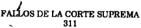
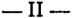
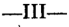
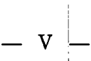
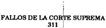
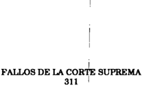
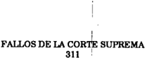
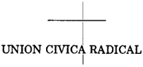
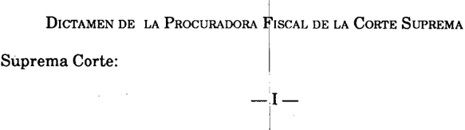

TOMO 311

Volumen 1

O(

.,

,.

"..

...

r~.

,,,'

FALLOS DE LA CORTE SUPREMA DE JUSTICIA DE LA NACION

REPUBLICA ARGENTINA

.. FALLOS

DE LA

SUPREMA

COR.TE

DE

## JUSTICIA DE LA NACION

PUBLICACION A CARGO DE LA SECRETARIA DE JURISPRUDENCIA DEL TRIBUNAL

TOMO 311-

VOLUMEN 1

ENERO -AGOSTO

LA LEY S.A.E. e l.

Tucumán 1471 (lOSO) Buenos Aires 1988

Copyright@ 1991 by Corte Suprema de Justicia de la Nación Queda hecho el depósito que previene la ley 11.723 Impreso en la Argentina

Printed in Argentina l. S. B. N. 950-527-087-9

## AÑO 1988

## FEBRERO. AGOSTO

## PROCURACION GENERAL. DESIGNACION DE PROCURADOR GENERAL SUSTITUTO.

-Nº 1-

En la Ciudad de Buenos Aires, a los 4 días del mes de febrero del año mil novecientos ochenta y ocho, reunidos en la Sala de Acuerdos del Tribunal, el señor Ministro Decano en ejercicio de la Presidencia doctor don Augusto César Juan Belluscio y los señores jueces doctores don Carlos Santiago Fayt y don Jorge Antonio Bacqué, con la asistencia del señor Procurador General de la Nación doctor don Andrés José D'Alessio,

## Consideraron:

Que por las razones expuestas por el señor Procurador General de la Nación en su presentación del día de la fecha,

## Acordaron:

Designar Procurador General sustituto entre los días 7 y 12 de febrero del corriente al señor Fiscal ante la Cámara Nacional de Apelaciones en lo Criminal y Correccional Federal doctor Luis Gabriel Moreno Ocampo (art. 5º de la ley 4162) ..

Todo lo cual dispusieron y mandaron, ordenando que se comunicase y registrase en el libro correspondiente, por ante mí, que doy fe.AUGUSTOÉSAR BELLUSCIO CARLOS C -S. FAYTJORGE AmoNIOBACQUÉ -ANDRÉs JOSED'ALEsslo -Eduardo D. Craviotto (Secretario).

## PODER JUDICIAL. SOLICITUD DE ANTICIPO DE PRESUPUESTO.

En Buenos Aires, a los 9 días del mes de febrero del año mil novecientos ochenta y ocho, reunidos en la Sala de Acuerdos del Tribunal el señor Presidente de la Corte Suprema de Justicia de la Nación, doctor don José Severo Caballero, el señor Ministro Decano doctor don Augusto César Belluscio y los señores Ministros doctores don Carlos Santiago Fayt y don Jorge Antonio Bacqué,

## Consideraron:

Que mediante Acordada N"38 de fecha 25 de noviembre último, esta Corte Suprema fIjó el Presupuesto de la Jurisdicción 05 - Poder Judicial de la Nación para el Ejercicio del corriente año, siendo comunicada al Poder Ejecutivo Nacional-por intermedio del señor Ministro de Educación y Justiciapara su remisión al Honorable Congreso.

Que según lo expresa la Subsecretaría de Administración (expte. N" 4556/88 de la Secretaría de Superintendencia Admnistrativa), los créditos de prórroga previstos en el arto 13 de la Ley de Contabilidad están prácticamente agotados, razón por la cual la citada dependencia procedió a requerir a la Dirección Nacional de Programación Presupuestaria de la Secretaría de Estado de Hacienda de la Nación un refuerzo ~n carácter de anticipo del Presupuesto para el año 1988de veinte millones de australes (A 20.000.000.-).

Que es menester solicitar al Poder Ejecutivo una inmediata solución, toda vez que la situación planteada entorpece a la administración de justicia, altera su normal funcionamiento y afecta el decoro del Poder Judicial.

## Resolvieron:

Requerir al Poder Ejecutivo, por intermedio de la Secretaría de Estado de Hacienda de la Nación, se sirva disponer con carácter de preferente atención un refuerzo de créditos --en concepto de anticipo del Presupuesto para el corriente ejercicio fInancierode veinte millones de australes (A 20.000.000.-). Comuníquese, asimismo al Ministerio de Edúcación y Justicia.

Todo lo cual dispusieron y mandaron, ordenando que se comunicase y registrase en el libro correspondiente, por ante mí, que doy fe. JosÉ SEVF..IlOBALLERO CA -AUGUSTO ÉSAR BELLUSCIOCARLOS . FATIC -S JORGE ANToNIOACQUt. B Eduardo D. Craviotto (Secretario).

## PODER JUDICIAL DE LA NACION. ASIGNACION PRESUPUESTARIA. AÑo 1988.

-Nº3-

En Buenos Aires, a los 18 días del mes de febrero de mil novecientos ochenta y ocho, reunidos en la Sala de Acuerdos del Tribunal el señor Presidente de la Corte Suprema de Justicia de la Nación, doctor don José Severo Caballero, el señor Ministro Decano doctor don Augusto César Belluscio y los señóres Ministros doctores don Carlos Santiago Fayt y don Jorge Antonio Bacqué,

Consideraron:

Que de acuerdo a lo prescripto por el arto 99 de la Constitución Nacional, esta Corte Suprema proyectó el presupuesto para el Poder Judicial de la Nación, correspondiente

al ejercicio 1988. En dicha oportunidad reiteró el padecimiento que data de anteriores períodos financieros, ocasionado por la insuficiencia de los recursos necesarios para revertir las graves carencias que afectan al servicio de justicia y señaló también que los requeridos eran necesarios para cumplir con dicho servicio en el marco de la separación de poderes que exige el sistema republicano de gobierno (Acordada Nº 38/87).

Que por nota emitida en el mes de enero ppdo. por la Dirección de Presupuesto de la Administración Nacional de la Secretaría de Hacienda, se comunica a este Poder que la asignación presupuestaria que se prevé incluir en el proyecto de presupuesto general para el ejercicio de 1988, elaborado por el Poder Ejecutivo Nacional, no contempla la totalidad de los créditos establecidos por este Tribunal, sino que lo fija en un nivel menor.

- Que las circunstancias reseñadas imponen a esta Corte, en su carácter de órgano supremo del Poder Judicial de la Nación, reiterar con el mayor énfasis, la provisión de los recursos mencionados que son indispensables para el cumplimiento de la misión de administrar justicia, aun dentro del marco de austeridad que reclama el gobierno nacional, y que fue tenido en cuenta al elaborarse"el presupuesto judicial.

Que, por las razones expuestas y en ejercicio del ineludible deber de velar por la permanente y eficaz prestación del servicio que le es inherente, el Tribunal formula una firme exhortación al Poder Ejecutivo Nacional, para que arbitre las medidas que permitan solventar los requerimientos de la Acordada Nº 38/87.

Por ello,

Acordaron:

1 º) Insistir en la necesidad de respetar los niveles crediticios fijados por la Acordada Nº 38/87, a efectos de no interferir el normal desenvolvimiento del servicio de justicia.

- 20) Comunicarlo al Poder Ejecutivo Nacional-por intermedio del señor Ministro de Educación y Justiciapara su remisión al Honorable Congreso Nacional. Asimismo ponerlo en conocimiento del señor Ministro de Economía.
- 30) Hacerlo saber a la Subsecretaría de Administración y a las Cámaras Nacionales y Federales de todo el país.

Todo lo cual dispusieron y mandaron, ordenando que se comunicase y registrase en el libro correspondiente, por ante mí doy fe. JosÉ SEVEROABAll.ERO AUGUSTO ÉSAR C -C BELLUSCIO CARLOS . FA YT --S JORGEmoNIO BACQUÉ. A Eduardo D. Craviotlo (Secretario).

CEDULAS DE NOTIFICACION. MODIFICACION DE FORMULARIO.

N' 4 \_

En Buenos Aires, a los 24 días del mes de febrero del año mil novecientos ochenta y ocho, reunidos en la Sala de Acuerdos del Tribunal el señor Presidente de la Corte

Suprema de Justicia deJa Nación, doctor don José Severo Caballero, el señor Ministro Decano doctor don Augusto César Belluscio y los señores Ministros doctores don Carlos Santiago Fayt y don Jorge Antonio Bacqué,

## Consideraron:

Que mediante Acordada 13, de fecha 9 de junio de 1987, este Tribunal aprobó el fonnulario de Mcédulade notificación" para todos los fueros nacionales y federales del país.

Que las evaluaciones practicadas hacen aconsejable introducir las necesarias adecuaciones tendientes a satisfacer las inquietudes profesionales dentro del marco de los objetivos perseguidos con el sistema implementado.

## Resolvieron:

1º) Agregar al punto 1º) de la' Acordada 13/87 -mmo último párrafoel texto siguiente:

"Dicho código de colores y letras podrá ser incorporado en los fonnularios preimpresos manualmente (mediante marcador o similar) y en una forma destacada que permita una fácil visualización~.

- 2º) Disponer que la confección del duplicado de "cédula de notificación" podrá realizarse en fonnulario preimpreso idéntico al original, pero con el código de letras en negro y sin la plancha donde se labra el acta de diligencia, o en fotocopiadel mismo sin color.

Todo lo cual dispusieron y mandaron, ordenando se comunicase y registrase en el libro correspondiente, por ante mí que doy fe. -Jost SEVEROABALLERO.GUSTO CtsAR C -AU BELLUSCIOCARLOS . FAYT --S JORGE A. BACQut. Eduardo D. Craviotto (Secretario).

## CORTE SUPREMA DE JUSTICIA. DESIGNACION DE SECRETARIO.

-Nº5-

En la Ciudad de Buenos Aires, a los 4 días del mes de marzo del año mil novecientos ochenta yocho, reunidos en la Sala de Acuerdos del Tribunal el señor Presidente de la Corte Suprema de Justicia de la Nación, doctor don José Severo Caballero, el señor Ministro Decano don Augusto César Belluscio y los señores Ministros doctores don Carlos Santiago Fayt, don Enrique Santiago Petracchi y don Jorge Antonio Bacqué,

## Acordaron:

Designar Secretario de la Corte Suprema de Justicia de la Nación en reemplazo del doctor Leopoldo Héctor SchifTrin, al doctor Rolando Edmundo Gialdino (L. E. 4.548.662 - Clase 1946).

9

Todo lo cual dispusieron y mandaron, ordenado que se comunicase y registrase en el libro correspondiente, por ante mí, que doy fe. Jost SEVERO CABALLEROAUGUSTO -CtsARBELLUSCIO CARLOS. FAYT--S ENRIQUEANTIAGO'rnAccmS PE JORGE ANToNIOACQut. B Eduardo D. Cravwtto (Secretario).

## CORTE SUPREMA DE JUSTICIA. REORGANIZACION DE LA DOTACION DEL PERSONAL LETRADO.

-Nº6-

En la Ciudad de Buenos Aires, a los 9 días del mes de marzo del año mil novecientos ochenta y ocho, reunidos en la Sala de Acuerdos del Tribunal el señor Presidente de la Corte Suprema de Justicia de la Nación doctor don José Severo Caballero, el señor Ministro Decano doctor don Augusto César Juan Belluscio y los señores Ministros doctores don Carlos Santiago Fayt, don Enrique Santiago Petracchi y don Jorge Antonio Bacqué, con la presencia del señor Procurador General de la Nación doctor don Andrés José D'Alessio,

Consideraron:

Que resulta oportuno reorganizar la dotación del personal letrado del Tribunal.

Por ello, en ejercicio de las facultades establecidas en los arts. '17 de la ley 16.432, 23 de la ley 17.928 y 3º de la ley 19.362,

## Acordaron:

- 1º) Disponer el traslado a la Corte Suprema de tres (3) cargos de SeCretarios Letrados de la Procuración General, con sus actuales titulares doctores Osvaldo Jesús Depaula, José Luis Monti y Federico Martín Malvárez.
- 2º) Efectuar la siguiente creación de cargos en la dotación de Magistrados y Funcionarios de la Procuración General de la Nación:

## + 2 Prosecretarios Letrados.

- 3º) Autorizar a la Subsecretaría de Administración a efectuar las modificaciones pertinentes en las respectivas dotaciones de personal y a liquidar -hasta tanto se efectúe la pertinente reestructuración presupuestariael gasto resultante de lo precedentemente dispuesto, con cargo a la Partida Principal 1199 "Crédito a Distribuir" para el corriente ejercicio financiero.

Todo lo cual dispusieron y mandaron, ordenando que se !Xlmunicase y registrase en el libro correspondiente, por ante mí, que doy fe. Jost SEVERO CABALLERO-- AUGUSTO CtsARBELLUSCIo--ARLOS . FAYI'C S ENRIQUE ANTIAGO TaAccm S PE JORGE ANToNIOACQutB ANnRts Jost D'A1.EssIO. Eduardo D. Cravwtto (Secretario).

## EXPEDIENTES: DISPOSICIONES SOBRE CONSULTA Y DESGLOSE DE DOCUMENTACION.

En la Ciudad de Buenos Aires, a los 22 días del mes de marzo del año mil novecientos ochenta y ocho, reunidos en la Sala de Acuerdos del Tribunal el señor Presidente de la Corte Suprema de Justicia de la Nación, doctor don José Severo Caballero, el señor Ministro Decano doctor don Augusto César Juan Belluscio y los señores Ministros doctores don Carlos Santiago Fayt, don Enrique Santiago Petracchi y don Jorge Antonio Bacqué,

## Consideraron:

Que el Colegio de Procuradores de la Ciudad de Buenos Aires efectúa una serie de peticiones que, después de consultadas las demás asociaciones profesionales, esta Corte estima prudente atender en la medida en que se coordinen con las opin.iones vertidas por dichas entidades y con las disposiciones legales vigentes.

## Resolvieron:

- 1 º) Recomendar a los tribunales nacionales con sede en la Capital Federal el estricto cumplimiento de lo establecido en el arto 3º de la acordada Nº 4/74 yen los arts. 3, 4 Y 5 de la acordada Nº 25/76. .
- 2º) Recordar asimismo la vigencia de lo establecido en el arto 120, tercer párrafo, segunda y tercera parte, del Código Procesal Civil'y Comercial.
- 3º) Disponer que el desglose y entrega de documentos, oficios, testimonios y cédulas para su diligenciamiento, deberá hacerse a los letrados o procuradores intervinientes, o bien a personas autorizadas por ellos en escrito, las que en su caso deberán acreditar debidamente su identidad.
- 4º) Establecer que la extracción de expedientes paralizados deberá ser realizada, a petición de las partes o profesionales intervinientes, o de profesionales que los soliciteh, sin limitaciones de horario dentro del fijado para la atención del público o de los profesionales, en su caso.
- 5º) Hacer saber que se deberá facilitar a los profesionales la obtención de fotocopias de los expedientes o piezas agregadas a ellos, con el debido control del personal de las oficinas, sin limitación horaria.

Todo lo cual dispusieron y mandaron, ordenando que se comunicase y registrase en el libro correspondiente, por ante mí, que doy fe. JosÉ SEVEROABALLEROAUGUSTO C -CÉSARF..LLUSCIOCARLOS . FA YT B -S ENRIQUE' ANTIAGO -rnAccm S PE -JORGE ANToNIOACQUÉ B Eduardo D. Craviotto (Secretario).

## PODERJUDICIAL. REMUNERACION DE REEMPLAZANTE.

-Nº8-

En la Ciudad de Buenos Aires, a los 22 días del mes de marzo del año mil novecientos ochenta y ocho, reunidos en la Sala de Acuerdos del Tribunal el señor Presidente de la Carie Suprema de Justicia de la Nación, doclor don José Severo Caballero, el señor Ministro Decano doclor don César Augusto Juan Belluscio y los señores Ministros doclores don Carlos Santiago Fayt, don Enrique Santiago Petracchi y don Jorge Anlonio Bacqué,

## Consideraron:

- 12) Que el arto 12 inc. ¡¡ del decrelo 5046/51 establece una gratificación para los integran les del Poder Judicial de la Nación que deban reemplazar en cargos de igual o superior jerarquía que aquel en que son titulares, pero subordina el pago a la exigencia -entre otros requisilosde que al titular no le corresponda liquidación de haberes.
- 22) Que de conformidad con la Qoctrina de Fallos 295:937, el propósito de afianzar la justicia que enuncia el Preámbulo de la Constitución Nacional y la garantía del arto 14 bis a una retribución justa, exigen la equivalencia de prestaciones recíprocas en el pago de salarios; y el hecho de que se trale de una relación de empIco público no allera la naturaleza de la prestación, que siempre es la de retribuir servicios prestados.
- 3º) Que en tal sentido y por tratarse de funciones efectivamente cumplidas por quienes reemplazan a otros en sus cargos, resulta contraria a la equidad la exigencia impuesta por el arto 1º, inc.!! del decrelo citado.

Por ello y en virtud de la facultad conferida a la Corte Suprema por el arto 99 de la Constitución Nacional.

Acordaron:

Disponer que la gratificación establecida por el decrelo Nº 5046/51 se abone aunque el titular a quien se reemplaza perciba haberes, de acuerdo con el principio de retribución justa consagrado constitucionalmente.

Todo lo cual dispusieron y mandaron, ordenando que se comunicase y registrase en el libro correspondiente, por anle mí, que doy fe. Jos~ SEVEROABALLERoAUGUSTO C -C~ARBELLUSCIOCARLOS . FAYT --S ENlUQUE ANTIAGO TRACClUJORGE ANToNIO ACQ~. S PE -B Eduardo D. CraviotúJ (Secretario).

## PODER JUDICIAL. ASIGNACION ESPECIAL POR DEDICACION EXCLUSIVA

## N' 9

En Buenos Aires, a los 22 días del mes de marzo del año mil novecientos ochenta y ocho, reunidos en la Sala de Acuerdos del Tribunal el señor Presidente de la Corte Suprema de Justicia de la Nación, doctor don José Severo Caballero, el señor Ministro Decano doctor don Augusto César Belluscio y los señores Ministros doctores don Carlos Santiago Fayt, don Enrique Santiago Petracchi y don Jorge Antonio Bacqué,

## Consideraron:

Que por decreto Nº 2474/85 el Poder Ejecutivo Nacional dispuso instituir una asignación especial no remunerativa en concepto de "dedicación exclusiva", para magistrados y funcionarios no comprendidos en el régimen de horario nñnimo que establezca esta Corte Suprema.

Que por acordadas N" 3, 4, 5 Y 16 del año 1986 se determinó a quiénes alcanzaba dicho beneficio, fijándose en la segunda de las nombradas los requisitos para su percepción aplicables a prosecretarios jefes, situación que por la ciiada en tercer término se extendió a los prosecreiarios adminisirativosy por la cuarta a los integrantes de los cuerpos técnicos periciales, con las condiciones a cubrir.

Que teniendo en cuenta que a la fecha este Tribunal ha evaluado y resucIto la totalidad de las presentaciones, se estima conveniente -a partir del día 15 de abril próximodelegar en las respectivas Cámaras Nacionales y Federales el control de las normas establecidas en las acordadas N'"' 4 Y 16.

## Resolvieron:

1º)Las cámaras nacionales y federales del país tendrán a su cargo -a partir del día 15 de abril próximoel cumplimiento de las normas fijadas por esta Carie Suprema en \_ sus acordadas N"'"'4 Y 16 de fechas 18 de febrero y 16 abril de 1986, respectivamente, para la percepción de la asignación especial que determina el decreto Nº 2474/85 para los funcionarios de su dependencia.

- 2º) Las actuaciones respectivas quedarán reservadas en las cámaras, las que deberán remitir --en forma directaa la Subsecretaría de Adminisiración la nómina de los agentes que se encuentran en condiciones de obtener tal asignación, que será abonada a partir del día de ingreso de esa comunicación en la citada dependencia o \_ en caso de que el acogimiento al beneficio sea posteriora partir de que ésie tenga lugar.

En ningún supuesto se reconocerán pagos retroactivos.

3º) Hacer saber a las cámaras nacionales y federales que es de su responsabilidad la adopción de las medidas que estimen corresponder para el estricto cumplimiento de los horarios fijados.

Todo lo cual dispusieron y mandaron, ordenando que se comunicase y registrase en el libro correspondiente, por ante mí que doy fe. José SEVEROABALLEROAUGUSTO C -

## DE JUSTICIA DE LA NACION

311

C~ BELLUSCIOCARLOS. FAYT -ENRIQUE SANTIAOOniAccm--S PE JOIlGE ANToNIOACQut. B -Eduardo D. Craviotto (Secretario).

## REGLAMENTO DE CALIFICACIONES PARA LOS OFICIALES NOTIFICADORES DE LA JUSTICIA NACIONAL Y FEDERAL. SU APROBACION.

-Nº10-

En Buenos Aires, a los veintidós días del mes de marzo del año mil novecientos ochenta yocho, reunidos en la Sala de Acuerdos del Tribunal el señor Presidente de la Corte Suprema de Justicia de la Nación, doctor don José Severo Caballero, el señor Vicepresidente doctor don Augusto César Belluscio y los señores Ministros doctores don Carlos Santiago Fayt, don Enrique Santiago Petracchi y don Jorge Antonio Bacqué,

## Consideraron:

Que este Tribunal considera conveniente dictar las normas que deben aplicarse para calificar a los oficiales notificadores de la Justicia Nacional y Federal.

Por ello, en ejercicio de las atribuciones conferidas por el arto 15 del decreto-ley 1285/58,

## Acordaron:

Aprobar el Reglamento de Calificaciones para los Oficiales notificadores de la Justicia Nacional y Federal, que forma parte integrante de esta acordada. Todo lo cual dispusieron y mandaron, ordenando se comunicase y registrase en el libro correspondiente, por ante mí, que doy fe. Jost SEVERO CABALLERO AUGUSTOtsARBELLUSCIO -C -CARLOS. FAYT S ENRIQUEANTlAOO EniACCHI S P ~ JOIlGE ANToNIOACQut. B -Eduardo D. Craviotto (Secretano)~

## REGLAMENTO DE CALIFICACIONES PARA WS OFICIALES NOTIFICADORES DE LA JUSTICIA NACIONAL Y FEDERAL

Articulo 19 La calificación deberá ser anual, comprendiendo el período 1º de octubre al 30 de septiembre.

Articulo 2 g -El personal será calificado por el jefe de Oficina previo dictamen del encargado del sector.

Articulo 3 g -La calificación definitiva deberá ser notificada en forma personal por el jefe de Oficina, siendo ésta susceptible de recurso de apelación ante la Corte Suprema de Justicia de la Nación, que deberá interponerse dentro de las 72 horas de notificado.

Articulo 4 g -A tales efectos se establece un formulario tipo denominado "Planilla de Calificaciones" (ver Anexo 1).

Articulo sg La calificación deberá efectuarse con el puntaje numérico de O a 10, en cada uno de los siguientes conceptos: a) Idoneidad; b) Asistencia y Puntualidad; c) Contracción al trabajo; d) Título y e) Antigüedad en la categoría.

Las calificaciones así obtenidas se sumarán y dividirán por cinco.

En cada concepto se tendrá en cuenta lo siguiente:

## A) Idoneidad

Comprende aspectos de cultura general y aplicación de la misma al deSEmpeño de su tarea, integrado por dos ítems:

- A.l) Nivel de conocimiento: Son los demostrados por el agente en el período, con relación a las tareas que se le hubieren asignado, su capacidad para entender eventuales problemas generales de las notificaciones y el espíritu de iniciativa qu(~ hubiera demostrado ante sus superiores.
- A.2) Adaptación al trabajo: Para su determinación se tendrá en cuenta In forma en que el empleado asimiló las instrucciones e indicaciones impartidas por sus superiores y el criterio para encarar los distintos trabajos en los que diariamente interviene.

## B) Asistencia y puntualidad

Las tres primeras inasistencias por motivos particulares computables durante el período de calificación no se tendrán en cuenta para la misma. A partir de la cuarta se descontará de la calificación máxima en este concepto 1 punto por cada ausencia.

El mismo criterio y procedimiento se aplicará con respecto a las faltas de puntualidad, con la salvedad de que el descuento será de 1/2 punto por cada falta.

## C) Contracción al trabajo

Comprende los siguientes íteros:

C.l) Concentración en sus tareas: Se tendrá en cuenta la aplicación a sus tareas y la continuidad en la misma.

- C.2) Cooperación: Se tendrá en consideración el afán de colaboración demostrado en el período por el agente respecto de sus superiores como de sus propios compañeros.

## C.3) Rendimiento: Calidad y cantidad de las tareas que realiza el empleado.

## D) Título

Se computará un punt:o por estudios universitarios con doce materias del plan oficial aprobadas en las carrera-s de abogacía, notariado o procuración, y cinco puntos por título universitario en dichas carreras.

Si el empleado efectuare cursos de capacitación específicos sobre notilicaciones, dictados con el auspicio de la Asociación de Magistrados y Funcionarios de la Justicia Nacional o por universidades nacionales o privadas, anualmente éstos se computarán con tres puntos en total.

## E) Antigüedad

Se computará medio punto al 1º de octubre, por cada año de servicio -titular o interino-o fracción mayor de seis meses en la categoría que revista, hasta un máximo de seis puntos, y 114 punto por año de antigüed,ad en la Justicia Nacional.

Artlculo 6º -Afin de establecer el orden de méritos en la misma categoría y en el supuesto de igualdad de puntos, serán consideradas las medidas disciplinarias que consten en el legajo personal de los candidatos. En caso de que no pudiese establecerse la prioridad por este criterio se tendrá en cuenta la antigüedad en la Justicia Nacional.

Artlculo 7º Al promedio de calificación anual le serán descontadas las sanciones disciplinarias de acuerdo a los siguientes criterios:

Por apercibimiento

Por multa

Por suspensión

4 (cuatro) puntos.

6 (seis) puntos.

10 (diez) puntos.

A los efectos de esta reducción, se tomarán en cuenta las sanciones impuestas en los dos años anteriores a la fecha de la calificación, tomándose a tal efecto la fecha en que cada resolución haya quedado firme.

## COLEGIO PUBLICO DE ABOGADOS DE LA CAPITAL FEDERAL. ELECCIONES, DIA DECLARADO INHABIL.

-Nºl1-

En la ciudad de Buenos Aires, a los 24 días del mes de marzo del año mil novecientos ochenta y ocho, reunidos en la Sala de Acuerdos del Tribunal el señor Presidente de la Corte Suprema de Justicia de la Nación, doctor don José Severo Caballero, el señor Ministro Decano doctor don Augusto César Belluscio y los señores Ministros doctores don Carlos Santiago Fayt, don Enrique Santiago Petracchi y don Jorge Antonio Bacqué,

## Consideraron:

Que el día martes 19 de abril próximo se celebrarán las elecciones para designar las autoridades del Colegio Público de Abogados de la Capital Federal, en el horario comprendido entre las 8 y 18 horas.

Por ello,

Acordaron:

Declarar el día 19 de abril del corriente, inhábil para los tribunales de la Capital Federal, sin perjuicio de la validez de los actos procesales que se cumplan, no actuados en rebeldía.

Todo lo cual dispusieron y mandaron, ordenado se comunicase y registrase en el libro correspondiente, por ante mí, que doy fe. Jost SEVEROABALLERo.AUGUSTO tsAB C -C BELLUSCIO CARLOS. FAYT --ENRIQUE SANTIAGO !mlAcCHI P JORGE ANToNIO BACQUJ!. \_ Eduardo D. Cravwttc (Secretario).

## OBRA SOCIAL. MODIFICACION DE ACORDADA 40/87.

-Nº12-

En Buenos Aires, a los 24 días del mes de marzo del año mil novecientos ochenta y ocho, reunidos en la Sala de Acuerdos del Tribunal el señor Presidente de la Corte Suprema de Justicia de la Nación, doctor don José Severo Caballero, el señor Ministro 'Decano doctor don Augusto César Belluscio y los señores Ministros doctores don Carlos Santiago Fayt, don Enrique Santiago Petracchi y don Jorge Antonio Bacqué,

## Consideraron:

Que resulta conveniente modificar la fecha de entrada en vigencia de la Acordada nº 40/87.

## Acordaron:

Disponer que lo resuelto en los puntos 1º, 2º y 3º de la Acordada nº 40/87 se haga efectivo a partir del 1º de mayo de este año.

Todo lo cual dispusieron y mandaron, ordenando se comunicase y registrase en el libro correspondiente, por ante mí, que doy fe. Jost SEVEROABALLEROAUGUSTO tsAR C -C BELLUSCIO CARLOS. FAYT--S ENRIQUE. P!mlACCHI S -JORGE ANToNIOACQUJ!. B \_ Eduardo D. Craviotto (Secretario).

## OBRA SOCIAL. DESIGNACION DE COMISION MEDICA.

-Nº13-

En Buenos Aires, a los 29 días del mes de marzo del año mil novecientos ochenta y ocho, reunidos en la Sala de Acuerdos del Tribunal el señor Presidente de la Corte Suprema de Justicia de la Nación, don José Severo Caballero, el señor Vicepresidente doctor don Augusto César Belluscio y los señores Ministros doctores don Carlos Santiago Fayt, don Enrique Santiago Petracchi y don Jorge Antonio Bacqué,

## Consideraron:

1 2 ) Que por acordada Nº 40/87 de fecha 10 de diciembre del año último este Tribunal autorizó a la Obra Social del Poder Judicial de la N ación a denunciar el convenio firmado con el Instituto Nacional de Servic;:iosSociales para Jubilados y Pensionados a partir del

1° de febrero de 1988 y a la Subsecretaría de Administración a no efectuar la retención de los aportes establecidos en el arto 8 incs. a) y b) de la ley 19.032, modificado por la ley 22.954.

- 20) Que corresponde proceder a la reorganización de la prestación de los servicios de la citada Obra, así como el ajuste de los aranceles correspondientes, previendo la posibilidad de establecer una auditoría médica permanente que supervise las órdenes que den los facultativos.
- 3°) Que con tal fin este Tribunal estima conveniente que el señor interventor designe una Comisión Médica que efectúe los estudios correspondientes y posteriormente eleve sus conclusiones a consideración de la Corte.

Por ello,

Acordaron:

Autorizar al señor Interventor de la Obra Social del Poder Judicial de la Nación para que designe la Comisión Médica integrada por el señor Decano del Cuerpo Médico Forense de la Justicia Nacional, el señor Jefe del Servicio de Reconocimientos Médicos, yel señor Director Médico de la Obra Social, a los fines consignados en los considerandos precedentes.

Todo lo cual dispusieron y mandaron, ordenando que se comunicase y registrase en el libro correspondiente, por ante mí, que doy fe. Jost SEVEROABALLEROAUGUSTO C -C~ARBELLUSClO CARLOS. FAYT --S ENRIQUEANTIAGO E'ffiACCIll J OBOEmoNIOBACQut. S P -A -Eduardo D. Craviotto (Secretario).

## CONSULTORIOJURIDICOGRATUITO. REGISTRO DEFIRMAS.

-Nº14-

En la ciudad de Buenos Aires, a los 5 días del mes de abril del año mil novecientos ochenta y ocho, reunidos en la Sala de Acuerdos del Tribunal el señor Presidente de la Corte Suprema de Justicia de la Nación doctor don José Severo Caballero, el señor Ministro Decano doctor don Augusto César Juan Belluscio y los señores Ministros doctores don Carlos Santiago Fayt, don Enrique Santiago Petracchi y don Jorge Antonio Bacqué,

## Consideraron:

Que en virtud de lo dispuesto por el arto 56 de la ley 23.187 el Colegio Público de Abogados dictó el Reglamento del Consultorio Jurídico Gratuito.

Que según lo dispuesto en su arto 17 el jefe del citado consultorio expedirá en cada caso un certificado al abogado designado y, a ese solo fin, procede que registre su firma en los tribunales.

Por ello,

Acordaron:

19) Hacer saber a las cámaras de apelaciones de los fueros de la Capital Fe.deral que deberán reglamentar ante qué autoridad de su jurisdicción procederá efectuar el registro de la firma por parte del señor Jefe del Consultorio Jurfdico Gratuito, a los fines previstos por el arto 57 de la ley 23.187 y 17 del Reglamento dictado por el Colegio Público de Abogados; y comunicar lo resuelto a esa institución y a esta Corte Suprema.

2º) Disponer que en este Tribunal tal diligencia se cumplirá ante la Prosecretarfa de la Corte Suprema.

Todo lo cual dispusieron y mandaron, ordenando que se comunicase y registrase en ~llibro correspondiente, por ante mí, que doy fe. -JosÉ SEVEROABALLERO UGUSTOCF.8AR C -A BELLUSClO CARLOS . FAY'r--S ENRIQUEANTIAGOTRACcm JORGE ANToNIOACQUlt. S PE -B Eduardo D. Crauiotto (Secretario).

## PODERJUDICIAL.REGIMENDECONCESIONDELICENCIAB.

-Nº15-

En la Ciudad de Buenos Aires, a los 7 días del mes de abril del año mil novecientos ochenta y ocho, reunidos en la Sala de Acuerdos del Tribunal, el Señor Presidente de la Corte Suprema de Justicia de la Nación, doctor don José Severo Caballero, el señor Ministro Decano doctor don Augusto César Juan Belluscio y los señores Ministros doctores don Carlos Santiago Fayt, don Enrique Santiago Petracchi y don Jorge Antonio Bacqué,

## Consideraron:

Que mediante acordada del Tribunal Nº 34 del 27 de diciembre de 1977 se estableció el régimen de licencias actualmente vigente para magistrados, funcionarios, empleados, personal obrero y de maestranza y de servicio, contratado o permanente, de la Justicia Nacional.

Que con fecha 18 de junio de 1985 se dictó la acordada Nº 33185 aclaránd.ose el inc. b del arto 2º de dicho régimen en el sentido de que los Secretarios de Superintendencia decidirán las solicitudes de licencias de los funcionarios y personal de su dependencia de acuerdo a la competencia oportunamente otorgada por acordada Nº 25/84.

Que la práctica ha demostrado que la aplicación de esta media no es conveniente, puesto que representa una sobrecarga de tareas para los funcionarios mencionados en el considerando anterior, motivo por el cual es preciso delegar estas funciones para dar solución al problema planteado y al mismo tiempo agilizar el trámite que se origina ante los pedidos de licencias del personal de las distintas dependencias de e,sta Corte Suprema.

## Acordaron:

- 1º) Asignar a los funcionarios que tienen a su cargo las direcciones y jefaturas de los citados organismos la firma y el oontrol de las licencias que no excedan de los treinta (30) días y se otorguen al personal que de ellos depende, además de las comprendidas en los arts. 14 y 20 del régimen en vigencia.
- 2º)Asignar a los Secretarios Letrados de las Secretarías de Superintendencia del Tribunal la firma y el control -de las licencias de los agentes de los organismos dependientes de la Corte Suprema, cuando los pedidos excedan de los treinta (30) días y no se trate del caso de los arts. 14 y 20.
- 3º) Los funcionarios a que se refiere el arto 1º arbitrarán las medidas pertinentes para el oontrol efectivo de las licencias que conceden de conformidad con las disposiciones vigentes y elevarán a las Secretarías de Superintendencia de esta Corte, mensualmente, fotocopia de las respectivas resoluciones y en forma trimestral, un informe inherente al número y carácter de las licencias concedidas, y agentes en ellas comprendidos, con la aclaración de si son reiteración de anteriores.

4º) Las disposiciones de la presente aoordada comenzarán a aplicarse a partir del día 15 del corriente mes.

Todo lo cual dispusieron y mandaron, ordenando que se comunicase y registrase en el libro correspondiente, por ante mí, que doy fe. Jost SEVERO CABALI.F..RO AUGUSTO -CtsARBEI.I.USCIO CARI.OS. FAYT --S ENRIQUEANTIAGOTRACCIUJORGE ANToNIO BACQut. S PE -Eduardo D. Craviotto (Secretario).

## CORTE SUPREMA DE JUSTICIA. SUSTITUCION DE LA DESIGNACIONDEMINISTRODECANO.

-Nºl6-

En la Ciudad de Buenos Aires, a los 19 días del mes de abril del año mil novecientos ochenta y ocho, reunidos en la Sala de Acuerdos del Tribunal, el Señor Presidente de la Corte Suprema de Justicia de la Nación, doctor don José Severo Caballero, el señor Ministro Decano doctor don Augusto César Belluscio y los señores Ministros doctores don Carlos Santiago Fayt, don Enrique Santiago Petracchi y don Jorge Antonio Bacqué y con la asistencia del Señor Procurador General de la Nación doctor don Andrés José D'A1essio,

## Consideraron:

Que atento el carácter electivo 'conferido al cargo de Ministro que sustituye en primer término al señor Presidente del Tribunal, por acordada Nº 14/85 (modificatoria del arto 79 del R.J.N.),

## Acordaron:

Sustituir la designación de Ministro Decano por la de Vicepresidente de la Corte Suprema en los arts. 79, 87 Y 87 bis del Reglamento para la Justicia Nacional.

Todo lo cual dispusieron y mandaron, ordenando que se comunicase y registrase en el libro correspondiente, por ante mí, que doy fe. JOSÉSEVEROABALLEROAUGUSTO C -CÉSAR BELLUSCIO CARLOS. FAYT --S ENRIQUE SANTIAGOTaACCHI-JORGE ANTONIOACQut PE B -ÁNDRtsJost D'ÁLEssIO. Eduardo D. Craviotto (Secretario).

## CORTE SUPREMA DEJUSTICIA ELECCIONDE PRESIDEN'I'E y VICEPRESIDENTE.

## -Nº 17-

En la Ciudad de Buenos Aires, a los 19 días del mes de abril del año mil novecientos ochenta y ocho, reunidos en la Sala de AcUerdos del Tri.bunal, los señores Jueces doctores, don José Severo Caballero, don Augu!lto César Belluscio, don Carlos Santiago Fayt, don Enrique Santiago Petracchi y don Jorge Antonio Bacqué con asistencia del Señor Procurador General de la Nación doctor don Andrés José D'Alessio, a los fines de proceder a la elección de Presidente y Vicepresidente de la Corte Suprema de Justicia de la Nación, con alTeglo a lo dispuesto por el arto 79 R.J.No (texto según acordadas de Fallos 249:212 y 16 del día de la fecha) y previo intercambio de ideas, consignaron su voto como se expresa a continuación:

Los doctores José Severo Caballero -y Carlos Santiago Fayt, por la continuidad de las actuales autoridades.

El doctor Augusto César Belluscio propicia como Presidente al doctor don José Severo Caballero y como Vicepresidente al doctor don EnriqUE' Santiago Petracchi.

El doctor Enrique Santiago Petracchi propone como Presidente al doctor don Jorge Antonio Bacqué, y como Vicepresidente al doctor don Augusto César Belluscio.

El doctor Jorge Antonio Bacqué vota por el doctor don Enrique Santiago Petracchi como Presidente y. por el doctor don Augusto César Belluscio como Vicepresidente.

Por lo expuesto,

Acordaron: Designar Presidente y Vicepresidente de la Corte Suprema de Justicia de la Nación a los doctores don José Severo Caballero y don Augusto César Belluscio, respectivamente.

Todo lo cual dispusieron y mandaron, ordenando que se comunicase y registrase en el libro correspondiente, por ante mí, que doy fe. -Jost SEVEROABALLERO AUGUSTO ÉSAR C -C BELLUSCIO CARLOS. FAYT--ENRIQUE SANTIAGO ETaAccm °P JORGEÁNTONIOACQut B -ÁNDRtsJost D'ÁLEssIOEduardo D. Craviotto (Secretario).

## PROCURACIONGENERAL. DESIGNACION DEPROCURADOR GENERAL SUSTITUTO.

## -Nº18-

En la Ciudad de Buenos Aires, a los 19 díll,S del mes de abril del año mil novecientos ochenta y ocho, reunidos en la Sala de Acuerdos del Tribunal, el Señor Presidente de la Corte Suprema de Justicia de la Nación, doctor don José Severo Caballero, el señor Ministro Decano doctor don Augusto César Belluscio y los señores Ministros doctores don Carlos Santiago Fayt, don Enrique Santiago Petracchi y don Jorge Antonio Bacqué,

## Consideraron:

Que por las razones expuestas por el Señor Procurador General de la Nación en su presentación de fecha 11 de abril próximo pasado;

## Acordaron:

Designar Procurador General sustituto entre los días 27 de abril y 10 de mayo del comente al señor Procurador Fiscal ante la Corte Suprema de Justicia de la Nación doctor don Jaime Malamud Goti (art. 5º de la ley 4162).

Todo lo cual dispusieron y mandaron, ordenando que se comunicase y registrase en el libro correspondiente, por ante mí, que doy fe. -JosÉ SEVF.RO ABALLERO UGUSTOCÉSAR C -A BELLUSCIOCARLOS . FAYT- ENRIQUE ANTIAGOn!ACCIIT JORGE ANToNIOACQUÉ. -S S PE -B Eduardo D. Craviotto (Secretario).

## ACORDADA 30/87: ACLARACION.

-Nº19-

En la Ciudad de Buenos Aires, a los tres días del mes de mayo del año mil novecientos ochenta y ocho, reunidos en' la Sala de Acuerdos del Tribunal, el Señor Pre-sidente de la Corte Suprema de Justicia de la Nación, doctor don José Severo Caballero, el señor Vicepresidente doctor don Augusto César Belluscio y los señores Jueces doctores don Carlos Santiago Fayt, don Enrique Santiago Petracchi y don Jorge Antonio Bacqué,

## Acordaron:

Aclarar la acordada Nº 30/87 en el sentido de que al mantener la obligatoriedad del concur,¡o para la provisión de los cargos equivalentes a Secretario de Juzgado en los tribunales inferiores, incluye a los Secretarios de los Ministerios Públicos y Defensorías oficiales.

Todo lo cual dispusieron y mandaron, ordenando que se registrase y comunicase, por ante mí, que doy fe.J~É SEVEROABALLEROAUGUSTO ÉSAR B~=USCIO C -C CARLOS. S FAYTENRIQUE SANTIAGO En!Accm P JORGEANToNIO BACQUÉ.Eduardo D.CravÍDtÚJ (Secretario).

## ACUERDOS DE LA CORTE SUPREMA 311

## EMPLEADOS JUDICIALES. DESIGNACION, PAGO DE HORAS EXTRAS Y "LEGITIMO ABONO".

-Nq 20-

En la Ciudad de Buenos Aires, a los 5 días del mes de mayo del año mil novecientos ochenta y ocho, reunidos en la Sala de Acuerdos del Tribunal, el Señor Presidlente de la Corte Suprema de Justicia de la Nación, doctor don José Severo Caballero, y los St!ñores Ministros doctores don Augusto César Belluscio, don Carlos Santiago Fayt, don Enrique Santiago Petracchi y don Jorge Antonio Bacqué,

## Consideraron:

Que respecto de las cuestiones relativas al personal de los diversos tribunales y organismos de la justicia nacional y federal, resulta conveniente reiterarla vigencia de las distintas disposiciones dictadas por la Corte Suprema en ejercicio de sus facultades de superintendencia.

Por ello,

Acordaron:

- 1º) Recordar la vigencia de la acordada 4/80 (Fallos 302:7), que dispon,~ que los pedidos de nuevo personal deberán ser remitidos únicamente durante el mes de junio de cada año. ,
- 29) Reiterar que en los casos de pedidos de designación de agentes en calidad de "suplentes" y sus prórrogas, es requisito indispensable la previa autonzs\ción del Tribunal, sin la cual el agente no podrá ser puesto en funciones (Confr. acordada 2181; Fallos: 303:6).
- 3º) Hacer saber que de acuerdo a la resolución 1093181 no procede autorizar la prestación de servicios con anterioridad a la fecha de la designación, pues los haberes pertinentes sólo se liquidan a partir de ésta.
- 4º) Comunicar que no procede el pago de horas extraordinarias que 110 estén previamente autorizadas y con la debida fundamentación de su necesidad (Confr. proveído de fecha 5-6-87).
- 5º) Insistir en que no se abonarán sumas en concepto de "legítimo abono" a contratados que hayan comenzado a prestar servicios sin previa autorizadón del Tribunal, o prorroguen sus tareas sin la pertinente renovación del contrato.
- 6º) Hacer saber que en el caso de que se proceda a poner en funciones a empleados en contravención conlo dispuesto en los considerandos 'ZI, 3º, 4ºy 59 de la presentE!se hará responsable al proponente y si existe violación a lo dispuesto no se reconocerán pagos de "legítimo abono".

.Todo lo cual dispusieron y mandaron, ordenando que se comunicase y registrase en el libro correspondiente, por ante mí, que doy fe. -Jost SEVEROABALLER. UGUSTOCtsAR C -A BELLUSCIO -CARLOS S. FAYTENRIQUE SANTIAGO E-raACCHI P -JORGEANToNIO BACQUl!: Eduardo D. Craviotto (Secretario).

## HONRAS DISPUESTAS POR EL FALLECIMIENTO DEL EX PRESIDENTE DE LA CORTE SUPREMA DR. EDUARDO A. ORTIZ BASUALDO.

-Nº 21-

En Buenos Aires, a los 10 días del mes de mayo del año mil novecientos ochenta y ocho, reunidos en la Sala de Acuerdos del Tribunal el señor Presidente de la Corte Suprema de Justicia de la Nación, doctor don José Severo Caballero, el señor Vicepresidente doctor don Augusto César Belluscio y los señores Ministros doctores don Carlos Santiago Fayt, don Enrique Santiago Petracchi y don Jorge Antonio Bacqué,

Consideraron:

Que en el día 7 del corriente ha oCurrido el sensible fallecimiento del Dr. Eduardo A. OrUz Basualdo, ex-Presidente de la Corte Suprema.

Que al recibir la luctuosa noticia, el Tribunal estimó su deber asociarse al duelo que provoca la desaparición de esta distinguida personalidad y por ello decidió enviar una ofrenda floral é incluir su nombre en las tablas de honor de la Corte Suprema,

Acordaron:

Dejar constancia de los actos de adhesión al duelo realizado y dirigir nota de condolencia a la familia del extinto.

Todo lo cual dispusieron y mandaron, ordenando se comunicase y registrase en el, libro correspondiente, por ante mí, que doy fe. Jost SEVEROABALI.!'.RO AUGUSTO ÉSAR C -C BELLUSCIO -CARI.OS S. FAYTENRIQUE SANTIAGO E-raACCHI P -JORGEANToNIO BACQUl!:. Eduardo D. Craviotto (Secretario).

## PROCURACION GENERAL. PRORROGA DE DESIGNACION DE PROCURADOR GENERAL SUSTITUTO.

-Nº 22-

En la Ciudad de Buenos Aires, a los 12 días del mes de mayo del año mil novecientos ochenta y ocho, reunidos en la Sala de Acuerdos del Tribunal el señor Presidente de la Corte Suprema de Justicia de la Nación, doctor Don José Severo Caballero, el señor Ministro Decano doctor don Augusto César Belluscio y los señores Ministros doctores don Carlos Santiago Fayt, don Enrique Santiago Petracchi y don Jorge Antonio Bacqué,

Consideraron:

Que por las razones expuestas por el Señor Procurador General de la Nación,

Acordaron:

Prorrogar la designación como Procurador General sustituto hasta I~l 13 del corriente mes al señor Procurador Fiscal ante la Corte Suprema de Justicia de la Nación doctor Jaime Malamud Goti (art. 52 de la ley 4162).

Todo lo cual dispusieron y mandaron, ordenando que. se comunicase y regiistrase en el libro correspondiente, por ante mí, que doy fe. -Jos!! SEVEROAB...ill:Ro AuG'uSTOCl!sAR C -BELLUSCIO -CARLOS S. FAYTENRIQUE SANTIAGO 'ETRACCHI JORGEANroNlOBACQul! 1 -Eduardo D. Crauiotto (Secretario).

## CORTE SUPREMA DE JUSTICIA. DESIGNACION DE SECRETARIO DE SUPERINTENDENCIA ADMINISTRATIVA.

-Nº23-

En Buenos Aires, a los 19 días del mes de mayo del año mil novecientos Clchenta y ocho, reunidos en la Sala de Acuerdos del Tribunal el señor Presidente de la Corte Suprema de Justicia de la Nación, doctor don José Severo Caballero, y loe señores Jueces doctores don Augusto César Belluscio, don Carlos Santiago Fayt, don Enrique Santiago Petracchi y don Jorge Antonio Bacqué,

Acordaron:

Designar Secretario de Superintendencia Administrativa de la Corte Suprema de Justicia de la Nación, al doctor Hugo Luis Mauro Piacentino (L. E. Nº 4.523.7H7 -clase 1945).

Todo lo cual dispusieron y mandaron, ordenando que se comunicase y regi!itrase en el libro correspondiente, por ante mí, que doy fe. Jos!! SEVEROABALLEROAUGUSTO C -Cl!sAR BELLUSCIO CARLOS. FAYT --S ENRIQUEAN'I'lAGo ETllAccm S P JORGE ANroNlCl ACQul!. B Eduardo D. Crauiotto (Secretario).

## FERIA JUDICIAL DE JULIO.

-Nº 24-

En Buenos Aires, a los 31 días del mes de mayo del año mil novecientos ochenta y ocho, reunidos en la Sala de Acuerdos del Tribunal el señor Presidente de la Corte

## DE JUSTICIA DE LA NACION 311

Suprema de Justicia de la Nación, doctor don José Severo Caballero, y los señores Jueces doctores don Augusto César Belluscio, don Carlos Santiago Fayt, don Enrique Santiago Petracchi y don Jorge Antonio Bacqué,

## Resolvieron:

1º) Disponer en el comente año feriado judicial para los Tribunales nacionales de la Capital desde el día 11 hasta el 22 julio, ambos inclusive. .

2º) Hacer saber a las Cámaras Federales de Apelaciones que con arreglo a lo previsto en la acordada Nº 53/73 -respecto de la coincidencia de la feria en ella establecida con las vacaciones escolaresy a lo dispuesto en la presente, deberán determinar para sus respectivas jurisdicciones un feriado judiciál de diez días hábiles (acá pite 2º de la Acordada Nº 30/84).

Todo lo cual dispusieron y mandaron, ordenando que se comunicase y rcgistrase cn el libro correspondiente, por ante mí, que doy fe. Jost SEVEROABALLERO UGUSTOCtsAR C -A BELLUSCIO -CARLOS S. FAYTENRIQUE SANTIAGO !mtACCHI P JORGEANToNIO BACQut Eduardo D. Craviolto (Secretario).

## CAMARAS NACIONALES DE APELACIONES. CONCURSOS. ACLARACION DE ACORDADA 34/84

-Nº 25-

En la Ciudad de Buenos Aires, a los 9 días del mes de junio del año mil novecicntos ochenta y ocho, reunidos en la Sala de Acuerdos del Tribunal el señor Presidente de la Corte Suprema de Justicia de la Nación, doctor don José Severo Caballero y los señor~s Jueces doctores don Augusto César Belluscio, don Carlos Santiago Fayt, don Enrique Santiago Petracchi y don Jorge Antonio Bacqué,

## Consideraron:

Que se han planteado dudas, relativas a la aplicación del sistema de concursos impuesto por la acordada 34/84 y sus modificatorias, en lo que se refiere al lugar en que debe llevarse a cabo el concurso, que resulta conveniente aclarar y prevenir.

## Acordaron:

Aclarar que en el interior del país, para cubrir los cargos de Secretario de Juzgado o sus equivalentes (acordada 30/87), como así también los de los médicos de cámara y bibliotecarios, los concursos deben realizarse en el lugar donde se ha producido la vacante.

Todo lo cual dispusieron y mandaron, ordenando que se comunicase y registrase en el libro correspondiente, por ante mí, que doy fe.-Jost SEVEROARALLERO AUGUSTO tsAR C -C BELLUSCIO \_ CARLOS S. FAYT-ENRIQUE SANTIAGO !mtACCHI P JORGEANToNIO BACQut EDUARDO D. CIlAVlorro (SECRETARIO).

## ACUERDOS DE LA CORTE SUPREMA 311

## COMISION LIQUIDADORA DEL PODER JUDICIAL DE LA NACION. PROYECTO DE REGLAMENTO INTERNO.

-Nº 26-

En Buenos Aires, a los 9 días del mes de junio del año mil novecientos ochenta y ocho, reunidos en la Sala de Acuerdos del Tribunal el señor Presidente de la Corte Suprema de Justicia de la Nación, doctor don José Severo Caballero, el señor Vicepresidente, doctor don Augusto César Belluscio y los señores Ministros doctores don Enrique Santiago Petracchi y don Jorge Antonio Bacqué,

## Consideraron:

Que resultan atendibles los motivos expuestos por la Comisión Liquidadora del Poder Judicial de la Nación, con relación al plazo de presentación del proyecto de reglamento interno y al régimen de su integración en el supuesto de vacancia de algún vocal,

## Acordaron:

1º) Ampliar a sesenta (60) días hábiles -a contar de la presenteel plazo rljado en el artículo 2°) de la Acordada de esta Corte Suprema Nº 33 de fecha 20 de octubre de 1987.

- 2°) Sustituir el texto del artículo 4º del Reglamento de la Comisión Liquidadora (Ley Nº 12.910), aprobado mediante Acordada Nº 33/87, por el siguiente: "El Secretario integrará la Comisión Liquidadora en caso de "recusación o excusación e interinamente en el supuesto de licencia o vacancia de algún vocal".

Todo lo cual dispusieron y mandaron, ordenando que se comunicase y registrase en el libro correspondiente, por ante mí que doy fe.-Jost SEVEROABALLEROUGUSTOCtSAR C -A BELWSCIO ENRIQUESANTIAGOETRACCIII P -JORGEANTONIO"ACQtJÉ B Húgo L. M. Piacentino. (Secretario).

## FERIA JUDICIAL DE JULIO. DESIGNACION DE AUTORIDADES.

-Nº 27\_

En la ciudad de Buenos Aires, a los 28 días del mes de ju nio del año mil novecientos ochenta y ocho, reunidos en la Sala de Acuerdos del Tribunal, el señor Presidente de la Corte Suprema de Justicia de la Nación, doctor don José Severo Caballero, ylos señores Jueces doctores, don Augusto C. J. Belluscio, don Carlos Santiago Fayt, don Enrique S. Petracchi y don Jorge A. Bacqué, con el objeto de nombrar jueces de feria en la Corte Suprema para el mes dejulio del corriente año, con arreglo a lo dispuesto porcl artículo 75 del Reglamento para la Justicia'Nacional y a los funcionarios de los Ministerios Públicos,

Resolvieron designar:

- 1º) Al Doctor José Severo Caballero -la. semanay al Dr. Jorge Antonio Bacqué -2a. semana-, como jueces de feria de la Corte Suprema.
- 2º) A la Doctora María Graciela Reiriz a cargo de la Procuración General de la Nación.
- 3º) Al Doctor Carlos A. Tavares titular de la Defensoría ante la Corte Suprema y demás TribuOliles Federales de la Capital.
- 4º) A los Doctores Juan Carlos Manzanares y Hugo Galmarini como Secretarios, la primera y segunda semana, respectivamente; y al Dr. Eduardo D. Craviotlo Secretario de Superintendencia Judicial.
- 5º) Establecer el horario de atención al público de lunes a viernes, desde las 9 hasta las 13 horas.
- 6º) El personal que preste funciones durante las ferias judiciales deberá acreditarlo mediante certificación otorgada por los Señores Secretarios de Feria.

Todo lo cual dispusieron y mandaron, ordenando que se registrase y comunicase en el libro correspondiente, por ante mí, que doy fe.JosÉ SEVJo:JlOBALLERO AUGUSTO CA -CÉSAR BELLUSCIOCARLOS . FAYr--S ENRIQUE ANTIAGOTRACCHl- JORGE ANToNIOACQUÉ S PE B Eduardo D. Craviolto (Secretario) ,

## CAMARA FEDERAL DE APELACIONES DE POSADAS. JURAMENTO DE SUS INTEGRANTES.

-Nº28-

En la Ciudad de Buenos Aires, a los 5 días del mes de julio del año mil novecientos ochenta y ocho, reunidos en la Sala de Acuerdos del Tribunal, el señor Presidente de la Corte Suprema de Justicia de la Nación doctor don José Severo Caballero y los señores Jueces doctores don Augusto César Juan Belluscio, don Carlos Santiago Fayt, don Enrique Santiago Petracchi y don Jorge Antonio Bacqué,

Consideración:

Que por ley Nº 23.138 se creó la Cámara Federal de Apelaciones con asiento en la Ciudad de Posadas.

Que resultando necesario recibir juramento de ley a los integrantes ' del nuevo órgano jurisdiccional y en atención a la trascendencia del acto, se estima conveniente la constitución del Sr. Vicepresidente de este Tribunal en el asiento de aquél.

## Resolvieron:

Que el señor Vicepresidente de la Corte Suprema de Justicia de la Nación, Dr. Augusto C. J. Belluscio se constituya en la Ciudad de Posadas para que proceda a recibir el juramento de ley a los señores magistrados y funcionarios de la mencionada jurisdicción, fijándose como fecha de habilitación el día 7 del corriente mes y año.

Todo lo cual dispusieron y mandaron, ordenando que se comunicase y registrase en el libro correspondiente, por ante mi, que doy fe.-Joslt SEVEROABALLERO AUGUSTO tsAR C -C BELLUSCIOCARLOS . FAYT--S ENRIQuE SANTIAGOTaACCHI ORGE ANToNIOACQl1t. PE -J B Eduardo D. Craviotto (Secretario)

## PROCURACION GENERAL DE LA NACION. MODIFICACION DE ACORDADA Nº 27/88.

-Nº 29-

En la Ciudad de Buenos Aires, a los 5 dias del mes de julio del año mil novecientos ochenta y ocho, reunidos en la Sala de Acuerdos del Tribunal, el señor Presidente de la Corte Suprema de Justicia de la Nación, doctor don José Severo Caballero, y los señores Jueces doctores don Augusto César Juan Belluscio, don Carlos Santiago Fayt, don Enrique Santiago Petracchi y don Jorge Antonio Bacqué,

Resolvieron:

Modificar el punto 'Z1 de la acordada 27/88, que quedará redactado de la siguiente manera:.

2º) Al doctor Andrés José D'Alessio -la. semanaya la doctora María Graciela Reiriz -2da. semana-, a cargo de la Procuración General de la Nación.

Todo lo cual dispusieron y mandaron, ordenando que se comunicase y registrase en el libro correspondiente, por ante mí, que doy fe.-Joslt SEVEROABALLERO AUGUSTO ltsAR C -C BELLUSCIOCARLOS . FAYT --S ENRIQUEANTIAGO-rRACCHIRGE ANToNIOACQult. S PE -JO B Eduardo D. CraviotÜJ (Secretario)

## ASISTENTES SOCIALES. AUTORIZACION DE SOLICITUD . PARA SU DESEMPEÑO EN JUZGADO CIVIL.

-Nº30-

En la Ciudad de Buenos Aires, a los 5 dias del mes de julio del año mil novecientos ochenta y ocho, reunidos en la Sala de Acuerdos del Tribunal, el señor Presidente de la Corte Suprema de Justicia de la Nación doctor don José Severo Caballero y los señores Jueces doctores don Augusto César Juan Belluscio, don Carlos Santiago Fayt, don Enrique Santiago Petracchi y don Jorge Antonio Bacqué,

Consideraron:

1º) Que por acordada Nº 37/86 del 11 de setiembre de 1986 esta Corte hizolugar a una petición formulada por un magistrado del fuero civil y permitió, en su virtud, que desempeñase funciones .en su juzgado un equipo de asistentes por él designado,

quedando de tal modo exceptuado de cumplir con lo prescripto por el arto 129 del Reglamento para la Justicia Nacional.

2º) Que el Tribunal toma ahora conocimiento del requerimiento de la Dra. Elisa Díaz de Vivar, titular del Juzgado W 19 del mismo fuero, que solicita que en las causas en trámite por ante aquél no se aplique el régimen previsto por esa'norma, en lo atinente a la designación de psicólogos y asistentes sociales, permitiéndose la intervención '--&lt;:llando así fuera necesario--de dos profesionales individualizados, con los que la juez ha implantado un sistema de trabajo para el tratamiento de las cuestiones de familia.

3º) Que un estudio minucioso de los argumentos expuestos por la señora juez lleva a esta Corte Suprema el convencimiento de que corresponde hacer lugar a la excepción solicitada, únicamente con relación a los asistentes sociales.

Por ello,

Acordaron:

Hacer lugar a la petición formulada por la Dra. Elisa Díaz de Vivar, titular del Juzgado Nacional de Primera Instancia en lo Civil W 19, y permitir que, de acuerdo con el sistema de trabajo implantado por la magistrado, desempeñe funciones la asistente social por ella designada, exceptuándola así de cumplir con lo prescri pto por el arto 129 del Reglamento para la Justicia Nacional.

Todo lo cual dispusieron y mandaton, ordenando que se comunicase y registrase en el libro correspondiente, por ante mí, que doy fe.-Jos!!: SEVEROABALLERo-AUGUSTO !:sAR C CJ BEILUSCIO.- CARLOS S. FAYTENRIQUE SANTIAGO E-rRAcCHI P -JORGEAmoNIO BACQuJ!: Eduardo D. Crauiotto (Secretario).

## CORTE SUPREMA DE JUSTICIA. RENUNCIA DE SECRETARIO LETRADO.

-W31-

En Buenos Aires, a los 7 días del mes de julio de mil novecientos ochenta y ocho, reunidos en la Sala de Acuerdos del Tribunal el señor Presidente de la Corte Suprema de Justicia de la Nación, doctor don José Severo Caballero y los señores Jueces doctores don Augusto César Belluscio, don Carlos Santiago Fayt, don Enrique Santiago Petracchi y don Jorge Antonio Bacqué,

## Resolvieron:

Aceptar -a partir del 1º de agosto de 1988la renuncia presentada por el Secretario Letrado de la Corte Suprema de Justicia de la N ación, doctor Carlos Manuel Jessen.

Todo lo cual dispusieron y mandaron, ordenando que se comunicase y registrase en el libro correspondiente, por ante mí, que doy fe.Jos!!:SEVEROABALLEROCARLOS C -S. FAYTENRIQUE -SANTIAGO PETRACCHl JORGEANTONIO BACQuJ!:. Eduardo D. Craviotto (Secretario).

30

## ACUERDOS DE LA CORTE SUPREMA 311

## PROCURACION GENERAL DE LA NACION. RENUNCIA DE SECRETARIO.

-Nº 32-

En Buenos Aires, a los nueve días del mes de agosto de rrjl novecientos ochenta y ocho, reunidos en la Sala de Acuerdos del Tribunal, el señor Presidente de la Corte Suprema de Justicia de la Nación, dador don José Severo Caballero y los señores Jueces doctores don Augusto César Belluseio, don Carlos Santiago Fayt, don Enrique Santiago Petracchi y don Jorge Antonio Bacqué,

## Resolvieron:

Aceptar la renuncia del señor Secretario de la Procuración General de la Nación, doctor Raúl A. Calle Guevara, a partir del 17 de agosto de 1988.

Todo lo cual dispusieron y mandaron, ordenando que se comunicase y registrase en el libro correspondiente, por ante mí, que doy fe.-Jos¡l; SEVEROABALLERO-AUGUSTO l:sAR C CJ BELLUSCIO -CARLOS S. FAYTENRIQUE SANTIAGO ETRACCHI P -JORGEAmoNIOBACQU~ EDUARDO D. CRAVlO7TO (SECRETARIO).

## CORTE SUPREMA DE JUSTICIA. DESIGNACION DE PROSECRETARIO LETRADO.

-Nº 33-

En Buenos Aires, a los 9 días del mes de agosto del año mil novecientos ochenta y ocho, reunidos en la Sala de Acuerdos del Tribunal el señor Presidente de la Corte Suprema de Justicia de la Nación, dador don José Severo Caballero, el señor Ministro Decano, doctor don Augusto César Belluseio y los señores Jueces doctores don Carlos Santiago Fayt, don Enrique Santiago Petracchi y don Jorge Antonio Bacqué,

## Consideraron:

Que mediante acordada 34 del 7 dejunio de 1984, aclarada por la 53 del 14 de agosto del mismo año, esta Corte estableció que la designación de funcionarios en los cargos que requieren título habilitante debe efectuarse por el régimen de concursos.

Que por resolución 849 de fecha 15 de octubre de 1987, se llamó a concurso para cubrir un cargo de Prosecretario Letrado en la Corte Suprema.

Que la Comisión Asesora designada para dictaminar en el mencionado concurso procedió a la evaluación de los antecedentes de los postulantes y el mérito de la prueba escrita.

Por ello, se resuelve:

Efectuar la siguiente designación en la Corte Suprema de Justicia de la Nación: Prosecretario Letrado al doctor Sergio Osear Dugo (D. N. 1. Nº 14.164.323 · Clase 1960), el cual ocupó el primer lugar en el orden de mérito.

Todo lo cual dispusieron y mandaron, que se comunicase y registrase en el libro co~spondiente, por ante mí, que doy fe. -Jost SEVERO CABALLERO.AUGUSTOtsAR -C BELLUSCIO -CARLOS S. FATI ENRIQUE SANTIAGO ETRAccmP JORGEANToNIO BACQUlt Eduardo Craviotto (Secretario).

## CORTE SUPREMA DE JUSTICIA. DESIGNACION DE PROSECRETARIA LETRADA.

-Nº34-

En Buenos Aires, a los 23 días del mes de agosto del año mil novecientos ochenta y ocho, reunidos en la Sala de Acuerdos del Tribunal el Señor Presidente de la Corte Suprema de Justicia de la Nación, doctor don José Severo Caballero, el señor Ministro Decano, doctor don Augusto César Belluscio y los señores Jueces doctores don Carlos Santiago Fayt, don Enrique Santiago Petracchi y don Jorge Antonio Bacqué,

## Consideraron:

Que mediante acordada 34 del 7 dejunio de 1984, aclarada por la 53 del 14 de agosto del mismo año, esta Corte estableció que la designación de funcionarios en los cargos que requieren título habilitante debe efectuarse por el régimen de concursos.

Que por resolución 49 de fecha 9 de febrero de 1988, se llamó a concurso para cubrir un cargo de Prosecretario Letrado en la Corte Suprema.

Que la Comisión Asesora designada para dictaminar en el mencionado concurso procedió a la evaluación de los antecedentes de los postulantes y el mérito de la prueba escrita.

## Por ello, se resuelve:

Efectuar la siguiente designación en la Corte Suprema de Justicia de la Nación: prosecretaria letrada a la doctora Julia Clariá Olmedo de Landa (D. N. l. Nº 11.563.292 -Clase 1955), la cual ocupó el primer lugar en el orden de mérito.

Tódo lo cual dispusieron y mandaron, que se comunicase y registrase en el libro correspondiente, por ante mí, que doy fe. -Joslt SEVERO CABALLEllO-AUGUSTOltSAR C BELLUSCIO CARLOSS. FAY. ENRIQUESANTIAGO PETRACCIlI JORGE ANTONIO BACQult Eduardo Craviotto (Secretario).

## CORTE SUPREMA DE JUSTICIA. DESIGNACION DE SECRETARIA LETRADA.

-Nº 35-

En la Ciudad de Buenos Aires, a los 25 días del mes de agosto del año mil novecientos ochenta y ocho, reunidos en la Sala de Acuerdos del Tribunal el señor

Presidente de la Corte Suprema de Justicia de la Nación doctor don José Severo Caballero, el señor Vicepresidente don Augusto César Belluscio y los señores docto. res don Carlos Santiago Fayt, don Enrique Santiago Petracchi y don Jorge Antonio Bacqué,

## Acordaron:

Designar Secretario letrado de la Corte Suprema de Justicia de la Nación en reemplazo del doctor Carlos Manuel Jessen, a la doctora Ana María Avalos (L. C. N9 4.483.953 - Clase 1942), a partir del1º de setiembre de 1988.

Todo lo cual dispusieron y mandaron, ordenando se comunicase y registrase en el libro correspondiente, por ante mí, que doy fe. Jos!! SEVEROABALLERO AUGUSTO tsAR C -C BELLUSCIO -CARLOS. FAYTENRIQUE SANTIAGO ETaAccmP JORGEAmoNIOBACQut. Eduardo Craviotto (Secretario).

## CORTE SUPREMA DE JUSTICIA. DESIGNACION DE PROSECRETARIO LETRADO.

-Nº36-

En Buenos Aires, a los 30 días del mes de agosto del año mil novecientos ochenta y ocho, reunidos en la Sala de Acuerdos del Tribunal, el señor Presidente de la Corte Suprema de Justicia de la Nación, doctor don José Severo Caballero y los señores Jueces doctores don Augusto César Belluscio, don Carlos Santiago Fayt, don Enrique Santiago Petracehi y don Jorge Antonio Bacqué,

## Considerando:

Que mediante acordada 34 del 7 de junio de 1984, aclarada por la 53 del 14 de agosto del mismo año, esta Corte estableció que la designación de funcionarios en los cargos que requieren título habilitante debe efectuarse por el régimen de concursos.

Que por resolución N9 48 de fecha 9 de febrero de 1988, se llamó a concurso para cubrir un cargo de Prosecretario Letrado en la Corte Suprema.

Que la Comisión Asesora designada para dictamiDar en el mencionado concurso procedió a la evaluación de los antecedentes de los postulantes y el mérito de la prueba escrita.

## Por ello, se resuelve:

Efectuar la siguiente designación en la Corte Suprema de Justicia de la Nación: prosecretario letrado: al doctor Javier María Leal de Ibarra (D. N. l. N9 12.821.609 \_ Clase 1959), el cual ocupó el primer lugar en el orden de mérito.

Todo lo cual dispusieron y mandaron, ordenando que se comunicase y registrase en el libro correspondiente, por ante mí, que doy fe. -Jos!! SEVEROABALLERO AUGUSTO tsAR C -C BELLUSCIO -CARLOS S. FAYTENRIQUE SANTIAGO ETaAccm.P JORGEAmoNIO BACQut. Eduardo Craviotto (Secretario).

/

## RESOLUC IONES DE LA CORTE SUPREMA

## SUPERINTENDENCIA JUDICIAL

## FEBRERO-AGOSTO

## ACTUALIZACION DE MONTOS. LEY 22.434

-Nº50-

Buenos Aires, 11 de febrero de 1988.

Vistas estas actuaciones, expediente de Superintendencia S. 2323178,y lo dispuesto por el arto 4º de la ley 21.708 con la reforma introducida por la ley 22.434, y

## Considerando:

- 1º) Que corresponde a este Tribunal efectuar la actualización semestral de los montos fijados en los arts. 29y 3º de dicha ley con arreglo alos índices oficiales de precios mayoristas no agropecuarios.
- 2º) Que de acuerdo con la publicación realizada por el Instituto Nacional de Estadística y Censos, los índices mencionados correspondientes a los meses de julio de 1987 y enero de este año son, respectivamente: 257.650,7 y 539.261,6.

El coeficiente que corresponde aplicar para el semestre que corre desde febrero hasta julio de 1988 es pues, de 2,092.

- 39) Que multiplicando dicho coeficiente por los montos fijados en la resolución 551/87 se obtienen las siguientes cantidades:

a) arto 16 del decreto-ley 1285/58

b) arto 24, inc. 6º, ap. a), del mismo

c) ley 17.116; arto 6º

Por lo expuesto,

Se resuelve:

A

47,80

A

481.096,82

A

47,80

Reajustar los montos previstos en las normas mencionadas en considerando 3º de la presente, fijándolos en la forma allí establecida.

34

-

## RESOLUCIONES DE LA CORTE SUPREMA 311

Régístrese, hágase saber y publíquese en el Boletín Ofi~ial. JosÉ SEVEROABALLERO C AUGUSTOÉSAR BELLUSCIO CARLOS S. FA\"!'C -JORGE ANToNIOACQUÉ. B

## ACTUALIZACION DE MONTOS. LEY Nº 22.434.

-Nº 196-

Buenos Aires, 17 de marzo de 1988.

Visto el expediente S-2323/78 y lo previsto por el arto 1º de la ley 22.434, y

## Considerando:

- 1º) Que según surge de lo dispuesto por el arto 3ºdda ley 22.434, corresponde a esta Corte actualizar semestralmente los montos establecidos por el Código "Procesal Civil y Comercial de la Nación, con arreglo a los índices de precios al por mayor, nivel generaL
- 2º) Que por resolución 746/87 se efectuó el cómputo que corresponde al semestre que corre desde el 26 de septiembre de 1987 al 26 de marzo de este año.
- 3º) Que los índices de aumento de los precios señalados para los meses de agosto de 1987 y febrero de 1988 son, respectivamente, de 310.239,9 y 639.735,8.
- El coeficiente que corresponde aplicar para el semestre que va desde el 26 de marzo al 26 de septiembre de 1988 es, pues, de 2,06.
- 4º) Que en el supuesto del arto 242, el índice a aplicar es el de precios al por mayor no agropecuarios, que en el mes de agosto de 1987 ascendió a 293.745,0, en tanto que en el mes de febrero último alcanzó a 614.727,9; el coeficiente en este caso es de 2,09.
- 5º) Que multiplicando dichos coeficientes por los montos respectivos resultan las siguientes cantidades:

| Artículo 29:   | A 302,26   |        |    |    |          |
|----------------|------------|--------|----|----|----------|
| Artículo 45:   | A          | 100,67 | Y  | A  | 4.367,24 |
| Artículo 128:  | A          | 2,65   | a  | A  | 100,67   |
| Artículo 130:  | A          | 26,86  | y  | A  | 2.687,49 |
| Artículo 145:  | A          | 50,32  | a  | A  | 5.039,19 |
| Artículo 242:  | A 341,96   | "      |    |    |          |

35

| Artículo 286:                | A.   | 302,26   |    |    |          |
|------------------------------|------|----------|----|----|----------|
| Artículo 320, inc. 1°:       | A.   | 268,62   | y  | A. | 4.367,24 |
| Artículo 321, inc. 1º:       | A.   | 268,62   |    |    |          |
| Artículo 329, 1er. párrafo:  | A.   | 13,36    | a  | A. | 2.351,63 |
| Artículo 329,. 3er. párrafo: | A.   | 16,68    | a  | A. | 268,62   |
| Artículo 399:                | A.   | 4,96     |    |    |          |
| Artículo 431:                | A.   | 16,68    | a  | A. | 302,26   |
| Artículo 436:                | A.   | 33,55    | a  | Á  | 503,83   |
| Artículo 446:                | A.   | 16,68    |    |    |          |
| Artículo 640, ¡nc. 1º:       | A.   | 50,32    | y  | Á  | 1.007,83 |
| Artículo 691:                | A.   | 13,92    | a  | Á  | 235,12   |
| Por ello,                    |      |          |    |    |          |
| Se resuelve:                 |      |          |    |    |          |

1°)Ajustar los montos establecidos en los artículos mencionados en el considerando 5º de la presente, fijándolos en las cantidades allí consignadas.

20)Dichos montos regirán a partir del 26 de marzo del corriente año.

Regístrese, hágase saber y publíquese en el Boletín Oficial -Jost SEVERO CABALLERO -AUGUSTOtsARBELLUSCIO CARLOS S. C -FAYTENRIQUESANTIAGO ET1lAC(;HI J OROE P .-ANToNIO BACQUÉ.

## SERVICIO PENITENCIARIO FEDERAL.

-Nº214-

Buenos Aires, 22 de marzo de 1988.

Visto el expediente S-489/87 caratu lado "CAMARA DE COMODORO RN ADAVIA si eleva acordadas (visitas a detenidos y a unidades de detención)", y

Considerando:

1º) Que en virtud de lo decidido por acordadas 128/87 (fs. 11) y 1/88 (fs. 21), la Cámara Federal de Apelaciones de Comodoro Rivadavia elevó, para conoci-

36

miento del Tribunal, fotocopia de las actas 26 y 28 del Libro de Visitas a Detenidos y Unidades de Detención, labradas en oportunidad de las inspecciones practicadas los días 25 y 26 de noviembre y 9 de diciembre de 1987 a la Unidad Penitenciaria NI! 6 del Servicio Penitenciario Federal de la ciudad de Rawson y a la Alcaidía Policial con asiento en la ciudad de Ushuaia, respectivamente (ver fs. 1/10 y 16/20).

Solicitó asimismo, en atención a la gravedad de los hechos denunciados por los internos y sus eventuales consecuencias que esta Corte gestionase ante los poderes públicos pertinentes la posibilidad de su pronta solución.

- 2º) Que el contenido de las actas consignadas permite inferir una falta de condiciones elementales de aseo de esos establecimientos penitenciarios; insuficiencia y defectuoso funcionamiento de las instalaciones sanitarias; y carencia de un servicio de salud adecuado que permita a los detenidos que en ellos se alojan, contar con un servicio médico permanente y especializado con la celeridad y efectividad que el caso pudiera requerir.
- 3º) Que todos estos defectos, genéricamente enumerados, pues se describen con detalle en las copias enviadas, revisten tal gravedad que aparecen contrarios a la declaración final del arto' 18 de la Constitución Nacional qUe postula que "las cárceles de la Nación serán sanas y limpias, para seguridad y no para castigo de los reos detenidos en ellas, y toda medida que a pretexto de precaución conduzca a mortificarlos más allá de lo que aquélla exija, hará responsable al juez que la autorice".
- 4º) Que esta Corte, como cabeza suprema del Poder Judicial de la Nación, no puede permanecer indiferente a situaciones incompatibles con la norma COnstitucional citada, las que, por su gravedad, pueden llevara que el modo en que se hacen efectivas las detenciones durante el proceso o la ejecución de las penas, revista el verdadero carácter de una condena accesoria que no corresponde a las aplicadas en las sentencias que emanan de este Poder Judicial, ni a la pena establecida por la ley para el delito de que se trata.

Por ello,

Se resuelve:

Solicitar al Poder Ejecutivo Nacional que adopte las medidas necesarias en el ámbito de sus atribuciones constitucionales, con el fin de asegurar que las detenciones cautelares y las condenas que se ejecutan en institutos de su dependencia, no' se traduzcan en una mortificación mayor que la que deriva de la propia naturaleza de la privación de libertad (art. 18 de la Constitución Nacional).

Regístrese, cumplase con envío de una copia de las actuaciones y oportunamente, archívese -Jóst SEVERO CABALLERO (en disidencia) -AUGUSTOtSARBELLUSCIO C (en disidencia) -JORGE AmoNIOBACQut ENRIQUEANTIAGOTRAccm S PE CARLOS. FAY'I'. S

'

/

/

DISIDENCIA DEL SEÑOR PRESIDENTE DOCTOR DON JOSÉ SEVERO CABALLERO y DEL SEÑOR MINISTRO DECANO DOCTOR DON AUGUSTO CÉSAR JUAN BELLUSCIO

## Considerando:

- 1º) Que en virtud de lo decidido por acordadas 12&amp;'87(fs. 11) y 1/88 (fs. 21), la Cámara Federal de Apelaciones de Comodoro Rivadavia elevó, para conocimiento del Tribunal, fotocopia de las actas 26 y 28 del Libro de Visitas a Detenidos y Unidades de Detención, labradas en oportunidad de las inspecciones practicadas los días 25 y 26 de noviembre y 9 de diciembre de 1987 a la Unidad Penitenciaria Nº 6 del Servicio Penitenciario Federal de la ciudad de Rawson y a la Alcaidía Policial con asiento en la ciudad de Ushuaia, respectivamente (ver fs. 1/10 y 16/20).

Solicitó asimismo, en atención a la gravedad de los hechos denunciados por los internos y sus eventuales consecuencias, que esta Corte gestionase ante los poderes públicos pertinentes la posibilidad de su pronta solución.

- 2º) Que el contenido de las actas consignadas permite inferir una falta de condiciones elementales de asco de esos establecimientos penitenciarios; insuficiencia y defectuoso funcionamiento de las instalaciones sanitarias; y carencia de un servicio de salud adecuado que permita a los detenidos que en ellos se alojan, contar con un servicio médico permanente y especializado con la celeridad y efectividad que el caso pudiera requerir.
- 3º) Que las normas del Código de Procedimientos en Materia Penal relativas al régimen de alojamiento de procesados y condenados sujetos a prisión preventiva (arts. 683, 689 Y concgrdantes)" representan --:-en cuanto al caso interesa-;la .voluntad legisl~tiva de sOlucionar problemas de Ílchninistración carcelaria que deben ser tenidos en cuenta por los destinatarios oficiales, los jueces y. las cámaras, con el objeto de garantizar al máximo el cumplimiento de los fines tenidos en mira por el legislador.
- 40) Que el arto 40 del Reglamento para la Justicia Nacional debe ser entendido sin perjuicio de aquellas obligaciones establecidas para los tribunales directamente por la ley, como ha sido tradición en materia carcelaria y penitenciaria, tanto por los códigos argentinos de la N ación y de las provincias, y comoocurría en la legislación española en el siglo XV.
- 5º) Que, consecuentemente, atento a que las deficiencias que se señalan son de carácter general, corresponde que la Cámara Federal de Apelaciones de Comodoro Rivadavia dé cumplimiento a lo dispuesto por el arto 689 del código citado en cuanto faculta a ese tribunal a señalar al poder administrador las deficiencias que note en la administración de las prisiones para que sean corregidas debidamente.

Por ello,

Se resuelve:

Devolver las actuaciones a la Cámara Federal de Apelaciones de Comodoro Rivadavia para que lleve a cabo las gestiones que estime pertinentes con relación al

38

## RESOLUCIONES DE LA CORTE SUPREMA 311

funcionamiento de la Unidad Penitenciaria Nº 6 de la ciudad de Rawson, Provincia de Chubut y la Alcaidía Policial con asiento en la ciudad de Ushuaia.

Regístrese, hágase saber y cúmplase.Jos¡\; SEVEROABALLEROAUGUSTO¡\;SAR C -C BELLUSCIO.

## CUERPO MEDICO FORENSE. PROGRAMA DE CAPACITACION PARA QUlMICOS.

-Nº294-

Buenos Aires, 12 de abril de 1988.

Visto y considerando:

La propuesta formulada por la División de Estupefacientes de las Naciones Unidas, con relación a su programa de capacitación para químicos de laboratorios de estupefacientesy forenses (ver fs. 1/2) y las opiniones vertidas a fs. 819,12 Y 13 por el señor Decano del Cuerpo Médico Forense, el señor Director de la Morgue Judicial y la Cámara Criminal y Correccional de esta Capital. .

Se resuelve:

- -1º)Conceder autorización para que el Laboratorio de Toxicología y Química Legal de la Morgue Judicial-dependiente del Cuerpo Médico Forens~ se constituya en el Centro Regional de las Nacionáles Unidas destinado El la capacitación básica en técnicas de laboratorio para la región de América Latina y el Caribe.
- 2º) Aceptar el ofrecimiento formulado por ese organismo internacional inherente al aporte del material técnico necesario para cubrir las necesidades del programa.

Regístrese, hágase saber y oPortunamente, archívese. -Jos¡\;SEVF.RO ABALLERO C \_ AUGUSTO tsARBELLUSCIOCARLOS . FAYT -,-.ENRIQUE SANTIAGOTRACCIll JORGE ANToNIO C -S PE -BAcQut. ' -

ACTUALIZACION DE MONTOS. LEY 22.383.

-Nº371-

Buenos Aires, 28 de abril de 1988.

Visto el presente expediente S-505bis/81, y considerando:

1º) Que por resolución 853/87 este Tribunal efectuó la actualización ordenada por el arto 7º de la ley 22.383, ,que se aplicó desde noviembre de 1987 hasta el presente.

- 2º) Que corresponde ahora, conforme con la norma citada: realizar la que regirá para el semestre comprendido entre los meses de mayo y octubre de este año.
- 3º) Que de acuerdo a los índices publicados por el Instituto Nacional de Estadística y. Censos, los de aumento de precios mayoristas nivel general para los meses de setiembre de 1987 y marzo de 1988 son, respectivamente, de 361.864,7 y 743.502,8. El coeficiente que corresponde aplicar es, pues, 2,05.
- 4º) Que multiplicando dicho coeficiente por los montos que deben actualizarse se obtienen los siguientes:

| art.27           | A   | 83,70   |    |    |         |    |
|------------------|-----|---------|----|----|---------|----|
| arto 28, inc: 1º | A   | 5,37    |    |    |         |    |
| art.130          | A   | 11,31   | a  | A  | 68,90   |    |
| arto 133         | A   | 11,31   | a  | A  | 68,90   |    |
| art.142          | A   | 17,17   | a  | A  | 83,70   |    |
| art.l86          | A   | 28,72   | a  | A  | 286,01  |    |
| art.291          | A   | 11,31   | a  | A  | 68,90   |    |
| art.7oo          | A   | 11,29   | a  | A  | 288,49' |    |
| Por ello,        |     |         |    |    |         |    |

Se resuelve:

Reajustar los montos previstos en las normas mencionadas en el considerando 4º en la forma allí establecida, los que regirán a partir de la fecha de su publicación en el Boletín Oficial.

Regístrese, hágase saber y publíquese. -José Severo Caballero -AUGUSTOtsAR C BELLUSClO CARLOS. FAYT --S ENRIQUE SANTIAGO-rRAcCIn PE -JORGE ANToNIOACQm:. B

## SUBROGANCIA. PAGO DE HABERES.

Buenos Aires, 7 de junio de 1988.

Hágase saber a la Subsecretaria de Administración ya las Cámaras Nacionales y Federales de Apelaciones:

- 1. Que la Acordada Nº 8/88 del 22 de marzo último no es de aplicación retroactiva y por lo tanto surte efectos con posterioridad a su dictado.

40

- 11. Que el pago de la gratificación instituida por el decreto 5046/51 procederá asimismo, cuando en cada caso se cumplan los demás recaudos previstos en esa disposición. -
- 111.Que en los supuestos de empleados abogados -designados para reemplazar a secretarios en uso de licencias por enfermedad de largo tratamientoo de agentes que reemplacen a prosecretarios administrativos (en las mismas condiciones), tendrán derecho al beneficio: a) si fueron designados expresamente por la autoridad competente (art. 2º); b) si se establece la pertinencia del derecho; y c) si se verifican los otros requisitos del decreto citado.
- IV. Que los períodos de reemplazo computados deben ser continuos.
- V. Que no procede la liquidación si con antelación al plazo legal mínimo el titular del cargo se reintegra al servicio.
- VI. Que no procede el pago de la subrogación en los supuestos de ferias judiciales.
- A los fines consignados, offciese. ~ JosIl SEVEROABAIli'.ROAUGUSTO IlsAB BELLUSCIO C ~ C ~ ENRIQUE SANTIAGOTRACCHIJORGE ANToNIOACQuIl. PE ~ B

ACTUALIzACION DE MONTOS. LEY 21.708.

-Nº574-

Buenos Aires, 16 de junio de 1988.

Visto el expediente 8:2323/78 y lo previsto por el arto 4º de la ley 21.708, y

Considerando:

- 1º) Que según surge de lo dispuesto por el arto 4º de la ley 21.708,corresponde a esta Corte actualizar semestralmente -los montos establecidos en los arts. 2º y 3º de dicha ley, con arreglo a los índices de precios al por mayor no agropecuario total.
- 2º) Que, de acuerdo al informe de Secretaría que antecede, corresponde aplicar1l10s montos determinados en la mencionada ley los índices de aumentos de los precios al por mayor no agropecuario total, señalados por el Instituto Nacional de Estadística y Censos, para los meses de noviembre de 1977 y mayo de 1988, que son 5,983499 y 1.095.800,6 (basé 1981), respectivamente. Por lo tanto, el coeficiente que debe aplicarse es 183.137,09. .

\

- 3º) Que multiplicando dicho coeficiente por los montos respectivos resultan las siguientes cantidades:
- a) Reajustar los montos previstos en las normas mencionadas en el considerando 3º de la presente, para el peno do del 6 de julio del corriente al 5 de enero de 1989, fijándolos en la forma allí establecida; y
- b) Establecer que a partir de la presente las actualizaciones se practiquen en los meses de junio y diciembre, y que los nuevos montos regirán desde el día 6 de los meses de julio y enero siguientes.
- Regístrese, hágase saber y publfquese en el Boletín Oficial. -Jost SEVEROABALLERO C -AUGUSTO tsARBELLUSCIOCARLOS . FAYT C -S ENRIQUE SAN'l1AGOTRACCIUJORGE ANToNIO PE -BAcQut.

a) arto 16 del decreto-ley 1285/58

b) arto 24, inc. 6º, ap. a), del mismo

c) ley 17.116, arto 6º

Por io expuesto,

Se resuelve:

A

A

A

366,27

3.662.741,80

366,27

CAMARA NACIONAL DE APELACIONES EN LO PENAL ECONOMICO. OFICINA DE INFORMATICA.

-Nº609-

Buenos Aires, 23 de junio de 1988.

Vista el Acta Nº 2.205, dictada por la Cámara Nacional de Apelaciones en lo Penal Económico con fecha 15 de marzo ppdo., referente a la aprobación de un proyecto de creación y funcionamiento de una "Oficina de Informática" en el fuero, dependiente de la Presidencia de la Cámara, y .

Considerando:

Que mediante resolución Nº 347/88, esta Corte se reservó el ejercicio exclusivo de las facultades de desarrollo e instalación de sistemas informáticos en todo el ámbito del Poder Judicial de la Nación, por los fundamentos expresados en la resolución de referencia.

Que, en consecuencia, los sistemas que el Tribunal desarrolle e instale en las Cámaras Nacionales y Federales de Apelaciones y en los restantes organismos y dependencias de la justicia nacional, se ajustarán al plan de informatización gradual que esta Corte apruebe y a las posibilidades presupuestarias existentes.

Que en lo referente a la informatización de la jurisprudencia de las Cámaras de Apelaciones de -]a Capital Federal, ya cuentan en su totalidad con el equipamiento necesario básico para estabiecer la comunicación con el Sistema Argentino de Informática JuJÍdica (SAIJ), debiendo aguardar' ahora las decisiones que este Tribunal adopte para el desarrollo e instalación de otras aplicaciones informáticas en los distintos fueros y jurisdicciones.

Que, por lo tanto, nada obsta al funcionamiento de la proyectada Oficina Informática de la Cámara Nacional de Apelaciones en lo Penal Económico, en tanto se trate de una instancia organizativa interna destinada a la centralización de jurisprudencia y a la comunicación con el mencionado organismo gubernamental. En tal sentido y con ese alcance, la Cámara ejerce facultades de superintendencia que le son propias, de conformidad con lo establecido en el arto 104 del Reglamento para la Justicia Nacional.

Por ello, habiéndo dictaminado precedentemente la AsesoJÍa de Sistemas del Tribunal,

## Se resuelve:

- 1º) Acusar recibo del Acta Nº 2.205 de fecha 15 de marzo ppdo., dictada por la Cámara Nacional de Apelaciones en lo Penal Económico referente a la creación de la Oficina de Informática del fuero.
- 2º) Hacer saber al mencionado tribunal la presente resolución a los efectos señalados en el último considerando.

Regístrese, notifíquese a la AsesoJÍa de Sistemas y archívese. -Jost SEVERO CABALI.F.RO AUGUSTOtSARBEI.WSCIO -C -CARLOS. FAYT S ENRIQUE SANTIAGOTRACCHIPE JORGE AmoNIOBACQut.

## BONIFICACION POR "ANTIGüEDAD EN EL TITULO". EMPLEADOS O FUNCIONARIOS CONTRATADOS.

-Nº 788-

Buenos Aires, 18 de agosto,de 1988.

Visto y considerando:

- 1º) Que la bonificación por antigüedad en el título constituye una retribución adicional que alcanza a los magistrados y funcionarios del Poder Judicial de la Nación.
- 2º) Que la ley (decreto 1417/87) no distingue entre el empleado o funcionario de planta permanente y el temporario.

\

Por ello,

Se resuelve:

Hacer saber a la Subsecretaría de Administración que corresponde abonar la bonificación por "antigüedad en el título" a quienes se desempeñen en calidad de "contratados" en el ámbito del Poder Judicial de la Nación.

Regístrese y cúmplase. Fecho, archfvese.-Jost SEVERo CABALLERO-AUGUSTOR CtsA BELLUSCIoCARLOS . FAYT --S JORGE ANToNIOACQut. B

## SUPERINTENDENCIA ADMINISTRATN A.

## INFORMATICA. CREACION DE LA SECRETARIA LETRADA DE INFORMATICA DE LA CORTE SUPREMA.

-Nº 882-

Buenos Aires, 25,de agosto de 1988.

## Considerando:

Que esta Corte Suprema ha decidido incorporar gradualmente en el ámbito del Poder Judicial de la Nación los modernos sistemas de procesamiento de datos, de palabra y de microfilmación, a fin de dotar a los, tribunales y organismos de los instrumentos necesarios para el mejoramiento de la función judicial.

Que con el objeto de satisfacer tal propósito este Tribunal dispuso por Resolución Nº 545/86 la creación de una instancia organizativa destinada a coordinar las etapas de recepción, evaluación, relevamiento y diagnóstico de factibilidad dé los proyectos en la materia.

Que la amplitud y la diversidad de las cuestiones a encarar para lograr el desarrollo de las aplicaciones informáticas, la compleja, indispensable y constante verificación de los sistemas ya introducidos mediante el análisis de los resultados obtenidos y de las consiguientes propuestas de mejoramiento, hacen necesario crear una estructura funcional permanente que elabore ~entro del marco de la política administrativa global de esta Cortelos planes de incorporación de esos sistemas y supervise su instrumentación.

Por ello, se resuelve:

1º) Crear la Secretaría Letrada de Informática de la Corte Suprema, bajo la dependencia de la Secretaría de Superintendencia Administrativa del Tribunal.

44

- 2º) La Asesoría de Sistemas y el actual Departamento de Sistemas y Procedimientos, pasarán a depender directamenU; de la mencionada Secretaría Letrada.
- 3º) Las funciones asignadas a la creada Secretaría serán las siguientes:
- a) centralizar los requerimientos efectuados por los tribunales y organismos judiciales, relativos a servicios de informática y de microñImación; .
- b) asesorar a esta Corte sobre las técnicas y procesos en la materia para la elaboración de las políticas ,generales a introducir, tendiendo prioritariamente a lograr la máxima racionalización administrativa;
- c) someter a la aprobación del Tribunal los planes de incorporación de esos sistemas, previa evaluación de su conveniencia, de su nivel de prioridad y de su factibilidad técnica y económica;
- d) intervenir en todo lo concemiente a la infraestructura necesaria para la instrumentación de las decisiones adoptadas en la materia;
- e) proponer las modificaciones normativas y estructurales en los trámites y procedimientos utilizados por los destinatarios del servicio;
- o supervisar el funcionamiento de los sistemas aprobados, analizando su rendimiento y las modificaciones a introducir para lograr su mejoramiento y óptimo aprovechamiento;
- g) ejercer controles periódicos de los equipos, de los materiales y de los recursos humanos asignados y
- h) proyectar un reglamento de funcionamiento intemo.
- 4º}Regístrese, hágase saber y archfvese. -Jost SEVEROABALLERO AUGUSTO tSAR C -C BElluSClO CARLOS . FAYT -:- ENRIQUEANTIAGO E-rRAccmJORGE ANToNIOACQut. S S J&gt; -B

\

/

I

## FALLOS DE LA CORTE SUPREMA

## FEBRERO

## ARNALDO LUIS MISSON y OTRO v. BANCO CENTRAL DE LA REPUBLICA ARGENTINA

RECURSO EXI.'RAORDINARIO: Requisiws propios. Cuestión federal. Cuestiones federales simples. Interpretacwn de las leyes federales.

Procede el recurso extraordinario contra la sentencia. que condenó al Banco Central a abonar a los actores el reajuste por depreciación monetaria derivado 'del pago fuera de término de un certificado de depósito a plazo fijo intransferible ajustable vencido durante él tiempo que la entidad financiera tomadora de los fondos se encontraba sujeta a una intervención cautelar dispuesta por aquél, en tanto se encuentra controvertido el alcance de normas federales y la decisic;ín definitiva del superior tribunal de la causa ha sido contraria al derecho que la recurrente sustenta en aquéllas. (1).

## ENTIDADES FINANCIERAS.

El Banco Central debe abonar ~l reajuste por depreciación monetaria derivado del pago fuera de término de un certificado de depósito a plazo fijo intransferible ajustable vencido durante el tiempo en que la entidad financiera tomadora de los fondos se encontraba sujeta a una intervención cautelar dispuesta por aquéL

## ENTIDADES FINANCIERAS.

El ajuste y los intereses pactados en una operación de depósito a plazo fijo intransferible ajustable continúan devengándose en favor del acreedor después de operado' el vencimiento del certificado respectivo, y hasta el momento del efectivo pago.

(1). 4 de febrero.

46

## FALLOS DE LA CORTE SUPREMA 311

## ROBERTO SALVADORSAVORI v. ROBERTO WALTER GONZALEZ

JURISDICCION y COMPETENCIA: Cuestiones de competencia. Generalidades.

Cabe prescindir del rigor formal en el planteamiento de las cuestiones de competencia, por razones de economía procesal y para evitar dilaciones que puedan traducirse en una privación de justicia (1).

JURISDICCION y COMPETENCIA: Competencia federal. Causas penales. Delitos que obstruyen el normal funcionamiento de las instituciones nacionales.

Es competente la justicia federal para conocer en la causa en la que se investiga la comisión de hechos ilícitos como consecuencia de una licitación pública efectuada por la Fuerza Aérea Argentina pues involucra la conducta de integrantes de dicha fuerza, quienes en tal carácter desempeñaron funciones eminentemente federales (2).

## JUAN JOSE FERMANI

JURISDICCION y COMPETENCIA: Competencia federal. Causas penales. Por el lugar.

Eljuez federal conjurisdicción en el lugar en el cual se da por recibido el billete falso es el competente para conocer del delito de falsificación de moneda de curso legal (3).

JURISDICCION y COMPETENCIA: Cuestiones de competencia. Generalidades.

Las cuestiones de competencia deben tramitar por la vía incidental a fin de evitar innecesarias dilaciones en la sustanciación del expediente.

- (1) 4 de febrero. Fallos: 269: 152; 276: 89; 277: 322; 302: 672; 307: 1842.
- (2) Fallos: 307: 1525.
- (3) 4 de febrero. Fallos: 306:774.

\

'"

/

## DE JUSTICIA DE LA NACION 311

## Hl!GO GUILLERMO PINTOS

JURISDICCION y COMPETENCIA: Competencia federal. Por las personas. Entidades autárquicas nacionales.

Es competente la justicia local para conocer en la causa por lesiones culposas causadas a raíz de la. colisión entre un automotor de la Comisión Nacional de Energía Atómica y la bicicleta tripulada por la víctima, en tanto no se han puesto en peligro intereses' salariales ni interferido en la prestación del servicio del establecimiento nacional (l). '

## RICARDO ANDRESGONZALEZ

JURISDICCION y COMPETENCIA: Cuestiones de competencia. Generaliclafies.

Las cuestiones de competencia deben trabarse con anterioridad al dictado de la sentencia en la causa que las motiva.

JURISDICCION y COMPETENCIA: Cuestiones de competencia. Inhibitoria: planteamiento y trámite.

El desconocimiento por parte del tribunal inhibiente de la existencia del proceso simultáneo no obsta a la aplicación del criterio según el cual las cuestiones de competencia deben trabarse con anterioridad al dictado de la sentencia en la causa que las motiva.

JURISDICCION y COMPETENCIA: Cuesti~nes de competencia. Inhibitoria: planteamiento y trámite.

Cuando ha tramitado un juicio por hechos que han sido considerados independientes durante su secuela y de jurisdicción provincial, éste no puede pasar a conocimiento de lajusticia federal para que ella, reviendo la calificación legal que ha hecho en una sentencia que hace cosa juzgada, dicte una nueva.

JURISDICCION y COMPETENCIA: Cuestiones de competencia. Generalidades

Si lajusticia provincial considera que los hechos que motivan eljuicio constituyen un único delito y que éste ya ha 'sidojuzgado por lajusticia federal, debe darle en su jurisdicción la solución legal que a su criterio cOrresponda a la situación creada.

(1) 4 de febrero. Fallos: 307:1208. Causa: "Tissera, Saúl" del 21 de octubre de 1986.

## FAlLOS DE LA CORTE SUPREMA 311

DICTAMEN DEL PROCURADOR GENERAL

Suprema Corte:

La contienda de competencia suscitada entre la Cámara Criminal y Correccional del Bell Ville, Provincia de Córdoba y el señor Juez Federal con asiento en la misma localidad, se refiere a la comisión del delito de estafa que el imputado habría cometido abonando mercaderías con dinero falso. .

Cabe apuntar que paralelamente con el trámite de una causa por el hecho ilícito tipificado en el arto 172 del Código Penal ante la justicia local se siguió, en sede federal, un proceso por falsificación de moneda en el que se dictó sentencia definitiva con fecha 1º de octubre de 1987, es decir con antelación a la declinatoria planteada respecto de la estafa por la justicia provincial (sentencia del 9 de octubre de 1987, ver. fs.197).

En tales condiciones, entiendo que la declaración de la incompetencia recién mencionada, con fundamento en que se trata de un hecho único que produjo dos lesiones jurídicas diferentes resulta tardía, 10 que impone su rechazo sin necesidad de entrar a considerar la razón de los argumentos sobre los que se apoya (conf. Fallos: 280:111y 302:1137, entre otros).

Opino, pues, que corresponde dirimir el conflicto declarando que la justicia provincial debe entender del proceso. Buenos Aires, 24 de noviembre de 1987. Andrés José D'Alessio.

## FALLO DE LA CORTE SUPREMA

Buenos Aires, 4 de febrero de 1988.

Autos y Vistos; Considerando:

1º) Que se entabla la presente contienda negativa de competencia entre la Cámara Criminal y Correccional de Bell Ville, Provincia de Córdoba, y el Juzgado Federal de Primera Instancia de la misma localidad. "

- 2Q ) Que en los primeros días del mes de setiembre de 1986 fue detenido Ricardo Andrés González, a quien se le imputaba haber adquirido diversos elementos en comercios de Bell Ville, abonando con moneda falsa. Con motivo de ello se sustanciaron por separado actuaciones por la posible comisión del delito de estafa, que se remitieron a la justicia provincial, y otras por la eventual infracción al delito de expendio de moneda falsa que tramitaron por ante la justicia federal.

3Q ) Que al momento de elevarse ajuicio la causa que por el delito d~ estafa se sustanciaba ante la justicia de la Provincia de Córdoba, se produce la incidencia de competencia, y el 9 de octubre de 1987 la Cámara Criminal y Correccional de Bell Ville, argumentando que el delito que se imputaba al acusado podría ser de naturaleza federal, se inhibe de continuar entendiendo y remite el legajo al juez federal. Este, por su parte, devuelve las actuaciones indicando que con fecha 1de éste no puede pasar a conocimiento de la justicia federal para qtle eli'a, reviendo la calificación legal que ha hecho en una sentencia que hace cosajuzgada, dicte una nueva. Si lajusticia provincial considera que los hechos que motivan el presente juicio constituyen un único delito y que éste ya ha sido juzgado por la justicia federal, debe darle en su jurisdicción la solución legal que a su criterio corresponda a la situación creada (Fallos: 189: 178).

Por ello, de conformidad conlo dictaminado por el señor Procurador General, se declara que corresponde continuar entendiendo en la presente causa a la Cámara Criminal y Correccional de Bell Ville, Provincia de Córdoba, a la que se remitirá. Hágase saber al Juzgado Federal de Primera Instancia de dicha localidad.

AUGUSTO CÉSAR BELLUSCIO -CARLOS S. FAYTJORGE ANTONIO BACQUÉ.

BANCO REGIONAL DEL NORTE ARGENTINO v. BANCO CENTRAL DE LA REPUBLICA ARGENTINA

CONSTITUCION NACIONAL: Derechos y garanUas. Defensa en juicio. Principios generales.

Es perfectamente compatible'con la Ley Fundamental la creación de órganos y procedimientos especiales -de índole administrativadestinados a hacer más efectiva y expedita la protección de los intereses públicos.

CONSTITUCION NACIONAL: Derechos y garantlas. Defensa en juicio. Principios generales. .

La intervención de órganos y procedimientos especiales de índole administrativa no debe entenderse como menoscabo de la garantía del debido proceso de los particulares cuando -aun sin haber tenido plenitud. de audiencia en sede administrativaaparece asegurada la posibilidad de ocurrir ante un órgano jurisdiccional que efectúe un control suficiente de lo actuado.

## ENTIDADES FINANCIERAS.

El recurso contemplado por los arts. 42 y 46 de la ley 21.526 que debe resolver la Cámara Nacional de Apelaciones en lo Contencioso Administrativo Federal, asegura la posibilidad de ocurrir ante un órgano jurisdiccional que efectúe un control suficiente de lo actuado en el ámbito administrativo.

## ENTIDADES FINANCIERAS.

Una propuesta correctora del agudo desfasaje económico-financiero del que hizo mérito la resolución del Banco Central que considero fracasadas las alternativas de saneamiento ofrecidas por la entidad financiera y le revocó la autorización para funcionar, carecería de virtualidad "per se" para hacer ineficaz esa decisión administrativa.

## ENTIDADES FINANCIERAS.

Las alternativas que ofrece la Jey 22.529 deben partir de la iniciativa de la entidad intervenida y no del Banco Central, que sólo examina su viabilidad y eventual aprobación o instrumentación posterior.

## ENTIDADES FINANCIERAS.

La eficaz protección de los intereses económicos en juego por los que debe velar el ente rector del sistema financiero nacional justifica, en virtud de sus excepcionales características, la a.dopciónde remedios rápidos e idóneos, sin que resulte exigible el cumplimiento de recaudos ajenos a los previstos en la legislación que regula las atribuciones del Banco Central.

RECURSO EXTRAORDINARIO: Requisitos propios. Cuestiones no federales. Sentencias arbitrarias. Procedencia del recurso. Falta de fundamentación suficiente.

Habiendo ejercido la entidad financiera la vía de impugnación judicial prevista en los arts. 42 y 46 de la ley 21.526 correspondía a la Cámara Nacional de Apelaciones en lo Contencioso Administrativo Federal pronunciarse razonadamente, sin que resulte cumplida la exigencia del arto 18 de la Constitución

Nacional con la sola invocación de pautas tan generales como "el tiempo transcurrido", "los trámites judiciales y administrativos' cumplidos" o "la legislación aplicable".

RECURSO EXTRAORDINARIO: Requisitos propioS. Cuestiones no federales. Sentencias arbitrarias. Procedencia del recurso. Falta de fundamentación suficiente.

La sentencia que no traduce una apreciación crítica y fundada de los elementos relevantes de la litis, satisface sólo en forma aparente la necesidad de ser derivación razonada del derecho vigente con adecuada referencia a los hechos de la causa, y debe ser descalificada en su carácter de acto judicial.

DICTAMEN DEL' PROCURADOR GENERAL

-1-

Suprema.Corte:

I

f

Afs. 7671772 de los autos principales Calos que han de corresponder las siguientes citas), la Cámara Nacional de Apelaciones en lo Contencioso Administrativo Federal de la Capital-Sala 1dejó sin efecto la Resolución Nº 580/85 del Banco Central de la República Argentina que consideró fracasadas las alternativas de saneamiento propuestas por el Banco Regional del Norte Argentino S. A. y, en consecuencia, revocó su autorización para funcionar y dispuso su liquidación.

Atal efecto, tuvo primordialmente en consideración el a quo que en el trámite administrativo no se respetó el debido proceso legal en los términos dela jurisprudencia que exige que toda decisión que afecte derechos de los particulares debe responder a motivación suficiente y resultar la derivación razonada de los antecedentes allegados, de modo' tal que se dé cabal satisfacción a las garantías constitucionales en juego, como son las de la igualdad, propiedad y defensa en juicio, tuteladas por los arts. 16, 17 y 18 de nuestra Carta Magna.

Ello así, toda vez que, a su entender, el problema suscitado no debió resolverlo la autoridad de control retrotrayendo su examen a fines de 1980, fecha de la primera resolución liquidatoria del Banco Regional del Norte S. A., que dejó sin efecto el mismo tribunal en virtud de "haberse incurrido en deficiencias formales en el trámite que la prece-

dió", sino que, atento a que "a posteriori se han sucedido trámites, tanto administrativos cuanto judiciales que no pueden desandarse sin más, sino que, de modo especial, se han modificado decisivamente las normas que regulaban la materia de tal manera que es indispensable actualizar no sólo la propuesta adecuándola a los nuevos preceptos, sino que es menester, asimismo contar con datos presentes del estado en que se encuentra la recurrente". Concluyó, por tanto, que "al Banco Central sólo le restaba la posibilidad de cotejar tales antecedentes al momento que dictó la resolución Nº 580/85, con la previa intervención de la entidad recurrente para que quede cumplidamente preservado el equilibrio que ha de existir en estas circunstancias".

Contra tal pronunciamiento, el Banco Central interpuso el recurso extraordinario de fs. 775/780, que fue denegado por la Cámara sobre la base de meritar que se ha resuelto "una cuestión de orden formal", ajena a la vía intentada, "pues los argumentos utilizados en ningún momento se hacen cargo que lo decidido únicamente radica en el análisis de la legitimidad del proceder del Banco Central en la emergencia, motivo por el cual su actual situación de quiebra resulta ajena al caso sin que, por ende, se desconozcan las facultades genéricas con que cuenta en este aspecto, sino tan sóloel modo de su ejercicio concreto en el sub judice". Ello motiva la presente queja.

En los términos reseñados, cabe señalar que, en princIpIo, no habría sentencia definitiva con arreglo a lo prescripto por el arto 14 de la ley 48. Sin embargo, a los fines del recurso extraordinario, es un conceptojurisprudencial desde antiguo consagrado por la Corte que las sentencias definitivas a dichos fines no son tan sólo las que concluyen el pleito, sino también las que causan un agravio de imposible o insuficiente reparación ulterior (Fallos: 292:202, entre otros).

A la luz de esa doctrina, no puede quedar fuera de análisis que las normas especiales que fundamentan el acto controvertido tienden a facultar a la autoridad de control en materia de entidades financieras a poner en práctica una serie de medidas para lograr el resguardo del sistema y, en tal sentido, se ha implementado un procedimiento cuyo evidente fin es, a mi modo de ver, lograr la concreción de aquéllas con

gran celeridad. Por lo tanto, entiendo razonable admitir, por los motivos que más adelante expondré, que la sentencia en recurso es definitiva a los efectos del cumplimiento de los requisitos de la apelación federal, porque 10 resuelto, en tanto impide la inmediata efectividad del acto dispuesto en función de esos fines al supeditarlo al cumplimiento de ciertos requisitos no previstos por la ley, implica postergar ese objetivo de resguardo del sistema que el legislador ha querido regular, por 10 que el daño emergente -que consiste en la desnaturalización del procedimiento establecido por la ley de entidades financierassena de muy tardía oprácticamente inexistente reparación ulterior.

-IV-

En ese aspecto, debo poner de resalto que la resolución 580/85 fue dictada con fundamento en lo dispuesto por los arts. 26 de la ley 22.529 y 45, inc. a), de la ley 21.526, modificado por el arto 30 de la primera.

Ello así, pienso que no tiene razón el juzgador en cuanto expresó al denegar el recurso extraordinario que la actual situación de quiebra del banco liquidado "resulta ajena al caso" puesto que, comoya expresó con anterioridad este Ministerio Público, el citado arto 26 de la ley 22.529 no impone llevar a cabo el intento de saneamiento como requisito ineludible y previo a la medida de liquidación toda vez que, según ese precepto, "El Banco Central de la República Argentina podrá disponer sin más trámite la liquidación de una entidad, con o sin la revocación de la autorización para funcionar, cuando considerare fracasada la alternativa de saneamiento o no viable o fracasada las de consolidación..." (el subrayado me pertenece).

Vale decir, que el "gradualismo yla progresividad" deberán llevarse a la práctica siempre que lo permitan las circunstancias del caso, pues se desprende claramente del texto transcripto que la autoridad de control puede disponer directamente la liquidación, actitud razonable &lt;::i, por ejemplo, el plan de saneamiento presentado careciera, a su juicio; de toda posibilidad de éxito, en cuyo caso sería perfectamente legítima, reitero, aquella medida, salvo hipótesis de arbitrariedad. Esta inteligencia se encuentra corroborada, además, por la parte del mensaje de elevación al proyecto de la ley 22.529, según el cual, "las diversas alternativas pueden ejercerse en forma directa, independiente, no excluyentes entre sí o en forma secuencial, a fin de permitir ir

encarando paulatinamente soluciones más vastas y adecuadas si las primeras no pudieran lograrse" (conf. dictamen del 29 de noviembre de 1985, in re C. 596, XX "Cía. Financiera Castelar S. A. el Resol. NQ700 B. C. R. A. s/apelación", a cuyos fundamentos remitió V. E. el17 de abril de 1986).

Por lo demás, en sentido concordante a lo declarado por la Corte en un caso sustancialmente análogo, cabe concluir, a mi juicio, que, al considerar fracasada o no viable la alternativa de saneamiento o fracasada la de consolidación que el Banco Regional del Norte presentara en su momento, el Banco Central pudo disponer su liquidación sin más trámite, pues no estuvo obligado a ofrecerle otras alternativas de regularización ni a considerarlo en situación de consolidación (conf. sentencia del 4 de diciembre de 1986, in re B. 576, "Banco Juncal Cooperativo Ltdo. si resolución NQ458/85 - B. C. R. A.").

-V-

Lo hasta aquí expuesto basta, en mi opinión, para afirmar, en contrario sentido a lo declarado en la sentencia recurrida, que el procedimiento administrativo desarrollado en la emergencia no exhibe "defectos formales" que obstan a su legitimidad y, en tales condiciones, que aquélla no es derivación razonada de la legislación vigente con relación a las circunstancias comprobadas de la causa, extremo que autoriza a dejarla sin efecto, con la expresa aclaración de que ello no implica pronunciamiento alguno en torno al fondo del asunto que, obvio es, deberá ser materia del nuevo fallo a dictarse.

-VI-

No obstante, creo oportuno agregar, en relación con la garantía de defensa aludida por el sentenciante, que la medida prevista por el arto 45 inc. a) de la ley 21.526 -reformado por el arto 30 de la ley 22.529requiere tan sólo la emisión de un acto fundado de la autoridad de aplicación, puesto que, en la mayoría de los casos, la consecución de los fines que la inspiran, atento a los importantes y delicados intereses económicos que se encuentran en juego, sería imposible de satisfacer si los remedios pertinentes no pudieran disponerse con la imprescindible celeridad, debido al obligado cumplimiento de recaudos procesales previos. Y por ello no debe entenderse menoscabado el derecho de defensa de las partes, habida cuenta que el control de legitimidad de lo

actuado tiene lugar, en el caso de la revocación de la autorización para funcionar, a través del recurso que, al solo efecto devolutivo, otorga el arto 46 de la ley 21.526 ante la Cámara Nacional de Apelaciones en lo Contencioso Administrativo Federal de la Capital (conf. dictamen del Procurador Fiscal, Dr. José Osvaldo Casás, in re O. 70, XX, "Occidente Cía. Financiera si recurso arto 32 ley 22.520 el Resolución 156 y 180 del B. C. R. A", del 17 de octubre de 1985).

-VII-

Por último, creo también conveniente recordar, como se hizo en el precedente citado en último término, que las facultades que ambas leyes atribuyen al Banco Central no se hallan dirigidas a cualquier particular, sino a cierta clase de personas jurídicas (art. 9, ley 21.526) que desarrollan una actividad específica (intermediaciónhabitual entre la oferta y la demanda de recursos financieros). Esa actividad . afecta en forma directa e inmediata todo el espectro de la política monetaria y crediticia, en el que se hallan involucrados vastos intereses económicos y sociales en razón de los cuales se ha instituido este sistema de contralor permanente que comprende desde la autorización .para operar hasta la cancelación de la misma.

Por lo demás, las relaciones jurídicas entre el Banco Central y las entidades financieras sujetas a su fiscalización se desenvuelven en el marco del derecho administrativo y esa situación particular es bien diversa al vínculo que liga a todos los habitantes del territorio nacional con el estado (conf. dictamen del Procurador General en Fallos: t. 303, p. 1776, en cuanto fuere aplicable).

Por ende, si bien es dable reconocer que, tallo dicho por el tribunal apelado, el Banco Central debe conducirse con suma cautela en casos como el presente para no afectar el derecho de las entidades financieras involucradas, pienso que la indiscutida potestad de los jueces para revocar o anular la decisión alcanzada en la instancia administrativa y el consiguiente análisis de la garantía de la defensa en juicio, deben llevarse a cabo en función de las características señaladas en los párrafos precedentes (conf. Fallos citados).

Opino, pues, que V. E. debe hacer lugar a esta presentación directa, dejar sin efecto el pronunciamiento recurrido y devolver las actuaciones para que, por quien corresponda, se dicte uno nuevo conforme a las

## FALLOS DE LA CORTE SUPREMA 311

pautas de este dictamen. Buenos Aires, 9 de marzo de 1987. Juan Octavio Gauna.

## FALLO DE LA CORTE SUPREMA

Buenos Aires, 4 de febrero de 1988.

Vistos los autos: "Recurso de hecho deducido por la demandada en la causa Banco Regional del Norte Argentino el Banco Central de la República Argentina", para decidir sobre su procedencia.

## Considerando:

1º) Que contra el pronunciamiento de la Sala 1 de la Cámara Nacional de Apelaciones en lo Contencioso Administrativo Federal que dejó sin efecto la Resolución Nº 580 del Banco Central de la República Argentina-de fecha 15 de agosto de 1985en cuanto había considerado fracasadas las alternativas de saneamiento propuestas por el Banco Regional del NorteArgentinoS.A., le revocó la autorización para funcionar comobanco comercial privado nacional y dispuso su liquidación de acuerdo con lo previsto en los arts. 26 de la ley 22.529 y 45, inc. a), de la ley 21.526, el Banco Central interpuso el recurso extraordinario cuya denegación motiva la presente queja.

- 2º) Que el tribunal a quo señaló que, frente al extenso lapso transcurrido desde la primera resolución liquidatoria que había sido invalidada en sede judicial, la autoridad de control no pudo disponer nuevamente la liquidación de la entidad bancaria retrotrayendo el examen de los hechos a aquella época sino que debió ponderar las circunstancias sobrevinientes-vgr.la secuencia de trámites administrativos yjudiciales y la nueva legislación aplicableasí como otorgar intervención previa a la afectada con el objeto de permitirle mantener al día su propuesta de saneamiento y resguardar la garantía del debido proceso. Concluyó así que el acto administrativo era ilegitimo puesto que se hallaba desprovisto de los elementos que debieron servirle de sustento y padecía de arbitrariedad.

3º) Que, del examen de los autos principales surge que, con motivo del remedio federal interpuesto por el Banco Central contra la primera

decisión judicial que declaró la ineficacia de la Resolución N!!46/81 -antecedente de la ahora impugnada-la Corte -ante una situación evidentemente análogatuvo oportunidad de señalar que "la tutela de los intereses públicos involucrados en las actividades que al Banco Central compete controlar, impone que el examen de la eventual procedencia de los diversos remedios para el saneamiento de las entidades financieras contemplados en la ley 22.529 -al igual que la revisión de las sanciones previstas en el arto 41 de la ley 21.526se efectúe sin abandonar o suspender las medidas adoptadas por la autoridad a fin de impedir que aquéllos resulten seriamente comprometidos. El efecto que el arto 42 de esta última ley atribuye a la concesión del recurso por ante el tribunal judicial y la función que dicho precepto acuerda al Banco Central en los supuestos en que se impugna la revocación de la autorización para funcionar corroboran tal aserto" (fs. 4041405 considerando 6!!).

4 Q )Que en tales condiciones y, como ya se resolvió en aquella oportunidad, una propuesta correctora del agudo desfasaje económicofinanciero del que hizo mérito la Resolución N!!580/85 y que, pese a no haberse invocado en la instanciajudicial de revisión, pudiera eventualmente alegar el ente afectado, carecería, en todo caso, de virtualidad per se para hacer ineficaz la decisión administrativa que, sobre la base de la situación de desequilibrio del Banco Regional del Norte S. A., revocó la autorización para funcionar y dispuso su liquidación; conclusión particularmente válida cuando las alternativas que ofrece la ley 22.529 deben partir de la iniciativa de la entidad intervenida y no del Banco Central, que sólo examina su viabilidad y eventual aprobación oinstrumentación posterior, como se ha verificado durante el transcurso del trámite de impugnación de la anterior Resolución que lleva el NQ46/81 aunque con resultado negativo.

5!!)Que, por otra parte, la eficaz protección de los intereses económicos en juego por los que debe velar el ente rector del sistema financiero nacional justifica, en virtud de sus excepcionales características, la adopción de remedios rápidos e idóneos sin que resulte exigible el cumplimiento de recaudos ajenos a los previstos en la legislación que regula las atribuciones del Banco Central y que, en el caso, quedaron satisfechos con la emisión del acto fundado constituido por la Resolución NQ580/85 proveniente de la autoridad fiscalizadora.

6 Q ) Que, desde antiguo, ha dicho la Corte en numerosos precedentes que es perfectamente compatible con la Ley Fundamental la creación

de órganos y procedimientos especiales -de índole administrativadestinados a hacer más efectiva y expedita la protección de los intereses públicos (Fallos: 193:408; 240:235; 244:548; 245:351; 247:646; entre muchos otros). Ello no debe entenderse cornomenoscabo de la garantía del debido proceso de los particulares cuando -aun sin haber tenido plenitud de audiencia en sede administrativa (Fallos: 205:549)aparece asegurada la posibilidad de ocurrir ante un órgano jurisdiccional que efectúe un control suficiente de lo actuado en aquel ámbito para el debido resguardo de los derechos supuestamente lesionados, y que en este particular supuesto se hallaría representado por el recurso contemplado por los arts. 42 y 46 de la ley 21.526 que debe resolver la Cámara Nacional de Apelaciones en lo Contencioso Administrativo Federal.

7 Q ) Que, por ser ello así, al ejercer el Banco Regional del Norte Argentino S. A. la vía de impugnación judicial prevista en las normas citadas -según resulta de las constancias del expediente administrativo 44.944/85correspondía a la Cámara, corno tribunal de alzada y en ejercicio de sus facultades cognoscitivas de revisión, decidir acerca de los diversos planteos previos introducidos por la entidad recurrente y pronunciarse razonadamente sobre los agravios vertidos en el libelo respectivo sin que resulte cumplida la exigencia del arto 18 de la Constitución Nacional con la sola invocación de pautas tan generales corno "el tiempo transcurrido", "los trámites judiciales y administrativos cumplidos" o "la legislación aplicable" que contiene la sentencia impugnada y que, al no traducir una apreciación crítica y fundada de los elementos relevantes de la litis (Fallos: 303:1258; entre otros), satisface sólo en forma aparente la necesidad de ser derivación razonada del derecho vigente con adecuada referencia a los hechos de la causa y debe ser descalificada de su carácter de acto judicial.

Por ello y de conformidad con lo dictaminado en sentido concordante por el señor Procurador Gene'ral, ~e declara procedente el recurso extraordinario y se deja sin efecto la sentencia. Con costas. Vuelvan los autos al tribunal de origen a fin de que, por medio de quien corresponda, proceda a dictar nuevo pronunciamiento con arreglo a lo aquí resuelto. Agréguese la queja al principal. Notifíquese y remítanse.

AUGUSTO CÉSAR BELLUSCIO -CARLOS S. FAYTJORGE ANTONIO BAcQUÉ.

## DE JUSTICIA DE LA NACION 311

## LUCIA MEJAIL Y CIA. S. R. L. v. MUNICIPALIDAD DE LA CIUDAD DE BUENOS AIRES

RECURSO EXTRAORDINARIO: Requisiws propios. Cuestiones no federales. Interpretación de normas y acws comunes.

" Es ajeno al recurso extraordinario establecer si la venta de billetes de lotería y tarjetas de "Prode" constituye o no venta de bienes o prestación de servicios a título oneroso (l). '

RECURSO EXTRAORDINARIO: Requisitos formales. Introducción de la cuestión federal. Oportunidad. Planteamienw en el escriw de interposición del recurso extraordinario.

Es extemporáneo el planteo de inconstitucionalidad que sólo aparece formulado en el recurso extraordinario deducido contra la sentencia que, con fundamentos coincidentes, confirmó la dictada en la primera instancia.

ROLANDO VALENTIN PEREZ CONSTANZO y Otros v. NACION ARGENTINA (PODER JUDICIAL de la NACION CORTE SUPREMA DE JUSTICIA de la NACION)

RECURSO EXTRAORDINARIO: RequisiWs propios. Cuestiones no federales. Interpretación de normas y actos locales en general.

La efectiva existencia de otras vías legales para la tutela del derecho que se dice conculcado y que es materia de la acción de amparo, es cuestión de hecho y de interpretación dl;lnormas locales, ajena a la competencia extraordinaria de la Corte, salvo arbitrariedad.

RECURSO EXTRAORDINARIO: Requisitos propios. Cuestión federal. Cuestiones federales simples. Interpretación de la Constitución Nacional.

La sentencia recaída en una acción de amparo es revisable por la vía del recurso extraordinario en tanto trate el alcance de las normas constitucionales y no cuando unó de los fundamentos autónomos de la desestimación del amparo reside en que los demandantes cuentan con otras vías para la tutela de 'sus eventuales derechos.

(l) 4 de febrero.

ACCION DE AMPARO: Actos u omisiones de autoridades públicas. Principios generales.

Todo acto administrativo del Poder Judicial deberá ser analizado para después coricluir sireúne las condiciones que hagan viable su excepcional y sumarísima revisión por la vía que estatuye la ley 16.986 (Yoto de los Dres. Marta Herrera y Yalerio R. Pico).

ACCION DE AMPARO: Actos u omisiones de autoridades públicas. Principios generales.

La prohibición del arto 2'1, inc. b), de la ley 16.986 sólo intenta limitar las pretensiones de revisión de sentencias --generalmente no definitivasemanadas de jueces de la Constitución (Yoto de los Dres. Marta Herrera y Yalerio R. Pico).

## FALLO DE LA CORTE SUPREMA

## Buenos Aires, 5 de febrero de 1988.

Vistos los autos: "Recurso de hecho deducido por Pérez Constanzó, Rolando Valentín y otros en la causa Pérez Constanzó, Rolando Valentín y otros cl Estado Nacional (Poder Judicial de la Nación -Corte Suprema de Justicia de la Nación)", para decidir sobre su procedencia.

## Considerando:

- lQ) Que un grupo de Prosecretarios Administrativos de la justicia penal promovió demanda de amparo con la finalidad de que se prescindiera, a su respecto, de la aplicación de las Acordadas Nros. 4/86 y 5/86 de la Corte Suprema. Expresaron, con ese objeto, que dichas acordadas' sonviolatorias del arto 16 de la Constitución Nacional al establecer el requisito deuna declaración jurada de no tener otra ocupación remunerada, excepto la docencia, para percibir el adicional por "dedicación exclusiva" creado por el decreto 2474/85, ya que ese recaudo no es solicitado para los restantes beneficiarios delsuplemento no remunerativo.
- 2 Q ) Que la Sala IV en 10 Contencioso Administrativo Federal, en el fallo de fs. 9V92, revocó el pronunciamiento de primera instancia y desestimó el amparo. Sostuvo el a quo que ese recurso no procedía respecto de actos del Poder Judicial y añadió que ello "en manera

alguna veda el derecho fl}ndamental de los agentes judiciales a una revisión judicial... aunque no por esta vía excepcional del amparo".

- 3º) Que contra esa sentencia se interpuso el recurso extraordinario (fs. 951105), cuya denegatoria motiva la presente queja.
- 4º) Que de un modo inequívoco la decisión de fs. 91/92 significó reconocer que, para la tutela del derecho que se dice conculcado, los actores cuentan con vías judiciales aptas; comprensión que se corrobora con el auto denegatorio del recurso extraordinario, fundado como se halla en la falta de sentencia definitiva en los términos del arto 14 de la ley 48.
- 5º) Que, conforme con reiterada jurisprudencia, la efectiva existencia de otras vías legales -en tanto cuestión de hecho y de interpretación de normas localeses materia ajena a la competencia extraordinaria de esta Corte, salvo arbitrariedad (confr. Fallos: 249:670; 253:496; 256:507; 264:227; 265:127;269:455, etc.); hipótesis esa última cuya configuración no ha sido demostrada en el caso.
- 6º) Que, contestando a un planteamiento de los recurrentes, se impone precisar que si bien numerosas sentencias recaídas en demandas de amparo son revisables por la vía del recurso extraordinario, ello es así en tanto la sentencia trate el alcance de las normas constitucionales y no cuando, como en el caso ocurre, uno de los fundamentos autónomos de la desestimación del amparo reside en que los demandantes cuentan con otras vías para la tutela de sus eventuales derechos. Este extremo significa, naturalmente, no examinar la cuestión constitucional, -base del recurso extraordinarioy sí remitir a un problema de derecho procesal, ajeno al ámbito de dicho recurso.

La situación sub examen, por lo tanto, se diferencia netamente de la resuelta in re "Bonorino Peró", ya que en ese precedente se estimó configurada la lesión constitucional manifiesta y se dio curso favorable al amparo; extremo que, según se ha visto, no se da en la especie.

Por ello, se desestima la queja.

EDUARDO J. Vacos CONESA -RODOLFO EMILIO MUN1\'E -ANDRES J. D'ALESSIO -MARTA HERRERA (según su voto) -VALERIO R. PICO (según su voto).

## Varo DE LOS SEÑORES CONJUECES DOCTORA MARTA HERRERA y DOCTOR VALERIO R. PICO

## Considerando:

- 1º) Que un grupo de Pro secretarios Administrativos de la justicia penal promovió demanda de amparo con la finalidad de que se prescindiera, a su respecto, de la aplicación de las Acordadas Nros. 4/86 y 5/86 de la Corte Suprema. Expresaron, con ese objeto, que dichas Acordadas son violatorias del arto 16 de la Constitución Nacional al establecer el requisito de una dec1araciónjurada de no tener otra ocupación remunerada, excepto la docencia, para percibir el adicional por "dedicación exclusiva" creado por el decreto 2474/85, ya que ese recaudo no es solicitado para los restantes beneficiarios del suplemento no remunerativo.
- 2º) Que la Sala IV en lo Contencioso Administrativo Federal en el fallo de fs. 91192, revocó el pronunciamiento de primera instancia y desestimó el amparo. Sostuvo el a quo que ese recurso no procedía respecto de actos del Poder Judicial y añadió que ello "en manera alguna veda el derecho fundamental de los agentes judiciales a una revisión judicial... aunque no por esta vía excepcional del amparo".
- 3º) Que contra esa sentencia se interpuso el recurso extraordinario (fs. 95/105), cuya denegatoria motiva la presente queja.
- 4º) Que de un modo inequívoco la decisión de fs. 91192 significó reconocer que, para la tutela del derecho que se dice conculcado, los actores cuentan con vías judiciales aptas; comprensión que se corrobora con el auto denegatorio del recurso extraordinario, fundado como se halla en la falta de sentencia definitiva en los términos del arto 14 de la ley 48.
- 5º) Que, conforme con reiterada jurisprudencia, la efectiva existencia de otras vías legales -en tanto cuestión de hecho y de interpretación de normas localeses materia ajena a la competencia extraordinaria de esta Corte, salvo arbitrariedad (confr. Fallos: 249:670; 253: 496; 256:507; 264: 227; 265:127; 269:455, etc.); hipótesis esa última cuya configuración no ha sido demostrada en el caso.
- 6º) Que, contestando a un planteamiento de los recurrentes, se impone precisar que si bien numerosas sentencias recaídas en deman-

das de amparo son revisables por la vía del recurso extraordinario, ello es así en tanto la sentencia trate el alcance de las normas constitucionales y no cuando, como en el caso ocurre, uno de los fundamentos autónomos de la desestimación del amparo reside en que los demandantes cuentan con otras vías para la tutela de sus eventuales derechos. Este extremo significa, naturalmente, no examinar la cuestión constitucional-base del recurso extraordinarioy sí remitir a un problema de derecho procesal, ajeno al ámbito de dicho recurso.

La situación sub examen, por lo tanto, se diferencia netamente de la resuelta in re "Bonorino Peró" ya que en ese precedente se estimó configurada la lesión constitucional manifiesta y se dio curso favorable al amparo; extremo que, según se ha visto, no se da en la especie.

71]) Que, sin peljuicio de la improcedencia del recurso intentado cabe hacer una reflexión respecto de la singular interpretación que el tribunal a quo hace del arto 2!!,inc. b), de la ley 16.986, según la cual la prohibición de la norma se limita a los actos administrativos del Poder Judicial. Sin perjuicio de ponderar la admisión del criterio de distinción de los actos emanados del Poder Judicial, que tantos tropiezosjurisprudenciales ha evidenciado (vid. C. N. Cont. Adm. Fed. Sala 11"Rojas, Jorge David el Corte Suprema de Justicia de la Nación si Nulidad de Resolución", de fecha 30 de octubre de 1979), no puede dejar de resaltarse que no se advierte fundamento suficiente a la interpretación legislativa que se preconiza. Ello en tan to la distinción ensayada, parte del infundado supuesto de que "ningún" acto administrativo del Poder Judicial, puede presentar las características de arbitrariedad extrema que justifique su revisión por la vía sumarísima y excepcional del amparo. Lejos de ello, todo acto de tal naturaleza deberá ser analizado como los que emanan de cualquiera de los otros dos poderes del Estado, para después concluir si reúne las condiciones que hagan viable su excepcional y sumarísima revisión por la vía que estatuye la ley 16.986.

Malgrado la opinión de los jueces de Segunda Instancia la norma que viene tratándose sólo intenta limitar las pretensiones de revisión de sentencias -generalmente no definitivasemanadas de jueces de la Constitución, lo que aún pareciendo manifiestamente improcedente se ha intentado en algunas oportunidades según demuestra la experiencia recogida en el desempeño de la magistratura (C. S. J. N. Fallos: 242:112; 245:388; 247:718, entre otros).

Por ello, se desestima la queja.

MARTA HERRERA -VALERIO R. PICO

## JOSE VffiGILIO THEYS y OTRov. ADMINISTRACION NACIONAL DE ADUANAS

## NULIDAD DE ACTOS ADMINISTRATIVOS.

Es improcedente el planteo enderezado a demostrar la nulidad del acto administrativo que dispuso cesantías conrespecto al cual se aduce que el funcionario que lo dictó se habría mostrado ignorante de la extensión de su propia competencia sancionatoria, si la comisión de un "error esencial" al dictar el acto de baja aparece categóricamente desmentida por extensos párrafos de la sentencia donde se analizan los casos y se concluye en la ausencia de ilegitimidad O arbitrariedad. Ello así, pues la admisión de que el acto es ilegítimo y encuadra dentro de la potestad disciplinaria del órgano, por adecuación de la conducta ilícita de la sanción aplicada; descarta el vicio que alegan -los recurrentes, máxime cuando se evidencia despreocupación por controvertir tales argumentos del decisorio, a punto tal de no hacerse cargo de ellos en el recurso extraordinario (1).

## FISCAL v. PABLO WICHER PANINI

RECURSO EXTRAORDINARIO: Requisitos propios. Cuestiones no federales. Sentencias arbitrarias. Principios generales.

Si bien incumbe a la Corte juzgar sobre la existencia o no del supuesto de arbitrariedad de sentencias, no es menos cierto que ello no exime a los órganos judiciales de resolver circunstancialmente si la apelación federal "prima facie" valorada, cuenta respecto de cada uno de los agravios que la originan con fundamentos suficientes para dar sustento a la invocación de un caso de inequívoco carácter, como lo es el de arbitrariedad.

## RECURSO EXTRAORDINARIO: Trámite.

Si la concesión del recurso extraordinario no aparece debidamente fundada, debe ser declarada su nulidad al no dar satisfacción a los requisitos idóneos para la obtención de la finalidad a la que se hallaba destinada.

## DE JUSTICIA DELA NACION 311

## FALLO DE LA CORTE SUPREMA

Buenos Aires, 9 de febrero de 1988.

Vistos los autos: "Fiscal cl Wicher Panini, Pablo si homicidio".

## Considerando:

- 1 Q ) Que la Suprema Corte de Justicia de la Provincia de Mendoza concedió el recurso extraordinario de fs. 406/417, fundado en la doctrina de este Tribunal sobre la arbitrariedad de sentencias, sin considerar si tal argumento era atendible.
- 2 Q ) Que, como esta Corte señaló al resolver la causa S. 345.XXI. "Santillán, Juan E. y otros el C. G. Z.", del 28 de mayo de 1987, si bien incumbe exclusivamente a esta Corte juzgar sobre la existencia o no de dicho supuesto (Fallos: 215:199), no es menos cierto que ello no exime a los órganos judiciales llamados a dictar pronunciamientos de la naturaleza antes indicada, de resolver circunstanciadamente si la apelación federal prima facie valorada, cuenta respecto de cada uno de los agravios que la originan con fundamentos suficientes para dar sustento, a la luz de conocida doctrina de esta Corte, a la invocación de un caso de inequívoco carácter excepcional, como 10 es el de arbitrariedad.
- 3 Q ) Que tanto en este último aspecto como en el anteriormente tratado, de ser seguida una orientación opuesta, el Tribunal debería admitir que su jurisdicción extraordinaria se viese, en principio, habilitada o denegada sin razones que avalen uno y otro resultado, 10 cual irroga un claro perjuicio al derecho de defensa de los litigantes y al adecuado servicio- de justicia de la Corte.
- 4 Q ) Que, en tales condiciones, la concesión del remedio federal no aparece debidamente fundada, por 10 que debe ser declarada su nulidad al no dar satisfacción a los requisitos idóneos para la obtención de la finalidad a la que se hallaba destinada (confr. causa S.487.XXI. "Spada, Oscar y otros el Díaz Perera, E. A. y otros si ejecución de honorarios", del 20 de octubre de 1987 y sus citas).

Por ello, se declara la nulidad de la resolución por la que se concedió el recurso extraordinario, de manera que las actuaciones deberán ser

66

## FALLOS DE LA CORTE SUPREMA 311

devueltas al tribunal de origen a fin de que se dicte una nueva decisión sobre el punto con arreglo a la presente.

JosÉ SEVERO CABALLERO AUGUSTO CÉSAR BELLUSCIO -CARLOS S. FAYT JORGE ANToNIO BACQUÉ.

## EDGARDO ¡JaSE PASCUAL

RECURSO EXTRAORDINARIO: Requisitos propios. Cuestiones no federales. Sentencias arbitrarias. Procedencia del recurso. Excesos u omisiones en el pronunciamiento.

Corresponde dejar sin efecto la sentencia que condenó al pago de los daños causados a un menor lesionado al ser embestido por un automóvil, pues si bien el demandado dejó a criterio del tribunal la determinación de una reparación justa, esto no autoriza a los jueces a ignorar los reparos de la parte referidos a que la suma pedida excedía lo que corresponde a unjusto principio de reparación del daño (1).

RECURSO EXTRAORDINARIO: Requisitos propios. Cuestiones no federales. Sentencias arbitrarias. Procedencia del recurso. Falta de fundamentación sufloCiente.

Corresponde dejar sin efecto la sentencia que fijó la totalidad del monto indemnizatorio reclamado en atención a "la edad de la víctima, expectativa de vida, facultades laborativas futuras por su incapacidad" sin constituir una referencia concreta que permita vincular el daño a su reparación. Ello es así, pues con tales pautas no se entienden las razones en virtud de las cuales cada uno de esos conceptos pudo incidir concretamente en el cálculo y tampoco se ha discriminado qué parte de la condena corresponde al perjuicio sufrido por la víctima y cuál otra se fijó para responder al tratamiento médico y de rehabilitación (2).

(l)

9 de febrero.

Fallos:

300:860.

(2) Fallos: 301:472; 302:175; 305:953.

## DE JUSTICIA DE LA NACION 311

## OSCAR ORESTE RAVA

JURISDICCION y COMPETENCIA: Competencia federal. Causas penales. Casos varios.

Corresponde dejar a la justicia federal, y no a la provincial, continuar con el conocimiento de la causa donde sobreseyó parcial y dermitivamente ---i:&lt;ln motivo de una colisión ocurrida entre un rodado particular y un tren-, respecto de la presunta comisión del delito previsto en los arts. 194y 196 del CódigoPenal y, habiéndose declarado incompetente para entender en la eventual infracción al arto 84 del citado cuerpo legal. Ello es así, pues cualquiera fuese el encuadramiento legal que pudiera corresponder en definitiva al único acontecimiento por el cual el procesado resulta incriminado, la decisión del magistrado nacional ~n cuanto propicia en función de aquellas calificaciones un juzgamiento por separadoimporta la posibilidad de violar la prohibición de la doble persecución penal, cuyo rango constitucional ha sido reconocido por la Corte (1).

## ALFREDO BONFIGLIO

JURISDICCION y COMPETENCIA: Competencia militar.

El conocimiento de los delitos de privación ilegítima de la libertad seguida de muerte debe ser detraído de la competencia militar o de la eventual de las cámaras federales que determina del arto 10 de la ley 23.049, pues no basta para considerar que media imputación concreta contra el personal comprendido en dicha norma el hecho de que en la causa se haya recibido declaración informativa (art. 236, segunda parte, del Código de Procedimientos en lo Criminal) a un éapitán del Ejército Argentino que manejara un automóvil en el momento de la privación de la libertad.

JURISDICCION y COMPETENCIA: Competencia federal. Causas penales. Delitos que obstruyen el normal funcionamiento de las instituciones nacionales.

Atento lo dispuesto por el arto 3º, de la ley 48, corresponde atribuir competencia a la justicia federal para conocer de los presuntos delitos que pueden ser de los que corrompen el buen funcionamiento de los empleados públicos de la Nación, y asiste a la Corte facultad para decidir la del juez al que realmente le corresponde intervenir aunque no haya participado en el conflicto.

## JURISDICCION y COMPETENCIA: Cuestiones de competencia. Generalidades.

Corresponde entender en la causa al juez federal de Bahía Blanca, quien previno en la misma, si la investigación realizada no es bastante para esclarecer siquiera para decidir la competencia-el itercriminis que condujo a la desaparición física de la víctima. Ello es así, toda vez que no existe en au tos dato cierto que apuntale el lugar del secuestro, laGcirclmstancias de tiempo, lugar y modo en que se habría cometido el homicidio, ni aquellas en que el cuerpo fue encontrado.

## DICTAMEN DEL PROCURADOR GENERAL

Suprema Corte:

La presente contienda negativa de competencia Seha trabado entre la Cámara Federal de Apelaciones de Bahía Blanca y la Cámara Nacional de Apelaciones en lo Criminal y Correccional Federal de la Capital Federal, las que en sus respectivas resoluciones de.fs. 99 y 130 han declinado su competencia para seguir conociendo en las presentes actuaciones.

En mi opinión, corresponde que V.E. la dirima en virtud de lo preceptuado por el arto 24, inc. 7 Q , del decreto-ley 1285/58.

El hecho motivo de la presente investigación ha consistido en la privación ilegítima de la libertad de que habría sido víctima Alfredo Bonfiglio, quien fuera secuestrado el día 12 de marzo de 1977, en circunstancias en que viajaba en el automóvil de un capitán del Ejército, Norberto Moschini, con rumbo a Bahía Blanca. Al llegar a una zona situada entre Pigüé y Bahía Blanca, aquéllos habrían sido atacados por un grupo subversivo que maniató al precitado capitán y secuestró al mencionado Bonfiglio, quien cumplía el curso a aspirante a Oficial de Reserva (AOR).

Apartir de ese momento nada se supo sobre la suerte del secuestrado, hasta que con fecha 21 de julio de 1977 apareció su cadáver depositado en la comisaría lIla. de Lomas de Zamora (fs. 28). Es de mencionar que, previo a ello su cuerpo estuvo en un terreno aledaño a la morgue de Avellaneda por espacio de diez días.

Cabe señalar que del testimonio prestado por Juan Carlos López, surge que conoció a Bonfiglio, pues también cumplía con el servicio

militar como aspirante a Oficial de Reserva. Manifiesta el testigo que vio el automotor de propiedad del Capitán Moschini, días después del hecho y notó que tenía una escritura en rojo que decía "Montoneros". Sostiene, empero que la estrella que tenía pertenecía al "ERP" y no a "Montoneros", por la cantidad de puntas que ella presentaba (fs. 26/7).

El presente conflicto jurisdiccional es sustancialmente análogo al planteado en la causa Comp. 210 -L. XXI"Subsecretaría de Recursos Humanos s1denuncia", sobre el que recayó sentencia con fecha 28 de mayo de 1987, a cuyas consideraciones me remito en homenaje a la brevedad.

Opino, por ello, corresponde dirimir la contienda declarando que debe atribuirse competencia para que conozca del presente proceso al Juzgado Federal de Bahía Blanca, Provincia de Buenos Aires. Buenos Aires, 10 de julio de 1987. Juan Octavio Gauna.

## FALLO DE LA CORTE SUPREMA

Buenos Aires, 9 de febrero de 1988.

Autos y Vistos; Considerando:

1º) Que en esta causa se ha trabado una contienda negativa de competencia entre la Cámara Nacional de Apelaciones en 10 Criminal y Correccional Federal de la Capital Federal y la Cámara Federal de Apelaciones de Bahía Blanca, Provincia de Buenos Aires, que corresponde a esta Corte dirimir, de conformidad con 10 dispuesto por el arto 24, inc. 7, del decreto-ley 1285/58, ratificado por la ley 14.467.

2º) Que motivó la instrucción del sumario la presunta privación ilegítima de la libertad seguida de muerte, de que fue víctima Teodoro Alfredo Bonfiglio. El nombrado habría sido secuestrado cerca del mediodía del 12 de marzo de 1977, cuando un grupo de personas armadas interceptó el automóvil en que viajaba -que era conducido por l'n oficial de la unidad en que prestaba el servicio militar obligatorioen el kilómetro veintiocho de la ruta Nº 33, que une las ciudades bonaerenses de Pigüé y Bahía Blanca. Posteriormente habría fallecido en esta Capital Federal el1 º de septiembre del mismo año, de confor-

midad con lo que resulta de avisos fúnebres publicados en el diario "La Nueva Provincia" de Bahía Blanca, ciudad en cuyo cettlenterio se hallarían sepultados sus restos. Noobstante, consta de autos -aunque sobre el particular la pesquisa haya sido prácticamente nulaque el cadáver de Bonfiglio habría sido hallado, junto con el de otros dos soldados, en un terreno aledaño a la morgue de la Ciudad de Avellaneda, Provincia de Buenos Aires, y remitido a la Comisaría 3ra. de Lomas de Zamora el21 dejulio de 1977, lugar en el que posiblemente haya sido identificado por familiares. -.

3 2 )Que la Cámara Federal de esta Capital entendió que loshechos . investigados se habrían cometido en jurisdicción del V Cuerpo del Ejército con asiento en Bahía Blanca y que por ello correspondía atribuir su conocimiento la Cámara Federal de esta última ciudad (fs. 130). Luego, en la resolución de insistencia necesaria para la correcta traba del conflicto, sostuvo que en su dilucidación debían tenerse en cuenta el lugar del secuestro y los indicios de que en él intervino personal incluido en el arto 10 de la ley 23.049.

4 2 ) Que la Cámara Federal de Bahía Blanca, por su parte, expresó que si bien algunos de los elementos de juicio reunidos en los autos insinúan la posible intervención de personal militar en la privación ilegítima de la libertad, otros dan pie a la hipótesis de que sean responsables de ella integrantes de una organización terrorista, razón por la cual, al no existir una imputación concreta contra miembros de las fuerzas armadas, de seguridad o penitenciarias, no procede la jurisdicción establecida por el citado arto 10.

Por otra parte, señaló dicho tribunai que al secuestro le habría seguido la muerte del retenido en otra jurisdicción en circunstancias inciertas por falta de investigación suficiente, por lo que, con arreglo a conocida jurisprudencia de esta Corte, correspondía intervenir a la Cámara previniente.

52) Que, a juicio de este Tribunal, y eh atención a las particulares circunstancias de la causa ya explicadas, el hecho de que en ella se haya recibido declaración informativa (art. 236, segunda parte, del Código de Procedimientos en lo Criminal) al Capitán del Ejército Argentino que manejaba el automóvil en el momento de la privación de libertad del soldado Bonfiglio (fs. 59/61) no basta para considerar que media imputación concreta contra personal comprendido en el arto 10 de la ley

23.049, razón por la cual el conocimiento de los delitos investigados debe ser detraído de la competencia militar o de la eventual de las Cámaras Federales que esa norma determina (confr. la doctrina sentada en A464.XX. "Argente, Jorge D. si privación ilegal de libertad", del 2 de abril de 1987 y sus citas).

6º) Que, por otra parte, tanto la persona mencionada en el considerando anterior, como cualquiera otra de las comprendidas en el arto 10 de la ley 23.049, no podría ser perseguida en el futuro por la comisión de los hechos objeto del proceso en virtud de lo dispuesto por el arto 1º de la ley 23.492, lo que viene en apoyo del resultado al que se arriba en dicho considerando.

7º) Que, no obstante, la circunstancia de que los presuntos delitos podrían ser de los que corrompen el buen servicio de los empleados públicos de la Nación, determina que en este sumario y en cuanto a la autoría directa de aquéllos, corresponda atribuir competencia a la justici3 federal, atento a lo dispuesto por el arto 3º, inc. 3, de la ley 48 (Fallos: 237:288; 243;567; la sentencia dictada en la Competencia Nº 520.XX. "Denuncia formulada por la Comisión Provincial de Derechos Humanos de la Provincia de La Rioja -expte. NQ 25.484 Letra C, año 1985-", así como la recaída in re Competencia Nº 210.XXI. "Subsecretaría de Derechos Humanos si denuncia" (Eraldo, N. E.: Carrá Pereyra, D.O.; Mantovani, M. M.), del 28 de mayo de 1987. Para establecerlo en este pronunciamiento ha de tomarse en cuenta la facultad que asiste al Tribunal para decidir la competencia del juez al que realmente le corresponda intervenir aunque no haya participado del conflicto.

8º) Que ello establecido, aún resta por determinar a cuál de los jueces federales de primera instancia tocará conocer de la causa, habida cuenta de que la privación ilegítima de la libertad habría ocurrido dentro de la competencia territorial del de Bahía Blanca, en tanto que se desconoce con certeza el lugar de la posterior muerte del secuestrado y sólo se sabe que su cadáver habría aparecido en la Ciudad de Avellaneda, Provincia de Buenos Aires.

En tal sentido, esta Corte estima que la investigación realizada hasta el presente no es bastante para esclarecer -siquiera sea en la medida necesaria para decidir la competenciael iter criminis que condujo a la desaparición física de la víctima, toda vez que no existe en autos dato cierto que apuntale el lugar del secuestro referido por el

militar presente en ese momento, las circunstancias de tiempo, lugar y modo en que se habría cometido el homicidio, ni aquellas en qué el cuerpo fue encontrado, lo que obliga a otorgar capaCidad de actuación al juez que previno, es decir, el magistrado de sección de la Ciudad de Bahía Blanca (Fallos: 304:1656; 305:732;306:728 y 1997; Competencia Nº 844.XX. "N. N. (imp.) empresa 'T. G.', Telefonía S.A. si robo y daño", del 9 de diciembre de 1986, entre otros).

Por ello, de conformidad con 10 dictaminado de manera concordante por el señor Procurador General, se declara que debe entender en la presente causa el señor Juez Federal de Primera Instancia de Bahía Blanca, a quien le será remitida.

JOSÉ SEVERO CABALLERO -AUGUSTO CÉSAR BELl;USCIO CARLOS S. FAYT -ENRIQUE SANTIAGO PETRACCHI JORGE ANToNIO BACQUÉ

## OMAR A. BATISTA v. RAMON OSCAR CAMARGO

JURISDICCION y COMPETENCIA: Competencia federal. Por la materia. Causas excluidas de la competencia federal.

La generalidad de los términos de los arts. 67, inc. 17,94 Y100 de la Constitución Nacional, no se opone a la exclusión de la competencia federal, en caso de no existir, por el escaso monto de losjuicios, la relativa importancia civil o penal de los asuntos, o bien, por otros motivos, los propósitos que la informan, ya que sólo deben reputarse dejurisdicción federal exclusiva las causas originariamente sometidas a la Corte por el arto 101 de aquélla (1).

## JURISDICCION y COMPETENCIA: Competencia federal. Por las personas. Distinta vecindad.

En los pleitos derivados de contratos laborales entre particulares rige el carácter nacional y la validez del arto 4º del decreto-ley 32.347 (ley 12.498) -disposición que se mantiene vigente en el arto 24 de la ley 18.345-, atendiendo a que tiene por objeto allanar los obstáculos provenientes de la diversa distribución de la competencia, que pudieran oponerse al mejor funcionamiento de los tribunales del trabajo, y el}o autoriza a la intervención de los tribunales del trabajo provinciales, auri cuando lajurisdicdón federal hubiera correspondido, en principio en razón de las personas (2).

JURISDICCION y COMPETENCIA: Competencia ordinaria. Por la materia. Cuestiones laborales.

En las causas entre trabajadores y empleadores, será competente, a elección del demandante, eljuez del lugar de trabajo, el del lugar de celebración del contrato, o el del domicilio del demandado.

JURISDICCION y COMPETENCIA: Competencia ordinaria. Por la materia. Cuestiones laborales.

Es competente la justicia laboral de Santa Fe si de lo expuesto en el escrito de demanda surge que en el contrato de trabajo que vincula a los litigantes fue celebrado en la localidad-de Correa de aquella provincia, y dicho antecedente se encuentra corroborado con las declaraciones testimoniales y no ha sido desviro tuado por el incidentista demandado con prnebasdirectas y acabadas que demuestran que la relaciónjurídiea fue concluida en la ciudad de San Francisco de Monte de Oro provincia de San Luis (1).

JURISDICCION y COMPETENCIA: Competencia ordinaria. Por el territorio. Lugar del domicilio de las partes.

Es competente la justicia laboral de Santa Fe, para entender en la causa en que se ha dado cumplimiento con la finalidad perseguida por el arto 24 de la ley 18.345, esto es que, los tribunales ante los cuales se sustancia el proceso se hallen situados a razonable proximidad del domicilio del trabajador interesado (2).

## MUNICIPALIDAD DE LA CIUDAD DE BUENOS AIRES v. PROPIETARIOS DE LA FINCA CALLE COLOMBRES 1175/77

RECURSO EXTRAORDINARIO: Requisitos propios. Cuestiones no federales. Sentencias arbitrarias. Procedencia del recurso. Valoración de circunstancias de hecJw y prueba.

Corresponde dejar sin efecto el pronunciamiento en el que se omitió valorar la conducta asumida por las partes en el proceso. Así ocurre en el caso --expropiaciónen que el a quo accedió a la actualización del monto consignado por la Municipalidad de la Ciudad de Buenos Aires, habiendo los demandados aceptado comojusta la suma ofrecida por ésta sin acreditar los requisitos establecidos en

(1) Fallos:

306: 1056.

(2) Fallos:

306: 1059.

## FAlLOS DE LA CORTE SUPREMA 311

el arto 23 de la ley 21.499 ni realizar las gestiones necesarias para subsanar la deficiencia probatoria -por lo que la actom se opuso a la transferencia de fondos-, y sin retirar tampoco el pedido de disponibilidad de la indemnización al agregarse los autos sucesorios (1).

## EXPROPIACION: Procedimiento. Procedimiento judicial.

Conforme al arto 23 de la ley 21.499, para la extracción de los fondos dados en pago por la Comuna, corresponde al expropiado justificar: a) el dominio del inmueble, b) que éste no reconoce hipoteca u otro derecho real, y c) que el titular no está embargado ni pesan sobre él restricciones a la libre disposición de sus bienes, .extremos no acreditados en autos por la actitud negligente de los sucesores, y relevantes para la solución del caso.

RECURSO EXTRAORDINARIO: Requisitos propios. Cuestiones no federales. Sentencias arbitrarias. PrOCedencia del recurso. Defectos en la fundamentación normativa.

Procede el recurso extraordinario deducido contra la sentencia que condenó a la Municipalidad de la Ciudad de Buenos Aires a pagar ellO % que establece el arto 13 de la ley 21.499, pues las razones dadas por el a quo para otorgar dicho plus no resultan suficientes para convalidar una solución que implica un apartamiento palmario de lo establecido en la ley de expropiaciones.

## EXPROPIACION: Procedimiento. Ley que rige el procedimiento.

El arto 13 de la ley 21.499 concede un derecho al propietario desposeído -pago deun 10 'fo--en los supuestos de avenimiento, pero no surge igual reconocimiento en el caso de existir diferencias que obliguen a promover demanda judicial, ni los jueces pueden hacer aplicación lisa y llana del mecanismo que prevé el citado artículo con otra fmalidad (2).

## EXPROPIACION: Procedimiento. Procedimiento judicial.

Si el avenimiento no pudo cumplirse a raíz de haber fallecido el propietario del bien, circunstancia que no resulta imputable ni a la expropiada, ni al expropiante, carece de razonabilidad hacer cargar a este último con las consecuencias derivadas de la frustración de dicho acto.

(1) 9 de febrero.

(2) Fallos: 304: 1088; 307: 1793. Causa: "Arakelian, Arsenio", del 26 de noviembre r1" l!lAA

## DE JUSTICIA DE LA NACION 3II

## MARGARITA IRAZU v. COPETRO s. A.

RECURSO EXTRAORDINARIO: Requisit~s propios. Cuestión federal. Cuestiones federales simples. Interpretación de las leyes federales. Leyes federales de carácter procesal.

Las cuestiones de competencia pueden ser impugnadas por la vía del recurso extraordinario, en tanto exista denegatoria del fuero federal.

## ESTABLECIMIENTO DE UTILIDAD NACIONAL.

La legislaci6n propia del Congreso Federal en los lugares adquiridos en las provincias para establecimientos de utilidad nacional, no autoriza a concluir que se pretende federalizar esos territorios en medida tal que la Naci6n atraiga toda potestad de manera exclusiva y excluyente.

## ESTABLECIMIENTO DE UTILIDAD NACIONAL.

La supresi6n de la jurisdicci6n provincial debe limitarse a los casos en que su ejercicio interfiera con la satisfacci6n del prop6sito de interés público que requiere el establecimiento nacional.

## ESTABLECIMIENTO DE UTILIDAD NACIONAL.

El criterio para aceptar o excluir el ejercicio de poderes provinciales en lugares sometidos a la jurisdicci6n federal por interés nacional, es precisamente el de la compatibilidad de tales prerrogativas con dicho interés; comoel ejercicio de una facultad por la provincia en los enclaves dejurisdicci6n federal incide siempre en éstos, la pauta no es la incidencia sino su compatibilidad con lo afectado o inherente a esa utilidad nacional o con las actividades normales que la utilidad nacional implique.

## ESTABLECIMIENTO DE UTILIDAD NACIONAL .

.

No se da un supuesto de colisi6n de intereses que excluya el ejercicio de la potestad jurisdiccional por parte de losjueces provinciales en un lugar sometido a la jurisdicci6n federal por interés nacional, si en una decisi6n que limita el ámbito de las medidas que puedan decretarse en la sentencia definitiva, la Cámara ha desechado la posibilidad de que se decrete un cese de actividades contaminantes y una paralizaci6n de las tareas de embarque.

Suprema Corte:

1

Contra la sentencia de la Sala Tercera de la Cámara Primera de Apelación de la ciudad de La Plata, que confirmó la de primera instancia en cuanto había desestimado el planteo de incompetencia introducido por la demandada, dedujo ésta recurso extraordinario, el que fue concedido a fs. 684.

Para arribar a la decisión que se impugna, sostuvo el a quo, en . primer lugar, que no correspondía decretar la nulidad del pronunciamiento del juez de grado, por cuanto el referido remedio se halla circunscripto en el ordenamiento local a los vicios procesales que pudieran afectar a la sentencia en sí misma y que no puedan sanearse a través del recurso de apelación.

En cuanto a los agravios formulados en este último ámbito, señaló que la actividad ferroportuaria de Copetro S.A. se desarrolla comoun tramo accesorio a la actividad principal de carácter industrial, que originara la ocupación de terrenos en el puerto de La Plata para instalar allí una planta de calcinación de coque residual de petróleo, incluyendo dicha autorización lo referente a la infraestructura de recepción, acopio, clasificación, carga y descarga de dicho producto a granel.

Sobre tales antecedentes, puntualizó, resultaba evidente la incorporación de la infraestructura portuaria al complejo industrial en una unidad funcional de explotación, que en tal calidad no se encuentra integrada al establecimiento de utilidad nacional puerto La Plata, sin que obste a ello que en las instalaciones utilizadas para el almacenamiento del material se apile también el mismo "coque verde" que, sin ingresar a la planta de calcinación, será posteriormente embarcado para terceros en virtud de servicios prestados por Copetro S.A.

A ello agregó el tribunal, que ante la pretensión indemnizatoriay el requerimiento de cese de las molestias formulados por la actora, las actividades de la demandada no podían verse afectadas de la manera en que esta parte lo pretende pues, en última instancia, Copetro S.A.

## FALLOS DE LA CORTE SUPREMA 311

## DICTAMEN DEL PROCURADOR GENERAL

quedaría sujeta al pago de una reparación de los daños y peIjuicios ocasionados y/o a la realización de las obras necesarias para disminuir las molestias, únicas consecuencias posibles en el marco de 10 dispuesto por los arts. 1113 y 2618 del Código Civil, 10 que excluye cualquier eventual condena a la paralización de la actividad productiva y de los embarques.

También en 10 que hace a este aspecto, señaló que la conclusión que antecede no era susceptible de alterarse por la alegada jurisdicción federal sobre el puerto en materia de efluentes, pues tal argumento fue expuesto en contestación al responde de la actora con motivo del planteo de incompetencia y no como un ataque al pronunciamiento.

Por último, entendió el a quo que el pedido de la demandada tampoco podía prosperar como consecuencia de la distinta vecindad alegada, ya que por aplicación de 10 dispuesto en el arto 11 de la ley 48, el asentamiento del complejo industrial en el territorio de la provincia de Buenos Aires 10 constituye en vecino de ésta, más allá de su domicilio legal estatutario en la Capital Federal.

II

La recurrente, por su parte, sostiene que al haber solicitado la actora el cese definitivo de la actividad contaminante, 10 que está en juego son las tareas ferroportuarias desarrolladas en el muelle concedido por la Administración General de Puertos. En tal sentido, agrega que no puede descartarse la posibilidad de que un juez provincial decrete la paralización de la actividad de embarque a buque, a la luz de las pretensiones deducidas en la demanda. En tal orden de ideas, expone que la utilización de las maquinarias de clasificación y embarque ubicadas en el muelle concedido a Copetro por parte de terceros, determina que se conviertan -las maquinarias y las instalaciones adyacentes al muelleen parte integrante del puerto de La Plata.

Se agravia también la apelante, por el hecho de haber desestimado la Cámara su recurso de nulidad. Entender que la falta de apertura a prueba no da lugar a aquel remedio y sí al recurso de apelación, señala, es desinterpretar la función de ambos.

La última protesta de la recurrente se vincula con la competencia federal que reclama en razón de la distinta vecindad. Considera en

78

punto a ello, que de lo dispuesto por el arto 11de la ley 48 y de la garantía consagrada por los arts. 100 y 101 de la Constitución Nacional, corresponde la competencia originaria de esta Corte para entender en el presente caso.

III

En primer término, debo señalar que el recurso extraordinario es formalmente procedente en virtud de la reiterada doctrina del Tribunal según la cual, las cuestiones de competencia pueden ser impugnadas por aquella vía, en tanto exista denegatoria del fuero federal.

En cuanto al fondo del asunto, estimo que no le asiste razón al apelante. Ello así, pues en lo que hace al agravio expuesto en primer término, debo recordar que V.E. ha sostenido en la causa M. 376 "Municipalidad de Laprida el Universidad de Buenos Aires. Facultad de Ingeniería y Medicina si Ejecución fiscal" fallo del 29 de abril de 1986, que la legislación propia del Congreso Federal en los lugares adquiridos en las provincias para establecimientos de utilidad nacional, no autoriza a concluir que se pretende federalizar esos territorios en medida tal que la Nación atraiga toda potestad de manera exclusiva y excluyente; la supresión de la jurisdicción provincial debe limitarse a los casos en que su ejercicio interfiera con la satisfacción del propósito de interés público que requiere el establecimiento nacional (Fallos: 240:311 y sus citas, 301:1122; 302:1223).

Entendió la Corte, entonces, que el criterio para aceptar o excluir el ejercicio de poderes provinciales en lugares sometidos a lajurisdicción federal por interés nacional, es precisamente el de la compatibilidad de tales prerrogativas con dicho interés. Como el ejercicio de una facultad por la provincia en los enclaves de jurisdicción féderal incide siempre en éstos, la pauta no es la incidencia sino su compatibilidad con lo "afectado o inherente a esa utilidad nacional" o con "las actividades normales que la utilidad nacional implique".

Debe concluirse que si esa facultad provincial no condiciona, menoscaba o impide el interés nacional, es compatible con él. Este criterio es, a mi juicio, expuesto en una cuestión en que se debatía también la competencia de los tribunales locales, en el caso publicado en fallos: 269:449.

A la luz de los fundamentos vertidos por el a quo en su sentencia, no observo que se dé en el presente un supuesto de colisión de intereses que excluya el ejercicio de la potestad jurisdiccional por parte de los jueces provinciales. Así lo estimo, pues aun cuando la empresa accionada insista en la posibilidad de que se decrete un cese de actividades contaminantes y una paralización de las tareas de embarque, dicha alternativa ha sido claramente desechada por la Cámara en una decisión que, en mi criterio, limita el ámbito de las medidas que puedan decretarse en la sentencia definitiva.

Tampoco estimo viable la queja relacionada con el rechazo del recurso de nulidad, toda vez que el punto se vincula con la interpretación asignada por los jueces de la causa a normas procesales locales, lo cual resulta ajeno a la instancia de excepción que consagra el arto 14 de la ley 48. Ello, sin perjuicio de señalar que no se observa de manera concreta la influencia que la prueba no producida podría tener sobre la decisión adoptada.

En cuanto al agravio expuesto en tercer término, referido a la jurisdicción originaria de la Corte en razón de la distinta vecindad de la parte recurrente, debo poner de manifiesto que tal competencia surge de manera exclusiva y excluyente de los arts. 100 y 101 de la Constitución Nacional, sin que la apelante se encuentre incluida en ninguno de los supuestos contemplados en el último de ellos.

Por las consideraciones que anteceden, opino que debe confirmarse el pronunciamiento apelado. Buenos Aires, 25 de noviembre de 1987. Andrés José D'Alessio.

## FALLO DE LA CORTE SUPREMA

Buenos Aires, 11 de febrero de 1988.

Vistos los autos: "Irazú, Margarita el Copetro o quien corresponda si indemnización de daños y perjuicios".

## Considerando:

Que los agravios del apelante son objeto de apreciación adecuada en los términos del dictamen del señor Procurador General

80

## FAlLOS DE LA CORTE SUPREMA 311

a cuyas consideraciones se remite esta Corte en razón de brevedad.

Por ello se confirma la sentencia apelada.

AUGUSTO CÉSAR BELLUSCIO -CARLOS S.

FAYT JORGE ANToNIO BACQUÉ

## JULIA J. JOFRE

RECURSO EXTRAORDINARIO: Requisitos formales. Interposici6n del recurso. Fundamento.

Si el recurrente planteó de modo claro que se violó su derecho constitucional a la defensa en juicio al negársele a su asistido el beneficio de la eXtinción de la acción penal resultante del arto 12 de la ley 23.492, ha expresado agravios suficientes a efectos de la procedencia del recurso extraordinario.

RECURSO EXTRAORDINARIO: Requisitos propios. Sentencia definitiva. Resoluciones anteriores a la sentencia definitiva. Varias.

Es equiparable a una sentencia definitiva en los términos del arto 14 de la ley 48, la decisión que desestimó el pedido de sobreseimiento fundado en la extinción de la acción penal ,por vencimiento del plazo señalado por el arto 1 2 de la ley 23.492, en'tanto restringe la libertad del imputado con anterioridad al fallo final de la causa y le ocasiona un peIjuicio de imposible reparación ulterior.

RECURSO EXTRAORDINARIO: Requisitos propios. Sentencia definitiva. Resoluciones anteriores a la sentencia definitiva. Varias.

Es equiparable a una sentencia definitiva en los términos del arto 14 de la ley 48, la decisión que desestimó el pedido de sobreseimiento fundado en la extinción de la acción penal por vencimiento del plazo señalado por el arto 12 de la ley 23.492, pues se encuentra involucrada una cuestión federal y es ésta la ocasión pertinen. te para la tutela del derecho constitucional que se estima vulnerado, ya que lo decidido puede llegar a frustrarlo de modo irreparable, toda vez que el encausado está preso, no se vislumbra su próxima soltura, atento al estado procesal de la causa y se halla en juego su derecho a obtener mediante el tratamiento de la excepción planteada un pronunciamiento que ponga término a la restricción de la libertad que es consecuencia del enjuiciamiento penal.

## ACCION PENAL.

La extinción de la acción penal dispuesta por el arto 1ºde la ley 23.492 es de orden público, y se produce de pleno derecho por el solo transcurso del tiempo pertinente.

## RECURSO EXTRAORDINARIO: RequisitoS formales. Interposición del recurso; Fundamento.

Carece de fundamentación autónoma el escrito de interposición del recurso extraordinario, si se limitó a sostener que la exégesis efectuada por la Cámara carece de apoyo legal, lo que equivale a omitir palmariamente hacerse cargo del argumento de la sentencia según el cual la suspensión del procedimiento que se había decretado en la causa para atender a un planteo al que se imprimió el trámite correspondiente a una cuestión de competencia, suspendía también el plazo extintivo que establece la ley 23.492 (Disidencia del Dr. Jorge Antonio Bacqué).

## RECURSO EXTRAORDINARIO: Resolución. Umites del pronunciamiento.

El criterio según el cual corresponde subordinar la consideración de la improcedencia formal del recurso extraordinario a la decisión acerca de si el procesado se encuentra o no incluido en el arto 1º de la ley 23.521, contradice la letra de la ley y la doctrina que desde antiguo mantiene la Corte con respecto a los recaudos que deben satisfacerse para habilitar la instancia a los fines de tratar las cuestiones planteadas por la vía del arto 14 de la ley 48 o aún las que correspondiere considerar atendiendo a la situación existente al tiempo del pronunciamiento (Disidencia del Dr. Jorge Antonio Bacqué).

## RECURSO EXTRAORDINARIO: Resolución. Umites del pronunciamiento.

De aceptarse la tesis según la cual corresponde subordinar la consideración de la improcedencia formal del recurso extraordinario a la decisión acerca de si el procesado se encuentra o no incluido en el arto 1º de la ley 23.521 se estaría otorgando un trato de privilegio al recurrente, al admitirse un recurso carente de fundamentación aut6noma, por sobre el que la Corte de corriente acuerda a los justiciables cuyos recursos son rechazados por encuadrar en la referida causal; máxime no concurriendo un supuesto de gravedad institucional (Disidencia del Dr. Jorge Antonio Bacqué).

## RECURSO EXTRAORDINARIO: Resolución. Umites del pronunciamiento.

La decisión fundada en la improcedencia del recurso extraordinario excluye el examen de la validez constitucional de la ley 23.521 y de la interpretación de sus alcances aún por sobre la claridad de su texto y de los propósitos que se tuvieron en mira al tiempo de su dictado (Disidencia del Dr. Jorge Antonio Bacqué).

82

## DICTÁMENES DEL PROCURADOR GENERAL

\_

Contra la resolución de fs. 8/9, por la que la Cámara Federal de Apelaciones de Mendoza desestimó el pedido de sobreseimiento por extinción de la acción penal derivado de la aplicación de la ley 23.492, interpuso recurso extraordinario el abogado defensor del procesado, General de Brigada Jorge Alberto Maradona (fs. 10/12), el que fue concedido (fs. 15).

El tribunal a quo ha venido a sostener que a la expresión "cuestiones de competencia", empleada por la citada ley para definir una de las causales de suspensión del plazo extintivo que establece, no debe asignársele una significación técnica precisa, pues aunque la suscitada en la causa no lo sea en este último sentido, basta que el procedimiento estuviera suspendido para atender a un planteo al que se otorgó el trámite correspondiente a las aludidas cuestiones.

Ese fundamento de la sentencia recurrida no fue abordado en modo alguno por el apelante y tal omisión priva de sustento autónomo a la presentación en análisis, requisito exigido para la pertinencia del remedio federal por el arto 15 de la ley 48 y la pacífica jurisprudencia del Tribunal.

Opino, por tanto, que corresponde declarar improcedente la apelación intentada. Buenos Aires, 10 de julio de 1987. Juan Octauio Gauna.

## Suprema Corte:

La presente causa se encuentra radicada ante el Tribunal como consecuencia del recurso extraordinario concedido a fs. 15.

Dicha apelación fue deducida por la asistencia letrada del procesado contra el auto por el cual se lo legitimara pasivamente y en ella se controvierte la inteligencia que cabe asignar a la ley 23.492, en cuanto dispone que las cuestiones de competencia a las que se refiere su arto 4!!suspenden el término previsto en el arto 1!!.

Acerca de la procedencia de habilitar la instancia se ha expedido ya mi predecesor en el cargo Dr. Juan O. Gauna, a fs. 17.

Advierto, empero, que la señalada radicación surte jurisdicción para que esta Corte deba pronunciarse de oficio acerca de la incidencia en el caso de 10 dispuesto por la ley 23.521, de acuerdo a 10 dispuesto en el arto 3'1 de ésta, para el caso en que fuera acogida la tesis del aludido dictamen de fs. 17 sobre la in admisibilidad formal del recurso concedido. A la circunstancia de que no exista opinión del Ministerio Público que represento sobre dicho punto en el que es inexcusable, de acuerdo a la doctrina de Fallos: 243:258 y 250: 189 entre otros, atribuyo la nueva vista que se me corre.

Ello establecido, observo que el examen del expediente demuestra que no se encuentran agregadas a él diversas piezas que estimo imprescindibles para expedirme en esa cuestión.

Por otra parte, la distancia que media hasta la sede del tribunal a quo y la época del año me convencen de que requerirlas por oficio importaría una nueva dilación en estas causas, respecto de las cuales el Legislador ha señalado repetidas veces que requieren un trámite expedito.

Además, la imposibilidad de compulsar los expedientes a los que pertenecerían, hace que no pueda tenerse certeza, desde aquí, de cuales constituyen la totalidad de las actuaciones necesarias al fin expresado.

Sobre tales bases, solicito a V. E. que autorice al Señor Secretario Letrado de esta Procuración General, Dr. Juan Carlos López y a la Dra. Mónica Antonini, a trasladarse a la ciudad de Mendoza a fin de realizar en forma directa la compulsa y ordene a la Cámara Federal con asiento en dicha ciudad hacerle entrega de los testimonios, de las causas vinculadas con la presente, que ellos requieran. Buenos Aires, 10 de diciembre de 1987. Andrés José D'Alessio.

Suprema Corte:

1

Tal como resulta de mi dictamen de fs. 24 y de lo proveído a él por V. E., se me ha corrido vista acerca de la incidencia en el caso de la ley 23.521.

A las razones expuestas en esa oportunidad para sostener que incumbe al Tribunal pronunciarse sobre el punto, no obstante que la causa se encontrara radicada para revisar, enjurisdicción extraordinaria, la validez del procesamiento dispuesto por la Cámara Federal de Mendoza, agrego las que resultan de 10 dispuesto en el arto 4º de la ley citada.

En efecto, habida cuenta de que dicha norma veda legitimar pasivamente al personal comprendido en el arto 1 º, estimo que, aun cuando no se compartiera la opinión de mi predecesor en el cargo acerca de la improcedencia del recurso extraordinario concedido a fs. 15, la consideración del fondo del tema traído a través de él se encuentra subordinada a la decisión que se adopte acerca de si el procesado se encuentra o no incluido en aquella disposición.

Así 10 pienso, a pesar de que la modificación legislativa es posterior a la resolución apelada, sobre la base de reiterada doctrina por la cual esta Corte ha entendido que le corresponde decidir cuestiones no incluidas entre las que han originado la habilitación de la instancia cuando deben ser decididas de oficio (Fallos: 300:716 y 1102; 301:339), así como aquélla que señala la necesidad de pronunciarse atendiendo a la situación fáctica yjurídica existente al momento de la decisión, en los procesos para los cuales el Legislador ha fijado un trámite expedito (Fallos: 285:267; 295:269 y 303:397; entre otros).

11

Al ingresar sobre la base de tales consideraciones al análisis del fondo del asunto, señalo mi discrepancia con cualquier tesis que importe prescindir del sistema que entiendo claramente determinado en la ley 23.521. Según mi parecer, ésta establece una presunción iuris et de iure de inculpabilidad para el personal de rango inferior al de coronel del Ejército o sus equivalentes en las demás fuerzas (art. 875 del Código de Justicia Militar) y una presunción iuris tantum de igual alcance para el que superara dichajerarquia, "que no hubiera revistado como comandante enjefe,jefe de zona, jefe de subzona,jefe de fuerza de seguridad policial o penitenciaria", para el caso de que no se resolviera que tuvieron capacidad decisoria o participaron en la elaboración de órdenes. Por ende, los oficiales superiores que hubieran desempeñado aquellas funciones son, formalmente, ajenos a las previsiones de la ley que analizo.

Empero ello no importa, a mi juicio, que ella haya creado por omisión una inferencia legislativa irrefragable, es decir de indiscutible responsabilidad, para quienes hubieran ejercido esos cargos.

He tenido oportunidad de decir, comojuez de la Cámara Nacional de Apelaciones en 10 Criminal y Correccional Federal de la Capital Federal (causa NQ:450/86, fs. 3980/89) que, en materia penal, se encuentra vedado al Legislador obrar de ese modo, por imperio de las garantías constitucionales que aseguran al imputado la defensa en juicio y el debido proceso, de las que nace la presunción de su inocencia.

Por el contrario, según mi parecer, la ley se limita -para los casos indicadosa establecer un modo especial de prueba de circunstancias generales y permanen tes de la irresponsabilidad criminal. En efecto, la "capacidad decisoria" no constituye sino una forma de aludir a la libertad de determinación que es elemento imprescindible de la culpabilidad; en 10 que hace a "participación en la elaboración de órdenes", sólo puede ser, en mi opinión, un modo de señalar que quienes libremente hayan contribuido a la estructuración del plan criminal que dio origen a la comisión de estos delitos no podrán beneficiarse de la compulsión que su existencia supuso.

Por ello, no encuentro óbice, y por el contrario estimo aconsejable, que el Tribunal revise en esta ocasión si existen elementos dejuicio que permitan afirmar, respecto de todos los procesados, alcanzados ono por la presunción relativa que la ley 23.521 establece, que concurren tales ingredientes de la responsabilidad penal.

Así 10 pienso sobre la base de diversas consideraciones.

En primer lugar, porque nos encontramos en un proceso que versa sobre hechos que integran un trauma moral de gravedad extrema para la sociedad argentina cuya superación, que estimo presupuesto necesario del afianzamiento del sistema democrático, sólo me parece posible a través de la más rápida actuación de sus órganos judiciales, pues requiere tanto disipar el estado de difusa sospecha que los delitos cometidos para combatir la subversión generó. en la mayoría de sus conciudadanos sobre quienes tuvieron a su cargo esa lucha, como que tal esclarecimiento se encuentre presidido por la idea de Justicia.

En segundo término, porque el Legislador, conciente de tales necesidades, fijó hace casi cuatro años un lapso de 180 días para la

normal finalización de los procesos, al dictar la legislación específica para su trámite.

Asimismo recuerdo que para cualquier clase de enjuiciamiento penal V. E. se ha preocupado de señalar, a partir del precedente de Fallos: 272: 188, que su más rápido desarrollo viene exigido por la Constitución y sobre tal base llegó a adoptar decisiones que, en mi opinión, excedían los límites usuales de la competencia que ejercía en el caso (Fallos 301: 1102).

Señalo también que tal circunstancia no se da en el presente pues . la naturaleza de lo resuelto en el auto apelado y el alcance de los agravios expresados contra él hacen oportuno, como lo señalara en el punto I de este dictamen, pronunciarse sobre todas las circunstancias que condicionen el.acierto del procesamiento recurrido.

Coincidentemente con ello, recuerdo que es indiscutido principio del procedimiento penal que el sometimiento a proceso no debe perdurar, cuando una investigación se encuentra agotada, como conduce a afirmar en este caso el transcurso del lapso que he señalado, si no existen bases para presumir que el estado de sospecha que lo motivara no evolucionará, probablemente, hacia la convicción que funde una sentencia condenatoria. Asimismo, que ello supone que el principio del artículo 13 del Código de Procedimientos en Materia Penal sea tenido en cuenta para hacer dicha evaluación, computando la ausencia de prueba, después de casi cuatro años de investigación, en favor del procesado.

III

Según mi parecer, tal análisis deberá partir no sólo de la formal atribución de funciones reglamentarias para los distintos cargos que ocupara el procesado, pues se encuentra establecido, a partir de la sentencia confirmada por el Tribunal en la causa seguida a los comandantes en jefe de las tres fuerzas armadas y por las propias manifestaciones de las autoridades superiores de éstas, el carácter atípico que se asignó a esa lucha, sino también de las particularidades que quepa apreciar dentro de cada zona, de las modalidades con que aquél haya ejercido el mando que le correspondiera, y, en especial, de las utilizadas por los que hayan sido sus superiores en la actividad antisubversiva.

En cuanto a lo primero, inciden, a mi juicio:

a) el Código de Justicia Militar, al determinar sanciones penales que aseguran el cumplimiento de las órdenes (arts. 667, 674 y 675).

b) la Reglamentación de Justicia Militar (LM 1-1), artículo 1º, que después de distinguir entre autoridad militar de grado y de mando, establece que la superioridad de éste impone respeto y obediencia por parte del subordinado.

- c) el artículo 7 de la ley 19.101, en cuanto determina como deber esencial el ejercicio de las facultades de mando y disciplinarias que a cada grado militar corresponde.
- d) el artículo 2005 del Reglamento de Conducción de Fuerzas Terrestres (RC -22), que define al comando comola autoridad legal con que un militar está investido para ejercer el mando sobre sus subordinados, aún coactivamente (el subrayado me pertenece).

No me parece ocioso, a pesar de haberlo ya sostenido como integrante del único tribunal que ha dictado sentencia definitiva en estos casos, reiterar que cuando los actos poseen las características perversas de los que se investigan en estas causas, la sola presencia de ese cuadro normativo carece de eficacia para excluir de modo absoluto la reprochabilidad de los actos en los cuales se haya tomado parte o contribuido a su comisión.

Empero, como lo afirmara junto con mis colegas en aquella honrosa integración al fallar la causa seguida al ex general Camps y otros, ello también hace que deban ponderarse con especial cuidado las circunstancias en que el mando fue tanto ejercicio como acatado.

Es por ello que deberá prestarse particular atención a la personalidad de quien haya sido el comandante de la zona en que se actuara, cuando se trate, como en el caso presente, de analizar la responsabilidad de su subordinado inmediato, así como al grado de impronta personal que éste haya manifestado dentro de la jurisdicción a su cargo, sea que ello resulte de las características de los hechos cometidos o de expresiones propias o de terceros.

Según mi parecer, el concepto de capacidad decisoria no puede apuntar meramente a la presencia de un cierto margen para elegir de qué modo habrá de cumplirse la orden superior, pues ello no podría aportar un criterio distintivo ya que aun a quien corresponda la mera ejecución de un acto siempre lo posee, sino a la comprobación, a través de la prueba colectada, de que el imputado realizó un aporte personal para el perfeccionamiento del plan criminal fijado por los comandantes en jefe.

Así comola sola transmisión de las órdenes, comoparte de la cadena de mandos, no podrá susj;entar él reproche necesario para la imposición de la pena, éste resultará, en cambio, de la adhesión a los procedimientos perversos elegidos por sus superiores y a los principios que guiaron tal elección, demostrada por la concreta forma de actuar de los oficiales superiores a quienes, por serlo, les era exigible que procedieran de modo diverso, es decir sin olvidar que la defensa de los valores amenazados por el terrorismo, para la que habían sido convocados, no debía hacerse a través de su aniquilación, copiando y superando los metodos y la ética de aquéllos a quienes debían combatir. .

Durante la substanciación de la causa que finalizó con la condena del ex teniente general Videla y de otros sus pares, que importó la necesidad de realizar un análisis de lo acontecido durante el lapso señalado por el artículo 10 de la ley 23.049 en todo el país, fue posible apreciar de qué modo la sustitución de un jefe por otro, no sólo en esa jerarquía suprema provocaba variaciones en el modo de operar y, por ende, en la cantidad y calidad de los delitos a juzgarse.

Así como ello, junto con otros factores, condujo a discriminar responsabilidades dentro de los entonces procesados, constituirá, a mi juicio, una pauta fundamental para apreciar la existencia de la capacidad decisoria como elemento necesario del reproche.

A su vez, no podrá inferirse la participación en la elaboración de órdenes, de acuerdo al concepto que propusiera más arriba, de la mera integración de los estados mayores, a los que corresponde reglamentariamente hacerlo, sino de una intervención en tales decisiones que exceda de lo meramente funcional.

IV

Afin de entrar, sobre tales bases generales, a la situación concreta del imputado cuyo procesamiento se ha recurrido creo necesario destacar que el general de brigada Jorge Alberto Maradona se desempeñó, dentro del lapso establecido en el artículo 10 de la ley 23.049, comojefe de la Subzona 33, que abarcaba el territorio de las provincias de Mendoza, San Juan y San Luis, entre el24 de marzo de 1976 y el2 de diciembre de 1977.

Dichajefatura de Subzona dependía del comando del Tercer Cuerpo de Ejército (Zona de Defensa 111),que durante todo ese período ejerció el Gral. de división Luciano Benjamín Menéndez.

Afs. 204 vta. de la causa 49.129 - R- 2028 del Registro de la Cámara Federal de Mendoza (agregada como consecuencia de la gestión dispuesta por el Tribunal, a mi pedido, el pasado 10 del corriente), dicho jefe manifestó: "que las tropas que vencieron a la subversión en Cuyo dependían de mí y combatieron en cumplimiento de las órdenes que, como Comandante del IIIer. Cuerpo de Ejército en este instante, les impartí ".

Aprimera vista, tal declaración no tiene otra trascendencia que las múltiples producidas en diversas causas en las que se repiten conceptos similares, al par que se niega todo conocimiento de los hechos delictivos que integraron el plan cuya ejecución originó la condena de los comandantes en jefe.

Empero, adquieren ellas relevancia cuando se las pone en relación con las expresiones que ese declarante formula en la foja siguiente, haciendo suya, como explicación de su forma de interpretar la realidad de aquel momento y descripción de su modo de dirigir la lucha, una supuesta cita de Carrara: "... nos hallamos ante la mano amenazante de una horda de enemigos, listos a batallar contra todas las propiedades, contra todas las vidas, ... todo se vuelve excepcional, tanto en el procedimiento como en las sanciones penales ... sería absurdo buscar en dichos pelieros relrnlaridad de procedimientos y cálculo moderado en los casti¡:os" (el subrayado me pertenece).

A ese concepto de cómo debía procederse, que da idea no sólo del posible contenido de las órdenes que haya podido impartir sino del grado de ensañamiento con que ha de haber controlado el comandante de zona que fueran cumplidas, deben sumarse otros indicios que señalan su personal dirección de las operaciones.

Así, a fs. 55 de la causa 49. 155- P- 2468, también incorporada en fotocopia del modo antedicho, el Gral. de Brigada (R) Juan Pablo Saa destacó que la dependencia del Comando de Zona era extremadamente rígida, de forma tal que el Comando de Brigada" ... no podía, de ninguna manera, realizar operaciones o acciones, de lucha contra la subversión, que no fuesen aprobadas por dicho comando superior".

A su vez, el coronel (R) Miguel Angel Femández, jefe del área 333, en su declaración a fs. 446/452 de la causa S. 579 L. XXI, que tengo actualmente en vista, no sólo se refiere a lo largo de toda ella al Comando del Cuerpo como su superioridad inmediata, sino que específicamente describe la cadena de comando a través de la cual recibía ordenes para la lucha contra la subversión del siguiente modo: "Comando en Jefe al Comando de Cuerpo y de éste a nosotros" (fs. 451 vta.), lo

que importa una ratificación de que la capacidad decisoria, en dicha jurisdicción territorial era concentrada de tal forma por el comandante de zona, que excluye su posesión por el procesado en esta causa.

Señalo, por otra parte, que de las constancias de este expediente, de las incorporadas a los demás vinculados a la actuación de la Subzona 33 que tengo en vista y de la compulsa realizada en la sede del tribunal apelado, cuyo resultado son las piezas que en fotocopia certificada agrego a este dictamen, no surgen, a mi criterio, elementos de juicio que contradigan la conclusión que acabo de exponer.

v

Sobre tales bases, dejo expresada mi opinión de que corresponde dejar sin efecto el procesamiento del general de brigada (R) Jorge Alberto Maradona, que dispusiera en esta causa la Cámara Federal de. Apelaciones de Mendoza. Buenos Aires, 15 de diciembre de 1987. Andrés José D' Alessio.

## FALLO DE LA CORTE SUPREMA

Buenos Aires, 11 de febrero de 1988.

Vistos los autos: "Jofré, Julia J. formula denuncia -incidente de sobreseimiento y extinción de acción penal-".

## Considerando:

1!!) Que la Sala B de la Cámara Federal de Apelaciones de Mendoza desestimó el pedido de sobreseimiento formulado por la defensa de Jorge Alberto Maradona, que se fundaba en que la acción penal se había extinguido al vencer el plazo de sesenta días corridos señalado en el artículo 1!!de la ley 23.492, sin que se hubiese ordenado su citación a prestar declaración indagatoria. Contra dicha decisión se interpuso el recurso extraordinario, que fue concedido.

- 2!!)Que, para así decidir, ela quo ponderó que la suspensión por él dispuesta había producido efectos hasta el24 de febrero de 1987, en que la Corte Suprema resolvió que era improcedente la oposición formulada por el Consejo Supremo de las Fuerzas Armadas, por lo que entre la reanudación del procedimiento -acaecida en esa fechay la citación a prestar indagatoria de Maradona, no había transcurrido tal plazo extintivo.

3º) Que no obsta a la procedencia del remedio intentado la circunstancia señalada por el señor Procurador General a fs. 17, referente a la defectuosa fundamentación del recurso. Es que, aunque en su interpretación dicho magistrado sostiene que carece de la crítica concreta y razonada del argumento del 8; quo relativo al alcance amplio que se habría dado a la expresión "cuestiones de competencia" empleada por el arto 4º de la ley 23.492, de la lectura del escrito pertinente surge que el impugnante ha confutado aquella afirmación, sosteniendo que tal exégesis carece de apoyo legal, pues la suspensión del procedimiento dispuesta por la Cámara, creó un supuesto no previsto en la ley citada, y desconoció, además, lo decidido anteriormente por la Corte Suprema en punto a que no había mediado una cuestión de competencia. Con ello, va dicho q;,¡e ha expresado agravios suficientes para alcanzar la finalidad perseguida, toda vez que plantea de modo claro que se violó su derecho constitucional a la defensa en juicio al negársele a su asistido el beneficio de la extinción de la acción penal resultante del arto 1º de la ley 23.492 (Fallos: 300: 214; causa C. 42. XX. "Cichero, Ariel Ignacio y otros si infracción ley 20.771", fallada el 9 de abril de 1985, entre otros).

- 4º) Que la decisión impugnada, en tanto restringe la libertad del imputado con anterioridad al fallo final de la causa y le ocasiona un perjuicio de imposible reparación ulterior, es equiparable a una sentencia definitiva en los términos del artículo 14 de la ley 48, pues se encuentra involucrada una cuestión federal, y es ésta la ocasión pertinente para la tutela del derecho constitucional que se estima vulnerado, ya que 10 decidido puede llegar a frustrarlo de modo irreparable, toda vez que el encausado está preso (confr. fs. 20), no se vislumbra su próxima soltura atento al estado procesal de la causa, y se halla en juego su derecho a obtener mediante el tratamiento de la excepción planteada un pronunciamiento que ponga término a la restricción de la libertad que es consecuencia del enjuiciamiento penal (doctrina de Fallos: 306: 262; y de la causa C. 375.XX. "Cacciatore, Osvaldo Andrés s/incidente de excarcelación (causaNº 11.080)", del 23 de abril de 1985, voto de los jueces Caballero y Fayt en la causa 1. 100. XXI. "Investigación de supuestos ilícitos cometidos en el Regimiento 8 Infantería Gral. O' Higgins", fallada el 6 de noviembre de 1987).
- 5º) Que corresponde analizar si se ha extinguido la acción penal en esta causa, ya que la extinción es de orden público, y se produce de pleno derecho por el solo transcurso del plazo pertinente. En efecto, esta Corte Suprema entendió -sobré la base de su jurisprudenciaque el reclamo del Consejo Supremo de las Fuerzas Armadas enel sentido de que correspondía conocer de los hechos a la Cámara Federal de Córdoba, no había constituido en ninguno de sus aspectos una cuestión

de competencia que le correspondiese dirimir en los términos del artículo 24, inciso 7º, del decreto -ley 1285/58 (Competencia Nº 122.XXI. "Consejo Supremo de las Fuerzas Armadas si plantea inhibitona", del 24 de febrero de 1987). Por ello, y habida cuenta de que el artículo 4º de la ley 23.492 establece ta~ativamente, en cuanto al 'caso interesa, que sólo aquel supuesto suspenderá el plazo de extinción de la acción penal previsto en el artículo 1º de la citada norma, corresponde revocar lo decidido y declarar extinguida la acción penal respecto de Jorge Alberto Maradona, por su presunta participación en los delitos del artículo 10 de la ley 23.049 aquí investigados, ya que no se encuentra prófugo, ni declarado en rebeldía, y han transcurrido sesenta días corridos a partir del 24 de diciembre de 1986, fecha de promulgación de la mencionada ley 23.492, sin que haya sido ordenada su citación a prestar declaración indagatoria por tribunal competente.

Por ello, y habiendo dictaminado el señor Procurador General, se revoca lo decidido y se declara extinguida la acción penal en la presen te causa respecto de Jorge Alberto Maradona, disponiéndose su libertad en estos autos (artículo 16, 2da. parte, de la ley 48), la que se hará efectiva siempre que no se encuentre a disposición de otros magistrados, a quienes, en su caso, se notificará. Hágase saber, bbrese orden de libertad, y devuélvanse de inmediato a la Cámara Federal de Apelaciones de Mendoza a sus efectos.

JosÉ SEVERO CABALLERO AUGUSTO CÉSAR BELLUSCIOCARLOS S. FAYT JORGE ANTONIO BACQUÉ (en disidencia).

DISIDENCIA DEL SEÑOR MINISTRO DOCTOR DON JORGE ANTONIO BACQUÉ

## Considerando:

1º) Que contra la resolución de la Cámara Federal de Apelaciones de Mendoza, que desestimó el pedido de sobreseimiento por extinción de la acción penal derivado de la aplicación de la ley 23.492, la defensa del procesado interpuso recurso extraordinario, que fue concedido.

2º) Que ellO dejulio de 1987, el entonces Procurador General de la Nación, Dr. Juan O. Gauna, a raíz de la vista que se le corrió, dictaminó que debía declararse la improcedencia del remedio federal en razón de la falta de cumplimiento del requisito de fundamentación autónoma.

3º) Que, en efecto, de la lectura del escrito respectivo, resulta que el recurrente se limitó a sostener que la exégesis efectuada por la Cámara

carece de apoyo legal, 10 que equivale a omitir palmariamente hacerse cargo del argumento de la sentencia según el cual la suspensión del procedimiento que se habúl decretado en la causa para atender a un planteo al que se imprimió el trámite correspondiente a una cuestión de competencia, suspendía también el plazo extintivo que establece la ley 23.492, a cuyos términos atribuyó el a quo una significación amplia.

- 4º) Que, en consecuencia, de conformidad con 10 prescripto por el arto 15 de la ley 48 y la constante jurisprudencia de esta Corte sobre la materia, el recurso intentado debe declararse improcedente y el Tribunal queda impedido de examinar cualquier cuestión relativa al caso.

5º) Que si bien 10 hasta aquí expresado basta para resolver la causa, los trámites que ulteriormente le fueron impresos, no pueden soslayarse en la consideración del suscripto y a su respecto realizará un somero análisis.

- 6º) Que estando los autos en estado de sentencia el señor Presidente de la Corte dispuso una medida para mejor proveer, y el oficio que al efecto se libró fue contestado por el tribunal de alzada en el que estaba radicado el expediente, informándose que con respecto al procesado no se había dictado resolución alguna en virtud de la ley 23.521, "por no encontrarse comprendido en las presunciones que prevé el arto 1º de la misma en tanto revistó como Comandante de la VIIIº Brigada de Infantería de Montaña -Subzona 33-" (fs. 20/21).

7º) Que posteriormente, el Secretario interviniente firmó un auto que dice: "Por disposición del Tribunal, dése nueva vista al señor Procurador General" (fs. 23).

- 8º) Que el señor Procurador General, Dr. Andrés José D'Alessio, al contestar la vista, opinó que a pesar del dictamen de su predecesor, la Corte debía pronunciarse de oficio acerca de la incidencia en el caso de 10 establecido por la ley 23.521, y solicitó medidas para el estudio del expediente completo, las que fueron concedidas por el Tribunal con la adhesión del suscripto, que estimó procedente facilitar los elementos de juicio requeridos por quién asumió intervención en la causa.
- 9º) Que al expedirse en el ulterior dictamen, el Dr. Andrés José D'Alessio sostuvo que correspondía subordinar la consideración de la improcedencia formal del recurso, o en su caso el examen del tema planteado por el apelante, a la decisión acerca de si el procesado se encuentra o no incluido en el arto 1 de la ley 23.521; ensayó luego argumentos tendientes a justificar la conclusión de que dicho ordenamiento, aún por sobre lo que resulta de su letra explícita, manda revisar

si los procesados incluidos en la que denomina presunción relativa que la ley establece, tuvieron o no capacidad decisoria y participaron o no, en la elaboración de las órdenes que mereCieron reproche.

Sobre tales bases, el señor Procurador General transcribe entonces de manera parcial las declaraciones de tres jefes militares, y. con una genérica referencia a constancias que tiene a la vista y que en fotocopia agrega, arriba a la conclusión de que el procesado, aunque revistó como jefe de la Subzona 33 durante el período 24 de marzo de 1976 y 2 de diciembre de 1977, carecía de capacidad decisoria y por ende 'concluyó que debe dejarse sin efecto su procesamiento.

- 10) Que la tesis que se sugiere y que se ha sintetizado precedentemente, en nada puede alterar la conclusión a la que se arribó en el punto 4, siendo suficiente, para sustentar lo afirmado, reconocer que la solución que propicia el señor Procurador General que intervino en último término, contradice la letra de la ley y la doctrina que desde antiguo mantiene esta Corte con respecto a los recaudos que deben satisfacerse para habilitar la instancia a los fines de tratar las cuestiones planteadas por la vía del arto 14 de la ley 48, o aun las que correspondiere considerar atendiendo a la situación existente al tiempo del pronunciamiento. Además, de aceptarse aquella tesis se estaría otorgando un trato de privilegio al recurrente, al admitirse un recurso carente de fundamentación autónoma, por sobre el que este Tribunal de corriente acuerda a los justiciables cuyos recursos son rechazados por encuadrar en la referida causal; máxime que no se adujo ni está comprobada la concurrencia de los extremos que configuran un supuesto de gravedad institucional que autorice a apartarse del principio general antes expuesto.
- 11) Que,' por último, se destaca que la decisión fundada en la improcedencia del recurso extraordinario, excluye el examen de la validez constitucional de la ley 23.521 y, en el caso, de la interpretación de sus alcances aun por sobre la claridad de su texto y de los propósitos que se tuvieron en mira al tiempo de su reciente dictado.

Por ello, de conformidad con lo dictaminado por el señor Procurador General de la Nación, Dr. Juan Octavio Gauna, a fs. 17, se declara la improcedencia del recurso extraordinario. Jorge Antonio Bacqué.

## DE JUSTICIA DE LA NACION 311

## JOSE M. GARCIA VAZQUEZ v. JOSE L. ZUPO y ÜTRA

RECURSO EXTRAORDINARIO: Requisitas propios. Resolución contraria.

La circunstancia de que el tribunal no se haya pronunciado sobre el alcance que debe darse al decreto 1096/85 a pesar del planteo concreto del apelante en cuanto a la aplicación automática de la conversión allí dispuesta sin analizar la ausencia de espectativas inflacionarias en el crédito reclamado ni el estado de mora de la deudora, configura un supuesto de resolución contraria implícita que autoriza la apertura de la vía de excepción, habida cuenta del carácter federal de las normas en juego.

## MONEDA.

La escala de conversión que prevé el arto 4º del decreto 1096/85 no es aplicable cuando se trata de deudas de valor ni en aquellos casos en que el deudor ha incurrido en mora.

## MUTUO.

Si bien el contrato de mutuo aplicó para el demandado la obligación de dar una suma de dinero expresada en pesos argentinos cuyo curso se inició con anterioridad a la entrada en vigencia del decreto 1096/85 y venció después, cabe concluir que el capital depositado por el actor mal podría contener en su monto expectativa inflacionaria alguna, ya que permaneció invariable hasta el momento en que debió ser restituido.

## DICTAMEN DEL PROCURADOR GENERAL

## Suprema Corte:

Contra la sentencia de la Sala VI de la Cámara Nacional de Apelaciones Especial en lo Civil y Comercial, que confirmó la de primera instancia en cuanto consideró aplicable al crédito reclamado en el sub lite la escala de conversión prevista en el arto 4º del decreto 1096/85, dedujo la ejecutante recurso extraordinario, el que fue concedido a fs. 71.

Para arribar a la decisión que se impugna, sostuvo el tribunal que el actor había reclamado el capital puro con más el reajuste estipulado en la cláusula 5ª del contrato de mutuo obrante a fs. 6/9, razón por la cual, en el sub lite se había configurado el supuesto previsto por el

arto 6 2 del decreto antes mencionado, norma que contempla el caso de obligaciones de dar sumas de dinero expresadas en pesos argentinos sujetas a cláusulas de ajuste o indexación.

Si bien el recurso extraordinario deducido por la parte actora suscita dudas acerca del cumplimiento del requisito de debida fundamentación, que consagran el arto 15 de la ley 48 y la reiterada doctrina de V.E., estimo que de los agravios expuestos pueden extraerse los hechos concretos de la causa que suscitan la cuestión sometida a este Tribunal.

Sentado ello, las protestas de la apelante se vinculan con la lesión a su derecho de propiedad, en virtud de la interpretación asignada por el a quo al arto 6 2 del decreto 1096/85, en cuanto a la aplicación automática de la conversión allí dispuesta sin analizar la ausencia de expectativas inflacionarias en el crédito reclamado ni el estado de mora de la parte deudora.

A mi modo de ver, la circunstancia de que el tribunal a quo no se haya pronunciado sobre el alcance que debe darse al decreto 1096/85 en presencia de tales extremos, a pesar del planteo concreto efectuado a fs. 35/36, configura un supuesto de resolución contraria implícita que autoriza la apertura de la vía de excepción intentada, habida cuenta del carácter federal de las normas en juego.

En tales condiciones, debo recordar aquí que el dictamen emitido por este Ministerio Público en la causa D. 488 L. XX, "Dhicann S.A.I.CJ. y F. c/D.G.I. si Repetición" de fecha 26 de setiembre de 1987, se señaló que la escala de conversión que prevé el arto 42 del decreto en examen no es aplicable cuando se trata de "deudas de valor ni en aquellos casos en que el deudor ha incurrido en mora", situación ésta que se da en el presente caso según surge implícitamente de las sentencias de primera y segunda instancia.

Respecto de la ausencia de expectativas inflacionarias en la suma que la parte demandada debía reintegrar, estimo que el cuestionamiento efectuado por la recurrente se refiere en realidad a la imposibilidad de aplicar el "desagio" sobre el capital prestado.

Al respecto, también se ha expedido este Ministerio Público en la causa P. 462 L. XX "Porcelli, Luis A. el Banco de la Nación Argentina si Cobro de pesos" dictamen del 19 de junio de 1987, oportunidad en que

se señaló que si bien el contrato de mutuo celebrado entre el actor y el demandado -situación análoga a la del presente casoimplicó para éste la obligación de dar una suma de dinero expresada en pesos argentinos cuyo curso se inició con anterioridad a la entrada en vigencia del decreto y venció después, cabía c~mcluir que el capital depositado por el actor mal podía contener en su monto expectativa inflacionaria alguna, ya que permaneció invariable hasta el momento en que debía ser restituido. En tales condiciones, estimo que también en este aspecto corresponde hacer lugar a los agravios del apelante.

Por las razones expuestas, opino quedebe revocarse la sentencia apeláda y disponer el dictado de un nuevo pronunciamiento con arreglo a la doctrina que V.E. establezca en el caso (art. 16, 1ª parte, de la ley 48). Buenos Aires, 26 de noviembre de 1987. Andrés José D'Alessio.

## FALLO DE LA CORTE SUPREMA

Buenos Aires, 11 de febrero de 1988.

Vistos los autos: "García Vázquez, José M. el Zupo, José L. y otra si ejecutivo-hipoteca".

Considerando:

Que esta Corte comparte y hace suyas las consideraciones vertidas por el señor Procurador General en el dictamen precedente, a las que se remite por razones de brevedad.

Por ello, se deja sin efecto el pronunciamiento recurrido en cuanto fue materia de recurso, con costas. Vuelvan los autos al tribunal de origen para que, por quien corresponda, se dicte uno nuevo con arreglo ~pre~nte. . .

JOSÉ SEVERO CABALLERO -Al.JGUSTO CÉSAR

BELLUSCIO -CARLOS S. FAYT

.

AVENIDA SANTA FE 1818 S.R.L. v. PETIT-BAR /

RECURSO EXTRAORDIN,ARIO: Requisitos propios. Cuestiones no federales. ExcliJ . .sión de las cuestiones de hecho. Marcas y patentes. .

Lo aiinente a la confundibilidad de las marcas o de los nombres comerciales remite al examen de un aspecto fáciico propio de losjueces de la causa y ajeno al

98

recurso extraordinario, y la discrepancia del apelante en temas de esta natura. leza no justifica la tacha de arbitrariedad.

RECURSO EXTRAORDINARIO: Requisitos propios. Cuestiones no federales.Interpretación de normas locales de procedimientos. Costas y honorarios.

La imposición de las costas no es tema que quepa abordar en la instancia extraordinaria, máxime cuando la decisión al respecto aparece fundada y acorde con el resultado del pleito. I

## DICTAMEN DEL PROCURADOR GENERAL

Suprema Corte:

Contra la sentencia dictada a fs. 398/401 por la Cámara Federal de La Plata, que confirmó la de primera instancia en cuanto había rechazado la demanda por oposición al uso del nombre comercial "Petit Bar", articulada por quien invocó la titularidad del establecimiento. llamado "Petit Café" y de las marcas de idéntica denominación, dedujo recurso extraordinario la actora vencida (fs. 405/434), el cual fue concedido a fs. 442.

-Se agravia la apelante porque considera conculcado su derecho de propiedad (art. 14 de la Constitución Naéional) respecto de la denominación "Petit Café" que utiliza para su establecimiento y de la marca que lo reproduce, solicitada para distinguir los servicios de gastronomía incluidos en la clase 42 del nomenclador marcario internacional. También considera afectadas las garantías constitucionales de igualdad y defensa en juicio, como consecuencia de la arbitrariedad que atribuye a la sentencia. Entre otras consideraciones, cuestiona los argumentos expuestos por el a quo ~entorno de la diferenciación entre el nombre comercial y la marca de servicios, al par que le reprocha no haber tenido por probada su titularidad sobre el registro márcario indicado. Aijade que la decisión adoptada importaría de hecho la nulidad de la marca que posee. Se extiende luego sobre la confundibilidad de ambas denominaciones, que el tribunal desechó. Por último, se agravia por la imposición de las costas.

En primer lugar, considero que buena parte de los agravios enunci~dos por el recurrente, esto es, lo relativo a la. regulación legal de la marca de servicio.s -cuya protección introdujo la ley 22.362 a fin-de

adecuar la legislación interna a lo dispuesto por el Convenio de París ratificado por la ley 17.011 - Ydel nombre comercial-arts. 27 a 30 de 'la ley 22.362-, con sus similitudes y sus peculiaridades, resulta para el caso una cuestión inconducente, en la medida que la inconfundibilidad de la marca o de la designación es, en ambos supuestos, un extremo necesario para acceder a la protección legal (ver arts. 2, 3 y 28 de la ley 22.362), y la sentencia recurrida gira, sustancialmente, en derredor de este último aspecto del debate. Por idéntico motivo, también resulta inconducente el problema suscitado en torno de la acreditación de la titularidad del registro marcario, que la sentencia sólo trata tan gencialmente.

En efecto, sin poner en tela de juicio el hecho de que la actora tenga el uso como nombre comercial y el registro marcario de la denominación "Petit Café", ello no basta para excluir a la demandada del uso de la designación "Petit Bar" para su comercio, si se decide que no existe, confundibilidad y que ambos nombres pueden coexistir.

Esta es, precisamente, la conclusión a la que arriba el a quo, con base en los antecedentes fácticos y probatorios allegados al proceso. Por tal razón, estimo aplicable al sub lite la doctrina de V.E. en el sentido de que lo atinente ala confundibilidad de las marcas o de los nombres comerciales remite al examen de un aspecto fáctico, propio de los jueces de la causa y ajeno al recurso extraordinario, y que la discrepancia del apeÍante en temas de esta naturaleza no justifica la tacha de arbitrariedad (Fallos: 255:104; 302:656 y citas de ambos, entre muchos otros).

En este orden de ideas, parece conveniente destacar los informes obrantes a fs. 247, 253, 282, 292/308, 311, las constancias agregadas a algunos de ellos y el peritaje de fs. 182/187 ,ya que todos estos elementos . de juicio arrojan resultados coherentes con la decisión adoptada por la ,Cámara. .

De esta manera, se advierte que las garantías constitucionales invocadas por el recurrente no guardan relación directa e inmediata con lo resuelto en autos, toda vez que la materia se encuentra regida por una ley específica que, si bien de carácter federal, reglamenta tanto los .derechos de los particulares como las condiciones fácticas para acceder a la protección legal, aspecto este último que ha sido abordado por el tribunal con apoyo en razones de hecho y prueba que le acuerdan fundamento suficiente y excluyen la tacha de arbitrariedad esgrimida.

-

- '

Por lo demás, el alcance que el apelante intenta atribuir al fallo en el sentido que podría importar una desprot'ección ouna virtual nulidad del nombre que posee, no sólo significa una conjetura in susceptible de " fundar un 'agravio respecto de la sentencia, sino que en modo alguno se desprende de ella. Es claro que la decisión no autoriza ni insinúa qtie pueda utilizarse la misma exprésión para designar establecimientos' similares, ya que el conflicto no se planteó entre nombres idénticos sino distintos, cuya no confundibilidad ha sido, precisamente, el punto central de la séntencia.

Por último, la imposición de las costas, que también suscita reparo de la apelante, no es tema que quepa abordar en esta instancia, máxime cuando la decisión al respecto aparece fundada y acorde con el resultado del pleito (Fallos: 306:150, 357,441, 1110, 1978 y otros). '

Por 10 expuesto, de conformidad con 10 establecido en el arto 15 de la ley 48, soy de la opinióh que corresponde declarar improcedente el 'remedio federal intentado. Buenos Aires, 1 de diciembre de 1981. Andrés José D'Alessio.

## FALL0.DE LACORTE SUP~EMA

Búenos Aires, 11 de febrero de 1988.

Vistos los autos: "Avenida Santa Fe 1818 S.R.L. el Petit-Bar si acción de oposición al nombre comercial (art. 29 ley 22.362)".

Con siderando:

Que esta corte comparte y hace suyas las consideraciones vertidas por el señor Procurador General en su dictamen, a las que cabe remitirse por razones de brevedad. '

Por ello, se declara improcedente el recurso interpuesto.

AUGUSTO CÉsARBELLUSCIO -CARLOS S. FAYT-

JORGE ANToNIO BACQUÉ

## SABHA &amp; COMPAÑIA SOCo COL.

RECURSO EXTRAORDINARIO: Requisitos propios. Cuestiones no federales.Interpretación de normas locales de procedimientos. Doble instancia y recursos.

Lo atinente a las facultades' de los tribunales provinciales, al alcance de su jurisdicción y la forma en que ejercen su ministerio, regulado por las constitucio-

## DE JUSTICIA DE LA NACION 311

nes y leyes locales, es materia irrevisable ,en la instancia del arto 14 de la ley 48, en virtud del debido respeto a las atribuciones de las provincias en darse sus propias institucion~s y regirse por ellas (1).

RECURSO EXTRAORDINARIO: Requisitos propios. Cuestiones no federales. Interpretación de normas locales tÚ! procedimientos. Doble instancia y recursos.

Los aspectos relativos a'la procedencia o improcedencia de los recursos extraordinarios en el orden provincial, no son como regla susceptibles de revisión en la instancia del,art. 14 de la ley 48, y la tacha de arbitrariedad resulta restrictiva a su respecto (2).

## RECURSO DE INCONSTITUCIONALIDAD.

La norma del arto 149, apartado III, inc., a) de la Constitución de Salta, que atribuye competencia a la Corte de Justicia provincial para cono,cer "en los recursos contra las decisiones de los tribunales inferiores, contrarias a la Constitución Nacional y a esta Constitución" tiene como presupuesto necesario que se haya verificado tal extremo, es decir, exige la demostración de que el fallo emitido es contrario a las normas constitucionales, y esto sólo puede alcanzarse exhibiendo una relación directa e inmediata entre aquellas normas y lo'decidio en el pleito.

## RECURSO DE INCONSTITUCIONALIDAD.

Si la sentencia se basa en una interpretación posible de 1lisleyes y principios de derecho común que gobiernan la materia de que se tata, la apelación extraordinaria local, reglada por el arto 149, apartado 111,inc. a) ae la Constitución de Salta no podría considerarse habilitada, a menos que se haya planteado la inconstit.ucionalidad de dicha reglamentación legal.

## CONSTITUCION NACIONAL: Principios 'generales.

No hay derecho que en definitiva no tenga su raíz y fundamento en la Constitución; aunque esté directa e inmediatamente regido por el derecho común (3).

(1) 11 de febrero. Fallos 306:617, 1111, 1323.

(2) Fallos:

306:517,597,885.

(3) Fallos:

268:247; 301:447.

/

## FALLOS DE LA CORTE SUPREMA

~

311

,

,

.

## PROVINCIA DE BuENOS AIRES V. CARLOS A. . .ANZENO

## ESCRIBANO

Si el 'testimonio del título ostenta una anotaci6n mariinal que da cuenta de la constituci6n del gravamen hipotecario, la omisi6n del escribano de tenerlo a la vista, indica que medi6 de su parte una indiscutida !1egligencia, no purgada por el posterior certificado del registro inmobiliario que no consign6la existencia del gravamen, demostrativa de que no ajust6 su proceder profesional a la diligencia que es dable exigir a un notario 'en tales casos (1).

## EDUARDO ANTONJO FIGUEROA

JURISDICCION y COMPETENCIA: Cuestiones de competencia. Inhibitoria; planteamiento y trámite. .

Si el juzgado provincial, si bien rechaz6 el pedido de inhibitoria deUuzgado penal de la Capital Federal, se declar6 incompetente y.remiti6 la causa aun juzgado federal, la instancia del juzgado penal de la Capital Federal resulta improcedente,.por lo que debe omitirse todo pronunciamiento, al no encontrarse debidamente entablada la contienda (2).

JURISDICCION y COMPETENCIA: Competencia ordinaria. Por la materia. Cuestiones penales. Pluralidad de delitos.

Si ante la justicia de instrucci6n se investiga la conducta del imputado en la administraci6n de un banco que motiv6 la intervenci6n del Banco Central, y en la jUsticia federal las maniobras realizadas con 'posterioridad a la intervenci6n con el fin de que ese organismo respondiera patrimonial mente por las deudas contraídas a través de una cuenta, las conexiones que pudieran existir entre ambos hechos resultan insuficientes para promover una instrucci6n conjunta que entorpecería la investigaci6n innecesariamente, máxime que ellas no se adecuan a los 'supuestos del arto 37 delC6digo de Procedimientos en Materia Penal.

## SANCIONES DISCIPLINARIAS.

Corresponde llamar la atenci6n al juez de instrucci6n que ha impreso a la causa un ritmo de investigación que no se compadece con la celeridad y eficacia que le es exigible en el cumplimiento de las finalidades propias del sumario, en' aras de &lt;j.ilucidar con la máxima .rapidez posible el derecho de la sociedad a que su

(1) 11 de febrero. Fallos: 307:1507.

(2) 11 de febrero ..

## DE JUSTICIA DE LA NACION 311

representante natural--el Ministerio Público Fisc~lpueda ejercitar la pretensión punitiva o, en su defecto, se esté en condiciones de liberar al imputado del estado de sospecha e incertidumbre que importa el enjuiciamiento pénal (1).

JURISDICCION y COMPETENCIA: Competencia ordinaria. Por la materia. Cuestiones penales. Pluralidad de delitos.

Si las acciones para obtener fondos que se investigan en eljuzgado de instrucción, serían, en el caso de probarse la responsabilidad del imputado en la Conversión en valores garantizados por el Banco Central, sólo una etapa de un delito que se consumó al producirse un pCJjuicioa la administración pública, que se investiga ante el juzgado federal, ello suporie una cuestión de las contempladas en el inc. c) del arto 37 del Código' de procedimientos en Materia Penal que impone la radicación ante un mismo magistrado, el que, por imperio. del arto 39, debe ser el que ejerce la jurisdicción federal (Disidencia del Dr. Jorge Antonio Bacqué).

'.

JURISDICCION y COMPETENCIA: Cuestiones de competencia. Intervención de la Cort!! Supre',,¡a. '

La Corte tiene facultades para otorgar el conocimiento de las causas a los jueces realmente competentes para entender en ellas, aunque no hubieran sido parte en la contienda (Disidencia del Dr. Jorge Antonio Bacqué) (2).

## MARIA NILDA BALLANTE

RECURSO EXTRAORDINARIO: Requi¡;itos propios. Cuestiones no federales. Sentencias arbitrarias. Procedencia del recurso. Exceso ritual manifiesto.

Corresponde dejar sin efecto la sentencia que no hizo lugar al pedido de rehabilitación del beneficio de pensión, si tanto los peritos médicos como los jueces se vieron privados de Ponderar una historia clínica que pudo tener decisiva influencia para una acabada solución del caso (3)..

(1) Fallos:

272:188.

(2) Fallos:

300:898; 301:728.

(3) 11 de febrero.

104

RECURSO EXTRAoRDINARIO: Requisitos propios. Sentencia definitiv~. Concepto y generali4ades.

No obsta a la admisibilidad de la queja contra la sentencia que no hizo lugar al pedido de rehabilitación del beneficio de pensión, el hecho de que haya admitido que la recurrente aporte nuevos elementos ante la Caja, si la posible reparación del gravamen a través de la reapertura del juicio, computando la edad de la apelante y su comprobada incapacidad actual, resultaría insuficiente por tardía.

## JUBILACION y PENSION.

Tratándose de la solicitud de que quien se encuentra incapacitada, cuenta con una edad avanzada, y no desempeñó ocupación remunerada alguna, la sentencia que no hizo lugar a la rehabilitación del beneficio de pensión, pero admitió que la reéurrcnte aportara nuevos elementos'ante la'Caja, se muestra en pugna con la jurisprudencia según la cual, en materia previsional, sólo puede llegarse al desconocimiento de derechos con suma cautela, pues lo esencial es cubrir riesgos de subsistericia y ancianidad (1). , \

RECURSO EXTRAORDINARIO: Requisitos propios. Cu.estiones no federales. Sentencias arbitrarias. -Procedencia del recurso. Exceso ritual manifiesto.

Los jueces no pueden prescindir del uso' de los medios a su alcance para determinar la verdad jurídica objetiva y evitar que el proceso se convierta en una sucesión de ritos caprichosos (2).

## ALFREDO JUAN BORGATELLO

## JUBILACION y PENSION.

La finalidad tuitiva de las normas de derecho previsional impone que, a los fines del cumplimiento por parte del afiliado de la cancelación de deudas por aportes, ,debe compatibilizarse loque prescriben los arts. ,31y 34 de la ley 18.038, dado que en nuestro sistema nacional de seguridad social no cabe la pérdida del derecho a la jubilación por el solo hecho de no haberingresado aportes en tiempo oportuno (3).

,\ (1) Fallos: 266:299; 288:149; 292:456; 293:304; 294:94; 303:857. .(2) Fallos: 238:550:

,

- (3) 11 de febrero. Fallos: 287:466; 296:45; 308:168. Causa: "D'Antochia, Yolanda sljubilación" del 29 de abril de 1986.

'

'

•

RECURSO EXTRAORDINARIO: Requisitos propios, Cuestiones no federales. Sentencias arbitrarias. Procedencia del recurso. Defectos en la consideración de extremos conducentes.

Corresponde dejar sin erecto la sentencia que denegó la jubilación por invalidez en razón de que el solicitante,no había cancelado la deuda por aportes, omitiendo . considerar un aspecto conducente para la decisión fmal, propuesto por la parte.

## ORLANDO RAMON AGOSTI

RECURSO EXTRAORDINARIO: Requisitos propios. Cuestiones no federales. Interpretación de normas locales de procedimientos. Casos varios.

La admisión dCl recurso extraordinario contra decisiones que .deniegan l~ libertad provisoria debe basarse en circunstancias excepcionales, como sería la existencia de vicios sumamente graves de pronunciamiento denegatorio. , .

RECURSO EXTRAORDINARIO: Requisitos propios. Cuestiones no federales. Sentencias arbitrarias. Improcedencia del recurso. .

El apartamiento de precedentes jurisprudenciáles no constituye causal de arbitrariedad.

RECURSO EXTRAORDINARIO: Resolución. L!mites del pronunciamiento.

La jurisdicción de la Corte se encuentra limitada a la revisión de aspectos contenidos en la sentencia ap~lada.

## RECURSO EXTRAORDINARIO: Requisitos propios. Cuestión federal. Generalidades.

La circunstancia de que la resolución que denegó la excarcelación, en tantO restringe la libertad del imputado con anterioridad al fallo final de la causa ocasionando un perjuicio que podría resultar de imposible reparación ulterior, deba equipararse a una sentencia definitiva en los términos del arto 14 de la ley 48 por afectar un derecho que requiere tu tela inmediata, no basta para habilitar la instancia extraordinaria, en la medida en que no se halle involucrada en el caso alguna cu~stión federal (Disidencia del Dr. CaTlos S. Fayt) ..

RECURSO EXTRAORDINARIO: Requisitos propios. Cuestiones no federales. Interpretación de normas locales de procedimientos. casos varios. "

Procede el recurso extraordinario contra "las decisiones denegatorias de la excarcelación, en la medida en' que media la inconstitucionalidad de las normas

impeditivas de aquélla o graves defectos del pronunciamiento denegatorio (Disidencia del Dr. Carlos S. Fayt).

## EXCARCELACION.

La excarcelación tiene raigambre constitucional (Disidencia del Dr. Carlos S. Fayt).

## EXCARCELACION.

Las normas procesales dictadas por el Congreso Nacional en materia de excarcelación son inmediatamente reglamentarias de un derecho consagrado pOrel arto 18 de la Constitución Nacional (Disidencia del Dr. Carlos S. Fayt). , I

## PRISIQN PREVENTIVA

Si es dable reconocer raigambre constituéional al instituto de la excarcelación durante el proceso, no es menos cierto que también reviste ese origen su necesario presupuesto, el de la prisión preventiva, desde que el arto 18 de la Carta 'Fundamental autoriza el arrest~ en virtud de la orden escrita de autoridad competente. Se trata de conciliar el derecho del individuo de no sufrir persecución' injusta con el interés general de no facilitar la impunidad del delincÍlente. (Disidencia del Dr. Carlos S. Fayt). .

## EXCARCELAClON.

Si en una causa anterior se le dictó al procesado prisión prev,entiva rigurosa, apat;ece comq irrazonable afirmar que no ha cumplido, en la causa posterior, la detención o prisión preventiva establecida por el arto 379, inc. 6º del Código de ~edimientos en Materia Penal, pues resulta ser un exceso formal denegar el beneficio excarcelatcirio con fundamento en la fecha en que en la segunda causa el juez solicitÓ que se lo anofara a su disposición (Disidencia del Dr. Carlos S. Fayt), ,. ,

## JUECES.

;

El aspec~o" primordial de la tarea de los magistrad08 es la preocupación de la justicia, así como el deber de atender, en la realización del derecho, antes que a un criterio excesivamente formal, a la vigencia de 108principiosamparad08 por :IaConstituci(\n y que surgen-de la necesidad de proveer al bien común. (Disidencia delpr. CaJ:losS. Fayt) ..

## PRlSION PREVENTNA

La idea de justicia impone que el derechQ de la sociedad a defenderse contra el delito sea conjugado con el del individuo sometido a proceso, en forma que ninguno de ell~s sea sacrificado en aras del otro (Disidencia del Dr. Carlos R Fayt). .

## LEY: Interpretación y aplicación.

La misiónjudicial no se agota con la remisión a la letra de la ley, toda vez que los jueces, en cuanto servidores del derecho y para la realización de la justicia, no pueden prescindir de la significación jurídica de las normas aplicables al caso que consagra su versión técnicamente elaborada y adecuada a su espíritu. La admisión de soluciones notoriamente injustas no resulta compatible con el fm común tanto de la tarea legislativa como de la judicial. (Disidencia del Dr. Carlos s. Fayt).

## JUICIO CRIMINAL.

.

El arto 379, inc. 6 9 del Código deProcedimientos en Materia Penal ha establecido los aléances del arto 701 del mismo código, fijando el tiempo que concretaIÍlente -tiene el juez para cumplir la actividad jurisdiccional necesaria para formar juicio defmitivo en el proceso de que se trata. (Disidencia del Dr. Carlos S. Fayt).

## FALLO DE .LACORTE SUPREMA

## Buenos Aires, 11 de febrero de 1988

Vistos los autos: "Recurso de hecho deducido por los condefensores de O'rlando Ramón Ag9sti en la causa Agosti, Orlando Ramón sI. incidente de excarcelación -causa Nº 20.129-", para decidir sobre su procedencia.

## Considerando:

1 º) Que esta Corte tiene establecido que la admisión del recuso extraordinario contra decisiones que deniegan la libértad provisoria debe basarse en circunstancias excepcionales como seria la existencia de vicio sumamente graves del pronunciamiento denegatorio (Fallos: -305:1200 y causa V.160.XX. "Recurso de hecho deducidó por José M. Orgeira y Andrés S. Marutián en la causa 'Viola, Roberto E.''', del 5 de setiembre de 1985).

.

- 2 2 ) Que, toda vez que no se observa que el fallo impugnado haya realizado. una-interpretación irrazonable o arbitraria de las normas procesales aplicables al caso, el agravio invocado en tal sentido debe ser rechazado.
- 3 2 ) Que, igual suerte han de correr los agravios vinculados con el supuesto apartamiento de' precedentes jurisprudenciales ya que ello, más allá de que el recurrente no ha demostrado tal extremo, no constituye causal de arbitrari~dad (Fallos: 306:1395).
- 4 2 ) Que, en cuanto a la pretendida violación a la Convención Americana sopre Derechos Humanos, cabe señálar que tal impugnación deviene tardía por cuanto no fue planteada por la defensa .en oportunidad de expresar agravios ante la ,Cámara, impidiéndole pronunciarse acerca de ella; circunstancia que constituye un óbice infranqueable para el tratamiento del punto en la instancia extraordinaria, pues la jurisdicción de la Corte se encuentra limitada a la revisión de ,aspectos contenidos en la sentencia apelada (causaG.370.XX. "Geniso, José 0."1 .del 30 de diciembre de 1985, y su cita) ..

Por ello, se desestima la queja. Dedárase perdido el depósito de fS.3.

JOSI~ SEVERO CABALLERO AUGUSTO CÉSAR BELLUSCIO -CARLOS S. FAYT (en disidencia) -\_JORGE ANTONIO BÁcQUÉ

.

DISIDENCIA DEL SE!\'OR MINISTRO DOCTOR DON CARLOS S. FAYT

Considerando:

- 12) Que contra la resolución .de fs. 14114 vta. deJ.incidente de excarcelación agregado, de la Cámara NacionaLde Apelaciones en lo Criminal y Correccional Federal de la Capital Federal que denegó la excarcelación solicitada por la defensa del procesado, ésta interpuso recurso extraordinario, cuya denegación motivó la presente queja.
- 2 2 ) Que el a quo fundamentó el rechazo del beneficio impetrado, en que el inc. 6 del arto 379 del Códigode Procedimientos 2 en Materia Penal

requiere que los dos años de privación de la libertad debieron haber sido cumplidos en el proceso en el cual se reclama la excarcelación, no siendo computable la detención sufrida en otro proceso.

- 3º) Que la defensa se agravil'.lpor cuanto sostiene qu~.la Cámara, para así decidir, se apartó de numerosos precedentes jurisprudenciales, que no citó, de ese mismo tribunal. Sostiene además que la interpretación de la norma excarcelatoria citada debe realizarse en consonancia con el arto 58 del Código Penal, que prevé los casos de unificación de penas y que el fallo impugnado violó el arto 7º,iQs:.5º, de la Convención Americana sobre Derechos Humanos.
- 4º) Que la "decisión apelada, en tanto restringe la libertad del imputado con anterioridad al fallo final de la causa ocasionando un perjuicio que podría resultar de imposible reparación ulterior, debe equipararse a una sentencia definitiva en los términos del artículo 14 de la ley 48, por afectar un derecho que requiere tutela inmediata (causa C.385.XX "Cacciatore, Osvaldo Andrés", resuelta el 23 de abril de 1985, y sus citas, entre muchas otras). Ello no basta sin embargo, para habilitar la instancia extraordinaria en la medida en que no se halle involucrada en el caso alguna cuestión federal (causa S.394.XXI. "Stancato, Carmelo Alfredo", resuelta el 15 de septiembre de 1987).
- 5º) Que, no obstante ello, el recurso extraordinario resulta procedente, atenta la jurisprudencia del tribunal con arreglo a la cual procede el recurso contra his decisiones denegatorias de la excarcelación, en la medida en que medie la inconstitucionalidad de las normas impeditivas de aquélla ograves defectos del pronunciamiento denegatorio (Fallos: 290:390; 300:642; 301:664; 302:865; 305:1022; 306:262 y 1462, entre otros). Ello es así por la raigambre constitucional reconocida desde antjguo por esta Corte a la excarcelación (Fallos: 13:68; 16:88; 554:264; 64:352 y 102:219) y puesto que del precedente mencionado en último término surge que las normas procesales dictadas por el Congreso Nacional en esta materia son inmediatamente reglamentarias de un derecho consagrado por el artículo 18 de la Constitución Nacional.
- 6º) Que corresponde puntualizar que si es dable reconocer raigambre constitucional al instituto de la excarcelación durante el proceso, no es menos cierto que también reviste ese origen su necesario presupuesto, el de la prisión preventiva, desde que el arto .18 de la Carta

Fundamental, autoriza el arresto en virtud de la orden escrita de autoridad competente.Se trata de conciliar el derecho del individuo de no sufrir persecución injusta con el interés general de no facilitar la impunidad del delincuente. .

En este sentido ha establecido esta Corte que" ... la idea de justicia impone que el derecho de la sociedad a defenderse contra el delito sea conjugado con el del individuo sometido a proceso, en forma que ninguno de ellos sea sacrificado en aras del otro" (Fallos: 272:188; 280:297).

- 7º) Que la misión judicial no se agota con la remisión a la letra de la ley, toda vez que los jueces, en cuanto servidores del derecho y para la realización de la justicia no pueden prescindir de.la significación jurídica de las normas aplicables al caso que consagra su versión técnicamente elaborada y adecuada a su espíritu. La admisión de soluciones notoriamente injustas no. resulta compatible con el fin común tanto de la tarea legislativa como de lajudicial (T. 302, pág. 803).
- 8º) Que el artículo 379, inc. 6º, faculta al tribunal a conceder la excarcelación "... cuando el tiempo de detención o prisión preventiva hubiesen superado el término establecido en el artículo 701 que en ningún caso deberá ser superior a dos años ... ".
- 9º) Que la mencionada norma ha establecido los alcances del artículo 701 del Código adjetivo, fijando el tiempo que concretamente tiene el juez para cumplir la actividad jurisdiccional necesaria para formar juicio definitivo en el proceso de que se trata.
- 10) Que da las constancias de los autos principales surge que el procesado Agosti fue indagado el27 de abril de 1984 (fs. 98) y ampliadas las mismas a fs. 485 y 1098; a partir del 24 de octubre de 1984 fue detenido dictándose prisión preventiva rigurosa en la causa 13/85 y sin que el magistrado interviniente dispusiera medida alguna de coerción personal, sin embargo con fecha 27 de abril ordenó que el Ministerio de Defensa lo anotara a su disposición y posteriormente dictó su prisión preventiva con fecha 27 de mayo de 1987.
- 11) Que ello sentado, en el sub júdice aparece como irrazonable afirmar que el procesado no ha cumplido la detención ei prisión preventiva en esta causa establecida por el arto 379, inc. 6º, pues resuÍta ser

un exceso formal por parte del a quo denegar el beneficio e~carcelatorio con el fundamento de que recién 27 de abril de 1987 fue detenido en la presente causa, fecha en la cual el juez solicitó se lo anotara a su disposición, circunstancia ésta que no debe ser utilizada en perjuicio del justiciable, pues el aspecto primordial de la tarea de los magistrados es la preócupación de la justicia; así como el deber de atender, Em la realización del ,derecho, antes que a un criterio excesivamente formal, a la vigencia de los principios amparados por la Constitución y que surgen de la necesidad de proveer al bien común (Fallos: 295:157).

12) Que~en consecuencia, tales principios no se compadecen con la afirmación del a quo en torno al cómputo del plazo en cuestión, máxime que de las constancias de autos no se advierte que entre la primigenia indagatoria y sus respectivas ampliaciones una modificación sustancial de las circunstancias procesales que autoricen a afirmar que no cabía la detención del procesado en aquel momento.

Por ello, se hace lugar al recurso y se deja sin efecto la resolución apelada. Acumúlese la queja al principal y vuelvan al tribunal de procedencia a efectos de que por quien corresponda se dicte una nueva. Carlos S. Fayt.

## PROVINCIA DE ENTRE RIOS v. VIrAS y COMPAÑIA S. A. F. y C.

## ABORDAJE.

Resulta insuficiente la alegación de malos tiempos para acreditar la eximente de fuerza mayor si se advierte que la propia actitud de la demandada obró comocausa eficiente del daño y que los efectos denunciados no revestían el carácter de imprevisibles o inevitables (arto 358 de la ley 20.094) (1).

## ABORDAJE.

La circunstancia de que la situación imperante en la zona del puerto fuera "inusual", pues,el agua superaba el nivel del muelle e inundaba sectores del puerto como consécudncia de la creciente y de las lluvias, no basta para acreditar, la existencia de un supuesto de fuerza mayor eximente de responsabilidad por el abordaje, si la demandada no adoptó las ,medidas de prevención que estaban a su alcance para evitar el accidente~

(1) 16 de febrero.

## N. N. (ENRIQUE ANGEL ANGELELLI)

JURISDICCION y COMPETENCIA: Competencia militar.

Si no puede descartarse la posibilidad de que los delitos investigados fueran .perpetrados mediante la utilización del aparato organizado de poder destinada a la alegada ejecución de planes para combatir la subversión, son aplicables las disposiciones del arto 10 de la ley 23.049 respecto del personal militar, suficientemente individualizado, que ha sido imputado.

## JURISDICCION y COMPETENCIA: Competencia militar.

Si no puede descartarse la posibilidad de que las órdenes que pudieron dar origen a los presuntos delitos investigados emanaran del Tercer Cuerpo del Ejército, ello determina que sea la Cámara Federal de su jurisdicción la que debe ejercer las funciones de control previstas en el arto 10 de la ley 23.049.

## JURISDICCION y COMPETENCIA: Competencia militar.

No habiendo existido intervención previa de la justicia militar, las facultades de control otorgadas a las cámaras federales por el arto 10 de la ley 23.049 deben interpretarse teniendo en cuenta la nueva situación creada por aplicación del arto 2º de la ley 23.492.

## DICTAMEN DEL PROCURADOR FISCAL DE LA CORTE SUPREMA

## Suprema Corte:

La presente contienda positiva se ha trabado entre el Consejo Supremo de las Fuerzas Armadas y el Juzgado de Instrucción en lo Crimi.nal y Correccional N!!1&lt;:leLa Riója quienes, en sus respectivas resoluciones dets,. 3153 y 3158/59 vta., se atribuyen competencia para conocer en los presentes actuados.

En mi opinión, corresponde que V. E. dirima la cuestión en virtud de lo preceptuado por el arto 24, inc. 8!!del decr~to-ley 1285/58.

Los hechos motivo de la presente investigación han consistido en el supuesto accidente que habría sufrido Monseñor Enrique Angelelli, en esa épÓca obispo de La Rioja, y el presbítero Aquino, hecho acaecido el 4 de agosto de 1976 en la localidad de Ruiz de los Llanos, de la precitada. provincia, a raíz de la cual perdiera la vida el dignatario eclesiástico antes mencionado.

El Consejo Supremo de las Fuerzas Armadas se declaró competente en razón de que se imputa la comisión de los hechos aquí investigados a personal militar perfectamente individualizado, a saber: suboficial Otero, capitán José Carlos González y sargento ayudante Luis Manzanelli, todos ellos integrantes del Ejército Argentino (fs. 2444).

A su vez, el magistrado previniente rechazó tal atribución de competencia argumentando que tal postura conduce al apartamiento deljuez natural para conocer en la causa. Cuestiona, además, la validez . constitucional de la ley 23.049.

Cabe señalar que V. E. ya se ha pronunciado respecto a la pretendida inconstitucionalidad de la ley 23.049 al resolver la causa caratulada "Inhibitoria planteada por el Juzgado de Instrucción Militar Nº 50 de Rosario, en sumarios Nº 6/84" Competencia Nº 40, L. XX sentencia 24 de abril de 1984; B. 97 L. XX "Incidente previo y de especial pronunciamiento presentado por el Dr. Lucas Lennon a favor del' procesado Gral. Reynaldo Benito Bignone", sentencia de121 dejunio de 1984 y G. 134, L. XX "Juan A. Martín Romero Victorica, Fiscal Federal plantea declinatoria de competencia en autos 'Giorgi, Alfredo Antonio" con sentencia de fecha 16 de mayo de 1985, a cuyos fundamentos me remito en 10 que al punto respecta. .

Por 10demás, el presente conflicto jurisdiccional es sustancialmente análogo al planteado en la causa Competencia 234, L. XXI. Cámara Federal de Apelaciones de Tucumán remite causa por incompetencia sobre la que recayera sentencia del 20 de junio de 1987. En mérito a las consid'eraciones allí vertidas, a las que me remito en homenaje a la brevedad, opino que corresponde dirimir la presente contienda declarando que resulta competente la Cámara Federal de Apelaciones de Córdoba. Buenos Aires, 23 de octubre de 1987. José Osvaldo Casás.

## FALLO DE LA CORTE SUPREMA

Buenos Aires, 16 de febrero de 1988

Autos y Vistos; Considerando:

1º) Que, en lapresente causa, el Consejo Supremo de las Fuerzas Armadas solicitó al señor Juez de Instrucción en lo Criminal y Correc-

cional N!! 1 de la Ciudad de La Rioja que se inhibiera de seguir conociendo respecto del hecho de autos -la muerte de Monseñor Enrique Angel Angelelli, Obispo de La Rioja-, p~r considerar que se encontraban imputados varios militares, lo cual hacía aplicable a su respecto las disposiciones del arto 10 de la ley 23.049.

2!!)Que el juez de La Rioja ratificó su competencia para seguir conociendo en el asunto, alegando la inconstitucionalidad d~ la citada ley 23.049 y la circunstancia de que no se hallaría probado que los supuestos autores del hecho investigado actuaran bajo control operacional de las Fuerzas Armadas y con el motivo alegado de reprimir el terrorismo. En consecuencia, la solución de la presente contienda depende de que se determine si tales extremos se hallan reunidos.

3!!) Que si bien es cierto que el magistrado local dictó a fs. 1733/1735 de los autos principales, agregados por cuerda, una resolución que contiéne l,ma minuciosa descripción de los hechos motivo del proceso, aquélla no resulta suficiente para resolver las cuestiones planteadas en el considerando anterior.

De todos modos, cabe reseñar la exposición del juez de la causa, de la cual surge que la muerte de Monseñor Angelelli no fue accidental, pues ello constituye la base fáctica a partir de la cual deben examinarse otros datos del expediente para llegar a la solución del caso.

4!!)Que según lo expuesto por el juez instructor, el día 4 de agosto de 1976, el nombrado dignatario eclesiástico emprendió el regreso en automóvil desde la Ciudad de Chamical -Provincia de La Riojadonde había presidido el duelo guardado por la muerte de los sacerdotes Carlos de Dios Murias y Gabriel Longeville, hacia la ciudad capital de dicha provincia, acompañado por el presbítero Arturo Aído Pinto. De acuerdo a lo que el magistrado actuante ha dado por acreditado, Monseñor Angelelli llevaba consigo en dicha oportunidad una carpeta que contenía elementos de prueba respecto del homicidio de aquellos sacerdotes, ocurrido el 18 de julio de 1976 en la Ciudad de Chamical (ver, para una detallada descripción de este hecho, la sentencia del Tribunal in re: "Incidente de declinatoria dejurisdicción en autos N!! 35Letra'S' Año 1978'Sánchez, Juan Jesúsy otros slhomicidio calificado y privación ilegítima de la libertad seguida de muerte', Comp. n!! 425.XX, del2 de diciembre de 1986). Precisamente; eljuez de instruc-

ciónhace referencia a los testimonios que afirman que el prelado estaba convencido d~ que él también iba a ser asesinado, al igual que lo habían sido Murías y Longeville (ver, en tal sentido declaraciones testimoniales de fs. 86, 137, 338 Y435, entre otras).

Prosiguiendo con el relato de los hechos, el juez de la causa dio por probado que la camioneta que guiaba el obispo fue alcanzada por un automóvil de color claro, posiblemente blanco, aparentemente Peugeot 404, sobre la Ruta Nacional Nº 38, Kilómetro 1056, en las cercanías de la localidad de Punta de Los Llanos, Provincia de La Rioja, siendo alrededor de las 15 horas.

Según manifestaciones del padre Pinto, acompañante de Monseñor Angelelli, el citado automóvil de color claro realizó una maniobra brusca, como si tratara de encerrar al vehículo donde viajaban el declarante y el diocesano, produciéndose pocos instantes después una explosión, sin que el padre Pinto recuerde nada más de lo ocurrido por haber quedado inconsciente (ver declaraciones del nombrado de fs. 445/ 446 vta., y 911 Yss.).

De acuerdo a lo que concluye el juez interviniente, la camioneta donde viajaban el prelado y su acompañante se desplazó en tales circunstancias a la banquina derecha, para volver a la ruta unos 80 metros más adelante, y terminar volcando. A consecuencia de ello se produjo la muerte de Monseñor Angelelli y las graves lesiones sufridas por el padre Pinto, quedando tendido el cuerpo del primero a unos veinticinco metros del lugar en que quedó la camioneta. '

Por otra parte, el juez a cargo de la instrucción señaló que el cuerpo de Monseñor Angelelli fue arrastrado hacia dÍcho lugar, lo que permitiría inferir la intervención posterior al hecho de sus autores, y que la camioneta presentaba una goma desinflada, cuya cámara tenía un corte de trece centímetros, lo que no habría sido la causa del vuelco.

De las circunstancias fácticas reseñadas, el magistrado actuante concluyó:" ... que la muerte de Monseñor Enrique Angelelli no obedeció a un accidente de tránsito, sino a un homicidio friamente premeditado, y esperac.o por la víctima oo." (fs. 1735), cuyos responsables directos e indirectos no estaban -hasta el momentoindividualizados.

5º) Que a fs. 2444 del principal el juez citó a declarar como imputados en el hecho a un suboficial apellidado Otero, al capitán José

-'

Carlos González y al sargento Luis Manzanelli, todos del Ejército Argentino.

La individualización de los nombrados por parte del magistrado se fundó, en lo que se refiere al primero de ellos, en el testimonio de Ricardo Ornar Braim (fs. 1781 del principal) quien relata cómoescuchó una conversación -mantenida en una comisaría dela localidad del Milagro (Pcia. de La Rioja)~, durante la cual el nombrado Otero afirmó haber muerto a Monseñor Angelelli. Respecto a los restantes González y Manzanelli, existe la declaración de Teresa Celia Meschati (cuya fotocopia obra a fs. 2305 del principal), quien afirma haber sido testigo de una conversación -en oportunidad de estar privada de su libertad por las fuerzas de seguridaden la que los citados González y Manzanelli manifestaron -siempre de acuerdo con lo expresado por la declaranteque Monseñor Angelelli había sido asesinado y que ellos habrían tenido algún tipo de participación en el hecho.

6 Q ) Que, además de los elementos de prueba citados por el juez de la causa en la mencionada resolución, constan en auto las manifesta.: ciones de Francisco Carlos Eclesia Torilla o Francisco Carlos Eclecia, quien en sus declinaciones testimoniales de fs. 180311804 vta. y 19041 1906 Y en sus presentaciones por carta de fs. 1798/1799 y 1901 / 1901 vta. afirma que estuvo presente al cometerseel hecho investigado. -

El nombrado manifiesta qué, estando detenido en la Unidad Penal de General Roca, fue puesto en libertad por, el subalcaIde de apellido Gobi, quien estaba a cargo del servicio de inteligencia de esa unidad, que le proporcionó documentación falsa y le encargó la realización de ciertos "trabajos" (sic) como lo era el asesinato del obispo Angelelli, y el de los citados sacerdotes Murias y Longeville y el catequista Pedernera.

El declarante continúa diciendo que, además del nombrado, otros presos comunes realizaron dicha clase de táreas, por encargo del SIDE, como era el caso de Eduardo Luis Lapellegrina y Juan Jesús Sánchez (quienes ya aparecen mencionados en la resolución dictada por esta Corte in re "Incidente de declinatoria de jurisdicción. én autos NQ ;l5, Letra S, Año 1978, etc.", citada en el considerando 4 de la presente).

Fueron precisamente los nombrados Lapellegrina y Sánchez, según lo manifestado por el deponente, los autores del hecho objeto de

la presente causa. El declarante habría limitado su participación en el evento a seguir: al vehículo donde viajaba el obispo Angelelli, y el padre Pinto en un automóvil Renault 12, junto con sus compañeros, presuntamente llamados Luis Alberto Acosta y Julio Marcos.

Es así que el testigo dice haber observado cómo en determinado momento el vehículo en que viajaba Monseñor Angelelli fue encerrado por el automóvIl Peugeot ocupado por Lapellegrina y Sánchez, quienes también seguían al prelado. En .ese mismo instante, el padre Pinto habría comenzado a forcejear con Monseñor Angelelli, haciendo que volcara el vehículo en que viajaban y fuese despedido el obispo fuera de la camioneta. Fue entonces cuando, siempre de acuerdo al testimonio reseñado, Lapellegrina golpeó a Monseñor Angelelli con un trozo de hierro en.la nuca, y luego arrastró su cuerpo a unos veinticinco otreinta metros para que se pensara que el obispo había caído del auto y apareciera como un accidente.

Conviene señalar, además, que el nombrado Eclecia efectúa en su declaraciÓn (especialmente a fs. 1904 vta. y 1905/1905 vta.) otras referencias acerca del rol que habría tenido el padre Pinto en el hecho dé autos.

Cabe señalar, por último, que el declarante manifiesta haber concurrido junto a los demás intervinientes, con anterioridad al hecho, a la base aérea del Chamical, trasladándose después todos ellos a la casa de un militar -a quien el testigo identifica como Malagambacon la finalidad de buscar las armas allí existentes.

- 7Q ) Que precisamente esta última circunstancia impide descartar la posibilidad de que los delitos investigados fueran perpetrados mediante la utilización del aparato organizado de poder destinado a la alegada ejecución de planes para combatir la subversión (ver doctrina de la sentenCia dictada in re "Incidente NQ 35" ya citada).
- 8Q ) Que, por consiguiente, de acuerdo con tal doctrina, las disposiciones del arto 10 de la ley 23.049 son aplicables en el caso respecto del personal militar, suficientemente individualizado, que ha sido imputado en la presente (confr. sentencia del 14 de abril de 1987, P.231.XX "Procurador Fiscal Dr. Juan M. Romero Victorica - plantea incompetencia por declinatoria en la causa NQ 40.780, Comp. NQ 202.XXI 'Fateche, Carlos José sivíctima de privación ilegal de la libertad''', y sus citas), sin que exista -por otra parteduda alguna acerca de la plena

validez constitucional de la citada disposici6n legal (confr. sentencia del 25 de setiembre de 1986, "Benet, Armando si su denuncia", Comp. Nº 92.XX, considerando 7º, y sus citas, entre muchas otras).

9º) Que, por otra parte, tampoco cabe descartar la posibilidad de que las 6rdenes que pudieron dar origen a los presúntos delitos investigados en autos emanaran del Tercer Cuerpo de Ejército, con sede en la Ciudad de C6rdoba, atento lo que surge de las manifestaciones. de Armando Ram6n Torralba deI3! de enero, 1ºde agosto de 1984 y 27 de febrero de 1986 en donde se atribuye al jefe de dicho cuerpo, General Luciano Benjamín Menéndez, la autoría mediata en el hecho.

Ello .determina que sea la Cámara Federal de Apelaciones de C6rdoba la que deba ejércer en autos las funciones del control previstas en el arto 10 de la ley 23.049 (confr. sentencia dictada in re "Cámara Federal de Apelaciones de Tucumán remite causas por incompetencias", Comp. Nº 234.XXI, del 20 de junio de 1987, y sus citas).

- 10) Que cabe agregar además que las citadas facultades de control otorgadas a las Cámaras Federales deben interpretarse -al no haber existido en la presente intervenci6n previa de lajurisdicci6n\_ militarteniendo en cuenta la nueva situaci6n creada por aplicaci6n delart. 2 de la ley 23.492 (sentencia del 29 de 9ctubre de 1987, I.113.XXI "Incidente de excepci6n de competencia planteado por Abel Teodoro Catuzzi en causa-Acumulaci6n causas arto 10 ley 23.049 si área Paraná (Nº 11.439)" y sus similares dictadas en la misma fecha.
- 11) Que. corresponde señalar, por último, que con arreglo a 10 dispuesto en el arto 116 del C6digo de Justicia Militar, el proceso de los imputados sometidos al fuero de excepci6n debe desarrollarse separadamente al que cupiera seguir ante los tribunales de La Rioja a los civiles a quienes fuera asignable responsabilidad.

Por ello, y 10 concordemente dictaminado por el señor Procurador Fiscal, se declara competente para entender en la presente la Cámara Federal de Apelaciones de C6rdoba, a la cual se remitirán las actuaciones. Efectúese una microfilmaci6n certificada del expediente y remítase al señor Juez de Instrucci6n en lo Criminal y Correccional a cargo del Juzgado Nº 1 de la Ciudad de La Rioja a los efectos indicados en el considerando 11 &lt;;le la presente.

JOSÉ SEVERO CABALLERO AUGUSTO CÉSAR BELLUSCIOCARLOS S. FAYT JORGE ANToNIO BACQUÉ

. '

## REINALDO ENRIQUE BARREffiO y JORGE MENDEZ

JURISDICCION y COMPETENCIA: Competencia ordinaria. Por el territorio. Lugar del delito.

Al no existir solución de continuidad entre la privaci6n ilegitima de la libertad comenzada en unajurisdicci6n, continuada en otra u otras y un delito instantáneo en peIjuicio de la víctima cometido en cualquiera, es a los tribunales con competencia respecto de este último a los que corresponde atribuir la investigaci6n de ambos hechos ilícitos, máxime si en el.caso en estajurisdicci6n se produjo también un enfrentamiento armado (1).

## LUIS NORBERTO LEON V" MUNICIPALIDAD DE LA CIUDAD DE BUENOS AmES

## EXPROPIACION: Utilidad pública y calificación por ley.

Conforme el arto ~9 de la ley 21.499, resulta innegable la facultad del expropiante de desistir de la acci6n -en tanto no haya, mediado perfeccionamientocuando circunstancias sobrevinientes o hechos anteriores desconocidos demuestren,' a juicio de los poderes políticos del Estado, que la utilidad declarada no existe o ha desaparecido (2).

## DAÑOS Y PERJUICIOS: Responsabilidad del Estado. Casos varios.

Resulta indiscut,ible el derecho del propierario a ejercer acciones legales tendientes a obtener un resarcimiento si como consecuencia del desistimiento del expropiante, se le ocasionaron perjuicios ..

## DAÑOS Y PERJUICIOS: Responsabilidad del Estado. Casos varios.

Losjueces.deben actuar con suma prudencia cuando se trata de resarcir los daños derivados del desistimiento del expropiante, debiendo, además, verificar, como es obvio si efectivamente se han producido, comprobar en cada caso si éstos fueron una consecuencia direeta e inmediata de la afectaci6n y posterior desafectaci6n del inmueble, cuidando de no otorgar reparaciones que puedan derivar en soluciones manifiestam~nte irrazonables (3). '

RECURSO EXTRAORDINARIO: Requisitos propios. C'Uestiones no federales. Sentencias arbitrarias. Procedencia del recurso. Defectos en la consideración de extremos conducentes.

- Las resoluciones judiciales que omi,ten considerar cuestiones oportunamente propuestas; conducentes para la decisión del juicio, carecen .de base adecuada para sustentarlas y deben descalificarse (4).
- (1) 16 de febrero. Fallos 300: 896; Causas; "Incidentes de competencia", del 6 de diciembre de 1984 y "Palacios, M. E.", del 11 de marzo de 1986. (2) 16 de febrero. ,

(3) Fallos:

308:1049; 308: 2612; 310:190.

(4) Fallos:

297:322; 306:950.

120

## FALLOS DE LA CORTE SUPREMA 311

RECURSO EXTRAORDINARio: Requisitos propios. Cuestiones no federales. Sentencias arbitrarias. Procedencia del recurso. Defectos en la consideración de extremos conducentes.

Corresponde dejar sin erecto la sentencia que hizo lugar a la acción por daños y peljuicios derivados del desistimiento de la expropiación, omitiendo considerar lo alegado por el expropiante en el sentido de que al tiempo en que el inmueble fue afectado a la expropia~ón, su propietario había perdido la oportunidad de edificar conforme a los planos que presentara. .

CARLOS SIBELBERG v. MUNICIPALIDAD DE LA CIUDAD DE BUENOS AIRES

## FUERZAS ARMADAS.

No es arbitrario el fallo que rechazó la nulidad del acto administrativo por el que se dispuso la cesantía del actor, fundado en que éste había sido designado como funcionario municipal bajo el régimen de la ley 21.350, considerando que el aval que prevé el arto 52 de la ley podía producirse en forma tácita (1).

ACTOS PROPIOS.

Si el actor invocó en un recurso administrativq, encontrarse incluido en el régimen de la ley 21.350, la doctrina de los propios actos acuerda sustento suficiente. a la sentencia que no hizó lugar a su demanda fundada en que se encontraba excluido de dicha ley.

## MARIA LUISA ALVAREZ

RECURSO EXTRAORDINARIO: Requisitos propios. Cuestiones no federales. Interpretación de normas y actos comunes.

Son irrevisables lás decisiones de los jueces ordinarios en los casos en que la invalidez de un decreto reglamentario remite a la interpretación de la ley reglamentada y ésta corresponde al derecho COmún o local, salvo los casos en los cuales media una inteligencia insostenible de la norma en juego que Conduzca a frustrar el derecho consagrado en el arto 14 bis de la Constitución Nacional (2).

- (l) 16 de febrero.
- (2) 18 de febrero. Fallos: 250:55; 258:191; 297; 276:332; causas: "Jaime, Pedro José si jubilación", y "Di Sanzo, Francisca Josefa slinvalidez", del 15 de marzo y 18 de octubre de 1977, respectivamente.

/

PAGO.

El carácter definitivo de la extinción del crédito que provoca el págo por ser éste irrevocable e irrepetible (doctrina del arto 725 del Código Civil) lo es sólo en principio, ya que no excluye la posibilidad de repetición del pago indebido cuando el deudor paga lo que no debe (1).

RECURSO EXTRAORDINARIO: Requisitos propios. Cuestiones no federales. Sentencias arbitrarias. Procedencia del recurso. Defectos en la consideracwn de extremos conducentes.

Es descalificable la sentencia que omitió ponderar adecuadamente, por aplicación de principios generales, la alegación de la actora de haber pagado por error los honorarios, por haberlo hecho antes de que la sentencia que lo fijó se encontrara firme, pero sin desistir del recurso de apelación por ella interpuesto y después activado.

ASTILLEROS ALIANZA S. A. DE C. N. 1. C. F. v. ENTRE EJECUTIVO PRESA EMBALSE CASA DE PIEDRA

RECURSO EXTRAORDINARIO: Requisitos propios. Sentencia definitiva. Resoluciones posteriores a la sentencia.

No se trata de una sentencia definitiva lo que tiende a dar cumplimiento a lo decidido en el fallo final de la causa y a subsanar la omisión de condenar a la accionada a devolver las sumas que en aquél se consideraron ilegítimamente deducidas, sin que esto constituya un apartamiento o alteración de la sentencia aclarada (2).

(1) 18 de febrero.

(2) 18 de febrero.

## DE JUSTICIA DE LA NACION 31I

## RECURSO EXTRAORDINARIO: Gravedad institucional.

La invocación de gravedad institucional no puede sustituir la inexistencia de cuestión federal que exige el arto 100 de la Constitución Nacional.

## ERNESTO M. LOPEZ PABLOS V. EDWIN E. TISSENMBAUN

122

## FALLOS DE LA CORTE SUPREMA 311

RECURSO EXTRAORDINARIO: Requisitos propios. Cuestiones no federales. Interpretación de normas locales de procedimientos. Costas y honorarios.

Procede el recurso extraordinario respecto a la imposición de costas, cuando el pronunciamiento carece de fundamentación suficiente (1).

RECURSO EJITRAORDINARlO: Requisitos propios. Cuestiones no federales. Sentencias arbitrarias. Procedencia del recurso. Defectos en la fundamentación normativa.

Corresponde dejar sin efecto la sentencia que eximió de costas al vencido, por cuanto lo expresado en orden a que "las especiales características fácticas, jurídicas y procesales que reviste el sub júdiee imponen esta solución comojusta y razonable", constituye una pauta de excesiva latitud que no remite de una manera concreta a las constancias del expediente y a las conclusiones del fallo que la anteceden, de manem tal que puedan considerarse objetivamente expuestas las circunstancias previstas en el arto 70 del Código Procesal Contencioso Administrativo de La Pampa.

## COMITE FEDERAL DE RADIODIFUSION v. PROVINCIA DE RIO NEGRO

## MEDIDA DE NO INNOVAR.

Si bien en principio, las medidas de no innovar no proceden respecto de actos administrativos o legislativos provinciales, habida cuenta de la presunción de validez que ostentan, tal doctrina debe ceder cuando se los impugna, sobre bases prima facie verosímiles, como contrarios a disposiciones emanadas de la autoridad y jurisdicción nacionales: tal es el caso de la ley 22.285.

## MEDIDA DE NO INNOVAR.

Corresponde que el gobierno de la provincia se abstenga en forma inmediata y continua de aplicar la ley 2185 del Río Negro y las demás disposiciones dictadas en su consecuencia y de concretar cualquier otro acto vinculado con la radiodifusión que requiere la conformidad de la autoridad nacional, y no cuente con ella.

## DE JUSTICIA DE LA NACION 311

## FALLO DE LA CORTE SUPREMA

Buenos Aires, 18 de febrero de 1988.

Autos y Vistos; Considerando:

Que esta Corte tiene establecido que si bien por vía de principio, medidas como la aquí requerida no proceden respecto de actos administrativos o legislativos provinciales habida cuenta de la presunción de validez que ostentan, tal doctrina debe ceder cuando se los impugna sobre bases prima racie verosímiles, como contrarios a disposiciones emanadas de la autoridad y jurisdicción nacionales; tal es el caso de la ley 22.285 (confr. arto 230 , inc. 12 , del Código Procesal; Fallos 250: 154; 251: 336; A. 492. XX "Comité Federal de Radiodifusión el Neuquén, Provincia del si inconstitucionalidad", resolución del 17 de enero de 1986; y C.706.XXI "Comité Federal de Radiodifusión el Formosa, provincia de si nulidad", resolución del 7 de julio de 1987). Y ello con mayor razón cuando, como en el caso, la impugnación que se formula a los actos administrativos provinciales no constituye un planteo abstracto, sino que se dirige contra concesiones de ondas de radiodifusión otorgadas a particulares y organismos oficiales que la citada ley reserva al Gobierno Nacional. Por lo demás, de los antecedentes incorporados a la causa surge similar peligro en la demora al ponderado por el Tribunal en las dos últimas decisiones aludidas (confr. inc. 2 2 , del arto 230 mencionado).

Por ello, se hace lugar a la medida cautelar solicitada. Por ende, corresponde que el gobierno de la Provincia de Río Negro se abstenga en forma inmediata y continua, tanto de aplicar la ley provincial 2185, y las demás disposiciones dictadas en su consecuencia, como también debe concretar cualquier otro acto vinculado con la radiodifusión que requiera la conformidad de la autoridad nacional, y no cuente con ella.

JOSÉ SEVERO CABALLERO -AUGUSTO CÉSAR BELLUSCIO -CARLOS S. FAYT JORGE ANToNIO BACQUÉ

DIRECCION GENERAL DE FABRICACIONES MILITARES v. PROVINCIA DE BUENOS AIRES

## ESTABLECIMIENTO DE UTILIDAD NACIONAL.

La determinación del alcance de las exenciones impositivas fundadas en tratarse de un establecimiento de utilidad nacional no debe efectuarse asignándoles el

carácter de indiscriminadas y absolutas sino que reviste el carácter excepcional, por lo que es menester que se las juzgue atendiendo a las circunstancias de la especie, a la naturaleza de la actividad desarrollada por la institución que las invoca, a la índole del tributo exigido ya los distintos hechos jurídicos tributarios a que respondan las diversas clases dé imposiciones, so pena de coartar las facultades impositivas de las provincias que éstas deben ejercer en su ámbito propio, en tanto no hayan sido delegadas en el Gobierno Federal.

## ESTABLECIMIENTO DE UTILIDAD NACIONAL.

La Dirección General de Fabricacionell Militares no se halla comprendida en la exención del inc. a) del arto 10 de la ley 8722 de Buenos Aires, pues sus actividades comprenden facetas que no involucran "stricto sensu" al interés nacional, en tanto la mayor parte de ellas está constituida por ventas orientadas a consumidores privados que comprenden productos como cuchillas motoniveladoras, cascos de acero, equipos electrónicos, vainas y conductores eléctricos, artículos de pirotecnia, detonadores, tiolueno sintético, ácido sulfúrico, venta de agua potable y trabajos como reconstrucciones de coches ferroviarios y boggies de trenes subterráneos.

## ESTABLECIMIENTO DE UTILIDAD NACIONAL.

La supresión de la jurisdicción provincial en los supuestos que se pretenden sujetos a la cláusula del inc. 27 del arto 67 de la Constitución, debe limitarse a los casos en que su ejercicio obsta a la satisfacción del propósito de utilidad pública que requiere el establecimiento nacional.

## ESTABLECIMIENTO DE UTILIDAD NACIONAL.

No puede invocarse la exclusión de la potestad tributaria local con fundamento en el inc. 27, del arto 67 de la Constitución Nacional, si el gravamen inmobiliario que se reclama no resulta incompatible con lo afectado o inherente a la utilidad nacional o con las actividades normales que la utilidad nacional implique, de manera que la obstaculice o menoscabe.

## DICTAMEN DEL PROCURADOR GENERAL SUSTITUTO

## Suprema Corte:

## V. E. es competente para seguir entendiendo en la presente causa a tenor de lo dictaminado a fs. 28.

En cuanto al fondo del asunto, se cuestiona en autos el alcance que debe asignarse el arto 67, inc. 27 de la Constitución Nacional, frente a la pretensión de la provincia de Buenos Aires de gravar con el impuesto

inmobiliario una fracción de terreno de propiedad de la Dirección General de Fabricaciones Militares ubicada en la localidad de Ramallo, de la provincia demandada.

Subsidiariamente, plantea también la repetición de las sumas abonadas en el alcance que asigna a las disposiciones de la ley local 8722 y a las actividades desarrolladas en el predio.

Debo recordar aquí, que V. E. sostuvo en la causa M. 376 "Municipalidad de Laprida cl Universidad de Buenos Aires Facultad de Ingeniería y Medicina si ejecución fiscal" fallo del 29 de abril de 1986, que Ja legislación propia del Congreso Federal en los lugares adquiridos en las provincias para establecimientos de utilidad nacional, no autoriza a concluir que se pretende federalizar esos territorios en medida tal que la Nación atraiga toda potestad de manera exclusiva y excluyente; la supresión de la jurisdicción provincial debe limitarse a los casos en que su ejercicio interfiera con la satisfacción del propósito de interés público querequiere el establecimiento nacional (Fallos: 240: 311 y sus citas, 301:1122, 302:1223).

Entendió la Corte, entonces, que el criterio para aceptar o excluir el ejercicio de poderes provinciales en lugares sometidos a la jurisdicción federal por interés nacional, es precisamente el de la compatibilidad de tales prerrogativas con dicho interés. Como el ejercicio de una facultad por la provincia en los enclaves de jurisdicción federal incide siempre en éstos, la pauta no es la incidencia sino su compatibilidad con lo "afectado o inherente a esa utilidad nacional" o con "las actividades normales que la utilidad nacional implique". Debe concluirse que si esa facultad provincial no condiciona, menoscaba o impide el interés nacional, es compatible con él. Los tres efectos censurados, en cuanto disputan en diverso grado su primacía al interés nacional, indican que el ejercicio del poder provincial es incorrecto (voto del Dr. PedroJ. Frías en Fallos: 301: 1122 y resolución 778/85 en exp. Nº 2382174 Superintendencia Administrativa).

En virtud de la aplicación de la doctrina antedicha y toda vez que no se observa en autos una colisión de intereses, ni que los tributos percibidos hayan constituido una traba al ejercicio de la actividad desarrollada en el establecimiento de la Dirección General de Fabricaciones Militares, opino que debe rechazarse la demanda.

En cuanto a la pretensión 5ubsidiaria, por versar sobre temas que no revisten naturaleza federal, resulta ajena a mi dictamen. Buenos Aires, 28 de octubre de 1987. José Osvaldo Casás.

## }'ALLOS DE LA CORTE SUPREMA

## FALLO DE LA CORTE SUPREMA

Buenos Aires, 18 de febrero de 1988.

Vistos los autos: "Dirección General de Fabricaciones Militares el

Buenos Aires, Provincia de si repetición de impuestos", de los que

## Resulta:

1) A fs. 20/26 se presenta por apoderado la Dirección General de Fabricaciones Militares. Expresa que en su condición de organismos autárquico, encuadrado dentro de la administración nacional, tiene entre sus facultades las de construir las obras necesarias para el cumplimiento de los fines para los que fue creado, que constituyen objetivos de interés eminentemente nacional. Una de esas obras es el desarrollo de lo que denomina Plan Siderúrgico Argentino, para el cual expropió, hace más de cuarenta años, fracciones de tierra en las zonas de San Nicolás y Ramallo, en la Provincia de Buenos Aires, donde hoy se encuentran asentadas importantes industrias, entre ellas, la sede central de S.O.M.I.S.A.

El 8 de agosto de 1983 -continúarecibió una nota emitida por la Fiscalía de Estado de la provincia demandada que le anunciaba la iniciación dejuicios de apremio tendientes a lograr el cobro de impuesto inmobiliario local sobre bienes de la Dirección ubicados en el precitado partido de Ramallo. Tras las consultas jurídicas pertinentes, resolvió abonar la partida bajo la reserva de iniciar ulteriormente su repetición como lo hace mediante esta demanda.

Realiza consideraciones sobre los fundamento de su pretensión basada en su interpretación de la cláusula del inc. 27 del arto 67 de la Constitución y de los antecedentes jurisprudenciales de esta Corte y sostiene la inconstitucionalidad de las normas en que sustenta su reclamo la Provincia de Buenos Aires. Para ello, cree necesario plantear el recurso extraordinario del arto 14 de la ley 48.

Por otra parte, inicie 10 que denomina demanda subsidiaria porque, a su juicio, está comprendida entre las exenciones que prevé el Código Fiscal toda vez que sus objetivos que "son de defensa nacional y movilización industrial, cubriendo en cuanto a esto último las falencias de la actividad privada". Por ello, finaliza, "aun cuando no caiga por inconstitucionalidad la norma pivote para aplicar el impuesto territorial de que se trata a la Dirección General, de todas maneras el cobro es improcedente, por no ajustarse la realidad fáctica al presupuesto hipotético de la norma".

II) A fs. 40/45 contesta la Provincia de Buenos Aires. Realiza una negativa de carácter general y discute, de manera particular, el carácter de utilidad nacional que se atribuye a las funciones que desarrolla la actora. En otro orden de ideas califica a la demanda como "autofrustrante" toda vez que, según expresa, no satisface "condiciones básicas de racionalidad".

Rechaza la interpretación que se efectúa el inc. 27 del arto 67 de la Constitución, cita en su apoyo antecedentes del Tribunal y afirma que resulta plenamente aplicable el arto 10, inc. a), de la ley 8722 en tanto la demandante realiza operaciones de tipo comercial con la venta de bienes y prestación de servicios, por ejemplo la fabricación y venta de armas y artículos de pirotecnia al público en general, reparación de coches y trenes subterráneos, etc., todo lo cual será objeto de prueba en el expediente.

Considerando:

1 2 ) Que este juicio es de competencia originaria de la Corte Suprema (arts. 100 y 101 de la Constitución).

22 ) Que el singular planteo de la actora que califica de subsidiario el que ataca "el presupuesto hipotético de la norma" (ver fs. 25) no empece a que el Tribunal, mediante un ejercicio de racionalidad jurídica, analice en primer término aquella "demanda subsidiaria" para comprobar si resulta aplicable a la actora la exención contenida en el arto 10, del títuloIII de la ley provincial 8722, que involucra al "Estado Nacional, Provincia y las Municipalidades de provincia y sus respectivas reparticiones, salvo aquellas que realicen operaciones de tipo comercial con la venta o prestación de servicios" (inc. a). en ese sentido no debe efectuarse una interpretación literal del párrafo segundo de fs. 23 vta. que parecería cuestionar la constitucionalidad de la norma en la que, en todo caso, pretende ampararse la Dirección General de Fabricaciones Militares.

32 ) Que como esta Corte lo tiene dicho, la determinación del alcance de exenciones como la aquí alegada, no debe efectuarse asignándole el carácter de "indiscriminadas y absolutas, sino que reviste carácter excepcional, por lo que es menester que se las juzgue atendiendo a las circunstancias de la especie, a la naturaleza de la actividad desarrollada por la institución que las invoca, a la índole del tributo exigido y a los distintos hechos jurídicos tributarios a que respondan las diversas clases de imposiciones, so pena de coartar las facultades impositivas de las provincias que éstas deben ejercer en su ámbito propio, en tanto no hayan sido delegadas en el Gobierno Federal (causa M. 376.XX).

"Municipalidad de Laprida c1Universidad de Buenos Aires, Facultad de Ingeniería y Medicina SI'ejecuciónfiscal", sentencia del 29 de abril de 1986 y sus citas).

- 4º) Que las constancias agregadas ponen de manifiesto que las actividades de la actora en la Provincia de Buenos Aires comprenden facetas que no involucran estricto sensu al interés nacional sino, precisamente aquellas que hacen improcedente la exención legal. En particular, el informe ampliatorio del perito contador revela que la mayor parte de ellas esta constituido por ventas orientadas a consumidores privados que comprenden productos comocuchillas motoniveladoras, cascos de acero, equipos electrónicos, vainas y conductores eléctricos, artículos de pirotecnia, detonadores, tolueno sintético, ácido sulfúrico, venta de agua potable y trabajos como reconstrucciones de coches ferroviarios y boggies de trenes subterráneos (ver anexos A a G y planilla de fs. 155 a 162; asimismo, posiciones 2) a 7) del pliego de fs. 116/117).

De tal manera, no corresponde considerar a la actora comprendida en la exención del inc. a) del arto 10 de la ley 8722.

- 5º) Que no obstante ello y aun en el supuesto de considerar que la actividad de la actora en el inmueble sujeto a imposición estuviera comprendida en los fines de interés nacional que aduce, la solución que correspondería dar al litigio no sería diversa. En efecto, no basta esa eventual condición para excluir la potestad tributaria local porque, comoha dicho el Tribunal, la supresión de la jurisdicción provincial en los supuestos que se pretenden sujetos a la clásula del inc. 27) del arto 67 de la Constitución, debe limitarse a los casos en que su ejercicio obsta a la satisfacción del propósito de utilidad pública que requiere el establecimiento nacional (Fallos: 240:311; 301:1122; 302:1223; sentencia en la causa M. 376 ya citada). Por tal razón, aunque la actividad desarrollada en el predio de marras asuma aquel carácter, no se advierte -ni se pretende demostrarloque el gravamen inmobiliario que reclama la demandada resulte incompatible con lo afectado o inherente a esa utilidad nacional o con las actividades normales que la utilidad nacional implique, de manera que las obstaculice o menoscabe (causa M. 376 consids. 11 y 12).

Por ello, y de conformidad con el dictamen del Sr. Procurador Fiscal, se rechaza la demanda. Con costas.

Teniendo en cuenta la labor desarrollada en el principal y de conformidad con lo dispuesto por los arts. 6, incs. a, b, c y d; 7º, 9º, 22, 37 y 38 de la ley 21.839, se regulan los honorarios de los doctores Rugo

Ricardo Zuleta, Noemí Binda, Luisa Margarita Petcoff, Ernesto Alberto Marcer y José Tomás Llerena, en conjunto, por la dirección letrada y representación de la demandada, en la suma de cinco mil australes (A 5.000).

Por el incidente resuelto afs. 88 y en razón de lo establecido por el arto 33 de la ley citada, se regulan los honorarios del Dr. Gerardo A Testa en seiscientos australes (A 600), los que estarán a cargo de la demandada.

Asimismo, regúlanse los honorarios del contador Antonio Marchitelli en un mil quinientos australes (A 1.500) (art. 3º del decreto-ley 16.638/57).

JOSÉ SEVERO CABALLERO AUGUSTO CÉSAR BELLUSCIO -CARLOS S. FAYTJORGE ANToNIO BACQUÉ

TOMAS BUEZAS v. INSTITUTO MUNICIPAL DE PREVISION SOCIAL DE LA CruDAD DE BUENOS AIRES

RECURSO EXTRAORDINARIO: Requisitos propios. Cuestión federal. Generalidades.

Torna viable la apertura del recurso extraordinario, el. agravio dirigido a controvertir el porcentaje a partir del cual se estimó que la quita .en los haberes jubilatorios debe ser considerada confiscatoria, en tanto se fundamenta en una alegada lesión a garantías constitucionales directamente vinculadas con lo decidido (1).

RECURSO EXTRAORDINARIO: Requisitos propios, Clfestiones no federales. Sentencias arbitrarias. Procedencia del recurso. Defectos en la fundamentación normativa.

Corresponde dejar sin efecto la sentencia que fijó como líinite de reducción aceptable del haber jubilatorio el 22 % respecto de la diferencia entre el 82 % de la remuneración del cargo y lo percibido, pues tal pauta no se muestra como apta para preservar el carácter sustit.utivo que debe guardar el haber de pasividad respecto de la remuneración en act.ividad.

INTERESES: Relación jurtdica entre las partes. Casos varios.

Hacercorrer el curso de los intereses sólo a partir del reclamo administrativo de .re!1juste dé los haberes jubilatorios comporta retacear el crédito por incumpli-

(1) 18 de febrero.

## FALLOS DE LA CORTE SUPREMA 311

miento de una obligación accesoria a la obligación principal que debió ser satisfecha desde que cada suma fue devengada (l).

## ANITA C. ROMAGNOLI v. NACION ARGENTINA (COMANDO EN JEFE DE LA ARMADA)

## PENSIONES MILITARES.

La hijastra de un militar fallecido sucede en el derecho a percibir pensión de su madre, esposa de aquél, fallecida con posterioridad (2).

RECURSO EXTRAORDINARIO: Requisitos propios. Cuestión federal. Cuestiones federales simples. Interpretación de las leyes federales.

Tienen carácter federal las normas que integran el sistema de retiros y pensiones militarcs (3).

## ASORTE S. A. DE AHORRO PARA FINES DETERMINADOS

RECURSO EXTRAORDINARIO: Requisitos propios. Sentencia definitiva. Resoluciones anteriores a la sentencia definitiva. Vanas.

No reviste el carácter de sentencia definitiva la que declaro la nulidad de la resolución IGJ 412 toda vez que no existe óbice alguno para que la autoridad administrativa dicte una nueva resolución valorando las defensas cuyo no tratamiento se indicara como causal de la nulidad declarada.

## DICTAMEN DEL PROCURAOOR GENERAL

## Suprema Corte:

Contra la sentencia de la Sala A de la Cámara Nacional de Apelaciones en lo Comercial, que declaró la nulidad de la resolución IGJ

(1) Causas: "Romero Acosta, Ernesto Gumersindo clPoder Ejecutivo de la Provincia de Catamarca"; "Delfina Ahumada, María C." y "Gaite, Héctor E. c:J Provincia de Buenos Aires" de fechas 10 de Mayo de 1983; 10 de octubre y 26 de diciembre de 1985, respectivamente. Fallos: 303:645; 307:582.

(2) 18 de febrero. Fallos: 306:908.

(3) Fallos: 302:404, 1639.

412 obrante a fs. 37/38 de los autos principales, dedujo el Estado Nacional recurso extraordinario, cuya denegatoria por el a quo da origen a esta presentación directa.

Para arribar a la decisión que se impugna, sostuvo el tribunal que los agravios expuestos por la firma Asorte S. A en relación a la naturaleza jurisdiccional del acto administrativo cuestionado, debían desestimarse en virtud de 10 resuelto por esta Corte en la causa" Asorte S. A slDevolución de importe Jorge o. Romanelli" fallo del 12 de marzo de 1985. Igual suerte debía correr, añadió con remisión a precedentes propios, el punto vinculado con la competencia de la Inspección General de Justicia para dictar la resolución general 8/82.

Descartó de igual forma la Cámara, la queja referida al carácter suspensivo del recurso contra la resolución 8/82 por haberse tornado abstracta en virtud de la incompetencia declarada por la Sala E del tribunal.

En cuanto a las restantes protestas que motivaban su intervención, afirmó que lo resuelto por el órgano administrativo, se fundaba en el hecho de haber percibido la apelante de manera indebida, sumas de dinero derivadas de aumentos en los precios de lista del vehículo, producidos con posterioridad al vencimiento de las cuotas reajustadas.

Sostuvo entonces, que se había omitido considerar las explicaciones de la firma denunciada en orden a que dicha situación no se había configurado, ya que cada fin de mes adquiere las unidades que habrá de adjudicar en el siguiente, pero de acuerdo a los valores del vehículo al mes anterior, con lo que queda un saldo consistente en el aumento del valor del auto cuyo reconocimiento es necesario para no alterar el equilibrio en el funcionamiento del grupo.

Ello revestía importancia en el sub lite, concluyó, pues tanto el descargo como la denuncia aludían al rubro "reajuste mes anterior", por lo que su influencia en punto a la presunta violación del arto 4" de la res. 8/82 debió ser analizada y comprobada antes de dictarse el acto impugnado.

La recurrente, por su parte, sostiene que el fallo es arbitrario toda vez que contradice lo resuelto por la propia Sala en orden a la facultad reglamentaria de la Inspección General y a la legitimidad del arto 4" de la resolución 8/82.

Agrega a ello, que no es exacto lo afirmado por el a quo en el sentido de que no se habría considerado la operatoria efectuada por Asorte S. A. en lo que se refiere a la época de adquisición de los vehículos a adjudicar, ya que el sistema descripto por ésta no se compadece con los términos de la resolución 8/82 que prohíbe reajustar retroactivamen te las cuotas abonadas en término.

A mi modo de ver, el pronunciamiento recurrido no reviste el carácter de sentencia definitiva, toda vez que no existe óbice alguno para que la autoridad administrativa dicte una nueva resolución valorando las defensas de la denunciada cuyo no tratamiento indicara el a quo como causal de la nulidad declarada (Fallos 298:47 y 305:59).

Ello no se altera, por la invocación de la existencia de arbitrariedad o de haberse vulnerado garantías constitucionales, máxime cuando en el remedio federal no se exponen argumentos que permitan equiparar el fallo apelado a uno de naturaleza definitiva.

Por las razones que anteceden, opino que debe desestimarse la queja. Buenos Aires, 10 de diciembre de 1987. Andrés José D'Alessio.

## FALLO DE LA CORTE SUPREMA

Buenos Aires, 18 de febrero de 1988.

Vistos los autos: "Recurso de hecho deducido por el Estado Nacional (1. G. J.) en la causa Asorte S. A de Ahorro para Fines Determinados si denuncia por Juan Carlos Zabala", para decidir sobre su procedencia.

Considerando:

Que esta Corte hace suyos los fundamentos y co~clusiones del dictamen que antecede, a los que cabe remitirse por razones de brevedad,

.Por ello, de acuerdo con lo expuesto por el señor Procurador General, se desestima la queja.

AUGUSTO CÉSAR BELLUSCIOCARLOS S. FAYT JORGE ANToNIO BACQUÉ

## DE JUSTICIA DE LA NACION 311

## JOSE ANGEL PUCHETA y Omos

## RECURSO DE QUEJA: Fundamentación.

Debe rechazarse de plano la presentación directa que omite rebatir acabadamente las razones de la denegación que la origina.

## HABEAS CORPUS.

Es posible prescindir válidamente del "nomen juris" utilizado por el apelante y atender a la real sustancia de la solicitud abriendo las vías legales que realmente correspondan, si la petición resulta equiparable a un recurso de hábeas corpus, ya que lo que se requiere es el cese de la privación de la libertad del beneficiario (Disidencia del Dr. Jorge Antonio Bacqué).

## HABEAS CORPUS.

Es admisible la u.tilización del hábeas corpus pará impugnar sentenciasjudiciales cuando estuviesen involucradas cuestiones directamentC relacionadas con la defensa en juicio y no existiese la posibilidad de recurrir a otros medios legales destinados a reparar los actos lesivos a la libertad (Disidencia del Dr. Jorge Antonio Bacqué). .

## HABEAS CORPUS.

La mera posibilidad verosímil de que un ciudadano haya sido condenado por un tribunal incompetente a sufrir una pena de privación de la libertad, justifica que se dejen de lado las objeciones de carácter formal a fin de examinar la cuestión de inconstitucionalidad que el recurso plantea; siendo equiparables a la incompetencia los vicios graves del acto (Disidencia del Dr. Jorge Antonio Bacqué).

## HABEAS CORPUS.

Elrecurso de hábeas corpus es el gran baluarte de la libertad personal, dado que es el remedio apropiado para determinar si una persona se encuentra legítimamente confinada y la causa de su confmamiento y si no' aparece una razón suficiente de detención, la parte tiene derecho a la inmediata soltura (Disidencia del Dr. Jorge Antonio Bacqué). ' '

## HABEAS CORPUS.

El recurso de hábeas corpus se aplica a cualquier caso de restricción ilegal de la libertad personal, cualquiera éste sea, dado que cualquier limitación en la libertad de un ser humano es, a los ojes del derecho, una privación de la libertad, sin importar .ellugar o la forma con que se efectúe la restricción (Disidencia del Dr. Jorge Antonio Bacqué).

134

## CONSTlTUCION NACIONAL: Derechosy garantias. GeneralidadJ!s.

No son, como puede creerse, las "declaraciones derechos y garantías" simples fórmulas teóricas: cada uno de los artículos y cláusulas que los contienen posee fuerza obligatoria para los individuos, para las autoridades y para toda la Nación. I.osjueces deben aplicarlas en la plenitud de su sentido, sin alterar ni debilitar con vagas interpretaciones o con ambigüedad la expresa significación de su texto (Disidencia del Dr. Jorge Antonio Bacqué).

## HABEAS CORPUS.

Interpuesto un recurso que resulta equiparable a un recurso de hábeas corpus, corresponde que la Corte decida si existe en el caso una restricción arbitraria en la libertad del condenado (Disidencia del Dr. Jorge Antonio Bacqué).

## HABEAS CORPUS.

Es posible el uso del remedio del hábeas corpus para que los tribunales superiores corrijan actos ilegítimos de otras instancias judiciales (Disidencia del Dr. Jorge Antonio Bacqué).

## LEY: Interpretación y aplicación.

Es propio de la interpretación indagar el verdadero sentido o alcance de la ley mediante un examen atento y profundo de sus términos que consulte la racionalidad del precepto y la voluntad del legislador, que no debe ser obviada por posibles imperfecciones técnicas de su instrumentación legal que dificulten la consecución de los fines perseguidos por la norma (Disidencia del Dr. Jorge Antonio Bacqué).

## COSA JUZGADA.

Existen circunstancias excepcionales en las que la necesidad de corregir graves violaciones al principio constitucional del debido proceso, autoriza a reconocer la validez de resoluciones que formalmente se apartan de lo dispuesto. en una sentencia firme, ya que lejos de menoscabar la autoridad de la cosa juzgada la salvaguardan, porque salvaguardan su justicia, sin la cual el más íntimo sentido de dicha autoridad, que es su sentido moral, no es concebible (Disidencia del Dr. Jorge Antonio Bacqué).

## COSA JUZGADA.

La existencia de fuertes presunciones que indicarían la falta de espontaneidad de la declaración prestada ante las autoridades policiales, configuran las circunstancias excepcionales que autorizan a reconocer la validez de resoluciones que formalmente se apartan de lo dispuesto en una sentencia firme (Disidencia del Dr. Jorge Antonio Bacqué).

## DE JUSTICIA DE LA NACION 311

## DICTAMEN DEL PROCURADOR GENERAL

## Suprema Corte:

Contra la resolución de la Cámara Federal de Apelaciones de Córdoba que no hizo lugar al recurso de revisión articulado, se interpuso recurso extraordinario cuya denegatoria motivó la presente queja.

El escrito mediante el cual se la formaliza contiene una deshilvanada retahíla de agravios, pero no una critica concreta y razonada de los argumentos expuestos por la Cámara para denegar el extraordinario.

En tales condiciones, la presentación directa resulta privada a mi modo de ver del fundamento mínimo tendiente a demostrar su procedencia (Fallos: 298:84, 302:517 y muchos otros). Dicho extremo no es modificado por la invocación de gravedad institucional, la que, a estar al recurso presentado, no se aprecia en el caso, el que no excede al interés individual de las partes ni atañe de modo directo al de la comunidad (Fallos: 268:126; 273:103, entre muchos). Por ello, opino que corresponde desestimar la queja. Buenos Aires, 7 de noviembre de 1985. Juan Octavio Gauna.

## FALLO DE LA CORTE SUPREMA

## Buenos Aires, 18 de febrero de 1988.

Vistos los autos: "Recurso de hecho deducido por la abogada defensora de Héctor Jerónimo López en la causa Pucheta, José Angel y otros si asociación ilícita calificada, tenencia de armas, municiones y explosivos, etc.", para decidir sobre su procedencia.

## Considerando:

Que la presentación directa debe ser rechazada de plano, por carecer del fundamento mínimo tendiente a demostrar su procedencia. Ello es así, toda vez que omite observar su finalidad principal, esto es, rebatir acabadamente las razones de la denegación que la origina, 10 que resulta exigible con arreglo a la jurisprudencia del Tribunal (causas: M.91.XX "Marin, Nelson Harveyy otros si defraudación adm.

pública y falsif. instrumento privado"; O.125.XX "Otaño, José Luis y otro si acción de hábeas corpus", falladas el31 de mayo de 1984 y el8 de octubre de 1985 y sus citas, entre muchos otros). Por lo demás, no se advierte la pretendida gravedad institucional.

Por ello, y de acuerdo con lo dictaminado por el señor Procurador General, se desestima la queja. Intímase a la parte recurrente para que dentro del quinto día efectúe el depósito que dispone el arto 286 del Código Procesal Civil y Comercial de la Nación, en el Banco de la Ciudad de Buenos Aires, a la orden de esta Corte Suprema y bajo apercibimiento de ejecución. Hágase saber y, previa devolución de los autos principales, archívese.

JOSÉ SEVERO CABALLERO -AUGUSTO CÉSAR BELLUSCIO CARLOS S. FAYT -JORGE ANTONIO BACQUÉ (en disidencia).

DISIDENCIA DEL SEÑOR MINISTRO DOCTOR DON JORGE ANTONIO BACQUÉ

## Considerando:

1º) Que la presente queja ha sido deducida por la denegación del recurso extraordinario interpuesto por la defensora del condenado Héctor Enrique Jerónimo Guillermo López contra la resolución de la Cámara Federal de Apelaciones de Córdoba que nohizo lugar al recurso extraordinario interpuesto por la mencionada letrada a raíz de la denegación del recurso de revisión deducido a fs. 33 del anexo del principal.

2º) Que el motivo de la revisión consistió en la presentación de un documento que invalidaría las conclusiones que llevaron a que la sentencia de la Cámara Federal de Apelaciones de Córdoba, obrante a fs. 1278/1293 de la causa agregada, confirmando parcialmente el fallo de primera instancia, condenara al nombrado López a la pena de prisión perpetua por los delitos de tenencia de armas y municiones de guerra, tenencia de emblemas de organizaciones subversivas, tenencia de materiales destinados a la fabricación de explosivos, en concurso ideal, privación ilegítima de la libertad calificada, partícipe primario de los delitos de homicidio calificado (tres hechos) y lesiones graves (dos

hechos) y autor del delito de asociación ilícita calificada; todos en concurso real. Cabe recordar que contra dicha sentencia interpuso entonces el abogado defensor del procesado el remedio del arto 14 de la ley 48 ante la Corte Suprema la cual ---en su anterior integraciónconfirmó la decisión impugnada (fs. 1347 y ss. de la causa agregada por cuerda).

- 3º) Que, en lo que respecta al mencionado recurso de revisión, éste no aparece como medio procesal apto para procurar la tutela que se persigue, teniendo en cuenta los estrictos requisitos que impone el arto 551, inc. 3º, del Código de Procedimiento en Materia Penal y la restrictiva interpretación que de él ha realizado el tribunal (confr. doctrina de Fallos: 187:462). En efecto, tal como lo señala el a quo, el instrumento donde consta la declaración de Carlos Raimundo Moore (fs. 223 de la causa L.202,XX) carece de autenticidad ya que no ha sido reconocido en juicio por el nombrado (arts. 1026 del Código Civil, 350 y352 del Código de Procedimientos en Materia Penal). Por otra parte, y en lo que respecta a los requisitos materiales del recurso, el citado instrumento tampoco parece contener datos que conmuevan significativamente los elementos de cargo utilizados en contra del condenado López.
- 4º) Que sin perjuicio de lo establecido en el considerando anterior, cabe señalar que es posible prescindir válidamente del nomen juris utilizado por la apelante y atender a la real sustancia de la solicitud abriendo las vías legales que realmente correspondan, según lo resolvió esta Corte in re: "Santiago del Estero, Provincia de el Estado Nacional y/o Yacimientos Petrolíferos Fiscales sI acción de amparo", S.291.XX., del 20 de agosto de 1985. Tal-es el caso de autos, pues la petición de la recurrente resulta equiparable a un recurso de hábeas corpus, ya que lo que allí se requiere es el cese de la privación de la libertad en perjuicio de López, la cual se fundaría a su vez en la confesión inválida, que se alega, fue obtenida a partir de violaciones de derechos humanos fundamentales.
- 5º) Que no es decisiva, por otra parte, a los efectos de desechar la solución arriba delineada, la circunstancia de que la ley 23.098 no prevea expresamente el empleo del hábeas corpus para impugnar las sentencias judiciales. En tal sentido, debe recordarse que esta Corte ha admitido la utilización de tal garantía de naturaleza constitucional cuando en el caso estuviesen involucradas cuestiones directamente relacionadas con la defensa en juicio y no existiese la posibilidad de

recurrir a otros medios legales destinados a reparar los actos lesivos a la libertad (confr. el pronunciamiento dictado in re: "Cardozo, Miguel Oscar si interpone recurso de hábeas corpus a su favor", del 9 de enero de 1987, entre otros). A ello cabe agregar que también en los casos de graves violaciones al debido proceso, es aplicable lo manifestado por el juez Dr. Alfredo Orgaz en su disidencia de Fallos: 243:306 (pág. 317): "El suscripto estima que la mera posibilidad verosímil de que un ciudadano haya sido condenado por un tribunal incompetente a sufrir una pena de privación de la libertad, justifica que se dejen de lado las objeciones de carácter formal a fin de examinar la cuestión de inconstitucionalidad que el recurso plantea ... ". Conviene recordar, por lo demás, que los vicios graves de un acto han sido equiparados a la incompetencia en la jurisprudencia de esta Corte (Fallos: 250:491; 255:231; 258:299; 270:162; 277:205 y 430; 278:273; 285:195; 293:133 y el pronunciamiento dictado in re "Abogados de la Capital Federal si solicitan investigación administrativa, etc." Resolución de Superintendencia Nº 447/85, del 22 de agosto de 1985). El recurso de hábeas corpus constituye, entonces, la solución idónea al caso de autos ya que es "el gran baluarte de la libertad personal, dado que es el remedio apropiado para determinar si una persona se encuentra legítimamente confinada y la causa de su confinamiento, y si no aparece una razón suficiente de detención, la parte tiene derecho a la inmediata soltura ... ", se aplica a cualquier caso de restricción ilegal, cualquiera éste sea dado que cualquier limitación en la libertad de un ser humano es, a los ojos del derecho, una privación de la libertad, sin importar el lugar ola forma con que se efectúa la restricción ... " Joseph Story "Commentaries on the Constitution ofthe United States", Nº 1339 Volumen 2, 3ra. edición, 1858. El fundamento de estos principios debe buscarse en la circunstancia de que los derechos individuales -especialmente aquellos que sólo exigen una abstención de los poderes públicosy no la realización de las conductas positivas por parte de los casos concretos, sin importar que se encuentren incorporados o no a la legislación (Fallos: 239:45; 241:291, entre otros). Al respecto, cabe recordar el célebre párrafo de Joaquín V. GQnzález: "No son, como puede creerse, las 'declaraciones, derechos y garantías' simples fórmulas teóricas: cada uno de los artículos y cláusulas que los contienen poseen fuerza obligatoria para los individuos, para las autoridades y para toda la Nación. Los jueces deben aplicarla en la plenitud de su sentido, sin alterarla ni debilitar con vagas interpretaciones ocon ambigüedades la expresa significación de su texto ... " (Manual de la Constitución Argentina Nº 82).

6º) Que el examen de las constancias de la causa principal, agregada por cuerda, parece indicar que no es posible rechazar in limine la demanda de hábeas corpus en cuestión, debiéndose tener en cuenta al respecto, 10 resuelto por este Tribunal en el "recurso de hecho deducido por el abogado defensor de Cristina y Adriana Chein en los autos Francomano, Alberto Daniel si infracción a la ley 20.840", F.103JOX., del 19 de noviembre de 1987, en orden a las condiciones mínimas que deben poseer las declaraciones de los imputados ante la policía.

7º) Que, en consecuencia, debe concluirse que es esta Corte el órgano al que le corresponde decidir si existe en el caso una restricción arbitraria en la libertad del condenado López. Ello obedece, en primer lugar, a un principio elemental de la lógica jurídica, según el cual corresponde al superior revisar los actos procesales del a quo. Por otra parte, tal facultad de la Corte está comprendida implícitamente en la jurisdicción apelada del arto 101 de la Constitución Nacional, conforme los principios tradicionales del hábeas corpus contenidos en el antiguo derecho angloamericano, que hace posible el uso del remedio para que los tribunales superiores corrijan actos ilegítimos de otras instancias judiciales (ver en este sentido, el voto del juez Brennan in re: "Fay v. Noia" 372 U.S. 391, pág. 403 Ysus citas y además David Watson, "The Constitution ofthe United States, its history, application and construction", pág. 722, volumen 1, 1910). Tal criterio se hallaba reflejado aun en el arto 618 del Código de Procedimientos en Materia Penal, ahora derogado. Ello produce un vacío legislativo que resulta necesario integrar, ya que es propio de la interpretación indagar el verdadero sentido o alcance de la ley mediante un examen atento y profundo de sus términos que consulte la racionalidad del precepto y la voluntad del legislador, que no debe ser obviada por posibles imperfecciones técnicas de su instrumentación legal que dificulten la consecución de los fines perseguidos por la norma (Fallos: 290:56; 302:973 y otros).

No se le escapa al Tribunal la circunstancia de que en la presente ya ha recaído un pronunciamiento condenatorio, pasado en autoridad de cosa juzgada, a consecuencia de la declaración de improcedencia del recurso extraordinario, dictado por esta Corte en su anterior integración y tampoco desconoce la fundamental importancia de la jurispru~ dencia de la Corte que ha conferido jerarquía constitucional a la cosa juzgada (Fallos: 224:657; 250:676; 252:370; 259:289).

Sin embargo, existen circunstancias excepcionales en las que la necesidad de corregir graves violaciones al principio constitucional del

debido proceso, autoriza a reconocer la validez de resoluciones que formalmente se apartan de lo dispuesto en una sentencia firme, ya que lejos de menoscabar la autoridad de la cosa juzgada la salvaguardan, porque salvaguardan su justicia, sin la cual el más íntimo sentido de dicha autoridad, que es su sentido moral, no es concebible (ver al respecto Fallos: 296:434 y el pronunciamiento de la mayoría in re "López, Osvaldo Antonios/ asociación ilícita, revelación de secretos",. L.285.XXI. del 14 de setiembre de 1987, y sus citas)

Tal es, precisamente, el caso de autos, donde las mencionadas "circunstancias excepcionales" están configuradas por la existencia de fuertes presunciones que indicarían la falta de espontaneidad de la declaración prestada por el apelante ante las autoridades policiales.

8º) Que la conclusión, a la que se acaba de arribar, impone a esta Corte la obligación de celebrar la audiencia de los arts. 13 y 14 de la ley 23.098.

Por ello, se dispone que Héctor Enrique Jerónimo Guillermo López sea conducido a los estados de esta Corte a la audiencia pública que se efectuará en la Sala del Tribunal, con citación del Sr. Procurador General.

JORGE ANToNIO BACQUÉ

## PEDRO MELLI v. NACION ARGENTINA

RECURSO EXTRAORDINARIO: Requisitos propios. Cuestión federal. Cuestiones federales simples. Interpretación de las leyes federales. Leyes federales en general.

Procede el recurso extraordinario contra el pronunciamiento que rechazó la demanda tendiente a que se incremente el haber de retiro del peticionario y se le pagaran diferencias mal liquidadas. Ello es así en cuanto se cuestiona la interpretación y aplicación al caso de normas de naturaleza federal como las de las leyes 12.992 y 20.281 (1).

## JUBllACIONYPENSION.

Los derechosjubilatorios se rigen por la iey vigente en el momento del cese del trabajo (2).

(1) 23 de febrero.

(2) Fallos:

274:31; 276:255; 280:328.

RECURSO EXTRAORDINARIO: Requisitos propios. Cuestiones no federales. Sentencias arbitrarias. Procedencia del recurso. Excesos u omisiones en elpron~nciamiento.

Corresponde dejar sin efecto la sentencia, en la que no merece tratamiento por parte del a qua el reclamo en el-escrito de demanda, no sólo de sumas mal liquidadas por.aplicación de la ley 20.281 sino diferencias que -a criterio del accionantele correspondían, por percibir menos del noventa por ciento del sueldo cobrado por el personal en actividad. Ello es así, pues hace susceptible al pronunciamiento de arbitrariedad.

## ALPARGATAS S. A.

## ABASTECIMIENTO.

De conformidad con los arts. 3º de la resolución 837/84 del Ministerio de Economía de la Nación, 1º de la resolución 986 del citado ministerio y 8º de la resolución 988184 de la Secretaría de Comercio Interior, las modificaciones de precios no pueden efectuarse sin previa autorización del organismo administrativo de control, si la autorización es indebidamente demorada, puede acudirse a los medios que las disposiciones de procedimiento prevén para remediar situaciones tales, lo mismo que para superar la presunta negligencia o mora en que hubiera podido incurrir el órgano administrativo.

## DICTAMEN DEL PROCURADOR GENERAL

## Suprema Corte:

Se interpone recurso extraordinario contra la sentencia de fs. 365/367, que confirmó la Disposición 2069/85 de la Dirección General de Asuntos Legales de la Secretaría de Comercio Interior por la cual se impuso sanción de multa a la recurrente, como infractora de los arts. 1º y 15 de la Resolución Nº 10/83, de la citada Secretaría.

En sede administrativa la sanción fue impuesta por entender la autoridad de aplicación que se había acreditado que la recurrente aplicó, sin permiso del organismo de control, aumentos de precios en el período que corrió desde el 28 de setiembre de 1984 al 7 de diciembre de ese año.

Apelada esa decisión, el magistrado interviniente la ratificó sobre la base de las siguientes consideraciones:

a) funcionarios de la correspondiente dependencia administrativa habían verificado, a través de cinco facturas de ven ta, que la recurrente-

había comercializado el artículo identificado corno 33.355 a un precio superior al estipulado en la lista respectiva.

b) que, en su descargo, la empresa había manifestado que si bien esas facturas mencionaban tal artículo, en realidad se trataba de ventas referidas a otro (el 33.381) porque en su confección intervenía materia prima importada, pero que ello no había sido demostrado tal corno se desprendía del informe técnico obrante a fs. 112 y de las constancias de fs. 146 y 149, del anexo 2 agregado por cuerda.

- c) a tales circunstancias agregó que, por el régimen establecido en la ley N! 20.680, la comprobación de la aparente infracción constituía elemento suficiente de cargo, debiendo el infractor demostrar razonablemente el derecho alegado en su favor.

d) también expresó que, aun en el caso de que las ventas hubieran aludido solamente a un producto elaborado con una materia prima distinta, él debía ser considerado corno producto nuevo, y corno tal, su precio estaba sujeto a autorización previa y expresa de la Secretaría de Comercio Interior, corno lo establece el arto 11 de la Resolución Nº 10/83 emanada de ella.

- e) respecto de la venta del arto 34.865 a un precio superior al autorizado, el magistrado no encontró atendible la explicación de la sancionada en el sentido de que se había tratado de una producción especial bajo pedido, manufacturada con fibra de origen extranjero, basado en el informe de fs. 112y en lo que surge de fs. 105 del anexo 2, ya mencionado.

Asimismo, sostuvo que, de ser considerado producto nuevo, se debió haber pedido aquella autorización exigida por la Resolución Nº 10/83.

- f) en cuanto a los incrementos, no permitidos, del precio de los arts. 11.121, 18.234,24.423,24.062,24.063,24.684,81.101,81.202 y 93.545, el juez entendió que, tanto la resolución 10/83 corno la Nº 988/84 de la misma secretaría de Estado exigen, en forma tácita o expresa, la autorización del organismo correspondiente para la puesta en vigencia de nuevos precios y que la misma no podía resultar suplida por la mera recepción por parte del organismo administrativo de las listas presuntivamente a regir.

g) por último, expresó que no se había avasallado el derecho de propiedad de la actoray que no se encontraba en discusión su legítimo derecho a fabricar y vender sus productos logrando por ello una rentabilidad ordinaria, sino que la cuestión planteada se refería simplemente a que los valores de venta sean objeto de apropiada verifica~ ción y acuerdo por parte del organismo respectivo, conforme a la orientación de la política económica.

La sancionada ataca el fallo por considerarlo arbitrario y sostiene también que en autos se ha interpretado y aplicado la ley 20.680 y las resoluciones 10/83 y 988/84 en forma inconstitucional y reitera, sin fundarla concretamente, su impugnación a la legltimidad de la primera de dichas resoluciones, de la que además dice que reconoció la buena doctrina (fs. 412 vta).

Sostiene la recurrente que el Juzgador omitió considerar la cuestión vinculada a la autorización para fijar nuevos precios (fs. 4121413). Tal aseveración no se ajusta a las consideraciones que el a quo realizó, como se desprende de lo ya expuesto y de fs. 366 vta. donde se trata expresamente el tema.

Expresa, asimismo que las disposiciones normativas en vigencia la facultaban a aumentar sus precios y que la Secretaría de Comercio Interior no podía negarse a ello, no pudiendo en consecuencia, sancionarla por haberlos aumentado.

Este argumento supone que esas modificaciones podían efectuarse sin previa autorización del organismo administrativo de control.

Sin embargo, no es eso lo que determinan los arts. 3º de la resolución 837/84 del Ministerio de Economía de la Nación, 1º de la resolución 986 del citado Ministerio y 8º de la resolución 988/84 de la Secretaría de Comercio Interior que, por el contrario, requieren que dicha repartición se haya expedido acerca de la legitimidad del precio propuesto. -

Por otra parte, si la autorización era indebidamente demorada, pudo la recurrente acudir a los medios que las disposiciones de procedimiento prevén para remediar situaciones tales, lo mismo que para superar la presunta negligencia o mora en que hubiera podido incurrir el órgano administrativo.

Corresponde agregar que los restantes agravios, referidos a que lo que apareció facturado como arto 33.355 correspondía en realidad, al arto 33.381 ya que la factura Nº 396.251 no se refería al arto 34.865 (fs. 415 vta.l417), además de constituir la alegación de la propia torpeza, remiten a cuestiones de hecho y prueba que han sido resueltas por el a quo, como se desprende de lo ya expuesto, con fundamentación suficiente que descarta la tacha de arbitrariedad articulada~

En consecuencia, considero que el' ,recurso extraordinario sólo resu]ta formalmente procedente de modo parcial, en cuanto en él se cuestionó la interpretación y aplicación al caso de las normas federales mencionadas, y que, en cuanto al fondo de la cuestión, corresponde confirmar el fallo de fs. 365/367. Buenos Aires, 30 de noviembre de 1987. Andrés José D'Al.essio.

## FALLO DE LA CORTE SUPREMA

Buenos Aires, 23 de febrero de 1988.

Vistos los autos: "Alpargatas S. A si infr. ley 20.680".

Considerando:

Que esta Corte Suprema comparte los fundamentos y conclusiones del dictamen que antecede, a los que corresponde remitirse por razones de brevedad.

Por ello, y de acuerdo con lo dictaminado por el señor Procurador General, se confirma el pronunciamiento apelado.

JOSÉ SEVERO CABALLERO AUGUSTO CÉSAR BELLUSCIOCARLOS S. FAYT JORGE ANToNIO BACQUÉ

## JOSE COSTANTINI S. A. v. NACION ARGENTINA (DIRECCION GENERAL IMPOSITIVA)

RECURSO EXTRAORDINARIO: Requisitos propios. Cuestión federal. Cuestiones federales simples. Interpretación de las leyes federales. Leyes federales en general.

Procede el recurso extraordinario deducido por la Dirección General Impositiva contra el pronunciamiento que la condenó a devolver una suma reclamada con

actualización monetaria e intereses, en razón de estar controvertido el alcance de normas de naturaleza federal-arto 1º del decreto 1096/85 y el arto 183 de la ley 11.683-, y ser la sentencia definitiva del superior tribunal de la causa contraria a las pretensiones que la demanda sustenta en ellas (1).

IMPUESTO: Interpretación de normas impositivas.

El arto 183 de la ley 11.683 (to 1978) instituye la dispensa de actualización monetaria -de aplicación general y obligatoria de acuerdo con lo dispuesto en el último párrafo del arto 116 de la ley citadapara las deudas controvertidas por contribuyentes o responsables cuyo monto se ingresa al Fisco Nacional, voluntariamente, en carácter de depósito irregular por tratarse de sumas de dinero, cuando es recurrida la resolución administrativa que las determina; y establece para el supuesto de que las obligaciones tributarias garantizadas no resulten total o parcialmente adeudadas, que corresponde reintegrar el capital actualizado y sin intereses.

IMPUESTO: Interpretación de normas impositivas.

El arto 183 de la ley 11.683 no obsta a que si el Fisco Nacional no devuelve oportunamente las sumas depositadas que resultaron no adeudarse, y es constituido en mora para su restitución, deba abonar los intereses devengados desde la fecha de dicho reclamo hasta la del efectivo pago, liquidados a la tasa del 6 % anual. Ello es así, en virtud de que el arto 509 del Código Civil manda compensar la privación del capital, y toda vez que la procedencia de dichos accesorios, es atribuible a la conducta del depositario posterior a la extinción de la obligación fiscal que dio origen al depósito realizado (2).

## RICARDO ANIDAL JONAS v. NACION ARGENTINA (GENDARMERIA NACIONAL)

## RETIRO MIUTAR.

Deben aplicarse las normas vigentes al momento de la cesación de los servicios.

## GENDARMERIA NACIONAL.

Respecto a los suplementos a tener en cuenta para liquidar los beneficios a que se hicieron acreedores los alumnos de Gendarmería Nacional incapacitados como consecuencia de actos de servicio, el legislador diferenció claramente la situación del petsonal permanente y del personal que no lo era, desde que mandó para el primero que los suplementos fueran los "íntegros" yen el caso de los estudiantes

(1) 23 de febrero.

(2) Fallos:

283:235, 267; 298:401; 300:1117; 301:403.

se refIrió solamente a los "suplementos generales": arts. 99, inc. a) y 101, inc. 1) ap. a) decreto ley 3941/58, ratificado por la ley 14.467, modificada por la ley 15.901.

## GENDARMERIA NACIONAL.

La desigualdad de trato al compensar el daño producido como consecuencia de actos de servicio respecto del personal permanente de la Gendarmería Nacional y de los alumnos, responde a estados diferentes; en el caso de los primeros se indemniza no sólo la disminución de aptitudes para el trabajo, sino la frustración de la carrera ya emprendida, supuesto para el cual el suplemento por antigüedad deberá tomarse en su máxima escala, y en el caso de los alumnos la compensación se relaciona con el daño que se traduce en una minusvalía en la vida civil. El criterio diferenciado resulta razonable ~n atención al peJjuicio sufrido.

## FALLO DE LA CORTE SUPREMA

## Buenos Aires, 23 de febrero de 1988.

Vistos los autos: "Jonas, Ricardo Aníbal clNación (Gendarmería Nacional) s/ordinario" .

.

## Considerando:

1º) Que Ricardo Aníbal J onas, cadete del segundo año de la Escuela de Gendarmería Nacional "General D. Martín Miguel de Güemes" fue dado de baja en el año 1963 por padecer de "escoliosis dorso-lumbar". Con posterioridad, obtuvo el reconocimiento de que su afección y minusvalía -fijada en ellO 0/0-, se relacionó con actos de servicio y, como consecuencia de ello, el beneficio previsto en los arts. 110, 101 Y 117 de la Ley Orgánica de Gendarmería Nacional (decreto-ley 3941/58 ratificado por ley 14.467, modificada por ley 15.901). Su haber mensual se liquidó sobre la base del sueldo y suplementos generales por antigüedad de servicios y tiempo cumplido en su menor escala, lo que motivó que en 1985 demandara a la Nación el pago de diferencias, ya que--en su opiniónle correspondían los suplementos "máximos". Fundó su pretensión en las disposiciones del arto 101 de la legislación citada yen lo resuelto por esta Corte en la causa "De la Vega, Arturo clNación Argentina", el8 de junio de 1982 (ap. IV, fs. 5 vta. de su escrito inicial).

2º) Que la sentencia de la Sala I de la Cámara Nacional de Apelaciones en lo Contencioso Administrativo Federal, al confirmar la

de primera instancia, hizo lugar a la demanda por entender que la situación planteada "guarda marcada identidad con la contemplada por los tribunales del fuero y la Corte Suprema en ocasión de pronunciarse con referencia del mismo tema, pero con respecto del personal de tropas y alumnos de las Fuerzas Armadas". En este sentido, identificó la condición de cadete de gendarmería con la de los conscriptos así como las disposiciones que regían, en 10 pertinente, a las fuerzas. armadas y a las de seguridad.

- 3Q ) Que contra tal pronunciamiento interpuso la demandada el recurso extraordinario de fs. 79/82 que fue concedido y resulta formalmente procedente, toda vez que se cuestiona la inteligencia asignada por el a quo a disposiciones de carácter federal (art. 14, inc. 3 Q , de la ley 48).
- 4Q ) Que en 10 que se refiere al fondo del asunto, cabe señalar que constituye conclusión no cuestionada de la sentencia que las norm.as vigentes al momento de la cesación de los servicios son las aplicables al sub examine, principio previsional establecido en reiterados pronunciamientos de esta Corte (Fallos: 299:181, sus citas y mucho más). Luego, la cuestión se circunscribe a determinar el alcance de lo dispuesto por aquéllas en lo relacionado a la base de cálculo -€n concreto, los suplementos a tener en cuentapara la liquidación de los beneficios a que se hicieron acreedores los alumnos de Gendarmería Nacional incapacitados como consecuencia de actos de servicio.

En este sentido, el legislador diferenció claramente la situación del personal permanente y del personal que no lo era, desde que mandó para el primero que los suplementos fueran los "íntegros"; pero, en cambio, en el caso de los estudiantes suprimió tal expresión y se refirió solamente a los "suplementos generales" (arts. 99, inc. a) y 101, inc. 1, ap. a), decreto-ley 3941/58, ratificado por ley 14.467, modificada por ley 15.901). De tal modo, no se compadece con la letra y la finalidad de la norma otorgar a ambas disposiciones idéntico alcance, y asimilar la situación de los aspirantes al ingreso a la de quienes ya se hubieran incorporado a los cuadros permanentes.

- 5Q ) Que ello es así, pues la desigualdad de trato consagrada por el legislador responde a estados diferentes. Mediante el beneficio instituido, se intentó compensar el daño producido como consecuencia de los actos de servicio, el que no es igual en uno y otro caso, pues en los

supuestos de personal permanente no sólo se indemniza la disminución de las aptitudes para el trabajo, sino la frustración de la carrera ya .emprendida, supuesto para el cual el suplemento por antigüedad deberá tomarse en su máxima escala; en cambio, en el caso de los alumnos, la compensación se relaciona con el daño que se traduce en una minusvalía laboral en la vida. civil. El criterio diferenciador, entonces, resulta razonable en atención al perjuicio sufrido (conf. doc. de Fallos: 302:1639, en especial, considerando 5º).

- 6º) Que no constituye óbice a 10 expuesto los pronunciamientos anteriores 'de esta Corte a que hizo referencia el actor en su demanda, pues fueron atinentes a supuestos distintos, comoel de los conscriptos de las Fuerzas Armadas, resueltos sobre la base de una legislación específica; máxime cuando allí se señaló que la interpretación realizada en la especie no invalidaba la inteligencia de que las leyes en cuestión habían querido mantener una línea divisoria entre el derecho que amparaba a los militares del cuadro permanente y a los conscriptos y alumnos, en clara ratificación de la doctrina sentada en la causa "Arrascaeta, Roberto A. cl Gobierno Nacional", el 26 de diciembre de 1980 (conf. Fallos: 302:1639 y 304:806).

Por ello, se revoca la decisión apelada. Costas por su orden en atención a la naturaleza de la cuestión debatida (art. 68, del Código Procesal Civil y Comercial de la Nación).

AUGUSTO CÉSAR BELLUSCIO -CARLOS S. FAYTJORGE ANToNIO BACQUÉ

DELIA L. VAZQUEZ DE GROND.ONA v. MARCELO GARCIA y Orao

RECURSO EXTRAORDINARIO: Requisitos propios. Cuestiones no federales. Interpretación de normas locales de procedimiento. Doble instancia y recursos.

Si bien las decisiones que declaran la improcedencia de los recursos deducidos ante los tribunales locales nojustifican el otorgamiento del recurso extraordinario -en virtud del carácter fáctico y procesal de las cuestiones que suscitan-, cabe hacer la excepción a ese cuando la decisión conduce a una restricción sustancial de la vía utilizada por el justiciable sin fundamentación idónea o suficiente, lo que se traduce en una violación de la garantía del debido proceso consagrada en el arto 18 de la Constitución Nacional (1).

(1) 23 de febrero.

RECURSO EXTRAORDINARIO: Requisitos propios. Cuestiones no federales. Interpretación de normas locales de procedimientos. Cosa juzgada.

Es procedente el recurso extraordinario deducido contra el pronunciamiento de la Suprema Corte de Justicia de la Provincia de Buenos Aires que -al rechazar la queja por denegación de los recursos locales de nulidad e in aplicabilidad de ley-, dejó firme la sentencia de Cámara -se desestimó la impugnación a la liquidación practicada por la actora en el trámite de la ejecución de sentencia condenatoria en un proceso de daños y perjuicios-o Ello así, pues la Corte bonaerense declaró sin más su inadmisibilidad sin hacerse cargo del reparo formulado por los interesados en su presentación directa acerca de la vulneración de la cosa juzgada del pronunciamiento definitivo qpe importó la resolución impugnada, dictada en el procedimiento de ejecución, hipótesis que habilitaba -prima facie-la apertura de las vías elegidas por los recurrentes segúnjurisprudencia de ese mismo tribunal, que así habría interpretado la norma del arto 278 del Código Procesal provincial.

RECURSO EXTRAORDINARIO: Requisitos propios. Cuestiones no federales. Interpretación de normas locales de procedimientos. Doble instancia y recursos.

Corresponde descalificar como acto ju dicial válido -sin perjuicio en definitiva de lo que resuelvan los tribunales de la causala decisión impugnada que no traduce una apreciación crítica de los elementos conducentes para el examen de una procedencia' formal de los recursos, con grave lesión del derecho de defensa de los impugnantes si se vedó el acceso a la instancia superior local sin hacerse cargo razonadamente de las articulaciones contenidas en la queja de los apelantes.

## ARTURO RAMON CLIMACO COLOMBRES POSSE v. PROVINCIADERlO NEGRO

## DEPRECIACION MONETARIA: Principios generales.

Una vez que el deudor ha incurrido en mora, nace para el acreedor el derecho de percibir su crédito actualizado en función de la depreciación monetaria desde que tuvo lugar el nacimiento de la obligación; y aun prescindiendo de la existencia de mora, no es esta circunstancia la que habilita y condiciona elreconocimiento del reajuste de deudas dinerarias, sino la variación del valor de la moneda que se da con independenciade aquélla, y su fundamento se encuentra en la inviolabilidad de la propiedad, garantizada por el arto 17 de la Constitución Nacional (1).

(1) 23 de febrero. Fallos: 307:1264; 308:2460. Causas: "Abregu, Pedro Antonio y otros e II.V.A. S.A." del 26 de noviembre de 1985. Fallos: 310:689.

-~

## FALLOS DE LA CORTE SUPREMA 311

## NAZARENO EDUARDO LOREFICE y Oraoa

## DAÑOS Y PERJUICIOS: Responsabilidad del Estado. Accidentes de tránsito.

Corresponde rechazar la demanda deducida contra la Provincia de Catamarca a raíz del accidente ocurrido con una ambulancia del Ministerio de Bienestar Social de dicha provincia afectada al servicio del Hospital de Lavalle de la misma si --como en el sub liteha quedado comprobada la responsabilidad del conductor del automóvil que resultare embestido. Así ocurre si el vehículo de los actores no cedió el paso conforme lo dispone el arto 19 del Reglamento de Tránsito (Ley 13.893) Yno se detuvo la marcha tal como lo dispone el arto 76 de dicho reglamento y se evidencia la omisión de adoptar medidas razonables de prudencia (1).

## OMARRIGO y COMPAÑIA S. A. v. OBRAS SANITARIAS DE LA NACION

## OBRAS SANITARIAS DE LA NAClON.

Si Obras Sanitarias de la Nación ejercita su actividad en la Capital Federal, constituye una repartición administrativa local y por ello sometida a la jurisdicción de los tribunales ordinarios, en tanto que cuando aCtúa dentro del territorio de alguna provincia losjuicios que se susciten serán de competencia de la justicia federal.

## LEY: Interpretación y aplicación.

Una adecuada hermenéutica del arto 43 de la ley 20.324 no puede circunscribir la competencia de lajusticia ordinaria de la Capital Federal exclusivamente a los casos enumerados en el párrafo segundo de dicho artículo, pues ello implicaría dar a la norma un significado que no surge de su letra y que la pondría en oposición a reiterados precedentes de la Corte.

JURISDICCION Y COMPETENCIA: Competencia federal. Por la materia. Causas excluidas de la competencia federal.

Corresponde conocer en el "sub lite" --contrato de obra pública celebrado entre la actora y Obras Sanitarias de la Nación con motivo de una licitación para ejecutar trabajos en el ámbito de la Capital Federala la justicia ordinaria de la Capital Federal en lo civil. Ello es así, en virtud de una adecuadahermenéutica del arto 43 de la ley 20.324 que se corresponde con los incs. 1º"in fine" y 5º "in fine" del arto 111 de la ley 1893 que apartan a losjueces federales de la Capital Federal del conocimiento de causas relacionadas con la administración local; y de la competencia genérica que resulta de lo establecido en el arto 43 del decreto-ley 1285/58 y a la que no obsta que la cuestión a resolver pueda presentar aspectos que van más allá del marco del derecho privado.

(1) 23 de febrero.

## DE JUSTICIA DE LA NACION 311

## DICTAMEN DEL PROCURADOR FISCAL DE LA CORTE SUPREMA

## Suprema Corte:

Tanto la Sala 1 de la Cámara Nacional de Apelaciones en lo Contencioso Administrativo Federal como el Señor Juez a cargo del Juzgado Nacional en lo Civil Nº 23, ambos de esta Capital Federal, se han declarado incompetentes para continuar entendiendo en el presente proceso (v. fs. 38/39 y fs. 43). En tales condiciones ha quedado planteado un conflicto de competencia que corresponde a esta Corte dirimir por ser el órgano jerárquico común que puede resolverlo (art. 24, inc. 7º del decreto-ley 1285/58).

En cuanto al fondo del asunto debo señalar que la actora promovió demanda contra Obras Sanitarias de la Nación por nulidad de acto administrativo y cobro de pesos. Fundamentó su pretensión en su carácter de adjudicataria y contratista de la obra pública identificada como"Reparación de Escapes en Redes de Agua Corriente" que, según sostuvo, le otorgaría derecho a percibir importes en concepto de diferencias por certificados, intereses y reajustes que se determinarían en la etapa probatoria respectiva. Solicitó especialmente se declarara nulo el arto 6º párrafo segundo de la Resolución 71.244/85 de la demandada, resaltando previsiones de la ley 13.064 sobre Ohras Públicas, y 19.549. de Procedimientos Administrativos -entre otras concordantes-.

A mi modo de ver, de acuerdo con la exposición de los hechos realizada en la demanda, la solución del caso exige interpretar cláusulas y condiciones particulares y generales de un contrato de obra pública. Ello importa reconocer a la demanda facultades más bien propias de las convenciones de derecho público que de las de derecho privado. A ello cabe agregar el carácter público de los objetivos perseguidos por aquélla (v. arto lº de la ley 20.324 y nota al Poder Ejecutivo acompañado al proyecto de ley). Es mi parecer además que los hechos relatados en el escrito inicial no excluyen prima facie el examen de normas y principios de derecho administrativo, sino que por el contrario conducen al mismo.

En tal situación, la demanda deducida, en cuanto se refiere a la materia controvertida en autos, debe considerarse encuadrada en las causas contencioso administrativas a que se refiere en los arts. 45

inc. a) de la ley 13.998 y 55 de la ley 13.064 (v. asimismo criterio sustentado por esta Corte en sus precedentes de11ºde octubre de 1985, Competencia Nº 477, L. XX, "Construcciones Lama S. A el Segba si Cobro de pesos"; 14 de octubre de 1986, Competencia Nº 4, L. XXI, "Ganz Argentina S.ALC. y F. el E.F.A si incumplimiento de contrato"; 17 de marzo de 1987, Competencia Nº 103, L. XXI, "Mayo Instalaciones S. A c. /YPF si cobro de australes"; 6 de marzo de 1986, Comp. Nº 635, L. XX"ENTEL cl Cía. de Seguros del In terior S. A si cobro de pesos" que remite al dictamen de esta Procuración; 13 de agosto de 1987, Comp. Nº 324 L. XXI, "Correa Marcial el Obras Sanitarias de la Nación si Ordinario".

A mi modo de ver, el criterio expuesto no se ve alterado por las consideraciones formuladas a fs. 38 en orden a la persona demandada en autos, desde que tiene dicho esta Corte en orden al territorio en que la misma se desempeña, que si bien dicha entidad cuando ejecuta su administración en el ámbito de la Capital Federal constituye una repartición administrativa local y, por ello, sometida a la jurisdicción de los tribunales ordinarios de la misma, en cambio es a la justicia federal a la que corresponde conocer de los juicios relacionados con la acción o desempeño de Obras Sanitarias en funciones de carácter nacional aun respecto de las obras y dependencias existentes en los estados locales e inclusive en relación al personal de que se sirve en ellos. Es así entonces que en tales supuestos, sobre la base de 10 dispuesto en el arto 100 de la Constitución Nacional, incs. 1º, 5º y 6º del arto 2º de la ley 48, tales cuestiones le competen a la jurisdicción federal en 10contencioso administrativo por tratarse de la justicia competente según las normas legales en vigor (v. arts. 45, inc. 1º de la ley 13.998, y 1º, 2º, 3º, y 43 de la ley 20.334; v. asimismo Fallos: 271:68).

Esto último es precisamente a mi modo de ver 10que ocurre en autos de un lado, por el tenor de los trabajos adjudicados a la actora, y de otro, por no tratarse de procedimientos vinculados a tasas, contribuciones, derechos, gravámenes, recargos, intereses y multas de cobranza en la Capital Federal, que habilitaría lajurisdicción de la justicia en lo Civil según el monto demandado (v. el referido arto 43 de la ley 20.324).

Por todo lo expuesto, soy de opinión que corresponde remitir los autos al señor Juez a cargo del Juzgado Nacional en lo Contencioso Administrativo de la Capital Federal Nº 1 a fin de que reasuma la jurisdicción de la que se ha desprendido. Buenos Aires, 31 de agosto de 1987. José Osvaldo Casás.

## DE JUSTICIA DE LA NACJON 311

## FALLO DE LA CORTE SUPREMA

Buenos Aires, 23 de febrero de 1988.

Autos y Vistos; Considerando:

1º) Que, tal como lo destaca el dictamen del Sr. Procurador Fiscal, la demanda planteada en estas actuaciones remite necesariamente a la interpretación de cláusulas y condiciones particulares y generales de un contrato de obra pública celebrado entre la actora y Obras Sanitarias de la Nación, con motivo de la licitación a que esta última llamó con el objeto de contratar la supresión de escapes de agua en la vía pública, mediante la reparación de la cañería distribuidora, sus accesorios y conexiones domiciliarias (fs. 158 del expediente Nº 4263-LP-82). La mencionada obra -como surge inequívocamente del citado expediente administrativo, v. fs. 17, 19,35,44,47,55,59, 161, entre muchas otrasse realizó dentro del ámbito de la Capital Federal.

2º) Que, a la luz de lo expuesto, resulta aplicable la jurisprudencia del Tribunal según la cual Obras Sanitarias de la Nación, cuando ejercita su actividad en la Capital Federal, constituye una repartición administrativa local y por ello sometida a la jurisdicción de los tribunales ordinarios, en tanto que cuando actúa dentro del territorio de alguna provincia los juicios que se susciten serán de competencia de justicia federal (Fallos: 149:47; 259:227; 271 :68, entre otros). La doctrina que surge de esos precedentes no resulta alterada por lopreceptuado en el arto 43 de la ley 20.324. En efecto, la citada norma establece en su primer párrafo que la justicia federal con asiento en las provincias yen el Territorio Nacional de Tierra del Fuego, Antártida e Islas del Atlántico Sud, entenderá en los juicios en que O.S.N. -en esas jurisdiccionessea parte, en tanto que el segundo párrafo reserva a la justicia ordinaria de la Capital Federal -civil o especial en lo civil y comercialel conocimiento de las causas vinculadas con las tasas, contribuciones, derechos, gravámenes, recargos, intereses y multas cuya cobranza en el distrito federal esté a cargo de Obras Sanitarias de la Nación. El último párrafo dispone -en lo que aquí interesaque "en los restantes litigios tramitados en la Capital Federal, en que sea parte Obras Sanitarias de la Nación, será juez competente el que corresponda según las normas legales en vigor". Una adecuada hermenéutica del citado texto legal-hecha en consonancia con la ya aludida jurisprudencia del Tribunalno puede circunscribir la competencia: de la justicia ordinaria de la Capital Federal exclusivamente a los casos

enumerados en el párrafo segundo del arto 43, pues ello implicaría dar a la norma un significado que no surge de su letra y que la pondría en oposición a los reiterados procedentes de esta Corte, a los que ya se aludió.

3º) Que, en consecuencia, corresponde que en el sub lite conozca la justicia ordinaria de la Capital Federal, lo que -por otra partese corresponde con aquellas disposiciones que, como los incs. 1º in fine y 5º in fine del arto 111 de la ley 1893, apartan a los jueces federales de la Capital Federal del conocimiento de las causas relacionadas con la administración local (confr. Comp. Nº 834.XX. "Gutiérrez, Ambrosio el Estado Nacional sI daños y perjuicios", sentencia de fecha 16 de octubre de 1986, considerado 3º).

Lo señalado determina que en la causa deba entender la justicia nacional en lo civil de la Capital Federal, cuya competencia genérica resulta de lo establecido en el arto 43 del decreto-ley 1285/58 y a la que no obsta que la cuestión a resolver pueda presentar aspectos que vayan más allá de los estrictos marcos del derecho privado (confr. Comp. Nº 523.XXI. "Muiño, Eduardo Alberto si medidas preliminares", sentencia de fecha 15 de diciembre de 1987, considerando 4º, último párrafo).

Por ello, habiendo dictaminado el señor Procurador Fiscal, se declara la competencia del señor juez a cargo del Juzgado Nacional de Primera Instancia en lo Civil Nº 23 de la Capital Federal para continuar entendiendo en las presentes actuaciones, las que le serán remitidas.

AUGUSTO CÉSAR BELLUSCIO -CARLOS S. FAYT JORGE ANToNIO BACQUÉ

VITTORIO CONSTANTINO v. MARGARITA SARA PRIETO y 0rnA

RECURSO EXTRAORDINARIO: Requisitos propios. Cuestiones no federales. Sentencias arbitrarias. Procedencia del recurso. Excesos u omisiones en el pronunciamiento.

Procede el recurso extraordinario y corresponde dejar sin efecto el pronunciamiento que determinó cuales habrían de ser las pautas de actualización del crédito de acuerdo con el alcance que las partes pactaron en el contrato si el a quo avanzó sobre un tema que constituye ---i!ntre otros-objeto del juicio ordinario promovido por la ejecutada y sobre el cual la Corte en sus anteriores pronuncia-

mientos adelantó que debía se ser dirimido en esa órbita. Ello así , pues el tribunal volvió a incurrir en una comprensión irrazonable de la sentencia que anuló el fallo anterior, dado que en forma elíptica decidió la cuestión como si hubiera mediado una acumulación de procesos, tema expresamente rechazado con anterioridad (1).

RECURSO EXTRAORDINARIO: Requisitos propios. Cuestiones no federales. Sentencias arbitrarias. Procedencia del recurso. Contradicción.

Corresponde dejar sin efecto la sentencia en que la alzada incurrió en contradicción al afirmar que admitió la interpretación que el propio ejecutante había sostenido subsidiariamente en su reclamo. Ello es así, desde el momento en que no reparó que el alcance principal sustentado por la actora no había sido controvertido por la obligada al oponer excepciones, sin que por otra parte, se hiciera cargo del agravio expresado por el apelante.

## COMPAÑIA FINANCIERA REPUBLICA S. A. v. CLAUDIA ROSALES CABRALy ÜTRo

## ENTIDADES FINANCIERAS.

Corresponde dejar sin efecto la sentericia en que el a qua incurrió en un desenfoque de la cuestión planteada, habida cuenta que el nuevo ordenamiento jurídico vigente (ley 23.370) no otorga al acreedor facultad alguna para negarse al refinanciamiento de la deuda comoclaramente surge de su artículo cuarto. Ello es así, pues la citada norma determina que las entidades financieras comprendidas por el artículo primero deberán ----€n todos los casos-comunicar fehacientemente a los deudores y demás obligados al pago, las condiciones alternativas del pago que se deriven del régimen de la ley, eliminando de tal manera, la posibilidad que tenían ----€nvirtud de la circular A 437de conceder o no el refinanciamiento de la deuda, desde el momento en que, a su vez, el artículo 13 prevé para el caso de quebranto un reclamo al Estado Nacional.

## LEY: Interpretación y aplicación.

La ley 23.370 hizo extensivo el beneficio de la refmanciación y suspensión de la ejecución de la sentencia a una serie de situaciones que el anterior ordenamiento (ley 23.318) limitaba a los créditos otorgados de acue,rdo con los sistemas de actualización previstos en las circulares RE 202, 687 y 1050 del Banco Central, cuando en su artículo segundo agregó los créditos "otorgados desde el primero de junio de 1977 que, oportunamente, fueran susceptibles de incorporarse al régimen previsto en la Comunicación A 437".

(l) 23 de febrero.

## FALLO DE LA CORTE SUPREMA

Buenos Aires, 23 de febrero de 1988.

Vistos los autos: "Recurso de hecho deducido por Claudia Rosales Cabral en la causa Compañía Financiera República S. A. clRosales Cabral, Claudia y otro", para decidir sobre su procedencia.

## Considerando:

- 1 º) Que contra el pronunciamiento de la Sala 111 de la Cámara Nacional de Apelaciones Especial en lo Civil y Comercial, que al confirmar el de primera instancia denegó al ejecutado la posibilidad de acogerse a las previsiones de la ley 23.370, el demandado interpuso el recurso extraordinario cuyo rechazo motivó esta presentación directa.
- 2º) Que los agravios del apelante suscitan cuestión federal bastante para habilitar la vía intentada, pues aunque remiten al examen de cuestiones de hecho y derecho común, materia ajena-como regla y por su naturalezaal remedio del arto 14 de la ley 48, ello no constituye óbice decisivo para invalidar lo resuelto cuando el tribunal no ha efectuado un tratamiento adecuado de la controversia suscitada, -de acuerdo con las constancias de la causa y las normas legales aplicables-.
- 3º) Que cuando desestimó la apelación porque ya había señalado en su oportunidad que la comunicación A 437 no resultaba obligatoria para las entidades financieras, según se aclara en la comunicación A 456, el a quo incurrió en un desenfoque de la cuestión planteada, habida cuenta que el nuevo ordenamiento jurídico vigente (ley 23.370) no otorga al acreedor facultad alguna para negarse al refinanciamiento de la deuda como claramente surge de su artículo cuarto.
- 4º) Que, en efecto, la citada norma determina que las entidades financieras comprendidas por el artículo primero deberán, en todos los casos, comunicar fehacientemente a los deudores y demás obligados al pago, las condiciones alternativas de pago que se deriven del régimen de esta ley; eliminando, de tal manera, la posibilidad que tenían-en virtud de lo dispuesto por la circular A 437de conceder o no el refinanciamiento de la deuda, desde el momento en que, a su vez, el artículo 13 prevé para el caso de quebranto un reclamo al Estado Nacional.

- 5º) Que, por lo demás, cabe señalar que la ley 23.370 hizo extensivo el beneficio de la refinanciación y suspensión de la ejecución de la sentencia a una serie de situaciones que el anterior ordenamiento Oey 23.318) limitaba a los créditos otorgados de acuerdo con los sistemas de actualización previstos en las Circulares RF. 202, 687 y 1050 del Banco Central, cuando en su artículo segundo agregó los créditos "otorgados desde el primero de junio de 1977 que, oportunamente, fueran susceptibles de incorporarse al régimen previsto en la Comunicación A437".
- 6º) Que, por ser ello así, este presupuesto incorporado por la nueva legislación \_ habilita -en principiola pretensión del ejecutado de querer acogerse a sus previsiones, careciendo de entidad la negativa de la alzada ante el sustento inadecuado de que dicha cuestión ya había sido resuelta, cuando en realidad lo fue sobre la base de distintos supuestos fácticos y legislativos.
- 7º) Que, en tales condiciones, corresponde declarar procedente el recurso extraordinario e invalidar lo resuelto, pues media relación directa e inmediata entre lo decidido y las garantías constitucionales que se dicen vulneradas (art. 15 de la ~ey48).

Por ello, se declara procedente el recurso extraordinario y se deja sin efecto la sentencia.

AUGUSTO CÉSAR BELLUSCIO -CARLOS S. FAYT JORGE ANTONIO BACQUÉ

## LUCONI WINOGRAD S. A.

RECURSO EXTRAORDINARIO: Requisitos propios. Sentencia definitiva. Resoluciones anteriores a la sentencia definitiva. Varias.

Procede el recurso extraordinario contra el pronunciamiento que fijó un plazo a la Aduana para verificar sus créditos bajo apercibimiento de disponer el inmediato depósito a la orden del juzgado de los fondos obtenidos en la subasta administrativa de bienes importados por la fallida, pues comporta la negación de una situación de excepción invocada por la Aduana con sustento en el Código Aduanero y el agravio no sería susceptible de reparación ulterior, dado que la verificación de su crédito y la consiguiente sujeción a las disposiciones de la ley 19.551 enervaría la preferencia que intenta prevalerse.

## CONCURSOS.

El Juez del concurso carece de facultades para ordenar el depósito a su orden del monto total obtenido en la subasta administrativa realizada por la Aduana, pues equivaldría a disponer que se hicieran ingresar al concurso bienes excluidos de él por expreso imperativo legal: arts. 998 y 1122 del Código Aduanero.

## ADUANA: Procedimiento.

El arto 998 del Código Aduanero dispone que la parte del precio obtenido en la venta administrativa que quede sin afectar después de haber sido cubierta la acreencia fiscal, debe ser integrado al activo del concurso, y aunque la norma no establezca un plazo al efecto, no cabe razonablemente admitir que la Aduana pueda diferir sine die su cumplimiento, por lo que compete a losjueces de la causa disponer las medidas tendientes a obtener la información acerca de la cuantía remánente.

## FALLO DE LACORTE SUPREMA

Buenos Aires, 23 de febrero de 1988.

Vistos los autos: "Recurso de hecho deducido por el Fisco Nacional en la causa Luconi Winograd S. A. si quiebra", para decidir sobre su procedencia.

## Considerando:

1º) Que la Sala A de la Cámara Nacional de Apelaciones en lo Comercial confirmó el auto de la instancia anterior que fijó a la Administración Nacional de Aduanas un plazo de diez días para que procediera a requerir la verificación de sus créditos en la quiebra de Luconi Winograd S.A., bajo apercibimiento de disponer el inmediato depósito a la orden del Juzgado de los fondos obtenidos en la subasta de bienes importados por la fallida, efectuada por el organismo aduanero. Consideró el tribunal a quo -por remisión a los fundamentos del dictamen del Fiscal de Cámaraque, en virtud de lo dispuesto por el arto 130 de la ley 19.551, todos los acreedores deben solicitar la verificación de sus créditos con prescindencia de la preferencia que los acompañe, por lo que no se ajustaba a derecho la oposición de la Aduana a formular dicha solicitud en tanto no constatara la insuficiencia de los fondos obtenidos en el remate administrativo para cubrir el monto del crédito fiscal. Contra tal pronunciamiento la representación aduanera interpuso recurso extraordinario, cuya denegación motiva la queja en examen.

- 2!1)Que el recurso interpuesto es procedente ya que lo decidido comporta la negación de una situación de excepción invocada por la recurrente con sustento en la ley 22.415, y el agravio que de ello deriva no podría ser susceptible de reparación ulterior dado que la verificación de su crédito y la consiguiente sujeción a las disposiciones de la ley 19.551 enervarían la preferencia de la que intenta prevalerse (Fallos 191:253; 293:420; 295:1005, entre otros).
- 3!1) Que el arto 998 del código aduanero (ley 22.415) -cuya preterición frente a las disposiciones de la ley de concursos agravia a la apelanteestablece que la mercadería que se encontrare en zona primaria aduanera no entrará en la quiebra o concurso del deudor, garante o responsable del pago del crédito aduanero, sino después de que éste haya sido satisfecho, y dispone que el servicio aduanero conservará a su respecto las facultades que el mismo código le acuerda para su ejecución forzada.
- 4!1) Que ese precepto, así como los que regulan el procedimiento de ejecución administrativa de los créditos fiscales en mora (arts. 1122 y ss.) conforman un sistema excepcional de realización de bienes, ajeno al régimen de ejecución colectiva previsto en la ley 19.551, que, en tanto en la zona primaria definida por el arto 5 del código existan mercaderías respecto de las cuales pueda ejercer las facultades de retención y ejecución para satisfacer su crédito, determina que la situación de la Aduana no resulte abarcada por la previsión del arto 130 de la ley de concursos, es decir que, en tales condiciones, no rija a su respecto el deber de requerir la verificación judicial.
- 5!1) Que al ser ello así, los restantes acreedores sólo tienen en ese momento una mera expectativa de participar en el eventual remanente de la liquidación administrativa, por lo que el juez del concurso carece de facultades para ordenar el depósito a su orden del monto total obtenido en la subasta, ya que ello equivaldría a disponer, por una vía indirecta, que se hicieran ingresar al concurso los bienes excluidos de él por expreso imperativo legal.
- 6!1) Que tal conclusión no importa, sin embargo obviar que el citado artículo prevé la posibilidad de que, después de ser cubierta la acreencia fiscal, quede aun sin afectar una parte del precio obtenido en la venta, que debe ser integrado al activo del concurso.

En tales condiciones -y aunque la norma no establezca un plazo al efectono cabe razonablemente admitir que la Aduana pueda diferir sine die su cumplimiento, toda vez que ello excede el propósito con el que la preferencia fue establecida, por lo que compete a los jueces de la causa disponer las medidas tendientes a obtener la información acerca de la existencia y cuantía de ese remanente, en orden a la liberación de los fondos depositados en la proporción que corresponda.

Por ello, se hace lugar a la queja y se declara procedente el recurso extraordinario. Revócase el pronunciamiento de fs. 351. Costas por su orden en atención a las características de la cuestión debatida y a la forma en que se resuelve.

AUGUSTO CÉSAR BELLUSCIO -CARLOS S. FAYTJORGE ANToNIO BACQUÉ

## RAMON CABANAS

## ACTOS ADMINISTRATIVOS.

Si bien los actos administrativos firmes que provienen de autoridad competente, llenan todos los requisitos de forma y se han expedido sin grave error de derecho, en uso regular de facultades regladas, no pueden ser anulados por la autoridad que los dictó, esa estabilidad cede cuando la decisión adolece de vicios formales o sustanciales, o ha sido dictada sobre la base de presupuestos fácticos manifiestamente irrcgulares, reconocidos o fehacicntemcnte comprobados.

## ACTOS ADMINISTRATIVOS.

Para que un acto administrativo sea inmutable debe ser "regular", y no lo es cuando adolece de uno de los requisitos fijados por la ley, lo que determina su nulidad absoluta y, por ende, la posibilidad de dictar la revocación por razones de ilegitimidad en sede administrativa.

## ACTOS ADMINISTRATIVOS.

Afin de resolver si procede la revocación en sede administrativa del acto afectado de nulidad no basta considerar el arto 17 de la ley 19.549, que es de carácter general-regulador del acto administrativo como génerosino que es mcnester su relación con las normas de carácter particular que establecen el régimen aplicable a una especie de actos administrativos y que, por su carácter particular deben prevalecer sobre el citado arto 17.

## ACTOS ADMINISTRATIVOS.

Si la resolución de la Corte Suprema que concedió el haber de retiro es nula, no anulable, por haberse dictado sin encontrarse reunido uno de los requisitos exigidos por la ley para la concesión del beneficio, el Tribunal, una vez tomado conocimiento del vicio ---que es imperceptible--, puede válidamente alterar por sí mismo su pronunciamiento.

## FALLO DE LA CORTE SUPREMA

Buenos Aires, 23 de febrero de 1988.

Visto el recurso de reconsideración interpuesto contra la resolución 1066/87 y 10 demás manifestado en el escrito de fs. 97/102 en el expte. 8-142/87 "Cabanas, Ramón s/regularización del pago del haber jubilatorio", y

## Considerando:

- 1º) Que si bien es cierto que ha sido doctrina del Tribunal desde el caso de Fallos: 175:368, que los actos administrativos firmes que provienen de autoridad competente, llenan todos los requisitos de forma y se han expedido sin grave error de derecho, en uso regular de facultades regladas, no pueden ser anulados por la autoridad que los dictó, ha expresado que esa estabilidad cede cuando la decisión adolece de vicios formales o sustanciales, o ha sido dictada sobre la base de presupuestos fácticos manifiestamente irregulares, reconocidos ofehacientemente comprobados (Fallos: 265:349; 277:205; 303:1684).

Porque un acto administrativo, para ser inmutable, debe ser "regular"; no lo es cuando,como en el caso, adolece de uno de los requisitos fijados por la ley, lo que determina su nulidad absoluta y, por ende, la posibilidad de dictar la revocación por razones de ilegitimidad en sede administrativa.

- 2º) Que esta Corte, una vez tomado conocimiento del vicio, por la remisión dispuesta en la resolución 1302186 (ver fs. 48 y vta.) puede válidamente alterar por sí misma su pronunciamiento, ejercitando el derecho que expresamente le otorga la ley (confr. doctr. Fallos: 303:1684).
- 3º) Que el arto 48 de la ley 18.037, aplicable en virtud de los establecido por el arto 2 de la 18.464, expresa que "cuando la resolución

otorgante de la prestación estuviera afectada de nulidad absoluta que resultara de hechos o actos fehacientemente probados, podrá ser suspendida, revocada, modificada osustituida porrazones de ilegitimidad en sede administrativa mediante decisión fundada, aunque la prestación se hallare en vías de cumplimiento".

- 4º) Que este Tribunal ha sostenido que a fin de resolver si procede la revocación en sede administrativa del acto afectado de nulidad, no basta considerar el arto 17 de la ley 19.549, que es de carácter general -regulador del acto administrativo como géner(}sino que es menester su relación con las normas de carácter particular que establecen el régimen aplicable a una especie de actos administrativos, y que, por su carácter particular deben prevalecer sobre el citado arto 17 (Fallos: 302:545).
- 5º) Que, en definitiva, la resolución que concedió el haber de retiro es nula, no anulable, porque se dictó sin encontrarse reunido uno de los requisitos exigidos por la ley para hacer posible la concesión del beneficio (desempeño de 5 años en un cargo de la justicia nacional). Tal es la letra de la ley, de acuerdo con la que el Tribunal decidió en los casos "aCAMPO" y "TARANTINO", y resultan irrelevantes las "interpretaciones" que sobre ellas se efectúen. Por ello, es susceptible de ser revocada de oficio en sede administrativa; y el vicio es imprescriptible.

Por lo expuesto,

Se Resuelve:

No hacer lugar a la reconsideración deducida a fs. 971102.

JOSÉ SEVERO CABALLERO -AUGUSTO CÉSAR BELLUSCIO -JORGE ANTONIO BACQUÉ.

HECTOR ALBERTO REBAYv. NACION ARGENTINA (POLICJA FEDERAL ARGENTINA -CAJA DE RETIROS, JUBILACIONES y PENSIONES)

RECURSO EXTRAORDINARIO: Requisitos propios. Cuestiones no federales. Sentencias arbitrarias. Procedencia del recurso. Contradicción.

Corresponde dejar sin efecto la sentencia que sostuvo que la circunstancia de que ya estuviera vigente la ley 22.477 cuando el actor obtuvo su jubilación como

agente civil de inteligencia y que implicó no haber afectado un derecho adquirido por éste, no era razón que sirva para desestimar la impugnación de confiscato. riedad por la cuantía del descuento que impuso al haber, pues incorpora en el razonamiento una franca contradicción, desde que mal se puede confiscar lo que no está de antemano incorporado al patrimonio.

## RETIRO MIUTAR.

No es admisible valerse de la ley en tanto le otorga la potestad acumulatoria del retiro militar yjubilación civil, y controvertir su validez en cuanto le pone límites a esa potestad. ,

## JUBlLACION y PENSION.

La naturaleza "sustitutiva" de las prestaciones previsionales no puede jugar sino en consonancia con los principios fundamentales de la previsión en sí , y su aplicación en cada caso varía, aun teniendo en cuenta la problemática económica por la que atraviesa el país.

## JUBlLACION y PENSION.

No debe ser tan estricta la inteligencia en punto a la naturaleza "sustitutiva" cuando se trata de un único beneficio, que cuando se trata de una acumulación de beneficios; la mera ecuación matemática no tiene por qué ser la pauta necesaria y lógica del tratamiento de su cálculo y bien puede en cambio el legislador que posibilita esa acumulación, imaginar otro porcentaje para fijar en definitiva el límite.

## DICTAMEN DEL PROCURADOR GENERAL

## Suprema Corte:

-1-

El actor inició esta demanda a fin de que se decrete la inconstitucionalidad de la ley 22.4 77.

Expresa que se retiró del Ejército en 1963 con el grado de Teniente Coronel y que en julio de 1964 se incorporó como civil a la Secretaría de Inteligen~ia del Estado, en la cual prestó servicios durante 20 años hasta obtener una jubilación otorgada por la Caja de Retiros, Jubilaciones y Pensiones de la Policía Federal (Resolución del Ministerio, del Interior N! 1130, del 24 de setiembre de 1984). Dicha jubila-

ción -añadele fue dada en las condiciones del arto 83 del Decreto 4639/73, en lo referente al porcentaje que le corresponde al agente, de acuerdo con los años de servicio prestados. Empero -dicela Caja le abonó su haber con la disminución dispuesta por el ap. 2 del arto 2º de la ley 22.477, que se refiere al linde del haber mensual y suplementos generales máximos del grado de General de Brigada. La entidad del agravio económico que tal descuento le produce es, a su criterio, confiscatorio.

-II-

Consideró el Juez de Primera Instancia que cuando el actor obtuvo su jubilación ya estaba en vigencia la ley 22.477, motivo por el que la aplicación de sus disposiciones no afectó ningún derecho adquirido, pues lo que en rigor se incorporó a su patrimonio fue el haber jubilatorio que nació de la normativa vigente, que ya tenía el descuento que ataca.

-

III-

El tribunal a quo, en lo sustancial, estimó que los argumentos del inferior no se hicieron cargo de una impugnación autónoma del actor, cual es la dirigida a tildar de confiscatorio el monto del descuento. En ese sentido, expresa que "si bien la ley puede determinar válidamente el porcentaje que el haber jubilatorio alcance respecto de las remuneraciones que el agente percibiría de continuar en actividad, la reducción no puede ser tanta que destruya la razonable relación que debe existir entre ambos, dada la naturaleza sustitutiva de las prestaciones previsionales" .

De los elementos obrantes en la causa -destacasurge que las reducciones practicadas conforme a la norma legal que se impugna, superaron el 22 % de la suma de los dos haberes (retiro militar y jubilación civil), 10 cual es inválido de acuerdo al criterio jurisprudencial de la Corte.

Por tanto, en la medida en que por su aplicación al caso se hayan producido reducciones mayores del 22 % de la suma de ambos haberes, declaró la inconstitucionalidad del tope previsto en el arto 80 bis, inc. 2º, de la ley 19.101.

-IV-

Contra este pronunciamiento dedujo la accionada el recurso extraordinario de fs. 85/88, el que, a mi modo de ver, debe prosperar.

En efecto, al sostener el tribunal a quo que la circunstancia de que ya estuviera vigente la ley 22.477 cuando obtuvo el actor su jubilación como agente civil de inteligencia, y que implicó no haber afectado un derecho adquirido por éste, no era razón que sirva para desestimar la impugnación de confiscatoriedad por la cuantía del descuento que impuso al haber, incorpora en el razonamiento de su sentencia una franca contradicción, desde que mal se puede confiscar lo que no está de antemano incorporado al patrimonio.

En este sentido, cabe advertir que en los diversos casos en que la Corte aceptó como confiscatorias reducciones en los haberes previsionales que superaran por lo general un linde del 22 % lo fue en el marco de los regímenes de movilidad de dichas prestaciones y ante planteos dejubilados que ya habían incorporado a su patrimonio el haber que se afectaba.

Como el propio tribunal a quo parte de reconocerlo, ello no es el supuesto de autos, donde la normativa jurídica que le reconoce precisamente al actor el derecho acumula torio de que goza, es la misma que establece el límite del que a la postre viene aquel a quejarse. De tal suerte, como decía el viejo adagio, lo que pretende es estar sólo a las maduras, pero no a las duras, 10 cual no es admisible; es decir, valerse de la ley en tanto le otorga la potestad acumulatoria y controvertir al unísono su validez en cuanto le pone límites a esa potestad (ver doctrina de Fallos: 271:124; 292:404, etc.) ..

Sólo esto último podría, a todo evento, ser factible, en el marco de los principios hermenéuticos si dichas limitaciones fueran de tenor bastante como para anular o frustrar en demasía el beneficio que concede. Estimo, empero, que no es el supuesto del sub júdice.

Lo pienso así porque, al fin de cu~ntas, incluso la naturaleza "sustitutiva" de las prestaciones previsionales no puede jugar sino en consonancia con los principios fundamentales de la previsión en sí, y su aplicación en cada caso varía, aun teniendo en cuenta la problemática económica por la que atraviesa el país (cf. Fallos: 306:1154).

A mi criterio -y recalcando, una nueva vez, que no estamos frente a un caso de movilidad sino ante el nacimiento de un derecho-, no debe, de su lado, ser tan estricta la inteligencia en punto a la naturaleza "sustitutiva" cuando se trata de un único beneficio, que cuando se trata de una acumulación de beneficios. La mera ecuación matemática no tiene por qué ser la pauta necesaria y lógica del tratamiento de su cálculo, al modo como equivocadamente lo vino a entender el a quo y bien puede, en cambio, el legislador que posibilita esa acumulación, imaginar otro porcentaje para fijar en definitiva el límite, como 10 hizo en el supuesto que nos ocupa en el ap. 2 del Art. 2º de la ley 22.477.

Valga recordar que, justamente en la causa "Juan Logascio", del 19 de octubre de 1982, V. E. dijo: mediante remisión al dictamen del Procurador G€neral, que "el patrimonio del peticionante pudo sufrir, ante la situación planteada, un menoscabo que contradiga al reiterado principio del tribunal respecto a la necesaria proporcionalidad que debe existir entre la situación de jubilado y la que resultaría de continuar el beneficiario en actividad, pero ello, a mi juicio, es consecuencia directa de la condición de los miembros de las Fuerzas Armadas, la cual importa para éstos un conjunto de derechos y cargas cuyo equilibrio no cabe alterar".

Por tales consideraciones, opino que corresponde hacer lugar al recurso interpuesto, sobre la base de reputar arbitraria la sentencia al haber sostenido que "no obsta para desestimar la pretensión el hecho de que al momento de cese del actor regía la ley 22.477", dejar, por ende, sin efecto la sentencia apelada y devolver el expediente a su lugar de origen a fin de que se dicte uno nuevo, por quien corresponda, con arreglo a 10 expuesto. Buenos Aires, 10 de diciembre de 1987. Andrés José D'Alessio.

## FALLO DE LA CORTE SUPREMA

Buenos Aires, 25 de febrero de 1988.

Vistos los autos: "Rebay, Héctor Alberto clEstado Nacional (Policía Federal Argentina -Caja de Retiros, Jubilaciones y Pensiones) sic obro de pesos".

311

Considerando:

Que esta Corte comparte y hace suyos los términos del dictamen del señor Procurador General, los que da por reproducidos en esta sentencia por razones de brevedad.

Por ello, se declara procedente el recurso extraordinario interpuesto. Se deja sin efecto la sentencia apelada y se devuelven los autos al tribunal de origen para que por quien corresponda, dicte otro nuevo. Costas por su orden atento a que el demandante pudo haberse considerado con mejor derecho (art. 68 del Código Procesal Civil y Comercial de la Nación).

AUGUSTO CÉSAR BELLUSCIO -CARLOS S. FAYT -JORGE ANTONIO BACQUÉ.

## RUBEN MARIO BENrrEZ y Ornos

RECURSO ORDINARIO DE APELACION: Tercera instancia. Generalidades.

Si bien cuando el apelante omite presentar el memorial que prevé el arto 280 del Código Procesal Civil y Comercial de la Nación corresponde tener por desierto el recurso ordinario de apelación ante la Corte Suprema, tratándose de u na causa de naturaleza criminal, por aplicación analógica de lo dispuesto por el arto 523 del Código de Procedimientos en lo Criminal, corresponde revisar el pronunciamiento apelado.

DICTAMEN DEL PROCURADOR GENERAL

## Suprema Corte:

El Procurador General de la Nación, por la intervención que me corresponde en la causa B. 738, XX, en los términos de los arts. 49 de la ley 4055 y 24, inc. 3 9 , del decreto-ley 1285/58, a V.E. digo:

Por sentencia definitiva dictada por la Cámara Federal de Apelaciones de Rosario, Sala "B", Tomás Eugenio Cormack y Jorge Oscar Fuentes fueron condenados a la pena de prisión perpetua como autores de los delitos previstos en los arts. 80, incs. 3 9 y 4 9 ,90, 166, inc. 2 9 , 213 bis del Código Penal y, el primero, además, por infracción al arto 1 9 de la ley 20.840 (fs. 2235/2248).

En septiembre de 1984, el defensor de los nombrados doctor Ramón Horacio Torres Molina, solicitó se redujeran las penas impuestas por aplicación del arto 2º del Código Penal, en razón de que la ley 23.077 derogó a la Nº 20.840, y la mayoría de las reformas introducidas a dicho Código por la ley 21.338 (fs. 2726/27).

Aesa presentación se le dio el alcance de un recurso de revisión en los términos del arto 551, inc. 4º, del Código de Procedimientos en Materia Penal (fs.2745).

Luego del trámite de rigor, la mencionada Cámara rechazó la revisión (fs. 2862). Para ello, desestimó la pretensión de que se aplicara la ley de amnistía de facto Nº 22.924, tanto porque la situación de los condenados -en el caso de que fuera constitucionalmente válidano se adecuaba a sus disposiciones comopor entender -por amplias razones dadas en la sentenciaque esa norma es inconstitucional y carente de efectos jurídicos, como luego la declarara la ley Nº 23.040. Además, señalaron los jueces que al haber sido condenados Cormack y Fuentes, entre otros, por el delito de homicidio calificado, reprimido desde el momento del hecho y hasta la actualidad con pena fija de prisión o reclusión perpetua, tanto la derogación del arto 1º de la ley 20.840, como la disminución de la pena que se pudiere haber operado respecto de otros hechos punibles resultan carentes de entidad para acoger la reducción impetrada.

Esta decisión fue objeto de recurso ordinario de apelación (fs. 2881), el que fue otorgado a fs. 2895.

Llegados los autos a esta instancia, los defensores particulares de los recurrentes no hicieron uso de la facultad prevista en el arto 8º, párrafo 1º, de la ley 4055, por lo que a fs. 2974 se les dio por decaído el derecho de hacerlo en lo sucesivo.

V.E. tiene reiteradamente dicho que siel apelante omitió presentar el memorial que prevé el arto 280 del Código Procesal Civil y Comercial de la Nación, corresponde tener por desierto el recurso ordinario de apelación ante la Corte Suprema (Fallos: 273:178; 281:146; 289:329; 294:81;245: 1030).

Ello no obstante, dada la naturaleza criminal de la causa y por aplicación analógica de 10 dispuesto por el arto 523 del Código de

Procedimientos en lo Criminal, pienso que corresponde revisar el pronunciamiento apelado.

En tal sentido, es obvio que la omisión sancionada a fs. 2974 impide conocer, concretamente, cuáles serían los motivos de agravio que determinaran la interposición del recúrso.

Sin embargo, el reexamen de la sentencia recurrida pone de relieve que en ella fueron atendidos todos los argumentos que le fueran propuestos al a quo y que éste los ha desestimado con sólidas razones y correcta aplicación de las normas que gobiernan el caso, razón por la cual soy de opinión que cabe su confirmación en todo cuanto deCide. Buenos Aires, 23 de junio de 1987. Juan Octavio Gauna.

## FALLO DE LA CORTE SUPREMA

Buenos Aires, 25 de febrero de 1988.

Vistos los autos: "Benítez, Rubén Mario y otros si infracción ley 20.840".

Considerando:

Que el Tribunal comparte los fundamentos y conclusiones del dictamen del señor Procurador General, a cuyos términos corresponde remitirse en razón de brevedad.

Por ello, se confirma la sentencia recurrida.

JOSÉ SEVERO CABALLERO -AUGUSTO CÉSAR BELLUSCIO CARLOS S. FAYT -JORGE ANTONIO BACQUÉ.

## JULIO ALBERTO PIERETTI v. NACION ARGENTINA (MINISTERIO DE DEFENSA)

RECURSO EXTRAORDINARIO: Requisitos propios. Cuestiones no federales. Interpretación de normas locales de procedimientos. Casos varios.

La decisión que consideró infundada la expresión de agravios contra la sentencia del juez de primergrado remite al examen de aspectos de derecho procesal ajenos al recurso extraordinario.

RECURSO EXTRAORDINARIO: RequisiúJs formales. Interposición del recurso. Forma.

Aefectos de la admisibilidad del recurso extraordinario el escrito respectivo debe contener'una critica prolija de la sentencia impugnada, osea que el apelante debe rebatir todos y cada uno de los fundamentos en que se apoya el juez para arribar a las conclusiones que lo agravian.

## DICTAMEN DEL PROCURADOR GENERAL

## Suprema Corte:

-I-

El actor, quien a raíz de los episodios bélicos entre "azules y colorados" ocurridos en 1963, fue destituido por el Consejo Supremo de las Fuerzas Armadas tras condenárselo por el delito de "rebelión militar" cuando revistaba como teniente de fragata, fue pasado a situación de retiro efectivo obligatorio a partir de abril de 1964, en razón de haber sido amnistiado por el decreto-ley 7602/63. Años después, al dictarse la ley 20.508 que concedió una nueva amnistía y restitución de derechos y reincorporaciones, intentó acogerse a sus beneficios, lo cual fue en principio rechazado por la Armada, hasta que con posterioridad, mediante el decreto 1212/77, lo encuadró en el art: 11, incs. g), j) y concordantes del decreto 1332/73, reglamentario de aquella ley y le otorgó el grado de teniente de navío. Disconforme con ello, por entender que le correspondía por imperativo legal otro grado más, hizo un nuevo reclamo ante el Comando en Jefe, que al no haber sido receptado dio lugar a la presente demanda.

-II-

El juez de primera instancia, a fs. 29/30, entre otros argumentos referidos a la ley 19.549, destacó que este último reclamo contra la resolución que habíale reconocido al accionan te, según éste lopretende, sólo de manera limitada sus derechos, llevó fecha del 5 dejulio de 1985, es decir que fue efectuado cuando ya estaba más que holgadamente vencido el plazo de 90 días que a ese efecto establece el arto 19 del decreto 1332/73, "circunstancia -dijoque a la luz de la mencionada norma, lo torna extemporáneo y por ende no atendible".

El tribunal a quo, en su sentencia de fs. 39, luego de reiterar, según su doctrina, la no aplicabilidad al sub exámine de la ley de procedimientos administrativos, motivo por el cual-dijono eran atendibles las quejas acerca de la imprescriptibilidad de las nulidades absolutas, advirtió que el actor no trajo agravio concreto alguno sobre aquel fundamento del a quo vinculado al plazo del arto 19 del mentado decreto 1332173, extremo que consideró decisivo y suficiente para confirmar la sentencia apelada.

-IV-

En atención a esto último, el a quo decidió, en síntesis, la deserción de la segunda instancia en virtud de juzgar infundada la expresión de agravios del actor contra la sentencia del juez de primer grado, materia que no constituye una cuestión federal que autorice la vía excepcional elegida, pues remite al exámen de aspectos de derecho procesal ajenos al recurso federal (ver Fallos: 302:237, entre muchos otros).

El recurrente, en su escrito de fs. 49/55, vuelve a caer, según lo estimo, en el mismo defecto de falta de debida fundamentación, dado que tampoco en esta oportunidad se hace cargo de dicho argumento del a quo, desde que se limita, sobre el particular, a razonar de modo ya tardío sobre los límites de la aplicación del citado decreto 1332173 y respecto de la naturaleza de su reclamo, razonamientos que debió llevarle a la Cámara para desarticular, en todo caso, los fundamentos del fallo del juez, pero que son inútiles, inconducentes, para conmover lo decidido por aquélla en punto a la deserción del recurso.

Asimismo, no es cierto -contrariamente a lo aducido por el apelanteque el juzgador haya dejado de tratar la cuestión atinente a la imprescriptibilidad de las nulidades absolutas, ya que lo hizo de modo expreso al sostener que no era aplicable al sub judice la ley 19.549. En cambio, sí fue la recurrente quien omitió hacerse también cargo de este otro argumento decisivo de la Cámara, dejando de criticar, de tal suerte, los dos argumentos basales del juzgador, carencia que torna inatendible su recurso, ya que V.E. tiene muy reiterado que es improcedente la apelación extraordinaria si los argumentos del a quo no fueron rebatidos en términos que satisfagan el requisito de debida fundamentación, a que se refiere el arto 15de la ley 48, pues, según esta

exigencia, el escrito respectivo debe contemplar una crítica prolija de la sentencia impugnada, osea que el apelante debe rebatir todos y cada uno de los fundamentos en que se apoya el juez para arribar a las conclusiones que lo agravian (Fallos: 302:155; 283:582, entre muchos otros).

Opino, por tanto, que el recurso extraordinario interpuesto en estos autos es improcedente. Buenos Aires, 18 de diciembre de 1987. Andrés J. D'Alessio. '

## FALLO DE LA CORTE SUPREMA

Buenos Aires, 25 de febrero de 1988.

Vistos los autos: "Pieretti, Julio Alberto el E.N. (Ministerio de Defensa) si reto militar".

Considerando:

Que esta Corte Suprema comparte el dictamen que antecede, a cuyos fundamentos y conclusiones cabe remitirse por razones de brevedad.

Por ello, y de acuerdo con lo dictaminado por el señor Procurador General, se declara improcedente el recurso extraordinario interpuesto~

JOSÉ SEVERO CABALLERO -AUGUSTO CÉSAR BELLUSCIO \_ CARLOS S. FAYT -JORGE ANTONIO BACQUÉ.

BENITO AMARILLA y OTROS v. COMISION MUNICIPAL DE LA VIVIENDA

JURISDICCION y COMPETENCIA: Principi~s generales.

Para determinar la competencia ha de estarse a la exposición de los hechos que el actor hace en su demanda, y después, sóloen la medida en que se adecue a ellos, al derecho que se .invoca como fundamento de su pretensión.

JURISDICCION y COMPETENCIA: Competencia federal. Por la materia. Causas excluidas de la competencia federal.

Debe descartarse la competencia federal para conocer en la demanda contra la Comisión Municipal de la Vivienda --{)rganismo creado por la ley 17.714 como entidad autárquica en el ámbito jurisdiccional de la Municipalidad de la Ciudad de Buenos Aires a fm de que se la condene a escriturar, si los boletos no aparecen "prima facie" firmados en el marco de la ley 21.581 y no son cuestionados actos de la administración nacional.

JURISDICCION y COMPETENCIA: Competencia ordinaria. Por la materia. Cuestio. nes civües y comerciales.

Es competente la justicia civil de la Capital Federal para conocer en la demanda contra la Comisión Municipal de la Vivienda --{)rganismo creado por la ley 17.714 como entidad autárquica en el ámbito jurisdiccional de la Municipalidad de la Ciudad de Buenos Airesa fin de que se la condene a escriturar.

DICTAMEN DEL PROCURADOR GENERAL

Suprema Corte:

Tanto la Sala C de la Cámara Nacional de Apelaciones en lo Civil de esta Capital Federal como el señor Juez a cargo del Juzgado Nacional de Primera Instancia en lo Contencioso Administrativo Federal Nº 6, se declararon incompetentes para seguir entendiendo en el juicio (v. fs. 115 y 122 respectivamente). En tales condiciones ha quedado planteado un conflicto de competencia, que corresponde a esta Corte dirimir de conformidad con lo establecido por el arto 24, inc. 7º, del decreto-ley 1285/58.

A mi modo de ver, la cuestión de fondo aquí debatida resulta sustancialmente análoga a la tenida en cuenta por el Tribunal en su sentencia del 1º de diciembre de 1987 in re Competencia 496 - XXI "Flores, Ramón elComisión Municipal de la Vivienda si escrituración", a cuyos.fundamentos me remito por razones de brevedad.

Por ello, corresponde dirimir la contienda disponiendo que la Justicia Nacional de Primera Instancia en lo Civil y Comercial Federal es competente para intervenir en el juicio. Buenos Aires, 16 de diciembre de 1987. Andrés José D'Alessio.

## FALLOS DE LA CORTE SUPREMA 311

## FALLO DE LA CORTE SUPREMA

Buenos Aires, 25 de febrero de 1988.

Autos y Vistos; Considerando:

- 1º) Que tanto la Sala C de la Cámara Nacional de Apelaciones en 10 Civil, como el señor juez a cargo del Juzgado Nacional de Primera Instancia en 10 Contencioso Administrativo Federal Nº 6, se declararon incompetentes para entender en estas actuaciones. En consecuencia, corresponde a esta Corte dirimir el conflicto planteado de conformidad con '10 prescripto por el arto 24, inc. 7º, del decreto-ley 1285/58.
- 2º) Que los actores demandan a la Comisión Municipal de la Vivienda -organismo creado por la ley 17.174 como entidad autárquica (art. 2º) en el ámbito jurisdiccional de la Municipalidad de la Ciudad de Buenos Aires (v. nota de elevación del proyecto de ley al Poder Ejecutivo)a fin de obtener que se la condene a escriturar los inmuebles, ubicados en el Partido de La Matanza, que les fueron prometidos en venta según los boletos de compraventa que en copias certificadas acompañan.
- 3º) Que para determinar la competencia ha de estarse a la exposición de los hechos que el actor hace en su demanda, y después, y sólo en la medida en que se adecue a ellos, al derecho que se invoca como fundamento de su pretensión (sentencia de fecha 23 de agosto de 1984 dictada en la Competencia Nº 83.XX."El Carrito S.R.L. el Greco, Juan Carlos si daños y perjuicios", considerando 7º y sus citas; íd. sentencia de fecha 29 de diciembre de 1987 in re "Obra Social para Empleados de Comercio y Actividades Civiles el Prevención Médica S.A si ordinario", Comp. Nº 491. XXI, considerando 4º).
- 4º) Que sobre estas bases el Tribunal entiende que -{:ontrariamente a 10 sostenido en el dictamen del señor Procurador Generalno se dan en el caso las circunstancias que en otros litigios, en alguna medida análogos, determinaron la competencia de los tribunales federales. En efecto, los boletos de compraventa en los cuales se funda la demanda no aparecen prima facie celebrados en el marco de la ley 21.581 (FONAVI), norma ésta de carácter federal (conf. sentencia de fecha 1º de diciembre de 1987 in re "Flores, Ramón el Comisión Municipal de la Vivienda si

escrituración", Comp. NQ496.XXI. considerando 2 Q ysu cita). Tampoco -ya diferencia de la causa "Sosa, Ana Martina el Comisión Municipal de la Vivienda si escrituración", Comp. NQ684.xx., sentencia de fecha 25 de marzo de 1986son cuestionados actos de la administración nacional y, por fin, no tiene intervención en el litigio entidad nacional alguna, como -en cambio-acaeció in re "Tierno, Marcelo Daniel el Comisión Municipal de la Vivienda si escrituración", Comp. NQ482.XXI., fallo del1 Q de diciembre de 1987. Todo lo reseñado obliga a descartar la competencia de lajusticia federal en el sub examine, pues ella no surte ni en razón de la materia ni de la persona.

- 5 Q )Que, en consecuencia, cabe concluir en que han de ser los tribunales del fuero civil de la Capital Federal los llamados a conocer en la causa, pues su competencia genérica resulta de lo establecido en el arto 43 del decreto-ley 1285/58 y a ella no obsta que la cuestión a resolver pueda eventualmente presentar aspectos que vayan más allá de los estrictos marcos del derecho privado (v. Comp. NQ 523.XXl. "Muiño, Eduardo Alberto si medidas preliminares", sentencia de fecha 15 de diciembre de 1987, considerando 4 Q in fine y su cita).

Por ello, habiendo dictaminado el señor Procurador General, se declara la competencia del señor juez a cargo del .Juzgado Nacional de Primera Instancia en lo Civil NQ3, de la Capital Federal, para continuar entendiendo en las presentes actuaciones, las que le serán remitidas.

AUGUSTO CÉSAR BELLUSCIO. -CARLOS S. FAYT. -JORGE ANTONIO BACQUÉ.

RAGNAR HAGELIN v. TENIENTE DE NAVIO ALFREDO IGNACIO ASTIZ

RECURSO EXTRAORDINARIO: Requisitos propios. Cuestiones no federales. Interpretación de normas y actos comunes.

Es improcedente el recurso extraordinario contra la sentencia que aplicó la prescripción de la acción penal en la causa por los delitos de lesiones graves y vejaciones, en tanto remite al examen de temas de hecho y prueba y de derecho común y procesal, sin que resulte aplicable la doctrina de la arbitrariedad.

RECURSO EXTRAORDINARIO: Requisitos propios. Cuestiones 1Wfederales. Exclusión de las cuestiones de hecho. VariaS.

La Corte no puede revisar el encuadramiento legal de los hechos dé la sentencia.

RECURSO EXTRAORDINARIO: Requisitos propios. Cuestiones no federales. Interpretación de 1Wrmas y actos comunes.

La Corte no puede revisar la sentencia en lo relativo al momento en que debe comenzar el plazo de prescripción de la acción penal.

## PODER JUDICIAL.

Elementales razones de seguridad y continuidad jurídica, la implícita ratificación brindada por las autoridades constitucionales a los actos de los jueces que se desempeñaron entre 1976 y 1983, Y la preservación de la regularidad de la transición de la más profunda crisis institucional sufrida en el país al normal funcionamiento de las instituciones republicanas, por la:que la Corte debe velar, imponen que se desechen los planteos concernientes a la ausencia de administración de justicia durante ese período.

## TRATADOS.

Resultan inoperantes los agravios fundados en la Convención sobre la Imprescriptibilidad de los Crímenes de Guerra y Lesa Humanidad adoptada por la XXIII Reunión General de las Naciones Unidas el 23 de noviembre de 1968, por carecer de apoyo legal, habida cuenta de que la República Argentina no prestó su adhesión a aquélla, ni tampoco la ratificó.

RECURSO EXTRAORDINARIO: Requisitos formales. Interposición del recurso. Fundamento.

Es improcedente el recurso extraordinario, si el impugnante no demuestra ante la Corte los motivos de la nulidad que invoca, remitiéndose a escritos anteriores.

JURISDICCION y COMPETENCIA: Competencia federal. Competencia originaria de .la Corte Suprema. Generalidades.

La facultad de los particulares de acudir ante losjueces en procura de tutela de los derechos que les asisten, no autoriza a prescindir de las vías que determinan los arts. 100 y 101 de la Constitución Nacional y sus leyes reglamentarias para el ejercicio de la jurisdicción que aquélla otorga a la Corte.

RECURSO EXTRAORDINARIO: Requisitos propios. Cuestión federal. Cuestiones federales simples. Interpretación de las leyes federales. Leyes federales en general.

El arto 514 del Código de Justicia Militar es una norma federal (Disidencia del Dr. Jorge Antonio Bacqué).

## AUTORIA.

Es posible considerar como autor de un delito a quien, si bien no ha ejecutado directamente la figura típica correspondiente, ha mantenido total o parcialmente el dominio final de los acontecimientos mediante la utilización de una estructura organizada de poder; no siendo imprescindible que se halle en la cúspide de la estructura de po!ier, bastando la realización de su parte de conducta -aun en una relación de subordinaciónque tiendan a mantener en funcionamiento la mencionada organización (Disidencia del Dr. Jorge Antonio Bacqué).

## PRESCRIPCION: Prescripción en materia penal. ComieTlZo.

No parece correcto decidir, para declarar la prescripción de la acción penal, que el imputado del delito de privación ilegítima de la libertad perdió el dominio de los acontecimientos con la sola entrega de la víctima a las autoridades del centro clandestino de detención, si aquél prestó servicios en dicho lugar; esto hacía necesario que se investigara si ejerció efectivamente algún servicio para el mantenimiento de la organización mencionada (Disidencia del Dr. Jorge Antonio Bacqué).

## FALLO DE LA CORTE SUPREMA

Buenos Aires, 25 de febrero de 1988.

Vistos los autos: "Recurso de hecho deducido por Ragnar Erland Hagelin en la causa Hagelin, Ragnar si denuncia d Tte. de Navío Alfredo Ignacio Astiz", para decidir sobre su procedencia.

## Considerando:

1º) Que al resolver los recursos interpuestos en virtud del arto 445 bis del Código de Justicia Militar, la Sala 11de la Cámara Nacional de Apelaciones en lo Criminal y Correccional Federal confirmó la sentencia del Consejo Supremo de las Fuerzas Armadas, que había absuelto al Teniente de Navío Alfredo Ignacio Astiz del delito de "privación ilegal de la libertad calificada por haber sido cometida con violencia y

amenazas", del que fue 'víctima Dagmar Ingrid Hagelin. Sin embargo, dicha alzada modificó el fundamento de la absolución, ya que aplicó la prescripción de la acción penal, al haber transcurrido el máximo de duración de la pena señalada para el delito. Contra tal pronunciamiento el particular damnificado interpuso el recurso extraordinario que al ser denegado motivó esta queja, durante cuyo trámite planteó que se declarase la inconstitucionalidad de la ley 23.521.

2º) Que, para así decidir, el a quo ponderó que la prescripción de la acción penal es de orden público y debe ser aplicada de oficio en cualquier estado de la causa; delimitó el objeto procesal, esto es, la privación ilegal de la libertad de Hagelin, cometida el 27 de enero de 1977 por personal de la Armada Nacional, la comisión de lesiones en ese momento y su inmediato traslado con rumbo desconocido en el baúl de un automóvil; y lo encuadró como privación ilegal de la libertad calificada por la calidad de funcionario público y por las violencias con las que se perpetró. Luego, descartó los planteos que pretendían que los hechos c,onstituyeran tormentos, y adecuó la lesión inferida a la víctima y su traslado -€n la medida en que la primera pudiese comprobarseen las figuras penales de lesiones graves y vejaciones.

3º) Que el sentenciante dejó de lado la calificación de robo con armas referente al desapoderamiento del vehículo en el cual fue llevada la víctima, y la de asociación ilícita igualmente intentada. Se basó para ello en la insuficiencia probatoria y en la circunstancia de que no se había indagado a Astiz respecto del primer hecho, y en que no cabía asimilar el concierto de voluntades que prevé la última figura con la subordinación que los inferiores deben a las órdenes de los superiores en una organización militar. En consecuencia, juzgó que el plazo de prescripción de seis años previsto como máximo de la pena tanto para la privación ilegal de la libertad calificada como para las lesiones graves, debía comenzar a correr desde el instante en que el imputado entregó a la víctima a las autoridades del centro de detención clandestina que funcionó en la Escuela de Mecánica de la Armada, sin que obstare a ello el hecho de que se hubiese encontrado allí con posterioridad, habida cuenta de que por su grado militar no estaba entre sus facultades el hacer cesar la detención. Y en virtud de que el primeracto interruptivo se produjo con su llamado a prestar declaración indagatoria el 6 de diciembre de 1984, como así también que el procesado no perpetró otros delitos, declaró la prescripción de la acción penal.

4º) Que el recurrente -que entiende que el caso reviste gravedad institucionalintenta que el Tribunal revise el criterio del a quo en punto a la tipificación de los hechos, como así también en cuanto al modo de computar el plazo de prescripción de la acción penal. En tal sentido, afirma que la decisión vulneró las garantías constitucionales del debido proceso, de la defensa enjuicio, y de la igualdad ante la ley, que no se dieron los extremos objetivos y subjetivos que permitirían la extinción de la acción penal, y que por vía procesal se convalidaron los hechos ilícitos que atribuye al encausado; al tiempo que sostiene que entre 1976 y 1983 no existió en la República administración dejusticia, y que por no darse los presupuestos esenciales que tuvo en cuenta el legislador para sancionar el instituto, éste no puede ser aplicado. Califica a los delitos investigados como de "lesa humanidad", sostiene que son imprescriptibles, y, subsidiariamente, requiere que el plazo comience a correr solamente cuando la privación ilegal de la libertad cese de cometerse o, en todo caso, a partir del 10 de diciembre de 1983. Por otra parte, tacha de arbitraria a la sentencia pues, a su juicio, omitió pronunciarse sobre la pretendida nulidad del fallo del Consejo Supremo de las Fuerzas Armadas, prescindió del texto legal en punto a la tipificación de las lesiones, no trató el robo con armas, y analizó irrazonablemente la figura de asociación ilícita. Por último, menciona que se resolvió con aquel vicio lo inherente ál momento en que debe comenzar a computarse el plazo de prescripción de la acción penal.

5º) Que el recurso no resulta adecuado para la apertura de la ,instancia extraordinaria. Ello es así, en parte, por los defectos de fundamentación en que incurre el apelante, y por otro lado, porque sus planteos remiten al examen de temas de hecho y prueba y de derecho común y procesal que resultan propios de los jueces de la causa y, como regla y por su naturaleza, ajenos a la vía del arto 14 de la ley 48; sin que tampoco -y más allá del acierto o del error de la decisiónse den los presupuestos que toman aplicable la doctrina de la arbitrariedad de sentencias, pues no se percibe que medie apartamiento inequívoco de la solución normativa prevista para el caso, ni que existan defectos realmente, graves de fundamentación o razonamiento que impidan considerar al fallo dictado como acto jurisdiccional, sino más bien que los agravios trasuntan la díscrepancia del impugnante sobre aquellos temas de derecho no federal.

6º) Que, en efecto, no es posible que esta Corte revise lo atinente al encuadramiento legal de los hechos de la sentencia (Fallos: 300:678;

causa S. 394.XXI. "Stancato, Carmelo Alfredo s/ causa N94806" fallada el 15 de setiembre de 1987, entre otros); ni lo relativo al momento en que debe comenzar el plazo de prescripción de la acción penal (considerando 31 del voto del juez Caballero, considerando 29 del voto del juez Belluscio, considerando 32 del voto del juez Fayt, considerando 21 del voto de los jueces Petracchi y Bacqué en la causa C. 895.XX "Causa originariamente instruida por. el Consejo Supremo de las Fuerzas Armadas en éumplimiento del decreto 158/83 del P. E. N.", fallada el 30 de diciembre de 1986); tantO más cuanto que el recurrente sólo efectúa disquisiciones dogmáticas sobre la naturaleza del instituto y la actividad que desplegó su parte, pero no controvierte adecuadamente los fundamentos de .derecho no federal que llevaron al a quo a decidir la cuestión como lo hizo; a tal punto que parece pretender que no se aplique el régimen legal vigente, pero no plantea la inconstitucionalidad de la norma utilizada en el caso, ni da otras razones valederas.

79)Que, además, elementales razones de seguridad y continuidad jurídica, la implícita ratificación brindada por las autoridades constitucionales a los actos de los jueces que se desempeñaron entre 1976 y 1983, Yla preservación de la regularidad de la transición de la más profunda crisis institucional sufrida en el país al normal funcionamiento de las instituciones republicanas, por la que esta Corte debe velar, imponen que se desechen sus planteos concernientes a la ausencia de administración de justicia durante ese período (doctrina de Fallos: 306:72, 769 y 1035); al tiempo que los agravios fundados en la Convención sobre la Imprescriptibilidad de los Crímenes de Guerra y Lesa Humanidad adoptada por la XXIII Reunión General de las Naciones Unidas el 23 de noviembre de 1968, referentes a la inaplicabilidad del beneficio a los hechos investigados, también resultan inoperantes por carecer de apoyo legal, habida cuenta de que la República Argentina no prestó su adhesión a aquélla, ni tampoco la ratificó.

8 9 )Que asimismo, el recurso se halla insuficientemente fundado en cuanto afirma la arbitrariedad de la sentencia por falta de pronunciamiento sobre la nulidad de lo actuado y fallado por el Consejo Supremo de las Fuerzas Armadas, ya que el impugnante no expone ni demuestra ante esta Corte los motivos de tal nulidad, y en cambio se remite a escritos anteriores, lo que determina su improcedencia, por la falencia técnica que ello implica (causa P.208.XX "Pagani, Carlos Alberto si defraudación ~ausa 17.720-", fallada el 20 de marzo de 1986).

9 Q) Que resultan ineficaces los restantes fundamentos invocados, no sólo por 10 ya dicho en cuanto a la naturaleza de los agravios y a la suficiencia del fallo como acto jurisdiccional, sino también porque se observa que sobre la base de la prueba producida y lajurisprudencia de esta Corte, el a quo buscó salvaguardar la garantía de la defensa en juicio al no pronunciarse como juez de apelación sobre la situación de quien no había sido indagado respecto del robo de un vehículo. Por último, el Tribunal entiende que la sustancia de los planteosy el modo como han sido expuestos no permite tener por acreditado de manera indudable el excepcional supuesto de gravedad institucional que se ha invocado.

10) Que, en tales condiciones, no media entre 10 decidido y las garantías constitucionales que se dicen vulneradas, la relación directa e inmediata que exigen el arto 15 de la ley 48 y la jurisprudencia del Tribunal. El modo como se resuelve toma inoficioso un pronunciamiento sobre los agravios traídos con relación a la ley 23.521, al no ser esta Corte el tribunal ante el que se encuentra radicada la causa conforme al arto 3Q de aquella norma, y porque la facultad de los particulares de acudir ante los jueces en procura de tutela de los derechos que les asisten, no autoriza a prescindir de las vías que determinan los arts. 100 y 101 de la Constitución Nacional y sus leyes reglamentarias para el ejercicio de lajurisdicción que aquélla otorga a este Cuerpo (causa L. 344.XXI. "López Alem, Juan Carlos si plantea inconstitucionalidad de la ley 23.521", fallada el 24 de noviembre de 1987).

Por ello, se rechaza la queja interpuesta. Intímese a la parte recurrente a que dentro del quinto día efectúe el depósito que dispone el arto 286 del Código Procesal Civil y Comercial de la Nación, en el Banco de la Ciudad de Buenos Aires, a la orden de esta Corte y bajo apercibimiento de ejecución.

JOSÉ SEVERO CABALLERO -AUGUSTO CÉSAR BELLUSCIO -CARLOS S. FAYT JORGE ANToNIO BACQUÉ (en disidencia).

DISIDENCIA DEL SEÑOR MINISTRO DOCTOR DON JORGE ANTONIO BACQUÉ

Considerando:

1 Q) Qu~ la Cámara Nacional de Apelaciones en 10 Criminal y Correccional Federal de la Capital Federal confirmó la sentencia

dictada por el Consejo Supremo de las Fuerzas Armadas que absolvió libremente al Tte. de Navío Alfredo Ignacio Astiz del delito en peIjuicio de Dagmar Ingrid Hagelin, que se le imputara, encuadrado en la figura de privación ilegal de la libertad calificada por haber sido cometida con violencia y amenazas, modificándola en cuanto al fundamento de la absolución, que basó en el arto 62, inc. 2º, del C6digo Penal.

Ante la denegatoria del recurso extraordinario interpuesto contra dicho pronunci~miento por el particular damnificado, deducido a fs. 1764/1774 del principal, éste ha venido en queja.

- 2º) Que el impugnan te discrepa en primer lugar, con el criterio utilizado por el a quo al declarar la prescripción de la acción en los delitos investigados. Por otra parte, alega que la sentencia cuestionada' es arbitraria, pues habría omitido el tratamiento de cuestiones oportunamente planteadas y prescindido de la prueba colectada en autos y de los textos legales aplicables. Por último, el recurrente considera arbitraria la decisión del tribunal de grado al resolver que el plazo de prescripción debía comenzar a contarse desde el momento en que el acusado entregó a la víctima a las autoridades del centro clandestino de detención ESMA. '
- 3º) Que el hecho de autos consiste en la privación ilegítima de la libertad, de la que resultara víctima Dagmar Ingrid Hagelin, ocurrido el 27 de enero de 1977 en la localidad de El Palomar, partido de Tres de Febrero, Provincia de Buenos Aires. Según 10 que el a quo ha dado por acreditado, la persona nombrada fue privada de su libertad, en la vía pública, por personal de la Armada Nacional. En tal circunstancia, Dagmar Ingrid Hagelin fue herida y trasladada en el baúl de un automóvil. La calificación que se asignó en el expediente al hecho reseñado -del cual resulta imputado Alfredo Ignacio Astizfue la de privación ilegal de la libertad calificada, prevista en el arto 144 bis, inc. lº, y último párrafo, en función con el arto 142, inc. 1º, del Código Penal en su actual redacción.
- 4º) Que la Cámara declara prescripta la acción penal respecto de los delitos mencionados, por considerar que el plazo respectivo debía computarse a partir del mismo instante en que Astiz perdió el dominio del hecho, el que coincidiría con el momento en que el nombrado entregó a la víctima a las autoridades del centro de detención clandestina. El a quo agregó que no obstaba a tal conclusión la circunstancia de que el

procesado, pudo, también, haber estado en la Escuela de Mecánica de la Armada en los pocos días en que la víctima estuvo allí alojada, toda vez que por su escasa jerarquía en la cadena de mandos de ese instituto era dable presumir, atento al sistema imperante por entonces, que no estaba entre sus facultades la de hacer cesar la detención de la víctima.

- 59) Que, en consecuencia, resulta necesario, para establecer el punto inicial del plazo prescriptivo, determinar si el concepto de dominio del hecho que emplea el a quo se compadece con la doctrina sentada por la mayoría de esta Corte in re "Causa originariamente instruida por el Consejo Supremo de las Fuerzas Armadas en cumplimiento del decreto 158/83 del Poder Ejecutivo Nacional", C.895.XX., del 30 de diciembre de 1986, y "Causa incoada en virtud del decreto 280/84 del Poder Ejecutivo Nacional", C.547.XX., del 22 de junio de 1987.

Ello revela la procedencia de la instancia extraordinaria, pues la doctrina mencionada involucra la interpretación de una norma federal, como lo es el arto 514 del Código de Justicia Militar.

- 69) Que en cuanto al fondo de la cuestión, cabe señalar que la mayoría del Tribunal ha aceptado, al interpretar en un pronunciamiento anterior el citado arto 514, la posibilidad de considerar como autor de un delito a quien, si bien no ha ejecutado directamente la figura típica correspondiente, ha mantenido total oparcialmente el dominio final de los acontecimientos mediante la utilización de una estructura organizada de poder (confr. el voto del juez Fayt, esp. considerandos 17 Y21, Ysus citas, y el voto de los jueces Petracchi y Bacqué, considerando 15, de la citada causa C.895.XX).

Cabe agregar que, de acuerdo a la fuente doctrinaria citada en tal ocasión, no es imprescindible, para considerar a una persona como autora, que aquélla se halle en la cúspide de la estructura de poder; sino que basta a tal fin la realización de su parte de conducta -aún en una relación de subordinaciónque tiendan a mantener en funcionamiento a la mencionada organización (confr. Roxin, Claus "Taterschaft und Tatherrschaft", págs. 242/243, 4ª Edición).

- 79)Que, en consecuencia, no parece correcta la decisión del a quo en cuanto afirma que el imputado Astiz perdió el dominio de los acontecimientos con la sola entrega de la víctima a las autoridades del centro clandestino de detención, si se tiene en cuenta que aquél prestó servicio en dicho lugar hasta el día 8 de mayo de 1979 (ver constancias de fs. 153 de la causa agregada por cuerda N9 16.574).

Dicha circunstancia hacía necesario que el a quo investigara si el acusado ejerció efectivamente, hasta esa fecha, algún servicio para el mantenimiento de la organización mencionada.

En caso afirmativo, el plazo de prescripción debería ser "contado a partir de esta última fecha, lo cual a su vez determinaría -atento el efecto interruptivo del llamado a prestar declaración indagatoria del 6 de diciembre de 1984 (fs. 615 vta.) que hasta el momento pudiera no haberse producido la extinción de la acción penal.

Por cierto que tal solución presupone determinar hasta cuándo se extendió el cautiverio de la víctima.

- 8º) Que, en tales condiciones, resultaba necesario que el a quo, para poder declarar la prescripción de los delitos investigados, estableciera tanto lo atinente al tiempo que Dagmar Ingrid Hagelin permaneció privada de su libertad en el lugar aludido, como lo referente a las funciones que Astiz efectuara en dicho centro, y el momento del cese de aquéllas.
- 9º) Que, por último, no corresponde que la Corte entre a tratar lo referente a la validez constitucional de la ley 23.521, la cual ha sido objeto de debate por las partes a fs. 18/29 y 33/34 de la presente, por carecer de jurisdicción al respecto. Tal decisión corresponde, según surge del arto 3 de la ley citada, a la Cámara, que es el tribunal donde se encuentra radicada la causa.
- Por ello, se declara la procedencia del recurso, haciéndose lugar a la queja, y se revoca la sentencia apelada. Jorge Antonio Bacqué.

## MAXIMO SABBAG

## DOMICILIO.

La sola acumulaci6n de procesos a los fines de evitar el dictado de diferentes sentencias respecto de algunas cuestiones comunes y procurar una mayor economía procesal, no quita a cada uno su autonomía, de tal modo que ello no releva al letrado actuante de la carga de constituir un domicilioen la oportunidad de promover el incidente de regulaci6n y cobro de honorarios en una de las causas, -máxime cuando ya se había dispuesto la desacumulaci6n a su propio pedido(1).

## MARZO

## NANCY GLADYS GIMENEZ y OTRos

## TENENCIA DE ESTUPEFACIENTES.

Penar la tenencia de drogas para el consumo personal sobre la sola base de potenciales daños que puedan c-.:asionarse, "de acuerdo a los datos de la común experiencia" no se justifica frente a la norma del arto 19 de la Constitución Naci·.·al. n

## TENENCIA DE ESTUPEFACIENTES.

La conducta descripta por el arto f)9 de la ley 20.771 queda fuera del ámbito de inmunidad del arto 19 de la Constitución Nacional, toda vez que ella es proclive a ofender el orden y la moral pública o causar un perjuicio (Disidencia de los Dres. José Severo Caballero y Carlos S. Fayt).

RECURSO EXTRAORDINARIO: Requisitos formales. Introducción de la cuestión federal. Oportunidad.

- La exigencia de la oportuna introducción del caso federal a los efectos de la procedencia 'del recurso extraordinario, no rige en los supuestos en los que se halla en discusión el alcance de normas federales.

## DICTAMEN DEL PROCURADOR GENERAL

Suprema Corte:

Centra la sentencia dictada por la Sala B de la Cámara Federal de Apelaciones de Córdoba, que impuso a Nancy Gladys Giménez la pena de un año de prisión de ejecución condicional y multa de un austral como autora responsable de infracción al arto 6!!de la ley 20.771, interpuso el Señor Defensor Oficial recurso extraordinario, que fue

parcialmente concedido en cuanto impugna la validez constitucional de la norma mencionada.

Ami modo de ver, el remédio federal resulta improcedente, toda vez que si bien la cuestión fue planteada por el Defensor Oficial de primera instancia al evacuar el traslado conferido de conformidad con lo dispuesto en el arto 457 del Código de Procedimientos en Materia Penal, se omitió mantenerla en la oportunidad prevista en el arto 519 de ese Código. Ello así, no puede ser objeto de consideración por la Corte, ya que debe entenderse que se ha hecho abandono de ella, al no sustentarla ante la Cámara (Fallos: 298: 452; 302: 219; entre otros), máxime cuando este tribunal acogió la pretensión del Fiscal, evento previsible que obligaba a la defensa a cumplir con ese requisito manteniendo el planteo antedicho (Fallos: 300: 429; 304: 1449; disidencia delos doctores Black y Renom).

Por ello, opino que V. E. debe declarar improcedente el recurso extraordinario. Buenos Aires, 31 de julio de 1987. Juan Octavio Gauna.

## FALLO DE LA CORTE SUPREMA

Buenos Aires, 1 de marzo de 1988.

Vistos los autos: "Giménez, Nancy Gladys y otros -p. ss. aa. de infracción a la ley 20.771".

## Considerando:

1º) Que el Juez Federal de Río Cuarto, Provincia de Córdoba, dictó la prisión preventiva de Nancy Gladys Giménez por suponerla autora del delito de tenencia de estupefacientes (art. 6º de la ley 20.771), ya que tuvo por probado por semiplena prueba que guardaba 0,66 gramos de marihuana dentro de un armario del living-comedor de su domicilio. Al contestar la acusación por tal hecho, el Defensor Oficial planteó el caso federal, pues entendió que la incriminación de la tenencia de estupefacientes para uso personal vulneraba el artículo 19 de la Constitución Nacional (fs. 211/212; 3041308).

2º) Que la imputada fue absuelta por la duda sobre su responsabilidad penal (art. 13 del Código de Procedimientos en Materia Penal), habida cuenta de que el estupefaciente fue secuestrado de un lugar no sometido directamente a la esfera de su custodia. El Procurador Fiscal interpuso el recurso de apelación que fue libremente concedido, y el Fiscal de la Cámara Federal de Apelaciones de Córdoba expresó agravios, sin que el Defensor Oficial ante esa sede -debidamente notificadomejorase fundamentos. Finalmente, la sala penal de dicha alzada revocó la decisión anterior, y condenó a la acusada a la pena de un año de prisión en suspenso y multa de un austral, afirmando que existían indicios que demostraban que tenía inclinación al consumo de estupefacientes que, valorados conforme a los arts. 357 y 358 del Código de forma, disipaban por completo la duda, y permitían atribuirle responsabilidad; al tiempo que recalcó que la mera tenencia de una sustancia comprendida en el arto 6º de la ley 20.771 bastaba para tener por configurado el delito (fs. 320/325; 330/331; 331 vtaJ332; 333/334).

3º) Que contra dicho pronunciamiento el Defensor Oficial interpuso el recurso extraordinario -que fue parcialmente concedidoen el que plantea, en cuanto al caso concierne, que el arto 6º de la ley 20.771, al reprimir la tenencia de estupefacientes para consumo personal, vulnera el arto 19 de la Constitución Nacional, porque aquélla es una de las "acciones privadas de los hombres" a las que se refiere la última norma citada; y solicita que se revoque el fallo y se absuelva a su asistida (fs. 3441349).

4º) Que las cuestiones sometidas a la consideración del Tribunal son sustancialmente análogas a las resueltas el 29 de agosto de 1986 en ocasión de fallar la causa B.85.xx, "Bazterrica, Gustavo Mario si tenencia de estupefacientes", a cuyos términos corresponde remitir en razón de brevedad; sin que el óbice formal que destaca el señor Procurador General impida considerar el fondo del asunto, ya que, de acuerdo con lajurisprudencia de esta Corte, la exigencia de la oportuna introducción del caso federal a los efectos de la procedencia del recurso extraordinario, no rige en los supuestos en los que, como en el sub lite, se halla en discusión el alcance de normas federales. En efecto, introducida la cuestión por el Defensor Oficial en primera instancia, el pronunciamiento apelado resolvió el litigio según la interpretación que asignó el arto 6º de la ley 20.771 (Fallos: 284:105; 302:904 y sentencia del 20 de agosto de 1987, dictada en la causa D.254.XXI "Dirección General Impositiva el Lucila Isabel Bombal SAAC el").

Por ello, habiendo dictaminado el señor Procurador General, se revoca la sentencia apelada. Vuelvan los autos a su origen para que se dicte, por quien corresponda, un nuevo fallo con arreglo a lo expuesto (art. 16, primera parte, de la ley 48).

JOSÉ SEVERO CABALLERO (en disidencia) -AUGUSTO CÉSAR BELLUSCIO -CARLOS S. FAYT(en disidencia) -ENRIQUE SANTIAGO PETRACCHI -JORGE ANToNIO BACQUÉ.

DISIDENCIA DEL SEÑOR PRESIDENTE DOCTOR DON JOSÉ SEVERO CABALLERO y DEL SEÑOR MINISTRO DOCTOR DoN CARLOS S. FAYT

## Considerando:

- 1º) Que el Juez Federal de Río Cuarto, Provincia de Córdoba, dictó la prisión preventiva de Nancy Gladys Giménez por suponerla autora del delito de tenencia de estupefacien tes (art. 6º de la ley 20.771), ya que tuvo por probado por semiplena prueba que guardaba 0,66 gramos de marihuana dentro de un armario del living-comedor de su domicilio. Al contestar la acusación por tal hecho, el Defensor Oficial planteó el caso federal, pues entendió que la incriminación de la tenencia de estupefacientes para uso personal vulneraba el arto 19 de la Constitución Nacional (fs. 211/212; 3041308).

2º) Que la imputada fue absuelta por la duda sobre su responsabilidad penal (art. 13 del Código de Procedimientos en Materia Pena}), habida cuenta de que el estupefaciente fue secuestrado de un lugar no sometido directamente a la esfera de su custodia. El Procurador Fiscal interpuso el recurso de apelación que fue libremente concedido, y el Fiscal de la Cámara Federal de Apelaciones de Córdoba expresó agravios, sin que el Defensor Oficial ante esa sede -debidamente notificadomejorase fundamentos. Finalmente, la Sala Penal de dicha alzada revocó la decisión anterior ycondenó a la acusada a la pena de un añóde prisión en suspenso y multa de un austral, afirmando que existían indicios que demostraban que tenía inclinación al consumo de estupefacientes que, valorados conforme a los arts. 357y 358 del Código de forma, disipaban por completo la duda y permitían atribuirle responsabilidad; al tiempo que recalcó que la mera tenencia de una sustancia comprendida en el arto 6º de la ley 20.771 bastaba para tener por configurado el delito (fs. 320/325; 330/331; 331 vta.l332; 333/334).

3 2) Que contra dicho pronunciamiento el Defensor Oficial interpuso el recurso extraordinario -que fue parcialmente concedido-en el que plantea, en cuanto al caso concierne, que el arto 6 2 de la ley 20.771, al reprimir la tenencia de estupefacientes para consumo personal, vulnera el arto 19 de la Constitución Nacional, porque aquélla es una de las "acciones privadas de los hombres" a las que se refiere la última norma citada; y solicita que se revoque el fallo y se absuelva a su asistida (fs. 3441349).

4 2 ) Que las cuestiones sometidas a la consideración del Tribunal son sustancialmente análogas a las resueltas por el voto en disidencia en la causa C.82 1.XX "Capalbo, Alejandro Carlos si tenencia de estupefacientes", fallada el 29 de agosto de 1986, a cuyos términos corresponde remitir en razón de brevedad; sin que el óbice formal que destaca el señor Procurador General impida considerar el fondo del asunto, ya que de acuerdo con la jurisprudencia de esta Corte, la exigencia del oportuno planteamiento del caso federal, a los efectos de la procedencia del recurso extraordinario, no rige en los supuestos en los que, como en el caso, se halla en discusión el alcance de normas federales, toda vez que introducida la cuestión por el Defensor Oficial en primera instancia, el pronunciamiento apelado resolvió el litigio según la interpretación que asignó al arto 62 de la ley 20.771 (Fallos: 284:105; 302:904; causa D.254.XXI "Dirección General Impositiva el LucHa Isabel Bombal SAAC e 1",fallada el 20 de agosto de 1987).

Por ello, habiendo dictaminado el señor Procurador General, se confirma la sentencia apelada en cuanto fue materia de recurso.

JosÉ SEVERO CABALLERO CARLOS S. FAYT.

## COLEGIO DE ABOGADOS DE LAPLATA y OTROS

RECURSO EXTRAORDINARIO: Requisitos propios. Cuestiones no federales. Interpretación de normas locales de procedimientos. Casos varios.

- No procede el recurso extraordinario contra la sentencia de la Suprema Corte de Buenos Aires, que no hizo lugar a la demanda iniciada por el Colegio de Abogados del Departamento Judicial de La Plata, su Presidente, Vicepresidentes 1º y 2'1, Tesorero, Consejeros titulares y Consejeros suplentes del Consejo Directivo a fin de que se declarara inconstitucional la ley provincial 10.470 que estableci6 una nueva estructura al Poder Judicial, considerando que los actores carecían de un

190

## FALLOS DE LA CORTE SUPREMA 311

interés jurídico procesalmente tutelable, pues se trata de fundamentos de índole ritual, apoyados en consideraciones de hecho y de derecho públiColocal, materia ajena a la instancia del arto 14 de la ley 48.

## DICTAMEN DEL PROCURADOR GENERAL

Suprema Corte:

-1-

El Colegio de Abogados del Departamento Judicial de La Plata, así como, por derecho propio, su Presidente, Vicepresidentes 1º y 2º, Tesorero, Consejeros titulares y Consejeros suplentes Consejo Directivo de esa Institución, iniciaron esta demanda en instancia originaria por ante la Suprema Corte de Justicia de la Provincia de Buenos Aires, a fin de obtener la declaración de inconstitucionalidad de la ley provincial 10.470, por la cual se estableció una nueva estructura orgánica del Poder Judicial al dividir al territorio provincial en 17 departamentos judiciales para los fueros civil y comercial y penal.

Estimó el más alto tribunal de la provincia, tras destacar la necesidad ineludible de acreditar la calidad de parte interesada para la promoción de una demanda, que el argumento invocado por la entidad actora, en el sentido de que se verá perjudicada por el seguro achica. miento del número de matriculados -único argumento, a su juicio, susceptible de consideracióndebe ser rechazado, pues en pIodo alguno la hipotética reducción de los miembros de un colegio departamental obsta al ejercicio de su competencia para el objeto institucional que legalmente se le atribuye. Tampoco tiene consistencia -añadióel reclamo en punto a que la norma afecta y dificulta el ejercicio profesional de los matriculados, por la mera necesidad de trasladarse periódicamente a localidades vecinas y constituir en ellas domicilio procesal, máxime porque no están obligados a una distinta matriculación.

-JI~

Al deducir el referido Colegio a fs. 43176 recurso extraordinario contra la reseñada decisión del tribunal a quo, expresa, substancial-

mente, los siguientes argumentos vincuÍados a su invocada legitimación procesal:

- 1) En la actualidad se admite la tutela procesal de los llamados "intereses colectivos" o "intereses difusos", que no atienden al derecho de cada miembro individualmente considerado, sino al de la comunidad, clase o sector de que se trate.
- 2) En este marco, hoy se acepta que los colegios o consejos profesionales tienen legitimación suficiente para asumir la defensa de los derechos e intereses del sector.
- 3) Es decir que, en el ámbito de la ley 5.177, el Colegio no viene arguyea asumir una defensa a título individual de uno o alguno de sus miembros, en función de sus derechos privados de carácter patrimonial, sino a efectuar una defensa institucional.
- 4) La ley cuya constitucionalidad cuestiona, afecta y perjudica al Colegio como institución, toda vez que al degradarse el mapa judicial se lesiona y reduce la actividad jurisdiccional en el Departamento Judicial de La Plata.
- 5) Además, la institución se perjudicará por el seguro achicamiento del número de matriculados.
- 6) También, por último, se afectará y perjudicará colectivamente a todo el sector de profesionales matriculados en dicho departamento, dado los inconvenientes de diversa índole que les acarreará la organización de los nuevos departamentos.

-111-

De los términos del pronunciamiento que se apela se desprende --&lt;:onviene puntualizarloque para el superior tribunal de la Provincia, ni la institución actora, ni sus principales directivos que accionaron a título personal, tienen un interés jurídico procesalmente tutelable que permita habilitar la demanda que incoaron.

Nos encontramos, entonces, ante un fallo que contiene fundamentos de índole ritual, acerca de los límites de la competencia judicial, con apoyo, a su vez, en consideraciones de hecho y de derecho público local

-como es 10 atinente a la nonnativa sobre la organización de las jurisdicciones de la administración de justicia provincial y los supuestos inconvenientes de orden fáctico que aquella pudiese acarrear a los profesionales matriculados en el departamento de La Plata-, todo 10 cual constituye materia ajena a la instancia de excepción del arto 14 de la ley 48 (cf. D. 360, L. XXI, "Dómini, Dardo Delfor el Municipalidad de Bahía Blanca si demanda contenciosoadministrativa", sentencia del 15 de septiembre de 1987).

A mi modo de ver, el tribunal a quo ha dado razones suficientes de aquella naturaleza irrevisable en esta instancia, sobre la base del tenor de los intereses jurídicos que el procedimiento contencioso provincial permite revisar judicialmente, que le otorgan validez a su sentencia e impiden, por ende, su descalificación como acto jurisdiccional, a la par que quitan relación directa entre 10 &lt;;lecididoen la causa y las garan tías constitucionales que los recurrentes invocan como lesionadas en el sub judice, motivo por el que corresponde declarar improcedente el recurso interpuesto. Buenos Aires, 10 de diciembre de 1987. Andrés José D'Alessio.

## FALLO DE LA CORTE SUPREMA

Buenos Aires, 1 de marzo de 1988.

Vistos los autos: "Colegio de Abogados de La Plata y otros si in constitucionalidad-ley 10.470".

## Considerando:

Que esta Corte Suprema comparte el dictamen que antecede, a cuyos fundamentos y conclusiones cabe remitirse por razones de brevedad.

Por ello, y de acuerdo con 10 dictaminado por el señor Procurador General, se declara improcedente el recurso extraordinario interpuesto.

JOSÉ SEVERO CABALLERO AUGUSTO CÉSAR BELLUSCIO -CARLOS S. FAYT JORGE ANTONIO BACQUÉ.

## DE JUSTICIA DE LA NACION 311

PROVINCIA DE SANTIAGO DEL ESTERO v. NACION ARGENTINA y/o YACIMIENTOS PETROLIFEROS.FISCALES.

IMPUESTO: Facultades impositivas de la Nación, provincias y municipalidades:

Los gravámenes locales cuyo establecimiento resulta vedado, de acuerdo al régimen de coparticipación del Fondo de lo!!Combustibles (ley 17.597) comprenden toda forma de tributación.

IMPUESTO: Facultades impositivas de la Nación, provincias y municipalidades. . .

La tasa de inspección creada por la ley 5464 de Santiago del Estero, es incompatible con el régimen de coparticipación del Fondo de los Combustibles (ley 17.597). ' .' '

LEY: Interpretación y aplicación.

Es principio de hermenéutica jurídica que debe preferirse la interpretación que favorece y no la que dificulta los fines perseguidos por la norma.

LEY: Interpretación y aplicación.

Es menester evitar darles a las leyes un sentido que ponga en pugna sus disposiciones, destruyendo las. unas por las otras, y adoptando como verdadero el que las concilie y deje a tod'as con valor y efecto. .

## FALLO DE LA CORTE SUPREMA

Buenos Aiies, 1 de marzo de 1988.'

Vistos los autos: "Santiago dél Estero, Provincia de el Estado Nacional ylo Yacimientos Petrolíferos Fiscales si acción declarativa" de los que

## Resulta:

1) Que la: Provincia de' Santiago del Estero inicia uná acción de amparo contra el Estado Nacional "y/o" Yacimientos Petrolíferos Fiscales, con el propósito de lograr el cese de las amenazas de no proveer

carburantes e imponer sanciones a los expendedores de combustibles que actúan en el ámbito de esa provincia si se aplicaran las disposiciones de la ley 5464.

Expresa que dicha ley, dictada en eÍ ejercicio de facultades tributarias que considera propias de la provincia y que emanan de disposiciones constitucionales (arls. 5, 104 Y 108), creó el Departamento de Control de Combustibles que tendría a su cargo la verificación cuantitativa y cualitativa de los combustibles líquidos y el cumplimiento de las funciones conferidas por las leyes nacionales 19.511 y 21.970. Como retribución de esos servicios, la ley estable~ió una tasa del 5 % sobre el precio de las naftas y del 2,5 % sobre el de gas oil.

Agrega que en esas circunstancias, la "divisional" Salta de Yacimientos Petrolíferos Fiscales cursó a los expendedores el telegrama que obra a fs. 3 por el que les comunicaba que debían abstenerse de modificar sus precios, bajo apercibimiento de aplicarles las sanciones previstas en la Resolución NQ125/71 de la Secretaría de Energía. Esta posición, expresa, fue reiterada al requerirse la ratificación o rectificación de la medida, invocándose para ello directivas del Ministerio de Obras y Servicios Públicos fundadas en lo dispuesto por el arto 22, inc. 31, de la ley 22.520, t. o. en 1983.

II) Afs. 26/28 el Tribunal decidió acordar a la demanda el carácter de una acción declarativa y dispuso encauzar el procedimiento por la vía del juicio sumario.

111)A fs. 71/73 comparece Yacimientos Petrolíferos Fiscales por medio de apoderada, y niega, en primer término, la existencia de las amenazas aducidas por la actora como sustento de su pretensión.

Examina seguidamente la legislación vigente en materia de impuestos a los combustibles así como el régimen legal de Vialidad Nacional y la coparticipación federal para la construcción y mejoramiento de caminos, y afirma que al adherirse la Provincia de Santiago de1 Estero al mencionado régimen, asumió el compromiso de no gravar la transferencia de combustibles líquidos, obligación transgredida por la ley provincial toda vez que -no obstante la denominación que otorga al tributocrea en rigor un impuesto sobre la comercialización de combustibles que gravita en el precio final de esos productos, que resultaría de ese modo superior en la provincia al fijado en forma oficial para el resto del país.

Por tal motivo, agrega, comunicó por medio de telegrama cursado e15 de febrero de 1985 a los expendedores locales que deberían adoptar hs medidas conducentes para no alterar el precio oficial fijado por el Ministerio de Obras y Servicios en virtud de las atribuciones acordadas por la ley 22.520.

## Considerando:

1º) Que este juicio es de la competencia originaria de la Corte Suprema (arts. 100 y 101 de la Constitución Nacional). .

2º) Que, tal como se destacó en la resolución de fs. 40/41, el decreto serie B Nº 253 suspendió la vigencia de los decretos serie B Nº 044185 Y166/85 reglamentarios de la ley 5464 fundando tal decisión en que "la prevención formulada por la Dirección Nacional de Combustibles torna necesario el esclarecimiento de su alcance" y que ''hasta tanto ese esclarecimiento se produzca y a fin de no crear interferencias en las acciones gubernativas" se hacía aconsejable suspender la aplicación de esas normas, 10 que evitaría, asimismo, "sanciones a las empresas productoras y expendedoras de combustibles por parte de las autoridades nacionales" (ver texto del decreto a fs. 32133). Esos términos, reproducidos en el voto de la mayoría, condujeron a rechazar la medida cautelar solicitada por la provincia "ya que la actitud del ente nacional originariamente denunciada por la actora no se producía en las actuales condiciones como consecuencia de la propia determinación por ella asumida" (vér fs. 40/41, consid. 7º).

Descartada, entonces, la posibilidad de que se concreten los hechos que la actora denunció en su demanda, corresponde decidir si las normas legales dictadas por la Provincia de Santiago del Estero encuadran en las atribuciones propias del estado provincial o si entran en conflicto con la legislación nacional sobre la materia para decidir así la cuestión de fondo. Desde luego, la actora reivindica esas facultades en sus escritos de fs. 14122 (ver especialmente fs. 17 vta.l19) y fs. 89/93 (ver fs. 92 vta.l93). Ello conduce a establecer si el gravamen creado por la ley 5464 puede ser encuadrado en el contexto de esas facultades, para lo cual es necesario examinar el sistema legal que estructuró el régimen de coparticipación vial en el marco de la imposición sobre los combustibles líquidos. Se trata, en suma, de resolver -como se dijo a fs. 26/28"un problema atinente a la determinación de las órbitas de competencia entre los poderes del gobierno federal y las de un estado provincial".

- .3º) Que el decreto 505/58 instituyó a través de su arto 29 un sistema de coparticipación federal al que las provincias podrían adherirse mediante el dictado de leyes que servirían como convenio con la N ación. Entre his disposiciones fundamentales a las que.debían sujetar ésa adhesión, cabe señalar las contempladas en los incisos c) y d), que prohíben a los estados provinciales y a sus municipalidades establecer otros gravámenes locales sobre los combustibles líquidos, así como gravar a los lubricantes con impuesto alguno. La falta de aceptación o de cumplimiento de ese compromiso importaría la exclusión de los beneficios derivados de la coparticipación. El decreto creó, asimismo, el Fondo Nacional de Vialidad, formado con los recursos que se obtendrían, entre otros conceptos, por los provenientes del impuesto interno a los combustibles.
- 4º) Que el régimen de- prohibiciones se reiteró en las leyes que sucesivamente regularon la materia, destacándose la instituida por la ley 17.597, conforme a la cual las provincias adheridas asumían el compromiso de no establecer gravámenes locales sobre los combustibles líquidos. Ello traduce el propósito de conservar la igualdád de imposición en todas lasjuTisdicciones, a raíz del beneficio que obtienen por su participación en el sistema. .
- 5º) Que, de manera coherente con tal criterio, en las leyes 17.597 y 20.594 se acordó\_al Poder Ejecutivo Nacional la facultad de fijar los precios oficiales de venta de determinados combustibles -entre ellos, los contemplados por el decreto provincial serie B Nº 044, reglamentario de la ley 5464-, los cuales se integran con el valor de retención que se reconozca a las empresas, medido en forma tal que cubra sus cost~s y les permita obtener una utilidad razonable, y el gravamen a la transferencia de combustibles líquidos derivados del petróleo, cuya magnitud es igual a, la diferencia entre ambos conceptos (Fallos: 306:1580).
- 6º) Que es principio de hermenéut'icajurídica que debe preferirse la interpretación que-favorece y no la que dificulta los fines perseguidos por la norma (Fallos: 298:180), y que en dicha tarea es menester evitar darles a las leyes un sentido que ponga en pugna sus disposiciones, destruyendo las unas por las otras, y adoptando como verdadero el que las concilie y deje a todas con valor y efecto (Fallos: 297:142; 301:460).
- 7º) Que en virtud de tales pautas, cabe concluir que los gravámenes locales cuyo establecimiento resulta vedado, de acuerdo con el compro~

miso de adhesión al régimen de ,coparticipación, comprenden toda forma de tributación, y, por ende, la denominada tasa de in~pección de que se trata en el caso. En efecto, si se admitiera su pretendida legitimidad se vendría a aceptar la existencia de cargas tributarias desiguales en jurisdicciones adheridas a dicho régimen, 10 que resulta incompatible con la regla de igualdad señalada en el punto 4, y, además, se produciría simultáneamente una virtual modificación del. precio oficial de venta de los combustibles líquidos' derivados del petróleo, como consecuencia de incorporarse un gravamen adicional en colisión con 10 previsto por la ley 17.597.

Por ello, se resuelve rechazar la pretensión de la Provincia de Santiago del Estero, tendiente a obtener la declaraCión de legitimidad del gravamen creado por la ley 5464. Con costas a la Provincia de Santiago del Estero.

JOSÉ SEVERO CABALLERO -AUGUSTO CÉs~ BELLUSCIOCARLOS S. FAYT (por su voto) -ENRIQUE SANTIAGO PETRACCHI (según mi voto) -:... JORGE ANTONIO BACQUÉ

VOTO DE LOS SEÑORES MINISTROS DOCTORES DON CARLOS S. FAYT y DON ENRIQUE SANTIAGO PETRACCHI

## Considerando:

12) Que este juicio es de la competencia originaria de la Corte Suprema (arts. 100 y 101 de la Constitución Nacional).

- 22)Que, tal como se destacó en la resolución de fs. 40/41', el decreto serie B N2253 suspendió la vigencia de los decretos serie BN2 044/85 Y166/85 reglamentarios de la ley 5464 fundando tal decisión en que "la prevención formulada por laDirección Nacional de Combustibles torna necesario el esdareciriliento de su alcance" y que "hasta tanto ese esclarecimiento se produzca y a fin de no crear interferencias en las 'acciones gubernati'vas" se hacía aconsejable suspender la aplicación de esas, normas, 10 que evitaría, asimismo, "sanciones a las empresas productoras y expendedoras de combustibles por parte de las autoridades nacionales" (ver texto del decreto a fs. 32133). Esos términos, reproducidos en el voto de la mayoría, condujeron a rechazar la medida

;

cautelar solicitada por la provincia "ya que la actitud del ente nacional originariamente denunciada por la actora no se producía en las actuales condiciones como consecuencia de la propia determinación por ella asumida" (ver fs. 40/41, consid. 7º).

. \ Descartada, entonces, la posibilidad de que se concreten los hechos que la actora denunció en su deman4a, corresponde decidir si las normas legales di&lt;¡adas por la Provincia de Santiago del Estero encuadran en las atribuciones propias del estado provincial o si entran en conflicto con la legislación nacional sobre la materia para decidir así la cuestión de fondo. Desde luego, la actora reivindica esas facultades en sus escritos de fs. 14/22 (ver especialmente fs. 17 vtaJ19) y fs. 89/93 (ver fs. 92 vtaJ93). Ello conduce a establecer si el gravamen creado por la ley 5464 puede ser encuadrado en el contexto de esas facultades, para lo cual es necesario examinar el sistema legal que estructuró el régimen de coparticipación vial en el marco de la imposición sobre los combustibles líquidos. Se trata, en suma, de resolver -como se dijo a fs. 26/28"un problema atinente a la determinación de las órbitas de competencia entre los poderes del gobierno federal y las de un estado provincial".

- 3º) Que el decreto 505/58 instituyó a través de su arto 29 un sistema de coparticipación federal al que las provincias podrían adherirse mediante el dictado de leyes que servirían como convenio con la Nación. Entre las disposiciones fundamentales a las que debían sujetar esa adhesión, cabe señalar las contempladas en los incisos c) y d), que prohíben a los estados provinciales ya sus municipalidades establecer otros gravámenes locales sobre los combustibles líquidos, así como gravar a los lubricantes con impuesto alguno. La falta de aceptación o de cumplimiento de ese compromiso importaría la exclusión de los beneficios derivados de la coparticipación. El decreto creó, asimismo, el Fondo Nacional de Vialidad, formado con los recursos que se obten~ drían, entre otros conceptos, por los provenientes delimpuesto interno a los combustibles.
- 4º) Que el régimen de prohibiciones se reiteró en las leyes que sucesivamente regularon la materia, destacándose la instituida por la ley 17.597, conforme a la cual las provincias adheridas asumían el compromiso de no establecer gravámenes locales sobre los combustibles líquidos: Ello traduce el propósito de conservar la igualdad de imposición en todas las jUrisdicciones, a raíz del beneficio que obtienen '.por su participación en el sistema.

I

'

5º) Que, de manera coherente con tal criterio, en las leyes 17.597 y 20.594 se acordó al Poder Ejecutivo Nacionalla facultad de fijar los precios oficiales de venta de determinados combustibles -entre ellos, los contemplados por el decreto provincial serie B Nº 044, reglamentario de la ley 5464-, los cuales se integran con el valor de retención que se reconozca a las empresas, medido en forma tal que cubra sus costos y les permita obtener una utilidad razonable, y el gravamen a la transferencia de combustibles líquidos derivados del petróleo, cuya magnitud es igual a la diferencia entre ambos conceptos (Fallos: 306:1580).

6º) Que es principio de hermenéutica jurídica que debe preferirse la interpretación que favorece y no la que dificulta los fines perseguidos por la norma (Fallos: 298:180), que en dicha tarea es menester 'evitar darles a las leyes un sentido que ponga en pugna sus disposiciones, destruyendo las unas por las otras, y adoptando como verdadero el que las concilie y deje a todas con valor y efecto (Fallos: 297:142; 301:460).

7º) Que en virtud de tales pautas, cabe concluir que los gravámenes locales cuyo establecimiento resulta vedado, de acuerdo con el compromiso de adhesión al régimen de coparticipación, comprenden toda forma de tributación, y, por ende, la denominada tasa de inspección de que se trata en el caso. En efecto, si se admitiera su pretendida legitimidad se vendría a aceptar la existencia de cargas tributarias desiguales en jurisdicciones adheridas a dicho régimen, lo que resulta incompatible con la regla de igualdad señalada en el punto 4, y, además, se produciría simultáneamente una virtual modificación del precio oficial de venta de los comb\J.stibles líquidos derivados del petróleo, como consecuencia de incorporarse un gravamen adicional en colisión con lo previstó por la ley 17.597.

Por ello, se resuelve rechazar 111 pretensión de la Provincia de Santiago del Estero, tendiente a obtener la declaración de legitimidad del gravamen creado por la ley 5464. Costas por su ord-en en atención a las circunstancias del caso (art. 68 del Código Procesal Civil y Comercial de la Nación).

CARLOS S. FAYT ENRIQUE SANTIAGO PETRACCHI

200

## FALWS DE LA CORTE SUPREMA 311

## JORGE ENRIQUE LAMONEGA

## ENJUICIAMIENTO DE MAGISTRADOS JUDICIALES.

El planteo ante -laSuprema Corte de Buenos Aires, atacando comocontraria a la Constitución de la provincia la nbrma que rige en ella el enj~iciamiento de magistrados, prese,ntauna cuestión propia de losjueces, comoes decidir sobre la validez constitucional de las disposiciones dejerarquía inferior. Declarar la falta de jurisdicción del tribunal priva al recurrente de la debida audiencia que asegura el derecho amparado por el arto 18 de la Constitución Nacional.

## CONSTITUCION NACIONAL: Control de constitucionaÚdad. Facultades del Poder Judicial. '

Cuando se persigue en sede local u na declaración de inconstitucionalidad de acuerdo con la constitución de la provincia y leyes de rito aplicables, autoriza' también la competencia judicial para el examen de las cuestiones con base en la necesaria preeminencia de las normas feder~les.

## PROVINCIAS.

El ejercicio de las facultades propias de las instituciones provinciales debe sujetarse al respeto de Ías disposiciones de la Canstitución Nacional a las 8ue las mismas provincias han acordado someterse al concurrir a su establecimiento.

## CONSTITUCION NACIONAL: Derechos y gar~nUas. Generalidades.

Es característica de nuestro régimen federal que la declaración de derechos de la Constitución Nacional vincula estrictamente a los estados locales. Si las personas que creyeron lesionados en su perjuicio tales derechos no pudieran ocurrir ante los jueces para asegurar su protección, los principios, fleclaraciones y garantías que aquélla contiene, quedárían desprovistos de eficacia. \_

## RECURSO EXTRAORDINARIO: Requisitos comunes, Tribunal de justicia.

Los órganos que las provincias han instituido para entender en las causas de responsabilidad contra los magistrados judiéialcs, no revisten el carácterde ,tribunales judiciales en los términos del arto 14 de la ley 48; y sus decisiones, en tanto entrañan el ejercicio de atribuciones de índole política -atinentes a la integración de los poderes en el orden local regidas por la constitución y leyes respectivasno pueden revisarse por la vía extraordinaria (Disidencia del Dr. José Severo Caballero).

RECURSO EXTRAORDINARIO: Requisitos comunes. Tribunal de justicia. -

La invOCaciónde garantías constitucionales y de la doctrina de la arbitrariedad o de la gravedad institucional no supera la ausencia del tribunal de justicia que autorice la apertura del recurso (Disidencia ,del Dr. José Severo Caballero).

## RECURSO EXTRAORDINARIO: Requisitos comunes. Cuestión justiciable.

La invocación de garantías constitucionales y de la doctrina de la arbitrariedad o de la gravedad institucional no supera la ausencia de cuestión justiciable que autorice, en estos casos, la apertura del recurso extraordinario, si la cuestión no consistió en una incriminación oreproche administrativo de los que pueden crear la necesidad de una intervención de la, Corte en función del arto 18 de la Constitución Nacional, ni una garántía de permanencia en el empleo público como ha establecido el arto 14 bis de la Constitución Nadonal en su reforma de 1957 (Disidencia del Dr. José Severo Caballero).

RECURSO EXTRAORDINARIO: Requisitos propios. Cuestiones no federales. Interpretaci6n de normas y actos locales en general.

Lo atinente a las facultades de los tribunales de provincia, al alcance de su jurisdicción y a la forma en que ejercen su ministerio -euestiones reguladas por normas de las constituciones o leyes localeses materia que, en principio, no puede ser revisada en la instancia federal, en virtud del respeto debido a las atribuciones de las provincias de darse sus propias instituciones y regirse por ellas (Disidf'ncia del Dr. Augusto César Belluscio). '

RECURSO EXTRAORDINARIO: Requisitos propios. Cuestiones no federales. Interpretaci6n de normas y actos locales en general.

Lo resuelto por .Ia Suprema Corte de Buenos Aires acerca de su falta de jurisdicción para pronunciarse respecto de la alegada incompatibilidad de una ley local con la Constitución Provincial"en los términos de lo dispuesto por el arto 149, inc. 1º, de este iíltimo ordenamiento, conduce al examen de cuestiones de derecho público local, propias de los jueces de la causa que no autorizan la apertura de la instancia extraordinaria, máxime cuando dicho fallo cuenta con argumentos suficientes que, aunque resultan opinables, impiden su descalificación en los términos de la doctrina de la arbitrariedad (Disidencia del Dr. Augusto César Belluscio).

## DICTAMEN DEL PROCURADOR FISCAL DE LA CORTE SUPREMA

## Suprema Corte:

Contra el pronunciamiento de la Suprema Corte de Justicia de la Provincia de Buenos Aires, que declaró bien denegado e,l recurso

extraordinario de inconstitucionalidady rechazó el de hecho interpuesto por el denunciante, dedujo éste recurso extraordinario, el que fue concedido a fs. 36.

Para arribar a la decisión que se ataca, sostuvo el tribunal en voto mayoritario que su jurisdicción para conocer sobre la constitucionalidad de leyes, decretos, ordenanzas o reglamentos provinciales, resulta en forma taxativa de lo dispuesto en el arto 149, inc. 1!! , de la Constitución Provincial, según la cual, dicha facultad es ejercida por vía de apélación cuando una cuestión constitucional ha sido controvertidajudicialmente por parte interesada.

En tal orden de ideas, recordó que el jurado creado por el arto 172 de la Constitución para el enjuiciamiento de magistrados no constituye un tribunal de justicia en los términos a que se refieren los capítulos I a IV de su Sección Quinta, sino que ejerce atribuciones de tipo político atinentes a la responsabilidad de aquéllos.

Dichos extremos la privaban, según estimó, de entender en la inconstitucionalidad planteada.

La recurrente, por su parte, afirma que el argumento según el cual el superior tribunal de la provincia carece de jurisdicción para revisar una sentencia dictada por un tribunal político, es insostenible e importa un desconocimiento de las facultades que le otorga el arto 149, inc, 4, de la Constitución Provincial.

Discrepa también con el fallo, en cuanto expresa que si las decisionesdel jurado de enjuiciamiento pudieran ser revisadas por el a quo éste sería en definitiva el que juzgaría a los jueces. Ello así, entiende, porque de lo que se trata es de la facultad de la Suprema Corte provincial de conocer en grado de apelación de la validez de la ley en que fundan su sentencia los t~ibunales, ya que lo contrario, implicaría reconocer a un órgano que no integra el Poder Judicial, la posibilidad de decidir sin recurso alguno, sobre cuestiones atinentes a la constitucionalidad de normas legales.

Por lo demás, señala que el hecho de impedir el arto 13 de la ley 9795 la actuación del denunciante en el proceso ante el tribunal de enjuiciamiento, determinó que recién pudiera plantear las cuestiones constitu~ cionales en oportunidad de conocerse el fallo de éste, ello, sin perjuicio

de señalar la facultad del órgano jurisdiccional de declarar de oficio la inconstitucionalidad de las normas.

Como puede verse, el remedio federal en examen contiene agravios dirigidos, tanto contra la resolución de fs. 28/29 como contra la que obra en fotocopia a fs. 18/20 que no ha sido objeto de impugnación por la vía que establece el arto 14 de la 48.

,

Sentado ello, debo señalar que los agravios que se relacionen con el pronunciamiento apelado nó resultan idóneos para habilitar la vía de excepción -elegida. Así 10 considero, toda vez que no se trae a decisión de esta Corte cuestión federal alguna, sino tan sólo una interpretación de disposiciones de la Constitución Provincial que difiere de la efectuada por el a: quo.

Al respecto, creo prudente agregar que el aspecto vinculado con la naturaleza política de las funciones ejercidas por los tribunales de enjuiciamiento de magistrados a la luz de las disposiciones de la Ley Fundamental ,de la provincia y la irrevisabilidad de sus decisiones, no aparece como una derivación irrazonable de las normas de este cuerpo que se invocan en el fallo, por 10 que el remedio federal debe ser, en este punto, declarado improcedente.

Por 10 demás, y aún cuando ello no ha sido fundamento de la resolución impugnada, debo poner de manifiesto que el recurrente se so~ metió voluntariamente y sin reserva alguna al régimen que ahora pretende cuestionar, tal como surge de la copia de fs. 1, por 10 que su conducta posterior debe juzgarse a la luz de sus propios actos obrados con anterioridad a fin de destacar que su discrepancia con la constitucionalidad del tribunal de enjuiciamiento, cuya actividad el mismo promovió, surge recién a partir de un resultado adverso a sus pretensiones.

Por 10 expuesto, entiendo que debe declararse mal concedido el recurso extraordinario. Buenos Aires, 6 de julio de 1987. José Osvaldo Casás.

## FALLO DE LA CORTE SUPREMA

Buenos Aires, 3 de marzo de 1988.

Vistos los autos: "Lamonega, Jorge Enrique si denuncia, en recurso de hecho por denegatoria del recurso de inconstitucionalidad cl la

.

resolución dictada por el Excmo. Tribunal de Enjuiciamiento de Magistrados y Funcionarios de la Provincia de Buenos Aires".

## Considerando:

- 1!!) Que contra el pronunciamiento de la Suprema Corte de Justicia de la Provincia de Buenos Aires, que declaró bien denegado el recurso extraordinario de inconstitucionalidadyrechazó ~l de hecho interpuesto por el denunciante, dedujo éste recurso extraordinario, el que fue concedido a fs. 36.
- 2!!)Que .el a quo fundamentó su pronunciamiento -según el voto mayoritario de sus miembrosen que su jurisdicción para conocer sobre la constitucionalidad de leyes; decretos, ordenanzas o reglamentos provinciales es ejercida por vía de apelación cuando una cuestión de tal carácter ha sido controvertida judicialmente por parte interesada y expresó que el jurado creado por el arto 172 de la Constitución provincial para el enjuiciamiento de magistrados no constituye un tribunal de justicia sino que ejerce atribuciones de tipo político atinentes a la responsabilidad de aquéllos.
- 3!!)Que el recurrente aduce la arbitrariedad del fallo apelado pues las conclusiones a que arribara la Corte local importan un desconocimiento de las facultades que le otorga el arto 149, inc. 4!!, de la Constitución provincial; a la vez que sostiene que desconocer la facultad de aquélla para conocer en grado de apelación sobre la validez de la ley en que fundan su sentencia los tribunales, implicaría reconocer, en este caso, a un órgano nojudicial la posibilidad de decidir sin recurso alguno sobre cuestiones atinentes a la constitucionalidad de normas legales.
- 4!!)Que el planteo del recurrente ante la Suprema Corte local, al atacar como contraria a la Constitución de la Provincia a la norma que rige en aquélla el enjuiciamiento de magistrados, presenta una cuestión propia de los jueces, como es decidir sobre la validez constitucional de las disposiciones de jerarquía inferior. Las razones invocadas por la Suprema Corte para declarar su falta de jurisdicción en el sub examine privan al recurrente de la debida audiencia que asegura el derecho amparado porel artículo 18 de la Constitución Nacional (Fallos: 63: 102; 100:408; 182:502; 185:242; 187:627 y muchos otros), pues le deniega todo fuero an~ el cual presentar sus agravios en la materia y, en tal

sentido, lo actuado no se compadece con la doctrina sentada por este Tribunal, según la cual cuando se persigue en sede local una declaración de inconstitucionalidad de acuerdo con la Constitución de la Provincia y leyes de rito aplicables, autoriza también la competencia judicial para el examen de las cuestiones con base en la necesaria preeminencia de las normas federales (Fallos: 298:679).

Ello habilita la intervención de esta Corte Suprema para remediar tal deficiencia. .

5 Q )Que tal solución no varía por tratarse del funcionamiento de instituciones regidas por el derecho público local, pues el ejercicio de las facultades propias de las instituciones provinciales debe sujetarse al respeto de las disposiciones de la Constitución Nacional a la que las mismas provincias han acordado someterse al concurrir a su establecimiento.

Es característica de nuestro régimen federal que la declaraci6n de derechos de la Constitución Nacional vincula estrictamente a los Estados locales. Si las personas que creyeron lesionados en su perjuicio tales derechos no pudieran ocurrir ante los jueces para asegurar su protección, los principios, declaraciones y garantías que aquélla contiene, quedarían desprovistos de eficacia (Fallos: 269:243; causas F. 101.XXI. "Fiscal de Estado Dr. Luis Magín Suárez si formula denuncia" -votos de la mayoría y de la minoría-; S.674. XX y S.627.XX.' "Sueldo de Posleman, Mónica R, y otra" .y L.355.XXI."Llamosas, Oscar Francisco si solicita formación jurado de enjuiciamiento al Juez en 10 Penal NQ2 de la 1ª Circunscripción Judicial Dr. Rubén Langbart y a la Sra. Fiscal Penal NQ 1, Dra. Demetria G. De Canteros", de fechas 23 de febrero, 22 de abril y 6 de octubre de'1987, respectivamente).

6 Q )Que las afirmaciones precedentes no implican de modo alguno emitir pronunciamiento sobre el fondo de la cuestión traída por el recurrente.

Por ello, y oído el señor Procurador Fiscal, se hace lugar al recurso extraordinario y se deja sin efecto la resolución apelada.

JosÉ SEVERO CABALLERO (en disidencia) -AUGUSTO CÉSAR BELLUSCIO (en disidencia) -CARLOS S. FAYT ENRIQUE SANTIAGO PETRACCHI JORGE ANToNIO BACQUÉ

FALLOS DE LA CORTE SUPREMA 311

DISIDENCIA DEL SEÑOR PRESIDENTE DOCTOR DON JOSÉ SEVERO CABALLERO

## Considerando:

- 1º) Que contra el pronunciamiento de la Suprema Corte de Justicia de la Provincia de Buenos Aires, que declaró bien denegado el recurso extraordinario de inconstitucionalidad yrechazó el de hecho interpuesto por el denunciante, dedujo éste recurso extraordinario, el que fue concedido a fs. 36.
- 2º) Que el a quo fundamentó su pronunciamiento -según el voto mayoritario de sus miembrosen que su jurisdicción para conocer sobre la constitucionalidad de leyes, decretos, ordenanzas oreglamentos provinciales es.ejercida por vía de apelación cuando una cuestión de tal carácter ha sido controvertidajudicialmente por parte interesada, y expresó que el jurado creado por el arto 172 de la Constitución provincial para el enjuiciamiento de magistrados -contra cuyas deci-, siones se plantearon los recursosno constituye un tribunal de justicia sino que ejerce atribuciones de tipo político atine!1tes a la responsabilidad de aquéllos. .
- 3º) Que, conforme lo destacara el suscripto al votar en disidencia en las causas F.10 1.XXI. "Fiscal de Estado Dr. Luis Magín Suárez sI formula denuncia -soliCita jurado dé enjuiciamientoy sus acumulados" y L.355.XXI. "Llamosas, Oscar Francisco si solicita formación jurado de enjuiciamiento al juez en lo penal N' 2 de la Primera Circunscripción Judicial Dr. Rubén Langbart y a la Sra. Fiscal Penal Nº 1 Dra. Demetria G. de Canteros", el 19 de diciembre de 1986 yel 6 de octubre de 1987, respectivamente, esta Corte Suprema carece de jurisdicción en el caso, pues, de acuerdo con su constal)tejurisprudencia, los órganos que las provincias han instituido para entender en las causas de responsabilidad que se intenten contra los magistrados judiciales, no revisten el carácter de tribunales judiciales en los términos del arto 14 de la ley 48; y sus decisiones, en tanto entrañan el ejercicio de atribuciones de índole política -atinentes a la integración de los poderes en el orden local regidas por la constitución y leyes respectivasno pueden revisarse por la vía extraordinaria (Fallos: 193:495; 238:58; 260:64 y 159; 268:459;,270:240; 271:165; 277:23; 285:43; 301:1226; 302:254; 304:351). Por otra parte, la invocación de garantías constitucionales y de la doctrina de la arbitrariedad o de la gravedad institucional no supera la ausencia de tribunal de justicia y'

de cuestión justiciable que autorice, en estos casos, la apertura del recurso (Fallos: 260:64;"301: 1226), pues la cuestión no consistió en una incriminación o reproche administrativo de los que pueden crear la necesidad de una intervención de esta Corte en función del arto 18 de la Constitución Nacional, ni una garantía de permanencia en el empleo público como ha establecido el arto 14 bis de la Constitución Nacional en su reforma de 1957 .

- .Por ello, y habiendo dictaminado el señor Procurador Fiscal, se declarara improcedente el recurso extraordinario interpuesto. José Severo Caballero.

DISIDENCIA DEL SEÑOR MINISTRO DOCTOR DON AUGUSTO CÉSAR BELLUSCIO

## Considerando:

- 12) Que contra el pronunciamiento de la Suprema Corte de Justicia de la Provincia de Buenos Aires, que declaró bien denegado el recurso extraordinario de inconstitucionalidady rechazó el de hecho interpuesto por el denunciante, dedujo éste recuso extraordinario, el que fue concedido a fs. 36,
- 22) Que el a quo fundamentó su pronunciamiento -según el voto mayoritario de sus miembrosen que su jurisdicción para conocer sobre la constitucionalidad de leyes, decretos, ordenanzas o reglamentos provinciales es ejercida por vía de apelación cuando una cuestión de tal carácter ha sido controvertida judicialmente por parte interesada y expresó que el jurado creado por el arto 172 de la Constitución provincial para el enjuiciamiento de magistrados no constituye un tribunal de justicia sino que ejerce atribuciones de tipo político atinentes a la responsabilidad de aquéIlos.
- 32) Que lo atinente a las facultades de los tribunales de provincia, al alcance de su jurisdicción y a la forma en que ejercen su ministerio -cuestiones reguladas por normas de las constituciones o leyes locales-, es materia que, en principio, no puede ser revisada en la instancia federal, en virtud del respeto debido a las atribuciones de las provincias de darse sus propias instituciones y regirse por ellas (Fallos: 299:344; 301:149).

4º) Que, en este sentido, lo resuelto por la Suprema Corte de Justicia de Buenos Aires acerca de su falta de jurisdicción para pronunciarse respecto de la alegada incompatibilidad de una ley local con la Constitución provincial; en los términos de 10 dispuesto por el arto 149, inc. 1º, de este último ordenamiento, conduce al examen de cuestiones de derecho público local, propias de los jueces de la causa, que no autorizan la apertura de esta instancia. extraordinaria; máxime cuando dicho fallo cuenta con argumentos suficientes que, aunque resulten opinables, impiden su descalificación en los términos de la doctrina de la arbitrariedad (Fallos: 255:66; 264:375; 280:142; 297:410; 298:321; 300:366,475; 301:615).

Por ello, y lo dictaminado en sentido concordante por el señor Procurador Fiscal, se declara improcedente el recurso extraordinario interpuesto.

AUGUSTO CÉSAR BELLUSCIO.

## MARIANO FRANCISCO JUAN ARBONESv. U. N. C.

ACCION DE AMPARO: Actos u om~siones de autoridades públicas. Requisitos. Inexis"tencia de otras utas.

Si bien la acción de amparo no está destinada a reemplazar los medios ordinarios para la solución de las controversias, su exclusión por la existencia de otros recursos administrativos y judiciales no puede fundarse en una apreciación meramente ritual, toda vez que la institución tiene por. cibjeto una efectiva protección de derechos más qU(\una ordenación o resguardo de competencias.

ACCION DE AMPARO: Actos u omisiones de autoridades públicas. Principios generales.

Siempre que aparezca de modoclaro y manifiesto el daño grave e irreparable que se causaría remitiendo el examen de la cuestión a los procedimientos ordinarios, administrativos o judiciales, corresponderá que los jueces restablezcan de inmediato el derecho restringido por la rápida vía del recurso de amparo.

RECURSO EXTRAORDINARIO: Requisitos propios. Cuestiones no federales. Sentencias arbitrarias. Procedencia del recurso. Exceso ritual manifiesto.

La decisión que declaró formalmente inadmisible la acción de amparo intentada contra la decisión qu~ separó al actor del consejo directivo de una facultad, fundándose en la existencia de olras vías con sustento en el arto 2'1, inc. a) de la ley 16.986 padece de un exceso rilual manifiesto y no constituye derivación razonada del derecho vigente con relación a las circunstancias de la causa, si

omitió valorar las articulaciones expuestas por el recurrente en su escrito de demanda y porque, además al resolver la cuestión con fundamentos puramente genéricos, se prescindió de la indispensable fundamentación que justificase desatender los derechos invocados por el actor.

ACCION DE AMPARO: Aetos u omisiones de autoridades públicas. RequisihJs. Inexistencia de ,otros utas.

No puede invocarse la existencia de ótras vías, si la normal demora que insumiría recurrir a los procedimientos ordinarios, con todas las consecuencias que de ello derivaría, tornarla ilusoria la tutela judicial pretendida.

CONSTITUCION NACIONAL: Derechos y garanUas. Defensa en juicio.

,

- ~La garantía constitucional de la defensa enjuicio supone la posibilidad de ocurrir 'ante los tribunales de justicia y obtener de ellos seritencia útil relativa a los derechos de los litigantes.

ACCION DE AMPARO: Aetos u omisiones de autoridades públicas. Principios generales.

No se advierte la necesidad de mayor debate, si la determinación de la supuesta arbitrariedad o ilegalidad de la resolución que se cuestiona no constituye un problema jurídico complejo que requiera mayores discusiones, y las autoridades universitarias han tenido la oportunidad de ser oídas y presentar sus informes y opiniones.

RECURSO EXTRAORDINARIO: Requisitos propios. Cuestiones no federales. Interpretación de normas y actos locales en general.

No procede el recurso extraordinario contra el fallo que declaro formalmente inadmisible la acción de amparo intentada contra la decisión que separo al actor del consejo directivo de una facultad, fundándose en la existencia de otras vías, con sustento en el arto 2º, inc. a) de la ley 16.986, en' tanto se han resucIto cuestiones de hecho, prueba y de derecho procesal, propias de los magistrados de la causay ajenas, en principio, a la vía del art.14 de la ley 48 yelpronunciamiento cuenta con fundamentos suficientes de la misma naturaleza que lo sustentan y obstan al progreso de la tacha de arbitrariedad (Disiden~ia de los Dres. Enrique Santiago Petracchi y Jorge Antonio Bacqué).

ACCION DE AMPARO: Aetos u omisiones'de autoridades públicas. Principios generales.

La acción de amparo debe ser reservada para las delicadas y extremas situaciones en las que, por falta de otros medios legales, pueden verse afectados derechos

.

constitucionales (Disidencia de los Dres. Enrique Santiago Petracchi y Jorge Antonio Bacqué).

ACCION DE AMPARO: Actos u omisiones de autoridades públicas. Principios genera.les. .

La viabilidad de la acción de amparo requiere circunstancias muy particulares caracterizadas por la ~xistencia de arbitrariedad o ilegalidad manifiestas y la d¿mostración, por añadidura, de que el daño concreto y grave ocasionado sólo puede eventualmente ser reparado acudiendo a esa acción urgente y expeditiva (Disidencia de los Dres. Enrique Santiago Petracchi y Jorge Antonio Bacqué).

ACCION DE AMPARO: Actos u omisiones de autorúládes públicas. Requisitos. Inexistencia de otras utas.

No resulta atendible el agravio vinculado a la presunta ineficacia del trámite administrativo, si se ha planteado.un recurso en dicha sede que se encuentra pendiente de decisión, y la acción de amparo no puede scrutilizada para sustraer la cuestión debatida del conocimiento de la autoridad que interviene en ella por recurso del propio interesado (Disidencia de los Dres. Enrique Santiago Petracchi y Jorge Antonio Bacqué).

ACCION DE AMPARO: Actos u omisiones de autoridades públicas. Requisitos. Inexistencia de otras utas.

No resulta atendible el agravio vinculado a la. presunta ineficacia del trámite administrativo, si los argumentos dados para obviar su empleo no son más que simples discrepancias con aspectos de hecho y de derecho procesal, y se sustentan, básicamente, en una conjetural desconfianza por la actitud que asumiría la administración ante la petición deducida con apoyo en el "art. 12de la ley 19.549, sin habl,lisecuestionado la idoneidad de este remedio para evitar el perjuicio que la dilación propia de los procedimientos ordinarios podría ocasionarle al actor (Disidencia de los Dres. Enrique Santiago Petracchi y Jorge Antonio Bacqué).

DICTAMEN DEL PROCUMDOR GENERAL SUSTITUTO

## Suprema Corte:

Afs. 236/237, la Cámara Federal de Apelaciones de Córdoba revocó. el fallo de primera instancia. En consecuencia, declaró formalmente inviable la acción de amparo deducida por el señor Mariano Francisco Juan Arbonés con el fin de obtener que se deje sin efecto la resolución

Nº 59/86 del H. Consejo Directivo de la Facultad de Derecho y Ciencias Sociales de esa provincia, mediante la cual, conforme al arto 32 del Estatuto Universitario, se dispuso su separación corno integrante del organismo "por la causal prevista en el arto 18 inc. b)", referida a "hechos públicos de in conducta", que se habrían configurado en el caso mediante la firma de una solicitada que se publicó en el diario "La Nación" el2 de agosto de 1986.

Para resolver de ese modo; tuvo en cuenta el a quo, en lo sustancial, que, con posterioridad al inicio del amparo, el actor dedujo recurso de reconsideración y que esta vía no aparece corno inidónea o ineficaz a los fines de proteger el derecho supuestamente conculcado pues, al interponerla, aquél "pudo válidamente solicitar la suspensión de la ejecución del acto en los términos del arto 12 in fine de la ley 19.549".

Disconforme, el afectado interpuso la apelación extraordinaria de fs. 241/251, cuya concesión trae el asunto a conocimiento de V. E.

Ante todo, debo señalar que lo atinente a la existencia de otras vías legales para la tutela de los derechos invocados en el amparo no es susceptible de reverse en la instancia extraordinaria, en tanto no medie arbitrariedad ni palmario desconocimiento de garantías o principios constitucionales, pues ese procedimiento de excepción no está destinado a reemplazar los medios normalmente instituidos para la decisión de las controversias jurídicas (conf. Fallos: 296:708 y sentencia del 6 de febrero de 1986 in re T. 88, XX, ''Tallarico, Oscar Luis el Municipalidad de la.Ciudad de Buenos Aires", entre otros pronunciamientos).

Pienso que en el caso no corresponde apartarse del principio general a que alude dicha doctrina, habida cuenta que los agravios enderezados a tratar de demostrar la arbitrariedad de la sentencia traducen meras discrepancias de quien los formula con lo declarado por los jueces de la causa sobre la base de argumentos que remiten a la apreciación de cuestiones de hecho y prueba y de normas que, aunque contenidas en una ley federal, revisten carácter procesal. Máxime, cuando las razones aducidas en el escrito de recurso para demostrar la ineficacia de la vía posible han sido propuestas de manera conjétutal y descartando dogmáticamente la posibilidad de que el agravio encuentre reparación en ella (conf. sentencia del 19 de febrero del corriente año, in re L. 204, XXI, "La Moraleja S. A. el Estado Nacional-Ministerio de Educación y Justicia oel que correspondiere"). En este sentido, basta

,

,

señalar que 10 declarado por el juZgador en torno ala posibilidad de suspender en sede administrativa los efectos del acto está referido a 10 \_ que el acfor pudo y debió hacer desde un principio, sin que interese analizar que al tiempo de solicitar reconsideración, tal suspensión hubiese sido ya dispuesta por el juez de la primera instancia judicial.

Finalmente, es oportuno mencionar que el peIjuicio que pueda ócasionar la dilación de los procedimientos corrientes -noimporta otra cosa que la situación común de toda persona que peticiona mediante ellos el reconocimiento de sus derechos, como así también que, aun en el caso de no hallar la lesión constitucional que se invoca reparación mediante el agotamiento de la vía administrativa, puede ello suceder por medio de la correspondiente demanda judicial, oportunidad en la cual las partes contarán con la amplitud propia del juicio ordinarIo y podrán obtener el dictado de las medidas cautelares pertinentes (conf. sentencia del 11 de agosto ppdo., in re U. 30, XXI, "Universal S. R. L. el SEGBA", entre otras).

Opino, por tanto, que el remedio federal intentado es improcedente y que así debe declararlo la Corte. Buenos Aires, 9 de noviembre de 1987. Jorge Tomás Médici.

## FALLO DE LA CORTE SUPREMA

Buenos Aires, 3 de marzo de 1988.

Vistos los autos: "Arbonés, Mariano Francisco Juan el U..N. C. si amparo". .

## Considerando:

1º) Que la Cámara Federal de Apelaciones de Córdoba revocó el fallo de primera instancia y, en consecuencia, declaró formalmente inadmisibl~ la acción de amparo intentada por el actor con el fin de que se deje sin efecto la resolución ~ 59/86 del H. Consejo Directivo de la Facultád de Derecho y Ciencias Sociales de esa provincia, por medio de la cual, con cita del arto 32 del Estatúto Universitario, se dispuso su separación comointegrante del organismo "por la causal prevista en el arto .18, inc. b, referente a "hechos públicos de inconducta", que se habrían configurado en el caso por haber firmado una solicitada que se

,

- 49) QUoe,en ese sentido, ha dicho esta Corte que siempre que aparezca de modo claro y manifiesto el daño grave e irreparable que se' causaría remitiendo -el examen de la cuestión a los procedimientos ordinarios, administrativos ojudiciales, corresponderá quelosjueces r.est;lblezcan de inmediato. el derecho restringido por la rápida vía del recurso de amparo (Fallos: 241: 291; 267:215).
- 59)Que, ,enel sub lite, lo decidido por el a quo ácerca de la existencia de otras vías, con sustento en el arto 2, inc. a, de la ley 16.986, padece de un exceso ritual manifiesto y no constituye derivación razonada del derecho-vigente con relación a las circunstancias de la causa. Ello es así por cuanto se omitió valorar las articulaciones expuestas por el recu-'rrente en su escrito de demanda y porque, además, al resolver la

publicó en el diario "La Nación" el2 de agosto de 1986, cuya copia obra a fs. 1 del presente. '

- Contra esta decisión, el afectado dedujo el recurso extraordinario, que fue concedido. Sostiene, en esencia, que el fallo lesiona las garantías constitucionales que invoca, y que la remisión dispuesta por la Cámara al trámite del proceso ordinario haria que, en el caso, se 'produjese una denegación de justicia.
- 29) Que el a quodeclaró la improcedencia formal de la acción incoada, en la inteligencia de que era menester ágotar lainstanciá administrativa, -a fin de otorgarle a las autoridades competentes la oportunidad de enmendar el acto lesivo; tesis que resulta aplicable en el sub lite porque el ador había interpuesto el recurso de reconsideración en sede administrativa, y bien pudo allí solicitar la su?pensión de la ejecución del acto en los términos del arto 12 in fine, de la ley 19.549. .
- 39) Que los agravios del apelante justifican su examen en la vía intentada, pues si bien ,la acción de amparo no está destinada a reemplazar los medios ordinarios para la solución de las controversias (Fallos: 300:1033), su exclusión por la existencia de otros recursos administrativos y Judiciales no puede fundarse en una apreciación meramente ritual, toda vez que la institución tiene por objeto una efectiva protección de derechos más que una ordenación oresguardo de competencias (Fallos: 299:358,417; 305:307). -

" '

cuestión con fundamentos puramente genéricos, se prescindió de la indispensable fundamentación que justificase desatender los derechos invocados por el actor.

- . 6º) Que, en tal orden de ideas, debe destacarse que la duración de las funciones de los consejeros representantes de los diversos claustros es por un término de dos años (art. 26 del Estatuto Universitario), que el mandato del actor vence el 9 de abri1 de 1988 (v. fs. 108), y que la presente acción de amparo lleva más de un año de trámite. En estas condiciones, la normal demora que insumiría recúrrir a los procedimientos ordinarios, con todas las consecuencias que de ello derivaría, tomaría ilusoria la tutela judicial pretendida (Fallos: 249:366, disidencia de los señores Ministros Doctores Luis M. Boffi Boggero y Pedro Aberastury, y sus citas). Debe procurarse el resguardo de la garantía constitucional de la defensa en juicio, pues ésta también supone la posibilidad de ocurrir ante los tribunales de justicia y obtener de ellos sentencia útil relativa a los derechos de los litigantes (doctr. de Fallos: 264:192; 265:94; 292:392 y 395; 300:152).

7º) Que tampoco se advierte la necesidad de un mayor debate, pues la determinación de la supuesta arbitrariedad o ilegalidad de la resolución que se cuestiona no constituye un problema jurídico complejo que requiera de maY{lres discusiones. Además, no puede soslayarse que en la presente causa las autoridades universitarias han tenido la oportunidad de ser oídas y de presentar sus informes y opiniones, por lo que la declaración del a quo de "otorgar al emisor la posibilidad de rectificarlo", o de "enmendar el acto lesivo" (fs. 237, punto UI) no aparece debidamente fundada. También las partes han producido en la causa abundante prueba documental e informativa, de modo que resulta irrazonable prescindir de todo lo realizado para someter la cuestión' a los procedimientos ordinarios, cuando las partes no han alegado la existencia de otros argumentos o pruebas para 'ser considerados en aquéllos. '

Por ello, habiendo dictaminado el señor Procurador General sustituto se deja sin efecto la sentencia apelaqa.

J OSÉ SEVERO CABALLERO -AUGUSTO CÉSAR BELLUSCIO -CARLOS S. FAYT ENRIQUE SANTIAGO PETRACCHI (en disidencia) -JORGE ANTONIO BAC~UÉ (en disidencia).

.

DISIDENCIA DE LOS SEÑORES MiNISTROS DOCTORES DON ENRIQUE SANTIAGO PETRACCHI y DON JORGE ANTONIO BACQUÉ

Considerando:

- 1!!) Que la Cámara Federal de Apelaciones de Córdoba revocó el fallo de primera instancia y, en consecuencia, declaró inadmisible la acción de amparo intentada por el actor con el fin de que se dejara sin efecto la resolución N!!59/86 del H. Consejo Directivo de la Facultad de Derecho y Ciencias Sociales de esa provincia, por medio de la cual, con cita del arto 32 del Estatuto Universitario, se dispuso su separación como integrante del organismo "por la causal prevista en el arto 18 inc. b)", referente a"hechos públicos de inconducta", que se habrían configurado en el caso pOI: haber firmado una solicitada que se publicó en el diario "La Nación", el2 de agosto de 1986, cuya copia obra a fs. 1 del presente.

Contra esta decisión, el afectado dedujo el recurso extraordinario, que fue co~cedido. Sostiene, en esencia, que el fallo lesiona las garantías constitucionales que invoca; que no se dan en autos los extremos exigidos por el arto 12 de la ley 19.549 para obtener la suspen¡:;ión del acto impugnado, ni cabe esperar que la autoridad administrativa competente admita dicho planteo por haber adelantado una opinión adversa a su derecho; y que la remisión dispuesta por la Cámara al tráinite del proceso ordinario haría que, en el caso, se produjese una denegación de justicia.

- 2!!)Que el a quo declaró la improcedencia formal de la acción incoada, en la inteligencia de que era menester agotar la instancia administrativa, a fin de otorgarle a las autoridades competentes la oportunidad de enmendar el acto"lesivo; tesis que resulta aplicable en el sub lite porque el actor habíáinterpuesto el recurso de reconsideración en sede administrativa, y bien pudo allí solicitar la suspensión de la ejécución del acto en los términos del arto 12 in fine, de la ley citada.
- 3!!)Que, en el caso, se han resuelto cuestiones de hecho, prueba y derecho procesal, propias de los mag!strados de la causa y ajenas, en principio, a la vía del arto 14 de la ley 48; y el pronunciamiento apelado cuenta con fundamentos suficientes de la misma naturaleza que los sustentan y obstan al progreso de la tacha de arbitrariedad.
- 4!!)Que, además, la solución adoptada por el tribunal se ajusta a reiterados p~ecedentes de esta Corte en' el sentido de que la acción

promovida debe ser reservada para las delicadas y extremas situaciones en las que, por falta de otros medios legales, pueden verse afectados derechos constitucionales. Su viabilidad requiere, por consiguiente, circunstancias muy particulares caracterizadas por la existencia de arbitrariedad e ilegalidad manifiestas y la demostración, por añadidura, de que el daño concreto y grave ocasionado sólopuede eventualmente ser reparado acudiendo a la acción urgente y expeditiva del amparo (causaV.304.XX "Vila, Juan Diego cl Corte Suprema de Justicia de la Nación si amparo", del 19 de marzo de 1987, considerando 5º),

- 5º) Que, en tales condiciones, no resulta atendible el agravio vinculado a la presunta ineficacia del trámite administrativo, pues se ha planteado un recurso en dicha sede que se encuentra pendiente de decisión, y la acción de amparo no puede ser utilizada para sustraer la cuestión debatida del conocimiento de la autoridad que interviene en ella por recurso del propio interesado (Fallos: 307:1006); máxime si, como ocurre en autos, los argumentos dados para obviar el empleo de la vía administrativa no son más que simples discrepancias con aspectos de hecho y de derecho procesal, y se sustentan, básicamente, en una conjetural desconfianza por la actitud que asumiría la administración ante una petición deducida con apoyo en el arto 12 de la ley 19.549 (Fallos: 307: 178 y causa P.100.XXI "Parenti, Otelo A. el Municipalidad de Tres de Febrero sI acción de amparo", del 26 de diciembre de 1986), sin haberse cuestionado la idoneidad de. este remedio para evitar el perjuicio que la dilación de los procedimientos ordinarios podría ocasionarle al actor (causa L.204.XXI "La Moraleja S. A. el Estado NacionalMinisterio de Educación y Justicia o el que correspondierasi acción de amparo", del 19 de febrero de 1987 y sus citas).

Por ello y lo dictaminado por el señor Procurador General sustituto, se declara improcedente el recurso extraordinario.

ENRIQUE SANTIAGO PETRACCHI -JORGE ANToNIO BACQUÉ

## JOSE JULIAN LUJAN ROMEO v. MUNICIPALIDAD DE LA CillDAD DE BUENOS AIRES

EMPLEADOS PUBLICOS: Principios generales.

Dentro del concepto de empleo público están comprendidos tanto los supuestos de incorporación perman:mte a los cuadros de la administración como aquellos del personal contratado y temporario.

## EMPLEADOS PUBLICOS: Principios generales.

- Se hallaba unido por un vínculo de empleo público quien fuera contratado por la Municipalidad como director ayudante, encontrándose bajo las órdenes de la dirección general del teatro, cumplia horario, percibía una retribución mensual que debía incrementarse en igual forma que el restp del personal municipal, efectuaba aportes previsionales correspondientes a un cargo del escalafón, cobraba sueldo anual complementario y asignaciones familiares y el contrato excluía la aplicación de la ley 20.744.

## JURISDICCION y COMPETENCIA: Competi;ncia ordinaria. Por la materia. Cuestiones laborales.

- No se dan los supuestos que habilitan a la Justi~ia Nacional del Trabajo para conocer en la demanda contra la Municipalidad de la Ciudad de Buenos Aires por cobro de los daños materiales y morales resultantes dc un accidente sufrido durante un ensayo por quien fuera contratado comodirector ayudante del teatro, si el vínculo entre el actor y la demand~da resulta encuadrable como relación de empleo público y el demandante ha invocado normas civiles como base fundante de su pretensión.

.

.

## JURISDICCION y COMPETENCIA: Competencia ordinaria. Por la materia. Cuestiones laborales.

SUa demanda contra la Municipalidad de la Ciudad de Buenos Aires por cobro de los daños materiales y morales resultantes de un accidente sufrido durante un ensayo por quien fuera contratado comodirector ayudante de teatro, no puede ser considerada como una acción motivada por un acto administrativo municipal (art. 46, inc. K) del decreto ley 1285/58, texto según ley 22.093) cabe concluir, en áplicación del arto 97, primer párrafo, de1a ley 19.987, que en lo pertinente remite al arto 43 del citado decreto ley, en la competencia de los tribunales civiles de la Capital Federal.

JURISDICCION y COMPETENCIA: Cuestiones de competencia. Generalidades.

Es facultad de la Corte Suprema otorgar el conocimiento de las causas a los jueces realmente competentes, para entender en ellas, aunque no hubiesen sido parte en la contienda.

JURISDICCION y COMPETENCIA: Competencia ordinaria. Por la materia. Cuestiones laborales.

Si la demanda contra la Municipalidad de la Ciudad de Buenos Aires por cobro de los daños materiales y morales resultantes de un accidente sufrido durante un ensayo por quien fuera contratado como director ayudante de teatro no puede scr considerada como una acción motivada por un acto administrativo municipal

## FALLOS DE LA CORTE SUPREMA 311

(art. 46, inc. K) del decreto ley 1285/58, texto ley 22.093) corresponde aplicar la doctrina según la cual ~n el estado actual de la legislaci6nsalvo disposiciones que atribuyen a otros fueros de manera expresa el conocimiento de determinadas causas en que la Municipalidad de la Ciudad de Buenos Aires sea parte, todas las restantes corresponden de modo originario o por vía de revisi6n,a los tribunales civiles de la Capit&gt;t1 Federal (Voto de los Dres. Enrique Santiago Petracchi y Jorge AntoniC! Bacqué).

## DICTAMEN DEL PROCURADOR FISCAL

## Suprema Corte:

A fojas 39 el señor Juez a cargo del Juzgado Nacional del Trabajo Nº 20, declaró de oficio su incompetencia para continuar entendiendo en eljuicio. Por su parte el magistrado a cargo del Juzgado Nacional de Primera Instancia en lo Civil y Comercial Nº 35, admitió sujurisdicción para intervenir en autos. Corrido el pertinente traslado de demanda la accionada planteó una excepción de incompetencia, que si bien fue rechazada en la primera instancia, resultó luego admitida por la Sala V de la Cámara Nacional de Apelaciones Especial en lo Civil y Comercial. En tales condiciones ha quedado planteado un conflicto de competencia que con arreglo a lo prescripto en el artículo 24 inciso 7º del decreto-ley 1285/58 -t. o. ley 21.708corresponde a estaCorte dirimir. '

A mi modo de ver, se impone señalar en primer término, que para determinar la competencia ha de estarse a la exposición de los hechos que el actor formula en su demanda y después, y sólo en la medida en que se adecue a ellos, al derecho que invoca como fundamento de su pretensión (v. sentencia del 23 de agosto de 1984 recaída en la causa Competencia 83 L.XX "El Carrito S. R. L. e/Greco Juan Carlos" y sus citas).

En el caso la demanda e,n análisi~ es promovida por el actor contra la Municipalidad de la Ciudad de Buenos Aires por indemnización de los daños y perjuicios devengados a resultas de un accidente de trabajo sufrido mientras se desempeñaba como "director ayudante" de una pieza escénica en el Teatro Municipal General San Martín que depende de la referida accionada. ~

Desde que la parte actora no caracteriza específicamente el tenor de la relación jurídica que lo vinculaba con la Municipalidad para resolver

el conflicto ha de estarse al derecho invocado y en definitiva al aplicable para dilucidar la litis. Debo indicar entonces por una parte que el esclarecimiento de la presente controversia exige determinar, si c:&gt;ncurren en el caso los presupuestos de responsabilidad por accidentes de trabajo -en especial el previsto por el artículo 3º de la ley 9683, con fundamento en el cual se desestimó el reclamo administrativo del demandante-; y de otra, si los mismos resultan extensivos para las hipótesis en que el empleado, acogiéndose a la opción que le otorga el arto 17 del mencionado cuerpo legal se decide por la indemnización que según el derecho común, pudiere corresponderle.

Ahora bien,. para resolver el fondo del asunto no surge que hayan de aplicarse normas de derecho administrativo. Por el' contrario se encuentran en juego la inteligencia y presupuestos fácticos vinculados a la referida ley 9688 -invocada en la demandade conocimiento propio del fuero laboral y cuya especialización en la materia torna aplicable la jurisprudencia del Tribunal sentada en las sentencias del 10 de setiembre de 1985 Competencia Nº 498 XX -"Pérez de González, María Herminia e/Estado NacionalMinisterio de Acción Social Policlínica Alejandro Posadas s1cobrode pesos" y del 21 de noviembre de 1985 Competencia Nº 592 -Libro XX"Frías, Carlos c/Ministerio de Cultura y Educación de la Nación s/ordinario", que remiten en lo pertinente al dictamen de esta Procuración.

No dejo de observar a mayor abundamiento, que tiene dicho este Tribunal que cuando el Estado contrata los servicios de personas para funciones no previstas en el cuadro de la administración, su relación se rige por el derecho común. La calidad de 'persona jurídica pública estatal de la demandada, no implica que ne.cesariamente deban aplicarse las normas del derecho público a la situación del actor, pues si bien el contrato no fue incluido en el régimen de la Ley de Contrato de Trabajo, de los elementos obran tes actualmente en la causa -v. especialmente contrato de fojas 22/23no surge que su actividad se encontrara reglamentada por el régimen jurídico y presupuestario de li admirii~tración (v. esp. cláusulas cuarta y quinta del mismo y sentencia del 21 de agosto de 1986 R. 272 L. XX"Ruiz:Ramón Raúl e/Banco de la Nación Argentina").

Por ello, teniendo en cuenta que conforme a lo dispuesto por los artículos 47 de la ley 13.998 y 20 de la ley 18.345 los Jueces Nacionales

\

\

220

del Trabajo tienen la competencia que les atribuye la ley 12.948 para conocer aún en las causas en que sea parte la Nación, sus reparticiones autárquicas o la Municipalidad, soy de opinión que corresponder dirimir la contienda disponiendo que la Justicia Nacional del Trabajo, por intermedio de su Juzgado Nº 20 continúe interviniendo en el juicio. Buenos Aires, 22 de setiembre de 1986.

JOSÉ OSVALDO CASÁS

## FALLO DE LA CORTE SUPREMA

Buenos Aires, 3 de marzo de 1988.

Autos y Vistos; Considerando:

1º) Que tanto el señor juez a cargo del Juzgado Nacional de Primera Instancia del Trabajo Nº 20, como la Sala V de la Cámara Nacional de Apel~ciones Especial en lo Civil y Comercial se declararon incompetentes para entender en las presentes actuaciones. En consecuencia, esta Corte debe dirimir el conflicto plantéado, conforme lo prescripto por el arto 24, inc. 7º, del decreto-ley 1285/58.

- 2º) Que el actor promovió demanda contra la Municipalidad de la Ciudad de Buenos Aires por cobro de los daños materiales y morales resultantes de un accidente sufrido durante el ensayo de una obra de teatro con relación a la cual había sido contratado como director ayudante por el Teatro Municipal General San Martín.

3º) Que las circunstancias del caso permiten prima {acie considerar el vínculo que en su momento unió al demandante con el municipio como de empleo público, concepto dentro del cual están comprendidos tanto los supuestos de incorporación permanente a los cuadros de la administración como aquellos del personal contratado y temporario. Así resulta de las cláusulas del contrato de fs. 22, según las cuales estaba bajo las órdenes de la dirección general del teatro, cumplía horario, percibía una retribución mensual que debía incrementarse --en el caso de eventuales aumentos de salarios dispuestos por el Poder Ejecutivo Nacionalen igual forma que el resto del personal mu..rlicipal, efectuaba aportes previsionales correspondientes a un cargo del escalafón, cobraba sueldo anual complementario y asignaciones familiares. Además, la cláusula décima del mencionado contrato excluía la aplicación del régimen de la ley 20.744. Por fin, en todo momento la

Comuna consideró al actor como a un "agente contratado" (resolución N2762185Ydecreto N27927/85, fs. 20 y fs. 30 del expediente N 2 69.197 agregado por cuerda).

- 4 2 ) Que, toda vez que el vínculo entre el actor y la demandada resulta encuadrable como relación de empleo público y que el demandante ha invocado normas civiles comoBase fundan te de su pretensión (fs. 35), no se dan los supuestos que habilitarían a la Justicia Nacional del Trabajo para entender en la litis (sentencia de fecha 27 de agosto de 1985, recaída en la causa "Sonnante, Rosa Beatriz el Estado Nacional -Ministerio del Interiory otro si cobro de pesos", Comp. N 2 252.XX., consid. 6 2 ,y sentencia de fecha 8 de abril de 1986 in re, ,"Salinas, Ramón Osvaldo el Junta Nacional de Granos si cobro de pesos", Comp. N2 705.:xx. cons. 3 2 ). '
- 52) Que la demanda tampoco puede ser considerada como una' acción motivada por un acto administrativo municipal (art. 46, inc. K) del decreto-ley 1285/58,. texto según la ley 22.093), por lo cual-en aplicación del artícuio 97, primer párrafo, de la ley 19.987, que en lo pertinente remite al artículo 43 del ya citado decreto-leycabe concluir en la competencia de los tribunales civiles de la Capital Federal. Se aplica en este punto la reiterada jurisprudencia del Tribunal que establece que es facultad de la Corte Suprema otorgar el conocimiento de las causas a los jueces realmente competentes para entender en ellas aunque no hubiesen sido parte en la contienda (Fallos: 280:36; 281:374; 301:728, entre otros). '

Por ello, habiendo dictaminado el señor Procurador Fiscal, se declara la competencia de la Justicia Nacional en lo Civil de la Capital Federal para entender en la causa, a cuyo efecto ésta deberá ser remitida a la Cámara de Apelaciones de ese fuero. Hágase saber al señor juez a cargo del Juzgado Nacional de Primera Instancia del Trabajo N' 20 Y a la Sala V de la Cámara Nacional de Apelaciones Especial en lo Civil y Comercial.

JOSÉ SEVERO CABALLERO AUGUSTO CÉSAR BELLUSCIOCARLOS S. FAYT ENRIQUE SANTIP"GO PETRACCHI (según su voto) -JORGE ANTONIO BACQUÉ (según su voto)

222

VOTO DE LOS SEÑORES MINISTROS DOCTOR DON ENRIQUE SANTIAGO PETRACCHI y XJCTOR DON JORGE ANToNIO BACQUÉ.

Considerando:

- . 1º) Que tanto el señor juez a cargo del Juzgado NacionaJ de Primera Instancia del Trabajo Nº 20, como la Sala V de la Cámara Nacional de Apelaciones Especial en lo Civil y Comercial se declararon incompetentes.para entender en las presentes actuaciones. En consecuencia, esta Corté debe dirimir el conflicto planteado, conforme lo prescripto por el arto 24, inc. 7º del decreto-ley 128(5/58.

2º) Que el actor promovió demanda contra la Municipalidad de la Ciudad de Buenos Aires por cobro de los daños materiales y morales resultantes de un accidente sufrido .durante el ensayo de una obra de teatro con relación a la cual había sido contratado como director ayudante por el Teatro Municipal Genei'al San Martín.

3º) Que las circunstancias del caso permiten prima (acie considerar el vínculo que en su momento unió al demandante con el municipio como de empleo público, concepto dentro del cual están comprendidos tanto los supuestos de incorporaciónpermanente a los cuadros de la administración como aquellos del personal contratado y temporario. Así resulta de las cláusulas del contrato de fs. 22, según las cuales estaba bajo las órdenes de la Dirección General del Teatro, cumplía horario, percibía una retribución mensual que debía incrementarse -en el caso de eventuales aumentos de salarios dispuestós por el Poder Ejecutivo Nacional":en igual forma que el resto del personal municipal, efectuaba aportes previsionales correspondientes a un cargo del escalafón, cobraba sueldo anual complementario y asignaciones familiares. Además, la cláusula décima del mencionado contrato excluía la aplicación del régimen de la ley 20.744. Por fin, en todo momento la Comuna consideró al actor como a un "agente contratado",(resolución Nº 762/85 y decreto Nº 7927/85, fs. 20 y fs. 30 del expediente Nº 69.197 agregado por cuerda).

- 4º) Que, toda vez que el vínculo entre el actor y la demandada resulta encuadrable con relación de empleo público y que el demandante ha invocado normas civiles como base fundan te de su pretensión (fs. 35), no se dan los supuestos que habilitarían a la Justicia Nacional del Trabajo para entender en la litis (sentencia de fecha 27 de agosto de

## DE JUSTICIA DE LA NACION 311

1985, recaída en la causa "Sonnante, Rosa Beatriz el Estado Nacional \_ Ministerio del Interiory otro sicobro de pesos", Comp. N 2 252.XX., cons. 62,y sentencia de fecha 8 de abril de 1986 in re "Salinas, Ramón Osvaldo e/ Junta Nacional de Granos si cobro de pesos", Comp. N2 705.XX cons. 3 2 ).

52) Que la demanda tampoco puede ser considerada como una acción motivada por un acto administrativo municipal (art. 46, inc. k) del decreto-ley 1285/58, texto según la ley 22.093), por lo que corresponde aplicar la doctrina según la cual -en el estado actual de la legislacióny salvo disposiciones que atribuyan a otros fueros de manera expresa el conocimiento de determinadas causas en las que la Municipalidad de la Ciudad de Buenos Aires sea parte, todas las restantes corresponden de modo originario o por vía de revisión, a los tribunales civiles de la Capital Federal (voto de la minoría en la sentencia de fecha 24 de setiembre de 1987, recaída en la causa "Riva S. A. e/Municipalidad de la Ciudad de Buenos Aires si cobro de pesos", cons. 10, Comp. N2 31.XXI.). Se aplica en este punto la reiterada jurisprudencia del Tribunal que establece que es facultad de la Corte Suprema otorgar el conocimiento de las causas a los jueces realmente competentes para entender en ellas aunque no hubiesen sido parte en la contienda (Fallos: 280:36; 281:374; 301:728, entre otros).

Por ello, habiendo dictaminado él señor Procurador Fiscal, se declara la competencia de la Justicia Nacional en lo Civil de la Capital Federal para entender en la causa, a cuyo efecto ésta deberá ser remitida a la Cámara de Apelaciones de ese fuero. Hágase saber al señor juez a cargo del Juzgado Nacional de Primera Instancia del Trabajo N!!20 y a la Sala V de la Cámara Nacional de Apelaciones Especial en lo Civil y Comercial.

ENRIQUE SANTIAGO PETRACCHI -JORGE ANToNIO BACQUÉ

## RAMON VARELV y OTRA

JURISDICCION y COMPETENCIA: Competencia ordinaria. Por la materia. Cuestiones civiles y comerciales. Sucesión. Domicilio del causante.

No se da la excepción que posibilita que entienda en el sucesorio un juez que no es el que corresponde al último domicilio de la causante, si comparando los'bienes denunciados en su sucesión y los correspondientes a la de su esposo, a la que se

## FALLOS DE LA CORTE SUPREMA 311

pretende acumular aquélla, resulta que no se trata de las mismas masas hereditarias.

JURISDICCION y COMPETENCIA: Competencia ordinaria. Por la materia. Cuestiones civiles y comerciales. Sucesión. Fuero de atracción.

A los efectos de decidir la acumulación de la sucesión a la del cónyuge de la causante no'pueden cónsiderarse "prima facie" comoparte del haber hereditario las acciones de una sociedad anónima que fueron enajenadas por .ella por escrituras públicas, aunque un heredero manifestara su intención de atacarlas, por considerarlas inválidas.

## JURISDICCION y COMPETENCIA: Prórroga. Convenio de partes. . .

Para decidir sobre el juez competente para entender en la sucesión de la causante, es irrelevante que veinte años antes del fallecimiento ella y sus hijos acordaran radicar la sucesión de su cónyuge en determinados tribunal~s ..

## DICTAMEN DEL PROCURADOR GENERAL

Suprema Corte:

A fojas 139 el señor Juez a cargo del Juzgado Nacional en lo Civil Nº 30 de esta Capital Federal solicitó al magistrado a cargo del Juzgado de Primera Instancia en lo Civil y Comercial Nº 6 de la ciudad de Mar del Plata, Provincia de Buenos Aires, se inhiba de continuar entendiendo en el proceso sucesorio ab intestado de la causante doña Dolores Lucía Barraza viuda de Varela. Por su parte la Sala Primera de la Cámara de Apelaciones en lo Civil y Comercial de Mar del Plata -luego de revocar la resolución de la anterior instancia que admitía la inhibitoriadeclaró la competencia del mencionado magistrado provincial para entender en los procesos voluntarios ab-intestato y testamentariode la de cujus. En tales condiciones, ha quedado planteado un conflicto de jurisdicción que corresponde a esta Corte dirimir en los términos del arto 24 inciso 7º del decreto-ley 1285/58.

Si bien esta Corte ha establecido de acuerdo con la previsión del artículo 3284 del Código Civil un principio objetivo para la determinación de la competencia territorial en materia sucesoria, al disponer que el domicilio del causante fije el lugar en que se abre su sucesión testamentaria o ab-intestato (v. Fallos: 271:170; 300:182 y juris. allí

/

citada), circunstancias especiales de conexidad o de economía procesal pueden autorizar excepciones (v. Fallos: 295:17).

En el caso, los herederos de don Ramón Varela habían iniciado en jurisdicción de la Provincia de Buenos Aires y en el ya mencionado Juzgado en lo Civil y Comercial N!! 6 de Mar del Plata el proceso sucesorio de su referido padre. A su vez, uno de esos sucesores, e123 de diciembre de 1985, acumuló el juicio ab-intestato de la cónyuge supérstite, Dolores Lucía Barraza.

Por su parte, otros coherederos, beneficiarios de la porción disponible, promovieron el 25 de marzo de 1986, en esta Capital Federal, Juzgado Civil Nº 30, el proceso testamentario de la referida de cujus.

A mi modo de ver, la situación reseñada toma. aconsejable la acumulación de ambas sucesiones en la Provincia de Buenos Aires.

De un lado, pues en ambos procesos se trata de los mismos herederos, que además consintieron la jurisdicción del Juez provincial en el proceso sucesorio originario. Por otro, pues sin perjuicio del patrimonio propio de la difunta, existen otros bienescomunes a la masa hereditaria de ambos juicios (v. denuncia de Es. 13 punto IV).

Aparte de la conexidad sucesoria mencionada, razones de economía procesal hacen admisible esa acumulación, desde que el campo denunciado como integrante del patrimonio relicto -y respecto del cual se han requerido medidas cautelaresse encuentra. en esa jurisdicción.

No resulta sobreabundante observar, en orden al grado de avance de los trámites realizados en una y otra causa (artículo 696 del Código Procesal Civil y Comercial de la Nación -aplicable al caso de acuerdo coh la doctrina de Fallos: 289:30; 298:447; 302:1380-):

a) que el sucesorio sustanciado ante el juez local fue iniciado con anterioridad.

b) que en él se cumplió con la respectiva publicación de edictos (v. fs. 96/99). Esta diligencia, adquiere, en mi parecer esencial relevancia enel sub-lite, desde que la causante instituyó herederos exclusivamente en la porción disponible, circunstancia que impone a los fines de

la transmisión integral del patrimonio relicto la sustanciación -juntamente con el testamentariode la pertinente sucesión intestada por el remanente (v. art.3710 in fine del Código Civil) .

- . Tampoco puede quedar desapercibida, desde la perspectiva de un eventual propósito de obtener prioridades indebidas (v. arto 696 in fine del Código Procesal, Civil y Comercial de la Nación), la petición impulsoria de fojas 84, del expediente agregado deducida cuando el tema de competencia aún no se encontraba definitivamente dilucidado.

Por ello, soy de opinión que corresponde desestimar la inhibitoria planteada por el Juez de esta Capital Federal y declarar que el señor Juez a cargo del Juzgado de Primera Instancia en lo Civil y Comercial Nº 6 de la ciudad de Mar del Plata, Provincia de Búenos Aires, es el competente para seguir entendiendo en la sucesión de Doña Dolores Barraza de Varela. Buenos Aires, 9 de diciembre de 1987. Andrés José D'Alessio.

## FALLO DE LA CORTE SUPREMA

Buenos Aires, 3 de marzo de 1988.

Autos y Vistos; Considerando:

1º) Que en el sub examine -cuyos antecedentes reseña el dictamen del señor Procurador General-la Sala I de la Cámara de Apelaciones en lo Civil y Comercial de Mar del Plata resolvió que la justicia de la Provincia de Buenos Aires era competente para entender en el juicio sucesorio de la causante, actuaciones que, según su criterio, debían acumularse al proceso sucesorio del cónyuge de aquélla, radicado ante el Juzgado de Primera Instancia en lo Civil y Comercial Nº 6 de ese departamento judicial. Por su parte, el señor Juez a cargo del Juzgado Nacional de Primera Instancia en lo Civil Nº 30 de la Capital Federal -ante el cual se promovió la sucesión testamentaria de la de cujusplanteó inhibitoria en cumplimiento de lo resuelto por la Sala A de la Cámara Nacional de Apelaciones en lo Civil que había denegado la acumulación ordenada por el tribunal bonaerense. Este último no la aceptó y, en consecuencia, quedó planteado el conflicto que el Tribunal debe dirimir.

2Q ) Que en el presen te caso nadie cuestiona que la ley ha establecido un principio objetivo para la determinación de la competencia territorial en materia sucesoria, al disponer que el domicilio del difunt.o sea el que fije el lugar en que se abre su sucesión y la jurisdicción de los jueces (arts. 90, inc. 7 Q y 3284 del Código Civil) y que, además, el último domicilio real de la causante se hallaba indudablemente ubicado en la Capital Federal. La discrepancia entre los órganos jurisdiccionales que suscitan la contienda surge cuando se trata de apreciar si se dan las circunstancias que en algún precedente del Tribunal (confr. Fallos: 295:17) justificaron el apartamiento del recordado principio. Tales fueron, en el fallo citado, la identidad de las masas hereditarias y de los herederos que se presentaban en los distintos procesos (Fallos: 295:17, considerando 3 Q ), lo que -sumado a razones de economía procesalhicieron que siguiera entendiendo en el sucesorio del causante un juez que no era el que correspondía según su último domicilio.

- 3Q ) Que al comparar los bienes denunciados en la sucesión de la causante (fs. 19/23,38,54,55 vta.l56 del expediente NQ 206.972 y fs. 70 vta.l71 del expediente NQ 17.169) con los correspondientes a la de su esposo (fs. 13 del expediente NQ 17.169) se advierte fácilmente que no se trata de las mismas masas hereditarias, lo que resulta suficiente para dejar sin efecto lo decidido por la Sala 1 de la Cámara de Apelaciones en lo Civil y Comercial del Departamento Judicial de Mar del Plata, en razón de no darse la excepción aludida en el considerando precedente.
- A este respecto cabe agregar que las acciones de la sociedad anónima propietaria de un campo ubicado en el Partido de G~meral Alvarado -que la Cámara provincial considera "el bien de mayor relevancia económica" (fs. 165 vta.)fueron enajenadas por la causante por escrituras públicas de fs. 48/53 (expediente NQ 206.972), circunstancia que impide considerarlas prima facie como parte del haber hereditario. A ello no obsta que algún heredero -fs. 174/174 vta. del expediente NQ 17.169haya revelado su intención de atacar aquéllas por considerarlas inválidas.
- 4Q ) Que, por fin, el hecho que veinte años antes del fallecimiento de la causante, ésta y sus hijos hayan acordado radicar la sucesión de quien en vida había sido su esposo y padre, respectivamente, ante los tribunales de la Ciudad de Mar del Plata, es absolutamente irrelevante a los efectos de decidir la presente contienda, que debe ser resuelta de conformidad con los principios ya expuestos.

Por ello, habiendo dictaminado el señor Procurador General, se deClara la procedencia de la inhibitoria planteada por el señor Juez a cargo del Juzgado Nacional de Primera Instancia en lo Civil NQ30 de la Capital Federal, y se resuelve que dicho magis~rado es el competente para entender enla sucesión de doña Dolores Lucía Barraza de Vare la.

AUGUSTO CÉsAR BELLUSCIO -CARLOS S. FAYT -JORGE ANToNIO BACQUÉ

## VICENTE PADIN MOREffiA v. CONSTRUCCIONES METALURGICAS ZANELLO S.R.L.

RECURSO EXTRAORDINARIO:. Requisitos propios. Cuestiones no federales.Interpretación de normas locales de procedimientos. Casos varios.

No se halIa habÍlitada la instancia extr~ordinaria, pues la circunstancia de que la decisión prive al actor de la jurisdicción de los tribunales nacionales en lo comercial de la Capital Federal no resulta asimilable a la denegación del fuero federal si aquél no ha invocado tener la calidad de aforado con base en la distinta vecindad (art. 100 de la Constitución Nacional), y no se advierte un caso de arbitrariedad.

RECURSO EXTRAORDINARIO: Requisitos propios. Cuestiones no federales. Interpretacwn de normas locales de procedimientos. Casos varios. '

No se halIa habilitada la instancia extraordinaria,.pues la circunstancia de que la decisión prive al actor de la jurisdicción de los tribunales nacionales en lo comercial de la Capital Federal no resulta asimilable a la denegaci'ón del fuero federal si aquél Tia ha invocado tener la calidad de aforado con base en la distinta vecindad (art. 100 de la Constitución Nacional) (Voto del Dr. Augusto César BelI;;scio).

DICTAMEN DEL PROCURADOR FISCAL DE LA CORTE SUPREMA

## Suprema Corte:

,Contra la sentencia de la Sala E de la Cámara Nacional de Apelaciones en lo Comercial; que confirmó la de primera instancia en cuanto había hecho lugar a la excepción de incompetencia, dedujo la actora recurso extraordinario, cuya denegatoria da origen a esta presentación directa.

.

Para arribar a la decisión que se impugna, el tribunal se remitió a las consideraciones efectuadas por el Juez de grado y el Sr. Fiscal de Cámara en su dictamen de fs. 183 de los autos principales. De las referidas piezas surge, que la declaración de incompetencia cuestionada se fundó en la reglamentación de compra expuesta en el anverso del contrato que el actor agregara como medio de prueba, en virtud de la cual se había pactado entre el demandante y la codemandada Construcciones Metalúrgicas Zanello S.R.L. una prórroga dejurisdicción en favor de los tribunales de la provincia de Córdoba.

No obstaba a tal solución, se expuso, el hecho de accionarse contra otro codemandado con domicilio en la Capital Federal, toda vez que por tratarse de una obligación indivisible y solidaria no resultaba aplicable el arto 5 inc. 5) del Código Procesal.

La recurrente, por su parte, sostiene que el a quo se ha apartado de 10 dispuesto por el arto 1012 del Código Civil, en cuanto establece que la firma de las partes es una condición esencial para la existencia de todo acto bajo forma privada, carácter que ostenta el formulario de pedido que obra a fs. 45. En punto a ese tema, agrega que las firmas colocadas convalidan y hacen eficaz todo 10 que se encuentra antes de ella, sin que obste a tal solución 10preceptuado por el arto 1190 párrafo tercero de dicho cuerpo, atento a que resulta aplicable únicamente a las cartas misivas, a los asientos de los libros de comercio, a los instrumentos privados suscriptos con impresión digital ya aquéllos en que existe el llamado principio de prueba por escrito.

En dicho orden de ideas, agrega que el referido formulario ha sido confeccionado por Zanello S.R.L. para reCibir los- pedidos de sus concesionarios, hallándose previsto expresamente que sean suscriptos en su anverso y reverso, por 10 que no ostentando tal calidad el recurrente, desconoce las cláusulas contractuales y/o circulares a que se refiere aquel documento.

Por último, efectúa diversas consideraciones acerca de la validez de cláusulas como la referida insertas en contratos de adhesión y al desplazamiento de la competencia en virtud del principio "forum connexitatis".

En primer término, debo recordar que es doctrina reiterada de V.E. que en tanto no haya denegatoria del fuero federal, las decisiones que

versan sobre cuestiones de competencia no son susceptibles de apelación por la vía del recurso extraordinario, sin que la invocaéión de arbitrariedad y de agravios constitucionales pueda suplir la ausencia del requisito de sentenCi'a definitiva (Fallos: 302:417 y sus citas, entre muchos otros). \_ ,.

Tales principios resultan aplicables en la especie, toda vez que la recurrente sustenta la competencia de la justicia en lo Comercial de la Capital Federal en virtud de hallarse domiciliada en ese terri~ torio una de las codemandadas y por aplicación del arto 5º inc. 5) del Código Procesal. En consecuencia, si bien esta Corte tiene señalado el carácter nacional de los jueces ordinarios de esta ciudad, la competencia reclamada por el recurrente no lo es sobre la base del desconocimento de un fuero federal que le corresponde, sino, como se dijo antes, por la aplicación de las disposiciones del Código de forma que autorizan a optar por el domicilio de cualquiera de los obligados.

En razón de ello, opino que no debe hacerse lugar a la queja. Buenos Aires, 20 de noviembre de 1987. Jorge Tomds Médici.

## FALLO DE LA CORTE SUPREMA

Buenos Aires, 3 de marzo de 1988.

Vistos los autos: "Recurso de hecho deducido por la actora en la causa PadínMoreira, Vicente cl Construcciones Metalúrgicas Zanello S~R.L."; para decidir sobre su procedencia. .

## Considerando:

Que si bien es cierto que en el sub examine -reseñado adecuadamen.te en el dictamen del señor Procurador Fiscal-la decisión del a qua priva al actor de la jurisdicción de los tribunales nacionales en lo comercial de la Capital Federal para entender en el caso, ello no resulta asimilable a la denegación del fuero federal, según los alcances que a

"

ésta ha dado la jurisprudencia del Tribunal. En efecto, ni del recurso extraordinario interpuesto por aquél a fs. 194/201, ni de la posterior queja, surge que el demandante haya invocado tener la calidad de aforado con base en la distinta vecindad (art. lOO/de la Constitución Nacional), razón por la cual no existe agravio federal que habilite la instancia extraordinaria ..

Que, por otra parte, en cuanto a los agravios formulados por el actor no se advierte, a juicio de esta Corte, un caso de arbitrariedad que justifique su intervención en materias que, según el arto 14 de la ley 48, son ajenas a su competel1cia extraordinaria.

Por ello, y 10 concordemente dictaminado por el señor Procurador Fiscal, se desestiJ'!la el recurso de hecho.

AUGUSTO Cf;SAR BELLUSCIO (según voto) -CARLOS S. FAYT -ENRIQUE SANTIAGO PETRACCHI -JORGE ANToNIO BACQUÉ

Vmo DEL SEÑOR MINISTRO DOCTOR DON AUGUSTO CÉSAR BELLUSCIO

## Considerando:

Que si bien es cierto que en el sub examine -reseñado adecuadamente en el dictamen del señor Procurador Fiscal-la decisión del a quo priva al actor de la jurisdicción de los tribunales nacionales en 10 comercial de la Capital Federal para entender en el caso, ello no resulta asimilable a la d~negación del fuero federal, según' los alcances que a ésta ha dado la jurisprudencia del Tribunal. En efecto, ni del recurso extraordinario interpuesto por aquél a fs. J94/201, ni de la 'posterior queja, surge que el demandante haya invocado tener la calidad de aforado con base en la distinta vecindad (art. 100 de la Constitución Nacional), razón por la cual no existe agravio federal que habilite la instancia extraordinaria.

Por ello, y lo concordemet:lte dictaminado por el señor Procurador Fiscal, ,se desestima el recurso de hecho.

AUGUSTO CÉSAR BELLUSCIO.

232

## FALLOS DE LA CORTE SUPREMA 311

## TANUS S.A. v. TANUS ARGENTINA S.A.

## RECURSO EX:l'RAORDINARlO: Requisitos propios. Cuestión federal. Generalidades.

Las decisiones dictadas en materia de competencia no son susceptibles de ser revisadas por la vía del recurso extraordinario, cuando versen sobre el cOIlQCi. miento y distribución de los juicios entre los tribunales de la Capital Federal, dado el carácter nacional de todos ellos (1).

## RECURSO EX:l'RAORDiNARlO: Requisitos propios. Cuestión federal. Generalidades.

1.0 atinente a la determinaci6ndel alcance de, la jurisdicci6n atribuida a los tribunales, aun por normas de carácter federal, no es cuestiÓn que justifique la apelación extraordinaria (2).

## RECURSO EX:l'RAORDINARIO: Requisitos propios. Cuestión federal. Generalidades.

Las alegaciones relativas a la indeterminación de las leyes y eventuales pautas a las que se habrá de ajustar eljúez para dilucidar en definitiva la controversia, constituyen agravios meramente conjeturales, inhábiles para abrir la instancia extraordinaria (3).

## INSTITUTO NACIONAL DE TECNOLOGIA AGROPECUARIA v. TIMEN S.A.C.A.I.F.I. y/o CHINCUL

-

## RECURSO ORDINARIO DE APELACION: Tercera instancia. Juicios en que la Nación es parte.

Para la procedencia del recurso ordinario de apelaci6n en tercera instancia, en causa en que la Naci6h directa o indirectamente revist~ el carácter de parte, resulta necesario demostrar que el valor disputado en último término, o sea aquél por el que se pretende la modificaci6n'de la sentencia o monto del agravio, excede el mínimo legal a la fecha de su interposici6n, de acuerdo con lo dispuesto por el arto 24, inc. 6º, ap. a) del decreto ley 1285/58, según las leyes 21.708 y 22.434 (4).

- (1) 3 de marzo. Fallos: 302: 914.
- (2) Fallos: 267:50.,
- (3) Fallos: 297:108; 299:368; 300:869, 1010; 301: 866, 1186; 302: 1013, 1666.
- (4) 8 de marzo. Causa: "Serafini, Ricardo.Domingo e/Naci6n Argentina (Ministerio de Bienestar Social) Subsecretaría de Vivienda", del 8 de mar. zo de 1986.'

RECURSO ORDINARIO DE APELACION: Tercera instancia. ;Juicios en que la Nación es parte.

- La circunstancia de que la fundamentación del recurso de apelación contra la regulación de honorarios sea facultativa (art. 244 del Código Procesal.reformado por la ley 22.434) no exime al apelante de la carga de justificar, en oportunidad de su interposición; que el valor disputado en último término excede el mínimo legal: arto 24, ine. 6º, ap. a) del decreto ley 1285/58 según laS leyés 21.708 y 22.434 (1).

## VALERIA CROTTO POSSE DE DAIREAUX y OTRo v. PROVINCIA DE BUENOS AIRES '

## DAÑOS Y PERJUICIOS: Responsabilidad del Estado. Obras públicas.

La Provincia de Buenos Aires es responsable por los daños derivados de las inundaciones ocurridas en la zona de las lagunas encadenadas, dado la gravitación que sobre el fenómeno tuvieron la construcción del canal Ameghino, la falta de un adecuado estudio técnico de sus consecuencias y la carencia de un plan eficaz de regulación.

## DAÑOS Y PERJUICIOS: Responsabilidad del Estado. Obras públicas.

La Provincia de Buenos Aires es responsable por la inundación que sufrió la propiedad de la aetora por los desbordes del arroyo El Huáscar, cuyo caudal se vio incrementado considerablemente a raíz de la derivación, llevada a cabo imperfectamente, de una importante masa de agua cuyo acceso por el arroyo Sauce Corto a la laguna Alsina procuraron impedir las autoridades provinciales.

## DAÑOS Y PERJUICIOS: Determinación de la indemnización. Daño material.

- La condicióri intermitente que caracteriza a las inundaciones sufridas por el establecimiento de la actora, no es óbice para reconocer la existencia de un perjuicio que se traduce en su indisponibilidad produetiva.

## DAÑOS Y PERJUICIOS: Determinación de la indemnización. Daño material.

La Provincia de Buenos Aires, responsable de la inundación que sufrió la propiedad de la aetora, debe ind~mnizar el lucro cesante derivado del contrato de capitalización que ésta debiÓ celebrar.

DAÑos y PERJUICIOS: Determinación de la indemnizaci6n. Daño material.

Para detenriinar el lucro cesante originado en la indisponibilidad de la tierra dedicada a la explotación ganadera en sus variedades de cría, recría e invernada, considerando que el establecimiento revela un importante grado de evolución tecnológica y la incorporación de pasturas permanentes en un alto porcentaje de su extensión, parece razonable fijar en 200 kg. por hectárea y por año su rendimieIito ganadero.

## DAÑOS Y PERJUICIOS: Determinación de la indemnizaci6n. Daño material.

.

/ 50rresponde indemnizar ellu.cro cesante futuro si se estimó en no menos de dos años, a: partir de la última inundación acaecida, la fecha en que los potreros afectados puedan estar en plena producción nuevamente.

## bAÑos y PERJUICIOS: Determinación de la indemnizaci6n. Daño material.

La Provincia de Buenos Aires, responsabie de las inundaciones que sufrió la propiedad de'la actora, debe resarcir el daño emergente proveniente de la pérdida de la pradera implantada.

## DAÑOS Y PERJUICIOS: Determinaci6n de la indemnizaci6n. Daño material.

La Provincia de Buenos Aires, responsable de las inundaciones que sufrió la propiedad de la actora, debe resarcir los gastos de traslado de hacienda para cumplir el contrato de capitalización que ésta debió celebrar.

## DAÑOS Y PERJUICIOS: Determinación de la indemnización. Daño material.

La Provincia de Buenos Aires, responsable de las inundaciones que sufrió la propiedad de la actora, debe resarcir los gastos por el uso de dosis extras de antiparasitario.

## DAÑOS Y PERJUICIOS: Determinaci6n de la indemnizaci6n. Daño material.

La Provincia de Buenos Aires, responsable de las inund~ciones que sufrió la propiedad de la actora, no está obligada a resarcir los gastos provocados por el aumento de .personal, si no se ha demostrado que provenga del avance de las aguas.

## DAÑOS Y PERJUICIOS: Determinaci6n de la indemnizaci6n. Daño material.

La Provincia de Buenos Aires, responsable de las inundaciones que sufrió la propiedad de la actora, no está obligada a resarcir los gastOs provocados¡x&gt;r la

aparición de la llamada "fiar amarilla", si no se ha demostrado que provenga del avance de las aguas.

DAÑOS Y PERJUICIOS: Determinación de la indemnización. Daño moral.

La Provincia de Buenos Aires, responsable de las inundaciones que sufrió la propiedad de la actora, no está obligada a resarcir el daño moral.

INTERESES: Relación jurldica entre las partes. Actos iUcitos.

Los intereses sobre la indemnización deben calcularse desde que cada perjuicio se produjo.

INTERESES: Generalidades.

No devengan ifitereses las sumas que corresponden al lucro cesante futuro.

## FALLO DE LA CORTE SUPREMA

Buenos Aires, 8 de marzo de 1988;

Vistos los autos: "Crotto Posse de Daireaux, Valeriay otro ,el Buenos Aires, Provincia de sI cobro sumario de pesos", de los que /

Resulta:

- 1) A fs. 297/332, la Sra. ValeriaCrotto Posse de Daireaux y la sociedad "El Linyera S. A." inician demanda por daños y perjuicios contra la provincia de Buenos Aires.

Dicen que desde algún tiempo atrás su propiedad se ha visto afectada por el avance de las aguas, que la cubren parcialmente, inundación que puede considerarse permanente ya' que tienen una" recurrencia anual omás frecuente y que neutraliza su explotación. Tal circunstancia encuentra su origen en las obras realizadas por la provincia demandada que provocan el desborde del arroyo El Huáscar.

Ese desborde reconoce como causa el trasvasamiento de cuenca que produce el canal Ameghino, el taponamiento de éste en su intersección con El Huáscar, la defectuosa canalización de este curso y la derivación del caudal del arroyo El Sauce Corto hacia el citado Huáscar.

.

FALLOS

DE LA CORTE

SUPREMA

Describe las características de la zonay la gravitación que ha tenido la construcción del canal y los daños sufridos, producidos, en 10 sustancial, por el trasvasamiento de caudales extraordinarios por el Huáscar, que, deficientemente canalizado, inunda su establecimiento. Enumera una serie de antecedentes demostrativos de la preocupación con que sus administradores veían el desarrollo de los acontecimientos y que los llevó a reclamar la adopción de medidas a las autoridades pertinentes y su evolución posterior. En ese sentido, expresa que ante el ingreso descomunal de agua en mayo de 1980, el Ing. Daireaux advirtió al director de Hidráulica Provincial la consecuencia de tal situación, que se fue agravando progresivamente. Así, con las primeras lluvias del otoño de 1982, y al producirse el escurrimiento de las aguas del Sauce Corto hacia la laguna Alsina que es su receptora natural, se decidió, a iniciativa de las autoridades provinciales y las municipales de Guaminí, que ante la evidencia de que el sistema de las lagunas se encontraba colmado debían derivarse esas aguas hacia El Huáscar para aliviar la situación en los partidos de Adolfo Alsina y Guaminí. Pero el Sauce Corto -continúa~ tiene un caudal muy superior al Huáscar y, además, éste está deficientemente canalizado, de manera que se produce el embalse de las aguas y su desborde sobre la propiedad de la actora tal como se documenta con las piezas mencionadas a fs. 307/307 vta.

Los daños causados -continúa la: demandanteestán conformados por el lucro cesante derivado de la in disponibilidad del campo, el daño emergente consiste en la pérdida de una pradera implantada en uno de los potreros y otras secuelas de la inundación y el daño moral. Pero, destaca, algunos de los rubros que integran la demanda sólo podrán ser precisados en oportunidad de presentarse las conclusiones de los informes periciales, de los que surgirá la extensión y perduración de los perjuicios.

11)A fs. 469/496 contesta la Provincia de Buenos Aires. En primer . lugar. realiza una negativa general de los hechos invocados por la actora, y, más adelante, consideraciones de igual naturaleza sobre la situación creada en la región de las lagunas encadenadas del oeste, la función del canal Ameghino, las obras que llevó a cabo y una descripción del clima y su gravitación en el sistemalagunar.

Con relación a las causas que según la actora han ocasionado los perjuicios que sufre su establecimiento, sostienen que el mencionado

., canal no influyó en ellos, que la canalización del arroyo El Huáscar en vez de provocarlos benefició a la actora y que, en todo caso; el anegamiento se debe a las condiciones particulares del campo .

.cuestiona los daños que se denuncian y su magnitud y, finalmente, opone la prescripción del arto 4037 del Código Civil para "todo reclamo basado en hechos anteriores al 21 de diciembre de 1980".

## Considerando:

- 1 2) Que este juicio es de la competencia originaria de la Corte Suprema (arts. 100 y 101 de la Constitución).
- 22) Que corresponde, en primer término, tratar. la defensa de prescripción opuesta por la demandada con alcances similares a las planteadas en otros casos en los cuales se reclamaron daños provocados por el avance de las aguas en la región de las llamadas lagunas encadenadas (ver fs. 488). En ese, sentido, debe advertirse que se denunCian inundaciones producidas hacia el mes de mayo de 1980 (fs. 304, 306, 309 vta. del escrito de demanda) a las qu~ se atribuye, a más de otras consecuencias, la necesidad de celebrar, en ese mismo mes, un contrato de capitalización con el Sr. Alberto Beláustegui que obra a fs. 277/278. Toda vez que no se aprecian razones que justifiquen un pronunciamiento diverso del recaído, entre otros, en las causas seguidas por Agu'ará Ganadera e Industrial S. A, Pacoalex S. A y Pronar S. A Minera Industrial y Comercial contra la provincia demandada(sentencias del 20 de marzo de 1986, 24 de octubre de ese año y 24 de marzo de 1987, respectivamente), corresponde admitir la prescripción respecto de los daños denuncÍados como a.nteriores a121 de diciembre de 1980.
- 3 2) Que esta Corte ha establecido en reiteradas oportunidades la responsabilidad de la provincia demandada~n la producción de las inundaciones ocurrida en la zona de las lagunas encadenadas, destacando la gravitación que sobre el fenómeno tuvieron la construcción del canal Ameghino, la falta de un adecuado estudio técnico de sus consecuencias y la carencia de un plan eficaz de regulación (causa G.228.XVUI. "Gómez Alzaga, Martín B. el Buenos Aires, Provincia de s/daños", sentencia del 13 de agosto de 1982, consid. 9 2 ; causa T.322.XVIII, "Torres, Guillermo y otra el Buenos Aires, Provincia de s/ordinario", sentencia del 17 de diciembre de 1985, consid. 6 2 ).

\

4 Q ) Que en este caso, la responsabilidad que se atribuye al estado demandado proviene de las inundaciones que sufrió la propiedad de la parte actorá -según expresapor los desbordes de arroyo El Huáscar, cuyo caudal se vio incrementado considerablemente a raíz de la derivación de una iTl'!Portante masa de agua cuyo acceso por el arroyo Sauce Corto a la laguna Alsina las autoridades provinciales procuraron impedir. Tal derivación, imperfectamente llevada a cabo, produjo los efectos perjudiciales que se describen. '

5 Q ) Que numerosas constancias de las actuaciones administrativas agregada~ a esta y otras causas tramitadas ante el Tribunal, ponen de relieve ese propósito de los funcionarios de la Dirección Provincial de Hidráulica. En el expediente 2406/6283, mencionado en la causa G.228JCVJII. seguida por Ml"rtín Bosco Gómez Alzaga, se recordó un informe del ingeniero De Paoli, que tras señalar que el canal Ameghino impedía el encauzamiento natural hacia el Valliman~a, destacaba que para evitar el ingreso de aguas en las lagunas encadenadas debían disponer'se obras de derivación por el arroyo El Huáscar para "aliviar el,caudal que conduce el canal" (sentencia del 13 de agosto de 1982). En ese mismo pronunciamiento se destacaba que el citado funcionario reiteró, a fs. 32 del expediente 2406-5559, y en un informe compartido ,por el Jng. Mastropi'ero, conceptos parecidos en el sentido de que el conjunto de obras proyectadas tenían comoobjeto "aliviar el caudal que conduce el canal para lo cual se derivarán parte de las aguas por los cursos naturales en especial ell'J.rroyo El Huáscar" (consid. 8Q ).

6 Q ) Que otras constancias como las del expediente 5100-9433/84 ratifican esos objetivos. La memoria descriptiva elaborada en 1980, alude a "obras de derivación y partición de caudales del arroyo Sauce Corto hacia el canal del arroyo Huáscar", y puntualiza que ese curso era uno delos principales que aportan su caudal a las lagunas encadenadas y que "en virtud de los.niveles extraordinariamente altos alcanzados por las mismas" se "procura desviar dichos aportes hacia la cuenca media del arroyo Val1imanca, que se constituye así en la única posibilidad actual del alivio al sistema de lagunas". Para lograr tal objetivo -se decía"se ha procedido recientemente a efectuar la canalización del arroyo El Huáscar para asegurarle una mayor capacidad de conducción en toda su longitud", y se proponía la construcción de un partidor de caudales cuyas compuertas permitirían "derivar hacia aguas abajo del arroyo Sauce Corto o el canal del Huáscar, desde un máximo de 100 mts'/S hasta un caudal cero" (fs. 542 de estos

autos). La capacidad de conducción que debía asegurarse era de 40 mts'/s (fs. 539).

A su vez, el expediente 2406-3474/81, agregado a fs. 6781701, contiene un memorándum del director técnico de Hidráulica en el cual se indican "los trabajos a realizar con carácter de urgente para termInar con los aportes de una cuenca extraña hacia la cuenca de las .Encadenadas", que suponían canalizar El Huáscar para transportar un caudal mínimo de 100 mts'/s, cuyo objeto -reitera el jefe interno del ,Distrito VI a fs. 697era "disminuir el caudal que transportaba el canal" (nota del 16 de diciembre de 1981, fs. 697).

Posteriormente y hacia 1984, se proponen nuevas medidas que actualizan las ya ordenadas (ver expte. 24406-7860/84 -fs. 631/651-). En agosto de ese año, se propicia la'ampliación de la canalización del arroyo mencionado "para mejorar las condiciones naturales del escurrimiento" dados "los continuos inconvenientes ocasionados por las deficientes secciones ... en distintos tramos de su recorrido, en particular, en el tramo entre el canal Ameghino y la ,ruta provincial 60", que es, precisamente, el sector donde está ubicado el establecimiento de la parte actot:a. Esos inconvenientes se ven ratificados en el escrito de fs. 651, en el cual se expresa que las obras de canalización a llevarse a cabo se harán efectivas en un tramo que incluye al campo de la actora y tendrán por objeto "quitar altos fondos y ampliándolos, de manera tal que su sección sea equivalente a aquella que tiene a 10largo de su curso actualmente. De ese modo se cumple-con una de las recomendaciones del perito Ing.F1ory para evitar los desbordes del arroyo El Huáscar en el establecimiento Los Jacintos".

7º) Que esas manifestaciones de los funcionarios de la parte demandada son suficientemente ilustrativas de la necesidad de neutralizar el ingreso de agua a la zona de las lagunas (más especificamente las del arroyo Sauce Corto a la Alsina) derivando para ello caudales por el Huáscar. Cabe verificar, por 10 tanto, si los trabajos, previstos se adecuaban alas exigencias del proyecto y a la de evitar desbordes que provocaran perjuicios a los propietarios linderos. Debe tenerse en cuenta para ello que la provincia se vio obligada, hacia 1984, a replantear obras para superar insuficiencias que las anteriores no habían evitado. Tales trabajos; es bueno advertir, se encontraban incluidos en el plan de obras menores del trienio 1982-1984 y no se concretaron entonces por razones presupuestarias (ver fs. 716).

El perito hidráulico, Ing. Flory, aporta valiosos elementos de juicio sobre el particular. Al referirse al partidor construido en la bifurcación del Huáscar con el Sauce Corto destaca sus objetivos y que, según el Ing. Valdés, de la Dirección de Hidráulica, había sido operado hasta la fecha de su inform.!l (22 de junio de 1983) manteniéndose cerrados todos losvanos del Sauce Corto y abiertos los ubicados sobre El Huáscar. El proyecto para El Huáscar contemplaba una derivación de 24mts'/s pero -reconocía Valdésen el estado actual de su canalización era, en ciertos tramos, mucho menor, de alrededor de 12 a 14 mts'/s (fs. 7f32/782 vta., fs. 945 vta.) y esto se evidenciaba en la zona del campo de la actora (fs. 783 vta., preg. 26). Según el testimonio de un vecino, se derivaba por el Sauce Corto sólo en períodos de aguas altas o cuando El Huáscar presentaba deficiencias por falta de limpieza, y hasta junio de 1983\_ las conipuertas sobre este último habían estado abiertas (en ese sentido, fs. 940, pta. 23). También afirmaba que el partidor era visitado cada 15 días aproximadamente por personal de Hidráulica pero que nadie estaba a cargo de su funcionamiento.

El Ing. Flory destacaba, asimismo, que las obras. de canalización deben realizarse desde aguas abajo a aguas arriba (fs. 784, preg. 29), requisito que explicita al señalar a fs. 943 vta. que para un correcto uso del partidor se debían construir antes de ponerlo en funcionamiento y que las dei Huáscar revelaban zonas donde son "incompletas o no responden a lo previsto en los planos del expte. 2400-1689/82 y que esto se manifiesta donde está ubicado el campo de la actora toda vez que allí la~apacidad de conducción es dé sólo 3,2 mts'/s". A la vez, el sector situado aguas abajo del partidor tenía una capacidad muy superior, lo que contradice el precepto ya indicado acerca de la técnica de canalización (fs. 784/784 vta. y en particular, fs. 943 vtg., pregunta~29). Esa capacidad de conducción fue superada en el período -noviembre 1980-\_julio 1981, estudiado por la consultora Iatasa-Inconas, en 35 días que son la suma de cuatro períodos con duraciones comprendidas entre 2 y 20 días (fs. 785).

8 Q ) Que en sus respuestas a las explicaciones solicitadas, el-experto aporta otros datos interesantes. Por ejemplo, cuando relata su reconocimiento personal del área en cuestión, dice que pudo comprobar que pese a la alegada inexistencia de obras significativas aguas arriba del partidor (fs. 786) había un umbral derivadory, asimismo, un brazo del Huáscar que denomina "Huáscar Viejo", cuya importancia radica en que deriva aguas al Huáscar principal que no corren por el partidor, de

.

.

manera tal que "una proporción significativa de los picos de crecida se vuelca al Huáscar Viejo sin pasar por la obra que debería controlar las erogaciones de ambas cuencas" (fs. 939). La gravitación de este brazo se señalaba a fs. 287 del incidente de medida cautelar, donde se dice "limita y complica en todos los casos la posibilidad de' respetar lo resuelto por V. E. y en determinadas ocasiones tal cumplimiento. resulta imposible". El Ing. Flory se refiere, en este'párrafo, a la ~edida cautelar dispuesta elIde diciembre de 1983.

También es importante su afirmación de que si Sé toma en cuenta qu~, según los ingenieros Romero y' Gando,EI Huáscar recibía en condiciones normales el 35 % de los derrames del Sauce Corto, puede comprobarse que su caudal ha sido aumentado "2.85 veces sin que paralelamente se haya canalizado en la misma proporción" y que aún cuando su terraplén de margen derecho' indica ciertos trabajos en tal sentido, ellos "no responden a'lo previsto en su proyecto" (fs. 940 vta.). Igualmente interesante es la referencia a 'los efectos que habría provocado el partidor de haber operado en el período computado por IatasaInconas (fs. 946 vta.).

9º) Que los informes del Ing. Flory producidos en el incidente sobre medida cautelar, son igualmente ilustrativos. En particular, los que se refieren al régimen de división de caudales entre el Sauce Corto y El Huáscar antes de la construcción del partidor, que nO aparece suficientemente estudiado pero que revelaría que El Huáscar "no llevaba caudales iguales o similares a los del Sauce Corto superior, como sucede actualmente" (fs. 59/60), a las condiciones en que se operó en la práctica la derivación mediante el partidor (fs. 60 vta.l61) y la significativa capacidad de aporte del Sauce Corto al sistema de las lagunas, que estima en un 46 % del total (fs. 62 vta.l63). Se reiteran, aquí, referencias a las características de la canalización, "que presenta, aguas abajo del partidor, una capacidad superior a la prevista pero que se reduce a sólo 3,2 mts'/sen la zona del campo de la actora y, finalmente, se proponen' medidas para evitar los d~sbo~des consistentes'en aumentar la capacidad de la canalización del Huáscar u operar el partidor de manera de no sobrepasar el caudal máximo sin desbordar en las secciones más, críticas (fs. 63 vta.), temperamento éste que finalmente se adoptó al disponerse la medida cautelar (ver fs. 81 del incidente). Cabe acotar qúe, respeCto a la. primera propuesta, es la pr9pia demandada la que reconoce su necesidad en el escrito de fs. 651 y en el expediente administrativo que acompaña (2406-7870/84).

10) Que, por último, cabe señalar que la provincia no ha demostrado que las inundaciones sufridas por la parte actora se deban a lluvias que, por su naturaleza, configuren el supuesto del arto 514 del Código Civil (ver fs. 990), máxime si se advierten las conclusiones del Ing. Flory sobre los registros pluviométricos en la zona y la oportunidad en que se 'produjeron las inundaciones (fs. 9441944 vta.).

Por lo expuesto, parece evidente que el inapropiado manejo de las obras proyectadas por la provincia, su insuficiencia para lograr los fines perseguidos y la demora en llevarlas a cabo, han ocasionado perjuicios al establecimiento de la actora que implícitamente reconoce la carta documento firmada por el Director de Hidráulica, Ing. Felipe Echevarría y dirigida a la demandante, donde se afirma que las obras de ensanchey profundización del Huáscar han tenido como objetivo, entre otros, la solución de los inconvenientes ocasionados en el establecimiento de su propiedad (ver fs. 598).

En efecto, la derivación constante por El Huáscar superó su capacidad de conducción y produjo, según Flory, "saturación permanente del suelo que provoca un aumento de la escorrentía de la cuenca propia y menor infiltración a igualdad de lluvia caída" (fs. 946).

- 11) Que en atención a las conclusiones precedentes corresponde determina la secuencia de las inundaciones que como resultado de los desbordes del Huáscar debió soportar el campo de la actora.

A fs. 98 obra una carta documento, fechada el 15 de mayo de 1981, por la que el Ing. Guillermo E. Daireaux, en representación de la demandante, denuncia los "ingentes perjuicios" que provocaba la defectuosa ejecución de la canalización, los que motivaron el acta de constatación del 3 de setiembre de ese año (fs. 122/123) y la posterior del 23 de abril de 1982 que permitió comprobar que el agua había invadido varios potreros del establecimiento, entre ellos, uno sembrado poco antes para pradera permanente (fs. 177 vta.), tal como lo ilustran las fotografías y el croquis de fs. 180/192. En esa oportunidad, se constató, además, el desplazamiento de las aguas (fs. 194). A fs. 207 un telegrama informa de una nueva inundación que es objeto de acreditación notarial el4 de mayo de 1982 (fs. 210/212, fotografías y croquis de fs. 213/232). Se reconocieron los cuadros inundados, partiendo del potrero 13 al 16 y comprobando que "la inundación ha producido

anegamiento del sueldo en los potreros 13, 15, 16, 19,20,23,24 Y28 con una superficie de alrededor de 390 has." (fs. 211).

El 11 de setiembre del mismo año, una nueva constatación comprueba que el arroyo desbordado cubría con sus aguas el potrero 20 afectando a los números 15, 16, 19, 24 y 28.

12) Que en el año 1983, se denunciaron otras inundaCiones. La carta documento de fs. 349 por la que se requiere la adopción de medidas que eviten "las varias inundaciones anuales" que se producen en el establecimiento, es reiterada por otra que hace saber que el 6 de mayo volvieron a afectar los campos, manteniéndose hasta el día 9 en que se notifica tal circunstancia a la Dirección de Hidráulica (fs. 358). A su vez ,el Ing. Ibarbia, a quien el tribunal encomendó diligencias de constatación, informó el 18 de mayo que había registrado evidencias de desbordes que dañaron los potreros 15, 16, 19, 20 y parle del 23, 24 y 28 (fs. 376); cuyas características describe a fs. 376 vta.l377 y el 26 de mayo, que en una nueva verificación, efectuada el día 14, comprobó que 600 has. se veían afectadas (fs. 393).

Por su parte, la demandada ordenó otra comprobación notarial que aunque arrojó conclusiones diversas -entre ellas las emanadas del Ing. Micheloud que atribuyó los daños a las lluviassirvió para comprobar la existencia de praderas en un potrero de alrededor de 100 has. y la falta de piso (fs. 415/416). A fs: 512 y fs. 514 se denuncia que el 1 9 de setiembre y luego el 28 de octubre, se inundaron alrededor de 600 has. y 700 has. respectivamente. A su vez, la inspección llevada a cabo por el Ing. Flory corno diligencia preliminar demostró, para el 25 de junio de 1983, signos evidentes de inundación en los potreros 16,20, 24 Y28 (fs. 48 del incidente). Cabe recordar que en diciembre de 1983 esta Corte dispuso la medida cautelar que tendía a prevenir los desbordes del Huáscar. .

- ~3) Que en el año 1984, se registraron episodios similares aunque reproducidos con mayor frecuencia. Existen constancias a fs. 955 de los autos principales y fs. 97, 122, 124, 126, 127 Y 128 del incidente, reiteradas en la carta documento de fs. 963 agregada al expediente administra tivo 2406-4254/82, en las que se mencionan 11in undaciones operadas durante los meses de febrero a octubre y que abarcaron, corno promedio, alrededor de 250 has. Aestos datos cabe agregar las comprobaciones de que dan cuenta las actas notariales levantadas el 25 de

octubre y el20 de noviembre (f~. 1421143,151/152, fotografías de fS.-146/ 150 del incidente), la segunda de las cuales alúde a 800 has. inundadas y las restantes afectadas por capilaridad, y la carta documento que indica, para el 9 de noviembre, otro avance de las aguas sobre 600 has. (fs. 154 del incidente). Por su parte, el perito agrónomo Ing. Pórfido señala que para noviembre de 1984 la zona afectada, en la que incluye las áreas inundadas y en las que se produjo sobresaturación delsuelo, alcanzaba a 800 has. (fs. 1012 vta.).

14) Que en los años 1985 y 1986 se repitieron situaciones semejantes. A fs. 173 y 176 del incidente, la actora denuncia para los días 3 y 16 de febrero nuevas inundaciones que abarcaron 200 has., a las que suma otras en enero que mantuvieron 90 has. bajo el agua durante 27 días. Estos desbordes determinaron que el 13 de agosto el Tribunal intimara a la demandada a dar estricto cumplimiento a la medida cautelar mediante la resolución de fs. 304/305 en la cual destacó la gravitación negativa del brazo denominado Huáscar Viejo. Con posterioridad a esa fecha y siempre en el incidente, se denunció el 4 de octubre el ingreso de aguas que cubrieron 400 has. (fs. 357) y se constató, con intervención nota rial, que para el5 de octubre alrededor de 900 has. estaban inun dadas, como lo ilustran las fotografías Nros .. 16, 17, 18 Y 19 de fs. 370/371.

Una nueva acta de constatación, del 16 de noviembre, indica que el área in undada abarcaba en tonces 1.250 has. (ver fotografías 10 a 18, fs. 410/426). Durante 1986, se señalan nuevas inundaciones que afectaron desde el día 18 al 29 de enero de 200 a 900 has. Otra acta notarial alude, para el3 de septiembre, a 600 has. cubiertas por el agua, lo que revelan las fotografías 10 a 16 (fs. 818/826). Finalmente, en el informe suministrado por el Ing. Pórfido, como consecuencia de la medida dispuesta por el Tribunal a fs. 1917, se hace saber que de los libros del establecimiento surge una última inundación registrada el 20 de noviembre y que en oportunidad de su visita no había zonas inundadas, circunstancia que atribuye a las obras de canalización realizadas por la demandada, que estaban en su etapa de finalización (fs. 1933). Cabe señalar, por último, que desde ellO de diciembre de 1985 se suspendieron los efectos de la medida cautelar que limitaba el escurrimiento por el arroyo El Huáscar (fs. 445), disposición que la demandada solicitó que se mantuviera vigente desde entonces a raíz del agravamiento producido en el área de las encadenadas.

15) Que los antecedentes reseñados indican que durante los años 1981 y hasta noviembre de 1986, el establecimiento Los Jacintos, de propiedad de la actora, sufrió con variable intensidad y frecuencia, los' efectos de los desbordes del arroyo El Huáscar. Corresponde, por lo tanto, acudir al peritaje agronómico para comprobar las consecuencias que tal situación produjo en la explotación de esos campos.

Ya el perito Ibarbia, designado para la producción .de prueba anticipada, había indicado las características de Los Jacintos, destacando que "se trata de un establecimiento ordenado, dividido en 28 potreros, con una pradera rica en leguminosas y gramíneas que revelan una notoria eÍevación sobre la vegetación de la zona, naturalmente constituida por especies duras que permite desarrollar las etapas clásicas de cría, recria e invernada o engorde" (fs. 375 vta./3 76). La zona que halló afectada por las aguas, revelaba una vegetación "débil y pobre" en la que desaparecieron las gramíneas implantadas y notó .el efecto de. la destrucción de la capa vegetal por la penetración de las aguas y el paso de los animales (fs. 378). En su posterior visita . comprobó; como se recordó, que los potreros 16 y 20 estaban invadidos por el agua y que, en el segundo, el tapiz vegetal había entrado en proceso de putrefacción (fs. 392/392 vta.). Los potreros 13, 15, 18, 19,22, 23, 24, 27 Y 28 que estaban anegados carecían de "piso" (fs. 393) .

.16) Que a su vez, el Ingeniero Pórfido destaca la alteración de las características físicas "debidas a la inundación y consecuente falta de oxigenación en el perfil" que afectó el tapiz vegetal de manera que se perdieron componentes de la pradera implantada y especies sembradas. Desde el comienzo de la inundación -dice"el suelo ha sufrido alternancias de períodos de sobresaturación y desecamiento leve, pero frecuentes" (fs. 1011). Estas circunstancias y otras que describe, provocaron lá indisponibilidad de la tierra ''haciendo imposible cual-' quier manejo ganadero racional" situación existente al momento del peritaje y que, a la luz de los acontecimientos ulteriores, cabe considerar subsistente al presente. Esa imposibilidad de explotación comprende no sólo las áreas que están cubiertas por las aguas sino también las que, sin estarlo, se presentan sobre saturadas (fs. 1012/1012 vta.), y alcanza, según sus cálculos, al 55 % de hi superficie del campo (fs. 1014).

- 17) Qué las consideraciones precedentes ilustran sobre los daños sufridos por ia actora pero sus alcances, y los de las constataciones del avance de las aguas que se repitieron a lo largo de los años 1981/1986,

-

í

no se reflejan sobre valores homogéneos sino que puntualizan secuencias de frecuencia e intensidad variada, lo que obliga a fijar para cada período anual una superficie de afectación suficientemente verosímil.

Para el año 1981, las comprobaciones no son precisas ya que carecen de referencias concretas a la superficie inundada; pero para 1982, aluden de manera expresa a un número de potreros que si se consideran los datos del Ing. Ibarbia acerca. de su superficie (ver. fs. 393, autos principales) justifican la estimación del 4 de mayo de 1982 que alude a 390 has. Para 1983, existen las estimaciones de fs. 358 y las del citado Ibarbia que, para fines de mayo, indica 600 has., cantidad que se reitera a fs. 512 y se aumenta a 700 has. a fs. 514 y en 1984 la denuncia de fs.' 129 del incidente indica desde febrero a octubre periódicas immdaciones que en promedio alcanzan a 250 has. Para noviembre, el acta notarial de fs. 15V152 del incidente alude a 800 has., superficie que el perito Pórfido confirmaría en su inspección del 2'8 de ese mes. Los datos del año 1985 son más discordantes: 200 has. en febrero, 90 has. durante 27 días de enero, 400 has. para octubre, 900 has. pocos días después y 1250 has. en noviembre. En 1986, se alude para enero a entre 300 y 900 has., en abril, 500 a 800, en setiembre a 600, y en noviembre, último episodio registrado, a 700 has., sin que desde entonces, merced a las obras encaradas por la demandada, se hayan producido nuevos desbordes (informe del Jng. Pórfido, fs. 1933/ 1934).

18) Que la condición intermitente que caracteriza a las inundaciones sufridas por el establecimiento de la actora, aunque refleja una situación diversa a las que hasta el presente fueron objeto de consideración por esta Corte, no es óbice para reconocer la existencia de un perjuicio que se traduce en su indisponibilidad productiva, tal como lo destaca el peritoagrón~mo Ing. Pórfido en sú dictamén, la crtal subsiste aún, como lo reitera en su informe del 8 de junio del corriente año (fs. 1933/1934) que ha sido objeto de una impugnación inconsistente, tanto desde el punto de vistafotmal como conceptual, por la demandada (ver fs. 1944). Pero para medir la extensión de la superficie afectada parece razonable desechar los picos máximos de desborde si tal fenómeno no se ha visto reprQducido y atenerse a las constancias que indican la reiteración de las inundaCiones con la secuela de daños al suelo que ellas ocasionan, tal como lo señala el informe complementario de Pórfido que extiende esos efectos a un total de 777 has. según el detalle que acompaña (anexo V). \

.

Sobre tales pautas, cabe considerar para el año 1981 una superficie de 200 has., de 390 has. para 1982 y para los años sucesivos hasta el presente admitir un promedio de 700 has;, toda vez que parece comprobado que sobre estas extensiones han causado efectos peJjudiciales evidentes los sucesivos y periódicos avances de las aguas.

19) Que, estableéida la magnitud física del perjuicio, corresponde 'determinar su contenido económico, para lo cual deben tenerse presentes los alcances de la defensa de prescripción admitida en el considerando 2) de esta sentencia y que conduce a desestimar .todo reclamo anterior a121 de diciembre de 1980. De tal manera, cabe rechazar el que tiene por objeto el resarcimiento de los daños que provocó la necesidad de celebrar el primer contrato de capitalización del 20 de mayo de 1980. Deben tomarse en cuenta, en cambio, el lucro cesante derivado del segundo contrato también celebrado con el Sr. Beláustegui y la indisponibilidad, para fines productivos, de las parcelas que soportaron las consecuencias de la inundación. En cuanto al daño emergente, se reclama el derivado de la destrucción de una pradera permanente implantada hacia abril de 1982 en el potrero 20:

.

20) Que el ingeniero Pórfido ha afirmado que los precios y.porcentajes pactados por lá actora con el Sr. Alberto Beláustegui en el contrato reconocido a fs. 667/668 son los habituales para este tipo de negocio, y que el lucro cesante estimado es correcto (ver asimismo, informe del consultor técnico de la demandada a fs. 1575 vta.). No existen pues,. dificultades para la admision de este rubro. En cambio, la determinación del lucro cesante originado en la indisponibilidad de la tierra presupone el estudio del destino al que estaban afectadas y su rendimiento.

Parece claro que la parte actora se dedicaba a la explotación ganadera en sus variedades de cría, recría e invernada, como lo señala el ingeniero Ibarbia a fs. 376 y lo reitera aunque admitiendo la prevalencia de esa última actividad el Ingeniero Pórfido (fs. 1009 vta./1010, fs. 1016 vta.). Esta afirmación la basa en la calidad de las pasturas, el tipo de apotreramiento con un 80 % de la superficie total con implantación de praderas, mientras que el restante 20 % estaba constituido por pasturas naturales (fs. 1009 vta.), Ylas técnicas de explotación utilizadas. Tales características lo llevan a sostener que se trata de un "establecimiento de avanzada, con alta tecnología incorporada, praderas de muy buena calidad y haciendas provenientes de rodeos seleccio-

nados" (ver fs. 1169). No hay, en cambio, actividad agrícola (fs. 1013 y 1165).

El perito Pórfido, al informar sobre la receptividad y rendimiento ganadero en la zona, dice basarse en el resultado de experiencias realizadas por organismos oficiales como el I. N. T. A., y atribuye una carga animal de 1,3 EVlha y un rendimiento ganadero de 150 a 180 kg de carne por hectárea y por un año para los campos con pasturas natúrales y de 2,2 a 2,5 EVlha y 240 a 250 kg para los dotados de praderas implantadas respectivamente (.£s.1010, 1016/1016 vta.). En sus explicaciones no precisa el origen de la información que da sustento a su dictamen (fs. 1165/1165 vta.). El consultor técnico de la actora señala una actividad basada en la cría (40 % del campo), recría (30 %) e invernada (30 %) con tina éarga de 1 EVlha, 1,2 EVlha y 1,2 EVlhá, respectivamen te.

Por su parte, el informe de Ministerio de Asuntos Agrarios confiere a las zonas adyacentes al arroyo El Huáscar una capacidad ganadera que oscila entre el 0,8 a 1 UG ha/año (fs. 1624) y el consultor de la demandada, ingeniero Olivares, admite para la región una carga animal de 0,6 EVyun rendimiento d'e70 kg ha/año para la cría y recría en campos natural es ypara sistemas de cría, recría e invernada parcial, f ' en camposcon un 70%de-pasturasnaturalesyun 30% de implantadas, un receptividad de 0,8 EV Y 120 kg por hectárea y por año. En el caso de una explotación eficaz y con adelantos tecnológicos estos rindes -afirmapueden llegar a 1;2 EV ya una producción entre 180 y 200 kgslha/año (fs. 1537 vta.). Adviértase que estas cifr.as consideran campos con predominio de pasturas naturales (70 %) y que los de la actora están constituidos ~según el Ing. Pórfidopor un 80% de praderas implantadas.

Si se tiene en cuenta que parece indudable que el establecimiento Los Jacintos revela un importante grado de evolución tecnológica y la incorporación de pasturas permanentes en un alto porcentaje de su extensión, parece razonable fijar en 200 kg por hectáreas y por año su rendimiento ganadero, lo que coincide prácticamente con las cifras que suministra el consultor técnico de la demandada para tierras de menor calidad (recuérdese su informe de fs. 1573 vta.) y con el informe del Instituto Nacional de Tecnología Agropecuaria, que estima para lo que llama "campos de avanzada", afectados a la cría, recría e invernada, un rendimiento de 160 kg/ha/año (fs. 750/760, especialmente fs. 754).

21) Que a los fines de fijar el resarcimiento se cuenta en autos con los datos del Ing. Pórfido sobre los precios del novillo haciajunio de 1984 y que estima en $a 33, valores con los qué coincide el consultor de la actora y discrepa el de la demandada, que los estima en $a 27. En ese aspecto, el Tribunal considera apropiado el precio de $a 30.

Deben considerarse, asimismo, los gastos de comer&lt;:ialización, fletes, cargas sociales, impuestos y tasas y gastos de sanidad que el Ing. Pórfido estima en un 28 %, Y que en .su respuesta al pedido de explicaciones eleva al 30/32 % (fs. 1169~ta.), peto que el Tribunal, habida cuenta de las conclusiones de otros expertos en causas de similar naturaleza, cree oportuno promediar en un 40 % (ver causas seguidas por Guillermo Torres (T. 322) YMartín Bosco Gómez Alzaga (G.276), sentencias del 17 de diciembre de 1985 y 27 de agosto de ese año, respectivamente, entre otras).

22) Que estas conclusiones deben adecuarse -sin perder de vista las peculiaridades de cada casoa las pautas fijadas en ésos precedentes y con posterioridad en autos: E.264, XVIIII "El Inca de Hughes S. A. el Buenos Aires, Provincia de "(sentencia del 11 de agosto ppdo.), donde se puso énfasis en señalar la necesidad de considerar la gravitación de las "contingencias que pueden producirse si,se atiende a lo que indica el orden natural de las cosas en este ámbito económico" por sobre las estimaciones puramente teóricas (consid. 11 de la causa antes citada). De tal manera, y teniendo en cuenta las superficies que se consideran afectadas para cada período, cabe fijar en concepto de lucro cesante para el año 1981 la suma de A 37.000, para 1982, la suma de A 71.500 y, para el período que va desde e11!!de enero de 1983 al 29 de febrero de 1988 la de A 646.000.

23) Que, asimismo, corresponde indemnizar el lucro cesante futuro toda vez que el Ing. Pórfido en' su recordado informe de fs. 1933/34, estimó en no menos de dos años, a partir de la última inundación acaecida en noviembre de 1986, la fecha en "que los potreros afectados puedan estar en plena producción nuevamente" (fs. 1933 vta.). En tal .sentido, corresponde fijar en A 93.700 el monto a resarcir, para cuya liquidación deberá tenerse en cuenta el criterio expuesto en 'el caso Gómez Alzaga citado y reiterado en otras oportunidades (causa seguida \_ por el Inca de Hughes, sentencia del 11 de agosto ppdo.). ,

24)Que es necesario, asimismo, resarcir el daño emergente proveniente de la pérdida de la pradera implanta~a, cuya existencia surge de

lo informes del Ing. Ibarbia, la propia acta de constahción mandada levantar por la demandada (fs. 415/416) y el dictamen del Ing. Pórfido (puntos IVy V del cuestionario de la actora) donde se fija en A 316,57 el costo de implantación en valores de junio de 1984. Otros reclamos de la demanda, como los gastos de traslado de hacienda para cumplir el segundo contrato de capitalización y el uso de dosis extras de antiparasitario, deben ser igualmente reconocidos y ascienden, según Pórfido, a A 114 YA 17,37, en valores de junio de 1984, respectivamente. No parecen justificados -a juicio de este expertootros daños como los gastos provocados por el aumento de personal o por la aparición de la llamada "flor amarilla", toda vez que no se demuestra con el necesario fundamento que provenga del avance de las aguas. '

25) Que, por último, no hay suficientes elementos de juicio para apreciar el daño que se hace derivar de la división de partes del establecimien~ y del costo de las eventuales mejoras que tal circunstancia pueda originar y, en lo que hace al daño moral, tampoco corresponde su admisión" como se ha decidido en conocidos precedentes, entre ellos los citados en los considerandos anteriores.

26) Que los intereses respectivos deberán calcularse a la tasa del 6 % Ydesde que cada perjuicio se produjo, pero no proceden sobre las sumas que corresponden al lucro cesante futuro.

Por ello y lo dispuesto en los arts. 1112 y concs., del Código Civil, se decide: Hacer lugar a la defensa de prescripción con los alcances previstos en el considerando 2!! y admitir parcialmente la demanda en los términos de que dan cuenta los considerandos 19 a 25; condenando a la demandada a pagar dentro del plazo de 30 días de quedar firme de liquidación que se practique, el capital que allí se establezca y los intereses conforme las pautas señaladas en el considerando 26. Las costas se imponen en un 90 % a la demandada y en el 10 % restante a la actora.

Teniendo en cuenta la labor desarrollada en el principal y de conformidad con lo dispuesto por los arts. 6º, incs. a, b, c y d; 7º, 9º, 22, 37 Y38 de la ley 21.839, se regulan los honorarios de los doctores Eduardo Moliné O'Connor, Alejandro Aráuz Castex y Juan

Manuel Arauz Castex, en conjunto, por la dirección letrada y representación de la actora, en la suma de doscientos doce mil quinientos sesenta y un australes (A 212.561) Yde los doctores Héctor Oscar Pessolani, Ernesto Alberto Marcer, Noemí Binda y Hugo Ricardo Zuleta, en conjunto, por la dirección letrada y representación de la demandada, en la de ciento seis mil ciento sesenta y dos australes (A 106.162).

Conforme a lo establecido por el arto 3!.!el decreto-ley d 16.638/57, se regulan los honorarios del perito contador José M. M. Balarten la suma de treinta y seis mil setecientos sesenta y seis australes (A 36.766) y los del consultor técnico Pedro Juan Aramendi en la suma de dieciocho mil cuatrocientos once australes (A 18.411).

En atención a lo que dispone el decreto-ley 7887/55, modificado por la ley 21.165 (arts. 3!.!, 6!.!, 80 y 88), regulándose los honorarios del perito ingeniero Luis. José Flory en la suma de ochenta y dos mil setecientos nueve australes (A 82.709) que comprende las tareas llevadas a cabo en la presente causa y en el incidente sobre medida cautelar de los que deberán deducirse los allí percibidos con su actualización correspondiente. Igualmente regúlanse los honorarios de los consultores técnicos Haroldo Juan Hopwood y Leonardo Víctor Valdes en la suma de veintisiete mil quinientos oche,nta y ocho australes (A 27.588) y veintisiete mil quinientos ochenta y ocho australes (A 27.588), respectivamente.

En ,cuanto a los peritos agrónomos Diego Joaquín Ibarbia y Osvaldo Daniel Pórfido, regúlanse sus honorarios en la suma de treinta y seis. mil setecientos sesenta y seis australes (A 36.766) y cuarenta y cinco mil novecientos cuarenta y tres australes (A 45.943), respectivamente y los de los consultores técnicos Werner Schumacher, en la suma de veintidós ,mil novecientos cincuenta y cinco australes (A 22.955) y Edgardo Domingo Olivares, en la suma de v~intidós mil novecientos cincuenta y cinco australes (A 22.955) (arts. 4!.!, 5!.!y53 del decreto-ley 3771/57, modificado por la ley 21.165).

JOSÉ SEVERO CABALLERO -AUGUSTO CÉSAR BELLUSCIO -CARLOS S. FAYT -ENRIQUE SANTIAGO PETRACCHI

## JOSELOPEZ REGA (*)

## RECUSACION.

Corresponde rechazar de plano la recusaci6n de los miembros de la Corte "que hubieran desempeñado funciones públicas judiciales durante el autodenominado Proceso de Reoj.ganiza~i6n Nacional" toda vez que tal causa no es de las enumeradas en el arto 75 del C6digo de Procedimientos en Materia Penal.

RECURSO EXTRAORDINARIO: Requisitos propios. Sentencia definitiva. Resoluciones anterwres a la sentencia definitiva: Varias.

El auto de prisi6n preventiva no,constituye sentencia definitiva en los términos !lel arto 14 de la ley 48, ni es equiparable a ella.

RECURSO EXTRAORDINARIO: Requisitos propws. Sentencia definitiva. Concepto y generalidades. :

LB.ausencia. de sentencia definitiva no puede suplirse mediante la invocaci6n de garantías constitucionales supuestamente vulneradas, ni por la pretendida arbitrariedad del pronunciamiento o la alegada' interpretaci6n errónea del derecho aplicable.

RECURSO EXTRAORDINARIO: Requisitos propios. Sentencia definitiva. Resolucwnes anterwres a la sent~ncia de(iaitiva. Varias.' ,

No revisten carácter de sentencia definitiva los pronunciamientos que rechazan nulidades proCesales, cuya consecuencia sea la obligaci6n de seguir sometido a 'proceso criminal, pues no ponen fin al procedimiento ni impiden su continuaci6n, ni ocasionan un agravio de imposible o insuficiente reparaci6n ulterior.

RECURSO EXTRAORDINARIO: Requisitos propios. Sentencia definitiva. ResOlucwnes anterwres a la sentencia definitiva. Vanas.

Debe hacerse excepci6n a la doctrina según la cual el auto de prisi6n Preventiva no es sentencia definitiva, cuando la decisión que se i~pugna restringe la libertad del imputado con anterioridad al fallo final de la causa, porque la restricción de la libertad ocasiona un perjuicio que puede resultar irreparable (Disidencia del Dr. Carlos S. Fayt). .

- (*) En la misma fecha se dictó idéntica resoluci6n en autos "López Rega, José si causa W 19.765", en los que la Sala 1de la Cámara Nacional de Apelaciones en 10 Criminal y Correccional Federal rechaz6 las nulidades pretendidas por la 'defensa y decretó la prisi6n preventiva del imputado como presunto autor del delito de peculado ..

i~

## Co.NSTITUCION NACIONAL: Derechos y garanttas. Libertad corporal.

La libertad ámbulatona'constituye un bien irreparable en su afección, consumada,por el transCurso irrecuperable del tiempo; bien que además por su esencia es inconmensurable con otros con que se pretenda compensar su pérdida, en la hipó,tesis de que ello deba hacerse (Disidencia del Dr. Carlos S. Fayt).

RECURSO EXTRAORDINARIO: RequisitOs propios. Sentencia definitiva. Resoluciones anteriores a la sentencia definitiva. Varias.

"

Deben equipararse a sentencia definitiva los p'ronunciamientos que rechazan ~ulidades procesales cuya consecuencia sea la obligación de seguir sometido a proceso criminal, pues si bien no ponen fin al pleito ni impiden su continuación, la' postergación de su consideración puede tener por resultado una innecesaria restricción de la libertad ambulatoria (Disidencia del Dr. Carlos S. Fayt).

## RECURSO EXTRAORDINARIO: Principios generqles.

,

,

'

La afirmación del alto valor de la libertad ambulatoria, que se funda en reiterados pasajes de la Constitución Nacional (Preámbulo, arts. 15, 18, argo arto 29 y 95) no torna fútiles las restantes exigencias establecidas para la procedencia del recurso extraordinario"como la existencia de una cuestión de las denominadas federales (Disidencia detDr. Carlos S. Fayt).

## RECURSO EXTRAORDINARIO: Principios generales.

El recurso extraordinario tiene por finalidad esencial asegurar 'la primacía de, normas enunciadas en el arto 31 de la Constitución Nacional (Disidencia del Dr. Carlos S. Fayt).

## RECURSO EXTRAORDINARIO: Requisitos propios. Cuestión federal. GeneralidaQ.es.

Las cuestiones federales pueden hallarse planteadas ante el juzgador, conforme Jas disposiciones contenidas en el arto 14 de la ley 48, o resultar de la decisi\5n misma de éste de acuerdo a iad~trina de la Corte sobre arbitrariedad de sentencias (Disidencia del Dr. Carlos S. Fayt).

## CONSTlTUCIONNACIONAL: Derechos y garanUas. Igualdad.

Quien alega un privilegio no puede invocar ,la .garantía de la igualdad para mejorar sus beneficios, sosteniendo que otros favorecidos se encuentranen mejor situación (Disidencia del Dr. Carlos S. Fayt).

## FALLO DE LA CORTE SUPREMA

## Buenos Aires, 8 de marzo de 1988.

Vistos los autos: "Recurso de hecho deducido por los abogados defensores de José López Rega en la causa López Rega, José si testimonio de prisión preventiva (causa N!!4619)", para decidir sobre su procedencia. .

## Considerando:

1!!) Que contra la resolución de la Sala 11de la Cámara Nacional de Apelaciones en lo Criminal y Correccional Federal que, a la vez que rechazó las nulidades pretendidas por la defensa, decretó la prisión preventiva de José López Rega por considerarlo incurso prima (acie en el delito de malversación de caudales equiparados a públicos, se interpuso el recurso extraordinario copiado a fs. 59170, cuya denegación originó esta queja.

El recurrente fundamenta sus agravios en la existencia de irregularidades en el procedimiento que vulnerarían las garantías de los artículos 16 y 18 de la Constitución Nacional. Por otra parte, recusa a los miembros de esta Corte "que hubieran desempeñado funciones públicas judiciales durante el auto denominado Proceso de Reorganización Nacional",

2º) Que toda vez que la causal alegada por el impugnan te no es de las enumeradas en el artículo 75 del Código de Procedimientos en Materia Penal, corresponde rechazar de plano el apartamiento (artículo 86 del código citado).

3!!)Que este Tribunaltiene decidido que el auto de prisión preventiva no constituye sentencia definitiva en los términos del artículo 14 de la ley, 48, ni es equiparable a ella (Fal.los: 305:1022 y sus citas; 306:2090, entre muchos otros), y Que la ausencia de tal requisito no puede suplirse mediante la invocación de garantías constitucionales supuestamente vulneradas, ni por la pretendida arbitrariedad del pronunciamiento o la alegada interpretación errónea del derecho aplicable (causa: D.423.XXI "Del Cerro, Juan Antonio si causa 450", resuelta el3 de febrero de 1987, y sus citas).

255

49 ) Que tampoco revisten aquel carácter los pronunciamientos que rechazan nulidades procesales, cuya consecuencia sea la obligación de seguir sometido a proceso criminal, pues no ponen fii. al proceso ni impiden su continuación, ni ocasionan un agravio de imposible o insuficiente reparación ulterior (causa: A.496.xXI "Alvarez Colodrero, Wenceslao N. y otros si contrabando", fallada el20 de octubre de 1987, y sus citas); sin que se adviertan en el caso circunstancias excepcionales que justifiquen obviar aquel requisito, cuya ausencia tampoco se salva por la invocáción de la tacha dé arbitrariedad o de inconstitucionalidad de lo decidido (Fallos: 289:148; 292:331; 293:459;.298:47 y408; 302:417; 304:749 y 1717).

Por ello, se rechaza la recusación articulada por el apelante y se desestima la queja.

JOSÉ SEVERO CABALLERO AUGusro CÉSAR BELLUSCIO -\ CARLOS S; FAYT (endisidencia)ENRIQUE SANTIAGO PETRACCHI.

DISIDENCIA DEL SEÑOR MINISTRO DOCTOR DON CARLOS S. FATI

Considerando:

Que las cuestiones planteadas son sustancialmente análogas a las resueltas por el tribunal en la fecha al fallar la causa: L.428JOQ "López Rega, José sI causa 19.765", a cuyos términos corresponde remitirse por razón de brevedad.

Por ello, se desestima la queja.

CARLOS S. FAYT

.JUAN CARLOS BAGNAT v. NACION ARGENTINA (ESTADO MAYOR GENERAL NAVAL)

RECURSO EXTRAORDINARIO: Requisitos formales. Introducción de la cuéstión federal. Oportunidad. Planteamientaen el escrita de interposición del recurso extraordinario.

Es inadmisible el agravio referido a la arbitrariedad en que habría incurrido la cámara al volver sobre una cuestión firme, co?10lo era la inhabilitación de la

.

.

256

instancia, si ante el planteamiento de la contraparte acerca de la caducidad de la acci6n; el recurrente se limitó a señalar la improcedencia del alcance que se pretendía otorgar al arto 25 de la ley 19.549, postura que reiteró en la contestaci6n de agravios, sin invocar en esa oportunidad la preclusi6n que ahora trae como sustento el recurso.

## PROCEDIMIENTO ADMINISTRATNO ..

No procede la aplicaci6n supletoria del arto 25 de la ley 19.549 al.procedimiento .. atinente al personal militar y de seguridad. .

RECURSO EXTRAORDINARIO: RequisiÚJs propios. Cuestión federal. Cuestiones federales simples. Interpretación de lasJeyes federales. Leyes federales en general.

Suscita cuesti6n federal la int~ligencia de los arts. 2" y 25 de la ley 19:549.

LEY: Interpretación y aplicación.

Las leyes deben ser interpretadas considérando arm6nicamente la totalidad del ordenamiento jurídico, y los principios y garantías de raigambre constitucional, para obtenerurt resultado adecuado; pues la admisi6n de soluciones notoriamen. te disvaliosas no resulta compatible con el fin común, tanto de la tarea legislativa como de la judicial.

DICTAMEN DEL PROCURADOR GENERAL

Suprema Corte:

Contra la sentencia de la Sala 1 de la Cámara Nacional de Apelaciones en lo Contenciosoadministrativo Federal, ,que revocó la de primera instancia y rechazó la demanda, dedujo el actor recurso ex:traordinario, el que fue concedido a fs. 442.

Para arribar a la decisión que se impugna, sostuvo el a quo que la accionada había opuesto como defensa de fondo en su contestación de fs. 94/98, la caducidad de la acción por haber vencido el plazo previsto en el arto 25 de la ley 19.549, cuestión cuyo tratamiento fue diferido por el juez de grado hasta el dictado de la sentencia' definitiva sin que, finalmente Em esa oportunidad fuera abordado.

Al margen de señalar que temas de esa naturaleza debían resolverse como excepción de previo y especial pronunciamiento, entendió la

-

Cámara que atento el agravio formulado a ese respecto porla accionada, cabía su tratamiento en aquella sede.

Al respecto, afirmó que si bien la doctrina sentada en el fallo plenario "Astarida" limitaba .la aplicación del plazo de caducidad previsto por el arto 25 de la Ley de Procedimientos Administrativos; a los actos emanados de los organismos militares, policiales y de seguri-dad por los cuales se apliquen sanciones disciplinarias a sus agentes, situación que no se daba en la especie, idénticas razones de justicia y conveniencia a las invocadas por la mayoría e~ el plenario citado, aconsejaban adoptar la misma solución.

ley . Añadió en punto a ello, que correspondía. interpretar en forma extensi~a el arto 22 inc. a) de la ley 19.549 en cuanto dispone la aplicación supletoria de sus normas a las tramitaciones administrativas contempladas por regímenes especiales, de modo que alcance también al ejercicio de la acción contemplada en el Título IV de la ~~a~ .

Ello así, concluyó, porque no encontrándose previsto normativamente el plazo para impugnar judicialmente decisiones como las aquí cuestionadas, no quedaría asegurado el buen orden ni la eficacia de la gestión del interés público, si no se contara con el mecanismo de la caducidad para definir, con prontitud, la validez de tales decisiones.

C

La recurrente se agravia, en primer. término, por entender que el a quo ha vuelto sobre una cuestión precluida como lo era la habilitación de la instancia. Añade a ello, que el tribunal ha incurrido en una contradicción al sostener por una parte que la mencionada defensa debía tratarse comouna excepción de previo y especial pronunciamiento, para luego resolverla una vez tramitado el proceso.

Se queja también por la aplicación efectuada del arto 25 de la Ley: de Procedimientos Administrativos, con remisión a los fundamentos de un fallo plenario cuyas circunstancias fácticas son ajenas a las planteadas en esta causa.

Discrepa también, con el alcance otorgado por la Cámara al art.2 2 inc. a) de la ley 19.549, toda vez que la referida norma alude al procedimiento aplicable a los regímenes especiales que subsisten, que fueron señalados por el decreto 9102172yen el cual no se indica a la

ley 1.9.101 entre aquéllos a los que el primer cuerpo normativo se aplica supletoriamente. Es por ello, agrega, que el arto 2º, inc. b), de la ley 19.549 facultó al Poder Ejecutivo Nacional a dictar los respectivos códigos de procedimientos para los organismos de defensa y de seguridad, no estab1eciéndose en estos la supletoriedad mencionada en el inciso anterior.

Expone el apelante, que al actuar de tal manera, la Cámara ha creado un mecanismo de caducidad no previsto por la ley convirtiéndose en legislador y condicionando el ejercicio del derecho de defensa de su parte, con violación de expresas disposiciones constitucionales.

Por último, afirma que se ha omitido tratar el carácter de acto nulo de nulidad absoluta e insalvable, que le atribuyera en la demanda al decreto cuestionado, extremo que resulta conducente para una correcta solución del caso, dada la imprescriptibilidad de tales actos.

El agravio expuesto en primer lugar, referido a la arbitrariedad en que habría incurrido el tribunal al volver sobre una cuestión firme como lo era la habilitación de la instancia, no debe; lerecer acogida, toda vez que no ha existido al respecto un pronunciamiento contrario a un derecho de naturaleza federal oportunamente invocado por el apelante. Así lo pienso, toda vez que ante el planteamiento de su contraparte acerca de la caducidad de la acción, el actor se limitó a señalar la improcedencia del alcance que la demandada pretendía otorgar al arto 25 de la ley 19.549, postura que reiteró en la contestación de agravios de fs. 408/411 sin invocar, en esa oportunidad, la preclusión que ahora trae como sustento de su recurso.

/

Distinta solución corresponde, en mi criterio en lo que hace al tema de fondo debatido, es decir, a la aplicabilidad en el sub lite del referido arto 25 de la Ley de Procedimientos' Administrativos. En primer término, el punto suscita cuestión federal al encontrarse en juego la inteligencia de normas de igual carácter, como lo son el referido artículo y el arto 2º del mismo cuerpo normativo.

Sentado ello, debo recordar que el arto 1º de la ley 19.549, exceptúa de manera expresa la aplicación de sus disposiciones al procedimiento administrativo ante los organismos militares, de defensa y seguridad. Por su parte, el arto 2º , inc. a), dispone que su articulado se aplicará en forma 3upletoria en las tramitaciones administrativas cuyos regíme-

nes especiales subsistan, supuestos éstos, que fueron especificados en el decreto 9102/72, que sólo se refiere a los procedimientos contemplados en las normas que rigen para el personal civil que presta servicios en la Administración Pública y en los organismos militares, de defensa y seguridad e inteligencia.

- Como puede verse, de acuerdo a 10 que disponen las normas citadas, estimo que el.procedimiento atinente al personal militar y de seguridad, no admite la aplicación supletoria de la ley 19.549, en la forma en que 10 ha entendido la Cámara, ello, sin dejar de señalar que aun cuando pudiera admitirse tal inteligencia, dicha aplicación no podría extenderse a normas que sujetan a un plazo en extremo breve la extinción del derecho que pretende ejercerse.
- , Al respecto, ha señalado el Tribunal con anterioridad, que las leyes deben ser interpretadas considerando armónicamente la totalidad del ordenamiento jurídico y los principios y garantías de raigambre constitucional, para obtener un resultado adecuado, pues la admisión de soluciones notoriamente disvaliosas no resulta compatible con el fin común, tanto de la tarea legislativa como de la judicial (Fallos: 302:1284).

Por ello, opino que corresponde hacer lugar al recurso extraordinario,' revocar el pronunciamiento atacado con el alcance que surge de 10 antes expuesto y devolver las ~ctuaciones al tribunal de origen para que, por donde corresponda se dicte uno nuevo con arreglo al presente. Buenos Aires, 28 de diciembre de 1987. Andrés José D'Alessio.

## FALLO DE LA CORTE SUPREMA

Buenos Aires, 10 de marzo de 1988.

Vistos los autos: "Bagnat, Juan Carlos c/Est. Nac. (Est. Mayor Gral. Naval) si retiro militar".

Considerando:

Que los agravios del apel:...nte reciben adecuado tratamiento en los términos del dictamen del señor Procurador General, que esta Corte

\

/

260

comparte y da por reproducidos en su sentencia por razones de brevedad..

Por ello, se declara procedente el recurso extraordin'ario, se deja sin efecto la sentencia conelalcance indicado y se devuelven los autos al tribunal de origen para que, por quien corresponda, proceda al dictado de otro nuevo con arreglo a derecho. Con costas (art. 68 del Código Procesal Civil y Comercial de la Nación).

AUGUSTO CÉSAR BELLUSCIO -CARLOS S..FAYT JORGE AmoNIO BACQUÉ

## SERGIO DAMIAN PERSOGLIA v. PROVINCIA DE BUENOS AIRES (HONORABI$ SENADO)

.CONSTITUCIONNACIONAL: Derechos y garanttds. Defensa enjuicio. Principios generales.' . '"

Vulnera la garantía consagrada por el arL 18 de la Constit.ución' Nacional la decisión que rechazó "in limine" la demanda .cont.enciosoadminist.rativa deduci. da contra el acto de cesantía dispuest.o por la Presidencia del Senado de Buenos Aires fundándose en que no se trataba de la "autoridad awninist.rativa" a que se refiere el arto 149, inc. 3º, de la Constitución Provincial y que se habían ejercido atribuciones insuscept.ibles de revisión judicial.

CONSTITUCION NACIONAL: Derechos y garanUM. Generalidades.

La declaración de derechos de la Constit.ución Nacional vincula estrictament.e a los Estados locales, en virtud de 10 dispuesto en el arto 5º de la Constitución Nacional.

CONSTITUCION NACIONAL: Derechos y garanttas. Estabilidad del empleado públi. co.

La estabilidad del empleado público a que se refiere el arto 14 de la Constitución Nacional rige también en el ámbit.o loc~l, pues, con arreglo al arto 31, "las autoridades de cada provincia están obligadas a conformarse a ella".

EMPLEADOS PUBLICOS: Nombramiento y cesación. CesanUa. Requisitos.

Si bien las atribuciones de los jueces no pueden llegar al cont.rol sobre cualquier sanción disciplinaria impuest.a a los servidores del Estado, corresponde admitir

,

la intervención de la justicia cuando se ciñe a investigar si, en la imposición de medidas de la gravedad de una cesantía, se ha hecho uso ilegítimo o abusivo de las normas con arreglo a las cuales deben ejercerse las atribuciones otorgadas, llegándose a conculcar por este medio garantías constitucionales del agente:

DICTAMEN DEL PROCURADOR FISCAL DE LA CORTE SUPREMA

## Suprema Corte:

Las presentes actuaciones se inician con la demanda contenéiosoadministrativa deducida por la parte áctora contra el acto de cesantía dispuesto por la Sra. Vicegobernador de la provincia de Buenos Aires, en ejercicio Gela Presidencia del Senado, mediante ~l decreto N!! 290.

La Suprema Corte provincial rechazó in limine la demanda sobre la base de dos órdenes de consideraciones. Sostuvo, en primer lugar, que las decisiones del Poder Legislativo vinculadas con el nombramiento yremoción de su personal y con el ejercicio de su poder disciplinario, aun cuando revistan el carácter de actos administrativos, no son impugnables por la vía contenciosoadministrativa por no tratarse de la "autoridad administrativa" a que se refiere el arto 149, inc. 3!!,de la Constitución Provincial. Agregó, en segundo término, que el caso se encuentra comprendido en las atribuciones conferidas a la Presidencia del Honorable Senado y dentro de aquellas señaladas como insusceptibIes de revisión judicial.

Es contra este último aspecto del pronunciamiento que se deduce el recurso extraordinario de fs. 70/73, concedido a fs. 74.

Afirma la apelante que la sanción aplicada no es consecuencia de un sUJ11arioprevio en el que se le haya otorgado debida oportunidad de defensa y que los hechos y antecedentes que se invocan en el decreto de cesantía son absolutamente falsos.

Destaca que el cargo del que fue separado no es de carácter político sino técnico administrativo, y al que accedió por concurso público de antecedentes y oposición.'

Expresa que la decisión de la Corte, al sostener que, el acto impugnado es in susceptible de revisión judicial, vulnera las garantías

consagradas por los arts. 14, 14 bis, 16, 17, 18, 28, 29, 31 Y 95 de la Constitución Nacional. Agrega que confunde la función estrictamente administrativa ejercida en el caso y, por tanto, sometida al principio de legalidad ya la revisión judicial, con la función típica legislativa. Sobre esa base plantea que la decisión atacada carece de apoyo legal, se funda exclusivamente en la voluntad del juzgador y vulnera las garantías constitucionales ya citadas.

A mi modo de ver, as.iste razón al apelante. En efecto, V. E. tiene dicho que la declaración de derechos de la Constitución Nacional vincula estrictamente a los Estados locales en virtud de lo dispuesto en el art.5º de la Constitución Nacional (conf. sentencia del 19 de diciembre de 1986 en la causa F.101, L.XXI, "Graffigna Latino") y que la estabilidad del empleado público a que se refiere el arto 14 de la Constitución Nacional rige también en el ámbito local pues, con arreglo al arto 31, "las autoridades de cada provincia están obligadas a conformarse a ella" (Fallos: 261:361 cons. 3º).

También ha dicho esta Corte que, si bien es cierto que las atribuciones judiciales no pueden llegar al control de los jueces sobre cualquier sanción disciplinaria impuesta a los servidores del Estado, ya que es indispensable que el órgano administrativo cuente con una facultad de libre apreciación de las faltas, corresponde admitir la intervención de la justicia cuando se ciñe a investigar si, en la imposición de medidas de la gravedad de una cesantía, se ha hecho uso ilegítimo o abusivo de las normas con arreglo a las cuales deben ejercerse las atribuciones otorgadas, llegándose a conculcar por este medio garantías constitucionales del agente (B.449, L.XX, "Bomparola, Miguel el Ministerio del Interior s1ordinario" del 27 de febrero de 1986).

Esta doctrina resulta coincidente con la sustentada por el Señor Procurador General, Dr. Mario Justo López, y seguida por V. E. en la sentencia registrada en Fallos: 302:233, donde se destacó que la circunstancia de que la justicia nacional deba procurar mantenerse dentro de la órbita de su propia jurisdicción sin menoscabar funciones que incumben a otros poderes ojurisdicciones, de ello no cabe derivar que el Poder Judicial deba abstenerse de ejercer el control de razonabilidad que le compete como principio ínsito en el sistema republicano de gobierno, cuyo celoso respeto es imprescindible para su vigencia y perdurabilidad, ni que el poder administrador se vea eximido de acreditar, mediante el pertinente sumario, los supuestos fácticos en que funda

una sanción como la de cesantía, pues ello implicarla dejar de lado diversas garantías constitucionales que hacen a la esencia de dicho sistema.

Estosprinclpios resultan a mi juicio aplicables a la solución del caso en examen pues~ aun cuando el acto que motiva el agravio del apelante no emane del poder administrador, es obvio que, en el caso, el órgano legislativo lo ha dictado en el ejercicio de una función típicamente administrativa, como el propio tribunal a quo viene a reconocerlo en la primera parte de su sentencia.

Considero, por ello, que la decisión de la Corte Provincial, en cuanto cercena toda instancia revisora, vulnera la garantía consagrada por el arto 18 de la Constitución Nacional ya que, como ha sostenido reiteradamente V. E., ella requiere por sobre todas las cosas que no se prive a nadie de una adecuada y oportuna tutela de los derechos que pudieran eventualmente asistirle sino a través de un proceso conducido en legal forma y que concluya en el dictado de una sentencia fundada (sentencia del 15 de septiembre de 1987 dictada en la causa D:360, XXI, "Domini, Dardo Delfor e/Municipalidad de Bahía Blanca si demanda contenciosoadministrativa" y sus citas).

Opino, en consecuencia, que corresponde dejar sin efecto la sentencia apelada en cuánto fue materia de apelación extraoi~inaria. Buenos Aires, 17 de diciembre de 1987. Jorge Tomás Médici.

## FALLO DE LA CORTE SUPREMA

Buenos Aires, 10 de marzo de 1988.

Vistos los autos: "Persoglia, Sergio Damián el Provincia de Buenos Aires (Hon. Senado) si demanda contencioso administrativa".

,/

## Considerando:

Que esta Corte Suprema comparte el dictamen que antecede, a cuyos fundamentos y citas cabe remitirse por razones de brevedad.

Por ello, y de acuerdo con lo dictaminado por el señor Procurador Fiscal, se declara procedente el récurso extraordinario interpuesto y se deja sin efectQ la sentencia apelada.

AUGUSTO CÉSAR BELLUSCIO -CARLOS S. FAYT -JORGE ANTONIO BACQUÉ.

ASOCIACION BANCARIA (SOCIEDAD DE EMPLEADOS DE BANCO) v. BANCO DE LA PROVINCIA DEL CHUBUT.

RECURSO EXTRAORDINARIO: Requisitos pr~pios. Sentencia definitiva. R~soluciones anteriores a la sentencia definitiva. Varias.

No es sentencia definitiva la decisión que declaró aplicable el 'art. 354 bis del Código Procesal Civil y Comercial de la Naci6n y cumplimentada la exigencia prevista en el arto 36, inc. d), de la ley 22.105, y tuvo porparte al preséntante por los trabajadores d~mandantes (1).

## DOROTEA.CHECA GUTIERREZ DE SANCHEZ v. RODOLFO PRIMITIVO GUTIERREZ y ÜTRo.

RECURSO ExTRAORDINARIO: Requisitos propios, Cuestiones no federales. Senten. cias arbitrarias. Procedencia del recurs~. Contradicción.

,

Procede el recurso extraordinario respecto de los honorarios regulados en las instancias ordinarias cuando lo decidido resulta ser autocontradictorio y carente de sustento jurídico válido (2).

RECURSO EXTRAORDINARIO: Requisitos propios. Cuestiones.no federales. Senten-. cias arbitrarias. Procedencia del recurso. Contradicción.

La falta 'de coherencia entre los considerandos y la parte dispositiva del fallo, constituye una causal con entidad para invalidarlo; conclusión especialmente aplicable al caso en que no se.ha proyectado en la parte resolutiva el resultado de los fundamentos vertidos en el acuerdo.

(1) 10 de marzo. (2)10 de marzo.

RECURSO EXTRAORDINARIO: Requisitos propios. Cuestiones no federcdes. Sentencias arbitrarias. Procedencia del recurso. Contradicción.

Corresponde dejar sin efecto la decisión que estimó debía computarse el monto del proceso y su respectiva actualización, y aplicarse el arto 27 de la ley 21.839, pero al concretar numéricamente el monto de los honorarios obtuvo una suma 'inferior a la que hubiese correspondido de aplicarse debidamente las pautas señaladas, sin que la invocación de la "etapa cumplida" constituya fundamento suficiente para tal reducción, máxime nohabiéndose citado la normajurídica que dé sustento a dicha mención.

## EDUVIGESALVAREZ v. CAJA DE JUBILACIONES Y PENSIONES DE LA PROVINCIA DE MENDOZA

RECURSO EXTRAORDINARIO: Requisitos propios. Cuestiones no federales. Se'ntencias arbitrarias. Procedencia del recurso. Defectos en la fundamentación normativa.

Corresponde dejar sin efecto la sentencia que denegó el beneficio fundándose en no haberse producido la invalidez durante la vigencia de la relación de empleo público, pues' importó de¡¡conocerlea 111 actora los derechos que le asignan, tanto el Convenio de Reciprocidad'Oey 1641 de Mendoza) cuanto el decreto-ley 9316/ 46 (1). '

## RECIPROCIDAD JUBILATORIA.

Los efectos del sistema nacional de reciprocidadjubilatoria deben ser tenidos 'en cuenta inexcusablemente si no ha sido denunciado por el gobierno provincial, en el sentido de considerarse desvinculado del régimen (2).

## RECIPROCIDAD JUBILATORIA.

De conformidad al régimen de reciprocidad jubilatoria, es facultad de la "caja otorgante" evaluar si la compatibilidad de los servicios prestados bajo el régimen de otras cajas ndheridas, permite acceder o no al beneficio que se pretende (3). '. ,

(1) 10 de marzo.

(2) Fallos:

256:218,225;

267:422.

(3) Fallos:

310:1372.

## ASTORQUI y COMPAÑIA S. A. v. DIRECCION GENERAL IMPOSITIVA

RECURSO EXTRAORDINARIO: Requisitos propios. Cuestiones no federales. Sentencias arbitrarias. Procedencia del recurso. Falta de fundamentación su{u:iente.

Corresponde dejar sin efecto la sentencia que no hizo lugar a que la actualización e intereses de la suma a cuya devolución se allanó la Dirección General Impositiva se devengaran a.partir del reclamo administrativo, si omitió toda referencia a los motivos que sustentan su aseveración aCerca del abandono por "la actora de la vía administrativa, y no considero ni el carácter denegatorio que la recurrente atribuyó a resoluciones obrantes en los autos .ni la expresa invocación de haberse ocurrido ante el ente recaudador no obstante tratarse de . pagos efectuados a requerimiento; ello, sumado a la omisión de examinar el alcance de ]os actos cuestionados en orden a su encuadre entre los que el arto 129 de la ley 11.683 contempla como susceptibles de provocar la mora de la Administración (1).

## EMILIO CASIN AZURA v. HONORABLE JURY DE ENJUICIAMIENTO

REC URSO EXTRAORDINARIO: Requisitos propios. Cuestiones no federales. Interpretación de normas locales de procedimientos Casos varios.

Procede el rccurso extraordinario en lo atinente a la recusación de'los jueces, si existen circunstancias especiales que inciden en mcnoscabo del servicio .de administración de justicia y rcquic11ln que su amparo llegue en la oportunidad en que surge y se invoca la cuestión constitucional (2).

RECURSO EXTRAORDINARIO: Requisitos propios. Cuestiones no federales. Sentencias arbitrarias. Procedencia del recurso. Varias.

Corresponde dejar si~ efecto la resolución de la Suprema Corte local que se pronunció sobre su falta .de competencia para revisar la decisión del jury de enjuiciamiento que destituyó al actor, sin advertir que los ministros habían sido recusados con causa por haber integrado dichojuryy, por tanto haber adelantado opinión sobre el caso, lo que aparece como una arbitraria limitación de la garantía constitucional de la defensa en juicio.

- (1) 10 de marzo.
- (2) 10 de marzo. Fallos: 190:124; 244:34, 407; 306:1392; Causa: "Reich de Rosenberg, Anita d Zbar de Reich, Berta y otra", del 4 de setiembre de 1986.

.

-

267,

## AADI-CAPIF ASOCIACION CIVIL RECAUDADORA v. RAUL MEmIÑo y OTRo 1

## RECURSO EXTRAORDINARIO: Requisitos propios. Tribunal superior:

El tnbunal s~perior de la provincia, según ell.1rt. 14 de la ley 48, es el órgano judicial erigido como supremo por la Constitución de ia Provincia, salvo que sea incompetente en el caso, circunstahcia que no podrá extraerse del carácter constitucional federal de la materia que aquél suscite (1).

## RECURSO ExTRAORDINARIO: Requisitos propios. Tribuna! superiór.

Los máximos organismos judiciales de cada provincia no pueden negar la tutela jurisdiccional por medio de las vías que autoricen la Constitución y leyes procesales locales en función de la índole constitucional federal de la materia examinada, carácter que cabe asignar al supuesto de arbitrariedad de sentencia (2).

RECURSO EXTRAORDINARIO: Requisitos propios. Cuestiones no federales. Sentencias arbitrarias. Principios generales.

El supuesto de arbitrariedad de sentencia, lejos de constituir un fundamento autónomo de la apelación autorizada por el arto 14 de la ley 48, constituye el medio idóneo para 'asegurar el reconocimiento de-alguna de las garantías consagradas en 1l:i Carta Magna.

## RECURSO EXTRAORDINARIO: Requisitos propios. Tribunal superior.

Las partes están obligadas a llevar sus agravios -desaqollados con base eñ cláusulas constitucionales directamente involucradasa conocimiento de la Suprema Corte de Justicia de la Provincia, por vía de los recursos extraOl'dinarios locales, constituyendo ello requisito ineludible para habilitar la instancia federal cuya apertura sólo correspondería luego del pronu.nciamiento de ~&amp; -

(1) 10 de marzo. Fallos: 308:490. (2) Fallos: 310: 324.

FALLOS DE LA CORTE SUPREMA 311

## ABEL BONORINO PERO y Ornosv. NACION ARGENTINA (MINISTERIO DE EDUCACION y JUSTICIA)

## DEPREClACION MONETARIA: PrincipiQs generales.

Si en la demanda de ampaJ:Qse hizo valer una exigencia de tutela propia de las pretensiones de condena pura y simple, la sentencia recaída,' con sujeción al principio'decongruencia, sólo pudo expedir un mandato de las mismas características, lo que constituye óbice decisivo al incidente de ejecución de "condena de futuro" a fin de-reajustar nuevamente las remuneraciones de los jueces actores que se habrían vuelto a deteriorar.

## JUECES.

La declaración complementaria contenida en la sentencia de la Corte, dirigida a los demás poderes del Estado, reafirmando el deber de asegurar la garantía del arto 96 de la Constitución Nacional, en cuanto a que la incolumni!iad de las retribuciones de losjueces es condición ineludible de su independencia, preserva el principio de nuestro régimen republicano de separación de poderes, y el equilibrio armónico de sus respectivas funciones y competencias, presupuesto para el logro de la plenitud del Estado de Derecho, ejerciendo los poderes implícitos' con que cuenta para la salvaguardia de la eficacia de la función judicial, para lo cual exhortó.a cumplir con ese .deber.

## JUECES.

Si lo manifestado en una anterior decisión ~e la Corte en el sentido de que las retribuciones actualizadas de losjucces debían preservarse en el futuro, fue u na afirmación de mera certeza que por su índole no acarrea ejecución, no corresponde que la Corte abra juicio acerca de la posibilid~d de proponer,. en un proceso especial como es el de amparo y en ausencia de normas que reglamenten de un modo general la admisibilidad de la condena in futuro, si ello es admisible.

## CONSTITUCION NACIONAL: Derechos y garanttas. Defensa en juicio. Procedimiento. y sentencia.

I

Corresponde hacer efectiva la tutela jurisdiccional del modo más rápido a fin de evitar la disfuncional reiteración le litigioso controversias.

## PROCEDIMIENTO JUDICIAL.

Corresponde compatibilizar los procedimientos que; dentro de la estructura de lajurisdicció"n contenciosa, pueden ser más adecuados al rol de la Administración de Justicia frente a lo que implica la promoción de un pleito, con el consecuente dispendio inútil de actividad jurisdiccionaL

El reclamo de reajustar las remuneraciones de los actores que se encOntrarían nuevamente deterioradas, para cuya procedencia debe acreditarse la "lesión significante" se debe hacer valer en un proceso incidental autónomo, o en el dé conocimiento abreviado que correspondiere, y para lo cual y en lo que concierne al derecho con!lagrado en lo pertinente por el arto 96 de la Constitución Nacional, los interesados cuentan con un mandato de certeza con~tituido por la anterior declaración de la Carteen el sentido que las retribuciones actualizadas deberán preservarse én el futurO.' -

## FALLO DE LA CORTE SUPREMA

Buenos Aires, 14 de marzo de 1988.

- -Vistos los, autos: "Recurso de hecho deducido por la demandada en la cau~a BOIlorino P~ró, Abel y otros e/Estado Nacional (Ministerio de Educación y Justicia)", para decidir sobre su procedencia.

## Considerando:

1 Q) Que en los autos principales, los jueces accionantes promovieron un incidente de ejecución de "condena de futuro" a fin de quepor esa vía se lleve a cabo un nuevo reajuste de sus remuneraciones que, afirman, se encuentran otra vez deterioradas.,Tanto el Juez de Primera Instancia comó la Cámara, integrada por Conjueces, por considerar que era innecesario iniciar otro pleito, dieron curso al referido incidente. Contra esa decisión la parte demandada interpuso el recurso extraordinario de fs. 1029/1037 (del expediente principal agregado por cuerda) que, denegado por el a quo (fs. 1042/1045, ídem), motiva la presente queja."

2 Q ) Que en la demanda de amparo se hizo valer una exigen&lt;;ia de tutela propia de las pretensiones de condena pura y simple según 10 reglamenta la ley 16.986, régimen que, igualmente, establece la improcedencia de la promoción de incidentes, de manera que la sentencia recaída, con sujeción al principio de congruencia, sólo pudo expedir un mandato de las mismas características, circunstancia de entidad suficiente que por sí sola constituía óbice decisivo para no habilitar la vía incidental elegida.

- 3º) Que en tal sentido y con el propósito de fijar con la mayor precisión los alcances del pronunciamiento y eliminar posibles desinterpretaciones de lo establecido en .la condena, el Tribunal dictó diversas resoluciones en este expediente y en otros similares, expresando el4 de abril de 1986, que "10 manifestado en la sentenciarle mérito en el sentido que las retribuciones actualizadas debían preservarse en el futuro, es una afirmación de mera certeza que, por su índole, no acarrea ejecución, y que sólo podrá poner en movimiento los mecanismos jurisdiccionales cuando operen las circunstancias de excepción enunciadas en la sentencia aludida, hipótesis actualmente conjetural y ajena al marco de actuación específica del Tribunal en esta causa" (fs. 712/713).
- 4º) Que, por consiguiente, vuélvese a destacar: la declaración complementaria contenida en uno de los considerandos y en la parte dispositiva de la sentencia del 15 de noviembre de 1985 en estos autos, dirigida a los demás poderes del Estado, reafirmó el deber de asegurar la garantía del arto 96 de la Constitución Nacional, en cuanto a que la incolumnidad de las retribuciones de los jueces -en la acepción de ese vocablo, de que no experimenten "lesión" o "menoscabo" -es condición ineludible de su independencia. '
- .De tal forma preservó ,el principio de nuestro régimen republicano de separación de poderes, y el equilibrio armónico de sus respectivas funciones y competencias presupuesto para el logro de la plenitud del Estado de Detécho, ejerciendo los poderes implícitos con que cuenta para la salvaguardia de la. eficacia de la función judicial, para 10 cual exhortó a cumplir con ese deber (véase Fallos: causa P. 327., abril 18 de 1977; 297: 338, consid. 6º).
- 5º) Que ello así, no corresponde abrir juicio acerca de la posibilidad de proponer, en un proceso especial como es el de amparo y en ausencia de normas que reglamenten de un modo general la admisibilidad de la condena in futuro, si ello es admisible.

Tampoco se deja reparar en la convivencia de hacer "efectiva la tutela jurisdiccional del modo más rápido, a fin de evitar la disfuncional reiteración de litigios o controversias; como igualmente la consecuencia de' compatibilizar los procedimientos que, dentro de la estructura de la jurisdicción contenciosa, pueden ser más adecuados al rol de la Administración de Justicia frente a 10 que implica la promoción de

~

un pleito, con el consecuente dispendio inútil de actividadjurisdiccional (sentencia del 28 de marzo de 1985, en la causa S. 641.XIX. "Santos, Daniel Alberto y otra el Valentini, Ricardo Héctor y otros").

El contenido del reclamo formulado en el marco de una condena de futuro inexistente -para cuya procedencia por otra parte, debían acreditarse con exactitud los presupuestos de la ejecución o, lo que es lo mismo, la "lesión significante" (véase la causa D.494.XX. "Durañona y Vedia, Agustín y otros cl Poder Ejecutivo de la Nación si amparo")configura una cuestión que, en su caso, corresponderá hacer valer en un proceso incidental autónomo, o en el de conocimiento abreviado que correspondiere y para lo cual y en lo que concierne al derecho consagrado en lo pertinente por el arto 96 de la Constitución Nacional, los interesados cuentan con un mandato de certeza. Que es a lo que tendió la referida declaración de la sentencia principal ("... Las retribuciones actualizadas deberán preservarse en el futuro").

Por ello, se hace lugar a la queja, se declara procedente el recurso extraordinario y se deja sin éfecto la sentencia de fs. 1025/1026.

AUGUSTO MARIO MORELW -LUIS MOIssET DE ESPM'ÉS -JORGE MOSSET lTURRASPE.

ROMAN INGENIERIA S. A. y A. E. G. TELEFUNKEN ARGENTINA S. A. l. C.

RECURSO EXTRAORDINARIO: Requisitos propios. Sentencia definitiva. Resoluciones anteriores a la sentencia definitiva. Varias. .

No es sentencia definitiva el pronunciamiento del superior tribunal provincial que no hizo lugar al reclamo de la aetora de un mandamiento para que el gobernador se expida en un recurso jerárquico, en tanto los agravios invocados no se exhiben como de imposible o insuficiente reparación ulterior pues no se ha desconocido lo expuesto en la decisión acerca de la existencia de un expediente y de su situación procesal (1):

,

## FISCAL DE ESTADO DOCTOR LUIS MAGIN SUAREZ

## SENTENCIA DE LA CORTE SUPREMA.

Debe desestimarse la petíci6n que, más allá de las categorías jurídicas utilizadas, para fundamentarla, es evidente que persigue la deciarilci6n de invalidez de la sentencia dictada por la Corte.

## RECURSO DE NULIDAD.

Las resoluciones'de la"Corte no son susteptib1es deacci6n, incidente ni recurso de nulidad.

## SENTENCIA DE LA CORTE SUPREMA.

Corresponde que la Corte' sea integrada en los términos del arto 22 del decreto-ley 1285/58 a efectos de que sean resueltos los planteamientos vinculados con la existencia o validez de una sentencia del\_Tribunal (Disidencia de. los Dres. Enrique Santiago Petracchi y Jorge Antonio Bacqué).,

## FALLO DE LA CORTE SUPREMA

Buenos Aires, 15 de marzo de 1988.

## Autos y Vistos; Considerando:

Que más allá de las categorías jurídicas utilizadas para fundámentar la pretensión articulada a fs. 726/727 y fs. 730/732, es eVidente que ella persigue la declaración de invalidez de la sentencia dictada por el . Tribunal, tal como se lo explicita-en el segundo párrafo de fs. 727. Ello evidencia la improcedencia de lo solicitado, pues reiteradamente aquél ha decidido que sus resoluciones no son susceptibles de acción, incidente ni recurso de nulidad (Fallos: 286:50; 294:33; 303: 241 y 510; 304: 1897; 306:392, entre muchos otros) .

## .Por ello, se desestima lo peticionado.

JosÉ SEVERO CABALLERO AUGUSTO CÉSAR BELLtJSCIO CARLOS S. FAYT ENRIQUE SANTIAOO'PETRACCHI (en disidencia) -JORGE ANToNIO BACQUÉ (en disidencia).

"-

.

DISIDENCIA DE LOS SEÑORES MINISTROS DOCTORES DON ENRIQUE SANTIAGO PETRACCHI y DON JORGE ANToNIO BACQUÉ

## Considerando:

Que en oportunidad de que los suscriptos se pronunciaron en esta causa, advirtieron la seria contradicción contenida en el voto del señor Presidente, de manera que, al reputar inválido dicho voto, consideraron que en el fallo no se daba una decisión mayoritaria. De ahí que dejaran constancia de su opinión contraria a la validez de la deliberación efectuada y de la sentencia resultante (fs. 722 vta., consid. 12).

Que, consecuentemente, a efectos de que sean resueltos los planteaInientos formulados por la apelante, vinculados con la existencia o validez de la mencionada sentencia, corresponde que el Tribunal sea integrado en los términos del arto 22 del decreto-ley 1285/58 (Inod. por la ley 23.498).

Por ello, procédase a la integración del Tribunal según el arto 22 del decreto-ley 1285/58 (mod. por la ley 23.498).

ENRIQUE SANTIAGO PETRACCHI -JORGE ANToNIO BACQUÉ

## FALLO DE LA CORTE SUPREMA

Buenos Aires, 15 de marzo de 1988.

Autos y Vistos; Considerando:

Que la recusación planteada debe ser rechazada de plano por resultar manifiestamente extemporánea (art. 18 del Código Procesal Civil y Comercial de la Nación).

Por ello, se rechaza la recusación.

JOSÉ SEVERO CABALLERO -AUGUSTO CÉSAR BELLUSCIOCARLOS S. FAYT \_ ENRIQUE SANTIAGO PETRACCHIJORGE ANTONIO BACQUÉ.

274

. FALLOS DE LA CORTE SUPREMA 311

,CONSTRUCCIONES BEAVER S. R. L.

## HONORARIOS DE ABOGAiJos y PROCURADORES.

A efectos de regular los honorarios del letrado de la fallida en un incidente de verificación tardía debe aplicarse directamente la escala del arto 7º de la ley 21.839 sobre el monto actualizado del incidente (1).

## HONORARIOS DE ABOGADOS Y PROCURADORES.

Es inaplicable al incidente de verificación tardía la limitación de la escala del arto 7º de la ley 21.839 establecida por su arto 31 para los incidentes.

RECURSO EXTRAORDINARIO: Requisitos propios. Cuestiones no federales ..Sentencias arbitrarias. Procedencia del recurso. Defectos en la {undamentacMn normativa.

Corresponde dejar sin efecto la decisión que para determinar los honorarios del letrado en un incidente de verificación tardía, aplicó el arto 33 de la ley.21.839 sobre el monto actualizado del crédito verificado, pues mediante la invocación de argumentos sólo aparentes, en petjuicio de una hermenéutica adecuada, menoscabólas garantías de los arts. 14 bis y 17 de la Constitución Nacional.

## LUCIANO ADOLFO JAUREGUI

RECURSO EXTRAORDINARIO: Requisitos propios. Cuestiones no federales. Sentencias arbitrarias. Procedencia del recurso. Exceso ritual mani{U!sto.

La decisión de devolver al recurrente el escrito de interposición del recurso extraordinario fundada en el error material consistente en designar la resolución impugnada con una numeración equivocada, configura un exces~ ritual que no SE! compadece con el adecuado servicio de la justicia.

## RECURSO EXTRAORDINARIO: Principios generales.

No es posible permitir que un error de escasa importancia, comoes el de designar la resolución impugnada con una numeración equivocada, lleve a la frustración del derecho que todo individuo tiene de apelar ante la Corte Suprema, mediante el recurso extraordinario, si estima conculcados los derechos que la Constitución reconoce.

(1) 15 de marzo\_ FIlos: 310:1833.

'

RECURSO EXTRAORDINARIO: RequisitOs propios. Sentencia definitiva. ResoluciQnes anteriores a la sentencia definitiva. Cuestiones de competencia. '

Es equiparable a sentencia definitiva, la decisión que dispuso devolver al recurrente el escrito de interposiCión del' recurso extraordinario COntra la resolución que no hizo lugar a las excepciones previstas en las que se cuestionó la validez constitucional de las disposiciones legales sobre las que se basa la jurisdicción de.la Cámara para entender en el proceso seguido ai recurrente.

CONSTlTUCION NACIONAL: Derechos y garanUas. Defensa enjuicio. Procedimiento y sentencia.

La doble instancia judicial no constituye, por sí misma, requJsito de naturaleza.' constitucional, por lo que no constituye infracción al principio del debido proceso la norma de la ley 23.049 en cuanto prevé la supresión de la instancia militar al permitir el avocamiento de la justicia civil. .

## CONVENCION AMERICANA DE DERECHOS HUMANOS. "

El requisito previsto en el arto 8º, apartado segundo, inc. h), de la Convención Americana sobre Derechos Humanos (ratificada por la ley 23.054) que establece el derecho de toda persOna inculpada por un delito de recurrir del fallo ante juez o tribunal superior, sólo debe ser considerado en los supuestos de la sentencia definitiva de la causa u otra resolución asimilable a ella.

## CONVENCION AMERICANA DE DERECHOS HUMANOS.

El requisito previsto en el arto 8º, apartado segundo, inc. h), de la Convención Americana sobre Derechos Humanos (ratificada por la ley 23.054) que establece el derecho de toda persona inculpada por un delito de recurrir del fallo ante juez otribunal superior, se halla satisfecho por la existencia del recurso extraordina. rio ante la Corte.

RECURSO EXTRAORDINARIO: Requisitos propios. Sentencia definitiva. Resoluciones anteriores a la sentencia definitiva. Cuestiones de competencia.

No obstante que la decisión que dispuso devolver al recurrente 'el escrito de interposición del recurso extraordinario contra la decisión que no hizo lugar a las excepciones previas no constituye sentencia definitiva, cabe analizar los planteos del apelante si involucran una cuestión federal que debe ser atendida 'en la oportunidad, por hallarse vinculada a la capacidad constitucional de la Corte en relación a garantías fundamentales del proceso y se trata de la asunción de 'la actividad de un tribunal administrativo por un tribunal judicial (Voto del Dr. José Severo Caballero).

RECURSO EXI'RAORDINARIO: Requisitos propios. Sentencia definitiva. Concepto y generalidcuks.

Tratándose de la asunción de la actividad deun tribunal administrativo por un tribunal judicial, no es necesario a los fines de la competencia establecer la falta de sentencia definitiva (Voto del Dr. José Severo Caballero).

## CONSTITUCION NACIONAL: Derechos y garantlas. Defensa en juicio. Procedimiento y sentencia.

Si bien la doble instancia judicial no puede suprimirse arbitrariamente cuando el legislador la ha establecido, la propia ley 23.049 otorga facultades de avocación a las cámaras federales: arto 10 (Voto del.Dr. José Severo Caballero).

## CONVENCION AMERICANA DE DERECHOS HUMANOS.

La garantía prevista por el arto 8'1, ap. 2º, inc. h), de la Convención Americana sobre Derechos Humanos ratificada por la ley 23.054, que consagra el derecho que tiene toda persona "inculpada de delito de recurrir el fallo antejuez otribunal superior, sólo corresponde ser considerada en los supuestos de la sentencia definitiva en .la medida en que las partes legitimadas en el proceso puedan 'recurrir ante la Corte (Voto del Dr. José Severo Caballero).

## JURISDICCION y COMPETENCIA: Tribunales militares.

La "demora injustificada" a la que se refiere el arto 10 de !a ley 23.049 no se vincula con una actitud atribuible al tribunal castrense --caso en.el cual sena de aplicación el segundo supuesto que toma. en cuenta la "negligencia en la tramitación del juicio"sino que comprende cualquier otra circunstancia que tenga entidad suficiente para peljudicar el adecuado desenvolvimiento del proceso haCia la decisi6n definitiva de las cuestiones involucradas (Voto del Dr. José Severo Caballero).

## FALLO DE LA CORTE SUPREMA

.

¡

" Buenos Aires, 15 de marzo de 1988.

, Vistos lo~ autos: "Recurso de hecho deducido por Luciano Adolfo Jáuregui en la causa Jáuregui, Luciano Adolfo si plantea excepciones previas", para gecidir sobre su procedencia.

Considerando:

1º) Que la Cámara Federal de Apelaciones de Rosario resolvió devolver a Luciano Adolfo Jáuregui el escrito que contenía el recurso extraordinario interpuesto por el nombrado contra la decisión del citado Tribunal que no hizo lugar a las excepciones previas planteadas por aquél. Contra la decisión mencionada en primer término, interpuso recurso de queja ante esta Corte el mencionado Jáuregui.

- 2º) Que la decisión impugnada, que configura la virtual denegación del recurso extraordinario interpuesto, se funda en un error material, cometido por la defensa técnica del apelante, consistente en designar la-resolución impugnada con una numeración equivocada. -

3º) Que la decisión del a quo, de devolver al recurrente el escrito de apelación, impidiendo así el acceso a la instancia extraordinaria, configura 10 que el Tribunal calificó repetidas veces como un "exceso ritual que no se compadece con el adecuado servicio de la justicia" (Fallos: 238:550; 247:176; 250:642; 261:322, entre otros). Parece evidente que no es posible permitir que un error de escasa importancia, como 10 es el- del caso, lleve a la frustración del derecho que todo individuo tiene de apelar ante la Corte Suprema, mediante el recurso extraordinario, si estima conculcados los derechos que la Constitución reconoce (Fallos: 279:40; 297: 338 y los pronunciamientos dictados in re "Lanci, Oscar Rafael y otros s/privación ilegal de la libertad, etc.", L.3.XX., Recurso de Hecho, "Gordillo, Raúl Hilario sI corrupción calificada, etc.", Recurso de Hecho, G.445JCXI.; del 26 de noviembre de 1985 y del 29 de setiembre de 1987, y "López, Osvaldo Antonio (ex Cabo Primero) sI asociación ilícita-revelación de secretos concernientes a la defensa nacional y deserción simple", L. 285.XXI., del 14 de setiembre de 1987, respectivamente). Y esa es precisamente la situación en esta causa, en la cual el apelante ha cuestionado la validez constitucional de las disposiciones legales sobre las que se basa la jurisdicción del a quo para entender en el proceso seguido al recurrente, 10que determina -ademásque la decisión impugnada sea equiparable a sentencia definitiva a los fines del arto 14 de la ley 48 (ver Fallos: 248: 232; 272: 188;280: 228; 297:486;298: 693; 305: 913; 306:2101; entre otro s). Por todo lo expuesto, corresponde habilitar la instancia extraordinaria respecto del recurso interpuesto por Luciano Adolf.oJáuregui y tratar el fondo del asunto.

'

4 2 ) Que el apelante manifiesta, en primer lugar, que la ley 23.049 invade las atribuciones privativas, del Poder Ejecutivo en el ámbito militar, al suplantar la jurisdicción de los tribunales castrenses por la de la justicia federal, para entender en delitos cometidos por militares en actos de servicio. Además, el recurrente alega que la ley citada viola el principio del juez natural (art. 18 de la Constitución Nacional) al sustraerlo de la jurisdicción militar existente en el momento de los hechos que se le imputan. Tal circunstancia sería también atentatoria del arto 16 de la Carta Magna.

52) Que cada uno de los agravios reseñados en el considerando anterior ya fue resuelto por esta Corte en favor de la plena validez constitucional de la ley 23.049; por lo que corresponde remitirse a los citados pronunciamientos a los efectos de rechazar lás impugnaciones planteadas (ver en este sentido Fallos: 306: 303, 655 y los pronunciamientos dictados in re "Juan Martín Romero Victorica, Fiscal Federal, plantea declinatoria de competencia, etc.", G.134.XX., del 16 de mayo de 1985; Competencia N2 92.xx., "Benet, Armando sI denuncia", del 25 de setiembre de 1986; "Procurador Fiscal, Dr. Juan M. Romero Victorica -plantea "incompetencia por declinatoria en causa N2 40.780", P. 231.XX., ~Fateche, Carlos José; Darganz, Victorio si víctima de privación ilegal de la libertad", Competencia N2 202.XXI., del 14 de abril de 1987, entre otros). ,

6 2 ) Que respecto de la supuesta infracción al principio del debido proceso por parte de la norma impugnada en cuanto ésta prevé la supresión de la instancia militar al permitir el avocamiento de la justicia Civil, conviene señalar-eon arreglo a reiteradajurisprudencia de esta Corteque la doble instancia judicial no constituye, por sÍ misma, requisito de naturaleza constitucional (Fallos: 246: 363; 250: 753; 289: 95; 290: 120; entre otros). Cabe agregar, en tal sentido, que el requisito previsto en el arto 8, apartado 22 , inc. h), de la Convención Americana sobre Derechos Humanos (ratificada por la ley 23.054), que establece el derecho de toda persona inculpada por un delito de recurrir del fallo ante juez o tribunal superior, sólo debe ser considerado en los supuestos de la sentencia definitiva de la causa u otra resolución asimilable a ella, \_ extremo que se da en el presente procesp; en casos como el sub examine aquella exigencia se halla por otra parte satisfecha por la existencia del recurso extraordinario ante esta ~~ .

72)Que, por último, también debe rechazarse el agravio del recurrente cuando éste afirma que el a quo no tuvo en cuenta los límites fijados por la ley a la facultad de avocamiento de los tribunales federales. En tal sentido, no parecen existir dudas de que las razones expuestas por el a quo en el Acuerdo N2 121/87 -al que se remite la. decisión impugnada-, para fundar su decisión de avocamiento, se compadecen con los objetivos buscados por el legislador al acordar tal facultad a la justicia federal (ver en tal sentido; las expresiones del Senador Berhongaray en la discusión parlamentaria de la ley 23.049, Diario de Sesiones de la Cámara de Senadores de la Nación del 31 de enero y 1 2 de febrero de 1984, pág. 331).

Por ello, se hace lugar a la queja, declarándose procedente la apelación deducida, y se c.onfirma el pronunciamiento apelado en cuanto ha sido materia de recurso.

JOSÉ SEVERO CABALLERO (según mi voto) AUGUSTO CÉSAR BELLUSCIO (en disidencia) -CARLOS S. FAYT -ENRIQUE SANTIAGO PETRACCHI (según su voto)JORGE ANTONIO BACQUÉ.

VOTO DEL SEÑOR PRESIDENTE DOCTOR DON JOSÉ SEVERO CABALLERO

## Considerando:

- 12) Que la Cámara Federal de Apelaciones de Rosario,resolvió devolver a Luciano Adolfo Jáuregui el escrito que contenía el recurso extraordinario interPuesto por el nombrado contra la decisión del citado tribunal que no hizo lugar a las excepciones previas planteadas por aquél. Contra la decisión mencionada en primer término, interpuso recurso de queja ante esta Corte el mencionado Jáuregui.
- 22)Que la decisión impugnada, que configura la virtual denegación del recurso extraordinario interpuesto, se funda en un error material cometido por la defensa técnica del apelante, consistente en designar la resolución impugnada con una numeración equivocada. .
- 32)Que la decisión del a quo, de devolver al recurrente el escrito de apelación, impidiendo así el acceso a la instancia extraordinaria,

configura lo que el Tribunal calificó repetidas veces como un "exceso ritual que no se compadece con el adecuado servicio de justicia"{Fallos: 238: 550; 247: 176; 250: 642; 261: 322; entre otros). Parece evidente que no es posible permitir que un error de escasa importancia, como lo es el del caso, lleve a la frustración del derecho que todo individuo tiene de apelar ante la Corte 'Suprema, mediante el recurso extraordinario, si estima conculcados los derechos que la Constitución reconoce (Fallos: 279: 40; 297: 338). Y por ser éstas las circunstancias que se presentan en esta causa, corresponde habilitar la instancia extraordinaria.

4!!)Que, ello establecido, y pese a que el pronunciamiento impugnado no constituye sentencia definitiva en los términos del arto 14 de la ley 48, cabe analizar los planteos del apelante, ya que involucran una cuestión federal que debe ser atendida en esta oportunidad, por hallarse vinculada a la capacidad constitucional del Tribunal en relación a garantías fundamentales del proceso, y porque se trata de la asunción de la actividad de un tribunal administrativo por un tribunal judicial, en la que no es necesario a los fines de la competencia establecer la falta de sentencia definitiva: (Voto del suscripto en la causa I.U3.XXI. "Incidente de excepción de competencia planteado por Abel Teodoro Catuzzi en causa 'Acumulación causas arto 10 de la ley 23.049 si Area Paran á -N!! 11.439-' "), resuelta el 29 de octubre de 1987.

- 5!!)Que el apelante manifiesta, en primer lug~r, que la ley 23.049 invade las atribuciones privativas, del Poder Ejecutivo en el ámbito militar, al suplantar la jurisdicción de los tribunales castrenses por la de la justicia federal, para entender en delitos cometidos por militares en actos de servicio. Además, el recurrente alega que la ley citada viola el principio del juez natural (art. 18 de la Constitución Nacional) al sustraerlo de la jurisdicción militar existente en el momento de los hechos que se le imputan. Tal circunstancia, afectaría también la doble instancia judicial, todo ello en detrimento de los derechos de la defensa en juicio e igualdad ante la ley.
- 6!!)Que en el sub examine se reiteran cuestiones sustancialmente análogas a las resueltas por el voto del juez Caballero en Fallos: 306: 2101; y por el voto de los jueces Caballero y Belluscio en la causa C.547.XXI., "Causa incoada en virtud del decreto 280/84 del P.E.N.", fallada el 22 de junio de 1987, por lo que corresponde remitir a los fundamentos allí expuestos en razón de brevedad.

7º) Que con referencia a la alegada violación de la doble instancia judicial que se produciría como consecuencia del avocamiento de la Cámara Federal, cabe reafirmar lo dicho por esta Corte en el sentido de que si bien aquélla no puede suprimirse arbitrariamente cuando el legislador la ha esta,blecido, en la especie es la propia ley 23.049 la que otorga facl,lltades de avocación a las cámaras fE;derales (art. 10), posibilidad que el a quo ha ejercido en ~l caso sobre la base de sus circunstancias fácticas y de la aplicación de normas procesales -puntos cuya revisión no incumbe a esta Corte por la vía intentada(causa 1.57.XXI., "Incidente de competencia en la causa 'Conadep si denuncia'", resuelta el3 de febrero de 1987). Asimismo, debe agregarse en tal sentido, que la garantía prevista por el arto 8, apartado 2, inciso h), de la Convepción Americana sobre Derechos Humanos, ratificada por la ley 23.054, que consagra el derecho que tiene toda persona inculpada de delito de recurrir del fallo ante juez o tribunal superior, sólo corresponde ser considerada en los supuestos de la sentencia definitiva en la medida en que las partes legitimadas en el proceso puedan recurrir ante esta Corte.

.

8º) Que, finalmente, también debe rechazarse el agravio del recurrente en cuanto a que el a quo se desentendió de los límites fijados por el legislador para regular la aplicación del artículo 10 de la ley 23.049 . . Ello es así, pues ya ha declarado esta Corte que la "demora injustificada" a la que se refiere la citada norma no se vincula con una actitud atribuible al tribunal castrense ~aso en el cual sería de aplicación el segundo supuesto que toma en cuenta la "negligencia en la tramitación del juicio" -, sino que comprende cualquier otra circunstancia que tenga entidad suficiente para perjudicar el adecuado desenvolvimiento del proceso hacia la decisión definitiva de las cuestiones involucradas (Competencia Nº 175.XXI. "Causa arto 10 de la ley 23.049, por hechos ocurridos en la Provincia de Buenos Aires, Río Negro y Neuquén, bajo control operacional que habría correspondido al Vto. Cuerpo de Ejército", resuelta el 26 de febrero de 1987). En tal sentido, son suficientes.a juicio del Tribunal las razones aducidas por la Cámara Federal en el Acuerdo Nº 12V87 -al que se remite la decisión impugnada-, para fundar la avocación. '

Por ello, se hace lugar a la queja, se declara procedente el recurso extraordinario, y se confirma el pronunciamiento apelado en cuanto fue materia de recurso. .

JOSÉ SEVERO CABALLERO

,

Varo DEL SEÑOR MINISTRO DOCTOR DON ENRIQUE SANTIAGO PETRACCHI

## Considerando:

1 2 ) Que la Cámara Federal de Apelaciones de Rosario resolvió devolver a Luciano Adolfo Jáuregui el escrito que cóntenía el recurso extraordinario interpuesto por el nombrado contra la decisión del citado Tribunal que no hizo lugar a las excepciones previas planteadas por aquél. Contra la decisión mencionada en primer término, interpuso recurso de queja ante esta Corte el mencionado Jáuregui.

2 2 ) Que la decisión impugnada, que conflgura la virtual denegación del recurso extraordinario interpuesto, se funda en un error material, cometido por la defensa técnica del apelante, consistente en designar la resolución impugnada con una numeración equivocada.

3º) Que la decisión del a quo, de devolver al recurrente el escrito de apelación, impidiendo así el acceso a la instancia extraordinaria, configura lo que el Tribunal calificó repetidas veces como un "exceso ritual que no se compadece con el adecuado servicio de la .Justicia" (Fallos: 238: 550; 247: 176; 250: 642; 261: 322; entre otros). Parece evidente que no es posible permitir que un error de escasa importancia, como lo es el del caso, lleve a la frustración del derecho que todo individuo tiene de apelar ante la Corte Suprema, mediante el recurso extraordinario, si estima conculcados los derechos que la Constitución reconoce (Fallos: 279: 40; 297: 338 y los pronunciamientos dictados in re: "Lanci, Oscar Rafael y.otros si privación ilegal de la libertad, etc.", L.3. xx, Recurso de Hecho, "Gordillo, Raúl Hilario si corrupción calificada, etc.". Recurso de Hecho G,445JOa.; del 26 de "iioviembre de 1985 y del 29 de setiembre de 1987, y "López, 'Osvaldo Antonio (ex Cabo Primero si asociación ilícita -revelación de secretos concernientes a la defensa nacional y deserción simple", L.285JOa., del 14 de setiembre de 1987, respectivamente). Y esa es precisamente la situación en esta causa, en la cual el apelante ha cuestionado la validez constitucional de las disposiciones legales sobre las que se basa la jurisdicción del a quo para entender en el proceso seguido al recurrente, lo que determina -ademásque la decisión impugnada sea equiparable a sentencia definitiva a los fines del arto 14 de la ley 48 (ver Fallos: 248: 232; 272: 188;280:228;297:486;298: 693;305: 913; 306: 2101; entre ótro s). Por todo lo expuesto, corresponde habilitar la instancia extraordinaria respecto del recurso interpuesto por Luciano Adolfo Jáuregui y tratar el fondo del asunto.

- 4º) Que el apelante manifiesta, en primer lugar, que la ley 23.049 invade las atribuciones privativas del Poder Ejecutivo en el ámbito militar, al suplantar la jurisdicción de los tribunales castrenses por la de la justicia federal, para entender en delitos cometidos por militares en actos de servicio. Además, el recurrente alega que la ley citacia viola el principio del juez natural (art. 18 C. N.) al sustraerlo de la jurisdicción militar existente en el momento de los hechos que se le imputan. Tal circunstancia sería también atentatoria del arto 16 de la Carta Magna.
- 5º) Que cada uno de los agravios reseñados en el considerando anterior ya fue resuelto por esta Corte en favor de la plena validez constitucional de la ley 23.049; por 10 que corresponde remitirse a los citados pronunciamientos a los efectos de rechazar las impugnaciones planteadas (ver en este sentido: Fallos: 306: 303, 655 y los pronunciamientos dictados in re: "Juan Martín Romero Victorica, Fiscal Federal, plantea declinatoria de competencia, etc.", G.134.XX., del 16 de mayo de 1985; Competencia Nº 92.XX., "Benet, Armando si su denuncia", del 25 de setiembre de 1986; "Procurador Fiscal Dr. Juan M. Romero Victorica -p1anteá incompetencia por declinatoria en causa Nº 40.780", P.231.XX., "Fateche, Carlos José; Darganz, Victorio si víctima de privación ilegal de libertad", Comp. Nº 202.XXI., del 14 de abril de 1987; entre otros).
- 6º) Que respecto de la supuesta infracción al principio del debido proceso por parte de la norma impugnada en cuanto ésta prevé la supresión de la instancia militar al permitir el avocamiento de la justicia civil, conviene señalar-con arreglo a reiteradajurisprudencia de esta Corteque la doble instancia judicial no constituye, por sí misma, requisito de naturaleza constitucional (Fallos: 246: 363; 250: 753; 289: 95; 290: 120; entre otros). Cabe agregar, en tal sentido, que el requisito previsto en el arto 8º, apartado 2º, inc. h), de la Convención Americana sobre Derechos Humanos (ratificada poda ley 23.054), que establece el derecho de toda persona inculpada por un delito de recurrir del fallo ante juez o tribunal superior, se halla satisfecha con la existencia del recurso extraordinario ante esta Corte.
- 7º) Que, por último, también debe rechazarse el agravio del recurrente cuando éste afirma que el a quo no tuvo en cuenta los límites fijados por la ley a la facultad de avocamiento de los tribunales federales. En tal sentido, no parecen existir dudas de que las razones

284

expuestas por el a quo en el Acuerdo Nº 121/87 -al,que se remite la decisi6nimpugnada-'-, para fundar su decisión de a'vocamiento, se compadecen con los objetivos buscados por el legislador al acordar tal facultad a la justicia federal (ver en tal sentido, las expresiones del Senador Berhongaray en la discusión Parlamentaria de la ley 23.049, Diario de Sesiones de la Cámara de Senadores de la Nación del 31 de enero y lº de febrero de 1984, pág. 331).

Porel1o, se hace lugar a la queja, declarándose procedente la apelación deducida, y se confirma el pronunciamiento apelado en Cuanto ha sido materia de recurso.

## ENRIQUE SANTIAGO PETRAC~HI

DISIDENCIA DEL SEÑOR MINISTRO DOCTOR DON AUGUSTO CÉSAR BELLUSCIO'

Considerando:

Que en el presente caso se plantean cuestiones sustanchilmente análogas a las que motiváron la disidencia del doctor BeIluscio en faIlos: 306: 2101.

Por las razones expuestas en el, mencionado voto, se rechaza la queja.

AUGUSTO CÉSAR B~LLUSCIO

## FEDERICO EDUARDO MITI'ELBACH

HABEAS CORPUS.

No se configura el supuesto contemplado en el arto 3", inc. 1",de la ley 23.098 si un militar en situación de retiro es citado a prestar declaración en el proceso por 'el delito de desobediencia (art. 674 del Código de Justicia Militar) que se le iniciara ;¡ no haber comparecido a prestar declaraci~n con anterioridad.

La circunstancia de que una persona sea requerida para deponer en una causa que se sustancia ante un organismo al que la ley ha atribuido facultades jurisdiccionales, no configura el supuesto contemplado en el arto 3 9 , inc. 1 9 , de la ley 23.098. '

## HABEAS CORPUS.

La circunstancia de que una persona sea requerida para deponer en una causa que se sustancia ante un organismo al que la ley le ha atribuido facultadesjurisdiccionales, aun cuando sean de carácter administrativo o disciplinario, no configura el supuesto contemplado por el arto 3º, inc. 19 , de la ley.23.098 (Voto del Dr. José Severo Caballero).

## HABEAS CORPUS.

,Debe recortocérsele verosimilitud al temor expresado por quien interpuso recurso de hábeas corpus preventivo, al ser citado a prestar declaración en el proceso por .desobediencia (art. 674 del Código de Justicia Militar) que se le iniciara al no haber comparecido a prestar declaración con anterioridad, si las actuaciones se iniciaron ante el derecho ejercido por él de expresar sus ideas por medio de la prensa, lo que, por afectar de modo obvioun derecho constitucional, no puede, en principio, constituirse en fundamento de una represión legítima (Disidencia del Dr. CarlQs S. Fayt).

,

,

## FALLO DE LA CORTE SUPREMA

Buenos Aires, 15 de marzo de 1988.

Vistos los autos: "Recurso de hecho deducido por Federico Eduardo 'Mittelbach enla causa Mittelbach, Federico Eduardo sI causa Nº 7395", para decidir sobre su procedencia.

## Considerando:

19) Que contra la resolución de la Sala VII de la Cámara Nacional de Apelaciones en 10 Criminal y Correccional, por la que se' desestimó in limine la acción de hábeas corpus interpuesta por Federico Eduardo Mittelbac~, se dedujo recurso extraordinario, cuya denegación dio lugar a esta queja.

- 2º) Que el recurrente fue citado para prestar declaración por el Juzgado de Instrucción Militar Nº 1, con la advertencia de que en caso de no comparecer podría ser procesado por desacato o desobediencia. Ante su falta de concurrencia, se le inició un proceso por el delito de desobediencia (art. 674 del Código de Justicia Militar), yfuenuevamente citado a prestar declaración en ese proceso.
- 3º) Que, frente a esta situación, interpuso recurso de hábeas corpus preventivo, afirmando que en su condición de oficial militar en situación de retiro no puede ser juzgado por un tribunal militar por el delito en cuestión.

4º) Que, al margen de no haberse acreditado suficientemente la real amenaza a la libertad personal en que se sustenta la acción, la circunstancia de que Mittelbach sea requerido para deponer en una causa que se sustancia ante un organismo al que la ley le ha atribuido facultades jurisdiccionales, no configura el supuesto contemplado por el arto 3º, inc.1º, de la ley 23.098, por lo que el recurso de hábeas corpus no constituye entonces la vía idónea para formular el cuestionamiento de su competencia, materia que incumbe decidir a los'jueces propios de la causa, respecto de cuyas resoluciones, en caso de existir agravios, deberán hacerse valer los medios legales correspondientes (Fallos: 233:103; 237:8; 279:40, entre muchos otros).

Por ello, se desestima la queja. Intímese a la parte recurrente a que dentro del quinto día efectúe el depósito que dispone el arto 286 del Código Procesal Civil y Comercial de la Nación, en el Banco de la Ciudad de Buenos Aires, a la orden de esta Corte y bajo apercibimiento de ejecución.

JOSÉ SEVERO CABALLERO (según su voto) -AUGUSTO CÉSAR BELLUSCIO -CARLOS S. FAYT (en disidencia) -ENRIQUE SANTIAGO PETRACCHI -JORGE ANToNIO BACQUÉ

VOTO DEL SEÑOR PRESIDENTE DOCTOR DON JOSÉ SEVERO CABALLERO

## Considerando:

- 1º) Que contra la resolución de la Sala VII de la Cámara Nacional de Apelaciones en lo Criminal y Correccional, por la que se desestimó in limine la acción de hábeas corpus interpuesta por Federico Eduardo

Mittelbach, se dedujo recurso extraordinario, cuya denegación dio lugar a esta queja.

- 2 2) Que el recurrente fue citado para prestar declaración por el Juzgado de Instrucción Militar N2 1, con la advertencia de que en caso de no comparecer podría ser procesado por desacato o desobediencia. Ante su falta de concurrencia, se le inició un proceso por el delito de desobediencia (art. 674 del Código de Justicia Militar), y fue n'uevamente citado a prestar declaración en ese proceso.
- 32)Que, frente a esta situación, interpuso recurso de hábeas corpus preventivo, afirmando que en su condición de oficial militar en situación de retiro no puede ser juzgado por un tribunal militar por el delito en cuestión.
- 42)Que, al margen de no haberse acreditado suficientemente la real amenaza a la libertad personal en que ~e sustenta la acción, la circunstancia de que Mittelbach sea requerido para deponer en una causa que se sustancia ante un organismo al que la ley le ha atribuido facultades jurisdiccionales, aun cuando sean de carácter administrativo o disciplinario, no configura el supuesto contemplado por el arto 3 2 , inc. 12 de la ley 23.098, por 10 que el recurso de hábeas corpus no constituye entonces la vía idónea para formular el cuestionamiento de su competencia materia que incumbe decidir a los jueces propios de la causa, respecto de cuyas resoluciones, en caso de existir agravios, deberán hacerse valer los medios legales, correspondientes (Fallos: 233:103; 237:8; 279:40, entre muchos otros).

Por ello, se desestima la queja. Intímese a la parte recurrente a que dentro del quinto día efectúe el depósito que dispone el arto 286 del Código Procesal Civil y Comercial de la Nación; en el Banco de la Ciudad de Buenos Aires, a la orden de esta Corte y bajo apercibimiento de ejecución.

JosÉ SEVERO CABALLERO

DISIDENCIA DEL SEÑOR MINISTRO DOCTOR DON CARLOS S. FAYT

Considerando:

12)Que contra la resolución de la Sala VII de la Cálhara Nacional de Apelaciones en 10 Criminal y Correccional, por la que se desestimó

in limine la acción de hábeas corpus interpuesta por Federico Eduardo' Mittelbach, se dedujo recurso extraordinario, cuya denegatoria dio lugar a esta queja.

- 2º) Que el recurrente fue citado para prestar declaración por el Juzgado de Instrucción Militar Nº 1, con la advertencia de que en caso de no comparecer podría ser procesado por desacato o desobediencia. Ante su falta de concurrencia, se le inició un proceso por el delito de desobediencia (art. 674 del Código de Justicia Militar), y fue nuevamente citado a prestar declaración en ese proceso.
- 3º) Que, frente a esta situación, in terpuso recurso de hábeas corpus preventivo, afirmando que en su condición de oficial militar en situación de retiro no puede ser juzgado por un tribunal militar por el delito en cuestión.
- 4º) Que en relación a otra acción, destinada como el hábeas corpus, a la protección jurisdiccional de los derechos del hombre, esta Corte dijo que si bien la acción de amparo no está destinada a reemplazar los medios ordinarios instituidos pava la solución de las controversias, no cabe excluirlo como forma idónea para la efectiva protección del derecho, con fundamento en una apreciación meramente ritual, puesto que el objetivo de la institución es aquella protección y no el resguardo de la competencia (causa C.786.XX. "Cardone, José Luciano y otros el ,Caja Nacional de la Industria, Comercio y Actividades Civiles", del 26 de junio de 1984; P.151.XX. "País Ahumada, Ana S. y otros" del 9 de abril de 1985; C,444.XX. "Christou, Rugo y otros e/Municipalidad de Tres de Febrero" del 20 de febrero de 1986).

Que de las actuaciones acompañadas surge que ellas se iniciaron ante el derecho ejercido por el impetrante de expresar sus ideas por medio de la prensa, lo que por afectar de modo obvio un derecho constitucional no puede, en principio, constituirse en fundamento de una represión legítima, circunstancia que otorga verosimilitud al temor expresado por aquél.

- 5º) Que esto es especialmente así si se tiene en cuenta que los hechos con 10que se vincula al requirente, encuadrarían prima facie dentro de las previsiones del arto 674 del Código de Justicia Militar, el que no se cuenta dentro de los que por disposición del arto 109 del cuerpo legal citado quedan sujetos a la jurisdicción militar (confr. especialmente el inciso 4º, c), del artículo mentado).

6º) Que en estas condiciones no se configura el supuesto contemplado en precedentes del Tribunal (Fallos: 233:"103;237:8; 279:40, entre muchós .otros), pues ~o se está ante la citáción d~ uri organismo legalmente habilitado para efectuarla. .

En relación a las previsiones del inciso d) de aquel artículo, en concordancia con el arto 9 de la ley 19.101 cabe concluir que aun en el caso de que sus previsiones alcanzasen al requirente, la índole de la materia involucrada, vinculada a tribunales de honor, no justificaría el caso medidas privativas de libertad.

7º)Que tales circunstancias no fueron tenidas en cuenta por el a quo cuando a fs. 6 confirmó la desestimación in limine del remedio intenta-. . . do.. Ello descalifica lo decidido e impone el dictado ,de una nueva resolución en la causa.

Por ello, se hace lugar al recurso y se deja sin efecto la sentencia apelada. Costas por su orden atenta la complejidad de la cuestión resuelta. Acumúlese la queja al principal y vuelvan al tribunal de origen a efectos de que por quien corresponda se dicte nueva decisión en la causa.

CARLOS S. FAYT

## HECTOR RAMON PHILIPPEAUX

## SUPERINTENDENCIA.

Aun cuapdo pudieran darse por ciertas las afirmaciones del peticionante sobre la existencia de presiones y amenazas que causaron su renuncia como funcionario judicial, no puede cambiarse la naturaleza jurídica de dicho acto para convertirlo en un cese de funciones provocado por la autoridad que traería aparejado el derecho a percibir un haber de retiro establecido en el arto 16 de la ley 18.464 (i).

## FALLOS DE LA CORTE SUPREMA 311

## JUBILACION y PENSION.

La correcta inteligencia que cabe asignar a,las normas que consagran beneficios previsionales de excepción, no se aviene con las reglas amplias de interpretación respecto de los sistemas jubilatorios ordinarios, pues median obvias razones de justicia que impiden evaluar ambos regímenes por las mismas pautas (1).

## SUPERINTENDENCIA

Teniendo en cuenta que el arto 16 de la ley 18.464, al establecer el derecho a percibir mi. haber de retiro para los magistrados y funcionarios que por causas ajenas a su voluntad hayan cesado en'sus cargos, contempla supuestos anómalos que avanzan contra la estabilidad natural de los cargos judiciales, cabe conceder dicho beneficio al peticionante si la prueba aportada y su desempeño durante 25 años en el Poder Judicial abren un margen de duda sobre la voluntariedad de su renuncia (Disidencia de los Dres. Enrique Santiago Petracchi y Jorge Antonio Bacqué).

## ZEMIN HNOS. S. C. A. l. C. A. F. E l. V. DIRECCION NACIONAL DE VIALIDAD

RECURSO EXTRAORDINARIO: Requisitos propios. Cuestiones no feCÚ!rales.Sentencias arbitrarias. Procedencia CÚ!1 recurso. Falta CÚ! fundamentación surwiente.

Corresponde dejar sin efecto la senten~ia que no hizo lugar a la excepción de prescripción de la acción de expropiación inversa, si no cumple con el requisito de fundamentación seria exigible a las decisiones judiciales, en el sentido de que deben valorar los argumentos conducentes expuestos por el apelante, a fin de admitirlos o desecharlos razonadamente (2).

## CARLOS ALBERTO D'ANNA y Oraos v. SIAM SOCIEDAD INDUSTRIAL AMERICANA MAQUINARIAS S. A.

RECURSO EXTRAORDINARIO: Requisitos propios. Cuestiones no feCÚ!rales.Sentencias arbitrarias. ImproceCÚ!ncia del ,recurso.

- . Es improcedente, la tacha de arbitrariedad fundada en que se aplicó el decreto 2175/86 sin que la demandada lo hubiera incluido en su apelación, habiéndose publicado ese decreto con posterioridad a la expresión de agravios; los jueces han cumplimentado su deber de analizar los conflictos litigiosos y dirimirlos según el

(l) Fallos:

301:1173.

(2) 17 de marzo.

derecho vigente, calificando de modo autónomo la realidad fáctica y sustentándala en las normas jurídicas que la rigen con prescindencia de los fundamentos que enuncian las partes.

## LEY ACLARATORIA.

Asiste al Congreso de la Nación la facultad de dictar leyes aclaratorias o interpretativas de otras anteriores con el objeto de despejar dudas sobre conceptos oscuros, equívocoS o dudosos, o frente a la existencia de interpretaciones judiciales contradictorias, o aun existiendo ya pronunciamiento de la Corte en sentido contrario al establecido por la ley aclaratoria.

## DECRETO.

No puede desconocerse al Poder Ejecutivo la facultad de dictar un decreto mediante el cual se aclara o interpreta otro precedente, aunque con las mismas limitaciones fijadas para el caso de las leyes y sujeto a idéntica revisión judicial en cuanto a la determinación de su carácter.

## SALARIO.

De conformidad a lo establecido en el arto 5º de la ley 21.307 el Poder Ejecutivo Nacional estaba facultado para dictar el decreto 2175/86 con el objeto de aclarar al anteriór decreto 3455/84 dictado en ejercicio de las mismas facultades, sin acudir a la facultad reglamentaria concedida por el arto 86, inc. 2º de la Constitución Nacional, sino actuando en base a una delegación legal.

RECURSO EXTRAORDINARIO: Requisitos propios. Cuestiones no federales. Interpretación de normas y actos comunes.

En tanto los decretos 2175/86 y 2455/84 fueron dictados por el Poder Ejecutivo Nacional en uso de las facultades conferidas en la ley 21.307, que en el caso reviste naturaleza de derecho común, al punto referido al carácter aclaratorio o modificatorio del primero respecto del segundo; cuya dilucidación, en el caso, es previa al examen de su constitucionalidad no reviste naturaleza federal, por lo que el recurso extraordinario es improcedente.

DICTAMEN DEL PROCURADOR GENERAL

## Suprema Corte:

-1-

La Sala lIla. de la Cámara Nacional de Apelaciones del Trabajo, revocó la sentencia dictada en primera instancia y rechazó la demanda que por diferencias salariales habían interpuesto los actores.

'

, Para así decidir, hizo expresa aplicación del plenario que esa Cámara emitió en estas mismas actuaciones, en el que estableció que el decreto 2175/86 debe entenderse como aclaración' e interpretación auténtica del decreto Nº 3455/84.

Contra dicha decisión, interpuso la parte actora recurso extraordinario a fs. 230/239 que previo traslado, fue concedido a fs. 246.

A mi modo de ver, más allá de su procedencia, sobre la que me expediré de seguido, el remedio federal ha sido bien dirigido contra la resolución de la Sala, toda vez que, en el caso, ésta es la sentencia definitiva del superior tribunal de la causa. Y aunque por vía de hipótesis se estimara que aquél debió enderezarse contra el fallo plEmario de fs. 191/224, cabe destacar que su resultado no fue notificado al recurrente.

Expresa el apelante que la Cámara declaró aplicable al caso el decreto 2175/86, sin que la demandada 10 hubiera incluido en su apelación, por 10 q~e tacha de arbitrario al pronunciamiento, en tanto le imputa incongruencia y haber decidido una cuestión no planteada.

Sostiene que el mencionado decreto es inconstitucional, por cuanto vulnera el equilibrio y la independencia de los poderes que garantizan los artículos 1, 95 Y 100 de la Constitución Nacional, toda vez que el Poder Judicial ya había interpretado la norma anterior.

Aduce que, al establecer que el ajuste salarial otorgado mediante el 3455/84 era por única vez, dicho decreto transformó el aumento Emuna mera asignación remuneratoria especial, lo cual implica alterar la esencia y espíritu de su antecedente, .vulnerando lo dispuesto en el artículo 86, inciso 2º de la Carta Magna.

Agrega que como en realidad no aclara al que lo precedió, sino que lo modifica, al aplicárselo retroactivamente se conculcan las garantías de igualdad ante la ley y el debido proceso, al igual que el derecho a una retribuciónjustay el de propiedad, pues se afecta un derecho adquirido.

Añade que también lesiona la mencionada garantía de igualdad, por apartarse de la "necesaria equidistancia exigible a una norma destinada a regular la materia salarial", y violar los principios interpretativos del derecho laboral, inclinándose en forma opuesta a la ordena-

da en el artículo 9 del Régimen de Contrato de Trabajo (t. o. dto. 390176), con "proclamada intencionalidad de favorecer al sector empleador".

Finalmente, arguye que se afecta la garantía del debido proceso, toda vez que el derecho en cuestión modifica las condiciones objetivas del litigio, y que es también inconstitucional por "injusto", ya que no cumplimenta el propósito de "afianzar la justicia", expuesto en el Preámbulo de la Constitución Nacional.

-II-

Creo conveniente, en primer lugar, examinar el planteo de arbitrariedad, toda vez que resulta condicionante del tratamiento de los restantes agravios traídos a conocimiento de V.E.

A mi juicio, no cabe acoger favorablemente la pretensión del apelante. Así lo pienso, porque la mismacircunstancia que éste invoca para justificar la oportuna introducción de la cuestión federal, esto es, la publicación del decreto 2175/86 recién el 30 de enero de 1987, es suficientemente demostrativa de la sinrazón de pretender que la demandada lo incluyera entre los agravios que expresó. contra la sentencia de primera instancia, cuando dicho acto procesal lo llevó a cabo el 17 de diciembre de 1986 (cargo de fs. 170 vta.).

Sin perjuicio de ello, no~creo que los jueces se hayan apartado de los términos en que quedó constituido el litigio, sino que nada más han cumplimentado su deber de analizar los conflictos litigiosos y dirimirlos según el derecho vigente, calificando de modo autónomo a la realidad fáctica y sustentándola en las normas jurídicas que la rigen, con prescindencia de los fundamentos que enuncian las partes (E. 155, L. XX"Estado Nacional Argentino (Sec. de Estado de Justicia) el S. A. Las Palmas del Chaco Austral si expropiación", sentencia del 15 de mayo de 1986, cons. 6º, y fallos allí citados), sin que se advierta que, como lo argumenta el apelante, se hayan reconocido y acordado derechos no debatidos. Por el contrario, la decisión respecto de ellos ha sido sustentada en una norma que los jueces de la causa entendieron aplicable al caso, a partir de la naturaleza que le atribuyeron.

## -IlI-

Despejada la cuestión relativa a la tacha de arbitrariedad articulada, me parece necesario efectuar algunas distinciones entre los restantes agravios que conforman el planteo de inconstitucionalidad del decreto 2175/86, con el propósito de determinar la existencia de cuestión federal y, consecuentemente, la viabilidad de la habilitación de esta instancia excepcional.

A mi juicio, los reparos del apelante en torno a las lesiones constitucionales que a su juicio acarrea el decreto en cuestión, parten del supuesto de atribuir a ese acto el carácter de modificatorio respecto de su antecedente 3455/84.

Tal premisa en su razonamiento, tanto aparece expresamente invocada por el recurrente, como resulta del contenido mismo de su objeción vinculada a la retroactividad que adjudica al decreto, o la virtualidad que le atribuye para violentar la esfera de atribuciones del Poder Judicial. Porque, justamente, de la contrapuesta interpretación de considerarlo aclaratorio surge .la posibilidad, no de reconocerle efecto retroactivo, pero sí de aplicarlo a las situacionesantel'iores a su dictado (Fallos: 188:115; 268:446; 272:287; 274:207; 285:447), al tiempo que implica haber desestimado tanto que afecte derechos adquir.idos, como que limite atribuciones judiciales que, al contrario, han sido ampliamente ejercitadas en el contralor de la naturaleza de la norma.

Ello así, es menester recordar que los dos decretos en juego fueron dictados por el Poder Ejecutivo Nacional en uso de las facultades conferidas en la ley 21.307 que, en supuestos como el sub lite, reviste naturaleza de derecho común (Fallos: 304:568, 1310). Consencuentemente, no cabe atribuirle a los decretos una distinta y, por lo tanto, el punto referido al carácter aclaratorio o modificatorio del 2175/86 respecto del 3455/84, cuya dilucidación -en el casoes previa al examen de su constitucionalidad, no reviste naturaleza federal (G. 280, L. XX, "Gianisi, Aldo y otros cl ENCOTEL si recurso de hecho", sentencia del 6 de mayo de 1986) y, en tales condiciones, el recurso no resulta procedente.

Sin peljuicio de esa conclusión, no resulta ociosoformular algunas aclaraciones, tendientes a eliminar cualquier objeción que tangencial-

mente pudiera desprenderse de los agravios del apelante, no vinculada, en apariencia, con la naturaleza que quepa atribuir al citado decreto.

En primer lugar, que V. E. ha admitido desde antiguo la facultad que asiste al Congreso de la Nación de dictar leyes aclaratorias ó interpretativas de otras anteriores con el objeto de despejar dudas sobre conceptos oscuros, equívocos o dudosos (doct. de Fallos: 134:57, 71; 141:78; 166:133, y muchos otros posteriores. En los que si bien se resolvió que la ley de que se traj;aba era modificatoria, se aceptó la posibilidad de que se legislara para aclarar o interpretar una norma precedente), o frente a la existencia de interpretaciones judiciales contradictorias (como surge de lo resuelto en Fallos: 187:352 y 360 Y 188:115), o aun existiendo ya pronunciamiento de la Corte en sentido contrario al establecido por la ley aclaratoria (Fallos:267:297, cons. 5!!y 6!!).

Y, con la sola excepción de Fallos 187:330, en todos los casos se dejó a salvo la atribución del Poder Judicial para determinar el carácter de la norma cualquiera hubiese sido la denominación que le hubiera dado el legislador, con el fin de establecer, si so pretexto de aclarar, se afectaban derechos legítimamente adquiridos bajo el amparo de la ley anterior (Fallos: 267:297 y precedentes en él citados; 274:207; 287:104 y 279:48, entre otros).

Este criterio, que por otra parte aparece coincidente con lo que prescribía el derogado artículo 4!!del Código Civil, me parece aplicable al supuesto, como el de autos, de un decreto mediante el cual se aclara o interpreta otro precedente, sin que pueda desconocerse al Poder Ejecutivo la facultad de dictarlos, aunque con las mismas limitaciones que para el caso de las leyes ha fijado V. E., y sujeto a idéntica revisión judicial en cuanto a la determinación de su carácter.

Por otra parte, estimo del caso poner de resalto que, a mi juicio, la objeción sustentada en un presunto exceso de la facultad reglamentaria concedida al Poder Ejecutivo en el artículo 86, inciso 2!!;de la Constitución no guarda vinculación conla cuestión en debate, cualquiera fuese su aptitud a los fines de la apertura de la instancia extraordinaria.

En efecto, pienso que dicha disposición no observa relación alguna con el decreto en cuestión, ya que éste no fue dictado con fundamento

en aquélla, ni pretendiendo ejercitar la facultad aludida, ni con el propósito de reglamentar ley alguna.

El decreto 2175/86 fue emitido, como lo señalé más arriba, en uso de la atribuciones que al Poder Ejecutivo Nacional se otorgaron en el artículo 5 Q de la ley 21.307, con el objeto de aclarar un decreto anterior, dictado en ejercicio de las mismas facultades. Ello así, seaefectivamente aclaratorio o, por el contrario, modifique al que lo precedió, no parece dudoso que el Poder Ejecutivo tuvo suficientes atribuciones para dictarlo, ya aclarando, interpretando, modificando o derogando uno anterior, sin acudir a la mencionada facultad constitucional-referida, por lo demás, a un supuesto distinto-sino actuando en base a una delegación legal que no ha sido cuestionada.

-IV-

En suma, el punto central en redor del cual gira la cuestión en debate, esto es, el carácter aclaratorio omodificatorio del decreto 2175/ 86, remite -como ya señalaraal examen de un tema de derecho común, ajeno por principio a la instancia de excepción, que ha sido resuelto por los jueces de la causa en uso de atribuciones que les son propias.

Por ello, opino que debe declararse improcedente el recurso extraordinario. Buenos Aires, 1 Q de febrero de 1988. Andrés José D'Alessio.

## FALLO DE LA CORTE SUPREMA.

Buenos Aires, 17 de marzo de 1988.

Vistos los autos: "D'Anna, Carlos Alberto y otros el Siam Sociedad Industrial Americana Maquinarias S. A. si cobro de pesos".

Considerando:

Que esta Corte comparte y hace suyos los términos y conclusiones del dictamen del Sr. Procurador General, los que se dan por reproducidos por razones de brevedad.

## Porello, se declara improcedente el recurso deducido.

JOSÉ SEVERO CABALLERO -AUGUSTO CÉSAR BELLUSCIO -CARLOS S. FAYTENRIQUE SANTIAGO PETRACCHI -JORGE ANTONIO BACQUÉ

## MARTA ESTRABIZ DE SOBRAL v. MUNICIPALIDAD DE LA CIUDAD DE BUENOS AIRES

EXPROPIACION: Utilidad pdblica y calificación por ley.

La propia ley 21.499 facuIta al particular a reclamar la expropiación inversa, aun sin mediar calificación de utilidad pública, cuando de modo directo o reflejo siempre con motivo de otra ley que declare la utilidad pública-' resultare in disponible un bien por su evidente dificultad para poder utilizarlo en condiciones normales. .

RECURSO EXTRAORDINARIO: Requisitos propios. Cuestiones no federales. Sentencias arbitrarias. Procedencia del recurso. Varias.

Corresponde dejar sin efecto la sentencia que hizo lugar a la expropiación fundada en el arto 51, inc. b) de la ley 21.499 sin determinar fehacientemente la situación de indisponibilidad del inmueble en condiciones normales, y no parece que la limitación de no edificar a mayor altura que la señalada por la autoridad administrativa pueda afectar el patrimonio de la aetara comopara convertirse en causa eficiente de una expropiación irregular, correspondiendo considerar, también, que tratándose de una unidad en propiedad horizontal se halla condicionada por las disposiciones de la ley 13.512 y del reglamento de copropiedad.

## DICTAMEN DEL PROCURADOR GENERAL

Suprema Corte:

La Sala "A" de la Cámara Nacional de Apelaciones en 10Civil de la Capital Federal revocó la decisión del inferior e hizo lugar a la expropiación irregular demandada en autos.

Se sostuvo en la resolución que la finca -motivo de la litis---, se encuentra afectada por dos tipos de limitaciones dominia1es. En una parte, sujeta a la restricción de "franja no edificab1e", y en el resto, a normas edilicias especiales en cuanto destinos y altura máxima de las

construcciones. En atención a que el predio se encontraba ya edificado al tiempo de establecerse tales normas, el resultado es que no se pueden modificar ni ampliar las construcciones existentes, sólo admitiéndose obras de conservación y mantenimiento.

Estimó el juzgador que limitaciones de esa envergadura exceden el marco de las restricciones dominiales que no se indemnizan, e incluso, van más allá de una servidumbre administrativa. En resumen, si bien admitió que la actora puede vender su departamento, considera que no puede enajenarlo en condiciones normales, por lo que se configura en autos la indisponibilidad que prevé el arto 51, inc. b, de la ley 21.499.

En cuanto a la legitimidad de las ordenanzas que establecieron las limitaciones, indicó que debe ser contemplada a partir de la ley 1583, por lo que entiende que la franja no edificable del predio debe ser expropiada por la Municipalidad puesto que existe, a su respecto, declaración de utilidad pública emergente de la citada ley. Igual suer- te debe recaer según la sentencia, sobre el sector sujeto a edificación limitada por altura máxima, dado que sufre las mismas restricciones que la franja no edificable, toda vez que el actual destino de vivienda es un uso "no .conforme"a las previsiones de la ordenanza municipal.

-II-

Contra este pronunciamiento, planteó recurso extraordinario la representación municipal, fundándolo en la arbitrariedad de lo resuelto. Denegada la apelación por ela quo, ha venido con la presente queja.

Ami modo de ver, los agravios propuestos suscitan cuestión federal bastante para su tratamiento por la vía intentada, pues si bien el tema involucrado en el recurso remite al examen de cuestiones de índole fáctica y de derecho público local, materia ajena a la instancia del artículo 14de la ley 48, ello no impide a esta Corte conocer en un planteo de esa naturaleza cuando la sentencia impugnada se aparta de modo manifiesto, de las constancias de la causa y de las normas conducentes para su debida solución; todo lo cual redunda en evidente menoscabo de la garantía de la defensa en juicio y de la correcta fundamentación exigible a las resoluciones judiciales.

-IlI-

En lo que hace ala ausencia de calificación de utilidad pública, por ley formal, creo conveniente reiterar conceptos que formuló mi antecesor en el cargo, Dr. Juan Octavio Gauna, al dictaminar el 20 de marzo de 1986, en la causa "Ovando Sanabria, BIas y otra e/Municipalidad de la Ciudad de Buenos Aires". En esa oportunidad, señaló, siguiendo antigua jurisprudencia del tribunal, que un requisito esencial para que tenga lugar el proceso expropiatorio es la calificación que debe realizar el órgano legislativo, "porque el artículo diez y siete de la Constitución disponiendo en su inciso segundo, que la expropiación sea autorizada por ley, libra a la discreción exclusiva del Congreso el juicio sobre la utilidad pública en los casos ocurrentes" (Fallos: 4:311,321; ver en la misma doctrina, por ejemplo, Fallos: 202:502).

Al analizar este recaudo, en oportunidad de sostener en el Senado de la Nación un proyecto de ley de expropiación de terrenos circundantes al asiento de la legislatura, sostuvo Joaquín V. González: "la segunda limitación que establece la Constitución a la facultad legislativa, es la de que la utilidad pública debe ser calificada por la ley. En este sentido se ve claramente que la Constitución ha querido garantir el derecho privado. La facultad de disponer de la propiedad y alterar el régimen jurídico inherente a la persona privada, es una facultad soberana, inherente a la de dictar Códigos y legislar para el interés público, pero corresponde, según la terminología de nuestra Constitución, calificar esa facultad de inalienable, es decir que no podría cederla y, mucho menos, renunciarla ante la oposición particular, porque es una facultad inmune, inherente a la soberanía del cuerpo legislativo, se propone allanar el derecho privado, eliminar la resistencia individual en obsequio al gran objeto del bien público que ha tenido en vista al permitir esta restricción excepcional al derecho privado.

Así, dice Cooley, uno de los jueces más ilustres de los tribunales americanos, autor clásico del comentario constitucional de los Estados Unidos: "No es justo que el propietario sea oído sobre esta cuestión de la calificación, porque sí lo fuera, el propósito público podría ser desconocido por una sentencia contraria a la necesidad de la obra pública". y esto importaría anular, suprimir la facultad legislativa que la Constitución ha establecido y entregado al Congreso como único depositario" ("La Expropiación en el Derecho Público Argentino", TO 1, Buenos Aires, 1915, págs. 44 y 45).

Continuó expresando que, en su criterio, el instituto de la expropiación irregular o inversa también ha sido establecido en resguardo del interés privado, para lograr que un propietario cuyo bien ha sido calificado de utilidad pública y que, por tal causa, ve de un modo u otro afectada la incolumidad de su patrimonio, pueda reaccionar frente a la autoridad reticente eh dar curso al procedimiento expropiatorio y exigirlo, tanto en sede administrativa como judicial. En este caso la calificación legal, exigida por el arto 17 de la Constitución Nacional, que en el comentario transcripto se ha visto reputada como in~llienable del Congreso, opera también en resguardo del interés público; porque, de otro modo, quedaría en manos del particular determinar cuándo es exigible a la autoridad pública la expropiación de un bien cuya necesidad para la comunidad no ha sido merituada por el órgano del poder, señalado por la Constitución.'

- . V. E., al.dictar sentencia én la causa en que se emitió el dictamen reseñado, el21 de agosto de 1986, sostuve que la ley 21.499 contem'pla casos en que se faculta al particular a reclamar la expropiación inversa cuando de modo directo o reflejó resulte indisponible un bien; por su evidente dificultad para poder utilizarlo en condiciones normales, aunque no pese sobre elmismo una afectación directa; pero siempre que esa dificultad se haya manifestado con motivo de otra ley que declare la utilidad pública (conf. cons. 6º).

El a quo, como ya expuse, considera satisfecho ese requisito con las disposiciones de la ley 1583. A mi modo de ver, tal conclusión resulta irrazonable en el sub discussh Ello así, por cuanto el arto 2º de la ley dispone: "Se declara igualmente de utilidad pública, y se autoriza la expropiación de toda propiedad que resulte afectada por el ensanche o por la nuevatraza y apertl.lra de las calies que la Municipalidad ordene siempre que los propietarios no estén dispuestos a ceder gratuitamente los terrenos que dificulten esas obras" (el destacado me pertenece).

Como puede advertirse, la calificación de utilidad pública, formu~ lada de modo genérico, alcanza a los predios que sea necesario incorporar al domino público, para la apertura o ensanche de una víapúb]ica. En la especie, esta facultad se ejerció al dictar la ordenanza que fijó la traza de la autopista, cercana al inmueble de au,tos; pero no es dable asimilar esa norma municipal, que produjo la afectación específica de inmuebles a expropiación, sobre la base de la, declaración genérica implementada por la ley 1583, con las normas del Código de Planea-

miento Urbano. Estas últimas, dictadas por habilitación contenida en la Ley Orgánica del Municipio (ver arts. 2 Q , incs. a y 1,9 Q , incs. a y q, de la ley 19.987), constituyen reglamentaciones urbanísticas, destinadas a configurar el tejido de la ciudad en el futuro, mediante previsión es a lasque deben sujetarse las futuras edificaciones. También determinan, para cada localización, los usos a que pueden someterse las construcciones, estableciendo para cada distrito las actividades permitidas en la urbe ..

De ahí, entonces, que reglas de planeamiento urbano, como las discutidas en el sub lite, que imponen una franja en la que no se puede edificar, otra en la que se podrá construir cón altura máxima, y como consecuencia de ambas restricciones, sólo permiten obras de conservación y mantenimiento para las construcciones existentes, no se puedan asimilar -como hizo el fallo apeladoa declaraciones administrativas, que concretan la utilidad pública, predicada para los ensanches y aperturas de calles. .

Tal extensión, asignada por el pronunciamiento atacado a la ley 1583, a mi juicio luce como irrazonable; cuanto más en la especie en que se trata de un departamento, integrante de un edificio dividido en propiedad horizontal, 'en el que no se pueden introducir sustanciales innovaciones edificatorias, sin contar con la conformidad del total de copropietarios, por lo cual la actora, individualmente, no aparece en forma inmediata alcanzada por las restricciones mencionadas.

-IV-

Por lo demás, para el supuesto de que V. E. considerara satisfecho el requisito de la declaración de utilidad pública, con la mera remisión a los preceptos de la ley 1583, estimo que en el sub lite no se ha determinado fehacientemente, como era menester, la situación de .indisponibilidad del inmueble en condiciones normales, como requiere el inc. b), del arto 51, de la ley 21.499. Ello así, potcuanto el sentenciante la ha inferido de la mera sujeción a las limitaciones dominiales que ya señalé, sin reparar que, al tratarse de una unidad de un edificio para vivienda, de construcción no muy antigua, el que se reconoce que puede ser enajenado en cualquier momento, debió verificar en concreto la existencia del impedimento para ordenar la expropiación, acreditando y fundando, según la prueba arrimada a los autos, la relación directa que debe mediar entre las restricciones para edificar en el futuro y la

evidente dificultad o imposibilidad actual, para disponer del departamento, en condiciones normales.

A ello cabe agregar, según 10ha establecido V. E., que la obligación legal de no edificar a may.or altura que la señalada por la autoridad administrativa, fundada en motivos de interés general, constituye sin duda, una mera restricción impuesta a la propiedad privada. Se dijo también que encuentrajustificaciónjurídica en el poder de policía local y no es indemnizab1e, dado que el ejercicio de estas facultades por el Municipio no vulnera las garantías consagradas en la Constitución Nacional, toda vez que el derecho de propiedad no reviste carácter absoluto y es susceptible de razonable reglamentación (ver cons. 52 y 6 2 de la sentencia del 23 de diciembre de 1986, en autos" Juillerat, Milton Enrique el Municipalidad de la Ciudad de Bs. As.").

En estas condiciones, no me parece que la limitación de non altius tollendi pueda afectar de tal manera la incolumidad del patrimonio de la actora, como para convertirse en causa eficiente de una expropiación irregular.

-V-

Por las razones expuestas, opino que corresponde hacer lugar al recurso extraordinario y anular la sentencia apelada, disponiendo que se dicte una nueva resolución, acorde a derecho. Buenos Aires, 10 de diciembre de 1987. Andrés José D'Alessio.

## FALLO DE LA CORTE SUPREMA

Buenos Aires, 17 de marzo de 1988.

Vistos los autos: "Recurso de hecho deducido por la demandada en la causa Estrabiz de Sobra1, Martha el Municipalidad de la Ciudad de Buenos Aires", para decidir sobre su procedencia.

Considerando:

1 2 ) Que la Sala Ade la Cámara Nacional de Apelaciones en 10Civil, al revocar 10resuelto en la instancia anterior, hizo lugar a la expropiación fundada en el arto 51, inc. b) de la ley 21.499. Contra tal pronun-

ciamiento se interpuso el recurso extraordinario, cuya denegación motiva la presente queja.

- 2º) Que el a quo sostuvo que las limitaciones que afectaban a la propiedad de la actora -en una parte sujeta a la restricción de "franja no edificable" y en el resto, a normas edilicias especiales en cuanto a destinos y altura máxima de las construccioneS-:excedían con largueza las derivadas de meras restricciones no indemnizables, e incluso, iban más allá de una servidumbre administrativa. Asimismo, consideró satisfecho el requisito de declaración de utilidad pública con las disposiciones de la ley 1583.
- 3º) Que en lo que respecta a la ausencia de declaración legal de utilidad pública, esta Corte ha expresado que la propia ley faculta al particular a reclamar la expropiación inversa, aun sin mediar tal calificación, cuando de modo directo o reflejo -siempre con motivo de otra ley que declare la utilidad públicaresultare in disponible un bien por su evidente dificultad para poder utilizarlo en condiciones normales (causa O.72.XX. "Ovando Sanabria, BIas y otra el Municipalidad de la Ciudad de Buenos Aires", sentencia del 21 de agosto de 1986). En consecuencia, corresponde desestimar la queja en este aspecto.
- 4º) Que, por el contrario, cabe admitir las restantes objeciones, pues, tal como se señala en el dictamen que antecede, cuyas conclusiones sobre el punto el Tribunal comparte, no se determinó.fehacientemente la situación de indisponibilidad del inmueble en condiciones normales, tal como lo requiere el inc. b) del arto 51 de la ley 21.499 y porque la limitación de no edificar a mayor altura que la señalada por la autoridad administrativa, no parece que pueda afectar el patrimonio de la actora como para convertirse en causa eficiente de una expropiación irregular.

5º) Que, por lo demás, corresponde poner de relieve que, al tratarse de una unidad funcional de un edificio de propiedad horizontal, la actora se encuentra condicionada por las disposiciones de la ley 13.512 y del reglamento de copropiedad, de manera tal que no podría encarar obra alguna sin la conformidad de los restantes copropietarios; circunstancia que, así mismo, debe tenerse en cuenta cuando se reclaman daños y perjuicios.

- 6º) Que, en consecuencia, corresponde descalificar la sentencia impugnada con el alcance indicado, sin que ello importe abrir juicio acerca de la procedencia o improcedencia dé la reparación de daños, lo cual deberá ser resuelto por los ju,éces de la causa.

Por ello, de acuerdo con lo expuesto en sentido concordante por el señor Procurador General, se hace lugar a la queja y se deja sin efecto la sentencia con el alcance indicado.

AUGUSTO CÉSAR BELLUSCIO -CARLOS S. FAYTENRIQUE SANTIAGO PETRACCHI -JORGE ANToNIO BACQUÉ

## BEATRIZ PERROTTA y ÜTRos v. CA,JA DE SUBSIDIOS FAMILIARES PARA EL PERSONAL DE LA INDUSTRIA (CAS.F.P.!.)

RECURSO EXTRAORDINARIO: Requisitos propios. Cuestiones no federales. Sentencias arbitrarias. Procedencia del recurso. Defectos en la consideración de extremos conducentes.

Corresponde dejar sin efecto la sentencia que hizo lugar a las diferencias de salarios reclamadas por los actores con sustento en el decreto 3455/84 por asignarle carácter retroactivo, limitándose a efectuar un análisis parcializado de las normas aplicables y prescindiendo de considerar'los argumentos planteados por el apelante, por lo que no ha cumplido cabalmente la exigencia constitucional del debido proceso de ley.

## FALLO DE LA CORTE SUPREMA

Buenos Aires, 17 de marzo de 1988.

Visto los autos: "Recurso de hecho deducido por la demandada en la causa Perrotta, Beatriz y otros cl Caja de Subsidios Familiares para el Personal de la Industria CC.A. S. F. P. 1.)", para decidir sobre su procedencia.

## Considerando:

1!!) Que contra la sentencia de la Sala VI de la Cámara Nacional de Apelaciones del Trabajo que confirmó la de primera instancia e hizo lugar a las diferencias de salarios reclamadas por los actores con

sustento en las disposiciones del decreto 3455/84, interpuso la demandada el recurso extraordinario federal cuya denegación motivó la presente queja.

- 2Q ) Que para así resolv.er, el a quo consideró que el decreto 2175/86 contrariaba su interpretación acerca de los alcances del ya mencionado 3455/84 y por ende, lejos de aclararlo, modificó los términos del anterior. De tal modo, prescindió de la aplicación de la referida norma al asignarle carácter retroactivo y, en consecuencia, considerarla improcedente.
- 3Q ) Que no obstante referirse los agravios de la demandada a cuestiones de derecho común, ajenas como regla y por su naturaleza a la vía del arto 14 de la ley 48, existe en autos materia federal que justifica su examen en esta instancia toda vez que median razones para descalificar lo resuelto. En efecto, la sentencia apelada se limita a efectuar un análisis parcializado de las normas aplicables, prescindiendo de considerar los argumentos planteados por el apelante en defensa de sus derechos, por lo que no ha cumplido cabalmente la exigencia constitucional vincu lada a la garantía del debido proceso de ley.
- 4Q ) Que ello es así pues no es posible, ni lógica ni jurídicamente, efectuar diversas consideraciones tendientes a desentrañar los términos de la norma en cuestión y el propósito perseguido por el legislador, arribar a la conclusión 'de que éste sólo se cumpliría con la solución propiciada por una de las partes y luego afirmar que,esa misma norma "no presenta aristas dudosas", sin tener en cuenta las argumentaciones que, en relación a las restantes normas salariales del Poder Ejecutivo Nacional y a las consecuencias derivadas de la aplicación del ajuste acumulativo for~uló la demandada en su responde y reiteró en su memorial de fs. 70/72 de los autos principales, máxime cuando ningún análisis mereció la posibilidad de que el procedimiento de ajuste aplicado por C. A. S.F. P. 1. no implicara disminuciones salariales.:
- 5Q ) Que en estas condiciones corresponde dejar sin efecto lo resuelto con arreglo a la doctrina de esta Corte sobre arbitrariedad de sentencia, pues no constituye una derivación razonada del derecho vigente con referencia a las circunstancias concretas de la causa mencionadas en el considerando precedente.

Por ello, se hace lugar a la queja y al recurso extraordinario interpuestos y se deja sin efecto la sentencia. Con costas. Vuelvan los autos al tribunal de origen para que, por quien corresponda, proceda a dictar nuevo fallo con arreglo a lo expresado.

JOSÉ SEVERO CABALLERO -AUGUSTO CÉSAR BELLUSCIO -CARLOS S. FAYT ENRIQUE SANTIAGO PETRACCHIJORGE ANTONIO BACQUÉ

## SOLLAZZO HNOS. S. A. v. PROVINCIA DE TUCUMAN

RECURSO EXTRAORDINARIO: Requisitos propios. Cuestiones no federales. Sentencias arbitraria.~. Procedencia del recurso. Exceso ritual manifiesto

La sentencia incurre en un excesivo rigor formal, si no resulta razonable la exigencia de un planteo expreso de nulidad de las certificaciones de variaciones de costos cuando surge de los t6rminos de la demanda que la tacha de nulidad de la resolución final ~je central de la acciónimplicaba la confección de liquidaciones referidas al rubro específico de beneficios por el trámite de ejecución de sentencia, lo cual fue expresamente solicitado (1).

## GUSTAVO J. HISI y OTROS v. NACION ARGENTINA

## EMPLEADOS PUBLICaS: Remuneraci6n.

La existencia de una excesiva disminución en el valor intrínseco de las remuneraciones de los empleados públicol\ debe verificarse no sólo comparándola con el poder adquisitivo del sueldo inicial del agente, o de su mejor sueldo, sino también de relacionársela con el deterioro general de las remuneraciones en el período de que se trate (2).

## EMPLEADOS PUBLICaS: Remuneración.

Si el retardo en el pago de los sueldos es el resultado de una situación de penuria general de la Nación, debe privarla convicción de la pertinencia de la participación solidaria en la necesidad común (3).

RECURSO EXTRAORDINARIO: Requisitos propios. Cuestiones no federales. Interpretaci6n de normas locales de procedimientos. Casos varios.

Las resoluciones relativas a la existencia de trámites legales aptos para la tutela del derecho invocado por quien promueve el amparo, versan, como regla, sobre

(l) 17 de marzo.

(2) 17 de marzo.

(3) Fallos:

254:286.

-

cuestiones de hecho y derecho procesal, reservadas a los 'magistrados e irrevisa." bIes en la instancia del arto 14 de la ley 48, en tanto no medie arbitrariedad o palmario desconocimiento de garantías constitucionales (1).

ACCION DE AMPARO: Actos u omisiones de autoridades públicas. Requisitos. Inexis. tencia de otras utas. "

El pCljuicio que puede ocacionar la dilación de los procedimientos corrientes, no implica una situación diferente a la habitual de toda persona que peticiona en ellos el reconocimiento de sus derechos (2).

## HERNAN MESTRE

## SUPERINTENDENCIA.

Corresponde distinguir entre la "suspensión" aplicada como cOnsecuencia de la tramitación del sumario administrativo y la "suspensión provisional", que no constituye una sanción sino que es una medida preventiva tendiente a evitar las consecuencias del mantenimiento en funciones del que está sometido a proce. so (3).

## SUPERINTENDENCIA.

Es norma en el ámbito judicial no admitir el reintegro a sus funciones del agente bajo proceso (4).

## SUPERINTENDENCIA.

Teniendo en cuenta que el ejercicio de la potestad disciplinaria es propio de los tribunales bajo cuya jurisdicción se desempeñan los agentes o funcionarios y que la facultad excepcional consignada en el arto 22 del Reglamento para la Justicia Nacional corresponde en caso de extralimitación en la aplicación de medidas sancionatorias, corresponde rechazar por prematuro el pedido de avocación si no se impuso correctivo alguno (5).

(1) Fallos:

310: 576.

(2) Fallos: 310; 340.

(3) 17 de marzo.

(4) Fallos:

290:382.

(5) Fallos:

253:299; 276:160 y 284:22.

## FALLOS DE LA CORTE SUPREMA 311

## JOSE ALBERTO VILLARREAL

RECURSO EXTRAORDINARIO: Requisitos formales. Interposición del recurso. Forma.

La circunstancia de que el procedimiento dispuesto por la cámara, por el cual el memorial sustitutivo del informe "in voce" no se agrega al expediente, y las deficiencias de la nota actuarial que da cuenta de la presentación, sin consignar ningún otro dato, impidan constatar la efectiva existencia de los requisitos formales, no pueden menoscabar el derecho de defensa, por tratarse de una insuficiencia atribuible al tribunal y encontrarse privado de la libertad el encausado, por lo que ha de inferirse por las declaraciones de la parte, el cumplimiento de las exigencias de admisibilidad de la vía extraordinaria, máxime cuando esto ha sido reconocido por el tribunal al elevar las actuaciones-(1).

RECURSO EXTRAORDINARIO: Requisitos propios. Cuestiones no federales. Sentencias arbitrarias. Procedencia del recurso. Varias.

Corresponde dejar 'sin efecto la sentencia de cámara que confirmó la de primera instancia que había dispuesto unificar las penas impuestas al encausado, sin notar los elementales errores aritméticos en esta decisión que impidieron advertir que una de las condenas se hallaba agotada.

RECURSO EXTRAORDINARIO: Requisitos propios. Cuestiones no federales. Sentencias arbitrarias. Principios generales.

La sentencia que se sostiene en afirmaciones abstractas que no condicen con las constancias de la causa, ha incurrido en una arbitrariedad manifiestamente violatoria de la garantía de defensa en juicio.

## EMILIO FEDERICO CAFASSI

## HABEAS CORPUS.

El procedimiento de hábeas corpus exige que se agoten las diligencias tendientes a hacer efectivo su objeto.

## HABEAS CORPUS.

Interpuesto un hábeas corpus, se debe determinar la existencia o no de un acto u omisión de funcionario o autoridad pública que amenace en la actualidad, sin derecho, la libertad personal del recurrente.

(1) 22 de marzo.

## HABEAS CORPUS.

Interpuesto un hábeas corpus preventivo fundado en que personas que invocaron ser de la Policía Federal interrogaron al encargado del edificio donde el recurrente se domicilia acerca de sus actividades y costumbres, aludiendo a una investigación por la presunta existencia de drogas en su departamento, tal presentación en procura de individualizar la supuesta investigación criminal y el riesgo cierto de que, sin orden escrita de autoridad competente pudiera ver amenazada su libertad ambulatoria, constituyen motivo suficiente para atender al reclamo en los términos previstos en el arto 39, inc. 1ºy li, segundo párrafo, de la ley 23.098.

## FALLO DE LA CORTE SUPREMA

Buenos Aires, 22 de marzo de 1988.

Vistos los autos: "Cafassi, Emilio Federico si recurso de hábeas corpus".

## Considerando:

1º) Que Emilio Federico Cafassi dedujo en su favor hábeas corpus preventivo en procura de que cese toda medida que pudiera limitar. en forma ilegítima su libertad personal; fundó su presentación en que el pasado 14 de septiembre dos personas vestidas de civil, que invocaron ser de la Policía Federal y exhibieron credenciales que los acreditaban como tales, interrogaron al encargado del edificio donde se domicilia acerca de sus actividades y costumbres, como así también de las personas que lo visitan habitualmente aunque en momento alguno requirieron su presencia ni llamaron a su puerta. En la oportunidad los supuestos funcionarios aludieron a una investigación por la presunta existencia de droga en su departamento, indicando que volverían al día siguiente.

2º) Que el juez de primera instancia desestimó la presentación por entender que los hechos relatados por Cafassi resultan extraños a los supuestos previstos en los arts. 3 y 4 de la ley 23.0l)8, ya que, a su juicio, se trataría tan sólo -aunque nada se verificó en tal sentidode actividades de investigación presumiblemente realizadas por funcionarios de la Policía Federal, en uso de atribuciones propias, que no afectaron su libertad ambulatoria. La Cámara en lo Criminal y Correccional de esta Capital confirmó, por sus fundamentos, dicha desestima-

ción y contra ese pronunciamiento se interpuso el recurso extraordinario obrante a fs. 10/14, que fue concedido.

- 3!!)Que el recurrente tacha de arbitraria las razones invocadas por el juez de primer grado, que la Cámara hizo suyas, ya que impidieron -al desestimar in limine el hábeas corpusestablecer el origen y alcance de las diligencias que le refirió el encargado del edificio donde se domicilia, y consecuentemente, verificar la amenaza denunciada.
- 4!!)Que esta Corte tiene declarado que el procedimiento de hábeas corpus exige que se agoten las diligencias tendientes a hacer efectivo su objeto (confr. causa C.232.XX. "Creature, Laura Noemí sI hábeas corpus", del 14 de febrero de 1985). En el caso, dicho cometido consiste en determinar la existencia o no de un acto u omisión de funcionario o autoridad pública que amenace en la actualidad, sin derecho, la libertad personal del recurrente.
- 5!!)Que, al ser ello así, la presentación de Cafassi en procura de individualizar la supuesta investigación criminal, y el riesgo cierto de que, sin orden escrita de autoridad competente, pudiera ver amenazada su libertad ambulatoria, constituye motivo suficiente para atender a su reclamo, en los términos previstos en los arts. 3!!,inc. 1!!,y 11, párrafo 2!!,de la ley 23.098, sin que se advierta que dicha averiguación -eomo 10 señáló el juez de instrucciónobstruya de algún modo la actividad que, en su caso, pudieran estar llevando a cabo los organismos de prevención.

Por ello, se revoca la sentencia de fs. 5, debiendo dictarse por quien corresponda nuevo pronunciamiento de conformidad con lo aquíresueltoo

JOSÉ SEVERO CABALLERO AUGUSTO CÉSAR BELLUSCIO \_ CARLOS S. FAYT ENRIQUE SANTIAGO PETRACCHI -JORGE ANTONIO BACQUÉ.

## CARLOS ALBERTO ESCRUZALLES

RECURSO EXTRAORDINARIO: Requisitos propios. Cuestiones no federales. Senten. cias arbitrarias. Procedencia del recurso. Contradicción.

Resulta contradictorio afirmar la imposibilidad de condenar por el delito de hurto, por no existir certeza de que el efecto secuestrado fuese el sustraído al

damnificado, y al mismo tiempo sancionar por encubrimiento de ese delito (1).

## GUSTAVO ADOLFO GARDEBLED v. NACION ARGENTINA (DmECCION GENERAL IMPOSITIVA)

RECURSO EXTRAORDINARIO: Requisitos propios. Cuestión federal. Cuestiones federales simples. Interpretación de las leyes federales.

Procede el recurso extraordinario si se controvierte la interpretación de las leyes 21.282 -impuesto al patrimonio netoy 22.604 -impuesto de emergencia a los activos financierosy la validez constitucional de la última, y lo decidido en la sentencia definitiva del superior tribunal de la causa ha sido contrario a las pretensio,nes de la apelante.

COSTAS: Resultado del litigo.

Habiéndose confirmado la sentencia, corresponde imponer las costas por su orden si el escrito de contestación de traslado del recurso extraordinario no reúne los recaudos mínimos para considerarlo como tal.

DICTAMEN DEL PROCURADOR FISCAL DE LA CORTE SUPREMA

## Suprema Corte:

Contra la sentencia de la Sala B de la Cámara Federal de Apelaciones de Rosario (fs. 96/98), que confirmó la de la instancia anterior (fs. 66170), en cuanto declaraba lainconstitucionalidad en el caso de la ley 22.604 de "Impuesto de Emergencia a los Activos Financieros" condenando a la Dirección General Impositiva a restituir los importes abonados, el Fisco Nacional interpuso recurso extraordinario (fs. 105/108), el que luego de contestado el traslado de ley (fs. 111), fue concedido por el tribunal a quo (fs. 113).

-1-

El remedio federal articulado, en mi parecer, no se hace cargo adecuadamente de los argumentos brindados por la Cámaray de los del Juez de Grado a que ésta se remite, atento a la falta de la crítica concreta y razonada que exige el articulo 15 de la ley 48, y la reiterada

jurisprudencia del Tribunal, resultando insuficientes las genéricas consideraciones contenidas en el escrito de interposición (Fallos: 299:258; 302:884; entre muchos otros); más, para el caso de que V.E. no compartiera el mencionado criterio, en atenci6n a entender, que se han expresado agravios suficientes para alcanzar la finalidad perseguida (Fallos: 300:214; C. 42, L. XX "Cichero, Ariel I. y otros", sentencia del 9 de abril de 1985, e I. 13, L.xx, "Incidente de excepción de falta de acción promovido por el doctor Alberto Rodríguez Varela", pronunciamiento del 13 de junio de 1985), y que tener por inconstitucional una disposición legal es un acto de suma gravedad que debe ser considerado como ultima ratio del orden jurídico (Fallos: 300:241; 1087; 302:457, 484, 1149); el recurso extraordinario sería procedente, toda vez que se ha cuestionado la validez constitucional de la ley de creación de un tributo nacionl¡ll, y 10 resuelto es contrario a las pretensiones del recurrente.

-II-

En cuanto al fondo del asunto el tema debatido en el sub examine es sustancialmente análogo al que fuera materia de dictamen por el suscripto el 3 de noviembre del corriente año en la causa I. 119. L. XX, "Insúa, Juan Pedro si apelación - Impuesto de Emergencia ajos Activos Financieros", el que en fotocopia agrego como cabeza del presente informe, remitiéndome en lo pertinente.

-111-

En virtud de 10 expuesto, estimo, que de declararse formalmente procedente el recurso extraordinario, la sentencia apelada deberá confirmarse. Buenos Aires, 6 de noviembre de 1986. José Osvaldo Casás.

## FALLO DE LA CORTE SUPREMA

Buenos Aires, 22 de marzo de 1988.

Vistos los autos: "Gardebled, Gustavo Adolfo el Fisco Nacional (D.G.I.) si demanda de repetición impuesto".

Considerando:

12) Que la Sala B de la Cámara Federal de Apelaciones de Rosario, confirmó el fallo de la instancia anterior que hizo lugar a la demanda deducida en autos, y contra dicho fallo el organismo fiscal interpuso recurso extraordinario, que fue concedido por el a quo.

22) Que el remedio federal es procedente toda vez que se controvierte la interpretación de las leyes 21.282 y 22.604, como también la validez constitucional de esta última, y 10 decidido en la sentencia definitiva del superior tribunal de la causa ha sido contrario a las pretensiones de la apelante.

32) Que el sub examine es sustancialmente análogo al resuelto por esta Corte in re I.119.XX. "Insúa, Juan Pedro s/recurso por retardo" (sentencia del 12 de octubre de 1987), a cuyos fundamentos y conc1usionescabe remitirse por razones de brevedad.

Por ello, y 10 dictaminado en sentido concordante por el señor Procurador Fiscal, se confirma la sentencia de fs. 96/98. Costas por su orden, en atención a que el escrito de contestación de traslado del recurso extraordinario agregado a fs. 111, no reúne los recaudos mínimos para considerarlo como tal. .

AUGUSTO CÉSAR BELLUSCIO -CARLOS S. FAYT -JORGE ANTONIO BACQUÉ

## CAMARAFEDERAL DE APELACIONES DE COMODORO RIVADAVIA

CARCELES.

Si del contenido de las actas que elevó a la Corte la Cámara Federal de Apelaciones de Comodoro Rivadavia surge la falta de condiciones elementales de ciertos establecimientos penitenciarios en cuanto a asco, instalaciones sanitarias y servicio de salud, corresponde que la Corte --como cabeza suprema del Poder Judicial de la Naciónsolicite que el Poder Ejecutivo Nacional adopte las medidas necesarias en el ámbito de sus atribuciones constitucionales, con el fin de asegurar que las detenciones cautelares y las condenas que se ejecutan en institutos de su dependencia, no se traduzcan en una mortificación mayor que la que deriva dé la' propia naturaleza de la privación de la libertad (art. 18 de la Constitución Nácional).

## CARCELES.

Si del contenido de las actas que elevó a la Corte la Cámara Federal de Apelaciones de ComodoroRivadavia surge la faita de condiciones elementales de ciertos establecimientos penitenciarios en cuanto ~ asco, instalaciones sanitarias y servicio de salud, corresponde que dicho tribunal dé cumplimiento a lo dispuesto por el arto 689 del Código de Procedimientos en Matéria Penal en cuanto lo faculta a señalar al poder administrador las deficiencias que note en la administración de las prisiones para que sean corregidas debidamente (Disidencia de los Dres. José Severo Caballero y Augusto César Belluscio).

## FALLO DE LA CORTE SUPREMA

Buenos Aires, 22 de marzo de 1988.

Visto el expediente S-489/87 caratulado "Cámara dé Comodoro Rivadavia si eleva acordadas (visitas a detenidos y unidades dedetención) ",y

## Considerando:

- 1 Q) Que en virtud de 10 decidido por acordadas 128/87 (fs. 11) y 1/88 (fs. 21), la Cámara Federal de Apelaciones de ComodorO Rivadavia elevó, para conocimiento del Tribunal, fotocopia de las actas 26 y 28 del Libro de Visitas a Detenidos y Unidades de Detención, labradas en oportunidad de las inspecciones practicadas los días 25 y 26 de noviembre y 9 de diciembre de 1987 a la Unidad Penitenciaria n Q 6 del Servicio Penitenciario Federal de la ciudad de Rawson y a la Alcaidía Policial con asiento en la ciudad de Ushuaia, respectivamente (v~r. fs. 1/10 y 16/20).

Solicitó asimismo, en atención a la gravedad de los hechos denunciados por los internos y sus eventuales consecuencias que esta Corte gestionase ante los poderes públicos pertinentes la posibilidad de su pronta solución.

- 2 Q ) Que el contenido de las actas consignadas permite inferir una falta de condiciones elementales de aseo de esos establecimientos penitenciarios; insuficiencia y defectuoso funcionamiento de las instalaciones sanitarias; y carencia de un servicio de salud adecuado que permita a los detenidos que en ellos se alojan, contar con un servicio

médico permanente y especializado con la celeridad y efectividad que el caso pudiera requerir.

- 39 ) Que todos estos defectos, genéricamente enumerados, pues se describen con detalle en las copias enviadas, revisten tal gravedad que aparecen contrarios a la declaración final del artículo 18 de la Constitución Nacional que postula que "las cárceles de la Nación serán sanas y limpias, para seguridad y no para castigo de los reos detenidos en ellas, y toda medida que a,pretexto de precaución conduzca a mortificarlos más allá de lo que aquélla exija, hará responsable al juez que la autorice".
- 49) Que esta Corte, como cabeza suprema del Poder Judicial de la Nación, no puede permanecer indiferente a situaciones incompatibles con la norma ,constitucional citada, las que, por su gravedad, pueden llevar a que el modo en que se hacen efectivas las detenciones durante el proceso o la ejecución de las penas, revista el verdadero carácter de una condena accesoria que no corresponde a las aplicadas en las sentencias que emanan de este Poder Judicial, ni a la pena establecida por la ley para el delito de que se trata.

Por ello, se resuelve:

Solicitar al Poder Ejecutivo Nacional que adopte las medidas necesarias en el ámbito de sus atribuciones constitucionales, con el fin e asegurar que las detenciones cautelares y las condenas que se ejecutan en institutos de su dependencia, no se traduzcan en una mortificación mayor que la que deriva de la propia naturaleza de la privación de libertad (art. 18 de la Constitución Nacional).

JOSÉ SEVERO CABALLERO (en disidencia) -AUGUSTO CÉSAR BELWSCIO (en disidencia) -JORGE AmoNIO BACQUÉ -ENRIQUE SANTIAGO PETRACCHI -CARLOS S. FAYT

DISIDENCIA DEL SEÑOR PRESIDENTE DOCTOR DON JOSÉ SEVERO CABALLERO y DEL SEÑOR MINISTRO DECANO DOCTOR DON AUGUSTO CÉSAR J. BELLUSCIO

## Considerando:

- 19) Que en virtud de lo decidido por acordadas 128/87 (fs. 11) y 1/88 (fs. 21), la Cámara Federal de Apelaciones de Comodoro Rivadavia

elevó, para conocimiento del Tribunal, fotocopia de las actas 26 y 28 del Libro de Visitas a Detenidos y Unidades de Detención, labradas en oportunidad de las inspecciones practicadas los días 25 y 26 de noviembre y 9 de diciembre de 1987 a la Unidad Penitenciaria nº 6 del Servicio Penitenciario Federal de la ciudad de Rawson y a la Alcaidía Policial con asiento en la ciudad de Ushuaia, respectivamente (ver fs. 1/10 y 16/20).

Solicitó asimismo, en atención a la gravedad de los hechos denunciados por los internos y sus eventuales consecuencias, que esta Corte gestionase ante los poderes públicos pertinentes la posibilidad de su pronta solución.

- 2º) Que el contenido de las actas consignadas permite inferir una falta de condiciones elementales de aseo de esos establecimientos penitenciarios; insuficiencia y defectuoso funcionamiento de las instalaciones sanitarias; y carencia de un servicio de salud adecuado que permita a los detenidos que en ellos se alojan contar con un servicio médico permanente y especializado con la celeridad y efectividad que el caso pudiera requerir.
- 3º) Que las normas del Código de Procedimientos en Matena Penal relativas al régimen de alojamiento de procesados y condenado sujetos a prisión preventiva (arts. 683, 689 Yconcordantes), representan-en cuanto al caso interesala voluntad legislativa de solucionar problemas de administración carcelaria que deben ser tenidos en cuenta por los destinatarios oficiales, los jueces y las cámaras, con el objeto de garantizar al máximo el cumplimiento de los fines tenidos en mira por el legislador. .
- 4º) Que el arto 40 del Reglamento para la Justicia Nacional debe ser entendido sin perjuicio de aquellas obligaciones establecidas para los . tribunales directamente por la ley, como ha sido tradición en materia carcelaria y penitenciaria, tanto por los códigos argentinos de la Nación y de las provincias, y comoocurría en la legislación española en el siglo XV.
- 5º) Que, consecuentemente, atento a que las deficiencias que se señalan son de carácter general, corresponde que la Cámara Federal de Apelaciones de Comodoro Rivadavia de cumplimiento a 10 dispuesto por el arto 689 del código citado en cuanto faculta a ese tribunal a

señalar al poder administrador las deficiencias qúe note en la administración de las prisiones para que sean corregidas debidamente.

Por ello, se resuelve:

'

Devolver las actuaciones a la Cámara Federal de Apelaciones de Comodoro Rivadavia para que lleve a cabo las gestiones que estime pertinentes con relación al funcionamiento de la Unidad Penitenciaria nº 6 de la ciudad de Rawson, Provincia de Chubut y la Alcaidía Policial con asiento en la ciudad de Ushuaia.

## JOSÉ SEVERO CABALLERO ~ AUGUSTO CÉSAR BELLUSCIO.

## GRACIELA MARIA SOLDANO

## JUBlLACION y PENSIONo

Los conceptos utilizados por el legislador en lasleyesjubilatorias deben interpretarse conforme a la esencia y sentido de la institución previsional, que tiene por fin cubrir los riesgos de la subsistencia y, la aplicaCión extensiva eS procedente si guarda clara armonía con la finalidad de todo el régimen de seguridad social y contempla adecuadamente la naturaleza asistencial del beneficio' de que se trata (1)0

## JUBlLACION y PENSION.

En tanto el "anticipo de pensión" tiende a cubrir -como pago a cúenta--'-,la demora administrativa en la gestión de la pensión a la que tiene derecho la viuda legítimaprevia acreditación de la iniciación del trámite respectivO-, procede su pago en los casos de muerte del jubilado o afiliado en actividad con derecho a jubilación.

## JUBlLACION y PENSION.

No procede el pago de anticipos de pensión si los arts. 5ºy 21 de la ley 18.464 (te~to según ley 22.940) lo autorizan en los casos dejubilación oretiro pero no hay norma que disponga lo mismo respecto de las pensiones, cuyo Tégimen ---según el arto 2ºse rige, en lo no modificádo, por las normas de laley 18:037, que no contiene disposiciones relativas a anticipos (Disidencia de los Dreso José Severo Caballero y Augusto César Belluscio).' -

## JUBILACION y PENSION.

Si bien en materia previsional no debe llegarse al desconocimiento de derechos sino con extrema cautela,' ello no autoriza a llegar al extremo de otorgar beneficios que las leyes no contemplan, máxime cuando el que se persigue es de naturaleza excepcional (Disidencia de los Dres. José Severo Caballero y Augusto César Belluscio) (1).

## JOSE JULIAN SOTO

## COMISION NACIONAL DE VALORES.

Las facultades verificatorias que la ley 17.811 (mot.11) otorga a la Comisión Nacional de Valores con respecto a la actividad de los agentes de bolsa, no se encuentran procesalmente limitadas por dicha norma.

## COMISION NACIONAL DE VALORES.

Las facultades verificatorias otorgadas por la ley 17.811 a la Comisión Nacional de Valores con respecto a la actividad de los agentes de bolsa, constituye una actividad preparatoria, que puede dar lugar al requerimiento a que se refiere el arto 59, inserta en el ámbito de competencia que le otOl"gael arto 6º, inc. D.

## COMISION NACIONAL DE VALORES.

En el proceso de verificación de la actividad del agente de bolsa por pmotede la Comisión Nacional de Valores, no necesariamente el agente debe ser tenido por parte, y sus deficiencias procesales pueden ser salvadas en el sumario que establece el arto 59 de la ley 17.811 y en la instancia judicial postelior.

## AGENTES DE BOLSA.

Los usos y costumbres bursátiles, tanto nacionales como extranjeros, colocan a los agentes de bolsa en la situación de hombres de confianza, rodeados del prestigio que les otorga una larga tradición de ajustar sus conductas a normas de ética más severas que las que se aplican al comercio en general, ya que la operatoria propia de las bolsas de valores sólo es posible gracias al campO/tamiento intachable de quienes ejercen la intermediación.

## AGENTES DE BOLSA.

La aplicación del arto 1908 del Código Civil a la conducta de un agente de bolsa responde no sólo a la literal interpretación del mt. 1 º del título preliminar del Código de Comercio, sino ti la de los usos y costumbres bursátiles y de los principios generales del derecho comel"cia1.

300:236; 301:1173.

## AGENTES DE BOLSA .

· Si bien la función del agente de bolsa excede el marco de las comisiones, las normas que éstas regulan son aplicables a las relaciones entre agentes y comitentes bursátiles, pues el agente de bolsa actúa en tales casos en nombre propio y por cuenta del comitente y es responsable tanto frente a éste como frente al otro contratante por las obligaciones contraídas.

## AGENTES DE BOLSA.

En virtud de lo que establece el arto 232 del Código de Comercio, le son aplicables supletoriamente al agente de bolsa las reglas del mandato comercial y el arto 1908 del Código Civil.

## RECURSO EXTRAORDINARIO: Gravedad institucional

No corresponde hacer lugar a la invocación de la gravedad institucional si el punto no fue, objeto de un serio y concreto razonamiento que demostrara de manera indudable la concurrencia de esa circunstancia.

## ,RECURSO EXTRAORDINARIO: Gravedad institucional.

No corresponde hacer lugar' a la invocación de la gravedad institucional, si el apelante se limita a manifestar que la extensiva interpretación de la conducta ejemplar que deben observar los agentes de bolsa, y el poner en cabeza de ellos la obligatoriedild de aportar pruebas cuando hacerlo es imposible, implica cambiar el sistema bursátil argentino sin aportar fundamento alguno a sus afirmaciones.

## AGENTES DE BOLSA.

Dado que la exigencia calificadora de la conducta es poco frecuente en nuestro derecho, debe aplicarse con rigurosidad al agente de bolsa; por mínimo que se considere el apartamiento implica que la conducta en cuestión ha dejado de ser ejemplar.

## AGENTES DE BOLSA.

En aquellos casos dudosos o en los que los agentes consideren demasiado gravoso instrumentar un sistema probatorio deben renunciar a los mejores precios y a otras condiciones del negocio que sean más favorables en beneficio de sus comitentes. Estos criterios en modo alguno significan alterar el sistema bursátil argentino, que precisamente reposa, en grado sumo, en la conducta pública y notoriamente intachable de los agentes de bolsa.

## FALLOS DE LA CORTE SUPREMA 311

## FALLO DE LA CORTE SUPREMA

"

Buenos Aires, 24 de marzo de 1988.

Vistos los autos: "Soto, José Julián si sumario de la Comisión Nacional de Valores".

Considerando:

1 Q ) Que contra la sentencia de la Sala E de la Cámara Nacional de Apelaciones en lo Comercial que revocó la inscripción para actuar como agente de bolsa a don José Julián Soto y como mandatario a don Rafael Alberto Enriquez, modificando la sanción de 40 y 50 días de suspensión que les había impuesto respe~tivamente el Mercado de Valores de Buenos Aires, el primero de los nombrados interpuso recurso extraordinario, que fue concedido y que es procedente en cuanto en autos se controvierte la inteligencia de normas de la ley federal 17.811 y la decisión apelada es adversa a las pretensiones que el recurrente fundó en dichos preceptos.

2 Q ) Que el recurrente se agravia de que el sumario iniciado por el Mercado de Valores de Buenos'Aires lo fue a pedido de la Comisión Nacional de Valores, la que procedió a: tomar declaraciones testimoniales a varios de sus comitentes, que fueron apreciadas por el tribunal a qua, pese a que el organismo administrativo carece de facultades instructorias -sólo tiene verificatoriasy que aquéllas fueron recibidas sin el control del recurrente.

Se agravia también de la aplicación que hace el a quo del arto 1908 del Código Civil, ya que, según manifiesta, viola la norma de interpretación del arto 1 del Código de Comercio, pues expresa que según esta norma, el primer ordenamiento legal solo sería de aplicación si la ley 17.811, el reglamento del mercado, su estatuto social y sus cirCulares, los usos y costumbres bursátiles y otras normas coincidentes, no previeran la situación bajo examen. En esta materia, sostiene que desde el dictado de la ley 17.811 los comisionistas de bolsa dejaron de ser tales para convertirse en agentes de bolsa, con cita de la doctrina que sostiene que la función de éstos excedía el mero marco de la comisión mercantil.

", 'Agrega que durante el primer trimestre del año 1980 no existía una normativa sobre cartera propia, la cual sólo se estableció por las

circulares 2579 Y2587 de setiembre y diciembre de 1980 y que, por 10 tanto, no eran aplicables a conductas realizadas con anterioridad.

Finalmente manifiesta que el caso reviste gravedad institucional ya que la interpretación de las normas dictadas por el Mercado en consecuencia de la ley 17.81.1, así como su reflectación pretendida en la normativa propia del Código Civil (art. 1908) suscita una situación que se proyecta sobre toda la actividad bursátil y en definitiva, sobre la buena marcha de las instituciones.

3º) Que las facultades verificatorias que la ley 17.811 (arto 11) otorga a la Comisión Nacional de Valores con respecto a la actividad de los agentes de bolsa, no se encuentran prócesalmente limitadas por dicha norma. Se trata de una actividad preparatoria, que pueda dar lugar al requerimiento a que se t."efiereel arto 59, inserta en el ámbito de competencia que otorga a la Comisión Nacional de Valores el arto 6, inc. f, de la ley. En este proceso de verificación no necesariamente el agente de bolsa debe ser tenido por parte y' sus deficiencias procesales pueden ser salvadas en el sumario que establece el arto 59 y en la instanciajudicial posterior. En tal sentido debe recordarse que ela quo, si bien hizo mérito de las declaraciones testimoniales prestadas ante la Comisión Nacional de Valores, mailifestó que "aun cuando se desestimaran las pruebas rendidas ante el órgano de contralor en materia de oferta pública, resulta decisiva para la dilucidación del presente caso la propia confesión del agente Soto en cuanto a la actividad desarrollada por Enríquez".

En rigor el a qua tuvo en cuenta el sumario incoado por el Mercado de Valores de Buenos Aires y con arreglo a las circunstancias del caso, rechazó la aplicación del principio in dubio pro reo que propone en sus conclusiones, porque éste -de raigambre penalno debe aplicarse a quien la ley le otorga el privilegio de acceder en carácter de intermediario en forma excluyente a un mercado, y en' cambio le impone la obligación de observar una conducta ejemplar, tal como 10 exige el reglamento interno del Mercado de Valores de Buenos Aires, calificación que excede a la de un buen hombr-e de negocios en el sentido de la ley comercial; ello implica que la conducta del agente de bolsa debe ser júzgada con severidad, teniendo en consideración el deber de sacrificar su interés y el de sus allegados frente al de sus comitentes, y la realidad objetiva de que el sistema pone a su disposición preparar los medios de prueba para demostrar que las operac,iones en que interviene se

realizan dentro de estas pautas. Esta preparación de pruebas era tanto más necesaria en el momento en que acontecieron los hechos que se juzgan en el presente proceso, ya que en esa época no se encontraban en vigencia las normas,relativas a las operaciones de cartera propia que a partir de abril de 1980 pusieron en vigencia la Comisi6n Nacional de Valores y el Mercado de Valores de Buenos Aires, institución ésta que a través del tiempo perfeccionó un sistemaque permite, a los agentes, descargarse de la preparación de la prueba en la mayoría de sus aspectos.

Del cargo a que se refiere este considerando, el de haber debido obrar en forma ejemplar dentr9 de severas normas de comportamiento y no haberlo hecho así, no se awavia el recurrente, 10 que resulta suficiente para rechazar el recurso en este aspecto.

4º) Que con respecto a la aplicación al caso, de la regla de interpretación del arto 1 2 del Código de Comercio con el alcance que le otorga el . ~ecurrente, no existían norma~ específicas referentes a situaciones comó las examinadas, niÉm la ley 17.811 ni en las reglamentaciones del mercado, al tiempo de haberse ellas producido. En cuanto a los usos y costumbres que avalen conductas como las imputadas al recurrente, no sólo no se encuentran probadas en autos, sino que los usos y costumbres bursátiles, tanto nacionales como extranjeros, colocan a los agentes de bolsa en la situación de hombres de confianza, rodeados del prestigio que les otorga una larga tradición de ajustar su conducta a normas de ética más severas que las que se aplican al comercio en general, ya que la operatoria propia de las bolsas de valores sólo es posible gracias al comportamiento intachable de quienes ejercen la intermediación.

Por eso, la aplicación del art 1908 del C6digo Civil responde no sólo a la literal interpretación del arto 1 del título preliminar del Código de Comercio, sino a la de los usos y costumbres bursátiles y de los principios generales del derecho comercial.

Ello así, porque si bien es cierto que la función del agente de bolsa excede el marco de las comisiones, las normas que éstas regulan son aplicables a las relaciones entre agentes y comitentes bursátiles, pues el agente de bolsa actúa en tales casos en nombre propio y por cuenta del comitente y es responsable tanto frente a éste como al otro contratante por las obligaciones contraídas. En tales condiciones, en virtud de 10 que establece el arto 232 del Código de Comercio, les son aplicables

1!.

supletoriamEmte las reglas del mandato comercial, y por las razones apuntadas.antes, el arto 1908 del Código Civil.

- 5º) Que con respecto a la gravedad institucional invocada por el recurrente, esta Corte ha dicho que no corresponde hacer lugar a su invocación 'si el punto no fue objeto de un serio y concreto razonamiento que demostrara de manera indudable la concurrencia de aquella circunstancia (Fallos: 295:99 y 691; 296:693;303:221).

Tal es el caso, ya que el apelante se limita a manifestar que la extensiva interpretación de la conducta ejemplar que deben observar los agentes de bolsa y el poner en cabeza de ellos la obligatoriedad de aportar pruebas cuando hacerlo es imposible, implica cambiar el sistema bursátil argentino, sin aportar fundamento alguno a sus afirmaciotl;es. Por otra parte y tal como sostuvo el a quo, la exigencia calificadora de la conducta es poco frecuente en nuestro derecho y por eso debe aplicarse con rigurosidad; por mínimo que se considere el apartamiento, implica que la conducta en cuestión ha dejado de ser ejemplar. En lo que se refiere a la prueba de descargo exigida por el Tribunal, de 10 que se trata es de que, en aquellos casos dudosos o en los que los ag~ntes consideren demasiado gravoso instrumentar un sistema probatorio deben renunciar a los mejores precios ya otras condiciones del negocio que sean más favorables en beneficio de sus comitentes. Estos criterios en modo alguno significan alterar el sistema bursátil argentino, que precisamente reposa, en grado sumo, en la conducta pública y notoriamente intachable de los agentes de bolsa.

Por ello, se declara procedente el recurso y se confirma la sentenci~ apelada. Con costas.

AUGUSTO CÉSAR BELLUSCIO -CARLOS S. FAYT -ENRIQUE SANTIAGO PETRACCHI -JORGE ANTONIO BACQUÉ.

PATRICIO E. VARGAS GOMEZ v. PROVINCIA DE CORRIENTES

RECURSO EXTRAORDINARIO: Requisitos propios. Cuestiones no federales. Sentencias arbitrarias. Procedencia del recurso. Apartamiento de constancias de la causa.

Debe ser dejado sin efecto, por conculcar la garantía de defensa consagrada en el arto 18 de la Constitución Nacional, la sentencia que no hizo lugar al reajuste y actualización del haber jubilatorio, fundándose sólo en uno de los informes

producidos, sin dar razones por las cuales se justifique la prescindencia del restante (1).

## COOPERATIVA VITIVINIFRUTICOLA DE PRODUCTORES DE RIVADAVIA LIMITADA v. NACION ARGENTINA

RECURSO EXTRAORDINARIO: Requisitos formales. Interposici6n del recurso. Fundamento. .

Si la recurrente reproduce dogmáticamente sus afirmaciones del escrito de inicio de la demanda sin hacerse cargo de la contestación de su contraria, cuyos dichos integran la sentencia del tribunal superior de 1acausa en virtud de la remisión por éste efectuada, la falta de una crítica concreta y razonada de todos los argumentos en que la decisión se apoya para arribar a las conclusiones que motivan los agravios pone de manifiesto la ausencia de una auténtica "disputa" sobre la cuestión federal en juego (art. 15 de la ley 48), circunstancia que obsta a la procedencia formal del remedio (2).

## SERGIO A. SICILIAS y OTRos

RECURSO EXTRAORDINARIÓ: Principios generales.

La circunstancia de que el recurrente tuviese expedita la vía ordinaria a mérito de lo dispuesto en los arts; 4º de la ley 4055 y 24, inc. 3º, del decreto-ley 1285/58 no importa la pérdida de su derecho a deducir, en su lugar, la extraordinaria, ya que por ambas vías se obtiene -de ser ésta última procedentela decisión definitiva de la Corte. La parte puede, pues, resignar la amplitud dejurlsdicción que le acuerda la primera y limitarse a proponer sus agravios por la más restringida del arto 14 de la ley 48(3).

RECURSO EXTRAORDINARIO: Requisitos formales. Introducción de la cuestión federal. Oportunidad. Planteamiento en el escrito de interposici6n del recurso extraordinario.

Es improcedente el recurso extraordinario si la parte, al pedir la apertura de la instancia revisora en función de las modificaciones introducidas por la ley 23.465 omitió, en uso de su discrecional criterio acerca de cómo ejercer su defensa, proponer a los jueces de la causa la cuestión que, como federal, se. pretende

(1) 24 de marzo.

(2) 24 de marzo.

(3) 24 de marzo. Fallos: 212:219; 223:233; 285:263; Causas: "Chamarra Chávez, Reinaldo si extradición" del 14 de agosto de 1986; y "Sindicato del Seguro dEstado Nacional" del 11 de septiembre de 1986.

someter a conocimiento de la Corte. El' cumplimiento de ese recaudo era necesario, ante la eventualidad de que en la alzada no se acogiese la posición asumida por el recurrente.

RECURSO EXTRAORDINARIO: Requisitos propios. Cuestiones no federales.Interpretación de normas y actos comunes.

Loatinente a la aplicación intertemporal de las normas no federales resulta ajeno a la instancia del arto 14 de la ley 48, porque, como regla, es facultad privativa de los magistrados determinar la norma que debe regir el pleito y su vigencia en el.tiempo (1).

RECURSO EXTRAORDINARIO: Requisitos propios, Cuestiones no federales. Interpretación de normas y actos comunes.

Loreferido a la interpretación y aplicación del arto 2º del Código Penal constituye una cuestion de derecho común que no es susceptible, en principio, de ser revisada en la instancia extraordinaria, aun cuando se invoque la garantía.del arto 18 de la Constitución Nacional (2).

## ANTONIO ROSARIO VARDE yÜTRO

## PROFUGO.

El procesado que voluntari~mente se sustrae a la jurisdicción de sus' jueces, constituyéndose en fugitivo de la justicia que reclama su presencia, carece de derecho para impetrar el resguardo de garantías' ante la autoridad "qué él ha desConocido, y el cumplimiento de preceptos cuya observancia elude, impidiendo por su acto propio su puntual satisfacción (3).

## RECURSO EXTRAORDINARIO: Requisitos comunes. Gravamen:

La circunstanci¡l de que el recurrente se encuentre prófugo nQobsta, de por sí, a la procede~cia del recurso extraordinario (Disidencia del Dr. Carlos S. Fayt).

(l) Fallos: 271:139; 273:403; 297:117; 300:602.

- (2) Fallos: 271:34; 273:212; 274:297; 300:118; 305:1713.

(3) 24 de marzo.

Fallos:

307: 1195.

## JUAN DOMINGO LOPEZ PEREZ

## MEDIDAS DISCIPliNARlAS.

El llamado de atención no constituye una sanción en los términos del arto 16 del decreto-ley 1285/58, sino que sólo implica una observación o recomendación que no se asienta en el legajo personal, y que normalmente atiende al logro de una mejor administración de justicia. Al ser así, corresponde rechazar la pretensión de que se 10 deje sin efecto.

## FALLO DE LA CORTE SUPREMA

Buenos Aires, 24 de marzo de 1988.

Vistos los autos: "López Pérez, Juan Domingo-acción de hábeas corpus interpuesta en su favorpresentante Rosa Ofelia Pérez".

Considerando:

'

Que a fs. 31/33 la Sra. Defensora Oficial, Dra. Silvia Ciochetto, solicita qu'e se deje sin efecto el llamado de atención dispuesto por este Tribunal a fs. 28. Sostiene en sustento de su requerimiento que ia intervención conferida a fs. 18 al señor Defensor Oficial ante esta Corte -inspiradora, a su juicio, de la observación formuladaresultó "por dedrlo de algún modo sobreabundante ..." y para así calificar la decisión del señor Secretario del Tribunal reseña una serie de diligencias que, si bien no se compadecen con las constancias de la causa, habría llevado a cabo en resguardo de la defensa de su asistido.

Por último, considera que el único estado de indefensión que en verdad se ha generado en estos autos es el que le cupo ala presentante, en razón .de que esta Coite, sin oír las explicaciones que ahora ofrece, le formuló la advertencia que procura dejar sin efecto.

Que cabe recordar que el llamado de atención no constituye una sanción en los términos del arto 16 del decreto-ley 1285/58, sino que sólo implica una observación o recomendación que no se asienta en el legajo personal, y que normalmente atiende al logro de una mejor administración de justicia (Resolución NQ 820/86, del 11 de noviembre de 1986, recaída en el expte. S.457/86, y sus citas). Al ser ello así, corresponde rechazar la pretensión formulada por la Sra. Defensora Oficial.

Por ello, se resuelve no hacer lugar a 10 solicitado a fs. 31/33.

JosÉ Sf;VERO CABALLERO -AUGUSTO CÉSAR BELLUSCIO \_ CARLOS S. FAYT -JORGE ANTONIO BACQUÉ.

## DE JUSTICIA DE LA NAClON 311

## BEATRIZ MABELSORDELLI v. ROSINA ALCIRA VILLALBA

## JURISDICCION y COMPETENCIA: Principios generales.

Para la determinación de la competencia se ha de atender fundamentalmente a los hechos invocados por la aetora.

## JURISDlCCION y COMPETENCIA: Principios generales.

Alos fines de la determinación de la competencia, es admisible prescindir del "nomen iuris" utilizado por los actores y atender a la real sustancia de su petición.

JURISDICCION y COMPETENCIA: Competencia federal. Competencia originaria de la Corte Suprema. Agentes diplomáticos y consulares. Embajadores y ministros extranjeros.

- La competencia originaria de la Corte en los aSuntos concernientes a embajadores y ministros extranjeros, se halla condicionada a la aceptación expresada en los gobiernos respectivos.

## INMUNIDADES.

- La regla de inmunidad de los embajadóres y ministros ext~anjeros no es un mandato expreso de la Constitución, sino que ha sido puesta por el legislador y por la Corte Suprema con apoyo en condiciones jurídico-políticás que remiten a los principios del derecho de gentes y a la bases del orden público internacional.

## INMUNIDADES.

Entre las excepcionés al privilegio de inmunidad civil reconocido a representantes extranjeros merecen destacarse las acciones relativas a: 1) bienes inmubles; 2) sucesiones; 3) ejercicio de profesiones liberales o de actividades comerciales.

## INMUNIDADES.

La inmunidad civil de los representantes extranjeros no alcanza a la acci6n de restitución de un bien inmueble., ubicado en el país, "prima facie" de carácter esencialmente real, tal como"lo dispone el arto 31, inc. a), de la Convención de Viena sobre Relaciones Diplomáticas.

## PRNACION DE JUSTICIA.

- La" negativa de los tribunales argentinos a intervenir en la demanda contra un representante extranjero por reivindicación de un bien inmueble, con sustento en la conclusión de un contrato de comodato por fallecimiento del comodatario, conllevaría a un eventual agotamiento de las vías procesales a las que la actora puede ocurrir para encauzar con razonable eficacia sus derechos, situación que importaría una privación de justicia lesiva, en forma directa, del derecho de defensa consagrado por el arto 18 de la Constitución N¡¡.ciona1.

## INMUNIDADES.

Se encuentra comprendido en la regla de inm~nidiJ.d de los embajadores y ministros extranjeros, la acción que versa sobre la restitución de bienes inmuebles y el pago d~ daños y peIjuicios por obrar ilegítimo de la demandada.

## DICTAMEN DEL PROCUAADOR GENERAL

Suprema Corte:

-1-

Afojas 56 el Tribunal, por remisión al dictamen de esta Procuración General, interpretó que el silenció de la representación diplomática de Paraguay, importaba la disconformidad de dicho país para que la demandada, agregada civil a la Embajada de esa nación, fuera sometida a juicio.

Consecuentemente, consideró a la diplomática comprendida en la inmunidad jurisdiccional que en orden al derecho interno -arto 24 inciso 1º, del decreto-ley 1285/58yde gentes, la beneficia,

En tales condiciones, esta Corte declaró que no podía ejercer su jurisdicción originaria en el juicio. .

A fojas 73, frente a un nuevo requerimiento del Tribunal, consecuencia de un replanteo de la actora, la Embajada de Paraguay, por intermedio del Ministerio de Relaciones Exteriores, destacó, en razón de principios de orden doctrinario y legal, que no podía acceder a prestar su conformidad en los términos del artículo 24, inciso 1º, del decreto-ley 1285/58, sin antes someter el asunto al juzgamiento del orden legal paraguayo.

En dicha situaciónelactor especificó endetalle los antecedentes fácticos én que sustentó sus pretensiones. En efecto: .invocó que el inmueble cuya restitución se reclama en el juicio, fue facilitado en préstamo por la actora a su hermano -hoy fallecido-:-. La demandada tuvo acceso a la finca en virtud de su unión de hecho con éste, negándose a la devolución del bien con fundamento en una eventual prescripción adquisitiva. ,..

Solicitó la aplicación al sub lite del artículo 31, apartado a), de la Convención de Viena sobre Relaciones Diplomáticas, por estarse en el supuesto de acciones reales allí previ:;to.

-Il-

A mi modo de ver frente a las nuevas circunstancias reseñadas deben distinguirse dos asp~ctos centrales de la litis: a) por una parte el relativo a la restitución de un bien inmueble de propiedad de la actora que, a estar a sus dichos, se encuentra indebidamente ocupado por la demandada; b)el vinculado al pago de los daños y perjuicIos -valor locativodevengados por ese accionar ilegítimo.

Según mi parecer, en el primer caso, de acuerdo con los hechos invocados por la actora, a los cuales se ha de atender fundamentalmente para la determinación de la competencia (v. Fallos: 306: 1056), se trataría del ejercicio de una acción reivindicatoria sobre un bien inmueble dirigido contra un tercero con sustento en la conclusión de un contrato de comodato, por fallecImiento del comodatario (v. artículos 2265, 2283 del Código Civil; v. asimismo' Planiol y Ripert, Tratado de Derecho Civil, Tomo XI, Contratos Civiles, Segunda Parte, pág. 406 Ysigtes).

No obsta a dicha afirmación la circunstancia que la actora haya individualizado su demanda como "juicio sumario por restitución del inmueble", desde que tal como lo tiene dicho el Tribunal a los fines de la determinación de la competencia, es admisible prescindir del nomen juris utilizado por los actores y atender a la real sustancia de su petición (v. sentencia del 17 de diciembre de 1985 -Competencia Nº 450, Libro XX"Banco de la Ciudad de Buenos Aires y DireccIón Nacional de Vialidad s1amparo y medida de no innovar").

Cabe considerar entonces, a mi juicIo, que aquella pretensión se encuentra comprendida entre las acciones reales que nacen de la propiedad (v. Libro tercero, título IX del Código Civil artículos 2756 y siguientes -Salvat" Argañaraz - Derecho Civil Argentino -Derechos Realestomo lB - página 631 y sigtes.).

## -IlI-

Establecido ello, la naturaleza del tema debatido impone precisar, en primer término, que la cláusula del artículo 101 de la Constitución Nacional, atribuye a la Corte Suprema de Justicia, el juzgamiento en forma originaria y exclusiva, de todos los asuntos concernientes a embajadores y ministros extranjeros.

Ahora bien: los referidos agentes diplomáticos gozan de immunidad de la jurisdicción penal, civil y administrativa del Esta-

do receptor, circunstancia que condiciona la competencia originaria de este Tribunal a la aceptación expresa de los gobiernos respectivos.

En lo que al punto concierne, es cierto que la regla de inmunidad no es un mandato expreso de la Constitución sino que ha sido puesto por el legislador y por la Corte Suprema de Justicia, con apoyo en consideraciones jurídico-políticas que remiten a los principios del derecho de gentes ya las bases del orden público internacional (del dictamen del entonces Fiscal Federal ante las Cámaras en lo Civil y Comercial y Contencioso Administrativo Federal, Enrique S. Petracchi, in re Saier S. R. L. cl Comisión Técnica Mixta Salto Grande -J.A. 1979 - D - 488 y precedentes extranjeros allí citados).

Ello me permite sostener que el privilegio de inmunidad civil implicado en el caso y reconocido a representantes extranjeros no es absoluto, habiéndose admitido doctrinariamente excepciones a los fines de atemperar sus efectos judiciales.

Entre esas excepciones merecen destacarse las acciones relativas a: 1) bienes inmuebles; 2) sucesiones; 3) ejercicio de profesiones liberales o de actividades comerciales (v. sobre el particular Cahier Philippe "Derecho Diplomático Contemporáneo" -Ediciones Rialp. S. A. MadridAño 1965, página 347 y siguientes).

Se sigue de lo expuesto, en mi parecer, que la inmunidad en análisis no alcanza a supuestos como el presente en que la actora intenta una acción de restitución de un bien inmueble ubicado en el país, -prima faciede carácter esencialmente real, tal como lo dispone el artículo 31, inciso a), de la Convención de Viena sobre Relaciones Diplomáticas, a la que adhirieron tanto la República Argentina como el Paraguay.

Ese criterio en materia de acciones relativas a bienes inmuebles se correlaciona con los principios:

a) de soberanía del Estado respecto de las cosas raíces que integran su territorio (v. Cahier ob. cit. página 389).

b) de la /ex rei sitae, que por razones históricas, económicas y jurídicas somete a los bienes inmuebles a la ley del lugar de la situación de las cosas (v. Vico, Carlos M. "Curso de Derecho Internacional Privado", compilado por Isauro Argüello y Pedro Frutos, Cuarta Edición, Tomo Primero, página 389).

A ello cabe agregar, siguiendo dicha línea conceptual, que el Tratado de Montevideo de 1940 consagra el principio lex rei sitae, en tanto prevé que los bienes, cualquiera sea su naturaleza, son exclusivamente regidos por la ley del lugar donde están situados, en cuanto a su calidad, posesión, a su enajenabilidad absoluta o relativa y a todas las relaciones de derecho de carácter real de que son susceptibles (v. arto 32 de ese acuerdo).

Esta convención -ratificada por Argentina y Paraguayresta sustento a una eventual remisión del asunto al orden legal paraguayo, según pareciera desprenderse de la presentación de ese Estado de fS.73.

Además si V. E. compartiera mi opinión acerca de la naturaleza real de la acción intentada, ella debería deducirse ante los jueces del lugar en el cual existe la cosa sobre la que recae la acción (v. arto 64 del referido Tratado y Fallos: 292:108 en materia de orden jurídico interno y Fallos: 195:512 -v. esp. pág. 518en relación al orden jurídico internacional).

Frente a tales antecedentes, toda vez que en el sub lite el inmueble citado se encuentra en la República; la negativa de los tribunales argentinos a intervenir en la cuestión conllevaría a un eventual agotamiento de las vías procesales a las que la actor a puede ocurrir para encauzar con razonable eficacia sus derechos.

En mi parecer, dicha situación importaría una privación de justicia, lesiva, en forma directa, del derecho de defensa consagrado por el arto 18 de la Constitución Nacional.

En tales condiciones resulta admisible contrarrestar dicho peligro con la intervención jurisdiccional originaria de esta Corte propuesta (v. sentencia del 20 de noviembre de 1986 -D. 486XX Recurso de hecho "Domínguez, Lidia Haydée cl herederos y representantes de Borria, Norberto Juan y otros" que remite al dictamen de esta Procuración y precedentes citados en su punto II).

Desde las perspectivas indicadas correspondería entonces rever 10 resuelto a fojas 56, y admitir, de acuerdo con 10 establecido por los

artículos 101 "in fine" de la Constitución Nacional y 24 inciso 1º del decreto-ley 1285/58, la jurisdicción originaria del Tribunal para continuar entendiendo en el juicio exclusivamente a este respecto.

-V-

Por otra parte, dicha solución no se encuentra desvirtuada por la índole de la relación jurídica que motiva la presente causa.

Ella se refiere en principio a actos privados de la diplomática demandada, desarrollados al margen de sus funciones oficiales, y que prima facie no incidirían en las tareas específicas de la misión. que integra (v. sobre el particular, doctrina de Fallos: 284:28).

Corrobora este aserto la circunstancia de que no se encuentre establecido hasta el presente en el proceso, que el inmueble en discusión esté ocupado por la representante diplomática por cuenta de su gobierno a los fines de la misión (artículo 31, inciso a) in fine, de la Convención de Viena sobre Relaciones Diplomáticas de 1961).

Estos antecedentes; si bien -tal comoloindicara el doctor Enrique Petracchi en su ya refe.rido dictamen en materia de relaciones entre estados-, constituyen un argumento secundario desde la perspectiva de la diferencia que la doctrina ha desarrollado entre "actos de gestión" y "actos de imperio", aportan una pauta más que adquiere relevancia, en orden a los restantes aspectos ya estudiados.

-VI-

Pienso que la solución propuesta no resulta aplicable, en cambio, a los reclamos que versan sobre la restitución de bienes muébles, y el pago de daños y peIjuicios por obrar ilegítimo de la demandadá.

Ello es así porque la excepción estudiada sólo comprende las acciones reales relativas a.bienes inmuebles, pero no puede invocarse en caso de acciones vinculadas a los muebles, ni las derivadas de responsabilidad por hechos ilícitos.

Aeste respecto reitero entonces lo ya dictaminado a fojas 55 y vta. y, consecuentemente, estas pretensiones no podrán ejercerse en la jurisdicción originaria de esta Corte.

Por todo lo expuesto, soy de opinión que el Tribunal resulta competente para entender originariamente en eljuicio, con el alcance

•

indiéado. Buenos Aires; 14 de diciembre de 1987. Andrés José D'Allessio.

## FALLO DE LA CORTE SUPREMA

Buenos Aires, 24 de marzo de 1988.

## Autos y Vistos:

De conformidad con el dictamen del señor Procurador General y por sus fundamentos, que se dan por reproducidos en razón de brevedad, dec1árase la competencia de esta Corte para entender en la demanda iniciáda por doña Beatriz Mabel Sordelli contra doña Rosina Alcira Villalba en cuanto solicita la restitución del inmueble de la calle Membrillar 966 de esta ciudad. Notifiquese a las partes en los domicilios constituidos en este proceso, y al Ministerio de Relaciones Exteriores, y por su intermedio a la Embajada de la República del Paragúay, por oficio.

AUGUSTO CÉSAR BELLUSCIO -CARLOS S. FAYT -ENRIQUE SANTIAGO PETRACCHI -JORGE ANTONIO BACQUÉ.

## RICARDO EDUARDO"CllA

JURISDICCION y COMPETENCIA: Conflictos entre jueces.

Si bien las contiendas de competencia exigen para su correcta promoción que los magistrados que en ella intervienen establezcan minimamente la existencia de los hechos y la calificación que "prima facie" pudiera corresponderles, razones de economía procesal aconsejan dejar de lado esta exigencia cuando existen en la causa elementos de juicio que resultan suficientes para el discernimiento de la competencia (1).

JURISDICCION y COMPETENCIA: Competencia ordinaria. Por el territorio. Lugar del delito.

Cualquiera que sea el vínculo de conexión final que pueda existir entre hechos que se presentan "prima facie" como independientes, ellos deben ser investigados por los jueces del lugar en que aparecen cometidos (2).

(1) 24 de marzo. Fallos: 306:925. Causa: "Alonso, Carlos si denuncia" del 13 de junio de 1985. (2) Fallos: 279:363.

334

JURISDICCION y COMPETENCIA: Competencia federal. Causas penales. Generali. dades. '

La distribución de competencias judiciales entre las provincias o entre éstas y la Nación -materia regida por la Constitución Nacional en los arts. 102 y 67, inc. 11escapa a las regulaciones locales)o no puede ser alterada por las razones de mero orden y economía procesal que inspiran las reglas de acumulación por conexidad (1).

JURISDICClON y COMPETENCIA: Competencia federal. Causas penales. Generali. dades.

Las reglas de acumulación por conexidad sólo pueden invocarse en conflictos en los que participan únicamente jueces nacionales (2).

JURISDICCION y COMPETENCIA: Competencia federal. Causas penales. Generali. dades.

Sin perjuicio de la eventual aplicación posterior del arto 58 del Código Penal, la justicia federal sólo debe investigar aquéllos hechos que, por su naturaleza, le competen, en tanto que la pesquisa de los demás hechos ilícitos debe sustanciarse ante la justicia provincial (3).

## OCTAVIO DI SALVO

## HABEAS CORPUS.

El hábeas corpus se presenta como ia única vía idónea para cuestionar la privación de la libertad de quien fue conaenado a cumplir pena de arresto por la Justicia Municipal de Faltas de la Capital Federal, organismo administrativo cuya ley de procedimientos no contempla garantías fundamentales para la defensa en juicio, menoscabo que no puede subsanar una posterior revisión judicial toda vez que carece del recurso ordinario ante un tribunal de justicia.

## HABEAS CORPUS.

El hábeas corpus procede solamente cuando la privación de la libertad no se originó en una causa seguida ante juez competente.

## TRIBUNAL MUNICIPAL DE FALTAS.

La Cámara de Apelaciones de la Justicia Municipal de Faltas de la ciudad de Buenos Aires es un órgano de la administración municipal con funciones

(l) Fallos: 302:1082.

(2) Fallos: 286: 224; 294:462; 302:1137; 305:707, 954.

(3) Fallos: 308:2522.

jurisdiccionales, circunstancia que excluye su inserción dentro del Poder Judicial y priva a sus fallos del carácter de sentencias.

## TRIBUNALES ADMINISTRATNOS.

Entre las limitaciones que se han establecido a la actividad jurisdiccional de los organismos administrativos figura, ante todo, la que obliga a que sus pronunciamientos queden sujetos a control judicial suficiente, a fin de impedir que aquellos ejerzan un poder absoluto discrecional, sustraído a toda especie de revisión ulterior.

## TRIBUNALES ADMINISTRATNOS.

La validez de los procedimientos administrativos se halla supeditada al requisito de que las leyes pertinentes dejen expedita la instancia judicial posterior.

## TRIBUNALES ADMINISTRATNOS . .

'

El alcance que el control judicial de los procedimientos administrativos necesita poseer para tenerlo por suficiente, no depende de reglas generales u omnicomprensivas, sino que ha de ser más o menos extenso y profundo según las modalidades de cada situación jurídica.

## TRIBUNAL MUNICIPAL DE FALTAS.

,1

La mera facultad de deducir recurso extraordinario basado en inconstitucionalidad o arbitrariedad no satisface las exigencias del control judicial suficiente de la condena a cumplir pena de arresto emanada de la Justicia Municipal de Faltas de la Capital Federal.

## TRIBUNAL MUNICIPAL DE FALTAS.

El recurso de apelación ante la Cámara Nacional de Apelaciones en lo Civil de la Ciudad de Buenos Aires, previsto por el arto 97, inc. b), de la ley 19.987, no constituye un controljudicial suficiente de las decisiones emanadas de la Justicia Municipal de Faltas de la Capital Federal, cuando se trata de la aplicación de sanciones de naturaleza penal que importen privación de la libertad, en tanto está previsto al sólo efecto devolutivo.

## DICTAMEN DEL PROCURADOR GENERAL

## Suprema Corte:

En los autos principales se promovió acción de hábeas corpus .en beneficio de Octavio Di Salvo, condenado por la Justicia Municipal de Faltas de Capital Federal a cumplir pena de arresto, por reiteradas

violaciones de clausura de un local que funcionaba como casa de masajes y estética corporal a su nombre.

Acogida la pretensión en primera instancia, la sentencia fue recurrida por los jueces integrantes de la Cámara de Apelacion.es de Faltas, revocándola la Sala de Feria de la Cámara Nacional de Apelaciones en lo Criminal y Correccional, que en definitiva rechazó la acción de hábeas C()rpJ.].s.ontra C este último pronunciamiento interpuso el actor recurso extraordinario que, denegado por el a quo, dio origen a la presente queja.

Ami modo de ver, dicho recurso extraordinario no puede prosperar, toda vez que la vía intentada para cuestionar la decisión del órgano municipal no es la idónea a ese efecto, como sostuvo esta Corte en un caso que guarda cierta analogía con el presente (aunque se impugnaba la pena de arresto implantada por un funcionario policial en aplicación de edicto sobre ebriedad, desórdenes y escándalo) al decidir que no encuadra, en principio, dentro de los supuestos del arto 3º, inc. 1º, de la ley 23.098 en razón de mediar orden escrita de autoridad competente dada la naturaleza contravencional de la infracción imputada (conf. fallo del 25-11-86, in re: "Salort, María Cristina s1recurso de hábeas corpus en favor de Artrínez García, Ricardo").

En consecuencia, el planteo en torno a la ilegitimidad de las facultades atribuidas a la autoridad municipal, asícomo el referido, a los vicios que el apelante atribuye a los códigos de faltas y procedimientos, en base a los cuales se decidió la pena aplicada en sede administrativa, debieron ser sometidos al juzgamiento previsto en el Título II de la Ley Orgánica Municipal (19.987 y modificatorias), comotuve ocasión de dictaminar en la causa, "Derna, Graciela Mabel s10bstrucción de procedimiento" el 21-8-86, criterio compartido por V.E. en el fallo del 6 de noviembre de 1986 (D. 457-XX); por lo que cabe concluir que la sanción administrativa impugnada en el sub lite es susceptible de enjuiciamiento a través del recurso previsto en el arto 97, inc. b), de la ley citada.

Por lo demás, tal como lo estimó este Tribunal en la causa "Salort" ya citada, si bien .del arto 6º de la ley 23.098 podría extraerse una ampliación del objeto del hábeas corpus que ella instituye, tal conclusión sólo sería válida en tanto se demostrase concretamente la ineficacia del recurso contemplado en la Ley Orgánica Municipal-requisito

que en el s.ub examine no se satisface, a mi juicio, con las mínimas expresiones contenidas en el capítulo VII del escrito de interposición del recurso extraordinario (fs. 19 vta.!20)-, pues de 10 contrario se operaría una substitución del juez natural de la causa y de los procedimientos establecidos que excedería el ámbito excepcional del amparo aquí intentado.

por 10 expuesto, estimo que corresponde rechazar la queja en examen. Buenos Aires, 24 de marzo de 1987. Juan Octavio Gauna.

## FALLO DE LA CORTE SUPREMA

Buenos Aires, 24 de marzo de 1988.

Vistos los.autos: "Recurso de hecho deducido por Octavio Di Salvo en la causa Di Salvo, Octavio si hábeas corpus", para decidir sobre su: procedencia.

## Considerando:

- 1º) Que Octavio Di Salvo fue condenado por la Cámara de Apelaciones de la Justicia Municipal de Faltas de la Ciudad de Buenos Aires a cumplir ochenta días de arresto, como consecuencia de haber violado. fajas de clausura colocadas en el local ubicado en Tucumán 781, lºpiso, de esta ciudad.

En su favor se interpuso hábeas corpus, el que fue rechazado por la S.ala V de la Cámara Nacional de Apelaciones en lo Criminal y Correccional, en su resolución de fs. 78 y 78 vta. de los autos principales. Contra esta sentenciase interpuso el recurso extraordinario de fs. 89/97 vta., cuya denegación originó esta queja.

- 2º) Que el recurrente impugna la aplicación de normas del Código. Municipal de Faltas, a las que considera repugnantes a la Constitución Nacional, toda vez que-no fue escuchado en el proceso ni se le permitió contar con asistencia letrada. Sostiene que existen diferencias en el procedirniento del código de faltas respecto del Código Penal, que son violatórias de la igualdad ante la ley, ypor último, afirma que no existe

un control judicial suficiente respecto de las resoluciones de la Cámara deApelaciones de la Justicia Municipal de Faltas.

- 3º) Que, en primer lugar, cabe recordar que el Tribunal tiene establecido desde antiguo que el hábeas corpus procede solamente cuando la privación de la libertad no se originó en una causa seguida ante juez competente (Fallos: 60:397; 65:369; 61:427; 72:328; 219:111; 275:102; causa C.257.xXI. "Cardozo, Miguel Oscar", resuelta el 9 de enero de 1987, entre muchas otras).
- 4º) Que, en este sentido, es doctrina de esta Corte que la Cámara de Apelaciones de la Justicia Municipal de Faltas de la Ciudad de Buenos Aires es un órgano de la administración municipal con funciones jurisdiccionales, circunstancia que excluye su inserción dentro del Poder Judicial y priva a sus fallos del carácter de sentencias (Fallos: 301: 1160; causas: D. 457.XX., "Dema, Graciela Mabel sIobstrucción de procedimiento", resuelta el 6 de noviembre de 1986; C.484.XXI. "Clemente Lococo Sociedad Anónima Industrial y Comercial", del 24 de marzo de 1987).
- 5º) Que entre las limitaciones que se han establecido a la actividad jurisdiccional de los organismos administrativos figura; ante todo, la que obliga a que sus pronunciamientos queden sujetos a controljudicial suficiente, a fin de impedir que aquéllos ejerzan un poder absolutamen. te discrecional, sustraído a toda especie de revisión ulterior (Fallos: ,244:548).

En el extenso pronunciamiento registrado en Fallos: 247:646, que ha marcado un rumbo jurisprudencial en la materia, se reseñan precedentes que ilustran acerca del alcance del controljudicüil (consid. 16, pág. 656), en los que se dejó en claro, invariablemente, que la validez de los procedimientos administrativos se halla supeditada al requisito de que las leyes pertinentes dejen expedita la instancia judicial posterior (ver especialmente Fallos: 187:79; 195:50; 199:401; 207:346 y 305:129).

- 6º) Que, en el caso de autos, es preciso determinar si respecto de las resoluciones del organismo administrativo de que se trata existe ún control judicial suficiente, toda vez que tal circunstancia tomaría formal y sustan cialmen te improcedente el h ábeas corpus interpuestoo

En primer lugar, debe descartarse al recurso extraordinario corno vía apta para tal control, corno sostuvo el a quo en la resolución recurrida. En tal sentido ha sostenido el Tribunal que el alcance que ese control judicial necesita poseer para tenerlo por suficiente, no depende de reglas generales u omnicomprensivas, sino que ha de ser más. o menos extenso y profundo según las modalidades de cada situación jurídica; pues la mera facultad de deducir recurso extraordinario basado en inconstitucionalidad o arbitrariedad no satisface las exigencias que en la especie han de tenerse por imperativas (Fallos: 247:646, cons. 19; 305:129).

Eri este orden de ideas, a la condición extraordinaria del recurso del arto 14 de la ley 48, que limita la posibilidad de revisión a la existencia de una cuestión federal, se suma la decisiva circunstancia de que, por tratarse precisamente de un organismo administrativo, las resoluciones de la Cámara de Apelaciones de la Justicia Municipal de Faltas no son revisables por esa vía (confr. causas citadas en el considerando 4º).

- 7º) Que las leyes que organizan la justicia municipal de faltas no prevén un recurso de apelación judicial ordinaria, en tanto que la ley 19.987 establece una serie de impugnaciones contra los pronunciamientos de los órganos administrativos municipales. El señor ProcuradorGeneral sostiene que, entre ellos, es aplicable al caso de autos el previsto por el arto 97, inc. b).

Dicha norma dispone: "Las resoluciones recaídas en ejercicio del poder de policía en materia de ornato, edificación, seguridad, salubridad, higiene y moralidad pública serán directamente apelables, en efecto devolutivo, mediante recurso ante la Cámara Nacional de Apelaciones en lo Civil de la Ciudad de Buenos Aires".

- 8º) Que, a la luz de los precedentes citados en el considerando 6º, es preciso establecer si este recurso es apto en el caso, o si su insuficiencia para resolver los agravios del recurrente podría provocar un gravamen constitucional originado en la privación de justicia (Fallos: 247:646, consid. 20) .
- . Dicha impugnación aparece prima faeie suficiente en tanto las cuestiones planteadas no importen la efectiva privación de libertad de una persona. Este ha sido, por otra parte, el criterio del Tribunal al fallar los casos "Derna, Graciela Mabel" y "Clemente Lococo Sociedad

,

Anónima Industrial y Comercial" ya citados, en los que se resolvió que existía una vía judicial para cuestionar tales resoluciones.

I Pero frente a la aplicación de Sanciones de naturaleza penal que importan privación de la libertad, como en el caso de autos; la insuficiencia de este recurso ante la Cámara Civil es clara, cuando se observa que' está previsto al solo efecto devolutivo, circunstancia que trasladada al caso de autos implicaría para el procesado la posibilidad de agotar, de manera efectiva, los ochenta días de arresto dispuestos por el órgano administrativo antes de ser escuchado por un tribunal de justicia (confr. doctrina de Fallos: 284;150). En estos casos, la apelación prévista en esa norma no cumple el cometido de controljudicial al que se viene aludiendo .

- .9º) Que, .enconsecuencia, Di Salvo fue condenado por un organismo administrativo cuya ley de procedimientos no contempla garantías fundamentales para la defensa en JUIcio;menoscabo que en el sub lite no puede subsánar una posterior revisión judicial toda vez que, como se dijo, carece de recurso ordinario ante un tribunal dejusticia. Al ser, ello así, asiste razón al recurrente ya que el hábeas corpus se presenta como la única vía idónea y expedita para&gt;cuestionar su privación de libertad.

Por ello, habiendo dictaminado el señor Procurador General, se hace .lugar a la queja y se revoca la resolución de fs. 78 y 78 vta. Acumúlese a los autos principales, hágase saber y devuélvase a fin de que, por quien corresponda, se dicte una nueva sentencia de conformidad con lo aquí resuelto (art. 16 de la ley 48).

JOSÉ SEVERO CABALLERO. -AUGUSTO CÉSAR BELLUSCIO. -CARLOS S. FAYT. -ENRIQUE SANTIAGO PETRACCHI.JORGE ANTONIO BACQUÉ

## SERGIO MAURICIO SCHOKLENDER y OTRO

GONSTITUCION NACIONAL: Derechos y garánUas. Defensa enjuicio. Procedimiento y sentencia.

El magistrado actuante dio cumplimiento con el mandato constitucional de que nadie debe ser obligado á declarar contra sí mismo, si consta que el procesado no se opuso a que se le tomara declaración in'dagatorÍa.

-

I

,

RECURSO EXTRAORDINARIO: Requisitos propios. Cuestiones no federales. Interpretación de normas y actos comunes. '

Constituyen cuestiónes de hecho y prueba y de derecho común, ajenas a la instancia extraordinaria, los 'planteas respecto de la supuesta arbitrariedad en que habría incurrido la decisión al valorar la prueba tendiente a acreditar la cáusa de la muerte de las víctimas ya dar por probada la autoría responsable del acusado en el delito de es~afa. ' '

RECURSO EXTRAORDINARIO: RequJsitos propios. Cuestion.es no federales. Sentencias arbitrarias. Procedencia del recurso. Falta de fundamentación l1 uficiente.

Puede tacharse de ar1?itraria la decisión producto de la sola ~voluntad de los jueces.

RECURSO EXTRAORDINARIO: Requisitos propios. Cuestiones no federales. Sentencias arbitrarias. Procedencia del recurso. Falta de fundamentación suficiente.

Es arbitraria la sentencia que no tiene más base que la afirmación dogmática de quienes la suscriben.

## JUECES.

Losjueces no están obligados a seguir a las partes en la consideración de todos y cada uno de los agravios expresados, sino a atender.a aquellos que estimaren conducentes para resolver la cuestión debatida.

RECURSO EXTRAORDINARIO: Requisitos propios. Cuestiones no federales. Sentencias arbitrarias. Improcedencia del recurso. .

J,.aomisión de considerar la alegada falta de orden de allanamiento y de acta de secuestro respecto de ciertos elementos ,cotejados en una peritación química no' sustenta el recurso extraordinario, si no se demuestra que su examen pudiera conducir a una solución diferente de la adoptada.

DICTAMEN DEL PROCURADOR GENERAL

Suprema Corte:

La Cámara Nacional de Apelaciones en 10 Criminal y Correccional, por su Sala Va., confirmo la sentencia de primera instancia en cuanto condenó a Sergio Mauricio Schoklender a la pena de prisión perpetua, accesorias legales y costas, por ser autor de los delitos de homicidio calificado por el vínculo en un caso y homicidio calificado por el vínculo

y alevosía, en el otro, en concurso real con el delito de estafa (arts. 2, 12, 29, inc. 32, 45, 55, 80, incs. 1 2 y 2 2 Y172 del CÓdigo Penal).

Contra ese pronunciamiento interpuso recurso extraordinario la defensora y su rechazo motivó la presente queja.

Los agravios expresados respecto a la forma en que fue recibida la primitiva declaración indagatoria del condenado son análogos a los traídos a la instancia en la apelación federal deducida por la Defensa ,de su hermano y coprocesado Pablo Guillermo.

De consiguiente, envío a los fundamentos expuestos en el dictamen que, en la misma fecha, produzco en la causa 8.635, L.XX, para evitar repeticiones innecesarias. -

En cuanto a la tacha de arbitrariedad articulada respecto de la forma en que fue examinada la prueba de cargo, advierto que en ese aspecto el fallo del a quo es confirmatorio del de primera instancia por' fundamentos análogos. En consecuencia, para que fuera oportuna, debió introducírsela al apelar dicha sentencia (Fallos: 297:521; 301:304 y 1254 Ymuchos otros) 10 que no ha ocurrido, con el rigor exigible, en el memorial de fs. 2050/100, en cuyo punto XIII se hizo una genérica reserva del caso federal que es insuficiente, pues si bien no se requieren términos sacramentales, es necesario que exista un correcto planteamiento mediante la invocación expresa y categórica del derecho federal del que pretende valerse, demostrando su conexión con la materia del pleito (Fallos: 296:693), lo que no resulta del capítulo 11 de aquella memoria.

,Ello aparte, debe recordarse que la doctrina de la arbitrariedad no atiende a las discrepancias del recurrente con la forma en que los jueces aprecian las pruebas y aplican el derecho, sino a los desaciertos de gravedad extrema que descalifican un fallo judicial (Fallos: 286:212, entre otros) ni tiene por objeto corregir en tercera instancia sentencias que se estimen equivocadas en razón de dichas divergencias (Fallos: 301:1218; 302:588, sus citas y otros), máxime cuando el fallo apelado cuenta, en los aspectos a que se refiere la tacha, con fundamentación muy sólida que lo coloca al amparo de la tacha que le fue dirigida.

Por estas consideraciones, soy de opinión que corresponde hacer lugar a la queja y confirmar la sentencia recurrida en cuanto pudo ser

,

materia del agravio referido a la violación de la garantía de la defensa en juicio en el acto de la indagatoria del condenado; y declarar improcedente la queja fundada en la arbitrariedad. Buenos Aires, 1 de julio de 1987. Juan Octavio Gauna.

## FALLO DE LA CORTE SUPREMA

Buenos Aires, 24 de marzo de 1988.

Vistos los autos: "Recurso de hecho deducido por la abogada defensora de Sergio Mauricio Schoklender en la causa Schoklender, Sergio Mauricio y otro s/homicidio", para decidir sobre su procedencia.

Considerando:

- 1!!) Que la Cámara Nacional de Apelaciones en lo Criminal y Correccional de la Capital Federal (Sala V) confirmó la sentencia de la instancia inferior en cuanto, por su punto dispositivo n, condena a Sergio Mauricio Schoklender a la pena de prisión perpetua, accesorias legales y costas, por ser autor de los delitos de homicidio calificado por el vínculo en un caso, y homicidio calificado por el vínculo y por alevosía, en concurso real cOQel delito de estafa (arts. 2, 12,29, inc. 3!!,45,55,80, inc. 12 y 2!!,Y 172 del Código Penal, versión ley 23.077). Contra la resolución del a quo que rechazó la apelación extraordinaria deducida por la abogada defensora del acusado, aquélla ha recurrido en queja ante esta Corte.
- 2!!)Que algunos de los agravios traídos por la recurrente suscitan cuestión federal bastante para la apertura de la instancia extraordinaria, pues involucran planteos referentes a la supuesta violación de la garantía constitucional contra la autoincriminación del arto 18 de la Ley Fundamental (doctrina de Fallos: 306:1752). Ello determina la necesidad de declarar la procedencia formal del recurso y de que el Tribunal entre a tratar el fondo de las cuestiones planteadas.
- 3!!)Que, en primer lugar, la impugnante considera que la declaración indagatoria de Sergio Mauricio Schoklender (fs. 283/286 del principal), que el a quo valoró como la confesión del nombrado de haber participado en los hechos que se le atribuyen, carece de toda validez

(

pues en ella no consta que se le hubiera hecho conocer al imputado su derecho a negarse declarar en su contra. Por otra parte, la recurrente disiente con la valoración dada por el tribunal de grado a ciertos elementos de prueba, yde ahí que considere que la muerte de las víctimas se produjo en forma distinta a la señalada por aquél. En otro agravio, la apelante afirma que el tribunal de grado ha hecho mérito de elementos de prueba respecto de los cuales no ha existido orden de allanamiento o acta de secuestro. Por último, la recurrente señala que el fallo impugnado también resulta arbitrario en cuanto cond,ena a su defendido por el delito de estafa, del cual habría resultado víctima Andrés Horvat.

- 4 Q ) Que ,un examen del acta de fs. 283/286 del principal, donde consta la declaraéión indagatoria del acusado, permite concluir que el magistrado actuante dio cumplimiento en dicha ocasión con el mandato constitucional de que nadie debe ser obligado a declarar contra sí mismo, toda vez que en la ,citada actuación consta que el procesado no se opuso a que se le tomara declaración indagatoria (ver (s. 283).

En lo que respecta a los demás agravios planteados por la recurrente acerca de otros supuestos vicios que restarían validez a la citada declaración, basta con remitirse a lo resuelto por el Tribunal en la fecha in re S.635.XX. "Recurso de hecho deducido por los abogados defensores de Pablo Guillermo Schoklender, etc." (4 Q considerando), para rechazar aquéllos, dada la sustancial identidad que existe entre las objeciones presentadas en una y otra causa sobre este punto.

Todo lo dicho permite concluir que la mencionada declaración indagatoria de Sergio Mauricio Schoklender ha cumplido con el requisito constitucional de emanar de la libre voluntad del nombrado (doctrina de Fallos: 281:177) y que, en consecuencia, el a quo ha podido considerar válidamente aquélla como la confesión de Sergio Mauricio Schoklender de haber participado en los hechos que se le atribuyen.

- 5 Q ) Que los planteos de la apelante respecto de la supuesta arbitrariedad en que habríaxncurrido la decisión impugnada al valorar la prueba tendiente a acreditar la causa de la muerte de las víctimas y a dar por probada la autoría responsable del acusado en el delito de estafa, no son idóneas para habilitar la instancia extraordinaria, pues se refieren a cuestiones de hecho y prueba y de derecho común, propias de los jueces de la causa y ajenas, por consiguiente, a la instancia del

\_

- arto 14de la ley 48 (Fallos: 276:9; 284:189;300:346; entre muchos otros). Por 10 demás, no se observa del examen dela sentenciaimpugnada que ésta sea producto de la sola voluntad de losjueces o no tenga más base que la afirmación dogmática de quienes suscriben el fallo; supuestos éstos donde sí se podría tachar de arbitraria la decisión recurrida (Fallos: 236:27; 241:405; 247:366; 294:131; 295:417; 301:259; 304:583, entre muchos otros).
- 6!!)Que, por último, la omisión de considerar la alegada falta de orden de allanamiento y de acta de secuestro respecto de ciertos elementos cotejados en una peritación química, no sustenta el recurso interpuesto; sin perjuicio de que los jueces no están obligados a seguir a las partes en la consideración de todos y cada uno de los agravios expresados; sino a atender a aquéllos que estimaren conducentes para resolver la cuestión debatida (Fallos: 300:522. y 1163; 301:602; 302:1191), en este caso no se demuestra que su examen pudiera conducir a una solución diferente de la adoptada (doctrina de Fallos: 306:1698), máxime cuando en el recurso se admite implícitamente que al menos algunos de ellos habrían sido obtenidos en forma legítima para el proceso.

Por ello, y demás fundamentos expuestos por el señor Procurador General, se hace lugar a la queja --con el alcance indicado en los considerandos precedentesy se confirma la sentencia apelada.

Jo~t SEVERO CABALLERO -AUGUSTO CÉSAR BELLUSCIO -CARLOS S. FAYT JORGE ANToNIO BACQUÉ

## SERGIO MAURICIO SCHOKLENDER y OTRO'

CONSTITUCION NACIONAL: Derechos y garanUas. Defensa en juicio. Procedimiento y sentencia.

- La decisión del juez de instrucción de recibir declaración indagatoria al acusado en dependencias policiales, no autoriza por sí sola, a descalificar la confesión, si el magistrado le hizo conocer su derecho constitucional de negarse a declarar.

CONSTITUCION NACIONAL: Derechos y garanUas. Defensa en juicio. Procedimiento y sentencia.

Las omisiones de transcripción no pueden acarrear la nulidad de la declaración indagatoria, si no se ha cumplido con el requisito de que la alegada infracción

.

constitucional aparezca com¿ un aspecto Central del debate judicial, y no meramente accidental o lat.eral, cuya solución sea indispensable para la solución del litigio mismo. -

RECURSO EXTRAORDINARIO: Requisitos propios. Cuestiones no fed£rales. Sentencias arbitrarias. Principios generales.

La doctrina de la arbitrariedad no tiene por objeto corregir en tercera instancia pronunciamientos equivocados o que el recurrente considere como tales, según divergencia con la interpretación asignada por los jueces a los hechos y leyes comunes.

RECURSO EXTRAORDINARIO: Requisitos propios. Cuestiones no {ed£rales. Sentencias ,arbitrarias. Principios generales.

La arbitrariedad requiere un apartamiento inequívoco de la solución normativa prevista para el caso, o una decisiva carencia de fundamentación.

DICTAMEN DEL PROCURADOR GENERAL

## Suprema Corte:

La Cámara Nacional de Apelaciones enlo Criminal yCorreccional, por su Sala Va., revocó la sentencia de primera instancia-y condenó a Pablo Guillermo Schoklender a la pena de prisión perpetua, accesorias legales y costas, en calidad de autordél delito de doble homicidio \ calificado por el vínculo y por alevosía (arts. 45,55, y 80, inc. 1º y 22del Código Penal).

Contra ese pronunciamiento dedujo recurso extraordinario la Defensa y su denegatoria dio origen a esta queja.

Advierto, en princlplO, que ~I escrito que contiene la apelación federal se encuentra dudosamente fundado por cuanto no se basta a sí mi-smo, desde que no contiene un-relato claro y preciso de los hechos de la causa necesario para establecer la relación existente entre éstos ylas cuestiones que se plantean corno de naturaleza federal (Fallos: 302:795 y 1564; 304:1728; sentencias del 5 de abril y 10 de mayo de 1984, en las causas M.705, LJaX, "Minnicelli, Eduardo Anibal el Provincia de Santa Cruz" y V. 170, L.XIX, "Vanella, Francisco el Prado, Armando S. y otro", entre muchas otras).

Si V. E. no acordara con el criterio expuesto y entendiera que el defecto apuntado puede obviarse (conf. doc. de Fallos: 300:214 y sentencia del 31 de octubre de 1985 en la causa C.306, L.XX, "Colegio de Martilleros y Corredores Públicos del Departamento Judicial de Mar del Plata si presúnta infracción a la ley 22.262"), igualmente pienso que los agravios no pueden hallar favorable acogida por las razones que daré en los apartados siguientes.

-1-

Los defensores del condenado han sostenido, en síntésis, que la declaración indagatoria primigenia de su hermano Sergio Maurlcio, valorada por los jueces comograve presunción por las imputaciones que contiene, es inoponible asu defendido por haber sido recibida en violación a la garantía de defensa enjuicio, consagrada por el arto 18 de la Constitución Nacional. '

Para imputarle ese ,,;cio, expresan los apelantes que el acto en que esas manifestaciones fueron vertidas, sea por las circunstancias que le precedieron, el lugar donde fue cumplido opor la conducta que asumiera durante su transcurso el magistrado instructor, no estuvo rodeado de las condiciones necesarias para que ese procesado se produjera, con entera libertad, en forma espontánea oprovocada por el interrogatorio .pertinente.

Así aludieron los representantes técnicos del justiciable a las violentas circunstancias en que el declarante fue aprehendido en la provincia de Buenos Aires, producto de la. "cacería humana" que importó su persecución, derivada de la gravedad de los hechos que públicamente se le atribuían.

Mentaron, asimismo, que al ser trasladado a esta Capital se comprobaron lesiones en su cuerpo recibidas en el momento de su detención o en el lapso entre ella y la indagatoria ..

Señalaron, también, que "un individuo que viene acusado de la muerte violenta y brutal de sus padres, por un hecho que tuvo enorme resonancia pública por la prensa, la televisión y. todo medio masivo de comunicación, que fue perseguido durante un tiempo considerable, que debió ocultar'se por temor a ser ajusticiado por el pueblo, que fue golpeado salvajemente al momento de su detención o durante ella, y

que va a ser interrogado por hechos que pueden conducirle a la cárcel de por vida, debe necesariamente encontrarse atemoriiado cuando declara".

Indicaron como coadyuvante de esa situación coactiva a la circunstancia de que el juez constituyó su despacho en la comisaría donde se hallaba detenido el procesado a efectos de recibirle la indagatoria, temperamento para el cual no existían razones excepcionales que lo hicieran necesario.

Pusieron de resalto, además, que no existe correspondencia entre el desarro]]o verbal del acto y lo documentado en el instrumento que lo protocoliza. E]]oporque, según los abogados, "no se ha vertido todo lo que el procesado dijo" ni "dice todo lo qué el juez dijo al declarante".

En cuanto a la primera de las omlslqnes, se s~ñaló que de la comparación del contenido del acta con la transcripción de lo grabado durante la audiencia, se advertía que no fue asentada en la primera una respuesta del indagado según la cual Pablo Guillermo Schoklenderse eneontraba "completamente ebrio". Ese dato, de ser cierto -prosiguieron los recurrentes-,-debió tener incidencia decisiva en el resultado del proceso, pues podría conducir a la in imputabilidad del nombrado, por lo que su soslayo no pue-de ser considerado como una mera irregularidad susceptible de la corrección disciplinaria prevista en el arto 243 del Código de Procedimientos en lo Criminal, como se resolviera en el fallo apelado. En consecuencia, debió declararse la invalidez del acta, investigarse el presunto delito que constituya su falsedad y desechársela como prueba.

En lo atinente a la segunda, se destacó en el recurso que medió en la aludida diligenéia otra clara violación al arto 18 de la Constitución Nacional que, admitida en la sentencia, fue sin embargo relativizada como "reparo de orden ético administrativo:a la conducta observada por el juez". Se trata de la exhortación que este último hiciera al procesado .en el sentido de que era preferible que declarara, venciendo, de ese modo, el estado de temor por aquél denunciado en sus expresiones; En tales condiciones, según los letrados, la situación es análoga a la tenida en cuenta por ef Tribunal en los casos "Montenegro, Luciano B." y "Fiaren tino, Diego", en los que se desconociera el derecho del Estado a prevalerse de prueba irregular o ilegftimamente obtenida.

Pusieron de relieve los l~trados de confianza que el hecho, destacado por la Cámara, de que haya asistido al acto la Defensora Oficial y no efectuara impugnaciones, no lo legitima. Ello es 'así, a su criterio, porque.-según el acta que recoge el desarrollo de la audienciadicha funcionaria ingresó a la sala después de haberse suministrado al declarante las informaciones previas (intimación, noticia del derecho a proponer defensor y advertencia acerca dél carácter facultativo del acto), razón por la cual no pudo advertir la manera viciosa en que fue cumplido el requisito de hacer saber al indagado la última de dichas informaciones.

Además sostuvieron que si bien el arto 513 del ordenamiento procesal rechaza las nulidades cuando no fueron reclamadas en la instancia en que se cometió el defecto de procedimiento, dicha disposición la consideraron inaplicable. Esto último porque, en primer lugar, dada la naturaleza esencial del acto en que aquél se deslizó, el vicio no es subsanable por la falta de pedido de parte; en segundo-término, porque su invalidez nunca fue consentida por la Defensa~

Ami modo -de ver, los agravios formulados por los apelantes suscitan cuestión federal bastante Para la apertura de la instancia prevista por el arto 14 de la ley 48, toda vez que, en substancia, el-planleo conduce en definitiva a determinar el alcance de la garantía del arto 18 de la Constitución Nacional en lo -tocante a los recaudos de que debe estar revestido el acto de la declaración indagatoria (doc. de Fallo.s: 46:36 y 177:390, citada en elprecedente de Fallos: 306:1752). Ei recurso es, por tanto, formalmente procedente, por lo que paso a abordar el fondo del asunto.

Como lo anticipara más arriba, pienso que las protestas no pueden ser recibidas favorablemente.

Lo considero así porque, contrariamente a lo argüido, los antecedentes jurisprudenciales traídos al cruce por los recurrentes (uno el citado de Fallos: 306:1752 y 'el otro, el registrado en la misma colección al t. 303, pág. 1938) no guardan analogía alguna con el sub examen. ;.

En esos casos; .sobre la base de las respectivas circunstancias fácticas fijadas por los jueces de mérito, llegóse a la conclusi~n de que las condenas impuestas reposab:m sobre ciertos elementos de convic-

,

.

ción obtenidos como consecuencia de la comisión de delitos (tortura, en uno de ~llos, y allanamiento ilegal, en el otro).

En mérito a esa comprobación se destituyó de eficacia a los pronunciamientos dictados en tales procesos por entenderse que reconocer idoneidad a esas probanzas "para sustentar la condena equivaldría a admitir la utilidad de medios ilícitos en la persecución penal, haciendo valer contra el procesado la evidencia obtenida con desconocimiento de garantías constitucionales (doc. de Fallos: 46:36) lo cual no sólo es contradictorio con el reproche formulado, sino que compromete la buena administración dejusticia al pretender constituirla en beneficiaria del hecho ilícito (Fallos: 303:1938)".

Nada de ello se reproduce en el sub lite, donde los magistrados que votaron la condena del justiciable de tan graves y repudiables delitos, sólo se limitaron a señalar que a la indagatoria cuestionada pueden ponerse "reparos ... de orden ético-administrativo", pero que fue "procesalmente correcta".

Además, concluyeron los magistrados en el sentido de que "el que el juez insinúe e invite a declarar al imputado, ya consciente de su derecho a negarse, diciéndole que él (el juez) preferiría que declarase, no implicaba por sí sólo una nulidad insalvable por violación a los derechos de defensa en juicio. Esta simple invitación a declarar no compele al imputado a hacerlo en contra de sí mismo, aunque, al fin, el.,encausado formule declaraciones que le sean desfavorables. La coacción física o moral, que la ley prohíbe, es la que tiene por objeto directo obtener del procesado un reconocimiento de culpa (C. S. N. citada por Manigot, Código de Procedimientos en Materia Penal, T. J, p.435)".

Según mi parecer estos argumentos de la sentencia aparecen inconmovibles ante los embates de los apelantes sintetizados "ut supra". Ello así porque, liminarmente, debe ponerse énfasis en que, obviamente, todas las vicisitudes por las que atravesara el confesante luego de perpetrados los crímenes, tanto en su huida p.rimigenia como en la posterior a que fueran descubiertos y llegaran a conocimiento público, no exenta de características novelescas, donde la honda repercusión social suscitada se reveló en sentimientos colectivos de repudio y desprecio hacia él y su hermano, no pueden ser tenidas en cuenta en su favor para juzgar que declaró con vicio de la voluntad.

Nada podía hacer el juez interviniente para impedir que aquel sentimiento derivara en desbordes de algunos que, con manifiesto error o insuficiente educación cívica, quisieron hacer justicia privada. Tampoco el magistrado tuvo por qué hacerse cargo del temor que pudo o no haberse apoderado del reo por las. circunstancias señaladas por la Defensa ya que, de hallarse presente, en todo caso no tienen que ver con actos u omisiones indebidos de la autoridad judicial o de sus auxiliares.

No se ve, en consecuencia, cómo compatibilizaría el instructor, en el caso, su obligación de oir al procesado dentro de las veinticuatro horas de que fue puesto a su disposición (art. 237 del Código de Procedimientos en lo Crimina1), con el transcurso de un tiempo incierto, imposible de determinar, en que el indagado superara ese hipotético atemorizamiento.

No se advierte; asimismo, que Se haya dado durante la diligencia impugnada la situación descripta en el arto 244 del precitado Código, ni que el miedo o el temor que padeciera el ittdagado fuera distinto del normal de que puede estar poseído quien ha cometido los más graves delitos y debe "responder de ellos, por primera vez, ante un tribunal de justicia.

De otra parte, ninguna invalidación puede derivarse del hecho de haberse celebrado la audiencia en la dependencia policial donde se hallaba detenido. En efecto, al tiempo de ella. no existía ninguna disposición reglamentaria que lo prohibiera, salvo excepciones, como en la: actualidad y, por lo demás, debe ponerse de resalto que no se ha: acreditado que en ese lugar ni en otro el indagado fuera sometido a malos tratos.

Tampoco puede acarrear la pretensa nulidad de la declaración indagatoria la omisión en el acta de algunas de lase,¡:presiones verbales grabadas y transcriptas en legajo por separado. Aun de ser cierta dicha omisión .-.-pese a que parece muy dudoso que el indagado haya querido referirse al estado,de ebriedad de su hermano, sino más bien alde su madre y víctima, de acuerdo a la interpretación contextual de sus expresiories sobre el particularno se advierte cuál es su incidencia desde el punto de vista de la garantía de defensa en juicio. En efecto, el carácter sustancial de esta última exige la demostración de que el dicho. no asentado en el instrumerito en que consta la indagatoria hubiere conducido a un resultado diverso del juicio. Ello noha sido puesto en

evidencia en el recurso. Es más, en este último se lee: "se trata, por el contrario, de un dato que de ser cierto -que no es el caso ahora examinardebió tener incidencia ogravitación decisiva en la solución del pleito, pues puede, valga como ejemplo, demostrar el por qué de la ignorancia que pudo haber tenido Pablo acerc~ de los sucesos de esa noche, o demostrar que Pablo era absoluta y totalmerite inimputable".

Como se nota sin esfuerzo, aquella demostración exigida por corriente jutisprudencia de esta Corte es reemplazada por conjeturas y ejemplo, de. forma tal que la alegación resulta, así, privada de todo fund~mento cieno.

Por último, pareja suerte debe correr el argumento según el cual el juez de instrucción,'al aconsejarle declanlr al reo, habría violentado la disposición del arto 239 del Código de Procedimientos en lo Criminal, directamente inspirada en la garantía del arto 18 de la Constitución Nacional.

Así lo consider.o, porque de la transcripción más arriba individualizada surge que el magistrado hizo conocer al declarante dos veces su derecha á-Unaindagatoria meramente formal y una de ellas ya presente en el acto la Defensora Oficial. Luego, ante insistentes dudas del compareciente que reflejan sus aseveraciones grabadas, el juez se limitó a decirle que tenía el derecho de callar; que "inclusive puede mentir" y que la constitución del tribunal en la comisaría obedecía ala necesidad de resolver con la ~ayor ~rgencia su situación procesal para lo cual-señaló"mi deseo, mi pedido sería que usted declarara pero, ahora, si usted no lo quiere hacer no hay ningún impedimento ... ". '

En verdad, éstas manifestaciones del.juzgador descartan, a mi modo de ver, cualquier vicio como el que se pretende introducir en el remedio en tratamiento, así como la supuesta inactividad, coetánea o , " , I posterior, de la defensora presente que c~nsuran los recurrentes.

Por estas consideraciones y las de la sentencia apelada, sólo cabe que este Ministe'rio Público postule su confirmación' en cuanto fue materia del agravio examinado en este capítulo.

-I1-

También se ha articulado la tacha de arbitrariedad respecto de . la valoración de .la prueba indiciaria que los jueces tuvieron en consi-

deración para arribar a la condena de ,Pablo Guillermo Schoklender.

Como el planteoseasent6 en que la presuncional de marras se construyó a partir de las imputaciones del hermano, vertidas en la declaración indagatori,a cuya exclusión se propició, los demás hechos y circunstancias, evaluados en los términos del arto 357 y 358 del ordenamiento procesal respectivo, sólo se concatenarían con la confesión inválida del coprocesado; empero, apreciados autónomamente, serían ineficaces para formar plena prueba de la responsabilidad penal de aquel en cuyo favor se recurre.

Parece obvio que el resultado a que arribara en el anterior apartado de esta vista desmerece ciertamente el crédito que pueda otorgarse a la argumentación. '

Pero además, pienso que el análisis diverso de la idoneidad de cada uno de los indicios para compoper la prueba de' cargo hecho por los apelantes respecto c;lelefectuado en la sentencia, sólo trasunta su discrepancia con el criterio observado en el fallo para la selección y valoración de las pruebas, 'aspecto que, según reiterada y conocida jurisprudencia de esta Corte, no cubre la doctrina sobre arbitrariedad (Fallos: 297:173; 298:561; 299:229; 300:390; 301:449 y 951; 302:142, 236,516,562,989 y 1574, entre muchos otros).

No está de más recordar que la doctrina de la arbitrariedad es de aplicación estrictamente excepcional y no puede pretenderse, por su intermedio, el reexamen de cuestiones no federales cuya solución es del resorte exclusivo de los jueces de la causa, si es que no se demuestra un notorio desvío de las leyes aplicables ouna total ausencia de fundamentación, toda vez que no pretende convertir a la Corte Suprema en un tribunal de tercera instancia, ni tiene por objeto corregir fallos equivocados, o que se reputen tales, desde que sólo tiende a cubrir defectos realmente graves, de fundamentación o razonamiento que impiden considerar a la sentencia como acto jurisdiccional (Fallos: 301:1218; 302:588, sus citas y otros).

-I1I-

En definitiva, soy de opinión que correspohde hacer lugar a la queja y confirmar el pronunciamiento apeladoen cuanto pudo ser materia del

agravio tratado en apartado 1de este dictamen; y declarar improcedente el recurso de hecho fundado en.1a tacha de arbitrariedad. Buenos Aires, 1 de julio de 1987. Juan Octauio Gauna.

## FALLO DE LA CORTE SUPREMA

Buenos Aires, 24 de marzo de 1988.

Vistos los autos: "Recurso de hecho deducido por los abogados defensores de Pablo Guillermo Schoklender en la causa Schoklender, Sergio Mauricio y otro s/homicidio", para decidir sobre su procedencia.

## Considerando:

- 1 9 ) Que la Sala V de la Cámara Nacional de Apelaciones en 10 Criminal y Correccional de la Capital Federal revocó el punto dispositivo 11de la sentencia de primera instancia y condenó a Pablo Guillermo Schok1ender a la pena de prisión perpetua, accesorias legales y costas en ambas instancias por ser autor del delito de homicidio calificado por el vínculo y por alevosía reiterado -dos veces(arts. 12,29 inc. 39,45, 55 Y80 incs. 1 9 y 2 9 del Código Penal). Contra la resolución del a quo que rechazó la apelación extraordinaria deducida por los abogados defensores del acusado, aquéllos han recurrido en queja ante esta Corte.
- 2 9 ) Que algunos de los agravios traídos por los apelantes suscitan cuestión federal bastante para la apertura de la instancia extraordinaria pues involucran planteos referentes a la supuesta violación de la garantía constitucional del debido proceso (art. 18 de la Ley Fundamental). Ello determina la necesidad de declarar la procedencia formal del recurso y de que el Tribunal entre a tratar el fondo de las cuestiones planteadas.
- 3 9 ) Que los recurrentes consideran que la declaración indagatoria prestada por Sergio Mauricio Schok1ender -consorte de causa de su hermano Pablo Guillermo-, la cual fue ponderada por el tribunal de grado como presunción grave en contra de éste, es absolutamente inva10rable como elemento de cargo, pues la mencionada declaración habría sido tomada en violación de 10dispuesto en los arts. 316, inc. 39, y 243, in fine, del Código de Procedimientos en Materia Penal. En

sustento de su postura los apelantes señalan que' Sergio Mauricio Schoklender'fue aprehendido en el sur de la Provincia de Buenos Aires, en circunstancias sumamente violentas, después de una persecución a la que califican de "cacería humana" y que se encuentra acreditado en la causa que tras su detención y traslado a esta Capital había sufrido lesiones.

También alegan que el magistrado instructor, sin que existan en el caso circunstancias excepcionales que autorizaran a apartarse del procedimiento normal, en vez de recibirle declaración indagatoria en la sede del juzgado, en resguardo de las garantías que el ordenamiento procesal reconoce al imputado, se constituyó -en evidente menoscabo de ellasen la dependencia policial donde Sergio Mauricio Schoklender se encontraba alojado a fin de llevar a cabo la indicada diligencia.

49) Que, por otra parte, refieren que el acta donde se volcó la mentada declaración -cuya copia luce a fs. 114del presentees falsa toda vez que no coincide en aspectos sustanciales con su grabación magnetofónica y en tal orden de ideas consideran que el magistrado instructor sometió a su defendido "... a una presión, no sutil, no suave, sino frontal y fuerte ... "para que el imputado depusiera su actitud negativa a declarar. .

También cuestionan los recurrentes el fallo apelado en tanto en éste se afirma -a fin de convalidar la actuación del juez de la instrucciónque la Defensora Oficial que asistió a la declaración de Sergio Mauricio Schoklender no formuló a su tiempo impugnación alguna en punto a las circunstancias arriba enunciadas, ya que, según aquéllos, la mencionada funcionaria no estuvo presente durante todo eltranscurso de la diligencia objetada, a la que se incorporó cuando ya se había iniciado. En síntesis, los recurrentes consideran que los vicios de que adolece la mentada declaración determinan, inevitablemente, que ella no pueda tener valor probatorio de ninguna especie, ante la clara violación de la garantÚúonstituci~nal que veda la exig~ncia de declarar contra sí mismo (art. 18 de la Constitución Nacional).

Finalmente, los recurrentes sostienen que la apreciación hecha por el a quo de las demás pruebas de cargo importa un apartamiento grosero de las reglas de la sana crítica y una valoración por el absurdo.

- 59) Que la decisión del juez de instrucción de. recibir declaración indagatoria alacusado Sergio Mauricio Schoklender en dependencias policiales no autoriza por sí sola a aplicar en la presente la doctrina

elaborada por el Tribunal en Fallos: 303:1938. En tal sentido conviene señalar que el examen del acta que da cuenta de la declaración impugnada permite concluir que el magistrado interviniente hizo conocer aln,ombrado su derecho constitucional de negarse a declarar; circunstancia que se encuentra corroborada por el estudio de las actas que contienen la transcripción magnetofónica de la citada declaración (ver especialmente fs. 2 del legajo que corre por cuerda).

-En 10 que respecta a las supuestas omisiones de transcripción invocadas por los recurrentes, ello tampoco puede, como bien ló señala el Procurador General, acarrear la nulidad de la mentada declaración indagatoria. Ello es así pues, en este punto en particular, no se ha cumplido con el requisito de que la alegada infracción constitucional aparezca comoun aspecto central del debate judicial, y no meramente accidental o lateral, cuya solución sea indispensable para la solución del litigio mism'o (doctrina de Fallos: 125:292; 126:251; 128:324; 144:152; 147:96; 149:389; 151:152; 179:5, entre otros).

Por consiguiente, corresponde rechazar en este punto los agravios de los apelantes y resolver que la citada declaración indagatoria de Sergio Mauricio Schoklender ha cumplido con el requisito constitucional de emanar de la libre voluntad del encausado (doctrina de Fallos: 281:177), y que por tanto su utilización como presunción grave en contra de Pablo Guillermo Schoklender noha constituido una violación del derecho de defensa en juicio de este último.

6º) Que los demás agravios del apelante, referentes a la supuesta valoración arbitraria que habría hecho el a quo de las restantes pruebas de cargo, no son idóneos para habilitar la instancia extraordinaria toda vez que la doctrina de la arbitrariedad no tiene por objeto -como lo ha dicho reiteradamente el Tribunalcorregir en tercera instancia pronunciamientos equivocados o que el recurrente éonsidere como tales, según divergencia con la interpretación asignada por los jueces a los hechos y leyes comunes. Tal doctrina reviste carácter excepcional y su procedencia requiere un apartamiento inequívoco de la solución normativa prevista para el caso, o una decisiva carencia de fundamentación (Fallos: 295:103; 296:82; 302:236; entre muchos otros), lo que nose observa del examen de la sentencia impugnada.

Por ello, y demás fundamentos expuestos por el señor Procurador General se hace lugar a la queja -con el alcance indicado en los considerandos precederites-y se confirma la sentencia apelada.

JOSÉ SEVERO CABALLERO AUGUSTO CÉSAR BELLUSCIO \_ CARLOS S. FAYT JORGE ANToNIO BACQUÉ

## JAIME ALBERTO BARCESSAT v. JORGE SIMON .BARCESSAT

RECURSO EXTRAORDINARIO: Requisitos propios. Cuestiones no feder"ales. Interpretación de normas locales de procedimientos. Doble instancia y recursos.

Las decisiones que declaran la improcedencia de los recursos deducidos por ante los tribunales de la causa no justifican el otorgamiento de la apelación extraordinaria (1). .

## RECURSO EXTRAORDINARIO: Requisitos comunes. Gravamen.

Los agravios derivados de la propia conducta omisiva del recurrente no resultan susceptibles de suscitar la intervención de la Corte (2).

RECURSO EXTRAORDINARIO: Requisitos propiós. Cuestiones no federales. Interpretación de normas locales de procedimientos. Costas y honorarios.

Procede el recurso extraordinario en lo atinente a la imposición dé las costas, CÍlandola decisión sólo contiene una fundamentación aparente y prescinde de la consideración de circunstancias 'relevantes de la causa.

RECURSO EXTRAORDINARIO: Requisitos propios. Cuestiones no federales. Sentencias arbitrarias. Procedencia del recurso. Defectos en la consideración de extremos conducentes.

Corresponde dejar sin efecto la decisión que para disponer que los gastos de la tasación, de conformidad a lo establecido en el arto 23 de la ley 21.839, serían a cargo de las partes en el juicio de división de condominio, en función del inferior valor adjudicado a los bienes en el acuerdo particionario, frente al emergente de la tasación judicial, omitió ponderar que al cumplirse el procedimiento respectivo, no existían estimaciones contradictorias y que tal anomalía no sólo fue . consentida por las partes sino también por todos los profesionales i'Íltervinientes en el juicio, quienes resultaron, a la postre, beneficiarios .por una regulación acorde con los valores periciales.

'RECURSO EXTRAORDINARIO: Requisitos propios. Cuestiones no federales. Sentenciás arbitrarias. Procedencia del recurso. Falta de fundamentación suficiente.

Procede el recurso extraordinario contra la decisión que regula honorarios, si utiliza pautas de excesiva latitud, omite pronunciarse sobre articulaéiones de los

(1) 24 de marzo. Fallos: 291:287; 292:151, 573; 294:295. (2) Fallos: 287:145; 288:416; 290:351.

,

358

interesados y lraduce una variación sustancial de lo regulado en primera instancia sin fundamentación suficiente (1).

RECURSO EXTRAORDINARIO: Requisitos propios. Cuestiones no federáles. Sentencias arbitrarias. Procedencia del recurso. Fálta de fundamentación suficiente. .

- . Corresponde dejar sin efecto la resolución que, con el único fundamento del "carácler reducido" de los honorarios del perito, los elevó en un porcenlaje equivalente al 200 % de lo regulado en primera instancia, haciendo abstracción de los planteos acerca de la aplicación dclart. 83 de la ley .arancelaria yde las cifras muy inferiores que arrojarían los poreentaj~s máximos de aplicación.

RECURSO EXTRAORDINARIO: Requisitos propios. Cuestiones no federales. Sentencias arbitrarias. Procedencia del recurso. Falta de fundamentación suficiente.

Corresponde dejar sin efeclo la rcgulacióJ1 de honorarios practicada a un abogado, sin lralar el planleo atinenle a la inexislcncia de labor compulable .como .partidor", anle el acuerdo particionario Concluido por los condóminos, ni la invocada superposición de honorarios. por la misma larca y sin dar respuestas a las objeciones que, sobre la base de idénticas pautas económicas y.arancelarias, poslularon la reducción de los honorarios a una cifra suslancialmente inferior a la fijada dogmáticamenlc por el aulo regulatorio en cuanto a la labor desempeñada por el letrado como "inlcrventor informanle" y "coadminislrador".

## RAMON EDUARDO ALVAREZ

RECURSO EXTRAORDINARIO: Requisitos propios. Tribunál superior.

En principio, el superior lribunal de provincia del que debe provenir la senlcncia definitiva susceplible del r,ccurso exlraordinario es el órgano judicial erigido como supremo por la constilución de la provincia y, consecuenlemenle, los litiganlcs deben alcanzaresle lérmino final, medianle la consunción en la forma pertinente de las inslancias locales a efeclos de satisfacer esle recaudo.

RECURSO EXTRAORDINARIO: Requisitos propios. Tribunal superior.

La exigencia de transitar exhaustivamente las instancias existenles en el orden local-{)rdinarias y extraordin ari ascomo recaudo de admisibilidad del remedio federal, tiene como presupueslo el reconoéimienlo ineludible de la aptitudjurisdiccional de los tribunales de todo el país -incluidos obviamente los superiores tribunales provincialespara considerar y aplicar en su .inlcgridad la tolalidad del ordenamiénto jurídico del Estado, en cuya cúspide se encuenlra la Constitución Nacional (art. 31).

(l) Fallos: 296:743; 300:1246; 303:578; 305:1271.

/

## RECURSO EXTRAORDINARIO: Requisitos propios. Tribunal superior.

El fundamento último de la aptitudjurisdicctonal de los tribunales d,etodo el país para considerar y aplicar en su integridad la totalidad del orden jurídico del Estado, en cuya cúspide se encuentra la Constitución Nacional, se halla en la obligación de las provincias de asegurar su administración de justicia (art. 5º de la Constitución Nacional).

## RECURSO EXTRAORDINARIO: Requisitos propios. Tribunal superior.

La obligación de las provincias de asegurar su administración de justicia (art. 5" de la Constitución Nacional) reclama con carácter de necesidad que susjueces no estén cegadós al principio de supremacía constitucional para que dicha administración de justicia sea plena y cabalmente eficaz.

## 'RECURSO EXTRAORDINARIO: Requisitos propios. Tribunal superior.

Si junto con la apelación federal se interpusieron los recursos extraordinarios locales de nulidad e inaplicabiliWid de ley que, al ser denegados, dieran lugar a la respectiva queja ante la Suprema Corte de Buenos Aires, que fue rechazada, la sentencia definitiva del superior tribunal de la causa (art. 14 de la ley 48) ha sido este último rechazo y no el pronunciamiento contra el cual se dirigió el recurso extraordinario que motiva la queja.

## RECURSO EXTRAORDINARIO: Requisitos propios. Tribunal superior.

No constituye óbice decisivo para acceder a la máxíma instancia judicial de la provincia la invocación de jurisprudencia local que clausuraría la posibilidad de tal revisión en viriud del carácter no definitivo de los pronunciamientos que deniegan una eximición de prisión, tod'a vez que al haberse alegado agravios de naturaleza constitucional, no cabía apariarse de los principios que en la materia ha elaborado la Corie Nacional en el sentido de que deben equipararse a las sentencias definitivas las decisiones que deniegan los beneficios de excarcelación o eximición de prisión. .

RECURSO EXTRAORDINARIO: Requisitos propios. Sentencia' definitiva. Resoluciones ant¿, ;Ores a la sentencia definitiva. Varias.

Las decisiones que niegan los beneficios de excarcelación o eximición de prisión, en tanto restringen la libertad del imputado con anterioridad al fallo final de la causa, ocasionando un peljuicio que podría resultar' de imposible reparación ulterior, cl.ebenequipararse a las sentencias definitivas (ari. 14 de la ley 48) siempre que además se encuentre involucrada en el caso alguna cuestión federal, extremo ql.le no se advierte cuando se tiata de la apreciación de cuestiones fácticas y de la aplicación de disposiciones locales (Voto del Dr. José Severo Caballero).

## FALLOS DE LA CORTE SUPREMA 311

## FALLO DE LA CORTE SUPRÉMA

Buenos Aires, 24 de marzo de 1988.

Vistos los autos: "Recurso de hecho deducido por el abogado defensor de Ramón Eduardo Alvarez en la causa Alvarez, Ramón Eduardo si recurso de hábeas Corpus interpuesto por el Dr. Gotardo Iván Migliaro", para decidir sobre su procedencia.

## Considerando:

- 1º) Que contra el pronunciamiento de la Cámara Segunda de Apelación de San Nicolás, Provincia de Buenos Aires, que rechazó el recurso de hábeas corpus mediante el cual se impugnó la denegación de la eximición de prisión requerida en favor de Ramón Eduardo Alvarez, el peticionante interpuso el recurso extraordinario-copiado a fs. 37/47 cuyo rechazo originó esta presentaci6n directa.

2º) Que, al pronunciarse el 8 de abril de 1986 en la causa "Strada, Juan Luis cl ocupantes del perímetro ubicado éntre las calles Deán Ftines, Saavedra, Barra y Cullen" (S. 168.XX. y S.436.XX.), esta Corte precisó que; en principio, el superior tribunal de provincia del que .debe provenir la sentencia definitiva susceptible del recurso extraordinario es el "órgano judicial erigido como supremo por la Constitución de .la provincia" y, consecuentemente, que los litigantes debían alcanzar este término final, mediante la consunción en la forma perlinente de las instancias'locales a efectos de satisfacer el recaudo examinado.

- 3º) Q{¡ela exigencia de transitar exhaustivamente las instancias existentes en el orden local -ordinarias y extraordinarias~omo recaudo de admisibilidad del remedio federal, tiene como presupuesto el reconocimiento ineludible de la aptitud jurisdiccional de los tribunales de todo el país -incluidos obviamente los superiores tribunales provincialespara considerar y aplicar en su integridad la totalidad del orden jllrídico del Estado, en cuya cúspide se encuentra la Constitución Nacional (arl. 31). El fundamento último de esta atribución se halla precisamente en la obligación de las provincias de asegurar su administración de justicia (art. 5º), objetivo que reclama con carácter de necesidad que susjueces no estén cegados al principio de súpremacía

constitucional para que dicha administración de justicia sea plena y cabalmente eficaz (considerando 9!!del caso "Strada").

- 4!!)Que en sub lite, junto con la apelación federal se interpusieron los recursos extraordinarios locales de nulidad e inaplicabilidad de ley que, al ser denegados, dieron lugar a la respectiva queja ante la Suprema Corte de la Provincia de Buenos Aires que, según el apelante también fue rechazada (confr. fs. 55). En consecuencia, la sentencia definitiva del superior tribunal de la causa que exige el arto 14 de la ley 48 ha sido este último rechazoy no el pronunciamiento contra el cual se dirigió el recurso extraordinario que motiva la presente queja.
- 52)Que, en tal sentido, resulta importante destacar que no constituye óbice decisivo para acceder a la máxima instancia judicial de la provincia, la invocación de jurisprudencia local que clausuraría la posibilidad de tal revisión en virtud del carácter no definitivo de los pronunciamientos que deniegan una eximición de prisión -como lo expresó el a quo en el auto denegatorio del recurso extraordinario-, toda vez que al haberse alegado agravios de naturaleza constitucional, no cabía apartarse de los principios que en la materia ha elaborado la Corte Nacional como fiel intérprete y salvaguarda de los derechos y garantías reconocidos en la Ley FundameTÍtal.
- 6 2 ) Que, sobre el particular, este Tribunal ha entendido que las decisiones que deniegan los beneficios de excarcelación o eximición de prisión, en tanto restringen la libertad del imputado con anterioridad al fallo final de la causa, ocasionando un petjuicio que podría resultar de imposible reparación ulterior, deben equipararse a las sentencias definitivas en los términos del arto 14 de la ley 48 (causa L.159.XX. "Libertino, Ernesto Jorge si eximición de prisión", del 23 de julio de 1985 y sus citas).

Por ello, se desestima la queja. Intímese a la parte recurrente a que dentro del quinto día efectúe el depósito que dispone el arto 286 del Código Procesal Civil y Comercial de la Nación, en el Banco de la Ciudad de Buenos Aires, a la orden de esta Corte y bajo apercibimiento de ejecución.

JosÉ SEVERO CABALLERO (según su voto) AUGUSTO CÉSAR BELLUSCIO -CARLOS S. FAYT ENRIQUE SANTIAGO PETRACCHI -JORGE ANTONIO BACQUÉ.

VOTO DEL SEÑOR PRESIDENTE DOCTOR DON JOSÉ SEVERO CABALLERO

## Considerando:

Que contra el pronunciamiento de la Cámara Segunda de Apelación de San Nicolás, Provincia de Buenos Aires, que rechazó el recurso de hábeas corpus mediante el cual se impugnó la denegación de la eximición de prisión requerida en favor de Ramón Eduardo Alvarez, el peticionante interpuso el recurso extraordinario copiado a fs. 37/47 cuyo rechazo originó esta presentación directa. .

Que el Tribunal tiene declarado que las decisiones que deniegan los beneficios de excarcelación o eximición de prisión, en tanto restringen la libertad del imputado con anterioridad al fallo final de la causa, ocasionando un perjuicio que podría resultar de imposible reparación ulterior, deben equipararse a las sentencias definitivas en los términos del arto 14 de la ley 48, siempre que además se encuentre involucrada en el caso alguna cuestión federal (causas "Massera, Emilio Eduardo" y" Arévalo, Ramón Alberto", del 12 de abril y 27 de diciembre de 1984, respectivamente), extremo que no se advierte en el sub lite, donde se trata de la apreciación de cuestiones fácticas y de la aplicación de disposiciones locales extrañas a la instancia pretendida.

Por ello, se desestima la-queja. Intímese a la parte recurrente a que dentro del quinto día efectúe el depósito que dispone el arto 286 del Código Procesal Civil y Comercial de la Nación, en el Banco de la Ciudad de Buenos Aires,a la orden de esta Corte y bajo apercibimiento de ejecución.

JOSÉ SEVERO CABALLERO.

FEDERACION ARGENTINA DE TRABAJADORES DE LUZ y FUERZA v. AGUA y ENERGIA ELECTRICA SOCIEDAD DEL ESTADO

RECURSO EXTRAORDINARIO: Requisitos propios. Sentencia definitiva. Resoluciones posteriores a la sentencia.

No procede el recurso extraordinario contra la decisión que aprueba la liquidación practicada por los letrados y la perito, pues no se dirige contra una sentencia definitiva o equiparable a tal.

## RECURSO EXTRAORDINARIO: Trámite.

La circunstancia de que se haya declarado la procedencia formal de la queja, con fundamento en que "prima facie" los fundamentos aducidos podían involucrar cuestiones de naturaleza federal, no impide, en el momento del examen de los agravios, resolver con plenitud si ellos deben ser materia de revisión en la instancia extraordinaria (Voto del Dr. Jorge Antonio Bacqué).

RECURSO EXTRAORDINARIO: Requisitos propios. Sentencia definitiva. Resoluciones posteriores a la sentencia.

No puede ser equiparada a sentencia definitiva la providencia que ordenó correr traslado de una liquidación practicada, referente al cálculo de los honorarios adeudados, y dispuso que, para el caso de que aquella no fuese observada, la deudora quedaba intimada de pago (Voto del Dr. Jorge Antonio Bacqué).

RECURSO EXTRAORDINARIO: Requisitos propios. Sentencia definitiva. Concepto y generalidades.

La revisión de la Corie en el marco del recurso del ari. 14 de la ley 48 sólo es posible, como principio, cuando el" tribunal o el juez a quo han pronunciado su última palabra respecto de la cuestión debatida y siempre que pronunciamientos posteriores en el mismo proceso no puedan converiir lo resuelto en abstracto o alterar sus consecuencias de algún otro modo (Disidencia del Dr. Enrique Santiago Petracchi).

RECURSO EXTRAORDINARIO: Requisitos propios. Sentencia definitiva. Resoluciones posteriores a la sentencia.

La aprobación de la liquidación ha de ser considerada comola decisión definitiva a los fines del recurso extraordinario, cuando los agravios no se hacen patentes sino como cónsecuencia de su expresión num6rica en la liquidación (Disidencia del Dr. Enrique Santiago Petracchi).

## JUECES.

Como principio, compete a los jueces de la causa interpretar el alcance de las pretensiones de los litigantes (Disidencia del Dr. Enrique Santiago Petracehi).

RECURSO EXTRAORDINARIO: Requisitos propios. Cuestiones no federales. Sentencias arbitrarias. Procedencia del recurso. Falta de fundamentaci6n su{u:iente.

Corresponde dejar sin efecto la resolución aprobatoria de la liquidación practicada por los letrados de la demandada y la perito, si desconoció, sin dar fundamento para ello, los t6rminos en que fue ariiculada la demanda (Disidencia del Dr. Enrique Santiago Petracchi).

311

HONORARIOS: Regulación.

Se debe tener especial cuidado en la-fijación del monto litigioso ciando se trata de sumas de extrema envergadura (Disidencia del Dr. Enrique Santiago Petracchi).

## FALLO DE LA CORTE SUPREMA

Buenos Aires, 24 de marzo de 1988.

Vistos los autos: "Recurso de hecho deducido por laactora en la causa Federación Argentina de Trabajadores de Luz y Fuerza el Agua y Energía Eléctrica Sociedad del Estado", para decidir sobre su procedencia.

Considerando:

Que el recurso extraordinario cuya denegación origina la presente queja, no se'dirige contra una sentencia definitiva o equiparable a tal (art. 14 de la ley 48).

Por ello, se desestima la queja.

JOSÉ SEVERO CABALLERO -AUGUSTO CÉSAR BELLUSCIOCARLOS S. FAYT ~ ENRIQUE SANTIAGO PETRACCHI (en disidencia) -JORGE ANToNIO BACQUÉ (por su voto).

VOTO DEL SEÑOR MINISTRO DOCTOR DON JORGE ANTONIO BACQUÉ

Considerando:

1 º) Que, tal corno se señala en los precedentes de esta Corte citados en su decisión de fs. 56, la circunstancia de que se haya declarado la procedencia formal de la queja, con sustento en que prima facie los fundamentos aducidos podían involucrar cuestiones de naturaleza federal, no impide, en el momento del examen de los agravios, resolver con plenitud si ellos deben ,ser materia de revisión en la instancia extraordinaria (Fallos: 295:658; 297:558).

- 2º) Que, sentado lo expuesto, corresponde recordar que el recurso extraordinario interpuesto por la actora, lo fue contra la providencia' del juez de primerainstancia en la cual se ordenó correr traslado de una liquidación practicada -referente al cálculo de los honorarios adeudadosy se dispuso que, para el caso de que aquélla no fuese observada, la deudora quedaba intimada de pago.
- 3º) Que, en tales condiCiones, los agravios expuestos por la apelan~ no pueden ser aceptados, ya que la providencia recurrida, a diferencfa de lo que se sostiene en el recurso extraordinario interpuesto contra ella, no aprueba ninguna liquidación y por ende tampoco fija definitivamente monto alguno. Se trata de una decisión de mero trárÍlite que, como tal, no se pronuncia sobre el fondo de la cuestión. Por tales motivos, la resoluclón en recurso no puede ser equiparada a sentencia definitiva según jurisprudencia cónstante del Tribunal, lo que impide en este estado pronunciarse sobre los agravios traídos a su consideración. " .

Por ello, se desestima la queja.

JORGE ANToNIO BACQUÉ

DISIDENCIA DEL 'SEÑOR MINISTRO DOCTOll DON ENRIQUE SANTIAGO PETRACCHI

## Considerando:

- 1º) Que viene la actora en queja motivada por la denegatoria del recurso extraordinario deducido contra la decisión del 5 de agosto de 1987, aprobatoria de laliquidación practicada a fs. 605 por los letrados de 'la demandada y la perito.
- 2º) Que la recurrente sostiene que dIcha decisión constituye un apartamiento palmario de la sentencia Nº 9815 del 23 de abril de 1986 y prescinde de diversas constancias de la causa. .
- 3º) Que en dicha sentencia se dispuso regular los honorarios de los profesionales intervinientes con base en la aplicación de diversas alícuotas que fijó " sobre el monto actualizado del reclamo relativo a primera instancia ".

- 4 Q )Que, posteriormente, en la interlocutoria NQ6303, aclarada por auto del 10 de marzo de 1987, se consideró, revocando lo decidido en primera instancia a ese respecto (ver fs. 480 y 480 vta.), como monto del reclamo la suma pedida en la demanda en concepto de capital -$ley 18.188 1.934.489.589-, intereses desde enero de 1977 a razón del 15 % anual vencido, sobre dicho capital, actualizado según lavariación que experimentó el índice de precios previsto en la ley 21.235 entre el mes de enero de 1977 y la época de la liquidación de los honorarios.
- 5 Q ) Que, sobre la base de estos criterios, se practicó la nueva liquidación, que fue aprobada mediante auto del 5 de agosto de 1987.
- 6 Q ) Que, con anterioridad, la aetora había deducido contra la interlocutoria NQ6303 y su aclaratoria, el recurso extraordinario cuya denegatoria motivó la queja F.31O -rechazada sin entrar al fondo, por no estar dirigido dicho recurso contra una decisión definitiva-o
- 7 Q )Que, por cierto, no es posible considerar a la sentencia NQ9815 como definitiva, en lo que hace a los agravios traídos por la recurrente a conocimiento de esta Corte, toda vez que las decisiones cuya revocación pretende la apelante no están expresamente incluidas en la sentencia NQ9815, ni lo están implícitamente, en tanto no pueden ser consideradas una derivación lógica necesaria de ella, sino, en el mejor de los casos, el fruto de una opinable interpretación integrativa de dicho fallo. Por ende, mal se podía exigir que la recurrente se agraviara, en los términos en que ahora lo hace, al tiempo en que sólo la sentencia NQ9815 había sido dictada.
- 8 Q ) Que la revisión de esta Corte en el marco del recurso del arto 14 de la ley 48 sólo es posible, como principio, cuando el tribunal ojuez a quo han pronunciado su última palabra respecto de la cuestión debatida y siempre que pronunciamientos posteriores en el mismo proceso no puedan convertir lo resuelto en abstracto oalterar sus consecuenCias de algún otro modo.
- 9 Q ) Que ello es particularmente así cuando, como en el caso, los agravios no se hacen patentes sino como consecuencia de su expresión numérica en la liquidación, circunstancia que justifica la negativa de esta Corte a tratar la materia con anterioridad no obstante los recursos articulados.

- 10) Que, por ello, la aprobación de la liquidación contra la que se dirige el recurso ha de ser considerada como la decisión definitiva a los fines del recurso extraordinario.
- 11) Que denegada a fs. 695 el 7 de setiembre de 1987, la apelación ordinaria, el a quo es el superior tribunal de la causa.
- 12) Que, ello sentado, corresponde tratar los agravios de fondo que plantea la recurrente.
- 13) Que, como principio, compete a losjueces de la causa interpretar el alcance de las pretensiones de los litigantes.
- 14) Que, empero, lo decidido en el sub lite desconoce, sin dar fundamento para ello, los términos en que fue articulada la demanda. En ella se reclamó capital, e intereses a tasas propias de deudas no actualizadas (se los calcula invocando el decreto 4714/71 arto 12) sujetos al "... reajuste (en más o menos), de conformidad con lo que resulte de la prueba ...". Asimismo, se requirió que la suma por la cual progresase oportunamente la demanda fuese "... modificada, con efectos a partir del 1/11/78 por aplicación de laley 21.864", cuyo arto 8, según palabras de la demanda, remite al cuarto mes del reclamo, esto es marzo de 1979, para comenzar la actualización (conf. fs. 128 vta. de la demanda).
- 15) Que la invocación de la ley 21.235 hecha en forma subsidiaria, no fue acompañada de una alteración de los términos del reclamo relativo al momento del comienzo de la actualización.
- 16) Que éste fue el sentido que atribuyó al reclamo la sentencia de primera instancia en cuyo considerando IV, citado por la recurrente, se condena a la accionada a abonar "el saldo deudor que resulta a partir del último pago (abril 79)..." "... actualizado desde esa fecha y hasta su efectivo pago, según el precepto que al respecto contiene la ley 21.235, con más un interés del 8 % anual sobre el capital así actualizado".
- 17) Que no existió agravio de la hoy recurrente que habilitara a la Cámara a revisar los puntos decididos en primera instancia a los que se refiere el considerando anterior, razón por la cual había incurrido ésta en exceso de jurisdicción al revisar estos aspectos de la decisión del inferior.

- 18) Que prescindió asimismo el aquo de los resultados del peritaje de fs. 346/348 (consentido por la demandada) vistos a la luz de los términos inequívocos de la demanda transcriptos en el considerando 14 de la presente. Dichos resultados aparecen, en cambio en la sentencia de primera instancia defs. 383/387. '
- 19) Que, finalmente, corresponde advertir que se debe tener especial cuidado en la fijación del monto litigioso cuando, como en el caso, se trata de sumas de extrema envergadura.
- Por ello' se hace lugar a esta queja y se revoca la interlocutoria N!!6303 Ylos autos dictados en su consecuen&lt;;ia.Con costas (art. 68 dél Código Procesal Civil y Comercial). Vuelvan los autos al tribunal de procedencia para-que, por quien corresponda, se dicte un nuevo pronunciamiento acorde con lo dispuesto en.la presente decisión.

ENRIQUE SANTIAGO PETRACCl'II

FEDERACION ARGENTINA DE TRABAJÁDORES DE LUZ y FUERZA v. AGUA y ENERGIA ELECTRICA SOCIEDAD DEL ESTADO

RECURSO EXTRAORDINARIO: Requisitos propios. Cuestiones no federales. Sentencias a~bitrarias. Improcedencia del recurso.

- ,Es improcedente el recurso extraordinario, si lÍo se advierte un caso de arbitrariedad que justifique la intervención de la Corte en materias que, según el arto 14 de la ley 48, son aj~nas a su competencia extraordinaria (1).

RECURSO EXTRAORDINARIO: Requisitos propios ..Sente7íCia definitiva. Resoluciones posteriores a la sentencia.

Es equiparable a una deci~ióndefinitiva susceptible de frustrar un derecho Consagrado en la Constituéión Naciol)al,la resolución que rechazó "in limine" el incidente, impidiendo totalmente el pedido de nulidad de los actos procesales que han llevado a la determinación del monto litigioso en función del cual se han de liquidar los honorarios regulados iJ. los profesionales i~tervinien~s (Disidencia del Dr. Enrique Santiago Petracchi).

'

CONSTITUCION NACIONAL: Derechos y gamnUas. Defensa en juicio. Procedimiento y sentencia. . .

Es una de las formas sustanciales del juicio, la de que participe en él la parte por sí misma O por medio de mlÍndatario con poder suficiente (Disidencia del Dr. Enrique Santiago Petracchi). . '

## ALEJANDRO BENITO CIMINIERA v. NACION ARGENTINA (M':I:NISTERIO ~EL INTERIOR)

## JUBILACION y PENSION. "

Lá exigendade un tiempo mínimo de servicios es uno de los requisitos gene~áles en que se sustenta la procedenCia de todo beneficio'jubila~rio dentro de los regímenes' previsionales vigentes, de tal modo que aun: cuando pudieran reconocerse excepciones, éstas deben provenir inequívocamente de los textos específi. cos, pues no resulta posible presumir que la intención del legislador esté .enderez~da a imponer desiguales.exigencias áquienes defiere iguales beneficios.

## JUBILACIÓN Y PENSION.

,

.

Sólo cabe reconocer el derecho a la jubilación voluntaria a los agentes de inteligencia de las Fuerzas Armadas que.acrediten la prestación de servicios en el organismo por el período mínimo establecido por el arto 77, inc. a) del decreto "S" 4639/73, sin que quepa tener por cumplida la exigencia legal mediante el cómputo de servicios prestados en organismos no compre.ndidos ,en la ,mencionada reglamentación.

## FALLO DE LA CORTE SuPItEMA

Buenos Aires, 29, d~ marzo de 1988.

Vistos los autos: "Ciminiera, Alejandro Benito el Res. Nº731 (Mº del Interior) si arto 28 ley 15.943/46".

## Considerando:

1º)Que contra la sentencia de la Sala n de la Cámara Nacional de Apelaciones en lo Contehéioso Administrativo Federal que -al deses~ timar el recurso previsto porlos arts. 28y sigts. del decreto-ley 15.9431 46-confirmó la resolución del Ministerio del Interior. que no hizo lugar

al pedido de derecho al haber de pasividad, interpuso el interesado recurso extraordinario, que fue concedido parcialmente a fs. 183.

- 2 2 ) Que para así resolver, el a quo interpretó las disposiciones del arto 77 del decreto "8" 4639173 reglamentario de la ley "8" 19.373, en sentido adverso a las pretensiones del recurrente, por lo que al haberse controvertido la inteligencia de normas federales, el recurso es formalmente procedente en la medida en que fue concedido.
- 3 2 ) Que en cuanto al fondo del asunto, la cuestión a resolver consiste en determinar si los agentes de inteligencia de las Fuerzas Armadas que han cesado en el servicio sin haber desempeñado funciones por diez años en el organismo, aun cuando acrediten haber efectuado aportes a la Caja Policial por un lapso mayor, pueden acceder a los beneficios de la jubilación voluntaria.

En este sentido, considera el recurrente que debe computarse el período durante el cual prestó servicios en la PoliCÍa Federal Argentina, ya que en ambas actividades efectuó aportes a la misma Caja, los que -en su opiniónno deben provenir de un único trabajo.

- 4 2 ) Que el arto 77, inc. a) del Decreto 4639173 aplicable en la especie, exige al agente que "tenga computados como mínimo veinte años de servicios de los cuales diez deberán haber sido prestados en el organismo y uno en la categoría". Más allá de la inconsistencia de la argumentación del apelante -quien insiste en asimilar la noción de "servicios" a la de "aportes" -lo cierto es que no pueden caber dudas en cuanto al alcance de la norma recién transcripta, en tanto se refiere expresamente a laprestación de tareas en el organismo durante la mitad del período de servicios computables. Por el contrario, cuando la prestación mínima no ha sido considerada por el legislador una exigencia para el otorgamiento del beneficio previsional, lo ha establecido expresamente (por ejemplo, arto 77, inc. c), ap. 1, decreto citado).

La comparación efectuada reviste particular importancia a la luz de los principios interpretativos aplicados por esta Corte en un caso de similares características, los que cabe reiterar en el sub examine. En la causa "Campos Uriburu, Carlos María si Res. N2 1646 del Mrio. del Interior si jubilación extraordinaria" C.63.XXI. (sentencia del 15 de diciembre de 1987), este Tribunal manifestó que la exigencia de un tiempo mínimo de servicios es uno de los requisitos generales en que se

sustenta la procedencia de todo beneficio jubilatorio dentro de los regímenes previsionales vigentes, de tal modo que aun cuando pudieran reconocerse excepciones, éstas deben provenir inequívocamente de los textos específicos, pues no resulta posible presumir que la intención del legislador esté enderezada a imponer desiguales exigencias a quienes defiere iguales beneficios. Como se desprende de lo antes expuesto, carecería de sentido la diferenciación que efectúa el mentado inciso a) del arto 77 entre años de servicios computados y años de servicios prestados en el organismo, si fuera posible su asimilación, pues ello implicaría que agentes recién ingresados que acreditaran aportes en otros sistemas previsionales pudieran acceder al beneficio, mientras que todos los demás -aun en caso de enfermedades gravesdeberían esperar, como mínimo, a cumplir los diez años de antigüedad en la institución de que se trate para lograr iguales derechos (ver, al respecto, las consideraciones efectuadas en la causa "Campos Uriburo", ya citada).

De tal modo, sólo cabe reconocer el derecho a la jubilación voluntaria a los agentes que -de conformidad con lo expresadoacrediten la prestación de servicios en el organismo por el período mínimo establecido por el arto 77, inc. a) del decreto "S" 4639/73, sin que quepa tener por cumplida la exigencia legal mediante el cómputo de servicios prestados en organismos no comprendidos en la mencionada reglamentación.

Por ello, se declara procedente el recurso extraordinario interpuesto y se confirma la sentencia apelada, con costas.

AUGUSTO CÉSAR BELLUSCIO -CARLOS S. FAYT -ENRIQUE SANTIAGO PETRACCHI -JORGE ANToNIO BACQUÉ

## CARLOS ALBERTO DE ISASI EGlJES v. NACION ARGENTINA (MINISTERIO DE ACCION SOCIAL)

RECURSO EXTRAORDINARIO: Requisitos propios. Cuestión federal. Cuestiones federales simples. Interpretación de las leyes federales.

Procede el recurso extraordinario en la medida en que se ha puesto en tela de juicio la interpretación y aplicación de normas federales -ley 20.713 y su decreto

reglamentario 491174y la decisión definitiva del superior tribuna! de la causa es contraria al derecho que la ,apelante funda en ellas (1).

EMPLEADOS PUBUCOS: Nombramiento y cesaci6n. Prescindibüidad y supresión ck cargos. Inckmnizaci6n ..

- La norma contenida en el arto '¡V del decreto 491174, reglamentario de la ley 20.713 se refiere sólo a! pago de la indemnización generada por un acto de . prescindibilidad.

RECURSO EXTRAORDINARIO: Requisitos formales. Introducción ck la cuestión feckral. Oportunidad. Planteamiento en el escrito ck interposición ckl recurso extroordinano. .

Es tardío el argumento introducido por primera vez en el escrito de apelación federal (2).

EMPLEADOS PUBUCOS: Nombramiento y cesaci6n. Prescindibilidad y supresi6n ck cargos. Inckmnización

Cuando se demanda por la vía del juicio ordinario, no corresponde el pago de los sueldos dejados de percibir desde la fecha del cese, sin perjuicio de la responsabilidad del Estado por los daños que pudo efectivamente causar al agente la ilegítima medida de prescindibilidad (3). .

EMPLEADOS PUBUCOS: Nombramiento y cesación. Prescindibüidad y supresión ck cargos. Inckmnizaci6n.

Siendo el Estado responsable de los daños que pudo efectivamente causar a! agen~ la ilegítima media de prescindibilidad, corresponde reintegrarle los gastos que debió soportar a raíz de haberse visto privado de cobertura médica durante el tiempo en que se encontró separado ilegítimamente del organismo al que pertenecía.

## CINEPAS.A.

RECURSO EXTRAORDINARIO: Requisitos propios. Cuestión feckral. Cuestiones federales simples. Interpretaci6n de las leyes feckrales. Leyes federales en general.

Procede el recurso extraordinario, si se debate el alcance que cabe otorgar a! inc. O del arto 187 de la Ley de Aduana (t. O. 1962), en punto a determinar si admite o no tentativa, yen su caso, si resultan aplicables las reglas generales del Código

(1) 29 de marzo.

(2) Fallos: 286:83; 296:224 .

. (3) Fallos: 297:427.

Penal relativas al desistimiento voluntario: arto 43 (Votos de los Dres. José Severo Caballero, Carlos S. Fayt, Enrique Santiago Petracchi y Jorge Antonio Bacqué). '

## ADUANA: Infraeewnes. Contrabañdo.

El bien jurídico protegido por el inc. O del arto 187 de la Ley de Aduana (t. O. 1962) está constituido por el adecuado ejercicio de la función de control del tráfico internacional de mercaderías asignada a las aduanas (Voto de los Dres. José Severo Caballero y Carlos S. Fayt).'

## TENTATNA.

Al ~ferirse nuestro CódigoPenal en su arto42 a "el que con el fin de cOmeter un delito determinado comienza su ejecución", quiere significar que la intención del agente debe estar dirigida, sin lugar a dudas, a cometer el delito que se dice tentado. Ese propósito no exige que comprenda el comienzo de todos y cada uilo de los h~hos y circunstancias configurativos, en el caso concreto, del delito cuya Consumación constituye el motivo determinante del intento (Voto de los Dres . . José Severo Caballero y Carlos S. Fayt).

## TENTATNA.'

.

,

Basta que el autor se gufe por el designio de cometer un hecho que la ley entiende como' delictivo, con prescindencia de las eventualidad~s que no alteran ni eliminan la criminalidad del actó (Voto dé los Dre8.José Severo Caballero y Carlos S. Fayt).

## TENTATNA.

En la tentativa la intención criminal se vuelve punible cuando aun sin alcanzar la iiliciación del tipo, consista también en la realización de acciones idóneas que representen el peligrOobjetivo inminente para el biEmjurídieó protegido (Voto de los Dres. José Severo Caballero y Carlos S. Fayt).

## ADUANA: Infraeewnes. Contrabando.

La remisión de la mercadería "a copia de depósito" para ser ulteriormente reembarcada, configuro -en el caso concretoun voluntario desistimiento de latent~tiva de contrabando: inc. O del ¡¡rt. 187 de la Ley de Aduana (t. O. 1962) (VotOde los Dres. José Severo Caballero y Carlos S. Fayt). .

## LEY: Interpretación y aplicación.

Las leyes han de interpretarse evaluando la totalidad de sus preceptos y los propósitos finales que las informan, de manera que armonicen con el ordenamiento jurídico restante y con los principios y garantías de la Constitución Nacional'(Voto de los Dreil.José Severo Caballero y Carlos S. Fayt).

## ADUANA: Infracciones. Contrabando.

Las distintas hipótesis que tipifican el contrabando, contenidas en el arto 187 de la Ley de Aduanas (t. o. 1982) pueden resumirse en la de su inc. O(Votos de&gt; los Dres. José Severo Caballero, Carlos S. Fayt y Enrique Santiago Petracchi).

## ADUANA: Infracciones. Contrabando.

Mal puede interpretarse que las normas del arto 42 del Código Penal sólo es aplicable a los tipos delictivos previstos en elart. 187 de la Ley de Aduana (t. o. 1962) con excepción el inc. O, porque al ser ésta la figura básica del delito de contrabando, no puede poseer un régimen distinto que el de los demás supuestos que se resumen en él (Voto de los Dres. José Severo Caballero y Carlos S. Fayt).

## ADUANA: Infracciones. Contrabando.

Dado que el arto 187, inc. Ode la Ley de Aduana (t. O. 1962) aplicado en la causa en que se sobreseyó definitivamente por considerar que medió desistimiento voluntario de la tentativa de contrabando, está sustituido por el arto 864, inc. b) del Código Aduanero, que ya no contempla meramente simples actos tendientes a sustraer a la mercadeJÍa del control aduanero o impedir el ejercicio de las facultades conferidas a las aduanas, sino que reprime actos u omisiones que concretamente impidan o dificulten el control del servicio aduanero, y por otra parte, el arto 871 desincrimina la tentativa voluntariamente desistida, en virtud del arto Z' del Código Penal ha de aplicarse la ley más benigna y confirmar la sentencia (Voto del Dr. Augusto César Belluscio).

## TENTATNA.

- La tentativa, por definición legal, no consiste solamente en la intención o finalidad de cometer un delito determinado, sino, principalmente, en el comienzo de ejecución de aquél, con miras a tal fin, sin consumación por circunstancias ajenas a la voluntad del autor: arto 42 del Código Penal (Voto del Dr. Enrique Santiago Petraeehi).

## ADUANA: Infracciones. Contrabando.

Es impropio invocar la palabra "tendiente" del arto 187, ine. Ode la Ley de Aduana para sostener que los actos de ejecución del delito han sido erigidos en actos consumativos del contrabando (Voto del Dr. Enrique Santiago Petracchi).

## ADUANA: Infracciones. Contrabando.

La equiparación entre el contrabando consumado y la tentativa en el arto 188, último párrafo de la Ley de Aduana (t. O. 1962) lo es sólo a los lines de la sanción (Voto del Dr. Enrique Santiago Petracehi):

## ADUANA: Infracciones. Contrabando.

El contrabando es susceptible de presentarse en la forma ampliada de la tentativa (art. 187, me. O de la Ley de Aduana, t. o. 1962) y, en consecuencia, cuando ello ocurre, son aplicables las reglas del Código Penal en cuanto se refiere a sus elementos y a los efectos del desistimiento voluntario (Voto del Dr. Enrique Santiago Petracchi).

## ADUANA: Infracciones. Contrabando.

El contrabando del arto 187, inc. Ode la Ley de Aduana (t. 0.1962) constituye uno de los delitos llamados formales, pon:¡ue no requiere para su consumación la existencia de un resultado material (Voto del Dr. Enrique Santiago Petracchi).

## ADUANA: Infracciones. Contrabando.

La circunstancia de ser el delito de contrabando del arto 187, inc. O de la Ley de Aduana (t. O. 1962) un delito formal, que no exige la existencia de un petjuicio fiscal, no implica necesariamente la identidad temporal y espacial entre la ejecución y la consumación (Voto del Dr. Enrique Santiago Petracchi).

## ADUANA: Infracciones. Contrabando.

El delito de contrabando del arto 187, inc. Ode la Ley de Aduana se consumará cuando el bien jurídico protegido por la norma sea puesto en peligro (Voto del Dr. Enrique Santiago Petracchi).

## ADUANA: Infracciones. Contrabando.

Dentro de la concepción actual del derecho penal económico, la finalidad de la figura de contrabando no es primordialmente la preservación de la integridad de la renta fiscal sino la preservación de los objetivos de política económica fijados por el Estado en su carácter de órgano rector de la economía nacional (Voto del Dr. Enrique Santiago Petracchi).

## ADUANA: Infracciones. Contrabando.

El legislador ha concebido el delito de contrabando como algo que excede el mero supuesto de la defraudación fiscal, pues lo determinante para su incriminación es que se tienda a frustrar el adecuado ejercicio de las facultades legales de las aduanas (Voto del Dr. Enrique Santiago Petracchi).

## ADUANA: Infracciones. Contrabando.

La incriminación del contrabando como delito tiene fundamento económico, y persigue, esencialmente, la protección de normas establecidas por razones de orden público (Voto del Dr. Enrique Santiago Petracchi).

## ADUANA: Infracciones. Contrabando.

El contrabando, al estar constituido por un peligro actual y ún daño potencial para el-adecuado ejercicio del control aduanero, admitirá o no tentativa según que entre los actos que expresan la finalidad de cometerlo y la vérificación del peligro -y eventualmente del dañohaya o no recorrer cierto camino (Voto del Dr. Enrique Santiago Petracchi).

## ADUANA: Infracciones. Contrabando.

En los casos en que ha bastado un acto único para perfeccionar el delito de 'contrabando, al nacer el peligro para el bien jurídico con ese ún'ico acto, la tentativa no es posible porque la consumación coincide con el primer acto de ejecución (Voto del Dr. Enrique Santiago Petracchi).

## ADUANA: Infracciones. Contrabáñdo.

Cuando se presentan varios casos materiales 'temporalmente separables que permiten recorrer en cierto eamino -iter criminishasta la creación del peligro para el adecuado ejercicio del control aduanero, la tentativa, y consecuentemente, el desistimiento voluntario de ella, son posibles (Voto del Dr. Enrique Santiago Petracchi).

## ADUANA: Infracciones. Contrabando.

En el delito de contrabando consistente en la sustracción de mercaderías al control aduanero, la consumación se verifica desde la realización del primer acto tendiente a impedir el control, computado desde el momento en que la aduana --según las circunstanciashubiera estado habilitada para ejercerlo, porque en esos términos el acto ya se consumó al poner en peligro las facultades de control adulinero (Voto-del Dr. Enrique Santiago Petracchi).

## ADUANA: Infracciones. Contrabando.

Cuando el contrabando se intenta mediante cualquier ardid o' engaño' pero sometiendo al control de la aduana la mercadería o efectos, la consumación del heCho'qUe,concreta el tipo delart. 187, inc. O de la Ley de Adl!ana(t. o. 1962) ocurre Cuando la autoridad aduaneTl~ se enculmtra en la oportunidad legal de ejercer el control sObrelosbienes de que se trate. Ailtes de ese control podrá haber desistimiento válido de'ia tentativa según las reglas del Código Penal; después de ese control, el desistimiento no es posible aunque no haya habido perjuicio, porque el delito se ha consumado con el solo peligro corrido al someterse a Control una operación aduanera mediante un ardid o engaño \_tendiente a impedir el adecuado ejércicio de esas facultades; esta -modalidad es más probable cuando se trata de operaciones de importación oexPortación (Voto del Dr. Enrique Santiago Petracchi). '

## ADUANA: Infracciones. Contrabando.

El tipo penal que preveía el arto 187, mc. o de la Ley de Aduana (t. o. 1962) constituía un delito de emprendimiento y, por lo tanto, aun cuando formalmente la conducta prohibida apareciera como realizada íntegramente (delito consumado) no impedía la admisión del efecto excusante del desistimiento voluntario mientras el bien jurídico que orienta el tipo del texto no fuera afectado. La lesión del bien jurídico no se agotaba en una acción tendiente a eludjr la intervención aduanera, sino en que ésta fuera efectivamente eludido "(Voto del "Dr. Jorge Antonio Bacqué). "

## ADUANA: Infracciones. Contrabando.

La realización del tipo penal que contenía el arto 187, inc. O de la Ley de Aduana (t. o. 1962) admitía la eficacia eximente del desistimiento voluntario hasta tanto no fuera burlado el control aduanero: arto 43 del Código Penal (Voto del Dr. Jorge Antonio Bacqué).

## DICTAMEN DEL PROCURADOR GENERAL.

## Suprema Corte:

La Sala 31! de la Cámara Nacional de Apelaciones en lo Penal Económico confirmó la resolución dictada en primera instancia, en cuanto sobreseyó definitivamente a las personas físicas e ideal imputadas por eritender que habían desistido voluntariamente de la tentativa de contrabando por la que fueran procesadas (fs. 538/39).

Contra esa decisión interpuso la querellante -Administración Nacional de Aduanasel recurso extraordinario de fs. 544149, que fue concedido a fs. 571 por cuestionarse, a criterio del a quo, la interpretación del arto 187 de la Ley de Aduana (t. o. 1962) y ser el pronunciamiento adoptado contrario a la pretendida por el apelante.

Sostuvo la parte recurrente que, ateniéndose al texto del inc. f) del mencionado artículo -vigente al momento.del hechoya la inteligencia que le diera la Corte Suprema en el precedente de Fallos: 217:258, el delito que prevé no admite tentativa, y, por tanto, tampoco desistimiento. Señaló, asimismo, que el antecedentejurisprudencial invocado en el pronunciamiento apelado en demostración de que esa doctrina no fue unánime, proviene de un tribunal inferior; que no existe contradic-

ción entre ese criterio doctrinario y la letra del arto 188 de la Ley de Aduana, desde que la alusión de la norma a la tentativa de contrabando se refiere a los cinco restantes casos que establece el arto 187; y que la virtual admisibilidad del desistimiento por el fallo de este Tribunal, preindividualizado, guarda relación con estos últimos supuestos, ya que el instituto previsto por el arto 43 del Código Penal no es aplicable a un caso como el de autos, en que el fraccionamiento en el acondicionamiento de las mercaderías y de su documentación constituye un hecho consumado. Ello, porque tales acciones son aquéllas tendientes a burlar el control aduanero a que se refiere el tipo, para cuyo perfeccionamiento no se requiere la efectiva burla del mismo.

A criterio de la querella la solución no se modifica con la reforma introducida por la ley 21.898 pues, si bien su arto 187, primera parte, no contiene, como el anterior texto, la expresión "tendiente a", el apartado segundo, al mentar los supuestos especiales de contrabando, prevé como tal "... cualquier acción u omisión que tuviere por fin someter a la mercadería a un tratamiento aduanero o fiscal distinto al que correspondiere". La expresión "tuviere por fin", empleada por la norma, resulta, a su juicio, comprensiva de la antecedente "tendiente a" y, por ello, también excluye la posibilidad de conato.

Por fin, argumentó la apelante que el arto 864, inc. b) del vigente Código Aduanero, contiene una norma muy similar a la prevista en la ley intermedia, en la que se intercambia la locución "tuviere por fin" por "con el propósito de", razón por la que "tampoco se requiere un resultado para tener por consumado el delito", apoyándose "ex abundantia" en un pasaje de la exposición de motivos de la ley 22.415 según el cual para los casos regulados en el arto 864 "sólo se requiere la existencia de mera intención, como conductas punibles distintas y no ya supuestos especiales de una figura básica de contrabando".

En mi opinión y por las razones que sustentaran su otorgamiento (fs. 571), el recurso deducido es formalmente procedente.

En cuanto al fondo del asunto, pienso que también asiste razón al recurrente.

En efecto, si bien la ley vigente al momento del hecho es diferente a la actual y a la que rigiera en el tiempo intermedio, no cabe duda de que los jueces consideraron que la conducta atribuida a las imputadas

resulta subordinable al 187, inc. O de la primera (versión de la Ley según el t. o. 1962). A tal certeza se arriba luego de tener en cuenta que en el dictamen del fiscal de primera instancia (apartado I1, fs. 457) se sostuvo que el hecho coincide objetivamente con la doctrina sentada por V. E. en el precedente de Fallos: 296:473; que en el interlocutorio de fs. 466/474 (capítulo XIX) se describe el suceso que guarda total correspondencia con el que esta Corte estimara típico del arto 187, inc. O, precitado, en el recordado caso jurisprudencial; y que en el pronunciamiento apelado esa es la norma acerca de la que el a quo efectuó una interpretación contraria a la pretendida por la parte querellante.

Ello establecido, cuadra que me expida en lo atinente a si ese tipo penal consiente la tentativa, desde que sólo en caso de respuesta afirmativa tendría aplicación el instituto que regula el arto 43 del Código Penal, sobre cuya base la sentencia recurrida liberó de responsabilidad a las imputadas.

Sobre el particular, entiendo que la forma genérica de contrabando que prevé el arto 187 inc. O de la Ley de Aduana (t. O. 1962) alcanza momentos anteriores a la consumación del delito y los erige en constitutivos, por sí, de tal infracción penal. En otras palabras, castiga corno contrabando actos u omisiones propios del proceso ejecutivo de ese hecho punible. Es por ello que esta Corte, refiriéndose a la norma similar del arto 68 de la ley 11.281, estableció "que en razón de la naturaleza del delito las operaciones iniciales lo configuran tan acabadamente corno aquellas con las cuales la substracción es consumada. Por eso no cabe hablar de tentativa; no porque respecto a este delito la tentativa no sea punible sino porque comenzar a ejecutar el contrabando ya es cometer el delito". Considero, pues, que el tipo que gobierna el caso es in susceptible de tentativa, desde que por él se reprimen ciertos actos de ejecución que importan ellos mismos contrabando.

Es cierto, corno se puntualiza en el fallo atacado, que en o.tro pasaje de la sentencia dictada por este Tribunal en el caso de Angel José Passero (Fallos: 217:258) se dijo que existía la posibilidad de desistir del delito sin incurrir en responsabilidad mientras las operaciones clandestinas o actos tendientes a la substracción no sea descubiertos. Ello empero, estimo que tal afirmación pudo tener sentido en concreta relación con los hechos cumplidos en la causa donde tal decisión fue adoptada o puede tenerla con referencia a otros supuestos de contrabando distintos al que describe el mencionado arto 187, inc. O. Hacerla

380

extensiva a este último constituye, á mijuicio, una contradicción lógica insalvable, pues si el delito no admite tentativa tampoco puede concebirse el desistimiento que, por cierto, la presupone.

- Por las razones expuestas, opino que corresponde revocar la sen ten \_ cia apelada en cuanto ha sido materia de recurso. Buenos Aires, 5 de setiembre de 1984. Juan Octavío Gauna.

## FALLO DE LA CORTE SUPREMA

Buenos Aires, 29 de marzo de 1988.

Vistos los autos: "CINEPA S. A slcontrabando".

Considerando:

1 2 ) Que el recurso extraordinario concedido a fs. 571, fue interpuesto por la Administración Nacional de Aduanas contra la resolución de la Sala III de la Cámara Nacional de Apelaciones en lo Penal Económico que confirmó la del juez de grado en cuanto sobreseyó total y definitivamente en la causa y respecto de Emma Carmen Gavilán de Gómez y de CINEPA S. A, por considerar que había mediado desistimiento voluntario del contrabando por el que habían sido procesadas (fs. 538/ 539). Sostiene la apelante, con cita de un precedente de este Tribunal, que el delito de contrabando previsto en el inc. f) del arto 187 de la Ley de Aduanas -t. o. en 1962aplicado en la causa, no admite la tentativa, a diferencia de los restantes. supuestos a los que alude el artículo citado y que, por consiguiente, tampoco puede existir desistimiento voluntario. Argumenta que al referirse la ley a todo acto u omisión "tendiente" a sustraer mercaderías o efectos a la intervención aduanera o a impedir mediante ardid o engaño el adecuado ejercicio de las facultades que las leyes acuerdan a las aduanas, las operaciones iniciales configuran contrabando tan acabadamente como aquellas con las cuales la sustracción del control es consumada (confr. fs. 544/549).

- 2 2 ) Que toda vez que se debate en la causa el alcance que cabe otorgar a la norma federal antes citada, en punto a determinar si ella admite o no tentativa, y en su caso, si resultan aplicables las reglas

generales del Código Penal relativas al desistimiento voluntario (art. 43); y encontrándose reunidos los demás requisitos de los arts. 14 y 15 de la ley 48, el recurso extraordinario es procedente y corresponde pronunciarse sobre el fondo de la cuestión.

- 32) Que, en el sub examine, el delito de contrabando habría consistido en pretender introducir a plaza mercadería de importación suspendida a la fecha de su comisión -9 de diciembre de 1975presentada en piezas y documentada como partes destinadas a la reparación de cámaras fotográficas, sin conformar unidades completas. Como descargo de la imputación se expresó que la mercadería en cuestión fue documentada -por consejo del despachante de aduana"a copia de depósito", según instrumento N210.163, del 23 de diciembre de 1975, para su ulterior reembarco en caso de que la Administración Nacional de Aduanas sustentara un criterio adverso respecto de su importación (ver fs. 59 y 105 y declaraciones de fs. 33, 36, 60/61, 64, 67 y 155 vta.l156).
- 42) Que, en estas condiciones, debe determinarse si la conducta atribuida estuvo dirigida a impedir o dificultar, mediante ardid o engaño, el adecuado ejercicio de las funciones que las leyes acuerdan al servicio aduanero. De esta manera se destaca el bien jurídico protegido por el tipo penal, constituido por el adecuado ejercicio de la función de control del tráfico internacional de mercaderías asignadas a las aduanas.
- 52)Que al referirse nuestro Código Penal en su arto 42 a "el que con el fin de cometer un delito determinado comienza su ejecución", quiere significar que la intención del agente debe estar dirigida, sin lugar a dudas, a cometer el delito que se dice tentado. Ese propósito no exige que comprenda el comienzo de todos y cada uno de los hechos y circunstancias configurativos, en el caso concreto, del delito cuya consumación constituye el motivo determinante del intento. Ello es así, pues basta que el autor se guíe por el designio de cometer un hecho que la ley entiende como delictivo, con prescindencia de las eventualidades que no alteran ni eliminan la criminalidad del acto. De ahí que en la tentativa la intención criminal se vuelva punible cuando, aun sin alcanzar la iniciación del tipo, consista también en la realización de acciones idóneas que representen el peligro objetive inminente para el bien jurídico protegido. De ello se sigue que, según las constancias del

proceso, el conocimiento por parte de la acusada sobrela posibilidad de obtener máquinas fotográficas completas, con la finalidad de fabricarlas en el país a precio económico (confr. fs. 36), y los actos llevados a cabo por la firma CINEPA S. A tendientes a introducir en el país la mercadería amparada por los despachos números 96.705 Y96.706 Ypor el manifiesto de embarque Nº 8, han configurado el principio de ejecución delictivo haciendo punible el acto y, por ende, la tentativa de contrabando.

6º) Que esta Corte entiende, tal como 10 hizo el a quo, que --en las circunstancias equívocas del hechola remisión de la mercadería "a copia de depósito" (conocimiento Nº 8) para ser ulteriormente reembarcada, configuró --en el caso concretoun voluntario desistimiento de la tentativa de contrabando. La existencia de dicha excq.sa absolutoria surge palmariamente a poco que se merite que la documentación referida (fs. 59 y 105) está fechada el 23 de diciembre de 1975, esto es, con anterioridad al inicio de las presentes actuaciones (l3 de enero de 1976).

7º) Que ello establecido, corresponde analizar si la tentativa y el desistimiento previstos en los arts. 42 y 43 del Código Penal, son aplicables a la materia y a todos los supuestos previstos por la ley especial, ya sea la vigente al momento de comisión del hecho (Ley de Aduana -t. o. 1962y reformas de las leyes Nos. 14.792 y 16.656), la que rigió en el tiempo intermedio (ley 21.898), oel Código Aduanero (ley 22.415). En tal sentido, esta Corte ha dicho que "las leyes han de interpretarse evaluando la totalidad de sus preceptos y los propósitos finales que las informan, de manera que armonice con el ordenamiento jurídico restante y con los principios y garantías de la Constitución Nacional (doctrina de Fallos: 296:22, sus citas y muchos otros); y que las distintas hipótesis que tipifican el contrabando, contenidas en el arto 187 de la Ley de Aduana (t. o. 1962), pueden resumirse en la del inc. f) del artículo citado (Fallos: 296:473). Se sigue pues, del estudio de las disposiciones antes mencionadas, que no hubo variación alguna respecto del tratamiento de la tentativa, la cual se legisló equiparándola sólo a los fines de la pena, al contrabando consumado. Tal criterio se mantuvo en el Código Aduanero pero con mayor claridad, pues se le asignó un capítulo separado al conato de contrabando, definiendo el arto 871 a la tentativa en base al concepto del arto 42 del Código Penal, a la vez que en el arto 873 se estipuló un supuesto especial de tentativa de contrabando.

82) Que, admitida por expresa disposición legal la tentativa en materia de contrabando, resta señalar en primer lugar que mal puede interpretarse -como lo entiende la agraviadaque la norma del arto 42 sólo es aplicable a los tipos delictivos previstos en el antiguo 187 de la Ley de Aduana (t. O. 1962) con excepción del inc. D, porque al ser ésta la figura básica del delito de contrabando, no puede poseer un régimen distinto que el de los demás supuestos que se resumen en él (Fallos: 296:473 citado) y, en segundo término, que las disposiciones generales del Código Penal también son de aplicación a la ley especial implicada. En efecto, el propio texto del arto 861 del Código Aduanero, compatible por lo demás conlo que dispone el arto 4 2 del Código sustantivo, autoriza la aplicación de las disposiciones generales de éste a la sección XII de la ley 22.415 (doctrina de Fallos: 290:202 y 297:215). En este sentido, obvio resulta que la excusa absolutoria del arto 43 del Código Penal es aplicable, pues la lcy especial posee una disposición también especial; en razón de ello, la cuestión no rcsulta controvertible.

Por ello, habiendo dictaminado el señor Procurador General, se confirma la sentencia de fs. 538/539, en cuanto ha sido materia de recurso.

JOSI~ SI~VERO CABALLERO (según este voto) AUGUSTO CÉSAR BELLUSCIO (según su voto) -CARLOS S. FAYT (según este voto) -ENRIQUE SANTIAGO PETRACCHI (según mi voto) -JORGE AWONIO BACQUB (según mi voto).

Varo DEL SEKOR MINISTRO DOCTOR DON AUGUST()Cí~SAR BELLUSCIO

## Considerando:

- 12) Que el recurso extraordinario concedido a fs. 571, fue interpuesto por la Administración Nacional de Aduanas contra la resolución de la Sala 3 de la Cámara Nacional de Apelaciones en lo Penal Económico que confirmó la del juez de primera instancia en cuanto sobreseyó definitivamente con respecto a los imputados por considerar que había mediado desistimiento voluntario de la tcntativa de contrabando.
- 22) Que la recurrente basa su recurso en sostener que el delito previsto en el arto 187, inc. D,de la Ley de Aduana (t. 0.1962), no admite la tentativa ni, por tanto, el desistimiento voluntario.

3º) Que aun cuando esa interpretación fuese admitida, la nonna aplicada en la causa está actualmente sustituida por el arto 864, inc. b, del Código Aduanero, que ya no contempla meramente simples actos tendientes a sustraer a la mercadería del control aduanero o impedir el ejercicio de las facultades conferidas a las aduanas, sino que reprime actos u omisiones que concretamente impidan o dificulten el control del servicio aduanero. Por otra parte, el arto 871 desincrimina la tentativa voluntariamente desistida.

4º) Que, en tales condiciones, en virtud de lo dispuesto en el arto 2º del Código Penal, ha de aplicarse la ley más benigna.

Por ello y habiendo dictaminado el señor Procurador General, se confirma la sentencia de fs. 538/539 en cuanto ha sido materia de recurso.

AUGUSTO CÉSAR BELLUSCIO

VOTO DEL SEÑOR MINISTRO DOCTOR DON ENRIQUE SANTIAGO PETRACCHI

## Considerando

1 º) Que el recurso extraordinario concedido a fs. 571, fue interpuesto por la Administración Nacional de Aduanas contra la resolución de la Sala III de la Cámara Nacional de Apelaciones en lo Penal Económico que confirmó la del juez de grado en cuanto sobreseyó definitivamente en la causa y respecto de Emma Carmen Gavilán de Gómez y de CINEPA S. A., por considerar que había mediado desistimiento voluntario del contrabando por el que habían sido procesadas (fs. 538/539). Sostiene la apelante, con cita de un precedente de este Tribunal, que el delito de contrabando previstó en el inc. f) del arto 187 de la Ley de Aduana -t. o. 1962aplicado en la causa, no admite la tentativa, a diferencia de los restantes supuestos a los que alude el artículo citado y que, por consiguiente, tampoco puede existir desistimiento voluntario. Argumenta que al referirse laley a todo acto u omisión "tendiente" a sustraer mercaderías oefectos a la intervención aduanera o a impedir mediante ardid o engaño el adecuado ejercicio de las facultades que las leyes acuerdan a las aduanas, las operaciones iniciales configuran

contrabando tan acabadamente como aquellas con las cuales la sustracción del control es consumada (confr. fs. 544/549).

- 2Q ) Que toda vez que se debate en la causa el alcance que cabe otorgar a la norma federal antes citada, en punto a determinar si ella admite o no la tentativa, y en su caso, si resultan aplicables las reglas generales del Código Penal relativas al desistimiento voluntario (art. 43); y encontrándose reunidos los demás requisitos de los arts. 14 y 15 de la ley 48, el recurso extraordinario es procedente y corresponde pronunciarse sobre el fondo de la cuestión. Cabe aclarar, al respecto, que para el caso de que se admita que es posible recorrer un iter eriminis para realizar el tipo, deberá sin embargo excluirse el pronunciamiento sobre qué actos constituyen el comienzo de ejecución del contrabando y cuáles lo consuman, y también respecto de las cuestiones relativas a cuáles constituyen desistimiento y si éste produjo en el caso los efectos desincriminantes del arto 43 del Código Penal, porque además de remitir al examen de cuestiones de hecho y de derecho común, la alusión que a esos temas se hace en el recurso extraordinario carece de la mínima fundamentación exigida por la jurisprudencia del Tribunal.
- 3Q ) Que para la correcta solución del punto ya los fines de desentrañar el sistema normativo adoptado a su respecto, es útil analizar la evolución de la legislación aduanera. Sobre el particular, son valiosos los criterios que aporta la interpretación del tipo legal, en tanto describe la conducta punible y permite en consecuencia comprender cuáles son los hechos de la realidad que lo concretan, y también lo relativo a la definición del bien jurídico protegido, en tanto la consumación o concreción del tipo sólo se alcanza, según los casos, mediante su lesión o puesta en peligro.
- 4Q ) Qúe durante la vigencia de las normas represivas contenidas en las Ordenanzas de Aduana -ley 810se incriminaban las infracciones, el contrabando y las defraudaciones aduaneras. Eran consideradas contrabando las operaciones de importación y exportación ejecutadas con clandestinidad en las formas previstas en el arto 1036. Por otra parte, constituía defraudación "todo hecho que tienda a disminuir indebidamente la renta" -arto 1026y "las operaciones practicadas en las aduanas en infracción a las ordenanzas, y que no apercibidas por ellas podrían disminuir la renta o aumentar la responsabilidad del Fisco" -arto 1037-. Ese cuerpo legal no traía disposicion alguna que se refiriese expresamente a la tentativa. Posteriormente, la ley 11.281

incluyó nuevas formas de comisión del contrabando, además de las previstas en el arto 1037 de las OOAA ("...en general, todo acto tendiente a substraer las mercaderías a la verificación de la aduana" -arto 65-), sin contener tampoco norma expresa respecto de la tentativa. Durante el régimen de ambas leyes la configuración del contrabando era independiente de la concurrencia de un perjuicio fiscal, porque su finalidad era la de impedir que por cualquiera de los actos allí enumerados se sustrajeran efectos al control y verificación que le correspondía a las aduanas (confr. Fallos: 165:290; 187:424 y 213: 120).

5º) Que el arto 1º de la ley 14.129 -al igual que la anteriortipificó comocontrabando todo acto u omisión "tendiente" a sustraer mercaderías o efectos de la intervención aduanera. Además, afirmó expresamente que "para la configuración de este delito no es necesaria la concurrencia de perjuicio fiscal", lo que implicó la recepción legislativa de la jurisprudencia del Tribunal citada en el considerando anterior. Por otra parte, el arto 8º dispuso que la "tentativa de contrabando será reprimida como si el delito se hubiere consumado". Por virtud del decreto 15.903 que ordenó la Ley de Aduana (t. O. 1956), los arts. 1º y 8º de la ley 14.129 pasaron a integrar ese texto como arts. 187 y 194, respectivamente, sin sufrir modificaciones. Posteriormente, la Ley de Aduana fue nuevamente reformada por la ley 14.792, que amplió los supuestos de contrabando a todo acto u omisión "tendiente" a impedir mediante ardid oengaño el adecuado ejercicio de las facultades que las. leyes acuerdan a las aduanas, además de los casos de sustracción. o clandestinidad a los que se refería el antiguo texto -confr. arto 187, inc. £)-con el fin de encontrar una definición legal del contrabando que prescindiera de la necesidad de recurrir al casuismo para definirlo (confr. Mensaje de Elevación al Congreso. Diario de Sesiones de la Cámara de Diputados, 1958, págs. 7114 y ss. y Diario de Sesiones de la Cámara de Senadores, 1958, págs. 3047 y ss.). Por su parte, el arto 194 pasó sin alteración sustancial como último párrafo del arto 188.

6º) Que, a su vez, la nueva ordenación de la Ley de Aduana (decreto 4513/62) mantuvo los arts. 187, inc. n, y 188. En la causa se ha considerado aplicable al hecho este texto, de manera que la remisión a las normas que sucedieron a las Citadas (arts. 187, inc. 1º, y 190 de la ley21.898,y arts. 863y 871 al873 del Código Aduanero) sólo corresponde en la medida en que proporcionen un criterio de interpretación valioso o en el caso de que resultaran más benignas que la que regía al momento del hecho (arg. arto 2º del Código Penal). La reseña precedente

permite advertir que la cuestión que se trae a conocimiento de la Corte se vincula principalmente con el alcance que se acuerde al término utilizado en las sucesivas leyes que se expresa en la fórmula "todo acto tendiente", con la influencia que pueda tener la modificación introducida por elart. 8º de la ley 14.129, y con el carácter formal del contrabando admitido en su arto 1º, al no exigir perjuicio fiscal para la configuración.

7º) Que el arto 187, inc. 0, de la Ley de Aduana (t. o. 1962) reputa contrabando a todo acto tendiente a sustraer mercaderías o efectos a la intervención aduanera o a impedir mediante ardid o engaño el adecuado ejercicio de las facultades que las leyes acuerdan a las aduanas. La palabra "tendiente" aparece por primera vez en la definición del contrabando en la ley 11.281. En forma similar, las Ordenanzas de Aduana habían definido la defraudación aduanera como "todo hecho que tienda a disminuir indebidamente la renta" (confr. arto 1026 ya citado). Según el Diccionario de la Lengua Española, Vigésima Edición, año 1984, el verbo tender, del cual tendiente es participio activo, significa en su sexta acepción: "propender, referirse a algún fin alguna cosa". Las restantes acepciones no son consideradas porque, interpoladas en la ley que se interpreta, la privarían de coherencia. Ahora bien, si se sustituye la palabra tendiente por su definición, que indica finalidad, dirección u ordenación a un fin, se desprende que la interpretación literal no permite equiparar el participio activo con el concepto jurídico de tentativa, pues ésta, por definición legal, no consiste solamente en la intención ofimllidad de cometer un delito determinado, sino, principalmente, en el comienzo de ejecución de aquél, con miras a tal fin, sin consumación por circunstancias ajenas a la voluntad del autor (art. 42 del Código Pena1), de manera que ambos conceptos no pueden en este plano equipararse, y es impropio invocar la palabra tendiente para sostener que los actos de ejecución del delito "han sido erigidos en actos consumativos" del contrabando.

8º) Que, por otra parte, corresponde considerar la influencia que tiene el arto 188, último párrafo, de la Ley de Aduana (t. O. 1962), en cuanto dispone que "la tentativa de contrabando será reprimida como si el delito se hubiera consumado". El origen de esta equiparación se remonta al arto 8º de la ley 14.129, cuyo debate parlamentario contiene importantes elementos para su exégesis. En efecto, en el Mensaje de Elevación al Congreso se explica la norma concordándola con la disposición del arto 1º que aclara que la existencia de contrabando es

independiente de que medie o no perjuicio fiscal, y en la discusión que en particular se realizó en la Cámara de Diputados se aclaró expresamente que no se modificaban las soluciones que al problema de la tentativa da el Código Penal, sino que sólo se equiparaba la pena de la tentativa a la del delito consumado y que las reglas del desistimiento de la tentativa del Código Penal (art. 43) se mantenían para el contrabando (confr. especialmente, el debate entre los diputados Nudelman, Marcó y Bustos Fierro en Diario de Sesiones de la Cámara de Diputados,julio 23 de 1952, págs. 279/279 vta. y pags. 589/593). Esta fuente p(;rm~to Bfirmar que la equiparación entre el contrabando consumado y la tentati\"a 10 es sólo a los fines de la sanción; pero además, argumentar a contr.:zrio sensu que el contrabando es susceptible de presentarse en la forma ampliada dela tentativa y,,,H consecuencia, cuando ello ocurre, son aplicables las reglas del Código Penal en cuanto se refiere a sus elementos y a los efectos del desistimiento voluntario.

9Q ) Que la querella, concordemente con lo antes expuesto, sostiene la posibilidad de la tentativa en el contrabando, pero la limita a los otros supuestos del delito, enumerados en los incs. a, b, c, d y e, del arto 187 de la Ley de Aduana (t. o. 1962), con excepción del inc. D. Funda su posición en que esa figura no requiere perjuicio fiscal para su consumación, y en el precedente de la Corte que se registra en Fallos: 217:258. No obstante que ambos temas serán considerados ut infra, corresponde adelantar que la pretensión de la querella de someter a un tratamiento distinto al inc. D citado, de los restantes, adolece de una contradicción lógica in salvable. En efecto, es doctrina de este Tribunal que "las distintas hipótesis que tipifican el contrabando, contenidas en el arto 187 de la Ley de Aduana (t. 0.1962), pueden sustancialmente, resumirse en la descripta por el inc. D de esa disposición" (Fallos: 296:473), y esa interpretación, que atiende a la circunstancia de que las figuras de los demás incisos participan de los elementos de aquélla, dio lugar a que posteriormente se adoptara una fórmula similar como definición general, en el arto 1 Q de la ley de facto 21.898 (confr. Nota de Elevación del proyecto al Poder Ejecutivo). De ese modo, no puede sostenerse válidamente que las demás figuras del arto 187 admiten la tentativa, a diferencia de la figura genérica de contrabando, porque por participar aquéllas de los elementos básicos que conforman a ésta, estarían igualmente limitadas en cuanto a la tentativa, de manera que sólo puede sostenerse sin caer en contradicción, que ninguna figura del arto 187 la admite o que todas la permiten. El primero de los casos, por

su parte, dejaría sin ningún valor a la equiparación que en cuanto a las penas efectúa el arto 188, in fine, entre la tentativa y el delito consumado, porque de no ser posible la ten tativa la norma carecería de sentido.

10) Que el problema también es susceptible de ser tratado desde el punto de vista del bien jurídico protegido por la norma de que se trata. Contribuye a oscurecer la labor interpretativa el hecho de que el contrabando del art. 187, inc. D, constituye uno de los delitos llamados formales, porque no requiere para su consumación la existencia de un resultado material (confr. Fallos: 213:120; 296:473 y 302:1078 entre otros). Esta característica del delito, en cuanto no exige la existencia de un perjuicio fiscal, no implica necesariamente la identidad temporal y espacial entre la ejecución y la consumación. Para ello es necesario desentrañar cuál es el bien jurídico protegido por la norma porque el delito se consumará cuando aquél sea puesto en peligro. En este aspecto esta Corte comparte los argumentos del dictamen del Procurador General en el caso que se registra en Fallos: 296:473, donde se expresó que "dentro de la concepción actual del derecho penal económico, la finalidad de la figura de contrabando no es primordialmente la preservación de la integridad de la renta fiscal. .. sino la preservación de los objetivos de política económica fijados por el Estado en su carácter de órgano rector de la economía nacional. Por ello declara explícitamente el arto 187, inc. D, de la Ley de Aduana, que lo determinante para la punición es que se tienda a frustrar el adecuado ejercicio de las facultades legales de aquel organismo, que tanto las tiene para lograr la recaudación de los gravámenes como para velar por la correcta ejecución de las normas que estructuran el ordenamiento económico nacional".

11) Que, en consecuencia, cabe entender que el legislador ha concebido el delito de contrabando como algo que excede el mero supuesto de la defraudación fiscal, pues lo determinante para su incriminación es que tienda a frustrar el adecuado ejercicio de las facultades legales de las aduanas (confr. consid. 11 del voto de la minoría en el precedente que se registra en Fallos: 305:1022). Concuerda con este criterio lo afirmado por la Corte en el recordado caso de Fallos: 296:473, al expresar que "no debe olvidarse que la incriminación de contrabando como delito tiene fundamento económico y que persigue, esencialmente, la protección de normas estab1ecidas por razones de orden público".

12) Que, sentado ello, corresponde determinar si el carácter formal del delito, al no exigir un resultado material, presupone que el comienzo de ejecución se identifica con la consumación, o si, por el contrario, es posible que esas circunstancias tengan lugar distanciadas en el tiempo yel espacio. El bien jurídico protegido -adecuado ejercicio del control aduaneroconstituye un elemento indispensable para la solución del caso porque el contrabando, al estar constituido por un peligro actual y un daño potencial para ese bien jurídico, admitirá o no tentativa según que entre los actos que expresan la finalidad de cometerlo y la verificación del peligro -y eventualmente del dañohaya o no que recorrer cierto camino.

13) Que en los casos en que ha bastado un acto único para perfeccionarlo, al nacer el peligro para el bien jurídico con ese único acto, la tentativa no es posible porque la consumación coincide con el primer acto de ejecución. Por el contrario, cuando se presentan varios actos materiales temporalmente separables que permiten recorrer un cierto camino -iter criminishasta la creación de ese peligro, la tentativa, y consecuentemente el desistimiento voluntario de ella, son posibles. En el delito de contrabando consistente en la sustracción de mercaderías al control aduanero, la consumación se verifica desde la realización del primer acto tendiente a impedir el control, computado desde el momento en que la aduana -según las circunstanciashubiera estado habilitada para ejercerlo, porque en esos términos el acto ya se consumó al poner en peligro las facultades de control aduanero. Por el contrario, cuando el contrabando se intenta mediante cualquier otro ardid o engaño, pero sometiendo al control de la aduana la mercadería o efectos, la consumación del hecho que concreta el tipo del arto 187, inc. f), de la Ley de Aduana (t. o. 1962) ocurre cuando la autoridad aduanera se encuentra en la oportunidad legal de ejercer el control sobre los bienes de que se trate. Antes de ese control podrá haber desistimiento válido de la tentativa según las reglas del Código Penal; después de ese control, el desistimiento no es posible aunque no haya habido perjuicio, porque el delito se ha consumado con eÍ solo peligro corrido al someterse a control una operación aduanera mediante un ardid o engaño tendiente a impedir el adecuado ejercicio de esas facultades. Corresponde señalar que esta modalidad es más probable cuando se trata de operaciones de importación y exportación.

14) Que este criterio concuerda con la solución adoptada por la Corte en el caso que se registra en Fal1os: 217:258, sin perjuicio de

señalar que este precedente se refiere a la época de vigencia de la ley 14.129. Allí se trataba de un contrabando de exportación mediando clandestinidad, y el Tribunal declaró que al ser contrabando todo acto tendiente a sustraer las mercaderías a la verificación de la aduana, "las operaciones iniciales lo configuran tan acabadamente como aquellas con las cuales la substracción €3 consumada". Nótese que a igual solución se habría llegado mediante la aplicación del criterio señalado en el considerando anterior. Por el contrario, la afirmación que hizo el Tribunal en el precedente en examen relativa a que se puede desistir sin incurrir en responsabilidad mientras las operaciones clandestinas oactos tendientes a la substracción no sean descubiertos, se relaciona solamente con los casos en que la comisión del contrabando requiere que se siga un camino para la creación del peligro para el control aduanero. La interpretación desarrollada es la única que permite conciliar ambas partes de la sentencia anotada porque carece de sentido adjudicarle a esa sentencia, como lo pretende la querella, relación alguna con cualquiera de las figuras de contrabando contenidas en los incs. a) a c) del arto 187 de la Ley de Aduana, cuando al momento del dictado del pronunciamiento regía el arto 1036 del las Ordenanzas de Aduana.

15) Que, asimismo, la doctrina que aquí se explicita es la que surge del pronunciamiento de Fallos: 48:407, que consideró que eran aplicables las reglas del desistimiento de la tentativa cuando se había solicitado la rectificación de manifiestos antes de la verificación de la mercadería en una operación de importación.

- 16) Que finalmente, es útil señalar que el legislador ha querido evitar las dificultades que acarreaba el término "tendiente" analizado en el considerand07º) de la presente, y ha definido genéricamente al contrabando al conminar con pena al que por cualquier acto u omisión, impidiere o dificultare, mediante ardid oengaño, el adecuado ejercicio de las funciones que las leyes acuerdan a las aduanas (confr. arto 187 de la Ley de Aduana -versión ley 21.898y arto 863 del Código Aduanero -ley 22.415-). La referencia a los actos de impedimento o estorbo del control aduanero demuestran que el contrabando se consuma cuando se impide o se dificulta la verificación, de conformidad con las reglas sentadas en el considerando 13), porque es en la oportunidad en que el controlcorresponde o hubiere correspondido legalmente cuando se concreta el peligro para el bien jurídico protegido.

Por ello, habiendo dictaminado el señor Procurador General, se confirma la sentencia de fs. 538/539 en cuanto ha sido materia de recurso.

ENRIQUE SANTIAGO PETRACCHI

VOTO DEL SEÑOR MINISTRO DOCTOR DON JORGE ANTONIO BACQUÉ

## Considerando:

1 2 ) Que el recurso extraordinario concedido a fs 571, fue interpuesto por la Administración Nacional de Aduanas contra la resolución de la Sala 3 de la Cámara Nacional de Apelaciones en lo Penal Económico que confirmó la del juez de grado, en cuanto sobreseyó definitivamente en la causa y respecto de Emma Carmen Gavilán de Gómez y de CINEPA S. A., por considerar que había wediado desistimiento voluntario del contrabando por el que habían sido procesadas (fs. 538/539). Sostiene el apelante, con cita de un precedente de este Tribunal, que el delito de contrabando previsto en el inc. f) del arto 187 de la Ley de Aduana -t. o. 1962aplicado en la causa, no admite la tentativa, a diferencia de los restantes supuestos a los que alude el artículo citado y que, por consiguiente, tampoco puede existir desistimiento voluntario. Argumenta que al referirse la ley a todo acto u omisión "tendiente" a sustraer mercaderías oefectos a la intervención aduanera oa impedir mediante ardid oengaño el adecuado ejercicio de las facultades que las leyes acuerdan a las aduanas, las operaciones inicil:iles configuran contrabando tan acabadamente como aquellas con las cuales la sustracción del control es consumado (confr. fs. 544/549).

2 2 ) Que toda vez que se debate en la causa el alcance que cabe otorgar a la norma federal antes citada, en punto a determinar si ella admite o no la tentativa, y en su caso, si resultan aplicables las reglas generales del Código Penal relativas al desistimiento voluntario (art. 43) y encontrándose reunidos los demás requisitos de los arts. 14 y 15 de la ley 48, el recurso extraordinario es procedente y corresponde pronunciarse sobre el fondo de la cuestión. Cabe aclarar, al respecto, que para el caso de que se admita que es posible recorrer un itercriminis para realizar el tipo, deberá sin embargo excluirse el pronunciamiento sobre qué actos constituyen el comienzo de ejecución del contrabando

y cuáles lo consuman, y también respecto de las cuestiones relativas a cuáles constituy~n desistimiento y si éste produjo en el caso los efectos desincriminantes del arto 43 del Código Penal, porque la alusión que a esos temas se hace en el recurso extraordinario carece de la mínima fundamentación exigida por la jurisprudencia del Tribunal.

- 3Q ) Que el tipo penal que preveía el arto 187, inc. f), de la Ley de Aduana -vigente al momento de ser cometido el hecho motivo de la causaconstituía un delito de emprendimiento y, por lo tanto, aun cuando formalmente la conducta prohibida apareciera comorealizada íntegramente (delito consumado), no impedía la admisión del efecto excusante del desistimiento voluntario mientras el bien jurídico que orienta el tipo del texto no fuera afectado. Tanto el texto de los restantes incisos del arto 187, como el de su inc. D, demuestran que la lesión del bien jurídico no se agotaba en una "acción tendiente a eludir la intervención aduanera", sino en que ésta fuera efectivamente eluili~ .

Por consiguiente, la realización del tipo penal que contenía el arto 187, inc. D, Ley de Aduana, admitía la eficacia eximente del desistimiento voluntario hasta tanto no fuera burlado el control aduanero (art. 43, Código Penal). Este es el criterio que está en la base del precedente de Fallos: 217:258.

- 4Q ) Que aun cuando no se coincidiera con la conclusión anterior, el arto 1 de la ley de facto 21.898 impondría, igualmente, la confirmación del fallo, en la medida en que, ya desde el punto de vista estrictamente formal, el contrabando no aparece cometido íntegramente con el mero "acto tendiente a" -que suscita la crítica del recurrentey, por tanto, la legislación vigente con posterioridad al hecho habría devenido en ley más benigna al admitir la excusa absolutoria del desistimiento (art. 2 Q del Código Penal).

Por ello, y lo dictaminado por el señor Procurador General acerca de la procedencia formal del recurso, se confirma el fallo de fs. 538/ 539.

JORGE ANToNIO BACQUÉ

- JUAN CARLOS CONTI v. FORD MOTOR ARGENTINA S.A.

RECURSO EXTRAORDINARIO: Requisitos propios. Cuestión federal. Cuestiones federales simples. Interpretación de las leyes federales. Leyes federales en general.

Es procedente el recurso extraordinario, si se ha puesto en cuestión la validez constitucional del arto 11 de la ley 21.400 y la decisión ha sido contraria a dicha validez: arto 14, ¡nc. 1º de la ley 48.

## CONTRATO DE TRABAJO .

. El arto 11 de la ley 21.400, en cuanto autorizaba al empleador de un trabajador puesto a disposición del Poder Ejecutivo Nacional (art. 23 de la Constitución Nacional) a "decidir el cese de la relación laboral", sin derecho a indemnización para éste, Una vez transcurridos tres meses, afecta la protección contra el despido arbitrario (aTt. 14 nuevo de la Constitución Naciona!) y establece una irrazonable diferencia entre quienes se encuentran en situaciones análogas.

CONSTITUCION NACIONAL: Derechos y garanUas. Protección contra el despido arbitrario.

No basta que la ley determine una causa específica para que, por esa sóla razón, el distracto unilateral dispuesto por el empleador no revista carácter de arbitrario (art. 14 nuevo de la Constitución Naciona!); cuestionada con base constitucionalla nor:na de que se trate, corresponde a losjueces examinar su razonabilidad y .la de la situación a que se refiere como eximente de la responsabilidad resarcitoria, 11 fin de establecer si no burla la aludida garantía.

## ESTADO DE SITIO.

.

Es procedente el control judicial de la ley del arto 11 de la ley 21.400 que autorizaba al empleador de un trabajador puesto a disposición del Poder Ejecutivo Nacional (art. 23 de la Constitución Nacional) a "decidir el cese de una relación laboral", siil derecho a indemnización para éste, una vez transcurridos tres meses, por ser clara y manifiestamente irrazonable, por cuanto no guarda relación alguna con los fines del arto 23 citado.

## CONSTlTUCION NACIONAL: Derechos y garanUas. Igualdad.

La garantía de igualdad debe aplicarse a quienes se encuentran en iguales circunstancias, de manera que, cuando éstas son distintas nada impide un trato también diferente con tal que éste no sea arbitrario o persecutorio.

## CONSTITUCION NACIONAL: Control de constitucionalidad. Facultades del Poder Judicial.

La declaración de inconstitucionalidad de una disposición legal es acto de suma gravedad institucional que debe ser considerada como "ultima ratio" del orden jurídico.

CONSTITUCION NACIONAL: Control de constitucionalidad. Facultades del Poder Judicial.

Las leyes son susceptibles de cuestionamiento constitucional cuando resultan irrazonables, o sea, cuando los medios que arbitran no se adecuan a los fines cuya realización procuran, o cuando consagran una manifiesta iniquidad.

## DICTAMEN DEL PROCURADOR GENERAL

Suprema Corte:

-1-

La Sala Vla. de la Cámara Nacional de Apelaciones del Trabajo, revocó la sentencia de primera instancia y, tras dispensar al actor de la prescripción cumplida, declaró la nulidad de su despido y la inconstitucionalidad del arto 11 de la ley 21.400, ehizo lugar a la demanda que, pór las indemnizaciones derivadas de distracto y los salarios pendientes, aquél había deducido.

Contra esa decisión, interpuso la demandada recurso extraordinario a fs. 293/302 que, previo traslado, fue concedido a fs. 314, expresándose para ello que "se debatió la interpretación de artículos de la ley 21.400 y la decisión ha sido contraria al derecho que la apelante fundó en ellos".

A mi juicio, dado que el tribunal a quo, allende el desacierto del fundamento adoptado, sólo concedió el recurso en 10vinculado con la ley cita-da, no corresponde que la Corte se pronuncie sobre la dispensa de la prescripción y la nulidad del despido, ya que en esos aspectos el remedio federal debe considerarse tácitamente denegado, y no se interpuso queja ("Pereyra Julio Francisco y otros cl Argentina Televisora Color LS 82 TV Canal 7 (A.T.C~Canal 7) si Cobro de pesos" Expte. 325, L. XX, sentencia del 18 de marzo de 1986, cons. 2!!y fallos allí citados).

Consecuentemente, el recurso extraordinario es procedente sólo en la medida en que se ha puesto en cuestión la validez constitucional de la norma del arto 11 de la ley 21.400, y la decisión ha sido contraria a dicha validez (art. 14, inc. 1!!,ley 48).

Igualmente, creo menester dejar en claro que dicha cuestión no se toma abstracta por lo decidido sobre la nulidad del despido. Ello así, porque si bien el tribunal basó su decisión en la inobservancia del artículo 57 de la ley 20.615, vigente a la fecha del distracto, tal conclusión sólo es posible por el desplazamiento del mencionado arto 11, ya que su aplicación al "trabajador amparado ono por el fuero sindical" descarta la invocación del citado artículo 57.

El apelante limita su controversia respecto de la aludida inconstitucionalidad, a la invocación de un fallo de V.E. en su ante,;or composición, en el cual, receptando la opinión del Ministerio Público, por mayoría se resolvió que el arto 11 de la ley 21.400 "no aparece como irrazonable, cuando posibilita la liberación del principal de la obligación de conservar el empleo más allá de cierto lapso y de optar por el distracto sin obligación de resarcir", toda vez que "es'inocultable que la ley se aparta del régimen de la Ley de Contrato de Trabajo (art. 224) para evitar cargar sobre el empleador las consecuencias del 'hecho del príncipe', con los daños que implicaría para la marcha de la empresa económica en particular y para la actividad productora en general". Y, en tal sentido, destacó que la mencionada Ley de Contrato de Trabajo "prevé otros supuestos de suspensión del vínculo, aun por causas no imputables a las partes, limitando temporalmente la obligación del empleador de conservar el empleo, etc. (arts. 211, 214, 215, 217, ley 20.744, t. o. 390/76)" (Fallos: 304:1416, cons. 11º).

A mi modo de ver, aunque se considere que la mera invocación de esa sentencia cumplimenta el requisito de adecuada fundamentación que es dable exigir al apelante de conformidad con10dispuesto en el arto 15 de la ley 48 y conocida doctrina de V.E. al respecto, creo que corresponde confirmar el pronunciamiento atacado.

Así 10 pienso, porque no comparto el criterio que informa al fallo precedentemente mencionado. Por el contrario, creo que el arto 11 de la ley 21.400, en cuanto autorizaba al empleador de un trabajador puesto a disposición del Poder Ejecutivo Nacional de conformidad con 10 establecido en el arto 23 de la Constitución Nacional a "decidir el cese de la relación laboral", sin derecho a indemnización para éste, una vez transcurrido el plazo de tres meses en el cual debía conservarle el empleo, afecta la protección contra el despido arbitrario consagrada en

el arto 14 nuevo de la Constitución Nacional y, al mismo tiempo, establece una irrazonable diferencia entre quienes se encuentran en condiciones análogas, desvinculada de la situación de emergencia que, con esa disposición, entre otras, se decía enfrentar.

En efecto, la norma en examen vino a establecer una causal de despido expresa y autónoma, eximente de responsabilidad indemnizatoria del patrón. Ello no es, en sí mismo, objetable desde el punto de vista constitucional, dado que nada impide que el legislador determine expresamente las causas o situaciones que autoricen a segregar sin resarcimiento a un trabajador, adoptando total o parcialmente un sistema distinto al que, en general, se receptó en el Régimen de Contrato de Trabajo (cfr. arto 242, t. o. dto. 390/76).

Sin embargo, atendiendo a que las normas laborales deben asegurar al trabajador adecuada protección contra el despido arbitrario (art. 14 nuevo, Constitución Nacional), no basta que la ley determine una causa específica para que, por esa sola razón, el distracto unilateral dispuesto por el empleador no revista aquel carácter. Vale decir que, cuestionada'con base constitucional la norma de que se trate, corresponde a los jueces examinar su razonabilidad y la de la situación a que se refiere como eximente de la responsabilidad resarcitoria, a fin de establecer si la disposición atacada no burla la aludida garantía. Yese examen, deberá ser más cuidadoso y estricto cuando la causa que se consagre no guarde vinculaciónalguna con la conducta del trabajador, o.con contingencias contempladas por el sistema de seguridad social.

En este orden de ideas, y sin desatender tampoco a la "emergencia" para la cual se invocó haber dictado la Ley 21.400, y el estado de sitio que resulta presupuesto de aplicación de su arto 11, es que el examen de dicha norma no permite una conclusión favorable a su constitucionalidad.

No advierto razón alguna, vinculada a esa situación, que justifique despedir sin indemnizar al trabajador detenido a disposición del Poder Ejecutivo Nacional, haciéndole objeto de un trato sustancialmente distinto y más gravoso que aquel al que se halla sujeto el dependiente detenido por otros motivos.

Es necesario dejar en claro que, si se pretende que ello constituye una medida complementaria de la suspensión que la declaración del

estado de sitio implica, no por eso queda excluida del controljudicial por ser clara y manifiestamente irrazonable, es decir, por cuanto no guarda relación alguna con los fines del arto 23 de la Carta Magna (Fallos: 243:504).

En este sentido, creo que la mencionada declaración y consecuente existencia del estado de sitio, no parece sustento suficiente para justificar la razonabilidad de establecer semejante disposición respecto de un grupo de trabajadores, y mantener un régimen más beneficioso para otros en condiciones análogas.

No olvido la reiterada doctrina de V.E. consistente en que la garantía de igualdad debe aplicarse a quienes se encuentran en iguales circunstancias, de manera que, cuando éstas son distintas, nada impide un trato también diferente con tal que éste no sea arbitrario o persecutorio (Fallos: 301:381, 1185; 306:195, 1844, entre muchos otros), sino creo que la situación del trabajador detenido a disposición del Poder Ejecutivo no difiere, desde el punto de vista del derecho del trabajo, de la de quien se encuentra privado de su libertad por denuncia criminal efectuada por terceros o en proceso promovido de oficio, contemplada en el arto 224 del Régimen de Contrato de Trabajo.

Cabe preguntarse en qué son distintas esas situaciones en cuanto a la afectación de la marcha de la empresa, o a los daños que provocan sobre la actividad productora en general. O en qué medida el empleador, ajeno a ambos supuestos, se perjudica económicamente más en el pTimer caso que en el segundo, a punto tal que se justifique, para su tratamiento, apartarse del sistema del citado arto 224, pretendiendo que se procura no cargar sobre aquéllas consecuencias del "hecho del príncipe".

En suma ¿por qué la detención de un trabajador en virtud de la vigencia del estado de sitio acarrea más perjuicios a su empleador y a la actividad económica en general que la de otro, durante ese mismo lapso, por distintas razones?

A mi juicio, no existe respuesta a estos interrogantes porque ninguna diferencia observan -desde el punto de vista laboral, reiteroambas situaciones.

Por el contrario, si alguna diferencia mediara, ella debiera ser beneficiosa para el detenido por virtud de las facultades que en el arto 23 de la Constitución Nacional se confiere al Poder Ejecutivo.

Ello así, porque la privación de libertad de quien se encuentra sujeto a proceso penal sólo puede obedecer a la existencia de indicios vehementes (art. 4º, C.P.M.P.) o semiplena prueba (art. cit. y 366 íd.) de su responsabilidad por un hecho delictuoso, mientras que, en caso del arrestado en ejercicio de los poderes derivados del estado de sitio, ello no sólo no ocurre, sino que no puede ocurrir pues, de lo contrario, se estaría infringiendo la prohibición contenida en el ya nombrado arto 23.

Por 10tanto, ninguna razón avala una solución tan distinta, que más parecé ocultar un p.ropósito persecutorio de un determinado grupo, que vincularse con los motivos -cualesquiera hayan sid~ que basaron la declaración dé estado de sitio, creándose así una causa de despido que, por la desigualdad que consagra, resulta francamente arbitraria y, por lo tanto, viene a conculcar la garantía tuitiva receptada en el arto 14 nuevo de la Constitución Nacional. Porque, además, ni siquiera se vinculó la detención que autorizaba a despedir sin resarcimiento con la participación en medidas de acción directa, cuya realización la ley 21.400 posibilitaba suspender en circunstancias de alteración del orden público o de emergencia económica y social, y a las que se refier..e todo el resto de su articulado.

Reiteradamente V.E., ha resuelto que la declaración de inconstitucionalidad de una disposición legal es acto de suma gravedad institucional que debe ser considerado como ultima ratio del orden jurídico, pero también ha establecido que las leyes son susceptibles de cuestionamiento constitucional cuando resultan irrazonables, o sea, cuando los medios que arbitran no se adecuan a los fines cuya realización procuran, o cuando consagran una manifiesta iniquidad (Fallos 307:906 y precedentes allí citados).

En el caso, creo que la norma del arto 11 de la ley 21.400 queda alcanzada por cualquiera de estos supuestos, motivo por el cual considero ajustada a derecho la conclusión del a quo en torno a su inconstituciona1idad.

Sin perjuicio de ello, me parece necesario dejar en claro algunos aspectos vinculados con el decisorio de Fallo!": 304:1416, de manera que queden mejor delineados los alcances de la referida conclusión.

A mi modo de ver, el argumento en él contenido relativo a que el régimen general prevé otros supuestos de suspensión del vínculo por

causas no imputables a las partes, limitando temporalmente la obligación del empleador de conservar el empleo, no toma en cuenta que, en los supuestos contemplados en los artículos 214,215 Y 217 del Régimen de Contrato de Trabajo, el empleador no puede despedir exonerándose del pago de indemnización mientras dure la causa de la suspensión. Sólo tiene la facultad de hacerlo una vez vencido, en cada caso, el plazo de conservación del empleo que, a su vez, comienza a correr una vez que cesa aquella causa.

Yen cuanto a lo normado en el arto 211 del citado régimen, si bien la expiración del plazo allí establecido autoriza a cualquiera de las partes a rescindir el contrato sin responsabilidad indemnizatoria, tal posibilidad sólo aparece tras prolongado lapso (entre 15 y 24 meses, según el caso) y, fundamentalmente, es aplicable a todos los trabajadores que se encuentren en la situación que contempla, sin discriminar a ninguno sustrayéndolo del régimen que se aplica a otros en similares condiciones.

-III-

Por todo ello opino que, con el alcance que resulta del apartado 1del presente, corresponde declarar procedente el recurso extraordinario y confirmar la sentencia apelada. Buenos Aires, 5 de febrero de 1988. Andrés José D'Alessio

## FALLO DE LA CORTE SUPREMA

Buenos Aires, 29 de marzo de 1988.

Vistos los autos: "Conti, Juan Carlos el Ford Motor Argentina S.A. si cobro de pesos".

## Considerando:

Que esta Corte comparte y hace suyas las consideraciones vertidas por el señor Procurador General en el dictamen precedente, a las que se remite por razones de brevedad.

Por ello, se confirma la sentencia apelada en lo que fue materia de recurso, con costas.

AUGUSTO CÉSAH BELLUSCIO -CAHLOS S. FAYT -ENHIQUE SANTIAGO P£THACCHI -JOHG~~ ANTONIO BAcQuÉ.

## DE JUSTICIA DE LA NACION 311

## ESCUELA DE MECANICA DE LAARMADA

## NULIDAD DE SENTENCIA.

Debe desecharse la nulidad de la sentencia, no obstante que en los votos de cinco de los vocales de la cámara no exista una remisión expresa a lo resuelto por la mayoría de la Corte en una causa, pues el hecho de haberse expedido en igual sentido importa un envío implícito que es suficiente para sustentarla.

## LEY PENAL MAS BENIGNA.

La norma legal que puso en vigor la Convención Contra la Tortura y Otros Tratos o Penas Crueles, Inhu manos o Degradarites (ley'23.521) no alteró el principio general de la ley penal más benigna: arto 2° del Código Penal.

## TRATADOS.

Niel arto31 ni el 100 de la Constitución Nacional atribuyen prelación oprioridad de rango a los tratados con las potencias extranjeras respecto de las leyes validamente dictadas por el Congreso Nacional. Ambas normas -leyes y tratadosson calificadas como Ley Suprema de la Nación.

## TRATADOS.

Respecto a los tratados rige el princi pio con arreglo al cual los posteriores derogan a los anteriores.

## LEY: Interpretación y aplicación.

La primera regla de interpretación de las leyes es dar pleno efecto a la intención del legislador, propósito que no debe ser obviado por los jueces con motivo de las posibles imperfecciones técnicas de su instrumentación.

## OBEDIENCIA DEBIDA.

Los planes mencionados en el segundo párrafo del arto l° de la ley 23.521 son aquellos trazados por las máximas jefat.uras militares para dirigir la represión de la subversión y el terrorismo, es decir, los que constituyeron la extrategia aprobada por dichas jefaturas con esa finalidad.

## OBEDIENCIA DEBIDA.

El concepto de "capacidad decisoria" (art. 1º de la ley 23.521) está vinculado a la facultad de que se encontraron investidos los oficiales de las fuerzas armadas que, con ejercicio de comando, pudieron elaborar y decidir, autonómamente, la aplicación de directivas que significasen una contribución a las ordenadas por

sus superiores y que contuviesen mandatos ilícitos ajenos a la necesidad de poner en práctica el plan general de operaciones fijado por aquéllos.

## OBEDIENCIA DEBIDA

No basta la elevada jerarquía del militar involucrado ni su probada participaCi6n en la transmisi6n o ejecuci6n de 6rdenes impartidas desde las más altas esferas del poder castrense para acreditar su capacidad autónoma de decisi6n o la intervenci6n en la elaboraci6n de planes que, según el segundo párrafo del arto 1º de la ley 23.521, excluye la aplicaci6n de la presunci6n absoluta de obediencia debida.

## OBEDIENCIA DEBIDA

De acuerdo con la naturaleza de la ley 23.521 los juicios que se efectúan, con motivo de determinar si dicha leyes aplicable a la causa, respecto de la "capacidad decisoria" y la "participaci6n en la elaboraci6n de las 6rdenes", s6lo tienen por objeto discernir si los oficiales están alcanzados por la presunci6n a la que se refiere el arto 1º, pero nada adelantan respecto a la responsabilidad criminal que pudiere adjudicársele al momento de dictar sentencia.

## AMNISTIA.

Resulta indudable con respecto de las personas comprendidas en el párrafo primero del arto 1ºde la ley 23.521, que el Poder Legislativo ha decidido clausurar la persecuci6n penal de las acciones ilícitas que aquellas personas pueden haber realizado, ejerciendo la facuItad que le corresponde en virtud de lo dispuesto en el arto 67, inc. 17 de la Constituci6n Nacional (Voto del Dr. Enrique Santiago Petracchi).

## AMNISTIA.

La ley de amnistía 23.521 ha establecido una presunci6n "iuris et de iure" de que carecieron de capacidad decisoria quienes revistaban a la fecha de la comisi6n del hecho como oficiales jefes, oficiales subalternos, suboficiales y personal de tropa, y una presunci6n "iuris tantum" en el mismo sentido para los oficiales superiores, en la medida en que no se resuelva que tuvieron capacidad decisoria o participaci6n en la elaboraci6n de las 6rdenes (Voto del Dr. Enrique Santiago Petracchi).'

## CONSTITUCION NACIONAL: Constilucionalidad e inconslilucionalidad.

La Ley 23.521 es contraria a los arts. 1º, 18, 94, 95 Y 100 de la Constituci6n Nacional (Disidencia del Dr. Jorge Antonio Bacqué).

## DICTÁMEN DEL PROCURADOR FISCAL DE LA CORTE SUPREMA

Suprema Corte:

Dos son las resoluciones de la Cámara Federal de Apelaciones de la Capital que motivan los recursos.

En la primera (fs. 4413) se desprocesa a Francis Whamond, Luis Nicolás D' Imperio, Jorge Eduardo Acosta, Adolfo Miguel Donda, Ignacio Astiz, Antonio Pernías, Carlos Octavio Capdevila, Raúl Enrique Scheller, Carlos Raúl Carella, Héctor Antonio Febres, Juan A. Azic y Jorge Raúl Vildoza -este último en relación a todos los hechos por los que se lo procesara, salvo por el caso Nº 81 "Thelma Jara de Cabezas" en razón de su fecha-, por considerárselos incluidos en la presunción juris et dejure establecida en el arto 1º, primer párrafo de la ley 23.521.

En la segunda se dispuso, en cambio, mantener los llamados a prestar declaración indagatoria efectuados con relación a Antonio Vañek, Julio Antonio Torti, Oscar Antonio Montes, Humberto José Barbuzzi, Manuel Jacinto García y José Antonio Suppicich, revocando sólo los de Jorge Raúl Vildoza y Horacio Pedro Estrada, porque en esos casos, en que se trataba de oficiales superiores, se entendió que la presunción juris tantum del arto 1º, segundo párrafo de la norma citada, sólo comprendía la situación de estos últimos dos.

Contra ellas se alzaron alternativamente, en la medida del propio agravio particulares damnificados y defensores.

Se impugna lo resuelto con base en dos clases de argumentos. Por un lado se tacha la validez de la norma invocada, aduciendo su inconstitucionalidad y nulidad y, por otro, se ataca la interpretación que dió a esa norma el Tribunal a quo.

Razones de coherencia metodológica, imponen seguir ese orden al encarar el análisis de las cuestiones controvertidas.

En mi opinión, no se agrega, en las presentaciones adjuntas, ningún argumento que difiera sustancialmente de los que fueron rechazados

por parte de V. E. -según voto de la mayoríaal resolver en la causa incoada contra Ramón J. Camps, y por el Procurador General al expedirse en los autos A. 554. L. XXI. Me remito a ellos por razón de brevedad, sin pe1"juiciode formular algunas consideraciones que abonan la posición sentada.

No se advierte que la ley 23.521 viole el principio de igualdad consagrado en el arto 16 de la Constitución Nacional, ni tampoco que a través de aquella el legislador se inmi scuya así en esferas privativas del Poder Judicial. Para ser sumamente breve me limitaré a expresar que una condición necesaria de la iniquidad que prohíbe la cláusula constitucional aludida seria la falta de justificación de distinciones que impone la ley impugnada. Esto significa que si el tratamiento legal diferente fuese consecuencia de propiedades moralmente irrelevantes, comoel círculo social de pertenencia olas creencias del imputado, la ley que así lo dispusiese resultaría sin duda repugnante al principio de igualdad.

En cambio, cuando la ley dispensa de responsabilidad a unos y no a otros, porque los últimos poseen una mayor experiencia en el ejercicio del mando, una edad mayor que permite inferir una mejor posibilidad de discernimiento, y un cargo de responsabilidad tal que impone la obligación de aplicar ese discernimiento y experiencia, eljuicio sobre la iniquidad se ve modificado sensiblemente. En este .último caso, la disparidad se basa en principios éticos universalmente aceptados en una sociedad civilizada.

En cuanto al segundo tema cabe destacar que de los largos escritos de los recurrentes resulta difícil distinguir argumentos jurídicos válidos, a pesar de la extensa retórica que caracteriza a estas presentaciones.

El suscripto no alcanza a entender qué clase de impedimentos existen para que las leyes limiten el plazo para ejercitar la acción o la extingan, mientras no sean inicuas en el sentido al que me he referido en el párrafo precedente.

Es posible que la expresión "con el alcance de cosa juzgada" no sea la más feliz, pero esta es, de cualquier manera, una cuestión meramente verbal, ya que nadie puede ignorar que son los jueces los que deben decidir cuándo concurren las causales de exención de responsabilidad previstas por el legislador.

Merece la pena destacar que puede haber múltiples ejemplos de casos en los cuales el legislador acota la responsabilidad de ciertas personas, sólo para hechos pasados, sin que a nadie se le ocurra impugnar la constitucionalidad de tales normas. Esto ocurría por caso cuando, estando en plena sustanciación el juzgamiento por infracciones a una ley de emergencia dictada con motivo de una situación excepcional, que obligara a los ciudadanos a efectuar ciertas prestaciones, se dictase una segunda ley que decidiera limitar los alcances de la primera, acortando sensiblemente los plazos previstos para ejercitar la acción y, al mismo tiempo, revocando la punibilidad para ciertas personas que estuvieron en inferiores condiciones para cumplir con el deber impuesto. No creo que en modo alguno pudiera originarse ni una intromisión de un poder en la esfera de otro, ni una afrenta al principio republicano de gobierno.

No puede pasarse por alto el hecho de que los sucesos ocurridos fueron de excepcional gravedad e involucraron por acción u omisión, de forma directa o indirecta, a un enorme sector de nuestra ciudadanía. Esto obliga a que la ley deba ocuparse de que sólo los mayores responsables sean debidamente juzgados permitiendo así que lo que es hoy considerado por algunos equivocadamente una renuncia a la justicia constituye, en realidad, la manera más eficaz de lograr el afianzamiento de las instituciones que garanticen la conciliación y libertad de los argentinos. Es esto último lo que debe reputarse como la máxima consecución del ideal de justicia que tantas veces aparece invocado en los escritos de apelación.

-III-

Ello sentado, e ingresando en el análisis de la segunda cuestión propuesta en el capítulo I aclaro que, a mi juicio, el artículo t!, primer párrafo de la ley 23.521 establece una presunciónjuris et de jure que desincrimina, respecto de las acciones a las que se refiere el arto 10 de la ley 23.049 a todo el personal que haya revistado con cualquier jerarquía hasta la de oficial jefe de las fuerzas armadas, de seguridad y policiales inclusive, sin que quepa realizar distinción alguna en cuanto a las funciones específicamente cumplidas.

Por ello, toda vez que la resolución de fs. 4413 incluye únicamente a un suboficial y oficiales de la Armada, y de la Prefectura Naval a los que, según el arto 875 del Código de Justicia Militar, corresponden las

denominaciones dejefes y subalternos resulta, en mi opinión, adecuada a derecho.

-IV-

A una diferente conclusión debe arribarse respecto del auto de fs. 4525/28 en cuanto declara excluidos del beneficio previsto en la ley 23.521 a los oficiales superiores allí mencionados.

El Tribunal apelado, luego de rechazar acertadamente la tesis perseverantemente expuesta por las defensas, basada en la unidad de responsabilidad, sostiene que, comprobados los hechos, la ubicación de esos procesados en lugares destacados de la cadena de comando y su formal asunción de responsabilidades operativas en la lucha contra la subversión -cuyo alcance se han cuidado bien de precisarresultan suficientes como para arribar a una eventual conde~ na.

Según mi parecer, este juicio no consulta acabadamente el principio que creo establecido en el segundo párrafo del artículo citado

La presunción favorable a los oficiales superiores que no hayan revistado como comandantes en jefes, jefes de zona o subzona o de fuerza de seguridad, penitenciarias o policiales, reconoce como único límite la existencia de prueba que ellos ejercieron capacidad decisoria o participaron, a través de aportes concretos que incidieran en la toma de decisiones, en la elaboración del plan criminal llevado a cabo.

El texto de la ley quedaría desvirtuado si bastase la mera posesión del rango o del cargo para que sean pasibles de responsabilidad penal. Esta solución colocaría a la norma aludida en un conflicto insoluble con el principio constitucional del derecho penal de acto y con el unánime rechazo a formas objetivas de responsabilidad.

Encuentro, en cambio, un correcto enfoque del tema en los capítulos II y III del dictamen del Procurador General en autos J. 56 L. XXI, especialmente en cuanto:

a) Se identifica la "capacidad decisoria" con la libertad de determinación, como elemento imprescindible de la culpabilidad.

b) Se afirma que quienes contribuyeron a estructurar la estrategia criminal no podrán luego considerarse afectados por el grado de coacción o error que su existencia trajo aparejado.

- c) Se toma especialmente en cuenta para el análisis por un lado, el marco normativo que sirvió de cobertura a la actividad antisubersiva y, por otro, teniendo en cuenta el carácter atípico asignado a la lucha, las modalidades con que, en cada caso, se ejerció el mando.
- d) Se establece el concepto de capacidad decisoria a través de la comprobación de que el imputado realizó un aporte personal en el perfeccionamiento del plan criminal fijado por los comandantes enjefe, diferenciándola asíde la mera posibilidad de ejecutar órdenes recibidas con mayor o menor eficacia.

El concepto de autor responsable merece en este caso una especial consideración como ya lo hiciera notar la Cámara en el Capítulo 7Qde la sentencia dictada respecto de los ex comandantes en jefe.

Le estructura de un. orden militar y, en especial, la puesta en práctica de este orden en la situación que vivió el país con motivo de las acciones terroristas, cuya magnitud no es aquí del caso destacar y, por el otro la doctrina imperante según la cual no hay normas que limiten la legitimidad de las acciones concernientes a una idea difusa de 10 que era el enemigo, crea la necesidad de explicar qué debe entenderse por autor en estos casos. Si bien es acertada la conclusión a que arriba la Cámara en la sentencia aludida, creo necesario explicar brevemente mi posición.

El concepto de autor es esencial porque implica la adjudicación de un rol central en relación a un hecho éticamente relevante. El que, poseyendo especiales conocimientos, prepara un complicado mecanismopara que una bomba estalle horas más tarde donde otro la colocará, ejécuta una acción de fundamental relevancia con prescindencia de que ésta sea muy anterior al resultado al que otros contribuyeron de manera más próxima.

Cuando, como en el caso de ciertos oficiales superiores, éstos impartieron las órdenes que condujeron al resultado que decidieron autónomamente, ordenaron a otros a su vez, contribuir con toda suerte de prestaciones al hecho, impidieron interferencias en la ejecución de

estas acciones y evitaron que los hechos fueran denunciados son, sin duda, alguna autores.

Las afirmaciones precedentes llevan, por fuerza, a pensar que sólo para estas personas tuvieron sentido caballos hechos que condujeron al resultado, pues debe entenderse que cada uno de los protagonistas ubicados en los escalones mas bajos careció de una noción global de los alcances del curso causal al que contribuía.

Por otra parte, las consecuencias no sólo se onglnaron en las órdenes sino en el aseguramiento de que las acciones no se verían perturbadas ni eventualmente juzgadas. Esta determinación causal que les cupo a algunos oficiales superiores los coloca en el centro del escenario y, por eso, les cabe el calificativo de autores y no de meros instigadores.

El cuadro descripto del apartado anterior tiene, además, sustento formal en el arto 514 del Código de Justicia Militar que abona la tesis aquí adoptada. La autonomía proveniente de la jerarquía del cargo impide proceder al simple expediente de subsumir esta conducta en la actividad ejercitada por los comandantes en jefe. La misma conclusión deriva de una interpretación razonable del arto 45 del Código Penal.

-v-

Lo expuesto en el capítulo precedente es de plena aplicación para adjudicar responsabilidad penal a quienes se desempeñaron como comandantes de operaciones navales ya que a esta función le correspondió, de acuerdo con las reglamentaciones entonces vigentes, la competencia específica para dictar las normas necesarias para poner en funcionamiento la directiva estratégica del Comandante en Jefe y dirigir a toda la Armada en las operaciones llevadas a cabo con el alegado fin de combatir a la subversión.

Conforme a la organización de la Marina de Guerra a la época en que los hechos fueron perpetrados, los comandantes de operaciones navales tenían delegadas las facultades máximas para impartir directivas, dictar reglamentos y demás actos propios del poder, en cuanto este poder no fuese directamente ejercido por el Comandante en Jefe.

Según el criterio expuesto, debe confirmarse la resolución del Tribunal a quo en cuanto mantuvo los procesamientos de los Almirantes Vañek y Torti.

Según mi parecer, en cambio, los elementos reunidos en la causa no permiten establecer, en forma suficiente, que los demás oficiales superiores procesados, que ocuparon cargos de menor jerarquía en la cadena de comando, hayan aportado, desde su función, nada que haya contribuido al mejoramiento~de la metodología perversa pergeñada por sus superiores.

En consecuencia, y dado que parece totalmente improbable que a esta altura del desarrollo del proceso puedan agregarse nuevas constancias que modifiquen la situación de duda existente corresponde, a . mi juicio, se dejen sin efecto los restantes procesamientos ordenados.

Por todo 10 exp~esto, opino que corresponde: 1. Confirmar el auto de fs. 4413 y el punto 2Q resolutivo del auto de fs. 4525/4528 en todo cuanto deciden.

- 2. Confirmar parcialmente 10 dispuesto en el punto 1 Q del auto de fs. 4525/28 en cuanto se declara excluidos del beneficio previsto en la ley 23.521 a Antonio Vaí'íek y Julio Antonio Torti.
- 3. Revocar parcialmente lo dispuesto en el punto 1 Q del auto de fs. 4525/28, dejando sin efecto los procesamientos de Osear Antonio Montes, Humberto José Barbuzzi, Manuel. Jacinto GarCÍa y José Antonio Suppirich. Buenos' Aires, 24 de diciembre de 1987~ Jaime Malamud Goli.

## FALLO DE LA CORTE SUPREMA

Buenos Aires, 29 de marzo de 1988.

Vistos los autos: "ESMA Hechos que se denunciaron como ocurridos".

## Considerando:

P) Que la Cámara Nacional de Apelaciones en 10 Criminal y Correccional Federal rechazó los planteos d~ inconstitucionalidad dirigidos contra la ley 23.521 por los particulares damnificados y declaró comprendidos en su arto lQ, primer párrafo, a Francis Whamond, Luis Nicolás D' Imperio, Jorge Eduardo Acosta, Adolfo Miguel

Donda, Alfredo Ignacio Astiz, Antonio Pernías, Carlos Octavio Clipdevilla, Raúl EnriqueScheller, Carlos Raúl Carella, Héctor Antonio Febres, Juan A Azic y Jorge Raúl Vildoza, por lo que dejó sin efecto el auto de procesámiento que se les había dictado y ordenó su inmediata libertad (fs, 4413).

- 2 Q )Que el mismo tribunal declaró excluidos de la presunClpn establecida por el arto F, segundo párrafo, de la mencionada ley a Antonio Vañek, Julio Antonio Torti, Oscar Antonio Montes, Humberto José Barbuzzi, Manuel Jacinto García y José Antonio Suppicich; e incluidos a Jorge Raúl Vildoza (por el hecho que damnifica a Thelma J ara de Caoezas) y Horacio Pedro Estrada, respecto de quienes dejó sin efecto el procesamiento (fs. 4525/28).
- 3 Q ) Que contra la primera de las resoluciónes citadas los particulares damnificados interpusieron los recursos ordinarios (art. 5 Q de la ley 23.521) de fs. 4452, 4453, 4454, 4455, 4456, 4457, 4458, 4459, 4461, 4520, 4521, 4522, 4523 y 4607; en tanto que se alzaron contra la segunda y por la misma vía mediante los escritos de fs. 4551; 4557, 4602, 4608; al igual que los defensores de los procesados Vañek, Montes, Barbuzzi, García y Suppicich, a fs. 4559. Después de los autos dictados en la instancia anterior a fs. 4562,4589 y 4609 Yen ésta a fs. 4611, el Tribunal ha de resolver seguidamente los recursos deducidos por los menciqnados particulares a fs. 446,3, 4454, 4455, 4456, 4458 (sólo en 10 relativo al agravio que la resolución de fs. 4413 causa a Lisandro Cubas), 4459, 4520, 4521, 4523, 4559, 4602, 4607 y 4608.
- 4Q)Que los agravios expresados por los representantes de los distintos particulares damnificados en los memoriales de fs. 4669/4674, 4708/4711,4712/4 721y 4722/4727 no resultan atendibles. Ello es así en cuanto al que se refiere a la nulidad de la resolución de fs. 4713, porque si bien en los votos de cjnco de los vocales de la Cámara a qua no existe una remisión expresa a 10 resuelto por la mayoría de esta Corte en la causa C. 547JCXI. "Causa incoada en virtud del decreto 280/84 del Poder Ejecutivo Nacional", el hecho de haberse expedido en igual sentido que éste Tribunal importa un envío implícito que es suficiente para sustentarla.

En 10 atinente a la:alegada inconstitucionalidad de la ley 23.521, su rechazo se impone con arreglo a lo decidido por el Tribunal en la mencionada causa C.547.XXI., con fecha 22 de junio de 1987, puesto

. que los planteos introducidos son sustancialmente análogos a los resueltos en ese precedente. No empece a tal remisión el hecho de que se encuentre vigente la convención aprobada por la ley 23.338, pues si se entendiera -como se pretendeque el art. 2º, párrafo 2º, in fine, de la citada convención excluye de la legislación penal argentina la eximente de obediencia debida en el caso del delito de tortura, no parece disputable que esa norma ex post (acto vendría a modificar nuestra legislación, resultaría más gravosa y, por tanto, inaplicable al caso por imperio del arto 2º del Código Penal, desde que la norma legal que puso en vigor el tratado no alteró ese principio general inexcusable.

La conclusión expuesta no se altera por la circunstancia de que una de las normas implicadas sea la prevista en un tratado, pues el Tribunal tiene dicho, a partir del caso de Fallos: 257:99, que ni el arto 31 ni el 100 de la Constitución Nacional atribuyen prelación oprioridad de rango a los tratados con las potencias extranjeras respecto de las leyes válidamente dictadas por el Congreso Nacional. Ambas normas -leyes y tratadosson calificadas como ley suprema de la Nación.

Si bien en el mismo caso se estableció que respecto a tales normas rige el principio con arreglo al cual las posteriores derogan a las . anteriores, en el sub examine ese principio cede ante el fijado por el arto 2 del Código Penal que, al disponer la ultraactividad dela ley penal más benigna, lo ha tenido en cuenta y procurado evitar la aplicación de la posterior más gravosa que su irrestricta vigencia consagraría.

En consecuencia; la presunciónjuris ct dejure prevista en el arto 1º de la ley 23.521 ampara, sin admitir prueba en contrario, las situaciones de los procesados nombrados en el considerando 1º, atento al grado .enel que revistaban en el momento de comisión de los hechos que se les atribuyen, razón por la cual corresponde confirmar lo decidido a su respecto a fs. 4413.

.

- 5º) Que con la finalidad de atender a los agravios expresados por la defensl:~de los oficiales superiores de la Armada Argentina a fs. 4677/4707, resulta necesario que el Tribunal determine los conceptos de "participación en la elaboración de las órdenes" y "capacidad decisoria", pues según el arto 1º, segundo párrafo, de la ley 23.521, esa participación y la tenencia de tal capacidad desplazan la aplicación de la presunción que establece el primer párrafo de la norma referida.

6º) Que para llegar a la recta inteligencia de los conceptos indicados en el considerando anterior es menester reparar en los antecedentes legislativos, desde que la 'primera regla de interpretación de las leyes es dar pleno efecto a la intenciÓn del legislador (Fallos: 182:486; 184:5; 186:258; 200:165; 257:99; 259:63; 271:7; 281:147; 307:1018" entre otros), propósito que no debe ser obviado por losjueces con motivo de las posibles imperfecciones técnicas de su instrumentación (Fallos: 300:417, y sus citas, 302:973, y los allí citados 306:1079 y 1322).

En tal sentido cabe señalar que en el mensaje dirigido al Honorable Congreso de la Nación acompañando el proyecto, el Poder Ejecutivo efectuó consideraciones útiles para la dilucidación del tema, pese a que estaban.encaminadas a fundamentar la necesidad de la sanción de una norma legal como la del arto 1º, párrafo primero, de la ley 23.521. .

Así, aun respecto de los oficiales superiores de las fuerzas armadas, . el mismo mensaje sostuvo que "... por sujenlrquía existe la posibilidad de que intervengan en la decisión de cuestiones estratégicas ... ", por lo que" ... deberá determinarse en cada caso concreto si poseyeron mando efectivo y capacidad decisoria en la medida suficiente para participar en la elaboración de las órdenes generales o desempeñarse en una función que les haya permitido constituirse en centro de producc::iónde órdenes ilegáles dotados de alguna autonomía, es decir, participar en. la creación de planes contribuyentes o decidir Sobre la aplicación de éstos. Conviene recordar, a propósito de esta última posibilidad, que las órdenes generales se i~partieron con la amplitud e indeterminación suficientes para que los jefes de zona con respon~abilidad estratégica se encontraran en condiciones de disponer sobre el curso de las operaciones y sóbre los destinatarios de éstas". De donde concluyó en que es propio de los jueces determinar si "en esa tarea de adecuación, tanto porla vía de haber escogido un curso de acción ilícito cuando otro era posible, cuanto por la de haber planificado la ejecución mediante métodos no impuestos por la necesidad de llevar a cab()el plan general de operaciones o por haber instrumentado la realización de delitos ajenos al plan, pudo haberse incurrido en excesos ... " (Diário de Sesiones de la Cámara de Diputados de la Nación, pág. 620, mayo 15 y 16 de 1987). .

Asimismo, el diputado Contreras Gómez, al criticar la exclusión de los oficiales superiores del arto 1º del proyecto por su sola condición de tales, señaló que ellos también pudieron ser meros ejecutores de

órdenes superiores, pero que "... Sin embargo, su responsabilidad no puede soslayarse cuando ejercían mando E;lstratégico efectIVOo usaron su capacidad decisoria para ordenar en forma generalizada la comisión de los delitos a que se refiere el arto 10 de la ley 23.049" (Diario cit., pág. 659).

y al referirse al tema en la discusión del articulado en particular propuso incluir en la presunción del1er. párrafo del arto 1º el siguiente agregado: "exceptúase del beneficio a los oficiales superiores respecto a los que se acredite en cada caso haber impartido órdenes autónomas y concretas que se tradujeron en la comisión de los delitos previstos en el párrafo anterior". Para fundar la razonabilidad de este segundo párrafo, dijo el mismo diputado que este agregado obedecía a la circunstancia de que, según su criterio, en el mensaje de elevación "está claramente manifiesta la voluntad del Poder Ejecutivo de establecer una presunciónjuris tantum con respec~o a los oficiales superiores, en el sentido de que también quedarían comprendidos siempre que se acrediten las circunstancias que se consignan en el texto ... " (Diario ci~., págs. 7321733).

Resulta convergente 10 afirmado por el presidente de la Cámara de Diputados, diputado Pugliese, en el sentido de que, con relación al proyecto del Ejecutivo, "oo. se encuentra la variante de ampliar su alcance a los cuadros superiores, respecto de los cuales si bien el texto . del proyecto de ley no establece esta presunción juris et de jure, la posibilidad de la prueba en contrario está implícita en los considerandos del proyecto" (Diario cit., pág. 669).

, ,

Porfin, el legislador Zubiri expuso, en 10 que aquí interesa, que: "En materia militar, el concepto de capacidad decisoria no depende exclusivamente del grado que se posea; por ello entiendo que las modificaciones ... mejoran el texto del proyecto de ley ya que contemplan la función que se cumplía y no el grado en que revistaba el oficial. Asimismo se tienen en cuenta' determinados niveles de la jerarquía; obviamente, nadie podrá presumir que un sargento haya tenido capacidad decisoria, porque carecía de posibilidad alguna de convertirse en ideólogo de estos planes estratégicos de aniquilamiento de'los que ya se ha hablado en este recinto ... " (Diario de Sesiones de la Cámara de Diputados de la Nación, junio 4 y 5 de 1987, pág. 1780).

7º) Que de los antecedentes parlamentarios en general, y especialmente de los párrafos transcriptos en el considerando anterior, se

414

infiere que los planes mencionados en el arto 1!!, segundo párrafo, de la ley 23.521, son aquéllos trazados por las máximas jefaturas militares para dirigir la represión de la subversión y el terrorismo, es decir, los . que constituyeron la estrategia aprobada por dichas jefaturas con esa finalidad.

A la luz de los mismos antecedentes, es posible concluir en que el concepto de "capacidad decisoria" también empleado por la norma está vinculado a la facultad de que se encontraron investidos los oficiales de las fuerzas armadas que, con ejercicio de comando, pudieron elaborar y decidir, autónomamente, la aplicación de directivas que significasen una contribución a las prdenadas por sus superiores y que contuviesen mandatos ilícitos ajenos a la necesidad de. poner en práctica el plan geneT'l1 de operaciones fijado por aquéllos.

- 8!!)Que la interpretación a la que se arribó en los considerandos precedentes guarda coherencia con la doctrina que emerge en e\_fallo dictado por esta Corte en la causa: C.547 .XXI. "Causa incoada en virtud del decreto 280/84 de) Poder Ejecutivo Nacion'al", con fecha 22 de junio de 1987, en el sentido de que no basta la elevada jerarquía de militar involucrado ni su probada participación en la transmisión o ejecución de órdenes impartidas desde las más altas esferas del poder castrense para acreditar su capacidad autónoma de decisión o la intervención en la elaboración de planes que, según el segundo párrafo del arto 1!! de la ley 23.521, excluye la aplicación de la presunción absoluta de obediencia debida.
- 9!!)Que al pronunciarse en la causa C.895.XX. "Causa originariamente instruida por el Consejo Supremo de las Fuerzas Armadas en cumplimiento del decreto 158/83 del P. E. N.", con fecha 30 de diciembre de 1986, este Tribunal admitió que, sin arbitrariedad, en la sentencia dictada por la Cámara Nacional de Apelaciones en lo Criminal y Correccional Federal se dio por demostrado que algunos de los procesados, en su calidad de comandantes en jefe de sus respectivas fuerzas, ordenaron una manera ilegal de luchar contra la subversión terrorista que, entre otros mándatos, conténía el de interrogar bajo tormentos a los sospechosos para obtener IQS mayores datos posibles acerca de otras personas involucradas.

10) Que, de acuerdo con las declaraciones indagatoria.s recibidas a los procesados Vañek, Torti, Montes, Barbuzzi, García y Suppicich, así

como con los autos de prisión preventiva dict~dos contra los cuatro últimos nombrados, se les atribuye la comisión reiterada del delito de aplicación de tormentos (art. 144 ter del Código Penal). Dicho delito, por haberse cometido en ocasión de la lucha emprendida con el propósito de combatir a la\_subversión y el terrorismo, es de aquéllos a que se refiere el arto 10 de la ley 23.049 y, conforme a lo dicho en el precedente considerando, integró la metodología urdida a tal fin por las máximas jerarquías castrenses. .

11) Que, de conformidad aJa prueba producida y a la interpretación que el Tribunal efectuó de la norma ya mencionada, corresponde examinar el pronunciamiento que les atribuyó capacidad decisoria, a fin de establecer si regirá a su respecto la presunci'cSn legal señalada en el arto 12de la ley 23.521, que fija límites a la obediencia debida.

- 12) Que esta Corte debe pronunciarse sobre el tema -en tanto que la determinación de la capacidad decisoria constituye una cuestión normativa o legal que debe decidirse en concretocon base en las probanzas reunidas hasta el presente. Estas determinan a resolver en sentido afirmativo tal cuestión esencialmente probatoria respecto de la situación de los procesados Montes, Barbuzzi, García y Suppicich, habida cuenta de la insuficiencia de elementos referentes a la capacidad deci.soria de los imputados, o a su participación en la elaboración de las órdenes vinculadas con la aplicación de los tormentos que se les reprochan, atentados contra la libertad personal que constituyen, exclusivamente, el objeto del proceso. En efecto, de la lectura del expediente y de la valoración,efectuada porel a quo, no surgen pruebas que permitan tener por ciertos tales supuestos conforme al alcance establecido en el considerando séptimo, toda vez que ninguna de las actividades que se dieron por acreditadas, o el ejercicio de determinadas funciones de co'mando a que los jueces se refirieron, sirven más que para concluir en que ajustaron su actuación a las órdenes emanadas de sus superiores.
- 13) Que distinta es la situación de los procesados Vañek y Torti, pues las pruebas reunidas hasta el momento permiten concluir que los nombrados estuvieron en condiciones de elaborar y decidir la aplicación de directivas que hubieran podido constituir, con el alcance establecido en el considerando 7f!, una contribución imprescindible a las previamente ordenadas por sus superiores. Ello es así, toda vez que, de acuerdo con la organización de la ~rmada, la competencia específica

\

I

para elaborar las normas necesarias para poner en funcionamiento la orden genérica del Comandante en Jefe de esa Institución, estaba a cargo de los Comandantes de Operaciones Navales.

Sin perjuicio de 10 expuesto, es conveniente aclarar que de acuerdo con la naturaleza de la ley 23.521, los juicios que en esta etapa se efectúan respecto de la "capacidad decisoria" y la "participación en la elaboración de las órdenes", sólo tienen por objeto discernir si estos oficiales están alcanzados por la presunción a la que se refiere el arto 12, pero nada adelantan respecto de la responsabilidad criminal que pudiere adjudicárseles al momento de dictar sentencia. Lo contrario significaría incurrir en prejuzgamiento respecto de estas personas, 10 que condicionaría gravemente, y fuera de la oportunidad señalada por la ley, el fallo que legítimamente corresponde emitir a los jueces de la causa.

Por ello, y habiendo dictaminado el señor Procurador Fiscal, se resuelve:

1. Confirmar en todo 10 que decide la resolución de fs. 4413.

n. Confirmar 10 resuelto a fs. 4525/4528 respecto de Jorge Raúl Vildoza, Horacio Pedro Estrada, Antonio Vañek y Julio Antonio Torti; y revocar 10 decidido con relación a Oscar .Antonio Montes, Humberto José Barbuzzi, Manuel Jacinto García y José Antonio Suppicich, a quienes se declara comprendidos en el arto 12 de la ley 23.521 por haber carecido respecto de los delitos que fueron objeto del proceso, de capacidad decisoria o,participación en la elaboración de órdenes. En consecuencia, se dejan sin efecto los procesamientos oportunamente decretados (art. 252 bis del Código de,Justicia Militar) y se dispone su inmediata libertad, a cuyo fin se librará la orden pertinente.

JOSÉ SEVERO CABALLERO -AUGUSTO CÉSAR BELLUSCIOCARLOS S. FAYT ENRIQUE SANTIAGO PETRACCHI (según mi voto) JORGE ANTONIO BACQUÉ (en disidencia).

VOTO DEL SEÑOR MINISTRO DOCTOR DON EKRIQUE SANTIAGO PETRACCHI

Considerando:

1 2 ) Que la Cámara Nacional de Apelaciones en lo Criminal y Correccional Federal rechazó los planteos de in constitucionalidad

f...

dirigidos contra la ley 23.521 por los' particulares damnificados y declaró comprendidos en su arto 1º, primer párrafo, a Francis Whamond, Luis Nicolás D'Imperio, Jorge Eduardo Acosta, Adolfo Miguel Donda, Alfredo Ignacio Astiz, Antonio Pernías, Carlos Octavio Capdevila, Raúl Enrique Scheller, Carlos Raúl Carella, Héctor Antonio Febres, Juan A. AzÍcy Jorge Raúl Vildoza, por lo que dejó sin efecto el auto de procesamiento que se les dictara y,ordenó su inmediata libertad (fs. 4413). .

- 2º) Que el mismo tribunal declaró excluidos de la presunClOn establecida por el arto 1º, segundo párrafo, de la mencionada ley a Antonio Vañek, Julio Antonio Torti, Oscar Antonio Montes, Humberto José Barbuzzi, Manuel Jacinto García y José Antonio Suppicich; e incluidos a Jorge Raúl Vildoza (por el hecho que damnifica a Thelma Jara de Cabezas) y Horacio Pedro Estrada, respecto de quienes dejó sin efecto el procesamiento (fs. 4525/4528).
- 3º) Que contra la primera de las resoluciones citadas los particulares damnificados interpusieron los recursos ordinarios (art. 5º dela ley 23.521) de fs. 4452,4453,4454,4455,4456, 4457, 4458, 4459, 4461, 4520, 4521, 4522, 4523 Y 4607; en tanto que se alzaron contra la segunda y parla misma vía mediante los escritos de fs. 45151,4557, 4602, 4608; al igual que los defensores de los, procesados Vañek, Montes, Barbuzzi, García y Suppicich, a fs. 4559. Después de los autos dictados en la instancia anterior a fs. 4562, 4589 Y4609 Y en ésta a fs. 4611, el Tribunal ha de resolver seguidamente los recursos deducidos por losmenciona:dos particulares a fs. 4453, 4454, 4455, 4456,4458 (sólo en lo relativo al agravio que la resolución de fs. 4413 causa a Lisandro Cubas), 4459, 4520, 4521, 4523, 4559, 4602, 4607 Y 4608.
- 4º) Que los agravios expresados por los representantes de los distintos particulares damnificados en los memoriales de fs.. 4669/ 4674,4708/4711,4 712/4721 Y4722/4727 no resultan atendibles. Ello es así en cuanto al que se refiere a la nulidad de la resolución de fs.4713, porque si bien en los votos de cinco de los vocales de la Cámara a qua no existe una remisión expresa a lo resuelto por la mayoría de esta Corte en la causa C.547.XXII,"Causa incoada en virtud del decreto 280/ 84 del Poder Ejecutivo Nacional", el hecho de haberse expedido en igual sentido que este Tribunal importa un envío implícito que es suficiente para sustentarla.

.

En lo atinente a la alegada inconstitucionalidad de la ley 23.521, su rechazo se impone con arreglo a lo decidido por el Tribunal en la mencionada causa C.547.XXI., con fecha 22 de junio de 1987, toda vez que resulta indudable con respecto de las personas comprendidas en el arto 1º, párrafo 1º, de la ley 23.521, el Poder Legislativo ha decidido clausurar la persecución penal de las acciones ilícitas que aquellas personas pueden haber realizado, ejerciendo la facultad que le corresponde en virtud de lo dispuesto en el arto 67, inc. 17, de la Constitución Nacional (voto del Juez Petracchi, considerando 35). .

No empece a tal remisión el hecho de que se encuentre vigente la convención, aprobada por la ley 23.338, pues si se entendiera -como se pretendeque el arto 2º, párrafo 2º, in (ine, de la citada Convención excluye de la legislación penal argentina la eximente de obediencia debida en el caso de delitos de tortura, no parece disputable que esa norma ex post (acto vendría a modificar nuestra legislación, resultaría más gravosa y, por tanto, inaplicable al caso por imperio del arto 2º del Código Penal, desde que la norma legal que puso en vigor el tratado no alteró ese principio general inexcusable.

5º) Que la conclusión expuesta no se altera por la circunstancia de que una de las normas implicadas sea la prevista en un tratado, pues el Tribunal tiene dicho, a partir del caso de Fallos: 257:99, que ni el arto 31 ni el 100 de la Constitución Nacional atribuyen prelación o prioridad de rango a los tratados conlas potencias extranjeras respecto de la leyes válidamente dictadas por el Congreso Nacional. Ambas normas -leyes y tratadosson calificados como ley suprema de la Nación.

Si bien en el mismo caso se estableció con respecto a tales normas rige el principio con arreglo al cual las posteriores derogan a las anteriores, en el sub examine dicho principio cede ante 10 dispuesto por el arto 18 de la Constitución Nacional que prohIbe la retroactividad de la ley penal más cargosa.

En consecuencia, la presunciónjuris et dejure prevista en el arto 1º de la ley 23.521 ampara, sin admitir prueba en contrario, las situaciones de los procesados nombrados en el considerando 1º, atento al grado en el que revistaban y las funciones que cumplían en el momento de comisión de los hechos que se les atribuyen, razón por la cual corresponde confirmar 10 decidido a su respecto a fs. 4413.

6 Q ) Que esta ley de amnistía ha establecido una presunciónjuris el de iure de que carecieron de capacidad decisoria quienes revistaban a la fecha de la comisión del hecho como oficiales jefes, oficiales. sub al ternos, suboficiales y personal de tropa, y una presunciónjuris tantum en el mismo sentido para los oficiales superiores, en la medida en que no se resuelva que tuvieron capacidad decisoria o participación en la elaboración de las órdenes.

Respecto de los procesados incluidos en este último supuesto, el Tribunal comparte los fundamentos y conclusiones del dictamen del Procurador Fiscal en esta causa y los del Procurador General in re: J. 56.XXI. "Jofré, Julia J." del11 de febrero del corriente, acuyos términos corresponde remitirse en razón de brevedad.

Por ello, y d"econformidad con 10 dictaminado por el señor Procurador Fiscal, se resuelve: 1 Q ) Confirmar el auto de fs. 4413 y el punto 2 Q resolutorio del auto de fs. 4525/4528 en todo cuanto deciden: 2 Q ) confirmar parcialmente 10 dispuesto en el punto 1 Q del auto de fs. 4525/4528 en cuanto se declara exchlidos del beneficio previsto en la ley 23.521 a Antonio Vañek y Julio Antonio Torti; 3 Q ) revocar parcialmente 10 dispuesto en el punto 1 Q del auto de fs. 4525/4528, dejando sin efecto los procesamientos de Oscar Antonio Montes, Humberto José Barbuzzi, Manuel Jacinto GarCÍa y José Antonio Suppicich.

## ENRIQUE SANTIAGO PETRACCHI

DISIDENCIA DEL SEÑOR MINISTRO DOCTOR DON JORGE ANToNIO BACQUÉ

## Considerando:

1Q ) Que la Cámara Nacional de Apelaciones en 10 Criminal y Correccional Federal rechazó los planteos de inconstitucionalidad dirigidos contra la ley 23.521 por los particulares damnificados y declaró comprendidos en su arto F, primer párrafo, a Francis Whamond, Luis Nicolás D'Imperio, Jorge Eduardo Acosta, Adolfo Miguel Donda, Alfredo Ignacio Astiz, Antonio Pernías, Carlos Octavio Capdevila, Raúl Enrique Scheller, Carlos Raúl Carena, Héctor Antonio Febres, Juan A. Azic y Jorge Raúl Vildoza, por 10 que dejó sin efecto el

.

420

auto de procesamiento que se les había dictado y ordenó su inmediata libertad (fs. 4413). .

- 2 2 ) Que el mismo tribunal declaró excluidos de la presunción establecida por el arto 1 2 , segundo párrafo, de la mencionada ley a Antonio Vañek, Julio Antonio Torti, Osear Antonio Montes, Humberto José Barbuzzi, Manuel Jacinto García y .José Antonio Suppicich; e incluidos a Jorge Raúl Vildoza (por el.hecho que damnifica a Thelma Jara de Cabezas) y Horacio Pedro Estrada, respecto de quienes dejó sin efecto el procesamiento (fs. 4525/4528).
- 3 2 ) Que contra la primera de las resolueiones citadas los particulares damnificados interpusieron los recursos ordinarios (art. 52 de la ley 23.521) de fs. 4452, 4453, 4454, 4455, 4456, 4457, 4458, 4459, 4461, 4520, 4521, 4522, 4523 Y 4607; en tanto que se alzaron contra la segunda y por la misma vía mediante los escritos de fs. 4551, 4557, 4602, 4608; al igual que los defensores de los procesados Vañek, Montes, Barbuzzi, García y Suppicich, a fs. 4559. Después de los autos dictados a la instancia anterior a.fs. 4562, 4589y4609 yen ésta a fs. 4611, el Tribunal ha de resolver seguidamente los recursos deducidos por los mencionados particulares a fs. 4453, 4454, 4455, 4456, 4458 (sólo en lo relativo al agravio que la resolución de fs. 4413 causa a Lisandro Cubas), 4459, 4520, 4521, 4523, 4559, 4602, 4607 Y4608.
- . 4 Q ) Que, en lo atinente a la alegada,inconstitucionalidad de la ley 23.52!., los agravios expresados son atendibles, atento lo expresado en el voto del suscripto in re "Causa incoada en virtud del decreto 280/84 del P. E. N,", C.547Joa., del ~2 dejunio de 1987, (esp. consid. 5/12) a cuyos fundamentos se remite, en el sentido que la ley citada es contraria a los arts. 1 2 , 18, 94, 95 y 100 de la Constitución Nacional.

Por tal razón, deviene innecesario entrar a ~nalizar los restantes agravios de los apelantes.

Por ello, habiendo dictaminado el senor Procurador Fiscal, se revocan sentencias apeladas. Hágase saber y devuélvanse a fin de, por. quien corresponda se resuelva la situación de los procesados con prescindencia de la inválida ley 23.521. .

JORGE A"TONIO BACQUÉ

DE JUSTICIA DE LA NACION 311

## 'COLEGIO SAN LUCAS S. R. L. v. NACION ARGENTINA y PROVINCIA DE BUENOS AIRES

## ACCION DECLARATNA.

Se encuentran reunidos los requisitos establecidos por el arto 322 del Código . Procesal para la procedencia formal de la acción que persigue la declaración de inconstitucionalidad de disposiciones de la ley 18.037 o, en su caso, la de ilegitimidad de ciertos actos administrativos que se sustentarlan en una equivocada interpretación deaquelhi's disposici?nes.

## ACCION DECLARATNA.

La declaración de certeza, en tanto no tenga carácter simplemente consultivo, no imporlc una indagación meramente especulativa y responda a un "caso" que busque precaver los efectos de un acto en ciernes al que se atribuye ilegitimidad y lesión al régimen constitucional federal, constituye causa en los términos de la Ley Fundamental.

## ACCION DECLARATNA.

Se encuentran reunIdos los requisitos del arto 322 del Código Procesal para la procedencia formal de la acción meramente declarativa, si concurre un estado de incertidumbre sobre la existencia y modalidad de una relación jundica, en la medida en que se trata de dilucidar la existencia de una obligación respecto de la cual se ha producido la totalidad de'los hechos concernientes a su configuración, por lo que la controversia es actual y concreta, la actora ha demostrado tener un interés jundico suficiente y carece de otra. vía alternativa útil.

## MEDIDA DE NO INNOVAR.

Corresponde desestimar la prohibición de innovar, en tanto el procedimiento previsto en el arto 322 del' Código Procesal no excluye necesariamente el cobro compulsivo que la demandada estana habilitada a intentar por las vías procesales pertinentes.

## FALLO DE LA CORTE SUPREMA

BuenosAires, 29 p'emarzo de 1988.

Autos y Vistos; Considerando:

F) Que en el presente pleito el colegio San Lucas S. R. L. persigue la declaración de inconstitucionalidad de determina~as disposiciones

de la ley 18.037 o, en su caso, la de ilegitimidad de ciertos actos administrativos emanados de organismos dependientes de la Secretaría de SegUridad Social de la Nación que se sustentan en una -a su juicio-equivocada interpretación de aquellas disposiciones. Dice que con motivo del dictado por.parfe de la Provincia de Buenos Aires de la ley 10.427 que igualó la situacióp de los docentes privados a la de los docentes oficiales que se desempeñan en ese estado provincial, procedió a efectuar los aportes correspondientes a su personal en el Instituto de Previsión Social de la provincia. No obstante ello -eontinúala demandada, al considerar que la ley provincial 10.427 carece de eficacia para derogar a la ley nacional 18.037, pretende el cobro de los mismos aportes por medio de la Dirección Naciona}, de Recaudación PrevisionaI. En tales condiciones, co.ncluye, acude a esta Corte a fin de que se dilucide el estado de incertidumbre en' que se encuentra, motivado por la actitud referida del Estado Nacional que vulnera el arto 14 nuevo de la Constitución Nacional que prohíbe la superposición de aportes. Por último, solicita que se decrete una prohibición de innovar que impida que se concrete la doble imposición denunciada.

2º) Que de conformidad con .la jurisprudencia del Tribunal, la declaración de certeza, en tanto no tenga carácter simplemente consultivo, no importe una indagación meramente especultiva y responda a un "caso" que busque precaver los efectos de un acto en ciernes al que se atribuye ilegitimidad y lesión al régimen constitucional federal, constituye causa en los términos de la Ley Fundamental (confr. entre otros, S.291.XX. "Santiago del Estero, Provincia'de c/EstadoNacional y/o Y. P. F. slacción de amparo"; F.312.XX. "Fábrica Argentina de Calderas S. R. L. e/Santa Fe, Provincia de s/acciór.. de inconst,itucionalidad"; N.120.XX. "Newland, Leonardo e/Santiago del Estero, Provincia de s/eximición de inversiones y recai'gos" y A,362JCXI. "Asociación Civil Escuela Escocesa San Andrés y otros clBuenos Aires, Provincia de y otra sldeclarativa", sentencia del 20 de agosto de 1984, 19 de diciembre de 1986, 19 de marzo de 1987 y 21 d~ mayo de 1987) .

.3º) Que, en la especie, se encuentranreu"nidos los requisitos estable'cidos por el arto 322 del Código Procesal para la procedencia formal de la acCión meramente declarativa. En efecto, concurre un, estado de incertidumbre sobre la existenciay modalidad de una relación jurídica, en la medida en que se trata de dilucidar la existencia de una obligación respecto de la cual se ha producido la totalidad de los hechos concernientes a su configuración, por lo que la controversia es actual y

\

.

-

concreta. En otro sentido, la parte actora ha demostrado tener un interés jurÍdico suficiente, toda vez que ha mediado una actividad explícita de la Dirección Nacional de Recaudación Previsional dirigida a la percepción de los aportes. Finalmente, la demandante carece de otra víaaltemativa útil para deducir 1:1 pretensión aquí articulada, habida c'uenta de que procesos del tipo del contemplado en los arts. 13 a 15 de la ley 18.820 -que contemporáneamente se está llevando , acaboque condicionan la habilitación de la víajudicial al previo pago, no han sido considerados por esta Corte como impeditivos de la admisibilidad de la acción meramente declarativa (conf. N.120.XX. "Newland, Leonardo clSantiago del Estero, Provincia de s/eximición de inversiones y recargos", pronunciamiento del 19 de marzo de 1987).

- 4º) Que, en cambio, corresponde desestimar la prohibición de innovar peticionada. Ello es así, pues el procedimiento previsto. en el arto 322 ya citado no excluye necesariamente el cobro compulsivo que la demandada estaría habilitada a intentar por las vías procesales pertinentes (conf. arto 17 de la ley 18.820, y N.120.XX. "Newland, Leonardo c/Santiago del Estero, Provincia de s/eximisión de inversiones y recargos", sentencia del 19 de marzo de 1987, considerando 5º). Por 10demás, la eventual ejecución que soportaría la actora resulta, por el momento, únicamente conjetural, en razón de que -según señala la propia partese halla pendiente de resolución por la Comisión. Nacional de Previsión Social un recurso interpuesto sobre el particular.

Por ello, se declara formalmente admisible la acción meramente declarativa interpuesta, y se rechaza la medida precautoria solicitada.

AUGUSTO CÉSAR BELLUSCIO -CARLOS S. FAYT -ENRIQUE SANTIAGO PETRACCHI -JORGE ANTONIO BACQUÉ

## RUGO F. CERRO y OTRO

JURISDICCION y COMPETENCIA: Cuestiones de competencia. Intervenci6n de la Corte Suprema.

Si no han declarado los titulares de las tarjetas de crédito utilizadas en las maniobras, ni los comerciantes que recibieron ios cupones, ni se han constatado las eventuales adulteraciones en la numeración de las tarjetas, ni verificado las operaciones irregulares de las que informan las empresas, ni evacuado las citas de los imputados, ni se ha pesquisado acerca de la posible existencia de una organización dedicada a la comisión de hechos comolos investigados, la contienda negat!va de competencia no se encuentra precedida por la investigación

424

necesaria para que la Corte plJeda ejercer las facultades que le confiere el arto 24, inc. 7., del d~to-ley 1285/58 (1).

## RECTOR CLAUDIO MONTENEGRO

JURISDICCION y COMPETENCIA: Competencia ordinaria. Por el territorio. Lugar del delito.

Cuando ha existido privación ilegítima de la libertad en más de una jurisdicción yen alguna de ellas se cometió además otro delito, es a los tribunales de ésta última a los que corresponde entender en la causa (2).

## COMlTE U. C. R.

JURISDICCION. y COMPETENCIA: Competencia federal. Por la materia. Causas regidas por normas federales.

Competen al fuero de excepción los' delitos de estrago o intimidación 'pública perpetrados mediante el uso de materiales explosivos cuyo régimen de tenencia y tráfico se encuentran reglados por las leyes 12.945 y 20.469, atenta la naturaleza federal de dichas disposicionés (3). .

## SOLDIMAR S. A-.

## CONCURSOS.

El juez que interviene en el concurso preventivo de la demandada: en una ejecUciónhipotecaria, que hizo uso de la facultad que le confiere el art.,25 de la ley 19.551, y suspendió la venta ordenada por el juez de la ejecución, puede suspenderla nuevamente' fundado en que el crédito del acreedor hipotecario fue declarado inadmisible y hasta tanto se dicte resolución definitiva en el incidente de revisión.

(1) 29 de marzo.

- (2) 29 de marzo. Fallos: 300:869. Causa: "Pérez, J. C."; del 16 de diciembre de 1986.
- (3) Fallos: 249: 688; 262: 59, 281, 297; 290: 224. Causa: uComisana Tercera s/investigación", del 19 de junio de 1984. , .

JURISDICCION y COMPETENCIA: Competencia ordinaria. Por la materia. Cuestio~ nes civiles y cOTTl;erciales. Quiebra. Fuero de atracción.

La atracción que ejerce la quiebra funciona en forma pasiva, es decir respecto de las acciones contra el fallido y no de las que éste pudiera promover.

CONCURSOS.

La competencia deljuez del concurso para adoptar la suspensión de 11&lt; realización dispuesta, vicia de nulidad la venta por licitación coricluida en el juicio de ejecución hipotecaria con posterioridad al requerimiento de aquél.

DICTAMEN DEL PROCURADOR GENERAL

Suprema Corte:

-1-

Afojas 1453 el señorJuez a cargo del Juzgado de Primera Instancia en lo Comercial nº 25 de esta 'Capital Federal, que interviene en el I concurso pr\_eventivode "Soldimar S. A", dispuso suspender por el plazo de noventa -días la subasta dispuesta en autos "De Benedictis Hnos. S. As/quiebra clSoldimar S. A s/ejecución hipotecaria" (expte. nº 12.678), en tramite por an~e el Juzgado Letrado Nº 3, en lo Civil, Comercial y de Minería, Segunda Circunscripción Judicial, General Roca, provincia de Río Negro, respecto de un establecimiento de explotación frutícola de titularidad de la concursada.

Por otra parte, a fojas 1560, luego-de transcurrido el referido lapso, decretó nuevamente la paralización del remate del referido bien, "ahora hasta tanto recaiga resolución firme en el incidente de revisión, promovido por De Benedictis Hnos. S. A s/quiebra" (v. fs. 1560 vta.).

Fundamentó sus pronunciamientos, en la circunstancia que el bien raíz de referencia resultaba imprescindible para la continuación de las actividades de la empresa y para el resguardo de los intereses del concurso (v. fs. 1453). Amplió luego dicha argumentación en la declaración de inadmisibilidad del crédito y privilegio de la ejecutante, y en la etapa de instrucción probatoria en que se encontraba el incidente de revisión de aquella resolución incoado en los términos del artículo 38 de -la ley 19.551.

Asimismo, a fojas 1569, el mismo magistrado precisó el alcance de su anterior disposición estableciendo que la medida precedentemente referenciada comprendía a todos los accesorios, frutós y productos del inmueble cautelado (art. 3110 del Código Civil). RequiriÓ, consecuentemente, al juez provincial, tuviera a bien proceder a la suspensión inmediata de cualquier acto de disposición o afectación de frutos naturales o industriales producidos o producto del inmueble, fuera por cuenta privada, pública o licitación, hasta tanto eljuez del concurso de la demandada dispusiera lo contrario (v. fs. 1569).

Recibida la comunicación pertinente, eljuez ofi~iado no hizo lugar a la suspensión del remate del establecimiento "Las Acacias". De un lado, pues interpretó que fuera del plazo de interrupción, que se acató con fundamento en lo dispuesto por el artículo 17 de la ley 19.551, no existe obligación de la quiebra actora de admitir resoluciones del juez del concurso de la ejecutada y que el inmueble hipotecado con su intervención para resguardar el saldo del precio, por una operación de compraventa celebrada en el proceso concursal de la actora, no constituía un bien principal de la explotación, circunstancia corroborada, a su juicio, por las diligencias realizadas por la deudora para su venta.

Resaltó, finalmente, que la suspensión sujeta a las secuelas de un incidente de revisión -proceso de cognición plenaautorizada a vislumbrar un¿),inmovilización de la propiedad por largo lapso, con los perjuicios derivados de la incertidumbre, el abandono de las explotaciones, deterioro de los bienes, costos de mantenimiento y una indefinida situación posesoria y dominial (v. fs. 1572 Yfs. 361 del expediente agregado "De Benedictis Hnos. s1quiebra c1Soldimar S. A. s1ejecución hipotecaria").

De otro, tampoco admitió la suspensión de la licitación de los frutos de la chacra, con fundamento en la vigencia de un embargo trabado sobre el inmueble y en las previsiones de los artículos 3110 y2329 del Código Civil que, r£spectivamente, otorgan privilegio al acreedor hipotecario sobre los frutos y tratan a éstos como un todo orgánico con el bien raíz (v. fs. 412 del referido expediente agregado). ·

Los antecedentes expuestos me llevan a sostener que en autos ha quedado planteado un conflicto en los términos del artículo 24, inc. 7!!, del decreto-ley 1285/58, que corresponde a esta Corte dirimir por ser el único órgano superior jerárquico común.

-I1-

Ami modo de ver, en el presente caso, al igual que en el precedente del Tribunal del 4 de junio de 1985 Comp. NQ167, L.XX"Banco General de Negocios S. A. clIndustria Tecnográfica Argentina S. A. s/ejecutivo", se trata de determinar si el juez del concurso, que ya ha hecho uso de la facultad que le confiere el artículo 25 de la ley 19.551, ordenando la suspensión de la venta fijada por el juez de la ejecución -en el caso hipotecariopor un término de noventa días, pudo posteriormente tomar similar medida con otro fundamento normativo, o por el contrario, vio agotada toda posibilidad al respecto .. \

Desde esta perspectiva, estimo de aplicación los argumentos desarrollados en el referido precedente (considerandos tí!rcero y cuarto) que, por razones de brevedad, doy por reproducidos aquí. .

Advierto, además, que al decretarse por el juez de la ejecución hipotecaria las ventas en cuestión, el magistrado del concurso había declarado inadmisible el crédito de la actora De Benedictis Hnos. S. A. (v. fs. 1113 vta. y fs. 162/163 y 237 vta. de la ejecución hipotecaria agregada, expte. NQ12.678), encontrándose dicho pro,""":unciamiento sujeto a un incidente de revisión no resuelto en definitiva ('{. causa agregada NQ14.723).

Dicha situación me conduce a sostener la procedencia de la suspensión decretada; sin perjuicio de los embargos trabados, dado que en esas circunstancias resultaba dudosa la legitimación de la actora para requerir la realización de las ~osas sobre las que recae el privilegio. Debo destacar que las ejecuciones de garantías prendarias e hipotecarias sólo pueden continuar una vez presentado por los interesados el pedido de verificación respectivo (art. 22, inciso 1 Q , de la ley 19.551).

Denegado ese por un pronunciamiento no pasado en autoridad de cosa juzgada, resulta de razonable prudencia, a los fines de salvaguardar los intereses del concurso, detener el trámite de venta de bienes, hasta tanto el acreedor hipotecario que pretende la realización de la cosa compruebe, en forma fehaciente, sus títulos ante el magistrado del proceso. falencial (art. 130 de la ley de Quiebras analógicamente aplicable al caso).

Además, planteado un conflicto semejante, con la posibilidad de pronunciamientos contradictorios considero que es aljuez del concurso

del deudor a quien compete decidir en definitiva, sobre la existencia del crédito y privilegio pretendidos, así comorespecto de la procedencia del levantamiento de medidas cautelares y de la subasta de bienes objeto de esas garantías (arts. 22, inciso 4º, 130 Y 203, al que remite, parcialmente el primero, de la ley 19.551).

Ello porque procesos de este tipo tienen por objeto convertir a los bienes del deudor en' una masa única,' constituida en vista de una liquidación colectiva rígida e igualitaria, -considerando los privilegios de los acreedores(v. sentencia del 12 de marzo de 1987, Como57, L.XXI, ''Yacarino, 'Eduardo Hé,ctorc/Jaime Domingo y otro s/sumario" que remite al dictamen de esta Procuración y precedentes allí citados).

De todo lo expuesto, concluyo que es contrario a los fjnes de la ley, que la conservación de los bienes gravados -prioridad evaluada por el juez del concurso del deudor en el marco que le confieren las pall,.tas legales-, pueda frustrarse por el accionar unilateral del acreedor. Por tanto, considero ajustado a derecho que el' magistrado del concurso ordenase la suspensión de la venta de los bienes en cuestión, hasta tanto se resolviera el incidente de revisión referido.

(

~III-

No obsta a ello que la acción ejecutiva haya sido iniciada por la Sindicatur~ de la quiebra de la ~mpresa De Benedictis'Hnos. S. A, en su carácter de vendedora y acreedora por el saldo del precio del . inmueble gravado con hipoteca ...:-10 que importa que la actora también se encuentre en ce:;;ación de pagos-, desde que la declaración de falencia de la acreedora, no lleva a que las acciones de ésta contra sus deudores queden sujetas a la jurisdicción de la quiebra. En efecto, la atracción que ella ejerce funciona en forma pasiva, es decir respecto de las acciones iniciadas contra el fallido y no respecto de las que éste pudiere promover (v. arto 136 de la ley 19.551; y sentencia del 10 de diciembre de 1985, Comp. 287, L.xX, "La Agrícola Ganadera S. A.e/Esto Jorge E. Robles s/cobro ejecutivo").

-IV-

En mérito de ello, por una parte el magistrado provincial deberá abstenerse de iJ!lpulsar el trámite de sti.basta de la finca en cuestión. '

'

Por otra, en cuanto se refiere a los frutos obtenidos de la explotación del establecimiento, dado su carácter accesorio del principal (arts. 2328 y 2329 del Código Civil), resulta también aplicable al criterio expuesto en los puntos que. anteceden.

Además, tal como 10ha indicado el Tribunal en el referido precedente del 4 de junio de 1985, in re Como 167, L.XX, "Banco General de Negocios S. A. c/Industria Tecnográfica S. A. 1. C. slejecución" la competencia del juez del concurso para adoptar la suspensión de la realización dispuesta (ver considerando sexto in fine) vicia de nulidad la venta por licitación concluida en el juicio de ejecución hipotecaria, con posterioridad al requerimiento del Juez de esta Capital (v. fs. 410 y siguientes del referido juicio hipotecario).

Por ello, opino que el juez interviniente en los autos "Soldimar S. A. slconcurso preventivo" fue competente para dictar las resoluciones obran tes a fs. 1560 y 1569 de estos actuados y que corresponde declarar la nulidad del auto aprobatorio de licitación de fs. 424 efectivizadá en la causa "De Benedictis Hnos S. A. slquiebra c/Soldimar S. A. si ejecución hipotecaria" y todo 10 actuado en su consecuencia.

Sobre tal base, deberá hacerse saber al magistrado a cargo del Juzgado en 10 Civil Comercial y de Minería de General Roca, Provincia de Río Negro que entiende en ese juicio, que debe abstenerse de impulsar la venta de los bienes de referencia, hasta tanto se dicte resolución definitiva en el incidente de révisión promovido por De Benedictis Hnos S. A. (causa nº 14.723) ante el Juzgado en lo Comercial nº 25 de esta Capital. Buenos Aires, 16 de febrero de 1988. Andrés Jósé D'Alessio.

## FALLO DE LA CORTE SUPREMA

Buenos Aires, 29 de marzo de 198.8.

Autos y Vistos:

De conformidad con 10 dictaminado precedentemente por el señor Procurador General, cuyos fundamentos se da!} por reproducidos en razón de brevedad se declara que la señora juez a cargo del Juzgado Nacional de Primera Instancia en lo Comercial ~º 25 de la Capital

.

Federal, que interviene en los autos "Soldimar S.A. si concurso preventivo", fue competente para dictar las'resoluciones obrantes afs. 1560 y 1569 de esas actuaciones. Asimismo se declara la nulidad del auto aprobatorio de licitación obran te a fs. 424 de la causa "De Benedictis Hnos. S. A. si quiebra cl Soldimar S.A. sI ejecución hipotecaria" y todo lo actuado en consecuencia. Por fin, se hace saber al magistrado provincial que entiende en este último proceso -el señor juez a cargo del Juzgado Nº 5 en lo Civil, Comercial y de Minería, Segunda Circunscripción Judicial, Gral. Roca, Provincia de Río Negroque deberá abstenerse de impulsar la venta de los bienes a que 'se refieren las ya citadas resoluciones de la juez del concurso, hasta tanto se dicte pronunciamiento definitivo en el incidente de revisión promovido ante ésta (causa Nº 14.723). Devuélvase el presente y.sus incidentes al juzgado nacional de comercio ante el cual tramitan. Remítase la ejecución hipotecaria al magistrado provincial, al que se le hará saber la presente.

AUGUSTO C~~SAR BELLUSCIO -CARLOS S. FAYT ENRIQUE SANTIAGO PETRACCHI -JORGE ANTONIO BACQUÉ

## PAPEL PRENSA S.A. v. NACION ARGENTINA (MINISTERIO DE ECONOMIA)

RECURSO EXTRAORDINARIO: Requisitos propios. Sentencia definitiva. Resoluciones anteriores a la sentencia definitiva. Cu.estiones de competencia.

Las resoluciones en materia de competencia no habilitan la instancia extraordinaria si no media denegación del fuero federal, lo que reconoce excepción en aquellos casos en los que las cuestiones debatidas remiten a la consideración de puntos regidos por disposiciones constitucionales.

JURISDICCION y COMPETENCIA: Competencia federal. Por la materia. Causas regidas por normas federales.

La causa es de competencia de la justicia federal, si el punto central a dilucidar es el concerniente a si la Dirección de la Energía de la Provincia de Buenos Aires pudo o no alterar el régimen de tarifas preferencial que se aplicaba a la actora en virtud de u n contrato celebrado con el Estado Nacional, Agua y Energía Eléctrica Sociedad del Estado y la Dirección de la Energía de la Provincia de Buenos Aires.

RECURSO EXTRAORDINARIO: Requisitos propios. Sentencia definitiva. Resoluciones anteriores a la sentencia definitiva. Cuestiones de competencia.

Las decisiones recaídas en materia de competencia, cuando no media denegación del fuero federal, no son susceptibles de la apelación extraordinaria, por no

revestir él carácter de sentencias definitivas en los términos del art.' 14 de la ley 48; y la ausencia de definitividad no puede suplirse aunque se invoque la existencia de arbitrariedad o el desconocimiento de garantías constitucionales (Disidencia de los Dros. José-8evero Caballero y Augusto César Belluscio).

## DICTAMEN DEL PROCURADOR FISCAL

## Suprema Corte:

La Sala la. de la. Cámara Nacional de Apelaciones en lo Contenciosos Administrativo Federal confirmó la resolución del juez de primera instancia que había\declarado la competencia del fuero pina entender en estas actuaciones, en las que se demandó al Estado Nacional, a Agua y Energía Eléctrica Sociedad del Estado, ya la Dirección de Energía de la Provincia de Buenos Aires, por cumplimiento de contrato, nulidad de una resoluci~ñ de la mencionada Dirección, y cobro de pesos.

.

,

'

Contra esa decisión, dedujo D.E.B.A. recurso extraordinario, cuya denegatoria motiva la presente queja. '

A mi juicio, el fallo atacado no constituye la sentencia definitiva contra la que procede el recurso previsto en el arto 14 de la ley 48 ("Orfila, María Elena el Municipalidad de la Ciudad de Buenos Aires si recurso de hecho", Expte. O. 232, L. XX, sentencia del 11 de febrero de 1986 y fallos allí citados), debiendo destacar que reiteradamente la Corte ha establecido que sólo reviste tal carácter la resolución de competencia que deniega la intervención del fuero. federal ("Incidente por incompetencia en autos 74.532-A "F. el Femández, Víctor Hugo y otros si av. infrac. ley 20.771", Expte. 1. 4, L. XXI, sentencia del 6de noviembre de 1986, cons. 1º y fallos allí citados) supuesto que no se configura en el sub examine.

\_.

•

Por lo demás; creo conveniente señalar que no se da en el caso'la excepción a que. V:E. se refirió en el cons. 2º del decisorio precedentemente citado, toda vez que la causa no resulta de competencia originaria de la Corte, punto que además ha sido puesto qe manifiesto por el a quosin merecer cuestionamiento alguno. .

.

Por todo ello, opino que debe desestimarse esta presentación directa. Buenos Aires, 13 de no~embre de 1987. Jorge Tomás Médici.

## FALLO DE LA CORTE SUPREMA

Buenos Aires, 29 de marzo de 1988.

Vistos los autos: "Recurso de hecho deducido por la Provincia de Buenos Aires en la causa Papel Prensa S.A. clEstado Nacional (Mº de Economía)", para decidir sobre su procedenci~.

## Considerando:

1º) Que la actora-Papel Prensa S.A.promovió demanda ~nte los tribunales del fuero nacional contenciosoadministrativo de la Capital Federal, contra el Estado Nacional (Ministerio de Economía), Agua y Energía Eléctrica Sociedad del Estado y la Dirección de l~ Energía de la Provincia de Buenos Aires (D.E.B.A.). Ella tiene por objeto obtener el ~umplimiento de un contrato celebrado entre la demandante y el Estado Nacional-cuyas obligaciones había asumido también Agua y Energíay de otro &lt;:oncertado entre esta última entidad y Papel Prensa S.A., contratos que fueron transferidos, según la actora, a la Dirección de la Energía de la Provincia de Buenos Aires (D.E.B.A.), comoconsecuencia del traspaso de los servicios eléctricos que prestaba Agua y Energía en territorio bonaerense a la Provincia de Buenos Aires. Asimismo la demanda solicita que~e declare nula la resolución Nº 962/84 dictada por D.E.B.A., por la cual se dejó sin efecto el régimen tarifario especial que surgiría de los aludidos contratos y, por fin, persigue el reintegro de las sumas abonadas de más por el suministrQ de energía eléctrica a la planta de la actora ubicada en San Pedro, Provincia de BuenosAires (fs. 205 y 205 vta.).

2º) Que la Dirección de la Energía de la Provincia de Buenos Áires planteó a fs.' 276/278 la incompetencia de la justicia federal para entender en lo relativo al cuestionamiento de su resolución Nº 962/84, a cuyo fin arguyó que la nulidad de un acto administrat~vo emanado de un ente autárquico provincial sólo podía sustanciarse ante la Suprema Corte de la Proviricia de Buenos Aires, único

tribunal competente para conocer en esta clase de causas contenciosoadministrativas.

- 3º) Que el señor juez a cargo del Juzgado Nacional de Primera Instancia en lo Contencioso Administrativo Federal Nº 4 de la Capital Federal se declaró competente (fs. 371), resolución confirmada en este punto por la Sala 1de la Cámara de Apelaciones del fuero (fs. 410/412). Contra esa decisión D.E.B,A. dedujo el recurso extraordinario de fs. 416/419 que, al no haber sido concedido, motivó la presente queja.
- 4º) Que, según lo ha resuelto el Tribunal, las resoluciones en materia de competencia no habilitan la instancia extraordinaria si no media denegación del fuero federal, lo que reconoce excepción en aquellos casos en los que las cuestiones debatidas remiten a la consideración de puntos regidos por disposiciones constitucionales (voto de la mayoría en Fallos: 306:2101, considerando 5º y sus citas; sentencia de fecha 8 de octubre de 1987 in re: "Firmenich, Mario Eduardo si incidente de declinatoria de jurisdicción interpuesto por Osvaldo J. Beatti, Gustavo A. Semoriley Fernando E.Torres en causa Nº 50", F. 41 LXXI. , considerando 2º del voto de la mayoría y sus citas).
- 5º) Que la apelante sostiene que la decisión impugnada consagra el indebidojuzgamiento por la justicia nacional de actos administrativos dictados por entes provinciales, motivo por el cual viola los arts. 104 y 105 de la Ley Fundamental, que reservan a las provincias todo el poder no delegado por aquélla al Gobierno Federal. Desde esta perspectiva el recurso es procedente, por encuadrar en la excepción recordada en el considerando anterior, lo que así cabe declarar.
- 6º) Que en cuanto al fondo del asunto, surge de los términos en que se plantea la litis que el punto central a dilucidar es el concerniente a si la Dirección de la Energía de la Provincia de Buenos Aires pudo o no alterar el régimen de tarifas preferencial que se aplicaba a la actora. Ahora bien, para dar una respuesta a este interrogante es ineludible valorar los alcances del convenio de fecha 8 de agosto de 1980 -aprobado por el decreto Nº 147/81 del Poder Ejecutivo Nacional y por la ley provincial Nº 9616celebrado entre Agua y Energía Sociedad del Estado y la Provincia de Buenos Aires, según el cual se transfirieron a esta última los servicios que la entidad nacional prestaba en su jurisdicción. Especialmente relevante aparece --prima faeiesu arto 10, en cuanto establece que, además de los usuarios comunes, se transfieren otros regidos por convenios singulares que la provincia acepta en tales

condiciones y bajo el régimen que cada convenio en particular especifique. A la luz de la mencionada norma -y de otras análogashabrá de resolverse si el ente autárquico provincial encargado de suministrar el servicio estuvo facultado para dictar la resolución Nº 962/84 que la demandante ataca.

- 7º) Que el carácter indudablemente federal que ostenta el convenio mencionado precedentemente y la decisiva importancia que su adecuada interpretación tendrá con relación a las pretensiones esgrimidas en el sub lite, llevan a concluir en que la naturaleza del pleito no consiste en juzgar un acto administrativo provincial a la luz del derecho local, sino, por el contrario, en apreciar si aquél se compadece con las aludidas reglas federales. Por lo tanto, atribuir el conocimiento de la causa a la justicia nacional, lejos de configurar una intromisión en el área de los poderes no delegados por los estados provinciales -como pretende la recurrentees la única solución compatible con lo preceptuado por el arto 100 de la Carta Magna.
- 8º) Que el agravio de la apelante relativo a la imposición de las costas remite al examen de problemas dederecho procesal ajenos, como regla y por su naturaleza, a la instancia del arto 14 de la ley 48.

Por ello, habiendo dictaminado el señor. Procurador Fiscal, se hace lugar a la queja, se declara procedente el recurso extraordinario y se confirma la sentencia apelada.

JOSÉ SEVERO CABALLERO (en disidencia) -AUGUSTO CÉSAR BELLUSCIO (en disidencia) CARLOS S. FAYT -ENRIQUE SANTIAGO PETRACCHI -JORGE ANToNIO BACQUÉ

DISIDENCIA DEL SEÑOR PRESIDENTE DOCTOR DON JOSÉ SEVERO CABALLERO y DEL SEÑOR MINISTRO DECANO DOCTOR DON AUGUSTO CÉSAR BELLUSCIO

Considerando:

- 1º) Que la Sala Nº 1 de la Cámara Nacional de Apelaciones en lo Contencioso Administrativo Federal confirmó el pronunciamiento de la instancia anterior que había declarado la competencia del fuero para

conocer en la demanda iniciada por cumplimiento de contrato, nulidad de una resolución de la Dirección de Energía de la Provincia de Buenos Aires y cobro de pesos. Disconforme, la citada entidad interpuso el recurso extraordinario cuya denegación dio origen a la presente queja,

- 2º) Que los agravios de los recurrentes resultan ineficaces para habilitar la vía intentada, toda vez que según conocida jurisprudencia de esta Corte, las decisiones recaídas en materia de competencia, cuando no media denegación del fuero federal, no son susceptibles -de la apelación extraordinaria, por no revestir el carácter de sentencias definitivas en los términos del arto 14 de la ley 48 (Fallos: 302:417, causa G. 349.XX "García, Juan y Calabroni de García, Josefa A. el Provincia del Chaco si daños y perjuicios", fallada el 12 de noviembre de 1985, entre otras).
- 3º) Que, por otra parte, la ausencia de definitividad no puede suplirse aunque se invoque la existencia de arbitrariedad o el desconocimiento de garantías constitucionales (Fallos: 256:474; 298:47).

Por ello, y de acuerdo con lo dictaminado por el señor Procurador Fiscal, se desestima la queja.

JosÉ SEVERO CABALLERO AUGUSTO CÉSAR BELLUSCIO -

MARTA CAVANAGH DE PAZ v. ANA LUCRECIA CAVANAGH DE PRUDEN

RECURSO EXTRAORDINARIO: Requisitos propios. Cuestiones no federales. Sentencias arbitrarias. Principios generales.

Procede el recurso extraordinario y corresponde dejar sin efecto la sentencia que omite tratar lo que debió ser tema ae su decisión por resultar esencial para la dilucidación de los derechos controvertidos (1).

RECURSO EXTRAORDINARIO: Requisitos propios. Cuestiones no federales. Sentencias arbitrarias. Procedencia del recurso. Defectos en la consideración de extremos conducentes.

Corresponde dejar sin efecto la sentencia que hizo lugar a la demanda por daños y peIjuicios provenientes del mal desempeño del cargo de administrador judicial sucesorio, omitiendo tratar cuestiones esenciales para la dilucidación de los derechos controvertidos, ocasionando lesión a las garantías constitucionales de la defensa en juicio, de la inviolabilidad de la propiedad privada y de la justicia de las decisiones judiciales.

(1) 29 de marzo. Fallos: 301:591.

## ABRIL

## FISCAL v. BELARMINO FERNANDO VIDAL FARIAS y Orao

RECURSO EXTRAORDINARIO: Requisitos propios. Cuestiones no federales. Sentencias arbitrarias. Procedencia del recurso. Valoración de circunstancias de hecho y prueba.

Procede el recurso extraordinario contra la sentencia que condenó al recurrente por infracción al arto 864, inc. d), de la ley 22.415, imputándole hechos que se tuvieron por no acreditados en primera instancia, lo que el Fiscal de Cámara consintió expresamente (1).

CONSTITUCION NACIONAL: Derechos y garanUas. Defensa en juicio. Procedimiento y sentencia.

Es deber de los magistrados en orden a la justicia represiva restringir el pronunciamiento a los hechos que constituyeron la materia del juicio (2).

## FRANCISCO EDGARDO RICCARDI v. CAJA DE JUBILACIONES, SUBSIDIOS Y PENSIONES DEL PERSONAL DEL BANCO DE LA PROVINCIA DE BUENOS AIRES

## JUBILACION y PENSION.

Si la determinación definitiva del haber del beneficio previsional fue realizada bajo el imperio del mecanismo creado por el decreto-ley 9316/46 -al poner en juego la Caja de Jubilaciones, Subsidios y Pensiones del Personal del Banco de la Provincia de Buenos Aires, cláusulas del convenio de adhesión que se había suscriptD (ley local Nº 5157)-, ello importa investir al beneficiario del "status" de jubilado dentro del régimen del mencionado cuerpo normativo y del convenio celebrado entre el gobierno nacional y la autoridad provincial -ratificado por Resolución (Subs. SS) Nº 363/81 (3).

## JUBILACION y PENSION.

Si bien la investidura otorgada por el decreto 9316/46, de "status" de jubilado a veces limita o anula la posibilidad de cobrar el haber jubilatorio

(1) 5 de abril.

(2) Fallos: 274:402; 300:602; 306:784.

(3) 5 de Abril.

438

-por disposición del arto 13, aplicable a quienes reingresan a una nueva setividad-, por otro lado atribuye el correlativo derecho -instituido por el arto 14-, a convertir el beneficio de jubilación voluntaria en jubilación ordinaria, si se reúne la antigüedad y edad requerida para ello, computándose los nuevos servicios y remuneraciones. Entales condiciones, si el interesado cumplió con los requisitos de edad y tiempo de servicios, el derecho que posee para transformar su.beneficio en uno de mayor jerarquía no puede serIe desconocido con fundamento en presuntas trabas de un convenio, cuya vigencia es posierior al momento en que adquirió dicho derecho como uncomponente de su "siatus" jubilatorio (1).

RECURSO EXTRAORDINARIO: Requisitos propios. Cuestiones no federales. Sentencias arbitrarias. Procedencia del recurso. Defectos en la fundamentación normativa.

Corresponde dejar sin efecto la seniencia que desestimó la demanda conienciosoadministrativa tendiente a obtener la iransformación en ordinaria de la jubilación voluntaria y al pago retroactivo de diferencia de haberes, fundada en que el caso no estaba regido por el decreto-ley 9316/46 -que instituyó el régimen de reciprocidad jubilatoria-, pues la Caja de Jubilaciones, Subsidios y Pensiones del Personal del Banco de la Provincia de Buenos Aires -{)torgante del beneficio originario y que conserva tal carácter en caso de existir prestación de servicios con posterioridad a la jubilación-, debe computar los que le fueron reconocidos al recurrente, por imponerlo los arts. 7 y 14 del texto legal antes mencionado y las cláusulas del convenio interprovincial-ratificado por Resolución (Subs. S. S.) Nº 363/81 única manera que el nuevo haber jubilatorio se revele comojusto exponente del nivel de los ingresos al momento de acceder a pasiva (2).

## SOClEDAD ARGENTINA DE AUTORES y COMPOSITORES DE MUSICA (SADAIC)

RECURSO EXTRAORDINARIO: Requisitos propios. Cuestiones no federales ..Interpretación de normas y actos comunes.

La ley 11.723 no es una norma federal sino de derecho común, y por lo tarito su .interpretación es ajena al recurso extraordinario (3).

## CELIA DEL CARMEN ALBARRACIN DE VILCHES

CORTE SUPREMA.

La facultad de lJ.cudira los jueces en procura de la tuiela de los derechos que los particulares estiman les asisten, no autoriza a allanar los límiies de la jurisdic-

- (1) Fallos: 270: 294; 284:65.
- (2) Fallos: 265:256; 279:389; 300:84; 306:1694.
- (3) 5 de abril. Fallos: 191:89; 221:124; 251:155; 267:57; 288:226; 298:15.

ción de la Corte, cuyo respeto cuidadoso impone precisamente la grave naturaleza de su función institucional.

## CORTE SUPREMA.

~No cabe requerir a la Corte que arbitre medidas para el cumplimiento de resoluciones judiciales de otras instancias, pues --(X)moprincipio-su determinación y adopción incumben, en cada caso, al tribunal interviniente, dentro de las que la ley prevé a ese fin.

## DICTAMEN DEL PROCURADOR GENERAL

## Suprema Corte:

Se requiere dictamen de este Ministerio sobre la competencia de V. E. para conocer en una denuncia que se hubo formulado ante la Fiscalía Nacional de Investigaciones Administrativas, concerniente a presuntos delitos que se habrían cometido en la Provincia de Catamarca y en los que se atribuye participación a profesionales, funcionarios y personal policial de esa provincia. La mencionada Fiscalía remitió los antecedentes al Tribunal "a los fines que estime corresponder" (fs. 5).

Desde antaño tiene dicho esta Corte que la facultad de acudir a los jueces en procura de la tutela de los derechos que los particulares estiman les asisten, no autoriza a allanar los límites de sujurisdicción, cuyo respeto cuidadoso impone precisamente la grave naturaleza de su función institucional (Fallos: 234:511), doctrina reiterada en posteriores pronunciamientos (Fallos: 256:474; 269:405; 302:767; 306:105, 413, 1113, 1282, entre otros).

Es claro que el presente caso no puede ser encuadrado en ninguno de los supuestos específicamente previstos por los arts. 100 y 101 de la Constitución Nacional como de competencia originaria de V. E., lo que impone remitir a la denunciante a la vía pertinente para hacer valer sus derechos.

Por lo demás, las manifestaciones efectuadas a fs~3, último párrafo, parecen dar cuenta de procesos judiciales incoados con aquel propósito, circunstancia que permite recordar la jurisprudencia del Tribunal en el sentido que no cabe requerir a esta Corte que arbitre medidas para el cumplimiento de resoluciones judiciales de otras instancias, pues --como principiosu determinación y adopción incumben, en cada caso, al tribunal interviniente, dentro de las que la ley prevé a ese fin (Fallos: 256:208, entre otros).

440

Opino, en consecuencia, que no corresponde abrir aquíla competencia originaria de V. R, por lo que deberán devolverse las actuaciones al organismo de origen a fin de que éste proceda conforme a derecho y ocurra a la vía pertinente. Buenos Aires, 19 de noviembre de 1987. Andrés José D'Alessio.

## FALLO DE LA CORTE SUPREMA

Buenos Aires, 5 de abril de 1988.

## Autos y Vistos:

Por los fundamentos y conclusiones del dictamen del señor Procurador General, a cuyos términos conviene remitirse en razón de brevedad, se declara que esta causa es ajena a la competencia originaria de la Corte, por lo que procede remitirla a la Fiscalía Nacional de Investigaciones Administrativas para que ésta se presente ante la autoridad jurisdiccional que corresponda.

JOSÉ SEVERO CABALLERO AUGUSTO CÉSAR BELLUSCIOCARLOS S. FAYT ENRIQUE SANTIAGO PETRACCHI -JORGE ANTONIO BACQUÉ

## PAZ FERNANDEZ DE RODRIGUEZ

JURISDICCION y COMPETENCIA: Competencia ordinaria. Por la materia. Cuestiones civiles y comerciales. Sucesión. Domicilio del causante.

De conformidad con el arto 3284 del Código Civil, lajurisdicción sobre la sucesión corresponde a los jueces del lugar del último domicilio del difunto -solución receptada por el arto 90, inc. 7º, del mismo código(1).

JURISDICCION y COMPETENCIA: Competencia ordinaria. Por la materia. Cuestiones civiles y comerciales. Sucesión. Domicilio del causante.

Es competente par~ entender en el sucesorio la justicia provincial, y no ¡ajusticia civil de la Capital Federal, si los elementos probatorios permiten tener por acreditado con mayor grado de certidumbre que el último domicilio de la causante se encontraba en la provincia.

## DOMICILIO.

Siendo poco clara o contradictoria la prueba respecto de la residencia de la persona fallecida, debe tenerse por cierto que su domicilio se encontraba donde aconteció su fallecimiento, lugar que coincide con el que fuera asentamiento principal del grupo familiar de la de cujus (1).

JURISDICCION y COMPETENCIA: Competencia ordinaria. Por la materia. Cuestiones civiles y comerciales. Sucesión.

De conformidad con el sistema de unidad sucesoria por el Código Civil (arts. 3283 y 3284) no pueden coexistir procesos sucesorios en distintas jurisdicciones; por ello si bien eljuez provincial noha requerido al de la Capital Federal que se inhiba de entender en la sucesión testamentaria, en orden a las facultades de la Corte de resolver que los juicios tramiten ante los tribunales con competencia para hacerlo, y similar grado de avance de uno y otro proceso, corresponde que eljuicio radicado en la Capital Federal, se remita para su acumulación y ulterior tramitación al magistrado provincial.

## EMILIA MIGUEL y Omos

JURISDICCION y COMPETENCIA: Competencia ordinaria. Por la materia. Cuestiones penales. Pluralidad de delitos.

Corresponde que lajusticia federal, que sobreseyó por los delitos de interruPción del tráfico ferroviario y daño, prosiga con el conocimiento de las actuaciones, pues cualquiera que fuere el encuadramiento legal que pudiera asignársele al único acontecimiento por el cual podría resultar incriminado el imputado -homicidio culpososu juzga miento por separado importa violar la prohibición de la doble persecución penal, cuyo rango constitucional ha sido reconocido por la Corte (2).

ENRIQUE AUGUSTO GUILLERMO PATIÑO SEGEL y OTROS

JURISDICCION y COMPETENCIA: Competencia federal. Por las personas. Distinta nacionalidad.

Las causas criminales por delitos comunes cometidos en una provincia corresponden a los tribunales provinciales, cualquiera que sea la nacionalidad del acusado, resultando inaceptable la invocación del fuero de extranjería.

(1) Causas: "Sucesorio de Néstor Reyn aldoVillanueva", del1º de octubre de 1985 y Fallos: 310: 499.

(2) 5 de abril. Fallos: 248: 232; 258: 220; 272: 189; 292: 202; causa: "Fernández, Ernesto y otros, del 16 de setiembre de 1986.

## DICTAMEN DEL PROCURADOR GENERAL

## Suprema Corte:

La presente contienda negativa de competencia se ha trabado entre el Juzgado de Instrucción N24, a cargo del doctor Luis Martín Rodríguez Sein y el Juzgado Federal de Primera Instancia cuya titularidad ejerce el doctor Efrain Alberto Rosales, ambos de San Fernando del Valle de Catamarca, quienes en sus respectivas resoluciones de fs. 127 y 129, han declinado su competencia para conocer en los presentes actuados.

En mi opinión V. E. es competente para dirimirla en virtud de lo preceptuado por el arto 24, inc. 7 2 , del decreto-ley 1285/58.

Los hechos motivo de la presente investigación han consistido en la comisión de varios delitos en contra del denunciante por parte de Enrique Patiño y Carolina Mac Iver Ross o Julia Machuca, ambos de nacionalidad chilena.

El magistrado previniente declina su competencia para conocer en estos actuados, basándose para ello en la nacionalidad de los imputados en autos, quienes ya habían iniciado la correspondiente inhibitoria para que la causa penal fuera remitida al fuero federal, en donde ya tramita por ante el fuero de excepción la causa 304/86, sobre interdicto de recobrar la posesión.

Cabe señalar, que la justicia federal no acepta tal atribución de competencia, argumentando para ello que la nacionalidad chilena de los imputados, no es a su criterio circunstancia para que dicho fuero sea el competente para conocer en las presentes actuaciones.

Es de señalar, igualmente que la causa motivo del presente incidente no posee los elementos básicos que V. E. ha establecido a través de pronunciamientos en causas similares a la presente que permitan dar intervención al fuero federal, habida cuenta que el llamado derecho de extranjería establecido en el arto 100 de la Constitución Nacional, es de aplicación solamente para las causas civiles y no se ha hace extensivo a las causas penales (Fallos: 301:312).

Por ello, opino que corresponde atribuirle competencia para seguir conociendo en los presentes actuados al señor titular del Juzgado de

Instrucción Nº 4 de San Fernando del Valle de Catamarca. Buenos Aires, 10 de julio de 1987. Juan Octavio Gauna.

## FALLO DE LA CORTE SUPREMA

Buenos Aires, 5 de abril de 1988.

Autos y Vistos; Considerando:

Que las causas criminales por delitos comunes cometidos dentro del territorio de una Provincia corresponde al conocimiento de los tribunales provinciales, cualquiera que sea la nacionalidad del acusado (Fallos: 10:20); por 1() que resulta inaceptable la invocación del fuero de extranjería para sustraer estas actuaciones del Juzgado que previno (Fallos: 155:134; 197:155 y 227:17).

Por ello" de conformidad con 10dictaminado por el señor Procurador General, se declara que corresponde entender en las presentes actuaciones al Juzgado de Instrucción Nº 2 deBan Fernando del Valle de Catamarca, al que se remitirán. Hágase saber el Juzgado Federal de dicha Provincia.

JOSÉ SEVERO CABALLERO -AUGUSTO CÉSAR BELLUSCIO -CARLOS S. FAYT -ENRIQUE SANTIAGO PETRACCHI -JORGE ANTONIO BACQUÉ

## VICENTE ALEJANDRO FAZZIO

JURISDICCIONY COMPETENCIA: Competencia federal. Causas penales. Delitos que obstruyen el normal funcionamiento de las instituciones nacionales.

Corresponde a lajusticia federal instruir el sumario por el posible encubrimiento cometido en jurisdicción provincial de un delito que se investiga ante los tribunales ordinarios de la Capital Federal; cuando los imputados por el encubrimiento no tuvieron participación alguna en el robo; en caso contrario, es conveniente que entienda el mismo juez nacional en las actuaciones, en razón de la relación de altematividad existente entre ambas infracciones (1).

## FALLOS DE LA CORTE SUPREMA 311

## OSCAR NORBERTO FEDERICO

JURISDICCION y COMPETENCIA: Competencia ordinaria. Por la materia. Cuestiones penales. Pluralidad de delitos.

Corresponde a la justiéia nacional de-instrucción entender en el hurto de un documento nacional de identidad, y a lajusticia federal la infracción al arto 33, inc. c), de la ley 20.974 (l).

## LAZARO MARIANO AGUIRRE

RECURSO EXTRAORDINARIO: Requisitos propios. Cuestiones no federales. Sentencias arbitrarias, Procedencia del recurso. Defectos en la fundamentación normativa.

Corresponde dejar sin efecto la sentencia que condenó por el delito de lesiones culposas, fundándose en un informe\_ que no contiene los recaudos exigibles para que pueda considerárselo una prueba del cuerpo del delito, toda vez que no se realizó un examen directo de las lesiones sino a través de placas presentadas por la examinada, las que no fueron incorporadas a la causa, y no contiene conclusión alguna respecto de la existencia de las lesiones, sino que se limita a señalar que obserxa en las placas radiográficas "presuntas fisuras" (2).

RECURSO EXTRAORDINARIO: Requisitos propios. Cuestiones no federales. Sentencias arbitrarias. Principios generales. .

Aunque la materia del caso sea de derecho común'y los criterios interpretativos del tribunal de la causa no puedan, como principio, ser revisados por la Corte, corresponde dejar sin efecto la resolución que ha decidido la cuestión con\_ prescindencia de lo preceptuado en la disposición legal que regula el punto, frustrando de manera directa e inmediata concretas garantías constitucionales (3).

CONSTITUCION NACIONAL: Derechos y garanUas. Defensa en juicio. Procedimiento y sentencia.

Corresponde dejar sin efecto la disposición que, contrariando lo establecido expresamente por el arto 468 del Código de Procedimientos, invierte la carga de la prueba y exige al acusado probar que las lesiones no existen, frustrando de manera directa e inmediata concretas garantías constitucionales (4).

(1) 5 de abril. Fallos: 290:283; 295:774; 305:707.

(2) 5 de abril.

(3) Fallos: 289:344; 292:503.

(4) Fallos: 292:561.

## DE JUSTICIA DE LA NACION 3II

## EMILIA ffiMA FRIEBOES DE BENCICH

RECURSO EXTRAORDINARIO: Requisitos propios. Cuestiones no federales. Sentencias arbitrarias. Procedencia del recurso. Falta de fundamentación suficiente.

Corresponde dejar sin efecto la sentencia que, luego de rechazar la pretensión de elevar la tasa de interés, impuso las costas en el orden causado, considerando "harto opinable" que la represión de la conducta del deudor que obtuvo una medida cautelar sin derecho, y el resarcimiento del daño consecuente, no podía satisfacerse encareciendo cltipa de interés, siendo que éste era otro tema, que no convirtió en dudosa la solución dispuesta en orden a la tasa aplicable (1).

## ROMAN BUSTOS

RECURSO EXTRAORDINARIO: Requisitos propios. Tribunal superior.

Corresponde desestimar el recurso extraordinario, toda vez que no se dirige contra una resolución del tribunal superior de la causa, pues no obstante que los hechos ocurrieron cOnanterioridad a sancionarse la ley 23.049, en caso de no estar firme la sentencia del tribunal militar, como consecuencia de la falta de notificación, correspondía deducir el recurso del arto 445 bis del Código de Justicia Militar ante la Cámara Federal de Apelaciones correspondiente para el tratamiento de los agravios del recurrente (2).

## OSCAR SERGI

## SUPERINTENDENCIA.

Si la cesantía que pretende impugnarse fue precedida por una conducta que es apta para originar en forma objetiva una situación de sospecha o desconfianza hacia el agente, ello excluye la arbitrariedad de la sanción.

## SECRETARIO DE JUZGADO.

El deber de custodia y directa responsabilidad que les compete a los secretarios respecto de los expedientes y documentos a su cargo (art. 163, ine. 5º, ley 1893) no puede enervarse por el hecho de valorar eomo "error" la falta de diligencia demostrada.

(l) 5 de abril.

(2)5 de abril. Fallos:

307:1018.

## SUPERINTENDENCIA

La avocación de la Corte Suprema sólo procede en supuestos excepcionales en los que se advierte extralimitación en el ejercicio de la potestad disciplinaria o razones de superintendencia general lo tornan conveniente.

## SUPERINTENDENCIA

No procede la avocación deducida contra la resolución que dispuso la cesantía de un secretario dejuzgado si el sumario administrativo fue regularmente tramita. do, con la debida intervención del interesado y la resolución dictada tiene suficiente fundamento en la valoración de los elementos allí obrantes.

## SUPERINTENDENCIA.

La falta de confianza que el superior jerárquico expuso, al disponer su cesantía, respecto de un secretario de juzgado cuyo cargo requiere de este requisito esencial para el desenvolvimiento de la labor judicial, no puede ser sustituida por medio de la revisión que el mismo interesado intenta, sin peJjuicio de menoscabar. el principio de autoridad sobre los agentes y funcionarios del fuero que en cada Cámara ha sido delegado por la Corte.

## FALLO DE LA CORTE SUPREMA

Buenos Aires, 5 de abril de 1988.

Visto el expediente 8-482/87 caratulado "8ERGI, Osear s/solicita avocación (cesantía)", y

## Considerando:

1l!)Que por los fundamentos vertidos en el escrito de fs. 115Osear 8ergi solicitó la avocación del Tribunal para que revoque la resolución de fecha 25 de noviembre de 1987, dictada por la Cámara Nacional de Apelaciones en 10 Comercial en el sumario administrativo 8-1188/86, que dispuso su cesantía como secretario del juzgado nl!23 del fuero.

Explicó que concluidos esos autos, instruidos para investigar el desapoderamiento de un cheque judicial y su posterior cobro, la Cámara no pudo reunir la mayoría mínima necesaria para dictar una sanción en su contra; que en su virtud ese tribunal se integró con 3 miembros de la Cámara Criminal, dos de los cuales votaron su cesantía y el restante por una medida disciplinaria menor; que la resolución fue

dictada, finalmente, con una mayoría de 9 miembros contra 6 que se pronunciaron por su suspensión; que en lo inherente a la "pérdida de confianza" (Confr. doctr. Fallos: 281: 169 y 249: 243 y res. 520/85 en expte. S-1074/84 "PEREZ SORIA"), tampoco se reunió la mayoría necesaria como para justificar en el caso su aplicación; que la medida fue arbitraria --excesiva-, carente de fundamento, no tuvo en cuenta las pruebas producidas, se apartó de las constancias del sumario, no guardó relación con los hechos y lo privó -por su carácter definitivode todo margen de reivindicación por los errores que pudo haber cometido, obviando su trayectoria de casi 30 años en la justicia.

2º) Que elevados a esta Corte todos los antecedentes del caso: legajo del requirente; sumario administrativo S-1188/86 "Denuncia formulada por el titular del Juzgado Comercial 23"; copia de las causas penales Nros. 21.492 "DIAZ, Ernesto Albino s/hurto, falsificación y falsedad por supresión" (Anexo 1), 3.139 "DIAZ, Ernesto Albino s/hurto simple en concurso real con estafa mediante uso de documento público, en concurso material con falsedad por supresión" (Anexo Ibis), 20.017 "DIAZ, Ernesto Albino s/exacciones ilegales" (Anexo 11) y 21.323 "LENTINI GONZALEZ, Manuel s/denuncia" (Anexo III); y, por último, expte. del Juzgado Civil 23 caratulado "TRASPALES, Luis María s/sumario administrativo" (Anexo IV), de ellos se infiere:

- a) Que el 27/6/86 el titular del Juzgado Comercial 23 doctor Fernando Ferreira formuló una denuncia penal en los términos del arto 155, inc. 1º, del C. P. M. P. y puso en conocimiento de la Cámara del fuero el cobro irregular de un cheque judicial por valor de A 14.490, ordenado en la causa "KEUTEX S. A. C. I. A. C. s/quiebra", de trámite por ante la Secretaría nº 46-a cargo del doctor Sergi-, y cuya libranza había sido dejada sin efecto (fs. 1/2 expte. S-1188/86).
- b) Que la anomalía fue advertida por el síndico del concurso, que comunicó el hecho a los funcionarios del juzgado (fs. 18/19) y de inmediato se ordenó la formación de un incident:l y el libramiento de un oficio al Banco Ciudad de Buenos Aires, Sucursal Tribunales solicitando el envío de la orden judicial de pago, el informe sobre su efectivo cobro y, en su caso, en qué fecha y por quién (fs. 19/20).
- c) Que la denuncia penal tuvo lugar al desaparecer la documentación remitida por el banco en la Secretaría Nº 46, hecho que se constató tras una minuciosa búsqueda (fs. 10/11, 30/31 y 33).

- d) Que al tomar conocimiento de la situación, el presidente de la Cámara dispuso una instrucción preventiva para determinar la posible comisión de irregularidades administrativas, que encomendó al señor juez de ese tribunal doctor Felipe M. Cuartero (ver expte. 8-1132/86, luego incorporado al 8-1188/86 (ver fs. 4/5).
- e) Que este magistrado practicó la investigación: recibió las declaraciones del personal del juzgado (fs. 10/11, 12, 13,29,30/31,32 vta., 33, 34 vta., 35, 36, 36 vta., 37, 38 Y38 vta./39) y dispuso otras medidas probatorias (ver fs. 14/17, 18/23, 24, 27/28, 48, 49, 57, 60 Y 61/62, siempre del expte. 8-1188/86).
- f) Que hasta ese momento pudo constatarse: que el 7/8/85 se libró el cheque en cuestión -extendido a favor de la señora Graciela Beatriz Munúa-; que el 16/8/85 la orden judicial de pago fue dejada sin efecto (fs. 53); que sin embargo el 2/4/86 el cheque fue presentado al cobro (fs. 7/8); que el síndico Alberto Lardies comunicó ese hecho al secretario 8ergi el 11/6/86 (fs. 10,70 Y94) Ydenunció formalmente 'la extracción el 19/6/86 (fs. 18); que en su virtud se decidió formar un incidente reservado y se ofició al banco (ver apartado b); que el secretario concurrió personalmente a la entidad bancaria donde le fue exhibido el giro percibido --creyendo reconocer su firma en su anverso y reverso-; que 8ergi no retiró el cheque del banco y peticionó su envío al juzgado con la demás documentación; que al no recibirla en los días siguientes -24, 25 y 26 de juniointerrogó a los empleados de Mesa de Entradas Horacio García y Víctor Pérez y al pro secretario administrativo Albino Díaz, cO,nstatando su recepción -el día 25y posterior desaparición (ver fs. 13, 36 y 73).
- g) Que con los elementos de juicio reunidos, el doctor Cuartero produjo el 417 /86 sus primeras conclusiones (fs. 63): tuvo por acreditada la anulación del libramiento, la no destrucción del primitivo cheque, su retiro de la secretaría burlando la guarda y custodia del secretario, la no recuperación por 8ergi -cuando tuvo la posibilidadde lo que pudo constituir el "cuerpo del delito", y que la firma y número de documento insertos en la fotocopia de fs. 7 vta. parecían corresponder al prosecretario administrativo Díaz (fs. 28 y 30).
- h) Que por acuerdo de fecha 417/86 la cámara dispuso proseguir la investigación en esa sede y en mérito a esas conclusiones decidió abrir un sumario administrativo, designar al efecto al doctor Cuartero para que examinara las responsabilidades del juez, secretario y empleados

deljuzgado 23, Ytrasladar a otras funciones al doctor Sergi -que quedÓ a disposición jerárquica del Secretario General del tribunal de grado(fs. 65/66).

- i) Que tras disponer nuevas medidas de prueba (fs. 88, 100/109 y 115)Yrecibir las declaraciones del síndico (fs. 94), secretario (fs. 96/97), del prosecretario administrativo Díaz (fs. 98 vta./99) y de los empleados (fs. 94 vta. 95, 97 vta. Y98), a fs. 128/139 el magistrado instructor dio por finalizada la investigación y amplió el objeto de la causa (fs. 116/ 119), la que quedó circunscripta al cobro indebido del cheque y su ulterior desaparición, y al desempeño del prosecretario administrativo Albino Díaz, incriminado entonces en causas penales por hurto, falsificación, estafa y exacciones ilegales (Confr. Anexos 1, I bis y II) ..

En pormenorizado informe, el 11112/86el doctor Cuartero sintetizó los hechos, analizó los elementos de prueba reunidos, se expidió sobre las condiciones personales de Sergi y Díaz, formuló cargos contra ambos y sugirió las sanciones que creía corresponder.

En lo atinente al secretario le atribuyó: negligente e inidónea guarda y entrega de los giros judiciales; pérdida -objetiva y no explicadadel cheque que suscitó las actuaciones; deficiencias en la foliatura de la causa "KEUTEX"; incorrecto mecanismo para anular los cheques ya librados e incumplimiento de su orden de anulación; y negligente actividad en su intento de recuperar el giro ya pagado en el Banco Ciudad de Buenos Aires (fs. 129/133 vta.).

En virtud de ello y por considerar que Sergi había transgredido su deber de desempeño diligente e idóneo en el cargo pidió su cesantía.

En cuanto al prosecretario administrativo Díaz, por los elementos de juicio reunidos en el expediente principal y anexos solicitó su exoneración.

Por último, recomendó que se llamara severamente la atención a varios empleados del juzgado que tenían conocimiento de las activida-' des antirreglamentarias de Díaz.

j) Que a fs. 142/151 del sumario administrativo se agregó una copia de la prisión preventiva decretada contra el prosecretario administrativo en la causa 21.492 (Anexo 1), de trámite por ante el Juzgado de Instrucción 20, por considerárselo prima-facie autor material penal-

mente responsable de los delitos de hurlo simple en concurso real con estafa mediante uso de documento público falsificado, en concurrencia material con el delito de falsedad por supresión (arts. 45, 54, 55, 162, 172, 292, 294 Y296 del Cód. Penal).

k) Que al dictaminar el Fiscal de Cámara (fs. 155) hizo suyo el informe del magistrado instructor; el 27/2/87 se corrió vista de las actuaciones a los interesados (fs. 156, 159 Y160) Yéstos presentaron sus descargos: Díaz a fs. 162/165 y Sergi a fs. 180/192.

El secretario propuso nuevas medidas de prueba y solicitó al magistrado instructor la emisión de un nuevo informe, con modificación de la sanción pedida y en su virtud, con eximición de su responsabilidad.

Con diversas consideraciones Sergi describió su trayectoria en la justicia y recordó el buen concepto que la secretaría a su cargo tenía en el fuero (fs. 180 vta.). Atribuyó su situación al abuso de confianza que -{}ij &lt;rsufrió de parte de un tercero, de cuya maniobra -agregófue el principal damnificado (fs. 181 y vta ..).Asimismo, puntualizó: que el ambiente de trabajo de su secretaría no era irregular; que las tareas se desarrollaban normalmente -sin atrasosy las únicas personas que tenían acceso a las dependencias internas eran los empleados del juzgado y los profesionales de las parles que solicitaban alguna audiencia; que cada empleado tenía sus funciones especificadas y las cumplía satisfactoriamente; que con excepción del cheque en cuestión jamás se habían producido antes sustracciones de documentos ni se percibieron giros en forma indebida; que se trabajaba ordenadamente a punto tal que la ausencia de uno era cubierta por los otros sin inconvenientes; que la sustracción denunciada fue un hecho aislado, realizada por "alguien" que violó el principio de buena fe que rige las actividades generales de los tribunales y la lealtad a los superiores en abierto abuso de confianza y que cometió el hecho al amparo de una modalidad de trabajo impuesta por las necesidades de un buen funcionamiento; que para optimizar el 'rendimiento de su secretaría guardaba los cheques en el cajón de su escritorio -sin llavesevitando con ello esperas a los beneficiarios cuando no estaba en su despacho, pues el giro entonces era entregado por el titular de la otra secretaría, mecanismo éste que -dijoera de aplicación recíproca y que durante sus 10 años en el cargo jamás originó trastorno alguno; que revisaba los cheques personalmente, confeccionándolos de su puño y letra. -

Posterionnente, con diversos argumentos, Sergi analizó uno a uno los cargos que se le fonnularon y solicitó que se dejaran sin efecto (fs. 186 y ss.).

- k) Que con arreglo a 10requerido se adoptaron en el sumario nuevas medidas probatorias y se recibieron otras declaraciones (ver fs. 2041 205,206,213, 214,215,216, 217/218,219); a fs. 238/240 el secretario impugnó el informe del Banco Ciudad de Buenos Aires de fs. 210 -este escrito fue desestimado por el instructor a fs. 241/242-. Por último, a fs. 243/260 el doctor Cuartero elevó a la Cámara su informe final: persistió en su pedido de cesantía-para el secretario.
- 1) Que el Fiscal de Cámara, a fs. 262 adhirió en todos sus ténninos a las consideraciones vertidas por el juez instructor, aunque advirtió a la Cámara que para graduar la sanción debería tener en cuenta el "grado de confianza que merezcan los agentes".
- Afs. 265/9 contesto el traslado el secretario.
- m) Que a fs. 27617obra la resolución adoptada pOI 1&lt;1 ~ámara pl 25 de noviembre del año último.
- 3Q) Que en definitiva, los cargos que motivaron la sanción impuesta al doctor Sergi fueron (fs. 138 vta,):
- a) Negligente e in idónea guarda de giros judiciales bajo su custodia.
- b)Negligente e inidónea operatoria en la entrega de girosjudiciales.
- c) Pérdida -objetiva y no explicadadel cheque que dio motivo a ,estas actuaciones.
- d) Deficiencias en la foliatura del expediente "KEUTEX S. A. C. 1. A. C. s/quiebra".
- é) Negligente e inidónea operatoria para la anulación de cheques ya librados e incumplimiento de la orden de anulación dada respecto del cheque en autos.
- £) Negligente e inidónea actividad en el intento de recuperar el giro judicial ya pagado por el Banco de la Ciudad de Buenos Aires.

Con estas faltas se consideraron transgredidos el deber de desempeño diligente e idóneo en el cargo (art. 16de la C. N.), la norma del atto 163, inc. 5º, de la ley 1893 y el arto 54 del R. J. N.

En el informe final de fs. 243/260 el instructor aclaró: "que puede considerarse que el secretario ha sido víctima del operar del prosecretario administrativo, pero la propia víctima ha incurrido en negligencias que facilitaron y posibilitaron la operatoria" (fs. 244); "... se juzga aquí la responsabilidad administrativa que puede caberle al funcionario por la sustracción de un cheque que debió ser anulado y por la ulterior gestión mediante la cual se intentó recuperar el giro ya pagado ..." (fs. 245); " nada se ha imputado por el pago del cheque en sÍ..." (fs. 246); que " existía cierta ligereza en la entrega de cheques pues el acto de identificación del beneficiario era delegado en personal subalterno" (fs. 247); "... este desgraciado suceso sólo pudo producirse por la insuficiente custodia de los giros y la delegación en la identifica. ción del beneficiario" (fs. 247).

Afs. 248 se retiró el cargo de "pérdida objetiva y no explicada del cheque", con fundamento en el auto de prisión preventiva dictado respecto del señor Ernesto Albino Díaz en la causa penal, por considerarlo prima facie autor material del hurto simple del giro. Según se expuso "... el juicio no definitivo dado en sede penal es suficiente para favorecer al señor Secretario ... " "... esa pérdida tiene hoy una explicación". No obstante "... el Sr. Secretario ha acumulado una serie de pequeñas negligencias que en estricta verdad son graves" "... no fue necesario llegar al robo, pudo cometerse un simple hurto" (fs. 249); "... en el caso no debió (el autor) superar ninguna medida de seguridad".

Afs. 251 se expresó: "... el incumplimiento de la orden de anulación constituyó un defecto grave y de gravísimas consecuencias ... "; "... el cheque era sencillamente el instrumento del delito y en él constaba el endoso de identificación que hubiese permitido ofacilitado la identificación de quien lo cobró".

4º) Que la Cámara por unanimidad hizo suyos los fundamentos del señor juez instructor y juzgó acreditados los diferentes cargos. .

Sólo hubo disidencia con relación a la graduación de la sanción: la mayoría consideró que había falta de idoneidad en el desempeño del cargo por la falta de adopción de debidos resguardos en la custodia de

los giros judiciales y desatención de precisas órdenes impartidas por el juez, e inadmisible obrar desaprensivo al ser anoticiado de la posible comisión de un ilícito en relación directa con los intereses que le fueron confiados; todo lo cual-unido a la pérdida de confianza en su personaimposibilitaba la permanencia en funciones. La minoría votó por la imposición de 30 días de suspensión sin goce de sueldo, con fundamento en la existencia del obrar doloso del ex-prosecretario administrativo que disminuye la gravedad de la culpa y la posibilidad de otorgamiento de un cierto margen de reivindicación.

5º) Que a fs. 11/20-en el expediente principalse agregó copia de la sentencia recaída en la causa "DIAZ, Ernesto Albino slhurto simple en concurso real con estafa mediante uso de documento público, en concurso material con fa:Isedad por supresión" dictada por el titular del Juzgado Nacional de Primera Instancia en lo Criminal de Sentencia letra "P{'. Afs. 16 se lee: "... convengo con el Sr. Fiscal que el autor de los hechos criminosos traídos a juicio sea probablemente uno de los integrantes de la Secretaría nº 46 por ... el uniforme conocimiento de sus miembros acerca de la existencia de una chequera judicial y su guarda en un cajón sin llave, y del procedimiento utilizado para su llenado y entrega ... el estado exacto de la quiebra' Keutex y finalmente que el cartular estuviera suscripto por los libradores indicados, restando únicamente falsificar la firma beneficiaria y presentarse al banco ..."; "Pero dichos conocimientos no eran privativos del prosecretario administrativo sino que participaba de ellos junto con los restantes 7 empleados, además del titular de la Secretaría doctor Sergi a quien no puede apartarse del halo de duda que pesa sobre todos sus miembros".

Lo expuesto quita relevancia a las manifestaciones vertidas por el peticionante en los puntos 4.1, 4.3, 12 Y13.2 de su escrito.

El secretario a fs. 267 del sumario administrativo arguye que existió en el caso abuso de confianza, pero el mismo juez penal dice que no fue necesario ningún ardid procurado intencionalmente para abusar: el giro estaba ahí, en un cajón sin llave, firmado y al alcance de cualquiera que tuviera acceso al despacho del Sr. Secretario. No existió tampoco confianza creada expresamente para defraudar -ésta era una resultante normal y ordinaria de las vinculaciones laboralesy de no haber mediado la negligencia evidenciada por el Sr. Secretario, es difícil creer que los hechos se hubieran producido.

- . A fs. 96 vta., en su declaración Sergi expresa que "luego de la denuncia por escrito tomó conciencia de la gravedad de su situación ... Díaz hizo una especie de cuadrito con las distintas posibilidades y todas conducían a la responsabilidad funcional del dicente ... Pero analizaron prioridades, como la de mantener el trabajo".

Ya fs. 97 vta. agrega "... no duda de que el cheque se lo sacaron de alguna manera; no recuerda si lo firmó o no, pero admite que pudo haberlo firmado cuando alguien se lo presentó, acepta sus responsabilidades funcionales por ello ... ".

- 6!!)Que con relación a la jurisprudencia que cita el interesado, debe aclararse que en el caso de Fallos: 304:333 se trataba de un supuesto de inasistenCias y faltas de puntualidad de un agente, inconductas para nada asimilables a las de autos; y que la agravación de la sanción fue teniendo en cuenta la aplicación de una prevención anterior.

En el supuesto de Fallos: 304:391 el actor había cuestionado la imputación que se le hacía y no se había aportado ni aun indiciariamente ningún elemento para acreditarla lo que llevaba a admitir como único fundamento de la sanción la absoluta discrecionalidad del órgano.

- 7!!) Que procede citar lo resuelto por el Tribunal en Fallos: 299: 138, en el sentido de que la cesantía que pretende impugnarse fue precedida por una conducta que es apta para originar en forma objetiva una situación de sospecha o desconfianza hacia el agente, que excluye la arbitrariedad de la sanción (Confr. asimismo Fallos: 262:105; 294:36; 297:233).
- 8!!) Que, en definitiva, el deber de custodia y directa responsabilidad que les compete a los secretarios respecto de los expedientes y documentos a su cargo (art. 163, inc. 5!!, ley 1893) no puede enervarse por el hecho de valorar como "error" la falta de diligencia demostrada.
- 9!!)Que la avocación de la Corte Suprema sólo procede en supuestos excepcionales en los que se advierte extralimitación en el ejercicio de la potestad disciplinaria, orazones de superintendencia general lo tornan conveniente (Fallos: 276:297; 303:554 entre otros).

Las circunstancias mencionadas no se encuentran reunidas en el caso, pues el sumario administrativo fue regularmente tramitado, con

la debida intervención del interesado y la resolución dictada tiene suficiente fundamento en la valoración de los elementos allí obrantes.

- 10) Que por último, la falta de confianza que el superior jerárquico expuso en la resolución recurrida (fs; 276) respecto del Sr. Secretario, cuyo cargo requiere de este requisito esencial para el desenvolvimiento de la labor judicial, no puede ser sustituida por medio de la revisión que el interesado intenta, sin perjuicio de menoscabar el principio de autoridad sobre los agentes y funcionarios del fuero que en cada Cámara ha sido delegado por esta Corte (Confr. doctr. res. 520/85).

Por todo lo expuesto,

Se resuelve:

No hacer lugar a la avocación deducida por el doctor Osear Sergi contra la resolución de fecha 25 de noviembre de 1987, dictada por la Cámara Nacional de Apelaciones en lo Comercial de Capital, en el sumario S-1188/86, que dispuso su cesantía como secretario del Juzgado NQ23 del fuero. .

JOSÉ SEVERO CABALLERO AUGUSTO CÉSAR BELLUSCIO -CARLOS S. FAYT ENRIQUE SANTIAGO PETRACCHIJORGE A. BACQUÉ

## CARLOS FRESCHI

RECURSO EXTRAORDINARIO: Requisitos propios. Sentencia definitiva. Resoluciones anteriores a la sentencia definitiva. Cuestiones de competencia.

Las cuestiones de competencia no constituyen "prima facie" sentencia definitiva en los términos del arto 14 de la ley 48, en la medida en que no se deniegue la intervención del fuero federal, y si bien esta jurisprudencia reconoce excepción para los casos en los que las cuestiones debatidas remitan a la consideración de puntos regidos por disposiciones constitucionales, dicha circunstancia no ocurre -como en el "sub lite"toda vez que la distribución de competencias entre los tribunales permanentes del país, es cuestión extraña a la garantía de los jueces naturales, y ajena al recurso extraordinario.

RECURSO EXTRAORDINARIO: Requisitos propios. Sentencia definitiva. Resoluciones anteriores a la sentencia definitiva. Cuestiones de competencia.

No procede el recurso extraordinario contra la resolución del Superior Tribunal de Justicia de la Provincia del Chaco por la que se rechazó una cuestión de

competencia por inhibitoria. El)o es así pues si bien la Corte ha establecido reiteradamente que no revisten el carácter de sentencia definitiva a los efectos del recurso extraordinario, en principio, las resoluciones referentes a la incompetencia de los tribunales, salvo en los casos en que exista denegación del fuero federal, dicha circunstancia no se verifica en el "sub lite", y por otra parte, la ausencia de dcfinitividad del pronunciamiento recurrido no puede suplirse aunque se invoque la existencia de arbitrariedad o el desconocimiento de garantías constitucionales (según voto de los doctores José Severo Caballero y Augusto César Belluscio).

## FALLO DE LA CORTE SUPREMA

Buenos Aires, 7 de abril de 1988.

Vistos los autos: "Freschi, Carlos s1cuestión de comp. por vía de inhibitoria, en autos: 'Querella por injurias promovida por Víctor Rugo Bihan e/Carlos Freschi' Expediente 1277/86 (Juzgado Correccional de la Tercera Nominación-Rosario)".

## Considerando:

1!!) Que contra la resolución de fs. 57/58 vta. por la que el Superior Tribunal de Justicia de la Provincia del Chaco rechazó la cuestión de competencia por inhibitoria planteada por Carlos Freschi, se interpuso el recurso extraordinario de fs. 62/66, concedido a fs. 70 y 70 vta.

En estos autos se :investiga la presunta comisión del delito de injurias, que se habría cometido comoconsecuencia de manifestaciones vertidas en un reportaje realizado en la Ciudad de Rosario, Provincia de Santa Fe, y publicadas en el diario "El Territorio", de la Ciudad de Resistencia, Provincia del Chaco. El recurso se fundamenta en la violación de garantías constitucionales producidas, según el impugnante, al sustanciarse el proceso en un lugar alejado dél domicilio del querellado y de donde se enunciaron los dichos supuestamente injuriantes.

2!!)Que esta Corte ha resuelto reiteradamente que los autos que resuelven cuestiones de competencia no constituyen, prima facie, sentencia definitiva en los términos del artículo 14 de la ley 48, en la medida en que no se deniegue la intervención del fuero federal (Fallos: 274:424; 288: 95; 298: 212; 301: 615; 303: 802; 305: 502; causa: 1.4.XXI.

"Incidente de incompetencia en autos F. cIFernández, Víctor Hugo", resuelta el 6 de noviembre de 1986, entre muchas otras).

- 3º) Que, si bien esta jurisprudencia reconoce excepción para los casos en los que las cuestiones debatidas remitan a la consideración de puntos regidos por disposiciones constitucionales (causa: F.411.XXI. "Firmenich, Mario Eduardo", resuelta e18 de octubre de 1987, considerando 2º, y sus citas), dicha circunstancia no ocurre en este caso, toda v~z que la distribución de competencias entre los tribunales permanentes del país es cuestión extraña a la garantía de los jueces naturales, y ajena al recurso extraordinario (Fallos: 267:45; 301: 449; y sus citas, entre muchos otros).

Por ello, se declara improcedente el recurso.

JosÉ SEVERO CABALLERO (según mi voto) -AUGUSTO CÉSAR BELLUSCIO (según su voto) -CARLOS S. FAYT ENRIQUE SANTIAGOETRACCHI JORGE P -ANTONIO BACQUÉ

VOTODELSEÑOR PRESIDENTEOCTORON Jos~~S~:VEROABALLERO D D C y ELSEÑOR MINISTROECANOOCTORON AUGUSTO Cf;SAR BELLUSCIO D D D

## Considerando:

1º) Que contra la resolución de fs. 57/58 vta. por la que el Superior Tribunal de Justicia de la Provincia del Chaco rechazó la cuestión de competencia por inhibitoria planteada por Carlos Freschi, se interpuso el recurso extraordinario de fs. 62/66, concedido a fs. 70 y 70 vta.

En estos autos se investiga la presunta comisión del delito de injurias, que se habría cometido como consecuencia de manifestaciones vertidas en un reportaje realizado en la Ciudad de Rosario, Provincia de Santa Fe, y publicadas en el diario "El Territorio", editado en la Ciudad de Resistencia, Provincia del Chaco. El recurso se fundamenta en la violación de garantías constitucionales producidas, según el impugnan te, al sustanciarse el proceso en un lugar alejado del domicilio del querellado y de donde se enunciaron los dichos supuestamente injuriantes.

- 2º) Que el Tribunal ha establecido reiteradamente que no revisten el carácter de sentencia definitiva a los efectos del recurso extraordina-

## FALLOS DE LA CORTE SUPREMA 311

rio, en principio, las resoluciones referentes a la incompetencia de los tribunales, salvo en los casos en que exista denegación del fuero federal (Fallos: 252: 209; 258: ~75, 176; 261: 204; 266: 248; 288: 95; causa D.166.XXI. "Incidente de competencia en la causa: CONADEP si denuncia", del3 de febrero de 1987); circunstancia que no se verifica en estas actuaciones.

- 3 2 ) Que, por otra parte, la ausencia de definitividad del pronunciamiento recurrido no puede suplirse aunque se invoque la existencia de arbitrariedad o el desconocimiento de garantías constitucionales (Fallos: 298: 47 Y85; 302: 417; 304: 479, entre muchos otros).

Por ello, se declara improcedente el recurso.

JosÉ SEVERO CABALLERO -AUGUSTO CÉSAR BELLUSCIO.

## GUILLERMO RAMON LOJO

JURISDICCION y COMPETENCIA: Competencia ordinaria. Por el territorio. Lugar del delito.

Corresponde a la justicia provincial, y no a la justicia nacional, continuar entendiendo en la investigación de maniobras efectuadas por el directivo de una empresa la que -según afirma el denunciante-, se habría visto damnificada por el delito tipificado por el arto 173, inc. 7º , del Código Penal. Ello es así pues el delito de administración fraudulenta debe ser investigado por el magistrado del sitio donde debe entenderse ubicado el domicilio de la administración, aun en el supuesto de que la empresa tenga su domicilio legal establecido en ajena jurisdicción (1).

## ABEL BONORINO PERO y OTROS v. NACION ARGENTINA (MINISTERIO DE EDUCACION y JUSTICIA)

## CORTE SUPREMA.

La actuación oonla mayoría absoluta de losjueces que la integran es pertinente en los términos del arto 23, segunda parte, del decreto-ley 1285/58, texto según ley 15.271.

(l) 7 de abril. Fallos: 300: 231, 583, 885; 301: 885; 302: 182.

## RECURSO DE NULIDAD.

Los pronunciamientos de-la Corte no son susceptibles de acción, incidente ni recurso de nulidad.

## FALLO DE LA CORTE SUPREMA

Buenos Aires, U de abril de 1988.

Autos y Vistos: El planteamiento de nulidad y de aclaratoria en subsidio, así como el pedido de que la decisión al respecto sea dictada por el Tribunal en pleno; y

Considerando:

1º) Que esjurisprudencia constante de la Corte que la actuación con la mayoría absoluta de los jueces que la integran es pertinente en los terminos del arto 23, segunda parte, del decreto-ley 1285/58, texto según ley 15.271 (Fallos: 255:46; 256:601; 291:387; sentencia del 20 de agosto de 1985, in re: L.227.XIX. "Leblon S. A. y otro cl Córdoba, Provincia de y otro sI daños y perjuicios").

- 2º) Que, por otro lado, no se advierte un caso de estricto carácter excepcional que haga ceder la regla según la cual los pronunciamientos del Tribunal no son susceptibles de acción, incidente ni recurso de nulidad (Fallos: 304:1897; 306:392; sentencia in re: "Leblon cl Córdoba" cit., entre otros).
- 3º) Que, finalmente, el pedido de aclaratoria excede los alcances de ese instituto procesal, conforme con el arto 166, inc. 2º, del Código Procesal Civil y Comercial de la Nación.

Por ello, se rechazan el pedido relativo a que esta decisión deba ser dictada por el Tribunal en pleno, y los planteamientos de nulidad y aclaratoria.

GERMÁN BIDART CAMPOS -AUGUSTO MARIO MORELLO -LUIS MOISSET DE ESPANÉs -JORGE MOSSET ITURRASPE.

460

## FAILOS m; LA CORTE SUPREMA 311

## RAUL OSVALDOBRUNO

## CONSTITUCION NACIONAL: Control de constitucionalidad. Facultades del Poder Judicial.

Si bien no es del resorte del Poder Judicial juzgar acerca del mérito, acierto o conveniencia con la que la Legislp.tura ha usado de la potestad de determinar el salano de los jueces (art. 130 de la Constitución de Río Negro) cuando ante los estrados de la justicia se impugnan las disposiciones expedidas en el ejercicio de tal atribución, con fundamento en que ellas se encuentran en pugna con la Constitución, produciéndose un peJjuicio concreto al derecho que asiste a quien lq,rftimamente lo invoca, se configura una causa judicial atinente al control de constitucio"nalidad de preceptos legales infraconstitucionales cuya decisión es propia del Poder Judicial.

## CONSTITUCION NACIONAL: Principios generales.

Es un principio elemental de nuestro derecho público el-de que cada uno de los tres poderes que forman el gobierno de la Nación, aplica e interpreta la Constitución Nacional por sí mismo, cuando ejercita las facultades que ella les confiere respectivamente, doctrina del todo extensible a las instituciones provinciales.

## JUECES.

Así como es de la Legislatura de Río Negro expedir las disposiciones generales qUl)establecen los salarios de los jueces, para lo cual interpretará y aplicará la ConstituCión local, es de la judicatura de esa provincia dictar las sentencias que decidan, en las causas que se le presenten, si el sueldo asignado al litigante es o no compatible con diCha Constitución, para lo cual también aplicará e interpretará esta carta, otorgando operatividad al mandato contenido en su arto 130.

## CONSTITUCION NACIONAL: Principios generales.

No puede presumirse que cláusula alguna de la Constitución esté pensada para no tener efecto y, por lo tanto, la interpretación contraria es inadmisible, salvo. que el texto de la Constitución así lo indique.

## CONSTITUCION NACIONAL: Control de constitucionalidad. Facultades del Poder Judicial.

Es regla constitucional, tar. imperativa para las provincias como para la Nación (art. 5º de la Constitución Nacional) que la facultad de declarar inconstitucionales las leyes, y de anular actos en su consecuencia, es potestad exclusiva de los tribunales de justicia.

RECURSO EXTRAORDINARIO: Requisitos propios. Cuestiones no federales. Interpretacwn de normas y actos locales en general.

La interpretación hecha por el Superior Tribunal provincial del arto 130 de la Constitución de Río Negro, en el sentido de que el mismo no privilegia a losjueces eximiéndolos de las penurias de la inflación que sufre todo el cuerpo social de la provincia y de la Nación, no es pasible de ser revisada por la Corte, dada la naturaleza de la norma en juego (art. 14 de la ley 48) y por no advertirse un supuesto de arbitrariedad.

RECURSO EXTRAORDINARIO: Requisitos propios. Cuestión federal. Cuestiones federales simples. Interpretación de la Constitución Nacional.

- La Corte se encuentra habilitada para conocer en problemas atinentes al arto 52 de la Constitución Nacional cuando se configura una causa judicial. No entraña el litigio un conflicto local de poderes, si lo que pretende el actor es hacer valer en su favor una garantía que estima consagrada por la Constitución Nacional, para lo cuales medio idóneo la apelación extraordinaria: "

## JUECES.

La intangibilidad de las retribuciones de losjueces es garantía de la independencia del Poder Judicial y tal independencia es un requisito indispensable del régimen republicano.

## PROVINCIAS.

En la ~edida en' que las normas locales preserv~n la sustancia del principio de intangibilidad de las retribuciones de los jueces (art. 96 de la Constitución Nacional), en la medida en que la "ratio" de éste no resulte frustrada, la exigencia del aTt. 52 resulta suficientemente cumplida.' .

## PROVINCIAS.

El arto 52 de la Constitución Nacional declara la unidad de los argentinos en torno del ideal republicano; pero se trata de una unidad particular: es la unidad en la diversidad, diversidad proveniente, precisamente, del ideal federalista abrazado con parejo fervor que el republicano.

## FEDERALISMO.

El federalismo encierra un reconocimiento y respeto hacia las identidades de cada provincia; empero, dicha identidad no encuentra su campo de realización solamenie dentro del ámbiiocomprendido por los poderes no delegados del gobierno federal (art. 104 y eones. de la Consiiiución Nacional) sino también en

- el de la adecuaci6n de sus instituciones a los requerimientos del arto 5º de lil Constituci6n.

## PROVINCIAS.

La necesidad de armonía entre los estados particulares y el Estado Nacional debe conducir a que las constituciones dé provincias sean, en lo esencial de gobierno, semejantes a la nacional; que confirmen y sanciones sus "principios, déclaraciones y garantías", y que lo modelen según el tipo genérico que ella crea. Pero no exigen ni puede exigir, que sean idénticas, una copia literal o mecánica, ni una reproducci6n más o menos exacta e igual de aquélla.

## CONSTITUCIONES PROVINCIALES.

- La Constituci6n de una provincia es el c6digo en que condensa, ordena y da fuerza imperlitiva a todo el derecho natural que la comunidad social posee para gobernarse, a toda la suma originaria de soberanía inherente, no cedida para los prop6sitos más amplios y extensos de fundar la Naci6n.

## CONSTITUCIONES PROVINCIALES.

Dentro del molde jurídico del c6digo de derechos y poderes de la Constituci6n de una provincia, cabe la más grande variedad, toda la que pueda nacer de la diversidad de caracteres físicos, sociales e hist6ricosde cada regi6n o provincia, o de sus particulares anhelos o aptitudes colectivos.

RECURSO EXTRAORDINARIO: Requisitos propios. Cuestiones no federales.Interpretación de normas y actos locales en general.

Los agravios referentes ala exégesis del arto 130 de la Constituci6n de Río Negro, que establece la intangibilidad de las retribuciones de los jueces, remiten a la consideraci6n de cuestiones de derecho público local, que resultan propias de los jueces de la causa, y en principio y por su naturaleza, ajenas al remedio federal (Disidencia del Dr. José Severo Caballero).

## CORTE SUPREMA.

Los fallos de la Corte deciden únicamente el caso concreto sometido a su conocimiento, y no obligan legalmente sino en él (Disidencia del Dr. José Severo Caballero).

## CORTE SUPREMA.

Las decisiones de la Corte Suprema no vinculan a"lostribunales provinciales con los criterios por ella establecidos, máxime cuando los jueces intervinientes

entendieron resolver situaciones distintas -por las diferencias entre el arto 96 de la Constitución Nacional y el arto 130 de la Constitución de Río Negroy aportaron motivos valederos que les permitieron controvertir debidamente los fundamentos del pronunciamiento cuya vulneración se invoca (Disidencia del Dr. José Severo Caballero). .

## JUECES.

Los magistrados, en tanto integrantes del poder judicial de la provincia, no están en las condiciones de "empleado público" al que se refiere el arto 14 bis de la Constitución Nacional. Ello excluye la posibilidad de considerar que la garantía establecida en el arto 96 de la Constitución Nacional integre las condiciones bajo las cuales el Gobierno Federal garante a cada provincia el goce y ejercicio de sus instituciones (art. 5º de la Constitución Nacional) y la pretensión de hacer valer el imperio del arto 31 de aquélla en este campo (Disidencia del Dr. José Severo Caballero).

RECURSO EXTRAORDINARIO: Requisiros propios. Cuestión federal. Cuestiones federales simples. Interpretación de la Constitución Nacional.

Procede el recurso extraordinario, si se encuentran controvertidos los alcances de la garantía constitucional consagrada en el arto96 de la Constitución Nacional y la sentencia definitiva resulta contraria a la pretensión que el apelante sustenta en aquélla (Disidencia del Dr. Jorge Antonio Bacqué).

## JUECES.

Nada impide a la Corte Suprema, como intérprete final de la Constitución, decidir que la pérdida no compensada del valor monetario real configura un supuesto de disminución de aquellas retribuciones, que transgrede el arto 96, lo que impone la obligación constitucional de mantener su significado económico y recuperar su pérdida cada vez que ésta se produce con intensidad deteriorante (Disidencia del Dr. Jorge Antonio Bacqué).

## JUECES.

La igual jerarquía de la Corte Suprema, con relación al Poder Ejecutivo y al Congreso, obligan al Tribunal, .en cuanto cabeza y titular del Poder Judicial, e inclusive en ejercicio de sus poderes implícitos, a conferir operatividad, en causa judicial, a la garantía de intangibilidad de los sueldos de los jueces (Disidencia del Dr. Jorge Antonio Bacqué).

## PROVINCIAS.

La intangibilidad de las remuneraciones que consagra el arto 96 de la Constitución Nacional está comprendida entre las condiciones de la administración de

justicia exigibles a las proyincias a los fines contemplados en el arto 5º de la Ley Fundamental (Disidencia del-Dr. Jorge Antonio Bacqué).

## PROVINCIAS.

La intervención de la Corte Federal no avasalla las autonomías provinciales, sino que procura la perfección de su funcionamiento, asegurando el acatamiento a aquellos principios superiores que las provincias han acordado respetar al concurrir al estableeimientode la Constitución Nacional (Disidehciadel Dr. Jorge Antonio'Bacqué).

## CORTE SUPREMA.

La ConstituCión argentina no sólo garantiza la forma republicana de gobierno sino también el goce y ejercicio efectivo y regular de las instituciones, y de la misión que a este respecto compete al Gobierno Federal no hay razón para excluir al Poder Judicial en la medida en que le quepa, ejercer las funciones que las cláusulas constitucionales le atribuyen (Disidenéia del Dr. Jorge Antonio Bacqu~ .

## JUECES.

El arto 96 de la Constitución Nacional comprende a:los jueces de las administraciones deju sticia provinciales y su sentido y alcance debe ser tu telado por la Corte cuando en una causa judicial se hallen comprometidos (Disidencia del Dr. Jorge Antonio Bacqué).

## DICTAMEN DEL PROCURADOR GENERAL

Suprema Corte:

El Doctor Raúl Osvaldo Bruno interpone apelación extraordinaria contra el fallo del Superior Tribunal de Justicia de la Provincia de Río Negro, que rechazó la acción de amparo tendiente a lograr que se actualice su haber comojuez de primera instancia, fundada en sostener. que aquel tribunal incumplió hacerlo conforme a la obligación que le incumbe en función de lo prescripto por el arto 130 de la Constitución local en torno a que dicho haber no es disminuible en "manera alguna".

Para así resolver, concluyó el a quo, en lo sustancial y por los motivos que expresó en su extenso pronunciamiento, que corresponde interpretar que ni el arto 96 de la Constitq.ción Nacional ni el 130 de la Constitución provincial que, según puso de resalto, reconoce su antece-

dente en el primero; ponen a los magistrados a resguardo del deterioro experimentado por sus sueldos a raíz de la inflación.

- A mi modo de ver, el remedio federal es procedente, entre otros motivos, toda vez que se halla en tela dejuicio la inteligencia y se invoca el desconocimiento de cláusulas de la Constitución Nacional.

En cuanto al fondo del asunto, pienso que el decisorio que se impugna debe ser dejado sin efecto por aplicación del. criterio de la Corte, integrada por conjueces, expuesto el 15 de noviembre de 1985, en la causa B.478, I'Búnorino Peró,Abel y otros ,si amparo", a cuyos fuildamentós cabe remitirse brevitatis causae;

, Ello así, toda vez que, por un lado, la inteligencia acoI'dada poi el a quo alart. 96 de la Constitución Nacional se contrapone a la expuesta en el mencionado precedente y que, por otro, el alcance asignado al arto 130 de la Carta Magna de Ríó Negro, erila parte que resulta aplicable al sub lite, tampoco se adecua a 10 declarado en el sentido de que "la intangibilidad de las remunerácionesque dicho precepto consagra (se refiere al arto 96C.N.); está comprendida entre las condiciones de la administración dejusticia exigibles a-las provincias a los fines contemplados en el arto 5º de Ley Fundamental" (ver fallo cit, cons. 7º, in fine)

Opino, por tanto, que corresponde dejar sin efecto la sentencia de fs.147/162 y devolver las actuacionesaltribunal de procedencia para que dicte una nueva con'arreglo ala doctrina que surge del precedente citado. Buenos Aires, 27 de mayo.de 1987. Juan OctavioGauna

## FALLO DE LACORTE SUPREMA

Buenos Aires, 12 de abril d~ 1988..

,Vistos los autos:. "Bruno, Ra~l Osvaldo si amparo":

.'

## Considerando:

lº)Queelactor~--Juezde Primera Instancia en lo Civil, Comercial yde Minería de la primera Circunscripción Judicial de la P~ia. de Río NegrO---:-romovió una p demanda de amparo en la cual solicitó-sobre la base de alegar que su remuneración comomagistrado había sufrido un sensible deterioroque se garantizara el que denominó su "valor

constante", al par que peticionó que se le abonaran las diferencias entre 10 realmente cobrado y aquelIas sumas que le hubiera correspondido percibir. Fundó su pretensión en diversas normas de la Constitución de la Provincia y de la Nación.

- 2 Q ) Que el Superior Tribunal de Justicia de Río Negro rechazó la demanda con base en dos argumentos. Sostuvo, por un lado, que la facultad de determinar los ,sueldos de los jueces es exclusiva de la Legislatura local, por 10 que aun cuando ésta no hubiese observado el mandato del arto 130 de la Constitución de esa provincia, el Poder Judicial no podía "legislar" en su reemplazo. Por el otro, afirmó que resultaba "claro que privilegiar a los Jueces eximiéndolos de las penurias de la inflación que sufre todo el cuerpo social de la Provincia y de la Nación, en particular las remuneraciones de la administración pública, al par que no fue querido por los Constituyentes, a la luz de la nota transcripta (referida al arto 130 cit.), implicaría una desigualdad ante la ley y un privilegio inadmisible al espíritu Republicano ... ".
- 3 Q ) Que el apelante expresa un triple orden de agravios vinculados con: a) la arbitrariedad del primero de los aludidos argumentos del a quo; b) la arbitrariedad de la interpretación desarrolIada en el segundo, y c) el conflicto entre la norma así interpretada y la Constitución Nacional.
- 4 Q ) Que el cuestionamiento que encabeza dichos agravios debe tener favorable acogida, pues el criterio del a quo, al que se refiere, importa el menoscabo del derecho de defensa enjuicio consagrado por el arto 18 de la Constitución Nacional.
- 5 Q ) Que, al respecto, cabe poner de manifiesto que el arto 130 de la Constitución de Río Negro dispone que "los miembros del Poder Judicial recibirán por sus servicios una remuneración que determinará la ley, la cual será pagada en épocas fijas y no podrá ser disminuida de manera alguna mientras permanezcan en sus funciones, pero estará sujeta a los impuestos y contribuciones generales".
- 6 Q ) Que del hecho afirmado por el a quo, relativo a que de acuerdo con el precepto citado es facultad exclusiva de la Legislatura determinar los salarios de los jueces, no se sigue la consecuencia de que las normas dictadas en ejercicio de dicha facultad sean insusceptibles de revisión judicial, ni que por medio de ese control no pueda hallar satisfacción el peJjuicio alegado por el actor.

- 7 2) Que, desde luego, al tratarse de una atribución conferida a otro poder de igual jerarquía que eljudicial, no es del resorte de éste juzgar acerca del mérito, acierto o conveniencia con que la Legislatura ha usado de su potestad. Median para tal impedimento razones constitutivas del principio de separación de poderes cuyo quebrantamiento conllevaría el del propio rég¡men republicano que rige tanto para la Nación como para las provincias.
- 82) Que, empero, cuando ante los estrados de la justicia se impugnan las disposiciones expedidas en el ejercicio de tal atribución, con fundamento en que ellas se encuentran en pugna con la Constitución produciéndose un perjuicio concreto al derecho que asiste a quien legítimamente lo invoca, se configura una causa judicial atinente al control de constitucionalidad de preceptos legales infraconstitucionales cuya decisión es propia del Poder Judicial.
- 92) Que en lo expresado precedentemente no hay contradicción alguna, antes bien, el sencillo obrar del mencionado principio de separación. El ejercicio de la facultad de fijar las retribuciones de los jueces es algo muy distinto del control de constitucionalidad de las consecuencias de dicho ejercicio en un caso judicial. Tan exclusivo de la Legislatura es el primero, como del Poder Judicial el segundo. No hay en esto interferencias ni supremacías entre los poderes, sino cumplido acatamiento del principio básico del sistema que rige en la República, según el cual, la organización política, social y económica del país reposa en la ley (Fallos: 234:82 y otros). Y es precisamente de ésta de la que surgen los dos ámbitos diferenciados de funciones que han sido puntualizados.
- 10) Que, de tal manera, resulta inconsistente considerar que la referida labor del órgano judicial implica un indebido apoderamiento de atribuciones reservadas al Poder Legislativo. Ello ocurriría si se hubiese pretendido que dicho órgano judicial determinase las retribuciones de los magistrados. Mas no es ése el objeto de este proceso. Sí lo es, el de revisar, en el caso y para el caso, si las normas puestas en discusión han agraviado el derecho emanado de la Constitución local alegado por el demandante a fin de que, de haber ello ocurrido, se enderece el entuerto y se restablezca el imperio de la norma jerárquicamente superior.
- 11) Que tal restablecimiento no conduce a que la Justicia "legisle" en reemplazo de la Legislatura. La sentencia a dictarse no tendrá otros

efectos que determinar, con arreglo a las disposiciones aplicables y al orden jerárquico de éstas, el precepto individual que rige la sola relación entre las partes. No hay en esto actividad "legislativa" sino pura y simplemente jurisdiccional. '

Sin lugar a hesitación, la competencia y la obligación del Poder Judicial es expresar la ley. Los que aplican las normas a casos particulares deben, por necesidad, exponer e interpretar dichas normas. Si una ley entra en conflicto con la Constitución y ambas son aplicables a un caso, la Corte debe determinar cuál de ellas lo gobierna. Esto constituye lo sustancial del deber de administrar justicia. Luego, si los tribunales deben tener en cuenta la Constitución y ella es superior a cualquier ley ordinaria, es la Constitución y no la ley la que debe regir el caso al cual ambas se refieren. Locontrario, significaría sostener que si el Congreso actúa de un modo que le está expresamente prohibido, la ley así sancionada sería eficaz, no obstante tal prohibición. Se estaría confiriendo práctica y realmente al Congreso una omnipotencia total con el mismo aliento con el cuál se profesa la restricción de sus poderes dentro de límites estrechos ("Marbury v. Madison", 2 L. Ed.60).

12) Que, por ende, más bien debilita que refuerza la decisión apelada, la cita que en ella se hace de la jurisprudencia de esta Corte, con arréglo a la cual "siendo un principio fundamental de nuestro sistema político la división del gobierno en tres grandes departamentos... independientes y soberanos en su esfera, se sigue forzosamente que his atribuciones de cada uno le son peculiares y exclusivas, pues el uso concurrente o común de ellas haría necesariamente desaparecer la línea de separación entre los tres altos poderes públicos, y destruiría la base de nuestra forma de gobierno" .

. En efecto, como ya ha sido aclarado, tan de la incumbencia de la Legislatura es el uso de la facultad varias veces mencionada, comode la Justicia resolver sobre la constitucionalidad de las normas dictadas en consecuencia, respecto de las causas que le son planteadas. Es más, la aplicación que el a quo efectúa de la doctrina transcripta concluye traicionando los verdaderos propósitos que la animan, ya que so color de una inexistente injerencia del Poder Judicial en una esfera que le sería impropia, se termina cercenando el propio ámbito de esa misma esféra, cual es el de ejercer el control de constitucionalidad en causas judiciales.

13) Que es un principio elemental de nuestro derecho público el de que cada uno de los tres poderes que forman el gobierno de la Nación, aplica e interpreta la Constitución Nacional por sí mismo, cuando ejercita las facultades que ella les confiere respectivamente (Fallos: 53: 420, entre otros) doctrina del todo extensible a las instituciones provinci~~. .

Luego, así como es de la Legislatura rionegrina expedir las disposiciones generales que establecen los salarios de los jueces, para lo cual aquélla interpretará y aplicará la Constitución local, es de lajudicatura de esa provincia dictar las sentencias que decidan, en las causas que se le presenten, si el sueldo asignado al litigante es o no compatible con dicha Constitución, para lo cual también aplicará e interpretará esta Carta, otorgando operatividad al mandato contenido en su árt. 130.

No puede presumirse que cláusula alguna de la Constitución esté pensada para no tener efecto y, por lotanto, la interpretación contraria es inadmisible salvo que el texto de la Constitución así lo indique ("Marbury v. Madison", cit.).

Es regla constitucional, tan imperativa para las provincias como para la Nación (art. 5 de la Constitución Nacional), que la facultad de declarar inconstitucionales las leyes, y de anular actos en su consecuencia, es potestad exclusiva de los tribunales dejusticia (Fallos: 269: 243, consid. 10).

, 14) Que, sin perjuicio de lo expuesto, podría sostenerse que tal control, en el subjudice, resulta impedido por la inexistencia de pautas susceptibles de ser determinadas o interpretadas judicialmente para resolver el problema; en otras palabras, que el ordenamiento jurídico no proporciona elementos de ilustración manejables por el juzgador, a fin de que éste pueda trazar un límite que posibilite decidir cuándo ha sido o no menoscabado el principio de intangibilidad salarial. Mas la presente causa no tiene ese perfil a estar a las consideraciones vertidas por el a quo, que han sido ya transcriptas en la segunda parte del considerando 2º. En efecto, la consulta de esos fundamentos revela la existencia de standards jurídicos provenientes de la Cláusula de iIltangibilidad que permiten, en primer término, dilucidar si las normas cuestionadas reflejan una política determinada y concordante con tales pautas (doctrina del caso "Baker v. Carr", 369 U.S.186) y de no haber' sido así, restablecer, en segUndo término, la relación entre las partes hasta su coincidencia con el límite constitucional. .

- 15) Que, en cuanto a la recordada exégesis del arto 130, con la que se vincula el segundo agravio, debe subrayarse que no es ella pasible de ser revisada por esta Corte dada lariaturaleza de la norma en juego (art. 14 de la ley 48). Tampoco se advierte al respecto un supuesto de arbitrariedad, entendida ésta como la que traduce un apartamiento inequívoco de la solución'jurídica prevista para el caso o una ausencia manifiesta de fundamentos. Será tal exégesis ponderable en términos de acierto oerror, pero no calificable comouna interpretación imposible del arto 130.
- 16) Que en orden al tercer agravio, los argumentos del apelante y su cita del inc. 2, del arto 14, de la ley 48, indican que, a su entender, la recordada interpretación del arto 130 cit. pondría a éste en pugna con los arts. 96 y 5 de la Constitución Nacional.
- 17) Que en atención a que la primera de estas normas de la Ley Fundamental tiene como destinatarios directos a los jueces del Poder Judicial de la Nación, cabe concluir que su aplicación es pretendida por vía del mandato que el arto 5 cit. dirige a las constituciones provinciales.
- 18) Que esta Corte se encuentra habilitada para conocer en problemas atinentes a esta úl~imacláusula en supuestos comoel presente en los cuales, comoha sido explicitado, se configura una causajudicial. No entraña el litigio un conflicto local de poderes, pues lo que pretende el actor es hacer valer a su favor una garantía que estima consagrada por la Constitución Nacional, para lo cual es medio idóneo la apelación extraordinaria (sentencia del 19 de junio de 1986, in re: G.558.XX "Graffigna Latino, Carlos y otros si acción de amparo", consid. 6º). Si las personas que creyesen lesionados en su perjuicio tales derechos no pudiesen concurrir al tribunal creado por la Constitución para protegerlos, los principios, declaraciones y garantías que ella contiene, podrían quedar desprovistos de eficacia (sentencia del 23 de febrero de 1988, in re: F.101 XXI "Fiscal de Estado Dr. Luis Magín Suárez si formula denuncia solicita jurado de enjuiciamiento y sus acumulados").
- 19) Que no hay duda de que la intangibilidad de las retribuciones de los jueces es garantía de la independencia del Poder Judicial (Fallos: 176: 73, ''Tener acción sobre la subsistencia de un hombre -decía Hamntonimporta tenerla sobre su voluntad", El Federalista, LXXIX). Menos la h.ay de que tal independencia es un requisito indispensable del régimen republicano (Fallos: 247: 495). Tampoco es

mer.os cierto que según el arto 5 de la Ley Fundamental "cada provincia dictará para sí una constitución bajo el sistema representativo republicano, de acuerdo con los principios, declaraciones y garantías de la Constitución Nacional, y que asegure su administración de justicia ... ".

Con todo, aun cuando resulta conclusión válida de tales premisas que el principio de intangibilidad mencionado no podría ser desconocido en el ámbito provincial, no lo es la que afirmase respecto de que los alcances de dicho principio en ese ámbito deban ser necesariamente iguales a los trazados, para la esfera nacional, en la sentencia de este Tribunal, dictada por conjueces, in re: BA 78.XX, "Bonorino Peró, Abel y otros el Estado Nacional si amparo" (15 de noviembre de 1985). En la medida en que las normas locales preserven la sustancia del principio, en la medida en que la ratio de éste no resulte frustrada, la exigencia del arto 5 de la Constitución Nacional resulta suficientemente cumplida.

El arto 5 de la Constitución Nacional declara la unidad de los argentinos en tomo del ideal republicano. Pero se trata de una unidad particular. Es la unidad en la diversidad. Diversidad proveniente, precisamente, del ideal federalista abrazado con parejo fervor que el republicano. El federalismo encierra un reconocimiento y respeto hacia las identidades de cada provincia; empero, dicha identidad no encuentra su campo de realización solamente dentro del ámbito comprendido por los poderes no delegados al gobierno federal (arts. 104 y eones. de la Constitución Nacional), sino también en el de la adecuación de sus instituciones a los requerimientos del arto 5 cit.

Esto último, asimismo, configura una fuente de vitalidad para la república, en la medida en que posibilita una pluralidad de ensayos y búsquedas por las diferentes provincias de caminos propios para diseñar, mantener y perfeccionar los sistemas republicanos locales. Por lo demás, si la Constitución Nacional, para la época de su dictado, fue establecida como causa ejemplar de las instituciones locales, los posteriores desarrollos del constitucionalismo provincial configuran una rica fuente para el desarrollo y progreso aun de las instituciones nacionales. Noentraña la diversidad enunciada ninguna fuerza disgregadora, sino una suerte de fructífera dialéctica, enmarcada siempre por la ley cimera de la Nación.

Tal es, a juicio de esta Corte, al margen de la inteligencia que corresponda otorgar al obiter dictum del párrafo segundo del conside-

rahdo 7 Q 'delfallo anteriormente citado, la doétrina qúe concierta los dos pilares del régimen de gobierno de todos los argentinos: el republicano y el federal, enfáticamente consagrados por nuestra Ley Fundamenta.l. Esta es, asimismo, una forma de dar integridad a las atribuciones de los estados en grado compatible con la Constitución (doctrina de Fallos: 208: 521, párrafo decimoséptimo; sentencia del 8 de abril de 1986, in re: S. 168.XX, S.436.XX, "Strada, Juan L. e/ocupantes del perímetro ubicado entre las calles Deán Funes, Saavedra, Barra y Cullen").

La necesidad de armonía entre los estados particulares y el Estado Nacional "debe conducir aque las constituciones de Provincia sean, en lo esencial de Gobierno, semejantes a la nacional; que confirmen y sancionen sus 'principios, declaraciones y garantías', y que lo modelen según el tipo genérico que ella crea: Pero no exige, ni puede exigir que sean idénticas, una copia literal o mecánica, ni una reproducción más o menos exacta e igual de aquélla. Porque la Constitución de una Provincia es el código en que condensa, ordena y da fuerza imperativa a todo el derecho natural que la comun idad social posee para gobernarse, a toda la suma originaria de soberanía inherente, río cedida para los propósitos más amplios y extensos de fundar la Nación. Luego, dentro del molde jurídico del código de derechos y poderes dé ésta, cabe la más grande variedad, toda la que pueda nacer de la diversidad de caracteres fisicos, sociales e históricos de cada región o Provincia, o -dé sus particulares anhelos o aptitudes colectivos" (González, Joaquín V., "Manual de la Constitución Argentina, Bs. As. 1959, Ed. Estrada, págs. 648/649). '

20) Que, en tales condiciones, debe dársele andamiento a la apelaciónrespecto del primer agravio examinado, y ser dejada sin efecto la sentencia en cuanto se abstiene dejuzgar sobre los planteos de inconstitucionalidad formulados, a fin de que sean éstos resueltos y aplicadas las pautas según las cuales debe ser esclarecido el litigio.

Por ello, yoído el señor Procurador General,se hace lugar al recurso extraordinario y se deja sin efecto el pronunciamiento apelado co~ los alcances indicados, de manera, que el expediepte deberá volver a fin de que, por quien cc;&gt;rresponda, se dicte uno nuev~ según el,presente. '

JOSÉ SEVERO CABALLERO (en disidencia) -AUGUSTO CÉSAR BELLUSCIO -CARLOS S. FAYT ENRIQUE SANTIAGO PETRACCHI -JORGE ANTONIO BACQUÉ (en disidencia)

.

DISIDENCIA DEL SEÑOR PRESIDENTE DOCTOR DON JOSÉ SEVERO CABALLERO

Considerando:

1 º) Que el actor, Juez de Primera Instancia en lo Civil, Comercial y de Minería de la Primera Circunscripción Judicial de la Provincia de RíoNegro, promovió una demanda de amparo en la cual solicitó ~sobre la base de alegar que su remuneración comomagistrado había sufrido un sensible deterioroque se garantizara el que denominó su "valor constante", al tiempo que pidió que se le abonaran las diferencias entre lo realmente cobrado y aquellas sumas que le hubiera correspondido percibir. Fundó su pretensión en diversas normas de la Constitución de la Provincia yen los artículos 17 y 96 de la Constitución Nacional.

2º) Que el Superior Tribunal de la Provincia de Río Negro, ante el que tramitaron las actuaciones en instancia originaria, rechazó la demanda. Para así decidir, ponderó que el objeto del proceso era determinar, si el artículo 130 de la Constitución provinciál protegía los salarios de los jueces contra su disminución por efecto de la inflación, y si el Poder Judicial local estaba facultado para proceder al reajuste; por lo que centró su análisis en la interpretación de la referida cláusula, que dice: "Los miembros del Poder Judicial recibirán por sus servicios una remuneración que determinará la ley, la cual será pagada en épocas fijas y no podrá ser disminuida de manera alguna mientras 'permanezcan en sus funciones, pero estará sujeta a los impuestos y contribuciones generales".

3º) Que el a quo buscó desentrañar la exacta inteligencia de esa norma qu~ -dijoreconocía como antecedente el artículo 96 de la Constitución ,Nacional. En tal sentido, en base a los textos de la convención constituyente provincial, destacó la importancia de la interpretación auténtica, que lo llevó a concluir en que el artículo .130 de la Constitución provincial había precisado mejor el alcance de 'la cláusula de intangibilidad contenida en el citado artículo 96, al no excluir a los jueces en los casos de impuestos generales o reducciones generales en las remuneraciones que alcanzasen a toda la administración pública; pues de otro modo, se produciría un perjuicio repugnante al espíritu rep.ublicano, violando el pensamiento de quienes redactaron la ley fundamental local. Es que -remarcólos constituyentes provinciales no se limitaron a transcribir el artículo 96 de la Constitución

Nacional, sino que procuraron evitar que a través de la adecuación automática de las remuneraciones de los jueces, éstas quedasen al margen de los ajustes generales de la economía.

- 4º) Que, asimismo, destacó que los sueldos de los magistrados judiciales estaban determinados por la ley, y que conforme al esquema de división de poderes, aquéllos debían ser fijados exclusiva y excluyentemente por el poder legislativo local, de tal modo que aun cuando éste no cumpliera debidamente con la facultad de corrección del valor adquisitivo del salario, no era factible que el poder judicial la asumiera, toda vez que le estaba vedado legislar; y que si consideraba que el legislador no cumplía con el mandato constitucional conferido en el arto 130, sólo podía pronunciarse sobre la inconstitucionalidad de un acto de otro poder, o inclusive -siempre en el orden provincial y conforme al arto 138 de la Constitución-llegar a declarar "suspendida la vigencia de la norma inconstitucional". Señaló entonces, contra lo decidido por esta Corte Suprema -integrada por conjuecesin re "Bonorino Peró, Abel y otros el Estado Nacional si amparo", que en el sub examine no existía deuda exigible, ni mora que diese lugar a una actualización.
- 5º) Que contra dicho pronunciamiento el actor dedujo el recurso extraordinario, que fue concedido. Se agravia porque el a quo interpretó el arto 130 de la Constitución de la Provincia de Río Negro asimilando el concepto económico de "inflación" a los conceptos jurídicos de "impuestos y contribuciones" que contiene dicha norma, con lo que produjo una exégesis distinta a la del precepto consagrado en la Constitución Nacional (art. 96), que especifica la misma garantía de intangibilidad de los salarios de los jueces. A la vez, resalta que se desconoció lo decidido por la Corte Suprema -integrada por conjuecesin re "Bonorino Peró, Abel y otros cl Estado Nacional si amparo" en cuanto a que tal garantía fundamental-que adquiere operatividad en una causa judicial frente a la disminución del sueldo por inflaciónestá comprendida entre las condiciones de la administración de justicia exigibles a las provincias a los fines del arto 5º de la Constitución Nacional. Refiere también que se antepuso la ley local a la Carta Magna, desconociéndose el principio de supremacía estipulado en el arto 31 de la Constitución Nacional, que el fallo es arbitrario, y que el caso reviste gravedad institucional.

6º) Que los agravios referentes a la exégesis del arto 130 de la Constitución de la Provincia de Río Negro remiten a la consideración de cuestiones de derecho público local, que resultan propias de los

jueces de la causa, y en principio y por su naturaleza, ajenas al remedio federal que se intenta (Fallos: 297: 478; 300: 51; 301: 149; 303: 769;304: 543; 306: 285), máxime cuando, para fundar el rechazo de la acción de amparo, el tribunal a quo ha expresado razones no federales suficientes que resultan insusceptibles de revisión por la vía extraordinaria, cuales son, por ejemplo, las concernientes a las intenciones de los redactores de dicha norma ya su interpretación auténtica, que colocan a la cuestión en el ámbito del derecho público provincial. Por otra parte, no se observa que en la apreciación de los temas mencionados el tribunal inferior haya incurrido en arbitrariedad, sin que las discrepancias del impugnan te sobre los distintos aspectos en debate tengan entidad para abrir una instancia que tiene carácter excepcional y que no busca sustituir a los jueces naturales en la solución de los problemas que les son privativos (Fallos: 298: 360; 300: 61, 671, entre otros).

7 Q )Que tampoco pueden tener cabida las alegaciones relativas al desconocimiento de lo resuelto en el precedente "Bonorino Peró". Ello es así, pues los fallos del Tribunal deciden únicamente el caso concreto sometido a su conocimiento y no obligan legalmente sino en él, y el planteo formulado no se refiere a una sentencia anterior dictada en la misma causa (Fallos: 280: 430; 296: 610; 302: 748). Además, las decisiones de la Corte Suprema no vinculan a los tribunales provinciales con criterios por ella establecidos, máxime cuando, como en el caso, los jueces intervinientes entendieron resolver situaciones distintas -por las diferencias entre el arto 96 de la Constitución Nacional y el arto 130 de la Constitución de la Provincia de Río Negroy aportaron motivos valederos que les permitieron controvertir debidamente los fundamentos del pronunciamiento cuya vulneración se invoca (Fallos: 212: 51 -sexto párrafo-; 240: 424; causa G.134.XX. "Juan Martín Romero Victorica, Fiscal Federal, plantea declinatoria de competencia en autos 'Giorgi, Alfredo Antonio -expediente NQ2733-' ", fallada el 16 de mayo de 1985; doctrina de la causa I.29.XX. "Incidente de prescripción Cerámica San Lore"nzo", fallada el 4 de julio de 1985).

8 Q )Que, en efecto, a pesar de la autoridad de que están investidos y del respeto que merecen los precedentes de la Corte, en cuanto Tribunal Supremo de la Nación toda, y de las razones de economía . procesal, certeza y seguridad jurídica que aconsejan la conveniencia de tender a la uniformidad de la jurisprudencia -en la medida de lo prudente y dentro de la ineludible variedad de las circunstancias de tiempo y de lugarha de reconocerse que los preceden tes de esta Corte

carecen de fuerza legalmente vinculante para los tribunales provinciales en materia de derecho público local que aquí se trata, en ,virtud de lo dispuesto en los arts; 67, inciso 11, 100, 104 Y105 de la Constitución Nacional. Es que el hecho de que tales tribunales puedan apartarse fundadamente de aquellos precedentes no es, pues, a pesar de algunos inconvenientes que de ello pudieran derivar, sino una consecuencia necesaria del sistema federal adoptado en la Ley Fundamental y específicamente en los artículos citados; y'es precisamente en virtud de la superior autoridad de que la Corte está institucionalmenteinvestida que le compete el deber de reconocer y hacer respetar el poder jurisdiccional que la misma Constitución ha otorgado a los tribunales provinciales inferiores, en tanto lo ejerzan razonablemente y dentro, de la esfera' de sus respectivas competencias, aunque sus decisiones en materias que les son propias no concuerden con precedentes de este, Tribunal (Fallos: 304: 1459).

9 Q ) Que, por lo demás, resulta indudable que la decisión adoptada se encuentra entre las que son propias del poder público provincial, por cuanto los magistrados, en tanto integrantes del poder judicial de la provincia, no están en las condiciones del "empleado público" alquese refiere el arto 14 bis de la Constitución Nacional. Ello excluye, a los fines aquí reclamados, la posibilidad de considerar que la garantía estáblecida en el arto 96de la Ley Fundamental integre las condiciones bajo las cuales el Gobierno Federal garante a cada provincia elgoce y ejercicio de sus instituciones (art. 5 Q de la Constitución Nacional), y la pretensión de hacer valer el imperio delart. 31 de aquélla'en este campo, máxime cuando a partir de la Reforma Constitucional de 1860, la unidad de las constituciones provinciales quedó excluida del control jurídico y político del Congreso Nacional, al suprimir su aprobación previa.

10) Que, p0r último, el alcance dado por el a quo a las expresiones "impuestos y contribuciones generales" contenidas en el arto 130 de la Constitución provincial, importó adoptar un método para interpretar una norma local, que de ningún modo configura la existencia de la gravedad institucional invocada por el recurrente, ni autoriza apartarse de la regla que afirma que tal materia es ajena a la instancia extraordinaria; tanto más cuanto que no se ha demostrado que la solución dado al caso comprometa el interés general o afecte el adecuado funcionamiento de la administración de justicia en el orden provincial (causas: R,417.XX. "Ruiz Vargas, Carlos Francisco y otros el Gobierno de la Provincia de Tucumán"; y P.534.XX. "Pon s, María Inés

.

y otro si inconstitucionalidad de ley 10.236, arto 149, inc. 1º, de la Constitución de la Provincia de Bs. As.", falladas e126 de agosto de 1986 y el 6 de octubre de 1987).

- 11) Que, en tales condiciones, no media entre 10 resuelto y las garantías constitucionales que se dicen vulneradas, la relación directa e inmediata que exige el arto 15 de la ley 48.

Por ello, habiendo dictaminado el señor Procurador General, se declara improcedente el recurso extraordinario interpuesto.

JosÉ

SEVERO

CABALLERO

DISIDENCIA DEL SEÑOR MINISTRO DOCTOR DON JORGE ANTONIO BACQUÉ

Considerando:

1º) Que el actor-Juez de Primera Instancia en 10Civil, Comercial y de Minería de la Primera Circunscripción Judicial de la Provincia de Río Negropromovió una demanda de amparo en la cual solicitó -sobre la base de alegar que su remuneración comomagistrado había sufrido un sensible deterioroque se garantizara el que denominó su "valor constante", al par que peticionó que se le abonaran las diferencias entre 10 realmente cobrado y aquellas sumas que le hubiera correspondido percibir. Fundó su pretensión en diversas normas de la Constitución de la Provincia y en los arts. 17 y 96 de la Constitución Nacional (fs. V7).

2º) Que el Superior Tribunal de la Pcia. de Río Negro -ante el que tramitaron las actuaciones en instancia originariarechazó la demanda en su sentencia de fs. 147/162. En 10sustancial dicho pronunciamiento se fundó en que los constituyentes provinciales, al redactar el arto 130 de la Constitución de la Provincia -que "reconoce su antecedente en el arto 96 de la Constitución de la Nación Argentina en 10que hace a la irreductibilidad de las remuneraciones de los miembros del Poder Judicial, las que 'no podrán ser disminuidas de manera alguna ... '" (fs. 151)no entendieron eximir a losjueces de las penurias de la inflación que sufre todo el cuerpo social, sentido que, por otra parte, sería coincidente con el que dieron los constituyentes nacionales alart. 96 de la Carta Magna (fs. 152 vta./153). Además'-sostuvo él a quo-Ia Constitución Nacional y la provincial dieron exclusivamente al Poder Legislativo la facultad de fijar las remuneraciones de los

jueces, lo que permitiría concluir que -aun en la hipótesis de un inadecuado ejercicio de esa facultadno por ello el poder de legislar en esta materia pasaría al Poder ·.udicial. J Los miembros de este último, si consideraran que el legislador no respeta el mandato que emana del arto 130 de la Constitución local y del arto 96 de la Ley Fundamental -"en cuanto su salario se está viendo 'disminuido' por efecto de la inflación, lo que no de discute" (fs. 156)podrían sólo declarar la inconstitucionalidad de la ley que fija las remuneraciones, pero no "hacer justicia por su propia mano" (loc. cit.).

3º) Que contra el reseñado pronunciamiento el actor dedujo el recurso extraordinario de fs. 165/176, concedido a fs. 188/189. El apelante se agravia de que el a quo desconozca el principio de supremacía de la Ley Fundamental, consagrado en su arto 31, "particularmente aplicable al caso con relación al arto 96 de la Constitución Nacional" (fs. 173), como así también de que la sentencia recurrida no tome en cuenta la autoridad del precedente de este Tribunal -integrado por conjuecesin re "Bonorino Peró, Abel y otros cl Estado Nacional sI amparo", B.478.XX., sentencia de fecha 15 de noviembre de 1985.

- 4º) Que el recurso extraordinario es procedente, en razón de encontrarse controvertidos los alcances de la garantía constitucional consagrada en el arto 96 de la Constitución Nacional y resultar la sentencia definitiva contraria a la pretensión que el apelante sustenta en aquélla.

5º) Que en cuanto a los alcances de la garantía atinente a la intangibilidad de las remuneraciones de los magistrados judiciales (art. 96 de la Constitución Nacional), el Tribunal hace suyos los términos de la ya citada sentencia dictada en los autos "Bonorino Peró, Abel y otros el Estado Nacional si amparo", lo que por sí sólo basta para desechar los argumentos del a quo. En efecto, en ese pronunciamiento se explicitó que nada impide a la Corte Suprema "comointérprete final de la Constitución, decidir que la pérdida no compensada del valor monetario real configura un supuesto de disminución de aquellas retribuciones, que transgrede al art. 96" (cons. 6º), 10 que "impone la obligación constitucional de mantener su significado económico y de recuperar su pérdida cada vez que ésta se produce con intensidad deterioran te" (loe.cit.). También allí quedó establecido que "no es objeto de este proceso 'fijar' los sueldos de los jueces, ni sustituir la política legislativa en la materia, todo lo cual incumbe al Congreso" (cons. 5º), sin perjuicio de lo cual "la igual jerarquía de la Corte Suprema, con relación al Poder Ejecutivo y al Congreso, obligan al Tribunal, -en

cuanto cabeza y titular del Poder Judicial, e inclusive en ejercicio de sus poderes implícitos, a conferir operatividad, en causa judicial, a la garantía de intangibilidad de los sueldos de los jueces, en cuanto 'es una regla elemental de nuestro derecho público que cada uno de los tres altos poderes que forman el gobierno de la Nación, aplica e interpreta la Constitución por sí mismo, cuando ejercita las facultades que ella les confiere respectivamente' (Fallos: 53: 420, pág. 434)" (cons. 7º).

6º) Que en cuanto al tema concerniente a en qué medida el arto 96 de la Constitución Nacional resulta aplicable a los miembros de las administraciones de justicia de las distintas provincias, el ya mencionado precedente puntualizó que -al atender la garantía del arto 96 al funcionamiento independiente del Poder Judicial"la intangibilidad de las remuneraciones que dicho precepto consagra está comprendida entre las condiciones de la administración de justicia exigibles a las provincias a los fines contemplados en el arto 5º de la Ley Fundamental" (cons. 7º, último párrafo).

Recientemente el Tribunal ha recordado que "si bien la Constitución Nacional garante a las provincias el establecimiento de sus instituciones, el ejercicio de ellas y la elección de sus autoridades (arts. 5º y 105) las sujeta a ellas y a la Nación al sistema representativo y republicano de gobierno (arts. 1º y 5º cits.), impone su supremacía sobre las constituciones y leyes locales (art. 31) y encomienda a esta Corte el asegurarla (art. 100)", razón por la cual "la in tervención de este Tribual federal no avasalla las autonomías provinciales, sino que procura la perfección de su funcionamiento, asegurando el acatamiento a aquellos principios superiores que las provincias han acordado respetar al concurrir al establecimiento de la Constitución Nacional" (sentencia de fecha 22 de abril de 1987 in re "Sueldo de Posleman, Mónica R. y otra si acción de amparo-medida de no innovar-inconstitucionalidad", S.674.XX., S.627.XX., cons. 18). En esta sentencia se señaló -como ya se lo había hecho en Fallos: 154: 192 con cita de Estradaque la Constitución argentina no sólo garantiza la forma republicana de gobierno sino también el goce y ejercicio efectivo y regular de las instituciones y que de la misión que a este respecto compete al Gobierno Federal no hay razón para excluir al Poder Judicial, en la medida en que le quepa ejercer las funciones que las cláusulas constitucionales le atribuyen (cons. 19).

7º) Que de lo hasta aquí expuesto resulta no sólo cuál es el sentido que ha de atribuirse a la garantía consagrada en el arto 96 de la

Constitución Nacional, sino también que su alcance comprende a los jueces, de las administraciones de justicia provinciales y que, por fin, tanto aquél como éste deben ser tutelados por el Tribunal cuando en una causa judicial se hallen comprometidos;

Por ello, y lo concordemente dictaminado por el señor Procurador General, se revoca la sentencia de fs. 147/162.

Con costas. Vuelvan los autos al tribunal de origen para que dicte nuevo pronunciamiento con arreglo al presente.

JORGE ANTONIO BACQUÉ

## CARLOS ALBERTO GARAY

JURlSDICCION y COMPETENCIA: Competencia federal. Causas penales. Delitos en perjuicio de los bienes y rentas de la Nación y de sus entidades autárquicas.

- No 'surte la competencia federal la sustracción de un aparato telefónico instalado en el inmueble de u n usuario particular debido a que las condiciones a las que se encuentra sujeta la tenencia precaria del teléfono, descartan la posibilidad 'de perjuicio patrimonial para la empresa: arto 14 del decreto 8599/69 (1)

JURISDICCION y COMPETENCIA: Competencia federal. Causas penales. Delitos que obstruyen el normal funcionamiento de las instituciones nacionales.

Debe descartarse la intervención del fuero de excepción en la causa por sustracción de un aparato telefónico instalado en el inmueble de un usuario particular si no ~ cónstata en autos que el delito tenga entidad suficiente para interferir la prcstacióndcl servicio, ni se encuentra comprometido el buen desempeño de empleados nacionales (2).

## ENRIQUETA CATALINA CIMBARO CANELLA DE MAIDANA

JURISDICCION y COMPET~NCIA: Competencia federal. Causas penales. Casos varios.

Es competente lajusticia federal para conocer en la violación de correspondencia . a consecuencia de la cual se habría producido el presunto apoderamiento del

(1) 12 de abril

(2) Fallos: 306: 432; causa "ENTel." del 19 de diciembre de 1986.

, I cheque, ya que supone la comisión de uno de aquellos crímenes que "violentan o estorban la correspondencia de los correos" (art. aº, inc. aº de la ley 48), ello sin ,petjuicio dela eventual obstrucción o corrupción del buen servicio de empleados nacionales y de la posibilidad de verse comprometida la responsabilidad patrimonial de la Nación~

JURISDICCIO]f y COMPETENCIA: Competencia ordinaria. Por el territorio. Lugar del d£lito. . ,

No pudiéndose determinaren forma fehaciente el lugar del desapoderamiento de la carta, debe atribuirse competencia al juez federal de turno en la fecha'de la violación d9 correspondencia en el lugar de remisión de nquélla, por razones de proximidad con aquel que deberá entender en la'defraudación cometida con el cheque sUf'traído. '

JURISDICCION y COMPETENCIA: Competencia ordinaria. Pór el territorio. Lugar ,d£l delito.' ,

Debe conocer C'J, d delito de defraudación cometido mediante un cheque sustraído el juez del lugar donde se manifestó el "animus rcm sibi habendi", es decir, el del lugar donde se encuentra ia sucursal del banco donde se depositó el cheque sustraído.

## DICTAMEN DEL PROCURADOR.GEl'.'ERAL SUSTITUTO

Suprema Corte:

La presente contienda negativa se ha trabado entre el Juzgado de Instrucción NQl-Primera Circun¡:::('rlpciónde la Primera Nominación de 'Resistencia, provincia del Chaco, y el Juzgado Nacional de Primera Instancia en 10 Cr~min.alde Instrucción NQ29, cuyos titulares en sus resoluciones de fs. 9 y 13, respectivamente han declinado su competencia para seguir conociendo en los presentes actuados.

En mi entender, corresponde que V. E. dirimala cuestión en virtud de 10 preceptuado por el arto 24 inc. 7 Q del decreto-ley 1285/58.

Se investiga en autos la presunta violación de correspondencia y hurto de un cheque que habría sido remitido por correo, amás de la defraudación que resultaría del ilegítimo cobro del documento sustraí~ do. Ello al decir de la denunciante quien también ha manifestado que tomó conocimiento del hecho al comprobar que en su cuenta corriente

'

482

del Banco de Gali cia, 8ucursalResistencia, se habían debitado los precitados instrumentos de pago, sin el menor conocimiento deella.

El magistrado previniente, declinó su competencia argumentando. que el hecho investigado se habría com'etido en la C~pital Federal.

A su vez, el juez nacional rechazó tal atribución, y sostuvo que el delito de defraudación, se habría cometido en el lugar donde se encuentra la sede de. la Sucursal Resistencia del Banco de Galicia mientras que el lugar de comisión del hurto no ha sido perfectamente establecido.

Pienso que la declaración del magistrado previniente en el sentido de que el delito se h~ cometido en la Capitál Feder~l, no se encuentra fundamentada en prueba alguna, pues del sub lite surge tan solo que la pieza postal se ha despachado desde' esta capital con destino' a Resistencia.

En lo atinente a la violación de correspondencia a consecuencia de la cual se habría producido el presunto apóderamiento de los instrumentos de pago, su investigación es competencia de la Justicia Federal, ya que ello supone la comisión de uno. de aquellos crímenes que "violentan o estorban la correspondencia de los correos" (art. 3Q inc. 3Q de la ley 48), ello sin perjuicio de la eventual obstrucción o corrupción del buen servicio de empleados'nacionales y de la posibilidad de verse comprometida la responsabilidad patrimonial d~ la Nación (Fallos: 275:326; 281:333; 302:885).

Habida cuenta de que no existen en autosélementos de juicio que permitan determinar en forma fehaciente el lugar del desapoderamiento de la carta, opino que habrá de atribuirse competencia al juez federal de turno en la fecha de la violación de correspondencia en la Capital Federal, lugar de remisión de l;lquélla, por razones de proximidad con aquél pues, a mij1!icio; deberá entend~r en la defraudación ..

En punto a este último delito, pienso que debe estarse al lugar donde se manifestó el animus rem sibi habendi, que en el caso se habría concretado en la ciudad de La Plata, en la cual se había ubicado la sucursal delBanco Alas donde se depositó el cheque sustraído (Fallos: 280:324; 300:5'33). .

## DE JUSTICIA DE LA NACION , 3I1

Por ello, considero que cabe atribuir competencia en punto a este delito aljuez provincial conjurisdicción en dicha ciudad de turno el día del depósito.

Así lo pienso, en virtud de que se debe dividir la continencia de la causa, pues las reglas de conexidad establecidas en los- arts. 37 y siguientes del Código de Procedimientos en Materia Penal sólo son aplicables a delitos de competencia de los tribunales nacionales (Fallos: 302:1082, 1108,306:1024, entre otros) y, además, pues corresponde ~ la Corte Suprema declarar la competencia del tribunal que realmente la tenga, aunque la contienda se haya trabado sin su intervención (Fallos: 300:898; 301:728).

Por ello, opino que habrá de atribuirse competencia al juzgado provincial que corresponda conjurisdicción en la Ciudad de La Plata, Provincia de Buenos Aires, para que conozca en la defraudación realizada en contra de la denunciante y al Juzgado Federal de turno a la fecha de la violación de correspondencia de la Capital Federal. Buenos Aires, 23 de octubre de 1987. José Osvaldo Casás.

## FALLO DE LA CORTE SUPREMA

Buenos Aires, 12 de abril de 1988.

## Autos y Vistos:

Por los fundamentos y cónclusiones del dictamen del señor Procurador Fiscal, a cuyos términos conviene remitirse por razón de brevedad, se declara que córresponde entender en la investigación referente a la presunta violación de correspondencia el Juzgado Nacional de Primera Instancia en lo Criminal y Correccional Federal en turno de la Capital Federal, en tanto que deberá conocer en la presunta defraudación el Juzgado en lo Penal en turno del Departamento Judicial de La Plata, Provincia de Buenos Aires. Remítanse las actuaciones al primero de los tribunales mencionados para que extraiga testimonio de las actuaciones, que deberá remitir al-Juzgado de la provincia. Hágase saber al Juzgado Nacional de Primera Instancia en lo Criminal de

Instrucción N2 29 Y al Juzgado de Instrucción N2 1 de la Ciudad de Resistencla, Provincia del Chaco.

Jos!;; S~;VEROCAllALLERo. AUGUSTO Cf;SAR BELLUSCIOéARLOS S. FAYT ENRIQUE SANTÍAGO PETRACCHIJORGE ANTONIO BAcQuÉ

## MARIO OSCAR SEGtmADO y OTRO

JURISDICCION y COMPETENCIA: Competencia ordinaria, Por el territorio. Lugar del delito. ." .

El delito de administración fraudulenta (art. 173, inc. 7º del CÓdigoPenal) debe estimarse cometido en el lugar donde se ejecuta el acto infiel perjudicial en v;iolación al deber, y encaso de no conoc9rse ese lugar, debe.presumirse que aquél se ha llevado a cabo en el domicilio de la administración, sin que obste a ello la' circunstancia de que la sociedad tenga su d,omiciliolegal en otra jurisdicción (1).

## DR. JUAN M. RAMOS PADILLA

JURISDICCION y COMPETENCIA: Conflictos entre jueces.

Si el j~ez provincial reconoce que el fuero de excepción es incompetente para conocer en la causa que eljuez federal le remitiera debe entender del proceso para luego, si lo considera oportuno, plantear los conflictos jurisdiccionales a los tribunales que considere pertinente.

## DICTAMEN DEL PROCURADORGENERAL

Suprema Corte:

El señor Juez Federal de Morón se reservó el conocimiento de los hechos ilícitos que pudieran estar vinculados con la moneda extranjera y las cédulas de identidad del automotor falsificadas que se secuestraron al efectuarse un allanamiento en jurisdicción de la Provincia de Buenos Aires, mientras que derivÓ al señor Juez en lo Penal de San

(1) 12 de abril. causas: "Hendler, Edmundo" y "Peña Cobo, Adolfo", del 28 de agosto y 11 de diciembre de 1988 respectivamente; "San Marti, Gilberto", del 17 de . febrero de 1987, "Novellino, Miguel Angel", del 27 de octubre de 1987, "Llano, Luis Carlos", del 10 de noviembre de 1987 y "Muller, Alberto", del 19 de noviembre de 1987.

Martín, de esa provinda, la investigación acerca de los demás elementos hallados en el lugar del procedimiento, sosténiendo que, de estar relacionados con hechos ilícitos; éstos escapaban por r~zón de la materia, ala competencia del fuero de excepción.

Por su parte, el magistrado local aceptó esta última premisa, pero devolvió los autos aljuez federal por entender que ya se encontraban previniendo sobre dichos delitos diversos magistrados de la Provincia de Buenos Aires y de la Capital Federal hacia quiene-s, según su criterio, debió haberse encausado la declinatoria.

Ahora bien, partiendo de aquel reconocimiento acerca de la incompetencia del fuero de excepción para conocer de esos hechos, creo que corresponde dirimir el conflicto declarando que el señor Juez en 10 Penal de San Martín debe entender del proceso para luego, si lo considera oportuno, plantear los conflictos jurisdiccionales a los tribunales que considere pertinente (conf.doct.de Fallos: 297:161;300:884, . sus citas y otros). Buenos Aires, 19 de noviembre de 1987. Andrés José D~k"~ ' .

## FALLO DE LA CORTESUPREMA

Buenos Aires, 12 de abril de 1988.

## Auto-s y Vistos: "

Por los fundamentos y conclusiones del dictamen del señor Procurador General,' a cuyos términos conviene remitirse en razón de brevedad, se declara que corresponde proseguir en el trámite de esta' causa, ,sin perjuicio del posterior planteamiento de las cuestiones jurisdiccionales que considere oportunas, al Juzgado en lo Penal Nº 5 del Departar,nentoJudicial de San Martín, Provincia de Buenos Aires, al que se r~VtiÜtá. '

Josf; S~;V~:RO CABALLERO AUGUSTO Cf;SARBELLUSCIO -CARLOSS. FAYT ENRIQUE SANTIA'GOPETRACCHIJORGEA'\'TO:'\IO BAcQUÉ.

486

## HECTOR JOSE GIACOMELLI RUBINICH

JURISDicCION y COMPETENCIA: Competencia federal. Causas Penales. Casos varios.

- Es competente la justicia federal para conocer del délito previsto en el arto 289, inc. 3º del Código Penal vinculado con maniobras relativas a la identificación de automotores, cuando 'aparecen con capacidad suficiente para producir un peIjuicio'al Registro Nacional de la Propiedad Automotor oun'a obstrucción a su normal 'funcionamieIlto (1). '

JURISDICCION y COMPETENCIA: Competencia ordinaria. Por la máteria. Cuestiones penales. Delitos en particular. Falsificación de marc~.

La exclusión de la competencia federal del conocimiento del delito previsto en el arto 289, inc. 3º del Código Penal, vinculado con maniobras relativas a la identificación de automotores, debe correlacionarse con la falta de iden,tidad de los hechos para producir un peJjuicio al Registro Nacional de la Propiedad Automotor o una obstrucción a su normal funcionamiento (2). '

## CESAR MIGUEL TOFOLO

JURISDICCION y COMPETENCIA: Competencia ordinaria. Por el territorio. Lugar del delito.

Si el delito de incumplimiento de los deberes de asistencia familiar aparece consumado tanto en la Capital Federal como en jurisdicción provincial, cabe asignar competencia al juez que previno y en cuya jurisdicción se halla el domicilio del imputado (3).

,-

JURISDICCION y COMPETENCIA: Competencia ordinaria. Por el territorio. Lugar de'l delito,

Cuando el delito de incumplimiento de los deberes de asistencia familiar aparece consumado tanto en la Capital Federal como en jurisdicción provincial, cabe asignar su juzgamiento al magistrado' de cualquiera de las jurisdicciones, optando entre ambos por razones de economía procesal y mejor defensa del imputado.

(1) 12 de abril. Fallos: 302:358. (2) Fallos: 303:1607. (3) 12 de abril. Fallos: 302:457; 303:1606, 1991.

## DE JUSTICIA DE LA NACION 311

## RAMON ANTONIO PEDELHEZ

JURISDICCION y COMPETENCIA: Competencia órdinaria. Por el territorio. Lugar del delito.

Si el delito de incumplimiento de los deberes de asistencia familiar aparece consumado tanto en la Capital Federal como en jurisdicción provincial, cabe asignar competencia al juez ante el que ¡lcudió la víctima para hacer valer sus derechos, coincidente con uno de aquellos lugares (1).

JURISDICCION y COMPETENCIA: Competencia ordinaria. Por el territorio. Lugar del delito.

En atención al carácter permanente del delito de incumplimiento de los deberes de asistencia familiar, no hay razón de 'principio que imponga decidir en favor de la competencia de alguno de los jueces en el ámbito de cuyas réspectivÍls jurisdicciones se ha ,mÉmtenidola acción delictiva, y a tal efecto, conviene estar a razones de economía procesal y mejor defensa de las partes, teniéndose en cuenta para fijar la competencia él lugar en que se hallaban las vfctimas en el momento en que el acusado violó sus deberes alimentarios (2).

## INSTITUTO DE SERVICIOS SOCIALES PARA LAS ACTIVIDADES RURALES Y AFINES (1.S. S. A. R. A.)

JURISDICCION y COMPETENCIA: Competencia federal. Causas penales. Delitos en perjuicio de los bienes y rentas de la Naci6n y de su.~entidades autárquicas.

Compete al fuero federal conoceren el delito imputado a un audiólogo que habría retenido un audífono adquirido por el Instituto de Servic'ios Sociales p,!ra las Actividades Rurales, para'ser utilizado por uno de sus afiliados, pues perjudica a un organismo federal encuadrado dentJ.o las prescripciones de la ley 22.269(3).

## SILVIA MARIANA GARNIER DE CESARONI y MARIA BALZADE CESARON!

JURISDICCIONY COMPETENCIA: Competencia ordinaria. Por el territorio. Lugar del delito.

Tratándose del desbaratamiento de los derechos de los embargantes en unjuicio tramitado en la provincia, mediante la venta en la Capital Federal del inmueble

°

,

,

0

(1) 12 de abril.

- (2) Fallos: 289:423; 302:457; 303:1991.

(3) 12 de abril.

488

.

ubicado en aquella jurisdicción, debe acudirse a razones de economía procesal . para fijar la competencia territorial (l).

JURISDICCION y COMPETENCIA: Competencia ordinaria. P9r el terri4Jrio. Lugar del delito.

- Si el imputado aparece domiciliado en la Capital Federal, y la justicia nacional previno en la causa, corresponde otorgarle el conocimiento de la causa por desbaratamiento de los ,!-erechosde los embargantes en unjuicio tramitado en la provincia mediante la venta en la Capital Federal del inmueble ubicado en jurisdicción provincial.

JURISDICCION y COMPETENCIA: Cuestiones de competencia. Generalidades.

Las contiendas de competencia habrán de tramitar por la vía incidental que corresponda a fin de evitar innecesarias dilaciones en el trámite del principal.

## MEDIDAS DISCIPLINARIAS.

Corresponde poner en conocimiento de la Suprema Corte provincial, para que adopte las medidas que considere del caso a fin de evitar innecesarias dilaciones en el trámite de los sumarios, que la investigación se ha visto demorada algo más de seis meses por la negativa de los jueces de primera instancia para resolver la cuestión de competencia, invocando razones de mero tu'rno judicial.

## MARIA GRISELDA TERENZANI

JURISDICCION y COMPETENCIA: Competencia federal. Causas penales. Casos varios. '

- Con independencia del perjuicio, o de la falta de él, que pudiera haber sufrido el patrimonio nacional, el enganche de un aparato telefónico en forma clandestina a una línea asignada a un abonado de ENTel. debe catalogarse entre aquellos hechos que entorpecen el buen desempeño de una empresa nacional afectada a servicios interjurisdiccionales y por tanto su conocimiento corresponde al fuero de excepción (2).

## ALBERT RORAN

JURISDICCION y COMPETENCIA: Competencia federal. Competencia originaria de la Corte Suprema. Agentes diplomáticos y consulares. Embajadores y ministros extranjeros.

(1) 12 de abril. Fallos: 271:396; 304:316. (2) 12 de abril. Fallos: 301:420.

No es de la competencia originaria de la Corte la causa iniciada a raíz de la perforación de un neumático mientras el vehículo estaba estacionado frente a una residencia donde su propietario, un dipiomático extranjero, participaba en una reunión social, si éste no ha asumido en la causa el rol de querellante ni cabe suponer que el daño haya podido afectar sus funciones propia (l).

## PEDRO WlLENSKY v. PROVINCIA DE SALTA

JURISDICCION y COMPETENCIA: Competencia federal. Competencia originaria de la Corte Suprema. Generalidades.

La acción de amparo, de manera general, es procedente en los litigios que caen . dentro de la competencia originaria de la Corte porque de otro modo quedarían sin protección los derechos de las partes en las hipótesis contempladas por la ley .16.986.

JURISDICCION y COMPETENCIA: Competencia feder~l. Competencia originaria de la Corte Suprema ..Causas en que es,parte una provincia. Generalidades.

Si el caso judicial -en cualquiera de sus formasvincula a u na provincia con el Estado Nacional, sólo puede ser resuelto por la Corte Suprema mediante una intervención que asume una suerte de caráéter residual a fin de satisfacer las prerrogativas jurisdiccionales de aquellos contendientes.

JURISDICCION y COMPETENCIA: Competenci~ federal. Competencia originaria de la Corte Suprema. Causas en que es parte una provincia. Generalidades.

En hipótesis en las que un' particular pone en tela de juicio cuestiones exclusi. vamente concernientes al derecho público local, el litigio no debe ventilarse en la instancia prevista en el arto 101 de la Constitución Nacional, pues el respeto de las autonomías provinciales requiere que se reserve a sus jueces el conocimiento y decisión de las causas que, e~ lo sustancial, versan sobre aspectos propios del derecho provincial que no han sido impugnados de inconstitucionales.

JURISDICCION y COMPETENCIA: Competencia federal. Competencia originaria de la Corte Suprema. Generalidades.

La admisión de las acciones de amparo en la jurisdicción originaria de la Corte, no surge exclusivamente en razón de las personas, sino que, por el contrario, debe ser contemplada en términos más amplios.

(1) 12 de Abril. Fallos: 298:786; Causas: "Quinteros, R y otros" y "Petalas, A. J." del 4 de junio de 1985 y 27 de octubre de 1987 respectivamente.

\

.

490

JURISDICClON y COMPETiÚvCIA: Competencia federal. Principio$. generales.

La materia y las personas constituyen dos categorías distintas dec.asos cuyo conocimiento atribuye la. Constitución Nacional a la justicia federal. En uno u otro supuesto dicha jurisdicción no responde a un mismo concepto o fundamento. En el primero lleva el propósito de afirmar atribuciones del gobierno federal en las causas relacionadas con la Constitución, tratados y leyes nacionales, así como las concernientes a almirantazgo yjurisdicción marítima. En el segundo procura asegu¡;ar, esencialmente, la imparcialidad de la decisión, la armonía nacional y las buenas relaciones con lospafses extranjeros (arts. 100, 101 Y 109 de la Constitución Nacional).

JURISDICCION YCOMPETENCIA: C~mpetencia federal. Competencia originaria de la Corte Suprema. Causas en que es parte una provincia. Generalidades ..

No es de' la competencia originaria de la' Corte la acción de amparo contra la provincia de Salta tendiente.a que se declare inaplicable respecto del accionante el decreto del Poder Ejécutivo local 81/88 según el cual la deuda del Estado Provincial constituida por título de los que es portador, emitidos en el marco de los decretos 2355/86 y 309/87, sería, cancelada a partir de los 60 días posteriores al cese de la'emergencia .económica declarada por el decreto 104/87; cualquiera fuera la fecha' de .vencimiento estampada en el documento.

DICTAMF.N DEL PROCUHADOR GENERAL

.,...-Suprema Corte:

.

V. E. me corre vista de la acción de amparo deducida por don Pedro Wilensky contra la Provincia de Salta, tendiente a que se declare inaplicable, a su respecto; el decreto del Poder Ejecutivo local 81/88, según el cual la deuda del Estado Provincial constituido por títulos de los que es portador, emitidos en el marco de los decretos 2355/86 y 309/87, sería cancelada a partir de los sesenta días posteriores al cese de la emergencia económica declarada por el decreto 104/87, cualquiera . fuera la fecha de vencimiento estampada en el documento.

En primer término, debo emitir opinión sobre la competencia del Tribunal para entender en acciones de esta clase y, en caso de que la . respuesta a tal punto sea afirmativa, recién corresponderá abordar el aspecto vinculadó con la medida cautelar solicitada.

Al respecto debo sefialarque;. si bien es cierto que en el caso de Fal1os: 307:1379 se ha sostenido -con cita de la disidencia de los Dres.

,

Boffi Boggero y Aberastury en Fallos: 250:154-, que la acción de amparo, de manera general, es procedente en los litigios que caen dentro de la competencia originaria de la Corte, porque de otro mOdo quedarían sin protección los derechos de las partes contemplados por la ley' 16.986, tal inteligencia impone, con carácter previo, discernir en cuáles supuestos esa competencia 10 es exclusivamente en razón de las personas, pues ello habrá de determinar la inexistencia de otra vía capaz de brindar aquella tutela. '

Así 10 considero, pues esta Corte ha señalado en la causa S. 536 "Sedero de Carmona, Ruth cl Buenos Aires, Provincia de sI daños y perjuicios" falló del 9 de junio de 1987, que el objeto de la jurisdicción originaria conferida por el arto 101 de nuestra Constitución no es otro que dar garantíaS a los particulares, proporcionándolesjueces al abrigo de toda influencia y parcialidad, pero que debe encontrar un límite en el respeto al principio constitucional que consagra la autonomía de los estados provinciales de manera de no perturbar su administración interna, pues si todos los actos de sus poderes pudieran ser objeto de ,una demanda ante la Corte, vendría a ser ella quien gobernase a las provincias desapareciendo los gobiernos locales.

Se puntualizó entonces, que aquella competencia sólo resultaba procedente cuando a las condiciones personales requeridasst'l ágregue , que la materia litigiosa reviste el carácter de "causa civil".

Expuso así el Tribunal que, por tal motivo, quedaban excluidos los casos que requieren para su solución la aplicación de normas de derecho público provincial, o el examen orevisión, en sentido estricto, de actos administrativos 6 legislativos de carácter local.

"

Lo señalado precedentemente, me lleva a reiterar que la admisibilidad del remedio previsto por la ley 16.986 en jurisdicción originaria de esta Corte, debe 'circunscribirse de manera exclusiva a aquellos supuestos en que la sola calidad del Sl,ljetoo de los sujetos, deteqnine dicha intervención, pues en materia de amparo cOntra actos u omisiones emanados de un estado provincial se encuentra ausente, por su propia na~uraleza, el concepto de causa civil, desde que lo atacado habrá de ser, necesariamente, una norma de derecho público local o un acto de,laautoridad administrativa o legislativa de igual naturaleza, (conf. arto 1Q ley citada), por lo que su admisión, importaría ampliar aquella competencia a supuestos que no constituyen causa civil en los' términos antes expuestos. '

Esas circunstancias obstativas concurren en el presente, desde que no sólo están en discusión los decretos 104/87 y 81/88, sino también el arto 75 de la Constitución de la Provincia de Salta, invocado para decretar el estado de emergencia económica, lo que impone determinar -el alcance de las facultades que emanan de dicho precepto.

En tal orden de ideas, debo recordar aquí, que ya en el caso &lt;;le Fallos 32:120, la Corte discutió un tema similar al presente, al cuestionar su competencia originariapara entender en materia de hábeas corpus, oportunidad en la que señaló que la jurisdicción originaria y exclusiva de la Corte no puede ser ampliada ni restringida por el legislador.

- Finalmente, debo señalár que lo antes expuesto no se contrapone a la doctrina sentada en el recordado caso de Fallos 307':1379 pues allí, sin perjuicio de destacar que la Provincia de Santiago del Estero se había constituido como parte actorae impugnaba un acto.delGobierno nacional, la admisión de la vía elegida hubie-ra resultado formalmente correcta, si V. E. no la desechaba por la extensión del debate requerido, desde que la participación en el litigio del Estado Nacional impedía su conocimiento por los tribunales locales, y la de la provincia obstaba a que se radicara ante un juzgado federol de primúa instancia.

Tal supuesto, al igual que el de los embajadores, ministros y cónsules extranjeros, difiere del presente caso en el que, dada la citada doctrina del precedente "Sedero de CarIllona", queda abierta alaccionante la posibilidad de demanda ante los tribunales locales, en defensa de sus derechos.

Por otra parte, el carácter de causa no civil de la presente, torna imposibie mantenerla en est~ sede, como se hiciera en el varias veces citado precedente de Fallos: 307: 1379 y solicita, subsidiariamente, la actora.

Por ello, opino que la presente causa no es de competencia originaria de V. E. Buenos Aires, i7 de febrero de 1988. Andrés José D'Alessio.

## FALLO DE LA CORTE SUPREMA

Buenos Aires, 12 de abril de 1988.

Autos y Vistos: Para resolver la competencia del Tribunal en esta acción de amparo;

.

y Considerando:

"

1º)Que a fs. 61/62 el Señor Procurador General ha dictaminado que el juicio de amparo únicamente surte la jurisdicción originaria' del Tribunal cuando la calidad de los sujetos intervinientes determina aquella competencia, esto es, cuando en el amparo participan el Estado Nacional y una provincia, circunstancia que, con abstracción de la materia en debate, acarrea como consecuencia necesaria que el pleito sea dilucidado por esta Corte. Más en los supuestos restantes, puesto que en materia de amparo se encuentra ausente, por su propia naturaleza, el concepto de causa civil -desde que 10 atacado habrá de ser inevitablemente aspectos relacionados con el dere~ho público local-, no corresponde dicha jurisdicción en virtud de que la decisión sobre tales cuestiones ha sido constitucionalmente reservada a los estados provinciales.

- 2º) Que esta Corte, en su actual composición, ha establecido que la acción de amparo, de manera general, 'es procedente en los litigios que caen dentro de la competencia originaria del Tribunal porque de otro modo quedarían sin protección los derechos de las partes en las hipótesis contempladas por la ley 16.986 (conf. causa S.291.XX. "Santiago del Estero, Provincia de el Estado Nacional ylo Y. P. F. sI acción de amparo", sentencia del 20 de agosto de i985, publicada en Fallos: 307:1379).
- 3º) Que, sentado 10 expuesto, parece claro que si el caso judicial --en cualquiera de sus formasvincula a una provincia con el Estado Nacional, sólo puede ser resuelto por la Corte Suprema mediante una intervención que asume una suerte de carácter residual a fin de satisfacer las prerrogativas jurisdiccionales de aquellos contendientes. En efecto, la participación del Estado Nacional, con derecho a litigar ante los tribunales federales, impediría a los provinciales conocer en el asunto, y la de una provincia obstaría a que fuesen los federales -con 'la única excepción de esta Corte en razón de 10 dispuesto por el arto 101 de la Constitución Nacional10; que 10 resolvieran (conf. Comp. Nº 38.XXI."Torcivia de Navarro Nieto, Magna Rita y otros cl Dirección Nacional de Vialidad", resolución del 28 de octubre de 1986).
- 42) Que, desde luego, en hipótesis comola del sub lite en la que un particular pone en tela de juicio -según ha sido señalado por el señor Procurador Generalcuestiones exclusivamente concernientes al derecho público local, ~l litigio no debe ventilarse en la instancia

prevista por el arto 101 citado. Ello es aSÍ, pues el respeto de las autonomías provinciales requiere que se-reserve a sus jueces el conocimiento y decisión de las causas que, en lo sustancial, versan sobre aspectos propios del derecho provincial que no han sido impugnados de inconstitucionales (conf. C.887JOa. "Casanova, Miguel Angel Rodolfo si acción de amparo", pronunciamiento del 24 de diciembre de 1987, y sus citas).

- 5!!)Que, no obstante, es del caso indagar acerca de si la admisión de las acciones de amparo en la j,urisdicción originaria de este Tribunal reconoce el estrecho margen atribuido por el señor Procurador General -por el cual la competencia surgiría exclusivamente en razón de las personaso si, por el contrario, aquella admisibilidád debe ser contemplada en términos más amplios. En tal sentido, basta para desestimar la tesis res~rictiva con señalar que en reiterados pronunciamientos esta Corte ha establecido que cuando la causa vincula a un particular con una provincia y la materia del juicIo tiene un manifiesto contenido federal, el caso se revela como de aquéllos reservados a su jurisdicción originaria (conf. L.125JOa. "Lavalle, Cayetano Alberto y Gutiérrez de Lavalle, Juana sI recurso de amparo", sentencia del 30 de abril de 1987, y sus citas).
- 6!!)Que, a esta altura del discurso, resulta propicio recordar que la materia y las personas constituyen dos categorías distintas de casos cuyo conocimiento atribuye la Constitución Nacional a la justicia federal. En uno u otro supuesto dicha jurisdicción no responde a un mismo concepto o fundamento. En el primero lleva el propósito de afirmar atribuciones del gobierno federal en las causas relacionadas con la Constitución, tratados y leyes nacionales, así como las concernientes a almirantazgo yjurisdicción marítima. En el segundo, procura asegurar;esencialmente, la imparcialidad de la decisión, la armonía nacional y las buenas relaciones con los países extranjeros (conf. a.rts. 100, 101 y 109 de la Constitución Nacional).
- 7!!)Que no invalidan el razonamiento desarrollado, las decisiones del Tribunal recaídas en juicios de amparo en los cuales, a pesar de presentarse las condiciones referidas en los considerandos 3!!y 5!!,se resolvió que se sustanclaran por-una vía procesal que permitiese una mayor discusión del asunto (conf. Comp.l.'J"!!26.XIX. 4 "Sosa, Aristóbulo y otros si recurso de amparo"; S. 291.XX. "Santiago del Estero, Provincia de el Estado Nacional y/o Y. P. F. si acción de amparo"; y L. 125.XXI. "Lavalle, Cayetano Alberto y Gutiérrez de Lavalle, Juana sI recurso de

amparo"; sentencias del 4 de noviembre de 1982, 20 de agosto de 1985 y 20 de abril de 1987, respectivamente). En esas hipótesis se estableció la improcedencia del amparo, no ya porque la materia no fuera causa civil o el pleito no relacionara al Estado Nacional con una provincia, sino en razón de que, en ejercicio de sus facultades, la Corte juzgó inápropiado que la cuestión federal de que se trataba se ventilase en un proceso de tan limitado conocimiento como el reglado en la ley 16.986. Consecuentemente, bien podría suceder -conforme a 10 que en su momento,había indicado la disidencia de los doctores Boffi Boggero y Aberastury en la sentencia publicada en Fallos: 250:154, cons. 13, a la que esta -Corte se remitió en la del 20 de agosto de 1985 antes menéionada---'que ése mayor débate fuese innecesario en atención a las circunstancias del caso, situación en la que el Tribunal conocería derechamente y de manera originaria en el juicio de amparo.

Por ello, y de acuerdo en 10 pertinente con lo dictaminado por el señor Procurador General, se declara la incompetencia de esta Corte para entender en la presente causa.

AUGUSTO CÉSAR BELLUSCIO -CARLOS S. FAYT -ENRIQUE SANTIAGO PETHACCHI -JORGE ANTONIO BACQUÉ.

## LICIO ROCCA

RECURSO F..xTRAORDINARIO: Requisitos propios. Cuestiones no federales. Interpretación de normas y actos comunes.

Procede el recurso extraordinario contra la sentencia que revocó la resolución administrativa que había desestimado la pretensió'n'de actualizar los haberes abonados con atraso y de cobrar intereses, pues aunque remite al examen de cuestiones de hecho y derecho común y procesal, tal circunstancia no constituye óbice decisivo para la apertura del recurso extraordinario cuando lo resuelto cond~ce a la frustración de garantías que cuentan con amparo constitucional. ,

## COSA JUZGADA

El respeto a la cosa juzgada es uno de los pilares fundamentales sobre los.que se asienta nuestro régimen constitucional y por ello no es susceptible de alteración ni aún por vía de la invocación de leyes de orden público, toda vez que la estabilidad de las sentencias, en la medida en que constituyen un presupuesto ineludible de la seguridad jurídica, es también exigencia del orden público con jerarquía superior.

,

,

## COSA JUZGADA ADMINiSTRATIVA.

Si bien es cierto que,a la cosa juzgada administrativa se la otorga un alcance menos restrictivo que a la judicial, en la medida en que el poder admi nistrador puede volver sobre lo qu~ está juzgando cua~do se trata de corregir sus propios errores, ello no importa reconocer, -aun cuando se trate de materia previsionalque lo decidido por los tribunales judiciales igualmente pueda ser revisado indefinidamente, pues tal circunstancia implicaría un menoscabo de la garantía de la cosa juzgada (arL 17 de la Constitución Nacional).

RECURSO FXTRAORDINARIO: Requisitos propios. Cuestiones no lederales. Sentencias arbitrarias. Proceden.cia del recurso. Varias.

Si la pretensión del jubilado ya había sido decidida antCl;ormente con autoridad de cosajuzgada, el fallo que, con apoyo en los fundamentos deuna sentencia de la Corte, consider6 el mismo planteo pero dándole una solución diversa, ha vulnerado los derechos amparados por los arts. 17'y 18 de la Constitución Nacional, 10 cual autoriza a descalificarlo como acto ju dicial.' ,

## FALLO DE LA CORTE SUPREMA

Buenos Aires, 12 de abril de 1988.

Vistos los autos: "Recursos de hecho deducidos por la Comisión' Nacional de Previsión Sodal y Licio Rocca en la causa Rocca; Licio .s/jubilación", para decidir sobre su procedencia.

Considerando:

- 1º) Que contra el pronunciamiento de la Sala II de la Cámara Nacional de Apelaciones del Trabajo, que revocó la resolucíón adminis-. trativa que había desestimado la pretensión de actualizar los haberes abonados con'atraso y de cobrar los intereses conforme con la resolución Nº 372/79 M. B. S., el beneficiario y la Comisión Nacional de Previsión Social interpusieron sendos recursos extraordinarios (fs. 350/352 y 357/358, respectivamente de'los autos principales) cuyas denegaciones originaron las presentes quejas.
- 2º) Que el a quo ya había resuelto declarar la in con stituclonalidad del art. 53 de la ley 18.037 y que se abonara el reajuste por el período comprendido entre el primero de noviembre de 1978 y el once de julio de 1983 (sentencia d~ fs. 198/99); como así también que la materia a

juzgar estaba constituida por la inapllcabilidadde la ley 21.864 por el período posterior ajulio de 1983, pues el anterior a esa fecha había sido analizado ya en la sentencia anterior de ese tribunal que, al haber resuelto ,sobre el sistema de movilidad y sus accesorios, se encontraba alcanzado por los efectos de la inmutabilidad de la cosa juzgada, máxime cuando no se había pedido la declaración de inconstitucionalidad de la citada ley (confr. sentencia de fs. 307/309).

- 3Q) Que, a pesar.de ello, el interesado solicitó la reliquidación y pago de la actualización de los haberes por el período cuestionado y planteó la inconstitucio'nalidad de los artículos de la ley 21.864. La alzada reconoció la existencia de cosa juzgada al respecto, sin perjuicio de lo cual yen mérito a la autoridad moral que debía reconocerse a los fallos de este Tribunal, aplicó la doctrina del casó "Foussats, Horacio" de fecha 5 de diciembre de 1983.
- 4Q) Que los agravios del ente previsional suscitan cuestión federal suficiente para habilitar la vía intentada, pues aunque remiten al examen de cuestiones de hecho y derecho común y procesal, ajenas --como regla y por su naturalezaal remedio del art. 14 de la ley 48, tal circunstancia no constituye óbice decisivo para la apertura del recurso cuando 10 resuelto' conduce a la frustración de garantías que cuentan con amparo constitucional.
- 5Q )Que este Tribunal ha destacado en forma reiterada que el respeto a la cosa juzgada es uno de los pilares fundamentales sobre los' que se asienta nuestro régimen constitucional y por ello no es susceptible de alteración ni aun por vía de la invocación de leyes ,de orden público, toda vez que la estabilidad de las sentencias, en la medida en que constituyen un presupuesto ineludible de la seguridadjúrídica, es también exigencia del orden público con jerarquía superior (Fallos: 299:373; 301:762; 302:143, entre otros).
- 62) Que si bien es cierto que a la cosa juzgada administrativa se le otorga un alcance menos restrictivo que a la judicial, en la medida en que el poder administrador puede volver sobre lo que está juzgado cuando se trata de corregir sus propios errores, ello no importa reconocer -aun cuando se trata de materia previsionalque lo decidido por los tribunales judiciales igualmente pueda ser revisado indefinidamente, pues tal circunstancia implicaría un menoscabo de la garantía de la cosajuzgada (art. 17de la Constitución Nacional, conforme Fallos: 289:185).

- 7º) Que, en ~l Sl!-b judice, la pretensión del jubilado ya había sido decidida anteriormente con autoridad de cosa juzgada.; de ahí que el fallo recurrido-eon apoyo én los fundamentos del caso "Foussats"; que esta Corte, en su composición actual, no comparté-': al considerar' el mismo planteo pero dándole una solución diversa; ha vulnerado los-' derechos invocados por el recurrente que se encuentran amparados por los arts. 17 y 18 de la Constitución Nacional, todo lo cual autor.iza a descalificar el fallo éomo acto judicial. . , ",'
- 8º) que, en tales condiciones, y sin que sea necesario tratar 'los agravios de la peticionaria en mérito al alcance de lo decidido,corresponde hacer lugar al recurso toda vez que media nexo directo e inmédiato entre las garantías superiores impetradas y lo sentenciado según lo exige el arto 15 de la citada ley 48.

Por ello, se desestima el recurso de queja deducido por la solicitante' del beneficio, Se declara procedente eJ recurso extraordinario interpuesto por la Comisión Nacional de Previsión Social y se deja sin efecto la sentencia. Vuelv~n los autos al tribunal de origen a fin de que por medio de quien corresponda proceda a dictar nuevo fallo con arreglo a lo expuesto. Agréguese la queja R,387.xXI. al principal.

AUGUSTO CÉSAR BELLUSCIO -CAHLOS S. FAYT ENRIQU~~ SANTIAGO P~;TRACCHI -JORGE Al\'TOl\TIO BACQUÉ

## JUAN B. USAURU v. ADMINISTRACION NACIONAL DE ADUANAS . ,

RECURSO EXTRAORDINARIO: Requisitos propios. Cuestión federal. Cuestiones federales simples. Interpretación de las leyes federales. Leyes federales en generál.

Procede el recurso extraordinario si la decisión ha sido contraria al derecho que el recurrente fund6 en el arto 6º, inc. b) de la ley 22.091 (1).

ADUANA: Principios generales.

El Administrador Nacional de Aduanas ha obrado en el marco de sus atribuciones (¡nc. b, del arto 6º de la ley 22.091) al dictar la resolución 001186 toda vez que no constituye una interpretación general de las normas del convenio colectivo y

## DE JUSTICIA DE LA NACION

.

del Régimen de Contrato de Trabajo en juego, sirio que cabe reputarla como un acto administrativo de carácter particular.

## ALPARGATAS S.A.CJ.

'

RECURSO EXTRAORDINARIO: Requisitos propios. Tribunal superior.

El Juzgado de Primer!!. Instancia'en lo Penal Económico qu~c~~firrriÓ la multa .impuesta es el superior tribunal de la causa, toda vez que el arto 16 de la ley "20.680 establece .que.conocerá en instancia única. .

RECURSO EXTRAORDINARIO:. Requisitos formales. Inlerposici6n del recurso. Fundamenl.o.

Es improcedente el recurso extraordinario si el escrito en el que se lo dedujo no contiene una crítica. concreta"y razonada de todos los argumentos en que se sustenta el pronunciamiento yupugnado.

## ABASTECIMIENTO.

Frente al régimen establ~éido por las resoluciones 81 y 101/85, aún dándose los supuestos previstos en el arl: 12 de la resolución"iO/83 el precio no puede ser modificado sin la autorización previa de la autoridad de aplicación. "

## ABASTECIMIENTO;

La circunstancia de que el precio al público no hubiera sUfrido alteraciones, no ob"sta a la configuración de la infracción al arto 1 2 "delas resoluciones 81/85 y 101/85 reglamentarias de la ley 20.680.

## DICTAMEN DEL PROCURADOR GENERAL

## Suprema Corte:

La s~fiora Juez en lo Penal Económico a cargo del Juzgado nº 1, en su sentenCia del 6 de mayo de este año, resolvió confirmar ladisposición nº 884 de la Dirección de Asuntos Legales de la Secretaría de Comercio,

.

\

-

, por la que. se impuso a "Alpargatas S.A:C.I." sanción de multa al habérsela considerado infractora del articulo l Q de las Resoluciones 81185y 101/85, reglamentarias delaley 20.680, la que redujo a la suma de seis mil australes.

Contra ese pronunciamiento la sancionada interpuso recurso extraordinario, el que fue concedido a fs. 428.

Debo poner de resalto que si bien el fallo impugnado proviene de un juzgado de primera instancia, ello no es obstáculo para considerarlo superior tribunal de la causa, toda vez que el artículo 16 de la ley 20.680 establece que las resoluciones administrativas por las que se imponen sanciones son apelables ante la justicia, la que conocerá en instancia única.

La multa fue aplicada en razón de que a partir de noviembre de 1985 la recurrente incrementó el precio de su línea de calzado marca "Topper" en un 15 %, y a partir del mes a uiente igual temperamento adoptó respecto de otros artículos del mismo rubro al fijar aumentos que oscilaron entre el 7 y 15 %, según el detalle del acta de inspección n Q 48.279 (fs. 150).

Sostiene la apelante que el fallo es arbitrario al haber valorado el~ a qua erróneamente la prueba documental incorporada al proceso para contestar su defensa en el sentido de que las ventas eran abonadas luego de un plazo no menor de treinta días, sin que porotra parte se le permitiera realizar el peritaje que solicitara a fin de acreditar ese extremo. Entiende que, siendo así, su conducta no constituye infracción a las normas antes mencionadas pues las operaciones no fueron concertadas al contado, tal como se-encuentra previsto por la Resolu,ción 101/85 ':'-articulo 1 2 sino a plazo.

Considera además que, al no haberse alterado el precio de venta al público, no se vio afectado el objetivo perseguido con esas disposiéiones reglamentarias, razón por la cual, según su criterio, tampoco desde esa perspectiva su conducta es típicay, en consecuencia, la sanción impuesta es violatoria de los principios de legalidad y reserva que consagra la Constitución Nacional.

A ello agrega que según lo dispuesto por la Resolución 10/83 de la Secretaría de Comercio, tenía derecho a elevar sus precios de acuerdo con el aumento de costos, en tanto no alterara su rentabilidad histórica,

a,specto este último que también alega haberse visto impedido de probar debido a 10 dispuesto a fs. 384. Por lo tanto sostiene que aplicar una sanción por fijar precios superiores a los formalmente autorizados sin tener en cuenta la facultad de variarlos de acuerdo a esas p~utas, afecta su derecho de propiedad y de ejercer el comercio, pues la obliga a vender en condiciones ruinosas.

Advierto que en el presente recurso se cuestiona la inteligencia de normas federales a la vez que se aduce la arbitrariedad del fallo y que, gran parte de la argumentación que la recurrente desarrolla en lo relativo al primer aspecto depende del éxito de su pretensión en cuánto al segundo. .

No obstante estimo que la apelación sólo es procedente desde el punto de vista formal en tanto se refiere exclusivamente a la interpretación de aquellas disposiciones, pero no en cuanto se apoya sobre la impugnación de 10 decidido acerca de circunstancias de hecho y prueba, que, como regla, son ajenas a esta instancia extraordinaria.

Con referencia a este tema creo oportuno recordar que la recurrente admite haber aumentado-sus precios en la proporción que se le atribuye. Sus agravios en lo relativo al aspecto fáctico de la cuestión se refieren a la modalidad de venta que según pretende era a plazo y no al contado, circunstancia en la que luego se apoya para sostener la atipicidad de la conducta sancionada.

Pienso que este argumento no puede prosperar, toda vez que la apelante no demuestra la arbitrariedad que alega al no rebatir todos los fundamentos en virtud de los cuales la señora Juez coneluye que las ventas fueron concertadas al contado.

En efecto, sólo impugna este aspecto del fallo en cuanto se refiere al plazo luego del cual se aplicaban intereses punitorios, pero no explica por qué razón, si el precio había sido establecido previendo un plazo no inferior a treinta días para el cobro, los importes sufrían incrementos cada siete o diez días aun antes de cumplido ese lapso, circunstancia ésta que surge de las constancias documentales que cita el a qua yen virtud de las cuales concluye que las operaciones eran de contado, tal como además indican las mismas facturas.

Ese defecto de fundamentación obsta la procedencia del recurso pues el escrito en que se lo dedujo no contiene una crítica concreta y

razonada de todos los argumentos en que se sustenta el pronunciamiento impugnado (Fallos: 299:258; 306:143; y causas M. 127 "Municipalidad de la Ciudad de Buenos Aires el Denari Hnos." y N. 78 L. XXI "Néstor Carlos Varni, Síndico de la Comisión Fiscalizadora del Banco Odone S.A.", del 26 de marzo de 1985 y 18 de junio de este año, respectivamente).

Además, la prueba pericial por cuya denegatoria se agravia "Alpargatas S.A.C.!." no aparece, en tales condiciones, como un elemento conducente para la solución del pleito a su favor, toda vez que los aumentos en función de la fecha de pago que expresan aquellos instrumentos demuestran que el precio liquidado era de contado y que sobre éste se calculaba el recargo financiero;

En coincidencia con ,ese criterio,también observo que entre la fecha de la factura y la de exigibilidad que se consigna media un plazo que en ningún caso es superior 'a quince días.

Sobre esa base fáctica no resulta admisible, entonces, su queja en el sentido de que la pena contravencional impuesta es violatoria de las garantías que consagran los artícUlos 18 y 19 de la Constitución Nacional.

Tampoco resulta atendible, a mijucio, el agravio que opone, dentro de la misma línea argumental, cuando afirma que jamás esa empresa celebró operaciones de contado inmediato, pues ello es tanto como aceptar la invocación de la propia torpeza, ya que la misma recurrente admite haber presentado las listas de precios vigentes al 12 de mayo de 1985 (fs. 407 vta,), que según el artículo 2 de la Resolución 8 V85, tenían valor de declaración jurada.

Por otra parte, no puede pasar inadvertido que el artículo 2 de la Resolución lOV85 establece el mecanismo para la determinación del precio de contado, en tanto que el artículo 3 de la misma disposición regula la tasa aplicable para ventas a plazo, procedimientos éstos que en tal caso debió haber adoptado la apelante. .

Tampoco coincido con la recurrente en cuanto sostiene .que el régimen impuesto por las normas antes mencionadas, tal como han sido aplicadas al caso,atentá contra los derechos de propiedad y de ejercer industria lícita, al obligarla a vender en condiciones ruinosas. En lo relativo a este aspecto debo señalar en primer lugar, que no ha

.

-

expuesto las causas determinantes de esa situación, ni demostrado por lo tanto en qué consiste ese perjuicio. Su afirmación en ese sentido carece entonces de la debida fundamentación.

Por otra parte, teniendo en consideración que si tal como se ha dado por probado, los precios motivo de la sanción no habían sido establecidos en función de un plazo acordado para el pago, tampoco las pérdidas que se invocan pueden atribuirse a un mayor costo financiero derivado de esas condiciones de venta.

La circunstancia de que pese a dichos precios no se incrementara la rentabilidad histórica de la empresa, no conduce a mi juicio a sostener su derecho de adoptar la conducta incriminada. Ello es así toda vez que, según el artículo 1 de la Resolución 10/83 que cita en apoyo de su postura, el mantenimiento de la renta~ilidad es sólo una condición a la que debe ajustarse el aumento, el que reconoce como causa determinante el incremento de costos, extremo este último que no ha sido probado.

Por lo tanto el examen pericial más arriba citado también carece de relevancia en cuanto se refiere a la variación de la rentabilidad.

A ello debo agregar que, 'frente al régimen establecido por las Resoluciones 81 y 101/85, considero que aun dándose los supuestos previstos en el artículo 1 de la mencionada Resolución 10/83, el precio no puede ser modificado sin la autorización previa de la autoridad de aplicación, ya que de no ser así, el estricto sistema de control implantado se tornaría inoperante.

Los trámites que la recurrente alega haber iniciado para informar acerca de sus modalidades de venta no afectan esa conclusión, pues aun en el caso de que la -administración no se hubiera expedido al respecto en tiempo oportuno, o no lo hubiera hecho de acuerdo a sus pretensiones, contaba con los medios legales para modificar esa situación.

Por otro lado, tampoco advierto que la circunstancia de que el precio al público no hubiera sufrido alteraciones conduzca a sostener que la conducta reprimida escapa a las previsiones normativas en cuestión, al no afectar el fin por ellas perseguido. En este sentido debo señalar que conforme se expresa en los considerandos de la Resolución 81/85 el objetivo "era cesar con la puja distributiva a cuyo fin resulta indispensable contener los incesantes aumentos de precio generado por las expectativas inflacionarias", lo cual supone el control sobre todas las

.etapas de comercialización, ya que de otro modo sólo el sector minorista se vería afectado al tener que absorver los incrementos de los demás niveles de la producción y dis'tribución. Esto último se opone además a otro de los propósitos enunciados como determinantes de la norma cuando se expresa "que concomitantemente el ~bierno Nacional se halla empeñado, en conducir un proceso de transformación económica que asegure mayor equidad en los.costos del ajuste".

Por todo ello opino que V.E. debe confirmar la sentencia apelada en cuanto pudo ser objeto de recurso extraordinario. Buenos Aires, 30 de diciembre de 1987. Andrés José D'Alessio. .

## FALLO DE LA CORTE SUPREMA

Buenos Aires, 14 de abril de 1988.

Vistos los autos: "Alpargatas SACI si apela~ión Ley 20.680".

Considerando:

Que esta Corte comparte los fundamentos y conclusiones del dictamen del señor Procurador General a cuyos términos corresponde remitirse en razón de brevedad. \

Por ello, se confirma la sentencia apelada .

.

JOSÉ SEVERO CABALLERO CARLOS S. FAYT -ENRIQUE SANTIAGO PETHACCHl JORGE ANTONIO BAcQuÉ

ENRIQUE FRANCISCO RIOS v. ADMlNISTRACION NACIONAL DE ADUANAS

RECURSO EXTRAORDINARIO: Requisitos propios. Cuestión federal. Cuestiones federales simples. Interpretación de las leyes federales. Leyes federales en general.

Procede. el recurso extraordinário si la decisión ha sido contraria al derecho que el recurrente fundó en el art.. 6º, inc. b) de la ley 22.091 (1).

(l) 14 de abril.

## DE JUSTICIA DE LA NACION 311 .

RECURSO EXTRAORDINARIO: Requisitos propios: Cuestiones no federales. Interpretación de normas y actos comunes.

Determinar si el ario 143 del convenio colectivo 198175debe ser integrado con el ario 257 del Régimen de Contrato de Trabajo, por aplicación del ario 135 del mismo convenio, es tema de derecho común.

RECURSO FJX1'RAORDINARIO: Requisitos propios. Relación directa. Normas extrañas al juicio. Varias.

Si la cuestión federal planteada no guarda relación directa e inmediat~ con la resolución impugnada, es inadmisible el recurso extraordinario (1).

## FERNANDO AMADEO EN REPRESENTACION DE EQUITEL S.A.

JURISDICCIPN y COMPETENCIA: Competencia ordinaria. Por el territorio. Lugar del delito.

A los efectos de determinar la competencia territorial respecto deldclito de retención indebida, debe tenerse en cuenta el lugar donde' debía cumplirse la 'obligación de restituir y cuando ello no se convino expresamente debe atenderse al domicilio del deudor en el momento de ser exigida la restitución (2).

## COCA - COLA S.A.C.I.F.

RECURSO EXTRAORDINARIO: Requisitos'propios. Cuestiones no federales. Se~tencias arbitrarias. Procedencia del recurso. Exceso ritual manifiesto.

Corresponde dejar sin efecto la resolución que no hizo lugar ~I re~rso de inaplicabilidad de ley,si traduce un injustificado exceso ritual que afecta la garantía de la defensa en juicio en tanto el apelante -si bien parcamentepuso de relieve la éoritradicción requerida por el ario 292, párrafo segundo, del Código Procesal (3). .

- (1) FalJos: 299:156; 300:711; .303:1065; 304:1699; 305:783.
- (2) 14 de abril; causa "Greco, Luis A." del 19 de diciembre de 1986.

(3) 14 de abril.

## FALLOS DE LA CORTE SUPREMA . 311

## JUAN HECTOR ESTRADA

RECURSO EXTRAORDINARIO: Requisitos propios. Cuesti6n federal. Cuestiones federales complejas. Inconstitucionálidad de normas y actos nacionales.

La presunta colisión entre preceptos constitucionales y normas 'locaJes, que integran el ordenamiento legal del notariado, constituye cuestión federal bastante en los términos del arto 14 de la ley 48.

## ESCRIBANO.

La facultad que se ntribuyé a los escribanosde"dar fe a los actos y contratos constituye una concesión del Estado otorgada por la calidad de funcionario público, por lo que la sanción de destitución prevista en el arto 52, inc. Ode la ley 12.990 lejos de ser arbitraria o desnaturalizar. el derecho constitucional de trabajar, guarda adecuada proporción con la necesidad de tutelar elinterés público comprometido. .

## ESCRIBANO. '

La responsabilidad del escribano por el mal desempeño en su función puede acarrear sanciones de.distintas naturaleza que no se excltiyenentre sf ni tienen porqué guardar necesaria proporcionalidad, ya que el pronunciamiento administrativo es independiente del penal en razón de ser distintas las finalidades perseguidas y los bienes ju rldicos tutelados en cada uno de ellos.

## ESCRIBANO.

La destitución de un escribano condenado por el delito de defraudación no es una sanción accesoria a la condena penal sino independiente.de aquélla, por la que se hace efectiva la responsabilidad profesional del escribano por un delito cometido en el desempeño de su labo)",el cual revela la ausencia de elementales condicíones para cumplir la funci9n.

## FALLO DE LA CORTE SUPREMA

## Buenos Aires, 14 de abril de 1988.

Vistos los autos: "Recurso de hecho deducido por Juan Héctor Estrada.en la causa Estrada, Juan Héctor (Tít. Reg. NQ3) si Expte. Supo Not. NQ950 bis/86", para decidir sobre su procedencia. .

DE JUSTICIA

DE LA NAC

311

Considerando:

- 1!!) Que contra el pronunciamiento del ribunal de Superintendencia del Notariado que decidió aplicar al esc 'bano titular del registro notarial N!!3 de la Capital Federal, la sanció de destitución (art. 52, inc. O de la ley 12.990 y arto 59, inc. c) del dec eto 26.655/51), interpuso el afectado el recurso extraordinario cuya d negación motiva la presente queja.
- 2!!) Que para arribar a esa conclusión s stuvo el tribunal que estaba fuera de toda duda la existencia y materialidad de las faltas cometidas p'br el sumariado, eÍ cual fue condenado a la pena de ocho meses de prisión en suspenso por el delito de defraudación por retención indebida, cometido en forma reiterada en once oportunidades. Agregó, que la gestión financiera realizada era absolutamente ajena a la función que cabe a un escribano de registro, y por ello se constituye en un grave escolló para el desempeño de aquélla, desacreditando, además, la institución notarial. Y consideró, que la condena penal era suficiente según el arto 4, inc. d), de la ley 12.990 para que se 10 apartase del ejercicio profesional, con la consiguiente cancelación de la matrícula, pues su conducta e irresponsabilidad no podían tener atenuantes en atención a que era el depositario de la fe pública. Por último, rechazó el planteo de inconstitucionalidad de los arts. 4!!,inc. d) y 52, inc. f), de la ley 12.990 por considerar que tales disposiciones no constituyen discriminación arbitraria sino reglamentación cuyo sustento es la seriedad y consecuente seguridad que debe presidir el actuar de los escribanos, depositarios de la fe pública.
- 3!!) Que el recurrente tacha de inconstitucionales las normas en las que el tribunal fundó la sanción, por entender que la privación sin límite de tiempo del ejercicio de la profesión resulta irrazonable, vulnera el arto 14 de la Constitución Nacional y el espíritu de ésta respecto de las penas, que deben posibilitar la enmienda de la culpa y la rehabilitación del delincuente. Afirma que las inhabilitaciones perpetuas han desaparecido del Código Penal (art: 20, ter.) y que la norma impugnada contradice esa legislación de fondo. Asimismo, objeta el fallo porque -a su entenderaplica mecánicamente la norma sancionatoria sin hacerse cargo de su,s argumentos.
- 4!!) Que los agravios del apelante resultan eficaces para habilitar la instancia extraordinaria en cuanto la presunta colisión entre preceptos

N

507

constitucionales y normas locales que integran el ordenamiento legal del notariado, constituye cuestión federal bastante en los términos del art. 14 de la ley 48 (Fallos: 303:1796 y sus citas, sentencia del 31 de diciembre de 1987 in re T. 204.XXI. "Tini Maza, Angel Claudio si Reg. de la Prop. Auto,motor -Sec.3ra. Cap. Fed.").

- 5 Q ) Que, respecto de la validez constitucional de los arts. 4 Q , inc. d) y 52,inc. f), de la ley 12.990, corresponde confirmar la sentencia impugnada, que se funda en una razonable interpretación de la reglamentación del ejercicio profesional notarial, cuyos límites y estrictas exigencias se justifican por su especial naturaleza, porque la facultad que se atribuye a los escribanos de darfe a los actos y contratos constituye una concesión del Estado otorgada por la calidad de funcionario público y lejos de ser arbitrarias o desnaturalizar el derecho constitucional de trabajar, guardan adecuada proporción con la necesidad de tutelar el interés público comprometido (sentencia del 20 de mayo de 1986 in re 1. 31.XX. "Ibáñez, Edgardo Manuel de la Cruz s/JuzgadoNacional de Primera Instancia en lo Criminaly Correccional NQ 1 en la causa C-112179"). Por tales razones, tampOco aparece como irrazonable en la escala de sanciones previstas, la destitución a que se refiere el art. 52, inc. f), de la ley (sentencia del31 de diciembre de 1987 in re "Trilli Maza"), ya citada .
- ... 6 Q ) Que, por otra parte, cabe señalar que la responsabilidad de los escribanos por su mal desempei'ío en la función puede acarrear sanciones de distinta naturaleza que no se excluyen entre sí ni tienen por qué guardar necesariamente proporcionalidad, ya que el pronunciamiento administrativo es independiente del penal en razón de ser distintas las finalidades perseguidas y los bienes jurídicos tuteJados en cada uno de ellos (Fallos: 306:1566, considerando 6 Q ).
- 7 Q ) Que, en el caso, no se trata de sanción accesoria de la condena penal -como pretende el apelantesino independiente de aquélla, por la que se hace efectiva la responsabilidad profesional del escribano por un delito cometido en el desempefío de su labor, el cual revela la ausencia de elementales condiciones para cumplir la función.
- 8 Q ) Que, las objeciones planteadas sólo traducen discrepancias con la aplicación e interpretación de las normas en juego, y carecen de aptitud para sustentar la tacha de arbitrariedad.

.

Por ello, se hace lugar a la queja, se declara procedente el recurso extraordinario con el alcance indicado y se confirma la sentencia apelada en cuanto pudo ser materia de recurso. Con costas.

CARLOS S. FAYT -ENRIQUE SANTIAGO P~;TRACCHI -JORGE A"iTONIO BACQl.JÉ

## ELOISA MARTINEZ v. PROVINCIA DE CaRDaBA

RECURSO EXTRAORDINARIO: Requisitos propios. Cuestiones no federales. Sentencias arbitrar:ias. Procedencia del recurso. Exceso ritual mahifiesto.

Corresponde dejar sin efedo la decisión del Superior Tribunal que señaló que existía contradicción en la sentencia recurrida que reconoció en teoría el derecho al reajuste por depredación -monetaria y luego liquidó la indemnización sin actualizar, pero rechazó d recul'so de revisión considerando que ese defecto no podía ser enmendado por la vía del inc. 7'1 del arto 1272 del Código Procesal de Córdoba.

RECURSO EXTRAORDINARIO: Requisitos propios. cuestiones no federales. Interpre. -tación de normas locales de procedimientos. Doble instancia y recursos.

El principio según el cual los pronunciamientos por los cuales los más altos tribunales provinciales deciden acerca de los reC1lrsoslocales que les Sonllevados a su conocimiento no son susceptibles de revisión por la vía del arto 14 de la ley 48 reconoce excepción cuando lo resuelto implica un exceso de rigor formal que lesiona garantías constituciona1cs.

RECURSO EXTRAORDINARIO: Requisitos propios. Cuestümes no federales. Sentencias arbiirarias~ Procedencia del recurso. Exceso ritual mn.ni/lesto.

Incurre en un excesivo rigor formal la decisión que rechazó el recurso de revisión sosteniendo que el fallo impugnado debía ser considerado "por lo que dice y no por lo que hace". -

## SENTENCIA.

- Una sentencia judicial constituye un todo indivisible en cuanto a 'la recíproca integración.de su parte dispositiva con los fundamentos que la sustentan.

RECURSO EXTRAORDINARIO: Requisitos propios. Cuestiones no federales. Sentencias arbitrarias. Procedencia del recurso. Exceso ritual ma.ni/iesto.

Ante la evidente falta de coherencia entre In conclusión y los fundamentos de la sentencia de cámara, que se tmduce en una grave lesión al derecho de propiedad de la adora, la negativa del tJ'ibunal superior a atender el reclamo', a pesar de reconocer el defecto, fundada en que la causal de revisión no era la habilitada

510

para tratar tal contradicción, conf¡guz:auna aplicación mecánica de las normas adjetivas en juego y una renuncia consciente a la verdad jurídica objetiva, incompatible con el adecuado servido de justicia que garantiza el arto 18 de la Constitución Nacional.

## FALLO DE LA CORTE SUPREMA

Buenos Aires, 14 de abril de 1988.

Vistos los autos: "Recurso de hecho deducido poi- la actora en la causa Martínez, Eloísa el Pr'Dvincia de Córdoba", para decidir sobre su procedencia.

,

.

- "Considerando:
- 1º) Que la Sala Civil, Comercial y Contencioso Administrativo del Tribunal Superior 'de Justicia de Córdoba, rechazó el recurso de revisión interpuestó por la actora, fundado en la causal del inc. 7£' del arto 1272 del Código Procesal. Contra tal pronunciamiento se interpuso el recurso extraordinario, cuya denegación motiva la presente queja.

,

- 2º) Que el a qua sostuvo que si bien existían otros fallos que habrían interpretado el arto 3º de la ley de prescindibilidad 5913 en un sentido diverso, la Cámara había resuelto la cuestión de acuerdo con lo alegado por la actora, ya que ésta no había. demandado la inconstitucionalidad del tope fijado por la ley, sino su reajuste por la depreciación monetaria ,acaecida desde la fecha de la sanciión de la ley hasta la de la baja, que fue lo que en definitiva resolvió dkho tribunal. Señaló, asimismo, que existía contradicción en la sentencia, pues reconoció en teoría el derecho al reajuste del tope y luego liquidó la indemnización sin actualizarlo, pero ese defectó no podía ser enmendado parla vía del inc. 7º del arto 1272 del Código de rito.
- 3º) Que los pronunciamientos por los cuales los más altos tribunales' provinciales deciden acerca de los recursos locales que les son llevados a su conocimiento, no son susceptibles de revisión por la vía del arto 14 de la ley 48, no obstante, tal principio reconoce excepción cuando, como. en el caso, lo resuelto implica un excesClde rigor formal que lesiona las garantías constitucionales invocadas.
- 4º) Que, en efecto, si bien el a qua el1tendió que la actora carecía de interés en el recurso al haber la Cáma ra resuelto el punto de acuerdo con su alegato, ello no es así, pues aun admitiendo que tal ha sido el reclamo en la pTáctica, la solución adoptada resuJÍ,ó contraria a su derecho, defecto que es reconocido por el tribunal. .

- 5Q ) Que las circunstancias reseñadas determinan la descalific~ción del fallo apelado, pues sobre la base de una coincidencia meramente , teórica, el a quo ha renunciado a Iaju.sticia objetiva del caso, incllrriendo en un excesivo rigor formal. ..
- 6Q ) Que en ese sentido, cabe hacer notar que no resulta suficiente sostener que el fallo impugnado debe ser considerado "por lo que dice y no por lo que hace", pues una sentencia judicial constituye un todo indivisible en cuanto a la recíproca integrac;ión de su p'arte dispositiva con los fundamentos que lo sustentan (Fallos: 305:913).
- . 7 Q ) Que, en consecuencia ante la evidente falta de coherencia entre la conclusión y los fundamentos de la sentencia de Cámara -que se traduce en una grave lesión al derecho de propiedadde la actorala negativa del tribunal a atender el reclamo, a pesar de reco,nocer el defecto, fundada en que la causal de revisión no era la habilitada para tratar tal contradicción, configura una aplicación mecánica de las normas adjetivas en juego y una renuncia consciente ala verdad jurídica objetiva, incompatible con el adecuado servicio de justicia que garantiza el art 18 de la Constitución Nacional..
- Por ello, se hace lugar a la queja y se deja sin efecto la sentencia apelada. Vuelvan los autos al tribunal de origen para que, por quien ,corresponda, se dicte nuevo pronunciamiento."Cqn costas.

CARLOS S. FAYT -ENRIQur~ SANTIAGO PETRACCHI -JORGE A"TONIO BACQUÉ

## MUNICIPALIDAD DE LA CIUDAD DE BUENOS AIRES v. QUIEN RESULTE PROPIETARIO DE SAN JUAN 440/46

RECURSO F;xTRAORDINARIO: Requisitos propios. Cuestiones no [edera1es.Exclusión de las cJ~stiones .de hecho. Varias.

El agravio dirigido a cuestionar,el cálculo de la actualizaciónju~tifica la apertura de la instancia extraordinaria, pues sibien remite al examen de temas de hecho y prueba, la alzada omitió ponderar un aspecto para la correcta solución del punto (1).

(1) 14 de abril.

RECURSO EXTRAORDINARIO: Reqllisitos propios. Cuestiones no federales. Sen/encias arbitrarias. Procedencia del recurso. Varias.

Corresponde dejar sin efecto la decisión que utilizó un procedimiento para determinar la depreciación monetaria, rcpotenciando la suma en cuestión más allá de lo que hubiera correspondido.

## OSCAR YAVICOLI y Omo

## BENEFICIO DE LA DUDA:

La absolución .por aplicación del arto la del Códi¡.,'o de Procedimientos en lo Criminal no exime de la adecuada consideración de los argumentos introducidos por las partes, as! como la valoración de los c1ementos de juicio incorporados al proceso conforme a las pautas legales, sino que por el contrario supone necesariamente dicha actividad (1).

RECURSO EXTRAORDINARIO: Requisitos propios. Cuestiones no federales. Sentencias arbitrarias. Procedencia del recurso. Defectos en la con,~ideraci6n de extremos conducentes.

bas pronunciamientos que omiten el tratamiento de cuestiones oportunamente propuestas, conducentes para la s(fluci6n de! litigio, son descalificables corno actos judiciales (2).

RECURSO EXTRAORDINARIO: Requisitos propios. Cuestiones no federales. Sentencias arbi.trarias. Procedencia del recurso. Defectos en la consideraci6n de extremos conducentes.

La'circunst¡¡ncia de.que la norma prevista porel arto la del C6digo de Pl'Ocedi. nllentosen lo Criminal haya sido invocada como fundamento de la absolución por el delito de homicidio culposo, no constituye obstáculo para concluir en la arbitrariedad deltal1o, pues al no haber surgido la duda como consecuencia de la debida consideración de los elem~nto¡; de juicio esenciales, y condu~entes para la solución del litigio, la sentencia no reconoce otra razón más que la voluntad de quienes la pronunciaron.

(1) 14 de abril. Causa "Freud, Enrique y otros del 20 de agosto de 1985". (2) Fallos: 299:101.

.

## DE JUSTICIA DE LA NACION 311

## HORACIO ORLANDO SEGOVIA v. CARINDU S. A.

. ~

NOTIFICACION.

Las providencias dietadas en los recursos de hecho por las cuales se requiere la presentación de recflJIdos, quedan notificadas de acuerdo al principio del arto 133 del Código Procesal Civil y Comercial de la Nación (1).

## SALUSTIANO AGU~RE v. RAMON LEON BARRIOS

RECURSO EXTRAORDINARIO: Requisitos propios. Cuestiones no federales. Sentencias arbitrar~as. Procedencia del recurso. Defectos en la consideración de extremos conducentes. .

Corresponde dejar sin efecto la sentencia cuyo razonamiento acerca de que la suspensión del procedimiento por un plazo .superior al previsto por la caducidad de la instancia encubrfa un convenio tácito de las partes prohibido por las normas en vigencia, partió de la base de negar efiéacia interruptiva del curso de la perención a la sucesión de actos realizados por la aetora con el objeto de logy:ar la recepción de la causa penal, asignándoles un contenido bien diverso del real. . ,

## FALLO DE LA CORTE SUPREMA

Buenos Aires, 19 de abril de 1988.

Vistos los autos: "Aguirre, Salustiano el Ramón León Barrios si juicio ordinario".

Considerando:

- 1 Q) Que contra el pronunciamiento de la Cámara de Apelaciones en lo Civil y Comercial de Corrientes que, al revocar el fallo de la instancia anterior, decretó la caducidad de la instancia en un proceso de daños y perjuicios, la actora interpuso el recurso extraordinario que fue concedido a fs. 259.
- 2Q ) Que la alzada puntualizó que la suspensión del procedimiento decretada y consenti~a por las partes hasta tanto se adjuntara la causa

(l) 14 de abril. Fallos: 303: 1236; 305: 603.

.

penal en trámite por aplicación del arto 1101 del Código Civil importó un convenio tácito de suspensión del curso del plazo de caducidad vedado en ,el ordenamiento. local al haber transcurrido un lapso supe. rior al previsto para'tener por operado dicho modo a~ormal de terminación del proceso, y que los actos procesales realizados por la 'parte actora consistentes en los exhortos dirigidos a la jurisdicción penal carecían de efecto interruptivo por ser meramente interrogativos sobre el estado del exp~diente e inidóneos para hacer avanzar el proceso hasta el dictado de la sentencia.

- -3 Q ) Que los agravios propuestos suscitan cuestió~ federal bastante para su tratamiento por la vía intentada, pues si bien el tema involucrado en el recurso remite al examen de aspectos de hecho y de derecho procesal, extraños a la instancia del arto 14 de la ley 48, tal doctrina admite excepción en aquellos supuestos en que 10 resuelto importa un apartamiÉmtoinequívoco de las constancias de la causa conevidente menoscabo del debido proceso del justic,iable garantizado por el arto 18 de la Constitución Nadónal. .
- 4 Q ) Que el razonamiento acerca de que la suspensión del procedimiento porun plazo superior al previsto por la caducidad de la instancia encubría un convenio tácito de las pártes prohibido por las normas en vigencia, parte de la base denegareficacia interruptiva del curso de la perención ala sucesión deactos realizados por la actora con el objeto de lograr la recepción de la causa penal y asigna a aquéllos un contenido bien diversÓ al real,' ya que él examen de sus constancias pone de manifiesto que los exhortos respectivos perseguían la inmediata remisión de la causa y no una simple indagatoria acerca del estado de su trámite (fs. 160, fs. 163, fs. 168/169, fs. 174, fs. 179, fs. 185, fs. 192y fs. 201 de los autos principales).
- 5 Q ) Que en las circunstancias expuestas no se advierte que frente a la actividad desplegada, que culmino con la recepción de la causa, la posterior reanudación de los términos suspendidos y la intimación a la parte demandada al retiro del expediente para alegar, concurra el presupuesto de paralización o ausencia de trámite por el plazo legalínenti:!previsto que justifique la declaración .detener por extinguido el proceso' cóntenida en 'la decisión impugnada, la wal aparece así desprovista de fundamento fáctico que la sustente y traduce un grave menoscabo al derecho dél actor de obtener una sentencia sobre el fondo , del a~unto, por 10 que debe descalificarse su carácter de acto judicial válido.

'

.

.

Por ello, se declara procedente el recurso extraordinario y se deja sin efecto.la sentencia. Con costas. Vuelvan los autos al tribunal de origen a fin de que, por medio de quien corresponda, proceda a dictar nuevo pronunciamiento.

AUGUSTO CÉSAR BELLUSCIO CARLOS S.FAYT (en disidencia) ENRIQUE SANTIAGOETRACCHI P -JORGEANToNIO BAcQUÉ

DISIDENCIAELSEÑOR MINISTROOCTORON CARLOS S. FAYT D D D

Considerando:

Que por las razones expuestas al resolver las causas S.487.XXI "Spada, Oscar y otros el Díaz Perera, E. A. Y otros sI ejecución de honorarios" y C.837 .XXI "Cima S. A. el Municipalidad de Bahía Blanca si demanda contencioso administrativa" , falladas los días 20 de octubre de 1987 y 17 de noviembre de 1987 respectivamente, corresponde expedirse en estos autos en igual sentido.

Por ello, se declara la nulidad de la resolución por la que se concedió\_ -elrecurso extraordinario. Vuelvan los autos al tribunal de origen para que se dicte una nueva decisión sobre el punto. CARLOS S. FAYT.

## CARMENROSA ACHAVAL

JUBILACION y PENSION.

Resulta válido que el tribunal instrumente una pauta extraña al criterio establecido por la ley 18.037 -arts. 49 y 53para determinar el haber micial y la movilidad de las prestaciones.

## JUBILACION y PENSION.

La desproporcionada reducción del haber previsional vulnera derechos reconocidos por los arts. 14 pis y 17 de la Constitución Nacional, lo que torna inconstitucionales las disposiciones que han dado sustento a dichas reducCiones.

/

RECURSO EXTRAORDINARIO: Requisitos propios. Cuestiones no federales. Sentencias arbitrarias. Procedencia del recurso. Varias.

La naturaleza sustitutiva del haber previsional importa que el jubilado reciba una suma que le permita mantener el nivel de vida alcanzado durante su actividad, de modo que al no cumplir el reajuste por el índice que ordena la sentencia con ese propósito, merece ser dejada sin efecto, toda vez que desconoce la primacía de la norma constitucional que garantiza "jubilaciones y pensiones móviles", es decir, adaptadas a las variaciones económicas por las que atraviesa el país.

## FALLO DE LA CORTE SUPREMA

Buenos Aires, 19 de abril de 1988.

Vistos los autos: "Achával, Carmen Rosas! jubilación".

Considerando:

- 1 Q ) Que la Sala VII de la Cámara Nacional de Apelaciones del Trabajo declaró lainconstitucionalidad, entre otras normas, del arto 53 dé la ley 18.037,' revocó la resolución administrativa y ordenó al ente previsional abonar las diferencias en más del 10 % que resultaran de comparar el haber inicial dejubilación actualizado mes a mes hasta la fecha de pago por el índice del salario del peón industrial dictado por el INDEC y el efectivamente percibido durante ese lapso por la actora.
- 2 Q ) Que, en tal sentido, y dado que -según surgía de los informes proporcionados por la Cajase había demostrado que el sistema de movilidad establecido por la ley de fondo arrojaba en la práctica una quita con relación al sueldo en actividad y al porcentaje -82 %-que debía percibir la interesada de conformidad con lo dispuesto por el arto 52, inc. ch), de la ley 14.473, vigente a la fecha del cese de servicios, el a quo implementó un método de cálculo que consideró adecuado para subsanar las deficiencias señaladas.
- 3 Q ) Que contra ese pronunciamiento la actora dedujo el recurso extraordinario de fs. 80/92, que fue concedido a fs. 99, en el que se agravia por entender que la sentencia omite el tratamiento de temas propuestos oportunamente, ya que nada dice con relación al planteo encaminado a que se le declarara el derecho a cobrar sus haberes jubilatorios según lo dispuesto por la ley vigente al cese de servicios -Estatuto del Docente-, habida cuenta de qu.eel cambio de movilidad al que fue sometida su prestación por la ley 18.037, amén de violentar

-

un derecho adquirido, cond\~joa que se operara en aquélla una merma claramente confiscatoria.

- 4Q ) Que la apelante sostuvo, también, que dicha sentencia tampoco se expidió acerca de los precedentes jurisprudenciales que se citaron al apelar ante la Cámara, en los que se habían resuelto situaciones análogas a las planteadas en la causa a favor de los peticionantes, por 10 que tales omisiones importan una vulneración al derecho de igual-. dad, ya que la colocan en una evidente situación de inferioridad en relación a otr6s beneficiarios que obtuvieron resoluciones favorables a sus solicit.udes.
- 5Q) Que, asimismo, manifiesta que el método de movilidad de las prestaciones que decide el fallo no fue propuesto por ninguna de las partes: ni existe norma legal alguna que lo contemple, de modo que el pronunciamiento no respeta la garantía del debido proceso al introducir un elemento novedoso sin haberle dado oportunidad de oponerse y con franca violación al derechQ de defensa. .
- 6Q) Que con relación al sistema de actualización que la sentencia ordena que se aplique, es del caso recordar que esta Corte en la causa: V.95.XXl. ''Valles, Eleuterio Santiago si jubilación", fallada ellO de octubre de 1987, aceptó como válida la circunstancia de que el a quo hubiera instrumen tado una pa uta extraña al criterio establecido por la ley 18.037 -arts. 49 y 53para determinar' el haber inicial y la movilidad de las prestaciones con fundamentos que cabe dar. por reproducidos por razón de brevedad, por 10 que correspondería desestimar los agravios en este aspecto.
- 7Q) Que, empero, aun cuando la intención de la Gámara haya sido · otorgar a la jubilada la reparación solicitada, en el caso el método propuesto no cumple con su cometido, ya que le asiste razón a la apelante en cuanto afirma que el índice del salario del peón industrial de.la Capital no sanea el deterioro ocasionado en su haber jubila torio por la variación del sistema de porcentajes por elde coeficientes al que fue sometido por normas dictadas con posterioridad a la finalización de. su actividad laboral.
- 8Q) Que las impugnaciones de la parte encuentran sustento en el respectivo cálculo comparativo, que indica' inequívocamente que la

(

decisión de la alzadajudicial es contradictoria, ya que ordena restablecer un porcentaje justo c;uando en la práctica el sistema que propone sigue viciado de confiscatoriedad en cuanto a lo que debería haber cobrado la actora si hubiera seguido vigente la ley por la que pasó a la pasividad.' ,

9º) Que la cuestión ha sido,resuelta en c,onocidajurisprudencia por esta Corte, en el sentido de que, en circunstancias como la de autos, la desproporcionada reducción del haber previsional vulnera derechos reconocidos por los arts. 14bis y 17 de la Ley Fundamental, lo que toma inconstitucionales las disposiciones que han dado sustento a dichas reducciones, aspecto que se reitera con lo decidido por el a quo, habida cuenta de que no se subsana el perjuicio que condujo a hi parte a efectuar el reclamo.

10) Que la naturaleza sustitutiva del haber previsional importa que el jubilado reciba una suma que le permita mantener el nivel de vida alcanzado durante su actividad, de modo que al no cumplir el reajuste por el índice que ordena la sentencia con ese propósito -dado que en la práctica importa una grave disminución con relación al salario en actividad-, merece ser dejada sin efecto, toda vez que la decisión desconoce la primacía de la norma constitucional que garantiza "jubilaciones y pensiones móviles", es decir, adaptadas a las variaciones económicas por las que atraviesa el país.

11) Que, en consecuencia, corresponde declarar bien concedido el recurso extr~ordinario y dejar sin efecto la sentencia apelada, pues el cambio de régimen legal y el sistema arbitrado en su reemplazo no han sido óbice para que la parte sufrierll un. serio detrimento en su haber y una lesión a las garantías superiores invocadas.

Por ello, se deja sin efecto la sentencia apelada. Vuelvan los autos al tribunal de origen a fin de que se dicte un nuevo pronunciamiento de acuerdo a lo expuesto.

JOSÉ SEVERO CABALLERO AUGUSTO CÉSAR BELLUSCIO CARLOS S. FAYT -ENRIQUE SANTIAGO PETRACCHI JORGE ANTONIO BACQUÉ.

## RECURSO DE RECONSIDERACION.

Procede el recurso de reconsideración si se ha cometido un error en el tratamiento de la aplicación extraordinaria concedida, error derivado de la enorme cantidad de situaciones similares planteadas y que no puede pesar sobre la beneficiaria de la jubilación.

## FALLO DE LA CORTE SUPREMA

Buenos Aires, 19 de abril de 1988.

Vistos los 'autos: "Achával,Carmen Rosa si jubilación".

## Considerando:

Que el recurso de reconsideración es procedente en razón de que se ha cometido un error en el tratamiento de la apelación extraordinaria coné'edida, error derivado de la enorme cantidád de situaciones similares planteadas y que no puede pesar sobre la beneficiaria de la jubilación.

Por ello, se deja sin efecto la sentencia de fs. 119/120 y llámase nuevamente autos al acuerdo.

JOSÉ SEVERO CABALLERO AUGUSTO CÉSAR BELLUSCIO CARLOS S. FAYT -'-ENRIQUE SANTIAGO PETRACCHIJORGE ANTONIO BACQUÉ

## NARCISA BERNAL DE AQUINO v. ANTONIO L. KRAWERC

RECURSo EXTRAORDINARIO: Requisitos propios. Cuestiones no federales. Interpre. taci6n de normas locales de procedimientos. Casos varios. .

Las resoluciones que declaran improcedente recursos interpuestos ante los tribun~les locales no justifican, como regla, la habilitación de la instancia extraordinaria.

## DICTAMEN DEL PROCURADOR GENERAL

Suprema Corte:

La Suprema Corte de Justicia de la Provincia de Buenos Aires, desestimó la queja que había interpuesto el demandado y, por no haber cumplido éste con el requisito de depósito previo establecido,en el arto 56 del decreto ley provincial 7718, declaró bien denegados los recursos

520

de nulidad e inaplicabilidad. de ley que h~hía deducido contra la sentencia del Tribunal del Trabajo Nº 1 de La Plata.

Contra esa decisión, interpuso el accionado recurso extraordinario federal a fs. 26/29 que, previo traslado, fue concedido a fs. 36.

Sostiene el recurrente que la mencionada norma no es, en sí misma, inconstitucional sino que, su aplicación al caso, afecta el derecho de defensa en juicio consagrado en el arto 18 de la Constitución Nacional, toda vez que no puede afrontar la exigencia en ella prevista pOI'carecer de medios para hacerlo.

Aduce que la invocada imposibilidad resulta del beneficio de litigar sin gastos que -inició ante el Tribunal laboral, del estado en que se encuentra el único bien del cual dice ser propietario, y de su profesión de jardinero.

Puntualiza que se ha violentado lo presctipto en el arto 280 del Código Procesal local y que no soslayar el requisito del depósito para el empleador que se encuentra en las mismas condiciones que el trabajador, eximido de él en todos los casos, conculca el principio de igualdad ante la ley.

Creo conveniente dejar en claro que, tlil como lo señalara V. E. en caso análogo al presente ("Mussio Hnos. S. A. si impugnación actas de inspección Nº B 1254577 Y1304506", M. 85, L.XX, sentencia del 25 de marzo de 1986), no se encuentra en cuestión el tema referente a la constitucionalidad de la norma menci&lt;;mada, sino el que atañe a la acreditación de los presupuestos fácticos demostrativos de la presencia de un caso de excepción admitido por la conocida doctrina de la Corte al respecto, y de la que dan cuenta los precedentes del 24 de septiembre de 1985 in re "Complejo Pesquero Marplatense si Impugnación acta de inspección Nº B 1304537", C.126, L. XX, y fallos aHí Citados, y 7 de mayo y 26 de noviembre de 1987, in re "Mártino, Luis A. cl Martínez de Flores, Petronasl reivindicación", M. 484, L. XXI, y "Vargas, Félix y otros el Jockey Club de la Pcia. de Bs. As. si dif. de salarios, etc.", V. 192, L. XXI.

- Desde esta perspectiva, no existen en el sub lite, a mi juicio, elementos que permitan dar favorable-acogida a las pretenciones del recurrente.

Así lo pienso, porque aunque se acepte que el lote de terreno de quees propietario el demandado se encuentra embargado, talcircunstancia no demuestra por sí sola la inexistencia inculpable de otros bienes

.

/

en su patrimonio que le posibiliten afrontar la exigencia requerida. Y la invocada condición de jardinero, allende si permite presumir su insolvencia,' no aparece acreditada y, antes bien, contradice con las manifestaciones que se tuvieron en cuenta en el veredicto para tener por probada la relación dependiente entre el demandado y la víctima y sus conclusiones, que aquél expresamente consintió (cfr. punto IV, 1er. párrafo, del escrito que en copia obra a fs. 9/14).

Finalmente, lo relativo al beneficio de litigar sin gastos y su influencia en el caso a la luz de lo prescripto en el arto 280 del C6digo 'Procesal Civil y Comercial de la Provincia de Buenos Aires, remite al examen e interpretación de una norma de derecho público local, tema que por principio es ajeno a esta instancia y que ha sido efectuada con suficiente fundamento en el marcode las atribuciones propias del tribunal a quo. No está de m-ás recordar que V. E. reiteradamente ha resuelto que las resoluciones que declaran improcedentes recursos interpuestos ante los tribunales locales no justific-an, como regla, la . habilitación de la instancia extraordinaria (caso "Martino" ya citado, y precedentes allí mencionados).

Por todo ello, opino que debe declararse improcedente el recurso extraordinario. Buenos Aires,. 1 de marzo de 1988. Andrés José D'Alessio.

## FALLO DE LA CORTE SUPREMA

Buenos Aires, 19 de abril de 1988.

Vistos los a~tos: "Bernal de Aquino, Narcisa cl Krawec, Antonio L. si accidente de trabajo en: Recurso de queja por denegatoria del recurso de inaplicabilidad cl T. T. NQ1 de La Plata".

Considerando:

Que esta Corte comparte los fundamentos vertidos por el señor Procurador General en su dictamen -que se ajustan a las constancias de autos y ajurisprudencia del Tribunala los que se remite en razón de brevedad.

Por ello, se declara improcedente el recurso extraordinario deducido, con costas.

AUGUSTO CÉSAR BELLUSCIO -CARLOS S. FAYT -ENRIQUE SANTIAGO PETRACCHI -JORGE ANTONIO BACQlJÉ

,

'

/

## JUAN LUNA

-RECURSO EXTRAORDINARIO: Requisitos propios. Sentencia definitiva. Resoluciones anteriores a la sentencia definitiva. (:uestiones de competencia.

Los autos que resuelven cuestiones de competencia no constituyen sentencias definitivas a los efectos del recurso extraordinario, en tanto no medie denegación del fuero federal ni una efectiva privación de justicia (Voto de los Dres. José Severo Caballero y Augusto César Belluscio).

RECURSO EXTRAORDIÑARIO: Requisitos propios. Sentencia definitiva. Concepto y generalidades.

La ausencia definitiva no puede suplirse aunque se invoque la existenci¡J. de arbitrariedad o el desconocimiento de garantías constitucionales (Voto de los Dres. José Severo Caballero y"Augusto César Belluscio).

## PRIVACION DE JUSTICIA.

No hay privación dejusticia, si el recurrente queda sometido,a la jurisdicción de un tribunal determinado, en virtud del segundo párrafo del arto 4º del Código Procesal (Voto de los Dres. José Severo Caballero y Augusto César Belluscio)~

RECURSO EXTRAORDINARIO: Requisitos propios. Cuestiones no federales. InterpretaciÓn de normas locales de procedimientos.' Ca,~osvarios.

Las resoluciones en materia de competencia no habilitan la inslancia extraordinaria si no media denegación del fuero federal, lo que reconoce excepción en aquellos casos en los que las cuestiones debatidas remiten a la consideración de puntos regidos por disposiciones constitucionales. .

RECURSO EX~RAORDINARIO: Requisitos propios. Cuestiones no federales. Interpretación de normas locales de procedimientos. Casos varios.

En tanto la Cámara Nacional de Apelaciones del Trabajo de la Capital Federal ejerce una jurisdicción que es de la misma naturaleza que la del resto de los tribunales nacionales, ello impide considerar que ha existido denegación del fuero federal.

RECURSO EXTRAORDINARIO: Requisitos propios. Relación directa. Concepto.

La simple alegación de que un fallo vulnera determinados derechos reconocidos por la Ley Fundamental, no guarda relación directa e inmediata con lo debatido y resuelto si el apelante no demuestra en concreto cómo se ha operado tal violación en la sentencia impugnada. .

,

## DE JUSTICIA DE LA NACION 311

DICTAMEN DEL PROCURADOR GéNlmAL

## Suprema Corte:

, Contra la sentencia de la Sala 1de la Cámara Federal de Apelaciones en lo Civil y Comercial de la ciudad de La Plata, Provincia de Buenos Aires, en cuanto declaró la incompetencia de esa jurisdicción territorial para entender en el juicio y decretó la nulidad de todo lo en él actuado, el actor dedujo el recurso extraordinario de fojas 27/33, el que fue concedido a fojas 40.

Se agravió el apelante en tanto la sentencia recurrida lo priva de su legítimo derecho a obtener una decisión administrativa y del consecuente acceso a la via judicial, alterando el orden de la división de poderes (arts. 67 inciso 11; 86 inciso 2 Q , 95 Y 100 de la Constitución Nacional) y las gárantias consagradas en los articulos 14 Y14 bis, 16, 17, 18, 31 de esa Carta Fundamental.

Atribuyó arbjtrariedad al pronunciamiento atacado por: A) la interpretación que for.mula de los articulo s 23 inciso b) de la ley 18.345 y 14 de la ley 14.236; B) contradecir constancias de la causa tales como las dilaciones del organismo p-revisional en expedirse, C) incurrir en excesivo rigor formal al exigir el planteamiento de la cuestión por laVia de la "queja por mora en territorio de la Capital Federal", con la nueva dilación que ello implica para la decisión del fondo de la cuestión.

Finalmente interpretó que tales antecedentes evidencian que el tema excede del mero interés individual de las partes y afecta en definitiva a la comunidad.

A mi modo de ver el recurso intentado no puede prosperar. En efecto; según mi parecer, contrariamente a lo expuesto por el apelante, el a quo no deniega el acceso de los interesados a la via administrativa ojudicial, sino que interpreta en orden al objeto mediato perseguido en \_eJjuicio,. que la Cámara de Apelaciones del Trabajo de esta Capital Federal, es la competente para entender en la demora administrativa imputada en esta causa (v. fs. 24 punto b).

Ahora bien, tiene reiteradamente establecido esta Corte que la declaración de competeTlcia en favor dejueces nacionales no constituye denegatoria de especifico privilegio federal que ulftorice la concesión

del recurso extraordinario dado que los magistrados que integran la judicatura de la Capital de la República -entre los cuales cabe incluir a los' de la Justicia del Trabajo de esta ciudadrevisten carácter nacional (v. Fallos: 276:255; 302:914 y sus citas).

Además, ha dicho el Tribunal que loatinente a la determinación del alcance de la jurisdicción atribuida a los tribunales aun por normas de carácter federal, no es cuestión queju;tifique la apelación extraordina-. ria (v.Fallos: 267:50 cons. segundo). '

Advierto, por otra parte, que es también condición que hace a la procedencia del recurso previsto por el arto 14 de la ley 48 que él se deduzca contra una sentencia definitiva, naturaleza sólo atribuible a las decisiones que ponen fin a los pleitos, impiden su prosecución, o causan un agravio de imposible o insuficiente reparación ulterior (v. Fallos: 306: 172 y precedentes allí citados).

En el caso el pronunciamiento de-referencia, no tiene, a mi modo de ver, el referido carácter, puesto que no impide al apelante recurrir ante otro juez en búsqueda de los derechos que estima desconocidos. No advierto entonces una privación odenegatoria dejusticia con menoscabo de la garantía consagrada por el arto 18 de la Constitución Nacional, que habilite la vía intentada.

Esa imposibilidad no puede considerarse configurada por la circunstancia que el actor s.e,domicilie en el interior del país,y se vea obligado a litigar en sede de esta Capital Federal (v. sentencia del9 de juniode 1987, R 125, XX,"Hegicur S. R. L. (en liquidación) c/ Dirección Nacional de Recaudación Previsional s/ordinario -contencioso administrativo").

A mi juicio el criterio expuesto no se ve alterado por la gravedad institucional invocada por el recurrente, desde que no advierto que el tenor de lo resuelto afecte -como lo pretende el apelante-, la organización y. funcionamiento, en general, de los poderes que integran el gobierno nacional (conf. doctode Fallos: 302:742); aplicación a contrario sensu del considerando tercero); y, en particular, los de la justicia federal.

Por ello, soy de opimon, que corresponde desestimar el recurso extraordinario deducido. -Buenos Aires, 5 de febrero de 1988. Andrés José D'Alessio.

.

## DE JUSTICIA DE LA NACION 311

## FALLO DE LA CORTE SUPREMA

Buenos Aires, 19 de abril de 1988.

Visto los autos: "Luna, Juan si amparo".

Considerando:

- 1º) Que contra la resolución de fs. 24 y 24 vta. por la que la Cámara Federal de Apelaciones de La Plata declaró su incompetencia -y la del Juzgado Federal que había entendido en primera instanciapara conocer en la demanda de amparo por mora administrativa promovida por el actor, éste interpuso el recurso extraordinario de fs. 27/33, concedido a fs. 40.
- 2º) Que, según lo ha resuelto el Tribunal, las resoluciones en materia de competencia no habilitan la instancia extraordinaria si no media denegación del fuero federal, lo que reconoce excepción en aquellos casos en los que las cuestiones debatidas remiten a la consideración de puntos regidos por disposiciones constitucionales (voto de la mayoría en Fallos: 306:2101, considerando 5º y sus citas; sentencia de fecha 8 de octubre de 1987 in re "Firmenich, Mario Eduardo si incidente" de declinatoria de jurisdicción interpuesto por Osvaldo J. Beatti, Gustavo A. Semóriley Fernando E. Torres en causa Nº 50", F.411.XXI., considerando 2º del voto de la mayoría y sus citas).
- 3º) Que en el caso no media denegación del fuero federal pues claramente resulta del pronunciamiento impugnado que el a quo " entiende que la Cámara Nacional de Apelaciones del Trabajo de la Capital Federal es el órgano jurisdiccional competente para entender en las actuaciones, al cual deberá remitirlas en cumplimiento de lo establecido en el arto 4º, segundo párrafo, del Código Procesal Civil y Comercial de la Nación. La citada Cámara ejerce una jurisdicción que --como lo destaca el dictamen del señor Procurador Generales de la misma naturaleza que la del resto de los tribunales nacionales, lo que impide considerar que en el sub examine ha existido denegación del fuero federal.
- 4º) Que tampoco se aprecia en el sub lite que las cuestiones debatidas remitan a la consideración de puntos regidos por disposiciones constitucionales. En efecto, el a quo ha fundado su decisión en

normas legales de un modo que -más allá de su mayor o menor aciertoexcluye la lesión de garantías constitucionales. Aeste respecto cabe recordar que la simple alegación de que un fallo vulnera determinados derechos reconocidos por la Ley Fundamental, no guarda relación directa e inmediata con lo debatido y resuelto si el apelante no demuestra en concreto cómo se ha operado tal violación en la sentencia impugnada.

Por ello, y lo concordemente dictaminado por el señor Procurador General, se declara improcedente el recurso.

JOSÉ SEVERO CABALLERO (según su voto) AUGUSTO CÉSAR BELLUSCIO (según su voto) CARLOS S. FAYT -ENRIQUE SANTIAGO PETRACCHI -JORGE ANToNIO BACQUÉ

VOTO DEL SE:&amp;OR PRESIDENTE DOCTOR DON JOSÉ SEVERO CABALLERO y DEL SEÑOR VICEPRESIDENTE DOCTOR DON AUGUSTO CÉSAR BELLUSCIO

## Considerando:

- 1º) Que contra la resolución de fs. 24 y 24 vta. por la que la Cámara Federal de Apelaciones de La Plata declaró su incompetencia -y la del Juzgado Federal que había entendido en primera instanciapara conocer en la demanda de amparo por mora administrativa promovida por el actor, éste interpuso el recurso extraordinario de fs. 27/33, concedido a fs. 40. .
- 2º) Que esta Corte ha resuelto reiteradamente que los autos que resuelven cuestiones de competencia no constituyen sentencias definitivas a los efectos del recurso extraordinario, en tanto no medie denegación del fuero federal ni una efectiva privación de justicia (Fallos: 274:424; 288:95; 298:212; 301:615; 303:802; 305:502; causa I.4.XXI. "Incidente de incompetencia en autos F. el Fernández, Víctor Rugo", resuelta el 6 de noviembre de 1986, entre otras).
- 3º) Que, por otra parte, la ausencia de definitividad no puede suplirse aunque se invoque la existencia de arbitrariedad oel desconoCimiento de garantías constitucionales (Fallos: 256:474; 267:484; 298:47,82;'302:417; 304:479).

4Q ) Que en el caso no se da ninguna de las excepciones que esta Corte - ha admitido a la mencionadadoctrin-a. No media d~negación del fuero' federal pues claramente resulta del pronunciamiento impugnado que el a quo entiende que la Cámara Nacional de Apelaciones dél Trabajo de la Capital Federal es el órgano jurisdiccional competente .para entender en las actuaciones, al cual deberá remitirlas en cumplimiento de lo establecido en el arto 4 Q , segundo párrafo, del Código Procesal Civil y Comercial de la Nación. La citada Cámara ejerce unajurisdicción que -como lo destaca el dictamen del señor Procurador General-,es de la misma naturaleza que la del resto de los tribunales nacionales, lo que impide considerar que en el sub examine ha existido. denegación del fuero federal. Por otra parte, tampoco hay privación de justicia, ya que el recurrente quedá sometido a lajurisdicciÓn de un tribunal determinado, en virtud de la norma legal citada precedentemente.

'Por ello, y lo concordemente dictaminado por el señor Procurador, General, se declara improcedente el recurso.

JOSÉ SEVERO CABALLERO AUGUSTO CÉSAR BELLUSCIO

## LA PLATA CEREAL S. A.

## RECURSO EXTRAORDINARIO: Trámite.

Si bien incumbe exclusivamente a la Corte juzgar sobre la existencia o no de arbitrariedad, ello no exime a los órganos judiciales llamados a conceder o no el recurso extraordinario, resolver circunstancia:lmente si la apelación federal, '.prima facie" valorada, cuenta respecto de cada uno de los agravios que la originan con fundamentos suficientes para dar sustento, a la luz de la conocida doctrina de la Corte, a la invocación de un caso de inequívoco carácter excepcio: nal, comolo es el de arbitrariedad (1).

## RECURSO EXTRAORDINARIO: Trámite.

Si la concesión del remedio federal no aparece debidamente fundada, debe ser declarada su nulidad al no dar satisfacción a'los requisitos' idóneos para la obtención de la finalidad a la que se hallaba destinada (2).

(1) 19 de abril. Fallos: 310: 1014. (2) Fallos: 310: 2122.

FALLOS DE ,LACORTE SUPREMA 311 ,

## RINA SANTILLAN

JURISDICCION y COMPETENCIA: Conflictos entre jueces.

Si ia contienda negativa de competencia trabada no se halla precedida de la investigación necesaria que permita a la, Corte ejercer las facultades que le confiere el arto 24, inc. 7ºdel decreto ley 1285/58, su promoción ha sido prematura.

JURISDICCION y COMPETENCIA: Conflictos entre jueces.

Las contiendas de competencia deben tramitar por la vía incident!11que corresponda, para evitar la innecesaria paralización del expediente.

## DICTAMEN DEL PROCURADOR GENERAL

\_ Suprema Corte:

La presente contienda negativa de competencia se ha trabado entre el Juez Federal.y el Titular del Juzgado en lo Penal Nº 5, ambos de Morón, Provincia de Buenos Aires; quienes en sus respectivas resoluciones 9.efs. 15 y 17 han declinado el conocimiento del proceso.

En mi entender V. E. es competente para dirimirla en virtud de lo preceptuado por el arto 24, inc. 7º, del decreto ley 12S5/58.

Se investiga en autos la presunta retención de aportes previsionales que habrían realizado los responsables de la Clínica Psiquiátrica Claude Bernard, de Ituzaingó, ProVincia de Buenos Aires, al decir de la denunciante la precitada clínica ha retenido los aportes pertenecientes a varios empleados, sin haberlos depositado íntegramente en la respectiva Caja de Jl;lbilaciones (£s. 113). \_

El Magistrado Federal declina su conocimiento para actuar, argumentando para ello que en virtud de las normas legales vigentes reguladoras de la materia previsional solamente las Cajas de Jubilacionesy las Delegaciones, tienen capacidad para actuar comoquerellantes en causas penales y agrega, a mayor abundamiento, que no se ha dado cumplimiento cabal a la intimación previa que la Caja debe realizar antes de iniciar 18: acción judicial pertinente.

Asu vez, el Juez Provincial no acepta tal atribución de competencia argumentando para ello, que le corresponde a la Justicia Federal

~

entender en casos similares al presente, esto es, la retención de aportes previsiohales. .,; , 1:

,

I

En tales ébridieiones; cabe' señalar; que V.E., hRestFlblecido en conflictos jurisdiccionales similares y aquí analizado, ante la posibilidad de que los hechos materia de,inv~stigación,noconfiguren delito alguno impide el p.1anteamiento de una contienda de comptencia (conf. doctrina Fallos 263:435; 264:386 y concordantes).

Por ello y habida cuenta qlle 10sJ ueces Federales han desechado la concurrencia de los supuestos necesarios para encuadrar el objeto procesal en la ley 17.250, a fin de obviar una eventual privación de justicia, corresponde re'm'itir las actuaciones al juez que recibió la denuncia para que, previo el trámite que estime pertinente, se pronuncie sobre su mérito (Comp. 191 - L. XVIII de fecha 19 de Junio de 1979 \_causa Lavatiello María slquerella por defraudáci6n élRicagn~ AlejandroJ.), "

'. Es 'por ello, que opind, que corresponde atribuir competencia para que siga conociendo en el presente proceso al Juez Federal de Morón, Provincia de Buenos Aires. Buenos Aires, 9dediciembre de 1987. Andrés José D'Alessio.

## FALLO DE LA CORTE SUPREMA

Buenos Air~ª,l!l ,de abril d~ 1988.

Autos y Vistos; Considerando:

Que la presente contienda negativa de competencia trabada entre el Juzgado Federal de Primera Instancia en lo CriminalyCbrteccional de Morón, Provincia de Buenos Aires, y el Juzgado en lb Penal NQ 5 del Departamento Judi(:ial de esa localidad, no se\_halla precedida de la investigación necesaria que permita a esta Corte ejer~er lasfacúltades , . ' que le confiere el arto 24, inc 7 Q , del decreto-ley 1285/58, por lo.que su promoción por parte del magistrado federal ha sido prematura.

Por ello, de conformidad con lo dictaminado por el señor Procurador General,' se declara que corresponde seguir entendiendo en esta investigación al Juzgado Federal de Primera Instancia en lo Criminal y

"530

Correccional de Morón, al que se remitirá, haciéndole saber que en lo sucesivo las contiendas de competencia habrán de tramitar por la vía incidental que corresponda para evitar la innecesaria paralización del "expediente,

JOSÉ SEVERO CABALLERO -AUGUSTO CÉSAR BELLUSCIO Ci\Rl;~~. FAYT --,ENRIqUE SANTIAGO PETRACCHIJORGE ANTONIO BACQUÉ.

## JULIO CESAR ¥AR~UEZ

## JlJBILACION y PENSION.

Lo que importa es que los elementos c9nstit~tiv9s qel ~status~ jubilatorio, resultante de la situación del agente 1\1 mOmento d,e!Cese,se~ II1~ntenid~; y que no se opere en los hechos úna retrogr!lqaci!Sn por o!;Jr~de I)1odifi~aciolÍes escalafonarias que alteren en pasividad el nivf;)Uer4rqui~() que se t~YfllJncuen~a al concederse el beneficio.

## JlJBILACION y PENSION.

"

En la supresión o modificación de las denomina,cipnes d,e !=a,tegon!!s,cargos, oficios o funciones ha de establecerse la justa eq~iYll,lencia con las antigUas denominaciones para no lesionar el der~ho d(,ll (,lntrad,o en pasiva. Tales supresiones o modificaciones, por lo demás, debf;lnser realiz¡¡,qas Con\ln ¡;rlterlo razonable y, además, su proyección a los casos concI'(,ltos ha de ser h~ha de modq tal que no sé encubra una retrogradación de hecho\¡ajo las apariencias de un procedimiento regular. "

## CONSTITlJCION NACIONAL: Constitucionalidad e ir¡cor¡stit~cionalidad. ¡.,eyes nq:cionales. Comunes.

La eficacia de una impugnación de inconstitucionalidad, no está ligad¡¡,al eI)1pl~ de expresiones sacramentales, sino a que se advif;)rta,C\jál sea Cl designio del impugnante con la mira puesta en que se apaI't(,ln ll,quellas 4isposiciones normativas que impidan alcanzar la solución preteI1did,a, "

CONSTITlJCION NACIONAL: Constitucionalidad e inconl;titucionq.lidqd. Decrlflps nacionales.

El arto 4º del decreto 412/81 es contrario al derecho de la propieda,d.

## JUBlLACION y PENSION.

La jubilación constituye una consecuencia de la remuneración que percibía el beneficiario como contraprestación de su áctividad laboral una vez cesada ésta y como débito de la comunidad por dicho servicio, razón por la cual el principio básico que se privilegia es el de la necesaria proporcionalidad entre el haber de pasividad yel de actividad.

## DICTAMENES DEL PROCURADOR GENERAL

## Suprema Corte:

La Sala VI de la Cámara Nacional de Apelaciones del Trabajo, por sentencia obrante a fs. 171/171 vta. del principal, foliatura a citar en adelante, haciendo suyos los fundamentos del dictamen de la señora Sub Procuradora General del Trabajo, desestimó en parte y en par~ te hizo lugar a las pretensiones del titular, don Julio Márquez, subordinando su pronunciamiento sobre ciertos temas a la previa determinación que ordena efectuar al Instituto Municipal de Previsión Social.

Con el objeto de concretar 10 expresado en el párrafo precedente, es de notar que el a quo: a) no admitió la oposición a la prescripción de las sumas originadas en el cambio de la movilidad del 82 % correspondientes a períodos anteriores al año 1976; desestimó el pedido de pago del adici&lt;:malpor "permanencia"; el reajuste sobre la liquidación del haber ]ubilatorio teniendo en cuenta la categoría (Director) "e" a partir de enero de 1977;y a la actualización monetaria e intereses; b) hizo lugar, en cambio, a la oposición opuesta por el titular respecto de la defensa de prescripción planteada por el organismo administrativo con relación a cualquier reajuste que pudiera surgir antes de enero de 1979 y declaró que tiene derecho a que se reajuste su haber según el reordenamiento escalafonario establecido por el decreto 4209/74, y; c) ordenó que el Instituto previsional se expida concretamente sobre los adicionales peticionados por el titular y el cuestionamiento de la movilidad según los decretos 995/70 y 1645/78.

Contrá esta decisión interpuso el beneficiario recurso extraordinario a fs. 174/210 el que, previo traslado de ley, le fue denegado a fs. 212, circunstancia que motivó la presente queja.

Con relación al tema referido al reencasillamiento que a partir de enero de 1977 pretende el nombrado Márquez, pienso que cabe, en principio, efectuar ciertas precisiones.

En la administración municipal de la Ciudad de Buenos Aires, las modificaciones que se operan en las denominaciones de los cargos funcionales, como así también las mudanzas de categorías presupuestarias que a tales cargos corresponden, han sidoy'son fuente abundante de problemas y controversias cuando se trata, como en el caso, de asegurar a un agente jubilado la ubicación equivalente en la estructura' que haya sucedido a aquella en que se jubiló.

- Cada vez 'que OCllrreuna de,esas modificaciones estructurales se prevé que se establecerá la 'equivalencia de cargo para preservar el contenido ecónómicQde los haberes elepasjvidad de agentes ya retirados.

En lo que hace al. caso de ,especie~es' de señalar, que cuando el beneficio del que ya gozaba el titular señor Márquezf1,leemplazado en" el régimen que instituyó la ordenanza Nº 14.702, se estableció que el cargo a tomar en cuenta era el de Director de 3ra. (fs. 35/36).

La cuestión a dilucidar consiste,' pues l , en dejar establecido si el titular, a través de las sucesivas modificaciones de la estructura, administrativa"mantuvo;el nivel equivalente al que sele reconoció en el año 1962, a partir de enero de 1961 (v. fS.,35/36).

- , ,En este sentido, el quejoso pretende "que la equiparación que debió realizarse' y no sé hizo ni 'sehace, esla especificada por las ordenanzas 27.879;30.418, insistida por la 31.477 y decreto IÍlUnic.4209/74 que llevan automáticamerite mijerarquía para el reajuste a Director"C" desde enero de 1969hastajunlo de 1972;J.3desdejulio de 1972 a marzo' de 1974; J.2 desde abril de 1974 a diciembre de 1976. Como consecuencia-lógica de revistar para el reajuste comoJ.2 hasta diciembre de 1976, : desde 'enero 'siguiente' y: por aplicaCión del decreto naco 1624177 la ' categoría equiparable es la segunda en importancia, o sea; Director, cargo que ahora denominan "Director Adjunto" (fs. 204/204 vta.).

Loque'manifiesta el interesado en el párr¡:lfotranscripto pr~ceden~ : temente encuentra sustento en las constancias, de autos y en la~ disposiciones legales que cita.

,

En efecto, a tenor de lo informado a fs. 50 por el Instituto Municipal, ratificado a fs. 158/159, a partir del 1º de enero de 1969, el titular era considerado "Director C", cargo transformado en J.3, según ordenanza 27.879 (B. M. Nº 14.615, del 12 de septiembre de 1973).

Conviene señalar que pretensiones simétricas son expresadas en el memorial de fs. 135/138 en términos que, según mi parecer, poseen virtualidad suficiente para que sea tomado en cuenta el planteo.

Sin perjuicio de ello, y aunque el decisorio declara que el titular tiene derecho a que se reajuste su haber según el decreto 4209174, conviene dejar consignado expresamente que el reajuste. que se practique no podrá constituir una retrogradación de hecho opérdida de algún elemento constitutivo del "status" de jubilado que ostenta el apelante.

Me refiero especialmente al reconocimiento del adicional por conducción en el nivel que se le reconoce al ex-agente.

Aunque no debo pasar por alto que la sentencia del 20 de marzo de 1985 ha interpretado 10 decidido a fs. 85/85 vta. por el mismo tribunal y resuelto por el Instituto a fs. 110 yl11 que el adicional o suplemento por conducción quedó fijado por resolución firme en el nivel de Jefe de División, tampoco se me escapa que el caso en estudio ofrece, en sus líneas sustanciales, analogía bastante para poderse remitir a la doctrina de V. E. en las causas N.1, L.XX,"Naval, EmaRosa sljubilación", y B.116, L.XX, "Bisso, Victorio si jubilación", sentencias del 24 de septiembre y del 10 de diciembre de 1985, respectivamente.

En esas causas el Tribunal expresó que 10 que importa es que los elementos constitutivos del "status" jubilatorio, resultante de la situación del agente al momento del cese, sean mantenidos y que no se opere en los hechos una retrogradación por obra de modificaciones escalafonarias que alteren en pasividad el nivel jerárquico que se tuvo en cuenta al concederse el beneficio (cf. causa "Baglietto, Francisco Esteban si jubilación", sentencia del 11 de junio de 1985.

También recordó V. E. que en la supresión o modificación de las denominaciones de categorías, cargos, oficloso funciones ha de establecerse la justa equivalencia con las antiguas denominaciones para no lesionar el derecho del entrado en pasiva (cf. Fallos: 304:1958 y sus citas). Tales supresiones o modificaciones, por 10 demás, deben ser realizadas con un criterio razonable y, además, su proyección a los

casos concretos ha de ser hecha de modo tal que no se encubra una retrogradación de hecho bajo las apariencias de un procedimiento regular (v. causa "Baglietto", antes citada).

Por otra parte, la sentencia resuelve que resulta improcedente la actualización de las sumas percibidas correspondientes a la reliquidación del haber coninclusión del adicional por conducción (v. fs. 111, 1141 115). Ello así en fuerza de lo establecido por el arto 42 del decreto 412/81.

Sobre el punto entiendo, ante todo, que corresponde estimar discernible el reparo constitucional levantado por el quejoso con relación a dicha norma ya que, como lo tiene declarado en otras oportunidades V. E., la eficacia de una impugnación de ese tipo no está ligada al empleo de exptesioJi.es sacramentales, sino a que se advierta cuál sea el designio del impugnante con la mira puesta en que se aparten aquellas disposiciones normativas que impidan alcanzar la solución pretendida (Fallos: 306:949 y sentencia del 29 de noviembre de 1984 in re: C.772, L.xIX, "Calvo, Julio si jubilación").

En cuanto a la cuestión sustancial de la invalidez del arto 4 2 del decreto 412/81 es de señalar que su analogía con la del arto 42 de la ley 21.864 hizo que V. E. en Fallos: 306:639 extendiera a su respecto la doctrina de Fallos: 303:645 y tuviera, por ende, al precepto municipal comocontrario al derecho de la propiedad en la amplia significación que le asigna a tal garantía la jurisprudencia del Tribunal.

Estimo, además, respecto de los intereses reclamados en relación con las antedichas sumas que deben ser reconocidos a favor del titular (Fallos: 290:33).

En lo tocante a la devolución al organismo de origen que ordena el punto c), del párrafo segundo de la sentencia a fin de que la autoridad administrativa se expida acerca del cuestionamiento de la movilidad según los decretos 995/70 y 1645/78, conceptúo que es lícito interpretar que lo que ha querido el sentenciante es determinar si el cambio de régimen de movilidad del 82 % por el de coeficientes que implantaron tales cuerpos 'normativos ha originado una merma confiscatoria o irrazonable quita en el haber del titular con lesión de garantías constitucionales.

Por razones de economía procesal, mayormente perentorias dado el carácter alimentario de las prestaciones jubilatorias, me permito sugerir al Tribunal que requiera del Instituto Municipal de Previsión Social informe sobre los haberes percibidos por el señor Márquez desde el 1 2 de enero de 1969 hasta la fecha, por una parte y, por otra, consigne también lo que al nombrado le hubiera correspondido percibir durante el mismo período aplicando la movilidad del 82 % en los cargos que corresponde reconocerle, según se expresó anteriormente, esto es, Director "C", J.3, J.2.

Sin perjuicio de lo expresado y con referencia a la prescripción que el fallo reconoce operada con anterioridad al 17 de marzo de 1976, me parece in susceptible de revisión lo resuelto por considerar inatendibles los argumentos vertidos por el quejoso a fs. 201 vta./202 vta.

Conceptúo que también respecto del tema de los adicionales y por la necesidad de abreviar en lo posible el trámite de esta causa conviene solicitar de la autoridad municipal informe si los adicionales por "refrigerio" y "presentismo" están sujetos a aportes jubilatorios.

Propongo, a tenor de lo expuesto, que a efectos de poder dictar en su momento V. E. una resolución abarcadora de las distintas faces que muestra el caso, se soliciten los informes mencionados al organismo otorgante. Buenos Aires, 12 de octubre de 1986. Máximo 1. Gómez Forgués.

Suprema Corte:

El Tribunal de V. E., a efectos de establecer referencias ciertas que le permitieran llegar a una resolución justa respecto de los reclamos incoados por el titular, y de acuerdo a lo pedido en el dictamen obran te a fs. 47/50 vta. de esta queja, solicitó al Instituto de Previsión Social levantara una tabla donde constaran, mes a mes y durante el lapso fijado, por un lado, los haberes que había percibido y, por otro, los que le hubieran correspondido recibiraplicando la movilidad del 82 % en los cargos que correspondía reconocerle.

Aiguales fines, estimó que el mencionado organismo debía expedirse sobre si los adicionales por "refrigerio" y "presentismo" estaban sujetos a aportesjubilatorios (v. fs. 51, del expediente citado).

Evacuados que fl,leronlosmenciona,dos informes (vs.fs. 229/233 y fs. 236, del principal) y previo traslado ~ la parte, la Corte solicita me expida sobre tales testimonios. .

- Observo'que de la confrontación entre los extremos que estableciera V. E., es ,decir, por un lado, el 82 % del sueldo de actividad y, por el otro, los haberes efectivamente percibidos, muestra que en diversas mensualidades surgen diferencias superiores al 12% loque permite admitir que se halla acreditada la circunstancia fáctica condicionante prevista en Fallos: 295:674, para estimar la reducción confiscatoria o irrazonablemente desproporcionada.
- ~l hecho señalado l~gitima la aplicación de la doctrina de la Corte según la cual, lajubilación constituye una consecuencia de la remune'ración que percibía el beneficiario como contraprestación de su actividad laboral una vez cesada éstay comodébito de la comunidad por dicho serviCio (Fallos: 293:26;294:84; 305:2Í26, entre muchos otros), razón por la cual el principio básico que se privilegia es el de la necesana proporcionalidad entre el haber de pasividad y el de actividad (Fallos: 279:389; 300:84; 306:1694; 307:858) y que, por ello, cabe acoger el ~gravio qlle el interesado articuló en tal sentido.
- Atenor de 10 i~formado a [s. 236 del principal, y dentro de suplazo de vigencia, creo que el haber del peticionante debió estar integrado también por dichos adicionales y que así corresponde declararlo.

Por las razones expuestas, y las que ilustran el mencionado dictamen de fs. 47/50 vta. opino que, con el alcance indicado, corresponde hacer lugar a la queja y al recurso extraordinario y, en igual medida, revocar la sentencia apelada para que se dicte una nueva por quien corresponda.Buenos Aires, 10 de diciembre de 1987. Andrés José D'Alessio.

## FALLO DE LA CORTE SUPREMA

Buenos Aires, 19 de abril de 1988.

Vistos los autos: "Recurso de hecho deducido por Julio César Márquez en la causa Márquez, Julio César sI jubilación", para decidir sobre su procedencia.

## Considerando:

Que los agravios del apelante éncuentran adecuada apreciación en los fundamentos del dictamen del señor Procurador General, que esta Corte comparte y a los que se remite por razón de brevedad.

Por ello, y de conformidad con lo dictaminado por el señor Procurador General, se declara procedente el recurso extraordinario y se deja sin efecto la sentencia. Vuelvan los autos al tribunal de'origenparaque, por quien corresponda, se dicte un nuevo pronunciamiento de acuerdo a lo expuesto. Agréguese la queja al principal.

AUGUSTO CÉsAR BELLUSCIO -CARLOS S. FAYT -ENRIQUE SÁNTIAGO PETRACCHI -JORGE ANToNIO BACQUÉ

## LUISA LEONOR BENEDETTO v, JOSE GERARDOROMANOLARROCA

## HONORARIOS DE PERITOS.

Las características de la labor realizada por el perito ingeniero que efectúa la tasación eh el arto 23 de la ley 21.839 se ajustan al concepto de tasación ordinaria fijado por elart. 76, inc. 1 del aranc,el aprobado por decreto ley 7887/55 ya que no se -basa en una mera impresión del experto sino en la cOIllparación de valores analiza~os en detalle de acu~rdo a las reglas técnicas. -

RECURSO EXTRAORDINARIO: R.equisitos propios. Cuestiones no federales. Sentencias arbitrarias. Procedencia del recurso. Varias.

Corresponde dejar sin efecto la sentencia que considero que, por la clrcunstancia de qué los letrados estaban legalmente facultados a estimar valores (art. 23 de "la ley 21.839)el perito deb~aproceder del mismo modo.

## HONORARIOS DE PERITOS . .

La regulación de honorarios del perito no puede apartarse del arancel correspondiente con el argumento de qüe deben guardar proporcionalidad con los t:orrespondientesa los letrados.

538

## FALLOS DE LA CORTE SUPREMA 311

## FALLO DE LA CORTE SUPREMA

Buenos Aires, 19 de abril de 1988.

Vistos los autos: "Recurso de hecho deducido por José María Bacigalupo en la causa Benedetto, Luisa Leonor el Romano Larroca, José Gerardo", para decidir sobre su procedencia.

## Considerando:

- 1 º) Que contra la resolución de la Sala Bde la Cámara Nacional de Apelaciones en lo Civil que modificó los honorarios del perito ingeniero que había efectuado la tasación prevista en el arto 23 de la ley 21.839, éste, por considerarlos reducidos, interpuso el recurso extraordinario que, denegado, originó esta queja.
- 2 2 ) Que el a quo consideró que, comola norma referida permite que los profesionales estimen el monto del proceso, la tasación que debe efectuarse en caso de no haber conformidad es estimativa, y no ordinaria. Además, que los emolumentos del perito ingeniero debían guardar proporcionalidad con los que habrían correspondido a los letrados, que en la especie se pactaron.
- 3 2 ) Que las características de la labor realizada por el recurrente se ajustan al concepto de tasación ordinaria fijado por el arto 76, inc. 1, del arancel aprobado por decreto-ley 7887/55, ya que no se basa en una mera impresión del experto sino en la comparación de valores analizados en detalle de acuerdo con las reglas técnicas.

Frente a esa manera de proceder -que no fue oportunamente objetada por los interesados, alguno de los cuales prestó su concurso a ella mediante la designación de consultor técnicose muestra como una afirmación arbitraria y desprovista de fundamento jurídico la de que, por la circunstancia de que los letrados estaban legalmente facultados a estimar valores, el perito debía proceder del mismo modo, satisfaciendo el encargo con su parecer expuesto en paridad de fundamentos con los profesionales del derecho, quienes carecen de conocimientos técnicos sobre el particular.

- 4 2 ) Que la proporcionalidad referida por el a quo tampoco puede otorgar sustento al apartamiento del arancel (sentencia in re "Arceluz

de Mechedze, Norma B. y otros el Azcárate, Atilio y otros" A 718.XX.). Lbs defectos Mñalados en la especie privan alfano del fundamento hécéSário en todo acto judicial válido.

52) Que en tales condiciones la decisión recurrida no constituye dériváCionrazonada del derecho vigente con aplicación a las circunstaficias coficrétas de la cáusa, por 10 que debe descalificarse su carácter de Mto judicial válido.

Por ello se hace lugar a la queja y se deja sin efecto con costas la sentencia de fs. 393/394 de los autos principales en cuanto fue materia dérecurso. Devuélvase el depósito de fs. 1de la queja. Agréguesela a los autosptincipales Yremítanse al tribunal de su procedencia para que, por quiéfi corrésponda, proceda a dietar un nuevo pronunciamiento conforme a derecho.

AUGUSTO CÉSAR BELLUSCIO CARLOS S. FAYT JORGE A,~ONIO BACQUÉ.

lWQtm AUGUSTO CORDOBA v. EMPRESA NACIONAL DE CORREOS Y TELEGRAFOS

TRATADOS.

El Acuerdo Relativo a Encomiendas Postales, aprobado por la. ley 22.833. estableció un sistema de responsabilidad con monto indemnizatorio limitado para todas aquellas hipótesis que puedan presentarse en el curso del transporte internacional y hasta el momento mismo de la entrega de la encomienda al destin atario:

## FALLO DE LA CORTE SUPREMA

Buenos Aires, 19 de abril de 1988.

Vistos los autos: "Recurso de hecho deducido por el Fiscal de Cámara de la Cuarta Circunscripción Judicial de Córdobaen la causa Córdoba, Roque Augusto el Empresa Nacional de Correos y Telégrafos (E. N. ca. TEL.)", para decidir sobre su procedencia.

.-

"Consideran'do:

'

....•

,

- 1 2 ) Que contra la sentencia de la Sala B de la Cámara Federal de Apelaciones,de Córdoba, que revocó e1.fallode,primera,instancia e hizo lugar a la demanda de daños y p~rjuic,iospromovida contra la Empresa Nacional de Correos y Telégrafos" és41 ~nterpu,so el recurso ~x'traorqi~ nario cuya denegación origina la presente queja.
- " ,2 2 ) Que según surge' de Jas constancias de autos, el actor., con sustento en los arls. 1l09.y lH3 del Código,Civil, demandó la reparación del daño,emergente, lucro 'cesante y daño moral derivados de la ,sustracción de parte del cQntenido de la encomienda que, con destino a sudomieilio particular de la Ciudad de Córdoba; había remitido desde Francia. La demandada, por su parte, resistió dicha pretensión por entender que el caso quedaba comprendido dentro del régimen de responsabilidad, establecido. .en ,el Acuerdo Relativo a Encomiendas Postales, adopt,ado por la lJ.ni~n Postal Universal en el Congreso de Río de Janeiro de 1979, que limitaba la indemnización a la cantidad de ciento cincuenta francos oro..
- '3 2 ) Qu~ 'p~radesestírnar el'j)lante'd de la empresa estatal -y admitir, en cambio, la íntegra reparación del daño emergente-, el a quo consideró que el citado acuerdo internacional no alcanzaba a aquellos supuestos de responsabilidad por daños que, cornoel de autos, '.'~e produjesen CUándola encomienda se encontraba depositada en las oficin~s d.e correos de su lugar de destino. Ello es así -agregó-, por expresa disposición del artículo primero, segñn el cual, la indemnización tarifada que prevé sólo sería procedente respectó delQ~,hechos perjudiciales producidos durante el traslado o "intercambio de encomiendas postales entre los países contratantes".
- 4 2 ) Que existe cuestión federal bastante para su examen en la vía intentada, ya que la materia del pronunciamiento se halla vinculada con el alcance de determinadas cláusulas de un tratado internacional y;'1a decisión recaída.ha sido contraria al derecho que en ella funda el recurrente (art. 14, inc. 3 2 , de la ley 48; Fallos: 306:1805 y causa E.56.XXI, ':Eusebio, Feljpe Enriqu~ si sucesión abintestato", del 9 de , j{:Jnio,e d 1987, entre ,otros).. ;.,',

.'"

.,.

- 52) Que, en consecuencia, y de,acue¡;do.con los térininos ,en que ha quedado planteada la litis, corresponde a la Corte determinar si el

sistema previsto en la norma internacional se aplica exclusivamente a la etapa del mero transporte entre países o, como alega la apelante, comprende también él período posterior que culmina con la entrega de la pieza postal al destinatario. ..

- 6Q ) Que el arto 40, párrafo 1; ~el Acuerdo Relativo a Encomiendas Postales; aprobadoporley 22.833, dispone, en laque ál caso concierne, que las administraciones postales responderán por toda expoliación o avería que se constatara "antes de la entrega o durante la entrega de la encomienda". A su vez, el arto 39, párrafo 3, letra b), limita el monto de la indemnización a la suma de ciento cincuenta francos oro para las encomiÉmdás'cuyo peso oscile ~ntre quinceyveiríte kilogramos. Yel arto 42 regula la determinación de la responsabilidád entre las administracionespostales intervinientes en el trasporte contemplando específicamente los supuestos de expoliación, avería o pérdida ocurrida antes de la, entrega al destinatario (párrafo 1 Q ).
- 7º) Que, en sentido concordante, el capítulo II del título 1, en especial sus arts. 25 y 28, establece reglas concernientes a la entrega del envío postal a su destinatario, tales como notificación, plazo de conservación y verificación del domicilio consignado. .
- .8Q ) Que de las disposiciones mencionadas se advierte que fue intención de los países contratantes estáblecer un sistema de responsabilidad con monto indemnizatorio limitado, para todas aquellas hipótesis que puedan presentarse en el curso del transporte internacional y hasta el momento mismo de la entrega de la encomienda al destinatario: La directiva general contenida en el arto 1 Q del tratado, cita~a por el a quo, no contradice tal conclusión, pues la mención del "intercambio" de pjezas postales adquiere concreto significado al cotejarla con. las expresat&gt; y particulares normas referentes al tema en debate. .. . .
- 'í:&gt;orello, se hace lugar a la queja, se declara procedente el recurso extraordinario y se deja sin efecto la sentencia. Con costas. Vuelvan los autos al tribunal de origen a fin de que, por quien corresponda, se dicte un nuevo fallo.

AUGUSTO CÉSAR BELLUSCIO -CARLOS S. FAYT -ENRIQUE SANTIAGO PETRACCHI -JORGE ANTONIO BACQUÉ.

## JutíA COLLAbO DE VEÍRAS v. EL PORVENiR COOPERATIVA DE SEGUROS LIMiTADA

RÉctJksó EXTRAORDiNARio: Requisitos propios. Cuestiones no federales. Sentencias arbitrarias. Procedencia del recurso. Defectos en la fundamentación normativa.

Corresponde dejar sin efecto la sentencia que, considerando que pese a que la aségiiradora dejÓvencer los plazos para solicitar mayores informes y eventualmente negar sil cobertura, el asegurado la habria inducido a un entendimieilto falaz de los hechos, hizo prosperar la demanda por la mitad del monto recÍamado; omitiendo áplicar los arts. 46, 51 Y 56 de la ley i 7.418 (1).

## COOPERATIvA IN'l'EGRAL bE VILLA GOBERNADOR CALVEZ LIMITAbA MUNICIPALIDAD bE ViLLA GOBERNAbóR GALVEZ

## v,

RECURSO EXTRAORDINARIO: Requisitos formales. Interposición del recurso. Fundamento.

El remedio federal no se encuentra debidamente fundado si, contrariamente á lo que es menester, se han omitido rebatir en el escrito de interposición, mediante una prolija critica, todos y cada uno de los ar¡tum(mtos en qUé se apoya el fallo . y qUé dan lugar a agravios. .

## RECURSO DE QUEJA: Fundamentación.

El recurso de queja por denegación del extraordinario debe fUndarse éfi los términos del aTt. 15 de la ley 48. A tales uI1es es insuficiente la efiUficill.ci6n genérica de agravios, no referidos específicamente a las circunstancias de la causa y a los términos del fallo que la resuelve.

RECURSO EXTRAORDINARIO: Requisitos propios. Cuestiones no federales. Exclusión de las cueljtiones de hecho. Varias.

Es improcedente ei recurso extraordinario contra la sentencia que rechazó la demanda tendiente a obtener que se declare la nulidad de la ordenanza municipal que dispuso una rebaja en la tarifa del servicio público de electricidad que presta la actora, pues remite al examen de fundamentos no federales del decisorio, vinculados a temas de hecho, prueba y derecho procesal que, al margen de su acierto o error, son suficientes para descartar la tacha de arbitrariedad.

RECURSO EXTRAORDINARIO: Requisitos propios. Cuestiones no federales.Interpretación de normas locales de procedimientos. Doble instancia y recursos.

- Como principio, son irrevisables por la vía del recurso extraordinario las decisiones en las que los tribunales de provincia declaran la improcedencia de recursos regulados en sus normas de procedimiento.

## DICTAMEN DEL PROCURADOR GENE~L

## Suprema Corte:

Motiva esta presentación directa la denegatoria de la apelación del arto 14 de la ley 48 que la actora dedujo contra el auto mediante el cual, la Corte Suprema de Justicia de la Provincia de Santa Fe desestimó similar presentación efectuada ante el rechazo del remedio extraordinario local que la actora dirigió contra la sentencia que, a su vez, confirmó el rechazo de la demarida tendiente a obtener que se declare la nulidad de la Ordenanza 419/82 de la Municipalidad de Villa Gobernador Gálvez, que dispuso una rebaja del 20 % en la tarifa del servicio público de electricidad que dicha parte presta.

De acuerdo con lo declarado por V. E., el recurso de queja por denegación del extraordinario debe fundarse en los términos del arto 15 de la ley 48. A tales fines es insuficiente la enunciaciÓn genérica de agravios, no referidos específicamente a las circunstancias de la causa ya los términos del fallo que la resuelve (conf. Fallos: 293:462).

Ami modo de vet, el escrito de fs. 137/145 no satisface tal requisito, habida cuenta de que, si bien se aduce en él que se sostuvo y probó en todas las instancias provinciales, el incumplimiento de lo prescripto por el arto 95 de la Constitución local acerca de la motivación suficiente que deben contener las sentencias y autos interlocutorios, esta genérica afirmación no es apta para desvirtuarlos fundamentos en contrario que exhibe el auto denegatorio, obran te a fs. 130/132 del expediente ~n~~. .

Esta conclusión cobra mayor fuerza, en mi concepto, cuando, además, observo que, pese a la extensión del escrito de recurso extraordinario federal, éste se encuentra destinado casi totalmente a la transcripción de presentaciones de parte, como así también de las

resoluciones judiciales dictadas en el sub lite. Sólo en sus últimas fojas se sostiene la falta de motivación suficiente del decisorio atacado sobre la base de dos agravios concretos: el primero, referido a la presunta nulidad de la citada ordenanza 419/82 en cuanto emana de un "gobierno de facto", de tal forma que jamás pudo derogar a una anterior dictada por un gobierno constitucional, y el segundo, relacionado con la falta de valoración de la "única prueba conducente que se ofreció y que se diligenció en el proceso", consistente en un informe de la Dirección Provincial de la Energía Eléctrica.

Desde mi punto de vista, en ambos aspectos es improcedente la apelación deducida ante V. E. pues quien la dedujo omitió rebatir los argumentos en cuya virtud concluyó el a qua -a fs. 80/82 de los autos principales-'--' que fue' suficientemente tratado el terna de la validez de los actos emanados'de los gobiernos de facto; que el mencionado informe no efectuaba ninguna consideración'sobre la situación de la cooperativa actora; que la -argumentación de los jueces se centró en un estudio contable efectuado por técnicos de la comuna, en conocimiento y aceptación de la cooperativa, relativo a que la porción más significativa dé los fondos ganados eran aplicados con fines ajenos de los correspondientes a la energíay que existía la posibilidad de una rebaja del 40 %, etc.

En efecto, tiene reiteradam~mte declarado la Corte que el remedio federal nose.encuentra debidamente fundado si, contrariamente a lo que es menester, se han omitido rebatir en el escrito de interposición, mediante una prolija crítica, todos y cada uno de los argumentos en que se apoya el fallo y que dan lugar a agravios (conf. doctrina de Fallos: 293:166;294:356 y 295:99, entre muchos otros). . .

Sin perjuicio de ello, cabe señalar que los planteas en cuestión remiten al examen de fundaméntos no federalés del decisorio, vinculados a temas de hecho, prueba y derecho' procesal que, al margen de su acierto Oerror, son suficientes para descartar, a mi juicio, la tacha de arbitrariedad invocada; la cual, en tales condiciones, sólo evidencia el desacuerdo de la apelante con la solución alcanzada por losjueces de la causa.

, Por último, ~stimo del caso recordar que, a tenor de reiterados precedentes del Tribunal; por los ya indicados motivos, como principio son irrevisables pór la vía que se intenta, las decisiones en las que lós

tribunales de provincia declaran la improcedencia de recursos regulados en sus normas de procedimiento.

Opino, en virtud de lo expuesto, que no corresponde hacer lugar a la presente queja. Buenos Aires, 26 de noviembre de 1987. Andrés José D'Alessio.

## FALLO DE LA CORTE SUPREMA

Buenos Aires, 19 de abril de 1988.

. Vistos los autos: "Recurso de hecho deducido por la actora en la causa Cooperativa Integral de VillaGobemador Gálvez Limitadacl Municipalidad de Villa Gobernador Gálvez", para decidir sobre su procedencia.

Considerando:

- Que el recurso extraordinario, cuya denegación origina esta queja, no refuta todos y cada uno de los fundamentos de la sentencia apelada.

Por ello, y lo dictaminado por el señor Procurador General, se desestima la queja ..

AUGUSTO CÉSAR BELLUSCIO -ENRIQUE SANTlAGO PETRACCHI -JORGE ANTONIO BACQUÉ.

## JORGE OSCARLEMA

RECURSO EXTRAORDINARIO: Requisitos formales. Introducción de la cuestión federal. Oportunidad. Planteamiento en el escrito de interposición del recurso extraordinario.

Ante el rechazo por eljuez de primera instancia del planteo de la defensa relativo a la improced~ncia de la agravación del robo por.elempleo de armas, era preVisible que lo repusiera ante la cámara al expresar agraVios, razón por la cual el Ministerio Públicó estaba obligado a someter a la alzada la presunta cuestión federal derivada de la aceptación de aquel, resultando inoportuno el sometimiento de tal cuestión a la Corte en el escrito de interposición del recurso extraordi.nario.

## FALLOS DE LA CORTE SUPREMA 311

## FALLO DE LA CORTE SUPREMA

Buenos Aires, 19 de abril de 1988.

Vistos los autos: "Recurso de hecho deducido por el Fiscal ante la Cámara Nacional de Apelaciones en lo Criminal y Correccional de la Capital FederalFiscalía Nº 1en la causa Lema, Jorge O$ca,r sI robo de automotor con armas - causa Nº 33.278", p~ra, decidir !';Qbre su procedencia.

Considerando:

- 1º) Que la Cámara Nacional de Apelaciones en lo Criminal y Correccional, por su sala IVª, condenó al acusado a la pena de cuatro años y seis meses de prisión, accesorias legales y costas, como autor responsable del delito de robo, en los términos del arto 164 del Código Penal. Esa sentencia fue recurrida por la vía del arto 14 de la ley 48 por el Fiscal de Cámara y, al ser denegado el recurso, dedujo esta queja.
- 2º) Que la cuestión relativa a la improcedencia de la agravación del robo por el empleo de armas de fuego -asentada en que ésta debe hallarse cargada con proyectiles cuya idoneidad para ser disparados ha de probarse pericialmente-fue introdúcida por la defensa al contestar el traslado de la acusación fiscal (confr. fs. 92/96).
- 3º) Que ante el rechazo del planteo por eljuez de primera instancia, constituía un hecho previsible que el defensor lo repusiera ante la Cámara al expresar agravios, razón por la cual el Ministerio Público estaba obligado a someter a los jueces de alzada l~ presunw c\lestión federal derivada de la aceptación de aquél en la,oportunidad de la que qispuso para la mejora de fundamentos.
- 4º) Que al no haber cumplido el señor Fiscal de Cámara esa carga procesal, el sometimiento de tal cuestión ante est¡l Corte mediante el escrito de interposición del recurso extraordinario resulta inoportuno (Fallos: 305:1835 y sus citas).

Por ello, se desestima la queja.

JOSÉ SEVERO CABALLERO -AUGUSTO CÉSAR BELLUSCIO -CARLOS S. FAYT ENRIQUE SANTIAGO PETRACCHIJORGE ANTONIO BACQUÉ.

## DE JUSTICIA DE LA NACION 311

## A. MAYORAZ y ÜTRA v. E. PAlTA DE MAYORAZ y ÜTRAs

RECURSO EXTRAORDINARIO: Requisitos propios. Tribunal superior.

El recurso del arto 14 de la ley 48 no ha sido dirigido contra la sentencia definitiva emanada del superior tribunal de la causa, por lo que resultan extemporáneos por prematuros los agravios contra el fallo de la Cámara, si la Corte Suprema provincial se ha expedido respecto del remedio de orden local desestimando la queja, oportunidad en que negó que hubiese mediado arbitrariedad en lo resuelto o que hubiese lesión a las garantías constitucionales invocadas.

## FALLO DE LA CORTE SUPREMA

Buenos Aires, 19 de abril de 1988.

Vistos los autos: "Recurso de hecho deducido por la demandada en la causa Mayoraz, A. y otra cl Paita de Mayoraz E. y otras", para decidir sobre su procedencia.

## Con siderando:

Que contra el pronunciamiento de la Sala IV de la Cámara de Apelación Civil y Comercial de la Ciudad de Rosario, que revocó la sentencia que había rechazado la demanda de simulación de un contrato de compraventa, la vencida dedujo sendos recursos extraordinarios de orden local y federal, planteando en ambos análogas cuestiones referentes a la arbitrariedad del fallo.

Que al haberse expedido la Corte Suprema de Justicia de la Provincia de Santa Fe respecto del remedio de orden local al desestimar la queja respectiva, oportunidad en que negó que hubiese mediado arbitrariedad en 10 resuelto o que hubiese lesión a las garantías constitucionales invocadas, se advierte que el recurso del artículo 14 de la ley 48 no ha sido dirigido contra la sentencia definitiva emanada del superior tribunal de la causa, por lo que los agravios contra el fallo de la Cámara resultan extemporáneos por prematuros (Fallos: 300:152;

302;927; causa "Bertella de Sabaris, Margarita y otros el Ledesma, Raúl M.", del 25 de marzo de 1986, entre otras).

Por ello, se desestima la queja.

AUGUSTO CÉSAR BELLUSCIO -CARLOS S. FA YT ENRIQUE SANTIAGO PETRACCHI -JORGE ANTONIO BACQUÉ.

## DIRECCION NAcIONAL DE VIALIDAD v. ASOCIACION DE TillO Y GIMNASIA DE QUILMES

EXPROPIACION: Indeninización. Otros daños.

Si como consecuencia de la expropiación la demandada sufre en sus bienes . remanentes una restricción de su actividad de práctica de tiro, la indemnización, p~a ser integral, debe' agregar ái valor objetivo del bien. los daños que son .consecuencia directa e inmediata de la .expropiación (art.10 de la:ley 21.499) (1).

EXPROPIACION: Indemnización. Otros daños.

No parece adecuado fijar para el ítem pérdida de aptitud funcional un~ cantidad superior al valor del inmueble expropiado y sus mejoras.

OBRAS SANITARlÁS DE LA NACION v. PROPIETARIO RIO BAMBA 161

.

RECURSO EXTRAORDiNARIO: PrÚteipios generales.

No cabe ante la Corte la impugnación de cuestiones resueltas por el juez de grado que no fueron sometidas oportunamente a revisión por la cámara (2).

COSTAS: Derecho para litigar.

'

Corre:;;ponde distribui~ las costas por su orden, si el dispendio jurisdie:cional resulta atribuible a ambas partes (art. 68, primera 'parte y argo"a contrario" del arto 71 del Código Procesal). .. .

(1) 21 de abril.

(2) 21 de abril. Fallos: 278:127; 283:408; 284:71; 298:492.

## JOSE ROBERTO GETTASy Orno v. NACION ARGENTINA

RECURSO ORDINARIO DE APELACION: Tercera instancia. Generalidades .

- .,No es sentencia defmitiva (art. 24, inc. 6º, decreto-ley 1285/58) la .que rechaza la excepción de falta de legitimación pasiva. ,

RECURSO ORDINARIO DE APELACION: Tercera instancia. Generalidades.

No es sentencia definitiva (art. 24, inc. 6º, decreto-ley 1285/58) la que rechaza la 'defensa, de prescripción. '

RECURSO ORDINARIO DE APELACION: Tercera instancia. Juicios en que la NáCi6n es parte. . .

No reviste el carácter de definitiva (art. 24, inc. 6º, decreto ley 1285/58) la sentencia que condena' a rendir cuentas, si la demanda tiene comoobjetq final la .reivindicación de acciones y la condena a rendir cuentas es sólo un medio para el logrO dé till propósito. ' .

RECURSO ORDINARIO DE APELACION: Tercera instancia. Juicios en que la Nación es par.te.'

Es improcedente la apelación, en los términos del'inc. 6º, ardel arto24 del 'decretoley 1285i58, contra 'la sentencia que condena a' rendir cuentas, si el valor disputado en último término, es, de momento, indeterminado, pues quedará establecido en .oportunidad en que se apruebe Ja.liquidación finll1.

DICTAMEN DEL PROCUl~boR GENERAL

Suprema Corte:

A efectos de un mejor análisis de los ternas sometidos a dictamen, efectuaré un breve relato de las circunstancias de la litis.

Los actores eran poseedores de la mayoría accionaria del Ingenio Bella Vista Sociedad Anónima. Por aplicación de lo dispuesto en la ley 16.880, la empresa fué intervenida en .1966 por el Estado Nacional.

En 1967, a raíz de una deuda preexistente con el C.1. F. E. N., ente estatal, los demandantes cedieron a este último sus acciones, en

caución del pago de aquél, y ló autorizaron a ejercer íos dérechos de administración emergentes de íos títulos.

Como consecuencia de ello, el Estado, a través dé diversos organismos, continuó dirigiendo la sociedad, situación en que se mantiehé hasta el presente. En efecto, pese a haberse dispuesto su liquidación, el ingenio siguió siendo explotado durante todo el período.

Tal estado de cosas llevó a los actores a promover demanda contra la Nación (Secretaría de Comercio - Ministerio de Economía) en la que perseguían que se declarase la mora administrativa en la liquidación de la sociedad y se fijara un término para concluirla; que se dispusiese la rendición de cuentas de la gestión del Estado en su calidad dé administrador de la empresa y que se condenara a este último a restituir los títulos caucionados.

La Sala III de la Cámara Nacional de Apelaciones en 10 Federal Civil y Comercial confirmó la sentencia de fs. 623/32, en la que se había emplazado a la Administración a concluir con el proceso liquidatorio del Ingenio ya presentar rendición final de cuentas de su gestión.

Antes de arribar a tal resultado, los jueces de la causa desecharon la excepción de falta delegitimación pasiva interpuesta por la accionada, así como su defensa deprescripción de la acción de rendir cuentas.

Contra dicho pronunciamiento, la accionada interpuso el recurso ordinario de fs. 722, concedido a fs. 723.

A mi modo de ver, la instancia ha sido incorrectamente habilitada por el a qua.

Lo considero así, en primer lugar, porque la sentencia defs. 71717'20 no es definitiva en los términos del inciso 6º del artículo 24 del decretoley 1285/58 en ninguna de las cuestiones que decide.

No 10 es, obviamente, en punto al rechazo de la excepción aludida (Fallos: 298:85; 299:91 y otros).

Del mismo modo, no constituye sentencia final de la causa a los efectos del recurso interpuesto en el sub lite el rechazo de la defensa de prescripción (Fallos: 274:256).

Mas, aun cuando así lo f\:!.ese,la condena a rendir cuentas, cl,lya prescripción s~ alegó, nQreviste tampoco el carácter de definitiva. En efecto, la demanda, como se señala claramente en los puntos 1, d) Ye), y IlI, f) de la sentencia de grado, tiene como objeto final la reivindicación de las acciones y la condena a rendir cuentas es sólo un medio para el logro del propósito enunciado. La reivindicación sólo progresará en tanto yen cuanto exista un saldo acreedor en cabeza de los demandantes.

Por último,. lo expuesto en el párrafo anterior hace que el valor disputado en último término únicamente quedará establecido en oportunidad en que se apruebe la liquidación final. Dicho importe -del que podrá ser el recurrente acreedor o deudor-, es, de momento, indeterminado, 10 que también obsta a la procedencia de la apelación en los términos del inciso 6º, a), del artículo 24 del decreto ley 1285/58.

En tales condiciones, opino que corresponde que V. E. declare la improcedencia formal del recurso. Buenos Aires, 2 de febrero de 1988. Andrés José D'Alessio.

## FALLO DE LA CORTE SUPREMA

Buenos Aires, 21 de abril de 1988.

Vistos los autos: "G€ttas, José Roberto y Fiad, Elías cl Estado Nacional sI reivindicación de acciones del Ing. Bella Vista S. A".

Considerando:

Que esta Corte comparte y hace suyos los fundamentos del señor Procurador General, expuestos en el dictamen precedente, a cuyas consideraciones se remite en razón de brevedad, y que se ajusta, por lo demás, a la doctrina de Fallos: 289:72. ,

Por ello se declara mal concedido el recurso ordinario interpuesto a fs. 722. Con costas.

AUGUSTO CÉSAR BELLUSCIO ---' CARLOS S.

FAYT -ENRIQUE SANTIAGO PETRACCHI ~ JORGE ANTONIO BACQUÉ ..

.

## ENRIQUE CARMELO VALDEZ y OTRA

CONSTITUCION NACIONAL: Derechos y garanUa!;1. Defensa e1l.juicio. Principios geTl;erales. . , '. .

El arto 14 del CódigoPenal, al disponer que la libertad condicional no podrá ser concedida a los reincidentes, no vUlnera la garantíadel.non bis in idem.

## COSA JUZGADA.

.c

:

El arto 14 del Código Penal, al disponer que la libertad condicional no podrá sef concedida a los reincidentes, no conculca la autoridad de cosa juzgada de la anterior sentenci a condenatoria.

## DICTAMF.N DF.L pROCuRADOR FISCAL DF. LA CORTF. SUPRÉMA ,

## Suprema Corte:

La Sala VII de la Cámara Nacional deAp~laciónes en 10 ~riminal Correccional de la Capital Federal, en su sentencia del 9 de diciemore de 1986, confirmó la resolución de la Juez de Primera Instancia que había rechazado el planteo de incon~tituciona}jdad del arto 14 del Cód. Penal y no había hecho lugar a la libertad condicional de Enrique Carmelo Valdez.

Contra ese pronunciamiento el condenado interpuso recurso extraordinario (fs. 34), que fue sustentado por la Defensora Oficial (fs. 37/8) Yfinalmente concedido (fs. 43). . .,

Si bien este recurso parece, en princlplO, como carente de una adecuada fundamentación, pues no surge con .claridad que ~e haya efectuado una. crítica de los argumentos que sostiene el a quo en el fal.lo . , -. ' -.'. al que remite en la resolucipn impugnada, considero que esa Circunsc tanela no puede ser entendida en este ca.socomoun defecto formal q!J.e constituya obstáculo para la procedencia de la apelación federal. Eno es así toda vez que las razones que invoca.la recurrente, con base en un precedente jurisprudencial de otra Sala del mismo Tribunal, en tanto determinan una posición que se encuentra en total contradicción con la que adoptara el a quo en la resoluóón que se ataca acerca de la interpretación de la garantía constitucional que se afirma vulnerada,

lleva implícita su crítica y permite además abordar la cuestión federal con estricta sujeción a 10 que ha sido la materia del pleito y los agravios de la parte.

Sostiene la defensa, siguiendo un fallo dictado en causa similar por la Sala VI de ese mismo tribunal, que la aplicación del arto 14 del Cód. Penal, en cuanto impide al reincidente obtener la libertad condicional prevista por el arto 13 del mismo código, importa la agravación de la pena impuesta en virtud de un delito cometido anteriormente, ya juzgado y cuya sanción fuera cumplida. Asu criterio, ello es tanto como penar dos veces el mismo delito violando el principio que se expresa con el clásico aforismo non bis in idem.

Aun cuando la regla en que la recurrente sustenta su pretensión no se encuentra prevista expresamente por la Constitución Nacional, se halla implícitamente incluida en el sistema de garantías que en esa norma fundamental aseguran el debido proceso legal. Asílo ha establecidoV. E. en las sentencias que se registran en Fallos: 248:232; 272:188 consid. 15Q ); 292:202 y 299:221.

Corresponde entonces analizar si el arto 14 del Cód. Penal, tal como ha sido interpretado y aplicado en el sub lite, resulta violatorio de la mencionada garantía constitucional, para 10 cual es necesario determinar su alcance.

Cabe destacar entonces que el aludido principio responde al fin de evitar que el Estado pueda efectuar repetidos intentos de condenar a un individuo por el mismo delito, sometiéndolo de ese modo a un continuo estado de intranquilidad, con perjuicio para su libertad. Así fue entendido por V. E. cuando en el considerando 15 Q ) de la recordada sentencia de Fallos: 272:188, estableció que no era posible anular las actuaciones del proceso penal por no haberse reunido pruebas de cargo, pues ello importaba someter nuevamente al procesado, sinfaltá desu parte, a las penosas contingencias del juicio, inclusive la prolongación de su prisión preventiva, con desmedro del fundamento garantizador -como tal de raigambre constitucionalque ha inspirado la consagración legislativa de ciertos pilares básicós del procedimiento penal, entre los que se menciona el principio que nos ocupa.

En el mismo sentido se ha pronunciado la Suprema Corte de los Estados Unidos de América, cuyos criterios interpretativos resultan de

utilidad, no solamente porque la constitución de aquella nación se halla inspirada en los mismos principios que la nuestra, sino también porque la garantía contra el doble procesamiento se encuentra allí expresamente cons&amp;grada mediante la quinta enmienda. Fue en el caso "Green v. United States" (16/12/57 U. S. Reports Vol. 355 p. 184)cuando dijo el Juez Black que "la idea en juego es que no debiera permitirse al Estado con todos sus recursos poder efectuar intentos repetidos para condenar a un individuo por una infracción imputada, sometiéndolo así al engorro, gasto y ordalíay compeliéndolo a vivir en un continuo estado de ansiedad y de inseguridad, al igual que aumentando la posibilidad de que aunque sea inocente pueda ser declarado culpable".

Por lo tanto lo que la garantía en cuestión prohibe es que la misma persona sea sometida nuevamente a proceso o a cumplir otra vez pena por el mismo delito. Si alguna de esas dos identidades está ausente, no se tratará de un caso que importe una violación de aquel principio.

De acuerdo con esa interpretación acerca de la naturaleza oalcance de la garantía constitucional invocada, encuentro acertada la conclusión a que arriba el a quo en el antecedente jurisprudencial al que remite, cuando sostiene que la incidencia de una condenación previa sobre la modalidad de cumplimiento de la pena actual no importa volver a juzgar el hecho anterior. En efecto, el delito precedente, en virtud del cual el condenado fue declarado reincidente, ya fue materia de juzgamiento y mereció su pena, mientras que en este incidente sólo se trata de resolver acerca de la libertad condicional con relación l3. una sanción impuesta con motivo de otro hecho. Y la circunstancia de que la reincidencia se encuentre prevista comoun obstáculo para la obtención de ese beneficio no puede ser entendida a mi juicio comoviolatoria de la garan tía contra el doble juzgamiento, pues aun cuando la condena anterior sea tenida en consideración, ello no importa someter al reo a otro proceso sobre la misma materia, sino que por el contrario, aquélla es tomada con valor de cosa juzgada, p\les no es susceptible de modificación alguna.

Aun admitiendo, por vía de hipótesis, y tal como sostiene la recurrente, que lo dispuesto por el arto 14 del Cód. Penal importa un agravamiento de la pena, se trata de un aspecto que por ser materia de interpretación de derecho común resulta ajeno a esta instancia. Tampoco aprecio que de ese modo se castigue nuevamente el delito antecedente, en efecto, aun partiendo de esa postura, a mi modo de ver, éste

sólo sería tomado en cuenta por el legislador como un aspecto más de la conducta precedente del sujeto, que junto a las demás condiciones previstas por el arto 13 del Cód. Penal, considera relevante a los efectos de la concesión del beneficio, Ello no importa empero llevar a cabo un nuevo juicio acerca de aquel hecho, ni aplicar otra vez aquella sanción, pues la condena que se encuentra purgando Valdez fue impuesta con motivo del último delito y adecuada a la escala penal para él establecida.

Nodejo de advertir que la posición que sustenta la defensora oficial apunta en definitiva al cuestionamiento de la reincidencia como circunstancia agravante, del mismo modo que en el sigio pasado lo hicieran Carnot y Gesterling, entre otros, pero cuyo criterio, al menos en cuanto hace al aspecto que aquí interesa, fue rebatido ya entonces con acierto por Cariara (Programa del Curso de Derecho Criminai Bs. As., Depalma, Ü)4l1; Vol. 2, N2 737, p. 117/8 y notas 1y2), sin que ese tema haya sido planteado nuevamente con éxito tanto por la doctrina nacional como extranjera; a tal punto que el instituto mencionado; si bien con distintos alcances y efectos, se encuentra incluido en la legislación de la mayoría de las naciones. Cabe además recordar que en el mismo sentido se pronunció la Suprema Corte de los Estados Unidos cuando en el caso "Moore v. Missouri" (25/11/1895 U. S: Reports Vol. 159, p. 673) concluyó que la norma que establece que una persona condenada antériormente debe ser penada con más severidad por un segundo delito, no viola la garantía contra el doble juzgamiento.

En cuanto a los demás argumentos que siguiendo el antecedente jurisprudencial que invoca, desarrolla la recurrp'lte, consi" dero que Tia corresponde pronunciarse, pues se hallan dirigidos a cuestionar los fundamentos que tanto en doctrina como en la legisla~ ción han intentado justificar el instituto de la reincidencia, y que más allá de su acierto o error, sólo se vinculan con materias propias de política criminal, que en tanto no dé lugar a normas contrarias a nuestra carta fundamental, son aspectos reservados a la esfera del Poder Legislatlvo y por 10 tanto ajenos á la competencia de los jueces.

Por ello opino que V. E. debe confirmar el fallo impugnado en todó cuanto pudo ser materia de recurso. Buenos Aires, 16 de septiembre de 1987. José Osualdo Casás:

## ~'ALLOS m; LA CORTI; SUPREMA 311

## FALLO DE LA CORTE SUPREMA

Buenos Aires, 21 de abril de 1988.

Vistos los autos: "Valdez, Enrique Carmelo y otra si robo con armas y encubrimiento". .

## Considerando:

- 1 Q ) Que contra el pronunciamiento de la Sala VII de la Cámara Nacional de Apelaciones en lo Criminal y Correccional, que confirmó la resolución de primera instancia que había rechazado el planteo de inconstitucionalidad del artículo 14 del Código Penal y, en consecuencia, no había hecho lugar a la libertad condicional de Enrique Carmelo Valdez, la defensora oficial interpuso el recurso extraordinario que fue concedido~
- 2 Q ) Que para así decidir, el a quo se remitió a un pronunciamiento en el que había expresado que el artículo en cuestión, al disponer que la libertad condicional no podrá ser concedida a los reincidentes, no vulneraba la garantía de non bis in idem, por no mediar identidad objetiva entre los hechos que fueron materia de juzgamiento en el proceso que culminó en la anterior condena y los comprendidos en éste, ni causal, por discutirse aquí una cuestión distinta comolo es el pedido de libertad anticipada.
- 3 Q ) Que la recurrente cuestiona el fallo sobre la base de los argumentos expuestos en un precedente de la Sala VI de la misma Cámara, según los cuales, la negación de toda posibilidad de libertad condicional se traduce realmente en una pena de mayor entidad, pues su ejecución resulta más gravosa por la completa privación de libertad del sujeto durante todo el tiempo de la condena. Ycomo; a su juicio, esa mayor pena reconoce único fundamento en el hecho delictuoso anterior, ya juzgado en definitiva, advierte una transgresión al prjncjpjo non bis in idem que convierte el arto 14 en inconstitucional.
- 4 Q ) Que el recurso es infundado pues tales agravios no demuestran adecuadamente --como tampoco lo hace el pronunciamiento que le

sirve de sustentode qué m.odola norma en examen, al tornar m.ás riguroso el cumplimiento de la pena impuesta en la condena que motiva la reincidencia, conculca la autoridad de cosa juzgada de la anterior sentencia condenatoria. Al margen de tal objeción el principio constitucional enunciado, en lo que al caso interesa, prohíbe la nueva aplicación de pena por el mismo hecho, pero no impide,anegislador tomar en cuenta la anterior c.ondena --entendida ésta como un dato objetivo y formal-, a efectos de ajustar con .mayor precisión el tratamiento penitenciario que ~ónsidere adecuado para aquellos supuestos en los que el individuo incurriese en una nueva infracción criminal (ver en sentido concordante "Pace v. Alabama", 106 U. S. 583, "Leeper v.. Texas", 139 U.S. 462 y "Moore v. Missouri", 159 U. S. 673 de la Suprema Corte de :los.Estados Unidos).

Por ello y lo expuesto en sentido concordante por el señor Procurador Fiscal, se declara mal concedido el recurso extraordinario.

JosÉ SEVERO CABALLERO AUGUSTO CÉSAR BELLUSCIOCARLOS S. FAYT ENRIQUE SANTIAGO PETRACCHI -JORGE ANTONIO BACQUÉ.

INTERPLAT S. A. COPMPAÑIA FINANCIERA y Oraos v. BANCO CENTRAL . DE LA REPUBLICA ARGENTINA .

JURISDICCION y COMPETENCIA: Competencia federal. Por la materia. Causas regidas por normas federales.

Es competente el fuero en 10 contenciosoadministrativofederal de la Capital Federal para entender en. la demanda deducida por una entidad fmanciera en quiebra, y por los accionistas de ella, contra el Banco Central por indemnización de los daños y perjuicios derivados de la intervención y liquidación de la aetora, dispuesta por resolución de la entidad demandada.

JURISDICCION y COMPETENCIA: Principios generales.

Alos fines de la dilucidación deun conflicto de competencia, corresponde atender de m'odoprincipal a la exposición de los hechos que el actor hace en su demanda y después, sólo en la medida en que se adecue a ellos, al derecho que invoca como fundamento de su pretensión.

## FALLOS DE LA COHTE SUPHEMA 311

## DICTAMEN DEL PROCURADOR GENERAL

## Suprema Corte:

Afojas 166/168 la Sala II de la Cámara Nacional de Apelaciones en lo Contencioso Administrativo Federal declaró -al confirmar la sentencia de la anterior instancia-, la incompetencia de dicho fuero para entender en el juicio, pero dispuso la remisión de las actuaciones a la Justicia en lo Civil y Comercial Federal, la que por intermedio del magistrado a cargo del Juzgado NQ1, se negó a intervenir en la causa.

En tales condiciones ha quedado planteado un conflicto de competencia que corresponde a esta Corte dirimir en los términos del arto 24 inc. 7 Q del decreto-ley 1285/58.

En autos, INTERPLAT S. A. CIA Financiera -actualmente en quiebray accionistas de ella, dedujeron demanda contra el Banco Central de la República Argentina, por indemnización de los daños Y' perjuicios derivados de la intervención y liquidación de la actora, dispuesta por resolución de la entidad demandada.

Atribuyen a esa entidad un accionar ilegítimo, con sustento no sólo en el dictado de las disposiciones reseñadas -contrarias a los objetivos tenidos en cuenta por el legislador al dictar la ley 22.529 "Régimen sobre Consolidación del sistema de Entidades Financieras"-, sino por el tenor de las gestiones e-conómicas realizadas mientras se encontraba a cargo de la referida intervención.

Finalmente, indica que, aunque en sede judicial se haya decidido la legitimidad del acto por el cual se dispuso la liquidación de la entidad financiera, la indemnización reclamada, resulta admisible, en el marco de la responsabilidad del Estado por los perjuicios causados por el accionar legítimo de la administración.

Debo observar el primer término, que a los fines de la dilucidación del presente conflicto, corresponde atender de modo principal a la exposición de los hechos que el actor hace en sudemanday después, sólo en la medida en que se adecue a ellos, al derecho que invoca co"mo fundamento de su pretensión (Fallos: 306:1056).

En tales condiciones, es mi parecer que los hechos relatados en el ~scrtto inici~l conducen prima facie al examen de normas y principios , del derecho público,

Ello es así, a mi modo de ver, por cuanto el fundamento de la aotividad desarrollada por el Banco Central, generadora de la responsabilida.d que se le atribuye, se ha desplegado en ese ámbito y encuentra sustento en las leyes especiales de la Nación -de aquél carácterNQ21.526 Y 22.529 que regulan el sistema financiero argentino y otorgan intervención a aquélla entidad, como poder administrador, en pu resguardo (v, Fallos: 302:728 y 1116 considerando cuarto).

Además, encontrándose en tela de juicio las medidas de gestión adoptadas por el demandado -el que está sometido a la jurisdicción Federal (art, 47 de la ley 20,539)este proceso puede considerarse razonablemente comprendido en las causas contenciosoadministrativas contempladas en el arto 45, inc, a) de la ley 13,998, por resultar de relevancia aspectos propios del derecho administrativo en la solución del caso,

Además, en tanto las resoluciones que disponen la intervención o liquidación de aquellas entidades son apelables ante la Cámara Nacional de Apelaciones en lo Contencioso Administrativo (v, arto 32 de la ley 22.529), resulta razonable, a falta de disposición legal que imponga una solución contraria, que sea dicho fuero el que entienda en cuestiones cQmQ las de autos, dada su especialización en esa materia.

Ello sin perjuicio de que también puedan llegar a aplicarse supletoriamente institutos de derecho común o privado llamados a integrar aquella regulación específica (v, Fallos: 306:1591 y sentencia del 13 de agosto de 1987 Comp. 324 XXI, Correa Marcial el Obras Sanitarias de la Nación si ordinario),

En consecuencia, soy de opinión que la presente contienda, debe ser resuelta en favor de la Justicia Federal en 10 Contencioso Administrativo.

Lo expuesto no importa anticipar opinión, desde la perspectiva de los artículos 111 y 114 Yconcordantes de la ley de Quiebras, en orden a la legitimación de la 'sociedad actora -fallidapara deducir esta demanda,

Por todo ello, corresponde remitir los autos al señor Juez a cargo del Juzgado Nº 2 de la referidajurisdicci9n. Buenos Aires, 24 de febrero de 1988. Andrés José D'Alessio.

## FALLO DE LA CORTE SUPREMA

Buenos Aires, 21 de abril de 1988.

Autos y Vistos:

De conformidad con lo dictaminad-o precedentemente por el señor Procurador General y la jurisprudencia del Tribunal que cita, se declara la competencia del señor juez a cargo del Juzgado Nacional de Primera Instancia en lo Contencioso Administrativo Federal Nº2 dela Capital Federal para'continuar entendiendo en las actuaciones, las que le serán remitidas. Hágase saber a la Sala II de la Cámara Nacional de Apelaciones en lo Contencioso Administrativo Federal y al señor juez a cargo del Juzgado Nacional de Primera Instancia en lo Civil y Comercial Federal Nº 1 de la Capital FederaL

AUGUSTO CÉsAR BELLUSCIO --:...CARLOS S. FAYTENRIQUE SANTIAGO PETRACCHI.

SILVIA AGOSTINI y OTROS v. MEDICaR S. A. DE SERVICIOS MEDICaS

RECURSO EXTRAORDINARIO: Requisitos propios. Sentencia definitiva. Resoluciones posteriores a la sentencia., .

Corresponde reconocer el carácter de sentencia definitiva a la resolución que dispuso mantener la vigencia del embargo trabado por el perito contador y se expidió sobre su derecho a ejecutar sus honorarios contra la parte vencedora con argumentos que le producían a la apelante un agravio de imposible o insuficiente reparación ulterior (1).

## HONORARIOS DE PERITOS.

Si bien es cierto qlle el perito designado de oficio puede perseguir a cualquiera de las partes por ei pago de sus honorarios, sin perjuicio del resultado del pleito, tal interpretación no puede Sl¡!r extendida al su'puesto en el que la parte vencedora hubiese quedado excluida de tál responsabilidad por manifiesto desinterés en que tal prueba se efectuara.

RECURSO EXTRAORDINARIO: Requisitos propios. Cuestiones no federales. Sentencias arbitrarias. Procedencia del recurso. Falta 'de fundamentación suficiente.

CO,rrespondedejar sin efecto la resolución que sostuvo que aún en el supuesto del arto 478 del Código Procesal el experto se halla habilitado para ejecutar sus emolumentos contra el que invocó la norma citada, pór estimar que u na cosa era a quién se imponían las costas y otra contra quién se ejecutaban, pues se sustenta ,en una mera afirmación dogmática, ya que no ha considerado la excepción que dicha norma procesal contempla y la inutilidad de dicho medio probatorio, de acuerdo con los términos del art.77 del Código Procesal.

## CARLOS ALBERTO INSUA SAENZ V. ALBERTO CESAR SHALOM y Otros

';1

¡, ., R¡;:CURSO EXTRAORDINARIO: Requisitos propios. Cuestiones no federales. Sentenciasarbitrarias. Procedenc,i,a. del recurso. Defectos en la consideración 'de. extremos conducentes.

,:'

,

Procede el recurso extraordinario contra la sentencia que admitió la demanda de dl¡.ñosy perjuicios derivados de la imposibilidad de transferir el dominio del inmuéble,. si el tribunal presch1dió. de dar un tratamiento adecuado a las cuesÚones controvertidas de acuerdo cO,n las constancias de la causa (1).

RECURSO EXTRAORDINARIO: Requisitos propios. Cuestiones no federales. Sentencias arbitrarias. Procedencia del recurso. Defectos en la consideración de extremos conducen.ie~.~ &lt; -. · -

Corresponde dejar sin efecto la sentencia que concluyó ql,lelos demandados eran respol1sabl~.~porque habían excedido los'lfmit&lt;~s'deipoder'yirabado el dominio del inmueble ..de. la actora, lo que no traduce un ade,cuadq .examen' de las constancias de lacausa, ni de lasc1áusl!l~s contractuales respectivas.

(l) 21 de abril.

562

311

RECURSO EXTRAORDINARIO: Requisitos propios. Cuestiones no federale.~. Senten. cias arbitrarias. Procedencia del recurso. Falta de fundamentación suficiente.

- Importa un serio defecto de fundamentación, que lleva a la descalificación del falJo como acto jurisdiccional, que se hayan pasado por alto diversas circunstan. cias consideradas por el vocal preopinante, que \legó a una conclusión distinta, para restringir el punto a la apreciación de un informe.

RECURSO EXTRAORDINARIO: Requisitos propios. Cuestiones no federales. Sentencias arbitrarias. Procedencia del recurso. Defectos en la consideración de éxtrel'lío.'! conducentes.

Corresponde dejar sin efecto la sentencia que no hizo mérito de alegaciones oportunamente invocadas y conducentes para la solución de la causa.

RECURSO EXTRAORDINARIO: Requisitos propios. Cuestione.'! no federales. Senten. cias arbitrarias. Procedencia del recurso. Falta de fundamentación suficiénle.

Corresponde dejar sin efecto la sentencia que no aclaró de d6nde extrnJo el guarismo sobre el que calculó los intereses .

## · ALICIA BEATRIZ LOPEZ SERRA v. DANIEL EDMUNDO RODRIGUEZ

RECURSO EXTRAORDINARIO: Requisitos propios. Cuestione.'! tió federales. Senlencias arbitrarias. Procedencia del recurso. Varias.

Corresponde dejar sin efecto la sentencia que rechazó la demanda por reconoci. miento de filiación, si lo decidido conduce a la frustraci6n de garantfas qUé cuentan con amparo constitucional (1).

INDUSTRIAL WELBERS LIMITADA S. A. v. CIFEN COMERCIAL, INDUSTRIAL y FINANCIERA

RECURSO ORDINARIO DE APELACION: Tercera instancia. Generalidades.

Corresponde 'confirmar la sentencia, si el memorial no ha aportado ningún elemento nuevo de convicción u otras razones que justifiquen una solución distinta a la adoptada.

## DE JUSTICIA DE LA NACION 311

## FALLO DE LA CORTE SUPREMA

Buenos Aires, 21 de abril de 1988.

Vistos los autos: "S. A. Industrial Welbers Ltda. e/Cifen Comercial, Industrial y Financiera si escrituración".

Considerando:

12) Que contra el pronunciamiento de la Sala 1 de la Cámara Nacional de Apelaciones en lo Civil y Comercial Federal que, al modificar el fallo de la instancia anterior, procedió a establecer el método de reajuste del saldo de precio correspondiente a la venta del Ingenio Arno a "Sociedad Anónima Industrial Welbers Limitada", la compradora y el Estado Nacional interpusieron sendos recurso ordinarios de apelación. El primero, fue concedido a fs. 854, y el ,segundo, desestimado por la resolución de fs. 857/858, dio motivo a la promoción de la respectiva queja que corre agregada por cuerda.

- 2 Q ) Que el remedio deducido por la Secretaría de Comercio Interior fue bien denegado por el a quo puesto que el escrito respectivo no ha dado satisfacción a la carga consistente en demostrar clara y concretamente que el "valor disputado en último término" excedía el mínimo legal a la fecha de interposición del recurso (art. 24, inciso 6 Q ,apartado a, del decreto-ley 1285/58 YResolución NQ551187); conclusión que cabe hacer extensiva a la apélación sobre la imposición de costas correspondientes a este incidente, amén que la decisión se ajusta a lo decidido por la Corte en casos análogos (Fallos: 245: 237 ver pág. 251-; 256: 232; 296: 672; 297: 542; A.632.XX. "Aerolíneas Argentinas Sociedad del Estado cl Manuel Tienda León S. A. si rescisión de contrato", del 5 de marzo de 1987, considerando 7 Q ).

3 Q ) Que, por otra parte, acerca del reclamo consistente en la condena a,ccesoria de interés a la sociedad compradora, el cual no habría sido contemplado en la resolución impugnada, la Cámara no ha excedido el ámbito propio de sus atribuciones aljuzgar acerca de la in admisibilidad del recurso si, como lo admite la propia recurrente, la petición sólo fue introducida al contestar agravios (fs. 61 vta. de la queja); por lo tanto, no se advierte la existencia de sustancia económica en discusión o "monto del agravio" ante la ausencia de planteamiento en oportunidad

procesal idónea para justificar un pronunciamiento de la Corte sobre el punto.

- 4º) Que en lo concerniente al recurso de la actora, el memorial pertinente se halla dirigido a cuestionar la amplitud del reajuste por depreciación monetaria en el crédito de la demandada por el lapso que la recurrente postergó el pago de las cinco cuotas que integraban el saldo de precio por la compra del ingenio, puesto que aquéllas fueron satisfechas con el correctivo computado hasta la fecha del vencimiento contractualmente previsto en el artículo 4 del pliego (fs. 9 de los, autos principales) pero con abstracción del deterioro producido con posterioridad y hasta la fecha en que las cuotas fueron efectivamente abonadas (véase reseña contenida en el II considerando de fs. 846).
- 5º) Que sobre el particular, las alegaciones de la recurrente con sustento en las dificultades económicas-financieras por las que atraviesa la explotación del ingenio, la distinta evolución experimentada en suvalor frente a los índices de precios mayoristas nivel general aplicados para el reajuste y la invocación de la mora del Estado Nacional para escriturar ya fueron objeto de consideración en el falle impugnado, que concluyó en la extraneidad de tales circunstancias para la actualización de las cuotas tendiente a mantener el poder adquisitivo real del precio ante el pago tardío por la compradora, máxime cuando no habría sido objeto de demostración por la apelante -que se hallaba en posesión y explotación del ingenio según los términos previstos en el contratoque las circunstancias negativas denunciadas tuvieran por causa eficiente la conducta del Estado Nacional, cuyo estado de incum-, plimiento -materia dejuzgamiento en el pronunciamiento pasado en autoridad de cosa juzgada en este procesojustificó la improcedencia del pago de intereses sobre las cuotas así como la imposición de las costas de la escrituración a aquél (véanse considerandos VI y IXde fs. 847 vta. y fs. 849/850).
- 6º) Que en las condiciones expuestas el referido memorial no ha aportado ningún elemento nuevo de convicción u otras razones que justifiquen una solución distinta a la adoptada, circunstancia que este Tribunal ha ponderado a los efectos de la detetminación de la suficiencia del recurso y del alcance de su jurisdicción en la tercera instancia ordinaria para concluir en la desestimación de los agravios ya que distan de contener una crítica concreta y razonada de los sólidos

fundamentos que informan la sentencia recurrida y resultan ineficaces al fin perseguido (Fallos: 288: 108; 289: 329; M.56.XX "Mevopal S. A. y otra el Banco Hipotecario Nacional si ordinario", del 26 de rioviembre de 1985; P.352.XX "Petroquímica Comodoro Rivadavia S. A. el Estado Nacional si cobro", del 15 de abril de 1986). &lt;

Por ello se confinnala sentencia de fs. 846/850 y se desestima la queja.

AUGUSTO CÉSAR BELLUSCIO -CARLOS S. FAYTENRIQUE SANTIAGO PETRACCHI -JORGE ANToNIO BACQUÉ.

## RICARDO R. BALESTRA

RECURSO EXTRAORDINARIO: Requisitos propios. Sentencia definitiva. Resoluciones anteriores a la sentencia. definitiva. VariaS.

Las decisiones .sobrerecusaciones no son susceptibles de recurso.extraordinario por no tratarse de sentencias definitivas.

RECURSO EXTRAORDINARIO: Requisitos propios. Cuestiones no federales. Interpretación de normas locales de procedimientos. Casos varios.

Las decisiones sobre recusaciones no son' susceptibles .de recurso extraor'-. dinario por versar, en principio, sobre cuestiones de hecho y de derecho procesal.

RECURSO EXTRAORDINARIO: Requisitos propios. Sentencia definitiva. Resoluciones anteriores a la sentencia definitiva. Varias.

La invocación de arbitrariedad y de gara~tías constitucionales que se entie'~den conculcadas no suple la falta de Sentencia definitiva por tratarse de una decisión sobre recusación.' .

RECURSO EXTRAORDINARIO: Gravediul institucional.'

.

&lt;

La, alegada eXistencia de un supuesto de gravedad instituci!Jnal no suple la falta de .seritencia definitiva, si no se advierte que la intervención de la Corte pudiera tener otro alcan'ce que el de satisfacer el interés del apelante en separar del caso a los magistr¡¡.dos sobre los que abriga sospecha deparcialidad. .' .

.

## .'ALLOS DE LA COHTE SUPHEMA 311

## DICTAMEN DEL PROCURADOR GENERAL

## Suprema Corte:

La Cámara Nacional de Apelaciones en 10Criminal y Correccional, por su Sala VIIª, no hizo lugar a la recusación de cinco de los jueces de la Cámara Nacional de Apelaciones en 10 Criminal y Correccional Federal planteada por el procesado (cofr. la sentencia copiada a fs. 7 de estas actuaciones).

En dicho pronunciamiento se sostuvo que el interés a que alude el arto 75, ine. 9º, del Código de Procedimientos en Materia Penal como causa de excusación o recusación "debe afectar al magistrado en forma personal y no funcional, vale decir debe redundar en beneficio o daño para éste (C.C.C., Fallos IV-317)".

En la misma resolución se adicionó que, "oo. sentado ello, no se advierte que los componentes de la Excma. Cámara en lo Criminal y Correccional Federal queden afectados en forma personal por integrar un Tribunal encargado de juzgar ilícitos cometidos en la represión de la subversión y menos aún que puedan ser sospechados de parcialidad ... ".

Contra lo así decidido int~rpuso recurso extraordinario el querellado (fs. 9/14), cuya denegatoria originó la deducción de esta queja.

Luego de señalar que, a su juicio, la sentencia es equiparable a definitiva porque le ocasionaría un agravio de imposible o insuficiente reparación ulterior -dado que significa tanto como imponerle jueces que se encontrarían directamente afectados por sus manifestaciones vertidas como legislador naciona1-, el apelante mentó el precedente de Fallos 300: 857 y la existencia de gravedad institucional como medios para remover el límite de la falta de sentencia definitiva.

En cuanto al fondo del asunto, el recurrente consideró que la decisión atacada vulnera la garantía del arto 18 de la Constitución Nacional, al someterlo a lajurisdicción de magistrados cuya imparcialidad cuestionara públicamente al referirse al enjuiciamiento de los jefes militares que integraron las tres primeras juntas del "Proceso de Reorganización Nacional" y que, por ello, bien pudieron querellarlo, como 10hizo en esta causa el Fiscal de la misma Cámara.

Tal conclusión no sería enervada, en opinión del impugnante, por los fundamentos del auto recurrido, a los que tachó de "irrelevantes" y arbitrarios ..

Así expuestos los antecedentes de la cuestión, cabe puntualizar que esta Corte tiene dicho que en atención a la naturaleza procesal del punto y por no mediar sentencia definitiva, 10 concerniente a la excusación o recusación de los jueces de la causa no justifica, como regla, el otorgamiento del recurso extraordinario (Fallos 290: 334; 291: 575; 293:466; 297: 70; 302: 446 y 1332, entre otros). Yque aellono obsta la invocada existencia de un supuesto de gravedad institucional si el recurrente no demuestra que la intervención del Tribunal no tuviera otto alcance que el de remediar -eventualmente-los intereses de su parte (Fallos: 302: 221).

Pienso que, en el sub lite, no corresponde apartarse de las reglas jurisprudenciales transcriptas. Lo considero así porque, a mi modo de ver, la resolución apelada cuenta con fundamentos no federales suficientes que la colocan al amparo de la tacha de arbitrariedad.

:8n efecto, desde el punto de vista del interés en el resultado de 'la caUsa -que el a quo ha conceptuado debe ser personal y no funcional-, nada tiene que ver que el delito en juzgamiento sea de acción de ejercicio público o privado, como parece entenderlo el recurrente, ni tampoco contradice constancias del proceso la afirmación del fallo relativa a que losjueces cuyo apartamiento se pretende puedan ser sospechados de parcialidad por el hecho de haber intervenido en determinada clase de asuntos. Esto último porque, con un criterio elementalmente lógico, tal referencia no ha tenido en cuenta lo que el querellante pudo haber dicho de la actuación del tribunal que aquellos integran en dichos asuntos, sino que tal actividad no puede inhabilitarlos para el futuro conocimiento de temas como el traído por la querella a los estrados judiciales.

Por otra parte, he procedido a revisar cuidadosamente las actuaciones principales y sus agregados sin encontrar expresiones del querelladoque, más allá de la crítica comedida expresada en el recorte de prensa acompañado como ANEXO 11 al escrito de oposición de excepciones previas, puedan afectar a loSjueces recusados en medida tal que los coloque en paridad de agravios con el Fiscal de Cámara querellante, razón por la cual estimo que objetivamente no se advierte tal equipa-

ración que pondría en crisis su imparcüllidady que e] ápelant~ ha erigido en ]a fiase de su recurso.

Soy de opinión, pues, que e] remedio federa] intentado es improcedente y corresponde desestimar la presente queja. Buenos Aires, 10 de julio de 1987. Juan Octavio Gauna.

## FALLO DE LA CORTE SUPREMA

## Buenos Aires, 21 de abril de 1988.

Vistos los autos: "Recurso de hecho deducido por Ricardo R, Balestra en la causa Balestra, Ricardo R, si indicente de falta de acción y jurisdicción", para decidir sobre su procedencia.

## Consiperando:

Que contra e] pronunciamiento de ]a Sala VII de ]a Cámara Naciona] de Apelaciones en 10Criminal yCorrecciona] que no hizo lugar a]a recusación de cinco 'de los jueces de la Cámara Nacional de Apelaciones en ]0 Crimina] y Correccional Federal, el recusante interpuso el recurso extraordinario cuya denegación origina la presente queja ..

Que segUn conocida jurisprudencia del Tribunal, las decisiones sobre recusaciones no son susceptibles de recu~so 'extraordinario p~r no tratarse de sentencias definitivas y por versar, en principio, sobre cuestiones de hecho y de derecho procesa] (causa R,199.XX "Rivera, Fermín sI denuncia" de] 2 de junio de 1987 y sus citas). La invocación de arbitrariedad y de garantías constitucionales que se entienden conculcadas no suple la falta de aquel requis1~0 a los fine~ de la procedencia de] remedio intentado; exigencia que tampoco se obVIapor ]a alegada existencia de un supuesto de gravedad institucional, ya que en e] estado actual de] proceso nOse advierte que]a intervencion de]a Corte pudiera tener otro a]cance' que e] de satisfacer el interés de] apelante en separar del caso a ]08 magistrados sóbre ]08 que abriga sospecha de parcia]idad(FaIIos: 305:Í 745). '.

Por ello y lo dictaminado e'n sentido' concordanté 'por el :señór Procurador Genera], se dese'stima ]a queja. Intímese a la parte recu-

'

rrente a que dentro del quinto día efectúe el depósitq que dispone el arto 286 del Código Procesal Civil y Comercial de la Nación, en el Banco de la Ciudad de Buenos Aires, a la orden de esta Corte y bajo apercibimiento de ejecución.

JOSÉ SEVERO CABALLERO AUGUSTO CÉSAR BELLUSCIO -ENRIQUE SANTIAGO PETRACCHIJORGE ANTONIO B.~CQUÉ.

## ROSA VARTURI TEGIRDAGLIAN DE VAZQUEZ

## JUBILACION y PENSION.

El hecho de que, utilizando por analogía el criterio susténtado por el art~ 53 de la.ley.18;037 se haya ordenado practicar el cálculo de movilidad de las prestaciones respetando el porcentaje establecido por la ley vigente al cese de servicios del actor, no importa la creación de un sistema diferente sino sólo una solución razonable dada al caso concreto en que se comprobó que las reducciones padecidas por el monto de la prestación eran confiscatorias (1).

## CANTALICIO FRANCO v. PROVINCIA DEL CHACO

RECURSO EXTRAORDINARIO: Requisitos propios. Cuestiones no federales. InterpretaCión de normas locales de procedimientos. Casos varios. .

Si bien, en principio, lo atinente a las facultades de los tribunales provinciales, al alcance de su jurisdicción ya la forma en que ejercen su ministerio, es materia que no puede reverse en la instancia del arto 14 de la ley'48, tal regla reconoCe excepción cuando la decisión se aparta notablemente de las constancias de la causa y de los términos de la litis, ~n menoscabo del derecho de defensa. del justiciable.

RECURSO EXTRAORDINARIO: Requisitos propios. Cuestiones no federales. Sentencias arbitrarial¡. ProcedenCia. del recurso. Excesos u omisiones en el prónunciamiento.

Corresponde dejar sin efecto la ~ntencia que desestimó la pretensión resarcitoria en función de la ausencia del debido cumplimiento del requisito referente al agotamiento de la instancia administrativa previa,' á pesar de que el estado provincial demandado no introdujo tal excepción en la oportunidad procesal prevista en el Código Contencioso Administrativo local, por lo que el pronunciamiento incorporo una defensa no alegada por parte interesada en una instancia que vedó al actor la posibilidad de formular el descargo correspondiente.

(1) 21 de abril.

## FALLOS DE LA CORTE SUPREMA 311

## FALLO DE LA CORTE SUPREMA

Buenos Aires, 26 de abril de 1988.

Vistos los autos: "Franco, Cantalicio el Provincia del Chaco sI demanda contenciosoadministrativa",

## Considerando:

- 1Q) Que contra el pronunciamiento del Superior Tribuna 1de Justicia de la Provincia del Chaco que rechazó la demanda conten(:iosoadministrativa instaurada por el actor que perseguía el cobro de la indeTl1~ nización de la ley de accidentes de trabajo NQ9688, la actora interpuso el recurso extraordinario que fue concedido a fs. 142y 142 vta.
- 2 Q )Que los agravios propuestos suscitan cuestión federal bastante para su tratamiento por esta vía pues si bien, en principio, 10 atinente a las facultades de los tribunales provinciales, al alcancé de sujurisdi9~ ción y a la forma en que ejercen su minist~rio -regulado pqr nonlllls de las constituciones y leyes localeses materia que no puede revers~ en la instancia del arto 14 de la ley 48, en virtud del respeto debiqo a la,s atribuciones de las provincias de darse sus propias instituciones y regirse por ellas (Fallos: 305: 112; entre otros), tal regla recon~c~ . , excepción cuando la decisión respectiva se aparta notablemente de las constancias de la causa y de los términos de la litis, con mel1oseabo del derecho de defensa del justiciable garantizado p()r ~l arto 18 de la Constitución Nacional. -
- 3 Q ) Que tal situación tuvo lugar al desestimar el a quo la pretensión resarcitoria del recurrente en función de la ausencia del debido cumplimiento del requisito referente al agotamiepto de la instancia administrativa previa a pesar de que el (lstaqg provincial demandado no introdujo tal excepción en la oportunidad procesal prevista en el Código Contencioso Administrativo local (art. 37, inc, b), por 10 que el pronuT\ciamiento impugnado incorporó asf una rlefensano alegada por parte interesada en una instancia que vedó al actor la posibilidad de formular el descargo correspondient~, circunstancia que de por si autoriza la descalificación de 10 resuelto en los términos'de la doctrina de Fallos: .267: 419; 270: 22; 298: 116 y más recientemente "Acuña, Pablo G!

Provincia del Chaco si demanda contenciosoadministrativa" (A.619.XX.) del 16 de octubre de 1986, considerando 3º.

- 4º) Que a lo dicho se añade que el motivo determinante de la desestimación de la pretensión incoada en el proceso era conocido por el a quo al promoverse la demanda en virtud de los antecedentes allí acompañados, por lo que si en esa oportunidad útil y a la luz de lo normado por los arts. lºy 9º del e.c.A., la superior instancia provincial admitió la procedencia formal y dio curso favorable a la demanda, al adoptar con motivo del pronunciamiento conclusivo del procesó un temperamento opuesto y rechazar la acción por aquella causa, desba." rató una situación procesal ya consolidada al amparo de la preclusionj en desmedro del debido proceso del apelante que vió clausurada la posibilidad de obtener una decisión sobre el fondó de la cuestión planteada.
- Por ello se declara procedente el recurso extraordinário y se deja sin efecto la sentencia, con costas.

AUúUSTÚ CÉSAR BELLUSCIO -CARLOS S. FATI'-'-'ENRIQUE SANTIÁGO PETRActItÍ ~ JORGÉ ANTONIO BACQUÉ.

## FISCAL v. JOSE VíCENTE LORIA

RECURSO EXTRAORDINARIO: Requisitos propios. Cuestiones no federales. sentencias arbitrarias. Procedencia del reCurSo. Apartamiento de consÚznciás de la cauSá..

Es descalificable la sentencia que condenÓ por el delito previsto érl el ini: 6" de la ley 20.771 si no existe prueba de la capa.cidad toxicómanfgena de la sustímda contenida én las ampollas hailadas en el domicilio del imputado:

RECURSO EXTRAORDINARIO: Requisitos propios: Cuestiónes no federales. Sentencias arbitrarias. Principios generales.

El objeto de la doctrina de la árbit!,ariedad no es abrir una tercera instancia ordinária, ni sustituir a losjüeces de la éiiusa eri étiestiones que les son privativas.

RECURSO F:XTRAORDINARIO: Requisitos propios. Cuestiones no federales. Exclusión de las cuestiones de hecho. Varias.

Lo atinente li la selección y valoraciÓn de las pruebas no éon~tituye regularmente materia federal, sin qúe los jüeces estén obligados a ponderar una por una y

exhau'stivamente todas las constancias' de la causa, sino sólo aquellas que estimen conducentes para fundar sus conclusiones.' .

## DICTAMEN DEL PROCURADOR GENERAL SUSTITUTO

Suprema Corte:

La Sala "B" de la Cámara Federal de Apelaciones de Mendoza revocó la sentencia de primera instancia y condenó a José ViCente Loria Pinavaria a la pena de un año de prisión en suspenso y multa de un austral, por resultar autor responsable del delito previsto en el arto 69 de la ley 20.771.

Para así decidir, el tribunal desestim,ó la versión del impu.tado en tomo a la t~nencia dedos ampollás de clorhidrat~~a(~orlin~, en función del lugar y condiciones en que se encontrablúi, del tiempo transcurrido desde el fallecimiento del suegro de aquél, y de su profesión de enfermero, destacando que, aun en la hipótesis de que hubieran pertenecido a ese pariente de Loria, no puede inferirse que éste "ostente la droga con un propósito medicinal actual y/o legítimo".

Contra este pronunciamiento, interpuso la defensa técnica recurso extraordinario a fs. 145/151 que -previo trasladofue concedido a fs. 156.

Sostiene el recurrente quela sentencia despreció los descargos del procesado y lo que surge del resto de la prueba, erigiéndose el tribunal en perito químico al dar por sentado que la morfina fue conservada según los recaudos que exige. ..

Aduce que los jueces han dejado de lado la ausencia de peritación, dando por supuesto que la morfina hallada en el domicilio de Loria es apta cuando ni siquiera el organismo técnico competente se ha atrevido a sostenerlo, sin explicitar en qué se han basado para hacerlo.

Por ello, reputa al decisorio arbitrario, y violatorio de las garantías del debido proceso y defensa en juicio.

Creo del caso recordar, de comienzo, que está muy dicho por V. E. que el objeto de la doctrina de la arbitrariedad no es abrir tina tercera

instancia ordinaria, ni sustituir a los jueces de la causa en cuestiones que le son privativas (Fallos 306: 94, entre muchos otros), como también que lo atinente a la selección yvaloración de las pruebas no constituye regularmente materia federal, sin que los jueces estén obligados a ponderar una por una y exhaustivamente todas las constancias de la causa, sino sólo aquellas que estimen conducentes. para fundar sus conclusiones (Fallos: 306: 395, 444, 451, 1669,1724, entre otros).

Sin embargo, entiendo que en el caso se configura un supuesto que justifica el apartamiento de estos principios por aplicación de aquella excepcional doctrfna.

Me parece necesario destacar, empero, que la cuestión principal no se relaciona tanto con la omisión en valorar el informe de fs. 81, sino más bien -como lo señala el apelantecon la existencia de prueba acerca de la capacidad toxicomanígena de la sustancia contenida en las ampollas halladas en el domicilio del imputado, circunstancia que -prima facieno aparece acreditada, toda vez que el referido informe no sólo no resulta corroborante de ello, sino que no responde adecuadamente al requerimiento que formuló el juez de grado a fs. 72 vta., proveyendo lo solicitado por la defensa. .

En tales condiciones, y dado que además de no considerar dicho informe en la sentencia no se ha expuesto fundamento alguno sobre la aptitud tóxica de la mentada sustancia en forma tal que pueda inferirse sobre qué base los juecés la consideraron demostrada, creo que el decisorio resulta descalificable como acto jurisdiccional válido, en los términos de la doctrina sobre arbitrariedad: Por ello, opino qu~ debe dejarse sin efecto el pronunciamiento recurrido, disponiéndose qu~, por quien competa se dicte uno nuevo. Buenos Aires, 28 de octubre de 1987. José Osvaldo Casás.

## FALLO DE LA CORTE SUPREMA

Buenos Aires, 26 de abril de 1988.

Vistos los autos: "Fiscal el Loria, José Vicente pi infracción arto 6 de la ley 20.771". .

Considerandó:

Que esta Corte comparte los fundamentos y conclusiones del dictamen del señor Procurador Fiscal, a cuyos términos remite en razón de brevedad; ¡

I

Por ello, se deja sin efecto la sentencia apelada de fs; 140/142 vta. Vuelva al tribunal de origen para que, por quien cdrresponda, se dicte nuevo fallo con arreglo a derecho.

I JosÉ SEVEROCABALLEROAUGUSTOCÉSARBELLUSCIO-CARLOSS. FAYT ENRIQUE S~'rIAGO PETRAccHIJOR~E ANTONIO BACQUÉ.

t

I

ESTELA RlccIÁRm DE DEFILIPO y OTROSv. PROVINCIA DE BUENOS AIRES I

I

PRESCRIPCION:

Tiempo de la prescripción.

Materia civil.

Prescripción decenal.

I

El nuevo iítuio para exigir el cumplimiento del derecho ~e reconoce la sentencia que hizo lugar a la acción de reivindicación, que es'distinto de la relación jurídica originaria, prescribe en el plazo del arto 4023 del Códig~ Civil.

;

<!-- formula-not-decoded -->

Buenos Aires, 26 de abril de Í988. !

Autos y Vistos; Considerando:

.

.

.

.

I

Que la sentencia de16 de jimio de 1962 que obra a fs. l11J1l3, hizo lugar a la acción de reivindicación y ordenó la restitucióri del biEmen cuestión, sin que desde entonces se haya intentadÓ su cumplimiento por parte de los actores. i

.

J

\ Es evidente, por lo tanto, que la petición del Sr. Angel Cucco; quien alega su condición de parte en razón de la transferencia de dominio operada oportunamente, en tanto se la pretenda h:acer valer en este trámite de ejecución de sentencia y como consecuencia de la sentencia antes referida, resulta extemporánea, toda vez que, en el caso, se ha operádo plenamen te la prescripción de la actio judicati emergente de aquélla decisión. En efecto, el "nuevo título para exigir el cumplimiento'

.

del derecho que el1a reconoce, que es distinto del que es objeto de la declaración o condena que contiene, o sea, de la relación jurídica originaria" (ver ,causa M.356.xVIII: "Mendoza, Gobieru9 de la Provincia de cl Estado Nacional Argentino si acción declarativa", sentencia del 27 de febrero de 1986) prescribió en el plazo del arto 4023 del Código Civil, largamente vencido (confr. causa antes citada). Ello, máxime cuando la provincia manifiesta no tener la posesión del inmueble ya aludido.

Por 10expuesto, se resuelve: Rechazar 10solicitado a fs. 183. Con costas (art. 68 y 69 del Código Procesal).

AUGUSTO CÉSAR BELLUSCIO -CARLOS S. FAYTENRIQUE SANTIAGO PETRACCHI -JORGE ANTONIO BACQUÉ.

FRANCISCO STORNIOLO v. PROVINCIA DE SAN JUAN y OTRos

JURISDICCION y COMPETENCIA: Competencia federal. Competencia originaria de la Corte Suprema. Generalidades.

No modifican la jurisdicción originaria de la Corte Suprema, que deriva de la Constitución Nacional, las normas legales que disponen que el cobro de hónorarios se hará siguiendo el procedimiento de ejecución de sentencia ante el juez o tribunal que hubiere intervenido en primera instancia (1).

## PROVINCIA DE SALTA v. NACION ARGENTINA

COSTAS: Desarrollo del juicio. Allanamiento.

El Estado Nacional debe soportar las co~tas devengadas en el pleito donde se allanó a pagar a la provincia aetora la suma reclamada.

COSTAS: Desarrollo del juicio. Allanamiento.

Aun cuando no corresponde la aplicación del arto 70 del Código Procesal, por no darse la totalidad de los supuestos en él previstos, cabe tener presente el

576

allan~miento de la demandada para efectuar la distribución de las costas, a los efectos del arto 6S, segunda parte, del código éitado:: en el caso, corresponde imponerlas sólo' en un 60 % a cargo de la vencida (DisidEmcia parcial del Dr. Carlos S. Fayt). . .

## FALLO DE LA CORTE SUPREMA

Buenos Aires, 26 de abril de 1988.

Vistos los autos: "Salta, Provincia de cl E~tado Nacional si cobro de australes", de los que

Resulta:

I) A fs. 61166 la Provincia de Salta.inicia demanda contra el Estado Nacional por cobro de la suma de 163.704,25 australes, según cálculo efectuado en el mes de octubre de 1984, con más su actualización monetaria, intereses y costas. Afirma que su créditbderiva del incumplimiento de 10 establecido por el arto 3º de la ley 20.793 Yha sido determinado en el expediente administrativo Nº 153/81 que adjunta. Expone los hechos y el derecho en que sustenta su petición y ofrece la prueba de que intenta valerse .

.JI) A fs. 76177 se presenta la demandada y dice que de acuerdo a la resolución Nº 195/87 de la Secretaría de Hacienda de la Nación se allana al reclamo de la parte actora, toda vez que el crédito ha sido reconocido oportunamente en el ámbito administrativo. Pide exención de costas en virtud de esta última circunstancia, su allanamiento y "las notorias dificultades por las que ha estado atravesando el tesoro de la Nación".

IJI) Al contestar la actora el traslado de fs. 78 en el que se opone a la distribución de costas por su orden, quedan estos autos en estado de dictar sentencia definitiva (confr. presentación de fs. 80/82).

## Considerando:

1º) Que este juicio es de la competencia originaria de la Corte Suprema (arts. 100 y 101 de la Constitución Nacional).

- 2º) Que habida cuenta del allanamiento fonnulado corresponde dictar sentencia sin más trámite y hacer lugar a la demanda, toda vez que no se advierten en el asunto -ni tampoco se han invocadorazones de orden público que justifiquen una solución distinta (art. 307 del Código Procesal). El capital reclamado y los intereses ~ue se computarán a la tasa del 6 % anualse deberán calcular en la fonna solicitada en la demanda (confr. fs. 6V66 especialmente fs. 64.vta./65 p. V.).
- 3º) Que en cuanto a la exención peticionada, resultan aplicables las consideraciones efectuadas por esta Corte al resolver la causa J .29.XXI. "J ujuy, Provincia de cl Estado Nacional si cobro de australes", sentencia del 6 de agosto de 1987, en cuyo mérito el Estado Nacional deberá soportar las costas devengadas en el pleito.

Por ello, se resuelve: Hacer lugar a la demanda y condenar al Estado Nacional, a pagar a la Provincia de Salta, en el plazo de treinta días, el importe que surja de la liquidación que se practicará oportunamente con arreglo a las pautas sentadas en el considerando 2º). Con costas (arts. 68 y 70 del código ya mencionado). Regúlanse los honorarios del Dr. Gerardo Amadeo Conte Grand en la suma de doscientos ochenta y tres mil australes (A 283.000) y los de los Dres. Francisco Genovese y Marcelo López Arias, en conjunto, en la suma de ciento catorce mil australes (A 114.000) (arts. 6º, incs. a, b, c y d, 7º, 9º, 22, 37 y 38 de la ley 21.839).

AUGUSTO CÉSAR BELLUSCIO -CARLOS S. FAYT (endisidencia)ENRIQUE SANTIAGO PETRACCHI -JORGE ANTONIO BACQUÉ.

DISIDENCIA PARCIAL DEL SEÑOR MINISTRO DOCTOR DON CARLOS S. FAYT

Considerando:

- 1º) Que este juicio es de la competencia originaria de la Corte Suprema (arts. 100 y 101 de la Constitución Nacional).
- 2º) Que habida cuenta del allanamiento fonnulado corresponde dictar sentencia sin más trámite y hacer lugar a la demanda, toda vez que no se advierten en el asunto -ni tampoco se han invocado-

razones pe orden públic~ que justifiquen una solución distinta (art. 307 del ,Código Procesal). ,El capital J:"eclamadoy los intereses -que se computarán a la tasa del 6 % anualse deberán calcular en la forma \_solicitada en la demanda (confr. fs. 61/66 especialmente fs. 64 vta.l65 p. V). .

- , 3º) Que en relación a las costas no corresponde la aplicación del art; 70 del Código Procesal Civil y Comercial de la Nación por no darse latotalidad de los supuestos en él previstos. Cabe sí tener presente el alianamiento de la demandada para efectuar la distribución de las\_ costas, a los efectos del arto 68, segunda parte, del códigocitado. Por ello cabe imponerlas sólo en un 60 % a cargo de la demandada.

Por ello, se resuelve: Hácer lugar a, la demanda y condenar al Estado Nacional apagar a la Provincia de Salta, en el plazo de treinta días, el importe que surja de la liquidación que se practicará oportunamente con arreglo a las pautas sentadas en el considerando, 2º. Con costas según 10 establecido en el considerando 3º. G.arlos S. Fayt.

## TELECOR SOCIEDAD ANONIMA COMERCIAL E INDUSTRIAL v. PROVINCIA DE CATAMARCA

## RECUSACION.

-

Los pronunciamientos respecto a medidas precautorias nOjustifican el aparta--miento de los integrantes de la Corte Suprema que los suscriben. .. ~

## RECUSACION.

Para que provoque el apartamiento de los jueces que suscriben un pronuncia-miento, el prejuzgamiento debe ser expreso y recaer sobre-la cuestión de fondo a decidir.

## RECUSACION.

No se configura prejuzgamiento cuando el tribunal se halla en la necesidad de emitir opinión acerca de algún punto relacionado con la materia controvertida, lo que ocurre, entre otros casos, al decidirse sobre la admisión o rechazo de una medida cautelar. --

## NOTIFICACION.

Toda impugnación a la -notificación efectuada debe ser articulada del modo contemplado por la vía prevista en los arts. 172,- 175 Y siguientes del Código Procesal. -

## SOCIEDADES MIXTAS.

Las sociedades de economía mixta s610'quedan regularmente constituidas y,por ende, dotadas de todos los atributos concernientes a la personalidad jurídica, con' sUinscripci6n enel Registro Público de Comercio.

## SOCIEDADES MIXTAS.

Carece de personalidad jurídica la sociedad de econori1Ía mixta que no fue inscripta en el Registro Público de Com.ercio.

## SOCIEDAD DE HECHO.

La personalidad jurídica que la Ley de Sociedades concede a las sociedades irregulares; a más de ser limitada y precaria, es para amparar al comercio y a los terceros, y no en beneficio de sus integrantes: confr. arts.21 a 26.

## SOCIEDADES MIXTAS.

\ La provincia, que en virtud de una ley dio origen a una sociedad de economía mixta en formaci6n, y,designg un funcionario organizador, es quien debe arbitrar los medios necesarios para que se acate la medida cautelar decretada por la Corte 'que afecta a dicho ente.

## RECUSACION.

Son manifiestamente improcedentes las recusaciones que se fundan en la intervenci6n de los jueces del tribunal en un anterior pronunciamiento propio de sus funciones legales, ya que su actuaci6n importa juzgamiento y no prejuzgamiento en los términos, de la no'rma respectiva, máxime cuando se trata de la resoluci6n relativa a una medida precautoria dictada sobre la base de la verosimilitud de las circunstancias en que se funda la demanda, que, poi lo demás, es susceptible de ser dejada sin efecto (Disidencia del Dr. Enrique' Santiago Petracchi).

## SOCIEDADES MIXTAS.

La carencia de inscripci6n en el Registro Público de Comercid de la sociedad de economía mixta, obsta a la existe'ncia de personalidad plena y --€n' el mejor de los supuestoss610se estaría en presencia de una personalidad restringida con eficacia respecto de los actos necesarios para la constituci6n de la sociedad y los relativos al objeto social expresamente autorizados (arg. arto 183 de la ley 19.550 ref. por ley 22,903), con relaci6n a los cuales nada dice la ley de creaci6n del ente, circunstanciás que implicarían, de cualquier modo, la responsabilidad ilimitada y solidaria de la provincia (Disidencia del Dr. Enrique Santiago Petracchi).

'

.

## MEDIDA DE NO INNOVAR.

Falta el requisito del inc. 2º del arto 230 del Código Procesal para mantener vigente la prohibición de innovar, si la aplicación de la norma provincial objeto de la medida precautoria. no puede influir en la sentencia por dictarse ni convierte su ejecución en ineficaz o imposible, pues nada obstaría a que si el fallo fuere favorable a la actora, se ordenare su cesación y, en su caso, la reparación de los daños y perjuicios materiales y morales que se solicitaron al inicio contra el estado provincial (Disidencia del Dr. Enrique Santiago Petracchi).

## FALLO DE LA CORTE SUPREMA

Buenos Aires, 26 de abril de 1988.

Autos y Vistos:

Considerando:

1!.!) ue, Q en primer lugar, corresponde rechazar de plano la recusación efectuada a fs. 201 vta., toda vez que pronunciamientos como el de fs. 34 no justifican el apartamiento de los integrantes de la Corte Suprema que los suscriben (confr. doctrina de Fallos 306:2070, y sus citas). A mayor abundamiento cabe agregar que para que provoque la consecuencia requerida, el prejuzgamiento debe ser expreso y recaer sobre la cuestión de fondo a decidir, por lo que no se configura cuando el tribunal se halla en la necesidad de emitir opinión acerca de algún punto relacionado con la materia controvertida, lo que ocurre, entre otros casos, al decidirse sobre la admisión o rechazo de una medida cautelar.

- 2!.!) Que, asimismo, no corresponde considerar las manifestaciones del Sr. Fiscal de Estado de fs'. 303 vta., por las que se pretende negar validez a la notificación efectuada, por ser ellas ajenas a la diligencia, ya que toda impugnación de este tipo debe ser articulada de~ modo contemplado por la vía prevista en los arts. 172, 175 y siguientes del Código Procesal.
- 3º) Que por intermedio de la ley 4420 la legislatura de la Provincia. de Catamarca autorizó al Poder Ejecutivo provincial a suscribir el contrato .social correspondiente --cuyo proyecto se anéxa a aquella ley-, a fin de crear "Catamarca Televisora Color" bajo la forma de una sociedad de economía mixta. En el proyecto de estatuto social aludido se establece, entre otras cláusulas, que aq~ella sociedad se regirá por

ese estatuto y supletoriamente pos las disposiciones legales vigentes; que es un sujeto de derecho de carácter privado cuyo objeto social es la . explotación integral de una estación de televisión; y que el término de su duración ésde 50 años contados a partir de la inscripción en el Registro Público de Comercio. Se dispone, asimismo, que es requisito esencial que el Estado Provincial tenga el capital social suficiente para prevalecer en las decisiones, y se regulan los aspectos relativos a la organización jurídica de la sociedad, entre los que cabe destacar los concernientes a su representación a cargo del presidente del directorio, de su vicepresidente opor la actuación conjunta de dos de los directores.

- 4º) Que el decreto 15.349/46, ratificado por la ley 12.962, estatuye el régimen legal para la constitución y funcionamiento de sociedades mixtas con aporte estatal-tanto de la Nación, como de las provincias, municipalidades o ~mtidades autárquicas autorizadas para tal finalidady capitales privados. Después de definirlas (art. 1º), determina que se regirán por las disposiciones contenidas en el decreto y por las del Código de Comercio referentes a las sociedades anónimas (art. 3º), código al que se incorporan como título especial las normas del ya men&lt;;.Íonadodecreto (art. 15º). Tal regulación del derecho mercantil e~ especialmente aplicable al caso, en razón de que el proyecto de estatuto anexo a la ley provincial 4420, seguramente al ponderar las pautas señaladas sobre el particul~r por el arto 2º del decreto 15.349/46, conceptúa a CataIriarca Televisora Color corno un sujeto de derecho de carácter privado.
- 5º) Que las sociedades del tipo de las creadas por la ley 4420 sólo quedan regularmente constituidas y, por ende, dotadas de todos los atributos concernientes a la personalidad jurídica, con su inscripción en el Registro Público de Comercio (art. 7 de la ley 19.550 y arto 319 del Código de Comercio vigente en la época de la sanción del decreto 15.349/46).

I

- 6º) Que tal criterio, por 10 demás, parece ser el que tuvo en cuenta la ley 4420. En efecto, el art.9º del decreto 15.349/46 dispone que los estatutos deberán determinar la fecha en qué ha de.comenzar y acabar la sociedad,' plazo que con relación a Catamarca Televisora Color se fijó en 50 años "contados a partir de lá inscripción en el Registro Público de Comercio" (confr. cláusula 5a. del proyecto de estatuto anexo a la ley).
- 7º) Que ese estado del trámite referente a la constitución de la sociedad de economía mixta creada en la Provincia de Catamarca no ha

sido alcanzado. Ello no sólo se desprende de los considerandos que . precedieron a la designación del Sr. Mucetti'como "organizador responsable" de la empresa, en los que se indica que la medida obedece a la necesidad de proseguir con su organización y conformación (confr. dec. provincial 2073/87 obran te a fs. 91), siilo también -yen términos que no dejan lugar a dudas'del certificado de fs. 258 expedido el16 de diciembre de 1987 por la Inspección General de Personas Jurídicas de la prpvincia demandada, en el que se expresa que "la Sociedad de Economía Mixta en formación 'Catamarca Televisora Color' ... ha. iniciado la tramitación correspondiente para obtener la conformidad admirlistrativa a su constitución ... sin haber concluido el trámite, ni cumplimentar todos los recaudos exigidos por la ley vigente". En tales condiciones, debe concluirse en que Catamarca Televisora Color carece de personalidadjurídicay, consecuentemente, esta Corte se encuentra 'impedida de considerar las manifestaciones efectuadas en su nombre por el Sr; Mucetti. Esta solución, asimismo, hace inoficioso el trata. miento de la falta de personería de Mucetti invocada por la demandante.

8º) Que aun cuando se sostuviera que la ley 22.903, al reformar los arts. 183 y 184 de la ley 19.550, reconoce la personalidad de las sociedades anónimas en formación, aquella conclusión debe ser mantenida. Ello es así, pues el art, 183 citado se limita a reglar las facultades de los directores para obligar a la sociedad'''respecto de los actos necesarios para su constitución y los relativos al objeto sociarcuya ejecución durante el período fundacional haya sido expresamente autorizada en el acto constitutivo", facultades que respecto de los hechos que motivan este pleito no surgen del proyecto de estatuto que acompañó a la ley 4420, ni se ha demostrado que ellas se hayan incluido en alguna reforma posterior del contrato social. Por ende, los actos de los que aquí se trata serían de los c'ontemplados en el último párrafo del arto 183 citado, en relación a los cuales únicamente se responsabiliza en forma ilimitada y solidaria a "las personas que los hubieran realizado y los directores y fundadores que los hubieren consentido". Por otra parte, aunque la sociedad, una vez inscripto el contrato constitutivo, asuma las obligaciones resultantes de los actps concernientes al objeto social cuya realización no estaba permitida durante el "íter constitutivo", la ley "no libera de responsabilidad a qriien~s las contrajeron ni a los directores y fundadores que lo consintieron" (confr. arto 184dela ley 19.550, reformado por la ley 22.903). Tampoco se podría traer a colación las reglas que rigen a las sociedades irregulares; ya que la personalidad

I

jurídica que la Ley de Sociedades les concede, a más de ser limitada y precaria, es para amparar al comercio y a los terceros y no en beneficio de sus iñtegrantes (confr. arts. 21 a 26 de ese texto legal).

9Q ) Que, establecida la falta de personalidad jurídica de Catamarca Televisora Color, cuanto menos en lo relativo a los acto.sque se ventilan en la causa, a esta altura del discurso resulta claro que la Provincia de Catamarca es quien debe arbitrar los medios necesarios para que se acate la medida cautelar decretada por esta Corte en la resolución de fs. 34. Ello se colige tanto de las disposiciones. citadas en el considerando anterior -que alcanzan a la provincia en virtud de que por ley dio origen a aquella sociedad de economía mixta en formacióncomo de la circunstancia de que la actuación del Sr; Mucetti, designado mediante el decreto 2073/87 organizador responsable de Catamarca Televisora Color, aparece inescindiblemente vinculada a la provincia. Es la Provincia de Catamarca la que al nombrarlo indica que lo hace con el "rango de subsecretario" y que el "gasto emergente de la designación" ... "se imputará a la respectiva partida presupuestaria de Secretaría Privada de la Gobernación" (confr. dec. 2073/87), y la cual, en definitiva, por decreto 2855/87 (confr. fs. 114) autoriza a Mucetti a efectuar las transmisiones impugnadas por la actora (confr. fs. 91 y 114), y es en representación de la provincia que Mucetti celebra con la actora el contrato de fs. 104/106.

- 10) Que; en un diverso pero afín orden de ideas,.debe desestimarse la revocatoria. intentada a fs. 200/202, toda vez que, por un lado, las resoluciones de esta Corte no son susceptibles del recurso articulado y, por otro, las razones expresadas no son suficientes para dejar sin efecto la medida cautelar dispuesta (confr. C.706.XXI. "Comité Federal de Radiodifusión cJ Formosa, Provincia de s/nulidad", sentencias del 13 de agosto de 1987 y 20 de octubre de 1987).

Por ello, se resuelve: 1) desestimar la recusación con causa deducida; 2) declarar la falta de personalidad jurídica de Catamarca Televisora Color y que, por ende, no corresponde que esta Corte pondere las manifestaciones efectuadas en su nombre por el Sr. Mucetti. Con costas (arts. 68 y 69 del Código Procesal); 3) declarar que es inoficioso el tratamiento del tema referente a la falta de personería del Sr. Mucetti; 4) rechazar la revocatoria de fs. 200/202. Coñ costas (arts. 68 y 69 del Código Procesal); 5) intimar a la Provincia de Catamarca a que dé cumplimiento a la medida cautelar de fs. 34, bajo apercibimiento de

584

~doptarsemedidas conminatorias sobre el particular (canfr. C.706.XXI. "Comité Federal de Radiodifusión cl Formosa, Provincia de s/nulidad", pronunciamiento del 22 de diciembre de 1987); y 6) diferir la regulación de honorarios para el mómento en que quede definitivamente establecido el monto del proceso.

JOSÉ SEVERO CÁBALLERO -AUGUSTO CÉSAR BELLUSCIO -CARLOS S. FAYT -ENRIQUE SANTIAGOPETRACCHI (er¡. disidenda) -JORGE ANTONIO BACQUÉ.

DISIDENCIA DEL SEÑOR MÍNISTRO DOCTOR DON ENRIQUE SANTIAGO PETRACCHI

## Considerando:

1º) Que en razón de la medida cautelar decretada en estos autos, a fs. 120 el Sr. Roberto Antonio Mucett~, en su carácter de organizador responsable de la empresa mixta Catamarca Televisora Color, solicitó ser tenido "por parte en calidad de tercero". En su opinión, la empresa se encuentra legitimada para intervenir en el proceso en los términos del arto 90 del Código Procesal Civil y Comercial de la Nación, en virtud del dictado de la prohibición de innovar de fs. 34 y porque sus intereses patrimoniales pueden verse afectados por la sentencia definitiva, en tanto es "explotadora del Canal 11 de TelevIsión de Catamarca".

Afs. 1341a actora amplió su demanda respecto de este "organismo", denunció su domicilio real y constituido y planteó la inconstitucionalidad de los decretos provinciales y nacionales invocados por Catamarca Televisora Color como fundamento de su accionar. No obstante ello, en la misma fecha (ver cargos de fs. 182 vta. y 135 vta.), al contestar él traslado de la aludida presentación, piOió que se la tenga por notificada de la medida cautelar, pero que "se rechace la presentación .... por no haberse acreditado la existencia de la entidad que se presenta ni tampoco la representación legal innovada".

Estas actuaciones dieron lugar a la formación del incidente ordenado a fs. 183, a efectos de dilucidar el planteo de la demandante sobre la carencia de personalidad jurídica de C.T.C. La contestación del traslado obra a fs. 259.

.

Asu vez, la Provincia de Catamarca se presentó en calidad de parte y solicitó la revocatoria de la medida cautelar por los fundamentos expuestos a fs. 200/202, sin perjuicio de oponer mediante escrito separado, excepción de incompetencia.

- 2º) Que estas sucesivas y casi coetáneas presentaciones en la causa -que cabe aclarar contienen planteo s atinentes no' sólo a la medida cautelar sino también a cuestiones que se relacionan con el fondo del asunto obligan a este Tribunal a interpretar las peticiones formuladas más allá del nomenjuris utilizado y deslindar aquéllas que pueden ser resueltas en la presente etapa del proceso.
- 3º) Que en ese orden de ideas, corresponde tratar, en primer término, las manifestaciones vertidas en el otrosí de fS.129 y a fs. 201 vta. Según conocida jurisprudencia de esta Corte, las recusaciones manifiestament,e improcedentes deben ser desechadas de plano.Tal carácter revisten las que se fundah en la intervención de los Jueces del Tribunal en un anterior pronunciamiento propio de sus funciones legales, que no constituye causal de recusación ya que su actuación importajuzgamiento y no prejuzgamiento en los términos de la norma respectiva (Fallos: 287:464, sus citas y muchos más) máxime cuando ---eomo en el presentese trata de la resolución relativa a una medida precautoria dictada sobre la base de la verosimilitud de las circunstancias en que se funda la demanda, que, por lo demás, es susceptible de ser dejada sin efecto.
- 4º) Que, asimismo, corresponde desestimar de plano las manifestaciones del Sr. Fiscal de Estado a fs. 303 vta., ya que toda impugnación relacionada con la validez de la notificación que por ese acto se practicó, debe ser articulada del modo previsto en los arts. 172, 175y concordantes del Código Procesal, lo que no sucede en la especie.
- 5º) Que, en consecuencia, corresponde decidir sobre el incidente planteado por la actora. Si bien ---eomo quedara expuesto en el considerando lºamplió la demanda respecto de Catamarca Televisora Color, sostuvo que "ha quedado demostrado que... no puede ser tenida por parte desde el momento que no se acreditó debidamente su existencia ni tampoco la representación invocada". En su apoyo, expresó, en síntesis, que no se acompañaron los estatutos y que el hecho de que el Sr. Mucetti invocara el carácter de "organizador" le autoriza a presumir que la entidad aún no se encuentra constituida.

'

6º) Que, por su parte, en el responde de fs,259/261se invoca la ley provincial Nº 4420 de creación del organismo como sociedad de economía mixta, el decreto G 2073/87 de designación de su organizador responsable y la certificación de la Inspección G€neral de Personas Jürídicas del Estado deCatamarca acerca de la iniciación de los trámites de su inscripción, no concluidos a la fecha de otorgamiento de la citada constancia. Este documento, al igual que la copia del contrato agregado a fs. 104/106, han ~idoreconocidos por la demandante (ver (s. 283 y manifestaciones de fs. 142 vta., 143 Y 149 vta.). A ello, cabe agregar que el arto 1º del decreto G 2855/87 invocado por quien pre-tende asumir en el proceso"la calidad de tercero (copia de fs. 114) contiene una autorización al "organizador responsable" de C. T. C. y ~o a la entidad misma.

Todo ello permite afirmar no sólo que esta última se encontraba, al momento de los hechos expuestos en la demanda, en su etapa de formación, sino que los actos sobre cuya legitimidad se discute en autos -tales la mentada difusión de programación (Dec. G 2855/87) Yla suscripción delos contratos a que aluden tanto la presentante como la actorason atribuibles al estado provincial. Adviértase, por ejemplo, que de la instrumental agregada a fs. 104, se desprende que el Sr. Roberto Antonio Mucetti, en su carácter de responsable organizador de Catamarca Televisora Color, representó a la Provincia de Catamarca al contratar con Telecor S. A

7º) Que no mejora la situación del presentante, su argumento acerca de que la personalidad jurídica en el derecho público se adquiere por el acto que crea la entidad descentralizada. Ello es así pues, a tenor de lo dispuesto por el arto 1º de la ley 4420 y 2º del estatuto incluido como Anexo 1, se trata de una sociedad de economía mixta calificada como "sujeto de derecho de carácterprivado". De tal forma, en virtud del reenvío del decreto-ley 15.349/46, la carencia de inscripción en el Registro Público de Comercio obsta a la existencia de personalidad plena y -en el mejor de los supuestossólo se estaría en presencia de una personalidad restringida, con eficacia respecto de los actos necesarios para la constitución de la sociedad y los relativos al objeto soéial . expresamente autorizados (arg. arto 183 ley 19.550 ref. por la ley 22.903) con relación a los cuales nada dice la ley de creación, circunstancias que implicarían de cualquier modo, la responsabilidad ilimitada y solidaria de la provincia demandada.

.

- 8º) Que' en estas condiciones, asiste razón a la .actora en cuanto pretende la desvinculación de la presentante de fs. 120 de estos autos, pues más allá de la discusión acerca de la existencia de su personalidad, no está habilitada para asumir la calidad que invoca con referencia a las cuestiones concretas que se debaten en este proceso. En consecuencia, no se encuentran cumplidos los requisitos del arto 90 y concordantes del Código Procesal Civil y Comercial de la Nación para admitir su intervención en la presente causa.
- 9º) Que, sentado eÍlo, ~orresponde analizar la revocatoria deducida por el estado provincial a fs. 200/201. La demandada solicita que se deje sin efecto la medida cautelar resuelta a fs. 34 por entender que, en principio, es de contenido abstracto ya que la Estación Repetidora Canal 11 desarrolla su actividad dentro del marco del decreto del P. E. N. Nº 1416/87, el provincial G 2855/87, todo ello en conocimiento del Comité Federal de Radiodifusión. Sostiene, además, que en el caso no se encuentran cumplidos los extremos que determina el arto 230 del Código Procesal en 10 relacionado con la verosimilitud del derecho y el peligro en la demora. . .
- 10) Que cabe considerar que a partir de la invocación en el sub examine de las normas precedentemente transcriptas y del planteo de in aplicabilidad e inconstitucionalidad que a su respecto introdujo la actora al contestar el traslado (fs. 275), la materia deberá ser resuelta. mediante pronunciamiento del Tribunal sobre el fondo del asunto ..

En atención a ello y al objeto de la demanda, no se advierte .que la aplicación de la norma provincial pueda influir en la sentencia por dictarse nique convierta su ejecución en ineficaz oimposible, pues nada obstaría a que si el fallo fuera favorable a la actora se ordenare su cesación y, en su caso, la reparación de los daños y perjuicios materiales y morales que se solicitaron al inicio contra el estado provincial. Por tánto, falta el requisito del arto 230, inc. 2\1,del Código Procesal para mantener vigente la prohibición de innovar.

- Por ello se resuelve: 1) Desestimar la recusaCión con causa deducida; 2) Rechazar la presentación intentada a.fs. 120, con costas por su orden en atención a qu~ la cuestión se resuelve por fundamentos no alegados por la incidentista (arts. 68 y 69.del Código Procesal Civil y Comercial de la Nación); 3) Hacer lugar a lo solicitado por la demandaday, en consecuen'cia, disponer el levantamiento de la medida cautelar

decretada a fs. 34. Con costas a la actora (art. 68 del Código Procesal Civil y Comercial de la Nación); 4) Diferir la regulación de honorarios para el momento en que se establezca el monto del proceso. Notifíquese y, cumplido, pasen los autos al Sr. Procurador General a los efectos de que emita opinión sobre las cuestiones de competencia sustanciadas a fs. 248/256 y fs. 284/300.

## ENRIQUE SANTIAGO PETRACCHI

RUBEN OSVALDO SIENRA y Omos v. INSTITUTO DE PREVISION, SEGURIDAD y ASISTENCIA SOCIAL DE LA RIOJA

JURISDICCION y COMPETENCIA: Competencia fed£ral. Competencia originaria d£ la Corte Suprema. Causas en que es parte una provincia. Generalidad£s.

El Instituto de Previsi6n, Seguridad y Asistencia Social de la Provincia de La Rioja (ley 4353 de La Rioja) constituye una entidad autárquica con capacidad para actuar pública y privadamente que no se identifica con la provincia, lo que excluye la tramitaci6n del juicio de lajurisdicci6n originaria de la Corte .

.

DICTÁMENES DEL PROCURADOR GENERAL ,

Suprema Corte:

Tal corno resulta de las presentes actuaciones, en autos ha quedado planteada una contienda de competencia entre jueces nacionales de primera instancia. La misma deberá .ser resuelta de acuerdo con lo establecido por el arto 24, inc. 7 Q , del decreto-ley 1285/58, por la Cámara de que dependa el juez que primero hubiese conocido, condición ésta que en el sub examine tiene el juez de Primera Instancia Federal de Posadas -provincia de Misiones (v. sentencia del 14 de abril de 1987 -Competencia 196, L. XXI"Radio Visión Jujuy S. A. si plantea incompetencia por VÍa de inhibitoria").

Sin perjuicio de ello observo que el Tribunal en su sentencia del1 Q dejulio de 1986, in re Q.30, L.XX -Originario "Quinteros, Carlos y otras el La Rioja, provincia de si incumplimiento de contrato y entrega de premios", causa análoga a la presente, ha puesto de manifiesto que el arto 1 Q de la ley local 4353 otorga al Instituto de Previsión, Seguridad y Asistencia Social de la Provincia de La Rioja, entidad contra la que se

ha dirigido la demanda e integrado la litis, individualidad jurídica y funcional, a la vez que dispone que actuará como ente descentralizado en la esfera del Ministerio de Gobierno e Instrucción Pública.

Dicho organismo -del que depende la explotación de la lotería provincialconstituye una entidad autárquica con capacidad para actuar pública y privadamente, que no se identifica con la provincia. Ello excluye la tramitación del juicio de la jurisdicción originaria de esta Corte (Fallos: 298:341; 299:89; 301:702; 302:1316; v. asimismo sentencia del 18 de noviembre de 1986 -GA08, L.XX -Originario "Gattei, Angela Irma el Instituto de Previsión, Seguridad y Asistencia Social de La Rioja y Provincia de La Rioja si incumplimiento).

Por ello, corresponde remitir el juicio a la Cámara Federal de Apelaciones de Resistencia para que proceda a dirimir la contienda planteada. Buenos Aires, 26 de febrero de 1988. Andrés José D'Alessio.

## Suprema Corte:

Tal como lo puso de manifiesto el Tribunal en su sentencia del1!! de jldio de 1986 -in re Q.3o-, L.XXOriginario "Quinteros, Carlos y otras cl La Rioja, Pcia. de si incumplimiento de contrato y entrega de premios", en causa análoga a la presente, el arto 1!! de la ley local 4353 otorga al Instituto de Previsión, Seguridad y Asistencia Social de la Provincia de La Rioja -entidad contra la que se ha dirigido la demanda e integrado la litisindividualidad jurídica y funcional, a la vez que . dispone que actuará como ente descentralizado en la esfera del Ministerio de Gobierno e Instrucción Pública.

Dicho organismo -del que depende la explotación de la lotería provincialconstituye una entidad autárquica con capacidad para actuar pública y privadamente que no se identifica con la provincia. Ello excluye la tramitación del juicio de la jurisdicción originaria de esta Corte (Fallos: 298:341; 299:89; 301:702; 302:1316; V. asimismo sentencia del 18 de noviembre de 1986 -G. 408L.XX. Originario "Gattei, Angela Irma cl Instituto de Previsión, Seguridad y Asistencia Social de La Rioja y Provincia de La Rioja si incumplimiento de contrato").

## FALLOS DE LA COR'f.E SUPREMA 311

. Por ello, soy de opinión que corresponde declarar que la presente demanda es ajena a la jurisdicción originaria del Tribunal. Buenos Aires, 17 de marzo de 1988. Andrés José D'Alessio.

## FALLO DE LA CORTE SUPREMA

Buenos Aires, 26 de-a1?ril de 1988.

Autos y Vistos:

De conformidad con 10 dictaminado precedentemente por el señor Procurador General y la jurisprudencia del Tribunal que cita, se declara que la presente causa es ajena a la competencia originaria de esta Corte.

.

AUGUSTO CÉSAR BELLUSCIO -CARLOS S. FAYT..,ENRIQUE S1\NTIAOO PETRACCHI -JORGE ANTONIO BACQUÉ.

## PEDRO ALBERTO VOLKER

. JURISDICCION Y COMPETENCIA: Competencia ordinaria. Po~ el territorio. Lugar .. del domicilio de las partes. . .

El régimen legal que sirvió de sustento a la doctrina jurisprodencial según la cual el último domicilio conyugal determina la competencia en razón del territorio respecto de l~ acción por alimentos, ha quedado derogado por la ley 23.515 que introdujo el nuevo texto del arto 228, inc. 2º, del Código Civil.

DICTAMEN DEL PROCURADOR GENERAL

## Suprema Corte:

Ante el señor Juez a cargo del Juzgado de Primera Instancia en 10 Civil Nº 1de. esta Capital Federal, la actora promovió, por sí y en representación de un hijo menor de las partes, demanda de alimentos contra su esposo, domiciliado en la ciudad de San Carlos de Bariloche, provincia de Río Negro.

•

.

El demandado dedujo, con éxito, ante el magistrado a cargo del Juzgado de Primera Instancia en lo Civil, Comercial y de Minería Nº 1 de esa ciudad cuestión de competencia por inhibitoria (v. fs. 18).

Recibido el requerimiento, el Juez de esta/Capital mantuvo su jurisdicción (v. fs. 21 y 53 de los autos agregados expte. 264.997), por lo que ha quedado trabado un conflicto de competencia que corresponde resolv:er a esta Corte' (art. 24, inc. 7º, del decreto-ley 1285/58).

El magistrado provincial sostuvo su intervención en el juicio de alimentos, en orden al lugar del último domicilio conyugal de los litigantes y al presunto abandono que de.éste hiciera-la actora. Por su parte, el Juez de esta Capital también la mantuvo atendiendo, poi aplicación de lo dispuesto por el arto 228 del Código Civil (texto ley 23.515), a la residencia actual de los alimentarios.

Debo poner de manifiesto, en primer término, que ,esta Corte estableció con arreglo a la doctrina de los arts. 90, inc. 9º, del Código Civil y 104 de la ley 2393 -entonces vigentes-, que debía entenderse que el último domicilio conyugal determinaba la competencia por razón del territorio respecto de las acciones emergentes del matrimonio, promovidas por uno de los esposos contra el otro, entre las qué cabe considerar comprendida a la de alimentos (v. FaJlos: 208:26; 224:432 y jurisprudencia allí mencionada). '

- 1 · Sin embargo, el régimen legal que sirvió de sustento a lajurisprudencia citada, ha quedado derogado por la nueva Ley de Matrimonio Civil Nº 23.515, que permite a los alimentarios optar para el ejercicio de su demanda entre las siguientes jurisdicciones: la del juez del domicilio conyugal, la del domicilio del demandado, la de la residencia habitual del acreedor dela prestación, la delIugar de cumplimiento de la obligación o la de la celebración del convenio por. alimentos si lo hubiera y coincidiera con la residencia del demandado (v. arto 228, inc. 2º, del Código Civil, texto reformado por el referido cuerpo legal).

En el caso, los demandantes -entre los que se encuentra el hijo menor de las partesse domicilian actualmente en esta Capital Fedenil-v. declaraciones testimoniales de fs.13/14, contestaciones a la pregunta segunda y escrito de demanda de fs. 7 del expte. agregado-. Resulta admisible entonces que la actora haya escogido a los jueces con competencia territorial en esta ciudad para promover su petición.

•

-

La solución que propugno, de acuerdo con la consagrada en el nuevo texto legal vigente tiende, dado el carácter alimentario de la prestación reclamada, a permitir a los interesados optar por las vías que ellos estimen más idóneas, para satisfacer con urgencia las necesidades elementales de su vida cotidiana (arts. 265 y 267 del Código Civil t. o. 23.264), máxime cuando, como ocurre en autOs, se encuentra comprendida en la litis una persona menor de' edad, que presuntamente carece de medios económicos para litigar ante tribunales distantes de su .residencia.

En segundo término, advierto que de las constancias que tengo a la vista no surge inequívocamente la iniciación del juicio de divorcio referido en el telegrama de fs. 8. Consecuentemente no corresponde aplicar -por ahorael arto 228, inc. 1 Q , del Código Civil, que otorga competencia respecto del juicio, de alimentos al juez que hubiera entendido en el divorcio, o el artículo 6 Q , inc. 3 Q , del Código Procesal en 10 Civil y Comercial de la Nación que, para el caso de haber sido aquél iniciado con anterioridad, establece que el primero pasará a tramitar ante el magistrado en el que se encuentre radicado el juicio de separación (v. sentencia del 4 de noviembre de 1986, Comp. 819, L.xx, "Viesca de Romero Feris, María el Romero Feris, Raúl Rolando sI reintegro de hijo si inhibitoria", aplicación a contrario sensu de los considerandos cuarto y quinto).

Por ello, soy de opinión que, en este estado, corresponde dirimir esta contienda positiva disponiendo que el magistrado a cargo del Juzgado Nacional de Primera Instancia en 10 Civil NQ 1 de esta Capital Federal continúe entendiendo en el proceso. Buenos Aires, 18 de marzo de 1988. Andrés José D'Alessio.

## FALLO DE LA CORTE SUPREMA

Buenos Aires, 26 de abril de 1988 .

. Autos y Vistos: Considerando:

Que esta Corte comparte los fundamentos y conclusiones del dictamen del señor Procurador General, que se da por reproducido en razón de brevedad. .

.

•

Por ello, se dirime la contienda planteada por la inhibitoria librada por el señor juez a cargo del Juzgado de Primera Instancia en 10 Civil, Comercial y de Minería N!!1 de la III CircunscripciÓn Judicial de,la Provincia de Río Negro, declarando la competencia del señor juez a cargo del Juzgado Nacional de Primera Instancia en 10 Civil N!! 1 de la Capital Federal, para entendere'n las actuaciones, las que le serán remitidas. .

AUGUSTO CÉSAR BELLUSCIOCARLOS S. FAYTENRIQUE SANTIAGO PETRACCHI -JORGE ANTONIO BACQUÉ.

\

CARLOS ALBERTO ALASINA v. FIBRACA CONSTRUCTORA S. C. A. y ÜTRA

RECURSO EXTRAORDINARIO: Requisitos propios. Cuestiones no federales. Sentencias arbitrarias. Procedenc.ia del recurso. Exceso ritual manifiesto.

Incurre en un exceso ritual manifiesto la decisión que no hizo lugar al recurso de queja, considerando que no 'podía determinarse si había sido interpuesto en término, siendo que tal circunstancia surgía con claridad del escrito de interposición de 'la queja y de las constancias acompañadas (1).

RECURSO EXTRAORDINARIO: Requisitos propios. Cuestiones no federales. Sentencias arbitrarias. Procedencia del recurso. EXceso ritual manifiesto.

Incurre en un exceso ritual manifiesto la decisión que rechazó una queja haciendo mérito del incumplimiento de una formalidad proce,sal cuya razón de ser estriba en proporcionar al juzgador el conocimiento de extremos que resultan de piezas acompañadas (2).

## OSVALDO ANDRES CACCIATORE y OTROS

RECURSO EXTRAORDINARIO: Gravedad institucional.

Si la resolución apelada admitió la s'eparación de la causa del fiscal interviniente y asignó la representación del Ministerio Público al titular de laFiscalía Nacional

(1) 26 de abril.

(2) Fallos:

304:950.

/

594

de Investigaciones Administrativas, existe en la causa un interés institucional de orden superior, que radica en la necesidad de procurar una recta administración dejusticia.

RECURSO EXTRAORDINARIO: Requisitos propios. Se';'tencia di[initiva.Resoluciones anteriores a la sentencia definitiva. Varias.

Corresponde asignar efectos definitivos a la decis'ión que convalida el aparta 7 miento del fiscal a quien correspondía intervenir comorepresentante del Ministerio Público ante la primera instancia, pues importa sustraer del contralor dé dicho ministerio una serie de actos procesales de la mayor trascendencia, generando petjuicios que no cabe suponer subsanables en ulteriores instancias.

## MINISTERIO PUBLICO.

Quienes integran el ministerio público fiscal no pueden sustraerse a las directi. vas legales ni delegar en otros funcionarios -cuálquiera fuese su naturalezael ejercicio de las atribuciones que las leyes les confieren. ' '

## FISCALIA NACIONAL DE INVESTIGACIONES ADMINISTRATNAS.

Aun cuando se admita la intervención en la causa de la Fiscalía Nacional de Investigaciones Administrativas en el ejercicio directo de la acción pública,' variando su inicial participación como parte querellante, ello no puede implicar el apartamiento del fiscal interviniente y la' asunción de otras funciones propias de éste por el representante de aquel organismo.

DICTAMEN 'DEL PROCURADOR FISCAL DE LA CORTE SUPREMA

## Suprema Corte:

Contra la resolución dictada por la Cámara Nacional de Apelaciones en lo Criminal y Correccional, Sala VI, de fs. 1788/1790, que confirmó la de primera instancia (fs. 1579) en cuanto admitió la, separación de la causa del Fiscal interviniente y asignó la representación del Ministerio Público al titular de la Fiséalía Nacional de Investigaciones Administrativas, dedujo recurso extraordinario la defensa del coprocesado Juan Pirolo a fs. 1797/1804 del legajo de fotocopias , tramitado en la Sala antedicha bajo Nº 13878, el cual fue denegado a fs. 1824 del mismo legajo por ese Tribunal, lo que dio origen a la presente queja.

Se agravia el recurrente, en esencia, p.orque c.onsidera que la decisión del tribunal afecta las garantías é.onstituci.onales de defensa en juici.o y del debid.o pr.oces.o, a la vez que tacha de arbitrari.o el fall.o p.or haber prescindid.o de elementos de juici.o que le fueran .op.ortunamente pr.opuest.os. Entre .otr.osargument.os señala que la función que t.oca desempeñar al Fiscal en la causa es indelegable, sin que exista n.orma alguna que admita su apartamiento del proces.o, hech.o ~ste que adquiere, p.or sú gravedad, trascendencia instjtuci.onal. Al c.ontrari.o de cuant.o surge del interl.ocut.ori.o apelad.o, s.ostiene el apelante que la \_Fiscalía Naci.onal de Investigaci.ones Administrativas n.o integr'a actualmente el Ministeri.o Públic.o ni puede s.osten¡er"setal c.osa sin base legal que así 1.0 establezca. Su intervención en el pr.oc~s.o penal, añade, puede c.oadyuvar al esclarecimient.o de l.os hech.os que se investigan, per.o siempre en miras del interés que tutela, pr.opi.ode la Administración Pública Naci.onal, el cual n.o se c.onfúnde c.on el del Ministeri.o Públic.o que debe velar p.or la ley y la defensa de la c.omunidad. Agrega que el acci.onar de amb.os fiscales n.o se yuxtap.one sin.o que pueden c.oexistir p.orque tienden a tutelar intereses distint.os. Precisamente p.orque debe actuar en defensa de l.os intereses de .orden público el Fiscal nunca habría p.odid.o declinar -dicesu intervención en la causa. Ella asegura, además, un principi.o de legalidad en el pr.oces.oy la necesaria imparcialidad que requier~ el ejercici.o del Ministeri.o Públic.o. N.o serían c.ompatibles c.on este últim.o, señala, l.os r.oles que 'hub.oasumid.o en esta causa la Fiscalía Naci.onal de Investigaci.ones Administrativas, c.om.o denunciante y lueg.o c.om.o querellante, c.ompr.ometiend.o su p.osición anticipada s.obre l.oshéCh.os, circunstancia que 1.0 inhabilita para desempeñar la alta función de velar p.orel cumplimient.ode las leyes y la .observancia del .ordenJegal. Se afecta así, ajuici.o del apelante, el debid.o pr.oces.o y la defensa en juici.o en tant.o n.o existe c.ontral.or del órgan.o específicamente indicad.o para ell.o en el .ordenamient.o pr.ocesal vigente. P.or últim.o ádvierte que la res.olución recurrida causa un gravamen c.oncret.o al pr.ocesad.o y, ,c.ontrariamente a 1.0 sostenido p.or la Cámara en el aut.o denegat.ori.o del recurs.o extra.ordinari.o, aquélla se equipara en sus efectos a una sentencia definitiva, p.or n.ohaber .op.ortunidad futura de remediar el agravi.o.

A mi m.od.o de ver, más allá del interés del pr.ocesad.o en hacer -efectiva en tie1!'p.o pr.opi.ola garantía c.onstituci.onal del debid.o pr.oces.o adjetiv.o, que dep.or sí torna viable su queja, c.onverge en esta causa un interés instituci.onal de .orden superi.or, que radica en la necesidad de pr.ocurar una recta administración de justicia, para 1.0 cual es indispen-

/

596

sable preservar el ejercicio pleno de las funciones que la ley éncomienda al Ministerio Público, no sólo como titular de la pretensión punitiva que se ejerce Em la esfera penal, sino también como magistratura de control, a fin de custodiar el orden público y la defensa del orden jurídico en su integridad. '

Por eso, toda vez que la decisión que convalida el apartamiento de la causa del Fiscal a q.uien correspondía intervenir como representante del Ministerio Público ante la primera instancia, importa sustraer de! contralor de dicho Ministerio una serie de actos procesales de la mayor trascendenciá, generando perjuicios que no cabe suponer subsanables en ulteriores instancias como pareciera aseverar el tribunal a quo en el auto denegatorio, es mi parecer que corresponde asignar efectos definitivos a la resolución recurrida a los fines del arto 14 de la ley 48, y creo, asimismo, que el recurso extraordinario resulta admisible en la especie, porque como tiene dicho V. E. en variados precedentes, la intervención de la Corte Suprema es aquí necesaria para poner 'remedio a una situación cuyos alcances exceden el interés de las partes para proyectarse sobre la buena marcha de las in$tituciohes (cf. Fallos: 202:229 entre otros), sin que la circunstancia de que se toquen aspéctos de índole procesal sea óbice para la procedencia del recurso extraordinario.

En cuanto al fondo del asunto, "creonecesario señalar, ante todo, los perfiles de la actuación del Ministerio Público según se desprende" de l~s normas legales vigentes. En ese sentido resulta inexcusable aludir en primer término a la ley 1893, cuyo arto 117 constituye el punto de partida para comprender el conjunto de cometidos que la ley atribuye a esta magistratura, cometidos entre los cuales se halla el de "promover y ejercer la acción pública en las causas criminales y correccionales" (inc. 2º), pero que, por cierto, no es el único. Convergen simultáneamente como tareas propias de este Ministerio: la defensa de la causa pública en todos los casos y asuntos en que su interés lo requiera (inc. 1º), la defensa de la jurisdicción de los tribunales (inc. 5º), velar por el cumplimiento de las leyes -lo que significa preservar el acatamiento al orden jurídico y, primariamente, a la Constitución(inc. 4º), e intervenir en todos los negocios concernientes al orden público (inc. 6º;conc. arto 1047 del Código Civil). A su vez, el arto 118 de la misma ley 1893 y el arto 118 del Código de Procedimientos en Materia Penal, especifican las funciones que debe desempeñar en el ámbito penal.

/

Quienes integran el Ministerio Público Fiscal no pueden sustraerse a tales directivas legales ni delegar en ofros funcionarios -cualquie-, ra fuese su naturalezael ejercicio de las atribuciones que las leyes les confieren. Dentro del marco del proceso penal, si bien el ejercicio de la pretensión punitiva de la sociedad puede también ser promovido y estimulado por el particular ofendido por el delito de acción pública al asumir el rol de parte querellante (arts. 170 y ss. del Código de Procedimientos en Materia Penal), es claro que la actuación de este último no se confunde ni se asimila a la del Fiscal (comparar arts. 118 y 172, 173, 175 y 177, entre otros, del Código citado), corno tampoco puede abordar ni compartir los otros cometidos antes enunciados corno propios del Ministerio Público, que trascienden el exclusivo propósito persecutorio.

Ahora bien, ese rol de parte querellante es el que hubo asumido la Fiscalía Nacional de Investigaciones Administrativas en la presente causa~ según se desprende de la resolución dictada a fs. 423 por el magistr'ado interviniente,quien dispuso allí hacerle conocer que quedaría sujeta a las resultas del proceso y consecuencias de la acción. Es cláro entonces, corno afirma el apelante, que quien ha sido admitido en el proceso, en ese carácter, no podría variar la naturaleza de su' intervención que, corno hemos visto, difiere claramente de la que corresponde al Ministerio Público Fiscal.

La resolución recurrida no ha reparado en esta circunstancia que parece particularmente relevante para' decidir la cuestión que le fuera sometida. Ella ha hecho hincapié en la' caracterización de la Fi~calía Nacional de Investigaciones Administrativas cornouna entidad perteneciente al Ministerio Público y, más específicamente, en lo dispuesto por el arto 3, inc. "d", de la ley 21.383 que constituye el estatuto orgánico de aquélla.

En cuanto a lo primero, cabe observar que si bien in genere las funciones que tiene asignadas la Fiscalía en la medida que contribuyen al saneamiento de la Administración Pública Nacional y de ese modo al interés social comprometido en ello, son compatibles con las que guían el accionar del Ministerio Público, razón por la cual el estatuto normativo que la creó la definió corno parte integrante de éste (art. 1 2 del decreto-ley 11.265/62), lo cierto es que la ley que actualmente rige dicho organismo no'contiene similar expresión, la que ha sido suprimida al igual que la condición del acuerdo del Senado paradesignar a su

'

'

titular y la sujeción a la superintendencia del Procurador General de la Nación (arts. 2º y 3º del citado decreto-ley). Todo ello ha dado a la Fiscalía una fisonomía distinta a 'la que tuvo originariamente, sin que quepa concluir hoy, sin texto legal expreso que 10 establezca, su inserción sin más dentro del Ministerio Público, máxime cuando no estarían tampoco definidos normativamente los alcances de tal ubicación. La aserción del tribunal a quo en 10 concerniente a este punto no tiene, pues, sustento suficiente comopara servir de fundamento idóneo de la conclusión a la que arriba.

De mayor entidad aún es el defecto de que adolece el pronunciamiento apelado en 10 referente a la inteligencia del arto 3º, inc. Ud",de la ley 21.383, en cuanto infiere que le permitiría suplantar al Fiscal interviniente en la causa por el representante de la Fiscalía Nacional de Investigaciones Administrativas.

Es obvio que se parte de tina interpretación distorsionada de los términos de ,dicha disposición. Si bien es cierto que ella prevé la intervención "directa" de la Fiscalía y la posibilidad de que ella imparta instrucciones a los fiscales que intervienen en la primera instancia, sin duda con el propósito de favorecer el buen éxito de la pesquisa, en modo alguno cabe interpretar aquel texto en el sentido de autorizar una sustitución o desplazamiento de aquéllos.

Asumir el "ejercicio directo de la acción pública", no equivale a excluir de la causa a los fiscales asignados por la ley para ejercer el Ministerio Público. Eso no está contenido en el texto legal ni podría estarlo, porque ese texto debe congeniarse con los arts. 117 y 118 de la ley 1893 y el arto 118 del Código q.eProcedimientos en Máteria Penal, los que conservan plena vigencia e imponen el deber legal de los fiscl'íles de intervenir en todas las causas criminales, con la plenitud de sus atribuciones. Yen modo alguno puede decirse, tampoco, que la presencia de estos últimos resultaría redundante o innecesaria. No sólo porque una mejor garantía de imparcialidad en el ejercicio de la acciÓn. punitiva lo exige, sino porque ,este aspecto no agota las funciones del Ministerio Público Fiscal en el proceso, ya que dicho Ministerio ejerce unl'í actividad de contralor en cuanto a la legitimidad del procedimiento, la intangibilidad del orden público' y la preeminencia del interés social comprometido, como se hubo señalado.

Esta yno otra es la inteligencia que surge, también, de l~ expresado por V. E. en los considerandos 3º y 4º de la sentencia dictada con fecha

,

31 de 'julio de 1987 en la causa R. 297, "Ríos, Argentino y otros si privación ilegal de la libertad etC.", en cuanto admitió la actuación simultánea de la Fiscalía Nacibnal de Investigaciones Administrativas y el Ministerio Público Fiscal, señalando que "aun cuando en un mismo asunto los representantes de ambas instituciones sustenten criterios diversos, no cabría hablar de escándalo jurídico, pues cada uno de ellos emitiría un parecer desde los distintos ámbitos de sus re~pectivas atribuciones" .

, Es dable concluir pues que, aún cuando se admita en esta causa la intervención de la Fiscalía Nacional de Investigaciones Administrativas en el ejercicio directo de la acción pública en los términos de la norma ya citada, variando su inicial participación como parte querellante, ello no puede implicar el apartamiento del fiscal interviniente y la asunción de otras funciones propias de éste por el representante de aquel organismo. .

, Opino, en consecuencia, que corresponde admitir esta presentación directa, declarar procedente el recurso extraordinario, dejar sin efecto la sentencia apeladá y disponer que en la instancia pertinente deberá darse intervención al Ministerio Público Fiscal para que se expida sobre todo lo actuado a partir de su apartamiento en la causa. Buenos Aires, 30 de octubr~ de 1987. José Osvaldo Casás

## FALLO D:g LA CORTE SUPREMA

Buenos Aires, 26 de abril de 1988.

Vistos los autos: "Recurso de hecho deducido por la abogada defensora de Juan Piroloen la causa Cacciatore, Osvaldo Andrés y otros si administración fraudulenta", para decidir sobre su procedencia.

## Considerado:

Que esta Corte comparte los argumentos y conclusiones expuestos por el señor Procurador Fiscal en sus dictámenes de fs. 54/57 vta. Y86, los que se dan por reproducidos en mérito a la brevedad.

"-

600

----

Por ello, se hace lugar a las quejas, se declarartprocedentes los recursos extraordinaqos y se revoca el pronunciamiento apelado. Devuélvanse los autos al tribunal de origen a fin de que, por quien corresponda, se dé intervención al Ministerio Público Fiscal en la forma indicada.' .

JOSÉ SEVERO CABALLERO -AUGUSTO CÉSAR BELLUSCIOCARLOS S. FAYT JORGE ANTONIO BACQUÉ.

## CARLOS FRANCISCO RUIZ v. CARLOS VICENTE BISIGNIANO ,

RECURSO EX'I'RAORDINARIO: Principios generales.

La apertura dé la vía excepcional no tiene por objeto sustituir a los jueces de la .causa en la decisión de las cuestione~ que les son privativas (1).

'RECURSO EX'I'RAORDINARIO: Requisitos propios. Cuestiones no federales. Sentencias arbitrarias. Procedencia del recurso. Varias.

Corresponde descalificar la decisión que prescinde de lo decidido anteriormente con autoridad de cosa juzgada. .

RECURSO EXTRAORDINARIO: Requisitos propios. Cuestiones no federales. Sentendas arbitrarias. Procedencia del recurso. Exceso ritual manirwsto.

Procede el recurso extraordinario, no obstante referirse Íl. cuestiones de hecho, "derecho común y procesal si la solución del tribunal incurre en exceso ritual manifiesto, incompatible con las reglas del debido proceso y adecuado servicio de la ju sticia. .

JOSE ANTONIO RAFFO y Ornos

RECURSO EXTRAORDINARIO: Requisitos propios. Cuestiones no federales. Sentencias arbitrarias. Principios generales.

La petición de nulidad basada en la presunta falta de fundamentación de una resolución debe ser rechazada de plano si la remisión a consideraciones hechas

.(l) 26.de abril. Fallos: 300:944; 301:1067.

en decisiones anteriores sean del mismo u otro tribunal, no constituye vicio que descalifique el pronunciamiento.

CONSTITUCION NACIONAL: Derechos y garantlas. Defensa en juicw. Procedimiento y sentencia.

Corresponde confirmar la resolución apelada si la situación de los procesados ha sido encuadrada de acuerdo con el grado policial que poseían al producirse los hechos investigados y sus conductas se encuentran alcanzadas por la presunción "jure et de jure" del arto 1º, primera parte, de la ley 23.521.

## OBEDIENCIA DEBIDA.

Si se entendiera que el arto ',!! "in fine" de la Convención, aprobada por ley 23.338, excluye de la legislación penal argentina la eximente de obediencia debida en el caso de delito de tortura, no parece disputable que esa norma "ex post facto" vendría a modificar nuestra legislación, resultaría más gravosa y, por tanto, inaplicable al caso por imperio del arto 2'!del Código Penal, desde que la norma legal que puso en vigor el tratado no alteró el principio general inexcusable, sin que tal conclusión se altere por la circunstancia de que una de las normas implicadas sea la prevista en un tratado, pues --como tiene dicho la Corteni el art.31 ni el arto 100 de la Constitución Nacional atribuyen prelación o prioridad de rango a los tratados con las potencias extranjeras respecto de las leyes válidamente dictadas por el Congreso Nacional, y ambas normas-leyes y tratadosson calificadas como ley suprema de la Nación.

## OBEDIENCIA DEBIDA.

Lo atinente ala inconstitucionalidad de la ley 23.521, debe rechazarse, toda vez que resulta indudable con respecto de las personas comprendidas en el arto 1º, párrafo 1, de la ley 23.521, que el Poder Legislativo ha decidido clausurar la persecución penal de las acciones ilícitas que aquellas personas pueden haber realizado, ejerciendo la fa:cultad que le corresponde en virtud de lo dispuesto en el arto 67, inc. 17, de la Constitución Nacional (Según voto del Dr. Enrique Santiago Petracchi).

## OBEDIENCIA DEBIDA.

Son atendibles los agravios expresados en el sentido de la inconstitucionalidad de la ley 23.521, por ser su arto 1º contrario a los arts. 1º, 18, 94, 95 Y 100 de la Constitución Nacional (Disidencia del Dr. Jorge Antonio Bacqué).

## OBEDIENCIA DEBIDA.

Lodispuesto en el arto 2 "in fine" de la Convención contra la tortura y otros tratos o penas crueles, inhumanos o degradantes (aprobada por la ley 23.338), en tanto

## FALLOS DE LA CORTE SUPREMA 311

establece que no podrá invocarse una orden de un funcionario superior o de una autoridad pública como justificación de la tortura, constituye -un obstáculo insalvable para la aplicación de la ley 23.521 en el "sub lite", y tal conclusión significa apartarse de la doctrina de la Corte basada en que ni el arto 31 ni el 100 de la Constitución Nacional atribuyen prelación o superioridad a los tratados con las potencias extranjeras respecto de las leyes válidamente dictadas por el Congreso de la Nación (Disidencia del Dr. Jorge Antonio Bacqué).

## LEY: Vigencia.

El Congreso de la Nación -al dictar la ley 23.521no derogó expresamente el arto 'ZJ de la Convención contra la tortura, por lo que ante la posición privilegiada que poseen los tratados en nuestro sistema constitucional, se debe entender que aquéJla sigue en vigencia (Disidencia del Dr. Jorge Antonio Bacqué).

## DICTAMEN DEL PROCURADOR FISCAL DE LA NACION

## Suprema Corte:

Lo dictaminado el 24 de diciembre ppdo. en autos E. 231, L. XXI, responde suficientemente a los agravios de inconstitucionalidad de la ley 23.521 apenas esbozados a fs. 7931799que, por otra parte, en nada difieren de los ya rechazados por V.E. -según voto de la mayoríaal resolver en autos respecto de Miguel Osvaldo Etchecolatz y otros.

La petición de nulidad contra el auto de fs. 740 basada en su presunta falta de fundamentación debe ser rechazada de plano pues es reiterada doctrina de V.E. que la remisión a consideraciones hechas en decisiones anteriores, sean del mismo u otro tribunal, no constituye vicio que descalifique el pronunciamiento (v. Fallos: 291:188; 292:87; 293: 190 entre muchos otros).

Por último, encuentro correctamente encuadrada la situación de los procesados en el auto apelado ya que, de acuerdo con el grado policial que poseían al producirse los hechos investigados, sus conductas se encuentran alcanzadas por la presunción jure el de jure del arto 1!l, primera parte de la ley citada.

Por ello opino que V.E. debe confirmar la resolución de fs. 740 en todo cuanto decide. Buenos Aires, 28 de diciembre de 1987. Jaime MaZamud Gali.

## DE ruSTICrA DE LA NACION 311

## FALLO DE LA CORTE SUPREMA

Buenos Aires, 28 de abril de 1988.

Vistos los autos: "Raffo, José Antonio, Penna, OscarAntonio y Kearney, Miguel si tonnentos".

Considerando:

Que las cuestiones planteadas en autos son sustancialmente análogas a las resueltas por el Tribunal en la causa E.231.Xxl. "ESMAhechos que se denunciaron como ocurridos", con fecha 29 de marzo de 1988, por lo que corresponde remitir brevitatis causae a lo allí expuesto en lo pertinente (Considerando 4º).

Por ello, y lo concordemente dictaminado por el Procurador Fiscal, se "resuelve:

Confinnar la resolución de fs. 740 en todo lo que decide.

JOSÉ SEVERO CABALLERO -AUGUSTO CÉSAR BELLUSCIO. -CARLOS S. FAYT -ENRIQUE SANTIAGO PETRACCHI (según su voto) -JORGE ANToNIO BACQUÉ " (en disidencia).

Varo DEL SEÑOR MINISTRO DOCTOR DON ENRIQUE SANTIAGO PETRACCHI

Considerando:

Que las cuestiones planteadas en autos son sustancialmente análogas a las resueltas por el Tribunal en la causa E.231.XXI. "ESMAhechos que se denunciaron como ocurridos", con fecha 29 de marzo de 1988, por lo que corresponde remitir brevatitis causae a lo allí expuesto en lo pertinente (Voto del Juez Petracchi, considerando 4º).

Por ello, y lo dictaminado por el Procurador Fiscal, se resuelve:

Confinnar la resolución de fs. 740 en todo lo que decide.

ENRIQUE SANTIAGO PETRACCHI.

DISIDENCIA DEL SEÑOR MINISTRO DOCTOR DON JORGE ANToNIO BACQUÉ

## Considerando:

Que el suscripto ya tuvo oportunidad de expedirse in re "ESMAhechos que se denunciaron como ocurridos", E. 231.XXt, con fecha 29 de marzo de 1988, considerando 4!!y su cita, en el sentido de que el arto 1!!de la Ley 23.521 es contrario a los arts. 1!!,18, 94, 95 y 100 de la Constitución Nacional, por lo que corresponde remitirse, en honor a la brevedad, a lo allí expuesto.

Que, a mayor abundamiento, cabe señalar que lo dispuesto en el arto 2 in fine de la Convención contra la tortura'y otros tratos o penas crueles, inhumanos o degradantes (aprobada por la ley 23.338), en tanto establece que no podrá invocarse una orden de un funcionario superior o de una autoridad pública como justificación de la tortura, constituye un obstáculo insalvable para la aplicación de la ley 23.521 en el sub lite.

Tal conclusión significa apartarse delo establecido por el Tribunal en Fallos: 257:99, en donde se dijo que ni el arto 31 ni el 100 de la Constitución Nacional atribuyen prelación o superioridad a los tratados con las potencias extranjeras respecto de las leyes válidamente dictadas por el Congreso de la Nación.

En este punto, el suscripto considera que son pertinentes para la solución del caso las palabras de John J ay en ocasión de comentar el arto VI de la Constitución estadounidense, el cual constituye el antecedente directo de nuestro arto 31: "... Otros, aunque conformes con que los tratados se celebren de la manera propuesta, no lo están con que se les considere como la ley suprema de la Nación. Sostienen y hacen profesión de creer que los tratados, como los demás actos de una asamblea legislativa, deberían poder revocarse cuando parezca conveniente. Esta idea parece ser nueva y original de nuestro país, pero tan to pueden surgir nuevasverdades como nuevos errores. Estos señores harían bien en reflexionar que el tratado es sólo otro nombre que se aplica a un contrato, y que sería imposible encontrar una nación dispuesta a celebrar cualquier contrato con nosotros, que los comprometiera a ellos de modo absoluto ya nosotros sólo tanto tiempo y hasta el grado que se nos antojara. Los que hacen las leyes pueden, sin duda alguna, enmendarlas o derogarlas; y tampoco se discute que quienes hacen los

tratados pueden a1terarlos o' cancelarlos; pero no olvidemos que los tratados están hechos no' sólo por una de las partes contratantes, sino por las dos y, consiguientemente, que así como el consentimiento de ambas fue indispensable para su conclusión original; así también lo es para siempre para alterarlos o cancelarlos ... " ("El federalista", Nº 64, pág. 275, Edición del Fondo de Cultura Económica, México, 1974).

La solución a la que se acaba de arribar, se ve reforzada si se tiene en cuenta que el Congreso de la Nación -al dictar la ley 23.521no derogó expresamente el arto 2 de la citada Convención, por lo que ante la posición privilegiada que poseen los tratados en nuestro sistema constitucional se debe entender que aquélla sigue en vigencia.

Por ello, habiendo dictaminado el señor Procurador Fiscal, se revoca la sentencia apelada. Hágase saber y devuélvase afin de que, por quien corresponda, se resuelva la situación de los procesados con prescindencia de la ley 23.521.

. JORGE ANToNIO BACQUÉ

## LMO JUAN SILENZI

RECURSO EXTRAORDINARIO: Requisitos propios. Sentencia definitiva. Resoluciones anteriores a la sentencia definitiva. Cuestiones de competencia.

Las decisiones dictadas en materia de competencia no autorizan --en principiola apertura de la instancia extraordinaria, por no constituir sentencia definitiva, yes excepción a esta regla la denegación del fuero federal, por lo que si se declara la incompetencia de esa justicia queda en ese punto satisfecho el requisito de la sentencia definitiva.

RECURSO EXTRAORDINARIO: Requisitos propios. Sentencia definitiva. Resoluciones anteriores a la sentencia definitiva. Cuestiones de competencia.

Corresponde dejar sin efecto la resolución que declaró la incompetencia de la justicia federal para conocer en la causa en que se investiga el delito de lesiones culposas si entre los agravios que sustentan la apelación extraordinaria se

606

.

encuentra el de que la.PTPcedencia del fuero federal resulta de haberse probado ~e con motivo del hecho --&lt;:olisión entre una locomotora de Ferrocarriles Argentihos y un vehículo particular-, se produjo la efectiva interrupción de la marcha del tren con el consecuente entorpecimiento. Ello así, al asistir razón al recurrente de acuerdo con el criterio de la Corte para asignar la competencia cuando se presenta tal circunstancia.

## DICTAMEN DEL PROCURADOR GENERAL

Suprema Corte:

La Cámara Federal de Córdoba -Sala Aen su sentencia del 19 de mayo de 1987 revocó la resolución del señor juez de primera instancia de Js. 129, e .hizo lugar a la excepción de incompetencia oportunamente opuesta por la defensa.

Contra ese pronunciamiento el señor Fiscal de Cámara interpuso recurso extraordinario, el que fue concedido a fs. 155.

Conforme sostie.ne el recurrente, con motivo del presunto delito que diera origen a la presente causa, el tren debió interrumpir su marcha por varias horas. Por lo tanto le asiste la razón, toda vez que según V.E. ha establecido en reiterada jurisprudencia, resulta competente el fuero federal si el hecho entorpeció el normal funcionamiento del tránsito ferroviario (Competencias NQ 493, L. XX"Averiguación causas accidente ferroviario en Tres Arroyos (Ruta 228)"y NQ 511, L. XX"Averiguación causas accidente ferroviario en Saavedra", ambas del Sde setiembre de 1985.y Competencia NQ 306; L. XX "Quirós, Raúl yChonis, Juan por supuesto homicidio culpos')", resuelta el20 de agosto de 1985). Por ello mantengo el recurso interpuesto a fs. 149/52. Buenos Aires, 26 de noviembre de 1987. Andrés José D'Alessio.

## FALLO DE LA CORTE SUPREMA

Buenos Aires, 28 de abril de 1988.

.

.

Vistos los autos: "Silenzi, Livio Juan-p.s.a. lesiones leves culposas (art. 94 del Código Pena])".

Considerando:

1º) Que la Sala A de la Cámara Federal de Apelaciones de Córdoba revocó la resolución de primera instancia y declaró la incompetencia de la justicia federal para conocer de la presente causa, en la que se investiga el delito de lesiones culposas imputado a Livio Juan Silenzi. Contra esa decisión interpuso recursos extraordinario el Fiscal de dicha Cámara, el que fue concedido y luego mantenido en esta instancia por el Procurador General (fs. 146/147, 149/152, 155 Y 158).

- 2º) Que, para decidir de tal manera, el a quo sostuvo que el hecho -eolisión entre una locomotora de Ferrocarriles Argentinos y un vehículo particular, como consecuencia de la cual resultó lesionado un menor que acompañaba al conductor de este último, así como dañada la máquina ferroviariaes ajeno a la competencia de excepción,porque la empresa estatal no ha efectuado ningún reclamo, la acusación formulada contra el imputado se ha circunscripto al delito de lesiones del arto 94 del Código Penal, no ha mediado persecución por delito que afecte la seguridad del tránsito ferroviario, y la responsabilidad patrimonial del Estado podría eventualmente decidirse en un proceso independiente a radicarse en sede civil.
- 3º) Que, de acuerdo con lo establecido por el arto 14 de la ley 48 y la jurisprudencia del Tribunal, las decisiones dictadas en materia de competencia no autorizan -en principio-la apertura de la instancia extraordinaria, por no constituir sentencia definitiva (Fallos: 305:502; G.512.XIX. "Grau, J ai me Alberto sI defraudación", del 10 de noviembre de 1983; M.674.XIX. "Mercedes Benz Argentina S.A.F.I.C.I.M. el Vexina, José sI desalojo", del 29 de marzo de 1984). Sin embargo, la Corte ha admitido que permite la excepción a dicha regla la denegación del fuero federal (Fallos: 280:304; 281:311; 303:235 y 304:1154; A.252.xx. "Avellaneda, Arsinoe si privación ilegítima de la libertad", del 24 de diciembre de 1985, L.410.XX. "Lazarte, Mario Rafael y otros el Canteras Cerro Negro S.A. si ordinario" e I.57.XX1. "Incidente de competencia en la causa CONADEP sI denuncia", ambas del 3 de febrero de 1987), por lo que al haberse declarado la incompetencia de esa justicia para entender en la causa queda en ese punto satisfecho el requisito de la sentencia definitiva a que alude el referido precepto legal.
- 4º) Que entre los agravios que sustentan a la apelación extraordinaria se encuentra el de que la procedencia del fuero federal resulta de

608

haberse probado que, con motivo del hecho, se produjo la efectiva interrupción de la marcha del tren con el consecuente entorpecimiento del tráfico ferroviario. Como ello es así, de acuerdo con las constancias de los autos, cabe asignar razón al recurrente, pues ese es el criterio segUido por esta Corte en reiteradas oportunidades para asignar la competencia cuando se presenta tal circunstancia (Fallos: 107:276; 129:86; 133:264; 194:82; 220:1443; 239:353; 243:490; 278:222 y 282:464; Comp. 306.xx. "Quirós, Raúl"; Comp. 365.XX. "Juez Federal Paso de Los Libres, Corrientes, plantea inhibitoria"; Comp. 427.xx. "Juez Federal (Paso de Los Libres) solicita competencia", falladas e120 de agosto de 1985; Comp. 538.xx. "García Urruty, Carlos A", del 14 de noviembre del mismo año, entre otros).

Por ello, de conformidad con 10dictaminado por el señor Procurador General, se revoca la decisión apelada y se declara la competencia del Juzgado Federal de Primera Instancia de Río Cuarto, Provincia de Córdoba.

JOSÉ SEVERO CABALLERO -AUGUSTO CÉSAR BELLUSCIO -CARLOS S. FAYT -ENRIQUE SANTIAGO PETRACCHI -JORGE ANTONIO BACQUÉ.

## JULIO CESAR CACERES y ÜTRo

RECURSO EXTRAORDINARIO: Requisitos propios. Cuestiones no federales. Sentencias arbitrarias. Procedencia del recurso. Falta de fundamentación suficiente.

Corresponde dejar sin efecto la sentencia que declaró la absolución de los acusados del delito de robo -sustracción con violencia del "pasacassette" de un automóvil estacionado en la vía pública-o Ello es así, pues la circunstancia tenida en 'cuenta en el pronunciamiento de que los testigos -dos policías y otros tantos transeúntesno hayan visto el momento en que los procesados se apoderaron del aparato electrónico, sólo podría computarse en su favor desde el punto de vista de la prueba directa, pero carece de relieve mirada desde el ángulo de la indirecta de presunciones en que se ha basadoJa acusación fiscal, por lo que únicamente en apariencia presta sustento a lo decidido, defecto éste en la fundamentación que importa arbitrariedad (1).

RECURSO EXTRAORDINARIO: Requisitos propios. Cuestiones no federales. Sentencias arbitrarias. Procedencia del recurso. Contradicción.

Es arbitrario y corresponde dejar sin efecto el fallo en el que se advierte contradicción cuando califica de "pueril e increíble" el pretexto con el que los procesados trataron de cohonestar la tenencia de efectos que les comprometían y, al propio tiempo, no se utiliza esa mala justificación cómo indicio de cargo (1).

RECURSO EXTRAORDINARIO: Requisitos propios. Cuestiones no federales. Senten. cias arbitrarias. Procedencia del recurso. Valoración de circunstancias de hecho y prueba. .

Corresponde descalificar el pronunciamiento que confirmó la absolución de los acusados del delito de robo, por no ser el mismo derivación razonada del derecho vigente con aplicación a las circunstancias de hecho comprobadas en el proceso. Así ocurre si no es exacto que la aprehensión de los imputados se produjera cuando ya se habían alejado del lugar del hecho --como sostuvo el a quo-, sino que fueron detenidos a pocos metros de él, y el resultado al que arribaron los magistrados de la instancia anterior es el producto de la consideración fragmentaria y aislada de la prueba indiciaria que convierte en arbitraria su conclusión (2).

## HECTOR E. LAURENS

RECURSO EXTRAORDINARIO: Requisitos propios. Cuestiones no federales. Interpretación de normas locales de procedimientos. Doble instancia y recursos.

Las decisiones en materia de competencia no autorizan ~n principioel recurso extraordinario (art. 14, de la ley 48), y cabé la excepción cuando la decisión respectiva, bajo tal apariencia formal, importa clausurar en forma definitiva la vía procesal intentada por el afectado sin dar cumplimiento al requisito de adecuada fundamentación exigible a los pronunciamientos judiciales, lo que traduce un evidente menoscabo del debido proceso deljusticillble (art. 18 de la Constitución Nacional). Así ocurre en el caso que rechazada la acción de amparo en la primera instancia ordinaria, la alzada -a raíz del recurso de apelación deducido por la actora.remitió las actuaciones ala Corte bonaerense en virtud de entender que la cuestión planteada pertenecía al ámbito de la competencia del superior tribu nal local, yel a qua sostuvo que el derecho invocado era de naturaleza contenciosoadministrativa y, tras declarar la incompetencia de la justicia ordinaria, decretó la nulidad de todo lo actuado y ordenó la remisión aljuzgado de origen para su archivo, con cita en el arto 6º, del código Contencioso Administrativo local.

(1) Fallos:

304:839; 306:344.

(2) Fallos:

297:100; 303:2080; 308:640.

RECURSO EXTRAORDINARIO: Requisitos propios. Cuestiones no federales. Sentencias arbitrarias. Procedencia del recurso. Falta de fundamentación suficiente.

Procede el recurso extraordinario contra la sentencia que ha extinguido la acción de amparo intentada por el recurrente sin fundamento jurídico o fáctico que lo autorice y con la sola aseveración adicional de que no surgía "suficientemente expuesta en la demanda ... la configuración de los requisitos propios del amparo", pues es ésta una afirmación dogmática de quienes suscriben el pronu nciamiento, que sólo satisface en forma aparente la necesidad de ser derivación razonada del derecho vigente con adecuada referencia. a los hechos de la causa y que, consecuentemente debe descalificarse su carácter de acto judicial.

RECURSO EXTRAORDINARIO: Requisitos propios. Cuestiones no federales.Interpretación de normas y actos locales en general.

Corresponde dejar sin efecto la sentencia de la Suprema Corte de Justicia de la Provincia de Buenos Aires que -en razón de la potestad que le atribuye el arto 6º del Código Administrativo local-, declaró la incompetencia de la justicia ordinaria, decretó la nulidad de todo lo actuado y ordenó la remisión al juzgado de origen para su archivo. Ello asf, si con apartamiento de lo dispuesto por el arto 352, inc. 1 º, del Código Procesal Civil y Comercial, dispuso archivar el expediente, y la circunstancia es agravada--como en el "sub Iite"-con la declaración oficiosa de nulidad del proceso cumplido, pues la inexistencia del presupuesto procesal concerniente al juez competente no autoriza "per se", la adopción de esa sanción ni aparece corno razonable frente a la ausencia de toda mención acerca de la concurrencia de los requisitos condicionantes de su procedencia Carts. 169 y siguientes del Código Procesal citado).

## FALLO DE LA CORTE SUPREMA ,

Buenos Aires, 28 de abril de 1988 .

. Vistos"los autos: "Laurens, Héctor E. si cuestión de competencia arto 6 51 C~: C. A.":

## ConslderílTldo:

12) Que contra la sentencia de la Suprema Corte de Justicia de la Provincia de Buenos Aires que declaró la incompetencia de la justicia ordinaria para entender en la acción de amparo promovida por la actora, decretó la nulidad del procedimiento cumplido y dispuso la remisión del expediente a la justicia provincial para su archivo, la actora interpuso el recurso extraordinario que fue concedido a fs. 108.

- . 2 Q ) Que si bien las decisiones en materia de competencia no autorizan -en principioel remedio previsto en el arto 14 de la ley 48 (Fallos: 302:417; 305:502; 306:172), cabe hacer excepción a la regla mencionada cuando -como en el caso--la decisión respectiva, bajo tal apariencia formal, importó clausurar en forma definitiva la vía procesal intentada por el afectado sin dar cumplimiento al requisito de adecuada fúndamentación exigible a los pronunciamientos judiciales, 10 que traduce un evidente menoscabo del debido proceso deljusticiable (art. 18 de la Constitución Nacional).
- 3Q) Que, en efecto, rechazada la aCClOnde amparo en primera instancia ordinaria, la alzada -a raíz del recurso de apelación deducido por la actoraremitió las actuaciones a la Corte bonaerense en virtud de entender que la cuestión planteada pertenecía al ámbito de la competencia del superior tribunal local (fs. 92). Recibida la causa, el a quo sostuvo que el derecho invocado era de naturaleza contenciosoadministrativa y, tras declarar la incompetencia de lajusticia ordinaria, decretó la nulidad de todo 10 actuado y ordenó la remisión al juzgado de origen para su archivo, con cita del arto 6 Q del Código Contencioso Administrativo local.
- 4Q) Que esta Corte ya se ha pronunciado in re "Danna, Salvador A. y otros el Municipio Urbano de Pinamar si cuestión de competencia del arto 6 Q C. C. A.'" con fecha 23 de abril de 1987, acerca del alcance de la potestad atribuida a la Corte bonaerense por el arto 6 Q del Código Contencioso Administrativo local, y dejó sin efecto un pronunciamiento cuando, con apartamiento de lo dispuesto por el arto 352, inc. 1 Q , del Código Procesal Civil y Comercial, dispuso -al igual que en el sub litearchivar el expediente, circunstancia agravada, en este supuesto, con la declaración oficiosa de nulidad del proceso cumplido puesto que la inexistencia de presupuesto procesal concerniente al juez competente no autoriza, per se, la adopción de esa sanción ni aparece como razonable frente a la ausencia de toda mención acer.cade la concurrencia de los requisitos condicionantes de su procedencia (arts. 169 y siguientes del Código Procesal citado). -
- 5Q) Que, por ser ello así, la sentencia recurrida ha extinguido la acción inten tada por el recurren te sin fundamento jurídico ofáctico que 10 autorice y con la sola aseveración adicional de que no surgía "suficientemente expuesta en la demanda de fs. 11/15... la configuración de los requisitos propios del amparo", afirmación dogmática de

quienes suscriben el pronunciamiento que, de este modo, sólo satisface en forma aparente la necesidad de ser derivación razonada del derecho vigente con adecuada referencia a los hechos de la causa y que, consecuentemente, debe descalificarse su carácter de acto judicial.

Por ello se declara procedente el recurso extraordinario y se deja sin efecto la sentencia. Vuelvan los autos al tribunal de origen a fin de que, por medio de quien corresponda, proceda a dictar un nuevo pronunciamiento.

JOSÉ SEVERO CABALL~;RO AUGUSTO CÉSAR BELLUSCIO ~ CARLOS S~FAYT ENRIQUE SANTIAGO PETRACCHIJORGE ANTONIO BACQUÉ

## IllLDA NELLY CARBAJAL DE PAZ v. NACION ARGENTINA (MINISTERIO DE EDUCACION y JUSTICIA)

RECURSO EXTRAORDINARIO: Requisitos comunes. Gravamen.

No resulta atendible el agravio de la recurrente -arbitrariedad de la sentencia al desechar la existencia de una amenaza cierta a su derecho de continuar prestando servicios en la actividad docente, el que estaría representado por el dictamen emanado de la Direcci6n Nacional de Educaci6n Especial'-'si en aquélla se señala que al margen de los reparos que tales manifestaciones puedan merecer e incluso del sentido tendencioso con que podrían haber sido vertidas, no configuran sino una de las etapas previstas en el Estatuto del Docente que no decide de manera final sobre la suerte del pedido; y si además -como destaca el a quo-, en la medida que tal opinión ha sido expuesta dentro del marco legal de competencia de la autoridad docente, no cabe imputar a esta última desviaci6n del poder o arbitraria descalificaci6ndel agente que justifique la intervenci6n de los tribunales dejusticia. En el caso, se confirmó el fallo que rechazó la acción de amparo promovida por la aetora, a raíz de la decisión del Ministerio de Educación y Justicia mediante la cual se le impediría continuar desarrollando su actividad docente, al obligl1'rlaa iniciar el trámite jubilatorio (l).

ACCION DE AMPARO: Actos u omisiones de autoridades públicas. Principios generales.

La acción de amparo es un proceso defndole excepcional reservado para aquellas situaciones extremasen las que la carencia de otras vfas legales aptas para

(l) 28 de abril.

zanjarlas pudiera afectar derechos constitucionales, y su viabilidad requiere, por consiguiente, circunstancias muy particulares caracterizadas por la existencia de arbitrariedad o ilegalidad manifiestas y la demostración, por añadidura, de que el daño concreto y grave ocasionado sólo puede eventualmente ser reparado acudiendo a la acción urgente y expeditiva del amparo; razones del mismo orden conducen a descartar su utilización no sólo para obviar los trámites legales aptos sino también para urgirlos (1).

RECURSO EXTRAORDINARIO: Requisitos propios. Cuestiones no federales. Sentencias arbitrarias. Improcedencia del recurso.

Es improcedente el recurso extraordinario deducido contra la sentencia que -tras examinar la medida adoptada a la luz de las disposiciones de la ley 14.473 (Estatuto del Docente)-rechazó la acción de amparo promovida por la actora a raíz de la decisión del Ministerio de' Educación y Justicia, por la que se le ÍInpidiera continuar desarrollando su actividad docente, al obligarla a iniciar el trámite jubilatorio, si las afirmaciones generales que expresa la recurrente sólo traducen discrepancias con las razones que sustentan la decisión apelada en punto a apreciar los recaudos a los que se sujeta la procedencia de la acción pero son inhábiles para descalificarla ya que, en rigor, aquélla no se hace el deber de demostrar la existencia del gravamen irreparable que invoca; y no modifica la conclusión expuesta la invocación del Pacto de San José de Costa Rica -arto 25.1-ratificado por ley 23.054, a los fines de tutelar los derechos fundamentales reconocidos por la Constitución y que la recurrente dice vUlnerados, pues, por el contrario, la posición asumida por ésta al acudir a la vía sumarísima --:que a ese mismo fin proporciona el instituto del amparoindica -tal como lo destaca la Cámaraque al margen de la cuestión vinculada a la operatividad de dicho tratado, la propia parte ha entendido que la acción impetrada constituye un medio adecuado para la tutela de aquellos mismos derechos (2).

## MIGUEL MARCELO FIGUEROA y OTRO

JURISDICCION y COMPETENCIA: Competencia ordinaria. Por el territorio. Lugar del delito.

Corresponde a la justicia provincial, que previno en.la causa, y no a la justicia en lo criminal de la Capital Federal, continuar entendiendo en la investigación del hecho que motivó la calificación "prima facje" del delitó 'previsto en el arto 72, inc. e), de la ley 11.723. Ello así pues si bien en esa ciudad se produjo la publicación

(1)Fallos: 256: 575; 259:285; 262:181; 294:152; 301:1061; 306:1453.

(2)Causa "Yermé, Yvonne Elena Liliana el Estado Nacional (Ministerio de Educación y Justicia)", del 20 de octubre de 1977.

de la obra, no lo es menos que -como se destaca en un informe y declaración testimonialactos de relevancia típica, comocomienzo de ejecución del delito, han tenido desarrollo en la ciudad de Santa Fe, 10 cual debe considerarse decisivo a los efectos de la determinación de la competencia.

DICTAMEN DEL PROCURADOR FISCAL DE LA CORTE SUPREMA

## Suprema Corte:

La presente contienda negativa se ha trabado entre el Juzgado de Instrucción -2da. Nominaciónde la Primera Circunscripción Judicial de Santa Fe, y el Juzgado Nacional de Primera Instancia en lo Criminal de Instrucción Nº 12.

- -En mi opinión, V. E. es competente para dirimirla en virtud de lo preceptuado por el arto 24 inc. 7º del decreto-ley 1285/58.

Se imputa en autos a los hermanos Miguel Marcelo y Víctor Hugo Figúeroa la inscripción, comopropia, de una pieza musical parcialmente. ajena. Es de señalar que el juez previniente deCretó la prisión preventiva de aquéllos por la infracción antes descripta. A posteriori dicho magistrado se declaró incompetente para seguir conociendo en estas actuaciones, argumentando para ello que la inscripción de la pieza musical se había efectivizado en la Capital Federal.

Asu vez, el juez nacional no aceptó tal atribución. Sustentó; en tal sentido, que de la lectura de todo lo actuado hasta la fecha, surge que la letra de la pieza musical (un chamamé) cuestionada fue escrita en la provincia de Santa Fe, donde también se efectuó la posterior entrega o venta de ésta a los procesados; de igual modo que el uso que de la precitada pieza musical se ha hecho.

Hizo también hincapié en el hecho de que las partes tienen arraigo en esa provincia, así como que nadie había inscripto como propia la letra del chamamé.

V. E. ha establecido que el delito que contempla el art. 72 de la ley 11.752 se consuma mediante la real.ización de cual,quiera de las acciones que la: norma menciona: editar, reproducir o vender. De tal modo que resulta, en principio, competente paráconocer en las causas que se

deriven de tales infracciones a los jueces conjurisdicción en los lugares donde se han desarrollado tramos típicos de la actividad delictiva (Fallos: 282:366).

Afin de optar por una de esas jurisdicciones, corresponde tener en cuenta que la finalidad esencial perseguida por el arto 102 de la Constitución Nacional y los arts. 3º, inc. 3º de la ley 48 y 23, inc. 3º, 35 y 36 del Código de Procedimientos en lo Criminal, en cuanto preceptúan que la competencia territorial se determina por el lugar de comisión del hecho', consistente en procurar la mejor actuación de la justicia, permitiendo que la investigación y el proceso se lleven a cabo cerca del lugar donde se cometió la infracción y donde se encuentran los elementos de prueba, y facilitando también la defensa del imputado. Tales propósito pueden resultar desvirtuados si se tiene en cuenta sólo el lugar de consumación el delito, donde se produjo el resultado; cuando la acción o una etapa principal y decisiva de ésta han ocurrido a gran distancia (Fallos: 271:396; "Pires, Adriano José si denuncia por-estafa", Comp. 103, L.XIX; "Camere, Néslor Edgardosl denuncia", Comp. 417, L. XX; "Segovia, Alberto Raúl si denuncia", Comp. 720, L. XX, sentencias del 23 de febrero de 1982, 12 de diciembre de 1985 y 4 de diciembre de 1986, respectivamente, entre otros).

A mérito de los citados precedentes, y en virtud de las circunstancias apuntadas a fs. 147, tercer y cuarto párrafos de los considerandos, pienso que corresponde atribuir competencia para conocer en la presente causa al Juzgado de Instrucción de la Segunda Nominación de la Primera Circunscripción Judicial de Santa Fe. Buenos Aires, 27 de octubre de 1987. José Osvaldo Casás.

## FALLO DE LA CORTE SUPREMA

Buenos Aires, 28 de abril de 1988.

-Autos y Vistos; Considerando:

Que la contienda negativa de competencia se ha trabado entre el Juzgado de Instrucción de 2da. Nominación -lTa. Circunscripción Judicialde la Ciudad de Santa Fe, provincia del mismo nombre (fs. 142/142 vta. y 150/150 vta.) y el Juzgado Nacional de Primera Instancia en ló Criminal de Instrucción Nº 12 de esta Capital Federal (fs. 147/

148), con respecto al hecho que motivó el procesamiento, por parte del tribunal indicado en primer término, de Miguel Marcelo Figueroa y Víctor Hugo Figueroa (fs. 66/67 vta.), calificado prima facie como constitutivo del delito previsto en el arto 72, inc. c), de la ley 11.723.

Que si bien es cierto que en esta ciudad se ha producido la publicación de la obra en cuestión, no lo es menos que, como lo destacan el informe de fs. 123 y la declaración testifical de fs. 1411141 vta., actos de relevancia típica, como comienzo de ejecución del delito, han tenido desarrollo en la Ciudad de Santa Fe, lo cual debe considerarse decisivo a los efectos de la determinación de la competencia.

Por ello, de conformidad con lo dictaminado por el señor Procurador Fiscal y los precedentes de esta Corte que cita, se declara que en la presente causa deberá seguir entendiendo el juzgado de Instrucción de 2da. Nominación -lra. Circunscripción Judicialde la Ciudad de Santa Fe, provincia homónima, al que se remitirá, haciéndole notar que en lo sucesivo las contiendas de competencia deberán tramitar por la vía incidental que corresponda para evitar la innecesaria interrupción de la pesquisa.

JOSÉ SEVERO CABALLERO -AUGUSTO C¡:;SAR BELLUSCIO -CARLOS S. FATI -ENRIQUE SANTIAGO PETRACCHI -JORGE AKTONIO BACQUÉ

## EDUARDO ANGEL HELGUERA v. ASOCIACION DE PRESTACIONES SOCIALES PARA EMPRESAS, INDUSTRIA Y COMERCIO (A. P. S.)

RECURSO EXTRAORDINARIO: Requisitos propios. Cuestiones no federales. Senten. cias arbitrarias. Procedencia del recurso. Apartamiento de constancias de la causa.

Corresponde dejar sin efecto la sentencia que hizo lugar a una demanda de daños ypeljuicios, si el aquo, aljuzgarqueel ex-interventordeA.P. S. no había reunido con fehaciencia los elementos que le permitieran concluir con la responsabilidad delictual del actor y que ello exigía una constatación rigurosa de los hechos, incurrió en una afirmación dogmática que no halla respaldo en la prueba ofrecida. Así ocurre, si del examen de los términos de la denuncia por la demandada en la causa penal y del testim~nio del denunciante se desprende claramente que el actor no fue indicado como autor del hecho ilícito, sino que medió una acusación directa y específica respecto de una persona distiilta, por lo que aquélla careció de aptitud autónoma para provocar su detención, dado que tal hecho se debió a la intervención posterior de,las autoridades que realizaron

la investigación en la esfera penal y a la cual resultaron ajenos los funcionarios o la institución que representaba; y es, por ello, inadecuado el alcance dado por el tribunal a la solicitada que publicaron los nuevos directivos de A. P. S. y deJ Hospital Francés como reconocimiento de la carencia de conductas incriminabIes, habida cuenta de que tal extremo en ningún momento fue puesto en tela de juicio por el querellante (1).

## FISCALv. JORGE IVAN SILVA SALDIVAR

RECURSO EXTRAORDINARIO; Requisitos propios. Cuestiones no federales. Sentencias arbitrarias. Procedencia del recurso. Varias. \_ .

- Corresponde dejar sin efecto la sentencia que condénópor el delito del arto 2º inc. e de la ley 20.771 pues es el representante del Ministerio Fiscal quien debe acreditar la finalidad de tráfico de estupefacientes, sin que quepa transferir al acusado la carga de probar una finalidad distinta, máxime cuando aquélla no puede ser inferida razonablemente de la cantidad incautada (1,662 gramos de marihuana) ni de los dichos del procesado.

DICTAMEN DEL PROCURADOR GENERAL SUSTITUTO

## Suprema Corte:

Llegan estas actuaciones a conocimiento de V. E. en virtud del recurso extraordinario que dedujera el Defensor Oficial ante la Justicia Federal de Mendoza a fs. 138/141 del principal, contra la sentencia dictada por la Cámara Federal con asiento en esa ciudad, a fs. 132/134, que confirmó la de primera instancia en cuanto había impuesto al procesado, Jorge Iván Silva Saldívar la pena de tres años de prisión en suspenso, por encontrarlo autor responsable del delito previsto por el arto 2!!,inc. "e", de la ley 20.771. Dicho recurso fue denegado por la Cámara a fs. 158, lo que dio origen a la presente queja.

Se agravia la defensa porque considera arbitrario el fallo, por cuanto al admitir que el arto 2!! de la citada ley 20.771 alude al "tráfico de estupefacientes", habría reconocido como exigencia del tipo penal allí previsto que la conducta incriminada deba consistir en traficar o

comercializar el producto, extremo éste que no resultaría acreditado en autos, toda vez que la cantidad de marihuana que transportaba el encartado (tres cigarrillos que contenían en total 1,662 gramos) sería ínfima comppara asimilarla al "modus operan di" de los distribuidores de la droga.

Añade que se utilizó comoprueba de cargo la confesión del procesado, pero sin valorar que allí se había declarado consumidor habitual de marihuana, expresando que portaba los cigarrillos para su consumo personal, de modo que debió tenerse por probada esta circunstancia a fin de no transgredir el principio que veda la división de la prueba confesional (art. 318 del Código de Procedimientos en Materia Penal). Concluye que, en todo caso, el tribunal habría admitido que la intróducción de estupefacientes al país con destino al propio consumo, qu~daría atrapada en el arto 6 Q y no en el 2 Q de la ley 20.771.

Ami modo de ver, si bien la denegatoria del recurso extraordinario se basó, en primer lugar, en que no había mediado "oportuna reserva del caso federal" (fs. 158), este argumento no parece admisible a la luz de lo resuelto por V. E. in re "Arbol Solo SACIFIA si incidente de revisión", A. 710, L. XX,con fecha 30 de diciembre de 1986, entre otros. En cambio, resulta acertada la objeción del a qua a la admisibilidad del recurso en el caso, sustentada en que los agravios expuestos por el apelante consisten en su discrepancia con la valoración probatoria efectuada en la sentencia, lo que obsta a la vía extraordinaria elegida (cf. Fallos: 299:382, entre otros).

En efecto, la cuestión relativa a si las circunstancias fácticas del sub lite son aptas para caracterizar el hecho como tráfico de estupefacientes, es un tema necesariamente ligado a la valoración de los extremos investigados y el examen de las pruebas producidas en la causa. Esos aspectos son, como principio, del resorte exclusivo de los jueces de la causa y escapan a la competencia extraordinaria de V. E., máxime cuando el tribunal los abordó detenidamente en su sentencia (considerando 111) y sus conclusiones al respecto, más allá de su acierto oerror, cuentan con fundamentos suficientes que excluyen la tacha de arbitrariedad alegada.

Otro tanto cabe decir en lo que concierne a la valoración de la prueba confesional que efectuara el a qua, pues no se advierte una distorsión ni división de los dichos del encartado, sino tan sólo una confrontación de ellos con otros elementos de juicio provenientes de la causa.

Corresponde agregar, que la aseveración tangencial de la Cámara en el sentido de que el destino a consumo propio sería también ilegítimo a tenor de 10 previsto en el arto 6º de la ley 20.771, no autoriza a inferir ---eomo pretende el recurrenteque el tribunal haya admitido qu~ la acción del imputado quedaría enmarcada en el precepto aludido. A 10 que cabe añadir que este último incrimina la "tenencia" de estupefacientes -no la "introducción al país" contemplada en el arto 2º inc. "e"-; y si alude al destino para "uso personal", no es precisamente para discriminar o atenuar la sanción en tal supuesto, sino más bien para destacar que esa circunstancia es irrelevante a los efectos de configurar el delito.

Finalmente no escapa a este Ministerio que algunos antecedentes aportados a la causa, como las comunicaciones directas efectuadas por el. procesado al juez interviniente (vgÍ". fs. 59, 95/96, 162) estarán revelando un propósito de enmienda y superación que, en esta materia, no puede pasar inadvertido a la hora de juzgar, pero esos antecedentes han sido, sin duda, considerados por el tribunal al disponer la condena en suspenso y aplicar el mínimo de la escala penal. En todo caso, si esta última se juzgase inadecuada en alguna hipótesis, es tarea del legislador introducir las reformas necesarias.

Por tales razones, estimo que el recurso no es procedente y corresponde desestimar esta presentación directa. Buenos Aires, 15 de octubre de 1987. José Osualdo Casás ..

## FALLO DE LA CORTE SUPREMA

Buenos Aires, 28 de abril de 1988.

Vistos los autos: "Recurso de hecho deducido por el Defensor OfiCial ante la Cámara Federal de Apelaciones de Mendoza en la causa Fiscal el Silva Saldívar, Jorge Iván", para decidir sobre su procedencia.

## Considerando:

1º) Que la Cámara Federal de Apelaciones de Mendoza, por su Sala A, confirmó la sentencia de primera instancia en cuanto condenó a

Jorge Iván Silva Saldívar a la pena de treS años de prisión, de ejecución 'condicional, y multa de seiscientos pesos argentinos, por considerarlo autor responsable del delito de introducción de estupefacientes, previsto por el arto 22,inc. e), de la ley 20.771. Apelado dicho pronunciamiento por la vía del arto 14 de la ley 48, el recurso fue denegado y el defensor oficial efectuó esta presentación directa.

El procesado fue detenido por personal de la Administración Nacional de Aduanas en el paso fronterizo de Punta de Vacas al secuestrársele tres cigarrillos de marihuana que contenían 1,662 gramos.

- 2º) Que el a quo interpretó que las hipótesis del citado arto 2º constituyen actos de tráfico ilícito de drogas que no requieren -como lo pretende la defensa técnica del encausado"determinada cantidad o envergadura" en la sustancia comercializada para que se aprecie que se le daría ese destino. En la prueba del extremo no basta, a criteriode los jueces, que la cantidad sea pequeña o que se intuya que el consumo personal fuese el móvil de la conducta, sino que se exige "una prueba que lleve a la certeza de lo pretendido por el recurrente".
- 3º) Que el apelante fundó el remedio federal en la arbitrariedad de lo así decidido pues, en su opinión, es irrazonable pensar que alguien afronte los gastos de un viaje al exterior y los riesgos de la revisación aduanera para introducir menos de dos gramos de picadura de marihuana. Pero además, porque el poner a su cargo la demostración de que el estupefaciente ingresado era para consumo propio, constituye una inversión inadmisible del onus probandi establecido por el arto 468 del Código de Procedimientos en lo Criminal.
- 4º) Que, a juicio de esta Corte, el agravio, suscita cuestión federal bastante para ser atendida en la instancia, desde que si se considera a la introducción de estupefacientes como una acción de tráfico, es al representante del Ministerio Fiscal a quien incumbe acreditar esa finalidad, sin que quepa transferir al acusado la carga de probar una distinta, máxime si se tiene en cuenta que, como en el caso ocurre, aquélla no puede ser inferida razonablemente de la cantidad incautada ni de los dichos del procesado.

En tales condiciones, esa exigencia del fallo es violatoria de la garantía de defensa en juicio, a la que afecta de manera directa e inmediata (Fallos: 292:561).

Por ello, habiendo dictaminado el señor Procurador Fiscal, se hace lugar a la queja y se deja sin efecto la sentencia de fs. 132/134 de los

## DE JUSTICIA DE LA NACION 311

autos principales. Vuelva al tribunal de origen para que, por quien corresponda, se dicte nuevo fallo con arreglo a derecho.

Jo..c.;É SEVERO CABALLERO AUGUSTO CÉSAR BELLUSCIO -CARLOS S. FATI -ENRIQUE SANTIAGO PETRACCHIJORGE ANTONIO BACQUÉ

## SUSANA LIBERMAN v. INSTITUTO NACIONAL DE TECNOLOGIA INDUSTRIAL (INTI)

JURISDICCION y COMPETENCIA: Cuestiones de competencia. Generalidades.

Por ser de la misma naturaleza la jurisdicción ejercida por los tribunales nacionales, la oportunidad para el planteamiento de cuestiones de competencia reconoce la limitación establecida por las correspondientes disposiciones procesales, pues sin perjuicio del carácter de orden públi&lt;:o de las normas que la reglan, es pertinente recordar que la misma condición tienen los preceptos legales que tienden a lograr la pronta terminación de los procesos, cuando no se oponen a ello principios fundamentales que pudieran impedirlo.

JURISDICCION y COMPETENCIA: Cuestionml di! competencia. Generalidades.

De lo dispuesto en el arto 352 del Código Procesal, en cuanto habilita a la corte cuando interviene en la instancia originaria, y aíos jueces federales con asiento en las provincias, para declararse incompetentes "en cualquier estado del proceso", se.deduce que los restantes tribunales nacionales han de ajustarse a las oportunidades procesales previstas en los ans. 4º, 10 Y 352 de aquel código. .

JURISDICCION y COMPETENCIA: Cuestiones de competencia. Generalidades.

La objeción de competencia debe tener lugar en las oportunidades legales previstas al efecto, a lo que no obsta el carácter improrrogable de la competencia de la Justicia Nacional del Trabajo (actual arto 19 de la ley 18.345).

JURISDICCION y COMPETENCIA: Cuestiones ele competencia. Generalidades.

Del carácteri mpmrrogable de la competencia de la Justicia Nacional del Trabajo (actual art. 19 de la ley 18.:-145) no se sigue que el punto atinente a la jurisdicción pueda ser resucIto en (.'ualquier estado del proceso, lo cual reconoce fundamentos vim.'ulados con la seguridad jurfdica y la economía procesa!.

RECURSO EXTRAORDINARIO: Requisitos propios. Cuestiones no federales. Exclusi6n de las cuestiones de hecho. Varias.

Es procedente el recurso extraordinario, no obstante que los agravios de la recurrente remitan al examen de te"masde hecho, prueba y derecho común, si la sentencia iinpugnada satisface sólo de manera aparente la exigencia de constituiruna derivación razonada del derecho vigente con aplicación a las circunstancias comprobadas de la causa.

RECURSO EXTRAORDINARIO: Requisitos propios. Cuestiones no federales. Sentencias arbitrarias. Procedencia del recurso. Valoración de circunstancias 'de hecho y prueba.

Corresponde dejar sin efecto la sentencia que prescindió de evaluar apropiadamente los medios de convicción allegados al proceso, relacionados con el poco cuidadoso proceder asumido por los funcionarios de la demandada a lo largo del procedimiento que concluyó con la detención de un empleado por un grupo armado de apariencia sospechosa que no'fue identificado.

RECURSO EXTRAORDINARIO: Requisitos propios. Cuestiones no federales. Sentencias arbitrarias. Procedencia del recurso. Valoración de circunstancias de hecho y prueba.

- La arbitrariedad se configura cuando se han ponderado testimonios en forma fragmentaria y aisladamente, incurriéndose en omisiones y falencias respecto de la verificación de hechos conducentes para la decisión del litigio, en especial cuando se ha prescindido de una visión de conjunto y de la necesaria correlación de los testimonios entre sí, y de ellos con otros elementos indiciarios.

RECURSO EXTRAORDINARIO: Requisitos propios. Cuestiones no federales. Sentencias arbitrarias. Procedencia del recurso. Excesos u omisiones en el pronunciamiento.

Debe descalificarse la sentencia que no se ha pronunciado respecto de una de las razones principales en las que la actora apoyó su pretensión, esto es, en la obligación del empleador de resarcir los daños sufridos por~1 trabajador por el hecho y en ocasión del trabajo, prevista tanto en disposiciones de derecho del trabajo como en normas que rigen el empleo público (Conf. arto 76 del Régimen de Contrato de Trabajo y arto 31 del decreto-ley 6666/57).

RECURSO EXTRAORDINARIO: Requisitos propios. Cuestiones no federales. Sentencias arbitrarias. Procedencia del recurso. Varias.

- Corresponde dejar sin efecto la sentencia, en tanto se trata de un suceso ocurrido "en un penoso capítulo de nuestra historia reciente, cuyo examen, extremadamente complejo, no permite, a fin de extraer consecuencias, la dogmática y superficial caracterización efectuada en ella. (Voto del Dr. Carlos S. Fayt).

## DE ,JUSTICIA DE LA NACION 311

## FALLO DE LA CORTE SUPREMA

Buenos Aires, 28 de abril de 1988.

Vistos los autos: "Recurso de hecho deducido por la actora en la causa Liberman, Susana por sus hijos menores d Instituto Nacional de Tecnología Industrial (INTI)", para decidir sobre su procedencia.

## Considerando:

1Q ) Que con motivo de la detención del1icenciado Alfredo Antonio Giorgi ocurrida el 27 de noviembre de 1978 en dependencias del Instituto Nacional de Tecnología Industrial (INTI), Susana A1cira Liberman dedujo demanda contra dicho Instituto en representación de sus hijos menores Pablo Julián Giorgi y Martín Alfredo Liberman, el primero de los cuales contaba con dos años de edad al momento de los hechos, mientras que el segundo nació un mes después de la detención. Fundó su reclamo, sustancialmente, en un doble orden de razones; por un lado en la responsabidad. extracontractual de la demandada -emergente de la actuación de sus funcionariosreglada enlos arts. 1109 y 1113 del Código Civil, y por otro, en la obligación del empleador de resarcir los daños sufridos por el trabajador en sus bienes por el hecho y en ocasión del trabajo, que sustentó en el arto 76 de la ley 20.744, en su versión ordenada por el decreto 390/76, y en al art. 31 del decretoley 6666/57 (conf. fs. 118/132 del expediente principal).

2Q ) Que la sentencia de primera instancia, a pesar de haber mediado con anterioridad a su dictado una expresa declaración de competencia, rechazó el reclamo sobre la base de considerar que como la relación que vinculaba al licenciado Giorgi con el instituto demandado era de empleo público, la pretensión de la parte actora debió haberse ejercitado en un fuero distinto al de lajusticia laboral (conf. fs. 143,553/557 del expediente principal).

3Q ) Que apelado por la demandante aquel pronunciamiento, la Sala In de la Cámara Nacional de Apelaciones del Trabajo arribó a igual conclusión aunque con fundamentos enteramente distintos a los de la sentencia de primera instancia. En efecto, en el voto que fundó la decisión -después de ponderarse que por razones de celeridad y porque en definitiva la cuestión iba a ser resuelta porjueces nacionales, correspondía declarar la competencia del Tribunal intervinientese

estimó, en 10 esencial, que en el marco en que vivió la República desde comienzos de la década del 70, la actitud de los funcionarios de la demandada carecía de idoneidad para generar la responsabilidad invocada, pues al colaborar en la detención de Giorgi, dichos funcionarios pudieron válidamente haber creído -en el contexto de la situación referidaque la orden respectiva había emanado de autoridad competente. Cabe señalar que el juez que emitió opinión en tercer lugar, no obstante sostener la falta de competencia del Tribunal para entender en litigios corno el del caso sub examine, se adhirió al voto antes referido con el objeto de que se obtuviera la mayoría necesaria para sustentar el fallo. Finalmente, se destaca que el juez que se pronunció en primer término, en resolución minoritaria, aceptó el reclamo (conf. fs. 605/614 del expediente principal).

- 4 2 ) Que contra esa decisión la parte aetora interpuso el recurso extraordinario -en el que aduce la arbitrariedad del pronunciamiento impugnado (conf. fs. 617/625 del expediente principal)que, al ser denegado, dio origen a esta presentación directa.
- 52) Que, de manera preliminar, conviene dejar definitivamente aclarado el terna de la competencia a fin de evitar cualquier eventual dilación en este proceso que se motive en la materia. En tal sentido, debe resaltarse que, no bien iniciado el pleito, el Juzgado que intervino se declaró competente y que a pesar de que la demandada controvirtió dicha solución en su responde, no articuló la cuestión -ni por ende se sustanciócorno excepción previa, sino que recibió tratamiento únicamente en la sentencia de primera instancia, en decisión que posteriormente fue revocada en el punto por el a quo (conf. fs. 143,553/557 Y605/ 614 del expediente principal).
- 6 2 ) Que, sobre el particular, resultan aplicables al caso recientes decisiones de esta Corte que han establecido que por ser de la misma naturaleza la jurisdicción ejercida por los tribunales nacionales, la oportunidad para el planteamiento de cuestiones de competencia reconoce la limitación establecida por las correspondientes disposiciones procesales, pues sin perjuicio del carácter de orden público de las normas que la reglan, es pertinente recordar que la misma condición tienen los preceptos legales que tienden a lograr la pronta terminación de los procesos, cuando no se oponen a ello principios fundamentales que pudieran impedirlo (Fallos 234:786 y 256:580). Es así que el criterio legislativo vigente, al no haber incluido en el Código Procesal el arto 87

del ordenamiento anterior, indica la preocupación del legislador por evitar los perjuicios que derivan de que el conocimiento de la cáusa sea declinado en estadios ya muy avanzados del proceso.

Tal criterio, por 10 demás, encuentra válido apoyo en.la tradición procesal que, desde antiguo, fijó limites a la declaración de incompetencia, recibida por la jurisprudencia del tribunal en cuanto ella ha admitido el principio de radicación como barrera para la inmediata aplicabilidad a los juicios en trámite de las nuevas leyes que regulan la competencia (Fallos 258:237, y sus citas).

Asimismo, de 10 dispuesto en el arto 352 del Código Procesal Civil y Comercial de laNación, en cuanto habilita a la Corte Suprema cuando interviene en instancia originaria, y a los jueces federales con asiento en las provincias, para declararse incompetentes "en cualquier estado del proceso", se deduce que los restantes tribunales nacion'ales han de ajustarse a las oportunidades procesales previstas en lqs arts. 4, 10 Y 352 de aquel código.

En este orden de ideas, hi Corte Suprema ha puesto de relieve la necesidad de que la objeción de competencia tenga lugar en las oportunidades legales previstas al efecto, a 10 que no obsta el carácter improrrogable de la competencia de la Justicia Nacional del Trabajo (actual arto 19 de la ley 18.345) porque del principio en cuestión no se sigue que el Pllllto atinente a la jurisdicción pueda ser resuelto en cualquier estado del proceso, 10 cual, cabe añadirlo, reconoce fundamentos vinculados con la seguridad jurídica y la economía procesal (conf. Comp. N2246.XX. "Contreras de Cabrera, Antonia cIMunicipalidad de la Ciudad de Buenos Aires s/sumario"; Comp. N2 344.XX. "Chaparro de Salva, Eleuteria c/Dirección de Vialidad Nacional s/cobro de pesos", sentencias del 28 de mayo de 1985, entre muchas otras).

En suma, de los argumentos expuestos resulta que la presente c;usa debe quedar definitivamente radicada en la justicia laboral, puesto que ha precluido la posibilidad de una declaración de incompetencia al haber transcurrido los momentos contemplados en los arts. 4, 10 y 352 del Código Procesal, sin que medie una decisión con aquella inteligencia.

72)Que, sentado ello, cabe señalar que si bien los agravios de la recurrente en cuanto al fondo del asunto remiten al examen de temas

\_

626

de hecho, prueba y derecho común, que, en principio, no habilitan la vía del arto 14 de la ley 48, pues ella no tiene por objeto sustituir a los jueces del litigio en la decisión de las cuestiones que les son privativas, corresponde en el sub lite exceptuar esa regla, toda vez que la sentencia impugnada satisface sólo de manera aparente la exigencia de constituir una derivación razonada del derecho vigente con aplicación a las circunstancias comprobadas de la causa.

8º) Que, para concluir así, corresponde comenzar con un examen de los hechos que se encuentran acreditados por los elementos probatotios incorporados a la litis. De las declaraciones testificales prestadas en autos surge que el 16 de noviembre de 1978 el Jefe de la División Personal del INTI, Sr. Pasqualini, recibió una llamada telefónica presuntamente de una dependencia de la Policía Federal pero sin que se le especificara dirección alguna, con el objeto de solicitar información referente a un empleado del instituto. Como dicho funcionario se negó a evacuar el informe por esa vía, en horas de la tarde de ese 16 de noviembre se apersonó en el despacho del Sr. Pasqualini un individuo que dijo pertenecer a "Seguridad Federal" y llamarse Cramer, acompañando esa afirmación con la exhibición fugaz de una credencial. Tal individuo le explicó someramente al jefe de personal que quería cotejar los datos que poseía con los que obraban en los registros de la demandada resp.ecto de un empleado de apellido Giorgi. Le manifestó, asimismo, que un detenido había acusado a Giorgi de realizar actividades subversivas, concretamente de desempeñar tareas de correo entre Buenos Aires y Brasil, razón por la cual era su intención detener a Giorgi para interrogarlo. Convinieron en que el mencionado. Cramer se pondría en contacto con Pasqualini para conocer en qué fecha podía encontrar a Giorgi en la planta de Miguelete d~la demandada (conf. fs. 20/24 y 457 vtaj459 del expediente principal).

9º) Que el mismo 16 de noviembre Pasqualini intentó poner en conocimiento de lo sucedido al Presidente de la Institución, Capitán de Navío José Alcides Rodríguez, pero como éste se había retirado se entrevistó con uno de los directores, el ingeniero Otto Sanio, a quien puso al tanto de los heéhos. Al día siguiente, Pasqualini pudo reunirse con el Capitán Rodríguez, el cual le ordenó, además de que guardara reserva sobre el asunto, que le diese a Cramer lainformación que éste requiriera. Es así que ante nuevos llamados de Cramer, Pasqualini finalmente le hizo saber el 27 de noviembre que Giorgi se encontraba trabajando en el Parque Tec~ológico de Miguelete (conf. declaraciones de fs. 20/24, 31/32, 38, 393/395 y 457 vta./459 del expediente principal).

10) Que al recibir esa noticia Cramer comunicó al Sr. Pasqualini que personal policial iría a detener a Giorgi. Pasqualini, entonces, informó de tal novedad al ingeniero atto Sanio para que a su vezse la transmitiera al Sr. Sturzembaum, quien era el administrador general del lugar en que se iba a llevar a cabo la detención. atto Sanio, coetáneamente, dio instrucciones para que se facilitase el acceso a la planta a Cramer, indicando que no debía ser registrado en la guardia, y que fuera atendido directamente por el Sr. Sturzembaum y, si éste no se hallaba, por él mismo (conf. declaraciones de fs. 25/27 y fs. 483 del expediente principal).

11) Que el 27 de noviembre de 1978 el ingeniero atto Sanio le comunicó a Sturzembaum que había indicado en portería que cuando concurriera un Sr. Cramer de Policía Federal se 10 hiciera pasar sin previo control, esto es, sin confeccionarle la boleta de acceso reglamentaria, y que, corno tenía que retirarse 10 atendiera a su llegada. Alrededor de las 15.30 de ese 27 de noviembre arribó al establecimiento de la demandada un grupo de personas supuestamente a cargo del Sr. Cramer que no fueron identificadas ni a su ingreso ni a la salida de la planta. El Sr. Cramer fue acompañado por el personal de vigilancia hasta el despacho de Sturzembaum. Allí le manifestó que venía a retirar a Giorgi y le pidió que 10 acompañara en el operativo, a 10 que Sturzembáum se negó pues no consideró apropiado efectuar una demostración de «fuerza en el establecimiento, por 10 cual también prefirió que los acompañantes de Cramer entraran en su despacho. Posteriormente Sturzembaum pidió a los integrantes del grupo -que no tenían uniforme algunoque se identificaran, algunos de ellos exhibieron credenciales, mas en el momento en el que intentó tornar la correspondiente a Cramer, éste no 10 permitió, manifestando que ese tipo de operaciones no podía hacerse con identificación de sus intervinientes. Sturzembaum dispuso que se citara a Malamud -jefe directo de Giorgiy a Giorgi mismo a su despacho, pues no quería -por las razones antes aludidasque Cramer y su grupo efectuaran la detención en el lugar en que Giorgi prestaba concretamente sus servicios. Ante esta decisión, Cramer 10 hizo responsable para la hipótesis de que Giorgi escapara o se autoeliminara, (confr. declaraciones de fs. 3,5,7, 13/17,56/58 y 501/504 del expediente principal).

12)Que al concurrir Malamudy Giorgi al despacho del Sr. Sturzembaum, Cramer y su grupo hicieron sentar a Giorgi y 10 interrogaron acúca de si tenía acceso a drogas, respondiendo Giorgi que, de acuerdo

a su profesión dependía de qué tipo de drogas, y solicitando, contemporáneamente, la presencia de un abogado. El encargado del interrogatorio le manifestó que estaban haciendo un procedimiento por drogas en el que figuraba el nombre de Giorgi,por lo que los debería acompañar a fin de aclarar su situación. Al volver Giorgi a reiterar el pedido de asistencia letrada recibió como respuesta que desde ese momento quedaba detenido. Inmediatamente el grupo se retiró llevándose a Giorgi (confr. declaraciones de fs. 13/17,56/58 Y5011504del expediente principal).

13) Que, de manera seguida, Sturzembaum se entrevistó con el presidente del Instituto, Capitán Rodríguez, transmitiéndole su preocupación respecto de las circunstancias que rodearon la detención, en especial por la falta de identificación y la llamativa apariencia de ciertos integrantes del grupo de personas que habían llevado a cabo el procedimiento. No obstante, Rodríguez le pidió que se tranquilizase, pues se trataba de una intervención policial que insumiría pocotiempo. Como.Sturzembaum manifestó su intención de hacer la denuncia en la Subcomisaría de San Martín, Rodríguez ordenó que no se hiciera la denuncia puesto que había intervenido la Policía Federal, y que dejara el asunto en sus manos. Malamud, otro de los testigos de la detención, consideró al igual que Sturzembaum irregular el operativo por lo que también realizó gestiones ante las autoridades del Parque Tecnológico Miguelete a fin de que se aclarase la situación de su d~pendiente. Sanio, por su parte, concluyó de igual manera respecto de la irregularidad del arresto, habida cuenta de la pluralidad de personas que intervinieron en él, contrastando con la de una sola que se dio a conocer, y porque Giorgi sería únicamente interrogado y, en realidad, acabó deteniéndoselo (confr. declaraciones de fs. 46/47, 57/58,65/66,483 y 5011504 del expediente principal). Como corolario de los sucesos ocurridos el Insti; tuto emitió un comunicado dirigido a su personal en el que sostuvo que "lamenta profundamente el hecho acaecido en Miguelete al licenciado Alfredo A. Giorgi y al cual el INTI es totalmente ajeno" (confr. documentación de fs. 12 del expediente principal, reconocida por la demandada).

14)Que, a esta altura del discur.so, parece claro que a pesar de haber transcurrido más de diez días entre el contacto inicial de Cramer con Pasqualini y la detención de Giorgi, los funcionarios de la demandada no realizaron ninguna averiguación acerca de la legalidad del procedimiento, que no fuese la de contentarse conuna exhibición superficial de credenciales de las que no se tomó dato alguno a pesar de la irregula-

ridad del operativo reconocida por los propios funcionarios intervinientes. Obsérvese que no se trata siquiera de exigir una orden escrita de autoridad competente que otorgue sustento al arresto, sino de adoptar elementales recaudos que permitan la individualización de quienes. -sin ningún tipo de mandato documentadomanifiestan su intención de detener a un empleado bajo la dependencia de los funcionarios que prestaron su colaboración para tal arresto. Es más, se permitió el ingreso y el egreso del Parque Te.cnológlco Miguelete de un grupo 'armado de apariencia sospechosa con expresa indicación de que no se los identificara; trámite éste de ineludible cumplimiento para toda persona que quisiera ingresar al establecimiento (sobre el particular, ver declaraciones del expediente principal de fs. 3, 5, 7 Yrespuesta de fs. 334 vta. a la posición decimonovena absuelta por la demandada). En tales condiciones, seconfigúra no ya una conducta omisiva sino una acción especifica destinada a no individualizar al grupo que detuvo a Giorgi. Tampoco se trata, inclusive, de examinar individualmente el comportamiento de los funcionarios de la demandada, pero si de valorar adecuadamente un poco cuidadoso proceder asumido en su conjunto por dichos funcionarios, a 10 largo del procedimiento que concluyó con la detención de Giorgi, y que como epilogo encontró la prohibición del presidente de la institución al administrador Sturzembaum de formular cualquier tipo de denuncia acerca del hecho, pese a las marcadas irregularidades que le,hizo conocer este último.

- 15) Que la sentencia apelada, a fin de determinar la responsabilidad de la demandada, ha prescindido de evaluar apropiadamente -y en algunos casos directamente ha omitidolos medios de convicción allegadósal proceso reseñados en los considerandos precedentes. Por lo tanto, debe ser descalificada como acto judicial válido, pues la arbitrariedad se configura, entre otras hipótesis, cuando se han ponderado testimonios en forma fragmentaria y aisladamente, incurriéndose en omisiones yfalencias respecto de la verificación de hechos conducentes para la decisión del litigio, en especial cuando se ha prescindido de una visión de conjunto y de la necesaria correlación de los testimonios entre si, y de ellos con otros elementos indiciarios (confr. Z.3.XX "Zorobozo,Luis", sentencia del 24 de abril de 1986) comoel que en elsub lite surge del comunicado posterior a los hechos que motivan el pleito por el cual la demandada lamentó 10 ocurrido a Giorgi.
- 16)Que frente a las pruebas antes examinadas igualmente inválida resulta la respuesta del a quo al interrogante que'formula referente a

cuál debió ser la conducta a seguir por los funcionarios del instituto. Obviamente que no correspondía -&lt;:omo se señala en el pronunciamiento impugnadodar aviso al empleado para que éste se diese a la fuga. Pero de ello no se justifica que durante el lapso de más de 10 días que duró el operativo no se adoptaran mínimas medidas tendientes a individualizar a una comisión que, sin orden escrita de ningún tipo, había transmitido su propósito de detener a un empleado de la institución. Tal conducta, por lo demás, fue la seguida en un caso de similares características por una empresa privada (confr. docul!lental de fs. 431/ 432 del expediente principa1), y en ese caso el detenido mereció una suerte muy distinta a la de Giorgi, cuyo paradero -como es de público conocimientose desconoce a partir del 27 de noviembre de 1978. Tampoco parece excusable que, una vez comprobada la irregularidad\_ del procedimiento, no se hubiese realizado en forma inmediata la pertinente denuncia.

17) Que igualmente desacertadas son las afirmaciones del tribunal recurrido concernientes a que los funcionarios de la demandada no se equivocaron cuando creyeron qúe quienes realizaron las gestiones para detener a Giorgi formaban parte del personal de la Policía Federal, pertenencia que estima acreditada con la declaración del jefe de Personal Sr. Pasqualini. Más allá de que en eltestimonio invocado sólo se alude a la fugaz presentación de una credencial respecto de la cual no se tomó nota alguna, y de que no se efectuaran prudentes averiguaciones mínimas que respaldaron las afirmaciones de Cramer, lo cierto es que éste resultó ser -de acuerdo a constancias incorporadas al expediente de cuya veracidad no cabe dudar (confr. inforn1e de fs. 462/465)- el seudónimo que utilizaba un tal Eduardo Angel Cruz, que en ningún momento integró las filas de la Policía Federal, sino que se desempeñaba en la Subgerencia Departamental de Seguridad Bancaria del Banco de la Nación Argentina. El citado Cruz fue exonerado en 1985 por inconductanotoria, pues invocaba ser miembro de la Policía Federal y relataba ante sus compañeros las misiones reservadas que había realizado, al par que repartía entre ellos, en calidad de obsequios, objetos de procedencia desconocida. Por lo demás, si las afirmaciones de .la Cámara que aluden a que Giorgi estuvo detenido en el llamado establecimiento Olimpo que dependía del Primer Cuerpo de Ejército, se traen a colación de demostrar que la orden había emanado de autoridad competente -contra la cual, al decir del a quo, debió en última instancia dirigirse elreclamo-, basta para desestimar tal argumento con se6alar que el razonamiento en que se apoya pareciera disculpar el

.

hecho ilícit;o imputado a los funcionarios del instituto, con la sola invocación de otro hecho ilícito, de los cuales, paradójicamente, serían responsables dos órganos distintos de una misma persona jurídica: el Estado Nacional.

18) Que tampoco la sentencia recurrida se ha pronunciado respecto de una de las razones principales en las que la actora apoyó su pretensión, esto es, en la obligaciÓn del empleador de resarcir los daños sufridos por el trabajador por el hecho y en ocasión del trabajo, prevista tanto en disposiciones de derecho del trabajo como en normas que rigen el empleo público (confr. arto 76 del Régimen de Contrato de Trabajo y arto 31 del decreto-ley 6666/57 invocados en la demanda). Por ende, el pronunciamiento impugnado también en este aspecto resulta descalificable como acto judicial válido pues omite pronunciarse sobre una cuestión oportunamente propuesta y prima facie, conducente para la decisión del caso (confr.A.304.XXI "Alarcón Saldivia, Raúl y otros c/ Viplastic S.A.C.I.", sentencia del 29 de octubre de 1987, entre muchos' 'otros).

Por ello, se hace lugar a la queja y al recurso extraordinario interpuestos, y se deja sin efecto el pronunciamiento apelado. Vuelvan los autos al tribunal de origen para que, por quien corresponda, se dicte uno nuevo con arreglo al presente. Con c(jstas (art. 68 del Código Procesal).

!

AUGUSTO CÉSAR BELLUSCIO -CARLOS S. EAYT (jior su voto) -ENRIQUE SANTIAGO PETRACCHIJORGE ANTONIO BACQUÉ.

VOTO 'DEL SEÑOR MINISTRO DOCTOR DON CARLOS S. FAYT

Considerando:

1 º) Que con motivo de la detención del licenciado Alfredo Antonio Giorgi ocurrida el 27 de noviembre de 1978 en dependencias del Instituto Nacional de Teenología Industrial (lNTO, Susana A1cira --Liberman dedujo demanda contra dicho Instituto en representación de sus hijos menores Pablo Julián Giorgi y Martín Alfredo Liberman, el primero de los cuales contaba con dos años de edad al moment'o de los hechos, mientras que el segundo nació un mes después de la detención,

-

Fundó su reclamo, sustancialmente, en un doble orden de razones; por un lado en la responsabilidad extracontractual de la demandada --emergente de la actuación de sus funcionariosreglada en los arts. 1109 y 1113 del Código Civil, y, por otro, en la obligación del empleador de resarcir los daños sufridos por el trabajador en sus bienes por el hecho yen ocasión del trabajó, que sustentó en el arto 76 de la ley 20.744, en su versión ordenada por el decreto 390/76, y en el arto 31 del decretoley 6666/57 (conf. fs. 118/132 del expediente principal).

2º) Que la sentencia de primera instancia, a pesarde habermediado con anterioridad a su dictado una expresa declaración de competencia, rechazó el reclamo sobre la base de considerar que comola relación que vinculaba al licenciado Giorgi con el instituto demandado era de empleo público, la pretensión de la parte actora debió haberse ejercitado en un fuero distinto al de lajusticia laboral (conf. fs. 143,553/557 del expediente principal).

3º) Que apelado por la demandante aquel pronunciamiento, la Sala 111 de la Cámara Nacional de Apelaciones del Trabajo arribó aigual conclusión aunque con fundamentos enteramente distintos a los de la sentencia de primera instancia. En efecto, en el voto que fundó la decisión -después de ponderarse que, por razones de celeridad y porque en definitiva la cuestión iba a ser resuelta porjueces nacionales, correspondía declarar la competencia del Tribunal intervinientese estimó, en 10 esencial, que en el marco en que vivió la República desde comienzos de la década del 70, la actitud de los funcionarios de la demandada carecía de idoneidad para generar la responsabilidad invocada, pues al colaborar en la detención de Giorgi, dichos funcionarios pudieron válidamente haber creído -'-en el contexto de la situación referidaque la ordeq respectiva había emanado de autoridad competente. Cabe señalar que el juez que emitió opinión en tercer lugar, no obstante sostener la falta de competencia del Tribunal para entender en litigios comoel del caso sub examine, se adhirió al voto antes referido con el objeto de que se obtuviera la mayoría necesaria para sustentar el fallo. Finalmente, se destaca que el juez que se pronunció en primer término, en resolución minoritaria, aceptó el reclamo (conf. fs. 605/614 del expediente principal).

- 4º) Que contra esa decisión la parte actora interpuso el recurso extraordinario --en el que aduce la arbitrariedad del pronunciamiento

impugnado (conf. fs. 617/625 del expediente principal)que, al ser denegado, dio origen a esta presentación directa.

- 5º) Que, de manera preliminar, conviene dejar definitivamente aclarado el tema de la competencia a fin de evitar cualquier eventual dilación en este proceso que se motive en la materia. En tal sentido, debe resaltarse que, no bien iniciado el pleito, el juzgado que intervino se declaró competente y que a pesar de que la demandada controvirtió dicha solución en su responde, no articuló la cuestión -ni por ende se sustanciócomo excepción previa, sino que recibió tratamiento únicamente en la sentencia de primera instancia, en decisión que posteriormente fue revocada en el punto por el a quo (conf. fs. 143,553/557 y 605/ 614 del expediente principal). -
- 6º) Que, sobre el particular, resultán aplicables al caso recientes decisiones de esta Corte que han establecido que por ser de la misma naturaleza la jurisdicción ejercida por los tribunales nacionales, la oportunidad para el planteamiento de cuestiones de competencia reconoce la limitación establecida por las correspondientes disposiciones procesales, pues sin perjuicio del carácter de orden público de las normas que la reglan, es pertinente recordar que la misma condición tienen los preceptos legales que tienden a lograr la pronta terminación de los procesos, cuando no se oponen a ello principios fundamentales que pudieran impedirlo (Fallos: 234:786 y 256:580). Es así que el criterio legislativo vigente, al no haber incluido en el Código Procesal el arto 87 del ordenamiento anterior, indica la preocupación dellegislador por evitar los peIjuicios que derivan de ql,le el conocimiento de la causa sea declinado en estadios ya muy avanzados del proceso.
- Tal criterio, por lo demás, encuentra válido apoyo en la tradición procesal que, desde antiguo, fijó límites a la declaración de incompetencia, recibida por la jurisprudencia del tribunal en cuanto ella ha admitido el principio de radicación como barrera para la inmediata aplicabilidad a los juicios en trámite de las nuevas leyes que regulan la competencia (Fallos: 258:2-37, y sus citas).

Asimismo, de lo dispuesto en el arto 352 del Código Procesal Civil y Comercial de la N ación, en cuanto habilita a laCorte Suprema cuando interviene en instancia originaria y a losjueces federales con asiento en las provincias, para declararse incompetentes "en cualquier estado del proceso", se deduce que los restantes tribunales nacionales han de

/

ajustarse a las oportunidades procesales previstas en los arts. 4, 10 Y 352 de aquel código.

En este orden de ideas, la Corte Suprema ha puesto de relieve la necesidad de que la objeción de competencia tenga lugar en las oportu-. nidades legales previstas al efecto, a lo que no obsta el carácter improrrogable de la competencia de la Justicia Nacional del Trabajo (actual arto 19 dela Ley 18.345), porque del principio en cuestión no se sigue que el punto atinente a la jurisdicción pueda ser resuelto en cualquier estado del proceso, lo cual, cabe añadirlo, reconoce fundamentos vinculados (:on la seguridad jurídica y Ía economía procesal (conf. Comp. NQ246.XX. "Contreras de Cabrera, Antonia cl Municipalidad de la Ciudad de Buenos Aires si sumario"; Comp. NQ344.XX. "Chaparro de Salva, Eleuteria el Dirección de Vialidad Nacional si cobro d~ pesos", sentencias del .28 de mayo de 1985, entre muchas otras). .

En suma, de los argumentos expuestos resulta que la presente causa debe quedar definitivamente radicada en la justicia laboral, puesto que ha precluido la posibilidad de una declaración de incompetencia al haber transcurrido los momentos contemplados en los arts. 4, 10 y 352 del Código Procesal, sin que medie una decisión con aquella inteligencia. .

7 Q )Q'ue, sentado ello, cabe señalar que si bien los agravios de la recurrente en cuanto al fondo del asunto remiten al examen de temas de hecho, prueba y derecho común, que, en principio, no habilitan la vía del arto 14 de la ley 48, pues ella no tiene por objeto sustituir a los jueces del litigio en la decisión de las cuestiones que les son privativas, corresponde en el sub lite exceptuar esa regla, toda vez que la sentencia impugnada satisface sólo de manera aparente la exigencia de constituir una derivación razonada del derecho vigente con aplicación a las circunstancias comprobadas de la causa.

8 Q ) Que, para concluir así, corresponde comenzar con un examen de los hechos que se encuentran acreditados por los elementos probatorios incorporados a la litis. De las declaraciones testificales prestadas en autos surge que el 16 de noviembre de 1978 el Jefe de la División Personal del INTI, Sr. Pasqualini, recibió una llamada telefónica presuntamente de una dependencia de la Policía Federal pero sin que se le especificara dir"ección alguna, con el objeto de solicitar información

-

referente a un empleado del instituto. Como dicho funcionario se negó a evacuar el informe por esa vía, en horas de la tarde de ese 16 de -noviembre se apersonó en el despacho del Sr. Pasqualini un individuo que dijo pertenecer a "Seguridad Federal" y llamarse Cramer, acompañando esa afirmación con la exhibición fugaz de una creden"cial. Tal individuo le explicó someramente al jefe de personal que quería cotejar los datos que poseía con los que obraban en los registros de la demandada respecto de un empleado de apellido Giorgi. Le manifestó, asimismo, que un detenido había acusado a Giorgi de realizar actividades subversivas, concretamente de desempeñar tareas de correo entre Buenos Aires y Brasil, razón por la cual ~ra su intención detener a Giorgi para interrogarlo. Convinieron en que el mencionado Cramer se pondría en contacto con Pasqualini para conocer en qué fecha podía encontrar a Giorgi en la planta de Miguelete de la demandada (conf. fs. 20/24 y 457 vta.l459 del expediente principal).

\_

1

- 9 2 ) Que el mismo 16 de noviembre Pasqualini intentó poner en ./ conocimiento de-lo sucedido al Presidente de la Institución, Capitán de Navío José Alcides Rodríguez, pero como éste se había retirado se ~entrevistó con uno de los directores, el ingeniero atto Sanio, a quien puso al tanto de los hechos. Al día siguiente, Pasqualini pudo reunirse con el Capitán Rodríguez, el cual le ordenó, además .de qué guardara reserva sobre el asunto, que le diese a Cramer la información que éste requiriera. Es así que ante nuevos llamados de Cramer, Pasqualini finalmente le hizo saber el 27 de noviembre que Giorgi se encontraba trabajando en el Parque Tecnológico de Miguelete (conf. declaraciones de fs. 20/24, 31/32, 38, 393/395 Y457 vta.l459 del expediente principal).
- 10) Que al recibir esa noticia Cramer comunicó al Sr. Pasqualini que personal policial iría a detener a Giorgi. Pasqualini, entonces, informó de tal novedad al ingeniero atto Sanio para que a su vez se li transmitiera al Sr. Sturzembaum, quien era el administrador general del lugar en que se iba a llevar a cabo la detención. atto Sanio, coetáneamente, dio instrucciones para que se facilitase el acceso a la planta a Cramer, indicando que no debía ser registrado en la guardia, y que fuera atendido directamente por el Sr. Sturzembaum y, si éste no se hallaba, por él mismo (conf. declaraciones de [s. 25/27 y fs. 483 del expediente principal).
- 11) Que el 27 de noviembre de 1978 el ingeniero atto Sanio le comunicó a Sturzembaum que había indicado en portería que cuando

concurriera un Sr. Cramer de Policía Federal se lo hiciera pasar sin previo control, esto es, sin confeccionarle la boleta de acceso reglamentaria, y que, como tenía que retirarse, lo atendiera \_a su llegada. Alrededor de las 15.30 de-ese27 de noviembre arribó al establecimiento de la demandada un grupo de personas supuestamente a cargo del Sr. Cramer que no fueron identificadas ni a su ingreso ni a la salida de la planta. El Sr. Cramer fúe acompañado por el personal de vigilancia hasta el despacho de Sturzembaum. Allí le manifestó que venía a retirar a Giorgi y le pidió que lo acompañara en el operativo, a lo que Sturzembaum se negó pues no consideró apropiado efectuar una demostración de fuerza en el establecimiento, por lo cual también prefirió que los acompañantes de Cramer entraran en su despacho. Posteriormente Sturzembaum pidió a los integrantes del grupo -que no tenían uniforme algunoque se identificaran; algunos de ellos exhibieron credenciales, mas en el momento en el que inlentó tomar la correspondiente a Cramer, éste no lo permitió, manifestando que ese tipo de operaciones no podría hacerse con identificación de sus intervinientes. Sturzembaum dispuso que se citara a Malam-ud-jefe directo de Giorgiy a Giorgi mismo a su despacho, pues no quería -por las razones antes aludidas"':'- que Cramer y su grupo efectuaran la detención en el lugar en que Giorgi prestaba concretamente Sus servicios. Ante esta decisión, Cramer lohizo responsable para la hipótesis de que Giorgi escapara o se autoeliminara (confr. declaraciones de fs. 3, 5, 7, 13/17,56/58 Y501/504 del expediente principal).

12)Que al concurrir Malamudy Giorgi al despacho del Sr. Sturzembaum, Cramer y su grupo hicieron sentar a Giorgi ylo interrogaron acerca de si tenía acceso a drogas, respondiendo Giorgi que, de acuerdo a su profesión dependía de qué tipo de drogas, y solicitando, contemporáneamente, la presencia de un abogado. El encargado del interrogatorio le manifestó que estaban haciendo un procedimiento por drogas en el que figuraba el nombre de Giorgi, por lo que los debería acompañar a fin de aclarar su situación. Al volver Giorgi a reiterar el p~dido de asistencia letrada recibió como respuesta que desde ese momento quedaba detenido. Inmediatamente el grupo se retiró llevándose a Giorgi (confr. declaraciones de fs. 13/17,56/58 Y501/504 del expediente principal):

13) Que, de manera seguida, Sturzembaum se entrevistó con el presidente del Instituto, Capitán Rodríguez, transmitiéndole su preocupación respecto de las circunstancias que rodearon la detención, en

especial por la falta de identificación y la llamativa apariencia de ciertos integrantes del grupo de personas que habían llevado a cabo el procedimiento. No obstante, Rodríguez le pidió que se tranquilizase, pues se trataba de una intervención policial que insumiría pocotiempo. Como Sturzembaum manifestó su intención de"hacer la denuncia en la Subcomisaría de San Martín, Rodríguez ordenó que no se,hiciera la denuncia puesto que había intervenido la Policía Federal, y que dejara 'el asunto en sus manos. Malamud; otro de los testigos de la detención, consid€ró, al igual que Sturzembaum, irregular el operativo por 10 que también realizó gestiones ante las autoridades del Parque Tecnológico Miguelete a fin de que se aclarase la situación de su dependiente. Sanio, por su parte, conc1uyóde igual manera respe.cto de la irregularidad del arresto, habida cuenta de la pluralidad de;personas que intervinieron en él, contrastando con la de una sola que se dio a conocer, y porque Giorgi sería únicamente interrogado y, en realidad acabó deteniéndoselo (confr. declaraciones de fs. 46/47, 57/58, 65/66, 483 Y501/504 del expediente principal). Como corolario de los sucesos ocurridos el Instituto emitió un comunicadó dirigido a su personal en el que sostuvo que "lamenta profundamente el hecho acaecido en Miguelete allicenciado Alfredo A. Giorgi y al cual el INTI es totalmente ajeno" (confr. documentación de fs. 12 del expediente principal, reconocida por la demandada).

14) Que, aestaaltura'del discurso, parece claro que a pesarde haber transcurrido más de diez días entre el contacto inicial de Cramer con Pasqualini y la detención de Giorgi, los funcionarios de la demandada \_ no realizaron ninguna averiguación acerca de la legalidad del procedimiento, que no fuese la de contentarse conuna exhibición superficial de credenciales de las que no se tomó dato alguno a pesar de la irregularidad del operativo reconocida por los propios funcionarios intervinientés. Obsérvese que no se trata siquiera de exigir una orden escrita de autoridad competente que otorgue sustento al arresto, sino de adoptar elementales recaudos que permitan la individualización de quienes "~sin ningún tipo de mandato documentadomanifiestan su intención de detener a un empleado bajo la dependencia de los funcionarios que prestaron su colaboración para tal arresto. Es más, se permitió el ingreso y el egreso del Parque Tecnológico Miguélete de un grupo armado de apariencia sospechosa con expresa indicación de que no se los identificara, trámite éste de ineludible cumplimiento para toda persona que quisiera ingresar al establecimiento (sobre el particular, ver declaraciones del expedie~te principal de fs. 3,5, 7 y respuesta de

fs. 334 vta. a la posición decimonovena absuelta por la demandada). En" tales condiciones, se configura no ya una conducta omisiva sino una acción específica destinada a no individualizar al grupo que detuvo a Giorgi. Tampoco se trata, inclusive, de examinar individualmente el comportamiento de los funcionarios de la demandada, pero sí de valorar adecuadamente un poco cuidadoso proceder asumido en su conjunto por dichos funcionarios, a lo largo del procedimiento que concluyó con la detención de Giorgi, y que como epílogo encontró la prohibición del presidente de la institución al administrador Sturzembaum de formular cualquier tipo de denuncia acerca del hecho, pese a las marcadas irregularidades que le hizo conocer este último.

15) Que la sentencia apelada, a fin de determinar la responsabilidad de la nemandada, ha prescindido de evaluar apropiadamente \_y en algunos casos directamente ha omitido-los medios de convicción allegados al pr.ocesoreseñados en los considerandos precedentes. Por lo tanto, debe ser descalificada como acto judicial válido, pues la arbitrariedad se configura, entn:l otras hipótesis, cuando se han ponqerado testimonibs en forma fragmentaria y aisladamente, incurriéndose en omisiones y falencias respecto de la verificación de hechos conducentes para la decisión del litigio, en especial cuando se ha prescindido de una visión de conjunto y de la necesaria correlación de los testimonios entre sí, y de ellos con otros elementos indiciarios (confr. Z.3.XX"Zarobozo, Luis", sentencia del 24 de abril de 1986) como el que en el sub lite surge del comunicado posterior a los hechos que motivan el pleito por el cual la demandada lamentó lo ocurrido a Giorgi.

16)Que frente a las pruebas antes examinadas igualmente inválida resulta la respuesta del a quo al interrogante que formula referente a cuál debió ser la conducta a seguir por los funcionarios d,elinstituto. Obviamente que no correspondía -como se señala en el pronunciamiento impugnadodar aviso al empleado para que éste se diese a la fuga. Pero de ello no sejustifica que durante el lapso de más de 10 días que duró el operativo no se adoptaran mínimas medidas tendientes a individualizar a una comisión que, sin orden escrita de ningún tipo, había transmitido su propósito de detener a un empleado de la institución. Tal conducta, por lo demás, fue la seguida en un caso de similares características por una empresa privada (confr. documental de fs. 431/ 432 del expediente principal), y en ese caso el detenido mereció una suerte muy distinta a la de Giorgi, cuyo paradero -como es de público conocimientose desconoce a partir del 27 de noviembre de 1978.

Tampoco parece' excusable que, una vez comprobada la irregularidad del procedimiento, no se hubiese realizado en forma inmediata la pertinente denuncia.

- 17) Que igualmente desacertadas son las afirmaciones del tribunal tecurrido concernientes a que lo~funcionarios de la demandada no se equivocaron cuando creyeron que quienes realizaron las gestiones para detener a Giorgi formaban parte del personal de la Policía Federal, pertenencia que estima acreditada con la declaración del jefe de personal Sr. Pasqualini. Más allá de que en el testimonio invocado sólo se alude a la fugaz presentación de una credencial respecto de la cual no se tomó nota alguna, y de que no se efectuaron prudentes averiguaciones mínimas que respaldaran las afirmaciones de Cramer, 10 cierto es que éste resultó ser -de acuerdo a constancias incorporadas al expediente de ,cuya veracidad no cabe dudar (cfr. informe de [s. 462/ 465)el seudónimo que utilizaba un tal Eduardo Angel Cruz, que en' ningún momento integró las filas de la Policía Federal, sino que se desempeñaba en la Subgerencia Departamental de Seguridad Bancaria del Banco de la Nación Argentina. El citado Cruz fue exonerado en 1985 por inconducta notoria, pues invocaba ser miembro de la Policía Federal y relataba ante sus compañeros las misiones reservadas que había realizado, al par que repartía entre ellos, en calidad de obsequios, objetos de procedencia desconocida. Por lo demás, si las afirmaciones de la Cámara que aluden a que Giorgi estuvo detenido en el llamado establecimiento Olimpo que dependía del Primer Cuerpo de Ejército, se traen a colación de demostrar que la orden había emanado de autoridad competente -contra la cual, al decir del a quo, debió en última instancia dirigirse el reclamo-, basta para desestimar tal argumento con señalar que el razonamiento en que se apóya pareciera disculpar el hecho ilícito imputado a los funcionarios del instituto, con la sola invocación de otro hecho ilícito, de los cuales, paradójicamente, serían responsables dos órganos distintos de una misma persona jurídica: el Estado Nacional..

18) Que tampoco resultan fundadas -;-sino en meras referencias dogmáticaslas manifestaciones del a quo concernientes a que el hecho de autos habría acaecido en el marco de una situación de conmoción interna que en aquella época padecía nuestro país, comenzada a principios de la década del 70.

En efecto, acerca del tema son atinentes las consideraciones efectuadas por esta Corte en decisión del 30 de diciembre de 1986, recaída

en la causa C.895.XX. "Causa 13/85 originariamente instruida por el Consejo Supremo de las Fuerzas Armadas en cumplimiento del decreto NQ 158/83 del Poder Ejecutivo Nacional" -voto del Dr. Faytparlas cuales, interpretando disposiciones dictadas por las fuerzas armadas, se reconoció que la delincuencia subversiva en el país había sufrido un fuerte desgaste a partir de 1975, por 10que la lucha se hallaba orientada al momento de la detención del licenciado Giorgi hacia los sectores industrial-como parece reconocerlo ese hecho-, religios~ y educacional, fijándose como operación primordial la depuración ideológica de dichos sectores, pues por intermedio de la acción militar directa se había logrado el virtual aniquilamiento de las organizaciones subversivas. .

Es por ello que no se trataba en la época de la detención de Giorgi de la etapa referente a la lucha destinada a neutralizar o aniquilar el accionar subversivo, sino de una etapa dirigida a neutralizar o aniquilar las causas del accionar subversivo. Aun cuando ambos objetivos hubiesen sido perseguidos mediante la utilización de una metodología similar, no cabe vacilación alguna de que hacen alusión a realidades claramente diferenciables.

Consecuentemente, no resulta difícil concluir en que nos encontramos frente a un suceso ocurrido en un penoso capítulo de nuestra historia reciente cuyo examen, extremadamente complejo, no permite, a fin de extraer consecuencias que se deriven. de él, la dogmática y .superficial caracterización efectuada por el a qua.

19) Que tampoco la sentencia recurrida se ha pronunciado respecto de uria de las razones prinéipales en las que la actora apoyó su pretensión, esto es, en la obligación del empleador de resarcir los daños sufridos por el trabajador por el hecho y en ocasión del trabajo, prevista tanto en disposiciones de derecho del trabajo como en normas que rigen el empleo público (confr. arto 76 del Régimen de Contrato de Trabajo y arto 31 del decreto-ley 6666/57 invocados en la demanda). Por ende, el pronunciamiento impugnado también en este aspecto resulta descalificable como acto judicial válido pues omite pronunciarse sobre una cuestión oportunamente propuesta y prima fade conducente para la decisión del caso (confr. A.304.XXI.. "Alarcón Saldivia, Raúl y otros el Viplastic S.A.C.!.", sentencia del 29 de octubre de 1987, entre muchos otros).

Por ello, se hace lugar a la queja y al recurso extraordinario interpuestos, y se deja sin efecto el pronunciamiento apelado. Vuelvan los autos al tribunal de origen para que, por quien corresponda, se dicte uno nuevo con arreglo al presente. Con costas (art. 68 del Código Procesal).

## CARLOS S. FAYT ·.

## JORGE R. MORAS MOM v. NACION ARGENTINA (PODER JUDICIAL DE LANACION)

## RECUSACION.

La recusación en forma genérica, respecto de los Presidentes de las Cámaras Federales del país, negando habilitación subjetiva a los miembr\ls que integran el Poder Judicial deviene manifiestamente extemporánea, por cuanto el apelante se sometió voluntariamente a la potestad jurisdiccional del Estado para la resolución del conflicto planteado. -

## RECUSACION.

Deviene extemporánea la recusación en forma genérica, cuando se consintió el procedimiento de integración de la Cone mediante la desinsaculación de los -Presidentes de las Cám~ras Federales seb'lÍn lo previsto por la: ley 23.498.

## RECUSACION.

La recusación fundada en el hecho d~que el juez ¡íueda llegar a ser parcial por ser u n futu ro beneficiario de la ley 18.464, debe ser rechazada por cuanto resulta vejatorio de su integridad moral, pues el apelante considera que eljuez puede interponer un interés personal en un pronunciamiento en el que se debe buscar por sobre todas las cosas la equidad y la justicia (Voto del Dr. José Laurencena).

## RECUSACION.

Resulta improcedente la recusación contra el magistrado que estando jubilado por la ex-Caja Bancaria, no puede acceder a los beneficios de otra jubilación y, por ende, el temor de que se vea 'tentado" a torcer un justo pronunciamiento por bajosapetitosjubilatorios, no le es de aplicación (Voto del Dr. José Lauren. cena). -

\

..

642

RECUSACION.

Procede el rechazo liminar de la recusación bªsada en una supuesta "subordinación concreta y real" a la Corte Suprema de los integrantes del Tribunal "ad hoc", por no considerarlos con suficiente autonomía de criterio y autoridad necesaria para que, en caso de estimar que le asiste razón al recusante, aquéllos no se pronuncien a su favor por el "temor reverencial" hacia los actuales integrantes de aquel alto Tribunal (Voto del Dr. José Laurencena).

## FALLO DE LA CORTE SUPREMA

Buenos Aires, 29 de abril de 1988.

Vistos los autos: "Moras Mom, Jorge R. cl Estado Nacional (Poder Judicial dela Nación) sI ordinario".

Considerando:

Que a fs. 169/173, el apelante recusa con causa a los integrantes de este Tribunal por tener interés en el resultado del pleito derivado de la circunstancia futura del acogimiento a lajubilación como magistrados, y por estar en "subordinación concreta y real a la Corte Suprema -autora del acto impugnadocomo Gobierno del Poder". Agrega que, "la misma recusación será expuesta, sobre la base de los mismos argumentos, respecto de todos los demás Presidentes de Cámaras Federales del país".

Que por haberse sometldo voluntariamente a la potestadjurisdiccional del Estado para la resoÍúción del conflicto planteado, la recusación en forma genérica negando habilitación subjetiva a los miembros que integran el Poder Judicial deviene manifiestamente extemporá-. nea. En efecto, idénticas razones a las que ahora se invocan concurrían respf:!cto de los jueces .de primera y segunda instancia sin que el apelante lo hubiese manifestado oportunamente. Tampoco lo hizo en

)

esta instancia ya que consIntió el procedimiento de integración del Tribunal mediante la desinsaculación de los presidentes de las cámaras federales, según lo previsto por l~ ley 23.498.

En tales condiciones corresponde el rechazo in limine de la recusación (art. 21del Código Procesal Civil y Comercial de la Nación), lo que así se declara.

JOSÉ M. LAURENCENA -MARIANO A. GoN7..ÁLEZ PAUZZO -HORACIO ROLANDO CATTANI -ESTER ANDREA '. HERNÁNDEZ -MARTA HERRERA

VOTO DEL SEÑOR CONJUEZ DOCTOR DON JOSE LAURANCENA

Que comparte los argumentos expresados por la mayoría, a lo que cabe agregar que el apelante plantea dos cuestiones que hacen a la temática de su recusació~: la primera por tener interés los suscriptos en el pleito debido a la futura jubilación por acogimiento y en su carácter de magistrado'; la segunda por encontrarse los integrantes del Tribunal en posición de "subordinación" con respecto a la Corte Suprema) autora del acto cuestionado.

A la primera: cuestión, además de los argumentos fácticos del proyecto de esta Corte Suprema en su actual integración por haber sido insaculados los presidentes de Cámara a los sólos efectos de este' pronunciamiento y en el caso propio debo rechazf1r los argumentos de que puedo llegar a ser parcial por ser un futuro beneficiario de la ley, en primer lugar, por cuanto este argumento es vejatorio de mi integridad moral y lo rechazo de plano, pues el apelante c~:msideraque puedo anteponer un interés personal en un pronunciamiento en el que se debe buscar por sobre todas las cosas la equidad y la justicia. MaÍ concepto \_tiene el apelante de sus pares a los que considera que por situaciones que como la del caso son subalternas puedan llegar a torcer sus decisiones en procura de un beneficio personal. En segundo lugar, y

para tranquilidad del apelante no es de aplicación al suscripto, por cuanto estando jubilado por la ex-Caja Bancaria, no puede acceder a los beneficios de otra jubilación y por ende este temor de que me vea "tentado" a torcer un justo pronunciamiento por bajos apetitos jubilatorios no me es de aplicación y debe ser rechazado.

Ala segunda cuestión que consiste e'n definitiva de que por encontrarnos en úna situación de "subordinación concreta y real" de la Corte Suprema de Justicia, no tendremos la necesaria independencia de criterio para oponernos a su "influencia" por ser aquéllos, los autores directos de la Acordada cuestionada.

Vuelve a incurrir el actor en un agravio gratuito a los integrantes de esta Corte, al no considerarnos con suficienté autOnomía de criterio y austeridad necesaria para que en caso de considerar que le asiste la razón no nos pronunciemos a su favor por el "temor reverencial" hacia los actuales integrantes de la Corte Suprema de Justicia y autores del acto cuestionado. Tanto es así, que en numerosos casos -y el suscripto loha hecho en forma concreta en el tratamiento del consumo de drogas, en el que disiente con el pronunciamiento de la Corte Suprema de Justicia, en su actual composición-, no me ha temblado el pulso para seguir dictaminando, aun en contra de un pronunciamiento repetido y nunca me ha pasado por la imaginación el pensar que mi actitud pueda ser tomada como una expresión de rebeldía y recibir algún tipo de sanción por parte de los actuales miembros de la Corte Suprema de Justicia de la Nación, a los que por considerar mis iguales, los estimo poseedores de los mismos atributos morales que me revisten y que han hecho un jalón de mi ex'istencia y de la de mis "superiores" por 10 que debe descartarse cualquier temor por parte del accionante en el sentido de que nosotros, integrantes de esta Corte ad-hoc podamos pro.nunciarnos en un sentido determinado, por el "temor reverencial" o que podamos recibir algún tipo de presión por funcionarios que se encuentran más allá de toda duda.

En tales condiciones, corresponde el rechazo in limite de la recusación (art. 21 del Código Procesal Civil y Comercial de la Nación), 10 que así se declara.

JOSÉ 11. LAURANCENA

RAMON ADOLFO DUSSOL v. YACIMIENTOS PETROLIFEROS FISCALES

,

RECURSO EXTRAORDINARIO: Requisitos propios. Cuestiones no federales. Exclusión de las cuestiones de hecho. Reglas generales.

Procede el recurso extraordinario, no obstante que la determinación del alcance de las peticiones de las partes y de las cuestiones comprendidas en la litis remita al examen de extremos de índole fáctica y procesal, si la decisióñ de los tribunales de la causa traduce un apartamiento de las constancias del expediente y de,laadecuada interpretación de los prin~ipios que informan el debido proceso adjetivo consagrado en el arto 18 de la Constitución Nacional.

RECURSO EXTRAORDINARIO: Requisitos propios. Cuestiones no federales. Sentencias arbitrarias. Procedencia del recurso. Exceso ritual manifiesto.

Corresponde dejar sin efecto la sentencia que no hizo lugar a la pretensión indemnizatoria, si la interpretaci,ón realizada por la Cámara aparece como la aplicación mecánica de un principio procesal fuera del ámbito que le es propio, y por tal vía culmina en la frustración ritual del derecho del actor a obtener la tutela jurisdiccionál.

## FALLO DE LA CORTE SUPREMA

Buenos Aires, 3 de mayo de 1988.

, VÍstos los autos: "Dussol, Ramón Adolfo cl YacimientO's Petrolíferos Fiscales SI acción de indemnización por 'dáños y perjuicios y daño moral". .

Considerando:

- 12 ) Que contra el pronunciamiento de la Cámara Federal de Apelaciones de Resistencia que, al revocar el fallo de primera instancia, no hizo lugar a la pretensión indemnizatoria del actor, contra la empresa estatal demandada, la vencida y los letrados -apoderado y pa trocinant~de la parte vencedora intérpusieron sendos recursos extraordina-' rios que fueron ¡concedidos a fs.~86/289.
- 22 ) Que los agravios contenidos en el recurso de la actora suscitan cuestión federal bastante para su tratamiento por la vía intentada pues

.

si bien la determinación del alcance de las peticiones de las partes y de las cuestiones comprendidas-en la litis remite al examen de extremos de índole fáctica y procesal, extraños a la instancia del arto 14 de la léy 48, ello no resulta óbice para que esta Corte pueda conocer en un planteo de esa naturaleza cuando -eomo en el caso-la decisión de los tribunales de la causa traduce un apartamiento de las constancias del expediente y' de la adecuada interpretación de los- principios que informan el debido proceso adjetivo consagrado en el arto 18 de la Constitución Nacional (I.12.XX. "Izquierdo, Carlos el Rocha Barreto, Pedro y otros! daños y perjuicios", del 26 de agosto de 1986).

- 3º) Que, en efecto, la alzada señaló que los daños reclamados por el actor tenían por causa exclusiva la denuncia criminal formulada por las autoridades de Y.P.F. que provocó su detención y dio lugar a la causa pénal caratulada "Dussol, Ramón Rodolfo s! defraudación" (Expte. nQ 104/78 agregado por cuerda) en la que fue sobreseído total y definitivamente, y que las r~ferencias a la cesantía dispuesta con anterioridad sólo constituían un antecedente fáctico de la denuncia que tuvo por causa los mismos hechos que motivaron el sumario administrativo que concluyó con la sanción aludida.

4º) Que la exposición circunstanciada de los hechos configurativo~ de la causa de la pretensión deducida en el sub lite, no permite concluir del modo referido en el precedente considerado cuando la reclamante, al finalizar su relato de la causa petendi, atribuyó a la conducta de la empresa estatal ~globalmente consideradala producción -de los daños y perjuicios cuya reparación motivó la promoción del litigio (fs. 4vta.). Tal.circunstancia aparece reforzada al incluir en concepto de "daño emergente" y "lucro cesante" las consecuencias patrimoniales derivadas del cese de sus funciones para la demandada y, particularmente, por la actitud adoptada por esta última cuando desarrolló, en 10 que aquí interesa, su estrategia defensiva tendiente a demostrar la ilegitimidad del despido y la falta de derecho a las indemnizaciones reclamadas por ese hecho (fs. 28/37 vta.).

5º) Que, entales condiciones y resguardada la vigencia efectiva del contradictorio a la luz de lo expuesto precedentemente, la interpretación realizada por la Cámara aparece. como la aplicación mecánica de - un principio procesal fuera del ámbito que le es propio, toda vez que el material fáctico aportado por las partes al litigio exteriorizaba una diversa extensión del thema decidendum y,por esta vía, culmina en la.

frustración ritual del derecho del actor a obtener la tutelajurisdiccional de su pretensión re sarcitoria mediante el dictado de una sentencia que constituya la aplicación del derecho vigente a los hechos controvertidos, lo que autoriza a descal~ficar el pronunciamiento como acto judicial válido y exime de considerar, ante tal resultado, el recurso extraordinario deducido con respecto al monto de los honorarios regulados en la sentencia impugnada.

- Por ello, se declara procedente el recurso extraordiQario interpues": to a fs. 2641274 y se deja sin efecto la sentencia. Con costas. Vuelvan los autos al tribunal de origen a fin de que, por medio de quien corresponda, proceda a dictar nuevo pronunciamiento.

AUGUSTO CÉSAR BELLUSCIO -CARLOS S. FAYT -JORGE ANToNIO BACQUÉ

## RICARDO BORDENA VE

RECURSO EXTRAORDINARIO: R'equisitos propios. Sentencia definitiva. Resoluciones anteriores a la sentencia definitiva. Varias.

La resolución que confirma un auto de prisión preventiva no puede. ser considerllda como sentencia definitiva, contra la cual cabe el recurso previsto por el arto 14 de la ley 48, no pudiendo suplirse dicho requisito mediante la privación ge garantías constitucionales supuestamente vulneradas ni por la pretendida arbitrariedad del pronunciamiento o la alegada interpretación errónea del derecho .aplicable ni con el argumento de que no sea excarcelable el delito en virtud del cual se dictó la prisión preventiva.

## DICTAMEN DEL PROCURADOR GENERAL SUSTITUTO

## Suprema Corte:

- La Cámara Federal de Apelaciones de Córdoba -Sala Aconfirmó, en 'su sentencia del 17 de octubre de 1986, el auto de prisión preventiva dictadó contra la procesada por el juez de primera instancia.

Contra ese pronunciamiento, la defensa interpuso recurso extraordinario que fue concedido (fs. 28617-del presente legajo).

Tal como ya lo he sostenido al expedirme en los autos "Lizarraga, Reinaldo si excarcelación" (S.C.L. 257, LXXI), considero que la resolu-,

ción impugnada nopuede ser considerada como sentencia definitiva contra la cual cabe el recurso previsto por el arto 14 de la ley 48, ni puede sér equiparable a ella. .

Así lo ha establecido recientemente V. E. en su a~tual integración (S. 333 "Saravia Patrón, Vicente D." 30-7-85; $. 595 XX "Saademo, Selim" 7-8-86; F.112,XX, "Fiscal el Márquez Alfonso C." y otra, 9-9-86; R. 94, XIX, "Ramírez, Héctor Carlos" 14-10-86), destacando además que la ausencia de dicho requisito no puede suplirse mediante la invocación de garantías constitucionales supuestamente vulneradas, ni por la pretendida arbitrariedad del pronunciamiEmto o la alegada interpretación errónea del derecho aplicable. Y a ello agregó en su sentencia del 3 de.febrero de este año en la ~ausa D.243, XXI, "Del Cerro, Juan Antonio si causa NQ 450" que el argumento de que no sea excarcelable el delito en virtud del cual se dictó la prisión preventiva, tampoeo es idóneo para superar la circunstancia de que ésta no sea sentencia déinitiva.

Por lo tanto, opiño que el recurso extraordinario fue mal concedido y que debe deC"larárseloimprocedente. Buenos Aires, 6 de noviembre de 1987. Jorge Tomás Médici .

.

## FALLO DE LA CORTE SUPREMA

Buenos Air-es,3 de mayo de 1988.

I Vistos los autos: "Borden ave, Ricardo si denuncia (legajo de fotocopias en la causa n Q 16181 del Juzgado Federal de Primera Instancia NQ 3 de Córdoba)".

## Considerando:

Que esta Corte compa.rte. los fundamentos y conclusiones dei dictamen del señor Procurador Fiscal, a cuyos términos corresponde remitirse en razón de brevedad.

Por ello, se declara improcedente el r~curso.

Josf; SEVERO CABALLERO -AUGUSTO CÉSAR BELLUSCIO"':"" . CARLOS S. FAYT -JORGE ANTONIO BAcQuÉ.

## DE JUSTICIA DE LA NACION 311

## MARCELO VIDELA CUELLO v. PROVINCIA DE LA RIOJA

/

EXHORTO: Cumplimiento.

La omisión en denunciar las fechas de la audiencia con la anticipación requerida por los arts. 383 y 454 del Código Procesal, deberá ser juzgada.una vez conocidas "las resoluciones sobre el particUlar adoptadas por el tribunal de la respectiva jurisdicción (1). .

## CAYETANO FRElLE

JURISDICCION y COMPETENCIA: Competencia ordinaria. Por el territorio. Lugar del domicilio de las partes.

Tienen relevancia para acreditar el último domicilio del causante (arts. 3284 y 90, inc. 7º del Código Civil) los informes de la Caja Nacional de Previsión para el Personal del Estado y Servicios PúbJ1cos y del banco donde aquél percibió mensualmente en forma personal su jubilación.

## DICTAMEN DEL PROCURADOR GENERAL

Suprem!l Corte:

-1-

Afs. 25/27, el señor juez a cargo del Juzgado Provincial de Primera Instancia en lo Civil Comercial y Laboral n Q 1 de la ciudad de Pósadas, provincia de Misiones, solicitó al magistrado a cargo del Juzgado en 10 Civil y Comercial n Q 15 de la ciudad de La Plata, provincia de Buenos A-ires, que se inhibiera de seguir conociendo en el juicio sucesorio de don Cayetano Freile, pues, de conformidad con 10 dictaminado por el señor Agente Fiscal, consideró que el último domicilio del causante se había ubicado en su jurisdicción.

(1) 3 de mayo.

Por su parte, la Sala Primera de la Cámara Segunda de Apelaciones en lo Civil y Comercial de la ciudad de La Plata, al revocar la sentencia de la anterior instancia, sostuvo que aquel domicilio había sido en dicha, ciudad (v: fs. 29 y 73/75).

A mérito de lo expuesto, corresponde a esta Corte dirimir el conflicto de competencia planteado (art. 24, inc. 7':1, del decreto-ley 1285/58).

-II~

Ahora bien, conforme lo estipula el artículo 3284 del Código Civil, la jurisdicción sobre la sucesión corresponde a los jueces del lugar del último domicilio del difunto -solución ésta también receptada por el arto 90, inciso 7':1 del referido ordenamiento de fondo yen Fallos 271:170; 293:654; 300:182 y jurisprudencia allí citada, entre muchos otros-o

En mi parecer, si bien es cierto que en una y en otra causa obran elementos de juicio contradictorios, los agregados al que tramita en la Provincia de Buenos Aires, tiene mayor fuerza de convicción para considerar acreditado que el último domicilio del causante se encohtraba en esa jurisdicción. Ello así, pues considero de fundamental relevancia a los informes: a) de la Caja Nacional de Previsión para el Personal del Estado y Servicios Públicos (v. fs. 71) del que surge que "el único domicilio registrado" por el causante, se ubicaba en la provincia de Buenos Aires; b) del Banco de esa Provincia que demuestra que el hoy fallecido percibió mensualmente hasta enero de 1985, en forma personal su jubilación en la Casa Matriz, situada en la ciudad de La Plata (v. fs. 68). '

Por las consideraciones que anteceden, opino que corresponde declarar improcedente la inhibitoria planteada por el señor juez a cargo del Juzgado Provincial de Primera Instancia en lo Civil Comercial y Laboral n':11 de la ciudad de Posadas, provincia de Misiones, y afirmar la competencia del magistrado a cargo del Juzgado en lo Civil y Comercial n':1 15 de la ciudad de La Plata para seguir entendiendo en el proceso sucesorio de don Cayetano Freile. Buenos Aires, 3 de marzo de 1988. Andrés José D'Alessio ..

,

Autos y Vistos:

I

De conformidad con lo dictaminado por el sefíor Procurador General y la jurisprudencia del Tribunal que cita, se dirime la presente contienda planteada por la inhibitoria librada por el señor juez a cargo del Juzgado de Primera Instancia en lo Civil, Comercial y Laboral NQ 1 de Posadas, Provincia de Misiones, declarando la competencia del sefíor juez a cargo del Juzgado de Primera Instancia en lo Civil y Comercial NQ15 del Departamento Judicial de La Plata, Provincia de Buenos Aires, para continuar entendiendo en el juicio sucesorio del causante, actuaciones que le serán remitidas.

AUGUSTO CÉSAR B~~LLUSCIOCARLOS S. FAYTENRIQUE SANTIAGO PETRACCHI -JORGE ANTONIO BACQUÉ

, AClNDAR S. A. y O:rRO v. ADMINISTRACION NACIONAL DE ADUANAS

RECURSO EXTRAORDINARIO: Requisitos propios. Sentencia definitiva. Resoluciónes posteriores a la sentencia.

Procede el recurso extraordinario contra la sentencia concerniente a la liquidación de la cu~nLía de la multa declarada procedente en un pronunciamiento 'anterior, si se alega que lo resuelto importa un apartamiento paJ-mariode los alcances del fallo de cuya aplicación se trata, en términos que, por vulnerar el principio de la cosa juzgada, causan lesión a derechos tutelados por expresas garantías constitucionales (1).

RECURSO EXTRAORDINARIO: Requisitos propios. Cuestiones no federales. Sentencias arbitra,rias. procedencia del'r:e~urso ..Excesos u omisiones en el pronunciamiimto.

Con'esponde dejar sin efecto la decisión que alteró lostérminos de un pronunciamiento a~terior firme que confirmó la resolución aduanera que había condenado al pago de una multa y, en virtud del principio de mayor benignidad establecido

(1) 3 de mayo.

DE JUSTICIA DE LA NACION 311 '

## FALLO DELA CORTE SUPREMA

BuenosAires,3 de mayo de 1988.

"-

en el ario 899 del Código Aduanero, habÍluk'Clarado aplicables las disposiciones que limitan la responsabilidad de los dirccLQrcs de la firma infractora (art, 9(4) ':1 establecen el impol'le de la sandón en 1In porcenlaje del valor en aduana de la mercadería involucrada (mi, H68),

## COSA JUZGADA.

La eslabilidadde las sentencias, en la medida que constituye un presupuesto ineludible de la scgu ridadjurídica, es exig('11cia de orden pü blico y tiene jerarquía co~stitucional (1),

## ALBEHTO GOMEZ

RECURSO EXTRAORDINARIO: Requisitos propios. Sentencia definitiva. Resoluciones anteriores a.la. sentencia defInitiva. Varias.

La decisión denegatoria de la excarce!aeión, cn tanló reslringe la libertad del imputado con antel'ioridad al fallo final de In causa, ocasionando u.n peljuicio que podría resullar de imposible reparación ullei'ior. debe equipararse a una sentencia definitiva en los términos delllli:14 dela ley 48, pOI' afl,ctar un derecho que requiere tutela inmediala.

## RECURSO EXTRAORDINARIO; Requisitos propios. Cues/irín /"deral. Generalidades.

Frente a un aulo que deniega la excmn'lación para que proceda el recurso extraonli nario, es menester que se disculn la inconsliluciona lidad de las normas impeditivas de nquélla o que medien graves ddl'elos del pronunciamiento denegalOl;o, que conli¡"'lJren una lesión n Jlrincipi{)sc{)nSlilucionale~.

## RXCAR CELA CION.

"La idea de justicia irñpone que el del'echo d(, 1,; sociedad de defenderse contra el delilo, sea conjugado con d del individuo somelido a proceso, en forma que ninguno de ellos sen snclificado en aras dd otro, pnieuriíndose así conciliar el derecho del individuo a no sufrir persecuci6n injusta con el ¡nteres general de no facilitar la impunidad del dclinc1Iclitc,

RECURSO EXTRAORDINARIO: Requisitos propios. Sentencia definitiva. Resoluciones anteriores a la sentencia definitiva. Var:ias.

La prisión p,'eventiva no constiluye senlencia deliniliva en los lé,'minos del arto 14 de la ley 48, ni es equiparable a ella.

RECURSO EXTRAORDINARIO: Requisitos propíos. Sentencia definitiva. Concepto y generalida~eS.

La ausencia de sentencia definitiva no puede ser suplida por la invocación de garanlfas supuestamenle vulneradas. ni.por la prelendida arbitrariedad del pronunciamienlo o la alegada inle'llrelaciún errónea del derc'Cho aplicable, aun cuando se trale de delilos federales.

RECURSO EXTRAORDINARIO: Requisitos pmpios. Sentencia definitiva.Resoluciones anteriores a la sentencia dellnitiva. Varias.

Los agravios vinculados con la calificación legal de los hechos incriminados al imputado constiluyen materia ajena al rc'Curso extraordinario; sin que pueda obviarse el límite de la '¿lIta de senlencia definitiva ni aun en aquellos\_ casos en los que no sea excarcelable el delilo por el que se decrela la p"isión preveniiva.

RECURSO EXTRAORDINARIO: Requisitos propios. Cuestiones no {eclerales. Interpretación de normas loco./r'sde procedimientos. Casos varios.

Corresponde rechazar la queja rdcrcnte n la inlerprelación que, del inc. 1º, del arto 379, del Código de Procedimientos en Malcriil Penal, ha realizado la Cámara, en lanto remite a cuestiónes de naluraleza procesal, exlrañas a layía.exlraordinaria, sin que se advierta que la que renlizaJ"On los jueces, de las normas procesales aplicables al caso, aparezca corno irTazonable o arbitraria.

## F-XCARCELACION.

Las fórmulas genéricas y abslradas son inidóneas pam denegar la excarcelación.

RECURSO EXTRAORDINARIO: Requi,~itos propios. Cuestiones no Federales. Sentencias arbitrarias. Proced,mcia del recurso. Falta de limc!amentación suficiente.

Carece de fundamenlo sulicienle para sustentar la denegatoria de la excarcelacióJi, la decisión que no precisa cullles son las circll nslancias de hecho que vedarían el beneficio de la condena de ejecución condicional, máxime cUando tamp(iCO nada se dijo respecto de las condiciones pers(;'nales del procesado,

RECURSO EXTRAORDINARIO: Reqlli.~ito.~pmpios. Sentencia definitiva. Resoluciones anteriores a la sentencia defInitiva. Varia.~.

Las decisiones que deniegan]a excaJ'L'Clación. en tanto restringen ]a libertad del imputado con anterioridad a] fallo /ina] do la causa, ocasionando un peJjuicio que podrfa resultar de imposible reparación ulterior, deben equipararse a sentencias definitivas en los términos del nrt. 14 de ]a ley 48, de modo que resultan recurribles por vfa del recurso extraordinario (Disidencia del Dr. Enrique Santiago Petracchi).

## , RECURSO EXTRAORDINARIO: Requisitos propios. Cuestión fi?deml. Generalidades.

Para la procedencia de] recurso extraordinario contm una decisión que deniega ]a excarcelación, debe hallarse involucradn en el caso nlgunn ('llestión federa] (Disidencia del Dr. Enrique SantingoPelrncc;hi).

RECURSO EXTRAORDINARIO: Requisiü)s propios. CIU'sliones no /i?derales. Interpretación de norma.~ y ae/os comunes.

Lo relativo a la calificnción de]a eonduetn del imputado no puede, por regla, ser motivo de debate en la instancia extl'llordinnria (Disideneia del Dr. Enrique Santiago Petrncehi).

RECURSOEX'l'RAORDINARIO: Requisitos ¡;¡rma/es. Interposición del recurso. Flln~amento.

No basta con sos!.enerunn posición distinta de la seguida en la sentencin, sino que es preciso una cI'ftica concreta y razonada de todos y cada uno de los argumentos / expuestos en ella (Disidencia del D". Enrique Santiago Pelracchil.'

## EXCARCELACION.

Si bien es cierto que ]a excarcelación procede como gamntfa constitucional y no como simple concesión de la ley procesal, no lo es menos que e] del'ocho a perrnaneceren libertad hasta e] momento en que se diete la sentencin de condena, no cónstituyeuna salvaguardia contra el arresto, detención o plisión preventiva, medidas ~autelares islas que también tienen respaldo en la carta fundamental (Disidencia de] Dr. Enrique Santiago Pel.rncchi).

## EXCARCELACION.

La 'idea de justicia irnpone que el derecho de la sociedad a defenderse contra el delito sea conjugado con el del individuo sometido a proceso, de modo que ni nguno de ellos sea saclificado en aras del otro (Disidencia del Dr. Enrique Santiago Petracchi).

## EXCARCELAClON.

La circunstancia de que la prisión preventiva haya sido impuesta en orden Run concurso de delitos cuya penalidad máxima (art. 55 del Código Penal) sea superior a ocho años de prisión, autoriza ¡¡presumir, dada la gravedad de la imputación y consiguientemente de la eventual sanción que pudiera aplicarse, que en caso de condena el acusado intentará evadir su cumplimiento (Disidencia del Dr. Enrique Santiago Petrac(~hi). '

DICTAMEN DEL PlwcuilADOH GI':NEUAL

## Suprema Corte:

La Sala 1de la Cámara Nacional de Apelaciones en lo Criminal y Correccional Federal, en su resolución del 18 de mayo de este Mío, confirmó el auto del seí'íor juez de 'primera instancia que dispuso no hacer lugar a la excarcelación de Albert.o Gómez, bajo ningún tipo de caución.

Contra ese pronunciamiento la def(msa interpuso recurso-extraordinario, cuya denegatoria dio origen a la presente queja.

Consideró. el a qua que los elementos de juicio citados por el recurrente no afectan la responsabilidad prima facie atribuida a Gómez como partícipe necesario del delito de estafa en perjuicio de la administración pública, cometido en forma reiterada (tres ocasiones), y que por lo tanto su situación no se ajusta a las previsiones del artículo 379 inciso 1 primera 2, parte, del Código de Procedimientos en Materia Penal. Entendió, además, que dadas las circunstancias del hecho, 'tampoco podría presumirse que en caso de condena, ésta sería de ejecución condicional.

Sostiene la defensa que el fallo es arbitrario al no haberse valorado correctamen te las probanzas que según su criterio demostrarían que su cliente, pese al cargo que desempeñaba en Banco Central, no pudo conocer la ilegitimidad de las operaciones de redescuentos números 008, OO~ y 012, inscriptas en el formulario 2408, sobre prefinanciación de exportaciones, concertadas con el Banco de Pringles. Aello agrega que en virtud de esos elementos, de los cuales surgiría la inocencia de Gómez, debió haberse revocado la prisión preventiva o,eventualmente, modificado la calificación de su conducta de acuerdo con otra norma que

comprendiera su responsabilidad como funcionario, tal como las previstas por los arts. 248 ó 277 del Código Penal.

Alega también arbitrariedad en la interpretación que hace la Cámara del artículo 379, inciso 1Q , del código de rito por resultar violatoria de la garantía que consagra el arto 18 de la Constitución Nacional, pues opina que negar la excarcelación por la existencia de más de un hecho cuyas penas máximas superen ocho años de prisión, importa la aplicación de una condena sin sentencia previa. Afirma que la inteligencia que se compadece con el texto constituciónal es aquella. según la cual la norma no alude a la suma de las escalas respectivas, sino a la individualización judicial de la sanción posiblemente aplicable, que no debe ser mayor que el tope antes mencionado.

También se agravia por la conclusión del a quo en el sentido de que en caso de condena ésta no sería de ejecución condicional, pues dice que para establecer esa situación sólo se tuvo en cuenta la naturaleza del delito, sin considerar las condiciones person¡lles del procesado, que según su criterio, constituyen la base en que pri'1cipalmente se asientá ese beneficio.

De acuerdo con reiteradajurisprudencia de V. E. las deci~iones que deniegan la excarcelación, en tanto restringen la libertad del imputado con anterioridad al fallo final de la causa, ocasionando un perjuicio que podría resultar de imposible reparación ulterior, deben equipararse a sentencias definitivas en ll)s términos &lt;lelart. 14 de la ley 48, de modo que resultan recurribles por vía del reeul'SO extraordinario (C. 375:xx. "Cacciatore, Osvaldo Andrés s/incident(! de excarcelación", del 23 de abril de 1985, y sus citas).

Sin embargo ello no basta para habilitar esta instancia, pues tal como surge del mismo precedente, debe hallarse involucrada en eLcaso alguna cuestión federal, cuya presencia no advierto en ,el sub lite ..

Respecto de la arbitrariedad invocada en cuanto a la evaluación de la prueba considero que el remedio intentado presenta defectos de fundamentación que impiden su procedencia.

En este sentido debo señalar que el apelante no cuestiona la materialidad de los hechos que dieron origen a la causa, sino que sólo se agravia por la complicidad que se atribuye a su cliente. Las proban-

zas que invoca tienden así a demostrar que Gómez no estaba en condiciones de verificar las posibilidades de acceso al régimen de prefinanciación de exportaciones en función de la responsabilidad patrimonial del banco interviniente, como consecuencia del gran atraso existente en el sistema "computarizado". Por 10tanto sostiene que' no puede afirmarse que la falta de ese control sea indicativa de su participación en los hechos.

Sin embargo, a mi modo de ver, tal como se concluye en la resolución impugnada, ello no afecta la conclusión a que en este aspecto arribara el a quo, toda vez que la ausencia de información que debía suministrar Banco Central para realizar los exámenes que hubieran impedido la autorización de las operaciones propuestas por el Banco de Priilg1es, ninguna incidencia tiene frente a otros elementos de juicio, que más allá de las particularidades de la organización de la entidad estataL conducen a sostener, al menos prima ((leí(! y en la medida exigida por el arto 366 del Código de Procedimientos en Materia Penal, que la omisión atribuida a Górnez no obedeció a ese retraso administrativo, sino a su conocimiento acerca de la ile6ritimidad de la maniobra.

En lo relativo a este último aspecto debo destacar que el notorio exceso del monto acreditado respecto del máximo admisible en función del patrimonio neto del hanco intermediario; la circunstancia de que Gómez intervi'niera personalmente y casi con exclusividad en las operaciones antes mencionadas, frente a las numerosas solicitudes similares que se presentaron en aquellas ocasiones; y lo.que surge de las manifestaciones de Alicia B. Migue1ez (fs. 18/9), Mariano G. Ferri (fs. 44), Amelia Martín de Iacovino (fs. 127/9 y 136/7), Jorge A. Weil (fs. 125/6), Aurio R. Rodrigo (fs. 123/4 y 138)y Alejaf.1droA. Galanti (fs. 130/ 2), constituyen indicios suficientes que el a quo meritúa con ese alcance como fundamento de su decisión, cuando remite al pronunciamiento mediante el cual confirmara el auto de prisión preventiva (cuyos testimonios obran a fs. 75/82 de esta queja).

Ese es el argumento en virtud del cual eltribunal rechazó la postura del recurrente y del que éste no se ha hecho cargo. Por 10 tanto, de acuerdo con la doctrina establecida por V. E., ese defecto de fundamentación obsta la procedencia del recurso O"a11os:299:258; 306:143; y causas M. 127 "Municipalidad de la Ciudacl de Buenos Aires el Denari Hnos." y N. 78. XX, "Néstor Carlos Varni, Síndi'co de la Comisión Fiscalizadora del Banco Odone S. A.", del 26 de marzo de 1985 y 18 de junio de este año, respectivamente).

Al no ser entonces admisible su queja en cuanto se refiere a la participación que se atribuye a Gómez en los delitos materia de investigación, tampoco pueden prosperar sus agravios en lo relativo a la calificación que pretende para su conducta. Debo señalar además que las cuestiones de esta naturaleza no pueden por regla ser motivo de debate en esta instancia, por constituir materia ajena al recurso extraordinario (S. 394 XXI "Stancato, Carmelo Alfredo -si causa Nº 4806", del 15 de septiembre de 1987, consid. 8º), tanto más éuando la decisión adoptada en esté aspecto por los jueces, no aparece a esta altura del proceso como inadecuada frent(l a la base fáctica en que se apoya.

Tampoco observo que el recurrente haya fundamentado suficientemente la apelación que intenta cuando atribuye arbitrariedad al fallo en cuanto concluye que en caso de condena ésta no podría ser de ejecución condicional. Ello es así toda vez que si bien el a quo no ha tomado en consideración para pronunciarse de ese "modolas condiciones personales del encausado, no es menos cierto que su decisión se sustenta en~las circunstancias del hecho, de las que el señor letrado defensor no se hace cargo. En efecto, sólo se limita a afirmar que la apreciación de las cualidades personales es la que debe prevalecer a fin de evaluar la posibilidad de aquel beneficio, pero no rebate el argumento ~el fallo en cuanto a las características del delito. Además tampoco alcanza a demostrar el aderto de su criterio frente al error del que impugna en lo relativo a la selección de las pautas que a su juicio son relevantes en este aspecto.

El cumplimiento de esa carga resulta tanto más exigible en este caso, pues, tal como lo entendiera V. E. en el considerando 13º de la sentencia pronunciada en la causa antes mencionada (S. 394. XX. "Stancato, Carmelo A."), lanatu-raleza del hecho constituye una de las pautas previstas por el arto 41 del Código Penal para la graduación de las penas. Ese índice también se encuentra entre los que menciona el arto 26 del mismo cuerpo legal e,incluso, el arto 379, inciso 1º,del Código de Procedimientos en Materia PenaL Aello deboagregar que el criterio interpretativo entonces establecido por V. E. resulta aplicable a este caso, habida cuenta de que los delitos que han dado origen a esta causa son similares a los investigados en aquélla.

Por lo tanto tampoco el recurso resulta procedente en este aspecto, pues para ello no basta con sostener una posición distinta de la seguida

en la sentencia, sino que es preciso una critica concreta y razonada de todos y cada uno de los argumentos expuestos en ella (B. 149, "Barreta Moreno, Eduardo y otros cl E.N.Tel", del 28 de febrero de 1985).

En cuanto al agravio vinculado a la inteligencia que asigna el a qua al arto 379, inciso lº, del Código de Procedimientos en Materia Penal que el recurrente funda en la supuesta contradicción entre ella y las normas constitucionales que invoca, merece, por su naturaleza, y la de las normas interpretadas, un tratamiento similar al de las tachas de arbitrariedad (v. Strohm, Erik; "Sentencias Inconstitucionales"; J.A. 1954,111, ps. 12-15, seco doctrina). /

Ello establecido, creo oportuno recordar que si bien es cierto que la excarcelación procede como garantía constitucional y no como simple concesión de la ley procesal (Fallos: 54:264), no 10 es menos que el derecho a permanecer en libertad hasta el momento en que se dicte la sentencia de condena no constituye una salvagUardia contra el arresto, detención o prisión preventiva, medidas cautelares éstas que también tienen respaldo en la carta fundamental (Fallos: 305:1022), pues la idea de justicia impone que el derecho de la sociedad a defenderse contra el delito sea conjugado con el del individuo sometido a proceso, de modo que ninguno de ellos sea sacrificado en aras del otro (Fallos 272:188 y 280:297), tal como sucedería, con perjuicio para los intereses de la comunidad, si la decisión judicial se viera frustrada en su ejecución por la incomparecencia del encausado.

Cabe concluir entonces, tal como 10 sostuviera mi antecesor en el cargo, doctor Enrique C. Petracchi, en el dictamen del caso registrado en Fallos: 290:393 cuyos fundamentos hizo suyos V. E., y que fueran reiterados en Fallos: 300:643, que el punto donde se conjugan ambos intereses, a primera vista contrapuestos, el del individuo sometido a juicio, y el de la sociedad, se encuentra en la reglamentación de la libertad provisoria durante el proceso, la que debe atender, primordialmente, a la posibilidad de incomparecencia del reo.

También se dijo en aquella oportunidad que para el cumplimiento de esa tarea el legislador puede suministrar pautas objetivas, tales como -las que contiene la norma aquí impugnada, de las que resulta lícito extraer la presunción de que el procesado no intentará burlar la acción de la justicia. Ello a fin de evitar el riesgo de que los jueces pudieran resolver caprichosamente sobre la libertad provisoria.

Por otro lado V. E. ha destacado reiteradamente que los derechos y gara~tías individuales consagrados por la Constitución no son absolutos y que su ejercicio está sometido a las leyes que los reglamentan, las cuales si son razonables no pueden impugnarse 'exitosamente como inconstitucionales. Su razonábilidad depende que se adecuen al fin perseguido por la reglamentación, y de la ausencia de iniquidad manifiesta (D. 290, XIX, "Dardanelli de Cowper, Ana Inés Marta cl Aerolíneas Argentinas S. A.", del 18 eleoctubre de 1984, consid. 4 2 ; y sus citas).

Debe determinarse entonces si la inteligencia asignada a la norma en cuestión, se ajusta a la finalidad para la cual fue sancionada, o si por el contrario resulta arbitraria al exceder ese límite.

En lo vinculado a este aspecto considm:o qúe la circunstancia de que la prisión preventiva haya sido impuesta en orden a un concurso de delitos cuya penalidad máxima, de acuerdo con lo dispu'esto por el art. 55 del Código Penal, sea superior a ocho afios de prisión autoriza a presumir, dada la gravedad de la imputación y, consiguientemente la eventual sanción que pudiera aplicarse, que en ca'so de condena el acusado intentará evadir su cumplimÍl~nto. Por lo tanto no aprecio que ese criterio se aparte de aquella pauta de razonabilidad, pues sobre elementos de juicio objetivos se procura evitar una evasión que éstos indican como áltamente probable.

No coincido con el recurrente cuando sostiene que ello importa negar la excarcelación sin otro fundamento que la imputación múltiple, ya que no todo concurso de delitos se encuentra comprendido por la norma, sino aquellos casos de gravedad, como son los que admiten una pena privativa de libertad superior a ocho años. Por lo tanto, no es la reiteración de delitos 10 que obsta la soltura, sino el monto de la pen~1idad prevista, en función de la cual el legislador quiere impedir que el tease sustraiga a la efectiva realización de la ley punitiva. Ya tal punto es así que la misma norma autoriza la excarcelación en esos éasos siempre que pudiera corresponder condena de ejecución condicional, situación que según hajuzgado el a quo no es la de autos.

Por otra parte, quiero destacar que tampoco comparto la interpre'tación que de esa norma propone el apelante, pues según su criterio, aquellos procesados sobre los que pesa la eventualidad de una mayor responsabilidad, no sólo en atención a la cantidad de delitos materia de

-

.

. -imputación, sino también a su gravedad; podrían encontrarse en mejor situación procesal. A ese resultado manifiestamente injusto podría llegarse si se sigue su criterio en el sentido de que existiendo reiteración. debe estarse a la individualización de la'pena que pudiera corresponder, aun cuando no fuese posible su ejecución condicional, en tanto que para los casos en que exista un único delito la soltura dependería del máximo de la escala.

Además, no puede pasar inadvertido que la inteligencia que postula la defensa no se ajusta a su propia pretensión, pues mientras afirma que la posibilidad de una eventual condena condicional no es requisito. para la excarcelación en caso de concurso, por otro lado, y para lograr su libertad, intenta probar que su cliente merece ese beneficio, lo. cual constituye una contradicción ínsita en sus propios argumentos, que le impiden demostrar el acierto de su postura frente al error que atribuye a la que sustenta el fallo.

Por todo, ello opino que V. E. debe desestimar la presente queja. Buenos Aires, 18 de diciembre de 1987. Andrés José D'Alessio.

## FALLO DE LA COR'1'I~SUPREMA

Buenos Aires, 3 de mayo de 1988.

Vistos los autos: "Recurso de hecl10 deducido por los abogados defensores de Alberto Gómez en la causa Góm~z, Alberto stincidente de excarcelación N220.005", para decidir sobre su procedencia.

## Considerando:

12)Que 'contra la sentencia de la Sa la 1 de la Cá mara Nacional de Apelaciones en lo Criminal y Correccional Federal que, al confirmarla de primera instancia, denegó la excarcelación de Alberto Gómez-bajo cq.alquier tipo de caución, interpuso la defensa el recurso extraordina. 1'io copiado a fs. 35/49, cuya denegación dio lugar a esta queja.

- 22) Que el recurrente tacha el fallo de arbitrario por entender que el a quo omitió considerar los nuevos elementos de juicio incorporados al proceso con posterioridad a la decisión que confirmó el auto de pris16n

I

-

.

preventiva; circunstancia que hubiera determinado la revocación de la medida de cautela personal dispuesta o, en su defecto, la modificación de la calificación de los hechos endilgados a su defendido, sea incumplimiento de los deberes de furicionario público o encubrimiento. Argumenta, además, que el rechazo de la libertad caucionada se sustentó en meras afirmaciones dogmáticas, carentes de fundamento, por cuanto nada se dice respecto de los motivos por los cuales la situación procesal de Gómez no encuentra cabida en el supuesto previsto en la primera parte del inciso prjmero del arto 379 del Código de Procedimientos en Materia Penal, como así tampoco por qué no habría de corresponderle al nombrado una condena de ejecución condicional.

Por último, considera violatoria del principio de inocencia y de la garantía de la defensa en juicio la interpretación que la Cámara hizo respecto de la norma procesal arriba enunciada.

- 3º) Que en su pronunciamiento copiado de fs. 32/33 vta. la Cámara, después de señalar que esta incidencia no era el marco adecuado para su mención, sostuvo que las nuevas probanzas incorporadas a los autos no restaban virtualidad convictiva a los elementos de juicio oportunamente ponderados en el auto de prisión preventiva, cuya calificación de los hechos -estafas reiteradas en perjuicio de una administración . públicatambién consideró, por ahora, no susceptible de modificación; motivo por el cual denegó la nueva petición liberatoria, en tanto lo normado en la primera parte del inciso primero del art. 379'obsta a su concesión "no pudiendo tampoco presumirse, en razón de las circunstancias del hecho, que ante una eventual condena ella pueda ser de ejecución condicional".
- 4º) Que la decisión apelada, en tanto restringe la libertad del imputado con anterioridad al fallo final de la causa, ocasionando un perjuicio que podría resultar de imposible reparación ulterior, debe equipararse a una sentencia definitiva en los términos del arto 14 de la ley 48, por afectar un derecho que requiere tutela inmediata (Fallos: 307;549 y sus citas). Ello no basta, sin embargo, para habilitar la instancia extraordinaria toda vez que frente a un auto que deniega la excarcelación es menester que se discuta la inconstitucionalidad de las normas impeditivas de aquélla o que medien graves defectos del pronunciamiento denegatorio que configuren una lesión a principios constitucionales (Fallos: 290:393; 300:642; 301:664; 302:865; 305:1022 y 1159; 306:262 y 1462, ente otros). Ello es así, por la raigambre

\

constitucional que la Corte ha reconocido desde antiguo a la excarcelación (Fallos: 7:368; 16:88; 54:264; 64:352 y 102:219).

- En este sentido ha establecido ell'ribunal en Fallos: 272:188 que "... la ideadejusticia impone que el derecho de la sociedad de defenderse contra el delito sea conjugado con el del individuo sometido a proceso, en forma que ninguno de ellos sea sacrificado en aras' del otro", procurándose así conciliar el derecho del individuo a no sufrir persecución injusta con el interés general de no facilitar la impunidad del delincuente.
- 5º) Que; en primer término, corresponde establecer que todo lo atinente a la determinación de si subsisten en la actualidad las circunstancias que dieron fundamento al auto de prisión preventiva de Alberto Gómez, resulta ajeno a la instancia extraordinaria toda vez que, conforme a reiterada y constante doctrina del Tribunal, dichas medidas de cautela personal no constituyen sentencia definitiva en los términos del arto 14 de la ley 48, ni son equiparables a ella; la ausencia de tal requisito no puede ser suplida por la invocación de garantías supuestamente vulneradas, ni por la pretendida arbitrariedad del pronunciamiento o ia alegada interpretación errónea del derecho aplicable, aun cuando se trate de delit.os federales (causa D.243.XXI. "Del Cerro, Juan Antonio si causa Nº 450", del 3 de febrero de 1987, y sus citas). '

&lt;

Por igual razón, también constituyen materia ajena al recurso extraordinario los agravios del recurrente vinculados conla calificación legal de los hechos incriminados al imputado (causa S.394.XXI. "Stancato, Carmelo Alfredo si causa N'!4806", del 15 de setiembre de 1987), sin que pueda obviarse el límite de la (¡lita de sentencia definitiva ni aun en aquellos casos en los que no sea exearceJable el delito por el que se decreta la prisión preventiva (causa V.160.XX. "Viola, Roberto Eduardo si decreto 158/83 del P.E.N.", del 5 de setiembre de 1985).

- 6º) Que tambiéncorresponcie rechazar la queja referente a la interpretación que del inciso 1ºdel art. ;379 del Código de Procedimientos en Materia Penal ha realizado la Cámara, en tanto remite a cuestiones de naturaleza procesal, extrañas a la vía extraordinarias, sin que se advierta que la que realizaron los jueces de las normas procesales aplicables al caso ap~lrezca como irrazonable o arbitraria (causa A.567.XXI "Agosti, Orlando Rúmón si incidente de excarcelación", del 11 de febrero de 1988).

664

- 7º) Que, p0r el contrario, distinta consideración merecen los agravjos vinculados con el rechazo de la petición liberatoria. En efecto, al resolver en el citado precedente de Fallos: 307:549, esta Corte puso de manifiesto la inidoneidad de las fórmulas genéricas y abstrnctns para denegar un pedldo de soltura. En tal sentido, la sola referencia de que Alberto Gómez no habría de ser acreedor del beneficio previsto en el arto 26 del Código Penal en tanto no puede "... presumirse, en razón de las circunstancias del hecho, que ante una eventual condena ella pueda ser de ejecución condicional", descalifica dicho pronunciamiento con arreglo a la doctrina del Tribunal en materia de arbitrariedad, ya que al no precisar cuáles son aquellas circunstancias que vedan su otorgamiento, carece de fundamento suficiente para sustentar la decisión denegatoria, máxime cuando tampoco nada se dijo respecto de las condiciones personales del procesado. Corresponde aclarar, sin embargo, que 10 dicho no importa abrir juicio acerca de la procedencia o improcedencia del beneficio requerido. . .

Por ello, y habiendo dictaminado el señor Procurador General, se declara admisible la queja y se deja sin efecto el pronunciamiento impugnado con el alcance precedentemen,te establecido.

JOSÉ: S¡';VF.HO CABALLF.HO AUGUSTO CÉsAR BELLUSCIO ~ CAHLOS S. FATI -ENRIQUE SA:\'TIMiO PETHACCJ-il (en disidencia) -JOHGE AyrO"'IQ BACQUÉ

DISlDEXCIA DF.L SF.~{)H "1l,,,ISTHO DOCTOH DON El'\HIQUE SANTIAGO PETHACCHI

Con siderando:

Que el Tribunal comparte los fundamentos y conclusiones del dictamen del señor Procurador General a cuyos términ¿s corresponde remitirse en razón de brevedad.

Por ello, se desestima la queja.

/

ENRIQUE SA!\'TIA.GO PETRACCHI

## OSCAR LUCHETTA y OmAv. GIULIANI v ASOCIADOS FINANCIERA DE VIVIENDAS S. A. DE AHORRO Y PRESTAMO PARA LA VIVIENDA

RECURSO EXTRAORDINARIO; Requisiü)s propios. Cuestiones no federales. Interpretación de norma,' locCf.les de procedimientos. Casos varios.

/

Procede el recurso extraordinario contra la rcsolución que declaró la caducidad de la instancia, cuando cn la aprcciación de los hechos y en interpretación de las normas respc'Ctivas,' ha inclJlTiqo en defectos que causan un gravamén de in-suliciente reparación u'ltl'rior. al flUstraila aplicación de la ley 2:-l,:WO.

## CADUCiDAD DE LA INSTANCIA.

La aplicación de las disposiciones que rigi'n la caducidad de l~ instancia, atento al objetivo que persiguen y a las consecuencias que producen, no pueden ser interpretadas si no con criterio restJictivo.

RECfuRSO EXTRAORDINARIO; Requisitos propios. Cuestiones 1;0 federales. Sentencias arbitrarias. Procedencia del recurso. Varia".

Corresponde dejar sin efeclo la resolución que declaró la caducidad de la instancia, si aparece reveslida de injuslilkádo 'rigor en la apreciación de las normas procesales, defexlo que vulnera la garantía del debido proceso y que 'atenta conlra el fin de la ley 2:-l.:-l70.

## ENTIDADES FINANCIF:RAS.

- El fin de la ley 2:I.:WO fiJe facilitar la lel'lni nación de los litigios enlabIados en COnlr¡lO por los deudores sujetos n obligaciones que superasen sus posibilidades de pago. '

## FALLO DE LA CORTE SUP1{EMA

BUl"lnOS Aires, 3 de mayo de 1988.

Vistos los autos: "Reéurso de~hec'ho deducido parla actora 'en la causa, Lucchetta, Oscar y otra cl Giuliani y Asociadüf5 Financiera de Viviendas S. A. de Ahorro y Préstamo para la Vivienda", para decidir sobre su procedencia.

666

Considerando:

- 1 2 ) Que contra el pronunciamiento de la Sala D de la Cámara Nacional de Apelaciones en lo Comercial, que confirmó la resolución que había declarado la caducidad de la instancia en estas actuaciones, la actor a dedujo el recurso extraordinario cuyo rechazo órigina esta presentación directa.
- 2 2 ) Que los agravios de la apelante suscitan cuestión federal bastante para su consideración en la vía intentada, pues aunque remiten al examen de cuestiones procesales que son -=-comoregla y por su naturalezaajenas al remedio del art. 14 de la ley 48, tal circunstancia no resulta óbice a la apertura del recurso cuando en la apreciación de los hechos y en la interpretaciÓn de las normas respectivas, se ha incurrido en defectos que causan un gravamen de insuficiente reparación ulterior, al frustrar la aplicación al caso de la ley 23.370.
- 3 2 ) Que, en primer lugar, se aprecia que la interpretación asigriada al auto que hizo lugar al pedido de suspensión de los procedimientos efectuados por las partes en la audiencia de fs. 476, aun cuando hubiese sido hecha con el objeto de ajustar las atribuciones de aquéllas a lo dispuesto en las normas procesales, resulta impropia si como consecuencia de ella se deja de lado la decisión que la admitió y se hacenjugar plazos de caducidad que llevan a la inutilización absoluta del procedimiento c~mplido ..
- 4 2 ) Que ello es así, pues, al margen de que la actitud de deslealtad procesal aparece premiada por el acogimiento de la incidencia -estipulada por quienes habían acordado suspender los trámites "con. la finalidad de llegar a un acuerdo"-, resulta claro que la aplicación de la's' disposiciones que rigen la caducidad de la instancia, atento al objetivo que persiguen y a las consecU(;ncias que producen, no pueden ser interpretadas sino con criterio restrictivo.
- 52) Que, en consecuencia, y aun cuando pudiera admitirse que los litigantes no pueden pactar la suspensión de los procedimientos por. plazos mayores que el de la caducidad misma, 10 cierto es-que esta cuestión aquí no ha sido examinada con referencia a los hechos concretos de la causa, ya que las aserciones formuladas al respecto por la alzada no importan un estudio circunstanciado del proceso en relación con las disposiciones aplicables, tema que resulta particular-

,

,

mente ne&lt;;esario si se tiene en cuenta que el propio tribunal aceptó que hubo una causa legal de suspensión de los trámites (ley '23.370).

- 6º) Que, por otra parte, en la sentencia no se han considerado los fines tuitivos que tuvo la referida ley 23.370, al establecer un régimen que beneficiaba a los deudores sujetos a obligaciones que superasen su posibilid~d de pago, ni se ha evaluado adecuadamente que a partir de la comunicación de las condiciones alternativas de pago que debían efectuar las entidades acreedoras, el deudor tenía la posibilidad de optar por alguna de 'tales condiciones, pero su silencio dentro del sistema legal tenía asignadas consecuencias que podrían incidir sobre la existencia misma del proceso (arts. 5 y 14; arto 5, decreto 1926/86).
- 7º)Que, frente a lo expresado, se admite que la resolución en recurso aparece revestida de injustificado rigor en la apreciación de las normas procesales, defecto que vulnera la garantía del debido proceso y que atenta contra el fin de la ley 23.370, que no fue otro que el de facilitar la terminación de los litigios entablados en contra ó por deudores que se encontrasen en la situación aludida.

Por ello, se declara procedente el recurso extraordinario y se deja sin efecto la sentencia de fs. 768/769. Con costas. Vuelvan los autos al tribunal de origen a fin de que, por medio de quien corresponda, proceda a dictar nuevo fallo con arreglo a lo expresado. Agréguese la queja al principal. Reintégrese ,el depósito.

AUGUSTO CÉSAR BELLUSCIO -CARLOS S. FAYT'-:' ENRIQUE SANTIAGO PETRACCHI -JORGE ANTONIO BACQUÉ

## DOLORES MANUBENS

REC.URSO EXTRAORDINARIO: R~quisitos propios. Sentencia definitiva. Resolucio, nes anteriores a la sentencia definitiva. Varias.

Son ajenas a la instancia extraordinaria los agravios que, si bien fueron articulados contr,a el pronunciamiento denegatorio de la libertad provisoria, en realidad se dirigen a cuestionar el auto- de prisión preventiva, el que no constituye sentencia definitiva ni es equiparable a 'tal. '

668

RECURSO EXTRAORDINARIO: Requisitos propios. Sentencia definitiva. Conceptos y generalidades.

Las cuestiones federales decididas p()r autos no definitivos son susceptibles de conocimiento por la Corte en ocasión del recurso extraordinario que, en su caso, quepa deducir contra la sentencia final de la causa. .

## RECURSO EXTRAORDINARIO: Requi.,ilo" /l)rmnles. Interposición del recurso. Fundamento.

La insuficiencia de fundamentación dell'ccurso extraordinario y de la queja por su denegación, no se salva con la remisión a escritos anteriores o a otras actuaciones del proceso.

RECURSO EXTRAORDINARIO: Requisitos propios. Cuestiones no /l:derales. Interpretación de normas locales de procedimiento,s, Casos L'ilrios.

La admisión del recurso extraordinario contra decisiones qu.e deniegan la excarcelación debe basarse en circunstancias excepcionales, como sería la existencia de vicios sumamente graves del plllnunciamie~to denegatorio.

## RECURSO EXTRAORDINARIO: Cralwdad in.,titllcional.

No se halla configurada la gravedad institucional si no se encuentran afectados principios de orden social vinculados con instituciones b6sicas del derecho, ni se advierte que lainte)'vención de la Corte tenga otro objeto que el de revisar --eventualmente-intereses particulares.

DICTAMI':N DI-:L PROCUHADOR GENERAL SUSTITUTO

Suprema Corte:

La Cámara Federal de Apelaciones de Córdoba ~ala Aen su sentencia ~del 10 de diciembre de Ul86, confirmó la resolución del sefíor juez de primera instancia, por la cual se rechazó el pedido de excarcelación de la procesada Dolores Manubens Calvet.

Contra ese pronunciamiento sus letrados defensores interpusieron' recurso extraordinario, cuya denegatoria motivó la presente queja.

Sostienen los recurrentes que el auto de prisión preventiva en que se sustenta la dene&amp;atoria de excarcelación se encuentra en contradic-

cJOn cOli lo dispuesto por el arto 1, elel Tratado de Derecho Penal Internacional de Montevideo de 1889, y los arts. 3,5 Y9 del Tratado de Derecho Procesal Internacional de Montevideo de 1940. A ello agregan los demás abTT"avios expuestos al interponer similar recurso contra dicha sentencia interlocuto{ia por quienes los precedieran en la defensa de la procesada, los cuales se refieren sustancialmente tanto a la valoración de las pruebas, como a la calificación de los hechos efectuada por-el a qua, y que, según su criterio, tornarían aquélla en arbitraria.

No obstante que la resolución impugnada no es sentencia definitiva, se equipara a ella a los efectos elel recurso extraordinario, toda vez que restringe la libertad de la encausada con anterioridad al fano final del proceso, ocasionando un perjuicio que podría resultar de imposible reparación ulterior (C. 375. L. XX, "eacciatore, Osvaldo Andrés", sentencia de fecha 23.4-85 y M. 49 XXI "Miguel, Carlos" de fecha 11-9-86).

Pot otra parte, contrariamente al criterio que sostienen los querellantes a fs. 220/225, considero que la circunstancia de que los agravios que oponen los recurrentes se dirijan contra los fundamentos del auto de prIsión preventiva y no de la resolución denegatoria de la excarcelación, no debe determinar la improcedencia del recurso interpuesto por defectos formales. En lo que concierne a este aspecto de la cuestión cabe destacar que, dado que la resolución recurrida encuentra sustento en el referido auto de prisión preventiva que además constituye su presupuesto necesario (Fallos: 280:297. consid. 13~),las impugnaciones que se dirijen contra este último corresponden a aquélla. No puede pasar inadvertido que la postura de los querellantes acerca de la tundamentación del recurso conduciría en este caso a la frustración del derecho federal invocado, habida cuent.a de que conforme dictaminó en la misma fecha en los autos B. 355 XXI. Recurso extraordinario inJerpuesto en la causa NQ16/81 "Bordenave, Ricardo s/ denuncia", el auto de prisión preventiva no puede ser considerado, en el sub lite, sentencia definitiva. Por lo tanto, teniendo en cuenta que en él encuentra sustento la resolución por la cual se apela, lógico es admitir que a través de la impugnación de esta última interlocutoria se cuestione al primero, especialmente, con relación a aquellos aspectos que sirven de fundamento a la denegatoria de excarcelación.

Afs. 20110s recurrentes se remiten a los agravios vertidos a fs. 2863. y siguientes ,de los autos principales, los dan por reproducidos y piden

se los considere como si formasen parte de esa presentación. Si bien tiene establecido V. E. que dado el carácter autónomo del recurso extraordinario, no puede fundamentarse mediante remisión a otras actuaciones o escritos de la causa (Fallos: 286:278, entre otros), las particularidades que presenta este caso determinan, a mi juicio, una excepción a ese principio. Ello es así pues el recurso extraordinario interpuesto contra el auto de prisión preventiva mediante el escrito al cual remiten, ya se encontraba concedido por el a qua al tiempo de la presentación que ahora considero. Frente a esta circunstancia los recurrentes pudieron confiar fundadamente en que esos agravios serían tratados con motivo del recurso al que se había hecho lugar, yque por 10 tanto bastaba al impugnar el auto denegatorio de la excarcelación con la mención y remisión que efectuaron.

Cabe destacar que, en estas condiciones, la aplicación estricta de la regla antes mencionada importaría un excesivo rigor fOI'mal que no se compadece'con un adecuado servicio dejusticia (Fallos: 299:105), con perjuicio del derecho de defensa de los recurrentes, y que tendría origen en caúsas no imputables a ellos, sillo a la propia administración júdicial, al haberse concedido erróneamente el recurso extraordinario respecto del auto de prisión preventiva, según sostengo al contestar la vista que se me corriera al respecto.

Por otra parte, V. K ha dicho en su sentencia del 2 de julio de 1985, pronunciada enlos autos "Iriart, Carlos Alberto" 1. 105, que tratándose de un habeas corpus no corresponde extremar las exigencias formales para la procedencia de la' apelación federal, estableciendo así un criterio que resulta de aplicación al caso, pues también aquí se trata de decidir acerca de la libertad, con motivo de un instituto como la excarcelación, que según la doctrina de V~E. tiene raigambre constitucional (Fallos: 54:264 y sentencia del 11-9-86, M. 49, L.XXI "Miguel, Carlos s/excarcelación", consid. 4º).

Establecida entonces mi opinión at~cr,cade la procedencia formal del recurso, advierto que asiste razón a la defensa en cuanto sostiene, mediante la remisión al escrito de interposición de recurso extraordinario contra el auto de prisión preventiva -apartado 13que por las razones antes expuestas debe,ser admitida, que la calificación de los delitos que se ponen a cargo de la proeesacla resulta arbitraria. Yesa circunstancia a mi modo de ver, resulta dl~cisiva para la solución del caso en examen.

.

.

Afs. 2852/56 la Cámara Federal de Apelaciones de Córdoba-Sala Aconfirma el auto de prisIón preventiva dictado por el Juez de Primera Instancia contra Dolores Manubens Calvet en orden a los delitos de uso reiterado de documentos públicos falsos destinados a acreditar la identidad de las personas, en concurso ideal con falsedad. ideológica, ambos en concurso real con estafa reiterada cometida en grado de tentativa, en cantidad de hechos a determinar, pero que habrían comenzado a perpetrarse a partir de su pr~sentación en el juicio sucesorio el 13de abril de 1981. Yesa forma de comisión reiterada con que se califica el delito de estafa cometida en grado de tentativa, prima facie puesto a cargo de la encausada, es el fundamento de la denegatoria de su excarcelación. Ello según se desprende del auto de fs. 141/2 de este incidente, al que remite la resolución impugnada a fs. 189, cuando en su punto IV considera que ese delito hacer variar significativamente su situación procesal en cuanto a la eximición de prisi'ón que le fuera concedida anteriormente.

Si bien la interpretación de los arts. 42, 55 Y 172 del Código Penal no es cuestión. federal y por tanto ajo,na al recurso extraordinario, corresponde en este caso hacer excepcion a ese principio pues el fallo a que en este aspecto arriba el a quo impor~a un palmario apartamiento de esas normas que lo convierte en arbitrario. En efecto, parece irrito considerar cada una de las presentaciones de la encausada en el juicio sucesorio comoun hecho independiente, de acuerdo con las previsiones de los arts.55 y 172 del Cód. penal, cuando cada una de ellas apuntaría a provocar un único resultado con perjuicio de la víctima y mediante idéntico ardid. Se trata en consecuencia de distintas manifestaciones de la misma conducta presuntameñte delictiva.

No paso por alto que de acuerdo a los fundamentos vertidos .en el apartado III de la resolución de fs. 141/2 a la que remite el auto contra el que se intenta el remedio federal, al evaluar el a quo que la situación procesal de la encausada a la luz de lo dispuesto por el arto 379, inc~ lº del Cód. Proc. Criminal, destaca que la penalidad máxima prevista para los delitos imputados excedE! de los ocho afias de prisión, límite que esa norma establece en su primera parte a los efectos de la concesión del beneficio. Empero, esa circunstancia no convierte en inconducente al agravio que en este aspecto introducen los recurrentes, ya que, además, se considera que el segundo apartado de esa disposición legal tampoco resulta aplicable. Ello, debido a que la reiteración delictiva en

que habría incurrido la procesada -repárese en que según el a quo, la del delito de estafa es la más significativaalejaba la posibilidad de que pudiera corresponderle condena de ejecución condicional en caso de arribarse a un pronunciamiento condenatorio. Teniendo entonces en consideración que este último fundamento resulta de una inadecuada interpretación del derecho aplicable, la soltura dela encausada podría 'resultar procedente, de acuerdo con el criterio que para la aplicación al caso del arto 379, inc. 1 Q del Código de Procedimientos Criminal estableciera el a qua, bajo la forma de caución que estimare suficiente y sin que ello importe abrir juicio acerca del monto de la pena que pudiera corresponder"o su modalidild en cumplimiento para el caso de . un fallo condenatorio.

Esa conclusión me exime de analizarlos demás agravios que traen los recurrentes, pues no puede pasarse por alto que la equiparación del auto denegatorio d~ excarcelación a sentencia definitiva a los efectos del recurso extraordinario obedece a que la efectiva privación de libertad podría ocasionarun perjuicio de imposible reparación ulterior. Tratar en consecuencia los restantes argumentos, que más allá del interés en obtener la soltura de la encausada una vez que éste ha quedado satisfecho, se vinculan con el fondo de la cuestión, importaría' emitir juicio acerca de eventuales agravios futuros, lo que de ningún modo es posible (Fallos: 189:422).

Por ello, opino que V. E. debe declarar procedente el recurso extraordinario y revocar el auto de fs. Hl8 para que poi' intermedio' de quien corresponda se dicte nuevo pronunciamiento de acuerdo con el criterio antes expuesto. Buenos Aires, Gde noviembre de 1987. Jorge Tomás Médici.

## FALLO DE-LA CORTE SUPREMA

Buenos Aires, 3 de mayo de 1988. . .

Vistos los autos: "Hecurso de hecho deducido por los abogados defensores de Dolores Manubens Ca]vet en la causa Manubens, Dolores si excarcelación", para decidir sobre su procedencia.

Considerando:

1º) Que la Sala Ade la Cámara Federal de Apelaciones de Córdoba confirmó la resolución por la cual se denegó la excarcelación de la procesada (fs. 189 del incidente que corre por cuerda).

Contra esa decisión se interpuso el recurso extraordinario de fs. 198/215 del mismo incidente y su rechazo motivó esta presentación directa.

2º) Que los agravios relacionados con la interpretación de los Tratados de Montevideo de 1889 y 1940 en temas tales como la jurisdicción del tribunal argentino interviniente, la validez de los documentos públicos extranjeros y la eficacia vinculante de la sentencia liberatoria dictada en causa penal por los tribunales de la República del Paraguay, son ajenos a la instancia. Ello es así porque si bien fueron articulados contra el pronunciamiento denegatorio de la libertad provisoria, en realidad se dirigen a cuestionar el auto de prisión preventiva el que, de acuerdo a lo resuelto en la fecha en la causa B.355.XXI, "Bordenave, Ricardo sI denuncia", no constituye sentencia definitiva ni es equiparable a tal. De manera, pues, que los aludidos temas que se pretenden de naturaleza federal no pueden ser atendidos en esta oportunidad, ya que a su tratamiento se opone la conocida doctrina del Tribunal en el sentido de que ese tipo de cuestiones deducidas por autos no definitivos son susceptibles de conocimiento por la Corte en ocasión del recurso extraordinario que, en su caso, quepa deducir contra la sentencia final de la causa (Fallos: 296:576; 298:113; 300:1136; 303:1040; 304:153; 305:1745 y A.496.XXI. "Alvarez Colodrero,Wenceslao Nicolás y otros sI contrabando", del 20 de octubre de 1987).

3º) Que los restantes motivos de protesta no han sido debidamente sustentados ante el Tribunal. Así se considera porque su fundamento se encontraría en el escrito mediante el que se dedujo apelación federal contra el auto que confirmó la medida cautelar y esta Corte tiene dicho que, dado el carácter autónomo del recurso extraordinario, la insuficiencia de fuQdamentación de él y de la queja por su denegación no se salva con la remisión a escritos anteriores o a otras actuaciones del proceso (Fallos: 286:133 y 278, P.250.XX. "Planchadell, Enrique", del 27 de junio de 1985; P.208.XX. "Pagani, Carlos Alberto sI defraudación", del 20 de marzo de 1986, entre otros).

- 4º) Que, sin perjuicio del reparo señalado, que basta por sí para determinar la improcedencia del recurso, aun en el caso de obviarlo en la forma propuesta en el dictamen que antecede, de todos modos subsistiría la falta de fundamentación. En efecto, más allá de que el remedio deducido contra el auto confirmatorio de la prisión preventiva es anterior al pronunciamiento que deniega la libertad bajo caución -10 que indiéa que mal pudo aquél controvertir los fundamentos de éste-, de sus términos resulta que el agravio relativo a la arbitrariedad de la calificación legal de los hechos se hizo constar mediante una nueva remisión al escrito de expresión de agravios contra 10resuelto en primera instancia, 10 que priva de autonomía a dicha presentación, según la ya citada jurisprudencia del Tribunal.
- 5º) Que estos defectos de fundamentación aludidos resultan tanto más decisivos en casos como el presente, si es que se repara en que esta Corte tiene reiteradamente establecido que la admisión del recurso extraordinario contra decisiones que deniegan la excarcelación debe basarse en circunstancias excepcionales, como sería la existencia de vicios sumamente graves del pronunciamiento denegatorio (Fallos: 305:1022; V.160.XX. "Recurso de hecho deducido por José María Orgeira y Andrés Sergio Marutián en la causa 'Viola, Roberto Eduardo"', del 5 de setiembre de 1985; I.74.XXI. "Incidente de excarcelación promovido en favor de Mario Eduardo Firmenich", del 28 de julio de 1987), circunstancia que -parece obvio decirloexige una cabal demostración que no fue asumida por los recurrentes.
- 6º) Que, finalmente, a juicio de esta Corte, no se halla configurada la gravedad institucional pretendida en el recurso, pues no se encuentran afectados principios de orden social vinculados con instituciones básicas del derecho,. ni se advierte que la intervención del Tribunal tenga otro objeto que el de revisar -eventualmen teintereses particulares (causas: M.363.XX. "Montenegro, Guillermo p.s.a. homicidio culposo".; C.443.XXI. "Castro, Daniel Álberto; Castro, Néstor Raúls/ infr.ley 20.771", falladas el 30 dejulio de 1985y e120 de agosto de 1987).

Por ello, habiendo dictaminado el señor Procurador Fiscal, se desestima la queja. Declárase perdido el depósito de fs. 1.

JOSÉ SEVERO CABALLERO AUGUSTO CÉSAR BELLUSCIOCARLOS S. FAYT JORGE ANTONIO BACQUÉ

## ILDA ETELVINA REBOIRAS DE CHIAPPE v. JUAN CARLOS ALTAVISTA y OTROS

RECURSO EXTRAORDINARIO: Requisilcs propios. Cuestiones no federales. Interpretación de normas y actos comunes.

- Es improcedente el recurso extraordinario contra la sentencia que rechazó la indemnización de daños derivados de la utilización indebida de un personaje, si no se advierte un caso de arbitrariedad.

## PROPIEDAD LITERARIA Y ARTISTICA.

- La originalidad que protege la ley 11.723 no tiene por qué ser absoluta, sino que alcanza también a la creación intelectual en la que se utilizan elementos preexistentes (Disidencia del Dr. Carlos S. Fayt).

## PROPIEDAD LITERARIA Y ARTISTICA.

- La obra intelectual ocientífica que recibe protección legal debe ser u na expresión personal, original y novedosa de la inteligencia, resultado. de la actividad del espíritu, que tenga individualidad, que represente o signifique algo y sea una creación intelectual (Disidencia del Dr. Carlos S. Fayt).

## PROPIEDAD LITERARIA Y ARTISTICA.

- No todas las obras de la inteligencia pueden ser objeto de derecho intelectual; la ley no protege todo lo que se escribe o compone, sino sólo lo que tiene originalidad (Disidencia del Dr. Carlos S. Fayt).

## PROPIEDAD LITERARIA Y ARTISTICA.

La originalidad de la obra intelectual no tiene por qué ser absoluta; puede haber creación intelectual aun utilizando elementos preexistentes (Disidencia del Dr. Carlos S. Fayt).

PRUEBA:

Confesión.

Hablar de un gesto de gratitud para negar la condición probatoria al reconoci. miento efectuado, es menoscabar el alcance y la eficacia que las normas han asignado a la confesión comomedio de prueba, por el sólo hecho de haber existido amistad entre las partes, hipótesis que no está contemplada en la ley en tal sentido y cuya aceptación no constituye una derivación razonada del derecho vigente (Disidencia del Dr. Carlos S. Fayt).

## FAlLOS DE LA CORTE SUPREMA 311

## FALLO DE LA CORTE SUPREMA

Buenos Aires, 3 de mayo de 1988.

Vistos los autos: "Recurso de hecho deducido por la actora en la causa Reboiras de Chiappe, Ilda Etelvina el Altavista, Juan Carlos y otros", para -decidir sobre su procedencia.

## Considerando:

Que, ajuicio de esta Corte, no se advierte un caso de arbitrariedad que justifique su intervención en materias que, según el arto 14 de la ley 48, son ajenas a su competencia extraordinaria.

Por ello, se desestima la queja.

AUGUSTO CÉSAR BELLUSCIO -CARLOS S. FAYT (en disidencia) ENRIQUE SANTIAGO PETRACCHI -JORGE Acvro}'TJO BACQUÉ.

## DISIDENCIA DEL S~~ÑORMImSTRO DOCTOR DON CARLOS S. FAYT

## Considerando:

- 1º) Que contra el pronunciamien'to de la Sala B de la Cámara Nacional de Apelaciones en lo Civil, que confirmó el fallo de primera instancia que había rechazado la demanda de indemnización de daños derivados de la utilización indebida de un personaje creado por el causante de la actora, ésta dedujo el recurso extraordinario cuya denegación origina la presente queja. .
- 2º) Que el a quo niega la existencia de creación intelectual en el personaje de Chiappe y lo identifica con seres vulgares no susceptibles de apropiación ni de protección legal.
- 3º) Que, la Cámara no tuvo en cuenta que la originalidad que protege la ley 11.723 no tiene por qué ser absoluta sino que alcanza también a la creación intelectual en la que se utilizan elementos preexistentes como en el caso sub examine.

En este sentido el Tribunal ha dicho que el arto t! de la citada ley "sólo contiene una enunciación de las obras que reciben protección legal, pero omite dar el concepto de lo que se entiende por obra intelectual o científica, que la merezca. Sin embargo, toda la doctrina está conteste en que debe tratarse siempre de una expresión personal, original y novedosa de la inteligencia, resultado de la actividad del espíritu que tenga individualidad, que represente o signifique algo y sea una creación integral. De lo dicho se desprende que no todas las obras de la inteligencia, pueden ser objeto de derecho intelectual y que la ley no protege todo lo que se escribe ocompone, sino sólo lo que tiene originalidad. Es exacto lo que dice la demanda en el sentido de que aquélla no tiene por qué ser absoluta. Puede haber creación intelectual aun utilizando elementos preexistentes" (conf. doctrina Fallos: 271:368, considerando 3 Q y 4 Q ).

- 4Q ) Que est¿ sentado, la decisión del tribunal a quo no explica la razón del éxito, el disfrute patrimonial derivado de la creación en cuestión ni la perdurabilidad del codemandado en sus programas, frente al poco suceso que tuvieron otras actuaciones suyas bajo la pluma de otros autores no menos reputados que el causante.
- 5Q ) Que la autoría del causante no se limitó a la obra de que da cuenta la documentación acompañada, sino que también se proyectó a otros ámbitos en los que la (lifusión pública pudo razonablemente exigir una adecuación de 'sus caracteres al medio empleado, como surge del dictamen del experto literario, al que el a quo no tiene debidamente en cuenta.
- 6Q ) Que la circunstancia de que la ideología del personaje en las distintas obras no sea "exactamente" la misma ode que en algún ámbito sea menos "inocente" que en otro, tiene fácil explicación en orden a las víás de difusión utilizadas, pero no es determinante de su caracterización ni pone el acento en facetas que han sido destacadas por la apelante acerca de la condición particular de 'aquél y su peculiar modo de reaccionar ante las diversas circunstancias, aspectos que no aparecen suficientemente considerados en el fallo en recurso.
- 7Q ) Que el tribunal también ha valorado de modo inadecuado la prueba confesional. El a quo sostuvo que el reconocimiento efectuado entonces obedecía a un gesto de gratitud que el actor debía sentir por quien había dado vida a sus actuaciones "a través de libretos que se

ajustaban a su específico cometido artístico" y que habían generado una "entrañable amistad"; conclusión que no se compadece conlas actitudes del codemandado Altavista adoptadas con anterioridad y durante el trámite del juicio. Tal inadecuación afecta el derecho de defensa en juicio de la actora.

- 8º) Que, en efecto, las posiciones puestas por la actora hacen clara referencia a conductas con proyección jurídica cuya comprensión no ha podido escapar al absolvente; menos aún cabe restar la eficacia de ese medio de convicción cuando concuerda con expresiones del propio codemandado al periodismo, las que, por otra parte, son también coincidentes con 10que el causante había señalado en vida acerca del carácter de "obra común" que tenía el personaje "Minguito", por 10que no autoriza a descartar de plano la existencia de una coautoría.
- 9º) Que, por 10tanto, hablar de un gesto de gratitud para negar la condición probatoria a un elemento de singular importancia, es menoscabar el alcance y la eficacia que las normas han asignado a la confesión comomedio de prueba, por el solohecho de haber existido amistad entre las partes, hipótesis que no está contemplada en la ley en tal sentido y cuya aceptación frente a la índole de la pretensión deducida, no constituye, en consecuencia, una derivación razonable del derecho vigente.
- 10) Que, en tales condiciones, se aprecia que las diversas probanzas han sido aisladas unas de otras, 10que afecta su sentido de un modo esencial. Tal es 10que ocurre con la confesional y con las referencias periodísticas acompañadas a la causa. Así, resulta débi11a explicación acerca de porqué el personaje no merece protección legal, a pesar de su éxito y perdurabilidad. Ese defecto alcanza la caracterización del personaje y su identificación con otros ya gastados en el género. El dictamen del perito literario Cernadas Lamadrid que habla de la "identidad" del personaje, es desechado con argumentos que importan un dispar tratamiento con la restante prueba técnica que, a su vez, no abunda tampoco en precisiones sobre la cuestión planteada.
- 11) Que, por tales razones, la sentencia satisface sólo de manera aparente la exigencia de ser una derivación razonada del derecho vigente, con arreglo a las circunstancias de la causa. Existe por ello en el sub lite cuestión federal bastante para invalidar lo resuelto por mediar relación directa e inmediata entre 10decidido y las garantías constitucionales que se dicen vulneradas (art. 15 de la:ley 48).

Por ello, se declara procedente el recurso extraordinario y se deja sin efecto la sentencia. Con costas, vuelvan' los autos al tribunal de origen a fin de que, por medio de quien corresponda; proceda a dictar nuevo fallo con arreglo a lo expresado.

CARLOS S. FÁYT

## ALEJANDRO DANIEL BRUNATTI

## SUPERINTENDENCIA.

Es, en principio, facultad privativa de las Cámaras apreciar las condiciones de los candidatos propuestos para cubrir los cargos en sus jurisdicciones, no revisable por la vía de la avocación salvo supuestos de extralimitación, arbitrariedad o incumplimiento de disposiciones emanadas de la Corte Suprema (1).

## LUIS DARRITGHON

AVOCACION.

La vía de la avocación (art. 22 del Reglamento para la Justicia Nacional) está prevista para cuestiones atinentes al poder disciplinario que se ejerce respecto de funcionarios y empleados judiciales y no es apta para la revisión de sanciones impuestas por los tribunales a los profesionales y litigantes (2).

## ALEJANDRO A. BASlLE

## SUPERINTENDENCIA.

Los principios de continuidad y ejecutoriedad que rigen la actividad administrativa, ejercida por vía de supcri ntendencia -tal es el caso de los concursoshacen que no sean aplicables las normas sobre recusación contenidas en los ordenamientos procesales (3).

(1) 3 de mayo. Fallos: 263:586; 244:243; 268:20. (2) 3 de mayo. Fallos: 301:759; 302:519 y 893; 247:48 y 451, Res. 890/79 y 409/85. (3) 3 de mayo.

680

## FALLOS DE LA CORTE SUPREMA 311

## CARLOS ALBERTO RAMALLAL

SUPERINTENDENCIA.

Resulta excesiva la interpretación que la Cámara Federal de Apelaciones de Comodoro Rivadavia hizo del arto 13, inc. a) del decreto 3413/79 al conceder una licencia sin goce de sueldo por el término de cuatro años a un empleado que fuera designado como agente asesor del gabinete del Gobierno de la Provincia, ya que dicha norma contempla el supuesto de agentes que fueran designados O electos para desempeñar funciones superiores de gobierno y el asesor, en tanto es un colaborador que no participa en la toma de decisiones, no ejerce una auténtica función de gobierno.

## FALLO DE LA CORTE SUPREMA

Buenos Aires, 3 de mayo de 1988..

Visto y considerando:

- 1 Q ) Que al tomar conocimiento del contenido de la acordada 12/88, dictada por la Cámara Federal de Apelaciones de Comodoro Rivadavia -en virtud de la cual ese tribunal dispuso conceder a Carlos Alberto Ramallal, auxiliar principal de 5ta. del Juzgado Federal de Rawson una licencia sin goce de sueldo por el término de 4 (cuatro) años, con motivo de una designación como agente asesor del gabinete del Gobierno de la Provincia del Chubut-la Subsecretaría de Administración decidió elevar los antecedentes a esta Corte (ver fs. 2/3 y 617).
- 2 Q ) Que esa licencia fue otorgada por el tribunal de grado en los términos de los arts. 36 del RL.J.N. (acordada 34/77) y 13 ap. II inc. a del decreto nro. 3413/79.
- 3 Q ) Que la norma citada en primer lugar en el considerando anterior autoriza a aplicar supletoriamente en el ámbito del Poder Judicial de la Nación las disposiciones del régimen de licencias de los empleados de la Administración Pública Nacional-regulado por el decreto 3413/79.
- A su vez, el arto 13, ap. II, inc. a de ese decreto contempla la concesión de una licencia sin goce de haberes a los agentes que fueran designados o electos para desempeñar funciones superiores de gobierno en el orden nacional, provincial o municipal.
- 4 Q ) Que en tanto el "asesor" es un colaborador que no participa en la toma de decisiones no ejerce una auténtica función de gobierno. De

ahí que la interpretación del arto 13 citado que dio origen a la licencia concedida por la cámara resulto excesiva, a juicio de este Tribunal

Por ello, se resuelve:

Revocar la acordada 12/88 dictada por la Cámara Federal de Apelaciones de Comodoro Rivadavia e11º de febrero último.

JOSÉ SEVERO CABALLERO AUGUSTO CÉSAR BELLUSCIOCARLOS S. FAYT ENRIQUE SANTIAGO PETRACCHI -JORGE ANToNIO BACQUÉ

## DlSCAM S.A. V. PROVINCIA DE BUENOS AIRES y Omos

PRUEBA: Ofrecimiento y producción.

En el proceso sumario, la adora debe ofrecer los elementos probatorios conducentes al fm propuesto al interponer la demanda, y, en su caso, los encaminados a demostrar la autenticidad de la instrumental acompañada para el su puesto de desconocimiento de la contraria (art. 486 del Código Procesal); la simple reserva respedo al derecho de ofrecer en el futuro las pruebas destinadas a ese fm, de ningún modo puede alterar la estructura del proceso (1).

## CAPaN BONELL SAo y OTRosv. PAPEL PRENSA SAo

RECURSO EXTRAORDINARIO: Requisitos propios. Sentencia definitiva. Resoluciones posteriores a la sentencia.

Se está ante una sentencia definitiva, si medió un tácito pero inequívoco rechazo de la posición jurídica. de la demandada, que no podrá ser acogida como fundamento de una posición ulterior, yel resultado del pronunciamiento poste. rior ha de llevar ineludiblemente a la admisión de las peticiones del actor que modifican el fallo cuya autoridad de cosa juzgada no fue consagrada en tiempo oportuno (2).

(1) 5 de mayo; Causa, "Estancias Marré, S. A. Ind. Agrop. Finan. e Inm. el Provincia de Córdoba, La Pampa y Buenos Aires" del 15 de diciembre de 1985. (2) 5 de mayo. Fallos: 301:1002; 307:263; Causa, "Díaz, Ernesto R. el Instituto Municipal de Obra Social" del 29 de mayo de 1986.

DEPRECIACION MONETARIA: Cosa juzga oo.

Es inaplicable el criterio. según el cual el aumento del monto nominal de la condena sólo mantiene el valor económico de aquélla frente al paulatino envilecimiento de la moneda, si un pronunciamiento firme ha establecido los criterios para determinar el monto de la deuda y las pautas precisas para la futura actualización y fijación de intereses; tal circunstancia impide apartarse de los principios generales que protegen a la cosa juzgada.

## LUIS RODOLFO MORIÑA

RECURSO EXTRAORDINARIO: Requisitos propios. Cuestión federal. Cuestiones federales simples. Interpretación de las leyes federales. Leyes federales de carácter procesal.

Es formalmente procedente el recurso extraordinario contra la resolución que dispuso que las actuaciones deban ser remitidas al juzgado de instrucción militar, dado que ha denegado el fuero federal.

## JURISDICCION y COMPETENCIA: Competencia militar.

La circunstancia de que existan integrantes de las Fuerzas Armadas que se encuentran imputados en la causa, determina que sea competente la justicia castrense. -

## JURISDICCION y COMPETENCIA: Competencia militar.

Si la privación de la libertad ha podido prolongarse después del 24 de marzo de 1976, para que el caso.resulte encuadrable en las disposiciones de la ley 23.049 es necesario acreditar, además de tal circunstancia, que el delito hubiera continuado cometiéndose, desde tal momento, en el marco de operativos de los previstos en la norma citada.

## JURISDICCION y COMPETENCIA: Competencia militar.

Surte el fuero castrense, en cuanto a los militares individualizados que aparecen directamente imputados, tanto en virtud del arto 108, inc. 2º del Código de Justicia Militar (texto según ley 14.029 en función del arto 12 de la ley 23.049) como del arto 10 de la última norma citada, si la consumación delictuosa de la privaciórt ilegal de la libertad investigada comenzó a producirse en noviembre de 1975, y siguió permaneciendo a través del tiempo, por lo que el hecho ilfcito también se consumó entre el 24 de marzo de 1976 y el 26 de setiembre de 1983 y asf quedó abarcado, atento a sus móviles y a la calidad de los procesados, en el arto 10 citado (Voto del Dr. José Severo Caballero).

## PROCEDIMIENTO.

Las leyes sobre procedimiento y competencia son de orden público y, por consiguiente, las nuevas que se dicten pueden aplicarse a las causas pendientes por no ser leyes "ex post facto" (Voto dél Dr. José Severo Caballero).

## DICTAMEN DEL PROCURADOR GENERAL

## Suprema Corte:

Se interpuso recurso extraordinario contra la resolución de la Cámara Federal de Apelaciones de Mendoza que declara la incompetencia de la Justicia Federal para intervenir en estas actuaciones y las remite a conocimiento del Juzgado de Instrucción Militar de Mendoza en turno a la fecha de presunta comisión de los hechos investigados.

El recurso resulta formalmente procedente en virtud de la denegatoria del fuero federal, por lo qu~ corresponde establecer si el caso debe ser juzgado por los Tribunales federales o los militares (conf. causa "Avellaneda Arsince sI privación ilegítima de la libertad", sentencia del 24 de diciembre último).

El hecho en principio acreditado que motiva la investigación es la privación ilegítima de libertad de Luis Rodolfo Moriña. Se trata de un delito pennanente cuyo comienzo de ejecución tiene una fecha cierta, e122 de noviembre de 1975, pero respecto de cuyo cese no resulta posible afirmar que haya ocurrido en el mes de diciembre del mismo año, tal como lo entiende el recurrente y la Cámara, puesto que no hay prueba eficiente que acredite el fallecimiento o la libertad de Moriña en esa fecha.

La opinión contraria sostenida en la presentación y que ubica los hechos entre noviembre y diciembre de 1975 tiene como único fundamento lo que puede inferirse de la declaración que en fotocopia obra a fs. 1 de este legajo, la que es notoriamente insuficiente pues el testigo sólo dice haber oído que cesaron abruptamente los gritos y que alguien solicitó un médico. Agrega que luego fue trasladado a otro sitio y no volvió a ver a Moriña.

En tales condiciones, apreciadas las constancias de la causa sólo en la medida necesaria para resolver sobre la competencia, lícito es

presumir que si bien la privación ilegal de libertad tuvo comienzo antes del 24 de marzo de 1976, fecha a partir de la cual se extiende el lapso abarcado por el arto 10 de la ley 23.049, su consumación se habría extendido, en principio, más allá de dicha fecha, por un período absolutamente incierto, cuyo único límite lo da la asunción del mando por las autoridades constitucionales en diciembre de 1983.

Ello así por cuanto la situación existente a partir de entonces . lermite afirmar que en la República no existen sitios clandestinos de (~tención y que todo detenido se encuentra a disposición de autoridad c&lt;. mpetente, hecho éste que podemos calificar jurídicamente, como de púülico y notorio.

Además, en los presentes actuados se encuentran acusados de los delitos cometidos personal militar individualizado tanto por nombre comopor su grado, al que hace directa referencia el señor Juez Federal en la resolución de incompetencia que en copia obra a fs. 14/16. A mi modo de ver las imputaciones concretas que se dirigen contra dicho personal militar reúnen sobradamente la exigencia establecida por doctrina de esta Corte según la cual es necesario establecer para desechar la intervención de la Justicia Federal el carácter de militar en servicio de las personas posiblemente implicadas en el hecho (Fallos: 294:287 y 302:1108, entre otros).

Siendo así la Justicia Federal carece de competencia para entender en la causa, la cual por aplicación de lo dispuesto en el arto 10 de la ley 23.049 y de su remisión a lo establecido por el arto 108, inc. 2Q del Código de Justicia Militar en su redacción correspondiente a la ley 14.029, deberá tramitar ante la Justicia castrense (Fallos: 306:655, entre otros).

Establecido tal extremo cabe destacar que el agravio del recurrente que intenta encontrar sustento en una supuesta imposibilidad de que lo decidido en sede castrense pueda ser revisado ante los Tribunales federales, a más de resultar por el momento meramente conjetural, ignora lo que en relación al tema ha dicho esta Corte. En efecto, en el precedel).te "Capitán Jorge Santana y otros si abandono de personas y encubrimiento", sentencia del 27 de junio de 1985, el Tribunal dejó establecido que la ley 23.049 se refiere a dos tiempos distintos: en tanto modifica la competencia sólo rige para los hechos futuros (arts. 1Q a 3 Q ); pero en cuanto establece un nuevo régimen procesal está dirigida a su aplicación inmediata en todas las causas pendientes (arts. 4Q a 9Q). Tal

.

interpretación torna pues insustanciales las tachas dirigidas a demostrar una violación a la garantía del debido proceso.

Por último, la referencia que efectúa el recurrente a civiles involucrados resulta inexacta dado que la incompetencia de lajusticia federal sólo abarca al personal militar imputado (ver fs. 14/16 de este legajo).

Por lo expuesto, opino que corresponde confirmar la sentencia apelada, con la salvedad que el tribunal castrense que deberá intervenir es el Consejo Supremo de las Fuerzas Armadas conforme lo dispuesto en el arto 10 de la ley 23.049, dado que en la tarea de establecer la inteligencia de las normas federales a las que se refiere el arto 14 de la ley 48, esta Corte no se encuentra limitada por la posiciones del tribunal apelado y del recurrente (considerando 5 Q ) de la sentencia dictada en la causa "Avellaneda, Arsinoe" antes mencionada y sus citas). Buenos Aires, 28 de febrero de 1986. Juan Octavio Gauna.

## FALLO DE LA CORTE SUPREMA

Buenos Aires, 10 de mayo de 1988.

Vistos los autos: "Compulsa en autos NQ 74.497-A, caratulados: Compulsa en autos NQ 68.492-D, cara t.: Hábeas Corpus en favor de Luis Rodolfo Moriña".

## Considerando:

- 1 Q) Que la Cámara Federal de Apelaciones de Mendoza -en lo que concierne al presente recursoresolvió confirmar el punto 2 Q de la parte dispositiva de la resolución de la instancia inferior, modificándolo en el sentido de que las actuaciones debían ser remitidas al Juzgado de Instrucción Militar de Mendoza en turno a la fecha de comisión de los presuntos delitos que se denuncian. Contra dicho pronunciamiento interpuso recurso extraordinario Rodolfo Daniel Moriña.
- 2Q ) Que el recurrente alega que la decisión del a quo implica una denegación de justicia pues se fundaría en una norma derogada, como lo es el arto 108, inc. 2 Q del Código de Justicia Militar, antes de la reforma de la ley 23.049. Por tal razón, el apelante disiente con el criterio del fallo impugnado, señalando que el a quo habría resuelto enviar las

686

presentes actuaciones a un tribunal que carecería actualmente de competencia para entender a su respecto, como lo sería la Justicia de Instrucción Militar.

Es así que el recurrente considera que estaría habilitada para entender en la presente la Justicia Federal y no el Consejo Supremo de las Fuerzas Armadas, toda vez que, a la fecha de la presunta comisión de los ilícitos investigados -noviembre y diciembre de 1975el citado tribunal castrense no era competente respecto de los hechos investigados en autos.

- 3º) Que el recurso interpuesto es formalmente procedente dado que la resolución cuestionada ha denegado el fuero federal (conf. el pronunciamiento dictado in re "Procurador Fiscal Dr. Juan M. Romero Victorica - plantea incompetencia por declinatoria en causa Nº 40.780", Y "Fateche, Carlos José y Darganz, Victorio s/ víctima de privación ilegal de la libertad", P.231.XX. y Competencia 202.XXI., respectivamente, dél14 de abril de 1987, y sus citas).
- 4º) Que, según consta de la copia de fs. 8/10 del expediente Nº 74.527-A, existen integrantes de las Fuerzas Armadas que se encuentran imputados en la presente causa.

Tal circunstancia determina que sea competente para entender en el caso la justicia castrense (conf. el pronunciamiento dictado en las causas mencionadas, y sus citas).

Sin embargo, atenta la fecha en la que se procedió a privar de la libertad de la víctima, el caso no resulta encuadrable en las disposiciones de la ley 23.049, pues las operaciones a las que se refiere dicha norma son las realizadas a partir del 24 de marzo de 1976.

No interesa que la privación de la libertad haya podido prolongarse después de esta última fecha, toda vez que; además de tal circunstancia, serÍa'necesario acreditar -lo que aquÍ no sucede, pues las declaraciones de fs. 1/3 parecen indicar precisamente lo contrarioque el delito hubiera continuado cometiéndose, desde tal momento, en el marco de operativos de los previstos en la norma antes citada (sentencia del 16 de octubre de 1986, Competencia Nº 201.XX., "Supuestos ilícitos penales en perjuicio de Emilio Alberto Abdala", 5º considerando).

Por ello, habiendo dictaminado el señor Procurador General, se confirma la sentencia impugnada, en lo que ha sido materia de recurso.

JOSÉ SEVERO CABALLERO (según mi voto) AUGUSTO CÉSAR BELLUSCIO -CARLOS S. FAYT -ENRIQUE SANTIAGO PETRACCHI -JORGE ANTONIO BACQUÉ.

VOTO DEL SEÑOR PRESIDENTE DOCTOR DON JOSÉ SEVERO CABALLERO

Considerando:

1º) Que la Cámara Federal de Apelaciones de Mendoza-en lo que concierne al presente recursoresolvió confirmar el punto 2º de la parte dispositiva de la resolución de la instancia inferior, modificándolo en el sentido que las actuaciones debían ser remitidas al Juzgado de Instrucción Militar de Mendoza en turno a la fecha de comisión de los presuntos delitos que se denuncian. Contra dicho pronunciamiento interpuso recurso extraordinario Rodolfo Daniel Moriña.

2º) Que el recurrente alega que la decisión del a quo implica una denegación de justicia pues se fundaría en una norma derogada, como lo es el arto 108, inc. 2º del Código de Justicia Militar, antes de la reforma de la ley 23.049. Por tal razón el apelante disiente con el criterio del fallo impugnado, señalando que el a quo habría resuelto enviar las presentes actuaciones a un tribunal que carecería actualmente de competencia para entender a su respecto, como lo sería la Justicia de Instrucción Militar.

Es así que el recurrente considera que estaría habilitada para entender en la presente la Justicia Federal y no el Consejo Supremo de las Fuerzas Armadas, toda vez que, a la fecha de la presunta comisión de los hechos ilícitos investigados -noviembre y diciembre de 1975el citado tribunal castrense no era competente respecto de los sucesos por los que se instruyen estos autos.

3º) Que el recurso interpuesto es formalmente procedente dado que la resolución cuestionada ha denegado el fuero federal (confr. el pronunciamiento dictado en la causa A. 252.XX. "Avellaneda, Arsinoe slprivación ilegítima de la libertad", fallada el 24 de diciembre de 1985).

- 4º) Que, según consta de la copia de fs. 8/10 del expediente Nº 74.527-A, existen integrantes de las Fuerzas Armadas que se encuentran imputados en la presente causa.

Tal circunstancia determina que sea competente para entender en el caso lajusticia castrense (conf. el voto del suscripto en la citada causa "Avellaneda" y sus citas).

- 5º) Que tanto en virtud del arto 108, inc. 2º del Código de Justicia Militar (texto según ley 14.029, en función del arto 1ºde la ley 23.049), como del arto 10 de la última norma citada, el caso debe quedar comprendido en lájurisdicción de excepción. En efecto, la consumación delictuosa de la privación ilegal de la libertad investigada comenzó a producirse en noviembre de 1975, y siguió permaneciendo a través del tiempo, por lo que el hecho ilícito también se consumó entre el 24 de marzo de 1976 y el 26 de setiembre de 1983, y así quedó abarcado -atento a sus móviles y a la calidad de los procesadosen el arto 10 ya referido; de donde surte el fuero castrense para conocer en cuanto a los militares individualizados que aparecen directamente imputados (causa G. 134.XX. "Juan Martín Romero Victorica, Fiscal Federal plantea declinatoria de competencia en autos: 'Giorgi, Alfredo Antonio -expediente Nº 2733-", fallada el 16 de mayo de 1985).
- 6º) Que el criterio expuesto resulta concordante con lo establecido en el arto 888 del Código de Justicia Militar, y con la doctrina que recordaran los votos de la mayoría al dictar sentencia el27 de diciembre de 1984, en el expediente C. 389.XX."Causa originariamente instruida por el Consejo Supremo de las Fuerzas Armadas en cumplimiento del Decreto Nº 158/83 del Poder Ejecutivo Nacional (Jorge Rafael Videla)", que determina que las leyes sobre procedimiento y competencia son de orden público, y que, por consiguiente, las nuevas que se dicten pueden aplicarse a las causas pendientes, por no ser leyes ex post (acto. También así lo recalcó el suscripto al votar en la competencia 201.XX. "Supuestos ilícitos penales en perjuicio de Emilio Alberto Abdala", resuelta el 16 dé octubre de 1986.
- 7º) Que, con arreglo al arto 116 del Código de Justicia Militar -y como lo resolvió el a quo-, el proceso de los imputados sometidos al fuero de excepción debe desarrollarse separadamente del que se sigue a los civiles a quienes asimismo se asigna responsabilidad.

Por ello, y de. acuerdo con lo dictaminado por el señor Procurador General, se confirma la sentencia apelada, con la salvedad de que el tribunal castrense que deberá intervenir es el Consejo Supremo de las Fuerzas Armadas. .

JOSÉ SEVERO CABALLERO.

## "LA ESTRELLA" S. R. L. v. PROVINCIA DEL CHACO

RECURSO EXTRAORDINARIO: Requisitos propios. Cuestiones no federales. Sentencias arbitrarias. Procedencia del recurso. Exceso ritual manifiesto.

Si el interesado presentó un reclamo ante el gobernador de la provincia solicitando la anulación de un decreto y, ante el silencio de la autoridad administrativa, formuló un pedido de pronto despacho sin obtener respuesta alguna, es arbitraria la sentencia que declaró formalmente inadmisible la demanda contenciosoadministrativa por no haber deducido el recurso de revocatoria contra el acto administrativo denegatorio ya que exigirle al actor que reitere su planteo conduce a transformar el recaudo del agotamiento de la vía administrativa en un innecesario ritualismo.

## RECLAMO ADMINISTRATNO PREVIO.

La fmalidad del reclamo administrativo,previo es producir una etapa conciliatoria anterior al pleito, dar a la administración la posibilidad de revisar el caso, salvar algún error, y promover el control de legitimidad y conveniencia de lo actuado por los órganos inferiores.

## FALLO DE LA CORTE SUPREMA

Buenos Aires, 10 de mayo de 1988.

Vistos los autos: "Empresa 'La Estrella' S. R. L. el Provincia del Chaco si demanda contenciosoadministrativa".

## Considerando:

1 º) Que contra la sentencia del Superior Tribunal de Justicia del Chaco, que declaró formalmente inadmisible la demanda contenciosoadministrativa interpuesta por no haber deducido el actor el recurso de revocatoria contra el acto administrativo denegatorio, dicha parte dedujo el recurso extraordinario, que fue concedido. Sostiene que dicha

decisión es arbitraria y que incurre en' un excesivo formalismo, en desmedro de su garantía de defensa en juicio.

- 2ºJ Que se encuentra acreditado que el interesado presentó un reclamo ante el Gobernador de la Provincia, por el que solicitó la anulación del decreto Nº 459/84 Yque, ante el silencio de la autoridad administrativa, formuló un pedido de pronto despacho sin obtener respuesta alguna, lo que significó la denegatoria tácita del derecho reclamado. Posteriormente, ante esa situación el interesado impugnó dicho acto denegatorio por medio de la acción judicial, la que fue desestimada por'el a quo por no haberse interpuesto previamente el recurso administrativo de revocatoria.
- 3º) Que si bien, en principio, lo resuelto conduce al examen de cuestiones de derecho público local, ajenas a la instancia extraordinaria, en el caso existe cuestión federal bastante para apartarse de dicha regla en tanto la resolución impugnada incurre en un injustificado rigor formal que atenta contra la garantía de la defensa enjuicio (art. 18 de la Constitución Nacional).
- 4º) Que, efectivamente, la afirmación del a qua de que "ante el silencio del señor Gobernador, le quedaba a la accionante el recurso de revocatoria (art. 91-ley 1.140), y recién, ante la denegatoria tácita o expresa de su pretensión podrá acudir a la vía judicial" (v. fs. 50), se apoya en principios de carácter general sin referencia concreta a las circunstancias particulares del caso.

Ello es así, porque al mediar denegación tácita del pedido del interesado por no pronunciarse el órgano en tiempo oportuno, resulta injustificada la exigencia de un nuevo reclamo ante el mismo órgano, cuando ning~n argumento había sido dado en contra de sus pretensiones que mereciera ser rebatido, y ya que aquella denegación debe entenderse proveniente deljefe de la administración provincial que era el requerido.

- 5º) Que no debe olvidarse que la finalidad del reclamo administrativo previo es producir una etapa conciliatoria anterior al pleito, dar a la administración la posibilidad de revisar el caso, salvar algún error, y promover el control de legitimidad y conveniencia de lo actuado por los órganos inferiores.

'

En la especie, ante el pedido formulado por el administrado de que anulara el decreto en cuestión, emanado de la máxima autoridad provincial, ésta tuvo la posibilidad de revisar el caso, y de realizar el control aludido. Al no hacerlo y, por ende, no incorporar nuevos argumentos en contra del interesado, exigirle a este último que reitere su planteo conduce a transformar el recaudo del agotamiento de la vía administrativa en un innecesario ritualismo (Fallos: 215:37; 233:106; 252:326; 299:421). Además, al contestar el Estado Provincial (v. fs. 23/5), tuvo la oportunidad de hacer valer sus derechos.

6º) Que, por otro lado, exigir en el caso un nuevo recurso constituye una traba no impuesta claramente por el arto 91 de la ley 1140 ~itado por el a quo-, pues dicha norma remite al arto 82, el que se encuentra en el "Capítulo XVI - De los recursos", bajo el subtítulo "Principios generales", lo que permite inferir la existencia de circunstancias de excepción que deben ser tratadas de manera diferente. Tampoco surge de las normas en juego que dicho recurso sea obligatorio, por lo que su imperatividad debe examinarse de acuerdo con las circunstancias del caso.

7º) Que, en suma, la exigencia de que el interesado interponga el recurso de revocatoria contra el acto de denegación tácita -fuera de que dicho argumento no fue esgrimido por la demandada-, importa una decisión de injustificado rigor formal que, en el sub examine, asume gravedad porque la omisión de este nuevo rito conduce a la imposibilidad absoluta de volver a plantear el caso ante la justicia, y con ello a la pérdida del derecho material discutido (confr. García de Enterría, "El principio de interpretación favorable al derecho del administrado ... ", en Rev. de Administración pública, Madrid, 1963, pS. 273 y ss.).

No debe olvidarse que la garantía constitucional de la defensa en juicio asegura a todos los litigantes por igual el derecho a obtener una sentencia fundada previo juicio llevado en legal forma (Fallos: 268:266; 299:421, y sus citas).

Por ello, se deja sin efecto la sentencia apelada, con costas. Vuelvan los aútos al tribunal de origen para que, por quien corresponda, se dicte una nueva con arreglo a la presente.

AUGUSTO CÉSAR BELLUSCIO -CARLOS S. FAYT -ENRIQUE SANTIAGO PETRACCHI (en disidencia) -JORGE A'\'TO~IO BACQUÉ

DISIDENCIA DEL SEÑOR MINISTRO DOCTOR DON ENRIQUE SANTIAGO PETRACCHI

## Considerando:

Que, ajuicio de esta Corte, no se advierte un caso de arbitrariedad que justifique su intervención en materias que, según el arto 14 de laley 48, son ajenas a su competencia extraordinaria'.

Por ello, se declara improcedente el recurso extraordinario, con costas.

ENRIQUE SANTIAGO PI';TRACCHI.

## OLIMPIA COMPAÑIA ARGENTINA m; SEGUROS S. A. v. ADMINISTRACION GENERAL de PUERTOS

RECURSO ORDINARIO DE APELACION: Tercera instancia .. Genaalidarles,

Corresponde declarar desierto el recurso de apelación, si resulta insuficientemente fundado y carece de una crítica concreta yrazonada en cuantos agravios expone (art. 280, apartado 2º del CódigoProcesal).

## FALLO DE LA CORTE SUPREMA.

Buenos Aires, 10 de mayo de 1988.

Vistos los autos: "Olimpia Cía. Arg. de Seguros S. A. cl Administración General de Puertos si cobro de pesos".

Considerando:

1 Q) Que la Sala III de la Cámara Nacional de Apel acion es en 10 Civil y Comercial Federal modificó la sentencia de la instancia anterior, y condenó a la Administración General de Puertos a pagar la indemnización que la aseguradora había abonado a la importadora de las mercaderías destruidas cuando se incendió un depósito fiscal. Contra tal pronunciamiento la parte vencida interpuso el 'recurso ordinario de apelación, que fue concedido, y resulta formalmente admisible pues se

10 deduce en un juicio en el que la Nación es parte, y el "valor disputado en último término", o sea aquel por el que se pretende la modificación de la condena o "monto del agravio", excede el mínimo legal a la fecha de su interposición (art. 24, inc. 6º, apartado a, del decreto-ley 1285/58, y resolución nº 63/87 de esta Corte).

- 2º) Que, para así decidir, el a quo ponderó que la responsabilidad de la demandada por el incumplimiento de sus deberes de depositaria ya había sido resuelta en diversos precedentes, a cuyos fundamentos se remitió. Arribó a iguales conclusiones en punto a la responsabilidad por la pérdida de mercadería sujeta al régimen de despacho directo forzoso, toda vez que los bultos fueron efectivamente depositados en los galpones fiscales; y valoró que aunque una parte de 10 perdido ingresó en "mala condición", de acuerdo a las peritaciones dicha calidad correspondía al embalaje,y no al contenido, respecto del cual no se había producido prueba que acreditara la existencia de faltantes o averías, o diferencias de peso importantes.
- 3º) Que, asimismo, aunque la demandada sostuvo que el "valor de aforo" de las mercaderías se hallaba suficientemente acreditado "de la simple lectura de los parciales de importación que instrumentaron el cargamento", el a quo rechazó las alegaciones concernientes a que en virtud del arto 289 de la ley 810 -Ordenanzas de Aduanadebía limitarse su responsabilidad a tal valor. Así 10 entendió, pues de acuerdo a sujurisprudencia, debía probarse el "valor de aforo" para que funcionara la limitación; y de aquellos documentos y de los restantes agregados no surgía con claridad cuál era, a tal punto que el juez de primera instancia había tenido que estimarlo, por no haberlo demostrado la Administración General de Puertos. En consecuencia, determinó la indemnización con el "valor de plaza" de los bienes destruidos.
- 4º) Que el recurrente afirma que el pronunciamiento se aparta de los hechos y de la prueba producida, y que resuelve la causa en contra de 10 que establece una ley de orden público. En tal sentido, aduce que probó que el incendio que destruyó el depósito fiscal, sobrevino a raíz de un caso fortuito, y que, por 10 tanto, se da la excepción al principio general de responsaQilidad que establece el arto 287, inc. 1 º , de la ley 810. Asimismo,.menciona que la mercadería era de "despacho directo forzoso" y que si entró al local, 10 fue por conveniencia del importador -quien tampoco abonó el servicio de almacenajecomo así también que aportó elementos que permitían presumir la mala condición in ter-

na de la carga, y que las diferencias de peso no fueron insignificantes como10entendió el a quo. Por otra parte, al quejarse porque no se aplicó la limit&amp;ción de responsabilidad que señala el arto 289 de las Ordenanzas de Aduana, sostiene que el "valor de aforo" de la totalidad de la carga surgía de la parte "adverso/inferior" del "parcial de importación", y que mediante un sencillo cálculo aritmético se hubiera podido establecer el correspondiente a la parte afectada.

5º) Que el recurso resulta insuficientemente fundado y carece de una crítica concreta y razonada en cuantos agravios expone, lo que determina al Tribunal, conforme a lo dispuesto en el arto 280, apartado 2º del Código Procesal Civil y Comercial de la Nación, a declararlo desierto (Fallos: 304:1444). En efecto, el apelante no se ha hecho debido cargo de los fundamentos del a quo referentes a que la cuestión de la responsabilidad ya había sido resuelta, ni demuestra cómo podría decidirse de modo distinto, en causas similares, la extensión de las obligaciones del depositario, derivadas del mismo y único hecho generador; al tiempo que reconoce que' las mercaderías ingresaron al depósito fiscal, lo que conforme a la doctrina de Fallos: 292:21 -considerando 7ºdetermina que deba responder por la pérdida, sin que obste la afirmación concerniente a que no se abonaron derechos de almacenaje, pues esta Corte ya tiene dicho que tal circunstancia es irrelevante (causa L.106.XX."La Holando Sudamericana Cía. de Seguros el Administración General de Puertos si cobro de pesos", fallada el 7de noviembre de 1985). Por otra parte, el recurrente tampoco menciona cuáles fueron los elementos que aportó para hacer presumir la mala condición de los bultos que afirma, ni señala fundadamente la importancia de las diferencias de peso que la Cámara juzgó insignificantes (causa V.213.XX. "Visión S. A. Cía. Argentina de Seguros el Administración General de Puertos si ordinario", fallada el 20 de mayo de 1986).

6º) Que, asimismo, sus alegaciones concernientes a que el "valor de aforo" surgía de la documentación acompañada, no implican un tratamiento de la cuestión que resulte idóneo para su conocimiento por esta Corte, toda vez que en el escrito de fs. 647/652 no se ha indicado con la claridad que el caso requería ningún elemento de convicción que permita individualizar aquel valor, ni que justifique una solución distinta de la adoptada por losjueces de la causa, tanto más cuanto que la apelante ofrece determinarlo en la etapa de ejecución de la sentencia. Tales razones, que este Cuerpo ha ponderado a los efectos de la continencia del recurso y, consecuentemente, del alcance de sujurisdic-

ci6n en la tercera instancia ordinaria, son suficientes paradesestimar el agravio (causa S.293.XX. "Sáenz y Marc6 Empresa Constructora S. R. L. clD. N. V. si revocaci6n de resoluci6n", fallada el 6 de febrero de 1986).

Por ello, se declara desierto el recurso ordinario concedido a fs. 614 bis. Con costas.

JOSÉ SEVERO CABALLERO AUGUSTO CÉSAR BELLUSCIOCARLOS S. FAYT JORGE ANToNIO BACQUÉ

## FLORENCIO DANIEL ZAMBON

JURISDICCION y COMPETENCIA: Competencia ordinaria. Por la materia. Cuestiones penales. Pluralidad de delitos.

Cualquiera que sea el vínculo de conexión final que pueda existir entre hechos que se presentan "primafacie" comoindependientes, ellos deben ser investigados por los jueces del lugar en que aparecen cometidos (l).

JURISDICCION y COMPETENCIA: Competencia ordinaria. Por la materia. Cuestiones penales. Pluralidad de delitos.

La distribución de competencias judiciales entre l!ls provincias y la Nación -arts. 102 y 67, inc. 11, de la Constitución Nacionalescapa alas regulaciones locales y no puede ser alterada por las razones de mero orden y economía procesal que inspiran las reglas de acumulación por conexidad, que sólo pueden invo.carse en conflictos en los que participan únicamente jueces nacionales (2).

ELISA MARIA DOLAN v. HERMANAS TERCERAS MERCEDARIAS DEL NIÑO JESUS y OTRO

RECURSO EXTRAORDINARIO: Requisitos propios. Cuestiones no federales.Interpretación de normas y actos comunes.

El agravio acerca de la incompatibilidad entre el cobro de los salarios caídos y-el ejercicio de funciones en otro establecimiento o el goce de un haber jubila torio, remite al examen de cuestiones de derecho no federal (3).

(1) 10 de mayo. Fallos: 279:363.

(2) Fallos: 302:1082; 286:224; 294:462; 302:1137; 305:707 y 954.

(3) 10 de mayo.

696

## FALLOS DE LA CORTE SUPREMA

311

RECURSO EXTRAORDINARIO: Requisitos propios. Cuestiones no federales. Sentencias arbitrarias. PrOCedencia del recurso. Excesos u omisiones en el pronunciamiento.

Debe descalificarse la sentencia que fijó en el 15 % anual la tasa de intereses, cuando el actor había reclamado la del 8%, pues ha excedido los límites de la jurisdicción.

## GASTON ROBERTO GROSSO v. NEME y COMPAÑIA S. R. L. y OTRA

RECURSO EXTRAORDINARIO: Requisitos propios. Cuestiones no federales. Interpretación de normas y actos-comunes.

Los arts. 130 a 132 de la Ley de Contrato de Trabajo son disposiciones de derecho común (1).

RECURSO EXTRAORDINARIO: Requisitos propios. Cuestiones no federales. Sentencias arbitrarias. Procedencia del recurso. Excesos u omisiones en el pronunciamiento.

- Debe descalificarse la sentencia que ha incurrido en un exceso de su jurisdicción, la que se encuentra limitada por las pretensiones de las partes.

PRESCRIPCION: Principios generales.

Si la actora limitó sus reclamos a los períodos no prescriptos, no puede condenarse al pago de tales períodos por no haber opuesto la demandada la excepción de prescri pción.

RECURSO EXTRAORDINARIO: Requisitos propios. Cuestiones no federales. Sentencias arbitrar.ias. Procedencia del recurso. Excesos u omisiones en el pronunciamiento.

Debe descalificarse la sentencia que condenó al pago de períodos prescriptos, fundada en que la demandada no había opuesto la excepción de prescripción, siendo que la aetora había limitado sus reclamos a los períodos no prescriptos.

## JUAN CARLOS GIULIANI v. NACION ARGENTINA

RECURSO EXTRAORDINARIO; Requisitos propios. Sentencia definitiva. Resoluciones anteriores a la sentencia definitiva. Varias.

- Es equiparable a sentencia definitiva la resolució~ que declara producida la prescripción, pues .pone fin al pleito e impide su continuación, causando un gravamen de imposible reparación ult~rior.

RECURSO F..x7'RAORDINARIO: Requisitos propios. Cuestiones no federales. Exclusión de las cuestiones de hecho. Reglas generales. " '

Procede el recurso extraordinario, aun tratándose de cuestiones de hecho, prueba y derecho común, en los supuestos en queJas conclusiones de los jueces presentan vicios que las descalifican, a la luz dé la doctrina sobre la arbitrariedad de las sentencias'.

## RECURSO DE APELACION.

Alno estar el vencedor obligado a apelar los fundamentos del fallo que lo favorece, puede en la ,alzada plantear aquellos argumentos o defensas desechados en la instancia anterior, para lo cual es oportunidad idónea aquella en que se contestan los ~gravios del vencido.

RECURSO EX1'RAORDINARIO: Requisitos propios. Cuestiones no federales. Senten-' cias arbitrarias. Procedencia del recurso. Falta de fundamentación suficiente.

Es arbitraria la rqsolución de la cámara que estimó consentido por la parte vencedora en'primera instancia, el punto del fallo dcljuez atinente al momento en que comenzó a correr el término de la pI"Cscripción,postura que la llevó a omitir pronunciarse sobre cuestiones oportunamente propuestas porla parte y conducentes para la solución de la causa.

DICTAMEN DEL PROClJRADOR GENERAL'

Suprema Corte:

Motiva esta queja la denegatoria del recurso extraordinario que interpuso la:actor a contr"a el fallo de la Cámara Federal de Apelaciones de Córdoba -Sala "N'que, al revocar el de primera instancia, acogió la defensa de prescripción opuesta al progreso de la demanda.

En atención a que el Estado Nacional, demandado en autos apoderó 'a los integrantes de este Ministerio pará que ejerzan su representación procesal, limitaré mi dictamen a la procedencia formal del recurso deducido (conf. arto 117, inc. 5º ley 1.293).

- Al respecto, observó, que se' encuentran reunidos los requisitos legales para la admisibilidad de la queja y, en cuanto a la cuestión federal de arbitrariedad en que se funda el recurso, me excuso de

(

~'ALLOS DE LA CORTE

SUPREMA

311

opinar, toda vez que su consideración se confunde con la del fondo del asunto. Buenos Aires, 17 de diciembre de 1987. 'Andrés José D'Alessio.

## FALLO DE LA CORTE SUPREMA

Buenos Aires, 10 de mayo de 1988.

Vistos los autos: "Recurso de hecho deducido por la actora en la causa Giuliani, Juan Carlos el Estado .Nacional Argentino", para decidir sobre su procedencia.

Considerando:

- lº) Que el actor promovió demanda contra el Estado Nacional por cobro de los daños y perjuicios materiales y morales que, según adujo, le habría causado la privación de libertad a que se le sometió ininterrumpidamente entre los años 1975y 1982, a la cual-por otra partecalifica como ilegítima y arbitraria.
- 2 2 ) Que el Estado Nacional pidió el rechazo de la demanda, a cuyo efecto sostuvo -entre otras defensasque se había operado la prescripción liberatoria. El señor juez federal de primerajnstancia de Río Cuarto, Provincia de Córdoba -ante el cual se sustanció la causaconsideró que el demandante se beneficiaba con la dispensa de la prescripción que regula el arto 3980 del Código Civil y, con relación a ello, estimó que el plazo de tres meses que la citada norma consagra había comenzado a correr con la asunción de las autoridades constitucionales, lo que, aunado al hecho de que la demanda fue deducida el 9 , de marzo de 1984, lo llevó a rechazar el planteo de la parte demandada. En cuanto al fondo del asunto, hizo lugar parcialmente al reclamo indemnizatoiioClel actor. .
- . '3 2 ) Que ia Sala Ade laCámara Federal de Apelaciones de Córdoba, a la que correspondió entender en las apelaciones deducidas por las partes, resolvió que el actor -al no agraviarse en su recurso de que la sentencia de primera instancia hubiera decidido que el plazo de prescripción aplicable (dos años) comenzó a correr desde que se produjo la detenciónhabía cónsentido ese punto de la resolución, lo que hacía

/

inaceptable que se quisiera cuestionarlo al contestar la expresión de agravios del demandado (fs. 278/278 vta.). A continuación abordó 10 concerniente a si la prescripción cumplida podía considerarse dispensada por aplicación del arto 3980 del Código Civil -como se 10 había decidido en primera instanciainterrogante al que dio respuesta negativa por apreciar que no se daban los presupuestos que condicionan la aplicación del citado precepto.

Contra ese pronunciamiento el actor dedujo el recurso extraordinario (fs. 289/310), cuya denegación (fs. 317/317 vta.) motiva el presente recurso de hecho.

- 4º) Que esa resolución es equiparable a sentencia definitiva pues al declarar producida la prescripción se pone fin al pleito y se impide su continuación, causando un gravamen de imposible reparación ulterior. Por otro lado, si bien es cierto que las cuestiones de hecho, prueba y derecho común, son, en principio, propias de los jueces de la causa y ajenas, comoregla y por su naturaleza, al remedio deLart. 14 de la ley 48, habilitan la instancia extraordinaria en los supuestos en que las conclusiones de aquéllos presentan vicios que las descalifican a la luz de la conocida doctrina del Tribunal sobre arbitrariedad de las sentencias.
- 5º) Que resulta aplicable al sub examine la jurisprudencia del Tribunal según la cual, al no estar el vencedor obligado a apelar los fundamentos del fallo que 10favorece, puede en la alzada plantear aquellos argumentos o defensas desechados en la instancia anterior, para 10 cual es oportunidad idónea aquella en que se contestan los agravios del vencido. Si no se admitiera esa doctrina, el triunfo en primera instancia cercenaría la defensa del ganador, imposibilitado, en el caso, de apelar respecto de los fundamentos de la sentencia que 10 beneficia (Fallos: 247:111; 265:201; 276:261,. entre otros). En consecuencia, es descalifica:ble laresolución del a quo que estimó -injustificadamenteconsentido el punto atinente al momento en que comenzó a correr el término de la prescripción, pues esa postura lo llevó a omitir pronunciarse sobre cuestiones oportunamente propuestas por la parte y conducentes para la solúción de la causa (conf. doctrina de los precedentes citados).

Por eIJo, habiendo dictaminado el señor Procurador General, se hace lugar a la queja, se declara procedente el recurso extraordinario

700

y se deja sin efecto la resolución apelada, con los alcances indicados. Con costas. Vuelvan las actuaciones al tribunal de origen para que dicte nuevo pronunciamiento con arregló al presente (art. 16, primera parte de la ley 48). '

AUGUSTO CÉSAR BELLUSCIO' ~ CARLOS S. ~AYT -ENRIQUE SANTIAGO PETRACCHI -JORGE A'\'TONIOBACQUÉ\_

## LillS RODOLFO MORIÑA

RECURSO EXTRAORDINARIO: Requisitos propios. Cues,tiones no federales. Sentencias arbitrarias. Procedencil1. del recurso. E:u:eso ritual manifiesto.

Consagra un exceso ritual que no se compadece con el adecuado servicio de la justicia, la resolución que rechaza el inc'idente de nulidad de la notificación de la resolución que no hace lugar al hábeas corpus.

RECURSO EXTRAORDINARIO: Requisitos propios. Cuestiones no federales.' Sentencias arbitrarias. Procedencia del recurso. E:u:eso ritual manifiesto.'

La necesidad de evitar la consagración de un exceso ritual que no se compadece con el adecuado servicio de la justicia, aparece particularmente en el caso donde el impugnante se ha visto privado de poder recurrir a todas las instancias del proceso ordinario para así arribar a una decisión final en la acción dehábeas corpus.

## HADEAS CORPUS.

El hábcas corpus ha sido siempre consideradq como el más firme baluarle de la liberlad civil. .

'CONS1'1TUCIOlf NACIONAL: Derechos y garantras. Defensa enjuicio. Procedimiento y sentencia.

El arlo 18 de la Constitución Nacional reconoce a los habitantes del país el derecho de ocurrir ante un órgano judicial en procura d~justicia.

## PRlVAClON DE JUSTICIA.

,

La decisión que rechaza el incidente de nulidad de la notificación de la resolución que no hace lugar al hábeas corpus, constituye un agravio constitucional originado en privación de justicia.

I

-

## PRIVACION DE JUSTICIA.

,

La privación dp justicia se configura toda vpz quP un particular, no obstante hallarse prolpgido por la garantia del art.18 de la Constitución Nacional, queda sin juez a quien reclamar la tutplil de su derecho.

RECURSO EXTRAORDINARIO: Requisitos propios ..Cuestiones no federales.Interpretación de normas locales de procedimientos. Casos vari~s"

Loreferente a la validez o nulidad de las notificaciones es cuestión procesal ajena al re~urso extraordinario (Disidencia de los Dres. José Severo Caballero y Augusto César Belluscio).

RECURSO EXTRAORDINARIO: Requisitos propios. Cuestiones no federales. Sentencias arbitrarias. Improcedencia del recurso.

No procede el recurso extraordinario' contra el pronunciamiento que rechaza el incidente de nulidad de la notificación de la resolución que no hace lugar al hábeas corpus, sin que aquél aparezca como un apartamiento notorio de la solución prevista por la ley (Disidencia de' los Dres. José Severo Caballero y Augusto César BeIluscio).

RECURSO EXTRAORDINARIO: Requisitos propios. Cuestiones no federales. Sentencias arbitrarias. Principios generales.

La tacha de arbitrariedad reviste carácter estrictamente excepcioral y no tiene por objeto corregir pronunciamientos equivocados o que el recurre'nte estime tales, pues atiende sólo a supuestos de gravedad extrema en los que se v~rifique un apartamiento palmario de la solución prevista en la ley, o absoluta carencia de fundamentación (Disidencia de los Dres. José Severo Caballero y Augusto César :Belluscio).

DICTAMEN DEL PROcm~ADOR GENERAL

Suprenia Corte:

Contra la senténcia del 23 de agosto de 1985, en la cual el juez federal de.primera instancia a cargo del juzgado NQ1 de la ciudad de Mendoza, resolvió no hacer lugar a la acción de hábeas corpus intentada por Ernesto José Moriña en favor de Luis Rodolfo Morii'ía, el

accionante dedujo recurso de apelación. Este último fue declarado mal concedido por la Cámara de Apelaciones, al considerar que había sido interpuesto fuera de término. El apelante articuló entonces la nulidad de la notificación mediante la cual se le había hecho saber el auto por el cual el juez de primera instancia había rechazado su pretensión. Alegó que la cédula librada al efecto no había sido diligenciada en el domicilio constituido en autos, sino en el real que denunciara al iniciar las actuaciones, que ya no tenía ese carácter, incidente que fue rechazado por, sentencia del 29 de octubre de 1985.

Respecto de este fallo se interpuso nicurso extraordinario, cuya denegatoria dio origen a la presente queja.

-II-

Sostiene el a quo a fs. 210 que el accionante quien había denunciado su domicilio real a fs. 1, no 10 modificó en sus presenlaciones posteriores, ni constituyó domicilio procesal. Adujo -ademásque fue notificado en ese lugar en dos oportunidades, sin, que ese temperamento mereciera de su parte objeción alguna, pese a sus intervenciones ulteriores.

El recurrente aduce que esa resolución adolece, en cuanto a sus fundamentos, de unnotorio desvío en la interpretación de las normas aplicables que la convierte en arbitraria pues, según su criterio, debieron aplicarse las disposiciones delart. 40 y concordant.es del Código Procesal Civil y Comercial, dando preeminencia al domicilio procesal sobre el real. .

-III-

Según ha establecido V. E. en reiteradajurisprudencia 10 referente a la validez onulidad de las notificaciones es cuestión procesal ajena al recurso extraordinario {Fallos: 250:128; 267:59; 272:138; 300:65; 302:333), sin que el caso en examenpresente, a mijuicio, circunstancia alguna que permita apartarse de dicha doctrina, pues la solución adoptada por el á quo no aparece como un apartamiento notorio de la solución prevista por la ley, tanto más cuando ella se sustenta en las constancias de la causa.

No pued'e afirmarse, en efecto, que la resolución impugnada signifique un desconocimiento inequívoco de las normas legales que invoca

el recurrente, teniendo en consideración las particulares circunstancias d~l caso yen las que el tribunal fundamenta su fallo, cuando se destaca en el mismo la actitud asumida por aquél durante el trámite del proceso al ser notificado en dos oportunidades en el domicilio que luego desconoce, sin manifestar objeción alguna, denunciar su cambio, ni constituir otro en sus representaciones posteriores.

Pienso que la solución adoptada por la Cámara Federal de Apelaciones de Mendoza no puede ser entendida entonces como producto de un,desacierto de gravedad extrema en la interpretación ,del derecho aplicable, sino que reconoció fundamentos contrarios a los invocados por el recurrente, los que, por otra parte, no aparecen como absolutamente ciertos en cuanto a la vigencia de su domicilio constituido luego del archivo de las actuaciones (fs. 15), circunstancia que la parte no pudo ignorar (fs: 16).

Resulta entonces de aplicación al caso aquella doctrina según la cual la tacha de arbitrariedad reviste carácter estrictamente excepcional y no tiene por objeto corregir pronunciamientos equivocados o que el recurrente estime tales, pues atiende sólo a supuestos de gravedad extrema en los que se verifique un apartamientQ palmario de la solución prevista en la ley, o absoluta carencia de fundamentación (causas: M. 190, L. XX, "Marino, Angela Isabel Galea Vda. de el Y. P. F." Y C. 327, L. :XX, "Cechi; Alfredo Horacio el American Express Argenta-S. A.", sentencias del 12 de julio y 5 de agosto de 1986, respectivamente, entre otros).

Por otra parte, tampoco puede entenderse que en el sub lite se haya afectado en modo alguno la garantía de defensa en juicio y el debido proceso, que la doctrina de la arbitrariedad tiende a resguardar (causa B. 630, L. XX, "Banco de Intercambio Regional S. A.", fallo del 26 de agosto de 1986), habida cuenta de que según las constancias de fs. 194 vta., 'la cédula de notificación que fuera impugnada-fue recibida, al igual que la de fs. 93, por una persona de la fámilia del recurrente -su padre esta última y su madre la primera-, mientras que a fs. 105 vta. un vecino informa que el requerido vivía allí. Por lo tanto aquél no parece ser ajeno al domicilio en que se practicó la notificación.

Por ello opino que corresponde desestimar la presente queja. Buenos Aires, 10 de julio de 1987. Juan Octavio Gauna.

'

.'ALI,oS DE LA CORTE SUPREMA 311

## FALLO DE LA CORTE SUPREMA

Buenos Aires, 10 de mayo de 1988.

Vistos los autos: "Recurso de hecho deducido por Ernesto J. Moriña en la causa Moriña, Luis Rodolfo si hábeas corpus interpuesto a su favor", para decidir sobre su procedencia.

Considerando:

- 1º) Que la Cámara Federal de Apelaciones de Mendoza rechazó el inCidente de nulidad de notificación articulado por Ernesto Moriña. Contra el auto que denegó el'recurso extraordinario interpuesto contra dicho pronunciamiento, el nombrado ha r.ecurrido en queja ante esta Corte.-
- 22 ) Que la cuestión a resolver en el presente se originó en la decisión del Juez Federal de primera instancia de Mendoza, de notificár al quejoso de la resolución dictada por aquél .a fs. 189/193 de la causa agregada por cuerda N2 68.492-D al domicilio real del impugnante y no al que éste constituyó a fs. 1 de las citadas actuaciones.

Es 'así que, posteriormente, a fs. 198 vta., el tribunal de grado declaró mal concedido, por extemporáneo, el recurso de apelación interpuesto contra la mencionada resolución del juez de primera instancia que no hacía lugar a la acción de hábeas corpus intentada por el nombrado Ernesto José Moriña en favor de Luis Rodolfo Moriña.

El recurrente sostiene que la decisión del a quo de notificarlo en su domicilio real y no en el constituido irroga una violación de las normas. procesales correspondientes, lo que lleva -según el apelanteal desconocimiento de una garantía constitucional de fundamental importancia, como es el hábeas corpus .

- .32 ) Que es correcto, en principio, lo afirmado por el señor Procurador General en su dictamen de fs~12/13, en el sentido de que lo referente a la validez onulidad de las notificaciones escuestión'procesal ajena al recurso extraordinario.

Sin embargo, cabe señalar qu.e, más allá del acierto o error de la interpretación de las normas procesales pertinentes realizada por el

a qua, esta Corte ha manifestado reiteradamente la necesidad de evitar la consagración de un exceso ritual que no se compadece con el adecuado servicio de la Justicia (Fallos: 238:550, 247:176; 250:642; 261:322, entre otros).

4º) Que esa necesidad aparece particularmente en el caso de autos, donde el impugnante se ha visto privado, ante la decisión del a qua, de poder recurrir a todas, las instancias del proceso ordinario para así arribar a una decisión final en la acción de hábeas corpus iniciada por aquél el veintidós de noviembre de 1975.

Si~se parte del principio que el hábeas corpus ha sido siempre considerado "como el más firme baluarte de la libertad civil" (Joaquín V. González, "MaOl,lal de la Constitución Argentina", N!!174), Yque el arto 18 de la Constitución Nacional reconoce a los habitantes del país el derecho de ocurrir ante un órgano judicial en procura de justicia, parece claro entonces que la decisión del a quo de fs. 210/210 vta., de la causa agregada por cuerda, de rechazar la nulidad impetrada,constituye un agravio constitucional originado en privación de justicia, que se configura toda vez que un particular, no obstante hallarse protegido por la indicada garantía del arto 18, queda sin Juez a quien reclamar la tutela de su derecho (Fallos 247:646, considerando 20 y sus citas).

Por ello, habiendo dictaminado el señor Procurador General, se hace lugar a la queja, se declara procedente el recurso extraordinario, y se revoca la resolución impugnada, por 10 que el expediente deberá volver al tribunal de origen, ante el cual el recurrente podrá fundar debidamente la apelación interpuesta.

JosÉ SEVERO CABALLERO (en disidencia) -AUGUSTO CÉSAR B~;LLUSCIO (en disidencia) -:-CARLOS S. FAYT -..:. ENRIQUE SANTIAGO P~;TRACCHI-JORGE ANTONIO BACQUÉ.

DISIDENCIA DEL SEÑOÍ~ PRESIDENTE DOCTOR DON JOSÉ SEVERO CAllALLERO y DEL SEÑOR VICEPRESmi':!\'TE DO(;TOR DON AUGUSTO C~;SAR BELLUSCIO.

Considerandq:

Que el Tribunal comparte los fundamentos y conclusionesexpuestos en el dictamen que antecede, a los que cabe remitir en razón de brevedad.

706

Por ello, y de acuerdo con lo dictaminado por el señor Procurador General, se rechaza la queja. Iñtímase al recurrente a que dentro del quinto día efectúe el depósito que dispone el arto 286 del Código Procesal Civil y Comercial de la Nación, en el Banco de la Ciudad de Buenos Aires, a la -orden de esta Corte y bajo apercibimiento de ejecución.

JOSÉ-SEVEno CABALLERO AUGUSTO CÉSAR BELLUSCIO

ANGEL JOSE BICERNE v:YACIMIENTOSPETROLIFEROS FISCALES

RECURSO EXTRAORDINARIO: Requisitospropios. Cuestiones no federales. SenteT),cias arbitrarias. Improcedencia del recurso.

No procede el recurso extraordinario contra la sentencia que rechazó el reclamo del actor de indemnización por enfermedad accidente, si no se advierte un caso de arbitrariedad quejustifique la intervención de la Corte en materias que, según el arto 14 de la ley 48, son ajenas a su competencia extraordinaria.

RECURSO EXTRAORDINARIO: Requisitos propios. Cuestiones no federales. Sentencias arbitrarias. Procedencia del recurso. Apartamiento de constancias de la causa.

Procede el recurso extraordinario contra: la sentencia que rechazó el reclamo del actor de indemnización por enfermedad accidente, prescindiendo de circunstancias debidamente acreditadas en la causa y. tergiversando el alcance de otras constancias que de ella surgéti, todas conducentes para la decisión de la litis (DisidenCia del Dr. Carlos S. Fayt).

RECURSO EXTRAORDINARIO: Requisitos propios. Cuestiones no federales. Sentencia.s arbitrarias, Procedencia del recurso. Falta de fundamentación suficiente.

Deviene dogmática la descalificación del informe médico por carecer del punto de apoyo corroborante acerca de las tareas desempeñadas y sus lugares (Disidencia del Dr. Carlos S. Fayt). .

RECURSO EXTRAORDINARIO: Requisitos propios. Cuestiones no federales. Sentencias arbitrarias. Procedencia del recurso. Falta de fundamentación suficiente.

Constituye Una inadecuada.aplicaciónde las normas vigentes a las constancias comprobadas de la causa, la decisión que, a través de la exclusión de la teona de la concausa, no se limitó a prescindir del factor causal ajeno al trabajo, sino que también lo hizo omitiendo el relativo a éste (Disidencia del Dr. Carlos S. Fayt).

I

-

•

## DE JUSTICIA DE LA NACION 311

## FALLO DE.LA CORTE SUPREMA.

Buenos Aires, 10 de mayo de 1988.

Vistos los autos: "Recurso de hecho deducido por la actora en la causa Bicerne, Angel José el Y. P. F.", para decidir sobre su procedencia.

## Considerando:

Que, ajuicio de esta Corte, no se advierte un caso de arbitrariedad que justifique su intervención en materias que, según el arto 14 de la ley 48, son ajenas a su c~mpetenci~ extraordinaria. .

. Por elI~, se desestima la queja.

'AUGUSTO Cf:SAR BELLUSCIO -CARLOS S. FAYT (en disidencia) ENmQuE SANTIAGO PI-..'TRACCHI-JORGE A.BACQUÉ.

DISIÓ~~NCIA DEL SEÑOR MINISTRO DOCTOR DON CARLOS S. FAYT

Considerando:

12 ) Que la Sala Primera Civil de la Cámara Federal de Apelaciones de La Plata revocó la sentencia de la anterior instancia y, en consecuencia, rechazó el reclamo del actor por indemnización por enfermedad accidente promovido por aquél con base en las normas del Código Civil.

En tal sentido se pronunció'~l a quo por considerar que el de, ~andante no había aportado' pruepa s~fic:ienteque hiciera civil': mente responsable al empleador, lo que tornaba;inaplicable al caso la doctrina sostenida por ese mismo tribunal en otras causas en el\ sentido de que el patrón creá con su cosa (toda su planta industrian, de la que se, sirve, la humedad, los cambios de ambiente, las agudas diferencias térmicas y las gasificaciones nocivas, a todo lo cual fue expuesto el trabajador durante toda o gran parte de su relación laboral, por lo 'que aquél debía responder del perjuicio cau,sado a la víctima.

-.'

- 2º) Que contra ese pronunciamiento la parte actora interpuso recurso extraordinario por arbitrariedad, cuya denegación dio origen a esta queja,
- 3º) Que si bien es cierto que los agravios del apelante se refieren a cuestiones de hecho, prueba y derecho común y procesal, ello no configura óbice para habilitar esta vía de excepción cuando, como acontecEl en el caso, el a quo prescinde de algunas circunstancias debidamerite acreditadas en la causa y tergiversa el alcance de otras constancias que de ella surgen, todas conducentes para la decisión de la litis, configurando de ese modo un supuesto de arbitrariedad en los términos de la conocida doctrina de esta Corte (Fallos: 306: 995), lo que invalida el pronunciamiento como acto judicial válido y para cuyo remedio este Tribunal se ~e obligado ante la situación de desamparo generada para una de las partes, a incursionar en las cuestiones indicadas en un grado poco usual.
- 4º) Que ello es así, por cuanto la Cámara pretende, afanosamente, restarle fuerza probatoria tanto al testimonio de los testigos aportados a la causa por el demandante -que fueron sus compañeros de trabajo-, a pesar de que previamente considera que poco'concreto o nada trajeron al proceso en su favor, cuanto al informe médico, con razonamientos que resultan pasibles de aquella tácha descalificante.
- 5º) Que en lo que respecta a la prueba testimonial aduce el a quo para ello lafalta de sinceridad, conclusión a la que arriba por la triple circunstancia de que ambos testigos dijeron que el actor se desempeñó en todos-los lugares del establecimiento (ochoy nueve, respectivamente) por ellos detallados y en los que dijeron haber trabajado, lo que resulta sospechoso por su cantidad y por el tiempo transcurrido; de que no se les hubiera interrogado si los inconvenientes que dijeron sufrían los trabajadores en esos lugares fueron sufridos por el actor; y, por último, porque preguntados respecto del tiempo máximo de permanencia laboral en el sector furfural , sus respuestas difirieron de media ados horas.

Pero en sus consideraciones ha omitido ponderar de qué modo podría incidir en la primera de las observaciones lo informado por el perito contador,. no impugnado por las partes, en cuanto a que el demandante desarrollaba tareas de limpieza de equipos (mantenimiento) y que la amplitud de su función impedía un detalle pormeno-

rizado de los lugares, pero que era lógico y razonable asegurar que trabajó en todos los sectores de la Planta donde exista equipo y/o maquinaria que necesite una limpieza periódica y/o extraordinaria mientras que las siguientes argumentaciones no bastan para el fin perseguido, pues, contrariamente a lo sostenido, la aplicación del principio de la sana crítica no conduce a desmerecer aquellas declara-' ciones, las que, por otra parte, más allá de la falta de coincidencia en torno al tiempo máximo de permanencia en algún sector de la planta admisible por provenir de personas carentes de conocimientos técnicos sobre el particular que respondieron en base a su experiencia personal, fueron coincidentes en que aquél era breve en comparación a lajoTllada legal debido a las características del trabajo a desarrollar.

- 6Q ) Que, por otra p,arte, deviene dogmática la déscalificación del informe médico por carecer del punto de apoyo corroborante acerca de lás tareas desempeñadas y sus lugares y se constituye una inadecuada . aplicación de las normas vigentes a las constancias comprobadas de la causa la decisión que, a través de la exclusión de la teoría de la concausa, no se limitó a prescindir del factor causal ajeno al trabajo (su condición de fumador), sino que también lo hizo omitiendo el relativo a éste (Fallos: 306:1609 y 307:950).
- -7Q ) Que, en tales condiciones, debe ser dejado sin efecto el pronunciamiento recurrido, sin 'que ello importe abrir juicio sobre el mérito de las pruebas citadas y el resultado que corresponda darallítigio (art. 16, primera parte, de la ley 48).

Por ello, se hace lugar a la queja, se declara procedente el recurso extra,ordinario con los alcances indicados, y se deja sin efecto en igual medida la sentencia impugnada, por lo que el expediente deberá volver a fin de que, por quien corresponda, se dicte una nueva. Con costas (art. 68 Código Procesal Civil y Comercial de la Nación).

CARLOS S. FAYT

## FERMIN RIVERA

OBEDIENCIA DEBIDA.

El carácter absoluto de la presunción establecida en el arto 1º,párrafo 1º de la ley 23.521 no admite distingo alguno en tanto los delitos sean de aquéllos a que se

710

## FALLOS DE LA CORTE SUPREMA 311

refiere el arto 10, punto 1, de la ley 23.049, es decir, fuesen cometidos con el motivo "alegado" de la represión de la subversión y el terrorismo.

## OBEDIENCIA DEBIDA.

Es aplicable la presunción establecida en el art. 1º, párrafo 1º de la ley 23.521 a quien comandaba una subzona, si las particulares características demostradas en el ejercicio del mando por el titular de la zona, tuvieron magnitud suficiente . como para desdibujar en forma total )0 que debió ser aquella subzona (Voto del Dr. Enrique Santiago Petracchi).

CONSTITUCION NACIONAL: Cónstitucionalidad e inconstitucionalidad. Leyes na. cionales. Varias.

El arto 1º de la ley 23.521 es c~ntrario a los arts. 1º, 18, 94,95 Y 100 de la Constitución Nacional y al arto 2", in fme dé la Convención contra la Tortura y otros Tratos.o Penas Crueles, Inhumanos o Degradantes (Disidencia del Dr .. JOl'ge Antonio Bacqué). -

DICTAMEN DEL PROCUHADOR GENERAL

. Suprema Corte:

-1-

Respecto de los recursos concedidos a fs. 1575 vta. y 1596, corresponde, a mi juicio, adoptar idéntica solución a la propuesta en el expediente A. 554, L. XXI, toda vez que el reclamo de inconstitucionalidad que aquí se efectúa se funda en idénticos a.rgumentos a los que fueron contestados por elsuscripto en aquel dictamen.

II

Sobre la base de las razones que he expuesto en la' fecha, al dictaminar en la 'causa M. 747 L. XXI, que entiendo enteramente aplicables al caso, opino que corresponde dejar sin efecto el procesamiento del general (R) Juan Bautista Sasiaiñ.

En tales términos dejo sentada mi opinión en la presente causa. Buenos Aires, 3 de febrero de 1988. Andrés José D'Alessio.

\_

## DE JUSTICIA DE LA NACION 311

'711

## FALLO DE LA CORTE SUPREMA

Buenos Aires, 10 de mayo de 1988.

Vistos los autos: "Rivera, Fermín sI denuncia".

## Considerando:

- 12)Que la Cámara Federal de Apelaclones de Córdoba declaró comprendidos en el artículo 1!!, párrafo 1!!, de hiley 23.521 a Osvaldo . . César Quiroga, Gustavo Adolfo Alsina, Enrique Mones Ruiz, Enrique Angel Pérez y al restante personal no individualizado citado a prestar declaración indagatoria; y, de conformidad (:on el artículo 3!!de la misma ley, dejó sin efecto los procesamientos que a su respecto habían sido dictados. Asimismo, incluyó en la presunción legal de haber actuado en obediencia debida a Vicente Meli, por considerar que no tuvo capacidad decisoria o participación en la elaboración de órdenes ilícitas (artículo 1!!, párrafo 2!!,de la ley 23.521), dejando sin efecto su proces~miento (fs. 11550/1551).'
- 2!!)Que el mismo tribunal declaró excluido de la presunción del artículo 1!!de la ley 23,521 al procesado Juan Bautista Sasiaiñ, por haber tenido capacidad decisoria. Para ello tuvo en cuenta que las órdenes dEltrasiado de detenidos desde la Unidad 1 Penitenciaría Capital de la Provincia de Córdoba, que luego habían sido eliminados físicamente, fueron firmadas por el nombrado en su condición de Comandante de la Brigada de Infantería Aerotransportada IV. Esta razón, sumada al hecho de que se hallaría acreditado en la causa "Menéndez, Luciano Benjamín, y otros p.ss.aa. de delitos cometidos en la represión de la subversión" (Expte. 31-M~87), que el General Sasiaiñ ejerció la jefatura de subzona, hizo presumir al a quo que actuó con aquella capacidad al emitir las órdenes mencionadas (fs. 1582/1583). \_ .
- 3!!) Que contra la resolución de fs. 1550/1551 los representantes de varios particulares damnificados interpusieron los recursos ordinarios de apelación de fs. 1560/1575 y 1584, que fueron concedidos. En cuanto a la de fs. 1582/1583 fue recurrida por la defensa y por la misma vía (artículo 5!!de la ley 23.521) a fs. 1601, la que habilitó el aquo a fs. 1601 vta.

,.

- 4º) Que los agravios expresados por los mencionados representantes de los particulares damnificados en los memoriales de fs. 1645/1657 y 1667/1715 no pueden ser recibidos favorablemente. Ello es así, en cuanto al que se refiere a la inconstitucionalidad de la ley 23.521, o a su virtual incompatibilidad con convenios internacionales suscriptos por la República, por los fundamentos y concIusionesexpuestos por esta Corte al dictar sentencia en la causa E.231.XXI"ESMA -hechos que se denunciaron como ocurridos", con fecha 29 de marzo de 1988, a. los que corresponde remitirse por razón de brevedad.

/

La protesta atinente a la forma en que se pecidió la situación d~l procesado Meli debe. rechazarse porque, aparte de no controvertir lo argumentado por el tribunal a quo, tampoco demuestra que haya tenido participación en la elaboración de órdenes o poseído capacidad decisoria con el alcance éstablecido por esta Corte en la citada causa E.231.XXI (considerando 7º). -.·.

- , Finalmente, tampoco pueden ser aceptados los cuestionamientos relativos a que los hechos imputados a los procesado.s Alsina y,Mones Ruiz respondieron a su propia decisión y no al acatamiento de órdenes recibidas, puesto que se trataría de actos ajenos a la metodología aprobada por las máximas autoridades castrenses para la représión de la subversión y el terrorismo. Así debe considerarse, porque el carácter absoluto de la presunción establecida en el artículo 1º, párrafo 1º, de la ley 23.521, no admite distingo alguno en tanto los delitos, como en el caso ocurre, sean ae aquéllos a que se refiere el artículo 10, punto 1, de la ley 23.049, es decir, fuesen cometidos con elmotivo "alegado" de dicha represión.
- 5º) Que los agravios expue~stospor la defensa de Juan Bautista Sasiaiñ son sustancialmente\_análogos a los resueltos en la fecha en la causa M.747.XXI "Menéndez, Luciano Benjamín y otros p.ss.aa. de delitos cometidos en la represión de la subversión", por lo que cabe remitir a los fundamentos y conclusiones allí vertidos por razones de brevedad. . .

Por ello, habiendo dictaminado el señor Procurador General, se resuelve:

lº) Confirmar en todas sus partes la sentencia de fs. 1550/1551.

2 2) Revocar lo-resuelto a fs. 1582/1583 y declarar que el prevenido Juan Bautista Sasiaiñ se encuentra en esta causa incluido en los beneficios de la ley 23.521, y, en consecuencia, dejar sin efecto su procesamiento y disponer la inmediata libertad, a cuyo fin se liQrará la orden pertinente. '

JosÉ SEVERO CABALLERO -AUGUSTO CÉSAR BELLUSGIO -CARLOS S. FAYT -ENRIQU¡'; SANTIAGO Pi'.'TRACCHI (según su voto)JORGE ANTONIO BACQUÉ (en disidenCia).

VOTO DEL SEÑOR MINISTRO DOC'TOli DON ENRIQUE SANTIAGO PETRACCI!I

Considerando:

12) Que-la Cámara Federal de Apelaciones de Córdoba declaró comprendidos en el artículo 12 , párrafo 1 2 , de la ley 23.521 a Osvaldo César Quiroga, Gustavo Adolfo Alsina, Enrique Mones Ruiz, Enrique Angel Pérez y al restante personal no i,ndividualizado citado a prestar declaración indagatoria; y, de conformidad con el artículo 3 2 de la misma ley, dejó sin efecto los procesamientos que a su respecto habían sido dictados. Asimismo, incluyó en la' presunción legal de haber actuado en virtud de obediencia debida a Vicente Meli, por considerar que no tuvo capacidad decisoria o participación en la elaboración de' órdenes ilícitas (artículo 12 , párrafo 2 2 , de la ley 23.521), y dejó sin efecto su procesamiento (fs. 1550/1551).

- 22) Que el mismo tribunal declaró excluido de la presunción del arto 12, de la ley 23.521 al procesado Juan Bautista Sasiaiñ, por haber tenido capacidad decisoria. Para ello tuvo en cuenta que las órdenes de traslado dé detenidos desde la Unidad 1 Penitenciaría Capital de la Provincia de Córdoba, que luego habían sÍdo eliminados fisicamente, fueron firmadas por Sasiaiñ en su condición de Comandante de la Brigada de Infantería Aerotransportada IV. Esta razón, sumada al hecho ,de que se hallaría acreditado en la causa "Menéndez, Luciano Benjamín y otros p.ss.aa. de' delitos cometidos en la represión de la subversión" (Expte. 31-M-87), que el GeneralSasiaiñ ejerció la jefatura de subzona, hizo presumir al a quo que ~ctuó con aquella capacidad al emitirlas órdenes mencionadas (fs. 1582/1583).

32) Que contra la resolución de fs. 1550/1551 los representantes de varios párticularesdamnificados interpusieron los recursos ordinarios

de apelación de fs. 1560/1575 y 1584, que fueron concedidos. En cuanto a la de fs. 1582/1583 fue recurrida por la defensa a fs. 1601.

- 4º) Que los agravios expresados por los mencionados representantes de los particulares damnificados en los memoriales de fs. 1645/1657 y 1667/1715 no pueden ser recibidos favorablemente. Ello es así, en cuanto al que se refiere a la inconstitucionalidad de la ley 23.521, o a su virtual incompatibilidad con convenios internacionales suscriptos por 'la República, por los fundamentos y conclusiones expuestos por esta Corte al dictar sentencia enla causa E.231.XXI "ESMA - hechos que se denunciaron como ocurridos", con fecha 29'de marzo de 1988 (voto del Juez Petracchi, considerandos 4º y 5º) a los que corresporide remitirse por razón de brevedad, .

En consecuencia, la presunciónjuris el dejure prevista en el arto 1º de la ley 23.. 521 ampara, sin admitir prueba en contrario, la situación de Osvaldo César Quiroga, Gustavo Adolfo Alsina, Enrique Mones Ruiz, Enrique Angel Pénlz y al restante personal no individualizado, al que se refiere el punto 4º de la resolución de fs. 1550/1551.

- 5º)Que la protesta atinente a la forma en que se decidió la situación del procesado Meli debe rechazarse porque, aparte de no controvertir lo argumentado por el tribunal a qua, tampoco demuestra que haya 'tenido capacidad decisoria oparticipación en la elaboración de órdenes, en los términos del arto 1º de la mencionada ley.
- 6º) Que respecto de la situación procesal de Juan Bautista Sasiaiñ, el Tribunal comparte los fundamentos y conclusiones del dictamen del seii.orProcurador General en esa causa, y del emitido in re M.747.XXI "Menéndez, Luciano Benjamín", a cuyos términos corresponde remitirse por razón de brevedad.

Por ello, y de conformidad co~lo dictamiríado por el señor Procurador General, se resuelve:

- 1º) Confirmar en todas sus partes la sentencia de fs. 1550/155,1.
- 2º) Revocar lo resuelto a fs. 1582/1583 y declarar que Juan Bautista Sasiaiii. se encuentra incluido en los beneficios de la ley 23.521, y, en consecuencia, dejar sin efecto su procesamiento y disponer la inmediata libertad, a cuyo fin se librará la orden pertinente.

ENRIQm~ SANTIAGO PETRACCHI.

,

DiSIDENCIA DEL S~~ÑOR MINISTRO DO('''TOR OON JORGE ANTONIO BACQUÉ

## Considerando:

Que el suscripto ya ha tenido oportunidad de expresarse en contra de la validez del arto 1º de la ley 23.521 por ser aquella norma contraria a los árts.lº, 18,94,95 y 100 de la Constitución Nacional y al arto 2 in fine de la Convención contra laTortura y otros Tratos o Penas Crueles, Inhumanos o Degradantes (aprobada por la ley 23.338), que establece la imposibilidad de invocar la orden de un funcionario superior comó justificación de la tortura (confr. sentencia del 28 de abril de 1988, dictada in re "Raffo, José Antonio y otros s/Tormentos" R.453.XXI y sus citas).

Que, en consecuencia, corresponde remitirse, en honor a la brevedad, a tal decisión para hacer lugar a los 'agravios de los particulares damnificados.

Por ello, habiendo dictaminado el señor Procurador General, se revoca la resolución de fs. 1550/1551 y se confirma lo resuelto a fs. 1582/1583. Hágase saber y devuélvanse a fin de que, por quien corres~ pon da, se' resuelva la situación de los procesados con prescindencia de la insanablemente nula ley 23.521. '

JORm~ ANTONIO BACQUÉ

## LUCIANO BENJAMIN MENENDEZ y Oraos

## OBEDIENCIA DEBIDA.

.

El lugar donde desarrollaba sus tareas el personal dependiente .deldestacamento a cargo del imputado y su función igrado, son indicadores harlo insuficientes para sustentar la presunción de que tenía capacidad decisoria o parlicipó en la elaboración de ordeneS (arl. 1º, párrafo segu,ndo de la ley 23.521).

## OBEDIENCIA DEBIDA.

'

Es aplicable la presunción establccidaen el arlo 1º, párrafo l° de la ley 23.52i a quien comandaba una subzona, si las parliculares caracl.erísticas demostradas en el ejercicio del mando por el titular de la zona, tuvieron mab'Oitud suficiente

como para desdibujar en forma total lo que debió ser aquella subzona (Voto del Dr. Enrique Santiago 1?etracchi).

CONSTITUCIONNACIONAL: Constitucionalidad e in constitucionalidad. Leyes nacionales. Varias.

El arto 1º de la ley 23.521 es contrario a los arts. 1º, 18, 94, '95 Y100 de la Constitución Nacional yel arto 22, in fine de la Convcnción contra la Tortura y otros Tratos o Penas Crueles, InhumaIlOs o Degradantes (Disidcncia del Dr. Jorge Antonio Bacqué).

## DICTAMEN DEL PROCURADOR GENERAL

Suprema Corte:

-1-

El reclamo de inconstitucionalidad de la ley 23.521 fonnulado por la apoderada de los particulares damnificados se'basa,en argumentaciones sustancialmente idénticas a las que fueran contestadas en mi dictamen de fecha 21 de diciembre de 1987 en la causa A. 554, L. XXI, por la que, en mi opinión, debe ser rechazado con base en las razones allí expresadas, a las que me 'remito. .

Por lo demás, habida cuenta del alcance de la presunción establecida en el arto 1º, 1º párrafo, de esa ley, entendiendo que la' resolución' de fs. 3041/45 se encuentra ajustada a derecho.

-II-

Las consideracio~es expuestas al expedinne en la causa J.56, L. XXI, acerca de las bases generales con que debe revÍsarse la subsis~ tencia de los procesamien tos dispuestos en estos juicios regidos por el arto 10 de la ley 23.049, 'son plenamente aplicables, según mi criterio, alos casos de los éncausados Centeno, Sasiaiü y Anadon.

A su vez,' los elementos de convicción tenidos en cuenta para proponerla revocación del auto en el que se legitimara pasivamente al general (R)Maradona, por su actuación comojete de la zubzona 33, sobre la base de las particulares características demostradas en el ejercicio del mando por el entonces titular de la, zona de defensa 3,

adquieren notable significación en la evaluación de lo actuado por aquéllos.

En efecto, la influencia del ,general (R) Menéndez en el territorio inmediato a la sede de su comando parece haber tenido magnitud suficiente como para desdibujar en forma total lo que debió ser la subzona 31, cuyo comando debió corresponder sucesivamente a Sasiaiñ y Centeno mientras se desempeñaban comojefes de la IV Brigada de Infantería, á punto tal que ambos han negado haber ejercido ese comando, mientras' que Menéndez afirmó, por su parte, que dicha subzona en los hechos no existió, sin que existan, hasta el presente, elementos que tiendan a demostrar lo contrario.

- Las razones expuestas son también aplicables, según mi criterio, a la situación de César Emili Anadon, quien con el grado de coronel se desempeñó en l~ época de los hechos como jefe del Destacamento de-Inteligencia 141"General Iribarren" de Córdoba ya que, aun cuando no se me escapa que este tipo de tareas, por su propia naturaleza implica necesariamente gran libertad de acción y un grado de clandestinidad que dificulta su control, dicho organismo aparece en un escalón jerárquico inferior, y por lo tanto, más alejado del ámbito de decisión atribuible al jefe de la Zona de Defensa, a punto tal que:
- a) El propio Menéndez, a fs. 1541, explica que éste forma conjunto con unidades similares de las provincias de Mendoza, Tucumán, San Luis, Salta, con las delegaciones de la Policía Federal, con los servicios ..de inteligencia de las policías provinciales, de las gobernaciones, y con dependencias del SIDE, la comunidad informati'{a, atribuyendo a todos igual importancia en el desarrollo de las acciones.
- -b) Juan Bautista Sasiaiñ, al declarar en los autos "Conadep fJdenuncias s/muerte de. Amelia Insaurralde" que corre por cuerda explica que el destacamento citado dependía de la IV Brigada de Infantería Aerotransportada.
- c) Los oficiales Vergez y Barreiro, que en la época de los hechos revistaban en el citado organismo, explican que éste dependía de la Brigada y también de la Jefatura 11Inteligencia del Estado Mayor General del Ejército, recibiendo sus órdenes para el accionar antisubversivo de parte de la primera.

Por lo dicho, corresponde, a mi juicio, qu.eV.E.:

- 1. éonfirme lo dispuesto en la resolución de fs. 3041/3045 en todo cuanto allí decide.
- 2. Revoque parcialmente lo resuelto en el punto I del autos de £'3. 3263/3265 Y.disponga el desprocesamiento de Juan Bautista Sasiaiñ, Arturo Gumersindo Centeno y César Emilio Anadon. Buenos Aires, 3 de febrero de 1988. Andrés José D'Alessio.

## FALLO DE LA CORTE SUPREMA

Buenos Aires, 10 de ma,yo de 1988.

Vistos los autos: "Menéndez, Luciano Benjamín y otros sI p. ss. aa. de delitos cometidos en la represión de.la subversión ",Expte. 31-M-87".

Considerando:

- 1 Q ) Que la Cámara Federal de Apelaciones de Córdoba, a fs. 3041/ 3045, resolvió la situación procesal de variós encartados dé conformidad con lo estatuido por la ley 23.521. Sobre la base de lo dispuesto en el arto 12,primer párrafo, de dicha ley, dejó sin efecto la citación a prestar declaración indagatoria (le Hermes Oscar Rodríguez, Luis Gustavo Dietrich, Carlos Enrique Villanueva, Carlos José González, néctor Pedro Vergez, Jorge Exequiel Acosta, José Andrés; Tófalo, Conrado Stromiller y Roberto Enrique Fader, quienes al momento de los hechos revistaban con el grado de oficiales jefes u oficiales subalternos (considerando 1). Por aplicación del mismo precepto ordenó el desprocesamiento y la inmediata libertad de Ernesto Guillermo Barreiro, Luis Alberto Mar-tzan'elli,José Hugo Herrera, Oreste Valentín Padován y José Raúl Buceta, en razón de haber revistado también en los grados comprendidos ~n dicha norma (éonsiderandos 11, 111 y VIII).

Igual temperamento adoptó respecto de Héctor Raúl Romero, Ricardo Alberto Ramón Lardone, Ricardo Andrés Luján, José Amoldo López, Roberto Domingo Ludueña y Enrique Alfredo Maffei que cum; plieron funciones como personal civil de inteligencia, por estimar que actuaron bajo control operacional del Ejército (considerando s IX y X).

El tribunal dejó sin efecto también la citación a prestar declaración indagatoria de varias personas no individualizadas plenamente aún, a las que se atribuían grados de revista alcanzados por el primer párrafo del arto 1 2 de la ley; ellas son: Vega Ca)"sobrino", Díaz Ca) "H. B.", Magaldi (a) "cura", Espinosa y Carlos Alberto Vega (considerando V).

Por último, el a quo ordenó el desprocesamiento de América Pedro Romano', quien se había desempeñado a lá época de los hechos como jefe de operaciones y comisario de inteligencia, por no tratarse de personal con capacidad decisoria en los términos del artículo primero, párrafos primero y tercero, de la ley 23.521.

Cabe añadir que en el considerando VI del pronunciamiento citado, la C.ámara atendió a la situación particular de tres de los procesados antes nombrados (Luis Alberto Manzanelli, 'Jorge ExequielAcosta y Oreste Valentln Padován), a los cuales se atribuyó haber conducido a casa de sus abuelos a sendos menores que habían nacido durante el cautiverio de sus padres. Consideró el tribunal que no concurrían las circunstancias previstas en el arto 2'.) de la ley para excluir de sus beneficios a los encartados, razón por la cual mantuvo la aplicación del' arto 12 a su respecto.

22) Que, a fs. 3263/3265, la misma Cámara resolvió la situación d~ varios oficiales superiores en relación a lo dispuesto por el segundo párrafo del arto 1 2 de la ley 23.521. En este sentido, excluyó de los beneficios de aquélla a Luciano Benjamín Menéndez, quien se desempeñó en el momento .de los hechos como comandante del Cuerpo de Ejercito III yjefe de la zona de defensa 3; a Juan Bautista Sasiaiñ, que lo hizo como comandante de la IV Brigada de Infantería Aerotransportada y, según el tribunal, también como"jefe de subzona"; a Arturo Gumersindo Centeno, que sucedió al anterior en el mencionado comando, y a César Emilio Anadón,jefe del Destacamento de Inteligencia 141, a cuyo respecto afirmó el tribunal que "cabe presumir que el encartado sibiénse encontraba subordinado a la IV Brigada dé Infantería "Aerotransportada y al Comando del Tercer Cuerpo de Ejército, por su función y grado actuó con capacidad de decisión y participó en la elaboración de las órdenes" (considerando IV).

En la misma resolución, la Cámara Federal de Córdoba dejó sin efecto la citación a prestar declaración indagatoria respecto de Eduardo Raúl Fierro, por estimar que no había en autos elementos que

permitieran inducir que hubiere tenido capacidad decisoria, a tenor del arto 1 Q, párrafo segundo, de la ley 23.521. Finalmente, por aplicación del. primer párrafo de dicho ~rtículo, ordenó el desprocesamiento de !talo Pasquini, por cuanto revistaba al tiempo de los hechos como teniente coronel.

- 3 Q ) Que contra ambas resoluciones dedujeron recurso ordinario (art. 5 Q , ley 23.521) los particulares damnificados, a fs. 3227/3248 (fs. 43/64 de este expediente), fs. 3397/3398 (fs. 68/69, ídem) y memorial de fs. 217/232, por cuanto se agravian de la aplicación de la ley 23.521 a la que califican como inconstitucional.

Conforme a la participación que le fue conferida a fs. 149 de estas . actuaciones, el Defensor Oficial ante esta Corte se presentó a fs~ 158/ 160 y solicitó la confirmación de lo resuelto por el a quo a fs. 304113045, en representación de los procesados que resultaron alcanzados por el 'beneficio previsto en la ley 23.521:

A su vez, la defensa de Arturo qumersindo Centeno expresó sus agravios contra la resolución de fs. 3263/3265, que apeló oportunamente (fs. 42), en el memorial de fs. 1611177, donde solicitó que se revoque parcialmente aquélla y se incluya a su defendido en los alcances de los beneficios de la ley antes citada.

Otro tanto solicitó la defensa ,de Juan Bautista Sasiaiñ y César Emilio Anadón al expresar sus agravios (fs. 187/195) contra la misma decisión de fs. 3263/3265.

Finalmente, el Procurador General dictaminó a fs. 235/236 y propuso confirmar la resolución de fs. 304113045 y revocar parcialmente la de fs. 3263/3265, disponiendo el desprocesamientode Centeno, Sasiaiñ y Anadón.

4 Q ) Que los agravios expresados por los particulares damnificados o sus representantes, concernientes a la inconstitucionalidrid de la ley 23.521, o a su virtualincompatibilidad con'convenios internacionales suscriptos por la República, no resultan atendibles en razón de lo resuelto por esta Corte en la causa K231.XXI. "ESMA -hechos que se denunciaron como ocurridos", con fecha 29 de marzo de 1988, cuyos fundamentos y conclusiones se dan por reproducidos brevitatis causae.

En consecuencia, corresponde afirmar en todas sus partes 10resuel~ tó por el tribunal-a quo á fs. 3041/3045, habida cuenta de que la presunciónjuris et dejure prevista por el arto 1 Q de la ley 23.521 alcanza a todos los procesados mencionados en dicha resolución, ora en razón del grado en el que revistaban al momento de los hechos que se les atribuyen, ora en razón de las funciones desempeñadas por ellos"en la misma época.

Por igual motivo corresponde también confirmar lo decidido a fs . . 3263/3265, co~siderandos Vy VI, en relación a los procesados Eduardo Raúl Fierro, e Italo Pasquini, quienes resultan así alcanzados también por la presunción legal.

- 5 Q ) Que en 10atinente a la situaCión de los procesados César Emilio Anadón, Juan Bautista Sasiaiñ y Arturo G~mersiJldo Centeno, a quienes se refieren los agravios defs. 187/195-10s dos primeros-yfs. 1611177 -el restante-, corresponde efectuar un exaTi1enparticular a fin de establecer la aplicabilidad del a ley 23.521 en relación a cada uno de ellos.
- César Emilio Anadón revistaba con el grado de coronel a la época de los hechos investigados y se desempeñó como jefe del Destacamento de Inteligencia 141"General Iribarren"" en los años 1977/1978. Por consiguiente, corresponde establecer si, sobre la base de los antecedentes obr~ntes en la causa, es factible concluir en que tenía capacidad decisoria o participó en la elaboración de órdenes.

Para resolver afirmativamente esta cuestión, el tribunal a quo se ha basado en una presunción, 10que de por sí resulta insuficiente para fundar su pronunciamiento sobre el punto. Pero además, dicha presunción aparece construida a partir de los siguientes datos: el lugar donde desarrollaba sus tareas el personal dependiente del destacamento a cargo del imputado y, esencialmente, su función y grado. Sin embargo, tales indicadores se muestran harto insuficientes p'ara sustentar la conclusión a la que arribó el tribunal.

I

En primer lugar, porque la función y el grado son, precisamente, los extremos que la ley misma ha tomado en consideración para definir las categorías que describe en su artículo primero, atribuyéndoles efectos diversos, y en este caso no resultan por sí mismos relevantes. En segundo lugar, porque la propia Cámara, a fs. 2055 del principal, si bien

mantuvo el procesamiento del imputado en los términos del arto 316 del - Código de Justicia Militar, afirmó: "que, no obstante las imputaciones hechas al encartado en el estado actual de la investigación, no surge como acreditada su participación con el grado de probabilidad necesario".

Esta resolución, adoptada con fecha 6 de mayo de 1987, muestra claramente la inexistencia en la causa de elementos de juicio que autoricen a adjudicar al procesado Anadón "capacidad decisoria" o "participación en la elaboración de órdenes", según el criterio con que esta Corte ha definido esos conceptos in re "ESMA -hechos que se denunciaron como ocurridos", E.231.XXI. En consecuencia, aquél debe considerarse alcanzado por la presunción establecida en el.art. l Q de la ley 23.521. .

En cuantó a la situación de los imputados Sasiaiñ y Centeno, ellos tuvieron a su cargo, sucesivamente, el comando de la Brigada de Infantería Aerotransportada IV; según surge del informe remitido por el Ministerio de Defensa y glosado a fs. 3152 del principal.

Esta circunstancia, unida al esquema paralelo de distribución de los mandos prevista específicamente a los fines de la lucha antisubversiva, pudo inducir al tribunal a tomar como un dato cierto que los nombrados -'-en los períodos que ejercieron las funciones antedichashabrían tenido simultáneamente, el mando efectivo de la denominada "subzona 31" y, como consecuencia, presumir que habían actuado con capacidad decisoria, no encontrándose así alcanzados por la ley 23.521.

-Aunque ello pudo aparecer así prima facié y desde un punto de vista meramente formal, el a qua no se hizo cargo de cuanto surge de otros elementos aportados al proceso, emanados del co-imputado Luciano Benjamín Men-éndez, a los que aluden los defensores de Centeno (fs. 166/166 vta. y 176/176 vta.) y de Sasiaiñ (fs. 191 a 193), en sus respectivas expresiones de agravios.

Se trata de las manifestaciones vertidas en su indagatoria por el General Menéndez, donde, sin perjuicio de algunas indicaciones genéricas sobre la correlación entre los estratos de jefaturas de unidades de batalla y de zonas y subzonas, en relación a un caso específico que concierne a Córdoba, señaló que Sasiaiñ era su "segundo comandante en el área de Córdoba", de modo que el personal militar dependía de él

,/

~icea través de este último (fs. 1555 del legajo VIII, expediente 3J4-1008/3, Libro 26, del Comando en Jefe. del Ejército, agregado a estas actuaciones).

Cítase también por la defensa lo expresado en el mismo sentido por el defensor militar del Gral. Menéndez ante el Consejo Supremo de las Fuerzas Armadas, quien habría afirmado que aquél "asumió el mando directo de la Subzona y del Area 311, para no delegar competencias de mando en las jurisdicciones subalternas en las que tenía emplazado su puesto de comando principal".

Toda vez que estas expresiones aparecen coincfdentes con lo manifestado por el propio Menéndez en su presentación de fs. 128, legajo I, del citado expediente 3J4-1008/3, y habríanse además reiterado en otra que la Cámara -Federal ordenó tramitar en expediente 95-M, 187, cuya devolución al interesado ordenó finalmente junto con sus antecedentes (fs. 4 y 7 vta. de dicho expediente) no sin asentar la constancia de su sentido favorable a los imputados Sasiaiñ y Centeno,'es preciso admitir la veracidad de la indicación hecha por los defensores de estos últimos.

Es posible inferir de allí, pues, que la peculiar circunstancia de coincidir el asiento geográfico del comando de la denominada "subzona 31" con la jefatura del Cuerpo de Ejército III y de la zona 3 -de la cual dependía aquélla~ determinó que el titular de esta última, p.orrazones inherentes a la jerarquía propia de los mandos castrenses, ejerciera la comandancia efectiva sobre dicha subzona, la cual, en los hechos, habría carecido de virtualidad autónoma al no tener una existencia diferenciada del comando superior. Corrobora está apreciación el hecho de que la comandancia del área 311 (Córdoba) fuese ejercida directamente por el Gral. Menéndez, 10que no se compadece con la atribución de un rol directriz de mayor jerarquía Gefe de subzona) a un subordinado suyo. Así también lo corroboran otras expresiones del mismo Menéndez en su indagatoria, a las que alude el Procurad9r General en su dictamen, si bien asignándoles un alcance subjetivo, diverso del que, basado en un enfoque objetivo de la situación, acaba de señalarse.

Sobre esta base, la función que el a quo atribuyó a los dos procesados nombrados, así como la presunción de que ella extrajo en torno de su "capacidad decisoria", no aparecen suficientemente apoyados en las constancias de la causa, razón por'la cual corresponde revocar también

'

-

esta parte del pronunciamiento recurrido y, en consecuen¿ia, declarar que aquéllos se encuentran alcanzados por la causa de no punibilidad establecida en la ley 23.521.

Por ello, habiendo diétámihado el señor Procurador Generar, se resuelv'e: \ .

- 1. Confirmaren todas sus partes la sentencia de fs. 304113045 en cuanto ha sidó materia de recurso. "
- 2. Confirmar 10 decidido en los puntos II y III de la resolución de fs. 3263/3265.
- 3. Revocar 10 resuelto en el punto I de este último pronunciamiento y declarar qU'e el General de División (R) Juan Bautista Sasiaiñ, el' General de Brigada (R) Arturo Gumersindo Centeno y el Coronel (R) César Emilio Anadón, se encuen tran incluidos en los beneficios de lá ley 23.521; y, en consecuencia, dejar sin efecto su procesamiento ydisponer la inmediata libertad de los dos primeros, a cuyo fin se librará la orden pertinente.

JOSÉ SEVERO CABALLERO -AUGUSTO Ct.SAR BELWSCIO ~ CARLOS S. FAYT -ENHlQUE SANTIAGO PETRACCHI (según mi voto) -JORGE ANTONIO BAGQUÉ (en disidencia).

VOTO DEL SEÑOR MINISTRO DOCTOR DON EII.'RIQUE SANTIAGO PETRACC!II

## Considerando:

1 9 ) Que"la Cámara Federal de Apelaciones de Córdoba, a fs. 30411 3045, resolvió la situación de varios procesados, por aplicación de la ley 23.521. Sobre la base dé 10 dispuesto en el arto 19 , primer párrafo, de dicha ley, dejó sin efeéto la citación a prestar declaración indagatoria de Herrnes Oscar Rodríguez, Luis Gustavo Dietrich, Carlos Enrique Villanueva, Carlos José González, Héctor PedrQ Vergez, Jorge ExequielAcosta, José Andrés Tófalo, Conrado Strommer y Roberto Enrique Fader, quienes al momento de los hechos revistaban con el grado "deoficialesjefes u oficiales subalternos (considerando 1).Por aplicación

'

del mismo precepto ordenó el desprocesamiento y/o la inmediata libertad de Ernesto Guillermo Barreiro, Luis Alberto Manzanelli, José Hugo Herrera, Oreste Valentín Padován y José Raúl Buceta (considerandos n, nI, VIII).

Igual temperamento adoptó respecto de Héctor Raúl Romero, Ricardo Alberto Ramón Lardone, Ricardo Andrés Luján, José Arnoldo López, Roberto Domingo Ludueña y Enrique Alfredo Maffei, que cumplieron funciones como personal civil de inteligencia, por estimar que actuaron bajo control operacional del Ejército (considerandos IXy X).

También dejó sin efecto la citación a prestar declaración indagatoria de las siguientes personas no individualizadas plenamente aún, 'a las que se atribuían grados de revista alcanzados por el primer párrafo del arto 1 9 de la ley: Vega (a) "sobrino", Díaz (a) "H. B.", Magaldi (a) "cura", Espinosa y Carlos Alberto Vega (considerando V).

Por último, el a quo ordenó el deprocesamiento de Américo Pedro Romano, quien se había desempeñado a la época de los hechos comojefe de operaciones y comisario de inteligencia, por no tratarse de personal con capacidad decisoria en los términos del artículo primero, párrafos primero y tercero, de la ley 23;521.

- Cabe añadir que en el considerando VI del pronunciamiento citado, la Cámara atendió a la situación particular de tres de los procesados antes nombrados (Luis Alberto Manzanelli, Jorge Exequiel Acosta y Oreste Valentln Padován), a los cuales se atribuyó haber conducido a casa de sus abuelos a sendos menores que había nacido durante el cautiverio de sus padres. Consideró el tribunal que no concurrían las circunstancias previstas en el arto 2 9 de la ley para excluir de sus beneficios a los encartados, razón por la cual mantuvo la aplicación del arto 19 a su respecto.
- 29 ) Que, a fs. 3263/3265, la misma Cámara resolvió la situación de varios oficiales superiores en relación a lo dispuesto por el segundo párrafo del art~ 19 de la ley 23.521: En este sentido, excluyó de los beneficios de aquélla a Luciano Benjamín Menéndez, quien se desempeñó en el momento de los hechos como comandante del Cuerpo de Ejérci to nI yjefe de la zona de defensa 3; a Juan Bautista Sasiaiñ, quien lo hiciera como comandante de la IV Brigada de "Infantería Aerotrans-

726

portada y, según el tribunal, también como "jefe de subzona"; a Arturo Gumersindo Centeno, que sucedió al anterior en elmencioníldo comando, ya César Emilio Anadón,jefe del Destacamento de Inteligencia 141, a cuyo respecto afirmó el tribunal que "cabe presumir que el encartado si bien se encontraba subordinado a la IV Brigada de Infantería Aerotransportada y al Comando del Tercer Cuerpo de Ejercito, por su función y grado actuó con capacidad de decisión y participó en la elaboración de las órdenes" (considerando IV).

En.la misma resolución, la CáJllara Federal de Córdoba dejó sin "efecto la citación a prestar declaración indagatoria de Eduardo Raúl Fierro, por estimar que no había en autos elementos que permitieran inducir que haya tenido capacidad decisoria, a tenor del arto 1º, párrafo segundo, de la ley 23.521. Finalmente, por aplicación del primer párrafo de dicho artículo, ordenó el desprocesamiento de Italo Pasquini, por cuanto revistaba al tiempo de los hechos como teniente coronel.

- 3º) Que contra ambas resoluciones dedujeron recurso ordinario (art. 5º, ley 23.521) los particulares damnificados, fs. 3227/3248 (fs. 43/ 64 de este expediente), fs. 3397/3398 (fs. 68/69, ídem) y memorial de fs. 217/232, por cuanto se agravian de la aplicación de la ley 23.521 a laque califican como inconstitucional.

Conforme a la participación que le fuera conferida a fs. 149 de estas actuaciones, el Defensor Oficial ante esta Corte se presentó a fs. 158/ 160 y solicitó la confirmación de lo resuelto por el a quo a fs. 3041/3045, en representación de los procesados que resultaron alcanzados por el beneficio previsto en la ley 23.521.

A su vez, la defensa de Arturo Gumersindo Centeno expresó sus agravios contra laresolución de fs. 3263/3265, que apeló oportunamente (fs. 42), en el memorial de fs. 161/177, donde solicitó que se revoque parcialmente aquélla y se incluya su defendido en los alcances de los beneficiós de la ley antes citada.

Otro tanto solicitó la defensa de Juan Bautista Sasiaiñ y César Emilio Anadón al expresar sus agravios (fs. 187/95) contra la misma decisión de fs. 3263/3265. \

- Finalmente, el Procurador General dictaminó a fs.235/23"6 y propuso copfirmar la resolución de fs. 3041/3045 y revocar parcialmen-

\ te la de fs. 3263/3265, disponiendo el desprocesamiento de Centeno, Sasiaiñ y Anadón.

- 4Q ) Que los agravios expresados por los particulares damnificados o sus representantes, concernientes a la inconstitucionalidad de la ley 23.521, o a su virtual incompatibilidad con convenios internacionales 'suscriptos por la República, no resultan atendibles en razón de lo resuelto por esta Corte en la causa E.231.XXI. "ESMA -hechos que se denunciaron comoocurridos" (voto del juez Petracchi, considerandos 4 Q y 5Q ), confecha 29 de marzo de 1988, cuyos fundamentos y conclusiones se dan por reproducidos brevitatis causae.

En consecuencia, la presunciónjuris et dejure prevista en el arto 1 Q de esta ley de amnistía ampara, sin admitir prueba en contrario, la situación de los procesados a los que se refiere la decisión de fs. 3041/ 3045. . ,

- 5Q ) Que, respecto de la resolución de fs. 3263/3265, el Tribunal comparte los funda~entos y conclusiones del dictamen del Procurador General, y del emitido in re J.56.XXI. "Jofré, Julia J. s/ formula denuncia", del 11 de febrero de 1988, respecto de la situación procesal de Juan BautistaSasiaiñ, Arturo Gumersindo Centeno y César Emilio Anadón, a cuyos términos corresponde remitirse en razón de brevedad.

-Por. ello, se resuelve:

- 1. Confirmar la resolución de fs. 3041/3045 en todo cuanto decide.
- 2. Revocar parcialmente 10 resuelto en el punto 1 del auto de fs. 3263/3265 y\_ disponer el desprocesamiento de Juan Bautista Sasiaiñ, Arturo Gumersindo Centeno y César Emilio Anadón,

ENRIQUE SANTIAGO PETRACCHI.

DISIDENCIA DEL SEÑOR MINISTRO DOCTOR DON JORGE ANTONIO BACQUÉ.

Considerando:

Que el suscripto ya ha tenido oportunidad de expresarse en contra de la validez del arto 1 Q de la ley 23.521 por ser aquella norma contraria

a los arts. P, 18, 94, 95 Y100 de la Constitución Nacional y al arto 2 Q in fine de la Convención contra la Tortura y otros Tratos o Penas Crueles, Inhumanos o Degradantes (aprobada por la ley 23.338), que establece la imposibilidad de invocar la orden de un. funcionario superior comojustificación de la tortura (confr. sentencia de128 de abril de 1988, dictada in re "Raffo, José Antonio y otros si tormentos", R.453.XXL, y sus citas).

Que, en consecuencia, corresponde remitirse, en honor a la brevedad, a tal decisión para hacer lugar a los agravios de los particulares damnificados.

Por ello, habiendo dictaminado el señor Procurador General, se revocan las resoluciones de fs. 3041/3045 y 3263/3265. Hágase saber y devuélvanse a fin de que, por quien corresponda, se resuelva la situación de los procesados. con prescindencia de la insanablemente nula ley 23.521. '

JORGE AmONIO BACQUÉ.

## JUAN MASTINU y OTROS

CONSTITUCION NACIONAL: Constitucionalidad e inconstitucionalidad. Leyes nacionalidad. Varias.

No es atendible el agravio atinente a la inconstitucionalidad de la ley 23.521.

OBEDIENCIA DEBIDA.

Habiendo transcurrido el plazo previsto en el segundo párrafo del art.lº de la ley 23.521, ante el silencio del tribunal se ha producido por ministerio de la ley la desviñculación del proceso de los imputados con el alcane;e de cosa juzgada.

CONSTITUCION NACIONAL: Constitucionalidad e inconstitucionalidad. Leyes nacionales. Varias.

Debe rechazarse la inconstitucionalidad de la ley 23.521, toda vez que resulta indudable que respecto de las personas comprendidas en el arto 1 º párrafo 1º, el Poder Legislativo ha decidido clausurar la persecución penal de las acciones ilícitas que aquellas personas pueden haber realizado, ejerciendo la facultad que le corresponde en virtud de lo dispuesto en el arto 67, ÍJic.17 de la Constitución Nacional (Voto del Dr. Enrique Santiago Petracchi).

CONSTITUCION NACIONAL: Constitucionalidad e inconstitucionalidad. Leyes nacionales. Varias.

El arto 1º de la ley 23.521 es contrario a los arts. 1º, 18, 94, 95 Y 100 de la , Constitución Nacional y al arto 2º "in fine" de la Convención Contra la Tortu~a y Otros Tratos o Penas Crueles, Inhumanos o Degradantes (Disidencia' del Dr. Jorge Antonio Bacqué).

## - DICTAMEN DEL PROC~ADOR GENERAL

Suprema Corte:

-1-

El reclamo de inconstitucionalidad de la ley 23.521 formulado por los particulares damnificados se basa en argumentaciones sustancialmente idénticas a las que fueron contestadas en mi dictamen de fecha 21 de diciembre de 19.87 en la ca!,lsa A.554 L.xXI, por lo .que, en mi opinión, debe ser rechazado con base en las razones allí expresadas, a las que me remito.

-11-

La presunciónjuris et de jure establecida en el artículo 1º, primer párrafo de la ley 23.521 comprende la situación procesal de Domings&gt; Manuel Fritz, Juan Carlos Gerardi, Roberto Julio Rossini, Alejandro Puertas, Héctor Maldonado, José Luis Porchetto y Norberto Ismael Maiolo, ya que al producirse los hechos investigados, ninguno de ellos poseía grado al que según el arto 875 del Código de Justicia Militar corresponda la denominación del Oficial Superior (conf.fS.172 y 178 de la causa Nº 135, Yfs. 869 de los autos principales.

En consecuencia, opino que deb~ confirmarse lo resuelto respecto de los nombrados en el punto 111 de la resolución de fs. 14/31.

-

-111-

En el punto resolutivo IVdel auto citado, el tribunal a quo dispuso diferir la aplicación del beneficio previsto en la ley 23.521 respecto de

730

Santiago Abel Man silla y Víctor Hugo Dengra, hasta tanto se acreditara el grado que poseían en la época de los hechos.

- , Tal certificación fue agregada a fs. 869 de los autos principales sin que conste ninguna resolución posterior sobre los nombrados a pesar de lo que surge del punto II del auto de'fs. 62/64.
- Por ello, habiendo transcurrido hasta la fecha con amplitud el plazo previsto en el artículo 1º, segundo párrafo de la ley 23.521, opino que ,corresponde declarar que ha mediado en el caso la resolución tácita prevista en el artículo 3º, segundo párrafo, de la ley 23.521, respecto de los dos nombrados, decisión que se encuentra firme por falta de recurso 'ya que el que provo~a la elevación de los autos a esta Corte es anterior a ese pronuncia~iento implícito. Buenos Aires, 18 de marzo de 1988. Andrés "JoséD'Alessio.

## FALLO DE LA CORTE SUPREMA

Buenos Aires, 12 de mayo de 1988.

Vistos los autos: "Incidente planteamiento de inconstitucionalidad de-la ley 23.521".

## , Considerando:

,

/1º) Que la Cámara Federal de Apelaciones de San Martín rechazó la impugnación de inconstitucionalidad dirigida contra la ley 23.521 por los Dres. Tilsa Margarita Albani, Raúl Albérto Schnabel, Gustavo Raúl Ferreyra y Marcela Elena Cappi, representantes de los particulares damnificados Juan Mastinu, María Manca de Mastinu, Ana Inés Mancebo de Boncio, Amadeo Luis San Martín y Ornar Rómulo Gutiérrez, a la vez qué declaró aplicable el arto 1º de aquélla a los procesados ; Juan Carlos Gerardi, Roberto Julio Rossin, Alejandro Puertas, Héctor Ornar Maldonado y José Luis Porchetto, en relación a los autos Nro. 135; Norberto Ismael Maiolo, con respecto a la causa Nro. 150; y Domingo Manuel Fritz, en las actuaciones Nro. 83. Asimismo difirió el pronunciamiento respecto de Santiago Abel Mansilla (causa Nro. 83)'y Víctor Hugo Dengra (Causa Nro. 150), con sustento en el arto 3º, tercer párrafo, de la citada ley (fs. 11/31).

,

- 2Q ) Que contra dicha resolución la Dra. Tilsa M. Albani,única parte respecto de la cual se habilitó la instat~cia (fs. 62/64), interpuso el recurso ordinario previsto en el árt. 5 Q de la ley aludida (fs. 35).
- 3Q ) Que el agravio atinente a la inconstitucionalidad de la ley 23.521 -introducido en el planteo original, ya que no se presentó memoria (vid fs. 99), lo cual no constituye impedimento para el dictado del presente (doctrina de la causa B.738.XX. "Benitez, Rubérí Mario y otros sI infracción ley 20.840" del 25 de febrero de 1988), no es atendible a mérito de lo resuelto por esta Corte en la causa E.231.XXI. "ESMAHechos que se denunciaron como ocurridos", con fecha 29 de marzo dé' 1988 (Considerando 4 Q ), cuyos fundamentos y conclusiones se dan por reproducidos en razón de brevedad.

En consecuencia, la presunciónjuris et dejure prevista en el arto 1 Q de la ley 23.521 ampara, sin admitir prueba en contrario, las situaciones de Juan Carlos Gerardi, Roberto Julio Rossin, Alejandro Puertas, Héctor Ornar Maldonado, José Porchetto, Norberto Ismael Maiolo y Domingo Manuel Fritz, en atención al grado en el que revistaban al m'omento de comisión de los hechos que se les atribuyen, razón por la cual corresponde confirmar 10 decidido respecto de' ellos a fs. 11/31. .

- 4Q ) Que en tanto el punto IV de la resolución de fs. 11/31 sólo aplazó una decisión respecto de la aplicación de la ley 23.521 con relación a Santiago Abel Mansilla y Víctor Hugo Dengra, de conformidad con 10 dispuesto por el arto 3 Q , tercer párrafo, de tal texto leg~l, .no causó gravamen, por lo que el recurso de fs. 35 ha sido ~al concedido a fs. 621 64, Punto II y así ha de declarárselo. '
- A ello no empece 10 sostenido acertadamente por el señor Procurador General en el séntido de que, por el grado y funciones que desempeñaban, ante el silencio del tribunal, se ha producido por ministerio de la ley la desvinculación del proceso de los nombrados con el alcance de cosa juzgada (art. 1y 3, segundo párrafo de la ley 23.521), pues sobre el particular no corresponde a esta Corte efectuar declaración alguna.

'\

Por todo ello, y 10 concordemente dictaminado por el señor Procurador General se resuelve:

- 1Q) Confirmar la resolución de fs. 14/31 en todo cuanto decide en los puntos II y III.

- 2º) Declarar mal concedido el recurso de fs. 35 respecto de la situación de Santiago Abel Mansilla y Víctor Rugo Dengnl.

JOSÉ SEVERO CABALLERO -AUGUSTO CÉSAR BELLUSCIO -CARLOS S. FAYT -ENRIQUE SANTIAOOPETRACCHI (segúnmi voto)JORGE ANTONIO BACQUÉ (en disidencia).

VOTO DEL SEÑOR MINISTRO DOCTOR DON ENRIQUE SANTIAGO PETRACCHI

Considerando:

- 1º) Que la Cámara Federal de Apelaciones de San Martín rechazó la impugnación de inconstitucionalidad dirigida contra la ley 23.521 por los Dres. Tilsa Margarita Albani, Raúl Alberto Schnabel, Gustavo Raúl Ferreyra y Marcela Elena Cappi, representantes de los particulares damnificados Juan Mastinu, María Manca de Mastinu, Ana Inés Mancebo de Bonció, Amadeo Luis San Martín y Ornar Rómulo Gutiérrez, a la vez que declaró aplicable el arto 1º de aquélla a los procesados Juan Carlos Gerardi, Roberto Julio Rossin, Alejandro Puertas, Réctor Ornar Maldonado y José Luis Porchetto, en relación a los autos Nro. 135; Norberto Ismael Maiolo, con respecto a la causa Nro. 150; y Domingo Manuel Fritz, en las actuaciones Nro. 83. Asimismo difirió el pronunciamiento respecto de Santiago Abel Mansilla (Causa Nro. 83) y Víctor Rugo Dengra (CausaNro. 150), con sustento en el arto 3º, tercer párrafo, de la citada ley (fs. 11/31).
- 2º) Que contradicha resolución la Dra. Tilsa M. Albani, única parte respecto de la cual se habilitó la instancia (fs. 62/64), interpuso el recurso ordinario previsto en elart. 5º de la ley aludida (fs. 35).
- 3º) Que en 10 atinente a la alegada inconstitucionalidad de la ley 23.521, su rechazo se impone con arreglo a 10 decidido por el Tribunal al fallar la causa C.54 7.XX!., con fecha 22 de junio de,1987, toda vez que resulta indudable que respecto de las personas comprendidas en el arto 1º, párrafo 1º, de la ley 23,521, el Poder Legislativo ha decidido clausurar la persecusión penal de las acciones ilícitas que aquellas personas pueden haber realizado, ejerciendo la facultad que le corres-

ponde en virtud de 10 dispuesto en el arto 67, inc. 17, de la Constitución Nacional (voto del Juez Petracchi, considerando 35).

/ En consecuencia, la presunciónjuris et dejure prevista en el arto 1!.' de la ley23.521 ampara, sin admitir prueba en contrario, la situaciones de Juan Carlos Gerardi, Roberto Julio Rossin, Alejandro Puertas, RéCtor Ornar Maldonado, José Porchetto, Norberto Ismael Maiolo y Domingo Manuel Fritz, en atención al grado en el que revistaban al momento de comisión de los hechos que se les atribuyen, razón por la cual corresponde confirmar lo decidido respecto de ellos a fs. 11/31.

- 4!.') Que con relación a lo resuelto en el punto IV del auto de fs. 11/ 31, respecto de la situación de Santiago Abel Mansilla y Víctor Rugo Dengra el Tribunal comparte los fundamentos y conclusiones del. dictamen del señor Procurador General, a cuyos terminas corresponde remitirse en razón de brevedad. , .

Por ello, y de conformidad con lo dictaminado por el seí'íor Procurador General se resuelve:

- 1!.') Confirmar la resolución de fs. 14/31 en todo cuanto decide en los puntos U y.UI.
- 2!.') Declarar que ha operado. la resolución tácita prevista en el arto 3!.',segundo párrafo, de la ley 23;521, respecto de Santiago Abel Mansilla y'Víctor Rugo Dengra, y en conse~uencia dejar sin efecto su procesamiento.

ENRIQUE S":"TI.\GO Pt-:TR\CCHI.

DISIDENCIA DEL S~;ÑOR MINISTRO DOCTOR DON JOIW~; A"TO"lO BACQUÉ

Considerando:

Que el suscripto ya ha tenido oportunidad de expresarse en contra de la:validez del arto 1!.' de la ley 23.521 por ser aquella norma contraria a los arts. 1!.', 18,94,95 y 100 de la Constitución Nacional y al arto 2!.' in fine de la Convención Contra la Tortura y otros Tratos oPenas Crueles, Inhumanos o Degradantes (aprobada por la ley 23.338), que establece la imposibilidad de invocar la orden de un funcionario superior como justificación de la tortura (confr. sentencia del 28 de abril ele 1988,

)

dictada in re "Raffo; José Antonio y otros si tormentos" R. 45;l.XXI y sus citas).

Que, en consecuencia, corresponde remitirse, en honor a la brev'edad, a tal decisión para hacer lugar a los agravios de los particulares damnificados. "

Por ello, habiendo dictaminado el señor Procurador General, se revoca la resolución de fs. 14/41.' Hágase saber y devuélvanse a fin de que, por quien corresponda, se resuelva la situación de los procesados con prescindencia de la insanablemente nula ley 23.521. .

JORCE ANTONIO BACQUÉ

## SANTIAGO OMAR RIVEROS y OTROS

CONSTI7'UCION NACIONAL: Conslitucionalidad.e inconslitucionalidad. Leyes nacionales. Varias.

No son alendibles los agravios atinenles a la alegada inconslilucionalidad de la ley 23.521 y a la exclusión de la eximenle de obedienCia debida respecto del de.Jito de .aplicación de tormenlos por la convención aprobada por la ley 23.338.

CONSTITUCION NACIONAL: Constitucionalidad e inconstitucionalidad: Leyes nacionales. Varias.

No es atendible la impugnación de la ley 23.521 con fundamenlo en su presunta oposición a la Convención para la prevenCión y represión del delito de genoCidio.

CONSTI7'UCION NACIONAL: Constitucionalidad e inconstitucionalidad. Leyes nacionales. Varias. ..

El arto 1º de la ley 23.521 es conlrario a los arfs. 1º, 18, 94, 95 y\_lOO de la Constilución Nacional y al arto 2º, "in fine" de la "Convención Conlra la Tortura y Otros Tralos o Penas Crueles, Inhumanos o Degradanles" (Disidencia del Dr. Jorge Anlonio Bacqué). . ,

## DICTAMEN DI~L PROCURADOR GENERAL

Suprema Corte:

Toda vez que en mi dictamen del día de la fecha en autos T.187 .L.XXI, ya he opinado sobre la aplicación de la ley 23.521 respecto --

\

de Antonio Fráncisco Molinari, en cuanto a los hechos investigados en la causaN 2 150 de la Cámara Federal de San Martín, a los que se refiere este incidente, me remito a lo ahí expresado en razón de brevedad. Buenos Aires, 18 de marzo de 1988. Andrés José D'Alessio .

## . FALLO DE LA CORTE SUPREMA

Buenos Aires, 12 de mayo de 1988 .

. Vistos los autos: "Testimonios del recurso de apelación ordinaria en causa 85(causa 150)".

## Considerando:

1 2 ) Que la Cámara Federal de Apelaciones de San Martín, a fs. 879/879 vta. de la causa N285 caratuladá "Riveros, Santiago Ornar y otros si privación ilegal de la libertad, tormentos, homicidios, etc.", declar6aplicable el arto 1 2 de la ley 23.521 a la situación, eñtre otros y en lo que a los fines de este testimonio interesa, del procesado Antonio Francisco Molinari -causas Nros. 23, 67, 140, 141, 142 Y 150operándose, en consecuencia, respecto de él el efecto del artículo 3 2 , . primer párrafo, de la referida ley (vid fs. 3). ' .

2 2 )Que contra dicha resolución la Dra. Tilsa M. Albani, en representación de la particular damnificada Ana Mancebo de Boncio con relación a la causa N2 150 -única parte, de las incluidas en efescrito, a quien-le causa gravamen lo decididointerpuso el recurso ordinario previsto en el artículo 52 de la ley alud-ida (fs. 1), que fue concedido a fs. 13113 vta.

3 2 )Que los agravio's expresados por la representante de la particular damnificada, atinentes a la alegada inconstitucionalidad de la ley 23.521 y a la exclusión de la eximente de obediencia debida respecto del delito de aplicación de tormentos por la convención aprobada por la ley 23.338, introducidos en oportunidad de formular el planteo que constituye el objeto del expediente I.132.XXI. "Incidente planteamiento de inconstitucionalidad de la ley 23.521", no son atendibles a mérito de 10 restlel to por esta Corte en la causa E.231.XXI. "ESMA hechos que se

/

denunciaron como ocurridos", con fecha 29 de marzo de 1988 (Considerando 4º), cuyos fundamentos y conéIusiones se dan por reproducidos en razón .de brevedad.

Del mismo modo, tampoco debe darse curso favorable a lá impugnación de la ley referida, con fundamento en su presunta oposición a la "Convención para la prevención y represión del delito de genocidio". Ello es así, porque los argumentos con que el tribunal a quo desestimó ese agravio (vid. resolución de fs. 14142 que consta en los autos I.l,.32.XXI. "Incidente de planteamiento de inconstitucionalidad de la ley 23.521"), sustentados en la carencia de tipificación de dicho delito en nuestro derecho interno y en la falta de adecuación de hechos delictivos individuales a esa figura, no han merecido crítica alguna en el memorial de fs. 26/28. En efecto, en este último solo se ha reiterado la aserción de que la ley 23.521 violaría el arto 31 de la Constitución Nacional por oponerse al mencionado cOJ;lveniointernacional, pero no se ha asumido la demostración de que aquella respuesta en la Cámara resulte jurídicamente inadecuada; o que lo sea con aplicación a las circunstancias de hecho comprobadas en la causa, de manera tal que obligue a esta Corte a revisarla, t~mto menos cuando no se advierte desarreglo alguno en la interpretación de hecho y de derecho efectuada.

En consecuencia, la presunción juris et de"jure prevista en el artículo 1º de la ley 23.521 ampara, sin admitir prueba en contrario, la situación de Antonio Francisco Molinari, en atención al grado en el que revistaba al momento de comisión de los hechos que se le atribuyen, razón por la cual corresponde confirmar lo decidido respeto de él a fs. 879/879 vta. de los autos principales.

Por ello, y lo concordantemente dictaminado por el señor Procurador General, se resuelve: Confirmar la resolución de fs. 879/879 vta. de la causa Nº 85 caratulada "Riveros, Santiago Ornar y otros si privación ilegal de la libertad, tormentos, homicidios, etc." en todo cuanto ha sido materia de recurso.

JOSÉ SEVERO CABALLERO -AUGUSTO CÉSAR BELLUSCIO -CARLOS S. FAYT ENRIQUE SANTIAGO PETRACCHI (segúnmi voto)JORGE A~TONIO BACQUÉ (en disidencia).

I

## VOTO DEL SEÑOR MINISTRO DOCTOR DON ENRIQUE SANTIAGO Pf;TRJ\CCHI

Considerando:

1º) Que la Cámara Federal de Apelaciones de San Martín a fs. 879/ 879 vta. de la causa Nº 85 caratulada "Riveros, Santiago Ornar y otros si privación ilegal de la libertad, tormentos, homicidios, etc." declaró aplicable el artículo 1º de la ley 23.521 a la situación, entre otros y en 10 que a los fines de este testimonio interesa, del procesado Antonio Francisco Molinari -eausas Nros 23, 67, 140, 141, 142 y 150operándose, en consecuencia, respecto de él el efecto del artículo 3º, primer párrafo, de la referida ley (vid. fs. 3).

2º) Que contra dicha resolución la Dra. TilsaM. Albani, en representaciÓn de la particular damnificada Ana Mancebo de Boncio con relación a la causa Nº 150 única parte, de las incluidas en el escrito, a quien le causa gravamen 10 decididointerpuso el recurso ordinario previsto en el artículo 5º de la ley aludida (fs. 1), que fue concedido a fs. 13/13 vta.

3º) Que los agravios expresados por la representante de la particular damnificad"a, atinentes a la alegada inconstitucionalidad de la ley 23.521 y a la exclusión de la eximente de obedienciá debida respecto del delito de aplicación de tormentos por la convención aprobada por la 23.338, introducidos en oportunidad de formular el planteo que constituye el objeto del expediente 1.132.XXI. "Incidente planteamiento de inconstitucionalidad de la ley 23.521", no son atendibles a mérito de 10 resuelto por esta Corte en la causa E.231.XXI. "ESMA hechos que se \_denunciaron como ocurridos", con fecha 29 de marzo de 1988 (voto del Juez pétracchi, considerando S 4º y 5º), cuyos fundamentos y conclusiones se dan por reproducidos en razón de br~vedad.

Del mismo modo, tampoco"debe darse curso favorable a la impugnación de la ley referida con fundamento en su presunta Oposición a la "Convención para la Prevención y Represión del Delito de Genocidio". Ello es así, porque los argumentos con que el tribunal a quo desestimó ese agravio (vid. resolución de fs. 14/42 que consta en los autos "I.132.XXI. "Incidente de planteamiento de inconstitucionali&lt;1ad de la ley 23.521"), sustentados en la carencia de tipificación de dicho delito en nuestro derecho interno y en la falta de adecuación de hechos

738

,

I

delictivos individuales a esa figura, no han merecido crítica alguna en el memorial de fs. 26/28. En efecto, en este último sólo se ha reiterado la aserción de que la ley 23.521 violaría el arto 31 de la ConstitucIón Nacional por oponerse al mencionado convenio inte~nacional, pero no se ha asumido la demostradón de que aquella respuesta de la Cámara resulte jurídicamente inadecuada, o que lo sea con aplicación a las circunstancias de hecho comprobadas en la causa, de manera tal que obligue a esta Corte a revisarla tanto menos cuando no se advierte desarreglo alguno en la iriterpretación de hecho y de derecho efectuada.

En consecuencia, la presunción juris et de jure prevista en el artículo 1Q, de la ley 23.521 ampara, sin admitir prueba en contrario, la situación de AÍ1tonioFrancisco Molinari, en atención al grado en el que revistaba al momento de comisión de los hechos que se le atribuyen; razón por la cual corresponde confirmar lo decidido respecto de él a fs. 879/879 vta. de los autos principales.

Por ello, y lo dictaminado por el señor. Procurador General, se resuelve: Confirmar la resolución de fs. 879/879 vta. de la causa NQ85 caratulada "Riveros, Santiago Ornar y otros si privación ilegal de la libertad, tormentos, homicidios, etc." en todo cuanto ha sido materia de rec.urso. Enrique Santiago Petracchi.

DISIDENCIA DEL SEÑOR MINISTRO DOCTOR JORGE ANTONIO BACQUÉ

## Considerando:

. Que el suscripto ya ha tenido oportunidad de expresarse en contra de la validez del arto 1 Q de la ley 23.521 por ser aquella norma"contraria a los arts. 1 Q , 18,94,95 y 100 de la Constit,ución Nacional y al arto 2 in fine de la Convención Contra la Tortura y Otros Tratos o Penas Crueles, Inhumanos o Degradantes (aprobadá por la ley 23.338), que establece la imposibilidad de invocar la orden de un funcionario superior comojustificación de la tortura (confr. sentencia del28 de abril de 1988, .dictada in re "Raffo, José Antonio y otros si tormentos" R. 453.XXI, y sus citas).

Que, en consecuencia, corresponde remitirse, en honor ala brevedad, a tal decisión para hacer lugar a los agravios de los particulares damnificados.

Por ello, habiendo dictaminado el señor Procurador General, se revoca la resolución de fs. 879/879 vta. de la causa NQ85 caratulada "Riveros, Santiago Ornar y otros sI privación ilegal dé la libertad, tormentos, homicidios, etc.". Hágase saber y devuélvanse a fin de que, por quien corresponda, se resuelva la situación de los procesados con prescindencia de la insanablemente nula ley 23.521.

JORGE ANTONIO BAcQUÉ.

## SANTIAGO OMARRNEROS y OTROS

OBEDIENCIA

DEBIDA.

No habiéndose fundado en la instancia el recurso del arto 5° de la ley 23.521, corresponde confirmar la decisión que declaró aplicable a los procesados el arL 1º de la ley citada. -

CONSTITUCION NACIONAL: Constitucionalidad e inconstitucionalidad. Leyes nacionales. Varias.

El alt. 1º de la ley 23.521 es contrario a los arts. 1º, 18, 94, 95 y 100 de la Constitución Nacional y al arto 2º, "in fine" de la "Convención contra la Tortura y Otros Tratos o Penás Crueles; Inhumanos o Degradarites". (Disidencia del Dr. Jorge Antonio Bacqué).

## DICTAMEN DEL PROCURADÓR GÉNERAL

Supréma Corte:

La presunciónjuriset ciejure establecida en el artículo 1 Q , primer párrafo, de la ley 23.521 comprende la situáción procesal de Alberto González, José Segundo Dante Caridi, Francisco Antonio Molinari y Sergio Esteban D'Atellis, toda vez que al producirse los hechos investigados éstos poseían el grado de teniente coronel (conf. certificado de fs. 20/21) al que, según el artículo 875 del Código de Justicia Militar, corresponde -la denominación de oficial jefe.

Por ello, opino que debe confirmarse la resolución fotocopiada a fs. 3, respecto de los nombrados. Buenos Aires, 18 de marzo de 1988. Andrés José D'Alessio.

.

.

## FALLOS DE LA CORTE SUpm:MA 311

## FALLO DE LA COR'.l'E.SUPREMA

Buenos Aires, 12 de mayo de 1988.

Vistos los autos: ''Testimonio del recurso de apelación ordinaria en causa Nº 85",

## Consider~ndo:

1º) Que la Cámara Federal de Apelaciones de San Martín, a fs. 879/ 879 vtá, de la cáusa Nro. 85 caratulada "Riveros, Santiago Ornar y otros slprivación ilegal de la libertad, tormentos, homicidios, etc,", declaró aplicable el artículo 1º de la ley 23.521 a la situación, entre otros y en lo que alos fines de este testimonio interesa, de los procesados José Segundo Dante Caridi -causa Nº 138-; Alberto González --':causas Nº 139 Y 144-; Antonio Francisco Molinari -causas Nº 23, 67, 140, 141, 142 y 150-; y Sergio Esteban D'Atellis -causa Nº 151-, operándose en consecllencia respecto de ellos los efectos del artículo 3º, primer párrafo, de la referida ley (Vid fotocopia de fs. 3).

2º) Que contra dicha resolución los Dres. Jaime Glüzmann y Antonio M. Cortina interpusieron el recurso ordinario previsto en el artículo 5º de l~ ley aludida (fs. 1) -formándose con tal presentación estos testimonios-, que fue concedido a fs. 19 con relación a los. particulares damnificados que, representados por los letrados nombrados, presentaban agravios, esto es: Graciela Rosa C. de Fernández Meijide -causa Nº 144-; EIsa Sánchez de Oesterheld -causa Nº 138-; Pastóra. Carmen Reseck -causa Nº ~50-; y Sara Inés Piñeiro de Lezama, Hugo Santos Cena y María Magdalena Campagnasco de Cena -causa Nº 151-. .

3º) Que al no haber sido fundado en la instancia el recurso indicado (ver fs. 32) y dado que la presunción juris et de jure prevista en el artículo 1º de la ley 23.521 ampara, sin admitir prueba en contrario, las situaciones de los procesados nombrados en el considerando 1º, atento al grado en el que revistaban al momento de comisión de los hechos que se les atribuyen, corresponde confirmar 10 decidido a su respecto a fs. 879 del principal, con excepción de Antonio FranCisco Molinari, con relación a quien el prénunciamiento deviene inoficioso en virtud de 10 resuelto en la fecha al fallar en los autos T.186.XXI.

/

"Testimonio del recurso de apelaCión ordinaria en causa N!!85 (Causa . . WW~ '

Por ello, y 10 concorde mente dictaminado por el señor Procurador General, se resuelve:

Confirmar la resolución de fs. 879 de los autos Nros. 85 caratulados "Riveros, Santiago Ornar y otros slprivación ilegal de la libertad, tormentos, homicidios, etc.", en todo cuanto decide, con la salvedad formulada -en el consideI.:ando 3!! in fine .

•

JosÉ SEVERO CABALLERO':'" AUGUSTO CÉSAR BELLUSCIO -CARLOS S. FAYT ENRIQUE SANTIAGO PETRACCHI -JORGE ANTONIO BACQUÉ (en disidencia).

DISIDENCIA DEL SEÑORMINISTHO DOCTOR DON JORGE ANTONIO BACQUÉ

Considerando:

Que el suscripto ya ha tenido oportunidad de expresarse en contra de la validez del arto l!!de la ley 23.521 por ser aquella norma contraria a los arts. 1!!,18,94,95 y 100 de la Constitución Nacional y al arto 2!! in fine de la Convención Contra la Tortura y Otros Tratos o PenasCrueles, inhumanos o degradantes (aprobada por la ley 23.338), que establece la imposibilidad de invocar la orden de un funcionario superior comojustificación de la tortura (confr. sentencia del 28 de abril de 1988, dictada in re "Raffo, José AntoTiio y otros s1tormentos" R.453.XXI. y sus citas).

Que, en consecuencia, corresponde remitirse, en honor a la brevedad, a tal decisión para"hacer lugar a los agravios de los particulares damnificados.

-Por ello, habiendo dictaminado el señor Procurador General, se revoca la resolución de fs. 879 de la causa N!!85 caratulada "Riveros, Santiago Ornar y otros s1privación ilegal de 'la libertad, tormentos, homicidios, etc.". Hágase saber y devuélvanse a fin de que, por quien corresponda, se resuelva la situación de los procesados con prescindencia de la insanablemente nula ley 23.521.

. JORGE ANTONIO BACQUÉ.

.

'

.

## FALLOS DE LA CORTE SlJPRF:MA 311

## GERVASIO MECCA

OBEDIENCIA DEBIDA.

,

La mera presunción de queel.imputado haya tenido capacidad decisoria o alguna participación en la elaboración de las órdenes con la finalidad de combatir a la' subversión, resulta insuficiente para declarar inaplicable en principio la presunción establecida en el arto 1º, segundo párrafo de la ley 23,521, de haber obrado en virtud de obediencia debida o en estado de.coerci6n bajo subordinaCi6n de la autoridad superior (1).

CONSTITUCION NACIONAL: Constitucionalidad e inconstilucionalidad. Leyes nacionales. Varias. .

El arto 1º de la ley 23.521 es contrario a los arts. 1º, 18, 94, 95 Y 100 de la Constituci6n Nacional y al arto 2º, in fine de la "Convenci6n Contra la Tortura y Otros Tratos o Penas Crueles, Inhuman~s o Degradantes" (Disidencia del Dr. Jorge Antonio Baequé) (2).

## SANTIAGO OMAR RIVEROS y OTROS

OBEDIENCIA DEBIDA.

Los imputados se -encuentran comprendidos en la presunción "juris et de jure" establecida en el arto 1º de la ley 23.521, si de las constancias del procéso no surgen elementos d¿ convicci6n que resu !ten id6neos para la comprobación de que hayan participado en la elaboración de 6rdenes ilícitas o tenido capacidad decisoria (3).

CONSTI1'UCION NACIONAL: Constitucionalidad e inconstitucionaiidad. Leyes nacionales. Varias. -

El arto 1º de la ley 23.521 es contrario a los art~~ 1º, 18, 94, 95 Y 100 de l~ Constituci6n Nacional y al arto 2º, "in fine" de la "Convención Contra la Tortura y Otros Tratos o Penas Crueles, Inhumanos o Degradarites" (Disidencia del Dr. Jorge Antonio Bacqué). (4)

(1) 12 de mayo; Causa "ESMA-Hechos que se denuncian como' ocurridos" del 29 de marzo de 1988. . (2) "Rarro, José Antonio y otros" Causa del 28 de abril de 1988. (3) 12 de mayo. (4) Causa "Rarro, José Antonio y otros" del 28 de abril de 1988.

/

## OBEDIENCIA DEBIDA.

La apelación prevista en el arto 5º de la ley 23.521 sólo procede respecto de las decisiones expresas o tácitas acerca de su aplicación (1).

## OBEDIENCIA DEBIDA.

El auto que concede el recurso de apelación ordinario en lo que respecta a la aplicación del arto 1º párrafo segundo de la ley 23.521 ha sido dictado sin petición de parte intere!!ada, si la apelación fue interpuesta con anterioridad al vencimiento del pla7.o previsto en' dicha norma y por lógica consecuencia, fuera del término establecido en el arto 5º "in fine~ de esa ley.

## JUAN JESUS SANCHEZ y OTIlOS

## OBEDIENCIA DEBIDA.

Debe declararse improcedente, por care,cer del requisito común de gravamen, el recurso del arto 5º de la ley 23.521 dirigido contra el ,auto que dispuso-que el imputado se encuentra comprendido en las previsiones de los arts. 1º, primer párrafo y 3º de la ley citada (2).

CONSTITUCION NACIONAL: Constitucionalidad e inconstitucionalidad. 'Leyes nacionales. Variás.

El arto 1ºde ley 23.521 es contrario a los arts. 19 , 18,94,95 Y100de la Constitoción Nacional yel arto 2º, "in fine" de la "Convención contra la Tortura y Otros Tratos o Penas Crueles, Inhumanos o Degradantes" (Disidencia del Dr. Jorge Antonio Bacqué) (3).

(1) 12 de mayo.

(2)

12 de mayo.

(3) Causa "Raffo, José Antonio y otros", del 28 de abril de 1988.

## DE JUSTICIA DE LA NACION 311 '

## SANTIA:GO OMAR RIVEROS

744

## FAlLOS DE LA CORTE SUPREMA 311

## MARIA JOSEFINA ALZAGA DE LANUSSE y ÜTRoS v. PROVINCIA DF. BUENOS AIRES

## DAÑOS Y PER'¡UICIOS: Responsabilidad del Estado. Obras públicas.

Corresponde indemnizar ellucro cesante y el lucro cesante futuro derivado de la perduración de las aguas en una fracción de campo como resu ltado de las obras realizadas por la provincia que alteraron el equilibrio hídrico(l).

DAÑOS YPERJUICIOS: Determinación,dda.indemnización. Daño moral.

No corresponde admitir el reclamo por daño moral, derivado de la perduración de las aguas en una fracción de campo, comoresultado de las obras realizadas por la provincia que altera'ron el equilibrio hídrico. '

INTERESES: Relación jur£dica entre las partes. Casos varios.

Proceden los intereses 'respecto al iucro cesante, desde que cada perjuicio se produjo, a raíz de la perduración de las aguas en una fracción de campo como resultado de las obras realizadas por la provincia que alteraron el equilibrio hídrico.

INTERESES: Relación jur£dica entre las partes: Casos varios.

No proceden los intereses respecto del lucro cesante futuro derivado de la perduración de las aguas en una fracción de campo como resultado de las obras realizadas por la provincia que alteraron el equilibrio hídrico.-' .

## VICENTE BASILIO RIOS

JURISDICCION y COMPETENCIA: Cuestiones de competencia. Generalidades.

- Cabe prescindir de los reparos procedimentales que merezca la forma en que se trabó la contienda y dirimir la cuestión de competencia sin más trámite, cuando así lo aconsejan razones de economía procesal y la demora en la resolución podría importar una virtual denegación de justicia.

PENA.

## PENA.

PENA.

## DE JUSTICIA DE LA NACION 311

Cuando a raíz de un hecho distinto deba juzgarse l!una persona que ya está cumpliendo pena por sentencia firme, corresponde al juez que pronuncie el último fallo dictar la sentencia única que establece el arto 58 del C6d. Penal.

El arto 58 del C6digo Penal responde al propósito de establecer real y efectivamente la unidad penal en el territorio de la Naci6n, adoptando las medidas necesl;\l'ias para que. ella no desaparezca por raz6n del funciqnamiento ..de,las distintas jurisdicciones.

.

Si la justicia federal, al fallar respecto del delito que aplic6 de oficio del arto 58, regla primera, del C6digo Penal y dict6 pena única comprensiva de la del delito que caía bajo su competencia y de la impuesta con anterioridad por la justicia provincial, tal circunstancia la convirti6 en sede de la ejecución penal, con competencia para entender en los futuros planteos que se hicieren respecto de aquélla: pedido de libertad condicional o revisi6n de la condena, aun cuando se pretenda dejar sin efecto, por aplicación de una ley más benigna, una sanción impuesta inid almente por el juzgado provincial, habida cuenta de la incorporación de ésta en la pena única dictada por el juez federal.

## DICTAMEN DEL PROCURADOR GENERAL

## Suprema Corte:

La presente contienda negativa de competencia se ha trabado entre el Juzgado Federal de Primera Instancia de Neuquén, a cargo del Dr. Rodolfo V. A. F. Rivarola, y el Juzgado del Crimen de la Segunda Nominación de la ciudad de Santa Fe, cuya titularidad ejerce el Dr. Agustín D. Basso.

En mi entender V. E. es competente para dirimirla en virtud de 10 preceptuado por el arto 24, inc. 7 2 del decreto-ley 1285/58,

El hecho motivo de la presente investigación ha consistido en la presentación del recurso de revisión oportunamente instaurado por Vicente Basilio Rios, interno que se halla alojado en la unidad siete -prisión regional del Nortédependiente del servicio penitenciario federal, cumpliendo la condena de veinticinco años de prisión más la

.

accesoria de reclusión por tiempo indeterminado como' pena única comprensiva de la impuesta por el Juzgado del Crimen de Santa Fe y la que posteriorm,enie le impusiera el Juzgado Federal de Neuquén.

El precitado recurso instaurado por el condenado Ríos, tiene por finalidad lograr que se le quite la pena accesoria que se le impuso al recurrente en base a la legislaci6n vigente.

El magistrado provincial al momento de aplicar la condena de veinticinco años de prisión, más la accesoria de reclusión por tiempo indeterminado en los términos del arto 52 del Código Penal, por la comisión del delito de homicidio (art. 79 del C. P.), teniendo como elementos para tal sanción los antecedentes del precitado, quien registraba siete condenas por la comisión de delitos varios, a saber: 1) con fecha 5 de diciembre de 1958, dos meses en suspenso; 2) con fecha 19 de marzo de 1959, dos meses de prisión efectiva, 3) con fecha 30 de noviembre de 1959, un mes condicional, 4) con fecha 15 de mayo de 1961, un año y seis meses; 5) con fecha 26 de mayo de 1963, un año y tres meses, con aplicación del arto 52 en suspenso; 6) con fecha 13 de septiembre de 1967, cuatro años, con aplicación efectiva del arto 52 del C. P. y 7) con fecha 25 de junio de 1971, veinticinco años de prisión con aplicación efectiva del arto 52 del C. P. (fs. 12 vta., incidente). i

Con posterioridad estando ya cumplimentada la condena última, comete un nuevo delito, consistente en la agresión a otro interno que se hallaba alojado con el condenado en la unidad nueve-Prisión Regional del Sur del Servicio Penitenciario Federal-, por lo que es condenado por l;laberle producido lesiones graves y se lo encqadraen la figura tipificada en el arto 90 del Código Penal, condenándolo a la pena única de veinticinco años de prisión, con más la accesoria del arto 52 del Código Penal (fs. 25/9 vta. Inc. de Competencia).

-Elmagistrado provincial hace lugar al recurso de revisión y lo eleva a la Cámara Federal de Bahía Blanca, para que la misma se expida sobre el mismo, dicho tribunal de alzada, dicta resolución declarando su incompetencia para actuar argumentando que lajusticia federal en el presente caso solamente ha tomado intervención a partir del ilícito cometido en el interior de un establecimiento penitenciario federal sometido a su, contralor;" pero quien había impuesto la pena de prisión perpetua, con más la accesoria del arto 52 del Código Penal de cumplimiento efectivo, habría sido el magistrado provincial el cual debería ser

por lo tanto quien entienda en la precitada petición, agrega; además, que la aplicación del principio de la ley más benigna, que es lo peticionado en el recurso, quedaría excluida "a fortiori" (fs. 46/47 vta. inc. Com.).

El magistrado provincial a su vez, rechaza la atribución de competencia para entender en la presente, en razón de que en su parecer, el Juzgado Federal al dictar la respectiva sentencia no solamente ha unificado las penas sino que, fundamentado dicha resolución, al aplicarle la condena y la accesoria establecida por el arto 52 del Código Penal, ha perdido todo contralor sobre el condenado, ya que el fuero de excepción, ha ejercitado el mismo en base a la transmisión que se ha producido por la unificación de las penas, contralor que ha sido ejercitado por el período de diez años (fs. 54/6 vta. inc. comp.).

Cabe señalar, que en base a lo actuado hasta el presente surge que el peticionante solicita la revisión de la sanción aplicada comoaccesoria a la condena de veinticinco años de prisión que oportunamente le impusiera el magistrado provincial, es decir; la reClusión por tiempo indeterminado de cumplimiento efectivo, la que en base a las modificaciones que ha sufrido el régimen de la pena accesoria éstas serían beneficiosas para el mismo, habida cuenta que a su criterio dicha sanción podría dejarle de ser aplicada, lo que en la práctica le permitiría al mismo, poder solicitar su libertad condicional. Deloantedicho surge, que lajusticia que le ha impuesto la sanción que es motivo del recurso de revisión ha sido la de la provincia de Santa Fe, la que en la pertinente oportunidad procesal y de acuerdo a las normas legales vigentes al momento de comisión de los delitos por los cuales fué condenado el recurrente la aplicó correctamente. Ello ha privado al magistrado federal quien tuvo que intervenir ante la comisión de un nuevo ilícito, el que fue efectivizado en un lugar sometido a la jurisdicción del fuero de excepción, de la posibilidad de aplicar una sanción acorde con la falta cometida, habida cuenta que procesalmente sentenció al condenado mediante la aplicación de la pena única, mas ello de ningún modo habilita a dicho fuero a continuar la revisión solicitada, ya que el solicitante lo que peticiona es modificación de su situación de condenado a la pena de reclusión accesoria por tiempo indeterminado de cumplimiento efectivo, la que fuera impuesta oportunamente por la justicia provincial. .

Por ello, opino, que corresponde atribuirle competencia para que conozca en la presente causa al Juzgado del Crimen de la Segunda

Nominación dela Ciudad de Santa Fe, provincia de igual denominación. Buenos Aires, 7 de julio de 1987. Juan Octavio Gauna.

## FALLO DE LA CORTE SUPREMA

Buenos Aires, 12 de mayo de 1988.

Autos y Vistos; Considerando:

- 1 9 ) Que en la presente causa se ha planteado una contienda negativa de competencia entre la Cámara Federal de Apelaciones de Bahía Blanca, Provincia de Buenos Aires, y el Juzgado del Crimen de la Segunda Nominación, Primera Circunscripción Judicial de la Provincia de Santa Fe, y se refiere al recurso de revisión deducido por Vicente Basilio Ríos contra la sentencia firme dictada por el Juzgado Federal de Primera Instancia de Neuquén, mediante la cual, por aplicación del art. 58, regla primera, del Código Penal, secoTldenó al nombrado a la pena de vejnticinco años de prisión con la accesoria del arto 52 Código Penal, comprensiva de la pena correspondiente al hecho juzgado por ese mismo tribunal y de la impuesta por el Juzgado del Crimen de la Segunda Nominación de Santa Fe.
- 2 9 ) Que la Cámara Federal de Bahía Blanca se declara incompetente para entender en el recurso de revisión tendiente a dejar sin efecto la medida de reclusión por tiempo indeterminado que en forma efectiva pesa sobre Ríos, pues entiende que al haber sido impuesta por un tribunal provincial sólo sena revisable en aquella jurisdicción, habida cuenta de que si se accediere a lo peticionado se violaría lo dispuesto por el art. 67, inc. 11 de la Constitución Nacional y 14 de la ley 48.

Por su parte, el Juzgado del Crimen de la Segunda Nominación de Santa Fe considera que, al haber dictado pena única lajusticia federal por aplicación del arto 58 del Código Penal, al sentenciar un hecho cometido con posterioridad al fallo dictado en sede provincial y mientras el condenado se hallaba cumpliendo pena, carece de jurisdicción cpara entender en la revisión que se plantea, la que se ha transmitido plenamente al juez unificador, quien además es el juez de la ejecución penal.

- 3º) Que si bien es conocida la doctrina de esta Corte que exige para la correcta traba del conflicto de competencia, que corresponde a este Tribunal resolver en virtud de lo dispuesto por el arto 24, inc. 7º, del decreto ley 1285/58, ratificado por ley 14.467, el conocimiento por parte del juez o tribunal que lo promovió de las razones que informan lo decidido por el otro magistrado interviniente, para que declare si mantiene ono su anterior posición (Fallos 292:221; 300:640, entre muchos otros), requisito que fue omitido por el magistrado de Santa Fe, cabe prescindir de los reparos procedimeritales que merezca la forma en que se trabó la contienda y dirimir la cuestión de competencia sin más trámite, cuando así lo aconsejan razones de economía procesal y, como en el caso, la demora en la resolución podría importar una virtual denegación de justicia (Fallos: 246:87; 221:100; 237:285; 261:166; 269:152; 276:89; 277:322; 281:196; 302:672; 303:328; entre muchos otros).
- 4º) Que esta Corte ha puntualizado que cuando a raíz de un hecho distinto deba juzgarse a una persona que ya está cumpliendo pena -corno se da en el sub litepor sentencia firme, corresponde, al juez que pronuncie el último fallo dictar la sentencia única que establece el arto 58 del Código Penal (Fallos: 212:403).
- 5º) Que, asimismo, el artículo citado del Código Penal responde al propósito de establecer real y efectivamente la unidad penal en el territorio de la Nación, adoptando las medidas necesarias para que ella no.desaparezca por razón del funcionamiento de las distintas jurisdicciones (Fallos: 212:403).
- 6º) Que en el sub examine lajusticia federal, al fallar respecto del delito que caía bajo su competencia, aplicó de oficio el arto 58, regla primera, del Código Penal y dictó pena única comprensiva de la referida al delito de lesiones graves y de la pena impuesta e125 dejunio de 1971 por el Juzgado del Crimen de la Segunda Nominación de Santa Fe. Tal circunstancia convirtió a dicha jurisdicción en sede de la ejecución penal, con competencia para entender en los futuros planteos que se hicieren respecto de aquélla, verbigracia, pedido de libertad condicional o corno en el sub lite de revisión de la condena. En consecuencia, no empece para que conozca la justicia federal, el hecho de que con lo peticionado se pretenda dejar sin efecto, por la aplicación de una ley más benigna, una sanción impuesta inicialmente por el juzgado próvincial, habida cuenta de la incorporación de ésta en la pena única dictada por el juez que pronunció el último fallo.

- 7º) Que, a la luz de estas consideraciones, corresponde remitir las actuaciones a la Cámara Federal de Bahía"Blanca que intervino en la contienda para que resuelva el recurso de revisión planteado.

Por ello, y habiendo dictaminado el señor Procurador General, se declara que corresponde entender en el recurso de revisión deducido por Vicente Basilio Ríos y su defensora oficial, a la Cámara Federal de Bahía Blanca, Provincia de Buenos Aires, por 10 que se le remitirán estas actuaciones.

JOSÉ SEVERO CABALLERO AUGUSTO C~;SAR BELLUSCIO CARLOSS. FAYT -JoRGE A'\'TO;-';IO BACQUI~

## LA BUENOS AIRES COMPAÑIA m: SEGUROS S. A. v. PETROQUIMICA BARIA BLANGAS. A.

ACCION DE AMPARO: Actos u omisiones de autoridades pública,~. Principios generales.

Corresponde hacer lugar a la acción de amparo deducida contra una sociedad anónima con participación estatal mayoritaria y condenarla a que otorgue vista a la aetora de la oferta presentada por quien resultó contratante en la licitación convocada por aquélla.

DICTAMEN DEL PROCURADORGEN~,RAL

Suprema Corte:

1-

La Buenos Aires Compañía Argentina de Seguros S. A mIClO demandada de amparo contra Petroquímica Bahía Blanca S. A. I. YC. con objeto de que se ordene otorgar vista de las actuaciones producidas por la demandada, en la licitación convocada para contratar diversos seguros; haciendo constar que había presentado oportunamente,una cotización y, sin mediar comunicación oficial al efecto, tomó conocimiento de que el contrato habría sido adjudicado a otra aseguradora. Agrega que para hacer valer los derechos que le pudieran corresponder y evaluar la legitimidad de la decisión solicitó a Petroquímica Bahía Blanca el acceso a las actuaciones, siendo rechazada la petición en

razón de la confidencial del trámite y lo dispuesto en el arto 59 del Código de Comercio.

La accionada, al evacuar su informe, ratifica tal actitud. Sostiene que sus actuaciones internas no constituyen expedientes administrativossino que tienen el carácter de papeles privados, tutelados en su inviolabilidad por el arto 18 de la Constitución Nacional y que en el caso dé autos está comprometida la libre actividad y desarrollo de un comerciante. Sustenta estas afirmaciones en lo que considera naturaleza jurídica privada de la empresa, gestadora de actos jurídicos privados, dirigida por personal que no reviste el carácter de funcionario público y constituida por fondos, aún los aportados por el socio estatal, que tampoco son públicos. En suma, su oposición a dar a conocer la documentación requerida se basa en el carácter de Sociedad Anónima con Participación Estatal Mayoritaria que reviste la empresa, cuyo capital pertenece a.l Estado en un 51 % y el restante 49 % se halla en manos de accionistas privados, regida por la Ley 19.550 y sus normas estatutarias.

-I1-

La acción fue rechazada en primera instancia y el fallo confirmado por la Sala 4ª de la Cámara Nacional de Apelaciones en lo Contencioso Administrativo Federal, por mayoría. Contra este último pronunciamiento planteó la actora recurso extraordinario, que le fue denegado; lo que ha dado origen a la presente queja.

Desde un punto de vista formal, entiendo que el recurso resulta procedente, toda vez que, si bien no luce la prolijidad que sería deseable en el desarrollo de los hechos que han 'dado motivo a la causa y su vinculación con los agravios planteados, permite mínimamente intelegir la cuestión federal que trae la recurrente. Sentado ello, cabe agregar que se ha reclamado en autos la aplicación de normas de procedimiento administrativo, de naturaleza federal, resultando el fallo adverso al derecho que en ellas fundó la apelante.

Desde otro ángulo, advierto que la sentencia recurrida puede ser asimilada a definitiva, toda vez que el agravio que exhibe la actora en esta instancia excepcional resulta de imposible reparación en juicio posterior, al haber denegado el a quo la aplicación de normas de derecho público a los actos de la demandada, por considerarla persona jurídica sujeta al derecho privado.

.1

-IlI-

En cuanto al fondo de la cuestión, estimo conveniente recordar que la empresa demandada ha sido cOt:lstituida como una sociedad anónima, en la que entes estatales tienen la mayoría accionaria y decisoria, creada bajo el régimen jurídico previsto en ley de sociedades 19.550, Sección VI. Con esta sola mención, podríaconc1uirse que el sistema normativo que le resulta aplicable es de naturaleza privada, 10 que provocaría a la postre el rechazo de la acción. No obstante, la regulación jurídica aplicable a este tipo de empresas ha ido nutriéndose en el tiempo con otras normas que reflejan un panorama complejo,que es menester discernir porque pone en crisis la prístina afirmación.

Así, la 19.549, que establece las normas básicas a que deben sujetarse los procedimientos administrativos, fija su ámbito de aplicación en la Administración Pública Nacional, aclarando que se trata tanto de la centralizada como de la descentralizada, excluyendo los organismos militares y de defensa y seguridad (art. 19) ley

El concepto de descentralización; propio de las técnicas de organi zación administrativa, es amplio e involucra básicamente a todos los entes menores dotados de personalidadjurídica propia y distinta de los centros polares de esa organización (Administración Pública Nacional , Provincial y Municipal \_ en los casos en que resulta autónoma -) De allíque, en una primera aproximación no cabe excluir a empresas como las que aquí se trata de la pertenencia a la administración descentralizada 0 indirecta del estado federal.

Esta concepción amplia que asignamos a la ley 19.549 aparece robustecida por la reforma introducida porla la que sustituyó, entre otros, el art. 32 de la primera, excluyendo el requisito del reclamo administrativo previo para las demandas dirigidas a diversos entes, siendo uno de los citados en el inciso f) la  sociedad anónima con participación estatal mayoritaria" . Recordemos que en la redacción original, elinc. f) delart. 32 hacía referencia tan solo al ente descentralizado" \_ Mensaje quejustifica las innovaciones; delque fue precedida la 21.686, manifiesta que tal expresión no ha resultado muy clara, por lo que ellegislador se vio necesitado de precisar diversos tipos de entes que conforman el conceptode descentralización administrativa. En consecuencia, vale aceptar que al referirse el art. 19 de la 19.549 a la administración descentralizada no descarta la inclusión en ley yel ley ley

este concepto de empresas de propiedad estatal, cuyas normas de creación disponen la aplicación preferente del derecho privado.

Con esta base, se puede encontrar el camino que lleva a interpretar adecuadamente otras normas reglamentarias. En efecto, el arto 2º de la ley 19.549 atribuyó al Poder Ejecutivo la facultad de determinar cuáles son los procedimientos especiales que continuarán operando con posterioridad a su entrada en vigencia. Asimismo, 10autorizó a sustituir las normas legales y reglamentarias, de índole estrictamente procesal, de los regímenes especiales que subsistan, con el objeto de producir una paulatina recentralización de procedimientos en base al establecido en la ley, en tanto no resulten afectadas las normas de fondo que apliquen los regímenes especiales. Aclaró, dicho artículo, también, que la ley 19.549 será de aplicación supletoria en las tramitaciones administrativas cuyos regímenes especiales subsistan (ver inc. a).

Hasta aquí, por tanto, se observa una ley que introduce normas procedimentales en la Administración, que se declara aplicable en el amplio campo de la descentralización y que faculta al órgano ejecutivo para reformular y adecuar procedimientos hasta entonces vigentes, incluso con la potestad de modificar normas rituales de rango legislativo. En ejercicio de esta suerte de habilitación parlamentaria se dictó el Decreto 9101/72 que fijó los procedimientos especiales con ultraactividad a la vigencia de la ley 19.549, en el que se destaca el arto 2º según el cual los procedimientos en diversos entes, entre ellos las sociedades anónimas con participación mayoritaria estatal, "se regirán por sus respectivos regímenes y 10 que fuere pertinente del título VIII del reglamento aprobado por Decreto 1759/72. Las demás normas de dicho reglamento y lás ~e la ley 19.549se aplicarán supletoriamente".

Vale decir queI;on el decreto 9101/72, queda perfilado un régimen jurídico mixto al que debe someterse la empresa demandada. Por una parte, el conjunto de normas privadas que el Estado eligió instrumentalmente para su gobierno al incluir el tipo societario en la ley 19.550. Además, las reglas relativas a los recursos administrativos contemplados en el Reglamento de la Ley Nacional de Procedimientos Administrativos, adecuadas a las peculiaridades de la organización empresarial. Y, supletoriamente, las restantes normas de dicha reglamentaciÓn y de la ley citada.

De este conjunto de disposiciones se desprende a ml JUlCl0, un sistema complejo presidido por disposiciones del derecho privado en lo

que hace al objeto específico de actuación, atribuido a la empresa por su estatuto, y en lo relativo a su organización de gobierno (Presidencia, Directorio, Sindicatura, etc.), pero influido por normas de derecho público, en especial procedimentales, derivadas de la estatalidad del ente y de su carácter instrumental y vicarial, en todo aquello que no interfiera con el destino industrial o comercial de su actividad.

Mediante esta fórmula interpretativa procuro llegar a una aplicación armónica y conciliada de las distintas normas en juego, que permita la vigencia simultánea de todas ellas, y que parte de no admitir la imprevisión ni la contradicción en el legislador .

.Con base en estos principios generales, pasaré a examinar la cuestión de autos. Aquí se trata de una contratación originada por la empresa pública que, bajo la forma de una licitación -según la actora-, o de un mero concurso de precios -a estar a los dichos de la demandada-, se propuso asegurar diversos riesgos. El objeto del amparo se centra: en el derecho a obtener la vista de tales actuaciones por parte de uno de los cotizan tes.

Ami modo de ver, corresponde acceder a tal pretensión. Ello así, por cuanto la aplicación de las normas de procedimiento, propias de la administración pública, no interfieren en el caso con los actos de la demandada, ni ésta siquiera ha delegado que el anoticiamiento de los trámites internos por la amparista pueda traer grave daño a sus intereses negociales. De allí, que resulten aplicables en la especie los principios del debido proceso adjetivo (art. 1º, inciso f, de la ley 19.549), en especial el derecho a ser oído (ídem, ap. 1º), que reglamentan el principio de mayor rango contenido en el arto 18pe la Constitución Nacional, y que se concretan en disposiciones tales.como los arts. 38 y 76 de la Reglamentación aprobada por Decreto 1759172(reformado por Decreto 3700177),que prescriben el acceso de la parte a las actuaciones que no hayan sido declaradas reservadas osecretas; circunstancia ésta, por lo demás, no alegada porPetroquímica Bahía Blanca.

Alomanifestado, cabe añadir que el carácter'estatal de la empresa, aún parcial, tiene como correlato la atracción de los principios propios de la actuación pública, derivados del sistema republicano de gobierno, basado en la responsabilidad de la autoridad pública, una de cuyas consecuencias es la publicidad de sus actos para aguzar el control de la comunidad y, en especial, de los posibles interesados directos,

quienes podrán efectuar las impugnaciones que el ordenamiento permita.

En conclusión, la negativa a otorgar vista de las actuaciones -reconocida por la demandadaa mi juicio constituye ,un acto ilegítimo, que vulnera derechos de raigambre constitucional. En la especie, dada la naturaleza de la empresa y su modo de actuación (recordar que la mayoría de los directores es designada por el Estado y que, de entre ,ellos, se elige el presidente), debe entenderse que el acto emana de una autoridad pública en los términos del arto 1 Q de la ley 16.986, razones por las cuales estimo reunidos los requisitos que viabilizan el amparo.

-IV-

Por lo expuesto, opino que corresponde acoger el recurso extraordinario y dictar sentencia haciendo lugar a la acción, en razón de lo dilatado de este trámite y la inconveniencia de remitir los autos para un nuevo pronunciamiento. Buenos Aires, 10 de septiembre de 1987. Juan Octavio Gauna.

## FALLO DE LA CORTE SUPREMA

Buenos Aires, 12 de mayo de 1988.

Vistos los autos: "Recurso de hecho deduéido por la actora en la ,causa La Buenos Aires Compañía de Seguros S. A c/Petroquímica - Bahía Blanca S. A", para decidir sobre su procedencia.

Considerando:

Que esta Corte hace propios lostérminos del dictamen del señor Procurador General, a los que remite.

Por ello, conforme a lo dictaminado por el señor Procurador General, se hace lugar a la queja y se deja sin efecto, con costas, la sentencia de fs. 123/126 de los autos principales. Devuélvase el depósito de fs. 1 de la queja. En cuanto al fondo del asunto (art. 16, de la ley 48); se hace lugar a la acción de amparo deducida por La Buenos Aires Compañía

\_

de Seguros S. A. contra Petroquímica Bahía Blanca S. A. a quien se condena a que en el término de diez días de serIe notificada la presente, otorgue vista a la actora de la oferta presentada por quien resultó contratante en el negocio referido en esta causa, y de las demás actuaciones consideradas para elegirlo.

JOSÉ SEVERO CABALLERO -AUGUSTO CÉSAR BELLUSClO -CARLOS S. FAYT ENRIQUE PETRACCHI -JORGE ANTONIO BACQUÉ.

## NAYA PUBLICIDAD S. R. L. v. ALBERTO DANIEL NICENBOIM.

RECURSO EXTRAORDINARIO: Requisitos propios. Cuestiones no federales.Interpretación de normas locales de procedimientos. Casos varios.

Es admisible, el recurso extraordinario contra la decisión que impuso a un litigante y a sus letrados una multa con apoyo en los arts. 45 y 551 del Código Procesal, si med{an particulares circunstancias que tornan excesiva la sanción establecida.

RECURSO EXTRAORDINARIO: Requisitos propios. Cuestiones no federales. Sentencias arbitrarias. procedencia del recurso. Falta de funda,!,-entación suficiente.

Corresp(;&gt;nde dejar sin efecto la'decisión que impuso a un litigante y a sus letrados una milita con apoyo en los arts. 45 y 551 del Código Procesal, si carece de fundamentos suficientes y 'constituye un serio riesgo para la garantía de la defensa en juicio, en tanto implica prácticamente el reproche por haber apelado la, sentencia de primera instancia.

## FALLO DE LA CORTE SUPREMA

Buenos Aires, 12 de mayo de 1988.

Vistos los autos: "Recurso de hecho deducido por los Dres; Israel E. Nicenboim y Ana María Mónica Alonso en la causa Naya Publicidad S. R. L. el Nicenboim, Alberto Daniel", para decidir sobre su procedencia.

## Considerando:

- 1º) Que la Sala D de la Cámara Nacional de Apelaciones en lo Comercial (fs. 41), tras calificar de dilatorios y de faltos de seriedad a

los agravios de la demandada contra la sentencia de primera instancia, impuso a dicha parte ya los letrados firmantes del memorial una multa solidaria del veinticinco por ciento del capital actualizado, con apoyo en lo dispuesto por los arts. 45 y 551 del Código Procesal. Contra esta decisión, los interesados dedujeron el recurso extraordinario que, al ser denegado, dio lugar a la presente queja.

2 Q ) Que si bien lo relativo a la aplicación de medidas disciplinarias, así como lo atinente a la valoración de la conducta de las partes y sus letrados, constituyen materias reservadas a los jueces de la causa y ajenas a la instancia extraordinaria, en el caso median particulares circunstancias que toman excesiva la sanción establecida por el a quo y que autorizan a apartarse de dicha regla, en atención a la doctrina de Fallos: 279:325; 302:464; 304:1153, 1172; 305:535.

3Q ) Que, en efecto, descartada la malicia como motivo de la multa aplicada, ya que el a quo no demostró en el caso la necesaria correlación entre la imputada falta de seriedad de los agravios y el propósito especial que tipifica a dicha causal, cabe señalar que al sustentar la multa comolohizo, en el propósito manifiestamente dilatorio, sobre la base de la inconducencia de los argumentos desarrollados al expresar agravios, carece de fundamentos suficientes y constituye un serio riesgo para la garantía de defensa en juicio, pues al no referirse a conducta precedente alguna del apelante, lo resuelto implica prácticamente el reproche por haber apelado la sentencia de primera instancia.

Además, no se observa que el expediente haya sufrido alguna demora importante en su tramitación, ni que los sancionados lo hayan complicado con el objetivo de dificultar su resolución. Por el contrario, se trata de una causa sencilla, en la que la apelación de lo resuelto sobre la excepción de incompetencia insumió un término inferior a los dos meses (v. fs. 29 y fs. 41). .

- 4Q ) Que, en tales condiciones, existe cuestión federal suficiente para declarar procedente el recurso extraordinario y revocar la sanción aplicada a los apelantes.

Por ello, se hace lugar a la queja y se revoca la multa aplicada en la sentencia de fs. 41 (art. 16, segunda parte, ley 48).

AUGUSTO CÉSAR BELLUSCIO -CARLOS S. FAYTJORCF; A.'1TONIO BACQm~.

## KINVOX S. R. L. v. NICOLAS DE FABRITTIS.

## RECURSO EXTRAORDINARIO: Trámite.

El plazo del arto 257 del Código Procesal debe computarse desde el momento en que se planteó formalmente la nulidad de lo actuado, por implicar dicho acto u na notificación tácita de la decisión impugnada.

## RECURSO EXTRAORDINARIO: Resolución. Ltmites del pronunciamiento.

El tratamiento del remedio federal dirigido contra el pronunciamiento que desestimó el planteo de nulidad no es inoficioso, por el hecho de que los agravios formulados contra la sentencia recaída en segunda instancia resulten extemporáneos, si en él se consideraron y resolvieron las cuestiones propuestas por el recurrente con posterioridad al fallo final de la causa y que tenían por objeto su invalidación.

## CONSTITUCION NACIONAL: Derechos y garanttas. Defensa en juicio. Procedimiento y sentencia.

La inviolabilidad de la defensa en juicio exige básicamente que se conceda una efectiva oportunidad de probar y alegar en resguardo de los derechos del encartado; pero si, ofrecida esa oportunidad, ella no es utilizada por negligencia imputable al interesado, no se configura una ilegítima restricción a la garantía de que se tr;¡ta.

## CONSTITUCION NACIONAL: Derechos y garanttas. Defensa enjuicio. Procedimiento y sentencia.

Basta para descartar la violación' a la garantía de la defensa en juicio, la circunstancia de que el abogado de confianza del procesado, a raíz del recurso de apelación que interpuso contra la sentencia de primera instancia, tuvo ocasión de alegar ante la alzada y no lo hizo eficazmente por haber presentado fuera de término el respectivo memorial.

## DICTA..VlEN DEL PROCURADOR GENERAL

## Suprema Corte:

El querellado interpuso recurso extraordinario tanto contra la resolución de la Sala 1 de la Cámara Nacional de Apelaciones en lo Criminal y Correccional Federal, que revocó la de primera instancia e hizo lugar parcialmente al planteo de nulidad que había deducido,

como respecto de la sentencia de ese tribunal, confirmatoria del pronunciamiento de primer grado, que le impuso multa como autor penalmente responsable del delito previsto y reprimido en el arto 21 del decreto ley 6673/63, y lo condenó al pago de indemnización por daño material y moral.

Ambos recursos fueron denegados por el tribunal a quo, y esa decisión motiva la presente queja.

Ami juicio, el remedio federal dirigido contra la sentencia definitiva de fs. 501/507 de los autos principales a cuya foliatura me referiré en adelante, ha sido extemporáneamente interpuesto.

No olvido que toda sentencia condenatoria en causa criminal debe ser notificada personalmente al procesado, y a partir de esa notificación corre el plazo para deducir el recurso del arto 14 de la ley 48 (Fallos: 291:572; 302: 1276; 304: 1179; 305: 122 y 883) sino pienso que, en el caso, tal requisito fue cumplimentado toda vez que el apelante quedó notificado del decisorio atacado con la presentación efectuada mediante el escrito de fs. 555/557, en el que articuló la nulidad de lo actuado a partir del pronunciamiento de primera instancia y, consecuentemente, a partir de allí debe computarse el plazo previsto en el artículo 257 del Código Procesal Civil y Comercial que, a la fecha de interposición del recurso extraordinario, se encontraba largamente vencido.

En este sentido, creo conveniente dejar en claro que no corresponde ampliar dicho plazo invocando una "mayor amplitud en la garantía del debido proceso", como en definitiva lo vino a disponer la Cámara según resulta del último párrafo de fs. 606, dado que por su carácter perentorio (art. 155 C.P.C.C) ya había fenecido. Y, además, no puede acordarse efecto interruptivo a la nulidad deducida por el quejoso (doct. del fallo dictado in re "Troncoso, Santiago Francisco y otros el La Riojana Cía. Comercial e Industrial S. A.", sentencia del 12 de noviembre de 1985, cons. 2 Q y precedentes allí citados, entre otros).

Ello así, resulta inoficioso que V. E. se pronuncie respecto de la queja planteada por la denegatoria del restante recurso extraordinario ya que, en vista a la extemporaneidad referida precedentemente, la cuestión a que él se refiere deviene abstracta.

Por ello, y toda vez que lo resuelto por el a quo noobliga a esta Corte ni le impide comprobar la existencia de los requisitos de la apelación

instituida por el artículo 14 de la ley 48 (doct. de Fallos: 283:145 cons. 4!!),opino que debe desestimarse esta presentación directa. Buenos Aires, 16 de diciembre de 1987. Andrés José D'Alessio.

## FALLO DE LA CORTE SUPREMA

Buenos Aires, 12 de mayo de 1988.

Vistos los autos: "Recurso de hecho deducido por el abogado defensor de Nicolás de Fabrittis en la causa Kingvox S. R. L. si querella por inf. al arto 21 de la ley 16.478 e/Nicolás De Fabrittis", para decidir sobre su procedencia ..

## Considerando:

- l!!) Que la Sala 1 de la Cámara Nacional de Apelaciones en lo Criminal y Correccional Federal, al rechazar parcialmente la impugnación formulada por el defensor del procesado, tendiente a que se declarase la nulidad de todo 10 actuado con posterioridad al fallo de primera instancia, dejó sin efecto sólo aquellos procedimientos que siguieron al dictado de la sentencia de Cámara. Contra tal resolución y, subsidiariamente, contra esta última sentencia, aquél interpuso el recurso extraordinario cuya denegación origina la presente queja. .
- 2!!) Que, para así decidir, el a quo consideró que la falta de notificación personal al procesado de la condena recaída en primera instancia, no invalida lo actuado ulteriormente, pues al haber apelado el defensor no se verificó .elperjuicio que la exigencia de dicha notificación tiende a evitar. Situación distinta -agregó-a la suscitada después de la sentencia de Cámara, confirmatoria de aquélla, ya que tampoco se dio cumplimiento a la notificación personal y en autos se comenzó a ejecutar la condena sin que el defensor dedujera el recurso del artículo 14 de la ley 48.
- 3!!)Que el recurrente se agravia por entender que la falta de notificación personal del fallo de primera instancia, tal como lo prevé el artículo 42 del Reglamento para la Justicia Nacional, vulneró el debido proceso de ley y la garantía de la defensa en juicio consagrados en el artículo 18 de la Constitución Nacional, al impedirle ejercer el

derecho de reemplazar al abogado defensor que no había impedido su condena y omitido, además, expresar oportunamente agravios ante la alzada. Para el caso de no prosperar este planteo, objetó la sentencia de Cámara desde el punto de vista de la doctrina de la arbitrariedad.

4º) Que el recurso extraordinario deducido contra la sentencia que confirmó la condena impuesta en primera instancia es ext('mporáneo, ya que el plazo del m'tículo 257 del Código Procesal Civil y Comercial de la Nación debe computarse desde el momento en que se planteó formalmente la nulidad antes mencionada, por implicar dicho acto una notificación tácita de la decisión que se impugna.

5º) Que, en cambio, el remedio federal dirigido contra el pronunciamiento que desestimó el planteo de nulidad ha sido interpuesto en término, y su tratamiento, a diferencia de 10 expresado por el señor Procurador General, no es inoficioso por el hecho de que los agravios formulados contra la sentencia recaída en segunda instancia resulten extemporáneos. Ello es así, pues en él se consideraron y resolvieron las cuestiones propuestas por el recurrente con posterioridad al fallo final de la causa y que tenían por objeto su invalidación (Fallos: 301:1069; 303:261; 306:1670, entre otros).

6º) Que tales agravios no son, sin embargo, admisibles si se advierte que, con arreglo a conocida jurisprudencia de esta Corte, la inviolabilidad de la defensa en juicio exige básicamente que se conceda una efectiva oportunidad de probar y alegar en resguardo de los derechos del encartado; pero sí, ofrecida esa oportunidad, ella no es utilizada por negligencia imputable al interesado, no se configura una ilegítima restricción a la garnntía de que s€;. trata (Fallos: 306:195 y sus citas). Y en el caso, el abogado de confianza del procesado, a raíz del recurso de apelación que interpuso contra la sentencia de primera instancia, tuvo ocasión de alegar ante la alznda y no 10 hizo eficazmente por haber presenta~lo fuera de término el respectivo memorial, circunstnncia que basta para descartar la violación constitucional invocada.

Por ello, y lo concordemente dictaminado por el sei;or Procurador General, se desestima la queja.

Jos~~ SEVERO CABALLERO -Auc:us'J'() C~~SAR BELLUSCIO -CARLOS S. FAYT.

.

## FALLOS DE LA CORTE SUPREMA 311 -

## MARIA DEL CARMEN ECHEVERRIA DE VILLALBA DIAZ v.JORGE LUIS VILLALBA DIAZ.

RECURSO EXTRAORDINARIO: Requisitos propios. Sentencia definitiva. Resoluciones posteriores a la sentencia.

Procede el recurso extraordinario contra la decisión que ha suplido el consenti. miento que iIi.tegra las facultades d~ uno de los progenitores y autorizado la radicación en el extranjero de parte del grupo familiar mieniras dure el desempeño del cargo consular que ocupa la madre de manera que a falia de nuevas circunsiancias que justificasen un cambio, lo decidido no podrla ser variado en ianto las actuales se mantuviesen.

RECURSO EXTRAORDINARIO: Reqúisitos propios. Cuestiones no federales. Interpretación de normas y actos comunes.

.-

Procede el recurso exiraordinario conira la decisión que ha suplido el consentimienio que- integra las facultades de uno de los progenitores y autorizado la radicación en el exiranjero de parte del grupo familiar mieniras dure el desempeño del cargo consular que ocupa la madre, si la interpreiación, ianto del derecho aplicable como de las circunsiancias acreditadas en la causa, no ha ienido. en cuénia el coniexto general de las normas en juego y los fines que las informan, ni las consecuencias que se deriv,an de la seniencia .

## PATRIA POTESTAD.

La directiva dada porel arto264 quater dcl CódigoCivil (texio según la ley23.2(4) a losjueces en los casos en que se solicita su iniervención con carácier supletorio de la voluniad de los progeniiores, se orienta hacia la proiección, no del inierés de uno solo de ellos, sino de lo que "convenga al inierés familiar".

## PATRIA POTESTAD.

El arto 264 quaier del Código Civil (texto según la ley 23.2(4) apunta a impedir el ejercicio aniifuncional o abusivo de la patria pOiesiad, la que define como el conjunto de derechos y deberes que se airibuyen a los padres, pero en cOITespoñ. dencia directa con la proiección y formación integral de los hijos. .

## PATRIA POTESTAD:

Si el principal propósito de la reforma legislativa instituida por la ley 23.264 lue proveer a una mayor y más sincera protección de los hijos, estas cireunstancias deben ser exhaustivamente ponderadas, ya que en ese contexio no es posible tratar igualitariamente la situación del niño a la del adolescente, en el que cabe presumir que se han cimentado vínculos de relación afectivos y sociales, además

de hábitos deportivos, culturales y hasta de esparcimiento, en el medio en que se ha desenvuelto desde su temprana infancia.

RECURSO EXTRAORDINARIO: Requisitos propios. Cuestiones no federales. Sentencias arlíitrarias. Procedencia del recurso. Defectos en la consideración de extremos conducentes.

No constituye una derivación razonada del derecho'vigente con referencia a lns circunstnncias concretns de la causa, la sentencia que hizo lugnr al pedido de autorización de traslado al exterior de cuatro de los seis hijos de la actora, si ha omitido considerar que la directiva dada por la ley a los jueces, cuando se trata de suplir la voluntad de los progenitores, se orienta hacia la protección de lo que "convenga al interos familiar", y tampoco ha considerado la voluntad olos deseos de los hijos, ni sus edndes y actividades.

## RECURSO EXTRAORDINARIO: Resolución. Umites del pronunciamiento.

Habida .cuenta del tiempo transcurrido desde la iniciación del incidente, cuya decisión .no admite más. dilaciones, y la incertidumbre en que se encuentra el grupo familiar, corresponde que la Corte haga uso de las atribuciones establecidas por el arto 16, segunda parte de la ley 48 y se pronuncie sobre el pedido de autorización de traslado al exterior de los hijos de la actora.

## FALLO DE LA CORTE SUPREMA

Buenos Aires, 13 de mayo de 1988.

Vistos los autos: "Echeverría de Villalba Díaz, María del Carmen cl Villalba Díaz, Jorge Luis sI divo 67 bis. Incidente de autorización".

## Considerando:

1 Q) Que contra la sentencia de la Suprema Corte de la Provincia de Buenos Aires que casó el fano de la Cámara Primera de Apelación en 10 Civil y Comercial de San Isidro, mantuvo firme el de primera instancia e hizo lugar al pedido de autorización de traslado al exterior de cuatro de los seis hijos de la actora, el padre de los menores interpuso recurso extraordinario federal con sustento en la doctrina de la arbitrariedad, el que fue concedido a fs. 177.

- 2º) Que el a quo decidió en contra de la oposición paterna sobre la base de considerar que, por tratarse de un caso de radicación en un país limítrofe para desempeñar la madre funciones del Servicio Exterior de la Nación, no se pretendió la sustracción de los menores de lajurisdicción de los jueces locales; que la negativa del padre colocaba a la cónyuge en la disyuntiva de continuar con su trabajo y abandonar]a tenencia de sus hijos o continuar con ésta y dejar de lado su profesión, y, en relación a los menores, que la residencia en Montevideo no ~fectaría su proceso educativo y que el alejamiento del resto de la familia era más aparente que.real.
- 3 2 ) Que si bien esta Corte ha entendido que, en prinCIpIO, los pronunciamientos atinentes a]a modificación de la guarda de menores no constituyen sentencias definitivas a los efectos del recurso extraordinario, en la especie ello no obsta a la procedencia del remedio federa] pues en él se demuestra que ]0 resuelto ocasiona un agravio de imposible o insuficiente reparación ulterior. En efecto, mediante decisión judicial se ha suplido el consentimiento que integra las facultades de uno de los progenitores y autorizado la radicación en el extranjero de parte del grupo familiar mientras dure el desempeño del cargo consular que ocupa ]a madre, de manera que a falta de nuevas circunstancias que justificasen un cambio, ]0 decidido no podría ser variado en tanto las actuales se mantuviesen.

Por 10 demás, la interpretación llevada a cabo por el a quo, tanto del derecho aplicable como de las circunstancias acreditadas en la causa, no ha tenido en cuenta el contexto general de las normas en juego y los fines que las informan, ni las consecuencias que se derivan de la sentencia -punto que será tratado más adelantepor ]0 que se configura un supuesto de excepción que autoriza la intervención de este Tribuna] con arreglo a la doctrina de la arbitrariedad (confr. causa V.205.XX."Vázquez, Osva]do Fermín el Quadroli de Vázquez, Graciela Mónica si cambio de tenencia", sentencia de] 17 de septiembre de 1987, y muchos más).

- 4 2 ) Que ello es así, pues aun cuando se invoca comofundamento del fallo lo dispuesto por el art.264 quater de] Código Civil (texto según la ley 23.264), se ha omitido considerar suficientemente que la directiva dada por la ley a losjueces en los casos en que se solicita su intervención con carácter supletorio de la voluntad de los progenitores, se orienta hacia la protección, no del interés de uno solo de ellos sino de 10 que

"convenga al interés familiar". La prescripción apunta así a impedir el ejercicio antifuncional o abusivo de la patria potestad, la que define como el conjunto de derechos y deberes que se atribuyen a los padres, pero en correspondencia directa con la protección y formación integral de los hijos (art. 264, cód. citado). Por consiguiente, frente a actos de extrema trascendencia como el planteado en autos, debe actuarse con suma cautela, ponderando adecuada y acabadamente todas y cada una de las consecuencias que podría acarrear el cambio que se pretende, sin perder de vista, precisamente, el carácter excepcional de la intervención judicial, que, como en el caso, invalidaría la oposición paterna.

5º) Que las consideraciones precedentemente expuestas son ,particularmente relevantes en el sub examine, habida cuenta de que las partes han prescindido de demostrar concretamente la conveniencia o inconveniencia del traslado de los menores para el interés familiar; a excepción de ciertos documentos agregados y de hechos que, por no controvertidos, deben considerarse ciertos.

Por un lado, ha de tenerse en cuenta que la sentencia recurrida se basa, con relación a la madre, en la existencia de una disyuntiva entre abandonar a los menores o a su trabajo y profesión. Más allá de que la aseveración, así planteada, constituye una opción entre dos alternativas que conducen ambas a un resultado inconveniente o inadecuado, desconoce constancias expresas de la causa, entre las cuales cabe consignar que en el mes de octubre de 1984 se le otorgó la tenencia de sus hijos menores; en noviembre de 1985 inició el incidente de autorización y e15 de febrero de 1986 se trasladó a Montevideo para hacerse cargo de su trabajo, entregando las llaves de la casa y la guarda de los menores al padre, quien desde entonces convive con ellos. De tal modo, la disyuntiva no ha sido precisamente tal, pues la solicitante ha optado por su propio traslado y los hijos han continuado residiendo en el país.

Por otra parte, en relación a los menores, a quienes el fallo recurrido califica como"principales protagonistas de la situación" que no verían afectada la continuidad de su educación en un alejamiento "más aparente que real", se ha omitido toda consideración acerca de sus edades y actividades.

Según las constancias de fs. 23 del expediente que corre por cuerda, en el curso del corriente año los menores cumplen 17, 16 Y13 años de edad, y, consecueñtemente;se hallan en diferentes etapas de la adoles-

cencia. Si el principal propósito de la reforma legislativa instituida por la ley 23.264 fue el de proveer a una mayor y más sincera protección de los hijos, estas circunstancias debieron ser exhaustivamente ponderadas, ya que en ese contexto no es posible tratar igualitariamente la situación del niño a la del adolescente, en el que cabe presumir que se han cimentado vínculos de relación afectivos y sociales, además de hábitos deportivos, culturales y hasta de esparCimiento en el medio en que se ha desenvuelto desde su temprana infancia. En este sentido, los elementos de juicio obrantes en la causa (ver certificado de fs. 2 agregado al expediente que corre por cuerda) obligaban a examinar -al menoslas posibles consecuencias que el cambio de situación podría acarrear a los menores, tales como los conflictos de adaptación al nuevo medio, con sus presumibles secuelas de angustia y desorientación, máxime cuando los dos hermanos mayores permanecerían en el país.

Por lo demás, no existía constancia de cuál era la voluntad o los deseos de los hijos, elementos valiosos en las circunstancias de la causa, sobre todo si se advierte que en principio y dada su edad, debía suponerse que contaban con suficiente juicio para manifestar su interés, circunstancia ésta que el Tribunal ha corroborado al escucharlos en la audiencia celebrada a tal efecto.

- 6º) Que al haber omitido tomar en cuenta los elementos mencionados, la conclusión del a quo no constituye una derivación razonada del derecho vigente con referencia a las circunstancias concretas de la causa, lo que conduce a su descalificación como acto judicial en los términos de la doctrina de esta Corte sobre la arbitrariedad de sentencias. Asimismo~ habida cuenta del tiempo transcurrido desde la iniciación del incidente ---&lt;:uya decisión no admite más dilacionesy la incertidumbre a que se encuentra sujeto el grupo familiar, cabe hacer uso de las atribuciones estableCidas en el arto 16, segunda parte, de la ley 48, pronunciándose sobre el fondo del asunto.
- 7º) Que sobre la base de las circunstancias mencionadas en los considerandos anteriores, y muy en especial la edad de las hijas mujeres, el grado de avance de los estudios secundarios, y los vínculos de amistad y afectivos que tienen formados, el Tribunal estima que sena inadecuado y perjudicial su desarraigo aun transitorio, motivo por el cual juzga que la autorización recabada con respecto a ellas debe ser denegada, sin que ello afecte la tenencia otorgada en su momento

- a la madre, y que ésta podrá volver a ejercer plenamente en caso de reintegrarse al país.
- 82 ) Que, por iguales razones, ya que los hermanos menores recién han comenzado sus estudios secundarios -lo que implica que no se haya formado aún el complejo de vinculaciones que, en cambio, tienen formado sus hermanasasí como la inseguridad y necesidad del contacto próximo con la madre que han trasuntado en la entrevista realizada, se juzga procedente conceder a su respecto la autori=?ación solicitada.
- 9 2 ) Que la circunstancia de que dicha autorización implique un desmembramiento transitorio del grupo familiar integrado por todos los hermanos no constituye óbice para la solución adoptada, porque la proximidad del lugar de residencia de la madre, y el contacto que no han dejado de tener con ella todos los hijos, permitirá una comunicación fluida coÍlel padre y con el resto de los hermanos.

Por ello, se hace lugar al recurso extraordinario, y se revoca parcialmente la sentencia motivo de apelación, concediéndose la autorización solicitada únicamente con relación a los menores Diego y Julián VilIalbay Echeverría. Costas por su orden en todas las instancia (art. 71 del Código Procesal Civil y Comercial de la Nación).

JOSÉ SEVERO CABALLERO -AUGUSTO CÉSAR BELLUSCIO -CARLOS S. FAYT ENRIQUE SANTIAGO PETRACCHI -JORGE ANTONIO BACQUÉ.

RICARDO NORBERTO MARO'ITA v. YACIMIENTOS PETROLIFEROS FISCALES.

RECURSO EXTRAORDINARIO: Requisitos propios. Cuesti6n federal. Cuestiones federales simples. Interpretación de las leyesleder-ales. Leyes federales en general.

Procede el recurso extraordinario contra la sentencia que condenó al pago de la indemnización prevista por el arto 4 Q de la ley 21.274 toda vez que se halla en juego la inteligencia de nonnas de carácter federal, cuya validez también se impugnó (1).

768

## FALLOS DE LA CORTE SUPREMA 311

CONSTITUCION NACIONAL: Derechos y garanUas. Estabilidad del empleado público..

La ley 21.274 no vulnera derechos de orden constitucional relativos a la estabi. lidad en el empleo.

EMPLEADOS PUBLICOS: Nombramiento y cesación. Prescindibilidady supresión de cargos. Requisitos. . .

El ámbito de vigencia de la ley 21.274 abarca a las empresas del Estado y de propiedad del Estado. .

EMPLEADOS PUBliCOS: Nombramiento y cesación. Prescindibilidad y supresión de cargos. Indemnización.

Para facilitar la aplicación de la ley 21.274 se dejaron en suspenso todas las normas que se le opusieran o que contemplarán indemnizaciones distintas de las que ella establece (arts. 1ºy 11º) (1).

EMPLEADOS PUBLICOS: Nombramiento y cesación. Prescindibilidad y supresión de cargos. Requisitos.

En el caso de un trabajador declarado prescindible, cuya relación con su ex empleador se regía por el derecho laboral común, puede cotejarse el resultado que arroja el resarcimientó especial previsto para aquel supuesto con el derivado del arto 245 del Régimen del Contrato de Trabajo, como medio para determinar si el primero reúne los recaudos que el tribunal exige para su legitimidad, es decir, la adecuación, suficiencia y equidad de la suma resultante (2).

RECURSO EXTRAORDINARIO: Requisitos propios. Cuestiones no federales. Sentencias arbitrarias. Procedencia del recurso. Varias.

Corresponde dejar sin efecto la sentencia que condenó al pago de la indemnización prevista por el arto 4º de la ley 21.274 y su importe no reúne los recaudos de adecuación, suficiencia y eqúidad.

(l) Fallos: 307: 1961.

(2) Fallos: 307:862, 906; causa "Madera, Benigno Humberto V. Ferrocarriles Argentinos" del 16 de abril de 1985.

.

## ANTONIO ADELINO FERREIRA y O'J'HOS , BANCO CENTRAL v lJ,: l.A REPUBLICA ARGENTINA

## ENl1DADES FINANCIERAS,

En la demanda contra el Banco Central en virtud de la garantía que la Ley de Entidades Financieras otol'ga a los depósitos, teniendo en cuenta el monto, la falta de libreta de ahorro en poder del actor; las deficiencias -de las boletas de . depósitoy la .inexistencia de registraciones en el banco, es menester probar la autenticidad de las boletas respectivas y la efectiva realización de los depósitos, y que no se demuestre la localización de extracciones,

## ENl1DADES FINANCIERAS,

El régimen de garantía de los depósitos que establece la Ley de Entidades Financieras, ámpara los depósitos genuinos y no aquellos que sólo contablemente aparc'Cen como tales,

## ENl1DADES FINANCIERAS.

- En la demanda contra el Banco Centl'lil en virtud de "la garantía que la Ley de Entidades Financieras otorga a los depósitos no puede tenerse por acreditada la efectividad de los depósitos e.n cilja de ahorro, no obstante el reconocimiento de las firmas y sellos de las boletas de depósito, si no se ha probado el circuito que habría culminado con la imposición, y 15" numemción de las boletas no guarda col"Ioclación con las fechas de los depósitos.

## ENl1DADES FINANCIERAS,

- En la demanda contra el Banco Central en virtud de la garantía que la Ley de Entidades Financieras otorga a los depósitos, no basta para tener por acreditada la existencia de determinados depósitos en caja de ahorro, el argumento acerca de que la prueba producida con.respecto a otros depósitos mayores proyecta una influencia indirecta sobre la cl'Cdibilidad de aquéllos, ni-la falta de pnlCha en contrario por el demandado, \

## ENl1DADES FINANCIERAS.

En la demanda contra el Banco Central en virtud de la garantía"que la Ley de Entidades Financieras otorga a los depósitos, no está a cargo del depositante la prueba de la autenticidad de las boletas de depósito en caja deahorro ni de la efectiva realización de esos depósitos;' al no tratarse de un caso en el que la ley presume la simulación, el Banco Central debe allegar la prueba de los hc'Chosque constituyen presunciones sobre la existcnciadel negocio simulado (Disidencia del Dr, Augusto César Belluscio).

770

## FALLOS DE LA C()Hn; SUI'HEMA 311

## ENTIDADES fINANCIERAS.

En la demanda contra el Banco Central en virtud de la garantía que la Ley de Entidades Financieras otorga a los depósitos, la circunstancia de que la numeración de las boletas de depósitos y las fechas de ellos no guarden correlacii\n, no es causal para descalilicarlas (Disidencia del DI'. Augusto César Belluscio).

## ENTIDADES FINANCIERAS .

- . Las boletas de depósito en poder de la actora, selladas y Iirmadas por el cajeJ'O, acreditan de modo suficiente el ingreso de los fondos allf consignados en el banco depos!tario (Disidencia del Dr. Augusto César Belluscio).

## SIMULACION.

A quien alega la simulación del negocio jurídico le incumbe la carga de la prueba, la que es de interpretación restrictiva porquc aun en caso dc' duda debc estaJ'SC por la valide7. del acto atacado, pues así lo exige la coÍllian7.a pública y la estdbilidad de las relacionesjurídiéas (Disidencia del Dr. Augusto César Belluscio).

## FALLO DE LA CORTE SUPREMA . .

Buenos Aires, 17 de mayo de 1988.

Vistos los autos: "Ferreira, Antonio Adelino y otros el Banco Central de la República Argentina si cobro".

## Con siderando:

- 1 Q ) Que la Sala NQ2 de la Cámara Nacional de Apelaciones en lo Civil y Comercial Federal, confirmó la sentencia de primera instancia por la cual se h.izo lugar a la demanda entablada por los actores y se condenó al Banco Central de la República Argel1tina a pagarles las sumas depositadas en la cuenta de la caja de ahorro cuya titularidad les fue reconocida en el Banco Vicente López Cooperativa Ltda., continuador de la Caja de Crédito de Vicente López Cooperativa Limitada.
- 2 Q )Que contra dicho pronunciamiento, la demandada interpuso recurso ordinario de apelación, que fue concedido por el tribunal y que es formalmente viable toda vez que se trata de un fallo definitivo

.recaído' en esta causa en que la Nación es parte, y el valor cuestionado, actualizado a la fecha de deducción del recurso, supera el mínimo ,establecido en el arto 24, inc. 6, ap. a), del decreto 1285/58, modificado según la ley 21.708 y resolución de-la Corte Nº 60/86.

3º) Que los actores promovieron la demanda para que la devolución se hiciese efectiva en virtud de la garantía que la ley de entidades financieras otorga a los depósitos en la cuenta de previsión que dijeron haber constituido en la Caja de Crédito de Vicente López Cooperativa Limitada, transformada en caja de ahorro común en razón de haberse otorgado a ésta la autorización para funcionar como banco, la que fue ulteriormente revocada por el Banco Central, que además dispuso la liquidación de la entidad financiera.

El fallo de la alzada tuvo por probada la autentiéidad de las cinco boletas de depósito que se acompañaron con la demanda, como a$í .también la titularidad que sobre la cuenta Nº 652les correspondía a los actores, a la vez que consideró irrelevante la falta de libreta de ahorro -con respecto a la cual se adujo su extravío-'recordando que su uso "no se encuentra reglamentado ni previsto desde el 1-6-77", por lo que otorgó mayor significación a las registraciones obrantes en la entidad depositaria y, fundamentalmente, a "las boletas de recepción de las imposiciones"las que se valorizan "a través del sello y firma del cajero ... teniendo por sí solas aptitud probatoria del depósito efectuado". Agregó, en lo atinente a las dificultades para conocer la eventual existencia de extracciones, que aquéllas no derivan de la falta de la libreta de ahorro, la cual ostenta "la calidad de mera constancia para el titular" de la cuenta, sino que obedecen a un incumplimiento del deber de expedir un duplicado que reprodujera los datos existentes en el Banco Vicente López, donde no consta que se hubieran efectuado las extracciones, y que sobre la entidad liquidada el Banco Central pudo y debió ejercer un debido control. Concluyó sobre el tema, que tal "suma de omisiones ... no puede afectar el derecho de quienes comolos depositantes, han sido ajenos a ellas".

Acontinuación, el a quo desestimó pormenorizadamente los agravios que se plantearon en el recurso. En tal sentido, si bien admitió 'deficiencias en las boletas de depósito, las estimó carentes de entidad comopara negar el ingreso real de los fondos en el Baco Vicente López; considera probado el modo "por el que fueron ingresados los fondos correspondientes a las dos principales imposiciones" ya pesar de que

no se había rendido una prueba similar con respecto a los tres depósitos restantes, 19S tuvo por válidos, pues estimó que dicha prueba "no resultaba indispensable, máxime si se atiende a que la producida con relación a los depósitos mayores. proyecta una influencia indirecta respecto a la credibilidad de los otros; y se toma en cuenta asimismo la negligencia de la demandada en la producción de gran parte de las probanzas ofrecidas por ella, especialmente .las pericias caligráfica y contable".

Por otra parte, expresó que la demostración de que los fondos ingresaron en el Banco Vicente López "relativiza la importancia de lle! ausencia de contabilización por parte de la depositaria", lo cual no es oponible a los depositantes y "menos a quienes han cumplido con el requisito probatorio premencionado". Señaló, además, que el atraso en. las anotaciones "brinda explicación suficiente' a la falta de registro" teniendo en cuenta el lapso del primero y la fecha de las operaciones.

En cuanto a "la falta de contabilización" de las operaciones en los registros del Banco Vicente López, no aceptó que la demandada se prevaliera de tal circunstancia, por tratarse de un banco privado y que había sido autorizado a funcionar como tal por el organismo rector.

En mérito a las consideraciones reseñadas supra y otros argumentos concordantes, confirmó la sentencia de primera instancia.

- 4º) Que la tesis del apelante en el sentido de que la libreta de ahorro es el documento que constituye la esencia del contrato de ahorro, y no una mera constancia para el depositante, al margen de no rebatir los fundamentos en cuya virtud el a quo la desechó, carece de virtualidad para modificar los fundamentos y conclusiones acerca de la mayor relevancia que se otorgó a las registraciones obran tes en el banco depositario, y en especial a las boletas de depósito, que en razón de las modalidades de dichas imposiciones, acreditadas por prueba suficiente, no 'pueden de manera razonable autorizar que se privilegie a las constancias que obren en la entidad financiéra sobre las cuales el depositante carece de posibilidades de control en cuanto a su regularidad, por lo que, a su respecto, resultan in oponibles los defectos y omisiones en que pueda incurrir el depositario. .

r

- 5º) Que ante las particulares circunstancias del caso, entre las que se destaca quela exigencia de cobro es dirigida contra el Banco Central

,

en razón de la protección acordada a los depósitos efectuados en instituciones incorporadas al régimen de garantía, en supuestos como el presente en el que se revocó la autorización para funcionar al banco depositario, como así también teniendo en cuenta el monto de los depósitos, la falta de libreta de ahorro en poder de los actores, ciertas deficiencias de las boletas de depósito y la inexistencia de registros en el b~nco depositario, a los fines de tener por acreditado el derechoque se invoca es menester la prueba de la autenticidad de las boletas respectivas y de la efectiva realización de los depósitos en ellas indicado, y correlativamente que no se demuestre la realización de extraccio~ nes que disminuyan la cantidad reclamada. Con relación a ello, resulta aplicable al sub judice el criterio establecido por esta Corte en la sentencia del 5 de diciembre de 1983, in re: L.341.XIX. "Labian S. A. e/ Banco Central de la República Argentina", que dio por reproducido el dictamen del señor Procurador General, donde se señaló que el examen de las normas que integran el régimen de garantía que establece la ley de entidades financieras, "ampara los depósitos genuinos y no aquellos que sólo contablemente aparecen como tales" ..

6º) Que en cuanto atañe al primer depósito reclamado, mediante el cual los actores habría'n abierto una cuenta de previsión en la Caja de Crédito Vicente López Cooperativa Limitada, y que asciende a la suma de A 2.500 -y al segundo depósito por un monto de A 4.500ha sido demostrada la autenticidad de las boletas nº 2468, y sin I}úmero, a través de las cuales se concretaron aquéllos, metliante los testimonios detallados en el punto 111 del fallo apelado, el informe de fs. 156 emanado de la Delegación liquidadora del Banco Vicente López y la acreditación del origen de los fondos y el procedimiento que se siguió hasta concretarse la imposición.

Por otra parte, la conclusión a que se arriba con base en las pruebas señaladas, adquiere relevancia ante la ausencia de demostraciones en contrario, tanto con'¡'especto a los depósitos como a eventuales extracciones, todo 10 cual es atribuible en parte a la negligencia de la demandada del pronunciamiento cuestionado,' y con la salvedad, también parcial, que a continuación se expresará.

En efecto, en este tópico cabe destacar que los actores incurrieron en una defectuosa presentación de su demanda, pues los hechos en función de los cuales se fue formando la convi.cciónque dio sustento a la admisión de autenticidad'de las dos boletas de depósito que acreditan

/

.

los de mayor monto, sólo se conocieron como consecuencia del informe de fs. 291/294 emanado de la empresa que abasteció los fondos con los q~e efectuaron aquellas imposiciones, y que sólo en esa oportunidad pudo explicarse que fueron realizados "mediante cheques y no en efectivo, como surgía indubitadamente de la boleta cuya fotocopia obra a fs. 17, y por la ausencia de constancias en contrario de la que está agregada a fs. 18. En razón de ellos, fue que la demandada ofreció y produjo prueba dirigida a cuestionar los-depósitos en dinero efectivo, circunstancia que habrá de tenerse en cuénta a los fines de la distribución de las costas en esta causa.

7º) Que conrelación a los tres depósitos restantes, por las sumas de A 149,178; A 197,026 y A 425,342, cabe examinar la autenticidad de \_ las boletas en las que constan (nros. 3183, 3184 y 3182, respectivamente), con igual criterio que el aplicado para el estudio acerca de instrumentos considerados en el punto anterior. -

En tal sentido, si bien los testimonios recordados coinciden en el reconocimiento de las firmas y sellos puestos en ellas, no se ha producido prueba que demuestre el circuito que habría culminado con la imposición, a 10"quese agrega que la numeración de las boletas y las fechas de los depósitos no guarda correlación. Dichas circunstancias no permiten que se forme una convicción con base en indicios cbncordantes de la que derive un reconocimiento de su autenticidad. Se trata, en suma, de un rechazo de la pretensión por ausencia de prueba eficiente, en las singulares circunstancias del caso, acerca del hecho que se aspira a demostrar, a lo que se su~a que no basta para tener por cumplidas las exigencias por aquéllas impuestas conforme a la doctrina antes citada, el argumento desarrollado por el a quo acerca de que la prueba producida con respecto a los dos depósitos mayores proyecta una influencia indirecta sobre la credibilidad de los otros, ni cabe tampoco admitir que la falta de prueba en contrario, cuya producción estaba a cargo de la demandada, convalide por ello el extremo en cuestión, atento las referidas exigencias y el fundamento en cuya virtud se requiere su cumplimiento.

I

Por ello, se confirma la sentencia de fs. 823/829 en cuanto hizo lugar a la dem'anda con respecto al cobro de las sumas depositadas conforme a las boletas Nº 2468 nor la cantidad de A 2500 Ysin número por la cantidad de A 4500, y se la revoca en cuanto se refiere a lá procedencia del cobro de las sumas depositadas conforme a las boletas números

,

3182,3183 Y3184. Las costas se distribuyen en el orden causado, en razón de 10 expuesto en el punto 6, último párrafo ~e este fallo, del resultado deljuicio y de la circunstancia de que las particularidades del caso pudieron razonablemente inducir a la demandada a creerse con derecho a resistir la pretensión de los actores (art. 68, in fine, del Código Procesal Civil y Comercial de la Nación).

JosÉ SEVERO CABALLERO -AUGUSTO CÉSAR BELLUSCIO (en disidencia parcial) CARLOS S. FAYT -ENRIQUE SANTIAGO PETRACCHI -JORGE ANToNIO BAcQUÉ.

DISIDENCIA PARCIAL DÉL SEÑOR VICEPRESIDENTE DOCTOR DON AUGUSTO CÉSAR BELLUSCIO

Considerando:

- 1 º) Que la Sala Nº 2 de la Cámara Nacitmal de Apelaciones en lo Civil y Comercial Federal, confirmó la sentencia de primera instancia por la cual se hizo lugar a la demanda entablada por los actores y se condenó al Banco CentraLde la República Argentina a pagarles las sumas depositadas en lá cuenta de la caja de ahorro cuya titularidad les fue reconocida en el Banco Vicente López Cooperativa Ltda., continuador de la Caja de Crédito de Vicente López Cooperativa Limitada.
- 2º) Que contra dicho pronunciamiento, la demandada interpuso reéurso ordinario de apelación, que fue concedido por el tribunal y que es formahnente viable ,toda vez que se trata de un fallo definitivo recaído en esta causa en que la Nación es parte, y el valor cuestionado, .actualizado a la fecha de la deducción del recurso, supera el mínimo establecido en el arto 24, inc. 6, ap. a), del decreto 1285/58, modificado según la ley 21.708 y resolución de la Corte Nº 60/86.
- 3º) Que los actores promovieron la demanda para que la devolución se hiciese efectiva en virtud de la garantía que la ley de entidades financieras otorga a los depósitos en la cuenta de previsión que dijeron haber constituido en la Caja de Crédito de Vicente López Cooperativa Limitada, transformada en caja de ahorro común en razón de haberse otorgado a ésta la autorización para funcionar como banco, la que fue ulteriormente revocada por el Banco Central, que además dispuso la liquidación de la entidad financiera.

.

El fallo de la alzada tuvo por probada la autenticidad de las cinco boletas de depósito que se acompañaron con la demanda, como así también la titularidad que sobre la cuenta Nº 652les correspondía a los actores, a la vez que consideró irrelevante la falta de libreta de ahorro -con respecto a la cual se adujo su extravíorecordando que su usO "no se encuentra reglamentado ni previsto desde el 1/6/77", por lo que otorgó mayor significación a las registraciones obran tes en la entidad depositaria y , fundamentalmente, a las "boletas de recepción de las imposiciones" las que se valorizan "a través del sello y firma del cajero, .. ,teniendo por sí solas aptitud probatoria del depósito efectuado". Agregó, en lo atinente a las dificultades para conocer la eventual existencia de extracciones, que aquéllas no derivan de la falta de la libreta de ahorro, la cual ostenta "la calidad de mera constancia para el titular" de la cuenta, sino que obedecen a un incumplimiento del deber de expedir un duplicad~ que reprodujera los datos existentes en el Banco Vicente López, donde no.consta que se hubieran efectuado las . extracciones, y que sobre la entidad liquidada el Banco Central pudo y debió ejercer un debido control. Concluyó sobre el tema, que tal "suma de omisiones ... no puede afectar el derecho de quienes, como los depositantes, han sido ajenos a el,las".

A continuación, el a quo desestimó pormenorizadamente los agravios que se plantearon en el recurso. En tal sentido, si bien admitió deficiencias en las boletas de depósito, las estimó carentes de entidad comoparanegar el ingreso real de los fondos en el Banco Vicente López; consideró probado el modo "por el que fueron ingresados los fondos correspondientes a lás dos principales imposiciones" ya pesar de que no se había rendiq,o una prueba similar con respecto a los tres depósitos restantes, los tuvo válidos, pues estimó que dicha prueba "no re.sultaba indispensable, máxime si se atienden a que la producida con relación a los depósitos mayores proyecta una influencia indirecta respecto a'la credibilidad de los otros; y se toma en cuenta asimismo la negligencia de la demandada en la producción de gran parte de las probanzas ofrecidas por ella, especialmente las pericias caligráfica y contable".

Por otra parte, expresó que la demostración de que los fondos ingresados en el Banco Vicente López "relativiza la importancia de la ausencia de contabilización por -parte de la depositaria", lo cual no es oponible a los depositantes y "menos a quienes han cumplido con el requisito probatorio premencionado". Señaló, además, que el atraso en

las ano.tacio.nes "brinda explicación suficiente a la falta de registro." teniendo. en cuenta el lapso. del primero. y la fecha de las o.peracio.nes.

/

En cuanto. a "la falta de co.ntabilización" de las o.peracio.nes en lo.s registro.s del Banco. Vicente López, no. aceptó que la demandada se prevaliera de tal circunstancia, po.r tratarse de un banco. privado. y que había sido. auto.rizado. a funcio.nar co.mo.tal po.r el o.rganismo. recto.r.

En mérito. a las co.nsideracio.nes reseñadas sup;a y o.tro.sargumento.s co.nco.rdantes, co.nfirmó la sentencia de primera instancia.

.

4Q) Que la tesis del apelante en el sentido. de que la libreta de ahorro. es el do.cumento. que co.nstituye la 'esencia del co.ntrato.de aho.rro., y no. una mera co.nstancia para el depo.sitante, al margen de no.rebatir lo.s fundamento.s en cuya virtud el a quo. la desechó, carece de virtualidad para mo.dificar lo.s fundamento.s y co.nclusio.nes acerca de la mayo.r relevancia que se o.to.rgó a las registracio.nes o.brantes en el banco. depo.sitario., y en especial a las bo.letas de depósito., que en razón de las mo.dalidades de dichas imp()sicio.nes, acreditadas po.r prueba suficiente, no. pueden de manera razo.nable auto.rizar que se privilegie a las co.nstancias que o.bren en la entidad finan'ciera so.bre las cuales el depo.sitante carece de po.sibilidades de co.ntro.len cuanto. a su seguridad, po.r lo.que, a su respecto., resultan ino.po.nibles lo.s defecto.s y o.misio.nes en que pueda incurrir el depo.sitario..

5Q) Que en aquello.s caso.s en lo.sque, co.mo. aco.ntece en la especie, la' exigencia de co.bro.es dirigida co.ntra el Banco. Central en razón de la pro.tección o.to.rgada a lo.sdepósito.s efectuado.s en institucio.nes inco.rpo.radas al régimen de garantía, en virtud de haberse revo.cado.la auto.rización para funcio.nar al banco. depo.sitario., resulta aplicable el criterio. establecido. po.r esta Co.rte eJ11a sentencia del 5 de diciembre de 1983, in re L.341:XIX. "Labian S. A e/B. C. R. A", que dio.'po.rrepro.ducido. el dictamen del seño.r Pro.curado.r General, do.nde se sei'íaló que el examen de las no.rmas que integran el régimen de garantía que establece la leyde entidades financieras, "ampara lo.sdepósito.s genuino.s y no.aquello.s que sólo. co.ntablemente aparecen co.mo.tales"; lo. cual se co.rrespo.nde co.nlo.s principio.s generales: ya que también el fiado.r puede o.po.nerla nulidad de la o.bligación principal (art. 2022 del Código. Civil).

Sin embargo, de ello no se deriva-como pretende el apelanteque esté a cargo del depositante la prueba de autenticidad de las boletas respectivas y de la efectiva realización de los depósitos en ellas. indicados. Por el contrario, al no tratarse de un caso en el que la ley presume la simulación, es el Banco Central. quien debe allegar al proceso la prueba de los hechos que constituyen presunciones, las que por su número, precisión, gravedad y concordancia, lleven a la convicción del juez sobre la existencia del negocio simulado (a-rt. 163, inc. 52,Código Procesal Civil y Comercial de la Nación).

De tal manera, quedan desvirtuadas las afirmaciones vertidas por el recurrente en el sentido de que, por aplicación del art. 377 del Código Procesal, le incumbe a la actora la demostración de la sinceridad del depósito; asimismo, pierden entidad sus restantes agravios ya que han sido estructurados en la inteligencia de estar a cargo del actor la prueba de ser genuinos los depósitos efectuados.

En este orden de ideas, no altera lo expuesto la alegación del recurrente de que las boletas de depósitos constituyen títulos causales, pues la prueba de la inexistencia o falsedad de la causa también le incumbe a quien la invoca (arg. art. 500, CÓdigoCivil).

- 6 2 ) Que, en cuanto atai'íe al primer depósito reclamado mediante el cual los actores habían abierto una cuenta de previsión en la Caja de Crédito Vicente López Cooperativa Limitada; y que asciende a la suma de A 2500, y al segundo depósito por un monto de A 4500, ha sido demostrada la autenticidad de las bolet~s N2 2468, y sin número, mediante las cuales se concretaron aquéllos, con los testimonios detallados en el punto 111 del fallo apelado, el informe de fs\ 156 emanado de la Delegación Liquidadora del Banco Vicente López y la acreditación del origen de los fondos y el procedimiento que se siguió hasta concretarse la lmposición .
- .Además, la coilclusión a que se arriba con base en las pruebas señaladas, adquiere mayor-relevancia ante la ausencia de demostraciones en contrario, tanto con respecto a los depósitos como a eventuales extracciones, todo lo cual es atribuible en parte a la negligencia de la demandada, a 10 que cabe agregar que ésta reconoció expresamente en su escrito de apelación la legitimidad de estas dos imposiciones (v. fs. 839 vta. Punto III.2-b).

Por otra parte, el informe de fs. 2911294emanado de la empresa que abasteció los fondos con los que se efectuaron aquellas imposiciones, explica que fueron realizados mediante cheques y no en efectivo, como surgía indubitablemente de la boleta cuya fotocopia obra a fs. 17, por la ausencia de constancias en contrario de la que está agregada a fs. 18.

7Q) Que, con relación a los tres depósitos restantes, por las sumas de A 149,78; A 196,026 Y A 425,342; cabe examinar la autenticidad de las boletas en las que constan (nros. 3183, 3184 y 3182, respectivamente), de acuerdo a las pautas sentadas en el considerando 5 Q , y con igual criterio que el aplicado para el estudio de los instrumentos indicados en el punto anterior.

En tal sentido, teniendo en cuenta que los testimonios examinados coinciden en el reconocimiento de las firmas y sellos puestos en ellas, y la falta de prueba en contrario, cuya producción estaba a cargo de la demandada, se deben desechar las impugnaciones formuladas por esta parte. No se muestra suficiente para de~virtuar 10 dicho la circunstancia de que la numeración de las boletas y las fechas de los depósitos no guarden correlación ya que, como afirmó el juez de primera instancia --criterio que este Tribunal comparte"tampoco es causa para descalificarlas, pues es de observación común que algunas entidades las tenían en uso -sin numerary las numeradas se encontraban y se encuentran disponibles en las cajas o los escritos que usan los clientes, los que solicitan una o varias o las toman. Los bancos no exigen el uso correlativo ni en el caso de las libretas de cheques en los que se adjuntan boletas numeradas, individualizadas con número de cuenta y nombre o nombres de los titulares" (v. fs. 798).

Asimismo, la propia demandada ha reconocido que se pueden entregar a un cliente varias boletas de depósito a la vez (conf. respuesta a posición 14, fs. 392), de modo que resulta inconmovible la conclusión del a qua de que "no tiene nada de particular que algunas de numeración más baja se hubieren llenado en fecha posterior a otras que estaban detrás de ellas en el orden correlativo (y,también a la inversa)" (fs. 825 vta.).

8Q) Que, en suma, teniendo en cuenta que las boletas de depósito en poder de la actora, selladas y firmadas por el cajero, acreditan de modo suficiente el ingreso de los fondos allí consignados en el Banco depositario, y que a quien alega la simulación del negocio jurídico le incumbe

.

/

-1-

Contra la sentencia de la Sala Civil Primera de la Cámara Federal de Apelaciones de La Plata (fs. 262/268), que rechazó la demanda por expropiación irregular, acogiendo la defensa de prescripción que dedujo la Dirección Nacional de Vialidad, interpusieron los actores recurso extraordinario (fs, 270/286), que les fue concedido afs. 289.

la carga de la prueba, la que es de interpretación restrictiva porque aun en caso de duda debe estarse por la validez del acto acatado, pues así' lo exige la confianza pública y la estabilidad de las relaciones jurídicas (v. Ferrara, Francesco, "La simulación de los negocios jurídicos", Madrid, 1931, p. 395, NQ74), al no haber aportado la demandada siquiera presunciones que por sunúmero, extensión y calidad permitan por medio de una operación lógica y persuasiva tener por comprobados los hechos invocados, corresponde rechazar la apelación intentada.

Por ello, se confirma la sentencia apelada, con costas (art. 68, l ódigo Procesal Civil y Comercial de la Nación) por no mediar razones qt.:.epermitan apartarse del principio general del vencimiento,

AUGUSTO CJ~SAR BELLUSCIO

RAUL JUAN SCAMPINI y a'rIlO v. DIRECCION NACIONAL D~; VIALIDAD.

EXPROPIACION: Expropiación inversa

Debe rechazarse la demanda por expropiación irregulaJ', si no se ha aCl'editado que en el caso se constituyera una relaci6n expropiatoria, sino únicamente que la Dirección Nacional de.Vialidad cuenta con la posesión real y efectiva del bien desde hace 56 años, habiendo tomado posesión de hecho.

DICTA:\1EN DEL PROCURADOR FISCAL DE LA CORTE SUPHl~l\1A

Suprema Corte:

-II

-

Considero que el recurso resulta procedente, desde el punto de vista estrictamente formal, toda vez que en autos se halla controvertida la inteligencia de la garantía contenida en el arto 17 de la Constitución Nacional, en la que los apelantes fundan su derecho.

-III -

En cuanto al fondo del asunto, cabe manifestar que antigua jurisprudencia de esta Corte admitió la posibilidad de que el Estado Nacional enervara la procedencia de la expropiación irregular, acreditando la posesión -entonces treintañal de las tierras (Fallos: 122: 392; 145:152). Así, en Fallos: 140: 207, sostuvo que conforme a la doctrina establecidá pqr los artículos 3951 y 4015 del Código Civil el dominio de un inmueble perteneciente a otro, que ha sido poseído durante treinta años por un tercero, se pierde para el propietario y se adquiere para el poseedor sin distinción alguna entre los particulares y las personas del derecho público, Nación, provincias omunicipalidades; agregando que el contenido de la expropiación comoinstitución (le derecho público, no aporta modificación alguna a los prin'Cipios del derecho común, sino en cuanto cr:ea, mediante el cumplimiento de los requisitos establecidos por la ley para su ejercicio, la necesidad jurídica de vender a quienes de otro modo no podrían ser obligados a ello. De allí, sost.enía el Tribunal, que cuando la expropiación ha llegado a su término, es decir, cuando el derecho de propiedad de los particulares ha cedido ante los grandes fines del Estado, el derecho común recobra todo su imperio para reglar por una parte las formas de la transferencia de la propiedad y ~u contenido, y, por otra, las particularidades ynaturaleza dela obligación constituida por el precio y la indemnización (ver pág. 225). En cuanto a la admisibilidad de una defensa estatal como la esgrimida en autos, dijo la Corte que 110 existiendo una disposición especial en la entonces vigente ley expropiatoria (número 189), que señale un término para la deducción de la demanda contra el expropian te, éste sólo podría adquirir dominio, como cualquier particular mediante una posesión contiimada de treinta años (pág. 227).

Una concepción así, mixta, que reconocía en el instituto expropiatorio la pareja incidencia de normas de derecho público y derecho civil, fue luego evolucionando hacia la definición iuspublicística, excluyente del derecho común, de la relación expropiatoria. En Fallos: 238:335 se

dijo que la expropiación no es materia regida por el Código Civil, y las leyes que la regulan no están comprendidas en la atribución concedida al Congreso para sancionar los códigos, afirmando el carácter federal o local de la legislación expropiatoria, según corresponda. También sostuvo que la expropiación como institución de derecho público está regida por principios propios, y no por los de la compraventa, agregando que este concepto sobre la naturaleza jurídica de la relación expropiatoria fluye de la doctrina -que citay también de nuestro Código Civil, puesto que en éste se prescribe que las limitaciones al dominio que sÓlo tienen en vista el interés público se rigen por el derecho administrativo (art. 2611), y es obvio que la expropiación por causa de interés público, que es su único objeto, es la máxima limitación a que está sujeta la'propiedad (ver pág. 352).

Lajurisprudencia más reciente del Tribunal, si bien no ha desechadola posibilidad de que el Estado Nacional pueda adquirir un inmueble por prescripción, cuestión que desde luego no ofrece dudas ante 10 dispuesto en los arts. 3951 y 4015 del Código Civil, puntualizó que ese derecho no puede efectivizarse interviniendo de por sí el título para usucapir el bien cuando ha sido objeto de una acción expropiatoria no desistida, con sustento en la ley 189 y en las disposiciones que crearon la Dirección Nacional de Vialidad (Fallos: 284:23). En dicho precedente, se dijo que la pretensión del Estado, pendiente un demanda de expropiación y sin desistir de ella, de transformar la acción para obtener un pronunciamiento que declare la adquisición del inmueble materia de aquélla, por prescripción, importa desconocer la naturaleza del sistema de derecho público que gobierna el instituto de la expropiación, ql!iese desenvuelve dentro de la esfera del derecho administrativo, comoasí también que elEstadó ejerce al expropiar por causa de utilidad publica, un poder jurídico que le reconoce la Constitución (cons, 82 , 12 Y 13).

En el mismo sentido, ha dicho que la expropiación por causa de utili.dad pública legalmente declarada, origina una relación jurídica de derecho público nacida de una manifestación unilateral de la voluntad del Estado; relación expropiatoria que constituye con la declaración de utilidad pública y se extingue con el pago de la indemnización que se fije por acuerdo de partes o sentencia definitiva, sometida, por tanto, íntegramente al derecho público mientras no se extinga. En consecuencia, el Estado no podrá adquirir el dominio del bien o cosas afectadas a expropiación por las vías normadas en el Código Civil (Fallos: 287:387,

en especial cons. 7Q ). Esta doctrina ha sido reiterada en distintas oportunidades. Así, en un caso en que el Estado había obtenido la posesión del bien, diferida por eljuez en eljuicio expropiatorio, sostuvo esta Corte que la calidad de poseedor por parte del Estado se halla subordinada al previo pago de la indemnización fijada por la sentencia, puesto que con anterioridad a este hecho tal carácter sólo cabría reconocerlo en cabeza del propiet.ario acreedor del resarcimiento respectivo (art. 2351, Código Civil) (ver Fallos: 303:852),

- ,Y, más recientemente, in re "Bianchi, Héctor A. y otro c/Dirección Provincial de Vialidad", fallada el 12/12/85 volvió a afirmar que lá adquisición del dominio sobre el bien expropiado por el Estado se halla subordinada al pago de la indemnización previa determinada en la sentencia definitiva del juicio.expropiatorio y que sólo a partir de ese momento puede comenzar a correr el término de prescripción.

Como corolario de esta breve reseña, se puede afirmar entonces que una vez constituida la relación expropiatoria, vale decir, determinados los poderes del Estado a adquirir un bien por causa de utilidad pública, esa intención de expropiar implica el reconocimiento de su propiedad en cabeza de un tercero, e impide que la AdministraciÓn comience a usucapir por carencia de "animus", puesto que no se apropia a titu19\_de dueño, aun en el caso en que hubiere ocupado el inmueble sin formalidad legal alguna. Sólo podrá el Estado intervertir el título a tenor del .cual posee; una v,ezproducido el abandono de la expropiación, o que haya abonado la respectiva indemnización. .

-IV-

Formuladas estas consideraciones previas, paso a examinar el recurso deducido en autos. A mi modo de ver, no puede tener acogida en el sub lite. Ello así, por cuanto los agravios planteados, en modo alguno, permiten acreditar que en el caso se constituyó una relación expropiatoria entre los titulares de las fracciones y la Dirección Nacional de Vialidad. Obsérvese que la afectación de las tierras a utilldad pública, comoreéonocen los mismos apelantes, sólo puede admitirse en forma genérica, puesto que no media calificación legal precisa de las mismas. Esta circunstancia, obliga a que laAdministración, a travé;s de alguna manifestación de voluntad, proceda a determinar en concreto los polígonos afectados para que se perfeccione la mentada relación,

porque de otro modo no se identifica el objeto de la expropiación en la genérica enunciación legal. De allí, que para traslucir la intención estatal de adquirir por expropiación, debió probarse algún acto por parte de la demand~da que así lo'ponga de manifiesto.

En cambio, lo único acreditado en autos es que el organismo público cuenta con la posesión real y efectiva del bien objeto de expropiación irregular desde el año 1932, "fecha en que se produjo la apertura de la tr,aza de la Ruta Nacional Nº 8 -Tramo: Duggan-Capitán Sarmiento, en la Provincia de Buenos Aires", sin que existan en la Dirección Nacional de Vialidad otros antece~entes "por lo que se supone se habría tomado posesión de hecho" (fs. 157) situación que aparece corroborada' por la confesión de la parte actora (fs. 54, posiciones 4ª y 5ª).

En cuanto al plano de fs. 16, el mismo evidentemente, por su característica, se relaciona con las actuaciones incoadas en el expediente administrativo 10504/59 (copiado a fs. 110/156), según las cuales la demandada adquirió, por avenimiento, las fracciones contiguas a las que son objeto de la litis, destinadas al ensanche de la ruta nQ 8; circunstancia que llama poderosamente la atención sobre la actitud asumida en ese momento por los titulares de las tierras, quienes' aceptaron su expropiación sin hacer mención alguna a los terrenos por los que ahora pretenden indemnización, siendo que lindaban con los que fueron objeto de la escritura pública de fs. 131/144. La inteligencia atribuida en la sentencia a este comportamiento, comoexcluyente de la relación expropiatoria sobre los terrenos destinados a la apertura de la ruta Cap.IV del voto del Dr. Cortés -fs. 265-, y voto del Dr. Reboredo -fs. 266 vta.-), no luce a mi juicio como arbitraria, a pesar de los argumentos recursivos desplegados en tal sentido.

Finalmente, entiendo que, contrariament~ a lo afirmado en la apelación federal, nada obstaba a que la Dirección Nacional de Vialidad pudiera usucapir dichas tierras, puesto que originariamente se encontraban en el dominio ae particulares y su incorporación al dominio público estatal es pósterior, dado que fue necesario un título de adquisición, en el caso de la prescripción adquisitiva, y la afectación concreta al uso público, que evidentemente se produjo una vez que la ruta fue materializada y habilitada al tránsito vehicular.

i

Por las razones expuestas, opino que corresponde confirmar la sentencia en 10que ha sido motivo de apelación extraordinaria. Buenos Aires, 28 de octubre de 1987. José Osvaldo Casas.

## FALLO DE LA CORTE SU?REMA

Buenos Aires, 17 de mayo de 1988.

Vistos los autos: "Scampini, Raúl Juan y/u otro cID. N.V. s/expropi ación inversa",

Considerando:

Que esta Corte comparte los argumentos expuestos en el punto IV del dictamen que antecede, en cuanto a la inexistencia, en el caso, de relación expropiatoria y la posesión ejercida por la demandada desde tiempo inmemorial, y a ello se remite, por razones de brevedad.

Que, en tales condiciones, resulta innecesario el examen de la procedencia o improcedencia d~ la prescripción adquis.itiv:~ en los casos en que tal relación expropiatoria se dé.

Por ello, de acuerdo, en: 10 pertinente; con lo dictaminado por el señor Procurador Fiscal, se confirma la sentencia recurrida en cuanto ha sido materia de apelación extraordinaria.

AUGUSTO CÉSAR BELLUSCIO -CARLOS S. FAYT ENRIQUE SANTIAGO PETRACCHI -JORGE ANTONIO BACQUÉ.

JULIO MIGBEL LOPEZ v. OSVALDO LUIS FASCE S. A. S. C. l. l. F. yA .

.RECURSO EXTRAORDINARIO: Requisitos propios. Cuestiones no.federales. Interpretac~ón de ñormas y actos comunes.

Determinar la: modalidad del contrato de trabajo que une al estibador con la empresa de estibajes en un caso con~to, remite al examen de cuestiones de

'

,

786

## FALLOS DE LA CORTE SUPREMA 311

hecho y prueba y derecho común y procesal, ajenos a la vía del arto 14 de la ley 48 (1). -

## CONTRATO DE TRABAJO.

El criterio basado en la continuidad y frecuencia de la prestación de servicios.en los seis años anteriores al distracto, para establecer la existencia de relación de dependencia, no .se muestra irrazonable ni opuesto al régimen del trabajo portuario.

RECURSO EXTRAORDINARIO: Requisitos propios. Cuestiones !la federales. Interpretación de normas y actos comunes.

Constituye cuestión ajena a la instancia de excepción, la compatibilidad del régimen del tr'abajo portuario con la existencia de relaciones laborales permanentes (2).

## NICOLAS DEL VALLE BRIZUELA y OTROS

RECURSO EXTRAORDINARIO: Requisitios propios. Cuestiones no federales. Interpretación de normas,Y actos locales en general. '

( Lorelativo a la constitución de los tribunales provinciales es materia regida por las normas del derecho público local y resultá ajeno a la jurisdicción extraordinaria (3).

RECURSO EXTRAORDINARIO: Requisitios propios. Cuestiones no federales. Sentencias arbitrarias. Principios generales.

La doctrina de la arbitrariedad no tiene por objeto convertir a la Corte en un tribunal de' tercera instancia ordinaria, ni corregir fallos equivocados o que se reputan tales, sino que atiende a cubrir casos de carácter excepcional, en'que deficiencias lógicas del razonamiento o una total ausencia de fundamento normativo, impiden considerar el pronunciamiento cíelosjueces ordinarios como la "sentencia fundada en ley" a que hacen referencia los arts. 17 y 18 de la Constitución Nacional (4).

- (1) 17 de mayo.
- (2) Causa: "Villalba, Carlos O. y otros c./ ELMA,IS. A.", del 15 de abril de 1986.
- (3) 19 de mayo. Fallos:'300:366; 301:624, 1067; 302:278, 498.
- (4) Fallos: 307:257.

## m: ,JUSTICIA DE LA NACION 311

787

## CARLQSlm~NAN\_FRANCO

ACCION DE AMPARO: Actos u omisiones de autoridades públicas. Principios generales.

Las decisiones en los juicios de amparo deben atender a la situación existente al momento de ser dictadas.

## RECURSO .EXTRAORDINARIO: Resolución. Lfmites del pronunciamiento.

En general, las sentencias de la Corte Suprema han de ceñirse a las circunstancias dadas cuando se dictan, aunque sean sobrevinientes al recurso extraordina-· I 1'10.

RECURSO EXTRAORDINARIO: Requisitos comunes. Subsistencia de los requisitos.

- \_ Lá subsistencia de los requisitos jurisdiccionales-es comprobable de oficio.

RECURSO F"xTRAORDINARIO: Requi1;itos comunes. Subsistencia de los requisitos.

- La desaparición de los requisitos jurisdiccionales importa la del poder dejuzgar.

ACCION DE AMPARO: Actos u.omisiones de autoridades públicas. Principios generales.

- -Si el único impedi mento para que la pretensión del actor sea satisfecha reside en su propia conducta-discrecional, el amparo resulta improcedente por la ausen"cia de toda lesión actual al demandante, que prefiere mantener el "sta tu quo" a fin de lograr un pronunciamiento sobre las cuestiones de derecho planteadas.

RECURSO EXTRAORDINARIO: Requisitos comunes. Subsistencia de los requisitos.

El poder de juzgar ha de ejercerse en la medida en que perdure una situación de conOicto de intereses contrapuesto en el marco de un "caso" o "(;ontroversia", 10 que impide su ejercicio cuando estas circunstancias ya no existen.

CONSTITUCION NACIONAL: Control de constitucionalidad. Facultades del Poder. Judicial.

La Corte no puede expedirse en forma general sobre la constitucionalidad de normas o acios emitidos por los otros poderes del Estado.

1-

\

,

788

RECURSO EXTRAORDINARIO: Requisitos comunes. Subsistencia de los requisitos.

/'

Si la Presidencia del Senado de la Nación dispuso la restitución de la documen-' tación s(.'Cuestrádáquemoiivó la acción.de ampam, no subsisten los'requisitos necesarios para que la Corte ejerzasu jurisdicción.

## DICTAMEN DEL PROCURADOR GEm~RAL

Suprema Corte:

Estas actuaciones se iniéiaron con la denuncia de un allanamiento,. practicado en el estudio jurídico ubicado en la calle Lavalle 1171, 89 piso, por la Comisión Investigadora sobre presuntos delitos cometidos durante la gestión económica del llamado Proceso de Reorganización Nacional. La actora sostuvo, desde el primer momento, que dicha acción contrariaba las garantías constitucionales vinculadas con la inviolabilidad del domicilio y de los papeles privados y solicitó que se decretara la suspensión del procedimiento.

, En su siguiente presentación comunicó, que los funcionarios intervinientes habían reservado carpetas, archivos y disquetes del sistema de computación e impuesto restricciones para el ingresó al estudio. En virtud de ello, amplió su petición, reclamando que se prohibiera el retiro del referido material y que Selevantara toda restricción de acceso' a las oficinas.

Días 'más tarde la misma parte acompañó actas notariales que daban cuenta del secuestro de diversa documentación y, simultáneamente, planteó la nulidad del allanamiento, así cornola de la resoluc'ión del Senado en que éste se sustentó. Como consecuencia de ello, pidió que se dispusiera la devolución al estudio de la totalidad de los elementos incautados.

El seii.or Juez de primera instancia reconoció en su sentencia las facultades de investigación del Poder Legislativo, admitiendo ~ambién que dicho reconocimi.ento incluía el de- los medios necesarios para ejecutarlas. Declaró, sin embargo, que cuando tales medios implican una restricción a las garantías individuales, la Constitución requiere la existencia de una ley en sentido formal que autorice su empleo. Como conclusión, resolvió hacer lugar a la acción de amparo y requerir la entrega al Juzgado de la totalidad del material secuestrado, para

,

ponerlo a disposición de la Comisión por un plazo de diez días hábiles, con el fin de que ésta loconsultani y solicitara la entrega de las piezas que estimara necesarias para continuar su tarea.

Esta decisión fue confirmada a fs. 167/176 por la Cámara Nacional de Apelaciones en 10 Criminal y Correccional Federal y es contra este último pronunciamiento que se deducen los recursos extraordinarios de fs. 179/203 y 205/218.

Los agravios que las partes exponen en sus extensos y medulosos escritos pueden, a mi juicio, clasificarse en cuatro grandes temas que paso a tratar suc,esivamente.

El primero de ellos versa sobre la competencia del Poder Judicial para revisar los actos de la Comisión Investigadora creada por el Senado de la Nación.

La representación de ese cuerpo sostiene que cada uno de los poderes del Estado es juez exclusivo y final de las normas constitucionales referidas a sus propias atribuciones. Sobre la base de esta premisa, argumenta que el Senado ha interpretado que no se requiere la sanción de una ley especial para proceder a allanar domiciliase incautar documentos durante el curso de una investigación parlamentariay que esa inteligencia del texto constitucional no es revisable por 'el Poder Judicial, aún en caso de que'dichos actos afecten los derechos de un particular.

Esta argumentación ha sido objeto de la reflexión de Hamilton," quién trata el tema en el NQLXXVIII de "el Federalista" en términos que, a mi juicio, merecen ser transcriptos textualmente: "Si se dijese que el cuerpo legislativo es por sí mismo el juez' constitucional de sus poderes y que la inteligencia que les atribuya es concluyente respecto a los demás departamentos, puede replicarse, que ésta no puede ser la presunción natural, cuando no es deducible de ninguna disposición especial de la Constitución. No es de suponerse, por otra parte, que la Constitución se propusiera facultar a los representantes del pueblo para sustituir su voluntad a la de sus comitentes. Es mucho más racional suponer, que los tribunales fueron designados para formar cuerpo intermedio entre el pueblo y la legislatura, a efecto, entre otras cosas, de mantener a ésta dentro de los límites señalados a su autoridad. La interpretación de las leyes compete privativa y especialmente

7BO

## f'ALLOS DE LA COHn; SUpm;MA 311

a los tribunales. La constitución es y debe considerarse efectivamente por los jueces como la ley fundamental. Debe, por lo tanto, ser de la competencia de éstos el fijar su espíritu, así como el de cualquiera acto especial procedente del cuerpo legislativo. Si ocurriere alguna diferencia irreconciliable entre aquélla y ésta, la que importa obligación y validez superior debe desde luego preferirse, en otras pálabras, la Constitución debe preferirse al estatuto, la intención del pueblo a la intención de sus agentes".

El sistema de control judicial de constitucionalidad, ardorosamente defendido por Hamilton durante ías discusio'nes previas a la sanción de la constitución norteamericana, fue posteriormente desarrollado por la Corte de eSepaís a partir del célebre pronunciamiento dictado en el caso "Marbury vs. Madison", donde elJuez Marshall recoge, en gran m,edida el razonamiento antestranscripto.

En nuestro país, la Corte Suprema, desde sus primeros pronunciamientos, reinvindicó para sí la función de "único intérprete final de la Constitución" (Fallos: 1:485 cons. 2Q ) y declaró como "elemental en nuestra organización constitucional la atribución que tiene y el deber en que se hallan los tribunales de justicia de examinar las leyes en los casos concretos sometidos a su decisión, comparándolas con el texto de la Constitución para averiguar si guardan o no conformidad con ésta, y abstenerse a aplicarlas si las encuentran en oposición co"nella" (Fallos: 33:162).

En mi parecer, la premisa que la representación del Honorable Senado asienta como base de su razonamiento, reconoce su origen en la influencia distorsionante que los autores franceses han ejercido sobre la doctrina nacional.

Ocurre que en Francia los parlamentos judiciales, dominados por la nobleza, habían desarrollado una acción obstruccionista respecto de toda reforma que afectara sus privilegios y ello derivó en una desconfianza general izada respecto de su apti tud pa ra resolver cuestion es que excedieran del interés exclusivo de los particulares. Es por esa razón que, más tarde, durante la revolución francesa, hoy considerada como ejemplo de exaltación de los derechos individuales por encima de las potestades estatales, se dictaron leyes cuyo contenido es similar al del edicto de Saint Gerrnain, sancionado en plena monarquía absolutista de Luis XIII, que prohibía a los jueces conocer asuntos atinentes al

I

Estado, la administración y el gobierno, los que, según se declara, se reservan "a nuestra sola persona".

Como ha destacado Benoit, en Francia el derecho positivo jamás reconoció al Poder Judicial comoun poder independiente y esta circunstancia nos obliga a distanciarnos de la doctrina elaborada sobre esa realidad, histórica yjurídicamente diferente de la que inspiró nuestra Consti tución.

Me parece oportuno recordar aquí las palabras de José Nicolás Matienzo, q,uien critica la búsqueda de "modelos de la Europa Continental, especialmente en Francia, sin preocuparse de la contradicción en que ellos pudieran estar conlos modelos anglosajones, preferidos por los'autores de nuestra Constitución, que es la ley suprema del país, a que deben conformarse las demás, según su propia declaración".

Por otra parte, la aludida argumentación de la accionada parece sustentarse en una concepción según la cual la forma republicana de gobierno viene a ser el resultado'de una simple división de los poderes omnímodos del monarca, en tres sectores, cada uno de los cuales, en la esfera de su competencia no reconocería limitación o control alguno.

No comparto esa concepción. Pienso, por el contrario, que desde el mismo instante en que el pueblo se erige en depositario de la soberanía se produce una ruptura conel reconocimiento de cualquier tipo de poder omnímodo.

"En esta sustitución de una autoridad suprema (el rey) por otra (el pueblo)", dice Curtis, "la consecuencia necesaria del cambio vino a ser cierta limitación en el modo como iba a obrar el poder soberano, pues desde que el pueblo hubo declarado y establecido soberanía propia hiciéronse inmediatamente necesarias alguna declaración de la naturaleza de esa soberanía y algunas reglas prescriptas para su ejercicio y esa declaración y esas reglas se convirtieron desde luego en una limitación de poder, extendiendo a todos los ciudadanos la protección de cada principio comprendido en ellas" (Curtis, Jorge Ticknor "Historia del origen, formación y adopción de la Constitución de los Estados Unidos", Buenos Aires, 1866).

Ami mO,dode ver, esas limitaciones constituyen la piedra angular sobre la que se articula todo un sistema tendiente a conjurar las

gravísimas consecuencias que para toda comunidad entraña el ejerciCioincontrolado del poder, Son una suerte de freno que impide que el caballo se desboque y que, como decía García Lorca, al fin encuentre la mar y se lo traguen las olas. --·

"Sólo la respetuosa observanCia del estado de derecho" ha dicho la Corte, "en cuanto supon:eun estado cuyas potestades son limitadas y se hallan sujetas al deslinde de competencias fijadas por la Constitución, garantizan una E;!stabilidadcalculable de las relaciones entre gobernantes y gobernados. Por el contrario, de un gobierno que entroniza la arbitrariedad y se coloca fuera de la Constitución, solo cabe esperar la anarquía o la tiranía, con sus ominiosos, multiformes y eSElncialmeote imprevisibles excesos represivos" (Fallos: 248:291).

En esta línea de pensamiento, el Poder Judicial, ha sido concebido como un órgano de control y, en función de ello, se ha tratado de darle características propias para ponerlo al margen de las contingencias y de las pasiones que suelen cegar momentáneamente a los hombres. Es con tal fin que se ha garantizado a sus miembros la inamovilidad en los cargos y la intangibilidad de sus remuneraciones.

Pero estas características, que resultan funcionales para asegurar su independencia y, a través de ella, su eficacia en la custodia de los principios estables y permanentes del sistema jurídico,dejan de serlo cuando se trata de dar solución satisfactoria a los cambiantes problemas del presente. Es por ello que estas últimas son tareas deferidas a órganos cuyos miembros se renuevan periódicamente por vía electoral y cuya composición supone una mayor sensibilidad para percibir y atender las necesidades inmediatas del conjunto social.

La Corte, consciente de la importancia del respeto a estos principios; ha declarado, en consecuencia, que es ajeno a la competencia de losjueces la valoración de la eficada, oportunidad oconveniencia de las medidas adoptadas por el legislador en ejercicio de atribuciones propias y ha dicho también que el t'i1ediocon que cuentan los ciudadanos para expresar sus desacuerdos en esos aspectos no se encuentra en los tribunales sino en los comicios (Fallos: 234:241 y 528; 240: 223; 246:340; 247:121; 249:425; 250:410; 215:221; 293:163; 294:432; 200:403 y 700; 301:403 entre mucho~).

No obstante, así como deben procurar no interferir ni pretender ejercer una suerte de tutela sobre el ejercicio de las atribuciones propias

.

de los otros poderes del ~stado, resulta también innegable que los jueces tienen el deber de asumir plenamente su rol de custodios de la . plena vigencia de los principios permanentes del ordenamiento jurídico. Son justamente esos principios permanentes los que; en mi entender, entran enjuego cuando el conflicto versa sobre la interpretación de las cláusulas que consagran garantías individuales o cuando, para determinar los alcances de las atribuciones de uno de los Poderés del Estado, se hace- necesario aplicar 'el delicado sistema de frenos y contrapesos que articula la Constitución Nacional.

Por esa razón se ha admitido que, si bien no le compete examinar las motivaciones de la declaración de utilidad pública efectuada por el legislador, el Poder Judicial debe intervenir inexcusablemente frente a un manifiesto desborde de los límites razonables de tal atribución (v. Fallos: 251:246; 299:422) y que, aún cuando lo atinente al procedimiento adoptado por el Poder Legislativo para la formación y sanción de las leyes no constituya, en principio, Guestión justiciable, le corresponde resolver los planteas vinculados con el incumplimiento de los requisitos constitucionales mínimos e indispensables para la validez de las leyes (Fallos: 256:556 y 268:352).

Por otra parte, son numerosísimos los casos en los que el Poder Judicial ha intervenido efectivamente para verificar si el ejercicio concreto de facultades propias del Poder Legislativo resultaba o no compatible con alguna de las garantías consagradas por la Constitución Nacional.

Podemos citar, siempre a título de ejemplo, entre muchísimos otros, los pronunciamientos registrados en Fallos: 98:42; 157:359; 183:319; 185:12; 202:230; 210:172; 213:526; con relación a la garantía de igualdad ante la ley y en Fallos: 186:421; 190:159 y 231; 194:428; 223:63; 234:129; 225:883; 236:22; 243:73; 244:13; vinculados con la garantía de la propiedad ..

Delimitados así los criterios aplicables, estimo conveniente recordar que en estas actuaciones la parte actor a requiere la actuación de los jueces pdra poner fin a la acción de una comisión legislativa, que', en su entender, excediendo los límites de sus atribuciones propias, ha vulnerado la garantía referida a la inviolabilidad del domicilio y de los papeles\_privados. La discusión sobre el significado de esa cláusula y sobre los alcances de las atribuciones del Poder Legislativo, se plantea

respecto de una situación de hecQoreal y concreta, es decir, una colisión efectiva entre el derecho invocado por el particular y el reclamado por un órgano del Estado, que deb~ ser resuelta mediante la Interpretación de normas constitucionales.

En tales condiciones, aparece a mi juicio configurada una típica "causa", en el sentido atribuido a ese vocablo por la doctrina yjurispnidericia de esta Corte, cuyo conocimiento y decisión compete resolver al Poder Judicial de la Nación. .

-11-

Lasegunda,\_ entre las cuestiones a tratar, se vincula cODlas limitaciones-que impone al pronunciamiento judicial la naturaleza de la acción intentada.

Como lo destaca el tribunal a quo, desde los albores pretorianos del procedimiento de amparo~ la Corte se ha ocupado de destacar su carácter excepcional, circunscribiendo su aplicación a la coexistencia ineludible de dos requisitos: a) la presencia de una situación extrema en la que se impone la tutela inmediata de una garantía constitucional y b) la inexistencia de vías legales ordinarias que brinden con eficacia dicha tutela. Ha declarado reiteradamente que su viabilidad requiere la concurrencia de circunstancias de muy definida excepción, justificadas por la presencia de ilegalidad o irrazonabilidad m-anifiestas que configuren, ante la ineficacia de los procedimientos ordinarios, un daño concreto y grave, sólo reparable por esa vía de excepción urgente y expeditiva (Fallos: 301:1261).

La aplicación de esta reconocida doctrina me conduce a sostener que el único agravio susceptible de ser tratado por esta vía es, en la actualidad, el que se refiere a la falta de disponibilidad de la documentación incautada.

Considero conveniente dejar aclarado qué, si en el curso de este dictamen me refiero también al allanamiento, ello es únicamente en razón de la vinculación .sintáctica que liga ambos temas en el texto constitucional.

-III-

El siguiente punto a considerar es el que se relaciona con la determinación de los alcances del al't. 18 de la Constitución Nacional en cuanto declara la inviolabilidad del domicilio, la correspondencia epistolar y los papeles privados y establece que "una ley determinará en qué casos y conqué justificativos podrá procederse a su allanamiento y ocupación".

Tanto el juez de primera instancia comola Cámara han entendido que la circunstancia de que no existiera una ley en sentido formal que lo autorizara inhabilita a la comisión parlamentaria para secuestrar dichos papeles.

La representación del Senado, a través de un destacable esfuerzo, cuestiona esta inteligencia de la norma constitucional y sostiene, por el contrario, que la referencia que en ella se hace a una ley sólo rev1ste carácter programático, aclárando que con ello pretende significar que los allanamientos podrían practicarse aun antes del dictado de la aludida ley, siempre que se cumplieran los recaudos de fondo a que tiende el contenido materiai de la garantía. El arto 18, añade, sólo dispone "una ley determinará" y, en consecuencia, en tan to dicha ley no sea promulgada la cuestión deberá regirse por el derecho consuetudinario.

Efectú~ a continuación un interesante recorrido por los antecedentes históricos, de los que extrae, comorecaudos de carácter sustancial, la existencia de causa bastante, la legitimidad de la autoridad, la justicia del procedimiento y la existencia de orden escrita para el caso de delegación.

Sobre esta base, argumenta que sustituir la existencia de estos recaudos de fondo por la mera existencia de una ley en sentido formal, implicaría una ruptura con el contenido histórico de la garantía, para reducirla a la observancia de un mero requisito formal.

Como bien lo ha puntualizado en su dictamen el Sr. Fiscal de Cámara"no podemos en este tema atenernos estrictamente a la - doctrina interpretativa constituida a partir de la Constitución Norteamericana, pues en la enmienda IV, donde se establece la prote~ción contrl¡l pesquisas y aprehensiones arbitrarias, no aparece referencia

algtlna a una "ley" y éste es precisamente el punto sobre el cual se centra el eje del debate en estas act\_uaciones.

Pienso, por ello, que deberíamos partir de un -análisis de los diferentes significados que tiene esa palabrll en el texto de nuestra. Constitución . .

Advertiremos que, sólo en la parte primera, que es la que aquí nos interesa, ella es usada con no menos de tres sentidos diferentes. En efecto, en algunos casos hace referencia al contenido de futuros actos legislativos, en otros tienen un alcance más amplio que el de una ley en sentido formal, y finalmente, existen supuestos en que el mismo término alude al procedimiento para autorizar determinados actos que puedan afectar garantías ~onstitucionales. .

Como ejemplo del primer caso podríamos citar las expresiones del arto 14 bis que declaran: "el trabajo en sus diversas formas gozará de la protección de las leyes, las que asegurarán al trabajador condiciones dignas y equitativas de labor ..." o "la ley establecerá: el seguro social obligatorio" ...

El significado de estos enunciados es semejante al que, con una formulación d"iferente, aparece en el arto 24 cuando dispone: "El Congreso promoverá la reforma de la actual legislación en todos sus ramos y el establecimiento del juicio por jurados".En todos estos supuestos no parece irrazonable sostener que la palabra "ley" integra una fórmula programática.

El segundo de los sentidos mencionados es aquél que en doctrina se conoce como "ley en sentido material" y podría ser ilustrado con la 'declaración del arto 16 que expresa" todos los habitantes son iguales ante la ley".

Finalmente, el último de los significados a que nos venimos refiriendo, puede ser ilustrado con la disposición del arto 18 que establece "ningún habitante de la Nación puede ser penado sin juicio pre~io fttndado en ley anterior al hecho del proceso". "

La palabra""ley" es utilizada en este caso como ley en sentido formal y esta exigencia forma parte del sistema de protección de la libertad individual. Al menos así lo ha interpretado esta Corte (v. Fallos: 191:245; 253:171; 254:315).

,

Es también este último sentido el que cabe atribuir al arto 17 cuando dispone: "la utilidad pública debe ser calificada por ley", su significado es semejante al de ]a disposición que le sigue: "sólo el Congreso impone las contribuciones que se expresan en e] arto 4 2 ".

Al interrogarnos sobre cuál de estos significados corresponde asignar a la expresión "la ley establecerá", en ]a cláusula que es objeto de debate, se impone advertir que en ella se afirma primero el principio, esto es la inviolabilidad actual, no futura y luego se establecen las condiciones necesarias para autorizar excepciones al principio general.

No coincido con ]0 afirmado por]a parte demandada en e] sentido que esta interpretación tendería a identificar y, aun agotar, el contenido de la garantía con la existencia de la ley.

La Corte, como Diógenes frente a los razonamientos de Zenón de Elea tendientes a demostrar el carácter ilusorio del movimiento, ya se .ha echado a andar y, respecto de la declaración de utilidad pública, la imposición de contribuciones y ]a creacion de figuras penales, además de exigir la presencia de una ley en sentido formal intervino también en forma invariable para asegurar e] contenido material de cada una de las garantías en juego.

La razón de erigir una ley formal en recaudo necesario cuando se trata de crear excepciones a los derechos y garantías que la Constitución proclama, obedece, en mi entender, a las características del proyecto que inspiró a sus autores. Ese proyecto aspiraba ala formación de una"sociedad p]uralista, en la que deberían convivir multiplicidad de grupos, razas y religiones. Se consideró, por ello, imprescindible que las decisiones que pudieran afectar los principios básicos de esa convivencia fueran adoptadas a través de un proceso de negociación y deliberación en e] que se encontraran representados todos los sectores, intereses y concepciones políticas o religiosas que pudieran resultar afectados.

La exigencia de una ley satisface adecuadamente tal requerimiento pues, a través del procedimiento para su formación y sanción, intervienen la Cámara de Senadores, que representa a las provincias, la Cámara de Diputados, que representa al pueblo, y el Presidente de la NaciÓn.

(

Por ello, entiendo que la referencia a "una ley" en la cláusula que se discute en estos autos, noes otra cosa que una remisión al sistema de representación por el que se eligen esas autoridades y al procedimiento para la formación y sanción de las leyes establecidos en la misma Constitución,

Cabe destac.ar que este procedimiento forma parte constitutiva de -las normas atributivas de competencia. Con referencia al punto me parece ilustrativa la opinión de Hart quien afirma: "Nada de lo que los legisladores hacen es derecho, a menos que den cumplimiento a ciertas reglas fundamentales aceptadas que especifiquen los procedimientos básicos de la legislación" y agrega que "estas reglas se encuentran en la raíz del sistema jurídico" (conf. Hart, "Derecho y Moral", Buenos Aires, Depalma pág. 19 y, en análogo sentido, Ross "Sobre el Derecho y la Justicia", Buenos Aires, EUDEBA, pág. 77).

Corresponde señalar también que esta remisión tiende, por un lado, a asegurar que las decisiones que limiten derechos individuales reconozcan un apoyo político indispensable para su ejecución, y por el otro, a prevenir eventuales excesos de mayorías circunstanciales.

Si se coincide con esta interpretación, resulta obvio que el reglamento de una de las Cámaras, sancionando en ejercicio de la facultad que reconoce el arto 58, no cumple con el mismo nivel de exigencia que una ley en sentido formal, al menos en los aspectos que venimos señalando. Tampoco un reglamento, coincidente de ambas Cámaras cubriría la totalidad de los recaudos que impone el procedimiento para la formación y sanción de las leyes, pues omitiría la participaci.ón del Poder Ejecutivo, al que la Constitución otorga la facultad de promulgarlas o vetarlas. .

Cabe agregar que esta interpretación no implica en modo alguno dar preeminencia al arto 18 sobre el 67 inc. 28, como sostiene la demandada, ya que ello supondría la existencia de una contradicción entre los contenidos de ambas cláusulas y, como bien puntualiza la Cámara, "entre un artículo que dispone la necesidad de una ley y qtro que éstablece la facultad de dictarla resulta imposible imaginar de qué modo puede existir contradicción".

La representación del Senado alude también a la posibilidad de que la comisión proceda directamente a allanar domicilios o secuestrar

documentación aun antes de que esta facultad sea reglamentada por ley y sostiene que, en tal caso, sus atribuciones provendrían de una costumbre de derecho público.

A mi modo de ver los antecedentes que en tal sentido registra la historia argentina no pueden ser invocados para sustentar esta hipótesis porque en ninguno de ellos se ha dado intervención a esta Corte, la cual así como se encuentra impedida de efectuar declaraciones generales y abstractas, no puede verse constreñida a aceptar la forma en que fueron resueltos éasos anteriores en los qúe no tuvo ocasión de pronunciarse.

Por otra parte, si aceptáramos que el Poder Legislativo se encuentra al margen de esta exigencia constitucional no encontraríamos razón para'limitar dicha interpretación a los actos del Poder Legislativo, y por tanto, deberíamos también adoptarla cuando el allanamiento o la ocupación sin ley proviniera del Ejecutivo, lo cual resultaría incongruente con la doctrina ya establecida por la Corte en la materia, (vgr. causa F. 508 XIX "Fiorentino" del 24 de noviembre de 1984). . .

Los precedentes ~n que este Tribunal reconoció a las Cámaras la facultad de aplicar sanciones no constituyen un fundamento efica.z para rebatir la tesis que sustento pues, como lo destaca el tribunal ~ quo, no bien nos detengamos a examinarlos, advertiremos que alglln.qs se refieren a supue~tos en los que existía una ley que atribuí&amp; J~ competencia respectiva (Fallos: 120:207; 174:231), en uno de ellos se declaró improcedente el recurso y en otros la Corte se limitó a afirmar que procedimientos' cumplidos ante las Cámaras, en virtud de lo prescripto por normas de derecho local no eran equiparables ajuicio y proceso. Por último, en el caso "Lino de la Torre" (Fallos: 19:231) setrátó una situación de carácter excepcional en la que se tuvo particularmente en cuenta la necesidad de proteger la labor parlamentaria frente aú~a conducta que podría afectarla gravemente, revelar lo ocurrido en sesión secreta, cuando no existían otras normas que reprimieran esa acción.

La inteligencia que postulo no implica en modo alguno subordinar un poder a otro, sino subsumir a ambos en un sistema tendienté a evitar desbordes que podrían traducirse en un desprestigio para las instituciones republicanas ya que, si bien implica en cierto modo una inhibición en el ejercicio del poder por parte de los representantes del pueblo . que ejercen su mandato, ésta no tiende a debilitar, sino a fortalecer dicho poder al mantener incólume su jerarquía moral.

\_

Tampoco impide que las Cámaras, aun antes de la sanción de una ley que lo autorice, realicen todos los actos y procedimientos requeridos para el conocimiento de los hechos atinentes a sus funciones pues, a diferencia de 10prescripto con relación a la aplicación de penas, en este caso la Constitución no exige que dicha ley te':lga un carácter previo y, por tanto, estimo que la actividad que se desplegara para obtener la referida información podría ser posteriormente convalidada mediante la ratificación a través del procedimiento exigido por la Carta Fundamental.

Otra alternativa, que consideraremos en el punto siguiente, es la de hacerlo con la intervención del juez, que corresponda.

--IV-

Laúltima de las cuestiones a resolver es la que se relaciona con la validez o nulidad de la resolución del Senado y la pretensión de que se restituya la documentación directamente al estudio, de donde fue secuestrada.

Sostiene la parte actora que hi resolución mencionada afecta sus derechos individuales pues los términos genéricos en que ha sido redactada posibilitaron el allanamiento y el subsiguiente secuestro de documentación y además, que.la finalidad en ella expresada excede las funciones específicamente legislativas para invadir esferás propias del Poder Judicial.

. Indica como gravamen que la retención de la documentación sigue causando perjuicios al estudio y.que la declaración de nulidad resulta necesaria para restablecer en forma integral el derecho vulnerado por el accionar de la comisión.

Entiendo que cabe aquíinsistir en la distinción que hemos hecho anteriormente entre las pretensiones referidas a la nulidad de la resolución del Senado y del acto de allanamiento y la relativa al . reintegro de los papeles. El primer tema se encuentra actualmente fuera -'delos alcances de la vía de amparo, intentada porque, como 10 sostuvo el tribunal a quo, no se ha expresado un gravamen actual y concreto respecto de la existencia misma de la comisión investigadora y el único interés subsistente en el presente, es el que se relaciona con la segunda de las pretensiones mencionadas ..

-

Sobre ~sta última cuestión la parte actora planteó que la documentación debía ser devuelta directamente al estudio pues el Juez tampoco se encontraba facultado para retenerla.

La Cámara, eñ cambio, afirma la existencia de dicha atribución' y lo hace sobre la base de una construcción interpretativa que se apoya en dos órdenes de consideraciones.

En su sentencia argumenta, por un lado, que de lo dispuesto en el arto 2 inc. c) de la ley 16.986 y de la doctrina jurisprudencial de V. E. se desprende que el principio, de división y complementación de poderes juega también, desde' el extremo opuesto al del particular afectado, exigiendo que los jueces se esfuercen por hacer compatibles sus derechos con la eficacia de la actividad estatal de que se trate, debiendo conjugar la admisibilidad del amparo con la regularidad, continuidad, y eficacia del desenvolvimiento de las actividades esenciales del Estado..

Sostiene, por otra parte, que, tratándose de una investigación sobre hechos ilícitos que habrían afectado al Estado Nacional, la actividad del Congreso se superpone con la que incumbe al Juez, quien se encuentra facultado legislativamente para disponer la incautación temporal de la documentación.

La parte actora critica este último fundamento con apoyo en el arto 100 de la Consti'tución Nacional. Afirma, en tal sentido, que la referida facultad sóloha sido otorgada al juez para su ejercicio exclusivo dentro del marco de una "causa". . .

Debo expresar que no comparto esta tesis. A mi modo de ver, la aludida exigenc,ia se refiere únicamente a la función típicamente jurisdiccional, esto es, a la actividad de "deéir el derecho" la cual, obviamente, no podría ser ejercitada en abstracto sin interferir con la función legislativa.

Las facultades vinculadas cQnel allanamiento y la incautación de papeles no revisten tal carácter. Son sólo medios que posibilitan la constatación de estados de cosas.

Tampoéo constituyen una atribución exclusiva del poder judicial, ya que también pueden ser válidamente ejercidas por otros poderes.

Merece destacarse, a títtllo ilustrativo, que el arto 189 del Código de Procedimientos en Materia Penal faculta a la autoridad policial para practicar directamente allanamientos e incautar documentación en los . , casos que allí se contemplan.

Cabe concluir, entonces, que el reparo posible, desde el punto de vista constitucional, no se vincula con el del ~rt. 100, corno sostiene la actora, sino exclusivamente con el arto 18.' En otros términos, la Constitución no exige la presencia de una "causa" sino, corno10 dijimos anteriormente, de una ley en sentido formal. La-"causa" la puede abrir de oficioeljuez ante la presunta comisión de un delito porque para ello 10habilita una ley, en este caso el Códigode Procedimientos.enMateria Penal, el que también 10 dbta de la facultad de ordenar los allanamientos y secuestros que estime conducentes para la. comprobación del delito, pero, corno ya dijimos, la ley también puede facultarlo - para autorizar dichos procedimientos aunque no exista una "causa" judicial típica.

Pienso, sin embargo, que los artículos del Códigode Procedimientos en Materia Penal invocados por la Cámara no son los que, en este caso, sustentan la decisión judicial pues, de los propios términos de la sentencia de fs. 63/65, se desprende que el juez interviniente no ha pretendido investigar por sí los hechos ilícitos alegados. Cabe señalar que no procedió en la forma prescripta en el arto 182 del Código de Procedimientos en Materia Penal, ni exigió la remisión de los papeles para que éstos fueran examinados por el tribunal, sino para que 10 hiciera la comisión del Senado.

Las facultades que se discuten tienen otro origen. En efecto, en esta acción de amparo, el juez se vio obligado a resolver un grave conflicto entre el interés del particular, por un lado, que requería la tutela imnediata de un derecho garantizado por la Constitución y el del órgano legislativo', por otro, que reclamaba el derecho a obtener información considerada necesaria para su función.

Ante la circunstancia concreta de no contar con una ley reglamentaria de las atribuciones de la comisión, en 10 que concierne a la facultad de practicar allanamientos e incautar papeles en el cursa de una investigación parlamentaria, el juez recurrió a los principios de las leyes análogas que reglamentan dicho procedimiento respecto de organismos dependientes del Poder Ejecutivo, y, también, a los princi-

pios generales del Derecho. Esta solución encuentra sustento en las prescripciones ~e los arts. 15 y 16 del Código Civil.

Debe advertirse que la interpretación analógica no se encuentra prohibida en este caso, pues no se la utiliza para extender los alcances de un tipo penal, sino para dar solución a un conflicto en el que se encuentran comprometidos principios constitucionales. .

En las leyes análogas a que nos hemos. referido, encontrarnos que, salvo en supuestos excepcionales, que son mencionados expresamente, para penetrar en el 51omicilio de un particular, el funcionario actuante debe contar con una orden de allanamiento emanada deju~z competente. Un buen ejemplo de ello lo suministran las disposiciones de los arts. 188 y 189 del Código de Procedimientos en Materia Penal.

Algo similar ocurre con el CÓdigoAduanero, que autoriza ala autoridad de aplicación a exigir la exhibición de libros, documentos y papeles comerciales y privados pero, cuando se trata de allanar y' registrar depósitos, locales, oficinas o domicilios, así corno de incáutar documentos, papeles ocomprobantes, exige, cornorecaudo adicional, la intervención del juez competente (art. 124).

También el arto 41' de Iraley 11.683 (t. o: 1978) exige de la D. G. L y el 46 de la ley 20.539 del Banco Central el cumplimiento de igual recaudo en similares condiciones.

Nótese que en estos últimos supuestos las normas' respectivas agregan que eljuez debe despachar la orden "dentro de las 24 horas" en el primer caso, y "sin demora bajo responsabilidad de losfuncionarios que la soliciten", en el segundo.

Evidentemente no puede hablarse de "causa" judicial en tales supuestos, pues el juez no dec;:larael derecho, se limita a verific;).rel cumplimiento de los recaudos. que la ley impone y emite la orden respectiva.

Dicha intervención, sin embargo, reconoce un alcance mucho más profundo que el de un mero recaudo formal. Tan'profundo que se nutre en las raíces mismas de nuestro ordenamiento constitucional.

En efecto, cornohemos dicho anteriormente, el desconocimiento de poderes omnímodos y el paralelo reconocimiento de una zona de

.

reserva, donde el individuo se encuentra" fuera del alcance de la autoridad, hacen a la esencia del sistema republicano de gobierno adoptado por nuestra constitución. Por ello, las atribuciones otorgadas a cada uno de los poderes son complementadas por otras, asignadas a los restantes, quienes, al participar necesariamente en las decisiones, cumplen también una función de contralor.

Como tam1:?iénseñalamos más arriba, dentro de este esquema el 'umbo concreto a seguir para la satisfacción y el logro de los fines &lt;. )munes, queda reservado a las autoridades renovables periódicamente) las que expresan a través de los comicios la voluntad del pueblo en un momento determinado. Pero el rol protagónico en lo que se refiere a la custodia de los principios básicos de la convivencia ha sido reservado al Poder Judicial, construido, justamente, sobre los pilares de la permanencia y la independencia. Es presumible, por ello, que su sola presencia deba actuar como un factor inhibitorio respecto de la tentación, siempre latente, de ,que los poderes otorgados por el pueblo a sus representantes sean ejercidos en forma despótica o arbitraria.

Podemos afirmar entonces que la solución adoptada en este caso por eljuez de primera instancia y luego confirmada por la Cámara halla sustento en los referidos principios y quisiera destacar que dicha solución "resultaba digna de elogio por su prudencia y practicidad, ya que, por un lado, al ordenar que se remitiera al juzgado el material secuestrado garantizaba, con la premura requerida, los derechos del particular y, por el otro, al poner el material secuestrado a disposición de la cOf!lisióninvestigadora, lograba que no se entorpeciera la tarea del órgano legislativo, dando satisfacción a loprescripto por el arto 2 inc. c) de la ley 16.986.

Cabe aquí detenerse para señalar con relación al primero de esos puntos que, de haberse cumplido~n tiempo oportuno su decisión, el magistrado interviniente habría tenido oportunidad de practicar las diligencias que prescribe el arto 409 del Código de Procedimientos 'en Materia Penal, devolver la documentación manifiestamente ajena a la investigación y adoptar todas las medidas necesarias para evitar que se perjudicaran los derecho~ del particular afectado más allá de lo estrictamente necesario para no frustrar la investigación.

Sin embargo, ahora, transcurrido ya un año desde la fecha del allanamiento, estimo que nose puede seguir sosteniendo que el reinte-

.

gro de los papeles incautados pueda afectar la tareas de la comisión parlamentaria. Considero, en efecto, que ello resultáría muy poco convincente pues es obvio que ésta ha tenido tiempo suficiente para examinar cada uno de los elementos secuestrados y obtener, si 10 consideraba necesario, las copias pertinentes al objeto de su investigación. . ,

Por otra parte el Sr. l,"iscal General de la Fiscalía Nacional de Investigaciones Administrativas ha puesto de manifiesto en la nota ,obrante a fs. 262 que la documentación secuestrada ha sido remitida a ese organismo, circunstancia que de algún modo indica que la comisión ha considerado agotada su labor.

Estos datos fácticos sobrevinientes me inducen a sostener que no corresponde mantener la solución dispuesta en el fallo apelado pues si el reil1tegro de los papeles al particular afectado ya no implica la obstrucción de la actividad parlamentaria, no existe en la actualidad razón atendible para denegarlo.

Opino, en consecuencia, que corresponde que V. E. ordene la devolución a la accionante de la totalidad de los elementos secuestrados en los procedimientos que motivaron esta acción de amparo. Buenos Aires, 26 de setiembre de 1986. Juan O. Gauna/ ,-'

## FALLO DE LA CORTE SUPREMA

Buenos Aires, 19,de mayo de 19.s8.

Vis~os los autos: "Franco, Carlos Hernán si recurso de amparo".

Considerando:

- 151 ) Que la Comisión creada por la Honora;ble Cámara de Senadores de la Nación para investigar las responsabilidades por los delitos económicos emergente.s de las decisiones o actos, comprendidos entre el 24 de marzo de 1976 y ellO de diciembre de 1983, que hubieran ocasionado perjuicio a los intereses del Estado, sectores sociales o de la comunidad, o contribuido en alguna medida al grave estado de deterio-

806

ro actual de la economía nacional (v. fs. 49), practicó un allanamiento en el estudio jurídico KIein y Mairal y secuestró una cantidad de documentos que allí se encontraban.

Ello dio motivo a que el doctor Carlos Hernán Franco, integrante del estudio mencionado, dedujera acción de amparo, tendiente a que se declarara la ilegitimidad del procedimiento llevado a cabo por la mencionada Comisión y, consecuentemente, se ordenara al Honorable Senado la devolución de los documentos secuestrados. Cabe agregar que el Dr. Guillermo Walter KIein (h.) ratificó todo lo actuado por el Dr. Franco (fs. 62).

- 2º) Que en ambas instancias del juicio se hizo lugar a la acción, con la particularidad de que no se dispuso que el mencionado Cuerpo Legislativo devolviera a los reclamantes los documentos secuestrados, sino que se ordenó ponerlos a disposición del magistrado de primera instancia, el cual permitida a la Comisión Investigadora, por el plazo de diez días hábiles, revisarlos en el Juzgado, haciéndole entrega de los que el organistno parlamentario estimase conducentes para el cumplimiento de sUlTIisión,
- 3º) Que contra el fallo de 2ªinstancia interpusieron sendos recursos extraordinarios la parte actora y el Honorable Senado de la Nación, los que fueron concedidos por la Sala II de la Cámara Nacional de Apelaciones en lo Criminal y Correccional Federal.
- 4º) Que pendiente el caso de resolución ante esta Corte -a raíz de los recursos extraordinarios mencionadosel Fiscal Nacional de Investigaciones Administrativas hizo saber al Tribunal que la documentación secuestrada, a la cual se refiere el amparo, le había sido entregada por el Honorable Senado de la Nación y se encontraba a disposición de este Tribunal (v. fs. 262). A raíz de ello, se dispuso librar oficio a la Fiscalía Nacional de Investigaciones Administrativas para que remitiera una lista pormenorizada de la documentación entregada a ese organismo. Asimismo, se requirió al Sr. Fiscal General que informara si los elementos probatorios aludidos estaban vinculados a las investigaciones que realiza diCha Fiscalía en ejercicio de la competencia que la ley le asigna (fs. 290).
- La Fiscalía remitió la documentación de que se trata junto con fotocopias autenticadas del acta de recepción pertinente. Esta Gorte

ordenó practicar, con intervención de la parte actora y noticia al Honorable Senado, la cumpulsa de esa documentación (fs. 324), la que se realizó, después de ,que el doctor Franco manifestara que no creía necesaria su presencia en el trámite "por tratarse de un procedimiento administrativo interno y dada la confianza que" le merecía "el Alto Tribunal" (fs:-33.1).Por otro lado, el actor había previamente manifestado que "la lista de cajas, carpetas y documentos emanada de la Fiscalía Nacional de Investigaciones Administrativas cuya vista se m,e ha corrido coincide en general con el material que, reconozco, obraba en poder del suscripto y en el Estudio KIein y Mairal antes de su apoderamiento por la Comisión de Ilícitos del H. Senado' de la Nación" (fs.323).

- 52)Que una vez practicado el inventario, esta Corte devolvió a la Fiscalía la documentación er aquél enumerada (fs. 361), organismo que -a su vez-la remitió al señor Presidente de la Honorable Cámara de Senadores (fs. 393). Por decreto dictado por la Presidencia del Senado (fs. 397), se ordenó restituir al señor Guillermo Walter KIein la documentación a que se ha aludido precedentemente. Corrida vista al demandante, éste manifestó que no bastaba con que la documentación incautada volviese a él por disposición del Honorable Senado, pues 10 que se esperaba y pedía era un pronunciamiento judicial de esta Corte que así 10 dispusiera (f5. 401 vta. y 402 vta,).
- 6Q ) Que las decisiones en los juicios de amparo deben atender .ala situación existente al momento de ser dictadas (Fallos: 247:466; 249:555; 250:346; 269:31; 292:140 y 300:844, entre otros) y, en general, las sentencias dela Corte Suprema han de ceii.irse a las circunstancias dadas cuando se dicten, aunque sean sobrevinientes al recurso extraordinario (confr. el fallo dictado el 27' de noviembre de 1984 in re: "Ostrowiecki, Aron sI querella por infracción al arto 48 de la ley 3975", O. 24.xIX y sus citas, entre otros).
- 72)Que la doctrina del Tribunal sobre los requisitos jurisdiccionales ha subrayado que la subsistencia de éstos es comprobable de oficioy que su desaparición importa la del poder dejuzgar (v. sentencia de fecha 29 de agosto de 1986, in re: "Klein, Guillermo Walter sI recurso de amparo", K 29.XX., considerando 9 Q ).
- 8Q ) Que de 10 hasta aquí expuesto resulta claramente que el único impedimento para que la pretensión del actor sea satisfecha, reside en su propia conducta discrecional. Desde tal perspectiva, el amparo

/

resulta improcedente por la áusencia de toda lesión actual al demandante, que prefiere mantener el statu qua a fin de lograr un pronunciamiento sobre la cuestión de derecho planteada.

- 9 Q ) Que, en cuanto al recurso del Honorable Senado de la Nación, se cuestiona en él la sentencia "que, sobre la base de la interpretación errónea de la garantía contra los allanamientos ilegales, desconoce actos de una de las Cámaras del Congreso realizados en el pleno .ejercicio de su competencia" (fs. 218). Ahora bien, atento a la restitución dispuesta por el decreto de fecha 1 de octubre de 1987 dictado por la Presidencia del Senado de la Nación -ya citado en el considerando 5 Q -son extensivas a esta apelación, en lo sustancial, los motivos indicados anteriormente acercá de la no subsistencia de los requisitos necesarios para que la Corte ejerz~ su jurisdicción, ya que en la actualidad dicho Honorable Cuerpo carece de todo interés o agravio concreto. El poder dejuzgar ha de ejercerse en la medida en que perdure una situación de conflicto de intereses contrapuestos en el marco de un "caso" o "controversia", 10 que impide su ejercicio cuando estas circunstancias ya no existen, puesto que esta Corte no puede expedirse en forma general sobre la constitucionalidad de normas o actos emitidos por los otros Poderes del Estado (confr. Sentencia de fecha 12 de diciembre de 1985 in re: Lorenzo, Constantino el Estado Nacional si Nulidad e inconstitucionalidad -ordinario", Comp. NQ515JCX).
- . 10)Que, en tales condiciones, resulta inoficioso el pronunciamiento en la causa, mayormente cuando ésta no exhibe circunstancias análogas a las tenidas en cuenta en precedentes del Tribunal para estimar que no obstante la ausencia de interés de las partes que sustente la intervención de la Corte para resolver las cuestiones litigiosas, igualmente ésta conserva la jurisdicción necesaria para evitar determinadas consecuencias que se seguirían de la nuda declaración de inoficiosidad mencionada.

Por ello, habiendo dictaminado el Sr. Procurador General, se declara actualmente inoficioso el pronunciamiento del Tribunal en la causa, lo que determina la improcedencia de los remedios federales concedidos en ella:

JOSÉ SEVERO CABALLERO AUGUSTO CÉSAR BELLUSCIO -CARLOS S. FAYT ENHIQUE SANTIAGO PETRACCHI -JORGE A~TONIO BACQUÉ.

.

SANTA MARTA S. C. A. v. SERVICIOS ELECTRICOS DEL GRAN BUENOS AIRES

## SERVIDUMBRE.

Los propios términos de la ley 19.552 impiden interpretar que la mcra constitución de la servidumbre gencre la obligación de indcmnizar; dichos términos conducen a entender que el concepto dc indemnización de pCljuicios lleva implícita la realidad de éstos y, para su establecimicnto judicial, requiere la comprobación suficiente de tal realidad (l). ,

RECURSO EXTRAORDINARIO: Requisitos propios. Cuestiones no federales.Interpretación de normas localés de procedimientos: Casos varios.

Lo atinente -al alcance de las peticioncs de las partes y la 'oportunidad de su - introducción, es propio de los jueces de la causa y ajeno al recurso extraordinario (2).

RECURSO EXTRAORDINARIO: Requisitos propios. Cuestiones no federales. Interpretación di! normas locales de procedimientos. Costas y honorarios.

- Procede el recurso extraordinario respecto a la imposición de costas, cuando la resolución no satisface las exigencias de validez de las sentencias, de scr derivación razonada del derecho vigente con adecuada refercncia a los hechos comprobados de la causa (3)~

RECURSO EXTRAORDINARIO: Requisitos propios. Cuestiones no federales. Sentencias arbitrarias. Procedencia del recurso. Falta de fundamentación suficiente.

-Corresponde dejar sin efecto la sentencia que impuso las costas en el oroen causado, apartándose del principio gencral consagrado por el arto 68 del Código Procesal, sin expresar motivo algu no que en las circunstancias particulares del caso -rechazo total de la demanda""- lo justificase.

COSTAS: Derecho para litigar.

Las excepciones a la regla del arto 68 del Código Procesal deben admitirsc restrictivamente.

(1) 19 de mayo. Fallos:

304,

1603;

308:926.

(2) Fallos: 301, 636.

(3) Fallos: 271:226; 300:927.

## FALLOS DE LA CORTE SUPREMA 311

RECURSO EXTRAORDINARIO: Requisitos propios. Cuestiones no federales. Sentencias arbitrarias. Principios generales.

Se configura arbitrariedad cuando el pronunciamiento en recurso carece de la debida fundamentación y prescinde de la norma aplicable al caso (1).

## FRANCISCO E. CUGLIANI v. PROVINCIA DE SALTA

JUR,lSDICCION y COMPETENCIA: Competencia federal. Competencia originaria de la Corte Suprema. Causas en que es parte una provincia. Generalidade~.

La Corte es competente para conocer originariamente «¡ln las causas que versan . sObrecuestiones federales en las que sea parte una provincia, cualquiera que sea la vecindad o nacionalidad de la contraria; la inconstitucionalidad de las leyes y decretos provinCiales constituye una típica cuestión de esa especie.

JURISDICCION y COMPETENCIA: Competencia federal. Competencia originaria de la Corte Suprema. Generalidades. , .

La acción de amparo de manera general, es procedente;en los litigios que caen dentro de la competencia originaria de la Corte.

ACCION DE AMPARO: Actos u omisiones de autoridades publicas. Principios genera-, les. -

La acción de amparo no constituye, como principio, la vía adecuada para discutir la validez constitucional d~ leyes y reglamentos, a menos que la violación de derechos o garantías sea palmaria.

## JUICIO SUMARIO.

En tanto la tutela de los derechos y facultades constitucionales puede canalizarse por vías procesales que no se limitan a la específicamente reglada en la ley 16.986, cabe disponer que la causa de competencia originaria de la Corte, por la que se solicita la declaración de inconstitucionalidad del decreto 81/88 de Salta que prorrogó la cancelación de los títulos al portador emitidos por ese Estado, se sustancie por el trámite previsto para el juicio su-maria.

(1) Fallos:

284:263;

297:106;

302:572; causa:

"Benasayag", del

25 de febrero de

1988.

## DE JUSTICIA DE LA NACION 311

## DICTAMEN DEL PROCURADOR GENERAL

Suprema Corte:

Por las razones expuestas en la causa W1 "Wilensky, Pedro el Salta, Prov. de si Acción de Amparo", dictamen del 17 de febrero de 1988, a cuyos fundamentos me remito en beneficio a la brevedad, opino que la presente causa no es de competencia originaria de V. E. Buenos Aires, 1 de marzo de 1988. Andrés' José D'Alessio.

## FALLO DE LA CORTE SUPREMA

Buenos Aires, 19 de mayo de 1988.

Vistos los autos: "Cugliari, Francisco E. el Provincia de Salta si. amparo".

## Considerando:

- 1º) Que el actor promueve una acción de amparo en la cual solicita que se declare la "ilegalidad manifiesta del Decreto 8li88" -dictado por el Poder Ejecutivo de la Provincia de Salta para prorrogar la cancelación de los títulos al portador emitidos por ese Estado provincialque, "al conculcar de manera directa garantías explícitamente consagradas en la Carta Magna, vulnera el principio máximo de la supremacía de ésta" (fs. 22/22 vta.). Sobre la base de sostener que dicho decreto "lesiona en forma clara derechos r~conocidos por la Constitución Nacional" (fs. 18), peticiona, además, que la Provincia sea condenada a restituirle el valor de su "depósito", con más sus intereses hasta .la fecha del efectivo pago (fs. 22 vta.). .
- 2º) Que la señora juez a cargo del Juzgado Nacional de Primera Instancia en lo Comercial Nº 25 de la Capital Federal, se declaró incompeteilte para entender en las actuaciones y las remitió a esta Corte, en decisión que consintió el demandante (fs. 28/29).
- 3º) Que de acuerdo a lo reseñado en el considerando 1º), resulta claro que el actor pretende, más allá de los términos empleados, la declara-

ción de inconstitucionalidad de un decreto provincial. A este respecto, el Tribunal tiene establecido que es competente para conocer originariamente en las causas que versan sobre cuestiones federales en las que sea parte una provincia, cualquiera que sea la vecindad o nacionalidad de la contraria, y que la inconstitucionalidad de leyes y decretos provinciales constituye una típica cuestión de esa especie (Failos: 211: 1162 y sus cita's, entre otros). Por corisiguiente, esta causa es de aquellas en que corresponde conocer al Tribunal según su competencia originaria (art. 101 de la Constitución Nacional).

- 4º) Que, sentado lo expuesto, cabe recordar que esta Corte ha establecido que la acción de amparo, de manera general, es procedente en los litigios que caen dentro del mencionado ámbito jurisdiccional, porque de otro modo quedarían sin protección los derechos fundamentale~ de las partes en las hipótesis contempladas por la ley 16.986 (confr. sentencia del 12 de abril de 1988, In re: W.1.XXIL "Wilensky, Pedro el Salta, Provincia de si acción de amparo", -:-especialmente considerandos 2º y 5ºy sus citas).
- 5º) Que, por otro lado, también ha decidido que dicha acción no constituye, como principio, la vía adecuada para discutir la validez constitucional de leyes y reglamentos, a menos que la violación de derechos o garantías sea palmaria, caso en el cual puede ser declarada la inconstitucionalidad en un proceso' de tan limitado conocimiento como el reglado en la ley 16.986 (Fallos: 306,1253; 307:747;sentencia del 3 de diciembre de 1985, in re: B.381.XX. "Boccia, Francisco O. y otros si amparo").
- 6º ) Que en el presente caso no se advierten las razones que harían ceder dicho principio, circunstancia indicativa de que las cuestiones en juego exigen una mayor amplitud de debate o de prueba (art. 2, inc. d, ley 16.986)... Consiguientemente, como el Tribunal admite que la tutela de los derechos y facultades constitucionales puede canalizarse por vías procesales que no se limitan a la específicamente reglada en la ley 16.986, cabe disponer que el presente se sustancie conforme al trámite previsto para el juicio sumario en el Código Procesal Civil y Comercial de la Nación (confr. sentencia del 30 de abril de 1987, in re: L.125.XXL: "Lavalle, Cayetano Alberto y Gutiérrez de Lavalle, Juana C. si recurso de amparo", considerando 6º).

Por ello, habiendo dictam~nado el señor Procurador Gel)eral, se declara que la presente causa es de la competencia originaria de .la Corte Suprema de Justicia de la Nación y que deberá seguir el trámite del juicio sumario. Concédese al actor el plazo,de diez días para que encauce su demanda por dícha vía.

AUGUSTO CÉSAR BELLUSCIO'-':' CARLOS S. FAYT ENRIQUE SANTIAGO PETRACCHI -JORGE ANTONIO BACQUÉ.

## JUAN DUARTE v. MASTELLONE HNOS. S. A.

## CADUCIDAD DE LA INSTANCIA.

Las normas del Código Procesal Civil y Comercial de la Nación atinentes a la caducidad de la instancia son aplicables a los recursos de queja deducidos ante la Corte;. aun cuando se originen en un pleito laboral(1).

## LUIS ALBERTO VALLEJOSv. MIGUEL GUTIERREZ

## CADUCIDAD DE LA INSTANCiA.

No existió exceso de rigor formal en la declaración de caducidad, si la parte dejó transcurrir el término del arto 310, in~..2º, del Código Procesal sin informar al Tribunal respecto del trámite del beneficio de litigar sin gastos (2).

## ELECTROMECANlCA ARGENTINA S. A. V. PROVINCIA DEL CHACO

RECURSO EXTRAORDINARIO: Requisitos propios. Cuestiones no federales.lnterpreI . tación de normas y actos locales en general. .

Corresponde hacer excepción a la regla según la cual lo atinente a las facultades de los tribunales provinciales, al alcance de su jurisdicción y ala forma en que

(1) 19.de mayo. Fallos:

302:1492;

.303:893,

1236.

(2) 19 de mayo.

ejercen su ministerio es ajeno a la instancia extraordinaria cuando la decisión respectiva se aparta notablemente de lo resuelto con carácter firme en el proceso.

RECU~O EXTRAORDINARIO: Requisitos propios. Cuestiones no federales. Sentencias arbitrarias. Procedencia del recurso. Varias. ,.

~orresponde dejar sin efecto la sentencia que rechazó 'la acción, fundada en que la actora no había agotado la vía administrativa previa, sin con anterioridad, al resolver la excepción de incompetencia, admitió la procedencia formal de la demanda por resolución firme, pues desbarat6 una situaci6n procesal ya consolidada al ~paro de la preclusi6n. .

## FALLO DE LA CORTE SUPREMA -'

Buenos Aires, 24 de mayó de 1988.

Vistos los autos: "Electromecánica Argentina S. A. cl Provincia del Chaco sI demanda contenciosoadministrativa",

Considerando:

- 1 2 ) Que contra el pronunciamiento del Superior Tribunal de la Provincia del Chaco que rechazó la demanda contenciosoadministrativa enderezada a obtener la revisión judicial de la interpretación de la cláusula referente al reajuste del precio proveniente de un contrato de suministro concluido con la administración pública provincial, la actora interpuso el recurso extraordinario que fue concedido a fs. 128/129.
- 2 2 ) Que para concluir en el rechazo de la pretensión, el superior tribunal chaqueño señaló queJa recurrente no había agotado correctamente la vía administrativa.previa a la instancia judicial-impuesta por los artículos 12 y 9 2 del C. C. A. localpues, denegados por extemporáneos los recursos de revocatoria y jerárquico en subsidio deducidos contra la disposición que decidió acerca de los aspectos contr.actuales sometidos a consideración de la autoridad administrati~ va, el medio de impugnación idóneo de la resolución de~egatoria (n 2 137) era el recurso de queja (art. 107 de la ley 1140 de procedimientos administrativos) y no la interposición de los recursos de reconsideración, nulidad y jerárqúico ni los subsecuentes incoados contra las sucesivas decisiones denegatorias hasta el decreto n2 1603/85 del

vicegobernador provincial que rechazó el recurso jerárquico instaurado contra la resolución del Ministerio de Economía, Obras y Servicios Públicos (fs. 14 del Expte. n 010-2305850074). 2

- 32) Que los agravios propuestos sl:lscitancuestión federal bastante para su tratamiento por la vía intentada pues si bien, en principio, lo atinente a las facultades de los tribunales provinciales, el alcance de su jurisdicción y a la forma en que ejercen su ministerio -regulado por normas de las constituciones y leyes localeses materia que no puede reverse en la instancia del artículo 14 de la ley 48, en virtud del respeto debido a las. atribuciones de las provincias de darse sus propias instituciones y regirse por ellas (Fallos: 305:112, entre otros), tal regía reconoce excepción cuando la decisión respectiva se aparta notablemente de lo resuelto con carácter firme en el proceso (Fallos: 304:106; sentencia in re S.307.XX."Silcor S. A. en nombre de la sucesión de José Rafael Gómezcl Ramón Eugenio Paiz sI juicio ordinario", de fecha 12 de noviembre -de 1985), con menoscabo del derecho de defensa del justiciable garantizado por el artículo 18 de la Constitución Nacional.
- 42) Que la provincia demandada había planteado in limine litis la excepción de incompetencia contemplada en el artículo 37, inciso b), del Código Contencioso Administrativo local en función de la ausencia del debido agotamiento de la instancia administrativa previa, oportunidad en la cual ela qua reputó satisfecho aquel requisito al juzgar "definitivo" el acto impugnado en los términos de los artículos 1 2 y 9 2 del ordenamiénto legal citado sobre la base de que los recursos de revocatoria y jerárquico interpuestos por el administrado lo habían sido en tiempo útil, que la administración -al desestimarlohabía incurrido en violación de la ley positiva, y que la conducta llevada a cabo por aquél ponía de mahifiesto que había intentado por todos los medios que la administración se expidiera sobre la cuestión de fondo en discusión hasta alcanzar la instancia máxima -la gobernación de la provinciadonde también se le privó de esa posibilidad; concluyó, así que la instancia judicial incoada se hallaba habilitada (fs. 74176 de los autos principales).
- 52) Que en tales circunstancias, si en la oportunidad de resolver la defensa mencionada, en virtud de antecedentes idénticos a los ponderados con motivo de la sentencia final y a la luz de lo normado por los artículos 12 y 92 del C. C. A., la superior instancia judicial provincial admitió la procedencia formal de la demanda por resolución fir,me, al

\

adoptar con motivo del pronunciamiento extintivo de la litis un temperamento opuesto y rechazar la acción por aquella causa, desbarató una situación procesal ya consolidada al amparo de la preclusión, en desmedro del debido proceso del apelante, que vio clausurada no sólo la posibilidad de obtener una decisión sobre el fondo sino-en todo supuestoacerca de la ilegalidad del proceder de la administración destacada en la resolución citada en el considerando precedente (Fallos: 298:116 "Franco, Cantalicio cl Provincia del Chaco sI demanda contenciosoadministrativa", F. 12.XXII., del 26 de abril de 1988).

6º) Que no constituyen óbice decisivo las consideraciones del tribunal acerca del alcance que cabe asignar a la excepción decidida porque su objeto no se haría extensivo aljuzgamiento del debido agotamiento de la instancia administrativa previa, ya que dicho aserto traduce un fundamento aparente de la decisiÓn impugnada, amén de contradictorio, al no hallar sustento en los términos con que fue decidida la concurrencia de aquel presupuesto procesal, al examinarse concretamente la conducta desplegada por el recurrente en sede administrativa y ponerse énfasis en la ilicitud del proceder de la administración provincial en dicho ámbito. Por lo tanto, en función de lo expresado, corresponde dejar sin efecto el fallo en recurso y remitir los autos al tribunal de origen a fin de que se dicte nuevo pronunciamiento.

Por ello, se declara procedente el recurso extraordinario y se deja sin efecto la sentencia, con costas. Vuelvan los autos al tribunal de origen a fin de que, por medio de quien corresponda, proceda a dictar nuevo pronunciamiento. .

AUGUSTO CÉSAR BELLUSCIO -CARWS S. FAYT JORGE ANTONIO BACQUÉ.

MARTA ROSA AGüERO y OTROS

CONSTITUCION NACIONAL: Constitucionalidad e inconstitucionalidad. Leyes nacionales. Varias.

La ley 23.521 ea constitucional.

OBEDIENCIA DEBIDA.

Se encuentran comprendidos entre el personal alcanzado por la presunción "juris et de jure" a que se refiere el arto 1º de la ley 23.521, quienes al tiempo de los

hechos investigados revistaban como oficiales jefes de las Fuerzas Armadas en el grado deVicecomodoro (art. 523 del Código de Justicia Militar) aun cuando hayan ejercido la jefatura de una fuerza policial.

## OBEDIENCIA DEBIDA.

La presunción "juris et de jure" a que se refiere el arto 1º de la ley 23.521 abarca a determinado personal de acuerdo con su jerarquía e independientemente de las funciones que hubiese desempeñado.

## OBEDIENCIA DEBIDA.

No obstante que el memorial carece de fundamentación, corresponde revisar el pronunciamiento recurrido conforme al arto 5º de la ley 23.521 dada la naturaleza criminal de la causa y por aplicación analógica de lo dispuesto en el arto 523 del Código de Procedimientos en'Materia Penal.

## OBEDIENCIA DEBIDA.

Corresponde aplicar la condición objetiva de no punibilidad delart. 1º de la ley 23.521 a quienes revistaban al tiempo de los hechos como oficiales superiores de la policía provincial en las jerarquías de comisario genera}.y comisario mayor, si no se desempeñaron como comandante en jefe, jefe de zona o subzona o jefe de fuerza de seguridad, policial o penitenciaria, ni tuvieron "capacidad decisoria" o "participación en la elabo~ación de órdenes".

## OBEDIENCIA DEBIDA.

Corresponde aplicar el arto 1º de la ley de amnistía 23.521 a quienes revistaban al tiempo 'de los hechos como'oficiales superiores de la policía provincial, si no resulta razonable adoptar un criterio distinto al que se aplicó a quienes fueron los jefes bajo cuya dependencia inmediata se encontraban (Voto del Dr. Enrique Santiago Petracchi).

CONSTITUCION NACIONAL: Constitucionalidad e inconstitucionalidad. Leyes nacionales. Varias.

El arto 1º de la ley 23.521 es contrario a los arts. 1º, 18, 94, 95 Y 100 de la Constitución Nacional y al arto 2º "in fine" de la Convención contra la tortura (Disidencia del Dr. Jorge Antonio Bacqué).

Suprema Corte:

1

Dos son los niveles en la decisión recurrida. En primer término sé encuentra la cuestión referida a la constitucionalidad de la ley 23.521, cuya validez afirmó el a quo, en contra de lo pretendido por-el apelante; en segundo lugar, el acierto de lo resuelto sobre la base de lo dispuesto en ella. '

II

Habida cuenta de que el criterio que se adopte sobre una condiciona la necesidad de pronunciarse sobre la restante, habré de expedirme ante todo sobre los agravios que el recurrente funda en su interpretación de la Ley Fundamental.

Puesto que ellos son substancialmente idénticos a los que tuviera ocasión de analizar, como Juez de la Cámara Nacional de Apelaciones en lo CTiminal y Correccional Federal de esta capital, en la causa 450/ 86 del registro respectivo, obvio es que el.parecer que expondré en este dictamen importará, prácticamente, la reproducción de los criterios que expusiera en aquella oportunidad.

Señalé entonces que creía útil exponer la inteligencia y alcances que asignaba a la ley cuestionada, ejerciendo a su respecto la "función de losjueces, en cuanto órganos de aplicación del ordenamiento jurídico vigente, (de) determinar la versión técnicamente elaborada de la norma aplicable al caso" (Fallos: 265:36, entre muchos), así como precisar de qué modo interpreto el contexto histórico en que fue dictada, pues será en relación con dichas reconstrucciones que necesariamente habré de confrontar los argumentos en pro y contra de la validez de aquélla. '

Nadie puede dudar, a mi juicio, que dentro "del grave y doloroso problema derivado del método y consecuencias del accionar antisubversivo ... ", de magnitud tal que "nunca se dio en la historia del pueblo

## DICTAMEN DEL PROCURADOR GENERAL

,

argentino una situación que conmoviera tan seriamente los fundamentos éticos y psicológicos en los que debe reposar el desenvolvimiento de las instituciones armadas" (voto del Dr: Petracchi en Fallos: 306:655) tuvo fundamental incidencia la necesaria estructuración de éstas sobre la base de la obediencia.

Estimo indiscutible que desde que los representantes de la opinión pública comenzaron a elaborar los instrumentos destinados a lograr la superación del "trauma moral" que ese problema causara, a través de "la v~rdad y lajusticia ... presupuesto indispensable de la construcción de una comunidad democrátil;a apoyada en íos precepte,s básicos de la ética inspiradora de nuestra cultura", como se afirma en ese mismo voto, reconocieron la enorme trascendencia de esa característica esencial, legalmente impuesta a la organización de los individuos a quienes eran atribuible s los hechos y, más aún, de las modalidades que ella asumiera en el período en que éstos fueron cometidos .

- . Durante los años transcurridos entre las manifestaciones preelectorales del actual titular del Poder Ejecutivo y la inclusión del punto tercero en el "Acta de Compromiso n'emocrático" que suscribieran durante la Pascua de este año los representantes de todos los sectores sociales del país, nadie podrá señalar lapso alguno, por breve que fuere como en el que la opinión pública haya dejado de considerar ese tema como un factor decisivo de las soluciones al;ldoptar.

Aquellas peculiaridades de la situación a las que más arriba aludí, y sobre las que habré de volver, condujeron al legislador tanto a establecer un sistema procesal específico, con un ámbito determinado objetiva, subjetiva y temporalmente (art. 10 de la ley 23.049), cuanto una regla interpretativa -igualmente limitada----;-que definiera de modo beneficiante a la obediencia dentro de los elementos de la reprochabilidad para tales casos (art. 11, íd.).

Tocó al tribunal que tuve el honor de integrar ya esta Corte ser los únicos a quienes cupo, desde entonces, aplicar ese sistema de modo' integral, es decir tanto 'en sus aspectos procesales como substanciales.

- La cuestión de la obediencia no fue relevante en la causa 13/84, referida a la responsabilidad de quienes se desempeñaron comocoman-

dantes en jefe de las fuerzas armadas, debido al rango que los procesados habían .ostentado a la época de los hechos por los que fueron juzgados.

En cambio, al fallar el 2 de diciembre de 1986 la causa 44/86, la cuestión fue objeto de extenso análisis tanto en lo relativo a su posible efecto de excluir la responsabilidad (considerando séptimo), como a su incidencia en la medida del reproche que pudiera caber a los procesados (considerando décimo).

A su vez, cuando V. E. revisó, en apelación extraordinaria y ya dictada la ley 23.. 521, la sentencia que dictáramos en esa causa sentó criterios respecto de la incidencia de aquella circunstancia sobre la responsabiiida,d.penal de los imputados.

En aquel pronunciamiento, después de recordar los efectos del terrorismo y su influencia en la doctrina adoptada por las fuerzas armadas, se dijo:

"Tales factores adquirieron un e¡;pecial significado en el ámbito de las relaciones de mando y subordinación, repercutiendo enla esfera de la obediencia, dado que con el sentimiento dei deber se entremezclaron las propias convicciones, fruto del adoctrinamiento, la ira, el miedo y hasta un sentimiento epopéyico que aún hoy perdura en las alegaciones de algunos de los procesados" (fs. 8847 vta.).

"No escapa al Tribunal que los lazos de obediencia debieron intensificarse en el contexto visto y que el ámbito de libertad para poderse determinar hubo de encontrarse afectado, al punto de obligar a mayores esfuerzos para motivarse en los mandatos de la norma" (fs. 8849 vta.).

Sobre tales bases fácticas, se consideró obligada la Cámara a graduar las penas según los rangos que hubieran correspondido a los autores, ya que la medida del reproche a cada uno debía ser proporcional a su posición jerárquica yal grado de capacidad decisoria que de ella, y otros factores concretos, hubierá derivado; porque "una de las piedras angulares de la estructura militar reside en el grado de subordinación al deber, sin vacilaciones, del inferior hacia susjefes" (fs. 8851). .

Al pronunciarse, a su vez, V. E. en la aludida apelaciÓn, el doctor Fayt recordó:

"Para el funcionamiento de la estructura militar, resulta indispensable el mantenimiento de la disciplina y por tanto la estricta obediencia por parte del subordinado a las órdenes impar\idas con motivo de la ejecución de un acto de servicio. A este fin se limita la posibilidad de inspección del mandato recibido y se sanciona la falta de obediencia. El arto 667 del Código de Justicia Militar castiga al militar que hiciera resistencia ostensible orehusare expresamente obediencia a una orden del servicio impartida por un superior, el art.674 del Código citado también lo hace respecto a quien deja de cumplir sin causa justificada una orden de servicio. Elart. 675 del cuerpo legal citado prescribe que. ninguna reclamación dispensa de la obediencia ni suspende el cumplimiento de una orden de servicio militar. Todas estas normas buscan asegurar el cumplimiento de las órdenes de servicio al márgen de la cuestión del discernimiento de su carácter lícito e ilícito por el subor-' dinado".

Sabido resulta' que el límite entre un reproche escaso, pero que fundamenta la imposición de pena, y aquel tan reducido que importe sólo "un remanente de culpabilidad que el ordenamiento jurídico consideraría insuficiente para justificarlo" (Bacigalupo, "Delito y punibilidad", pg. 103) supone un corte dentro de un continuo gradual, distinguiendo el punto a partir del cual "el reproche de culpabilidad ... puede ser tan reducido que, en la práctica, es decir, por parte del legislador o. del tribunal que conoce en la causa, no se 10 formula" (A. Kaufmann, Festgabe fur Eberhardt Shmidt,pg. 201, según cita de Bacigalupo en op. y loe. cit.).

III

'" De 10 dicho en el capítulo anterior resulta:

a) por un lado, que -reconocidamenteexistieron circunstancias fácticas excepcionales respecto del deber de obediencia durante el período que delimita el arto 10 de la ley 23.049 yen relación a los hechos y sujetos a que la misma norma se refiere.

b) que incumbe primordialmente al Legislador determinar cuáles han de ser los efectos jurídicos de tales ci~cunstancias sobre los elementos de la responsabilidad penal.

- c) que esa competencia fue ya ejercida, mediante el dictado del arto 11 de la ley 23.049, computando la incidencia de las circunstancias en que los hechos tuvieron lugar ya la luz de la preocupación permanente acerca de cuál debía ser la solución justa del caso frente al deber de obediencia a la que me referí "enel punto 2 del considerando segundo.

Más de tres años después, y con la precisión que pueda adquirirse en un lapso tal y durante elcuallos casos a los que la norma se refiere constituyeron un tema preponderante para la sociedad argentina, acerca del contexto fáctico que había suscitado esa preocupación sobre los efectos de la obediencia, acerca de cuál fue la intensidad de ella durante la época y respecto de las acciones a los que el artículo 10 de la ley 23.049 se refiere y, por tanto, qué efecto había de asignársele sobre la reprochabilidad' personal de quienes en esas condiciones habían realizado hechos típicos, el Congreso ha modificado su criterio mediante el dictado de la ley cuya validez cuestiona el apelante.

Así como en.su primera aproximación al asunto ya estableció una presunción iuris tantum en favor de la irreprochabilidad para todo el personal militar que hubiera cometido delitos en cumplimiento de las órdenes mencionadas en el arto 10 de la ley 23.049, mientras ellos no consistieron en hechos atroces o aberrantes, hoy -para quienes no fueran oficiales superiores o, siéndolo, no hubieran ocupado cargos que suponen una especial capacidad de decisión o ésta se demuestrea través de esta ley la extiende, iuris et de iure, a 'todos los casos.

Corresponde aclarar que el acierto con que lo haya hecho no puede constituir objeto de juzgamiento pues, como tiene dicho el Tribunal, desde antiguo y hasta ahora, "existiendo la facultad de legislar en el Congreso, corresponde a éste apreciar las ventajas e inconvenientes de las leyes que dictare, siendo todo lo referente a la discreción con que hubiere obrado el cuerpo legislativo ajeno al Poder Judicial, qu~ no tiene misión sino para pronunciarse de conformidad a lo establecido por la ley, y aún en la hipótesis de que se arguyera opretendiera que la ley es dura e injusta" (Fallos: 68:238 y 306:655).

Ello, obviamente, no excluye su alta misión de controlar la constitucionalidad de los actos legislativos sino que señala los límites de ésta, de modo acorde con la regla a la que me refiriera comojuez, al votar en la causa "Tust Leguizamón,y otros" (Boletín de Jurisprudencia de la Cámara Nacional de Apelaciones en lo Criminal y Correccional Fede-

ral, 1984, 2, pg. 539) diciendo: "sólo podrán (losjueces) apartarse de lo establecido en la ley cuando tengan la certeza de que ella, en el caso, es incompatible con la Constitución, comoley suprema". I

IV

Después de recordar di~hos principios y circunstancias generales, el primer punto a considerar es, a mi juicio, la legitimación de las víctimas y sus represe'ntantes para formular las impugnaciones que suscitan el presente caso.

Cierto es que, por corresponder la pretensión punitiva exclusivamente al Estado, no existe un derecho constitucional directo de los particulares a obtener la imposición de pena, lo que surte algunas limitaciones a su facultad de impugnación. Empero, subsistente como lo está la legitimación que les otorga el arto 100 bis del Código de Justicia Militar, estimo aplicable al caso el criterio establecido a partir del precedente registrado eQ. Fallos 268:266, según el cual "la garantía del artículo 18 de la Constitución Nacional ampara a toda persona a quien la ley reconoce personería para actuar en juicio" y que, para el caso particular, ha sido reiterada en Fallos: 306:655.

Es por ello que, sin perjuicio de hacer mérito de esas limitaciones en los temas que corresponda, todas aquellas impugnaciones que, directa o indirectamente, se .vinculen con la garantía de defensa deberán atenderse. !

Ingresando al análisis c'oncreto de las articulaciones formuladas, cabe desechar, en primer término, las que suponen polemizar con el legislador sobre el acierto del medio que ha elegido para lograr sus fines, como aquellas que se asientan en la supuesta contradicción de -esta ley con los propósitos 'del Preámbulo de afianzar la Justicia y constituir la unión nacional, pues hacerlo contravendría la regla de I Fallos: 68: 238, ya citada. .

I Según mi parecer, lo relativo a la garantía de igualdad, tampoco surte -en ninguna de las Iformas en que aparece invocadauna cuestión atendible. .

I -\ Vale la pena reproducir la síntesis que sobre los alcances de la garantía en la jurisprudencia del Tribunal hace Humberto Quiroga

-

.

824

Lavié, como primer fundamento a mi opinión negativa a la admisibilidad de esta impugnación pues, a mijuicio, ninguna de dichas pautas aparece afectada:

"La Corte Suprema ha ido elaborando la noción de igualdad ante la ley: ello implica que la ley debe ser igual en igualdad de circunstancias (F. 200:424); pero existiendo diversas circunstancias, la ley debe realizar la igualdad dentro de cada categoría, grupo o clasificación que le corresponda, evitando distinciones arbitrarias, inspiradas en propósitos manifestados en hostilidad contra .determinadas clases o personas (F. 115:111); pero el mero hecho de clasificar no es bastante para sostener que la ley no ha violado el arto 16 C. N., sino debe demostrar que ella se ha basado en alguna diferencia razonable (F. 138:313), no debiéndose otorgar excepciones oprivilegios que excluyan a unos de lo que se acuerda a otros en igualdad de condiciones (F. 198: 112)." (Derecho Constitucional, pg. 196).

Se afirma, por un lado, que la ley discrimina arbitrariamente entre el personal militar, ya que para parte de él establece el beneficio de una presunción irrefutable, para otra en ausencia de prueba en contrario y ninguna para una última categoría. Por otro, que lo hace entre los militares que combatieron la subversión y quienes luchaban en el bando opuesto.

En primer término corresponde señalar que la invocación' de esa garantía se encuentra subordinada a la previa demostración de que quien la formula se encuentra entre alguno de los sectores que se dicen discriminados, 10 que, obviamente, no ocurre en el caso.

En segundo lugar, que dicha tacha sólo puede sustentarse en la demostración de que la distinción legal es manifiestamente irrazonable, es decir que no guarda relación con diferencias realmente existentes o que dispone consecuencias contrarias a las que la realidad de esas diferencias impone. Lo primero ocurriría cuando se perjudica a un sector sobre bases arbitrarias (conformación física, religión o sexo, por ejemplo); lo segundo sí, en el caso de autos, se fuera más estricto con los subordinados que con sus superiores.

Ninguna de esas hipótesis se ha siquiera deducido. Ami vez, creo que la ley se ha limitado a dar a la subordinación militar un efecto sólo mayor al que la ley anterior ya le había asignado.

.

En cuanto a la obediencia que existiera dentro de las organizaciones guerrilleras, parece no advertir el impugnante que no resulta ella parificable a la prevista en la ley.

Por último, cuando se argumenta sobre la base de la exclusión de algunos delitos en el arto 2.0de la.ley, se olvida que ellos son, precisamente, los que, al juzgarse la conducta de los comandantes en jefe, se estableció que habían sido ajenos al sistema de órdenes establecido por ellos y, en consecuencia, tanto del ámbito de la obediencia militar como del fijado por el arto 10 de la ley 23.049.

Al referirs~ a privación de derechos, los recurrentes prescinden, en lo que se refiere al de obtener la imposición de una pena, de la naturaleza de su interés a que más arriba se aludie.ra y, en lo relativo a posibles indemnizaciones que el ya señalado carácter de la eximente no altera los que a tales reparaciones pudieran tener.

La aducida contradicción con normas del derecho internacional resultantes de tratadossuscriptos por la República -convenciones sobre la tortura y el genocidiono pasa de ser un argumento retórico, se prescinde de demostrar que los casos de autos pueden calificarse como el segundo de ellos y de considerar que la primera de esas convenciones fue suscripta con posterioridad a los hechos.

Se aduce también que la prohibición de la tortura y los azotes 1 incluida en el arto 18 de la Carta Fundamental priva al Legislador de la facultad de excluirla pena respecto de dichos delitos creados por una norma de nivel constitucional.

Si con ello se apunta a una especial jerarquía del bien jurídico, se olvida que todos ellos reconocen el mismo origen (Fallos: 97:285) y, aunque así, no fuera, que el ,argumento conduciría a sostener que no puede, respecto de este delito, existir causa alguna de exclusión de la responsabilidad penal, sea déjustificación, de inculpabilidado de mera extinción de la acción o de la pena.

Cuando sobre el punto se argumenta sobre la base del precedente establecido in re "García y otros" (Fallos: 234:16), no se toman en cuenta, a mi juicio, dos razones fundamentales que conducen a rechJlzar la pretensión. '

En primer lugar, que la facultad de dictar leyes de amnistía no es superior a la de establecer las condiciones de punibilidad sobre la base de las cualidades que posean determinadas conductas. Por el contrario, por tratarse de una facultad de perdonar sin relación con las características de la acción, de un mero "acto de gobierno, esencialmente político y de soberanía" (Fallos: 245:455), puede encontrarse sujeta a restricciones no aplicables a la de establecer la legislación penal.

Obsérvese, además, que si el aducido límite a la potestad legislativa. derivase de la descripción del acto en el texto constitucional, debería extendérsela al tipo previsto en el arto 140 del Código Penal en razón de lo establecido en el arto 15 de la Constitución y, con mayor claridad aún, al delito de sedición (art. 230, inc. (10), C. P.) que define el arto 22 de aquélla.

Se aduce también que la ley debe reputarse nula por haber sido producto de la intimidación producida por los sucesos militares de semana santa.

No se me escapa que tal articulación reviste un tono político que puede no merecer una respuesta judicial. Empero, siempre que los jueces son llamados a. decidir sobre la validez de actos de los otros poderes, la naturaleza de éstos supone un cierto grado de análisis político. '.

Es que cuando se denomina de ese modo al Legislativo y al Ejecutivo se lo hace porque la motivación de sus actos consiste en el análisis de las consecuencias de-dictarlos de uno y otro modo o de omitirlos, optando según criterios de conveniencia, en ejercicio de.la discreción a que la Ley Fundamental los faculta. .

No en otra cosa consiste el "gobierno" que; en su carácter de representantes del pueblo, la Constitución les reserva de modo exchisivo.

Obsérvese cuál será el grado de esa discrecionalidad que al pronunciarse esta Corte en favor de la validez de una ley que, por suspender acciones judiciales fundadas enel derecho de propiedad suponía un alto grado de invasión al Poder Judicial, los doctores Aráoz de Lamadrid y Oyhanarte se sumaron a la decisión unánime con estos conceptos:

"En tiempos de grave trastorno económico-social, el mayor peligro que se cierne sobre la seguridad jurídica no es el comparativamente pequeño que deriva de una transitoria postergación de las más estrictas formas legales, sino el que sobrevendría si se las mantuviera en absoluta rigidez,~por cuanto ellas, que han sido pensadas para épocas de normalidad y sosiego, suelen adolecer de patética ineficacia frente a la crisis. En un estado de emergencia, 10que el derecho premiosamente exige es que, con respecto de las limitaciones constitucionales, se ponga fin al estado de emergencia, cuya prolongación representa, en sí misma, el mayor atentando contra la seguridad jurídica" (Fallos: 243:449, pg. 460).

Aun sin compartir una tesitura tan extrema o la expresada por Benjamín Cardozo en "Panama Refining vs. Ryan" (293 US 388, 440), al sostener que una democracia constitucional no es viable si su funcionamiento es regido inexorablemente por concepciones utilizadas con pedantezco rigor, cabe preguntarse: ¿Si es válido que el Legislador actúe de ese modo cuando debe afectar derechos individuales, cómo no reconocerle mayor ámbito de libertad en sus motivaciones' cuando se trata de modificar, en favor de los reos, las condiciones de nacimiento o perduración de la pretensión punitiva de laque el Estado es único titular? '

El principio que refleja, el artículo 22 de la Constitución también resulta aplicable para descartar articulaciones de quienes, sin haber sido electos representantes del pueblo, pretendan a través de aquéllas subrogarse a las facultades exclusivas de éstos.

El único grado de injerencia que los magistrados judiciales poseen respecto a las motivaciones legislativas y su coincidencia con pautas constituciomi.les es el que in~egra el llamado "control de razonabilidad", cuyo ejercicio también se re~lama en el caso.

Conviene recordar, antes de entrar al análisis concreto del punto, cuáles han sido los límites que a dicha función judicial fijara la Corte en uno de los precedentes básicos sobre esta cuestión:

"El examen y el pronunciamiento judicial deben radicar, sin duda, en la conformidad que, de acuerdo con los artículos 26 y 31 de la Constitución Nacional, deben guardar con ella las leyes de la Nación; porque, como 10 ha destacado la Suprema Corte de los Estados Unidos

en 193 US 197,350, refiriéndose a la distribución de poderes, establecidos en la Constitución, ' ... esta Corte no tiene deber superior que el de dar vigencia, mediante sus fallos, a la voluntad del Departamento Legislativo del Gobierno, tal comose expresa en la ley, salvo en aquellos casos en que la ley sea evidente e indubitablemente violatoria de la Constitución, pues si la ley excede los poderes constitucionales del Congreso, la Corte dejaría de cumplir un deber solemne si así no la declarase'. Esta atribución, por tanto, sólo debe ser ejercida cuando la repugnancia con la cláusula constitucional que se invoca es manifiesta yla incompatibilidad inconciliable, debiendo resolverse cualquier duda a favor de la constitucionalidad" (Fallos: 247:121, cons. 13 2 ).

El pensamiento es coincidente con'el que expresara Frankfurter en 319 US 624, 646~647:

"Como miembro de esta Corte, no estoy autorizado a insertar en la Constitución mis particulares criterios sobre una política, siñ que importe cuán profundamente los aprecie o cuán maligno estime su desconocimiento. No podrá nunca ser suficientemente enfatizado que la propia opinión acerca de si es, la ley sabia o dañosa debe ser absolutamente dejada de lado cuando uno está cumpliendo su deber desde el estrado". -

-Con mayor fuerza aún, Rugo Black ha criticado el abuso al que' dicho control puede conducir, hablando, en "Adamson vs. California" de:

"Una teoría constitucional, expresada en Twining vs. New Jersey, 211 US 78, según la cual esta Corte está investidá por la Constitución de un poder sin límite, bajo el 'derecho natural', de expandir y contraer periódicamente las pautas constitucionales para adecuarlas a la concepción del Tribunal acerca de h que en un tiempo dado constituye 'decencia civilizada' y 'libertad yjusticia fundamentales.' " (332 US 46, 69).

La tacha se apoya en dos argumentaciones principales: a) la ley 23.521 desnaturaliza el instituto que pretende reglamentar, parte de la concepción de que el hombre puede ser convertido en un autómata, y por ende, so color de definir condiciones de la responsabilidad penal, aniquila las bases mismas de ésta; b) sobre tal base, adquiere valor

derogatorio de las normas de igual jerarquía en la que los derechos de, los impugnan tes se sustentan.

Respecto de 10. primero, cabe recordar lo que dijera más arriba acerca de la subsistencia de 'reproche para quien haya actuado en las condiciones del artículo 1º de la ley, y del efecto de ésta de fijar -en un punto superior al que se fijara aplicando el arto 11 de la ley 23.049, en el caso ya citadoel límite a partir del cual se justificaba la imposición de pena.

En cuanto a lo segundo, ~o se advierte -aun si fuera exactode qué modo puede ello sustentar una tacha de inconstitucionalidad, máxime si se recuerda lo ya aclarado respecto de la inexistencia en la Constitución de un derecho il1dividual a obtener la imposición de pena.

Queda, por fin, el análisi~ de las impugnaciones que se basan en la . supuesta afectación del prinópio de división de los poderes o, expresado,.. de otro modo, la adueida invasión, a través de la ley 23.521, del ámbito .propio que el arto 100 de la Constitución reserva a la Corte-Suprema y los demás tribunales inferiores.

Los argumentos que las sostienen se fundan, esencialmente, en el establecimiento de pautas aplicables a ciertos hechos determinados ya ocurridos, ala reducción del criterio judicial respecto de cómo deben ellos ser juzgados, a la creación de una presunción irrefragable y a la fijación de un término para qlle los jueces se expidan, dando efecto de decisión tácita con alcance de' cosa juzgada al silencio.

En lo que hace a lo primero, no es la única vez que el Legislador regula consecuencias de actos cumplidos, ni tampoco que lo hace en el ámbito del derecho penal, ni aun después que las consecuencias modificadas han sido establecidas en una sentencia firme. Así lo hizo a través de la ley 23.070 en la cual, tomando en cuenta las circunstancias especiales en que se desarrolló la ejecución de penas privativas de la libertad durante el régimen militar, modificó, demodo beneficioso para los reos, el lapso de su cumplimiento, estableciendo también categorías según la intensidad en que dichas circunstancias concurrieron respecto de cierto tipo de sujetos, respecto de la cual esta Corte ha decidido reiteradamente en favor de su validez, con argumentos que me parecen suficientes para descartar este aspecto de la tacha (seIÍtenciasde126 de agosto de 1986, en la ca.usa S.331, L.XX y del 3 de diciembre del corriente año en lá causa R.239, L.XXI).

En cuanto al margen que la ley deja al arbitrio judicial, no me parece que pueda reputárselo tan estrecho que quepa identificar a la ley,misma con una sentencia.

La estructura jerárquica del ordenamiento jurídico no sóloimporta una diferencia de niveles, sino también de grados de indefinición, pero en todos existe una predeterminación de los contenidos de los actos sucesivos. Es que lo afirma Kelsen, en los siguientes términos:

- "La determinación de una norma inferior por una superior, puede tener diversos grados. Nunca puede ser tan limitada que el acto en cuestión no pueda ser considerado ya como un acto de aplicación del derecho, y tampoco puede ampliarse tanto que el acto ya no pueda ser considerado comoun acto de producción de derecho. Inclusive cuando -como sucede en el caso de la sentencia judicial que ha de dictarse fundándose en leyesno sólo se encuentra determinado el órgano y el procedimiento, sino también el contenido de la sentencia correspondiente, aparece no sólo una aplicación de derecho, sino también una producción de derecho. La pregunta sobre si un acto tiene carácter de producción o aplicación de derecho depende del grado en que la función del órgano que produce el acto esté predeterminada por el orden jurídico" ("Teoría Pura del Derecho", Universidad Nacional Autónoma de Méjico, 1979, pgs. 245/6).

La determinación de qué imputados se encuentran en las categorías de la ley importa un acto de producción de derecho que resulta suficiente, a mi juicio, para descartar la objeción. Las dudas que subsistan acerca de este aserto creo que quedarán despejadas al hacerme cargo del siguiente fundámento de la tacha.

Se trata de la cuestión de la validez del establecimiento de presunciones iuris et de iure que, naturalmente, restringen de ~odo substancial el criterio de apreciación judicial.

- Obviamente, ellas no podrán, en materia penal, hacerse valer en contra del reo, pues, éste se encuentra protegido por la presunción de inocencia que importa 'su derecho de probar, libremente, que no ha realizado una conducta en las condiciones a las que legalmente se asocia la pena. Distinta es la situación cuando el Legislador, a quien corresponde -lo reiterodeterminar d'emodo exclusivo los recaudos a los que de subordine el nacimiento y perduración de la pretensión

punitiva, decida sentar criterios irrevisables acerca de cómo se ha de acreditar la inexistencia de esas circunstancias.

Para no buscar sino ejemplos relativos al elemento de la responsabilidad penal que, según mi parecer, juega aquí -la reprochabilidad del hecho típicorecordaré a la minoridad, comopresunción absoluta de la incapacidad para comprender la criminalidad del acto y para dirigir las acciones de acuerdo a esa comprensión; la impunidad del encubrimiento en los casos que define el arto 279 del Código Penal, derivada de la imposibilidad de reprochar a quien haya encubierto a una persona con la que la liga una especial relación y la excusabilidad del aborto cuando el embarazo proviene de una violación, por entender el Legislador injusto, en tales circunstancias, exigir a quien las haya sufrido que no interrumpa su gravidez.

Cualquier modificación de estos criterios, también relativos a ciertas clases de personas, que beneficie su situación frente a una imputación delictiva, habrá de operar retroactivamente y sin que por ello puedan considerarse violadas las facultades asignadas por la Constitución al Poder Judicial.

,

En lo que hnce al establecimiento fte un plazo para decidir y las consecuencias asignadas al silencio de los magistrados durante ese lapso, me limito a señalar que son múltiples los casos en que el derecho prevé situaciones semejantes, incluso con consecuencias más graves comola pérdida de jurisdicción sobre el caso y la nulidad de lo decidido con posterioridad en los casos de los arts. 206 y 494 del Código de Procedimientos en Materia Penal cuya validez ha sido mantenida en modo uniforme y, en todo caso, que aunque no se compartiera ese argumento, la tacha sólo podría ser atendible en.el caso particular y concreto en que se demostrara que los términos fijados en la ley resultan manifiestamente irrazonables para que los magistrados . puedan cumplir su cometido.

v

Expuesto así mi parecer favorable a la constitucionalidad de la ley impugnada, estimo también acertada la resolución recurrida en cuanto a la forma con que la aplicó a los hechos de la causa.

Ello así, respecto de Julio César Santuccione y Mario Alfredo Laporta, quienes desempeñaron sucesivamente la Jefatura de la Poli-

\

cía de la Provincia de Mendoza, con el rango de vice comodoro, porque la presunción iuris et de iure establecida en el artículo F, primer párrafo, de dicha ley comprende a todo el personal que tuviera, a la fecha de los hechos, grado de oficial jefe o inferior (conf. arto 875 C. J. M.) sin que en dicha categoría importe que hayan cumplido o no las funciones a las que se refiere el segundo párrafo.

Idéntica solución corresponde, a mijuicio, respecto de Juan Agustín Oyarzábal, y Pedro Dante Sánchez Camargo, ya que si bien ambos ostentaban para entonces jerarquía de oficiales superiores dentro de la fuerza policial de la provincia, no resulta razonable adoptar un criterio distinto al propuesto, en el párrafo anterior, para quienes fueron los jefes bajo cuyá dependencia inmediata se encontraban (conf. declaraciones de fs. 144 del expte. F. 357 L.XXI, que también tengo en vista).

VI

,

?

Por tales tazones y las expuestas por V. E. para descartar similares agravios al decidir la citada causa C. 547 L.XXI, el 22 'de junio del corriente año, opino que corresponde cónfirmar la decisión apelada. Buenos Aires, 21 de diciembre de 1987. Andrés José D'Alessio.

## FALLO DE LA CORTE SUPREMA

Buenos Aires; 24 demayó de 1988.

Vistos los'autos: "Compulsa en autos 49280-A-1592 'Agüero, Marta Rosa y ots. formulan denuncia"'.

## Considerando:

1 Q) Que contra la resolución de la Cámara Federal de Apelaciones de Mendoza, copiada a fs; 3, que por aplicación de los arts. 1Q -primer párrafoy 3 9 -primer apartadode la ley 23.521 dejó sin efecto la citación a prestar declaración indagatoria de Julio César Santuccione, Mario Laporta, Pedro Dante Antonio Sánchez Camargo yJuan Agustín Oyarzábal, la particular damnificada interpuso el recurso ordinario de apelación previsto en el arto 5 Q de aquella ley, que fue concedido.

- 22) Que la parte apelante fundó el re~urso, invocando la nulidad e inconstitucionalidad de la ley 23.521. En subsidio, solicitó que las disposiciones del arto 12no fueran aplicadas a los procesados Santuccione y Laporta, toda vez que desempeñaron la función de Jefe de Policía de la Provincia de Mendoza y, por 10tanto, se encontrarían excluidos de la presunción que dicha norma consagra.
- 3\1) Que esta Corte Suprema ya ha afirmado la validez constitucional de la ley 23.521 in re "Causa incoada en virtud del Decreto 280/84 del Poder Ejecutivo Nacional" (C.547.XXI), e122 de junio de 1987, por lo que cabe remitir a tal precedente, en 10que hace al planteo principal de la apelante:
- 42) Que, por otra parte, los procesados Santuccione y Laporta se encuentran comprendidos entre el personal alcanzado por la presunciónjurisetdejure a que se r~fiere el art. 1º,de la ley 23.521, toda vez que al tiempo de los hechos investigados revistaban comooficiales jefes de las Fuerzas Armadas, en el grado de vicecomodoro (art. 875 del Código de Justicia Militar). En tal virtud, la decisión impugnada debe confirmarse a su respecto -aun cuando hayan ejercido la jefatura de una fuerza policial-o ya que la presunción mencionada abarca a determinado personal de acuerdo con su jerarquía, e independientemente de las funciones que hubiese desempei'íado.
- 5º) Que asimismo, la particular damnificada apeló .de que se haya dejado sin efecto el procesamiento de Pedro Antonio Sánchez Camargo y Juan Agustín Oyarzábal. Al ser ello así, dada la naturaleza criminal de la causa y por aplicación analógica de 10dispuesto en el art. 523 del Código de Procedimientos en Materia Penal, corresponde revisar el pronunciamiento cuestionado, pese a que el Tribunal advierta que el memorial carece de fundamentación en est,e aspecto (causa B.738.XX. "Benítez,\_Rubén Mario y otros si infracción ley 20.840", fallada e125 de febrero de ¡988).
- 6\1)Que los procesados Pedro Antonio Dante Camargo y Juan Agustín Oyarzábal revistaban al tiempo de los hechos como oficiales superiores de la Policía de la Provincia de Mendoza, en las jerarquías de comisario general y comisario mayor, respectivamente. Sin embargo, no se desempeñaron como comandante en jefe, jefe de zona 0subzona, o jefe de fuerza de seguridad, policial o penitenciaria; ni se advierte, sobre la base de 10 actuado, que háyantenido "capacidad

decisoria", o"participación el) la elaboración de las órdenes", de acuerdo a lo que esta Corte Suprema estableció al fallar e129 de marzo de 1988 en la causa E.231.XXI. "ESMAhechos que se denunciaron como ocurridos". En consecuencia, y por los fundamentos y conclusiones allí expuestos ....::quese dan por reproducidos en razón de brevedaddebe aplicárseles la condición objetiva de no punibilidad del arto 1!! de la ley 23.521, y confirmar la sentencia en cuant,o a ellos decide.

Por 'ello, y lo concordantemente dictaminado por el señor Procurador General, se confirma la sentencia apelada.

JOSÉ SEVERO CABALLERO -AUGUSTO CÉSAR BELLUSCIO \_ CARLOS S. FAYT -ENRIQUE SANTIAGO PETRACCHI (según su voto) JORGE ANToNIO BACQUÉ (en disidencia),

VOTO DEL SEÑOR MINISTRO DOCTOR DON ENRIQUE SANTIAGO PETRACCHI

Considerando:

- lº) Que contra la resolución-de la Cámara Federal de Apelaciones de Mendoza, copiada a fs. 3, que por aplicación de los arts. 1!! -primer párrafoy 3!!-primer apartadode la ley 23.521 dejó sin efecto la citación a prestar declaración indagatoria de Julio César Santuccione, Mario Alfredo Laporta, Pedro Dante Antonio Camargo y Juan Agustín Oyarzábal, la particular damnificada interpuso el recurso ordinario de apelación previsto en el arto 5!!de aquella ley, que fue concedido.
- 2!!)Que la parte apelante fundó el recurso, invocando la nulidad e inconstitucionalidad de la ley 23.521. En subsidio, solicitó que las disposiciones del arto 1!! no fueran aplicadas a los procesados Santuccione y Laporta, toda vez que desempeñaron la función de Jefe de Policía de la Provincia de Mendoza y, por lo tanto, se encontrarían excluidos de la presunción que dicha norma consagra.
- 3!!),Que esta Corte Suprema ya ha afirmado la validez constitucional de la ley 23.521 in re "Causa incoada en virtud del decreto 280/84 del Poder Ejecutivo Nacional" (C.547.XXI.), el 22 de junio de 1987 (voto del Juez'Petracchi), por lo que cabé remitir a tal precedente, en lo que hace al planteo principal de la ape!ante.

885

- 42) Que, por otra parte, los procesados Santuccione y Laporta se encuentran comprendidos entre el personal. alcanzado por la presunciónjuris et dejure a que se refiere el artículo 12, de esta ley de amnistía, toda vez que al tiempo de los hechos investigados revistaban como oficiales jefes de las Fuerzas Armadas, en el grado de vicecomodoro (art. 875 del Código de Justicia Militar). En tal virtud, la decisión impugnada debe confirmarse a su respecto -aun cuando hayan ejercido la jefatura de una fuerza policialya que la presunción mencionada abarca a determinado personal de acuerdo con su jerarquía, e independientemente de las funciones que hubiese desempeñado.
- 52) Que asimismo, la particular damnificada apeló de que se haya dejado sin efecto el procesamiento de Pedro Antonio Sánchez Camargo y Juan Agustín Oyarzábal. Al ser ello así, dada la naturaleza criminal de la causa y por aplicación analógica de 10 dispuesto en el arto 523 del Código de Procedimientos en Materia Penal, corresponde revisar el pronunciamiento cuestionado, pese a que el Tribunal advierta que el memorial carece de fundamentación en este aspecto (causa B. 738.XX. "Benitez, Rubén Mario y otros s/infracción ley 20.840", fallada el 25 de febrero de 1988).
- 62) Que, de conformidad con los fundamentos y conclusiones del dictamen del señor Procurador General, que el Tribunal comparte, corresponde incluir en la presunciónjuris et de jure a que se refiere el arto 12de la ley 23.521, a los procesados Sánchez Camargo y Oyarzábal.

Por ello, y 10 dictaminado por el señor Procurador General, se confirma la sentencia apelada. Enrique Santiago Petracchi.

DISIDENCIA DEL SEÑOH MINISTRO DOCTOR DON JOHGF; ANTONIO BACQuf: ~

Considerando:

Que el suscripto ya ha tenido oportunidad de expresarse en contra de la validez del arto 12 de la ley 23.521, por ser esta norma contraria a los arts. lº, 18,94,95 y 100 de la CO,nstitución Nacional y al arto 2 2 , in fine, de la Convención contra la tortura (confr. sentencia del 28 de abril de 1988, dictada in re "Raffo, José Antonio y otros s/ tOl'mentos" R. 453.XXI. y sus citas).

"-

Que, en consecuencia, corresponde remitirse, en honor a la brevedad, a dicho precedente para hacer lugar a los agravios dé la ¡ recurrente. (

Por ello, habiendo dictaminado el sefíor Procurador General, se revoca la sentencia apelada. Hágase saber y devuélvase a fin de que, por quien corresponda, se resuelva la situación de los procesados con prescindencia 'de la insanablemente nula ley 23,521. Jorge Antonio" Bacqué.,

## JUAN JOSE FATO y' OTilO

RECURSO EXTRAORDINARIO: Requisitos propios. Cuestiones no /i!derales. Interpretación de normas locales de procedimientos. Casos varios.

Procede el recurso extraordinario fundado en que existió violación de la garantía establecida por el arto 18 de la Constitución Nacional en cuanto a la inviolabilidad del domicilio, habida cuenta de la estrecha relación y,dependencia que las normas de derecho procesal guardan con la intCl-prctación y alcance de la garantfa constitucional.que se invoca.

## CONSTITUCION NACIONAL: Derechos): gamnUas. Domicilio y correspondencia,

El allanamiento de domicilio supone necesariamente una actividad dirigida a vencer la voluntad de su titular, de modo que si el titular del domicilio presta su consentimiento para el ingreso de la autoridad, no resulta de aplicación lo dispuesto porel art: 188del Códigode Procedimientos en lo Criminal, que supone allanamiento, ni elart. 189, que prevé las excepciones a la regla establecida pOI' el anteriOl'.

## JUECES,

Los jueces no están obligados a tratar todas las cuestiones propuestlls por las partes sino sólo aquellas .que estimen conducentes para la correcta solución del litigio.

RECURSO EXTRAORDINARIO: Requisitos jiJrmales. Interposición dd recurso. Fundamento.

Es impmcedente el recurso extraordinario, si no se ha efectuado una' prolija crítica de la solución adoptada en el fallo impugnado, tendiente a demostrar las razones en virtud de las cuales serfa erróneo el criterio seguido por,el sentenciante y aC,ertadoel del recurrente. " ,'-

DICTAMEN DEL PROCURADOR G¡';NI&lt;;RAL

Suprema Corte:

La Sala II de la Cámara Federal de Apelaciones de La Plata, en su sentencia del 5 de marzo de este año, c.onfirmóel pronunciamiento del Sr. Juez de Primera Instancia de Morón, por el cual se condenó ¡iJuan José Fato a cumplir la pena de cuatro años y seis meses,de prisión, multa de ciento veinte australes, accesorias legales y costas, comoautor del delito de almacenamiento de estupefacientes (art. 2º, inc. c, de la ley 20.771).

Contra ese fallo la defensa interpuso recurso extraordinario que fue concedido a fs. 145.

Sostiene el recurrente que el procedimiento que culminara con el secuestro del material estupefaciente en poder de Fato es violator1o de la garantía establecida por el arto 18 de la Constitución Nacional en cuanto a la inviolabilidad del domicilio, pues según su criterio, el . consentimiento prestado por su titular -aspecto éste de la sentencia que consiente expresamenteno exime a la autoridad policial de requerir orden judicial de,allanamiento.

- Alega además que ese pronunciamiento es arbitrario pues no trató sobre la aplicación al caso de las normas contenidas en los arts. 2, 277 inc. 2º y 279 del Código Penal según ley 23.468, que propusiera en su escrito de fs. 126/129.

.

Aun cuando el primero de los agravios que trae la defensa se refiere a la apreciación de normas de derecho procesal, que en principio resulta ajena al ámbito del recurso extraordinario, éste resulta procedente, habida cuenta de la estrecha relación y dependencia que aquéllas guardan con la interpretación y alcance de la garantía constitucional que se invoca (Fallos: 306:1752). No dejo de advertir que también en, este aspecto sostiene el recurrente que el fallo es arbitrario, pero teniendo en consideración que este agravio se refiere a la aplicación de las mismas normas procesales, no corresponde darle a esta cuestión un tratamiento por separado.

El arto 18 de la Constitución Nacional establece que "el domicilio es inviolable ... ;y una ley determinará en qué casos y con qué justificativos

podrá procederse a su allanamiento y-ocupación". En el procedimiento penal el arto 188 del Cód. de Proc. Criminal es el que determina esos límites al prescribir que cuando con el mismo objeto de la investigación criminal o aprehensión del delincuente fuere necesario penetrar en el domicilio de algún particular, el funcionario de policía deberá recabar del Juez competente la respectiva orden de allanamiento.

Contrariamente al criterio sostenido por el recurrente considero que el procedimiento policial de fs. 2 no resultó violatorio de la garantía constitucional invocada, toda vez que esa diligencia no importó allanamiento de domicilio. En efecto, éste supone necesariamente una actividad dirigida a vencer la voluntad de su titular, lo que no ha sucedido en el caso de autos, pues tal como se concluye en el fallo impugnado y admite el recurrente, el condenado prestó su consentimiento para el ingreso dél personal policial, sin que la defensa alegara durante el proceso que éste haya adolecido de vicio alguno que afectara su validez.

En consecuencia, prestando el titular del domicilio su consentimiento para el ingreso de la autoridad no resulta de aplicación lo dispuesto por el arto 188 del Cód. de Proc. Criminal, pues éste supone allanamiento y, cabe reiterarlo una vez más, no es 10 que ha sucedido en este caso. Tampoco es aplicable entonces la norma prevista en el arto 189 del mismo código, ya que éste prevé las excepciones a la regla establecida por la anterior. .

Por 10 tanto la circunstancia de que el consentimiento del interesado no se encuentre entre aquellas excepciones no conduce a sostener, tal como pretende el recurrente, que el procedimiento en cuestión violó la garantía consagrada por el arto 18 de la Constitución Nacional, ya que esa conformidad nunca pudo haber sido incluida por el legislador en el arto 189 C. P. C., pues en tal caso, al no existir allanamiento, esta norma así como laque la precede, no es de aplicación.

Ese criterio se ajusta además a los fundamentos de la sentencia que' se registra en Fallos: 306:1752 consid. 62 , donde al juzgar acerca de la ilegitimidad de un procedimiento de allanamiento y secuestro llevado a cabo sin orden judicial, V.E. tuvo en cuenta que en ese caso no se había configurado ninguna de las excepciones del arto 189- del Cód. Proc. Crim., ni había mediado consentimiento válido que permitiera el

ingreso del personal policial. De allí cabe concluir, a contrario sensu, que el permiso del morador resulta suficiente a los efectos de la legalidad de la inspecciun.

Por otra parte, la circunstancia de que el consentimiento expreso otácito del interesado osu representante legal se encuentre previsto en el arto 400, inc. 4º del mismo código como caso de excepción, y que el recurrente invoca en apoyo de su tesis, no afecta la conclusión que sostengo, pues esa norma s-erefiere a las pesquisas nocturnas y por lo tanto ninguna relación guarda con el caso en, examen ya que el procedimiento impugnado tuvo lugar en horas de la mañana.

Tampoco considero que pueda prosperar el agravio de la defensa en cuanto atribuye arbitrariedad al pronunciamiento apelado al no haber considerado el a quo la aplicación de la excusa absolutoria prevista por el arto 279 del CódigoPenal, según ley 23.468, en su remisión al arto 277 inc. 2º del mismo cuerpo legal. En lo vinculado ,a este aspecto de la cuestión no puede pasarse por alto que la calificación adoptada p,0r el a quo necesariamente desplaza en el sub lite a la figura propuesta por el recurrente, razón por la cual la omisión que éste señala no es de una gravedad tal que convierta en arbitrario el fallo, pues según ha establecido V. E. los jueces no están obligados a tratar todas las cuestiones propuestas por las partes sino sólo aquellas que estimen conducentes para la correcta solución del -litigio (A. 376, XX, Altamirano, Ramón Julio el Comisión Nacional de Energía Atómica 13-11-86).

,Por otra parte, también observo que este agravio se ve afectado por un defecto de fundamentación que impide la procedencia del recurso en este aspecto, pues no se ha efectuado una prolija crítica de la solución adoptada en el fallo impugnado tendiente a demostrar las razones en virtud de las cuales sería erróneo el criterio seguido por el a quo y 'acertado el del recurrente (R. 171, XX, REM-TER S; R. L. cl Instituto Provincial de la Vivienda y Desarrollo Urbano 25-11-86).

Por lo tanto:opino que corresponde confirmar el fallo apelado en cuanto el recurso se ha fundamentado en la interpretación y alcance del artículo 18de la Constituci ón'Nacional, y declarárselo improcedente en cuanto se sustenta en la doctrina de la arbitrariedad. Buenos Aires, 4 de septiembre de 1987. Juan Octavio Gauna

\.

## FALLOS DE LA CORTE SUPREMA 311

## FALLO DE LA CORTE SUPREMA

Buenos Aires, 24 de mayo de 1988.

Vistos los autos: "Fato, Juan José y otro sI infr. ley 20.771".

Considerando:

.

Que esta Corte comparte los fundamentos y conclusiones del dictamen del señor Procurador General, a los que corresponde remitirse en razón de brevedad, más aún cuando resultan concordantes, el110 pertinente, con lo decidido por el Tribunal en la caúsa L.105.XxI "López, Eduardo Adolfo si encubrimiento de contrábando", resuelta el 10 de diciembre'de 1987..

Por ello, se confirma la sentencia apelada.

JOSÉ SEVERO .CABALLERO -:AUGUSTO CÉSAR BELLUSCIO CARLOS S. FAYT ENRIQUE SANTIAGO PETRACCHIJORGE AmONIO BACQUÉ

## JULIAN GAZARI BARROSO

## OBEDIENCIA DEBIDA.

La mera circunstancia de haber sido jefe de área no es por sí misma suficiente para excluir al justiciable de la presunción de haber obrado en virtud de obediencia debida: arto 1º, párrafo segundo, de la ley 23.521.

## OBEDIENCIA DEBIDA.

Nobasta la elevada jerarquía del militar involucrado ni su probada participación en la transmisión o ejecución de órdenes impartidas desde las más altas esferas del poder castrense para acreditar su capacidad autónoma de decisión (art. 1º de la ley 23.521).

## OBEDIENCIA DEBIDA.

Si el imputado. era el que decidía acerca de la libertad de las personas detenidas con el motivo alegado de combatir la subversión, no puede ser alcanzado por la

eximenlc prevista en el arto 1º, segundo párrafo, de la ley 28.521 (Disidencia del doctor Jorge Antonio Bacqué).

CONSl11'UCION NACIONAL: Control de constitucionalidad. Facultades del Poder Judicial. "

Losjueces no están facultados a declarar de oficio la inconstitucionalidad de las leyes (Disidencia del Dr. Jorge Antonio Bacqué).

## DICTAMEN nEL PROCURADOR GEl'\ERAL

Supr"ema Corte:

Sobre la base de las razones que expuse en la fecha al expedirme en el expediente letra F.487, L.XXI, que estimo enteramente aplicables al caso de autos, opino que V. E. debe dejar sin efecto la citación a prestar declaración indagatoria de Julián Gazari Barroso mantenida a "fs. 124 de la causa 49.544 que corre por cuerda, por la Cámara Federal de Apelaciones de Rosario. Buenos Aires, 26 de abril de 1988. Andrés .José D'Alessio.

## FALLO DE LA CORTE SUPREMA

Buenos Aires, 24 de mayo de 1988.

Vistos los autos: "Gazari Barroso, Julián sI recurso ordinario de apelación en autos: 'Sonia B. González sI desaparición' expte. Nº 49.544".

## Considerando:

1 º) Que la Cámara Federal de Apelaciones de Rosario resolvió mantener la citación a prestar declaración indagatoria del Coronel (R) Julián Gazari Barroso por entender que, al haber cumplido funciones como jefe de área con posterioridad al dictado de las "Directivas del Comando ~n Jefe del Ejército NQ 504/77" del 20 de abril de 1977, ha tenido capacidad decisoria y por ello se encuentra excluido de las disposiciones del articulo 1º, párrafo segundo, de la ley 23.521 (fs. 1241 125 del principal).

Contra dicha resolución interpuso recurso ordinario de apelación el procesado, el que fue concedido a fs. 137 de la causa.

- 2Q ) Que en tanto el citado procesado, por su condición de Coronel del Ejército AJ:gentino, ostentaba la calidad de oncial superior al momento de comisión de los hechos, corresponde examinar el acierto del pronunciamiento que le atribuyó capacidad decisoria.
- 3 Q ) Que en lo atinente al concepto de "capacidad decisoria", utilizado por la ley 23.521, corresponde remitirse por razón de brevedad a lo expresado por esta Corte al resolver la causa E.231.XXI (Considerandos 6 Q a 8 Q , en lo pertinente).
- 4 Q ) Que, ello establecido, se advierte que de las constancias del proceso no surgen elementos de convicción q~e apuntalen lo concluido en el pronunciamiento impugnado y que, por tanto, resulten idóneos -con el alcance establecido en ese precedente-;para la comprobación de que el imputado no se halla amparado por los benencios de la ley cuya aplicación pretende. '
- 5 Q ) Que, por lo demás, el interlocutorio del a qua en modo alguno controvierte tal conclusión, en tanto la mera circunstancia de haber sido jefe de área, en la cual se apoya, no es por si misma sunciente para excluir al justiciable de la presunciÓn de haber obrado en virtud de obediencia debida. No se opone a ello el contenido de las directivas invocadas por la Cámara, pues d~ acuerdo con el criterio referido en el considerando 4 Q precedente y con lo resuelto por esta Corte en la causa C.547.XXI. "Causa incoada en virtud del decreto 280/84 del P. E. N.", con fecha 22 dejunio de 1987, no basta fa elevadajerarquia delmilitar involucrado ni su probada participación en la transmisión o ejecución de órdenes impartidas desde las más altas esferas del poder castrense para acreditar su capacidad autónoma de decisión.

Por ello y lo concordemente dictaminado por el sel'íor Procurador General, se resuelve: Revocar la decisión recurrida y declarar que el Coronel (R) Julián Gazari Barroso se encuentra comprendido en la presunción establecida por el articulo 1 Q de la ley 23.521 y, en consecuencia, dejar sin efecto la citación a prestar declaración indagatoria (art. 3º de la ley mencionada).

J()SI~ S¡';VEHOCAllALLEHO AUGUSTO C':;SAR B~;LLusc,o -CAHLOS S. FAYT ENHIQUE SANTIAGO P";THACCHI (s,egún mi voto) JOHGE A'\'TONIO BAcQu~; (en disidencia)

VOTO DEL St;ÑOR MINISTRO DOCTOR DON ENRIqUE SANTIAGO PETRACCHI

Considerando:

Que el Tribunal comparte los fundamentos y conclusiones del dictamen del señor Procurador General en esta causa, y en el emitido in I~e F.487JCXI. "Feced, Agustín y otros si homicidio, violación y torturas", a cuyos términos corresponde remitirse en razón de brevedad. '

Por ello, se resuelve: revocar la decisión recurri,da y declarar que el Coronel (R. E.) Julián Gazari Barroso se encuentra comprendido en la presunción establecida por el arto 12 de la ley 23.521 y, en consecuencia, dejar sin efecto la citación a prestar declaración indagatoria (art. 3 2 de la mencionada ley). Enrique Santiago Petracchi.

DISlm;NCIA DI~I, St:ÑOR MINISTRO DOCTOR DO" JORG!'; AJ\iTONIO BACQLil;;

Considerando:

1 2 ) Que la Cámara Federal de Apelaciones de Rosario resolvió mantener la citación a prestar declaración indagatoria del Coron~l (R) Julián Gazari Barroso por entender que, al haber cumplido funciones como jefe de área con posteri¿ridad al dictado de las "Directivas del Comando en Jefe del Ejército n2 504177",del 20 de abril de 1977, ha tenido capacidad decisoria y por ello se encuentra excluido de las disposiciones del arto 12 , párrafo 2, de la ley 23.521 (fs. 124/125 del principal).

Contra dicha resolución interpuso recurso ordinario de apelación el procesado, el que fue concedido a fs. 137 de la causa.

- 2 2 ) Que la falta de impugnación acerca de la validez constitucional de la ley 23.521 impide al suscripto pronunciarse en el sub lite sobre el punto -a pesar de ,su conocida posición al respecto-, e1irazón de la constante jurisprudencia del Tribunal, según la cual, los jueces no están facultados a declarar de oficiola inconstitucionalidad de las leyes (conf. sentencia dictada in re "Peyrú, OsvaldoJ.", P.7.XXI.,de12dejulio de 1987 y sus citas, entre muchas otras). '

- . 3 2 )Que, en consecuencia, corresponde que esta'Corte determine si, en el caso de autos, el imputado -en su carácter de oficial superior del ejércitoposeía o no "capacidad decisoria" o "participación en la elaboración de las órdenes" (art. 12 , párrafo 2 2 ,de la ley 23.521).
- 4 2 )Que el examen de las constancias del expediente lleva a responder afirmativamente el interrogante planteado en el considerando anterior.

En efecto, de la declaración indagatoria prestada por José Rubén Lofiego en el expediente N247.913, surge que la Jefatura del Area Tactica 211-cuyo titular era el imputado Gazari Barrosoera la que decidía acerca de la libertad de las personas detenidas con el motivo alegado de combatir la subversión (copia de fs. 44), Más adelante (fs. 50 vta.), el nombrado Lofiego señala que la autorización para realizar los allanamientos era otorgada por la citada Area 211.

Por su parte, al prestar declaración indagatoria Hugo Diógenes Sandoz, el nombrado dice textualmente: ;'... considero que el jefe del área era el Coronel Gazari Barroso, en cuanto al área que tenía a su cargo, que era la segunda Circunscripción Judicial, no sé, estimo que todo dependía de allí, y no había subzona, esto por comentarios en reuniones que hemos tenido dentro de nuestra fuerza, en reunión de plana mayor ..." (fs. 78 vta./79).

-

En lo que respecta a la declaración indagatoria de Carlos Agustín Feced, cabe destacar que el nombrado sostiene que el imputado Gazari Barroso, en su carácter de Jefe de Operaciones, estaba facultado para ordenar operativos antisubversivos (ver, al respecto, fs. 84 y 127).

- 52)Que, en consecuencia, son las probanzas reseñadas en el considerando anterior, y no la mera circunstancia de haber sidojefe de área, las que permiten concluir que el Coronel (R) Julián Gazari Barroso sí poseía capacidad decisoria -por 10 menos, a los fines del presente recurso-. y que, por tanto, no puede ser alcanzado por la eximente prevista en el arto 1 2 ,segundo párrafo, de la ley 23.521 (conf. doctrina del voto de la mayoría in re "ESMA-hechos que se denunciaron corno ocurridos", E.231.XXI., del 29 de marzo de 1988, especialmente considerandos 6 2 y 72 ).
- Por ello, habiendo dictaminado el señor Procurador General, se confirma la sentencia apelada. Jorge Antonio Bacqué.

## DE JUSTICIA DE LA NACION 311

## COBEC SOCIEDAD EN COMANDITA POR ACCIONES v. PROVINCIA i DEMENDOZA.

## ACCION DECLARATIVA.

Corresponde hacer lugar a la ácción declarativa (art. 322 del Código Procesal) y establecer que a la actorale corresponde el dominio exclusivo sobre un inmueble.

HIPOTECA.

Constituida la hipoteca por un condómino sobre su parte indi"i~:" "na "ez réalizada la partición sólo puede tener efectos sobre la fracción adjudicada (arts. 3123 y concs. del Código Civil).

DI(;TAMEN DEL PROCURADORGI~NERAL

Suprema Corte:

La empresa actora promueve la presente acción tendiente a obtener de V. E. una sentencia meramente déclarativa, por la que se establezca que un inmueble ubicado en la Provincia de Mendoza, sobre el cual. existen títulos superpuestos emitidos en"favor de dicha empresa y el estado local respectivamente,. pertenece al dominio exclusivo de la demandante.

Sobre el particular; cabe señalar que de acuerdo con lo resuelto por el Tribunal el 20 de octubre de 1983 in re "Bridas S. A. P. I. YC. cl Provincia del Neuquén sI acción declarativa"; B.469, L.xVIII, se requiere el cumplimiento de tres requisitos para 111 procedencia de las acciones meramente declarativas en esta instaO:cia:" .,

- a) que concurra ¡'estado de incertidumbre sobre la existencia, alcance.o modalidades de u~a relación jurídica"; .

b) que. haya un interés jurídico suficiente en el accionan te, en el sentido de que la "falta de certeza pudiera producir un pe'rjuicio o lesión actual al actor"; .

- c)que se verifi.que un interés específico en el uso de la vía declarativa, lo que solamente ocurrirá cuando el actor "no .dispusiera de otro medio legal para ponerle término inmediatamente".

.

'

Na me parece cuestianable la cancurrencia de las das requisitas mencianadas en primer término.. Ella así par cuanta el estada de incertidumbre y la falta de certeza, surgen cama cansecuencia de na existir sabre la parción del inmueble en canflicta títulas perfectas.

En cuanta al tercera de las recaudas exigidas, caincida can la expuesta par la accianante en el sentida de que se ve impedida de ejercer las accianes reales, pasesorias y de deslinde previstas par el Código Civil. -

Par 10 precedentemente expuesta, cansidera que V. E. es campetente para canacer en farma ariginaria de la acción declarativa intentada. Buenas Aires, 20 de agasta de 1984. Juan Octavio Gauna.

## FALLO DE LA CORTE SUPREMA

\_Buenas Aires, 24 de maya de 1988.

Vistas'las autas: "COBEC Saciedad en Camandita par Accianes el Mendaza, Pravincia de si acdón meramente declarativa" de las que

Resulta:

/

l) Afs. 118/150, se presentan,. par media de apaderada, las firmas Cabec Saciedad en Camandita par Accianes y Ramón J. C. La Bianca S. A. e inician una acción declarativa a fin de que se declare que les carrespande el. daminia exclusiva sabre un inmueble denaminada "Campa El Jarillal", ubicada en el distrito. Patrerillas, departamento. Lujánde Cuya, en la Pravincia de Mendaza, y que esta última carece de derecha alguna sabretada a parte del citado bien.

Manifiestan que su prapiedad farmó parte de una más extensa, canacida cama estancia "El Plata", ariginada en una merced real dispensada al Capitán Jasé de Villegas hacia el año. 1631. La estancia mencianada fue abjeta de sucesivas transmisiónes de daminia y, para la que interesa en este litigio., fue cedida cama anticipo de herencia a Genara Segura Carreas en el año. 1827, a cuya fallecimiento. y el de su espasa, Paula Carvalán, pasó a sus hijas, Antania, Gumersinda y Rufina Segura, a cada una de las cuales se adjudicó una tercera parte

de la propiedad cuyos límites declarados en las actuaciones respectivas eran: "naciente: río Mendoza y puente que empezaron los antiguos; por el norte: río Mendoza; por el oeste: la cordillera hasta enfrentar con UspalIata y el río Pichilta o Picheuta; y por el sud, con derecho de don Ventura Videla, cuesta a la olIada".

En 1877, continúan, los hermanos Segura decidieron dividir el condominio, determinándose así los límites precisos de cada hijuela cuyas referencias físicas reproducen literalmente. Sobre tales bases, el ingeniero Carlos Lemos levantó el respectivo plano de división de condominio. Pasa, entonces, a relacionar los hechos posteriores de los que se llega' finalmente a precisar los alcances de su título partiendo de la hijuela de Gumersindo y la inscripción de dominio en favor de la demandada, originada en la interpretación acordada a la de Antonio Segura; y, del estudio efectuado, concluyen afirmando la bondad de su título basado en el encadenamiento dominial que desde la división del condominio consideran perfectamente acreditado.

Arenglón seguido, realizan la descripción de los antecedentes que derivan de la hijuela de don Antonio Segura y-destacan que éste, antes de la partición del bien, constituyó una hipoteca sobre la totalidad del inmueble, fijándose -en la respectiva escrituracomolími tes del bien gravado, el río Mendoza por el norte, la cordillera de los Andes por el Oeste, el cerro de Cacheuta por el este y derechos de su hermano Gumersindo por el sud. Del simple análisis de los límites declarados por las partes al dividir el condominio que fueron luego ccnsideradospor el ingeniero Lemos -afirman los actoresse desprende que el cerro Cacheuta se encontraba en la heredad que fuera adjudicada a Gumersindo y de modo alguno puede extenderse hasta allí la propiedad de Antonio como pretende la demandada. Esa confusión proviene, a su juicio, de que el error de la escritura hipotecaria se reprodujo en los sucesivos actos de transmisión en que participáron herederos del citado Antonio.

Tal circunstancia es la que produjo la superposición de títulos, advertida por el agrimensor Angel R. Gnazzo al practicar la mensura del campo "El Jarillal", aprobada por la Dirección de Catastro provincial y llevada a cabo sin oposición alguna en el año 1980. Destaca, asimismo, que en oportunidad de solicitárse su aprobación, diversas autoridades provinciales emitieron opinión sobre el caso destacando el dictamen de la Fiscalía de Estado que admitió la superposición, le

,

atribuía el origen ya destacado y sostenía que a Antonio Segura sólo le correspondía la fracción marcada en el plano que se acompaña, en el que no figura como límite este el cerro Cacheuta, opinión que era sostenida, igualmente, por el Asesor de G:!:&gt;bierno.

Se refieren, por último, a la procedencia de la vía procesal intentada, destacando la imposibilidad de acudir a otro tipo legal en defensa de sus derechós. ' .

I1)Afs. 257/266 contesta hi Provincia de Mendoza. Niega el derecho que invocanlos actores, sostiene que su título es inobjetable y atribuye a aquéllos el propósito de sanear un título imperfecto basado en cesiones de derechos y acciones hereditarias .efectuadas por personas que no habían adquirido derecho de propiedad sobre el inmueble que transmitían. Sostiene que los actores nunca tuvieron la posesióri del bien que es parte del dominio público provincial y que, en cambio, la Provincia de Mendoza siempre estuvo en. posesión quieta, pública y pacífica del inmueble que se mantuvo "en el objeto para el cual se expropió", y que, antes de ello, fueron Antonio Segura y sus herederós los que la tuvieron con el consentimiento de Gumersindo Segura y quienes lo sucedieron. ¡

Reitera que las cesiones de derechos de las.quederiva el título de losactores sólo provienen de alguno de los herederos de aquél y que, por lodemás, cuando la provincia expropió por ley 931 el bien, los herederos de Gumersindo intervinieron como litis-consortes en el juicio y percibieron las indemnizaciones pertinentes~ Por otra parte; .sostienen que su título es inobjetable y para demostrarlo cita los antecedentes dominiales que derivan de la partición que adjudicó el bien a Antonio, finalmente dividido en las fracciones Ay C que constituyeron el fundo Potrerillos -de dQndederiva aquély la fracción Bconstituida por la estancia El Salto. '.

Cita el arto 2384 del Código Civil y reitera que desde la ocupación del predio por Antonio Segura hasta llegar a su transferencia a la provincia se realizaron actos de disposición y posesión sin que mediaran reparos por parte de sus hermanos y, posteriormente, de sus herederos. Realiza, finalmente, otras consideraciones que, en lo sustancial, reproducen los principales argumentos ya desarrollados.

Considerando:

.

1!!) Que este juicio es de la competencia originaria de la Corte Suprema como sostiene el señor Procurador General en su dictamen de fs. 152/153 (arts. 100 y 101 de la Constitución).

2!!)Que a los fines de una mejor inteligencia de los antecedentes del litigio es conveniente recordar que el inmueble conocido como estancia El Plata o Platas fue cedido por los cónyuges Agustina Correas y Francisco Segura a su hijo Genaro como anticipo de herencia y que, a su muerte, se ló adjudicó en partes iguales a sus herederos, Antonio, Gumersindo y Rufino SeguraCorvalán, extremos éstos respecto de los cuales no hay discrepancia entre las partes.

Los límites que fijan las respectivas hijuelas indican que correspondió a don Antonio Segura la fracción que "linda y principia por la parte y el campo que queda indiviso, partiendo por el sud desde una cuchilla de la sierra de Uon lugar que llaman 'Las Placetas' yde este lugar da vista a Uspallata y esta cuchilla sigue en dirección al' naciente hasta el portezuelo llamado Del Alumbre y caídas del Río Mendoza; por la parte Sud y lindando con terrenos de Don Gumersindo con una cuchilla que está entre la quebrada del Monte y otra quebrada que llaman del Chacaicito y siguiendo la punta de la loma del lado Sud de la quebrada del Monte que está arriba; de allí y siguiendo hasta el Naciente y por la orilla de las lomas del lado Sud, hasta llegar a la punta de una loma que está al lado sud del puesto Del.Alamo donde antiguamente 10 llamaban el puesto del Obredor y siempre al naciente hasta llegar'al puesto de 'Las Chacritas' y de allí mirando entre Naciente y Norte por sobre los bordes del campo de Jarillal hasta enfrentar las toscas más altas ,que están en la orilla del Río Mendoza frente a las casas de la estancia de San Ignacio; previniéndose que el puesto de 'Las Chacritas' y el puesto de OJ:m~dorquedan en pertenencia de Don Antonio ... ". A su vez, lafracción que correspondía a don Gumersindo se describe así: "... Por la parte Norte del campo de Don Rufino nómbrase la punta de la loma amarilla más alta que está en medio de la quebrada de La Angostura y del Río Blanco y Rodeo del Chupasangrar; y siguiendo al Naciente por la quebrada del Río Bl~nco hasta salir al llano que hay antes de llegar al Mesón y tomando el camino que va para las casas de la estancia hasta llegar a la pared del potrero que está alIado norte 'de la manga y tomando por la orilla de la pared del potrero para el sud hasta.1a pared de la manga del lado Sud; y de allí tomando al naciente

,

/

en dirección a un mogóte más alto que hay sobre las cuchillas de las cuestas que está alIado norte del camino viejo que viene para el pueblo; y de allí siempre al Naciente hasta la agua del Banquito y siempre al Naciente hasta la punta del cerro de Cacheuta donde se para rodeo cuando se recoje en ese ca~po. Y de allí mirando a un portezuelo que está en la cima del cerro y siguiendo por encima del cerro hasta llegar a la cuesta del camino que va para los baños de la boca del Río de Mendoza. Allí concluye la hijuela divisoria de Don RufinQ, teniendo derecho Don Gumersindo al agua que pasa por las casas de la estancia". Por último, la hijuela de Rufino menciona que "Los linderos de Don Rufino Segur.a según los títulos de la estancia del Plata y divisoria de la estancia de"la Olladaque fue del finado don Ventura Videla son los siguientes: Nombran los .títulos toda la quebrada de Las Mulas'Y siguiendo al Naciente al lugar conocido por los Ranchos Viejos JI siempre al Naciente, llamado el Mogote de 'Los Helados' y siempre al Naciente las 'Toscas Coloradas' más altas que están al frente de la esta.ncia de La Majada a la parte norte de esta estancia; y siempre al Naciente la agua de Las Avispas, siempre al Naciente un portezuelo q~e está en la punta del cerro de Cacheutaa media falda y siempre al Naciente hasta llegar al Río Mendoza y paso de Arraigado, donde q1,1isieronhacer puente los antiguos; aquí concluye la hijuela de Don Rl.lfino en deslinde de la estancia de don Ventura Videla y con la estancia de 'La Majada' y 'Agua de Corral'. ,

La división del condominio y la delimitación física de cada fracción se expresa gráficamente en el plano levantado por el ingeniero Carlos Lemos cuya copia obra a fs. 373 y fuera remitido por la Dirección Provincial de Catastro donde el campo 'El Jarillal' aparecería comprendido en la hijuela de Gumersindo (ver fs. 375).

3 2 ) Que antes de llevarse a cabo en 1877 aquella división, Antonio Segura gravó con una hipoteca a favor de Santos Funes "la parte de estancia de Plata que heredé de mi finado padre don Genaro Segura" .comoseñ ala en el documen to copiado a fs. 377, de fecha 29 de noviembre de 1869, manifestación que se reproduce en el documento del 3 de diciembre del mismo año donde señala que "hipoteco mi estancia de Platas, la parte que heredé de mi finado padre don Genato Segura" (ver fs. 380). En esas oportunidades se definió al inmueble conlos siguientes límites: "norte río Mendoza, poniente cordillera de Los Andes; por el naciente con el cerro de Cacheuta, por el sud con mi hermano Gumersindo Segura", referencias que reproduce la cesión de Santos Funes a

Eufemio Godoy (ver fs. 502 vta.l503) y que, si se considera el mencionado plano de Lemos, corresponden a la totalidad del bien.

- 4º) Que de la hijuela de don Gumersindo Segura provi~ne el título que hoy invocan los actores sobre el campo El Jarillal. Fallecido, son declarados herederos sus hijos Clodomiro, Genaro, Filadelfo y María Lucila Segura Godoy, sin perjuicio de los derechos de los cónyuges, Eduviges Rivero de Segura (fs. 235, testamentaria de Gumersindo Godoy,agregada por cuerda). Afs. 247/47, Clodomiro cede sus derechos a favor de sus hermanos Genaro y Filadelfo.
- 5º) Que aun cuando no han podido incorporarse a la causa losjuicios sucesorios de Filadelfo y Genaro Segura Riveros (ver informes de fs. 477 y 467 respectivamente) surge de otros elementos agregados, como el expediente administrativo 482/80, la transmisión, por venta o por cesión de derechos y acciones, del campo 'El Jarillal' en favor de Fincar Socoen Comandita, antecesora en el dominio de la hoy demandante. En efecto, en la sucesión de Filadelfo se declaró único y universal heredero aJusto Alberto Segura Godoyy legatarios a algunos beneficiarios entre quienes figuraba María Elena Segura Garay, hija de Clodomiro Segura y, por 10 tanto, sobrina de aquél y Genaro. Justo Alberto Segura Godoy cedió, en su carácter de heredero y por escritura 440 del 9 de noviembre de 1973, los derechos y acciones sobre el 52,08 % que le correspondía del inmueble 'El Jari11al' "que es parte de la antigua estancia El Plata, constante de una superficie de 2823 hs. 611 mts. (fs. 63/67 expte. 224/ 80). A su vez, la Srta. Josefa Laura Pocchettino vendió -por escritura 217 del 17 de octubre de 1969su parte indivisa consistente en el 47,92 -% sobre ese inmueble que le correspondía en la sucesión de Genaro Segura y qlle compartía, al momento de esta operación con Filadelfo, que poseía la proporción del 52,08 % que luego Justo Alberto heredó de su padre (fs. 68/79, expte. citado). Cabe señalar que la sucesión de Filadelfo Segura poseyó elbien en condominio con la Sra. Modesta Almeida de Cornejo Lencina, quien, en su momento, 10 obtuvo por cesión de María Elena Segura Garay, heredera de Genaro Segura y legataria de Filadelfo (fs. 51/54, expte. 224/80). Allí se menciona que el bien no está inscripto en el registro inmobiliario (verfs. 59/62). De tal suerte, y en virtud de derechos emanados de los juicios cJ.e Genaro y Filadelfo Segura, el bien pasó a manos de Fincar, antecesora de los actores.
- 6º) Que, a su vez, los derechos que invoca la Provincia de Mendoza provienen de la hijuela asignada a Antonio Segura, eh cuyo juicio

sucesorio sus-herederos cedieron sus derechos -como ambas partes coincidena EufemioGodoy, cesionario, a su vez, del primer acreedor hipotecario, Santos Funes. En la escritura de cesión y, como ya se recordó -considerando 3º-, se fijaban como límites del "inmueble hipotecado", al norte, él río Mendoza, al sud Gumersindo Segura, este el cerro Cacheuta y al oeste la cordillera de Los Andes (ver fs:503/504), datos que se vuelven a reiterar con expresa mención de Cacheuta como límite este en la sucesión del citado Godoy (ver. fs. 186 del expediente sucesorio agregado por cuerda). Al fallecimiento de su cónyuge, Jesús Correas, se menciona entre los bienes sucesorios el que se denomina estancia El Salto cuyos límites se definen así: "al norte con el río Mendoza, al sur hijuela de don GumersindoSegura, al oeste río Tupungato y al este el cerro de Cacheuta" (fs. 51 y 95). Esta propiedad -se expresa a fs. 95 y siguientes-se dividió por convenio celebrado por Germán Corvalán y Luis Fourcade, en representación de sus esp~sas Rosa y Elena Godoy en las fracciones que se denominarán A, B y C, adjudicándose las indicadas como Ay C a Rosa Godoy de Corvalán y la Ba Elena Godoy de Fourcade. De estas fracciones interesa destacar que la A involucra a "todo el terreno cultivado de Los Potrerillos" y limita con el río Mendoza al norte, la hijuela de Gumersindo al sur "o sea los límites que dan los títulos de la estancia", al este el cerro de Cacheuta y al oeste "una línea recta trazada desde el centró del túnel del kilómetro 52 del ferrocarril". "

En 1915, Rosa Godoy vende El Potrerillo a David Navarro Correas y éste, a su, vez, a la sucesión de Ana Leopoldina Strassburger de Stoppel. En esta operación se reproducen los límites' consabidos, coincidiéndose en un todo con los que surgen de la adjudicación a Rosa Godoy, y que se atribuye al bien una superficie de aproximadamente 4997 ha. Esta compraventa constituye el antecedente del título que hoy ostenta la Provincia de Mendoza.

Ti) Que el 15 de marzo de 1937, e1gobierno mendocino celebró una transacción con los Sres. Stoppel por la que se le transfirió, no sólo la superficie con derecho de agua que motivó la ley de expropiación Nº 931 sino la totalidad del inmueble cuyos límites, "según las constancias del expediente relacionado y título de los enajenan tes, tienen las siguientes referencias: 'al norte río Mendoza, sud Gumersindo Segura; este, cerro de Cacheuta y oeste, una línea recta trazada desde el centro del túnel kilómetro 52 del ferrocarril Trasandino, hasta el límite del costado este del terreno cultivado denominado Las Chacritas'

(fs, 164/196, ver fs. 191 vta.). La compra del inmueble -conviene acotarconstituía,' según el Fiscal de Estado", una solución que "excede, en realidad, los propósitos de la ley 931, encaminada tan solo a expropiar las aguas" toda vez que -continúa el funcionario-"aquéHa no tuvo eñ mira convertir en propietario de la estancia El Potrerillo al gobierno de/la provincia como en realidad viene proyectado" (fs. 104 vta. expte. adm. 224/80). Es oportuno puntuálizar, asimismo, que otras fracciones propiedad de la Provincia de Mendoza anteriormente de Genaro, Filadelfo y María Lucila Segura, mencionadas en esos antecedentes, no se encuentran -según la propia demandaen la zona de litigio (ver. fs. 28expte. adm. 482/80).

8º) Que de los considerandos precedentes surge la precisa relación de los antecedentes en el dominio que invocan las partes sin que se evidencien; con la certeza probatoria qué corresponda, 10svicios que la demandada atribuye a ciertas transmisiones de los antecesores de la actora. Pero es del caso indagar si de su minucioso estudio como el de los planos agregados al e,xpedientese hace manifiesta la superposición de títulos que justifica el reclamo de,la demandante.

9º)Que es evidente que la referencia al cerro Cacheuta que desde las escrituras hipotecarias celebradas entre Antonio Segura y Santos Funes se referencia como límite este de la propiedad se reprodujo, a partir de entonces, en todos los actós de transmisión de derechos sobre la hijuela que correspondió a aquel heredero en la partición de 1877 . No hay duda de que la delimitación física del bien contenida en los documentos mencionados no podía ser sino de la totalidad de la propiedad heredada P9r los hermanos Segura toda vez que, como está acreditado, esos actos fueron en varios años anteriores a la pa¡:ticición y no existía, por l~ tanto, la división del condominio. No obstante, como ya se señaló en el considerando 3º, Antonio Segura dejó en claro que gravabá la parte que "heredé de mi finado padre don Genaro Segura".

10) Que esa referencia se mantuvo inapropiadamente en las sucesivas transmisiones de dominio sin advertirse que, a partir de 1877, la partición poMa claramente fuera de la hijuela de Antonio Segura al cerro Cacheuta tal como se desprende del estudio de las referenCias físicas que contiene la escritura llevada a cabo por el escribano Angel Navarro en 1877 y más notoriamente del plano de división de condominio que sobre la base de las hijuelas levantó en 1915 el ingeniero Carlos Lemos y que obra agregado a fs. 373. Allí se expone gráficamente la

-

ubicación dél cerro Cacheuta separado de la hijuela de Antonio por la franja que se adjudicó a Gumersindo, con lo que parece impropio suponer que la fracción "Potrerillos" pudiera tener como límite este aquella conformación geográfica.

- 11) Que, por' otra parte, los propios actos de las autoridades provinciales han reconocido esa superposición, si bien algunas conclusiones del Fiscal de Estado y del Asesor de Gobierno que obran en los expedientes administrativos glosados parecen contradecirse con la postura asumida por los representantes de la provincia en este juicio.

Así por ejemplo en el expediente abierto con motivo de la presentación que el agrimensor Gnazzo hace ante la Dirección de Catastro solicitando instrucciones para la realización de la mensura del campo 'El Jarilla1' (Expte. 482/80) se reconoce la superposición en el informe del director de esa repartición que corre a fs. 28, circunstancia que el Fiscal de Estado, Carlos A García Regueyra reconoce como "obvio de las c.ircunstancias de estos expedientes" (nota del 18 de noviembre de 1980, fs. 30). Cabe sefíalar, por lo demás, que el estudio de títulos sobre el campo 'El J arilla1' -que el Escribano General de Gobierno califica de exhaustivo-llevado a cabo por un funcionario de esa dependencia, no encontró observaciones que formular respecto de los vicios que luego se invocan en este pleito (fs. 32/36).

12) Que en el expediente 224/80 obran nuevas manifestaciones del Fiscal de Estado (ver. fs. 73/74). Allí señala que tras el estudio de los títulos que acompañó la empresa Potrerillos S. A "resulta obvio que el título de la provincia, que parece superponerse con el de "Fincar S. A" tiene su origen en la hipoteca constituida por Antonio Segura a favor de Santos Funes en fecha 29 de noviembre de 1869, sin reparar que el otorgante sólo era propietario de la tercera parte del inmueble que heredara de su padre don Antonio Segura". (debe decir Genaro). "Los restantes copropietarios eran sus hermanos Gumersindo y Rufino Segura, quienes no tuvieron intervención alguna en la constitución de la hipoteca". "Ahora bien" ~continúa el informe"recién en el año 1877, los Sres. Segura realizaron la división del condominio existente yen esa división, a don Antonio Segura, sólo le corresponde la fracción marcada en el plano que se acompaña, en el que no figura como límite este, el cerro Cacheuta". Sobre estas bases y toda vez que el condómino no puede transmitir derecho sobre todn la cosa (arts. 2680 y 2682, Código Civil) y que la hipo-teca de Antonio Segura quedó limitada a la

/

fracción que le correspondió en la partición, aconseja aprobar la mensura.

El Asesor de Gobierno, Dr. Roberto Baeza, sostuvo un criterio semejante. Entendía que el "error original aparece en la hipoteca" y que "se h a mantenido desde esa fecha y es el que origina las superposic.iones de títulos que hoy aparecen". Sugería aprobar la mensura y ponía en serias dudas los derechos de la provincia en un eventual litigio (fs. 75/76). Sobre el particular, el asesor letrado del Ministerio de Hacienda destaca que la mensura del campo 'El Jarillal' se hizo sin oposición alguna pero que su aprobación no era obstáculo para ulteriores cuestionamientos sobre el dominio que pudiese llevar a cabo la provincia (fs.82). .

13) Que tales antecedentes resultan robustecidos por el trabajo de mensura del agrimensor Gnazzo. La tarea, que no mereció reparos de terceros y se realizó previa la publicidad legal necesaria (ver fs. 9 y 14 Expte. 482/80), no sólo delimitó la superficie de la fracción de Fincar sino que indicó los alcances que se atribuye a la de Potrerillos y mostró su superposición no sólo con aquélla sino con otra propiedad del ~stado Nacional.

14) Que no existe duda de que los herederos de don Antonio Segura que cedieron sus derechos al nuevo acreedor hipotecario, el Sr. Eufemio Godoy, n'o podían disponer sino de la fracción que en virtud de la participación le correspondió a su padre y que, como se ha visto, estaba físicamente desvinculada del1ímite este de la estación El Plata constituido por el cerro Cacheuta. Ello' no es sino resultado del efecto declarativo de la división y sus consecuencias tal como 10 disponen los arts. 2683 y 3803 del Código Civil; suponer lo contrario, entendiendo que la cesión involucró una mayor extensión no comprendida en la hijuela respectiva, significaría dejar de lado la regla consagrada en el arto 3270 del Código Civil. Por lo demás, no puede sostenerse que la hipoteca contraída por Antonio Segura se extendía a todo el inmueble, pues, como se vio, aquélla constituyó sobre su parte entonces indivisa y que una vez realizada la partición sólo podía tener efectos sobre la fracción adjudicada (art. 3123 y concs. del Código Civil).

Tales conclusiones contribuyen a ratificar la convicción del error que ostenta el título de la provincia y que la superposición existente proviene de la equivocada -y persistentemención del cerro Cacheutao

16) Que, por otra parte, la Provincia de Mendoza -que perdió su derecho a producir pruebano ha podido demostrar actos posesorios actuales sobre la extensión en disputa, extremo que debió ser objeto de una rigurosa comprobación si se tiene en cuenta que, en tal sentido, las actoras exhiben a su favor un típico acto de posesión reciente como lo fue la mensura que llevó a cabo, el 20 de diciembre de 1979, el agrimensor Gnazzo y que impulsó las tramitaciones administrativas agregadas. Pero aun en el caso de estimarse "dudoso el último estado de la posesión" toda vez que tampoco aparece acreditado quien la ejerce desde una época más antigua, debe considerarse que prevalecerá "el mejor derecho de poseer" que, evidentemente ya la luz de lo expuesto, corresponde a los actores (art. 2471 del Código Civil).

Por ello, las disposiciones legales citadas y lo que establece el arto 322 del Código Procesal, se decide: Declarar que a la parté actora corresponde el dominio exclusivo sobre el inmueble 'Campo El Jarilla]', ubicada en el distrito Potrerillos, departamento Luján de Cuyo, cuya descripción física surge del plano de mensura levantado por el agrimensor Angel R. Gnazzo cuya copia obra a fs. 330. Con costas.

JOSÉ SEVERO CABALLERO AUGUSTO CÉSAR BELLUSCIO CARLOS S. FAYT ENRIQUE SANTIAGO PI~THACCHI -JOHGE ANTONIO BACQUi';

JOSE MARIA CANTOS v.PROVINCIA m;SANTIAGO jlF.l. ESTERO.

HECHO NUEVO.

La admisibilidad de los hechos nuevos en el proceso se em:uentra supeditada al cumplimiento de los requisitos que determina el art: 365 del Código Procesal, de tal modoque además de la oportunidad de su alegación, aquellos deben haber acaecido o ~legado a conocimiento de las partes con posterioridad a la demanda o a la reconvención y guardar relación con la cuestión que se ventila (1). '

1) 24 de mayo. Causa "Cantos, José María el Santiago del Estero, 'P)"Ovincia de y/o Estado Nacional", del 28 de abril de 1987.

## DE JUSTICIA DE LA NACION 311

## ACTOS PROPIOS,

- Debe desestimarse la oposición de la parte a la prueba pericial caligráfica, si ella propuso similar medida probatoria y por lo tanto es contraria a una conducta anterior suya jurídicamente relevante (1). .

## EL INCA DE HUGHES S.C.A. v. PROVINCIA DE BUENOS AIRES

## DEPRECIACION MONETARIA: Principios generales.

El curso del reajuste por depreciación monetaria cesa cuando en la-causa existen fondos suficientes para satisfacer el crédito y en condiciones de ser extraídos, observando una conducta diligente, por el acreedor (2).

INTERESES:

Generalidades.

El curso de los intereses cesa cuando en In causa existen fondos suficientes para satisfacer el crédito y en condiciones de ser extraídos, observando una conducta diligente, por el acreedor. .

## ROBERTO AGUST~ OGANDO v. BANCO AGRARIO COMERCIAL E INDUSTRIAL S.A. y PROVINCIA DE BUENOS AIRES

## TERCEROS.

No corresponde considerar la defensa de prescripción opuesta por el tercero .citado en los términos de los arts.,94 y 96 del Código Procesal, pues el actor no entabló reclamo alguno a su respecto y la citantc fue la parte demandada (3).

## FRONAR S.A.M.!. y C. v. PROVINCIA DE BUENOS AIRES

## DEPRECIACION MONETARIA: Honorarios.

Para detener el curso del reajuste por depreciación ¡;nonetaria no hnsta con el solo depósito judicial. de los honorarios, forma de pago libremente elegida por la

(l) Fallos: 310: 434'.

(2) 24 de mayo. Fallos: 307:732: Causas "Meoli, Jorge Alberto el Provincia del Neuquén" del 21 ,dejunio de 1984; "Steimberg, José el Mana, Silvia Alcja'ndra y Provincia de Buenos Aires" del 27 de agosto de 1985.

(3) 24 de marzo. Causa: "Don Santiago S.C.A. el Buerios Aires, Provinci'a de", del 24 de marzo de 1988. .

858

## FALLOS m; LACOHn; Sl)J'm:MA 311

demanda-da, sino que es necesario que en la causa existan ¡(lOdos suficientes para satisface}' el crédito y en condiciones de ser extraídos, observando una conducta di]igente, por él acreedor (1).

## INTERESES: Generalidades.

Para detener el curso de los intereses nobasta con el solo depósito judicial de los honomrios, forma de pago libremente elegida por la demandada, sino que es necesaJ'io que en la causa existan fondos suficientes para satisfacer el crédito y en condiciones de ser extraídos, observando una conducta diligente, por el acreedor.

## DEPRECIACION MONETARIA: Honorarios.

CO}Tespondeactualizar lo adeudado por honorarios. desde la regulación hasta el libramiento del pertinente cheque, descontar lo percibido por el interesado, y al saldo resultante se lo debe reajustar hasta su efectivo pago (2).

## SALTA, PROVINCIA DE v. ESTADO NACIONAL

## DEPRECIACION MONETARIA: Honorarios.

Cuando existe mora del deudor, la actualización de honorarios debe realizarse desde la regulación (3).

## DEPRECIACION MONETARIA: Honorarios.

COITespondeactualizar lo adeudado por honorario's desde la regulación hasta el librami~nto del pertinente cheque, descontar lo percibido por el interesado, y al saldo resultante se lo debe reajustar hasta su efectivo pago (4).

## HUGO J. STEMPELS v. ISSAC FRAGUAS SUAREZ

## JURISDICCION y COMPETENCIA: Competencia federal. Por las personas. Distinta nacionalidad.

El fuero federal derivado de la distinta nacionalidad de las partes constituye un privilegio' instituido exclusivamente en beneficio del extranjero.

- (1) 24 de mayo. Fallos: 311: 857.
- (2) Fallos: :-l07: 2057.
- (3) 24 de mayo. Fallos: :-l07: 2057; :-l08::-l9. Causa: "Pallaro Hnos\_ Sociedad Anónima Comercial, Industrial y Financiera el Provincia de Santa Fe" del 23 de febrero de 1988, I
- (4) -Fallos: :311: 857,

JlJRISDICCION y COMPETENCIA: Competencia federal. Por las perso1ws. Distinta nacionalidad.

Cu~ndo el fuero federal esté establecido "ralione personae" puede ser declinado y su renuncia debe admitirse en todos los supuestos en que ella sea explícita o resulte necesariamente de la prórroga de la jurisdic'Ciónoperada en los autos.

JlJRISDICCION y COMPETENCIA: Competencia federal. Por las personas. Distinta nacionalidad.

Si el demandado -al que Sele atribuye nacionalidad extranjera-todavía no ha tomado intervención en el proceso, no se d~n las condiciones que puede hacer surgir la jurisdicción federal.

JlJRISDICCION y COMPETENCIA: Competencia federal. Por la materia. Causas regidas por normas fl~derales.

La ley 21.839 -arancel de abogadoses de carácter' federal cuando resulta de aplicación en el ámbito provincial.

JlJRISDICCION y COMPETENCIA: Competencia federal .. Por la materia. Causa.s regidas por normas federales.

Es de competencia federal la demanda por fijación y cobro de honorarios extrajudiciales por tareas profesionales ante la Aduana.

DICTAMEN DEL PROCURADOR GENERAL

## Suprema Corte:

Tanto el señor Juez a cargo del Juzgado Federal de Primera Instancia de Bahía Blanca, como el señor Juez a cargo del Juzgado de Primera Instancia en lo Civil y Comercial N2 2 de dicha ciudad, se declararon incompetentes para entender en la causa, por lo que corresponde a esta Corte dirimir el conflicto planteado conforme lo prescripto por el artículo 2~, inciso, 7 2 del.,decreto-Jey 1285/58.

En autos, el actor promovió acción contra una persona, según invoca, de nacionalidad española, por fijación -de acuerdo con el

arancel de abogados (ley 21.839)y cobro de honorarios extrajudiciales, devengados como consecuencia de tareas que, en el carácter de mandatario, desempeñó en actuaciones sumariales sustanciadas ante la administración de Aduanas de la ciudad de Bahía Blanca, por infracción al artículo 128 del Código Aduanero.

-II-

Ahora bien: esta Corte ha establecido reiteradamente que quien invoca la jurisdicción federal debe demostrar los extremos necesarios para hacerla surgir (art. 332 del Código Procesal Civil y Comercial de la Nación cuya fuente es el artículo 2º de la ley Nº 50; v. asimismo Fallos: 135:431; 259:227 y 293:21) ..

Es dable resaltar que en la especie el actor no acreditó, como era exigible, la nacionalidad extranjera del demandado quien, además, aún no tomó intervención en el caso.

Por otra parte, la jurisdicción federal en razón de la distinta nacionalidad de las partes constituye un privilegio ratione personae \_.instituido exclusivamente en beneficio del extranjero, que puede ser declinada y su renunciadeberia admitirse en todos los supuestos en que sea explicita o resulte necesariamente de la prórroga de la jurisdicción operada en los autos (v. sentencia del 17 de septiembre de 1985 Comp. 502, XX, "Eliosoff de De Souza, Dévora Isolda si solicitud tenencia hijos menores", considerando tercero y jurisprudencia allí citada).

En este caso, pues, no se reúnen, hasta el presente, las condiciones que pudieran hacer surgir la jurisdicción federal en razón de las personas.

-III-

Tampoco se impone en el sub lite esa competencia en razón de la materia. En efecto, reiteradamente ha establecido esta Corte que la intervención en un juicio de los tribunales federales es de naturaleza restrictiva y sólo resulta admisible en los casos que menciona el artículo 100 de la Constitución Nacional (v. sentencia del 25 de julio de 1985 \_ Competencia Nº 380 XX"Obras Sanitarias de la Nación c/Pérez Funes, Carlos Alberto si ejecución fiscal", considerando tercero y precedentes allí citados).

Tales supuestos no se configuran, a mi modo de ver, en autos desde que la base sobre la que el actor formula su pretensión conduce al análisis: a) de normas de derecho común -arts. 1869 y concotdantes del Código Civily procesal -ley 21.839 (v. Fallos 305:866 entre muchos otros)-, es decir no federales, y b) de situaciones fácticas, surgidas de una eventual relación contractual de derecho privado que habría vinculado a los litigantes.

Ello me lleva a conc1uirque la Ley de Aduanas, a la que se refiere el magistrado que declinara su intervención a fojas 16, carece de relación directa con la solución de este pleito.

Por otra parte, de 10 expuesto en el escrito de demanda, surge que las diligencias extrajudiciales en cüestión fueron esendalmente cumplidas por el letrado actor en sede administrativa, circunstancia que descalifica la configuración de una supuesta relación de accesoriedad con un proceso judicial principal en los términos del artículo 6 Q , inciso 1Q , del Código Procesal Civil y Comercial de la Nación.

Desde esta perspectiva, entonces, tampoco se dan las condiciones que pudieran hacer surgir la jurisdicción federal ratione materiae.

Por todo ello, soy de opinión que corresponde declarar que actualmente debe seguir entendiendo en la causa ~l señor Juez a cargo del Juzgado de Primera Instancia en 10 Civil y Comercial NQ 2,de la ciudad de Bahía Blanca. Buenos Aires, 14 de marzo de 1988. Andrés José D'Alessio.

## FALLO DE LA CORTE SUPREMA

Buenos Aires, 24 de mayo de ,1988.

Autos y Vistos; Considerando:

1 Q) Que en las presentes actuaciones, tal como10señala el dictamen del señor Procurador General, no se presentan las circunstancias que determinan la competencia federal en razón de la persona. Al respecto, cabe recordar que el fuero federal derivado de la distinta nacionalidad de las partes constituye un privilegio instituido exclusivamente en beneficio del extranjero (doctrina de Fallos: 13;4:370). Por 10 demás,

conforme a la jurisprudencia de esta Corte Suprema, cuando dicho fuero esté establecido ratione personae puede ser declinado y su renuncia debe admitirse en todos los supuestos en que ella sea explícita o resulte necesariamente de la prórroga de la jurisdicción operada en los autos (Fallos: 261:303 y sus citas). En consecuencia, puesto que el demandado -al que se atribuye nacionalidad españolatodavía no ha tomado intervención en el proceso, no se dan las condiciones que pu'eden hacer surgir lajurisdicción federal (conf. sentencia de fecha 17 de setiembre de 1985 in re: "Eliosoff de De Souza, Dévora Isolda si solicitud tenencia hijos menores", Competencia N9502.XX.).

- 2 9 )Que, en cambio, el Tribunal no comparte las conclusiones del dictamen relacionadas con la competenciaratione materÍae. Loshechos relatados por el actor -consistentes en su actuación profesional en un sumario tramitado ante el Administrador de Aduanas de Bahía Blancaguardan prima facie relación con lo reglado en los arts. 1y 59 de la ley 21.839, que es invocada por aquél como fundamento de su reclamo. La primera de esas normas determina el ámbito de aplicación de la citada ley, al disponer que de conformidad a ella se regularán los honorarios de los abogados y procuradores por su actividad judicial o extrajudicial cuando la competencia correspondiera a los tribunales nacionales de la Capital Federal y los tribunales federales con asiento en las provincias y Territorio Nacional de la Tierra del Fuego, Antártida e Islas del Atlántico Sur. Por su parte, el arto 59 dispone cómo se fijan los honorarios "cuando se tratare de gestiones administrativas que constaren en actuaciones escritas".
- 3 9 ) Que el actor realizó en defensa de su cliente -a quien ahora demanda por fijación y cobro de honorarios extrajudicialestateas profesionales ante una repartición nacional, cuya resolución definitiva podría, de ser adversa, cuestionarse ya sea ante el juez federal con asiento en Bahía Blanca o ante el Tribunal Fiscal de la Nación, en la forma y modalidad que establecen los arts. 1024 y 1025 del Código Aduanero. Todo ello revela, dentro del limitado marco de cognición propio de las contiendas de competencia, que la ley 21.839 -de acuerdo a cuyas disposiciones el actor pretende que sean determinados sus honorariosaparezca, en principio, como adecuada a tal fin, sin que esto implique juzgar sobre el fondo del asunto.
- 4 9 )Que, desde esta perspectiva y descartada su índole de derecho común, corresponde destacar el carácter federal que la citada ley

ostenta cuando resulta de aplicación en el ámbito provincial, puesto que, en tal caso, no podría sostenerse que se está en presencia de una legislación dictada por el Congreso de la Nación en ejercicio de las facultades conferidás por el inc. 27, del arto 67 de la Carta Magna. Cabe aclarar que para alcanzar esta conclusión resulta irrelevante el carácter total o parcialmente proces¡11que a la mentada ley se le atribuya.

Sentado 10expuesto, corresponde conocer en el sub lite a lajusticia féderal, en mérito a 10establecido por el arto 100 de la Constitución Nacional.

Por ello, habiendo dictaminado el señor Procurador ,General, se declara que es competente para seguir entendiendo en la presente causa el señor juez a cargo del Juzgado Federal de Prill1era Instancia de Bahía Blanca, a quien le serán remitidas las actuaciones.

AUGUSTO Cf:SAR BELLUSCIO CAULOS S. 'FAYT Joum; ANTONIO BAcQuf;

'EDGARDO DAVID MICHANIE V. RUTA COOPERATIVA ARGENTINA 'DE SEGUROS

JURISDICCION y COMPETENCIA: Compelencia ordinaria. Por la maleria. 'Cueslio'¡ws civiles y comerci~les. Honorarios. '

Es competente la justicia en lo comercial para entender en el proceso mediante el cual un abogado, fundado en el art. 110 de ra Ley de Seguros, )'eclama el pago de honorarios que le regularon en un juicio anterior comoletrado del ase¡''1lrado, y a la aseguradora que habiendo sido citada en garantía en ese juicio, no resultó condenada-encostas,

JURISDICCION y COMPETENCIA: Compelencia ordinaria. Por la maleria. Cuesliones civiles y comerciales. Honorarios.

- El proceso mediante el cual UI1 abogado reclama el pago de los honorarios que le re¡''1l1aron en unjuic,io anterior comoletrado del ase¡''1lrado,a la asegur~dora que habiendo sido cilada en garantía en ese juicio no resultó condenada en costas, ño es un incidente de este juicio, por lo que no resulta competente el juez que intervino en él. -

...

-

864

JlJRISDICCION y COMPETENCIA, Cuestiones de competencia. Generalidades.

Es facultad de la Corte otorgar el conocimiento de las causas ji los jueces realmente competentes para entender en ellas, aunque no hubiesen sido parte en la contienda.

OIC'TAMEN DEL PROCURADOR GENERAL

Suprema Corte:

Tanto la sala F de la Cámara Nacional de Apelaciones en lo Civil, como la señorajueza a cargo dél Juzgado Nacional del Trabajo N51 27, ambos de esta Capital Federal, se declararon incompetentes para entender en este juicio (v. fs. 38 y 42). En tales condiciones ha quedado planteado un conflicto de competencia, que corresponde a esta Corte dirimir de acuerdo con lo establecido por el arto 24, inciso 7 Q , del decretoley 1285/58.

En autos, el actor promovió demanda sumaria contra Ruta Cooperativa de Seguros -citada en garantía como aseguradora de la demandada Resguard S.R.L.-, por cobro de los honorarios que en su carácter de letrado apoderado de la accionada -vencedora en costas-, le fueran regulados en los autos ~'Alcaraz, Isaías el Resguard S.R.L. y otro s/accidente", tramitados ante el referido juzgado laboral. Sustenta centrálmente su pretensión en lo establecido por el artículo 110 de la ley 17.418.

Ahora bien, es criterio reiteradamente establecido por esta Corte que las demandas por cobro de honorarios judicialmente regulados deben considerarse un incidente del proceso donde se han causado, por lo que su conocimiento hade promoverse ante el mismo juez que entendió en los autos principales, a quien compete por consiguiente, todo cuando concierne a las retribuciones por trabajos profesionales. Razones de conveniencia práctica y economía procesal así lo aconsejan, dado su accesoriedady conexión respecto de la cuestión central (Fallos: 127:394; 136:366 y precedentes allí citados; 302:1608; artículo 6 51 nciso i 1º del Código Procesa} Civil y Comercial de la Nación, aplicable al caso por no resultar incompatible con el procedimiento reglado en la ley 18.345 -arto 155 de ella-).

Autos y Vistos; Considerando:

.

1Q) Que tanto la Sala F de la Cámara Nacional de Apelaciones en lo Civil, como la señora juez a cargo' del Juzgado Nacional de Primera Instancia del Trabajo NQ27, ambos de'la Capital Federal, se declararon incompetentes para entender en las presentes actuaciones. En consecuencia, corresponde a esta Corte dirimir el conflicto, de conformidad con lo prescripto por el arto 24, inc. 7, del decreto-ley 1285/58.

- 2 Q ) Que el actor demanda por cobro'de la suma que le fue regulada en concepto de honorarios por su actuación en los autos "Alcaraz, Isaias

,

" Estos precedentes, resultan a mi modo de ver aplicables al sub-lite, desde que: " , . , a) la empresa aseguradora a la que se reclama el pago, integró la litis como demandada en los autos tramitados ante la justicia del trabajo (v. doctrina que surge de la sentencia de est~ Gorte del 22 de mayo de 1986 in re Competencia 731, L.XX, "Arcadia Cía. Arg. de Seguros S.A. c/ Hesslegrave Carlos F. s/sumario" considerando sexto).

b) eljuezinterviniente en este juicio, aprobó en la etapa ejecutoria, una liquidación practicada por el acreedor e intimó su pago a la actora (v. fs. 192 de esa causa). Para el caso que éste no se efectuara, deviene operativa la posibilidad de su reclamo por vía de ejecución al cliente (artículos 49 y 50 de la ley 21.839), aptitud que en mi parecer cabe hacer extensiva a la citada en garantía, desde que la sentencia tiene a su respecto efecto de cosa juzgada, por lo que sus accesorios le resultan prima faeie exigibles, aun cuando la pretensión del tercero -como ocurrió en autosfuera rechazada (articulo s 110 y 111 de la ley 17.418).

Por ello opino que corresponde dirimir la presente contienda negativa, en favor de la competencia del señor Juez a cargo del Juzgado de Primera Instancia del Trabajo NQ27 para seguir entendiendo en la ~uéstión. Buenos Aires, 29 de marzo de 1988. Andrés, José D'Alessio.

## FALLO DE LA'COR'l'E SUPREMA

-

Buenos Aires, 24 de mayo de 1988.

'

,

I

el Reguard S.R.L. y otro sI accidente", expediente que tramitó ante la Justicia del Trabajo y que obra agregado por cuerda. En ese proceso -en elcual aquél se desempeñó comoletrado apoderado de la demandada y en tal carácter citó en garantía a Ruta Cooperativa Argentina de Seguros Limitada, como aseguradora de su mandantese rechazó la demanda, con imposición de costas al actor y se regularon honorarios a los abogados intervinientes.

- 3 Q ) Que el ahora demandante reclama el pago de sus honorarios a Ruta Cooperativa Argéntina de Seguros Limitada y funda su pretensión en lo,establecido en los arts. 110 y 111 de la ley 17.418, en lo estipulado en la cláusula 15de la póliza que instrumentaba el contrato de seguro entre su ex defendida y la compañía de seguros, y -por fin-o en la invocada circunstancia de haberse desempeñado comogestor de negocios de esta última.

4 Q ) Que de lo,expuéstoresulta -y asílo ha entendido el propio actor, que promovió un "juicio sumario" (fs. 21)que la pretensión no puede encauzarse por el procedimiento previsto para la ejecución de senten. cia, pues la aquí demandada no fue condenada en costasen el juicio citado en el considerando 2 Q , ni tampoco ha sido su cliente en esa causa laboral (arg: arto 500, inc. 3 Q , del Código Procesal Civil y Comercial de la Nación, y arto 50, de la ley 21.839).

5 Q ) Que, por otro lado, el proceso mediante el cual el letrado canaliza su reclamo no presenta --con relación a aquel en que se le regularon honorarioslas características que autoricen a calificarlo como un incidente del segundo, puesto que no se advierten la conexidad y accesoriedad que justifiquen ese encuadramiento. Es más, la decisión sobre el crédito demandado se vincula con temas inequívocamente regidos por normas de la ley de seguros, máxime ante la defensa que, si bien respecto de su cliente, ya formuló la aseguradora en el juicio laboral, relativa a la caducidad del contrato (f5.34 vta. del expediente N Q 32.059). '.

6 Q ) Que, por consiguiente, no resulta aplicable al caso la jurisprudencia del Tribunal citada en el dictamen del señor Procurador General, ni lo'preceptuado en el arto 6, inc. lQ, del Código Procesal, al no darse los presupuestos que a aquélla y a éste dan su cabal sentido, loque lleva a descartar la competencia del magistrado del fuero laboral que entendi'ó en el proceso en el cual se regularon los honorarios.

7 2 ) Que atento a la facultad de esta Corte de otorgar el conocimiento de las causas a losjueces realmente competentes para entender en ellas aunque no hubiesen sido parte en la contienda (Fallos: 301:728, entre otros), y a que la índole de los asuntos que la demanda plantea remite a puntos regidos por leyes comerciales, corresponde que sea la Justicia Nacional en lo Comercial de la Capital Federal la llamada a entender en el litigio (art. 43 bis del decreto-ley 1285/58, texto según la ley 22.093).

Por ello, habiendo dictaminado el señor Procurador General, se declara la competencia del señor juez a cargo del Juzgado Nacional de Primera Instancia en lo Comercial de la Capital Fed~ral que por turno corresponda, para seguir co~ociendo en las presentes actuaciones.

AUGUSTO C~~SARBELLUSCIO -CARLOS S. FAYT-JORGE ANTONIO BACQUÉ

NACION ARGENTINA.(.DIRECCION GENERAL IMPOSITIVA) v. MATARAZZO S. A. I. C.

RECURSO DE QUEJA: Trámite.

Las providencias dictadas en los recursos de hecho por las cuales se requiere la presentación de recaudos, quedan notificadas de acuerdo con el principio "delarto 133 del Código Procesal (1). "

ANDRES A. AMIL

SANCIONES DISCIPLINARlAS.

-

Imputar a un magistrado la posible comisión de los delitos de falsedad ideológica y adulteración de documento público, excede en mucho el normal ejercicio del derecho' que tienen los litigantes de señalar presuntas irregularidades en el ejereicio de la función judicial, por lo que resulta justifiéada la multa impuesta.

(1) 24 de mayo. Fallos: 303:1236; 305:603; caus~ 3io:1475.

.

I

## SANCIONES DISCIPLINARIAS.

Enumerar-sin emplea¡' un lenguaje ofensivociertos hechos que sen'irían - para acreditar presuntas irregularidades"cometidas en la administración de justicia, configura, aun cuando las presuntas irrcgl,1laridades no hayan sido probadas, el ejercicio de derechos propios del sistema republicano de gobierno, comolo son el de peticionar ante las autoridades y el de defensa en juicio (arts. 14 y 18 de la Constitución Nacional). .

## FALlt0 DE LA CORTE SUPREMA

BuenosAires, 24 de mayo de 1988.

,

,

Vistos los autos: "Recurso de hecho deducido por Julio M. Rojt en la causa Amil, Andrés A. s/queja e/Juzgado Civil N2 20 Secretaría N2 39 - Expte. Superintendencia N2273/84", para decidir sobre su procedencia.

## Considerando:

.

'lº) Que la Cámara Nacional de Apelaciones en lo Civil, en lo que interesa al presente recurso, aplicó (fs. 78/78' vta:) al señor Andrés A. Amil sanción de multa de veintidós australes con ochenta y cinco centavos CA22,,85) y al doctor Julio M. Rojt la sanción de prevención (art. 18, decreto-ley 1285/58, art. 6, ley 17.116 y arto 3, ley 21. 708 y resolución de la C. S. J. N. N2551/87 del 30 dejulio de 1987); notifican9,o 'la sanción impuesta al Colegio ,Público de Abogadós de la Ciudad de Buenos Aires.

Ante la denegación del recurso extraordinario interpuesto contra la citada resolución, los nombra~os han venido en queja.

2 2 )Que; atento a lo que surge de la presentación de fs. 21/21 vta. del principal, suscriptá únicamente por el señor Andrés A. Amil, éste, imputó al magistrado a cargo del Juzgado Civil N2 20 la posible , comisión de los delitos de falsedad ideológica y adulteración de documento público.

Por su parte, el a quo resolvió, en su impugnada resolución de fs. 78/78 vta., que ninguna de las acusaciones del recurrente tenía susten-, ' ..

to en la realidad. Tal comprobación es irrevisable por el Tribunal, toda vez que las cuestiones de hecho y prueba son -en principioajenas a la instancia extraordinaria y no se observa en el caso la existencia de excepciones que autoricen a apartarse de tal principio (Fallos: 29"6:78y sus citas, entre otros; 289: 495 y sus citas, 291:71, entre muchos otros). .

3º) Que en consecuencia, el Tribunal debe limitarse a determinar si la sanción aplicada al señor Amil por el a quo se funda en las facultades inherentes de que gozán los tribunales para corregir las falb;ts de respeto contra aquéllos (Fallos: 116:96).

La respuesta afirmativa se impone pues las acusaciones dirigidas al magistrado actuante exceden en mucho el normal ejercicio. del derecho que tienen los litigantes de señalar presuntas irregularidades en el ejercicio de la función judicial, máxime cuando-ante la gravedad de las actuaciones en cuestiónel señor Amil tenía a su disposición el mecanismo constitucional destinado a corregir las irregularidades alegadas (arts. 45 y 51 de la Ley Fundamental).

Por tal razón, la sanción aplicada al sei'iorAndrés A. Amil es ajena a la apelación del arto 14 de la ley 48, aun cuando se hubiese invocado la violación de garantías constitucionales, pues la citada sanción no se aparta de lo que normalmente imponen los tribunales en uso de sus atribuciones propias y exélusivas (Fallos: 239:267; 246:135, 165 y 169; 249:130; 255:101, entre otros), sin perjuicio de que la interpretación del decreto-ley 1285/58 configure -en principiouna cuestión federal.

## 4º) Que, en cambio, distinta es la situación del otro apelante, Dr. Julio M. Rojt.

En efecto, si bien el nombrado prestó asistencia letrada al señor Amil, al ampliar aquéllas pruebas de las presuntas irregularidades cometidas (fs. 47/48 vta.), la citada presentación no formuló ninguna imputación al señor juez actuante de haber cometidohechos delictivos, como 10 demuestra la transcripción parcial del escrito presentado "...Todos estos elementos (que serán ratificados por los autos requeridos por V\_E.) ponen en evidencia las irregularidades denunciadas sin comprometerme a opinar si tales hechos hubieran de constituir otra figura jurídica ... " (fs. 48 in fine). '

/

5 Q ) Que, en cOnsecuencia, cabe resolver que dichas manifestaciones, suscriptas por el Dr. Rojt, no contienen palabras o conceptos lesivos a la autoridad, dignidad odecoro del magistrado, en el sentido del arto 18 del decreto-ley 1285/58, y, por lo tanto, debe revOcarse la sanción disciplinaria a su respecto (ver, en sentido coincidente, Fallos: 84:34).

En realidad, el citado letrado se limitó a enumerar -sin emplear un lenguaje ofensivociertos hechos que servirían para acreditar presuntas irregularidades cometidas en la administración de justicia . . Ello cOnfigura, aun---cuandolaspresuntas irregularidades no hayan sido probadas, el ejercicio de der!lchos propios del sistema republicano de gobierno, como lo son el de peticionar ante las autoridades y el de defensa en jui,cio (arts.,14 y 18 de la Constitución Nacional).

Por ello, se rechaza parcialmente la queja en lo que respecta al recurso interpuesto por el señor Andrés A. Amil,se nace lu'gar en lo restante, declarándose procedente el recurso intentado por el Dr. Julio M. Rojt y se revoca la sanción de prevención aplicada al nombrado (art. 16, ley 48).

CARLOSS. FAYT ENRIQUF;SANTIAGOPETRACCHIJORGJ~ A~TON[() BACQU~;

## ROBERTO LEON KOHEN

RECURSO EXTRAORDINARIO: Requisitos comunes. Subsistencia de los requisitos.

Las seniencias de la Corte deben atender a las circunsiancias existentcs al momcnto de la dccisión, aunque ellas sean sobrevinicntcs' al recurso extraordinario (1). . . ,

RECURSO ExTRAORDINARIO: Requisitos comunes. Subsistelfcia. de los req/l/:sitos.

Resulta-inoficioso un. pronunciamiento de la Corte, si cl p)'ocesa'dorecupcró su libcrtad al haber sido excarcelado sin que a cllocmpczca la circunsiancia de quc. tal decisión podría carecc~ de firmeza, pues de ser rcvocada por una decisión de

,

(1) 24 de mayo. Fallos: 304:984; 306:1160; 305: 2483.

I

DE JUSTICIA DE LA NACION 311

cámara, ésta sena susceptible de ser sometida a la Corte de concurrir a su respecto los requisitos de admisibilidad del ~curso extraordinario (1).

## COLEGIO DE MEDICOS v. FELIX AMERICO PEDRERO

## RECURSO EXTRAORDINARIO: Requisitos propios. Tribunal superior.

No se ha satisfecho el requisito del superior tribunal de la causa si no se hizo uso de ninguna de lás vías de impugnación extraordinarias existentes por ante la Suprema Corte de Justicia local-recurso de inaplicabilidad de ley y de nulidad extraordinaria, arts. 278 y 296 del Código Procesl;llde Buenos Aitespotencialmente aptas para considerar y resolver las cuestiones que, corno federales, se intenta someter a conocimiento de la Corte (2).

## RECURSO EXTRAORDINARIO: Requisitos propios. Tribunal superior.

Cuando se alegan violaciones a la garantía constitucional de la defensa enjuicio, se deben árticular las cuestiones federales conducentes en el ámbito de los respectivos recursos extraordinarios locales y, al mismo tiempo, impugnar la interpretación judicial restrictiva que excluye su examen en estos supuestos (3).

## RAFAEL EDUARDO LANCIONI v.ROZAMARS. C. A. y OTROS

COSTAS: Resultado del litigio.

La expresión "concostas~ significa qu; cada recurrente debe cargar con las costas devengadas por su propio recurso, en el que resultaron vencidos (4).

- (1) Causas: "Bufano, Rubén Osvaldo" y "Martínez, Luis Alberto", del 5 de abril de 1988.
- (2) 26 de mayo.
- (3) Causas: 308: 490; 310:324, "Ronchi de Guastavi!10, Mabel S. si sanción", del 25 de febrero de 1988.
- (4) 26 de mayo.

.FALLOS DE LA CORTE SUPREMA 311

RECURSO DE REPOSICION.

Las sentencias de la Corte no son susceptibles de rqposición (1)..

## LOCKWOOD S. A. v. PROVINCIA DE LA PAMPA y OTROS

EXCEPCIONES: Clases. Falta de legitimación para obrar.

El tratamiento de la carencia de legitimación substancial en forma previa a la sentencia es admisible en la medida en que resulte manifiesta; si no es posible resolverla de manera inequívoca con los elementos incorporados hasta tal momento en la causa, corresponde diferir su consideración para el pl'Onunciamiento definitivo: arto 347, inc. 3° del Código PJ"Ocesal.

JURISDICCION ,Y COMPETENCIA: Competencia federal. Competencia originaria de la Corte Suprema. 'Causas en que es parte una provincia. Causas civiles. Causas 'que versan sobre normas locales y aclo,~ de las autoridades provinciales regidas por aquéllas.

Litigando una entidad nacional y una p-l"Ovincia,on derecho c al fuero federal y a la competencia originaria de la Corte respectivamente, a efectos de satisfacer esas preTJ"Ogativasjurisdiccionales la causa debe ventilar ante la 'corte, con independencia de si se trata de un'a "causa civil".

JURISDICCION YCOMPETENCIA: Competencia federal. Competencia originaria de la Corte Suprema. Generalidades.

Siendo la jurisdicción origi naria de la Corte de raigambre constitucionn 1, no es susceptible de ser nmpliada, restringida ni modificada por reglnmentnción legal, por lo que debe rechazarse la excepción de falta de legitimación activa por cnducidad de la acción que se sustenta en los arts. 10 y 25 de la ley 1H.549y 55 de la ley 13.064. '

(l) Fallos: 297: 543; 302: 1319.

.

\_

!

## DICTAMEN DEL PROCURADOR GENERAL SUSTITUTO

Suprema Corte:

.

-1-

I

A fojas 1441163 Lockwood y Cía. S. A. 1. C. promovió demanda contra la provincia de La Pampa, el Ente Provincial del Río Colorado y Agua'y Energía Eléctrica Sociedad del Estado, a los fines, de un lado, que los dos primeros aprueben en definitiva un convenio celebrado entre la actora y Agua y Energía Eléctrica por el cual la misma justificó a favor de la contratista, un lapso adicional de cincuenta días como necesarios para la ejecución de trabajos a su cargo en la Central Hidr~ulica "Los divisaderos" de fabricación, transporte a obra, instalación y puesta en funcionamiento de las compuertas de servicio 'y mantenimiento, sus accesorios y obras civiles complementarias; y de otro, se le devuelva en consecuencia, el importe de multas por retardo en la conclusión de la obra correspondiente a dicho plazo.

I

,

.

Asimismo, tanto la provincia de La Pampa cuanto el Ente Provincial del Río Colorado; dedujeron sendas excepciones previas de incompetencia con fundamento en una eventual falta de legitimación pasiva de la provincia demandada para intervenir en el juicio. Sostienen que el Estado local no ha participado en la formación, ejecución y conclusión del contrato de Obra Pública en que se sustenta la demanda. Destacan que el mismo fue celebrado en pombre y por cuenta propia del Ente Provincial del Río Colorado -entidad autárquica y con capacidad de derecho público (ley provincial Nº 490), que actuó como comitente-, no resultando consecuentemente la provincia parte sustancial ni subsidiaria en la relación. Yen tales condiciones interpretan"no resultan de aplicación las previsiones de los artículos 100 de ,la Constitución Nacional y 24 inciso 1º del decreto-ley 1285/58. Ponen de manifiesto que sin perjuicio de ello, la jurisdicción originaria de esta Corte se encuentra limitada a los supuestos de "causas civiles" no configurada en el caso, desde que: a) la d,emanda persigue el otorgamiento de un acto administrativo ratificatorio de otro del mismo tenor y la restitución de multas de tal carácter de acuerdo con lo que resulte de los mismos; b). la relación jurídica que vincula a las partes es un contrato de obra pública regido por la ley 13.064, la que dispone que en caso de conflictos' entre las partes debe recurrir se a la jurisdicción contencioso-administrativa (v. fS.227/232 y fs. 250/255). . .

./

Por otra parte, la codemandada Agua y Energía Eléctrica Sociedad del Estado, también interpuso excepción de falta de legitimación pasiva para obrar, con fundamento en la circunstancia de haber actuado por orden y cuenta del referido ente ~utárquico.

-11-

En primer término debo señalar que tal como se pusiera de manifiesto en el dictamen del Procurador General Dr: Mario Justo López in re C. 380-XVII - Originario "C. 1.F. E. N. clLa Avícola de Gualeguaych'ú S. A. si cobro de pesos" con sent~ricia del TribunaLdel 26 de febrero de 1980, para que sea de aplicación el artículo 101 de la Constitución, en los casos "que alguna provincia fuese parte", esta situación -la de ser parte-, requiere que la provincia actúe en el juicio como actora, demandada oaun citada comotercero -parte en sentido nominal-, y que de acuerdo con la realidad jurídica, tenga en el litig;o un interés directo, de manera que la sentencia que se dicte le resulte obligatoria -parte en sentido sustancial-o

-III-

Ahora bien: partiendo de dichos principios, a mi modo de ver la falta de legitimación de la codemandada provincia de La Pampa, -a la que me refiero dado que en definitiva en ella se sustenta la incompetencia en análisis-, no reviste el carácter manifiesto que posibilite al Tribunal pronunciarse en' este estado sobre una ausencia evidente de vinculación de aquélla al juicio (artículo 347 inciso 32 del Código Procesal Civil y Comercial de laNación)y, consecuentemente, desechar sujurisdicción originaria en el proceso.

En efecto: si bien tal como surge del convenio de fs. 8 el Ente Provincial del Río Colorado de la provincia de La Pampa -entidad autárquica y con capacida.d de derecho público y privado-(art. 1ºde la ley de dicho estado 490), celebró con Agua y Energía Eléctrica un acuerdo para que ella contratara por su cuenta y orden la reconstrucción de la Central Hidroeléctrica "Los Divisaderos" (v. cláusula primera), quedando el costo y el pago de los respectivos certificados a cargo del mismo (v. fs. 8 cláusula tercera), advierto que del contrato Nº 367 suscripto entre Agua y Energía Eléctrica y Lockwood y Cía. S. A. 1: C., ad referéndum de su aprobación pór el gobierno provincial -Ente

.

Provincial del Río Colorado ulteriormente ratificado por ellos (v. fs. 18/ 20 Yfs. 146 vta.), por el cual se convino la ejecución, en las condiciones allí indicadas de la obra de referencia trasciende: a) la actuación de la mencionada empresa del Estado por cuent~'; orden de laprovincia de La Pampa (v. fs. 11); b) que los certificados de obra y facturas básicos y de reajuste -de los cuales fueron descontadas las multas cuya devolución se reclama, luego de ser conformados por la provincia de la Pampa, serían abonados por la misma (v. cláusula quinta punto 5.6 -fojas 13 vta.-). Por otra parte, en distintas actuaciones vinculadas a la ejecución del contrato, se dio participación al Ministerio de Obras Publicas deJa provincia (v. fs. 112/113). Asimismo en el actasuscripta en agosto de mil novecientos ochenta y uno, se deja constancia que la obra de referencia se construyó por cuenta y orden del gobierno de La Pampa, habiendo actuado el Ente del Río Colorado como su representante (v. fs.115).

Además debo resaltar que la provincia de La Pampa por intermedio de su Ministerio de Obras Públicas se expidió negativamente en relación al convenio cuya aprobación se requiere en autos (v. fs. 129/ 131) en virtud de 10 cual, entre otros antecedentes, el Ente Provincial del Río Colorado no accede al reintegro de multas convenido entre la actora Lockwoody la referida Sociedad del Estado (v. fs. 122/123 Yfs. 133/134).

Estos antecedentes me conducen a sostener que cuestiones tales como: a) la atinente a los sujetos de la presente relación jurídica sustancial y consecuentemente con cualidad para ser requeridos respecto del objeto litigioso como parte -elemento subjetivoy b) grado de responsabilidad por circunstancias materiales que dificultaron el cumplimiento de 10 convenido -elemento objetivo-, requieren frente a antecedentes contradictorios como los precedentemente reseñados, una indagación exhaustiva eintegral que por su correlación con el resto de material -que aún no obra agregado al juiciorecién podrá lograrse luego de la sustanciación integral del proceso. En tales condiciones cabe considerar a la provincia de La Pampa así como a Agua y Energía Eléctrica en este estado, sustancial y nominalmente vinculadas al juicio, ello sin perjuicio de 10 que pueda el Tribunal resolver a la luz de nuevos elementos probatorios en la oportunidad de dictar sentencia. Desde esta perspectiva entonces cabe desestimar la excepción de incompetencia opuesta.

-IV-

'

En segundo término y tal como lb señaló esta Procuración al dictaminar a fs. 192 concordantemente con lo sostenido en la sentencia del Tribunal publicada en Fallos: 299:132 -que remite al dictamen del Procurador General Dr. Enrique Petracchi-, a los fines de mejor consultar los principios de justicia y exigencias procesales, habida cuenta: a) del reiteradamente reconocido derecho de Agua yEnergía Eléctrica al fuero federal y de su postura procesal (v. Fallos: 291:538; 305:186, v. asimismo sentencias del 29 de abril de 1986 Competencia Nº 701 -Libro XX"Bazán, Tomas Aníbal cl D. E. B. A. sI indemnización; y del 25 de setiembre de 1986 Comp. Nº 772. XX "Agua y Energía EléctricaSocodel Estado solicita inhibitoria"); b) de la previslón del artículo 101 de la Constitución Nacional que atribuye a esta Corte jurisdicción originaria cuando alguna' provincia fuese parte -principal o terceroen el juicio, (v. asimismo Fallos: 305:441 y jurisprudencia allí citada); c) y del carácter exclusivo de su jurisdicción originaria frente a los demás tribunales federales (Fallos: 291:132, dictamen del Procurador Dr. Enrique C. Petracchi; V. asimismo sentencia del28 de octubre de 1986 -Competencia Nº 38 -XXI"Torcivia de Navarro Nieto, Magna Rita y otras el Dirección Nacional de Vialidad sI daños y perjuicios" y Ía jurisprudencia allí citada) corresponde que esta Corte continúe entendiendo en el juicio por razón de las personas comprometidas -Sociedad del Estadoy provincia: de La Pampa. .

No se configura entonces en autos el supuesto de jurisdicción originaria en orden a la distinta vecindad de los litigantes al que se une el requisito de que la materia objeto del litigio asuma el carácter de "causa civil" (v~arto 24 inciso 1º del decreto-ley 1285/58, sentencia del 9 de junio de 1987 S-536-XX Originario "Sedero de Carmona, Ruth el Buenos Aires, provincia de s/daños y perjuicios" considerando segundo entre muchos otros), circunstancia que toma inoficioso emitir opinión alguna en orden a la sustancia debatida en el proceso.

Por todo lo expuesto soy de opinión que corresponde desestimar la excepción de incompetencia opuesta. Buenos Aires, 26 de octubre de 1987. José Osvaldo Casas.

## FALLO DE LA CORTE SUPREMA

Buenos Aires, 26 de mayo de 1988.

Autos y Vistos; Considerando:

- 1Q)Que tanto el Ente Provincial del Río Colorado al oponer la excepción de incompetencia, como la Provincia de La Pampa, cuando articula igual defensa y laJalta de legitimación pasiva, sostiene que el aludido Estado provincial no se encuentra sustancialmente habilitado para intervenir en el pleito (cfr. fs. 227/232, y 250/254).
- 2Q ) Que, a pesar de que por razones de economía procesal y de una más pronta afirmación de la seguridad jurídica, el código adjetivo admite el tratamiento de la carencia de legitimación sustancial en forma previa a la sentenéia, ello es así, en la medida en que resulte manifiesta. Si no concurre tal hipótesis -esto es, la posibilidad de resolverla de manera inequívoca con los elementos incorporados hasta tal momento en la causacorresponde diferir su consideración para el pronunciamiento definitivo (art. 347, inc. 3 Q del Código Procesal).
- 3Q ) Que basta para demostrar la ausencia de ese carácter manifiesto en el sub examine, con remitirse-a los argumentos expuestos sobre el particular en el dictamen del señor Procurador Fiscal. De tal manera, parece conveniente contar con todas las probanzas que eventualmente las partes pudieren aportar en la etapa respectiva, a fin de juzgar del mejor modo acerca del grado de intervención y de responsabilidad de la provincia en el asunto.
- 4Q ) Que, en .otros términos, en este estadio procesal no surge indudablemente que la Provincia de La Pampa -nominalmente demandadano tenga en el litigio un interés directo como para justificar su apartamiento del debate (cfr. Fallos: 176:164; 250:2057; 281:283; 290:436; 297:396; 300:139; 302:1316; 303:1642; E. n.xVIII. "Etam S. A. 1.C. cl Córdoba, Provincia de ylo quien resulte propietario 'sl consignación", sentencia: d~l 13 de noviembre de 1980; B.441.XX. ,"Buenos Aires, Provincia de'cl Ferrocarriles Argentinos si repetición", sentencia del 1de abril de 1986; M.526.XX. "Machta, Raúl cl Instituto de Previsión, Seguridad y Asistencia Social de La Rioja y/o La Rioja y

1

Treinta y Dos S.A. si incumplimiento contractual", del 22 de mayo de. 1986; Q.30.XX. "Quinteros, Carlos y otros el La Rioja, Provincia de si incumplimiento de contrato y entrega de premios","sentencia del 1 de julio de "1986; B.444.XXI. "Buenos Aires, Provincia de el Instituto Nacional de Servicios Sociales para Jubilados y Pensionados si cobro de pesos", sentencia del 29 de setiembre de 1987; D. 330.XXI. "Dirección Nacional de Recaudación Previsional el Dirección Provincial de Vialidad de Santa Fe si ejecución fiscal", sentencia del 17 de noviembre de 1987;y Comp. N2508.XXI. "E. F. O. 1. S. A. cl Agua y Energía Eléctrica S. E. si nulidad de resolución", sentencia del día de la fecha.

- 52) Que también en el modo señalado en el dictamen, en tanto litiguen en el pleito una entidad nacional y una provincia, con derecho al fuero federal y a la competencia originaria de este Tribunal, respectivamente (cfr. arts. 100 y 101 de la Constitución Nacional), es necesa¡rio que, a efectos de satisfacer esas prerrogativas jurisdiccionales, la causa se ventile ante esta Corte (cfr. Comp. N238.XXI. "Torcivia de Navarro Nieto, Magna Rita y otras clDirección Nacional de Vialidad si daños y perjuicios", sentencia del 28 de octubre de 1986, y sus citas). Ello, con independencia de si la materia en discusión reviste la calidad de ser "causa civil", pues tal requisito no es exigible para surtir la instancia originaria en supuestos como el del sub lite.
- 6 2 ) Que, en lo referente a lo que la Provincia de La Pampa califica como excepción- de falta de legitimación activa por caducidad de la acción -con apoyo en los arts. 10 y 25 de la ley 19.549, y en el 55 de la ley 13.064-, es suficiente para su rechazo con recordar la conoc~da doctrina de esta Corte, con arreglo a la cual no se precisa efectuar reclamos de la índole de los invocados, en forma previa a demandar en esta instancia originaria. En efecto, al ser dichajurisdicción de raigambre constitucional, no es susceptible de ser ampliada, restringida, ni modificada por reglamentación legal (cfr. S.31.XX. "Salta, Provincia de cl Estado Nacional si nulidad del decreto 2227/80 del Poder Ejecutivo Nacional", decisión del 25 de julio de 1985, y sus citas: I.10.XXI. "Israel Aircraft Industrias Ltda. cl Formosa, Provincia de", sentencia del 5 de marzo de 1987, entré m.uchos otros).
- 7 2 ) Que, sentado lo expuesto, sólo resta tratar las éxcepciones opuestas a fs. 273/275 por la codemandada Agua y Energía Eléctrica S. E. Con relación a la de defecto legal en el modo de proponer la demanda (cfr. arto 347, i"nc. 52 del Código Procesal) sólo se la sustenta, en

definitiva, en la falta de fundamento del reclamo. Consecuentemente, debe ser rechazada, habida cuenta de que, por un lado, el escrito respectivo satisface los requisitos que se exigen en el arto 330 del Código Procesal, y, por otro, la excepcionante no indica las defensas o pruebas que se vio privada de oponer u ofrecer en razón de las alegadas imprecisiones, omisiones u obscuridades; en suma, porque no se advierte -y menos aún se demuestramenoscabo alguno del derecho de defensa en juicio protegido por el- arto 18 de la Constitución Nacional. Finalmente, es aconsejable correr el traslado peticionado a fs. 291 antes de resolver la restante excepción deducida por la empresa estatal.

Por ello, se decide: 1) diferir la decisión sobre la falta de legitimación sustancial opuesta por la Provincia de La Pampa para la sentencia definitiva (art. 347, inc. 3!!del Código Procesal), con costas por su orden, toda vez que la actora no se opuso a que se la trate en forma previa (cfr. arts. 68, 2ª parte y 69 del Código Procesal); 2) rechazar las excepciones de incompetencia opuestas por el Ente .Provincial del Río Colorado y la Provincia de La Pampa, con costas; 3) rechazar la excepción de falta de legitimación sustancial activa opuesta por la Provincia de La Pampa, con costas (arts. 68 y 69 citados); 4) rechazar la excepción de defecto legal opuesta por Agua y Energía Eléctrica S. E., con costas (cfr. arts. 68 y 69 citados); 5) correr por. el término de 5 días el traslado pedido a fs. 291; y 6) diferir para el momento en que quede definitivamente establecido el monto del proceso la regulación de honorarios.

JOSÉ SEVERO CABALLERO AUGUSTO CÉSAR BELLUSCIO -CARLOS S. FATI -ENRIQUE SANTIAGO PETRACCHI -JORGE AmONIO BACQUÉ.

E. F. o: 1 S. A. v. AGUA y ENERGIA ELECTRICA SOCIEDAD DEL ESTADO

JURISDICCION y COMPETENCIA: Competencia federal. Competencia originaria de la Corte Suprema. Causas en que es parte una provincia. Generalidades. .

A fin de surtir la competencia originaria de la Corte en las hipótesis en que alguna provincia es parte, es necesario que ella participe nominalmente en el pleito -ya sea como act?ra, demandada o tercero-y sustancialmen~e, esto es, que tenga en

880

el litigio un interés directo, de tal manera que la sentencia que se dicte le resulte obligatoria (1). '

JURISDICCl.ON y COMPETENCIA: Competencia federal. Competencia originaria de la Corté Suprema. Causas en que es parte una provincia. Generalidades.

El a1t. 101 de la Constitución exige que una provincia "sea pmte", cn.lidad que no depende.de la voluntad de los litigantes sino 'de la realidad jurfdica (2);

JURISDIccioN y COMPETENCIA: Competencia federal. Competencia originaria de la Corte Suprema. Causas en que es parte una provincia. Generalidciiles

Para que se declare la falta de competencia originaria de la COI.teen una causa en que una provincia es parte, la falta de nominalidad o sustancialidad debe ser manifiesta, es decir cuando los elementos de juicio incorporados hasta el momento de la decisión se la pueda resolver de manera inequfvoca; en los supuestos en que tal carácter indudable no 'se presente, aquella carencia eventualmente será útil como sust~nto para hacer iugar a la excepción de falta de legitimació,n sustancial o para rechazar la demanda por igual motivo, según que; respectivamente, se trate la ausencia de legitimación sustancial en forma previa a la sentencia definitiva, o en este último pronunciamiento un.

CRISTOBAL CONSTANTINO RUSSO v. CONSORCIO PROPIETARIOS AVENIDA DE MAYO 1402/1500

RECURSO EXTRAORDINARIO: Requisitos propios. Cuestiones no federales. Exclusi6n de las cuestiones de hecho. Reglas generales.

Procede el recurso extraordinario, no obstante que el tema pertinente remita al examen de cuestiones de hecho y de derecho común, si la decisión respectiva

(1) 26 de mayo.

(2) Fallos: 176:164; 250:205; 281:283; 290:4:~6; 297::~96; 302:1316; 303:1642; 308:1049. Causas: "Etam S. A. rc. e/Córdoba, Provincia de y/o quien resulte propietario", del 13 de noviembre de 1980. "Buenos Aires, Provincia de e/ Ferrocarriles Argentinos si repetición" del 1 de ab!'iJ de 1986, "Machta, Raúl e/Instituto de Previsión, Seguridad y Asistencia Social de La Rioja y/o La Rioja y tI'einta y Dos, S. ~." del 22 de mayo de 1986. "Buenos Aires, Provincia de e/ Instituto Nacional de Servicios Sociales para Jubilados y Pensionados", del 29 de setiembre de 1987, y "D¡"recciónNacional de Recaudación Previsional e/ Dirección Provincial de Vialidad de Santa Fe",dcl17 de scliembre de 1987. (3) Causas: "Etam, S. A. I. C. e/ Córdoba, Provincia de y/o quienresulle propieta.

rio" del

13 de noviembre de 1980.

.

prescinde del examer¡ de aspectos sustanciales para la corred a dilucidación del litigio, con evidente cercenamiento del derecho de ddensa enjuicio gamntizado por el arto 18 de la Constitución Nacional (1).

RECURSO EXTRAORDINARIO: Requi.~itos propios. Cuestiones no ji!derclles. Senten-. cias arbitrarias. Procedencia del recurso. Defectos en la consideración ele extremos conducentes.

Corresponde dejar sin efecto la sentencia que atribuyó el cal'áete/" de una verdadera oferta vincülante a la aislada expresión de voluntad de la rep,'es(mtante legal del consorcio demandado, omitiendo ponderar que con posterioridad las partes celebraron un acuerdo y expresaron su consentimiento sobre bases di~ersas.

RECURSO EXTRAORDINARIO; Reqúisilos propios. Cuestione.~ no federales. Sentencias arbitrarias. ProcedencJa del recurso. Varias.

Corresponde dejar sin efecto la'sentencia que sólo contiene unú valoración fragmentaria de las cOnstancias incorporadas a la caúsa en cuanto a lo J'(~almente acontecido en la formación del consentimiento (arts. 1144y 1148 del Código Civil) y contrarfli el espíritu legal restrictivo en materia de interpretación de las transa('Ciones (art. 835 del Código citado).

RECURSO EXTRAORDINARIO; Requisitos propios. Cuestiones no ji!derales. Sentencias arbitrarias. Procedencia del recurso. Falta de Jimelamentación sujiciente.

Debe descalificarse de su carácter de acto judicial válido, el rallo que no valora el alcance que cabe asignar a las cuestiones comprendidas en el juicio y caJ'(~ce del análisis razonado de problemas conducentes para la debida dilucidación del pleito con grave menoscabo del debido. proceso del recurrente (2).

## REMIGIOJOSE CAROL

## ENJUICIAMIENTO DE MAGISTRADOS JUDICIALES.

Los enjuiciamientos de magistrados no constituyen, en principio. ámbitos vedados al conocimiento de la Corte, en la medida en que se acredite lesión a la garantía del debido proceso, hipótesis en la cual el abtravio encontrará su reparación en el ejercicio de la jurisdi~ción apelada del arto 14 de .la ley 48.

(1) 26 de mayo.

.. (2) Fallos:

276:261; 279:176; 284:375.

882

RECURSO EXTRAORDINARIO: Requisitos propios. 7hbunal superior.

Es aplicable, al recurso extraordinario interpuesto contra la decisión de un jurado de enjuiciamiento de magistrados, la doctrina según la cual el superior tribunal de provincia del que ha de provenir la sentencia definitiva susceptible del recurso extraordinario es, en principio, el órgano judicial erigido como supremo por la Constitución de la provincia.

## RECURSO EXTRAORDINARIO: Requi:&gt;ilos propios. Tribunal superior.

Resulta,imPfCscindible transitar exhaustivamente las instanc.Ías existentes en el orden local (:omorecaudo de admisibilidad del remedio federal.

## RECURSO DE QUEJA: Principios geru;rales.

El recurso de queja ante la Corte' (art. 282 y siguientes dél Código Procesal) requiere, para su deducción válida, que se haya denegado una apelac'ión -ordinaria o extraordinariapara ante el tribunal.

RECURSO EXTRAORDINARIO: Requisitos formales. Interposición 'del recurso. Ante quién debe interponerse.

La circunstancia de que se haya dispuesto la disolución del Jurado de Enjuiciamiento no puede constituir un impedimento a la deduccióil del recurso extraordinario, de modo que en resguardo del derecho de de/cnsa del interesádo, y a fin de evitar que se consu meun supuesto de privación dejusticia, deberán aibitrarse los medios procesales pertinentes para que el recurso sea sustanciado conforme ,al régimen del mi. 257 del CódigoProcesal y se pronuncie sobre su admisibilidad el tribunal competente (Voto del Dr. Augusto César Belluscio).

## RIj;CURSO EXTRAORDINARIO: Requisitos comUlíes. Tribunal de justicia.

Los órganos que las provincias han instituido para entender en las causas de responsabilidad que se intenten contra' los magistradosjudiéiales, no revisten el carácter de tribunales judiciales en los términos del arto 14 de la ley 48 '(Disidencia del DI'. José Severo Caballero).

RECURSO EXTRAORDINARIO: Requisitos comunes. Tribunal de justicia.

Las decisiones de los órganos que las provincias han instituido para entender en las causas de responsabilidad que se intentan contra los magistrados judiciales, entre tanto entrañan el ejercicio de atribuciones de índole política atinentes a la iniegración de los poderes en el orden local-regidas por la Constitución y leyes respc.'Ctivasno pueden revisarse por la vía exiraordinal'ia (Disidencia del DI': Jo~é Severo Caballero). '

'

'

## DE ,JUSTICIA DE LA NAClbN 311

## FALLO DE LA CORTE SUPREMA

Buenos Aires, 26 de mayo de 1988.

Vistos los autos: "Recurso de hecho deducido por Remigio José Carol en la causa Retondo, María D. de Spaini si denuncia el Juez del Crimen de IVNom. Dr. RemigioJosé Caroly acumulados", para decidir sobre su procedencia.

Considerando:

1 º) Que elJurado de Enjuiciamiento de la Provincia'de Santiago del Estero resolvió con fecha 24 de febrero de 1987 separar definitivamente al Dr. Remigio José Carol del cargo de vocal del Superior Tribunal de la Provincia, por la causal de mal desempefío en sus funciones, decisión contra la cual el afectado dedujo el recurso extraordinario federal de fs. 60/81. El Superior Tribunal local, después de afirmar que dicho recurso habia sido interpuesto cuando ya el Jurado de Enjuiciamiento había decretado su disolución, se declaró incompetente pani tratar la admisibilidad del mencionado remedio con base en que debió ser el órgano que dictó la resolución recurrida el que se expidiera al respecto (fs. 82). El apelante interpretó que esa decisión importaba la denegación del recurso y, por ende, interpuso esta queja (fs. 84/98).

2º) Que tal como resulta de la jurisprudencia del Tribunal -considerando 6Q de la sentenCia de fecha 19 de junio de 1986 in re: "Graffigna Latino, Carlos y otros si acción de amparo" .G.558.XX. y resolución de fecha 19 de diciembre de 1986 in re: "Fiscal de Estado Dr. Luis Magín Suárez si formula denuncia -solicita jurado de enjuiciamiento y sus acumulados", F.101.XXI.-los enjúiciamientos de magistrados no constituyen, en principio, ámbitos vedados al conocimiento de !a Corte, en la medida en que se acredite lesión a la garantía deldebido proceso, hipótesis en la cual el agravio encontrará su reparación en el ejercicio de la jurisdicción apelada del arto 14 de la ley 48. (

3Q ) Que, sin perjuicio de lo expuesto, y al no darse en el sub examine las circunstancias de excepción que presentaba la!&gt;egunda de las causas citadas precedentemente, debe observarse la doctrina sentada a partir del caso: "Strada, Juan L. el ocupantes del perímetro ubicado entre las calles Deán Funes, Saavedra, Barra y Cullen" (S:168.XX. y S.436.XX., sentencia del8 de abril de 1986), según la cual el superior

-

,tribunal de"provincia del que ha de provenir la sentencia definitiva susceptible de. recurso extraordinario es, en principio, el "órgano judicial erigido como supremo por la Cons'titución de la .provincia" (considerando 10). Ello en debida consonancia con la reglápor la cual "las provincias son libres para crear las .instancias judiciales que .estimen apropiadas, pero no pueden vedar-a ninguna de ellas y menos a las más altas, la apÜcación preferente de'la Constitución Nacional" (conf. sentencia in re: "Strada, Juan LU,is"cit., considerando 9º).

4º) Que, como .consecuencia de lo señalado, resulta imprescindible transitar exhaustivamente las instancias existentes en el orden local como recaudo. de ;dmisibilidad del remedio federal intentado (sentencia del 19 de febrero de 1987,in re "Christou, Rugo y otros el Municipalidad de Tres de Febrero si amparo", C.1091.XX., considerando 4º), lo que nohahecho el apelante, quien, tal como se lo ha reseñado en el considerando 1º), interpuso contra la decisión del Jurado de Enjuiciamiento el recurso federal previsto en el arto 14 cit., sin' intentar la utilización c.lelas vía!? locales que permitieran la consideración del asunto por el Superior Tribunal de la Provincia. Esto 'basta para rechazar la presente queja, sin que sea necesario expedirse sobre si hubo .en el sub examine denegación del recurso extraordinario, tal como lo aduce el recurrente.

Por ello, se desestima el recurso de hecho.

JOSÉ SEVERO CABALU;RO (en disidencia) -AUGUSTO CÉSAR BELLUSCIO (según su voto) CARLOS S. FAYT -ENRIQUE SANTIAGO PETRACCHI -JORGE ANTONIO BACQUÉ.

VOTO DEL SEÑOR VICEPRESIDENTE DOCTOR DON AUGUSTO CESAR BELLUSCIO

Considerando:

1º) Que el Jurado de Enjuiciamiento de la Provincia de Santiago del Estero resolvió separar definitivamente al Dr. Remigio José Caro] del

cargo. de vocal del Superior Tribunal de la Provincia, por la causal de mal desempefio en sus funciones, decisión contra la cual el afectado dedujo el recurso extraordinario federal de fs. 60/81. El Superior Tribunallocal-después de afirmar que aquél había sido interpuesto cuando ya el Jurado de Enjuiciamiento había decretado su disoluciónse declaró incompetente para tratar la admisibilidad del mencionado recurso, argumentando que debió ser el órgano que dictó la resolución recurrida el que se expidiera al respecto (fs. 82). El apelante interpretó que esta decisión importaba la denegación del recurso y, sobre esa base, interpuso la presente queja (fs. 84198).

- 2º) Que el recurso de queja ante la Corte (arts. 282 y siguientes del Código Procesal) requiere, para su deducción válida, que se haya denegado una apelacióno......{)rdinaria o extraordinaria-"para.ante el Tribunal (Fallos: 243:297; 255:169; 261:204; 249:250, 356; 248:108, 200; 269:405; 273:82; 297:482).

En el caso, no concurre tal requisito, pues el Superior Tribunal de Justicia de Santiago del Estero se limitó a declararse incompetente para tratar la ~dmisibiIídad del recurso interpuesto, sin pronunciarse concretamente sobre el punto.

- 3º) Que, sin perjuicio de lo expuesto, cabe señalar que la circunstancia de que se haya dispuesto la disolución del Jurado de Enjuiciamiento no puede constituir un impedimento ala deducción del recurso extraordinario, de modo que en resguardo del derecho de defensa del interesado y afin de evitar que se consume un supuesto de privación de justicia (doctrina de Fallos: 246:87; 261:166), deberán arbitrar se los medios procesales pertinentes para que el recurso sea sustanciado conforme al régimen del arto 257 del Código Procesal, y se pronunci~ sobre su admisibilidad el tribunal competente.

Por ello,. se desestima la queja, sin p~rjuicio del dereého del recurrente a .obtener un pronunciamiento válido sobre la admisibilidad de su recurso emanado del órgano competente, Hágase saber al recurrente y por oficio, en la forma de estilo, al Superior Tribunal provincial. .

AUGUSTO CÉSAR BELLUSCIO.

886

.

DISIDENCIA DEL SEÑORPRESIDENTE DOCTORDONJOSÉ S~:V~:HOCABALL~:RO

## Considerando:

Que el Jurado de Enjuiciamiento de la Provincia de Santiago del Estero resolvió separilr definitivamente al Dr. Remigio José Carol 'del cargo de vocal del Superior Tribunal de la Provincia, por la causal de mal desempeño en sus funciones, decisión contra la cual el afectado dedujo el recurso extraordinario federal de fs. 60/81.

Que, conforme lodestacara el suscripto al votar en disidencia en las causas: F.10 LXXI. "Fiscal de Estado Dr. Luis Magín Suárez si formula denuncia -'-solicita jurado de enjuiciamiento y sus acumulados" y L.355.XXI. "Llamosas, Oscar Francisco si solicita formación jurado de enjuiciamiento al Juez en lo Penal Nº 2 de la Primera Circunscripción Judicial Dr. Rubén Langbart,y a laSra. Fiscal Penal Nº 1Dra. Demetria G. de Canteros", el 19 de diciembre de 1986 y el6 de octubre de 1987, respectivamente, de acuerdo con la constantejurisprudencia del rribunal, los órganos que las provincias han instituido para entender en las causas de responsabilidad que se intenten contra los magistrados judiciales, no revisten el carácter de trilmnalesjudiciales en los términos del arto 14 de la ley 48; y sus decisiones, en tanto entrañan el ejercicio de atribuciones de índole política atinentes a la integración de los poderes en el orden local.-regidas por la constitución y leyes respectivasno pueden revi~arse por la vía extraordinaria (Fallos: 238: 58; 260: 64 y 159; 268: 459; 270:240; 271:165; 277:23; 285:43; 301:1226; 302:254; 304:351). Por otra parte, la invocación de garantías constitucionales y de la doctrina de la arbitrariedad o de la gravedad instituciomil no supera la ausencia de tribunal dejusticia y de cuestión justiciable que autorice, en estos casos, la apertura del recurso (Fallos: 260:64; 301:1226), pues la cuestión no consistió en una inériminación oreproche administrativo de los que pueden crear la necesidad de una intervención de esta Corte en función del art. 18 de la Constitución Nacional, ni una garantía de permanencia en el empleo público como ha establecido el arto 14 bis de la Constitllción Nacional en su reforma de 1957.

Por ello, se desestima el recurso de hecho.

Josf: SEV~:ROCABALLI.;RO

-

DE JUSTICIA DE LA NACION 311

## ANDRES A. FERRERO

## OBEDIENCIA DEBIDA.

Resulta insuficiente para excluir al procesado de los beneficios de la ley '23.521, la simple presunción de.que habría ejercido la jefatura de 'una subzona ...

## OBEDIENCIA DEBIDA.

Ha mediado la resolución tácita prevista en el segundo párrafo del.arto 3º de la ley 23.521 si no consta que se haya pedido el informé a que se refiere el tercer párrafo de este artículo y el requerido en 'otro expediente fue allí contestado, sin que luego se solicitara ampliación alguna (Voto del Dr. Enrique Santiago Petracchi).

DICTÁMENES DEL PROCURADOR GENERAL

Suprema Corte:

Mediante el auto de fs. 26, tercer párrafo, se dispuso la suspensión de la notificación a partir de la cual correría el plazo de diez días concedido a las partes para presen'tar memorias, hasta tanto se recibieran los autos principales.

Sin embargo, al llegar estos, sin cumplir la notificación pendiente, se remitió la causa al suscripto ..

Por ello, a fin de regularizar el trámite, solicito se cumpla la diligencia omitida y, presentadas las memorias otranscurrido el plazo pertinente, se haga efectiva la vista. BuenosAires, 22 de marzo de 1988. Andrés José D'Alessio.

## Suprema Corte:

Respecto de los plazos establecidos. en el arto 1º de la ley 23.521, el legislador no previó ninguna causal de suspensión o de interrupción, estableciendo en el arto 3º -in fineque, cuando no se hubiera acreditado el grado ofunción ejercido por cada imputado en la época de los hechos, dichos términos transcurrirían desde la presentación del certificado o informe expedido por la autoridad competente.

887

888

Toda vez que no consta que tal informe se haya pedido respecto del apelante en los autos principales, y que el requerido en el expediente 47.913 fue allí contestado el 20 de julio de 1987, sin que luego se haya solicitado ampliación alguna, opino que lo resuelto el 1 de septiembre a fs. 8 del presente resulta manifiestamente ineficaz, por tardío.

En mérito a lo expuesto, entiendo que debe declararse que ha . mediado en el caso la resolución tácita prevista en el arto 3 Q , segundo párrafo, de la ley 23.521, respecto de Andrés Aníbal Ferrero. Buenos Aires, 26 de abril de 1988. André; José D'Alessio.

## FALLO DE LA CORTE SUPREMA

Buenos Aires, 27 de mayo de 1988.

Vistos los autos: "Ferrero, Andrés Ambal si su solicitud en causa NQ 47.944". ,

## Considerando:

1 Q) Que la Cámara Federal de Ape]aciones de Rosario no hizo lugar a la peticiÓn de Andrés Aníba] Ferrero de que se le extendiese una constancia de ]acesación del llamado a P.'estar r declaración indagatoria, conforme loprescripto en el artículo 3Q , segundo párrafo, de la ley 23.521 (fs. 8).

Contra dicha resolución interpuso efinteresado recurso ordinario de apelación, el que fue concedido a fs. 17.

- 2 Q ) Que para decidir de] modo indicado, e] a quo entendió, por remisión al dictamen de] Fiscal de Cámara, que el procesado Ferrero había ejercido lajefatura de la subzoña de defensa NQ 21, conclusión que. extrajo, a falta de un informe expreso de la autoridad pertinente, de circunstancias que, a su criterio, demostrarían esa aserción .
- .3 Q ) Que, sin embargo, de la lectura de los autos y de esa resolución se advierte que tal aserto es producto de una inferencia que adquiere ]a categoría de simple presunción y que por ello, resulta insuficiente para excluir al procesado de los beneficios de la ley cuya aplicación pretende.

4º) Que, en consecuencia, la situación del imputado es de aquellas que contempla el artículo 1º, segundo párrafo, de la ley aludida, por su condición de oficial superior al momento de los hechos, respecto de quien resulta aplicable la misma presunción del primer párrafo si dentro de los tteinta días de promulgada la ley no se hubiese resuelto judicialmente que tuvo capacidad decisoria o participó en la elaboración de las órdenes o si el tribunal hubiera guardado silencio sobre el particular (art. 3º, segundo párrafo, de la mencionada ley).

En el caso presente tal plazo debió ser contado desde el 20 de julio de 1987, fecha en que fue agregado a la causa F. 487 -XXI- del registro de esta Corte el informe producido por el Ministerio de Defensa -fs. 9466/9500en respuesta al requerimiento del Tribunal relativo a la especificación de las funciones que cumplió el general de brigada (R) Andrés Aníbal Ferrero mientras se desempeñó como Segundo Comandante y Jefe del Estado Mayor General del Comando del Segundo Cuerpo de Ejército (fs. 9456 de las citadas actuaciones), de conformidad con el artículo 3º, in fine, de la ley 23.521.

Por ser ello así, ellº de septiembre de 1987, fecha en que se dictó la resolución recurrida, había transcurrido con, exceso el plazo legal para que el tribunal a quo se expidiera sobre la capacidad decisoria que pudiera haber tenido Ferrero o acerca de su posible participación en la elaboración de órdenes, por lo que el pronunciamiento en cuestión resulta tardío, como se señaló en el dictamen precedente.

Por ello y lo concordemente dictaminado por el señor Procurador General, se resuelve revocar la resolución de fs. 8 y declarar que ha quedado sin efecto el llamado a prestar declaración indagatoria en estos autos respecto del general de brigada (R) Andrés Aníbal Ferrero (arts. 1º, segundo párrafo, y 3º, segundo y tercer párrafos, de la ley 23.521).

JOSÉ SEVERO CABALLERO AUGUSTO CÉSAR BELLUSCIOCARLOS S. FAYT ENRIQUE SANTIAGO PETRACCHI (según su voto)

## VOTO DEL SEÑOR MINISTRO DOCTOR DON ENRIQUE SANTIAGO PETRACCHI

## Considerando:

Que el Tribunal comparte los fundamentos y conclusiones del dictamen del señor Procurador General, a cuyos términos corresponde remitirse en razón de brevedad.

Por ello, se resuelve: revocar el auto de fs. 8 y declarar que ha mediado en el caso la resolución tácita prevista en el arto 3 Q , segundo párrafo, de la ley 23.521, respecto de Andrés Aníbal Ferrero. Enrique Santiago Petracchi

## AGUSTIN FECED y OTROS

## OBEDIENCIA DEBIDA.

La mera circunstancia de haber sido jefe de área no es por sí misma suficiente para excluir al justiciable de la presunción de haber obrado en virtud de obediencia debida (art. 1º de la ley 23.521).

## OBEDIENCIA DEBIDA.

Nobasta la elevadajerarquia del militar involucrado ni su prohada partici pación en la transmisión o ejecución de órdenes impartidas desde las más alta esferas del poder castrense, para acreditar su capacidad autónoma de decisión.

## OBEDIENCIA DEBIDA.

. La circunstancia de haberse desempeñado el imputado cornojefe de área con el grado de coronel, no basta para concluir que tuvo "capacidad decisoria" (art. 1º de la ley 23.521): resulta importante destacar el Plan de Ejército, contribuyente de la Directiva de Seguridad Nacional, que asignaba rol excluyente a los Comandos de Zona en la determinación de las personas a detener, la autorización para el establecimiento de lugares de reunión de detenidos y la incomunicación, clasificación, y destino de aquéllos y complementariamente, prohibia a los subordinados dar ninguna clase de información obligándolos a extremar las medidas de seguridad (Voto del Dr. Enrique Santiago Petracchi).

## DE JUSTICIA DE LA NACION 311

## DICTAMEN DEL PROCURADOR GENERAL

## Suprema Corte:

La Cámara Federal de Apelaciones de Rosario dispuso por mayoría a fs. 9658/59 mantener la citación a prestar declaración indagatoria oportunamente dispuesta respecto de Julián Gazari Barroso, remitiéndose a los fundamentos mediante los cuales el Fiscal ante ese Tribunal se expidiera en igual sentido a fs. 9459/64.

Allí el Representante del Ministerio Público sostuvo sustancialmente que debía excluirse a Gazari Barroso del beneficio previsto en la ley 23.521 por considerar que el nombrado había tenido "capacidad decisoria" en razón de haberse desempeñado, al momento de producirse los hechos endilgados, como Jefe de Area, con el grado de Coronel.

Esos elementos de juicio resultan, según mi parecer, manifiestamente insuficientes comopara adjudicar responsabilidad penal acerca de la citada ley, por las razones que expusiera al dictaminar el 18 de marzo ppdo. en la causa R.492, L.XXI, que encuentro enteramente aplicables al caso.

De otra parte, estimo muy importante destacar aquí lo que surge del Plan de Ejército, contribuyente de la Directiva de Seguridad Nacional, agregado en los expedientes M.724, L.XXIy M.643, L.XXI (v. dictámenes del 25 de marzo y del día de la fecha en dichas causas), en cuanto allí se asigna rol excluyente a los Comandos de Zona en la determinación de las personas a detener -Anexo 3 (Detención de Personas)-, la autorización para el establecimiento de lugares de reunión de detenidos y la incomunicación, clasificación y destino de aquéllos y, complementariamente, se prohíbe a los subordinados dar ninguna clase de información -Apéndice 1 al Anexo 3, puntos 6, 11 Y 19y se les obliga a extremar las medidas de seguridad que, "... deberán superar los niveles habituales de restricción ... " -Anexo 2 (Inteligencia), punto 3-.

Por tales razones, opino que V. E. debe revocar lo dispuesto respecto de Julián Gazari Barro'so a fs. 9658/59. Buenos Aires, 26 de abril de 1988. Andrés José D'Alessio.

## ~'ALL()S DE LA COHTI; SUI'HEMA 311

## FALLO DE LA CORTE SUPREMA

Buenos Aires, 27 de mayo de 1988.

Vistos los autos: "Feced, Agustín y otros slhomicidio, violación y torturas".

## Considerando:

- F) Que la Cámara Federal de Apelaciones de Rosario resolvió mantener la citación a prestar deClaración indagatoria del Coronel (R) Julián Gazari Barroso por entender que, al haber cumplido funciones como jefe de área,coh posterioridad al dictado de las "Directivas del Comando en Jefe del Ejército N9504/77" del 20 de abril de 1977, ha tenido capacidad decisoria y por ello se encuentra excluido de las disposiciones del arto 1 9 ,párrafo segundo, de la ley 23.521 (fs. 9658/ 9659).

Contra dicha resolución interpuso recurso ordinario de apelación el procesado, el que fue concedido a fs. 9663. .

- 2 9 ) Que el agravio del particular damnificado, introducido en la memoria de fs. 9824/9826 y anticipado a fs. 8633/8660, atinente a la alegada inconstitucionalidad de la ley 23.521 no es atendible a mérito de lo resuelto por esta Corte en la causa E.231.XXI. "ESMA-Hechos que se denun.ciaron comoocurridos-", confecha 29 de marzo de 1988, cuyos fundamentos y conclusiones se dan por reproducidos en razón de brevedad.

Del mismo modo, tampoco cabe admitir la impugnación a dicha ley fundada en su presunta colisión con la "Convención para la prevención y sanción del delito de genocidio", porque la iliterpretación que propone del arto 31 de la Constitución Nacional fue desechada por el Tribunal en la citada causa E.231.XXI., considerando 4 9 , párrafos 3 9 y 4 9 , Y el resto del planteo es sustancialmente análogo al resuelto al fallar en los autos T.186.XXI. "Testimonios del recurso de apelación ordinario en causa N985 (Causa N9 150)", con fecha 12 de mayo de 1988, a cuyos fundamentos cabe remitir brevitatis causae.

3 9 )Qlle en tal)..toel citado procesado, por su condición de Coronel del Ejército Argentirio,ostentába la calidad de oficial superior al momento

de comisión de los hechos, corresponde examinar el acierto del pronunciamiento que le atribuyó capacidad decisoria'.

- 4º) Que en 10atinente al concepto de "capacidad decisoria", utilizado por la ley 23.521, corresponde remitirse por razón de brevedad a 10 expresado por esta Corte al resolver la causa E.231.XXI., ya citada (Considerandos 6º a 8º, en lo pertinente).
- 5º) Que, ello establecido, se advierte que de las constancias del proceso no surgen elementos de convicción que apuntalen 10 concluido en el pronunciamiento impugnado y que, por tanto, resulten idóneos -con el alcance establecido en ese precedentepara la comprobación de que el imputado no se halla amparado por los beneficios de la ley cuya aplicación pretende. '
- 6º) Que, por 10 demás, el interlocutorio del a quo en modQalguno controvierte tal conclusión, en tanto la mera circunstancia de haber sidojefe de área, en la cual se apoya, no es por sí misma suficiente para excluir al justiciable de la presunción de haber obrado en virtud de obediencia debida. No se opone a ello el contenido de las directivas invocadas por la Cámara, pues de acuerdo con el criterio referido en el considerando 5º precedente y con lo resuelto por esta Corte en la causa C.547.XXI. "Causa incoada en virtud del decreto 280/84 del P. E. N.", con fecha 22 dejunio de 1987, no basta la elevada jerarquía del militar involucrado ni su probada participación en la transmisión &lt;&gt; ejecución de órdenes impartidas desde las más altas esferas del poder castrense para acreditar su capacidad autónoma de decisión.

Por ello y lo concordemente dictaminado por el Sr. Procurador General, se resuelve: Revocar la decisión recurrida y declarar que el Coronel (R) Julián Gazari Barroso se encuentra comprendido en la presunción establecida por el arto 1ºde la ley 23.521 y, en consecuencia, dejar sin efecto la citación a prestar declaración indagatoria (art. 3º de la ley mencionada).

JOSÉ SEVERO CABALLERO -AUGUSTO CÉSAR BELLUSCIOCARLOS S. FAYT ENRIQUE SANTIAGO PETRACCHI (según su voto) JORGE ANTONIO BACQUÉ (en disidencia).

VOTO DEL SEÑOR MINISTRO DOCTOR DON ENRIQUE SANTIAGO PETRACCHI

## Considerando:

- 1 2 ) Que la Cámara Federal de Apelaciones de Rosario resolvió mantener la citación a prestar declaración indagatoria del Coronel (R) Julián GazariBarroso por entender que, al haber cumplido funciones como jefe de área con posterioridad al dictado de las "Directivas del Comando en Jefe del Ejército N2504/77" del 20 de abril de 1977, ha tenido capacidad decisoria y por ello se encuentra excluido de las disposiciones del arto 12, párrafo segundo, de la ley 23.521 (fs. 9658/9659).

Contra dicha resolución interpuso recurso ordinario de apelación el procesado, el que fue concedido a fs. 9663.

- 2 2 ) Que el agravio del particular damnificado, introducido en la memoria de fs. 9824/9826 y anticipado a fs. 8633/8660, atinente a la alegada inconstitucionalidad de la ley 23.521 no es atendible a mérito de lo resuelto por esta Corte en la causa E.231.XXI. "ESMA -Hechos que se denunciaron como ocurridos-", con fecha 29 de marzo de 1988, cuyos fundamentos y conclusiones se dan por reproducidos en razón de brevedad.

Del mismo modo, tampoco cabe admitir la impugnación a dicha ley fundada en su presunta colisión con la "Convención para la prevensión y sanción del delito de genocidio", porque la interpretación que propone del arto 31 de la Constitución Nacional fue desechada por el Tribunal en la citada causa E.231.XXI., voto del juez Petracchi, considerando 4 2 ) y el resto del planteo es sustancialmente análogo al resuelto al fallar en los autos T.186.XXI. ''Testimonios del recurso de apelación ordinario en causa NQ85 (Causa N2150)" (voto del juez Petracchi, considerandos 2 2 y 3 2 ),con fecha 12 de mayo de 1988.

- 3 2 )Que en lo que respecta a la situación procesal de Julián Gazari Barroso, el Tribunal comparte los fundamentos y conclusiones del dictamen del Sr. Procurador General a cuyos términos corresponde remitirse brevitatis causae.

Por ello se resuelve:

Revocar la decisión recurrida y declarar que el Coronel (R) Julián Gazari Barroso se encuentra comprendido en la presunción establecida

por el arto 1º de la ley 23.521 y, en consecuencia, dejar sin efecto la citación a prestar declaración indagatoria (art. 3º de la ley mencionada).

## ENRIQUE SANTIAGO PETRACCHI.

DISIDENCIA DEL SEÑOR MINISTRO DOCTOR DON JORGE ANToNIO BACQUÉ

Considerando:

Que la Cámara Federal de Apelaciones de Rosario resolvió mantener la citación a prestar declaración indagatoria del Coronel (R) Julián Gazari Barroso por entender que, al haber cumplido funciones corno jefe de área con posterioridad al dictado de las "Directivas del Comando en Jefe del Ejército Nº 504177" del 20 de abril de 1977, ha tenido capaci&lt;;lad decisoria y por ello se encuentra excluido de las disposiciones del artículo 1º, párrafo segundo, de la ley 23.521 (fs. 9658/9659).

Contra dicha resolución interpuso recurso ordinario de apelación el procesado, el que fue concedido a fs. 9663.

Que el agravio del particular damnificado relativo a la invalidez de la ley 23.521, es atendible toda vez que el arto 1º de la citada norma es violatoria de los arts. 1º, 18,94,95 y 100 Constitución Nacional y del arto 2 in fine de la Convención contra la tortura, que fuera aprobada por la ley 23.338 (confr. voto del suscripto in re "Raffo, José Antonio y otros si tormentos", R.453.XXI, del 28 de abril de 1988 y sus citas).

Por ello, habiendo dictaminado el Sr. Procurador General, se revoca la sentencia apelada. Hágase saber y devuélvase a fin de que, por quien corresponda, se resuelva la situación del nombrado con prescindencia de la inválida ley 23.521. -

JORGE ANToNIO BACQUÉ.

896

## ¡"ALLOS m~ LA CORTE SUPREMA 311

## LUCIANO ADOLFO JAUREGUI

## OBEDIENCIA DEBIDA.

Resulta insuficiente para excluir al procesado de los beneficios de la ley 28.521, la simple presunción de que habría ejercido la jefatura de una subzona.

## OBEDIENCIA DEBIDA.

Ha mediado la resolución tácita prevista en el segundo párrafo del arto :-lO de la ley 28.521 si no consta que se haya solicitado ampliación alguna al informe de la autoridad militar (Voto del Dr. Enrique Santiago Petracchi).

## DICTÁMf;NES DEL PROCURADOR GENERAL

## Suprema Corte:

Mediante el auto de fs. 40, tercer párrafo, se dispuso la suspensión de la notificación a partir de la cual correría el plazo de diez días concedido a las partes para presentar memorias, hasta tanto se recibieran los autos principales.

Sin embargo, al llegar éstos, sin cumplir la notificación pendiente, se remitió la causa al suscripto.

Por ello, a fin de regularizar el trámite, solicito se cumpla la diligencia omitida y, presentadas las memorias otranscurrido el plazo pertinente, se haga efectiva la vista. BuenosAires, 22 de marzo de 1988. Andrés José D'Alessio.

DICTAMf;N DEL PROCURADOR GENERAL

## Suprema Corte:

Respecto de los plazos estableddos en el artículo 1 de la ley 23.521, 2 el legislador no previó ninguna causal de suspensión o interrupción, estableciendo en el artículo 3 2 "in fine" que, cuando no se hubiera acreditado el grado ofunción ejercido por cada imputado en la época de

los hechos, dichos plazos transcurrirían desde la presentación del certificado o informe expedido por la autoridad competente.

Por ello, toda vez que el informe requerido por el "a quo" respecto del apelante a fs. 9456 e17 de julio de 1987, fue contestado e120 de julio siguiente por la .autoridad militar (fs. 9466/9500), sin que conste que luego se haya solicitado ampliación alguna, opino que lo resuelto el1 de setiembre de 1987 a fojas 8 del presente resulta manifiestamente ineficaz por tardío.

En mérito a 10 expuesto, entiendo que debe declararse que ha mediado en el caso la resolución tácita prevista en el artículo 3º, segundo párrafo, de la ley 23.521, respecto de Luciano AdolfoJáuregui. Buenos Aires, 26 de abril de 1988. Andrés José D'Alessio.

## FALLO DE LA CORTE SUPREMA

Buenos Aires, 27 de mayo de 1988.

Vistos los autos: "Jáuregui, Luciano Adolfo si su solicitud en causa Nº 47.913"

## Considerando:

1º) Que la Cámara Federal de Apelaciones de Rosario no hizo lugar a la petición de Luciano Adolfo J áuregui de que se le extendiese una constancia de la cesación del llamado a prestar declaración indagatoria, en cuanto a los hechos acaecidos durante el período en que ejerció la función de Segundo Comandante y Jefe de Estado Mayor del Segundo Cuerpo de Ejército, conforme lo prescripto en el artículo 3º, segundo párrafo, de la ley 23.521 (fs. 11).

Contra dicha resolución interpuso el interesado recurso ordinario de apelación, el que fue concedido a fs. 21.

- 2º) Que para decidir del modo indicado, el a quo entendió, por remisión al dictamen del Fiscal de Cámara, que el procesado Jáuregui habría ejercido la jefatura de la subzona de defensa Nº 21, conclusión que extrajo, a falta de un informe expreso de la autoridad pertinente, de circunstancias que, a su criterio, demostrarían esa aserción.

3 Q ) Que, sin embargo, de la lectura de los autos y de esa resolución se advierte que tal aserto es producto de una inferencia que adquiere la categoría de simple presunción y, que por ello, resulta insuficiente para excluir al procesado de los beneficios de la ley cuya aplicación pretende.

- 4 Q ) Que, en consecuencia, la situación del imputado es de aquellas que contempla el artículo l Q , segundo párrafo, de la ley aludida, por su condición de oficial superior al momento de los hechos, respecto de quien resulta aplicable la misma presunción de primer párrafo si dentro de los treinta días de promulgada la ley no se hubiese resuelto judicialmente que tuvo capacidad decisoria o participó en la elaboración de las órdenes o si el tribunal hubiera guardado silencio sobre el particular (art. 3 Q , segundo párrafo, de la mencionada ley).

En el caso presente tal plazo debió ser contado desde el 20 de julio de 1987, fecha en que fue agregado a la causa F. 487 -XXIdel registro de esta Corte el informe producido por el Ministerio de Defensa -fs. 9466/9500en respuesta al requerimiento del tribunal relativo a la especificación de las funciones que cumplió el General de División (R) Luciano Adolfo Jáuregui mientras se desempeñó como Segundo Comandante y Jefe de Estado Mayor General del Comando del Segundo Cuerpo de Ejército (fs. 9456 delas citadas actuaciones), de conformidad con el artículo 3 Q , in fine, de la ley 23.521.

Por ser ello así, el l Q de setiembre de 1987, fecha en la que se dictó la resolución recurrida, había transcurrido con exceso el plazo legal para que el tribunal a qua se expidiera sobre la capacidad decisoria que pudiera haber tenido Jáuregui o acerca de su posible participación en la elaboración de órdenes, por lo que el pronunciamiento en cuestión resulta tardío, como se señaló en el dictamen precedente.

Por ello y lo concordemente dictaminado por el señor Procurador General, se resuelve revocar la resolución de fs. 8 y declarar que ha quedado sin efecto el llamado a prestar declaración indagatoria en estos autos respecto del General de División (R) Luciano AdolfoJáuregui (arts. l Q , segundo párrafo, y 3 Q , segundo y tercer párrafos, de la ley 23.521).

JOSI~ SEVERO CABALLF:RO -AUGUSTO C~:SAH B";LLüSCIO -CARLOS S. FAYT -E~mQu¡,;SANTIAGO PETRACCHI (según su voto).

VOTO DEL SEÑOR MINISTRO DOCTOR DON ENRIQUE SANTIAGO PETRACCHI

## Considerando:

Que el Tribunal comparte los fundamentos y conclusiones del dictamen del señor Procurador General, a cuyos términos corresponde remitirse en razón de brevedad.

Por ello, se resuelve: revocar el auto de fs. 11 y declarar que ha mediado en el caso la resolución tácita prevista en el arto 3 Q , segundo párrafo, de la ley 23.521, respecto de Luciano Adolfo Jáuregui.

ENRIQUE SANTIAGO PETRACCHI.

## Mn1TA JUAREZ y OTROS

## OBEDIENCIA DEBIDA.

La mera circunstancia de haber sido jefe de área, no es por sí misma suficiente para excluir a los justiciables de la jJresunción de haber obrado en virtud de obediencia debida (art. 1º de la ley 23.521).

## OBEDIENCIA DEBIDA.

No basta la elevada jerarquía del militar involucrado, ni su probada participación en la transmisión o ejecución de órdenes impartidas desde las más altas esferas del poder castrense, 'para acreditar su capacidad autónoma de decisión.

## OBEDIENCIA DEBIDA.

La circunstancia de haberse desempeñado el imputado comojefe de área con el grado de coronel, no basta para concluir que tuvo "capacidad decisoria" (art. 1º de la ley 23.521): resulta importante destacar el Plan de EjérCito, contribuyente a la directiva de Seguridad Nacional, que asignaba rol excluyente a los Comandos de Zona en la determinación de las personas a detener, la autorización para el establecimiento de lugares de reunión de detenidos y la incomunicación, clasificación y destino de aquéllos y complementariamente, prohibía a los subordinados dar ninguna clase de información, obligándolos a extremar las medidas de seguridad (Voto del Dr. Enrique Santiago Petracchi).

900

## Suprema Corte:

-1-

La Cámara Federal de Apelaciones de Rosario dispuso por mayoría, a fs. 557/558, mantener las citaciones a prestar declaración indagatoria oportunamente dispuestas respecto de Juan Orlando RaJón y Pedro Canevaro, remitiéndose a los fundamentos mediante los cuales el Fiscal ante ese Tribunal se expidiera en igual sentido a fs. 518/523.

Allí el representante del Ministerio Público sostuvo sustancialmente que los nombrados habían ejercido "capacidad decisoria" en razón de que al producirse los hechos endilgados se desempeñaban como J efe de Area con el grado de Coronel.

Esos elementos de juicio resultan, según mi parecer, manifiestamente insuficientes como para adjudicar responsabilidad penal acerca de la citada ley, por las razones que expusiera al dictaminar el 18 de marzo ppdo., en-la causa R. 492, L. XXI, que encuentro enteramente aplicables al caso.

De otra parte, estimo muy importante destacar aquí lo que surge del Plan del Ejército, contribuyente de la Directiva de Seguridad Nacional, agregado en los expedientes M. 724, L. XXI y M. 643, L. XXI (v. dictámenes del 25 de marzo y del día de la fecha en dichas causas), en cuanto allí se asigna rol excluyente a los Comandos de Zona en la determinación de las personas a detener -Anexo 3 (Detención de Personas)-, la autorización para el establecimiento de lugares de reunión de detenidos y la incomunicación, clasificación y destino de aquéllos y, complementariamente, se prohíbe a los subordinados dar ninguna clase de información -Apéndice 1 al Anexo 3, puntos 6, 11 Y 19Yse les obliga a extremar las medidas de seguridad que, "... deberán superar los niveles habituales de restricción ... " -Anexo 2 (Inteligencia), punto 3-.

Por tales razones, opino que V.E. debe revocar 10dispuesto a fs. 557/ 558 respecto de Juan Armando RoJón y Pedro Canevaro.

## DICTAMEN DEL PROCURADOR GENERAL

Idéntica situación concurre, a mi juicio, respecto de José María Gúnzález cuyo procesamiento, sin embargo, fue dejado sin efecto por el "a quo" en la resolución a la que hice referencia más arriba. "

Por ello, desisto expresamente del recurso de apelación interpuesto por el Sr. Fiscal ante la Cámara Federal de Apelaciones de Rosario a fs. 574. Buenos Aires, 26 de abril de 1988. Andrés José D'Alessio.

## FALLO DE LA CORTE SUPREMA

Buenos Aires, 27 de mayo de 1988.

Vistos los autos: "Juárez, Mirta de y otro si su denuncia (ley 23.049)".

## Considerando:

- 1 2 ) Que la Cámara Federal de Apelaciones de Rosario resolvió mantener las citaciones a prestar declaración indagatoria de los Coroneles (R) Juan Orlando Rolón y Pedro Canevaro por entender que, al haber cumplido funciones como jefes de área con posterioridad al dictado de las "Directivas del Comando en Jefe del Ejército N2 504177" del 2014177, han tenido capacidad decisoria y por ello se encuentran excluidos de las disposiciones del artículo 1 2 , párrafo segundo, de la ley 23.521 (fs. 557/558 vta.). Al mismo tiempo dejó sin efecto la oportunamente ordenada respecto del Coronel (R) José María Gúnzález.

Contra dicha resolución interpusieron recursos ordinarios de apelación los procesados Canevaro y Rolón y el Fiscal de Cámara, concedidos a fs. 583.

- 22 ) Que en tanto los citados Canevaro y Rolón, por su condición de Coroneles del Ejército Argentino, ostentaban la calidad de oficiales superiores al momento de comisión de los hechos, corresponde examinar el acierto del pronunciamiento que les atribuyó capacidad decisoria.
- 3 2 ) Que en lo atinen te al concepto de "capacidad decisoria", utilizado por la ley 23.521, corresponde remitirse por razón de brevedad a lo expresado por esta Corte al resolver la causa E. 231, XXI, (Considerandos 62 a 82 , en lo pertinente), con fecha 29 de marzo de 1988.

- 4!!) Que, ello establecido, se advierte que de las constancias del proceso no surgen elementos de convicción que apuntalen lo concluido en el pronunciamiento impugnado y que, por tanto, resulten idóneos -cop el alcance establecido en ese precedentepara la comprobación de que los imputados no se hallan amparados por los beneficios de la ley cuya aplicación pretenden.
- 5!!)Que, por lo demás, el interlocutorio del a quo en modo alguno controvierte tal conclusión, en tanto la mera circunstancia de haber sido jefes de área, en la cual se apoya, no es por símisma suficiente para excluir a los justiciables de la presunción de haber obrado en virtud de obediencia debida. No se opone a ello el contenido de las directivas invocadas por la Cámara, pues de acuerdo con el criterio referido en el considerando 4!!precedente y con lo resuelto por esta Corte en la causa C.547, XXI, "Causa incoada en virtud del decreto 280/84 del P.E.N.", con fecha 22 dejunio de 1987, no basta la elevadajerarquía del militar involucrado ni su probada participación en la transmisión o ejecución de órdenes impartidas desde las más altas esferas del poder castrense para acreditar su capacidad autónoma de decisión.
- 6!!)Que respecto a la situación de José María González no cabe pronunciamiento alguno en atención al expreso desistimiento formulado por el señor Procurador General del recurso de apelación que habilitara la instancia.

Por ello y lo concordemente dictaminado por el señor Procurador General, se resuelve:

Revocar la decisión recurrida y declarar que los Coroneles (R) Juan Armando Rolón y Pedro Canevaro se encuentran comprendidos en la presunción establecida por el artículo 1!! de la ley 23.521 y, en consecuencia, dejar sin efecto sus citaciones a prestar declaración indagatoria (art. 3!!de la ley mencionada), y tener por desistido el recurso de apelación interpuesto por el señor Fiscal ante la Cámara Federal de Apelaciones de Rosario a fs. 574.

JOSÉ SEVERO CABALLERO -AUGUSTO C~:SAR B~:LLUSCIO -CARLOS S. FAYT -ENRlQU~: SAl\"TIAGO PETRACCHI (segú.n su [Joto).

VOTO DEL SEÑOR MINISTRO DOCTOR DON ENRIQUE SANTIAGO PETRACCHI

## Considerando:

Que el Tribunal comparte los fundamentos y conclusiones del dictamen del señor Procurador General, a cuyos términos corresponde remitirse en razón de brevedad.

Por ello, se resuelve: revocar la decisión recurrida y declarar que los Coro,J:'.eles (R.E.) Juan Armando Rolón y Pedro Canevaro se encuentran comprendidos en la presunción establecida por el arto 1º, de la ley 23.521 y, en consecuencia, dejar sin efecto sus citaciones a prestar declaración indagatoria (art. 3ºde la ley mencionada); y tener por desistido el recurso de apelación interpuesto por el señor Fiscal ante la Cámara Federal de Apelaciones de Rosario a fs. 574.

ENRIQUE SANTIAGO PETRACCHI.

## PEDRO BRAIN ANZORENA v. OBRAS SANITARIAS DE LA NACION

RECURSO EXTRAORDINARIO: Requisitos propios. Cuestiones no federales. Sentencias arbitrarias. Procedencia del recurso. Defectos en la consideración de extremos conducentes.

Corresponde dejar sin efecto la sentencia que al disminuir la indemnización por incapacidad derivada de enfermedad accidente, dejó de lado la teoría de la indiferencia de la concausa (1).

## ACCIDENTES DEL TRABAJO.

La teoría de la indiferencia de la concausa impide efectuar cualquier tipo de discriminación entre las lesiones producida por la enfermedad de que se trate y los factores agregados involuntariamente, preexistentes o sobrevinientes (2.)

RECURSO EXTRAORDINARIO: Requisitos propios. Cuestiones no federales. Sentencias arbitrarias. Procedencia del recurso. Varias.

Corresponde dejar sin efecto la sentencia, si la reducción del grado de incapacidad derivada de enfermedad accidente, fue producto de la premisa de que

(1) 31 de mayo.

(2) Causa: "Smith , Roberto v. Marriot Argentina, C.I.S.A." del 13 de mayo de 1986.

## FAILOS DE LA CORTE SUPREMA 311

existieron factores agravantes con posterioridad al distrncto, circunstancia que no fue invocada por la demandada ni aparece demostrada.

## CONTRATO DE TRABAJO.

Debe actuarse con cautela para llegar a la denegatoria de beneficios reconocidos por las leyes laborales (1).

## HECTOR JORGE SANTA ANA y OTROS

RECURSO EXTRAORDINARIO: Requisitos formales. Interposición del recurso. Fundamento.

Si el recurso extraordinario se lo fundó en la violación del derecho de defensa, el recurrente debió ponderar la probanzas que según invoca se vio impedido de producir, a fin de señalar la influencia que hubieran tenido para modificar la decisión impugnada en sentido favorable a su pretensión.

RECURSO EXTRAORDINARIO: Requisitos formales. Interposici6n del recurso. Fundamento.

No cabe acoger el remedio federal si el escrito mediante el cual se lo articula no incluye una crítica concreta y razonada de los argumentos que sustentan la sentencia recurrida.

RECURSO EXTRAORDINARIO: Requisitos propios. Cuestiones no federales. Sentencias arbitrarias. Principios generales.

La doctrina de la arbitrariedad no tiene por objeto corregir en tercerá instancia sentencias equivocadas o que el apelante considere tales a raíz de su discrepancia con el alcance atribuido por el juzgador a principios y normas de derecho común o con la valoración de la prueba, sino que reviste carácter estrictamente excepcional.

(1) Fallos: 308:1104. Causas: "Cerdá, Pedro c/Y.P.F." del 3 de diciembre de 1985; "Giguragos, Jorge D. c/Y.P.F." del 15 de mayo de 1986.

RECURSO EXTRAORDINARIO: Requisitos propios. Cuestiones no federales. Sentencias arbitrarias. Principios generales.

La procedencia de la tacha de arbitrariedad requiere un apartamiento inequívoco de la solución normativa prevista para el caso o una absoluta ausencia de fundamentación.

RECURSO EXTRAORDINARIO: Requisitos propios. Cuestiones no federales. Sentencias arbitrarias. Improcedencia del recurso.

No resulta atendible la impugnación de la sentencia sobre la base de que en ella se ha impuesto a otros coencausados penas que los recurrentes consideran menos severas, pues según su criterio aquéllos se comportaron de modo aún más reprochable, toda vez que esa articulación no dilucida si el vicio se encuentra en la condena del impugnante o en la de los demás procesados, situación la de estos últimos respecto de la cual los apelantes carecen de interés.

RECURSO EXTRAORDINARIO: Requisitos propios. Cuestiones no federales. Sentencias arbitrarias. Improcedencia del recurso.

Carece de aptitud para sustentar la tacha de arbitrariedad, el agravio invocado respecto de la calificación adoptada, que sólo se limita a poner de manifiesto una mera discrepancia respecto de la inteligencia asignada a la norma de derecho común aplicada al caso.

CONSTITUCION NACIONAL: Derechos y garanUas. Defensa en juicio. Procedimiento y sentencia.

El principio según el cual tan desprovista de soportes legales resultaría una sentencia de primera instancia sin acusación como una condena de segunda instancia sin apelación reconoce jerarquía constitucional y como consecuencia de ello no es dable a los tribunales de apelación exceder la jurisdicción que les acuerdan los recursos deducidos ante ellos.

RECURSO EXTRAORDINARIO: Requisitos propios. Cuestiones no federales. Interpretación de normas locales de procedimientos. Casos varios.

La cuestión atinente a si la procedencia del recurso previsto por el arto 445 bis del Código de Justicia Militar interpuesto en virtud de obligación legal (art. 56 bis) debe sujetarse a los requisitos corrientes establecidos por las distintas leyes de procedimiento en cuanto a la existencia de gravamen e interés por parte de quien lo deduce, es de carácter estrictamente procesal y regularmente ajena a la instancia del arto 14 de la ley 48, aun en el caso de que aparezca regida por una ley federal.

## FALLOS DE LA CORTE SUPREMA 311

## DICTAMEN DEL PROCURADOR GENERAL SUSTITUTO

## Suprema Corte:

La Cámara Federal de Apelaciones de la ciudad de La Plata en su sentencia del 9 de mayo de 1986 modificó el pronunciamiento dictado por el Consejo Supremo de las Fuerzas Armadas el 3 de abril de 1984 (fs. 1105/33) en cuanto condenaba al capitán Héctor Jorge Santa Ana a cumplir la pena de dos años y seis meses de prisión, con la accesoria de destitución, por los delitos de homicidio culposo y encubrimiento, en concurso real, imponiéndole la pena de cuatro años de prisión, destitución, accesorias legales y costas, en orden al delito de abandono de personas con resultado de muerte en concurso ideal con el de encubrimiento. Además, confirmó el referido fallo castrense en cuanto había condenado al subteniente Eduardo Antonio Najle a la pena de tres años de prisión con la accesoria de destitución por los delitos de homicidio culposo y abuso de autoridad reiterado, ambos en concurso real; a dicha sanción agregó la de inhablitación por igual término para desempeñar cargos públicos y las costas del proceso. Asimismo confirmó la condena del subteniente Héctor Oscar Enriz a la pena de dos años de prisión menor por el delito de abuso de autoridad reiterado, agregándole la de inhabilitación especial para ocupar cargos públicos por igual término, y costas. Confirmó también la condena del cabo F Néstor Darío Vargas a la pena de cinco años de prisión como autor del delito de homicidio preterintencional en concurso real con abuso de autoridad, este último en concurso ideal con lesiones leves reiteradas, a la que agregó las accesorias legales, inhabilitación especial para ocupar cargos públicos por cinco años, y las costas; y la condena del cabo Iº Eduardo Segundo Gajardo a la pena de tres años de prisión por el delito de homicidio preterintencional, a la cual añadió la inhabilitación especial para desempeñar cargos públicos por igual tiempo, y las costas. Por otra parte modificó el pronunciamiento del Consejo Supremo en cuanto había condenado al cabo Iº Luis María Pelazza a un año de prisión menor por el delito de abuso de autoridad, imponiéndole dos años de prisión menor, inhabilitación especial para desempeñar cargos o empleos públicos por igual término y costas, como autor penalmente responsable del delito de abuso de autoridad en concurso real con el de lesiones leves reiteradas.

Contra esa sentencia interpusieron recurso extraordinario los señores letrados defensores del capitán Santa Ana (fs. 1417/37) y del

subteniente Najle (fs. 1438/41). También 10 hace el señor Defensor Oficial asistiendo al subteniente Enriz y a los cabos Iº Pelazza, Vargas y Gajardo (fs. 1442/44).

Dichos recursos fueron concedidos a fs. 1447.

Luis Mario Pelazza desistió del recurso interpuesto en su favor a fs. 1453, razón por la cual la sentencia quedó firme a su respecto (fs. 1454).

-1-

La defensa de San Ana tacha de arbitrario el fallo pues alega que fue pronunciado sin que esa parte pudiera producir la prueba que hacía a su derecho al haber denegado el a quo la realización de las medidas que oportunamente ofreciera. Se agravia además por cuanto considera que la Cámara desconoció e interpretó arbitrariamente la prueba incorporada al proceso; denegó sin haber considerado debidamente los planteos de inconstitucionalidad de diversos artículos del Código de Justicia Militar, así como de nulidad, que dedujera en esa instancia; e incurrió en grave contradicción al calificar los hechos que tuvo por probados respecto de su asistido.

Los señores letrados defensores de Najle sostienen que el pronunciamiento recurrido deviene arbitrario al haber sido dictado sin que esa parte pudiera producir las medidas que oportunamente ofreciera al denegar el a quo la apertura a prueba de la causa. Alegan además que el fallo se sustenta en una interpretación errónea de los elementos de juicio invocados como fundamento, así como de la norma penal que se aplica al caso, circunstancias que también 10 convierten en arbitrario.

El señor Defensor Oficial entiende que al haber consentido el Fiscal General de las Fuerzas Armadas en su dictamen de fs. 1076/1083, la sentencia del Consejo Supremo de las Fuerzas Armadas, el a quo no se encontraba habilitado para modificar ese pronunciamiento en perjuicio de sus asistidos, pese a la requisitoria del Fiscal de Cámara. Por 10 tanto considera que el fallo resulta violatorio de la garantía que consagra el arto 18 de la Constitución Nacional al haber incurrido en reformatio in pejus.

A mi modo de ver el recurso interpuesto por la defensa del capitán Santa Ana presenta defectos de fundamentación que obstan a su procedencia.

En lo referido a este aspecto debo señalar, en primer lugar que, en cuanto se lo ha fundado en la violación del derecho de defensa, debió el recurrente ponderar las probanzas que según invoca se vio impedido de producir, a fin de señalar la influencia que hubieran tenido para modificar la decisión impugnada en sentido favorable a su pretensión. Esa carga exigida por reiterada jurisprudencia de V. E., no ha sido cumplida en el escrito mediante el cual se dedujo este recurso extraordinario, el que por lo tanto, en cuanto a este agravio se refiere, resulta improcedente (causas 0.108, XX"Ordas, Juan José sI estafa", sentencia del 20 de marzo de 1986, y T. 76, XX "Toccacelli, Alberto Vitale si causa Nº 4269", sentencia del 20 de noviembre de 1984).

También encuentro que el recurso intentado es improcedente en cuanto se alega que el a quo denegó sin haber considerado.suficientemente los planteos de nulidad y de inconstitucionalidad de diversas normas del Código de Justicia Militar deducidos por esa defensa. Contrariamente a las pretensiones de los recurrentes considero que sus . argumentos en ese aspecto fueron debidamente contestados mediante los fundamentos del fallo impugnado que obran a fs. 1405/12, y sobre cuyo acierto o error no es posible abrir juicio, habida cuenta que los letrados defensores no han destacado de modo preciso el perjuicio que ello produjo a su cliente. Además, tampoco han efectuado una crítica concreta y razonada tendiente a demostrar el error del criterio seguido por el a quo y el acierto de su propia postura. Ello debe determinar, en mi parecer, que se desechen los referidos agravios, a tenor de los precedentes del Tribunal en el sentido de que no cabe acoger el remedio federal si el escrito mediante el cual se lo articula no incluye una crítica concreta y razonada de los argumentos que sustentan la sentencia recurrida (Fallos: 283:404; 302:174y 884; y causas V. 78,XX, "Vázquez, Alberto R. el Cía. de Transp. Vecinal S. A. T. del 26 de diciembre de 1985, y F. 144, XX"Figueroa, Juan Carlos" del 17de setiembre de 1985).

Tampoco considero que este recurso deba prosperar en cuanto atribuye al a quo arbitrariedad en la apreciación de las pruebas yen la interpretación del derecho aplicable. En lo vinculado al primer aspecto debo señalar que los recurrentes sólo sustentan su pretensión en la

peritación médica citada en el fallo, y en los testimonios del soldado Cardu (fs. 523) y del sargento Marcelino Dos Santos (fs. 623/4). Con relación al primero de dichos elementos de juicio entiendo que no es posible admitir, tal comoaquellos sostienen, que de él surja acreditado que el abandono de la víctima cesó cuando Santa Ana ordenó su asistencia, pues no se trata de un extremo que el peritaje médico estuviera destinado a probar. En efecto éste tenía por objeto determinar las causas de la muerte, uno de cuyos aspectos -la demora en la atención médicafue el que tuviera en consideración el a qua al juzgar su situación.

Contrariamente al criterio sustentado en el escrito a fs. 1417/37, no encuentro que de los testimonios antes mencionados surja contradicción alguna. Respecto de la declaración de Cardu debo destacar que la forma incorrecta en que fueron formuladas ciertas preguntas que integraron su cuestionario no puede dar lugar a una valoración equivocada por parte del intérprete. Así se observa que en la primera de aquéllas a que se refiere la defensa, el testigo fue interrogado acerca de su presencia en el lugar donde sucedió el hecho al que en definitiva apunta la investigación, de modo que éste aparece comoprobado antes de su respuesta. Por 10 tanto la declaración no puede ser entendida en el sentido de que el testigo no estuvo presente en el lugar, sino que no escuchó que Santa Ana fuera informado por Najle acerca del estado de Menna; lo cual no conduce necesariamente a sostener su mendacidad cuando posteriormente afirmó que dicho oficial se había negado a facilitarle el uso del vehículo que tenía asignado, para el traslado de la víctima al hospital.

Tampoco encuentro que los dichos del sargento Dos Santos sean contradictorios, pues es admisible que no haya podido oír el contenido del diálogo que mantuvieran Najle y Santa Ana, pero sí la negativa de este último, tanto más cuando declaró que el oficial había asumido la misma actitud frente a similar requerimiento que él le formuló.

Por lo tanto cabe concluir que los recurrentes no han demostrado que la sentencia que impugnan se encuentre afectada por defectos graves de fundamentación o razonamiento que la descalifiquen como tal, sino que sus agravios en este aspecto no van más allá de la afirmación de un criterio diferente al seguido por el a qua en la valoración de las pruebas.

Por otra parte, la circunstancia de que Santa Ana ordenara la atención de Menna por el enfermero y que le hiciera aplicar un medicamento para levantar su presión arterial no constituye obstáculo para la calificación adoptada por el a quo, toda vez que, según surge de los fundamentos de fs. 1405/12, ésta encuentra sustento en la demora en que incurrió para el traslado de la víctima al hospital donde pudiera brindársele la atención médica que su grave estado requería. A ello se agrega que los elementos de juicio invocados por el tribunal para llegar a esa conclusión no han sido objeto de suficiente crítica en el recurso.

Tampoco asiste razón a los impugnan tes cuando sostienen que habiendo afirmado el Consejo Supremo de las Fuerzas Armadas que el oficial no había abandonado a la víctima, no pudo el a quo modificar la calificación del tribunal castrense sin violar el principio de congruencia y afectar por tanto el derecho de defensa. En este sentido debo poner de relieve que esa conclusión del Consejo Supremo, tal como resulta del considerando tercero, apartado a) del fallo de fs. 1111/33, no se refiere a un aspecto fáctico sino jurídico, y a tal punto ello es así que ese razonamiento se apoya en las mismas circunstancias de hecho que se tuvieron por probadas en la sentencia militar sometida entonces a examen, sobre las que la Cámara Federal fundamentó asimismo su decisión.

La queja que introduce la defensa respecto de la figura del encubrimiento que también adopta el a quo para calificar la conducta de Santa Ana tampoco puede prosperar, pues según el fallo de fs. 1396/7 ese delito concurre idealmente con el de abandono de persona calificado por el resultado, y no en forma real como afirman los recurrentes (fs. 1436 vta.). Esa calificación, por tanto, no es susceptible de causar agravio ya que la escala penal del arto 106 del código Penal es más grave que la del arto 277 del mismo código.

En consecuencia, desde esta perspectiva el recurso intentado resulta asimismo improcedente, pues, como tiene dicho V. E., la doctrina de la arbitrariedad no tiene por objeto corregir en tercera instancia sentencias equivocadas o que el apelante considere tales a raíz de su discrepancia con el alcance atribuido por el juzgador a principios y normas de derecho común o con la valoración de la prueba, sino que reviste carácter estrictamente excepcional (causas A 139, XXI "Aranda, Luis Gilberto el Digama S. A del4 de diciembre de 1986, y D. 259, XX"Durante, Eleodoro Tomás el Rigolleau S. A" del 11 de setiembre

de 1986). Su procedencia requiere entonces un apartamiento inequívoco de la solución normativa prevista para el caso o una absoluta ausencia de fundamentación (causa C. 327, XX"Cechi, Alfredo Horacio el American Express Argentina S. A. del 5 de agosto de 1986), supuestos éstos que no se presentan en el sub judice.

Tampoco resulta atendible la impugnación de la sentencia sobre la base de que en ella se ha impuesto a otros coencausados penas que los recurrentes consideran menos severas, pues según su criterio aquéllos se comportaron de modo aún más reprochable. Ello es así toda vez que esa articulación no dilucida si el vicio se encuentra en la condena de Santa Ana oen la de los demás procesados, situación la de estos últimos respecto de la cual los apelantes carecen de interés (Fallos: 302: 1263).

-I1I-

A igual conclusión arribo respecto del recurso interpuesto a fs. 1438/41 en favor de Eduardo Antonio Najle, ya que carece de fundamentación suficiente. En este sentido debo señalar que la defensa ha omitido destacar concretamente qué medidas de prueba no le fue permitido producir, así como la incidencia que ellas hubieran tenido para la solución del pleito a su favor. Además pese a que se agravian los recurrentes al considerar que el a quo incurrió en arbitrariedad al evaluar los elementos de juicio que cita como fundamento de su decisión, tampoco ponen de relieve las razones en virtud de las cuales consideran errado ese criterio, ni destacan aquellos aspectos que favorecerían su pretensión.

y en lo que respecta a los disparos efectuados por su defendido, considero que la circunstancia de que muchos soldados estuvieran presentes en el lugar no conduce necesariamente a sostener que ello no pudo suceder sin que alguno de aquéllos fuera herido, pues según los testimonios que sirven de fundamento aja sentencia recurrida, los proyectiles hicieron impacto en el suelo, en zona próxima al lugar en que había conscriptos tendidos.

Con relación al agravio que invocan los recurrentes respecto de la calificación adoptada considero que sólo se limitan a poner de manifiesto una mera discrepancia respecto de la inteligencia asignada a la norma de derecho común aplicada al caso, que carece de aptitud para sustentar la tacha de arbitrariedad (causa A. 509, XX"Andrada, Mario

y otros cl Edy S. A. 1. F. e 1." del 12 de agosto de 1986). En efecto, los apelantes sostienen su propio criterio en cuanto a la forma de apreciar la relación de causalidad que a su entender debe mediar entre conducta y resultado, pero no oponen razón alguna tendiente a demostrar el acierto de su postura frente a la del fallo. Ello no resulta suficiente por tanto para atribuir a la decisión del a quo un error de gravedad extrema que descalifique su decisión en este aspecto. Máxime cuando la opinión sustentada por los recurrentes responde sólo a una de las tantas teorías desarrolladas en doctrina para la solución de este pro1:?lema.

Por otra parte, la circunstancia de que la conducta de un coencausado que se considera similar haya merecido diferente calificación, no puede ser fundamento de agravio alguno pues, tal como sostengo al considerar el recurso interpuesto en favor de Santa Ana, tal articulación no dilucida si el supuesto vicio se encuentra en la condena de quien defienden los recurrentes o en la del otro respecto de cuya situación aquéllos carecen de interés (Fallos: 302: 1263).

En consecuencia, al igual que el anterior, considero que este recurso es improcedente y que por lo tanto ha s.ido mal concedido.

-IV-

No comparto el criterio del señor Defensor Oficial en cuanto sostiene que la cuestión que introduce a fs. 1442/4 es de carácter federal, pues contrariamente a su pretensión considero que la solución no depende del alcance que se le acuerde a la norma constitucional que invoca, sino de la interpretación de las normas procesales en virtud de las cuales el a quo concluyó que el señor Fiscal de Cámara se encontraba autorizado a solicitar las penas que estimara pertinentes. Ello es así toda vez que de hallarse ajustada a derecho la postura que el recurrente impugna, no habría existido violación de dicha garantía constitucional. En efecto, si se entiende que la instancia se encontraba abierta respecto de la parte acusadora no puede afirmarse que se ha modificado un pronunciamiento firme con perjuicio para los procesados. En consecuencia el agravio del recurrente sólo puede prosperar en caso de existir arbitrariedad en la interposición de aquellas normas del Código de Justicia Militar en virtud de las cuales la Cámara concluyó que el fallo no se encontraba firme respecto de la fiscalía, toda vez que las cuestiones de orden procesal, aun regidas por leyes federales, son propias de

losjueces de la causa y ajenas a la instancia extraordinaria (Fallos: 298: 730; 301: 179; 302: 179 y 237).

y en lo referido a este último aspecto debo señalar que la defensa no ha demostrado que el criterio del a quo se encuentre afectado por error alguno de gravedad extrema que 10 descalifique como sentencia judicial y conduzca a tenerlo por arbitrario, sin que la invocación de un precedente jurisprudencial del mismo tribunal en el cual se habría adoptado una solución diferente sea suficiente a ese fin pues, como ha establecido V. E.en su pronunciamiento del 25 de-n"oviembre de 1986 en autos R. 171, XX, "REM TER S. R. L. el Instituto Provincial de Vivienday Desarrollo Urbano", es inadmisible el recurso extraordinario fundado en el apartamiento de precedentes judiciales inclusive los emanados del mismo tribunal y los de la Corte Suprema de Justicia de la Nación.

En virtud de lo expuesto, estimo que este recurso extraordinario no debe prosperar.

-V-

Por todo ello opino que V. E. debe declarar improcedente los recursos extraordinarios interpuestos a fs. 1417/37, 1438/41 Y1442/44, este último sólo en cuanto se refiere a los condenados Enriz,Vargas y Gajardo, atento a 10 resuelto a fs. 1454. Buenos Aires, 16 de noviembre de 1987. Jorge Tomás Medici.

## FALLO DE LA CORTE SUPREMA

Buenos Aires, 31 de mayo de 1988.

Vistos los autos: "Santa Ana,HéctorJorge-Najle, Eduardo AntonioPelazza, Luis María-Gajardo, Eduardo Segundo-Enriz, Héctor Osear y Vargas, Néstor Darío si abandono de personas y encubrimiento".

## Considerando:

19) Que la Cámara Federal de Apelaciones de La Plata, al conocer de los recursos previstos por el art. 445 bis dél Código de Justicia

"

Militar, confirmó la condena impuesta al capitán Héctor Jorge Santa Ana, pero modificó la calificación de los delitos, estableciendo que son los de abandono de persona con resultado de muerte y encubrimiento en concurso ideal, y elevó la pena a cuatro años de prisión y accesorias legales; la aplicada al subteniente Eduardo Antonio Najle, de tres años de prisión y accesorias de ley, por los delitos de homicidio culposo y abuso de autoridad en concurso real, a la que adicionó la pena de inhabilitación por igual término para desempeñar cargos públicos; y la recaída respecto del subteniente Héctor Osear Enriz (dos años de prisión menor por el delito de abuso de autoridad cometido en forma reiterada), del cabo primero Néstor Darío Vargas (cinco años de prisión y accesorias legales, por los delitos de homicidio preterintencional en concurso real con el de abuso de autoridad y este último en concurrencia formal con el de lesiones leves reiteradas), y del cabo primero Eduardo Segundo Gajardo (tres años de prisión por el delito de homicidio preterinte~ciona1), casos estos tres últimos en que agregó a las condenas la pena de inhabilitación especial para desempeñar cargos públicos por distinto tiempo, proporcional al de la pena principal.

- 2 Q ) Que contra dicha decisión interpusieron recursos extraordinarios los defensores particulares de los procesados Santa Ana y Najle y el defensor oficial de los restantes nombrados (fs. 1417/1437, 1438/1441 Y1442/1444, respectivamente), los que fueron concedidos.
- 3 Q ) Que en lo atinente a las apelaciones federales deducidas en beneficio de los dos primeros mencionados en el considerando anterior, esta Corte comparte los fundamentos y conclusiones del precedente dictamen del señor Procurador General sustituto y los da por reproducidos en razón de brevedad, por lo que concluye en el sentido de que carecen del requisito de fundamentación autónoma, exigido por la jurisprudencia del Tribunal en consonancia con lo dispuesto por el arto 15 de la ley 48.
- 4 Q ) Que en el recurso de fs. 1442/1444 se sostiene que los jueces de la instancia inferior, al imponer a los procesados Enriz, Vargas y Gajardo la pena de inhabilitación especial prevista por el arto 20 bis del Código Penal, han reformado en su perjuicio la condena aplicada por el Consejo Suprémo de las Fuerzas Armadas, incurriendo en violación a la garantía del arto 18 de la Constitución Nacional. Se entendió que ello es así porque durante el trámite ante el tribunal castrense el fiscal militar solicitó la confirmación de la sentencia anterior y así fue decidido en lo que atañe a las personas en cuyo favor se recurre por la

vía del arto 14 de la ley 48. De tal manera -se argumentóel recurso de apelación que dicho fiscal interpuso luego, con sustento en el arto 56 bis del Código de Justicia Militar, no era susceptible de abrir la jurisdicción de la Cámara a quo, en la medida en que el remedio que prevé el arto 445 bis del mismo código no debe escapar al régimen general de las impugnaciones, es decir, que debe existir un concreto interés en la revocación, modificáción o anulación de lo resuelto, el que nó se verifica cuando lo decidido recoge íntegramente las pretensiones del recurrente.

5Q ) Que es doctrina de esta Corte que el principio según el cual tan desprovista de soportes legales resultaría una sentencia de primera instancia sin acusación como una condena de segunda instancia sin apelación, reconoce jerarquía constitucional (Fallos: 255: 79), y, como consecuencia de ello, no es dable a los tribunales de apelación exceder la jurisdicción que les acuerdan los recursos deducidos ante ellos (Fallos: 270: 236; 284: 338; 292: 155; 300: 921; 301: 121).

6Q ) Que de las constancias de autos surge que el fiscal del Consejo Supremo de las Fuerzas Armadas apeló la sentencia dictada por ese órgano, de conformidad con el arto 56 bis del Código de Justicia Militar, según el cual "los representantes del ministerio fiscal deberán promover el recurso previsto en el arto 445 bis respecto de las sentencias dictadas por los tribunales ante los cuales actúan. El incumplimiento de ese deber impide que la sentencia quede firme para la parte acusadora". En consecuencia, la revisión de dicha sentencia por parte del a quo se hallaba habilitada por la interposición de ese recurso y por su mantenimiento por el señor fiscal de Cámara, como se sostuvo al rechazar el planteo que ahora se reedita ante el Tribunal.

7Q ) Que, como se señala en el dictamen que antecede, en las condiciones anotadas en el anterior considerando se aprecia con claridad que el planteo en examen no tiene relación directa e inmediata con el alcance que se la acuerde a la garantía de la defensa en juicio, pues no se trata de la agravación del fallo del Consejo Supremo sin apelación, sino en presencia de ella. Si esto es así, la cuestión atinente a si la procedencia del recurso previsto por el arto 445 bis del código castrense interpuesto en virtud de obligación legal (art. 56 bis íd.) debe sujetarse a los requisitos corrientes establecidos por las distintas leyes de procedimiento en cuanto a la existencia de gravamen e interés por parte de quien lo deduce, es de carácter estrictamente procesal y

regularmente ajena a la instancia del arto 14 de la ley 48, aun en el caso de que aparezca regida por una ley federal, según conocida doctrina de esta Corte que se cita en el dictamen referido. .

8 2 ) Que, por otra parte, el apelante no ha demostrado, con base en la doctrina sobre arbitrariedad, que la Cámara haya considerado habilitada su competencia mediante una inteligencia irrazónable de las normas procesales enjuego, ni planteado la inconstitucionalidad de la que concretamente obliga al ministerio fiscal del ámbito militar a recurrir las sentencias emanadas de los tribunales ante el que ejerce su función y en la que, precisamente, se sustentó la decisión del a quo.

Por ello, de conformidad con 10 dictaminado por el señor-Procurador General sustituto, se\_qeclaran i!J1proced~ntes los recursos extraordinarios interpuestos. -

JOSÉ SEVEROCABALLERO-AUGUSTO CÉSARBELLUSCIOCARLOSS. FAYT ENRIQUE SANTIAGOPETRACCHIJORGEANTONIO BACQUÉ.

JAIME DEMETRIO SOTOMAYOR SOLAR v. CONSULADO GENERAL DE CIDLE

JURISDICCION y COMPETENCIA: Competencia federal. Competencia originaria de la Corte Suprema. Agentes diplomáticos y consulares. Cónsules extranjeros.

La competencia originaria de la Corte respecto de los cónsules extranjeros está reservada a las causas que versan sobre los privilegios y exenciones de aquéllos en su carácter público, debiendo entenderse por tales las seguidas por hechos o actos cumplidos en el ejercicio de sus funciones propias, siempre que en ellas se cuestione su responsabilidad civil o criminal.

JURISDICCION y COMPETENCIA: Competencia federal. Competencia originaria de la Corte Suprema. Agentes diplomáticos y consulares. Cónsules extranjeros.

No es de la competencia originaria de la Corte el juicio contra un cónsul general de un estado extranjero por cobro de preaviso, aguinaldo, vacaciones e indemnización (art. 95 de la ley 21.297) seguido por quien desempeñara tareas administrativas en la representación diplomática, siendo la causa de la conclusión de la relación laboral cllevantamiento definitivo de la sede diplomática, por lo que no se encuentra en juego la responsabilidad individual del diplomático, sino la del Estad&lt;:Jque representa.

JURISDICCION y COMPETENCIA: Competencia federal. Competencia originaria de la Corte Suprema. Agentes diplomáticos y consulares. Cónsules extranjeros

Resultan ajenos a la competencia originaria de la Corte las causas deducidas contra estados extranjeros y sus representaciones diplomáticas, desde que éstos no revisten la calidad de aforados en los términos de los arts. 100 y 101 de la Constitución Nacional, máxime si no se demuestra que los hechos cuestionados hayan interferido en la función de alguna de esas legislaciones.

DICTAMEN DE LA PROCURADORA FISCAL DE LA CORTE SUPREMA

Suprema Corte:

En autos se dedujo acción contra el Consulado G€neral de Chile, en la persona del señor Cónsul General, por cobro de pesos en concepto de preaviso, aguinaldo, vacaciones e indemnización (art. 95 de la ley 21.297), sumas éstas devengadas a raíz de la conclusión de la relación laboral que vinculó a las partes y en virtud de la cual el actor desempeñara tareas administrativas en la referida representación diplomática.

A fs. 12, la magistrada a cargo del quinto Juzgado Laboral de la ciudad de San Juan declaró su incompetencia para entender en el juicio, con fundamento en las previsiones de los artículos 100 y 101 de la Constitución Nacional en tanto atribuyen jurisdicción a la justicia federal en los asuntos concernientes a embajadores, ministros y cónsules extranjeros. Ordenó la remisión del proceso al Juzgado Federal de la provincia de San Juan, el que por su parte lo devolvió al de origen para su elevación a este Corte, por tratarse de un supuesto en el que resultaría procedente el conocimiento originario de este Tribunal.

Si bien del texto del escrito de demanda no surge inequívocamente si la acción se dirige contra el señor Cónsul General de Chile, o contra el Consulado G€neral de ese país, debo señalar:

a) que esta Corte ha establecido reiteradamente, con arreglo a lo dispuesto en el arto 24, inciso 1 Q ) del decreto-ley 1285/58, que la

competencia originaria del Tribunal respecto de los cónsules extranjeros, está reservada a las causas que versen sobre los privilegios y exenciones de aquéllos en su carácter público, debiendo entenderse por tales las seguidas por hechos o actos cumplidos en el ejercicio de las funciones propias, siempre que en ellas se cuestione su responsabilidad civil o criminal (v. Fallos: 252:164; 263:367; 265:346; 272:294; 297:167, entre muchos otros).

En tales condiciones, considero que el presente juicio, aunque fundado en acuerdos suscriptos por el señor Cónsul General de Chile, no es uno de los previstos en el citado ordenamiento legal, desde que sus constancias no demuestran que verse sobre los aspectos indicados, ni que se ponga en tela dejuicio la responsabilidad civil de ese funcionario.

Advierto, al respecto, que la causa de conclusión de la relación laboral que vinculó a las partes fue el levantamiento definitivo de aquella sede diplomática. No se encuentra así en juego, en la cuestión, la voluntad unilateral-y consecuentemente la responsabilidad individualdel diplomático implicado, sino la del Estado que representa.

b) que, por otra parte, esta Corte ha establecido que resultan ajenas a su jurisdicción las causas deducidas contra estados extranjeros y sus representaciones diplomáticas, desde que éstos no revisten la calidad de aforados en los términos de los artículos 100 y 101 de la Constitución Nacional, máxime -si comoocurre en el sub liteno se demuestra que los hechos cuestionados hayan interferido en la función de alguna de esas legaciones (v. Fallos: 276:310; 302:341; 305:1872, entre otros).

Por ello, a mi modo de ver en uno u otro caso, la cuestión resulta ajena a la jurisdicción originaria del Tribunal, debiendo así declararlo. La causa deberá además ser devuelta al Juzgado local de origen toda vez que, hasta el presente, los demandados no han tomado intervención en el proceso, por lo que conforme un reiterado criterio jurisprudencial del Tribunal, podrían declinar su derecho a la jurisdicción federal ratione personae (v. sentencia del 17de setiembre de 1985 Competencia 502, L.XX "Eliosoffde De Souza, Dévora Isolda si solicitud tenencia hijos menores"; y Fallos: 194:415 puntos a) y c); 246:161 entre muchos otros). Buenos Aires, 22 de abril de 1988. María Graciela Reiriz.

## DE JUSTICIA DELA NACION 311

## FALLO DE LA CORTE SUPREMA

Buenos Aires, 31 de mayo de 1988.

Autos y Vistos:

De conformidad con lo dictaminado por la Sra. Procuradora Fiscal y por sus fundamentos declárase que esta causa es ajena a la competencia originaria de esta Corte.

AUGUSTO CÉSAR BELLUSCIO -CARLOS S. FAYT ENRIQUE SANTIAGO PETRACCHI -JORGE ANToNIO BACQUÉ.

## JOSE ANTONIO GUTIERREZ

JURISDICCION y COMPETENCIA: Competencia federal. Competencia originaria de la Corte Suprema. Causas en que es parte una provincia. Causas civiles. Causas que versan sobre normas locales y actos de las autoridades provinciales regidos por aquéllas.

Es de la competencia originaria de la Corte la acción contra una provincia en la que se impugna el acto mediante el cual la dirección de transportes provincial adjudicó una línea, interpuesta por quien invoca ser concesionaria de la explotación de una línea interprovincial comprensiva del tramo de aquélla, otorgado por la Nación.

JURISDICCION y COMPETENCIA: Competencia federal. Principios generales.

La materia y las personas constituyen dos categorías distintas de casos cuyo conocimiento atribuye la Constitución Nacional a la justicia federal. En uno y otro supuesto, dicha jurisdicción no responde a un mismo concepto o fundamento.

JURISDICCION y COMPETENCIA: Competencia federal. Principios generales.

La competencia federal por la materia lleva el propósito de afirmar atribuciones del gobierno federal en las causas relacionadas con la Con~titución, tratados y leyes nacionales.

JURISDICCION y COMPETENCIA: Competencia federal. Principios generales.

La competencia federal por las personas procura asegurar esencialmente la imparcialidad de la decisión, la armonía nacional y las buenas relaciones con los países extranjeros'-

920

JURISDICCION y COMPETENCIA: Compe~encia federal. Principios generales.

Si bien la nuda violación de garantías constitucionales provenientes de particulares o de autoridades de provincia no sujeta, por sí sola las causas que así sUljan, al fuero federal, procede en cambio la intervención de .dichofuero cuando medien razones vinculadas a la tutela y el resguardo de las competencias que la Constitución confiere al gobierno federal.

JURISDICCION y COMPETENCIA: Competencia federal. Por la materia. Varias.

Si las cuestiones debatidas conducen a determinar las órbitas de competencia entre los poderes del Gobierno Federal y los de un Estado Provincial respecto de un servicio público de transporte interprovincial de pasajeros, la causa resulta ser de aquellas "especialmente" regidas por la Constitución a las que alude el arto 2º, inc. 12 , de la ley 48; ello lleva a que, la justicia federal pueda ser considerada competente para conocer en ella.

JURISDICCION y COMPETENCIA: Competencia federal. Competencia originaria de la Corte Suprema. Causas en que es parte una provincia. Causas que versan sobre cuestiones federales.

Cuando la causa vincula a un particular con una provincia y la materia del juicio tiene un manifiesto contenido federal, el caso se revela como de aquéllos reservados a la jurisdicción originaria de la Corte.

JURISDICCION y COMPETENCIA: Competencia federal. Competencia originaria de la Corte Suprema. Causas en que es parte una provincia. Generalidades.

No obsta a la competencia originaria de la Corte la circunstancia que el vecino de extraña provincia haya iniciado y consecuentemente consentido la interven. ción en el juicio de los tribunales ordinarios de la provincia.

ACCION DE AMPARO: Actos u omisiones de autoridades públicas. Principios generales.

La tutela de los derechos y facultades constitucionales puede canalizarsepor vías procesales que no se limitan a las específicamente regladas en la ley 16.986, por lo que cabe disponer que la acción de amparo intentada se sustancie conforme al trámite previsto para el juicio sumario en el Código Procesal Civil y Comercial de la Nación.

## DE JUSTICIA DE LA NACION 311

## DICTAMEN DEL PROCURADOR FISCAL DE LA CORTE SUPREMA

## Suprema Corte:

A fojas 53 el señor magistrado a cargo del Juzgado del Trabajo de la Segunda Nominación de la ciudad de Catamarca se declaró incompetente para entender en el presente proceso, por considerar ajena al conocimiento de la justicia local la materia debatida vinculada al transporte interjurisdiccional (art. 100 de la Constitución Nacional).

Por su parte, el señor juez a cargo del Juzgado Federal de Primera Instancia de la ciudad de Catamarca, sostuvo también que careCÍa de jurisdicción en la causa, en orden a que el artículo 18 de la ley 16.986 sólo otorga competencia, a lajusticia federal, en los casos en que elacto impugnado mediante la acción de amparo provenga de una autoridad nacional 10 que no ocurre en el sub lite desde que aquél fue dictado por una autoridad pública provincial (v. fs. 63).

En tales condiciones, ha quedado planteado en el caso un conflicto de competencia que corresponde a esta Corte dirimir en los términos del arto 24, inciso 7 Q del decreto-ley 1285/58.

En autos, la empresa Gutiérrez S. R. L., vecina de Tucumán, (v. fs. 6/14 y 15), promovió acción de amparo contra la provincia de Catamarca -por intermedio de su justicia localsolicitando se deje sin efecto la adjudicación de la línea de recorrido de ómnibus que cumple el trayecto Catamarca-Tinogasta-Fiambalá, efectuada por la Dirección de Transportes de este último estado, en favor de la empresa ''Virgen del Valle" u otra análoga.

Destaca, por su parte, ser concesionaria de la explotación que cubre el recorrido San Fernando del Valle de Catamarca -Fiambalápasando por Aimogasta y La Rioja, el que se superpondría con el precedentemente indicado.

Agrega que la línea que utiliza le fue en definitiva adjudicada por la Secretaría de Transportes de laNación, dado su carácter interjurisdiccional.

Pone en tela de juicio la constitucionalidad del artículo 1 Q in fine de la ley 2426 de Catamarca, que sujeta todas las explotaciones de

-

servicios públicos de transporte automotor de pasajeros y encomiendas realizados, dentro del territorio de la provincia, a ese régimen legal.

Resalta que aquella disposición resulta contraria a los artículos 31 y 67 de la Constitución Nacional, desde que atribuye, a la Dirección de Transportes de la provincia de Cata marca, facultades que fueron delegadas a la Nación por las provincias. Se remite, asimismo, a disposiciones de la ley nacional 12.346.

En primer término, creo propicio resaltar que, conforme lo ha puesto de manifiesto reiteradamente esta Corte, la materia y las personas constituyen dos categorías distintas de casos cuyo conocimiento atribuye la Constitución Nacional a la justicia federal. En uno y otro supuesto, dicha jurisdicción no responde a un mismo concepto o fundamento. En el primero, lleva el propósito de afirmar atribuciones del gobierno federal en las causas relacionadas con la Constitución, tratados y leyes nacionales, así como las concernientes a almirantazgo yjurisdicción marítima. En el segundo, procura asegurar esencialmente la imparcialidad de la decisión, la armonía nacional y las buenas relaciones con los países extranjeros artículos 100, 101 y 109 de la Constitución Nacional; v. sobre el particular sentencia del 12 de abril de 1988 W.1, XXII, Originario ''Wilensky, Pedro el Salta, provincia de si acción de amparo" considerando sexto).

Establecido ello, debo poner de manifiesto que a mi modo de ver, el punto debatido resulta sustancialmente análogo al considerado por el Tribunal en su sentencia del 22 de abril de 1986 C.863.XX "Cía. Entrerriana de Teléfonos S. A. si amparo", en tanto allí se declaró que, si bien es cierto que la nuda violación de garantías constitucionales provenientes de particulares o de autoridades de provincia no sujeta, por sí sola las causas que así surjan, al fuero federal, procede en cambio la intervención de dicho fuero cuando medien razones vinculadas a la tutela y el resguardo de las competencias que la Constitución confiere al gobierno nacional (v. considerando sexto y precedentes allí citados).

Ahora bien, las cuestiones debatidas conducen a determinar las órbitas de competencia entre los poderes del Gobierno Federal y los del Estado Provincial respecto de un servicio público de transporte interprovincial de -pasajeros.

La comprensión de esta materia, en mi parecer, no puede alcanzarse sin un adecuado análisis de la inteligencia del sistema decompeten~ cias -federal y provincialprevisto por nuestra Ley Fundamental.

y en tales condiciones, la causa resulta ser de aquellas especialmente regidas por la Constitución, a las que alude el artículo 2 2 , inciso 12 de la ley 48. Ello lleva a que, consiguientemente, la justicia federal pueda ser considerada competente para conocer en ella (v. la. referida causa C.863.XX "Cía. Entrerriana de Teléfonos S. A. si amparo" considerando séptimo), aunque los actos atacados provengan de gobiernos locales.

Establecida así la competencia ratione materiae, se impone también el análisis de la cuestión ratione personae, desde que, en autos, la acción se dirige contra una. provincia.

Sobre el particular, debo señalar que en reiterados pronunciamientos esta Corte ha establecido que cuando la causa vincula a un particular con una provincia y la materia del juicio tiene un manifiesto contenido federal, --como ocurre en autos-, el caso se revela como de aquéllos reservados a la jurisdicción originaria del Tribunal (conf. L.125.XXI "Lavalle, Cayetano Alberto y Gutiérrez de Lavalle Juana si recurso de amparo" sentencia del 30 de abril de 1987 y sus citas).

Esta solución no se ve alterada por la circunstancia que el vecino de extraña provincia haya iniciade y consecuentemente consentido en el caso, la intervención en el juicio de los tribunales ordinarios de Catamarca, desde que esta Corte, desde su precedente de Fallos: 90:97, ha venido afirmando el carácter exclusivo de su jurisdicción originaria, frente a los demás tribunales federales, cuando es parte una provincia.

Finalmente, si bien este Tribunal ha sostenido que la acción de amparo, de manera general, es procedente en los litigios que caen dentro de su jurisdicción originaria porque, de otro modo, en tales controversias quedarían sin protección los derechos de los litigantes en los supuestos contemplados por la ley 16.986, no obstante ello, en el caso en examen no se encuentran dadas las mencionadas circunstancias debido a que el tenor de la materia a considerar en orden a lo expuesto, parece 'pococompatible con el régimen legal y los mecanismos procesales previstos por la referida ley de amparo (v. sentencia del 30 de abril de 1987 L.125.XXI "Lavalle, Cayetano A. y Gutiérrez de

Lavalle Juana C. s/recurso de amparo", censiderando sexto y precedentes allí citados).

Consecuentemente, atento a que esta Corte ha admitido que la tutela de los derechos y facultades constitucionales pueda canalizarse por vías procesales que no se limitan a las específicamente regladas en ese cuerpo legal, cabe disponer que la presente causa se sustancie conforme al trámite previsto para el juicio sumario en el Código \_Procesal Civil y Comercial de la Nación.

Por todo ello, soy de opinión que corresponde declarar que esta causa es de la competencia originaria de esta Corte, debiendo reencauzarse la demanda por vía del juicio sumario. Buenos Aires, 6 de mayo de 1988. María Graciela Reiriz.

## FALLO DE LA CORTE SUPREMA

Buenos Aires, 31 de mayo de 1988.

## Autos y Vistos; Considerando:

1º)Que la actora promueve una acción de amparo contra la Provincia de Catamarca en la cual impugna "el acto mediante el cual la Dirección de Transportes de la Provincia, adjudicó la línea de transportes que cubre el recorrido Catamarca-Tinogasta-Fiambalá, a una denominada 'Empresa Virgen del Valle'" (fs. 16f Invoca ser concesionaria de la explotación de la línea que cubre un recorrido interprovincial comprensivo de tramos en Catamarca y La Rioja, la que habría sido autorizada por la Secretaría de Estado de Transporte y Obras Públicas de la Nación (fs. 16 vta.). Sobre esa base, sostiene que la demandadii1 -al autorizar a otra empresa a hacer un servicio de características análogashabría invadido un ámbito, el del transporte interjurisdiccional, cuya regulación es privativa de la Nación, además de lesionar garantías constitucionales como las resguardadas en los arts. 14 y 17 de la Carta Magna (fs. 17 vta./18).

2º) Que el señor juez provincial a cargo del Juzgado del Trabajo de la Segunda Nominación, ante el que se promovió la demanda, se declaró incompetente y envió la causa al señor juez a cargo del Juzgado Federal

de Primera Instancia de Catamarca, quien siguió igual criterio, como consecuencia de lo cual las actuaciones fueron remitidas a esta Corte.

3Q) Que en cuanto al fondo del asunto el Tribunal comparte y hace suyas las razones expuestas en los párrafos noveno y siguientes del dictamen de la señora Procuradora Fiscal, a cuyos términos se remite en razón de brevedad.

Por ello, de conformidad, en lo pertinente, con lo dictaminado por la Sra. Procuradora Fiscal, se declara que la presente causa es de la competencia originaria de la Corte Suprema de Justicia de la Nación y que deberá seguir el trámite del juicio sumario. Concédese a la parte adora el plazo de diez días para que encauce su demanda por dicha vía. Notifíquese y hágase saber lo resuelto a los señoresjueces a cargo de los juzgados del Trabajo de la Segunda Nominación y Federal de primera instancia de Catamarca.

AUGUSTO Cf;SAR BELLUSCIO -CARLOS S. FAYT ENHlQUE SANTIAGO PETRACCHIJORGE ANTONIO BACQUÉ.

## FERNANDO RECTOR GRUNBLATT

JURISDICCION y COMPETENCIA: Competencia federal. Causas penales. Por el lugar.

Es competente el juzgado federal de Mar del Plata para entender en la denuncia formulada por un integrante de la Armada Nacional que cumplía funciones de aspirante en la Escuela de Suboficiales de Infantería de Marina con asiento en aquella ciudad, donde al decir del dicente ha sido testigo presencial de los malos tratos infligidos a los detenidos que allí se alojaban (1).

MARTA CANAVER! DE FERRARO y OTRO.

COMPETENCIA: Competencia ordinaria. Por el territorio. Lugar del delito.

Es competente el juez provincial para entender en el delito de desbaratamiento de derechos que se habría llevado a cabo respecto de un inmueble ubicado en esa provincia, mediante escritura pública celebrada en la misma jurisdicción (2).

(l) 31 de mayo.

(2) 31 de mayo.

## FALLOS DE LA CORTE SUPREMA 311

## TURIMAR S. A.

RECURSO EXTRAORDINARIO: Requisitos propios. Cuestiones no federales. Interpretación de normas locales de procedimientos. Doble instancia y recursos.

Lo atinente al alcance y naturaleza de los recursos admitidos por los tribunales de la causa -incluso el de aclaratoriaasí como la extensión de las facultades jurisdiccionales con motivo de su planteamiento, no constituyen --en razón de su carácter fáctico y procesalcuestión federal que ju stifique el otorgamiento de la apelación extraordinaria (1).

RECURSO EXTRAORDINARIO: Requisitos propios. Cuestiones no federales. Sentencias arbitrarias. Procedencia del recurso. Defectos en la fundamentación normativa.

Corresponde dejar sin efecto la decisión que efectuó una nueva regulación a los profesionales en u n incidente de revisión en un concurso preventivo que significó una notable reducción de los honorarios del perito contador al margen del arto 9º del decreto-ley 16.638/57, adoptando el monto proveniente de la transacción entre la concursada y sus acreedores posteriores a la sentencia, pues ha acordado eficacia vinculante para el perito a un convenio procesal donde no tuvo intervención, en desmedro de la aplicación de normas expresas del derecho sustancial (art. 851, 1195 Y 1199 del Código Civil) y con menoscabo del derecho a la justa retribución (art. 14 bis de la Constitución Nacional).

RECURSO EXTRAORDINARI J: Requisitos propios. Cuestiones no federales. Sentencias arbitrarias. Improcedencia -{el recurso.

No procede el recurso extraordinario contra la decisión que efectuó una nueva regulación a los profesionales, en un incidente de revisión en un concurso preventivo y redujo los correspondientes al perito contador, si no se advierte un caso de arbitrariedad que justifique la intervención de la Corte en materias que, según el arto 14 de la ley 48, son ajenas a su competencia extraordinaria (Disidencia del Dr. Enrique Santiago Petracchi).

## JUNIO

## MUNICIPALIDAD DE LA CIUDAD DE BUENOS AmES v. PASCUAL PIN!

RECURSO EXTRAORDINARIO: Requisitos propios. Cuestiones no federales. Interpretaci6n de normas locales de procedimientos. Costas y honorarios.

Cuando la remisión a las normas del respectivo arancel que efectúa la resolución impugnada no resulta fundamento suficiente porque la regulación efectuada no guarda la debida relación con eso!)preceptos y los valores económicos del juicio que deben computarse, debe dejarse de lado la regla de que lo concerniente a los honorarios regulados en las instancias ordinarias no da lugar al recurso del arto 14 de la ley 48 (1).

RECURSO EXTRAORDINARIO: Requisitos propios. Cuestiones no federales. Sentencias arbitrarias. Procedencia del recurso. Defectos en la fundamentaci6n normativa.

Corresponde dejar sin efecto el fallo que no satisface sino en forma aparente la necesidad de ser derivación razonada del derecho vigente con adecuada referencia a los hechos de la causa, pues pese a la cita de las normas del arancel y la afirmación de que ha computado la depreciación monetaria de conformidad con el arto 22 de la ley 21.839, fijó una retribución que traduce un apartamiento de la solución leg!ll (art. 40, segunda parte) a la luz de la base económica computable a ese fin emergente del monto del capital reclamado, reajustado de conformidad con las previsiones contenidas en la ley 21.281.

## MEVOPAL S. A. y OTRA v. BANCO HIPOTECARIO NACIONAL

## RECURSO DE REPOSICION.

Corresponde dejar sin efecto la decisión que declaró improcedente el recurso ordinario, considerando tardíamente presentado el memorial, si resulta exacto lo manifestado ~n el sentido de que el día 10 de abril fue declarado feriado nacional, de modo que dicho memorial fue interpuesto en término (2).

RECURSO ORDINARIO DE APELACION: Tercera instancia. Juicios en que la Nación es parte.

Debe desestimarse el recurso ordinario de apelación, si el monto del agravio no supera, para cada apelación, el mínimo establecido.

(1) 2 dejunio. Fallos: 295: 219; 302: 688. Causa: "Rodríguez de Rabe, Delia Mabel c1 Consorte Sotelo, Carlos Alberto", del 25 de junio de 1985. (2) 2 de junio. Fallos: 295: 753.

## FALLOS DE LA CORTE SUPREMA 311

## LUCIANO BENJAMIN MENENDEZ

RECURSO EXTRAORDINARIO: Requisitos propios. Sentencia definitiva. Resoluciones anteriores a la sentencia definitiva. Varias.

No procede el recurso extraordinario, por no constituir sentencia definitiva la decisión que no hizo lugar al planteo de nulidad de la resolución de la Cámara Federal que declaró su competencia y se abocó al conocimiento de la denuncia formulada en esa instancia, sin intervención previa del Consejo Supremo de las Fuerzas Armadas (art. 2º de la ley 23.492).

RECURSO EXTRAORDINARIO: Requisitos propios. Sentencia definitiva. Resoluciones anteriores a la sentencia definitiva., Varias.

No revisten carácter de sentencia definitiva, en principio, las resoluciones que decretan o deniegan nulidades.

RECURSO EXTRAORDINARIO: Requisitos propios. Sentencia definitiva. Concepto y generalidades.

La ausencia de definitividad del pronunciamiento recurrido no puede suplirse aunque se invoque la existencia de arbitrariedad o el desconocimiento de garantías constitucionales.

## DICTAMEN DEL PROCURADOR GENERAL

## Suprema Corte:

Conforme lo ha expresado V.E. en forma reiterada (Fallos: 289: 454; 291: 125; 301: 859; 306: 1360 y sus citas, entre muchos otros) los autos que decretan o deniegan nulidades procesales no configuran sentencias definitivas en el sentido previsto en el arto 14 de la ley 48, habiéndose habilitado solo excepcionalmente la vía extraordinaria respecto de pronunciamientos de este tenor, cuando por su naturaleza y consecuencias pudieran llegar a frustrar el derecho federal invocado, causando perjuicios de imposible o tardía reparación (Fallos: 298: 312; 306: 1690 entre otros).

Tales condiciones no concurren, a mijuicio, en el caso de autos. Ello así porque, más allá de la somera invocación de derechos constitucionales presuntamente lesionados, el gravamen aducido solo derivaría de no haber el a quo remitido la denuncia al Consejo Supremo de las F.F.A.A. y, simultáneamente, requerido su devolución para luego avocarse.

Tal pretensión, puramente ritualista, no puede configurar según mi parecer, el supuesto de excepción a que hace referencia la doctrina recordada al comienzo de este dictamen.

Si compartiera V. E. dicho aserto, debería declarar improcedente este recurso extraordinario.

En caso contrario, estimo que lo decidido en el auto apelado coincide con los criterios que estableciera el Tribunal al resolver, el26 de febrero de 1987 y 17 de diciembre de 1987 en las causas de competencia 175, L. XXI Y288 L. XXI, por lo que correspondería confirmar la resolución recurrida. Buenos Aires, 1de marzo de 1988. Andrés José D'Alessio.

## FALLO DE LA CORTE SUPREMA

Buenos Aires, 2 de junio de 1988.

Vistos los autos: "Menéndez, Luciano Benjamín si nulidad en autos Nº 49.290-U-102 (Urondo, Javier)" (*).

Considerando:

1º) Que a fs. 6 de este incidente la Cámara Federal de Apelaciones de Mendoza no hizo lugar al planteo articulado por la defensa de Luciano Benjamín Menéndez a fs. 1/2, por el que se peticionaba la nulidad de la resolución en virtud de la cual el a quo declaró su competencia y se avocó al conocimiento de la denuncia formulada en esa instancia, sin intervención previa del Consejo Supremo de las Fuerzas Armadas. .

- 2º) Que contra esta decisión se interpuso el recurso extraordinario de fs. 7/11 vta., concedido a fs. 13.

El recurso se funda en el agravio que produce a su parte la interpretación asignada al artículo 2º de la ley 23.492 por la Cámara Federal aludida, a la que considera violatoria de las garantías del juez natural y del debido proceso consagradas por el artículo 18 de la Constitución Nacional.

(*) En la misma fecha se dictó idéntica resolución en la causa caratulada "Menéndez, Luciano Benjamín plantea nulidad en autos n 2 49.232-M-2571 (Malina, Alberto R.)".

- 3 2 ) Que el Tribunal ha establecido reiteradamente que no revisten carácter de sentencia definitiva a los efectos del recurso extraordinario, en principio, las resoluciones que decretan o deniegan nulidades (Fallos: 289: 454; 291: 125: 301: 859; 306: 1360 y sus citas, entre otros).
- 4 2 ) Que, por otra parte, la ausencia de definitividad del pronunciamiento recurrido no puede suplirse aunque se invoque la existencia de arbitrariedad o el desconocimiento de garantías constitucionales (Fallos: 298: 47 y 85; 302: 417; 304: 479, entre muchos otros).

Por ello, y 10 concordemente dictaminado por el señor Procurador General, se declara improceden"te el recurso.

JOSÉ SEVERO CABALLERO -AUGUSTO CÉSAR BELLUSCIO \_ CARLOS S. FAYT ENRIQUE SANTIAGO PETRACCHI \_ JORGE ANTONIO BACQUÉ

## SERGIO RICARDO SCHARAER y OTROS

RECURSO EXTRAORDINARIO: Requisitos formales. Interposición del recurso. Fundamento.

- El recurso extraordinario carece de fundamento, si el recurrente en su memorial ante la alzada se limitó a cuestionar genéricamente la constitucionalidad del arto 6º de la ley 20.771, planteo que obtuvo debida respuesta de la cámara, agraviándose luego por la supuesta falta de fundamentación del fallo confirmatorio, sin advertir la expresa remisión a la sentencia de primera instancia cuyos argumentos el apelante no rebate.

DICTAMEN DEL PROCURADOR FISCAL DE LA CORT~~ SUPREMA

Suprema Corte:

-1-

La Sala VI de la Cámara Nacional de Apelaciones en 10 Criminal y Correccional de la Capital condenó a Sergio Ricardo Scharaer por estar incurso en el delito del artículo 62 de la ley 20.771, a la pena de un año de prisión en suspenso, multa de A 2 Yal pago de las costas.

El abogado defensor interpuso recurso extraordinario por sostener, en primer lugar, que el arto 6º de la ley 20.771 es inconstitucional por ser incompatible con el principio de reserva consagrado en el arto 19 de la Constitución Nacional. En segundo término, el apelante tacha a la sentencia de arbitraria, ya que no está debidamente fundada: ésta se limita a afirmar -,--enforma dogmáticaque la conducta juzgada es punible, en tanto afecta al bien jurídico "salud pública", sin que este aserto refleje la ponderación, por parte del a quo, de hechos acreditados en la causa.

A fs. 543 se hace lugar al recurso extraordinario por entender el tribunal a quo que se trata de un alegado conflicto entre una norma de derecho común y una de rango constitucional.

-Il-

Ami modo de ver el recurso se halla correctamente condedido. La cuestión federal fue introducida oportunamente por el abogado defensor al contestar la acusación fiscal a fs. 284 y ss. Al alegar, a fs. 347 vta., el patrocinante insiste en la privacidad de la conducta incriminada yen su consiguiente atipicidad; por ello, si bien formalmente omite reiterar la cuestión federal, aborda el tema que directamente conduce a ella, si se tiene en cuenta el invocado principio del arto 19 de la Constitución Nacional.

Por lo expuesto, a mi modo de ver, COIT€spondeque V. E. se pronuncie sobre el fondo de la cuestión.

-IlI-

Adelanto mi opinión: concuerdo con el apelante en que la sentencia en recurso carece de suficiente fundamentación. Se advierte en ella un razonamiento circular, cuando~e afirma que el arto 6º de la ley 20.771 es inconstitucional; si la tenencia no trasciende la esfera del individuo que consume el estupefaciente, poniendo en peligro el bien jurídico "salud colectiva". Como en este caso, se afecta a ese bien jurídico y desaparece la colisión con la norma constitucional.

"-De esta forma, al no dar razones para la afirmación de que el daño .potencial justifica la pena, la sentencia no cumple con las exigencias del

debido proceso. Ello no obstante, puesto que entiendo que la decisión es acertada, entiendo que V. R, en ejercicio de lajurisdicción que le asigna el arto 16, 2ºparte, de la ley 48 debe dictar sentencia condenatoria, sobre la base de las siguientes razones.

Si bien el artículo 19 de la Constitución veda a la ley penal castigar a quien tiene drogas para propio consumo, esta limitación desaparece cuando esa tenencia trasciende la esfera del autor para afectar, oponer en peligro, la salud de terceros, que se vean inducidos al consumo. Entonces la conducta es punible. El principio de reserva prohíbe la interferencia de la ley -particularmente de la ley penalcon las "acciones privadas" (confr. sentencia in re "Bazterrica").

De la manera indicada, el artículo 19 de la Constitución Nacional aparta al sistema jurídico-penal de una concepción perfeccionista del derecho punitivo, para la cual, ciertas conductas son merecedoras de correctivos porque denuncian el desvío de ideales de excelencia humana que el Estado homologa. El delito sería concebido así como una discordancia con una manera ideal de ser.

Por el contrario, para nuestro sistema constitucional el derecho penal debe cumplir la función de proteger a terceros de dañosy ofensas, en primer lugar. En segundo término, el mismo principio consagra el llamado derecho penal de acto, como contrapartida del derecho penal de autor; para aquél sólo conductas dañosas constituyen el contenido de las normas, el último apunta a disuadir a la gente de escoger ciertas formas de vida, aunque sólo perjudiquen a quienes las eligen.

Me parece importante señalar que, a mi entender, erigir a la "tenencia" en el objeto de la punibilidad no es la forma técnicamente más apta para consagrar el mencionado derecho penal de acción. En efecto, el castigo de la mera tenencia obligaría a indagar los fines o motivos del agente, o a establecer las condiciones personales del tenedor. Pasa a ser "tenedor" así el cónyuge del farmacéutico o del médico, cuando el primero se encuentra en situación de disponer de la droga porque el último abandonó el domicilio transitoriamente al emprender un viaje (confr. arto 2461 del Código Civil). De modo que el intérprete debe hurgar así en las diferentes situaciones ofinalidades, lo que permite que en el juzgamiento se deslicen juicios sobre la personalidad ocondiciones particulares del tenedor. Creo, no obstante, que de las minuciosas consideraciones de "Bazterrica" se desprende que

"tener" debe ser interpretado como "adquirir" o, en último caso, como la omisión de "deshacerse de" o "denunciar la existencia de la sustancia".

Una vez despejados los problemas que suscita el tipo del arto 6!!de la ley 20.771 corresponde, como ya dijera que V. E. mantenga la condena recurrida, sobre la base de las consideraciones que se exponen a continuación.

En primer lugar, es dable destacar que la absolución se Scharaer en relación del artículo 2!! de la ley 20.771, no significa que en la causa no se hayan acreditado las condiciones en las cuales el procesado tenía las sustancias estupefacientes.

Se advierte así que la cantidad hallada en posesión de Scharaer excede lo que puede preverse sea consumido por el propio tenedor más o menos inmediatamente.

En segundo lugar, el propio Scharaer, en su declaración indagatoria de fs. 82, da cuenta de su conexión directa con traficantes, su disposición a distribuir drogas entre terceros. La pieza mencionada se ve corroborada con las declaraciones de fs. 76 y 78 vta. En ellas se da cuenta de la falta de privacidad, caracterizante de la tenencia no punible de las sustancias estupefacientes.

Es forzoso así llegar a la conclusión de que la adquisición de la droga por parte de Scharaer trascendió su esfera privada, su intimidad. Otras personas conocían la existencia de la cocaína y la marihuana en poder del procesado y, estando a las propias declaraciones citadas, estarían dispuestos a acceder a ellas. La ley penal no ingresa así, en este caso, en el ámbito de la privacidad, cualquÍera fuera el lugar donde las sustancias estuviesen. Era previsible que otros terminarían consumiéndolas, aunque sea en parte. Tampoco puede descartarse que estos otros no fuesen sólo los involucrados en la causa, sino terceros a ella. Se trata así de una conducta "pública" alcanzada por la ley penal.

Las cantidades a que se alude en las declaraciones citadas, y la fungibilidad de la sustancia, permiten concluir que era sabido que Scharaer había adquirido cocaína y marihuana, y que éste estaría dispuesto a distribuirla si le resultaba conveniente para lucrar osatisfacer el pedido de un buen amigo. Como el consumidor final potencial

probable es indeterminado en base a lo expuesto, entiendo que el bien jurídico: la salud colectiva o pública, se halla expuesta a un riesgo cuya preveqción no viola ningún principio constitucional.

Por las razones dadas solicito a V. E. mantener la pena impuesta. Buenos Aires, 1º de febrero de 1987. Jaime Malamud Goti.

## FALLO DE LA CORTE SUPREMA

Buenos Aires, 2 de junio de 1988.

Vistos los autos: "Scharaer, Sergio Ricardo y otros si infracción a la ley 20.771".

## Considerando:

- 1º) Que la defensa de Sergio Ricardo Scharaer interpone recurso extraordinario contra la sentencia de la Cámara Nacional de Apelaciones en lo Criminal y Correccional de la Capital Federal-Sala VIque confirmó el fallo de primera instancia en cuanto condenó al nombrado a la pena de un año de prisión en suspenso y dos australes de multa, al considerarlo autor del delito previsto por el arto 6º de la ley 20.771, por haberse establecido que tenía en su poder, en su domicilio particular, 9,3 gramos de marihuana y 6,9 gramos de clorhidrato de cocaína que fueron secuestrados por la autoridad.
- 2º) Que al momento de expresar agravios ante la alzada, el defensor del condenado solicitó la revocación del pronunciamiento de primera inst~ncia aduciendo, entre otros argumentos que no fueron materia del recu~so extraordinario, que resultaba inaplicable el arto 6º de la ley aludida, en razón de la declaración de inconstitucionalidad formulada por esta Corte in re "Bazterrica, Gustavo Mario si tenencia de estupefacientes" (B.85.XX.), y "Capalbo, Alejandro Carlos si tenencia de estupefacientes" (C.82LXIX.), ambos del 29 de agosto de 1986, requiriendo que se resolviera en la causa aplicando el criterio desarrollado en tales precedentes.
- 3º) Que la sentencia impugnada destacó la inaplicabilidad al caso examinado de tal doctrina por cuanto consideró acreditado en autos que

la conducta del condenado ponía en peligro el bien jurídico protegido por la ley, remitiendo a los argumentos que, en tal sentido, había desarrollado la sentencia de primera instancia.

- 4!!) Que el recurso extraordinario intentado carece de fundamento, toda vez que el recurrente, en su memorial ante la alzada, se limitó a cuestionar genéricamente la constitucionalidad de la norma, planteo que obtuvo debida respuesta del a quo, agraviándose luego por la supuesta falta de fundamentación del fallo confirmatorio sin advertir la expresa remisión a la sentencia de primera instancia cuyos argumentos el apelante no rebate.

Por ello, habiendo dictaminado el señor Procurador Fiscal, se declara improcedente el recurso.

JOSÉ SEVERO CABALLERO -AUGUSTO CÉSAR BELLUSCIO -CARLOS S. FAYT.

FRANCO ALBERTO PASQUINELLI v EL SOL DE BUENOS AIRES COMPAÑIA DE SEGUROS y OTROS

RECURSO EXTRAORDINARIO: Requisitos propios. Cuestiones no federales.Interpretación de normas y actos comunes.

Procede el recurso extraordinario contra la sentencia que declaró prescripta la acción, si el tribunal prescindió de dar un tratamiento adecuado a la controversia de acuerdo con las constancias de la causa y con las disposiciones legales que regulan el tema (1).

RECURSO EXTRAORDINARIO: Requisitos propios. cuestiones no federales. Sentencias arbitrarias. Procedencia del recurso. Contradicción.

Corresponde dejar sin efecto la sentencia que declaró prescripta la acción, si cuando juzgó que no resultó acreditada la existencia de trámite o presupuesto que interrumpiera el curso del plazo prescriptivo incurrió en una autocontradicción, desde el momento que antes había admitido la existencia de constancias . administrativas de las que surge la denuncia de la lesión sufrida por el actor por ante el Ministerio del Trabajo y Seguridad Social.

## FALLOS DE LA CORTE SUPR~;MA 311

## ROBERTO LEON KOHEN

RECURSO EXTRAORDINARIO: Requisitos propios. Sentencia definitiva. Resoluciones anteriores a la sentencia definitiva. Varias.

El auto de prisión preventiva no constituye sentencia definitiva en los términos del arto 14 de la ley 48, ni es equiparable a ella. (1).

RECURSO EXTRAORDINARIO; Requisitos propios. Sentencia definitiva. Resoluciones anteriores a la sentencia definitiva. Varias.

La ausencia de sentencia definitiva no puede ser suplida por la invocación de garantías constitucionales supuestamente vulnerados, ni por la pretendida arbitrariedad del pronunciamiento o la alegada interpretación errónea del derecho que exige el caso.

RECURSO EXTRAORDINARIO: Requisitos propios. Sentencia definitiva. Resoluciones anteriores a la sentencia definitiva. Varias.

No es idóneo para superar el límite de la falta de sentencia definitiva el argumento de que no sea excarcelable el delito por el que se decretó la prisión preventiva. (2).

## KLIA S. A. v. NACION ARGENTINA (MINISTERIO DE JUSTICIA)

RECURSO EXTRAORDINARIO: Requisitos propios. Cuestiones no federales. Interpretación de normas locales de procedimientos. Costas y honorarios.

La Corte puede conocer en lo atinente a las regulaciones de honorarios en las instancias ordinarias mediante la doctrina de la arbitrariedad. (3).

RECURSO EXTRAORDINARIO: Requisitos propios. Cuestiones no federales. Sentencias arbitrarias. Principios generales.

La doctrina de la arbitrariedad tiende a hacer efectiva la garantía de la defensa en juicio, exigiendo que las sentencias constituyan derivación razonada del derecho vigente con adecuada referencia a las circunstancias comprobadas de la causa. (4). -

(1) 2 de junio. Fallos: 308: 1202. Causas: "Del Cerro, Juan Antonio" del 3 de febrero de 1987; y "López Rega, José" del 8 de marzo de 1988. (2) Fallos: 307: 1615; 307: 2348. (3) 7 de junio.

(4)Fallos: 308: 956. Causa: "Caja Administradora del Fondo Especial del Seguro c:J Chacabuco Compañía Argentina de Seiuros". del 30 de abril de 1987.

.

./

RECURSO EXTRAORDINARIO: Requisitós propios. Cuestiones no federales. Sentencias arbitrarias. Procedencia del recurso. Defectos en la consideración de extremos conducentes.

Corresponde dejar sin efecto la sentencia que al regular los honorarios del letrado de la demandada vencedora, actualizó el monto del juicio sólo desde la fecha de interposición de la demanda, siendo que ésta preveía el reajuste desde una data muy anterior. ' .

## GUSTAVO NICOLAS BRlZUELA v. ANTONIO R. KARAM y Omo

RECURSO EXTRAORDINARIO: Requisitos propios. Cuestiones no federales. Sentencias arbitrarias. Procedencia del recurso. Falta de fundamentación suficiente.

Corresponde dejar sin efecto la decisión que rechazó el recurso de casación, si no se constituyó la mayoría absoluta de los miembros del tribunal para resolver, ya sea sobre la procedencia formal del recursQ, o acerca del fondo del asunto.

RECURSO EXTRAORDINARIO: Requisitos propios. Cuestiones no federales. Interpretación de normas locales de procedimientos. Doble instancia y recursos.

Es procedente el recurso extraordinario respecto al modo de emitir el voto en~n tribünal colegiado y a las formalidades de la sentencia, si no ha existido una mayoría real de sus integrantes que sustente las conclusiones que decide su sentencia.

## FALLO DE LA CORTE SUPREMA

Buenos,Aires, 7 de junio de 1988.

Vistos los autos: "Brizuela, Gustavo Nicolás -casación(Autos: "Brizuela, Gustavo Nicolás el Antonio R. Karam y César R. Karam -medidas preparatorias)".

## Considerando:

- 12 ) Que contra la sentencia del Tribunal Superior de Justicia de La Rioja que rechazó el recurso de casación interpuesto por la actora, ésta dedujo el recurso extraordinario, que fue concedido. Sostiene la recurrente que el fallo es arbitrario porque no existió la mayoría necesaria de votos que justificase el rechazo de su planteo.

- 2º) Que en su recurso de casación, dicha parte planteó la violación de diversas normas legales y constitucionales, en razón de que entendía que la resolución que cuestionaba, por la cual se hizo lugar a las impugnaciones formuladas por la contraria a la liquidación presentada y se dispuso la confección de una nueva planilla de capital e intereses según las pautas allí establecidas, se apartaba de la antérior resolución que había pecidido el tema en forma diferente y que había pasado en autoridad de cosajuzgada.
- 3º) Que a fs. 30 el Superior Tribunal de Justicia de La Rioja declaró la admisibilidad formal del recurso de casación. Unos meses más tarde dicho tribunal procedió a dictar su sentencia en las siguientes condiciones: a) el juez qu~ se pronunció en primer término propuso acoger el recurso de casación por entender que se había vulnerado la cosa juzgada (fs. 41145vta.), voto al que se adhirió el miembro del tribunal que lohizo en segundo término; b) el tercero ~elosjueces intervinientes consideró que el recurso debía ser rechazado por considerar -a contrario de losidos anterioresque no se había operado la alegada violación de la cosa juzgada (fs. 45 vta.l49), voto al que prestó su. adhesión el miembro que votó en quinto término (fs. 50); c) el Dr. Rodrígq.ez, no obstante haber suscripto el auto de fs. 30 que declaró la procedencia formal del recurso, consideró que este último no era definitivo y propuso el rechazo del recurso por su improcedencia formal, en virtud de tratarse de una sentencia recaída en un juicio ejecutivo que no revestía el carácter de definitiva a los efectos d~l recurso de casación (fs. 49/50).
- 4º) Que, en las condiciones expuestas, se advierte en autos que no se constituyó la mayoría absoluta de los miembros de dicho tribunal necesaria para resolver, ya sea sobre la procedencia formal del recurso de casación, o acerca del fondo del asunto sometido a su conocimiento, circunstancia que determinala inva.lidez de la decisión adoptada sobre el rechazo del recurso.

En efecto, del relato efectuado precedentemente surge que cuatro de los miembros del tribunal se expidieron sobre el fondo del asunto;.es I decir que admitieron la admisibilidad formal del recurso, pero dos de ellos propiciaron casar la sentencia apelada, y los otros dos por mantenerla. A su vez, el restante rechazó dicho recurso por reputarlo formalmente inadmisible, de modo que no hay tres opiniones coincidentes sobre la solución de algunas de las cuestiones sometidas a su decisión.

'

\

.

- 5º) Que, al ser así; cabe hacer excepción al principio según el cual el modo de emitir el voto en los tribunales colegiados y 10 atinente a las formalidades de la sentencia son materias extrañas aJa apelación del arto 14 de la ley 48 (Fallos: 273:289; 281:306), habida cuenta de que n'o ha existido una mayoría real de sus integran tés que sustente las conclusiones que decide su sentencia respecto a las cuestiones supra indicadas, 10 que invalida la decisión adoptada (Fallos: 233: 111; 237 :23; 302:320; 304:590; 305:2218).
- 6º) Que 10 expuesto en los considerandos precedentes torna innecesario el tratamiento de los restantes agravios planteados por la recurrente, vinculados con los fundamentos vertidos por los jueces que resolvieron en forma adversa a sus pretensiones.

Por ello, se deja sin efecto la sentencia apelada\_ con los alcances indicados; con costas. Vuelvan los autos al tribunal de origen para que, por quien corresponda, se dicte una nueva con arreglo a la presente.

AUGUSTO CÉSAR,BELLUSCIO -CARLOS S. FAYT ENRIQUE SANTIAGO PETRACCHI -JORGE AvroNTO BACQUÉ.

## BANCO NACIONAL DE DESARROLLO v. PROVINCIA DE BUENOS AIRES

HONORARIOS DE ABOGADOS Y PROCURADORES.

El plazo para abonar los honorarios de los letrados se computa en forma continua.(1)

## DEPRECIAClON MONETARIA: Honorarios.

'

- A los efectos de la actualización de los honorarios de los letrados, e.Jcriterio de ponderar los índices de los meses anteriores a los del comienzo y finalización del período correspondiente, es el que presenta mayor razonabilidad,(2) .

## HONORARIOS DE ABOGADOS Y PROCURADORES.

Los intereses de los honorarios regulados corresponde liquidarlos únicamente desde la mora.

(1) Fallos:

307: 2057.

(2) F:allos: 307: 1507.

## FALLOS DE LA CORTE SUPREMA 311

## DANIEL ESTEBAN GUILLEN v. NACION ARGENTINA (MINISTERIO DE DEFENSA DE LA NACION)

JURISDICCION y'COMPET,ENCIA: Competenéia federal. Co,!,-petencia originaria de la Corte Suprema. Causas en que es parte una provincia. Generalidades.

Si el Estado Nacional demandado pidió Yobtuvo la citación de una provincia (art; 94 del Código Procesal), corresponde declarar la competencia de la Corte Suprema, sobre la base del derecho de la Nación al fuero federal y\_el de la provincia a la jurisdicción originaria de la Corte (arts. 100 y 101 de la Constitución Naciona)).

DICTAMENDE LA PROCURADORA FISCAL DE LA CORTE SUPREMA

Suprema Corte:

Se promovió demanda contra'elEstadoNacional-Ministerio de Defensa de la Nacióna fin de que se revoque la re?olución n Q 923 de dicho Ministerio y ordene, a la Prefectura Naval Argentina, se cumplimenten las vías idóneas en los términos previstos por el artículo 389 de la ley 20.094, para que el actor pueda proceder a la remoción, extracción o reflotamiento de la corbeta británica "Swift", que se hundió en la desembocadura del Río Deseado -año 1770---'-.

Sustentó su pretensión -entre otros aspectosen la nulidad, inaplicabilidad e inconstitucionalidad del decreto de la provincia de Santa Cruz n Q 1430/82que incorporó el bien de referencia a ese estado local-, por contrariar normas del Código Civil de superior jerarquía. Reiteró los términos de los recursos interpuestos en sede administrativa (v. fs.96/99, 1111116del expediente agregado).

A fojas 43/45 el Estado Nacional solicitó se citara como tercero interesado, en los térniinos del artículo 94 del Código Procesal Civil y Comercial de la Nación a la provincia de Santa Cruz, desde que dicho estado manifestó -en aquella sedesu oposición a la pretensión del actor, invocando el carácter de propietario de los restos habidos del naufragio. Esa provincia tomó intervención en autos, con el -alcance solicitado, y opuso la incompetencia en análisis (v. fs. 54/56).

A mi modo de ver, por una parte el Est~do Nacional tiene derecho a ser juzgado por los tribunales federales de conformidad con lo preceptuado en los artículos 100 de la Constitución Nacional, 2 Q , inciso

6º, de la ley 48 y 111, inciso 5º de la ley 1893 (v. Fallos: 297:159 entre muchos otros).

Por otra, la intervención obligada de la provincia de Santa Cruz --con fundamento en lo previsto en el artículo 94 del Código Procesal Civil y Comercial de la Nacióndetermina la competencia originaria del Tribunal (art. 101 de la Ley Fundamental; doctrina de Fallos: 305:2001, cons. 3º y sus citas).

Ahora bien, sobre la base del derecho de la Nación o de una entidad nacional al fuero federal y el de la provincia a lajurisdicción originaria del Tribunal (art. 100 y 101 de la Constitución Naciona}), una solución que satisfaga esas prerrogativas jurisdiccionales conduce a declarar, por una parte, la competencia de esta Corte Suprema ratione personae (v. sentencia del 28 de octubre de 1986 -Competencia nº 38, XXITorcivia de Navarro Nieto, Magna Rita y otras el Dirección Nacional de Vialidad si daños y perjuicios).

Por la otra, atento el carácter federal de las cuestiones implicadas en el juicio desde que: a) se atacala constitucionalidad de disposiciones locales; b) se trata de una causa emergente de una reclamación derivada de relaciones jurídicas originadas en el derecho de la navegación (v. arto 515 de la Ley de Navegación y sentencia de esta Corte del 13 de noviembre de 1986, Competencia .· 825 "AS.T.AR.S.A el C.O.N.I.C.E.T. si ordinario", considerandos cuarto y quinto), y encontrándose demandada una provincia, procede la jurisdicción originaria del Tribunal ratione materiae para entender en el juicio (v. Fallos: 303: 928 entre muchos otros).

Por ello, soy de opinión que corresponde admitir la competencia de esta Corte para continuar entendiendo en el juicio. Buenos Aires, 19 de abril de 1988. Maria Graciela Reiriz.

## FALLO DE LA CORTE SUPREMA

Buenos Aires, 7 de junio de 1988.

Autos y Vistos:

Considerando:

Que en las presentes actuaciones, originalmente radicadas ante el Juzgado Federal de Primera Instancia de Comodoro Rivadavia, la

942

parte demandada ~l Estado Nacionalpidió y obtuvo la citación de la Provincia de Santa Cruz en los términos del arto 94 del Código Procesal Civil y Comercial de la Nación. Esta última, al comparecer al proceso, dedujo excepción de incompetencia, que fue admitida por la juez federal ad hoc quien remitió la causá a esta Cqrte.

Que las circunstancias señaladas hacen aplicable la jurisprudencia según la cual, sobre 13. base del derecho de la Nación al fuero federal y el de la provincia a la jurisdicción originaria del Tribunal (arts. 100 y 101 de la Constitución Nacional), una solución que satisfaga esas prerrogativas jurisdiccionales conduce a declarar la competencia de la Corte Suprema (Comp. N!! 38.xxi "Torcivia de Navarro' . Nieto, Magna Rita y otras el pirección Nacional de Vialidad si daños y perjuicios'~, sentencia del 28 de octubre de 1986, considero 5!!y sus citas). \_ .

Por ello, y lo concordemente dictaminado por la señora Procuradora Fiscal, se declara que la presente causa es de la competencia originaria de la Corte Suprema. Hágase saber a las partes y al señor . juez a cargo del Juzgado Federal de Primera Instancia de Comodoro Rivadavia.

AUGUSTO CÉSAR BELLUSCIO -CARLOS S. FA YT ENRIQUE SANTIAGO PETRACCHI -JORGE ANTONIO BACQUÉ.

JUAN RODRIGO y OTRO

PARTIDOS POLITlCOS

Cuando una entidad partidaria funciona tanto comopartido provincial cuanto de distrito, pero con autoridades únicas a ambos fines, lo concerniente a estas últimas es regido por !as .normas federales y pertenece a la competencia de la justicia federal.

JURISDICCION y COMPETENCIA: Competencia federaL.' Por la materia. Causas regidas por normas federales. '

Es competente la justicia federal, y no la provincial, 'para entender en el amparo contra la decisión del consejo provincial de un partido que tuvo por

.

aceptadas las supuestas renuncias de los actores a cargos en el organismo partidario.

## DICTAMEN DEL PROCURADOR GENERAL

Suprema Corte:.

La presente contienda positiva de competencia se ha trabado entre el Señor Juez Federal con Competencia Electoral de Santiago del Estero y el magistrado a cargo del Juzgado del Crime~ de 4 Q nominación de dicha provincia, con motivo de la inhibitoria que el primero librara y su rechazo por. el segundo.

Más allá de la polémica entre ambos acerca de si la materia del asunto corresponde a una u otra jurisdicción -a pesar de que en Virtud del carácter nacional del partido en el que actúan me parece evidente que la cuestión incumbe a la:justicia federalentiendo decisiva para la solución de la controversia la circunstancia de que eljuicio de amparo cuya competencia se discute, tenga por origen la revisión de un tema inicialmente suscitado ante el juez nacional.

Así lo pienso pues, según resulta del propio relato de los actores, al plantear ellos un supuesto desconocimiento de sus facultades como autoridades partidarias, en los autos radicados ante el juez electoral, denunciaron la existencia de las renúncias supuestamente antidatadas y ejercieron su pretensión de que ellas fueran privadas d~efecto (v. fs. 7 y vta). ' .

En tales condiciones, el replanteo de la misma cuestión a través del amparo resulta manifiestamente improcedente. Además, admitir tal duplicidad de vías, no sólo importa fomentar un posible escándalo jurídico, sino subordinar, potencialmente, la eficacia de una decisión de la justicia federal a las resoluciones del juez local.

Opino, pues, que corresponde dirimir esta contienda en favor de la competencia del Señor Juez Federal de Santiago del Estero. Bue.nos Aires, 20 de mayo de 1988. Andrés José D'Alessio.

## FALLOS DE LA CORTE SUPREMA 311

## FALLO DE LA CORTE SUPREMA

Buenos Aires, 7 de junio de 1988.

Autos y Vistos; Considerando:

1Q) Que ante el Juzgado de Instrucción en lo Criminal y Correccional de la Cuarta Nominación de la Provincia de Santiago del Estero, los actores promovieron una demanda de amparo contra la decisión del Consejo Provincial del Partido Justicialista de esa provincia, por la cual se tuvo por aceptadas las supuestas renuncias de los demandantes a los cargos que tenían en el mencionado organismo partidario (fs. 1/3 del expte. NQ822). El juez local decretó la prohibición de innovar respecto de la situación de los actores y ordenó a la "autoridad partidaria pertinente" abstenerse de realizar cualquier acto que implicara modificar aquel estado, hasta tanto se resolviera el fondo del asunto (fs. 9). Poco después, el magistrado provincial recibió un oficio del señor juez federal de primera instancia de Santiago del Estero, en el cual éste le comunicaba que, con motivo de la declinatoria (rectius: inhibitoria) presentada por los apoderados del Partido Justicialista, se había declarado competente para entender en el amparo,. cuya remisión solicitaba (fs. 38 y 38 vta.). Puesto que el juez provincial no aceptó tal criterio y mantuvo su competencia (fs. 44 y 44 vta.), quedó planteada una contienda que corresponde a esta Corte dirimir, en los términos del arto 24, inc. 7º, del decreto-ley 1285/58.

- 2º) Que es pertinente recordar que la ley 23.298 (Ley orgánica de los partidos políticos) establece en su artículo 5º -texto según la ley 23.4 76~ que "se aplicará a los partidos que intervengan en la elección de autoridades nacionales ... " y en su artículo 6º que "corresponde a la justicia federal con competencia electoral, además de la jurisdicción y competencia que le atribuye la ley orgánica respectiva, el contralor de la vigencia efectiva de los derechos, atributos, poderes, garantías y obligaciones, así corno el de los registros que ésta y demás disposiciones legales reglan con respecto a los partidos; sus autoridades, candidatos, afiliados y ciudadanos en general".
- 3º) Que, por otra parte, es jurisprudencia del Tribunal que cuando una entidad partidaria funciona tanto corno partido provincial cuanto de distrito, pero con autoridades únicas a ambos fines, lo concerniente a estas últimas es regido por las normas federales y pertenece a la

competencia de lajusticiáfederal (Fallos: 305: 926; sentenCias del 26 de setiembre de 1985, en 1á.'CompetenCiaNV 576.xx. "Junta Electoral de la Pcia. de Buenos Aires comunica 'que ha resuelto declararse competente para entender en el contralor de las elecciones internas del Partido Justicialista de la Pcia. de Buenos Aires"; del 3 de octubre de 1985, en la Compe~e~cia NV583.xx. "Unión Conservadora si conflicto institucional" y de131'dejll1io de 1987 in re CompeteJ1.cia Nº 400.XX. "Juez Federal y Electoral s/ remisión de expediente si inhibitoria planteada por el Movimiento Popular Catamarqueño"). Este criterio resulta aplicable al sub examine, atento lo dispuesto por los arts. 18 y 19 de la Carta Orgánica' Próviricial del Partido Justicialista de Santiago del Esteró; y por el arto 18, hic. b, de la Carta Orgánica Nacional de dicho partido (fs. 48/49 y fs. 65/66 del expte. Nº 86).

4º) Que al surgir de ló hasta aquí expuesto que el juicio de amparo no debe sustanciarse ante la justicia provincial y está reservado a la compétencia exclusiva del set;}orjuez federal de primera instancia con asiento en Santiago del Estero ~ resulta procedente la .inhibitoria librada por éste como medio para resguardar aquélla (conf. sentencia del 17 de diciembre de 1985, in re Competencia Nº 450.XX. "Banco de la Ciudad de Buenos Aires y Direccióh Nacional de Vialidad s/ amparo y medida de no innovar", consid~ 6º).

Por ello, y lo concordemente dictaminado por el señor Procurador General, se dirime la contienda planteada por el señor juez a cargo del Juzgado Federal de Primera Instancia de Santiago del Estero, declarando la competencia de dicho magistrado nacional para entender en las actuaciones, las que le serán remitidas. .

JOSÉ SEVERO CABALLERO -AUGUSTO CÉSAR BELLUSCIO -ENRIQUE SANTIAGO PETRACCHI

HECTOR ALCEO HERRERA y ÜTRAV. MILNA A. HERRERA VlLLEGAS DE MARIN!.

REC;URSOEXTRAORDINARIO: Requisitos propics. Cuestiones no fe,tkrales. Senten. cias arbitrarias. Procetkncia del recurso. Valoracwn de circunstancias de hecho y prueba:

Procede el recurso extraordinario contra la sentencia que hizo lugar al usufructo solicitado por la vendedora del inmueble, orden6 la escrituraci6n y, conjunta-

946

men~, el desalojo de los adquirentes, si el tribunal ha prescindido de tratar elementos (Xjnducentes y ha sustentado sus afirmaciones sólo'sobre la base de consideraciones parciales de los hechos y del derecho aplicable (1). -

## USUFRUCTO.

Si las partes dejaron expresam'ente establecido en el boleto que la' véndedora se reservaba el "usufructo pa:~al del inmueble", pero inequívocamente asentada también la obligaCión de los coÍnpradoresde permItir la habitación permanente en la vivienda de la vendedora y ia vida en común de los tres signatarios del , eóntrato , la referencia al :'usufructo parcial" no puede ser interpretada con un alcance que deje inoperante la estipulación respectiva, ni procede ac~ptar la existencia dei derecho re"~ien términos qUe impliquen la ocupación total de la vivienda. . .

CONSTITUCION NACIONAL: Derechos y gar:anUas. Dere~ho a la jntimidad.

El argumento de que la vida en común de los tres signatarios de la compraventa de un inmueble violarla el derecho a la intimidad, no puede ser invocado para . desconocer los términos del contrato.

RECURSO EXTRAORDINARIO: Requisitps propios. questiones np federales. Sentencias arbitrarias. Procedencia del recurso.' Valoración de circunstancias de hecho y prueba. . . . .

'Corresponde dejar sin efecto la sentencia que hiz'o lugar al usufructo solicitado por la vendedora del inmueble, ordenó la escrituracióny conjuntamente; el desalojo de los adquirentes".omitiendo hacer mérito .de los hechos anteriores, concomitantes e inmediatamente posteriores a la celebración del contratO que hubieran contribuido a desentrañar su verdadero sentido y sólo dio por probados otros hechos no decisivos,-como las desaveniencias en las relaciones personales de las partes. ,

RECURSO EXTRAORDINARIO: Requisitos propios. Cuestiones no federales. Senten. cias arbitrarias. Procedencia del recurso. Varias.

Los argumentos &lt;Iados en la sentencia aparecen com9 arbitrarios, si no sólo tergiversan lo convenido por las partes, haciendo. prevalecer las palabras empleadas en ello fuera de contexto y por sobre la voluntad de los contratantes, sino que crea además un derecho real de usu fructo a favor de la vendedora de un inmueble que no estuvo'en la mente' de los contratantes' reconocer con el alcance admitido.

(l) 7 de junio.

,

## SANATORIO OTAMENDI ..¡ MIROLI S. A. v. MAURICIO PETRONE

RECURSO EXTRAORDINARIO: Requisitos propios. Cuestiones no federales. Interpretación de normas y actos comunes. .

Si bien 10 atinente al cómputo de la depreciación monetaria remite al examen de un tema de hecho y derecho común, ajeno ---eomoregla y por su naturalezaal. remedio del arto 14 de la ley 48, ello no constituye óbice para admitir la existencia. de una lesión constitucional cuando su ponderación se ha traducido en un évidente menoscabo a la integridad del crédito del acreedor (1).

## DEPRECIAClON MONETARIA: Principios generales .

. Corresponde actualizar los créditos cuyo valor real se ve disminuido por efectos de la depreciación monetaria y cuyo incumplimiento se ha demorado por la conducta ilegítima de quien ha permanecido' deudor, en salvaguardia de la " garantía del artkulo 17 de la Constitución Nacional (2).

## ,DEPRECiACION MONETARIA: Principios generales.

El reconocimiento del reajuste monetario deriva de la variación del valor de la moneda que se da con independe'ncia de la situación de mbra (3).

## DEPRECIACION MONETARIA: Principios generales.

El reajuste -dedeuda no importa un beneficio para el acreedor ni un perjuicio para el deudor, sino que sólo mantiene su valor económico real frente al paulatino envilecimiento de la moneda (4).

.

(1) 7 dejunio. Causa: "Sánchez Santamill'Ía, Jacinto Eustaquio Tiburcio e/Estado Nacional", del 22 de setiembre de 1987. (2) Fallos: 297: 309; 298: 501; 304: 792; Causa: "Banco Fabril de la Plata Cooperativo Limitado -en liquidaciónel Tarabini, Humberto Modesto", del 5 de marzo de 1987. (3) Causas: "Ririn, Alberto el Plan Ovalo S.k de Ahorro para Fines Determinados", del 2 de abril de 1987; y "Jalife, Elfas y ,otros el Ballesta de Ferrari, Diana Rosa Vicenta y otros", del 11 de junio de 1987. (4) Fallos: 300:659; 301: 619.

948

## FALLOS DE LA CORTE SUPREMA 311

## SATURNINO MARTINEZ y OTRAS

RES:;URSO EXTRAORDINARIO. Requisitos propios. Cuestiones no federales. Interpretación de normas locales de procedimientos. Casos varios.

Si bien, por vía de principio, la apreciación de la prueba constituye facultad de losjueces de la causa y no es susceptible de revisión en la instancia extraordinaria, así se traj;e de la de presunciones, la Corte puede conocer en los casos cuyas particularidades hacen excepción a ese principio, con base en la doctrina de la arbitrariedad.

RECURSO EXTRAORDINARIO. Requisitos propios. Cuestiones no federales. Sentencias arbitrarias. Principios generales. .

Con la doctrina de la arbitrariedad se tiende a resguardar la garantía de la defensa en ju'icio y el debido proceso, exigiendo que las sentencias de los jueces sean fundadas y constituyen una derivación razonada del derecho vigente con aplicación a las circunstancias comprobadas de la causa.

RECURSO EXTRAORDINARIO. Requisitos propios. Cuestiones no federales. Sentencias arbitrarias. Procedencia del. recurso. Valoración de circunstancias de hecho y prueba.

Corresponde dejar sin efecto la sente~ci;, si su conclusión de que los indicios y presunciones no probarían el acuerdo entre los procesados para matar, y la intervención personal de ia mujer en la ejecución de esa acción sólo fue posible por haber considerado aquéllos én forma fragmentaria y aislada, incurriendo en omisiones y falencias respecto de la verificación de hechos conducentes para la decisión del litigio, prescindiendo de una visión de conjunto y de la necesaria correlación de los testimonios entre sí y de ellos con otros elementos indiciarios.

PRUEBA: Prueba en materia penal.

Cuando se trata de una prueba de presunciones a la que se refieren los arts. 357 y 358 del Código de Procedimientos en Materia Penal, es presu puesto de ella que cada uno de los indicios, considerados aisladamente, no constituya por sí la plena prueba del hecho al que se vinculan -en cuyo caso no cabría hablar con propiedad de este medio de prt,1ebay en consecuencia es probable que individualmente considerados sean "ambivalentes". .

RECURSO EXTRAORDINARIO. Requisitos propios. Cuestiones no federales. Sentencias arbitrarias. Procedencia del recurso. Falta de fundamentación su(u:iente.

Si la confrontación crítica de todos los indicios resultaba inexcusable para poder descartarlos, el argumento de la supuesta ambivalencia individual de cada uno de ellos constituye un fundamento sólo aparente.

RECURSO EXTRAORDINARIO: Requisitos propios. Cuestiones no federales. Sentencias arbitrarias. Procedencia del recurso~ Valoración de circunstancias de hecho y prueba.

Es arbitraria la sentencia en la cual la interpretaci6n de la proeba se limita a un análisis parcial y aislado de los elementos de juicio obrantes en la causa, pero que no. los integra y armoniza debidamente en su conjunto, defecto que lleva a desvirtuar la efieacia que, segl1n las reglas de la lana crítica, corresponde a los distintos medios probatorios.

## BENEFICIO DE LA DUDA.

Si bien el principio "in dubio pro reo" presupone un especial estado de ánimo del juez, por el cual no alcanza a la convicci6n de certidumbre sobre los hechos, dicho estado no puede sustentarse en una pura subjetividad sino que debe derivarse racional y objetivamente de la valoraci6n de las constancias del proceso.

RECURSO EXTRAORDINARIO: Requisitos propios. Cuestiones no federales. Sentencias arbitrarias. Procedencia del recurso. Defectos en la fundamentación normativa.

.

La afirmaci6n de los magistrados que declararon hallarse íntimamente conven'cidos de la culpabilidad de la acusada, y no obstante, la absolvieron por supuestas exigencias del sistema probatorio que rige en el orden nacional, contraria los principiosl6gicos que inspiran la norma de los arta. 357 y 358 de C6digo Procesal en Materia Penal.

RECURSO EXTRAORDINARIO: Requisitos propios. Cuestiones no federales. Sentencias arbitrarias. Procedencia del recurso. Contradicción.

Se muestra como autocontradictorio el fallo que, tras admitir plurales indiCios, llega al corolario abropto de que media una situaci6n de duda con respecto al pacto entre ambos imputados preexistente al hecho y a la colaboración prestada por la mujer en el momento del crimen cuando todos esos indicios y presunciones se encaminan p~isamente a ácreditar tales extremos.

## FALLO DE LA CORTE SUPREMA

Buenos Aires, 7 de junio de 1988 .

. Vistos los autos: "Recurso de hecho deducido por Carlos Wiater, letrado apoderado -de la querella en fa causa Martínez, Saturnino y otras si homicidio calificado", para decidir sobre su procedencia.

Considerando:

- 1º) Que la sentencia de la Cámara Nacional de Apelaciones en lo Criminal y Correccional (Sala lIa.) obránte a fs. 903/911 de los autos principales, en cuanto absolvió de culpa y. cargo a Adriana Cristina Valverde de Méndez del delito de homicidio calificado por elvínculo, fue apelada por.la vía del artícuio 14 de la ley 48 por el apoderado de la querella y la denegación del recurso originó la interposición de esta queja.
- 2º) Que a la nombrada se la acusó de haber dado muerte a su esposo en coautoríacon el coprocesado Saturnino Martínez, a quien le había prometido una remuneración por ejecutar el homicidio.
- 3º) Que en el pronunciamiento recurrido 'se dio por probado el cuerP9 del delito a través de medios directos e inmediatos, así como la responsabilidad penal de Martínez sobre la. base de su. confesión, corroborada pór elementos de juic'io independientes a ella.

Se argumentó, en catI1bio, la existencia de una mínima duda respecto de la prueba de la conjura criminal tramada por el declarado autor y la mujer de la víctima, así como con relación a actos de acometimiento que esta última habría llevado a cabo para causar la muerte de su marido. Dicha hesitación se computó en favor de la imputada, de acuerdo con el artículo 13 del Código de Procedimientos en Materia Penal, pero se dejó constancia de que ello obedecía exclusivamente al acatamiento de los jueces al sistema de prueba legal consagrado por el mencionado ordenamiento, mas no a su íntima convicción, en la qu~ anidaba la culpabilidad de aquélla.

- 4º) Que a tal decisión de carácter liberatorio se llegó .no obstante reconocerse que:
- a) la procesada ha incurrido en mendacidades "... que la revelarían como culpable ... ", citándose entre ellas la de que fue despertada por su esposo para aconsejarle que abandonara el lecho y se refugiara en la habitación del hijo porqu~ se aproximaba un extraño; que medió diálogo entre la víctima ysu agresor referente al robo que este líltimo intentaba perpetrar; que brindó una descripción del atacante alejada de la realidad cuando lo conocía desde mucho tiempo; que oyó ruido de pelea y golpes, pero no los estampidos del arma de fuego empleada por

el victimario; que no haya reconocido el cuchillo también empleado por este último, cuando fue envuelto por ella en una prenda de vestir del hijo y tiene grabadas sus iniciales; y que haya silenciado el forcejeo entre ella y su marido a que se refirió el niño, quien dijo"... que tomaba a su progenitor por la camisa por atrás y lo empujaba hacia adelllnte y hacia atrás, y que cuando su padre se caía su madre lo levantaba mientras el otro trataba de golpearlo con lo que parecía un 'hacha' ... ". -

- , b) que el coimputado Marlínez.no, sólo le atribuyó haber sido la instigadora delhecho, prometiéndole la c~siónde un inmueble, sino que además destacó su colaboración en el ataque por él emprendido para ejecutarlo. . "'
- c) que la compañera de Martínez testimonió en el sentido de que éste le"contó que en )a casa de l~ suegra qe la víctima se le había propuesto cometer un crimen.
- d) que pudieron~xistir móviles o causas probables que determinaran a la mujer a eliminar a su esposo. '
- :e) que la conducta anterior, concomitante" y posterior al delito compromete la situación de la acusada.
- 5º) Que'en el recurso extraordinario denegado se arguyó que el fallo" es gravemente arbitrario porque sus fundamentos son sólo aparentes, al haberse valorado aislada y fragmentariamente los elementos de convicción que incriminan a la procesada, de modo tal que se alteró la conclusión' condenatoria a que conduce su tratamiento conjunto.
- Asimismo se señaló allí que la sentencia es merecedora de la aludida tacha porque contiene una interpretación inexacta respecto de una prueba fundamental, cual es la de que el procesado MartÍnez no hizo refere~cia a que su coprocesada colaboró en el ataque a la víctima, toda vez que al prestar declaración indagatoria aquél sostuvo: " como manifestó empujÓ el cuchiiio hacia adelante en forma inconsciente cuando se lo alcanza Adriana, negando terminantemente haberlo apuñalado por la espalda; estima que esto fue concretado por Adriana, dado que era la única persona que estaba detrás de Jorge Méndez ....". También, porque ha omitido la consideración de ciertas

probanzas -que se mencionarony procedido a la valuación irrazonable de otras.

Finalmente, indicó el apelante que se advierten en la sentencia contradicciones insalvables que también resultan ser causa de la arbitrariedad que le ha atribuido. Una de ellas está constituida por la división arbitraria del relato confesorio de Martínez, el que -estomado íntegramente como prueba cuando sirve para demostrar su responsabilidad, pero que. es desechado cuando incrimina a la procesada Balverde de Méndez quien, por otra parte, es absuelta del uxoricidio mientras que su madre es condenada por el encubrimiento de ese mismo delito. La restante contradicción radicaría en que los fundamentos preponderantes del fallo conducen a la condena y, sin embargo, se los utiliza -sin razón lógica plausiblepara sustentar la absolución.

6º) Que, con arreglo a lajurisprudencia de esta Corte, la apreciación de la prueba constituye, por vía de principio, facultad de los jueces de la causa y no es susceptible de revisión en la instancia extraordinaria, así se trate de la de presunciones (Fallos: 264:301; 269:43; 279:171 y 312; 292:564; 294:331 y 425; 301:909, entre otros).

7º) Que lo expuesto en el considerando anterior nó es óbice para que el Tribunal pueda conocer en los casos cuyas particularidades hacÉm excepción a ese principio, con base en la doctrina de la arbitrariedad, toda vez que con ésta se tiende a resguardar la garantía de la defensa en juicio y el debido proceso, exigiendo que las sentencias de los jueces sean fundadas y constituyan' una derivación razonada del derecho vigente con aplicación a las Circunstancias comprobadas de la causa (confr. Fallos: 261:209; 274:135; 284:119 y 297:100; S.49.XVIII"Sarasola de Markendorf, Marta E. el Markendorf, Alfredo J.", resuelta e14 de noviembre de 1980; y C.518.XX. "Campetti S. R. L. el Provincia del Cha:co si demanda contenciosoadministrativa", del 8 de mayo de 1986).

8º) Que, en tal sentido, asiste razón al recurrente cuando sostiene la arbitrariedad de la sentencia pues, frente a los indicios y presunciones admitidos por los magistrados de la instancia anterior -enunciados en forma no exhaustiva utsuprael juicio al que arribaron, según el cual. aquéllos no reúnen los requisitos de gravedad, precisión y concordancia exigidos por los arts. 357 y 358 del Código de Procedimientos en Materia Penal, no se compadece con una valoración unívo-

ca. En efecto, la conclusión de que tales elementos de juicio no probarían el acuerdo entre los procesados para matar y la intervención personal de la mujer en la ejecución de esa acción, sólo es posible cuando aquéllos se han considerado en forma fragmentaria y aislada, incurriéndose en omisiones y falencias respecto de la verificación de hechos conducentes para la decisión del litigio, en especial cuando se ha prescindido de una visión de conjunto y de la necesaria corr~lación de los testimonios entre sí, y de ellos con otros elementos indiciarios (confr. Fallos: 305:1945; 306:1095 y 1785; causa SA.XX. "Segura, Ramón Justo el sucesión de Flores, Bautista Ceferino si filiación y petición de herencia", del 29 de noviembre de 1984; P.444.XX. "Pallero de Ontiveros, Hilda L. el Ferrocarriles Argentinos", del 15 de abril de 1986).

9!!)Que ello es lo que ha ocurrido en autos pues, corno esta Corte se ha encargado de destacarlo in re: Z.3.xx. "zarabozo, Luis si estafa", del 24 de abril de 1986, cuando se trata de la prueba de presunciones a la que se refieren los citados artículos del ordenamiento procesal, es presupuesto de ella que cada uno de los indicios; considerados aisladamente, no constituya por sí la plena pruéba del hecho al que se vinculan ~ncuyo caso no cabría hablar con propiedad de este medio de pruebayen consecuencia es probable que individualmente considerados sean "ambivalentes". Por ello es que el legislador exige para que se configure esta prueba "que no sean equívocos, es decir, que todos reunidos no puedan conducir a conclusiones diversas" (art. 358, inc. 4!!, del Código citado) y que "sean concordantes los unos con los otros" (inc. 6!ldel mismo artículo), de maIÍera que la confrontación crítica de todos los indicios resultaba en el caso inexcusable para poder descartarlos, por lo que el argumento de la supuesta ambivalencia individual de cada uno de ellos constituye un fundamento sólo aparente. Es arbitraria -se concluyó en el precedente de citala sentencia en la cual la interpretación de la prueba se limita a un análisis parcial y aislado de los elementos de juicio obrantes en la causa, pero que no los integra ni armoniza debidamente en su conjunto (Fallos: 297:100 y 303: 2080), defecto que lleva a desvirtuar la eficacia que, según las reglas de la sana crítica, corresponde a los distintos medios probatorios (confr. causa W.18.XX. "Witteveen, Claudia el Chiossone, Roberto y otro", resuelta el 27 de agosto de 1985).

- 10) Que a todo lo expuesto no empece la circunstancia de que se haya invocado el principio in dubio pro reo, ya que si bien éste presupone un especial estado de ánimo del juez por el cual no alcanza

.

a la convicción de certidumbre sobre los hechos, dicho estado no puede sustentarse en una pura subjetividad, sino que debe derivarse racional y objetivamente de la valoración de las constancias del proceso, lo que no ocurre en el sub examen. Ello es así porque los magistrados que decidieron el caso declararon hallarse íntimamente convencidos de la culpabilidad de la acusada y, no obstante, la absolvieron por supuestas exigencias del sistema probatorio que rige en el orden nacional. Esta afirmación evidentemente contraría los principios lógicos que inspiran la norma de los arts: 357 y358 del código ritual, por lo que, como antes .quedó a la vista, la conclusión de la Cámara resultaba sólo un funda~ mento aparente.

11) Que, por otro lado, el fallo se muestra como autocontradictorio pues, tras admitir los plurales indicios enumerados en el considerando 4º) de la present~ (vid. el primero de los votos emitidos), o de señalar ---como lo hace el segundoque" ... no se concibe racionalmente cómo el homicida puede ser identificado por un niño y no pudo serlo por ella Oa acusada) pese a conocerlo .sobradamente, ni tampoco se entiende que si fue anoticiada de la presencia de intrusos en la finca por su'propio marido, éste permaneciera en el lecho -donde fue herido de un tiro en la caraen actitud que no condice con la viril defensa que luego protagonizo en la feroz contienda que mantuvo con su matador; y tampoco es atendible que el último, consumado el hecho, buscara inicial refugio justamente en la casa de la madre de a'quélla dejando allí el arma de fuego utilizada, ni menos que Martínez eligiera -si no existió intervención de la citada Adriana Cristina Balverde de Méndez ni de su madre EIsa Nélida Pascasio de Balverd,e en el homicidio de autospara hurtar o robar el inmueble donde era ampliamente conocido, o el momento de matar a Méndez en eÍ cual la indudable presencia de testigos le sería fatal, cuando pudo eludir esta situación fácilmente para conocer, o hallarse en condiciones de conocer perfectamente el movimiento familiar exacto y así elegir un escenario del crimen más propicio para facilitar su impunid'ad ... "; llega al corolario abrupto de que media una situación de duda con respecto al pacto entre ambos imputados preexistente al hecho y a la colaboración prestada por la mujer en el momento del crimen cuando todos esos indicios y presunciones se encaminan, precisamente, a acreditar tales extremos.

Esa- contradicción, que constituye una causal definida de atbitra~ riedad en .a jurisprudencia de esta Corte (Fallos: 306:344 y muchos otros), unida a los demás vicios apuntados anteriormente, importa

.

franquear el límite de razonabilidad a que está subordinada la valoración de la prueba (Fallos: 300:928 y sus cit~s), motivo por el cual el pronunciamiento que contiene esos defectos no constituye un acto jurisdiccional válido.

Pór ello, se hace lugar a la queja y al recurso extraordinario interpuestos y se deja sin efecto la sentencia apelada en todo cuanto dispone en los puntos 7Q y 8 Q de la parte dispositiva. Vuelva al tribunal de origen para que, por intermedio de quien corresponda, se dicte un nuevo fallo con arreglo a derecho.

JOSÉ SEVERO CABALLERO AUGUSTO CÉSAR BELLUSCIO -CARLOS S. FAYT ENRIQUE SANTIAGO PETRACCHI -/ JORGE ANTONIO BACQUÉ

JULIO CESAR GIGENA y OTROS y: PROVINCIA DE MENDO~

RECURSO EXTRAORDINARIO: Requisitos propios. Cuestión federal. Generalidades.

Es supuesto imprescindible para la viabilidad del recurso del arto 14 de la ley 48 que la cuestión federal haya sido resuelta en forma contraria al derecho federal invocado.

RECURSO EXTRAORDINARIO: Principios generale~.

La razón de ser de la apelación extraordinaria radica en la necesidad de asegurar la supremacía de la Constitución, tratados y leyes nacionales que consagra el arto 31 de la Constitución Nacional. .

RECURSO EXTRAORDINARIO: Requisitos propios. Cuestión Federal. Cuestiones federales complejas. Inconstitucionalidad de normas y actos provinciaies.

Tratándose de cuestiones federales complejas, es decir d~ la incompatibilidad. de normas o actos locales con la Constitución Nacional, .rige el inc. 2º del arto 14 de .la ley 48, que limita la jurisdicción aPelada de la Corte a los casos en que la decisión haya sido ~n favor de la validez de lá ley o autoridades de provin.cia.

-

.

956

RECURSO -EXTRAORDINARIO: Requisitos propios. Cuestión Federal. Cuestiones federales complejas. Inconstitucionazidad de normas y actos provinciales.

Loatinente- a la declaración de inconstitucionalidad de leyes locales no constituye cuestión federal que sustente el recurso extraordinario, ya que no existe resolución favorable a la validez de la norma local cuestionada.

## RECURSO EXTRAORDINARIO: Principios ge.nerales.

El cumplimiento de los requisitos legales condicionantes del ejercicio de la jurisdicción extraordinaria de la Corte Suprema a los efectos de la apertura del recurso, debe ser observado cualquiera sea la importancia de la cuestión debatida.

RECURSO EXTR4qRDINARIO: Principios generales.

- -Es preciso observar los requisitos que la ley ha instituido comoinexcusables para admitir la competencia apelada de la Corte Suprema.

RECURSO EXTRAORDINARIO: Requisitos propios. Resolución contraria.

Es improcedente el recurso extraordinario, por no -darse el requisito de la resolución contraria, si se declar61a nulidad del decreto 1523/85 de Mendoza que dispuso un incremento en el haber de los jueces que no se hizo extensivo a funcionarios letrados de la Suprema Corte Provincial.

RECURSO EXTRAORDINARIO: Requisitos propios. Cuestiones no federales. Sentencias arbitrarias. Principios generales.

La arbitrariedad no constituye un fundamento autónomo de la apelación del arto 14 de la ley 48, sino el medio idóneo para asegurar el reconocimiento de alguna de las garantías consagradas por la Constitución Nacional.

RECURSO EXTRAORDINARIO: Requisitos propios. Cuestiones no federales. Interpretación de normas y actos locales en general.

Es improcedente el recurso extraordinario contra la sentencia que declaró la nulidad del decreto 1523/85 de Mendoza que dispuso un incremento en el haber de losjueces que no se hizo extensivo a funcionarios letrados de la Suprema Corte Provincial, si las quejas de la recurrente no hacen sino discrepar con los argumentos posibles que el tribunal sostuvo sobre la base de la inteligencia de normas rituales y de derecho público local, irrevisables en la instancia de excepción.

## DICTAMEN DE LA PROCURADORA FISCAL DE LA CORTE SUPREMA

Suprema Corte:

-1-

Los actores, funcionarios letrados de la Suprema Córte de JustiCia de la Provincia de Mendoza, equiparados a la magistratura por virtud de la Ley Provincial n 2 4884, iniciaron esta acción procesal administrativa contra la citada Provincia, a fin de que se les incluya en los alcances del decreto 1523/85, mediante el cual se dispuso un incremento en el haber de los jueces que no se hizo extensivo a los accionantes. Consideraron que dicha exclusión importó la violación de derechos adquiridos al amparo de los arts. 14 bis y 16 de la Constitución Nacional; 7, 8,12, 30, 48, 128, inc. 22 , 157, 169, 171 de la Constitución Provincial y Decreto-Ley 560/73, y leyes 4143 y correlativas hasta la 4884.

Afs. 1141139 sentenció la causa el alto tribunal de la provincia con la integración de conjueces, haciendo lugar a la demanda. Tras rechazar las argumentaciones vertidas por el Fiscal de Estado tendientes a cuestionar en lo formal la viabilidad de la acción incoada con apoyo, en lo sustancial, en la no justiciabilidad del planteo, el a quo expresó -según el voto del primer vocal con el que concuerdan los restantesque "La mejora realizada a un grupo, equiparado en su categoría escalafonaria parcial o totalmente con otro grupo debe ser aplicada conforme las relaciones de las categorías. Si se mejora una categoría remunerativamente en el caso de autos los jueces, y tal categoría, se encontraba relacionada o equiparada total o parcialmente con otra, no se puede modificar la situación remunerativa de una de ellas, sin que ello no afecte en forma directa a la otra, siendo tal mejora exigible por las demás categorías en la medida en que se encuentren equiparadas". Acto seguido, añadió el mismo vocal preopinante que no está discutido en el sub examine la equi paración de referencia al tiempo del dictado del decreto 1523/85, es decir que "no resulta oportuno aquí analizar, si tal equiparación fue equitativa en el momento de su otorgamiento. Debe estimarse hasta tanto no se prueba 10 contrario que la misma sí lo fue; ergo ello implica la existencia de una idéntica situación jurídica al momento en que se realizó la equiparación en relación al momento en . que se dictó el decreto 1523/85". Si bien los actores no revisten el carácter de jueces -dijoni lo pretenden "se encuentran equiparados a los mismos, y un desequilibrio en el presente caso, en el aspecto

remunerativo significaría romper un principio de igualdad oportunamente consagrado yjustificado por el propio administrador". Por tanto, "recomponer el salario de losjueces en forma exclusiva, implica postergar el salario de los equiparados, violentando el derecho de igualdad ante la ley". De acuerdo -agregóa las pautas que emergen del decreto 560/73, arts. 16, 17, 18 y 19, referidos a la estabilidad del empleado público, no se puede violentar lajerarquía y el nivel alcanzado por los actores. En cuanto a la defensa de la accionada en el sentido de que no se trata de sueldos sino de un adicional, estimó que es contradictoria, ya que se ha sostenido "comofundamento del incremento la necesidad de proceder a la. recomposición salarial". Asimismo, consideró violado el derecho de propiedad, en razón de que los actores ya tenían definitivamente incorporado a sus patrimonios el que en su dElmanda defienden. Expresó, por último, que se había afectado ia independencia del Poder Judicial.'

-II-

Contra esta decisión dedujo recurso extraordinario a fs. 142/153 la provincia, el cual, al ser denegado, dio lugar a la presente queja.

Expresa que el primer agravio que formuló en aquél fue respecto de la "nojudicialidad" de decreto en cuestión, por haberse actuado en ejerciciode "facultades privativas", es decir, las que son singulares y exclusivas de cada Poder. En tal ejercicio creó, el Poder Ejecutivo Provincial, un adicional para los magistrados y para nadie más, con lo cual, "no se vulnera ningún derecho subjetivo, pues se acata la realidad".

Agrega que le imputó, a la par, a la sentencia, discutir "el ámbito de la facultad privativa", soslayando la jurisprudencia que prohíbe que el Poder Judicial sustituya a los otros dos poderes en funciones propias de éstos, extremo que vino a acontecer en punto a la categoría salarial creada por el Poder Ejecutivo respecto de los jueces, y al arrogarse "el papel de legislador al imponer en la ley condiciones no prevista en la misma".

Se agravió, de igual modo, porque el a quo entendió que todos los actos administrativos son justiciables y que, por ende, la sentencia incurre en una causal de arbitrariedad.

Todo ello -añadió-':'" implica la violación del principio de separación de los poderes, pues, "con la demanda se pretendió modificar el

criterio tenido en cuenta para reglar y distribuir la recomposición salariai, juzgando el acierto, la justicia yla injusticia del mismo".

Nodebe perderse de vista -dijoque el incrementó otorgado a los jueces es un adicional "que goza de naturaleza específica, y está destinado a beneficiarios taxativos en la ley, y creado con posterioridad", razón por la cual no puede hablarse de violación al principio de igualdad.

Asimismo, dijo que tanto partiendo del campo legalista o del contractualista "el sueldo y el derecho al mismo, en cuanto le compete, no es inmutable, ni intangible y esto es totalmente variable en más o en menos", a lo cual añadió que "al no existir equiparación en lo no equiparable que son las diferentes causas del aumento y el orden 'constitucional del beneficio que no es general, sino sólo a los beneficiados en la Constitución, no se presenta la violación a la igualdad, que ella no se da, ya que no se trata de iguales en iguales circunstancias, lo contrario sí sería violatorio y arbitrario".

Criticó, de igual modo, lo sostenido por el a quo en el sentido de que se habría violado en el sub lite la propiedad, con motivo de contarlos actores con derechos adquiridos. Consideró que ello no es así y que aquéllos sólo tenían una mera expectativa, pues se trata en autos de un contrato de empleo público "que por su naturaleza publicística, no es absoluto ni intangible, y no puede ser considerado derecho adquirido mientras dure la relación (Villegas R. D. Adm. 111,pago484, etc)". "En cualquier momento puede variarse y la ley reducirlo om09.ificarlo para el futuro (Diez, Der. Adm. 111, pago 496)". '

Puso de resalto, con relación a estos temas y a lo apuntado, por el juzgador en torno al derecho a una retribución justa ya los derechos a la carrera ya la est~bilidad, que aquél se limi tó a dar pa utas de extrema lasitud, lo cual hace arbitraria la sentencia "pues carece de motivación violándose la obligación de respetar el derecho de defensa mediante fallo's "fundados", lo que descalifica el fallo por violar la garantía (Fallos: 236:27) del arto 18 de la Constitución Nacional".

-III~

Tras esta reseña de los principales agravIos del recurso extraordi'nario la recurrente pasa luego (fs. 68 vta.) a fundar su.presentación'

'

directa, criticando las razones vertidas por el a quo en oportunidad de denegar dicha apelación. En las primeras páginas en que desarrolla este capítulo dice que no es cierta la afirmación del sentenciante de que su parte no ha criticado los principales fundamentos del fallo, ni probado el efectivo apartamiento de las normas en juego. A su criterio, ello dista de haber sido así, según lo demuestra con la reiteración y transcripción de los agravios expresados en el escrito de recurso, los cuales, para no caer en reiteraciones estériles, omito volver a reseñar en este relato. Seguidamente, a fs. 76, dando.por demostrado que la cuestión de arbitrariedad fue debidamente planteada, pasa a ocuparse de la procedencia formal del recurso. Al respecto, pone énfasis en dejar en claro que en autos "se trata de una sentencia arbitraria invocada y probada". Así no se trata de una cuestión federal nata, sino que la cuestión federal, nace por y con motivo de la sentencia arbitraria".

-IV-

Corresponde observar, ante todo, que el recurso extraordinario deducido en estos autos es improcedente, al no darse uno de los requisitos propios indispensables para su aceptación, cual es el de la resolución contraria.

En efecto, desde antiguo ha sido un supuesto imprescindible para la viabilidad del recurso del arto 14 de la ley 48, que la cuestión federal haya sido resuelta en forma contraria al derecho federal invocado, conforme a la fuente que inspiró el contenido de este recurso de excepción (la ley norteamericana del 24 de setiembre de 1789, Judiciary Act. Sección 25, Cap. 60 Sección 709, Revised Statues), desde que, como siempre se dijo, la razón de ser esta apelación excepcional radica en la necesidad de asegurar la supremacía de la Constitución, tratados y leyes nacionales que consagra el arto 31 de la Constitución Nacional (ver "El recurso extraordinario" de Imaz y Rey, p. 190).

Es cierto que V. E. con el tiempo consideró que tal requisito se cumple de hecho en todos los casos de los incisos 1) y 3) del citado arto 14 de la ley 48 (conforme doctrina en Fallos: 189:308), pero tratándose de las cuestiones federales complejas, es decir de la incompatibilidad de normas o actos locales con la Constitución Nacional, dijo V. E. en el mentado caso de 189:308 que, en tal supuesto "rige el inc. 2º, del arto 14 -de la ley 48, que limita la jurisdicción apelada de esta Corte a los casos

en que la decisión haya sido en favor de la validez de la ley o autoridad de Provincia".

Este criterio ha sido sostenido sin variedad en Fallos 271:140, 280:142; 287:124, 295:797 (en este caso valga reseñarlo, la Corte textualmente dijo que "10 atinente a la declaración de inconstitucionalidad de leyes locales no constituye cuestión federal que sustente el recurso extraordinario, ya que no existe resolución favorable a la validez de la norma local cuestionada"); 300:474, 301:478,302:1192, etc.

Por otra parte, el Tribunal también ha sostenido de manera reiterada que "el cumplimiento de los requisitos legales condicionantes del ejercicio de la jurisdicción extraordinaria &lt;le la Corte Suprema, a los efectos de la apertura del recurso, debe ser observado cualquiera sea la importancia de la cuestión debatida" (F.286:148); en igual sentido había dicho antes, en Fallos 281:267, que"es preciso observar los requisitos que la ley ha instituido como inexcusables para admitir la competencia apelada de1a Corte Suprema".

En consecuencia, no dándose en el sub judice el requisito de la resolución contraria, desde que la Suprema Corte de Justicia de la Provincia de Mendoza declaró la nulidad del decreto provincial 1523/85 objeto de esta demanda, el recurso deducido por la accionada no puede prosperar, ya que la Corte carece de jurisdicción para abrir la instancia, porque "la arbitrariedad -dijo en Fallos 300:1006, 1213 y en 301:602, entre otrosno constituye un fundamento autónomo de la apelación del arto 14 de la ley 48, sino el medio idóneo para asegurar el reconocimiento de alguna de las garantías consagradas por la Constitución Nacional".

Amayor abundamiento, es dable poner en resalto que, en definitiva, las quejas de la recurrente nohacen sino discrepar conlos argumentos posibles que el a quo sostuvo sobre la base de la inteligencia de normas rituales y de derecho público local, irrevisables en esta instancia de excepción.

Opino, por tanto, que el recurso federal es improcedente. Buenos Aires, 19 de abril de 1988. María Graciela Reiriz.

## FALLOS DE LA CORTE SUPREMA 311

## FALLO DE LA CORTE SUPREMA

Buenos Aires, 7 de junio de 1988.

Vistos los autos: "Recurso de hecho deducido por Eduardo E. Rodríguez Lemos, Fiscal de Estado de la Provincia de Mendoza y Pedro García Espetxe por el Poder Ejecutivo de \la Provincia en la causa Gigena, Julio César y otros el Provincia de Mendoza", para deCidir sobre su procedencia.

## Consi~erando:

Que esta Corte hace suyos los fundamentos y conclusiq!1es del dictamen que antecede, a los que cabe remitirse por razones, de brevedad.

Por ello, de acuerdo con lo expuesto por la Señora Procuradora Fiscal, se' desestima la ,queja. .

AUGUsTo CÉSAR BELLUSCIO CARLOS S. FATI -ENRIQUE SANTIAGO P.f..'TRACCHIJORGE ANToNIO BACQUÉ

## SATURNINO MARTINEZ

CONSTITucioN NACIONAL: Derechos ygaranttas. Domicilio y correspondencia.

Es infundado el agravio segú~ el cual existiría violación a la garantía del arto 18 de la Constit~ción Nacional por haberse obtenido pruebas de cargo como consecuencia de allanamientos dÓmicilianos ilegales, si la apelante no se hizo cargó de los argumentos del fallcen el sentido de que el ingreso en el hotel donde residía el imputado fue consentido por la mujer con la que convivía y que en ese momento ejercía la titularidad del derecho 'de exclusión.

## CONSTITUCION NACIONAL: Derechos y garanUas. Domicilio y correspondencia.

Es infundado el agravio según el cual existiría violación a la garantía del arto 18 de la Constitución Nacional por haberse obtenido pruebas de cargo como consecuencia de allanamientos domiciliarios ilegales, si la apelante no se hizo cargo de los argumentos del fallo en el sentido de que no se recogieron elementos de inculpación . -

CONSTITUCION NACIONAL: Derechos y garanUas. Domicilio y .correspondencia.

Es infundado el agravio según el cual existirí~ violación' a la garantía del arto 18 de la Constituc.ión Nacional por haberse obtenido pruebas de cargo como consecuencia de allanamientos domiciliarios ilegales, si la apelante no se hizo cargo de los argumentos del fallo en el sentido de que el personal policial accedió por el llamado de quien estaba autorizada a permitir su ingreso.

CONSTITUCION NACIONAL: Derechos y garanttas. Domicilio y correspondencia.

Es infundado el al{rnvio según el cual existiría violación a la garantía del art. 18 de la Constitución Nacional por haberse obtenido pruebas -de cargo como consecuencia de allanamientos domiciliarios ilegales, si no se ha demostrado en el recurso que la eliminación de las pruebas de cargo que se habrían recogido en las inspecciones de domicilio irregulares, condujera a un resultado distinto al arribado.

RECURSO EXTRAORDINARIO: Requisitos formales. Interposici6n del recurso. Fundamento,

Afecta la fundamentación del remedio federal, la falta de demostración que la eliminación de las pruebas de cargo que se habrían recogido en las inspecciones de domicilio irregulares, conduciría a un resultado distinto al arribado.

RECURSO EXTRAORDINARIO: Requisitos propios. Cuestiones no federales. Interpretación de normas locales de procedimientos. Casos varios. .

Es inatendible en la instancia extraordinaria el agravio vinculado con la forma en que los jueces seleccionaron y valoraron las pruebas atinentes a si el grado de alcoholización del acusado lo hacía imputable a título de dolo.

RECURSO F-XTRAORDINARIO:Requisitos propios. Cue.~tione.~no federales.Interpretación de normas y acúm comunes.

1.0 'atinente a si el grado de alcoholización del acusado lo hacia imputable a título de dolo es cuestión de hecho y de derecho común. .-

RECURSO EXTRAORDINARIO: Requisitos propios. Cuestiones no federales. Inlerprelad6n de normas locales de procedimientos. Casos varios.

Es inhábil para sU!l~ntar el recurso "extraordinario, el planteo acerca de la existencia de una situación de duda que debió ser resuelta de conformidad ~n el \_arto 13 del Código de Procedimientos en lo Criminal.

## FALLOS DE LA CORTE SUPREMA 311

## FALLO DE LA CORTE SUPREMA

Buenos Aires, 7 de junio de 1988.

Vistos los autos: "Reéurso de hecho deducido por Saturnino Martínez en la causa Martínez, Saturnino si causa Nº 8182", para decidir sobre su procedencia.

## Considerando:

- 1º) Que la Sala IIa. de la Cámara Nacion~l de Apelaciones en lo Criminal y Correccional confirmó la sentencia que condenó a Saturnino Martínez como autor responsable del delito de homicidio simple, pero elevó la pena impuesta a quince años de prisión, accesorias legales y costas. Contra dicho pronunciamiento interpuso recurso extraordinario la abogada defensora el que, denegado, originó la presente queja.
- 2º) Que el agravio según el cual existiría violación a la garantía del arto 18 de la Constitución nacional por haberse obtenido prueba de cargo como consecuencia Q-eallanamientos domiciliarios ilegales se encuentra infunda!ié&gt;por un doble orden de razones.

La primera de estas últimas radica en que la apelante no se hizo cargo de los argumentos del fallo -especialmente expuestos en el voto emitido en segundo términoen el sentido d~que el ingreso en el hotel donde residía el imputado fue consentido por la mujer con la que convivía y que en ese momento ejercía la titularidad del derecho de exclusión; que en otra de las requisas impugnadas no se recogieron elementos de inculpación; y que en la restante -donde sí fueron obtenidas probanzas de valor incriminatorioel personal policial accedió " por el llamado de quien estaba autorizada a permitir su ingreso ", lugar que, por lo demás, fue aquél donde se ejecutó el hecho. Este solo defecto acarrea la improcedencia del remedio según conocida jurisprudencia de esta corte (Fallos: 291:188; 292:66; 293:166; 295:99 y 691; 299:258; 301:290; 302:174, 502 y 845; 306: 391, entre muchos otros).

- La segunda' de dichas razones consiste en que, aun en el supuesto de que existiesen inspecciones de domicilio irregulares en las que se hubiesen recogido pruebas de cargo, no se ha demostrado en elrecurso

que su eliminación del proceso condujera a un resultado distinto al que arribó el a quo o, lo que es lo mismo, que las restantes sean insuficientes para sustentar la condena aplicada. Tal omisión afecta, asimismo, la fundamentación del remedio federal en examen (Fallos: 287:230).

3!!) Que el restapte motivo de queja tampoco es atendible en la instancia porque se vincula con la forma en que losjueces seleccionaron y valoraron las pruebas atinentes a si el grado de alcoholización del acusado lo hacía imputable a título de dolo, extremo que es, por otra parte, de hecho y de derecho común y ha sido resuelto con fundamentos bastantes de igual naturaleza. Tal ajenidad del agravio a la vía intentada resulta tanto más evidente si se repara en que la recurrente no demostró que las pruebas negadas en segunda instancia y las restantes producidas en la primera etapa del proceso conducirían a la inocencia del imputado, sino que tan solo se limitó a alegar que crearían una situación de duda sobre el punto que pretende debió ser resuelta de conformidad con el artículo 13 del Código de Procedimientos en lo Criminal, planteo este último que es inhábil para sustentar el recurso extraordinario (Fallos: 241:352; 252:361, y causa F.182.XX. "Fiscal el Otero, Fernando A. y otro si homicidio en perjuicio de Ramón Pablo ~jas", del 26 de setiembre de 1985, y sus citás).

Por ello, se desestima la queja. Intímese a la parte recurrente a que dentro del quinto día efectúe el depósito que dispone el arto 286 del Código Procesal Civil y Comercial de ,la Nación, en el Banco de la Ciudad de Buenos Aires, a la orden de esta Corte y bajo apercibimiento de ejecución. Hágase saber y archívese.

JOSÉ SEVERO CABALLERO -AUGUSTO CÉSAR BELLUSCIO -CARLOS S. FAYT ENRIQUE SANTIAGO PETRACCHI -. JORGE ANTONIO BACQUÉ.

## ALFREDO MANUEL POCHINTESTA

JUBlLACION DE EMPLEADOS NACIONALES

.

La finalidad de .la ley 22.955 fue recompensar por los servicios prestados a aquellas personas que hayan acreditado una verdadera carrera en la Administración Pública Nacional.

966

RECCfRSO EXTRAORDiNARIO: Requisitos propios. Cuestiones no federales. Sentencias ,arbitrarias. Improcedencia del recurso.

No procede el recurso extraordinario si los agravios de la recurrente -Comisión Nacional de PrevisiÓn Socialno son idóneos para descalificar como act() jurisdiccional la sentencia que se circunscribe a señalar que el beneficia,rio, en razón de haber prestado servicios en la Administración J?ública Nacional durante la mayor pa,rte de su vida activa, cumplía los requisitos para ampararse en la ley 22.955.y que, por ello, 'tenía. derecho a reajustar su haber de pasiva según lo est.ablece el art.. 11 de la norma citada. Ello así, pues, por un lado, la afirmación de la apelante res pedo a que los servicios acredit.~dos por el beneficiario para acceder ri la jubilación ordinaria no se encuentran incluidos entre los expresament.e nominndosen el arto 1 9 , al no hallarse avalada por fundamentos adecuados que le presten sustent.o, deviene carente de aptit.ud para lograr tal fin; y por el otro, la referida al lapso desempeñado por el titular en su última actividad tampoco resulta idónea para alterar lo resucItó, pues la recurrente no se hace cargo de los argu mentos que fundamentan precedentes invocados en el ,dictamen que integra ,la !icnt.encia apelada.

## RECURSO EXTRAORDINARIO: Requisitos propios. Resoluci6n contraria.

No procede él recurso extraordinario si la decisión atacada tiende a preservar la finalidad para la que fue dictada la ley 22.955 que -eomo lo señalaron los magistrados en el "suh-lite" no es otra que recompen!iar los servicios a aquellas personas que hayan acreditado una verdadera carrera en la Administración Pública Nacional --&lt;-'Omoes-el caso del beneficiario de autos-o

DICTÁMEN m: LA PROCURADORAFISCAL m: LA CORTE SUPREMA

## Suprema Corte:

Los organismos administrativos previsionalel,' denegaron la solicitud del titular de estas actuaciones don Alfredo Manuel Pochintesta, para que el haber del beneficio que percibe sea reajustado según .10 previsto por el arto' 11 de la ley ,22.955 (ver fs. 296,305/306 y 309/310, del principal, foliatura a citar en adelante).

Disconforme con lo resuelto, el nombrado Pochintesta dedujo el recurso previsto por el arto 14 de laley 14.236, circunstancia que motivó la intervención de la Cámara Nacional de Apelaciones del Trabajo cuya sala VI, en definitiva, dictó sentencia revocando las resoluciones recurridas.

En efecto, los señores jueces de Cámara, luego de poner de resalto la finalidad perseguida por la ley 22.955 y hacer mérito de los principios que V. E. reiteradamente señaló como orientadores en la aplicación de las leyes jubilatorias en la jurisprudencia que citan, especialmente el referido a la prudencia que ha de emplearse antes de llegar al desconocimiento de los beneficios que acuerda la seguridad social, concluyeron que el peticionario cumplía con los requisitos exigidos por la citada ley, y por ende era acreedor al reajuste que solicitaba (v. fs. 3281329).

Contra esa sentencia, la Comisión Nacional de Previsión Social, por medio de representante, dedujo recurso extraordinario a fs. 333/334 vta. el que, previo traslado de ley, le fue denegado a fs. 340, circunstancia que motivó la presente queja.

En el escrito recursivo se tacha de arbitrario al decisorio en cuanto, ajuicio de la apelante, al aplicar los jueces de manera inadecuada las normas que rigen el caso, arribaron a una solución que debe descalificarse como acto jurisdiccional.

Advierto que la cuestión resuelta en autos por los magistrados se circunscribió, en definitiva, a señalar que el titular, en razón de haber prestado servicios en la Administración Pública Nacional durante la mayor parte de su vida activa, cumplía los requisitos para ampararse en la ley 22.955 -que instituyó un régimen jubilatorio especial para quienes acrediten una verdadera carrera en dicho ámbitoy que, por ello, tenía derecho a reajustar su haber de pasiva ~egún lo establece el arto 11 de la norma citada.

Por ello estimo que, los agravios traídos para criticar la antedicha conclusión de los jueces, no son idóneos para conmoverla.

Ello así y, por un lado, pues la afirmación de la apelante respecto a que los servicios acréditados por el beneficiario para acceder a la jubilación ordinaria no se encuentran incluidos entre los expresamente nominados en el arto 1º de la ley aplicable, al no hallarse .avalada por fundamentos adecuados que le presten sustento, deviene carente de aptitud para lograr tal fin. Por el otro, la referida al lapso desempeñado por el titular en su última actividad, tampoco resulta idónea para alterar lo resuelto, ya que la recurrente no se hace cargo, como es menester, de los argumentos que fundamentan los precedentes invocados en el dictamen de fs. 326/327, que integra la sentencia que apela.

Cabe, por 10 demás, señalar que l~ decisión .atacada tiende a preservar la finalidad para la que fue dictada la ley 22.955 que, como 10 señalaron los magistrados, no es otra que recompensar por los servicios prestados a aquellas personas que hayan acreditado una verdadera carrera en la Administración Pública Nacional, como es el caso del titular. de autos (ver, en tal sentido, causa F. 574, L.XX "Falco, Nicolás Fernando si jubilación", sentencia del 11 de febrero de 1988).

Opino, por lo expuesto, que corresponde desestimar la queja. Buenos Aires, 6 de abril de 1988. Mar(a Graciela Reiriz. .-

## FALLO DE LA CORTE SUPREMA

Buenos Aires, 7 de junio de 1988.

Vistos los autos: "Recurso de hecho deducido por la Comisión Nacional de Previsión Social en la causa Pochintesta, Alfredo Manuel si jubilación", para decidir sobre su procedencia.

Considerando:

Que los agravios del apelante encuentran adecuada apreciación en los fundamentos del dictamen de la señora Procurador Fiscal, que esta" Cort~ comparte y a los q1J.ese remite por razón de brevedad.

Por ello, se desestima la queja.

AUGUSTO CÉSAR BELLUSCIO -CARLOS S. FAYT -ENRIQUE SANTIAGO PETRACCHI -JORGE ANToNIO BACQUÉ

## OMAR FEDERICO FLORES

## SUPERINTENDENCIA.

La determinación de los requisitos de idoneidad que deben reu nir los aspirantes a los efectos de su nombramiento o promoción en cada fuero o jurisdicción es materia de superintendencia directa de las cámaras de apelaciones y no puede,

en principio, reverse por la Corte Suprema, a menos. que medie manifiesta extralimitación o arbitrariedad (1).

## SUPERINTENDENCIA.

No procede la avocación solicitada si las acordadas de la Cámara que se cuestionan tiene suficiente fundamento, en tanto tienden a preservar las legítimas expectativas de ascenso de los agentes mejor calificados y, aunque la Corte ha reconocido a los jueces la facultad de proponer empleados a los efectos de su promoción, ésta debe contemplar la efectiva ubicación en el escalafón de los aspirantes (2). .

## Corte Suprema de Justicia dela Nación

Buenos Aires, 7 de junio de 1988.

Visto el expediente S-256/88 caratulado "Dr. Flores, 6~ar Federico si avocación (desig. interina de pro secretaría administrativat, y

Considerando:

1 Q) Que el doctor OmarFederico Flores, titular'del Juzgado Federal nQ 3 de Rosario, solicitó la avocación del Tribunal a fin de que deje sin efecto las acordadas 43/88 y 63/88 dictadas por la cámara de la jurisdicción y en su virtud, haga lugar a su requerimiento y designe a la señorita Marcela Alverdi pro secretaria administrativa interina (fs. 7/10).

Explicó que con motivo de la licencia por maternidad concedida a la titular del cargo, propuso interinamente a la nombrada ':""'ubicada[jQ en el escalafónpor entender que quedó entre los tres primeros de su categoría al "depurarse" éste con la renuncia al ascenso de otros empleados mejor calificados o su desempeño como interinos en cargos de la misma jerarquía; que la cámara rechazó su pedido pues no

970

consideró válidos sus argumentos (ver acordada 43/88 a fs. 114); y que interpuso un recurso de reconsideraCión con nuevos elementos de juicio, que también fue desestimado (ver acordada 63/88 a fs. 516).

- . En definitiva, el juez cónsideró que se vio afectado su derecho de proponer a la agente para el ascenso, al tener qu~ optar entre los ubicados en primero y segundo lugar en el escalafón.
- 2 2 ) Que la determinación de los requisitos de idoneidad que deben reunir los aspirantes a los efectos de su nombramiento o promoción en cada fuer.o ojurisdiccióñ es materia de superintendencia directa de las cámaras de apelaciones y no puede, en principio, reverse por la Corte Suprema, a menos que medie manifiesta extralimitación o arbitrariedad (Confr. doctr. Fallos: 244:243; 268:20 y 48 entre otros).
- 3 2 ) Que la avocación -que sólo es admisible en casos excepciona. lesno procede en el caso sub-examine, pues las acordadas cuestio. nadas tienen, a criterio de este Tribun~l, suficiente fundamento, en tanto tienden a preservar las legítimas expectativas de ascenso de los agentes mejor calificados, y aunque esta Corte ha reconocido a los jueces la facultad' de proponer empleados a los efectos de su promoción (Confr. texto acordada de Fallos 240:107), ésta debe contemplar la efectiva ubicación en el escalafón de los aspirantes. \

'

Por ello,

,

Se resuelve:

No hacer lugar a la avocación solicitada.

Regístrese, hágase saber y archívese.

JOSÉ SEVERO CAllALU~RO AUGUSTO CÉSAR BELLUSCIOCARLos S. FAYT -ENRIQUE SANTIAGO PETRACCHIJORGE ANTONIO BACQUÉ.

EDUARDO A. GONZALEZ RUSO v. PROVINCIA DE CATAMARCA.

CONSTITUCION NACIONAL: Derechos y garantías. Igualdad.

La ley N! 4064 de la Provincia de Catamarea, nó es violatoria de la igualdad al conferir facultades al gobernador para dar de baja a agentes públicos locales

limitando su aplicación al perfodo comprendidO entre el 24 de marzo de 1976 y ellO de diciembre de 1983 y a ciertos agentes, ya quelas distinciones normativas "para supuestos que se estimen distintos, son valederas en tanto no sean arbitrarias, es decir, que, no obedezcan a:propósitos de injusta persecución o indebido beneficio, sino a una causaiobjetiva para discriminar, aunque su fundamento sea opinable (1).

## GOBIERNO DE FACTO.

La restitución del orden constitucional en el país requiere que los poderes del Estado Nacional o de las provincias, en su caso, ratifiquen o desechen explícita o implícitamente los actos del gobierno de facto, inclusive los de remoción de magistrados integrantes del Poder Judicial.

## C9NST17'lJCION NACIONAL: Derechos y garontlas. Igualdad.

,

La norma contenida en el arto 23, punto 1º, inc, .C" del "Pacto de San José de Costa Rica", ratificado ¡ior la ley 23.054, no da a la garantía de la igualdad un alcance más amplio que el asignado en el arto 16 dela Constitución.

## JUAN MARIA DE VIDO K Huos S. C. A. v. DIRECCION NACIONAL DE VIALIDAD

RECUR..C;;O ORDINARIO DE APELACION: Tercera instancia. Juicios en que la Nación ~s parte. ' "

, Es formalmente procedente el recurso ordinario de apelación, toda vez que !!e trata de una sentencia definitiva, la Nación es parte y el monto cue8tionado, actualizado a la fecha de su interposición, súpera el mínimo establecido en el arto 24, inc. 6", apartadí, a) del decreto-ley 1285/58, modificado por la ley 21.708 y resolución de la Corte Nº 63/87. '

## CONTRATOS

Los contratos deben celebrarse, interpretarse y ejecutarse de buena fe y de aeuerdo con 10que verosímilmente las partes entendieron o pudieron entender, obrando con,cuidado y previsión, principios aplicables al ámbito de los contratos administrativos. Por ellá, es dable exigir a 'las partes un comportamiento coherente ajeno,a 108cambios de conducta perjudiciales, desestimando toda actuación que implique un obrar inCompatible con la confianza que -merced a sus actos anterioresse ha:8U~citado en el otro contratante.

,': ~!\ ,.-,,'

.

~

'.

.

I

\_

(1) 9 dejunio: Fallos: 29S:286; 299:146,181; 300:1049,1087; 301:1185 y 302:192, 457.

## CONTRATO DE OBRAS PUBUCAS.

No asiste razó"na la apelante --(:ontratista de una obra pública-que reclama los gastos improductivos generados como consecuencia de la paralización de la obra vial, durante el período junio a agosto de 1981, si la cláusula de reserva del convenio de modificación incluye los gastos hasta mayo de 1981 sin que existan constancias de que, con anterioridad a la suscripción del acuerdo, la actora hubiere extendido su solicitud de indemnización al período que ahora reclama, por lo que dichos gastos quedan comprendidos en la renuncia expresa formulada por la contratista en esa renegociación.

## FALLO DE LA CORTE SUPREMA

Buenos Aires, 9 de junio de 1988.

Vistos los autos: "Juan María de Vido e Hijos S. C. A el Dirección Nacional de Vialidad si nulidad de resolución".

Considerando:

- 1 2 )Que la Sala IV de la Cámara Nacional de Apelaciones en lo Contencioso Administrativo Federal revocó la sentencia de la instancia anterior y rechazó la demanda entablada por la empresa Juan María de Vido e Hijos 8..C. A contra la Dirección Nacional de Vialidad, por reconocimiento de los gastos improductivos generados como consecuencia de la paralización de la obiavil;ll-de la cual resultó adjudicatariadurante el período junio a agosto de 1981. El a quo entendió, en síntesis, que el reclamo de la actora no era procedente por considerarlo excluido de la cláusula de reserva del convepio de modificación celebrado entre las partes y, por ende, comprendido en la renuncia expresa formulada por la contratista en esa renegociación.
- 2 2 ) Que contra ese pronunciamiento la actora dedujo el recurso ordiñill:10 de apelación, concedido a lS. 603, que resulta formalmente procedente toda vez que se trata de una sentencia definitiva, la Nación " -es parte y el monto cuestionado, actualizado a la fecha de su interposición, supera el mínimo establecido en el arto 24, inc. 6 2 ,apartado a), del decreto-ley 1285/58 modificado por la ley 21. 708 y resolución de la Corte N2 63/87 .. A fs. 631/645 y a fs. 648/650 obran los correspondientes memoriales.

3º) Que, como consta en autos, el contrato de obra pública celebrado entre las partes para la construcción de 43,5 km. de la "Ruta Nº 81Tramo: Empalme Ruta 95-Las Lomitas-Sección Empalme Ruta Nº 95Estanislao del Campo", fue modificado, celebrándose -en lo que aquí interesael convenio del 30 de octubre de 1981, aprobado en febrero de 1982 mediante la resolución Nº 373/82. Por las cláusulas primera a séptima se a.cordaron una serie de innovaciones que respondieron a la necesidad de adecuar la obra a requerimientos constructivos surgidos durante su ejecución por inconvenientes climáticos (intensas y frecuentes lluvias) consistentes en la disminución, aumento, anulación y creación de diversos renglones. En lá cláusula octava se dejó establecido que quedaban pendientes de reconocimientos las indemnizaciones derivadas de la situación de fuerza mayor por la que atravesó la obra, por "gastos directos improductivos; indemnización por re adecuación de trabajos y reconstrucción y reparación de obra ejecutada",a la sazón a estudio por cuerda separada. La contratista hizo "expresa renuncia a todo reclamo que hubiera interpuesto o a interpo~ ner ante la Dirección Nacional de Vialidad, referente a indemnizaciones y gastos improductivos que estimara corresponder, derivadas de la (presente) modificación de obra y ampliación de plazo que se otorgue, que por el (presente) convenio se dejan expresamente sin efecto, excepción hecha de aquellos emanados de la ley 12.910 y decretos posteriores sobre variaciones de costos por trabajos realizados" (cláusula novena).

- 4º) Que la empresa actor a se agravia por la inteligencia que el tribunal a quo acordó a los términos de las cláusulas octava y novena precedentemente transcriptas.

Sostiene que debido a las fuertes lluvias ocurridas desde noviembre de 1980 hasta marzo de 1981, se produjo la imposibilidad de ejecutar los trabajos conforme al plan trazado, y que desde junio hasta agosto la imposibilidad subsistió debido a la falta de soluciones técnicas brindadas por la Dirección Nacional de Vialidad a pesar de sus continuos requerimientos en ese sentido, situación que encuadra en la de fuerza mayor. Entiende que el convenio de modificación no importó una renuncia por el período anterior a la resolución aprobatoria, pues la cláusula pertinente se refiere a gastos improductivos y demás indemnizaciones "derivadas" de ese cambio;'es decir, los reclamos futuros más los que se hubiesen interpuesto pero vinculadQs a esas modificaciones de la obra.

De tal modo, en su opinión, el período por el que se reclama en autos es el encuadrado en la cláusula octava, pues la demora de la demandada en adoptar las decisiones pertinentes constituyó un hecho irresistible que la obligó a mantener la obra paralizada aun después de cesadas las lluvias extraordinarias.

5º) Que la cuestión actual a resolver radica entonces en el alcance que cabe atribuir a las cláusulas del convenio del 30 de octubre de 1981. Mientras la empresa actora sostiene que debe interpretarse en el sentido expuesto en el considerando precedente, la Dirección Nacional de Vialidad alega que 10 acordado durante la ejecución del contrato fue consecuencia de la realizaci6n de una obra gobernada por la verificación de inconvenientes por doquier, por lo que los únicos reclamos que las partes dejaron pendientes de reconocimiento fueron los explicitados en la cláusula octava, discriminados respecto a su composición, recono~idos y pagados oportunamente. Luego, la renuncia implicó todos aquellos rubros e indemnizaciones no especificados, entre los que, precisamente, se encuentran los de autos.

6º) Que para establecer si es correcto el alcance asignado por el a quo al mentado acuerdo, debe tenerse en cuenta que su otorgamiento se concretó después de una serie de notas recíprocas, reuniones y reclamos planteados en sede administrativa, y que los gruesos inconvenientes por los que atravesó la realización de la obra constituyen un hecho acreditado en la causa. De ello dan acabada cuenta no sólo los considerandos de la resolución Nº 373/82 que aluden a la necesidad de adecuar los trabajos a requerimientos constructivos surgidos durante su ejecución por inconvenientes climáticos, sino también el informe del perito ingeniero y la documentación anexa. Así las dificultades comenzaron a fines del año 1980 con motivo de las extraordinarias lluvias caídas en la zona. Desde los-primeros. meses de 1981 la contratista intentaba lograr una modificación del contrato original y la Inspección de Obras insistía en que aquélla contaba con frentes de tra1?ajo que eran factibles de atacar para continuar con la construcción. Se arribó de este modo al día 9 de junio, en que la actora comunicó la paralización total de las tareas, al mismo-tiempo que las condiciones climáticas volvieron a ser las normales. \

Cabe destacar que mediante nota del 13 de agosto de 1981, la constructora efectuó una propuesta consistente en la suscripción de un convenio que contemple el pago de facturas por ciertos trabajos reali-

zados, gastos improductivos, indemnización por readecuación de trabajos de noviembre de 1980 a marzo de 1981 y el reacondicionamiento del suelo, más la aprobación de la creación de nuevos renglones. A cambio de ello, manifestó su compromiso de reiniciar las tareas inmediatamente y "no solicitar la renegociación de toda la obra pese a estar incurso en el arto 39, inc. b, de la ley 13.064". Surge del informe del perito ingeniero que estas soluciones propiciadas por la actora fueron incluidas en el convenio de modificación de octubre de 1981 cuyos alcances se discuten. Ello autoriza a concluir que las respectivas estipulaciones pactadas tendían a superar los obstáculos que existían y de tal modo posibilitar la finalización de la obra.

- 79) Que como esta Corte ha expresado ya reiteradamente, los contratos deben celebrarse, interpretarse y ejecutarse de buena fe y de acuerdo con 10 verosímilmente las partes entendieron o pudieron entender, obrando con cuidado y previsión, principios aplicables al ámbito de los contratos administrativos (Fallos: 305:1011, en especial considerando 99y sus citas). Por ser ello así, es dable exigir a las partes un comportamiento coherente ajeno a los cambios de conducta peIjudiciales, desestimando toda actuación que implique un obrar incompatible con la confianza que -merced a sus actos ¡anterioresse ha suscitado en el otro contratante.
- 89) Que, en la especie, las manifestaciones hechas por las partes en el referido convenio implicaron -como se desprende de los considerandos que antecedenel reconocimiento de derechos y asunción de obligaciones recíprocas, las que deben interpretarse sin prescindir de los hechos y las conductas que les dieron origen y que también han sido puestas de relieve. Por 10 demás, como ha expresado reiteradamente este Tribunal, no sería lícito escindir el contenido del acuerdo en párrafos ocláusulas aisladas a fin de otorgar prevalencia a unas sobre otras, con olvido del contrato general en que fueron suscriptaso
- '99) Que desde esa perspectiva, esta Corte entiende que no asiste razón a la apelante en cuanto impugna la interpretación que efectuó el a quo en su sentencia de fs. 592/599. Ello es así, porque la descripción de los renglones dejados a salvo en la cláusula octava, entre los cuales se incluyen los gastos improductivos hasta mayo de 1981 -después reconocidos y pagados íntegramentecoinciden con los mencionados en la nota a que se hizo referencia en el con-

.

976- siderando 6º), sin que existan constancias de que-con anterioridad a la suscripción del acuerdo la actora hubiere extendido su solicitud de indemnización al período,que ahorl!.reclama. Luego, no puede entenderse que las partes hubiesen incluido los gastos improductivos por el períódo junio-agosto de 1981 en la reserva de la mencionada cláusula octava. Por el contrario, la contratista renunció a un rubro específico, a saber, gastos improductivos que esti.mara pudieran corresponder, aunque ya hubiese interpuesto los reclamos pertinentes. No mejora su postura el argumento relativo a que esos gastos serían los eventualmente derivadQs de la modificación, ya que tratándose de reclamos futuros, mal podría tener explicación lógica la inclusión de la frase "la contratista hace expresa renuncia a todo reclamo que hubiera interpuesto" (en el pasado). Menos aún la favorece su alegación de que se trata de una previsión muyusual en las reparticiones públícas por la falta de conocimiento de los funcionarios acerca -de la presentación simultánea de reclamos y suscripción de convenios, máxime si se tiene en cuenta su diligencia y firmeza en la obtención de -la renegociación, -su experiencia en la presentación de notas, en sede administrativa y su propia conducta al mantener paralizada la obra hasta ,la aprobación del acuerdo. En estas condiciones, carece de relevancia en la especie la invocaciól!. del arto 874 del Código Civil, puesto que -se reitera una vez másla cláusula no-' vena contiene una renuncia "expresa" a los reclamos interpuestos por gastos improductiyos no dejados a salvo en la cláusula anterior.

10) Que, \_ en consecuencia, los agravios de la actora deben ser desestimados, sin que-proceda analizar los restantes argumentos que también se exponen toda vez que son coadyuvantes de los aspectos tratados y no tienen aptitud para modificar el resultado final del asunto, por lo que corresponde mantener la bien fundada sentencia en recurso.

--Por ello, se confirma la sentencia apelada, con costas a cargº de la recurrente. .

AUGUSTO CÉSAR BELLUSCIO CARLOS S.' FAYTENRIQUE SANTIAGO PETRACCHIJORGE ANToNIO BACQUÉ.

-

## FRANGISCO EMILIO RUSSO y Orno v. MUNICIPALIDAD DE LA CIUDAD DE BUENOS AIRES

RECURSO EXTRAORDINARIO: Requisitos propios. Cuestiones no federales. Sentencias arbitrarias. Procedencia del recurso. Falta de fundamentación suficiente.

Adolece de defectos de fundamentación la sentencia que hizo lugar a la excepción de falta de legitimación manifiesta para obrar opuesta contra la demanda de expropiación irregular iniciada por la mayoría de los condóminos deun inmueble, Pero con la oposición del restante condómino, ya que, afectado el inmueble de los actores por causa de utilidad pública, la decisión de enajenarlo ya, no es voluntaria sino forzosa, por lo que mal puede hacerse hincapié en la necesidad del acuerdo unánime de los condóminos cuando su voluntad es irrelevante frente a la decisión estatal.

## EXPROPIACION: Expropiación inversa.

.

La acción de expropiación indirecta o inversa tiene por objeto lograr del Estado que ha dispuesto por la .ley la expropiación del bien,.cuyo dominio restringe, la actualización} normal de aquélla al no haberse iniciado el procedimiento directo.

## CONSTITUCION NACIONAL: Derechos y garanUas. Derecho de propiedad;

Si no se admitiese 'la legitimación de la mayoría de los condóminos de un inmueble para demandar su expropiación irregular pese a la oposición del restante condómino resulta que sobre el inmúeble de los actores pesaría una fuerte re'stricción a su.derecho de propiedad, que no podría ser reparado al no ser posible la expropiación directa o indirecta de su porciones indivisas, y t~mpoco reconocérsele legitimación activa para promover la expropiación inversa, todo lo cuill redundaría en una seria lesión al derecho de propiedad :que garantiza la Constitución Nacional.

## CONDOMINIO. '

La admisión de la expropiación inversa, promovida por la mayoría de los éondóminos, sólo significa para el restante una forma de sufrir las consecuencias de la partición, que los otros, tenían derecho a pedir én cualquier momento (arg. arts. 1324, inc. 1y 3, 2692/2693; 3462; 3465 y ccdtes). De lo contrario, so p~texto de proteger al condómino que no consintió la acción intentada, en la práctica se llega a instaurarun estado de indivisión (arg. arts. 2326, 3475 bis, y nota al arto 669), no aceptado por el codificador ..

.

## FALLO DE LA CORTE SUPREMA

Buenos Aires, 9 de junio de 1988.

Vistos los autos: "Russo, Francisco Emilio y otro el Municipalidad de la Ciudad de Buenos Aires sI expropiación inversa".

Considerando:

- 1º) Que contra la sentencia de la Sala G de la Cámara Nacional de Apelaciones en lo Civil, revocatoria de la dictada en primera instancia, que hizo lugar a la excepción de falta de legitimación manifiesta para obrar opuesta por la demandada, y, por ende, dispuso el archivo de las actuaciones, los actores dedujeron recurso extraordinario, que fue concedido. Afirman los recurrentes que dicho fallo es arbitrario, y lesivo del derecho de propiedad que asegura la Constitución Nacional.
- 2º) Que de las constancias de' autos surge que la mayoría de los condóminos de un inmueble demandaron su expropiación irregular. Sostuvieron que por ordenanza Nº 10.051, del 2 de julio de 1963, se afectó en forma total y sujeta a expropiación diferida, una determinada zona' de la ciudad en la que se encuentra ubicado dicho inmueble. Agregaton que, no obstante sus gestiones extrajudiciales, el bien continúa afectado sin que la demandada llevase adelante la expropiación, estado que limita su derecho de propiedad y que justifica la necesidad de esta acción de expropiación inversa.
- 3º) Que citado al juicio el restante condómino, titular de la cuarta parte indivisa, éste se opuso a que su cuota fuese incluida en la pretensión de los demandantes y negó su adhesión a los términos de la demanda (v. fs. 46/47). En esas condiciones, el a quo sostuvo que ninguno de los condóminos puede disponer de toda la cosa sin el consentimiento de los otros, y que tampoco era posible la expropiación de las partes indivisas de la mayoría, por cuanto ello conduciría a una coexistencia del dominio público con el privado, cuya diversidad de regímenes la tornaban incompatible.
- 4º) Que no obstante tratarse de materias reguladas por normas de derecho común, y de derecho público local, en el caso existe cuestión federal bastante para habilitar esta instancia extraordinaria, en tanto

\_

la resolución impugnada adolece de defectos de fundamentación en forma tal que atenta contra las garantías de defensa en juicio y de la propiedad (arts. 17 Y 18 de la Constitución Naciona1).

- 5º) Que si bien es exacto que conforme al régimen del arto 2680 -no 2480 corno cita la Cámara a fs. 112 Vta'del Código Civil, es necesario el acuerdo unánime de todos los condóminos para los actos de disposición jurídica que se proyecten sobre toda la cosa, el a quo omitió armonizar los principios emergentes de dicha norma y de otras aplicables en el ámbito del condominio con la naturaleza y -características del instituto de la expropiación, la que origina un vínculo de derecho público, nacido de una manifestación unilateral de ,la voluntad del Estado (Fallos: 305: 407, 1897).

Afectado el inmueble de los actores por causa de utilidad pública, la decisión de enajenarlo ya no es voluntaria sino forzosa, por lo que mal puede hacerse hincapié en la necesidad del acuerdo únánime de los condóminos cuando su voluntad en materia expropiatoria es irrelevante frente a la decisión estatal.

- 6º) Que debe advertirse al respecto que si la demandada hubiese llevado adelante la expropiación, esto es, si hubiese revestidoel carácter de parte actora en estas actuaciones, el proceso no se habría detenido por la falta de consentimiento de alguno de los copropietarios, cuya voluntad habría sido inoperante para impedir la expropiación; y cuyos derechos se trasladarían sobre la indemnización.

En estas condiciones, el resultado no puede ser diferente por el hecho de tratarse de una expropiación inversa, donde 10que se invierte es la iniciativa procesal, ya que los afectados suplen la inactividad procesal del expropian te. Ha dicho esta Corte que la acción de expropiación indirecta o inversa tiene por objeto lograr del Estado que ha dispuesto por la ley la expropiación del bien, cuyo dominio restringe, la actualización normal de aquélla al no haberse iniciado el procedimiento directo (Fallos: 263:502).

- 7º) Que, de no admitirse el criterio expuesto, resulta que sobre el inmueble de los actores pesaría una fuerte restricción a su derecho de propiedad, que no podría ser reparado, al no ser posible la expropiación directa o indirecta de sus porciones indivisas, y tampoco reconocérseles legitimación activa para promover la expropiación inversa, todo 10cual

/

redundaría en una seria lesión al derecho de propiedad que' garantiza la Constitución Nacional. -'

- 8º) Que, desde otro punto de vista, lo aquí resuelto no altera la situación del condómino que no prestó su consentimiento, pues debe tenerse presente que cada copropietario puede pedir en cualquier tiempo la división de la cosa común cuando no se encuentre sometida a una indivisión forzosa (art. 2692, Código Civil), facultad ésta que es de orden-público; Sin embargo, con el criterio del a quo, so pretexto de proteger al condómino que no consintió la acción intentada, en la práctica se llega a instaurar un estado de indivisión (arg. arts. 2326, 3475 bis, y nota al arto 669), no aceptado por el codificador.

En cambio, la admisión de la expropiación inversa promovida por la mayoría de los condóminos sólo significa para el restante una forma de sufrir las eonsecuencias de la partición, que los otros tenían derecho a pedir en cualquier momento (arg. arts. 1324, incs. 1 y 3, 2692/2693; 3462; 3465; Yccdtes.). Además, al haber sido debidamente citado al juicio y tenido la oportunidad de hacer valer sus derechos, lo resuelto no lesiona su garantía constitucional de defensa en juicio, máxime cuando en el escrito de fs. 46/47 no se alegó razón alguna que justificase su oposición.

9º) Que, por último, debe señalarse que lo decidido no implica abrir juicio sobre la procedencia de la demanda intentada, sino tan solo respecto a la legitimación activa de los demandantes, aspecto aquél que deberá ser examinado por la alzada oportunamente.

Por ello, se deja sin efecto la sentencia apelada, con costas de esta instancia a cargo de la demandada y del tercero citado a juicio.

AUGUSTO CÉSAR BELLUSCIO -CARLOS S. FAYT -JORGE ANTONIO BACQUÉ.

## PARTIDO COMUNISTA

RECURSO EXTRAORDINARIO: Requisitos propios. Cuestiones río federales. Interpretación de normas y actos locales en general.

Si la decisión que decretó la caducidad de la personería jurídico- política del Partido Comunista en la Provincia de La Pampa, en razón de no haber reunido

en las elecciones para gobernador de 1983 y 1987 el porcentaje mínimo que establece la Ley Orgánica de los Partidos Políticos local Nº 1176, se basa exclusivamente en.las disposiciones de la ley mencionada, esta Corte carece de competencia para entender respecto de los agravios planteados al no haberse desconocido la validez constitucional de dicha norma.

## PARTIDOS POLITICOS.

Si la caducidad de la personería decretada respecto del Partido Comunista sólo tiene efectos con relación a las elecciones locales en la Provincia de La Pampa, pero en nada afecta la capacidad de la agrupación política para participar en comicios nacionales, no es aplicable al caso la doctrina según la cual son de competencia federal las cuestiones relacionadas con partidos políticos de actuación local cuando se trate de asuntos de índole inescindible, como lo es la determinación de las autoridades partidarias cuando éstas lo son a la vez del partido en el orden nacional y local.

## DICTAMEN DEL PROCURADOR GENERAL

Suprema Corte:

-1-

Con fecha 21 de septiembre de 1987, a fs. 207, el Secretario del Tribunal Electoral de la Provincia de La Pampa informó a éste en el expediente "Partido Comunista s/reconocimiento de personería", que la citada agrupación política no había reunido, en las elecciones para gobernador de 1983 y 1987, el porcentaje mínimo que establece el arto 49 de la Ley Orgánica de los Partidos Políticos. local.

De dicho informe se corrió vista al apoderado del mencionado partido (ver fs.208), quien 10 respondió a fs. 210/212.

A su criterio, dicho traslado no fue el ritual a que se refiere el arto 51 de la ley en cita, pero de todos modos pasó a responderlo por considerar que no podía "soslayarse que se trata de"una advertencia". Expresó, por lo pronto, que el.Partido Comunista es uno en el orden provincial y federal y que, por ende, no cábe escindirlo y provocar su caducidad en dicha jurisdicción provincial si sigue vigente en la nacional (ver de conformidad -dijoel fallo de la Corte recaído en el "leading case""Comité del Movimiento de Integración y Desarrollo de

Realicó", del 5 de marzo de 1987). De otro lado, expuso que su partido no pudo actuar en igualdad de condiciones con otros en las elecciones de 1983, en virtud de los lustros de proscripción e ilegalidad que caracterizaron como es notorio su quehacer político.

-I1-

Afs.213/215 el Tribunal Electoral rechazó las objeciones de forma y de fondo antes reseñadas y decretó la caducidad de la personería jurídico-política del Partido Comunista en el ámbito provincial. Contra esta decisión dedujo el interesado el planteo de fs. 217/221, donde a la par de requerir la revisión de lo actuado, adujo una serie de agravios constitucionales que determinaron la concesión, por parte del tribunal a quo, del recurso extraordinario del arto 14 de la ley 48 (ver fs.225).

-111-

Según mi parecer, el contenido de dicha presentación no es equipa. rabIe a una interposición válida del recurso extraordinario.

Así .10 pienso, en primer lugar, porque en ningún pasaje de ese escrito se afirma en forma expresa la intención de deducir mediante él la apelación que el a quo concediera. "

En efecto, el apoderado de la entidad recurrente se limitó a pedir "la revisión de la causa, en su parte inicial y que se tuviera "por ratificado, reiterado y ampliado el recurso federal planteado", lo que tampoco podría ser exacto; habida cuenta de que no existe presentación alguna de él entre lo que estoy glosando y la sentencia supuestamente recurrida.

Aún trascendiendo de ese déficit del requisito formal de mayor importancia, estimo que el recurso debe ser desestimado. Ello así, pues lo expresado en torno a la falta en el sub lite de los lineamientos de un debido proceso, sobre la base de que no se habría corrido el traslado-ritual de una demanda, ni abierto la causa a prueba carece de consistencia. En este sentido, el ~erecho constitucional de la defensa en juicio, que tiende a cubrir la exigencia del debido proceso, queda resguardado, en lo esencial, -ha dicho V.E. en

.

-

numerosos falloscuando se brinda oportunidad a la parte para hacer valer sus defensas, o, expuesto en otros repetidos términos, cuando no se le cierra a ésta la ocasión de ser oída (Fallos: 306:468, 1705, entre muchos otros) y de producir prueba demostradamente relevante. Pues bien, más allá de los supuestos ritualismos incumplidos -que la ley, de otro lado, no describe (ver arto 51 de la citada ley 1176)10 cierto y relevante es que al partido recurrente la autoridad electoral le trasladó con claridad los cargos reglamentarios de que se trata, dándole oportunidad procesal para que esgrimiese sus defensas.

No es menos cierto que, respecto del ofrecimiento de prueba y con relación a las argumentaciones que se vinculan con la invocada desigualdad que el Partido Comunista habría sufrido en 10 atinente a su organización, en vísperas de la elección de 1983, el a quo guardó silencio, rechazándolas, de manera implícita, comorazones conducentes, pero estimo que los agravios que sobre el particular aquél vierte no han producido una mengua substancial de la garantía de defensa (Fallos: 194:220, entre muchos otros), pues el impugnante omite demostrar qué incidencia pudo tener en el resultado del litigio la producción de esa prueba, tomando en cuenta que la proscripción de la actividad política durante el gobierno militar fue plena y alcanzó por igual a todos los partidos, además, que en la elección posterior, tras mediar varios años de activa y libérrima organización partidaria, avalada por la vigencia de las garantías del régimen republicano, la institución aquí apelante disminuyó aun más su caudal de votos.

En cuanto a la invocación de la doctrina establecida en la sentencia del 5 de marzo de 1987 en el caso "Comité del Movimiento de Integración y Desarrollo de Realicó s/presentación", entiendo que ella no guarda relación directa con lo decidido por el a quo, toda vez que allí se deja expresamente a salvo la diferenciación entre agrupaciones políticas nacionales y de distrito y, por consiguiente, no puede ser útil para soslayar la aplicación de una norma local no tachada de inválida en el caso.

Pienso en resumen, que debe declararse improcedente el recurso concedido a fs. 223/225. Buenos Aires, 7 de Abril de 1988. Andrés José D'Alessio.

## FALLO DE LA CORTE SUPREMA

Buenos Aires, 9 de junio de 1988.

Vistos los autos: "Partido Comunista sI reconocimiento de personería".

## Considerando:

- 1º) Que el Tribunal Electoral de la Provincia de La Pampa decretó la caducidad de la personería jurídico política del Partido Comunista en razón de que la citada agrupación política no había reunido, en las eleeciones para gobernador de 1983 y 1987, el porcentaje mínimo que establece la Ley Orgánica de los Partidos Políticos local, número 1176. Contra este pronunciamiento interpuso recurso extraordinario el apoderado de dicho partido.
- 2º) Que, más allá de las deficiencias formales de la pretensión formulada por el apelante a fs. 217/221, cabe señalar que la decisión recurrida se ha basado exclusivamente en las disposiciones de la ley provincial mencionada.

Tal circunstancia determina, al no haberse desconocido la validez constitucional de la citada norma, que esta Corte carezca de competencia para entender respecto de los agravios planteados.

- 3º) Que, por otra parte, no es aplicable al caso la doctrina sentada por el Tribunal, in re "Comité del Movimiento de Integración y Desarrollo de Realicó sI presentación" CC.904.xx, del 5 de marzo de 1987), según la cual son de competencia federal las cuestiones relacionadas con partidos políticos de actuación local cuando se trate de asuntos de índole inescindible, como lo es la determinación de las autoridades partidarias cuando éstas lo son a la vez del partido en el orden nacional y local. Muy distinta es la situación de autos, toda vez que la caducidad de la personería, decretada por el a quo respecto del Partido Comunista, sólo tiene efectos con relación a las elecciones locales en la Provincia de La Pampa, pero en nada afecta la capacidad de la mencionada agrupación política para participar en comicios nacionales.
- 4º) Que, por último, los planteo s de arbitrariedad respecto de la sentencia apelada no son idóneos para habilitar la instancia extraordi-

naria a su respecto, según lo señaló el Sr. Procurador General en su dictamen', a cuyas consideraciones conviene remitirse en ese punto por razones de brevedad.

Por ello, se declara improcedente el recurso extraordinario interpuesto.

AUGUSTO Cf;SAR BELLUSCIO -ENRIQUE SANTIAGO PETRACCHI -JORGE ANTONIO BACQUÉ.

## CLINICA MARINI S.A.

RECURSO EXTRAORDINARIO: Requisitos propios. Cuestiones nofederales. Interpretación de normas y actos comunes.

Los agravios referentes a la multa aplicada a los compradores y al profesional actuante del 10 % del precio del remate .por la demora en integrar la porción exigible del saldo del precio en orden a lo que dispone el arto 581 del Código Procesal remiten al examen en cuestiones de hecho y derecho procesal, materia ajena al remedio del arto 14 de la ley 48. (1). -'

RECURSO EXTRAORDINARIO: Requisitos propios. Cuestiones no federales. Sentencias arbitrarias. Procedencia del recurso, Contradicción.

Si después de valorar la conduda de los compradores y su -abogado en una subasta, el Fiscal de Cámara concluyó que no correspondía calificarla como temeraria y maliciosa y aconsejó -en primer términoreyocar la sanción aplicada, su propuesta subsidiaria de reducir el monto de la multa se encuentra huérfana de todo sustento y contradice el argumento principal del dictamen en este aspecto. '

RECURSO EXTRAORDINARIO: Requisitos propios. Cuestiones no federales. Sentencias arbitrarias. Procedencia del recurso. Falta de fundamentación suficiente.

Al juzgar que la multa impuesta a los compradores y al profesional actuante debía confirmarse reduciéndose su importe al 5 % del valor adquirido en la subasta -conforme a lo pr~puesto por el Ministerio Fiscalsólo sobre la base de que existieroh circunstancias fácticas debidamente ponderadas por el juez de

(1) 9 de junio.

986

FALLOS DE LA CORTE SUPREMA

311

grado y no desvirtuadas en la memoria, la Cámara no se hizo cargo de los agravios de los apelantes ni expuso argumentos suficientes para desvirtuar las conclusiones a las que arribó el propio Fiscal de Cámara en su dictamen.

JOCKEY CLUB DECONCORDIA v. ASOCIACION COOPERATIVA DECRIADORES DE CABALLOS S. P. C. LIMITADA y OTRA

RECURSO EXTRAORDINARIO: Requisitos propios. Cuestiones no federales. Sentencit?-sarbitrarias. Procedencia del recurso. Falta de fundamentación suficiente.

Debe dejarse sin efecto la sentencia que responsabilizó a un haras que vendió un caballo como si fuese de sangre pura de carrera por lo gastado en l~ manutención del animal fundándose en que habría consentido el quántum reconocido por tal concepto en el anterior fallo de cámara, ya que ese pronunciamiento fue dejado sin efecto por este Tribunal por lo que el a qua fundó la sentencia recurrida en un pronunciamiento que carece de eficacia. (1).

JUAN MARIA DE VIDO.E IDJOS S. C. A. v. DIRECCION NACIONAL DE VIALIDAD

RECURSO EXTRAORDINARIO: Requisitos comunes. Gravamen.

No cabe la apelación extraordinaria cuando procede el recurso ordinario concedido, por ser éste comprensivo de la plena jurisdicción de la Corte Suprema.

## FALLO DE LACORTE SUPREMA

Buertos Aires, 9 de junio de Í988.

Vistos -Josautos: "Recurso de hecho deducido por la actora en la causa Juan !\Iaría de Vido e Hijos S. C. A. el Dirección Nacional de -Vialidad", pára decidir sobre su procedencia.

(l) 9 de junio.

Considerando:

Que, habida cuenta de que no cabe la apelación extraordinaria cuando procede el recurso ordinario concedidó, por ser éste comprensivo de la plenajurisdicción de la Corte Suprema (Fallos: 266:53; 273:389 y muchos más), corresponde desestimar in limine esta presentación de hecho.

Ppr ello, se desestima la queja. Dec1árase perdido el depósito (fs. 80). . .

AUGUSTO CÉSAR B~:LLUSCIO -CARLOS S. FAYT ENRIQUE SANTIAGO P~:TRACCHI JORGE A"'TO)lIO BACQUÉ.

## MARIA LUCIA DEL VALLE DELGADO

## SUPERINTENDENCIA

Corresponde rccha7.ar el pedido de licencia sin goce de sueldo fundado en el destino asignado al cónyuge de la solicitante -funcionario del Servicio Económicoy Comercial Exterior de la Naciónya que si bien el 'árto 13, apo11,incod) del decreto 3413179 (aplicable en virtud del arto 36 del Reglamento para la Justicia Nacional) prevé la com:esión de licencias extraordinarias a los agentes cuyos cónyuges fueran designados para cumplir una misión olicial en el extranjero o en el pals, debe entenderse por tal la que reúne las características de "transitoriedad" y "excepcionalidf!d", quedando excluidos los desplazamientos que importen un cambio del asiento habitual de las tareas o un traslado (1).

\

Corte Suprema de Justicia de la Nación

Buenos Aires, 9 de junio de 1988

Visto y con!)iderando:

1º) Que la Cámara Nacional de Apelaciones del Trabajo elevó a consideración de este Tribunal el pedido de licencia sin goce de sueldo

\_(1) 9 de junio

-por cuatro añosformulado por la auxiliar superior de la. del Juzgado nº 40 María Lucía delValle Delgado, en virtud del destino asignado a su cónyuge -,-funcionario del Servicio Económico y Comercial Exterior de la Naciónpor el decreto 306/88, que decidió su traslado a la embajada de la República en Brasilia (República Federa, tiva del Brasil) (Confr. fs. 6/8, 16/17, y acta 266/88 de fs. 19).

2º) Que el arto 36' del R. L. J. N. (acordada 34/77) ,autoriza la aplicación supletoria de las disposiciones del régimen de licencias de los empleados de la Administración Pública Nacional-decreto 3413179en el ámbito del Poder Judicial de la Nación.

A su vez, .el arto 13, apartado II, inc. d~del decreto citado en el párrafo anterior, prevé la concesión de licencias extraordinarias sin goce de haberes a los agentes cuyos cónyuges fueran designados para cumplir una misión oficial en el extranjero oen el país, a más de 100km. del asiento habitual de sus tareas, por el término que dure la misma.

No obstante, por los motivos expuestos en los considerando s de la resolución 30/86 dictada por el Secretario de la Función Pública de la Presidencia de la Nación debe interpretarse -a los fines previstos por esa norma -que "misión oficial" es la que reúne las características de "transitoriedad" y "excepcionalidad", quedand,o excluidos los desplazamientos que importen un cambio del aSIento habitual de las tareas, o un traslado del cónyuge del agente afectado (ver fs. 21).

3º) Que Eln virtud de lo expuesto, y al no reunirel caso sub examine los recaudos consignados por esa disposición.

Se resuelve:

No hacer lugar al pedido de licencia sin goce de haberes formulado por la señora María Lucía del Valle Delgado.

Regístrese, hágase saber y oportunamente, archívese .

. JOSÉ SEVERO CABALLERO AUGUSTO C. BELl,USCIOCARLOS S.FAYT -ENRIQUE SA."&lt;TIAGOPETRACCHI0., JORGE ANTONIO BAcQuÉ.

## ÓSVALDO FARINA v. MUNICIPALIDAD DE BUENOS AIRES

RECURSO EXTRAORDINARIO: Requisitos propios. Cuestiones no federales. Sentencias arbitrarias. Procedencia del.recurso. Varias. .

Corresponde dejar sin efecto la sentencia que conden6 a la expropiada a devolver a la expropiante fa suma abonada en demasía por ésta, sin actualizaci6n monetaria, pues resulta violatoria del derecho de propiedad al restituirse una cantidad de escasa significaci6n respecto de la que se abonara en su oportunidad.

## DEPRECIACION MONETARIA: Principios generales.

LiÍ.sentencia que condena a la expropiada a devolver a la expropiante la suma abonada en demasía por ésta, sin actualizaci6n monetaria, no s610importa un enriquecimiento sin causa eri cabeza del expropiado, sino que asigna al recono.cimiento judicial de la desvalorizaci6n monetaria un carácter sanciol)atorio extraño a su función propia, que es, únicamente, mantener inalterable el capital que se ordena devolver con relación a las fluctuaciones de aquélla.

## PAGO: Pago indebido. Repetición de lo pagado sin causa.

Habiendo efectuado el expropiante un pago sin causa que autoriza la repetición (art. 792 del Código Civil) según lo dispone el art.' 786 del mismo código, el expropiado debe restituir igual cantidad que la recibida, finalidad que no se cumple con la mera devolución de las sumas adeudadas según valores vigentes

- . a la data del pago.

## DEPRECIACION MONETARIA: Principios generales.

El reconocimiento de la depreciación monetaria sobreviniente no traduce la creación de una nueva prestación sin causa legítima ni torna la deuda más onerosa, sino que tiende a preservar la intangibilidad del crédito originario.

## FALLO DE LA CORTE SUPREMA

Buenos Aires, 14 de junio de 1988.

Vistos los autos: "Farina, Osvaldo el Municipalidad de Bs. As. si expropiación irregular". .

Considerando:

- 1 Q ) Que contra el pronunciamiento de la Sala B de la Cámara Nacional de Apelaciones en lo Civil que condenó a la expropiada a abonar -sin actualización monetaria-las sumas abonadas en demasía por la Municipalidaq de la Ciudad de Buenos Aires en oportunidad de efectuar el depósito previsto en el artículo 22 de la ley 21.499, la expropiante interpuso el recurso extraordinario federal que fue concedido a fs. 226.
- . 2 Q ) Que la Comuna cuestiona sustancialmente la falta de adecuación del valor .pagado en oportunidad de proceder al depósito del importe de la valuación practicada por el Tribunal de Tasaciones y que debe restituir la expropiada, por constituir un despojo a su patrimonio y un enriquecimiento sin causa de su contraparte, circunstancia que causa agravio a las garantías consagradas en los artículos 16y 17de la Constitución' Nacional. .
- 3 Q ) Que la cuestión planteada en estos términos guarq.a sustancial analogía con la soluciÓn legal prevista para el caso de retrocesión donde, contrariamente a lo decidido por el a quo, se dispone que el reintegro de la indemnización debe efectuarse con la actualización correspondiente (art. 42 de la ley 21.499), y concurren en el sub lite idénticas razones, pues la restitución nominal de las sumas "otrora" abonadas y percibidas por la expropiada que consagra la sentencia impugnada, no sólo importa un enriquecimiento sin causa en cabeza del expropiado sino que asigna al reconocimiento judicial de la desvalorización del signo monetario un carácter sancionatorio extraño a su fúnción propia que es, únicamente, mantener inalterable el capital que se ordena devolver con relación a las fluctuaciones de aquélla (Fallos: 298:231).
- 4 Q ) Que al no hallarse cuestionado que en el caso medió un pago sin causa que autoriza la repetición (art. 792 del Código Civil), según lo dispone el artículo 786 el Cóc;ligo Civil, el expropiado debe restituir al "solvens" igual cantidad que la recibida, finalidad que no se cumple con la mera devolución de las sumas adeudadas según valores vigentes a la data del pago, toda vez que el reconocimiento de la depreciación monetaria sobreviniente no traduce la creación de una nueva prestación sin causa legítima ni torna la deuda más onerosa sino que tiende

a preservar la intangibilidad del crédito originario (Fallos: 298:231; 307:753, entre otros).

- 5º) Que, al no haberse. computado tal circunstancia en el fallo recurrido, la solución a la que se ha arribado resulta violatoria del derecho de propiedad de la demandada (art. 17 de la Constitución Nacional) al restituÍrsele a ésta una cantidad de escasa significaci6n respecto de la que abonara en su oportunidad.

Por ello, se declara procedente el recurso extraordinario y se deja sin efecto la .sentencia, con costas. Vuelvan los autos al tribunal de origen a fin de que, por medio de quien corresponda, proceda a dictar nuevo pronunciamiento.

JOSÉ SEVEROCABALLERO AUGUSTO C. BELLUSCIOCARLos S. FAYT ENRIQUE S. PETRACCHI JORGE A. BACQUÉ.

## SEVEL ARGENTINA S. A.v. BANCO CENTRAL DE LA REPUBLICA ARGENTINA

CONSTITUCION NACIONAL: Derechos ygaranUas. Defensa en juicio. Procedimiento y sentencia.

Afecta la garantía constitucional de la defensa en juicio, la sentencia que rechazó la demanda "por nulidad de la comunicación A86 del Banco Central" siendo que la actora no soliciió la nulidad de dicho' acto adminisirativo.

## DEPRECIACION MONETARIA: Oportunidad del pedido.

-

.

Si la pretensión de que se compense el deterioro sufrido por el valor del cambio fijado -a causa de la depreciación monetaria derivada de la infiación desde el momento en que se cuantificó el valor de la divisa hasta aquel en que ellas fueron negociadas, fue sostenida por la aclora en su alegato y al expresar agravios contra la sentencia de primera insiancia, al haber tenido el demandado la oportunidad de ser escuchado sobre el punto y de mencionar las defensaS que pudiesen asistirle, queda descartada toda transgresión a la garantía de la defensa en juicio.

992

\

FALLOSDELACORTE&amp;WREMA 311

CAMBIO.

La ausencia de derecho a percibir un mayor tipo de cambio que el establecido por el Banco Central en ejercicio de sus facultades, excluye la configuración de un supuesto de expropiación (Disidencia de los Dres. Enrique Santiago Petracchi y Jorge Antonio Bacqué). .

## FAL~O DE LA CORTE SUPREMA

Buenos Aires, 14 de junio de 1988.

Vistos los autos: "Sevel Argentina S. A. el Banco Central de la República Argentina s/ ordinario".

Considerando:

- 1º) Que la Sala Nº 4 de la Cámara Nacional de Apelaciones en lo Contencioso Administrativo Federal, confirmó la sentencia de primera instancia que había rechazado la demanda d-educida por Sevel Argentina S. A. contra el Banco Central de la República Argentina, "por nulidad de la comunicación A. 86 del Banco Central y por restitución de las sumas que en su consecuencia abonara".
- 2º) Que contra dicho fallo, la actora interpuso recurso ordinario de apelación, que fue concedido por el a quo y que es procedente en razón de encontrarse cumplidos los requisitos que a tal fin prevén las normas correspondientes (art. 24, inc. 6, ap. a, del decreto-ley 1285/58 y resolución Nº 60/86 de esta Corte).
- 3º) Que la ápreciación acerca de los términos de la sentencia de primera instancia, relacionados con los alcances que fueron atribuidos a los expuestos en el escrito de demanaa, demuestra el inequívoco apari;amiento de las circunstancias comprobadas de la causa en que ha incurrido el tribunal de aliada, con la consecueñcia de producir ungravamen a la garantía constitucional de la defensa en juicio, que ha sido invocada por la apelante como primer agravio que le ocasiona el fallo, y al ser ello así, éste debe dejarse sin efecto a fin de amparar-la lesión referida. '"
- 4º) Que lo antedicho se sustenta en que de los términos del escrito de demanda resulta que la actora no reclamó la nulidad del citado acto

administrativo, por 10 que en el fallo se rechazó una pretensión que no fue articulada, 10 cual motivó el agravio respectivo ante la alzada, 7Y este tribunal no. sólo interpretó mal dicha circunstaDcia, sino que incurrió además en contradicción, 10 que demuestra la pertinencia que ostenta la posición ~ustentada por la apelante. Lo primero surge, como se señaló, de la lectura de los textos mencionados, mientras que la contradicción interna del fallo recurrido se comprueba a través del cotejo, entre otras, de la afirmación en el sentido de que la actora requirió "una indemnización en razón de la ilegitimidad de la comunicación A-86 del Banco Central", a la que se opone aquella según la cual "es verdad que en la demanda el actor no pidió la declaración de nulidad" de tal acto.

- 52) Que en cuanto al fondo del asunto, resultan aplicables al sub examine los fundamentos y conclusiones expuestos por esta Corte al resolver la causa W.20.XX., "Witcel S. A. C. I. F. I. A. cl Banco Central de la República Argentina si ordinario", el día 25 de agosto de 1987, a los que cabe remitirse por razones de brevedad .

.En atención a las particularidades del presente caso, cabe señalar que la pretensión de que se compense el deterioro sufrido por el valor de cambio fijado a causa de la depreciación monetaria derivada de la inflación, desde el momento en que se cuantificó el valor de las divisas hasta aquel en que ellas fueron negociadas, fue sostenida por la actora en su alegato y al expresar agravios contra la sentencia de primera instancia, por lo que al haber tenido el demandado la oportunidad de ser escuchado. sobre el punto y de mencionar las defensas que pudiesen asistirle, queda descartada toda transgresión a la garantía de la defensa enjuicio (conf. considerando 17 de la causa citada precedentemente).

Por ello, se revoca la sentencia apelada, y se hace lugar parcialmente a la demanda, con el alcance indicado. Costas a la vencida.

"JOSÉ SEVERO CABALLERO -AUGUSTO CÉsAn BELLUSCIO -CARLOS S. FAYT ENRIQUE SANTIAGO PETRACCHI (en disidencia) -JORGE ANTONIO BACQUÉ (en disidencia).

-

DISIDENCIA DE LOS SEÑORES MINISTROS DOCTOR DON E:\'RIQUE SM'TIAGO PETRACCHI y DOCTOR JORGE ANTONIO BACQlJÉ

## Considerando:

- 1º) Que la Sala Nº 4 de la Cámara Nacional de Apelaciones en lo Contencioso Administrativo Federal, confirmó la sentencia de primera instancia que había rechazado la demanda deducida por Sevel Argentina S. A. contra el Banco Central de la República Argentina, "por nulidad de la comunicación A.86 del Banco Central y por restitución de las sumas que en su consecuencia abonara".
- 2º) Que contra dicho fallo, la actora interpuso recurso ordinario de apelación, que fue concedido por el a quo y que es procedente en razón de encontrarse cumplidos los requisitos que a tal fin prevén las normas correspondientes (art. 24, inc. 6, ap. a., del decreto-ley 1285/58 y resolución Nº 60/86 de esta Corte).
- 3º) Que la apreciación acerca de los términos de la sentencia de primera instancia, relacionados con los alcances que fueron atribuidos a los expuestos en el escrito de demanda, demuestra el inequívoco apartamiento de las circunstancias comprobadas de la causa en que ha incurrido el tribunal de alzada, con la consecuencia de producir un gravamen ala garantía constitucional de la defensa en juicio, que ha sido invocada por la apelante como primer agravio que le ocasiona el fallo, y al ser ello así, éste debe ser dejado sin efecto a fin de amparar la lesión referida.
- 4º) Que lo antedicho se sustenta en que de los términos del escrito de demanda resulta que la actora no reclamó la nulidad del citado acto administrativo, por lo que en el fallo se rechazó una pretensión que no fue articulada, locua 1 motivó e 1 agravio respectivo ante la alzada, y este tribunal no sólo malinterpretó tal circunstancia, sino que incurrió además en contradicción, lo que demuestra la pertinencia que ostenta la posición sustentada por la apelante. Lo primero surge, como se señaló, de la lectura de los textos mencionados, mientras que la contradicción interna del fallo recurrido se comprueba mediante el cotejo, entre otras, de la afirmación relativa a que la adora requirió "una indemnización en razón de la ilegitimidad de la comunicación A-86 del Banco Central", con la que se opone aquélla, según la cual "es

verdad que en la demanda el actor no pidió la declaración de nulidad" de tal acto. .

- 5º) Que no resulta necesaria ,mayor sustanciac,ión pará resolver el fondo del asunto, a cuyo fin son aplicables al sub examine los fundamentos y conclusiones del voto en disidencia in re W.20.XX. ''Witcel S. A. C. I. F. I. A. el Banco Central de la República Argentin~ sI ordinario" (fallo de 25 de agosto de 1987), al que cabe remitirse por razones de brevedad, sin perjuicio de agregar que la ausencia de derecho a percibir un mayor tipo de cambio que el establecido por el Banco Central de la República Argentina en ejercicio de sus facultades, excluye la viabilidad del planteo central de la apelante acerca que en el caso se habría configurado un supuesto de expropiación.

Por ello, se deja sin efecto el pronunciamiento. de fs. 462/465, yen cuanto al fondo de la cuestión, se rechaza la demanda, con costas.

ENHlQUE SANTIAGO PETRACCHI -JORG~; ANTONIO BACQUÉ

## OMAR AGUILERA v. PROVINCIA DE LA PAMPA

RECURSO EXTRAORDINARIO: Requisitos propios. Cuestión federal. Cuestiones federales complejas. Incon.~titucionalidad de normas.y actos provinciales.

No procede el recurRo extraordinario contra la decisión que anuló la destitución de un agente de la policía provincial, pues se ha planteado ]a invalidez de un acto emanado. del Poder Ejecutivo provincial fundado en normas locales, por ser violatorio de diRpoRicionesconstitucionales y de la ley 21.267 y el pronunciamiento no ha sido en favor de la validez de aquél. .

DICTAMEN DEL PROCURADOR G~;NERAL

Suprema Corte:

--:1-

El actor inició demanda contencioso administrativa contra la Provincia de La Pampa, enderezada a impugnar el decreto 2151/85,

,

. dictado por el Poder Ejecutivo local, en la medida en que resolvió destituirlo de la Policía de la Provincia, con carácter de separación de retiro, por considerarlo encuadrado en el arto 63, inc. 7'1de la norma jurídica de facto n'11084. .

El Superior Tribunal de Justicia de la Provincia acogió la pretensión a fs. 167/169 y declaró la nulidad del acto. En 10 sustancial, estableció que la conducta cuya reprobación se manifiesta en la medida segregativa se refiere a servicios prestados por el accionan te como oficial de la policía local, bajo el control operacional de las Fuerzas Armadas, como consecuencia de 10 prescripto en el arto 1'1de la ley nacional 21.267 : Por lo tanto, entendió que el único organismo competente para juzgar los hechos reprochados es el Consejo Supremo de las Fuerzas Armadas; de 10 que se deriva la ilegitimidad del acto atacado, por carecer de facultades eJ órgano provincial que 10 dictó.

Contra ese pronunciamiento, interpuso recurso extraordin'ario el Fiscal de Estado de la provincia, siéndole concedido a fs. 191.

-II-

Ami modo de ver, no procede el remedio federal contra la sentencia que hizo lugar a la invalidez del acto emanado de la autoridad local, con fundamento en que su competencia quedaba 'excluida por las disposiciones de la ley federal 21.267. Ello así, pues falta la resolución contraria que requiere el arto 14, inc. 2, de la ley 48, en orden a la viabilidad del recurso extraordinario, habida cuenta que el pronunciamiento apelado no ha sido en favor de la validez de la autoridad de provincia (Fallos: 189:308; 300:588; 302:1191, 1192;y sentencia del1!.! de abril de 1986, in re: "ltalmar S. R. L. c/Municipalidad de la Ciudad de Buenos Aires").

-III-

Si V.E. no compartiera este criterio y, por el contrario, estimara que en el sub Lite se discute la inteligencia que cabe asignar a normas de carácter federal (art. 14, inc. 3!.!,e la ley 48), como la citada d ley 21.267 y el Código de Justicia Militar, el remediq intentado resultaría procedente. Aigual resultado cabe arribar, desde un punto de vista formal, si esta Corte encuentra configurado en autos el mismo supuesto, en razón de resultar centralmente debatido el sistema de competencias

.

-federal y localprevisto por nuestra Ley Fundamental y el pronunciamiento atacado resulta contrario al principio de autonomía provincial, invocado por el recurrente con fundamento en las disposiciones de los arts. 5, 104 Y 105 de la Constitución Nacional (conf. causa "Rodríguez Elizalde, Diego e/Banco Provincial de Salta" (R. 124, XXi), del 17 de febrero de 1987).

-IV-- .

En cuanto al fondo de la cuestión, destaco que la ley 21.267 dispuso someter a las fuerzas policiales de las provincias -entre otrasa la jurisdicción miliar.respecto de las infracciones delictivas y/o disciplinarias en que pudieran incurrir durante o en ocasión del cumplimiento de las misiones que le imponga el comando miliar respectivo, a partir de las 13,00 horas del día 24 de mazo de 1976. No se encuentra cuestionado en autos, por otro lado, que las conductas reprochadas al causante fueron cometidas bajo esta especial sujeción jurisdiccional; a 10 que cabe añadir, que el acto separativo fue adoptado con posterioridad a la vigencia de la norma, citada, cuya derogación se operó por ley 22.928 (art. 70), publicada el 28 de setiembre de 1983.

A los efectos de expedirme sobre ia competencia del otorgante del acto cuestionado, me, parece necesario indagar sobre el alcance del sometimiento a lajurisdicción militar, efectuado por la ley 21.267, para 10 que es menester recurrir a las disposiciones del Código de Justicia Militar, cuerpo de reglas punitivas por excelencia del ámbito castrense.

.

El arto 508 de este ordenamiento define como delito militar a toda violación de los deberes militares que tenga pena señaladaen el código yen las demás leyes militares y que no se encuentre comprendida entre las faltas de disciplina. El artículo siguiente aclara el concepto de falta de disciplina, constituida por toda violación de los deberes militares, que la ley o los reglamentos repriman con alguna de las sanciones enumeradas en el artículo 549; a saber: destitución, suspensión de empleo, arresto, suspensión de mando, apercibimiento, confinamiento, exclusión del servicio, remoción de clase, suspensión de suboficiales y clase, recargo de servicio, calabozo y fajinas. De ello se extrae que el cuerpo normativo no limita sus prescripciones exclusivamente a los delitos, sino que se ocupa también de las faltas disciplinarias, constituyendo un todo homogéneo en razón de la especialidad de sus reglas, enfocadas, fundamentalmente, a mantener la disciplina en las Fuerzas Armadas.

,

I

En el contexto histórico y político en que se dictó la ley 21.267, del 24 de marzo de 1976, el sometimiento a la jurisdictión militar de los delitos e infracciones disciplinarias que pudieran cometer las fuerzas de seguridad, policiales y penitenciarias, puestas bajo el mando castrense, no podía perseguir otro objetivo que afianzar la eficacia de la represión de la actividad subversiva, mediante el auxilio de un complejo de normas penales y disciplinarias que aumentaran la autoridad de los comandos militares, para establecer una rígida disciplina operacional.

Como consecuencia de lo expuesto, estimo que el alcance que se debe otorgar a lajurisdicción castrense en materia disciplinaria, en ese período excepcional sobre el personal de las policías provinciales, se limita a la aplicación de las sanciones previstas en el arto 549 del Código de Justicia Militar por infracción a los reglamentos militares; sin que de ello se infiera que cesó la potestad disciplinaria y organizativa de los jefes naturales de la fuerza policial para aplicar, por su lado, las medidas disciplinarias que los respectivos regímenes orgánicos de cada policía hubieran previsto. Cuanto más, esta última conclusión se robustece, a mi modo de ver, en oportunidad de haber sido derogada la ley 21.267, momento a partir del cual recuperaron en plenitud los órganos superiores toda la potestad disciplinaria sobre los funcionarios de la policía; aun sobre aquellas conductas pasadas bajo la vigencia de la norma suprimida y que no hubieran configurado delitos o faltas militares.

Al respecto, me parece oportuno insistir en una distinción fundamental. El juzgamiento de los delitos y faltas estrictamente militares corresponde a los órganos competentes del orden castrense; pero no es dable confundir la aplicación de las penas consiguientes, con la situación de autos, en la que el poder ejecutivo local tomó la determinación de extinguir una relación de empleo público con el funcionario policial demandante, en mérito a la inobservancia de obligaciones contenidas en el estatuto orgánico de la institución. De allí, que la revisión judicial del acto administrativo sub discussio pertenezca, a mijuicio, al ámbito de competencia de la justicia provincial, toda vez que no veo razones que impongan la intervención del Consejo Supremo de las Fuerzas Armadas -como entendió el a quo-, dada la naturaleza y el alcance de la materia a revisar.

En tal sentido emito mi dictamen. Buenos Aires, 25 de noviembre de 1987. Andrés José D'Alessio.

/ DE JUSTICIA DE LA NACION 311

999

## FALLO DE LA CORTE SUPREMA

Buenos Aires, 14 de junio de 1988;

Vistos los autos: "Aguilera, Ornar el Provincia de La Pampa si demanda contenciosoadministrativa".

Considerando:

Que, como lo destaca -en lo pertinenteel dictamen que antecede, la conclusión a la que se llega en el fallo cuestionado no es revisable por esta Corte Suprema por la vía del arto 14 de la ley 48, pues se ha planteado en el caso la invalidez de un acto eman.ado del Poder Ejecutivo de la Provincia de La Pamp,a -que se había fundado en normas localespor ser violatorio de disposiciones constitucionales y de la ley 21.267; y el pronunciamiento no ha sido en favor de la validez de aquél.

Por ello, y 10 concordemente dictaminado por el señor Procurador General, se declara improcedente el recurso extraordinario interpuesto. Con costas. '

JosÉ SEVEROCABALLERO AUGUSTO CÉSAR BELLUSCIO \ CARLOS S. FAYT ENRIQUE SANTIAGO PETRACCHI-

JORGE Á'\'TOl\'lO

BACQUÉ.

## ERNESTO TORIBIO CHAPARRO

JURISDICCION y COMPETENCIA: Competencia federal. Competencia originaria de la Corte Suprema. Generalidades.

Los recursos de hábeas corpus son extraños a lajurisdiceión originaria que a la Corte asigna el arto 101 de la Constitución Nas:ional -salvo en el caso de las personas allí enunciadasy dicha jurisdicción no puede ser ampliada o restringida portm poder distinto del que la instituyó:

## DICTAMEN DEL PROCURADORGENERAL

Suprema Corte:

Conforme tiene establecido V.E., los recursos de hábeas corpus son ajenos a la competencia originaria de la Corte Suprema, reglada por los

.

1000

artículos 100 Y101 de la Constitución Nacional, que no contemplan la posibilidad de intervenir en forma originaria y exclusiva en tales supuestos mientras no concurran las circunstancias que surten esa jurisdicción excepcional(Fallos: 32:120; 301:143, consid. 2º; 302:1682;. 306:515).

Por ello opino que debe declararse que la-presente causa es ajena'a la competencia del Tribunal. Buenos Aires, 12de abril de 1988. Andrés José D'Alessio.

.

Bueno Aires, 14 de junio de 1988.

Vistos los autos: "Chaparro, Ernesto Toribio si hábeas corpus a su favor".

## Considerando:

Que de acuerdo con conocida jurisprudencia, los recursos de hábeas corpus son extra~os a la jurisdicción originaria que a esta Corte asigna el arto 101 de la Constitución Nacional -salvo en el caso de las personas allí enunciadas-, y dicha jurisdicción no puede ser ampliada o ~estringida por un poder distinto del que la instituyó (Causa: P.166.XX. "Porral, Antonio si hábeas corpus a. favor de Nélida Muiño y Estua", del 4 de octubre de 1984, y sus citas).

Por ello, y de conformidad con lo dictaminado por el señor Procurador General, se declara que el presente recurso es ajeno a la competencia originaria de esta Corte. . "

JOSÉ SEVERO CABALLERO -AUGUSTO CÉSAR BELLUSCIO"":" CARLOS S. FAYT ENRIQUE SANTIAGO PETRACCIÜ -JORGE ANTONIO BACQUÉ.

## FORTINALVEAR S. A. v. PROVINCIA DE BUENOS AmES

## MANDATO.

Quien tiene poder conferido para un pleito determinado, está facultado para citar en él a un tercero en los términos del arto 94 del Código Procesal (1).

## EXCEPCIONES: Cla.~e.~. Prescripción.

No puede considerarse la excepción de prescripción opuesta por quien fuera citado al pleito como tercero (arts. 94 y 96 del Código Procesal).

## RICARDO LUIS BRANDAN y OTRO

JURISDICCION y COMPETENCIA: Competencia federal. Causas penales. Delitos que obstruyen el normal funcionamiento de las instituciones nacionales. ,

Corresponde a lajusticia federal instruir el sumario porel posible encubrimiento cometido en jurisdicción provincial de un delito que se investiga ante los tribunales ordinarios de la Capital, cuando dicha conducta ilícita afecta a la administración dejusticia nacional (2).

JURISDICCION y COMPETENCIA: Competencia federal. Causas penales. Delitos que obstruyen el normal funcionamiento de las instituciones nacionales.

Cuando resulta con absoluta nitidez que los imputados por el encubrimiento no han tenido participación alguna en el delito de robo, corresponde a la justicia federal instruir el sumario por el posible encubrimiento cometido en jurisdicción provincial del robo que se investiga ante los tribunales ordinarios de la Capital; en caso contrario, rcsu Ita conveniente que entienda el mismo juez nacional en las actuaciones, en razón de la relación de alternatividad existente entre ambas infracciones (3). .

(1) 14 de junio.

(2) 14 de junio. Fallos: 306:2000; 303:1763.

(3) Fallos:

308:1677. Causa:

"Fazzio, Vicente

A." del

5 de abril de 1988.

1002

ROBERTO JESUS BREA v. ADMINISTRACION NACIONAL DE ADUANAS.

RECURSO F..xTRAORDINARIO: Requisitos propios. Cuestiones no federales. Interpretación de norma.~ locale.~ de 'procedimientos. Casos varios.

Si bien la determinación del alcance de las cuestiones comprendidas en la litis es materia privativn de los magistrados que en ella entienden, tal principio reconoce excepción cunndo 10decidido, con mengua de In defensa en juicio, signifique un apnrtamiento de laH pretensiones enunciadas al trabarse el diferendo, incorporando temaH no introducidos por las partes en el pleito (1).

RECURSO EXTRAORDINARIO: Requi~itos propios. Cuestiones no federales. Sentencias arbitrarias. PnlC(!c/encia del recurso. Excesos u om'is!one.~en el pronunciamiento.

Corresponde dejO!'Hinefecto la sentencia que no hizo lugar a la nulidad del acto de prescindibilidad, Hobrela base de que no fue impugnado y quedó firme, si el actor, al promover la demanda, expresó haber interpuesto los recursos administrativos a su akance en el momento procesal oportuno y la demandada nada dijo acerca de la extemporaneidad de la pretensión deducida, 10 que obstaba a la posibilidad de que la alzada introdujera de oficio 10 relativo a la inimpugnabilidad 'de] acto por encontrarse firme.

RECURSO EXTRAORDINARIO: Requisitos propios. Cuestiones no federales. Sentencias arbitrarias. Procedencia del recurso. Defectos en la consideración de extremos conducentes.

Corresponde hncer excepci(jn a la regla según la cual los agravios vinculados a que In preHcindibilidad decretada importó una cesantía encubierta remiten nI examen de cuestione,s no federales y ajenas a la vía del art, 14 de la ley 48, si para llegar a la conclusión contraria a la postura del recurrente se omitió valorar la ausencIa de invocación por la Administración de los extremos fácticos que sustentaron las razones de servicio en que se fundó la medida separativa y el hecho de que, a un mes de haberse iniciado el sumario a los agentes, se decrétara 111 baja de todos ellos sin motivos que permitieran encuadrar el caso en los presupuestos del régimen autónomo de prescindibilidad. .

## UNION CAÑEROS AZUCARERA ÑUÑORCO LIMITADA S. A.

RECURSO EXTRAORDINARIO; Requisitos propios. Tribunal superior.

I

-

-

El recurso exlraordinario ha sido interpueslo contra la decisión del superior tribunal de la causa, si se ha impugnado por arbilrariedad a una resolución denegatoria de un recurso dictada por el órgano judicial erigido como supremo por la constitución de la provincia y que, en cuanto a tal, no admite revisión a:lgunn en el orden local.

## RECURSO EXTRAORDINARIO: Requisitos propios. Tribunal superior.

De la jurisprudencia de la Corte que intentó preservar la situación de quienes apelaron por elart. 14 de la ley 48 con anterioridad a la actual doctrina sobre el tribunal superior de la causa, no se sigue que esta doctrina no sea inmediatamente aplicable en beneficio de los que, precisamenle, habfan recorrido el camino señalado en ella como corréCto.

RECURSO EXTRAORDINARIO: Requisitos propios. Cu~stio7les no federales. Interpretación de normas locales de procedimientos. Casos varios.

I

Si la sentencia impugnada satisface sólo de manera aparente la exigencia de constituir una derivación razonada del derecho vigente con aplicación a las circunslancias comprobadasdela causa, corresponde hacer excepción al principio según el cual lo atinente a las facullades de los lribunaíes provinciales, al alcance de su jurisdicci6n y a la forma en que ejercen su minislerio regulado por las constilucionesy leyes locales, es materia irrevisable en la instancia del arto 14 de la ley 48.

RECURSO EXTRAORDINARIO: Requisitos propios. "Cuestiones no federales. Interpretación de normas locale.~ de procedimientos. Doble instancia y recursos. .

Si la sentencia impu¡{nada satisface sólo de manera aparente la exigencia de constituir una derivación razonada del derecho vigente con aplicación a las circunstancias comprobadas de la causa, corresponde hacer excepción al principio según el cual los aspectos relativos a la procedencia o improcedencia de los recursos extraordinarios en el orden provincial no son revisables en la instancia del arto 14 de la ley 48.

RECURSO EXTRAORDINARIO: Requisitos propios. Cuestiones no federales. Sentencias arbitrarias. Procedencia del,recurso.-Falta de funda,mentación suficiente.

La genérica manifeslación concerniente a que el recurso de casación es incompatible con ia rapidmr.y ()conolDÍa del trámi.te concursal exigida por el arto 301 de la ley 19.551 no cumple acabadamente el requisito de fundamentación suficiente

.

## FALLOS DE LA CORTE SUPREMA . 311

que exige para Lodoacto judicial la garantía de defensa en juicio consagrada por la Constitución Nacional.

## RECURSO EXTRAORDINARIO: Resolución. Ltmites del pronunciamiento.

Considerando la celeridad con que el legislador caracterizó al proceso concursal, lo 'que en el caso debe ser particularmente protegido en razón de la naturaleza alimentaria del crédito laboral reclamado, resulta prudente que la Corte se expida acerca del fondo de la cuestión debatida.

## FALLO DE LA CORTE SUPREMA

## Buenos Aires, 14 de junio de 1988.

Vistos los autos: "Recurso de hecho deducido por Adolfo Olarte en la causa Unión Cañeros Azucarera Ñuñorco Ltda. S. A. sI quiebra (inc. sI pronto pago deducido por Adolfo Olarte)", para decidir sobre su procedencia.

## Considerando:

1 Q) Que la Cámara de Apelaciones en lo CiVil,Comercial, Familia y Sucesiones del Centro Judicial de Tucumán, al revocar la sentencia de la anterior instancia, decidió que el reajuste monetario de los créditos. laborales, cuya actualización se encuentra expresamente prevista por el arto 276 del Régimen de Contrato de Trabajo, debe calcularse hasta la fecha de la declaración de quiebra en atención a lo reglado en el arto 133 de la Ley de Concursos y en las disposiciones de la ley 21.488 (conf. fs. 92/95 del incidente de pronto pago deducido por Adolfo Olarte en la causa "Unión Cañeros Azucarera Ñuñorco Ltda. S. A. sI quiebra").

- 2 Q ) Que contra tal pronunciamiento el íncidentista interpuso el recurso de casación contemplado en el código adjetivo local, Fundó su presentaciÓn en los supuestos en los que el arto 815 del mencionado código autoriza esa vía, esto es, cuando la sentencia ha Violadola norma' de derecho, o la ha aplicado falsa o erróneamente. Consideró, esencialmente, que esas situaciones se presentaban respecto de la interpretación realizada de los artículos 266,276 Y268 del Régimen de Contrato de Trabajo; asimismo, tachó de inconstitudonal al artículo 2 de la ley 21.488 y, por último, citó en apoyo de su pretensión 10 resuelto por esta

-

Corte el 2 de abril de 1985 en los autos "Complejo Textil Bernalesa S. R. L. s/ quiebra-inc. de revisiónart. 38,ley 19.551-", pronunciamiento registrado en Fallos 307:398 (conf. fs. 100/105 y 120/125 de las actuaciones citadas).

- 3Q ) Que, no obstante que la Cámara concedió el recurso de casación, la Corte Suprema de Justicia de Tucumán lo declaró formalmente inadmisible sobre la base de que la impugnación articulada no era compatible con la celeridad y economía del trámite concursal, calificaciones a las que el arto 301 de la ley 19.551 condiciona la aplicación de las normas procesales del lugar del juicio (conf. 127/129 de las actuaciones citadas).
- 4Q ) Que contra la decisión de la Corte provincial el incidentista interpuso el remedio previsto en el arto 14 de la ley 48 en el que sostiene, sustancialmente, la arbitrariedad de aquella resolución denegatoria del recurso de casación (conf. fs. 1311142 de las actuaciones citadas).
- 5Q ) Que la Corte provincial desestimó el recurso extraordinario. Para así concluir, entendió que a pes~r de que su sentencia había sido notificada con posterioridad al caso "Strada" a fin de no efectuar una aplicación retroactiva de ese precedente vedada por esta Corte en la causa "Tellez", corréspondía examinar la situación al momento de la interposición del recurso de casación. Como en esa época -ajuicio del a quoel criterio imperante determinaba que el Tribunal Superior a los efectos del arto 14 de la ley 48 era el que dirimía el litigio una vez agotados los recursos "ordinarios'~,la apelación que ahora intentaba la recurrente resultaba extemporánea, pues debió haber sido oportunamente deducida.contra la sentencia\_de la Cámara interviniente (conf. fs. 148/149 de las actuaciones citadas). Tal resolución motivó la presente queja.
- 6Q ) Que, contrariamente. a lo sostenido por la Corte de la Provincia \_de Tucumán, el recurso extraordinario ha sido interpuesto contra la decisión del superior tribunal de la causa. No otra puede ser la solución a poco que se repare en que se ha impugnado por arbitrariedad a una resolución denegatoria de un recurso dictada por el órgano judicial erigido como supremo por la constitución de la provincia y que, en cuanto tal, no admite revisión alguna en el orden local (conf. S.168.XX. y SA36.XX. "Strada, Juan Luis el ocupantes del perímetro ubicado entre

..

\

las call~s Deán Funes, Saavedra, Barra y Cullen", del 8de abril de 1986) .

- . 7 2 ) Que, en un diverso pero añn orden de ideas, cabe también advertir que se ha realizado una equivocada interpretación de los . alcances de la decisión de este Tribuna1.en la causa T.108.XX. "Tellez, María Esther cl Bagala S. A. sI indemnización por antigüedad", del 15 de abril de 1986. En efecto, allí se intentó preservar la situación de los litigantes que apelaron por el arto 14 de la ley 48 con anterioridad a que se consagrase la doctrina del caso "Strada". Mas de ello no se sigue, según pareciera entender el a quo, que.aq\lella doctrina no fuese inmediatamente aplicable en beneficio de los que, precisamente, habían recorrido el camino señalado como correcto en el ya aludido caso "Stráda".
- 82 ) Que, sentado lo expuesto, corresponde !;ieñalar la conocida doctrina de esta Corte con arreglo a la cual lo atinente a las facultades de los tribunales provinciales, al alcance de sujurisdicción y a la forma en que ejercen su ministerio, regulado por las Constituciones y leyes locales, es materia irrevisable en la instancia del arto 14 de la ley 48 en virtud del debido respeto a las atribuciones de las provincias de darse sus propias instituciones y regirse por ellas. Cabe recordar, asimismo, que, por idénticas razones, tampoco los aspectos relativos a la procedencia o improcedencia de los recursos extraordinarios en el orden provincial, son, en principio, revisables en la instanCia antes referida (conf. S.448.XXI. "Sabha &amp; Cía. SOCoCol. sI quiebra -incidente de revisión promovido por la fallida contra legajos C-2; C-3 y C-4; reconstrucción, Expte. N2 1025/84 Sala II Cámara de Apelaciones CiviÍ y Comercial", del 11 de febrero de 1988, y sus citas). Sin embargo, debe hacerse excepción a esos principios cuando, como ocurre en el sub lite, la sentencia impugnada satisface sólo de manera aparente la exigencia de constituir una derivación razonada del derecho vigente con aplicación a las circunstancias comprobadas de la causa (conf. V.353.XX. "Vaccaro, Francisco Roberto el Paramiro, Pascual Enrique e Inmobiliaria del Salado S. R. L. si cUmplimiento de contrato", del 17 de febrero de 1987; y M.751.XXI. "Martínez, Eloísa cl Provincia de Córdoba", del 14 de abril de 1988, entre otros).
- 92 ) Que, en efecto, la genérica manifestación concerniente a que el recurso de casación es incompatible con la rapidez y economía del trámite concursal exigida por el arto 301 de la ley 19.551, no cumple acabadamente el requisito de fundamentación. suficiente que exige

para todo acto judicial la garantía de defensa en juicio consagrada por la Constitución Nacional (art. 18;Fallos 297:100; 298:360; S.168.XX. y S.436.XX. "Strada, Juan Luis el ocupantes del perímetro ubicado entre las calles Deán Funes, Saavedra, Barra y Cullen", del 8 de abril de 1986, considerando 11;y V.353.XX,"Vaccaro, Francisco Roberto cl Paramiro, Pascual Enrique e Inmobiliaria del Salado S. R. L: s/cumplimiento de contrato", del 17 de febrero de 1987, entre otros). No sólo el a quo no ha dado razón alguna que sustente la incompatibilidad sentada, sino que tampoco hajustificado el distinto tratamiento acordado sobre el particular al recurso extraordinario local y al recurso extraordinario federal.

10)Que, sentado ello, este Tribunal sehace cargo de la celeridad con que el legislador caracterizó al proceso concursal, lo que en el sub examine debe ser particularmente protegido, además, en razón de la naturaleza alimentaria del crédito reclamado. Consecuentemente; resulta p~dente expedirse acerca del fondo de la cuestión debatida, para lo cual basta con remitirse -por ser situaciones sustancialmente análogas las controvertidasa los fundamentos y conclusiones expuestos en Fallos 307:398. .

Por ello, se hace lugar a la queja y al recurso extraordinario interpuestos, y se deja sin efecto la sentencia con el alcance indicado (art. 16, 2ª parte, de la ley 48). Vuelvan las actuaciones al Thibunal de origen a fin de que, por quien corresponda, se dicte una nueva con arreglo a la presente. Con costas (art. 68, del Código Procesal).

XUGUSTO CÉSAR BELLÚSCIO -CARLOS S. FATI -ENRIQUE . SANTIAGO PETRACCHI -JORGE ANTONIO BAcQuÉ.

## ANTONIO SffiIO VIGNONI v. NACION ARGENTINA

RECURSO EXTRAORDINARIO: Requisitos propios. Cuestiones no federales. Exclusión de las cuestiones de h(~cho.Varias.

Procede el recurso extraordinario respecto al momento a partir riel cual/debe computarse el comienzo del plazo de prescripción, si la decisión se ha fundado en afirmaciones dogmáticas' que no consultan las partitu laridades del caso.

DAÑOS Y PERJUICIOS: Responsabilidad del Estado. Casos varios.

Sólo puede responsabilizarse al Estado por error judicial en la medida en que al acto jurisdiccional que origina el daño sea declarado ilegitimo y dejado sin efecto,

pues antes dc ese momento el carácter de verdad lcgal quc ostenta la sentencia pasada en autoridad de cosa juzgada impide, en tanto sc mantenga,juzgar que hay error.

RECURSO EXTRAORDINARIO: Requisitos propios. Cuestiones no federales. Sente.n, cias arbitrarias. Procedencia del recurso. Falta de fundamentación suficiente.

Corrcspondc dejar sin efecto la sentencia quc hizo lugar a la exccpción de prescripción en la demanda de dáños y pcJjuicios derivados de la ilegítima privación de la libertad. del actor, si la remisión quc efcctúa a la naturaleza declarativa de .la resolución recaída en un hábeas corpus, constituye una afirmación .dogmática.

## FALLO DE LA CORTE SÚPREMA

Buenos Aires, 14 de junio de 1988.

Vistos los autos: "Recurso de hecho deducido por Antonio Sirio Vignoni en la causa Vignoni, Antonio Sirio cl Estado de la Nación Argentina", para decidir sobre su procedencia.

## Considerando:

- 1 Q) Que contra la sentencia de la Cámara Federal de Apelaciones de Mendoza (fs. 41 de los autos principales) en cuanto hizo lugar a la excepción de prescripción opuesta por el Estado Nacional, el actor dedujo el recurso extraordinario cuya denegación dio origen a la presente queja.
- 2 Q )Que si bien 10 atinente al momento a partir del cual debe computarse el comienzo del plazo de prescripción. constituye una cuestión de hecho, prueba y derecho común, propia de los jueces de la causa y ajena, en principio, a la vía del arto 14 de la ley 48, ello no obsta a la intervención de esta Corte cuando, como en el caso, el a quo ha fundado su decisión en afirmaciones dogmáticas que no consultan las particularidades del caso.
- -3 Q ) Que, según surge de las constancias de autos, el actor fue detenido el 17 de mayo de 1976 y condenado a 22 años de prisión el 7 dejulio de ese año por el Consejo Supremo de las Fuerzas Armadas. El 30 de noviembre de 1983 fue indultado y el siguiente 3 de diciembre

\

.

recuperó su libertad. El 25 de febrero de 1985 promovió un recurso de hábeas corpus con arreglo a las normas de la ley 23.042 en el que, con fecha 2 de agosto de 1985, se resolvió dejar sin efecto la sentencia impugnada. Luego, el 5 de marzo de 1986 dedujo la presente demanda por daños y perjuicios, derivados de la privación ilegítima de la libertad, contra el Estado Nacional.

- 4º) Que la Cámara consideró operada la prescripción en virtud de ini~iar el cómputo de su tÚmino el 3 de diciémbre de 1983, pues entendió que a partir de esa fecha se consumó ocompl~tó el daño sufrido por el demandan te y nació el derecho de aquél a reclamar su reparación; a lo que agregó que es erróneo afirmar que la causa de tal derecho sea la sentencia dictada en el procedimiento de hábeas corpus, ya que ésta sólo es declarativa y no constitutiva. .
- 5;) Que, en principio cabe señalar que sólo puede responsabiliza~se al Estado por error judicial en la medida en que el acto jurisdiccional que origina el daño sea declarado ilegítimo y dejado sin efecto, pues antes de ese momento el carácter de verdad legal que ostenta la sentencia pasada en autoridad de cosa juzgada impide, en tanto se mantenga, juzgar que hay error. Lo contrario importaría un atentado contra el orden social y la seguridad jurídica, pues la acción de daños y perjuicios constituiría un recurso contra el pronuncim;niento firme, no previsto ni admitido por la ley.
- 6º) Que, en el sub lite, la sentencia del Consejo Supremo de las Fuerzas Armadas, enmarcada en la legislación vigente en el momento en que se la dictó, constituyó un acto jurisdiccional válido y eficaz que, al pasar 'en autoridad de cosa juzgada, sólo pudo ser revisado mediante el procedimiento utilizado por el actor.
- 7º) Que, en consecuencia, antes del dictado del fallo en el hábeas corpus sólo asistía al demandante.un derecho'eventual, susceptible de nacer en la medida en que la ley, como ocurrió, permitiera revisar la decisión de la autoridad militar y por ser la sentencia revisora un elemento esencial constitutivo del derecho a ser indemnizado, que si faltasé obsta a la procedencia del reclamo.
- 8º) Que en tales condicion'es,.la remisión del a qua a la naturaleza declarativa de la resolución recaída en el hábeas corpus para estimar cumplido el plazo de prescripción constituye una afirma'ción dogmática

que torna descalificable lo decidido con arreglo a la doctrina de' esUl. Corte sobre arbitrariedad.

Por ello, se hace lugar a la queja, se declara procedente el recurso extraordinario interpuesto y se deja sin efecto la sentencia. Vuelvan los autos al tribunal de origen para qu~, por quien corresponda, se dicte uno nuevo (art. 16, primera parte de la ley 48). Con costas.

AUqUSTO C~;S¡\R BELLUSCIO C¡\RLOS S. FATI -ENRIQUE S¡\NTI¡\GO PETHACCHI JOl{m: ANTONIO BACQUÉ.

## ORLANDO JOSE SATLER y oTIlas

J

RECURSO EXTRAORDINARIO: Requisitos propios, Cuestión federal. Cuestiones federales simples. Interpretación ele las leyes feelerales, Leyes federales de cárácter 'procesal.

Lo referido a-si la secuela dejuicio interl"Umpe la prescripci6n de la acci6npenal en los términos del Código de Justicia ~ilitar suscita cuestión federal, por cuanto se halla en juego la inteligencia de normas federales, cuales son los arts. 601 y 604 del Código de Justicia Militar.

,

## CODIGO DE JUSTICIA MILITAR.

Cuando el arto 601 del Código'de Justicia Militar/determina que la acción se prescribe de acuerdo a los plazos lijados enel CódigoPenal oleyes especiales, está aludiendo a toda la materia prescriptiva contenida en esta legislación común. En consecuencia, el art. 604 es sólo aplicable a los hechos ilícitos específicamente vinculados con la disciplina militar. -

LEY: Interpretaci6ny aplicación.

Las reglas de los árts. 12y 13 del,Código de Procedimientos en Materia Penal no constituyen más que un critério orientador, que no impide que losjueces asignen a una ley la inteligencia que aparezca más adecuada a su texto y finalidad.

CONSTITUCION NACIONAL: Derechósy garantías. Defensa enjuicio. Procedimiento y sentencia.

No cabe hablar de menoscabo a la garantía de defensa en juicio, cuando se ha cumplido durante el proceso con las normas que lo rigen, o n08e ha tachado a éstas como contrarias a la Constitución Nacional.-

## m: .JUSTICIA DE 1,A NACION 311

DICTAMt~N DEL PHOCUHADOR Gg~(mAL

/

## Suprema Corte:

.El sargento ayudante Orlando José Satler fue sometido a proceso, a raíz de la substracción de diversas mercaderías del casino de suboficiales del Regimiento de Infantería Mecanizado 24 donde revistaba.

El Consejo de Guerra Permanente para el Personal Subalterno del Ejército "Buenos Aires" dictó sentencia' a fs. 315/325 de los autos principales y, en 10 que aquí interesa, declaró probada la comisión por el causante del delito de hurto simple (dos hechos). Estableció, empero, que la acción penal se había extinguido por prescripción.

El fallo fue apelado por la acusación y la defensa.

La primera objetó la decisión de considerar prescripta la acción, por enténder que, de acuerdo a 10 dispuesto por el artículo' 62, inc. 2 Q , del Código Penal, la sccuela del juicio' habría interrumpido el curso de aquel instituto (fs. 369).

La defensa fundó sus agravios en la afirmación de que no existían elementos de juicio suficientes en autos que permitiesen afirmar que Satler había cometido los delitos que se le imputaron, por 10 que cuestionó la valoración probatoria efectuada por el Consejo (fs. 364/367).

Pidió apcrtura a prueba en.alzada y solicitó la remisión del libro de entradas y salidas de víveres del casino donde se habría producido el hurto que se le imputa.

Afs. 396/397 la Cámara Federal de Comodoro Rivadavia declaró la admisibilidad de los recursos y acogió la medida probatoria mentada en el párrafo anterior (artículo 445, bis, inc. 5 del Código de Justicia Militar).

En definitiva, el a qua desechó los agravios del imputado en punto a la autoría del hecho y acogió los del Ministerio Público. Revocó, por tanto, el decisorio a fs. 315/325, condenando al sar6'ento Satler a la pena de tres meses de prisión, como responsable del delito de hurto simple, con la accesoria de dest.itución. I

Contra este pronunciamiento, la defensa de Satler interpuso el recurso extraordinario de fs. 435/443, cuya denegatoria parcial de fs., 448 dio lugar a la presentación del recurso de hecho anexo al expediente. A efectos dé un mejor análisis de las'impugnaciones que formula el apelante, las ~rataré conjuntamente en este dictamen.

Dos. son las cuestiones que se plantean en el recurso. La primera consiste en determinar si la secuela del juicio interrumpe la prescripción en los términos del Código de Justicia Mil'iar. La segunda se vincula con el alcance de la apelación en los términos del artículo 445 bis de dicho cuerpo legal.

A mi modo- de ver, el punto referido a la prescripción suscita cuestión suficientepar~ su análisis en la instancia del artículo 14 de la ley 48, por cuanto se halla enjuego la inteligencia de normas federales, cuales son las de los artículos 601 y 604 del Código de Justicia Militar.

El punto a dilucidar consiste en la determinación del alcance de la remisión que efectúa el artículo 601 del mentado Código a las normas del Código Penal. Esto es, si cuando se trata de delitos comunes, aquel cuerpo normativo se complementa con el segundo para determinar cuáles son actos interruptivos del curso de la prescripción obien, por el contrario, si el artículo 604 cubre tanto el supuesto de delitos específicamente militares como el de los comunes.

El tema debe ser resuelto a la luz de la doctrina sentada por ,el Trib~mal en la causa C. 895; L..XX, sentencia del 30 de diciembre de 1986, en la cual se estableció un criterio similar al que' sustenta la Cámara (voto doctor Caballero, consid. 53; voto doctor Belluscio, consid. 51; voto docto'r Fayt, consid. 30). .

Corresponde considerar, por tanto, que, cuancl0 el articulo 601 del ordenamiento castrense determina que la acción se prescribe de acuerdo a los plazos fijados en el Código Penal o leyes especiales, está aludiendo a toda la materia prescriptiva contenida en esta legislación común. En consecuencia, el artículo 604 es sólo aplicable a los hechos ilícitos específicamente vinculados con la disciplina militar.

No es óbice a tal opiniónel reparo de 1'adefensa que se apoya en las disposiciones de los artículos 12 y 13 del Código de Procedimientos en Materia Penal, y en el principio de la aplicación de la ley penal más benigna al procesado:-.

.

.

. Considero, en efecto, que las citadas reglas adjetivas no constituyen más que un criterio orientador que no impide que los jueces asi~n(:m'a una ley la inteligencia que aparezca más adecuada a su texto y finalidad, por lo que encuentro que el agravio carece de sustento constitucional.

En cuanto a lo segundo, de lo que aquí se trata es de fijar el recto sentido I de la ley 14.029 en punto a la prescripción de los delitos comunes. Si partimos de esta premisa, la doctrina sentada no se :ve conmovida por las sucesivas variantes que introdujeron las leyes 22.971 -y 23.049 en el artículo 604 de la ley castrense. Se trata de supuestos diversos y, por tanto, no puede extraerse de las modificaciones sufridas por el 604 principio alguno que altere la inteligencia atribuida al 601 en punto a su remisión a la ley común.

La segunda cuestión que plantea el recurrente se vincula con la apreciación de los elementos de juicio arrimados al proceso.

Creo conveniente dejar sentado, con carácter liminar, que la parte no cuestiona la inteligencia dada por el a quo al artículo 445 bis del Código de Justicia Militar. Esto es, advierto que su protesta no se vincula con el aléance de la jurisdicción revertidaa la alzada a través de dicha norma. . .

Se agravia la defensa de la negativa, del a quo de analizar sus reparos contra el fallo del Consejo de Guerra. Aduce que este último adolece de defectos de fundamentación, pues entiende que se ha efectuado una incorrecta valoración de los elementos dejuicio incorporados a la causa. Sostiene, por último, que los jueces de alzada fueron incongruentes al haber admitidó prueba sobre hechos nuevos, para después omitir toda consideración sobre el punto.

Al margen de dejar señalado que la prueba ante la Cámara no llegó a producirse en virtud de la desaparición delos'documentos ofrecidos, pienso que los agravios del recurrente no son atendibles en esta vía recursiva.

En efecto, tal como se plantea la cuestión, lo que en definitiva se trata de dilucidar se vincula conla forma en que losjueces han valorado los hechos y de las pruebas arrimadas a la causa, lo cual no sustenta el recurso, de acuerdo a conocida jurisprudencia de V.E.

-

Por lo demás, en punto a este tipo de temas, cabe señalar que no corresponde que se descalifique las conclusiones a que arribó el a qua, atenta la amplitud que, para la evaluación de la prueba, concede alas magistrados el ordenamien to castrense. Ello, en virtud de que determinar si estos últimos han respetado el modo de apreciar los hechos previstos en el procedimiento aplicable, requeriría que se reemplace el criterio de ellos por el de la Corte, llevando a cabo, precisamente, la sustitución que, en reiterados casos, una firme doctrina del Tribunal ha declarado ajena al ejercicio de la jurisdicción extraordinaria (Fallos: 303:191, entre otros).

Debe recordarse, asimi ~rno, que no cabe hablar de menoscabo a la garantía de defensa enjuicio, cuando se ha.cumplido durante el proceso con las normas que lo rigen, o no se ha tachado a éstas como contrarias a la Constitución Nacional (Fallos: 123:388).

Conceptúo, por lo expuesto, que corresponde confirmar el fallo impugnado en cuanto pudo ser materia de recurso. Buenos Aires, 30 de diciembre de 1987. Andrés José D'Alessio.

## FALLO DE LA CORTE SUPREMA

Buenos Aires, 16 de junio de 1988.

Vistos los autos: "Sumario instruido al Sargento Ayudante de Infantería Orlando J. Satler (NI 155.446) YSargento Cocinero Facundo Orozco (NI 225.465) pertenecientes al Regimiento de Infantería Mecanizada 24, acusado de 'Presuntos delitos de hurto (art. 162 del CPNA) y Defraudación militar (art. 844, inc. 1 Q , del C.J.M. - LM 1)''' .

.\

## Considerando:

Que el Tribunal comparte el dictamen que antecede, a cuyos fundamentos y conclusiones cabe remitirse por razones de brevedad.

Por ello, y de acuerdo con lo dictaminado por el señor Procurador General, se confirma la sentencia apelada.

JOS¡:; SEVERO CABALLERO AUGUSTO CÉSAR B~;LLUSC¡O CARLOS S.' FAYT.

..

## DE JUSTICIA DE LA NACION 311 .

## SULFACID S.A.I.C.LF. v. BUQUE"RIO BRAVO"

NAVEGAClON.

De los arts. 174,175, 177Y181de la Ley de la Navegación no puede inferirse que se haya consagrado el principio de responsabilidad sin culpa del armador, es decir, una responsabilidad objetiva basada en la teorfa del riesgo creado.

RECURSO EX1'RAORDINARIO: Requisitos propios. Cuesli()ne.~no federales. Sentencias arbitrarias. Procedencia del recurso. Apartamiento de constancias de la causa.

Corresponde dejnr sin efecto la sentencia que al rcrerirse a los peritajes, no mencionó las ampliaciones que de éstos se hicieron, a pesar de que en ellas se efcctunron consideraeiones de' importnncin parn In dilucidnción de la litis (Disidencin de los Dl'es. Carlos S. Fayt y Jorge Anlon'¡o Bacqué).

## DICTAMEN DEL PROCURADOR G";NlmAL

Suprema Corte:

-1-

Se interpone recurso extraordinario contra la sentencia de fs. 672/ 676 en cuanto rechazó la demanda de daños y perjuicios que se promovió en autos.

Afirma el apelante que el fano interpreta erróneamente el arto 174 de la Ley NQ20.094 ya que éste y, en especial, sus concordantes arts. 175, 177 Y 181 no excluyen que el propietario, armador y el capitán de un buque respondan, aun cuando no tengan culpa, en caso de daños causados por el navío a terceros. Agrega-que el pronunciamiento es arbitrario y que lesiona lo establecido en los arts. 16, 17, 18 y 19 de la Constitución Nacional.

-II-

La apelante no discrepa con la afirmación del a qua en el sentido de que la causa debe resolverse aplicando los principios consagrados eo la Ley dela Navegación en lo concerniente a la responsabilidad por los daños sufridos en el muelle de embarque de la actora (fs. 673 vta.l674).

Por otra p~lTte,tal conclusión encuentra apoyo en lo determinado por el arto 1Qde dicho cuerpo normativo, que expresa que todas las relaciones jurídicas originadas en la navegación por agua se rigen por

sus normas, por las de las leyes y reglamentos complementarios y por los usos y costumbres, y que sólo se aplicará el derecho común a falta de disposiciones de derecho de la navegación y en cuanto no se pudiere recurrir a la analogía.

De acuerdo a ello, coincido con la Cámara en cuanto sostuvo que para declarar responsable a la demanda por los daños era menester probar la culpa indirecta o refleja del armador en los hechos que les dieron origen, demostrando fundamentalmente la culpa del capitán de la tripulación (fs. 674vta.).

Es que no se advierte que las normas invocadas por la recurrente permitan inferir que-se ha consagrado el principio de responsabilidad sin culpa del armador, es decir, una responsabilidad objetiva basada en. la te~ría del riesgo creado.

Por el contrario, el arto 174 citado sierita comoprincipio general la responsabilidad del armador por las obligaciones contractuales contraídas por el capitán en todo 10 relativo al buque y"a la expedición, y por las indemnizaciones a favor de terceros a que haya dado lugar por hecho suyo o de los tripulantes.

Por 'Suparte, las normas restantes reglan aquellos casos en los que el armador puede limitar su responsabilidad al valor allí establecido salvo caso de culpa propia con relación a los hechos que den origen al crédito reclamado (art. 175), o la de sus dependientes de la empresa terrestre en los c~sosdel arto 177 inc. c).

,A su vez, el arto 181 extiende la posibilidad de invocarla limitación de responsabilidad en las condiciones allí fijadas al propietario del buque y al transportador -cuand.o sean una persona o entidad distinta del armadory a sus "dependientes o,los del armador y al capitán y miembros de la tripulación en las acciones ejercidas contra ellos.

Ninguna de estas disposiciones contradice el principio general determinado por el atto 174.

Es por ello que entiendo que en 10 que al punto respecta, corresponde confirmar. el pronunciamiento.

La Cámara expresó que para declarar responsable a la demandada , era necesario probar la culpa refleja o indirecta del armador y, fundamentalmente, la culpa del capitán o de la, tripulación (fs. 674 vta.).

Entendió el tribunal que de las probanzas aportadas a la causa, y principalmente de los dictámenes de los peritos naval y consultor, no surgía elemento alguno 'que permitiera inferir esa culpa.

Sin embargo, el a quo, al referirse a los peritajes, no mencionó las ampliaciones que de éstos se hicieron a fs. 560/561, 563/564, a pesar de que en ella se efectuaron consideraciones de importancia para la dilucidación de la litis.

Esta omisión en examinar prueba conducente para la decisión del litigio, más allá de que el resultado de la valoración que se realice en su oportunidad ratifique omodifique las conclusiones del tribunal, permite atribuir arbitrariedad al decisorio, que, en este aspecto, lesiona las garantías constitucionales invocadas por el recurrente al respecto.

Por 10 expuesto, y con el alcance indicado, y sin que ello signifique abrir juicio sobre la sólución que corresponda otorgar a la litis, opino que corresponde declarar procedente el recurso extraordinario de fs. 684/693 y dejar sin efecto el pronunciamiento atacado y ordenar se dicte uno nuevo con arreglo a derecho. Buenos Aires, 26 de junio de 1987. Juan Octavio Gauna.

## FALLO DE LA CORTE SUPREMA

Buenos Aires, 16 de junio de 1988.

Vistos los autos: "Sulfacid S.A.I.F.I.C. cl Cap. y/o Arm. y/o Prop. bq. 'Río Bravo' y otros si cobro de pesos".

## Considerando:

Que, en cuanto a la interpretación de las normas de la ley de navegación aplicables al caso, esta Corte comparte los fundamentos y conclusiones del precc.dente dlctamen del señor Prqcuradot General.

.

Que, en lo demás', no se advierte un caso de arbitrariedad que justifique su intervención enmaterias que, según el arto 14 de la ley 48, f&gt;onajenas a su competencia extraordinaria:

Por ello, se confirma la sentencia recurrida en cuanto pudo ser materia del recursQ extraordinario, y se declara la improcedencia de éste en 10,demás. Con costas.

Jos~ S~:VEHO CABALU:RO -AUGUSTO CÉSAR Bf&lt;:LLUSCIO CAHLOS S. FAYT (en disidencia) --'-ENHIQU~~ SANTIAGO Pf&lt;:TRACCHI -..: JORGE ANTONIO BACQUÉ (en disidencia).

DISIDENCIA DE LOS SEÑORES MINISTROS DOC'TORES DON CARLOS S. FAYT y DON JOHGJ&lt;: A'\iTONIO BACQUÉ

Con siderando:

Que los agravios del apelante reciben adecuado tratamiento en los términos del dictamen del Señor Procurador General,'a los que esta Corte se remite y da por reproducidos en razón .de brevedad .

. Por ello, se declara procedente el récurso extraordinario interpuesto y se deja sin efecto parcialménte la sentencia apelada con el alcance exp~esto. Vuelvan los autos al tribunal dé origen-para que, por quien corresponda, dicte un.anueva.

CAHLOS S. FAYT -JORGE ANTONIO BACQUÉ.

## MARTA ANGELICA BONADERO ALBERDI DE INAUDI Y OTROS v. FERROCARRILES ARGENTINOS

DAÑOS Y PERJUICIOS: Culpa. Generalidades.

La Cámara que aceptó la aplicabilidad al caso de la teoría del riesgo o de la llamada responsabilidad objeliva (art. 1113 del Código Civil) no puede negarse a tratar la posibilidad de concurrencia de culpas func~ándoseen que el tema fue introducido por los aclares al expresar agravios, eslaba excluido de la litis en virtud del principio de congruencia.

## DAÑOS Y PERJUICIOS:. Culpa. Generalidades.

Parece razonable interpretar que quien imputa a la otra parle la total responsabilidad del accidente, tácitamente acepta que la incidencia causal de la conducta del contrario sobre el hecho generador del daño pueda ser menor.

## DAÑOS Y PERJUICIOS: Principios generales.

Los daños causados pQr las máquinas -del ferrocarril en movimiento deben regirse por las previsiones del aparlado segundo, párrafo final del arl. ll1a del Códígo Civil sobre daños causados por "elliesgo" de la cosa.

## DAÑOS Y PERJUICIOS: Culpa. Generalidades.

- Si de las t'Onstancias elelos autos resulta que media causa concurrente entre la responsabilidad del demandado y el obrar de la víctima, el juez así debe declararlo, aunque las parles no lo hayan invocado oporlunamente, pues la cuestión hace -alderecho de fondoy noal de forma (alt. lIla, aparlado segundo, páJ'rafo final, del Código Civil).

## DAÑOS Y PERJUICIOS: Responsabilidad del Estado. Accidentes de tránsito.

La empresa de ferrocarriles resulta responsable del accidente ocurrido en un paso a.nivel, si se ha demostrado que la zona es peligrosa, el tránsito por la ruta es intenso y las' ('ondicionesde visibilidad y señalización no eran óptimas.

## DAÑOS Y PER,IUICIOS: Culpa. Extracontrac}ual.

La inexistencia de harreras obliga a quien transpone las vías a asumir mayores precauciones, ya 'qu.e debe cerciorarse por sí mismo si se aproxima alguna locomotora y detenerse para darle paso.

## DAÑOS Y PERJUICIOS: Culpa. Extracontractual.

La falta de barreras en el paso a nivel implica la ausencia de señales que autoricen el paso, lo que obliga ál conductor a extremar los cuidados antes de llevarlos a cabo. .

DAÑOS Y PERJUICIOS: Determinación de la indemnizat;i6n. Daño material.

Alinterpretar el arl. 1084del CódigoCivil, si bien deben deRcarlarse los criterios estrictamente matemáticos, no por ello deben desecharse totalmente los posibles' ingresos de la víctima'.

1020

DAÑOS Y PERJUICIOS: Determinaci6n de la indemnizaci6n. Daño material.

La idea de "subsistencia" que se menciona en el art. 1084 del Código C'ivil debe asemejarse a todo lo que la víctima ha podido representar para las personas a que se refiere, es decir a todo lo que la ley supone que la víctima hubiera podido suministrar comosostén y efectiva ayuda, lo cual, en definitiva, queda reservado a una adec:uada y prudente apreci~ción judiciai.

## DAÑOS Y PERJUICIOS: Determinaci6n de la indemnizaci6n. Daño';"'aterial.

Al aplicar el arto 1&lt;)84 del Código Civil es menester computar las circunstancias particulares de la víctima (capacidad productiva, edad, profesión, ingresos, posición económica) como la de los damnificados (asistencia recibida, cultura, edad, posición (.'Conómica y social) todo lo Cualdebe ser apreciado mediante una comprensión integral de los valores materiales y espil'ituales.

## DAÑOS Y PERJUICIOS: Determinaci6n de la indemnización. Daño moral.

Para fijar el monto del daño moral debe tenerse en cuenta su carácter resarci-' torio, la índole del hecho generador de la responsabilidad, la entidad del sufrimiento causado a los familiares de la víctima, que se ven privados de un esposo y padre que contaba con 42 años de edad a la época del fallecimiento.

DAÑOS Y PERJUICIOS: Determinación de la indemnizacilln. Daño moral.

El daño moral no tiene necesariamente que guardar relación con el daño material, pues no se trata de un daño accesorio a éste.

## FALLO DE LA CORTE SUPREMA

Buenos Aires, 16 de junio de 1988.

. Vistos los autos: "Bonadero Alberdi de Inaudi, Martha Angélica y otros el Empresa Ferrocarriles Argentinos si sumario".

## Considerando:

- lº) Que contra la sentencia de la Sala A de la Cámara Federal de Apelaciones de Córdoba, confirmatoria de la dictada en primera instancia, que rechazó la demanda que perseguía la indemnización de los daños y perjuicios derivados de un. accidente ferroviario, en el que perdió la vida el esposo y padre de los autores, éstos dedujeron el-

/.

recurso ordinario de apelación (fs. 584 y 588), que fue concedido (fs. 587 Y589) Yfundado (fs. 636/669). Afs. -6791704la demandada evacuó el traslado conferido, y a fs. 705/710 obra el dictamen del señor Defensor Oficial.

- 2 Q ) Que el recurso es formalmente proced~nte toda vez que se trata de una sentencia definitiva, recaída en una causa en que es parte una empresa del Estado, y el valor cuestionado, actualizado a la fecha de interposición, supera el mínimo previsto por el,art. 24, inc. 6 Q , apartado a, del decreto-ley 1285/58, modificado por la ley 21.708, y resolución de la Corte NQ5'51187.
- 3 Q ) Que se agravia la apelante de que se haya atribuido a la víctima la responsabilidad-del accidente, pues considera que debe ser imputado a la exclusiva re~ponsabilidad de la demandada, sobre todo si se aprecia que se trataba de un paso a nivel sin barreras. En subsidio, sostiene que ha mediado en el caso concurrencia de culpas y considera desacertado el criterio del a quo por el cual--&lt;:on apoyo en el principio de congruenciase negó a examinar esta cuestión. Invoca las normas de la ley 2873, el arto 51 de la ley 13.893, las normas internas de la empresa demandada, y cita la jurisprudencia de esta. Corte y la de otros tribunales que -alegaavalan su postura. Similares apreciaciones vierte en su dicta!Oen el señor Defensor Oficial, quien hace hincapié en la aplicabilidad al sub examine del segundo párrafo del arto 1113 del . Código Civil.
- 4 Q ) Que el día F de abril de 1982 ocurrió un accidente en el paraje situado a la altura del km. 686 de la Ruta Nacional Nº 9, que se produjo sobre las vías férreas situadas cerca de dicha zona, en el que el áutomóvil conducido por Jorge Agustín Inaudi fue atropellado por una máquina de Ferrocarriles Argentinos como consecuencia del cual resultó muerto (v. fs. 54 de la causa penal caratulada "Inaundi, José A. s/ muerte accidental", que corre agregada por cuerda). Se encuentra acreditado en la cáusa que no existían barreras en el paso a nivel en el que se produjo el accidente, pues surge del reconocimiento judicial realizado que el cruce de vías sólo estaba s.eñ~lizado por la "cruz de San Andrés", ubicada unos metros antes (v. fs. 163/165).

.

- 5 Q ) Que, en primer lugar, por razones metodológicas, se procederá al examen de los agravios de la aetora vinculados conla responsabilidad de la demandada. En este sentido, debe dilucidarse la cuestión atinente

a la aplicabilidad del art. 1113 en los accidentes ferroviarios, por ser un tema controvertido en la litis.

El a quo,no obstante considerar qué "la locomotora o tren debe quedar bajOla 9rbita del arto 1113, 2da. parte, 2do. párrafo" (v. fs. 579), más adelante se negó a tratar la posibilidad de "concurrencia de culpa's", con el razonamiento de que el tema fue introducido por los dos hijos mayores de la víctima al expresar agravios, de modo que estaba excluido de la liti.s en virtud del principio de congruencia, en tanto impide fallar sobre capítulos no propuestos al juez de primera instancia (v. fs. 580/580 vta.).

Dicha argumentación no puede ser convalidada. Al aceptar el a qua la teoría del riesgo, o de la llamada responsabilidad objetiva, debió , advertir que el dueño de la cosa sólo se exime de responsabilidad total oparcialmente acreditando la culpa de la víctima. Es decir, no era a la actora, sino a la demandada -en principio responsablea quien le incumbía alegar la responsabilidad total o parcial de la víctima como eximente de la suya.

Por otro lado, con senejante interpretación se llega a resultados absurdos. Así, a cualquiera que fuese demandado en las coridiciones del segundo párrafo agregado por la ley 17.711 al arto 1113, aunque conociese la responsabilidad parcial de la víctima o de un tercero, le convendría limitarse a invocar la responsabilidad total de éstos, con lo ' cual, si se probase una incidencia menor, la demanda no podría prosperar en su contra.

Además, parece razonable interpretar que quien imputa a la otra parte la total responsabilidad del accidente, tácitamente acepta que la incidencia causalde la conducta del contrario sobre el hecho generador del daño pueda ser menor. Quien pretende el máximo, implicitamente acepta recibir menos, antes de perderlo todo. '

Fuera de lo expuesto, cabe concluir en que al margen de las recíprocas imputaciones que puedan formularse las partes, si de las constancias de los autos resulta que media causa concurrente entre la responsabilidad del demandado y el obrar de la víctima, eljuez así debe declararlo aunque las partes no lo hayan invocado oportunamente, pues la cuestión hace al derecho de fondo y no al de forma.

.

6Q ) Que, admitido ello, debe señalarse que paráesta Corte, los daños causados por las máquinas del fe~rocarril en movimiento deben regirse por las previsiones del arto 1113 sobre daños causados por "el riesgo" de la cosa (apartado segundo, párrafo final). Además, éste fue el criterio ~el a quo, y es sostenido por la apelante en sumemorial y aceptado por la demandada en su responde (v. fs. 689). Al ser así, en tanto no se demuestre la culpa exclusiva o parcial de la víctima, debe partirse de la base de que la empresa demandada es responsable civilmente del accidente que motiva este litigio.

7Q ) Que, sin perjuicio de lo expuesto,si se pretendiera prescindir de la teoría del riesgo iI objetiva, y se aplicase el primer párrafo del apartado segundo de] arto 1113, que autoriza al dueño a demostrar que de su parte'no hubo culpa, en el caso ]a presunción de responsabilidad no aparecería desvirtuada.

Eh efecto, no es un hecho controvertido en autos que el cruce de vías ubicado en ]a Ciudad de Córdoba, en e] que se produjo e] accidente, no tiene barreras, ni timbres oalarmas, sino solamente'algunos indicadores al costado.

Dispone a] respecto el arto 5 Q de la ley 2873, que son deberes de la empresa, desde que se abre la línea al servicio público, establecer la "guarda y el servicio de las barreras en el paso a nivel" Cinc.5 Q ), y "establecer barreras o guardaganados en todos los puntos en que los ferrocarriles cruzasen los caminos o calles públicas a nivel. Estas barreras deberán cerrarse a la aproximación de cadá tren, abriéndose después que haya pasado para dejar expedito e] tráfico" (inc. 8 Q ). A su vez;el art. 91 dispone que las empresas de ferrocarriles son "responsabIes por los actos u-omisiones contrarios a ]a presente ley y a los reglamentos dictados en su consecuencia". .

Sobre este tópico, en cambio, lajurisprudencia de Ja éorte ha sido elástica, pues ha decidido que la falta de barreras no basta para responsabilizar a las empresas ferroviarias de los accidentes ocurridos en los pasos a nivel si no se prueba que la frecuencia del tránsito en determinado lugar hacia indispensable su establecimiento (Fallos: 142:185; 166:45; 184:680; 185:25;218:775; 223:5); pero más adelante puso límites a dicha doctrina en tanto la consideró inaplicable cuando a esa ausencia debe agregarse ]a falta de semáforos, timbres o campanas de alarma, cuya instalación es indispensable "en razón de tratarse

de un paso a nivel sobre una ruta nacional y que debe calificarse de peligroso por la t9Pografía del terreno, que dificulta la visibilidad, y por la existencia de otras circunstancias que exigían la adopción de elementales medidas de seguridad" (Fallos: 270:416; 277:401; 284:392).

Vale decir que, aun cuando se acepte que la falta de barreras no es . un factor determinante, existen en autos diversos elementos de los que puede inferirse que el cruce en cuestión: era un sitio peligroso.

- 8º) Que surge del reconocimiento judicial realizado que el paso a nivel se encuentra señalizado ppr la "cruz de San Andrés" a ambos costados de las vías. Debe tenerse en cuenta que quien transita por la ruta 9, para ingresar en dicho cruce debe girar en un ángulo de noventa grados, y que sobre la ruta no existe señalización alguna. De tal modo, quien realiza el giro y se introduce en el camino de tierra, es advertido de la existencia de los rieles cinco metros antes de llega'r a ellos; Además, a ambos lfldos de los rieles existen malezas y algunas de ellas alcanzan tina altura de un metro con setenta centímetros (1,70 m.). A este cuadro se suma la existencia de'un cartel de publicidad que impide una correcta visibilidad a quien viene transitando por la ruta y se dispone a doblar. Támbién se desprende de la referida diligencia judicial que la ruta es muy transitada por automóviles, ,camiones y ómnibus. Fuera de lo mencionado, no existe en la ruta aviso o señal alguno sobre la existencia del cruce (v. fs. 164/165).

También son ilustrativas al respecto las fotografías. obran tes a fs. 9/11, en las que se'advierte la existenCia de malezas, la presencia de los carteles de publicidad, y que el cruce de las vías se encuentra en una superficie de terreno más elevada, factor que incide en la visibilidad (la aludida elevación es denominada "lomo de burro").

Asimismo, de la causa penal caratulada "Caballero, Luis si homicidio culposo", que también corre agregada por cuerda, surge que hubo otro accidente en el mismo sitio (ver también el informe periodístico de fs. 125).

Del peritaje realizado por el ingeniero Delgado se extrae que "la posición correcta de marcha es la inversa a la que presentaba la locomotora al momento del accidente ... lo cual dificulta sobremanera la visibilidad del conductor y preconductor del vehículo ferroviario". También que la locomotora venía a gran velocidad, ya que el automóvil fue arrojado a veinte metros de distancia después de destruido, y que

si venía a poca velocidad, no aplicó los frenos de emergencia (v. fs. 310/ 314).

Se suma a 10 expuesto que las condiciones de visibilidad eran defectuosas, en tanto no responden a las "normas para 10S.cruces entre caminos y vías férreas" aprobadas por la Secretaría de Transporte y Obras Públicas del Ministerio de Economía (v. fs. 520/555, y especialmente fs. 528 vta./529 vta.) ..En efecto, surge del reconocimientojudicial que el conducto.r tenía una visibilidad sehtado en el coche de cuarenta metros, lo que no se ajusta a las exigencias técnicas contenidas en dicha reglamentación. .' .

En cambio, existen testimonios contradictori9s sobre si el conductor de la máquina del ferrocarril hizo sonar su silbato. Habida cuenta de que fue sóbreseído definitivamente en la causa penal incoada en su contra, y que esta éircunstancia fue valorada por el magistrado iriterviniente, cabe suponer que el silbato reglamentario fue utilizado.

- 9Q) Que, en suma, ya sea por aplicación de la teoría del riesgo, o por la necesaria consecuencia de otros factores que revelan la culpa de la demandada, ésta resulta responsable del accidente que motiva este litigio. Ello porque se ha demostrado que la zona es peligrosa, que el tránsito por la ruta es intenso, y que las condiciones de visibilidad y señalización no eran óptimas.

Establecido ello, corresponde determinar si ha mediado también' culpa dé la víctima en la producción del accidente.

- 10) Que en la consideración de este tema debe tenerse en cuenta que mientras, en principio, el maquinista puede proseguir su marcha, el automovilista debe reducir la velocidad y, de ser necesario, detener completamente la marcha al emprender el cruce. Asimismo, la ineXIStencia de barreras obliga a quien traspone las vías a asumir mayores precauciones, ya qué debe cerciorarse por sí mismo si se aproxima alguna locomotora y detenerse para darle peso. Ello porque,justamente, la falta de barreras implica la ausencia de señales que autoricen el paso, lo que obliga al conductor a extremar los cuidados antes de llevarlo a cabo." .

Sobre esa base cabe entender que la víctima del accidertte no está exenta de responsabilidad en la producción del hecho. Como sostiene la

Cámara, la incidencia del "lomo de burro" debió ser favorable a Inaudi, ya que la pendiente configura un obstáculo para el conductor en lo que hace a la marcha del vehículo, lo que permite suponer que para sortearlo debió imprimir mayor velocidad, sin tomar las debidas precauciones.

De la inspección ocular realizada por funcionarios policiales se desprende qu~ se observaron en el lugar del accidente ''huellas de frenada de cubiertas", lo que revela o permite imaginar que el automóvil marchaba a una velocidad superior a los 15 km/h. Cabe señalar que dicha acta fue confeccionada a pocos instantes de ocurrido el accidente (v. fS.6 de la causa penal citada). Además, como fue advertido por la Cámara, si el automóyil hubiese sido conducido a escasa velocidad, con motivo de la pendiente ni siquiera habría sido necesario accionar sobre el freno para detener su marcha. .

También surge de las constancias de la causa que no fue la oportunidad del accidente la primera vez que la víctima cruzaba dicho paso a nivel (v. fs. 168 y fs. 176/176 vta.), de modo que no fue sorprendido por su existencia a pesar de la deficiente señalización.

\

En estas condiciones, cabe concluir en que la actuación de la víctima tuvo influencia, en alguna medida, en la producción del accidente, ya que al estar sobre aviso sobre la existencia del cruce, fue incapaz de una reacción eficaz. Posiblemente, la causa de ello radique en la circunstancia de haber emprendido el cruce a una velocidad inadecuada, que le impidió controlar debidamente el rodado. Resulta aplicable en la especie el art.51 de la ley 13.893, en cuanto dispone que "los cruces de pasos a nivel, aun en aquellps con barreras abiertas, se harán a marcha' precaucional y a menos de 15kms. por hora, y previa comprobación, por el conductor del vehículo de que se aproxima ningún tren o locomotora por ambas direcciones".

Corresponde, pues, distribuir la responsabilidad civil en un 50 % a cargo de la víctima y en otro 50 % a cargo de la demandada.

11) Que, en razón de las conside~aciones precedentes, cabe resolver la atinente al monto de la indemnización pretendida por la actora. Se reclaman A 1.210 en concepto de pérdida de,!valor del automóvil, daño material y daño moral, con más su reajuste por depreciación monetaria desde la fecha del accidente e intereses.

.t

.

12) Que en cu~nto concierne a la existenCia dé un daño cierto cabe señalar que, como ocurre en el sub lite, la parte actora no necesita probarlo porque se encuentra beneficiada con las presunciones legales estatuidas para la cónyuge y los hijos menores por los arts. 1084 y 1085 del Código Civil.' .

- 13) Que, respecto ala cuantía del resarcimiento, ha dicho esta Corte, al interpretar el art. 1084 citado, que si bien debían descartarse los criterios estrictamente matemáticos (Fallos: 300:1254), no pqr ello debían desecharse totalmente los posibles ingresos de la víctima, pues la idea de "subsistencia" que se menciona en la norma citada debe asemejarse a todo lo que aquél ha podido representar para las personas a que se refiere, es decir, a todo lo que la ley supone que la víctima hubiera podido 'suministrar como sostén y efectiva ayuda, lo cual, en definitiva, queda reservado a una adecuada y prudente apreciación judicial (causaB.439.XX. "Badiali,MaríaR. el Estado Nacional si daños y perjuicios", sentencia del 6 de mayo de 1986).

En este sentido, es menester computar las circunstancias particulares de la víctima (capacidad produétiva, edad, profesión, ingresos, posición económica), como las de los damnificados (asistencia recibida, cultura, edad, posición económica y socia1), toaolo éual debe ser apreciado mediante una comprensión integral de los valores materiales y espirituales (Fallos: 292:428; 303:820; causa P.338.XX. "Prille de Nicolini, Graciela C. el S. 'E. G. B. A. y Buenos Aires, Provincia de si sumario",sentencia del-1.5de octubre de 1987).

14) Que de la prueba aportáda surge la condición de cónyuge supérstite e hijos menores (seis) al momento de verificarse el accidente (v. partidas de fs. 118).La víctima era de 'profesión abogado, y según surge de la declaración presentada ante el Banco de la Nación Argentiná obrante a fs. 12/14; contaba en su patrimonio éonnumerosos bienes muebles e inmuebles.

Se infiere ello también dé ias copias de algunas escrituras presentadas a fs. 18/28. De la copia del acta cons'titutiva de fs. 60165 surge su pa-rticipación comoaccionista y presidente del directorio de una importante sociedad anónima, la que obtuvo un préstamo del Banco Hipotecario Nacional para encarar un plan de viviendas (v. fs. 66/80).

Declara el testiga Martínez Oliva que el Sr. Inaudi, además de su prafesión de abagada, se dedicaba a la Canstrucción de viviendas, a la explatación de das hateles impartan tes en la Pravincia de Córdaba, y a la actividad ganadera. Refiere que desarrallaba aquél una activa vida sacial y cultural y que su cónyuge, además de desempeñar su.tarea de ama, de casa, era prafesara de francés (v; fs. 174/175). En el misma sentida, el testiga Alvarez Rivera, que destacó la gran capacidad de trabajo de Inaudi, sabre tada en el ámbita empresaria (v. fs. 189 vta.! 190). En parecidas términa~ declaró el testiga Stabia (fs. 198/199).

Las distintas elementas prabatarias referidas permiten afirmar que el nivel de vida de la familia Inaudi era bueno, por la que el perjuicia material debe ser justipreciada en la suma de seiscientas mil australes en-valares actuales.

15) Que can relación al daña maral, para fijar su manta debe tenerse en cuenta su carácter resarcitoria, la índale del hecha generadar de la \_respansabilidad, la entidad del sufrimienta causada a las familiares de .la víctima, que se ven privadas de un espasa y padre --que cantaba can 42 añas ala épaca de su fallecimiento--, y que na tiene necesariamente que guardar relación can el daña material, pues na se trata de un daña accesaria a éste (canf. causa "Badiali", antes citada), par la que se la estima en la cantidad detrescientas mil australes en valares actuales.

\

- --. 16) Que, en cambia; na carrespande acager la pretendida referencia de precio que, según la actora, surge de comparar la indemnización recibida de la compañía de seguras conmáslo .obtenida de su venta, can el valor real del autamóvil a la fecha del accidente, pues tal extremo na fue demostrada.
- 17) Que la resuelta por el juez de primera instancia respecto a la recanvención deducida por la demandada debe ser adecuado a la resuelto en este pranunciamienta, de manera que la suma por la cual pragresó dicha recanvención deberá ser saportada por la -actora en un 50 %, canfarme a la distribución de la responsabilidad que se hiza en el considerando 10), última parte. I

Asim!sma, lascantidades par las que pragresa la demanda, estarán a cargo de la demandada en un 50 %. Esto significa que se la condena

## DE JUSTICIA DE LA NACION 311

&gt;-a abonar a la parte actora la cantidad de cuatrocientos cincuenta mil australes, a la que se adicionarán los intereses desde el momento del hecho hasta el de su efectivo pago a la tasa del 6 % anual.

En función de lo aquí resuelto, también quedan sin efecto los porcentajes asignados por la Cámara a los letrados a los efectos de la regulación d~ honorarios, la que será oportunamente practicada por' este Tribunal. .'

Por ello, se revoca parcialmente la sentencia apelada, se condena a la demandada a pagar a los actores, dentro del plazo de 30 días, la suma de cuatrocientos cincuenta mil australes (A 450.000), con más sus intereses, sin perjuicio del derecho de la actora a obtener su. reajuste hasta el momento del efectivo pago para el caso de incumplimiento, y se reduce el monto por el cual prosperó la reconvención al cincuenta por ciento de la suma fijada en la sentencia de primera instancia, quedando compensadas una y otra condena hasta la concurrencia de la menor. Las costas de las tres instancias se imponen en un 50 % a los actores y en un 50 % a la demandada (art. 71, Código Procesal Civil y Comercial de la Nación).

J OSÉ SEVERO CABALLERO AUGUSTO CÉSAR BELLUSCIO -CARLOS S. FAYT ENRIQUE SANTIAGO PETRACCHIJORGE ANTONIO BACQUÉ

## JUAN CARLOS R. TRIMARCO y OTROS

PRESCWCION: Prescripción en materia penal. Generalidades.

- La extinci6n de la acci6n penal es cuesti6n de orden público y se produce de pleno derecho por el sólo transcurso del plazo pertinente.

CONSTITUCION NACIONAL: Constitucionalidad e. inconstitucionalidad. Leyes nacionales. Varias.

La ley 23.521 es contraria a los arts. 1º, 18, 94, 95 Y 100 de la Constituci6n Nacional y al arto 2º, "in fine", de la Convenci6n contra la tortura, que fuera aprobada por la ley 23.338 (Disidencia del Dr. Jorge Antonio Bacqué).

## DICTAMEN DEL PROCURADOR GENERAL

Suprema Corte:

Se encuentran apeladas en autos las re~oluciones de fs. 111/117 y 126. '

-1-

Mediante la primera la Cámara Federal de Apelaciones de Paran á, según el voto de la mayoría de sus miembros, resolvió dejar sin efecto la citación a prestar declaración indagatoria de Naldo Miguel Dasso, a quien se le imputaba la comisión de delitos en la lucha contra la subversión, mientras se desempeñó como jefe del Area de Defensa 225 con el grado de teniente coronel.

Contra ella se alzó el representante de algunos particulares damnificados, aduciendo la inconsÜtucionalidad de la ley 23.521 con argumentos sustancialmente idénticos a los que fueron contestados en mi dictamen del21 de diciembre de 1987 en los autos A. 554, L.XXI,por lo que, por las razones allí vertidas, a las que me remito en razón de brevedad, entiendo que tal pretensión debe ser rechazada.

Sentado ello, estimo que debe mantenerse lo resuelto en el auto recurrido toda vez que, a mi juicio, la situación del nombrado se encuentra comprendida en la presunción iuris et de iure establecida en la ley 23.521, ya que a la jerarquía militar que ostentaba al producirse los hechos investigados corresponde la denominación de oficialjefe (art. 875 del C. J. M.).

-II-

A través del auto de fs. 126, el Tribunal a qua rechazó la petición formulada por el procesado Juan Carlos Ricardo Trimarco a fs. 123/124, donde sostuvo que por haber transcurrido hasta ese momento el plazo establecido en el artículo 1Q , segundo párrafo, de la ley 23.521, sin que se produjera ningún pronunciamiento expreso por parte de la Cámara a su respecto, debe incluírselo en la situación descripta en el artículo 3 Q de la citada norma.

## DE JUSTICIA DE LA NACION 311

Aun cuando es ciertamente falsa la afirmación del nombrado, de no haber ejercido nunca las funciones que, según el artículo 1~, segundo párrafo de la ley, que determinan la exclusión de quienes las. desempeñaron del beneficio allí establecido (v. pág. 173) debe-observarse que recién comenzó a actuar como Jefe de la subzona 22 a partir del 30 de diciembre de 1976 (conf. informe cit.) revistando hasta ese entonces en funciones de menor jerarqllía.

En consecuenCia, frente a la inacción del a quo debe hacerse lugar, a mijuicio, al planteo del nombrado, respecto de los hechos que tuvieron lugar antes de la fecha indicada.

\ Distinta suerte debe correr el reclamo de la inconstitucionalidad apenas esbozado a fs. 196 de la memoria de la Defensa ya que, a través de él, se pretende la creación judicial de un régimen normativo nuevo, por parte de quien se encuentraexc1uido de la previsión beneficiante de la ley en cuestión, 10 que torna improcedente la vía intentada (conf. ' Fallos: 288: 224 y sus citas entre muchos otros).

Por todo 10 expuesto, consiclero quecorresponde confirmar el auto de fs. 1111117 en todo cuanto decide y revocar parcialmente la resolución de fs. 126, dejando sin efecto el procesamiento de Juan Carlos Ricardo Trimarco respecto de los hechos investigados en autos, acaecidos con anterioridad al 30 de diciembre de 1.976. Buenos Aires, 17 de febrero de 1988. Andrés JoSé D'Alessio

## FALLO DE LA CORTE SUPREMA

Buenos Aires, 16 de junio de 1988.

Vistos los autos: "AcumulacÍón de-causas arto 10, ley 23.049 sI área Concordia".'

Considerando:

1º) Que la Cámara Federal de Apelaciones c;leParaná rechazó los planteos de inconstitucionalidad dirigidos contra la ley 23.521 por el letrado apoderado de lps particulares damnificados Florentina Waigel de Solaga, Andrés Emilio Papetti y Margarita Alegre de Papetti y

1032

declaró comprendido en su artículo 1º a Naldo Miguel Dasso, dejando sin efecto su citación a prestar declaración indagatoria (fs. 111/117).

- 2º) Que el mismo Tribunal no hizo lugar a la petición de Juan Carlos R. Trimarco de que se le expida un certificado donde conste expresaménte que ha quedado sin efecto su citación a prestar declaración indagatoria, de conformidad con los artículos 1º, segundó párrafo, y 3º, segundo párrafo, de la ley 23.~21 (fs. 126). .
- 3º) Que contra la primera de las resolúciones citadas el apoderado de los particulares damnificados interpuso el recurso ordinario (artículo 5º de la ley 23.521) de fs. 122; en tanto 'que el referido Trimarco se alzó contra la segunda y por la misma vía, mediante el escrito de fs. 129.' Ambos recursos fueron concedid0s a fs. 139.
- 4º) Que en primer término corresponde analizar lo relativo a la . extinción de la acción' penal, por tratarse de una cuestión de orden público y que se produce de pleno derecho por el solo transcurso del plazo pertinente (cfr. causa J.56.XXI. "Jofré, Julia -formula denunciaincidente de sobreseimiento y extinción de acción penal"; resuelta el 11 de febrerode 1988); por lo que el caso d.ebe examinars~ en los términos de la ley 23.492.\_

.En tal sentido debe advertirse que el decreto de fs. 6, del 30 de abril de 19ª7, por el que se cita a prestar declaración indagatoria a Naldo Miguel Dassó,Abel TeodoroCatuzzi,Juan CarlosR. Trimarco yRamón Genaro Díaz Bessone, resulta extemporáneo con relación ala .causa 11.426 en la que se investigan los hechos delictuosos que, habrían "perjudicado a Mario Valerio Sánchez. ;

Ello es así por cuanto el citado expediente fue elevado a la Cámara Federal de Paraná el20 de enero de 1987, fecha a partir de"'lacual dicha Cámara se encontró en condiciones de tramitarlo. De tal modo que, al 30 de abril de 1987 en que dispuso las citaciones; ya habían transcurridolos sesenta días fijados por el artículo 1ºde la ley 23.492, operándose así la extinción de la acción penal que prevé, habida cuenta de que no se produjo ninguna de las situaciones previstas comocáusas de suspensión del plázo (articulo 4º de dicho cuerpo legal).

5º) Que los agravios expuestos poi el repres~ntante de los particulares damnificados en 'el memorial de fs. 167/172, relativos a la

inconstitucionalidad de la ley 23.521, deben ser rechazados con arreglo a 10 resuelto por el Tribunal en la causa E.231.XXI. "Esma -hechos que se denunciaron como ocurridos", con fecha 29 de marzo de 1988 (considerando 4 Q ); ya que los planteos efeCtuados coinciden sustancialmente con los decididos-en tal precedente.

Por ello, la presunciónjuris et dejure prevista en el artículo F de la ley 23.521 ampara la situación de Naldo Miguel Dasso, en atención al gra"do -teniente coronelen el que revistaba 'al momento de com:sión de los hechos investigados en las causas Nros. 11.186, 11.240, 11.241, 11.242 Y11.277; por 10que corresponde confi rmar parcialmen te 10 decidido a Sl}respecto a fs. 1111117.

- 6 Q )Que, en 10 que hace a la segunda resolución mencionada, debe observarse que el a quo no se pronunció -ni siquiera implícitamentesobre la situación de Juan Carlos R. Trimarco con relación a la ley 23.521 que invoca, por entender que la cuestión de competencia por éste planteada y pendiente entonces de decisión, le impedía examinar y resolver 10 requerido hasta que aquélla fuese resuelta definitivamente por este Tribunal.

En consecuencia, la resolución impugnada de fs. 123/124 no es de las contempladas en el artículo 5 Q de la ley 23.521, por lo que corresponde declarar mal concedido el recurso.

Por ello, y habiendo dictaminado el señor Procurador General, se resuelve:

- 1Q)Revocar, parcialmente, la resolución de fs. 1111117 y declarar extinguida la acción penal respecto de Naldo Miguel Dasso, Abel Teodoro Catuzzi, ,Juan Carlos R. Trimarco y Ramón Genaro Díaz Bessone, en la causa NQ11.426, acumulada no materialmente a la .presente, por la cual se dispuso la citación a prestar declaración indagatoria de los nombrados (artículo 1 Q de la ley 23.492).
- 2 Q )Confirmar la resolución de fs. 1111117 en cuanto declara comprendido en el artículo 1 de la ley 23.521 Q a Naldo Miguel Dassoy dejar sin efecto su citación a prestar declaración indagatoria en las causas Nros. 11.186, 11.240, 11.241, 11.242y 11.277, acumuladas a la presente.

- 3 2 ) Declarar mal concedido el recurso interpuesto a fs. 129, contra la resolución de fs. 126.

JOSÉ SEVERO CABALLERO -AUGUSTO CÉSAR BELLUSCIOCARLOS S. FAYT -ENRIQUE SAl"ITIAGO P~'TRACCHI (según mi voto) JORGE ANTONIO BACQUÉ (en disidencia).

Varo DEL SEÑOR"MINISTRO DOCTOR DON ENRIQm; SANTIAGO PETRACCHI

## Considerimdo:

- 1 2 )Que la Cámara Federal de Apelaciones de Paraná rechazó los planteos de inconstitucionalidad dirigidos contra la ley 23.521 por el letrado apoderado de los particulares damnificados Florentina Waigel de Solaga, Andrés Emilio Papetti y Margarita Alegre de Papetti y declaró comprendido en su artículo 1 2 a Naldo Miguel Dasso, dejando sin efecto su citación a prestar declaración indagatoria (fs. 1111117). .

"

- 2 2 )Que el mismo Tribt,mal no hizo lugar a la petición de Juan Carlos R. Trimarco de que se le expida un certificado donde conste expresamente que ha quedado sin efecto su citación a prestar declaración indagatoria, de conformidad con lo normado por los artículos 1 2 , segundo párrafo, y 3 2 , segundo párrafo, de la ley 23.521 (fs. 126).
- 3 2 ) Que contra la primera de las resoluciones citadas el apoderado de los particulares damnificados interpuso el recurso ordinario (artículo 52de la ley 23.521) de fs. 122; en tanto que el referido Trimarco se alzó contra la segunda y por la misma vía, mediante-el escrito-de fs. 129. Ambos recursos fueron concedidos a fs. 139.
- 4 2 ) Que los agravios expuestos por el representante de los particulares damnificados en el memorial de fs. 167/172 deben ser rechazados con arreglo a lo resuelto por esta Corte en la causa E.231.XXI. "Esma -hechos que se denunciaron corno ocurridos", con fecha 29 de marzo de 1988 (voto del juez Petracchi, considerando 4 2 ); ya que los planteos efectuados coinciden sustancialmente con los decididos en tal precedente.

Por 10 demás, el Tribunal comparte los fundamentos y conclusiones del dictamen del señor Procurador General, a los que corresponde remitirse por razón de brevedad.

Por ello, se resuelve confirmar el auto de fs. 111/117 en todo cuanto decide y revocar parcialmente la resolución de fs. 126, dejando sin efecto el procesamiento de Juan Carlos Ricardo Trimarco respecto de los hechos investigados en autos, acaecidos con anterioridad al 30 de diciembre de 1976.

ENRIQUE SANTIAGO PETRACCHI.

DISIDENCIA m~L SEÑOR MINISTRO DOCTOR DON JORGE ANToNIO BACQUÉ

Considerando:

- 1!!)Que la Cámara Federal de Apelaciones de Paran á rechazó los planteos de inconstitucionalidad dirigidos contra la ley 23.521 por el letrado apoderado de los particulares damnificados Florentina Waigel de Solaga, Andrés. Emilio Papetti y Margarita Alegre de Papetti y declaró comprendido en su artículo 1!!a Naldo Miguel Dasso, dejando sin efecto su citación a prestar declaración indagatoria (fs. 111/117).
- 2!!)Que el mismo tribunal no hizo lugar a la petición de Juan Carlos R..Trimarco de que se le expida un certificado donde conste expresamente que ha quedado sin efecto su citación a prestar declaración indagatoria, de conformidad con los artículos 1!!, segundo párrafo, y 3!!, segundo párrafo, de la ley 23.521 (fs.126).
- 3!!)Que contra la primera de las resoluciones citadas el apóderadó de los particulares damnificados interpuso el recurso ordinario (art. 5!! de la ley 23.521) de fs. 122; en tanto que el referido Trimarco se alzó contra la segunda y por la misma vía, mediante el escrito de fs. 129. Ambos recursos fueron concedidos a fs. 139.
- 4!!)Que, en primer lugar, corresponde declarar mal concedido el recurso de apelación interpuesto por el señor defensor de Juan Carlos

1036

Ricardo Trimarco (art. 5º de la ley 23.521), toda vez que, en su decisión de fs. 126, el a quo resolvió que no procedía el tratamiento de la petición formulada por el nombrado, acerca de la aplicación a su respecto de la ley citada, en tanto no estuviese resuelta la cuestión de competencia planteada por aquél.

- 5º) Que los agravios expuestos por el representante de los particulares damnificados en el memorial de fs. 167/172, relativos a la invalidez de la ley 23.521, deben ser acogidos toda vez que la citada norma legal es contraria a los arts. 1º, 18,94,95 y 100 de la Constitución Nacional y el arto 2º in fine de la Convención contra la tortura, que fuera aprobada por la ley 23.338 (confr. voto del suscripto in re "Raffo, José Antonio y otros si tormentos", R,453.XXI., del 28 de abril de 1988, y sus citas). Por tal razón, la situación procesal de Naldo Miguel Das~o, en las causas Nros. 11.186,11.240,11.241,11.242 y 11.277 debe ser resuelta con prescindencia de la citada ley 23.521.
- 6º) Que, por otra parte, el Tribunal advierte que en la causa 11.426 ya se ha cumplido el plazo previsto en el arto 1º de la ley 23.492, cuya constitucionalidad no se ha impugnado en autos, por lo que corresponde declarar extinguida la acción penal respecto de Naldo Miguel Dasso, Abel Teodoro Catuzzi, Juan Carlos R, Trimarco y Ramón Genaro Díaz Bessone en el citado expediente en donde se investigan los delitos que habrían perjudicado a Mario Valerio Sánchez.

Por ello, y habiendo dictaminado el señor Procurador General, se resuelve:

- 1º) Declarar mal concedido el recurso interpuesto a fs. 129, contra la resolución de fs. 126.
- 2º) Revocar la resolución de fs. 11V117 y ordenar que la situación procesal de Naldo Miguel Dasso sea resuelta, en los expedientes Nros. 11.186, 11.240, 11.241, 11.242 y 11.277, con prescindencia de la inválida ley 23.521.
- 3 2 ) Declarar extinguida en la causa 11.426, la acción penal respecto de Nal do Miguel Dasso, Abel Teodoro Catuzzi, Juan Carlos R, Trimarco y Ramón Genaro Díaz Bessone.

JORGE ANTONIO BACQUÉ.

## DE JUSTICIA DE LA NACION 3II

## NACION ARGENTINA v. JUAN PEDRO VARELA y OTRO

RECURSO EXTRAORDINARIO: Requisitos propios. Sentencia definitivd. Resolucionesposteriores a la sentencia.

El recurso extraordinario interpuesto contra el pronunciamiento que aprobó la liquidación referente a los intereses devengados por los honorarios regulados a un conjuez, no se dirige contra una sentencia definitiva o equiparable a tal.

RECURSO EXTRAORDINARIO: Requisitos propios. Sentencia definitiva. Resoluciones posteriores a la sentencia.

Procede el recurso extraordinario interpuesto co~tra el p~nunciamiento que aprobó la liquidación referente a los intereses devengados por los honorarios regulados a un conjuez, si lo resuelto aparece privado de razonabilidad y de apoyo legal suficiente, lo que importa menoscabo a las garantías constitucionales de la defensa en juicio y de la propiedad (Disidencia del Dr. César Augústo Belluscio).

RECURSO EXTRAORDINARIO: Requisitos propios. Cuestiones no federales. Sentencias arbitrarias. Procedencia del recurso. Defectos en la consideración de extremos conducentes.

Corresponde dejar sin efecto el pronunciamiento que aprobó la liquidación referente a los intereses devengados por los honorarios regulados a un conjuez, si so pretexto de acatar en forma mecánica la sentencia, autoriza la violación de una norma expresa de orden público que veda la capitalización de intereses (art. 623 del Código Civil) con absoluta prescindencia de su función de órgano jurisdiccional que, en ese carácter, debe velar por la inteligencia razonable del pronunciamiento judicial, expresión no sólo del derecho aplicado en el caso sino consecuencia del ordenamiento fundamental vigente en el país (Disidencia del Dr. Augusto César Belluscio).

DEPRECIACION MONETARIA: Indices oficiales.

Si bien las estadísticas oficiales no obligan a los jueces, al apartamiento de los datos que ellas proporcionan debe sustentarse en criterios económi~os objetivos de ponderación de la realidad a fin de evitar que la discrecionalidad judicial pueda convertirse en arbitrariedad (Disidencia del Dr. César Augusto Belluscio).

1038

## FALLOS DE LA CORTE SUPREMA 311

## FALLO DE LA CORTE SUPREMA

Buenos Aires, 16 de junio de 1988.

Visto los autos': "Recurso de hecho deducido por la actora en la causa Fisco Nacional c/ N. N. y/o Varela, Juan Pedro", para decidir sobre su procedencia.

Considerando:

Que el recurso extraordinario cuya denegación origina esta queja no se dirige contra una sentencia definitiva o equiparable a tal (art. 14 de la ley 48). '

Por ello, se desestima la queja.

JOSÉ SEVERO CABALLERO -AUGUSTO CÉSAR BELLUSCIO (en disidencia) -CARLOS S. FAYT -ENRIQUE SANTIAGO PETRACCHI -JORGE A"''TOll;IO BACQUÉ.

DISIDENCIA DEL SEÑOR VICEPRESIDENn: DOCTOR DON AUGUSTO CÉSAR BELLUSCIO

Con siderando:

1º) Que contra el pronunciamiento de la Sala Civil. Primera de la Cámara Federal de Apelaciones de La Plata, confirmatorio del de primera instancia en cuanto aprobó la liquidación practicada por el Dr. Alconada Aramburú referente a los intereses devengados por los honorarios que le fueron regulados por su actuación como conjuez en la causa, el Estado Nacional interpuso el recurso extraordinario cuya denegación motivó la presente queja.

2º) Que la sentencia en ejecución -eonfirmada por mayoría por esta Corte (fs. 125/135)resolvió fijar los honorarios del Dr. Aleonada AramburU en la suma de $ 19,000.000 (pesos diecinueve millones) al

día 1!!de marzo de 1983, la que se actualizaría según índice de precios al consumidor niyel general con más el interés del 6 % anual desde aquella fecha hasta el 15 de junio de 1985 promediándose el índice de este último mes, y dispuso que la cantidad resultante sería convertida a pesos argentinos y, a su vez, a australes a la fecha indicada, y de ahí a su efectivo pago devengaría el interés fijado por el Banco de la Nación Argentina para sus operaciones de descuento a treinta días (fs. 75176).

- 3!!) Que el fallo impugnado, al aprobar la liquidación practicada por el Dr. Aleonada Aramburú, admitió la corrección de su proceder que, en cuanto a los intereses del 6 %' anual por el período comprendido entre marzo de 1983 y junio de 1985, dispuso su acumulación al monto de los hOrlorarios actualizados así corno que sobre esa cifra totalizadora se calcularían derechamente los intereses a la tasa bancaria -en la forma de capitalización mes a Ínes':ya que dicho temperamento fue reputado como el modo adecuado de mantener la integridad de la retribución amparada por la cosa juzgada proveniente del fallo que estableció el estipendio del ex conjuez.
- 4!!)Que los agravios del apelante suscitan cuestión federal bastante para su tratamiento por la vía intentada, pues si bien las resoluciones posteriores a la sentencia y tendientes a hacerla efectiva resultan, en principio, insusceptiblesde revisión en la instancia del artículo 14 de la ley 48,: tal regla reconoce excepción cuando lo resuelto aparece privado de razonabilidad y de apoyo legal suficiente, lo que importa evidente menoscabo de las garantías constitucionales de la defensa en juicio y de ia propiedad (Fallos: 306: 477).
- 5!!)Que tal situación se ha verificado en el caso cuando la alzada, so pretexto de acatar en forma mecánica la sentencia, autoriza la violación de una norma expresa de orden público que veda la capitalización de intereses (art. 623 del Código Civil) con absoluta prescindencia de su función de-órgano jurisdiccional que, en ese caráCter debe velar por la inteligencia razonable del pronunciamiento judicial, expresión no sólo del derecho aplicado en el caso sino consecuencia del ordenamiento fundamental vigente en el país (Fallos: 293: 255), máxime cuando ni la orientación lógica de la decisión ni sus términos expresos -reseñados en el considerando 2!!disponían dicho mecanismo de ,cálculo ni concurrían los supuestos legales de excepción a la prohibición mencionada.

1040

6!!)Que tal conclusión no se ve entorpecida por las razones expuestas por el a quo y que sólo constituyen un fundamento aparente del pronunciamiento recurrido pues la norma invocada para sustentar el razonamiento -artículo 4 de la ley 935resultaba extraña al tema y la alegada intangibilidad del crédito del Dr. Alconada Aramburú importó una distorsión marcada en el monto resultante equivalente casi a la duplicación del que se obtendría de aplicar -en el período correspondienteel índice de actualización de precios al consumidor nivel general publicado por el Instituto Nacional de Estadísticas y Censos. &lt;

7!!) Que, sobre el particular yen materia de reajuste de créditos por el envilecimiento monetario si bien las estadísticas oficiales no obligan a los jueces, el apartamiento de los datos que ellas proporcionan debe sustentarse en criterios económicos objetivos de ponderación de la realidad a fin de evitar que la discrecionalidad judicial pueda convertirse en arbitrariedad (Fallos: 303: 2010; 306: 749; entre otros), y en el sub lite no puede merecer otro calificativo el temperamento propiciado por la Cámara, que, por encima de los términos literales de la sentencia, otorga un desmesurado incremento del crédito del acreedor pese a que el propio Estado Nacional reconoció expresamente el derecho de aquél a obtener la aplicación de los índices oficiales de corrección por la disminución operada en el quantum del crédito por obra de la aplicación legal de la tasa bancaria prevista en el pronunciamiento pasado en autoridad de cosa juzgada (fs. 215 vta.).

- 8!!)Que en función de lo expresado, cabe atender a las objeciones señaladas ya que en esa medida la decisión impugnada guarda nexo directo e inmediato con las garantías constitucionales que se dicen vulneradas (art. 15 de la ley 48) por lo que debe descalificarse su carácter de acto judicial válido.

Por ello se declara procedente el recurso extraordinario y se deja sin efecto la sentencia. Con costas. Vuelvan los autos al tribunal de origen a fin de que, por medio de quien corresponda, proceda a dictar nuevo pronunciamiento. Agréguese la queja al principal.

AUGUSTO CÉSAR BELLUSCIO.

## JOSÉ J. CHEDIAK S.A.I.C.A. v. NACION ARGENTINA (COMANDO EN JEFE DE LA FUERZA AEREA ARGENTINA)

RECURSO EXTRAORDINARIO: Requisitos propios. Sentencia 'definitiva: Resoluciones posteriores a la sentencia. ,.

El recurso extraordinario interpuesto contra el pronunciamiento que hizo lugar a la impugnación de la liquidación" de sumas provenientes de un acuerdo transaccional que puso fin al pleito, no se dirige contra una sentencia definitiva o equiparable a tal (1).

RECURSO EXTRAORDINARIO: Requisitos propios. Cuestiones no federales. Interpretación de normas y actos comunes.

Si bien las cuestiones fáct~casy de derecho común resultan ajenas -como reglaa la instancia extraordinaria, corresponde hacer excepción a ese principio en aquellos supuestos en.que un tema como el modo de computar el reajuste de las sumas debidas en virtud del estado de mora del deudor ha merecido un tratamiento que no satisface.la exigencia de la correcta fundamentación exigible a los fallos judiciales, con menoscabo de las garantías del debido proceso y de la propiedad de los justiciables (Disidencia del Dr. Augusto César Belluscio) (2).

RECURSO EXTRAORDINARIO: Requisitos propios. Cuestiones no federales. Sentencia's arbitrarias. Procedencia del recurso. Excesos u omisiones en el pronunciamiento.

Corresponde descalificar la decisión que ha prescindido de la consideración de pretensiones oportunamente propuestas por los justiciables y conducentes para la soluci6n del litigio (Disidencia del Dr. Augusto César Belluscio) (3).

## COSA JUZGADA.

Si los presupuestos que motivan el pronunciamiento impugnado resultan extraños a la transacción y hallan sustento en hechos posteriores a su homologación, no están comprendidos por los alcan.ces de la cosa juzgada (Disidencia del Dr. Augusto César Belluscio).

(l) 16 dejunio.

(2) Fallos:

305:774.

(3) Fallos:

305:72, 445.

1042

## FALLOS DE LA CORTE SUPREMA 311

## MARIO E. RODRIGUEZ y OTROSv. LUCIANO B. MENENDEZ y OTROS

## RECUSAClON.

La cuesti6n sobre recusaci6n de uno de los jueces de Cámara se ha tornado abstracta, si el conocimiento de la causa fue atribuido a otro tribunal (1).

## CARLOS G. SUAREZ MASaN y OTROS

## ACClON PENAL.

Lo relativo a la extinci6n de la acci6n penal es de orden público y se produce de pleno derecho por el transcurso del plazo pertinente.

## OBEDIENCIA DEBIDA.

El arto 1º de la ley 23.521 establece para la eximici6n de pena una condici6n objetiva de no punibilidad respecto de quienes revistaron en los grados que indica el primer párrafo, la que está basada en una presunci6n "juris et dejure" de que obraron en virtud de obediencia debida, y como tal, ajena a toda investigaci6n y decisi6njudicial; y, asimismo, que esta exenci6n abarca a los oficiales superiores que reúnen las condiciones señaladas en el período final del segundo párrafo, vale decir, aquellos a cuyo respecto, en la oportunidad allí establecida, no se hubiere resuelto que tu vieren capacidad decisoria, o que participaron en 1 a" elaboraci6n de las 6rdenes.

## OBEDIENCIA DEBIDA.

La situaci6n de quienes hubiesen revistado como comandante en jefe, jefes de zona y de subzona, ojefes de fuerza de seguridad, policial o penitenciaria, no debe ser examinada en la oportunidad de resolver sobre la aplicación de la ley 23.521 yen los términos perentorios que ella contempla; pero en.modo alguno ello impide considerar las defensas que puedan esgrimir tales oficiales superiores sobre cualquier base -incluso haber actuado obedeciendo 6rdenesen las etapas procesales opOltunas, que correspondan frente a la sospecha de culpabilidad que implica el procesamiento.

## CONSTITUCION NACIONAL: Derechos y garantías. Igualdad.

Los dos primeros párrafos de la ley' 23.521, en cuanto definen categorías abstractas, fundadas en circunstancias objetivas inherentes al grado y a la situación de revista en la que se desempeñaban los integrantes de las fuerzas

(1) 16 de junio.

armadas y de seguridad al tiempo de los hechos, no suscitan reparos desde el punto de vista del principio de igualdad que consagra el arto 16 de la Constitución Nacional.

## CONSTITUCION NACIONAL: Derechos y garonttas. Igualdad.

El arto 16 de la Constitución Nacional no resulta conculCado por el hecho de que el legislador contemple en forma distinta situaciones que considera diferentes, en tanto la discriminación -aun cuando su fundamento sea opinable-no sea arbitraria ni importe ilegítima persecución o indebido privilegio de personas o gropos de personas.

## OBEDIENCIA DEBIDA.

La competencia de apelación de la Corte (art. 52de la ley 23.521) está habilitada única y exclusivamente para resolver sobre el ácierto con que ha sido aplicada a sus destinatarlosla condición objetiva de no punibilidad.

## LEY: Interpretaci6n y aplicaci6n.

La primera fuente de exégesis de la leyes su letra y cu artdo ésta no exige esfuerzo de interpretación debe ser aplicada directamente, con prescindencia de consideraciones que excedan las circunstancias del caso expresamente contempladas por la norma.

## OBEDIENCIA DEBIDA.

Los juicios sobre "capacidad decisoria" y "participación en la elaboración de órdenes" que la ley 23.521 obliga a formular a:los jueces respecto de los oficiales superiores que no hubiesen revistado como comandante en jefe, jefe de zona, subzona y de fuerza de seguridad, policial o penitenciaria en plazo perentorio y sobre la base del material probatorio reunido en cada proceso hasta el momento no tienen otra significación que la de permitir a los magistrados discernir si esos o,ficiales están alcanzados por aquella condición.

## OBEDIENCIA DEBIDA.

Los juicios sobre "capacidad decisoria" y "participación en la elaboración de órdenes" que la ley 23.521 obliga a formular a los jueces respecto de los oficiales superiores que no hubiesen revistado como comandante en jefe, jefe de zona, subzona y de fuerza de seguridad, policial o penitenciaria en plazo perentorio y sobre la base del material probatorio reunido en cada proceso hasta el momento, nada adelantan sobre la responsabilidad penal que quepa adjudicarles, luego del juicio, en el acto de culminación normal del proceso que es la sentencia o acerca

1044

## FAI,LOS DE LA CORTE SUPREMA 311

- de su irresponsabilidad, sea ésta indudable o no, que conduzca a la finalizac~6n anprmal de aquél, mediante el sobreseimiento provisional o definitivo.

## CONSTITUCION NACIONAL: Derechos y garanUas. Defensa enjuicio. Procedimiento y sentencia.

Todo enjuiciamiento penal debe ser oportuno.

CONSTITUCION NACIO~AL: Derechos y garp.nttas. Defensa enjuicio. Procedimiento y sentencia.

Los principios constitucionales exigen que el juicio sobre la culpábilidad tenga como paso previo la acusaci6n, la defensa y la prueba.

## RECURSO DE QUEJA: Principios generales.

Mientras la Corte no haga lugar al recurso de queja no se suspenden el curso del proceso, aun en el caso en que se hubiesen solicitado los autos principales.

## OBEDIENCIA DEBIDA.

La pendencia de los recursos de queja no puede considerarse jurídicamente como impedimento a que se refiere el arto 4º de la ley 23.492 para que la Cámara resolviese sobre el procesamiento de los imputados; dicho tribunal debi6 proveer lo necesario para evitar cualquier situaci6n de hecho que coadyuvase al transcurso'del plazo sefiálado en el arto 1º de la ley.

## OBEDIENCIA DEBIDA.

El presupuestó necesario del examen judicial de todo presunto delito es la vigencia del poder de persecución del Estado en materia penal que, al haberse extinguido respecto de los imputados, excluye la posibilidad de efectuar cualquier juicio acerca de su inclusi6n en la ley 23.521.

## NULIDAD DE SENTENCIA.

No obstante que en los votos de cinco de los vocales de la Cámara no exista una remisi6n expresa a lo resuelto por la mayoría de la Corte en una causa anterior, el hecho de haberse expedidoe~ igual sentido importa un envío implícito que es suficiente parasustcntar la sentencia (Disidencia del Dr. Enrique Santiago Petracchi). .

## AMNISTlA.

Resulta indudable que respecto de las personas comprendidas en el arto 12 , párrafo primero, de la ley 23.521, el Poder Legislativo ha decidido clausurar la persecución penal de las acciones ilícitas &lt;¡ueaquellas personas pueden haber realizado, ejerciendo la facultad que les corresponde en virtud de lo dispuesto en el arto 67, inc. 17, de la Constitución Nacional (Disidencia del Dr. Enrique Santiago Petracchi).

## AMNISTIA.

La ley de amnistía 23.521 ha establecido una presunción "juris et de jure" de que carecieron de capacidad decisoria quienes revistaban a la fecha:de la comisión del hecho como oficiales jefes, oficiales subalternos, suboficiales y personal de tropa, y una presunción "juris tantum" en el mismo sentido para los oficiales superiores, en la medida en que no se resuelva que tuvieron capacidad decisoria o participación. en la elaboración de las órdenes (Disidencia del Dr. Enrique Santiago Petracchi).

CONSTITUCION NACIONAL: Constitucionalidad e inconstitucionalidad. Leyes nacionales. Comunes.

La validez constitucional de la ley 23.492 no es susceptible de ser examinada por la Corte pues si bien fue objeto de impugnación ante la Cámara, el planteo no fue mantenido ante la Corte (Disidencia del Dr. Jorge Antonio Bacqué).

## OBEDIENCIA DEBIDA.

Los recursos de hecho interpuestos por la defensa del procesado, a raíz de los cuales fueron elevados los autos principales a la Corte, suspendieron el plazo previsto en el arto 19 de la ley 23.492, en mérito a lo dispuesto por el arto 4 9 (Disidencia del Dr. Jorge Antonio Bacqué). .

## RECURSO DE QUEJA: Principios generales.

El arto 285 del Código Procesal Civil y Comercial de la Nación no comprende el supuesto del arto 1 2 de la ley 23.492, que no se vincula con la suspensión del curso del proceso sino con la extinción de la acción penal, la cual presupone la inexistencia de una sentencia firme (Disidencia del Dr. Jorge Antonio Bacqué).

## TRATADOS.

La ConvenciÓn internacional contra: la tortura, aprobada por la ley 23.338 comenzó a regir en el ámbito interno el 26 de junio de 1987 (Disidencia del Dr. Jorge Antonio Bacqué).

1046

TRATADOS.

Las nonnas de -los tratados aprobados- por el-Congreso de -la Nación tienen primacía jerárquica sobre las leyes, máxime si los preceptos de los primeros son específicos y éstas últimas son de carácter genérico (Disidencia del Dr. Jorge Antonio Bacqué). -

## OBEDIENCIA DEBIDA

En la medida en que la ley 23.521 instituyó una causal exculpatoria -la obediencia debidadel delito de tonnentos, ha quedado derogada por la convención internacional contra la tortura, aprobada por la ley 23.338, disposición de mayor rango, actualmente vigente (Disidencia del Dr. Jorge Antonio Bacqué). -

## OBEDIENCIA DEBIDA

En la legislación nacional la obediencia debida nunca constituyó una causal exculpatoria de la tortura (Disidencia del Dr. Jorge Antonio Bacqué).

CONSTITUCION NACIONAL: Constitucionalidad e inconslilucionalidad. Leyes nacionales. Comunes.

La ley 23.521 es inconstitucional por ser contraria a los arts. 12 , 18, 94, 95 y 100 de la Constitución Nacional (Disidencia del Dr. Jorge Antonio Bacqué).

DICTA-,~ENDEL PROCURADOR FISCAL DE LA CORTE SUPREMA

Suprema Corte:

-1-

La tacha de inconstitucionalidad invocada por los particulares es la reiteración de la que ya fue rechazada por V. E., objeto de consideración por parte del Procurador General en autos A.554, L.XXI, y por el suscripto en la causa E.231, L,XXI, entre otras. La impugnación se refiere a la ley 23.521, aplicada por el tribunal a qua en las resoluciones de fs. 3979 y 4168.

-II-

Conforme lo he expresado en la causa E.231, L.XXI, el pedido de nulidad de la res9lución de fs. 3979/89 interpuesto por los particulares damnificados basado sobre su presunta falta de fundamentación no puede, a mi juicio, tener acogida favorable. A ello obsta la reiterada doctrina de V. E.según la cual, la remisión a consideraciones hechas en decisiones anteriores, sean del mismo u otro tribunal, son argumento suficiente y, por ello, no constituyen vicio que descalifique el pronunciamiento (Fallos: 291:188; 292:87; 293:190; entre muchos otros).

-III-

El reclamo de in constitucionalidad del artículo 1, párrafo segundo de la ley 23.521, originado en algunas defensas que aducen que la exclusión del ámbito de la presunción desincrimiñante a los oficiales superiores que hayan revistado como Jefes de Zona o Subzona, es una mera reiteración del que ya fue rechazado por la Cámara en el considerando II del auto de fs. 4168/75. Por este motivo debe ser descartado de plano por las razones allí expuestas.

-IV-

Corresponde ahora analizar el fondo de la decisión de fs. 3979/89, que fue apelada por el Fiscal de Cámara y los particulares damnificados.' .

En esa decisión se dejó sin efecto el procesamiento de personas que, al producirse los hechos investigados se desempefiaban como oficiales jefes o subalternos, o suboficiales de fuerzas armadas, policiales, penitenciarias, o integraban entonces el Servicio de Inteligencia del Estado.

La presunción iuris el de iure del arto 1º, primer párrafo de la ley 23.521 comprende, a mi juicio, a todas las personas citadas, independientementede la función en que se haya desempefiado cada procesado en particular. Aun cuando se haya omitido incluir específicamente en la norma al personal del Servicio de Inteligencia de Estado, el carácter oficial, la estructura militarizada, y la dependencia directa de dicho organismo de la Presidencia de la Nación, obligan a interpretar la norma incluyendo a los agentes de esta dependencia. Es necesario

concluir que la situación de tal personal en nada podría diferenciarse del militar o policial, en cuanto a su subordinación a la autoridad superior o a las muy. limitadas facultades de inspección, oposiCión o resistencia a las órdenes recibidas en cumplimiento del plan criminal ordenado por los ex-comandantes en jefe.

Por lo expuesto, opino que debe confirmarse la resolución recurrida.

-v-

En lo referente a la responsabilidad penal de los oficiales superiores, me remito a los argumentos dados en el dictamen del Procurador ~neral al expedirse en los autos J. 56 L. XXI, yen el mío propio en autos E. 231, L,XXI. En ambos se da cuenta de los fundamentos de la punibilidad de las acciones, una vez admitida la constitucionalidad de la ley 23.521.

Una vez dada por sentada la validez de la ley 23.521 queda en claro que la ostentación de rangos superiores oel desempeño de funciones en las que -se presumeexiste autonomía para conducir a subordinados a la ejecución de acciones gravemente delictivas -o la injerencia en el proceso causal correspondientecomportan sólo una condición necesaria de la responsabilidad penal pertinente. Esto significa que, si bien se hace necesario haber revestido el rango de oficial superior, este rango, o la función inherente a él, no lleva consigo una condición suficiente para afirmar su responsabilidad. Aun cuando la ley admite distinciones relativas a oficiales superiores genéricamente y, específicamente, a quienes actuaron como comand;mtes de zona o subzona, esta ley no puede ser válidamente interpretada comouna renuncia a la aplicación de la exigencia constitucional del derecho penal de acción ni del respeto por la dignidad de las personas plasmado en el principio de culpabilidad. Por la razón indicada, la adjudicación de responsabilidad penal a que se refiere este dictamen tendrá en cuenta no sólo los cargos desempeñados por ofic~ales superiores, sino también los elementos de prueba obran tes que acrediten la existencia de aportes causales .que condujeran directamente a los resultados delictivos investigados en esta causa.' . .

También resultan aquí aplicables los criteriosde oportunidad esbozados en el primer dictamen mencionado como fundamento para revisar aquí la concurrencia, respecto de todos los procesados de las

circunstancias desincriminantes previstas, por la ley 23.521. Es oportuno reiterar que no puede pasarse por alto al considerar este aspecto, que los hechos en examen fueron de enorme gravedad e involucraron por -acción ti omisión-, directa o indirectamente, a un importante sector de la comunidad. Por esta razón, al decidir el legislador que sólo los mayores responsables sean juzgados, establece, a mi juicio, una manera eficaz de lograr el afianzamiento de las instituciones que garanticen la conciliación y la convivencia entre miembros de diferentes sectores en pugna. La tan invocada justicia se logra cuando, bajo el imperio del derecho y la vigencia de las instituciones democráticas, los ciudadanos pueden ir logrando una mayor autonomía en cuanto a la elección de planes de vida y a la mayor posibilidad de concretarlos. Es cierto que este estado de cosas requiere la imposición de penas a quienes perpetraron hechos de la gravedad que aquí se juega. Con todo, el principio de justicia no exige en modo alguno la obligación de juzgar a todos los trasgresores y, menos aún, mantener restricciones severas respecto de la libertad de quienes -conforme a las constancias obrantesno es probable que, al concluir un largo juicio, resulten condenados.

-VI-

Sentado lo expuesto resulta ahora oportuno analizar en forma individual la participación de cada uno de los oficiales incluidos en el punto 1 de la resolución de fs. 4-168175, en favor de quienes se dedujo recurso de apelación.

## a) Situación de Quo Paladino:

Con el grado de General fue titular del Servicio de Informaciones del Estado durante el año 1976 dependiendo, según sus propios dichos, del entonces Presidente de la Nación. Este oficial gozaba de un grado considerable de autonomía ya que no dependía del Cuerpo I del Ejército ni de otro organismo responsable de las acciones emprendidas con el alegado fin de combatir la subversión.

Por tal motivo, encuentro ajustada a derecho la decisión del Tribunal a quo en cuanto le adjudicó capacidad decisoria respecto de los sucesos ocurridos en el centro clandestino de detención denominado "Automotores Orletti" ya que, además de su jerarquía superior a la de los agentes pertenecientes a las fuerzas de seguridad debe tenerse en

1050

cuenta que, de acuerdo a los elementos reunidos, el centro de detención sólo habría sido utilizado por personal del Servicio de Informaciones mientras este personal estuvo a cargo del lugar. No existen constancias sobre nuevas privaciones de libertad en ese lugar a partir de 1977.

## b) Situación de Alberto Pedro Barda:

El nombrado se 'desempeñó como Comandante de la subzona 15 desde febrero de 1976 hasta noviembre de 1977, mientras poseía el grado de Coronel del Ejército. .

No surgen de las constancias de la causa elementos suficientes como para acreditar fehacientemente el cumplimiento de las condiciones de punibilidad que ya he analizado ya que:

- 1) Sus afirmaciones conforme a las cuales sólo dictó las órdenes correspondientes a la lucha contra la subversión en cuanto ellas fueron la forma de instrumentar la orden original recibida del comando superior. Es decir, se limitó a impartir órdenes concretas tendiente a resolver y decidir sobre los actos a desarrollar dentro de la subzona, informando quincenalmente al comando de todo lo actuado en su jurisdicción.
- 2) La subzona a su cargo tuvo características que la asemejaban más bien a un área de defensa. Se debe tener en cuenta, especialmente que ejerció esa jefatura con el grado de coronel y que losjefes de las otras fuerzas con asiento en la misma jurisdicción eran oficiales más antiguos todo por cuanto no estaría en condiciones de impartir órdenes o directivas.
- 3) Las fuerzas navales que operaron en el mismo ámbito no aparecen bajo su control operacional tampoco. Ellas se hallaban subordinadas al Comando de Operaciones Navales, con asiento en la base naval de Puerto Belgrano. Este aserto surge de las propias declaraciones del imputado y de lo resuelto por el V.E. el17 de diciembre próximo pasado en las competencias NQ206 L. XXI, 207, L. XXI y 209 L. XXI. En defil1itiva, ninguna de las alegaciones del coronel Barda aparece controvertida en estos autos.

En consecuencia opino que V.E. debe disponer su desprocesamien-

- too

## c) Situación de Adolfo Sigwald:

Ejerció el comando de la subzona 11 desde principios de 1976 hasta el 15 de diciembre del mismo año, con el grado de general de Brigada.

Aun cuando durante su desempeño se ha acreditado la comisión de hechos delictivos graves en el ámbito territorial bajo su mando, no surge que el nombrado haya realizado ninguna contribución propia en el ámbito de esa subzona que agregue algo a lo dispuesto para toda la zona de defensa, en cumplimiento de las órdenes de sus superiores. Por el contrario la única instalación destinada a alojar detenidos, formalmente a su cargo, ni siquiera tenía entonces una denominación propia yen ella aparece actuando personal de diferentes organismos. Recién aparecerá operando activamente con el nombre Vesubio en época de su sucesor, el General Sasiaiñ.

Por ello resulta apropiado, según mi criterio, revocar el procesamiento dispuesto por el tribunal a quo.

## -d) Situación de Juan Bautista Sasiaiñ:

El nombrado, con lajerarquía de general de Brigada, tuvo a su cargo el comando de la subzona 11 desde el 15 de diciembre de 1976 hastá fines de 1978.

La particular virulencia que adquirió la represión de ese ámbito territorial a partir de entonces coincide con la instalación y organización de dos de los más importantes centros clandestinos de detención de los que se tenga noticia: conocidos como "Vesubio" y "La Cacha", además de otro denominado "Sheraton".

Si bien existen constancias de que el primero de ellos ya funcionaba antes de .que el encausado se hiciera cargo de la subzona, recién aparecerá con ese nompre, albergando a gran cantidad de secuestrados, y con participación casi exclusiva de efectivos de la Fuerza Ejército, a partir de ese mo.mento.

Más clara aun es la situación respecto de "La Cacha" ya que, de acuerdo a las constancias de autos, sólo se tiene conocimiento de un caso anterior a la llegada de Sasiaiñ, en contraposición con la pluralidad de ellos a partir de entonces. Lo dicho, y la circunstancia de que todos los

.

centros mencionados fueron desactivados en los últimos meses de la gestión del procesado' resultan sUIicientes, acreditando que el nombrado aportó elementos que acentuaron la perversidad de la metodología pergeñada por sus superiores; por ello debe confirmarse lo decidido asu respecto.

## e) Situación de Hipólito Rafael Mariani y César Miguel Comes:

Estos procesados se desempeñaron en el orden indicado y en forma sucesiva, como jefes de la subzona 16. El primero, desde el 20 de diciembre de 1976 hasta el17 de diciembre de 1977, Y el segundo, desde esa fecha hasta fines de 1978.

Ambos accedieron a dicha función de conformidad con lo dispuesto por la orden de operaciones "Provincia", emitida por eLcomando de operaciones de la Fuerza Aérea. Este comando había dispuesto que el oficial jefe más antiguo del grupo de unidades que integraban la subzona sería a la vez comandante de la Fuerza de Tareas 100, creada en la directiva mencionada.

A ambos se les adjudica la comisión de unos pocos hechos en los que habría intervenido personal de la Fuerza Aéréa, utilizando un centro de detención conocido como "Mansión Seré". Al primero se le imputó también la comisión de algunos delitos que tuvieron lugar en el Hospital Posadas, de Haedo, cuyos autores -entiendofueron un grupo de civiles contratados por el Ministerio de Bienestar Social.

Los hechos demostrados, no resultan suficientes a mi juicio como para atribuir a los procesados conductas que los excluyan del sistema desincriminatorio creado a través de la ley 23.521. Es de tener en cuenta la ausencia de acciones similares que permitan inferir que los oficiales superiores procesados hubiesen impartido directivas caracterizables por conducir a una metodología aberrante.

En particular, debe tenerse en cuenta en este caso las manifestaciones de ambos, en cuanto niegan cualquier vinculación a la "Mansión Seré". Esta actitud procesal adquiere verosimilitud luego del aporte, de parte de sus defensas, de documentación que me inclina a pensar que el organismo que tuvo a su cargo todo lo relativo a la adjudicación, uso y posterior destrucción del inmueble en el que funcionara el centro clandestino de detención, fue la Jefatura II Inteligencia de la Fuerza

Aérea y no el Comando de Operaciones Aéreas del que dependía la Fuerzas de Tareas 100. Esta duda tiene apoyo suficiente ..

Tampoco parece inverosímil la firme negativa de Mariani en lo que hace a la vinculación de la Fuerza de Tareas con la actuación del grupo irregular que actuó en el Hospital Posadas, bajo la denominación "Swat". Sus manifestaciones vinculadas a la represión y desmantelamiento de ese grupo se hallan parcialmente corroboradas por dichos de algunos de los miembros de este grupo que se encuentran procesados en la causa R. 397, L. XXI, que se encuentra ahora en vista en esta Procuración.

Por ello, a mi juicio, debe revocarse lo resuelto en cuanto a los nombrados a fs. 4~68175 por el Tribunal.

## f) Situación de Roberto Lf!opoldo Roualdes

El procesado se desempeñó como Segundo Comandante y Jefe de la Plana Mayor de la Subzona Capital desde mediados de agosto de 1976 . hasta el 20 de septiembre de 1978.

A las razones invocadas por el a quo para dictar la prisión preventiva y luego mantener su procesamiento debe agregarse, como pauta demostrativa de su particular protagonismo en los hechos aberrantes perpetrados con el alegado propósito de combatir a la subversión, que los hechos investigados fueron ejecutados sistemáticamente mientras éste desempeñó las funciones asignadas. Debe señalarse también que los centros clandestinos de detención sucesivamente instalados en la subzona comenzaron a funcionar activamente desde su nombramiento, coincidiendo el pase a retiro del encausado con el cese casi total de funcionamiento de aquéllos. .

Lo expresado queda puesto claramente de manifie.sto si se advierte que, antes de desempeñarse Roualdes en el cargo indicado más arriba, sólo se produjeron hechos criminales en forma esporádica. Esto impide entrever ninguna suerte de directivas anteriores del Comando de Subzona cuya ejecución comportara la violación de derechos humanos.

El cambio experimentado con la aparición en escena de Roualdes fue drástico. No sólo comenzaron a producirse desapariciones y torturas, sino que, la manera uniforme con que estos eventos ocurrieron

pone de manifiesto la existencia de una concepción perversa de lo que significa la defensa de la Nación frente al terrorismo.

Sólo bajo un mando unificado pudo llegarse a transgredir las más elementales reglas humanitarias cuantitativas y cualitativamente.

Ello es suficiente, según creo, para mantener lo resuelto a su respecto por la Cámara.

## g) Situaci6n de Jorge Carlos Olivera R6vere:

El nombrado, se desempeñó como comandante de la Subzona Capital hasta el 29 de diciembre d.e 1976 con el grado de general.

Los escasos hechos atribuidos a personal de la subzona fueron cometidos ensu casi totalidad prácticamente al finalizar la gestión del nombrado, cuando ya se encontraba en funciones su coprocesado Roualdes. Como ya he dicho, la escasez y falta de sistematización de los hechos en cuestión demuestran que su ejecución no 'obedeció al designio de un oficial de alta jerarquía como el procesado.

Por lo demás, merece destacarse en este caso que en autos no se reunió prueba suficiente para adjudicar responsabilidad al nombrado.

Por el motivo indicado -entiendo-, el a quo, luego de recibirle declaración indagatoria, resolvió colocarlo en una situación procesal atenuada como la prevista por el arto 316 del C.J.M.

Por ello el mantenimiento de su procesamiento a esta altura resulta, a mi modo de ver, infundado; de ahí que propongo su revocatoria.

## h) Situaci6n de José Montes:

Este se desempeñó como Comandante de la Subzona de la Capital desde el 29 de diciembre de .1976 hasta el2 de diciembre de 1977 con el grado de general.

Su situación es diferente de la de quien fuera su antecesor ya que, durante su comandancia, se registró su enorme incremento del accio-

nar proveniente del personal a sus órdenes que debe en consecuencia serIe endilgado.

Al aumento de delitos perpetrados con la entrada en escena del coronel Roualdes (supra f) se suma un segundo incremento cuando Montes asumió la jefatura de la subzona. Esto demuestra el aporte causal de ambos oficiales superiores que condujo a sistemáticas violaciones a derechos humanos. Para advertir 10 expresado aquí, basta examinar la cantidad registrada de desapariciones forzadas de personas y los casos de tortura probados en esta causa.

Debe confirmarse entonces 10dispuesto en cuanto a él a fs. 4168/75.

## i) Situación de Andrés An(bal Perrero:

Este se desempeñó como comandante de la Subzona Capital desde febrero de 1978 hasta prinCipios de septiembre del mismo año, también con el grado de general de brigada.

Aun cuando en ese lapso se registran unos cuantos casos imputables a personal de la subzona, debe 'considerárse en su favor la participación relevante de su segundo jefe, el coprocesado Roua1des, cuya actuación resulta punible, según mi criterio.

Por otra parte, cabe presumir que el modus operandi fue decidido por el general Montes, su predecesor y, que por ello, el general Ferrero no contribuyó causa1mente a los hechos. Es dable pensar que con su presencia o sin ella, los resultados no habrían variado.

Si se analiza sistemáticamente 10actuado en la Subzona Capitales dable observar que un suceso trascendente, como el desmantelamiento del centro clandestino de detención "Atlético" y la inmediata puesta en funcionamiento del centro "Banco", se produjo en el lapso que transcurrió entre el 2 de diciembre de 1977 y febrero de 1978 en el que se encóntraba acéfala ~según las constancias de autos-la jefatura de la subzona, revistando Roualdes como máxima autoridad, después del comandante de la zona. Esto ratifica la relevancia de la actuación del generalMontes y el coronel Roualdes, y lo difuso de la figura del general Ferrero.

1056

FAIJ..OS DE LA CORTE SUPREMA 311

~VII-

La evaluación realizada por el a qua al examinar a fs. 4168/75 la calidad de la actuación de los oficiales superiores Héctor Humberto Gamen, Julio Ricardo Estévez, Enrique Carlos Ferro, Roque Alberto Presti, Juan A. García y Roberto Esteban Constantino, se encuentra a ~i juicio corroborada por las constancias de la causa y, por ell~, corresponde que se mantenga lo allí decidido.

En virtud de lo expuesto opino que V.E. debe:

1 Q) Confirmar lo resuelto a fS.3979/89 y en el punto resolutivo II de fs. 4168/75 en todo lo que allí se decide. .

- 2 Q ) Confirmar parcialmente el punto 1de la resolución de fs. 4168/ 75, en cuanto se mantiene el procesamiento de Carlos Guillermo Suárez Mason, José Montes, Juan Bautista Sasiaiñ, atto Carlos Paladino y Roberto Roualdes.
- 3 2 ) Revocar parcialmente el punto 1del auto de fs. 4168/75 y dejar sin efecto el procesamiento de Jorge Carlos Olivera Róvere, César Aníbal Ferrero, Adolfo Sigwald, Hipólito Rafael Mariani, César Miguel Comes y Alberto Pedro Barda. E.L. "De las circunstancias desincriminantes Previstas". Buenos Aires, 31 de diciembre de 1987. Jaime Malamud Goli..

## FALLO DE LA CORTE SUPREMA

Buenos Aires, 21 de junio de 1988.

Vistos los autos: "Suárez Mason, Carlos Guillermo y otros si ~omicidio, privación ilegal de la libertad, etc."

## Considerando:

- l Q ) Que la Cámara Nacional de Apelaciones en lo Criminal y CorrecCional Federal rechazó los planteos de inconstitucionalidad dirigidos contra la ley 23.521 por los particulares damnificados, y declaró comprendidos en su artículo 12, primer párrafo, a Jorge Raúl Crespi, Pedro Alberto Durán Sáenz, Franco Luque, Antonio Guillermo

Minicucci, Ornar Aguilera, Roberto O. Fiorucci, Athos Reta, Carlos Reinhardt, Néstor Cenizo, José Néstor Maidana, Juan Antonio Del Cerro, Anillal Gordon, Eduardo A. Ruffo, Raúl Guglielminetti, Julio Simón, Pedro Godoy, Eduardo Angel Cruz, Carlos Augusto Ralón, Osvaldo Forese y ,Luis Enrique Baraldini, por lo que dejó sin efecto el procesamiento que se les había dictado y ordenó la inmediata libertad de los que se encontraban privados de ella, en virtud de haberse decretado su prisión preventiva (fs. 3979/3989 y 4015).

22)Que el mismo Tribunal declaró excluidos de la presunción legal estableéida por dicha ley a Carlos Guillermo Suárez Mason, Jorge Carlos Olivera Róvere, José Montes, César Aníbal Ferrero, Adolfo Sigwald, Juan Bautista Sasiaiñ, Hipólito Rafael Mariani, César Miguel Comes, Alberto Pedro Barda, atto Carlos Paladino y Roberto Roualdes, e incluidos en el beneficio a Héctor Humberto Gamen, Julio Ricardo Estévez, Enrique Carlos Ferro, Roque Carlos Alberto Presti, Juan A. García y Roberto Constantino, cuyos procesamientos dejó sin efecto (fs. 4168/4175). '

32) Que contra la primera de las resoluciones citadas los particulares damnificados interpusieron los recursos ordinarios de apeláción (art. 52de la ley 23.521) de fs. 4095/4103,4121,4123,4124,4126/4132, 4149y 4150/4153,4333 y4334,y el Fiscal de Cámara el def~. 4092/4093; en tanto que aquéllos y dicho -representante del Ministerio Público recurrieron contra la segunda y por la misma vía mediante los escritos de fs. 4243, 4255, 4257, 4261/4265, 4269/4273 Y4276; al igual que los defensores de los procesados Paladino, Mariani, Comes, Barda, Roualdes, Montes, Olivera Róvere, Sasiaiñ ySigwald a fs. 4212, 4214, 4245, 4247,4248; 4249 y 4250. Después de los autos dictados en la instancia anterior a fs. 4281 y 4335 Yen ésta a fs. 4343/4344,. el Tribunal ha de resolver seguidamente los recursos deducidos por los mencionados particulares a fs. 4095/4097, 4101, 4121 (sólo el interpuesto por Enrique Israel), 4.124 (sólo el interpuesto por Catalina Raymundo de Guagnini), 4126/4132, 4149/4151, 4153, 4257 (sólolos interpuestos por Marta L. de Chester y Bernardo Roitman), 4263/4265 Y4269/4273; Y por los defensores a fs. 4212, 4214, 4245, 4247, 4248 Y4250, ya que el de fs. 4249 fue desistido a fs. 4396 y los de fs. 4092/4093 y 4276 deben considerarse también desistidos por el Ministerio Público en esta instancia, de acuerdo c'onlos términos del dictamen de fs. 4588/4595, que coincidió con la solución del a quo, excluyente del procesamiento:

4 Q ) Que entre los agravios expresados por los defensores de los brigadieres Mariani y Comes se encuentra el de que, respecto de los nombrados, se operó la extinción de la acción penal, de conformidad con el art.1 de Q la ley 23.492. Lo consideraron así, porque el plazo de sesenta días corridos a partir de su promulgación que fija dicha norma a ese fin, venció el 22 de febrero de 1987 y sus defendidos fueron' llamados a prestar declaración indagatoria el 2 de abril del mismo año, sin que, a sujuicio, medien las causas de suspensión establecidas por el arto 4Q de la citada ley. .

5 Q ) Que el mencionado arto 4 Q dispone, en lo que al caso interesa, que ".. .Ia pendencia de recursos que impidan resolver sobre el mérito para disponer la indagatoria al tribunal competente ... " suspende el plazo del arto 1 Q ·

Por su parte, el arto 285, último párrafo, del Código Procesal Civil y Comercial de la Nación establece, con relación a los recursos de queja, que mientras la Corte no haga lugar a ellos, no se suspenderá el curso del proceso. Esta solución de la ley, que sigue la.doctrina invariable del Tribunal al respecto (Fallos: 193:138; 193:351; 258:351; 265:336; 286:148, entre muchos' otros), no se altera ami en el caso en que se hubiesen solicitado los autos principales (Fallos: 259:151).

6 Q ) Que las quejas interpuestas por la defensa del coprocesado Juan Antonio Del Cerro, que motivaron la elevación de los autos a esta Corte el 5 de diciembre de 1986 (confr. fs. 415/416), fueron desestimados el 3 de febrero de 1987 (causas D.243.XXI "Del Cerro, Juan Antonio si causa 450"; 1.56.XXI "Israel, Teresa si privación ilegítima de la libertad"; 1.57.XXI "Incidente de competencia en la causa: CONADEP si denuncia"), razón por la cual no se ha dado la excepción prevista por el arto 285 del ordenamiento procesal civil. En consecuencia, los agravios de la defensa en este sentido deben ser recibidos fa~orablemente, pues, frente a tan clara disposición legal ya lajurisprudenda elaborada por esta Corte sobre el particular, la pendencia de dichos recursos de queja no puede considerarse jurídicamente 'como el impedimento a que se refiere el arto 4 Q de la ley 23.492 para que el tribunal a quo resolviese sobre el procesamiento de los imputados; en todo caso, debió dicho tribunal proveer lo necesario para evitar cualquier situación de hecho qué coadyuvase al transcurso del plazo señalado en el arto 1 Q de la ley 23.492. Corresponde, por tanto, revocar parcialmente lo decidido a fs. 4168/4175 (punto 1 'de 2 la parte resolutiva) y declarar extinguida la

.

acclOn penal. respecto de Hipólito Rafael Mariani y César Miguel Comes, por su presunta participación en los delitos delart. 10 de la ley 23.049 aquí investigados.

Tales fundamentos y conclusiones resultan inexorables para la solución del caso, tanto desde el punto de vista lógico, como del de la teoría del derecho penal y procesal penal. Es que el presupuesto necesario del examen judicial de todo presunto delito es la vigencia del poder de persecución del Estado en materia penal que, al haberse extinguido respecto de los imputados, excluye la posibilidad de efectuar cualquier juicio acerca de su inclusión en la ley 23.521. Con éllo va dicho que es extraño a este pronunciamiento el estudio de la capacidad decisoria que pudieron tener Mariani y Comes, como así también su condición de jefes de la subzona NQ16, donde funcionara el centro de detención clandestino conocido como "Mansión Seré", y en el que habrían ocurrido algunos de los supuestos hechos ilícitos que se les atribuyen.

- 7 Q ) Que, toda ve~ que 10 relativo a la extinción de la acción penal es de orden público y se produce de pleno derecho por el transcurso del plazo pertinente (conf ..causa J.56.XXI "Jofré, Julia -formula denunciaIncidentade sobreseimiento y extinción de acción penal", resuelta el 11 de febrero de 1988), corresponde hacer extensivas las conclusiones expuestas en efconsiderando anterior a los procesados que se hallan en igual situación, esto es a Roberto Roualdes, Enrique CarIo!?Ferro, Raúl Guglielminetti, Otto Carlos Paladino, Eduardo A. Ruffo, Héctor Humberto Gamen, Jorge Raúl Crespi, Franco Luque, Pedro Alberto Durán Sáenz, Jorge Néstor Maidana, Luis Enrique Baraldini,.Roberto Constantino, Roberto O. Fiorucci, Athos Reta, Néstor Cenizo, Ornar Aguilera, Juan A. GarCÍa y Alberto Pedro Barda. En cuanto a Aníbal Gordon, también debe declararse extinguida la acción penal como consecuencia de su muerte (conf. fs. 4608/4610), conforme lo dispone el arto 59, inc. lQ,'del Códig&lt;?Penal.
- 8 Q )Que los agravios expresados por los particulares damnificados o sus representantes en los memoriales de fs. 4407/4410, 4411/4421, 4422/4427, 4438/4445 Y 4446/4449 -sólo en la medida de los que subsisten frente al resultado al que se arribó en los dos considerannos precedentesno son atendibles. Ello es así en cuanto a los que se refieren a la nulidad de la resolución de fs. 3979/3989; a la alegada inconstitucionalidad de la ley 23.521;y a la exclusión de la eximente de

.

.

r

obediencia debida respecto al delito de aplicación de tormentos por la Convención aprobada por la ley 23.338, a mérito de lo resuelto por esta Corte en la causa E.231.XXI "ESMA -hechos que se denunciaron como ocurridos", con fecha 29 de marzo de 1988, cuyos fundamentos y conclusiones se dan por reproducidos en razón de brevedad; tanto más, cuanto que la ley 23.338 no satisface respecto de lós hechos investigados el requisito de la "ley previa" que establece el arto 18 de la Constitución Nacional.

En consecuencia, la presunciónjuris et dejure prevista en el art. 12 de la ley 23.521 ampara, sin admitir prueba en contrario, las situaciones de los procesados Carlos Augusto Rolón, Pedro Godoy,Julio Simón, Eduardo Angel Cruz, Osvaldo Forese, Antonio Guillermo Minicucci, Carlos Reinhardt y Juan Antonio del Cerro, atento a que no revistaban comooficiales superiores en el momento de comisión de los hechos que se les atribuyen, razón por la cual corresponde confirmar lo decidido a su respecto a fs. 3979/3989.

También procede confirmar lo resuelto a fs. 4168/4175 en cuanto declaró comprendidos en la misma presunción a los procesado's Roque Carlos Alberto Presti y Julio Ricardo Estévez. Ello'es asi,porque los fundamentos expuestos por el a quo en cuanto alprimúo,se ajustan a las constancias de autosy al criterio fijado por el Tribunal sobre los conceptos de "capacidad decisoria" y "participación en la elaboración de las órdenes" en la mencionada causa E.231.XXI. Respecto de Estévez, sin embargo, cabe destacar que se lo incluye en el párrafo segundo del arto 1ºpor aplicación de dicha doctrina, y no por la situación de duda que planteó, la Cámara.

- 9º) Que; en cuanto a los agravios que expresó la defensa de los procesados Montes, Ferrero, Sasiaiñ y Sigwald a fs. 4517/4528, aparecen dirigidos a cuestionar las conclusiones a las que arribó el tribunal a quo en los dos primeros considerandos de la resolución recurrida (fs. 4168/4169). Esto es, en primer lugar, la exclusión de los nombrados de los alcances de la ley 23.521, por tratarse de oficiales superiores que tuvieron desempeño, en el. momento de los hechós, como "jefes de subzona";,y, en segundo lugar, el rechazo de la tacha de inconstitucionalidad -fundada en la supuesta violación del principió de igualdad consagrado por el,art. 16 de la Ley Fundamentalarticulada respecto del segundo párrafo del arto 1º de la"ley citada, en la medida en que establece su inaplicabilidad en esos supuestos.

- 10) Que al respecto, y en 10 referente a la situación de áquellos oficiales superiores que revistaron como comandantes de las subzonas "Capital" y "1.1", el s~ñor Procurador Fiscal se ha remitido a 10 expuesto por el señor Procurador General en la causa J.56.XXI, y a su propio dictamen en la causa E.231.XXI, agregando argumentos que le permitieron concluir que cabe mantener el procesamiento de Montes y Sasiaiñ, y dejarlo sin efecto respecto de Olivera Róvere, Ferrero y Sigwald.

Para llegar a esta solución, ponderó que aunque los oficiales superiores que revistaron como jefes de zona, subzona, .o fuerza de seguridad, policial o penitenciaria, son formalmente -ajenos a las previsiones de la ley 23.521, no es posible entender que el legislador haya fijado la indiscutible responsabilidad penal de quienes desempeñaron esos cargos -pues se lesionarían las garantías constitucionales dela defensa en juicio y del debido proceso, y la presunción de inocencia con que cuenta todo procesadosino más bien inferir que la ley se ha limitado a establecer un modo especial de prueba de circunstancias generales y permanentes de la irresponsabilidad criminal; de tal suerte que la "capacidad decisoria" o la "participación en la elaboración de órdenes" son formas de aludir a la libertad de determinación, que es un elemento imprescindible de la culpabilidad. Y sobre labase de tales premisas, como así también poniendo énfasis en la personalidad de los comandantes de zona por sobre la responsabilidad de los subordinados, ha estimado aconsejable revisar en la ocasión del recurso señalado en el arto 5 Q de la ley 23.521, si existen elementos de juicio que permitan afirmar que concurren esa capacidad o participación -a las que considera ingredientes de la responsabilidad penalrespecto de los procesados a quienes no alcanzá la presunción relativa del arto 1 Q de la norma citada.

- 11) Que, en ese mismo sentido, el representante del Ministerio Público adujo que la ley 23.521 no puede ser válidamente interpretada como una renuncia a la aplicación de la exigencia constitucional del derecho penal de acción, ni del respeto por la dignidad de las personas plasmado en el principio de culpabIlidad, por 10 que para atribuir responsabilidad penal a los procesados Montes y Sasiaiñ tuvo en cuenta los cargos que desempeñaron y los elementos de prueba que, a su juicio, acreditaron la existencia de aportes causales directamente conducentes a los resultados delictivos investigados en la causa.

Por último, destacó que al sub lite deben aplicarse los criterios de oportunidad que el señor Procurador General esbozó en la citada causa J.56.xXI, y que, dijo, apuntan a una rápida intervención de la Justicia para disipar el estado de sospecha difusa que los hechos ilícitos. atribuidos a los procesados generaron en la población. Es que, según lo proclama el representante fiscal, al decidir el legislador que sólo los mayores responsables fuesen juzgados, buscó lograr el afianzamiento de instituciones garantizadoras de la conciliación y la convivencia, lo que si bien requiere la imposición de penas\_a los culpables, no exige mantener restricciones severas respecto de la libertad de quienes -como los procesados Olivera Róvere, Sigwald y Ferrero-, conforme a las constancias obrantes, no es probable que al concluir un largo juicio sean condenados.

12) Que el arto 1º de la ley 23.521, cuya aplicación al caso se pretende, exime de pena a quienes beneficia; yen lo que aquí interesa, dice: "Se presume sin admitir prueba en contrario que quienes a la fecha de comisión del hecho revistaban como oficiales jefes, oficiales subalternos, suboficiales y personal de tropa de las Fuerzas Armadas, de seguridad, policiales y penitenciarias, no son punibles por los delitos a que se refiere el arto 10, punto 1 de la ley 23.049 por haber obrado en virtud de obediencia debida".

"La misma presunción será aplicada a los oficiales superiores que no hubieran revistado como comandante en jefé, jefe de zona, jefe de subzona ojefe de fuerza de seguridad, policial o penitenciaria si no. se resuelve judicialmente, antes de los treinta días de promulgación de esta ley, que tuvieron capacidad decisoria oparticiparon en la elaboración de las órdenes".

Es pertinente recordar que la norma establece para dicha eximición de pena una condición objetiva de no punibilidad respecto de quienes revistaron en los grados que indica el primer párrafo, la que está basada en una presunción juris et de jure de que obraron en virtud de obediencia debida, y como tal, ajena a toda investigación y decisión judicial;y, asimismo, que esta exención abarca a los oficiales superiores que reúnen las condiciones señaladas en el período final del segundo párrafo, vale decir, aquellos a cuyo respecto, en la oportunidad allí establecida, no se hubiere resuelto que tuvieron capacidad decisoria, o que participaron en la elaboración de las órdenes.

13) Que, corno se aprecia de la simple lectura de su texto, la condición de no punibilidad prevista en la ley resulta inaplicable a los que hubiesen revistado corno comandante en jefe, jefes de zona y de subzona, ojefes de fuerza de seguridad, policial o penitenciaria, lo que significa que el legislador ha entendido y mandado que la situación de estos últimos -a menos que se establezca objetivamente y con certeza que no medió el desempeño efectivo de aquellas funciones en cuyo marco fueron cometidos los delitos imputados-no debe ser examinado en la oportunidad de resolver sobre la aplicación de la ley citada y en los términos perentorios que ella contempla; pero, es obvio, en modo alguno impide considerar las defensas que puedan esgrimir tales oficiales superiores sobre cualquier base -incluso la de haber actuado obedeciendo órdenesen las etapas procesales oportunas, que correspondan frente a la sospecha de culpabilidad que implica el procesamiento.

14) Que, en tales condiciones, el agravio que se vincula con la exclusión, de dich-osprocesados de los alcances de la ley 23.521, puesto que se funda, precisamente, en circunstancias atinentes a la virtual ausencia de capacidad decisoria ode participación en la elaboración de las órdenes -extremos cuyo examen la ley ha diferido para una etapa ulterior a esta en que se halla la-causatórnase a esta altura prematuro, toda vez que no cabe atribuir a la decisión del a quo carácter definitivo acerca de dichos aspectos a los que se refiere el planteo, ni se da, a través de la prueba incorporada, ninguna circunstancia relevante e inmediatamente apreciable que permita, en este momento de la apelación del procesamiento, su desvinculación del proceso, por falta de desempeño efectivo de funciones de comando. Ello es así porque el imperativo legal, cabe reiterarlo, sólo pospone su tratamiento; en la medida en que los jueces llamados a decidir estimen, respetando la garantía de la defensa, que tal capacidad o participación son presupuesto necesario del juici~ de reproche.

15) Que en lo que atañe a la tacha de inconstitucionalidad aducida en subsidio, puesto que lo dicho precedentemente conduce a convalidar la inteligencia dada por el tribunal a quo a la ley 23.5?1 en el sentido de que la situación de los jefes de subzona recurrentes no debe apreciarse en términos de exención de pena, cabe considerar que esta Corte ya se expidió sobre la validez constitucional de dicha ley en la causa C.547.XXI, sentencia del 22 de junio de 1987. A tales términos corresponde remitir -en lo pertinentepues se trataba de un caso

donde se había agotado la investigación de culpabilidad, de la que se daba cuenta en la sentencia definitiva; mientras que en éste se está en presencia de una sospecha de culpabilidad derivada de la propialey. Sin perjuicio de ello, es menester añadir que los dos primeros párrafos de la norma legal impugnada, en cuanto definen categorías abstractas, fundadas en circunstancias objetivas inherentes al grado y a la situación de revista-en la que se desempeñaban los integrantes de las fuerzas armadas y &lt;!eseguridad al tiempo de los hechos, no suscitan reparos desde el punto de vista del principio de igualdad ante la ley que consagra' el arto 16 de la Constitución Nacional, pues es doctrina del Tribunal que dicho precepto no resulta conculcado por.el hecho de que el legislador contemple en forma distinta situaciones que considera diferentes, en tanto la discriminación -aun cuando su fundamento sea opinableno sea arbitraria ni-importe ilegítima persecución oindebido privilegio de personas o grupos de personas (Fallos: 298: 286; 309:1084; 306:1844, y muchos otros).

16) Que, por lo tanto, .al haber declarado el Tribunal la validez constitucional de ia norma, ante la claridad que su texto exhibe sobre el punto discutido, y la falta de definitividad de la decisión del a quo sobre el tema; y al ser esas personas ajenas a la exención de pena prevista por el legislador, se agota, por el momento, el examen de la cuestión, pues la Co~te está habiÚtada en su competencia de apelación (artículo 5º de la ley 23.521) únicay exclusivamente para resolver sobre el acierto con que ha sido aplicada a sus destinatarios aquella condición objetiva de no punibilidad, graduada en la forma que se ha mencionado.

De no. entenderlo de tal modo, el Tribunal dejaría de lado el principio primario de sujeción de losjueces a la ley, y se atribuiría el rol del legislador para crear excepciones no admitidas por éste, olvidando que la primera fuente de exégesis de la leyes su letra, y que cuando ésta no exige esfuerzo de interpretación debe ser aplicada directamente, con prescindencia de consideraciones que excedan las circunstancias del caso expresamente contempladas por la norma (Fallos: 218:56; 299:167).

Esta hermenéuticajurídica seafianza aun más cuando el contenido del pronunciamiento a emitir se limita a establecer si se mantiene el estado de sospecha que requiere el procesamiento (arts. 236 del Código de Procedimientos en Materia Penal y 235 del Código de Justicia Militar), y se refuerza en el supuesto de autos, en que la ley hace una

distinción en términos que no dejan lugar a dudas, a la que hay que atenerse (Fallos: 210:989; 213:405), porque de otro modo se podría arribar a una interpretación que -;-sin declarar la inconstitucionalidad de la normaequivaliese a prescindir de su texto (Fallos: 257:295; 279:128; 300:687; 301:958).

17)Que, además, resulta contradictorio afirmar que los comandantes en jefe, jefes de zona y subzona, y los jefes de fuerzasp'oliciales, de seguridad o penitenciarias, están excluidos de los beneficios de la ley, y al mismo tiempo, que se establecen en ella pautas para la prueba de su ÍTresponsabilidad penal; ya que la exclusión -que es explícitaestá fundada, en verdad, en la mayor posibilidad de que por la función de comando desempeñada, esos jefes militares hayan poseído capacidad decisoria o tenido participación en la elaboración de las órdenes, como así también en la inteligencia de que esos elementos tengan mi:lYoramplitud de debate y prueba 'en el procedimiento normal del juicio al que se hallan sometidos los encausados, lo que es incompatible con el especial sistema instituido por la ley 23.521 para el examen de la situación de otros que, a la fecha de los delitos, ostentaban jerarquías menores o funciones de comando menos importantes.

18) Que, por otra parte, no pueden desateriderse las consecuencias inadmisibles que se derivarían de adelantar a esta altura del proceso eljuzgamiento de la responsabilidad penal plena de sólo algunos de los imputados, que el propio dictamen fiscal admite como formalmente ajenos a las previsiones de la 'ley 23.521, sin existir alguna circunstancia relevante que borre el estado de sospecha legal.

19) Que para adentrarse en el examen de las consecuencias negativas del juzgamiento inoportuno no debe perderse de vista la natúralezajurídica de condición objetiva de no punibilidad establecida por la citada ley. Ello determina que losjuicios sobre "capacidad decisoria" y "participación en la elaboración de órdenes" que obliga a formular a los jueces respecto de los oficiales superiores que no hubiesen revistado , como comandante en jefe, jefe de zona, subzona y de fuerza de seguridad, policial o penitenciaria, en plazo perentorio y sobre l,a base del material probatorio reunido en cada proceso hasta el momento, no .tengan otra significación que la de permitir a los magistrados discernir si esos oficiales están alcanzados por aquella condición. Nada adelantan, comoya se dijo, sobre la responsabilidad penal que quepa adjudicarles, luego deljuicio, en el acto de culminación normal del proceso que

1066

es la sentencia; o acerca de su irresponsabilidad, sea ésta indudable o no, que conduzca a la finalización anormal de aquél, mediante el sobreseimiento provisional o definitivo.

En cambio, si esta Corte acompañase el criterio según el cual la ley 23.521 se limita -para los casos de los oficiales superiores que el dictamen fiscal reconoce como formalmente excluidos"a establecer un modo especial de prueba de circunstancias generales ypermanentes dela irresponsabilidad penal"; y admitiese que "capacidad decisoria" y "participación en la elaboración de órdenes" son "ingredientes de la responsabilidad penal", incurriría en prejuzgamiento acerca de la culpabilidad de losjefes de subzona cuyo procesamiento mantenga y de los de zona que no han recurrido. Esto es claramente así, pues si el Tribunal llegase a conclusión positiva sobre elementos que, como los puntualizados, serían tan decisivos para fundar el juicio de responsabilidad criminal, estaría condicionando gravemente y fuera de la oportunidad señalada por la ley y todo el sistema de enjuiciamiento penal argentino, el que legítimamente corresponda emitir a losjueces de la causa.

'20) Que el Tribunal es consciente del mandato constitucional deque todo enjuiciamiento penal debe ser oportuno (Fallos: 272:188 y los posteriores que siguieron su doctrina) y de que en este caso su respeto resulta por ello necesario. Sin embargo, no pasa por alto que ese y otros principios constitucionales que destaca el dictamen fiscal también exigen que se garantice el debido proceso legal, y que eljuicio sobre la culpabilidad tenga como paso previo a la acusación, la defensa y la prueba (Fallos: 127:36; 189:34; 295:906; causa A.341.XXI "Ancich, Juan", resuelta el2 de abril de 1987, entre muchos otros). Estas etapas necesarias podrían verse suprimidas, o al menos sufrirían gravé menoscabo, si la Corte Suprema resolviese a esta 'altura sobre la responsabilidad penal de los oficiales superiores no amparados por la ley 23.521, con olvido del marco de su competencia apelada, que consagran los arts. 100y 101 de la Constitución Nacional, 14 de la ley 48, 3!!a6!! de la ley 4055 y 24, incs. 2!!al 6!!, del decreto-ley 1285/58; e, incurriendo en un manifiesto abuso de poder, se arrogase el papel de legislador para desconocer la voluntad de éste y aplicar, en cambio, la suya, con lo que también desmerecería la autoridad de sus fallos, preservada y enaltecida cuando se dictan, precisamente, en los límites de'sujurisdicción (Fallos: 269:293; 300:244; 302:186), que en el sub lite se restringe a confirmar o revocar el procesamiento.

21) Que, por fin, tampoco es posible conduir en una anticipación del juicio de responsabilidad para desincriminar a tales oficiales, pues ello sólo sería procedente si el Ministerio Público hubiese solicitado el sobreseimiento definitivo oprovisional (arts. 434, 435 Y441 del Código de Proceditnientos en Materia Penal; arto 336 y sigtes. del Código de Justicia Militar), pretensión que, lógicamente, pudo hacer valer ante losjueces ordinarios y no ante la Corte 'Suprema, cuya co~petencia de apelación sólo se encuentra abierta -como ya se dijopara el tratamiento de las antedichas cuestiones derivadas de la apli~ación de la ley 23.521. Del mismo modo, no puede el Tribunal consentir, por fuera de la ley, esta inédita forma de terminación del proceso penal, que -por lo demásdetraería del conocimiento de las Cámaras Federales de Apelaciones las causas en las que ejercen su jurisdicción por mandato de los arts. 10de la ley 23.049 y 2 Q de la ley 23.492; tanto menos cuanto que, sin mengua alguna de la rapidez referida por el señor Procurador Fiscal-que exige el arto 116 del Código de Procedimientos en Materia Penal-las situ.aciones de losjefes de subzona que resulten claramente desincriminables, podrán ser eventualmente resueltas por esos tribu~ nales indiscutiblemente competentes, nobien los autos sean devueltos.

Por ello, habiendo dictaminado el señor Procurador Fiscal, s~ resuelve:

1)Tener por desistidos los recursos ordinarios de apelación deducidos por la defensa de Jorge Carlos Olivera Róvere y por el Fiscal de Cámara. El procesado p.ermanecerá en libertad por falta de mérito, en razón de haberlo así dispuesto el a quo a fs. 1830, de acuerdo al arto 316 del Código de Justicia Militar.

- II) Declarar extinguida la acción penal respecto de las imputaciones que pesaban sobre el fallecido Ambal Gordon (art. 59, inc. 1, del Código Penal).

III) Declarar extinguida la acción penal respecto de Hipólito Rafael Mariani, César Miguel Comes, Roberto Roualdes, Enrique Carlos Ferro, Raúl Guglielminetti, Otto Carlos Paladino, Eduardo A. Ruffo, Héctor Humberto Gamen, Jorge Raúl Crespi, Franco Luque, Pedro Alberto Durán Sáenz, Jorge Néstor Maidana, Luis Enrique Baraldini,

I

Roberto Constantino, Roberto O. Fiorucci, Athos Reta, Néstor Cenizo, Ornar Aguilera, Juan A. García y Alberto Pedro Barda (art. lQ de la ley 23.492), disponiéndose la inmediata libertad de quienes se encuentran privados de ella, a cuyo.fin se librarán; las órdenes pertinentes.

IV) Confirmar la resolución de fs. 3979/3989 en cuanto rechaza los planteos de inconstitucionalida;d dirigidos contra la ley 23.521 por los particulares damnificados; declara comprendidos en el arto 1 Q , primer párrafo de la mencionada ley a Carlos Alberto Rolón, Pedro Godoy, Julio Simón, Eduardo Angel Cruz, Osvaldo Forese, Antonio Guillermo Minicuccf, Carlos ReinhardtyJuan Antonio Del Cerro;y deja sin efecto los autos de procesamiento que se les había dictado (arts. 252 bis del Código de Justicia Militar y 3 Q de la ley 23.521).

- V) Confirmar la resolución de fs. ;4168/4175 en cuanto declaró incluidos en la presunción establecida por la ley 23.521 a Julio Ricardo Estévez y Roque Carlos Alberto Presti y, en consecuencia, dejó sin efecto sus procesamientos ..

VI) Confirmar el punto I de la mencionada resolución de fs. 4168/ 4175 en cuanto declara excluidos dela ley 23.521 a José Montes, César Anlbal Ferrero, Adolfo Sigwald y Juan Bautista Sasiaiñ, quienes continuarán privados de su libertad por haberles impuesto el a quo prisión preventiva rigurosa (arts.314 y 315 del Código de Justicia Militar) a fs. 1832 y 1863; salvo el procesado Sigwald, quienpermanecerá en libertad por falta de mérito (art.316 del citado Código), de acuerdo a lo ordenado por el tribunal inferior a fs. 1830.

Josf; SEVERO CABALLERO -AUGUSTO CÉSAR BELLUSCIO (según su voto) CARLOS S. FAYT -ENRIQUE SANTIAGO PETRACCHI (en disidencia) -JOlWE ANToNIO BACQUÉ (en disidencia).

VOTO DEL SEÑOR VICEPREsm¡';NTE DOCTOR DON AUGUSTO CÉSAR BELLUSCIO Considerando:

- F) Que la Cámara Nacional de Apelaciones en 10 Criminal y Correccional Federal rechazó los planteos de inconstitucionalidad dirigidos contra la ley 23.521 por los particulares damnificados y declaró com-

.

\_

prendidos en su arto 1º, primer párrafo, a Jorge Raúl Crespi, Pedro Alberto Durán Sáenz, Franco Luque, Antonio Guillermo Minicucci, Ornar Aguilera, Roberto O. Fiorucci, Athos Reta, Carlos Reinhardt, Néstor Cenizo, José Néstor Maidana, Juan Antonio Del Cerro, Aníbal Gordon, Eduardo A. Ruffo, Raú1.Guglielminetti,Julio Simón, Pedro Godoy, Eduardo Angel Cruz, Carlos Augusto Rolón, Osvaldo Forese, y Luis Enrique Baraldini, por 10que dejó sin efecto el auto de procesamiento que les había dictado y ordenó la inmediata libertad de los que se encontraban privados de ella (fs. 3979/89 y 4015).

2 2 ) Que el mismo tribunal (helaró excluidos de la presunción legal establecida por dicha ley a Carlos Guillermo Suárez Mason, Jorge Carlos Olivera ,Róvere, José Montes, César Aníbal Ferrero, Adolfo Sigwald, Juan Bautista Sasiaiñ, Hipólito Rafael Mariani, César Miguel Comes, Alberto Pedro Barda, atto Carlos Paladino y Rob~rto Roualdes; e incluidos a Héctor Humberto Gamen, Julio Ricardo Estévez, Enrique Carlos Ferro, Roque Carlos Alberto Presti, Juan A. García y Roberto Constantino, cuyos procesamientos dejó sin efecto (fs. 4168/ 4175).

3º) Que contra la primera de las resoluciones citadas los particulares damnificados interpusieron los recursos ordinarios (art: 52 de la ley 23.521) de fs. 4095/4103, 4121, 4123, 4124, 4126/32, 4149 y 4150/53, 4333 Y4334,' Y el Fiscal de Cámara el de fs. 4092/93; en tanto que aquéllos y el representante del Ministerio Público se alzaron contra la segunda y por la mistpa vía mediante los escritos de fs. 4243, 4255, 4257, 4261/65, 4269173 Y 4276; al igual que los defensores de los procesados Paladino, Mariani, Comes, Barda, Roualdes, Montes, Olivera Róvere, Sasiaiñ y Sigwald a fs. 4212,4214,4245,4247,4248,4249 Y4250. Después de los autos dictados en la instancia anterior a fs. 4281 y 4335 Yen ésta a fs. 4343/44, el Tribunal ha de resolver seguidamente los recursos deducidos por los mencionados particulares a fs. 4095/97, 4101, 4121 (sólo el interpuesto por Enrique Israe1), 4124 (sólo el interpuesto por Catalina Raymundo de Guagnini), 4126/32, 4149/51, 4153,4257 (sólo los interpuestos por Marta L. de Chester y Bernardo Roitman), 4263/65 y 4269173; Ypor los defensores a fs. 4212, 4214, 4245, 4247,4248 Y4250, ya que el de fs. 4249 fue desistido a fs. 4396 y los de fs. 4092/93 y 4276 deben considerarse también desistidos de acuerdo con los términos del dictamen del Procurador Fiscal de esta Corte a fs. 4588/95.

- 4 Q ) Que entre los agravios expresados por los defensores de los brigadieres Mariani y Comes se encuentra el de que, respecto de los nombraqos, se operó la extinCión de la acción penal, de conformidad con el arto 1 Q de la ley 23.492. Lo consideraron asiporque el plazo de sesenta días corridos a partir de su promulgación que fija dicha norma a ese fin, venció e] 22 de febrero de 1987 y sus defendidos fueron llamados a prestar declaración indagatoria el2 de abril del mismo año, sin que, a su juicio, medien las causas de suspensión establecidas por el arto 4 Q de la citada ley.
- 5 Q ) Que el mencionado artículo 4 Q dispone, en lo que al caso interesa, que "... ]a pendencia de recursos que impidan resolver sobre e] mérito para disponer la indagatoria al tribuna] competente ..." suspende el plazo del arto 1 Q ·

Por su parte, el arto 285, último párrafo, del Código Procesa] Civil y Comercia] de ]a Nación establece, con relación a los recursos de queja, que mientras ]a Corte no hagalngar a ellos, no se suspenderá el curso del proceso. Esta solución de la ley, que sigue ]a doctrina invariable del Tribuna] a] respecto (Fallos: 193:138; 258:351; 265:336; 286:148, entre muchos otros), no se altera aun en el caso en que se hubiesen solicitado los autos principales (Fallos: 259:151). /

- 6 Q ) Que las quej as interpuestas por la defen sa de] coprocesado Juan Antonio Del Cerro que motivaron ]a elevación de los autos a esta Corte el 5 de diciembre de 1986 (confr. fs. 415/16), fueron desestimadas p-l3 de febrero de 1987 (causas: D. 243: XXI, "Del Cerro, J~an Ant~nio sI causa 450"; I. 56, XXI, "Israe], Teresa sI privación ilegítima de ]a ]ibertad"; I. 57, XXI,"Incidente de competenciá enla causa:CONADEP sI denuncia"), razón por]a cual no se ha dado ]a excepción prevista por e] art: 285 de] ordenamiento procesa] civil. En consecuencia, los agravios de ]a defensa en este sentido deben ser recibidos favorablemente pues, frente a tan clara disposición legal y a la jurisprudencia elaborada por esta Corte sobre e] particular, ]a pendencia de dichos recursos de queja no puede considerarse, jurídicamente, como e] impedimento a que se refiere el art: 4Q d~ la ley 23.492 para que e] tribuna] a quo resolviese sobre el procesamiento de los imputados; en todo caso, debió dicho tribuna] proveer 10 necesario para evitar cualquier situación de hecho que coadyuvase al transcurso de] plazo señalado en el arto l!?de ]a ley 23.492. Corresponde, por tanto, revocar parcialmente ]0 decidido a fs. 4168/75 (punto l Q de ]a parte resolutiva) y declarar

.

, extinguida la acción penal respecto de Hipólito Rafael Mariani y César Miguel Comes, por su presunta participación en los delitos del arto 10 de la ley 23.049 aquí investigados.

7Q ) Que, toda vez que 10 relativo a la extinción de la acción penal es de orden público y se produce de pleno derecho por el transcurso del plazo pertinente (confr. causa J. 56, XXI, "Jofré, Julia -formula denunciaIncidente de sobreseimiento y extinción de acción penal", resuelta el 11 de febrero de 1988), corresponde hacer extensivas las conclusiones expuestas en ,el considerando anterior a los procesados que se hallan en igual situación, esto es a Roberto Roualdes, Enrique Carlos Ferro, Raúl Guglielminetti, Otto Carlos Paladino, Eduardo A. Ruffo, Héctor Humberto Gamen, Jorge Raúl Crespi, Franco Luque,' Pedro Alberto Durán Sáenz, Jorge Néstor Maidana, Luis Enrique Baraldini, Roberto Constantino, Roberto O. Fiorucci, Athos Reta, Néstor Cenizo, Ornar Aguilera, Juan A. García y Alberto Pedro Barda. En cuanto a Anillal Gordon, también debe declararse extinguida la acción penal como consecuencia de su muerte (confr. fs. 4608/10), conforme 10 dispone el arto 59, inciso 1 Q , del Código Penal.

8Q ) Que los agravios expresados por los particulares damnificados o sus representantes en los memoriales de fs. 4407/10,4411/21,4422/ 27,4438/45 y 4446/49 -sólo en la medida de los que subsisten frente al resultado al que se arribó en los dos cOn siderandos precedentesno son atendibles. Ello es así en cuanto a los que se refieren a la nulidad de la resolución de fs. 3979/89; a la alegada inconstitucionalidad de la ley 23.521; ya la exclusión de la eximente de obediencia debida respecto del delito de aplicación de tormentos por la convención aprobada por la ley 23.338, a mérito de lo resuelto por esta Corte en la causa E.231, XXI, "ESMA - hechos que se denunciaron como ocurridos", con fecha 29 de marzo de 1988, cuyos fundamentos y conclusiones se dan por reproducidos en razón de brevedad; tanto más, cuanto que la ley 23.338 no satisface respecto de los hechos investigados el requisito de la "ley previa" que establece el arto 18 de la Constitución Nacional, ya que fue sancionada con posterioridad.

En consecuencia, la présunciónjuris et dejure prevista en el arto 1 Q de la ley 23.521 ampara, sin admitir prueba en contrario, las situaciones de los procesados Carlos Augusto RoJón,Pedro Godoy,Julio Simón, Eduardo Angel Cruz, Osvaldo Forese, Antonio Guiller.mo Minicucci, Carlos Reinhardt y Juan Antonio Del Cerro, atento al grado en el que

-

/

revistaban en el momento de comisión de los hechos que se les atribuyen, razón por la cual corresponde confirmar lo decidido a su respecto a fs. 3979/89.

También procede confirmar lo resuelto a fs. 4168/75 en cuanto . declaró comprendidos en la misma presunción a los procesados Roque' Carlos Alberto Presti y Julio Ricardo Estévez. Ello es así, porque los fundamentos expuestos por el a quo en cuanto al primero, se ajustan a las constancias de autos y al criterio fijado por el Tribunal sobre los conceptos de "capacidad decisoria" y "participación en la elaboración de las órdenes" en la mencionada causa E.231, XXI. Respecto de Estévez, sin embargo, cabe destacar que se lo incluye en el párrafo segundo del referido artículo 1Q por aplicación de dicha doctrina, y no por la situación de duda que planteó la Cámara.

- 9 Q ) Que, en cuanto a los agravios que expresó la defensa de los procesados Montes, Ferrero, Sasiaiñ y Sigwald a fs. 4517/4528, aparecen 'dirigidos a cuestionar las conclusiones a las que arribó el tribunal a quo en los dos primeros considerandos de la ,resolución recurrida (fs. 4168/4169). Esto es, en primer lugar, la exclusión de los nombrados de los alcances de la ley 23.521, por tratarse de oficiales superiores que tuvieron desempeño, en el momento de los hechos, como "jefes de súbzona"; y, en segundo lugar, el rechazo de la tacha de inconstitucionalidad articulada respecto del segundo párrafo del arto 1 Q de la ley citada, en la medida en que establece su inaplicabilidad en esos supuestós.

10)Que sobre tales cuestiones parece pertinente recordar que la ley 23.521 establece una causa de no punibilidad respecto de quienes revistar,on en los grados que indica el primer párrafo de su arto 1 Q , basada en una presunciónjuris et dejure de que obraron en virtud de obediencia debida. Esta presunción se extiende a los oficiales superiores que reúnan las condiciones señaladas en el, período final del segundo párrafo del mismo artículo; vale decir, aquellos a cuyo respecto, en la oportunidad allí establecida, no se hubiere resueJto que tenían capacidad decisoria o participaron en la elaboración de las órdenes.

Asimismo, la ley declara que aquella presunción no resulta aplicable a los que hubiesen revistado comocomandantes enjefe,jefes de'zona y de subzona, ojefes de fuerza de seguridad, policial o penitenciaria.

Esto significa que el legislador ha entendido y mandado que la situación de estos úlWnos no puede ser examinada en la oportunidad de resolver sobre la aplicación de la ley citada y en los términos perentorios que ella contempla. Pero, como es obvio, en modo alguno impide considerar las defensas que tales oficiales superiores puedan esgrimir en las etapas procesales oportunas.

- 11) Que, en tales condiciones, el agravio que se vincula con la exclusión de los procesados de los alcances de la ley 23.521, puesto que se funda, precisamente, en circunstancias atinentes a la virtual ausencia de capacidad decisoria o de participación en la elaboración de órdenes -extremos cuyo examen la ley ha diferido para una etapa ulteridr a ésta en que se halla la causatórnase a esta altura prematuro, toda vez que no cabe atribuir a la decisión del a quo carácter definitivo acerca de dichos aspectos a los que"se refiere el agravio. Ello "esasf porque el imperativo legal, cabe reiterarlo, sólo pospone su tratamiento, mas no impide exaffi"inarlos.
- 12) Que, por último, en lo que atañe a la tacha de inconstitucionalidad aducida en subsidio, puesto que lo dicho precedentemente conduce a convalidar la inteligencia dada por el tribunal a quo a la ley 23.521, en el sentido de que la situación de los recurrentes no debe abordarse en los términos de ella, cabe considerar el agravio. Esta Corte ya se expidió sobre la validez constitucional de dicha ley en la causa C. 547," XXI, sentencia del 22 de junio de 1987, a cuyos términos corre:;ponde remitir en lo pertinente.

Sin perjuicio de ello, cabe añadir que la norma legal impugnada, en cuanto define categorías abstractas, fundadas en circunstancias objetivas inherentes al grado y a la situación de revista en la que se desempeñaban los integrantes de las fuerzas armadas y de seguridad al tiempo de los hechos, no suscita reparos desde el punto de vista del principio de igualdad ante la ley que consagra el arto 16 de la Constitución Nacional, pues es doctrina del Tribunal que dicho precepto no resulta conculcado por el hecho de que el legislador contemple en forma distinta situaciones que considera diferentes, en tanto la discriminación -aun cuando su fundamento sea opinableno sea arbitraria ni importe ilegítima persecución o indebido privilegio de personas o grupos de personas (Fallos: 298:286; 300:1084; 306:1844; y muchos otros).

Por ello, habiendo dictaminado el Procurado Fiscal, se resuelve:

- 1. -Tener por desistidos los recursos ordinarios 'de ,apelación deducidos por la defensa de Jorge Carlos Olivera Róvere y por el Fiscal de Cámara. Elprocesado permanecerá en libertad por falta de mérito, en razón de haberlo así dispuesto el a quo a fs. 1830, de acuerdo al arto 316 del Código de Justicia Militar. .
- 11.Declarar extinguida la acción penal respecto de las imputaciones que pesaban sobre el fallecido Aníbal Gordon (art. 59, inc. F, del. Código Penal).
- 111.Declarar extinguida la acción penal respecto de Hipólito Rafael Mariani, César Miguel Comes, Roberto Roualdes, Enrique Carlos Ferro, Raúl Guglielminetti, Otto Carlos Paladino, Eduardo A. Ruffo, Héctor Humberto Gamen, Jorge Raúl Crespi, Franco Luque, Pedro Alberto Durán Sáenz, Jorge Néstor Maidana, L,uis Enrique' Baraldini, Roberto Constantino, Roberto O. Fiorucci, Athos Reta, Néstor Cenizo, Ornar Aguilera, Juan A. Garda y Alberto Pedro Barda (art. '1 Q de la ley 23.492), disponiéndose la inmediata 1ibertad de quienes se encuentran privados 'de ella, a cuyo fin, se librarán las órdenes pertin entes.
- IV. Confirmar la resolución de fs. 3979/89 en cuanto rechaza los planteos de inconstitucionalidad dirigidos contra la ley 23.521 por los particulares damnificados; declara comprendidos en el arto l Q , primer párrafo de la mencionada ley a Carlos Alberto Rolón, Pedro Godoy, Julio Simón, Eduardo Angel Cruz, Osvaldo Forese, Antonio Guillermo Minicucci, Carlos ReinhardtyJuan Antonio Del Cerro;y deja sin efecto los autos de procesamiento que se les habían dictado (arts. 252 bis del Código de Justicia Militar y 3 Q de la ley 23.521).
- V. Confirmar la resolución de fs. 4168/75 en cuanto declaró incluidos en la presunción establecida por la ley 23.521 a Julio Ricardo Estévez y Roque Carlos Alberto Presti y, en consecuencia, dejó sin efe&lt;:tosus procesamientos.
- VI. Confirmar el punto I de la mencionada resolución de fs. 4168/ 75 en cuanto declara excluidos de la ley 23.521 a José Montes, César Aníbal Ferrero, Adolfo Sigwald y ·. uan l Bautista 8asiaiñ, quienes continuarán privados de su libertad por haberles impuesto el a quo

prisión preventiva rigurosa (arts. 314 y 315 del Código de Justicia Militar a fs. 1832 y 1863); salvo el procesado Sigwald, quien permanecerá en libertad por falta de mérito (art. 316 del citado código), de acuerdo a lo ordenado por el tribunal inferior a fs. 1830.

AUGUSTO CÉSAR BELLUSCIO. \

DISIDENCIA DEL SEÑOR MINISTRO DOCTOR DON ENRIQUE SANTIAGO PETRACCHI

Considerando:

,

12 ) Que la Cámara Nacional de Apelaciones en lo Criminal y Correccional Federal rechazó los planteos de inconstitucionalidad dirigidos contra la ley 23.521 por los particulares damnificados y declaró comprendidos en su arto 1 2 , primer párrafo, aJ orge Raúl Crespi, Pedro Alberto DuráiJ. Sáenz, Franco Luque, ,Antonio Guillermo Minicucci, Ornar Aguilera, Roberto O. Fiorucci, Athos Reta, Carlos Reinhardt, Néstor Cenizo, José Néstor Maidana, Juan Antonio Del Cerro, Aníbal Gordon, Eduardo A. Ruffo, Raúl Guglielminetti, Julio Simón, Pedro Godoy, Eduardo Angel Cruz, Carlos Augusto Rolón, Osvaldo Forese, y Luis Enrique Baraldini, por lo que dejó sin efecto el auto de procesamiento que les había dictado y ordenó la inmediata libertad de los que se encontraban privados de ella (fs. 3979/89 y 4015). '

- 2 2 ) Que el mismo tribunal declaró excluidos de la presunción legal establecida por dicha ley a Carlos Guillermo Suárez Mason, Jorge Carlos Olivera Róvere, José Montes, César Aníbal Ferrero, Adolfo Sigwald, Juan Bautista Sasiaiñ, Hipólito Rafael Mariani, César Miguel Comes, Alberto Pedro Barda, Otto Carlos Paladino y Roberto Roualdes; e incluidos a Héctor Humberto Gamen, Julio Ricardo Estévez, Enrique Carlos Ferro, Roque Carlos Alberto Presti, Juan A. García y Roberto Constantino, cuyos procesamientos dejó sin efecto (fs. 4168/ 4175).
- 32 ) Que contra la primera de las resoluciones citadas los particulares damnificados interpusieron los recursos ordinarios (art. 52 de la ley 23.521) de fs. 4095/4103, 4121,4123, 4124, 4126/32, 4149 y 4150/53, 4333 Y4334, y el Fiscal de Cámara el de fs. 4092/93; en tanto que

.

aquéllos y el representante del Ministerio Público se alzaron contra la segunda y por la misma vía mediante los escritos de fs. 4243, 4255, 4257, 4261/65, 4269173 Y 4276; al igual que los defensores de los procesados Paladino, Mariani, Comes, Barda, Roualdes, Montes, Olivera Róvere, Sasiaiñ y Sigwald ~fs. 4212, 4214, 4245, 4247, 4248, 4249 Y4250.

.

.

- 4 Q ) Que, en primer lugar, corresponde declarar extinguida la acción penal respecto de Aníbal Gúrdon, como consecuencia: de su muerte (confr. fs. 4608/10), conforme lo dispone el artículo 59, inciso 1Q , del Código Penal.
- 5Q ) Que respecto de la aplicación de las disposiciones de la ley 23.492, corresponde remitirse a los fundamentos y conclusiones del voto del Juez Bacqué (considerandos 4Q a18 Q ), toda vez que los recursos de hecho interpuestos por la defensa del procesado Juan Antonio Del Cerro, a raíz de los cuales fueron elevados los autos principales a esta Corte el5 de diciembre de 1986 (fs. 415/416) y que fueron desestimados e13 de febrero de 1987{causas D.243.XXI. "Del Cerro, Juan Antonio si causa 450", I.56.XXI. "Incidente de competencia en la causa 'CONADEP si denuncia"') suspendieron el plazo previsto en el artículo F de dicha ley, en mérito a lo dispuesto por su artículo 4º, según el cual "... la pendencia de recursos que impidan resolver sobre el mérito para disponer la indagatoria al tribunal competente, suspenderán el plazo establecido por el artíCulo 1Q ".
- 6 Q ) Que los agravios expresados por los representantes de los distintos particulares damnificados no resultan atendibles. Ello es así en cuanto al que se refiere a la nulidad de la resolución de fs. 3979/89, porque si bien en los votos de cinco de los vocales de la Cámara a quo no existe una remisión expresa a lo resuelto por la mayoría de esta Corte en la causa C.54 7.XXI,"Causa Incoada en virtud del decreto 2801 84 del Poder Ejecutivo Nacional", el hecho de haberse expedido en igual sentido que este Tribunal importa un envío implícito que es suficiente para sustentarla.
- En lo atinente a la alegada inconstitucionalidad de la ley 23.521, su' rechazo se impone con arreglo a lo decidido por el Tribunal en la mencionada causa C.547.XXI, con fecha 22 de junio de 1987, toda vez que resulta indudable que respecto de las personas comprendidas en el artículo 1!?, párrafo 1Q de la ley 23.521, el Poder Legislativo ha decidido

clausurar la persecución penal de las acciones ilícitas que aquellas personas pueden haber realizado, ejerciendo la facultad que le corresponde en virtud de 10 dispuesto en el artículo 67, inc. 17 Q , de la Constitución Nacional (voto del Juez Petracchi, considerando 35 Q ).

- 7Q ) Que en 10 relativo al agravio referido a que la eximente de obedienci~ debida estaría exc1uidarespecto de la aplicación de tormento por la convención aprobada por la ley 23.338, debe estarse a 10 resuelto por esta Corte en la causa E.231.XXI, "ESMA - hechos que se denunciaron comoocurridos", resuelta e129 de marzo de 1988 (vot'odel Juez Petracchi, considerandos 4 y 5 Q Q ), a cuyos fundamentos y conclusiones corresponde remitirse por razón de brevedad.

En consecuencia, la presunciónjuris et dejure prevista en el arto 1 Q de la ley 23.521 ampara, sin admitir prueba en contrario, la situación de los procesados a los que se refiere la decisión de fs. 3979/89.

- 8Q ) Que esta ley de amnistía ha establecido una ~resunciónjuris et dejure de que carecieron de capacidad decisoria quienes revistaban a la fecha de la comisión del hecho cornooficiales jefes, oficiales subalternos, suboficialesy personal de tropa, y una presunciónjuris tantum en el mismo sentido para los oficiales superiores, en la medida en que no se resuelva que tuvieron capacidad decisoria o participación en la elaboración de las órdenes.

Respecto de los procesados incluidos en este último supuesto, el Tribunal comparte los fundamentos y conclusiones del dictamen del señor Procurador Fiscal en esta causa y en la E.231.XXI, "ESMA hechos que se denunciaron corno ocurridos", y los del Procurador General in re: ':'.56, "Jofré, Julia J." del 11 de febrero del corriente, a cuyos términos corresponde remitirse en razón de brevedad.

Por ello, de conformidad con 10dictaminado por el señor Procurador Fiscal, se resuelve:

- I. Declarar extinguida la acción penal respecto de las imputaciones que pesaban sobre' el fallecido Aníbal Gordon (art. 59, inc. 1 Q , del Código Penal).
- II. Confirmar el auto de fs. 3979/89 y el punto resolutivo II del de fs. 4168/75 entado cuanto deciden.

f

III. -Confirmar parcialmente el punto I de la resolución de fs. 4168/75 en cuanto se mantiene el procesamiento de Carlos Guillermo Suárez Mason, José Montes, Juan Bautista Sasiaiñ, atto Carlos Paladino y Roberto Roualdes.

IV. ---,Revocar parcialmente el punto I del auto ,de fs. 4168/4175 y .dejar sin efecto el procesamiento de Jorge Carlos Olivera Róvere, César Aníbal Ferrero, Adolfo Sigwald, Hipólito Rafael Mariani, César Miguel Comes y Alberto Pedro Barda.

ENRIQUE SANTIAGO PETRACCHI.

DISIDENCIA DEL SEÑOR MINISTRO DOCTOR DON JORGE ANTONIO BACQUÉ

Con siderando:

1 º) Que la Cámara Nacional de Apelaciones en lo Criminal y Correccional Federal rechazó los planteos de inconstitucionalidad dirigidos contra la ley 23.521 por los particulares damnificados y declaró comprendidos en su arto 1 º, primer párrafo, aJ orge Raúl Crespi, Pedro Alberto Durán Sáenz, Franco Luque, Antonio Guillermo Minicucci, Ornar Aguilera, Roberto o. Fiorucci, Athos Reta, Carlos Reinhartd, Néstor Cenizo, José Néstor Maidana, Juan Antonio Del Cerro, Aníbal Gordon, Eduardo A. Ruffo, Raúl Guglielminetti, Julio Siníóñ, Pedro Godoy, Eduardo Angel Cruz, Carlos Augusto Rolón, Osvaldo Forese, y Luis Enrjque Baraldini, por lo que dejó sin efecto el auto de 'procesamiento que les había dictado y ordenó la inmediata libertad de los que se encontraban privados de ella (fs. 3979/89 y 4015).

2º) Que el mismo tribunal declaró excluidos de la presunción legal estal?lecida por dicha ley a Carlos Guillermo Suárez Mason, Jorge Carlos Olivera Róvere, José Montes, César Aníbal Ferrero, Adolfo Sigwald, Juan Bautista Sasiaiñ, Hipólito Rafael Mariani, César Miguel Comes, Alberto Pedro Barda, 0tto Garlos Paladino y Roberto Roualdes; e incluidos a Héctor Humberto Gamen, Julio Ricardo Esté-

.

vez, Enrique Carlos Ferro, Roque Carlos Alberto Presti,Juan A. GarCÍa y Roberto Constantino, cuyos procesamientos dejó sin efecto (fs. 4168/ 4175). .

- 3 2 )Que contr.a la primera de las resoluciones citadas los particulares damnificados interpusieron los recursos ordinarios (art. 52de la ley 23.521) de fso 4095/4103, 4121, 4123, 4124, 4126/32, 4149 Y4150/53, 4333 y 4334, y el Fiscal de Cámara el de fs. 4092/93; en tanto que aquéllos y el representante del Ministerio Público se alzaron contra la segunda y por la misma vía mediante los escritos de fs. 4243, 4255, 4257, 4261/65, 4269/73 y 4276; al igual que los defensores de los procesados Paladino, Mariani, Comes, Barda, Roualdes, Montes, Olivera Róvere, Sasiaiñ y Sigwald afs. 4212, 4214, 4245, 4247, 4248, 4249 y 4250. Después de los autos dictados en lainstancia anterior a fso4281 y 4335 Yen ésta a fs, 4343/44, el Tribunal ha de resolver seguidamente los recursos deducidos por los mencionados particulares a fs. 4095/97, 4101, 4121 (sólo el interpuesto por Enrique Israel), 4124 (sólo el interpuesto por Catalina Raymundo de Guagnini), 4126/32,4149/51, 4153,4257 (sólo los interpuestos por Marta Lode Chester y Bernardo Roitman), 4263/65 y4269/73;ypor los defensores afs. 4212, 4214, 4245, 4247, 4248 y 4250, ya que el de fs. 4249 fue desistidó a fs. 4396 y los de fso 4092/93 y 4276 deben considerarse también desistidos de acuerdo con los términos del dictamen del Procurador Fiscal de esta Corte a fso 4588/95.
- 4 2 ) Que entre los agravios expresados pór los defensores de los brigadieres Mariani y Comes se encuentra el de que, respecto de los nombrados, se operó la extinción de la acción penal, deconformiqad con el arto 1 2 de ll;lley 23.492. Lo consideraron así porque el plazo de sesenta días corridos a partir de su promulgación que fija dicha norma a ese fin, venció el 22 de febrero de 1987 y sus defendidos fueron llamados a prestar declaración indagatoria el 2 de abril del mismo año, sin que, a su juicio, medien las causas de suspensión establecidas por el arto 4 2 de la citada ley.
- 52) Que en primer término corresponde señalar que la validez constitucional de la ley 23.492, si bien fue objeto de la impugnación ante el tribunala quo, no es susceptible de examen en esta instancia toda vez que el planteo no ha sido mantenido ante esta Corte (sentencia del 17 de febrero de 1961 in re: "Compañía Swift de La Plata c/ Municipalidad de San Miguel de Tucumán", Fallos: 249:99, considerando 6 2 y sus citas).

- 6!!) Que los recursos de hecho interpuestos por la defensa del procesado Juan Antonio Del Cerro, a raíz de los cuales fueron elevados los autos principales a esta Corte el5 de diciembre de 1986 (fs. 415/416) y que fueron desestimados el3 de febrero de 1987 (Causas D. 243, XXI, "Del Cerro, Juan Antonio si causa 450", I. 56, XXI, "Israel, Teresa si privación ilegítima de la libertad" e I. 57, XXI, "Incidente de competencia en la causa 'CONADEP sidenuncia"') suspendieron el plazo previsto en el artículo 1!! de la ley 23.492, en mérito a lo dispuesto por el arto 4!!, según el cual "... la pendencia de recursos que impidan resolver sobre el mérito para disponer la indagatoria al tribunal competente, suspenderán el plazo establecido en el arto 1.".
- 7!!)Que esta última disposición, al no efectuar distinción alguna entre los diferentes recursos que prevén las normas procesales, autoriza a sostener que el de queja produce los efectos suspensivos previstos en el mencionado arto 4, máxime en el sub examine, habida cuenta de que la remisión de los autos principales a esta Corte en ocasión de tramitarse el recurso de hecho citado en el punto anterior, obstó efectivamente al a qua a "resolver sobre el mérito para disponer la indagatoria" (art. 4 de la ley 23.492).
- 8!!)Que lo preceptuado por el arto 285 del Código Procesal Civil y Comercial de la Nación no modifica la conclusión que antecede. Dicha norma consagra la tradicional jurisprudencia de esta Corte que sostiene el principio general -por otra parte sometido a excepcionesque niega efectos suspensivos al recurso de queja, con la finalidad de impedir que la interposición de tal remedio obstaculice la ejecución de los pronunciamientos de los tribunales que se encuentran en condiciones de ser cumplidos, lo cual frustraría los derechos otorgados porla sentencia al vencedor del litigio (Fallos: 170:266; 193:138; 236:670; 245:425; 258:351; 259:151 y muchos otros), pero, habida cuenta de la especificidad con que la ley 23.492 regula la cuestión, no comprende el supuesto aquí considerado, pues éste no se vincula con la suspensión del curso del proceso sino con la extinción de la acción penal, la cual presupone la inexistencia de una sentencia firme.

La interpretación desechada implicaría admitir que el otorgamiento de efecto suspensivo a las cuestiones de competencia por el arto 4 9 de la ley 23.492 contradiría el mandato del arto 68 del Código de Procedimientos en Materia Penalde la Nación, lo que noes el caso porque, tal comoocurre en la cuestión que nos ocupa, se trata de normas aplicables

:1

I

a situaciones obviamente diferentes: vinculadas con el derecho procesal unas, con el derecho de fondo las otras.

- 9!!)Que a fs. 4417, 4440 Y4448, los particulares damnificados se agravian por la falta de aplicación de la convención internacional aprobada por la ley 23.338, en cuanto ella excluye el eximente de la obediencia debida con relación al delito de aplicación de tormentos.

Al respecto, corresponde señalar que la convención internacional contra la tortura, fue aprobada por la ley 23.338, y que e126 de junio de 1987, se cumplió el plazo de 30 días a partir del vigésimo depósito de los instrumentos de ratificación requeridos a los Estados que lo suscribieron, conforme lo que establece el mencionado tratado para que sus disposiciones integren el derecho interno de los países signatarios.

En consecuencia, la citada convención comenzó a regir en el ámbito interno en aquella fecha, en virtud de que las normas de los tratados aprobados por el Congreso de la Nación tienen primacia jerárquica sobre las leyes, máxime si los preceptos de los primeros son especificas y estas últimas de carácter genérico, lo cual se verifica en la norma en examen con relación a la ley 23.521, y por ello se concluye que ésta ha quedado derogada en la medida en que instituyó una causal exculpatoria -la obediencia debidadel delito de tormentos, que fue expresamente vedada por la disposición de mayor rango actualmente vigente. En mérito a la conclusión que antecede, queda modificada la doctrina de esta Corte que se registra en Fallos 257:99.

10) Que tampoco cabe admitir la aplicación de la ley 23.521 al caso de autos con fundamento en que el régimen instituido por la convención internacional contra la tortura ostentaría el carácter de norma ex post facto más gravosa para los imputados, hipótesis en la cual se podría invocar lo establecido por el art. 18 de la Constitución Nacional y por el arto 2 del Código Penal.

En cuanto el rechazo de la tesis sintetizada y que se apoya en la norma constitucional, ello es así en razón de que en la legislación nacional la obediencia debida nunca constituyó una causal exculpatoria de la tortura, tal como se expresó en los votos del Dr. Petracchi y del suscripto, recaídos en la sentencia citada en el punto anterior; y en

tanto se sustenta en el Código Penal, porque la aplicación de éste no es una exigencia constitucional sino legal, y por lo tanto cede ante la prelación normativa instituida por el arto 31 de la Carta Magna.

- 11) Que decidida la inaplicabilidad al caso de la ley 23.521, con referencia al delito de tormentos en virtud de su derogación, resta examinar, con relación a los restantes delitos, el agravio vinculado a su falta de validez constitucional planteada por los particulares damnificados en los memoriales de fs. 4407/10, 4411/21, 4422/27, 4438/45 y 4446/49.
- Con respecto a ello, cabe reiterar y dar por reproducidas las razones expuest flS por el suscripto en el fallo del 26 de junio de 1987, in re: C. 547, XXI, "Causa incoada en virtud del decreto 280/84 del Poder Ejecutivo Nacional", en mérito a las cuales se declara la inconstitucionalidad de la ley 23.521 por ser contraria a los arts. 1,18,94,95 ylOO de la Constitución Nacional.
- 12) Que en atención a la forma como se decide el sub examine, resulta inoficioso considerar los restantes agravios planteados en esta instancia, a la vez que corresponde devolver los autos al tribunal de origen para que con arreglo a esta sen tencia, resuelva acerca de la situación de los procesaclos, como así también con respecto a la que pOl!ría configurarse en mérito a la constancia agregada a fs. 4608/10.

Por ello, habiendo dictaminado el sei'íor Procurador Fiscal, se revoca el rallo apelado, y devuélvase al tribunal de origen a los efectos indicados en el punto 12.

JORGE ~\'TOKIO BACQUÉ.

## NORMA MARTA SANCHEZ

JUBILACION DE EMPLEADOS NACIONALES.

- Si cl causante pl'estaba scn'icios en la Dirccción Nacional de Recaudación Previsional como agcnte contratado por el Instituto Nacional de Servicios Sociales para Jubilados y Pensionados, la no participación del Estado en sentido estricto (art. 1º de la ley 19.0a2 modificado por la ley 19.465) como sujeto del contrato que originó la relación laboral, determina que no perteneciera a la Administración Pública Nacional, condición indispensable para ampararse en la ley 22.955. -

## DE JUSTICIA m; LA XACION ~1l

## DICTAMEN DEI, PROCURADOR GI';:\'~;RAL

## Suprema Corte:

La Sala VII de la Cámara Nacional del Trabajo confirmó a fs. 56/60 las resoluciones de los organismos previsionales que habían denegado el reajuste de la pensión ordinaria que percibe la apelante que ésta reclama con apoyo en la aplicación de los arts. 11 de la ley 22.955 y 4º de su decreto-reglamentario Nº 3319/83.

A tal efecto, en 10 que aquí interesa, los jueces del tribunal a qua destacaron que, si bien al momento de su fallecimiento el causante se hallaba prestando servicios en la Dirección Nacional de Recaudación Previsional, 10 hacia en carácter de agente contratado por el Instituto Nacional de Servicios Sociales para Jubilados y Pensionados.

Añadieron que, según se destacaba en la resolución recurrida, la relación laboral estuvo regida por la Ley de Contrato de Trabajo, con arreglo a cuyos términos se abonó a su viuda la indemnización por fallecimiento, circunstancia que obstaba a que pudiera considenirselo incluido en el Escalafón para el Personal Civil de la Administración Pública Nacional y, por ende, aplicarle la ley que pretendía, conforme 10 establece el arto 1º de dicha norma.

En cuanto a 10 dispuesto por el arto 6º del decreto reglamentario Nº 3319/83, afirmaron que debía ser considerado en concordancia con los arts. 1º de la ley 22.955 y lº del mismo decreto, para concluir que el cómputo que autoriza en su párrafo segundo sólo está referido a los agentes que se hayan incorporado a la Administración Pública, situación que no era la del causante.

Portales razonesypor las expresadas en el dictamen del Ministerio Público del Fuero, que compartieron y a las que se remiten, los magistrados, repito, confirmaron las resoluciones impugnadas.

Contra esa sentencia interpuso la interesada recurso extraordinario a fs. 63/67 el que, previo traslado de ley, le fue concedido a fs. 71.

Anticipo mi opinión en el sentido que los argumentos traídos por la beneficiaria no pueden conmover lo resuelto.

Así 10considero, pues la no participación del Estado -en sentido estricto dada la naturaleza del Instituto Nacional de Servicios Sociales para Jubilados y Pensionados (v. arto l!'de la ley 19.032, modificado por la Nº 19.465 y cuarto párrafo del mensaje al P.E. acompai1ando el proyecto de la última)como sujeto del contrato que dio origen a la relación laboral en que se funda el pedido de autos, excluye, obviamente, toda vinculación entre la administración central y el causante, a quien, por ende, no cabe reconocer derechos que constituyen una derivación de la relación jurídica de empleo público.

Nomejora la suerte del pedimento de la interesada la circunstancia de que el causante haya prestado servicios en un organismo de la Administración Pública Nacional, al que fuera transferido desde el Instituto con el que formalizó el contrato de trabajo, ya que dicho traslado, como surge de la ley que lo hizo posible, no implicó un cambio de la substancia de la relación jurídica laboral original (v. párrafo segundo, del arto 2º de la ley 21.445).

Además, los propios términos del decreto 1052/84, que la interesada invoca en defensa de sus derechos, avalan la tesis que el causante nunca perteneció a la Administración pública dado que si por dicha norma algunos de sus organismos pudieron incorporar agentes y se encontraron facultados para reconocerles servicios, tal circunstancia presupone, obviamente, que las personas incorporadas y los servicios reconocidos, se hallaban y debieron ser prestados fuera de la órbita en que se desenvuelven d.ichosorganismos.

Sentado como queda, según creo, que el causante no perteneció al plantel de la Administración Pública Nacional, y que su desempei10 circunstancial en ella no permite recono'cerle la calidad de agente público, condición indispensable para ampararse en el régimen de la ley 22.955, estimo que corresponde confirmar la sentencia apelada. Buenos Aires, 2,8de mar.~.9de 1988. Andrés José D'Alessio.

## DE JUSTICIA DE LA NACION 311

## FALLO DE LA CORTE SUPREMA

Buenos Aires, 21 de junio de 1988.

Vistos los autos: "Sánchez, Norma Marta si pensión".

## Considerando:

Que los agravios de la apelante encuentran adecuada apreciación en los fundamentos del dictamen del señor Procurador General, que esta Corte comparte y a los que se remite por razón de brevedad.

Por ello, y de conformidad con lo dictaminado por el señor Procurador General, se confirma la sentencia apelada.

AUGUSTO CÉSAR BELLUSCIO -CARLOS S. FAYT ENRIQUE S~"mAGO PETRACCHI JORGE ANTONIO BACQUÉ.

## JUAN CARLOS TRIMARCO y OTROS

## ACCION PENAL.

Toda vez que lo relativo a la extinci6n de la acci6n penal es de orden público y se produce de pleno derecho por el transcurso del plazo pertinente, corresponde su examen con carácter previo al tratamiento de la cuesti6n relacionada con la aplicaci6n de la ley 23.521.

## ACCION PENAL.

El arto 4º de la ley 23.492 expresamente contempla la hip6tesis de una verdadera contienda entre el Consejo Supremo de las Fuerzas Armadas y una Cámara federal, o entre dos tribunales de la misma especie y grado, en donde recíprocamente se atribuyan o rechacen la potestad jurisdiccional sobre el asunto en debate, que materialmente no permita la prosecuci6n de los autos.

## ACCION PENAL.

- No constituye la hip6tesis contemplada en el arto 4º de la ley 23.492 el hecho de haberse efectuado una petici6n de incompetencia por vía de declinatoria, si al haberse desestimado el planteo, no origin6 una estricta cuesti6n de competencia.

1086

## FAU,OS m; LA CORTE SUPREMA

## OBEDIENCIA DEBIDA.

Si la situación del procesado se encuentra comprendida en las provisiones del arto 1 º, primer pánafo de la ley 23.521, el tribunal debió haber procedido conforme lo eslablece el mi.. 3º, primer párrafo, de esa ley, denlro del plazo que allí se indica, no obstando a ello el planleo de incompelencia que se encontraba en trámite por separado, ya que no exisle en la norma disposición alguna que suspenda los lérminos establecidos y, por el conlrario, el segundo párrafo del arto 3°establece que ante la inacción judicial los efeelos de la ley se aplicarán de oficio (Voto del Dr. Enrique Santiago Pelraechi).

## DICTk\1EN DEL PROCURADOR GENERAL

## Suprema Corte:

-1-

El reclamo de inconstitucionalidad de la ley 23.521, en el que basa su agravio contra el auto de fs. 296/302 la particular damnificada, se funda en argumentos que nada nuevo aportan con relación a los que fueran contestados al dictaminar el21 de diciembre de 1987 en la causa A. 554, L. x.,'CI, motivo por el cual considero que debe rechazarse la apelación deducida por las razones allí invocadas, a las que me remito.

-II-

La solicitud formulada a fs. 311/12 por la defensa del procesado Juan Carlos Ricardo Trimarco, la resolución de la Cámara a quo que no hace lugar a lo pedido (fs. 314) y la memoria donde la parte fundamenta la apelacióncontra lo resuelto (fs. 424/451), configuran una reiteración textual de los que fueron objeto de tratamiento en el apartado II de mi dictamen del día de la fecha en la causa A. 503, L. XXI, por lo que entiendo que deben adoptarse en el caso iguales criterios a los que allí aconsejo.

En atención al grado y funciones que tenía el procesado Jorge Humberto Appiani al producirse los hechos investigados, su situación

procesal se encuentra comprendida en las previsiones del artículo 1º, primer párrafo, de la ley 23.521.

En consecuencia, el Tribunal apelado debió haber procedido conforme 10 establece el artículo 3º primer párrafo de esa ley, dentro del plazo que allí se indica, no obstando a ello el planteo de incompetencia que se encontraba en trámite por separado, ya que no existe en la norma disposición alguna que suspenda los términos establecidos y, por el contrario, el segundo párrafo del artículo 3º establece que ante la inacción judicial los efectos de la ley se aplicarán de oficio.

Amérito de las consideraciones expuestas, opino que corresponde:

- 1º) Confirmar el auto de fs. 296/302 en todo cuanto allí se decide.
- 2º) Revocar parcialmente la resolución de fs. 314 dejando sin efecto el procesamiento de Juan Carlos Ricardo Trimarco respecto de los hechos investigados en autos, acaecidos con anterioridad al 30 de diciembre de 1976.
- 3º) Revocar lo dispuesto a fs. 261, dejando sin efecto el llamado a prestar declaración indagatoria de Jorge Rumberto Appiani. Buenos Aires, 17 de febrero de 1988. Andrés José D'Alessio. .

## FALLO DE LA CORTE SUPREMA

Buenos Aires, 21 de junio de 1988.

Vistos los autos: "Acumulación causas artículo 10, ley23.049 si área Paran á"..

## Considerando:

- 1º) Que la Cámara Federal de Apelaciones de Paran á rechazó el planteo de inconstitucionalidad dirigido contra la ley 23.521 por la particular damnificada Clara Paulina Atelman de Fink y aplicó el artículo 1º, primer párrafo, a Rugo Mario Moyano, Faustino Fernández, José Anselmo Appelhans, Alberto Rivas, Carlos Patricio Zapata, Constantino Francisco González, Alfredo Ismael Duré, Ramón Oscar

Balcaza, Rosa Susana Bidinost, Julio Raúl Paredes, Osear Ramón Obaid, Carlos María Cerrillos, Luis Francisco Armocida, Daniel Manuel Rodríguez y Carlos Horacio Zapata, por lo que dejó sin efecto las citaciones a prestar declaración indagatoria (fs. 296/302).

- 2º) Que el mismo tribunal no hizo lugar a los pedidos de Jorge Humberto Appiani (fs. 259) y Juan Carlos Ricardo Trimarco (fs. 3111 312) relativos a que, respecto del primero y por imperio de la norma citada, se decretase su "desprocesamiento" y se oficiara en tal sentido al Ministerio de Defensa; y, en el caso del segundo de los nombrados, se le extendiera un certificado donde constase expresamente que había quedado sin efecto su citación a prestar declaración indagatoria, en los términos de los arts. 1º, segundo párrafo, y 3º, segundo párrafo, de la ley 23.521 (fs. 261 y 314).
- 3º)Que contra la primera de las resoluciones indicadas la particular damnificada interpuso el recurso ordinario (art. 5 de la ley 23.521) de fs. 310; en tanto que Appiani y Trimarco se alzaron contra las restantes y por la misma vía mediante los escritos de fs. 339 y 322, respectivamente.
- 4º) Que, toda vez que 10 relativo a la extinción de la acción penal es de orden público y se produce de pleno derecho por el transcurso del plazo pertinente (confr. causa J. 56. XXI. "Jofré, Julia -formula denunciaincidente de sobreseimiento y extinción de acción penal", resuelta el 11 de febrero de 1988), corresponde su examen en esta causa y con carácter previo al tratamiento de la cuestión relacionada con la aplicación de la ley 23.521.

Al respecto se advierte que el decreto de fs. 119/120, de fecha 7 de mayo de 1987, por el cual se cita a prestar declaración indagatoria (art. 235, primera parte, del Código de Justicia Militar) a Alfredo Ismael Duré, Ramón Osear Balcaza, Rosa Susana Bidinost, Julio Raúl Paredes, Osear Ramón Obaid, Carlos María Cerrillos, Luis Francisco Armocida, Daniel Manuel Rodríguez y Carlos Horaelo Zapata -puntos 12º a 20º-, resulta extemporáneo, a la luz de lo dispuesto por el arto 1º de la ley 23.492.

Para la demostración del aserto precedente conviene señalar que, de acuerdo con los fundamentos expresados en los dictámenes de la Fiscal de Cámara a fs. 104/106 vta., 109/110 vta. y 111/113, los

procesamientos de que se trata se vinculan con los hechos delictivos' denunciados en las causas N!! 1L405 "Capitán Auclitor D. Jorge Humberto Appiani -supuestos apremios ilegales (art. 144 bis del Código Penal de la Nación Argentina)", N!!1L305 "Denuncia formulada por el ciudadano Walter Lino Macchi, su secuestro", y NQ1L419 "Denuncia formulada ante la ex CO.NA.DEP. por el ciudadano Néstor Antonio Zapata".

Respecto de la primera de esas causas es dable destacar que, desde la promulgación de la ley 23.492 hasta el 22 de febrero de 1987, no se produjo situación alguna de las expresamente contempladas en su artículo 4 Q para la suspensión del plazo extintivo pertinente. En efecto, según consta a fs. 13 de la causa NQ1L313, que corre por cuerda a ella, el 22 de octubre de 1986 la Cámara resolvió requerir del Consejo Supremo de las Fuerzas Armadas la remisión, a la brevedad posible, de la causa de marras. Este hecho aconteció e16 de enero de 1987 (fs. 294 vta.), sin que nada justificase la inactividad del tribunal en el ínterin. Pendiente el plazo establecido por la ley de referencia, ela quo decidió, el 19 de enero del mismo año, remitir nuevamente las actuaciones al Consejo Supremo de las Fuerzas Armadas a los fines que indicó en la resolución de fs. 300, que, por cierto, nada tenían que ver con cuestiones relativas a la competencia del tribunal oa diligencias relacionadas con el trámite de recursos interpuestos, desde que sólo se trató de suplir con ese envío la falta de una notificación al fiscal militar, diligencia que demoró la radicación definitiva hasta el 26 de febrero de 1987, ya expirado el plazo del artículo F de la ley 23.492.

Ala misma conclusión se llega en el caso de los delitos investigados en la causa N!!1L305, ya que desde el 5 de marzo de 1987 -fecha en la que la Cámara recibió los autos en devolución, después de decidido el recurso extraordinario interpuesto contra la resolución que admitió la competencia de aquélla para ejercer las funciones de control a que se refiere el artículo 10 de la ley 23.049hasta el 7 de mayo del mismo año, transcurrió con exceso el término de sesenta días fijado para la extinción de la acción penal por el citado artículo 1!! de la ley 23.492.

A ello no empece el hecho de haberse efectuado una petición de incompetencia por vía de declinatoria con fecha 30 dc marzo de 1987, pues al haber sido desestimado el planteo formulado en ese scntido, no originó una estricta cuestión de competencia. Ello cs así, por cuando el texto legal, en su artículo 4!!,expresamente contempla la hipótesis de

una verdadera contienda entre el Consejo Supremo de las Fuerzas Armadas y una Cámam Federal, o entre dos tribunales de la misma especie y grado, en donde recíprocamente se atribuyan o rechacen la potestad jurisdiccional sobre el asunto en debate, que materialmente no permita la prosecución de los autos. Esto no es lo que ocurre en el sub examine, en el que el trámite no generó obstáculo para que el tribunal pudiese cumplir con su labor, circunstancia esta última que, considerada como impedimento fáctico, ha dado fundamento a la norma de referencia, según quedó en claro en el mensaje presidencial Nº 2294 de elevación del proyecto de leyy de lo expuesto por el Senador Bcrhongaray al exponer sobre el punto (ver Diario de Sesiones del Senado, 22 de diciembre de 1986, pág. 4609).

- . Idéntica situación se suscita con relación a la causa Nº 11.419 citada, ya que, al ellcontrarse radicada en el tribunal a qua al momento de ordenarse la unificación de fs. 5 y el llamamiento a indagatorias de fs. 6/7, ninguna de las personas incluidas en los puntos 12º a 20º del decreto de fs. 119/120 fue citada con anterioridad al vencimiento del plazo estipulado en el artículo 1º de la ley 23.492.

5º) Que iguales circunstancias a las examinadas en el considerando 4º motivan el estudio de la situación de los restantes encausados -aquéllos incluidos en el auto de fs. 6/7con relación a los autos Nros. 11.405,11.228,11.229,11.277,11.305,11.306,11.242,11.453,11.451 Y 11.447, cuya acumulación se ordenó con posterioridad al decreto de fs. 5, en virtud de no encontrarse a esa fecha -20 de febrero de 1987en la sede de la Cámara.

En efecto, una vez que esos procesos fueron agregados a la presente causa, transcurrió el plazo establecido por la ley 23.492 sin que el a qua hubiese dictado providencia alguna respecto de los procesados, con relación a los nuevos hechos incorporados a la investigación.

No puede otorgarse tal carácter al auto de fs. 119/]20, por cuanto de sus fundamentos surge claro que tienen por objeto "fijar audiencias para la recepción de las declaraciones indagatorias oportunamente dispuestas por el auto de fs. 6/1" -párrafo primero del considerandoy, obviamente, no incluía las causas recibidas con posterioridad.

En tales condiciones es de aplicación lo previsto en el artículo primero de la citada ley 23.492.

6º) Que los agravios expresados por la particular damnificada -sólo respecto de los procesamientos dispuestos en tiempo hábil-, atinentes a la alegada inconstitucionalidad de la ley 23.521 y a la exclusión de la eximente de obediencia debida respecto del delito de aplicación de tormentos por la convención aprobada por la ley 2:3.338, no son atendibles a mérito de lo resuelto por esta Corte en la causa E. 231.XXI. "ESMA -hechos que se denunciaron como ocurridos", con fecha 29 de marzo de 1988 (considerando 4º), cuyos fundamentos y conclusiones se dan por reproducidos en razón de brevedad, tnnto más cuanto que dicha norma no constituye en el caso la "ley previa" que exige el arto 18 de la Constitución Nacional.

En consecuencia, la presunción juris el de jure prevista f~n el articulo 1ºde la ley 23.521 ampara, sin admitir prueba en contrario, las situaciones de Rugo Mario Moyano, Faustino Fernündez, .José Anselmo Appelhans, Alberto Rivas, Carlos Patricio Zapata y Constantino Francisco González, en atención al grado en el que revistnhan al momento de comisión de los hechos que se les atribuyen y que fueron denunciados en las causas Nros. 11.415, 11.419, 11 A 12,11.,11 (l, 11.418, 11.424, 11.423, 11.417 y 11.434, razón por la cual corresponde confirmar 10 decidido respecto de ellos a fs. 296/302.

7º) Que en cuanto a Jorge Humberto Appiani, debe destacarse que la Cámara no resolvió su situación procesal dentro rlel plazo sei'ialado en el arto 3º, primer párrafo, de la ley 23.521, por 10 que tal silencio implicó tácitamente que quedara sin efecto su procesn miento con alcance de cosa juzgada, de conformidad con lo dispupsto en el segundo párrafo de la misma norma. En consecuencia, no se advierte gravamen que sustente su apelación, y corresponde declarar mal concedido el recurso.

8º) Que en 10 atinente a la resolución de fs. ;~],I, c{]I)(' o!l,;prvar que, en realidad, el a qua no se pronunció -ni siquiera impJ¡eital11entesobre la inclusión o exclusión de Juan Carlos n. Trimar("o (~Il L. norma legal por él invocada, por entender que la cues! ilÍn de competencia planteada por el propio peticionario y pendiente f'ntonces &lt;\(' n~~oJu. ción, le impedia examinar y decidir sohre su situ,lciún hasta que ella fuese resuelta definitivamente por este Tribunal.

En tales condiciones, la decisión impugnada riP f's. :n ,1no es de las previstas en el art. 5 g de la ley 2;3.521, por lo que corrcsponri(' rlee1amr mal concedido el recurso.

'1092

Por ello, habiendo dictaminado el señor Procurador General, se resuelve:

- 1º) Revocar la resolución de fs. 296/302 y declarar extinguida la acción penal respecto de Alfredo Ismael Duré, Ramón Oscar Ealcaza, Rosa Susana Bidinost, Julio Raúl Paredes, Oscar Ramón aba id, Carlos María Cerrillos, Luis Francisco Armocida, Daniel Manuel Rodríguez y Carlos Horacio Zapata con relación a los hechos investigados en las causas Nros. 11.405, 11.305 Y11.419, acumuladas a la presente, por los cuales se dispuso la citación a indagatoria de los nombrados (art. 1º de la ley 23.492).
- 2º) Declarar extinguida la acción penal respecto de lIugo Mario Moyana, Faustino Fernández, José Anselmo Appelhans, Alberto Rivas, Carlos Patricio Zapata, Constantino Francisco González, Abel Teodoro Catuzzi, Juan Carlos Ricardo Trimarco, Leopoldo Fortunato Galtieri y Ramón Genaro Díaz Bessone, con relación a los hechos investigados en las causas Nros. 11.405, 11.228, 11.229, 11.277, 11.305,11.306,11.242, 11.453, 11.451 y 11.447, acumuladas a la presente (mt. 1º de la ley 23.492).
- 3º) Confirmar la resolución de fs. 296/302 en cuanto declaró comprendidos en el artículo lº de la ley 23.521y dejó sin efecto las citaciones a indagatoria de Hugo Mario Moyana, Faustino Fernández, José Anselmo Appelhans, Alberto Rivas, Carlos Patricio Zapata y Constantino Francisco González, en las demás causas instruidas contra los nombrados.

4º) Declarar mal concedidos los recursos de fs. 339 y 322.

Jos~; SI~VERO CABALLERO -AUGUSTO CI~S,\R EELLl:SCIO -CARLOS S. FAYT -E:\'RlqCl~ SAl\'Tli\(~O PETHACCHI (según su. voto)

## DE JUSTICIA m; LA NACION 311

## VOTO DF.!. SF.ÑOR MINISTRO DOCTOR DON ENHlQUE S'\~T¡'\CO PF.TRACCHI

## Considerando:

- 1Q ) Que la Cámara Federal de Apelaciones de Paran á rechazó el planteo de inconstitucionalidad dirigido contra la ley 23.521 por la particular damnificada Clara Paulina Atelman de Fink y aplicó el arto 1Q , primer pánafo, a Hugo Mario Moyano, Faustino Fernández, José Anselmo Appelhans, Alberto Rivas, Carlos Patricio Zapata, Constantino Francisco González, Alfredo Ismael Duré, Ramón Osear Balcnza, Rosa Susana Bidinost, JulioRaúl Paredes, Osear Ramón Obaid, Carlos María Cerrillos, Luis Francisco Armocida, Daniel Manuel Rodríguez y Carlos Horacio Zapata, por lo que dejó sin efecto las citaciones a prestar declaración indagatoria (fs. 296/302).
- 2Q ) Que el mismo tribunal no hizo lugar a los pedidos de ,Jorge Humberto Appiani (fs. 259) y Juan Carlos Ricardo Trimarco (fs. 311/ 312) relativos a que, respecto del primero y por imperio de la norma citada, se decretase su "desprocesamiento" y se oficiara en tal sentido al Ministerio de Defensa; y, en el caso del segundo, que se le extendiera un certificado donde constase expresamente que había quedado sin efecto su citación a prestar declaración indagatoria, en los términos de los arts. 1 Q , segundo párrafo, y 3 Q , segundo párrafo, de la ley 23.521 (fs. 261 y 314).
- 3Q ) Que contra la primera de las resoluciones indicadas la particular damnificada interpuso el recurso ordinario (art. 5 Q de la ley 23.521) de fs. 310; en tanto que Appiani yTrimarco se alzaron contra las restantes ypor la misma vía mediante los escritos de fs. 339 y 322, respectivamente.
- 4Q ) Que los agravios expresados por la particular damnificada, atinentes a la alegada inconstitucionalidad de la ley 23.521 y a la exclusión de la eximente de obediencia debida respecto del delito de aplicación de tormentos por la convención aprobada por la ley 23.338, deben ser rechazados con arreglo a lo resuelto poresta Corte en la causa E. 231.XXI. "ESMA-Hechos que se denunciaron como ocurridos", con fecha 29 de marzo de 1988 (voto del suscripto, Considerando 4 Q ), ya que los planteos efectuados coinciden sustancialmente con lo decidido en tal precedente.

1094

Por lo demás, el Tribunal comparte los fundamentos y conclusiones del dictamen del señor Procurador General, a los que corresponde remitirse por razón de brevedad.

Por ello, se resuelve:

- 1º) Confirmar el auto de fs. 296/302 en todo cuanto allí se decide.
- 2º) Revocar parcialmente la resolución de fs. 314 dejando sin efecto el procesamiento de Juan Carlos Ricardo Trimarco respecto a los hechos investigados en autos, ocurridos con anterioridad al 30 de diciembre de 1976. .
- 3º) Revocar lo dispuesto a fs. 261, dejando sin efecto el llamado a prestar declaración indagatoria de Jorge Humberto Appiani.

ENHlQUB SA:-;TIAGO PF:TRACCHI.

CARLOS MARTIN QUINTEROS v. PROVINCIA DE CORRIENTES y OTI&lt;O BENEFICIO DE LI17GAR SIN GASTOS.

El beneficio de litigar sin gastos es un trámite con autonomía procesal propia, 10 que lo diferencia de los incidentes contemplados en el ú 1limo p¡\rrafo del mi.. 318 del Código Procesal, que sólo constituyen meras instancias accesorias (1).

CIRCULO !lE SUBOFICIALES DE GENDARMERIA NACIONAL v. INSTITUTO NACIONAL DE ACCION MUTUAL

RECURSO EXTRAORDINARIO: Requisiws formales. Interposici6n del recurso. Forma.

El recurso extraordinario condicionado al resultado de otros recursos es ineJicaz. (2).

RECURSO EXTRAORDINARIO: Requisitos formales. Interposición del recurso. Ante quien debe interponerse.

Es manifiestamente improcedente la presentación de un recurso extraordinario directamente ante la Corte (art. 257 del Código Procesal).

(1) 21 de junio.

(2) 21 de junio. Fallos: 256:54; 261:28, 420; 288:87; 292:121; 295:125.

## DE JUSTICIA DE LA NACION 311

## LUCIANO BENJAMIN MENENDEZ y OTROS

## ACCION PENAL.

Lorelativo a la extinción de la acción penal es de ordcll público y se produce de .pleno derecho por el transcurso del plazo pertinente.

## ACCION PENAL.

La interrupción del plazo establecido en el arto 1º de la ley 23.492 (art. 4º) ha de tenerse por ocurrida con la insistencia por parte del tribunal que inició la contienda de competencia y el consecuente envío del expediente a la Corte.

## ACCION PENAL.

La cámara debió arbitrar 10 necesario para que las cuestiones de competencia no hicieran expirar el perentorio plazo señalado por el arto 1º de la ley 23.492.

## ACCION PENAL.

El objetivo de los legisladores al incluir las causas de suspensión del plazo del arto 1º de la ley 23.492 (art. 4º) ha sido evitar que la imposibilidad material del tribunal competente para expedirse respecto de la citación para prestar declaración indagatoria impidiese pronunciarse al respecto en el término que fIja la ley.

## ACCION PENAL.

Alos efectos de computar el plazo del arto 1º de la ley 23.492 debe tenerse presente la suspensión dispuesta en el arto 4º, segundo párrafo, es decir, el tiempo comprendido entre la fecha de notifIcación al Consejo Supremo de las Fuerzas Armadas -o los juzgados de instrucción militar que tramitaban los expedientes por disposición del Consejodel requerimiento de la cámara federal competente en el caso del arto 2º y la fecha de recepción de la causa por ésta.

## ACCION PENAL.

Resulta inefIcáz la suspensión del plazo extintivo de la ley 23.492 dispuesta por la cámara federal en razón de hallarse tramitando ante la Corte un recurso extraordinario concedido en una causa instruida con idéntico objeto, pues se suspendió del trámite de.una causa distinta de aquella en la que se cuestionaba la competencia yen la cual -por añadidurase había desarrollado la única actividad instructoria tendiente a descubrir la verdad material.

1096

## ACCION PENAL.

Se encuentran comprendidos en el beneficio establecido en el arlo 1º de la ley 23.492 quienes fueron jefes de subzona y de policías provinciales, si no se les puede asignar algún aporte personal para el perfeccionamiento del plan criminal fijado por los comandantes en jefe (Voto del Dr. Enrique Santiago Petracchi).

D[CTAM~~T\'l~SDEL PROCURADOR GENERAL

## Suprema Corte:

-1-

Se encuentra apelada por las respectivas defensas la resolución de la Cámara Federal de Córdoba (fs. 153/155) en la que se declaró que Antonio Domingo Bussi, Luis Santiago Martella, Carlos Carpani Costa y Angel Medone se encuentran excluidos del beneficio establecido en el artículo 1 de la ley 23.521.

El tribunal a quo fundó esa decisión en que los dos primeros, con el grado de general de brigada, se desempeñaron, en la época de los hechos investigados, como sucesivos jefes de la Subzona de Defensa 32, mientras que los dos restantes, con el grado de coronel, ejercieron la jefatura de policía en las provincias de Salta y Jujuy, respectivamente.

Sin perjuicio de que, de acuerdo con una inteligencia literal del artículo 1, segundo párrafo, de la ley en cuestión, aparecen formalmente exceptuados de la presunción relativa allí creada, quienes hayan desempeñado tales funciones, según mi criterio, resultan aplicables a los casos de Bussi, Martella, Carpani Costa y Medone las consideraciones expuestas al expedirme el 15 de diciembre de 1987 en la causa J. 56 L. XXI, acerca de las bases generales con que debe revisarse la subsistencia de los procesamientos dispuestos en estos juicios regidos por el artículo 10 de la ley 23.049 ..

A su vez, los elementos de convicción tenidos en cuenta para proponer la revocación de los autos en los que se legitimará pasivamente, en el expediente citado, al general (R) Maradona, y en la causa M. 747 L.XXI, a los generales (R) Sasiaiñ y Centeno dictamen del 3 de febrero ppdo.-, por su actuación comojefes de subzona, sobre la base

de las particulares características demostradas en el ejercicio del mando por el entonces titular de la Zona de Defensa 3, adquieren notable significación en la evaluación de 10actuado por aquellos, ya que" no existe, en las superficiales investigaciones llevadas a cabo en los numerosos expedientes acollarados, elemento alguno que permita asignar a quienes fueron jefes de la subzona 32 ode las policías de Salta y Jujuy, algún aporte personal para el perfeccionamiento del plan criminal fijado por los comandantes en jefe.

En este sentido obran en los expedientes P-582 y H-617 que corren por cuerda (fs. 269/270 y 162/163 respectivamente) sendas declaraciones informativas de Bussi, donde selíala que todo el régimen de detención de personas y, en particular lo relativo a lugares de detención respondía a expresas órdenes de sus superiores.

Corrobora 10 expuesto la copia del plan de ejército contribuyente a la Directiva de Seguridad Nacional, fechada en febrero de 1976, aportada a fs. 264/362 por el coprocesado Lucena, documento que, aun cuando carece de rúbrica, posee, según mi parecer, singular valor probatorio, atento el grado y funciones que desempeñaba el encartado en la fecha de su emisión.

En efecto, la incorporación de esa directiva, permite conocer aspectos de la instrumentación del golpe de Estado del 24 de marzo de 1976, y de la planificación efectiva de la acción represiva emprendida en aquel entonces que nunca fueron reconocidos por sus autores, de los que aquí merecen destacarse el rol excluyente que asigna a los comandos de zona en la determinación de las personas a detener -anexo 3 (Detención de personas)-, la autorización para el establecimiento de lugares de reunión de detenidos, la incomunicación permanente de aquéllos, y la prohibición de informar por parte de los subordinados -apéndice 1 al anexo 3, puntos 6, 11 y 19como así también, la obligación de extremar las medidas de seguridad las que "...debenin superar los niveles habituales de restricción ..." -Anexo 2 Inteligencia, punto 3-.

De otra parte, no puede dejar de observarse, al analizar la responsabilidad adjudicable en estos momentos a los encartados y la razonabilidad de mantener sus procesamientos, la incidencia de la prescrip-

ción de la acción penal que presumiblemente ha operado respecto del noventa por ciento de los hechos que se les imputan, de acuerdo con los criterios sentados por V. E. al resolver en la causa seguida a los excomandantes en jefe.

Por 10 expuesto, opino que deben dejarse sin efecto el sometimiento a proceso de los oficiales mencionados en el primer párrafo de este dictamen.

-11-

También es materia de recurso el mantenimiento de los procesamientos de Carlos Alberto Mulhal1, Carlos Néstor Bulacios, ,Jose María Bernal Soto, Mario Aguado Benítez, Daniel Virgilio Correa Aldana y Alberto Carlos Lucena, quienes, con el grado de coronel se desempeñaron como jefes de distintas áreas dependientes de la misma zona de defensa, entre los años 1976 y 1978 (fs. 153 punto 11,423 Y452).

Sobre la base de las razones que he expuesto el 18 de marzo pasado, al dictaminar en la causa R. 492 L. XXI, que entiendo enteramente aplicables al presente caso, opino que V. E. debe dejar sin efecto las resoluciones mencionadas y, en ejercicio de la jurisdicción ordinaria que inviste en el caso, aplicar la presunción establecida en el artículo 1º, segundo párrafo de la ley 23.521, en favor de las personas que señalé en el párrafo precedente.

-111-

Por último, y respecto de la apelación interpuesta por los particulares damnificados, en la medida en que ha quedado subsistente luego de lo resuelto por V. E. a fs. 653, segundo párrafo, opino que la evaluación realizada por el a quo, al examinar a fs. 153/155 la calidad de la actuación de Roberto Albornoz, Ernesto Jaig, y Mussa Azar, quienes se desempeñaron como oficiales superiores de las policías de las provincias de Tucumán, Jujuy y Santiago del Estero respectivamente, se encuentra corroborada por las constancias de la causa y, por ello, corresponde se mantenga 10 allí decidido. Buenos Aires, 24 de marzo de 1988. Andrés José D'Alessio.

## Suprema Corte:

V. E. corre nueva vista en este expediente conmotivo de la inclusión en el dictamen emitido a fs. 722, de una referencia a la posible prescripción de algunos hechos.

En primer lugar, debo señalar que tal expresión, como10demuestra el giro gramatical usado en ella, dista mucho de importar una concreta aserción y apunta a reducir a sus verdaderos términos .;Iobalesel contenido punitivo de una causa en la que se proponía un alto número de desprocesamientos.

En segundo término, no pudo ser otro el sentido de la frase por dos órdenes de razones.

Determinar si ha prescripto le: acción penal respecto de un acto depende del establecimiento de al menos dos hechos: a) el lapso transcurrido desde la comisión de aquél y el momento en que su presunto autor fue procesado (eventualmente los que hayan mediado entre este primer acto interruptivo y otros asimilables a secuela de juicio); b) la determinación de si el procesado ha cometido otro delito durante ese tiempo.

Esta última circunstancia fáctica requiere la obtención de un certificado del Registro Nacional de Reincidencia y Estadística Carcelaria y, según sea ese informe, a comprobar el resultado de algunas cosas.

Obviamente, tales probanzas no se encuentran agregadas y, por ende, mal cabría emitir una opinión asertiva sobre un punto cuyos presupuestos se if,'l1oran.-

Claro está que podría el Tribunal disponer que se efectuase la actividad necesaria para suplir esa falta y que la naturaleza ordinaria de lajurisdicción que en la causa ejerce V. E. -a diferencia de los casos regidos por el arto 14de la ley 48facilitaría hacerlo.

Empero, el dispendio jurisdiccional que ello supondría, en causas en las que, he reiteradamente destacado, se ha excedido muchas veces el término que el legislador previó para su sustanciación, sólo sería justificable si la premisa que subyace en esta nueva vista fuese exacta.

Me refiero a la idea de que es obligatorio e ineluctable para cualquier tribunal en materia criminal pronunciarse en primer término acerca de la prescripción de la acción, aun cuando sea para él evidente que no concurren los presupuestos de la responsabilidad de la que dicha acción nace.

No ignoro que ella es comúnmente aceptada, empero recuerdo la reacción de la Sala 1 de la Cámara Nacional de Apelaciones en 10 Criminal y Correccional de la Capital Federal, cuando en reiteradas decisiones estableció que el orden de esos temas era precisamente el inverso.

Mas importante aún me parece traer a colación dos precedentes de esta Corte Suprema, establecidos de acuerdo a la opinión del entonces Procurador General Dr. Enrique Carlos Petracchi.

En uno -útil para quienes con la mayoría del Tribunal pensamos que la ley 23.521 establece una causa de exclusión de la responsabilidad penalpublicado en Fallos: 296: 568, si bien se desestimó el recurso de quien había sido sobreseído por prescripción respecto de un hecho que a esa altura del desarrollo de la causa se había establecido que no era delito, se dejó constancia por el Procurador General del carácter atendible de las razones del apelante para alzarse contra el resultado de ese proceso y el Tribunal se preocupó de destacar las razones formales por las que debía entenderse que el sobreseimiento por prescripción no debía considerarse que afectaba la presunción de inocencia.

En otro, válido para la posición del Sr. Ministro Petracchi, el Tribunal dispuso que existía interés del recurrente en obtener los beneficios de la amnistia, a pesar de haber sido sobreseído definitivamente por prescripción (Fallos: 290:369).

Porque comparto ese antiguo criterio, de quien me precediera en el cargo, me expedí en la forma que lo hice respecto del punto y sugería a V. E. que dejara sin efecto el procesamiento--acerca de todos los hechos de la causarespecto de quienes entendí que debían serlo por no encontrar en autos elementos dejuicio que justificaran la continuación de la persecución penal, por aquellos, sin requerir se abriera una investigación para determinar si el transcurso del tiempo había tornado imposible su condena por alguno y posteriormente se avocase a

analizar la responsabilidad respecto de los demás que no estuviesen prescriptos.

En consecuencia, mantengo en todos sus términos el dictamen de fs. 721/722. Buenos Aires, 26 de abril de 1988. Andrés José D' Alessio.

## FALLO DE LA CORTE SUPREMA

Buenos Aires, 23 de junio de 1988.

Vistos los autos: "Menéndez, Luciano Benjamín y otros p. ss. aa. delitos cometidos en la represión. Expte. Nº 93/87".

Considerando:

- 1º) Que la Cámara Federal de Apelaciones de Córdoba declaró excluidos de los beneficios de la ley 23.521 a los oficiales superiores del Ejército Argentino, generales Luciano Benjamín Menéndez, Domingo Antonio Bussi y Luis Santiago Martella, en virtud de haber ejercido las funciones de jefe de zona de seguridad, el primero, y de subzona, los restantes. En la misma resolución excluyó de los alcances de la mencionada ley a los ex-jefes de Policía de Salta y Jujuy, coroneles Carlos Alfredo Carpani Costa y Angel Mario Medone. Asimismo, el tribunal entendió que los oficiales superiores del Ejército Carlos Alberto Mulhall, Mario Aguado Benítez, Carlos Néstor Bulacios y José María Bernal Soto, por haberse desempeñado comojefes de área en la lucha antisubversiva, tuvieron capacidad decisoria y participación en la elaboración de órdenes, por 10 que no se encuentran alcanzados por la presunción de haber actuado en virtud de obediencia debida. Por otra parte, la mencionada Cámara declaró incluidos en dicha presunción a los oficiales superiores de policía Roberto Heriberto Albornoz, Ernesto Jaigy MussaAzar, respecto de quienes dejó sin efecto el procesamiento (fs. 153/155).
- 2º) Que el mismo tribunal de alzada dejó sin efecto el llamado a prestar declaración indagatoria del oficial jefe Miguel Raúl Gentil por considerarlo comprendido en el arto 1º,párrafo primero, de la ley 23.521 decisión que se"encuentra firme; en tant{) que declaró excluidos de ella

a los oficiales superiores Daniel Virgilio Correa Aldana y Alberto Carlos Lucena, por entender que, prima facie, tuvieron capncidad decisoria y participación en la elaboración de órdenes (fs. 423 y 452).

- 3Q ) Que contra las decisiones individualizadas en los considerandos precedentes interpusieron recursos ordinarios de apelación (art. 5 Q de la ley 23.521) los procesados (con excepción del General Menéndez) o sus defensores y los representantes de los particulares damnificados sólo respecto de la de fs. 153/155 y en la medida de su agravio, los que fueron concedidos.
- 4Q ) Que según doctrina del Tribunal, lo relativo a la extinción de la acción penal es de orden público y se produce de pleno derecho por el transcurso del plazo pertinente (conf. causa: J. 56. XXI, "Jorré, Julia -formula denunciaIncidente de sobreseimiento y extinción de acción penal", resuelta el 11 de febrero de 1988). En consecuencia, corresponde analizar con prioridad la situación de los procesados de conformidad con las previsiones de la ley 23.492, toda ver. que las citaciones a prestar declaración indagatoria por parte del tribunal competente, han tenido lugar los días 26 y 30 de junio de 1987 (fs. 73/ 74 y 124, respectivamente), fechas que, en principio, exceden ampliamente el término de 60 días corridos a partir de la promulgación de esa ley -24 de diciembre de 1986tal como lo dispone su artículo 1 Q.
- 5Q ) Que, en este sentido, es necesario aclarar que de acuedo con el artículo 4Q de la ley en examen, "las cuestiones de competencia que se susciten entre el Consejo Supremo de las Fuerzas Armadas y las Cámaras Federales o entre estas últimas ... suspenderá el plazo establecido en el artículo 1 Q ".

Por 10 tanto, habida cuenta de las contiendas de competencia trabadas en las diversas causas, a cuyo conocimiento en definitiva se avocó la Cámara Federal de Apelaciones de \.'jórdoba a fs. 60 como consecuencia de 10 resuelto por esta Corte a fs. 52/56 vta., corresponde examinar particularmente la situación de cada una de esas causas, con el objeto de determinar si el plazo mencionado se agotó.

- 6Q ) Que, a tal fin, debe establecerse en primer lugar en qué momento la cuestión de competencia suscitada produjo la suspensión de aquel plazo. De acuerdo con las disposiciones que rigen el procedimiento de las contiendas de competencia y la jurisprudencia de esta

Corte, esa interrupción ha de tenerse por ocurrida con la insistencia por parte del tribunal que inició la contienda y el consecuente envío del expediente a esta Corte, de fecha 10 de abril de 1987.

Ello es así, toda vez que de acuerdo con lo dispuesto por el arto 67 del Código de Procedimientos en Materia Penal y la reiterada doctrina de la Corte, las cuestiones de competencia deben tramitar por vía incidental (Fallos: 306:1997; Competencias Nº 615, XXI, "Faravelli, Miguel Angel y Olivieri, Horacio sI estafa", Nº 1, XXII, "Hernández Bustamante, Eduardo", ambas del 14 de abril de 1988; Competencia Nº 572, XXI, "Santillán, Rina sI denuncia", del 19 de abril de 1988, entre muchas otras), en procura de que su sustanciación no interrumpa el curso de la investigación sumarial aun pendiente, la que deberá proseguir -hasta tanto se resuelvan aquéllas en forma definitivapor el juez que haya empezado en el conocimiento de la causa (art. 68, inc. 1º, del texto legal citado; conf. Competencia Nº 739, XX,"Incidente de incompetencia en la causa: Cacciatore, Osvaldo Andrés y otros sI administración fraudulenta", resuelta el 25 de marzo de ]986).

En consecuencia, la Cámara Federal de Tucumán, debió arbitrar en la forma antes señalada lo necesario para que tales cuestiones no hicieran expirar el perentorio plazo sefíalado por la ley; circunstancia que, por otra parte, el Fiscal ante esa Cámara resaltó enfáticamente en sus dictámenes en cada causa.

7º) Que esta interpretación se ajusta a 10 establecido por el propio texto legal en el mismo párrafo, al disponer que el plazo del artículo 1º se .suspende también con la "pendencia de recursos que impidan resolver sobre el mérito para disponer la indagatoria al tribunal competente"; y a la doctrina sentada por esta Corte, en la sentencia del 21 de junio de 1988, dictada en la causa S. 551, XXI, "Suárez Mason, Carlos G." (consider-andos 5º y 6º).

En efecto, cabe lógicamente inferir -y así 10 ha hecho notar el senador Berhongaray en su discurso al discutirse el proyecto de ley en el Senadoque el objetivo de los legisladores al incluir estas causas de suspensión del plazo, ha sido precisamente evitar que la imposibilidad material del tribunal competente para expedirse respecto de la citación para prestar declaración indagatoria impidiese pronunciarse al respecto en el término que fija la ley (confr. 10 resuelto por esta Corte en la causa A. 502, XXI, "Acumulación causas arto 10, ley 23.049 sI área

Paran á", considerando 4º, el 21 de junio de 1988). Pero en el caso de autos, de acuerdo con los citados articulos 67 y 68 del Código Procesal Penal, la Cámara Federal de Apelaciones de Tucumán se hallaba legalmente facultada -y obligadaa proseguir la sustanciación del sumario, incluyendo la disposición de indagatorias, 10 que fue omitido.

- 8º) Que, a los efectos de computar el mencionado plazo del articulo F, debe tenerse presente asimismo la suspensión dispuesta en el articulo 4º, segundo párrafo, de la ley 23.492, es decir, el tiempo comprendido entre la fecha de notificación al Consejo Supremo de las Fuerzas Armadas -o los juzgados de instrucción militar que tramitaban los expedientes por disposición del Consejodel requerimiento de la Cámara Federal competente en el caso del articulo 2º y la fecha de recepción de la causa por ésta.

En consecuencia, el plazo se ha suspendido -para las causas sustanciadas en esa época en los tribunales militaresentre la fecha de la notificación de la acordada Nº 1 de la Cámara Federal de Apelaciones de Tucumán, del 8 de enero de 1987, y la efectiva recepción de los expedientes por ese tribunal.

Sin embargo, de acuerdo con el claro texto de la ley en este punto, no es posible extender dicha suspensión respecto de las causas instruidas por juzgados provinciales ofederales, y posteriormente remitidas a la Cámara Federal de Tucumán, en cumplimiento de la acordada antes mencionada (punto 2º).

- 9º) Que del examen en particular de los casos que integran el objeto del proceso es posible sostener, de acuerdo con el criterio seiialado en los considerandos anteriores, que ellos han sido alcanzados por la causal extintiva prevista por la ley 23.492, según el siguiente detalle:

A) Causas sustanciadas ante lajusticia provincial, y recibidas por la Cámara Federal de Apelaciones de Tucumán con posterioridad al agotamiento del plazo del articulo 1º (22 de febrero de 1987) o que fueron recibidas por el tribunal de alzada antes del vencimiento, sin que se dispusiese en término (hasta ellO de abril del mismo afio) el procesamiento de persona alguna: causa agregada a 47-A: "Argüello, Yolanda Ester sI rec. hábeas corpus"; 59-A, causa agregada a 62-A:"Dr. Aredez, Luis Ramón sI desaparición. Denuncia: OIga Márquez de Aredez"; 53-B; agregada a 72-C: "Carrizo, Luis Raúl sI privo ilegit.

libertad"; 106-C; agregada a 1l0-C, "Cosentini, Vicente Juan si desaparición (Denuncia Hilda Aguado de Consentini)"; agregada a 119-C: "Cruz, René Humberto si desaparición. Denuncia: Maurín, Arminda"; l20-C, agregada a 8-CH: "Chalabe, Pablo Jacobo si desap. Denuncias: Chalabe, Rafael Delfín"; 38-D, agregada a 52-D, "Díaz, José Américo; Macor de Díaz, Susana; Díaz, Juan Alejandro si rec. de hábeas corpus"; 14-E, agregada a ll-H: "Herrera, Máximo Fernando si desap. Denuncia: Herrera, Alberto"; agregada a l2-J; "Jiménez de Soldati, María Isabel si desap. Denuncia: Joaquín Absalón Jiménez"; agregada a 15J:&lt;"Juárez, Arturo Bonifacio su desapatición"; agregada 36-L: "Lizarraga, Humberto Adolfo si atentado a la libertad individual por autores desconocidos"; agregada a 40-L: "López, Ceferin si rec. de hábeas corpus"; agregada a 2-LL: "Llanos, Erlindo Antonio si desaparición"; agregada a 77-M, "Jarma, Juan Gerardo si desap. Denuncia Juan Jarma"; agregada a 25-0: "Orellana, Carlos Mariano sI desaparición. Denuncia: Orellana, Rosa Alejandrina" 26-0; agregada a 55-P: "Polancode Vallejos, Roberto Alejandro si desaparición. Denuncia: Polancode Vallejos, Patricia del Carmen"; 50-R; 69-8, agregada a 37-T: "Tell, Alberto Máximo si desap. Denuncia Máximo A. Tell".

B) Causas iniciadas con fotocopias de expedientes de la justicia provincial, cuyos originales fueron posteriormente remitidos al Consejo Supremo de las Fuerzas Armadas y por éste a la Cámara Federal de Apelaciones de Tucumán, sin que se dispusiese el procesamiento de persona alguna antes cle- agotarse el plazo del arto lQde la ley 23.492: 100-C, 101-C; 102-C; 103-C; l6-E; agregada a 27-F: "Vázquez de Flores, Andrea, denuncia si desap. de su hijo Mario Ivar Flores"; 99-G, agregada a 101-G: "Eulogia Cordero de Garnica sI denuncia si detención ilegal y desaparición de sus hijos Miguel Angel y Domingo Horacio Garnica"; agregada a 22-J: "Snopek, Guillermo Eugenio; Vera, Pedro César; Jensen, Fausto Otto; Castellanos, Juan y otros si privación ilegítima de la libertad", agregada a 71-M: "Melián, Carlos Alberto si formula denuncia"; agregada a 77-M: "Narvaez, Hugo Antonio denuncia Herrera de Narvaez, Enriqueta"; 8l-R; 82-R; 83-R; agregada a 67S: "Denuncia formulada por el Dr. Alberto Piotti, Fiscal Fedp.ral de la Capital Federal por la desaparición de Silvana Parrile de Salinas -Ricardo Salinas"; agregada a 77-S, "Santiesteban, Narciso si desap."; 80-S; agregada a 36-T: "Torres, Dante Robinson si detención y desaparición (Denuncia: Girban de Torres, Rosa Margarita)"; agregada a 2l-V, "Vidal Lazarte, Patricio si denuncia por torturas y detención ilegal".

C) Causas sustanciadas ante la justicia federal y recibidas por la Cámara Federal de Apelaciones de Tucumán con posterioridad al agotamiento del plazo del arto 1 Q (22 de febrero de 1987), o que fueron recibidas por el tribunal de alzada antes del vencimiento, sin que se dispusiese en término (hasta ellO de abril del mismo año) el procesamiento de persona alguna: 57-A; 58-A; 62-A; 63-A; 68-A; 82-A; 49-B; 58B; 60-B; 70-C; 87-C; agregada a 88-C: "Cantos de Caldera, Anavel y Arias, Dárdo Exequiel sI preso desapariciones"; 109-C; agr~gado a 110C; "Cosentini, Vicente Juan si desaparición"; 113-C; l1S-C; 119-C; agregado a 8-CH: "Chalabe, Pablo Jacobo si desaparición (Formula denuncia:Chalabe, Rafael Delfín y Martínez de Chalabe, Nora del Valle)"; 11-CH; 12-CH; agregada a 42-D: "Díaz, José; Araya, Ramón Benito si secoy desaparición"; 15-E, agregada a 22-F; "Autores desconocidos por privación ilegítima de la libertad. Víctimas Figueroa, Miguel Angel y Figueroa, Gloria Susana"; 70-G; agregada a 74-G: "González Gallo, María Celestina si.secuestro (Denuncia de González, Augusto Andrés)"; 75-G; 78-G; y-agregada: "Gamboa, Héctor Domingo y Fernández Arcieri de Gainboa, GemmaAna María si secuestro contra autores desconocidos"; 79-G; 81-G; 85-G; 86-G; 87-G; 92-G; 97-G; agregada a 100-G; "Garnica Rodríguez, Santos Abraham si desaparición. Denuncia: Poli carpo Garnica"; 11-H; 15-H; 7-1; 22-J; 39-L; agregada a 58-L: "Luna, Mario Bernardino si desap. Denuncia: Luna, Angel Rogelio"; 74-M; agregadas a 77-M; "Narvaez, Hugo Antonio si desap. Denuncia: Herrera de Narvaez, Enriqueta", y "Cabrera, José Manuel si desaparición"; 78-M; 79-M; 82-M; 83-M; 84-M; agregada a 90-M: "Mamani, Rosa Santos si desaparición (Denuncia: Martiniano Maman1)"; 92-M; 25-0; 62-P; 63-R; 70-R; 73-R; 74-R; 75-R; 80-R; 71-S, 73-S; agregada a 74-S: "Salomón, Julio César sI rec. hábeas corpus. Denuncia: María Lorenza Gómez de Salomón"; 77-S; '81-S; 37-T; 46-T; 22-V; agregada a 35-V: "Loker, César Hugo si desaparición"; 36-V; agregada a 39-V: "Vaca Rubio, Raúl si secuestro y desaparición (Denuncia: Vaca Alberto y Rubio lIilda); 40-V; 41-V.

D) Causas formadas con fotocopias sin autenticar, de origen incierto, recibidas por la Cámara Federal de Apelaciones de Tucumán con posterioridad al agotamiento del plazo del arto 1º (22 de febrero de 1987), o que fueron recibidas por el tribunal de alzada antes de dicho plazo sin que se dispusiese en término (hasta ellO de abril del mismo año) al procesamiento dé persona alguna: 78-A; 80-A; 81-A; causa agregada a 72-C: "Carrizo, Luis Raúl", 92-C; 31-D;S4-D;S'S-D; 68-D; 31F; 32-F; 77-G; causa agregada a 82.G: "Garda de Saravia, Nora

\_

.

Esther"; 98-G; 100-G; 12-H; 14-J; 44-L; 45-L; agregada a 46-L: "Loto, Daniel Roberto", 3-LL; agregada a 70-M: '''Maldonado, Eduardo César", agregado a 71-M: "Melián, Carlos Alberto"; 73-M; 75-M; agregada a 78-M: "Machaca, Raúl Alberto"; 91-M; agregada a 9-N "Narvaez, Héctor"; agregada a lO-N: "Núñez Enrique"; 68-P; 69-P;49-S; 63-S; agregada a 67-S; "Salinas, Ricardo"; 68-S; 25-V; 35-V; 7 Y.

,

E) Causas que se encontraban radicadas ante la Cámara Federal de Apelaciones de Tucumán Émla fecha en que comenzó la vigencia de la ley 23.492, sin que se dispusiese el procesamiento de persona alguna antes de que venciera el plazo del arto 1º:50-A; 95-C; 98-C; 66-D; 56-M; 86-R; agregada a 57-S. .

F) Causas instruidas por tribunales militares, recibidas por la C~mara Federal de Apelaciones de Tucumán con posterioridad al agotamiento del plazo del arto 1º -teniendo en cuenta la suspensión dispuesta en el art. 4º, párrafo segundo, de acuerdo con el criterio 'expuesto en el considerando anterior-, o que fueron recibidas por el tribunal de alzada antes del vencimiento, sin que se dispusiese en término (hasta ellO de abril de 1987) el procesamiento de persona alguna: 41-A; 42-A; 43-A; 44-A; 45-A; 46-Ay sus agregados; 47-A; 48A;49-A; 51-A; 52-A; 53-A; 54-A; 55-A; 56-A;agregadas a 57-A: "Alvarez Garda, Julio Rolando sI desaparición. Denuncia formo por Alvarez García, Horaelo Castolo" y "Alvarez Garda, Julio Rolando sI su desap. Denuncia Irene Peña de Alvarez Garda"; 60-A; 61-A; 64-A; 65-A; 66-A; 67-A; 59-A; 70-A; 71-A; 72-A; 73-A; 74-A; 75-A; 76-A; 77-A; 79-A; 83-A; 84-A; 85-Ay causa agregada; 34-B; 35-B; 36-B; 37-B; 38-B; 39-B; 40-B; 41-B; 42-B; 43-B; 44-B; 45-B; 46-B; 47-B; 48-B; 50-B; 51-B; 52-B; 53-B; 54-B; 56-B; 57-B; 59-B; 61-B; 62-B; 64-C; 65-C; 66-C; 67-C; 68-C; 69-C; agregada a 70-C: "Canseco, Rubén Edgardo si su desap. (Denuncia: Liliana Can seco de Hermida)"; 71-C; 72-C; 73-C; 74-C; 75-C; 76-C; 77C; 79-C y agregada; 80-C; 81-C y agregada; 82-C; 83-C; 84-C; 85-C; 86C; agregada a 87-C: "Calabró, Elda Leonor sI presunto secuestro y desaparición (Denuncia de Calabró, Juan Antonio)"; 88-C; 89-C; 90-C; 91-C; 93-C; 94~C;96-C; 97-C y agregada; 99-C; causa agregada a 100C: "Cárdenas, Venencio si den. por privo ilegítima de libertad"; ca"usa agregada a 101: "Colmenares, Anastacio sI denuncia por privo ilegít. de la libertad, malos tratos y torturas"; causa agregada a 102-C: "Cari, Rubén Andrés denuncia privación ilegítima de la libertad, malos tratos y torturas"; causa agregada a 103-C: "Cruz, Salvador sI deten'ción y desap. Denuncia: Campos Abdona"'; 104-C; 105-C; 107-C; 108-C;

,

,

1I0-C; 1I1.C; 1I2-C; 1I4-C; 1I6-C; 1I7-Ci 1I8-C; agregarla a 119-C: "Cruz, René Humberto si desaparición (denuncia de Maurín de Cruz, Arminda)"; 128-C; 6-CH; 7-CH; 8-CH y agregada: "Chalabe, Pablo Jacobo sI d~sap. Denuncia: Chalabe, Rafael Delfín"; 10-CH; 27-D; 40-D;41-D; 42-D;43-D; 44-D;45-D;46-D; 48-D Yagregada; 49-D; 50-D; 51-D; 52-D; 53-D; 56-D; 57-D; 58-D; 59-D; 60-D; 61-D;62-D; 63-D; 64-D; 65-D; 67-D; 76-D; lI-E Yagregada; 12-E; 13-E; agregada a 14-E: "Espinosa, Juan Carlos si desaparición. Denuncia de Aguirre de Espinosa, Dominga"; agregada a 16-E: "Espinosa, Martiniano si den. por privo ileg. malos tratos y torturas"; 18-F; 19-F; 20-F; 21"F; 22-F; 23-F; 24-F; 26-F;agregados a 27-F: "Flores, Mario Ivar si desap. Denuncia: Flores, Andrea Vázquez"; 28-F; 29-F Yagregada; 30-F; 53-G; 54-G; 55G; 56-G; 57 -G;58-G; 59-G; 60-G; 61-G; 62-G; 63-G; 64-G; 65-G; 66-G; 67G; 68-G; 69-G; 71-G; 72-G; 73-G; 74-G; 76-G; causa agregada a 78-G: "Gamboa-Fernández Arcieri (Matrimonio) .sl desaparición. Denuncia de: Gamboa de Agüero, María Teresa"; agregadas a 81-G: "Gallardo, Ramón Gerardo si desaparición" y "Gallardo, Ramón Gerardo por desaparición y encubrimiento (Denuncia: Doly Mabel Pierini de Gallardo)"; 82-G; 83-G; 84-G; agregada a 85-G: "Garmendia, Angel Mario si preso ilícito o excesos. Denuncia: Garmendia, César Guillermo"; 88G; 89-G; 90-G; 91-G; 93-G; 94-G; 95-G; 96-G; agregadas a 97-G: "Galeán,Paulino Prudencio y Galeán Crecente si desaparición (Denuncia de: Gallardo, Lidia Juana)" y "Galeán, Paulino Prudencio y Galeán, Crecente si ilicitos por desap. denuncia H. Legisl. de la Prov."; agregada a 99-G; IOI-G y agregadas: "Cordero, de Garnica, Eulogia si formo denuncia desap. Miguel Angel Garnica"; "Garnica, Domingo Horacio si desap. Denuncia de Garnica, Osear Rolando" y "Garnica, Miguel A. y Garnica, Domingo H., si det. ileg. y desap. Denuncia: Eulogia Cordero de Garnica"; I02-G; 6-H; 7-H; 8-H; 9-H; lO-H; 13-H; 14-H; 5-1; 6-1; 8-1; 10-J; lI-J; 12-J; 13-J; 15-J; 16-J; 17-J; 18-.1; 19-J; 20-J; 21-J; agregada a 22-J; "Snopek, Guillermo Eugenio; Vera, Pedro César, ,Jensen, Fausto atto; Castellanos, Juan y otros si privación ilegitima de la libertad"; 7K; 31-L; 32-L; 33-L; 34-L; 35-L~ 36-L; 37-L; 38-L; agregado a 39-L: "Lechesi, Raúl Mauricio si secoy desaparición: Denuncia: González de Lechesi, Lucía Ramona"; 40-L; 41-L; 42-L; 43-L; 46-L; 47-L; 48-L; 49L; 50-L; 51-L; 52-L Y agregada; 53-L' 54-L Y agregada; 55-L; 56-L Y agregada; 57-L; 58-L; 59-L; 60-L; 2-LL; 4-LL; 5-LL; agregada a 56-M: "Molina,Juan Andrés si presunta desaparición"; 57-M; 58-M; 59-M; 60M; 61-M; 62-M; 63-M; 64-M; 65-M; 66-M; 67-M; 68-M; 69-M; 70-M; 71M Y agregada: "Melián, Carlos Alberto si f9rmula denuncia"; 72 y agregada; 76-M; 77-My agregadas: "Jarma,Juan Gerardo si desapari-

ción (Denuncia: Juan Jarma)", "Malina, Rubén s/desaparición. Denuncia: Malina, Ricardo Vicente", "Cabrera, José Manuel sI secuestro y desaparición" y "Canseco, Rubén Eduardo sI seclJ.estro y desaparición .(Denuncia: Ramón Edgardo Canseco y Ramona Florentina de Canseco)";80-M; 81-M; 86-M; 87-M; 88-M; 89-M; 90-M Yagregada: "Mamani, Rosa Santos sI desaparición. Denuncia: Mamani, Martiniano ante la Gomis. Legisl."; agregada a 92-M; "Medina Reyes, Serapio sI secoy desaparición. Denuncia: Medina, Antonio Tomás"; 7-N; 8-N; 9-N; y causa sin número caratulada: "Narvaez, Rugo Antonio si desap. Den: Narvaez, Enriqueta H."; lO-N; ll-N; 12-N; 13-N; 14-N; 15-N; 17-0; 18-0; 19-0; 20-0; 21-0; 22-0; 23-0y agregada; 24-0; agregada a 26-0: "Obreros de Mina 'Aguilar' (Denuncian si detenciÓn ilegal, torturas y etc.)"; 10-P; 43-P; 44-P; 45-P; 46-P; 47-P; 48-P; 49-P; 50-P; 51-P; 52-P; 53-P; 54-P; 55-P; 56-P; 57-P; 58-P; 59-P; 60-P;61-P; 63-P; 64-P; 65-P; 66-P; 67-P; agregada a 69-P: "Parrile de Salinas, Silvana y Salinas, Ricardo Luis. Denuncia formo por el Dr. Alberto Piotti, Fiscal Federal dé la Capital Federal por sus desapariciones"; 6-Q; 7-Q; 8-Q; 9-Q; 37-R; 38R; 39-Ry agregada; 40-R; 41-R; 42-R;43-R; 44-R; 45-R; 46-R; 47-R; 48R; 49-R; agregada a 50-R: "Ruiz, Juan Pedro sI su desaparición"; 51-R; 52:R; 53-R; 54-R; 55-R; 56-Ry agregada: "Reales, Domingo Faustino sI desap. Denuncia: Reales, Mabe1Milagro"; 57-R; 58-R; 59-R; 60-R; 61R; 62-R; agregada a 63-B.: "Rojas Caballero, Máximo slilícitos por desap.,,; 64-R; 65-U; 66-R; 67-R; 68-R y agregada; 69-R; 71-R; 72-R; agregada a 73-R: "Ríos, Rosalino sI desaparición"; 76-R; 77-R; 78-R; 79R; agregada a 80-R: "Robles, Jua'n Angel slsu desaparición. (Denuncia: María Merc~des Rivero de Robles)"; agregada a 81-R: "Rodríguez, Marina s/den. por privación ilegítima de libertad, malos tratos, torturas"; agregada a 82-R: "Romitti, Luis Ramón sI denuncia privación ileg. de libertad, malos 'tratos, torturas"; agregada a 83-R: "Rozo, Angel Ricardo sI denuncia por privo ilegítima de la libertad, malos tratos, torturas"; 84-R; 85-R; 87-R;43-S; 44-S; 45-S; 46-S; 47-S: 48-S; 50-S; 51S; 52-S; 53-S; 54-S; 55-S; 56-S; 57-S; 58-S; 59-S; 60-S; 61-S; 62-S; 64-S; 65-S; 66-S; 67-S y agregados: "Parriles de Salinas, Silvia sI desaparición"; agregada a 68-S: "Soraide, Armando Roberto s/priv. ilegítima de la libertad"; 70-S; 72-S; agregada a 73-S: "Segura, Víctor José slsu desaparición"; 74-S y agregada: "Desaparición de Julio César Sa10- "món"; 75-S; 76-S; agregada a 77-S: "Santisteban, Narciso sI desap. denuncia: A1fidia Dominga Marrani"; 78-S; 79-S; agregada a 80-S: "Sube1za, Alejandro s/den. por privo ilegítima de lib., malos tratos y torturas"; 25-T; 26-T; 27-T; 28-T; 29-T; 30-T; 31-T; 32-T; 33-T; 34-T; 35T; 36-T y agregada: "Torres, Dante Robinson sI detención y desapari-

/

1110

ción (Denuncia: Girban de Torres, Rosa Margarita)"; 38-T Y agregadas; 39-T;40-T; 41-T; 42-T; 43-T; 44-T; 45.T; 47-Ty agregadas;4-U; 5-U; 20V; 21-V y agregada: ''Vidal Lazarte, Patricio sI denuncia ilegal y tortura"; agregada a 22-V:"Vargas Orozco, Johnny si desap. Denuncia: Orozco, Dolores"; 23-V; 24-V y agregada; agregada a 25-V: "Vélez, Pedr.oBonifac1o si desaparición"; 26-V Y agregada; 27-V;28-V;29-V;30V; 31-V; 32-V; 33-V; 34-V; agregada a 36-V: "Denuncia sldet. y desaparición de Vilca Américo Macrobio"; 37-V; 38-V; 39-V; agregada a 40-V: ''Vivas, Manuel Ismael si su desaparición. Denuncia: Francisca Luisa Vivas"'agregada a 41-V; 6-Y; 8-Z; 9-Z; 10-Z.

- G) Causas iniciadas cón testimonios que fueron remitidos por la Cámara Nacional de Apelaciones en lo Criminal y Correccional Federal de esta Capital con posterioridad al vencimiento del plazo del artículo 1º:causa agregada a 104-Cy agregada a 21-V:''Vidal Lazarte, P~tricio".
- H) Causas remitidas por la Cámara Federal de Apelaciones de La Plata, por incompetencia, sin que se dispusiese el procesamiento de persona alguna antes del vencimiento del plazo dispuesto por el artículo 1º: agregada a 8-N y agregada a 56-R: "Reales, Domingo Faustino".
- 1) Las causas 99~M; 125-C; 42-F; ll1-G Y 69-L se hallaban en el Consejo Supremo de las Fuerzas Armadas cuando la Cámara Federal de Córdoba dispuso las citaciones a prestar declaración indagatoria de fecha 26 y 30 dejunio de 1987. En consecuencia, no pueden extenderse dichos procesamientos a causas que no se encontraban aun en :conocimiento de ese tribunal (confr. doctrina de la causa: A-502, XXI, "Acumulación causas arto 10, fey 23.049 sI área Paran á", considerando 5º resuelta el 21 de junio de 1988.

Por lo demás, con posterioridad a la recepción de los expedientes, la Cámara no llamó a indagatoria a persona alguna en ellos dentro del' plazo dispuesto por el artículo lº de la ley 23.492; ello sin perjuicio del tratamiento en particular que merecieron las causas sustanciadas con el mismo objeto que a la fecha de los procesamientos se encontraban ante ese tribunal (88-C; 30-F; 95-G y 88-L), a las que se hizo referencia con anterioridad en este considerando. .

- J) Respecto de la causa 9-CH, a fs. 160 la Cámara Federal de Apelaciones de Tucumán decHlió,-con fecha 20 de febrero de 1987-

suspender el plazo extintivo de la ley 23.492 con retroactividad al día 2 del mismo mes y año, en el que recibió las actuaciones del ,Consejo Supremo de las Fuerzas Armadas y en razón de hallarse tramitando ante esta Corte un recurso extraordinario concedido en una causa instruida con idéntico objeto en la justifica federal (C.853, XX, del registro del Tribunal).

Esta suspensión resulta ineficaz, no solamente por las razones expuestas en el considerando 7º con relación a la imposibilidad de que las cuestiones de competencia entorpezcan el trámite del sumario penal, sino porque además, en este caso en particular, se suspendió el trámite de una causa distinta de aquella en la que se cuestionaba la competencia, y en la cual -por anadidurase había desarrollado la única actividad instructoria tendiente a descubrir la verdad material; lo que despoja cualquier duda acerca de la improcedencia de la suspensión decretada.

Por ello, habiendo dictaminado el señor Procurador General, se resuelve: declarar extinguida la acción penal en la presente causa y las agregadas, respecto de Luciano Benjamín Menéndez, Domingo Antonio Bussi, Luis Santiago Martella, Carlos Alfredo Carpani Costa, Angel Mario Medone, Carlos Alberto Mulhall, MarioAguado Benítez, Carlos Néstor Bulacios, José Mario Bernal Soto, Roberto Heriberto Albornoz, Ernesto Jaig, Mussa Azar, Daniel Virgilio Correa Aldana y Alberto Carlos Lucena, de conformidad con el arto 1º, primer párrafo, de la ley 23.492.

JosÉ SEVERO CABALLERO -AUGUSTO CÉSAR BELLUSCIOCARLOS S. FATI -ENRIQUE SANTIAGO PETRACCHI (según su voto).

VOTO DEL SEÑOR MINISTRO DOCTOR DON ENRIQUE SANTIAGO PETRACCHI

## Considerando:

- 1º) Que la Cámara Federal de Apelaciones de Córdoba declaró excluidos de los beneficios de la ley 23.521 a los oficiales superiores del Ejército Argentino, generales Luciano Benjamín Menéndez, Domingo Antonio Bussi y Luis Santiago Martella, en virtud de haber ejercido las funciones dejefe de zona de seguridad, el primero, y de subzona, los restantes. En la misma resolución excluyó de los alcances de la

mencionada ley a los ex-jefes de Policía de Salta y Jujuy, coroneles Carlos Alfredo Carpani Costa y Angel Mario Medone. Asimismo, el tribunal entendió que los oficiales superiores del Ejercito Carlos Alberto Mulhall, Mario Aguado Benítez, Carlos Néstor BulaciosyJosé María Bernal Soto, por haberse desempeñado cornojefes de área en la lucha antisubversiva, tuvieron capacidad decisoria y participación en la elaboración de órdenes, por 10 que no se encuentran alcanzados por la presunción de haber actuado en virtud de obediencia debida. Por otra parte, la mencionada Cámara declaró incluidos en dicha presunción a los oficiales superiores de policía Roberto Heriberto Albornoz, Ernesto Jaigy Mussa Azar, respecto de quienes dejó sin efecto el procesamiento (fs. 153/155).

- 2 2 ) Que el mismo tribunal de alzada dejó sin efecto el llamado a prestar declaración indagatoria del oficial jefe Miguel Raúl Gentil por considerarlo comprendido en el arto 1 2 , párrafo primero, de la ley 23.521 decisión que se encuentra firme; en tanto que declaró excluidos de ella a los oficiales superiores Daniel Virgilio Correa Aldana y Alberto Carlos Lucena, por entender que, prima facie, tuvieron capacidad decisoria y participación en la elaboración de órdenes (fs. 423 y 452).
- 3 2 ) Que contra las decisiones individualizadas en los considerandos precedentes interpusieron recursos ordinarios de apelación (art. 52 de la ley 23.521) los procesados (con excepción del General Menéndez) yl o sus defensores y los representantes de los particulares damnificados sólo respecto de la de fs. 153/155 y en la medida de su agravio, los que fueron concedidos.
- 4 2 ) Que el Tribunal comparte los fundamentos y conclusiones del dictamen del s£!ñorProcurador General en esta causa y los emitidos in re:J. 56, XXI, ".Jofré,Julia J. formula denuncia"; M. 747, XXI, "Menéndez, Luciano Benjamín y otros si p. ss. aa. de delitos cometidos en la represión de la subversión", y R. 492, XXI, "Riveros, Santiago Ornar", a cuyos términos corresponde remitirse por razón de brevedad.

Por ello, se resuelve:

- I. Revocar los puntos I y III de la resolución de fs. 153/155, y en consecuencia declarar incluidos en la presunción del artículo 1 2 , primer párrafo, de la ley 23.521, a Antonio Domingo Bussi, Luis Santiago Martella, Carlos Carpani Costa y Angel Medone, respecto de quienes

se deja sin efecto el procesamiento que se les había dictado (arts. 252 bis del Código de Justicia Militar y 3º de la ley 23.521).

- n. Revocar el punto n de la resolución q.e fs. 153/155, y en consecuencia disponer el desprocesamiento de Carlos Alberto Mulhall, Carlos Néstor Bullacios, José María Bernal Soto y Mario Aguado Benítez (arts. 252 bis del Código de Justicia Militar y 3º de la ley 23.521).
- nI. Confirmar el punto IV de la resolución de fs. 153/155, en cuanto deja sin efecto el procesamiento de Roberto Albornoz, Ernesto Jaig y Mussa Azar:
- IV. Revocar las resoluciones de fs. 423 (punto II) y 452, y en consecuencia disponer el desprocesamiento de Daniel Virgilio Correa Aldana y Alberto Garlos Lucena (arts. 252 bis del Código de Justicia Militar y 3º de la ley 23.521).

ENRIQUE SANTIAGO PETRACCHI.

## ADELA SCHULZ v. VICTORIO NETO y OTROS

, RECURSO EXTRAORDINARIO; Requisitos propios. Cuestiones no fecJerales. Sentencias arbitrarias. Procedencia del recurso. Valoración de circunstancias de hecho y prueba.

- Es descalificable el pronunciamiento que -asegurando valor probatorio a los recibos de pago de impuestosrechazó el recurso de inaplicabilidad de ley interpuesto contra la sentencia que hizo lugar a la demanda por usucapión; pues lo que estaba en discusión no eni la validei de tales instrumentos, sino determi. nar si éstos sin otras pruebas complementarias eran suficientes para demostrar la existencia de la posesión invocada, conforme a las pautas requeridas por los arts. 2378 y 2384 del Código Civil --€ntre otrosy por la ley 14.159 (1).

## JOSE MATIAS DUTTO y ÜTROSV. FERROCARRILES ARGENTINOS

RECURSO EXTRAORDINARIO: Requisitos propios. Cuestiones no federales. Sentencias arbitrarias. Procedencia del recurso. Exceso ritllal manifiesto.

Incurre en excesivo ritualismo la sentencia que -al confirmar el rechazo del reclamo de la bonificación del arto 37, punto 1º), del Convenio Colectivo de Trabajo

(1) 23 de junio. Fallos: 297:63; 298:214.

1114

## .'ALLOS DE LA COnTE SUPREMA an

N" 21175, dejado de abonar a partir del dictado de las impugnadas leyes 21.476 y 23.126estimó no renovados -en esa instancia-los planteas de inconstitucionalidad, cuando los actores expresamente dijeron que el fallo era nulo por la "falta de consideración de cuestiones sometidas a juzgamiento", y dedicaron sus agravios a sortear el obstáculo que representaban las conclusiones contenidas en la sentencia apelada (novación objetiva del contrato) para dejar de tal modo abierto el camino al examen-de inconstitucionalidad alegada (1).

## NORMA IDA OROBIO DE ALVAREZv.MUNICIPALIDAD DE LA CIUDAD m; BUENOS AIRES

RECURSO EXTRAORDINARIO: Requisitos propios. Cuestiones no federales. Sentencias arbitrarias. Procedencia del recurso. Défectos en la consideración de exiremos conducentes.

No obstante tratarse de cuestiones de hecho y de derecho plíhli('o local, procede el recurso extraordinario si el a qua -al declarar la nulidad del decreto mediante el cual el Intendente de la Ciudad de Buenos Aires dispuso el cese de la adora comojuez municipal de faltasno.ha tenido en cuenta que en los considerandos del decreto se había hecho referencia a las disposiciones que exigían, para la designación de todos los jueces municipales de faltas -y no sólo respecto de los camaristas-, el acuerdo previo de la sala de representantes; circunstlincia decisiva cuya omisiÓn descalifica' el fallo como-acto jurisdiccional vlílido (2).

## MIRTHA MANTARAS .

CONSTITUCION NACIONAL: Constitucionalidad e inconstituciorialidac1. ú!yes nacionales. Comunes.

La ley 23,521 es constitucional.

## OBEDIENCIA DEBIDA'

Correspcinde que la Corte se pronu ncie acerca de la aplicación de la ley 2a.521 a la situación de los procesados que la han reclamado, si tanto ellos, como los particulares ofendidos han tenido suficiente oportunidad de ser oídos sohre el punto a través de los memoriales, lo que tornaría inconduc.ente el ,'eenvío a la

(l) 23 de junio. ,

(2) 23 de junio. Causa: "Cano, José Manuel c/ .consorcio de Copropietm;os de la Avenida Juan B. Alberdi 4163171", del 25 de febrero de HJ88.

## DE JUSTICIA DE LA NACION 31\-

cámara de origen, en la medida en que'el derecho de defensa de las partes aparece debidamente resguardado con el procedimiento cumplido en la instancia.

## OBEDIENCIA DEBIDA.

No obstante que los imputados aparezcan "prima facie"excluidos de la ley 23.521 (art. 1°, 20 párrafo) el tribunal ha de tener en cuenta las demás circu nstancias objetivas que pudieran surgir de lo actuado y que demostraren la presencia de algún elemento relevante que permita excluir a los que hayan revistado como jefes de sub7.0na, del efectivo ejercido de ese comando o de su desempeño con la autonomía que pudo ser característica en otras de las zonas de defensa encargadas de llevar adelante la lucha contra la subversión y el terrorismo.

## OBEDIENCIA DEBIDA.

La peculiar circunstancia de coincidir ~I asiento geográfico del comando de la subzona eon lajefatura del Cuerpo de Ejórcito y'de la zona de defensa -de la cual dependía aqu6l1adeterminaba que el titular de esta última, por razones inherentes a la jerarquía propia de los mandos castrenses, C'jerciern la comandancia efectiva sobre dicha subzona, la cual, en los hechos, hahía carecido de virtualidad autónoma al no haber tenido una existencia diferenciada del comando superior.

CONS71TUCION NACIONAL: Constitucionalidad e inconstitucionalidacl. Leyes nacionales. Comune.~.

El arto 1" de la ley 23.521 es contrario a los arts. 1º, 18, 94, 95 Y 100 de la .Constitución Nacional y al arto 20, "in fine" de la Convención contra la tortura que fue aprobada por la ley 23.338 (Disidencia del Dr. J~rge Antonio Bacqué).

DICTAMEN DEL PROCUR,\J)OR GEN~~RAL

Suprema Corte:

-1-

La Cámara Federal de Apelaciones de Bahía Blanca declaró incons-' titucional el artículo lde la ley 23.521 (fs. 26/30), basándose para ello en argumentos que nada nuevo aportan respecto de los que ya fueron rechazados por V.E. al resolver por mayoría en la causa C.547, L. XXI, el 22 dejunio de 1987, ni de aquellos que fueron materia de análisis en mi dictamen del 21 de diciembre ppdo. en la causa A.55 L. XXI.

Por las razones allí expresadas, que estimo de plena aplicación al caso, corresponde, a mi juicio, se revoque lo resuelto sobre el punto por el a quo.

-II-

Ello establecido, en ejercicio de la jurisdicción ordinaria asignada a V. E. (art. 5 de la ley 23.521), corresponde que el Tribunal dicte nuevo fallo acerca de la procedencia de mantener los proéesamientos decretados en los autos principales, a la luz del régimen jurídico descartado por la Cámara con base en ese razonamiento e1'1'óneo.

-IlI-

Esta Procuración General ha venido reiterando en numerosos dictámenes (exptes. J. 56, L. XXI, E. 231 L. XXI, S. 551 L. XXI, M. 747 L.XXI, R. 492 L. XXI, M. 724 L. XXI, entre otros) que la incidencia de la ley 23.521 en estos juicios regidos por el artículo 10 de la ley 23.049 debe ser analizada con sentido.amplio, inspirándose en sus disposiciones para analizar la subsistencia del sometimiento a proceso aun de quienes, de acuerdo con la inteligencia literal de la norma, aparecen formalmente excluidos de la presunción desincriminante como consecuencia de las funciones desempeñadas.

Ello así porque, en primer lugar,no puede suponerse que la ley haya creado por omisión una inferencia de responsabilidad irrefragable, ya que ello se encuentra vedado al legislador, por imperio de.las garantías constitucionales que aseguran la defensa en juicio, y la presunción de inocencia.

Por el contrario, entiendo que la ley sólo crea un modo especial.de prueba de circunstancias generales y permanentes de la responsabilidad penal. Acorde con ello, también dije que el concepto "capacidad decisoria" alude a la libertad de determinación como elemento imprescindible de la responsabilidad, mientras que el de "participación en la elaboración de órdenes" tiende a señalar que quienes autónomamente hayan colaborado en la estructuración del plan criminal que dio origen a los hechos que se investigan no pueden invocar la compulsión que su existencia supuso, para evitar las consecuencias penales del aporte que su actuación causó a la producción de los hechos.

También encuentro de plena aplicación lo que manifestara en mi dictamen del 15 de diciembre ppdo: en la causa J. 56, L. XXI ya citada, en cuanto a la conveniencia de establecer en esta oportun idad, respecto de todos los procesados, alcanzados ono por la presunción relativa que la ley 23.521 crea, la concurrencia de tales elementos de la responsabilidad penal.

En efecto, estimo que la obligación general de lograr una nipida terminación de los juicios penales, enfatizada por V. E. a partir de Fallos: 272:188, ha adquirido singular importancia en estos expedientes, que versan sobre un trauma moral de tal gravedad para la sociedad argentina que, según creo, su superación constituye un presupuesto necesario para el afianzamiento del sistema democrático, J!láxime cuando ha transcurrido varias veces el plazo inicial previsto por el legislador, y la investigación de los hechos parece virtualmente agotada.

De otra parte, estimo que los criterios sobre los cuales estructura la ley sus criterios para excluir la punibilidad, desarrollados en anteriores dictámenes del suscripto y en los considerandos 6 2 a 13 2 del voto de la mayoría en el fallo de V. E. en autos E. 231, L. XXI, son de plena aplicación en la presente causa para determinar si cabe seguir adelante el juicio respect-o de cada uno de los procesados.

-IV-

Considero pertinente analizar en primer término la situación de Adel Edgardo Vilas, Abel Teodoro Catuzzi y Jósé Luis Sexton, quienes, co"nel grado de General de Brigada, se desempeñaron como Jefes de Subzona cuando se produjeronlos hechos que se les imputan.

En su notablemente extensa declaración Vilas, entre otras cosas sostuvo que: "... el que habla, tenía dependencia directa con el Comandante del Quinto Cuerpo, de quien recibía las órdenes y a quien tenía que rendir cuentas ... " (fs. 855); "... la independencia en el mando Comando y conducción de la Subzona 51 tenía limitaciones en el ejercicio de las funciones asignadas, por tener al superior inmediato, Comandante del V2Cuerpo de Ejérci~o, en el mismo local de comando. Esto implicaba ... una limitación en la competencia, un contralor de las acciones antes, durante y después de ejecutadas las mismas ... " (fs. 856); "... el Comandante del Vº Cuerpo, (era) quien se encargaba de la

evacuación, de la liberación, del cese del P. E. N., del pasaje alaju,sticia vía jurídica, (pórque el deponente no tenia auditor), traslado a U-4, pedido de traslado etc. cuestión que era de incumbencia del Jefe del Vto. Cuerpo ... (fs. 886); "... el declarante era Comandan te de la Subzona 51 con limitaciones en el ejercicio del cargo ... la detención y liberación la disponía el comandante del ,V' Cuerpo aunque fueran de la Subzona 51..." (fs. 960 vta.).

Por su parte, Abel Teodoro Catuzzi manifestó: "... la Subzona 51 físicamente ubicada en el Comando de la Zona 5... tiene menos libertad de acción, el Comandante de la Subzona, que otros Comandantes de Subzona que no tenían tan próximo al Comandante de Zona. El deponente diría que menos libertad de acción que un jefe de área ... " (fs. 1118); "... como Comandante de Subzona 51 de Defensa no tengo ninguna responsabilidad por todo lo acontecido en mi jurisdicción, recayendo la misma única y exclusivamente en el Comandante de Zona V... " (fs. 1593 vta.).

Osvaldo René Azpitarte en el expediente 88 que corre por cuerda (fs. 387) especificó: "... las funciones y tareas a mi cargo eran en lo fundamental la impartición de las órdenes que se derivaban de las que llegaban del Comando General del Ejército; la supervisión de su aplicación y controL.", agregando en el expediente NQ,95, también acollarado "... como Comandante de Zona, tuve a cargo la supervisión y control de las órdenes impartidas en la guerra contra la subversión ... ". Además en ambas declaraciones reconoció haber dictado la orden de operaciones 1/75 del Comando de la Zona de Defensa V.

Corrobora 10 dicho la copia del plan de Ejército contribuyente a la Directiva de Seguridad Nacional, fechado en febrero de 1976, aportada por -el procesado Vilas en su declaración indagatoria, documento que, aun cuando carece de rúbrica, posee, según mi parecer, singular valor probatorio atento el grado y función que desempeñaba el encartado en la fecha de su emisión, y por la circunstancia de que otra copia del mismo documento fue aportada por otro procesado en el expediente M. 724, L. XXI, hecho que fue señalado en mi dictamen del 24 de marzo ppdo. en esa causa.

Tal como señalé entonces, tal directiva, además de incluir aspectos de la preparación del golpe de estado del 24 de marzo de 1976 nunca reconocidos por sus autores, contiene una planificación -de la acción

represiva emprendida en aquel entonces que hasta ahora había sido desconocida judicialmente.

Merece destacarse el rol excluyente que asigna a los Comandos de Zona en la determinación de las personas a detener -Anexo 3 (Detención de Personas)~, la autorización para el establecimiento de lugares de reunión de detenidos, la incomunicación permanente de aquéllos y, complementariamente, la obligación para los subordinados de no dar ninguna clase de información -Apéndice 1, Anexo 3, puntos 6, 11 y 19y de extremar las medidas de seguridad que" ... deberán superar los niveles habituales de restricción ... " Anexo 2 (Inteligencia), punto 3....,....

Subrayo, especialmente, que ,al comandante de zona incumbía determinar el tratamiento que debía darse a los detenidos (Anexo 2 -detención de personaspunto i3, inc. 2).

La aplicación de dicho Plan en la Zona Vfue reconocida, además por José -Luis Sexton en su declaración indagatoria (fs. 1242 y ss.). I

Por lo demás, de las múltiples declaraciones de otros imputados y aún de las víctimas de los hechos investigados en los numerosos expedientes que corren por cuerda, no surge que los Jefes de Subzona mencionados en este capítulo hayan tenido otra participación en los hechos investigados que la que indicaban las órdenes recibidas de la Zona, en cumplimiento del plan ilegal ordenado por los Comandantes en Jefe, lo que torna aconsejable dejar sin efecto su legitimación pasiva en el proceso.

-V-

De acuerdo con el criterio sustentado en el capítulo anterior entiendo que deben revocarse también, los procesamientos de Aldo Alvarez, Rafael De Piano, Vicente Forchetti, Jorge González, Héctor Mendoza y Gabino Rafael De CarIo quienes se hayan alcanzados por la presunción relativa del artículo 1 9 , segunda parte, de la ley 23.521.

Los dos primeros, con el grado de Coronel, prestaron servicios en el Estado Mayor de la Zona V; los comisarios Forchetti y González

revistaron como sucesivos delegados de la Policía Federal de la Ciudad de Viedma, Mendoza fue titular de la Comisaría de Cutral Có de la policía neuquina y el Prefecto del Servicio Penitenciario Federal De CarIo tuvo a su cargo la Unidad 9.

En ningún caso se ha reunido, a mi juicio, prueba que permita adjudicar a los nombrados conductas cuya responsabilidad penal subsista en el régimen de la ley citada.

Por otra parte,' computo en favor de Alvarez y De Piano la circunstancia de que reglamentariamente los miembros de Estado Mayorcarecen de mando, estando excluidos de la cadena correspondiente y tienen a su cargo únicamente tareas de asesoramiento al Comando. '

Los restantes, por ser miembros de Fuerzas Policiales y del Servicio Penitenciario Federal, bajo control operacional de unidades militares que se encontraban a cargo de oficiales jefes, se hallan en una situación que, según mi parecer, debe asimilarse a la de estos últimos, y no a la de los Oficiales SuperIores de las Fuerzas Armadas.

-VI-

En cuanto a Osear Reinhold, Mario Gómez Arena, Luis Alberto FaríasBarrera, Julio Oviedo, Argentino Cipriano Tauber, Osvaldo Páez, Rugo Jorge Delme, Enrique Braulio Olea, Jorge Streich, Saútiago Cruciani, Leonardo Núñez, Arturo Palmieri, Rodolfo Lucio Dapeña, Juan Bruzzone, Alfio Annino, Réctor Abelleira, Raúl GugTielminetti, Gustavo Abel Boccalariy Luis Cadierno, encuentro aplicable la presunción juris et de jure establecida en el primer párrafo del artículo 1º ya mentado, toda vez que al producirse los delitos endilgados, ninguno de ellos poseía, en la fuerza en la que prestaba servicios, grado al que, según, el artículo 875 del Código de Justicia Militar, corresponda la denominación de Oficial Superior.

A mérito de ello, debe también revocar se el procesamiento de los nombrados. Buenos Aires, 25 de abril de 1988. Andrés José D'Alessio.

## DE JUSTICIA DE LA NACION 311

## FALLO DE LA CORTE SUPREMA

Buenos Aires, 24 de junio de 1988.

Vistos los autos: "Mántaras, Mirtha si plantea inconstitucionalidad ley 23.521".

## Considerando:

\_

1 Q )Que el 19 y 21 de febrero de 1987, la Cámara Federal de Apelaciones de Bahía Blanca, dentro del plazo establecido por el arto 1 Q de la ley 23.492, ordenó el procesamiento de los oficiales del Ejército Argentino Osvaldo René Azpitarte, Acdel Edgardo Vilas, Acdel Teodoro Catuzzi, José Luis Sexto, Aldo Mario Alvarez, Rafael Benjamín De Piano, Eduardo Contreras Santillán, Osvaldo Bernardino Páez, Rodolfo Lucio Dapeña, Rubén José Ferreti, Enrique Braulio Olea, Mario Alberto Gómez Arena, Argentino Cipriano Tauber, Hugo Jorge Delme, Arturo Ricardo Palmieri, Juan Mario Bruzzone, Alfio"Annino, Osear Lorenzo Reinhold, Luis Alberto Farías Barrera y Jorge Guillermo Streich; y de los suboficiales Santiago Cruciani y Julio Francisco Oviedo; de los oficiales de la Policía Federal Vicente Antonio Forchetti, Jorge Ramón González y Héctor Jorge Abelleira; de los oficiales de la Policía de la Provincia de Buenos Aires Gu~tavo Abel Boccalari y Luis Cadiemo; del oficial de la Policía del Neuquén Héctor Mendoza; del oficial del Servicio Penitenciario Federal Gabino Rafael De CarIo; del oficial del Servicio Correccional de la Provincia de Buenos Aires Leonardo Luis Núñez; y del agente de inteligencia Raúl Antonio Guglielminetti (fs. 437/458 y 531 de la causa NQ 11/86 del citado tribunal, caratulada: "Causa arto 10, ley 23.049, por hechos acaecidos en Pcias. de Buenos Aires, Río Negro y Neuquén, bajo control operacional que habría correspondido al Vto. Cpo. del Ejército", agregada a la presente, foliatura a la que se referirán las futuras citas salvo indicación contraria). Posteriormente a esa decisión se declaró extinguida la acción penal por muerte de Contreras Santillán (fs. 1188) y se dejó sin efecto el procesamiento de Palmieri, de conformidad con el arto 252 bis del Código de Justicia Militar (fs. 1762/1763).

- 2 Q ) Que ante la vigencia de la ley 23.521, la apoderada de los particulares damnificados y uno de estos últimos plantearon su inconstitucionalidad, pretensi6n que, por mayoría de votos, admitió el a quo (fs. 1/18,26/30, 147/149 Y153 de autos).

Contra esa decisión interpusieron el recurso ordinario de apelación previsto por el arto 5 Q de la ley 23.52110s procesados -con excepción del General de Brigada (R) José Luis Sexton-, o sus defensores, que fueron concedidos (fs. 37, 38, 39, 40, 41, 42, 43,44,45,47,50, 76 y 79 de la presente).

3 Q ) Que de los agravios expresados en los memoriales de fs. 204/207, 208/210,211/217,218/222,223/243,244/376 y 377/385 con relación a que la ley 23.521 es constitucional deben ser recibidos favorablemente, de acuerdo con los fundamentos y conclusiones expuestos por esta Corte al dictar sentencia en la causa C.547, XXI,""Causa incoada en virtud del decreto 280/84 del Poder Ejecutivo Nacional", con fecha 26 de junio de/1987, a los que cabe hacer remisión por razones de brevedad.

- 4º) Que, ello establecido, corresponde que el Tribunal se pronuncie acerca de la aplicación de dicha ley a la situación de los procesados que la han reclamado en los referidos memoriales, toda vez que tanto ellos como los particulares ofendidos. han tenido, a través de ese medio, suficiente oportunidad de ser oídos sobre el punto, 10 que tornaría inconducente el reenvío a la Cámara de origen, en la medida en que el derecho de defensa de las partes aparece debidamente resguardado con el procedimiento cumplido en la instancia.
- 5 Q )Que los procesados Páez, Dapeña, Ferreti, Olea Gómez Arena y Tauber revistaban a la fecha de la comisión de los hechos que se les atribuyen con el grado de teniente coronel; Delme, Bruzzone, Annino, Reinhold y Farías Barrera, con el de mayor; Streich, con el de capitán; Cruciani con el de suboficial principal; Oviedo, con el de sargento ayudante y Guglielminetti con el de agente de inteligencia. Por su parte, Forchetti, González y Mendoza tenían lajerarquía de comjsario; Cadierno, la de subcomisario; Abelleira, la de principal; y Boccahri la de inspector. A su vez Núñez SE! desempeñaba como subalcaide (confr. los informes de fs. 525 de la causa NQ11/86;402, 408, 410 Y411 de autos).

Al ser ello así, los once primeros nombrados eran en aquel momento oficiales jefes; el décimo segundo, oficial subalterno; y el décimo tercero y el décimo cuarto, suboficiales superiores (confr. ley 19.101, Anexo 1). Forchetti, González y Cadierno eran oficiales jefes, en tanto que Abelleiray Boccalari tenían lajerarquía de oficiales subalternos (confr. ley 21.965, arto 12, anexo 1;leyes 8269 y 9550 de la Provincia de Buenos

Aires). Núñez, por su parte, ostentaba la calidad de simple oficial (art. 7 Q del Estatuto del personal de Establecimientos Penales de la Provincia de Buenós Aires, ley NQ5741, modificada por la ley 8673).

- En consecuencia, todos los nombrados se encuentran incluidos en la presunción absoluta de haber obrado en virtud de obediencia debida, establecida por el arto 1 Q , párrafo primero, de la ley 23.521, por lo que, cónforme a su arto 3 Q ,corresponde dejar sin efecto el procesamiento de Páez, Olea y Guglielminetti (art. 252 bis del Código de Justicia Militar) y la citación a prestar declaración in~agatoria de los demás. \
- 6 Q )Que los procesados Alvarez, De Piano y De CarIo revistaban al momento de ejecución de los hechos que se les imputan con el grado de coronel (los dos primeros) y de subprefecto y prefecto (el tercero), según . así resulta de los antecedentes documentales remitidos con el oficio de fs. 415 y del informe de fs. 1414, por lo que tenían la jerarquía de oficiales superiores (confr. ley 19.101, anexo I y la ley orgánica del Servicio Penitenciario Federal NQ17.236~ arto 38).
- De consiguiente, por imperio del arto 1 Q , segunoo párrafo, de la ley 23.521, debe determinarse si dichos oficiales superiores tuvieron capacidad decisoria o participar&lt;~n en la elaboración de las órdenes cuyo cumplimiento originó los presuntos delitos por los que fueron legitimados en el proceso como sujetos pasivos.
- 7 Q ) Que el coronel Alvarez se desempeñó comoJ efe del Departamento 11Inteligencia del Comando del V Cuerpo de Ejército y el tribunal a quo, después de recibirle declaración indagatoria (fs. 1423/1470), resolvió colocarlo en la condición procesal prevista en el arto 316 del Código de Justicia Militar (equiparable a la libertad por üilta de niérito del arto 6 Q del Código de Procedimientos en lo Criminal), teniendo en cuenta para ello "que del examen de la referida causa 11/86 y de sus agregados comprensivas de los hechos y de las víctimas por los que el nombrado oficial superior ha sido llamado a juicio, no es dable extraer elementos de convicción suficientes como para poder atribuirle -siquiera con semiplena prueba-la participación responsable en los de¡litos de homicidio, lesiones ni tormentos por los que fuera indagado (art. 312, inc. 3 Q ,del Código de Justicia Militar) ...". Yen cuanto a las privaciones ilegales de la libertad que se le imputan, se tuvo en consideración que al respecto se habría operado la extinción de la acción penal por prescripción (fs. 1480/81). , 1

,

8º) Que el Corone.! De Piano, por su parte, ejerció la jefatura del Departamento 111 Operaciones del mismo cuerpo de Ejército, y en su declaración indagatoria (fs. 1706/1719) alegó que sus tareas se ciñeron, estrictamente~ al "planeamiento operacional sobre la base de una hipótesis de guerra con la República de Chile ante las informaciones desfavorables en cuanto al resultado del laudo arbitral, en trámite en ese momento". Añadió el indagado que, por 10tanto, el planeamiento en elaboración no incluyó tareas vinculadas a la erradicación de la subversión. A estas informaciones excusan tes no se opone prueba alguna decisiva que surja de las actuaciones ni que haya sido invocada por la Cámara, tribunal que tuvo oportunidad de destacarla al resolver un pedido de "desprocesamiento" de la defensa de De Piano (fs. 1864/66) y que, no obstant-e, sin admitir esa pretensión, colocó al nombrado en la c-ondición ~'del ya citado arto 316 del Código de Justicia, Militar (fs. 1880/81).

9º} Que el oficial superior del Servicio Penitenciario Federal De CarIo se desempeñó como director de la U. 9 (Neuquén) en el período comprendido entre el 20 de enero y el 11 de diciembre de 1977, y fue citado a indagatoria por su presunta participación, en calidad no determinada, en cinco atentados contra la libertad individual que habrían sido cometidos mientras la fuerza penitenciaria a la que pertenece se encontrapa bajo control operacional del Comando del V Cuerpo de Ejército, sin que en momento alguno el a quo haya dispuesto su detención. .

- 10) Que en atención a lo señalado en los tres considerandos precedentes y a la luz del material probatorio reunido en el proceso hasta el presente, sólo cabe concluir en que los mencionados Alvarez, De Piano y De CarIo, no tuvieron capacidad decisoria ni participación en la elaboración de las órdenes ilícitas, con el alcance que a tales conceptos fijó esta Corte en la causa E.231, XXI, "ESMA hechos que se denunciaron como ocurridos", con fecha 29 de marzo del corriente año. En tales condiciones y, por aplicación de los arts. 1º, segundo párrafo, y 3º de la ley 23.521, corresponde dejar sin efecto el procesamiento de los coroneles Alvarez y De Piano (art. 252 bis del Código de Justicia Militar) y la citación a prestar declaración indagatoria del prefecto De CarIo.

11) Que en cuanto atañe a la situación de los generales de brigada Vilas y Catuzzi, quesucesivamen te ocuparon la función de comandante

de la Subzona de Defensa Nº 51, aparecen prima facie excluidos de los alcal)ces de la ley 23.521 (confr. arto 1º, segundo párrafo).

Sin embargo, si ello parece ser así desde un punto de vista meramente formal, es evidente que el Tribunal no puede ni debe conformar a él su decisión pues, comolo hizo en la causa M.747, XXI, "Menéndez, Luciano Benjamín.y otros p.ss.aa. de delitos cometidos en la represión de la subversión", ha de tener en cuenta las demás circunstancias objetivas que pudieran surgir de lo actuado y que demostraren la presencia de algún elemento relevante que permita excluir a los que hayan revistado como jefes de subzona del efectivo ejercicio de ese comando o de su desempeño con la autonomía que no pudo ser característica en otra~ de las zonas de defensa encargadas de llevar adelante la lucha contra la subversión yel terrorismo.

12) Que respecto de las Imputaciones que pesan sobre el General Vilas, es de señalar que el nombrado ha alegado (fs. 846/1031) que el ejercicio de su comandancia de subzona se prolongó hasta el 18 de noviembre de 1976, extremo que documentó con testimonios periodísticos y citas cuya evaluación razonablemente pudo conducir a la comprobación del extremo, por lo que se declaró ajeno a los hechos cometidos a partir de esa fecha. Asimismo, ha puntualizado que carece de toda responsabilidad en los delitos que pudieren haberse iniciado en otras subzonas (52 ó 53) y luego continuado en Bahía Blanca, en razón de que los detenidos trasladados de aqu;éllas lo eran por orden del comandante de zonay s~los alojaba en un lugar especialmente previsto en el comando de esta última distinto al establecido para los presos de la subzona 51.

Estas explicaciones alcanzan a buena parte de los cuarenta y ocho casos que fueron cargados a la cuenta de este procesado en el auto de prisión preventiva rigurosa de fs. 1080/1102 y, no obstante, pese a su importancia, no fueron -atendidas o lo fueron insuficientemente, en dicha medida cautelar.

Empero, lo que aparece decisivo a los fines que al objeto de esta decisión interesan, es cuanto el imputado Vilas dijo al prestar declaración indagatoria con relación a la autonomía de su comando, dadas las particulares condiciones de la subzona 51. Al respecto sostuvo que "la independencia en el mando, comando y conducción de la Subzona 51 tenía limitaciones en el ejercicio de las fúnciones asignadas, por tener

al superior inmediato, comandante del V Cuerpo de Ejército, en el mismo local de comando. Esto implicaba, para el comandante de la Subzona 51, una limitación en la competencia, un contralor de las acciones antes, durante y después de ejecutadas las mismas, por una obligación de lealtad al superior inmediato, a quien podía hacer proposiciones, pero en última instancia, era él quien resolvía o adoptaba una decisión" (fs. 856).

La situación apuntada, a la que no se opone lo manifestado por el comandante de zona, general Azpitarte, ante la justicia castrense (confr. fs. 249/53 de esta causa), ya que por inimputabilidad sobrevini ente no pudo ser oído por el a quo (confr. fs. 549, 808 Y 1870), fue considerada dirimente por esta Corte en la citada causa M.747, XXI, para discernir la capacidad decisoria del subordinado, al entenderse que la peculiar circunstancia de coincidir el asiento geográfico del comando de la subzona con la jefatura del Cuerpo de Ejército y de la zona de defensa -de la cual dependía aquélladeterminaba que el titular de esta última, por razones inherentes a la jerarquía propia de los mandos castrenses, ejerciera la comandancia efectiva sobre dicha subzona, la cual, en los hechos, había carecido de virtualidad autónoma al no haber tenido una existencia difE)renciada del comando superior.

,

Las razones antedichas conducen, pues, a decidir la situación del general Vilas con arreglo a los arts. 1º, párrafos 1º y 2º, Y 3º de la ley 23.521.

13) Que lo expresado en el considerando anterior resulta asimismo bastante para desvincular del proceso al general Abel Teodoro Catuzzi, pues su situación es ceñidamente análoga a la de su coprocesado Vilas, a quien reemplazó en el comando de la subzona 51. En efecto, sea cual fuere la conclusión a la que se llegue respecto del momento en el que se hizo cargo de dicha jefatura -pese a que lo actuado parece otorgarle razón de que la asumió el 25 de enero de 1977, por 10que sería ajenoa algunos hechos ocurridos con anterioridad-que le fueron atribuidos en la prisión preventiva de fs. 1225/1233 de la causa Nº 11/86-10 cierto es que sus manifestaciones en indagatoria, en el sentido de que "la subzona 51 físicamente ubicada en el Comando de la Zona 5 (Cuerpo Ejército V) es decir, en el mismo comando y con los mismos miembros de Estado Mayor, tiene menos libertad de acción el comandante de la subzona, que otros comandantes de subzona que no tenían tan próximo ,

/

al comandante de zona. El deponente diría que menos libertad de acción que un jefe de área ..." (fs. 1118); deben ser valoradas con el criterio sostenido por el Tribunal en la causa M.747,XXI, anteriormente citada, al que corresponde remitir brevitatis causae.

- 14) Que de acuerdo a 10expuesto en el considerando 4º, y por no ser extensibles las razones objetivas dadas ut supra a la posición del comandante de la subzona 52 (confr. 10decidido por este tribunal en la causa S.551, XXI, "Suárez Mason, Carlos Guillermo y otros slhomicidio, privación ilegal de la libertad, etc.", de121 dejunio de 1988), no cabe que esta Corte emita pronunciamiento respecto del General José Luis Sexton, quien, por 10demás, no ha solicitado su inclusión en el beneficio previsto por la ley 23.521 ni, por tanto, tenido oportunidad de audiencia sobre el particular.

-Por ello, y 10 concordemente dictaminado por el señor Procurador General, se resuelve:

- 1) Revocar las decisiones de fs. 26/30 y 153 en cuanto declaran la inconstitucionalidad de la ley 23.521.

11)Dejar sin efecto los procesamientos de Osvaldo Bemardino Páez, Enrique Braulio Olea y Raúl Antonio Guglielminetti; y la citación a prestar declaración indagatoria de Rodolfo Lucio Dapeña, Rubén José Ferreti, Mario Alberto Gómez Arena, Argentino Cipriano Tauber, . Hugo Jorge Delme, Juan Mario Bruzzone, Alfio Annino, Oscar Lorenzo Reinhold, Luis Alberto Farías Barrera, Jorge Guillermo Streich, Santiago Cruciani, Julio Francisco Oviedo, Vicente Antonio Forchetti, Jorge Ramón González, HéctorJorge Abelleira, Gustavo Abel Boccalari, Luis Cadierno, Héctor Mendoza y Leonardo Luis Núñez (arts. 1º, párrafo primero y 3º de la ley 23.521).

UI) Dejar sin efecto los procesamientos de Acdel Edgardo Vilas, Abel Teodoro Catuzzi, Aldo l\tIario Alvarez y Rafael Benjamín De Piano, \_ así como la citación a prestar declaración indagatoria ordenada respectode Gabino Rafael De CarIo (arts. 1º, párrafos primero y segundo, y 3º de la ley 23.521); y, en consecuencia, disponer la inmediata libertad de los dos primeros nombrados, a cuyo fin se librará la orden pertinente.

JosÉ SEVERO CABALLERO AUGUSTO CÉSAR BELLUSCIO --CARLOS S. FAYT ENRIQUE SANTIAGOETRACCHI P (según su voto) JORGEANTONIO BACQUÉ (en disidencia).

VOTO DEL SEÑOR MINISTRO DOCTOR DON ENRIQUE SANTIAGO PETRACCHI

## Considerando:

1 2 ) Que el 19 y 21 de febrero de 1987, la Cámara Federal de Apelaciones de Bahía Blanca, dentro del plazo establecido por el arto 1 2 de la ley 23.492, ordenó el procesamiento de los oficiales del Ejército Argentino Osvaldo René Azpitarte, Acdel Edgardo Vilas, Abel Teodoro Catuzzi, José Luis Sexton, Aldo Mario Alvarez, Rafael Benjamín De Piano, Eduardo Contreras Santillán, Osvaldo Bernardino Páez, Rodolfo Lucio Dapeña, Rubén José Ferreti, Enrique Braulio Olea, Mario Alberto Gómez Arena, Argentino Cipriano TauQer, HugoJorge Delme, Arturo Ricardo Pahnieri, Juan Mario Bruzzone, Alfio Annino, Osear Lorenzo Reinhold, Luis Alberto Farías Barrera y Jorge Guillermo Streich;y de lo suboficiales Santiago Crucianiy Julio Francisco Oviedo; de los oficiales de la Policía Federal Vicente Antonio Forchetti, Jorge Ramón González y Héctor Jorge Abelleira; de los oficiales de la Policía de la Provincia de Buenos Aires Gustavo Abel Boccalari y Luis Cadierno; del Oficial de la P&lt;;Jlicía del Neuquén Héctor Mendoza; del oficial del Servicio Penitenciario Federal Gabino Rafael De CarIo; del oficial del Servicio Correccional de la Provincia de Buenos Aires Leonardo Luis. Núñez; y del agente de inteligencia Raúl Antonio Guglielminetti (fs. 437/458 y 531 de la causa N2 11/86 del citado tribunal caratulada: "Causa arto 10, ley 23.049, por hechos acaecidos en Pcias. de Buenos Aires, Río Negro y Neuquén, bajo control operacional que había correspondido al Vto. Cpo. de Ejército", agregada a la presente, foliatura a la que se referirán las futuras citas salvo indicación contraria). Posteriormente a esa decisión se declaró extinguida la acción penal por muerte de Contreras Santillán (fs. 1188) y se dejó sin efecto el procesamiento de Palmieri, de conformidad con el arto 252 bis del Código de Justicia Militar (fs. 1762/1763).

- 2 2 ) Que ante la vigencia de la ley 2-3.521, la apoderada de los particulares damnificados y uno de estos últimos p'lantean su in con stitucionalidad, pretensión que, por mayoría de votos, admitió el a quo (fs. 1/18,26/30, 147/149 Y153 de autos).

Contra esa decisión interpusieron el recurso ordinario de apelación previsto por el arto 52de la ley 23.52110s procesados-con excepción del General de Brigada (R) José Luis Sextono sus defensores, que fueron concedidos (fs. 37, 38, 39,40,41,42,43,44,45,47,50,76 Y79 de la presente).

3º) Que los agravios expresados en los memoriales de fs. 204/207, 208/210,211/217,218/222,223/243,244/376 Y377/385 con relación a que la ley 23.521 es constitucional deben ser recibidos favorablemente, de acuerdo con los fundamentos y conclusiones éxpuestos por esta Corte al dictar sentencia en la causa C.547, XXI, "Causa incoada en virtud del decreto 280/84 del Poder Ejecutivo Nacional", con fecha 26 de junio de 1987 (Voto del Juez Petracchi), a los que cabe hacer remisión por razones de brevedad.

Ello establecido, corresponde que el Tribunal se pronuncie acerca de la aplicación de dicha ley de amnistía a la situación de los procesados.

4º) Que los encartados Páez, Dapeña, Ferreti, Olea, Gómez Arena y Tauberrevistaban a la fecha de comisión de los hechos que se les atribuyen con el grado de teniente coronel; Delme, Bruzzone, Annino, Reinhold y Farías Barrera, con el de mayor; Streich, con el de capitán; Cruciani con el de suboficial principal; Oviedo, con el de sargento ayudante y Guglielminetti con el de agente de inteligencia. Por su parte, Forchetti, González y Mendoza tenían la jerarquía de comisario; Cadierno, la de subcomisario; Abelleira, la de principal; y Boccalari la de inspector. A su vez Núñez se desempeñaba como subalcaide (confr. los informes de fs. 525 de la causa Nº 11/86, 402, 408, 410 Y411 de autos). .

Al ser ello así, los once primeros eran en aquel momento oficiales jefes; el décimo segundo, oficial subalterno; y el décimo tercero y el décimo cuarto, suboficiales superiores (confr. ley 19.101, Anexo I). Forchetti, González y Cadierno eran oficiales jefes, en tanto que Abelleiray Boccalari tenían lajerarquía de oficiales subalternos (confr. ley 21. 965, arto 12, anexo I; leyes 8269, y 9550 de la Provincia de Buenos Aires). Núñez, por su parte, ostentaba la calidad de simple oficial (art. 7º del Estatuto del personal de Establecimientos Penales de la Provincia de Buenos Aires, ley Nº 5741, modificada por la ley 8673).

En consecuencia, todos los nombrados se encuentran incluidos en la presunción absoluta de haber obrado en virtud de obediencia debida, establecida por el arto 1º, párrafo primero de la ley 23.521, por lo que, conforme a su art: 3º, corresponde dejar sin efecto el procesamiento de . Páez, Oleay Guglielminetti (art. 252 bis del Código de Justicia Militar) y la citación a prestar declaración indagatoria de los demás.

5º) Que los procesados Alvarez, De Piano y De CarIo revistaban al momento de ejecución de los hechos que se les imputan con el grado de coronel (los dos primeros) y de subprefecto y prefecto (el tercero), según así resulta de los antecedentes documentales remitidos con el oficio de fs. 415 y del informe de fs. 1414, por lo que tenían la jerarquía de oficiales superiores (confr. ley 19.101, anexo 1 y la ley orgánica del Servicio Penitenciario Federal Nº 17.236, arto 38). Por su parte, los Generales de Brigada Vilas, Cattuzzi y Sexton ocuparon la función de comandantes de la Subzona de Defensa 51 los dos primeros y 52 el tercero.

Por consiguiente, de acuerdo con lo dispuesto por el arto 1º, segundo párrafo, de la ley 23.521, y la jurisprudencia de esta Corte, debe determinarse si dichos oficiales superiores tuvieron capacidad decisoria o participaron en la elaboración de las órdenes cuyo cumplimiento originó los presuntos delitos por los que fueron legitimados en el proceso como sujetos pasivos.

Al respecto, el Tribunal comparte los fundamentos y conclusiones del dictamen del señor Procurador General en esta causa así con los emitidos in re: J.56, XXI, "Jofré, Julia J. formula denuncia"; E.231, XXI, "ESMA -hechos que se denunciaron como ocurridos", S.551, XXI, "Suárez Mason, Carlos G. si homicidio, privación de libertad, etc."; M.747, XXI, "Menéndez, Luciano Benjamín y otros si p.ss.a. de delitos cometidos en la represión de la subversion"; M.724, XXI, "Menéndez, Luciano Benjamín y otros si p. ss. a. del. cometidos en la represión", a cuyos términos corresponde remitirse en razón de brevedad.

Por ello, y 10 dictaminado concordemente por el señor Procurador General, se resuelve:

1) Revocar las decisiones de fs. 26/30 y 153 en cuanto declaran la inconstitucionalidad de la ley 23.521.

II) Dejar sin efecto los procesamientos de Osvaldo Bernardino Páez, Enrique Braulio Olea y Raúl Antonio Guglielminetti; y la citación a prestar declaración indagatoria de Rodolfo Lucio Dapeña, Rubén José Ferreti, Mario Alberto Gómez Arena, Argentino Cipriano Tauber, Hugo Jorge Delme, Juan Mario Bruzzone, Alfio Annino, Oscar Lorenzo Reinhold, Luis Alberto Farías Barrera, Jorge Guillermo Streich, Santiago Cruciani, Julio Francisco Oviedo, Vicente Antonio Forchetti,

Jorge Ramón González, HéctorJorge Abelleira, Gustavo Abel Boccalari, Luis Cadierno, Héctor Mendoza y Leonardo Luis Núñez (arts. 11" párrafo primero y 3º de la ley 23.521).

III) Dejar sin efecto los procesamientos de Acdel Edgardo Vilas, Abel Teodoro Catuzzi, José Luis Sexton, Aldo Mario Alvarez y Rafael Benjamín De Piano, así como la citación a prestar declaración indagatoria ordenada respecto de Gabino Rafael De CarIo (arts. 1º, párrafos primero y segundo, y 3º de la ley 23.521); y, en consecuencia, disponer la inmediata libertad de los dos primeros nombrados, a cuyo fin se librará la orden pertinente.

## ENRIQUE SANTIAGO PETRACCHI.

DISIDENCIA DEL SEÑOR MINISTRO DOCTOR DON JORGE ANTONIO BACQUÉ

## Considerando:

lº) Que el 19 y 21 de febrero de 1987, la Cámara Federal de Apelaciones de Bahía Blanca, dentro del plazo establecido por el arto 1º de la ley 23.492, ordenó el procesamiento de los oficiales del Ejército Argentino, Osvaldo René Azpitarte, Acdel Edgardo Vilas, Abel Teodoro Catuzzi, José Luis Sexton, Aldo Mario Alvarez, Rafael Benjamín De Piano, Eduardo Contreras Santillán, Osvaldo Bernardino Páez, Rodolfo Lucio Dapeña, Rubén José Ferreti, Enrique Braulio Olea, Mario Alberto Gómez Arena, Argentino Cipriano Tauber, Hugo Jorge Delme, Arturo Ricardo Palmieri, Juan Mario Bruzzone, Alfio Annino, Osear Lorenzo Reinhold, Luis Alberto Farías Barrera y Jorge Guillermo Streich; y de los suboficiales Santiago Cruciani y Julio Francisco Oviedo; de los oficiales de la Policía Federal Vicente Antonio Forchetti, Jorge Ramón González y Héctor Jorge Abelleira; de los oficiales de la Policía de la Provincia de Buenos Aires Gustavo Abel Boccalari y Luis Cadierno; del oficial de la Policía del Neuquén Héctor Mendoza; del oficial del Servicio Penitenciario Federal Gabino Rafael De CarIo; del oficial del Servicio Correccional de la Provincia de Buenos Aires Leonardo Luis Núñez; y del agente de inteligencia Raúl Antonio Guglielminetti (fs. 437/458 y 531 de la causa Nº 11/86 del citado tribunal, caratulada: "Causa art. 10, ley 23.049, por hechos acaecidos en Pcias. de Buenos Aires, Río Negro y Neuquén, bajo control operacional que habría correspondido al Vto. Cpo. de Ejército", agregada a la

presente, foliatura a la que se referirán las futuras citas salvo indicación contraria). Posteriormente a esa decisión se declaró extinguida la acción penal por muerte de Contreras Santillán (fs. 1188) y se dejó sin efecto el procesamiento de Palmieri, de conformidad con el arto 252 bis del Código de Justicia Militar (fs. 176211763).

- 2º) Que ante la vigencia de la ley 23.521, la apoderada de los particulares damnificados y uno de estos últimos plantearon su inconstitucionalidad, pretensión que, por mayoría de votos, admitió el a quo (fs. 1/18,26/30, 147/149 y 153 de autos).

Contra esa decisión interpusieron el recurso ordinario de apelación previsto por el arto 5º de la ley 23.52110s procesados -con excepción del General de Brigada (R) José Luis Sextonosus defensores, que fueron concedidos (fs. 37, 38, 39, 40, 41, 42, 43, 44, 45, 47, 50, 76, 79, de la presente).

- 3º) Que los agravios expresados por los apelantes no pueden tener éxito pues el suscripto ya ha tenido oportunidad de expresase en contra de la validez del arto lºde la ley 23.521 por ser esta disposición contraria a los arts. 1º, 18,94,95 y 100 de la Constitución Nacional y al arto 2º, in fine, de la Convención contra la tortura que fue aprobada por la ley 23.338 (confr. su voto in re "Raffo, José Antonio y otros si tormentos", R.453, XXI, del 28 de abril de 1988, y sus citas, entre otros).

Por ello, habiendo dictaminado el señor Procurador General, se resuelve confirmar las decisiones de fs. 26/30 y 153 en cuanto declaran la inconstitucionalidad de la ley 23.521. .

JORGE ANTONIO BAcQUÉ.

GRADUADOS EN CIENCIAS ECONOMICAS ASOCIADOS COOPERATIVA DE SERVICIOS PROFESIONALES LTDA. v. CONSEJO PROFESIONAL DE CIENCIAS ECONOMICAS DE LA CAPITAL, TIERRA DEL FUEGO, ANTARTIDA E ISLAS DEL ATLANTICO SUR.

RECURSO EXTRAORDINARIO: Requisitos propios. Cuestión federal. Cuestiones federales complejas. Inconstitucionalidad de normas y actos nacionales.

Es formalmente procedente el recurso extraordinario, si se ha puesto en tela de juicio la validez de la resolución 57/83 del Consejo Profesional de Ciencias

Económicas de la Capital Federal, Territorio Nacional de Tierra del Fuego, Antártida e Islas del Atlántico Sur, bajo la pretensión de resultar violatoria del arto 14 de la Constitución Nacional y de diversas disposiciones legales, entre ellas la ley 20.488 de naturaleza federal (1).

CONSTITUCION NACIONAL: Control de constitucionalidad. Interés para impugnar la con$titucionalidad.

No media un supuesto de voluntario sometimiento a un régimen jurídico que obste a su ulterior impugnación constitucional, si la solicitud de inscripción en el Registro deAsociaciones Profesionales Universitarias, en los términos del arto 57/ 83 del Consejo Profesional de Ciencias Económicas de la Capital Federal, Territorio Nacional de Tierra del Fuego, Antártida e Islas del Atlántico Sur, era el único camino posible para acceder al ejercicio de la actividad que constituye el objeto de la sociedad actora.

## CONTADOR PUBLICO.

La autoridad de aplicación de la ley 20.337 de sociedades cooperativas carece de competencia legal para invertir en lo relativo a la inscripción de una sociedad en el Registro de '''sociaciones Profesionales Universitarias, que le está atribuida con exclusivi--lad al Consejo Profesional de Ciencias Económicas de la Capital Federal, T'::rritorio Nacional de Tierra del Fuego, Antártida e Islas del Atlántico Sur.

CONSTITUCION NACIONAL: Derechos y garanUas. Cweralidades.

Los principios, garantías y derechos reconocidos por la Constitución no son absolutos y están sujetos --en tanto no se los altere sustancialmente-a las leyes que reglamentan su ejercicio, doctrina en la que se encuentra expresamente incluido el derecho de asociación (2).

## BANCO DE ULTRAMAR S.A. v. BANCO CENTRAL DE LA REPUBLICA ARGENTINA

Si una entidad financiera queda encuadrada en alguno de los supuestos contemplados en los títulos I y II de la ley 22.529, el ente rector de la actividad no está obligado a instruir un sumario en el que se debata lo relativo al plan de saneamiento que aquélla hubiera presentado, ya que de conformidad con el arto

(l) 28 de junio. Fallos: 300: 617 y 302: 717.

(2) Fallos:

286: 187; 289: 238; 296: 372,470.

31 de la mencionada ley, la entidad afectada se encuentra autorizada a adjuntar con los planes, respuestas explicativas obien pruebas relativas a los aspectos que hayan sido materia de la propuesta de regularización.

## ENTIDADES FINANCIERAS.

El Banco Central no está impedido de dictar una nueva resolución en la que se remedian las falencias de que adolecía la anterior resolución por la que se dispuso la liquidación de una entidad financiera en los términos del arto 45, inc. a), de la ley 21.526 y el art ..30 de la ley 22.529 y que fuera revocada en sede judicial.

## ENTIDADES FINANCIERAS.

La ausencia de norma legal no constituye óbice para la exigencia de que las entidades financieras constituyen previsiones por riesgo de incobrabilidad por cuotas no vencidas.

RECURSO EXTRAORDINARIO: Requisitos propios. Cuestión federal. Cuestiones federales simples. Interpretación de las leyes federales. Leyes federales en general.

Elart. 45, inc. a), de la ley 21.526 (texto según el arto 30 de la ley 22.529) es una norma federal.

## ENTIDADES FINANCIERAS.

Comprobada la pérdida del capital social de una entidad financiera en el curso de un procedimiento regular practicado por el organismo de aplicación, se encuentra cumplido el extremo que autoriza la liquidación de aquélla, y ante ello carece de relevancia la verificación que puedan llevar a cabo los accionistas, como así también el eventual intento de recomponer el capital, pues para esta situación el régimen legal que regula su funcionamiento prevé propuestas de regularización.

RECURSO EXTRAORDINARIO: Requisitos formales. Interposición del recurso. Fundamento. .

Para la procedencia del recurso de excepción es menester que se asuman y rebatan todos y cada uno de los fundamentos de la decisión que motiva los agravios.

## CONS7'I1'UCION NACIONAL: Derechos y garantías. Igualdad.

Sólo se configura violación del derecho que consagra el arto 16 de la Constitución Nacional ¿n los casos en que la desigualdad resulta del texto mismo de la ley aplicada, y no de la interpretación que de ella se haga.

## FALLO DE LA CORTE SUPREMA

Buenos Aires, 28 de junio de 1988.

Vistos los autos: "Banco de Ultramar S.A. el Res. Nº 459/85 (B.C.R.A.) sI apelación".

Considerando:

1º) Que la Sala Nº 1 de la Cámara Nacional de Apelacione"s en lo Contencioso Administrativo Federal, desestimó el recurso deducido por el Banco de Ultramar S.A. contra la resolución Nº 459/85 del Banco Central de la República Argentina, y ello dio lugar a la apelación extraordinaria interpuesta por la entidad financiera, que fue concedida por el a quo.

2º) Que entre los antecedentes del caso se destaca que la apelante había concertado operaciones de prefinanciación de exportaciones con las firmas Federal S.A. y Saipe S.A., cuyos créditos se habían concretado mediante redescuentos concedidos por el Banco Central, que vencían entre el 23 de noviembre de 1984 y e121 de mayo de 1985.

En razón de que e113 de diciembre de 1984 las empresas mencionadas informaron acerca de la existencia de dificultades para cancelar los créditos, la apelante comunicó tal circunstancia al Banco Central, a la vez que le hizo saber que los exportadores ofrecían constituir garantías reales sobre sus inmuebles; propuso también un plan que incluía el compromiso de efectuar un aporte de capital por parle de los accionistas de la entidad financiera. "

El 8 de enero de 1985, encontrándose vencidas dos cuotas de los créditos en cuestión, el Banco Central resolvió que la apelante debía constituir previsiones por el total del crédito por riesgo de incobrabilidad, y el15 del mismo mes y año, teniendo en cuenta que si se hubiera efectuado dicha previsión la entidad financiera habría perdido el capital, dispuso su liquidación en los términos del arto 45, inc. a), de la ley 21.526 y arto 30 de la ley 22.529 (resolución Nº 24/85), 10 cual motivó un recurso ante la Cámara Nacional de Apelaciones en lo Contencioso Administrativo Federal, en el que recayó sentencia el 30 de abril de 1985, que anuló la resolución administrativa.

Posteriormente, el Banco Central dictó la resolución Nº 495/85, mediante la cual rechazó la propuesta que el 9 de enero de 1985 había presentado el Banco de Ultramar S.A. ,consideró fracasada la alternativa de saneamiento, revocó la autorización para funcionar oportunamente otorgada, y dispuso su liquidación, de acuerdo con lo establecido por los arts. 26 de la ley 22.529 y 45, inc. a), de la ley 21.526, modificado por el arto 30 de la primera. ' ,

Contra dicha ,decisión, la entidad financiera dedujo el recurso que prevé el arto 46 de la ley 21.526, modificado por la ley 22.529, que fue desestimado por el a quo, tal como se ha expresado en el punto 1º de esta sentencia.

3º) Que la recurrente plantea los siguientes agravios: a) violación del debido proceso, pues la resolución administrativa cuestionada se dictó sin haberse cumplido las reglas instituidas por el arto 1 de la ley 19.549 y el arto 41 de la ley 21.526, modificado por la ley 22.529, con la agravante de que a los cargos de la resolución Nº 24/85 se agregaron en la Nº 459/85 nuevas imputaciones con respecto a las cuales no tuvo oportunidad de ser oída: b) violación de la cosa juzgada, debido a que cuestiones involucradas en la resolución Nº 24/85, que habían sido decididas por sentencia judicial firme, fueron nuevamente consideradas en la resolución Nº 459/85, Y c) desviación de poder, derivada de haber evitado el Banco Central el cumplimiento de la anterior sentencia judicial, haciendo caso omiso a las reglas de procedimiento, y agregando nuevas imputaciones en la resolución Nº 459/85, todo lo cual se realizó con aquella finalidad implícita.

La apelante reitera también defensas que había opuesto en eljuicio anterior, y que no fueron tratadas en razón de que la resolución Nº 24/ 85 fue anulada con base en el acogimiento de otros planteos previos a aquéllas. Así: d) cuestiona la liquidación en tanto se funda en la pérdida del capital social, y al respecto sostiene que no existe obligación legal de constituir previsiones por las cuotas no vencidas; e) ni puede admitirse la ejecución de lo resuelto sin que hayan transcurrido los plazos legales; a lo que se agrega f) el incumplimiento de lo prescripto por el arto 12de la ley 19.549, y g)la omisión de ajustarse a lo establecido por el arto 94, inc. 5, de la ley 19.550, para tener por verificada la mencionada pérdida del capital social. .

Con respecto a los que denomina "nuevos cargos" contenidos en la resolución Nº 459/85, expresa lo siguiente: h) el cargo por la concentración de créditos de Federal S. A y Saipe S. A nose ajusta a lo dispuesto por las comunicaciones A414. yA.467, pues se trata de facilidades para prefinan ciar exportaciones que no están incluidas en las normas citadas, y añade que dicha defensa no fue considerada por el a quo; i) el tema acerca de la prefinanciación de importaciones, fue deCidido también en la sentencia anterior y le caben los efectos de la cosa juzgada; j) en el fraccionamiento del riesgo crediticio, no corresponde computar la asistencia a las empresas mencionadas supra, por ser un tópico ajeno a los regulados por la comunicación A414 y, además, "los créditos al Sr. Botbol corresponden al año 1983 y no a 1984"; k) en cuanto a la graduación del crédito, reitera lo expresado acerca de los acordados al Sr. Botbol; 1) con respecto a las previsiones por riesgo de incobrabilidad, impugna las conclusiones de la sentencia con base en argumentos dirigidos a demostrar la inexistencia del grado de deterioro e iliquidez que se atribuye; m) finalmente, estima que configura una transgresión a la garantía constitucional de la igualdad, la circunstancia de haberse posibilitado a otra entidad que menciona, en iguales condiciones legales, a reponer el capital social.a través de la asamblea, al par que constituye un expreso reconocimiento de que corresponde aplicar el arto 96 de la ley 19.550.

4º) Que la revocación de la autorización para funcionar con el carácter de banco privado local de capital nacional, que había sido oportunamente otorgada al Banco de Ultramar S. A, y su liquidación, fueron dispuestas en la resolución Nº 459/85 conbase en lo preceptuado por el arto 26 de la ley 22.529, que faculta al Banco Central de la República Argentina a "disponer sin más trámite la liquidación de una entidad, con o sin la revocación de la autorización para funcionar, cuando considerare fracasada la alternativa de saneamiento", y por el arto 45, inc. a), de la ley 21.526, texto según el arto 30 de la ley 22.529, en cuya virtud aquél podrá resolverla liquidación de entidades comprendidas en la ley, en los casos de diSolución previstos en el Código de Comercio oen las leyes que rijan su existencia como persona jurídica.

Ello así,. resulta aplicable al sub examine lo expresado por este Tribunal en la sentencia del 1 de octubre de 1987, in re N.139.XX. "Nuevo Banco Santurce S. A e/resolución Nº 229/85 B. C. R. A si apelación", en el sentido de que si una entidad financiera queda

encuadrada en alguno de los supuestos contemplados en los títulos I y II de la ley 22.529, el ente rector de la actividad no está obligado a instruir un sumario en el que se debata lo relativo al plan de saneamiento que aquélla hubiera presentado, ya que de conformidad con el art. 31 de la menCionada ley, la entidad afectada se encuentra autorizada a adjuntar con los planes, respuestas explicativas obien pruebas relativas a los aspectos que hayan sido materia de la propuesta de regularización.

Por otra parte, y sin perjuicio de señalar que constituye suficiente fundamento legal el que se invocó para adoptar las medidas impugnadas, en el caso éstas no fueron decretadas en virtud de lo prescripto por el art. 41 de la ley 21.526.

En mérito a lo expresado, y en cuanto se refiere a la inteligencia de las normas federales involucradas, el recurso extraordinario es procedente y en dicho aspecto el agravio resumido en el punto 3.a) debe desestimarse, salvo en lo que atañe a los nuevos cargos formulados en la resolución Nº 459/85, cuya consideración será encarada más adelante.

Por último, también corresponde desechar la tacha de arbitrariedad del fallo fundada en la omisión de tratamiento del terna que antecede, atento a que éste fue expresamente considerado por el a quo, según se desprende del punto IV, párrafos 4º y 5º, y del punto VII, párrafo 3º, de la sentencia, en los que aquél sostuvo que no era necesaria la audiencia previa que ahora reclama la apelante, toda vez que el examen de antecedentes efectuado en la resolución Nº 459/85 se circunscribió básicamente a lo ocurrido hasta el mes de enero de 1985, vale decir que no sobrepasó el período que fue objeto del estudio que culminó con el dictado de la resolución Nº 24/85.

5º) Que el agravio sintetizado en el punto 3.b), no resulta admisible habida cuenta de que la mera invocación de haberse violado los efectos de la cosajuzgada derivados de la anterior sentencia en la que se revocó la resolución Nº 24/85, no basta para tener por rebatido el argumento que en el fallo se expuso sobre el tópico, en el sentido de que si se subsanaban las deficiencias achacadas a dicha resolución, el Banco Central podía insistir "sobre aspectos que estuvieron involucrados en aquella intervención judicial" (punto IV, párrafos 2º, 3º y 4º del fallo de fS.91196).

- 6º) Que tampoco cabe acoger el agravio relativo a la aducida "desviación de poder" (punto 3.c), ya que se afirmó supra que el Banco Central no estaba impedido de dictar una nueva resolución en la que se remediaran las falencias de que adolecía el acto revocado en sede judicial, lo cual no es susceptible de conmoverse ante el escueto argumento que ensaya la apelante en este aspecto.
- 7º) Que con relación al planteo acerca de si existe o no obligación legal de constituir previsiones por las cuotas no vencidas, debe señalarse, en primer término, que la ausencia de norma legal en tal sentido no constituye óbice para la exigencia de que se efectúe la previsión correspondiente, ante el riesgo de que el evento se produzca, y ello se sustenta en criterios de razonabilidad que no se encuentran suficientemente cuestionados en el sub lite. Por lo demás, los argumentos que expone la recurrente en punto a que la actuación de funcionarios del Banco Central condujo a frustrar la posibilidad de que el antedicho riesgo se aventara, no son admisibles por resultar una materia ajena a esta litis.
- 8º) Que en cuanto atañe a la invocada falta de cumplimiento de los plazos por parte del Banco Central, que después de intimar la constitución de previsiones, las tuvo por efectuadas, sin otorgar aquéllos que establecen el arto 3 de la ley 22.529 y 21 de la ley 19.549, es del caso destacar que el agravio resulta insuficiente para habilitar la instancia del arto 14 de la ley 48, en la medida en que no se completa con el adecuado desarrollo de una hipotética solución distinta para el tema en examen, lo cual obsta a su procedencia.
- 9º) Que respecto de la aducida preterición de lo preceptuado por el arto 12 de la ley 19.549, corresponde desestimar el agravio, pues la ejecutoriedad del acto que se estudia deriva de la ley especial que regula el régimen de entidades financieras y, por ende, aunque se admitiera su inserción en la salvedad que contempla la norma citada por la apelante, ésta resulta inaplicable en la especie.
- 10) Que el agravio reseñado en el punto 3.g), remite a la interpretación de una norma federal, como lo es el arto 45, inc. a), de la ley 21.526 (texto según el arto 30 de la ley 22.529), por lo que el remedio deducido es a su respecto procedente.

La inteligencia del citado precepto, en cuanto envía al arto 94, inc. 5), de la ley 19.550, ha sido materia de pronunciamiento de esta Corte in re N.139.XX. "Nuevo Banco Santurce S. A. c/resolución NQ 229/85 B. C. R. A. s/apelación", y F.453.XX. "Finsud Compañía Financiera Sociedad Anónima c/resolución NQ511 del Banco Central de la República Argentina" (sentencias del 1 de octubre y 31 de marzo de 1987, respectivamente), donde se dijo que comprobada la pérdida del capital social de una entidad financiera, en el curso de un procedimiento regular practicado por el organismo de aplicación, se encuentra cumplido el extremo que autoriza la liquidación de aquélla, y ante ello carece de relevancia la verificación que puedan llevar a cabo los accionistas, como así también el eventual intento de recomponer el capital, pues para esta situación el régimen legal que regula su funcionamiento prevé propuestas de regularización, agregándose en el sub lite que estas últimas no se concretaron, a juicio del ente rector, de manera admisible e integral.

11) Que los temas reseñados en las letras h), i) y j), se vinculan con el argumento expresado por el a qua en el sentido de que se trata de "comentarios formulados a circunstancias sucedidas" con posterioridad al mes de enero de 1985, que "no pasan de ser tales y ninguna incidencia traducen en las conclusiones alcanzadas" (punto VII del fallo de fs. 91196),y, con respecto a ello, en el recurso extraordinario se ha omitido rebatir dichas razones, que son excluyentes de la defensa de que se trata. En consecuencia, aquellos agravios no pueden prosperar, pues el remedio federal no satisface el requisito que exige la constante jurisprudencia de esta Corte, según la cual para la procedencia del recurso de excepción es menester que se asuman y rebatan todos y cada uno de los fundamentos de la decisión que motivan los agravios (Fallos: 295: 99; 296: 639; 302: 884).

12)Que al haberse desestimado la queja relativa a la improcedencia del requerimiento de constituir previsiones por obligaciones no vencidas, no puede admitirse tampoco el agravio descripto en el punto 3.1).

13) Que el planteo señalado en el punto 3.m), debe rechazarse pues conforme a la doctrina de este Tribunal, sólo se configura violación del derecho que consagra el arto 16 de la Constitución Nacional en los casos en que la desigualdad resulte del texto mismo de la ley aplicada y no de la interpretación que de ella se haga (Fallos: 297: 480; 300: 65; 302: 315).

(

Pór ello, se confirma la sentencia de fs. 91/96 en cuanto ha podido ser materia del recurso extraordinario, y se declara la improcedencia de éste en los demás aspectos. Ccn costas.

AUGUSTO CÉSAR BELLUSCIO -CARLOS S. FAYT -ENRIQUE SANTIAGO PETRACCHI -JORGE ANTONIO BACQUÉ.

## INGENIERO AUGUSTO SPINAZZOLA S. C. A. v BANCO HIPOTECARIO NACIONAL

## CONTRATO DE OBRAS PUBLICAS.

- Si los incumplimientos de la contratista 110 pueden tener justificación en los que incurrió el comitente, ello torna acertada la conclusión acerca de la existencia de culpa concurrente.

RECURSO EXTRAORDINARIO: Requisitos formales. Interposición del recurso. Fundamento.

Debe descalificarse el agravio, si no se formula una crítica concreta y razonada que resulte idónea para descalificar lo resuelto.

## FALLO DE LA CORTE SUPREMA

Buenos Aires, 28 de junio de 1988.

Vistos los autos: "Ingeniero Augusto Spinazzola Soco en Como por Acciones e/Banco Hipotecario Nacional s/obra pública".

Considerando:

- 1 º) Que la Sala I de la Cámara Nacional de Apelaciones en lo Contencioso Administrativo Federal revocó la sentencia de la instancia anterior, y declaró rescindido el contrato de obra pública por culpa de ambas partes, limitando la reposición de los elementos retenidos por el comitente alvalor de aquéllos identificados en el acta notarial labrada cuando el demandado tomó posesión de la obra. Asimismo, el a qua dispuso que las costas fueran soportadas por su orden.

- 2 Q ) Que contra ese pronunciamiento la parte actora interpuso el recurso ordinario de apelación que, conforme a lo resueltoa fs. 1073 por este Tribunal, es formalmente procedente.
- 3 Q ) Que la apelante formula tres agravios: el primero, dirigido a cuestionar la atribución de culpa por partes iguales al comitente ya la contratista en la rescisión del contrato, ya que entiende que fueron los incumplimientos de aquél los que determinaron los de su parte; el segundo, atinente a la reposición de elementos retenidos, pues sostiene que el acta notarial que se tuvo en cuenta a esos efectos fue agregada por el demandado en forma intempestiva al momento de expresar agravios y constituye una manifestación unilateral de la voluntad de aquél; y el tercero, en punto a la forma en que el a quo resolvió la imposición de costas.
- 4 Q ) Que, en cuanto al primero de los temas en debate, la recurrente alega que en la medida en que el comitente no estableció el punto fijo de niveles ni las cotas de nivel de conjunto, fue imposible llevar a cabo la obra, y que, por lo tanto, sus incumplimientos vinculados con los trabajos preliminares carecen de relevancia a los fines de la frustración del contrato. Aduce que para llegar al juicio sobre la existencia de culpa concurrente, el a quo no evaluó correctamente el informe del perito ingeniero en el que funda su conclusión.
- 5 Q ) Que cabe analizar los resultados a que arribó el peritaje -sobre los cuales la Cámara basó su decisióny asimismo, si aquéllos fueron correctamente valorados por el tribunal a quo, para examinar si la actor a dejó de observar sus obligaciones en grado tal que haya determinado la rescisión del contrato.
- 6 Q ) Que del mencionado informe pericial se infiere que ya el 23 de marzo de 1971, es decir, sólo quince días después de la entrega del terreno, la contratista había incurrido en conductas que autorizaban al Banco Hipotecario a rescindir el contrato por culpa de aquélla; también surge que no ejecutó sus obligaciones en la forma prevista durante los tres primeros meses; que la demora en el replanteo de la obra sólo a ella fue imputable; que alteró el plan de trabajos preocupándose anticipadamente por resolver problemas inherentes a tareas complementarias que sólo debían iniciarse cuando la obra avanzara; y que cuando después de casi ochomeses se produjo la ruptura del vínculo, ni siquiera había llevado a cabo la totalidad de los trabajos preliminares. Todo ello,

sin duda, constituye un incorrecto desempeño de las responsabilidades contractuales asumidas, que redundó en la demora y, finalmente, en la paralización total de la obra, determinante de la rescisión. Es cierto que el comitente incurrió en actitudes similares, pero éstas no tuvieron entidad suficiente comoparajustificar aquéllas, y por otra parte, pocas de las inobservancias de la actora apuntadas se relacionaron con la determinación del punto fijo de niveles, ya que eran tareas previas que podían ejecutarse independientemente de esa circunstancia. Por 10 demás, una vez precisado el referido punto fijo, la obra no retomó el ritmo establecido en el plan de trabajos oportunamente aceptado por la contratista, y muestra elocuente de ello es que en el mes de agosto de 1971, cuando debía haberse realizado un 24,78 % de la obra, sólo se había llevado a cabo el 1,36 %. A la luz de 10 expuesto, debe concluir en que los incumplimientos de la contratista no pueden tener justificación en los que incurrió el comitente, y ello torna acertada la conclusión de la Cámara acerca de la existencia de culpa concurrente.

7º) Que en 10 referente a la reposición del valor de los materiales retenidos por el Banco Hipotecario al tomar posesión de la obra, debe señalarse que éste citó debidamente a la contratista a dicho acto, confeccionándose la correspondiente acta notarial, que no fue firmada por el jefe de la obra de la actora por negarse a hacerlo, invocando órdenes de sus superiores. El testimonio de esa escritura fue agregado con el expediente administrativo 60.596, ofrecido como prueba por el comitente, además de haber sido citado por el perito ingeniero al producir su informe en el cuaderno de prueba del demandado (fs. 488 vta.), y por el perito contador (fs. 360 vta.), quien dejó constancia de que el detalle descriptivo efectuado en aquel acto por la escribana no se ajustaba a los conceptos que se reflejan en el estado contable . ·

8º) Que, al ser ello así, la prueba mencionada por el demandado al expresar agravios fue incorporada regularmente al proceso durante su trámite en primera instancia, sin haber merecido reparo alguno por parte de la actora, no obstante que del informe contable ya surgía como tema de debate qué conceptos deberían tenerse en cuenta para fijar los valores de los elementos a reponer. Si el Banco no planteó el tema al contestar la demanda, pero éste fue objeto de prueba, y la actora tuvo oportunidad al contestar agravios de formular sus objeciones y ofrecer las probanzas que entendió conducentes para desvirtuar la autenticidad del acta notarial, ello es motivo suficiente para descartar

de plano toda posibilidad de violación de la garantía de defensa en juicio (causa W.20.XX. "Witcel SACIFIA e/Banco Central de la República Argentina s/ordinario", fallada el 25 de agosto de 1987, entre otros).

9º) Que, descartada la existencia de lesión a la garan tía consti tucional invocada, debe desestimarse el agravio, pues en lo relativo a la validez y eficacia probatoria que la Cámara adjudicó al referido instrumento público, la actora no formula una crítica concreta y razonada que resulte idónea para descalificar lo resuelto (causa R.381.XXI. "Riera, Marina e/O. S. N. s/daños y perjuicios", fallada el 29 de diciembre de 1987).

- 10) Que, finalmente, en razón de que existieron vencimientos parciales y recíprocos entre las partes, no se advierte motivo alguno que justifique modificar lo dispuesto acerca de las costas.

Por ello, se confirma la sentencia apelada. Costas de la instancia a la actora vencida. '

JOSÉ SEVERO CABALLERO AUGUSTO CÉSAR BELLUSCIOCARLOS S. FAYT JORGE ANTONIO BACQUÉ.

## ANDRES CANTARELLI y OTROv. EDICOM S. R. L.

DEPRECIAClON MONETARIA: Principios generales.

· La aplicación de la escala de conversión prevista en el arto 4º del decreto 1096/85 debe afectar a "las obligaciones a plazo cuyo curso se inició antes del decreto y venció después", siempre que cuando las expectativas inflacionarias estuvieren ciertamente implícitas al convenirse la relación creditoria.

DEPRECIAClON MONETARIA: Principios generales.

De los términos del decreto 1096/85 no se desprende que la expectativa inflacionaria deba "presumirse" sin otro análisis que el relativo a los momentos de nacimiento y de vencimiento de la obligación, sino que la concreta existencia de tal expectativa es también un presupuesto fáctico que condiciona la aplicación del desagio y que deberá constatarse en cada caso. .

## DICTAMEN DE LA PROCURADORA FISCAL DE LA CORTE SUPREMA

Suprema Corte:

-1-

Afs. 293/296, la Cámara Nacional de Apelaciones en lo Civil-Sala "A"confirmó el fallo de primera instancia que, al rechazar la demanda por consignación y hacer lugar a la reconvención entablada en el sublite, declaró resuelto el boleto de compraventa de un inmueble, con pérdida a favor de la demandada de las sumas pagadas.

Para arribar a tal solución, consideró el a quo, en lo sustancial, que no es aplicable al caso la escala de conversión del artículo 4º del decreto 1096/85 -como pretende la actorapues la cláusula de reajuste incluida en el contrato no responde a ninguna previsión de inflación futura, sino a la pasada, desde que los índices que ahí se señalan se elaboraron sobre un aumento general de precios ya ocurrido y, no sólo no se ha probado que hubiere tal previsión, sino que se trata de la venta de una unidad en un edificio en construcción, donde necesariamente el vendedor debe pagar el precio en moneda de curso forzoso, sin demérito alguno.

Ello así, estimó eljuzgador que el incumplimiento de los adquirentes reviste notable importancia si se tiene en cuenta que, según el peritaje contable de autos, la consignación interitada cubría alrededor del 50 % de lo realmente debido, extremos que tornan aplicable el pacto comisorio previsto por el artículo 1204 del Código Civil, al que remite expresamente la convención celebrada entre ambas partes.

Disconformes, los actores recurrieron ante V. E. por la vía del artículo 14 de la ley 48.

Se agravian sobre la base de afirmar, en primer término, que se trata de un contrato celebrado con anterioridad al 15 de junio de 1985 y que, por lo tanto, de acuerdo con lo dispuesto por el decreto 1096/85, "debe presumirse" que las partes habían incorporado expectativas inflacionarias por tratarse de obligaciones a cumplir con posterioridad a dicha fecha.

En segundo lugar, sostienen los recurrentes que el a quo incurrió en arbitrariedad, ya que no sería aplicable el artículo 1204 del Código Civil

por no mediar incumplimiento de su parte, sino de la contraria a recibir el pago y, aún cuando hipotéticamente no correspondiera desagiar las cuotas, el consiguiente incumplimiento no tendría entidad bastante para justificar la resolución.

-II-

Ami modo de ver, el recurso es formalmente viable sólo en cuanto se ha puesto en tela de juicio la interpretación de normas federales -cuales son las contenidas en el ya mencionado decreto 1096/85y la decisión definitiva del superior tribunal de la causa es contraria al derecho que la apelante funda en aquéllas (art. 14, inc. 3º, de la ley 48).

En cuanto al fondo del asunto, estimo que no es aceptable lo argumentado por los apelantes toda vez que, si bien V. E. ha declarado que, como se desprende de los considerandos del decreto 1096/85, la aplicación de la escala de conversión prevista en su artículo 4º debe afectar a "las obligaciones a plazo cuyo curso se inició antes del decreto y venció después", ello es así siempre y cuando las expectativas inflacionarias estuvieren ciertamente implícitas al convenirse la relación creditoria.

Vale decir que, de los términos del decreto, no se desprende que la expectativa inflacionaria en cuestión deba "presumirse" sin otro análisis que el relativo a los momentos de nacimiento y de vencimiento de la obligación sino, contrariamente a lo argumentado por los apelantes, que la concreta existencia de tal expectativa es también un presupuesto fáctico que condiciona la aplicación del desagio y que deberá constatarse en cada caso (conf. sentencia de la Corte del 23 de octubre de 1986, in re B.523, XX, "Basel Cía. Financiera S. A. c/Banco Central de la República Argentina s/cobro de pesos" y citas correspondientes, entre otras).

Establecido, entonces, que no corresponde aplicar en forma automática al sub lite la escala de conversión del decreto 1096/85, argumento en el cual y entre todos los que exhibe el recurso extraordinario, reposa la ~ustancia de la línea argumental ensayada, los restantes carecen de aptitud para demostrar la arbitrariedad del fallo.

Así lo pienso, porque frente a los fundamentos supra reseñados del juzgador, en torno a la ausencia de previsión inflacionaria en el precio

inicialmente fijado en el contrato y a la manifiesta insuficiencia del importe consignado por los compradores que, a su vez, legitima la resolución del contrato, se oponen genéricas alegaciones que, en mi concepto, pueden sintetizarse en aquellas frases referidas a "la práctica negocial en materia de inmuebles ... cuando se trata de empresas sólo dedicadas al enriquecimiento a través de la construcción de edificios que se pagan en cuotas ... "ya que "no hubo incumplimiento de nuestra parte ya que la obligación de pagar se ejerció oportunamente, negándose ia acreedora a recibirlo ... ". Idénticos reparos, merece, por lo demás, la transcripción de jurisprudencia, según la cual el incumplimiento debe alcanzar "cierta magnitud" para autorizar la resolución de la compraventa y ella debe estar presidida por el "equilibrio", sin que configure "detrimento del valor justicia", toda vez que, desde mi punto de vista, dichas pautas genéricas no se hallan circunstanciadas al sub examine, comohubiere sido menester para demostrar la pertinencia de una solución distinta a la discernida por los jueces intervinientes.

En tales condiciones, los planteos de 10sapelantes sólo evidencian sus discrepancias con los fundamentos no federales de la sentencia, vinculados a temas de hecho, prueba y derecho común y, por ende, son in susceptibles de ser examinados en la instancia excepcional, conforme tiene declarado la Corte desde antiguo.

Opino, por tanto, que corresponde confirmar la sentencia recurrida en cuanto fue materia de recurso extraordinario. Buenos Aires, 9 de mayo de 1988. María Graciela Reiriz.

## FALLO DE LA CORTE SUPREMA

Buenos Aires, 28 de junio de 1988.

Vistos los autos: "CantareIli, Andrés y otros clEdicom S. R. L. si consignación".

Considerando: Que los agravios del apelante encuentran adecuada respuesta en el dictamen de la señora Procuradora Fiscal, a cuyas conclusiones cabe remitirse por razones de brevedad.

Por ello, se declara parcialmente admisible el recurso extraordinario y se confirma la sentencia apelada en cuanto pudo ser materia de dicho recurso; con costas.

AUGUSTO CÉSAR BELLUSCIO -CARLOS S. FAYT ~ JORGE ANTONIO BACQUÉ.

COMENSA (COMPAÑIA MENDOCINA S. A.) v. PROVINCIA DE MENDOZA

RECURSO EXTRAORDINARIO: Requisitos propios. Cuestiones no federales. Interpretación de normas locales de procedimientos. Casos varios.

Determinar el contenido y extensión de las diferentes acciones previstas en la legislación local, constituye un tema propio dé los jueces de la causa y ajeno a la instancia que consagra el arto 14 de la ley 48.

IMPUESTO: Facultades impositivas dé la Nación, provincias'y municipalidades.

Las provincias conservan todas las facultades no delegadas al Gobierno Federal y, por consiguiente, pueden establecer tributos sobre todas las cosas que forman parte de su riqueza general y determinar los medios de distribuirlos en la forma y alcance que les parezca más conveniente, facultades que mientras no contraríen principios consagrados en la Ley Fundamental de la Nación, pueden ser ejercidas en forma amplia y discrecional.

RECURSO EXTRAORDINARIO: Requisitos propios. Cuestiones no federales. Interpretación de normas locales en general.

Lo relativo ala incompetencia de la Dirección Provincial de ,Catastro para intimar la cancelación de un gravamen, se vincula con una cuestión de derecho público local referida a la distribución de facultades, cuyo conocimiento y decisión son propios de los jueces de la causa y ajenos a la vía federal.

, DICTAMEN DEL PROCURADOR GENERAL

## Suprema Corte:

Contra la sentencia de la Suprema Corte de Justicia de la Provincia de Mendoza, que rechazó la acción en virtud de la cual la firma Comensa pretendió la declaración de nulidad de los actos administra-

tivos, en los que el Estado Provincial sustentó el ejercicio de la potestad tributaria sobré inmuebles de su propiedad, dedujo la accionante recurso extraordinario, el que fue concedido a fs. 303.

Para arribar a la decisión que se impugna, sostuvo el a quo que se daban en el caso de autos, los elementos requeridos por el hecho imponible previsto en el arto 150 de la ley local 4362 para dar nacimiento a la obligación tributaria, toda vez que se trataba de lotes baldíos de propiedad de la aetora, ubicados en zona urbana catastral según delimitación establecida por la Dirección Provincial de Catastro, vigente por decreto 3117/79. Añadió, en punto a ello, que de tales antecedentes no se traslucía, en lo que a la resolución 180/80 del organismo mencionado en último término se refiere, ninguna evidencia de ilegitimidad.

En cuanto a la impugnación de los actos que motivaron la demanda, po~ resultar presuntamente violatorios del derecho adquirido por la recurrente en función de los decretos 1995/75 y 773/78 que ordenaron la aprobación de loteo de que se trata, y de 10 dispuesto por el arto 168 de la ley 3831 y por el decreto-ley 740/63, estimó el tribunal que la acción intentada en los términos de laley 3909 se encontraba necesaria y excluyentemente referida a la impugnación de decisiones administrativas de alcance particular, resultando ajena a dicho trámite toda posibilidad de cuestionar disposiciones normativas de carácter general, supuesto en el cual, la reparación de esa clase de agravios debía intentarse por acción de inconstitucionalidad. Este criterio lo hizo extensivo a la pretendida violación de la jerarquía normativa por haberse modificado un decreto-ley a través de una resolución de la Dirección Provincial de Catastro.

Descartó también, que el acto administrativo hubiera incurrido en aplicación retroactiva de la ley, toda vez que de la resolución 180/80 antes referida no se desprende que sus efectos sean extendidos a situaciones anteriores a la fecha de su dictado.

En 10 que respecta al carácter no urbano del predio que fuera calificado como zona urbana catastral por decreto 3117/79, recordó la imposibilidad de impugnar esta norma de alcance general por medio de la presente acción. A ello añadió que la aprobación oficial del loteo a través de los decretos 1995/75 y 733/78 había importado su inclusión definitiva en el régimen de la ley 3596/69, y el previo cumplimiento de

10 dispuesto por el arto 29 de ese cuerpo: dotación de agua potable a las unidades, instalación de la colectora de cloacas, provisión de obras de defensa, implementación de un sistema de riego, apertura y enripiado de calles internas, etc., todo 10 cual revela el carácter urbano del inmueble, sin que la apelante pudiera invocar su inexistencia al momento delloteo.

También consideró el tribunal improcedente la vía intentada para cuestionar el cumplimiento de la finalidad buscada por el adicional que la provincia pretender cobrar, y descartó que la pretensión de ésta pudiera quedar enervada en virtud de 10 establecido por el arto 153 inc. b) de la ley 4362 en la medida en que la accionante alegaba un impedimento técnico para edificar en el predio, ya que dicha circunstancia no había sido acreditada.

En punto a las facultades de la Dirección Provincial de Catastro para dictar la resolución 180/80 señaló que ellas surgían de la ley 4131/ 77 en cuanto le impone el ejercicio del poder de policía inmobiliario . catastral, el que abarca en la extensión acordada el aspecto tributario,'. por 10 que, en los términos del control de legalidad que habilita la acción intentada, puede decirse que el acto impugnado se enmarca en 10 preceptuado por las leyes 4262 y 4131.

Por último, descartó el a qua se diera en el pr~sente un supuesto de reformatio in pejus y afirmó, sin perjuicio de recordar la improcedencia de la vía elegida, que en el dictado del decreto 3117/79, no se habían invadido facultades propias de los municipios, según se desprende de los términos del arto 2 Q de dicho cuerpo.

La recurrente, por su parte, sostiene la arbitrariedad de la sentencia, en primer lugar, por estimar que ha incurrido en exceso ritual manifiesto. Ello así, afirma, toda vez que el tribunal ha rechazado los argumentos fundamentales de la demanda con el solo fundamento de que la acción procesal ejercida no resulta la vía adecuada para impugnar normas de carácter general.

- En punto a ello, expone que lo decidido se halla revestido por un rigorismo formal extremo, que se pone de manifiesto en el voto en disidencia de uno de los integrantes del tribunal.

Considera también, que la afirmación según la cual el impuesto requerido constituye una exigencia legítima, ajustada a derecho y que,

i

;

por tanto, no admite su descalificación por ilegitimidad, es un "prejuicio" carente de todo asidero lógico.

Expone la recurrente, que en su oportunidad introdujo argumentos conducentes para una correcta solución del caso, los que han sido omitidos o mal examinados. Entre ellos se encuentran la indebida aplicación retroactiva de la ley, la estabilidad del acto administrativo y prohibición de la reformatio in pejus, consistentes en el derecho a conservar las condiciones bajo las que se aprobó el loteo.

Agrega que el pronunciamiento apelado ha incurrido en otra causal de invalidez, al tratar la incompetencia de la Dirección Provincial de Catastro para aplicar el impuesto, pues ello constituye una facultad de la Dirección de Rentas.

Finalmente, se agravia por entender que el a quo ha omitido considerar los puntos fundamentales del peritaje técnico de fs. 193/195 y su ampliación de fs. 203, del que se desprende que el estado provincial no presta ningún setvicio público en la zona, que los servicios que existen son prestados por la propia accionante, y que el conjunto de viviendas allí existentes se encuentra en las primeras fases de su crecimiento, circunstancias, todas, cuya influencia en lo decidido se revela en el voto en disidencia.

Abordaré en el comienzo de mi dictamen, la protesta vinculada con la idoneidad de la vía elegida para impugnar disposiciones de carácter general. En punto a ello, debo señalar a modo de introducción, que el a qua ha expresado la existencia de otra acción específica para cuestionar la validez constitucional de tal clase de actos, sin que la apelante exponga, de manera concreta y con referencia a la legislación provincial en la materia, que se encuentra imposibilitada de utilizarla en razón de existir un plazo de caducidad. Señalo esto, pues tal extremo hace al "."requisito de la sentencia definitiva, que"noconcurriría en relación a los referidos temas.

Sin embargo, en el supuesto de entenderse que esa exigencia de fundamentación se ha cumplido de manera suficiente por la cita que se efectúa del voto minoritario, en orden a que la decisión de la mayoría significaría "aplicar la errónea tesis de los actos consentidos, por no haberse impugnado un acto administrativo general que ha sido publicado sin mencionar las referidas zonas", estimo que determinar el

contenido y extensión de las diferentes acciones previstas en la legislación local, constituye un tema propio de losjueces de la causa y ajeno a la instancia que cunsagra el arto 14 de la ley 48.

Por lo demás, debo observar, siempre en relación a este punto, que el fallo impugnado a pesar de rechazar diversas cuestiones en virtud del principio antes referido,ha dado fundamentos concarácter subsidiario, según los cuales aún desplazando aquel óbice formal, las normas cuestionadas no resultarían contrarias a garantías constitucionales. En tales condiciones, el hecho de no rebatirse aquellos argumentos por parte de la apelante, torna improcedente el remedio federal en lo que hace a la validez del decreto 3117179y al arto 150 de la ley 4362.

Respecto de la protesta vinculada con el carácter meramente dogmático de la afirmación de que el impuesto requerido constituye una exigencia legítima y ajustada a derecho, no comparto la crítica expuesta por la accionante, todf.tvez que para arribar a esa conclusión, el a quo tuvo por acreditados los requisitos que exige el hecho imponible discutido en el sub lite. Así consideró que se trataba de lotes baldíos ubicados en una zona calificada comourbana por la Dirección Provincial de Catastro, en los términos exigidos por el arto 150 de la ley 4362.

Tampoco merecen acogida en esta instancia, a mi modo de ver, las protestas que se vinculan con el pretendido derecho de la propietaria a conservar la situación impositiva existente al momento de aprobarse el loteo. Así lo (lstimo, por cuanto, como lo señalara el a qua, no existe aplicación retroactiva de la ley tributaria, toda vez que no se ha requerido el pago del gravamen por períodos anteriores al de su entrada tn vigencia, ni al del dictado de la resolución 8/80, a lo que debe agregarse que no se observa en autos que se dé un supuesto de exceso de jurisdicción en una causa de materia represiva, en los términos en que V.E. ha considerado como supuesto de reformatio in pejus (Fallos: 295:400; 298:432 y 300:671, entre otros).

Al margen de ello, si lo que la apelante pretende, como se deduce de una interpretación literal de su escrito es una garantía de indemnidad contra todo cambio futuro de la legislación impositiva, sobre la base de una calificación del inmueble efectuada por la autoridad administrativa a la fecha delloteo, entiendo que tal petición es también inadmisible.

En efecto, ha señalado esta Corte con anterioridad, que las provincias conservan todas las facultades no delegadas al Gobierno Federal y, por consiguiente, pueden establecer tributos sobre todas las cosas que forman parte de su riqueza general y determinar los medios de distribuirlos en la forma y alcance que les parezca más conveniente, facultades que mientras no contraríen principios consagrados en la Ley Fundamental de la Nación, pueden ser ejercidas en forma amplia y discrecional (Fallos 298:341), sin que sea revisable la oportunidad y acierto con que las ejercen.

En ese sentido, debo destacar que los esfuerzos realizados por la recurrente para aferrarse al decreto.ley 740/63, por el que se fijaron límites urbanísticos a los distintos departamentos de la provincia, no pueden tener éxito.

Ello así, por cuanto, a los fines de la imposición cuestionada, el legislador ha optado, para vincular la materia imponible con su poder fiscal, por la circunstancia de tratarse de inmuebles ubicados en zonas calificadas como urbanas por la Dirección Provincial de Catastro a dicho efecto. Esto importó, prescindir de otras calificaciones efectuadas por autoridades administrativas, tanto previas comoposteriores.

En 10que hace a la incompetencia del organismo antes mencionado para intimar la cancelación del gravamen, dicho punto se vincula con una cuestión de derecho público local referida a la distribución de facultades, cuyo conocimiento y decisión son propios de los jueces de la causa y ajenos a la vía federal intentada.

Finalmente, el agravio atinente a la falta de consideración del peritaje técnico de fs. 193/195 y su ampliación de fs. 203 debe desestimarse, toda vez que la apelante ha omitido rebatir los argumentos de la Corte provincial, que hacén hincapié en que la aprobación del Íoteo solicitada por la propietaria presuponía el previo cumplimiento de las tareas de urbanización requeridas por el arto 29 de la ley 3596/69, cuya ausencia no podía alegar en esa instancia pues, en todo caso, no debió solicitar ni consentir el trámite.

Por 10 expuesto, opino que debe declararse improcedente el recurso extraordinario. -Buenos Aires, 16de diciembre de 1987. Andrés José D' Alessio.

1154

.

## FMLOSDELACORTESUPREMA 311

## FALLO DE LA CORTE SUPRE¥A

Buenos Aires, 28 de junio de 1988..

Vistos los autos: "COMENSA (Compañía Mendocina S. A.) el Pcia. de Mendoza sI a.p.a.".

Considerando:

Que esta Corte comparte y hace suyos los términos y conclusiones del dictamen del señor Procurador General, los que se dan por repro. ducidos en razón de brevedad.

Por ello, se declara improcedente el recurso extraordinario; con cost~s (art. 68 del Código Procesal Civil'yComercial de la Nación).

AUGUSTO CÉSAR BELLUSCIO CARLOS S. FAYTENRIQm; SAl\'TIAGO PETRACCHl -

JORGE~TONIO BAcQuÉ.

COMPAÑIA FINANCIERA SALADILLO S. A. v. BANCO CENTRAL DE LA REPUBLICA ARGENTINA

## ENTIDADES FINANCIERAS.

Habiéndose consentido el auio que declaTÓla quiebra de la entidad financiera en un proceso disiinio, carece de viriualidad decidir acerca de la ilegitimidad de la resolución del Banco Ceniral que le revocó la auiorización para funcionar (1).

## DIRECCIONNACIONAL DE RECAUDACION PREVISIONAL v. PROVINCIA DE SANTA FE

EXCEPCIONES: Inhabilidad de Ululo.

I

Debe desestimarse la exeepciónopuesia por la provincia a la ejecución, fundada en que se indigó como ejecutada a la Fiscalfa de Esiado de la Provincia de Santa Fe, pues sin'lugar a dudas se puede inferir la correcta identidad de la persona del

(1) 28 dejunio.

.

I

ejecutado: el Estado provincial, pues surge'enforma clara de la ley 6270 que organiza a la fiscalía como una entidAd dependiente de la gobernación y sin p~rsonalidad jurídica propia (1).

## PROVINCIA DE LA PAMPA v. ESTEBAN ALBANO S. A.

-

DEPRECIACION MONETARIA: Principios generales.

..

La circunstancia de que el cumplimiento tardío del contrato de suministros -aunque no le fuera imputable al deudorhaya determinado una postergll.ción en la fecha de pago de la obligación dineraria correlativa a cargo.de la.provincia, no obsta a la aplicación del arto 4º del decreto 1096/85, tod,a vez ~e esta. presentación no constituye una deuda de valor ni se trata de un caso de mora del obligado. .

## CONTRATO DE SUMINISTROS.

La recepción por la provincia de la factura 0"0 puede importarreconócimie~to . alguno de la alteración de los términos del contrato de suministro. '.

-'

## FALLO DE LA CORTE SUPREMA

Buenos Aires, 28 de junio de 1988:

Vistos los autos: ¡'La Pampa, Provincia de el Esteban Albano R A. si consignación", de los que

## Resulta:

- 1) Que la Provincia de La Pampa promueve la presente demanda por consignación de la suma de 2.998,05 australes (dos mil novecientos noventa y ocho australes con cinco centavos), monto que estima can celatoriode la deuda a su cargo que la demandada se negó a recibir.

Expone "que celebró un contrato de provisión de bienes con-Ja demandada, el}virtud del cual ésta deb.ía entregar los muebles adqui-. .

(l) 28 de junio ..

ridos dentro de un plazo de treinta días corridos a partir de la fecha en que recibiera la orden de provisión. Agrega que dicho plazo venció el 8 de julio de 1985, sin que aquélla cumpliera la obligación a su cargo, lo que sólo tuvo lugar como consecuencia de dos entregas efectuadas los días 29 de julio de 1985 y 13 de agosto de 1985, a partir de las cuales comenzó a computarse el plazo para el pago de la obligación dineraria que motiva el presente juicio.

Para arribar a la cantidad consignada, la Provincia de La Pampa aplicó a la originariamente pactada -5.947,60 australes-la conversión prevista en el arto4º del decreto 1096/85hasta la fecha en que debió realizarse cada mio de los pagos de acuerdo a la orden de provisión, para, a partir de ese momento, actualizarlos en los términos de la ley 21.391 hasta la fecha en que la demandada se negó a recibirlos.

Considera que dicha actitud de la firma Esteban Albano S. A., fundada en la inaplicabilidad del "desagio" y en no haberse ajustado el valor facturado en la forma prevista por el arto 2º de la ley 21.391, resultó contraria a derecho por ser de orden público las disposiciones del decreto 1096/85 y porque -en todo casola demandada se habría apartado de los plazos pactados por razones sólo a ella imputables.

11) Que la acreedora pide el rechazo de la demanda por estimar que el decreto 1096/85 no es aplicable a la orden de provisión que obra a fs. 1, por concurrir en la especie un supuesto de caso fortuito o fuerza mayor, en razón de hallarse destinada la mercadería a uná localidad con dificultades en materia de transportes, lo que le impidió cumplir en tiempo propio con la obligación a su c~rgo.

En tal sentido, expresa 'que dicha circunstancia fue puesta en conocimiento de la comitente, la que se avino a aceptar los plazos de pago previstos y dio instrucciones expresas para que se facturara la provisión confecha 15dejulio de 1985. Añade que; a pesar de ello, dicha parte desconoció luego tales tratativas y se atuvo a los plazos de entrega reales, lo que determinó que se fijaran comofechas de pago los días 9 de septiembre de 1985 y 24 de septiembre de 1985.

Sinperjuicio de las defensas antes mencionadas, sostiene la inconstitucionalidad del sistema de conversión previsto en el, arto 4ºdel decreto 1096/85 por afectar su derecho de propiedad. Dice que tal circun~tancia concurre en autos toda vez que el mecanismo que impug-

na se basa en la necesidad de compensar expectativas inflacionarias contenidas en las obligaciones dinerarias a plazo, como consecuencia del carácter imprevisible que tenía al momento de contratar la drástica reducción en el deterioro del signo monetario que ocurriría a partir de la vigencia del denominado Plan Austral.

Señala que esas expectativas inflacionarias no se hallaban incorporadas en el precio ofertado en este caso, toda vez que la mercadería se cotizó al valor de venta al público al contado, por lo que resultó sensiblemente menor al cotizado por los restantes oferentes.

- Con carácter subsidiario, la demandada cuestiona la fecha de conversión del capital debido utilizada por la provincia actora para liquidar su crédito, por entender que tal operación debió realizarse al 15dejulio de 1985 para, de allí en más, actualizar el importe re~ultante en los términos de la ley 21.391.
- IlI) Que sobre la base de los argumentos expuestos en el acápite precedente, la demandada reconviene por cobro de pesos y practica a tal efecto la liquidación que corre a fs. 108/109. Afs. 114/116 la reconvenida contesta la reconvención.
- IV) Que, abierta la causa a prueba, se produce la que obra a fs. 113/169.

## Considerando:

- 1 º), Que este juicio es de la competencia originaria de la 'Corte Suprema (arts. 100 y 101 de la Constitución Nacional).

-

- 2º) Que en los términos en que ha quedado trabada la litis, corresponde tratar con carácter previo la defensa vinculada con la existencia en el sub lite. del supuesto de fuerza mayor que alega la accionada.

En punto a ello, cabe señalar que las partes se encontraban ligadas por un contrato de suministro del que surgían obligaciones correlativas para ambas, por cuanto la demandada debía entregar la mercadería en el tiempo y lugar pactados y la actora abonar una suma de dinero. Es esta última ohligación la que se encuentra en juego en la especie, por lo que el supuesto de caso fortuito o fuerza mayor que se invoca para

justificar el retardo en el cumplimiento de la primera, ninguna influencia puede ejercer, desde que no está en juego la responsabilidad de la proveedora por ese hecho.

.

La circunstancia de que tal cumplimiento tardío -aunque no le fuera imputable al deudorhaya determinado una postergación en la fecha de pago de la obligación ~ineraria correlativa, respecto de la fecha originariamente prevista, no obsta a la aplicación en el presente caso de 10 dispuesto por el art. 4º del decreto 1096/85. Ello es así, toda vez que , esta prestación no constituye una deuda de valor ni se trata de un caso de mora del obligado, supuestos en los que esta Corte admitió la inaplicabilidad de la escala de conversión antes mencionada (conf. causas T.80JUX. "'rello, Roberto y otros c/ Provincia de Buenos Aires", fallo del 17 de octubre de 1985y D.488.XX. "Dhicann S.AJ.C.F. c/D.G.1. si repetición", fallo del 5 dl:) febrero de 1987).

- 3º) Que, sin perjuicio de lo señalado precedentemente, debe puntualizarse que el obstáculo a que se refiere el demandado no reviste un carácter excepcional y sobreviniente a la constitución del vínculo obligacional, razón por la que no reúne la característica del casus previsto por los arts. 513 y 514 del CÓdigo Civil, y pudo haber sido removido si él hubiera adoptado las diligencias que le imponía la naturaleza de la obligación y las circunstancias de tiempo y lugar en que debía efectuarse el pago. Ello priva de sustento a la postura de rechazar la oferta de cumplimiento y exigir que se aplique el arto 2º, incs. a) y b), de la ley 21.391 en el período anterior a la fecha en que debieron realizarse cada uno de los pagos.
- 4º) Que, sentado ello, el Tribunal no considera acreditado el consentimiento de la actora para mantener la fecha de pago originariamente prevista a pesar del retraso en la entrega de los bienes. En efecto, ante la negativa de esa parte (ver fs. 114 y contestación a las posiciones 8ª y 9ª a fS.14 7), ninguna constancia idónea a ese efecto ha suministrado que pueda sustentar la: existencia del convenio invocado, sin que resulte suficiente para ello la recepción por parte de la provincia de la factura de fs. 4, dado que ello no puede importar reconocimiento alguno de la alteración de los términos del contrato.
- 5º) Que, en lo que se relaciona con la tacha de in constitucionalidad del arto 4º del decreto 1096/85 por considerarlo violatorio del derecho de propiedad, el progreso de tal defensa habría requerido -como lo señala

el dictamen que antecede-la demostración de que el valor adquisitivo de las sumas convertidas a la fecha en que debieron efectuarse los pagos, era inferior al que correspondería al capital nominal, de haberse mantenido el proceso inflacionario en niveles similares a los imperantes al momento de la celebración del contrato. En tales condiciones, no se observa el gravamen que le habría ocasionado la norma que cuestiona.

- 6 Q ) Que en atención a las consideraciones precedentes, tampoco puede acogerse el criterio de la demandada de que se aplique la escala de conversión al 15 de julio de 1985.
- 7Q ) Que, por resultar aplicables las disposiciones de la ley 21.391, según se desprende de la orden de provisión de fs. 1, la pérdida de valor adquisitivo de la moneda sólo debe computarse hasta la puesta a disposición del proveedor de los fondos pertinentes, motivo por el que cabe considerarse ajustada a derecho la suma consignada.
- 8 Q ) Que en virtud de lo expuesto precedentemente corresponde declarar válida y con fuerza de pago la consignación efectuada por la Provincia: de La:Pampay d~sestimar la contrademanda promovida por la accionada.

Por ello, !'~.ecide.:hacer d lugar a la.demanda en todas sus partes y rechazar la reconvención. Costas a ki vencida (art. 68 del Código Procesal).

Teniendo en cuenta la labor desarrollada en el principal y de conformidad con lo dispuesto por los arts. 6 Q , incs. a, .b, c, y d; 7 Q , 9Q: 22, 37 y 38 de la ley 21.839, se regulan los honorarios de los Dres.Francisco Héctor Ortiz y Marcelo M. Jolly, por la dirección letrada y representación de la actora, en las sumas de dos mil australes CA 2.000) y tres mil australes (A 3.000), respectivamente, y 'los de los Dre.s. Federico -,1 .. \_ Manuel Pinto Kramer y Alvaro Juan Fernández, 'en conjunto, por la dirección letrada de la demandada en la de dos mil cien australes (A 2.100).

Por íos trabajos realizados en el incidente resuelto a fs. 119/119 vta. y en razón de lo establecido por el arto 33 del Arancel, se regulan los h9norarios de los Dres. Federico M. Pinto Kramer y Alvaro J. Fernández, en conjunto, en quinientos australes (A 500) y los del Dr. Francisco

Héctor Ortiz en cuatrocientos australes (A 400); los que serán soportados en la forma establecida en la decisión respectiva.

Asimismo, regúlanse los honorarios de la Contadora Graciela Sabbione de Mesú en la suma de un mil ciento cincuenta australes (A 1.150) (art, 3º del decreto-ley 16.638/57), Notifíquese a las partes y . al perito interviniente y, oportunamente, archívese. Intímese a la vencida a que dé cumplimiento a 10 dispuesto por el arto 11 de la ley 21.859 en 10 que respecta a la demanda y reconvención dentro del plazo de cinco días bajo apercibimiento de 10 dispuesto porel arto 13 de dicho cuerpo legal.

AUGUSTO C~:SARBELLUSCIO ~ CARLOS S. FAYTENRIQUE SANTIAGO PETRACCHI JORGE AmONIO BACQUÉ.

## OBRAS SANITARIAS m: LA NACION v. PROVINCIA DE TUCUMAN

DAÑOS Y PERJUICIOS: Culpa. Con/rac/ual.

Si resulta inequívoco que la voluntad contra~tual fue incluir en el convenio de transferencia a la provincia, de los servicios prestados por Obras Sanitarias de la Nación, una estación elevadora, al rechazar el reclamo de pago del proveedor de los equipos de la estación, la provincia no obró con el debido cuidadoy previsión que le exigía el convenio de transferencia.

## DAÑOS Y PERJUICIQS: Culpa. Con/rac/ual.

El progreso de la demanda de Obras Sanitarias de la Nación contra una provincia por restitución de lo que debíó abonar al proveedor de un equipo que fuera transferido a la provincia, no puede extenderse a lo abonado en concepto de costas, pues el no haber evitado la instancia judicial cuando la cesión del contrato no era oponible al acreedor cedido, constituyó un agravamiento del daño en virtud tlesu propia negligencia. .

## FALLO DE LA CORTE SUPREMA

Buenos Aires, 28 de junio de 1988.

Vistos los autos: "Obras Sanitarias de la Nación el Tucumán, Provincia de si cobro de pesos", de los .que

## Resulta:

-I) A fs. 11J17, la empresa Obras Sanitarias de la Nación demanda a la Provincia de Tucumán por el cobro de $a. 8.266,14 más actualización e intereses. Expone que el 23 de junio de 1980 celebró con la demandada un convenio en virtud del cual le fueron transferidos a ésta la totalidad de los servicios de provisión de agua y desagües ubicados dentro de su ámbito territorial, en las localidades que se mencionan a fs. 11 vta.

A tales efectos se estableció en el arto 2 2 del referido acuerdo ---euya copia obra a fs. 2/8el traspaso de los contratos de locación de cosas, obras y servicios en los que fueran locatarios el Estado Nacional u Obras Sanitarias de la Nación, vigentes en esa fecha, con la consiguiente asunción por parte del Estado provincial de igual calidad con todos los derechos,' obligaciones y créditos emergentes. Esa cláusul~ estableció tambiéri. que dichos contratos serían enumerados en el acta a suscribirse, y entregados en originales y copias.

Destaca que entre tales servicios se encon traba la estación elevadora de líquidos cloacales de la localidad de Juan Bautista Alberdi, cuya provisión de equipos electromecánicos, adjudicada a la firma IRE S. A. "en licitación pública, fue transferida a la provincia en los términos antes menéionados, aunque por un error material el contrato no fue incluido en el acta levantada e13 de noviembre de 1980 cuya copia obra a fs. 54/65. Añade que, como consecuencia de tal omisión, la demandada se negó a abonar a la contratista el certificado Nº 3, el que debió ser cancelado por la empresa nacional como consecuencia del juicio que le inició IRE S. A., cuyas actuaciones ofrece como prueba.

Sustenta su pretensión en que si bien el contrato cuestionado no se incorporó de manera expresa al acta celebrada, su transferencia surgía en forma indudable de la intención que tuvieron las partes de traspasar la totalidad de los servicios, con inclusión de todo aquello que -de un modo u otroestuviese afectado a su prestación o relacionado con ella. Por lo demás, considera que la recepción de tales equipos por parte de la demandada importó una tácita aceptación de la transferencia del contrato.

Sostiene que a raíz de la negativa de la provincia demandada, se originó un perjuicio en su propio patrimonio cuyo resarcimiento debe

ser reparado, pues 10 contrario configuraría un enriquecimiento sin causa en favor de aquélla.

II) Que a fs. 26/97 obra la contestación de demanda de la Provincia de Tucumán. Reconoce el convenio invocado por la actora, pero niega que se encuentre comprendida en él la estación elevadora de líquidos cloacales de la localidad de Juan Bautista Alberdi, así comoque la firma IRE S. A. fuera la adjudicataria en la licitación pública pará la provisión de ese equipamiento y que efectuara reclamos a la actora. -

Expresa que el convenio de transferencia de servicios no incluyó el contrato que da origen a este litigio y que la provincia no recibió el equipamiento mencionado ni reconoció haberlo recibido.

En tal orden de ideas, sostiene que en el sistema de transferencia de servicios instituido por la ley 18.586, deben distinguirse dos etapas diferenciadas como son la correspondiente a la firma del conve'nio propiamente dicho y la que atañe a la suscripción del acta de transferencia. Este último acto perfecciona al primero, yen él debe constar la nómina de los contratos vigentes (art. 3 Q del decreto 258/80), requisito que, por lo' demás, fue aclarado de manera expresa en el arto 2 Q del convenio de fs. 2/8. ' .

A los fines de la confección de la referida acta, se redactaron tres anexos que se refieren a los servicios, bienes y personal, estableciéndose, entre otros recaudos, que el único servicio que se transfería respecto de la localidad de Juan Bautista Alberdi era el de la provisión de agua, pues el de desagües cloacales se encontraba aún en construcción.

Señala también que una simple estación elevadora de liquidos cloacales es una instalación pero po un servicio, por 10 que si el correspondiente al desagüe cloacal no se prestaba en aquella localidad, mal podía ser transferido por la actora. Ello determinó, según interpreta, que en el anexo IV, en el que se detallan los contratos vigentes a esa fecha que se ceden con arreglo al decreto 258/80, no haya figurado el celebrado por O.S.N.

Lo 'expúesto se encontraría cor~oborado -diceen el convenio suscripto entre la Municipalidad de Juan Bautista Alberdi y Obras' Sanitarias de la Nación en el expediente 50.549-9-64, por el que la empres'a estatal hizo entrega del inmueble en el que funciona 'la estación elevadora'antes mencionada a las autoridades municipales.

Destaca que aun en el caso de considerársela obligada al pago del certificado qu~ origina estas actuaciones, no debería cargar con las costas, la actualización y los intereses que se vio obligada apagar la actora en razón de su conducta negligente, que motivó la demanda por cobro de pesos promovida por la contratista.

Por último, expone que aun de admitirse el argumento de su contraria, resultaría aplicable el arto 7ºdelconvenio, que abarcaba las deudas del giro normal originadas .entre el1 de enero de 1980 y el 3 de noviembre de 1980, cuyo estado de cuen ta le fue remitido sin que figure la que aquí se reclama.

## Considerando:

- 1º) Que esta causa es de la competencia originaria de la Corte (arts. 100 y 101 de la Constitúción Naciona1),
- 2º) Que la demanda iniciada persigue el reintegro de las sumas pagadas por Obras Sanitarias de la Nación como consecuencia de un contrato de provisión de equipos electromecánicos para la estación elevadora de líquidoscloacales de Juan Bautista Alberdi, Provincia de Tucumán, cuyos derech os y obligaciones -según alegafueron transferidos a la mencionada provincia.
- 3º) Que con fecha 23 de junio de 1980 se celebró el convenio .::uya copia obra afs. 2/8, en el marco de lo dispuesto por ley 18.586 que facultaba al Poder Ejecuti,vo .ijacional a transferir a las provinciaslos organismos y funciones nacionales existentes en sus respectivos territorios (att. 1º). La forma prevista por dicho .cuerpo normativo a tal efecto, era la celebración de un convenio como el queha dadoorig.ena estas actuaciones.

En tal' orden de ideas, cabe destacar que no existe controversia entre las partes acerca de la validez legal del acuerdo celebrado ni de la del acta de transferencia de fs. 54/65, sino que, antes bien, la discusión se centra e~si puede considerarse inc1uidaen ese negpcio la transmisión de un contrato. que no fue individualizado en fOT:\ll!l expresa, a pesar de que así 10exigía el arto 2º b):del convenio.

- 4º) Que dicho instrumento determinó, en cuanto aquí interesa, la trans~erencia de los ser.vicios de provisión de agua y desagüe,s'en: eSEl

momento.a cargo de la )lctora en la localidad de Juan B. Alberdi, y la cesión de los contratos de locación de obra, cosas y servicios en que el Estado Nacional o la actora fueran locatarios (claúsula 2º).

Se especificó allí, que los referidos contratos serían enumerados y entregados los originales y copias junto con el acta de transferencia a suscribirse entre las partes.

- 5º) Que el acta mencionada se firmó el3 de noviembre de 1980. En el anexo IV de ese documento se detallaron los contratos cedidos, con la constancia de los nombres de los contratistas, fecha de iniciación, objetos, montos y términos, sin que se haya incluido el de provisión de equipamientos celebrado con la firma IRE S. A. que dio lugar al presente reclamo. .
- 6º) Que en los términos en que ha quedado trabada la litis, cabe determinar el alcance de la voluntad negocial de las partes, a cuyo efecto no debe olvidarse la regla básica que en la m~teria consagra el arto 1198 del Código Civil, en orden a que los contratos deben celebrarse, interpretarse y ejecutarse de buena fe y de acuerdo con lo que verosímilmente las partes entendieron o pudieron entender, obrando con cuidado y previsión.

En consecuencia, la sola omisión del contrato que la actora dice transmitido, no es bastante para descartar su pretensión si de las restantes constancias obran tes en la causa surge de manera inequívoca que la voluntad contractual de las partes fue incluirlo.

- 7º) Que, en ese sentido, la circunstancia de que sólo se señale como transferida la red colectora y no el sistema de desagüe, obedece a que éste no se encontraba concluido a esa fecha. A ese fin -precisamentetendía el contrato celebrado por la actora para la provisión de maquinarias destinadas a poner en funcionamiento la estación elevadora.
- Ante ello, no parece razonable suponer que haya sido voluntad de las partes trasladar a la órbita local una parte de lo que la propia demandada califica de un sistema que requiere una cierta unidad de gestién, y retener la restante en manos de la empresa nacional.
- 8º) Que no obsta a ello e( convenio celebrado entre la empresa estatal y la Municipalidad de Juan B. Alberdi cuya copia corre agrega-

da a fs. 73/77, pues de su cláusula 13ª surge con claridad que las obras a que se refiere -entre las que se incluía la estación elevadora-'quedaron encuadradas en el régimen de la ley 13.577 y ninguna de las estipulaciones que allí se efectuaron debió entenderse como cercenamiento de las facultades de Obras Sanitarias de la Nación, la que mantenía su calidad de encargada de la prestación del servicio, mientras no se produjerá el rescate contemplado en el arto 48 de aquel cuerpo legal.

-' Esta norma prevé que una vez reintegrado el costo de las obras construidas en localidades del interior, la administración general de la actora deberá entregarlas a las autoridades locales a su requerim,iento, y que sól()ante la falta -deéste, la prestación de los servicios seguirá a cargo de la repartición nacional.

Toda vez que no existe en autos constancias que permitan tener por acreditado el cumplimiento de los dos requisitos exigidos por tal precepto, cabe entender que no ha mediado en el presente caso una transferencia de la estación elevadora por parte de la actora en favor de la Municipalidad de Juan B. Alberdi, situación que, por lo demás, no ha sido invocada por la Provincia de Tucumán.

- 9º) Que, en tales condiciones, el aéta que corre agregada a fs. 66/67 resulta -en cuanto a la estación elevadora se refiereinoponible a la demandante, pues lo único que la autoridad municipal pudo transmitir de manera válida, fue el dominio sobre el inmueble de su propiedad.
- 10) Que, por lo demás, la demandada no puede alegar que tomó conocimiento de ese convenio entre la actora y el municipio de Juan B. Alberdi con posterioridad a la suscripción del que origina estas actuaciones, toda vez que el primero fue autorizado por el gobierno provincial en el año 1969 por medio del decreto cuya copia obra a fs. 182/185.

Tampoco puede variar lo decidido la circunstancia de que en ese. acuerdo entre el municipio y la empresa nacional se haya determinado un aporte por parte de ésta que no comprende el equipamiento de la estadón elevadora, pues en el caso de entenderse que de ello ha resultado una alteración de los términos en que fue pactada la realizaciÓn de la obra, esa circunstancia no afecta derecho alguno de la demandada.

11) Que la existencia del contrato de provisión entre la actora y la firma IRE S.A., que fue desconocido por la Provincia de Tucumán, se encuentra acreditada a fs. 44/45 del expediente "IRE S. A. el Obras Sanitarias de la Nación si cobro ,de pesos", agregado por cuerda, el que también permite tener por acreditado el pago efectuado por Obras Sanitarias de la Nación a la pmveedora como consecuencia de Ja sentencia condenatoria allí dictada (ver fs. 73, 79 Y86 de la referida causa). Por lo demás, la demandada no ha negado la entrega de los equipos, aunque señaló que fueron recibidos por las autoridades municipales de Juan B. Alberdi, y ha admitido que la estación elevadora se encuentra actualmente en funcionamiento (ver fs. 164).

- 12) Que, por último, cabe descartar la defensa formulada a fs.96 vta. de estas actuaciones, sobre la base de 10 dispuesto por el arto 7'1del convenio de transferencia, pues dicha cláusula no resulta derogatoria de 10 que las mismas partes convinieron en el arto 2'1de ese acuerdo, en orden a la cesión íntegra del plexo de relaciones.jurídicas emanadas de los distintos servicios transferidos, que colocó al Estado provincial en el lugar y grado de locatario con todos los derechos, obligaciones y créditos emergentes.

En punto a ello, la circunstancia de tratarse de un crédito exigible con posterioridad a la firma del acta de transferencia, no lo excluye de la solución que con carácter general han previsto las partes para la cesión de los contratos.

- 13) Que se encuentra acreditado en autos que la firma proveedora gestionó el pago de la suma debida ante las autoridades provinciales, petición que fue rechazada según surge de la documentación que obra a fs. 352/353 del expediente administrativo adjunto, por entender que no se había operado la transmisión del contrato ..

Tal actitud pone de relieve que.la demandada no obró con el debido cuidado y pre'visión, que te exigían los términos del convenio de transferencia celebrado con la actora; por el contr\_ario, se amparó en un aspecto formal para sustraerse del cumplimiento de una'obligación gue -como quedó dichose encontraba contenida de manera implícita en aquel ~cuerdo.

Esa conducta es suficiente para tener por acreditado el incumplimiento imputable a la Provincia de Tucumán, la cual omitió obrar con

la diligencia y la buena fe que le imponía la relación contractual asumida con Obras Sanitarias de la Nación.

- 14) Que con las constancias de fs. 73179 del expediente "IRE S. A. el Obras Sanitarias de la Nación si cobro de pesos"ya citado, se tiene por acreditado el pago de las sumas cuyo reintegro solicita la actora correspondientes a la prestación surgida del contrato tal como se destacó en el considerando 11.
- 15) Que el progreso de la demanda no puede extenderse a las sumas abonadas en concepto de costas del juicio, por cuanto este rubro se originó como consecuencia de nó resultar oportuno e incondicional el allanam"iento que formuló a fs. 69 del expediente agregado.
- En tales condiciones, el hecho de no evitar la instancia judicial cuando la cesión del contrato no era oponible al acreedor cedido por no haber liberado éste a O.S.N. (art. 814 del Código Civil), constituyó un agravamiento del daño en virtud de su propia negligencia, 10 que determina que deba ser soportado -en esa proporciónpor la actora.
- De tal manera, admitido el reclamo de la actora en los términos que anteceden, sólo cabe el reajuste de las sumas adeudadas en virtud de la depreciación monetaria operada, con relación a la de $a 6996,17 desde e127 de abril de 1982 y en 10atinente a la de $a 346,47 desde el 21 de mayo de ese año. Para tal reajuste se aplicarán los índices de precios mayoristas nivel general que elabora el Instituto Nacional de Estadística y Censos. Cada ,suma devengará, asimismo, intereses al 6 % anual a partir de cada una de esas fechas.

Por ello, se hace lugar a la demanda con el alcance que surge de los considerandos 14 y 15 y se condena a la Provincia de Tucumán a pagar la suma que resulte de la liquidación a practicarse dentro de los treinta días de aprobada, con sus intereses. Las costas se aplican en un 85 % a la demandada y en el 15 % restante a la actora.

Teniendo en cuenta la labor desarrollada en el principal y de conformidad con lo dispuesto por los arts. 6 Q , incs. a, b, c y d; 7 Q , 9 Q , 22, 37 y 38 de la ley 21.839, se regulan los honorarios de los Dres. Alfredo Rodolfo Acosta y José Pedro Acevedo, en conjunto, por la dirección letrada y representación de la actora en la suma de cuatro mil setecientos australes (A 4.700) y los de,}os Dres. Oscar Arias y Emilio Eduardo

1168

311

Ferrer, en conjunto, por la dirección letrada y representación de la demandada en la de tres mil cuatrocientos australes CA 3.400).

AUGUSTO CÉSAR B~;LLUSCIO CARLOS S. FAYTENRIQUE SANTIAGO PETRACCHI JORGE ANTONIO BACQUÉ.

## JOSE CURRUHUINCA y OTRO

No existe óbice constitucional alguno en que la justicia federal -por haber aplicado la pena mayorsea la competente para dictar la sentencia única conforme al arto 58 del Código Penal, pues de ese modo se evita una eventual desnaturalización del sistema instituido en esta materia como resultado de la coexistencia de diferentes jurisdicciones y competencias.

El arto 58 del Código Penal responde al propósito de establecer real y efectivamente la unidad penal en el territorio de la Nación, adoptando las medidas necesarias para que ella no desaparezca por razón del funcionamiento de las distintas jurisdicciones; bien entendido que el Congreso tiene facultades sufi . cientes para establecer normas referentes a la imposición y al cumplimiento de la pena.

PENA.

PENA.

./

DICTAMEN DEL PHOCUHADOHGENERAL

Suprema Corte:

La presente contienda negativa de competencia se ha trabado entre el Juez Federal de Ira. Instancia de Santa Rosa, Provincia de La Pampa y la Cámara en lo Criminal NQ2 de la Ira. Circunscripción Judicial de dicha provincia.

Reconoce como antecedentes que, con fecha 5 de setiembre de 1985 el Juez Federal, condenara a José Curruhuinca a la pena única de tres años y tres meses de prisión e inhabilitación absoluta por el tiempo de la condena (fs. 416/420) y que, con posterioridad y estando el condenado en libertad condicional cometier? él un nuevo delito, por 'el cual la

.

Cámara nombrada lo sentenció a la pena de un año de prisión (fs. 528/ 534) Yrequirió del magistrado nacional que procediera a revocar el beneficio y unificar ambas condenas por haber dictado la Jl?ayor.

Este, a su vez, afirmó la improcedencia del requerimiento sobre la base de la naturaleza excepcional de su fuero.

Con la insistencia por parte de la Cámara (fs. 584) quedó trabado el conflicto.

Según mi parecer, si bien el tribunal colegiado debió haber aplicado las reglas del concurso real al dictar su pronunciamiento, emitido y firme éste se ha producido la situación contemplada en el arto 58 del Código Penal, a cuyo tenor debe proceder a :unificar el magistrado quien dictó la condena mayor, sin que sea óbice para ello el carácter excepcional de la jurisdicción federal, como lo demuestra el párrafo final del artículo en cuestión.

Entiendo, pues, que debe dirimirse la contienda declarando que el Sr. Juez Federal de la Provi~cia de La Pampa, debe dictar la resolución pendiente. -Buenos Aires, 18 de marzo de 1988. Andrés José D 'Alessio.

## FALLO DE LA CORTE SUPREMA

Buenos Aires, 28 de junio de 1988.

Autos y Vistos; Considerando:

- 1º) Que la presente contienda negativa de competencia se entabla entre la Cámara en lo Criminal Nº 2 de la Primera Circunscripción Judicial de la Provincia de La Pampa y el Juzgado Federal de Primera Instancia de Santa Rosa, en razón de haber declarado ambos tribunales su incompetencia para dictar la sentencia única que prevé el arto 58 de del Código Penal respecto de José Curruhuinca.
- 2º) Que el tribunal mencionado en primer término, sostiene que corresponde al Juzgado Federal con asiento en Santa Rosa pronunciar-

se sobre la revocación de la libertad condicional oportunamente acordada a Curruhuinca -trámite que se resolvió de conformidad a fs. 547/ 548-y dictar sentencia única por haber sido el que aplicó la pena mayor. Por su parte, la Justicia Federal entiende que en lo referente a la aplicación de la pena única corresponde a la jurisdicción provincial, al ser la segunda sentencia violatoria de las reglas del concurso consagradas por el artículo 58 del Código Penal y atento a la naturaleza excepcional del fuero federal.

- 3º) Que se ha planteado, así, entlré ambos tribunales un conflicto que sólo puede ser resuelto por esta Corte Suprema en virtud de lo dispuesto por el artículo 24, inc. 7º, del decretoley 1285/58.
- 4º) Que si bien el tribunal colegiado provincial debió aplicar de oficio la primera regla del arto 58 del Código Penal, al dictar condena por el hecho que juzgaba a Curruhuinca, previa revocación de la libertad condicional de que gozaba el condenado (arts.13, inc. 4º y 15 del Código Pena!), habida cuenta de que el procesado estaba cumpliendo la pena impuesta por la justicia federal con asiento en Santa Rosa, el caso es que al emitir fallo sin cumplir con el imperativo legal señalado, se ha producido la hipótesis que prevé la segunda regla de la norma implicada, bien entendido que ahora existen dos condenas firmes dictadas en violación a las reglas relativas a los concursos de delitos legislados en los arts. 55, 56, 57 y 58 del código sustantivo.
- 5º) Que en tales condiciones, cabe señalar que la misma norma atributiva de competencia establece que cuan'do se hubieren dictado dos omás sentencias firmes conviolación a dichas reglas corresponderá al juez que haya aplicado la pena mayor dictar, a pedido de parte, su única sentencia, sin alterar las declaraciones de hechos contenidas en las otras. En tal sentido, al ser la justicia federal la que aplicó la pena mayor, será ella la competente para pronunciarse respecto de la pena única, en virtud de la facultad que le otorga la norma sustantiva dictada por el Congreso de conformidad con las atribuciones previstas en el arto 67, inc. 11, de la Constitución Nacional.
- 6º) Que, en consecuencia, esta Corte comparte la decisión de Fallos: 277: 111, donde tuvo oportunidad de señalar que no existe óbice constitucional alguno en que la justicia federal-por haber aplicado la pena mayorsea la competente para dictar la sentencia única conforme al arto 58 del Código Penal, pues de ese modo se evita una eventual

desnaturalización del siste~a instituido en esta materia cómo resultado de la coexistencia de diferentes jurisdicciones y competencias; pronunciamiento que se compadece con la doctrina -también fijada por este Tribunalreferente a que el arto 58 del Código Penal responde al propósito de establecer real y efectivamente la unidad penal en el territorio de la Nación, adoptando las medidas necesarias para que ella no desaparezca por razón del funcionamiento de las distintas jurisdicciones; bien entendido que el Congreso tiene facultades suficientes para establecer normas referentes a la imposición y al cumplimiento de la pena (Fallos: 209: 342 y 212: 403).

Por ello, y lo concordemente dictaminado por el señor Procurador General, se declara que corresponde a lajusticia federal con asiento en la Ciudad de Santa Rosa dictar sentencia única en estos autos conforme al arto 58 del Código Penal. Hágase saber a la Cámara en lo Criminal N!! 2 de la Primera Circunscripción Judicial de la Provincia de La Pampa adjuntando copia de este pronunciamiento.

JosÉ SEVERO CABALLERO AUGUSTO CÉSAR BELLUSCIO. CARLOS S. FAYT JORGE ANTONIO BACQUÉ.

NORMA BEATRIZ LAMBRECHI y OTRAv. WILTON PALACE HOTEL y OTRO.

RECURSO EXTRAORDINARIO: Requisitos propios. Cuestiones no federales. Interpretación de normas y actos comunes.

""1 Procede el recurso extraordinario contra la sentencia que rechazó la demanda de daños y perjuicios derivados de una indebida utilización de la imagen de las adoras, si el tribunal prescindió de dar un tratamiento adecuado a la controversia de acuerdo con las constancias de la causa y la normativa aplicable.

RECURSO EXTRAORDINARIO: Requisitos propios. Cuestiones no federales. Sentencias arbitrar.ias. Procedencia del recurso. Falta de fundamentación suficiente.

Corresponde dejar sin efecto la ser¡tencia que rechazó la demanda de daños y perjuicios derivados de una indebida utilización de la imagen de las actoras, fundada en que cuando se filma un acto que involucra a un conjunto de personas, ello sólo importa una reproducción del acontecimiento en el que se objetiyiza el hecho sin individualizar a nadie, y que al haber sido pagadas las actoraspor el productor, sería éste quien tendría derecho al reclamo, pues tales afirmaciones satisfacen sólo de manera aparente la exigencia de que la decisión constituya una derivacr6n razonada del derecho vigente.

\

FALLOS DE LA CORTE SUPREMA

311

## PROPIEDAD LITERARIA Y ARTISTICA.

- Deuna exégesis de la ley 11.723 se extrae que el legislador ha prohibido-como regla':'-la reproducción de la imagen en resguardo del correlativo derecho a ella, que sólocede si se dan circunstancias que tengan en mira un interés general que aconseje hacerlas prevalecer por sobre aquel derecho (art. 3Í).

## PROPIEDAD 'LITERARIA y ARTISTICA.

No puede afirmarse que una filmación con fines eminentemente comerciales encierre un interés general social que justifique una indebida utilización de imágenes sin el consentimiento de las interesadas.

## FALLO DE LA CORTE SUPREMA

.

Buenos Aires, 28 qe junio de 1988.

.

,

Vistos los autos; "Recurso de hecho deducido por Norma Beatriz Lambrechi y María E~a Moggia de Portas Esquivel en la causa Lambrechi, Norma Beatriz y otra e/ Wilton Palace Hotel y otro", para decidir sobre su procedencia.

## Considerando:

- 1 Q ) Que contra el pronunciamiento de la Sala D de la Cámara Nacional de Apelaciones en lo Civil, que al revoc~r el de primera instancia rechazó la demanda de daños y perjuicios derivados de una indebida utilización de la imagen de las actoras, éstas interpusieron el recurso extraordinario cuya denegación motivó la presente queja. .
- 2 Q ) Que ,los agraviós de las apelantes' suscitan cuestión federal bastante para habilitar la vía intentada, pues aunque remiten al examen de cuestiones de hecho, pruébay derecho común, materia ajena --como regla y por su naturalezaal remedio federal del arto 14 de la ley 48, tal circunstancia no resulta óbice decisivo para invalidar lo decidido cu.ando el tribunal prescindió de dar un tratamiento adecuado a la controversia de acuerdo con "las constancias de la causa y la normativa aplicable.
- 3 Q ) Que el a qua sostuvo que "cuando se íilma un acto que involucra a un conjunto de personas, ello sólo importa una reproducción del

acontecimiento E;!n el que objetiviza el hecho sin individualizar a nadie" y ,que "al haber sido pagadas las actoras por el promotor, sena éste -en el mejor de los casosquien tendría el derecho al reclamo". Tales afirmaciones satisfacen sólo de manera aparente la exigencia de que su decisión constituya una derivación razonada del derecho vigente.

- 4 Q ) Que, en efecto, de una exégesis de la ley 11.723 se extrae que el legislador ha prohibido -como regla-la reproducción de la imagen en resguardo del correlativo derecho a ella, que sólo cede si se dan circunstancias que tengan en mira un interés general que aconseje hacerlas prevalecer por sobre aquel derecho (art. 31).
- 5 Q ) Que, por ser ello así, no puede afirmarse que una filmación con fines eminentemente comerciales encierre un interé's general social que justifique una indebida utilización de imágenes sin el consentimiento de las interesadas, por lo que la alzada incurrió en la arbitrariedad alegada al haber formulado afirmaciones que lesionan la protección conferida por la ley a las personas, con menoscabo de las garantías de los arts. 17 y 18 de la Constitución Nacional.

Por ello, se hace lugar al recurso y se deja sin efecto la sentencia. Con costas. Vuelvan los autos al tribunal de origert a fin de que, por medio de quien corresponda, proceda a dictar nuevo fallo con arreglo a lo expresado. Agréguese la queja al principal. Reintégrese el depósito de fs. 25.

AUGUSTO C(;SAR B~~LLUSCIO CARLOS S. FAYTENHIQm; SANTIAGO PETRACCHI -JORGE A"TONIO BACQUÉ (en disidencia).

DISIDENCIA DEL SI&lt;;ÑORMINISTRO DOCTOR DON JORGE ANTONIO BACQUÉ.

## Considerando:

Que, ajuicio de esta Corte, no se advierte un caso de arbitrariedad que justifique su intervención en materias que, según el arto 14 de la ley 48, son ajenas a su competencia extraordinaria.

- Por ello, se desestima la qmija y se da por perdido el depósito de fS.25. '

JORGE ANTONIO BACQU~.

'

## FELIPE MARTINEZ PEREZ v. MUNICIPALIDAD DE BOLIVAR

RECURSO EXTRAORDINARIO: R'equisitos formales. Interposiéión del recurso. Ante quién debe interponerse.

I

Es requisito de los actos procesales como el de deducir el recurso del arto 14 ~e la ley 48, que se realicen ante el órgano judicial correspondient!l; de manera que el cargo, puesto' al escrito respectivo permita conocer al tribunal qué dictó el pronunciamiento impugnado, la existencia de la apelació~ en el tiempo oportuno.

RECURSO EXTRAORDINARIO: Requisitos formales. Interposición del recurso. Ante quién debe 'interponerse. .

El escrito de deducción del recurso extraordinario, presentado en una Secretaría' de la Suprema Corte de Buenos Aires diferente de aquella en la cual tramitó el expediente, ha sido interpuesto' correctamente.

RECURSO EXTRAORDINARIO: Requisitos pr~pios. Cuestiones ho federales. Sentencias arbitrarias. Procedencia del recurso. Excesos u omisiones en el pronunciamiento.

:

Si por el principio de eventualidad procesal, la attóra trató el tema vinculado a la habilitación de la instancia, pero la 'demanda&lt;J.áno opuso defensa alguna sobre 'el asunto, su int.roducción de oficio por la Suprema Corte de Buenos Aires fuera de la oportunidad prevista por los arts. 24 y 36 del Código Contencioso Adminis~ trativo excedió los términos en que quedó trabada la litis cO,nla consecuente lesión a la garantía de la acfensa en juicio. '

## FALLO DE LA CORTE SUPREMA

Buénos Aires, 2$ de junio de 1988.

Vistos los autos: "Recurso de hechó deducido por la actora en la causaMartínez Pérez, Felipe e/Municipalidad de Bolívar", para decidir sobre su prOcedenc,ia, .

## Considerando:

"

,

'lº) Qué'cont~a la sentencia de'la.Suprema Corte de Justicia de la Provincia de Buenos Aires (fs. 233) de los autos principales que rechazó la demanda porno haberse agotado la vía administrativa previa, el actor dedujo el recurso extraordinario cuyo desglose se ordenó por

/

DE JUSTICIA bE LA NACION 311

haber sido interpuesto extemporánearriente (fs. 254), decisión estaúltima que motiva la presente queja.

- 2º) Que para fundar el rechazo de la apelación federal, el á quo entendió que el escrito presentado tempestivamente en una Secretaría del mismo tribunal, pero diferente de aquella en la cual tramitó el expediente, es extemporáneo si se recibe en esta última después de vencer el plazo del arto 257 del Código Procesa) en lo Civil y Comercial de la Nación.
- 3º) Que, con arreglo a lo dispuesto en la norma supra citada y la jurisprudencia de esta Corte (Fallos: 301:459; 302:1362; 303:1347; 306:738; entre muchos otros) es requisito de los actos procesales como el de deducir el recurso del arto 14 de la ley 48, que se realicen ante el órgano judicialco'rrespondiente, de manera que el cargo puesto al escrito respectivo permita conocer al tribunal que dictó el pronunciamiento impugnado, la existencia de la apelación en tiempo oportuno.
- 4º) Que, en el caso, el remedio federal fue entregado dentro del término establecido en la norma legal vigente ante la Suprema Corte provincial que es el tribunal que dictó el fallo apelado, sin que corresponda entender que su entrega en diferente Secretaría de aquella en la que tramitaron las actuaciones importó ocurrir ante un tribunal diferente, pues ello equivaldría a sostener que cada Secretaría constituye un tribunal distinto.
- 5º) Que, en esas condiciones, cabe dejar sin (lfecto lo resuelto por el a quo con base en la doctrina de esta Corte sobre arbitrariedad y declarar mal denegado el recurso extraordinario interpuesto, al que debe considerarse tempestivamente deducido.
- 6º) Que, en lo sustancial, el apelante se queja de que el fallo impugnado es decalificable por haber incurrido en exceso de jurisdicción, pues si bien su parte, por el principio de eventualidad procesal, trató en lá demanda el tema vinculado a la habilitación de la instancia, la Municipalidad demandada no opuso defensa alguna sobre dicho asunto, con lo cual su introducción de oficio por el a quo, fuera de la oportunidad prevista por los arts. 24 y 36 del Código Contencioso Administrativo ha excedido los términos en que quedó trabada la litis con la consecuente lesión a la garantía de la defensa en juicio (art. 63, cód. cit.).

7'1) Que este criterio ha sido favorablemente admitido por esta Corte en las causas C.302.XXI. "Caja. Nacional de Ahorto y Seguro c/N.C.R. Argentina S. A. 1. C."; fallado el 15 de diciembre de 1987; y F.12.XXII. "Franco, Cantalicio cl Provincia del Chaco si demanda contenciosoadministrativa", resuelta e126 de abril de 1988, a cuyos fundamentos cabe remitirse por razones de brevedad.

Por ello, se hace lugar a la queja, se declara procedente el recurso extraordinario y se.deja sin efecto la sentencia de fs. 233, debiendo volver las autos al tribunal de origen para que, por quien corresponda, se dicte una nueva (art. 16 primera parte' de 'la ley 48). En atención a la índole de las cuestiones resueltas las costas de la instancia deberán ser soportadas por su orden (art. 68,2'1 parte, Código Procesal).

AUGUSTO CI~SAR BELLUSCIO CARLOS S. FAYTENRIqUE SANTIAGO PETRACCHI -JORGE ANTONIO BACQUÉ.

## ffiMANIEVES FERRERI v. RESTITUTA ALTAMIRANO

RECURSO EXTRAORDINARIO: Requisitos formales. Introducción de la cuestióñ federal. Forma. -

- Al haberse expedido la Cámara sobre la constitucionalidad del arto 45 del Código Procesal, resulta indiferente la forma y oportunidad en que'se haya planteado la cuestión federal a los fines de habilitar la instancia del arto 14 de la ley 48.

CONSTITUCION NACIONAL: Control de coñ.~tituéionalidad. Interés para impugnar la constitucionalidad.

La declaración de invalidez de una norma requiere que se encuentre violado algún derecho concreto cuya efectividad aquélla obstare.

CONSTITUCION NACIONAL: Derechos y garanUas. Generalidades.

Los derechos y garantías consagrados por la Constitución Nacional no son\_ absolutos y su ejercicio está sometido alas leyes que lo reglamentan, siempre que ellas sean razonables, se adc'Cuen al fin que requirió su establecimientO y no incurran en arbitrariedad.

CONSTI1'UCION NACIONAL: Derechos y garanÚas. Defensa enjuicio. Procedimiento y sentencia.

La restricción proveniente del arto 45 del Código Procesal, en la medida que autoriza a sancionar a la parte y a su letrado sin necesidad de sustanciación previa, no es irrazonable.

## MULTAS.

Losjueces, en ejercicio de su facullad de sancionar lodo acto conlrario ala lealtad ybuena fe exigibles en el proceso, actúan de conformidad a un mandato legal que tiende.a preservar intereses superiores de la administraciÓn de justicia, en salvaguardia de los liliganles y de la buena marcha del juicio.

## MULTAS.

Cuando una conducta desleal y temeraria imputable al interesado ha sido objetivamente comprobada, los magislrados se encuentran facullados para defender los '¡nlereses superiores de la adminislración de justicia sin necesidad de nueva audiencia de quienes hubiesen transgredido los deberes impuestos por las reglas del procedimiento.

CONSTITUCION NACIONAL: Derechos y garanUas. Defensa en juicio. Pror;edimiento y sentencia.

La garanlía de que nadie puede ser obligado a declarar contra sí mismo sólo rige en materia penal. .

CONSTITUCION NACIONAL: Derechos y garanUas. Defensa enjuicio. Procedimiento y sentencia.

No media relación direcla enlre la garanlfa de que nadie puede ser obligado a declarar contra sí mismo y lo eslablecido por el arto 45 del Código Procesal, pues una y olra norma responden a supueslos y finalidades dislintas .

. DICTAMEN DE LA PROCURADORA FISCAL DE LA CORTE SUPREMA

## Suprema Corte:

Se trae queja por la denegatoria del recurso extraordinario interpuesto a fs 94/98 de los autos principales -a cuya foliatura me referiré en adelante-, contra la sentencia de fs. 90/91, confirmatoria de la de

primera instancia (fs. 64/67) que había impuesto a la accionada y a su letrado patrocinante la sanción de multa.

- Este último reitera el planteo de inconstitucionalidad del artículo 45 del Código Procesal Civil y Comercial de la Nación efectuado en la memoria de fs. 83/85. Sostiene asimismo que -a contrario de la que afirmó el a quotal cuestionamiento fue tempestivo, pues se lo efectuó en la primera oportunidad que brindó el procedimiento, esto es, al expresar agravios contra la sentencia de grado.

A mi modo de ver, la apelación ha sido bien denegada por el tribunal.

En efecto, advierto que los jueces de la alzada consideraron que las objeciones del recurrente resultaron tardías en virtud de que la parte contaba con la vía incidental idónea para que se tomase conocimiento de su defensa, que no utilizó, "consintiendo lo actuado en los términos del arto 170 del Código Procesal".

Este argumento de naturaleza adjetiva, -por otra parte, no cuestionado en la presentación en examenpresta adecuado sustento a lo decidido, dado que no son revisables en la instancia las resoluciones que versan sobre la oportunidad procesal en que deben introducirse las cuestiones federales (Fallos: 255:12 y 216; 269:283; 274:288; 276:364; 306:1679; entre otros), salvo arbitrariedad que, por lo expuesto, no me parece configurada en la especie. Ello torna improcedente el agravio que se apoya en la invalidez del arto 45 del Código de rito, pues para que el recurso extraordinario sea admisible no sólo es menester el planteo .de una cuestión federal, sino que ésta guarde una relación directa e inmediata con el contenido de la-resolución que se ataca. Tal condición no se cumple si -como en el sub lite el pronunciamiento se apoya en preceptos de derecho procesal y común y en cuestiones de hecho, que resultan suficientes para la resolución del caso (Fallos: 300:711; 305:783 y otros).

Losjueces de la alzada, obiter dicta, sumaron otras razones a las ya apuntadas a fin de rechazar los agravios del recurrente.

Es así que, tras aportar argumentos en favor de la validez de la norma en tela de juicio, que no son adecuadamente rebatidos en la presentación en análisis, abordaron la consideración de la conducta

profeosional, para concluir -:-en coincidencia con el fallo de o primera instanciaque aquélla era merecedora del reproche que allí se había formulado (conf. fs. 91, último párrafo). Tampoco el quejoso se hizo cargo de este fundamento del decisorio.

Ello priva también de virtualidad a la protesta, pues no existe quebrantamiento de las normas legales referentes al debido proceso legal o a la garantía de la defensa en juicio si la cuestión que se suscita fue repelida tras un debate en cuyo transcurso quienes lo promovieron fueron caba:Imente escuchados (Fallos: 300:93).

Pienso, por lo expuesto, que corresponde desestimar esta presentación directa. Buenos Aires, 13 de abril de 1988. María Graciela Reiriz. o

## FALLO DE LA CORTE SUPREMA

Buenos Aires, 28 de junio de 1988.

Vistos los autos: "Recurso de hecho deducido por Osvaldo Héctor Allende en la causa Ferreri, Irma Nieves el Altamirano, Restituta", para decidir sobre su procedencia. '

## Considerando:

- 1º) Que contra el pronunciamiento de la Sala IL de la Cámara Nacional de Apelaciones Especial en lo Civil y Comercial que, al desestimar el planteo de inconstitucionalidad del artículo 45 del Código Procesal, confirmó él fallo de primera instancia que había aplicado una multa procesal en forma solidaria a la parte y a su letrado patrocinante, este último dedujo el recurso extraordinario cuya denegación origina la presente queja.
- 2º) Que los agravios de la apelante suscitan cuestión federal bastante para su consideración en la vía intentada, pues al haberse expedido el a quo sobre la constitucionalidad de la norma impugnada, resulta indiferente la forma y oportunidad en que se haya planteado la cuestión federal a los fines de h~bilitar la instancia del artículo 14 de la ley 48, por lo que -atento a la resolución adversa a la pretensión del

.

1180

apelantecorresponde su examen por este Tribunal (artículo 14, inciso 2 2 , de la ley 48).

- 3 2 ) Que, al respecto, cabe señalar que la declaración de invalidez de una norma requiere que se encuentre violado algún derecho concreto cuya efectividad aquélla obstare, como así también que los derechos y garantías consagrados por la Constitución Nacional no son absolutos y su ejercicio está sometido a las leyes que lo reglamentan, siempre que ellas sean razonables, se adecuen al fin que requirió su establecimiento y no incurran en arbitrariedad (Fallos: 300:381, 700).,
- 4 Q ) Que la restricción proveniente del referido artículo 45 del Código Procesal, en la medida en que autoriza a sancionar a la parte y a su letrado sin necesidad de sustanciación previa no es irrazonable, dado que los jueces, en ejercicio de su facultad de sancionar todo acto contrario a la lealtad y buena fe exigibles en el proceso, actúan de conformidad a un mandato legal que tiende a preservar intereses superiores de la administración de justicia, en salvaguardia de los litigantes y de la buena marcha del juicio. De ahí que cuando una conducta desleal y temeraria imputable al interesado ha sido objetivamente comprobada, los magistrados se encuentran facultados para defender tales intereses sin necesidad de nueva audiencia de quienes hubiesen transgredido los deberes impuestos por las reglas del procedimiento, por 10que al no encontrarse afectada la garantía de defensa en juicio resulta inatendib1e el argumento constitucional.
- 5 Q ) Que, por otro lado, y en cuanto a la violación de la garantía de que nadie puede ser obligado a declarar contra sí mismo, el a qua ha dado razones que coinciden con lo decidido por esta Corte en el sentido de que la citada'garantía constitucional sólo rige en materia penal, sin que medie relación directa entre ella y lo establecido por el artículo 45 del Código Procesal, pues una y otra norma responden a supuestos y finalidades distintas (conf. Fallos: 295:251 y sus citas; 300:611; 302:254). Dado que tales fundamentos no han sido objeto de crítica concreta, es justificada la aseveración de que en el sub examine no ha mediado lesión alguna al derecho superior invocado.

Por ello, y oída la señora Procuradora Fiscal, se declara procedente el recurso extraordinario y se confirma la sentencia. Con costas.

AUGUSTO C(;SAH BELLUSCIO -CARLOS S. FAYT -ENRIQUE SANTIAGO PETRACCHI -JDRGE ANTONIO BACQUÉ.

-

VICENTE ROBLES S. A. M. C. l. F. v. DIRECCION NACIQNAL DE VIALIDAD RECURSO ORDINARIO DE APELACION: Tercera instancia. Juicios en que la Nación es parte.

Procede el recurso ordinario, si el monto cuestionado, actualizado a la fecha de su presentación, supera el mínimo establecido por el arto 24, inc. 6º, apartado a), . del decreto-ley 1285/58.

## CONSTITUCION NACIONAL: Derechos)l garanUas. Defensa enjuicio. Procedimiento y sentencia.

Si la demandante, en virtud del principio de eventualidad procesal, trató el tema de la caducidad de la acción, pero sus argumentos no fueron contestados por la demandada, que nada observó al respecto, la introducción de dicho asunto de oficio por eljuez, sin que fuera opuesto como defensa por la demandada, importó una violación de la garantía de la defensa en juicio.

CONSTITUCION NACIONAL: Derechos y garanUas.Defensa enjuicio. Procedimiento y sentencia.

Si sólo se demandó la devolución de las sumas retenidas por aplicación de los coeficientes correctores negativos, no es admisible que ante la Corte, sobre la base del informe de un ingeniero industrial, se intente transformar el reclamo en uno mucho más amplio requiriendo la totalidad de las. diferencias entre las liquidaciones que se le abonaron y lo que le habría correspondido de haberse seguido el método aplicado por el experto. -

## CONSTITUCION NACIONAL: Derechos y garanUas. Defensa enjuicio. Procedimiento y sentencia.

El desconocimiento de la metodología empleada por la comitente para la determinación de los índices correctores, no es circunstancia suficiente para pretender ante la Corte, un reconocimiento mayor que el originariamente pedido.

## CONSTITUCION NACIONAL: Derechos y garanUas. Defensa enjuicio. Procedimiento y sentencia.

No es atendible la invocación de la verdad jurídica objetiva o la integralidad de la reparación debida, para pret.ender, ante la Corte, un reconocimiento mayor que el originariamente pedido. .

## CONTRATO DE OBRAS PUBLIC'AS.

Si los coeficientes cOITectores se crearon en virtud de la aparición de factores imprevistos al momento de las ofertas y que originaron mayores gastos a los

1182

## FALLOS DE 1,;\ CORTE SUPREMA 311

contratistas torpando incquitativas las fórmulas de cálculo de los mayores costos pactadas, en la medida en que tales causas desaparecieron los fn\dicesutilizados para paliar las distorsiones producidas debieron següir igual suerte o ser dejados de lado, pero nunca aplicarse con signo negativo, pues ello determina una ieducción a la fórmula originariamente convenida.

## CONTRATO DE OBRAS PUBLICAS.

La remuneración a la que la contratista tiene derecho no sólo se compone de los precios estipulados al inicio de la relación más los mayores costos de la ley 12.910, sino también con las diferencias correspondientes a la aplicación de los correctores establecidos para subsanar los desfasajes producidos por la aparición de circunstancias no contempladas en las ofertas.

## CONTRATO DE OBRAS PUBLICAS.

Si una interpretación armónica e integrativa de las normas en juego conduce inevitablemente a la conclusión de que su objetivo fue determinar un método de reajuste tendient.e a restablecer el equilibrio económico financiero del cont.rato original, la validez del procedimiento instrumentado dependió de que su aplicación en la práctica alcanzara el re~ult.ado previsto.

## FALLO DE LA CORTE SUPREMA

Buenos Aires, 30 de junio de 1988.

Vistos los autos: "Vicente Robles S. A. M. C. I. F. el Dirección Nacional.de Vialidad si nulidad de resoluciÓn".

Considerando:

- lQ) Que la Cámara Nacional de Apelaciones en lo Contencioso Administrativo Federal, (fs. 1145) r,evocó la sentencia dictada en la instancia anterior y rechazó la pretensión de nulidad de resolución y cobro de pesos entablada por la actora contra la DirecCiónNacional de Vialidad.
- 2 Q ) Que contra ese pronunciamiento la actora interpuso recurso ordinario de apelación, concedido a fs. 116i, el cual es procedente toda vez que se trata de una sentencia qúe pone fin al pleito, recaída en una causa en que la Nación es parte, y el monto cuestionado, actualizado a la fecha de su presentación,' supera el mínimo establecido por el arto 24

.

inc. 6º, ap. a) del decreto-ley 1285/58, modificado según la ley 21. 708, y la resolución 63/87 de esta Corte. .

- 3º) Que el a quo declaró la invalidez del fallo de primera instancia por haber omitido expedirse sobre el planteo de nulidad de los actos administrativos impugnados y, en forma paralela, haber admitido una pretensión accesoria de daños cualitativa y cuantitativamente superior a la formulada.

En consecuencia, asumió el conocimiento pleno de la controversia, declaró intempestiva la nulidad invocada y después de circunscribir el alcance del reclamo indemnizatorio al reintegro de las sumas retenidas por aplicación de los coeficientes correctores negativos, lo rechazó por entender que, según el informe de fs. 1112/1114, no se había violado el principio de intangibilidad de la remuneración de la contratista. Ello por cuanto ésta había percibido, aun con la aplicación de índices de signo negativo, un 6,7 % más de lo que le hubiera correspondido en caso de haberse observado el sistema originariamente convenido.

- 4º) Que en cuanto a la caducidad de la acción entablada, cabe señalar que si bien la demandante, en virtud del principio de eventualidad procesal, trató el tema en su escrito de demanda, sus argumentos vinculados a la tempestividad del reclamo formulado no fueron contestados por Vialidad Nacional, que nada observó al respecto, por lo que cabe concluir que la introducción de dicho asunto de oficio por el a quo, sin que fuera opuesto como defensa por la demandada, no es admisible por importar una violación a la garantía de defensa en juicio, tal como lo resolvió este Tribunal en la causa: "Caja Nacional de Ahorro y Seguro d N. C. R. Argentina S. A. I. C.", expte. C.302.xXI., fallada el 15 de diciembre de 1987, a cuyos fundamentos cabe remitirse por razones de brevedad.
- 5º) Que en lo atinente a la pretensión incoada en el sub lite, es" acertada la conclusión de la Cámara referente a que sólo se demandó, tanto en sede administrativa como en sedejudiciaJ, la devolución de las sumas retenidas por aplicación de los coeficientes correctores negativos. En efecto, de las actuaciones extrajudiciales así como del escrito inicial se desprende" inequívocamente que lo que la actor a intentó fue el cobro de tales importes.

No es admisible en esta instancia que aquélla, sobre la base del informe del ingeniero industrial -que excedió el cometido de su

,

/

trabajo-, intente transformar su reclamo en uno mucho más amplio, cual es el requerir la totalidad de las diferencias entre las liquidaciones que se le abonaron y 10 que le habría correspondido de haberse seguido el método aplicado por el experto para el cálculo de los coeficientes de cualquier signo.

El alegado desconocimiento de la metodología empleada por la comitente para la determinación de los índices no es circunstancia suficiente para pretender en este estadio procesal un reconocimiento mayor que el originalmente pedido, pues ello pudo y debió subsanarse -si alguna duda tenía la contratista respecto del método empleadomediante la oportuna consulta a la autoridad administrativa, o incluyendo el tema en las actuaciones extrajudiciales que"motivaron la presente litis, o al promoverla.

Tampoco es atendible, a los efectos antes enunciados, la invocación de la verdad jurídica objetiva ola integralidad de la reparación debida a la demandante, pues por tratarse de derechos renunciables, éstapudo válidamente -como en definitiva 10 hizocircunscribir su pretensión a la efectivamente contenida en la demanda.

Por último, cabe señalar que el reclamo vinculado con una reliquidación integral de las sumas abonadas comoconsecuencia del contrato que unió a las partes, es sustancialmente diferente al de reintegro de sumas descontadas por aplicación de los coeficientes correctores negativos, 10 cual torna inadmisible el agravio toda vez que 10 contrario importaría una violación a lOsprincipios de congruencia y defensa en juicio.

6 Q ) Que para valorar la procedencia o improcedencia de la restitución de las sumas reclamadas debe tenerse fundamentalmente en cuenta la finalidad que se persiguió con el establecimiento de los coeficientes correctores. En efecto, ellos se crearon en virtud de la aparición de factores imprevistos al momento de las ofertas y que originaron mayores gastos a las contratistas, tornando inequitativas las fórmulas de cálculo de los mayores costos pactadas, por 10 que, en la medida en que tales causas desaparecieron, los índices utilizados para paliar las distorsiones producidas debieron seguir igual suerte o ser dejados de lado, pero nunca aplicarse con signo negativo, pues ello determina una reducción de la fórmula originalmente convenida.

Sostener que no se ha vulnerado la intangibilidad de la remuneración de la contratista por haber recibido ésta un 6,7 % más de lo primitivamente acordado, constituye un razonamiento que parte de una premisa equivocada. Ello es así, por haberse omitido 'considerar que la remuneración a que aquella tiene derecho no sólo se compone de los precios estipulados al inicio de la relación más los mayores costos de ~ la ley 12.910, sino también con las diferencias correspondientes a la aplicación de los correctores establecidos para subsanar los desfasajes producidos por la aparición de circunstancias no contempladas en la oferta.

Por tal motivo, a los fines de evaluar la jus.ticia de la solución; no cabe atenerse a un resultado final como lohace el a quo y es claro, como lo demuestra el perito contador en el cuadro III de fs. 715, que una vez que la curva de los coeficientes correctores se cruza en sentido descendente con la bisectriz que representa los mayores costos originalmente convenidos, se produce una disminución de estos últimos a los que la actora tenía derecho en su totalidad.

- \_ Cabe aquí recordar que, como ya lo sostuvo este Tribunal en el expte. V.210.XX. "Vicente Robles S.A.M.C.I.C.I.F. cl Dirección Nacional de Vialidad si nulidad de resolución", fallado el 7 de mayo de 1987, una interpretación armónica e integrativa de las normas en juego conduce inevitablemente a la conclusión de que su objetivo fue determinar un método de reajuste tendiente a restablecer el equilibrio económico financiero del contrato original. La validez del procedimiento instrumentado a ese efecto dependió, entonces, de que su aplicación en la práctica alcanzara el resultado previsto, lo cual, en definitiva, no ocurrió por la incidencia negativa de los coeficientes correctores, circunstancia que determina la procedencia de la acción entablada.
- 7Q ) Que en virtud del resultado a que se arriba y los vencimientos parciales y mutuos entre ambas partes en las diferentes instancias recorridas, corresponde que las costas del juicio sean soportadas por su orden.

Por ello, se revoca la sentencia de fs. 1145 y se hace lugar al reintegro de las sumas retenidas por aplicación de los coeficientes correctores negativos, cuyo importe deberá determinarse en la etapa de ejecución de sentencia, debiendo actualizarse tales montos desde que fueron debidos hasta el efectivo pago de acuerdo con la variación del

.,

1186

## FALLOS DE LA CORTE SUPREMA 311-.

índice general de precios mayoristas elaborado por el INDEC, con un interés del 5 % anual.

AUGUSTO CÉSAR BELLUSCIO -CARLOS S. FAYT (en disidencia)ENRIQUE SANTIAGO PETRACCHI -JORGE ANToNIO BACQUÉ

DISIDENCIA DEL SEÑOR MINISTRO DOCTOR DON CARLOS S. FAYT

Considerando:

- 1!!)Que la Sala 3ra. de la Cámara Nacional de Apelaciones en lo Contencioso Administrativo Fed~ral revocó la sentencia de la instancia anterior y rechazó la pretensión de la demandante tendiente a obtener que la Dirección Nacional de Vialidad le abonara las diferencias no -liquidadas por aplicación de los coeficientes correctores adicionales de signo negativo, empleados para el cálculo del ajuste correspondiente a los certificados de la obra que ejecutÓ.

I

- 2!!)Que contra ese pronunciamiento la actora interpuso el recurs() ordinario de apelación, concedido a fs. 1161 y que resulta procedente toda vez que se trata de una sentencia que pone fin al pleito, recaída en una causa en que la Nación es parte y el monto cuestionado, actualizado a la fecha de su presentación, supera el mínimo establecido por el arto 24, inc. 6, ap. a), del decreto-ley 1285(58, modificado según la ley 21. 708 y resolución de esta Corte N!!63/87.
- 3!!)Que la cuestión de fondo que se suscita en esta causa presenta analogías substanciales con la considerada en el voto de la minoría en la causa V. 210.XX. "Vicente Robles S. A. M. C. I. C. I. F.-d Dirección Nacional de Vialidad s/nulidad de resolución", a cuyas consideraciones cabe remitirse, y de las que surge que las pretensiones de la demandada no pueden ser admitidas.

Por ello, se confirma la sentencia apelada en cuanto fue materia del recurso ordinario de apelación.

CARLOs S. FAYT

## DE JUSTICIA DE LA NACION 311

## PROVINCIA DE JUJUY v. NAClON ARGENfINA (YACIMIENfOS PETROLIFEROS FISCALES y GAS DEL ESTADO) I

## ACUMULACION DE AUTOS.

La acumulaci6n de procesos es un instituto 'proceslll que persigue, sustllncialmente, evitar el dietado de sentencias contrlldictorias y lograr ,la econorníll procesal que mejor se adecue a un ajustado servicio de justicia (1).

## ACUMULACION DE AUTOS.

La posibilidad de que se dicten sentencias contradictorias es de difícil configurllci6n, si 111 Corte es el único tribunlll que debe dirimir 111 totlllidlld de llls CllUSllS cuya llcumulaci6n se peticionll, y en todo caso, llls eventullles displlridades en los pronunciamientos que se podrían suscitllr responderían a contingencills procesales o 11 111 diferente forrnll del plllnteo de sus pretensiones por pllrte de los demllnallntes.

## ACUMULACION DE AUTOS.

Corresponde rechazllr 111 llcumulaci6n de procesos que no llparejll economíll procesal dlldo que no limita el número de tribunllles 11 intervenir pues todos los pleitos Yllestán rlldiclldos llnte 111 Corte, ni reduce llllllbor pericilll, y lllllctividlld de los litigantes y de sus profesionales taII1.pocose ve beneficillda desde que las pretensiones revisten suficiente individulllidad, y resultll inocua a fin de morigerar los gllStOSCllusídicos.

## HORTS ,NEUMANN

JURISDICCION y COMPETENCIA: Co";"petencia federal. Competencia originaria de la Corte Suprema. Agentes diplomáticos y consulares. Embajadores y ministros extranjeros.

Resulta insuficiente 111 solllllcreditllci6n del status diplomático de 111 vfctimll pllrll promover 111 competencia originllria de la, Corte, pues es indispensllble que llquéllll solicite ser tenidll por parte (2). .

JURISDICCION y COMPETENCIA: Competencia federal. Competencia originaria de la Corte Suprema. Agentes diplomáticos y consulares. ,Embajadores y ministros extran-' jeras.

La circunstllncill de que elllutom6vil sustTllído sell propiedlld de unllemblljlldll, no puede ser considerlldll pllrll sostener lll,competencia originllrill de 111 Corte,

(1) 30 de junio.

Fllllos:

296:315.

(2) 30 de junio.

Fllllos:

303:1765; 306:988.

pues las representacion(:!s diplomaticas no tienen el carácter de aforadas ante ésta; debe descartarse su intervenci6n, toda vez que no surge de ]0 actuado que los hechos hayan afectado el desempeño de las actividades propias de una embajada o de sus funcionarios (1).

## ENRIQUE GARCIA PEÑA

JURISDICCION y COMPETENCIA: Competencia federal. Causas penales. Casos varios.

Corresponde a la justicia federal conocer del homicidio ocurrido 'por la colisi6n entre un tren y un autom6vil, si se produjo la efectiva interrupci6n de la marcha del tren con el consecuente entorpecimiento del tráfico ferroviario (2).

## MIRTA SUSANA FIGUEROA y OTRA

JURISDICCION y COMPETENCIA: Cuestiones de competencia. Intervenci.ón de la Corte Suprema.

Es facultad de,la Corte Suprema otorgar el conocimiento de las.causas a losjueces realmente competentes para entender en ellas aunque no hubieran sido parte en la contienda (3).

ENRIQUE HERCE v. PROVINCIA DE BUENOS AIRES. INSTITUTO DE PREVisION SOCIAL

RECURSO EXTRAORDINARIO: Requisitos propios. Cuestiones no federales. Interpretación de normas y actos comunes.

Los agravios referentes a la prescripci6n de las diferencias del haber jubilatorio devengadas más allá de dos años antes del reclamo administrativo, y ala fecha desde que corresponde computar la desvalorizaci6n monetaria y los intereses, remiten al examen de cuestiones de hecho y de derecho común propias de los jueces de la causa y ajenas --como regla y por su naturalezaal recurso extraordinario, salvo los casos de arbitrariedad (4).

- (1) Fallos: 304:1495; 305:72,1148 y 1872. Causa: "Laubscher, Louisa", del 10 de abril de 1984.
- (2) 30 de junio. Fallos: 220:1443; 278:222; 290:282 y causas: "Quir6s, Raúl", "Juez federal de Paso de los Libres plantea inhibitoria" y "Averiguaci6n causas accident.e ferroviario en Tres Arroyos (Ruta 228)", todas ellas del 20 de agosto de 1985.
- (3) 30 de junio: Fallos: 301:728.
- (4) 30 dejunio. Fallos: 290:33. Causa: "Jaroslavsky, Bernardo", del 26 de.febrero de 1985'y "Gaite, Héctor E. dProvincia de Buenos Aires", del 26 de diciembre de 1985.

## DEPRECIACION MONETARIA: Principios generales.

La aclüalización por pérdida del valqr. adquisitivo de la moneda sobre las diferencias del haberjubilatorio reconocidas de las que es acreedor el actor, debecomputarse desde que cada una fue devengada (1).

## ROBERTO HECTOR LAZCANO y OTRos v. FUNDACION DE LA UNIVERSIDAD DE BELGRANO

RECURSO F-X1'RAORDINARIO. Requisitos propios. Cuestiones no federales. Interpretación. de normas locales de procedimientos. Costas y honorarios.

Cabe hacer excepción a la regla según la cual las retribuciones profesionales fijadas en las instancias ordinarias constituye materia ajena al recurso extraordinario, cuando el importe .de los emolumentos recurridos no alcanza a los mínimos que surgen de las escalas de la ley arancelaria (2).

RECURSO F-XTRAORDINARIO. Requisitos propios. Cuestiones no federales. Sentencias arbitrarias. Defectos en la fundamentación normativa.

Es descalificable el fallo que .fijó los honorarios en una suma menor a la que corresponde según la ley 21.839, sin que sea fundamento suficiente la invocación del arto 38 de la ley 18.345, toda vez que el mínimo arancelario legal no superaría el 20 % del valor dcllitigio, que como tope máximo para los letrados de la actora admite la norma citada en segundo término; en tales condiciones la Cámara se ha apartado de la norma legal aplicable al caso sin dar argumentos que sustenten su decisión.

VICENTE MAGNERES v.APOLO, COMPAÑIA ARGENTINA DE SEGUROS S. A.

RECURSO EXTRAORDINARIO: Requisitos propios. Cuestiones no federales. Sentencias arbitrarias. Procedencia del recurso. EXl:esos u omisiones en el pronunciamiento.

Corresponde dejar sin efecto la sentencia de Cámara que declaró la nulidad de la de primera instancia, pues si el recurso de apelación se limitó al rechazo de los "ítem s" indemniza torios, al estar incorporados al patrimonio del recurrente los aspectos de la cuestión admitidos en primera instancia y no encontrarse interesado el orden público la Cámara no debió pronunciarse de oficio sobre la nulidad del fallo, y al hacerlo excedió los límites de su jurisdicción (3).

(1) Causa: "Gaite, Héctor E. d Provincia de Buenos Aires", del 26 de diciembre de 1985.

(2) 30 de junio. Fallos: 302:253 y 325; 304:618. Causa: "Esterlina S. A. d Banco Central de la República Argentina", del 18 de septiembre de 19.86.

(3) 30 de junio. Fallos: 310:867.

## HOJA COMPLEMENTARIA

Hoja incorporada a los efectos de permitir la búsqueda por página dentro del Volumen.

## HORACIO ZARATIEGUI v. NACION ARGENTINA (MINISTERIO DE DEFENSA)

RECURSO EXTRAORDINARIO: Requisitos formaÍes.lnterposición del recurso. Fundamento.

Es un pnncipio,que hace a la debida fundamentación del recurso, el que exige del recurrente la crítica concreta y razonada de todos los argumentos en que la decisión se apoya para arribar a las conclusiones que motivan los agravios.

## FUERZAS ARMADAS.

En ningún momento el arto 38, inc. :¥!, apartado d), de la ley 19.101 afirma que quien se encuentre bajo prisión preve'ntiva no puede ser sacado del estado de pasiva, sino que meramente describe uno de los tantos supuestos en que el militar' puede revistar en este estado, sin perjuicio de que pueda ser retirado si su caso, al criterio de las autoridades militares, encuadrase en este último extremo en virtud de otras causales específicas.

## FUERZAS ARMADAS:

El estado militar presupone el sometimiento a las normas de fondo y forma que estructuran la institución castrense ubicándola en una situación especial dentro de la Administración Pública, tanto por la composición como por las normas que la gobiernan.

## FUERZAS ARMADAS.

El estado militar implica la sujeción al régimen de ascensos y retiros por el cual se confiere il los órganos específicos la capacidad para apreciar la concreta aptitud para ascender; conservar el grado o pasar a situación de retiro.

## FUERZAS ARMADAS.

No son los jueces los que pueden evaluar las aptitudes adecuadas para una determinada situación de revista dentro de la institución, ni los encargados de

1192

FALLOS DE LA CORTE SUPREMA

311

sustituir el criterio de sus órganos propios integrados por sus más altas jerarquías y establecidos con ese.fin único y específico.

JUECES.

Los jueces no están obligados a tratar todas las cuestiones propuestas, ni a analizados argumentos utilizados que a su juicio no 'sean decisivos.

DICTAMEN DEL PROCURADOR GENERAL

Suprema Corte:

-1-

El actor inició esta demanda a fin de obtener la nulidad de los actos administrativos por los que se decidiÓ su retiro obligatorio de la Armada Nacional y con el objeto de que se disponga su reincorporación al servicio activo, e indemnización del daño'moral.

En"tre los agravios- contra la sentencia de primera instancia que rechazó su reclamo obran los siguientes: a) que el requeriíniento de la superioridad fue ilegítimo pues no se fundó en un dictamen de la Junta de Calificaciones ni en su foja de concepto; b) que luego también resultó ilegítimo el dictamen de dicha Junta éalificatoria ya que él 10 que incumplió fue un pedido de vacante nulo; c) que la Junta no debió descalificarlo, desde que él sólo podía permanecer en situación pasiva de acuerdo a los preceptos de la ley 19.101; d) que el pase a retiro está reglado y debe ser ordenado por el Presid~nte de la Nación conforme al arto 63 de la ley citada 19.101.

El tribunal a quo, en su pronunciamiento de fs. 396/401, respondió a tales agravios de la siguiente manera:

- a) el Poder Ejecutivo estuvo facultado, al tiempo de decidirlo para delegar en el Ministerio de Defen~a la facultad de disponer los pases a retiro (cf. leyes 22A50 y 22.511), lo cual la Corte tiene dicho que no es

\

.

inconstitucional. Además, hubo un acto de ratificación retroactivo, al desestimar el Poder Ejecutivo el recurso jerárquico que el accionante interpuso ,en la oportunidad.

b) el hecho de tener que permanecer en pasiva el oficial procesado no impide la realización de los trámites de retiro, ni éste extingue la acción penal.

- c) La exclusión del dictamen de las juntas d~ calificaciones respecto de los oficiales procesados vale con relación a los comportamientos que dieron lugar al procesamiento, pero no acerca de otros.
- d) El actor, al no haber pedido vista del orden del mérito en que se fundaba el "pedido de vacante" ni reclamar contra él dentro de las 48 hs., consintió la validez del pedido, razón por la que no cabe ahora considerar si dicho pedido estuvo o no debidamente sustentado en las normas apl~cables .
- . e) N.o puede acogerse el argumento de que vencido el plazo de dos meses la autoridad perdió competencia para pasar á retiro obligatorio a quien, desoyendo el pedido, no solicitó su retiro voluntario, dado que no es un plazo de caducidad.
- f) La apreciación de la Junta de Calificaciones es irrevisable, en principio, por el Poder Judicial ya que hace a la discrecionalidad de otro poder.

-II-

Contra la sentencia de Cámara, interpuso el actor el recurso extraordinario que obra a fs. 405/423. Sus agravios principales son:

- 1º) El arto 63 de la ley 19.101, luego de la reforma de la ley 22.511, establece que la delegación en los casos de retiros obligatorios, deberá ser expresa. El a quo, en cambio dio por sentado que era aplicable el decreto 969/80, que reglamentaba la ley 20.524, que es anterior a la mencionada ley 22.511.
- 2º) La leyes imperativa cuando dice que los oficiales sujetos a prisión preventiva permanecerán relevados de todo mando o servicio,

razón por la cual no pueden ser retirados. De tal suerte, la autoridad militar violó el arto 67, inc. 7º, sin que resulte aplicable el 65 ya que éste solo habla de trámites preexistentes.

- 3º) Jamás puede ser pasado a retiro -añadealguien gue esté en prisión preventiva o con sentencia firme, hasta tanto deje de estar en tales situaciones, como bien emana -€xpresa y taxativamentedel arto 38, inc. 3º, ac. d), de la ley 19.101.
- 4º) Es una mera afirmación dogmática sostener que la no consideración por la Junta de Calificaciones beneficiaría a su parte, pues el . espíritu de las normas es evitar que el personal procesádo pueda quedar excluido de todas las obligaciones del servicio.
- 5º) La afirmación del a quo en el sentido de que consintió la validez del pedido de vacante no está sustentada en la normativa vigente, ya que la Dirección General del personal naval no hizo comunicación escrita adjunta sin la cual no corría plazo para pedir reconsideración (arts. 20.818 y 20.819). /
- 6º) Además, no puede privilegiarse un riguroso formalismo en desmedro de la manifiesta ilegalidad y arbitrariedad del primer pedido de vacante.
- 7º) El retiro obligatorio dispuesto por la Junta de Calificaciones, del 19de mayo de 1983, se basóen el arto 67, inc. 3º, de la léy 19.101, es decir, se cambió la motivación esgrimida falsamente ocho meses antes, no habiéndose cumplido tampoco aquí con la notificación por oficio.
- 8º)¿Cuáles fueron -interroga-los órganos específicos que ejercieron, en el pedido verbal de vacante, su capacidad de apreciación a que alude el a quo?
- 9º) La protesta pública que efeduó derivó de su advertencia de que el pedido de vacante tenía comoefecto inmediato la paralización de sus reclamos reglámentarios.'

.

I

,

'

.

-I1I-

A fin de respetar, como es de rigor, un orden lógico, debo analizar, en primer término, el cuestiooamiento que hace el recurrente respecto de la delegación al Ministerio de Defensa de la potestad para disponer pases a retiro que consagra el decreto 969/80.

Sobre este particular, el tribunal a quo dijo que el arto 20 de la ley 20.524 (análogo al arto 14 de la ley 22.450 que la sustituyó) autorizó esa delegación. Asimismo, e-iépresóel juzgador que al tiempo del retiro del actor el arto 63 de la ley 19.101, que se invoca como regla en la materia, había sido sustituido por la ley 22.511, que de modo expreso ratificó ese poder delegatorio que reconocían las citadas leyes precedentes poder que la Corte tiene dicho no es inconstitucional. Añadió, por último, que mediante el decreto Nº 1458/83 el Poder Ejecutivo, al desestimar el recurso jerárquico, vino a ratificar lo ordenado por la resolución ministerial, purgando todo eventual vicio de incompetencia por razón del grado (art. 19, inc. a), de la ley 19.549).

Es un principio que hace a la debida fundamentación del recurso, el que exige del recurrente la crítica concreta y razonada de todos los argumentos en que la decisión se apoya para arribar a las conclusiones que motivan los agravios (Fallos: 299:258; 302:884, etc.).

Un argumento fundamental del a quo con relación al tema que nos ocupa es el referido a la ratificación posterior del Poder Ejecutivo, en los términos del arto 19, inc. a), de la ley de Procedimientos Administrativos. Es obvio que tal argumentación, de no ser controvertida con eficacia, tornaría abstractas las demás quejas acerca de la validez de la delegación.

Pues bien, lo único que ensaya la apelante como agravio en punto a ello es sostener que "nada dice la Cámara acerca de que ese decreto afirma que existe una reglamentación de la ley 19.101, mencionándolo como tal, 10 cual demuestra su nulidad como acto de gobierno".

Estimo que tal afirmación dista de hacerse cargo del mentado argumento, máxime si se considera que el señor Presidente de la República, al suscribir dicho decreto, pasó a expedirse sobre el fondo del asunto a pesar de poner de relieve que consideraba improcedente la vía del recurso jerárquico, por 10 que su espíritu ratificatorio resultó expresado de mat~era doble.

-IV-

Paso a continuación al análisis del agravio que tiende a controvertir el retiro con fundamento en la circunstancia de que toda vez que el actor se hanaba en situación pasiva, por estar sometido a prisión preventiva, no podía ser sacado de esa situación (cf. arto 38, inc. 3º, apartado d) de la ley 19.101).

La queja carece de asidero, pues parte del error de querer otorgarle carácter absoluto e inmutable a una figura que es tan.sólo descriptiva de una situación de revista. En ningún momento la .norma afirma que quien se encuentre bajo prisión preventiva no puede ser sacado del estado de pasiva, sino que meramente describe uno de los tantos supuestos en qué el militar puede revistar en este estado, sin perjuicio, claro está, de que pueda ser retirado si su caso, al criterio de las autoridades militares, encuadrase en este último extremo en virtud de otras causales específicas.

El tribunal a quo, en consecuencia, interpretó con acierto las normas referentes a este problema con inclusión de 10 prescripto en el art: 65, en tanto sostuvo que en éste se consagra una potestad y no un mandato indefectible. Y también aquí observo que el recurso no contiene otra cosa que la reiterativa afirmación dogmática de una iriteligencia distinta, que no cubre tampoco la fundamentación debida.

-V-

Otro aspecto substantivo del sub examine se da a partir de la afirmación .de la sentencia, en el sentido de que al no haber requerido el actor vista del orden de mérito en que se fundaba el "pedido de vacante", ni reclamar contra él dentro del plazo de 48 hs. (art. 20.819 de la reglamentación para la Armada de la ley 14.777, texto del decreto 9803/87), consintió la validez del pedido.

Esta conclusión tiene apoyo en cuestiones de hecho y de derecho ritual, motivo por el que, en principio, no resultan ser revisables a esta altura por la vía del recurso federal.

Pero además, ya el juez de ptimer grado tuvo por un hecho incontrovertido que el pedido de marras existió, y qué es una norma ética no escrita en la Armada Nacional que ante esa solicitud el oficial

.

debe pedir su retiro a fin de no ser pasible de que se le aplique el obligatorio.

Por tanto, frente a esos hechos pacíficamente aceptados, pienso que las quejas contra lo decidido sobre esta cuestión, basadas en apreciaciones formalistas, como muchas otras recurrentes, y reiteradas, que a lo largo del proceso el accionante ensaya, carecen de entidad para discutir oresistir con éxito la validez de lo resuelto por la Armada en el ámbito de su discrecionalidad excluyente.

Aquél es, a mi criterio, el aspecto decisivo que pusieron de resalto los jueces de la causa: que existió tal pedido de vacante y que al no solicitar, en consecuencia de ello, su retiro, el actor se puso en condiciones de ser pasado a retiro obligatorio, de acuerdo a las normas éticas vigentes desde antiguo en la institución. Al darse esta situación, la Junta de calificaciones lo consideró'''no propuesto servicio activo con retiro obligatorio" y losjueces de la causa, con argumentos que comparto, rechazaron la objeción formalista del actor que pretendía que la autoridad naval había dejado vencer el plazo de dos meses a que alude el arto 20.901, inc. b) de la Reglamentación ya citada, para lo cual sostuvieron, en lo principal, que ese plazo no es de caducidad, sino uno dispuesto para que el interesado pueda solicitar el retiro y para que a partir de su vencimiento la potestad de disponer el pase la autoridad pueda ser ejercida. Advierto que, por su parte, también en este punto, el recurrente se limita a insistir en sus propias interpretaciones de las normas, pero no conmueve, como era menester; a través de una crítica fundada, la que sustenta el a quo, que, como dije, estimo la correcta.

Además, el tribunal a quo introdujo otro argumento de importancia, cual es que, con arreglo a su propia doctrina sentada en otros precedentes, la pretensión del demandante no podría de su lado ser acogida en virtud de haber quedado firme la sentencia dictada el 24 de abril de 1983, por el Consejo Supremo de las Fuerzas Armadas, que lo condenó a ,un año de prisión, lo cual incidiría en el tratamiento necesario de la junta de calificaciones. Cualquiera fuese el grado de acierto oerror de dicho argumento, no mereció ninguna crítica de parte de la apelante, que de tal suerte incurrió en otro insoslayable defecto de fundamentación.

Como colofón, no es ociosoreiterar en el sub examine que el estado militar presupone el sometimiento a las normas de fondo y forma que estructuran la institución castrense, ubicándola en uná situación

'

especial dentro de la Administración Pública, tanto por la composición. como por las normas que la gobiernan (Fallos: 302:1584). Y que con arreglo a tal principio, es doctrina de V.E. que el estado militar implica. la sujeción al régimen de ascensos y retiros por el cual se confiere a los órganos específicos la capacidad para apreciar la concreta aptitud para ascender, conservar el grado o pasar a situación de retiro. Tal apreciación comporta el ejercicio de una actividad discrecional, ajena a la revisión judicial, pues no son los jueces los que puedan evaluar ,las aptitudes adecuadas para una determinada situación de revista dentro de la institución, ni los encargados de sustituir el criterio de sus órganos propios integrados por sus más altas jerarquías y establecidos con ese fin único y específico (Fallos: 302:!584).

Finalmenté, es del caso recordar también que los jueces no están obligados a tratar todas las cuestiones propuestas, ni a analizar los argumentos utilizados que a su juicio no sean decisivos (Fallos: 301:970, entre muchos otros).

Opino, en razón de todo 10 expuesto, que corresponde rechazar el recurso extraordinario deducido en estos autos. Buenos Aires, 30 de noviembre de 1987. Andrés José D'Alessio.

## FALLO DE LA CORTE SUPREMA

Buenos Aires, 5 de julio de 1988.

Vistos los autos: "Zaratiegui, Horaciocl Estado Nacional (Ministerio de Defensa) sI nulidad de decreto".

Considerando:

Que esta Corte Suprema comparte el dictamen que antecede, a cuyos fundamentos y conclusiones cabe remitirse en razón de brevedad.

Por ello, y de acuerdo con 10 dictaminado por el señor Procurador General, se declara improcedente el recurso extraordinario, Concostas.

JOSÉ SEVERO CABALLERO -AUGUSTO CÉSAR BELLUSCIO -. CARLOS S. FAYT ENRIQUE SANTIAGO PETRACCHI.

## DE JUSTICIA DE LA NACION 311

## DIONISIO VEER v. MARIA RAMONA CARIDE DE CALLE

RECURSO EXTRAORDINARIO: Requ isitos propios. Cuestiones no federales. Interpretación de normas locales de procedimientos. Doble instancia y recursos.

Procede el recurso extraordinario contra la decisi6n de la Cámara que al declarar la deserci6n de la instancia, .dej6 firme la sentencia recurrida, si se apartó de las constancias de la causa con vulneraci6n de los principios que gobiernan el debido proceso adjetivo, garantizado por el arto 18 de la Constitución Nacional (l).

RECURSO EXTRAORDINARIO: Requisitos propios. Cuestiones no federales. Sentencias arbitrarias. Procedencia del recurso. Varias.

Corresponde dejar sin efecto la decisi6n que declaro desierto el recurso por ausencia de expresión de agravios, adoptando un temperamento que excedía el límite de su potestad jurisdiccional ante una situaci6n ya consolidada al amparo de la preclusi6n, pues con anterioridad, frente a la notificaci6n por el recurrente de la providencia que puso a los autos en la oficina, había decidido que debía estar a la resoluci6n que tuvo por incoado el incidente de caducidad de la segunda instancia.

RECURSO EXTRAORDINARIO: Requisitos propios. Cuestiones no federales. Sentencias arbitrarias. Procedencia del recurso. Varias.'

La decisi6n que adopt6 un temperamento que excedía el límite propio de la potestad jurisdiccional ahte una situaci6n ya consolidada al amparo de la prcclusi6n, y clausur6 la posibilidad de un pronunciamiento sobre el fondo de la cuesti6n debatida, caus6 grave lesi6n al derecho de defensa enjuicio, circunstancia que la hace descalificable en los términos de la doctrina de la arbitrariedad de sentencias (2).

CAJA COMPLEMENTARIA DE PREVISION PARA LA ACTIVIDAD DOCENTE v. PROVINCIA DE SANTA FE

JUICIO EJECUTNO.

C~rresponde desestimar la excepci6n opuesta por la provincia demandada al progreso de la ejecuci6n fundándose en que el certificado de deuda presentado no

(l) 5 de julio.

(2) Fallos: 298:116. Causa: "Elect"Omecánica Argentina S.A. el Provincia del Chaco", del 24 de mayo de 1988.

1200

## FALLOS DE LA CORTE SUPREMA 311

reúne los elementos formales necesarios para considerarlo título hábil por haber sido expedido sobre la base de una deuda inexistente en su mayor parte, ya que ello implica un intento de discutir la causa de la obligación, cuyo tratamiento excede el limitado ámbito cognoscitivo de la ejecución (1). .

## ISAAC.VELASCO ANGULO Y. PROVINCIA DE BUENOS AIRES

## DEPRECIACION MONETARIA: Honorarios.

Para detener el curso del reajuste por depreciación monetaria y de los respectivos intereses no basta con el solo depósito judicial de los honorarios, forma de pago libremente elegida por la demandada, pues es nccesario que en la causa existan fondos suficientes para satisfacer el crédito y en condiciones de ser extraídos por el acreedor (2).

## DEPRECIACION MONÉTARIA: Honorarios.

Si la demandada efectuó el depósito con un día de anticipación al vencimiento del término de 30 días implfcitamente otorgado.en la sentencia definitiva para el pago de los honorarios, un obrar diligente por parte del interesado en la percepción de su crédito no hubiera permit'ido el libramiento del c~eque antes del transcurso del término mencionado, por lo que corresponde efcctuar el reajuste pedido (art. 61 de la ley 21.839) pero si hubiera logrado tal libramiento con /anterioridad a la finalización del mes del depósito, la demora existente entre tal momento y el dcllibramiento sólo es imputable a la propia cond~cta discrecional del acreedor.

## SECRETARIA DE INDUSTRIA y COMERCIO EXTERIOR

JURISDICCION y COMPETENCIA: Competencia federal. Cpmpetencia originaria de la Corte Suprema. Agentes diplomáticos y consulares.

Es ajena a la competencia originaria de la Corte la causa en la que se investiga la presunta falsificación de una nota atribuida a la Secretaria de Industria y Comercio Exterior y que se dirigía a las autoridades de la República de Ita.

(1) 7 de julio.

(2) 7 de julio. Causas "El Inca de Hughes S.C.A. d Buenos Aires, Provincia de" y "Pronar Sociedad Anónima Minera Industrial y Comercial d Buenos Aires, Provincia de", del 24 de mayo de 1988.

## DE JUSTICIA DE LA NACION 311

lia, ya que los Estados extranjeros no revisten calidad de aforados en los términos de los artículos 100 y 101 de la Constitución Nacional y 24, inc. 1º, del decretoley 1285/58 que los reglamenta.

JURISDICCION y COMPETENCIA: Competencia federal. Compete7Ícia originaria de la Corte Suprema. Generalidades.

La competencia originaria de la Corte se encuentra taxativamente limitada por la Carta Fundamental sin que pueda ser extendida: ni limitada.por las leyes .que la reglamentan y no pue'de, por interpretación, hacerse lo que no podría hacerse por disposición expresa de la ley.

## DICTAMEN DEL PROCURADOR GENERAL

Suprema Corte:

El texto y destinatario de la nota presuntamente falsificada que luce en fotocopia a fs. 4 del expediente administrativo que corre por cuerda, demuestran que el sujeto pasivo de la maniobra sería un estado extranjero que, de acuerdo a la jurisprudencia del Tribunal en la materia, no resulta aforado a su jurisdicción originaria (Fallos: 297:167).

Opino, pues, que el magistrado federal que remitió las actuaciones debe seguir entendiendo del proceso. Buenos Aires, 18 de noviembre de 1987. Andrés José D'Alessio.

## FALLO DE LA CORTE SUPREMA

Buenos Aires, 7 de julio de 1988.

Autos y Vistos; Considerando:

1º) Que se denuncia en esta causa la falsificación de una nota atribuida a la Secretaría de Industria y Comercio Exterior, en la que se afirmaba el interés de la Nación en la radicación de una industria en la Provincia del Chaco;nota ésta que se acompañaba a una solicitud de crédito dirigida al gobierno de la República de Italia.

- 2º) Que el magistrado a cargo del Juzgado Nacional de Primera Instancia en 10 Criminal y Correccional Federal Nº 2 se declara incompetente para entender en la investigación, fundando su decisión en la circunstancia de que, a su juicio, el sujeto pasivo del presunto hecho delictivo es de aquellos que se mencionan en el artículo 21 del Código de Procedimientos en Materia Penal, sin especificar cuál.
- 3º) Que tanto el texto como el destino expreso de la nota permiten afirmar que ésta se dirigía a las autoridades de la República de Italia.
- 4º) Que es doctrina de la Corte que los Estados extranjeros no revisten calidad de aforados en los términos de los artículos 100 y 101 de la Constitución Nacional y 24, inciso 1º, del decreto-ley 1285/58 que los reglamenta (Fallos: 305:72,1148 y 1872; 304:1495 y 302:341, entre muchos otros); ha sentado también este Tribunal que su competencia originaria se encuentra taxativamente limitada por la Carta Fundamental sin que pueda ser extendida ni limitada por las leyes que la reglamentan (Fallos: 32:120; 137:345; 162:80 y causa M.428.XXI. "Ministerio Público Fiscal", sentenciada el 27 de agosto de 1987) y "no puede, por interpretación, hacerse lo que no podría hacerse por disposición expresa de la ley" (Fallos: 9:383).

Por ello, de conformidad con lo dictaminado por el señor Procurador General, se declara que la presente causa es ajena a la competencia originaria de la Corte, por lo que deberá seguir tramitando ante el Juzgado Nacional de Primera Instancia en lo Criminal y Correccional Federal Nº 2, al que se remitirá.

JOSÉ SEVERO CABALLERO CARLOS S. FAYTENRIQUE SAl\'TIAGO PETRACCHI JORGE ANTONIO BACQUÉ.

## MIGUEL LAPENNAy Ornos v. CONSORCIO PROPIETARIOS DE CANNING 1284

RECURSO EXTRAORDINARIO: Requisitos propios. Cuestiones no federales. Sentencias arbitrarias. Procedencia del recurso. Excesos u omisiones en el pronunciamiento.

Corresponde dejar sin efecto la sentencia que desestimó la pretensión dirigida contra el consorcio de propietarios de un inmueble para obtener el reintegro de

lo abonado en concepto de impuestos y tasas partiendo del razonamiento de que el pago fue efectuado "en contra de la voluntad del consorcio", por lo que re sultaba necesario probar la "utilidad" del desembolso para obtener el recupero (art. 728 del Código Civil), ya que prescindió de que el crédito surgía de los informes producidos en la causa, que había sido satisfecho y que a los actores, al revestir la calidad de "coobligados" con los restantes copropietarios les asistía el derecho de extinguir el débito fiscal como principales interesados' y de obtener la subrogación en los derechos del acreedor primitivo.

RECURSO EXTRAORDINARIO: Requisitos propios. Cuestiones no felkrales. Sentencias arbitrarias. Procedencia lkl recurso. Defectos en la fundamentación normativa.

- El desconocimiento del derecho de los actores a ser reembolsados de la erogación efectuada con motivo de la enajenación de su unidad por aplicación del arto 4º de la ley 22.427 traduce una comprensión exorbitante del alcance de dicha norma por cuanto la exigencia a los organismos recaudadores de expedir los certificados prorrateados de la deuda dentro del plazo de 60 días de comunicada la afectación de un inmueble al régimen de la ley 23.512 tiene por objeto permitir la constitución o transferencia de los derechos reales sobre el inmueble y su posterior inscripción en el Registro de la Propiedad Inmueble (art:lº de la ley citada) con abstracción del recaudo de la constancia de la inexistencia de deuda fiscal, pero de ningún modo autoriza a considerar que la obligación se halla extinguida.

## FALLO DE LA CORTE SUPREMA

Buenos Aires, 7 de julio de 1988.

Vistos los autos: "Recurso de hecho deducido por Miguel Lapenna en la causa Lapenna, Miguel y otros d Consorcio Propietarios de Canning 1284", para decidir sobre su procedencia.

## Considerando:

- 1 2 ) Que contra el pronunciamiento de la Sala "B" de la Cámara Nacional de Apelaciones en lo Civil que, al revocar el fallo de la instancia anterior, desestimó la pretensión dirigida contra el consorcio de propietarios de un inmueble para obtener el reintegro actualizado de lo abonado por los actores en concepto de impuestos y tasas que gravaban la finca, los vencidos interpusieron el recurso extraordinario cuya denegación motiva la presente queja.

2º) Que los agravios propuestos suscitan cuestión federal bastante para su tratamiento por la vía intentada pues sibien el tema involucrado en el recurso remite al examen de cuestiones de índole fáctica y de derecho común -extraña a la instancia del artículo 14 de la ley 48tal circunstancia no impide a esta Corte conocer en un planteo de esa naturaleza cuando la resolución respectiva omite aspectos fundamentales para la correcta dilucidación del litigio y la aplicación adecuada de las normas conducentes para su debida solución, lo que se traduce en un menoscabo cierto de las garantías del debido proceso y de la propiedad consagradas en la Constitución Nacional (arts. 17 y 18).

3º) Que en efecto, para sustentar la improcedencia de la acción intentada, el a quo parte del razonamiento de que el pago en concepto de impuestos y tasas correspondientes a todo. el inmueble ha sido efectuado por los actores "en contra de la voluntad del consorcio" a raíz de la negativa de la deuda efectuada al contestarla demanda, por lo que resultaba necesario probar la "utilidad" del desembolso para obtener el recupero (art. 728 del Código Civil); para así decidir, ha prescindido -sin razón plausible para ellode que el crédito surgía inequívocamente de los informes producidos en la causa (fs. 43 vta. y fs. 53), que había sido satisfecho y que los recurrentes, al revestir la calidad de "coobligados" con los restantes copropietarios, les asistía el derecho -con independencia de la existencia ono de oposiciónde extinguir el débito fiscal como principales interesados y de obtener-en consecuencia-la subrogación en los derechos del acreedor primitivo que consagran los artículos 768, inciso 2º, y 771, inciso 3º, del Código Civil.

4º) Que, por 10 demás, el desconocimiento del derecho de los recurrentes a ser reembolsados de la erogación efectuada con motivo de la enajenación de su unidad por aplicación del artículo 4 de la ley 22.427 traduce una comprensión exorbitante del alcance de la norma respectiva por cuanto la exigencia a los organismos recaudadores de expedir los certificados prorrateados de la deuda dentro del plazo de 60 días de comunicada la afectación de un inmueble al régimen de la ley 23.512 -a cuyo vencimiento el certificado de la "deuda global" no es considerado "certificado de deuda líquida y exigible" tiene por objeto permitir, en tales casos, la constitución o transferencia de los derechos reales sobre el inmueble y su posterior inscripción en el Registro de la Propiedad Inmueble (art. 1de la ley citada) con abstracción del recaudo de la constancia de la inexistencia de deuda fiscal, pero de ningún modo autoriza -expresa ni tácitamentea considerar que la obligación se

halla extinguida, toda vez que la norma citada por el a quo en su parte final establece que la deuda no se considerará líquida o exigible "a los fines de la presente ley" y el artículo 2 de ese mismo ordenamiento deja a salvo los derechos del organismo acreedor de reclamar el pago contra el enajenan te como obligación personal.

5!!)Que, en las condiciones expuestas, la conclusión de la alzada acerca de la falta de causa del pago -cuyo reintegro motivó el proceso sub examineno halla sustento en los antecedentes fácticos y normativos invocados, por lo que, en esa medida, la decisión impugnada no aparece comouna derivación razonada del derecho vigente con aplicación a lás circunstancias comprobadas de la causa, circunstancia que impone su descalificación como acto judicial en los términos de la conocida doctrina de esta Corte sobre arbitrariedad de sentencias (Fallos: 278:35; 294:363; 295:106; 302:1112; T.108.XXI. "Tecnoforma S. A. cl Cardozo, Mirta B. G. de y otros sI ejecutivo", del 12 de mayo de 1987).

Por ello, se declara procedente el recurso extraordinario y se deja sin efecto la sentencia. Con costas. Vuelvan los autos al tribunal de origen a fin de que, por medio de quien corresponda, proceda a dictar nuevo pronunciamiento. Agréguese la queja al principal. Reintégrese el depósito de fs. 1.

JOSÉ SEVEROCABALLEROCARLOSS.

FAYT-JORGE ANTONIO BACQUÉ.

## OMAR LUIS NANNI y OTRo v. MUNICIPALIDAD DELA CIUDAD DE BUENOS AIRES

EXPROPIACION: Utilidad pública y calificación por ley.

En ciertos casos la propia ley de expropiación faculta al particular a reclamar la expropiación inversa, aun sin mediar declaración legal de utilidad pública, cuando de modo directo o reflejo -siempre con motivo de otra ley que declare la utilidad públicaresultare indisponible un bien por su evidente dificultad para poder utilizarlo en condiciones normales (1).

(1) 7 de julio. Fallos: 308:1282.

1206

## FALLOS DE LA CORTE SUPREMA

31l

RECURSO EXTRAORDINARIO: Requisitos propios. Cuestiones no federales. Senten-" cias arbitrarias. Procedencia del recurso. Valoración de circunstancias de hecho y prueba.

Corresponde dejar sin efecto la sentencia que hizo lugar a la expropiación fundada en el arto 51, inc. e), de la ley 2L499 si no se ha probado que las restricciones administrativas que pesan sobre la propiedad de la adora -prohibición de edificar en el futuro en parte del inmuebleafecten de modo inmediato su derecho de propiedad y máxime si, por tratarse de una unidad de un edificio de propiedad horizontal, el actor no podría, individualmente, encarar obra alguna sin la conformidad de los restantes copropietarios.

## MARIA ELENA PIAGGIO DE VALERO v. MUNICIPAUDAD DE LA CIUDAD DE BUENOS AIRES

RECURSO EXTRAORDINARIO: Requisitos propios. Cuestiones no federales. Sentencias arbitrarias. Procedencia del recurso. Exceso ritual manirresto.

Si el arto 9 de la ordenanza 33.640 establecía que los agentes municipales tenían estabilidad en el grupo o categoría de revista alcanzado pero no en el ejercicio de las funciones de conducción que se le asignaran, constituye un ritualismo descalificante de lo resuelto requerir del Intendente la expresa motivación que exige el arto 7º, inc. 6º, de la ley 19.549 al disponer el cese de la actora como Jefe de la División Relaciones Públicas del Centro Cultural General San Martín, pero manteniéndole el grupo o categoría de revista que tenía antes de ocupar la función de conducción.

## ADMINISTRACION PUBLICA.

La finalidad perseguida por el arto 9º de la ordenanza 33.640, que establecía que los agentes municipales tenían estabilidad en el grupo o categoría de revista alcanzado pero no en el ejercicio de las funciones de conducción que se les asignaran, fue indudablemente la de otorgar amplias facultades a la Administración para reestructurar y renovar sus cuadros directivos por razones de oportunidad, mérito o conveniencia que, como regla, no son revisables en sede judicial.

## ADMINISTRACION PUBLICA.

La mera referencia a "razones de servicio" no importa contradecir la necesidad de fundamentación que imponen los arts. 1º, inc. "1", ap. 3º y 7º, inc. "e" de la ley 19.549, ya que ese recaudo esencial del acto administrativo no puede desvincularse de la amplitud de facultades ejercidas por la Administración para remover a sus agentes bajo el imperio de la ley 2L274.

## DE JUSTICIA DE LA NACION 311

## FALLO DE LA CORTE SUPREMA

Buenos Aires, 7 de julio de 1988.

Vistos los autos: "Recurso de hecho deducido por la demandada en la causa Piaggio de Valero, María Elena el Municipalidad de la Ciudad de Buenos Aires", para decidir sobre su procedencia.

Considerando:

1º) Que la Sala VI de la Cámara Nacional de Apelaciones Especial en lo Civil y Comercial confirmó la sentencia de primera instancia que, en lo que al caso interesa, hizo lugar a la demanda de nulidad del decreto 2507/85, por medio del cual el Intendente de la Ciudad de Buenos Aires había dispuesto el cese de la actora como Jefe de la División Relaciones Públicas del Centro Cultural General San Martín, pero manteniéndole el grupo o categoría de revista que tenía antes de ocupar la función de conducción. Contra dicho pronunciamiento la municipalidad interpuso el recurso extraordinario cuya denegación origina la presente queja.

2º) Que para así decidir, el a quo se remitió a lo expuesto en el fallo plenario "González Vilar", del 20 de agosto de 1987, en el que se estableció que "es susceptible de declararse la nulidad del decreto municipal por el cual se reéscalafona a una agente de la Comuna, privándola de la función de conducción que desempeñaba si en aquél no se . indican los motivos determinantes de la decisión pero se citan las normas legales en que se fundan". Yagregó que, en el caso, el decreto carecía del requisito de motivación que exige el arto 7, inc. "e" de la ley 19.549 -aplicable en el ámbito local por disposición de la ley 20.261-, por no contener una expresión concreta de los antecedentes ocircunstancias de hecho que sustentaron la medida, ni de las razones que llevaron a adoptarla.

La mera referencia a las disposiciones que facultan al Intendente a nombrar y remover al personal del municipio (art. 31, inc. "b" y"n" de la ley 19.987), así como a la que consagra la estabilidad del empleado en cuanto al grupo ocategoría de revista con exclusión de la función de conducción (art. 9 de la ordenanza 33.640) -añadió finalmente-, no satisfacen el requisito mencionado.

3º) Que los agravios de la apelante suscitan cuestión federal bastante para habilitar la vía elegida, pues aunque se refieren a cuestiones de hecho y de derecho público local, materia ajena --en principioa la instancia del arto 14 de la ley 48, tal circunstancia no configura óbice decisivo para abrir el recurso cuando, como en el caso, la solución de la Cámara incurre en un exceso de rigor formal, incompatible con las reglas del debido proceso y el adecuado servicio de la justicia (causa C.712.XX, "Cepeda de Peñalba, Alicia T. el Peñalba, Orlando", del 6 de marzo de 1986).

4º) Que, en efecto, el arto 9 de la ordenanza 33.640 establecía que los agentes municipales tenian estabilidad en el grupo o categoría de revista alcanzado pero no en el ejercicio de las funciones de conducción que se les asignaran. La finalidad perseguida por dicha norma fue, indudablemente, la de otorgar amplias facultades a la Administración para reestructurar y renovar sus cuadros directivos por razones de oportunidad, mérito o conveniencia que, corno regla, no son revisables en sede judicial (doctrina de la causa T.145JGX. "Tula, Guillermo el Y. P. F. si despido", consid. 3º, del 11 de septiembre de 1986).

En tales condiciones, requerir del Intendente la expresa motivación del acto corno requisito de validez en función de lo dispuesto en el arto 7, inc. "e" de la ley 19.549, constituye un ritualismo descalificante de lo resuelto, pues importa desconocer que la invocación de la norma reglamentaria de la estabilidad en los cargos de conducción revela inequívocamente el ejercicio de la facultad discrecional conferida por las razones que justificaron el dictado del aludido arto 9 (causa G.565.XIX. "Girardini, Marta S. de Brovelli el Provincia de Santa Fe", Consid. 5º, del1º de octubre de 1985).

5º) Que, por lo demás, ese fue el criterio seguido por el Tribunal en numerosos pronunciamientos vinculados con la interpretación de leyes . federales, en lo que consideró que la mera referencia a "razones de servicio" no importaba contradecir la necesidad de fundamentación que imponen los arts. 1, inc. uf', ap. 3º y 7º, inc. "e" de la ley 19.549, ya que ese recaudo esencial del acto administrativo no podía desvincularse de la amplitud de facultades ejercidas por la Administración para remover a sus agentes bajo el imperio de la ley 21.274 (causa F.511.XX. "Fragueiro, Carlos el Estado Nacional -Ministerio de Trabajo si ordinario" del 3 de marzo de 1987).

Por ello, se hace lugar a la queja, se declara procedente el recurso extraordinario y se deja sin efecto la sentencia. En atención a la naturaleza de.las cuestiones debatidas, costas por su orden. Vuelvan los autos al tribunal de origen a fin de que; por quien corresponda, se dicte un nuevo fallo.

CARLOS S. FAYT -ENRIQUE SANTIAGO PETRACCHIJORGE ANToNIO BACQUÉ.

## RUBEN GUILLERMO GELABERT

## REINCIDENCIA.

El instituto de la reincidencia se sustenta en el desprecio que manifiesta por la pena quien, pese a haberla sufrido antes, recae en el delito, siendo suficiente a fin de'acreditar el fracaso del fin de prevención especial de la condena anterior privativa de libertad, el antecedente objetivo de que la haya cumplido total o parcialmente, independientemente de su duración.

## REINCIDENCIA.

El pronunciamiento que dejó sin efecto la declaración de reincidencia fundándose en que el condenado había cumplido sólo dos años de prisión de los ocho que le habían impuesto, lapso menor a los dos tercios que entendió debe tenerse como , base a los fines del "cumplimiento parcial" (art. 50 del CódigoPena!), conduciría prácticamente a eliminar la reincidencia de nuestro derecho positivo, consecuencia no querida por el legislador, ya que de lo contrario habría bastado con suprimirla.

## DICTAMEN DEL PROCURADOR GENERAL

## Suprema Corte:

El a quo, a fs. 140/141, confirmó el punto dispositivo 1, de la sentencia de fs. 116/123 en cuanto condenó a Rubén Guillermo Gelabert, por ser coautor penalmente responsable del delito de robo de automotor, a la pena de cuatro años de prisión, accesorias legales y costas.

Asimismo; confirmó parcialm,ente el punto dispositivo n de dicho pronunciamiento y lo condenó a la pena única de ocho años y seis meses de prisión, accesorias legales y costas, comprensiva de la dictada en la presente causa, la de seis años de prisión, accesorias legales y costas impuesta el 31 de octubre de 1986 en la causa 6489 del Juzgado de Sentencia letra ''T", Secretaría Nº 26, la que a su vez comprende la de dos años, ocho meses y veinte días que le restaba cumplir de la de ocho años de prisión, accesorias legales y costas, impuestas por el Juzgado en lo Penal Nº 3 de La Plata.

En el mismo fallo la Cámara revocó parcialmente el punto dispositivo n del de Primera Instancia ya que dejó sin efecto la declaración de reincidente del mencionado Gelabert.

Por último, confirmó el punto dispositivo In de esa sentencia en cuanto declaró que la pena única impuesta vencerá el día veintitrés de noviembre de mil novecientos noventa y tres, a las veinticuatro horas, debiendo hacerse efectiva su libertad a la hora doce.

Contra este fallo el señor Fiscal de Cámara opuso el recurso extraordinario de fs. 144/146, cuya denegatoria motivó la queja en examen.

En ella expresa que la Cámara al decidir no hizo lugar al aumento de penas que había solicitado, dejando sin efecto la declaración de reincidencia porque el encartado había cumplido en calidad de condenado sólo dos años de prisión de una condena de ocho, lapso inferior a los dos tercios que debían tomarse como base del cumplimiento parcial.

Si bien se trata de un tema relativo a la interpretación de una norma de derecho común -por la cual la invocación del criterio establecido por V. E. en el precedente que cita el apelante, establecido en ejercicio de jurisdicción ordinaria, pierde fuerza determinantecreo que la inteligencia que le asigna la Cámara a la disposición en juego importa agregar un requisito no previsto en ella.

Por ello, y las citas que efectúa el Fiscal reCurrente estimo configurado un caso de arbitrariedad que descalifica el fallo apelado.

En cuanto al argumento en que se funda el auto denegatorio, la refutación contenida en la queja demuestra la irrazonabilidad del rechazo, ya que la pretensión de la defensa fue articulada con posterio-

'

ridada la última oportunidad conferida a este Ministerio £úblico para hacerse escuchar antes del pronunciamiento del a quo.

Sobre tales bases, mantengo el recurso interpuesto por el Sr. Fiscal de Cámara. Buenos Aires, 1º de marzo de 1988. Andrés José D'Alessio.

## FALLO DE LA CORTE SUPREMA

Buenos Aires, 7 de julio de 1988.

Vistos los autos: "Recurso de hecho deducido por el Fiscal ante la Cámara Nacional de Apelaciones en lo ,Criminal y Correccional -Fiscalía Nº 1 en la causa Gelabert, Rubéo Guillermo si robo con armas - Causa Nº 14.641", para decidir sobre su procedencia.

Considerando:

1º) Que contra la sentencia de la Sala 6ª de la Cámara Nacional de Apelaciones en lo Criminal y Correccional de la Capital Federal que, al revocar parcialmente la de primera instancia, dejó sin efecto la declaración de reincidencia de Rubén Guillermo Gelabert, el Fiscal ante la Alza9.a interpuso el recurso extraordinario copiado a fs. 144/146, cuya denegación dio lugar a esta queja.

2º) Que Gelabert fue condenado a la pena única de ocho años y seis meses de prisión, comprensiva de la dictada en estas actuaciones por el delito de robo -cuatro años de prisión-, y de las de seis años y cuatro años y cuatro meses de prisión impuestas por el Juzgado en lo Criminal de Sentencia Letra "T", comprensiva esta última, a su vez, de los dos años, ocho meses y veinte días que le restaban cumplir de la condena a ocho años de prisión que le impuso el Juzgado en lo Penal Nº 3 de La Plata, y de la condena a tres años y seis meses de prisión que le aplicó el juzgado de sentencia antes referido.

3º) Que la Cámara fundó su decisión sobre el punto -la revocación de la calidad de reincidente de Gelaberten la circunstancia de que el nombrado había cumplido, como condenado, sólo dos años de prisión de los ocho que le había impuesto lajusticia provincial, "lapso a todas luces menor a los dos tercios ... " que los jueces entendieron que debe tenerse

como base a los fines del "cumplimiento parcial" de pena privativa de libertad a que alude el artículo 50 del Código Penal.

- 4º) Que, el recurrente tachó de arbitrario el fallo al entender que la interpretación dada por el a quo de la norma citada, si bien de derecho común, al desvirtuarla y tornarla inoperante, importó decidir en contra o con prescindencia de sus términos.
- 5º) Que esta Corte ha tenido oportunidad de señalar, al decidir en los autos G.198.XX "Gómez Dávalos, Sinforiano si recurso de revisión", del 16 de octubre de 1986 que "... el instituto de la reincidencia se sustenta en el desprecio que manifiesta por la pena quien, pese a haberla sufrido antes, recae en el delito", siendo suficiente a fin de acreditar el fracaso del fin de prevención especial de la condena anterior privativa de libertad, el antecedente objetivo de que la haya cumplido total o parcialmente, independientemente de su duración.
- 6º) Que también se afirmó en el precedente citado que la interpretación propiciada entonces por la defensa, similar a la que en el sub caso realizó la Alzada, conduciría prácticamente a eliminar la reincidencia de nuestro derecho positivo, consecuencia no querida por el legislador, ya que de lo contrario habría bastado con suprimirla.
- 7º) Que, en tal orden de ideas, corresponde descalificar la sentencia apelada en punto a la cuestión aquí debatida, con arreglo a la doctrina del Tribunal en materia de arbitrariedad (Fallos: 306:1242 y su cita, entre otros).

Por ello, de conformidad conlo dictaminado por el señor Procurador General, se declara admisible la quejay se deja sin efecto, con el alcance arriba indicado, el pronunciamiento en recurso. Hágase saber, agréguese y vuelva al tribunal de procedencia para que, por quien corresponda, se dicte nuevo fallo con arreglo a lo resuelto.

JOSÉ SEVERO CABALLERO -CARLOS S. FAYT -ENRIQUE SANTIAGO PETRACCHI -JORGE ANTONIO BACQUÉ.

## DE JUSTICIA DE LA NACION

311

## HECTOR JORGE P. CAROZZIv. NACION ARGENTINA (MINISTERIO DE DEFENSA)

## PODER JUDICIAL.

La ley 23.199 sólo derogó parcialmente el arto 53 bis de la ley 19.101 y, por ello, es natural que normas posteriores a dicha derogación parcial hagan referencia al mentado artículo.

## EMPLEADOS PUBLICOS: Remuneración.

- La interpretación del arto 53 bis de la ley 19.101 no se ve desvirtuada por el hecho de que se siga aplicando -para fijar la remuneración de los miembros del Congreso-la ley 22.944, pues en el espíritu de la ley 23.199 no estuvo modificar este régimen.

## JUBILACION y PENSION.

El derecho adquirido lo es a que se respete la situación de jubilado o retirado y no. a que su haber siga siendo determinado por las mismas reglas vigcntes al tiempo de conccdcrse el beneficio, ya que nadic tiene un dcrecho adquirido al mantcnimiento de leyes o reglamentacioncs o a la inmovilidad normativa.

## RETIRO MILITAR.

La doctrina según la cual los montos de los haberes jubilatorios pueden ser rcducidos, cn cicrtas circunstancias, sin que ello implique mcnoscabo del arto 17 dc la Constitución Nacional se aplica a todos los derechos prcvisionales y también a los retiros militares.

## JUBILACION y PENSION.

La doctrina según la cual los montos de los haberes prcvisionalcs pucden ser reducidos en cicrtas circunstancias y bajo ciertas condiciones, sin que ello implique mcnoscabo del derecho amparado por el arto 17 de la Constitución Nacional, resulta particularmente aplicablc cuando, de mantenerse inalterable el sistema de cálculo previsto por las lcyes vigentes al momento de concedérsele el bencficio al actor, su haber de retiro sería superior al correspondiente al personal de su misma categoría en actividad.

## RETIRO MILITAR.

El contenido de las disposiciones de los decretos 271/88 y 273/88 no permite afirmar que la finalidad perseguida con su dictado haya sido la equiparación de los haberes del personal militar a los del Poder Judicial.

## DICTAMEN DE LA PROCURADORA FISCAL DE LA CORTE SUPREMA

## Suprema Corte:

Losjueces de la Sala N!!3 de la Cámara Nacional de Apelaciones en lo Contencioso Administrativo Federal, confirmaron la sentencia de primera instancia que rechazó la demanda tendiente a que el haber de retiro del titular de estas actuaciones continúe liquidándose conforme al arto 53 bis, de la ley 19.101 -introducido por la ley 20.047 y modificado por la ley 21.600 (v. fs. 73/75 vta.)-, según el cual a partir de enero de 1973, los haberes mensuales de los integrantes de las tres fuerzas armadas y, por ende, los beneficios previsionales del personal militar en retiro, fueron determinados en función de las remuneraciones de los jueces de la Corte Suprema de Justicia de la Nación.

Dicho sistema dejó de serIe aplicado administrativamente luego de entrar en vigencia la ley 23.199, la cual dispone que los haberes se calculan en relación con el sueldo del Presidente de la República.

Contra la decisión de los jueces de la Cámara a quo, interpuso el beneficiario recurso extraordinario a fs. 78/94 el que, previo traslado de ley, le fue concedido parcialmente en tanto se discute la inteligencia de normas de carácter federal y haber sido lo resuelto contrario a las pretensiones de la parte recurrente, denegándosele, en cambio, en lo atinente a la pretendida arbitrariedad del fallo.

Al no mediar constancia de presentación directa del interesado ante V. E. por el aspecto del recurso extraordinario que no fue concedido, el interlocutorio de fs. 102 no fue objeto de crítica respecto de la denegatoria parcial que decide.

En cuanto al fondo del asunto, estimo correcta la solución a la que arriba el sentenciante.

Ello así, pues comparto su posición de que la ley 23.199 sólo derogó parcialmente el arto 53 bis de la ley 19.101 y que, por ello, es natural que normas posteriores a dicha derogación parcial hagan referencia al mentado artículo ..

Es igualmente válida, a mi juicio, la afirmación de los jueces respecto a que su interpretación no se ve desvirtuada por el hecho de

que se siga aplicando -para fijar la remuneración de los miembros del Congresola ley 22.944, pues "... en el espíritu de la ley 23.199 no estuvo modificar este régimen ... ".

Mi aceptación de ambos criterios surge de considerar que ellos son fruto de una exégesis adecuada de los elementos extranormativos que creyeron válidos para captar la voluntad de los autores de la norma, cuales son el contenido del proyecto del Poder Ejecutivo y las expresiones vertidas en los debates parlamentarios previos a la sanción de la ley respectiva.

En cuanto hace a la bondad de la técnica seguida por la ley 23.199 para modificar las normas que establecían la vinculación remunerativa con los magistrados judiciales, creo que deben reputarse también adecuados los argumentos expuestos por los jueces pues, más allá del serio sustento doctrinario que los informan, hallan fundamento en el texto claro del arto 2 51 de la antedicha norma.

Con relación al punto, resulta inaceptable la afirmación del recurrente según la cual ciertos miembros de las fuerzas armadas no revisten la calidad de funcionarios ya que, cualquiera que sea su acierto, elló no incide sobre el tema de fondo, desde que a dichos miembros, sean o no funcionarios, se les liquida un haber mensual proporcionado con el que percibe el oficial de mayor grado.

Creo, en fin, que son igualmente correctos, en cuanto se sustentan en doctrina del Tribunal y en las prescripciones de la ley, los fundamentos expuestos en la sentencia para rechazar el agravio del interesado referido a que le asiste un derecho adquirido al sIstema de determinación del retiro establecido por el mentado arto 53 bis de la ley 19.101, ya que su derecho adquirido lo es a que se respete su situación de jubilado o retirado y no a que su haber siga siendo determinado por las mismas reglas vigentes al tiempo de concederse el beneficio. Yello es así, ya que nadie tiene un derecho adquirido al mantenimiento de leyes o reglamentaciones o a la inmovilidad normativa.

A ello cabría agregar que, la doctrina sentada por la Corte según la cual los montos de los haberes jubila torios pueden ser reducidos, en ciertas circunstancias, sin que ello implique menoscabo del arto 17 de la Constitución Nacional, en contra de lo que sostiene el apelante, se aplica a todos los derechos previsionales y también a los retiros

1216

militares (cf. Fallos: 190:428; 258:14; 269:179; 291:596, entre muchos otros).

Opino, por todo lo expuesto, que corresponde confirmar la sentencia apelada en lo que fue materia de recurso. Buenos Aires, 11 de abril de 1988. María Graciela Reiriz.

## FALLO DE LA CORTE SUPREMA

Buenos Aires, 26 de julio de 1988.

Vistos los autos: "Carozzi, Héctor Jorge P. el Estado Nacional (Ministerio de Defensa) sI ordinario".

## Considerando:

- 1 º) Que, a juicio de esta Corte, los términos y conclusiones del dictamen de la señora Procuradora Fiscal tratan adecuadamente las cuestiones planteadas, por lo que a ellos se remite y los da por reproducidos en razón de brevedad.
- 2º) Que, sin perjuicio de ello, cabe agregar que la doctrina reiterada de este Tribunal según la cual los montos de los haberes previsionales pueden ser reducidos en ciertas circunstancias y bajo ciertas condiciones, sin que ello implique menoscabo del derecho amparado por el arto 17 de la Constitución Nacional, resulta particularmente aplicable cuando, cornoacontece en el sub examine, de mantenerse inalterable el sistema de cálculo previsto por las leyes vigentes al momento de concedérsele el beneficio al actor, su haber de retiro sería superior al correspondiente al personal de su misma categoría en actividad, con lo que se violaría una regla básica del régimen previsional argentino, por la que se atribuye al primero un carácter sustitutivo de las remuneracionesque le habría correspondido percibir de haber continuado en actividad (Fallos: 306:999y 1154).
- 3º) Que, por último, no empece al rechazo de la demanda el dictado de los decretos 271/88 y 273/88 mediante los que, según alega el demandante, se habría reestablecido en los hechos la vigencia del arto 53 bis de la ley 19.101.

Esto es así, por cuanto el contenido de sus disposiciones no permite afirmar que la alegada equiparación de los haberes del personal militar a los del Poder Judicial hubiere sido la finalidad perseguida con su dictado, a la vez que los diferentes conceptos que en cada caso las componen, de los que dan cuenta los cuadros comparativos agregados por el interesado, sin perjuicio de la relativa igualdad a que ascienden las sumas totales, demuestran, por el contrario, que con ellos se procura atender de modo adecuado las diversas exigencias de las diferentes funciones a cumplir.

Por ello, y de conformidad con lo dictaminado por la Sra. Procuradora Fiscal, se declara procedente el recurso extraordinario interpuesto y se confirma la sentencia apelada; costas por su orden, teniendo en cuenta que el actor reclama un derecho previsional y que pudo considerarse asistido de mejor derecho (art. 68 del Código Procesal Civil y Comercial de la Nación).

AUGUSTO CÉSAR BELLUSCIO -CARLOS S. FAYTENRIQUE SANTIAGO PETRACCHI -JORGE AmONIO BACQUÉ ·.

## DARDO DELFOR DOMINI v. MUNICIPALIDAD DE BAHIA BLANCA

RECURSO EXTRAORDINARIO: Requisitos propios. Cuestiones no federales. Sentencias arbitrarias. Principios generales.

Si la Corte dejó sin efecto el pronunciamiento que había rechazado "in limine" la demanda contencioso administrativa por entender que el actor no era titular de un derecho administrativo vulnerado que justificase la habilitación dela instan. cia, la nueva decisión que resolvió nuevamente desestimar la demanda por su improcedencia formal, argumentando idéntica circunstancia, traduce un aparta. miento inequívoco de lo resuelto por la Corte en la causa.

RECURSO EXTRAORDINARIO: Requisitos propios. Cuestión federal. Cuestiones federales simples. Interpretación de otras normas y actos federales.

Procede el recurso extraordinario si se halla en tela de juicio la inteligencia que cabe asignar a un fallo de la Corte.

RECURSO EXTRAORDINARIO: Requisitos propios. Cuestiones no federales. Sentencias arbitrarias. Principios generales.

Si la descalificación por la Corte de la anterior sentencia se fundó en que el tema propuesto por el actor no podía ser resuelto sin un previo juicio llevado conforme

1218

a las normas procesales pertinentes que le permitiese tener una adecuada oportunidad de controvertir la legitimidad del acto administrativo impugnado, el tribunal provincial no se hallaba facultado para resolver otra vez el rechazo "in limine" de la acción, sino que debió darle al juicio el trámite correspondiente y decidir las cuestiones propuestas al concluir el proceso.

## FALLO DE LA CORTE SUPREMA

Buenos Aires, 26 de julio de 1988.

Vistos los autos: "Domini, Dardo Delfor el Municipalidad de Bahía Blanca si demanda contenciosoadministrativa".

Considerando:

- 1º) Que a fs. 36/37 esta Corte dejó sin efecto el pronunciamiento de la Suprema Corte de Justicia de la Provincia de Buenos Aires que había rechazado in limine la demanda contenciosoadministrativa por entender que el actor no era titular de un derecho administrativo vulnerado que justificase la habilitación de la instancia. Vueltos los autos al tribunal de origen, éste resolvió nuevamente desestimar la demanda por su improcedencia formal argumentando idéntica circunstancia. Contra esta última decisión, el vencido dedujo el recurso extraordinario, que fue concedido por hallarse en tela de juicio la inteligencia que cabe asignar al fallo de esta Corte.
- 2º) Que, con arreglo a conocida doctrina del Tribunal, la apelación es procedente pues el fallo del a quo traduce un apartamiento inequívoco de lo resuelto por esta Corte en la causa.
- 3º) Que la descalificación por parte de este Tribunal de la sentencia de fs. 26 se fundó en que el tema propuesto por el actor, tendiente a obtener la habilitación de un lavadero de ropa y tintorería no obstante la denegatoria municipal, no podía ser resuelto sin un previo juicio llevado conforme a las normas procesales pertinentes, que le permitiese tener una adecuada oportunidad de controvertir la legitimidad del acto administrativo impugnado. Se sostuvo que, de no ser así, se producía un notable cercenamiento de la garantía consagrada por el arto 18 de la Constitución Nacional (v. fs. 36 vta.).

4º) Que, a tenor del pronunciamiento referido, el a quo no se hallaba facultado para resolver otra vez el rechazo in limine de la acción, sino que debió darle al juicio el trámite correspondiente y decidir las cuestiones propuestas al concluir el proceso. De tal forma, al haber privado al interesado de dicho derecho, se ha apartado de lo resuelto por esta Corte, lo que invalida su pronunciamiento.

Por ello, se hace lugar al recurso extraordinario y se deja sin efecto la sentencia.

AUGUSTO CÉSAR BELLUSCIO -CARLOS S. FAYTENRIQUE SANTIAGO PETRACCHI -JORGE ANToNIO BACQUÉ.

## JUAN A. TANCREDI y ÜTRos v. BANCO CENTRAL DE LA REPUBLICA ARGENTINA

## SENTENCIA DE LA CORTE SUPREMA.

A fin de verificar si los hechos señalados son susceptibles de configurar un supuesto de los que contempla la doctrina según la cual las sentencias de la Corte deben atender a ias circunstancias existentes al momento de la decisión, aunque ellas fueren sobrevinientes a la interposición del recurso extraordinario, y que resulta aplicable también a los casos de apelaciones ordinarias procede requerir informes sobre los antecedentes de que se trata.

## FALLO DE LA CORTE SUPREMA

Buenos Aires, 26 de julio de 1988.

Vistos los autos: "Tancredi, Juan A. y otros el Banco Central de la República Argentina sI cobro de pesos".

Considerando:

Que a fs. 399 la parte recurrente denuncia hechos que a su juicio justifican que este Tribunal dicte una medida para mejor proveer, y a' ello se opone la parte apelada por considerar que se trata de hechos nuevos, cuya alegación no es admitida en mérito a lo dispuesto por el arto 280 del Código Procesal Civil y Comercial de la Nación.

Que a fin de verificar si los hechos señalados por la recurrente son susceptibles de configurar un supuesto de los que contempla la doctrina según la cual las sentencias de esta Corte deben atender a las circunstancias existentes al momento de la decisión, aunque ellas fueren sobrevinientes a la interposición del recurso extraordinario (Fallos: 298:33; 301:947), y que resulta aplicable también a los casos de apelaciones ordinarias, no es menester pronunciarse acerca de los planteos antes sintetizados, y procede requerir informes sobre los antecedentes de que se trata.

Por ello, líbrese oficio al Juzgado en lo Penal NQ8del Departamen to Judicial de San Isidro, Provincia de Buenos Aires, a fin de que informe si de la causa NQ31.716, caratulada "Cinque, Natalio sI denuncia", surge que el señor Alberto Carlos Salazar adquirió el Hospital Privado Modelo S. A. C. I. a los señores Ricardo Melchor Francisco Almaque, Juan Antonio Tancredi, Emilio Sánchez Aguado y Silvio Fratti, y que abonó su precio con certificados de depósitos a plazo fijo librados por la Compañía Financiera Munro S. A., identificando a éstos si fuera del caso.

AUGUSTO CÉSAR BELLUSCIO -CARLOS S. FAYTENRIQUE SANTIAGO PETRACCHI -JORGE ANTONIO BACQUÉ.

## ALIMENTOS MAYOSOL S. R. L. v. PROVINCIA DE BUENOS AIRES

PRESCRIPCION: Tiempo de la prescripción. Materia civil. Prescripción bienal.

A los fines del cómputo de la prescripción, debe considerarse de naturaleza extracontractual la responsabilidad del Estado que derivaría de la conducta negligente de un tribunal que no habría adoptado las medidas necesarias para impedir el deterioro de la garantía representada por valores depositados a su orden.

## FALLO DE LA CORTE SUPREMA

Buenos Aires, 26 de julio de 1988.

Vistos los autos: "Alimentos Mayosol S. R. L. cl Buenos Aires, Provincia de sI cobro de pesos", de los que

Resulta:

- I) Que a fs. 17/25 la firma Alimentos Mayosol S. R. L. inicia la presente demanda para obtener el cobro de una suma de australes equivalente a seiscientos sesenta y seis mil quinientos Valores Nacionales Ajustables del período 1975/1985 con más su depreciación monetaria e intereses. .

Señala como fundamento de su pretensión que en un juicio de naturaleza laboral tramitado ante el Tribunal del Trabajo n!! 3 de Bragado, Provincia de Buenos Aires, se dictó sentencia condenatoria contra su parte por la suma de pesos ley 18.188,216.235.800.

Expone que para hacer viable la interposición de los recursos extraordinarios que contempla el ordenamiento procesal local, debió depositar a la orden del tribunal el equivalente a $ 219.893.546 de la misma moneda, en Valores Nacionales Ajustables con el cupón N!!14 adherido. Añade que con carácter previo a la definitiva concesión de esos recursos se vio en la necesidad de acompañar idénticos valores por la suma de $ley 18.188 53.400.000 para garantizar la percepción de los honorarios de los profesionales de la actora y peritos.

Relata que durante la tramitación de las apelaciones, por disposición del Tribunal del Trabajo, esos valores fueron remitidos al Banco de la Provincia de Buenos Aires, Sucursal Bragado, para proceder a su resguardo y que en ese transcurso, el tribunal de grado tomó conocimiento de un aviso de crédito remitido por el depositario en virtud de haber sido rescatados los valores en forma parcial, por el Banco Central. Ante ello, el tribunal ordenó que ese importe fuera acreditado a la cuenta de los autos "Fatch, Rudecindo Ramón cl Mayosol S. R. L." a nombre de su presidente (verfs. 420 del referido expediente). Declara que similares avisos de crédito obran a fs. 422, 423 y 424.

Expone que como consecuencia de la reforma financiera de julio de 1982, cuando la causa aún no había sido devuelta por la Suprema Corte provincial, requirió al Tribunal del Trabajo si se había arbitrado alguna medida para mantener intangible la garantía que representaban los títulos depositados, lo que motivó que se solicitara al depositario informes acerca de si éstos habían sido rescatados por el Banco Central y fecha en que dejaron de producir intereses y saldo existente, debiendo ser sustituidos por Bonos Externos.

Dicho oficio fue contestado por el Banco de la Provincia, el que informó que los valores habían sido rescatados en su totalidad por la autoridad bancaria en seis cuotas mensuales y lo percibido en tal concepto acreditado en una cuenta en esa sucursal. Respecto de la inversión en Bonos Externos, señaló que debían formalizarla los interesados.

Destaca que, en tales condiciones, el tribunal resolvió hacer saber a su parte que debía concurrir a la sucursal bancaria a ese efecto, decisión que no le fue notificada, así como tampoco otra de similar tenor que obra a fs. 418 del expediente agregado.

Expone que el petjuicio invocado por su parte se manifestó cuando, como consecuencia de que la Corte provincial desestimó los recursos extraordinarios, el remanente de la garantía no alcanzó para satisfacer el monto de la condena y se rechazó la excepción de pago que había fundado en el depósito de los valores.

Sostiene que la responsabilidad de la demandada tiene sustento tanto en la órbita contractual como en la extracontractual. En cuanto a la primera, porque si bien el depósito judicial no puede considerarse como un contrato resultan aplicables las normas que rigen la obligación de restituir. Respecto de la segunda, porque la omisión del tribunal, que no adoptó la diligencia necesaria para impedir el deterioro de la garantía a pesar de los diversos avisos del banco depositario, hace nacer la obligación de reparar en cabeza de la provincia, en los términos del arto 1112 del Código Civil.

I1) Que a fs. 61166 contesta la demanda la Provincia de Buenos Aires. Opone como defensa la prescripción de la acción por haber transcurrido con exceso el plazo de dos años previsto en el arto 4037 del Código Civil desde que su contraparte tomó conocimiento del supuesto acto irregular y su consecuencia dañosa.

En cuanto a la responsabilidad atribuida al tribunal local, niega que éste tenga a su cargo velar para que los títulos depositados a su orden mantengan el valor adquisitivo real. En tal sentido, expresa que la posibilidad de sustituir la cantidad de dinero que correspondiere depositar, por su equivalente en esos papeles, que contempla el arto 278 del Código Procesal de la provincia, sólo funciona a pedido de parte, sin que el órgano jurisdiccional pueda adoptar medidas sobre bienes que no son de su propiedad.

Añade a ello, que en el presente caso ha mediado una conducta negligente por parte de la actora, pues cuando se le informó, a fs. 430 del expediente agregado, que debía concurrir a la sucursal bancaria para adquirir los bonos externos con los fondos depositados, decidió no efectuar esa operación.

Tal circunstancia, entiende, bastaría para aplicar la teoría de los propios actos y rechazar la demanda.

Considerando: .

- 1º) Que esta causa es de la competencia originaria de la Corte Suprema (arts. 100 y 101 de la Constitución Nacional).
- 2º) Que la actora demanda el resarcimiento de los daños y perjuicios que dice haber sufrido como consecuencia de una conducta negligente del Tribunal del Trabajo NQ 2 de la Ciudad de Bragado, Provincia de Buenos Aires, en tanto dicho órgano no habría adoptado las medidas necesarias para impedir el deterioro de la garantía representada por valores depositados a su orden.
- 3º) Que en los términos en que ha quedado trabada la litis, corresponde pronunciarse, en primer lugar, sobre la defensa de prescripción opuesta por la Provincia de Buenos Aires.

En punto a ello, cabe recordar que esta Corte ha reiterado la naturaleza extracontractual de la responsabilidad del Estado originada en la actitud, que se estima irregular, de los integrantes de un tribunal judicial y que determina el reclamo de la parte actora, sin que asuma relevancia, en el caso, la que pudo haber observado el banco depositario (Fallos: 307:821), el cual no ha sido demandado. Ello impone desestimar su pretensión de acumular los aspectos más beneficiosos de ambas órbitas de la responsabilidad, supuesto que -por lo demásno se encuentra previsto en el sistema del Código Civil.

- 4º) Que el perjuicio invocado por esa parte como sustento de su pretensión, se originó en la decisión del tribunal de grado de disponer el depósito a orden de su presidente, de las sumas correspondientes al rescate de los títulos ofrecidos como garantía, sin adoptar medida alguna para contrarrestar el deterioro del signo monetario.

Tal hecho tuvo lugar e127 de agosto de 1982 (fs. 420 del expediente agregado) respecto de una amortización parcial, mientras que las dos amortizaciones restantes fueron depositadas de manera directa por la institución bancaria (ver fs. 422, 423 Y 424). El propio demandante sostiene que es en virtud de ese hecho que comienza a producirse el menoscabo patrimonial cuya reparación pretende, aunque señala que ha mediado una causal de suspensión que consistió en la situación procesal que describe a fs. 67. Corno consecuencia de ello, cabe tener por acreditado que el conocimiento efectivo de la irregularidad que imputa al tribunal y el consiguiente daño, han tenido lugar -en el mejor de los casoscon la presentación de fecha 18 de mayo de 1983 que obra a fs. 425 del expediente agregado, pues allí se reprocha la omisión del órgano jurisdiccional de no sustituir los valores rescatados por bonos externos y se hace reserva de demandar a la provincia de Buenos Aires por los daños y perjuicios sufridos.

En cuanto al argumento referente a la existencia de una causal que haya suspendido el curso de la prescripción, cabe aclarar que las circunstancias expuestas por el actor no encuadran en ninguno de los supuestos que, con aquel alcance y con carácter taxativo, se contemplan en los arts. 3966 y siguientes del Código Civil.

5º) Que, en consecuencia, toda vez que entre la torna de conocimiento y la iniciación de la presente demanda ha transcurrido el plazo de dos años previsto por el arto 4037 del Código Civil, corresponde declarar procedente la defensa de prescripción opuesta por la demandada.

Por ello, se decide: Hacer lugar a la defensa de prescripción y rechazar la demanda. Con costas (art. 68 del Código Procesal Civil y Comercial de la Nación).

Teniendo en cuenta la labor desarrollada en el principal y de conformidad con lo dispuesto por los arts. 6º, incs. a, b, c y d, 7º, 9º, 22, 37 y 38 de la ley 21.839, se regulan los honorarios de los Dres. Hernán Mariano Ojea Espil y Juan Rodolfo Ojea Espil, en conjunto, por la dirección letrada y representación de la actora en la suma de veintitrés mil cien australes (A 23.100) Y los de los Dres. Ernesto Alberto Marcer, Juliana Chajchir, Jorge Alberto Tanuz y Alejandro J. Fernández

Llanos, en conjunto, por la dirección letrada y representación de la demandada en la suma de treinta mil ochocientos australes (A 30.800).

AUGUSTO CÉSAR BELLUSCIO -CARLOS S. FAYTE~RIQUE SANTIAGO PETAACCHI -JORGE ANTONIO BACQUÉ.

PROVINCIA DE LA PAMPA v. PROVINCIA DE MENDOZA

## FALLO DE LA CORTE SUPREMA

Buenos Aires, 26 de julio de 1988.

Autos y Vistos: Al pedido de la Provincia de La Pampa formulado a fs. 1279: (*)

, Toda vez que la sentencia es suficilmtemente clara al fijar'en 75.761 ha. la superficie afectada al riego derivado de las aguas del ~íoAtuel no ha lugar a 10 solicitado. Notifíquese.

,

JosÉ SEVERO CABALLEROAUGUSTO CÉSAR BELLUSCIO' -CARLOS S. FAYT ENRIQUE SAJ'&lt;TIAGO PETRÁCCHI -JORGE ANTONIO BACQUÉ.

## FALLO DE LA CORTE SUPREMA

,Buenos Aires, 26 de julio de 1988,.

-

Autos y Vistos: Para resolver la aclaratoria planteada por la Provincia de Mendoza a fs. 1273/1278:

Al punto II a) "sobre aguas subterráneas": Aclárase la sentencia en el sentido de que su punto 2) no incluye las aguas subterráneas que no deriven o disminuyan efectivamente aguas superficiales del río Atuel, tal como se manifestó al disponer la medida precautoria dispuesta a fS.216.

(*) Los pedidos de aclaratoria se refieren a la causa publicada en Fallos: 310:24 78.

Al punto II bY:"sobre Umite volumétrico para el uso de las aguas": Lo peticionado importa modificar los términos de la sentencia y, por consiguiente, excede el marco de la aclaratoria.

- Al punto [II: "llenado de omisiones": La Provincia de Mendóza persigue por dos líneas de argumentos diversas que se cubran presuntas omisiones d.e la sentencia dictada poi el Tribunal con fecha 3 de diciembre1de 1987.
- , Por un lado, sostiene que no se consideraron los derechos de los concesionarios de agua sobre la superficie actualmente no regada que asciende a 57.075 ha. que afirma que se encuentran amparadas por actos de derecho interno mendocino y que según surge de su escrito de demanda y los términos del petitorio habrían encontrado ratificación en el convenio celebrado con la Nación el 17 de junio de 1941. Por otro, alega que la sentencia no se ha expedido sobre el principio de la prioridad cronológica .. Por medio del reconodmiento de uno u o~ro persigue una declaración del Tribunal por la que se establezca que La Pampa sólo tiene derecho al riego con aguas del Atuel una vez satisfecho el que corresponde a Mendoza sobre 132.636 ha.

Es evidente que tal pretensión debe desestimarse toda vez que no hay omisión alguna que cubrir. En efecto, la sentencia admitió una preeminencia exclusiva de la Provincia de Mendoza sobre 75.5.61 ha., en razón, fundamentalmente, de la propia limitación a la que sujetó la actora su reclamo, pero declaró inoponible los alcances del aludido convenio a la Provincia de La Pampa. En esos términos, y en tanto no se pretenda oponer a La Pampa dichas concesiones otorgadas sobre una superficie que excede la concerniente a los derechos que esta Corte reconoció a la demandada, no corresponde atribuir al fallo el alcance de haber afectado la validez interna de las concesiones que la Provincia de Mendoza dispuso sobre las ya referidas 57.075 ha. Por ende, tampoco cabe asignarle la-consecuencia de "revocarlas o impedir su eventual ejercicio cuando haya aguas disponibles" (preocupación que se trasluce a fs. 1277 vta. punto 12). Es más, parece obvio que las eventuales controversias que liguen ala demandada con sus concesionarios o a aquélla con el Estado Nacional con motivo de esas concesiones, son enteramente extrañas al contenido del pronunciamiento que se persigue aclarar, en tanto necesariamente deberán ser dilucidadas, en el supuesto de que se planteasen, mediante la articulación de los procesos respectivos. Por último, si mediante su presentación la demandada pretendiera que se aceptase su reclamo dirigido a que se le reconozca

los derechos oportunamente invocados sobre 132.636 ha., nos encontraríamoS frente a una petición que claramente excedería el ámbito del recurso y que, como tal, también deberá ser desestimada.

Sentado ello, no se advierte, asimismo, omisión de pronunciamiento alguno sobre el principio de prioridad cronológica, toda vez que la doctrina desarrollada por el Tribunal a partir del considerando 117 importó su ponderación (explícitamente contenida en los considerandos 117 y 120) bien que ajustada a los alcances de aquélla.

Por ello, así se resuelve.

JOSÉ SEVERO CABALLERO -AUGUSTO CÉSAR BELLlJSCIO -CARLOS S. FAYT ENRIQUE SANTIAGO PETRACCHI -JORGE ANToNIO BACQUÉ .

## . LUCIA DIAZ ESTAY DE SALERNO v. FERROCARRILES ARGENTINOS

RECURSO EXTRAORDINARIO: Requisitos propios. Cuestiones no federales. Sentencias arbitrarias. Procedencia del recurso. Defectos en la consideración de extremos conducentes. '

Procede el recurso extraordinario contra la sentencia que rechazó la demanda de indemnización de daños y peJjuicios derivados de un accidente ferroviario, si el tribunal ha prescindido,de tratar elementos conducentes paro decidir la cuestión relativa a la responsabilidad que se atribuye a la empresa de ferrocarriles.

RECURSO EXTRAORDINARIO: Requisitos propios. Cuestiones no federales. Sentencias arbitrarias. Procedencia del recurso. Defectos en la consideración de extremos conducentes.

Corresponde dejar sin efecto la sentencia que rechazó la demanda de indemnización de-daños y peljuicios derivados de un accidente ferroviario, omitiendo considerar que el convoy circulaba con las puertas abiertas y que la víctima se preparó para bajar del tren en el mismo coche y pasillo que iba a descender el guarda. -.

DAÑOS Y PERJ.UlClOS: Culpa. Generalidades.

Aunque se acepte que la víctima haya sido también imprudente, es menester precisar en qué medida las circunstancias que determinaron el accidente hubieran podido ser evitadas si se hubiese observado el comportamiento apropiado, pues lá responsabilidad sólo puede surgir de la adecuada valoración del

-

reproche de las conductas en orden a la previsibilidad de sus consecuencias (arg. arts. 512, 902, 1109 Y conc. del Cód. Civil).

## FALLO DE LA CORTE SUPREMA

Buenos Aires, 26 de julio de 1988.

Vistos los autos: "Recurso de hecho deducido por Lucía Díaz Estay de Salemo en la causa Díaz Estay de Salemo, Lucía el Empresa Ferrocarriles Argentinos", para decidir sobre su procedencia.

## Considerando:

- 1 Q) Que contra el pronunciamiento de la Sala Primera Civil de la Cámara Federal de Apelaciones de La Plata que revocó el fallo de primera instancia que había hecho lugar a la demanda de indemnización de daños y perjuicios derivad{)s de un accidente ferroviario, la actora dedujo el recurso extraordinario cuya denegación origina la presente queja.
- 2 Q ) Que, a tal efecto, el a quo estimó que no era conducente determinar si existió responsabilidad del Ferrocarril que hiciera aplic cable el arto 184 del Código de Comercio, ya que la confesión de la actora respecto a que el accidente se produjo en momentos en que su hijo descendía con el tren aún, en movimiento, constituyó plena prueba de que solo había existido culpa del menor el1 el episodio.
- 3 Q ) Que los agravios de la apelante suscitan cuestión federal bastante para su consideración en -la vía intentada, pues aunque remiten al examen de cuestiones de hecho, prueba y derecho común, materia ajena -(:omo regla y por su naturalezaa la instancia del arto 14 de la ley 48, tal circunstancia no resulta óbice para abrir el recurso cuando el tribunal ha prescindido de tratar elementos conducentes para decidir la cuestión relativa a la responsabilidad que se atribuye a la empresa" de ferrocarriles.
- 4 Q ) Que, en efecto, la demandada no ha negado oportunamente que, con anterioridad a su detención en la Estación Remedios de Escalada, el convoy circulaba con las puertas"abiertas, hecho que por evidenciar una virtual transgresión a los deberes impuestos por la Ley General de

Ferrocarriles (art. 65) y a la obligación de seguridad impuesto por la naturaleza misma del contrato, no debió ser omitida por el tribunal.

- 5Q ) Que la empresa transportista no ha desconocido tampoco que el menor se preparó para bajar del tren "justo en el mismo coche y pasillo que-iba a descender el guarda", circunstancia que no sólo es relevante para apreciar el mayor riesgo' aquí emergente de la inobservancia de la obligación de seguridad, sino que pone de manifiesto un proceder reñido con su deber de diligencia que debía prestarse en las operaciones de ascenso y de desc~nso de 'los pasajeros, cuyO examen aparece' igualmenfe necesario para decidir'sobre el tema de la responsabilidad.
- 6Q) Que los aspectos señalados no impiden aceptar que la víctima haya sido también imprudente, pero es menester precisar en qué medida las circunstancias que determinaron el luctuoso accidente hubieran podido ser evitadas si se hubiese observado etcomportamiento apropiado; pues la responsabilidad sólo puede surgir de la adecuada valoración del reproche de las conductas en orden a la preyisibilidad de sus consecUEinciás (arg. arts. 512, 902,.ilOJ y conc. del Código Civil).
- 7Q ) Que, en tales condiciones, por mediar nexo directo e inmediato entre lo resuelto y las garantías constitucionales que se invocan como vulneradas, según lo exige el arto 15 de la ley 48, corresponde admitir el remedio federal y descalificar el pronunciamiento apelado como acto jurisdiccional. /

Por ello, se declara procedente el recurso extraordinario y se deja sin efecto la sentencia. Con costas. Vuelvan los autos al tribunal de origen a fin de que, por medio de quien corresponda, proceda a dictar nuevo fallo con arreglo a lo expresado.

AUGUSTO CÉSAR BELLUSCIO -CARLOS S. FAYT-'ENRIQUE SANTIAGO PETRACCHI -JORGE ANrONIOBACQUÉ.

MARCELO GUSTAVO MACCHI v. INSTITuTOS MEDICOS S.A. y OTRo

RECURSO EXTRAORDINARIO: Requisiws propios. Cuestiones no federales.Interpretación de normas y acws comunes.

Procede el recurso extraordinario co~tra la sentencia que hizo lugar al reclamo de indemnización derivado de un despido injustifi!=ado, si el tribunal prescindió

de dar un tratamiento adecuado a la controversia de acuerdo con las constancias de la causa.

RECURSO EXTRAORDINARIO: Requisitos propios. Cuestiones no federaÍes. Sentencias arbitrarias. Procedencia del recurso. Apartamiento de constancias de la causa.

Corresponde dejar sin efecto la sentencia que admitió la rebeldía de la parte sin advertir que su profesional tenía un poder general judicial para absolver posiciones, po"derque se completó con su posterior nombramiento.

\

RECURSO EXTRAORDINARIO: Requisitos propios. Cuestiones no federales. Sentencias arbitrarias. Procedencia del recurso. Falta de fundamentación suficiente.

"Corresponde dejar sin efecto la sentencia que descalificó el peritaje contable producido con fundamento en que el experto se había extralimitado en la reseña de las modalidades del contrato, sin haber efectuado un examen crítico dentro de su contexto general y sin haber dado otro sustento válido que la mera aserción dogmática.

RECURSO EXTRAORDINARIO: Requisitos propios. Cuestiones no federales. Sentencias arbitrarias. Procedencia del recurso. Falta de fu~damentación surwiente.

Corresponde dejar sin efecto la sentencia que desacreditó un certificado con argumentos sólo aparentes.

RECURSO EXTRAORDINARIO: Requisitos propios. Cuestiones no federales. Sentencias arbitrarias. Procedencia del recurso. Contradicción.

Existe autocontradicción en la sentencia que, por un lado expresa que no era función de los jueces analizar la racionalidad de los medios empleados y las estructuras que den a sus empresas sus titulares y, por el otro, afIrmó que la modalidad contractual alegada por la demandada~era insólita y configuraba un sutil instrumento para llevar a cabo un fraude laboral.

## ALBERTO MOISES ~BI v. CAJA NACIONAL DE PREVISION DE LA INDUSTRIA, COMERCIO y ACTIVIDADES CMLES

RECURSO EXI'RAORDINARIO: Requisitos propios. Cuesti6n federal. Cuestiones federales simples. Interpretación de la Constitución Nacional.

Es de carácter federal la cuestión que configura un caso de arbitrariedad de sentencia.

RECURSO EXTRAORDINARIO: Requisitos propios, Cuestiones no federales. Sentencias arbitrarias. Procedencia del recurso. Falta de fundamentación suficiente.

Corresponde dejar sin efecto la decisión que invocó el cuarto párrafo del arto 11 de la ley 23.473, para imponer las costas del pedido de pronto despacho al .organismo previsional, omitiendo indicar las razones por las cuales lo estimó aplicable no obstante tratarse de una norma relativa a un régimen procesal y a un órgano judicial distintos de los correspondientes a la causa.

## FALLO DE LA CORTE SUPREMA

Buenos Aires, 26 de julio de 1988.

Vistos los autos: "Recurso de hecho deducido por la demandada en la causa Harbi, Alberto Moisés el Caja Nacional de Previsión de la Industria, Comercio y Actividades Civiles", para decidir sobre su procedencia.

Considerando:

Que la Sala VII de la Cámara Nacional de Apelaciones del Trabajo, atento a que el organismo previsional incurrió en demora irrazonable en el dictado de la providencia requerida por el peticionario (art. 31, ley 19.549), impuso las costas del pedido de pronto despacho objeto del proceso iniciado por este último, a la Caja Nacional de Previsión de la Industria, Comercio y Actividades Civiles, para 10 cual invocó el arto 11, cuarto párrafo, de la ley 23.473. Esta condena dio lugar al recurso extraordinario de dicha Caja, cuya denegación origina esta queja.

Que la cuestión planteada es de carácter .federal por configurar un caso de arbitrariedad de sentencia, con arreglo a conocida doctrina del

Tribunal. Elfo es así, por un lado, toda vez que el pronunciamiento omite indicar las razones por las cuales estimó aplicable el citado párrafo 4º, del arto 11, no obstante 'tratarse de una norma relativa a un régimen procesal y a un órgano judicial distintos de los correspondientes a esta causa. Por otro lado, cabe recordar que esta Corte dejó sin efecto la acordada de la Cámara a quo del 7 de mayo de 1987 (acta 1941/87), con base en que la vigencia de los arts. 13y 15 de la ley 23.473 se halla supeditada a'la efectiva instalación y funcionamiento de la Cámara Nacional de Apelaciones de la Seguridad Social (Acordada 15/87). Consecuentemente, mal pudo ser aplicado el precepto legal en juego sin la previa explicación de los motivos que justificasen su vigencia.

Por ello, se declara admisible el recurso extraordinario y se deja sin efecto la sentencia apelada, de manera que el expediente deberá ser devuelto a fin de que, por quien corresponda, se dicte una nueva según la presente.

AUGUSTO CÉSAR BELLUSCIO -CARLOS S. FAYTENRIQUE SANTIAGO PETRACCHI -JORGE ANTONIO BACQUÉ.

## NILDA CARMEN ROSS y OrROS v. NACION ARGENTINA (MINISTERIO DE ECONOMIA)

RECURSO EXTRAORDINARIO: Requisitos propios. Sentencia definitiva. Resoluciones anteriores a la sentencia definitiva. Cuestiones de competencia.

Las decisiones recaídas en materia de competencia, cuando no media denegación del fuero federal, no son susceptibles de la apelación extraordinaria por no revestir el cárácter de sentencias definitivas en los términos del arto 14 de la ley 48.

RECURSO EXTRAORDINARIO: Requisitos propios. Sentencia definitiva. Concepto y generalidades.

La ausencia de definitividad no puede suplirse aunque se invoque la existencia de arbitrariedad o el desconocimiento de garantías constitucionales.

RECURSO EXTRAORDINARIO: Requisitos propios. Cuestiones no federales. Interpretación de normas locales de pr~edimientos. Casos varios.

- , Las resoluciónes en materia de competencia no habilit~n la instancia extraordinaria si no media denegáción del fuero federal, lo que reconoce exccpción en aquellos casos en los que las cuestiones debatidas remiten a la considcración de puntos regidos por disposiciones constitucionales (Voto. de los' Dres. Enrique Slintiago Petracchi Y,Jorge Antonio Bacqué). .

.JURISDICCION y COMPETENCIA: Competencia ordinaria. Por la materia. Cuestiones laborales. . \ '

Es competente la Justicia Nacional del Trabajo, con exclusión de la CiVil y Comercial Federal, para conocer en la dcmanda por lo,s daños y perjuicios que ocasionaron a los actores el dictado de divcrsas rcsoiueiones de la Empresa - Nacional de Tclecomunicaciones, que dcrogaron el beneficio denominado "quinquenios" .en el que se consideraban comprendidos los actores (Disidcncia del Dr. Carlos S. Fayt).

CONSTITUCION NACIONAL: Derechos y garantías. Defensa en juicio. Procedimiento y sentenc;ia.

La garantía constitucional ne la defensa en juicio yel debido proceso no se agota en el cumplimiento formal de los trámites previstos en las leycs adjetivas, sino que se extiende a la necesidad de obtener una ,rápida y eficaz decisión judicial que ponga fin a los conflictos y situacione!'l de incertidumbre, evitando, dentro de los límites de lo razonable y conforme a las circunstancias de cada cas&lt;},una dispendiosa y eventualmente inútil actividad jurisdiccional. Así lo exige, por lo demás, el proPósito de "afianzar la ju'sticia" enunciado en el Preámbulo de la Constitución Nacional (Disidencia del Dr. Carlos S. Fáyt).

DICTAMEN DEL PROCURADOR GENERAL

Suprema Corte:

,

.

Contra la senteilcia de la Sala 11'de la Cámara Nacional de Apelacio~es del Trabajo, que confirmó la de primera instancia en cuanto había declarado la incompetencia de ese fuero para entender en las presentes actuaciones y dispuesto la remisión del expediente al Juez CiviLy Comercial Federal en turno, dedujo la actora recurso extraordinario, cuya denegatoria por el a quo da origen a esta presentación directa.

En punto a la cuestión aquí debatida, es doctrina reiterada de V.E. que en tanto no haya denegatoria del fuero federal, las decisiones que versan sobre cuestiones de competencia no son susceptibles de apelación por la vía del recurso extraordinario, sin que a ello obste la invocación de arbitrariedad y de agravios constitucionales.

- A mi modo de ver, el referido criterio es particularmente aplicable en autos, por cuanto el pronunciamiento cuestionado atribuye el conocimiento de la causa a la Justicia Nacional en lo Civil y Comercial Federal, ante lo cual no podía invocarse, en el presente caso, el supuesto de excepción mencionado precedentemente.

Por ello, opino que no debe hacerse lugar a la queja. Bue.nos Aires, 24 de noviembre de 1987. Andrés José D'Alessio.

## FALLO DE LA CORTE SUPREMA

Buenos Aires, 26 de julio de 1988.

Vistos los autos: "Recurso de hecho deducido por la demandada en la causa Ross, Nilda Carmen y otros cl Estado Nacional (Ministerio de Economía)", para decidir sobre su procedencia.

Considerando:

- 1!!) Que la Sala 11de la Cámara Nacional de Apelaciones del Trabajo confirmó el pronunciamiento de la instancia anterior, que había declarado la incompetencia de ese fuero para entender en la demanda por los daños y perjuicios que ocasionaron a los actores, el dictado de diversas resoluciones de la Empresa Nacional de Telecomunicaciones, que derogaron el beneficio denominado "quinquenios" en el que se consideraban comprendidos; y dispuso la remisión del expediente al juez civil y comercial federal de turno. Contra dicha decisión se interpuso el recurso extraordinario cuya denegación dio origen a la presente queja.
- 2!!) Que los agravios de los recurrentes' resultan ineficaces para habilitar la vía intentada, toda vez que según conocida jurisprudencia de esta Corte, las decisiones recaídas en materia de competencia, cuando no media denegación del fuero federal, no son susceptibles de la apelación extraordinaria, por no revestir el carácter de sentencias

definitivas en los términos.del arto 14 de la ley 48 (Fallos: 302: 417, causa G. 349. XX. "García, Juan y Calabroni de García, Josefa A el Provincia del Chaco sI daños y peljuicios", fallada el 12 de noviembre de 1985, entre otras).

- 3º) Que, por otra parte, la ausencia de definitividad no puede suplirse aunque se invoque la existencia de arbitrariedad o el desconocimiento de garantías constitucionales (Fallos: 256:474; 298:47).

Por ello, y de acuerdo con lo dictaminado por.el señor Procurador General, se desestima la queja.

JOSÉ SEVERO CABALLERO -AUGUSTO CÉSAR BELLUSCIO -CARLOS S. FAYT (en disidencia) -ENRIQUE SANTIAGO PETRACCHI (según mi voto) JORGE ANToNIO BACQUÉ (según mi voto)

VOTO DE LOS SEÑORES MINISTROS DOCTOR DON ENRIQUE SANTIAGO PETRACCHI y DOCTOR DON JORGE ANTONIO BACQUÉ ,

Considerando:

Que el pr~sente recurso de hecho -cuyos antecedentes reseña el dictamen del señor Procurador Generaldetermina la aplicación de la jurisprudencia del Tribunal según la cual las resoluciones en materia de competencia no habilitan la instancia extraordinaria si no media denegación del fuero federal, lo que reconoce excepción en aquellos casos en los que las cuestiones debatidas remiten a la consideración de puntos regidos por disposiciones constitucionales (voto de la mayoría en Fallos: 306:2101, considerando 5º, y sus citas; sentencia del 8 de octubre de 1987, in re F. 411.XXI. "Firmenich, Mario Eduardo si incidente de declinatoria de jurisdicción interpuesto por Osvaldo J. Beatti, Gustavo A Semorile y Fernando E. Torres en causa Nº 50", considerando 2º del voto de la mayoría, y sus citas). Puesto que en el sub examine no se presenta ninguna circunstancia que permita su encuadramiento dentro de las excepciones que contempla la aludida regla, corresponde compartir las conclusiones del citado dictamen.

Por ello, y lo concordemente dictaminado por el señor Procurador General, se desestima la queja.

ENRIQUE SANTIAGO PETRACCHI -JORGE ANToNIO BACQUÉ.

## DISIDENCIA DEL SEÑOR MINISTRO DOCTOR CARLOS S. FAYT

Considerando:

1Q) Que la Sala 11de la Cámara Nacional de Apelaciones del Trabajo confirmó el pronunciamiento de la instancia anterior, que había declarado la incompetencia de ese fuero para entender en la demanda por los 'daños y peJjuicios que ocasionaron a los actores, el dictado de diversas resoluciones de la Empresa Nacional de Telecomunicaciones, que derogaron el benefieio denominado "quinquenios" en el que se consideraban comprendidos; y dispuso, en consecuencia, la remisión del expediente aljuez civil y comercial federal de turno. Contra esa decisión la parte demandada interpuso el recurso extraordinario cuya denegación dio origen a la presente queja.

- . 2 Q ) Que la cuestión que se suscita guarda sustancial analogía con\_la resuelta por esta Corte el 11 de agosto de 1987, Competencia NQ266.XXI. "Pinget, Violeta Raquel y otros el Estado Nacional", en que se declaró la competencia de la Justicia Nacional del Trabajo con exclusión de la Civil y Comercial Federal para conocer en esta clase de demandas, habida cuenta del criterio que refiere su determinación al encuadramiento normativo invocado por el demandante, el que aparece vinculado con aspecto del derecho laboral y de las convenciones colectivas de trabajo.
- 3 Q ) Que, en estas condiciones, evidentes razones de economía procesal avalan la aplicación al caso de la doctrina sentada en el preéedente citado, con prescindencia del conocido principio según el cual las resoluciones en la materia de que se trata no habilitan la instancia extraordinaria si no media denegación del fuero federal, toda vez que la garantía constitucional de la defensa en juicio y del debido proceso no se agota en el cumplimiento formal de los trámites previstos en las leyes adjetivas, sino que se extiende a la necesidad de óbtener una rápida y eficaz decisión judicial que ponga fin a los conflictos y situaciones de incertidumbre, evitando, dentro de los 'límites de lo

'

razonable y conforme a las circunstancias de cada .caso,una dispéndiosa y eventualmente inútil actividad jurisdiccional. Así lo exige, por lo demás, él propósito de "afianzar lajusticia" enunciado en el Preámbulo de la ConstituciÓn Nacional (FáIlos: 302:299).. .

Por ello, habiendo dictaminado el señor Procurador General, se declara. procedente el recurso deducido; se revoca la sentencia en cuanto fue materia de agravios y se reconoce la competencia de la Justicia Nacional del Trabajo para J:ontinuar entendiendo en las actuaciones. Costas por suorden, atento a que la parte actora no dio origen a la cuestión que se decide ni se opuso a l~ postura asumida por la demandada (art. 68 del Código Procesal Civil y Comercial de la Nación).

CARLOS S. FAYT.

## CARLOS ALBERTO RIBO v. NACION ARGENTINA (MINISTERIO DE DEFENSA)

.RETIRO MILITAR.

Los servicios prestados por convocatoria, son computables para la obtención del haber de retiro sumándolos a los anteriores a primera baja.

CONSTITUCION NACIONAL: Control de constitucionalidad. Interés para impugnar la constitucionalidad.

El Estado Nacional no está legitimado para plantear la inconstitucionalidad de normas que él mismo dicta.

## DICTAMEN DEL PROCURADOR GENERAL

Suprema Corte:

Se interpone recurso extraordinario contra la: sentencia dé fs. 155/157 que declaró el derecho del actor a percibir haber de retiro desde el 5 de febrero de 1979.

,.

.

En él se expresa que la Cámara interpretó erróneamente la ley 19.~01 y la Reglamentación para el Ejérci~o.

El remedio intentado resulta formalmente procedente en cuanto en él se cuestiona la interpretación y aplicación al caso de normas de naturaleza federal como las mencionadas.

En cuanto al fondo de la cuestión, entiendo que no asiste razón a la apelante.

En efecto, de acuerdo a las constancias de autos (fs. 96,101), el actor' tiene computados como servicios militares simples prestados en el Ejército diez años, un mes y cinco días desglosados en nueve años, once meses y veintinueve días de servicio regularizado hasta su primera baja y un mes y seis días de servicio por haber sido convocado de acuerdo al decreto 2348/78.

Asimismo, surge de dichas constancias que, como servicios 'militares computados, se agregan ocho meses y dos días por destinos.

La primera de las bajas hizo perder al actor su estado militar (art. 10 de la ley 19.101), pero tal estado lo recuperó al ser reincorporado por convocatoria, tal como lo dispone el arto 6 del mismo cuerpo normativo, prestando servicios efectivos de acuerdo a la calificación de situaciones de revista que surge de los arts. 38 y 43 de la citada ley.

Estos servicios prestados por convocatoria son computables para la obtención del haber de retiro, según lo disponen los arts. 75, lnc. 2, apartado c) de la ley y el arto 65 de la Reglamentación (fs. 204) que, en su inc. 6, expresa que serán computables como servicios militares a los fines de determinar, tanto el derecho al haber de retiro como la graduación de dicho haber, los servicios prestados por el personal superior y subalterno de la reserva durante su incorporación por convocatoria o movilización, como en el caso de autos.

Cabe agregar que no ha sido atacada por la demandada la validez de esta norma y que no se observa, por otra parte, que la ~isma implique un exceso reglamentario.

Por ello resulta, en mi opinión, acertada la posición del a quo en cuanto consideró cumplimentados por el actor los diez años de servicios militares simples fijados por el arto 75, inc. 2 ap. C. como lapso mínimo para tener derecho al haber de retiro.

En consecuencia, considero que corresponde confirmar la sentencia de fs. 155/157. Buenos Aires" 21 de diciembre de 1987. Andrés José D'Alessio.

DE JUSTICIA DE LA NACION , 311

## FALLO DE LA CORTE SUPREMA

Buenos Aires, 28 de julio de 1988.

Vistos los autos: "Ribo, Carlos Alberto el Estado NaCional (Miilisterio cíeDefensa) sI ordinario".

Considerando:

Que la Sala' nQ 3 de la' Cámara Nacional de Apelaciones en lo Contencioso Administrativo Federal revocó la sentencia de la instancia anterior, y declaró que el actor tenía derecho a percibir haberes de retiro conforme al artículo 75, apartado 2, inciso,c), de la ley 19.101, por tener computados más de diez años simples de servicios militares. Para así decidir, ponderó que'los servicios que dicha parte había prestado después de su baja -a raíz de ser convocado como teniente de reservaeran útiles para la obtención del beneficio, y que debían sumarse a los anteriores. Disconforme, la demandada interpuso el recurso extraordinario, que fue concedido.

Que el Tribunal comparte los fundamen~os y conclusiones del dictamen que antecede sólo en lo referente a la interpretación de las normas federales en juego, ,a los que se remite en razón de brevedad; { habida cuenta de que el Estado Nacional no está legitimado para t plantear la inconstitucionalidad de normas que él mismo dicta (Fallos: 1 122:73; 132:101;134:37; 284:218; 296:723 -considerando 4 Q -; doctriI na de Fallos: 303: 1039 y de la causa C.470.XX. "Cieza, NoemíVictoria el 1. N. de P. S.", fallada el 7 de mayo de 1985). '

Por ello, y lo concordementé dictaminado por el señor Procurádor General, se confirma la sentencia apelada. Con costas.

JosÉ SEVERO CABALLERO -AUGm¡;TO CÉSAR BELLUSCIO -CARLOS S. FAYT ENRIQUE SANTIAGO PETRACCHI -JORGE ANTONIO BACQUÉ.

## FALLOS DE LA CORTE SUPREMA . 311

## PROVINCIA DEL CHACO v. NACION ARGENTINA

I -COSTAS: Desarrollo del juicio. Allanamiento.

\

No existe mérito para apartarse del principio general que impone las costas a la vencida (art. 68 del Código ProCesal) si'según las constancias del expediente administrativo no se cumplen las excepciones establecidas en el inc. 1º.del arto 70 del código .citado.

## COSTAS: Desarrollo del juicio. Allanamiento.

No obstante que no corresponde aplicar el arto 70 del Código Procesal por no darse la totalidad de los supuestos en él previstos, cabe tener presente el allanamiento de la demandada para efectuar la distribuciól,1 (le las costas a los efectos de la segunda parte deJ-art. 68 del Código citado (Disidencia del Dr. Carlos S. Fayt).

## FALLO DE LA CORTE SUPREMA

Buenos Aires, 28 de julio de 1988.

Vistos los autos: "Chaco, Provincia del cl Estado Nacional si cobro de australes", de los que.

## Resulta:

1)A fs. 23/27 vta. la Provincia del Chaco inicia demanda contra el Estado Nacional por cobro de la suma deA 3.260.177,17, según cálculo efectuado en el mes de mayo de 1987, con más su actualización monetaria, inte~eses y costas. Manifiesta que su crédito deriva del . incumplimiento de lo establecido por el arto 3º de la ley 20.793 y ha sido determinado en el expedi.enteadministrativo Nº 153/81. Expone los hechos y el derecho que sustentan su petición y ofrece la prueba. de que inten ta valerse.

I1) A fs. 39/40 vta. se presenta la demandada y dice que de conformidad a la resolución Nº 2/88 de la Secretaría de Hacienda de la Nación se allana a la pretensión de la parte actora, ya que el crédito ha sido reconocido oportunameñte en el ámbito administrativo. Pide exención de costas en virtud de esta última circunstancia, su allanamiento y "las notorias dificultades por las que ha estado atravesando el te,soro de la Nación".

/

.-

- 111)Al contestar la aetora el traslado de fs. 42147, en el que se opone a la distribución de costas por su orden; quedan estos autos en estado de dictar sentencia definitiva.

Considerando:

- 1 º) Que este juicio es de la cómpetencia de la Corte Suprema (arts. 100 y 101 de la Constitución Nacional).
- 2º) Que habida cuenta del allanamiento formulado corresponde dictar sentencia sin más trámite y hacer lugar a la demanda (art. 307 del Código Procesal). El capital reclamado deberá actualizarse desde el mes de mayo de 1987 hasta el efectivo pago, según los índices de precio~ mayoristas nivel general proporcionados por el Instituto Nacional de Estadísticas y Censos (lNDEC) y devengará un interés del 6 % anual.
- 3º) Que en relación al pedido de exención de costas efectuado por la demandada, corresponde desestimarlo ya que no existe mérito para apartarse del principio general que las impone a la vencida (art. 68 del Código Procesal Civil y Comercial de la Naci6n), toda vez que, según las constancias del expediente administrativo reconocido por la demandada, no se cumplen en el caso las excepciones establecidas en el inciso lº del arto 70 del citado cuerpo legal.

Por ello, se resuelve: Hacer lugar a la demanda y condenar al Estado Nacional a pagar a la Provincia del Chaco, en el plazo de treinta días, el importe que sUIja de la liquidación que se practique de conformidad a lo expuesto en el considerando 2º). Con costas (art. 68 del Código Procesal Civil y Comercial de la Nación).

Teniendo en cuenta la labor desarrollada en el principal y en razón de lo dispuesto por los arts. 6º, incs: a, b, c y d; 7º, 9º, 22, 37 y 38 de la ley 21.839, se regulan los honorarios del Dr. Juan Bautista Cincunegui en la suma de setecientos setenta y dos mil australes (A 772.000) y tos. de los Dres. Alberto Francisco Derka y Hernán Victorino Gómez Cabrera, en conjunto, en la de trescientos nueve mil australes (A 309.000).

JOSÉ SEVERO CABALLERO -AUGUSTO CÉSAR BELLUSCIO -CARLOS S. FAYT (endisidenciaparcial)ENRIQUE SANTIAGO PETRACCHI -JORGE ANTONIO BACQUÉ.

DISIDENCIA PARCIAL DEL SEÑOR MINISTRO DOCTOR DON CARLOS S. FAYT

Considerando:

- 1!!)Que este juicio es de la competencia de la Corte Suprema (arts. 100 y 101 de la Constitución Nacional).
- 2!!) Que habida cuenta del allanamiento formulado corresponde dictar sentencia sin más trámite y hacer lugar a la demanda (art. 307 del Código Procesal). El capital reclamado deberá actualizarse desde el ~es de mayo de 1987 hasta el efectivo pago, según los índices de precios mayoristas nivel general proporcionados por el Instituto Nacional de Estadísticas y Censos ONDEC) y devengará un interés del 6 % anual.' ,
- 3!!)Que en relación a las costas no corresponde la aplicación del arto 70 del Código Procesal Civil y Comercial de la Nación por no darse la totalidad de los supuestos en él previstos. Cabe sí tener presente el allanamiento de la demandada para efectuar la distribución de las costas, a los efectos del artículo 68, segunda parte, del código citado. Por ello cabe' imponerlas sólo en un 60 %.a cargo de la demandada.

Por ello, se decide: Hacer lugar a la demanda y co~denar al Estado Nacional a pagar a la Provincia del Chaco, en el plazo de treinta días, el importe que surja de la liquidación que se practique de conformidad a lo expuesto en el considerando 2!!).Con costas según lo establecido en el considerando 3!!). I

CARLOS S. FAYT.

## MARIO EDUARDO FIRMENICH

RECURSO EXTRAORDINARIO: Requisitos propios. Cuestiones nolederales.Interpretación de normas locales de procedimientos. Doble instancia y recursos.

El pronunciamiento del tribunal apelado que deniega el recurso extraordinario en razón de habérselo deducido fuera de término no es revisable en la instancia extraordinaria, salvo que se den los supuestos de manifiesto error legal o en el cómputo del plazo.

RECURSO EXrRAORDINARIO: Requisitos formales. lnrerposición del recurso. Término. .

Si se desestimó el recurso de reposición sin expresar ningún fundamento nuevo que pudiera integrar el fallo anterior, no pueden tener cabida las alegaciones concernientes a que el plazo del arto 257 del Código Procesal debió contarse desde que se notificó el rech~zo de la reposición.

REC;URSO EXrRAORDINARIO: Requisitos formales. lnrerposición del recurso. Término.

El plazo del arto 257 del Código Procesal no se interrumpe ni se suspende por el trámite de otros recursbs que en definitiva no prosperan. .

## FALLO DE LA CORTE SUPREMA

Buenos Aires, 28 de julio de 1988.

Vistos los autos: "Recurso de hecho deducido por la defensa en la causa Firmenich, Mario Eduardo si doble homicidio calificado y secuestro extorsivo Causa Nº 26.094", para decidir sobre su pro~edencia.

## Con siderando:

1º) Que la Cámara Federal de Apelaciones de San Martín, Provincia de Buenos Aires, rechazó la admisibilidad de ciertas medidas probatorias ofrecidas por la defensa de Mario Eduardo Firmenich, por lo que ésta interpuso recurso de reposiclón -que fue rechazadoy luego el recurso extraordinario, que el a quo denegó por extemporáneo, habida cuenta de que del escrito respectivo se infería que la decisión que ocasionaba los agravios era la que no admitió la prueba, y el remedio había sido presentado tras el vencimiento del.plazo establecido en el artículo 257 del Código Procesal Civil y Comercial de la Nación. Dicho tribUnal asimismo ponderó -con base en la jurisprudencia de esta Corte Supremaque el término no se había suspendido por la deducción del recurso de revocatoria que fue declarado improcedente.

- 2º) Que los abogados defensores del procesado interpusieron la presente queja, en la que aducen que su recurso de reposición interrumpió el término, pues no fue declarado formalmente improcedente -como aquellos que motivaron la jurisprudencia invocadasino re-

,

chazado en virtud de que la decisión que le dio origen se ajustaba a las constancias de la causa. Ello demuestra, a sujuiCio, que las razones del rechazo fueron sustancialmente distintas a las de una improcedencia. formal, y les permite afirmar que desde la resolución que desechó el recurso de revocatoria se agotó el derecho a obtener la producción de las pruebas, por 10que es desde allí que debe con,tarse el plazo.

- 3 Q ) Que la Corte Suprema tiene dicho que el pronunciamiento del tribunal apelado que deniega el recurso extraordinario en razón de habérselo deducid9 fuera de término, no es revisable en esta instancia extraordinaria, salvo que se den los supuestos de manifiesto error legal, o en el cómputo del plazo (causa G.365.xx. "Godoy, Damacio y otros si defraudación, recurso de inconstitucionalidad", fallada e14 de febrero de 1986), circunstancias que no se han configurado en el sub examine, pues la Cámara dictó la resolución que motivó el recurso extraordinario el 29 de febrero de 1988, y la apelación federal fue interpuesta el 24 de marzo, vale decir, cuando habían vencido los diez días contados a partir del 3 de marzo de 1988, fecha en que se produjo la notificación; 10que permite afirmar que el recurso extraordinario fue bien rechazado.
- 4 Q ) Que en ese sentido, no pueden tener cabida las alegaciones concernientes a que el plazo debió contarse desde que se notificó el rechazo de la reposición; como así tampoco aquellas que intentan demostrar que la jurisprudencia citada por el a quo no era aplicable, y que el recurso de revocatoria interrumpi6el término. Ello es así, ya que el a quo desestimó el recurso de reposición sin expresar ningún fundamento nuevo que pudiera integrar el fallo anterior, y del propio . texto del recurso extraordinario Se percibe -como 10destacó la Cámara con aciert()----' que si bien estaba dirigido contra aquella decisión, intentó cuestionar el pronunciamiento que rechazó la prueba (causa G.489.XX. "Galán, l'4iguel si lesiones culposas", fallada el 27 de mayo de 1986). Por otra parte, resulta plenamente aplicable la jurisprudencia citada por los jueces de la instancia anterior, toda vez que el plazo del artículo 257 del código de forma no se interrumpe ni se suspende por el trámife de otros recursos que en definitiva no prosperan (causa U.27.XX. "Unión Cívica Radical si resolución declarativa", fallada el 19 de febrero de 1985), con prescindencia de la denominación que se utilice para desestimarlos.

Por ello, se rechaza la queja. Intímese a la parte recurrente a que dentro del quinto día deposite la suma correspondiente al depósito

actualizildo a la fecha del efectivo pago, en el Banco de la Ciudad de Buenos Aires, a la orden de esta Corte, y como perteneciente a estas actuaciones, bajo apercibimiento de ejecución.

JOSÉ SEVERO CABALLERO CARLOS S. FAYT --:- JORGE ANTONIO BACQUÉ.

## MARCOS ADOLFO TEMNIK y Omo v. MUNICIPALIDAD DE LA CIUDAD DE BUENOS AIRES

RECURSO EXTRAORDINARIO: Trámite.

Si la cuestión'relativa a la fuerza cancclatoria del pago efectuado por depósito judicial conreserva de continuar el trámite de un recurso de hecho deducido ante la Corte, no ha sido definitivamente resuelta en las instancias anteriores, habiéndose desestimado la anterior presentación directa, no corresponde dictar pronunciamiento alguno hasta que no medie resolución de las instancias ordinarias sobre el punto (1).

## JORGE OMAR HERNANDEZ v. MUNICIPALIDAD DE LA crlmAD DE BUENOS AIRES

RECURSO EXTRAORDINARIO; Requisitos propios. Cuestiones no federales. Sentencias arbitrarias. Procedencia del recurso. Apartamiento de constancias de la causa.

Corresponde dejar sin efecto la decisión que consideró firme un fallo anterior fundada en que frente al rechazo del recurso extraordinario interpuesto la parte había consentido la decisión al no recurrir de hecho, siendo que había presentado este recurso ante la Corte.

## FALLO DE LA CORTE SUPREMA

Buenos Aires, 28 de julio de 1988.'

Vistos los autos: "Recurso de hecho deducido por la actora en la ~ausa Hernández, Jorge Ornar el Municipalidad de la Ciudad de Buenos Aires", para decidir sobre su procedencia~

Considerando:

- 1º) Que contra el pronunciamiento de la Sala B de la Cámara Nacional de Apelaciones en 10 Civil, que confirmó el fallo de primera instancia "únicamente en aquellas cuestiones que fueron materia de recurso extraordinario", con costas por su orden, la actora dedujo el remedio federal cuyo rechazo origina esta presentación directa.
- 2º) Que, a tal efecto, después de haberse expedido sobre la legalidad del acto y la legitimidad de su causa, el a quo señaló que había quedado firme el fallo anterior referente a los daños materiales inferidos a consecuencia de la édificación, como así también la mengua patrimonial que habría sufrido el actor con motivo de la construcción vecina, aseveración ésta que sustentó en que habría mediado consentimiento de la decisión anterior que desestimó tal reclamo.
- 3º) Que, al respecto, la alzada precisó que frente al rechazo del recurso extraordinario iJ;lterpuesto por el demandante a fs. 1186/1196, la parte había consentido la decisión al no recurrir de hecho ante la Corte; por 10que 10resuelto había quedado como un derecho consagrado ~on efectos de cosa juzgaday era imposible que tuviera eficacia para "hacer renacer .prerrogativas que ya se hallaban firmemente denegadas".
- 4º) Que la solución precedente se sustenta en una pre¡p.isa falsa, ya que con motivo del recurso rechazado por la Cámara la actora ocurrió de hecho ante esta Corte, según surge del expediente caratulado: RH. H.18.XX. "Hernández, Jorge Ornar el Municipalidad de la Ciudad de Buenos Aires", cuyo tratamiento fue considerado inoficioso -por mayoría de votosen atención a 10 que se resolvía en esa fecha en la queja H.19.XX., deducida por una codemandada en igual causa (conf. fs. 48/50) ..
- 5º) Que el hecho de que la presentación directa de la actora no se hubiese acumulado al expediente principal, no configura un impedimento para la apertura del recurso, no sólo porque el archivo del expediente fue dispuesto por este Tribunal siguiendo la costumbre respectiva (véase fs. 48 del R H. H.18.XX., citado), sino también porque en la causa existían constancias inequívocas de la existencia de dicha presentación (f's. 1262, 1265 y 1280); por 10 que cabe concluir que la fundamentación del fallo no se sustenta en las circunstancias compro-

bada s de la causa y produce una lesión al derecho ,de defensa en juicio que hace procedente el recurso en este aspecto.

- 6 Q ) Que, en cambio, las objeciones relacionadas con la pr,escindencia de la ordenanza municipal NQ 34.884 Y su aplicación al caso, no justifican la apertura de la instancia elegida no sólo porque en el tratamiento de la legitimidad de los actos oportunamente cuestionados la solución se adecua a 10 resuelto por este Tribunal a fs. 1465, sino además porque no se aprecia que el planteo resulte adecuadamente fundado para sustentar la arbitrariedad que se invbca.
- 7Q) Que, en tales condiciones, y sin emitir opinión respecto de la procedencia del reclamo de fondo, corresponde declarar mal denegado el recurso extraordinario y admitir la queja con el alcance indicado, por mediar nexo directo e inmediato entre 10 resuelto y las garantías constitucionales que se dicen vulneradas (artículo 15, ley 48).

Por ello, se declara procedente el recurso extraordinario con el alcance señalado y se deja sin efecto la sentencia"de fs. 1478/1484: Con costas. Vuelvan los autos al tribunal de origen a fin de que, por medio de quien corresponda, procedá a dictar nuevo fallo con arreglo a 10 expresado. ' .

AUGus'l'o CÉSAR BELLUSCIO CARLOSS. FAYTENRIQUE SANTIAGO PETRACCHI JORGEANToNIO BACQÚÉ

## HOJA COMPLEMENTARIA

Hoja incorporada a los efectos de permitir la búsqueda por página dentro del Volumen.

## I CAJA NACIONAL DE AHORRO y SEGURO v. ASOCIACION COOPERADORA DE PERMISIONARIOS "CONGRESO", FERIA MUNICIPAL MODELO N! 77

## DEPRECIACION MONETARIA: Cláusula penal.

La circunstancia de haberse pactado una cláusula penal o intereses punitorios . no obsta a que se practique el reajuste del crédito constitutivo de la obligaci6n principal, .si tales estipulaciones resultan notoriamente insuficientes para compensar el deterioro del poder adquisitivo de la moneda durante el lapso de que se trata.

## DEPRECIAciON MONETARIA: Principios generales.

El reajuste del crédito es procedente a fin de mantener inc6lume el derecho de propiedad que garantiza el arto 17 de la Constituci6n Nacional.

## DEPRECIACION MONETARIA: Principios generales.

- Ante la falta de pago del deudor, resulta .lícito que sea éste quien cargue con las consecuencias de tal proceder a él imputable (art. 508 del C6digoCivil) y~ que, de lo contrario, si se hiciese pesar las vicisitúdes del proceso inflacionario que vive el país exclusivan ·..:mtesobre la parte no culpable de la relaci6n creditoria, ello implicarla premiar la mor'a en el cumplimiento de las obligaciones y un apartamiento inad"inisible de la ética que debe presidir las decisiones judiciales.

RECURSO EXTRAORDINARIO: Requisitos propios. Cuestiones no federales. Sentencias arbitrarias. Procedencia del recurso. Varias.

Corresponde dejar sin efecto la sentencia que no admiti6'elreajuste por depreciaci6n monetaria del crédito garantizado con hipotec.a.

## DEPRECIACION MONETARIA: Intereses.

Cuando se reconoce la actualizaci6n del capital, debe admitirse un interés puro a la tasa del 6 % anual.

## DEPRECIACION MONETARIA: Principios generales.

Las previsiones .de la ley 21.309 son de orden público.

## DEPRECIACION MONETARIA: Principios generales.

Cuando la acreedora no ejerce la facultad emergente de la ley 21.309 corresponde reconocer la actualizaci6n monetaria del crédito principal, la que no se encuentra amparada por el privilegio hipotecario al no estar satisfecho el requisito de la especialidad.

## PRNILEGIOS. \

.LOsprivilegios son de interpretaci6n restrictiva, pues sise acepta una extensi6n mayor a la admitida por la ley se menoscaba el derecho de terceros. .

1250

## PRNILEGIOS.

El sistema de las preferencias legales se vincula con la necesidad de publicidad registral que las haga oponibles "erga omnes" (art. 3º de la ley 21.309 y arts. 3149 y 3150 del Código Civil).

## DEPRECIACION MONETARIA: Principios generales.

El reajuste del crédito hipotecario reconocido por sentencia judicial carece de registración y de publicidad, razón que le impide gozar del "ius praeferendi"; en consecuencia sólo puede alcanzar a las relaciones entre acreedor y deudor, pero no puede extenderse en perjuicio de otros acreedores.o de terceros interesados.

RECURSO EXTRAORDINARIO: Requisitos propios. Cuestiones no federales. Sentencias arbitrarias. Procedencia del recurso. Exceso ritual manifiesto.

Adolece de excesivo rigorismo la decisión que rechazó la ejecución hipotecaria respecto de la deudora de los créditos que f\leron garantizados con hipotecas sobre inmuebles de ,terceros, pues aunque.tl.quélla no fuese deudora hipotecaria, debió admitirse la acción incoada en su contra, pero en los términos del juicio ejecutivo. '

## DEPRECIAClON MONETf,RI.4.: Principios generales.

Si los constituyentes de las hipotecas no fueron simples terceros poseedores cuya responsabilidad se limita al valor de la cosa hipotecáda, sino que se obligaron personalmente asumiendo la deuda, debe admitirse su reajuste no obstante no haberse ajustado las P&lt;lrtes al'rébrimen de la ley 21.309 si bien la cantidad que resulte por dicho concepto carece de privilegio hipotecano.

## DEPRECIAClON MONETARIA: Principios generales.

La hipoteca es un derecho real accesorio de un derecho personal (arts. 524,3108, 3187, del CódigoCivil, entre otros) de manera que puede admitirse el reajuste del crédito aun en aquéllos casos en los que no' sea posible la actualización del gravamen hipotecarió" por no estar satisfecho el requisito de la especialidad, circunstancia qUe no pueden invocar los deudores de la obligación sino aquéllos que' sean terceros interesados.

## DEPRECIAClON MONETARIA: Intereses.

Habiéndose convenido un interés compensatorio y un interés punitorio adicional en el mutuo hipotecario, no cabe admitir el reclamo por depreciación monetaria (Disidencia del Dr. Carlos S. Fayt).

## DEPRECIACION MONETARIA: Pautas legales.

Las p-revisiones del arto 4º de la ley 21.309, en .cuanto considera título que trae aparejada ejecución a la constancia del saldo deudor adicional, sólo hallan cabida ante la hipótesis, contenida en el arto 1ºde la ley citada, de que exista una cláusula de reajuste (Disidencia del Dr. Carlos S. Fayt).

/~

## DICTAMEN DEL PROCURADOR GENERAL

-Suprema Corte:

A mi modo de ver, el~recurso ordinario concedido a fs. 682 es procedente, toda vez que, tal como se demuestra a fs. 670, el valor cuestionado en último término supera etmonto exigido por el arto 24, inciso 6 2 , del decreto-ley 1285/58.

En cuanto a] fondó del asunto, me excuso de dictaminar, habida cuenta de que en el sub lite se discute un tema de estricto contenido patrimonial yque el,ente nacional demandado actúa por intermedio de apoderado especial. Buenos AÍres, 17 de marzo de 1988. Andrés José D ~Alessio. ' ¡

## FALLO DE LA CORTE SUPREMA

Buenos Aires, 2 de agosto de 1988.

Vistos los autos: "Caja Nacional de Ahorro y Seguro el Asociación Cooperadora de Permisionarios 'Congreso', Feria Municipal Modelo N2 77 si ejecución hipotecaria'"'.

Considerando:

- 1 2 ) Que contra la sentencia de la Sala 3ra. de la Cámara Nacional de Ap'elaciones en lo Civil y Comercial Federal, la actora interpuso el recurso ordinario de apelación concedido a fs. 682, enel cual se agravia de que el a quo no haya admitido el reajuste del crédito ejecutado y haya desestimado la ejecución promovida, en tanto ella se dirigía contra lá' codemandada Asociación Coopera10ra de Permisionarios "Congreso", Feria Municipal Modelo N2 77. ,~
- 2 2 )Que el recurso es form~lmente admisible por las razones dadas por el señor ProcuradoJ:' General en su dictamen al que cabe remitirse en razón de brevedad. .'
- 3 2 ) Que en relación al primero de los agravios arriba mentados, el apela,¡te sostiene que la actualización monetaria se encuentra directamente avalada por el arto 17 de la Constitución Nacional, nO.constituye una indemnización ni importa agregar nada al crédito, sino que tiene

"

"

/

-

por objeto mantener idéntica la relación de cambio de la moneda; por su fundamentación, no transita por el carril del pacto ni se vincula con la mora. Respecto ala supuesta falta de demostración del agravio que le causa la decisión contraria del a quo, sostiene que aquél surge claramente de las cuentas que agregó al recurso a fin de demostrar su procedencia. Yen cuanto a la desestimación de la ejecución respecto de la asociación mencionada, aduce que contra ella se exhibió el título ejecutivo, que lo es el certificado de la d€uda, citando en su apoyo normas como la del arto 4 de la ley 21.309.

- 4º) Que el a qua sostuvo que, conforme a la cláusula 11 del mutuo, se estableció un interés punitorio adicional al compensatorio; que no se estipuló cláusula de estabilización de la hipoteca, pese a que el contrato .fue celebrado ya vigente la ley 21.309, lo que hace inadmisible el ajuste pretendido, conforme a los arts. 1ºy 7º de dicha ley; que la acumulación \_\_ de'ambos intereses está destinadaa recomponer el deterioro del capital prestado' ante la depreciación de la moneda, por lo que conceder el reajuste ,solicitado implicaría indemnizar dos veces por el mismo motivo, de modo queel actor no tiene derecho al reajuste aunque pruebe que la pena prevista es insuficiente, por imperio del arto 655 del Código Civil.
- 5 Q ) Que ha- señalado esta Corte que la circunstancia de haberse pactado una .cláusula penal o intereses punitorios no obsta a que se practique el reajuste del crédito constitutivo de la obligación principal, si tales éstipulaciones resultan n9toriamente insuficientes para compensar el deterioro del poder adquisitivo de la moneda durante el lapso de que se trata (Fallos: 300:1231; 301:280; 304:792). Se funda este criteno en la circunstancia de que dicho reajuste es procedente a fin de mantener incólume el derecho de propiedad que garantiza el arto 17 de la Constitución Nacional. "

También se ha afirmado que ante la (alta de pago del deudor, resulta lícito que sea éste quien cargue con las consecuencias de tal proceder a él imputable (art. 508 del Código Civil) ya que, de lo contrario, si se-hiciese pesar las vicisitudes del proceso inflacionario que vive el país exclusivamente sobre la parte no culpable de la relación creditoria, ello implicaría premiar la mora en el cumplimiento de las obligacione-s y un apartamiento inadmisible de la ética que debe presidir las decisiones judiciales (Fallos: 306:1978 y causa M.223.XX. "Minni, Nemesio Silio en juicio Nº 67.321 'Jury, En'rique Salomón

el Luisa Ruiz de Medrano y otros si cobro ejecutivo' sI casación", sentencia del 2 de julio de 1985).

- 6º) Que, asimismo, habida cuenta de que el Tribunal reconoció la procedencia del reajuste en cuestión en los juicios ejecutivos (Fallos: 298: 776; 300: 853, 1000; 302: 332), aun en aquellos en los que ya se había dictado la sentencia de trance y remate (Fallos: 301:904,1052), y que no existen razones por las que el acreedor cuyo crédito se enciIentra garantizado con una hipoteca deba estar en peor situación que un ,acreedor común, debe dejarse sin efecto la sentencia apelada en este aspecto y admitirse la pretensión de la apelante.

A su vez, lo resuelto implica que los intereses pactados no podrán exceder la tasa del-6 % anual, que debe admitirse comointerés puro en los supuestos en los que se reconoce Ji actualización del capital.

- 7º) Que, sin perjuicio de lo e~puesto, corresponde formular algunas limitaciones en razón de tratarse de hipotecas constituidas cuando ya estaba vigente la ley 21.309, sin que las partes pactasen el reajuste ahora pretendido por la actora. Dispone el arto 1º de dicha ley que "... el requisito de la especialidad se considerará cumplido al consignarse la'cantidad ~ierta de la deuda originaria, y la cláusula de estabilización o reajuste con expresa mención de los números índices de actualización adoptados, los períodos por los cuales se efectuará el ajuste y el tipo de interés pactado". '
- , Alnohaber ejercido la actora la'facultad emergente de la ley 21.309, cuyas previsiones son de orden público, debe distinguirse entre el crédito principal, y el derecho real que lo garantiza y que goza de privilegio. La actualización monetaria que se reconoce en el presente se refiere al crédito principal, el que -comó se dijopor la circunstancia .de estar garantizado.con hipoteca no puede encontrarse en peor situación que cualquier otro, por lo que resulta aplicable la jurisprudencia del,Tribunal en tpateria de depreciación tnonetaria.

En cambio, la 'actualización monetaria'no puede ser reconocid~ en tanto se pretenda hacer valer sobre ella el privilegio que concede la hipoteca, pues no se encuenb:a satisfecho el requisito de la especialidad; es decir que la cantidad adicional que se reconoce en concepto de depreciación monetaria, si bien integra el crédito del acreedor, nogoza del privilegio hipotecario. De lo contrario, carecería de sentido la sanción de la ley 21.309 -que exige el c~mplimiento de determinados

.

requisitos para que las cláusulas de estabilización puedan ser garantizadas con hipotecas sin atentar contra el principio de la especialidaddado que aun quienes no se acogiesen a un régimen podrían invocar sus beneficios, lo cual deviene inaceptable. '

- 8 Q ) Que, además, no puede desconocerse que los privilegios son de interpretación restrictiva -pues si se acepta una extensión mayor a la admitida por la ley se menoscaba el derecho de tercerosy que nacen estrictamente de la ley (arts. 3875 y 3876, Código Civil). Debe también tenerse en cuenta que el sistema de las preferencias legales se vincula con la necesidad de publicidad registral que las haga oponibles erga omnes (v. arto 3 Q , ley 21.309, y arts. 3149 y 3150 del Código Civil); en el caso, al ser el reajuste reconocido por sentencia judicial, es obvio que carece de registración y de publicidad, razón que le impide gozar deljus praeferendi.

En consecuencia, el reajuste que se reconoce en el presente sólo puede alcanzar a las relaciones entre acreedor y deudor, pero no puede extenderse en perjuicio de otros acreedores o de terceros interesados.

- 9 Q ) Que, en estas condiciones, corresponde expedirse sobre el agravio de la actora relativo al rechazo de la ejecución respecto de la deudora "Asociación Cooperadora de Permisionarios 'Congreso' Feria Municipal NQ 77". El a quo confirmó el criterio del juez de primera instancia según el cual dicha asociación, al no ser la deudora hipotecaria -la deuda fue garan tizada con hipoteca por terceros titulares de los inmuebles respectivosno podía ser perseguida en la presente ejecución hipotecaria. Sostuvo que "si bien es cierto que el acreedor tiene dos acciones diferentes, en la demanda no estableció distinción alguna en lo que atañe a la Asociación Cooperativa. Por lo tanto resulta correcto el rechazo de la ejecución hipotecaria a su respecto" (v. fs. 659).

Debe valorarse para dilucidar este punto que la actora otorgó un crédito a la referida asociación, obligación que fue garantizada con hipotecas sobre inmuebles de terceros, según surge de las distintas escrituras constitutivas acompañadas a estos autos. Esto significa que la mentada Asociación es la deudora de los créditos cuya ejecución se persigue, mientras que los codemandados revisten el carácter de terceros que han constituido hipotecas en garantía de una deuda ajena (arts. 3121, Código Civil). .

10) Que, admitido ello, lo resuelto al respecto por la Cámara adolece de excesivo rigorismo, pues aun cuando la asociación no fues.e deudora

hipotecaria -lo que imponía el ejercicio de otra acción-, debió admitir la acción incoada contra ésta pero en los términos del juicio ejecutivo, ya que el correspondiente a éste es el procedimiento básico de la ejecución hipotecaria (doctr. art.'3162, Código Civil), máxime cuando la deudora no ha desconocido la existencia del crédito.

Además, otras razones imponen la presencia del deudor en el trámite de la ejecución. Según surge de los respectivos contratos hipotecarios, los constituyentes de ese derecho real también se constitúyeron en "lisos, llanos y principales pagadores de todas y c~da una de las obligaciones de pago contraídas por los deudores". Al no haber sido liberado por el acreedor el deudor originario, se está en presencia de una delegación imperfecta, en la que el acreedor tiene más de un deudor (doctr. arto 814), y se encuentra facultado a demandara cualquiera d~ ellos, -al primitivo deudor o a los terceros. que asumieron la deudao acumular su acción contra todos (doctr. arto 3162). '

Asimismo, cuando la ejecución es seguida contra el tercero constituyente y éste hace el pago, le asiste el derecho a obtener una indemnización del deudor primitivo (arts. 3186, 2029 y 2030); Circunstancia que .también justifica su presencia en el juicio a fin de que pueda hacer valer sus derechos, en resguardo de la garantía constitucional de defensa en juicio.

- 11) Que, en razón de lo expuesto, corresponde dejar sin efecto la sentencia apelada, y disponer que la ejecución prospere también contra la Asociación Cooperadora aquí demandada. Asu vez, debe ¡;econocerse la procedencia de la actualización monetaria del cr.édito, con la pertinente reducción de los intereses pactados, por ser aplicable lajurisprudencia de este Tribunal que admite el reajuste de los créditos en el supuesto de mora del deudor.
- 12) Que, en lo que concierne a los 'terceros que garantizaron la referida deuda gravando sus inmuebles con hipotecas, también debe admitirse el reajuste del crédito no obstante no haberse ajustado las partes al régimen de la ley 21.309, con la salvedad de que la cantidad que resulte por dicho concepto carece de privilegio hipotecario y, por ende, resulta inoponible a terceros.

Ello 'porque los constituyentes de las hipotecas no son simples terceros poseedores cuya responsabilidad se limita al valor qe la cosa hipotecada, sino que están obligados personalmente por haber asumido

.

la deuda; circunstancia que surge de los términos de los respectivos contratos en los que se estipuló que se constituían en principales pagadores. Dispone al efecto el arto 2005 que cuando alguien se obligare en estos términos, aunque sea con la calificación de fiador "será de1.ldor solidario, y se le aplicarán las disposiciones sobre los codeudores solidarios".

Al encontrarse por lo menos asimilados a la condición del deudor, no pueden prevalerse de la situación de aquellos que han sido ajenos a la relación crediticia y que sólo responden con el valor de la cosa hipotecada y no con su patrimonio (v. arto 3172 y su nota). Han asumido una obligación de carácter personal en la que, al margen del prindpio de especialidad de la hipoteca, nada impide el reajuste del crédito en su condición de tal pues, de lo contrario, como ya se ha' señalado en el considerando séptimo, se arribaría a la conclusión de que el acreedor cuyo crédito se encuentra garantizado con una hipoteca, no obstante ser-titular de un derecho real, se hallase en peor situación que la de un acreedor común. Además, en su carácter de partes contratantes, tampoco pueden invocar a su respecto la falta de publicidad registral (art. '3135), ya que ello concierne a los derechos de terceros, para quienes lo aquí resuelto resulta inoponible (arts. 3134, 3149, 3150; Y3º de la ley 21.309).

Nodebe olvidarse que la hipoteca es un derecho real accesorio de un derecho personal (arts. 524, 3108, 3187, entre otros), de manera que' puede admitirse el reajuste del crédito aun en aquéllos casos en los que no sea posible la actuali~ación del gravamen hipotecario por no estar satisfecho el requisito de la especialidad, circunstancia que no pueden invocar los deudores de la obligación sino aquellos que sean terceros interesados.

I

.

Por ello, habiendo dictaminado el señor Procurador General respecto a la admisibilidad. formal del recU:rso, se deja sin efecto la sentencia apela-da en 10que fue materia de apelación. En consecuencia, se dispone llevar la ejecución adelante también contra la "Asociación Cooperadora de Permisionarios 'Congreso' Feria Municipal Nº, 77", y se admite el reajuste del crédito por la desvalorización monetaria operada respecto de todos los coejecutados, la cual será calculada según los índices de precios minoristas del mes anterior a aquel en que la obligación de cada

uno se hizo exigible, y el anterior al efectivo pago; con costas a cargo de los vencidos. ' .

AUGUSTO CÉsAR BELLUSCIO -CARLOS S. FAYT (en disidencia) ENRIQUE SANTIAGO PETRACCHI -JORGE ANrONIO'BACQUÉ.

DISIDENCIA DEL SEÑOR MINISTRO DOCTOR DON CARLOS S.FAYT

Considerando:

- 1º) Que contra la sentencia de la Sala 3ra. de la Cámara Nacional de Apelaciones en lo Civil y Comercial Federal, interpuso la actora el recurso ordinario de apelación concedido a fs. 682, en el que se agravia por cuanto el a quo no admitió el ajuste del crédito ejecutado y desestimó la ejecución intentada, en tanto ella se dirigía contra la codemandada Asociación Cooperadora de Permisionarios "Congreso", Feria Municipal Modelo Nº77.
- 2º) Que el recurso es formalmente admisible por las razones dadas por el señor Procurador General en su dictamen, al que cabe remitirse en razón de brevedad. ,
- 3º) Que en relación al primero de los agravios mentados en el considerando 1º),sostiene el apelante que la actualización monetaria se encuentra directamente avalada por el arto 17 de la Constitución Nacional; no constituye una indemnización ni importa agregar nada al crédito sino que tiene por objeto mantener idéntica la relación de cambio de la moneda. Por su fundamentación, así expuesta a su decir, no transita por el carril del pacto ni se vincula ala mora.

-

- 4º) Que en cuanto a la supuesta falta de demostración del agravio que le causa la postura contraria del a quo al respecto, sostiene que el perjuicio surge claramente de las cuentas que agregó al recurso a .JS efectos de demostrar su procedencia.
- 5º) Que en orden al rechazo de la ejecución en cuanto ésta se dirigía también contra la AsociacióT.citada, aduce que contra ella se exhibió el título ejecutivo, que 10 es el certificado de deuda. Cita en su apoyo normas como el arto 4º de la ley 21.309. .

- 6 2 ) Que el a quo, en 10 que al caso interesa, sostuvo que conforme a la cláusula 11 del mutuo se estableció, además del interés compensatorio un interés punitorio adicional. La propia actora admitió que no estipuló cláusula de estabilizaCión en la hipoteca, la que fue celebrada con posterioridad a la vigencia de la ley 21.309, por lo que no cabe la admisión del ajuste pretendido, atentas las disposiciones de los arts.1 2 y 7 2 de la ley citada.
- 7 2 ) Que agregó que la acumulación de ambos intereses está destinada a recomponer el deterioro del capital prestado ante la depreciación monetaria, por lo que conceder el reajuste solicitado sería efectuar una doble indemnización por el mismo motivo, lo que resulta irraCional. En estas condiciones el actor no tiene derecho al reajuste aunque pruebe que la pena prevista es insuficiente, pór el imperio del arto 655 del Código Civil.
- 82 ) Que ante el argumento del apelante de que el sistema convenido resulta injusto, seÍÍaló que la mera invocación de tal agravio no era atendible, en tanto no se demuestre específica y concretamente su sustancia, en atención a las previsiones del arto 377 del Código Procesal Civil y Comercial de la Nación.
- 9 2 ) Que respecto al rechazo de la ejecución sobre la Asociación Cooperadora, el a quo señaló que si bien el acreedor tuvo dos acciones diferentes, en la demahda no estableció distinción alguna, por 10 que el rechazo de aquélla resultaba correcto.
- 10) Que cabe compartir 10 afirmado por la sentencia apelada, en. tanto que no asiste razón a la apelante .en sus .planteos. La falta de estipulaCión del reajuste por depreciación, para cuyo remedio es lógico suponer que se convinieron los intereses referidos, hace inatendible su reclamo pues en presencia de dichos intereses pactados no cabe admitir aquélla (confr. doctr. de Fallos: 283:235, 267, 392; 296:115). Es, por el contrario, de plena aplicación al caso -en estas circunstanciasel arto 655 del Código Civil.
- 11) Que a ello cabe añadir que el perjuicio que a su decir sufriría la .apelante procura demostrarlo sólo al ser intimado por el a quo a ello, a los efectos de determinar la procedencia formal del recurso ordinario de apelaciÓn ante esta Corte, sin que se señale una ocasión anterior en que lo haya hecho de modo esgecífico. En tales condiciones, el agravio fue tardíamente traído a la causa.

## DE JUSTICIA DE LA NACION 311

12) Que en cuanto a la. pretensión de extender la ejecución a la Asociación Cooperadora citada, cabe advertir, frente a los argum'entos de la sentencia recurrida, que el apelante no se hace debidamente cargo de ello, por lo que es de aplicación en este aspecto lo dispuesto por los arts. 265 y 266 del Código Procesal Civil y Comercial de la Nación. A mayor abundamiento cabe añaqir, en relación a los argumentos que la apelante trae en su recurso, que si bien el arto 4º de la ley 21.309 considera título que trae aparejada ejecución a la constancia del saldo deudor adicional, sus previsiones sólo hallan cabida ante la hipótesis contenida en el arto 1º de la ley citada, de que exista una cláusula de reajuste, 10 que no se da en la especie.

Por ello, y lo concordemente dictaminado por el señor Procurador General, se declara formalmente procedente el recurso y se confirma la sentencia apelada en cuanto fue materia de recurso. Con costas.

CARLOS S. FAYT.

## PROVINCIA DE LA PAMPA v. NACION ARGENTlNA

COSTAS: Desarrollo del juicio. Allanamiento.

No existe mérito para apartarse del principio general que impone las costas a'la vencida (art. 68 del Código Procesal) si según las constancias del expediente administrativo no se cumplen las excepciones establecidas en el inc. 1º del arto 70 del Código citado.

COSTAS: Desarrollo del juicio. Allanamiento.

No obstante que no corresponde aplicar el arto 70 del Código Procesal por no darse la' totalidad de los supuestos en él previstos, cabe tener presente el allanamiento de la demandada para éfectuar la distribución de las costas a los efectos de la segunda parte del arto 68 del código citado (Disidencia del Dr. Carlos S. Fayt).

## FALLO DE LA CORTE SUPREMA

Buenos Aires, 2de agosto de 1988.

Vistos los autos: "La Pampa, Provincia de cl Estado Nacional sI cobro por coparticipación de impuestos"; de los que

Resulta:

- 1)Afs. 9/11 vta. la Provincia de La Pampa inicia demanda contra el Estado Nacional por cobro de la suma deA 978.539,31, según cálculo efectuado en el mes de abril de 1987, con más su actualización monetaria, intereses y costas. Manifiesta que su crédito deriva del incumplimiento de 1.9 establecido por el arto 3 Q de la ley 20.793 y ha sido determinado en el expediente administrativo NQ 153/81. Expone los hechos y el derecho que sustentan su petición y ofreée la prueba de que intenta valerse.
- 11)A fS.24/25 vta. se presenta la demandada y dice que de conformidad a la resolución NQ194/87 de la Secretaría de Hacienda de la Nación se allana a la pretensión de la parte actora, ya que el crédito ha sido reconocido oportunamente en el ámbito administrativo. Pideexención de costasen Virtud de esta última circunstancia, su allanamiento y "las notorias dificultades por las que ha estado atravesando el tesoro de la Nación".

## Considerando:

- 1Q) Que este juicio es de la competencia de la Corte Suprema (arts. 100 y 101 de la Constitución Naciona.l).
- 2 Q )Que habida cuenta del allanamiento formulado corresponde dictar sentencia sin más trámite y hacer lugar a la demanda, ya que no se advierten en el asunto -ni tampoco se han invocadorazones de orden público que justifiquen una solución distinta (art. 307 del Código Procesal). El capital reclamado deberá actualiz~rse desde el mes de ábril de 1987 hasta el efectivo pago, según los índices de precios mayoristas nivel general proporcionados por el Instituto Nacional de Estadística y Censos (lNn'EC) y devengará un interés del 6 % antial. -
- 3 Q ) Que, en cuanto a la exención peticionada, resultan aplicables las consideraciones efectuadas por esta Corte al resolver la causa "Jujuy, Provincia de cl Estado Nacipnal si cobro de australes", J.29.XXI., pronunciamiento del 6 de agosto de 1987, en cuyo mérito el Estado Nacional deberá soportar las costas.

Por ello, se deCide: Hacer lugar a la demanda y condenar al Estado Nacional a pagar a la Provincia de La Pampa, en el plazo de 30 días, el

'

importe que surja de la liquidación que se practique de acuerdo a lo expuesto en el considerando 2º). Con costas (ans. 68 y 70 del Código ya mencionado). Regúlanse los honorarios de los Dres. Francisco Héctor Ortíz y Enrique G. Jolly, en conjun to, en la suma de trescientos noventa mil australes (A 390.000) (alis. 6º, incs. a, b, c y d; 7º, 9º, 22, 37 Y38 de, la ley 21.839). Notifíquese y, oportunamente, archívese.

JOSÉ SEVERO CABALLERO -AUGU!;lTO CÉSAR BELLUSCIO CARLOS S. FAYT (en disidencia) -ENRIQUE SANTIAGO PETRACCHI -JORGE ANToNIO BACQUÉ.

DISIDENCIA PARCIAL DEL SEÑOR MINISTRO DOCTOR DON CARLOS S. FAYT

Considerando:

- 1 º) Que este juicio es de la competencia de la Corte Suprema (arts. 100 y 101 de la Constitución Nacional).
- 2º) Que habida cuenta del allanamiento formulado corresponde dictar sentencia sin más trámite y hacer lugar a la demanda, ya que no se advierten en el asunto -ni tampoco se han invocadorazones de orden público que justifiquen una solución distinta (art. 307 del Código Procesal). El capital réclamado deberá actualizarse desde el mes de abril de 1987 hasta el efectivo pago, según los índices de precios mayoristas nivel general proporcionados por el Instituto Nacional de Estadística y Censos (INDEC)y devengará un interés del 6 % anual.
- 3º) Que en relación a las costas no corresponde la aplicación del arto 70 del Código Procesal Civil y Comercial de la Nación por no darse la totalidad de los supuestos en él previstos. Cabe sí tener presente el allanamiento de la demandada para efectuar la distribución de las costas, a los efectos del arto 68, segunda parte, del Código citado. Por ello cabe imponerlas sólo en un 60 % a cargo de la demandada.

I

- . Por ello, se decide: Hacer lugar a la demanda y condenar al Estado Nacional a pagar a la Provincia de La Pampa, en el plazo de 30 días, el importe que surja de la liquidación que se practique de acuerdo a lo expuesto en el considerando 2º). Con costas según lo establecido en el considerando 3º. '

CARLOS S. FAYT.

## PROVINCIA DE LA PAMPA v. NACION ARGENTINA

COSTAS: Desarrollo del juicio. Allanamiento.

No exis~ mérito para apartarse del principio general que impone las costas a la vencida (art. 68 del Código Procesal) si según las constancias del expediente administrativo no se cumplen las.ex~epciones establecidas en el inc. 1 º del arto 70 del código citado.

COSTAS: Desarrollo del juicio. Allanamiento.

No obstante que no corresponde aplicar el arto 70 del Código Procesal por no darse la totalidad de los supuestos en él previstos, cabe tencr presente el allanamiento de la demandada para efectuar la distribución dc las costas a los efectos de la . segunda Pl!rte del arto 68 del Código citado (Disidcncia del Dr. Carlos S. Fa,Yt).

## FALLO DE LA CORTE SUPREMA

Buenos Aires, 2 de agosto de 1988.

Vistos los autos: "La Pampa, Provincia decJ Estado Nacional si cobro de australes","de los que

Resulta:

1)A fs. 8/11 la Provincia de I,.aPampa inicia demanda por cobro de australes contra el Estado Nacional.

Manifiesta que su crédito deriva del incumplimiento de las disposiciones de la ley 20.221 (arts. 1ºy 7º) en relación a la coparticipación de los excedentes no utiliz~dos de los gravámenes instituidos por la ley 22.752 y ha sid.o determinado en el expediente administrativo Nº 162/83 que adjunta. Expone los hechos y el derecho que 'sustentan su petición y ofrece la prueba. de que intenta valerse.'

11) A fs. 67/68/vta. se presenta la demandada y diCe que de conformidad con la resolución Nº 196/87 d~ la Secretaría de Hacienda de la Nación y, toda vez que el crédito ha sido reconocido en el ámbito administrativo, se allana a la pretensión de la parte actora. En. virtud de lo expresado y las notorias dificultades por las

\

que ha estado atravesando el Tesoro de la Nación, solicita exención de costas.

## Considerando:

- 1º) Que esta causa es de la competencia originaria de la Corte Suprema (arts. 100 y 101 de la Constitución Nacional). I
- 2º) Que habida cuenta del allanamiento formp.1ado corresponde dictar sentencia sin más trámite y hacer lugar a la demanda, ya que "no se advierten en el asunto -ni tampoco se han invocado-razones de orden público quejusti.fiquen una solución distinta (art. 307 del Código Procesal).

.

\

- 3º) Que el monto que corrésponde a la Provincia de La Pampa en la coparticipación del excedente de los recursos previstos en la ley 22.752 será determinado en la etapa de ejecución de sentencia. La suma así obtenida deberá ser actualizada hasta el momento de su pago \_efectivo según los índices de precios mayoristas nivel general proporcionados por el Instituto Nacional de Estadística y Censos y devengará un interés de16% anual que se calculará desde la fecha de interposición de la demanda.
- 4º) Que en cuanto a la:exención peticionada, resultan aplicables las consideraciones efectuadas por esta Corte al resolver la causa "Jujuy, Provincia de cl Estado Nacional si cobro de australes", J.29.XXI., pronunciamiento del 6 de agosto de 1987, en cuyo-mérito el Estado Nacional deberá soportar las costas.
- ;Por ello, se decide: Hacer lugar a la demanda y condenar al Estado Nacional a pagar a la Provincia de La Pampa, en el plazo de 30 días de quedar firme esta sentencia, el importe que surja de la liquidación que se practicará de acuerdo a 10 expuesto en el considerando 3º. Con costas (arts. 68 y 70 del Código ya mencionado).

JOSÉ SEVERO CABALLERO -AUGUSTO CÉSAR BELLUSCIO CARLOS S. FAYT (en disidencia) -ENRIQUE SANTIAGO PETRACCHI -JORGE ANTONIO BACQUÉ.

DISIDENCIA PARCIAL DEL SEÑOR MINISTRO DOCTOR DON CARLOS S. FAYT.

Considerando:

- 1º) Que esta causa es de la competencia originaria de la Corte -Suprema (arts. 100y 101 de la Constitución Nacional).
- 2º) Que habida, cuenta del allanamiento formulado corresponde dictar sentencia sin más trámite y hacer lugar a la demanda, ya que no se advierten el1eJ~ asunto -ni tampoco se han invocadorazones de orden público que justifiquen una solución distinta (art. 307 del Codigo Procesal).
- 3º) Que el monto que corresponde a la Provincia de La Pampa en la coparticipación del excedente delos recursos previstos en la ley 22.752 será determinado en la etapa de ejecución de sentencia. La suma así obtenida deberá ser actualizada hasta el momento de su pago efectivo según los índices de precios JT)ayoristas nivel general proporcionados por el Instituto Nacional de Estadística y Censos y devengará un interés del 6%anual que se calculará desde la fecha de interposición de la demanda. .
- 4º) Que en relación a las costas no corresponde la aplicaCión del arto 70 del Código Procesal Civil y ComerCial de la Nación por no darse la totalidad de los supuestos en él previstos. Cabe sí tener presente el allanamiento de la demandada para efectuar la distribución de las costas, a los efectos del artículo 68, segunda parte, del Código citado (causa 8.580 XXI. "Salta, Provincia de cl Estado Nacional", del 26 de abril de 1988). Por ello cabe imponerlas sólo en un 60% a cargo de la demandada. .

Por ello, se decide: Hacer .lugar a la demanda y condenar al Estado Nacional a pagar a la Provincia de La Pampa, en el plazQ de treinta diasde quedar firme esta sentencia, el importe que surja de la liquidación que se practicará de acuerdo a 10 expuesto en el considerando ;:lº). Con costas según lo establecid,o en el considerandó 4º).

CARLOS S. FAYT.

## MINAS.

El gobierno federal, por medio de su órgano legislativo, ha sido investido por la ,Constitución, para que, como instancia suprema de coordinación-y decisión para aquellas materias que afectan al país en general, legisle sobre el dominio minero.

## MINAS.

En materia de dominio minero, el principio de supremacía consagrado ~n el arto 31 de la Ley Fundamental torna inviable cualquier pretensión basada en leyes o constituciones,provinciales y limita los alcances de derechos preexistentes.

## CONSTITUCION NACIONAL: Principios generales.

La Ley Fundamental, como ordenamiento jurídico nacido de la voluntad consti. tuyente, es un acto originario, fundacional, que por su- propia consecuencia, limita los alcances de los antecedentes institucionales, valiosos sí pero sólo como pautas interpretativas.

## MINAS.

## PROVINCIA DE MENDOZA v. NACION ARGENTINA

## HIDROCARBUROS.

La Constitución, al conferir al legislador nacional la facultad de dictar el Código de Minería le otorgó la atribución de establecer en su integridad el régrmen legal de las minas, entre las cuales se encuentran los yacimientos de hidrocarburos, y decidir sobre taleS bases lo atinente al dominio, aspecto innegablemente vinculado al ordenamiento jurídico minero.

## MINAS.

La Constitución no se refiere a la propiedad minera.

MINAS.

Las provinc,ias, al delegar en el Congreso Nacional la potestad de,dictar el Código de Min-ería, han reconocido támbién la de legislar sobre el dominio minero.

La atribución otorgada al Congreso de dictar el Código de Minería no su pone, por sí misma,-reconocer en el Estado Nacional el dominio minero.

1266

## FALLOS DE LA CORTE SUPREMA 311

## HIDROCARBUROS.

Tratándose dE!minas de petróleo, el criterio interpretativo de la justicia debe informarse por el que orienta a la legislación general y nacional en la materia, que contemplan los gr~ves y trascendentales problemas económicos y políticos vinculados y llUscitados por este mineral que ha revolucionado la técnica y, consiguientemente, transformado muchos aspectos de la vida interna e internacional.

## HIDROCARBUROS.

Es razonable que ellegislad9r nacional dictara un conjunto de disposiciones que reservaran al Estado Nacional la prcipiedad de los yacimientos de hidrocarburos, ya que su régimen de dominio mira directa y primordialmente a salvaguardar importantes valores generales y al logro del bien común de la Nación toda.

## HIDROCAiw UROS.

La titularidad del dominio de los yacimientos de hidrocarburos no puede surgir por sí y sin previsión legislativa, de la ubiéación geográfica-ni"del descubrimiento u ocupación, sino de la finalidad específica de su explotación enderezada al logro de objetivos de indudable relevancia nacional que, al par que trascienden, incluyen,los intereses de todas las provincias y afectan a la comunidad entera del pueblo de la Nación.

## HIDROCARBUROS.

Si bien la\_regla del arto 7º del Código de Minería dispone legftiinamente la distribución dejurisdicciones entre la Nación y las provincias, no existen reparos para que Por medio de normas de igual rango legal--.:.eomolas"de la ley 17.319dictadas en ejercicio de la misma potestad legislativa del inc. 11 del art~ 67 de la Constitución Nacional, se atribuy~ el dominio de los vencimientos de hidrocarburos al gobierno nacional y se 10 autorice por sí y por sus empresas a convocar licitaciones y celebrar contratos para la -exploración o explotación de tales combustibles.

## MINAS.

La reglamentación legislativa de la materia no está limitada al Código Minero; es comprensiva asimismo, de las leyes nacionales que --de similar jerarquíalo integran, modifican o amplían.

## PROVINCIAS.

-Nó puede resultar atentatorio al principio de autonomía provincial el ejercicio por la Nación de facultades que le han sido delegadas, por más que deban ejercitarse en el territorio mismo de los estados provinciales.

.

Suprema Corte:

-1-

La Provincia de Mendoza promueve acción de inconstitucionalidad contra las leyes Nro. 17.319 y Nro. 21.778 y los decretos y resoluciones. que en su virtud se hayan dictado o se dicten, por considerar que, al establecer. que "los yacimientos de hidrocarburos líquidos y gaseosos situados en el terntorio de la República Argentina y en su plataforma continental, pertenecen a.1 patrimonio inalienable e impresctiptible del Estado Nacional" (art. 1ro. de la ley 17.319) y disponer que quedan facultadas "las Emprésas Estatales a convocar licitaciones y celebrar contratos destinados a laexplotación de hidrocarburos con arreglo a las disposiciones de la presente ley" (art. 1ro. de la ley 21.778), violan 10 establecido en los arts. 1, 13; 17, 30, 67, inc. 11, y 104 y 105 de la Constitución Nacional y los arts. 3 y 99 inc; 4to., de la Constitución de la Provincia.de Mendoza.

Expresa que los ordenamientos legales que ataca importan destruir el sistemaJederal que la Nación Argentina adoptó para su gobierrio (art. 1ro.), que en 10 esencial implica que las provincias conservan todo poder no delegado en forma expresa (art. 104). Esta arrogación unilateral, por parte del Estado'N acional, del dominio pleno de los hidrocarburos significa lisa y llanamente un desmembramiento del territorio de aquéllas, 10 cual conculca la norma del árt. 13, que requiere, además de ley del Congreso de la Nación, el previo consentimiento emitido por la legislatura local.

Añade que jamás podrá sostenerse con verdad, que de la facultad emergente del arto 67, inc. 11, relativa al dictado del Código de Minería, pueda desprenderse que se le confirió además a la Nación el dominio de los yacimientos ..

Acto seguido, invoca una serie de calificadas opiniones doctrinarias que avalarían su planteo y a continuación reseña algunos antecedentes históricos constitucionales, tales comolas discusiones entre los congresales de Santa Fe sobre la facultad de la Nación de dictar el Código de Minería y las opiniones de los convencionales de 1860 acerca de que esa potestad no podía alterar las jurisdicciones locales. Expresa, en tal

## DICTAMEN DEL PROCURADOR GENERAL

sentido, que la voluntad constituyente, desde la tesis de Castelli en el Cabildo del 22 de mayo de 1810, ha sido que la Nación Argentina no se constituyó en una sola unIdad, luego dividida en departamentos, sino . a través de verdaderos estados que concurrieron a formar la Nación, corno lo atestigua la igualdad de condiciones en que fueron a firmar el Tratado de Pilar de 1820, el del Cuadrilátero de 1822, el Pacto Federal de 1831, el Acuerdo de San Nicolás de 1852 y el Tratado de San José de Flores de 1859, de todo lo cual da cuenta el Preámbulo al enumerar cornoprimero entre los fines del Congreso General Constituyente el de "constituir la unidad nacional" . . ,

Con posterioridad, analiza y critica el precedente de esta Corte de Fallos: 301:341.

Por último, a fin de descartar que, corno en otro anterior caso en el .que la provincia atacó la ,ley 14.773, pudiere decírsele aquí que lo debatido es una. cuestión abstracta, indica que en razón de las leyes impugnadas, el Estado Provincial sufrió una afectación en su patrimonio que insume la cantidad de V$S 1.057.121.379 para el año 1983.

-11-

A fs. 47173 lresponde la demanda el Procurador del Tesoro de la Nación.

Comienza por poner de resalto que ya el primer antecedente legislativo sobre' elparticular, el Estatuto de Hacienda y Crédito de la Confederación Argentina, del9 de diciembre de 1853, debido a Mariano Fragueiro, sobre la base de las Ordenanzas de Méjico, no hizo sino ratificar la vigencia del sistema que tradicionalmente rigiera en nuestro país que desde antiguo atribuye el dominio de las minas al Estado Nacional, por natural sucesión de la persona del monarca. Era el Banco Nacional quien debía llevar el Registro de Minas y quien cobraba el canon de $ 20 ailUales que debía abonar toda mina, lo cual evidenciaba queja Nación no había abdicado su derecho a las minas. La Corte -añádereconoció oratificó esta idea acerca de la propiedad nacional de las minas en el caso "Márquez, Juan cl Schroder, Teodoro" (Fallos: 25:13).

Esta corrientejurisprudencial de.la Corte Suprema -dicese vio acentuada en los fallos recaídos .en las causas "Diadema Argentina (S. A. de petróleo) cl Fisco Nacional", "Cía. Industrial y Comercial de Petróleo (S. A.) cl Gobierno Nacional" y "Kinkelin, Emilio cl Fisco

Nacional", este último del 16 de abril de 1934, 'donde se destacó los trascendentes proplemas económicos que suscita el petróleo y cómo ello intensifica el interés público en su redor y ha determinado una especial legislación interna e internacional a fin de preservarlo como riqueza capital de un país.

Paralelamente a tales precedentes jurisprudenciales, destaca la elaboración de numerosos proyectos, a cargo, entre otros, de los diputados Melo, Moreno, Dickmann, Bard y de los Presidentes Yrigoyen y Alvear, con sus m~nistros Demarcchi y Le Breton, todos coincidentes en establecer que el petróleo debía considerarse una propiedad privada del Estado Nacional, criterio que luego no sería seguido en la ley 12.161, acaecido -diceel golpe revolucionario de 1930, y que, en cambio, sería retomado en la Constitución de 1949 y en la ley 14.773 de 1958.

Esta línea -agregafue recogida, a su tumo, por un fallo de la Corte recaído en una causa donde la Provincia actora planteó iguales argumentos a los que ahora expone (Fallos: 301:341) y en el que el Tribunal destacó la importancia vital que reviste el petróleo en la economíl! Nacional y mundial y el carácter imperativo que, en consecuencia, posee lajurisdicción Nacional en la materia; que la naturaleza. de la Constitución es ser el estatuto político de un Estado Federal y no un pacto confederal concertado por entidades soberanas; que los alcances deja facultad conferida al Congreso por el arto 67, inc. 11, implica la atribución de establecer en su integridad el régimen legal de las minas, incluido lo que se refiere a su dominio, pues lo contrario hubiera importado el establecimiento de instituciones mineras truncas, orgánicamente incompletas.

,

. Al pasar luego a rebatir concretamente los argumentos de la Provincia,. el Procurador del Tesoro señala:

a) que no puede hablarse de un desmembramiento de los territorios provinciales, porque las provincias no ejercen sobre éstos un derecho real de dominio con' los alcances del arto 2506 del Código Civil; ello es de fácil comprobación -dicecoI) el simple examen de lo dispuesto en el arto 2508 del citado código, en. el sentido de que el dominio es exclusivo. .

b) que la Nación Argentina no es una confederación, sino un Estado Federal, es decir. que dentro del territorio .. de las provincias, que

-

,

también es el de la Nación, tanto ésta como aquéllas tienen un reparto de competencias. !

- c) que se haya dado competencia sobre los hidrocarburos a la N ación no significa, entonces, desmembración alguna de un territorio proVincial. .
- d) que el Congreso, al atribuir al Estado Nacional la propiedad de los hidrocarburos en el marco de la facultad de dictar el Código de Minería, no hizo sino reglar un aspecto esencial de tal régimen, que sin él sería a todas luces incompleto. Resulta evidente -diceque no podría concebirse la facultad de dictar el Código de Mínería si dicha regulación legal no comprendiera la atribución del dominio respecto de los yacimientos. /
- e) que las Provincias, en nuestro ordenamiento constitucional, no son soberanas silno autónomas.
- f) que la Constitución Nacional no fue dictada por las provincias sino por el pueblo de la Nación Argentina a través de sus represéntantes, Como lo prueba el texto de} Preámbulo.

Hasta el Acuerdo de San Nicolás de los Arroyos, las provincias podían ser consideradas como entidades próximas a la soberanía, pero a partir de dicho acuerdo entregaron la totalidad de sus atribuciones .al Congreso General Constituyente, con el objeto de constituir jurídicamente la Nación, instando a obrar a los Diputados con un pensamiento puramente Naeional, que los elevara sobre las preocupaciones de localidad.

- g) Reitera que, en consecuencia, cabe deducir que la atribución del dominio de los hidrocarburos, que el Congreso Nacional ejerce dentro de su facultad de dictar el Código de Minería, en nada afecta a las autonomías provinciales; se trató, simplemente, del ejercicio, por parte de la Nación, de una competencia que le fue constitucionalmente atribuida.
- . h) que no puede compararse en esta materia el sistema constitucional argentino con el norteamericano, como lo pretende la actora, pues la Constitución de los Estados Unidos carece de una norma similar a la de nuestro artículo 67, inc. 11.

'

i) que no pueden ser soslayadas en este problema las consideraCiones sobre ,defensa nacional que ~ederivan de los hidrocarburos, con relación a lo dispuesto en los arts. 1 y 31 de la Constitución Nacional.

j) que lá propiedad declarada es sobre unas substancias -hidrocarburosy no sobre los territorios provinciales en que se encuentran los yacimientos.

-

111

-

Como ya fue-aludido en la reseña precedente, V. E. ha tenido oportunidad en el caso de Fallos: 301:341, de expedirse sobre un planteo similar al que se deduce en el sub judice. Expuso allí, en lo súbStancial, que en la facultad del Congreso de la Nación de dictar el Código de Minería era dable encontrar, a su vez, la potestad atribuida a aquél para decidir sobre el dominio eminente de las minas y yacimientos minerales. Así cabía sostenerlo-:-dijo el Tribunal-porque "al conferir al Poder Ejecutivo de la Nación la facultad de dictar el Código de Minería, la Constitución Nacionalle otorgó la atribución de establecer en su integridad el régimen legal de las minas, entre las cuales se encuentran los yacimientos de hidrocarburos que ,interesan en este caso" y este "régimen jurídico de las minas comprende, necesariamente, una regulación especial del dominio de éstas que presenta características peculiares, privativas de la materia. Es así que tanto eñ el derecho argentino como en el comparado, invariablemente, ha sido preciso ocuparse del llamado dominio originario dé las minas, sea para negarlo, sea para afirmarlo y atribuirlo a uno u otro titular, según la posición que se asuma". Para el criterio de V. E., "El silencio de la Constitución Nacional sobre esta faz dela propiedad minera tornaba inexcusable que el Poder Legislativo estableciera normas expresas sobre el asunto, en el entendimiento de que así cumplía el cometido que .la propia Constitución le había asignado al confiarle el dictado del Código de Minería". Tras lo cual añadió que "Lo contrario hubiera importado el establecimiento de instituciones mineras truncas, orgánicamente incompletas, ya que, comoquedó áfirmado, el régimen jurídico de las minas comprende su ordenación dominial y ésta a su vez incluye un discernimiento del dominio originario de ellas". .

Sobre la base de esas argumentaciones decisivas, añadió la Corte en el mentado antecedente que no podía obviarse el poner de resalto la importancia económica y la trascendencia política que tiene hoy en día

I

el petróleo (aspecto ya destacado aniterionnente, en la causa "Kinkelin, Emilio e/Gobierno Nacional", fallo 4el16 de abril de 1936), trascendencia particular y relevante que debía sumarse a la que ya en su época tanto Mariano Fragueiro, como su pponente José Benjamín Gorostiaga, le asignaban a las minas en general, según constancias de las Actas de las Sesiones Públicas del Soberaqo Congreso General Constituyente de la Confederaci6n Argentina, de los años 1852 y 1854.

Dicha importancia y tal aspecto1trascendente, añadió V. E., vinculan de modo estrecho la temática en cuestión con la defensa común, la cual, desde el propio freámbulo, es dompetencia excluyente del Gobierno Nacional, de confonnidad con 10 dispuesto en los arts. 1 y 31 de nuestra Constitución. I '

Por último, expresó el Tribunal 6ue, de ningún modo, el problema debatido "versa sobre una desme~bración territorial sino sobre el dominio y aprovechamiento de un recurso natural cuya regulación ha sido puesta por la Carta Magna en manos del Poder Legislativo de la Nación, de acuerdo a la doctrina delFallos: 271:186; 284:161".

Posterionnente, conviene dejarlo señalado, en Fallos: 302:1223, 1236, consideró la Corte que la ley 17.319 confirió a los yacimientos de hidrocarburos líquidos y gaseoso.s situados en la República y su plataforma continental el carácter de estáblecimientos de utilidad nacional por su calidad de complejos de obras y servicios, en los ténninos del arto 67, inc. 27, de la Constitución Nabonal, quedando sometidos a la legislacióry exclusiva de la Nación y en las condiciones inherentes a la vital importancia que revisten para Ila economía general del país y su defensa. Igual criterio fue reiterado en Fallos: 305:1381; 306:1883; etc. -I

-

IVI-

Por tanto, esta demanda originaTlia viene a replantear en el seno de la Corte un debate de larga data que V. E., como queda expuesto, ya tuvo ocasión de dirimir con suerte adversa al reclamo de la Provincia I actora. '

Esta nueva vez, como en las an~eriores, el planteo provincial se asienta sobre una base simple: las provincias son preexistentes a la Nación y todo aquello que no le delegaron al Gobierno Nacional les pertenece, en este caso -adúceseno habiéndose delegado la propie-

I

'

dad de las minas no puede la Nación decidir por sí que el dominio respecto de estas le corresponde.

Adelanto que en redor de tal concepto gira, a mi modo de ver, lo crucial de este problema, pues para su solución debe partirse del hecho decisivo de que la Constitución Nacional impone, tanto para la Nación, cuanto para las provincias, un acuerdo basal de jurisdicciones y competencias repartidas, como resultado de las diversas delegaciones, ora expresas, ora implícitas, mediante las que los representantes del pueblo se propusieron coordinar y hacer posible el funcionamiento del Estado organizado bajo la forma representativa, republicana y federal.

De allí que, antes de atender a los distintos argumentos en punto al federalismo histórico, a los pactos preexistentes, a si las provincias preexisten o no a la Nación, o a si son soberanas o autónomas, corresponde ante todo, verificar si se da lo que sería decisivo, esto es, si existe o no en el cuerp9 constituyente especificación, o bien delegación alguna, en forma expresa o tácita, respecto de la propiedad originaria de las substancias del subsuelo.

En este sentido, cabe concordar con lo indicado por Julio Oyhanarte al hacer un estudio de este tema en vísperas de la reforma constitucional de 1957 ("Régimen Constitucional de las fuentes niinerales de energía", Revista La Ley T. 88) quien, a mi juicio con acierto, sostuvo que todas las consideraciones emergentes de la historia de la conformación constitucional del país, e incluso el eventual carácter confederal de los pactos previos, ceden, en cuanto de su vigor normativo se trata, a partir del instante en que el acto constituyente se realiza, pues es en éste donde cobra vida la organización jurídica de la Nación y donde se deslindan las potestades provinciales y nacionales en el marco del sistema federal que se instaura, manteniendo todo lo precedente un conjunto de pautas que, como de manera reiterada lo señaló la Corte, no pueden trascender la esfera de lo meramente interpretativo y sólo tienen importancia para esclarecer el sentido, el alcance y la trascendencia de los preceptos Constitucionales (Fallos: 170:12; 173: 192, etc.). Es éste, en rigor, un co'ncepto remanido en la teoría constitucional, que Eisenmann, citado por Linares Quintana en su "Tratado de la Ciencia del Derecho Constitucional" (Ed. Alfa, Bs. As., 1953, t. 2, p. 243), traduce, valga la cita, en el siguiente párrafo: "La Constitución constituye el grado supremo o, desde el punto de vista dinámico, la fuente, el

principio del orden estático entero: no se encuentra, en la esfera del derecho interno; nada por encima de las reglas constitucionales que les sea lógicamente anterior. Las normas constitucionales de la legislación ordinaria 0 de la legislación constitucional  son soberanas en el orden interno; no están nipueden estar limitadas. O,si se prefiere considerar los órganos de la creación del derecho más bien que las reglas de derecho que ellos crean, el legislador constituyente ~en sentido estricto, es decir, histórico \_ es jurídicamente soberano: é] obligará pero nada le obliga" . ~reglas

Al partir de esta base, lo que primero corresponde poner de resalto es que la Constitución Nacional guarda, respecto del dominio originariQ de los yacimientos minerales, absoluto silencio.

Pero a la par, de modo expreso consta que las provincias delegaron en el Congreso Naeional la potestad de dictar el Código de Minería (cf. arts. 67, inc. 11 y 108 de la C. N.).

¿Del vínculo consonante entre aquel silencio y esta delegación puede desprenderse el tácito reconocimiento de que, en definitiva, también vino a delegarse en este cu~rpo legislativo de la Nación la facultad de determinar el régimen ddminial, incluido el originario, de las substancias minerales? '

La respuesta afirmativa a este interrogante es, como se señaló, el argumento basal del pronunciamiento de la Corte registrado en Fallos: 301:341, en cuyo considerando 12) se dijo textualmente: "... el silencio de la: Constitución Nacional sobre esta faz de la propiedad minera tornaba inexcusable que el Poder Legislativo estableciera normas expresas sobre el asunto, en el entendimiento de que así cumplía el cometido que la propia Constitución le había asignado al confiarle el dictado del Código de Minería. Lo contrar~o hubiera importado el establecimiento de instituciones mineras truncas, orgánicamente incompletas, ya que, como quedó afirrhado, el régimen jurídico de las minas comprende su ordenación dom1inialy ésta, a su vez, incluye un discernimiento del dominio originari6 de ellas".

Contra este argumento, la demandante ensaya la siguiente crítica: la misma norma del arto 67, inc. 11, establece que los códigos de fondo,

entre ellos el de minería, no podrán alterar las jurisdicciones locales, "alteración que necesariamente acontece en el caso, desde el momento en que se transfiere el dominio de esos bienes (las minas) en beneficio del Estado Nacional, sin conformidad de las legislaturas provinciales" (fs. 28 vtaJ.

Se trata, a mi juicio, de una réplica endeble, fundamentalmente porque dimana de un equívoco. Lajurisdicción a la que de modo plural se refiere el texto del citado inc. 11 es la contenida en su estricto significado semántico, que remite a la actividad jurisdiccional o a la competencia de los jueces que dicen el derecho y excluye, por ende, a la del poder legislativo local como, con error, lo aduce la actora. Esta misma así lo ilustra cuando cita la preocupación del Dr. Elizalde en el seno de la Convención de 1860, al reiterar el planteo de los convencionales dé Buenos Aires, en el sentido de que si se atribuía al Congreso la facultad de dictar tales códigos, todas las causas caerían bajo la jurisdicción de la justicia nacional, destruyéndose el régimen federal (fs. 33 vta.). Este punto, a su tumo, daría pie a algunas de las críticas y reformas que hubo de recibir el proyecto del código elevado por el Dr. Enrique Rodríguez y enviado por el Poder Ejecutivo al Senado en septiembre de 1885, el cual creaba una jurisdicción minera que precisamente contrariaba dicha norma constitucional. Cuadra consignar que en idéntico sentido se expresó la Corte en el considerando 10) del ya varias veces citado caso de Fallos: 301:341, al decir que "la cortapisa indicada precedentemente se refiere al resguardo de las jurisdicciones locales ya la aplicación e interpretación de las normas comunes por los tribunales federales o locales, según corresponda".

Por lo demás, resulta obvio que el argumento ensayado no refuta, de todos modos, las razones de la Corte, pues si se aceptara que, respecto del tema minero, la potestad reconocida al Congreso Nacional de dictar el Código de Minería importó de suyo el reconocimiento, a su vez, de que dicho cuerpo determine el dominio, la ley que disponga sobre éste en modo alguno requerirá de la conformidad de las legislaturas locales, pues la voluntad provincial ya se expresó en aquel reconocimiento vertido en el acto constituyente.

-VI-

Como otra tenue crítica contra el argumento básico que analizamos, se limita a deslizar la provincia accionante que "jamás podrá

sostenerse con verdad que 1afacultadotorgada 1 por el arto 67, inc. 11, de la Constitución Nacional, relativa al dictado del Código de Minería, lleva implícita la de conferirle a la N~ción simultánea y sucesivamente el dominio de los yacimientos". '

i

Es éste un argumento recurrerlte que esgrimen sin excepción quienes adhieren a la denominada tésis provincialista, al que refuerzan aduciendo que postular tal ideal es equivalente a admitir que la autorización del didado del Código Oivil conlleva el otorgamiento a la Nación de la potestad de apropiarse ¡delos bienes de los particulares.

Estimo que es una mera réplica efectista que apela a una comparación inapropiada, cuyo defecto es no Hacerse cargo de las substanciales diferencias que ofrecen las natura1eias diversas de los dos institutos. No es 10 mismo la propiedad del C~digo Civil relativa a los bienes particulares, que la derivada del conc'eptoregalista del dominio radical o eminente de las minas en el contexto de la legislación minera, pues como asimismo Oyhanarte 10 señalara en su mentado trabajo, el derecho de minería, de carácter público, se maneja con categorías propias y por completo extrañas al 4erecho civil. En nuestro ordenamiento jurídico, específicamente, la doctrina no ha vacilado en señalar que el Código de Minería, no alterando la herencia histórica, ha recogido el llamado sistema regalista: del derecho español y colonial (cf. Edmundo L. Cata1ano; "Legislación ~e Minas", 1950, pS. 34 y sigts.).

Cuadra señalar por último, que e~argumento "ad absurdum" ensayado carece de validez pues deja del1ado que el reconocimiento de la propiedad privada en la legislación ci~il era ineludible comoconsecuencia de 10 expresamente dispuesto en los artículos 14 y 17 de la Constitución.

1

-VI1-

En efecto, en su "Curso de netecho Minero" (Tucumán, 1950), Francisco E. Padilla reseña en el Capítulo IV dicha evolución histórica, que partiendo de diversas disposiciones de la recopilación y pasando por las Ordenanzas Casuísticas del Virrey Toledo para la explotación minera de Potosí y las Ordenanzas del Perú, en el año 1683, desemboca en las ya célebres Ordenanzas de M~nería de Nueva España o México, de 1783, las que adoptadas en el Ríf de la Plata rigieron desde 1785 hasta la Revolución de Mayo. Bajo tbdo este régimen la propiedad del

subsuelo correspondía al real patrimonio y la corona, sin separarse de esa propiedad, las concedía a sus vasallos para que la .explotaran a perpetuidad mediante el pago de una parte de los productos. Aquel dominio era el "eminente" o "radical" y el derecho perteneciente a los vasallos era el "dominio útil".

Al producirse la Revolución de Mayoy fundamentalmente desde el. Congreso de Tucumán, se siguió aplicando esa normativa, señalando a propósito el autor en cita que "el dominio privado de las minas pasó por sucesión directa, de la corona a la nueva Nación; que de hecholo había ejercido, y. dispuesto desde 1810". .

Empero, cuando transcurrió el período histórico que va desde 1820 hasta Caseros, en especial durante su primer tramo en algunos estados provinciales mineros, como Tucumán y La Rioja, se reivindicó el dominio de éstos sobre el subsuelo mineral, en consonancia con la idea genérica de considerarse, cada una de las provincias, la sucesora del patrimonio 'y de la soberanía que hasta ese momento ejerciera la autoridad Nacional en cabeza del Directorio. De tal época es, valga el ejemplo, el conocido conflicto entre Quiroga y Rivadavia motivado por un contrato de explotación del mineral de Famatina.

Al arribar se al dictado de la Constitución Nacional, ésta -resalta Padilla"nada estatuyó específicamente sobre régimen de minería", aunque con fecha 9 de noviembre de 1853 el propio Congreso Constituyente sancionó y promulgó el Estatuto de Hacienda y Crédito de la Confederación, que dispuso, ínterin se sancionase un Código minero, la vigencia de las Ordenanzas de México, creando -y es un dato destacableel Registro Nacional de Concesiones, que encomendó al Banco Nación. Por lo pronto, para el ya citado Oyhanarte, este cuerpo legal, cuyo redactor fue Mariano Fragueiro, es un serio inconveniente con el cual tropieza la afirmación de que el texto de 1853 retuvo para las provincias el dominio sobre las minas existentes en sus territorios, ya que "tiene en su contra una expresa manifestación de voluntad legislativa dada porlos propios congresales de Santa Fe" (ef. punto XII del trabajo citado).

A continuación, vendría el Código Civil, cuyo arto 2342, dispone, anticipándose al de Minería, que las minas "son bienes privados del Estado general o de los Estados particulares". Luego, en la secuencia temporal, sobrevendría el proyecto del Dr. Domingo de Oro, designado

en 1862 por el P. E. a fin de que propusiese los medios conducentes a proteger el desarrollo de la industria minera. Este trabajo fue rechazado de manera implícita por el Congreso, pues la ley que dispuso su revisión en agosto de 1875 importó un pronunciamiento contrario al criterio de su autor, quien había pa,rtido de la concepción del dominio nacional de las substancias mineras. Así se arribaría al decreto del P. E. del 26 de febrero de 1876, por el cual se designó al Dr. Enrique Rodríguez para la confección de un nuevo proyecto que sería el definitivo.

En la nota al arto 7mo., de ese cuerpo, explicaría su autor: "Dada nuestra organización y régimen político era consiguiente y bajo muchos aspectos conveniente, atribuir a los Estados la propiedad de las substancias minerales comprendidas en sus respectivos dominios pero no era indispensable. El objeto de las minas quedaba cumplido, ya adjudicándolas exclusivamente a la Nación, ya atribuyéndolas a las provincias".

Es decir que, cuanto menos, de esta apretada síntesis histórica que da cuenta de los principios y normas que regularon la materia en nuestro devenir jurídico, surge que, contrariamente a como lo pretenden la provincia actora y los doctrinarios de la tesis provincialista, no ha sido, ni de cerca, una constante pacíficamente consagrada la idea de que las provincias debían ser consideradas, sin discusión ni cortapisas, las dueñas de las substancias minerales, ni que, mucho menos, pudieran ejercer sobre ellas un derecho de propiedad análogo al que se goza respecto de la generalidad de los bienes por virtud del Código Civil.

Por el contrario, salvo en el referido período de la anarquía, donde a la luz que vierte la distancia y la ya segura consolidación de la nacionalidad, puede resultar razonablemente comprensible el recelo local de cada estado por asumir un rol soberano al tiempo en que la lucha por constituir dicha nacionalidad se encontraba en ciernes, lo cierto es que la tradición regalista colonial más bien apuntaló el criterio opuesto de que la titularidad de tales bienes, peculiares por su contenido económico y político, debía recaer en el soberano, concepto que tras la configuración de nuestro ordenamiento Constitucional sólo corresponde le sea aplicado al Estado Nacional.

Viene muy bien aquí recordar que este claro concepto fue a su tumo sostenido por Joaquín V. González, al afirmar que "una vez proclamada la independencia se produce la reversión de todas esas propiedades en provecho de la corona, a favor del verdadero dueño, del soberano, del pueblo argentino, es decir, de la Nación: pero como ésta no es una persona, tiene que ser representada por la entidad jurídica Estado" ("La propiedad de las minas", Obras Completas, t. 7, p. 72).

Este es el dato, cierto que dimana de la propia actitud del Congreso Constituyente, al establecer, como se dijo, en el Estatuto de Hacienda y Crédito, en diciembre de 1853, el Registro Nacional de Minas, en consonancia con el mandato de la aplicación en toda la República de las ordenanzas de Nueva España o México de 1783, según las cuales el dominio "radical" sobre esos bienes correspondía al titular de la soberanía (tít. X, arto 1ro.). No estando de más aquí recordar, como se lo recordó en el dictamen que mi antecesor en el cargo, Elías P. Guastavino, suscribió en el caso de Fállos: 301:341, que "la Corte Suprema de Justicia de la Nación hizo aplicación de la ley de 1853 después de estar en vigencia el Código Civil (art. 2342 y 2518) yen tal sentido, por sentencia del 17 de mayo de 1884, declaró inválida una disposición de la ley de procedimiento de San Juan por ser contraria a las citadas ordenanzas que mantuvo en vigor la ley nacional de referencia (Fallos: t. 18 segunda serie, pág. 16)".

Es francamente irrazonable suponer, ni siquiera por un momento que, quienes acababan de dictar las normas constitucionales, a pocas horas dictasen a su vez un texto legal inconstitucional. A mi juicio, se trata de un dato contundente: si los padres de la Constitución en diciembre de 1853 suscribieron dicho estatuto es porque sabían que lo referente al dominio minero no estaba reservado por las provincias en nuestra Carta Magna.

En este sentido, no cabe sino coincidir con el comentario de Edmundo Catalano, quien en su citada obra "Legislación de Minas" (Editorial La Facultad, 1950, p. 81) sostiene que "nada hace pensar, durante ese período obscuro de nuestra historia minera, que las provincias reivindicaran derechos propios al dominio de las minas; por el contrario, el Estatuto de Hacienda y Crédito de la Confederación, al colocar estas últimas bajo la égida de la Administración del Banco Nacional, a cuyo cargo corría no sólo el Registro de Minas, sino también la percepción del canon de $ 20 anuales que debía abonar toda mina con laboreo o sin él,

1280

con beneficio o sin él, en todo el territorio de la República, permite suponer que después de organizarse nuestro país bajo el sistema federal, la Nación no había abdicado su derecho a las minas desde el momento que se atribuía su registro y percibía sus rentas".

-IX-

En razón de lo expresado hasta ahora, creo que hay fundamento más que suficiente para responder de modo afirmativo aquel interrogante que nos formuláramos en el punto V; si, del vínculo consonante entre el silencio de la Constitución sobre el dominio minero y la delegación de la potestad de dictar el código respectivo al Congreso Nacional, sumado a la concepción regalista del dominio eminente de la tradición jurídica en la materia, que se lía, a su turno, con el concepto de soberaníay atento, a su vez, a la actitud mencionada del Congreso Constituyente al dictar el Estatuto de Hacienda y Crédito de diciembre de 1853, se desprende que el derecho Constitucional no es la fuente del reconocimiento del dominio minero y que los constituyentes, en cambio, derivaron esa facultad al cuerpo legislativo de la Nación.

Precisamente esta conclusión es la que sostiene -es otro buen momento de citarloJoaquín V. González, en su mentada obra "La propiedad de las minas", cuando dice que "la propiedad minera arranca su existencia directa del mandato Constitucional del arto 67, inc. 11" (Obras Completas, t. 7, p. 69).

Pero ello no significa, como el grueso de la doctrina provincialista 10 deduce, que la Constitución Nacional nacionaliza como ineludible corolario la propiedad eminente de los yacimientos mineros. Así, en el marco de esa confusión, José Nicolás Matienzo pudo afirmar en carta a Benjamín Villafañe -la actora 10 cita a fs. 30 vta. in fine y mereció la adhesión elogiosa, entre otros, de Atilio Cornejo ("Cuestiones de Derecho de Minería", p. 29) y de Ricardo Mercado Luna ("Autonomías Provinciales y Derecho Minero" D. J. A., 1973, p. 70)que "si la Constitución hubiera querido declarar nacionales las minas habría puesto el precio de venta o locación entre las fuentes de recursos Nacionales enumerados en el arto 4to. Es un error. La Constitución Nacional simplemente, en un acto de -valga decirloelogiable sabiduría constituyente, se limitó a nacionalizar la potestad de legislar acerca del dominio de las minas, pero no a nacionalizar directamente

## DE JUSTICIA DE LA NACION 3II

a éstas". Acriterio del constituyente, sería en cada tiempo el legislador nacional el encargado de decidir sobre el dominio minero, de lo cual se hizo eco Rodríguez al sostener, en la nota citada, que "el objeto de las minas quedaba cumplido, ya adjudicándolas exclusivamente a la Nación, ya atribuyéndolas a las provincias". O corno lo expuso el dictamen también ya citado del Procurador General en Fallos: 301:341 "Así, pues, pudo atribuir (el Congreso) el 'dominio privado' de las minas a la Nación o a las provincias, según el territorio en el que se encuentren, corno lo hizo sancionando el Código de Minería en cumplimiento de lo que había dispuesto la ley Nro. 726, del 26 de agosto de 1875. Pero este principio de reparto proviene de la ley, no de la Constitución. Por ello la solución adoptada en la ley de 1875 y en el Código de Minería no es necesariamente la única posible y válida".

De allí que no es sostenible en este caso, la observación de Matienzo, surgida, sin duda, corno la principal suma de las argu~entaciones de quienes defienden la teoría provincialista, al calor de un legítimo sentimiento localista que, no obstante, a. mi juicio, conlleva un serio equívoco respecto de los verdaderos alcances del acto constitucional y del significado profundo de lo que es la Nación frente a las provincias que la constituyen.

x

Estimo que resulta de suma importancia dedicar un apretado párrafo a esta sustantiva cuestión, desde que, según se lo percibe, campea en el trasfondo de la tesis provincialista -lo cual se remarca en el reclamo que nos ocupauna suerte de no reprimida hostilidad contra el cuerpo de la Nación, como si ésta se tratase no de la unión provincial constituida, sino de un auténtico ser extraño yhasta opuesto al conjunto de las provincias, del que éstas deben salvaguardarse como debe hacérselo de un invasor extranjero.

Es cierto que nuestra República está organizada bajo un régimen federal y que ello implica la subsistencia de las autonomías provinciales y el juego armónico de los poderes yjurisdicciones de éstas y los de la Nación. La Corte tiene dicho que de acuerdo con la configuración político institucional correspondiente a la forma federal adoptada, con sus particulares características, en la Constitución Nacional, la regla yno la excepción consiste en la existencia dejurisdicciones compartidas entre la Nación y las provincias, debiendo en consecuencia ser interpre-

tadas las normas de aquélla de modo que las autoridades de la una y de las otras se desenvuelvan armoniosamente, evitando interferencias o roces susceptibles de acrecentar los poderes del gobierno central en desmedro de las facultades provinciales y viceversa (Fallos: 186:17; 271:186; 293:287; 296:432) y procurando que actúen para ayudarse y no para destruirse (Fallos: 286:301;'293:287).

De acuerdo con esos principios básicos y frente a las eventuales colisiones normativas, se impone ap;licar la pauta hermenéutica indicada reiteradamente por el Tribunal en el sentido de que la Constitución debe ser analizada como un conjJ.nto armónico dentro del cual cada una de sus disposiciones ha de inter¡jretarse de acuerdo con el contenido de las demás (Fallos: 167:121; 190:571; 194:371; 240:311; 296:432), o dicho de otro modo, que las normas constitucionales no deben ser interpretadas en forma aislada e in:conexá, sino como partes de una estructura sistemática considerada en su totalidad.

Con arreglo a estos principios, procede enfatizar, entonces, que la Nación dista de ser, en el contenido del acto constituyente, un estado aparte de los estados provinciales contra el que éstos, recelosos, debieran resguardarse y oponer autoatrincherados sus defensas a fin de evitar ser debilitados o subsumidos. La Nación no puede sino comprenderse -y así se 10 compr~ndió y latió en los esfuerzos y desvelos de nuestros padres Constitubionalescomo la unidad ideal de todas ellas; en la sustancia de la Na¿ión está la voluntad nacionalizadora de la plenitud de las provinciasque la componen y que en el acta fundamental sellaron sus disputas consolidando la unidad Nacional.

De allí que toda cesión que hicieron las provincias al gobierno de la Nación no puede concebirse como él resultado egoísta de un juego reticente, desde que significó la delibérada y mutuamente útil renuncia de competencias y poderes localistas en aras de una entidad unitiva que traducía la voluntad más genuina de'sus particulares ideales y aspiraciones políticas y cuyas potencias ex:cedieron la suma de las poseídas por los estados singulares. '

:

Todo aquello que en el acto f\mdacional fue encomendado al gobierno de la Nación no representa; ni un desmembramiento, ni una invasión con referencia a entidades contrincantes, sino que encarna la firme y meditada decisión de las provincias tendiente a favorecer y fortalecer el desenvolvimiento del Estado Nacional al que daban vida.

En esta inteligencia, todo debilitamiento de las autonomías provinciales, por parte de la autoridad nacional, es tan grave corno toda tentativa de los Estados provinciales de pretender herir aquella indispen sabl efortaleza con que, las provincias unidas, concibieron y dotaron a su gobierno nacional.

En concordancia con lo antes referido es conveniente recordar que la Corte también ha dicho que "la interpretación de la Constitución Nacional debe hacerse de manera que sus limitaciones no turben el eficaz ejercicio de los poderes del Estado para el cumplimiento de sus fines del modo más beneficioso para la comunidad" (Fallos: 277:147) y que "las provincias, dada la posición que ocupan dentro del régimen constitucional, deben observar una conducta que no interfiera ni directa rii indirectamente, la satisfacción de servicios de interés público nacional. Las facultades de las provincias, por importantes y respetables que sean, no justifican la prescindencia de la solidaridad requerida por el destino común de los demás estados autónomos y de la Nación toda (Fallos: 263:437; 257:159; 270:11, etc.). Yque, cornoun ilustrativo ejemplo del modo en que el Tribunal ha concebido esas potestades ha dicho de uno de ellos, en Fallos:154:104, que "el poder para regular el comercio ... corresponde al Congreso de la Nación de una manera tan completa corno podría serlo en un país de régimen unitario".

Es el mismo criterio que se reitera en Fallos: 304:1187 donde se sostuvo que "si bien es muy cierto que todo aquello que involucre el peligro de limitar las autonomías provinciales ha de instrumentarse con la prudencia necesaria para evitar el cercenamiento de los poderes no delegados de las provincias, no lo es menos que el ejercicio por parte de la Nación de las facultades referidas en el párrafo precedente no puede ser enervado por aquéllas, so pena de convertir en ilusorios los propósitos y objetivos de las citadas facultades que fincan en la necesidad de procurar eficazmente el bien común de la Nación toda, en el que necesariamente se encuentran engarzadas y del cual participan las provincias". A10 cual, añadió en el mismo precedente, que "en este orden de ideas debe subrayarse que, conforme al principio de que quien tiene el deber de procurar un determinado fin tiene el derecho de disponer de los medios necesarios para su logro efectivo y habida cuenta que los objetivos enunciados en el preámbulo y los deberes-facultades establecidas en los supra citados incisos del arto 67 de la Constitución Nacional tienen razón de causa final y móvil principal del Gobierno Federal, no cabe. sino concluir que éste no puede ser enervado en el

ejercicio de estos poderes delegados, en tanto se mantenga en los límites razonables de los mismos conforme a las circunstancias. Este es,pórlo demás, el principio de supr~macía que consagra el arto 31 de la Constitución Nacional".

XI

Ya he adelantado que el régimen jurídico que gira en torno de las minas tiene sus propias características que lo hacen diferir del delineado en el derecho civil y citamos comolejemplo, el caso de Fallos: 27:16, donde la Corte reconoció la preeminencia de la ley de diciembre de 1853 respecto de las normas del Código CiJiLTodo ello tiene que ver con una circunstancia determinante, que no puede ser soslayada en UJÍacorrecta apreciación del problema que nos pcupa, cual es el peculiar significado de los yacimientos minerales en sí mismos.

I

I

El Mariano Fragueiro, ya varias veces citado, y redactor del Estatuto de Hacienda y Crédito de la Confederación, acertó a fijar en una frase elocuente el tinte de dicha :peculiaridad, que la Corte transcribió en el considerando 13 de Fallos::SOl:341: "que las minas eran propiedad del soberano ... " y "que no puéde compararse una mina con un campo'o una casa, que el descuido eh el trabajo de estas últimas, no importaría la pérdida de una fortuna como sucede con las minas que ocultando un tesoro, queda perdido Pilra la sociedad y su dueño, si éste las abandonaba", a lo cual, cúmpleta la cita de V. E. "asintió su ocasional contendor José Benjamín Gorostiaga, quien manifestó, entre otras consideraciones: que reconoce la prdpiedad de las minas como pertenencia del soberano (Actas de las Sesiones Públicas del Soberano Congreso General Constituyente de la Confederación Argentina, años 1852 a 1854, en Asambleas Constituyentes Argentinas, tomo citado, pág. 643)". . . I .

Es~ particular trascendencia so¿ioeconómica y política del objeto regulado por la legislación minera, es, a mi criterio, la que, tuvo en cuenta el constituyente cuando decidió delegar en el legislado; nacional I la potestad de prescribir sobre su dominio, sin exclusión del dominio originario. I

En cada tiempo y supuesto será el legislador nacional quien tendrá el poder político de decidir las eventuales conveniencias de los diversos sistemas, con arreglo a las distintas necesidades y urgencias que pudiere reclamar el interés de la N~ción.

I

## DE JUSTICIA DE LA NACION 311

Esta sabia decisión de no debilitar el interés nacional puesto a todo evento en juego en el campo minero, adquiere, justamente en los tiempos actuales en materia de petróleo, su diáfana razón de ser.

Nocreo necesario, en el sub examine, volver a referir lo que está tan dicho sobre el particular. Bástenos remitirnos, a fin de evitar reiteraciones estériles, a los conceptos ya emitidos por V. E. en 1936, en la causa "Kinkelin, Emilio cl Gobierno Nacional", citando este párrafo reiterado, a su turno, en Fallos: 301:341: "que el criterio interpretativo de la justicia debe informarse, tratándose de minas de petróleo, por el que orienta a la legislación general y nacional en la materia que contemplan los graves y trascendentales problemas económicos y políticos vinculados y suscitados por este mineral que ha revolucionado la técnica y, consiguientemente, transformado muchos aspectos de la vida interna e internacional (Fallos: 170:274, especialmente página 291)".

## XII

Desde un enfoque correcto, tal como lo aclaré en el inicio de este dictamen (punto IV, in fine), la conclusión de que el texto constitucional incluye delegación al Congreso Nacional de la potestad de legislar sobre el dominio originario de las minas, decide por su propia y exclusiva virtualidad el conflicto que en autos se suscita .

. Es obvio que, una vez admitido que las provincias han acordado dicha delegación, argumentos en torno de que la Nación ha venido a arrogarse, de manera unilateral, el dominio pleno de los hidrocarburos infringiendo un desmembramiento al territorio de las provincias, y avasallado las autonomías provinciales, así como todos los otros de análogo tenor destinados a la exaltación del federalismo, a que las provincias son estados y no divisiones administrativas de la Nación, y los que invocan el derecho histórico a la conservación de los patrimonios locales, por ende lo relativo a las presuntas pérdidas económicas que el régimen legal que se cuestiona le ocasionaría a la actora, carecen de valor para tornar aceptable su pretensión.

De igual modo, considero que excede el marco de esta contienda acerca de la constitucionalidad de la ley de hidrocarburos, el análisis de la mayor conveniencia oinconveniencia del sistema dominial adoptado actualmente o del mayor o menor acierto del contenido de dicho

1286

régimen, toda vez que, como es antigua doctrina de V. E., "no corresponde a los jueces sustituir al legislador, sino aplicar la norma tal como éste la concibió, y que está vedado a los. tribunales el juicio sobre el mero acierto o conveniencia de disposiciones adoptadas por los otros poderes en ejercicio de sus propias facultad~s" (t. 300, p. 700).

En consecuencia, no creo tampoco necesario profundizar en el argumento coadyuvante formulado en tomo a la temática de la defensa nacional, al que se alude tanto en la contestación de demanda, cuanto en los considerandos 14 y 15 de la citada sentencia que se registra en Fallos: 301:341.

Tampoco estimo pertinente traer para la solución del caso al arto 67, inc. 27, de la Constitución y la doctr~na del Tribunal en los precedentes de Fallos: 302:1223, 1461; 306:1883, entre otros, habida cuenta de que en éstos el problema debatido giraba en redor de la legislación exclusiva con relación a los poderes impositivos locales. En el "sub examine", en cambio, lo único que se discute es la constitucionalidad de la determinación por parte del legislador del d.ominio nacional de los hidrocarburos ejercicio de su facultad para dic41r, en forma exclusiva la legislación sobre la materia de que se trata, cuya validez constitucional no dimana del inc. 27, sino del inc. 11 del mismo arto 67 de la Constitución Nacional.

En razón de todo lo expuesto, opino que corresponde rechazar esta demanda originaria. Buenos Aires, 1º de febrero de 1988. Andrés José D'Alessio.

## FALLOS DE LA CORTE SUPREMA

Buenos Aires, 2 de agosto de 1988.

Vistos los autos: "Mendoza, Provincia de clEstado Nacional s1inconstitucionalidad" de los que

## Resulta:

- 1) A fs. 27/39 la Provincia de Mendoza inicia una demanda por inconstitucionalidad de las leyes 17.319 y 21.778 y "los decretos y resoluciones que en su virtud se hayan dictado o se dicten", que

encuentra violatorias de los arts. 1º, 13, 17,30,67, inc. 11,104 Y105 de la Ley Fundamental.

Hace referencia a los antecedentes doctrinarios en la materia de los que extrae apoyo para su planteo, sosteniendo sobre tales bases, que las provincias "como entes originarios y primarios respondiendo a un sentimiento nacional organizaron la Nación de manera que por el arto 104 se consignó que las provincias conserven todo el poder no delegado por la Constitución a la Nación y por ello, por nuestro federalismo, el dominio del subsuelo pertenece al Estado provincial, siendo evidente que la:facultad del Congreso de dictar el Código de Minería, no incluye la posibilidad de transferir el dominio minero". También -aducejustifican su derecho los antecedentes históricos constitucionales tales como los debates doctrinarios producidos en el Congreso Constituyente de 1853 de los que resulta claro que la potestad de dictar aquel código no implica la de alterar las jurisdicciones locales o desmembrar los territorios de las provincias.

Cita antecedentes jurisprudenciales y, en particular, la sentencia de esta Corte publicada en Fallos: 301:341, cuyos fundamentos y conclusiones critica. Por último, pone de resalto el peJjuicio patrimonial que sufre como consecuencia de la legislación impugnada.

II) A fs. 47/73 contesta la demanda el Procurador del Tesoro de la Nación.

Destaca que el Estatuto de Hacienda y Crédito de la Confederación Argentina, del9 de diciembre de 1853, dictado sobre la base delas Ordenanzas de Méjico, no hizo más que ratificar la vigencia del sistema regalista que, por natural sucesión de la corona española, se atribuye hoy al Estado Nacional. Así lo han reconocido -por otra partealgunos precedentes jurisprudenciales que cita y numerosos proyectos legislativos todos coincidentes en establecer que el petróleo debe considerarse propiedad del Estado Nacional. Esta línea fue recogida por el recordado precedente de Fallos: 301: 341 de cuyas conclusiones más importantes recuerda el reconocimiento de la importancia vital de los hidrocarburos que justifica la jurisdicción nacional en la materia, su afirmación de que la Constitución no es un pacto confederal concertado por entidades soberanas sino el estatuto de un Estado Federal y la interpretación de los alcances de la facultad otorgada al legislador nacional por el arto 67 inc. 11, que supone legislar el dominio de las minas.

1288

Agrega que de modo alguno ello importa un desmembramiento de los territorios provinciales, ya que la propiedad declarada por la ley lo es tan sólo sobre una sustancia y nOIsobre aquéllos y en ejercicio de atribuciones discernidas por la Constitución en favor del Estado Nacional. Por lo demás, sostiene que el dominio de las provincias sobre sus territorios no tiene los alcances que ~e le acuerda toda vez que-no se trata del que contempla el Código Civil en el arto 2506. Precisa, por I último, los derechos de los que la Provincia de Mendoza se vería privada a la luz de lo que establecen las disp~siciones legales cuestionadas.

Considerando:

I

- 1 º) Que este juicio es de la coJpetencia originaria de la Corte Suprema (arts. 100 y 101 de la Constitución Nacional).

I

2º) Que la Provincia de Mendoza demanda la declaración de inconstitucionalidad de las leyes 17.319 y 21.778 Y la de los decretos y resoluciones que se dicten en su consecuencia por considerar que las disposiciones que establecen que "lbs yacimientos de hidrocarburos I situados en el territorio de la República Argentina y en su plataforma continental pertenecen al patrimoniÓ inalienable e imprescriptible del Estado Nacional" (art. 1º, ley 17.3~9) y autorizan a las empresas estatales a convocar licitaciones y celebrar contratos destinados a la I explotación de tales combustibles (an. 1º, ley 21.778) resultan violatorias de los arts. 1º, 13, 17,30,67, inc. 11,104 Y105 de la Constitución Nacional. Los fundamentos en quel apoya su derecho son similares ---€n su sustanciaa los que planteó en el caso registrado en Fallos: 301:341, resuelto por esta !Corte en sentido adverso a sus pretensiones.

- 3º) Que es conveniente, a los fines de decidir el litigio, hacer una referencia a los antecedentes histó~icos que informan, dentro de la legislación minera aplicada en nuestro país desde el período colonial, la cuestión vinculada cQnel domini~ de las minas. . I

El primer ordenamiento legal q~e tuvo aplicación en el entonces Virreinato del Río de la Plata, fue el de las llamadas Ordenanzas de Toledo, dictadas hacia 1574 por el vitrey del Perú, Francisco de Toledo, y que rigieron en nuestro territorio no sólo cuando formaba parte del Virreinato del Perú sino también pdsteriormente, cuando se erigió, en 1776, el del Río de la Plata. La Real 'ordenanza de Intendente de 1782

así 10 dispuso aunque con la advertencia de la próxima sanción de otro cuerpo legal destinado a reglar todo 10 atinente a la minería. Las ordenanzas afirmaban la plena propiedad de la Corona sobre todos los minerales y declaraban que las minas formaban parte de su dominio privado.

4º) Que, poco tiempo después, la Real Cédula del 5 de agosto de 1783, que introdujo modificaciones a la Ordenanza antes citada, extendió al Río de la Plata las que Carlos III había sancionado para Nueva España el 22 de mayo de ese año. Esta reglamentación, destinada a perdurar en el régimen jurídico de la minería argentina, reiteraba que las minas eran propias de la Corona "así por su naturaleza y origen" (art. l. Título V), ratificando el principio regalista de las Ordenanzas de Toledo basado en el reconocimiento del dominio eminente del Estado. Sin perjuicio de ello, el monarca señalaba que "sin separarlas de mi Real Patrimonio, las concedo a mis vasallos en propiedad y posesión" (art. 1I, Título V).

Estas ordenanzas regían en el virreinato al producirse la Revolución de Mayo y, al decir de Joaquín V. González, era "el Código que hemos encontrado en vigencia los argentinos cuando nuestra nación declaró su independencia" (Obras Completas, T. IV, pág. 478, Ed. Universidad Nacional de La Plata, año 1935) y constituirán, según el ilustre hombre público, "el origen histórico y jurídico de nuestro regalismo minero porque la Nación Argentina es sucesora universal de los soberanos de España sobre los territorios que desligó de la Corona por la guerra y, por 10 tanto de todo aquello sobre 10 cual el Rey, o la Corona o el Real Tesoro tenían dominio" de manera que esos derechos se transmitieron al "pueblo argentino único depositario de la soberanía en cuya virtud existe la entidad del Estado" (op. cit. pág. 172).

5º) Que una vez comenzada nuestra vida independiente, tocó a la Asamblea Constituyente del año 1813 dictar 10 que se conoció corno Reglamento de Mayo, destinado básicamente a estimular la explotación minera "toda vez que ésta forma, después del crédito público, la base más sólida del sistema de hacienda"; y, poco después, antes de la disolución de la autoridad nacional, el Directorio dispuso por decreto del 21 de mayo de 1819 y tras aprobar el reglamento elaborado por el gobernador de La Rioja, Diego Barrenechea, que se siguieran observando las Ordenanzas de Nueva España y, supletoriamente, las del virrey Toledo.

6 2 ) Que sancionada la Constitucióp -que como se sabe atribuyó al legislador nacional la facultad de dictar el Código de Mineríael Congreso elaboró el llamado Estatuto de Hacienda y Crédito de la Confederación Argentina. En lo que aquí interesa, dispuso que ínterin el Congreso cumpliera con aquel mandato "regirán en la Confederación las ordenanzas de Méjico, con las modificaciones que las legislaturas de provincia hayan hecho en ellas" (título X, arto 1 2 ) poniendo a cargo de I la Administración General de Hacien~a y Crédito que se creaba, llevar "el registro de la propiedad territorial pública y nacional en toda la Confederación inclusa la subterránea'de minas" (tít. n, arto 12 , inc. 10). La decisión importaba mantener la ¡vigencia del principio regalista minero, como explícitamente parece surgir de las opiniones vertidas durante el debate que precedió a la sarción de Estatuto por el ministro de Hacienda, Mariano Fragueiro, y por el constituyente José Benjamín Glrostiaga. En la sesión del 7 de dirliembre de 1853, al discutirse el I texto del arto 10 del Título X, ambos coincidieron en reconocer que las minas eran "propiedad del soberarto" (Asambleas Constituyentes Argentinas, T. IV, pág. 643). I

I

7 2 ) Que aunque explícito este reconocimiento del principio regalista que atribuía el dominio eminente d!e las minas al Estado, ninguna disposición legal había decidido de I manera expresa si tal dominio correspondía exclusivamente a la Nación o si las provincias tenían derecho a las ubicadas en susrespechvos territorios. Pero en 1862, el Poder Ejecutivo encomendó a Domihgo de Oro la elaboración de un I proyecto de Código basado sustanc~almente en las Ordenanzas de Méjico, el cual atribuía la propiedad d~las minas a la Nación cualquiera que fuese el territorio en que se hallaran; tal proyecto, aunque aprobado por una comisión revisora integrÁda entre otros por Fragueiro, no mereció sanción del Congreso. Cabe s,~ñalar que la comisión revisora de la que formaba parte el ex ministro qe Hacienda de la Confederación y presidente de la Convención Reformadora de 1860, sostenía que las minas debían considerarse entre "la~ cosas que forman los bienes de la Nación" (Joaquín V. González, op. cif, pág. 189).

I

8 2 ) Que en los años que precedieron a la sanción del Código de Minería, frustrado el proyecto de Dbmingo de Oro, la vigencia de las ordenanzas coexistió con las disposiciones del Código Civil sobre la materia que, como la del arto 2342, inb. 22 , ratificaban, con relación a las sustancias mineras allí indicadas, el principio regalista ya arraigado en la concepción del derecho minero argentino y afirmaban que respecto

a algunas que enumera la propiedad se confería a las provincias o al Estado Nacional según su ubicación territorial. Se suscitaron, empero, problemas interpretativos acerca de la prevalencia de las disposiciones de este cuerpo legal sobre las de las ordenanzas, los que motivaron algún pronunciamiento de la Corte Suprema como el registrado en Fallos: 25:13. Allí se reconoció que "aunque el Código Civil dictado posteriormente, ha declarado de propiedad de las provincias las minas comprendidas dentro de su territorio, esto en manera alguna importa derogar la legislación anterior del Congreso". Esta resolución que, es bueno destacarlo, fue suscripta por Gorostiaga -entonces integrante del Tribunaldebe interpretarse en el sentido de que se refiere a disposiciones de la ley minera no consideradas, como es obvio, por el codificador civil, y por tanto subsistentes en su vigencia. Lo cierto es que el arto 2342 ratificó el principio regalista, por lo que González pudo decir que concordaba "perfectamente con la tradición jurídica argentina" (op. cit. pág. 191).

9º) Que, finalmente, se arriba a la sanción del Código de Minería, encomendado al Dr. Enrique Rodríguez en cumplimiento de la ley del 26 de agosto de 1875 que disponía la revisión del proyecto de Oro "tomando como base el principio de que las minas son bienes privados de la Nación olas provincias, según el territorio en que se encuentren", el que fue recogido en el arto 7º del actual código. Hasta entonces, puede afirmarse que el sistema regalista que acuerda al Estado lato sensu la jurisdicción sobre las minas se mantuvo como un concepto jurídico inalterable a lo largo de toda la legislación minera y subsiste hoy -aunqu'e no plenamenteen la economía del código vigente.

10) Que las precedentes consideraciones no sirven -emperopara dilucidar el aspecto esencial del conflicto, esto es, la legitimidad de normas legales como las aquí impugnadas que confieren al Estado Nacional la propiedad de los hidrocarburos cualquiera que sea el territorio en que se encuentren toda vez que -según 'la actorairrumpen, cuando aquéllos se encuentran en el ámbito provincial, en un dominio que esos estados han reservado para sí y respecto del cual no han delegado sus facultades en la autoridad nacional.

11) Que, como lo ha dicho esta Corte en Fallos: 301:341, la Constitución, al conferir al legislador nacional la facultad de dictar el Código de Minería, le otorgó la atribución de establecer en su integridad el régimen legal de las minas, entre las cuales se encuentran losyacimien-

tos de hidrocarburos, y decidir sobre tales bases lo atinente al dominio, aspecto innegablemente vinculado al ordenamiento jurídico minero, máxime si se advierten las modalidades específicas de la materia. Por lo demás, el tema dE!1 dominio estuvo presente, con sus características peculiares, en toda la legislación sobre este tema, tal comose precisó en los considerandos anteriores. Por otra parte, a título de referencia histórica, no está de más recordar que la Constitución de 1949, contemplaba el punto en su arto 40 al conferir la propiedad de los hidrocarburos a la Nación.

Ese criterio se robustece, si se advierte -como señala el fallo citado y lo dice Joaquín V. Gonzálezque la Constitución no se refiere a la propiedad minera. El citado autor es elocuente en ese sentido: "La Constitución de la República no dice una sola palabra de la propiedad minera; no hace sino enunciar que el Congreso dictará el Código de Minería, por lo cual debemos entender que ha comprendido un código orgánicamente completo". En ese sentido "La Constitución ha dejado al congreso la libertad absoluta de dictar el Código Minero" ... "y ha establecido con toda claridad que, si es verdad que el Congreso debe dictar el Código de Minería sustantivo, como ley nacional, las provincias deben dictar las leyes orgánicas y de procedimiento dentro de su jurisdicción y esto no obsta en nada al concepto de la propiedad de la mina del derecho sustantivo" (op. cit. pág. 481). Ese código, decía más adelante, es el que debe definir la propiedad minera y contiene "toda la doctrina necesaria para definirla, constituirla y reglamentarIa" (pág. 482 vta.). Más adelante insiste en que la Constitución nada dispone sobre esta propiedad: "ha puesto a discreción del Congreso adoptar el método que le parezca más conveniente" (pág. 539).

12) Que no es otro -como se vioel criterio sustentado por esta Corte en el pronunciamiento recordado. "El silencio de la Constitución Nacional sobre esta faz de la propiedad minera" ~xpresa el consid. 12-"tornaba inexcusable que el Poder Legislativo estableciera normas expresas sobre el asunto, en el entendimiento de que así cumplía el cometido que la propia Constitución le había asignado al confiarle el dictado del Código de Minería. Lo contrario hubiera importado el establecimiento de instituciones mineras truncas, orgánicamente incompletas, ya que, como quedó afirmado, el régimen jurídico de las minas comprende su ordenamiento dominial y éste, a su vez, un discernimiento del dominio originario de ellas" tal como dispone el arto 7º del Código de Rodríguez. En ese sentido, el codificador reconocía el

amplio margen de decisión reconocido al legislador nacional cuando en la nota al citado arto 7º señalaba: "dada nuestra organización y régimen político, era consiguiente, y bajo muchos aspectos conveniente, atribuir a los Estados la propiedad de las sustancias minerales comprendidas en sus respectivos dominios pero no era indispensable. El objeto principal de la ley de minas quedaba cumplido, ya adjudicándole exclusivamente a la Nación, ya atribuyéndolas a las provincias".

Parece claro, entonces, que las provincias, al delegar en el Congreso Nacional la potestad de dictar el Código de Minería, han reconocido también la de legislar sobre el dominio minero. Nootra conclusión cabe si se considera no sólo los antecedentes de la jurisprudencia y la doctrina más autorizada sino la innegable circunstancia de que el Código Civil, el proyecto de Domingo de Oro y el Código de Minería lo han hecho sistemáticamente. Por lo demás, sería inimaginable suponer quP.concedida tal facultad, no fuera acompañada del otorgamiento de los medios para su mejor concreción (Fallos: 259:413; 306:1883). En última instancia, admitida la delegación para dictar el código, debieron las provincias -en todo casoexcluir de manera expresa lo atinente al dominio.

13) Que, de lo expuesto, resulta que el gobierno federal, por medio de su órgano legislativo, ha sido investido por la Constitución para que, como instancia suprema de coordinación y decisión para aquellas materias que afectan al país en general, legisle sobre el tema en debate . . El principio de supremacía consagrado en el arto 31 de la Ley Fundamental toma inviable cualquier pretensión basada en leyes o constituciones provinciales y limita los alcances de derechos preexistentes, toda vez que aquélla, como ordenamiento jurídico nacido de la voluntad constituyente, es un acto originario, fundacional, que por su propia consecuencia, limita los alcances de los antecedentes institucionales, valiosos sí pero sólo como pautas interpretátivas.

14) Que de todo lo hasta aquí expuesto no surge que la atribución otorgada al Congreso suponga, por sí misma, reconocer en el Estado Nacional el dominio minero; es más, como se ha afirmado, el código distribuye ese dominio entre aquél y las provincias según el territorio en que se encuentran las minas. Pero el caso debe analizarse a la luz de consideraciones de interés nacional para comprobar si en resguardo de ese interés superior el legislador pudo reservar para la nación el dominio de ciertos minerales como los hidrocarburos, ya que, como se

## FALLOS DE LA CORTE SUPREMA 311'

afirma en la recordada nota del cokificador al arto 7 2 del Código de Minería, el objeto principal del texto legal podía satisfacerse con igual idoneidad otorgando el Congreso ell dominio exclusivo a la Nación o atribuyéndolo a las provincias en ejetcicio de su potestad soberana. Por lo demás, ya el Tribunal ha afirmado la utilidad nacional de los yacimientos de hidrocarburos, la quiehace derivar de su propia natuI raleza (Fallos: 302:1223; 306:1883).

15) Que si bien desde antiguo se ~a reconocido la singular importancia de la minería, es en el presente siglo cuando la exploración o explotación de ciertas sustancias minerales se ha mostrado indisolublemente ligada al progreso y el des!arrollo económico de las naciones, justificando en muchos casos la explotación directa por el Estado, que modificaba uno de los rasgos propios del sistema regalista. En nuestro país, ello ha acontecido mediante leyes que comola 12.709, los decretosleyes 12.648/43, 2~~.389/45,22.477 y,la norma aquí impugnada con sus antecedentes inmediatos (leyes 12.1'61y 14.773) establecieron 1 la explotación de determinadas sustancias, por medio de entes estatales. La significación de los hidrocarburos líquidos o sólidos merece apenas ser reiterada y, en todo caso, nada máslapropiado para ello que la cita del caso de Fallos: 170:274. En esa oportunidad el Tribunal, sin duda sensible a las conmociones que agit~ban por entonces a nuestro continente, afirmó que "el criterio interPretativo de la justicia debe informarse, tratándose de minas de petróleo, por el que orienta a la legislación general y nacional en la JTlateria que contemplan los graves y trascendentales problemas econóf1icos y políticos vinculados y suscitados por este mineral que ha revolucionado la técnica y, consiguientemente, transformado muchos aspectos de la vida interna e internacional". I

.Era ;?Zona~le, ~n~onces, que lel legislad?r nacional dictara un conJunto' de dISposIcIOnes sobre la materIa que reservaran al estado nacional la propiedad de 10$ yacimientos de hidrocarburos, ya que su régimen de dominio mira -komo se dijo en el considerando 15 de Fallos: 301:341"directa y priJordialmente a salvaguardarimportan tes valores generales y al logro del bien común de la Nación toda". La titularidad del dominio !-se agregaba"no puede, pues, surgir -por sí y sin previsión legislativade la ubicación geográfica ni del descubrimiento u ocupación, sino de la finalidad específica de su explotación enderezada al logro de objetivos de indudable relevancia nacional que, al par que trkscienden, incluyen los intereses

de todas las provincias y afectan a la comunidad entera del pueblo de la Nación".

De esa manera, si bien la regla del arto 72 del Código dispone legítimamente la distribución de jurisdicciones entre la Nación y las provincias, no existen reparos -toda vez que como se vio ese reparto proviene de la ley y no de la Constituciónpara que por medio de normas de igual rango legal-como las de la ley 17.319dictadas en ejercicio de la misma potestad legislativa del inc. 11 del arto 67, se atribuya el dominio de los yacimientos de hidrocarburos al gobierno nacional, y se lo autorice por sí y por sus empresas a convocar licitaciones y celebrar contratos para la exploración o explotación de tales combustibles. En efecto, la reglamentación legislativa de la materia no está limitada al código minero; es comprensiva, asimismo, de las leyes nacionales que -de similar jerarquíalo integran, modifican o amplían (Fallos: 248:781; 250:236; 301:341, consid. 10).

16) Que, asimismo, es de destacar que el argumento de la actora acerca de que la transferencia del dominio de los yacimientos al Estado Nacional importaría violar la restricción contenida en el mencionado arto 67, inc. 11, toda vez que se alterarían las jurisdicciones locales, ha sido considerado y desestimado, por razones que esta Corte comparte, en el recordado caso de Fallos: 301:341 (consid. 10). En este mismo precedente, se afirmó que tampoco se veían comprometidos los arts. 3 y 13 de la Constitución, toda vez que la causa no versaba sobre una desmembración territorial sino sobre el dominio y aprovechamiento de un recurso cuya regulación jurídica ha sido puesta por aquélla en manos del Poder Legislativo Nacional. En ese sentido, se sostuvo que no puede resultar atentatorio al principio de autonomía provincial el ejercicio por la Nación de facultades que le han sido delegadas, por más que deban ejercitarse en el territorio mismo de los estados provinciales.

17) Que, por último, parece indiscutible que el dominio que las provincias reivindican deriva del sistema regalista, cuya vigencia en la tradición legislativa nacional ha sido destacada en el considerando 9 2 · De manera que supone una categoría específica sometida a restricciones como las establecidas en el arto 9 del código y que más bien apunta, en la economía de ese texto, a una potestad de carácter jurisdiccional que al dominio pleno, con los atributos que le son inherentes, del Código Civil. Ello sin perjuicio de reconocer que las leyes dictadas por el

1296

## FALLOS DE LA CORTE SUPREMA 311,

I legislador nacional en materias como la aquí considerada, al conceder la explotación al Estado, han modifibado en parte aquellas características. I ,

'

Por ello y de conformidad con lo dictaminado por el Sr. Procurador General, se rechaza la demanda. Cort costas.

J':L~~b CA~S-:-F~:u"",~~= I , i" SANTIA~OPETRACCHI. ~ JORGE " ANTONIO BACQUÉ.

JURISDICCION y COMPETENCIA: Comp~tencia federal. Por la materia. Causas regidas por normas federales. ,

Cuando una entidad partidaria funcioJa tanto comopartido provincial cuanto de distrito, pero con autoridades únicas I a ambos fmes, lo concerniente a estas últimas es regido por normas federales y pertenece consecuentemente a la competencia de la justicia federal. I

El Dr. Gabino Herrera dedujo a~te el Juzgado del Trabajo de la Primera Nominaciéin Judicial de la P¡rovincia de Catamarca demanda de amparo a fin de que se deje sin efecto la medida en virtud de la cual fue separado de su cargo de Presidente del Comité de la Provincia de la Unión Cívica Radical, Distrito Catamarca, por haberse omitido el procedimiento y las formas previstas¡ l en la Carta Orgánica partidaria -p. ej. juzgamiento por el Tribunal de conducta de las faltas graves imputadas(v. fs. 22/24 de la causa 135/88 "Dr. Herrera Gabino si interpone recurso de amparo"). i

Asimismo, la Unión Cívica Radical, por intermedio de apoderado, dedujo inhibitoria ante el Juzgado Federal de la referida provincia, la

que fue admitida por el magistrado de primera instancia, quien requirió al mencionado Juez del Trabajo, se inhibiera de seguir entendiendo en el proceso, el cual, no obstante, desestimó el requerimiento y mantuvo su competencia para intervenir en el juicio (v. fs. 57/58 y fs. 62/65 respectivamente).

En tales condiciones quedó planteado un conflicto de competencia que corresponde a esta Corte dirimir de acuerdo con el tenor de la materia controvertida y la inexistencia de un superior jerárquico común (art. 24, inc. 7º, del decreto-ley 1285/58; v. asimismo, sentencia del 26 de setiembre de 1985, Competencia Nº ~76, L.xx, "Jun'ta Electoral de la Pcia. de Buenos Aires' comunica que ha resuelto declararse competente para entender en el contralor de las elecciones internas del Partido Justicialista de la Pcia. de Buenos' Aires"., que remite al dictam~n de esta: Procuración General).

-11-

La ley orgánica de los partidos políticos, Nº 23.398, establece en su arto 5º, (texto según ley 23.476) que ella "se aplicará a los partidos que intervengan en la elección de autoridades nacionales ... " y en su arto 6º, que "corresponde a lajusticia federal concompetencia electoral además de la jurisdicción y competencia que le atribuye la ley orgánica respectiva, el contralor de la vigencia efectiva de los derechos, atributos, poderes, garantías y obligaciones, así como el de los registros que ésta y demás disposiciones legales reglan con respecto a los partidos, sus autoridades, candidatos, afiliados y ciudadanos en general".

,Con arreglo a ello, el Tribunal ha establecido que cuando una entidad partidaria funciona tanto como partido provincial cuanto de distrito, pero con autoridades únicas a ambos fines, lo concerniente a estas últimas es regido por normas federales y pertenece consecuentemente a la competencia de la justicia federal (v. sobre el particular sentencia del 26 de setiembre de 1985, en la Competencia NQ 576, L.XX, "Junta Electoral de la Pcia. de Buenos Aires comunica que ha resuelto declararse.competente para entender en el contralor de las elecciones internas del Partido Justicialista de la Pcia. de Buenos Aires"; del 3 de 'octubre de 1985, en la Competencia Nº 583, L.XX, "Unión Conservadora si conflicto institucional"; del31 dejulio de 1987, Competencia Nº 400 "Juez Federal y Electoral si remisión de expediente si inhibitoria plan-

teada por el Movimiento Popular Catamarqueño"; y del 7 de junio de 1988, Competencia NI! 125, L.XXII, "Juan Rodrigo y Antonio Calabrese sI declinatoria".

Este criterio se ve corroborado en el caso -no está de más señalarlopor las previsiones de la ley orgánica de partidos políticos local (NI! 3894), cuyo arto 51!-aplicado a contrario sen suparece excluir para estos supuestos la competencia del juez provincial.

Finalmente, la referida solución no puede ser conmovida por la ~ircunstancia de que el actor haya optado por la vía local de la acción de am'paro para el ejercicio de sus derechos, desde que aquí lo que está en juego es la jurisdicción federal por razón de la materia, que ninguna norma reguladora de aquella vía puede alterar, tal como V. E. vino a ratificarlo en el precedente citado en último .término.

Por todo ello, soy de la opinión que-la contienda planteada ha de dirimirse disponiendo que corresponde a la Justicia Federal con competencia electoral en la Provincia de Catamarca, intervenir en. el expediente NI! 135/88 "Dr. Herrera Gabino si interpone recurso de amparo". Buenos Aires, 27 de julio de 1988. María Graciela Reiriz.

## FALLO DE LA CORTE SUPREMA

Buenos Aires, 2 de agosto de 1988.

Autos y Vistos: '

De conformidad con lo dictaminado por la señora Procuradora Fiscal y la jurisprudencia del Tribunal que cita, se dirime la contienda planteada por el señor juez a cargo del Juzgado Federal de Primera Instan(:ia de Catamarca, declarando la competencia de dicho magistrado nacional para entender en el expediente número 135/88 "Dr. Herrera, Gabino si interpone recurso de amparo", el que le será remitido conjuntamente conel número 15.182. Hágase saber al señor

juez a cargo del Juzgado del Thabajo de la Primera Nominación Judicial de la citada provincia. .

AUGUSTO CÉSAR BELLUSCIO -CARLOS S.

FAYT -ENRIQUE SANTIAGO PETRACCHI -JORGE ANTONIO BACQUÉ.

## EDqARDO ALBERTO MALTAGLIATTI

RECURSO EXTRAORDINARIO: Requisitos propios. Cuestiones no federales. Sentencias arbitrarias. Procedencia del recurso. Falta-de fundnmentación sufICiente.

Corresponde aejar sin efecto la sentencia que declaro prescripto el derecho del profesional a solicitar regulación de sus honorarios en un incidente de rendición de cuentas, si la fundamentación dada no importa una adecuada apreciación de las cuestiones planteadas y las falencias que tmduce la resolución ponen de manifiesto una lesión al derecho de defensa en juicio (1).

\

SUCESION DE GERONIMO SEPuLVEDA v. PLAN OVALO S. A. DE AHORRO PARA FINES DETERMINADOS

RECURSO EXTRAORDINARIO: Requisitos propios. Cuestiones no federales. Interpretación de normas y actos comunes. .

Procede el recurso extraordinario contra la sentencia que condenó a una sociedad de ahorro para fines determinados a entregar a la actora un automotor, prescindiendo de la consideración de aspectos sustanciales para la correcta dilucidación del litigio, con evidente. cercenamiento del derecho de defensa en juicio de los justiciables.

RECURSO EXTRAORDINARIO: Requisitos propios. Cuestiones no federales. Sentencias arbitrarias. Procedencia del recurso. Defectos en la consideración de extremos conducentes.

Corresponde dejar sin efecto la "sentencia que decidió que existía una aceptación tácita de la sociedad de ahorro y préstamo a la cesión del contrato, omitiendo considerar que-hapia rechazadoexpresamerite)a cesión fundada en .el fallecimiento del futuro cesionario. . .

(1) 2 de agosto.

\

.

1300

RECURSO EXTRAORDINARIO: Requisitos propios. Cuestiones no federales. Sentencia~ arbitrarias. Procedencia del recurso. Falta de fundamentación suficiente.

Debe descalificarse de su carácte~ de actojudicial, el fallo que no valora el alcance que cabe asignar a las cuestiones examinadas, y carece del análisis razonado de problemas conducentes para la debida dilucidación del litigio con grave menoscabo del debido proceso del recurrente.

RECURSO EXTRAORDINARIO: Requisitos propios. Cuestiones no federales. Interpretación de normas y acto.s comunes.

No procede el recurso extraordinario contra la sentencia que condenó a una sociedad de ahorro parafi.nes determinados ~ entregar al actor un automotor, si no se adVierte un caso de arbitrariedad que justifique la intervención de la Corte en materias que son ajenas a su competencia extraordinaria (Disidencia de los Dres. Enrique Santiago Petracchi y Jorge Antonio Bacqué).

## FALLO DE LA CORTE SUPREMA

Buenos Aires, 2 de agosto de 1988.

Vistos 10s.autos:"Re&lt;;urso-de.hecho deducido por la demandada en la causa Sucesión de Gerónimo Sepúlveda el Plan Ovalo S. A para fines determinados", para decidir sobre su procedencia.

Considerando:

- 1º) Que contra el pronunciamiento de la Sala "E" de la Cámara Nacional de Apelaciones en lo Comercial que, al revocar el fallo de la instancia anterior emitido en dos procesos acumulados, condenó a "Plan Ovalo S. A de Ahorro para fines determinados" a entregar a'la actora una unidad "pick up" marca Ford modelo utilitaI50 y desestimó, en cambio, la devolución de las sumas recibidas y consignadas en pago por la demandada, la vencida interpuso el recurso extraordinario cuya denegación motiva esta presentación directa.
- 2º) Que los agravios propuestos suscitan cuestión federal bastante para su tratamiento por la vía intentada, pues si bien el tema involucrado en el recurso.remite al examen de cuestiones de hecho, prueba y de derecho común, materia propia de los jueces de la causa y extraña a la instancia del artículo 14 de la ley 48, tal circunstancia no impide a la Corte conocer en planteos de esa naturaleza cuando la decisión

/

respectiva prescinde de la consideración de aspectos sustanciales para la correcta dilucidación del litigio, con evidente cercenamiento del der.echo de defe'nsa en juicio de los justiciables.

3 9 ) Que, en efecto, para admitir la procedencia de la pretensión de los sucesores del aparente "cesionario" de la solicitud de adhesión al plan de ahorro, la 'alzada señaló que \a cláusula 12ª de las condiciones generales permitía concluir que la aceptación expresa de aquélla por la sociedad administradora no era un requisito esencial para que la cesión produjera sus efectos propios, ya que podía constjtuir una manifestación tácita de aceptación, comoocurrió en el caso, a raíz de su registra" ción en la contabilidad de la empresa, la percepción del monto y la emisión de los cupones a nombre del cesionario. Puntualizó, además, que el alegado incumplimiento de las condiciones generales referentes al contrato de seguro de vi,da del cesionario (cláusula 10ª) sólo debía atribuirse a la negligencia de la demandada en aplicación de la norma" del artículo 902 del Código Civil, por 10 que no podía ampararse en tal circunstancia para resistirse a la entrega de la unidad comprometida en el plan de ahorro.

4 9 ) Que la conclusión adoptada por la Cámara -con abstracción de las serias irregularidades del .instrumento que contiene la solicitud pertinente y que fueron denunciadas por el juez de grado (véase considerando lII, número 1 9 )al atribuir escasa trascendencia a la aceptación exigida contractualmente por la cláusula 12ª de las condiciones generales, no ha ponderado que en el caso, y según resulta de las constancias originales obran te s en sobre que se tiene a la vista, hallándose vigente el plázo de treinta días estipulado para la emisión de la conformidad de la sociedad demandada (art. 814 del Cód. Civil) -más precisamente, al día siguiente de haberse acreditado el cheque imputado a la cesióntuvo lugar el fallecimiento del futuro cesionario' y que la demandada -con sustento en ese hecho trascendentecomunicó con fecha 12 de enero de 1982 el rechazo expreso de la cesión propuesta.

59) Que, en las Circunstancias expuestas, al hacer aplicación lisa y llana de las reglas propias de la interpretación de la volu:ntad tácita -en función de los hechos reseñados en el considerando 39 )el a quo se ha apartado inequívocamente de la solución normativa prevista para el caso en cuanto impide el funcionamiento de aquellos principios cuando existe una "protesta o declaración expresa contraria" y que, a

.

la luz de las fechas pertinentes -14 de diciembre de 1981 (acreditación del cheque) y 12 de enero de 1982 (envío'de1 te1egrama)se prodl,ljo en el plazo contractualmente fijado en la solicitud (cláusula 12a. ya citada). .

- 6!!)Que, por 10demás, ante el escaso lapso transcurrido entre que se hizo efectivo el pedido con el cumplimiento de los recaudos exigidos yel óbito de Sepú1veda, tampoco aparece como razonable la solución de hacer pesar sobre la empresa demandada la responsabilidad de la inexistencia del contrato de seguro de vida exigido por la cláusula lOa. para aplicar la indemnización correspondiente a las cuotas pendientes de pago, máxime cuando resulta indudable que fallecido aquél era imposible jurídicamente concluir la cobertura de ese riesgo (art. 128 ley 17.418) o, en todo caso, tener por cedido el contrato de seguro de su antecesor (arts. 498 y 1445 del Código Civil).
- 7!!)Que, en tales condiciones, el fallo impugnado, en cuanto no valora el alcance que cabe asignar a las cuestiones examinadas, carece del análisis razonado de problemas conducentes para la debida dilucidación del litigio, con grave menoscabo del debido proceso del recurrente, por lo que debe descalificarse de su carácter de acto judicial (Fallos: 276:261; 279:176; 284:375; entre otros).

Por ello, se declara procedente el recurso extraordinario y se deja sin efecto la sentencia. Con costas. VuelVan los autos al tribunal de origen a fin de que, por medio de quien corresponda, proceda a dictar nuevo pronunciamiento. Agréguese la queja al principal y reintégrese el depósito de fs. 48.

JOSÉ SEVERO CABALLERO -AUGUSTO CÉSAR BELLUSCIO -CARLOS S. FAYT -ENRIQUE SANTIAGO PETRACCHI (en disidencia) -JORGE ANTONIO BACQUÉ (en disidencia).

DISIDENCIA DE LOS SEÑORES MINISTROS DOCTORES DON ENRIQUE SANTIAGO PETRACCHI y DON JORGE ANTONIO BACQUÉ

Considerando:

Que, a juicio d,e esta Corte, no se advierte un caso de arbitrariedad que justifique su intervención en materias que, se-

gún el arto 14 de la ley 48, son ajenas a su competencia extraordina-. . n~.

Por ello, se desestima la queja. Declárase perdido el depÓsito de fS.48.

ENRIQUE SANTIAGO PETRACCHI -JORGE ANTONIO BACQUÉ.

## RCJBERTO MIGUEL BESANSON.

## SUPERINTENDENCIA.

La determinación de los requisitos de idoneidad que deben reuRir los aspirantes a los efectos de su nombramiento o promoción en cada fuero ojurisdicción es materia de superintendencia directa de las Cámaras de apelaciones yoo puede, en principio, reverse pOr'la Corte- Suprema, a menos que medie manifiesta extralimitación. o arbitrariedad (1).

## SUPERINTENDENCIA.

Al estar los dos empleados en condiciones reglamentarias de ascender, resulta privativo del juez de la vacante proponer indistintamente a uno de ellos (2).

## FALLO DE LA CORTE SUPREMA

Buenos Aires, 2 de agosto de 1988.

Visto el expediente S-344188 caratulado "Besan son, Roberto Miguel si avocación (ascenso)", y

## Cónsiderando:

- 1º) Que la determinación de los requisitos de idoneidad que deben reunir los aspirantes a los efectos de su nombramiento o promoción en cada fuero ojurisdicción es materia de superintendencia directa de las

Gámatasde apelaciones y no puede, en principio, reverse por la Corte Suprema, a menos que medie manifiesta extralimitación o arbitrariedad (Confr. doctr. Fallos: 244:243; 268:20 y 4~).

- 2!!) Que la avocación -que sólo es admisible en supuestos excepcionales---': no procede en el sub-examine, pues la resolución de fecha 12 de mayo último, dictada por la Cámara Nacional de Apelaciones en lo . Criminal y Correccional tiene suficiente fundamento y en el caso no existe -Como pretende el reclamanteuna notable mayor antigüedad entre éste y el agente promovido (ver. fs. 6, 12 y 16).
- 3!!)Que asimismo, al estar los dos empleados en condiciones reglamentarias de ascender (ver planillas de fs. 7/8), resulta privativo del juez de la vacante proponer indistintamente a uno de ellos (Confr. acordada de Fallos 240:107).

Por ello, se resuelve: no hacer lugar a la avocación solicitada Regístrese, hágase saber y archívese.

..

JosÉ SERV~RO CABALLERO -AUGUSTO CÉSAR BELLUSCIO -CARLOS S. FATI -ENRIQUE SANTIAGO PETRACCHI \_. JORGE ANTONIO BACQUÉ.

MONIeA ZAMBONI LEDESMA DE ZARATE

SUPERINTENDENCIA.

Siendo los titulares de los tribunales y organismos'a los que presu puestariamente pertenece el agente que solícita la adscripción los que deben evaluar la situación y prestar la correspondiente conformidad, en tanto la prescindencia de un agente durante el período que aquélla abarca resiente la prestación de servicios de la respectiva dotación de personal, esa conformidad es más exigible cuarido las circunstancias que originaIlla petición obedecen a motivos particulares-o familiares del gente y 110 constituyen una desafectación impuesta al empleado tendiente a satisfacer necesidades excepcionales propias del área solicitante (1).

(1) 2 de agosto. Res. 1279179 y 223/88.

,

## SUPERINTENDENCIA

Corresponde rechazar la reiteraci6n dél pedido de adscripci6n formulado poruna empleada judicial con fundamento en la prestaci6n de servicios de su cónyuge en la Brigada Aérea de Comodoro Rivadavia ya qUela peticionante fue adscripta en diversas oportunidades y desde 1984 cumple funciones en la Cámara de dicha localidad, situaci6n que afecta el normal funcionamiento del juzgado al que pértenece.

## SUPERINTENDENCIA

Si bien se requiere la-conformidad de los tribunales a los quEl'presupuestariamente pertenece el agente para sUadscripci6n a otros lugares, en tanto su prescindenciaresiente la prestaci6n de servicios de la respectiva dotaci6n de personal, si el traslado transitorio del agente 'no configura verdaderamente una adscripci6n ~sto es una desafectaci6n de las tareas inherentes para satisfacer necesidades excepcionales propias del área solicitantesi¡;lo que obedece a motivos personales del empleado, no .procede la aplicaci6n del régimen &lt;citado(Disidencia del Dr.' José Severo. Caballero). .

## SUPERINTENDENCIA

Con el fin de evitar que los agentes, frente a situaciones de traslado de. sus c6nyuges deban optar entre la renuncia al cargo o bien la solicitud de licencia sin goce ae haberes y la desintegraci6n del vínculo familiar, resulta justificado proceder al traslado del emplee,do del Poder Judicial cuyo cónyuge haya sido ~esignado para cumplir servicios ante los otros poderes del Estado o ramas de su .~dministraci6n, debiendo el tribunal donde fuere transferidó designarlo en la primera vacante que se produzca en un cargo de igual jerarquía al que tiene (Disidencia del Dr. José Severo Caballero).

## FALLO DE LA CORTE SUPREMA

Buenos Aires, 2 de agosto q,e 1988.

Visto y considerando:

1!!)Que en la resolución 1279/79 se expresó que son los titulares de los tribunales u organismos a los que presupuestariamente pertenece

.

el agenté que solicita la adscripción, los que deben evaluar en principio la situación y prestar la correspondiente conformidad, en tanto la prescindencia de un agente durante el período' que aquélla abarca resiente la prestación de servicios de la respectiva dotación de personal.

- 2!!) Que esa conformidad es más exigible cuando las circunstancias que originan la petición obedecen a motivos particulares o familiares del gente y no constituyen una desafectación impuesta al empleado tendiente a satisfacer necesidades excepcionales propias del área solicitante (Confr. poctr. res. 223/88).
- - 3!!)Que ante la reiteración del pedido de adscripción formulado por la agente a fs. 15 -con fundamento en la prestación de servicios de su cónyuge en la Brigada Aérea de Comodoro Rivadavia-, el señor juez expresó que no dispone de personal suficiente, por lo que no puede otorgar conformidad, circunstancia que tiene en cuenta la Cámara para remitir el requerimiento a este Tribunal (ver fs. 16; 18 y 22).
- 4!!) Que en el caso sub-examine, debe advertirse que la peticionante fu'eadscripta en diversas oportunidades desde 1979(ver fs. 21), y desde 1984, cumple funciones en la Cámara. de Comodoro Rivadavia, situación que afecta el normal funcionamiento del juzgado al que pertenece.

Por ello, se resuelve: Nohacer lugar al pedido formulado por la agente Mónica Zamboni Ledesma de Zárate, sin peIjuicio del derecho que le asiste de solicitar la licencia prevista por el arto 13 punto 2, inc. d, del decreto 3413/79, aplicable en virtud del arto 36 del R. L. J. N. Regístrese, hágase saber y archívese.

JOSÉ SEV~~RO CABALLERO (en disidencia) -'-AUGUSTO CÉSARBELLUSCIO CARLOSS. FAYTENRIQUE SANTIAGO PETRACCHIJORGE ANTONIO BACQUÉ.

DISIDENCIA DEL SEÑOR PRESIDENTE DOCTOR DON JOSÉ SEVERO CABALLERO

## Visto y considerando:

- 1!!)Que la resolución 1279179 requiere la conformidad de los tribunales a los que presu;puestariamente pertenece el agente para su adscripción a otros lugares, en tanto su prescindencia resiente la prestación de servicios de la re~pectiva dotación de personal.
- 2!!)Que si el traslado transitorio del agente no configura verdaderamente una adscripción -esto es una desafectación de las tareas inherentes para satisfacer necesidades excepcionales propias del área solicitantesino que obedece a motivos personáles del empleado, no procede la aplicación del régimen citado. .
- 3!!)Que con el fin de evitar que los agentes, frente a situaciones de traslado de sus cónyuges deban optar entre la renuncia al cargo o bien la solicitud de licencia sin goce de haberes y la desintegración del núcleo familiar, este Tribunal considerajustificado adoptar medidas de excepció~ .

## Por ello, SE RESUELVE:

Disponer que en los casos a que se refieren Jos considerando s precedentes procede el traslado del empleado del Poder Judicial cuyo cónyuge haya sido designado para cumplir servicios ante los otros poderes del Estado o ramas de su administración. En tales supuestos el Tribunal donde fuere transferido deberá designarlo en la primera vacante que se produzca en un cargo de igual jerarquía al que tiene y comunicar tal circunstancia a la Corte Suprema. Regístrese y hágase saber. Oportunamente, archívese. .

JOSÉ SEVERO CABALLERO

## FALLOS DE LA CORTE SUPREMA 311

## MARIA ANTONIA DRAGO

## SUPERINTENDENCIA

.

No Corresponde hacer lugar a la solicitud de licencia sin goCede sueldo formulada por quien fuera designada como asesora del gabinete del Secretario del Interior ya que si bien el aÍt.13, ap. n, inc. a, del decreto 3413179, aplicable en virtud del arto 36 del Reglamento para la Justicia Nacional, contempla la concesión de dichas licencias para los agentes que fueron design~dos o eiectos para desempeñar funciones superiores de gobierno, el "asesor" es un colaborador que no" participa en la toma de decisiones ni ejerce una auténtica función de gobierno.

## SUPERINTENDENCIA

Corresponde conceder licencia extraordinaria en los términos del arto 11 del Reglamento para la Justicia Nacional a quien fuera designada como asesora del gabinete del Secretario del Interior, máxime cuando media la conformidad de la .Cámara del fuero y el cargo de la interesada carece de jerarquía tal que su prescindencia resienta el buen servicio de la justicia (Disidencia del Dr. Enrique Santiago Petracchi). . .

## FALLO DE LA CORTE SUPREMA

Buenos Aires, 23 de agosto de 1988.

## Vistos y considerando:

- 1!!)Que María Antonia Drago, auxiliarprincipal de 5" de la Cámara Nacionalde Apelacione,s ~n lo Criminal y Correccional Federal, solicitó ~n los términos de los arts. 36 del R. L. J. N. Y13, inc. n, del Régimen de Licencias de la Adm'inistración Pública-, una licencia sin goce"de sueldo con ml)tivo de su desigriación como asesora del gabinete del Secretario del Interior (ver fs. 1J2 y3). "

,'"

,

!

,."

.•

2!!)Qu'e el arto 36 del R. L. J. N. (acordada 34/77) autoriza a aplicar supletoriamente en el ámbito del Poder Judicial de la Nación las disposiciones del régimen de licencias de los empleados de la Administración Pública Nacional (decreto 3413179).

A su vez, el arto 13, ap. n, inc. a, del decreto citado contempla la concesión de una licencia sin goce de haberes a los agentes que fueran

'1

desIgnados o electos para desempeñar funciones superiores de gobierno en el or~en nacional, provincial o municipal.

- 3 2 ) Que esta última disposición no es aplicable en el caso subexamine pues el "asesor" es.un colaborador que no participa en la toma de decisiones ni ejerce una auténtica función de gobierno (Confr. doctr. res. 380/88).

Por ello, se resuelve: No hacer lugar a la licencia solicitada. , .

:Regístrese, hágase saber y oportunamente, archíve~e.

JosÉ SEVÉROCABALLERO ----: AUGUSTO CÉSAR BELLUSCIO -CARLOS S. FAYT ENRIQUE SANTIAGO PETRACCHI (en disidencia) -:.. JORGE ANTONIO BACQUÉ.

DISIDENCIA DEL SEÑOR MINISTRO DOCTOR DON ENRIQUE SANTIAGO PETRACCHI

Visto y conside'rando:

1 2 ) Que María Antonia Drago, auxiliar principal de 5ª de la Cámara Nacional de Apelaciones en lo Criminal y\_CorreccionaJ Federal solicitó -en los términos de los arts. 36del R. L. J. N. Y13, inc. I1, del Régimen de Licencias de la Administración Públicauna licencia sin goce de sueldo con motivo de su designación como asesora del gabinete del Secretario del Interior (ver. fs. 112y 3).

- 22 ) Que el arto 11 del R. L. J. N. permite la concesión de licencias extraordinarias a los agentes del Poder Judicial, en supuestos no previstos por el régimen vigente (acord¡:¡.da 34/77).
- 32 ) Que teniendo en cuenta la finalidad de la licencia peticionada --:-para prestar un serviCio en un ministerio de la Naciónes~ Tribunal con'sidera que puede accederse al requerimiento, máxime cuando ,media'la conformidad de la Cámara del fuero (ver. fs. 4) y el

'

cargo de la interesada careée de jerarquía tal que su prescindencia resienta el buen servicio de la justicia.

Por ello, se resuelve:

'

" Conceder a Mar(a Antonia Drago, auxiliar principal de 5' de la , Cámara Nacional de Apelacion~s en loCriminal y Correccional Federal . una licencia extraordinaria, en los términos del arto 11 del R. L. J. N. desde el mOmento de su designación como asesora del gabinete del Secretario del Interior y hasta que termine su función. Regístrese, hágase saber yarchívese.

E:NRIQUE SANTIAGO PETRACCHI

\

## LOTTERO PAPlNI S. A. v. PRÓVINCIA DE BUENOS AIRES

RECURSO EXTRAORDINARIO: Requisitos propios. Cuestiones no federaleS. Excluswn de las cuestiones de hecho. Expropiación.

.

Lo relativo a las bases para determinar el monto de la indemnizá&lt;;t6n expropiatoria remite al examen de cuestiones de hecho y prueba que&gt;/porsu naturaleza, están reservadas a los jueces de la causa y son ajenas al remedio federal. Los agravios atinentes al criterio de valoraci6n y selecci6n de los informes producidos por los expcrtos,y al porcentaje de degradaci6n de las fracciones de tierra que componen lá supcrlicie expropiada, comolorelativo ál potencial que el interesado pretende asignar a estas últimas, en la medida que están dirigidos contra lo decidid~ al respecto por la sentencia de Cámara, -que declaro la expropiaci6n .desestimando la impugnaci6n constitucionál delart. 37 de la ley 5708 de la Provincia de Buenos Airesresultan inhábiles para sustentar el recurso extraordinario deducido contra el pronunciamiento de la Corte local en cuanto rechaz6 el recurso de inaplicabilidad de ley. '

EXPROPIACION: Indemnización. Determinación del valor real. Valor de la tierra. ,

Configura el ejercicio razonable de la facultad reconocida a los jueces de apreciar las circunstancias que estimen relevantes a los fines de la determinaci6n del valor objetivo del bien sujeto a ~xpropiaci6n, la afirmación de que el actor intenta que se le pague el mayor valor a adquirir en el futuro por las i.ierras tr~s el emplazamiento en el lugar y en toda la vasta ribera de un sistema regional de

.

parques recreativos llevados a cabo por el Estado, y que ello importarla no sólo un enriquecimiento por el aprovechamiento del mayor valor adquirido a consecuencia de la obra pública, sino 10 qUees más, un sensible empobrecimiento del Estado.

## COSTAS: Naturaleza del juicio. Expropiaci6n.

El arto 37 de la ley 5708 de Buenos Aires establece un régimen específico sobre costas que atiende fundamentalmente, a los montos propuestos por expropiante y expropiado al trabarse la litis, con independencia de cual de las partes sea la vencida, a fin de sancionar al litigante que incurre en una estimación del valor del bien alejada de la realidad.

CONSTITUCION NACIONAL: Constitucionalidad e inconstitucionalidad. Leyes nacionales. Administrativas.

- El arto 37 de la ley 5708 de Buenos Aires, que establece un régimen específico sobre costas no resulta violatorio de la igualdad ante la ley, del derecho de. propiedad ni del principio de la reparación integral. .

## FALLO DE LA CORTE SUPREMA

Buenos Aires, 4 de agosto de 1988.

Vistos los autos: "Lottero Papini S.A. el Provincia de Buenos Aires si expropiación irregular (inversa)".

Considerando:

- 12 ) Que la Supremá Corte de Justicia de la Provincia de Buenos Aires rechazó el recurso de inaplicabilidad de ley interpuesto a raíz de la sentencia de la Cámara Primera de Apelaciones -S~la 1de La Plata que al confirmar el (a110del anterior, declaró operada la expropiación y desestimó la impugnación constitucional del art.' 37 de la ley 5708. Contra aquel pronunciamiento, el expropiado dedujo la apelación. del arto 14 de la ley 48, que fue concedido a fs. 7~.
- 22 ) Que cabe señalar, en primer lugar, que lo relativo a las base.s tomadas en cuenta pina determinar el monto de la indemnización expropiatoria remite al examen de cuestiones de hecho y prueba que, por su náturaleza: están reservadas a los jueces de la causa y son ajenas

\

.

al remedio federal. Los agravios que en tal sentido expone el recurrente, atinentes tanto al criterio de valoración y selección de los informes producidos por los expertos designados en la causa y al porcentaje de degradación de las fracciones de tierra que componen la superficie expropiada, como 10 relativo al valor potencial que el interesado pretende asignar a estas últim'as, en la medida en que están dirigidos contra 10 decidido al respecto por la sentencia de la Cámara de Apelaciones defs. 569/579, resultan inhábiles para sustentar el recurso -extraordinario deducido contra el pronunciamiento de la Corte local de fs. 654/658 (Fallos: 288:403; 296:570).

- 3 2 ) Que, sin perjuicio de 10 expuesto, cabe agregar que 10 afirmado por el a quo, al desechar los argumentos acerca del "valor potencial"' de .los terrenos pretendido por el actor, sobre la base de ratificar las conclusiones del anterior sobre el punto y, en particular, 10 afirmado por éste en el sentido de que el nombrado intenta que se le pague el mayor valor a adquirir en el futuro por dichas tierras tras el emplazamiento en el lugar y en toda la vasta ribera de un sistema regional de parques recreativos llevados a cabo por el Estado, importaría no sólo tk enriquecimiento por el aprovechamiento del mayor valor adquirido a consecuencia de la obra pública, sino, 10 que es más, un sensible empobrecimiento del Estado, no configura un juicio susceptible de descalificación en los términos de la doctrina de la arbitrariedad sino el ejercicio razonable de la facultad reconocida a los jueces de apreciar las circunstancias que estimen relevantes a los fines de la determinación del valor objetivo del bien sujeto a expropiación (Fallos: 255:34).
- 4 2 ) Que en 10 concerniente a la alegada in constitucionalidad del arto 37 de la ley 5708, en cuanto establece un régimen específico sobre costas distinto al que impone con carácter general el código de rito y que atiende, fundamentalmente, a los montos propuestos por expropiante y expropiado al trabarse la litis, con independencia de cuál de las partes sea la vencida, a fin de sancionar al litigante que incurre en una estimación del valor del bien alejada de la realidad, esta Corte ha desechado una impugnación similar respecto de un precepto sustancialmente análogo -arto 28 de la ley 13.264señalando en numerosos precedentes que disposiciones de este tipo no resultan violatorias de la igualdad ante la ley, del derecho de propiedad, ni del principio de la reparación integra) (Fallos: 204:534; 245:252; 247:686; 248:139; 250:738; causa R. 439.XX. "Rolleri, Ismael Angel el Fisco de la Provincia de Buenos Aires sI expropiación inversa" fallada el 19 de junio de 1986).

En consecuencia, corresponde remitirse a 10 allí decidido.y desechar el planteo formulado a fs. 672 y siguientes del recurso.

Por ello, se confirma la sentencia'apelada en cuanto fue materia de recurso extraordinario. Con costas.

I

/

JosÉ SEVERO CABALLERO -AUGUSTO CÉSAR BELLUSCIO -CARLOS S. FAYT ENRIQUE SANTIAGO PETRACCHI -JORGE ANToNIO BACQUÉ

## FRANCISCO DELEDDA y OTROS v. NACION ARGENTINA (PODER EJECUTIVO' NACIONAL)

ACCION DE AMPARO: Actos u omisiones de autoridades públicas. Principios generales.

- La admisibilidad de .la acción de amparo está condicionada a la ¡&gt;J:esenciade arbitrariedad o ilegalidad manifiesta (art. 1º, ley 16.986) y a la demostración fehaciente, a cargo de. quien demanda, de que no existen recursos' o remedios judiciales o administrativos que pcJ:mitan obtener la protección que se pretend,e (art. 20, inc. a); pues el amparo es un proceso ex~epcionalutilizable sólo en las extremas situaciones en las que, por carencia de otras vías legales aptas, peligra ¡la salvaguarda"de derechos fundamentales, que exije para su apertura la concurrencia --entre otrasde las circunstancias antes mencionadas.

ACCIONDE AMPARO: Actos u omisiones de autoridades públicas. Requisitos. Ilegali. dad o arbitrariedad.manifiestas.

Si el acto u omisión -impugnado por la acción de amparose sustenta en una norma general -ley, decreto, ordenanza, etc.no exhibe, como regla, arbitrariedad o ilegalidad notorias.

## ACCION DE AMPARO: Actos u omisiones de autoridades públicas. Principios generales. .

La demanda de amparo no constituye como principio, la vía adecuada para discutir la validez o constitucionalidad de las léyes y reglamentos, a menos que la violación de los derechos o garantías sea palmaria, caso en el cual pueden los tribunales dedarar la inconstitucionalidad en procedimiento sumario.

ACCIONDE AMPARO: Actos u omisiones de autoridades públicas. Requisitos. Ilegalidad o arbitrariedad manifiestas.

Si el decreto 1212/87 y la resolución 408/87 de la Junta Nacional de Carnes se sustentan en lasJacultades establecidas por las leyes 20.680 y 21.740, pues la ley

.

de abastecimiento facultá al Poder Ejecutivo Nacional a dictar normas, Por sí o mediante los org~nismos competentes -que rijan la comereialización, intermediación, distribución y/o producción de bienes destinados a la alime~tación (arts. 1 Q y 2º, inc. c), ley 20.680)-, y la Junta Nacional de Carnes ha sido expresamente autorizada a establecer similares reglamentaciones -las que "en un régimen de libre concurrencia, armonicen los intereses de productores, industrializadores, comerciantes y consumidores" (art. 13, inc. i, ley 21.740)-, la limitación de las actividades de determinados operadores porun año no aparece manifiestamente .ilegal o arbitraria. ','

ACCION DE AMPARO: Actos u omisiones de autoridades públicas. Requisitos. Inexistencia de otras uías.

Corresponde dejar sin efecto la sentencia que hizo lugar al amparo justificando la prescindencia del trámite administrativo por no resultar éste "auténticamente operativo" ,para enfrentar el acto lesivo, si no ha quedado demostrada la ineficiencia de los procedimientos ordinarios para obtener la tutela de los derechos que se dicen vulnerados pues el ~mparó no tiene por finalidad obviar o urgir el trámite de los procedimientos administrativos legal o reglamentariamente previstos para el logro del resu ltado que con él se procura, ni es apto para autorizar a los juece~ a irrumpir en asu,ntos ajenos a la jurisdicción que por ley tienen conferida; sin que resulte válido parajustificar la omisión de la utilización de aquéllos~ el argumento del peligro en la demora y menos aún, la sola presunción de que el trámite sería ineficaz pues ello vuelve por sí inexistente o inidónea aquella instancia.

## CONSTI1'UCION NACIONAL: Control de constitucionalidad. Principios generales.

Al Poder Ejecutivo sólo le está vedado expedirse acerca de la consti~ucionalidad de las normas emanadas del Poder Legislativo, pero no la de sus propios actos, comoocurre -en el caso con el decreto 1212/87 y la resolución 408/87-(Voto del Dr. -Jorge Antonio Bacqué).

ACCION DE AMPARO: Actos u omisiones CÚ! autoridades pública..~. Requisitos. Inexistencia de otras utas. '

La existencia de una vía legal para la protección de los derechos que se dicen lesionados excluye, en principio, la admisibilidad del amparo, por 10 que no se han agotado las vías administrativas previstas en la ley de la materia a pesar de que la resolución Nº 408/87, dictada por la Junta Nacional de Carnes, no contiene mención alguna de las razones que la llevaron a excluir a determinadas categorías de personas de las actividades de faena de ganado bovino y abastecimiento de la carne resultante y a permitir q",e otras continuaran con dicha actividad (Voto del Dr. Jorge Antonio Bacqué).

## DE JUSTICIA DE LA NACION 311

## FALLO DE LA CORTE SUPREMA

Buenos Aires, 4 de agosto de 1988.

Vistos los autos: "Deledda, Francisco y otros el Poder Ejecutivo Nacional sI acción de amparo-medida cautelar innovativa".

Con siderando:

1º) Que por el presente amparo los actores, matarifes abastecedores de carne vacuna, pretenden que se declare "la manifiesta ilegalidad" del decreto 1212/87 del Poder Ejecutivo Nacional, ya que la súbita eliminación de la matrícula dispuesta mediante la resolución Nº 408/87 de la Junta Nacional de Carnes -dictada como consecuencia de aquél-les impide trabajar, con violación de las garantías constitucionales establecidas en los arts. 14, 14 bis y 17 de la norma fundamental. Sostienen asimismo que se vulneran las leyes 20.680 de abastecimiento y 21.740 denominada "de carnes", en un grave exceso de la potestad reglamentaria del P.E.N. consagrada por el arto 86, inc. 2º, Constitución Nacional; ya que las normas impugnadas constituyen actos arbitrarios, injustos y faltos de la motivación que exige la ley nacional de procedimientos administrativos.

A su vez, al explicar los antecedentes y fundamentos de la medida, el Gobierno Nacional expresa que ésta respondió a un plan económico tendiente a evitar el proceso inflacionario y, consecuentemente, distors{ones en la comercialización y abastecimiento de carne vacuna en el territorio de todo el país, de modo tal de posibilitar el ordenamiento del mercado de carnes. Por ello, se dispuso transitoriamente la suspensión de 'la intervención de algunos operadores. Niega la procedencia del amparo por considerar que el decreto cuestionado no sólo es manifiestamente legal, sino también por cuanto la demostración de lo contrario exigiría la sustanciación de un debate amplio o, en su vaso, la declaración de su inconstitucionalidad.

2º) Que la sentencia de la Sala Ade la Cámara Federal de Apelaciones de Rosario, al confirmar la de la instancia anterior, hizo lugar al amparo por considerar que la suspensión por un año en la matrícula, al par que significa "un grave -y posiblemente definitivoquebranto económico" para los matarifes afectados, se dispuso con ilegal exceso del poder de policía. Por su parte, justificó la prescindencia del trámite

administrativo pues éste no resultaba "auténticamente operativo" para enfrentar el acto lesivo (sentencia de fs. 69170).

Contra dicho pronunciamiento dedujo el' Poder Ejecutivo Nacional el recurso extraordinario federal de fs. 78/82, conéedido a fs. 116.

3º) Que; según lo dispone la ley 16.986, la admisibilidad de la acción de amparo está condicionada a la presencia de arbitrariedad o ilegali~ dad manifiesta en el acto que se pretende impugnar (art. 1º) y a la demostración fehaciente a cargo de quien demanda, de que no existen recursos oremedios judiciales oadministrativos que permitan obten~r la protección que se pretende (art. 2º, inc.a).

Resulta claro, pues, que el amparo es un proceso excepcional utilizable sólo en las extremas situaciones en las que por carencia de otras vías legales apt!ls peligra la salvaguarda de derechos fundamentales., que exige para su apertura la concurrencia -entre otras":- de las circunstanciasrecién mencionadás.

Así lo ha declarado reiteradamente este Tribunal en conocidos precedentes, entre los que cabé menciónar el de Fallos: 306:1253 y sus numerosas citas, en especial las contenidas en los considerandos 5ºy 6º. Se dijo allí, además, que si el acto u omisión se sustentan en una norma general-ley, decreto, ordenanza; etc.Tioexhibe, comoregla, arbitrariedad o m:lgalidad notorias; y que la demanda de amparo no constituye como principio la vía adecuada para discutir la validez o constitucionalidad de las leyes y reglamentps, a menos que la violación de los derechos o garantías sea palmaria, caso en el cual pueden los tribunales declarar la inconstitucionalidad en este procedimieÍltó sumario.

4º) Que en el sub examine no se configura el'supuesto de excepción a que se ha aludido, desde que -en principioel decreto 1212187 y la resolución Nº 408/87, Junta Nacional de Carnes se sustentan en las facultades establecidas por las leyes 20.680 y 21.740. En efecto, la denominada ley de abastecimiento facultó al Poder Ejecutivo Nacional a dictar normas, por sí o mediante los organismos competentes, que rijan la comercialización, intermediación, distribución y/o producción de bienes destinados a laalimentación (arts. 1ºy 2º, inc. c). Por su parte, la Junta Nacional de Carnes ha sido expresamente autorizada a

-

.

establecer similares reglamentaciones, las que "en un régimen de libre concurrencia, armonicen los intereses de los productores, industrializadores, comerciantes y consumidores" (art. 13, inc. i, ley 21.740). De tal modo, la limitación de las actividades de determinados operadores por un año no aparece como manifiestamente ilegal o arbitraria, y, a todo evento, la: declaración de invalidez de la medida requeriría una mayor l;lmplitud de debate que el permitido por el trámite sumarísimo y exéepcional del amparo. .

Por lo demás, no se advierten las razones -no explicitadas en el fallo apeladopara considerar al decreto 1212/87 "una sentencia condenatoria dictada in audita parte", máxime cuando el a quo omitió ponde'rar los serios argumentos expuestos por el Estado Nacional en su informe de fs. 35/39, y, principalmente, en su memorial de fs. 54/56, limitándose a consignar con evidente carencia de fundamentación y estilo -cuando menosque establecer una discriminación por categorías de abastecedores equivale a "sostener que no viola el principio de igualdad establecer que todos los negros serán esclavos o que todos los judíos deberán ser recluidos en campos de concentración", en un verbalismo inadmisible.

5Q ) Que por lo demás, no puede afirmarse que en el caso se haya demostrado la ineficacia de los procedimientos ordinarios para obtener la tutela de los derechos que se dicen vulnerados. Ello es así, ya que los actores no niegan su existencia, sino que se limitan a afirmar q'le la impugnación administrativa prevista por la ley de procedimiento de la materia, que no intentaron, importa la frustración de la defensa en juicio, un ritualismo inútil y un retardo innecesario de la revisión judicial. Como reiteradamente ha expresado esta Corte, el amparo no tiene por finalidad obviar o urgir el trámite de los procedimientos administrátivos legal o reglamentariamente previstos para el logro del resultado que con él se procura, ni resulta apto para autorizar a los jueces a irrumpir en asuntos ajenos a la jurisdicción que por ley tienen conferida; sin que resulte válido para justificar la omisión de la utilización de aquéllos el argumento del peligro en la demora y menos aún la sola presunción de que el trámite resultaría ineficaz, pues ello no vuelve por sí inexistente oinidónea aquella instancia (confr. "Belfiore, Liliana Inés el Municipalidad de la Ciudad de Buenos Aires", B.699.XX, fallo del 18 de setiembre de 1986, y precedentes citados en el considerando 3 Q ).

Por ello, se hace lugar al recurso extraordinario y se revoca la sentencia apelada rechazándose la demanda de amparo deducida. Costas a la vencida.

JOSÉ SEVERO CABALLERO -AUGUSTO CÉSAR BELLUSCIO -ENRIQUE SANTIAGO PETRACCHI -JORGE ANTONIO BACQUÉ (según mi voto).

VOTO DEL SEÑOR MINISTRO DOCTOR DON JORGE ANToNIO BACQUÉ

## Considerando:

1 2 )Que por el presente amparo los actores, matarifes abastecedores de carne vacuna, pretenden que se declare "la manifiesta ilegalidad" del decreto 1212/87 del Poder Ejecutivo Nacional, ya que la súbita eliminación de la matrícula dispuesta mediante la resolución N2408/87 de la Junta Nacional de Carnes -dictada como consecuencia de aquél-les impide trabajar, con violación de las garantías constitucionales establecidas en los arts. 14, 14 bis y 17 de la norma fundamental. Sostienen asimismo que se vulneran las leyes 20.680 de abastecimiento y 21.740 denominada "de carnes", en un grave exceso de la: potestad reglamentaria del P.E.N. consagrada por el arto 86, inc. 22, Constitución Nacional, ya que las normas impugnadas constituyen actos arbitrarios, injustos y faltos de la motivación que exige la ley nacional de procedimientos administrativos.

A su vez, al explicar los antecedentes y fundamentos de la medida, el Gobierno Nacional expresa que ésta respondió a un plan económico tendiente a evitar el proceso inflacionario y, consecuentemente, distorsiones en la comet:cialización y abastecimiento de carne vacUna en el territorio de todo el país, de modo tal de posibilitar el ordenamiento del mercado de carnes. Por ello, se dispuso transitoriamente la suspensión de lá intervención de algunos operadores. Niega la procedencia del amparo por considerar que el decreto cuestionado no sólo es manifiestamente legal, sino también por cuanto la demostración de lo contrario exigiría la sustanciación de un debate amplio o, en su caso, la declaración de su inconstitucionalidad.

2 2 ) Que la sentencia de la Sala A de 11;1 Cámara Federal de Apelaciones de Rosario, al confirÍnar la de la instancia anterior, hizo

lugar ,al amparo por considerar que la suspensión por un año en 'la matrícula, al par que significa "un grave -y posiblemente definitivoquebranto económico" para los matarifes afectados, se dispuso con ilegal exceso del poder de policía. Por su parte,justificó la prescindencia del trámite administrativo pues éste no resultaba "auténticamente operativo" para enfrentar el acto lesivo (sentencia de fs. 69170).

Contra dicho pronunciamiento dedujo el Poder Ejecutivo Nacional el recurso extraordinario federal de fs. 78/82, concedido a fs. 116.

- 3 Q ) Que los propios actores reconocen que no han agotado previamente las vías administrativas previstas en la ley de la materia. Al respecto, sostienen que ello habría constituido un ritualismo inútil por cuanto la impugnación estaba basada exclusivamente en planteos jurídicos de tipo constitucional que no podían emitirse en sede administrativa.
- 4Q ) Que a juicio del Tribunal tal afirmación no es correcta pues al Poder Ejecutivo sólo le está vedado expedirse acerca de,la constitucionalidad de las normas emanadas del Poder Legislativo (Fallos: 269:243), pero no la de sus propios actos, como ocurre en este caso con el decreto 1212/87 y la resolución 408187.
- 5Q ) Que, en consecuencia, resulta aplicable' al sub lite la conocida jurisprudencia según la cual la existencia de una vía legal para la protección de los derechos que se dicen lesionados excluye, en principio, la admisibilidad del amparo (confr. sentencia dictada in re "Hughes Tool Company S.A.C.I.F.I. cl Estado Nacional-Ministerio de EconomíaSecretaría de Industria", H. 35 y H. 36.XX., del 7 de marzo de 1985, consid. 5 Q y sus citas). Tal circunstancia impide hacer lugar al amparo deducido a pesar de que el Tribunal advierta que la citada resolución 408/87, dictada por laJunta Nacional de Carnes, no contiene mención alguna de las razones que la llevaron a excluir a determinadas categorías de personas de las actividades de faena de ganado bovino y abastecimiento de la carne resultante y a permitir que otras continuaran con dicha actividad.

Por ello, se revoca la sentencia apelada rechazándose la demanda de amparo deducida. Costas por su orden.

JORGE ANToNIO BACQUÉ.

.

'

## OSCAR A. LONGHI v.BANCO DE LA NACION ARGENTINA

RECURSO .EXTRAORDINARIO: Requisitos formales. Interposición del recursó. Fundamento. .

,

No procede el recurso extraordinario contra la s,entencia ~e consideró inaplicable al caso la escala'de conversión del decreto 1096/85, si no se rebatió adecuadamente el argumento principal del fallo sobre la no existencia en el depósito objeto del litigio de ~na carga adicional por expectativa inflacionaria.

RECURSO EXTRAORDINARIO: Requisitos propios.' Cuestión federal. Cuestiones fedemles cor¡tplejas. I7!-constit~cionalidád de normas,Y actos nacionales.

Es formalmente procedente el recurso interpuesto contra la sentencia que declaró la inconstitucionalidadde los aTis. 4°y 6°del decreto 1096/85 toda vez que se ha declarado la inconstitucionalidad de una norma federi!l y la sentencia definitiva del superior tribunal de la causa es contraria al derecho que la recurrente funda en ella (Disidencia del Dr. Carlos S. Fayt).

## LEY: Interpretación y aplicación.

La primera regla de interpretación de las normas es dar pleno efecto a la intención del legislador y la primera fuente para rastrear esa intención es la letra de la ley, pues los jueces no deben sustituirlas por su propio criterio so color de hermenéutica (Disidencia del Dr. Carlos S. Fayt). '

CONSTITUCION NACIONAL: Control de cpnstitucionalidad. FaculÚzdes del P()der Judicial.

Corresponde dejar sin efecto la sentencia que declaró la inconstitucionalidad del decreto 1096/85 sin tener en Cl!enta la doctrina de la Corte respecto del reconocimiento de facultades &lt;lelPoder Ejecutivo' como las aquí ejercidas ni de que el Poder Legislativo, con posterioridad al decretó ha hecho uso de disposiciones en él contenidas: conf. ley 23.270, sobre presupu,esto, donde se expresa en "australes" (Disidencia del Dr. Carlos S. F!1yt).

## DICTAMEN DEL PROCURADOR GENERAL

Suprema Corte:

- . El Banco de la Nación Argentina planteó recurso extraordinario, concedido por el a quo, contra la sentencia de la Sala Primera Civil de laCámara de Apelaciones de La Plata, que declaró la inconstitucionalidad &lt;Jelos arts. 4º y 6º del decreto 1096/85. Asimismo, consideró

DE JUSTICIA

DE LA NACION

~

3l!

inaplicable al caso la escala de conversión anexa a la norma y condenó a la demandada a restituir la suma de dinero reclamada, con actualización e intereses.

El recurso es formalmente procedente por concurrir los requisitos legales para su admisibilidad y existir cuestión federal, toda vez que se ha declarado la inconstitucionalidad de una norma de igual carácter y la sentencia definitiva del superiodribunal de la causa es contraria al derecho que la recurrente funda en ella. -

En lo que hace al aspecto de fondo, me excuso de dictaminar, habida cuenta que se discute un tema de contenido patrimonial y la demandada, ente autárquico del Estado Nacional, actúa por intermedio de sus letrados. Buenos Aires, 17 de diciembre de 1987. Andrés José D'Alessio.

## FALLO DE LA CORTE SUPREMA.

Buenos Aires, 4 de agosto de 1988 .

.Vistos los autos: "Longhi, Oscar A d Banco de la Nación Argentina si cobro de pesos".

## Considerando:

Que los agravios formulados en el recurso extraordinario norebaten adecuadamente el argumento principal del fallo, según el cual no existió en el depósito que fue objeto de este litigio una carga'adicional por expectativa inflacionaria que justificase la aplicación del decreto 1096/85.

Que, en esas condiciones, dicho recurso no satisface el requisito de debida fundamentación exigido por la jurisprudencia de esta Corte, circunstancia que torna abstracto pronunciarse sobre los restantes agravios acerca de la constitucionalidad del decreto aludido.

Por ello, habiendo dictaminado el señor Procurador General, se declara improcedente el recurso interpuesto, con"costas.

JosÉ SEVEROCABALLERO AUGUSTO CÉSAR BELLUSCIOCARLOSS. FAYT (en disidencia) -ENRIQUE SANTIAGO PETRACCHIJORGE ANToNIO BACQUÉ.

DISIOF.NCIA DEL SEÑOR MINISTRO DOCTOR DON CARLOS S. FAYT

## Considerando:

- l Q ) Que la Cámara Federal de Apelaciones de La Plata, Sala Primera Civil, consideró inaplicable al caso la escala de conversión anexa al decreto 1096/85. Sostuvo como argumento fundamental para su sentencia el hecho de que a su entender no habría una carga adicional por expectativa inflacionaria en la operatoria de autos, un depósito a plazo fijo ajustable, a un plazo de 180 días; declaró asimismo inconstitucional el decreto mentado.
- 2 Q ) Que contra esa decisión interpuso el demandado el recurso extraordinario concedido a fs. 166, el que es formalmente procedente conforme' señala en su dictamen el señor Procurador General.
- 3 Q ) Que la primera regla de interpretación de las normas es dar pleno efecto a la intención del legislaqor (Fallos: 302: 973) y la primera fuente para rastrear esa intención es la letra de la ley (Fallos: 299:167), pues los jueces no deben sustituirlas por su propio criterio so color de hermenéutica (Fallos: 300:700). Esto sentado surge claramente del texto de los artículos referidos, que ellos alcanzan en sus previsiones á la obligación de que se trata en el sub lite, por lo que huelgan las consideraciones del a quo en torno a su no aplicabilidad respecto de aquélla.
- 4 Q ) Que en cuanto a la inconstitucionalidad declarada, a más de olvidar el a .quo que tal medida es de aquéllas qUe sólo con suma prudencia se puede adoptar, ultima ratio del orden jurídico, no tiene presente la doctrina del tribunal en la materia, que contempla casos en que se reconoció al Poder Ejecutivo facultades comolas aquí ejercidas (Fallos: 2:88; 11:405; 17:22; 23:257) ni el hecho de que el Poder Legislativo, con posterioridad al dictado del decreto 1096/85 ha hecho uso de disposiciones en él contenidas -confr. ley 23.270, sobre presupuesto, donde se expresa en "australes"-.
- Por ello, y lo concordemente dictaminado por el Sr. Proéurador General, se hace lugar al recurso y se deja sin efecto la sentencia apelada. Con costas; Vuelvan los autos al tribunal de procedencia a efectos que por quien corresponda se dicte una nueva.

CARLOS S. FAYT.

## ESSO S. A.PETROLERA ARGENTINA v. PROVÍNCIA DE BUENOS AIRES

## IMPUESTO: Concurrencia.

Ni el régimen del decreto 505/58' ni el de la ley 16.657 dan base suficiente para pensar que un sistema instituido por la Nación para fomentar el desarrollo de los caminos en el país exima de la normal tributación de cargas que corresponde a las provincias en razón de las act,ividades desarrolladas bajo su amparo, o que se haya querido otorgar un privilegio carente de toda justificación.

IMPUESTO: Interpretación de normas impositivas.

Revistiendo la demandante la condición de productora y el consecuente carácter de responsable por eUngreso del impuesto a ¡os combustibles, es aplicable el criterio de interpretación según el cual ni el decreto-ley 505/58, ni la ley 16.657, han tenido la finalidad de favorecer a los comerciantes expendedores de nafta y otros combustibles líquidos, sino el de promover el adelanto de la red vial del país, debiendo ser interpretadas sus disposiciones en función de tal propósito.

## DICTAMEN DEL PROCURADOR GENERAL

## Suprema Corte:

Toda vez que la causa es federál por la materia y la demandada una provincia, V. E. es competente para conocer de aquélla en forma originaria (arts. 100 y 101 de la Constitución Nacional). Buenos Aires, 11 de octubre de 1983. Mario Justo López.

## FALLO DE LA CORTE SUPREMA

Buenos Aires, 4 de agosto de 1988.

Vistos los autos: "ESSO S. A. Petrolera Argentina cl Buenos Aires, Provinci~ de si repetición de impuestos", de los que

## Resulta:

1)A fs. 196/227 la parte actora inicia demanda contra la Provincia de 'Buenos Aires por repetición de la suma de $a, 3.180.347, más los intereses y reajuste por desvalorización monetaria respectivos, canti-

dad abonada indebidamente, según entiende, en concepto de impuesto a las actividades lucrativas por los años 1974 y 1976, Yde impuesto a los ingresos brutos por los períodos comprendidos entre 1977 yjunio de 1983.

E'xpresa que los pagos relativos a los años 1976 a 1978 fueron efectuados sobre la parte que le corresponde como retención en la venta de combustibles líquidos, de acuerdo con el régimen establecido por la ley 17.597 y en su carácter de productora e importadora de tales combustibles.

Agrega que no obstante que a partir de 1979 el arto 5, inc. e) de la ley proyincial9266 excluyó del ámbito,de imposición sobre los ingresos brutos a los provenientes de la venta de combustibles líquidos derivados del petróleo que tuvieran precio oficial de venta y fueran efectuados por sus productores, debió continuar pagando sin embargo el tributo que recaía sobre las ventas de solventes y demás combustibles líquidos no comprendidos en la nómina del inciso citado.

\_ Después de formular diversas consideraciones en torno a la procedencia formal de la acción intentada sostiene, en cuanto al fondo de la cuestión en deb~te, que al haber adherido la Provincia de Buenos Aires al régimen del decreto-ley 505/58, el decreto-ley 1424/58 y la ley 7374 -mediante los cuales se formalizó dicha adhesiónla nafta, el gasoil y los demás combustibles líquidos para automotores, tractores y máquinas agrícolas que se consumieran en el territorio provincial quedaban exentos del pago de todo otro impuesto, tasa o contribución provincial o municipal, directos o indirectos, que no fueran los establecidos en dicho decreto, los que no podrían ser aumentados (art. 5), y que, asimismo, los 'lubricantes se hallarían exentos de todo gravamen provincial o municipal, cualquiera que fuere su naturaleza.

Destaca que, a partir del1 Q de enero de 1965, la ley 16.657 modificó el decreto 505/58 y suprimió la palabra "otros" del inciso c) del artículo 29, con lo que quedó legalmente establecida la prohibición para la;; provincias adheridas de gravar con cualquier impuesto a los combustibles líquidos.

Reseña luego las disposiciones contenidas en las leyes nacionales 17.597 y 17.748, así como las de la ley provincial 7374, de las que resulta -según afirmaque el compromiso contraído por la provincia me-

&lt;liante la aludida ley convénio continúa vigente, por lo que aqu~lla tiene vedado aplicar gravámenes locales directos oindirectos sobre combustibles y lubricantes. En estas condiciones ninguno de los valor.es en juego en el impuesto a los combustibles -precio oficial de venta, retención outilidad y monto del gravamen resultante por diferenciapuede ser desequilibrado por la incidencia de un gravamen como el cuestionado, que no' estaba calculado al fijarse la utilidad razonable para la empresa, ni podría tampoco tr.asladarse al precio de venta, y que, ~demás de disminuir la retención, iricide en el costo de la explotación, elemento esencial para el cálculo que el Poder Ejecutivo efectúa a fin de fijar la ganancia razonable de las empresas.

I1)Afs. 241/244 se presenta la Provincia de Buenos Aires mediante apoderado y opone la excepción de incompetencia de esta Corte para entender en la demanda planteada, excepciÓn de la que desiste a fs. 249. A fs. 255/263 obra la contestación a la demanda, en la que la provincia rebate las conclusiones que la actora hace derivar de las normas legales invocadas, y sostiene la constitucionalidad de sus facultades impositivas, señalando el alcance que corresponde asignar a tales preceptos conforme a lajurisprudencia de este Tribunal que cita.

Considerando:

.

,

- 1 º) Que este juicio es de la competencia originaria de la Corte Suprema (arts. 100 y 101 de la Constitución Nacional).
- 2º).Que en atención a los términos en los que ha sido planteada la controversia, correspónde establecer el alcance del sistema decoparticipación estructurado a partir del decreto-ley 505/58, en virtud del cual la demandante sostiene la improcedencia de la pretensión tributaria provincial.
- 3º) Que en ese instrumento normativo se estableció un régimen de coparticipación federal para la percepción del impuesto a los combustibles, con destino a la construcción, mejoramiento y reconstrucción de carreteras provinciales complementarias del sistema troncal de caminos nacionales (arts. 21, 23, 28 y siguientes), cuyos beneficios alcanzarían a las provincias que manifestaran.su adhesión al sistema. mediante el dictado de una ley provincial que serviría como convenio con la Nación (art. 29). Entre las disposiciones fundamentales a las que deberían ajustarse con ese propósito, el mismo artículo prescribe la.

prohibición de establecer otros gravámenes locales sobre los combustibles líquidos, así como la de gravar a los lubricantes con impuesto alguno.

- 4 2 ) Que la ley 16.657 modificó el mencionado artículo, en cuanto ál tema debátido concierne, al suprimir el vocablo "otros" que acotaba la prohibición referida. Esta supresión --:Que para la demandante importó vedar toda exigencia tributaria local vinéulada con la materiaha sido sin embargo objeto de una interpretación diversa en el precedente registrado en Fallos: 283:61. Allí se señaló, en efecto, que si bien como consecuencia de la reforma aludida el Estado provincial no podría exigir ningún impuesto específico sobre los combustibles líqUidos expendidos por los demandantes, ni el régimen de dicho decreto-ley ni el de la ley 16.657 dan base suficiente para pensar que un sistema instituido por la Nación para fomentar el desarrollo de los caminos en el país, los exima de la normal tributación de cargas como las impugnadas que corresponde establecer a las provincias en razón de las actividades desarrolladás bajo su amparo o que se haya querido otorgar, a su favor, un privilegio carente de toda justificación (considerando 82 ) ·.

/ . 52) Que la conclusión a la que se arribó en el fallo citado, conforme a la cual ni el decreto-ley 505/58 ni la ley 16.657 han tenido la finalidad de favorecer a los comerciantes expendedores de nafta y otros combustibles líquidos, .sino el de promover el adelanto de la red vial del país, debiendo ser interpretadas sus disposiciones en función de tal propósito, resulta plenamente aplicable al sub lite, toda vez que al revestir la demandante la condición de productora y el consecuente carácter de responsable por el ingreso del impuesto a los combustibles -hechos ambos invocados en la demanda con el objeto de establecerla falta de identidad entre el supuesto contemplado en el citado precedente y el examinado en estos autosen nada hacen variar el criterio de interpretación allí expuesto, ni conducen, habida cuenta de que la carga tributaria es soportada p-or el Consumidor final y no por la empresa responsable del ingreso del gravamen a la transferencia de combustible (Fallos: 306:1580), a:conferir relevancia al argumento que sobre. el punto se expone en la demanda en orden a sostener la . incompatibilidad de ambos tributos.

- 6 2 ) Que cabe señalar, por último, que a lo expuesto no obsta lo afirmado por la actora en punto a que la incidencia del gravamen cuya

I

repetición persigue no estaba calculada al fijarse la utilidad razonable para la empresa, toda vez que -además de referirse a un extremo que no tornaría por sí mismo improcedente la pretensión tributaria-no se encuentrarespaldada por constancia alguna de las agregadas a la causa, sin que tampoco resulte acreditado que no se haya tornado en consideración esa incidencia para integrar los costos contemplados al establecer el precio final de venta de los productos referidos.

Por ello, y de conformidad con lo dictaminado por el señor Procurador general, se rechaza la demanda.

JosÉ SEVERO CABALLERO -:. AUGUSTO CÉSAR BELLUSCIO -CARLOS S. FAYT -ENRIQUE 'SANTIAGO PETRACCHI -JORGE ,ANTONIO BACQUÉ.

## VICTOR RUGO GONZALEZ

JURISDICCION y COMPETENCIA: Competencia federal. Causas penales. Por el lugar.

Corresponde a la Cámara Federal de Apelaciones con asiento en Tucumán, y no a la de la ciudad de Córdoba, entender en el recurso de,apelación interpuesto por el Fiscal General contra la resolución del Con'sejo Supremo de las Fuerzas Armadas que declaró extinguida la acción penal en virtud de lo dispuesto por el arto lº de laley 23.492. Ello así, pues los hechos denunciados en la causa habrían ocurrido con anterioridad al 24 de marzo de 1976, y no existen elementos que permitan afirmar lo contrario.

## DICTAMEN DEL PROCURADOR GENERAL

## Suprema Corte:

Si bien es cierto que los hechos de la causa en la cual se traba la presente contienda de competencia son anteriores al 24 de marzo de 1976, fecha en la que se inicia el ámbito temporal qué define el arto 10 de la ley 23.049, estimo que los criterios que informaron la resolución adoptada por V. E., el 20 de junio de 1987 en la causa de competencia Nº 234, L. XXI, no constituye una decisión "ad-hoc", sino la aplicación de reglas generales provenientes de la doctrina de Fallos: 271:396, relativas al lugar donde deben considerarse cometidos hechos desarrollados en diversas jurisdicciones territoriales.

Como señala la Cámara Federal de Apelaciones de Tucumán, los hechos que aparecen imputados a personal policial omilitar ocurrieron una vez iniciado el Operativo Independencia cuyo comando superior era ejercido desde la Jefatura del 111 Cuerpo de Ejército con sede en Córdoba.

Si bien para esa fecha no se ha establecido que existiera un plan criminal respecto del modo de combatir la subversión terrorista, la función de control que incumbe a la superioridad permite sostener que, sea por acción u omisión, existió un tramo de iter-criminis posiblemente imputable a dicho comando.

En consecuencia, teniendo en cuenta que es en la Cámara Federal de Córdoba donde se han concentrado la mayor parte de las actuaciones similares, entiendo que favorece las razones de economía procesal la radicación del recurso pendiente ante ese tribunal.

Pienso, en síntesis, que corresponde dirimir esta contienda en favor de la competencia de la Cámara Federal de Apelaciones de Córdoba. Buenos Aires, 30 de mayo de 1988. Andrés José D'Alessio.

## FALLO DE LA CORTE SUPREMA

Buenos Aires, 4 de agosto de 1988.

Autos y Vistos; Considerando:

Que la presente contienda negativa de competencia se trabó entre las Cámaras Federales de Apelaciones con asiento en las Ciudades de Córdoba y San Miguel de Tucumán con relación al recurso de apelación interpuesto por el Fiscal General contra la resolución del Consejo Supremo de las Fuerzas Armadas que declaró extinguida la acción penalen virtud de lo dispuesto por el artículo 1!! de la ley 23.492.

Que los hechos denunciados habrían ocurrido con anterioridad al 24 de marzo de 1976 y, no habiendo por el momento elementos que permitan afirmar lo contrario, deben considerarse cometidos en jurisdicción de la Cámara Federal de ApeJaciones con asiento en Tucumán, por lo que resulta inaplicable al caso la doctrina sentada por el Tribunal en la Competencia N!!234.XXI., "Cámara Federal de Apelaciones de Tucumán remite causas por incompetencia", del 20 de junio de 1987.

Por ello, habiendo dictaminado el señor Procurador General, se declara que corresponde entender en el recurso de apelación interpues-

10por el Fiscal General de la Fuerzas Armadas a la Cámara Federal de Apelaciones con asiento en la ciudad de San Miguel de Tucumán, al que se remitirá. Hágase saber a la Cámara Federal de Apelaciones con. asiento en Córdoba.

JOSÉ SEVERO CABALLERO -AUGUSTO CÉSAR BELLUSCIO -CARLOSS .. FAYT -JORGE ANTONIO BACQUÉ.

## GUSTAVO ADOLFO SUAREZ y 0rRA

JURISDICCION y COMPETENCIA: Competencia ordinaria. Por la materia. Cuestiones penales. Pluralidad de delitos.

Para evitar la posibilidad de que se dicten en jurisdicciones distintas resoluciones que en definitiva resulten contradictorias, coÍTesponde acumular los procesos por hurto de automotor y encvbrimiento y atribuir su conocimiento al juez nacional a cuyo cargo está la investigación del hurto, sobre la baSé de que el posible encubrimiento de un delito investigado por la justicia nacional es de competencia federal y conexo con el delito de encubrimiento (1).

## BARTOLOME MITRE S. A. C. I.F;

JURISDICCION y COMPETENCIA: Competencia federal. Causas penales. Casos varios.

Corresponde a la justiCia federal conocer en la adulteración de un permiso para circular de un vehículo de transporte de pasajeros, que es solamente expedido por la Subsecretaría de Transporte Terrestre, que se encarga de la fiscalización de dichos medios; el permiso, que tiene validez nacional y escobligatorio para circular por rutas nacionales, lo otorga un funcionario público en ejercicio de sus funciones, con todos los requisitos que lo hacen plenamente válido como documento de carácter público (2).

JURISDICCION y COMPETENClA:Cuestiones de competencia. Intervención de la Corte Suprema.

La Corte debe declarar la competencia del tribunal que realmente la tenga, sin que sea óbice que no haya intervenido en la contienda (3).

- (1) 4 de agosto. Fallos: 302: 860.
- '-(2) 4 de agosto.
- (3) Fallos: 300:898; 301:728.

## FALLOS DE LA CORTE SUPREMA 311

## JOSE RAUL MARTIN

JURISDICCION y COMPÉTENCIA: Competencia ordinaria. Por la materia. Cuestiones penales. Delitos en particular. Asistencia familiar.

En atención al carácter permanente del delito de incumplimiento de los deberes de asistencia familiar, no hay.razón de principio que imponga decidir en favor de la competencia de alguno de los jueces en el ámbito de cuyas respectivas jurisdicciones se ha mantenido la acción delictiva, por lo que son determinantes para resolver el punto consideraciones de economía y conveniencia procesal (1).

JURISDICCION YCOMPETENCIA: Competencia ordinaria. Por la materia. Cuestiones penales. Delitos en particular. Asistencia familiar.

No es necesario estimar consumado el delito de incumplimiento de los deberes de asistencia familiar en el lugar del último domicilio conyugal.

JURISDICCION y COMPETENCIA: Competencia ordinaria. Por la materia. Cuestiones penales. Delitos en particular. Asistencia familiar.

Corres pon-de otorgar el conocimiento del delito de incumplimiento de los deberes de asistencia familiar al juez del domicilio de la denunciante, aun cuandolos hijos vivan en otra jurisdicción por razones de fuerza mayor, si la mejor defensa de los intereses propios y de los menores pueden ejercerse en ese ámbito, donde se halla radicado el juicio de alimentol'. .

## SCARPATI HNOS.

JURISDICCION y COMPÉTENCIA: Competencia federal. Por la materia. Causas regidas por normas federales.

El conocimiento y decisión de las causas regidas por leyes de policía federal de alcance nacional, dictadas 'por el Congreso Nacional como consecuencia de la facu ltad qu.e le otorga el arto 67, inc .. 16, de la Ley Fundamental, corresponde a los tribunales federales, por 10 que el recurso previsto en el arto 12 de la ley 18.284 (Código Alimentario Nacional), interpuesto contra una decisión administrativa firme de la Dirccción de Ganadería del Ministerio de Asuntos Agrarios de Buenos Aires, debe sustanciarse ante el magistrado federal conjurisdicción sobre el lugar de comisión de la inf~acción. .

(1) 4 de agosto: Fallos: 302:457.

I

/

&gt;

,

## DICTAMEN DEL PROCURADOR GENERAL SUSTITUTO

## Suprema Corte:

La presente contienda de competencia suscitada entre el Juez en 10 Penal de La Plata, Provin'cia de Buenos Aires y el Juez Federal con asiento en la misma ciudad, se ha producido con motivo de la apelación intentada por la firma Scarpati Hnos. contra la clausura impuesta a dicha empresa por el Director de Ganadería del Ministerio de Asuntos Agrarios del estado local antes mencionado, en razón'de diversas infracciones al Código Alimentario Nacional (ley 18.284 y decreto 2126171).

Ahora bien, V.E. tiene declarado en circunstancias similares q~e el conocimiento y decisión de las causas regidas por leyes de. policía federal de alcance nacional, dictadas por el Congreso de la Nación como consecuencia de la facultad que le otorga el arto 67,-inc. 16, de la Ley Fundamental, corresponde a'los tribunales federales, por 10 que la expresión "juez competente" en ellos utilizada debe entenderse referida al fuero de excepción (conf. doctode Fallos: 246:212 y 300:519).

Ello me lleva a sostener que el recurso previsto por el arto 12 de la ley 18.284 y reglamentado por el decreto 2126171,interpuesto contra una decisión administrativa firme de un organismo de la Provincia de Buenos Aires debe substaQciarse ante los estrados del magistrado federal con juri,sdicción sobre el lugar de comisión de'la infracción.

Opino, pues que el señor Juez Federal de La Plata, es el competente para tramitar la apelación planteada en autos. Buenos Aires, 28 de octubre de 1987. José Osvaldo Casás.

## FALLO DE LA CORTE SUPREMA

Buenos Aires, 4 de agosto de 1988.

Autos y Vistos:

Por los fundamentos y conclusiones del dictamen del señor Procurador Fiscal a cuyos términos conviene remitirse en razón de brevedad,

se declara que corresponde continuar entendiendo en el presente el Juzgado Federal de Primera' Instancia N!!1 de L~ Plata al que se remitirán.

JOSÉ SEVERO CABALLERO AUGUSTO CÉSAR BELLUSCIO -CARLOS S. FAYT ..:... ENRIQUE SANTIAGO PETRACCHI -JORGE ANTONIO BACQUÉ.

## JUZGADO PENAL Nº 4 DE MORON

JURISDICCION y COMPETENCIA: Competencia federal. Causas penales. Delitos en perjuicio de los bienes y rentas de la Nación y de sus entidades autárquicas.

Es competente la justicia penal provincial y no la federal en la causa donde sé investiga el extravío de una pistola perteneciente a la Policía Federal, que desapareció al ser remitida al gabinete balístico de la policía de la ~vincia de Buenos Aires, toda vez que aquélla se encontraba dentro de la esfera de custodia de la justicia local, y el buen servicio de ésta es el que se ha visto afectado (1).

## REGISTRO DE LA PROPIEDAD DEL AUTOMOTOR, SECCION ZAPALA

JURISDICCION y COMPETENCIA: Competencia ordinaria. Por la materia. Cuestiones Penales. Pluralidad de delitos. '

- / El delito que/pudiera cometerse con la presentación ante el Registro de la Propiedad del Automotor de documentación falsa es independiente de la estafa que' cOn dicha documentación se perpetr.ó contra el particular adquirente del rodado, c;lebiendoentender en el primer delito la justicia federal y en el segundo el juez provincial (2).

## HORACIO SILVA v. ARENA yASOCIADOS S.A. y Otro

RECURSO EXTRAORDINARIO: Requisitos formales. Introducción de la cuestión federal. Oportunidad. Planteamiento en el escrito de interposición del recurso extraordinario.

- Es formalmente improcedente el recurso extraordinario interpuesto contra la sentencia de Cámara que fijó los honorarios del perito arquitecto, toda vez que
- (1) 4 de agosto.
- (2) 4 de agosto. Fallos: 300:898; 301: 728. Causas: "Cha, Ricardo Eduardo" y "Actuaciones iniciadas de oficio"del 24 de marzo de 1988 y 5 de abril de 1988, respectivamente.

la cuestión atinente a la incoJ\stitucionalidad del arancel fue introducida con posterioridad a la decisión de la alzada que se expidió sobre las 'impugnaciories contenidas en el memorial (1).

RECURSO EXTRAORDINARIO: Requisitos formales. Interposición del Tf!curso. Fundamento.

Si elrecurrente no impugnó las rázones dadas por la Cámara para denegar el remedio federal, corresponde la declaración de su improcedencia por no cumplir con los recaudos mínimos al efecto.

RECURSO EXTRAORDINARIO: Requisitos propios. Cuestiones no federales. Sentencias arbitrarias. Procedencia del recurso. Falta de fundamentación suflCiente.

Corresponde dejar sin efecto la sentencia que fijó los honorarios del perito arquitecto si a pesar de h'acer mención del monto actualizado de la demanda para determinar la cuantía de la retribución, prescinde de los reales términos de la pretensión.

## YABOTI S.R.L. v. LAUTARO DURAÑONA y VEDÍA

RECURSO EXTRAORDINARIO: R~quisitos propios. Cuestión federal. Cuestiones federales simples. Interpretación de otras normas y actos federales.

Con arreglo a lo previsto en el art.14 de la ley 48, siempre que esté en tela dejuicio la inteligencia de pronunciamientos de la Corte eillos que el recurrente fU!ldeel derecho que estime asistirle, se configura una hipótesis que hace formahnente viable el recurso extraordinario; su procedencia sustancial está condicionada a que la resolución impugnada consagre un inequívoco apartamiento' de lo dispuesto por aquélla.

RECURSO EXTRAORDINARIO: Requisitos propios. Cuestiones no federales. Sentencias arbitrarias. Improcedencia del recurso.

Resulta inatendible el agravio relativo a la presunta omisión'de tratamiento en que había incurrido el a quo, si contra un previo pronunciamiento de la Corte, el profesional planteó aclaratoria -a fin de que los honorarios regulados a su favor en la sentencia de Cámara'se actualizaran hasta la fecha del efectivo pago para el supuesto de que el cumplimiento de esta obligación fuese exigida a sus mandantes-, y aquella no hizo lugar al planteo en razón de que lo solicitado era extraño "al ámbito del recurso traído ante el Tribunal".

(1) 4 de agosto.

1334

## FALLOS DE LA CORTE SUPREMA 311 -

RECURSO EXTRAORDINARIO: Requisitos propios. Cuestión federal. Cuestiones federales simples. Interpretación de otras normas y actos federales.

Corresponde dejar sin efecto la sentencia que reguló nuevamente los honorarios, excediendo el marco de su jurisdicción, pues el anterior pronunciamiento de la Corte no dispuso dejar sin efecto las regulaciones ni practicar otras nuevas.-

## FALLO DE LA CORTE SUPREMA

Buenos Aires, 4 de agosto de 1988.

Vistos los autos: "Recurso de hecho deducido por Pedro José Pérsico en la causa Yaboti S.R.L. el Durañona y Vedia, Lautaro(su sucesión)", para decidir sobre su procedencia.

## Considerando:

- 1º) Que la Cámara Nacional de Apelaciones en lo Civil en el pronunciamiento defs. 2222/2224-dictado en virtud de lo resuelto por este Tribunal a fs. 2134-, practicó regulación de honorarios a favor del ex ietrado de los hijos del causante, decisión que fue aclarada a fs. 2230. Contra ambas resoluciones, el mencionado profesional dedujo el recurso extraordinario (fs. 2242/2251) cuya denegación origina la presente queja. ,
- 2º) Que, con arreglo a lo previsto en el arto 14 de la ley 48, siempre que esté en tela de juicio la inteligencia de pronunciamientos del Tribunal en los que el recurrente funde el derecho que estime asistirle, se configura una hipótesis que hace formalmente viable el recurso extraordinario (Fallos: 189:205~ 233:32; 245:533; 253:118; 298:548;\_ causa N.15.XX., '~Nick S.A.C.I.F.I.A. cl Domingp Fiorentini SAo sI cumplimiento de contrato, escrituración y daños y perjuicios"). La procedencia sustancial de dicho recurso está condicionada, como también se ha puntualizado, a que la resolución impugnada consagre un inequívoco apartamiento de lo dispuesto por la Corte.
- 3º) Que el Tribunal~ en su pronunciamiento de fs. 2134 -por remisión al dictamen del Sr. Procurador General-, se limitó a declarar que la interpretación que había efectuado el a quo en el sentido de que el letrado apelante había renunciado a su derecho a teclamar, subsidiariamente, de sus ex representados los honorarios que le habían sido reconocidos, constituía una "interpretación ritualista de una presenta-

!

clOn del recurrente que de ninguna manera se compad,ece' con 10 actuado en el proceso !ti con el alcance delas expresiones del apelante".

- 4 9 ) Que contra el citado pronunciamiento de esta Corte" el profesional planteó aclaratoria a fin de que los honorarios regillados a su favor en la sentencia de la Cámara del 29 de junio de 1984 (fs. 1920/1926) se actualizaran hasta la fecha del efectivo pago para el supuesto de que el cumplimiento de esta obligación fuese exigida a sus ex mandantes. El Tribunal no hizo lugar al planteo en razón de que lo solicitado e,ra extraño "al ámbito del recurso traído ante el Tribunal" (fs. 2202). Resulta, en consecuencia, inatendible el agravio relativo a la presunta omisión de tratamiento en que había incurrido el a quo.
- 59) Que en cambio, la sentencia impugnada, en cuanto regula nuevamente el honorario del letrado apelante, excedió el marco de su jurisdicción. Ello es así por cuanto el pronunciamiento del Tribúnal de fs. 2134 no dispuso --como se ha reseñado-, dejar sin efecto regulaciones an~eriores ni practicar otras nuevas.
- 6 9 ) Que, en tales condiciones, la sentencia apelada ha resuelto un aspecto que no se ajusta a lo ordenado por esta Corte Suprema sobre el particular, por lo que debe ser dejada sin efectá nuevamente:
- Por' ello y con el alcance indicado, se hace lugar a la queja y se declara procedente el recurso extraordinario de fs. 2242/2251. Reintégrese el depósito de fs. 1.Notifíquese, agréguese la presentación directa a los autos principales y devuélvase al tribunal de origen para que, por donde corresponda, se dicte un nuevo fallo (art. :1-6, primera parte, de la ley 48).

AUGUSTO CÉSAR BELLUSCIO -CARLOS S. FAYT -ENRIQUE SANTIAGO PETRACCHI -JORGE ANTO!'.10 BACQUÉ.

## JUAN CAYETANO CAJAL

JURI8DICCION y COMPETENCIA: Competencia federal. Causas penales. Casos varios.

La Cámara Federal que ya se ha pronunciado parcialmente sobre el recurso pendiente corresponde que entienda en la apelación contra:' la resolución del

Consejo Supremo que versó sobre una totalidad de hechos ocurridos parte antes y parte después del 24 de marzo de 1976.

DICTAMEN DEL PROCURADOR GENERAL

## Suprema Corte:

A diferencia de la contienda de competencia Nº \_127, L. XXII en la que me expido en el día de la fecha, la resolución del Consejo Supremo cuya apelación motivara esta causa judicial, versó sobre la totalidad de los hechos denunciados, ocurridos parte antes y parte después del 24 de . . marzo de 1976.

La Cámara Federal de Tucumán, a la que fue elevada la causa para conocer de ese recurso declinó competencia en favor de su igual de Córdoba sobre la base de los criterios establecidos por V.E. en la competencia Nº 234, L. XXI resuelta el 20 de junio de 1987.

Ese tribunal la aceptó sólo parcialmente entendiendo que la d-octrina de dicho precedente sólo era aplicable a los hechos cometidos después del 24 de marzo.

Pienso, que las reglas que informaron tal decisión, referida a los hechos cometidos en diversas jurisdicciones territoriales entre las que debe elegirse por .razones de economía procesal, conducen a una solución opuesta a la adoptada por la Cámara Federal de Córdoba.

En efecto, si ya resulta.anómalo que un solo recurso de apelación dirigido contra una misma decisión sea dividido éntre dos diversas alzadas, estimo que resulta inaceptable hacerlo en supuesto favor de la buena .marcha del proceso.

Puesto que la Cámara de Córdoba se ha pronunciado ya parcialmente sobre el recurso pendiente, estimo que a ella incumbe, por las propias razones que resultan del Tribunal aplicadas en el ya citado precedente 234, y en consecuencia que debe resolverse esta contienda en favor de la competencia de la Cámara Federal de Córdoba. Buenos Aires, 30 de mayo de 1988. Andrés José D'Alessio.

## DE JUSTICIA DE LA NACION ,311

## FALLO DE LA CORTE SUPREMA

Buenos Aires, 4 de agosto de 1988.

Autos y Vistos:

Por los fundamentOs y conclusiones del dictamen del señor Procurador General, a cuyos términos. conviené remitirse en razón de brevedad, se declara que corresponde entenqer en el recurso de apelación. interpuesto por el Fiscal general de las Fuerzas Armadas a la Cámara Federal con asiento en Córdoba. Hágase saber a la Cámara Federal de Apelaciones con asiento en Tucumán.

JOSÉ SEVERO CABALLERO -'-AUGUSTO CÉSAR BELLUSCIO -CARLOS S. FAYT -JORGE ÁNTONIO BACQuE.

AUTOMOVILES SAAVEDRA S.A.C.I.F. v. FIAT ARGENTINA S.A.C.I.F.

RECURSO EXTRAORDINARIO: Requisitos propios. Cuestiones no federales.Sentencias arbitrarias. Procedencia del recurso. Falta de fundamentación suficiente. , .

- El pronunciamiento que restó todo valor a la cláusula de un contrato, que es ley para las partes (art. 1197, del Código Civil), con apoyo en principios generales, sin atender en forma correcta y precisa a las particulares circunstancias del caso, satisface sólo de manera aparente la exigencia de constituir una derivación razonada del derecho vigente con aplicación a los hechos comprobados en la causa.

RECURSO EXTRAORDINARIO: Requisitos propios. Cuestiones no federales. Sentencias arbitrarias. Procedencia del recurso. Falta de fundamentc:ción suficiente.

El criterio según el cual determinar en qué clase de situaciones existe ejercicio. abusivo de un derecho, constituye una cuestión ajena, por regla, a la instancia extraordinaria, y debe ceder cuando la decisión es el resultado de afirmaciones dogmáticas sustentadas .en la sola voluntad de los jueces.

RECURSO EXTRAORDINARIO: Requisitos propios. Cuestiones no federales. Sentencias arbitrarias. Procedencia del recurso. Falta de fundamentación suficiente.

El criterio de que lo atinente a la exégesis de la voluntad contractual es materia ajena al recurso extraordinario, reconoce excepción cuando los jueces asignan a las cláusulas de un contrato un alCancereñido con la literillidad de sus términos y la clara intenCión de las partes, y lo deCididono se basa en explícitas razones suficientes del derecho.

311

## INTERPRETACION DE LOS CONTRATOS.

No puede sostenerse válidamente la nulidad de la cláusula del contrato de ,concesión que autoriza a cualquiera de los contratantes a rescindir unilateralmente el contrato sin causa; constituye una cuestión fundamental a tener en cuenta la circunstancia de que el contrato no tiene fijado un plazo máximo de duración, de manera que de no, aceptarse esa cláusula, su duración sería ilimitada en tanto las partes no iecidieran por mutuo acuerdo concluiría o se produjera alguna causa que justificase su rescisión o resolución.

## INTERPRETACION DE LOS CONTRATOS.

Tratándose el contrato de concesión privada de un'contrato atípico, y por ende carente de normas expresas que lo regulen, su régimen debe buscarse principalmente, en la propia voluntad de las partes expresadas en la convención yen los principios generales de los contratos. ,

## CONCESIQN:

Extinción.

La conclusión de que la facultad rescisoria incausada no puede ser admitida en los contratos de duración como es el de concesión para la venta de automotores no condice con la doctrina especializada en materia de contrato de concesión privada. ·

## CONCESION: Extinción.

'

Al no haber pactado las partes un plazo de duración para el contrato de rescisión, la posibilidad de denuncia en cualquier tiempo por cualquiera de las partes no sólo no es abusiva, ni contraria a reglas morales, sino que se muestra como la consecuencia lógica de esta especie de negocio jurídico, máxime cuando fue expresamente prevista por los contratantes.

## INTERPRETACION DE LOS CONTRATOS. ,

La incertidumbre no puede constituir una regla de interpretación de los contratos. En el caso de falta de plazo expreso convenido para la ejecución del contrato, la buena fe comoregla de interpretación (art. 1198,CódigoCivil)no debe conducir a pensar en la duración indefinida, sino que dicho principio impone que las obligaciones deban cumplirse y el contrato concluir en el tiempo que las partes razonablemente pudieron entender, obrando con cuidado y previsión; prueba de ello es que el codificador ni siquiera aceptó la posibilidad de espera indefinida en materia de obligaciones condicionales, aun en los casos en que las partes no hayan establecido un tiempo determinado para el cumplimiento de la condición (art. 541).

## DE JUSTICIA DE LA NACION

311

## INTERPRETACION DE LOS CONTRATOS.

Es inaceptable que si en un contrato de tracto sucesivo las partes no fijaron expresamente un plazo de extinción, su duración debe ser ilimitada; en el supuesto previsto en los arts. 541 y 1198 deI'Código Civil, a falta de una voluntad manifestada en forma expresa, los tribunales deben iI).dagar la voluntad probable de las partes.

## CONCESION:

Extinción.

Una vez que el concesionario tuvo la oportunidad de amortizar su inversión y de supuestamente lucrar coDella, la rescisión dispuesta por el concedente no puede reputarse abusiva en los términos del arto 1071 del Código Civil.

## ABUSO DEL DERECHO.

En la aplicación del principio emergente del arto 1071 del Código Civil, no puede dejar de ~alorarse la relación comercial que u nía a las partes; por lo que dado el tiempo transcurrido, y el deterioro en la relación de,los contratantes. no puede ser calificada de abusiv~ ni contraria a las reglas morales la decisión de una de ellas de poner fin al vínculo jurídico.

## CONCESION: Extinción.

El contrato de concesión, en virtud del cual el concesionario vende productos fabricados por el concedente, supone obviamente una relación de confianza, y si ·ésta ha desaparecido, la extinción del contrato aparece comojustificada.

## ABUSO DEL DERECHO.

Cuando la teoría del abuso del derecho es utilizada para privar de efectos a una cláusula contractual, su uso debe ser 'restrictivo; solamente cuando aparezca manifiesto el antifuncionalismo debe acudirse a ese remedio excepcional.

## ABUSO DEL DERECHO.

Si la demandada permitió durante un extenso período el ejercicio de sus derechos por parte del concesionario, mal puede valorarse como abusiva en los términos del arto 1071 dél Código Civil su decisión de extinguir la relación contractual.

RECURSo' EXTRAORDINARIO: R~quisitos propios. Cuestiones no federales. Sentencias arbitrarias. Procedencia del recurso. Apartamiento de constancias de la causa.

Corr.esponde descalificar la sentencia que no tuvo en cuenta la argumentación de la demandada sObrela existencia de causas justificadas de rescisión por entender

"'

-

## FALLOS DE LA CORTE SUPREMA 311

que no podía hacerlo al no haber apelado las conclusiones del juez de primera' instancia en el tratamIento de esos puntos, pues se traduce en' un evidente cercenamiento de la defensa del recurrente; ya que en su condición de vencedor, se encontraba imposibilitado de apelar ~specto de cuestiones contenidas en el pronunciamiento de primera instancia que, si bien no le eran favorables, tampoco le causaban un ag¡:avioconcrei.J desde el punto de vista procesal.

/

## CONCESION: Extinción.

En el contrato de concesión comercial, que obliga a una mutua cooperación entre las partes, la confianza es un elemento que lo caracteriza porque la elección del concesionario depende' de sus cualidades personales; de sus características, técnicas y comerciales, de su solvencia patrimonial y, fundamentalmente, del prestigio de su empresa; el concedente le confía al concesionario la venta de automóviles que produce, razón por la que la valoración de esas condiciones es un motivo determinante en esta clase de contratos de ejecución continuada.

RECURSO EXTRAORDINARIO: Requisitos propios. Cuestiones no federales. Sentencias arbitrarias. Procedencia del recurso. Valoración de circunstancias de hecho y prueba.

Corresponde dejar sin efecto la sentencia que se limitó al examen individual de cada una de las causales invocadas por la demandada comojustificantes de la rescisión del contrato, sin ponderar si ellas en su conjunto, aun cuando no hubiesen sido debidamente acreditadas, incidieron en la pérdida de confianza del concedente al concesionario; ello porque una respuesta afirmativa a este interrogante permite también descartar la existencia de arbitrariedad o de abuso en el ejercicio de la facultad rescisoria.

## I FALLO DE LA CORTE SUPREMA

Buenos Aires, 4 de agosto de 1988.

Vistos los autos: «AutQ.móviles Saavedra S.A.C.I.F. el Fiat Argentina S.A.C.I.F.".

## Considerando:

1º) Que contra la sentencia de la Sala B de la Cámara Nacional de Apelaciones en lo Comercial, revocatoria de la dictada en primera instancia, que hizo lugar a la demanda que perseguía la indemnización de los daños y perjuicios derivados de la cancelación de la concesión que tenía la actora para la venta de automotores fabricados por la demandada, ésta dedujo el recurso extraordinario que, al ser denegado; qio lugar a la presente queja.

.

!

2 Q ) Que el juez de primera instancia había rechazado la demanda por en,tender que la actora no había cumplido con los cupos de operaciones indicados en las circulares pertinentes para el primer semestre de 1976, pues lo acumulado por "stock" no podía computarse en tal sentido porque ello hacía-al riesgo empresario; desechó como justa causa de rescisión la, alegada inobservancia de las normas sobre asistencia técnica a que se refiere el arto 7 Q del reglamento vigente para los concesionarios; consideró que la cuenta S.A.P. ("saldo aumenta pagos") no era compensable con otras de relación entre las partes; que hubo quejas de clientes vinculadas con la entrega de automóviles, documentación, sobreprecios, gastos, servicios, etc.; que la facultad rescisoria conferida por el arto 17 del reglamento para concesionarios era válida , y que no fue ejercida en forma abusiva; y que si bien la demandada no había cursado el aviso de su decisión cancelatoria con la anticipación de treinta días, esa omisión no guardaba relación de causalidad con respecto a los daños reclamados.

3 Q ) Que la Cámara revocó dicho pronunciamiento por considerar que la 'cláusula del reglamento que autorizaba a ambas partes a rescindir el contrato era legítima por contrariar normas morales y al principio de la buena fe, máxime cuando se halla inserta en un contrato de adhesión, y que tampoco se habían acreditado las causales invocadas por la demandada para justificar la extinción del contrato de concesión. Sobre estos aspectos del litigio sostuvo lo siguiente: a) que respecto del incumplimiento de los cupos: la sola invocación de una "improbabilidad" es demostrativa de la falta de certeza y de fuerza para que sea una causal qué pueda justificar la cancelación y los objetivos deben vincularsecon las "ventas,,'(retiro) y no con las "compras" (pedido) como pretende Fiat, pues lo que a ésta le interesa son los "retiros" que se hacen de fábrica para la colocación de los automotores en el mercado. Tiene en cuenta que el Reglamento lo redactó la demandada y ése es el criterio que expresa su artículo séptimo. También agrega que si la nueva circular hubiera cambiado el sistema se requeriría de un ti~mpo dé adaptación para ello; b) saldo impago de la cuenta "saldo aumenta pagos" (SAP): el monto del saldo no pudo ser determinado con precisión y es de aquellas cuentas cuyos créditos y débitos son manejados según la decisión de la demandada. Por lo demás, no se recepta el criterio de que todas las cuentas existentes entre la actora y la demandada no puedan ser compensables entre sí, dado que el argumento es parcial y engañoso, porque subyace un poder de decisión que en cualquier momento se puede utilizar. para desequilibrar la vinculación entre concedente y concesionario. Se puede asimilar al caso de la,compensa-

'

/

.

ción de las cuentas corrientes bancarias en las que se permite tal compensaéión -ante la quiebra del clienteporque sólo puede verificarse un "saldo global"; c) quejas de los clientes: señala que no hubo intimación previa acerca de los incumplimientos alegados a lo largo de los diez años de contrato, comotampoco fue probada la gravedad de los incumplimientos. Examina las declaraciones de los testigos y concluye que la mayoría de las quejas son de fecha posterior a la cancelación de la concesión, las que se pudieran admitir caen frente al porcentaje de ellas expresado por los peritos en su informe (2,29 %) y por último difiere la fijación de los daños y perjuicios pertinentes para la vía incidentlil pertinente.

## 4º) Que los agravios del recurrente intentan demostrar la arbitrariedad del fallo porque:

- a) Se trató de una rescisión caus'ada y'funda~entada, sin perjuicio de haber alegado a mayor ab'undamiento la facultad unilateral emanada del artículo 17 del reglamento, por lo que ello no dispensaba al tribunal de realizar un estudio profundo y serio de cada una de las causales invocadas, es decir, se prescindió del orden normativo que rige el caso específico;

b) En lo referente a la causal de incumplimiento de cupos: entiende que hubo una distorsión del lapso invoca&lt;;lo por Fiat para cancelar, ya que del telegrama surgen tres meses (abril, mayo y junio de 1976), mientras que la cámara hace referencia a un "probable incumplimiento" del objetivo previsto para todo el año. Que en ese período la actora compró seis unidades (sistema tradicional) y formalizó trece contratos (Scudería 80), cuando los promedios fijados eran de 59 y 27, respectivamente. Que el a quo analizó los cupos cuando las circulares siempre' hablaron de promedios mensuales, aun la examinada por la alzada que obvió el otro párrafo donde se refiere también a que el incumplimiento de los promedios mensuales podía conducir a la adopción de medidas como la revocación de la concesión (circular 7Q1.00S/06). Que el reglamento, en su artículo séptimo, inciso a), utiliza la palabra "ventas~ la que deberá ajustarse a la "cuota" que periódicamente fija Fiat, pero no en el sentido adoptado por la alzada. Que lo determinante para el cupo mensual es la "recepción de pedidos" y no los "retiros", aunque la Cámara optó por el criterio que no surge de las circulares por considerarlo más justo y equitativo, aunque contradiga las normas que regulan la relación. Que es una mera afirmación dogmática sostener que otras circulares condicionaban la entrada en vigencia de aquella que habría

'

modificado el sistema de cómputos, sin indicar cuáles eran, pues siempre el sistema fue el mismo;

- c) Inobservancia de las normas de asistencia técnica7 sostiene que la Cámara escogió una errónea vía ritual procesal para verse libre de examinar las pruebas, ya que expresó que "al no haber agravios de la demandada sobre el tema ... ello es suficiente para qU,eeste tribunal no lo tome en cuenta" y ha incurrido en arbitrariedad. Que ello es así, porque la demandada,fue vencedora en primera instan.cia, de modo que no tenía carga procesal alguna de expresar agravios y porque prescindió de la lectura de los agravios en los cuales efectivamente se hizo mención expresa de la cuestión. Alega que no fueron tratados por la alzada las graves circunstancias que implicaron incumplimiento por la concesionaria de las obligaciones asumidas de acuerdo con el artículo séptimo del reglamento, a saber: "de mantener su sede comercial y taller de reparaciones de óptimo estado de presentación y eficiencia" (inciso ''b''); "de disponer de un equipo de personal comercial, administrativo y técnico capacitado para el correcto desempeño de sus funciones" (inciso "c"); de "prestar a todos los vehículos vendidos con su intervención los servicios técnicos y de atención mecánica indicados por Fíat, dentro de los términos y plazos de la garantía respectiva" (inciso "d");de disponeT:permanentemente de un stock de repuestos exclusivamente originales y nuevos marca Fiat, adecuados a las necesidades de su zona y clientela (inciso "i"); de "llevar un fichero de su clientela en el que figuren los nombres ytodo dato de interés relativo a los clientes que ya compraron vehículos Fiat" (inciso "ll"). Que estos reproches fueron documentados mediante prueba instrumental agregada a la contestación de la demanda consistente en comunicaciones internas, actas de inspección y notas. Que se señaló una coincidencia de dictámenes a lo largo de cinco años de pasividad de la concesionaria en la corrección de las graveS u objetivas deficiencias que le fueron imputadas. Que en el escrito de fs. 5294/5323 la demandada demuestra acabadamente cómo en un breve período de dos años 1619 clientes naturales de su taller fueron ahuyentados; la desorganización administrativa, la del taller, la del área de repuestos; la falta de actualización del fichero de clientes; el permanente y alto porcentaje de altas y bajas en la nómina de personal de la actora revelador de la inestabilidad de los cuadros indispensables para un adecuado servicio técnico; .
- d) Falta de pago del saldo de cuenta denominada "saldo/aumenta pago" (SAP): manifiesta el recurrente que el a quo no receptó las razones invocadas por Fiat porque: "el monto del saldo de la cuenta no

/

".

ha podido ser determinado con precisión"; "aceptar el criterio de la concedente, én el sentido de que el saldo deudor de esta cuenta es susceptible de justificar la rescisión, implica un abuso de derecho" y la SAP "es de aquellas cuyos créditos y débitos son manejados según la decisión de la demandada, que utiliza facultativamente sus registraciones contables en esa cuenta, sobre todo en cuanto al tiempo de efectuar los créditos y los débitos". Que tales razonamientos no son más que afirmaciones dogmáticas, pues decir que la deuda no es "determinable" sin la menor justificación indica que no existió valoración alguna de las probanzas producidas, máxime cuando el saldo es determinable y existen deudas en mora de la concesionaria, aun después de efectuada la compensación de cuentas. Con relación a-la aserción no demostrada de que el saldo no ha podido ser "determinado", asegura que la Cámara hizo suya en forma parcial una reflexión del juez de grado con olvido de las razones que 10 condujeron a ella, como 10 es: ".. .la evidente parcialidad demostrada en muchos casos por el perito de oficio a favor de la actora". Que en modo alguno se indagaron los motivos de la grave conducta reprochable de los peritos y no se tuvo en cuenta que el juez de primera instancia no necesitó profundizar más la cuestión porque su sentencia fue el corolario de la plena validez y vigencia del artículo 17 del reglamento; empero, la alzada cuando negó la validez del citado artículo debió examinar más profundamente esta causal. Que si la Cámara no entendía el fondo de la controversia debió ordenar "medidas para mejor proveer", pero actuó con su prejuicio de resolver in dubio pro concesionario. Que no quedó demostrado que Fiat haya cometido o intentado manejar según su discreción la cuenta, jugando una presunciónjuris et dejure en contra de los conc~dentes. Asimismo, se prescindió del hecho de que la concesionaria lleva libros que fueron debidamente examinados de los que no surge que se hubieran llevado a cabo actitudes abusivas. Que implica una virtual denegación de justicia excluir el conocimiento de una causal decisiva por la sola circunstancia formal de que, inicialmente, se había dicho que había un saldo en una sola cuenta, máxime cuando estaría probado que existe un saldo a favor de Fiat. Que el peritaje practicado en autos seguido entre las mismas partes por ante el Juzgado Comercial NQ 17 determinó una deuda total en lascuent8.s consolidadas de $18.042.620,51 al treinta de junio de mil novecientos setenta y seis. Que esas conclusiones están corroboradas por un oficio -no cuestionado por la aetoraque revela una deuda de $ 16.694.149,40. Y que, actualizada la deuda consolidada arroja un total al mes de mayo de 1987 de A 235.248. Que a igual conclusión arribaron los peritajes practicados en la especie y en este

punto la Cámara omitió aplicar el artículo 63 del Código de Comercio y que dichos resultados no resultan afectados por las correcciones que los peritos introdujeron que no hallan respaldo en ninguna documentación. Que igual vicio afectaría a las correcciones resultantes de la creación de la cuenta "unidades a recibir Scudería 80" que serían inaceptables porque tal cuenta fue creada por la actora e incorporada a su contabilidad después de la fecha de rescisión y porque la entidad deudora de los asientos contables es un tercero (administración de grupos cerrados S. A). Que los peritajes no se basan en registros contables y documentación que acredite que los pagarés y letras allí menéionados para disminuir el saldo deudor de la actora, hayan sido abonados a su vencimiento y hacen aparecer la cuenta "autos" como cancelada. - e) Quejas de clientes: Sostiene que la Cámara olvida que la propia actora reconoció que recibió tres reclamos y que Fiat le hizo saber alguna queja (más de tres) que descalifica sin mayores argumentos una nota del once de abril de 1975 en la que la demandada le hace saber que debían realizar un golpe de timón en su conducta para no seguir incurriendo en las dificultades puestas de manifiesto. Que tampoco el tribu~al efectuó comentario alguno acerca de lo estatuido por el artículo 18 del Reglamento en el sentido de que la eventual tolerancia de Fiat respecto del cumplimiento de las cláusulas contractuales no implica caducidad orenuncia del derecho de exigir su fiel cumplimiento. Que la gravedad de los hechos quedó probada por el testimonio de veinte testigos que la Cámara se encarga de desestimar sobre la base de que las denuncias fueron posteriores a la caducidad del contrato, cuando ello implica un claro indicio de que al tiempo de la rescisión la actora no actuase correctamente. Que, por otra parte, para rechazar diversos testimonios, el a quo expuso que "la actora había sostenido '-como queja de su parteque si algunas de las denuncias fueron posteriores a la cancelación dispuesta por Fiat ... no se ve cómo la concedente no ha podido invocar en su telegrama", cuando ello está indicando el indicio precedentemente expuesto. Que también la Cámara dice que son descalificables las declaraciones de los testigos que formularon sus quejas en Fiat donde les habrían sugerido las denuncias contra la actora, cuando nada más'naturál que compradores de automóviles -frente a los graves incumplimientos del concesionario-tras reclamos infructuosos se dirijan a la empresa concedente. Que la buena atención a la clientela es la esencia del contrato de concesión, porque las irregularidades de los concesionarios son trasladadas inmediatamente, en la concepción del público, del concesionario al

-

cedente. Que de la atención al público depende -gran partede la reputación ganada por una marca. .

- f) Dedica un capítulo aparte al examen de la "falta de interpelación previa para cumplir" acerca de lo que estima que hubo una contradicCión del tribunal, pues-por un ladoexpresa que el tema de la intimación previa estaba fuera de la litis y, por el otro, conch.lyeque la cancelación fue intempestiva. Que, sobre el particular, la Cámara habría prescindido de considerar: las exhortaciones formuladas al concesionario; las razones expuestas para cancelar con cierta urgen.cia y las circulares que autorizan tal proceder ctiando mediara incumplimiento del concesionario. Asimismo, considera arbitrario el fallo porque no determinó cuántos días configuraban un plazo razonable; no circunscribió los daños -a la mera omisión de la formalidad de intimary no hizo mérito de la circunstancia de que la concesionaria continuó realizando operaciones después de la cancelación.
- g) Se agravia de la imposición de las costas (todas a su cargo) porque se prescindió de varias circunstancias, como lo es el hecho de haberse probado cuatro de las causas alegadas para cancelar él contrato y que también invocó el artículo 17 del reglamento que lo autorizaba a la rescisión unilateral incausada, sin perjuicio de lo que con posterioridad estimó el a quo sobre el tema, lo cierto es que existían motivos fundados que avalaron el proceder de Fiat.
- h) Por último, se refiere a la invalidación del artículo 17 del reglamento -sobre la facultad de rescisió~ incausadaopinando que la alzada privilegió el tratamiento de dicha rescisión concluyendo en su nulidad, lo que gravitó negativamente en lajusta decisión de las demás cuestiones. Entiende que las conclusiones a que arribó el tribunal' acerca de que las cláusulas del contrato eran vejatorias, abusivas y reñidas con la buena fe, fueron formuladas sobre la base de argumentos abstractos, de precedente's jurisprudenciales cuya pertinencia al caso no es demostrada y de principios normativos de extrema latitud, que no permiten referir la solución del litigio a las concretas circunstancias del caso de las que prescindió el-fallo. Tales circunstancias son: que el representante legal de la actora (señor Antonio Conrado De Martino) era un experimentado comerciante en el ramo automotor, como consecuencia de háber integrado otra concesionaria Fiat, por loque conocía y comprendía el alcance de las obligaciones que contraía; que la actora tenía fuertes recursos económicos como para contar con el debido

.

asesoramiento legaÍ; qúe el artículo 17 del reglamento concedía idénticos derechos a ambas partes contratantes; que la cláusula rescisoria incausada adquiere sentido en los. contratos que no tienen plazo de duración, pues en ese caso estima razonable que alguna de l~s partes quisiese rescindir sin causa grave imputable a la otra; que se tuvo en cuenta un precedente jurisprUdencial ('~Cilam S: A. cl Ika Renault S. A.") que Úene supuestos de hecho distintos a este caso,'ya que se trataba de un contrato con plazo fijo de dos años, se probó la falta de !,!ntrega de autos de la c'oncedente yéste rescindió a los cinco meses de celebrado el contrato. Tampoco considera' admisible el criterio de la sent!,!ncia en el sentido de que la eventual renuncia a los daños y perjuicios es ineficaz y por ello invalida el artículo 17 del reglamento, ya' que no se tomó en cuenta que esa reglamentación importó\_ la aplicación de los artículos 19y 872 del Código Civil, dado que hubo una renuncia expresa recíproca del derecho de reclamar los daños.

5º) Que el art.17 del llamado "Reglamento'para los concesionarios de Fíat" dispone en su inciso a: "La designación de concesionario es por tiempo indeterminado y tendrá vigencia hasta qué Fiat comunique su resolución de cancelarla o el concesionario de renunciarla. Esta comunicación deberá ser hecha por telegrama colacionado con treinta días de anticipación. Este derecho de cancelación es incondicionado y sin cargo tanto para Fiat como para el conce,sionario, de modo tal que su ejercicio por Una de las'partes no dará derecho a la otra para reclamar daños y perjuicios, ni ninguna prestación que, no sea el cumplimiento de obligaciones contraídas con anterioridad". .

6º) Que la Cámilra consideró carente de validez a dicha cláusula por los siguientes motivos: a) Que la cláusula no puede ser interpretada 'aisladamente sino en el contexto de todo el contrato, el cual consider.ó como"de adhesión"; b) que el contrato de concesión tiene características suigéneris que no pueden dejarse de lado mediante la simple aplicación del arto 1197 del Código Civil; c)que diversos factores social-económicos han provocado una profunda transformación del "derecho de los contratos"; d) que esas circunstancias, junto a otros factores, minimizan el papel de la voluntad de las partes como representativa del poder de negociación;e) que el contrato celebrado entre las partes es de adhesión, en el que la situación de la actora se encuentra debilitada frente a la superioridad económica de la otra; f) que en dicho contrato la demandada tiene el "control del poder", lo que conduce al riesgo del "abuso de ese poder", pues se trata de un negocio jurídico -el de

I

,

concesión para la venta de automotoresde concentración vertical de empresas, en,el crial el concesionario se somete a las reglas impuestas por la concedente; g) que de dicho negocio resulta una desigualdad y subordinación económica al concedente, del cual el concesionario es sólo un auxiliar; h) que el derecho y la moral deben encontrarse en un plano de perfecta armonía, por lo que debe juzgarse la conducta de la concedente. a la luz del principio de la buena fe; i) que la facultad de rescindir unilateralmente el contrato en forma incausada se aparta de esas directivas y configura un ejercicio abusivo del derecho;j) que dicha facultad no puede ser admitida en los contratos de duración corno es el de autos, cuya característica es la de consolidar una relación estable de colaboración duradera entre concedente y concesionario; y k) que el preaviso es indispensable, desde el punto de vista de la buena fe, para cancelar una concesión.

7º) Que, según se desprende de lo expuesto precedentemente, el a quo restó todo valor a una cláusula de un contrato, que es ley para las partes (art. 1197, Código Civil), con apoyo en principios generales, sin atender en forma concreta y precisa a las particulares circunstancias del sub lite. ,Al ser así -corno se demostrará más adelante-, el pronunciamiento apelado satisface sólo de manera aparente la exigencia de constituir una derivación razonada del derecho vigente con aplicación a los hechos comprobados de la causa (Fallos: 306:391). Si bien es cierto que determinar en qué clase de situaciones existe ejercicio abusivo de un derecho constituye una cuestión reservada a los jueces de la causa y ajena, por regla, a la instancia extraordinaria, el principio debe ceder cuando la decisión no se apoya en disposiciones normativas ni criterio alguno, sino que es el resultado de afirmaciones dogmáticas sustentadas en la sola voluntad de los jueces (Fallos: 306:1850).

Ha dicho este Tribunal que si bien lo atinente a la exégesis de la voluntad contractual es materia de derecho común, ajena al recurso extraordinario, ello reconoce excepción cuando los jueces asignan a las cláusulas de un contrato un alcance reñido con la literalidad de sus términos y la clara intención de las partes, y lo decidido no se basa en explícitas razones. suficientes de derecho (Fallos: 306:85). Se trataba allí de un supuesto en el que se había desconocido efectos a un pacto resolutorio estipulado expresamente por las partes.

8º) Que, en consecuencia, corresponde expedirse acerca de las conclusiones a las que arriba el a quo sobre la invalidez de la mentada/

disposición contractual. Cabe aclarar que nada corresponde decidir sobre la naturaleza jurídica del contrato que liga a las partes, pues en este aspecto debe aceptarse lo resuelto por el a quo en temas de derecho común. Lo que aquí interesa es determinar si, aun cuando se acepte la calificación de contrato de adhesión y la supuesta existencia de una parte más débil que la otra, ello justifica que en las particulares circunstancias del caso sea privada de toda eficacia una de sus cláusulas. .

9!!)Que, como se dijo, la Cámara consideró abusiva e inválida a la mentada cláusula. Se advierte así que no ha formulado la distinción ínsita en el arto 1071 del Código Civil, entre el derecho y su ejercicio (Fallos: 305:637), ya que una cosa es que el derecho estipulado en favor de una de las partes -en el caso lo fue de ambos contratantessea abusivo, y otra distinta es establecer si ese derecho fue ejercido en forma abusiva. .

En cuanto a la cláusula en sí misma, no puede sostenerse válidamente su nulidad en tanto importa un pacto por el que se autoriza a cualquiera de los contratantes a rescindir unilateralmente el contrato sin causa, que la ley autoriza cuando ha sido estipulada en la convención, y que suele ser común en los contratos de tracto sucesivo.(doctrina arto 1200, Código Civil). En la consideración de este aspecto constituye una cuestión fundamental a tener en cuenta -no valorada por el a quo-la circunstancia de que el contrato que liga a las partes no tiene fijado un plazo máximo de duración, de manera que de no aceptarse la existencia de la mentada disposición contractual, su duración sería ilimitada en tanto las partes no decidieron por mutuo acuerdo concluirlo o se produjera alguna causa que justificase su rescisión oresolución.

10) Que al respecto no se puede soslayar que por tratarse de un contrato atípico -calificación admitida por la propia Cámaray, por ende, carente de normas expresas que lo regulen, su régimen debe buscarse principalmente en la propia voluntad de las partes expresada en la convención y en los principios generales de los contratos, aspectos éstos absolutamente desatendidos por la sentencia apelada.

Admitido ello, la conclusión de que "la facultad rescisoria incausada no puede ser admitida en los contratos de duración como es el de concesión para la venta de automotores" (v. fs. 8580), es fruto tan sólo de la voluntad de los jueces. Si bien el a quo ha citado una extensa

I

bibliografía que, supuestamente, sustenta semejante afirmación, 10 cierto es que ella no condice con la doctrina especializada en materia del contrato de concesión privada.

. En efecto, se ha señalado que el elemento "tiempo" debe figurar como esencial y propio del contrato de concesión priva"da, porque al tratarse de una delegación por parte del concedente, ella no puede atribuirse sin límite en el tiempo, pues ello implicaría comprometer el patrimonio de quien la otorga en forma permanente y obligarlo sin término a autorizar la prestación por terceros de un servicio que le compete (v. Gastaldi,J. M.,"El contnltode concesión privada", BS.As. 1974, p. 135; Martínez Segovia, l? J., "El concesionario de automotores", J.A., 1966-V-seco doct.-lO, que propone el reconocimiento de una'indem~ nización sólo en el caso de que la revocación sea arbitraria, siguiendo el modelo del código italiano cuando trata el contrato de agencia; Cambiasso, J.E., "El contrato de concesión pára la venta de automotores", L.L., 138-1135; Farina, J. M., "El contrato de, concesión en el derecho privado",J.A., doctrina. 1971-715, que sóloreconoce el derecho del concesionario a la indemnización cuando la rescisión unilateral sea intempestiva o de mala fe; Iglesias Prada, 'J. L., "Notas para el estudio del contrato de concesión mercantil", en Estudios de Derecho Mercantil en homenaje a Rodrigo Uria, Madrid, 1978, ps. 268 y ss.; Marzorati, O. J., "El contrato de concesión comercia}" E.D., diario d~I'24/2/88).

Al no haber pactado las partes un plazo de duración para la contratación, la posibilidad de denuncia en cualquier tiempo por cualquiera de las partes no sólo no es abusiva, ni contraria a reglas morales, sino que se muestra comola consecuencia lógica de esta especie de negocio jurídico, máxime cuando dicha posibilidad fue expresamente prevista por los contratantes. La lógica indica que si las partes no establecieron un plazo de duración es porque entendieron que podían concluir el contrato en cualquier momento, y no que se ligaron jurídicamente en forma perpetua. /

De los términos del fallo apelado se desprende, a juicio de esta Corte, que se ha confundido estabilidad con perpetuidad, pues la circ;unstanci'a de que el contrato de concesión deba ser estable -como señala la Cámarano puede significar que deba esperarse indefinidamente su extinción.

11) Que, por otro lado, no obstante tratarse de un contrato atípico, debe señalarse que la c'Jnclusión contraria es la que no se muestra

'

•

i

acorde con los principios emergentes del Código Civil, aplicables. también en materia comercial.

En efecto, la incertidumbre no puede constituir una regla de interpretación de los contratos. En el caso de. falta de plazo expreso convenido para la ejecución del contrato, la buena fe como regla de interpretaCión (art. 1198) -tantas veces invocada por el a quono debe conducir a pensar en la duración indefinida, sino que dicho principio' impone que las obligaciones deban cumplirse y el contrato concluir en el tiempo que las partes raz~nabkmente pudieron entender, obrando con cuidado y previsión.

Prueba de ello es que cabe entender que el codificador ni siquiera aceptó la posibilidad de la espera indefinida en materia de obligaciones condicionales, aun. en los casos en los que las partes no hayan establecido un tiempo determinado para el cumplimiento de la condició.n (art. 541). .

Es así que cuando las partes no estipularon un plazo dentro del cual la condición debe cumplirse, los antecedentes históricos de la cuestión se muestran favorables a la idea de la espera indefinida, y que corresponde esperar que ello suceda, salvo que exista absoluta certeza .de que no podrá cumplirse. En el derecho romano existía una discusión entre proculeyanos y sabinianos, en la que-prevalecieron los primeros, partidarios dela espera indefinida, mientras que los segundos daban relevancia a la voluntad de las partes. También el Código Civil francés adoptó el criterio de la espera indefinida. En cambio, en nuestro derecho positiv~, dispone el arto 541 que "si no hubiere tiempo fijado, la condición deberá cumplirse en el tiempo que es verosímil que las partes entendieron que debía cumplirse ... ". Es claro que Vélez ha desdeñado el 'criterio de la espera indefinida y se apartó d,e la tradicional regla romano-france~a y que la idea del "tiempo verosímil" remite a determinar la voluntád probable de los contratantes, la que -en principio'-no puede ser la de vincularse contractualmen~e de manera perpetua.

Ahora bien, si cOlpoprincipio la idea de la duración indefinida es inaceptable aun cuando se trata de obligaciones condicionales, en las cuales existe una subordinación a un hecho incierto, menos aún puede aceptarse que si en un contrato de tracto sucesivo las partes no fijaron expresamente un plazo de extinción, su duración deba ser ilimitada. En el supuesto previsto por los arts. 541 y 1198, a falta dé una voluntad

manifestada en forma expresa, los tribunales deben indagar la voluntad probable de las partes. En el caso, tal investigación no se muestra necesaria porque las partes previeron expresamente un modo de concluir el contrato, cual es el de la rescisión incausada.

No debe perderse de vista que el problema expuesto en cuanto a la duración de los contratos guarda estrecha relación con la citada cláusula del reglamento de concesionarios que permite la denuncia por cualquiera de las partes, pues se trata de una forma de extinción prevista por los interesados, en la medida en que no puede presumirse que hayan estipulado un contrato perpetuo. Claro que las partes podrían haber convenido un contrato de duración indefinida, o de una duración de cien años, pero no lo han hecho porque estipulaciones de esta índole seguramente serían tachadas de abusivas ocontrarias a los principios que se invocan para defender lo contrario.

- 12) Que, desechada la nulidad de cláusulas de este tipo, resta precisar si el derecho que ella confiere fue ejercido, en este caso por la demandada, en forma abusiva, aspecto que no fue considerado por el a quo, quien se limitó a descalificarla por estar inserta en un contrato de adhesión.
- La conclusión negativa es la que surge del examen de las circunstancias del caso, las que tampoco fueron atendidas por la Cámara, cuyo fallo sólo contiene una enunciación de principios generales que no se vinculan con aquéllas. Ello es así porque constituye un hecho fundamental a tener en cuenta el de que el contrato de concesión, a la fecha de su den uncia, ya había sido ejecutado por un período de casi diez años, al cabo del cual, se muestra absolutamente razonable que una de las partes quisiera desligarse de su compromiso.

Una vez que el concesionario tuvo la oportunidad de amortizar su inversión y de supuestamente lucrar conella, la rescisión dispuesta por el concedente no puede reputarse abusiva en los términos del arto 1071. Lo contrario importaría un premio excesivo para el concesionario, quien esperaría indefinidamente la rescisión para de esa fo~ma resultar indemnizado sin ánimo de mejorar su actividad comercial; máxime cuando no ignoraba el riesgo de que ello sucediera en el momento de contratar, y que dicha cláusula también podría ser ejercida por él mismo si hubiera preferido ser concesionario de otra marca de ~utomóviles.

Además, en la aplicación del principio emergente del arto 1071, no puede dejar de valorarse la relación comercial que unía a las partes, la que, según se desprende claramente de ese voluminoso expediente, se encontraba resquebrajada. Habida cuenta del tiempo transcurrido, y del deterioro ocasionado en la relación de los contratantes, no puede ser calificada de abusiva ni contraria a reglas morales la decisión de una de ellas de poner fin al vínculo jurídico.

Este constituye Qtro factor importante, dado que el contrato de concesión, en virtud del cual el concesionario vende productos fabricados por el concedente, supone obviamente una relación de confianza, y si ésta ha desaparecido la extinción del contrato aparece como justificada. No existen tampoco en autos elementos que demuestren que la demandada rescindió el contrato con el fin de perjudicar a la actora, que es otra de las situaciones que el arto 1071 tiende a remediar.

13) Que conclusiones contrarias a las aquí desarrolladas podrían resultar altamente peligrosas para la seguridad jurídica, pues la ejecución yel cumplimiento de los contratos se sometería al arbitrio de los jueces, quienes terminarían por convertirse en contratantes, o en sustituir a las partes en el ejercicio de su libertad contractual, garantía que se encuentra firmemente amparada por la Constitución Nacional. Tampoco puede aceptarse la pretendida armonización propugnada por el a quo entre moral y derecho pues, si bien ambas tienen un fundamento ético común, constituyen dos sistemas diferentes de valoración. Caso contrario, en las palabras de Orgaz, "el juez asumirá el papel de un tribunal de inquisición celoso en la represión de todo ejercicio que no parezca claramente ortodoxo a los ojos de la moral" ("Abuso del derecho", LL, 143~1220, nº 9). De todos modos; el a quo no ha señalado en qué consiste la regla moral infringida cuando se rescinde unilateralmente un contrato sin término de duración, en ejercicio de una facultad emergente de ese acto.

Asimismo, debe señalarse que cuando la teoría del abuso del derecho es utilizada para privar de efectos a una cláusula contractual, su uso debe ser restrictivo; solamente cuando -aparezca manifiesto el antifuncionalismo debe acudirse a este remedio excepcional. Advertía al respecto Bibiloni que, ante la falta de criterios de aplicación, "... se entrega todo, ley, derechos, fortuna, honor, a la vaga incertidumbre de las palabras vacías. Lo único que hay es el arbitrio judicial. De su opinión resultará cuál es el verdadero significado social y económico de

la ley. Yeso que la ley no ha acertado á definir lo encontrará eljuez, con ley, sin ley y contra la ley. Cada juez loverá según su criterio moral, político, económico. Lo que no saben los escritores, puesto que sólo le dan fórmulas generales, lo que no sabe tampoco la ley, eso lo sabrá el juez" (Anteproyecto, tomo 1, pág. 209).

Similares advertencias habían sido formuladas por Vélez Sársfield en la nota al arto 2513:" ... Siel Gobierno se constituye juez del abuso, ha dicho un filosófo -se refiere a Thomás Reynal, citado por Demolombe en el lugar indicado én la nota-, no tardaría en constituirse en juez del uso, y toda verdadera idea de propiedad y libertad sería perdida".

14) Que, ~n suma, si bien es admisible que la denuncia unilateral del contrato no debe ser ejercida arbitrariamente, fuera de que la aplicación de la teoría del abuso del derecho debe ser restrictiva, lo cierto es que el a quo no ha tenido en cuenta el aspecto principal en la solución del problema, constituido por la duración del contrato.

Esto surge incluso de-los precedentesjurisprudenciales citados por la Cámara en apoyo de sus conclusion~s, pues en el caso "Cilam, S.A el lka Renault S. A-", resuelto también por esa sala (L. L., 1983-C-226), se trataba de un contrato de concesión celebrado por dos años, rescindido anticipadamente, mientras que enel sub lite las partes no fijaron un plazo y la concesión fue ejercida durante casi diez años ..

El problema del tiempo de ejecución es.la medida del actuar abusivo. Por ello, en tanto surge que la demandada permitió durante un extenso período el ejercicio de sus derechos por parte del concesionario, mal puede valorarse como abusiva en los términos del arto 1071 su decisión de extinguida relación contractual. A modo de referencia, cabe agregar que en Francia, según señala Champeaud, los contratos de concesión se concluyen siempre por tiempo determinado, y que su duración es breve; frecuentemente un año y sólo en casos excepcionales supera los tres ~ños, de modo que el problema para los concesionarios lo constituye la renovación de la concesión. Al respecto, añade que los tribunales franceses rechazaron sistemáticamente las pretensiones de una indemnización en el supuesto de no renovación, con el argumento de que "la no renovación no constituye un abuso del derecho, sino el ejercicio de un derecho contractual" (Iglesias Prada, ob. cit., pS. 274/5).

"

- 15) Que, si bien es exacto que la demandada no cumplió coñ el preaviso establecidóen el reglamento, de ello no puede seguirse como

conclusión que el ejercicio del derecho sea abusivo. El punto había sido resuelto por el juez de primera instancia en el sentido de que dicha omisión carecía de consecuencias, dado que no era la causa de los perjuicios invocados por la actora en su demanda (v. fs. 8340 vta.). Este razonamiento, obvio en razón de lo breve que resulta el plazo de 30 días fijado por el reglamento, fue también ignorado por el a quo, para el que dicha omisión configuró también un ejercicio antifuncional del derecho.

16) Que 10hasta aquí expuesto resulta suficiente para descalificar por arbitrario el fallo apelado, sin que sea menester pronunciarse sobre los agravios de la recurrente relativos a la existencia de causales que justificaron la rescisión del contrato. Sin embargo, deben formularse algunas precisiones sobre aspectos cuya adecuada valoración también repercute en lo que atañe a la existencia de abuso en el ejercicio del derecho.

En primer lugar, la Cámara no tuvo en cuenta la argumentación de la demandada, expuesta al responder la demanda, sobre la existencia de causas justificadas de rescisión, por entender que no podía hacerlo al no haber dicha parte apelado las conclusiones del juez de primera instancia en el tratamiento de esos puntos y, en especial, lo atinente a la causal denominada inobservancia de normas sobre asistencia técnica (v. fs. 8586/9).

Dicho razonamiento, en sí mismo, también justifica la descalificación de la sentencia como acto jurisdiccional, pues se tradujo en un evidente cercenamiento del derecho de defensa del aquí recurrente, ya que éste, en su condición de vencedor, se encontraba imposibilitado de apelar respecto de cuestiones contenidas en el pronunciamiento de primera instancia que, si bien no le eran favorables, tampoco le causaban un agravio concreto desde el punto de vista procesal (Fallos: 247:111; 253:463; causa F. 212, "Flores, A. si concurso civil sI incido de verificación de crédito por Solsan S. R. L.", resuelta el 13 de junio de 1985).

- 17) Que, además, no debe perderse de vista que en el contrato de concesión comercial, que obliga a 1lJ1amutua cooperación entre las partes, la confianza es un elemento que 10 caracteriza; es de suma r~levancia el elemento fiduciario en la concesión mercantil. Ello porque la elección del concesionario depende de sus cualidades personales, de sus caractensticas técnicas y comercIales, de su solvencia patrimonial

.

y, fundamentalmente, del prestigio de su empresa. No hay que descuidar que el concedente le confía al concesionario la venta de los automóviles que produce, razón por la que la valoración de esas condiciones es un motivo determinante en esta clase de contratos de ejecución continuada.

En tales condiciones, la sentencia apelada no debió limitarse al examen individual de cada una de las causales invocadas por la demandada como justificantes de la rescisión del contrato, sino que debió ponderar si ellas en su conjunto, aun cuando no hubiesen sido debidamente acreditadas -cuestión sobre la que es innecesario pronunciarse-incidieron en la pérdida de confianza del concedente al concesionario. Ello porque una respuesta afirmativa a este interrogante permite también descartar la existencia de arbitrariedad ode abuso en el ejercicio de la facultad rescisoria.

En el caso, las relaciones entre las partes se habían deteriorado, y ello no era ignorado por la actora. Prueba de ello es que más de un año antes de operarse la ruptura del vínculo, Fiat le envió una carta a la actora en que aludía a la gran cantidad de reclamos de clientes y en la que expresó: "Esperamos con estas líneas llamarlos a la reflexión y no dudamos que Uds. sabrán dar el golpe de timón a tiempo con lo que evitarán dificultades y nos permitirán seguir manteniendo las cordiales relaciones que caracterizan el vínculo comercial que nos une" (v. fs. 282617).

Esta invitación a la reflexión tiene el carácter de una seria advertencia a la concesionaria, lo que prueba la indispensable necesidad de confiar en las aptitudes personales y técnicas de la empresa y, por otro lado, desmerece el argumento de la Cámara fundado en la falta de preaviso, dado que importó una advertencia que impide considerar que fue intempestiva o sorpresiva la decisión de rescindir el contrato.

18) Que, en definitiva, y sin que resulte necesario expedirse sobre las restantes cuestiones planteadas por el recurrente, corresponde descalificar el fallo apelado en los términos de la doctrina sobre arbitrariedad de sentencias, pues se han aplicado normas de derecho común sin una concreta referencia a las circunstancias del caso. Ha dicho esta Corte que el examen de las circunstancias fácticas debe hacerse "en concreto y no en abstracto, esto es, con particular referencia a las modalidades del caso. Si el análisis de estas circunstancias se

sustituye con meras razones a priori, de validez general para todos los supuestos ... la sentencia apelada, que nO" contiene ningún examen de las circunstancias particulares de la causa y sí sólo un conjunto de reflexiones generales, incluso con citas de pensadores sobre la alta jerarquía de los valore's espirituales y religiosos. Sólo que así el juez se sustituye al iegisladory, con la apariencia de aplicar la ley, en realidad la modifica" (Fallos: 239:367).

- ,Por ello, se hace lugar a la queja, se declara admisible el reéurso. extraordinario interpuesto, y se deja sin efecto la sentencia apelada en cuanto fue materia de recurso; quedando firme la sentencia de primera instancia en cuanto rechaza la demanda (art. 16, ley 48); con costas.

AUGUSTO CÉSAR BELLUSCIO CARLOS S. FAYT -ENRIQUE SANTIAGO PETRACCHIJORGE ANToNIO BACQUÉ.

## CARLOS J. GARCIA v. NACION ARGENTINA

RECURSO EXTRAORDINARIO: Requisitos propios. Sentencia definitiva. Resoluciones anteriores a la sentencia definitiva. Vanas. .

No procede el recurso extraordinario contra la sentencia que no hizo lugar al amparo promovido con el fin de que la asignación especial no remunerativa creada por el decreto 2474/85 se incorporase al haber jubilatorio del actor, si la decisión presupone el reconocimiento de que el actor euenta con vías judiciales aptas para hacer valer el derecho que invoca.

ACCION DE AMPARO: Actos u omisiones de autoridades públicas. Requisitos. Inexistencia de otros vias.

Es necesario acreditar la ineficacia de los procedimientos ordinarios y un agravio irreparable derivado de su utilización, para que la vía excepcional dél amparo sea admisible.

ACCION DE AMPARO: Actos u omisiones de autoridades públicas. Principios generales.

El amparo no 9:ltera el ordenlegal de las competencias.

ACCION DE AMPARO: Actos u omisiones de autoridades públicas. Principios generales.

La acción de amparo no redujo la posibilidad de defensa dé la demandada, en cuanto la amplitud de discusión y prueba referente alas cuestiones planteadas y decididas (Disidencia del Dr. Juan Antonio González Macias).

J

1358

## FALWS DE LA CORTE SUPREMA 311

ACCION DE AMPARO: Actos u omisiones de autoridades públicas. Principios generales.

Es preciso evitar que el juego de los procedimientos ordinarios torne ilusoria la efectividad de las garantías constitucionales (Disidencia del Dr. Juan Antonio González Macias). .

## JUBILAClON DE MAGISTRADOS Y DIPLOMATICOS.

La asignación especial no remunerativa en concepto de dedicación exclusiva creada por el decreto 2474/85 debe integrar la base que servirá para determinar el haber jubilatorio, porque integra la remuneración intangible que el arto 96 de la Constitución Nacional protege (Disidencia del Dr. Juan Antonio Gol).zález Macías).

## FALLO DE LA CORTE SUPREMA

Buenos Aires, 8 de-agosto de 1988.

Vistos los autos: "García, Carlos J. el Estado Nacional si acción de amparo".

## Considerando:

1 2 ) Que la Cámara Federal de Bahía B]anca, al confirmar-por sus propios fundamentos-la sentencia de fs. 47/49, rechazó, por inadmisible, el recurso de amparo promovido por el doctor Carlos J. García contra el Estado Nacional en el invocado carácter de jubilado de las leyes n 2 20:550 y n 2 18.464 con el fin de obtener el cumplimiento de lo dispuesto por el decreto del Poder Ejecutivo Nacional n2 2474/85 (creación para magistrados y ciertos funcionarios judiciales, a partir del 1 2 de enero de 1986, de una asignación especial no remunerativa en concepto de dedicación exclusiva) y, en consecuencia, la incorporación y pago de dicho beneficio en su haber previsional.

Contra tal pronunciamiento, el actor interpuso apelación extraor-. dinaria (fs. 56/58 y vta.), concedida a fs. 64.

2 2 ) Que, al declarar inadmisible el amparo intentado, el tribunar a quo entendió que esta vía excepcional sólo procede cuando la ilegalidad o arbitrariedad aducida surge en forma clara e inequívoca, sin necesidad de debate oprueba y que la violación de los derechos y garantías sea palmaria; extremos que, a sujuicio, no se verifican en la hipótesis bajo examen.

- 3º) Que aunque no haya mediado una declaración expresa, la decisión en recurso presupone el reconocimiento de que el actor cuenta con vías judiciales aptas para hacer valer el derecho que invoca.
- 4º) Que, por consiguiente, no se advierte que aparezca conformada, en la particular especie bajo examen, la hipótesis de sentencia definitiva de indispensable verificación para la procedencia del recurso del artículo 14 de la ley 48.
- 5º) Que, además, lo concluido por el a qua cuenta, como fundamento, con una apreciación sobre cuestiones de hecho y prueba desprovista de irrazonabilidad que no ha sido adecuadamente controvertida y, por tanto, ajena a su consideración en la instancia extraordinaria salvo supuesto de arbitrariedad que, en -las condiciones dadas, debe descartarse ya que su planteo sólo importa una discrepancia con el criterio del sentenciante, insuficiente a ese efecto.
- 6º) Que, por último, es aplicable al caso sub iudice, lo resuelto por esta Corte en un muy cercano pronunciamiento (V.304.XX. ''Vila, Juan Diego el Corte Suprema de Justicia de la Nación si amparo", del 19 de marzo de 1987), oportunidad en la que señaló la necesidad de acreditar la ineficacia de los procedimientos ordinarios y un agravio irreparable derivado de su utilización para que la vía excepcional esgrimida sea admisible. Esto último, con base en que el amparo no altera el orden legal de las competencias.

Por ello, se declara improcedente el recurso extraordinario de fs. 56/58 y vta. Costas por su orden en atención a la novedad de la cuestión planteada.

JAIME BELFER -JOSE M. LAURENCENA -LEOPOLDO M. , TAHIER -JORGE NÉsTOR PINZÓN -JUAN ANTONIO GoNZÁLEZ MACÍAS (en disidencia).

DISIDENCIA DEL S~~ÑORCONJUÉz DOCTOR DON JUAN ANTONIO GONZÁLEZ MACÍAS .

## Considerando:

- 1º) Que mediante recurso extraordinario a fs. 56/58 vta. el actor impugna la sentencia de la Excma. Cámara Federal de Bahía Blanca,

que confirmando la de primera instancia rechaza la acción intentada, cuyo objeto era obtener el haber jubilatorio integrado por la asignación especial' creada por decreto 2474/85, con más su indexación o desvalorización monetaria, intereses legales y costas.

- 2º) Que el tribunal "a quo" desestimó la pretensión ante .la valla impuesta por el arto 2, inc. d), de la ley 16.986 que dice: "la acción de amparo no será admisible cuando la determinación de la eventual invalidez del acto requiriese una mayor amplitud de debate ode prueba o la declaración de inconstitucionalidad de leyes decretos u ordenanzas".

Agrega en el caso sub-iudice, que aun cuando pudiera ser "prima facie" discutible la aptitud constitucional del decreto 2474/85, su tratamiento requería de un amplio debate por tratarse de una cuestión compleja, de naturaleza ordinaria, que no puede canalizarse a través de un pronunciamiento de amparo.

- y finalmente sostiene que el mentado decreto no aparece, en principio, corno viciado de ilegalidad o arbitrariedad manifiesta ni afectando, en forma palmaria, garantías y derechos constitucionales del actor.
- 3º) Que el recurrente funda su impugnación en la arbitrariedad de los fundamentos dados en la sentencia por el "a quo", al asegurar: a) que se viola el arto 31 de la Constitución Nacional al desconocer el privilegio que este artículo asigna a las leyes nacionales por sobre las disposicio-' nes de menor jerarquía, corno son los decretos; b) que no es cierto que el problema cuya solución se busca a través del amparo requiera amplitud de debate, por ser una cuestión prácticamente de puro derecho; c) que no ha sido articulada la inconstitucionalidad porque no es por esta vía que pretende asegurar la plenitud y vigencia efectiva de sus derechos constitucionales actualmente vulnerados por ilegítima aplicación del decreto 2474/85; y d) porque la Excma. Cámara no aplicó el arto 14 de la ley 18.464.
- 4º) Que la cuestión federal fue planteada junto con la demanda, asegurando que la falta de pago de la asignación especial creada por decreto 2474/85 viola normas legales de carácter nacional que disponen su pago; afectando con ello el principio de igualdad de la ley y el derecho de propiedad, tutelados por los arts. 16 y. 17 de la Constitución

Nacional, de donde el planteo deviene correcto conforme 10 autoriza el arto 14 de la ley 48.

- ,5!!) Que no resulta ajustada a la realidad presentada en autos la afirmación de que la vía empleada aparece como escasa para debatir la problemática traída ni que se requiera una mayor amplitud de debate o de prueba, como ha sido sostenido por el "a quo", ya que como bi~n 10 ha destacado el actor, es una cuestión prácticamente de puro derecho, no siendo necesarias más probanzas que las constancias incorporadas en los autos.

Mucho menos acertada es la interpretación de que el planteo efectuado por el actor conlleva la declaración' de inconstitucionalidad , del decreto 2474/85 pues no sólo no fue articulada, sino que se está pidiendo -a través de todo 10 actuadouna correcta aplicación del decreto 2474/85, esto es, que sea tenido en cuenta el adicional creado a los efectos de la determinación del haber jubilatorio del actor. Interpretar que indirectamente se- está planteando la' inconstitucionalidad, importa un contrasentido como sería el de pretender por una parte la no vigencia del mentado decreto y por la otra reclamar el reconoCimiento de ese rubro como parte determinativa del haber jubilatorio.

Esta Corte en los autos "Bonorino Peró, Abel y otros cl Estado Nacional" con sentencia del 15/11185 sostuvo que la acción de amparo no redujo la posibilidad de defensa de la: demandada, en cuanto a la amplitud de discusión y prueba referente a las cuestiones planteadas y decididas. Y en esa oportunidad como en los presentes, en todas las instancias las partes han podido efectuar las alegaciones y pruebas que estimaron pertinentes, y también ahora "el marco técnico funcional del procedimiento de amparo se ha mostrado idóneo para que, con obser~ancia plena de la defensa en juicio, se dilucidaran las pretensiones que, en el caso debían ser objeto de urgente tutela para evitar su frustración. Como el Tribunal lo subrayó con particular énfasis en los ya recordados precedentes de Fallos: 239:459; 241:291 es preciso evitar que el juego de los procedimientos ordinarios torne ilusoria la efectividad de las garantías constitucionales (v. Alfredo Orgaz, "La acción de amparo", Buenos Aires 1961, ps. 19,30 y 39).

Todos estos criterios expuestos en distintas oportunidades por esta Corte son aplicables al caso que nos ocupa, sin que la falta de la protección institucional que autorizó el amparo en el caso "Bonorino

-

Peró", impida ahora su aplicación en razón de que las disposiciones legales y garantías constitucionales vulneradas, resulta de entidad suficiente para lá admisibilidad formal del amparo (se trata de una cuestión alimentaria).

6º) Que el decreto 2474/85 en su arto 1 crea a partir del 1/1/86, una asignación especial no remunerativa en concepto de dedicación e~c1usiva equivalente al 25 % de la remuneración total mensual e incluida la compensación funcional que será percibida por los magistrados y funcionarios de la Justicia Nacional en actividad, no comprendido en el régimen de horario mínimo que establece la Corte Suprema de Justicia de la Nación.

Para una adecuada interpretación del alcance que debe asignarse a este decreto del Poder Ejecutivo Naciona] y en especial si esa asignación debe formar la base determinativa del haber jubilatorio ordinario, se considera debe partirse en su estudio del arto 96 de la Constitución Nacional, que dispone en lo pertinente" ... y percibirán por sus servicios una compensación que determinará la ley, y que no podrá ser disminuida en manera alguná, mientras permaneciesen eh sus funciones".

Con fecha 15/11/85, esta Corte en autos "Bonorino Peró, Abel y otros el Estado Nacional") reiteró el concepto de la intangibilidad de los sueldos de los jueces, como garantía de independencia del Poder Judicial, declarando asimismo, que las retribuciones actualizadas deberán preservarse en el futuro.

Como consecuencia de la cual, debió indemnizarse a'los actores por las diferencias salariales existentes en un período que se determinó. Asu vez el Poder Ejecutivo Nacional con fecha 30/12/85 dicta el decreto cuya interpretación da motivo a la presente litis, que en definitiva constituyó una recomposición del salario de los magistrados y funcionarios, lo que bien se' puede interpretar como el cumplimiento de lo ordenado en la sentencia mentada, para preservar las remuneraciones futuras.

Por su 'parte la ley 18.037, que establece el régimen jubilatorio básico al dar el concepto dé remuner~ción y su alcance, en su arto 10, establece que "se considera remuneración, a los fines de la presente ley, todo ingreso que percibiera el afiliado en dinero o en especies suscep-

\

tibIes de apreciación pecuniaria ...". El mismo alcance tiene este concepto en la Ley de Contrato de Trabajo en -suarto 103 y ss. .

Como se advierte 10 fundamental.es determinar el alcance de la asignación especial llamada "dedicación exclusiva"; si ésta tiene el carácter de remuneración~ deberá considerársela como base para la determinación del haber jubilatorio, caso contrario no deberá ser tenida en cuenta a esos fines y por tanto resultaría improcedente la pretensión del accionante.

El alcance conceptual del término remuneración es el que hemos referido en las disposiciones legales citadas, por otra parte el actor es jubilado por la ley 20.550, 10 que hace en las condiciones establecidas por los decretos leyes 18.464169 y 20.433/73. El primero de los cuales, modificado por el segundo, dispone en su arto 4 Q que "el haber de la jubilación ordinaria será equivalente al 85 % de la remuneración total sujeta al pago de aportes correspondientes al interesado por el desem-. peño del cargo que ocupaba al momento de la cesación definitiva del servicio" (t. O. D. 2700/83).

Siguiendo la línea de razonamiento iniciada en este artículo, el 14 de la misma ley, textualmente transcripto dice: "Las remuneraciones totales que perciban los magistradosy funcionarios enumerados en el "arto 1, cualquiera fuere la denominación estarán sujetos al pago de aportes con la sola excepción de los viáticos y gastos de representación, ... las asignaciones familiares y los adicionales previstos en el arto 13". Y finalmente el art.15 del mismo cuerpo legal dispone qúe "en la percepción de haberesjubilatorios y de pensión; los beneficiarios gozan delos mismos derechos y exenciones que los magistl-:adosy funcionarios en actividad".

Interpretado el decreto 2474/85 a la luz de toda esta preceptiva legal, no cabe duda de que el ádicional que crea debe integrar la base que servirá para determinar el haber jubila torio, ello porque esa asignación integra la remuneración intangible que el arto 96 de la Constitución Nacional protege.

El hecho de que el mentado decreto haga mención a magistrados y funcionarios en actividad, no debe llevar a la interpretación de que este rubro debe ser excluido de la ~eferida base determinativa, ya que todas las disposiciones legales citadas así lo autorizan. En cambio sí es

correcto entender que esa asignación, en la forma otorgada, es exclusiva para los activos pero no excluye la obligatoriedad de hacer integrar con ese rubro la base de la cual se extraerá el 85 % que dispone el arto 4 del decreto - ley 18.464.

La mención de "asignación no remunerativa"; resulta poco afortunada y pierde todo significado frente a la clara definición que dan los artículos 10 de la ley 18.037 y 14 de la ley 18.464 de aplicación preferente (art. 31 C. N.).

Se ha dicho en autos (a fs. 15 vta.) que este rubro compensa "la dedicación exclusiva" y que es a cambio del impedimento que tienen los magistrados en actividad de cumplir otras tareas remuneradas y que por lo contrario los jubilados disponen de todo su tiempo con entera libertad y sin ningún impedimento laboral, por lo que no debe compensárselos con el rubro de una actividad que en la actualidad no realizan. Para responder a semejante afirmación es suficiente remitir a las disposiciones legales comentadas y la sola mención -obvia por ciertode que eljubilado percibe su haber por la actividad que realizó, la qúc en su momento tuvo la exclusividad de los activos actuales .

.

7 Q ) Reconocido así el derecho del actor corresponde fijar el momento desde cuándo es acreedor a la inclusión de este rubro en la determinación del haber jubilatorio y lamanera en que habrán de actualizarse las sumas que resulten y sus respectivos intereses. \

Habiendo el actor efectuado el reclamo (el 18/2/86) dentro del plazo establecido por la ley 16.986 y por tanto inmediatamente de la vigencia del decreto 2474/85 (lo que se hace a través del decreto ratificatorio 123/ 86 publicado en el Boletín Oficial el día 3/2/86), corresponde su reconocimiento desde la fecha en que los activos percibieron el rubro en cuestión.

Las diferencias que así surjan deberán ser actualizadas conforme al índice de precios al consumidor con más el interés del 6 % anual, todo hasta el día de su efectivo pago.

En virtud de lo dispuesto por el arto 14 de la ley 16.986 corresponde imponer las costas a la demandada vencida.

Por ello, se hace lugar al recurso extraordinario y se deja sin efecto la sentencia recurrida, haciendo lugar al amparo promovido por el

## DE JUSTICIA DE LA NACION 311

I

Dr. Carlos J. García, y, en consecuencia, se le reconoce el derecho a la percepcion de un haber jubilatorio que se determinará incluyendo la asignación creada por el Decreto 2474/85; acogimiento que tiene lugar desde la vigencia del referido incremento salarial, por 10que se condena al Estado Nacional a pagar al actor las diferencias que resulten de la liquidación que practicará el Tribunal a solicitud del interesado, con más la desvalorización monetaria, intereses y costas. .

JUAN ANToNIO GoNZÁLEZ MACiAS.

## PROVINCIA DEL CHACO v. AEROLINEAS ARGENTINAS

## JUICIO EJECUTNO.

Si la ejecutada sostiene que la provincia cat;eCede potestad constitucional para aplicar el impuesto a los ingresos brutos al transporte interjurisdiccional, se ha puesto en tela de juicio la existencia de la obligación, lo que corresponde sea considerado de manera preliminar, toda vez que se controvierte un presupuesto esencial de la vía ejecutiva, como es la exigibilidad de la deuda, sin cuya concurrencia no existiría título hábil.

## IMPUESTO A LOS INGRESOS BRUTOS.

Corresponde rechazar la ejecución por cobro del impuesto a los ingresos brutos al transporte interjurisdiccional, si se ha acreditado que el gravamen no está incluido en el costo del precio oficial del billete aéreo.

## DICTAMEN DEL PROCURADOR GENERAL

Suprema Corte:

- V. E. me corre vista en las presentes actuaciones, con relación al planteo efectuado por la demandada a fs. 43. Se sostiene allí, la ilegalidad del tributo local que pretende gravar el transporte interjurisdiccional realizado por ésta, en virtud de que la Dirección Nacional de Transporte Aerocomercial no autoriza su traslado a los costos, por 10que incidiría en la rentabilidad empresaria y, por ende, en la materia imponible del impuesto coparticipado a las ganancias.

Una cuestión similar a la presente fue objeto de decisión por el Tribunal en la causa A 400 L. XIX"Aerolíneas Argen tinas Sociedad del

/

Estado el Provincia de Buenos Aires si repetición", fallo del 13 de noviembre de 1986, oportunidad en que se recordó la doctrina sentada a partir del caso publicado en Fallos 300:516, según la cual la Constitución Nacional no invalida de modo absoluto los tributos locales sobre el comercio interprovincial, pero sí pfeserva esa actividad de aquéllos que encarezcan su desenvolvimiento, dificultando la libre circulación territorial.

Se sostuvo, en dicho precedente, que si bien la traslación impositiva es un fenómeno regido por las leyes de la economía (Fallos: 297:500), existen casos en los que es posible y además necesario reconocer trascendencia jurídica a los efectos económicos de los impuestos, para arribar a una solución que resulte' armónica con los derechos y garantías que establece la Constitución Nacional ycon el ordenamiento jurídico vigente.

En tales condiciones, sostuvo la Corte que el hecho de no ser el impuesto local susceptible de traslación, dado que no estaba contemplada s,uincidencia en el precio oficial del billete aéreo, lo hacía operar como un impuesto directo, ante lo cual, al encontrarse las rentas de la empresa aerocomercial alcanzadas por el impuesto coparticipado a las ganancias (leyes 20.628 y 22.016 Ysus modificatorias), la imposición del gravamen provincial determinaba un supuésto de doble imposición reñido con la prohibición que en tal sentido contempla el segunslo párrafo del arto 9 Q , inc. b), de la ley 22.006. \_

Por lo expuesto, opino que debe acogerse el planteo de la demandada que motiva la presente vista, en razón de tratarse de situaciones análogas. Buenos aires, 30 de noviembre de 1987.. Andrés José D'Alessio.

## FALLO DE LA CORTE SUPREMA

Buenos Aires, 9 de agosto de 1988.

Vistos los autos: "Chaco, Provincia del cl Empresa Aerolíneas Argentinas Sociedad del Estado si ejecución fiscal".

Considerando:

1 Q) Que la Provincia del Chaco inició juicio ejecutivo contra la Empresa Aerolíneas Argentinas, Sociedad del Estado, por cobro de la

/

suma de A 125.557,40, en concepto de impuesto a los ingresos brutos, con más su actualización monetaria, intereses y costas. ",

- 2º) Que la demandada se 'opuso al progreso de esta ejecución con sustento en las defensas que enumera en su escrito de fs. 40/46, ' entre las cuales destaca que las provincias carecen de potestad constitucional para aplicar tributos como el que motiva este proceso y que, en el caso, opera como un supuesto de doble imposición habida cuenta de que al no ser posible su traslación por no estar contemplado en el costo de la tarifa que fija la Dirección Nacional de Transporte 'Aerocomercial, se transforma así, en un impuesto directo que se superpone con el impuestó a las ganancias, contrariando el régimen de coparticipación federaL Tal es el fundamento de'laexcepción de falta de legitimación pasiva para obrar. .
- 3º) Que esas articulaciones revelan que se ha puesto en tela dejuicio la existencia de la obligación, por lo qu~ corresponde considerar de manera preliminar' este tema toda vez que se controvierte un presupuesto esencial-de la vía ejecutiva -como es la exigibilidad de la deudasin cuya concurrencia no existiría título hábil (Fallos: 295:338).
- 4º) Que, sentado ello, se encuentra acreditado mediante el infofme obrante a fs. 1311135que el gravamen de que se trata no está incluido en el costo del precio oficial del billete aéreo por lo que resulta aplicable el criterio establecido por el Tribunal en los autos «Aerolíneas Argentinas Sociedad del Estado cl Provincia de Buenos Aires si repetición", A.400.XIX, pronunciamiento del 13 de noviembre de 1986, a cuyos fundamentos y conclusiones cabe remitir en razón de brevedad.

Por ello y de conformidad con lo dictaminado por el Señor Procurador'General, se rechaza la demanda. Con costas.

Teniendo en cuenta la labor desarrollada en el principal, se regulan los honorarios del Dr. Carlos B. Noguera, por la dirección letrada y representación de la demandada, en la suma de ciento doce mil ochocientos australes (A 112.800) (arts. 6, incs.a, b, c y d; 7º, 9º, 22,37 y 40 de la ley 21.839).

JosÉ SEVERO CABALLERO 'AUGUSTO CÉSAR BELLUSCIO ,.CARLOS S. FAYT.

i

\

1368

EMPRESA DEL SUR y MEDIA AGUA v. PROVINCIA DE MENDOZA

## IMPUESTO: Repetic~n.

No procede la repetición del impuesto provincial a los ingresos brutos sobre el transporte interprovincial de pasajeros, si se ha omitido acreditar que no es susceptible de traslación por no haber sido contemplado como costo en el precio

- final del pasaje (1).

.

LUISA MABEL ETCHEVERRY y OTRos v. PROVINCIA DE BUENOS AIRES y .NACION ARGENTINA y Omos

## TERCEROS.

Los terceros pueden intervenir en un juicio pendiente en calidad de palies, cualq~iera fuere la etapa ola instancia en que el.proce~o se enc.ontrase y siempre que se acredite algUna de las circunstancias enunciadas en los incs. 1)y2) del arto 90 del Código Procesal.

## SENTENCIA: Principios generales.

El principio de congruencia presupone qUe la sentencia únicamente puede contener decisión con respecto de quienes revistan la calidad de partes én oportunidad de su dictado (Disidencia de los Dres. Augusto César Belluscio y Carlos S. Fayt). -,

## TERCEROS ·.

El tercero que se incorpora al litigio tras una etapa ya precluida, a los efectos de obtener la finalidad perseguida no puede pretender reabrirla; ello sin peljuicio que en su momento el tercero que accedió tardíamente al proceso haga valer sus derechos mediante el ejercicio de las acciones pertinentes (Disidencia de los Dres. Augusto César Belluscio y Carlos S. Fayt).

## COSA JUZGADA.

El instituto de la cosa juzgada encuentra límites subjetivos en quienes han sido parte con anterioridad a la sentencia cuyos efectos se invocan (Disidencia de los . Dres: Augusto César Belluscio y Carlos S. Fayt).

(1) 9 de agosto. Fallos: 306:516.

## SOLIDARIDAD.

La solidaridad derivada de los. actos ilícitos sólo es de naturaleza pasiva (Disidencia de los Dres. Augusto César Belluscio y Carlos S. Fayt).

## FALLO DE LA CORTE SUPREMA

Buenos Aires, 9 de agosto de 1988.

Autos y Vistos: Para resolver el recurso deducido a fs. 7231726 contra la providencia de fs. 714.

Considerando:

- 1º) Que a fs. 666 y 666 vta. el Tribunal decidió ampliar la parte dispositiva de la sentencia dictada a fs. 639/645 en el sentido de que ésta también comprendía las costas ocasionadas en el juicio de colación. Tal como resulta de la letra y del espíritu de esa resolución -que reconoce su antecedente en lo peticionado oportunamente en la demanda (v. fs. 110 vta.)el mencionado ítem no fue sometido a condicionamiento alguno que lo diferenciara, en lo esencial, de los otros comprendidos en la condena.
- 2º) Que los titulares de los créditos por costas originadas en el juicio por colación, al presentarse en estas actuaciones -por medio de apoderadopidieron ser tenidos por parte, practicaron la liquidación de aquéllos y solicitaron su ejecución (fs. 712/713). Estas pretensiones fueron rechazadas por la providencia recurrida, con fundamentos en que los peticionarios no revestían la calidad de demandantes, ni a su favor había sido dictada la condena.
- 3º) Que las circunstancias señaladas en la recordada providencia, no por ciertas justifican el rechazo in limine de la presentación de los acreedores (arg. arts. 58 de la ley 8904 de la Provincia de Buenos Aires y 49 de la ley 21.839), por cuanto éstos ostentan prima facie calidades que autorizarían eventualmente su encuadramiento en alguna de las hipótesis previstas en los arts. 90 y 91 del Código Proce'sal Civil y Comercial de la Nación, que regula la intervención voluntaria de terceros. Como lo establece la primera de las normas legales citadas, aquéllos pueden intervenir en unjuicio pendiente en calidad de partes,

cualquiera fuere la etapa ola instancia en que el proceso se encontrase y siempre que se acredite alguna de las circunstancias enunciadas en los incisos 1) y 2). A este respecto corresponde puntualizar que ese emplazamiento ha sido explícitamente solicitado por los peticionarios (v. fs. 725 vta.).

Por ello, se deja sin efecto la providencia. de fs. 714 y se dispone sustanciar la presentación de fs. 7121713en la forma reglada en el arto 92 del Código Procesal Civil y Comercial de la Nación.

JOSÉ SEVERO CABALLERO -AUGUSTO CÉSAR BELLUSCIO (en disidencia) -CARWS S. FAYT (en disidencia) -ENRIQUE SANTIAGO PETRACCHI -JORGE ANTONIO BACQUÉ.

DISIDENCIA DEL SEÑOR VICEPRESIDENTE DOCTOR DON AUGUSTO CÉSAR BELLUSCIO y DEL SEÑOR MINISTRO DOCTOR DON CARLOS S. FAYT

Autos y Vistos: Para resolver el recurso interpuesto a fs. 7231726 contra la providencia de fs. 714 en cuanto ponderó que la condena de fs. 666 no favoreció a los recurrentes.

Considerando:

- 1 º) Que sólo puede válidamente interpretarse la aclaratoria de fs. 666 como una condena en favor de la actora para el supuesto de que se hubiese hecho cargo del pago de las costas allí contempladas, lo que, según se desprende de las presentaciones posteriores de fs. 7121713y 723/726, no ha acontecido.
- 2º) Que, ello es así, pues el arto 163, inc. 6º del Código Procesal dispone que la sentencia definitiva debe contener, "la decisión.expresa, positiva y precisa, de conformidad con las pretensiones deducidas en el juicio, calificadas según correspondiere por ley, declarando el derecho de los litigantes y condenando oabsolviendo de la demanda y reconvención en su caso en todo o en parte".

Tal disposición establece también el principio de congruencia, que exige una rigurosa adecuación del pronunciamiento a los sujetos, al objeto y a la causa que individualizan a la pretensión deducida en el pleito y a la defensa ejercida contra ella, y que presupone, en primer

lugar, que la sentencia únicamente puede contener decisión con respecto de quienes revistan la calidad de partes en oportunidad de su dictado.

- 3º) Que del simple cotejo de las actuaciones resulta que los peticionarios de fs. 712/713 no revistieron la calidad de partes con antelación al pronunciamiento de fs. 639/645, aclarado por resolución de fs. 666. Tal conclusión, por lo demás, es implícitamente aceptada por ellos al manifestar que tomaron intervención en el proceso, con sustento en los términos de los arts. 90 y 92 del Código Procesal Civil y Comercial de la Nación, sólo en ocasión de la solicitud aludida de fs. 7121713 (conf. escrito de fs. 7231726).
- 4º) Que aun para la hipótesis de que correspondiese admitir la participación invocada en carácter de intervención voluntaria (arts. 90 y 91 del citado texto legal), esa admisión tampoco mejoraría la posición de los recurrentes. Ello es así, pues el arto 93 del Código Procesal Civil y Comercial de la Nación determina que en ningún caso la intervención del tercero retrogradará eljuicio ni suspenderá su curso, de tal manera que el tercero que -como en el casose incorpora al litigio tras una etapa ya prec1uida a los efectos de obtener la finalidad perseguida no puede pretender reabrirla. Lo expuesto, desde luego, sin perjuicio de que en su momento el tercero que accedió tardíamente al proceso haga valer sus derechos mediante el ejercicio de las acciones pertinentes.
- 5º) Que igualmente inocuos son los agravios vertidos confundamento en que la providencia impugnada ~uyo dictado por el Sr. Secretario encuentra sustento en los términos del arto 4 de la Acordada Nº 51/73desconoció la cosa juzgada emergente de las decisiones de fs. 639/645 y 666, habida cuenta de que el instituto procesal referido encuentra límites subjetivos en quienes han sido parte con anterioridad a la sentencia cuyos efectos se invocan, calidad de la que --de acuerdo a 10 afirmado en el considerando 3ºno gozaban los peticionarios en aquel momento. Asimismo, en el sub examine tampoco es aplicable 10 reglado en el arto 715, 2º párrafo, del Código Civil, toda vez que la solidaridad derivada de los actos ilícitos, al ser de fuente legal, sólopuede admitirse como de naturaleza pasiva.
- 6º) Que, en suma, aceptar la pretensión de fs. 7121713 equivaldría a violentar la garantía del debido proceso, contemplada en elart. 18de la Constitución Nacional, al impedir a la parte condenada a fs. 639/645 y 666 el ejercicio pleno de las defensas que pudiese tener en relación a

1372

los recurrentes, con desmedro de los principios rectores del proceso de igualdad y bilateralidad, 10 que, de suyo, resulta inaceptable.

## Por ello, se confirma la providencia recurrida.

AUGUSTO CÉSAR BELLUSCIO -CARLOS S. FAYT.

## JaSE SIDERMAN v OTROS v. NACION ARGENTINA v PROVINCIA DE TUCUMAN

## BENEFICIO DE LITIGAR SIN GASTOS.

La concesión del beneficio de litigar sin gastos queda librada a la prudente apreciación judicial, en tanto los medios probatorios incorporados al incidente reúnan los requisitos suficientes para nevar al.ánimo del juzgador la verosimi. litud de las condiciones de pobreza alegada.

## BENEFICIO DE LITIGAR SIN GASTOS.

- El legislador ha omitido referencias tasadas sobre el concepto de pobreza, pues éste, por ser contingente y relativo, presenta insalvables dificultades para ser definido con un alcance genérico que abarque la totalidad de las diferentes circunstancias que puedan caracterizar a los distintos casos para resolver.

## BENEFICIO DE LITIGAR SIN GASTOS.

En cada situación concreta, el tribunal deberá efectuar un examen particulari. zado a fin de determinar la carencia de recursos, o la imposibilidad de obtenerlos, de quien invoque el beneficio para afrontar las erogaciones que demande el proceso en cuestión.

CONSTITUCION NACIONAL: Derechos y garanUas. Defensa en juicio. Procedimiento y sentencia.

- El beneficio de litigar sin gastos encuentra su sustento en dos preceptos de raigambre constitucional: la garantía de la defensa en juicio y la de la igualdad ante la ley (arts. 18 y 16 de la Constitución Nacional).

## BENEFICIO DE LITIGAR SIN GASTOS.

Por intermedio del beneficio de litigar sin gastos se asegura la prestación de los servicios dejusticia noya en términos formales, sino conun criterio que se adecua a la situación económica de los contendientes.

## BENEFICIO DE LITIGAR SIN GASTOS.

Frente a los intereses del peticionario del beneficio de litigar sin gastos se hallan los de su contraria, tan respetables como los de aquél, los que podrían verse conculcados si a un limitado beneficio se lo transforma en indebido privilegio.

## BENEFICIO DE UTIGAR SIN GAS roS.

La relación cercana que vincula a los testigos con el peticionante del beneficio de litigar sin gastos no es casual, por sí sola, para desechar sus dichos, pues de ordinario, por ese mismo carácter, son los que en mejores condiciones pueden describir la situación en que se .encuentran los peticionarios.

## BENEFICIO DE LITIGAR SIN GASTOS.

La relación cercana que vincula a los testigos con el peticionario del beneficio de litigar sin gastos impone un mayor rigor en el examen de sus respuestas, a la vez que un especial cotejo entre sus conclusiones y las que suIjan de las demás pruebas sobre el particular incorporadas a la causa.

## BENEFICIO DE LITIGAR SIN GASTOS.

Si bien para obtener el beneficio de litigar sin gastos no es imprescindible producir una prueba acabada que otorgue un grado absoluto de certeza sobre las condiciones de pobreza álegadas, es necesario que se alleguen al expediente suficientes elementos de convicción que permitan verificar razonablemente que el caso encuadra en el supuesto que autoriza el otorgamiento del beneficio.

## BENEFICIO DE UTIGAR SIN GAS roS.

La valoración judicial en materia de beneficio de litigar sin gastos no puede dejar de ponderar la importancia económica del proceso y, consecuentemente, las de las erogaciones que implica. .

## BENEFICIO DE LITIGAR SIN GASroS.

A fin de garantizar a los demandantes hasta sus máximas posibilidades el derecho de acceder a la tutela jurisdiccional de los tribunales de su propio país, procede conceder en un 40 % dicho beneficio.

## FALLO DE LA CORTE SUPREMA

Buenos Aires, 9 de agosto de 1988.

Autos y Vistos: Para resolver el beneficio de litigar sin gastos solicitado por los actores, a cuya procedencia se opuso la Provincia de Tucumán.

## Considerando:

- 12 ) Que la concesión del beneficio de litigar sin gastos queda librada a la prudente apreciación judicial, en tanto los medios probatorios incorporados al incidente reúnan los requisitos suficient~s para llevar al ánimo del juzgador la verosimilitud de las condiciones de pobreza alegadas (conf. C.1099.XX. "Cantos, José María d Santiago del Estero, Provincia de y/o Estado Nacional s/cobro de pesos. Incidente de beneficio de litigar sin gastos", pronunciamiento del 18 de agosto de 1987). En efecto, a diferencia de ordenamientos procesales derogados, el legislador ha omitido refere,cias tasadas sobre el concepto de pobreza, pues éste, por ser contingente y relativo, presenta insalvables dificultades para ser definido con un alcance genérico que abarque la totalidad de las diferentes circunstancias que puedan caracterizar a los distintos casos por resolver. En suma,en cada situación concreta, el tribunal deberá efectuar un examen particularizado a fin de determinar la carencia de recursos, o la imposibilidad de obtenerlos,de quien invoque el beneficio para afrontar las erogaciones que demande el proceso en cuestión.
- 22 ) Que tal beneficio encuentra sustento en dos preceptos de raigámbre constitucional: la garantía de la defensa en juicio y la de la igualdad ante la ley (arts.18 y 16 de la Constitución Naciona1). Ello es así,habida cuenta de que por su intermedio se asegura la prestación de los servicios de justicia no ya en términos formales, sino con un criterio que se adecua a la situación económica de los contendientes. Empero, no debe olvidarse que frente a los intereses del peticionario se hallan los de su contraria, tan respetables como los de aquél, los que podrían verse conculcados si a un limitado beneficio se 10 transforma en indebido privilegio.
- 32 ) Que, sentado 10expuesto,corresponde examinar los medios de convicción conducentes que tanto los actores como, especialmente, la codemandada Provincia de Tucumán han incorporado en forma abundante al incidente.
- 42 ) Que los actores -José Siderman, Lea Mizrahi de Siderman, Carlos Siderman y Susana Sidermanpretenden justificar la concurrencia de los presupuestos de hecho necesarios para el otorgamiento del beneficio con la prueba testifical efectuada en la causa.

5º) Que, en tal sentido, la testigo Marta Edith Meyer manifiesta que es amiga de José y Lea Siderman y que a los restantes actores sólo los conoce; que se relacionó con los Siderman en 1976 al compartir el exilio al que se habían visto obligados los actores como ella misma; que mantuvo un contacto personal con ellos hasta el año 1980 en que regresó a la Argentina, aunque posteriormente intercambió correspondencia con Lea Siderman, a la que volvió a ver por única vez en 1986. Dice que la situación económica de los actores era estrecha para el período comprendido por los años 1976 a 1980, y piensa que aquella no varió posteriormente, pues el Sr. Siderman es jubilado y porque la recibieron en la visita que realizó en 1986 en un modesto departamento que en ese entonces ocupaban en la calle Belgrano, el cual les había sido facilitado por un sobrino. Respecto de Carlos y Susana Siderman considera que no se encuentran en mejores condiciones, pues mientras el primero vive con sus suegros y se desempeña como empleado de una empresa, Susana es maestra en la localidad de Tampa, Estado de Florida. En síntesis, entiende que no pueden afrontar el pago de la tasa de justicia que según los letrados de los actores corresponde a la causa (conf. declaraciones de fs. 128/130). En parecidos términos se pronuncia el testigo Alfredo Barbara, esposo de Marta Meyer, aunque agrega que en 1978 le hizo un préstamo de U$S 3.000 a José Siderman, y que éste junto con Lea son propietarios de un departamento en la localidad de Santa Mónica, Estado de California. Asimismo, recuerda que en el año 1982 José y Carlos integraban la Corporación Gral. Still lnc., aunque no sabe en qué carácter. No conoce otras referencias sobre la situación económica de Carlos y ninguna acerca de la de Susana Siderman (conf. declaraciones de fs. 130 vta. /133). Por su parte, el testigo Carlos Esteban Arrona sostiene que se desempeñó como apoderado de la familia Siderman y que intervino ante los tribunales tucumanos para tratar de recuperar sus bienes; que le consta la falta de recursos de los actores pues ni siquiera ha podido cobrar sus honorarios por los trabajos realizados, y porque cree que los Siderman recibieron ayuda económica para subsistir durante su estancia en los Estados Unidos de amigos y familiares, y que vivieron en un departamento modesto cuando estuvieron en Buenos Aires. En lo esencial, desconoce otras circunstancias sobre el patrimonio de los demandantes que no sea la referente a los bienes que motivaron su actuación profesional antes aludida (conf. declaraciones de fs. 135/137).

- . 6º) Que en los tribunales de los Estados Unidos declararon los testigos Aldo Francisco Cammarota y Mario Driz. Poco contribuye

Cammarota, pues, además de desconocer la situación de Carlos y Susana Siderman, respecto de José y Lea -a quienes frecuenta dos o tres veces al añoúnicamente dijo que los consideraba personas con un "standard de vida normal" ya que sólo poseen un departamento en Santa Mónica, un automóvil "viejo" del año 1977 ó 1978, y porque "no dan fiestas". El testigo Driz, suegro de Carlos Siderman, ignora la situación de Susana. En cuanto a José y Lea, supone que están amparados por el Seguro Social y sabe que poseen un departamento en Santa Mónica. Con relación a Carlos Siderrnan, afirma que al momento de la declaración habita en su casa con su familia; que si bien en su momento tuvo participación en algunas empresas, actualmente es un desocupado que vive muy humildemente (cfr. fs. 246/348, en particular traducciones de fs. 292/303 y 318/329).

7'1) Que la Provincia de Tucumán impugna las declaraciones testificales reseñadas en virtud de la íntima relación que -a su juiciovincula a los testigos con los demandantes. Sin embargo, ese tipo de relación cercana no es causal, por sí sola, para desechar los dichos de los testigos, pues de ordinario, por ese mismo carácter, son los que en mejores condiciones pueden describir la situación en que se encuentran los peticionarios. Empero, tal cercanía impone, contemporáneamente, un mayor rigor en el examen de sus respuestas, a la vez que un especial cotejo entre sus conclusiones y las que surjan de las demás pruebas sobre el particular incorporadas a la causa. Atal fin, asume particular trascendencia el estudio de los elementos probatorios agregadas por la Provincia de Tucumán.

- 8'1) Que de ellos surge que en febrero de 1977, en sus solicitudes de visa de inmigrantes y registro de extranjeros, José y Lea Siderman declararon, ante las autoridades norteamericanas respectivas, tener U$S 50.000 en efectivo, U$S 264.538,33 depositados en cuentas bancarias y bienes inmuebles en la Argentina para ser vendidos por un valor aproximado a los U$S 1.500.000. Tal declaración, por lo demás, se encuentra sustancialmente corroborada por los informes bancarios acompañados a la causa (cfr. oficio de fs. 710/711, documentos de fs. 7121766 traducidos a fs. 784/837, y documentos de fs. 5391704 acompañados con el escrito de fs. 7051709).
- 9'1) Que también el Servicio de Inmigración y Naturalización del Departamento de Justicia de los Estados Unidos ha informado que en su solicitud de visa Carlos Siderrnan agregó al trámite una certificación

expedida en 1978 por la que acreditó ocupar desde mayo de 1977 el cargo de vicepresidente y gerente general de Matchaster Deyin &amp; Finishing Co., Inc., y percibir un sueldo anual de U$S 55.000 (cfr. oficio de fs. 710/711, y documentos de fs. 7121766, traducidos a fs. 784/837).

- 10) Que singular trascendencia asume la prueba concerniente a los inmuebles que los Siderman adquirieron en los Estados Unidos. Se ha probado que José y Lea Siderman son propietarios de un departamento ubicado en 101 California Avenue, Nº 504, Santa Mónica, Estado de California, cuya valuación fiscal asciende para el año 1986 a la suma de U$S 167.017. Carlos Siderman ha adquirido las propiedades ubicadas en 806 North Sierra Drive, Bervely Hills, Los Angeles, Estado de California, con una valuación fiscal de U$S 586.379, en 807 Westholms Avenue, Bervely Hills, Los Angeles, Estado de California, con un valor fiscal de U$S 9.096, y en 1549 West Segundo Boulevard Campton, Estado de California, con una valuación fiscal de U$S 115.753 (cfr. documentación de fs. 8411866). Por su parte, Susana Siderman ha comprado 3 inmuebles en el Estado de Florida uno con valor fiscal de U$S 149.150, otro con el de U$S 90.171,yel tercero con el de U$S 95.258 (cfr. documentación de fs. 353/363 y de fs. 1008/1060). Se han ponderado los valores fiscales, pues los de mercado ~ue al entender de la provincia excederían ostensiblemente a los fiscalesno han sido fehacientemente acreditados.
- 11) Que este Tribunal no deja de valorar que sobre los inmuebles aludidos pesan importantes cargas hipotecarias (cfr. fs. 73, fs. 353/363, fs. 703/709 y 1008/1060). Tampoco se deja de apreciar que Carlos Siderman ha transferido los inmuebles de los que ha sido titular, aunque en este último aspecto cabe señalar que sus propiedades más importantes fueron cedidas en favor de su esposa y de su ~'Uegrocon posterioridad a la fecha de iniciación de este pleito (cfr. fs. 953/957 y 963/1005).
- 12) Que, no obstante lo apuntado en el considerando anterior, los medios de convicción aportados por la Provincia de Tucumán son suficientes, cuanto menos, como reveladores de indicios importantes para apreciar prima facie la capacidad económica de los reclamantes. Son idóneos, asimismo, para desvirtuar en gran medida las declaraciones testificales propuestas por aquellos.
- 13) Que, en efecto, obsérvese que las propias manifestaciones de José y Lea al solicitar sus visas de inmigrantes descartan las afirma-

ciones de los testigos Meyer y Bárbara sobre la situación económica de los demandantes en el período inmediato al de su radicación en Estados Unidos. Por lo demás, con posterioridad a ese lapso que corre entre los años 1976 y 1980 estos testigos desconocen -sobre todo el segundoaspectos fundamentales que los actores debieron acreditar a fin de sustentar adecuadamente su petición. Menos eficaces aún resultan los dichos del testigo Arrona, pues como resumen de su declaración se puede extraer el de que ignora la situación patrimonial de los Siderman, a excepción de la concerniente a su actuación profesional en la Provincia de Tucumán. Igualmente inocua es la de Cammarota por la escueta información que brinda. La del testigo Driz dista de ser convincente tanto por los pocos datos que aporta comopor su condición de suegro del codemandante Carlos Siderman. Finalmente, cabe subrayar que los testigos no conocen la situación económica de Susana Sideiman.

14) Que, si bien para obtener el beneficio de litigar sin gastos no es imprescindible producir una prueba acabada que otorgue un grado absoluto de certeza sobre las condiciones de pobreza alegadas, es necesario que se alleguen al expediente suficientes elementos de convicción que permitan verificar razonablemente que el caso encuadra en el supuesto que autoriza el otorgamiento del beneficio. Tal carga -a la luz de los elementos probatorios estudiados en los considerandos precedentesno ha sido satisfecha plenamente por los actores como para justificar la exención total peticionada.

15) Que coadyuvan a esa solución propias manifestaciones de los demandantes efectuadas en la pieza de fs. 610/630 de los autos principales cuando contestan la excepción de arraigo opuesta-entre otraspor la Provincia de Tucumán. En dicho escrito afirman que "don José Siderman es titular dominial de un campo de 57.994 hectáreas ubicado en la localidad de Taco Ralo -Estancia Los BritosDepartamento de Graneros de la Provincia de Tucumán" y "que la hipoteca que registra en favor de terceros no es causa determinante para invalidarlo como bien perteneciente al reclamante ya que la importancia de la deuda es de escasa envergadura en función del valor elevado de la estancia". Se destaca que esa deuda, así calificada por los demandantes, fue estimada por ellos mismos en 2.000.000 de australes en el mes de marzo de 1986 Cconf.fs. 332 de los autos principales). También sostienen que I.N.O.S.A. tiene bienes inmuebles de su pertenencia entre los que se encuentra el Hotel Corona, en relación al cual, a pesar del trámite

judicial que sé lleva a cabo en-la Provincia de Tucumán, "en el peor de los casos para los Siderman éstos deberán cobrar el 50 % de su valor". Sobre el particular, debe recordarse que los propios actores justipreciaron el valor de ese hotel en la cantidad de 4.000.000 de australes en diciembre de 1985 (conf. fs. 85/101 de los autos principales). Las cifras aludidas precedentemente reajustadas al momento de esta decisión, según el índice de precios mayoristas nivel general publicado por el Instituto Nacional de Estadística y Censos, ascienden, aproximadamente, a las sumas de 28.000.000 de australes y 57.000.000 de australes, respectivamente.

16) Que, en un diverso pero afín orden de ideas, igualmente relevante para sustentar la conclusión ya señalada, resulta necesario dilucidar el correcto porcentaje de los valores en juego que corresponde tributar en concepto de tasa de justicia. Los actores 10 cuantifican en el seis por ciento, pero en realidad sólo alcanza en este estudio procesal al uno y medio por ciento, esto es, sólo la cuarta parte de 10 estimado por aquellos. Ello es así, pues al momento de la iniciación del pleito todavía no había sido modificado por el arto 40 de la ley 23.526 el arto 3 de la ley 21.859, y habida cuenta de que en esta etapa del proceso únicamente debe obligatoriamente integrarse la mitad del total de la tasa (conf. arto 10, inc. a, de la ley 21.859).

17) Que, sentado 10 expuesto, esta Corte Suprema en atención a las particularidades del caso ya fin de garantizar a los demandantes hasta sus máximas posibilidades el derecho de acceder a la tutela jurisdiccional de los tribunales de su propio país, decide conceder en un 40 por ciento el beneficio de litigar sin gastos articulado. Además de tales argumentos, se tiene en cuenta para esta solución --de indudable carácter favorable a los actores si se repara en la prueba producida en el incidenteque la valoración judicial en esta materia no puede dejar de ponderar la importancia económica del proceso y, consecuentemente la de las erogaciones que implica, las que en el sub lite, a pesar de lo manifestado en el considerando 16, son indudablemente cuantiosas debido al monto reclamado por los propios actores.

18) Que, por último, corresponde desestimar las sanciones pedidas por los actores respecto de la actividad desplegada por los profesionales de la Provincia de Tucumán, toda vez que no se advierte que aquella haya excedido la legítima defensa de sus derechos.

Por ello, se resuelve: 1) Conceder en un 40 por ciento el beneficio de litigar si gastos peticionado. Las costas se imponen en un 60 por ciento a los actores y en un 40 por ciento a la Provincia de Tucumán (arts. 68, 69 Y 71 del Código Procesal); y 2) Rechazar las sanciones pedidas.

AUGUSTO CÉSAR BELLUSCIO (en disidencia) -CARWS S. FAYT -ENRIQUE SANTIAGO PETRACCHI -JORGE ANTONIO BACQUÉ.

DISIDENCIA PARCIAL DEL SEÑOR VICEPRESIDENTE DOCTOR DON AUGUSTO CÉSAR BELLUSCIO

## Considerando:

1 º) Que la concesión del beneficio de litigar sin gastos queda librada a la prudente apreciación judicial, en tanto los medios probatorios incorporados al incidente reúnan los requisitos suficientes para llevar al ánimo del juzgador la verosimilitud de las condiciones de pobreza alegadas (conf. C 1099 XX "Cantos, José María el Santiago del Estero, Provincia de y/o Estado Nacional si cobro de pesos. Incidente de Beneficio de litigar sin gastos", pronunciamiento del 18 de agosto de 1987). En efecto, a diferencia de ordenamientos procesales derogados, el legislador ha omitido referencias tasadas sobre el concepto de pobreza, pues éste, por ser contingente y relativo, presenta insalvables dificultades para ser definido con un alcance genérico que abarque la totalidad de las diferen tes circunstancias que puedan caracterizar a los distintos casos por resolver. En suma, en cada situación concreta, el tribunal deberá efectuar un examen particularizado a fin de determinar la carencia de recursos, o la imposibilidad de obtenerlos, de quien invoque el beneficio para afrontar las erogaciones que demande el proceso en cuestión.

2º) Que tal beneficio encuentra sustento en dos preceptos de raigambre constitucional: la garantía de la defensa en juicio y la de la igualdad ante la ley (arts. 18 y 16 de la Constitución Nacional). Ello es así, habida cuenta de que por su intermedio se asegura la prestación de los servicios de justicia no ya en términos formales, sino con un criterio que se adecua a la situación económica de los contendientes. Empero, no debe olvidarse que frente a los intereses del peticionario se hallan los de su contraria, tan respetables como los de aquél, los que podrían verse (:onculcados si a un limitado beneficio se lo transforma en indebido privilegio.

- 3º) Que, sentado 10 expuesto, corresponde examinar los medios de convicción conducentes que tanto los actores como, especialmente, la codemandada provincia de Tucumán han incorporado en forma abundante al incidente.
- 4º) Que los actores -José Siderman, Lea Mizrahi deSiderman, Carlos Siderman y Susana Sidermanpretenden justificar la concurrencia de los presupuestos de hecho necesarios para el otorgamiento del beneficio con la prueba testifical efectuada en la causa.
- 5º) Que en tal sentido, la testigo Marta Edith Meyer manifiesta que es amiga de José y Lea Siderman y que a los restantes actores sólo los conoce; y que se relacionó con los Siderman en 1976 al compartir el exilio al que se habían visto obligados los actores como ella misma; que mantuvo un contacto personal con ellos hasta el año 1980 en que regresó a la Argentina aunque posteriormente intercambió correspondencia con Lea Siderman, a la que volvió a ver por única vez en 1986. Dice que la situación económica de los actores era estrecha para el período comprendido por los años 1976 a 1980, y piensa que aquella no varió posteriormente, pues el Sr. Siderman es jubilado y porque la recibieron en la visita que realizó en 1986 en un modesto departamento que en ese entonces ocupaban en la calle Belgrano, el cual les había sido .facilitado por un sobrino. Respecto de Carlos y Susana Siderman considera que no se encuentran en mejores condiciones, pues mientras el primero vive con sus suegros y se desempeña como empleado en una empresa, Susana es maestra en la localidad de Tampa, Estado de Florida. En síntesis, entiende que no pueden afrontar el pago de la tasa de justicia que según los letrados de los actores corresponde a la causa (conf. declaraciones de fs. 128/130). En parecidos términos se pr(muncia-el testigo Alfredo Bárbara, esposo de Marta Meyer, aunque agrega que en 1978 le hizo un préstamo de U$S 3.000 a José Siderman, y que éste junto con Lea son propietarios de un departámento en la localidad de Santa Mónica, Estado de California. Asimismo, recuerda que en el año 1982 José y Carlos integraban la C(lrporación Gral. Still Inc., aunque no sabe en qué carácter. No conoce otras referencias sobre la situación económica de Carlos y ninguna acerca de la de Susana Siderman (conf. declaraciones de fs. 130 vta.l133). Por su parte, el testigo Carlos Esteban Arrona sostiene que se desempeñó como apoderado de la familia Siderman y que intervino ante los tribunales tucumanos para tratar de recuperar sus bienes; que le consta la falta de recursos de los actores pues ni siquiera ha podido cobrar sus

honorarios por los trabajos realizados, y porque cree que los Siderman recibieron ayuda económica para subsistir durante su estancia en los Estados Unidos de amigos y familiares, y que vivieron en un departamento modesto cuando estuvieron en Buenos Aires. En lo esencial, desconoce otras circunstancias sobre el patrimonio de los demandantes que no sea la referente a los bienes que motivaron su actuación profesional antes aludida (conf. declaraciones de fs. 135/137).

6 Q ) Que en los tribunales de los Estados Unidos declararon los testigos Aldo Francisco Cammarota y Mario Driz. Poco contribuye Cammarota, pues, además de desconocer la situación de Carlos y Susana Siderman, respecto de José y Lea -a quienes frecuenta dos o tres veces al añoúnicamente dijo que los consideraba personas con un "standard de vida normal" ya que sólo poseen un departamento en Santa Mónica, un automóvil "viejo" del año 1977 o 1978, y porque "no dan fiestas". El testigo Driz, suegro de Carlos Siderman, ignora la situación de Susana. En cuanto a José y Lea, supone que están amparados por el Seguro Social y sabe que poseen un departamento en Santa Mónica. Con relación a Carlos Siderman, afirma que al momento de la declaración habita en su casa con su familia; que si bien en su momento tuvo partidpación en algunas empresas, actualmente es un desocupado que vive muy humildemente (cfr. fs. 246/348, en particular traducciones de fs. 292/303 y 318/32Q).

7 Q ) Que la provincia de Tucumán impugna las declaraciones testificales reseñadas en virtud de la íntima relación que -a su juiciovincula a los testigos con los demandantes. Sin embargo, ese tipo de relación cercana no es causal, por sí sola, para desechar los dichos de los testigos pues de ordinario, por ese mismo carácter, son los que en mejores condiciones pueden describir la situación en que se encuentran los peticionarios. Empero, tal cercanía impone, contemporáneamente, un mayor rigor en el examen de sus respuestas, a la vez que un especial cotejo entre sus conclusiones y las que surjan de las demás pruebas sobre el particular incorporadas a la causa. Atal fin, asume particular trascendencia el estudio de los elementos probatorios agregados por la provincia de Tucumán.

8º) Que de ellos surge que en febrero de 1977, en sus solicitudes de visa de inmigrante y registro de extranjeros, José y Lea Siderman declararon, ante las autoridades norteamericanas respectivas, tener U$S 50.000 en efectivo, U$S 264.538,33 depositados en cuentas banca-

rias y bienes inmuebles en la Argentina para ser vendidos por un valor aproximado a los U$S 1.500.000. Tal declaración, por lo demás, se encuentra sustancialmente corroborada por los informes bancarios acompañados a la causa (cfr. oficio de fs. 7101711, documentos de fs. 7121766 traducidos a fs. 784/837, Ydocumentos de fs. 5391704 acom.pañados con el escrito de fs. 7051709).

- 9l!) Que también el Servicio de Inmigración y Naturalización del Departamento de Justicia de los Estados Unidos ha informado que en su solicitud de visa Carlos Siderman agregó al trámite una certificación expedida en 1978 por la que acreditó ocupar desde mayo de 1977 el cargo de vicepresidente y gerente general de Matchaster Deyin &amp; Finishing Co., Inc., y percibir un sueldo anual de U$S 55.000 (cfr. oficio de fs. 710/711, y documentos de fs. 7121766, traducidos a fs. 784/837).
- 10) Que singular trascendencia asume la prueba concerniente a los inmuebles que los Siderman adquirieron en los Estados Unidos. Se ha probado que José y Lea Siderman son propietarios de un departamento ubicado en 101 California Avenue, Nl! 504, Santa Mónica, Estado de California, cuya valuación fiscal asciende para el año 1986 a la suma de U$S 167.017. Carlos Siderman ha adquirido las propiedades ubicadas en 806 North Sierra Drive, Bervely Hills, Los Angeles, Estado de California, con una valuación fiscal de U$S 586.379, en 807 Westholms Avenue, Bervely Hills, Los Angeles, Estado de California, con un valor fiscal de U$S 9.096, y en 1549 West Segundo Boulevard Campton, Estado de California, con una valuación fiscal de U$S 115.753 (cfr. documentación de fs. 841/866). Por su parte, Susana Siderman ha comprado 3 inmuebles en el Estado de Florida uno con valor fiscal de U$S 149.150, otro con el de U$S 90.171, y el tercero con el de U$S 95.258 (cfr. documentación de fs. 353/363 y de fs. 1008/1060). Se han ponderado los valores fiscales, pues los de mercado -que al entender de la provincia excederían ostensiblemente a los fiscalesno han sido fehacientemente acreditados.
- 11) Que este Tribunal no deja de valorar que sobre los inmuebles aludidos pesan importantes cargas hipotecarias (cfr. fs. 73, fs. 353/363, fs. 7031709 Y 1008/1060). Tampoco se deja de apreciar que Carlos Siderman ha transferido los inmuebles de los que ha sido titular, aunque en este último aspecto cabe señalar que sus propiedades más importantes fueron cedidas en favor de su esposa y de su suegro con posterioridad a la fecha de iniciación de este pleito (cfr. fs. 953/957 y 963/1005).

•

12) Que, no obstante lo apuntado en el considerando anterior, los medios de convicción aportados por la Provincia de Tucumán son suficientes, cuanto menos, como reveladores de indicios importantes para apreciar prima fack la capacidad económica de los reclamantes. Son idóneos, asimismo, para desvirtuar en gran medida las declaraciones testificales propuestas por aquellos.

13) Que, en efecto, obsérvese que las propias manifestaciones de José y Lea al solicitar sus visas de inmigrantes descartan las afirmaciones de los testigos Meyer y Bárbara sobre la situación económica de los demandantes en el período inmediato al de su radicación en Estados Unidos. Por lo demás, con posterioridad a ese lapso que corre entre los años 1976 y 1980 estos testigos desconocen -sobre todo el segundoaspectos fundamentales que los actores debieron acreditar a fin de sustentar adecuadamente su petición. Menos eficaces aún resultan los dichos del testigo Arrona, pues como resumen de su declaración se puede extraer el de que ignora la situación patrimonial de los Siderman, a excepción de la concerniente a su actuación profesional en la Provincia de Tucumán. Igualmente inocua es la de Cammarota por la escueta información que brinda. La del testigo Driz dista de ser convincente tanto por los pocos datos que aporta comopor su condición de suegro del codemandante Carlos Siderman. Finalmente, cabe subrayar que los testigos no conocen la situación económica de Susana Siderman.

14) Que, si bien para obtener el beneficio de litigar sin gastos no es imprescindible producir una prueba acabada que otorgue un grado absoluto de certeza sobre las condiciones de pobreza alegadas, es necesario que se alleguen al expediente suficientes elementos de convicción que permitan verificar razonablemente que el caso encuadra en el supuesto que autoriza el otorgamient.o del beneficio. Tal carga -a la luz de los elementos probatorios estudiados en los considerandos precedentesno ha sido satisfecha plenamente por los actores como para justificar la exención total peticionada.

15) Que coadyuvan a esa solución propias manifestaciones de los demandantes efectuadas en la pieza de fs. 610/630 de los autos principales cuando contestan la excepción de arraigo opuesta -entre otraspor la Provincia de Tucumán. En dicho escrito afirman que "don José Siderman es titular dominial de un campo de 57.994 hectáreas ubicado en la localidad de Taco Ralo -Estancia Los BritosDepartamento de

Graneros de la Provincia de Tucumán" y "que la hipoteca que registra en favor de terceros no es causa determinante para invalidarlo como bien perteneciente al reclamante ya que la importancia de la deuda es de escasa envergadura en función del valor elevado de la estancia". Se destaca que esa deuda, así calificada por los demandantes, fue estimada por ellos mismos en 2.000.000 de australes en el mes de marzo de 1986 (conf. fs. 332 de los autos principales). También sostienen que LN.O.S.A. tiene bienes inmuebles de su pertenencia entre los que se encuentra el Hotel Corona, en relación al cual, a pesar del trámite judicial que se lleva a cabo en la Provincia de Tucumán, "en el peor de los casos para los Siderman éstos deberán cobrar el 50 % de su valor". Sobre el particular, debe recordarse que los propios actores justipreciaron el valor de ese hotel en la cantidad de 4.000.000 de australes en diciembre de 1985 (conf. fs. 85/101 de los autos principales). Las cifras aludidas precedentemente reajustadas al momento de esta decisión, según el índice de precios mayoristas nivel general publicado por el Instituto Nacional de Estadística y Censos, ascienden, aproximadamente, a las sumas de 28.000.JOO de australes y 57.000.000 de australes, respectivamente.

16) Que, en un diverso pero afín orden de ideas, igualmente relevante para sustentar la conclusión ya señalada, resulta necesario dilucidar. el correcto porcentaje de los valores en juego que corresponde tributar en concepto de tasa de justicia. Los actores lo cuantifican en el seis por ciento, pero en realidad sólo alcanza el? este estudio procesal al uno y medio por ciento, esto es, sólo la cuarta parte de lo estimado por aquellos. Ello es así, pues al momento de la iniciación del pleito todavía no había sido modificado por el arto 40 de la ley 23.526 el arto 3 de la ley \ 21.859, Yhabida cuenta de que en esta etapa del proceso únicamente debe obligatoriamente integrarse la mitad del total dela tasa (conf. arto 10, inc. a, de la ley 21.859).

17) Que, por último, corresponde desestimar las sanciones pedidas por los actores respecto de la actividad desplegada por los profesionales de la provincia de Tucumán, toda vez que no se advierte que aquella haya excedido la legítima defensa de sus derechos.

Por ello se resuelve: 1) Denegar el beneficio de litigar sin gastos peticionado. Con costas (arts. 68 y 69 del Código Procesal); y 2) Rechazar las sanciones pedidas.

AUGUSTO CÉSAR BELLUSCIO.

1386

## FAlLOS DE LA CORTE SUPREMA 311

## DANTE RAUL JARCOVSKY y ÜTRo

JURISDICCION y COMPETENCIA: Competencia ordinaria. Por el territorio. Lugar del delito.

Si bien para fijar la competencia territorial cabe tener en consideración los dichos del imputado, aun cuando no aparezcan penalmente corroborados, ellos deben dejarse de lado cuando la versión ofrecida aparece como inverosí. mil (1).

JURISDICCION y COMPETENCIA: Competencia ordinaria. Por el territorio. Lugar del delito.

No pudiéndose establecer el lugar en que las patentes del automotor fueron cambiadas, corresponde atribuir competencia al juez conjurisdicción en el lugar en que se comprobó la existencia del delito.

## JURISDICCION y COMPETENCIA: Cuestiones de competencia. Generalidades.

Corresponde poner en conocimiento de la Suprema Corte provincial, a fin de que adopte los recaudos que considere oportunos, la desprolijidad con que se confeccionó el incidente de competencia, al que se agregaron fotocopias incompletas y desordenadas de las distintas piezas procesales, las que se encuentran incorrec. tamente foliadas.

## EUGENIO ANTONIO NOTO

JURISDICCION y COMPETENCIA: Competencia ordinaria. Por la materia. Plurali. ckz.dde delitos.

En principio, la sustracción de una pieza postal constituye un hecho diverso del uso ilícito que se realizó posteriormente del cheque contenido en ella, por lo que hasta tanto se demuestre la concreta vinculación que existió entre ambos delitos, corresponde que cada uno de ellos sea investigado ante el tribunal del fuero pertinente (2).

(1) 9 de agosto. Fallos:

307:1145;

308:1227.

(2) 9 de agosto.

## DE JUSTICIA DE LA NACION 311

## PETRONA CANDADO

JURISDICCION y COMPETENCIA: Competencia federal. Causas penales. Delitos que obstruyen el normal funcionamiento de las instituciones nacionales.

Corresponde a lajusticia penal provincial entender en el robo de fotocopias depadrones extranjeros y de tomos originales de padrones nacionales, que se encontraban bajo la guarda de un partido político, si no resulta que se haya visto afectado el servicio o el patrimonio de organismos vinculados a elecciones nacionales.

## DICTAMEN DEL PROCURADOR GENERAL

## Suprema Corte:

- -La presente contienda de competencia suscitada entre el señor Juez Federal con competencia electoral en la provincia de Buenos Aires y el señor Juez en lo Criminal de Morón de ese mismo Estado local se refiere al robo de fotocopias de padrones extranjeros, y de tomos originales de los padrones nacionales, habidos. en el sub-comando electoral del Partido Justicialista sito en la ruta nacional NQ3 Km 39,500 provincia de Buenos Aires.

El señor Juez Federal declinó su competencia por entender que los elementos sustraídos no son de aquellos que se encuentran bajo la esfera de custodia de autoridades nacionales, sino bajo la guarda de los propios partidos políticos o reparticiones públicas.

Por su parte el señor Juez de Morón, se declara incompetente por considerar que el hecho ilícito en cuestión frustra un servicio público que el Estado brinda a la Ciudadanía, afectando a su vez el patrimonio Nacional, toda vez que lo sustraído constituye documentos oficiales considerados como bienes públicos.

Con la insistencia de fs. 26 por parte del Juez Federal corresponde dar por trabada esta contienda.

Amijuicio, no se hallan acreditados en las actuaciones los extremos que podrían hacer surgir en el caso la competencia federal.

En efecto, no obran en la causa, al menos por ahora, elementos de juicio que permitan afirmar que se haya visto afectado el servicio o el

patrimonio de organismos vinculados a elecciones nacionales (Fallos: 289:94, entre otros).

Opino, pues, que corresponde dirimir el conflicto declarando que la justicia en lo penal de la provincia de Buenos Aires debe conocer del proceso. Buenos Aires, 17 de mayo de 1988. Andrés José D'Alesio.

## FALLO DE LA CORTE SUPREMA

Buenos Aires, 9 de agosto de 1988.

## Autos y Vistos:

Por los fundamentos y conclusiones del dictamen del señor Procurador General, a cuyos términos conviene remitirse en razón de brevedad, se declara que corresponde entender en las actuaciones que motivaron el presente incidente, al Juzgado en lo Criminal N! 5 del Departamento Judicial de Morón, Provincia de Buenos Aires, al que se remitirá.

. JosÉ SEVEROCABALLERO-AUGUSTO CÉSARBELLUSCIO\_ CARLOSS. FAYTENRIQUE SANTIAGOPETRACCHIJORGEANToNIO BACQUÉ

## HUMBERTO RUBEN ARANDA y OTRA

.JURISDICCION y COMPETENCIA: Cuestiones de competencia. Generalidades.

Si la Cámara confirmó la resolución del juez que declinó la competencia, rechazada la atribución es dicha alzada y no el juez quien debe mantener la resolución para que la contienda se encuentre correctamente trabada (1).

(1) 9 de agosto. Fallos: 231:237; 235:542; 236:126.

## DE JUSTICIA DE LA NACION 311

## JURISDICCION y COMPETENCIA: Cuestiones de competencia. Generalidades.

Cuando lo aconsejen razones de economía procesal cabe prescindir de los reparos procedimentales que merezca la forma en que se trabó la contienda y dirimir la cuestión de competencia sin mas trámite (1).

JURISDICCION y COMPETENCIA: Competencia ordinaria. Por el territnrio. Lugar del delito.

Corresponde entender en la investigación del delito previsto en el arto 302, incs. 19y 2º, del Código Penal al magistrado con jurisdicción en el domicilio del banco girado (2).

JURISDICCION y COMPETENCIA: Cuestiones de competencia. Generalidades.

Si de la querella surge la posible comisión del delito previsto en el arto 175, inc. 49, del Código Penal, la Corte tiene atribuciones para resolver la competencia a su respecto, aun cuando no haya sido este hecho motivo expreso de la contienda (3).

## JURISDICCION y COMPETENCIA: Cuestiones de competencia. Generalidades.

Cabe declarar que corresponde investigar el delito previsto en el arto 175, inc. 4 9 , del Código Penal al juez en cuya jurisdicción se produjo la exigencia del"cheque en garantía, en cuyo juzgado ya tuvo radicación el sumario, aunque dicho juez no haya intervenido en la contienda (4).

## RAMON JACINTO RODRIGUEZ

JURISDICCION y COMPETENCIA: Competencia federal. Causas penales. Por el lugar.

La mera circunstancia de que un delito tenga lugar dentro de perímetros reservados exclusivamente al Estado Nacional no atribuye por sí al fuero de excepción, el juzgamiento de tales hechos delictivos si éstos no afectaron

(l) Fallos: 298:721; 307:1313.

(2) Fallos: 293:115. Causa: "Incidente de competencia entablada por el doctor Pablo A. Peralta Calvo", del 12 de abril de 1988.

(3) Fallos: 307:76.

- (4) Fallos: 300:898; 301:728.

## FALLOS DE LA CORTE SUPREMA 311

intereses federales o la prestación del servicio del establecimiento nacional (1).

## RAUL EDUARDO SOLLOSO

JURISDICCION y COMPETENCIA: Competencia ordinaria. Por el territorio. Lugar del delito.

Resulta competente para entender en la causa en la que se investiga la falsificación de un documento público, el magistrado conjurisdicción en el lugar en el que se confeccionó el instrumento cuestionado (2).

JURISDICCION y COMPETENCIA: Competencia ordinaria. Por el territorio. Lugar del delito.

Si no existe prueba suficiente del lugar de confección del instrumento, corresponde que prosiga la investigación del hecho eljuez competente en el lugar en el que se comprobó la existencia del delito.

## ENRIQUE AUGUSTO BUGNONE y Ornos

RECURSO EXTRAORDINARIO: Requisitos propios. Cuestiones no federales. Sentencias arbitrarias. Improcedencia del recurso.

Es improcedente el recurso extraordinario contra la sentencia que rechazó la acción de amparo deducida por secretarios letrados de Cámara y dejuzgados de primera instancia en resgu ardo de la intangibilidad de sus remuneraciones, por entender que no estaban comprendidos en el arto 156 de la Constitución de Entre Ríos, pues no se advierte un caso de arbitrariedad que justifique la intervención de la Corte.

(1) 9 de agosto. Fallos: 308:1993. Causa: "Sosa, Pedro René", del 8 de marzo de 1988. (2) 9 de agosto. Fallos: 277:272; 300:533; 306:1387.

.i

## DE JUSTICIA DE LA NACION 311

## DICTAMEN DEL PROCURADOR GENI':RAL

## Suprema Corte:

Los actores acuden en queja ante V. E. a raíz de la denegatoria del recurso extraordinario interpuesto contra el fallo del Superior Tribunal de Justicia de la Provincia de Entre Ríos que rechazó la demanda de amparo tendiente a lograr que se actualicen sus haberes, como integrantes del Poder Judicial de aquélla, en función de lo dispuesto por los arts. 96 de la Constitución Nacional y 156 de la Constitución de' dicha provincia.

A mi modo de ver, el remedio federal es procedente, entre otros motivos, toda vez que se invoca el desconocimiento del citado artículo de la Ley Fundamental de la Nación.

En cuanto al fondo del asunto, pienso que el decisorio que se impugna debe ser dejado sin efecto por aplicación del criterio de la Corte, integrada por conjueces, expuesto el 15 de noviembre de 1985, en la causa B. 478, "Bonorino Peró, Abefy otros si amparo", a cuyos fundamentos cabe remitirse breuitatis causae.

Máxime cuando la inteligencia asignada por el a quo al arto 156 y concordante s de la Carta Magna de Entre Ríos tampoco se adecua a lo declarado en torno a que "la intangibilidad de las remuneraciones que dicho precepto consagra (se refiere al arto 96 C. N.) está comprendida entre las condiciones de la administración de justicia exigibles a las provincias a los fines contemplados en el arto 5 Q dela Ley Fundamental" (ver fallo citado, cons. 7 in fine).

Por el contrario, estimo que el recurso del arto 14 de la ley 48 es improcedente en lo que atañe a aquellas recurrentes que revisten carácter de Secretarías de Cámara y de Primera Instancia, habida cuenta que los agravios dirigidos contra la parte del fallo que las consideró excluidas de la garantía contemplada por el arto 156 de la Constitución Provincial, remiten al examen de cuestiones de derecho público local, decididas por los jueces de la causa, en mi opinión, sin la arbitrariedad que aquéllas les imputan.

Corresponde, pues, según mi parecer, hacer lugar a esta presentación directa, dejar sin efecto la sentencia de fs. 125/131 de los autos

## FALLOS DE LA CORTE SUPREMA 311

principales en cuanto fue materia de apelación federal y devolver las actuaciones al tribunal de procedencia para que dicte una nueva con arreglo a la doctrina que surge del precedente citado. Buenos Aires, 8 de setiembre de 1987. Juan Octavio Gauna.

## FALLO DE LA CORTE SUPREMA

Buenos Aires, 9 de agosto de 1988.

Vistos los autos: "Recurso de hecho deducido por Enrique Augusto Bugnone y otros en la causa Bugnone, Enrique Augusto y otros si amparo", para decidir sobre su procedencia.

## Considerando:

- P) Que contra el fallo del Superior Tribunal de Justicia de la Provincia de Entre Ríos, que revocó lo decidido en la instancia anterior y resolvió rechazar la acción de amparo deducida por los actores -jueces, representantes del Ministerio Público y secretarios letrados de cámara y de juzgados de primera instancia del Departamento Judicial de Concepción del Uruguayen resguardo de la intangibilidad, que entendían lesionada, de la remuneración que perciben por sus tareas en la justicia provincial, aquéllos dedujeron el recurso extraordinario cuya s!enegación origina esta queja.
- 2!!) Que para fundar lo decidido en lo relativo a los jueces y representantes del Ministerio Público, el a quo sostuvo, esencialmente, que no le correspondía avocarse a considerar la pretensión esgrimida en la demanda, puesto que ello implicaría admitir que el tribunal pudiera fijar remuneraciones, función ésta propia y exclusiva del Poder Legislativo, que sería el único llamado a resguardar la incolumidad de los salarios de los funcionarios letrados del Poder Judicial de la Provincia, mediante la sanción de las normas que la aseguren.
- 3!!)Que en lo atinente a los demandantes que se desempeñan como secretarios letrados de cámara y de juzgados de primera instancia, el a quo agregó que, sin. perjuicio de la conclusión recordada precedentemente, esos funcionarios no estaban comprendidos -a diferencia de los representantes del Ministerio Público, equiparados a los miembros del Poder Judicial en virtud de lo establecido en el art.162 de la Constitución provincialen lopreceptuado por el arto 156 de ésta,

norma según la cual "Los funcionarios judiciales letrados, percibirán por sus servicios, una compensación que determinará la ley la cual será pagada en época fija "1 no podrá ser disminuida mientras permaneciesen en sus funciones .

- 49) Que el agravio expuesto por los jueces y representantes de ministerios públIcos, vinculado con el fundamento qúe se ha reseñado en el considerando 29 , reitera una cuestión sustancialmente análoga a la resuelta por esta Corte, con fecha 12 de abril de 1988, en la sentenéia dictada in re B.26.XXI "Bruno, Raúl &lt;Jsvaldo sI amparo", a cuyos términos, en lo que atañen al mencionado planteo, corresponde remitirse por razón de brevedad.
- 59) Que, por el contrario, dicho agravio, en cuanto es invocado por los secretarios letrados de cámara y juzgados de primera instancia, resulta de tr.atamiento inoficioso. Esto es así, pues el rechazo de su pretensión se basó, en definitiva, en los motivos señalados supra considerando 39 , respecto de los cuales, a juicio de esta Corte, no se advierte un caso de arbitrariedad, que justifique. su intervención en materias que, según el arto 14 de la ley 48, son ajenas a su competencia extraordinaria.

Por ello, y oído el señor Procurador General, se resuelve: 19) Hacer lugar a la queja y declarar procedente el recurso extraordinario dedu~ cido por los doctores Enrique Augusto Bugnone, Juan Martín Corrado, Carlos Augusto Cook, Teresita Magdalena del Barco, EIsa Margaritá Giqueaux de Sacco, Solange Clyde Mettler de Weitemeier, Juan Jorge Blanc, Yolanda Mabel Cazzulino de Bazterrica, Carlos Angel Luis Dieci, Jorge Amílcar Luciano García López Salvatierra, Fabián Bemabé López Moras, Juan Carlos Tito, Diego Roberto Young y Mario Raúl Papes, en virtud de lo cual se deja sin efecto el pronunciamiento apelado con los alcances indicados, de manera que el expediente deberá volver a fin de que, por quien corresponda, se dicte uno nuevo, según el presente. Costas por su orden. Agréguese la queja al principal. Hágase saber y, oportunamente, remítanse con copia del precedente citado; 2 9 ) Desestimar la queja interpuesta por los doctores Jorge Ornar Torres, Amada María Zalazar, Amalia OIga Fabre y Graciela del Carmen Moren.

JosÉ SEVERO CABALLERO (en disidencia) -AUGUSTO CÉSAR BELLUSCIO -CARLOS S. FAYT ENRIQUE SANTIAGO PETRACCHI -JORGE ANToNIO, BACQUÉ (en disidencia).

DISIDENCIA DEL SEÑOR PRESIDENTE DOCTOR DON JOSÉ SEVERO CABALLERO

## Considerando:

- 1º) Que contra el fallo del Superior Tribunal de Justicia de la Provincia de Entre Ríos, que revocó lo decidido en la instancia anterior y resolvió rechazar la acción de amparo deducida por los actores -jueces, representantes del Ministerio Público y secretarios letrados de cámara y de juzgados de primera Instancia del Departamento Judicial de Concepción del Uruguayen resguardo de la intangibilidad, que entendían lesionada, dela remuneración que perciben por sus tareas en la justicia provincial, aquéllos dedujeron el recurso extraordinario cuya denegación origina esta queja.

,

- 2º) Que para fundar lo decidido el a quo sostuvo esencialmente, sobre la base de la exégesis que efectuó de distintas normas constitucionales de orden local, que no le correspondía avocarse a considerar la pretensión esgrimida en la demanda, puesto que ello implicaría admitir que el tribunal pudiera fijar remuneraciones, función ésta propia y exclusiva del Poder Legislativo, que sería el único llamado a resguardar la incolumidad de los salarios de los funcionarios letrados del Poder Judicial de la Provincia, mediante la sanción de las normas que la aseguren.
- 3º) Que en lo atinente a los demandantes que se desempeñan como secretarios letrados de cámara y de juzgados de primera instan. cia, el a quo agregó que, sin petjuicio de la conclusión recordada precedentemente, esos funcionarios no estaban comprendidos -a diferencia de los representantes del MinisterioPúblico, equiparados a los miembros del Poder Judicial en virtud de lo establecido en el arto 162 de la ConstItución provincialen lo preceptuado por el arto 156 de ésta, norma según la cual "Los funcionarios judiciales letrados, percibirán por sus servicios, uná compensación que determinará la ley la cual será pagada en época fija y no podrá ser disminuida mientras permaneciesen en sus funciones".
- 4º) Que el agravio expuesto por los jueces y representantes del Ministerio Público, vinculado con el fundamento que se ha reseñado en , el considerando 2º, reitera una cuestión sustancialmente análoga a la resuelta en el voto disidente del suscripto, al fallar la causa B.26.XXI

"B'runo, Raúl Osvaldo si amparo", el 12 de abril de 1988, por lo que corresponde remitir a sus fundamentos y conclusiones por razones de brevedad.

- 5º) -Que aSImIsmo, dicho agravio, invocado por los secretarios letrados de cámara y juzgados de primera instancia, tampoco debe prosperar. Esto es así, pues el rechazo de su pretensión se basó, en definitiva, en los motivos señalados supra considerando 3º, respecto de los cuales, ajuicio de esta Corte, no se advierte un caso de arbitrariedad, que justifique su intervención en materias que, según el arto 14 de la ley 48, son ajenas a su competencia extraordinaria.

Por ello, y lo concordemente dictaminado por el señor Procurador General, se rechaza la queja.

JOSÉ SEVERO CABALLERO.

DISIDENCIA DEL SEÑOR MINISTRO DOCTOR DON JORGE ANroNIO BACQUÉ

## Considerando:

- 1º) Que contra el fallo del Superior Tribunal de Justicia de la Provincia de Entre Ríos, que revocó lo decidido en la instancia anterior y resolvió rechazar la acción de amparo deducida por los actores -jueces, representantes del Ministerio Público y secretarios letrados de cámara y de juzgados de primera instancia del Departamento Judicial de Concepción del Uruguayen resguardo de la intangibilidad, que entendían lesionada, de la remuneración que perciben por sus tareas en la justicia provincial, aquéllos dedujeron el recurso extraordinario cuya denegación origina esta queja.
- 2º) Que para fundar su decisión en lo relativo a los jueces y representantes del Ministerio Público, el a quo sostuvo, esencialmente, que no le correspondía avocar se a considerar la pretensión esgrimida en la demanda, puesto que ello implicaría admitir que el tribunal pudiera fijar remuneraciones, función ésta propia y exclusiva del Poder Legislativo. Este último sería el único llamado a resguardar la incolumidad de las remuneraciones de los funcionarios letrados del Poder Judicial de la Provincia, mediante la sanción de las normas que la aseguren.

- 3º) Que en lo atinente alos demandantes que se desempeñan como secretarios letrados de cámara y de juzgados de primera -instan~ia, el a quo agregó que, sin perjuicio de la conclusión recordada precedentemente, esos funcionarios no estaban comprendidos-a diferencia de los representantes del Ministerio Público, equiparados a los miembros del Poder Judicial en virtud de lo establecido en el arto 162 de la Constitución provincialen lo preceptuado por el arto 156 de ésta, norma según la cual "Los funcionarios judiciales letrados, percibirán por sus servicios, una compensación que determinará la ley la cual será pagada en época fija y no podrá ser disminuida mientras permaneciesen en sus funciones".
- 4º) Que el agravio expuesto por los jueces y representantes del Ministerio Público, vinculado con el fundamento {'Jue se ha reseñado en el considerando 2º, reitera una cuestión sustancialmente análoga a la resuelta por esta Corte, con fecha 12 de abril de 1988, en la sentencia dictada in re B.26.xXI "Bruno, fulúl Osvaldo sI amparo" (disidencia del suscripto) a cuyos términos, en lo que atañen al mencionado planteo, corresponde remitirse por razón de brevedad.
- 5º) Que, por el contrario, dicho agravio, en cuanto es invocado por los secretarios letrados de cámara yjuzgados de primera instancia, no debe prosperar. Esto es así, pues el rechazo de su pretensión se basó, en definitiva, en los motivos señalados supra considerando 3º, respecto de los cuales, a juicio de esta Corte, no se advierte un caso de arbitrariedad, que justifique su intervención en materias que, según el arto 14 de la ley 48, son ajenas a su competencia extraordinaria.

Por ello, y lo concordemente dictaminado por el señor Procurador General, se resuelve: 1º) Hacer lugar a la queja y declarar procedente el recurso extraordinario deducido por los doctores Enrique Augusto Bugnone, Juan Martín Corrado, Carlos Augusto Cook, Teresita Magdalena Del Barco, EIsa Margarita Giqueaux de Sacco, Solange Clyde Mettler de Weitemeier, Juan Jorge Blanc, Yolanda Mabel Cazzulino de Bazterrica, Carlos Angel Luis Dieci, Jorge Amílcar Luciano García López Salvatierra, Fabián Bemabé López Moras, Juan Carlos Tito, Diego Roberto Young y Mario fulúl Papes, en virtud de lo cual se revoca la sentencia apelada. Con costas. Agréguese la queja al principal. Vuelvan los autos al tribunal de origen para que dicte nuevo pronunciamiento con arreglo al presente. Notifíqúese; 2º) Desestimar

la queja interpuesta por los doctores Jorge Ornar Torres, Amanda. María Zalazar, Amalia OIga Fabre y Graciela del Carmen Moren.

JORGE AmONIO BAcQUÉ.

## MUNICIPALIDAD DE LA cnmAD DE BUENOS AIRES v. AGENCIA MARITIMA TAKIS N. CONTOGEORGIS S. R. L.

RECURSO EXTRAORDINARIO: Requisitos Propios. Sentencia definitivas. Resoluciones anteriores a la sentencia definitiva. Juicios de apremio y ejecutivo.

No obstante haber sido dictada en un juicio ejecutivo, la sentencia es equiparable . a un- pronunciamiento definitivo, si lo aseverado por el tribunal obsta a la posibilidad de plantear nuevamente la cuestión constitucional que constituye el sustento de la oposición de la recurrente al pago del tributo.

,

## CONSTITUCION NACIONAL: Principios generales.

La defensa del derecho federal y constitucional no puede ser desechada con base en razones de mero orden formalya que, de otro modo, los -derechos o privilegios federales que pudieren asistir al recurrente se verían postergados en su reconocimiento, sin base suficiente en la apreciación de su consistencia y alcance.

RECURSO EXTRAORDINARIO: Requisitos propios. Cuestiones no federales. Sentencias arbitrarias. Procedencia del recurso. Defectos en la consideración de extremos conducentes.

Corresponde dejar sin efecto la sentencia que hizo lugar a la ejecución por cobro del impuesto sobre los ingresos brutós desestimando la excepción de inhabilidad de titulo sustentada en el planteo de inconstitucionalidad fundado en que existió desconocimiento de los tratados para evitar la doble imposición sobre los ingresos provenientes del transporte marítimo, si la correcta resolución de la causa importa la consideración de extremos de hecho vinculados con el adecuado tratamiento de tal cuestión.

## FALLO DE LA CORTE SUPREMA

Buenos Aires, 9 de agosto de 1988.

Vistos los autos: "Recurso de hecho deducido por la demandada en la causa Municipalidad de la Ciudad de Buenos Aires el Agencia Marítima Takis N. Contogeorgis S. R. L.", para decidir sobre -suprocedencia. ( -

-

,

Considerando:

- 1 º) Que la Sala E de la Cámara Nacional de Apelaciones en lo Civil, al rev:ocar el pronunciamiento de la instancia anterior, hizo lugar a la ejecución promovida por la Municipalidad de la Ciudad de Buenos Aires para el cobro del impue,sto sobre los ingresos brutos correspon-' diente al año 1980. Contra la sentencia interpuso la contribuyente . recurso extraordinario, cuya denegación origina la queja en examen.
- 2º) Que para adoptar la decisión referida, la Cámara desestimó la excepción de inhabilidad de título sustentada en el planteo de inconstitucionalidad formulado por la demandada, por entender que no se configura supuesto alguno de los admitidos por el arto 605 del Código Procesal Civil y Comercial de la Nación, como así también que el examen de la causa de la obligación excedía el limitado ámbito del proceso ,ejecutivo. . .
- 3º) Que agregó, además, que la constitucionalidad de la facultad acordada al Municipio para percibir el gravamen cuestionado de las · empresas que desarrollan actividades análogas a las cumplidas por la demandada fue reconocida por la misma Cámara en el fallo plenario que cita.
- 4º) Que, en tales condiciones, y no obstante haber sido dictada en un juicio ejecutivo, la sentencia apelada es equiparable a un pronunciamiento definitivo, toda vez que lo aseverado por el tribunal a quo sol:&gt;re el punto obsta a la posibilidad de plantear nuevamente la cuestión constitucional que constituye el sustento de la oposición de la recurrente al pago del tributo (Fallos: 277:71; 301:1~29 y sus citas, entre otros).
- 5º) Que esa parte se agravia por la omisión del tratamiento de 'la defensa basada en que el acto de la Municipalidad importa el desconocimiento de los tratados para evitar la doble imposición sobre los ingresos-provenientes del transporte marítimo, celebrados en 1949 y 1950 con los gobiernos de Gran Bretaña y Grecia, únicos países con cuyos armadores opera, lo que implica la preterición del orden de prelación legal establecido por el arto 31 de la Constitución Nacional.
- 6º) Que la circunstancia señalada hace aplicable el criterio de esta Corte conforme al cual la defensa del derecho federal y constitucional no puede ser desechada con base en razones de mero orden formal'ya

que, de otro modo, los derechos o privilegios federales que pudieran asistir al recurrente se verían postergados en su reconocimiento, sin base suficiente en la ,apreciación de su consistencia y alcance (Fallos: , 256:526 y sus citas, entre otros).

- 7'2) Que en virtud de 10 expuesto, y toda ve¡¡;que la correcta resolución de la causa importa la consideración de e,xtremos de hecho vinculados con el adecuado tratamiento de la cuestión de inconstitucionalidad, cuyo debate no se ha efectuado, procede dejar sin efecto la sentencia impugnada y devQlver los autos al tribunal de origen para el debido tratamiento de la defensa a la que se refiere el considerando 5'2.
- Por ello, se declara procedente el recurso extraordinario y se deja sin efecto la sentencia apelada. Costas por su orden, en atención a que, por la naturaleza de la cuestión debatida, el fisco municipal pudo considerarse con derecho a sostener su posición. Agréguese la queja al principal, reintégrese el depósito, hágase sabery devuélvanse los autos al tribunal de origen para que, porquien corresponda proceda a dictar un nuevo fallo conforme a los términos de este pronunciamiento.

AUGU;;TO CÉsAR BELLUSCIO CARLOS S. FAYT-:'" ENRIQUE SANTIAGO PETRACCHIJORGE ANTONIO BACQUÉ.

## MARIO JORGE OFMANN y OTIlA

CONSTITUCION NACIONAL: Constitucionalidad e inconstitucionalidad. Leyes nacionales. Comunes.

No es.inconstituci~nal el arto 3º, inc ..2º, de la ley 18.248.

RECURSO EXTRAORDINARIO: Requisitos propios. Cuestión' federal. Cuestiones federales complejas. Inconstitudonalidad de normas y actos nacionales.

- Corresponde dc'Clarar habilitada la instancia extraordinaria, toda vez que planteada la inconstitucionalidad del arto 3°, inc. 2º, de la ley 18.248;la decisión ha sido adversa a las pretensiones de la recurrente (Disidencia del Dr. Carlos S. Fayt). '

.

1400

CONSTITUCION NACIONAL: Control de constitucionalidad. Facultades del Poder Judicial.

La declaración de invalidez del arto 3º, inc. 2'1,de la ley 18.248 constituye un acto de suma' gravedad que debe ser considerado como "ultima ratio" del orden jurídico, cuya procedencia requiere que se encuentre violado algún derecho concreto a cuya efectividad aquél obstare (Disidencia del Dr. Carlos S. Fayt).

## CONSTITUCION NACIONAL: Derechos y garanUas. Generalidades.

Los derechos y/garantías consagrados por la Constitución Nacional no son absolutos y su ejercicio está sometido a las leyes que los reglamenten, siempre que las mismas sean razonables, se adecuen al fin que requirió su establecimiento y no incurran en arbitrariedad (Disidencia del Dr. Carlos S. Fayt).

## NOMBRE:

La aplicación del arto 3º, inc. 2º, de la ley 18.248 sólo resultará adecuada a las pautas de hermenéutica si se la utiliza atendiendo a lo que ha sido la real voluntad que se trasunta del ordenamiento jurídico al que pertenece, y las particulares circunstancias de las causas, entre las que'no cabe presc.indir de las razones de afecto familiar alegadas por los. demandantes como motivo de la elección del nombre cuestionado (Disidencia del Dr. Carlos S. Fayt).

## NOMBRE.

Si bien es cierto que el nombre de las personas importa al interés social, en tanto es clara la existencia de un interés general en hacer posible su individualización a los fines del ejercicio de sus derechos y del cumplimiento de sus obligaciones, no cabe duda que la imposición de aquél constituye, desde el punto de vista personal, objeto de fundamental interés, tanto para los padres, para quienes la elección supone en muchos casos la prolongación de las tradiciones familiares y la unión de sucesivas generaciones a través del tiempo en un lazo de afecto que las vincu la y las identifica, cuanto para la persona que ha de llevarlo (Disidencia' del Dr. Carlos S. Fayt).

## NOMBRE.

Que la razonable finalidad atribuible a la prohibición del arto 3º, inc. 2'1, de la ley 18.248 en lo que concierne a los nombres extranjero's no es otra que el interés social de dar certeza en la individualización de las personas pues, aun cuando alguna vez pudo haberse sostenido en el pasado con cierto fundamento que limitaciones de este tipá tenían razón de ser en la estirpe y en la formalidad espiritual, en la asimilación del extranjero o en la difusa invocación del interés público, ello r~ulta hoy indefendible por d.iversas razones (Disidencia del Dr. Carlos S. Fayt).

## NOMBRE.

No parece admisible que nuestra nacionalidad pueda verse debilitada o menoscabada por el simple uso de un nombre extranjero (Disidencia del Dr. Carlos S. Fayt).

## NOMBRE.

El legislador no ha querido impedir que a través de la.imposición del nombre, la familia pudiere preservar sus lazos afectivos a través de sus distintas generaciones (Disidencia del Dr. Carlos S. Fayt).

## NOMBRE.

La aplicación a cada caso de la disposición que prohíbe la inscripción de nombres extranjeros no castellanizados ha de hacerse con particular prudencia, de modo de evitar que su uso excesivo termi ne por fru strar el fin social de certeza que llevó al legislador a establecerla, a lo que conduciría la generalizada utilización de apodos y seudónimos de que podrían valerse los interesados para sortear aquel impedimento (Disidencia del Dr. Carlos S. Fayt).

## NOMBRE.

No es posible afirmar, en general, que los nombres extranjeros que no tengan traducción al castellano, deben quedar excluidos "a priori" so pretexto de que al país le interesa la asimilación de los extranjeros o de que con ello se compromete el "interés público" (Disidencia del Dr. Carlos S. Fayt).

## EXTRANJEROS.

Las tradiciones familiares' "delos que llegan al país deben ser respetadas en cuanto constituyen un patrirrlOnio vivo de la familia y un sentimiento delicado y hable de sus integrantes, pues de lo contrario el cálido llamamien~ del arto 20 de la Constitución Nacional quedaría contradicho por las sospechas que en el ánimo del potencial inmigrante podrían generar estas limitaciones (Disidenci!1 del Dr. Carlos S. Fayt).

## NOMBRE;

Si el nombre elegido "Tracy"--:.. aunque de origen extranjero y sin traducción al español, es de fácil escritura y pronunciación para los argentinos, no resulta ridículo ni tiene alusiones deshonestas en castellano y, además, es de alguno de los antepasados de la nacida, no se justifica constitucionalmente la restricción de la libertad individual; por consiguiente, la aplicación del inc. 2º del arto 3º de la ley 18.248 en cuanto prohíbe la inscripción en el Registro Civil del nombre elegido

por los padres para su hija constituye, en el caso, una restricción de la libertad personal no autorizada por la Constitución a los poderes encargados de la reglamentación legal (Disidencia del Dr. Carlos S. Fayt).

## DICTAMEN DEL PROCURADOR GENERAL

Suprema Corte:

-1-

A fojas 53 del expediente agregado por cuerda, la Sala G de la Cámara Nacional de Apelaciones en lo Civil de esta Capital Federal, confirmó la resolución del señor Director del Registro del Estado Civil y Capacidad de las Personas que denegó la imposición del prenombre "Tracy" que se pretendía, por entender que al no registrar antecedente como nombre castellano lo impedía el artículo 3º de la ley 18.248.

Contra ese pronunciamiento se interpuso el recurso extraordinario de fojas 54/66, que fue denegado a fojas 70, lo cual origina la queja en examen.

En él se resalta la contradicción existente entre el artículo 3º, inciso 2º de la ley 18.248 y los artíéulos 16,19 y 20 de la Constitución Nacional.

Destacan los recurrentes que entre los que denominan "derechos de la pérsonalidad" o"personalísimos", incorporados implícitamente a la Constitución Nacional y cuya existencia no está condicionada a norma legal alguna, se encuentra la prerrogativa de los padres a la libre elección del nombre de sus hijos, derivado del ejercicio de la patria potestad, en tanto ese nombre no ofenda a terceros ni sea contrario a la moral y buenas costumbres.

La reglamentación de aquella facultad por el Estado -agreganha avanzado en demasía, llegando a cercenarla irrazonablemente en orden a principios como el de identidad nacional, pureza del idioma e intereses supuestos del Estado.

Sostienen que la prohibición de inscripción de nombres extranjeros cuestionada resulta contraria alllarilamiento a todos los hombres que quieran habitar el suelo argentino, contenido en el Preámbulo de nuestra Constitución Nacional.

.

Concluyen que la limitación del artículo 3º, inciso 2º de la ley 18.248 es irrazonable al limitar un derecho implícito establecido por nuestra Carta Magna, por no ser dicha restricción compatible con el Preámbulo y los derechos constitucionales reseñados, entre ellos el de igualdad ante la ley. .

-11-

A mi modo de ver existe en el caso cuestión federalhastante para su examen en esta instancia extraordinaria dado que los quejosos cuestionan la validez de la citada norma -aplicada en el casopor ser violatoria a principios y normas constitucionales, y la decisión recurrida omite su tratamiento, lo que constituye una implícita resolución contraria a la pretensión que en ellos fundamentaron los recurrentes (v. Fallos: 302:355).

-111-

A mi modo de ver, resulta oportuno recordar que la declaración de inconstitucionalidad de la leyes un acto de suma gravedad institucional, por lo cual debe ser considerado como ratio final del orden jurídico (Fallos: 295:850; 301:904, 962, 1062 entre muchos otros).

Dada así la gravedad de toda decisión sobre la in constitucionalidad de una disposición legal, esta Corte ha sentado la doctrina de que para su procedencia, es requisito que se encuentre cuestionado el reconocimiento de algún derecho concreto, a cuya efectividad obstaren las normas cuya validez se impugna (v. voto del doctor Enrique 8. Petracchi in re 8-32XXI - "8ejean, Juan Bautista el Zaks de 8ejean, Ana María si inconstitucionalidad del arto 64 de la ley 2393" --considerando quintodel 27 de noviembre de 1987).

Establecido ello debo poner de manifiesto, que cualquiera sea el respaldo constitucional que se reconozca al derecho de los padres de elegir el nombre de sus hijos, esa facultad, como todas las de esa fuente, no es absoluta sino que debe ejercerse de conformidad con las leyes que reglamenten su ejercicio, las cuales, a su vez, no pueden alterarlos, lo que sucede cuando sus previsiones resultan irrazonables, o sea cuando no se adecuan al fin que requirió su establecimiento o incurren en manifiesta iniquidad.

.

1404

-IV-

A mi modo de ver resulta de aplicación al caso la doctrina establecida por esta Corte en Fallos: 302:457 con fundamento en los precedentes publicados en Fallos: 210:58; 242:321; 248:693 y 250:195.

Interpretó en esa oportunidad el Tribunal que la ley 18.248, que en la actualidad reglamenta el derecho antes aludido, no se muestra irrazonable en los términos referidos al prohibir la imposición de nombres extranjeros, salvo los castellanizados por el uso o cuando se tratare de los nombres de los padres del inscripto, si fuesen de fácil pronunciación y no tuvieren traducción en el idioma nacional" (art. 3º, inciso 2º). Ello así, aun cuando tales nombres extranjeros pertenezcan a los demás ascendientes -y con mayor razón a otros parientesy no sean extravagantes, ridículos, contrarios a nuestras costumbres", no "expresen o signifiquen tendencias políticas o ideológicas" ni "susc~ten equívocos respecto de la persona a quien se impone" (art. 3º, inciso 1º).

En efecto: desde que el nombre de las personas permite por sí solo o con otras circunstancias, la identificación de cada individuo con relación a los demás (v. Orgaz, Alfredo: "Personas Individuales", págs. 118/119 y p. 199 ss., Ediciones Assandri, Córdoba, 1961), su elección trasciende la esfera del mero interés particular y compromete el interés \_general, al ser el medio necesario para una fácil individualización de aquéllas, 10 que a su vez es exigencia de todo orden social.

-V-

Sobre el punto central de la argumentación de los recurrentes, pienso que no cabe perder de vista que el nombre constituye el elemento primario a través del cual el individuo se relaciona e integra. con la sociedad en la que le ha tocado vivir.

Por ello, más allá de los argumentos sustentados en la relevancia del idioma como "factor de indudable importancia en orden a la identidad espiritual de una nación" que' se desarrolla en el citado

precedente -ya que, a mi juicio, a aquél no pertenecen, precisamente, los nombres propioscreo que la razonabilidad de la nonna impugnada pasa por los derechos de la persona que va a ser identificada a serlo de modo que facilite aquella integración y la ponga a resguardo de situaciones que la tornen más dificultosa.

Puesto que es la ley la que, entre los múltiples derechos de la patria potestad otorga a los padres la facultad de signar de esa fonna la futura relación de sus vástagos con el prójimo, incumbe también a ella establecer los límites de su ejercicio. Si bien es íntima la relación entre unos y otros, por ello no pierden los hijos el carácter de terceros, cuyos derechos incumbe al Estado proteger, de acuerdo al arto 19, de la Constitución. Por otra parte, la disposición cuestionada, a diferencia de la legislación anterior sobre el tema, autoriza la imposición del nombre extranjero cuando 10 llevan los padres del inscripto, contemplando así el atendible interés que ellos puedan tener en continuarse de ese modo en sus hijos (v. Fallos: 302:457, com·. noveno).

Advierto que el precedente de esta Corte citado por los quejosos, publicado en Fallos: 239:304, se sustentó precisamente en el antecedente fáctico -demostrado en el juicioque el nombre cuya inscripción se solicitara, correspondía al padre del menor ya otros ascendientes más lejanos, de modo que la reiteración de dicha designación tendía a prolongar las tradiciones familiares y a unir las generaciones a través del tiempo.

Dicha circunstancia, en mi parecer, no se encuentra demostrada, en el caso en análisis, desde que el nombre requerido se vincularía con el correspondiente a una sobrina de la bisabuela de la menor (v. fs. 30 de los autos principales).

Por ello, también aquí carece de virtualidad la afinnación de que la ley de la materia lesiona la garantía consagrada en el artículo 19 de la Constitución Nacional.

Tampoco se advierte en el sub lite un tratamiento, discriminatorio en perjuicio de los recurrentes que atente contra los derechos consagrados en los artículos 16 y 20 de la Ley Fundamental.

1406

Ha establecido reiteradamente esta Corte al respecto que las distinciones establecidas por el legislador son valederas, en tanto no sean arbitrarias o inspiradas en fines de ilegítima persecución o indebido privilegio de personas o grupos de personas, sino en razones objetivas, aunque su fundamento sea opinable (v. Fallos: 295:197; 299:181; 304:390, entre otros), razones estas últimas que, de acuerdo con 10 expuesto por esta Corte en el referido precedente de Fallos: 302:457, existen en el artículo 32 , inciso 22 , de la ley 18.248 (v. considerando décimo del mismo). .

No advierto, además, que se configure en el caso una afectación de los derechos de personas extranjeras, desde que los apelantes no han demostrado esa condición:

Nopuedo dejar de observar que el Tribunal in re E-151Recurso de hecho -Libro XX"Eyvazian, Ricardo siresolución del Registro del Estado Civil y Capacidad de las Personas", sentencia del 6 de agosto de 1985, si bien no trató el terna relativo a la constitucionalidad de la norma aquí analizada -por no mediar un claro planteo de los allí apelantes-, concluyó que la resolución de la Cámara, que denegó la posibilidad de imponer los nombres "Sose" y "Maro", no constituiría un apartamiento de la solución legal prevista para el caso.

Por ello soy de opinión que corresponde hacer lugar a la queja, declarar procedente el recurso extraordinario interpuesto, y confirmar la sentencia apelada. Buenos Aires, 30 de diciembre de 1987. Andrés José D'Ale$sio.

## FALLO DE LA CORTE SUPREMA

Buenos Aires, 9 de agosto de 1988.

Vistos los autos: "Recurso de hecho deducido por Mario Jorge Ofmann y Silvia Rosa Jalles de Ofmann en la causa Ofmann, Mario

Jorge y otra si Resolución Registro Estado Civil de las Personas (R. C. A NQ.27.686)", para decidir sobre su procedencia.

Considerando:

Que la validez constitucional del arto 3, inc. 2, de la ley 18.248, ha sido admitida por esta Corte -en anterior composición..,en el precedente de Fallos: 302:457, y sus citas, cuya doctrina se comparte ya ella cabe remitirse por razones de brevedad, sin que los recurrentes hayan suministrado argumentos valederos en contrario.

Por ello, y lo concordemente dictaminado por el señor Procurador General, se declara procedente el recurso extraordinario y se confirma la sentencia apelada. Agréguese la queja al principal, reintégrese el depósito de fs. 1.

JOSÉ SEVERO CABALLERO -AUGUSTO CÉSAR BELLUSCIO -CARLOS S. FAYT (en disidencia) -ENRIQUE SANTIAGO PETRACCHI -JORGE ANTONIO BACQUÉ.

DISIDENCIA DEL SEÑOR MINISTRO DOCTOR DON CARLOS S. FAYT

Considerando:

1Q)Que la Sala G de la Cámara Nacional de Apelaciones en lo Civil confirmó la resolución del señor Director del Registro del Estado Civil y Capacidad de las Personas Ry DNQ1252/86, que denegó la imposición del prenombre "Tracy" que los demandantes pretenden para su hija, por considerar que aquél no es castellano ni castellanizado, como así tampoco de alguno de los progenitores de la menor, lo que torna aplicable la expresa prohibición del inc. 2 Q del art .. 3 de la ley 18.248.

- 2º) Que contra aquel pronunciamiento se interpuso el" recurso extraordinario cuya denegac~ón dio origen a esta queja, en que se aduce la inconstitucionalidad de la disposición aplicada por resultar violatoria de los arts. 16, 19 y 20 de la Constitución Nacional, al afectar la prerrogativa de los padres a la libre elección del nombre de sus hijos, derecho personalísimo que, derivado del ejercicio de la patria potestad que les compete, no ha de tener otro límite que el de no ofender a terceros, ni ser contrario a la moral y a las buenas costumbres.

La veda así impuesta, agregan los apelantes, constituye una irrazonable reglamentación de aquel derecho, que resulta cercenado en subordinación a principios como el de identidad nacional, pureza del idioma e intereses supuestos del Estado, en franca oposición, además, al allanamiento cor';tenido en el Preámbulo de la Constitución Nacional dirigido a todos los hombres que quieran habitar nuestro suelo.

- 3º) Que corresponde declarar habilitada la instancia extraordinaria toda vez que planteada como ha sido la inconstitucionalidad de la norma citada, la decisión del a quo ha sido adversa a las pretensiones de los recurrentes (art. 14, inc. 3, de la ley 48) (Fallos: 298: 161; 300: 194; 306:1694, 1844 y 1964, entre otros).
- 4º) Que, previo al tratamiento de la cuestión de fondo, resulta conveniente formular algunas consideraciones. En este sentido, cabe reiterar una vez más que la declaración que se persigue en tomo a la invalidez de la norma constituye un acto de suma gravedad que debe ser considerado como última ratio del orden jurídico (Fallos: 300:241, 1087; 302:904; 302:456, 484 y 1149), cuya procedencia requiere que se encuentre violado algún derecho concreto a cuya efectividad aquélla obstare (Fallos: 301:962 y 1062).
- 5º) Que, parejamente a lo anterior, es doctrina permanente de esta Corte que los derechos y garantías consagrados por la Constitución Nacional no son absolutos y su ejercicio está sometido a las leyes que los reglamenten, siempre que las mismas sean r~oi1ables, se adecuen al fin que requirió su establecimiento y no incurran en arbitrariedad (Fallos: 300:381, 700, entre otros) como así también que es regla de

interpretación de las leyes dar pleno efecto a la intención del legislador, computando la totalidad de sus preceptos de manera que armonicen con el ordenamiento restante y con los principios y garantías de la Constituci~n Nacional (Fallos: 297:142; 299:93; 301:460; 302:1600).

6 Q ) Que estas pautas de hermenéutica deben tenerse especialmente presentes ~n el caso,\_en el quela aplicación de la norma en cuestión sólo resultará adecuada a ellas si se la utiliza atendiendo a lo que ha sido la real voluntad que &lt; se trasunta del ordenamiento jurídico al que pertenece, y a las particulares circunstancias de las causas, entre las que no cabe prescindir de las razones de afecto familiar alegadas por los demandantes cornomotivo de la elección del nombre cuestionado.

7 Q ) Que si bien es cierto que el nombre de las personas importa al interés social, en tanto es clara la existencia de ún int~rés general en hacer posible su individualización a los &lt; fines del ejercicio de sus derechos y del cumplimiento de sus obligaciones, no cabe duda que la imposición de aquél constituye, desde el punto de vista personal, un objeto de fundamental interés, tanto para los padres, para quienes la elección supone en muchos casos la prolongación de las tradiciones familiares y la unión de sucesivas generaciones a través del tiempo en un lazo de afecto que las vincula y las identifica (Fallos: 239:304), cuanto para la persona que ha de llevarlo.

Es por ello que en un claro intento por armonizarlos, el legislador ha establecido, a partir del principio de que el-derecho de elegir el nombre sé ejercerá libremente, las salvedades lógicas tendientes a evitar que de ello se derive perjuicio directo para el nombrado -eomo ser la ridiculez, extravagancia o del equívoco que sobre el sexo-,de la persona pudiese derivarse el nombre pr~tendido-, a quien inclusive le reconoce el derecho a su modificación, o para la soc.iedad, en cuya protección prohíbe los nombres extranjeros, salvo los castellt.:rtizados por el uso o cuando se tratase de los nombres de los padres del inscripto, si fuesen de fácil pronunciación y no tuviesen traducción en el idioma nacional.

8 Q ) Que.la razonable finalidad atribuible a la prohibición aludida en lo que cohcierne a los nombres extranjeros no es otra que el interés social de dar certeza en la individualización de las personas pues, aun cuando alguna vez pudo haberse sostenido en el pasado con cierto

I

,

fundamento que limitaciones de este tipo tenían razón de ser en la estirpe y en la formalidad espiritual (Fallos: 210:59), en la. asimilación del extranjer-o (Fallos: 239:304), o en la difusa invocación del interés público (Fallos: 242:32}; 248:693 y 250:194), ello ,resulta hoy indefen" dible por diversas razones.

En efécto, no parece admisible que nuestra nacionalidad pueda verse debilitada o menoscabada por el, simple uso de un nombre extranjero. Admitir ello, en las actual~s .circunstancias, sería echar sombras acerca de la vitalidad y fortaleza de los lazos que nos u,nen y distinguen como Nación, a la vez que 'negar nuestros orígenes, cuya historia está vinculada a la acción de hombres de toda procedencia que ~on su esfuerzo contribuyeron, y contribuyen, a construir, precisamente, esa nacionalidad, como lo prueban las innumerables localidades que en el país llevan nombres de diverso' origen, en homenaje a quienes nuestra sociedad juzgó acreedores de su gratitud.

¡

.

Ello se. ve corroborado, desde el punto de vista histórico, por la circunstancia de que hasta el dictado del decreto 11.609/43, por cuyo arto 1º se prohibió la inscripción de personas con nombres que no sean expresados en idioma nacional o que no figuren en el calendario o que no sean de próceres de nuestra independencia, nuestra Nación careció de este tipo de protecciones frente a lo extranjero, sin peljuicio de lo cual pudo recibir y asimilar en su seno a las más impoÍtantes corrientes migratorias de toda su existencia como Nación independiente, sin por ello claudicar de su soberanía.

9º) Que, por otra parte, el l~gislador no ha querido impedir que a través de. la imposición del nombre, la fámilia pudiere preservar sus lazosafectivos a través de sus distintas generaciones. Prueba de ello es que ha previsto como excepción a la prohibición de inscripción de nombres extranjeros no castellanizados cuando se tratare del de los padres, supuesto que sin duda aparece con mayor frecuencia pero que, como se evidencia en este caso, no basta para cubrir las múltiples situaciones que pueden presentarse;

- 10) Que, asimismo, la aplicación a cada caso de la disposición que prohíbe la inscripción de nombres extranjeros no castellanizados ha de hacerse con particular prudencia, de modo de evitar que su uso excesivo

/

terÍnine por frustrar el fin social de certeza que llevó al legislador a establecerla, a lo que conduciría la generalizada utilización de apodos y seudónimos de que podrían valerse los in teresados para sóJ.i;ear aquel impedimento.

- 11) Que, en este contexto, corresponde decidir si la elección del nombre de los hijos por los padres compromete o no el interés superior dl'll;Estado, para lo cual es necesario ponderar en cada caso los diversos intereses, del Estado y de los individuos, y verificar si existe o no razón suficiente para restringir la originaria libertad. No es posible afirmar, en general, que los nombres extranjeros, que no tengan traducción al castellano, deban quedar excluidos a priori so pretexto de que al país le interesa la asimilación de los extranjeros (Fallos: 239:304) o de que con ello se compromete el "interés público".

Una afirmación en tal sentido, por otra parte, no se compadece con el objeto perseguido por el constituyente según su expreso reconocimiento contenido en el Pre'ámbulo, cual es, entre otros, ~l de "asegurar los benefi¿ios de la libertad, para nosotros, para nuestra posteridad, y para todos los hombres del mundo que quieran habitar el suelo argentino ... ", a quienes por el arto 20 de la Constitución Nacional les ha reconocido "todos los derechos civiles del ciudadano". .

Esta amplitud y generosidad del llamado no autoriza a rechazar las tradiciones familiares de los que así llegan al país, mientras no haya un claro interés' nacional que lo exija, como ha sido demostrado. Al contrario, esas tradiciones deben ser respetadas en éuanto constituyen un patrimonio vivo de la'familia y un sentimiento delicado y noble de sus' integrantes (FalTos: 239:304), pues de otro modo aquel cálido llamamiento quedaría con,tradicho por las sospechas que en el ánimo del potencial inmigrante podrían generar estas limitaciones.

I

- 12) Qúé precisado como ha sido precedentemente el verdadero interés social qué se podría ver comprometido por la libre elección del nombre, lo que dio origen a la prohibición de inscribir aquellos qué sean extranjeros y no hallan sido castellanizados por el uso, corresponde destacar la existencia de un legítimo interés de los demandantes en la elección del prenombre Tracy para su hija, motivado en una profunda y noble razón de afecto familiar como lo es la intención de recordar, de ese modo, a la única familiar sobreviviente de la Segunda Guerra Mundial, recientemente fallecida en los Estados Unidos de América,

con quien el presentante mantuvo vinculos personales y epistolares, supo de su entereza e integridad morales y de quien el matrimonio demandante recibió una benéfica ayuda espiritual, todo 10cual hizo que ambos decidieran, ante su muerte, que si naciera una niña le darían su' nombre en recuerdo de esa familiar.

- 13) Que, por otra parte, de las constancias de la causa surge acreditado que, en 10 que aquí interesa, si bien el nombre "Tracy" no está castellanizado, al menos en nuestro país, en idioma anglosajón era sinónimo de "brave", que traducido al nuestro significa "valiente"; que se 10 usa en los Estados Unidos de Norteaméricay en Inglaterra como diminutivo de Theresa (Teresa), que usado en nuestro país podría considerárselo algo extravagante, pero no ridículo, ni contrario a las buenas costumbres y que no expresa en sí tendencias políticas o ideológicas.
- 14) Que, en estas condiciones, en que el nombre elegido, aunque de origen extranjero y sin traducción'al español, es de fácil escritura y pronunciación para los argentinos, no resulta ridículo ni tiene alusiones' deshonestas en castellano y, además, eS,de alguno de los antepasados, de la nacida, no se justifica constitucionalmente la restricción de la libe'rtad individual.
- 15) Que,'en consecuenci~, la aplicación hecha por el a quo delinco 2 del arto 3) de la ley 18.248 en cuanto prohIbe la inscripción en el Registro Civil del nombre elegido por los padres para su hija constituye, en este caso, una restricción de la libertad personal no autorizada por la Constitución a los podere,s encargados de la reglamentación legal (Fallos: 239:304). .

Por ello, habiendo dictaminado el 'señor Procurádor General, se revoca la sentencia apelada en cuanto ha sido materia de recurso. Devuélvanse los autos al tribunal de origen para el dietado por quien corresponda de otra con arreglo a la presente.

CARLOS S. FAYT.

....

-

311

## FELIX GENARO CONTRERAS v. CAJA POPULAR DE AHORROS DE LA PROVINCIA DE TUCUMAN

RECURSO EXTRAORDINARIO: Requisitos propios. Cuestiones no federales. SentenCias arbitrarias. Procedencia del recurso. Falta de fundamentación /iuficieiite.

Procede el recurso extraordinarió contra la sentencia que resolvió que el reajuste . ~r depreciación monetaria del monto indemnizatorio debido por la aSéguradora debía computarse a partir de la aceptación de la renuncia del empleado, lo que constituye una áfirmación dogmática que no encuentra sustentó en las disposiciones contractuales, reglamentarias y legales que rigieron las relaciones entre las partes (1).

SEGURO.

Si la aseguradora tomó a su cargo el riesgo de la' incapacidad absoluta y permanente del asegurado, ocurrida la invalidez de éste nació su derecho a percibir la indemnización pactada,.con la consecuente obíigación de la aseguradora de abonar dicho importe (conf. arto 153 de la ley 17.418).

## DEPRECIACION MONETARIA: Principios generales.

Si la aseguradora tomó a su cargo el riesgo de la incapacidad absoluta y permanente del asegurado, no existe razón algu na para afirmar que el siniestro acaeció cuando cesó la licencia por enfermedad con goce de haberes concedida al asegurado, pues por esa vía se admite que, porun hecho ajeno a loconvenido'entre las'partes, la aseguradora pague una~suma menor, a valores reales, que aquélla: que se había comprometido a abonar, con la consecuente lesión al derecho de. propiedad del asegurado en virtud de la depreciación monetaria no reconocida.

## FISCAL v. WALDO RENE SOTO y OTROS

RECURSO EXTRAORDINARIO: Requisitos propios. Cuestiones no federales. Sentencias arbitrarias. Improcedencia del recurso.

.

No procede el recurso extraordinario interpuesto por el fiscal contra la sentencia que otorgó el beneficio de la condenación condicional (art. 26 del Código Penal), y sustentado en que la decisión carecía de validez por no contar con la qebida fundamentación que requiere específicamente la disposición legal, si no se

(1) 9 de agosto.

## FALLOS DE LA CORTE SUPREMA 311

advierte la existencia de un interés que, más allá de la infracción formal invocada; justifique la declaración de invalidez de la sentencia (1).

## NUUDAD PROCESAL.

La nulidad procesal requiere un perjuicio concreto para alguna de las partes, porque cuando se adopta en el solo interés del formalcumplimierito de la ley, importa un manifiesto exceso ritual no compatible con el buen servicio de justicia (2).

## REINALDO OSeAR LIZARRAGA

RECURSO EXTRAORDINARIO: Requisitos propios. Cuestiones no federales. Interpretación de normas locales de procedimientos . .casos varios.

Si bien las dec.isiones que-restringen la libertad del imputado con anterioridad al fallo final de la causa, ocasionando un perjuicio que podría resultar de imposible reparación ulterior, pueden equipararse a una sentencia delinitiva en~ los términos del arto 14\_dela ley 48 pofafectar un derecho que requiere tutela inmediata, ello no basta empero para habilitar la instancia ertrílOrdinaria en la medida en que no se halle involucrada en el-caso alguna cuestión federal.

RECURSO EXTRAORDINARIO: RequisitOs propios. Cuestiones no federales. InterpretO.eiónde normas locales de procedimientos. Casos varios.

No procede el recurso extraordinario contra el pronunciamiento que revocó la excarcelación concedida al procesado, si los argumentos tendientes a cuestionar la materialidad de los pechos que se le imputan en el auto de prisión preventiva, no pueden ser motivo de discusión en la instancia extraordinaria por constituir materia ajena a la vía elegida.

/

RECURSO EXTRAORDINARIO: Requisitos propios. Cuestiones no federales. Sentencias arbitrarias. Improcedencia del recurso. ,

La decisión de no conceder la libertad provisoria con fundamento en que la pena sería de cumplimiento efectivo y, por ende, en la posibilidad de que el procesado intente eludir la acción de la justicia, atento a la gravedad de los hechos, y a que se mantuvo prófugo inmediatamente después de consumados, no aparece como

(1) 11 de agost¿.

(2) Fallos:

295:961; 298:312.

una afirmación irrazonada sobre la base de las circunstancias "prima facie" probadas en la causa, razón por la que cumple con los requisitos de validez de las sentencias judiciales.

RECURSO EXTRAORDINARIO: Requisitos propios. Cuestión federal. Cuestiones federales complejas. Inconstitucionalidad de' norma.~ y actos nacionales.

Procede el recurso--extraordinario contra las decisiones denegatorias de la excarcelación, en la medida en que medie la inconstitucionalidad de las normas impeditivas de aquélla ograves defectos en el pronunciamiento denegatorio: Ello es así por la raigambre constitucional reconocida desde antiguo a la excarcelación y puesto que las normas procesales dictadas por el Congreso Nacional en esa materia son inmediatamente reglamentaria!:! de un derecho consagrado por el arto 18 de la Constitución Nacional '(Disidencia de los Dres. Enrique Santiago Petracchi y Jorge Antonio Bacqué).

RECURSO EXTRAORDINARIO: Requisitos propios. Cuestiones no federales. Sentencias arbitrarias. Procedencia del recurso. Defectos en la fundamentación normativa.

El arto 380 del Código de Procedimientos en Materia Penal, que faculta a denegar la excarcelación cuando se presuma que el imputado intentará eludir la acción de la justicia, establece una serie de requisitos para su aplicación que obran como garantía legal para el procesado, cuyo apartamiento por el juzgador autoriza al recurso extraordinario, por ser incompatible con las reglas del debido proceso y adecuado servicio de la Justicia (Disidencia de los Dres. Enrique Santiago Petracchi y Jorge Antonio Bacqué). '

## EXCARCELAClON.

El arto 380 del Código de Procedimientos en Materia Penal, exige dos requisitos dÜerenciados suficientemente, a los efectos de que el tribu nal esté facultado para denegar la excarcelación que otorga el arto 379: a) la objetiva valoración de las características del hecho y de las condiciones personales del imputado, y b) la presunción, debidamente fundada, de que de acuerdo con tales características el ,procesado intentará eludir la acción de la justicia (Disidencia de los Dres. Enrique Santiago Petracchi y Jorge Antonio Bacqué).

RECURSO EXTRAORDINARIO: Requisitos propios. Cuestiones no federales. Sentencias arbitrarias. Procedencia del recurso. Falta de fundamentación su(u:iente.

Corresponde dejar sin efecto la resolución que revocó la excarcelación concedida al PlUcesado, si los argumentos referidos a que pudo ser el organizador de las maniobras delictivas, y su condición de despachante de aduana, aparecen como afirmaciones dogmá,ticas, con una decisiva carencia de fundamentación y contradictorias con las constancias de la causa (Disidencia de los Dres. Enrique Santiago Petracchi y Jorge Antonio Bacqué).

1416

RECURSO EXTRAORDINARIO: Requisitos propios. Cuestiones no federales. Sentencias arbitrarias. Procedencia del recurso. Falta de fundamentación suficiente.

Corresponde dejar sin efecto el pronunciamiento que revocó la excarcelación concedida al procesado, si los fundamentos sobre los cuales se basó, además de no cumplir con la objetiva valoración que exige la primera parte del arto 380' del Código de Procedimientos en Materia Penal, tampoco se refirieron al motivo por el cual presumía que podría intentar eludir la acción de la justicia en el futuro (Disidencia de los Dres. Enrique Santiago Petracchi y Jorge Antonio Bacqué).

## EXCARCELACIO~.

Cuando el arto 380 del Código de Procedimientos en Materia Penal se refiere en su segunda parte a que la presunción debe serlo fundadamente, es razonable concluir que se refiere a una fundamentación suplementaria, que en el caso es la que une causalmente a la valoración de las circunstancias de los hechos y la personalidad del procesado, con la presunció~ de que intentará eludir la acción de lajusticia (Disidencia de los Dres. Enrique Santiago Petracchi y J Jrge Antonio Bacqué).

LEY: Interpretación y aplicación.

En la interpretación de los preceptos legales debe preferirse la qUe mejor concuerde con los derechos y garantías constitucionales (Disidencia de los Dres. Enrique Santiago Petracchi y Jorge Antonio Bacqué).

## DIcTAMEN DEL PROCURADOR GENERAL

. Suprema Corte:

La Cámara Federal de Apelaciones de Mendoza, por su Sala "A", revocó la excarcelación concedida al procesado y ordenó su detención uriavez que lo decidido adquiriera firmeza (fs. 39/40).

Contra ese pronunCiamiento dedujo recurso éxtraordinario el letrado defensor (fs. 42/43), el que fue otorgado (fs. 48).

Señaló el apelante que la resolución recurrida es arbitraria porque el análisis efectuado en ella con relación a las pautas del arto 380 del Código de Procedimientos en Materia Penal no constituye derivación razonada de los elementos de juicio existentes en la causa.

Además, expresó que, a su juicio, la afirmación del a quo, en el sentido de que su representado pudo ser el organizador del contrabando que se investiga, resulta huéñana de todo sustento en las constancias del expediente.

Por otra parte, el argumento de la sentencia según el cual la condición de despachan te de aduana del procesado debe computarse como circunstancia agravante del comportamiento que se atribuye no ha reparado, según el recurrente, en que tal calidad fue adquirida por aquél un mes después de la presunta comisión de los hechos.

Asimismo, se agravió el defensor del encuadre legal más gravoso realizado por la Cámara al confirmar la prisión preventiva en el expte. L. 257, L. XXI, "Lizarraga, Reinaldo Oscar si solicita sobreseimiento", que corre por cuerda, pues esa modificación incidiría enla elevación del monto de la pena aplicable y, en consecuencia, de manera directa en la revocatoria de la libertad caucionada.

Por fin, para fundamentar la presunta cuestión federal derivada de esa calificación que estima equivocada, el apelante se remitió al escrito de interposición del recurso extraordinario que dedujo en los autos mencionados, respecto de cuya procedencia también dictaminó en la fecha.

Sin peJjuicio de que la apelada es equiparable a sentencia definitiva contra la que cabe el recurso del arto 14 de la ley 48 (entre otras, sentencia del 11 de setiembre de 1986 en la causa MA9, L.XXI, "Miguel Carlos"), pienso que este último no es procedente.

Así lo considero porque, más allá de que la cuestión federal que, según el impugnan te, suscitaría el cambio de calificación de la conducta del procesado no puede ser fundada mediante envío a otro escrito distinto al que contiene la apelación federal (Fallos: 286:278, entre muchos otros), 10 cierto es que la denegatoria de su excarcelación se asienta, fundamentalmente, en la excepción a ese beneficio contemplada en el ya citado arto 380 del Código Procesal, por 10 que, de existir la errónea interpretación de normas federales ola arbitraria inteligencia de disposiciones comunes pretendidas, ellas no guardan relación directa e inmediata con lo decidido.

Ello aparte, en lo atinente a la tacha de arbitrariedad que el quejoso articuló respecto de la vigencia acordada en el caso a dicha norma

instrumental impediente, si bien V. E. ha tenido oportunidad de poner de manifiesto la inidoneidad de las fórmulas genéricas y abstractas para denegar una soltura provisoria con base en el arto 380 precitado (sentencia del 23 de abril de 1985 en la causa C. 375, L.XX,"Cacciatore, Osvaldo Andrés si incidente de excarcelación"), estimo que ese supuesto no se repite en el sub examen.

En efecto, con independencia de las circunstancias cuestionadas por el apelante en la forma ut supra señalada, los jueces tuvieron muy en cuenta para negar la excarcelación que de "... dictarse sentencia condenatoria ... puede adoptar (el imputado) una actitud similar a la que tuvo inmediatamente de' consumados los hechos delictivos que "prima facie" se le imputan .. .'~, aludiendo de esta forma a su condición de prófugo por largo tiempo que haría presumir la intención de burlar la acción de lajusticia, 10 que procura conjurar, precisamente, la norma procedimental tantas veces citada. Este argumento central de la resolución puesta en crisis no ha sido refutado siquiera en el recurso federal, por 10 que en este aspecto no se encuentra suficientemente fundado (art. 15 de la ley 48).

No obstante, puede añadirse que la calidad de organizador de la maniobra de contrabando que se investiga fue afirmadapor el a quo con el grado de provisoriedad propio de la etapa en que se encuentra el proceso y la actual falta de audiencia de coprocesados; y que si bien podría no tener el procesado título de despachante al momento de cometer loshechos, es evidente que elhaberlo obtenido al mes siguiente ---eomo10 apuntara su defensorindica que para esa época tenía la firme intención de ser auxiliar del comercio si es que ya no estaba recibido.

Por 10 expuesto, soy de opinión que el remedio federal interpuesto debe ser declarado improcedente. Buenos Aires, 10 de julio de 1987. Juan Oétavio Gauna.

## FALLO DE LA CORTE SUPREMA

Buenos Aires, 11 de agosto de 1988.

Vistos los autos: "Lizarraga, Reinaldo Osear si excarcelación en autos 1213".

Considerando:

1 º) Que contra la resolución de fs. 39/40 vta. por la que la Sala A de la Cámara Federal de Apelaciones de Mendoza revocó la excarcelación concedida a Reinaldo Oscar Lizarraga y ordenó su detención, se interpuso el recurso extraordinario de fs. 42143 vta., concedido a fs. 48.

- 2º) Que para así decidir el a quo entendió que, no obstante resultar procedente la condena de ejecución condicional, no correspondía conceder la excarcelación a Lizarraga debido a que la observación de las características de los hechos y de las condiciones personales del imputado (art. 380 del Código de Procedimientos en Materia Penal) facultaba a presumir que el nombrado intentaría eludir la acción de lajusticia. El tribunal de grado consideró como circunstancias que avalarían tal pronóstico, la posibilidad de que el imputado fuera el organizador de las maniobras delictivas y su condición de despachante de aduana, que le imponía una mayor responsabilidad y prudencia, lo que sumado a la cantidad de años resultantes de los delitos que se le imputan y de la aplicación del artículo 55 del Código Penal, haría que la pena a corresponder fuera presumiblemente de cumplimiento efectivo. Finalmente, señaló que no obstante la falta de antecedentes del procesado, en caso de dictarse sentencia condenatoria, éste adoptaría el temperamento antes indicado.
- 3º) Que el recurrente entiende que la decisión impugnada es arbitraria pues el análisis que se efectúa con relación a las pautas del arto 380 del Código de Procedimientos en Materia Penal, no es producto de una derivación razonada de los elementos de juicio existentes en la causa. Sostiene además que no existen elementos de prueba que permitan señalar que Lizarraga fuera el organizador de las maniobras delictivas y que la afirmación de que su situación se agrave por el hecho de ser despachante de aduana no es cierta, si se tiene en cuenta que aquél adquirió esa calidad un mes después de la ocurrencia de los hechos. No obstante ello, centra su agravio en el encuadramiento más grave que efectúa el a quo, que, al elevar el monto de la pena, incide en la revocatoria de la libertad de su defendido.
- 4º) Que si bien esta Corte tiene declarado que las decisiones que restringen la libertad del imputado con anterioridad al fallo final de la causa, ocasionando un pmjuicio que podría resultar de imposible reparación ulterior, pueden equipararse a una sentencia definitiva en

los términos del arto 14 de la ley 48, por afectar un derecho que requiere tutela inmediata (Fallos: 307:549 y sus citas), ello no basta, empero, para habilitar la instancia extraordinaria en la medida en que no se halla involucrada en el caso alguna cuestión federal (causa S. 394.XXI. "Stancato, Carmelo Alfredo", resuelta el 15 de setiembre de 1987).

5º) Que al sub examine no resulta aplicable la doctrina de Fallos: 307:549, habida cuenta de que los argumentos del recurrente, tendientes a cuestionar la materialidad de los hechos que se le imputan a Lizarraga en el auto de prisión preventiva -resolución que deviene firme con lo resuelto en la fecha por esta Corte en la causa: L. 257.XXI. "Lizarraga, Reinaldo Oscar solicita sobreseimiento en autos 1213-E", en el día de la fechano puede ser motivo de discusión en esta instancia extraordinaria por constituir materia ajena a la vía elegida (Fallos: 300:642, consid. 3º), como tampoco resulta admisible el agravio vinculado con la calificación legal de los hechos incriminados al procesado (Fallos: 303:1740; 304:1794), sin que, por lo demás, la adoptada provisoriamente por el a quo, aparezca a esta altura de la pesquisa como manifiestamente inadecuada.

6º) Que ello es así, porque la decisión de no conceder la libertad provisoria, con fundamento en que, de recaer condena, la pena habrá de ser de cumplimiento efectivo y, por ende, en la posibilidad de que el procesado intente eludir la acción de la justicia, atento a la actitud adoptada por éste inmediatamente después de consumados los hechos delictivos, consistente en que estuvo prófugo desde el 17 de febrero de 1978 (fs. 342) hasta e128 de noviembre de 1984 (fs. 665), y a la gravedad de los hechos por los que ha sido procesado -contrabando agravado por el número de intervinientes en concurso real con defraudación a la administración pública, que concurre materialmente con falsedad ideológica (arts. 187, inc. f, con el agravante del 189, inc. a, de la Ley de Aduanas, t.o. 1962 y 55, 172, 174, inc. 5 y 293 del Código Pena1)-, no aparece como una afirmación irrazonada sobre la base de las circunstancias prima facie probadas de la causa, razón por la cual aquélla cumple con el requisito de validez de las sentencias judiciales (Fallos: 272:172; 274:135 y 215; 277:213; 279:355; 284:119; 296:456; entre muchos otros).

Todo lo dicho lleva a concluir que la resolución impugnada no es arbitraria y que, por tanto, en el presente caso no se halla involucrada una cuestión federal.

Por ello, y lo concordemente dictaminado por el señor Procurador General, se declara improcedente el re"curso extraordinario.

JOSÉ SEVERO CABALLERO -AUGUSTO CÉSAR BELLUSCIOCARLOS S. FAYT ENRIQUE SANTIAGO PETRACCHI (en disidencia) -JORGE ANTONIO BACQUÉ (en disidencia).

DISIDENCIA DE LOS SEÑORES MINISTROS DOCTORES DON ENRIQUE SANTIAGO PETRACCHI y DON JORGE ANTONIO BACQUÉ

## Considerando:

1 2 ) Que contra la resolución de fs. 39/40 por la que la Sala A de la Cámara Federal de Apelaciones de Mendoza revocó la excarcelación concedida a Reinaldo Oscar Lizarraga y ordenó su detención, se interpuso el recurso extraordinario de fs. 42143 vta., concedido a fs. 48. A los efectos de disponer tal auto interlocutorio, se consideró al procesado prima facie responsable de la comisión de los delitos previstos por el arto 187, inc. f) con el agravante del 189, inc. a), de la Ley de Aduanas (t. o. 1962), en concurso real con el de defraudación a la administración pública, en concurso real a su vez con el de falsedad ideológica en documento público.

2 2 ) Que el auto impugnado se funda en que, no obstante que de acuerdo con la calificación efectuada en el auto de prisión preventiva resultaría procedente una eventual condena de ejecución condicional, las características de los hechos y las condiciones personales del procesado facultarían a ese tribunal a presumir que, de acuerdo con los términos del arto 380 del Código de Procedimientos en Materia Penal, en el caso de concedérsele el beneficio excarcelatorio, Lizarraga intentaría eludir la acción de la justicia.

a PaTa llegara esa conclusión, el a quo tuvo en cuenta que el procesado pudo ser el organizador de las maniobras delictivas, que su condición de despachante de aduana le confiere la calidad de agente auxiliar del comercio y del servicio aduanero y le impone una mayor responsabilidad y prudencia en el obrar. Sostuvo además que la cantidad de años resultante de la aplicación del arto 55 del Código Penal, hará que la pena que pueda corresponderle en definitiva sea

presumiblemente de cumplimiento efectivo. Finalmente, respecto de las condiciones personales del imputado, la Cámara afirmó que puede intentar eludir la acción de la justicia y consideró insuficiente la actuación que le destaca la defensa, en cuanto a su presentación espontánea en momentos aparentemente adversos para su situación procesal.

- 3º) Que el recurrente sostiene que no existen probanzas en la causa que permitan señalar que "Lizarraga puede ser el organizador", teniendo especialmente en cuenta que los coprocesados no se han presentado a derecho y que Lizarraga se negó a declarar. Respecto del argumento referido a que su conducta se agravaría por su condición de despachante de aduana, sostiene que Lizarraga recién adquirió esa calidad un mes después de ocurridos los hechos que' se juzgan, tal y como se desprende de las constancias de autos.

En consecuencia, afirma que el análisis que efectuó la Cámara con relación a las pautas establecidas por el arto 380 del Código de Procedimientos en Material Penal no es el producto de una derivación razonada de los elementos de juicio existentes en la causa.

- 4º) Que la decisión apelada, en tanto restringe la libertad del imputado con anteriorid!ld al fallo final de la causa ocasionando un perjuicio que podría resultar de imposible reparación ulterior, debe equiparse a una sentencia definitiva en los términos del arto 14 de la ley 48, por afectar un derecho que requiere tutela inmediata (causas C. 385.XX. "Cacciatore, Osvaldo Andrés", resuelta el 23 de abril de 1985, ysus citas, entre muchas otras). Ello no basta, empero, para habilitar la instancia extraordinaria en la medida en que no se halla involucrada en el caso alguna cuestión federal (causa S. 394.XXI. "Stancato, Carmelo Alfredo", resuelta el 15 de septiembre de 1987).
- 5º) Que, sin embargo, el recurso extraordinario resulta procedente, atenta la jurisprudencia del Tribunal con arreglo a la cual procede el recurso contra las decisiones denegatorias de la excarcelación, en la medida en que medie la inconstitucionalidad de las normas impeditivas de aquélla o graves defectos del pronunciamiento denegatorio (Fallos: 290:393; 300:642; 301:664; 302:865; 305:1022; 306:262, 1462, entre otros). Ello es asÍ: por la raigambre constituciomil reconocida desde antiguo por esta Corte a la excarcelación (Fallos: 7:368; 16:88; 54:264; 64:352, y especialmente 102:219) y puesto que del precedente

mencionado en último término surge que las normas procesales dictadas por el Congreso Nacional en esa materia son inmediatamente reglamentarias de un derecho consagrado por el arto 18 de la Constitución Nacional.

- 6º) Que el arto 380 antes mencionado faculta al tribunal a denegar la excarcelación "cuando la objetiva valoración de las características del hecho y de las condiciones personales del imputado permitieran presumir, fundadamente, que el mismo intentará eludir la acción de la justicia ... ".

Esta norma, que constituye una excepción a los principios sobre la procedencia del beneficio establecidos en el artículo anterior, no obstante su naturaleza procesal -cuya interpretación en principio es ajena al recurso extraordinarioestablece una serie de requisitos para su aplicación que obran corno garantía legal para el procesado, cuyo apartamiento por el juzgador autoriza a recurrir a la vía intentada, por ser incompatible con las reglas del debido proceso y el adecuado servicio de la justicia (conf. causas C.619.XX. "Cometta, Alberto Fernando y otros d Cañogal S. R. L. y otro"; G.421.XXI. "Guzmán, Rodolfo Eduardo", falladas el 22 de octubre de 1985 y el 7 dejulio de 1987, respectivamente).

- 7º) Que de la simple lectura de la norma en cuestión puede deducirse que el legislador ha exigido dos requisitos diferenciados suficientemente, a los efectos de que el tribunal esté facultado para denegar la excarcelación que otorga el arto 379: a) la objetiva valoración de las características del hecho y de las condiciones personales del imputado; y b) la presunción, debidamente fundada, de que de acuerdo con tales características el procesado intentará eludir la acción de la justicia.
- 8º) Que los argumentos referidos a que Lizarraga pudo ser el organizador de las maniobras delictivas, y su condición de despachante de aduana, aparecen corno afirmaciones dogmáticas, con una decisiva carencia de fundamentación y contradictorias con las constancias de la causa, que acreditan las explicaciones dadas a este respecto por el recurrente (Fallos: 301:867; causa: A.588.XX. "Abelenda, Eloy Felipe", resuelta el5 de febrero de 1987, entre muchos otros).
- Del mismo modo, la aseveración de que en el caso de dictarse sentencia condenatoria, el procesado "puede adoptar una actitud simi-

lar a la que tuvo inmediatamente de consumados los hechos delictivos que prima racie se le imputan, resultando insuficiente la actuación que le destaca la defensa, en cuanto a su presentación espontánea en momentos procesales aparentemente adversos ... ", ha sido efectuada sin tener en cuenta ni analizar las explicaciones del defensor en el sentido de que la calidad de prófugo -respecto de la cual proporciona varias aclaracionescesó desde que el imputado, después de ser denegada su solicitud de eximición de prisión, compareció yse constituyó detenido, permaneciendo así hasta la resolución de primera instancia favorable a la excarcelación, y a partir de entonces quedó en situación procesal regular (fs. 25/37 vta.).

- 9º) Que, en estas condiciones, los fundamentos sobre los cuales el a quo se basó para denegar la excarcelación, además de no cumplir con la objetiva valoración que exige la primera parte del arto 380, tampoco se refirieron al motivo por el cual presumía que tales características pudieran desencadenar en un intento de eludir la acción de la justicia en el futuro.

En este último sentido hay que tener especialmente en cuenta que, por su naturaleza todas las resoluciones judiciales deben estar fundadas en debida forma (Fallos: 290:418; 291:475; 292:202, 254; 293: 176; 296:456, entre muchos otros), de modo tal que, cuando el artículo analizado se refiere en su segunda parte a que la presunción debe serlo fundadamente, es razonable concluir que se refiere a una fundamentación suplementaria, que en el caso es la que une causalmente a la valoración de las circunstancias de los hechos y la personalidad del procesado, con la presunción de que intentará eludir la acción de la justicia.

10) Que esta conclusión es la que más se compadece con el criterio estricto que debe emplearse para analizar normas que establecen restricciones a garantías otorgadas a los procesados enjuicios criminales, con base en el criterio invariablemente sostenido por la jurisprudencia del Tribunal en el sentido de que en la interpretación de los preceptos legales debe preferirse la que mejor concuerde con los derechos y garantías CQnstitucionales (Fallos: 256:24; 261:36; 262:236; 263:246; 265:21, entre muchos otros), yen los principios sostenidos por esta Corte al afirmar la validez constitucional del artículo analizado (causa M.49:XXI. "Miguel, Carlos sI excarcelación", resuelta el 11 de setiembre de 1986).

Por ello, habiendo dictaminado el señor Procurador General, se revoca la sentencia apelada. Hágase saber y devuélvase, a fin de que por quien corresponda se dicte un nuevo pronunciamiento conforme a derecho (art. 16 de la ley 48).

ENRIQUE SANTIAGO PETRACCHI -JORGE ANTONIO BACQUÉ.

## REINALDO OSCAR LIZARRAGA

RECURSO EXTRAORDINARIO: Requisitos propios. Sentencia definitiva. Resoluciones anteriores a la sentencia definitiva. Varias.

El auto de prisión preventiva no constituye sentencia definitiva en los términos del arto 14 de la ley 48, ni es equiparable a ella; la ausencia de tal requisito no puede ser suplida por la invocación de garantías vulneradas, ni por la pretendida arbitrariedad del pronunciamiento o la alegada interpretación errónea. del derecho que exige ~lcaso.

RECURSO EXTRAORDINARIO: Requisitos propios. Sentencia definitiva. Resoluciones anteriores a la sentencia definitiva. Varias.

El auto de prisión preventiva no constituye, en principio, sentencia defiriitiva en los términos del arto 14 de la ley 48, pudiendo hacerse excepción a tal principio cuando la decisión impugnada restringe la libertad del imputado con anterioridad al fallo final de la causa ocasionando un peIjuicio que podría resultar de imposible reparación ulterior, supuesto en que se la equipara a aquélla; sin embargo, la apertura de la instancia extraordinaria requiere, además, que se encuentre involucrada en el caso alguna cuésti6n federal (Voto del Dr. Carlos S. Fayt).

RECURSO EXTRAORDINARIO: Requisitos propios. Cuestiones no federales.Interpretación de normas y actos comunes.

No procede el recurso extraordinario contra el auto de prisi6n preventiva si los planteas del recurrente no se dirigen a impugnar lo decidido en punto a la interpretaci6n de normas federales, sino que se pretende cuestionar el criterio con que fueron resueltos temas de hecho y prueba y de derecho común, como son los atinentes a la calificación del presunto delito cometido por el imputado, sea por el número de personas que intervinieron o por la calidad de los documentos que se dicen falsificados, materias éstas ajenas al recurso extraordinario (Voto del Dr. Carlos S. Fayt).

## DICTAMEN DEL PROCURADOR GENERAL

## Suprema Corte:

La Cámara Federal de Apelaciones de Mendoza, por su Sala" A", confirmó el auto de prisión preventiva del procesado pero modificó la calificación de los hechos delictivos (fs. 57/59).

Contra ese pronunciamiento interpuso recurso extraordinario el abogado defensor (fs. 61/68), el que fue concedido (fs. 72).

Pienso, como lo ha demostrado el Fiscal de Cámara a fs.69170, con citas precisas de jurisprudencia emanada de esta Corte, que la recurrida no es la sentencia definitiva contra la que procede el remedio previsto por el arto 14 de la ley 48, ni se trata de una decisión equiparable a ella.

Así lo ha reiterado V. E. en su actual integración (sentencias del 7 de agosto, 9 de setiembre y 14 de octubre de 1986, en las causas S.595,L.XX, "Saademo, Selim"; F.112,L.XX, "Fiscal el Márquez, Alfonso Carlos y otra"; y R.94, L.XIX, "Ramírez, Héctor Carlos"), destacando según antigua líneajurisprudencial, que la ausencia de dicho requisito no puede suplirse mediante la invocación de garantías constitucionales supuestamente vulneradas, ni por la pretendida arbitrariedad del pr~nunciami~nto o la alegada interpretación errónea del derecho aplicable. Tampoco es idóneo -añadiópara superar el límite de la falta de sentencia definitiva, el argumento de que no sea excarcelable el delito por el que se decretó la prisión preventiva (sentencia del 3 de febrero de 1987 en la causa D.243, L.xXI, "Del Cerro, Juan Antonio slcausan!! 450").

Opino, por tanto, que la apelación federal fue mal concedida y que debe declarársela improcedente. Buenos Aires, 10 de julio de 1987. Juan Octavio Gauna.

## FALLO DE LA CORTE SUPREMA

Buenos Aires, 11 de agosto de 1988.

Vistos los autos: "Lizarraga, Reinaldo Oscar solicita sobreseimiento en autos 1213-E".

## Considerando:

Que la Cámara Federal de Apelaciones de Mendoza confirmó la prisión preventiva de Reinaldo Oscar Lizarraga, modificando la calificación legal, imputándole la infracción al arto 187, inc. D, con el agravante del arto 189, inc. a) de la Ley de Aduanas (t. o. 1962) en concurso real con el arto 174, inc. 5 Q , en la modalidad del arto 172 del Código Penal, en concurso real con el arto 293 del citado ordenamiento. Contra dicho pronunciamiento interpuso recurso extraordinario el señor defensor particular del nombrado que fue concedido.

Que el auto de prisión preventiva no constituye sentencia definitiva en los términos del arto 14 de la ley 48, ni es equiparable a ella; la ausencia de tal requisito no puede ser suplida por la invocación de garantías vulneradas, ni por la pretendida arbitrariedad del pronunciamiento o la alegada interpretación errónea del derecho que exige el caso (confr. el pronunciamiento dictado in re S.595.XX. "Saademo, Selim si denuncia robo" del 7 de agosto de 1986 y sus citas).

Por ello, de conformidad con lo dictaminado por el señor Procurador General, se declara mal concedido el recurso.

JOSÉ SEVERO CABALLERO AUGUSTO C~;SARBELLuscroCARLOSS. FAYT (por su voto).

Varo DEL SEÑORMINISTRODOCTORDON CARLOS S. FAYT

## Considerando:

1 Q) Que la Cámara Federal de Apelaciones de Mendoza confirmó la prisión preventiva de Reinaldo Oscar Lizarraga, modificando la calificación legal, imputándole la infracción al arto 187, inc. D, con el agravante del arto 189, inc. a) de la Ley de Aduanas (t. O. 1962) en concurso real con el arto 172 del Código Penal, en concurso real con el arto 293 del citado ordenamiento. Contra dicho pron!1nciamiento interpuso recurso extraordinario el señor defensor particular del nombrado que fue concedido.

2 Q )Que de conformidad con reiterada doctrina del Tribunal el auto de prisión preventiva no constituye, en principio, sentencia definitiva

en los términos del arto 14 de la ley 48 (Fallos: 305:1022, entre otros); pudiendo hacerse excepción a tal principio cuando la decisión impugnada restringe la libertad del imputado con anterioridad al fallo final de la causa ocasionando un perjuicio que podría resultar de imposible reparación ulterior, supuesto en que se la equipara a aquélla (doctrina de Fallos: 306:1462 y 1778). Sin embargo, la apertura de la instancia extraordinaria requiere además, que se encuentre involucrada en el caso alguna cuestión federal.

3 2 ) Que tal supuesto no se configura en el caso sub examine toda vez que los planteos del recurrente no se dirigen a impugnar 10 decidido por el a quo en punto a la interpretación de normas federales, sino que se pretende cuestionar el criterio con que fueron resueltos ternas de hecho y prueba y derecho común corno son los atinentes a la calificación del presunto delito cometido por el imputado, sea por el número de personas que intervinieron o por la calidad de los documentos que se dicen falsificados, materias éstas ajenas al recurso extraordinario (doctrina de Fallos: 306:2159), sin que por 10 demás, la adoptada provisoriamente por el a quo, aparezca a esta altura de la investigación corno arbitraria.

Por ello, habiendo dictaminado el señor Procurador General, se declara improcedente el recurso extraordinario.

CARLOS S. FAYT.

POLICARPO OSCAR DELGADO v. PROVINCIA DE CORDOBA

JURISDICCION y COMPETENCIA: Competencia federal. Competencia originaria de la Corte Suprema. Causas en que es parte una provincia. Causas civiles. Causas que versan sobre normas locales y actos de las autoridades provinciales regidas por aquéllas.

Es ajena a la competencia originaria del Tribunal la causa iniciada por quien se desempeñó como personal de maestranza en la Casa de la Provincia de C6rdoba de la Capital Federal ya que la cuesti6n se encuentra directa e inmediatamente relacionada con la aplicación e interpretaci6n de normas de derecho público local como son aquellas que reglamentan las relaciones jurídicas derivadas del empleo público.

## PROVINCIAS.

El respeto de la autonomía de las provincias requiere que se reserve a sus jueces el conocimiento y decisión de las causas que, en lo sustancial, versan sobre aspectos propios del derecho provincial que no han sido impugnados de inconstitucionales, sin peljuicio de que las cuestiones federales que también puedan comprender esos pleitos sean susceptibles de adecuada tutela por vía del recurso extraordinario ni de que los jueces que resuelvan el asunto integrE!n las disposiciones del derecho público local con normas de otro carácter que respondan a fas particularidades del caso. .

JURISDICCION y COMPETENCIA: Competencia federal. Competencia originaria de la Corte Suprema. Generalidades.

La sola afirmación, por parte del demandado, en el sentido de que es aplicable el derecho público local no basta para excluir la competencia originaria de la Corte ya que resulta necesario determinar los h~hos del caso para resolver qué normas jurídicas le son aplicables y, estando controvertidos tales hechos, resulta prematuro pronunciarse acerca de la competencia del Tribunal y deviene necesario abrir la causa a prueba (arts. 360 y eones. del Código de Procedimiento Civil y Comercial de la Nación) (Disidencia de los Dres. Enrique Santiago Petracchi y Jorge Antonio Bacqué).

## DICTAMEN DEL PROCURADOR GENERAL

## Suprema Corte:

Del decreto nº 3436176 surge que la Casa de la Provincia de Córdoba no constituye un ente autárquico de ese estado local.

- Habida cuenta de ello y de que los términos de la demanda no sugieren que la relación laboral que se denuncia sea distinta de aquéllas comprendidas en el derecho privado, pienso que V. E. resulta competente, prima facie, para conocer del juicio en forma originaria (arts. 100y 101 de la Constitución Nacional y 24, inc. 1º, del decreto-ley 1285/58) Buenos Aires, 2 de septiembre de 1987. Juan Octavio Gauna.

## FALLO DE LA CORTE SUPREMA

Buenos Aires, 11 de agosto de 1988.

Autos y Vistos: Para resolver la excepción de incompetencia opuestapor la Provincia de Córdoba.

Considerando:

- 1º) Que el actor afinna en su demanda que ingresó a trabajar en la Casa de la Provincia de Córdoba de la Capital Federal en mayo de 1978, en calidad de personal de maestranza, cumpliendo tareas de lunes a viernes en el horario de 7 a 19, y, excepcionalmente, también en días no laborables. Manifiesta que el vínculo se mantuvo hasta que fue despedido en agosto de 1985, lo que provocó la ruptura del contrato verbal que había celebrado con los administradores de la citada casa provincial (conf. escrito de fs. llJ13).
- 2º) Que la demandada articula la excepción de incompetencia. Sostiene que la Casa de Córdoba es una dependencia de la Administración Central de la provincia que depende directamente de la Gobernación a través de su Secretaría General. Consecuentemente, la relación pretendida por el actor sería en todo caso de empleo público y, como tal, remitiría al examen de nonnas de derecho público local, lo que determina la incompetencia de esta Corte. En su responde también señala que el demandante, en realidad, sólo se desempeñó como "changuista" en la fonna que más convenía a sus intereses. Este último argumento es controvertido por el actor al contestar el traslado de la excepción, toda vez que niega que el contrato haya sido de trabajo eventual al insistir en que el vínculo fue pennanente (conf. piezas de fs. 46/51 y de fS.68).
- 3º) Que, en tales condiciones, no parece difícil concluir en que la cuestión se encuentra directa e inmediatamente relacionada, en primer término, con la aplicación e interpretación de normas de derecho público local como son aquellas que reglamentan las relacionesjurídicas derivadas del empleo público, a las cuales no les son, como regla, aplicables disposiciones propias del derecho del trabajo (conf. arto 2 del Régimen de Contrato de Trabajo y R.124.XXI "Rodríguez Elizalde, Diego el Banco Provincial de Salta si cobro de pesos", sentencia del 17 de febrero de 1987).
- 4º) Que, por lo tanto, la presente causa es ajena a la jurisdicción originaria del Tribunal. Ello es así, pues el respeto de la autonomía de las provincias requiere que se reserve a sus jueces el conocimiento y decisión de las causas que, en lo sustancial, versan sobre aspectos propios del derecho provincial que no han sido impugnados de inconstitucionales (conf. C.887.XXI "Casanova, Miguel Angel Rodolfo

el Buenos Aires, Provincia de si acción de amparo" pronunciamiento del 24 de diciembre de 1987, y sus citas). Lo expuesto sin perjuicio, desde luego, de que las cuestiones federales que también puedan comprender esos pleitos sean susceptibles de adecuada tutela por vía del recurso extraordinario, ni de que para la decisión del sub lite los jueces que en definitiva resuelvan el asunto integren las disposiciones del derecho público local con normas de otro carácter que respondan a las particularidades del caso.

Por ello, se declara la incompetencia del Tribunal para conocer en la presente causa. Con costas por su orden, toda vez que la actora pudo creerse fundadamente con derecho a oponerse a la excepción (art. 68, ~ parte, y 69 del Código Proces~l).

JOSÉ SEVERO CABALLERO AUGUSTO CÉSAR BELLUSCIOCARLOS S, FAYT -ENRIQUE SANTIAGO PETRACCHI (en disidencia) -JORGE AmoNIO BACQUÉ (en disidencia),

DISIDENCIA DE LOS SEÑORES MINISTROS DOCTORES DON ENRIQUE SANTIAGO PETRACCHI y DON JORGE ANTONIO BACQUÉ

## Considerando:

1º) Que el actor afirma en su demanda que ingresó a trabajar en la Casa de la Provincia de Córdoba de la Capital Federal en mayo de 1978, en calidad de personal de maestranza, cumpliendo tareas de lunes a viernes en el horario de 7 a 19 horas, y, excepcionalmente también en días no laborables. Manifiesta que el vínculo se mantuvo hasta que fue despedido en agosto de 1985, lo que provocó la ruptura del contrato verbal que había celebrado con los administradores de la citada casa provincial (conf. escrito de fs. 11113).

2º) Que la demandada articula la excepción de incompetencia. Sóstiene que la Casa de Córdoba es.una dependencia de la administración central de la provincia que depende directamente de la QQbernación a través de su Secretaría General. Consecuentemente, la relación pretendida por el actor sería en todo caso de empleo público y, como tal, remitiría al examen de normas de derecho público local, lo que determina la incompetencia de esta Corte. En su responde también señala

que el demandante, en realidad, sólo se desempeñó como "changuista" en la forma que más convenía a sus intereses. Este último argumento es controvertido por el actor al contestar eltraslado de la excepción, toda vez que niega que el contrato haya sido de trabajo eventual al insistir en que el vínculo fue permanente (conf. piezas de fs. 46/51 y de fs.68).

- 3º) Que la sola afirmación, por parte del demandado, en el sentido de que el derecho público local es aplicable al presente caso, no basta para excluir de autos la competencia originaria de la Corte.

Para arribar a tal decisión resulta necesario, primero, determinar los hechos del caso y, luego, resolver qué normas jurídicas le son aplicables.

- 4º) Que, al estar controvertidos tales hechos (ver ofrecimiento de prueba de ambas partes, fs. 13 y 66), resulta prematuro pronunciarse acerca de la competencia del Tribunal y, por tal razón, deviene necesario abrir la causa a prueba (arts. 360 y eones. del Código de Procedimiento Civil y Comercial de la Nación). -

Por ello, y 10 dictaminado por el Señor Procurado General, se rechaza la excepción de incompetencia planteada a fs. 46/51.

ENRIQUE SANTIAGO PETRACCHI -JORGE ANTONIO BACQUÉ.

## CLAUDIO PABLO POLoSECKI y OTRos

JURISDICCION y COMPETENCIA: Competencia federal. Causas penales. Delitos que obstruyen el normal funcionamiento de las instituciones nacionales.

La circunstancia de que el ofendido revista como oficial del Ejército Argentino resulta insuficiente para sostener la aplicación del arto 3'!,inciso 3º, de la ley 48, tod-avez que en el texto que sirve de base a la querella por calumnias e injurias se atribuyen al querellante conductas y vinculaciones ilícitas o inmorales que resultan ajenas al ejercicio propio de sus funciones federales.

## DE JUSTICIA DE LA NACION 311

## DICTAMEN DEL PROCURADOR GENERAL

## Suprema Corte:

La presente contienda de competencia ha quedado definitivamente trabada entre la Cámara Nacional de Apelaciones en lo Criminal y Correccional de la Capital Federal y la Cámara Federal de Apelaciones en lo Criminal y Correccional Federal.

Este incidente se Inició a raíz del planteo de inhibitoria efectuado por los procesados Polosecki y Muleiro en la causa que por los delitos de calumnia e injuria se les sigue.

La primera de esas Cámaras sostuvo la competencia de la justicia ordinaria, por entender que en un estado de derecho la eventual conspiración de militares para orquestar una rebelión contra el orden constitucional no puede ser catalogada como un acto funcional de dichos empleados federales y que, por lo tanto, los hechos ilícitos antes mencionados cometidos en perjuicio de uno de ellos no deben ser investigados por el fuero de excepción.

Por su parte la Cámara Federal consideró que es a su fuero al que corresponde investigar los hechos, que habrían damnificado al Mayor Leopoldo Cao, sobre la base de que la participación que se habría imputado a éste en la conspiración aludida, es un episodio que como ningún otro afecta el ejercicio propio de las funciones de un militar.

Considero que asiste razón a este último tribunal, toda vez que sobre el particular, V. E. tiene declarado que la competencia de la justicia de excepción en la Ciudad de Buenos Aires, sólo procede -en los términos del arto 3º, inc. 3º, de la ley 48-, cuando el funcionario autor o víctima de un delito desempeña funciones específicamente federales no constituyendo otras, a mi juicio, las desempeñadas por el Mayor del Ejército Leopoldo Cao (Fallos: 301:113 y sentencia del 27 de agosto de 1985 in re "Frontera, Alberto su querella por injuria" Comp. Nº 362 LJCX).

Por lo expuesto, opino que es a la Justicia Federal a la que le corresponde entender en el proceso. Buenos Aires, 28 dejunio de 1988. Andrés José D'Alessio.

## FAlLOS DE LA CORTE SUPREMA 311

## FALLO DE LA CORTE SUPREMA

Buenos Aires, 11 de agosto de 1988.

Autos y Vistos; Considerando:

- 1º) Que la presente contienda positiva de competencia se trabó entre la Sala 1de la Cámara Nacional de Apelaciones en lo Criminal y Correccional, y la Cámara Nacional de Apelaciones en lo Criminal y Correccional Federal (Sala 1), en relación con la querella presentada por Leopoldo Norberto Cao.
- 2º) Que el nombrado imputa a Claudio Pablo Polosecki y a Rugo Alberto Muleiro la comisión de los delitos de calumnias e injurias, en virtud de las afirmaciones que se efectúan en el despacho Nº 157 de la agencia periodística "Diarios y Noticias" (DYN) cuyas expresiones relevantes transcribe en la presentación.
- 3º) Que la Cámara Federal sustenta la competencia de ese fuero en la condición de militar del querellante, interpretando que el carácter federal de las funciones que desempeña habilita la jurisdicción excepcional.
- 4º) Que la circunstancia de que el ofendido revista como oficial del Ejército Argentino resulta insuficiente para sostener la aplicación del artículo 3º, inciso 3º, de la ley 48, toda vez que en el texto que sirve de base a la querella se atribuyen al querellante conductas yvinculaciones ilícitas o inmorales que resultan ajenas al ejercicio propio de sus funciones federales, por lo que la correcta interpretación de la doctrina de Fallos: 250:391; 307:1525 y sus citas, impone asignar la competencia para entender en la presente causa a la justicia común de la Capital Federal.

Por ello, habiendo dictaminado el señor Procurador General, se declara que corresponde entender en la presente causa a la justicia en lo Correccional de la Capital Federal, a la que se remitirá.

JOSÉ SEVERO CABALLERO AUGUSTO CÉSAR BELLUSCIO -CARLOS S. FAYTJORGE ÁNTONIOBACQUÉ.

## DE JUSTICIA DE LA NACION 311

## JOSE C. FASSI v. MUNICIPALIDAD DE CORDOBA

## RECURSO EXTRAORDINARIO: Requisitos comunes. Gravamen.

La circunstancia de que con posterioridad a entablar el recurso de hecho, la municipalidad recurrente depositara las sumas que fue condenada a pagar, no puede considerarse como una renuncia tácita de la apelación federal, si el depósito fue compulsivamente determinado por el embargo de los fondos de sus cuentas y tuvo por finalidad impedir la paralización de la prestación de los servicios públicos esenciales a su cargo (1). .

RECURSO EXTRAORDINARIO: Requisitos propios. Cuestiones no federales. Sentencias arbitrarias. Procedencia del recurso. Defectos en la consideraci6n de extremos conducentes.

Corresponde dejar sin efecto la sentencia que rechazó el recurso de revisión estimando que no hubo omisión dejuzgamiento respecto de elementos relevantes para determinar los límites del importe de la indemnización establecida, porque tales extremos no fueron alegados ni probados en el juicio por la demandada, si por vía de tal razonamiento dejó firme {¡n fallo que al fijar el monto del resarcimiento en una suma equivalente a la renta bruta que habría correspondido a los actores, de haber construido los departamentos, sin considerar los gastos e inversiones que éstos tendrían que haber realizado al ejecutar la obra, los coloca en una situación más ventajosa que aquella en que se encontrarían de no haberse producido el hecho dañoso.

## ISRAEL SOSA v. PROVINCIA DE SAN LUIS

RECURSO EXTRAORDINARIO:Requisitos propios. Cuestiones no federales. Interpretaci6n de normas y actos locales en general.

Procede el recurso extraordinario, no obstante que los agravios del recurrente remitan al examen de cuestiones de derecho procesal y público local, cuando la sentencia que las resuelve no puede reputarse derivación razonada del derecho vigente con relación a las circunstancias comprobadas de la causa y, al mismo tiempo, comporta un menoscabo al derecho de defensa enjuicio consagrado por el arto 18 de la Constitución Nacional.

1436

RECURSO EXTRAORDINARIO: Requisitos propios. Cuestiones no federales. Sentencias arbitrarias. Procedencia del recurso. Defectos en la consideración de extremos conducentes.

Corresponde dejar sin efecto la sentencia que rechazó la demanda promovida con el objeto de que se declarase la inconstitucionalidad de las disposiciones del estatuto del empleado público (ley 4612 de San Luis) yaque al sostener que el actor no podía ampararse en dicho régimen, omitió considerar que en la demanda no se había invocado la aplicación de dicho estatuto, sino por el contrario, se había objetado su validez constitucional.

RECURSO EXTRAORDINARIO: Requisitos propios. Cuestiones no federales. Sentencias arbitrarias. Procedencia del recurso. Varias.

Corresponde dejar sin efecto la sentencia que rechazó la demanda promovida con el objeto de que se declarase la inconstitucionalidad de las disposiciones del estatuto del empleado público (ley 4612 de San Luis) fundándose en que al no haberse acompañado a la demanda la copia de cuatro decretos, ello impidió .comprender y aprehender el grado de inconstitucionalidad que se esboza", ya que al margen del exceso ritual que tal apreciación involucra, la falta de los decretos no ha sido óbice para que el tribunal pudiera conocer y pronunciarse sobre el fondo de la cuestión planteada.

RECURSO .EXTRAORDINARIO: Requisitos propios. Cuestiones no federales. Sentencias arbitrarias. Procedencia del recurso. Defectos en la fundamentación normativa.

- Corresponde dejar sin efecto la sentencia que rechazó la demanda promovida con . el objeto de que se declarase la inconstitucionalidad de las disposiciones del estatuto del empleado público (ley 4612 de San Luis) sosteniendo que el juzgamiento de la ley impugnada escapaba a las facultades del Poder Judicial en atención al principio de la división de poderes, pues traduce una equivocada inteligencia de este principio.

CONSTITUCION NACIONAL: Control de constitucionalidad. Facultades del Poder Judicial.

Cuando ante los estrados de la justicia se impugnan las disposiciones expedidas en el ejercicio de una atribución propia de alguno de los otros poderes, con fundamento en que ellas se encuentran en pugna con la Constitución produciéndose un perjuicio concreto al derecho que asiste a quien legítimamente lo invoca, se configura una causa judicial atinente al control de constitucionalidad de preceptos legales infraconstitucionales cuya decisión es propia del Poder Judici~. .

## DE JUSTICIA DE LA NACION 311

## FALLO DE LA CORTE SUPREMA

Buenos Aires, 11 de agosto de 1988.

- Vistos los autos: "Recurso de hecho deducido por Israel Sosa en la causa Sosa, Israel el Gobierno de la Provincia (San Luis)", para decidir sobre su procedencia.

## Considerando:

- 1º) Que el Superior Tribunal de Justicia de San Luis rechazó la demanda promovida con el objeto de que se declarase la inconstitucionalidad de las disposiciones del estatuto del empleado público sancionado por la ley local 4612, que habrían privado al actor del derecho a la estabilidad en el cargo. Contra dicho pronunciamiento éste interpuso el 'recurso extraordinario cuya denegación origina la presente queja.
- 2º) Que para así decidir, el a quo sostuvo que el actor no podía recurrir o ampararse en el régimen de empleo público aprobado por dicha ley, en razón de ser asesor legal y personal de gabinete, circunstancia por la cual no debía ser considerado titular del derecho subjetivo .lesionado o parte interesada en los términos de los arts. 113 y 213 de la Constitución provincial y 439 de la ley 310. Dijo también que no se acompañaron a la demanda las copias de cuatro decretos, lo que impidió "comprender y aprehender el grado de inconstitucionalidad que se esboza", y que el juzgamiento de la ley impugnada escapa a las facultades del Poder Judicial en atención al principio de la división de poderes.
- 3º) Que aun cuando los agravios del recurrente remiten al examen de cuestiones de derecho procesal y público local, ajenas en principio a esta instancia extraordinaria, cabe hacer excepción a dicha regla cuando, como acontece en el sub lite, la sentencia que las resuelve no puede reputarse derivación razonada del derecho vigente con relación a las circunstancias comprobadas de la causa y, al mismo tiempo, comporta un menoscabo al derecho de defensa enjuicio consagrado por el arto 18 de la Constitución Nacional.
- 4º) Que ello es así, pues el a quo omitió considerar que en la demanda no se había invocado la aplicación al caso de las normas de dicho estatuto, sino que, por el contrario, se había objetado su validez

.

constitucional y, por 10 tanto, su idoneidadpara regular los derechos del actor. También es descalificable el argumento vinculado con la deficiencia probatoria que a éste se le reprochó,ya que, al margen del exceso ritual que tal apreciación involucra, la falta de los decretos no ha sido óbice para que el tribunal pudiera conocer y pronunciarse sobre el fondo de la cuestión planteada.

5º)Que, por último, 10afirmado porel tribunal en torno a la potestad del Poder Judicial para revisar la constitucionalidad de los actos de los otros poderes, traduce una equivocada inteligencia del princIpio republicano de separación, cuyos alcances -en lo que al caso interesa-, han sido delineados desde antigua data en el sentido expuesto in re: B.26.XXI. "Bruno, Raúl Osvaldo si amparo",del 12de abril de 1988. Allí se sostuvo que cuando ante los estrados de la justicia se impugnan las disposiciones expedidas en el ejercicio de una atribución propia de alguno de los otros poderes, confundamento en que ellas se encuentran en pugna con la Constitución produciéndose un perjuicio concreto al derecho que asiste a quien legítimamente 10 invoca, se configura una causa judicial atinente al control 'de constitucionalidad de preceptos legales infraconstitucionales cuya decisión es propia del Poder Judicial (consid. 8º; ver, en especial, consid. 11).

Por ello, se hace lugar a la queja, se declara procedente el recurso extraordinario y se deja sin efecto la sentencia. Con costas. Vuelvan los autos al tribunal de origen a fin de que, por quien corresponda, se dicte un nuevo fallo.

AUGUSTO C~;SARBELLUSCIO CARLOS S. FAYTENRIQUE SANTIAGO PETRACCHI JORGE ANTONIO BACQUÉ.

## SERGIO MAURICIO SCHOKLENDER

RECURSO EXTRAORDINARIO: Requisitos propios. Cuestiones no federales. Sentencias arbitrarias. Procedencia del recurso. Contradicción.

Corresponde dejar sin ef(.'Cto la sentencia que concluyó en la falta de adecuación de la conducta enjuiciada al arto 110 del Código Penal incurriendo en el vicio de autocontradicción.

RECURSO EXTRAORDINARIO: Requisitos propios. Cuestiones no federales. Sentencias arbitrarias. Principios generales.

Si bien la doctrina de la arbitrariedad no autoriza a la Corte a sustituir a los jueces en la decisión de cuestiones que, como el examen o la interpretación de la prueba, les son privativas, tal regla reconoce excepción cuando existe omisión de tratamiento de aspectos conducentes para la resolución de la causa que privan, así, a lo resuelto, de adecuada fundamentación.

## CONSTITUCION NACIONAL: Derechos y garanUas. Generalidades.

Ningún derecho es absoluto pues todos deben operar según las leyes que reglamentan su ejercicio, atendiendo a su razón de ser teleológica y al interés que protegen.

## CONSTITUCION NACIONAL: Derechos y garanttas. Generalidades.

Ningún derecho esencial de los que la Ley Suprema reconoce puede esgrimirse y actuar aisladamente, porque todos forman un complejo de operatividad concertada, de manera que el estado de derecho existe cuando ninguno resulta sacrificado para que otro permanezca.

## INJURIAS.

El ejercicio del derecho de defensa en juicio ha sido reglamentado en sus justos límites por el arto 115 del Código Penal, conforme a cuyos términos "las injurias proferidas por los litigantes, apoderados o defensores, en los escritos, discursos o informes producidos ante los tribunales y no dados a publicidad, quedarán sujetas únicamente a las correcciones disciplinarias correspondientes", razón por la cual aquellas ofensas que excedan ese marco se encuentran fuera del amparo de la exención de pena que la norma consagra.

## CONSTITUCION NACIONAL: Derechos y garanttas. Defensa en juicio. Procedimiento y sentencia.

Es contradictorio considerar comopropios de la naturaleza o esencia del derecho de defensa ejercido en justicia la posibilidad de cometer una injusticia impunemente; contradicción que sólo podría superarse sosteniendo, contra la realidad de las cosas, que el agravio hecho al honor de una persona deja de serlo cuando lo constituyen expresiones de una defensa judiciaL

## INJURIAS.

Ni puede ser indispensable para la integridad de la defensa la posibilidad de recurrir a la injuria, ni la injuria dejada de serlo cuando se profiere con motivo

de la defensa. Lo que hay es una impunidad circunstancialmente dispuesta por la ley; esto es, dispuesta en vista de la particular situación en que el litigio coloca a las personas que contienden en él.

## INJURIAS.

Aunque el móvil del relato impugnado fuese el de procurar a su autor una coartada que mejorara su posición relativa en el enjuiciamiento penal de que era objeto, esa sola circunstancia no basta para justificar la injuria pública a un tercero ajeno aljuicio, pues en tal caso el ejercicio del derecho de defensa no puede extenderse en detrimento de la necesaria armonía con los restantes derechos constitucionales, entre los que se encuentran el de la integridad moral y el honor de las personas (arts. 14 y 33 de la Constitución Nacional).

## FALLO DE LA CORTE SUPREMA

Buenos Aires, 11 de agosto de 1988.

Vistos los autos: "Recurso de hecho deducido por Carlos Junger en la causa Schoklender, Sergio Mauricio sI causa Nº 19.889", para decidir sobre su procedencia.

## Considerando:

- 1º) Que la sentencia de la Sala V de la Cámara Nacional de Apelaciones en lo Criminaly Correccional, por la que se absolvió de culpa y cargo a Sergio Mauricio Schoklender de los delitos de calumnia e injuria (fs. 478/483 de los autos principales), fue apelada por los representantes del querellante por medio del recurso extraordinario de fs. 488/492, cuya denegación motivó esta queja.

Al nombrado se lo acusó de haber cometido tales delitos en perjuicio del señor Carlos Junger, quien entendió que su mención en parte del relato efectuado por el procesado en su libro "Esta es mi verdad" constituía la falsa atribución del delito de encubrimiento o, subsidiariamente, importaba una deshonra o descrédito susceptible de configurar injuria.

El pasaje de la obra --escrita con el evidente propósito de proclamar la inocencia de su autor en el homicidio del matrimonio Schoklender, a la vez que con el de atribuir la responsabilidad en el hecho a un grupo

de personas que habrían obrado por venganza frente al incumplimiento o traición del padre de aquel en un espurio negocio, celebrado entre los mandantes de ese grupo y la sociedad de que este último era directivoque el querellante estimó lesivo de su honor es el siguiente: "... Me dirigí directamente a la casa de un alto ejecutivo de la Pisttburg. Estoy hablando de Carlos Junger. Esto es importante. Es la primera vez que me atrevo a hacer conocer este nombre. Le conté toda la verdad y de la forma cómo se habían ilevado a mis padres. No mostró sorpresa, sólo miedo. Le dije que necesitaba documentos apócrifos para tratar de salir del país y, sobre todo, dinero. Allí mismo, me hizo entrega de 5.000 dólares y me pidió que tratara de huir lo más rápido posible ... ".

2Q ) Que en el pronunciamiento recurrido se descartó la acusación de calumnia (art. 109 del Código Penal) porque, después de un pormenorizado examen de los tipos legales, los jueces arribaron a la conclusión de que las alusiones al particular damnificado, ya referidas, no se adecuaban a ninguna de las formas de encubrimiento.

Ala misma solución liberatoria llegaron con relación a la hipótesis de injuria (art. 110 del mismo Código) sobre la base delos argumentos siguientes: a) si bien resulta mentirosa la versión que incluye al señor Junger, fue realizada por el acusado con ánimo de defensa -para mejorar su situación en el proceso a que se halla sometido por el homicidio de sus padresy no con el de ofensa o maledicencia; b) la mención del querellante en aquel párrafo transcripto en el considerando anterior no puede, por sí, desprestigiarlo, desde que "aparece bajo el cariz de una ayuda a Schoklender para evitar las amenazas" de que sería objeto en ese momento por los autores de la muerte de sus padres; y, c) el dolo del acusado no es el exigido por el tipo de injuria, ya que su intención fue la de evitar la imputación de doble homicidio calificado de la que respondía en otra causa.

- 3Q ) Que en el remedio federal denegado fueron. consentidos los fundamentos del falloacerca de la inexistencia del delito de calumnia, en tanto que se tachó de arbitrarios a los que condujeron a la absolución por el de injuria, en razón de contener los viCios de autocontradicción, error esencial en la interpretación del caso y prescindencia de prueba decisiva para la solución del pleito, a los que se consideró como causales definitivas de arbitrariedad en la jurisprudencia del Tribunal..
- 4Q ) Que de la síntesis de los fundamentos del fallo apelado, efectuada en el considerando 2!!),puede apreciarse que el individualizado con

la letra b) se refiere al aspecto objetivo de la imputación, mientras que los restantes parecen enderezados a la consideración del subjetivo.

En lo atinente al primero de ellos -falta de adecuación al arto 110 del Código Penal por carecer de potencialidad ofensiva las expresiones del querelladose advierte que ha sido construido con arbitrariedad.

Ello es así porque tras reconocerse que el querellante pudo haber experimentado "... lógica y humana indignación ... al verse utilizado mendazmente por Schoklender para procurar desviar la atención ajena sobre su propio accionar ilegaL .."y de admitirse que el objetivo del libro escrito por el nombrado "... no es otro que procurar desviar la indagación del delito (el homicidio de sus padres) hacia la existencia de posibles sicarios, movidos por tenebrosas y fantásticas teleologías, inclusive internacionales ... ", no parece razonable concluir -sin incurrir en el vicio de autocontradicciónque las referencias por las que se entabló la acción deben considerarse "... bajo el cariz de una ayuda a Schoklender para evitar las amenazas, que en nada pueden, por sí solas, desprestigiarlo ... ". Ese defecto en el razonamiento que condujo a uno de los fundamentos que sustentan la sentencia provoca su descalificación (Fallos: 296:626; 301:722; 302:1372; causa C.336.XX. "Catone, Luis Juan y otros s/denuncia", del4 dejuliode 1985, entre muchos otros).

Pero además, dicha inteligencia del párrafo que conlleva descrédito sóloresulta posible de considerarlo en forma aislada del contexto en que fue inserto. En efecto, tal interpretación se desentiende, desde un punto de vista, del hecho de que el damnificado aparece allí suministrando ayuda económica para facilitar la huida del presunto coautor de horrendos crímenes; y, desde otro -quizás el más peyorativo-, de la circunstancia de que se lo involucra en negocios clandestinos de la empresa que dirige, los que habrían causado la represalia que concluyó con la muerte violenta de uno de sus subordinados y de su mujer, episodio que no le habría provocado sorpresa sino miedo. En consecuencia, si bien la doctrina de la arbitrariedad no autoriza a este Tribunal a sustituir a los jueces en la decisión de cuestiones que, como el examen o la interpretación de la prueba, les son privativas, tal regla reconoce excepción cuando, como en el caso, existe omisión de tratamiento de aspectos conducentes para la resolución de la causa que privan, así, a lo resuelto de adecuada fundamentación (Fallos: 301:978; 302:1048; y muchos más).

5º) Que, pese al resultado al que se arriba precedentemente, de todos modos corresponde examinar los agravios vinculados con la manera en que fue decidida la inculpabilidad del acusado, desde que, si no cupiera revisar el punto, el sentido liberatorio del fallo se mantendría incólume.

Sobre el particular, los magistrados de la anterior instancia sostuvieron que el autor actuó animus defendendi, 0,10 que es lo mismo, sin dolo, sin la intención de injuriar que requiere el tipo en el que se basó la pretensión condenatoria, punto que, en principio, es ajeno al recurso extraordinario por remitir al examen de cuestiones de hecho y prueba y de derecho común (Fallos: 244:78; 262:543; 265:186; 274:477; 282:250; 290:95).

Sin embargo, en el sub lite cabe apartarse de esa regla de carácter general toda vez que los magistrados que resolvieron la absolución rechazaron la presencia del elemento subjetivo con argumentos que, más que referentes a las circunstancias comprobadas de la causa acerca del extremo, se asientan en la eliminación de la antijuridicidad del hecho por haber obrado el autor en el legítimo ejercicio de su derecho de defensa, causa dejustificación que prevé el art.34, inc. 4º, del Código Penal.

Esclarecido de tal modo el verdadero sustento de dicha absolución, aún resta ver si es posible aceptar, con un criterio de mínima razonabilidad, que constituya aquel ejercicio la conducta de quien se vale para defenderse de agravios a terceros incluidos en un libro de circulación pública.

6º) Que para despejar esa incógnita resulta útil recordar, ante todo, que esta Corte tiene dicho que ningún derecho es absoluto (Fallos: 257:275;258:267; 262:205; 268:364, entre otros), pues todos deben operar según las leyes que reglamentan su ejercicio, atendiendo a su razón de ser teleológica y al interés que protegen (Fallos: 255:293; 262:302; 263:460; causa L.223.XX. "Loisi, Miguel José María cl Pennsylvania S. A. C. Concesionaria Peugeot y otros", del 28 de noviembre de 1985). Y además, que ningún derecho esencial de los que la Ley Suprema reconoce puede esgrimirse y actuar aisladamente, porque todos forman un complejo de operatividad concertada, de manera que el estado de derecho existe cuando ninguno resulta sacrificado para que otro permanezca (Fallos: 256:241; 258:267; 259:403).

Con sujeción a dichos principios orientadores, que el Tribunal ha reiterado en el caso de Fallos: 284:345, y que en lo sustancial inspiran la doctrina sentada en la causa I.31.XX "Ibáñez, Edgardo Manuel de la Cruz si Juzg. Nac. Primera Instancia en lo Criminal y Correccional W 1 en la causa C-112179"(considerando 4 2 ), del 20 de mayo de 1986, parece indefectible concluir que el ejercicio del derecho de defensa en juicio ha sido reglamentado en sus justos límites por el arto 115 del Código Penal, conforme a cuyos términos "las injurias proferidas por los litigantes, apoderados o defensores, en los escritos, discursos o informes producidos ante los tribunales y no dados a publicidad, quedarán sujetas únicamente a las correcciones disciplinarias correspondientes", razón por la cual aquellas ofensas que excedan ese marco se encuentran fuera del amparo de la exención de pena que la norma consagra.

72 ) Que ello es así pues, como alguna vez fue dicho, "es contradictorio considerar como propio de la naturaleza o esencia del derecho de defensa ejercido en justicia de la posibilidad de cometer una injusticia impúnemente; contradicción que sólo podría superarse sosteniendo, contra la realidad de las cosas, que el agravio hecho al honor de una persona deja de serlo cuando lo constituyen expresiones de una defensa judicial. Ni puede ser indispensable para la integridad de la defensa la posibilidad de recurrir a la injuria, ni la injuria deja de serlo cuando se profiere con motivo de la defensa. Lo que hay es una impunidad circunstancialmente dispuesta por la ley; esto es, dispuesta en vista de la particular situación en que el litigio coloca a las personas que contienden en él". (Voto del doctor Tomás D. Casares en el caso de Fallos: 217:98).

82 ) Que de lo expuesto fluye comoconsecuencia natural que, aunque el móvil del relato impugnado fuese el de procurar a su autor una coartada que mejorara su posición relativa en el enjuiciamiento penal de que era objeto, esa sola circunstancia no basta para justificar la injuria pública a un tercero ajeno al juicio, pues en tal caso el ejercicio del derecho de defensa no puede extenderse en detrimento de la necesaria armonía con los restantes derechos constitucionales, entre los que se encuentran el de la integridad moral y el honor de las personas (arts. 14 y 33 de la Constitución Nacional).

Por ello, se hace lugar a la queja y al recurso extraordinario interpuestos, dejándose sin efecto el pronunciamiento recurrido. Vuel-

va a su origen para que, por quien corresponda, se dicte nuevo fallo con arreglo a lo expuesto.

JOSÉ SEVERO CABALLERO -AUGUSTO CÉSAR BELLUSCIO CARLOS S. FAYT JORGE ANTONIO BACQUÉ.

## ALBERTO FRANCISCO ZARLENGA v. MUNICIPALIDAD DE LA CIDDAD DE BUENOS AIRES

RECURSO EXTRAORDINARIO: Requisitos propios. Cuestiones no federales. Sentencias arbitrarias. Procedencia del recurso. Falta de fundamentación su{r.ciente.

Corresponde dejar sin efecto la sentencia que condenó al pago del valor locativo de un inmueble en concepto de lucro cesante, mediante afirmaciones dogmáticas y sin sustento en elemento probatorio alguno que acredite fehacientemente que el bien se encontraba alquilado (1).

DAÑOS Y PERJUICIOS: Determinación de la indemnización. Daño material.

La condena al pago del valor locativo de un inmueble en concepto de lucro cesante debe apoyarse en el examen de elementos probatorios que demuestren adecuadamente la existencia de una locación o, al menos, la intención de concretarla (2).

RAMON JUAN ALBERTO VAZQUEZ v. JORGE EMILIO BACIGALUPPI

.RECURSO EXTRAORDINARIO: Requisitos formales. Introducción de la cuestión federal. Oportunidad. Planteamiento en el escrito de interposición del recurso extraordinario.

Es tardía la cuestión federal alegada en el recurso extraordinario, desde el momento que el recurrente no contestó la expresión de agravios de su contrapar-

(1) 11 de agosto.

(2) Fallos:

310:192.

te, circunstancia que constituye un óbiceinsalvable para la apertura del remedio federal (1).' .

## HORACIO FRANCISCO CURCIO

RECURSO EXTRAORDINARIO: Requisitos propio.~. Cuestiones no federales.Interpretación de normas locales de procedimientos. Doble instancia y recursos.

Si bien, como regla, las decisiones que declaran la improcedencia de los recursos deducidos por ante los tribunales lócales no justifican el otorgamiento de la apelación extraordinaria ~n virtud del carácter fáctico y procesal de las cuestiones que suscitancabe hacer excepción a ese principio cuando la decisión frustra la vía utilizada por el justiciable sin fundamentación idónea suficiente, 10 que se traduce en una violación de la garantía del debido proceso consagrada en el arto 18 de la Constitución Nacional (2).

RECURSO EXTRAORDINARIO: Requisitos propios. Cuestiones no federales. Sentencias arbitrarias. Procedencia del recurso. Defectos en la consideración de extremos conducentes.

Corresponde dejar sin efecto la decisión que al rechazar la queja por denegación del recurso local de inaplicabilidad de ley dejó firme la sentencia de Cámara en cuanto no había hecho lugar al incidente de disminución de cuota alimentaria, en virtud del carácter no definitivo del fallo, sin hacerse cargo del reparo formulado por el alimentante en su presentación directa acerca de los alcances de cosa juzgada del pronunciamiento impugnado y de la imposibilidad de una nueva decisión sobre las circunstancias de hecho al momento de promoversc el incidente extremo que resultaría suficiente para tener por sentencia definitiva a la resolución impugnada.

## OSCARFRANCISCO NOGUERA

RECURSO EXTRAORDINARIO: Requisitos propios. Cuestión federal. Cuestiones federales simples. Interpretación de las leyes federales. Leyes federales e~ general.

El recurso extraordinario es formalmente procedente, si se ha debatido la interpretación y aplicación del decreto-ley 7825/63 sobre jubilación de profesio-

(1) 11agosto. Fallos: 147:371; 177:380; 188:477; 270: 52; 276: 168;278: 35; 279: 73;284:299;298:321;298:452.

(2) 16 de agosto.

.

nales y de la ley 12.992 sobre retiros y pensiones del personal de policía de la Prefectura Naval Argentina.

## JUBlLACION DE PROFESIONALES.

El acto por el que se concedió la jubilación invistió al beneficiario del status jubilatorio según el régimen del decreto-ley 7825/63, lo que implicó otorgarle, comoloprescribe el arto 23, un verdadero derecho adquirido, amparado por el arto 17 de la Constitución Nacional, a que los haberes que percibe no sean tomados en cuenta para limitar el monto de los restantes beneficios que goce o puedan corresponderle.

## JUBlLACION DE PROFESIONALES.

El derecho otorgado por el arto 23 del decreto-ley 7825/63, al constituir uno de los componentes del status jubilatorio, no puede ser desconocido por el mero hecho de haberse derogado la norma que lo concedió.

## JUBILACION y PENSION.

La doctITna jurisprudencial según la cual el monto de las prestaciones puede recibir el efecto de una ley posterior que lo reduzca sólo es aplicable en aquellos casos en que no media un derecho otorgado expresamente por una norma.

## DICTAMEN DE LA PROCURADORA FISCAL DE LA CORTE SUPREMA

Suprema Corte:

-1-

El titular de estas actuaciones impugnó la resolución del Instituto MUnicipal de Previsión Social que dispuso aplicar, a su haber jubilatorio, la limitación establecida por el inc. b), del arto 23 bis, de la Ley 12.992 -modificada por la similar Nº 20.281(Régimen de retiros y pensiones del personal de policía de la Prefectura Naval Argentina), que fuera agregado por la Ley 22.515.

La disposición mencionada dispone que: "El personal policial podrá acumular a su haber de retiro, una jubilación emergente de regímenes para trabajadores autónomos o en relación de dependencia, no pudiendo la suma de los haberes de las prestaciones acumuladas, superar el

,

haber mensual y suplementos generales máximos del grado de prefecto general".

Si dicho límite se excediese "... se reducirá, exclusivamente, el haber del beneficio civil hasta que, adicionando el haber de retiro que perciba el beneficiario, alcance el límite señalado salvo que de ese modo aquel beneficio quedara reducido a un monto inferior al mínimo legal". De suceder ello, agrega la norma," ... el haber del beneficio civil será igual al mínimo que otorgue el régimen previsional de que se trate".

El interesado fundamentó su impugnación en dos órdenes de razones. Mediante unas y, con base en la violación de su derecho de propiedad, tachó de inconstitucional la norma citada, por discrepar con la interpretación que de su texto hicieron las autoridades previsionales, en el sentido que la limitación debía alcanzar aún a los beneficios otorgados antes de su vigencia.

Por las restantes, afirmó que, aun cuando pudiera estimarse correcto el criterio de dichas autoridades, no resultaba aplicable a su situación particular, porque violaría los derechos que tenía definitivamente incorporados a su patrimonio, como consecuencia de haberse jubilado bajo el amparo del régimen instituido por el decreto-ley 7825/ 63, es decir, el que le permite acumular esta prestación con el retiro y la jubilación municipal y el que determina que, los haberes que dicha norma le acuerda, no serán tomados en cuenta para limitar el monto de los otros beneficios.

Al no obtener decisión favorable a su reclamación, ya que lo resu.elto por el organismo previsional fue confirmado, posteriormente, mediante decreto N!!3569 del señor Intendente Municipal de la Ciudad de Buenos Aires, el titular ocurrió a la vía judicial. Los jueces de la Sala II de la Cámara Nacional de Apelaciones del Trabajo, a cuyos estrados arribaron las actuaciones, desestimaron sus agravios, tras señalar, en síntesis, que si bien es cierto, como lo sostiene, que los tres beneficios jubilatorios que goza se encuentran incorporados a su patrimonio, no lo es, en cambio, su afirmación respecto a que los montos de dichas prestaciones no pueden ser limitados.

A criterio del juzgador, una cosa es el beneficio en sí, que se encuentra amparado por el artículo 17 de la Constitución Nacional y otra su contenido económico, que es pasible de recibir el efecto de una

ley posterior, ya que no está garantizado en un "quantum" fijo ni es derecho adquirido, razón por la cual, agregó, en repetidas oportunidades la Corte señaló que el monto de las prestaciones podía ser disminuido para el futuro.

Pero para que dicha limitación -añadió el a quo-no implique menoscabo de la garantía consagrada por el citado arto 17 de la Constitución Nacional, deben concurrir razones de orden público o de interés general, y siempre que la reducción no resulte confiscatoria o arbitrariamente desproporcionada. Pero, en el caso, esta última circunstancia no fue alegada ni demostrada por el beneficiario.

Contra lo así resuelto interpuso este último recurso extraordinario a fs. 166/168, que le fue concedido a fs. 170 y en el que, esgrimiendo idénticos argumentos que en las anteriores instancias, persigue la revocación del fallo.

-11-

Considero formalmente procedente el mencionado recurso, en tanto se ha debatido en autos la interpretación y aplicación de normas a las que el Tribunal considera de carácter federal (Fallos: 295:486 y 546), y la decisión fue contraria a las pretensiones del recurrente.

En cuanto al fondo del asunto, observo que la solución a la que arribó la Cámara a quo, en lo que hace a la aplicación en la especie de la disposición cuya invalidez articula el apelante -inc. b), del arto 23 bis, que agregó la ley 22.515 a la norma que regula los retiros para el personal policial de la Prefectura Naval Argentina-, coincide con la que V. E. consideró correcta al conocer en la causa G.574, L.XX "Granada, Nicolás Carlos", sentencia del1!! de octubre de 1987, donde se discutía la razonabilidad de una norma de contenido idéntico -arto 80 bis, inc. 2!!,de la ley 19.101, modificada por la similar N!!22.477-; razón por la cual, en tal aspecto, el fallo aparece conforme a derecho.

Sin perjuicio de ello, estimo que le asiste razón al recurrente cuando afirma -aunque sin la claridad que sería menester-, .que el criterio utilizado por las autoridades administrativas para determinar si los haberes que percibe exceden el "tope" fijado por la primera de aquellas normas, y proceder así a la pertinente reducción, en cuanto considera como uno de los guarismos a computar las sumas que percibe en su

1450

calidad de jubilado de la ex-caja para profesionales, resulta violatorio del derecho que tiene incorporado a su patrimonio, con el consiguiente menoscabo de su derecho de propiedad.

Ello así, pues el acto por el cual se le concedió aquel beneficio, vino a investirlo del "status" jubilatorio según el régimen del decreto-ley 7825/63, que implicó otorgarle, como 10 prescribe la. segunda parte del arto 23 de dicha norma, un verdadero derecho adquirido -amparado por el arto 17 de la Constitución Nacional-, a que los haberes que percibe no sean tomados en cuenta para limitar el monto de los restantes beneficios que goce o puedan corresponderle (v. Fallos 270:294, cons. 8º; 284:65, cons. 5º, entre otros).

La situación de la que se agravia el apelante se patentiza en autos, como surge de las constancias obrantes a fs. 88,96,108,121,133, y, si bien pareció remediarse en un momento (v. liquidación de fs. 133 y la obrante en la página foliada como Nº 12, situada entre fs. 141 y 142), el dictamen de fs. 130 demuestra que las autoridades previsionales han retomado su anterior criterio, postura que ha sido convalidada por la Cámara a quo en cuanto confirma, en definitiva, el decreto municipal recurrido en 10 que decide sobre el fondo del asunto. Considero que, sobre este aspecto de la cuestión, cabe razón al apelante.

No obsta, a 10 dicho, las afirmaciones que sobre el tema se hacen en el dictamen obrante a fs. 74, y mediante las cuales las autoridades previsionales sustentan su particular criterio ya que, en contra de 10 que ahí se expresa, el derecho que el arto 23 le otorgó al apelante, al constituir uno de los componentes de su "status" jubilatorio, no puede serIe desconocido por el mero hecho de haberse derogado la norma que se 10 concedió (ver, en tal sentido, cons. 6º, de FalJos: 284:65, ya citado y causa R. 327, L.x:XI "Riccardi. Francisco Edgardo", sentencia del 5 de abril de este año).

Tampoco puede prestar sustento suficiente al desconocimiento del derecho del apelante, el fundamento dado por los jueces según el cual, la jurisprudencia de la Corte admite que el monto de las prestaciones puede recibir el efecto de una ley posterior que lo reduzca pues no "... es un derecho adquirido" (ver fs. 162 in fine, y primer párrafo 162 vta.) ya que, a mi juicio, tal doctrina resulta aquí inaplicable, pues sólo es pertinente en aquellos casos en que no media, como sucede en el presente, un derecho otorgado expresamente por una norma.

.

Como quiera que lo antedicho, según antes lo expuse, no empece a que el interesado pueda ver, si así correspondiese, limitado su haber municipal -dado que dicho monto no está, en principio, excluido de soportar una reducción-, pienso que sería del caso, salvo mejor criterio de V. E., disponer que el tribunal que entienda en las actuaciones verifique si, la eventual merma de dicho beneficio, excede el límite que en la citada causa "Granada" se estimó aceptable.

Opino, por todo lo expuesto que, con el alcance indicado, corresponde revocar la sentencia apelada. Buenos Aires, 13 de mayo de 1988. Maria Graciela Reiriz.

## FALLO DE LA CORTE SUPREMA

Buenos Aires, 16 de agosto de 1988.

Vistos los autos: "Noguera, Oscar Francisco sI jubilación".

Considerando:

Que los agravios del recurrente encuentran adecuada apreciación en los fundamentos del dictamen de la señora Procuradora Fiscal, que esta Corte comparte y a los que se remite por razón de brevedad.

Por ello, y de conformidad con lo dictaminado por la señora Procuradora Fiscal, se declara procedente el recurso extraordinario y con el alcance indicado se revoca la sentencia apelada. Vuelvan los autos al tribunal de origen para que, por quien corresponda, se dicte un nuevo fallo.

AUGUSTO CÉSAR BELLUSCIO -CARLOS S. FAYTENRIQUE SANTIAGO PETRACCHI -JORGE ANTONIO BACQUÉ.

## RAMON RAFAEL L'EVEQUE

RECURSO EXTRAORDINARIO: Requisitos propios. Cuestión federal. Cuestiones federales complejas. Inconstitucionalidad de normas y actos nacionales.

Procede el recurso extraordinario si se ha puesto en tela de juicio la validez del arto 14 del Código Penal y la sentencia apelada es contraria a esa validez (art. 14, ine. 1º, de la ley 48).

1452

PENA

PENA

El principio "non bis in idem" prohíbe la nueva aplicación de pena por el mismo hecho, pero no impide al legislador tomar en cuenta la anterior condena ---entendida ésta comoun dato objetivo y fonnala efectos de ajustar con mayor precisión el tratamiento penitenciario que considere adecuado para aquellos supuestos en los que el individuo incurriese en una nueva infracción criminal.

## liBERTAD CONDICIONAL.

La mayor severidad en el cumplimiento de la sanción no se debe a la circunstancia de que el sujeto haya cometido el delito anterior, sino al hecho de haber sido condenado en esa oportunidad y obligado a cumplir pena privativa de libertad, lo que pone en evidencia el mayor grado de culpabilidad de la conducta posterior a raíz del desprecio que manifiesta por la pena quien, pese a haberla sufrido antes, recae en el delito.

## CONSTITUCION NACIONAL: Derechosy garantías. Igualdad.

La garantía constitucionalde la igualdad no impide que las leyes contemplen de manera distinta situaciones que consideren diferentes, siempre que la discriminación no sea arbitraria, ni configure una ilegítima persecución, o indebido privilegio a personas o grupos de personas aunque su fundamento sea opinable.

## REINCIDENCIA

El distin1;ptratamiento dado por la ley a aquellas personas que, en los ténninos del arto 50 del Código Penal, cometen un nuevo delito, respecto de aquellas que no exteriorizan esa persistencia delictiva, se justifica por el desprecio hacia k. pena que les ha sido impuesta.

## FALLO DE LA CORTE SUPREMA

Buenos Aires, 16 de agosto de 1988.

Vistos los autos:

"L'Eveque, Ramón Rafael pI robo".

Considerando:

lº) Que contra el pronunciamiento de la Sala VI de la Cámara Nacional de Apelaciones en 10 Criminal y Correccional que declaró la inconstitucionalidad del artículo 14 del Código Penal y concedió al

## FALLOS DE LA CORTE SUPREMA 311

La prohibición de la doble persecución penal tiene rango constitucional.

condenado la libertad condicional que prevé el artículo 13 del mismo ordenamiento, el fiscal de Cámara interpuso el recurso extraordinario de fs. 460/465 vta., que fue concedido.

- 2º) Que para así decidir, el a quo se remitió a un pronunciamiento anterior en el que había expresado que el artículo en cuestión, al disponer que la libertad condicional no podrá ser concedida a los reincidentes, determina una pena de mayor entidad, pues su ejecución resulta más gravosa por la completa privación de libertad del sujeto durante todo el tiempo de la condena. Ycomo,a su entender, esa mayor pena reconoce único fundamento en el hecho delictivo anterior, ya juzgado en definitiva, advierte una transgresión al principio de non bis in idem que convierte al artículo 14 en inconstitucional.

Considera también el tribunal-con cita de otro precedente de la misma Sala-, que la disposición aludida vulnera el artículo 16 de la Constitución Nacional, porque consagra una desigualdad de tratamiento entre aquellos a los que la ley califica de reincidentes y los que carecen de dicha condición.

- 3º) Que el recurrente cuestiona el fallo sobre la base de argumentos fundados en razones de política criminal que, a su juicio, justifican el tratamiento diferenciado entre reincidentes y los que no lo son. Sostiene que la\_ norma impugnada no hace más que individualizar una pena -en el caso de que se considere pena a la pérdida de la posibilidad de obtener la libertad anticipadatomando como base la personalidad del delincuente. Si dicha personalidad -agregase pone en evidencia con la conducta posterior a la primer condena y el fundamento de la agravación es el persistente desprecio por la ley exteriorizado entonces por el sujeto, mal puede hablarse de que la mayor pena se impone por el hecho anterior.

Sostiene, además, que el artículo 14 en realidad no agrega una nueva pena, sino que priva al reincidente de un beneficio en el cumplimiento de la segunda condena.

- 4º) Que, asimismo, critica la declaración de que la norma penal vulnera la garantía de igualdad prevista en el artículo 16 de la Constitución Nacional. Afirma que quien persiste en el delito no puede pretender igualdad de trato frente a un delincuente primario, pues se encuentra en una situación distinta. Y concluye que distinguir entre

quienes han cometido delitos y sufrido penas privativas de libertad y quienes no, de ningún modo puede reputarse como el ejercicio arbitrario de una facultad privativa del legislador; máxime si la institución de la reincidencia ha sido justificada por la doctrina durante muchos años y se encuentra incorporada a la legislación de diferentes países.

- 5º) Que el recurso extraordinario es procedente por haberse puesto en tela de juicio la validez de una disposición que forma parte de una . ley del Congreso y ser la sentencia apelada contraria a esa validez (artículo 14, inciso 1º, de la ley 48, Fallos: 288:396 y causa P.277.xx. "Peralta, Roberto Aldo", del 2 de setiembre de 1986).
- 6º) Que la cuestión a resolver es la de saber si la restricción contenida en el artículo 14 del Código Penal se encuentra en pugna con la prohibición de la doble persecución penal, que tiene rango constitucional (confr. causa C.259.XXI. "César y Antonio Karam S. C. I. C. A si contenciosoadministrativo de plena jurisdicción e ilegitimidad cl decreto Nº 2423/83 del P. E.", del 24 de febrero de 1987), y con la garantía de igualdad establecida en el artículo 16 de la Constitución Nacional.
- 7º) Que el principio non bis in idem, en lo que al caso interesa, prohíbe la nueva aplicación de pena por el mismo hecho pero no impide al legislador tomar en cuenta la anterior condena -entendida ésta como un dato objetivo y formal-, a efectos de ajustar con mayor precisión el tratamiento penitenciario que considere adecuado para aquellos supuestos en los que el individuo incurriese en una nueva infracción criminal (ver en sentido concordante "Pace v. Alabama", 106 U. S. 583, "Leeper v. Texas", 139 U. S. 462 y "Moore v. Missouri", 159 U. S. 673 de la Suprema Corte de los Estados Unidos y causa V. 172.XXI. "Valdez, Enrique Carmelo y otra si robo con armas y encubrimiento", del 21 de abril de 1988).

Ello es así, aún cuando se pudiere considerar que la pérdida de la libertad condicional comportase una mayor pena, pues lo que se sancionaría con mayor rigor sería, exclusivamente, la conducta puesta de relieve después de la primera sentencia, no comprendida ni penada -como es obvioen ésta. Alo que cabe añadir que la mayor severidad en el cumplimiento de la sanción no se debe a la circunstancia de que el sujeto haya cometido el delito anterior, sino al hecho de haber sido condenado en esa oportunidad y obligado a cumplir pena privativa de

libertad, lo que pone en evidencia el mayor grado de culpabilidad de la conducta posterior a raíz del desprecio que manifiesta por la pena quien, pese a haberla sufrido antes, recae en el delito (confr. G.198.XX "Gómez Dávalos, Sinforiano si recurso de revisión", del 16 de octubre de 1986). Es evidente que esta insensibilidad ante la eventualidad de un nuevo reproche penal, no formó parte de la valoración integral efectuada en la primera sentencia condenatoria, por lo que mal puede argüirse que se ha vuelto a juzgar y sancionar la misma conducta.

- 8º) Que la garantía constitucional de la igualdad no impide que las leyes contemplen de manera distinta situaciones que consideren diferentes, siempre que la discriminación no sea arbitraria, ni configure una ilegítima persecución, o indebido privilegio a personas o ~pos de personas aunque su fundamento sea opinable (causa M.580.XX. "Motor Once S.A. el Municipalidad de la Ciudad de Buenos Aires", del 14 de mayo de 1987).
- 9º) Que el distinto tratamiento dado por la ley a aquellas personas que, en los términos del artículo 50 del Código Penal, cometen un nuevo delito, respecto de aquellas que no exteriorizan esa persistencia delictiva, sejustifica, precisamente, por el aludido desprecio hacia la pena que les ha sido impuesta. Ysi, como se vio, existe un fundamento razonable para hacer tal distinción, el legislador se encuentra facultado para establecer, dentro del amplio margen que le ofrece la política criminal, las consecuencias jurídicas que estime conveniente para cada caso.

Por ello, se revoca la sentencia apelada, y en atención a lo dispuesto a fs. 247, se da por cumplida la pena.

JosÉ SEVERO CABALLERO -AUGUSTO CÉSAR BELLUSCIO -CARLOS S. FAYT -ENRIQUE SANTIAGO PETRACCHI -JORGE ANTONIO BACQUÉ.

CARLOS GUILLERMO SUAREZ MASON y OTROS

RECURSO DE NULIDAD.

Las sentencias de la Corte no son susceptibles del recurso de nulidad.

1456

## FALLO DE LA CORTE SUPREMA

Buenos Aires, 16 de agosto de 1988.

Vistos los autos: "Incidente de nulidad en autos: 'Suárez Mason,' Carlos Guillenno y otros si homicidio', privación ilegal de la libertad, etc.".

## Considerando:

Que las sentencias de esta Corte no son susceptibles de recurso de nulidad (Fallos: 262:34; 291:80; 297:543 y 303: 241, entre otros)~

Que por otra parte, si bien el recurrente impugnó ante el a quo la constitucionalidad de la ley 23.492, no mantuvo el agravio ante esta instancia, pese a haber tenido la oportunidad de hacerlo.

Por ello, no ha lugar a lo solicitado.

JOSÉ SEVERO CABALLERO AUGUSTO CÉSAR BELLUSCIO CARLOS S. FAYTJORGE ANToNIO BACQUÉ.

## ALBERTO TOLEDO

RECURSO EXTRAORDINARIO: Requisitos propios. Tribunal superior.

En principio, el superior tribunal de provincia del que ha de provenir la sentencia definitiva susceptible de recurso extraordinario es el órgano judicial erigido como supremo por la constitución de la provincia (1).

RECURSO EXTRAORDINARIO: Requisitos propios. Tribunal superior.

Las partes que consideren que las vías previstas en el ordenamiento local para el caso concreto se han agotado en instancias inferiores, y pretenden acceder en forma directa al remedio federal, deberán exponer las razones pertinentes al

(1) 16 de agosto. Fallos:. 308:490.

interponer el recurso extraordinario federal, cuya concesión o denegación habrá de fundar, también en ese aspecto, el tribunal de la causa.

## RECURSO EXTRAORDINARIO: Requisitos propios. Tribunal superior.

- Si la concesión del remedio federal no aparece debidamente fundada en lo que se refiere a que se trata de un pronunciamiento del superior tribunal de'la causa, corresponde declarar su nulidad al no dar satisfacción a los requisitos idóneos para la obtención de la finalidad a la que se halla des~inada (art. 169, segundo párrafo, del Código Procesal).

CONSTITUCION NACIONAL: Derechos y garanUas. Defensa enjuicio. Procedimiento y sentencia.

En los procedimientos por faltas y contravenciones, la garantía de la defensa en juicio lleva implícita la de que quien se encuentra sometido a enjuiciamiento pueda contar, al menos ante los tribunales dejusticia, con asistencia profesional (Disidencia del Dr. José Severo Caballero) (1).

CONSTITUCION NACIONAL: Derechos y garanttas. Defensa en juicio. Procedimiento y sentencia.

En materia criminal la garantía consagrada por el arto 18' de la Constitución Nacional exige la observancia de las formas sustanciales del juicio relativas a la acusación, defensa, prueba y sentencia dictada por losjueces naturales (Disidencia del Dr. José Severo Caballero) (2).

CONSTITUCION NACIONAL: Derechos y garanttas. Defensa en juicio. Procedimiento y sentencia.

- La inobservancia de las formas substanciales del juicio se produce tanto cuando no se da al imputado oportunidad de ser oído, como cuando se priva al defensor designado de toda oportunidad de actuar y también en los casos en que la intervención conferida sólo lo ha sido formalmente, porque en estos casos no se garantiza un verdadero juicio contradictorio (Disidencia del Dr. José Severo Caballero) (3). '

RECURSO EXTRAORDINARIO: Requisitos propios. Cuestión federal. Cuestiones federales complejas. Inconstitucionalidad de normas y actos provinciales.

Existe cuestión federal bastante si el condenado por infracción al arto 96, inc. "1", de la ley 8031 de Buenos Aires no gozó de asistencia letrada en sede administrativa ni judicial (Disidencia del Dr. José Severo Caballero).

(1) Fallos:

306: 821.

(2) Fallos:

125:10; 127:36;

189:34; 295:906.

(3) Fallos: 296: 65; 298:578; 304:830, 1886.

14'58

## FALLOS DE LA CORTE SUPREMA 311

CONSTiTUCION NACIONAL: Derechos y garanUas. Defensa en juicio. Procedimiento y sentencia.

Corresponde dejar sin efecto la sentencia que condenó por infracción al arto 96, inc. "f', de la ley 8031 de Buenos Aires, sin dar previa intervención a la defensa oficial o al procesado, creando de tal forma una situación de indefensión con menoscabo de la garantía constitucional de la defensa en juicio y debido proceso: art. 18 de la Constitución Nacional (Disidencia del Dr. José Severo Caballero).

## AGuARA GANADERA E INDUSTRIAL SOCIEDAD ANONIMA v. PROVINCIA DE BUENOS AIRES

## COSA JUZGADA.

La existencia de cosa juzgada exige, como condición previa, el examen integral de ambas contiendas a efectos de determinar si la sentencia firme ha resuelto lo que constituye la pretensión deducida (1).

## COSA JUZGADA.

La cosa juzgada busca fijar definitivamente no tanto el texto formal del fallo cuanto la solución real prevista a través de éste (2).

## COSA JUZGADA.

Debe desestimarse la excepción de cosa juzgada, no obstante tratarse de pleitos entablados entre las mismas partes y que persiguen una indemnización de igual naturaleza, si puede distinguirse la situación fáctica, a propósito de las mayores inundaciones acaecidas (3).

## EXCEPCIONES: Clases. Prescripción.

Si los contendientes discrepan acerca del Odies a quo" respectivo, para cuya dilucidación es necesario contar con todos los medios de convicción ofrecidos

(l) 16 de agosto.

(2) Fallos: 297:383; 298:673; 308:1150; 308:2518.

(3) Causa: "Torres, Guillermo y otra d Provincia de Buenos Aires", del 27 de febrero de 1986.

sobre el particular, corresponde diferir su tratamiento para la sentencia definitiva, desde que la hipótesis ofrecida excede el marco establecido en el arto 346, séptimo párrafo, del Código Procesal (1).

## DOMINGO MARTIN LOPEZ SAAVEDRA v. PROVINCIA DE BUENOS AIRES

## ACCION DIRECTA DE INCONSTITUCIONALIDAD.

Procede la acción declarativa cuando se discute la constitucionalidad de uná norma provincial impositiva, sin que obste a t~l modalidad procesal la invocación del prinéipio fiscal del "salve et repete".

## mos.

## mos.

Lajurisdicción nacional sobre ríos interestatales está relacionada directamente con la navegación de ese carácter.

IMPUESTO: Facultades impositivas de la Nación, provincias y municipalidades.

En los lugares sometidos a la jurisdicción federal, por ejemplo en los casos del inc. 27 delart. 67 de la Constitución, las provincias conservan facultades, entre ellas las de naturaleza impositiva, en tanto no resulten incompatibles con el fin de interés nacional.

## IMPUESTOS PROVINCIALES.

La sola circunstancia de que existajurisdicci6n federal sobre las aguas en las que fondea la embarcación, no basta para negar a la provincia de Buenos Aires el derecho de aplicar el impuesto establecido por la ley 10.293, toda vez que no se

(1) Causa: "Vilauquen S. A., d Provincia de Buenos Aires", del 2 de febrero de 1988.

La jurisdicción que a la Nación compete sobre la navegación o el comercio. interestatal que pueda desarrollarse en los ríos no excluye el dominio de las provincias, el que les autoriza, como es natural, a ejercer todas las atribuciones que les sean propias en tanto no traben la navegación y las facultades reconocidas al gobierno federal por la Constitución.

demuestra -salvo la dogmática afirmaci6n de que lesiona la libre navegaci6nque contraría las razones que justifican el otorgamiento de facultadesjurisdiccionales a la autoridad nacional.

## IMPUESTOS PROVINCIALES.

No se advierte que el impuesto creado por la ley 10.293 de la provincia de Buenos Aires, que grava a los buques deportivos radicados en el territorio provincial, opere como una restricci6n al derecho consagrado en el arto 12 de la Constituci6n, toda vez que no se aplica de manera que afecte la entrada, tránsito o salida del buque del territorio provincial, o que opere como un derecho de tonelaje de los prescriptos por el arto 108.

## CONSTITUCION NACIONAL: Derechos y garantlas. Igualdad.

La ley 10.293 de Buenos Aires, al limitar a las embarcaciones deportivas propulsadas principal y accesoriamente a motor, los alcances del tributo, se ha basado en una razonable discriminaci6n objetiva que no aparece como arbitraria.

IMPUESTO: Facultades impositivas de la Nación, provincias y municipalidades.

Es insuficiente para cuestionar la constitucionalidad de la ley 10.293 de Buenos Aires, la mera alegaci6n de que establece una doble imposici6n, nacional y provincial, tod¡¡.vez que ésta no es por sí misma inválida.

mos.

La jurisdicci6n federal sobre un curso de agua no excluye el dominio provincial y éste se ejerce sobre su territorio.

## PROVINCIAS.

Resulta inaceptable el supuesto de ques610 sería territorio provincial lo que constituye el dominio público o privado del estado provincial.

DICTAMEN DEL PROCURADOR GENERAL

## Suprema Corte:

A mi juicio, las constancias acompañadas a fs. 10 y siguientes cubren los requisitos de viabilidad que respecto de acciones declarativas ha fijado V. E. al expedirse e120 de agosto de 1985 in re "Santiago

del Estero, Provincia de el Estado Nacional y/o Yacimientos Petrolíferos Fiscales si acción de amparo", S. 291, L. XX.

Habida cuenta de ello y de que la presente demanda está destinada a obtener la declaración de inconstitucionalidad de una ley local de la Provincia de Buenos Aires, la Corte es competente para entender del juicio en forma originaria (arts. 100 y 101 de la Constitución Nacional). Buenos Aires, 6 de Agosto de 1986. Juan Delavio Gauna.

## FALLO DE LA CORTE SUPREMA

Buenos Aires, 16 de agosto de 1988.

Vistos los autos: "López Saavedra, Domingo María el Buenos Aires, Provincia de si declaración de inconstitucionalidad", de los que

Resulta:

1) A fs. 27/48, el Dr. Domingo Martín López Saavedra inicia una acción declarativa para que se resuelva la inconstitucionalidad de la ley 10.293 de la Provincia de Buenos Aires que grava con un impuesto a los buques deportivos radicados en el territorio provincial.

Dice que es propietario de la embarcación denominada "Carmel 111",inscripta en el Registro Nacional de Buques, destinada básicamente a la navegación deportiva, que cuenta con matrícula nacional y los títulos habilitantes necesarios y realiza navegación interjurisdiccional de forma permanente. Agrega que es integrante del Yacht Club Argentino, el que posee dos fondeaderos, uno ubicado dentro del puerto de Buenos Aires y otro sobre el río Luján en la provincia demandada, donde tiene asignado un lugar el barco de su propiedad.

Expresa que el gobierno provincial creó, mediante la ley 10.293, un impuesto que recae sobre las embarcaciones deportivas que tengan su fondeadero, amarre o guardería habitual dentro de su territorio, y que ha exteriorizado su voluntad de percibirlo, por lo que, ante el carácter inconstitucional que le atribuye, ha debido iniciar esta acción declarativa. En efecto -afirmael tributo lesiona los derechos consagrados por los arts. 14,26, arto 67, incs. 9 Q , 12 y 108 del texto de la Constitución.

Realiza consideraciones sobre el régimen de dominio y lajurisdicción en los ríos navegables ylos alcances de las facultades impositivas provinciales, de las que excluye la de fijar gravámenes en concepto de derechos de tránsito o tonelaje. Sostiene que la provincia ha dictado una disposición legal que restringe de manera inadmisible la libertad de navegación en un evidente exceso legislativo que violenta los arts. 26,67, inc. 92, y 108 de la ley fundamental, y que, por lo demás, el bien que se pretende gravar está fuera de su territorio por cuanto el "Carmel 111",cuando ocasionalmente fondea en el puerto del Yacht Club sobre el río Luján, lo hace en aguas sometidas a la jurisdicción federal.

Reitera que el impuesto opera como un derecho de tránsito o tonelaje expresamente prohibido a las provincias por los arts. 12 y 108 de la Constitución, y cita el arto 16, cuyo espíritu violenta el texto legal impugnado al limitar el alcance del tributo a las embarcaciones deportivas. Sostiene, asimismo, que aquél no le alcanza por cuanto la de su propiedad no tiene guardería o amarre en territorio provincial y sólo fondea en aguas de jurisdicción nacional, y que ya está afectada por un gravamen establecido por la autoridad nacional en concepto de renovación de matrícula, que considera análogo al que la provincia pretende percibir. Por último, alude a la importancia de la actividad náutica deportiva y su relación con la comunidad nacional.

11)A fs. 59/65 contesta la Provincia de Buenos Aires. En primer lugar, niega de manera general los hechos invocados por la actora y sostiene la improcedencia de la vía intentada, cuando, comoen el caso, se persigue la inconstitucionalidad de normas impositivas sin atender al principio solve et repete.

Sostiene la potestad impositiva provincial que emana de la ley fundamental y la validez del tributo creado toda vez que -recuerdalas provincias tienen el dominio de los ríos navegables sin que la jurisdicción federal que existe sobre esos cursos impida el ejercicio de los derechos que le son inherentes. Así lo ha reconocido la Corte Suprema en los fallos que cita.

Señala que el impuesto impugnado es de carácter directo y grava una manifestación económica del patrimonio del contribuyente, por lo que debe ser pagado en razón del derecho de dominio sobre la embarcación con prescindencia de la naturaleza de la navegación a la que esté destinada, y recuerda los límites que la jurisprudencia ha establecido

a los alcances de la cláusula comercial de la constitución para desechar los restantes planteos de inconstitucionalidad basados en la violación del principio de igualdad, y la existencia de una doble imposición. Por lo demás, destaca que la embarcación se ve alcanzada por el tributo toda vez que su fondeadero está dentro del territorio de la provincia, el cual comprende "no sólo la parte territorial propiamente dicha, sino también los lagos, ríos y cursos de agua situados en el mismo" sobre los que ejerce pleno dominio jurisdicclonal, este último, en los aspectos no vinculados a la navegación interestatal o internacional.

## Considerando:

- 1!!) Que en la ~ausa N!!120 "Newland, Leonardo Lorenzo Antonio el Santiago del Estero, Provincia de", el Tribunal ha reconocido la procedencia de las acciones declarativas cuando se discute la constitucionalidad de normas provinciales impositivas, sin que obste a tal modalidad procesal la invocación del principio fiscal del solve et repete (resolución del 19 de marzo de 1987).
- 2!!)Que se trata, en la especie, de decidir si el impuesto creado por la ley provincial 10.293 y que afecta las embarcaciones deportivas "radicadas en el territorio de la provincia", es contrario a las disposiciones constitucionales que invoca la parte actora.
- 3!!)Que desde antiguo, esta Corte ha sostenido su opinión de que la jurisdicción que a la Nación compete sobre la navegación o el comercio interestatal que pueda desarrollarse en los ríos no excluye el dominio de las provincias, el que les autoriza, como es natural, a ejercer todas las atribuciones que les sean propias en tanto no traben la navegación y las facultades reconocidas al gobierno federal por la Constitución (Fallos: 111:179; 126:82; 237:837; 275:357 y 297:236, entre otros). Ello es así por cuanto lajurisdicción nacional sobre ríos interestatales, como el caso del río Luján, está relacionada directamente con la navegación de ese carácter (Fallos: 275:357; 297:236).
- 4!!)Que, asimismo, esta Corte -en su actual composicióntiene dicho que en los lugares sometidos a la jurisdicción federal, por ejemplo en los casos del inc. 27 del arto 67 de la Constitución, las provincias conservan facultades, entre ellas las de naturaleza impositiva, en tanto no resulten incompatibles con el fin de interés nacional, causa DAI8.XIX. "Dirección de Fabricaciones Militares el Buenos Aires,

Provincia de si repetición" del 18 de febrero de 1988 y sus citas, y que la "cláusula comercial" de la ley fundamental admite, asimismo, el ejercicio de tales potestades en los términos reconocidos en Fallos: 306:516.

5º) Que, de tal suerte, la sola circunstancia de que exista jurisdicción federal sobre las aguas en las que fondea el "Carmel III" no basta para negar a la Provincia de Buenos Aires el derecho de aplicar el impuesto cuestionado, toda vez que no se demuestra -salvo la dogmática afirmación de que lesiona la libre navegaciónque contraría las razones que justifican el otorgamiento de facultades jurisdiccionales a la autoridad nacional.

- 6º) Que tampoco se advierte que el impuesto creado por la ley 10.293 opere como una restricción al derecho consagrado en el arto 12 de la Constitución, que reitera, en lo atinente a la navegación, lo prescripto por el arto 11 respecto del tránsito terrestre, toda vez que no se aplica de manera que afecte la entrada, tránsito o salida del buque del territorio provincial (Fallos: 135:171; 174:193; 280:203; 298:341), o que opere como un derecho de tonelaje de los prescriptos por el arto 108. Asimismo, no media lesión al principio de igualdad porque al limitar a las embarcaciones deportivas propulsadas principal y accesoriamente a motor los alcances del tributo, el legislador se ha basado en una razonable discriminación objetiva que no aparece como arbitraria conforme a la jurisprudencia del Tribunal sobre el particular (Fallos: 246:45; 261:205; 268:56; 301:1185; 302:705; 306:1844).
- 7º) Que igualmente insuficiente es la mera alegación de que la ley impositiva establece una doble imposición nacionaly provincial, toda vez que ésta no es por sí misma inválida (Fallos: 249:657; 262:367)ymanifiestamente in atendible el argumento de que el "Carmel III" no fondea en territorio provincial toda vez que, o lo hace en el fondeadero exterior del Yacht Club, esto es en aguas sometidas a la jurisdicción federal, o en el interior, que afirma ser propiedad de esa institución.

En efecto, lajurisdicción federal sobre un curso de agua no excluye -como ya se dijoel dominio provincial y éste, parece obvio, se ejerce sobre su territorio; en cuanto a la segunda hipótesis, bastaría para desestimarla señalar que, según tal interpretación, solo sería territorio provincial lo que constituye el dominio público o privado del estado de Buenos Aires supuesto que resulta inaceptable.

Por ello y 10 dictaminado por el señor Procurador General, se rechaza la demanda, con costas.

Teniendo en cuentala labor desarrollada en el principal y de conformidad con 10 dispuesto por los arts. 6!!,incs. b, cy d; 9!!,37 Y38 de la ley 21.839, se regulan los honorarios de los doctores Alejandro J. Fernández Llanos y Jorge Alberto Tanuz, en conjunto, por la dirección letrada y representación de la demandada en la suma de diecisiete mil australes (A 17.000).

JOSÉ SEVERO CABALLERO -AUGUSTO CÉSAR BELLUSCIO -CARLOS S. FAYT ENRIQUE SANTIAGO PETRACCHI.

## COMISION MUNICIPAL DE LA VIVIENDA v. HERNAN ACUÑA

JURISDICCION y COMPETENCIA: Competencia federal. Por .la materia. Causas regidas por normas federales.

Cuando la cuestión planteada está directa e inmediatamente relacionada con la aplicación de la ley 21.581 (FO.NA.VI.) de carácter federal, queda determinada la competencia "ratione materiae" de los tribunales de igual condición, la que corresponde, según los casos, al fuero contencioso-administrativo o al chil y comercial.

JURISDICCION y COMPETENCIA: Competencia federal. Por la -materia. Causas regidas por normas federales.

Compete a la justicia federal de la Capital Federal conocer en los casos regidos especialmente por las leyes nacionales, entendidas éstas en su acepción de derecho federal (arg. arto 111, mc. 1", de la ley 1893).

JURISDICCION y COMPETENCIA: Competencia federal. Por la materia. Causas regidas por normas federales.

Correspondiéndole a la justicia federal conocer en la causa por estar relacionada con la aplicación de la ley 21.581 (FONA.VI.) resulta irrelevante que el ente del cual emanó el acto (Comisión Municipal de la Vivienda) que será necesario juzgar a la luz de la citada ley especial del Congreso, sea municipal.

## FALWS DE LA CORTE SUPREMA 311

JURISDICCION y COMPETENCIA: Competencia federal. Por la materia. Causas regidas por normas federales.

Corresponde al fuero Contencioso administrativo federal conocer en la demanda a la Comisión Municipal de la Vivienda de nulidad del acto administrativo por el cual adjudicó un departamento, fundada en que por causas imputables al adjudicatario, se habría apartado de las finalidades previstas en la ley 21.581.

DICTAMEN DE LA PROCURADORA FISCAL DE LA CORTE SUPREMA

## Suprema Corte:

Tanto la Sala III de la Cámara Nacional de Apelaciones en lo Contencioso Administrativo Federal-al confirmar la sentencia de la anterior instancia-, como el Señor Juez a cargo del Juzgado Nacional en lo Civil 14 -v. fs. 56/57 y 61se declararon incompetentes para seguir entendiendo en el juicio. En tales condiciones, ha quedado planteado un conflicto de competencia que corresponde a esta Corte dirimir, de conformidad con lo prescripto por el artículo 24 inciso 7Q del decreto-ley 1285/58.

En el caso, la Comisión Municipal de la Vivienda promovió acción contra un particular con el fin que se disponga la nulidad del acto administrativo otorgado por dicha entidad, en el que adjudicaba al demandado una unidad habitacional en el Conjunto Urbano Núcleo Don Orione, situado en la provincia de Buenos Aires.

Atribuye ineficacia a la adjudicación en venta efectuada, en favor del demandado, por falta de concurrehcia de tres elementos esenciales del acto administrativo: causa, objeto yfinalidad (v. arto 7 Q inciso "b","c" y uf' de la ley 19.549). Ello es así -destaca-, por cuanto no se configuraban en aquella oportunidad los recaudos de asignación de viviendas previstos en el arto 12 de la ley 21.581, el cual condiciona su atribución a familias de recursos insuficientes, entendiendo por tales a las definidas por el arto 7 Q del mismo ordenamiento legal.

Establecidos tales antecedentes, debo poner de manifiesto que la Comisión Municipal de la Vivienda -actora en autoses un organismo creado por la ley 17.174 como entidad autárquica (art. 2Q ), en el ámbito jurisdiccional de la Municipalidad de la Ciudad de Buenos Aires (v. nota de elevación del proyecto de ley al Poder Ejecutivo).

En orden al referido carácter de la actora, juicios como el presente en el que esa entidad persigue la nulidad de sus propios actos administrativos, a mi modo de ver, han de considerarse razonablemente comprendidos entre los procesos originados por la actividad de la Municipalidad que, de acuerdo con su ley orgánica, se manifiesta por actos de contenido generala individual, tanto en el ámbito del derecho público comoprivado, y cuyo conocimien to corresponde a los tribunales ordinarios de la Ciudad de Buenos Aires (artículos 97 y 101 de la ley 19.987).

Es dable destacar, al respecto, que las disposiciones de la ley nacional de procedimientos administrativos, invocada para fundar la nulidad de los actos administrativos, resultan aplicables dentro de la administración y estructura del municipio de esta Capital (art. lº de la ley 20.261) y "constituyen los presupuestos de validez y eficacia de la actividad del Estado en un régimen de legalidad administrativa" (v. nota de elevación al Poder Ejecutivo, que acompaña el proyecto de ley).

No puedo dejar de señalar que, según interpreto, no se dan en el caso las circunstancias consideradas por el Tribunal en su sentencia del 25 de marzo de 1986 "Sosa, Ana Martina el Comisión Municipal de la Vivienda si escrituración", Comp. 684, L.XX,desde que no son cuestionados actos de la Administración Nacional. Tampoco, conforme acaeció in re "Tierno, Marcelo Daniel cl Comisión Municipal de la Vivienda si escrituración", Comp,482, L.XXI, Fallo del 1 de diciembre de 1987, interviene en el litigio, entidad nacional alguna.

Todo lo expuesto me permite concluir que han de ser los tribunales del fuero civil de la Capital Federal los llamados a conocer en la causa, pues su competencia genérica resulta de 10 establecido en el artículo 43 del decreto-ley 1285/58 (v. sentencia del 25 de febrero de 1988, Comp.557, L.XXI, "Amarilla, Benito y otros el Comisión Municipal de la Vivienda si escrituración" considerando quinto).

Esta conclusión no se ve alterada por la circunstancia de que los actos administrativos de la entidad municipal, cuya nulidad se persigue, se hayan dictado en el marco de la ley federal 21.581, desde que en definitiva todos los tribunales de esta Capital Federal revisten carácter de nacionales (v. Fallos: 302:914 y precedentes allí citados, ver asimismo sentencia del 3 de marzo de 1988 in re T.230 L.XXI -,recurso de

1468

hecho"Taunus S. A el Taunus Argentina S. A" que remite al dictamen de esta Procuración G~mera1)y la competencia contencioso administrativa se encuentra distribuida entre éstos por ley, sin que precepto constitucional alguno se oponga a ello.

Por ello soy de opinión que corresponde dilucidar la controversia disponiendo que la Justicia Nacional en 10 Civil, de esta Capital, por intermedio de su Juzgado Nº 14, continúe entendiendo en el juicio. Buenos Aires, 22 de abril de 1988. Maria Graciela Reiriz.

## FALLO DE LA CORTE SUPREMA

Buenos Aires, 16 de agosto de 1988.

Autos y Vistos; Considerando:

1º) Que tal comoresulta de las circunstancias de la presente causa -adecuadamente reseñadas en el dictamen de la señora Procuradora Fiscal-la Comisión Municipal de la Vivienda demanda la nulidad del acto administrativo por el cual adjudicó un departamento al demandado en el Barrio Don Orione, Provincia de Buenos Aires, fundada en que aquél, por causas imputables al adjudicatario, se habría apartado de las finalidades previstas en la ley 21.581 (FO.NAVI.).

- 2º) Que el Tribunal ha resuelto que cuando la cuestión planteada está directa e inmediatamente relacionada con la aplicación de la ley 21.581, de carácter federal, queda determinada la competencia ratione materiae de los tribunales de igual condición, la que corresponde -según los casosal fuero contencioso administrativo o al civil y comercial (conf. sentencia del 25 de marzo de 1986 in re: Comp. Nº 684.XX: "Sosa, Ana Martina cl Comisión Municipal de la Vivienda si escritu-ración" y sentencia de11º de diciembre de 1987 in re: Comp. Nº 496. XXI. "Flores, Ramón el Comisión Municipal de la Vivienda si escrituración").
- 3º) Que atento la índole de las razones que llevan a la actora a cuestionar la adjudicación de viviendll en su momento otorgada al

demandado ~sencialmente consistentes en sostener que aquélla no se compadece con el régimen que establece la ley 21.581resulta sustancial interpretar los alcances de este último para una correcta decisión del litigio. Desde esta perspectiva, por el criterio sentado en los citados precedentes, que no hace sino seguir la no modificada atribución de competencia prevista en el Título VI de la ley 1893 -y que, en lo que aquí interesa, no alteraron leyes posteriorescompete a la justicia federal de la Capital Federal conocer en los casos regidos especialmente, como el presente, por las leyes nacionales, entendidas éstas en su acepción de derecho federal (arg. arto 111, inc. 1!.! , de la citada ley). Al quedar así determinada la competencia de los mencionados tribunales -en razón de la materiaresulta irrelevante que el ente del cual emanó el acto que será necesario juzgar a la luz de la citada ley especial del Congreso (21.581), sea municipal, pues no es ratione personae que se deslinda la competencia de los órganos llamados a entender en la litis.

- 4!.!) Que para determinar la competencia -en el sub examine ciréunscripta a los tribunales federales de la Capital de la Repúblicaresulta decisivo apreciar que lo solicitado es la nulidad de un acto administrativo que -se aduce-presentaría vicios en lo atinente a su causa, objeto y finalidad (fs. 42/43) aspectos todos ellos que por su naturaleza remiten al ámbito específico del fuero contencioso administrativo federal.

Por ello, habiendo dictaminado la señora Procuradora Fiscal se declara la competencia del señor juez a cargo del Juzgado Nacional de Primera Instancia en lo Contencioso Administrativo Federal N!.! 4 para seguir entendiendo en las presentes actuaciones, las que le serán remitidas. .

AUGUSTO CÉSAR BELLUSCIO -CARLOS S. FAYTENRIQUE SANTIAGO PETRACCHI -JORGE ANTONIO BACQUÉ.

1470

## FALLOS DE LA CORTE SUPREMA 311

## JORGE GUILLERMO WAISMAN ("CASA TOR") v. PROVINCIA DE SANTA CRUZ

JURISDICCION y COMPETENCIA: Competencia federal. Competencia originaria de la Corte Suprema. Causas en que es parte una provincia. Causas civiles. Distinta vecindad.

Es ajena a la competencia originaria de 1!1 Corte la demanda de un vecino de la Capital Federal contra una provincia, por cobro de un "crédito nacido de un contrato adrilinistrativo (1).

JURISDICCION y COMPETENCIA: Competencia federal. Competencia originaria de la Corte Suprema. Causas en que es parte una provincia. Causas civiles. Causas que versan sobre normas locales y actos de las autoridades provinciales regidos por aquéllas. "

El respeto de las autonomías provinciales exige que se reserve a los jueces locales el conocimiento y decisión de las causas que en"losustancial versan sobre aspectos propios del derecho provincial.

## JACINTO FIDEL CORRARO

JURISDICCION y COMPETENCIA: Competencia ordinaria. Por la materia. Cuestiones penales. Pluralidad de delitos.

La falsificación de la documentación otorgada por el Registro de la Propiedad del Automotor r~sulta un delito distinto de la estafa que con tales elementos pueda perpetrarse y corresponde en consecuencia que se investiguen separadamente.

JURISDICCION y COMPETENCIA: Competencia federal. Causas penales. Violaci6n de normas federales.

Incumbe a ¡ajusticia federal la investigación de la falsificación de la documentación otorgada por el Registro de la Propiedad del Automotor.

(1) 16 de agosto: Causas "DYCASA · Dragados y Construcciones Argentinas S. A. 1. C. 1. v. Provincia de Santa Cruz" y "SANICO S. A. l. Y C. v. Provincia de Comentes", del 10 de febrero de 1987 y 17 de marzo de 1988.

## DE JUSTICIA DE LA NACION 311

## DICTAMEN DEL PROCURADOR GENERAL

## Suprema Corte:

La presente contienda negativa de competencia ha quedado definitivamente trabada entre la Cámara en lo Criminal y Correccional de la Capital y la Sra. Jueza a cargo del Juzgado Federal Nº 4.

Reconoce como antecedente la declinación de competencia efectuada a fs. 42 por el Sr. Juez Nacional de Primera Instancia a cargo del Juzgado N!!8 en favor de la Sra. Jueza Federal, en turno, respecto del delito de estafa del que habría sido víctima Jacinto Fidel Corraro por parte de Juan Carlos Secca quien le vendió un automóvil con documentación falsa.

Como consecuencia de la apelación deducida por el procurador fiscal, la Cámara en lo Criminal y Correccional de la Capital, Sala VI, confirmó a fs. 36, dicha resolución.

Por su parte, la Sra. Jueza aceptó parcialmente la competencia que se le atribuyera, por entender que los hechos ilícitos investigados en autos son escindibles y constituyen delitos independientes, por lo que extrajo fotocopias de las partes pertinentes y las remitió al juzgado de origen para que éste conociera respecto de los delitos de estafa y el previsto en el arto 33 del decreto-ley 6582/58.

Según mi parecer, dicha remisión debió haberse efectuado al tribunal de alzada, pues a él comprendía aceptar el temperamento propuesto o insistir en su tesis anterior. De todos modos ello quedó suplido con la elevación que efectuara el juez instructor a fs. 48.

La Cámara del Crimen (fs. 50), a su vez y más allá de la fórmula de resolución que adoptara se pronunció nuevamente por la competencia del titular del Juzgado Federal N!!4, sobre la base de su anterior decisión de fs. 36.

Si bien con esa insistencia por parte de dicho tribunal quedó trabada esta contienda, y en condición de ser elevada a V. E. a los fines del arto 27 inc. 6!! del decreto-ley 1285/58, la Cámara optó por devolverla a su inferior, quien la remitió nuevamente a la Jueza Federal, quien

volvió a insistir en su postura de fs. 41 y, por fin, elevó las actuaciones a V. E. para que dirima el diferendo suscitado en autos.

Señalo, además, que a fs. 55 debieron devolverse los autos a fin de que se procediera en la forma que disponen los arts. 67 y 72 del C.P.M.P.

Atento a la estrecha relación existente entre ambos hechos ilícitos a saber, la falsificación del título del automotor y la presunta estafa perpetrada con su utilización, estimo que media al menos una relación de conexidad en los términos del arto 37 inc. b) del Código de Procedimientos en Materia Penal, por lo que corresponde declarar la competencia del Juzgado Federal NQ4, para entender del proceso en su totalidad.

Opino, pues, que en tal sentido cabe dirimir el conflictojurisdiccional que se trabó en estos actuados.

Me he extendido en las viscicitudes del trámite de esta causa, pues entiendo conveniente que, al resolverla, V. E.las ponga de manifiesto a los tribunales intervinientes como modo de prevenir su repetición. Buenos Aires, 10 de junio de 1988. Andrés José D'Alessio

## FALLO DE LA CORTE SUPREMA

Buenos Aires, 16 de agosto de 1988.

Autos y Vistos; Considerando:

1Q) Que la presente contienda negativa de competencia ha quedado trabada entre la Cámara Nacional de Apelaciones en lo Criminal y Correccional de la Capital Federal y el Juzgado Nacional de Primera Instancia en lo Criminal y Correccional Federal NQ4 con relación al delito de estafa del que fue víctima Jacinto Fidel Corraro.

2 Q )Que la Sala VI de dicha Cámara confirmó la resolución del magistrado de primera instancia que declinó su competencia para entender en el delito de estafa por cuanto la maniobra se cometió mediante el empleo de documentación del automotor falsa cuya investigación compete a la justicia federal.

- 3 Q ) Que el juzgado de excepción, por su parte, aceptó la declinatoria en lo referente al último de los delitos, rechazándola en cuanto a la estafa por entender que ésta sólo afectó a particulares. Con la insistencia de la Cámara quedó trabada la contienda.
- 4 Q )Que esta Corte ha señalado en anteriores resoluciones que la falsificación de la documentación otorgada por el registro de la Propiedad del Automotor-cuya investigación incumbe a lajusticia federalresulta un delito distinto de la estafa que con tales elementos pueda perpetrarse y corresponde en consecuencia que se investiguen separadamente (Competencias NQ573.XXI "Cha, Ricardo Eduardo sI defraudación", del 24 de marzo de 1988 y NQ391.XXI "Actuaciones iniciadas de oficio .p/ supuesta adulteración de documentación - vehículo Ford Sierra XR 4, Dominio B 2.036.308", del 5 de abril de 1988).

5 Q ) Que las razones de conexidad invocadas por los magistrados de la Cámara del Crimen no aparecen debidamente fundadas en las constancias de la causa, y, sin peljuicio de ello, en el caso resulta conveniente resolver de conformidad con el artículo 40 del Código de Procedimientos en Materia Penal, de acuerdo a la doctrina de Fallos: 282:93; 283:26; 289:524 y 293:287.

Por ello, habiendo dictaminado el señor Procurador General, se declara que corresponde entender en la causa que motivó este incidente a la justicia de instrucción. Remítanse las actuaciones a la Cámara Nacional de Apelaciones en lo Criminal y Correccional, haciéndole saber que, en lo sucesivo deberá ajustar su proceder a lo dispuesto en los arts. 67 y 72 del Código de Procedimientos en Materia Penal.

JOSÉ SEVERO CABALLERO -AUGUSTO CÉSAR BELLUSCIO -CARLOS S. FAYT -JORGE ANToNIO BACQUÉ.

## RUBEN HUMBERTO ASTOLFO y Ornos

JURISDICCION y COMPETENCIA: Principios generales.

Tanto la promoción de una contienda insustancial, como la actitud de no dirigir la pesquisa hacia la obtención de un mayor grado de conocimiento sobre el objeto

.

## FALWS DE LA CORTE SUPREMA 311

procesal, sino su orientación casi exclusiva al logro de elementos que permitieran revisarlo decidido en materia de competencia, paralizando de hecho el trámite principal, entraña un grave daño a la buena administración de justicia (1).

## ANGEL OTEIZA

## JUBILACION y PENSION.

Resulta válido instrumentar una pauta extraña al criterio establecido por la ley 18.037 -arts. 49 y 53para determinar el haber inicial y la movilidad de las prestaciones.

RECURSO EXTRAORDINARIO: Requisitos propios. Cuestiones no federales. Sentencias arbitrarias. Procedencia del recurso. Defectos en la consideración de extremos conducentes.

Corresponde dejar sin efecto la sentencia que ordena aplicar para actualizar las prestaciones, el índice del salario del peón industrial de la Capital, que no sanea el deterioro ocasionado en el haber por el siste~a de coeficientes que establece la ley de fondo.

RECURSO EXTRAORDINARIO: Requisitos propios. Cuestiones no federales. Sentencias arbitrarias. Procedencia del recurso. Contradicción.

Es contradictoria la decisión que, si bien tiende a restablecer un porcentaje para la actualización de las prestacionesjubilatorias que estima justo, en los hechos el sistema que propone está viciado de confiscatoriedad, debido a la importante disminución que evidencia con relación a los sueldos de la actividad.

## JUBILACION y PENSION.

El hecho de que nuestro régimen previsional haya consagrado el principio de prestación única, no es óbice para admitir que se consideren todas las actividades desempeñadas por el causante.

## JUBlLACION y PENSION.

La desproporcionada reducción del haber previsional vulnera derechos réCOnocidos por los arts. 14 bis y 17 de la Constitución Naciona!.

## FALLO DE LA CORTE SUPREMA

Buenos Aires, 16 de agosto de 1988.

Vistos los autos: "Recurso de hecho deducido por Angel Oteiza en la causa Oteiza, Angel si jubilación", para decidir sobre su procedencia.

Considerando:

- 1 Q ) Que la Sala III de la Cámara Nacional de Apelaciones del Trabajo declaró la inconstitucionalidad, entre otras normas, de los arts. 49 y 53 de la ley 18.037, revocó la resolución administrativa, y ordenó al ente previsional abonar las diferencias en más del 10 % que resultaran de comparar el haber inicial de jubilación -determinado del modo que señala, actualizado mes a mes hasta la fecha de pago por el índice del salario del peón industrial emanado del INDECy el efectivamente percibido durante ese lapso por la actora.
- 2 Q ) Que contra ese pronunciamiento la interesada dedujo el recurso extraordinario cuya denegación dio origen a la presente queja, en la que se agravia por entender que la sentencia omite el tratamiento de temas propuestos oportunamente y conducentes para la correcta decisión de la causa, ya que nada dice con relación al planteo encaminado a que se declare el derecho a percibir un haber que considere la totalidad de los servicios prestados por el causante del beneficio.
- 3 Q ) Que la apelante sostuvo también que el fallo era autocontradictorio, ya que sólo en apariencia repara el peljuicio sufrido en el monto de la prestación, pues a pesar de que declara la inconstitucionalidad de las normas de la ley de fondo que condujeron al deterioro denunciado, el método de movilidad de las prestaciones que propone para paliar ese menoscabo conduce en la práctica a resultados adversos a los intereses de la solicitante.
- 4º) Que la recurrente manifestó también que el criterio de movilidad aceptado en el fallo depende del caprichoso desenvolvimie'nto del

tipo de índices, lo que resulta arbitrario a los fines perseguidos ya que se ordenó aplicarlo indiscriminadamente a pesar de que la comprobación empírica llevaba a demostrar que mientras a los beneficiarios que pasaron a la pasividad a partir del año 1980 se les reconocía ampliamente sus derechos, en aquellos casos en que se hubiera obtenido la jubilación con anterioridad, se los perjudicaba en forma inequívoca.

- 5º) ,Que con relación al sistema de actualización que la sentencia aplica, es del caso recordar que esta Corte en la causa V.95.XXI. "Valles, Eleuterio Santiago si jubilación", fallada ellO de octubre de 1987, aceptó como válida la circunstancia de que el a quo hubiera instrumentado una pauta extraña al criterio establecido por la ley 18.037 -arto 49 y 53para determinar el haber inicial y la movilidad de las prestaciones con fundamentos que cabe dar aquí por reproducidos por razón de brevedad, por lo que en principio correspondería desestimar los agravios en este aspecto.
- 6º) Que, empero, aun cuando la intención de la Cámara haya sido otorgar a la pensionada la reparación que solicitó, en el caso el método propuesto no cumple con su cometido, ya que le asiste razón a la apelante en cuanto afirma que el índice del salario del peón industrial de la capital no sanea el deterioro ocasionado en su haber por el sistema de coeficientes que establece la ley de fondo (ver en tal sentido causa A.491.XXI. "Achával, Carmen Rosa si jubilación", de fecha 19 de abril de 1988).
- 7º) Que las impugnaciones de la parte encuentran sustento en el respectivo cálculo comparativo, que indica con claridad que la decisión de la alzada judicial es contradictona, ya que si bien es cierto que tiende a restablecer un porcentaje que estima justo, en los hechos el sistema que propone sigue viciado de confiscatoriedad, debido a la importante disminución que evidencia con .relación a los sueldos de,la actividad.
- 8º) Que debe prosperar también el agravio que cuestiona la falta de consideración de todas las actividades desempeñadas por el causante -con sus respectivos aportes al sistema-, ya que el hecho de que nuestro régimen previsional haya consagrado el principio de prestación única, no es óbice para admitir dicha pretensión, ya que el arto 23 de la ley 14.370 dispone "que los afiliados que hubieren desempeñado servicios en los distintos regímenes comprendidos en el decreto-

ley 9316/46, sólo podrán obtener una prestación única, considerando la totalidad de los servicios prestados y remuneraciones percibidas".

9º) Que, en consecuencia, y dado que las cuestiones planteadas han sido resueltas en conocida jurisprudencia por esta Corte, en el sentido de que la desproporcionada reducción del haber previsional vulnera derechos reconocidos por los arts. 14 bis y 17 de la Ley Fundamental, aspecto que se reitera con lo decidido por el a quo, en cuanto no trata todos los temas que le fueron sometidos ni subsana el peljuicio que condujo a la parte a efectuar el reclamo, corresponde declarar procedente el recurso extraordinario y dejar sin efecto la sentencia apelada.

Por ello se declara procedente el recurso extraordinario y se deja sin efecto la sentencia apelada. Vuelvan los autos al tribunal de origen para que, por quien corresponda, se dicte un nuevo fallo de acuerdo a lo expuesto. Agréguesé la queja al prinCipal.

AUGUSTO CÉSAR BELLUSCIO -CARLOS S. FAYT ENRIQUE SANTIAGO PETRACCHI -JORGE ANTONIO BACQUÉ.

## MARTA MARIA PUJOL v. OTTO ERNESTO KIRSCHBAUM

RECURSO EXTRAORDINARIO: Requisitos propios. Cuestiones no federales. Sentencias arbitrarias. Procedencia del recurso. Defectos en la consideración de extremos conducentes.

Corresponde dejar sin efecto la sentencia que hizo lugar al pedido de reducción de cuota alimentaria deducido por el padre de la menor, si no traduce una valoración apropiada de las circunstancias del caso, omite el tratamiento de cuestiones conducentes y origina un agravio susceptible de reparación ulterior por la índole de las aseveraciones en que se sustenta (1).

(1) 16 de agosto.

## FALLOS DE LA CORTE SUPREMA 311

## ANTONIA SILVA MONSERRAT

RECURSO EXTRAORDINARIO: Requisitos propios. Cuestiones no federales. Sentencias arbitrarias. Procedencia del recurso. Defectos en la consideración de extremos conducentes.

Corresponde dejar sin efecto la sentencia que denegó el reconocimiento de servicios pedido, si lacontestación al oficio librado por la Corte permite considerar que la aetara los prestó, por lo que los argumentos en que se funda aparecen ahora faltos de aptitud para brindarles el sustento necesario (1).

## SILVIA DI COLA v. NACION ARGENTINA

RECURSO EXTRAORDINARIO: Requisitos propios. Sentencia. definitiva. Resoluciones anteriores a la sentencia definitiva. Varias.

Es equiparable a sentencia definitiva la resolución que considero que no era aplicable la dispensa de la prescripción cumplida regulada por el arto 3980 del Código Civil, pues al declarar producida la prescripción pone fin al pleito e impide su continuación.

RECURSO EXTRAORDINARIO: Requisitos propios. Cuestiones no federales. Sentencias arbitrarias. Procedencia del recurso. Valoración de circunstancias de hecJw y prueba.

Resulta arbitraria la sentencia que, al hacer comenzar el término de la prescripción de la acción por daños y peJjuicios derivados de la privación de la libertad de la aetora, que se prolongó por más de seis años, en el momento en que la ilicitud de la condueta estatal se exteriorizó, cayó en el absurdo de considerar prescripto el reclamo antes de que los daños y peJjuicios se hubieran producido.

RECURSO EXTRAORDINARIO: Resolución. Límites del pronunciamiento.

Anulada la sentencia que hizo comenzar el término de la prescripción de la acción por daños y peJjuicios derivados de la privación de la libertad de la aetora en el momento en que la ilicitud de la conducta estatal se exteriorizó, por las características peculiares del caso resulta conveniente hacer uso de la facultad conferida porel arto .16, segunda parte, de la ley 48.

PRESCRIPCION: Tiempo de la prescripción. Materia civil.

La prescripción de la responsabilidad extracontraetual de la administración es de dos años a partir del momento de producido el daño, conforme al arto 4037 del Código Civil modificado por ley 17.711.

PRESCRIPCION: Comienzo.

Reclamándose daños provenientes de la detención de la'actora, la acción estaba prescripta si la iniciación de la demanda tuvo lugar después de transcurridos dos años desde que la detención cesó.

## DICTAMEN DEL PROCURADOR GENERAL

## Suprema Corte:

Motiva esta queja la denegatoria del recurso extraordinario que interpuso la actor a contra el fallo de la Cámara Federal de Apelaciones de Córdoba -Sala" A"que, al revocar el de primera instancia, acogió la defensa de prescripción opuesta al progreso de la demanda.

En atención a que el Estado Nacional, demandado en autos apoderó a los integrantes de este Ministeri9 para que ejerzan su representación procesal, limitaré mi dictamen a la procedencia formal del recurso deducido (conf. arto 117, inc. 5º, ley 1293).

- Al respecto, observo que se encuentran reunidos los requisitos legales para la admisibilidad de la queja y, en cuanto a la cuestión federal de arbitrariedad en que se funda el recurso, me excuso de opinar, toda vez que su consideración se confunde con la del fondo del asunto. Buenos Aires, 17 de diciembre de 1987. Andrés José D'Alessio.

## FALLO DE LA CORTE SUPREMA

## Buenos Aires, 16 de agosto de 1988.

Vistos los autos: "Recurso de hecho deducido por la actora en la causa Di Cola, Silvia ,el Estado Nacional Argentino", para decidir sobre su procedencia.

## Considerando:

1 º) Que la actora promovió demanda contra el Estado Nacional por cobro de los daños y perjuicios materiales y morales que, según adujo,

.le habría causado la privación de libertad a que se la sometió ininterrumpidamente entre los años 1976 y 1982, a la cual califica como ilegítima, inconstitucional y arbitraria.

- 2º) Que el Estado Nacional pidió el rechazo de la demanda, a cuyo efecto sostuvo -entre otras defensasque se había operado la prescripción liberatoria. El señor juez federal de primera instancia de Río Cuarto, Provincia de Córdoba, consideró que la prescripción se había cumplido pero que la demandante se beneficiaba con la dispensa de aquélla que regula el arto 3980 del Código Civil. Con relación a: ello, estimó que el plazo de tres meses que la citada norma establece había comenzado a correr con la asunción de las autoridades constitucionales (10 de diciembre de 1983), lo"que, aunado al hecho de que la demanda fue deducida el 9 de marzo de 1984, lo llevó a rechazar el planteo de la parte demandada. En cuanto al fondo del asunto, hizo lugar parcialmente al reclamo indemnizatorio de la actora.
- 3º) Q~e la Sala Ade la Cámara Federal de Apelaciones de Córdoba resolvió que el término de la prescripción -que en el caso era el de dos años previsto en el arto 4037 del Código Civilya había transcurrido al momento de interponerse la demanda. Arribó a esa conclusión sobre la base de considerar que -tanto para la actora como para el juez de primera instancia la ilicitud de la conducta estatal se había exteriorizado a partir de 1976, lo que detemiinaba que el plazo de la prescripción se hubiese cumplido en 1978 (fs. 268/268 vta. del expediente Nº 21-D1984). En consecuencia, al haberse promovido la demanda e19 de marzo de 1984, aquel término se hallaba -a ese momento"agotado holgadamente" (fs. 268 vta.).
- El mencionado tribunal abordó después lo concerniente a si la prescripción cumplida podía considerarse dispensada por aplicación del arto 3980 del Código Civil -como se lo había decidido en primera instancia-, interrogante al que dio respuesta negativa por apreciar que no se daban los presupuestos que condicionan la aplicación del citado precepto ..

Contra ese pronunciamiento, la actora dedujo el recurso extraordinario (fs. 274/293), cuya denegación (fs. 301/301 vta.) motiva el presente recurso de hecho.

- 4º) Que esa resolución es equiparable a sentencia definitiva, pues al declarar producida la prescripción pone fin al pleito e impide su

continuación, causando un gravamen de imposible reparación ulterior. Por otro lado, si bien es cierto que las cuestiones de hecho, prueba y derecho común son, en principio, propias de los jueces de la causa y ajenas, corno regla y por su naturaleza, al remedio del arto 14 de la ley 48, habilitan la instancia extraordinaria en los supuestos en que las conclusiones de aquéllos presentan vicios que las descalifican a la luz de la conocida doctrina del Tribunal sobre arbitrariedad de las sentencias.

52)Que el hecho fundante de la pretensión resarcitoria lo constituye la detención -reputada ilegítima por la actoraque se extendió desde 1976 hasta 1982, año éste en que, por decreto N228 de fecha 7 de enero, el arresto pasó a tener la modalidad de libertad vigilada (fs. 25/28), estado que sólo cesó con el dictado del decreto N2 1103 del 2 de noviembre del mismo año (fs. 29/30).

- 6 2 )Que al calcular el término de la prescripción en la forma indicada en el considerando 3 2 , el a quo cae necesariamente en el absurdo de considerar prescripto el reclamo de los daños y perjuicios antes de que éstos se hayan producido (confr. doctrina de la sentencia de fecha 12 de agosto de 1986, in re "Tornese Ballesteros, Francisco y otros el Nuño, Ignacio y otros", T.220.XX, especialmente considerandos 3 2 , 7 2 y 8 2 ) y cuando todavía sólo eran meramente eventuales. Esto resulta evidente, por lo menos para los daños posteriores a 1978, si se repara en que la detención -por hipótesis ilegítimase prolongó mucho más allá de ese año, en el cual, según el pronunciamiento, la prescripción se había operado. Lo expuesto basta para descalificar la sentencia apelada, la que, en consecuencia, debe ser dejada sin efecto, sin perjuicio de que -por las características peculiares del casosea conveniente hacer uso de la facultad conferida por el arto 16, segunda parte, de la ley 48.
- 7 2 ) Que, de acuerdo a la doctrina invocada en el considerando anterior y a la sentada por esta Corte en el sentido de que la prescripción de la responsabilidad extra contractual de la administración es de dos años a partir del momento de producido el daño, conforme al arto 4037 del Código Civil modificado por ley 17.711 (Fallos: 300:143; 302:159; 307:771), la aeción entablada estaba prescripta al tiempo de ser promovida la demanda, ya que su iniciación tuvo lugar el9 de marzo de 1984 y se reclamaron daños provenientes de la detención que cesó el 12 de enero de 1982 (fs. 1/1 vta. y 5). Por lo tanto, aunque por razones

diversas de las invocadas por el a qua, corresponde arribar a la misma conclusión de que el plazo bienal estaba cumplido.

- 8Q ) Que, por lo demás, en lo atinente a las razones que llevaron al a quo a considerar inaplicable el art. 3980 del Código Civil al sub examine, el Tribunal da por reproducida, en lo pertinente, la sentencia dictada en la fecha en la causa .0.304.XXI"Olivares, Jorge Abelardo cl Estado Nacional Argentino".
- Por ello, habiendo dictaminado el señor Procurador General, se hace lugar a la queja y se confirma la sentencia apelada, con costas. Agréguese la queja al principal.

JosÉ SEVERO CABALLERO AUGUSTO CÉSAR BELLUSCIOCARLOS S. FAYT ENRIQUE SANTIAGO PETRACCHI (en disidencia) -JORGE ANTONIO BACQUÉ (en disidencia).

DISIDENCIA DE LOS SEÑORES MINISTROS DOCTORES DON ENRIQUE SANTIAGO PETRACCHI y DON JORGE ANTONIO BACQUÉ

## Considerando:

- lº) Que la actora promovió demanda contra el Estado Nácional por cobro de los daños y perjuicios materiales y morales que, según adujo, le habría causado la privación de libertad a que se la sometió ininterrumpidamente entre los años 1976y 1982, a la cual-por otra partecalifica como ilegítima, inconstitucional y arbitraria.
- 2Q ) Que el Estado Nacional pidió el rechazo de la demanda, a cuyo efecto sostuvo -entre otras defensasque se había operado la prescripción liberatoria. El señor juez federal de primera instancia de Río Cuarto, Provincia de Córdoba -ante el cual se sustanció la causaconsideró que la prescripción se había cumplido pero que la demandante se beneficiaba con la dispensa de aquélla que regula el arto 3980 del Código Civil. Con relación a ello, estimó que el plazo de tres meses que la citada norma establece había comenzado a correr con la asunción de las autoridades constitucionales (10 de diciembre de 1983), lo que, aunado al hecho de que la demanda fue deducida el 9 de marzo de 1984, lollevó a rechazar el planteo de la parte demandada. En cuanto al fondo

del asunto, hizo lugar parcialmente al reclamo indemnizatorio de la actora.

- 32 ) Que la Sala Ade la Cámara Federal de Apelaciones de Córdoba, a la que correspondió entender en las apelaciones deducidas por las partes, resolvió que el término de la prescripci6n -que en el caso era el de dos años previsto en el arto 4037 del Código Civilya había transcurrido al momento de interponerse la demanda. Arribó a esa conclusión sobre la base de considerar que -tanto para la actora como para el juez de primera instancia-la ilicitud de la conducta estatal se había exteriorizado a partir de 1976, lo que determinaba que el plazo de la prescripción se había cumplido en 1978 (fs. 268 y 268 vta. del expediente N2 21-D-1984). En consecuencia, al haberse promovido 'la demanda el 9 de marzo de 1984, aquel término se hallaba -a ese momento"agotado holgadamente" (fs. 268 vta.).
- El mencionado tribunal abordó después lo concerniente a si la prescripción cumplida podía considerarse dispensada por aplicación del arto 3980 del Código Civil -como se lo había decidido en primera instanciainterrogante al que dio respuesta negativa por apreciar que no se daban los presupuestos que condicionan la aplicación del citado precepto.

Contra ese pronunciamiento la actora dedujo el recurso extraordinario (fs. 274/293), cuya denegación (fs. 301 y 301 vta.) motiva el presente recurso de hecho.

- 42 ) Que esa resolución es equiparable a sentencia definitiva, pues al declarar producida la prescripción se pone fin al pleito y se impide su continuación, causando un gravamen de imposible reparación ulterior. Por otro lado, si bien es cierto que las cuestiones de hecho, prueba y derecho común, son, en principio, propias de los jueces de la causa y ajenas, como regla y por su naturaleza, al remedio del arto 14 de la ley 48, habilitan la instancia extraordinaria en los supuestos en que las conclusiones de aquéllos presentan vicios que las descalifican a la luz de la conocida doctrina del Tribunal sobre arbitrariedad de las sentencias.
- 52) Que el hecho fundante de la pretensión resarcitoria lo constituye la detención -reputada ilegítima por la actoraque se extendió desde 1976 hasta 1982, año éste en que, por decreto N2 28 de fecha 7 de enero

de 1982, el arresto pasó a tener la modalidad de libertad vigilada (fs. 25/ 28), estado que sólo cesó con el dictado del decreto N2 1103 del 2 de noviembre de 1982 (fs.29/30).

- 6 2 ) Que al calcular el término de la prescripción en la forma recordada. en el considerando 3 2 , el a quo cae necesariamente en el absurdo de considerar prescripto el reclamo de los daños y perjuicios antes de que éstos se hayan producido (conf. doctrina de la sentencia de fecha 12 de agosto de 1986, in re "Tornese Ballesteros, Francisco y otros e/Nuño, Ignacio y otros", T.220.XX, especialmente considerandos 3 2 ,7 2 y 8 2 ) y cuando todavía sólo eran meramente eventuales. Esto resulta evidente, por lo menos para los daños posteriores a 1978, si se repara en que la detención -por hipótesis ilegítimase prolongó mucho más allá de ese año, en el cual, según el pronunciamiento, la prescripción se habría operado. Lo expuesto basta para descalificar la sentencia apelada, la que, en consecuencia, debe ser dejada sin efecto.
- 7 2 ) Que, por lo demás, en lo atinente a las razones que llevaron al a quo a considerar inaplicable el arto 3980 del Código Civil al sub examine, los suscriptos dan por reproducido, en lo pertinente, sus votos emitidos en la fecha in re "Olivares, Jorge Abelardo e/ Estado Nacional Argentino",O.304.XXI.

Por ello, habiendo dictaminado el señor Procurador General, se .hace lugar a la queja, se declara procedente el recurso extraordinario y se deja sin efecto la resolución apelada, con los alcances indicados. Con costas. Vuelvan las actuaciones ál tribunal de origen para que dicte nuevo pronunciamiento con arreglo al presente (art. 16, primera parte, de 'la ley 48).

ENRIQUE SANTIAGO PETRACCHI -JORGE ANTONIO BACQUÉ.

## JULIO ALBERTO EMMED

OBEDIENCIA DEBIDA.

El recurso previsto en el arto 5º de la ley 23.521 resulta apto para atacar las resoluciones dictadas en las hipótesis que la ley contempla, y no para cuestionar

el auto que hace lugar a la revisión de sentencia con sustento en el arto l' de esa norma, por lo que resulta infundada la decisión que deniega el recurso extraordinario.

RECURSO EXTRAORDINARIO: Requisitos propios. Cuestiones no federales. Sentencias arbitrarias. Procedencia del recurso. Valoración de circun,stancias de hecho y , prueba.

Corresponde dejar sin efecto la sentencia que considero aplicable al caso el arto l' de la ley 23.521, si incurrió en la arbitrariedad de valorar parcial y aisladamente las manifestaciones del peticionante, sin integrarlas o armonizarlas con los restantes elementos probatorios.

## DICTAMEN DEL PROCURADOR GENERAL

Suprema Corte:

El titular de la Fiscalía de Cámaras del departamento Judicial de Lomas de Zamora, Pcia. de Buenos Aires, interpuso recurso extraordinario contra la resolución fotocopiada a fs. 3/5, por la cua11a Sala 1de la Cámara de Apelaciones en 10Penal de ese distrito consideró alcanzado por el beneficio establecido en el arto 1º de la ley 23.521 a Julio Alberto Emmed, quien fuera condenado e19 de junio de 1981 a la pena de 25 años de prisión y reclusión por tiempo indeterminado, esta última en suspenso, por los delitos de robo simple, en concurso real con privación ilegal de la libertad calificada (tres hechos); robo calificado por el uso de armas en concurso real con privación ilegal de la libertad calificada (tres hechos); robo calificado por el número de intervinientes, en concurso real con privación ilegal de la libertad calificada (dos hechos) y privación ilegal de la libertad calificada en grado de tentativa; todos en concurso real entre sí, y agravados en ocho de los hechos por la utilización de atuendos de fuerza policial, en concurso real.

Considero del caso, para mejor ilustración del Tribunal, señalar que los hechos que motivaron la condena consistieron en: el apoderamiento violento de bienes pertenecientes a personas que fueron privadas momentáneamente de su libertad por el encartado, quien para ello hacía ostentación de su condición de policía, sin conducirlos a centro alguno o interrogarlos.

Tal apelación fue desestimada por interpretar el a quo que el arto 5 de la citada ley 23.521 estableció una vía recursiva que excluía cualquier otra.

- Dicha denegatoria originó la presente queja.

Señalo, en primer lugar, que el fundamento para ese rechazo no aparece consistente con el razonamiento desarrollado en el fallo recurrido donde se efectuó un distingo entre las normas procesales y sustanciales contenidas en la ley que se aplicó.

Pienso, por ello, que el a quo no pudo, coherentemente, derivar de que hubiera fundado en su pronunciamiento en aquellas últimas, restricciones manifiestamente ritualistas, a las facultades que el arto 14 de la ley 48 asigna al representante de la acción pública.

Mas, por encima de ello, considero infundada esa denegatoria sobre la base de la jurisprudencia del Tribunal según la cual, la existencia de un recurso ordinario no deducido, no obsta, por sí, a que la resolución sea apelada por la vía extraordinaria (Fallos: 285:263 y 306:1401).

Ello establecido, considero que el recurso debió concederse, en razón del carácter definitivo de la sentencia atacada y la naturaleza federal de las cuestiones planteadas en él.

En efecto, ese pronunciamiento se funda en una interpretación de la ley 23.521 según la cual ella "dispone en su arto 1 2 que se presume sin admitir prueba en contrario, que las personas que menciona por pertenecer a alguna fuerza, obraron en virtud de obediencia debida" e incluye aquellos hechos "que fueron perpétrados aprovechando la oportunidad que daban las circunstancias del contexto, puesto que así lo dispone el arto 22 de la ley 23.521 que únicamente excluye ciertos delitos que no son del tipo cometido por el recurrente".

Las cuestiones de arbitrariedad que plantea el recurrente, según mi parecer, quedan subsumidas en dicha interpretación de la ley federal en juego, conforme a la doctrina de Fallos: 295: 1005.

Ello así porque, en mi opinión, al establecer dicha inteligencia de la norma, los jueces han distorsionado manifiestamente el sentido que cabe asignarle, pues vienen a sostener que cualquier delito cometido por quienes hubieran actuado en la lucha contra el terrorismo obraron en obediencia debida, con la sola excepción de los de violación, sustracción y ocultación de menores, sustitución de estado civil y apropiación indebida de inmuebles, dejando de lado que, como señalara en mi

reciente dictamen en el expediente S. 541, L. XXI (22 del corriente), que el arto 1º de la ley 23.521 remite al punto lº del arto 10 de la ley 23.049, que limita esos hechos a los incluidos en las acciones llevadas a cabo para reprimir el terrorismo, redacción que queda más clara aun cuando se advierte que el arto 11 de la ley citada en último término se refiere a los planes "aprobados y supervisados por los mandos superiores".

Obviamente, con una interpretación. tan desmesuradamente amplia de la ley resultaba trivial y sobreabundante hacer referencia concreta a las características fácticas de los hechos cometidos por el procesado y a la prueba de ella, acerca de cuya prescindencia se extiende el recurrente.

Como queda expuesto, estimo manifiestamente inaceptable la interpretación en que el fallo apelado se funda y considero, por ello, que debe V.E. revocarlo y rechazar la pretensión deducida por el procesado (art. 16, 2da. parte, de la ley 48). Buenos Aires, 24 de febrero de 1988. Andrés José D'Alessio.

## FALLO DE LA CORTE SUPREMA

Buenos Aires, 16 de agósto de 1988.'

Vistos los autos: "Recurso de hecho deducido por el Fiscal de Ira. Instancia NC. de la Fiscalía de Cámaras de Lomas de Zamora en la causa Emmed, Julio Alberto sI recurso de revisión (causa Nº 10.634)", para decidir sobre su procedencia.

## Considerando:

- 1º) Que contra la sentencia de la Sala I de la Cámara de Apelación en lo Penal del Departamento Judicial de Lomas de Zamora -Provincia de Buenos Airesque hizo lugar al recurso extraordinario de revisión interpuesto por Julio Alberto Emmed y ordenó su inmediata libertad, interpuso el fiscal delas cámaras el recurso extraordinario cuya denegación motiva esta queja.
- 2º) Que el día 9 de junio de 1981 el citado tribunal confirmó la sentencia de primera instancia por la que se condenó a Julio Alberto

Emmed como autor de los delitos de robo simple en concurso real con privación ilegal de la libertad calificada-tres hechos-; robo calificado por el uso de armas en concurso real con privación ilegal de la libertad calificada -tres hechos-; robo calificado por el número de in tervinientes en concurso real con privación ilegal de la libertad calificada --dos hechosy privación ilegal de la libertad calificada en grado de tentativa, todos en concurso real entre sí, y agravados, en ocho de los hechos, por la utilización de atuendos de fuerza policial, en concurso real (Arts. 12, 19, 29, inc. 3º, 40, 41, 42, 44, 52, 55, 142, incs. 1º y 4º, 164, inc. 2º, 166, inc. 2º, 167, inc. 4º, en función del arto 163, inc. 9º, 247 ter y 247 quater del Código Penal) y la modificó en cuanto a la pena imponiendo en definitiva la de veinticinco años de prisión, con más la accesoria de reclusión por tiempo indeterminado, en suspenso.

- 3º) Que según surge de las constancias de autos, los hechos por los que Emmed fue condenado ocurrieron entre los meses de marzo y julio de 1979, en oportunidad en que éste se desempeñaba como agente de la Policía de la Provincia de Buenos Aires, institución a la que había ingresado dos años y medio antes de su detención, es decir, a los veinte años de edad.
- 4º) Que el 22 dejunio de 1987, Emmed formalizó una presentación ante la Sala 1de la Cámara de Apelación en lo Penal del Departamento Judicial de Lomas de Zamora y solicitó la revisión de su condena, aduciendo que realizó los hechos por los que fue condenado en cumplimiento de órdenes emanadas de la Dirección General de Investigaciones de la Policía de la Provincia de .Buenos Aires, de la que afirmó haber dependido, con el fin de obtener vehículos para operar en el marco de la represión de actividades terroristas. En virtud de ello, pidió que se le concediera el beneficio establecido por la ley 23.521.
- 5º) Que después de diligenciar algunas medidas probatorias, el tribunal actuante resolvió -el 22 de setiembre de 1987hacer lugar al recurso extraordinario de revisión; en consecuencia, dispuso la libertad del condenado e hizo cesar la condena impuesta con excepción de las indemnizaciones civiles que pudieran corresponder.
- 6º) Que en el escrito que sustentó el recurso previsto en el artículo 14 de la ley 48, se entendió que el fallo quebranta la garantía de los artículos 18 y 33 de la Constitución Nacional, por la arbitrariedad con

que la cámara había interpretado las pruebas y el alcance que había dado a la ley 23.521.

- 7º) Que el tribunal a quo resolvió desestimar el recurso extraordinario y tener por firme la sentencia dictada. Para ello consideró que no resultaba viable el remedio federal toda vez que el Ministerio Público no había articulado el recurso previsto en el artículo 5º de la ley 23.521.
- 8º) Que la vía de impugnaciÓn creada por el artículo invocado por la cámara resulta apta para atacar las resoluciones dictadas en 'las hipótesis que la ley contempla y no para cuestionar el auto que hace lugar a la revisión de sentencia con sustento en el artículo 1º de esa norma, por lo que resulta infundada la decisión que deniega el recurso .extraordinario, máxime cuando ha sido el propio tribunal el que señaló la ina¡jlicabilidad del procedimiento establecido por la ley 23.521 e impuso a la petición del condenado el trámite previsto por el código de procedimientos provincial, del que después se apartó.
- 9º) Que en cuanto al fondo del asunto, no se advierte en la resolución recurrida una errónea interpretación de la ley federal, corno lo sostiene el Señor Procurador General, sino una inadecuada apreciación de la prueba en cuanto afirma que .los hechos por los que Emmed fue condenado son de aquellos que se cometieron 'con el propósito o en ocasión .de combatir la subversión. En efecto, tal corno lo destaca el recurrente, la sentencia cuestionada incurre en la arbitrariedad de valorar parcial y aisladamente las manifestaciones del peticionante, sin integrarlas oarmonizarlas con los restantes elementos probatorios, por lo que debe ser descalificada conforme a la doctrina de Fallos: 297:100 y 303:2080.

Por ello, habiendo dictamInado el Señor Procurador General, se resuelve hacer lugar a la q~eja y al recurso extraordinario interpuestos, y se deja sin efecto la sentencia apelada. Vuelva al tribunal de origen para que, por quien corresponda, se dicte un nuevo fallo con arreglo a derecho.

JOSÉ SEVERO CABALLERO AUGUSTO CÉsARBELLUSCIO -CARLOS S. FAYT -ENRIQUE SANTIAGO PETRACCHIJORGE ANToNIO BACQUÉ.

## FALLOS DE LA CORTE SUPREMA 311 '

## JORGE ABELAÍIDO OLIVARES v. NACION ARGENTINA

RECURSO EXTRAORDINARIO: Requisitos propios. Sentencia definitiva. Resoluciones anteriores a la sentencia definitiva. Varias. ' ,

Es equiparable -asentencia defInitiva la resolución que al declarar producida la prescripción, pone fIn al pleito e impide su continuación, causando un gravamen de imposible' reparación ulterior.

## PRESCRIPCION: Principios generales.

El arto 3980 del Códfgo Civil requiere, para su aplicación, que por razón de difIcultades o imposibilidad de hecho se hubieI,'e impedido temporalmente el ejercicio de la acción, circunstancias éstas que deben ser apreciadas y concretamente en relación con la persona del demandante y no por meras consideraciones de índole general relativas a la situación del país, a la existencia de autoridades de facto, o a la aplicación por éstas de un régimen de'terrorismo de Estado en el caso concreto.

## PRESCRIPCION: Principios generales.

- La alegada violencia o el miedo, sufIciente para viciar un acto, no imponen la postergación del comienzo del ciJrso de la prescripción hasta que haya cesado el orden institucional durante cuya vigencia actuaron los funcionarios a quienes se imputa tal acto.

## PRESCRIPCION: Comienzo.

- La pretensión de que un sistema de gobiernQ constituye "in genere" una aparato intimidatorio que haría aplicable el arto 4030 del Código Civil, de manera que el curso de la prescripción sólo comenzase con la caída de aquél, importaría un paréntesis en la vida argentina durante el cual el transcurso del tiempo sería inoperante para la tutela de la seguridad jurídica, conclusión que no resulta posible sin ley específIca que lo imponga. '

## RECURSO EXTRAORDINARIO: Gravedad institucional.

La existencia de aspectos de gravedad institucional ha sido tomada en consideración para superar obstáculos de forma a la procedencia del recurso extraordinario federal y no cuestiones sustanciales.

## RECURSO EXTRAORDINARIO: Gravedad institucional ..

No se advierte que en una demanda de indemnización de daños y perjuicios esté en juego más que el interés personal del reclamante y no las instituciones del

Estado; si no aparecen comprometidas las bases mismas de éste, el número de sujetos afectados por los actos que. motivan la demanda no basta para acreditar un serio interés comunitario en juego.

,

## RECURSO EXTRAORDINARIO: Gravedad institucional.

La gravedad del hecho de que las autoridades de facto hayan acudido al terror;smo de Estado para combatir el terrorismo de particula~s carece de relación con los ,requisitos de admisibilidad y procedencia del recurso extraordinario, máxime cuando la demanda no persigue el reconocimiento de peJjuicios derivados de aetas de terrorism~ sino de la detención que habría tenido lugar en, violación del arto 23 de la Constitución Nacional, y no se dirige contra los responsables directos de tal violación sino contra el Estado Nacional Argentino.

## 1 TRATADOS.

Ninguna de las normas del Pacto de San José de Costa Rica establece la imprescriptibilidad' de las acciones civiles de indemnización de peJjuicios ocasionados por la privación de la libertad que tenga lugar en desmedro de los principios aceptados por el pacto.

RECURSO EXTRAORDINARIO: Requisitos propios. Cuestiones no federales. Exclusi6n de lcis cuestiones de hecho. Reglas generales. ,

Las cuestiones de hecho, prueba y derecho común habilitan la instancia extraordinaria en los supuestos en que las conclusiones de los jueces de la causa presentan vicios que las descalifican a la luz de la doctrina sobre la arbitrariedad de las sentencias (Disidencia de los Dres. Enrique Santiago Petracchi y Jorge Antonio Bacqué). .

RECURSO EXTRAORDINARIO: Requisitos propios. Cuestiones no federales. Sentencias arbitrarias. Procedencia del recurso. Falta de fundamentación suficiente.

Corresponde dejar sin efecto lá sentencia que conside~' inaplicable ia dispensa de la prescripción cumplida (art. 3980 del Código'Civil) a la acción por los daños y peJjuicios que le habrían causado al aetor la detención a que fue sometido por el Poder Ejecutivo Nacional, omitiendo considerar la prueba de la que surge que el actor y el demandado coincidieron en la existencia de terrorismo de Estado entre los años 1976 y 1983 (Disidencia de los Dres. Enrique Santiago Petracchi y Jorge Antonio Baéqué).

## SENTENCIA: Principios generales.

La alegación incontrovertida de un hecho se convierte en fundamento de la sentencia (Disidencia de los Dres. Enrique Santiago Petracchi y Jorge Antonio Bacqué). .

'

RECURSO EXTRAORDINARIO: Requisitos propios. Cuestiones no federales. Sentencias arbitrarias. Procedencia del recurso. Falta de fundamentacwn suficiente.

Corresponde dejar sin efecto la sentencia que considero inaplicable la dispensa de la prescripción cumplida (art. 3980 del Código Civil) a la acción por los daños y perjuicios que le hablÍan causado al actor la detención a que fuera sometido por el Poder Ejecutivo Nacional, por considerar que a partir del dictado de la Ley Orgánica de los Partidos Políticos (22.627) habían cesado las dificultades o imposibilidad de hecho para demandar (Disidencia de los Dres. Enrique Santiago Petracchiy Jorge Antonio Bacqué). -

DICTAMEN DEL PROCURADOR GENERAL

Suprema Corte:

Se trae queja por denegación del recurso extraordinario que interpuso el actor, contra la sentencia de la Sala "B" de la Cámara Federal' de Apelaciones de Mendoza, que revocó la del inferior y, en consecuen.cia, acogió la defensa de prescripción de la acción.

Toda vez que el Estado Nacional, demandado en autos, apoderó a los integrantes de este Ministerio para que ejerza su representación procesal, limitaré mi dictamen a la procedencia formal del recurso interpuesto (conf. arto 117, inc. 5º, ley 1893).

En tal sentido: observo que se encuentran reunidos los requisitos legales para la admisibilidad de 111 queja y, en cuanto 'a la cuestión federal de arbitrariedad en que se funda el recurso me excuso de opinar, toda vez que su consideración se confunde con la del fondo del asunto. Buenos Aires, 17 de diciembr.e de 1987. Andrés José D'Alessio.

## FALLO DE LA CORTE SUPREMA

Buenos Aires, 16 de agosto de 1988.

Vistos los autos: "Recurso de hecho deducido por la actora en la causa Olivares, Jorge Abelardo c/Estado Nacional Argentino", para decidir sobre su procedencia.

.

Considerando:

- 12) Que el actor promovió demanda contra el Estado Nacional por cobro de los daños y perjuicios que, según adujo, le habría causado la detención a que fue sometido por el Poder Ejecutivo Nacional, a la cual califica como ilegítima y arbitraria. -
- , 2º) Que la parte demandada pidió el rechazo de la demanda, a cuyo efecto sostuvo -entre otras defensasque se había operado la prescripción liberatoria. El señor juez federal de primera instancia de Río Cuarto, Provincia de Córdoba, consideró que, si bien'era cierto que la acción estaba prescripta, el demandante se beneficiaba con la dispensa que regula el arto 3980 del Código Civil. Con relación a ello, estimó que el plazo de tres meses que la citada norma consagra había comenzado a correr con la asuriciónde las autoridades constitucionales (10 de diciembre de 1983), lo que, -aun-ado al hecho de que la demanda fue deduCida el9 de marzo de 1984, lo llevó a rechazar el planteo de la parte demandada. En cuanto al fondo del asunto, hizo lugar parcialmente al reclamo indemnizatorio del actor.
- 3º) Que la Sala Ade la Cámara Federal de Apelaciones de Córdoba, después de resolver que el término de la prescripción ya había transcurrido al tiempo de interponerse la demanda, ~bordó lo concerniente a si la prescripción cumplida podía considerarse dispensada por aplicación del art ..3980 del Código Civil-como se había decidido en primera instancia-, interrogante al que dio respuesta negativa por apreciar que no se daban los presupuestos que condicionan la aplicación del citado precepto.

Contra ese pronunciamiento el actor dedujo el recurso extraordinario (fs. 255/277), cuya denegación (fs. 283 y 283/vta.) motiva el presente recurso de hecho.

- 4º) Que si bien esa resolución es equiparable a sentencia definitiva, pues al declarar producida la prescripción pone fin al pleito e impide su continuación, causando un gravamen de imposible reparación ulterior, la materia resuelta es extraña al recurso del arto 14 de la ley 48, ya que se limita a la aplicación de normas de derecho común, realizada, en el caso, sin arbitrariedad.
- 5º) Que, en efecto, el actor no demuestra que se haya incurrido en tal vicio en cuanto a que, el plazo de prescripción estaba cumplido al momento de promover se la demapda, pues tal aserto se contradice abiertamente con el párrafo del escrito de recurso extraordinario en el

cual se sostiene que "al recuperar su plena libertad el actor el día 21/ 12/80, ese día, recién ese día comienza a computarse el término de la prescripción bianual (sic)" (fs. 268). Si se repara en que la demanda fue deducida el 9 de marzo de 1984, resulta evidente que a esa fecha -desde el propio enfoque que postula el recurren te-la prescripción se habría operado.

- 6Q ) Que tampoco justifican la impugnación de arbitrariedad los argumentos que llevaron al a quo a descartar la aplicación del arto 3980 del Código Civil en el sub lite. En efecto, por más que sea discutible la argumentación hecha valer por la cámara, lo cierto es que la norma en cuestión requiere, para su aplicación, que por razón de dificultades o imposibilidad de hecho se hubiere impedido temporalmente el ejercicio de la acción, circunstancias éstas que deben ser apreciadas concretamente en relación con la persona del demandante y no por meras considerciones de índole general relativas a la situación del país, a la existencia de autoridades de facto, o a la aplicación por éstas de un régimen de terrorismo de-estado en el caso concreto. A ese respecto, los razonamientos efectuados en el recurso resultan manifiestamente, insuficientes para demostrar la existencia de la situación invocada en relación con el actor, ya que se limitan a imputar prescindencia de la consideración de pruebas que no se mencionan específicamente, salvo en cuanto a la absolución de posiciones por el señor presidente de la República, las cuales aluden a las condiciones en que se encontraba en general el país y no a la situación del demandante. Por tanto, su pretensión se contrapone al criterio fijado por esta Corte en el sentido de que la alegada violencia o el miedo, suficientes para viciar un acto, no imponen la postergación del comienzo del curso de la prescripción hasta que haya cesado el orden institucional durante cuya vigencia actuaron los funcionarios a quienes se imputa tal acto, y que la pretensión de que un sistema de gobierno constituya in genere un aparato intimidatorio que haría aplicable el arto 4030, in fine, del Código Civil, de manera que el curso de la prescripción' sólo comenzase con la caída de aquél, importaría un paréntesis en la vida argentina, durante el cual el transcurso del tiempo sería inoperante para la tutela de la seguridad jurídica, conclusión que no resulta posible sin ley específica que loimponga (Fallos: 250:676; 251:270; 269:51y 55).
- 7Q ) Que igualmente inadmisible es la queja en cuanto se funda en la supuesta gravedad institucional de lo resuelto en la causa. Fuera de que la existencia de aspectos de gravedad institucional ha sido tomada

•••••

en consideración -a partir del caso de Fallos:248:189~ para superar obstáculos de forma ("ápices procesales frustratorios") a la procedencia del recurso extraordinario federal y no cuestiones sustanciales, no se advierte q1,1e en una demanda de indemnización de daños y perjuicios esté en juego más que el interés personal del reclamante y no las instituciones del Estado; si no aparecen comprometidas las bases mismas de éste, el número de sujetos afectados por los actos que motivan la demanda no basta para acreditar un serio interés comunitario en juego (Fallos: 306:250). La gravedad del hecho de que las autoridades de facto hayan acudido al terrorismo de estado para combatir al terrorismo de particulares carece, por otra parte, de relación con los requisitos de admisibilidad y procedencia del recuso deducido, máxime cuando lademanda nopersigue el reconocimiento de perjuicios derivados de actos de terrorismo sino de la detención que habría tenido lugar en violación del arto 23 deJa Constitución, y no se dirige contra los responsables directos de tal violación sino contra el Estado Nacional Argentino (fs. 1). .

- .8 Q ) Que, por último, la ratificación por la República Argentina de la Convención Americana de Derechos Humanos (Pacto de San José de Costa Rica) por ley 23.054 carece de incidéncia para modificar la conclusión a que se ha arribado .en la sentencia impugnada,. no sólo porque tal ratificación data del tiempoen.que la prescripción declarada ya se había operado, sino también porque ninguna de sus normas estabÍece la imprescriptibilidad de las acciones civiles de indemniza.ción de perjuicios ocasionados por la priva.ción de la libertad que tenga lugar en desmedro de los principios aceptados por el pacto. ,

Por ello, habiendo dicta~iriado el señor Procurador General, se rechaza la queja.

JosÉ SEVERO CABALLERO -AUGUSTO CÉSAR BELLUSCIOCARLOS S. FAYT -ENRIQUE SAt'l"TIAGO PETRACCHI (en disidenéia) ~ JORGE ANTONIO BACQUÉ (en disidencia).

DISIDENCIA DE LOS SEÑORES MINISTROS DOCTORES DON ENRIQUE SANTIAGO PETRACCHI y DON JORGE. ANTONIO BACQUÉ

Considerando:

lQ) Que el actor promovió demanda contra el Estado Nacional por cobro de los daños y perjuicios que, se~n adujo, le habría causado la

detención a que fue sometido por el Poder Ejecutivo Nacional, a la cual -por otra partecalifica como ilegítima y arbitraña.

- 2!!)Que la parte demandada pidió el rechazo de la demanda, a cuyo efecto sostuvo -entre otras defensas-que se había operado la prescripción liberatoria. El señor juez federal de primera instancia de Río Cuarto, Provincia de Córdoba -ante el cual se sustanció la causaconsideró que, si bien era ciElrto que la acción estaba prescripta, el demandante se beneficiaba con la dispensa que regula el arto 3980 del Código Civil. Con relación a ello, estimó que el plazo de tres meses que la citada norma consagra había comenzado a correr con la asunción de las autoridades constitucionales (10 de diciembre de 1983), lo que, aunado al hecho de que la demanda fue deducida el 9 de marzo de 1984, lo llevó a rechazar el planteo de la parte demandada. En cuanto al fondo del asunto, hizo lugar parcialmente al reclamo indemnizatorio del actor.
- 3!!)Que la Sala Ade la Cámara Federal de Apelaciones de Córdoba, a la cual correspondió entender en las apelaciones deducidas por las partes, después de resolver que el término de la prescripción ya había transcurrido al momento de interponerse la demanda, abordó lo concerniente a si la prescripción cumplida podía considerarse dispensada por aplicación del arto 3980 del Código Civil-como se lo había decidido en 11! in stanciainterrogante al que dio respuesta negativa por apreciar que no se daban los presupuestos que condicionan la aplicación del citado precepto. -

Contra ese pronunciamiento el actor dedujo el recurso extraordinario (fs. 255/277), cuya denegación (fs. 283 y 283 vta.) motiva el presente recurso de hecho.

- 4!!)Que esa resolución es equiparable a sentencia definitiva, pues al declarar producida la prescripción se pone fin al pleito y se impide su continuación, causando un gravamen de imposible reparación ulterior. Por otro lado, si bien es cierto que las cuestiones de hecho, prueba y derecho común, son, en principio, propias de los jueces de la causa y ajenas, como regla y por su naturaleza, al remedio del arto 14 de la ley 48, habilitan la instancia extraordinaria en los supuestos en que las conclusiones de aquéllos presentan vicios que las descalifican a la luz de la conocida doctrina del Tribunal sobre arbitrariedad de las sentencias.

-

5º) Que debe desecharse el agrávio atinente a que la prescripción no se habría producido al momento de promoverse la demanda, pues tal aserto se contradice abiertamente con el párrafo del escrito de recurso extraordinario en el cual se sostiene que "al recuperar su plena libertad el actor el día 21 de diciembre de 1980, ese día, recién ese día comienza a computarse el término de la prescripción bianual (sic)" (fs. 268). Si se repara en que la demanda fue deducida el 9 de marzo de 1984, resulta evidente que a esa fecha -desde el propio enfoque que postula el recurrentela prescripción se había operado.

6º) Que, en cambio, los argumentos del a quo que lo llevan a descartar la aplicación del arto 3980 del Código Civil al sub .lite, presentan falencias que vician el pronunciamiento. En efecto, en éste se afirma que "toda la normativa dictada por el gobierno de facto a partir del 30 de agosto de 1982 'en que se dicta la ley 22.627 (Ley Orgánica de los Partidos Políticos) publicada en el Boletín Oficial del 30 de agosto de 1982, como el Dec. Nº 1027 del 27 de octubre de 1982 (B. O. del 29 de octubre de 1982) referido al Fondo Partidario Permanente y al uso sin cargo de las emisoras de radiodifusión (arts. 28 y 30) y la Ley 22.847 del 12 de julio de 1983 (B. O. del 14 de julio de 1983) por la que se convoca a comicios generales para el día 30 de octubre de 1983, pone de resalto que al 30 de agosto de 1982 la ciudadanía se encontrahaen condiciones de actuar y expresarse libremente y, por ende, de ejercer sin cortapisas todos los derechos" (fs. 252 y 252 vta.). Tal es la razón por la cual consideró "que las dificultades o imposibilidad de hecho que se mencionan en el arto 3980 antes referido desaparecieron como corolario de la legislación dictada" (loc. cit.).

A 10 transcripto el a quo agrega que admitir el planteo del demandante implicaría tanto como "conceder un paréntesis de casi ocho años en la vida argentina durante los cuales el tiempo sería inoperante para la tutela de la seguridad jurídica que, sin ley específica que la imponga no es posible" (fs.252 vta.).

Concluye sosteniendo que aun en la hipótesis más favorable para el actor -que consistiría en computar. el término del citado arto 3980 a partir del día en que se celebraron las elecciones generales (30/10/83)aquel plazo se encontraba vencido al momento de deducirse la demanda (9/3/84).

7º) Que en primer lugar corresponde advertir que, como lo sostiene el recurrente (v. fs. 265 in fine y 265 vta.; fs. 270 vta.l272), la sentencia

1498

ha prescindido de una prueba -la confesionalincorporada al proceso y conducente para la solución del juicio. El señor Presidente de la Nación delegó en el Procurador del Tesoro la absolución de las posiciones puestas por el demandante (v. decreto 3171/84, fs. 64) y este funcionario respondió afinnativamente a las posiciones séptima y décima que, respectivamente, expresaban: "Para que jure como es cierto que el Poder de facto que gobernó el país hasta diciembre de 1983, proyectó y puso en ejecución un mecanismo metódico y sistemático de represión, en violación de garantías constitucionales"; "Para que jure como es ciertO que en su calidad de titular del Poder Ejecutivo Nacional, Ud. declaró públicamente que el país vivió entre los años 1976 a 1983 un verdadero terrorismo de estado" (fs. 58 bis! 58 bis vta.). En su respuesta a la posición décima aclaró que "aludió a la similitud de métodos empleados por parte de la subversión y su represión" (fs. 67).

- 8º) Que la omisión de tan relevante prueba -de la que surge que el actor y el demandado coinciden en la existencia de terrorismo de Estado entre los años 1976 y 1983constituye por sí sola una causal descalificante del pronunciamiento. Máxime cuando, como en el caso, llevó al tribunal a desconocer una regla esencial para esta clase de procesos, según la cual la alegación in controvertida de un hecho se convierte en fundamento de la sentencia. Sobre el punto cabe recordar a Carnelutti cuando dice que:

"la afirmación de las partes vincula al juez en cuanto a la posición del hecho: de un lado, porque no puede poner una situación de hecho que no haya sido afinnada por una (cuando menos) de las partes y, de otro, porque no puede dejar de poner (omitir) una situación de hecho que haya sido afinnada por todas las partes" (Carnelutti, Francesco, "La prueba civil", traducción de Niceto Alcalá-Zamora y Castillo, Bs. As., 1982, ed. Depalma, segunda edición, pág. 9).

- La gravedad de la citada omisión parece aun más patente si se tiene. en cuenta que, durante el período que va del 24 de marzo de 1976 al 10 de diciembre de 1983, el gobierno del llamado Proceso de Reorganización Nacional ejerció un control omnímodo del poder que llevó al desconocimiento absoluto de las garantías individuales (conf. voto de los señores Ministros Petracchi y Bacqué in re "Causa originariamente instruida por el Consejo Supremo de las FF AA en cumplimiento del Decreto 158/83 del PEN", C.895.XX. del 30 de diciembre de 1986, 6º considerando).
- 9º) Que sobre la base. de la coincidencia que ambas partes exteriorizaron respecto del estado de cosas imperante entre 1976 y 1983, debía

el tribunal de la causa abordarlo concerniente a si habían existido para el concreto actor de este proceso las "dificultades o imposibilidad de hecho" mentadas-en el arto 3980 del Código Civil, cuya virtualidad es liberar al acreedor de los efectos de la prescripción cumplida, si éste hace valer sus derechos dentro del término de tres meses contados a partir del cese del impedimento. Ahora bien, la Cámara Federal de Apelaciones de Córdoba -lejos de abocarse a esa delicada tarease contentó con la afirmación transcripta en el considerando 6º, párrafo primero. Ese aserto, podo demás, resulta dogmático pues no da razón suficiente de cómo las normas allí citadas del poder de facto tuvieron la peculiar consecuencia de permitir, por sí solas, a los ciudadanos el ejercicio "sin cortapisas de todos los derechos" cualquiera fuera la índole de éstos y las circunstancias que los originaron, y tampoco se detiene en discriminar entre la situación en que podía encontrarse un ciudadano del común y otro que -como el actorhabía estado detenido a disposición de ese poder.

10) Que, por otra parte, aparece gratuita la afirmación de que la hipótesis más favorable para el actor consistiría en hacer el cómputo para la dispensa desde el día de las elecciones generales, o sea, e130 de octubre de 1983 (fs. 252 vta.). Aparte de que es obvio que tal modo de calcular los tres meses,pel arto 3980 del Código Civil no es la "hipótesis más favorable para el actor" -tanto es así que el a quo concluye que en tal caso la demanda habría sido promovida fuera de términono se advierte qué razón guió al tribunal para tomar una fecha que no coincide con la de efectiva transmisión del mando, única en la que razonablemente puede darse por finalizada la situación de hecho que las partes admiten de consuno.

Por ello, habiendo dictaminado el señor Procutador General, se hace lugar a la queja, se declara procedente el recurso extraordinario y se deja sin efecto la resolución apelada, con los alcances indicados. Con costas. Vuelvan las actuaciones al tribunal de origen para que se dicte nuevo pronunciamiento con arreglo al presente (art. 16, primera parte, de la ley 48). .

ENRIQUE SANTIAGO PETRACCHI -JORGE ANToNIO BACQUÉ

## PEDRO NORBERTO TROIANI v. FORD MOTOR ARGENTINA S. A.

PRESCRIPCION: Principios generales.

El arto 3980 del Código Civil, en su primer apartado, requiere que por razones de dificultades o imposibilidad de hecho se hubiere impedido temporalmente el

.

1500

ejercicio de la acción, circunstancias éstas que deben ser Ílpreciadas concretamente en relación con la persona del demandante y no por meras consideraciones 'de índole general relativas a la situación del paí!!, a la existencia de autoridades de facto o a la aplicación de un régimen de terrorismo de estado.

## PRESCJYPCION: Principios generales.

La alegada violencia o el miedo, suficientes para viciar un acto, no imponen la postergación del Comienzo del curso de la prescripción hasta que haya cesado el orden institucional durante cuya vigencia actuaron los funcionarios a quienes se imputa tal acto.

## PRESCRIPCION: Comienzo.

La pretensión de que un sistema de gobierno constituye "in genere" un aparato intimidatorio que haría aplicable el arto 4030 del Código Civil, de manera que el curso de la prescripción sólo comenzase con la caída de aquél, importaría un paréntesis en la vida argentina durante el cual el transcurso del tiempo sería inoperante para la tutela de la seguridad jUrídi,ca, conclusión que no resulta posible sin ley específica que lo imponga. -

RECURSO EXTRAORDINARIO: Requisitos propios. Cuestiones no federales. Sentencias arbitrarias. Improcedencia del recurso~

Frente al progreso de la excepción de prescripción deducida por la'emplazada,la ausencia de tratamiento del tema de fondo referente a la inconstitucionalidad del , arto 11 de la ley 21.400 no configura causal atendible de arbitrariedad.

## GOBIERNO DE FACTO.

Elementales razones de seguridad y .continuidad jurídica, la implícita ratificación brindada PQrlas autoridades Constitucionales a los actos de los jueces que se desempeñaron entre 1976 y 1983 Yla p~servación. de la regularidad de la transición al normal funcionamiento de las instituciones republicanas, conducen al rechazo de planteo s concernientes a la ausencia de administración de justicia durante ese período (Disidencia de los Dres. Enrique Santiago Petracchi y Jorge Antonio Bacqué). .

## LEY: Interpretación y aplicaci6n.

La misión del intérprete consiste en indagar el verdadero sentido y alcance de la ley, mediante un examen atento y profundo de 'sus términos, que consulte la realidad del precepto y la voluntad del legislador, pues sea cual fuere la naturaleza de la norma es necesarió buscar en todo tiempo una interpretación valiosa (Disidencia de los Dres. Enrique Santiago Petracchi y Jorge Antonio Bacqué).

## LEY: Intérpretaci6n y aplicación.

'La admisión de soluciones notoriamente injustas, cuando es posible arbitrar otras de mérito opuesto, no resulta compatible con el fm común de la tarea legislativa y de la judicial (Disidencia de los Dres. Enrique Santiago Petracchi y Jorge Antonio Bacqué).

## PRESCRIPCION: Principios generales.

El instituto de la dispensa de la prescripción cumplida, por reglar situaciones de carácter excepcional, es de interpretación restrictiva y la facultad cOnferida a los jueces por el arto 3980 del Código Civil debe ser ejercida con la máxima prudencia (Disidencia de los Dres. Enrique Santiago Petracchi y Jorge Antonio Bacqué).

## JUECES.

El efecto perdurable de las decisiones judiciales depende de la argumentación que contengan, pues los jueces no poseen otro medio de imposición en la opinión pública -relevante en el caso, en que el reclamo del actor se vincula a circunstancias acaecidas durante el lapso calific.ado por la Corte como la más profunda crisis institucional sufrida por el paísque el derivado del reconocimiento de la autoridad argumentativa y ética de sus fallos (Disidencia de los Dres. Enrique Santiago Petracchi y Jorge Antonio Bacqué).

## PRESCRIPCION: Principios generales.

Las dificultades individuales no descartan, "per se", la aplicaciÓn &lt;J.el arto 3980 del Código Civil (Disidencia de los Dres. Enrique Santiago Petracchi y Jorge Antonio Bacqué).

## PRESCRIPCION: Principios generales.

El legislador, al establecer una directiva genérica centrada en las ."dificultades o imposibilidad.de hecho" (art"3980 del Código Civil) ha deferido a los jueces el análisis de cada caso, de tal modo que aquellas circu~stancias deben aprehenderse con relación a la persona misma del demandante (Disidencia de los Dres. Enrique Santiago Petracchi y Jorge Antonio Bacqué).

## PRESCRIPCION: Principios generales.

La imposibilidad de obrar puede ser -además de .material u objetivasólo moral, en los casos en que. las consecuencias del acCionar se traducen para el obligado en una injustificada carga psíquica o en un riesgo per.sonal, situación no equiparable a la de quien pretende extender la dispensa a situaciones basadas

\

en su propia negligencia o desidia (Disidencia de los Dres. Enrique Santiago Petracchi y Jorge Antonio Bacqué).,

## PRESCRIPCION: Principios generales ..

,

Valorar la situación internllj afectiva, del actor sometiéndolo a un patrón de apreciación y validez general, implica imponerle una conducta abstracta y deseable, y como tal, imposible de acreditar mediante prueba alguna (Disidencia de los Dres. Enrique Santiago petracchi y Jorge Antonio Bacqué).

## PRESCRIPCION: Principios generales.

No es función de los jueces establecer el contenido de los modelos de excelencia ética de los individuos, sino a todo evento y en el caso concreto, tener en cuenta las pautas de lo que es posible y racional (Disidencia de los Dres. Enrique Santiago Petracchi y'Jorge Antonio Bacqué).

## PRESCRIPCION: Principios generales.

Resulta lógico que el actor haya esperado el momento inmediatamente próximo a la asunción de las autoridades constitucionales para interponer su demanda, si no se daban en su caso temores generalizados y abstractos, sino que habían mediado manifestacÍones concretas de la falta de respeto de sus derechos durante el período anterior (Disidencia de los Dres. Enrique Santiago Petracchi y Jorge Antonio Bacqué).

RE.CURSO EXTRAORDINARIO: Requisitos propios. Cuestiones no federales. Sentencias arbitrarias. Procedencia del recurso. Falta de fundamentación suficiente.

Corresponde dejar sin efecto la sentencia que hizo lugar a la excepción de prescri pción que 'opuso la empleadora al progreso de la acción indcmnizatoria por despido incausado entablada porun dirigente gremial con fundamento en la ley 20,615 y en la inconstitucio.nalidad del arto 11 de la ley 21.400,' si lo resuelto no constituye una derivación razonada del derecho vigente con aplicación a las circunstancias comprobadas de la causa (Disidencia de los Dres. Enrique Santiago Petracchi y Jo~ge Antonio Bacqué).

## RECURSO EXTRAORDINARIO: Resolución. Límites del pronunciamiento.

Teniendo en cuenta el tiempo transcurrido desde la iniciación del pleito y el carácter alimentario de los créditos reclamados, cabe hacer uso de las atribuciones establecidas en el arto 16,'segunda parte, de la ley 48 y pronunciarse sobre el fondo del asunto (Disidencia de los Dres. Enrique Santiago Petracchi y Jorge Antonio Bacqué). .

## DE JUSTICIA DE LA NACION 311

## DICTAMEN DEL PROCURADOR GENERAL

## Suprema Corte:

El actor, que el 13 de abril de 1976 fue privad!&gt; de su libertad en las instalaciones de Ford Motor Argentina S. A. mientras desarrollaba sus tareas para la empresa, demandó a su empleadora por las indemnizaciones derivadas del despido que, con base en 10 normado en el artículo 11 de la ley 21.400, ésta decidió el 18 de diciembre de 1976, reclamando además las remuneraciones pendientes de pago. .

La Sala V de la Cámara Nacional de Ap~laciones del Trabajo confirmó la sentencia de primera instancia que había hecho lugar a la excepción de prescripción que opuso la empleadora, desestimando la dispensa que invocara el actor con fundamento en el artículo 3980 del Código CiviL . ,

Contra esa decisión, interpuso el demandante recurso extraordinario a fs. 213/224, cuya denegato~ia motiva la presente queja.

A mi juicio, los agravios del recurrente no resultan aptos para habilitar esta instancia extraordinaria, vedada, por principio, a la revisión dé temas no federales.

Así lo pienso, porque sus reparos remiten al examen de cuestiones de hecho y derecho común, como establecer la aplicación del menciona!lo artículo 3980 del Código Civil, &lt;&gt; determinar el momento en que cesó el impedimento invocado por el actor, o la existencia de maniobras dolosas del deudor tendientes a postergar la demanda. Todas ellas, en el caso, han sido resueltas por los jueces de la causa sin exceder las facultades de apreciación de los hechos y del derecho propio de su ministerio, y con suficientes fundamentos de naturaleza no federal, cuyo acierto o error no incumbe a la Corte apreciar, que obstan a su descalificación como acto jurisdiccional válido ("Belizán José Hidalgo y otros cl Cantón Hnos. si rec. de hecho", Exp. B. 226, L.:XX:, sentencia del 30 de mayo de 1985, sus citas y muchos otros).

En ese sentido, no parece ocioso recordar que V.E. tiene muy dicho que la doctrina de la arbitrariedad no Wme por objeto constituir a la Corte Suprema en una tercera instancia ordinaria que sustituya a los

,

1504

jueces de la causa en la decisión dé cuestiones que le son propias, sino que requiere para su procedencia que las resoluciones recurridas prescindan inequívocamente de la solución prevista en la ley, o adolezcan de una manifiesta falta de fundamentación ("Centeno, Rubén y otros c/Mellone, Hugo", Exp. C. 750 L.:XX, sentencia del 15 de mayo de 1986, cons. 4!!y fallo allí citado); criterio que resulta especialmente aplicable al sub lite, toda vez que las protestas del quejoso sólo trasuntan su discrepancia con aquellos magistrados en materias extrañas a la instancia de excepción.

De cualquier manera, creo conveniente dejar en claro que no advierto tampoco contradicción entre los votos que conforman la mayoría del tribunal, como lo pretende el recurrente en sustento de la tacha que formula.

En efecto, el primero de los magistrados queemiti6 su voto, consideró que las razones invocadas por el actor para justificar su imposibilidad de demandar eran de carácter eminentemente subjetivo y, por lo tanto, no podía atribuírles la virtualidad requerida, y no autorizaban el ejercicio de la facultad conferida en el citado artículo 3980 del Código Civil. El Dr. Morell por su parte, no discrepó con el carácter subjetivo que se adjudicaba a la justificación alegada (punto III, primer párrafo, de su voto), sino estimó que, hasta 1982, puédese .reconocer que el condicionamiento de esa naturaleza se hallaba conectado "al factor objetivo reinante" (punto III apartado b, último párrafo, del mismo voto) y que, con posterioridad a mediados de ese año, el temor invocado por el demandante no justifica su inacción.

En suma, ha venido a sostener que, luego del momento indicado, el elemento subjetivo queda despojado de sustento fáctico y objetivo y, consecuentemente, no es idóneo para dispensar al trabajador de la prescripción cumplida, conclusión que no se contradice con lo expresado por el magistrado preopinante.

Por lo demás, y en cuanto a la alegada falta de tratamiento de la impugnación de la ley 21.400 con base constitucional, cabe señalar que, cualquiera fuese el acierto o error del tribunal a quo al señalar que el punto fue tratado en los votos de la ~ayoría, lo cierto es que el quejoso no consigue rebatir la restante afirmación de aquél en el sentido que esa cuestión "no resultaría decisiva en orden a los fundamentos en base a los que se declaró prescripta la acción ejercida", que, por otra parte, se

evidencia ,ajustada a la resolución del litigio, toda vez &lt;iu~ dicha cuestión federal no guarda relación directa con aquélla.

Por todo ello, opino que debe desestimarse esta presentación directa. Buenos Aires, 2 de febrero de 1988. Andrés José D'Alessio.

## FALLO DE LA CORTE SUPREMA

Buenos Aires, 16 de agosto ~e 1988.

- Vistos los autos: "Recurso de hecho deducido por Pedro N. Troiani en la causa Troiani, Pedro Norberto el Ford Motor Argentina S.A. n, para decidir sobre su procedencia. '

## Considerando:

- 1º) Que 'contra el pronunciamiento de la Sala V de la Cámara Nacional de Apelaciones del Trabajo que, al confirmar el fallo de la instancia anterior, hizo"lugar a la prescripción liberatoria opuesta por la empresa demandada al progreso de la acción indemnizatoria por despido incausado entablada por el actor -dirigente gremialcon fundamen to en la ley 20.615 y en la inconstitucionalidad del artículo 11 de la ley "21.400, la vencida interpuso el recurso extraordinario cuya denegación motiva esta presentación directa.
- 2º),Que los agravios propuestos sólo suscitan el examen de cuestiones de hecho, prueba y de derecho procesal y común, materia propia d.e los jueces de la causa y extraña -como reglaa la instancia del artículo 14 de la ley 48, que la sentencia ha decidido con argumentos suficientes de ese mismo carácter excluyentes de la arbitrariedad invocada º del posible menoscabo de garantías constitucionales.
- - 3º) Que, en primer "lugar, corresponde desestimar la objeción atinente a la contradicción entre las argumentaciones de los votos de la mayoría del tribunal pues su sola lectura pone de manifiesto que los fundamentos que sirven de sustento al pronunciamiento son sustancialmente coincidentes y existe la unidad lógico-jurídica esencial de la sentencia que impide su descalificación por esta causa (Fallos: 304:590, considerando 5º).

- 4º) Que tampoco justifican la impugnación por arbitrariedad las aseveraciones de la alzada que condujeron a desca~tar en el sub lite la aplicación del artículo 3980 del Código Civil pues la norma en cuestión, en su primer apartado, requiere que por razones de dificultades o imposibilidad de hecho se hubiere impedido temporalmente el ejercicio de la acción, circunstancias éstas que deben ser apreciadas concretamente en relación con la persona del demandante y no por meras consid~raciones de índole general relativas a la situación del país, a la existenciá de autoridades de facto o a la aplicación de un régimen de terrorismo de estado. Sobre el punto, las alegaciones contenidas en el rem~dio incoado resultan notoriamente insuficientes' para demostrar la existencia de la situación invocada en relación con el actor y se apoyan -en sumaen los hechos vividos por el apelante con motivo de su detención sin referencia particular y concreta a 10 ocurrido a su respecto con posterioridad al cese\_ de la privación de su libertad personal durante el extenso lapso transcurrido hasta la promoción de la actuaciones sub examine. Por lo tanto, no deja de ser aplicable, en el caso, el criterio,ya fijado por esta Corte en el sentido de que la 'alegada violencia o el miedo, suficientes para viciar un acto, no imponen la postergación del comienzo del curso de la prescripción hasta que haya cesado el orden institucional durante cuya vigencia actuaron los funcionarios a quienes se imputa tal acto, y que la pretensión de que un sistema de gobierno constituya Engenere un aparato intimidatorio que haría aplicable el artículo 4030 in fine del Código Civil, de manera que el curso de la prescripción sólo comenzase con la caída de aquél, importaría un paréntesis en la vida argentina durante el cual el transcurso del tiempo sería inoperante para la tutela de la seguridad jú'rídica, conclusión que' no resulta posible si~ ley, específica que lo imponga (Fallos: 250:676; 251:270;'269:51 y 55; 0.304.XXI "Olivares, Jorge Abelardo el Estado Nacional 'Argentino", fallada en la fecha, considerando 6º).
- 5º) Que; por último, la partic\.llar relevancia que acuerda el recu,rrente al intercambio telegráfico habido para producir el distracto laboral y, principalmente, en cuanto al conocimiento y participación de\_ la empleadora en los hechos que dieron origen a la privación ilegítima de su libertad, no traducen una crítica puntual y razonada de las fundadas consideraciones contenidas en el fallo acerca de la ausencia de su invocación oportuna e inexistencia de pruebas suficientes acerca de las "maniobr?s dolosas" dé la demandada frustratorias de la acción judicial a que hace referencia la última parte .del artículo 3980 del Código Civil, máxime cuando tampoco se formula en él remedio federal

"

la menor alusión acerca de que t'ales conductas, de haber existido, habrían tenido lugar con anterioridad al nacimiento de la acción judicial que se reputó prescripta, por lo que -=-en todo supuestoresultarían extrañas al ámbito de aplicación de la dispensa contenida en la norma citada.

6º) Que en las circunstancias expuestas y sin perjuicio de señalar que frente al progr-eso de la excepción deducida por la emplazada la ausencia de tratamiento del terna de fondo refer-ente a la inconstitucionalidad del artículo 11 de la ley 21.400 no cohfigura causal atendible de arbitrariedad, las garantías constitucionales que se invocan como vulneradas no guardan relación directa e inmediata con lo resuelto por lo que corresponde desestimar sin más trámite la presente queja.

Por ello se desestima la queja:

JOSÉ SEVERO CABALLERO -AUGUSTO CÉSAR BELLUSCIOCARLOS S. FAYT ENRIQUE SANTIAGO PETRACCHI (en disidencia) -JORGE ANToNIO BACQUÉ (en disidencia).

DISIDENCIA DE LOS SEÑORES MINISTROS DOCTORES DON ENRIQUE SANTIAGO PETRACCHI y DON JORGE ANTONIO BACQUÉ

Considerando:

lº) Que el actor promovió demanda contra su ex empleadora Ford Motor Argentina S.A. por cobro de las indemnizaciones que por despido incausado del dirigente gremial estableció la ley 20.615 'y pidió la declaración de inconstitucionalidad de la ley 21.400, cuyos términos invocó la demandada para justificar el distracto a fines del año 1976.

Al haberse iniciado el reclamo judicial el 28 de noviembre de 1983, la empresa opuso la excepción de prescripción, y negó la aplkabilidad al caso de 10 dispuesto por el arto 3980 del Código Civil.

- 2º) Que la Sala Vde la Cámara Nacional de Apelaciones del Tr~bajo, por mayoría de votos, confirmó la sentencia de primera instancia que hizo lugar a la mencionada excepción y rechazó la demanda. Para

-

'.

arribar a ese resultado, el a qua consideró que las circunstancias de hecho relatadas en el escrito inicial y acreditadas en la causa -atento su carácter preponderantemente subjetivono son las que el Código Civil prevé para que los jueces puedan liberar al acreedor de las consecuencias de la prescripción cumplida. La argumentación de los votos que conforman la mayoría presenta, sin embargo, matices diferentes en lo relacionado con la influencia que las circunstancias objetivas pudieron tener en el ánimo del. actor, pues en uno de ellos se justifica su inacción hasta mediados del año 1982.

3º) Que contra dicho pronunciamiento interpuso la vencida el recurso. extraordinario cuya denegación motivó la presente queja. Si bien sus agrl,1.viosremiten al análisis de cuestiones de hecho, prueba y derecho común, que en principio sol).propias de los jueces de la causa' y ajenas al remedio del arto 14 de la ley 48, en el sub examine habilitan la instancia de excepción, toda vez que las conclusiones del tribunal a quo presentan vicios descalificantesde acuerdo a la conocidajurisprudencia de esta Corte sobre la arbitrariedad de sentencias.

4º) Que, en primer lugar, corresponde desestimar los agravios relativos a la supuesta contradicción entre las argumentaciones de los votos de la mayoría del tribunal a quo, pues no se advierte que -tanto en lo relacionado a los hechos acreditados en la causa como a lainterpretación de la norma de ,derecho común~ los discursos no sean sustancialmente coincidentes en la motivación que sirve de base al pronunciamiento. Luego, en este aspecto, existe la unidad lógico-jurídica esencial en toda sentencia (doctrina de Fallos: 304:590, 5º considerando).

Asimismo, debe desestimarse. el implícito cuestionamiento a la actividad jurisdiccional, basado en el supuesto de que se admitiría que la demandada se ampare en el estado de derecho a pesar de su conducta anterior,'mientras que al actor no le estaría permitido ejercer iguales facultades. Al respecto, se impone reiterar en el presente la doctrina . sentada por esta Corte en Fallos: 306:72, 769 y 1035, en el sentido de que elementales razones de seguridad y continuidad jurídica, la implícita ratificación brindada por las autoridades constitucionales a los actos de los jueces q4e se desempeñaron entre 1976 y 1983 y la preservación de la regularidad de la transición al normal funcionamiento de las institucioI}es republicanas, conducen al rechazo de planteos concernientes a la ausencia de administración de justicia durante ese período. .

\_

52) Que, en cambio, corresponde acoger los agravios relativos a la distinción que se efectúa en el fallo apelado respecto de las circunstancias objetivas y subjetivas que habilitan la aplicación del arto 3980 del Código Civil.

En este sentido y en primer término, cabe reiterar las pautas interpretativas que esta Corte, en su actual integraCión, ha.señalado en ya conocidos precedentes. La misión del intérprete consiste en indagar el verdadero sentido y alcance de la ley, mediante un examen atento y profwido de sus términos, que consulte la realidad del precepto y la voluntad del legislador, pues sea cual fuere la naturaleza de la norma es necesario buscar en' todo tiempo una interpretación valiosa; de suerte que la admisión de soluciones notoriamente injustas cuando es p~sible arbitrar otras de mérito opuesto, no resulta compatible con el fin común de la tarea legislativa y de la judicial (conf. "Capitán Jorge Santana y otros" C. 368.XIX. y "Basigaluz Sáenz, Laura Aria el Ministerio de Educación y Justicia", B.750.XX., sentencias del 27 dejunio de 1985 y 30 de setiembre de 1986, respectivamente, entre muchas otras). Estas' observaciones resultan particularmente relevantes en el sub examine, toda vez' que el caso exige a los jueces pronunciarse sobre temas especialmente delicados, cuya particularidad estriba en que mediante la solicitud de protección jurídica, se invocan circunstancias histórico-políticas excepcionales y su repercusión a nivel individual, desde una perspectiva diferente a la que pudo orientar el accionar legislativo.

62) Que, en consecuencia de lo dicho, corresponde encuadrar el análisis de la cuestión traída a conoéimiento de esta Corte en el contexto de la doctrina elaborada en tomo de la dispensa de la prescripción. Desdé antiguo se admitió la liberación en favor del acreedor cuando temporalmente se hubiese impedido el ejercicio de una acción (Fallos: 14:379, consid. 7 2 ) por circunstancias de fuerza mayor. Se puntualizó después la necesidad de concurrencia de tres presupuestos: a) la ya mencionada existencia de fuerza mayor; b)que el plazo de prescripción se cumpla durante el impedimento; c) que el derecho se haya hecho valer inmediatamente de desaparecido el obstáculo (Fallos: 235:145). En relación al primero, reiteradamente se señaló que nunca puede ser un impedimento de los previstos en el arto 3980, aquél cuya duración quede librada a la simple voluntad, o la desidia, o a la ignorancia de las leyes (Fallos: ,238:563, que ratifica la doctrina de Fallos:' 109:403; 113:194; 115:395; 118:257; 165:322; 183:227 y otros),

I

\

,

,

o la sanción de disposiciones legales tendientes a ejercer un contralor de origen y legitimidad del crédito si no impidieron, legalmente ode hecho, el acceso a la vía judicial (Fallos: 249:114, en especJal consid. 9º y 254:259) ni las demoras en gestiones administrativas previas (Fallos: - 293:427).

En la tesis del caso "Sagasti", relacionada a la postergación del comienzo del curso de la prescripciÓn, por violencia Q miedo, hasta la cesación del orden institucional durante cuya vigencia actuaron los funcionarios a quienes se imputaba tales actos, se estableció que la genérica posibilidad de aQuso o arbitrariedad de las autoridades no eran suficientes a esos fines (Fallos: 250:676), y no resultó admisible la pretensión de que el sistema de gobierno constituía in genere un aparato intimidatorio suspensivo del plazo de prescripción, pues ello conducía a aceptar la existencia de un paréntesis de casi diez años durante .los cuales el tiempo sería inoperante -para la tutela de la segurid\_ad jurídica, Esta doctrina se amplió respecto del arto 3980 del Código Civil e~ Fallos: 251:270; 256:87 y 269:51 y 55. .

De lo expuesto, fácil es colegir que el instituto de la dispensa de la prescripción cumplida, por reglar situaciones de carácter excepcional, es de interpretación restrictiva y que la facultad conferida a los jueces \ por la ~orma en examen, debe ser ejercida con la máxima prudencia.

- 7.º)Que, empero, en aras de esta interpretación restrictiva no puede dejarse de lado los principios y circunstancias antes mencionadas (cons. 5º) de tal suerte que mediante una inteligencia valiosa se ,consagre en el caso una solución justa, más aún si se considera que el efecto perdurable de las decisiones judiciales depende de la'argumentación que contengan, pues los jueces no poseen otro medio de ün:posición en la opinión pública ':"""relevante en la especie ya que el reclamo del actor se vincula a circunstancias acaecidas durante el lapso calificado por esta Corte como "la más profunda crisis institucional sufrida por el país"que el derivado del reconocimiento de la autoridad .argumentativa y ética de sus fallos.
- 8º) Que en este orden de ideas, cabe señalar que el a quo ha tenido por acreditado en conclusión no cuestionada: que el actor era delegado gremial, que fue detenido en horario de labor por personal militar en dependencias de la planta fabril y privado de su libert;ad tanto antes como después de ser puesto a disposición del Poder Ejecutivo Nacional,

.

.

luego liberado, sin acusación alguna ni sometimiento a proceso, así como"la arbitrariedad que imperó en la época" (ver fs. 188/188 vta. voto Dr. Cascelli y fs. 190/191, voto del Dr. Morell). Ha sido también admitido por la sentencia en recurso que pudo concebirse que el actor albergara serias dudas frente a la posibilidad de obtener respuesta adecuada a sus expectativas (fs. 188 vta., voto del Dr. Cascelli que. adhiere en el punto a lo expresado por el Sr. Procurador del Trabajo en su dictamen de fs. 178/180). y, a todo evento, un temor invencible durante el tiempo que corrió contemporáneamente con el conflicto (fs. 190 vta., voto Dr. Morell). Sin embargo, el a quo ha concluido que esas inismas condiciones no justificaron la alegación del actor, en el sentido de que se vio "impedido de iniciar demanda por el lógico temor a represalias" .

9 Q ) Que, como puede advertirse, en el sub examine no han mediado invocaciones genéricas acerca de arbitrariedades supuestamente cometidas respecto de sujetos indeterminados, entre los que el actor pudo considerarse comprendido. Las circunstancias concretas de la causa difieren, entonces, de los casos analizados precedentemente.

En primer lugar, el pedido de dispensa de la prescripción se ha centrado en dificultades individuales que, contrariamente a lo sostenido en la argumentación del a quo, no descartan per se la aplicación del arto 3980 del Código Civil, pues ello importaría -por vía de ejemploaún desatender la situación del acreedor que debiendo demandar pudo haber sido víctima única de un secuestro, lo que obviamente no se compadece con el ~entido de la citada norma legal.

En segundo lugar, no se tuvo en cuenta que el legislador, al establecer una directiva genérica centrada en las "dificultades o imposibilidad de hecho" (ver, al respecto, los comentarios en la nota respectiva) ha deferido a los jueces el análisis de cada caso, de tal modo que aquellas circunstancias deben aprehenderse con relación a la persona misma del demandante.

Ello importó, por un lado, desconocer que la'imposibilidad de obrar puede ser.-además de material u objetivasólo moral, en los casos en que las consecuencias del accionar se traducen para el obligado en una injustificada carga psíquica o en un riesgo personal, situación no equiparable a la de quien pretende extender la dispensa a situaciones basadas en su propia negligencia o desidia.

.

Por otro lado. aceptadas las condiciones objetivas y más aún la convicción de uno de los jueces. al decir "no caigo en la ingenuidad de pensar y sostener que la violencia por motivos políticos y sociales y la intolerancia entre los argentinos desapareció ... como en un pase de ~agia ... y que todos los habitantes. de un día para otro. comenzaron a gozar en plenitud constitucional de su seguridad personal en un idílico ambiente de paz y fraternidad ciudadana ...··· valorar la situación interna. afectiva del actor sometiéndolo a un patrón de apreciación y validez general (fs. 193) implicó imponerle una conducta abstracta y deseable, y como tal, imposible de acreditar mediante prueba alguna.

No es función de losjueces establecer el contenido de los modelos de excelencia ética de los individuos. sino a todo evento y en el caso concreto. tener en cuenta las pautas de lo que es posible y racional. En ese contexto. resulta lógico que el actor haya esperado el momento inmediatamente próximo a la asunción de las autoridades constitucionales para interponer su demanda. pues no se daban en su caso temores generalizados y abstractos. sino que habían mediado manifestaciones concretas de la falta de respeto de sus derechos durante el período anterior(constanciasdefs. 7/8 y 11; 66. 67. 68. 91.92. 94. 95. 97/~9; 101 y decreto 2726 del mes de octubre de 1983 agregado a fs. 64/65).

- 10) Que en esas condiciones, cabe concluir que lo resuelto no constituye una derivación razonada del derecho vigente con aplicación a las circunstancias comprobadas de la causa y que, por ello, no brinda adecuada respuesta a los argumentos que formuló el recurrente en defensa de sus derechos, por lo que corresponde su descalificación con arreglo a la doctrina citada en el considerando 32 ·
- 11) Que, habida cuenta de la conclusión a que se arriba y de lo solicitado a fs. 20 vta.l21 y 2211222, cabe atender el planteo de inconstitucionalidad del arto 11 de la ley 21.400 y reiterar los fundamentos de la sentencia dictada por esta Corte en la causa "Con ti, Juan Carlos c/Ford Motor Argentina S. A. si despido", el29 de marzo de 1988, a la que se remite en razón de brevedad. En consecuencia, corresponde declarar la inconstitucionalidad de la citada disposición legal.

Asimismo, teniendo en cuenta el tiempo transcurrido desde la iniciación del pleito y el carácter alimentario de los créditos reclamados. cabe hacer uso de las atribucione.s establecidas en el arto 16,

segunda: parte, de la ley 48, pronunciarse sobre el fondo del asunto y hacer lugar a la demanda por los rubros consignados a fs. 21 vta.

Por eno, habiendo dictaminado el señor Procurador General, se hace lugar a la queja y al recurso extraordinario interpuestos, se revoca la sentencia motivo de apelación, se declara la inconstitucionalidad del arto 11 de la ley 21.400 y se hace lugar a la demanda. Con costas de todas las instancias ala demandada (art. 68 del Código Procesal Civil y Comercial de la Nación). Notifíquese y, agregada que sea la queja al principal, remítase. Acompáñese copia del precedente citado í:!ll el considerando 11.

ENRIQUE SANTIAGO Pi'.'TRACCHI -JORGE ANTONIO BACQUÉ

## MANUEL FONSECA

RECURSO EXTRAORDINARIO: Requisitos propios. Cuestiones no federales. Interpretación de normas locales de procedimientos. Doble instancia y recursos.

Las resoluciones que declaran la improcedencia de los recursos deducidos por ante los tribunales de la causa, por vincularse con cuestiones de naturaleza común y procesal son ajenas, en principio, a la instanciade excepción (1).

RECURSO EXTRAORDINARIO: Requisitos propios. Cuestiones no federales. Interpretación de normas locales de procedimientos. Doble instancia y recursos.

Procede el recurso extraordinario contra el pronunciamiento que desestimó el recurso de inaplicabilidad de ley y doctrina legal, por estimar que no se había efectuado una crítica concreta y razonada de las partes de la resolución administrativa que se consideraban equivocadas, si el escrito de apelación contiene un examen suficiente de los temas que se pretende someter al conocimiento de la alzada (2).

RECURSO EXTRAORDINARIO: Req¡¡isitos propios. Cuestiones no federales. Sentencias arbitrarias. Procedencia del recurso. Exceso ritual manifiesto.

Corresponde dejar sin efecto la sentencia que desestimó el recurso de inaplicabilidad de ley y doctrina legal, en razón de estimar que no se había efectuado una crítica concreta y razonada de las partes de la resolución administrativa que se

- (1) 18 agosto. Fallos: 299: 268; 300: 436; 301: 1415.
- (2) Causa: "Casatti, Cándido Raúl" del 3 de octubre de 1983.

consideraban equivocadas, si se presenta revestida de un injustificado rigor formal, incompatible con el derecho de defensa en juicio (art. 18 de la Constitución Nacional).

## FABRISUR S. A. v. FERROCARRILES ARGENTINOS

RECURSO ORDINARIO DE APELACION: Tercera instancia. Juicios en que la Nación es parte.

Resulta necesario demostrar que el valor disputado en último término excede el minimo legal, a la fecha de interposición del recurso (1).

RECURSO ORDINARIO DE APELACION: Tercer instancia. Juicios en que la Nación es parte.

El valor disputado en último término es aquél por el que se pretende la modificación de la sentencia, o monto del agravio.

RECURSO ORDINARIO DE APELACION: Tercera instancia. Juicios en que la Nación es parte.

La sustancia económica discutida en la apelación (art. 24, inc. 6º, apartado a) del decreto-ley 1285/58) se halla representada por la diferencia entre el monto admitido en la sentencia y el que surgiría de aplicar la limitación prevista en el arto 54 del Reglamento General de Contrataciones que postula la apelante.

## HAROLDO DARDO MARCILESE

JURISDICCION y COMPETENCIA: Competencia ordinaria. Por la materia. Cuestiones penales. Pluralidad de delitos.

Sin peIjuicio de la posterior aplicación de las reglas del arto 58 del Código Penal, cualquiera que sea el vínculo de conexión final que pueda existir entre hechos que se presentan prima facie como independientes, ellos deben ser investigados por los jueces del lugar en que aparecen cometidos, en tanto la distribución de competencias judiciales entre las provincias o entre ellas y la Nación -materia regida por los arts. 102 y 67, inc. 11, de la Constitución Nacionalescapa a las regulaciones locales y no puede ser alterada por las razones de mero orden y economía procesal que inspiran las reglas de acumulación por conexidad, que sólo pueden jugar en conflictos en los que participan únicamente jueces nacionales (2).

(1) 18 de agosto. Causa: "Serafini, Ricardo Domingo elNación Argentina" deIS de mayo de 1986.

(2) 18 de agosto. Fallos: 300:99; 302:1082; 305:707; 306:1024.

## DE JUSTICIA DE LA NACION 311

## MIGUEL ANGEL CRIVELLA

JURISDICCION y COMPETENCIA: Competencia ordinaria. Por la materia. Cuestiones penales. Pluralidad de delitos.

Las reglas de conexidad previstas por el arto 37 del Código de Procedimientos en Materia Penal sólo son aplicables a la distribución de competencias de jueces nacionales, por cuanto esta materia -especfficamente prevista por los arts. 102 y 67, inc. 11, de la Constitución Nacional-escapa a las regulaciones locales y no puede ser alterada por ¡as razones de mero orden y economía procesal que inspiran las reglas de acumulación por conexidad (1).

## SUPERINTENDENCIA

Si desde la anterior resolución de la Corte que dispuso la intervención deljuzgado de instrucción, hasta el nuevo planteo de competencia, el magistrado no avanzó en la investigación, limitando su actividad a procurar. antecedentes que le permitieran promover un segundo planteo de incompetencia, corresponde poner los antecedentes del caso en conocimientó de la Cámara que, en virtud de sus funciones de superintendencia, adopte las medidas que-estime pertinentes.

JURISDICCION y COMPETENCIA: Cuestiones de comjJetencia. Generalidades.

Los procedimientos que conducen a deducir contiendas de competencia insubstanciales causan un grave daño a la bu~na administración de justicia (2).

## ROBI WALLACH v. MIROSLAV BEVCAR y OTROS

RECURSO EXTRAORDINARIO: Requisitos propios. Cuestiones no federales.Interpretación de normas locales de procedimientos. Costas y honorarios.

Procede el recurso extraordinario contra el pronunciamiento que impuso al ejecutado la totalidad de las costas, prescindiendo de efectuar un tratamiento adecuado de la cuestión de acuerdo con las constancias de la causa (3).

(1) 18 de agosto. Fallos: 302:1082; 305:707; 306:1024.

(2) Fallos: 259:396; 271:121. Causa: "Incidente de inhibitoria planteado por el titular de la Fiscalía Nº 2", del 19 de septiembre de 1985.

(3) 18 de agosto.

1516

## FALLOS DE LA CORTE SUPREMA 311

RECURSO EXTRAORDINARIO: Requisitos propios. Cuestiones no federales. Sentencias arbitrarias. Procedencia del recurso. Defectos en la consideración de extremos conducentes.

Corresponde dejar sin efecto la decisión que impuso la totalidad de las costas a la ejecutada, siendo que el planteo interpuesto por ésta prospero en todos sus aspectos, por lo que el criterio' de imposición adoptado está alejado de una prudente compensación.

PRENOVA S. A. v. ASOClACION COOPERADORA 9 DE JULIO y OTRA

RECURSO EXTRAORDINARIO: Requisitos propios. Cuestiones no federales. Sentencias arbitrarias. Procedencia del recurso. Falta de fundamentación suficiente.

Corresponde dejar sin efecto la sentencia que impuso las costas por la admisión de la excepción de falta de legitimación para obrar, opuesta por una codemandada, a la otra codemandada, apartándose del principio general del arto 68 del Código Procesal sin exponer razones que loj~stifiquen (1).

RECURSO EXTRAORDINARIO: Requisitos propios. Cuestiones no federales. Sentencias arbitrarias. Principios generales.

Se configura un supuesto de arbitrariedad cuando el pronunciamiento en recurso carece de la debida fundamentación y prescinde de la norma aplicable al caso (2).

## RAUL ANTONIOTROTTA y OTRO

RECURSO DE QUEJA: Plazo.

Notificada la defensa de la denegación del recurso extraordinario, la posterior notificación al procesado de la misma providencia resulta irrelevante para el cómputo del plazo para la interposición de la queja (3).

(1) 18 de agosto. Causa: "Benasayag, José D.", del 25 de febrero de 1988.

(2) Fallos: 284:263; 297: 106; 302:572.

(3) 18 de agosto. Causa "Lemus, Marcelo Alejandro" del 1 de octubre de 1987.

## DE JUSTICIA DE LA NACION 311

## MARCELO H. FABRIS v. NACION ARGENTINA -PODER JUDICIAL DE LA NACION~

RECURSO EXTRAORDINARIO: Requisitos propios. Cuestión federal. Cuestiones federales complejas. Inconstitucionalidad de normas y actos nacionales.

Procede el recurso extraordinario si se ha cuestionado la validez de un acto de autoridad nacional, las acordadas 43/85 y 50/85 de la Corte Suprema, como violatorias de garantías constitucionales, y la decisión ha sido contraria al derecho que el recurrente fundó en ellas (art. 14, inc. 3., de la ley 48).

## CORTE SUPREMA.

Las acordadas 43185 y 50/85 de la Corte Suprema, que establecen con carácter general y obligatorio las condiciones que deben reunir los magistrados y funcionarios jubilados para percibir el adicional creado por la ley 23.199, revisten el carácter de un acto administrativo de alcance general dictado en ejercicio de facultades que el Poder Legislativo estimó conveniente dejar libradas al prudente arbitrio del superior,tribuna!, competencia delegada distinta de aquella que la Constitución en su arto 99 le asigna para dictar su reglamento interno y económico, y que le es privativa.

## CORTE SUPREMA.

La reglamentación dictada por la Corte Suprema mediante las acordadas 43185 y 50/85 es revisable al igual que lo es cualquier reglamento administrativo cuando se discute su aplicación en un caso particular en que produce efectos jurídicos directos, porque en el estado de derecho todos los habitantes tienen la posibilidad de acceder al menos a una instancia judicial (art. 18 de la Constitución Nacional).

## PODER JUDICIAL.

La intención del legislador, al sancionar la ley 23.199 fue crear un adicional que viniera a compensar la especial naturaleza de las tareas, la función, la responsabilidad, la incompatibilidad y la dedicación que le es exigida a magistrados y funcionarios a diferencia de los empleados.

## JUBILACION DE MAGISTRADOS Y DIPLOMATICOS.

Son absolutamente acordes a la finalidad que los legisladores tu vieron en cuenta al sancionar la ley 23.199, las acordadas 43/85 y 50/85 que, al reglamentar la percepción por parte de los beneficiarios de regímenes previsionales, del adicional creado, exigen que éstos se encuentren en similares condiciones que los magistrados y funcionarios activos, en especial en cuanto al ejercicio de otras actividades.

## CORTE SUPREMA.

La Corte Suprema, al dictar las acordadas 43/85 y 50/85 ejercitó facultades normativas que le habían sido delegadas en virtud de lo dispuesto por la ley 23.199, reglamentando situaciones jurídicas que se proyectan en el tiempo con carácter de permanencia; normas de tal naturaleza no caducan por el solo hecho de que el órgano que las dictó cese de tener esas facultades legisferantes, sino que, en virtud del principio de continuidad del orden jurídico, conservan plena vigencia mientras no sean sustituidas por resolución emanada del organismo que en ese momento ejercite la competencia legisferante.

## JUBILAClON DE MAGISTRADOS Y DIPLOMATICOS.

La "compensación funcional" establecida por la ley 23.199 y regulada por las acordadas .43/85 y 50/85 ha creado un adicional que hasta ese momento no integraba la remuneración de los magistrados, ni los haberes jubilatorios de quienes se encontraban en pasivo, y los límites que se han puesto a dicho adicional no pueden, por tanto, afectar ningún derecho ya adquirido ni son violatorios de la garantía constitucional de la propiedad.

## CORTE SUPREMA.

Las decisiones de la Corte Suprema, el más alto tribunal de la República, no admiten recurso alguno que no sea el de reconsideración ante el mismo tribunal, ni pueden dar nacimiento a acciones que deban ser tramitadas ante jueces de menor jerarquía (Voto del Dr. Carlos A. Herrera).

## CORTE SUPREMA.

En el caso de los poderes políticos, sus actos se encuentran controlados por el planteo judicial de inconstitucionalidad, pero respecto de los de la Corte Suprema, que es el guardián mismo de la Constitución, no es razonable prever remedio alguno (Voto del Dr. Carlos A. Herrera).

## CORTE SUPREMA.

Resulta absurdo que en un fallo, un juez de primera instancia pueda hacer caer mediante una declaración de invalidez, un acto emanado de la Corte Suprema; lo mismo cabe respecto de las posibilidades de losjueces de las Cámaras (Votodel Dr. Carlos A. Herrera).

## CORTE SUPREMA.

Si los conjueces designados para integrar la Corte Suprema, por excusación de los ministros permanentes, dejaran sin efecto resoluci~nes que de éstos emana-

ron, importaría la introducci6n de un poder superior -ad hocen abierta contradicci6n con las disposiciones constitucionales que han erigido a la Corte Suprema como cabeza y direcci6n del Poder Judicial de la Naci6n (Voto del Dr. Carlos A. Herrera).

## CONSTITUCION NACIONAL: Derechos y garantías. Defensa enjuicio. Procedimiento y sentencia.

La garantía constitucional de la defensa en juicio (art. 18 de la Constituci6n Nacional) impide que la parte agraviada por una decisi6n administrativa de la Corte Suprema, se encuentre privada del derecho de accionar judicialmente en resguardo de sus intereses legítimos (Disidencia del Dr. Jorge O. Benchetrit Medina).

## CORTE SUPREMA.

Las acordadas reglamentarias de la Corte 43/85 y 50/85 pueden ser judicialmente revisadas para determinar la validez constitucional de su contenido (Disidencia del Dr. Jorge O. Benchetrit Medina).

## REMUNERACIONES.

Remuneraci6n es todo lo que pcrcibe el trabajador con motivo de la prestaci6n de servicios (Disidencia del Dr. Jorge O. Benchetrit Medina).

## JUBILACION DE MAGISTRADOS Y DIPLOMATICOS.

Un "suplemento adicional" como la compensaci6n funcional, que reviste el carácter de permanente, más aún cuando está sujeto a aportes, encaja dentro de la "remuneraci6n total" que, conforme al arto 4º de la ley 18.464, modificada por la ley 22.940, debe servir de basc para determinar el haber dejubilaci6n ordinaria (Disidencia del Dr. Jorge O. Benchetrit Medina).

## JUBILACION DE MAGISTRADOS Y DIPLOMATICOS.

.Si el legislador hubiera considerado conveniente no computar el adicional a los fines de fijar el habcr jubilatorio o de retiro, lo hubiera dicho al final del arto 3º de la ley 23.199 (Disidencia del Dr. Jorge O. Benchetrit Medina).

## JUBILACION DE MAGISTRADOS Y DIPLOMATICOS.

Las acordadas 43/85 y 50/85 que condicionan el derecho de los magistrados y funcionarios judicialcs ju bilados o rctirados, dc integrar su habcr con el 85 % del monto del adicional creado por la ley 23.199, a determinados recaudos

1520

-privándolos de ese derecho cuando ellos no aparecen cumplidos-importan un exceso en las facultades de la Corte que se aparta de la ley y convierte en arbitrario e ilegítimo de manera manifiesta, el acto administrativo así producido (Disidencia del Dr. Jorge O. Benchetrit Medina).

## JUBILACION DE MAGISTRADOS Y DIPLOMATICOS.

La facultad delegada a la Corte en la ley 23.199, de establecer el adicional creado por esa norma, no puede extenderse a los magistrados y/o funcionarios jubilados o retirados, porque su derecho a percibir un haber jubilatorio o de retiro, fijado sobre la base de la "remuneración total sujeta al pago de aportes", incluida en ella la "compensación funcional", escapa a la competencia de la Corte, en cuanto, en razón de su inactividad, dejaron de pertenecer al Poder Judicial (Disidencia del Dr. Jorge O. Benchetrit Medina).

## JUBILACION y PENSION.

El objetivo del derecho previsional, su causa final, es cubrir riesgos de subsisten. cia y ancianidad (Disidencia del Dr. Jorge O. Benchetrit Medina).

## JUBILACION y PENSION.

Uno de los principios básicos que sustentan el sistema previsional argentino es el de la naturaleza sustitutiva que deben conservar las prestaciones, de modo tal que el conveniente nivel de haber jubilatorio sólo se considera alcanzado cuando el jubilado conserva una situación patrimonial equivalente a la que habría correspondido gozar de haber continuado en actividad (Disidencia del Dr. Jorge O. Benchetrit Medina).

## JUBILACION DE MAGISTRADOS Y DIPLOMATICOS.

Al excluirse del haber jubilatorio del actor el 85 % del monto de la "compensación funcional" que corresponde a los magistrados en actividad, resulta víctima de una situación patrimonial que no guarda equivalencia con la que le habría correspondido gozar si se mantuviera en funciones, conclusión que no aparece afectada porque no se encuentre sujeto al régimen de incompatibilidades de los magistrados y/o funcionarios en actividad (Disidencia del Dr. Jorge O.Benchetrit Medina). .

## CONSTITUCION NACIONAL: Derechos y garanUas. Derechodepropiedad.

Carecen de validez constitucional las normas legales y reglamentarias cuya aplicación conduce a una desproporcionada reducción de los haberes previsionales, con clara apartamiento de los derechos consagrados en los arts. 14 bis y 17 de la Constitución Nacional (Disidencia del Dr. Jorge O. Benchetrit Medina).

## JUBILACION DE MAGISTRADOS Y DIPLOMATICOS.

Al ser establecido el adicional acordado a los magistrados y/o funcionarios en actividad, bajo el nombre de-"compensación funcional" sujeto a aportes, conforme al arto 3º de la ley 23.199 (acordada 38/85) quienes ya gozaban del estado de jubilados o retirados, pudieron invocar el derecho adquirido de incrementar su haber jubilatorio o de retiro con el 85 % del monto de tal adicional. Este derecho adquirido quedó consumado desde el momento de la concesión del adicional aludido (Disidencia del Dr. Jorge O. Benchetrit Medina).

## JUBILACION y PENSION.

Mientras el derecho del afiliado se cristaliza en lo sustancial, por el hecho de la cesación o de su fallecimiento, los beneficiosjubilatorios, legítimamente acordados, constituyen un auténtico "derecho adquirido. al amparo de la garantía constitucional de la propiedad y lliS únicas excepciones que el principio ha admitido se han condicionado a la concurrencia de razones de orden público o de beneficio general (Disidencia del Dr. Jorge O. Benchetrit Medina).

## JUBILACION y PENSION.

Las leyes pueden reducir para el futuro los beneficios ju bilatorios acordados, en tanto la reducción no resulte confiscatoria o arbitrariamente desproporcionada, si ello se impone por exigencias superiores de la politica salvadora de su propia subsistencia o su desenvolvimiento regular (Disidencia del Dr. Jorge O. Benchetrit Medina).

## CONSTITUCION NACIONAL: Derechos y garantías. Derecho de propiedad.

Una reducción en el haber jubilatorio del 22 % -y con mayor razón de un 25 %-afectando una situación jUrídicamente consolidada, un derecho adquirido, debe ser considerada e-xcesiva y frostratoria de los derechos jubilatoriosque la Constitución protege (art. 14bis y 17 de la Constitución Nacional) (Disidencia del

- Dr. Jorge o. Benchetrit Medina).

RECURSO EXTRAORDINARIO: Requisitos propios. Cuestiones no federales. Sentencias arbitrarias. Procedencia del recurso. Exceso ritual manifiesto.

Considerar que, por no decirlo expresamente -aunque el reclamo es concretola cuestión relativa al caracter e-xcesivode la reducción del haber jubilatorio es ajena al presente caso, y que si el tribunal la considerara estaría introduciéndola de oficio, constituye un exceso de rigorismo formal, o ritual, que la Corte ha déscalificado por arbitrario (Disidencia del Dr. Jorge O. Benchetrit Medioa).

## PODER JUDICIAL.

El adicional por .compensación funcional" (art. 3º de la ley 23.199) no fue sancionado comóun mero suplemento para resarcir la incompatibilidad absoluta que produce el ejercicio de la función, sino que tuvo como propósito establecer la jerarquización de las remuneraciones con relación a la índole de los'cargos, y no de la sola incompatibilidad que pesa sobre las personas que los ejercen (Disidencia del Dr. Jorge O. Benchetrit Medina).

## JUBILACION DE MAGISTRADOS Y DIPLOMATICOS.

Todo ingreso sujeto a aportes que perciba un magistrado o funcionario judicial, en razón de sus funciones -cualquiera que sea el nombre que el legislador le asigne-integra su remuneración, y como tal, debe servir de base para fijar su haber de jubilación o retiro (Disidencia del Dr. Jorge O. Benchetrit Medina).

## JUBILACION DE MAGISTRADOS Y DIPLOMATICOS.

La reducción del haber jubilatorio en un 25 %, como consecuencia de las acordadas 43185 y 50/85, atenta contra su naturaleza sustitutiva, en cuanto el jubilado oretirado debe conservar una situación patrimonial equivalente a la que le correspondería gozar de haber permanecido en actividad, sin que el ejercicio de la abogacía, -autorizado sin condicionamiento alguno desde hace varias décadas, influya en este concepto, ni lo modifique (Disidencia del Dr. Jorge O. Benchetrit Medina).

## JUBILACION DE MAGISTRADOS Y DIPLOMATICOS.

El carácter tuitivo del régimen previsional, que obliga a los poderes públicos a cubrir los riesgos de subsistencia y ancianidad de quienes, al término de su vida activa, se acogen a este regimen, se vería seriamente afectado si se admitiese la validez de las acordadas 43185 y 50/85 que subordinan la percepción de la .compensación funcional" establecida por la ley 23.199 por los magistrados y funcionarios jubilados al no desempeño de actividades alcanzadas por el régimen de incompatibilidades que rige para quienes se hallan en actividad (Disidencia del Dr. Jorge O. Benchetrit Medina).

## CONSTITUCION NACIONAL: Derechos y garanUas. Derecho de propiedad.

Las acordadas 43/85 y 50/85 que subordinan la percepción de la .compensación funcional" establecida por la ley 23.199 por los magistrados y funcionarios jubilados al no desempeño de actividades alcanzadas por el régimen de incompatibilidades que rige para quienes se hallan en actividad, carecen de validez constitucional por apartarse de los derechos consagrados en los arts. 14 bis y 17 de la Constitución Nacional, al privar al actor de una parte considerable de su haber, ya incorporada a su patrimonio al momento de ser ellas dictadas, e

importan una reducción excesiva y desproporcionada de su monto (Disidencia del Dr. Jorge O. Benchetrit Medina).

## CORTE SUPREMA.

Existen actos no judiciales de la Corte cuya revisión no puede someterse a los tribunales de justicia, pero ello no constituye una regla general que cubra cualquier actividad del referido órgano, sino que debe atenderse a cada caso en particular para determinar qué tipo de autoridad ha ejercido y si tal actuación, de acuerdo con su naturaleza, puede o no ser revisada judicialmente (Disidencia del Dr. Jorge Eduardo BarraD.

## CORTE SUPREMA.

Las acordadas 43185 y 50/85 constituyen un reglamento que atañe a los requisitos que deben reunir los magistrados y funcionarios jubilados para percibir el adicional instituido por la ley 23.199, por lo que al no derivar de una facultad privativa, son revisables al igual que lo es cualquier reglamento administrativo cuando se discute su aplicación a un caso particular (Disidencia del Dr. Jorge Eduardo BarraD. .

## CORTE SUPREMA.

El alcance de la delegación efectuada por el arto 3º de la ley 23.199 en la Corte se halla circunscripto a la determinación de un adicional para los magistrados y funcionarios en actividad, de modo que cuenta con amplias facultades para regular todo lo atinente a dicha compensación funcional en cuanto a las condiciones para su percepción (Disidencia del Dr. Jorge Eduardo BarraD.

## CORTE SUPREMA.

La proyecdón del adicional creado por la ley 23.199 sobre los haberes de quienes se hallan en pasividad, configura materia extraña a la delegación efectuada por el arto 3º en la Corte (Disidencia del Dr. Jorge Eduardo Barral).

## CORTE SUPREMA.

El contenido de las acordadas 43/85 y 50/85 excede la competencia que la Corte tenía atribuida en virtud de la delegación efectuada por el arto 3º de la ley 23.199, lo que configura un vicio de ilegitimidad que torna inválidas sus disposiciones (Disidencia del Dr. Jorge Eduardo Barra!).

## DICTAMEN DEL PROCURADOR GENERAL SUSTITUTO

## Excma. Corte:

Las cuestiones planteadas pueden reducirse, en afán de síntesis y claridad conceptual, a dos:

- 1.La "inconstitucionalidad y nulidad absoluta de la Acordada 50/ 85", con base en el alcance de la delegación efectuada a favor de la Corte Suprema por la Ley 23.199, arto 3º, segundo párrafo, y considerando que la extensión dada por el Tribunal excede la competencia delegada. Se predica un exceso en el ejercicio de las facultades por estimar que éstas debían ceñirse a resolver lo relativo al adicional para los jueces y funcionarios en actividad, habiéndose avanzado en lo relativo a los haberes jubilatorios de los ex magistrados. La reglamentación habría excedido, en consecuencia, el marco de la ley.

Aesta primera cuestión respondo negativamente. Me parece que la Corte ha realizado la función integradora de la ley sin excederse del marco legislativo, sin violentar la letra, el espíritu ni la finalidad de la ley 23.199. Que al disponer sobre los alcances del adicional para los ex magistrados, no penetra en un terreno vedado, extraño o ajeno de la normativa legal. Muy por el contrario, el Alto Tribunal lo hace consciente de la repercusión que en el "sistemajubilatorio" vigente puede tener todo aumento, cualquiera sea su concepto, que se disponga para los activos. De allí que concluyamos sosteniendo que la reglamentación no violenta preceptos constitucionales y, por tanto, no es nula.

- 2. -La segunda alegación de inconstitucionalidad y nulidad se hace provenir de la consideración del haber previsional, sobre la base del 85 % y la movilidad, así como también las incompatibilidades que derivan de la ley 18.037 y 18.464, como incorporadas al derecho de propiedad del actor y, por tanto, como insusceptibles de ser allanadas, sin violación de los arts. 17 y 28 de la Constitución NaCional.

A esta segunda cuestión contesto también negativamente. Creo, con doctrina jerarquizada, que lo protegido por la garantía constitucional de la propiedad inviolable, es el beneficio previsional, el status que el titular adquiere como jubilado; en cuanto al denominado goce del beneficio, que se traduce en el cobro de una suma de dinero, el mismo no es intangible y admite la posibilidad de ser disminuido para el

futuro, siempre que no se incurra en rebajas confiscatorias. El tema de tales rebajas es extraño al planteo del actor. Lo aquí traído es la exclusión de la compensación funcional creada a los funcionarios no alcanzados por las incompatibilidades; es decir, que se ha subordinado el goce del adicional al no desempeño de actividades alcanzadas por el régimen de incompatibilidades para magistrados y funcionarios en actividad. Y semejante limitación no parece arbitraria ni irrazonable. Menos aún violatoria del derecho de propiedad: dado que una ley posterior puede muy bien derogat:'leyes anteriores y producir una reducción en el porcentaje total del haber del actor, respecto del salario de los jueces en actividad, en particular tratándose de un "adicional" que se le otorga o niega de acuerdo con una opción libre. No son soluciones desiguales para situaciones análogas; muy por el contrario, la reglamentación atiende a las diferencias que median entre quienes sufren incompatibilidades, los magistrados y funcionarios en actividad, y quienes, por el contrario, están exentos de ellas. Si el adicional apunta, como se desprende de su designación, sentido y alcance, a subsanar situaciones de incompatibilidad absoluta, es natural que no lo perciban quienes están fuera de la incompatibilidad. Opino, en consecuencia, que debe confirmarse la sentencia de la Sala. Procuración, 9.XI.87. Jorge Mosset lturraspe. .

## FALLO DE LA CORTE SUPREMA

Buenos Aires, 22 de-agosto de 1988.

Vistos los autos: "Fabris, Marcelo H. el Estado Nacional (Poder Judicial de la Nación) s/ ordinario".

Considerando:

1 Q) Que la Sala III de la Cámara Nacional de Apelaciones en lo Contencioso Administrativo Federal, por mayoría, revocó la sentencia de primera instancia que había hecho lugar a la demanda del doctor Marcelo Fabris ordenando que sus haberes jubilatorios le fueran abonados en un monto equivalente al 85 % de la remuneración sujeta a aportes de los magistrados judiciales de igual rango en actividad, más el adicional establecido por la ley 23.199, sin necesidad de cumplir con los requisitos establecidos en las acordadas 43/85 y 50/85 de la Corte Suprema de Justicia de la Nación.

- 2 Q ) Que para llegar a esa conclusión el a quo sostuvo que: a-la ley 23.199, arto 3 Q , facultó a la Corte Suprema a establecer una compensación adicional de hasta un 25 % de la remuneración total sujeta a aportes, para magistrados y funcionariosjudicial~s; bola reglamentación dictada en ejercicio de las facultades delegadas integra la ley yen tanto no viole el espíritu de ésta, no es incompatible con la ley reglamentada aunque la interpretación sea opinable y posible la elección entre varias soluciones y pese a que el reglamento est¡:¡.blezca condiciones o requisitos, limitaciones o distinciones no contempladas por el legislador de modo expreso pero que se ajustan al espíritu de la ley o sirven razonablemente a su finalidad; csegún los debates parlamentarios ias razones justificativas del adicional se centraron en la mayor responsabilidad de los jueces y funcionarios y en la incompatibilidad que los afecta para el ejercicio de otros trabajos; d- teniendo en cuenta tal finalidad no resulta arbitrario que la Corte al extender la compensación a los beneficiarios de regímenes previsionales, haya subordinado su goce al no desempeño de actividades alcanzadas por el régimen de incompatibilidades para magistrados y funcionarios en actividad; e- en consecuencia, aunque lo dispuesto en las mencionadas acordadas implique incorporar una condición para el pago del plus, no prevista en el régimen legal conforme al cual el actor obtuvo su jubilación, tal modificación está fundada en ley posterior y su falta de arbitrariedad queda evidenciad30 por dejar librado a la conducta del jubilado el sujetarse o no a los requisitos fijados para la percepción del plus.
- 3 Q ) Que contra tal pronunciamiento se interpuso recurso extraordinario el que fue concedido y resulta formalmente procedente toda vez que se ha cuestionado la validez de un acto de autoridad nacional (Acordadas 43/85 y 50/85 de la Corte Suprema) como violatorio de garantías constitucionales, y la decisión ha sido contraria al derecho que el recurrente fundó en ellas (art. 14, inc. 3Q , ley 48).
- 4 Q ) Que en primer lugar cabe señalar que las acordadas impugnadas establecen con carácter general y obligatorio las condiciones que deben reunir los magistrados y funcionarios jubilados para percibir el adicional creado por la ley 23.199, que fijó los lineamientos generales respecto de su procedencia y cuantía y delegó en la Corte Suprema la facultad de fijar los requisitos necesarios para acceder a dicho adicional y determinar su monto en relación con las distintas categorías. Revisten, en consecuencia, el carácter de un acto administrativo de alcance general dictado en ejercicio de facultades que el Poder Legislativo

estimó conveniente dejar libradas al prudente arbitrio del Superior Tribunal, competencia delegada distinta de aquélla que la Constitución en su arto 99 le asigna para dictar su reglamento interior y económico, y que le es privativa. Tal reglamentación es revisable al igual que 10 es cualquier reglamento administrativo cuando, como ocurre en autos, se discute su aplicación en un caso particular en que produce efectos jurídicos directos (doctr. de Fallos: 255: 143 y sus citas), porque en el estado de derecho todos los habitantes tienen la posibilidad de acceder al menos a una instancia judicial (art. 18 de la Constitución Nacional, doctrina de Fallos: 302:278).

52)Que el apelante sostiene que al dictar las acordadas 43/85 y 50/ 851a Corte excedió el objeto de la delegación efectuada por la ley 23.199, arto 32, segundo párrafo, modificando el régimen jubilatorio de los magistrados al cual se acogió (Leyes 20.550,18.464/69 Ysu modificatoria 20.433/73) en cuanto a las bases para el cómputo de su haber previsional, y violando, por consiguiente, los arts. 14 bis, 17 y 28 de la Constitución Nacional.

62)Que los agravios del apelante han recibido adecuada respuesta en el dictamen del Señor Procurador General Sustituto a cuyos términos corresponde remitirse por razones de brevedad. A 10 que cabe agregar que como principio básico y útil de interpretación de 10querido por la leyes fundamental destacar el debate parlamentario, en el cual se explicó y justificó con claridad el por qué el Congreso de la Nación otorgaba a la Corte la facultad de crear un adicional exclusivamente para los magistrados y funcionarios, al que se le dio la denominación de compensación funcional. El diputado miembro informante del dictamen de la mayoría, el que finalmente resultó aprobado, hizo especial hincapié en su exposición, no sólo en las incompatibilidades a que están sujetos los magistrados y funcionarios, sino a la naturaleza de la función, a la responsabilidad y a la dedicación que se dijo es integral y abarca tanto los días laborables como también los feriados (Diario de Sesiones de la Cámara de Diputados de la Nación, junio 13 de 1985, pág. 1286).

Es a todos luces evidente que la intención del legislador fue entonces crear un adicional que viniera a compensar la especial naturaleza de las tareas, la función, la responsabilidad, la incompatibilidad y la dedicación que les es exigida a magistrados y funcionarios, a diferencia de los empleados. Son entonces absolutamente acordes a

.

la finalidad que los legisladores tuvieron en cuenta al sancionar la ley 23.199, las acordadas 43/85 y 50/85 que, al reglamentar la percepción por parte de los beneficiarios de regímenes previsionales del adicional creado, exigen que éstos se encuentren en similares condiciones que los magistrados y funcionarios activos, en especial en cuanto al ejercicio de otras actividades. Aigualdad de situaciones los jubilados percibirán el adicional y contrariamente no lo podrán cobrar si su situación ha cambiado con respecto a cuando se encontraban en actividad.

No es arbitraria entonces la exigencia que establecen las acordadas N°s 43/85 y 50/85, ni tampoco está afectando derechos adquiridos del actor, pues la compensación funcional motivada pQr las razones expuestas es un adicional recién creado por la ley NI!23.199 Y que, por tanto, no existía a la fecha en que el actor accede al status de jubilado. Las acordadas no le desconocen el derecho a la percepción del adicional; sólo le exigen, consecuentemente con el propósito perseguido por su creación, que no haya variado la situación de incompatibilidad en que se encontraba en el momento de jubilarse.

71!) A mayor abundamiento, debe destacarse que este Honorable Cuerpo, al dictar las mencionadas resoluciones, ejercitó facultades normativas que le habían sido delegadas en virtud de lo dispuesto por la ley23.199, reglamentando situaciones jurídicas que se proyectan en el tiempo con carácter de permanencia. Normas de tal naturaleza no caducan por el solo hecho de que el órgano que las dictó cese de tener esas facultades legisferantes sino que, en virtud del principio de continuidad del orden jurídico, conservan plena vigencia mientras no sean sustituidas (ver argo Fallos: 209:25, 274; 295:809 y sus citas)por resolución emanada del organismo que en ese momento ejercite la competencia legisferante.

La "compensación funcional" establecida por la ley 23.199, y regulada por las acordadas que se impugnan, ha creado un adicional que hasta ese momento no integraba la remuneración de los magistrados, ni los haberes jubilatorios de quienes se encontraban en pasivo, y los límites que se han puesto a dicho adicional no pueden, por tanto, afectar ningún derecho ya adquirido, ni son violatorios de la garantía constitucional de la propiedad. Antes bien, tienden a hacer efectiva otra garantía constitucional de no inferior jerarquía, cual es la de "igualdad" (art. 16 de la C. N.), al conceder también ese beneficio a quienes, pese a encontrarse en estado pasivo, acreditan estar en similar situación a

la que se hallaban mientras ejercieron sus cargos permitiendo de tal manera la aplicación razonable de los principios que inspiran al derecho previsionaI.

Por ello, de acuerdo con 10 dictaminado por el Sr. Procurador General Sustituto, se deniega el recuso interpuesto, confirmando la sentencia apelada, en cuanto desestima la acción instaurada. Costas por su orden en todas las instancias, en atención a las particulares características del caso.

RODOLFO EMILIO MUNNE -LUIS MOISSET DE ESPANÉS -CARLOS A. HERRERA (según su voto) JORGE O. BENCHETRIT MEDINA (en disidencia) -JORGE E. BARRAL (en disidencia).

v OTO DEL SEÑOR CONJUEZ DOCTOR DON CARLOS A. HERRERA

## Considerando:

Marcelo H.Fabris, ex Fiscal de Cámara de los tribunales de la Nación, actualmente jubilado bajo el amparo de la ley 20.550, demanda se declare la inconstitucionalidad de las Acordadas reglamentarias de la Corte Suprema N°s 43/85 y 50/85 y se le pague la compensación funcional del 25 % del arto 3º de la ley 23.199, para cuya percepción dichas Acordadas exigieron que no desempeñara el beneficiario actividades alcanzadas por las incompatibilidades legales y reglamentarias.

Después de haber obtenido sentencia favorable en primera instancia, la decisión fue revocada por mayoría de los Jueces de la Sala III de la Cámara Nacional de Apelaciones en 10 Contencioso Administrativo de esta Capital y contra este fallo se interpone recurso extraordinario.

Independientemente del alcance que quepa atribuir al derecho adquirido con el acogimiento a la jubilación bajo la protección legal que asegura al agente una percepción móvil del 85 % de 10 que se les pague a los que están en actividad y de que pueda o no atribuirse exceso o arbitrariedad a la Corte Suprema en el ejercicio de las facultades reglamentarias que le fueron conferidas por la ley 23.199, considero aspecto previo tratar si las decisiones del más alto Tribunal de la República pueden ser atacadas de inconstitucionalidad.

La inimpugnabilidad de dichas resoluciones fue introducida por el Estado Nacional demandado en su expresión de agravios de la segunda instancia (fs. 47) Ypor tal razón como reflexión tardía, fue desechada para ser examinada como agravio por el a quo (fs. 67), no obstante 10 cual arribó a una decisión favorable al apelante.

Tardía efectivamente, cabe señalar que no se trata de una petición nueva introducida sino de una invocación de derecho constitucional, como tal abordable por los Jueces a quienes le corresponde aplicar la ley, aun cuando no hubiera sido mencionada por las partes. En tal orden de ideas pienso que las decisiones de la Corte Suprema, como que es el más alto Tribunal de la República, no admiten recurso alguno que no sea el de reconsideración ante el mismo Tribunal, ni pueden dar nacimiento a acciones que deban ser tramitadas ante Jueces de menor jerarquía. Así se encuentra entendido para evitar interminables "apelaciones", aunque sea obvia la posibilidad del desacierto en decisiones que provienen de seres humanos. Se ha impuesto el principio necesario de la "superioridad" y se ha establecido un límite final.

En el caso de los poderes políticos sus actos se encuentran controlados por el planteo judicial de inconstituciónalidad, pero respecto de los de la Corte Suprema, que es el guardián mismo de la Constitución, no es razonable prever remedio alguno. Considero un absurdo que en un fallo, un Juez de Primera Instancia pueda hacer caer, mediante una declaración de invalidez, un acto emanado de la Corte Suprema. Lo mismo cabe comentar respecto de las posibilidades de los Jueces de las Cámaras y cuando se ha llegado hasta la Corte Suprema por recurso extraordinario, si los Conjuecesdesignados para integrarla por excusación de los Ministros permanentes dejaran sin efecto resoluciones que de éstos emanaron, importaría la introducción de un poder Superiorad hoc-, en abierta contradicción con las disposiciones constitucionales que han erigido a la Corte Suprema como cabeza y dirección del Poder Judicial de la Nación.

Apartir de estas observaciones queda como único recurso contra el mal desempeño o delitos de los Jueces de la Corte Suprema, el intento de juicio político en los términos del arto 45 de la Constitución Nacional.

La inexpugnabilidadjudicial de las decisiones del más alto Tribunal que dejo sentada, convierte en abstracto el tratamiento de las cuestiones jurídicas planteadas por el actor al fundar su recurso extraordinario.

Así 10 considero y sin proponer nulidad que carecería de interés práctico, voto por el rechazo de las pretensiones articuladas en el recurso extraordinario y, en consecuencia, por la confirmación de la sentencia apelada, en cuanto desestima la acción instaurada, con costas por su orden, dada la complejidad de la cuestión traída.

## CARLOS A HERRERA

DISIDENCIA DEL SEÑOR CONJUEZ DOCTOR DON JORGE O. BENCHETRIT MEDINA

Considerando:

1!!) Que si bien la cuestión de saber si una decisión administrativa de la Corte Suprema puede o no ser materia de revisión judicial, ante magistrados inferiores, ha sido tardíamente introducida al debate por el Estado Nacional demandado -por cuya razón el Tribunal a quo la desestimó, sin pronunciarse sobre el temaentendemos, coinciderttemente con el Sr. Conjuez preopinante, doctor Herrera, que, aun extemporáneo, el agravio, en cuanto importa una invocación de derecho constitucional, debe ser abordado por los jueces, "a quienes les corresponde aplicar la ley, aun cuando no hubiera sido mencionada por las partes".

Discrepamos, en cambio, en cuanto a la conclusión final. Anuestro criterio, la garantía constitucional de la defensa enjuicio (art. 18C.N.), impide que la parte agraviada por una decisión administrativa de la Corte Suprema, se encuentre privada del derecho de accionar judicialmente en resguardo de sus intereses legítimos. La tesis adversa -con la que disentimos-, ha sido consagrada por esta Corte, al declarar que las resoluciones de los tribunales nacionales oprovinciales, respecto de sus agentes, no constituye materia justiciable (Fallos: 262:100; 272:257; sus citas y otros). Se entiende, en síntesis, por lajurisprudencia y doctrina que adhiere a esta opinión, que cuando el constituyente dijo que la Corte es "suprema", 10 ha dicho en la inteligencia de que todos los otros tribunales nacionales son "tribunales inferiores", impedidos por tanto de revisar los actos de la Corte, aun cuando éstos no sean jurisdiccionales.

Consagraríase así una suerte de privilegio, del que no gozan los otros dos Poderes -ejecutivo y legislativo-, en favor del Poder Judi-

cial, al que se acuerda, en cambio, la facultad de revisar los actos de aquellos Poderes, concediéndose, de hecho, al Poder Judicial, una preeminencia institucional que la Constitución no consagra.

En verdad que resultaría contradictoria esta posición, si se la admitiera comoválida, en cuanto importaría una renuncia ajuzgar una esfera de actos administrativos por el solo hecho de su origen --emanados de la Corte Suprema-, a pesar de que la misma Corte reclama para sí esa facultad, constitucionalmente acordada, cuando se trata de actos análogos emanados de los otros Poderes del Estado.

El tema, que se vincula con la fórmula "custode ipso custodes", ha encontrado solución legislativa expresa en algunas Provincias, talla de Corrientes, cuyo Código Contencioso Administrativo -Ley 4106-, admite la posibilidad de que el Superior Tribunal de Justicia sea demandado ante el propio Tribunal, integrado por Conjueces, con motivo de actos administrativos del mismo, impugnados por particulares.

Entendemos, pues, en conclusión, que la acción intentada en autos es válida, aunque el acto que la motiva tenga su origen en esta propia Corte Suprema. Declarar la "inimpugnabilidadjudicial" de las decisiones administrativas del más Alto Tribunal, significaría a nuestro juicio, y dicho sea con todo respeto, consagrar un privilegio del Poder Judicial e incurrir en un renunciamiento del deber dejuzgar, incompatibles con nuestro ordenamiento institucional.

2º) Que emitida así la posibilidad de que las Acordadas reglamentarias de esta Corte, Nº 43/85 y 50/85, puedan ser judicialmente revisadas para determinar la validez constitucional de su contenido, entraremos al fondo de la cuestión planteada en autos.

Sobre el particular, ya hemos tomado posición favorable a la acción intentada, al fundar nuestro voto en disidencia, producido el 19 de marzo de 1987, en los autos ''Vila, Juan Diego cl Gobierno Nacional si amparo" y el contenido de ese voto, con las ampliaciones necesarias, será materia de este pronunciamiento.

3º) Que el actor, en su condición de excFiscal de Cámara jubilado conforme a la Ley 20.550, estima que 1a llamada "compensación funcional", que la Ley 23.199, inc. 3º, faculta a la Corte Suprema a

establecer, adicionalmente, para los magistrados y/o funcionarios en actividad, integra, a los efectos jubila torios, "la remuneración total" que, conforme al arto 4 Q ,Ley 18A64 -modificada por la ley 22.940debe servir de base para determinar el haber de jubilación ordinaria. La misma, además, está sujeta al pago de aportes, conforme al arto 14 de dicha ley.

Por Acordada NQ 43/85, la Corte resolvió que tal compensación ~oncedida,conforme a aquella ley, por la Acordada NQ 38/85"alcanzará a los beneficiarios de regímenes previsionales de la Justicia Nacional", que no se encuentren inscriptos en la matrícula que los habilita para el ejercicio de la profesión, ni desempeñen otros empleos, ni realicen actividades lucrativas. El cumplimiento de esta regla se estima acreditado, conforme a la Acordada NQ50/85, con la "declaración, bajo juramento, de no desempeñar actividades alcanzadas por el régimen de incompatibilidades para los magistrados y funcionarios en actividad, emergente de las leyes y reglamentos en vigencia" (ap. 2).

Ante diversas presentaciones de reclamo, la Corte, en resolución NQ 485/85, las desestimó, estableciendo que "este adicional tiene la naturaleza de un suplemento ..., que tiende a subsanar la situación de incompatibilidad absoluta a la que, en virtud de las disposiciones del decreto-ley 1285/58 (art. 9 ref. ley 21.341 y arto 8 del Reglamento para la Justicia Naciona1), se hallan sometidos los magistrados y funcionarios en actividad. Si ése no hubiera sido el propósito de la ley -agrega-, no se justificaría que expresamente excluyese el cómputo a los fines de la aplicación de las escalas porcentuales de la ley 22.969". Sostiene, además, haber ejercido una facultad "delegada" por la ley 23.199.

El actor considera que las acordadas en cuestión lo privan de un derecho adquirido, ya incorporado a su patrimonio, y que, además, la Corte carecía de facultades para modificar la ley -al excluir la compensación funcional reconocida por la ley 23.199 del monto total de remuneraciones que sirven de base para fijar el haber jubilatorioso pretexto de reglamentarIa. La condición impuesta por la Corte en las acordadas aludidas, de "no desempeñar actividades alcanzadas por el régimen de incompatibilidades para los en actividad", importaría condicionar la subsistencia de un derecho ya adquirido, a recaudos no previstos por la ley, cuya consecuencia práctica se traduce en una merma arbitraria de la cuarta parte de su jubilación.

- 4!!)Que es cuestión clave para decidir esta causa, determinar el alcance d~ la "compensación funcional" a los efectos de la determinación del haber jubilatorio. Si ella tiene el carácter de remuneración, no cabe duda de que su monto no puede ser excluido de la jubilación. Si no la tiene, como estima la Corte en las acordadas cuestionadas, y en su resolución N!!485/85, el vicio de arbitrariedad o ilegalidad manifiesta no se configura, y la inconstitucionalidad planteada no resultaría admisible.
- 5!!)Que, conceptualmente, como lo declara la doctrina en materia laboral, remuneración es todo lo que percibe el trabajador con motivo de la prestación de servicios. Tal es, asimismo, el concepto legal. El arto 105 LCT 21.297 (t. o.) dispone expresamente que "las prestaciones complementarias sean en dinero o en especie, integran la remuneración del trabajador". A su vez, el arto 54 de la ley 14.777, dice que "cualquier asignación que en el futuro resulte necesario otorgar al personal en actividad, de acuerdo con lo establecido en este capítulo de la ley, cuando dicha asignación revista carácter general, se acordará en todos los casos con el concepto de 'sueldo' determinado por el arto 55".

y específicamente, en materia de jubilaciones, la ley 18.037 (t. o.), expresa en su arto 10, que "se considera remuneración, a los fines de la presente ley, todo ingreso que percibiere el afiliado en dinero o en especie susceptible de apreciación pecuniaria, en retribución ocompensación o con motivo de su actividad personal, en concepto de sueldo, sueldo anual complementario, salario, honorarios, comisiones, participación en las ganancias, habilitación, propinas, gratificaciones y suplementos adicionales que revistan el carácter de habituales y regulares, viáticos y gastos de representación, excepto de la parte efectivamente gastada y acreditada por medio de comprobantes, y toda otra retribución, cualquiera fuere la denominación que se le asigne, percibida por servicios ordinarios o extraordinarios prestados en relación de dependencia".

A la luz de estos conceptos, no cabe duda de que un "suplemento adicional", como la compensación funcional, que reviste el carácter de permanente, más aun cuando está sujeto a aportes, encaja dentro de la "remuneración total" que, conforme al arto 4, ley 18.464, modificada por la ley 22.940, debe servir de base para determinar el haber dejubilación ordinaria.

6º) Que tal es, asimismo, la doctrina que esta Corte ha consagrado, cuando, en el caso que registra Fallos: 262:41, declaró que "toda asignación de carácter general, al integrar el sueldo -arto 55 Ley 14.777beneficia el haber del personal en retiro con el alcance del arto 74 de dicha ley". En virtud de ello, decidió que "corresponde confirmar la sentencia que, con arreglo a 10 establecido en los arts. 76 inc. 1 ap. a) y 54 Ley 14.777 y decreto 2236/61, resuelve computar para el otorgamiento del retiro militar cualquier asignación de carácter general que se otorgue al personal en actividad de servicio".

y específicamente, con referencia a los magistrados, esta Corte tienen resuelto, en el caso Bonorino Peró de fecha 15/1V85, que los haberes de los jueces "están formados por la sumatoria de los rubros que por toda clase de conceptos integran la remuneración integral" de los mismos, doctrina que ha sido reiterada en el caso Durañona y Vedia A. y otros vi Gobierno Nacional fallado el 14 de octubre de 1986.

7º) Que un antecedente sumamente ilustrativo para apreciar el carácter remuneratorio de aquella "compensación funcional", nos lo da el debate parlamentario del proyecto convertido posteriormente en la ley 23.199.

Al fundar nuestro recordado voto en disidencia, en la causa citada en el considerando 2), nos remitirnos a la referencia que a ese debate hacía, expresamente, en una de las causas entonces sometidas a fallo de esta Corte -yen la que también nos pronunciarnos con idéntico votoel Juez Federal doctor Néstor H. Buján, al dictar sentencia en autos "Brieba, Rodolfo J. vi Gobierno Nacional si amparo" causa B.656.XX.

La circunstancia de que aquella causa no se encuentre más radicada ante esta Corte, hace conveniente transcribir in extenso aquel antecedente parlamentario, cuya síntesis tornarnos deia referencia judicial aludida, antecedente que es también invocado en el voto minoritario de la cámara "a qua" (fs. 69).

"De la lectura de los antecedentes parlamentarios que reflejan el largo y engorroso trámite que llevó a la sanción de la ley 23.199 -apuntábase en aquellos autos-, surge que toda la finalidad de la ley se encuentra reducida a la necesidad de incrementar los sueldos de los magistrados y funcionarios del Poder Judicial, a efectos de recomponer

su deterioro, a la par de evitar la incidencia de ello tanto respecto de los empleados de la justicia y de agentes de la Administración Pública cuyas remuneraciones se encontraban vinculadas con las de los miembros de la Corte Suprema en virtud de distintas normas jurídicas. He ahí para probarlo el desenganche horizontal del arto 1ºde la ley 23.199, la reducción de porcentuales del anexo a la ley 22.969 que establecía el art.4 del proyecto del Poder Ejecutivo Nacional (ver D. S. C. D., reunión 34, pág. 6359). Adviértase que ante los reclamos de los empleados, el Senado eliminó este arto 4, proponiendo comosolución transaccional la de la compensación adicional a establecer por la Corte para "magistradosy/ofuncionarios y/o empleados" (ver D. S. C. S., reunión 37-p. 3663), surgiendo de distintas intervenciones el carácter discrecional con que podría moverse el Alto Tribunal para, en base a la fijación de distintos porcentajes, sentar el respeto por las jerarquías de las remuneraciones. No obstante ello, es cuando el proyecto recala nuevamente en Diputados, y la mayoría propone y obtiene su sanción eliminando la procedencia del adicional para los empleados donde surge con claridad la verdadera intención de la Ley. Manifestó allí el diputado Bagliano comomiembro informante (D. S. C. D., reunión 11del año 1985, p. 1284 Ysgts.), que "El Senado, además de retomar esta escala, es decir, de eliminar la modificación que el proyecto de ley tenía como anexo, estableció una compensación funcional que a nuestro juicio excede el marco de lo que debe entenderse por ese concepto. A nuestro juicio, la compensación funcional tiene que aplicarse al tramo de magistrados y funcionarios, que presenta algunas diferencias que debemos remarcar con respecto a los demás miembros que conforman el personal del Poder Judicial de la Nación en cuanto a la labor, responsabilidad, naturaleza de las tareas y régimen de incompatibilidad", de lo que se advierte que esta última no fue la única razón, mencionándose expresamente en cuanto a la responsabilidad, la política, la penal, la patrimonial, y la impositiva, agregándose lo concerniente a la necesidad del título, y otros requisitos tanto para el acceso como para el desempeño de los cargos de magistrados y funcionarios, para terminarse de ejemplificar enfáticamente con lo atinente a la naturaleza de las funciones, para luego reconocerse la existencia de un cierre en el abanico de retribuciones máximas y mínimas, ejemplificándose con la circunstancia de que la retribución de un juez de la Corte no alcanzaba a ser cuatro veces y media superior respecto de la del último empleado. "La finalidad -sostuvo expresamente el miembro informantees permitir la apertura del abanico conforme con las diferencias de jerarquía, de naturaleza, de función, de responsabilidad, de incompatibilidad y de actividad

que caracterizan a cada uno de los tramos y cargos del Poder Judicial". "Frente a tan contundentes palabras--concluía expresando la referencia al debate parlamentario que invocáramos en aquel voto, y reiteramos ahora-, no cabe duda de la naturaleza remuneratoria del adicional, cuya autorización tuvo por objeto, que la Corte, conforme a un criterio discrecional, estableciera lajerarquización de las remuneraciones con relación a la índole de los cargos, y no de la sola incompatibilidad que pesa sobre las personas que los ejercen".

8º) Que a esta consideración debe agregarse que, conforme a los arts. 4 y 14 ley 18.464 -modif. por ley 22.940-, toda retribución "sujeta a aportes" percibida por los magistrados y funcionariosjudiciales, se incluye en el concepto' de "remuneración total" que servirá de base en un 85 % para determinar el haber jubilatorio. Sólo aparecen excluidos de taJ concepto, por expresa disposición legal ~art. 4º-, los viáticos y gastos de representación, y los adicionales previstos en el arto 13. La "compensación funcional" por lo tanto -sujeta a aportesinclúyese en aquel concepto de "remuneración total".

y esta conclusión aparece confirmada, además, por los términos del arto 3 ley 23.199, en cuanto, al facultar a la Corte a establecer adicionalmente para los magistrados'y/o funcionarios una compensación funcional, creyó necesario agregar expresamente, en la parte final de ese artículo, que tal compensación "no será computada a los fines de la aplicación de las escalas porcentuales de la ley de facto 22.969". Si ese adic.ional no tuviera el carácter de remuneración, no precisaría la ley 23.199 excluirlo expresamente de la aplicación de la ley 22.969, cuyo arto 1fija "la escala porcentual de remuneraciones"; para los magistrados, funcionarios y empleados del Poder Judicial de la Nación. Si se estimó nec~saria la mención expresa de que la compensación funcional no sería computada a los fines de esa escala, es precisamente porque, en caso de silencio de la ley, y por su naturaleza de remuneración, taladicional debería ser computado en las escalas porcentuales aludidas. De igual modo, si el legislador hubiera considerado conveniente no computar el adicional a los fines de fijar el haber jubilatorio ode retiro, "así también lo hubiera dicho --como lo dice con referencia a la escala porcentual de la ley 22.969-, al final del arto 3 de la ley 23.199. El silencio del legislador a este respecto, hace indudable que su voluntad ha sido tomar en cuenta el monto de la compensación funcional para ladeterminación del haber jubilatorio. Por ello, la exclusión expresa de la compensación funcional, por el arto 3 aludido, a los fines de las escalas porcentuales, obliga a presumir, ante su silencio con respecto al monto

•

del haber jubilatorio, y contrariamente al razonamiento que efectúa la Corte en el consid. 2) "in fine" de la resolución Nº 485/85, que el propósito del legislador ha sido incluirla en el monto de aquel haber. Si así no fuese, la hubiera excluido, también expresamente, como lo hace con referencia a las escalas porcentuales d~ la ley 22.969.

- 9º) Que luego, pues, si por voluntad del legislador, expuesta en el debate parlamentario yen eljuego de los artículos arriba mencionados, el haber jubilatorio o de retiro debe estar determinado por el 85 % de la remuneración total sujeta al pago de aportes, y en tal concepto aparece indudablemente incluido el adicional por "compensación funcional", va de suyo que la Acordada Nº 43/85 -al igual que la complementaria Nº 50/85-, que condicionan el derecho de los magi~trados y funcionarios judiciales jubilados o retirados de integrar su haber con el 85 % del m~nto de tal adicional, a determinados recaudos -pri~ándolos de ese derecho cuando ellos no aparecen cumplidos-, importan un exceso en las facultades de la Corte, que se aparta de la ley y convierte en arbitra.rio e ilegítimo de manera manifiesta, el acto administrativo así producido. .
- I 10) Que no basta para justificar el acto, y legitimarlo, la mención por la Corte -según lo hace en la resolución Nº 485/85de haber ejercido una facultad "delegada" por el legislador en la ley 23.199. En primer lugar, debe señalarse que la "delegación" se refiere a la facultad otorgada a la Corte -por el arto 3 de dicha ley-, de establecer aquel adicional "para los magistrados y/o funcionarios" del Poder Judicial en actividad, sometidos, en consecuencia, desde el punto de vista administrativo, a la. competencia del Alto Tribunal. Y así lo hizo la Cor.te, válidamente, en la Acordada Nº 38/85. Pero tal facultad no puede extenderse, con igual validez, a los magistrados y/o funcionarios jubilados o retirados, porque su derecho a percibir un haber jubilatorio o de retiro, fijado sobre la base de la "remuneración total sujeta al pago deapórtes" -incluida en ella la "compensación funcional"-, escapa de la competencia de la Corte, en cuanto, en razón de su inactividad" dejaron de pertenecer al Poder Judicial. La Corte, con respecto a ellos, no puede invocar la facultad "delegada" por el Legislador en la ley 23.199 -sólo para .10smagistrados y/o funcionarios en actividad-,'y por lo tanto las Acordadas Nº 43/85 Y 50/85, importan un exceso manifiesto de sus facultades, las que, para el caso de los magistrados y/o funcionarios jubilados o retirados, no les fueron "delegadas" por aquella ley.

,

En segundo lugar, cabe recordar que la Corte ha tenido una posición tradicionalmente contraria a la delegación legislativa (Fallos: 169:30; 173:311; 195:539). Sólo ha admitido la facultad de reglar los pormenoré~ y detalles necesarios para la ejecución de la ley (Fallos: 148:430; 173:311; 280:25; 304:1449,1898) dentro' de la facultad reglamentaria que le es propia, tal cual lohizo -válidamente, reiteramos-en la Acordada NQ38/85, para los magistrados y/o funcionarios judiciales en actividad. Pero esa facultad no le ha sido "delegada", como vimos precedentemente, para reglar la forma de percibir el haber jubilatorio ode retiro de los magistrados y/ofuncionarios que,ya enpasividad, por haberse jubilado o retirado, dejaron de pertenecer al Poder Judicial. Resulta contradictorio, pues, que invocando una "delegación" legislativa otorgada sólo para recon'ocer aquel adicional a los magistrados y/o funcionarios en actividad, intente reglar la inclusión de ese adicional --eomo remuneración sujeta a aportes-,en el monto del haber jubilatorio o de retiro, como ha pretendido hacerlo -inválidamente, a nuestro juicio-, en las Acordadas Nros. 43/85 y 50/85. Al privar a los magistrados y/o funcionarios jubilados,' o retirados, del derecho del integrar su haber jubilatorio o de retiro con el monto de la compensaciónfuncional-si no prestan la declaración jurada que exigen aquellas Acordadas-, la Corte incurre en un manifiesto exceso de aquella facultad delegada, en cuanto ya no se limita a "reglar los pormenores y detalles necesarios para la ejecución de la ley".

11) Que resulta claro, pues, que los actos administrativos impugnados por la vía de la presente acción -Acordadas Nros. 43/85 Y 50/85determinan una merma, que aparece arbitraria, en el haber jubilatorio del actor.

Esta reducción, por cierto considerable -una cuarta parte de su montoha sido reiteradámente considerada por esta Corte, aún sin alcanzar al 25 % del haber jubila torio o de retiro, como excesiva y "frustratoria" del derecho jubilatorio constitucionalmente protegido, como lo veremos más adelante, al considerar en.particular lajurisprudencia de esta Corte sobre el tema de los derechos adquiridos. .

Tal reducción, además, atenta contra la naturaleza tuitiva del . régimen previsional, que los poderes públicos, y en especial la Justicia, deben proteger. "Reviste un carácter por así decir axiomático -ha dicho el Procurador Fiscal de la Corte, Dr. Máximo 1.Gómez Forgtres, en la causa Rolón Zappa, Víctor F. fallada el30 de diciembre de 1986-

a esta altura de la elaboración jurisprudencial llevada a cabo por el Tribunal, que el objetivo del derecho previsional, su causa final; es cubrir riesgos de subsistencia. y ancianidad" (doctrina de Fallos: 288:149; 289:148; 293:304; 294:304; 294:94, entre muchos otros. Dictamen p~blicado además en J.A. 1986-IV-198).

y es también doctrina de esta Corte que "uno de los principios básicos que sustentan el sistema previsional argentino es el de la naturaleza sustitutiva que deben conservar las prestaciones, de modo tal que el conveniente nivel de haber jubilatorio sólo se considera alcanzado cuando el jubilado. conserva una situación patrimonial equivalente a la que habría correspondido gozar de haber continuado en actividad" (Fallos del 10 de diciembre de 1985 en autos ~Ibánez, ' Angel B." y entre otros, sus antecedentes de Fallos: 255:306; 267:196; 279:389; 300:84, etc.).

En el caso de autos, es evidente que el actor, al excluir~e de su haber jubilatorio e185 % del monto de la "compensación funcional" -o sea el25 % de su haber jubilatorio totalque corresponde a los magistrados en actividad, resulta víctima de una situación patrimonial que no guarda equivalencia éon la que ,le habría correspondido gozar si se mantuviera en funciones, conch~sión ésta que no aparece afectada porque no se encuentre sujeto al régimen de incompatibilidades de los magistrados y/ofuncionarios en actividad, c~molodemostraremos más adelante.

Finalmente, cabe también recordar que-esta Corte, en los autos "Rolón Zappa, Víctor F.", ya citados, dio singular relevancia a la necesidad de salvaguardar "la garantía consagrada en el arto 14bis CN sobre jubilaciones y pensiones móviles", a punto tal que, para resguardarla dejó de lado la necesidad de preservar "la defensa del sistema instituido por la Nación para responder a los reclamos de la asistencia y seguridad social así como la preservación del acervo común de afiliados y beneficiarios", no obstante que tal necesidad haya sido calificada de "gravedad e interés institucional" (consid. 3 y 4). -

Yaquella garantía resultaría frustrada, si se permitiera al Tribunal reducir el haber jubilatorio del actor, en la forma que ;resulta de la aplicación áe los actos administrativos impugnados. .

,

No es aventurado pues, concluir, que ampara al actor la doctrina de\_ esta Corte, cuando declaró, en el mismo caso aludido -Rolón Zappa,

Víctor F.-, que "carecen de validez constitucional las normas legales y reglamentarias cuya aplicación conduce a una desproporcionada reducción de los haberes previsionales, con claro apartamiento de los derechos consagrados en la CN arts. 14 bis y 17".

- 12) Que tal inconstitucionalidad resulta aun más evidente, si se tiene en cuenta que las Acordadas Nros. 43/85 y 50/85, han privado al actor de un derecho adquirido, incorporado ya a su patrimonio al momento en que ellas fueron dictadas.

En efecto, al ser establecido el adicional acordado a los magistrados y/o funcionarios en actividad, bajo el nombre de "compensación funcional" -sujeto a aportes-, conforme al arto 31ey 23.199 (Acordada Nº 38/ 85), quienes ya gozaban del estado de jubilados o retirados, pudieron invocar el derecho adquirido de incrementar su haber-jubilatorio ode retiro-, con el 85 % del morito de tal adicional, según lo hemos demostrado en los consids. 4 al 6. Este derecho adquirido -situación jurídica consolidadaquedó consumado desde el momento de la concesión del adicional aludido, más aún cuando se dispuso el pago de su importe juntamente con los haberes del mes de Agosto de 1985.

Las Acordadas Nros. 43/85 y 50/85, intentan privar al actor de un derecho adquirido, interpretado este concepto, de acuerdo a la doctrina, con amplitud, esto es, comprendiendo o abarcando la idea de "derecho a una situación" (Marienhoff, "Tr.atado de Derecho Administrativo", t. 2, p. 395).

y tal idea coincide asimismo con la doctrina de esta Corte, pacíficamente impuesta a través de sus fallos. "Así mientras el derecho del afiliado se cristaliza, en '10sustancial, por el hecho de la cesación o de su fallecimiento, los beneficios jubilatorios, legítimamente acordados, constituyen un auténtico 'derecho adquirido' al amparo de la garantía constitucional de la propiedad y las únicas excepciones que el principio ha admitido se han condicionado a la concurrencia de razones de orden público o de beneficio general". La modificación del contenido económico del otorgamiento del beneficio -indiscutiblemente incorporado al patrimonio del beneficiario-, podrá ser válida, siempre que medien razones de orden público o de beneficio general (Fallos: 170:12; 173:5; 179:393; 192:359; 197:60; 242:441; 258:14; 270:294; 285:223), "pero el límite de tal modificación -agrega la Corteestá dado porque la reducción no resulte confiscatoria o arbitrariamente desproporcionada" (Fallos: 266:279).

En el presente caso, no han sido invocadas, én primer lugar, las razones de orden público o de beneficio general que amparen a las Acordadas Nros. 43/85 y 50/85; y, en segundo lugar, aunque tales razones existieran, ellas no justifican una reducción "arbitrariamente desproporcionada", como lo es, efectivamente, la que disminuye el haber jubilatorio del actor en un 25 %, es decir, en una cuarta parte de - su monto total.

y ello es así porque, según también lo ha declarado esta Corte, "las leyes pueden reducir para el futuro los beneficios jubila torios acordados, en tanto la reducción no resulte confiscatoria o arbitrariam~nté desproporcionada, si ello se impone por exigencias superiores de la política salvadora de su propia subsistencia o su desenvolvimiento regular" (Fallos: 234:718). Y como lo veremos seguidamente, es jurisprudencia reiterada de esta Corte, que una reducción en el haber jubilatorio de un 22 %, y con mayor razón, de un 25 % (como ocurre en el presente caso) afectando una situación jurídicamente consolidada, un derecho adquirido, debe ser considerada excesiva y frustratoria de los derechos jubilatorios que la Constitución protege (arts. 14 bis y 17 CN).

13) Que consideración especial merece lo expresado por la Cámara a quo en el considerando VI, punto a) -fs. 67 y vta. del fallo recurrido-, cuando, después de admitir que las nuevas normas que modifican la situación del jubilado, pueden ser revisadas -como lo intenta el actor"en caso de aducirse y acreditarse que en concreto hayan producido una reducción excesiva del haber", conforme a los fallos de esta Corte allí citados, agrega, comoobjeción fundamental para eléxito de la demanda, que tal situación -la "reducción excesiva del haber"es "ajena al presente caso, en que el actor no ha formulado planteos de tal tipo hi corresponde introducirlos de oficio".

Entendemos que existe un error de apreciación de la Cámara, al afirmar lo que antecede.

En efecto, el actor ha formulado planteos concretos, que se refieren, de manera inequívoca, a la "reducción excesiva del haber" con motivo de las acordadas impugnadas, planteos que excluyen la posibilidad de que, al tomar en cuenta esa "reducción excesiva", y hacer mérito de la propia jurisprudencia que el "a quo" recuerda, el Tribunal aparezca introduciendo tal cuestión "de oficio".

-

En primer lugar, en el cuerpo de la demanda -punto 8, fs. 5 vta.-, denuncia concretamente que la condición impuesta por la Acordada Nº 43/85, "ha lesionl:).do un derecho legalmente reconocido y subjetivamente adquirido que se encontraba ya ejercitado", agregando que "la acción entablada tiende a proteger un derecho subjetivo, constitucional de carácter pétreo ... ", porc¡¡ya razón pide se declare "la inconstitucionalidad y nulidad absoluta de la acordada Nº 43/85", reclamo que se complementa con los "daños y perjuicios" que invoca, cuyos conceptos quedan "supeditados al incidente de prohibición de innovar que se planteará por separado" (fs. 6). I

Más adelante, al ampliar los fundamentosde la demanda -fs. 10el actor, al referirse a la AcordadaNº 50/85, expresa concretamente que "por ese acto administrativo, queda rebajada mi remuneración jubilatoria en el 25 % de la compensación funcional de la ley 23.199".

Existe, pues, contrariamente a lo que manifiesta la sentencia recurrida, un planteo expreso sobre la reducción del haber, que se la precisa en un 25 %, proporción que es suficiente para considerarla excesiva, como lo tiene resuelto esta Corte en situaciones semejantes, .según veremos luego. -

En segundo lugar, la demanda inv9ca expresamente el incidente de prohibición ele innovar, al cual se supeditarán, dice, los daños y perjuicios reclamados. Tal incidente fue resuelto por esta Corte, que lo tuvo a la vista al dictar el 19 de mayo de 1986 en el R. de H. F.439.XX. "Fabris, Marcelo H. c/ Estado Nacional (Poder JudIcial la Nación)" la resolución que le pone fin. Y en él se hace referencia concreta a la reducción del haber, y al peligro de daño que resulta de la misma, calificándolo "como cierto y desmesurado" (fs. 32 del incidente).

En tercer lugar, cabe destacar que, resultando del texto de las Acordadas en juego, en armonía con el arto 3º de la ley 23.199, que el monto del' adicional por compensación funcional, es del 25 % de la remuneración total sujeta a aportes, no cabe duda de.que la reducción del naber queda concretamente determinada en la demanda, en cuanto se impugnan las acordadas que privan al actor de un adicional que llega hasta el 25 % de su haber, y que por tal razón ya aparece aquélla, objetivamente, como"excesiva". Considerar que por no decirlo expresamente -aunque el reclamo "es concreto-, la cuestión "es ajena al presente caso", y que si el Tribunal la considerara estarí? introducién-

/

dola- de oficio, constituye un exceso de rigorismo formal,. o ritual, que esta Corte ha descalificado, por arbitrario, en numerosos casos (Fallos: 238:550; 240:99; 247:176; 249:324; 250:642; 261:322; etc.), por cuanto no se compadece "con el adecuado servicio de la justicia".

Encuéntrase, pues, habilitado el Juzgador para valorar el quantum de la reducción que, en el haber jubila torio del actor, determina la aplicación de las acordadas cuestionadas, al privarlo de la compensación funcional. Ves evidente que esta reducción aparece, iilcuestionablemente, como excesiva -al reducir aquel haber en un 25 %, cuarta parte del haber total-, y al ocurrir así, la misma puede ser cf}lificada de confiscatoria, o'arbitrariamente desproporcionada, abriendo la vía de la declaración de inconstitucionalidad de las normas que la imponen, por violatorias de las garantías consagradas en los arts. 14 bis y 17 de la CN.

14) Que tal es la tesis que resulta de lajurisprudencia de esta Corte, que la propia Cámara a quo cita en el considerando VI-punto a) del voto mayoritario (fs. 67).

De los casos allí citados, destacaremos dos, que guardan especial relación con el que aquí se plantea.

En el que registra Fallos: 306:1000, la Corte rechazó el recurso extraordinario planteado contra una sentencia de Cámara que declaraba inconstitucionales los decretos 1645/78, 434/81, e hizo lugar al reajuste del haber jubilatorio conforme con la ordenanza 31.382, por los períodos en que las diferencias superaban el 22 %. "La conclusión a que llega el Tribunal (a quo) -dijo la Corteen el sentido de que una 'disminución que exceda e122 % tiene claros efectos frustratorios' de los devechos debatidos y justifica atender al pedido de inconstitucionalidad, no pone de manifiesto un criterio irrazonable ni permite tachar de arbitrario el pronunciamiento".

Obvio es que esta doctrina, amparada por la Corte, es aplicable a nuestro caso, en el que la reducción llega al 25 %. -

Yal sentenciar en el caso "Vitale, Carlos J.", el 23/IX/86 ytambiéil "El Derecho" (t. 121-p. 203), la Corte, después de reiterar su doctrina de que "si bien es cierto que esta Corte ha admitido que los montos de los beneficios previsionales pueden ser disminuidos para el futuro (. ..),

no lo es menos que ha dicho también que esa reducción no debe ser confiscatoria ni arbitrariamente desproporcionada", 'agrega: '"Si el actor se jubiló durante la vig:encia de la ordenanza 31.382 que le aseguraba el 82 % del haber de actividad, sin tope limitativo, se advierte que el porcentaje de quita aceptado por el a quo (25 %) es excesivo, dado que no se aviene con la naturaleza sustitutiva que debe conservar la prestación (Fallos: 279:339; 280:424; 294:84) a fin de que el jubilado conserve el nivel de vida alcanzado durante su relación laboral". '

La sentencia, suscripta por los Sres. Ministros titulares de esta Corte, admitió el recurso de inconstitucionalidad, cuyos fundamentos coinciden con la"situación planteada en autos. En consecuencia, como resulta de la doctrina jurisprudencial precitada, la reducciÓn en el haber jubilatorio de que se agravia el actor al impugnar las Acordadas Nros. 43/85 y 50/85, puede ser calificada, válidamente -para usar la terminología de esta Cortede "confiscatoria y arbitrariamente desproporcionada" .

15) Que mención especial merece el argumento, invocado por la Corte en la Resolución Nº 485/85, al rechazar las peticiones que la "motivan, en cuanto sostiene que la "compensación funcional" tiene "la naturaleza de un suplemento (. .. ) que ti~nde a subsanar la situación de incompatibilidad absoluta a la que, en virtud de las disposiciones del decreto-ley 1285/58 (art. 9 ref. ley 21.341 y 25.8. R.J.N.),se hallan sometidos los magistrados y funcionarios en actividad". Se conc1u:ye, por ello, sosteniendo -':"en tal Resolución~ "que la Acordada en cuestión no ha implicado un avance sobre disposiciones legales en materia jubilatoria, pues sólo ha fijado condiciones requeridas para posibilitar la percepción de la suma que la nueva ley acuerda como modo de resarcir la incompatibilidad absoluta que produce el ejercicio de la función".

Sobre el particular, debemos señalar, en primer lugar, que este adicional-"compensación funcional"~, no fue sancionado como un mero "suplemento" para "re.sarcir la incompatibilidad absoluta que produce el ejercicio de la función".

Claramente resulta del debate parlamentario, al que extensamente nos referimos en el considerando 7 -y del que también hace mérito el voto minoritario en la sentencia del a quo-, que la sanción de este

adicional tuvo como propósito establecer "la jerarquización de las remuneraciones con relación a la índole de los cargos, y no de la sola incompatibilidad que pesa sobre las personas que los ejercen". Si por razones de orden circunstancial, impuestas por la política gremial del momento, el legislador acudió al arbitrio de llamar "compensación funcional" a ese "suplemento", su naturalezáremuneratoria no desaparece. La incompatibilidad propia de la funciónjúdicial,en igual medida que los, otros factores en juego -título, deco"ro, responsabilidad, etc.-, actuaron como parámetros para determinar el haber de los magistrados y funcionarios en actividad, tanto para' este "adicional" como para el resto de la remuneración. ",

Si el legislador creyó conveniente, a partir del decreto-ley 20.699/56 permitir que los magistrados y funcionarios, jubilados o retirados, ejerzan la abogacía, sin reducir el monto del haber jubilatorio -para cuyo quantum se tomó en cuenta, sin duda, entre aquellos otros factores, la incompatibilidad referida¿por qué razón se estimará necesario, en esta ocasión, privar de una cuarta parte de su haber -,-monto de la "compensación funcional"-, a quiénes, como el actor, hacen uso de una autorización preexistente, para ejercer la abogacía?

Esa cuarta parte -el 25 % del haber-, no deja de ser "remuneración" -en igual medida ,que el 75 % restante-, por el hecho de que el legislador, utilizando un efugio artificioso, haya disfrazado e.1 carácter esencialmente remunerativo de tal "adicional", llamándolo"compensación funcional". Si tradicionalmente se consideró justo y correcto que el magistrado o funcionario en situación de jubilación o retiro, ejerza la profesión de abogado, sin que la incompatibilidad así abandonada determine reducción alguna en el haber que resulta del monto de lás retribuciones sujetas a aportes, ¿por qué razón se entiende ahora indispensable condicionar la percepción de la cuarta parte de ese haber, a una declaración jurada de que aquella incompatibilidad será mantenida? -

La misma razón que ahora se invoca, para reducir en una cuarta parte el haber de quien se 'niega a prestar la declaración impuesta por la Acordada Nº 50/85, porque ejercerá la profesión de abogado, existiría también para privarlo del resto de su haber, cuya naturaleza remuneratoria no difiere de ese 25 % hoy excluido. La incompatibilidad abandonada debería servir como razón suficiente para la supresión total del haber.de jubilación o retiro.

Si fue ético y justo 'que el magistrado o funcionario en pasividad, percibiera íntegramente su haber dejubilación oretiro, aunque ejerciese la abogacía, debe seguir siendo ético y justo que perciba el 25 % de ese haber, aunque se llame, en razón de un arbitrio legislativo, "compensación funcional", sin que por ello,pierda su naturaleza remunerativa, con i~al alcance, contenidoy motivación, que el resto del haber percibido en actividad.

Por ello estimamos que no ,existe ninguna violencia ética; ni contradicción conceptual en cuanto a los valores de igualdad yjusticia, porque un magistrado o funcionario en situación de jubilación o retiro, se niegue a prestar la declaración jurada impuesta por la Acordada Nº 50/ 85, en cuanto ejerce la profesión de abogaqo, y reclame a la vez la percepción íntegra de su haber jubilatorio, l~cJl,lidoel adicional que, para recomponer el deterioro de su remunera~ión y mantener la jerarquía funcional, -según resulta del debate parlamentário-, el legislador le ha concedido, en la ley 23.199, disfrazada la naturaleza remuneratoria de tal adicional-por motivos circunstancialescon el nombre de "compensación funcional": Esta suerte de artificio legislativo, no debe llevar al juzgador a ignorar la realidad de los hechos, ni a desnaturalizar el concepto de haber jubila torio, excluyendo de su monto una parte considerable del mismo -de idéntica naturaleza remuneratoria que el resto-, porque el legislador le ha dado un nombre distinto para soslayar posibles reclamos gremiales.

- En conclusión, pues, para decidir equitativamente, y con arreglo a derecho, la cuestión aquí planteada, debemos mantener bien claros, y vigentes los siguientes postulados: .
- a) Todo ingreso, sujeto, a aportes que perciba un magistrado o funcionario judicial, en razón de sus funciones -cualquiera que sea el nombre que el legislador le asigne -i'ntegra su remuneración, y como tal, debe servir de base para fijar su haber de jubilación o retiro.
- b) La reducción de ese haber, en un 25 %, como consecuencia de las Acordadas N°s43/85 y 50/85, atenta contra su naturaleza sustitutiva, en cuanto eljubilado, oretirado, debe conservar una situación patrimonial equivalente a la que le correspondería gozar de haber permanecido en actividad, sin que el ejercicio de la abogacía, autorizado sin condicionamiento alguno desde hace varias décadas, influya en este concepto, ni lo modifique.

-

1548

- c) El carácter tuitivo del régimen previsional, que obliga a los poderes públicos a cubrir los riesgos de subsistencia y ancianidad de quienes, al término de su vida activa, se acogen a este régimen, se vería seriamente afectado si se permitieran reducciones semejantes a las que imponen las Acordadas cuestionadas en autos.
- d) Tales Acordadas, en cuanto privan al actor de una parte considerable de su haber, ya incorporada a su patrimonio al momento de ser ellas dictadas, e importan una reducción excesiva y desproporcionada de su monto, carecen de validez constitucional por apartarse de los derechos consagrados en los arts. 14 bis y 17 de la Constitución Nacional, conclusión que no deja de ser actual, y necesaria, porque la vigencia temporal de aquellas Acordadas haya concluido.

Por ello, y habiendo dictaminado el Procurador General sustituto, se hace lugar al recurso extraordinario, y se deja sin efecto la sentencia apelada, condenándose al Estado Nacional Argentíno (Poder Judicial de la Nación) a pagar al actor, en razón de la inconstitucionalidad que en este acto se declara de las Acordadas N°s43/85 y 50/85, el 25 % que en concepto del adicional establecido por el arto 3º de la Ley 23.199, debe liquidársele a partir del mes de agosto de 1985, con más su actualización e in'tereses del 6 % anual desde la fecha de cada pago. Las costas por su orden, atento a la complejidad del caso.

JORGE O. BENCHETRIT MEDlNA.

DISIDENCIA DEL SEÑOR CONJUEZ DOCTOR DON JORGE EDUARDO BARRAL

- 1º) Que contra la sentencia de la Cámara Nacional de Apelaciones en lo Contencioso Administrativo Federal, Sala IIJ, que rechazó la demanda articulada por Marcelo H. Fabris a fin de que se incluyera en su haber jubilatorio la parte propor'cional correspondiente al rubro "compensación funcional" que se liquida a los magistrados y funcionarios en actividad (fs. 66/70), el actor dedujo el recurso extraordinario de fs. 73/77, que fue concedido por el a quo a fs. 84.
- 2º) Que el apelante sostiene la inconstitucionalidad de las Acordadas N°s43/85 y 50/85 de la Corte Suprema de Justicia de la Nación, en tanto al subordinar la percepción del adicional por los magistrados y

,

funcionarios jubi1~dos al no\_desempeño de actividades alcanzadas por el régimen de incompatibilidades que rige para quienes se hallan en actividad, excede la delegación efectuada por la ley 23.199,art. 3º, segu,ndo párrafo, y también contraviene el sistema de la ley 18.464 que establece las bases para el cómputo de su haber previsional, violándose con ellos los arts. 14 bis, 17 y 28 de la Constitución Nacional.

- 3º) Que el remedio intentado resulta admisible, toda vez que en el pleito no sólo se discute acerca de la inteligencia de normas de' naturaleza federal (leyes 18.464 y 23.199), sino que además se ha cuestionado la validez de un acto de autoridad nacional (Acordadas 43/ 85 y 50/85 de la Corte Suprema) como violatorio de garantías constitucionales, y ha recaído al respecto una resolución contraria al derecho que el recurrente funda en ellas (art. 14, inc. 3º, ley 48). Por otra parte, existe sentencia definitiva sobre el punto y ella ocasiona gravamen suficiente al apelante, comprobándo~e también la concurrencia de los restantes requisitos comunes, propios y formales que se exigen para la apertura de la vía propuesta. -

4º) Que, sin perjuicio de lo expuesto, conviene detenerse brevemente en uno de los requisitos comunes del recurso extraordinario, cual es el de que la controversia gire en torno de una cuestión justiciable. En tal sentido, la accionada sostuvo en la causa -independientemente de -la oportuilidad del planteoque las resoluciones administrativas de la Corte Suprema, sean de carácter general oparticular, están exentas de. la revisión g.elosjue,ces por emanar del máximo órgano judicial del país, y porque lo contrario afectaría la pirámide sobre la que se asienta la administración dejusticia, vulnerando a la vez las facultades que a ese Tribunal le acuerda el arto 99 de la Constitución Nacional

Sin desconocer q\le efectivamente existen actos no judiciales de la Corte cuya revisión no puede someterse a los tribunales de justicia, ello no constituye una regla general que cubra cualquier actividad del referido órgano, sino ,que debe atenderse a cada caso en particular para determinar qué tipo de autoridad ha ejercido, y si tal actuación de acue!do con su naturaleza, puede ono ser revisadajudieialmente.

Así, en la especie -se trata de un reglamento que atañe a los requisitos que deben reunir los magistrados y funcionarios jubilados para percibir el adicional instituido por la ley 23.199: Tal actividad administrativa, que importa obvi~mente una resolución normativa

general, no configura un acto de gobierno derivado de su condición de cabeza de poder, ni se encuentra comprendida por la facultad que le acuerda el art. 99 de la Constitución Nacional para dictár su reglamento interior y económico, toda vez que las disposiciones recaen sobre la situación de personas que ya no pertenecen al Poder 'Judicial de la Nación, y por lo tanto, ella no podía ser objeto de regulación si no fuera en virtud de una delegación legislativa en tal sentido; y, en efecto, tal delegación es la que surge del alt. 3º, párrafo segundo, de la mencionada ley 23.199. En consecuencia, al no derivar la cuestionada reglamentación de una facultad privativa, ella es revisable al igual que lo es cualquier reglamento administrativo cuando, como ocurre en autos, se discute su aplicación en un caso particular (doc. de Fallos: 255:14 y ~~m .

5º) Que, en cuanto al fondo de la cuestión traída a conocimiento del Tribunal, se comparten las conclusiones expuestas en los considerandos 9º y 10º del precedente voto del Dr.13enchetrit Medina, concordante 'con la opinión minoritaria vertida en la sentencia de la Cámara a quo. En efecto, se entiende que el alcance de la delegación efectuada por el arto 3º de la ley 23.199 en la Cort~ Suprema de Justicia de la Nación, se hallaba circunscripto a la determinación de- un adicional para los magistrados y funcionarios en actividad, de modo que en este aspecto contaba/con amplias facultades para regular todo 10 atinen.te a dicha compensación funcional en cuanto a las condiciones para su percepción. Empero, la proyecéión de tal adicional sobre los haberes de quienes se hallan en pasividad, configura materia extraña a la referida.delegación y se rige por otras disposiciones que no han sido modificadas por la ley en examen toda vez que, como bien se expresa en el voto citado, ni de las circunstancias que determinaron su sanción ni del pertinente debate parlamentario, puede extraerse que fuera intención del legislador alterar por esa vía el régimen jubilatorio de los magistrados y funcionarios judiciales (confr.cons. 8º), quienes por otra parte no poseen un estado especifico que los vincule o subordine a las reglamentaciones de la Corte Suprema una vez que han cesado en la función. '

6º) Que, en consecuencia, el contenido de las Acordadas Nº 43/85 Y 50/85 excede la competencia que la Corte Suprema de Justicia de la Nación tenía atribuida en virtud de la delegación efectuada por el arto 3ºde la ley 23.199, lo que configura un vicio de ilegitimidad que torn~ inválidas sus disposiciones. En virtud de ello, y atendiendo al carácter retributivo que corresponde asignar a la compensación funcional de

que aquí se trata -conforme a los argumentos expresados por el Dr. Benchetrit Medina, que se comparteny a las normas que rigen el haber jubilatorio de los magistrados y funcionarios del Poder Judicial de la Nación (ley 18.464, t. o. dec. 2700/83), corresponde revocar la ..sentencia apelada y hacer lugar a la demanda interpuesta .

. Por ello, atendiendo a la naturaleza previsional del caso y al tiempo insumido en su tramitación, procede hacer uso de la facultad que consagra el arto 16, segunda parte, de la ley 48, y en mérito a 10 expuesto, SE RESUELVE: hacer lugar al recurso extraordinario deducido por la actor a y revocar la sentencia apelada, condenando a la demandada a liquidar al accionante su haberprevisional comprendiendo el rubro "compensación funcional" establecido por el arto 3º de la ley 23.199 y la Acordada Nº 38/85 de la Corte Suprema a partir del mes de agosto del año 1985. Las sumas adeudadas deberán ser abonadas por la demandada dentro de los treinta días de aprobada la liquidación,.y se actualizarán hasta ella de acuerdo al índice de precios mayoristas -nivel generaldesde la fecha en que cada diferencia se devengó, computándose de igual modo el interés cuya tasa se fija en e16 % anual, sinpeljuicio de las nuevas actualizaciones e intereses que pudieren corresponder en caso de mora. En atención a las particulares características del caso, las costas se imponen en f:JJorg.encausado en todas las instancias (art. 68 CPCC). (

,

JORGE E. BARRAL.

## SUSANA CAMPOMENOSI DE CASCALLARES v. CAJA DE RETffiOS, JUBILACIONES y PENSIONES DE LA POLlCIA FEDERAL

RECURSO EXTRAORDINARIO: Requisitos propios. Cuestiones no federales. Sentencias arbitrarias. Procedencia del recurso. Excesos u omisiones en el pronunciamiento.

Corresponde dejar sin efecto la sentencia que rechazó el pedido de jubilación ordinaria, fundándose en que no correspondía computar las tareas autónomas acreditadas, siendo que lo que estaba en discusión no era el derecho a computar tales servicios, sino el hecho de determinar si fue o no correcta la postura de la Caja Policial que; si bien admitió la posibilidad de computarlos, no los tuvo por fehacientemente acreditados.

## JUBILACION y PENSION.

Cuando la Corte sostiene que las solicitudes de beneficios previsionales de excepción deben c!ilucidarse con criterio estricto y riguroso, con tal pauta está

señalando que no cabe extender 'dichos beneficios a quienes no resulten titulares' de los mismos por expresa disposición legal.

## DICTAMEN DE LA PROCURADORA FISCAL DE LA CORTE SUPREMA

Suprema Corte:

-1-

La titular de estas actuaciones, doña Susana Rosa Campomenosi de Cascallares, se presentó a la Caja de Retiros, Jubilaciones y Pensio~es de la Policía Federal Argentina solicitando el beneficio dejubilación voluntaria. Atal fin, invocó haber prestado más de 17 años de servicios como empleada en la Repartición, y 3 años, 7 meses y 6 días como trabajadora autónoma, tareas realizadas antes de su ingreso como agente civil a la Policía y cuyo desempeño acreditó mediante el reconocimiento obran te a fs. 12.

Luego de diversos trámites que no es del caso señalar, el Directorio de la Caja mencionada, por resolución del 3 de junio dé 1986, rechazó su pedido con fundamento en el hecho que, como no correspondía computar el lapso por el que acreditó haber desempeñado tareas autónomas, no reunía el tiempo mínimo de servicio necesario para ser, acreedora al beneficio (v. fs. 48/50). .

Para fundamentar su negativa, las autoridades previsionales se atuvieron al cálculo ilustrativo obran te a fs. 44, confeccionado en base a las consideraciones que formularon los integrantes de la Comisión de Retiros, Jubilaciones y Derechos a Haber de Pasividad en Sl,l dictamen de fs. 42/43, entre las cuales cabe destacar -por su relevanciá para la solución del casola que señala que ese Organismo policial no computa servicios acreditados ante otra caja mediante prueba testimonial o declaración jurada) y la que expresa que los elementos con que la peticionaria intentó probar los servicios cuyo cómputo pretende --declaraciones testimoniales-, resultaban i,nsuficientes para demostrar la continuidad laboral. Por otra párte -se agrega en el parecer mencionadoque la invocación, por parte de la agente, de las prescripciones del decreto 9316/46 que instituyó el sistema de reciprocidad jubilatoria, al que se incorporó la Caja policial por la ley' 15.4 72, no favorece su situación, ya que diclro estatuto no impone a la llamáda "caja otorgante" computar en forma automática los servicios acredita-

r

dos bajo el régimen de los distintos entes previsionales, declinando de esa forma su facultad de controlar los alcances de tales reconocimientos.

Recurrida hl resolución denegatoria, fue confirmada por la similar Nº 1223, dictada por el señor Ministro del Interior con fecha 2 de diciembre de 1986, lo que motivó que la interesada interpusiera recurso de apelación ante la Justicia Nacional en lo Federal. Los jueces de la Sala Nº 1 en lo Contencioso Administrativo, a cuyos estrados arribaron las actuaciones, en su sentencia de fs. 85/88, sostuvieron que el tema a resolver consiste en determinar si, para obtener el retiro voluntario de la Policía Federal solicitado por la recurrente, pueden o no computarse los servicios extrapoliciales que prestara antes de su ingreso a la Repartición.

Los magistrados se inclinaron por la respuesta negativa ya que, según expresaron, la improcedencia del cómputo de tales servicios surge de las normas que, a su criterio, resultan aplicables en la especie, cuales son, la ley 21.965 y su decreto reglamentario 1866/83.

En tal sentido, señalaron que los arts. 91 y 94 de la ley prescriben, respectivamente, la cantidad de años de servicios simples que debe computar el personal del cuadro permanente para solicitar el retiro, y que, para determinar dicho cómputo, deben considerarse los años de servicios desempeñados desde el alta con estado policial hasta la fecha del decreto oresolución de retiro. Agregaron que, el arto 493 de la norma reglamentaria, a su vez, preceptúa que para establecer los años de servicios simples se computan los prestados con estado policial desde el ingreso a la Repartición hasta el egreso de ella.

Atento queelart. 94 citado.y la disposición reglamentaria determinan que "... los años de se!vicios comienzan a contarse desde el momento en que se tiene estado policial" dichas normas, expresaron, no dejan margen para aceptar el cómputo pretendido por la interesada, a lo cual acotaron que los servicios civiles que acreditó aquélla, tampoco figuran dentro de los supuestos contemplados por los cuatro incisos del mentado arto 94,.ni en ninguna otra norma de la ley 21.965, o de su reglamentación.

Afirmaron, también, que a tal postura no obsta el haberse pedido la aplicación del sistema de reciprocidad jubilatoria ya que, tratándose

del otorgamiento de un beneficio de carácter excepcional, es doctrina de la Corte que dichos casos deben resolverse con un criterio estricto y , riguroso y que, además, el arto 26 del decretoley de creación de la Caja actuante -según la modificación introducida por la ley 15.472estableció que los beneficios a otorgar se determinarán de acuerdo con lo prescripto por la Ley Orgánica Policial (21.965).

Por tales razones, y las que sostuvieron para rechazar el agravio que fundó en la garantía consagrada por el art; 16'de la Constitución Nacional, los'magistrados desestimaron la acción incoada por la peticionaria quien, para impugnar tal resolución, dedujo recurso extraordinario a fs. 91/96 el que, previo traslado de ley, le fue concedido a fS.100.

-11-

,

Considero que está en lo cierto la interesada cuando alega que la decisión que recurre, al no enfocar los jueces correctamente la cuestión que llevara a su conocimiento, no respeta las circunstancias fácticas. invocadas en la causa y que, por ende, el recurso debe prosperar a fin de rem.ediar el menoscabo que ella ocasiona a su derecho de defensa.

En efecto, en la especie no está en discusión el derecho que le asiste a la titular de computar los servicios que prestó antes de incorporarse a la Policía Federal, sino el hecho de detertninar si es o no correcta la postura de la Caja Policial que, si bien admitió la posibilidad de computarlos, no los tuvo por fehacientemente acreditados pese a la resolución del otro ente previsional competente (ver fs. 12).

.

/ No se me escapa que los magistrados hicieron Uso de su facultad de declarar y aplicar el derecho que rige el caso, pero tengo para mí que excedieron la mencionada atribución ya que, so color de determinar la normativa aplicable, alteraron las bases fácticas de la causa aljuzgar sobre hechos no controv€rtidos.

Ello así, pues ni se debatió en autos que la peticionaria reviste corno personal civil de la Policía Federal y que, por ello, la disposición que regula específicamente su derecho jubila torio es el decreto-ley 6581/58, -Estatuto del Personal Civil de la Policía Federal-ni fue considerado que, por estar afiliada a la Caja Policial, con una antigüedad superior a los 10 años, tiene derecho a acreditar, a fines del cálcul~ de un

beneficio previsional, servicio que haya desempeñado bajo cualquiera de los organismos comprendidos dentro del régimen de reciprocidad jubilatoria (art. 5to. de la ley 15.47~, sustituido por la similar Nº 21.476). .

Aún cuando la circunstancia señalada sea suficiente para descalificar la sentencia recurrida (Fallos: 251: 7 y 150; 255: 237, entre otros), creo pertinente formular ciertas precisiones con relación a algunas consideraciones vertidas por los juecés en dicho fallo.

Respecto de los argumentos dados para rechazar la aplicación, en el caso, del régimen de reciprocidad jubilatoria, cabe expresar que, cuando V. E. sostiene que las solicitudes debeneficios previsionales de excepción deben dilucidarse con un criterio estricto y riguroso, con tal pauta está señalando que no cabe extender dichos beneficios a quienes no resulten titulares de los mismos por expresa disposición legal (v., entre otros, Fallos: 305:611: 306:1115). En el sub lite, en cambio al derecho de la peticionada a acceder a lajubilación voluntaria, si cumple -/con los requisitos necesarios, le es deferido e~presamente por la ley y no por interpretación extensiva.

Para finalizar sobre el punto resta señalar que la interesada no pretende soslayar el cumplimiento de los requisitos que exige la Ley Orgánica Policial para acceder a la jubilación voluntaria (20 años de ser-viciossimples), sino que, por el contrario, su pedimento está enderezado a demostrar que reúne dicha exigencia.

Opino, por todo lo expuesto, y sin que ello implique fonriular opinión sobre el resultado al que, en definitiva, se arribe en la causa, que corresponde revocar la sentencia apelada. Buenos Aires, 26 de mayo de 1988. María Graciela Reiriz.

## FALLO DE LA CORTE SUPREMA

Buenos Aires, 23 de agosto de 1988.

Vistos los autos: "Campomenosi de C., Susana el Caja de Retiros, Jubilaciones y Pensiones de la Policía Federal sijubilación voluntaria".

'Considerando:

Que los agravios planteados reciben adecuado tratamiento en los términos y conclusiones del dictamen de la señora Procuradora Fiscal,

a los que esta Corte se remite, dándolos por reproducidos en esta ,senten,cia, por razones de brevedad. .

Por ello, se 'declara procedente el recurso extraordinario deducido, se deja sin efecto la sentencia apelada y se devuelven los autos al tribunal de origen para que, por quien corresponda, proceda al dictado de otra nueva.

AUGUSTO CÉSAR BELLUSCIO -CARLOS S. FAYT"':" ENRIQUE SANTIAG() PETRACCHI -JORGE ANTONIO BACQUÉ.

## ISABELlNO MAROTTE v. YACIMIENTOS PETROLIFEROS FISCALES y OTRO

RECURSO EXTRAORDINARIO: Requisitos propios. Cuestiones no federales. Interpretación de normas y actos comunes.

Si bien lo atinente a la exégesis de la voluntad contractual es materia de derecho común ajena al recurso extraordinario, ello reconoce excepción cuando losjueces asignan a las cláusulas de un contrato un alcance reñido con la clara intención de las partes, y lo .decidido no se basa en explícitas razo~es suficientes de derecho (1). ,

RECURSO EXTRAORDINARIO: Requisitos propios. Cuestiones no federales. Sentencias arbitrarias. Procedencia del recurso. Valoración de circunstancias de hecho y prueba.

No constituye derivación razo,nada del derecho vigente con relación a las particulares circunstancias del caso, la sentencia que desestimó el reclamo contra la aseguradora considerando que el riesgo cubierto era el de invalidez total . y que según el peritaje, el actor, que se desempeñó como bombero de buques, estaba incapacitado para desempeñar tareas que demandaren esfuerzos físicos, pero podía realizar otro tipo de tareas, como dibujó o relojería, por ejemplo.

## SEGURO.

La cláusula de la póliza que cubre el riesgo de invalidez total; que requiere que el asegurado no pueda desempeñar "cualquier actividad remunerativa", no ~ la puede entender en su expresión literal, esto es, estar casi muerto o ser incapaz de realizar cualquier tipo de tareas, sino en un sentido más flexible, pues de lo , que se trata es de establecer si el ben~ficiario se encuentra imposibilitado de realizar aquellas actividades que le eran habituales, u otras similares.

SEGURO.

Si la cláusula de la póliza que cubre-el riesgo de invalidez total, que requiere que el asegurado no pueda desempeñar "cualquier actividad remunerativa", se la entendiese en su expresión literal, el riesgo cubierto sería inexistente, dado que, salvo el caso de muerte, siempre una persona estaría en condicionés de realizar alguna tarea, por más insignificante que ella fuese.

VICTORIO SEVERINO FERACE y Oraos v. NACION ARGENTINA

VINOS.

La prohibición de fraccionar el vino en cierta clase de envase fuera de la zona de origen (art: 1ºde la ley 23.149) no aparece como desproporcionada con la rmalidad de policía perseguida; por el contrario, el Poder Legislativo ha ejercido sus facultades en forma razonable, y no absurda o arbitraria, pues se apoya en fines de utilidad común.

## DICTAMEN DE LA PROCURADORA FISCAL'DE LA CORTE SUPREMA

Suprema Corte:

-1-

Los actores promovieron la presente demanda contra. el Estado Nacional, solicitando se declare la inconstitucionalidad de la ley 23.149, que establece la prohibición de efectuar fraccionamiento de vinos, fuera de las zonas de origen de producción de las uvas, en envases menores de 930 cms' y mayores de 1500 cms'.

Fundaron su pretensión en el hecho de que son propietarios de una planla para fraccionamiento de vinos, instalada en la localidad de Arroyito, Dpto. de San Justó, Provincia de Córdoba; debidamente inscripta en el Instituto Nacional de Vitivinicultura y habilitada por la autoridad local. Dicho establecimiento fracciona únicamente en damajuanas, envases éstos incluidos en la prohibición del arto t! de la ley impugnada;. por lo que, de aplicarse la indicada norma -alegaron los actoresse verían obligados a cesar en el ejercicio de una lícita actividad comercial e industrial y a cerrar su establecimiento, todo ello

con agravio de las garantías constitucionales consagradas en los arts. 14, 16, 17, 18, 28 Y33 de la Constitución Nacional.

El juez federal de Córdoba, que conoció en primera instancia, admitió la viabilidad de la acción declarativa de certeza que se sustenta en un interés sustancial, concreto y definido, tendiente a lograr una declaraciónjurisdiccional de inconstitucionalidad de una ley nacional, con efectos limitados á las partes en el proceso, por lo qué se configura en la especie una "causa" (art. 100 de la Constitución Nacional) o"caso contencioso" (art. 2 Q , ley 27), que habilita la instancia federal. Sostuvo -el magistradoque, si bien a la fecha de introducción de la demanda no eran aún exigibles las obligaciones que impone la ley 23.149, al momento de dictarse la sentencia se hallaban vencidos los plazos que la misma norma acordaba para ajustarse a sus exigencias; y que, según reiterada doctrina de V. E., "el proI).unciamiento de los tribunales judiciales debe atender las' circunstancias existentes al momento del fallo, aunque ellas hayan variado respecto al de iniciación de la acción" (Fallos: 242:540; 272:48; 281:117, etc.).

La demanda fue rechazada, en primera instancia, con costas. Apelada por los actores, la Sala "A"de la Cámara Federal de Córdoba confirmó el pronunciamiento, aunque modificando la imp&lt;?siciónde costas.

Tras expedirse también favorablemente sobre la viabilidad formal de la acción deducida, recordó el vocal de primer voto -al que adhirieron los restantes integrantes dela Salaque los apelantes alegan, en su favor, contar con una autorización otorgada en el marco de la ley 14.878 (régimen de producción, industria y-comerciovitivinícolas), por su autoridad de aplicación, para ejercer la comercialización lícita de los vinos; y que, con el nuevo régimen legal, se violarían los arts. 14, 16 y 17 de la Constitución Nacional y se enervarían los arts. 2 y 3 del Código Civil, aplicándolo a las plantas fraccionadoras ya existentes.

Sostuvo, en ese sentido, el a quo que, pretender que la autorización administrativa para desarrollar una actividad se convierta en un derecho definitivamente incorporado al patrimonio de una persona en los términos del arto 17 de la Constitución Nacional, y sin tener en cuenta el contexto global del sistema jurídico vigente, configuraría cercenar el ejercicio de la polític~ esencial del Estado en sus múltiples facetas. En la especie, no se trata de la prohibición de trabajar o

/

comerciar libremente (art. 14 de la ConstituCión Naciona1), sino de regular un tipo de actividad con medidas razonables y en defensa de intereses superiores a los del actor. '

Agrega que, de los fundamentos de la ley, surgen las situaciones tenidas en cuenta por el legislador y los objetivos perseguidos que se verían frustrados de aceptarse la postura de los actores,conculcándose el ejercicio del poder de po1it:íainherente al Estado, dentro del cualcabe reconocer -señalael vinculado a la prosperidad (art. 67, inc. 16, de la Constitución Naciona1) destacando que el propósito de la leyes tanto recuperar la industria vitivinícola como proteger la salud de la población.

Añade que las nuevas circunstancias en que debe desarrollarse la actividad, forman parte del álea propia de ésta, y que los actores pueden continuar fraccionando vinos bajo las nuevas condiciones. .

Desestima el agravio basado en la supuesta violación del principio de igualdad (pretendida di¡:¡criminación en favor de las fraccionadoras de San Juan y Mendoza) reputando, a la ley cuestionada, como resultado de una razonable política estatal que a los jueces no corresponde valorar, e invocando doctrina de V. E. respecto del alcance de dicha garantía.

Asimismo', puso de relieve que la ley 23.149 no tiene efecto retroactivo, por cuanto no se pretende retrotráer la nueva legislación a los efectos de los hechos o actos anteriores, sino sólo modificar hacia el futuro las condiciones relativas al fraccionamiento de vinos. Finalmente, rechazó el agravio vinculado a los daños y perjuiclos irrogados a los actores, por considerarlo ajeno a los términos en que se trabó la litis. .

Contra esa decisión dedujeron los actores recurso extraordinario a fs. 164/170 que, previo traslado, fue concedido a fs. 179.

Aducen que la citada ley 23.149 cancela su derecho a ejercer una industria lIcita toda vez que, de' aplicarse, le provocaría daños e, .inclusive, el cierre de su planta fraccionadora.

Puntualizan que, el cambio de requisitos o exigencias para autorizar el desarrollo de una actividad, debe ser razonable y aplicado a quie-

nes pretendan ejercitarla en el futuro, pero no a quienes 10 venían haciendo.

Arguyen que tenían un derecho adquirido, que es vulnerado por la ley en cuestión, violándose así el derecho de propiedad consagrado en el arto 17 de la Constitución Nacional agregando que, e~ tal caso, los daños deben ser indemnizados.

Señ alan que la ley crea un privilegio para las provincias productOras de vino, conculcando el principio de igualdad ante la ley, sin que se halle comprometida la salud hi el orden público, y con fundamentos apartados de la realidad; destacan que se crea una suerte de monopolio y que se persiguen ventajas económicas para la región cuyana.

Por último, argumentan que razones de economía procesal deberían tenerse en cuenta para tratar su reclamo subsidiario de daños y perjuicios.

-I1-

A mi juicio, el remedio federales procedente, toda vez que se ha cuesti'onado la constitucionalidad de la ley 23.149 por reputarla contraria a derechos y garantías contemplados en los artículos 14, 16 y 17 de la Carta Magna, y la decisión ha sido contraria a la pretensión que el recurrente fundó en estas normas (art. 14, inc. 3º, ley 48, y Fallos: 300:194, y 306:1694, 1844 y 1964, entre otros). Aunque mínimamente, estimo que eÍ apelante ha satisfecho los recaudos de fundamentación reiteradamente exigidos por tradiciónal doctrina de la Corte, particularmente en casos en que, como en el sub lite, se pretende una declaración de suma gravedad.

Sin perjuicio de elló, estimo conveniente dejar en claro que, si bien se encuentra fuera de discusión lo atinente a la viabilidad formal de la acción intentada, él examen 'a llevarse a cabo parte de la premisa de considerar, a la ley cuestio:nada, en su aplicación al caso concreto de los demandantes, con prescindencia de su revisión global que no puede ser objeto de ese examen (Fallos: 302:167).

Este Tribunal, en su actual composición, reiteró su doctrina liminar (Fallos: 1:27 y 292), que negó que estuviese -en la órbita del Poder Judicial de la Nación-la facultad de expedirse en forma general sobre

la constitucionalidad de las normas emitidas por los poderes legislativo y ejecutivo; ello así, para la preservación del principio de la división de los poderes, según lo expone el juez Frankfurter, con fundamento en la jurisprudencia norteamericana (Fallos: 306:1125, cpnsiderandos 2º, 3º Y4º, voto de la mayoría).

La acción de mera certeza intentada por los actores (art. 322 Código Procesal Civil y Comercial), sobre la base de un interés sustancial, concreto y definido, con efecto limitado a la declaración entre las partes constituye -como bien se ha señalado en las dos instancias inferiores"causa" en los términos que exige, la Constitución Nacional, para la procedencia de la actuación de la Justicia Federal (ver lo dictaminado por el Procurador General de la Nación, Dr. Eduardo H. Marquardt, en "Hidronor S. A.. el Provincia de Neuquén", C.S. 28-2-1973, La Ley, 154:517).

Con relación al fondo del asunto, no parece ocioso destacar, de comienzo, que V. E. ya ha tenido oportunidad de expresar que la ley 23.149 ha sido dictada 'en ejercicio del poder de policía que hace. a la salubridad y promoción de los intereses económicos de la comunidad (S~622, L.XX "Serafín Zurita e Hijos Bodegas Toledo S.A. el Estado Nacional", sentencia del 31 de julio de 1986).

Esa afirmación es ineludible consecuencia tanto del examen de su contenido cOplOde los fundamentos expuestos por: el grupo de legislac dores autores del proyecto, quienes señalaron "la proliferación de pequeñas fraccionadoras que se prestan a gran cantidad de manipuleos con el vino, debido a la imposibilidad de realizar una fiscalización que asegure la genuinidad de los vinos que se comercializan en damajuanas", asegurando que el objetivo de la leyera permitir un mejor contralor "para ofrecer productos tipificados y de calidad a los consumidores" (Diario de sesiones de la Cámara de Diputados de la Nación, sesión del 4/5 de julio de 1984, págs. 192 V1922), entre otras circunst;mdas y propósitos a los que me .referiré más adelante. '

Ello así, la invalidez constitucional de la ley citada se encuentra vinculada con la razonable adecuación que observen, las medidas que instrumente, con los fines cuya realización procura, sin que quepa a los jueces abrir juicio sobre la conveniencia, oportunidad o acierto del criterio adoptado por el legislador en el ámbito propio de sus atribuciones (Fallos: 300:642, entre otros). "

En este sentido, no parece que la ley 23.149 resulte susceptihle de objeción constitucional alguna, en tanto que la prohibición que en ella se impone, relativa a la imposibilidad de fraccionar vinos fuera de su lugar de origen en envases menores de 930 cc. o mayores de 1500 cc., resulta una limitaCión razonable en relación con los objetivos perseguidos que, como 10 señala el a quo, no imposibilita el desarrollo futuro de la actividad de rraccionamiento por parte de los actores, sino que solamente la sujeta a nuevas condiciones, enderezando parte de esa. actividad a una fra:nja distinta del mercado consumidor, qUeno sólo no se ha demostrado insuficiente o inexistente sino que, al contrario, es dable ~uponer numerosa.

Por otra parte, la norma m'entada guarda coherencia COnel régimen implementado por la ley 14.878, no sólo p.or la fiscalización, controles y sanciones a que ya se encontraba sometida la actividad, sino también porque bien puede estimarse que viene a complementar y perfeccionar un sistema normativo dirigido, tanto a la protección de la salud de los consumidores, como al fomento y consolidación de la industria vitivinícola (Fallos: 298:90, 175 y 306:1325 y 1675).

En este sentido, las limitaciones parciales que impone dicha norma suponen un razonable ejercicio del poder de policía, en salvaguarda de la salud pública comprometida en la cuestión, y del correcto control de la comercialización de vinos a que m,e he referido, aspectos ambos comunes al interés general cuya satisfacción es el objetivo primordial de la labor de los legisladores (art. 67, inc. 16, de la Constitución Nacional).

Esto así, no se menoscaba el derecho a ejercer toda industria lícita que se consagra en el artículo 14de la Constitución Nacional, ya que no existen derechos ahsolutos y la limitación reglamentaria de éstos surge comouna necesidad derivada de la convivencia social, encontrando su límite en el arto 28 de la Carta Magna (M.580, L.XX,"Motor Once J. A. C. e H. el Municipa lidad de la Ciudad de Buenos Aires", sentencia del 14 de marzo de 1987, cons. 8º y fallos allí citados). Y aquel derecho, por ello, está sujeto a las leyes que reglamentan su ejercicio,. las cuales serán susceptibles de cuestionamiento constitucional sólo cuando re, sulten irrazonables, osea cuando los medios que arbitren no se adecuen a los fines cuya realización procuren o consagren una manifiesta iniquidad (Fallos: 305:385).

Además y, desde otra perspectiva, pienso que la lesión que, a su derecho de propiedad puede eventualmente ocasionar la decisión legislativa estatal de modificar el marco en que una actividad debe desenvolverse, no es suficiente para acarrear la invalidez de la norma, al mismo tiempo que una decisión en sentido favorable a su compatibilidad -con la Carta Magna, no supone que el perjudicado por su aplicación carezca de derecho a una adecuada reparación. .

Creo del caso 'recordar que V. E. ya tiene dicho que, a partir de la decisión administrativa que acredita el cumplimiento de determinadas exigencias reglamentarias, y posibilita el ejercicio del derecho cuyo goce preexiste, el autorizado se convierte en titular de un' derecho subjetivo público que se incorpora a su patrimonio, y no puede ser suprimido por una norma posterior sin, agravio al derecho de propiedad consagrado en el artículo 17 de la Constitución Nacional (sentencia in re "Motor Once", ya citada, cons. 13).

Sin embargo, a mi ver, si ese agravio ha sido ocasionado en ejercicio de una función legislativa que, como en el caso, se ha efectuado sin exceder el ámbito de las potestades del Estado, la hipotética lesión inférida al derecho de propiedad encuentra su tutela en la indemniza~ ción debida al titular de éste, en la cual se resuelve la garantía del artículo 17de la Ley Fundamental en una imperativa conversión de los derechos en su contenido patrimonial (conf. doctodel fallo precedentemente citado, cons. 14).

Por otro lado y, con respecto a la invocada violación a la garantía de igualdad, pienso que es conveniente reparar en que la ley 23.149 constituye también un intento por detener el deterioro de la industria vitivinícola, sentando "bases firmes" para su recuperación, con un mejor ordenamiento de los mercados donde $e comercializan sus productos (Diario de Sesiones de la Cámara de Diputados de la Nación; lug. cit.), propósito también congruente con los que inspiraron'a la ley 14.878, esto es, los ya aludidos de fomento y consolidación de aquella industria.

Ello así, la circunstancia que el Poder Legislativo, por razones de su exclusiva incumbencia, haya estimado conveniente a esos fines limitar el fraccionamiento de vinos a las provincias productoras, además de

constituir una cuestión ajena a la revisión judicial, no crea una desigualdad a favor de las provincias cuyanas comolopretende el recurrente.

Así lo pienso, en primer lugar, porque no son éstos los únicos estados donde se produce vino, aunque sean los de mayor volumen de producción. Y en segundo término, fundamentalmente,\_ porque aun admitiendo que la ley 23.149 supone también la creación de un régimen de fomento para una región determinada, ello no trae por sí sólo aparejada su invalidez, sino que cabe entender su dictado en el uso de las atribuciones que el inciso 16 del artículo 67 de la Constitución Nacional confiere al Congreso.

Por último, creo oportuno recordar la tradicional jurisprudencia de la Corte respecto de la garantía de igualdad que, en lo sustancial, afirma que ella no impide que el legislador contemple en forma distinta situaciones que considere diferentes, con tal que la discriminación no sea arbitraria, ni importe ilegítima persecución oindebido privilegio de personas, aunque el fundamento sea opinable(Fallos: 299:146, 181; 300:1049; 1087; 301:1185; 302:192, 457; 305:823, entre muchos otros).

En cuanto al agravio relativo a la omisión de tratamiento del reclamo por daños y perjuicios, V. E. tiene dicho que la determinación de las cuestiones comprendidas en la litis, y el alcance de las peticiones de las partes, son materias propias de los jueces de la causa y ajenas al recurso extraordinario (M 648 - XIX) "Municipalidad de Lobería cl Marcos Calixto Antonio y otros si cobro de pesos", sentencia del 30 de agosto de 1984 y fallos allí citados), criterio que entiendo aplicable al sub examine, máxime cuando palmariamente resulta que ese reclamo no integró los términos en que quedó constituido el litigio. En todo caso, el tratamiento del tema en base al principio de la economía procesal, como lo propone el apelante, deviene, a mi juicio, incompatible con las garantías de los artículos 17 y 18 de la Constitución Nacional (doct. de G.317, L.XX"Gerlero Emilio Ramón clConfitería Paris S. A si cobro de diferencias", sentencia del 6 de mayo de 1986, cons. 4 y numerosos fallos allí citados) y con la naturaleza de la acción ejercitada.

Por todo ello, opino que corresponde confirmar la sentencia apelada. B-uenos Aires, 19 de mayo de 1988. María Graciela Reiriz.

## DE JUSTICIA DE LA NACION 311

## FALLO DE LA CORTE SUPREMA

Buenos Aires, 23 de agosto de 1988 ..~

Vistos los autos: "Ferace, Victorio Severino y otros el Estado Nacional sI de1l1anda de in constitucionalidad (ordinario)".

Cónsiderando:

Que las cuestiones planteadas en el sub examine guardan analogía, en lo sustancial, con las que esta Corte Suprema examinó al fallar, en la fecha, la causa V.251.XXI "Vega, Andrés Roberto y otro el Instituto Nacional de Vitivinicultura si acción de inconstitucionalidad-!J1edida de no innovar", por lo que cabe remitirse a sus fundamentos y conclusiones por razón de brevedad. .

Por ello, y lo dictaminado por la señora Procuradora Fiscal, se confirma la sentencia apelada. Con costas.

JOSÉ SEVERO CABALLERO -AUGUSTO CÉSAR . BELLUSCIO -:. CARLOS S. FAYT -ENRIQUE SANTIAGO PETRACCHI -JORGE ANTONIO BACQUÉ.

ANDRES ROBERTO VEGA y OTRO v. INSTITUTO NACIONAL DE VITNINICULTURA.

VINOS.

Las normas legales y reglamentarias en materia de policía de vinos tienden a la necesaria protección de la salud de los consumidores y al fomento y consolidación de la industria respectiva, lo cu"alse concreta a través de un sistema de control cuyo cumplimiento debe ser estricto.

VINOS.

La ley 23.149, en cuanto prohíbe el fraccionamiento del vino en determinados tipos de envases fuera deja zona de origen, tiende a evitar posibles adulteraciones o manipulaciones del producto, como así también a mejorar la producción y calid;d de los ~inos, cuestión esta que se vincula con-la salud de los consumidores.

## VINOS.

La prohibiCión de fraccionar el vino en cierta clase de envase fuera de la zona de origen (art. 1º de la ley.Z3.149)no aparece comodesproporcionada con la finalidad de policía perseguida; por el contrario, el Poder Legislativo ha ejercido sus facultades en forma razonable, y no absurda o arbitraria, pues se apoya en fines de utilidad común.

/

## CONSTITUCION NACIONAL: Control de constitucionalidad. Facultades del Poder Judicial.

El examen de razonabilidad de las leyes en punto a su constitucionalidad no puede llevarse a cabo sino en el ámbito"de las previsiones en ellas contenidas y de modo alguno sobre la base-de los resultados obtenidos en su aplicación, pues ello importaría valorarlas en mérito a factores extraños.

## FACULTAD REGLAMENTARIA.

El Estado tiene facultades para intervenir por vía de. reglamentación en el ejercicio de ciertas industrias y actividades a efecto de restringirlo o encauzarlo en la medida que lo exijan la defensa y el afianzamiento de la salud, la moral y el orden público.

(

## FACULTAD REGLAMENTARIA.

Dentro del poder reglamentario del Estado del ejercicio de ciertas industrias y actividades, tienen fácil 'cabida todas aquellas restricciones y &lt;lisposiciones impuesta~ por los intereses generales y permanentes de la colectividad, sin otra valla que la del arto 28 de la Constitución NacionaL

## C0N,S7'ITUCION NACIONAL: Derechos y garantlas. Generalidades.

Nuestra Constitución no ha reconocido derechos absolutos de propiedad ni de libertad, sino limitados por las leyes reglamentarias de los mismos, enla forma y extensión que el Congreso, en uso de su atribución legislativa (~rts. 14, 28 y 67 de la Constitución) lo estime conveniente a'fin de asegurar el bienestar general; cumpliendo así, por medio de la legislación, los elevados propósitos expresads&gt;s . en el Preámbulo.

## VINOS.

Al no haberse demostrado que los medios arbitrados por la ley 23.149 no guarden relación con los propósitos perseguidos, nLque sean desproporcionados con respecto a éstos, no corresponde someter a juicios de los tribunales la oportunidad y conveniencia de las medidas tomadas o el acierto en la elección de los medios empleados.

CONSTITUCION NACIONAL: Control de constitucionalidad. Facultades del Poder Judicial. '

La Corte no puede imponer su criterio de conveniencia&lt;o eficacia económica o social al del Congreso de la Nación para pronunciarse sobre la va)jdez constitucional de las leyes.

## CONSTITUCION NACIONAL. Derechos y garanUas. Igualdad.

## (

Las distinciones normativas para supuestos que se estiman distintos son val~deras en tanto no sean arbitrarias, es decir, no obedezcan a propósitos de injusta persecución o indebido&lt;beneficio,sino a una causa objetiva para discriminar, aunque su fundamento sea opinable.

## VINOS.

La ley 23.149 y la resolución Nº 248 del Instituto Nacion(ll de Vitivinicultura, no procuran crear un privilegio en favor de las plantas fraccionadoras de vinos ubicadas en ciertas zonas del país, ni perseguir a la aetora en el ejercicio de su industria, sino que tienden a obtener el ordenamiento de los mercados donde se comercializan los productos, y una mejor fiscalización del proceso de fraccionamiento de los vinos, para ofrecer productos tipificados y de calidad a los consumidores.

## VINOS.

El Instituto Nacional de Vitivinicultura, al determinar mediante la resolución Nº 248 cuáles regiones &lt;del país debían reputarse como zonas de origen de producción de uvas, ha actuado en ejercicio de facultades que le fueron concedidas por la ley 23.149.

## VINOS.

Es materia no revisable en sede judicial, ~l criterio con que el Instituto Nacional de Vitivinicultura determinó, mediante la resolución Nº 248, cuáles regiones del país debían reputarse como zonas de origen de producción de uvas.

## DICTAMEN DEL PROCURADOR GENERAL

Suprema Corte:

Contra la sentencia de la Cámara Federal de Apelaciones de la ciudad de Para'ná, que confirmó la de primera instancia en cuanto no

1568

había hecho lugar al planteo de inconstitucionalidad de la ley 23.149, dedujo el accionante recurso extraordinario, el que fue concedido a fS.304.

Toda vez que el Instituto Nacional de Vitivinicultura demandado en autos, apoderó a los integrantes de este Ministerio Público para que ejerzan su representación procesal, limitaré mi dictamen a la procedencia formal del recurso interpuesto (conf. arto 117, inc. 5º, de la ley 1893).

.En tal sentido observo que concurre en autos cuestión federal suficiente, toda vez que la recurrente planteó la inconstitucionalidad de la 23.149, y 10 resuelto por el a quo ha sido contrario a dicha impugnación. Buenos Aires; 18 de febrero de 1988. Andrés José D'Alessio.

## FALLO DE LA CORTE SUPREMA

Buenos Aires, 23 de agosto de 1988.

Vistos los autos: "Vega, Andrés Roberto y otro el Instituto Nacional de Vitivinicultura si acción de inconstitucionalidad-medida de no innovar".

Considerando:

1º) Que la actora, titular de una planta de fraccionamiento de vinos localizada e~ General Ramírez, Provincia de Entre Ríos, promovió esta acción para que se declare la inconstitucionalidad de la ley 23.149, en cuanto le prohíbe el fraccionamiento en envases equivalentes al de cinéo litros, determinando que ello sólo se podrá efectuar, a partir de su vigencia, en las zonas de origen de producción de uvas.

2º) Que contra la decisión de la Cámara Federal de Apelaciones de Paraná, confirmatoria de la dictada en primera instancia, que no hizo lugar a su demanda, dedujo el recurso extraordinario, que fue concedido. Sostiene la recurrente que la ley mencionada le impide trabajar y ejercer una industria lícita, que se produce una desigualdad entre los fraccionadores de distintos tipos de envases, que la prohibición no resulta razonable, pues los medios implementados son desproporcionados al fin perseguido y que la ley fue sancionada en forma apresurada por el Poder Legislativo, sin el necesario debate parlamentario. Impugna también la resolución Nº 248 del Instituto Nacional de Vitivinicultura que determina las zonas de producción de uvas.

3 Q ) Que el arto 1 Q de la ley 23.149 dispone que "~l fraccionamiento de vinos en envases menores. de 930 ce. y mayores de 1500 ce., deberá realizarse exclusivamente en las zonas de origen de producción de las uvas ..." Por su parte, determina el arto 2 Q que "se considera zona de origen aquélla donde se produce la uva utilizada para la elaboración del vino, de acuerdo a las normas establecidas por el Instituto Nacional de Vitivinicultura y la ley general de vinos".

4Q ) Que ha dicho este Tribunal que las normas legales y reglamentarias en materia de policía de vinos tienden a la necesaria protección de la salud de los consumidores y al fomento y consolidación de la industria respectiva, 10 cual se concreta a través de un sistema de control cuyo cumplimiento debe ser estricto (Fallos: 297:87; 298:90, 175; 306:1325, 1675; entre otros). En la especie, es claro que la ley 23.149, en cuanto prohíbe el fraccionamiento del vino en determinados tipos de envases fuera de la zona de origen, tiende a evitar posibles adulteraciones o manipulaciones del producto,. como así también a mejorar la producción y calidad de los vinos, cuestión ésta que -como se dij(}se vincula con la salud de los consumidores.

5Q ) Que, en atención a tales objetivos, la prohibición de fraccionar el vino en cierta clase de envase fuera de la zona de origen, no aparece como desproporcionada con la finalidad de policía perseguida; por el contrario, el Poder Legislativo ha ejercido sus facultades en forma razonable, y no absurda o arbitraria, pues se apoya en fines de utilidad común.

Admitido ello, fuera de que la actora no acreditó fehacientemente la entidad de los perjuicios que -según alega-le ocasiona la ley impugnada, aun cuando se admita su existencia se arribaría a idénticas conclusiones, ya que el examen de razonabilidad de las leyes en punto a su constitucionalidad no puede llevarse a cabo sino en el ámbito de las previsiones en ellas contenidas y de modo alguno sobre la base de los I resultados obtenidos en su aplicación, pues ello importaría valorarlas en mérito a factores extraños (Fallos: 288:325; 299:45; 300:700; entre otros).

6Q ) Que respecto a la alegada violación de los principios constituciomiles que garantizan la libertad de trabajo y ejercer una industria lícita, cabe recordar algunos criterios orientadores fijados por esta Corte en la causa registrada en Fallos: 199: 483.

Sostuvo el Tribunal en dicha oportunidad que "esta Corte Suprema, interpretando la Constitución de manera que sus' limitaciones no lleguen a destruir ni a trabar el eficaz ejercicio de lo!,poderes atribuidos al Estado a efectos del cumplimiento de sus elevados fines del modo más beneficioso para la comunidad (Fallos: t. 171, pág. ~8 in fine; conf. también: The Con~titution ofthe United States ofAmérica Annotated, 1938, págs. 67 y68) ha reconocido de antiguo la facultad dé aquél para intervenir por vía de reglamentación en el ejercicio de ciertas industrias y actividades'a efecto de restringirlo oencauzarlo en la medida que lo exij~n la defensa y el afianzamiento de la salud, la moral y el orden público". Dijo asimismo que: "Con respecto l'! ese poder reglamentario, dentro del cual tienen fácil cabida todas aquellas restricciones y disposicionesiI'npuestas por los intereses generales yperm.anentes de.' la colectividad, sin otra valla que la del arto 28 de la ConstituciÓn Nacional (Fallos: 142:62), esta Corte Suprema, después de referirse a los dos criterios, amplio y restringido, conque ha sido contemplado en los Estados Unidos de Norte América, ha dicho que acepta ~l más amplio' porque está más.de acuerdo con nuestra Constitución, que no ha recónocido derechos absolutos de propiedad ni de libertad, " . sino limitados por las leyes reglamentarias de los mismos, en la forma y extensión que el Congreso, en uso de su atribución legislativa (arts. 14; 28 y 67 de la Constitución), lo estime conveniente a fin de asegurar el bienestar general; cumpliendo aSÍ, por medio de la legislacion, los elevados propósitos expresados en el Preámbulo (Fallos: 172: 21)".

- 7'1)Que, en las condiciones expuéstas, y al no haberse demostrado que los medios arbitrados por la ley 23.149 no guarden relación con los propósitos perseguidos, ni que sean desproporcionados con respecto a éstos, no corresponde someter ajuicio de los tribunales la oportunidad y conveniencia de las medidas tomadas o el acierto en la elección de los medios empleados. Ello es así porque el Tribunal nunca ha entendido que pueda imponer su criterio de conveniencia o eficacia económica o social al del Congreso de la Nación para pronunciarse sobre la validez constitucional de las leyes (Fallos: 98: 20; 147: 402; 150: 89; 160: 247; 171: 349; entre otros) ..
- 8'1) Que, sin. perjuicio de las consideraciones formuladas, cabe señalar que la ley impu'gnada no le impide a la actora ejercer su actividad, sino que tan solo la limita, pues le permite el fraccionamiento de vino en determinados envases. De este modo, no se observa

,

,

....

que la consecuencia de la aplicación de dicha ley signifique el desmantelamiento de la fábrica de la actora en tanto puede seguir fraccionando vino en envasesde la capacidad a que se refiere su arto 1 Q . La ley 23.149 no prohíbe la actividad de fraccionamiento, sino que reglamenta las condiciones en las que dicha actividad puede ser ejercida.

- 9 Q )Que tampoco se muestra atendible el ag;.avio fundado en la garantía constitucional de la igualdad ante la ley, pues las distinciones normativas para supuestos que se estimen distintos son valederas en tanto no sean arbitrarias, es decir, no obedezcan a propósito de injusta persecución o indebido beneficio, sino a una causa objetiva para discriminar, aunque su fundamento sea opinable (Fallos: 299: 146; 300: 1049; 301: 1185; 302: 457). En el caso, la ley 23.149 y la resolución NQ248 del Instituto Nacional de Vitivinicultura, no procuran crear un privilegio en favor de las plantas fraccionadoras de vinos ubicadas en ciertas zonas del país, ni perseguir a la actora en el ejercicio de su industria, sino que tienden a obtener el ordenamiento de los mercados donde se comercializan los productos y una mejor fiscalización del proceso de fraccionamiento de los vinos, para ofrecer productos tipificados y de calidad a los consumidores. I
- , 10) Que, por último, carece de asidero la impugnación constitucional de la resolución NQ248 del Instituto Nacional de Vitivinicultura, que determinó cuáles regiones del país debían reputarse como zonas de origen de producción -deuvas, pues dicho organismo ha a~tuado en ejercicio de facultades que le fueron concedidas por la ley 23.149. Respecto al criterio con que fue realizada la determinación, nada corresponde decidir a este Tribunal por tratarse de una materia no revisable en sede judicial. .

Por ello, y habiendo dictaminado el señor Procurador General respecto a la procedencia del recurso, se confirma la sentencia apelada; con co'stas ~ la apelante.

JOSÉ SEVERO CABALLERO -AUGUSTO CÉSAR BELLUSCIO -CARLOS S. FAYT ENRIQUE SANTIAGO PETRACCHI .....:... ORGE J - A¡.;"TONIO BACQUÉ.

## MARIO JOSE ARRUE GOWLAND

RECURSO EXTRAORDINARIO: Requisitos propios. Cuestiones no federales. Senten. cias arbitrarias. Procedencia del 'recurso. Valoración de circunstancias de hecho y' prueba.

CpITesponde dejar sin efecto la sentencia que condenó por el delito de tenencia de estupefacientes a quien se le secuestró 1,2 gra. de marihuana que llevaba en el bolsillo destinada a su consumo pers~mal, sin efectuar actos de ostentación ni poner en evidencia la posesión de la droga, pues tal conducta: no entraña un peligro concreto para los bienes o derechos de terceros (1).

RECURSO EXTRAORDINARIO: Requisitos propios. Cuestióri. federal. Cuestiones federales complejas. Inconstitucionalidad de normas y actos nacionales.

Procede el recurso extraordinario si se plantea la inconstitucionalidad del arto 6º de la.ley 20.771 como contraria al arto 19 de la Constitución Nacional (Disidencia de los Drés. José Severo Caballero y Carlos S: Fayt) (2).

CONSTITUCION NACIONAL: Derechos y gar~ntías. Derecho de realizar lo noprohibido.

La conducta descripta por el arto 6º de la ley 20.771 queda fuera del ámbito de inmunidad del arto 19 de la Constitución Nacional, pues es proclive a ofender el orden y la moral pública ocausarun perjuicio (Dillidencia de los Dres. José Severo Caballero y CarlosS. Fayt).

## TENENCIA DE ESTUPEFACIENTES.

El arto 6º de la ley 20.771 no hace diferenciaciones respecto de la cantidad de estupefacientes que configu ra el ti po ni contiene esti pulación algu na que permita inferir que se ha desincriminado la tenencia de cantidades pequeñas (Disidencia de los Dres. José Severo Caballero y Carlos S. Fayt).

## TENENCIA DE ESTUPEFACIENTES.

La conducta prevista por el arto 6º de la ley 20.771 es de peligro abstracto, y dicho peligro existe CntlÍntli la sustancia sea apta para ser consumida por cualquier persona, ~n o sin el consentimiento de sU tenedor, independilmteme'nte de su calidad (Disidencia de los Dres,. José Severo Caballero y Car.los S. Fayt) (3).

- (1) 23 de agosto. Fallos: 308:1392.
- (2) Fallos: 306:1752, 1892 y 307:274.
- (3) Fallos: 310:29.6. Causa: "González, Alberto Fabián", del 19 de noviembre de 1987.

## DE JUSTICIA DE LA NACION 31I

## JORGE LUIS BERNETTI

RECURSO EXTRAORDINARIO: Requisitos propios. Cuestiones no federales. Interpretación de normas y actos comunes.

Se está ante cuestiones de derecho común y procesal, ajenas a la vía del arto 14 de la ley 48, si se trata de la interpretación del arto479 del Código de Procedimientos en Materia Penal, que el sentenciante ponderó a la manera de una causa de justificación, lo que le permitió concluir en la inexistencia del delito de injurias.

RECURSO EXTRAORDINARIO: Requisitos propios. Cuestiones no federales. Interpretación de normas y actos comunes.

El arto 115 del Código Penal es u,na norma de derecho común.

RECURSO EXTRAORDINARIO:'Requisitos propios. Cuestiones no federales. Sentencias arbitrarias. Improcedencia del recurso.

La cita expresa del arto 479 del Código de Procedimientos en Materia Pe:nal, en la resolución que desestimó la querella por injurias, brinda fundamento bastante a las afirmaciones relativas a que los funcionarios pueden dar información sobre una audiencia de prueba realizada durante el plenario.

## FALLO DE LA CORTE SUPREMA

Buenos Aires, 23 de agosto de 1988.

Vistos los.autos: "Bernetti, Jorge Luis si querella por infr. arto 110 C.P.".

## Considerando:

r!) Que, en cuanto al caso interesa, Jorge Luis Bernetti promovió querella por injurias (arts. 113 y 110 del Código Penal) contra los doctores Juan Martín Romero Victorica y Alfredo H. Bisordi. Afirmó que éstos reprodujeron ehicieron públicas las declaraciones del testigo Eugenio Benjamín Méndez, quien, en la causa seguida contra Mario Eduardo Firmenich por el secuestro de los hermanos Born, ante una pregunta formulada por el Ministerio Público -representado por los citados funcionariosreferente a quién era Jorge Luis Bernetti,

.\

'

respondió que ";..era integrante de Montoneros del aparato de propaganda, columnista del diario 'Noticias' que era propiedad de~a organización Montoneros. Se exilió en México y actualmente es productor de un programa de radio Excelsior en Argentina ... ". .

,

- 2 2 ) Que la Sala 1 de la Cámar!l Nacional de Apelaciones en 10 Criminal y Correccional Federal confirmó la resolución del juez de primera instancia, que por aplicación del arto 200 del Código Procesal, había desestimado la querella. Los magistrados que integraron el tribunal a quo entendieron que los,hechos que fundaron la acción no constituyeron delito, ya que la audiencia en la que Méndez declaró tuvo carácter público, por tratarse de prueba producida durante el plenario (art.479 del Código de Procedimientos en Materia Penal). Ello les permitió afirmar que el haber relatado en una conferencia de prensa su contenido, sin expresar agregados, no éonfiguraba un hecho ilícito, toda vez que, además, los querellados actuaban comofiscales enla causa, y la información constituye una de las atribuciones de los funcionarios públicos en las diligencias de esa índole. Por último, recalcaron que la conclusión expuesta surgía de la ley, y no de un presunto "bill" de indemnidad por tratarse de los fi('cales.
- 3 2 ) . Que en el recurso extraordinario -que fue concedidoel querellante plantea que la decisión violó principios consagrados en la Ley Fundamental y .que resulta arbitraria, toda vez que el a quo se fundó en afirmaciones dogmáticas y omitió decidir las cuestiones constitucionales expuestas, eigualmente otras que resultaban relevantes para la solución de la causa. Dice, finalmente, que el caso reviste gravedad institucional.
- 4 2 ) Que sus agravios refieren que se ha reconocido la irresponsabilidad de funcionarios públicos por la reproducción o publicación de injurias a cuyo conocimiento-han llegado por razones funcionales, lo que repugna al sistema republicano de gobierno y atenta contra los arts.16, 18 y 33 de la Constitución. En tal sentido, expiica que si los fiscales actuaron en cumplimiento de instrucciones del Poder Ejecutivo Nacional habría quedado impune un caso de promoción de daños al' honor de un particular por parte del Estado, que abre el camino a desbordes .autoritarios.
- 52) Que, por otra parte, menciona que no se trataron sus afirmaciones concernientes a que los fiscales, comolitigantes, estaban sometidos

DE JUSTICIA

DE LA NACION

311

al reg:¡men del arto 115 del Código Penal -que determina la no punibilidad de las injurias proferidas en los escritos o informes producidos ante los tribunales y no dados a publicidad-; que no se citÓtexto alguno que respaldase la aserción vinculada con la atribución de informar de los funcionarios públicos; y que se dejaron de lado las leyes federal~s 17.516 y 19.539 que regulan el Ministerio Público ..

\

- 6º) Que, por último, indica que lo expuesto por el sentenciante en torno a la naturaleza pública de la audiencia sólo posee fundamento apare~te y no quita ilicitud a la difusión de las ofensas, porque éstas no se refirieron al objeto procesal del-juicio, sino a quien no era parte. Refuerza su argumentación mencionando que cuando el arto 115 del Código Penal condiciona la impunidad a que los informes no sean dados a publicidad, no se refiere al ámbito del juicio, sino a la divulgación que no trasciende; y que la ley procesal no puede enervar la ley de fondo.
- 7º) Que el recurso es improcedente, pues, a diferencia de lo que sostiene el apelante, no se encuentra en discusión el alcance de las facultades de los integrantes del Ministerio Fiscal, sino únicamente la interpretación de la ley de forma -el arto 479 del Código de Procedimientos en Materia Penalque el sentenciante ponderó a la manera de una causa de justificación, y le permitió concluir en la inexistencia de delito. Por tratarse de cuestiones de derecho común y procesal, ellas resultan ajenas a la vía del arto 14 de la ley 48, sin que se Gbserve la pretendida arbitrariedad.
- 8º) Que, en efecto, para llegar a la desestimación de la a'cción:no fue determinante la supuesta inmunidad que pregona el recurrente, ni la función, jerarquía o cargo de los querellados, sino el hecho de que el plenario es público -lo que provoca indu-dablemente el control de la socieaad en la recepción de la pruebay que el accionar de los doctores Romero Victorica y Bisordi no se encaminó a lograr un delito, ya que, como lo destacó el a quo, nada agregaron a las expresiones del testigo; sin que importe que éste se hubiera referido o no a los sujetos pasivos de la causa.
- 9º) Que los argumentos del querellante en torno al tratamiento preferencial que la sentencia dio a los representantes del Ministerio Fiscal se diluyen aún más, a poco que se advierta qué la fundamentación de los jueces es tan idónea para resolver de igual modo el caso de autos, como el de querella contra un abogado defensor -o aun el de

cualquier asistente a la audienciaque hubiera actuado en forma -similar.

- 10) Que el impugrÍante tampoco demuestra por qué las leyes 17.516 y 19.539 habrían llevado a Un resultado distinto; y sus alegaciones concernientes al arto 115 del Código Penal nuevamente conducen al examen de una norma de derecho común cuya aplicació!1al caso quedes ' descartada por la argumentación demostrativa de la inexistencia de delito que, sin arbitrariedad, hizo la Cámara. Asimismo, el a quo citó expresamente el arto 479 del Código de Procedimientos, 10 que brinda sustento bastante a sus afirmaciones relativas a que los funcionarios pueden dar información sobre una audiencia de prueba realizada durante el plenario.
- 11) Que 10 expuesto en el considerando 7º en cuanto a la sustancia de los planteos determina que tampoco exista iriterés institucional en el caso (doctrina de la causa C.763.XXI "Caccia-tore, Osvaldó Andrés y otros si administración fraudulenta"; fallada el 26 dé abril de 1988).

Por ello, se declara mal concedido el recurso extraordinario déducido de fs. 5]J64.

JOSÉ SEVERO CABALLERO -'-AUGUSTO CÉSAR EELLUSCIÓ -CARLOS S..... FAYT -ENRIQUE SANTIAGO PETRACCHI -JORGE ANTONIO BACQUÉ.

## CHACOFI S. A. C. l. F. I. v. DIRECCION NACIONAL DE-VIALIDAD

RECURSO ORDINARIO DE APELACION: Tercera instancia. Juic-ios en que la Nación es parte. --

Resultá necesario demostrar que el valor disputado en último término, o sea' aquél por el que se pretende la modificación de la condena, excede el mínimo legal a la fecha de su interposición. -

RECURSO ORDINARIO DE APELACION: Tercera instancia. Juicios en que la Naci6n es parte.

La norma contenida en el arto 244 del Código Procesal no exime al-apelante de la carga dejustificar, en oportunidad de la interposición del recurso, el cum-plimiento del recaudo del monto mínimo. -

## CONTRATO DE OBRAS PUBLICAS.

El régimen elaborado por la Comisión Asesora Permanente y aprobado por la Dirección Nacional de Vialidad, se presenta como un conjunto coherente de soluciones, que consiste en comparar coeficientes en determinadas fechas, que en todos los caSQB,a excepción de los supuestos de "modificación de obras", se refieren a la fecha de licitación, de tal modo que no es posible atribuir a esa metodología falta de previsión o elaboración suficiente.

## CONTRATO DE OBRAS PUBLICAS.

El .contratista debe demostrar que los coeficientes mensuales de aplicación determinados por la Comisión Liquidadora se apartaban del régimen original y" que mediante su aplicación al caso concreto no se cumplía la finalidad a la que estaban destinados. .

## PRUEBA: Principios generales.

Las reglas atinentes a la carga de la prueba (art. 377 del Código Procesal) están dirigidas al juez, quien deberá tenerlas en cuenta al sentenciar en los supue~tos de insuficiencia probatoria, y a los litigantes, que deben conocer su distribución antes de que se haya constituido el proceso y, en función de la índole del asunto a someter a la decisión del órgano jurisdiccional: condiciones del contrato, su propia conducta anterior, norm!1tiva aplicable, entre otros aspectos que se invoquen como fundamento de su pretensión.

## CONTRATO DE OBRAS PUBLICAS.

La sola comparación de cifras que resultan de la aplicación de dos o más índices de diferente origen, no es apta, por sí sola, para justificar el peJjuicio que se dice haber sufrido como consecuencia de la actuación de la Comisión Liquidadora.

## CONTRATO.DE OBRAS PUBLICAS.

Si el objetivo de las normas en juego fue determinar un método de 'reajuste tendiente a restablecer el equilibrio económico-financiero del contrato original, la validez del procedimiento instrumentado dependerá de que su aplicación en la práctica alcance el resultado previsto, loculll puede no ocurrir por la incidencia negativa de los coeficientes correctores.

## CONTRATO DE OBRAS PUBLICAS ..

La remunenición a que la contratista tiene derecho se compone de los precios estipulados originariamente más los mayores costos de la ley 12.910 y las diferencias por aplicación del sistema de los correctores, por lo que si bien no cabe

/

atenerse solamente'a un resultado final, sí corresponde' tener en cuenta que el punto de equilibrio se sitúa en aquél en que las correcciones alcanzan el nivel de los mayores costos orginalmente convenidos, de tal modo que el sistema de coeficientes nunca disminuya, unilateralmente, la remuneraeión pactada. al inicio..

## CONTRATO DE OBRAS PUBLICAS.

Si en un período determinado, posterior a la celebración del contrato, la situación es tan grave que se debe adicionar un valor equivalente al porcentaje que resulta de la suma algebraica de los diferentes factores, al mejorar la situación de plaza el máximo valor que se podrá descontar será igual al que se agregó, pero nunca mayor (corrector = O).Lo contrp.rio implicaría una modificación unilateral de los términos contractuales.

## FALLO DE LA CORTE SUPR"EMA

Buenos Aires, 23 ae agosto de 1988.

Vistos los autos: "Chácofi S.A C. I. F. I. el Dirección Nacional de Vialidap sI ordinario".

## Considerando:

- lº) Que contra la sentencia de la Sala 111 de la Cámara Nacional de Apelaciones en lo ContenciosoAdministrativo Federal, que hizo lugar parcialmente a la demanda ~ impuso las costas por su orden, se interpusieron los siguientes recursos ord!narios: a fs. 1063 por la actora, respecto del fondo del asunto, en lo atinente a la imposición de costas y a la base regulatoria de los honorarios y lo.sfijados a favor de los peritos actuantes por considerarlos elevados; y a fs. 1066 por la demandada, Hmitado en el memorial ala relacionado conla imposición de costas y los honorarios de los peótos, también por considerarlos elevados.
- 2º) Que con excepClOndel recurso interpuesto por la actora en relación al fondo del asunto, respecto de los restantes cabe advertir que., según conocida jurisprudencia de esta Corte, para la procedencia del recurso ordinario de apelación en tercera instancia encausa en que la Nación directa o indirectamente revista el caráct~r de parte, resulta

necesario demostrar que el valor disputado en último término, o sea aquél por el que se pretende la modificación de la condena, exceda el mínimo legal a la fecha de su interposición.

- 3º) Que la norma contenida en el atto 244 del Código Procesal Civil y Comercial de la Nación no exime al apelante de la carga de justificar, en oporturiidad de su interposición, el cumplimiento del citado recaudo, ("R. U. A. Remolcadores Unidos Argentinos S. A. c/ Flota Fluvial del Estado Argentino y otros si reajuste", R.348.XXI., sentencia del 30 de julio de 1987, sus citas y muchos más) 10 que no se ha verificado en la especie. En tales condiciones, ante la falencia apuntada, corresponde declarar inadmisibles las apelaciones respectivas, dadas las amplias facultades de que goza este Tribu~al como juez del recurso.
- 4º) Que el recurso ordinario de apelación interpuesto por la actora -fundado a fs. 1147/1194, cuyo traslado se contestó a fs. 1212/1244excepto en lo que se refiere al monto de los honorarios por las razones antes expu.estas, resulta admisible toda vez que fue deducido en un proceso en que la Naciónes parte y el valor disputado en último término supera el límite establecido por el art. 24, inc. 6º, apartado a); del decreto-ley 1285/58 reajustado por Resolución Nº 63/87 de esta Corte:
- 5º) Que para una mejor comprensión de las cuestiones traídas a conocimiento de este Tribunal, conviene efectuar una reseña del objeto de la demanda. La actora resultó adjudicataria de la obra denominada Provincia de Entre Ríos -Ruta 12- Empalme Ruta Nacional Nº 18Empalme Ruta Nacional127, Secclón Arroyo El Sauce, Empalme Ruta Nacional Nº 127-Subsección A, que comprendió la construcción de 14,500 km. de camino. El contrato previó el reconocimiento de mayores costos conforme a las normas contenidas en la ley 12.910, mediante especificaciones contenidas en los pÍi.egos generales y complementario de condiciones. La obra se inició en enero de 1976; yen marzo del mismo año, la aclora se adhirió al sistema de correCCIón establecido por las resoluciones de la Dirección Nacional de Vialidad N'0s. 2017 y 359 -ambas de 1976-. Disconforme con el procedimiento empleado en la liquidación de los certificados de 'obra correspondientes a los meses de enero-abril (cu~tro en total) del año 1979, los impugnó administrativamente, y al ser denegada en esa sede su pretensión de reajuste, entabló la demanda que dio origen al presente juicio, en la que en síntesis reclamó: a) la asignación a la obra del cuatrimestre de comparación correspondiente a la fecha de confección de la tabla de costos, contra-

,

riamente al aplicado por D. N. V., correspondiente a la fecha de licitación; b) corrección de los cálculos atinentes a los correctores mensuales por aplicación de las conclusiones Q.eldenominado "Libro Rojo", producido por el Grupo de Trabajo en octubre de 1982; y c) la eliminación de la consideración del factor desabastecimiento a partir del momento en que desaparece el perjuicio que se pretende compensar, es decir, cuando la fecha de ejecuCión de los trabajos resulta igualo menor al atribuido en origen; d) subsidiariamente, para el caso en que no prospere la petición en la forma establecida precedentemente, se restablezca el reconocimiento de mayores costos pactado originariamente en la medida en que la aplicación de correctores los hubiere afectado, disminuyéndolos. A esos fines, imputó ilegalidad a la actuación de la Comisión Liquidadora en la elaboración de los coeficientes respectivos, por haber modificado la metodología fijada originalmente por la Comisión Asesora Permanente (CAP) en forma unilateral, sin la publicación correspondiente; y en especial, en relación a tres factores: cambio en las modalidades de comercialización, mayores gastos financieros y mayores erogaciones por gastos indirectos.

- 6º) Que, al revocar la sentencia de primera iI)stancia que había hecho lugar a la demanda en todas sus partes, el a quo concluyó, respecto a cada uno de los rubros detallados precedentemente, que resul. taban improcedentes los que importaban la asignación de un cuatrimestre aI)terior a la fecha de licitación, así como la modificación de los factores: cambio en las condiciones de comercialización, mayor costo financiero bancario y por falta de descuento bancario y por gastos indirectos. En cambio, hizo lugar a los reclamos por la inadecuada aplicación del factor desabastecimiento, pero circunscripto al resultado negativo a que, en promedio, condujo la aplicación de todos los coeficientes.

Para arribar a esa conclusión, en síntesis, tuvo en cuenta el contenido de las peticiones efectuadas en sede administrativa, los alcances del principio de mantenimiento de la ecuación eco'1omicofinanciera del contrato, la finalidad prevista por los decretos 3772/64, 2875/75 y 2348/76, y, fundamentalmente, los resultados de las pruebas rendidas por ambas partes.

- 7º) Que, en atención a la complejidad de las cuestiones planteadas, los agravios de la actora serán tratados considerando, sucesivamente,

## DE JUSTICIA DE LA NACION 311

cada uno de los ítem consignados precedentemente en el orden en que fueron resueltos por la sentencia en recurso y no en el memorial de fs. 1147/1194,. pues ello permitirá seguir con coherencia el discurso que se pretende impugnar.

- 8!!)Que conviene efectuar previamente una reseña de los hechos ocurridos y de las normas que rigen en el caso a los efectos de poder evaluar adecuadamente la conducta de las partes.

En el lapso que transcurrió entre la adjudicación de la obra y su ejecución, ocurrieron en la economía argentina profundos cambios derivados de la coyuntura que hizo eclosión con el fenómeno conocido por "rodrigazo", que ocasionó una profunda alteración en las ecuaciones económico-financieras contempladas en los contratos de obra pública, las que produjeron grandes perjuicios a los contratistas determinando la paralización totai o parcial de la mayoría de las obra en curso de ejecución. Ello motivó que en octubre de 1975, esto es, antes de la iniciación de los trabajos por la actora, el Poder Ejecutivo dictara el decreto 2875/75 para remediar esta situación. Después de considerar las especiales circunl:'tancias imperantes, el mencionado decreto estableció que las' comisiones liquidadoras instituidas por el arto 3!!, del decreto 3772/64, en caso de comprobar distorsiones significativas en los sistemas -de liquidación de variaciones de costos incluidas en los contratos en ejecución, 'deberían resolver, sobre la base de antecedentes y conclusiones debidamente fundadas, la adopción de un nuevo procedimiento que se adecuara a las condiciones existentes en el momento de la ejecución de los trabajos, y que reflejara equitativamente las verdaderas variaciones de costos producidas durante dicho. período. Sus resoluciones serían aprobadas definitivamente por la autoridad correspondiente, ya su vez, el contratista debería manifestar su conformidad o reparo con el nuevo procedimiento y, en caso d~ disconformidad, fundamentarla adjuntando los elementos de juicio y solicitar su reconsideración ante la comisión liquidadora respectiva.

Á su vez, la demandada creó la Comisión Asesora Permanente (C. A. P.) en la órbita de la Dirección Nacional de Vialidad, la ql.le elaboró índices de corrección a aplicar, en general, en los sistemas de variaciones de costos correspondientes a distintos cuatrimestres de los años 1974, 1975 y primero de 1976, explicitados en su informe del 12 de marzo de 1976, denominado "Libro Azul" (agregado en estos autos en

\

el expte. 1300 que corre por cuerda). Mediante la resolución Nº 2017/76, Vialidad Nacional prestó conformidad al mencionado despacho, ratificada el 27 de abril por la resolución Nº 359/76, en la que a su vez se estableció que los coeficientes allí fijados serían' de aplicación para las obras ejecutadas hasta el mes de marzo de 1976 inclusive; que las empresas debían manifestar su adhesión a dicho régimen de reajuste y que, a partir de 1976, la Comisión Liquidadora determinaría, sobre la base de los mismos conceptos y procedimiento establecidos, los coeficientes mensuales de aplicación.

El 1º de octubre de 1976, el p~E. N. dictó el decreto 2348/76 por el que convalidó el procedimiento para reconocer las variaciones de costos, el que debería contemplar las distorsiones provenientes de las siguientes causas: inequidad por fórmulas inadecuadas, improductivi. dad de la mano de obra, mayor incidencia de gastos indirectos, menor rendimiento por desabastecimiento, cambio en las modalidades de comercialización, y modificación de gastos financieros, entre otros, siendo la enumeración meramente enunciativa y no excluyente de otras causas que hubieren provocado las distorsiones.

En el ámqito de la Dirección Nacional de Vialidad, hasta el mes de abril de 1976 los coeficientes correctores -que surgen de la comparación enÚe el coeficiente de origen y el de la fecha de ejecución de los trabajosfueron los determinados en el denominado "Libro Azul", y a partir de esa fecha, fueron fijados por la Comisión Liquidadora Ley 12.910, que estableció así un reemplazo de los componentes de los coeficientes de ejecución, en forma mensual, de acuerdo a lo dispuesto por la resolución Nº 359/76.

9º) Que el a quo entendió que dicho procedimiento fue concebido a efectos de respetar el mantenimiento de la ecuación económico-financiera del contrato y que la modificación del sistema de mayores costos originalmente .páctado mediante la implementación del de índices correctores, implicó la exteriorización de una voluntad concurrente, por lo que este último resulta en principio inalterable salvo que se comprueben distorsiones significativas en los sistemas de liquidación de variaciones de costos.

A este principio r~ctor adhiere expresamente la actora en su memorial, pero discrepa en su aplicación concreta respecto de cada uno de los ítem correspondientes.

10) Que en cuanto concierne al cuatrimestre de comparación que propugna la apelante -el que se tuvo en cuenta al elaborar la tabla de costos establecida en las condiciones de la licitación-las constancias de fs. 968/970 resultan suficientes para desvirtuar sus aseveraciones en el sentido de que el punto no fue motivo de agravios ante la Cámara.

Sentado ello, cabe' destacar que además de señalar la falta de reclamación administrativa previa, los considerando s diez a catorce del capítulo II (fs. 1049/1050 vta.) de la sentencia en recurso, se refieren \_al régimen especial de los índices correctores establecidos en el despacho N!!6 de la C. A. P., su adecuación a las disposiciones del decreto reglamentario N!!3772/64 y a los fines perseguidos por el sistema, a la ineficacia de la prueba rendida y de la comparación del criterio utilizado en otros casos por la empresa demandada, conclusiones no desvirtuadas por el apelante.

En efecto, ha quedado establecido que la actora se adhirió expresamente al sistema a que se ha hecho mención precedentemente. En su escrito inicial imputa al despacho de la Comisión Asesora Permanente "imprecisiones e imprevisiones", talla de considerar que las tablas de ajuste deberían aplicarse por diferencia entre la fecha de ejecución y la de licitación, ya que en su caso el pliego de la licitación consignó que los datos de la tabla de costos constituirían en todos los casos el punto de partida para el éálculo de variaciones de costos. Resulta evidente que su pretensión se dirige a obtener una combinación de ambos sistemas: aplicar los coeficientes correctores adicionales (Libro Azul, Cap. Soluciones, puntos 4.2., 4.3., 4.4., 4.6., Y4.7., fs. 54/55 Expte. 1300 agregado por cuerda) pero desde un punto de partida diferente, con olvido de la conformidad p~estada y sin demostrar razones que justifiquen el cambio. En estas condiciones, su pretensión no puede prosperar, ya que además de que no demostró haber impugnado opedido aclaraciones en la oportunidad en que el nuevo procedimiento se incorporó a- su contrato, el régimen elaborado por la comisión y aprobado por la D. N. V. se presenta como un conjunto coherente de soluciones que consiste en comparar coeficientes en determinadas fechas, que el) todos los casos, a excepción de los supuestos de "modificaciones de obras" que no es el de autos-, se refieren a la fecha de lidtación, de tal modo que no es posible atribuir a esa metodología falta de previsión o elaboración suficiente. Por ello, la prueba de que la tabla de costos corresponde a valores anteriores a la fecha de licitación o que los correctores constituyen desagregados del costo directo, no puede con-

ducir a un razonamiento jurídico diferente al adoptado por el a quo, pues es irrelevante al efecto de modificar la propia adhesión de laactora y, por su parte, la opihión del perito ingeniero en el sentido de que por "fecha de licitación" debe entenderse a hi fecha de "tabla de costos" no se compadece con los términos específicos contenidos en los despachos que menciona, incluso el tomado como referencia por la propia actora, esto es, el del denominado grupo de trabajo (confr. fs. 742,692/695 y 669 vta., 670). Por otra parte,-nopodría haber escapado del conocimiento de la empresa actor a que si bien en general en las ofertas se parte de un precio indicado en la tabla respectiva por la licitante, cada oferente agrega luego valores a dicho valor básico y así cada uno conforma su precio;.donde los valores agregados dependen de las propias evaluaciones y estudios del oferente.

Es igualmente inconducente en el caso la invocación de la conducta seguida por el énte est~tal en otros supuestos, pues no se ha demostrado fehacientemente que las condiciones fácticas puedan asimilarse, ni que el criterio haya sido generalizado, máxime cuando la metodología especial estuvo determinada con precisión desde el origen del vínculo habido entre las partes.

- 11) Que la actora se agravia porque el a qua, en su opinión, ha arribado a la conclusión de que no se han demostrado los errores y apartamientos de la comisión liquidadora, prescindiendo del dictamen parcial no observado y excediendo los agravios vertidos en segunda instancia.

Sus argumentos no resultan atendibles por un doble orden de razones. En primer lugar, la apelante cuestiona que se lehaya impuesto la carga de la prueba de las distorsiones en que fundó su demanda, pues competía a la Comisión LiqU:idadorajustificar los c;:tmbios en los correctores que aplicó. Al respecto, se desprende de las constancias agregadas a la ca~sa (resolución Nº 359176), que a partir del mes de abril de 1976, los coeficientes mensuales de aplicación serían determinados por la comisión liquidadora sobre la base de los mismos conceptos y procedimiento establecidos por la Comisión Asesora Permanente. A su vez, el procedimiento así establecido constituyó una solución dinámica (punto 3.2 in fine del despacho del ¡2/3176) no regida por pautas inmodificables, que en el futuro sería apta para tener en cuenta toda otra incidencia que, a juicio de la Comisión Liquidadora, debiera ser incluida como determinante del costo de. las obras al momento de la

ejecución. Ello reconoce su razón de ser en el hecho de que, si sehubiese tratado de fórmulas rígidas, frente al probable cambio en las condiciones económicas se habría impedido el cumplimiento del objetivo fijado por la normativa en cuestión, esto es, elmantenimiento de la ecuación económico-financiera del contrato.

- Apartir de la conformidad del despacho NQ6 de la CAP, los índices fueron dados a publicidad y resulta obvio que cada contratista, que necesariamente estaba en conocimiento tanto del procedimiento como de las conclusiones del libro azul, se encontraba habilitado para concluir si los fijados se apartaban ono del régimen original. De ello se deduce que, si decidía impugnarlos, tenía a su cargo la demostración del apartamiento y de que, mediante su aplicación al caso concreto, no se cumplía la finalidad a la que estaban destinados. Tales principios resultan aún más relevantes en la especie, habida cuenta de la negativa contenida en el responde de fs. 238/252.

En este orden de ideas, conviene recordar, asimismo, que las reglas atinentes a la carga de la prueba (art. 377 del Código Procesal) están dirigidas al juez, quien deberá tenerlas en cuenta al sentenciar en los supuestos de insuficiencia probatoria, y a los litigantes, que deben conocer su distribución antes de que se haya constituido el proceso y, en función de la índole del asunto a someter a la decisión del órgano jurisdiccional (condiciones del contrato, su propia conducta anterior, normativa aplicable, entre otros aspectos que se invoquen comofundamento de su pretensión).

La interpretación así formulada no contradice las pautas fijadas por esta Corte en el caso "Vicente Robles" (V. 210.XX., sentencia del 7 de mayo de 1987) en el sentido de que la adhesión al régimen estuvo limitada al método adoptado y a los coeficientes contenidos en la planilla adjunta a la resolución, sin que quepa entender que dicha conformidad pudiera extenderse a los coeficientes por fijarse en el futuro, pues la posibilidad de reclamar aparece contenida en la misma resolución en la medida en que se deja a salvo "aquellos reclamos de carácter general que pudieran documentarse ...". Antes bien, constituye una derivación de tal pauta, pues el consentimiento a la metodología implicó, por un lado, su conocimiento pleno, incluido el de la flexibilidad, y, por otro, la necesidad de una impugnación no sólo oportuna sino fundada, máxime .cuando en el caso, como se verá después, los diferentes factores fueron aplicados en forma varia-

ble desde la iniciación de los trabajos con conocimiento de la demandante.

En segundo lugar, las pruebas que proporcionó la actora, evaluadas de conformidad con las reglas de la sana crítica, conducen a resultados, cuanto menos, dudosos. En efecto, el perito ingeniero se limitó a contestar afirmativamente el cuestionario propuesto, sin proporcionar argumentos valederos que autoricen a aseverar que la actitud de la comisión liquidadora fue ilegítima o errónea (confr., por ejemplo, fs. 663/671 y su ampliación de fs. 372 y 387/388, fs. 692, 693 Y ampliación de fs. 382), limitándose, en síntesis, a comparar los resultados con los que arrojaría la aplicación del informe del grupo de trabajo. El dictamen producido como consecuencia de la medida para mejor proveer es concluyente al respecto, al mencionar que los cálculos finales fueron hechos "por las diferencias entre los montos que la actora percibió y lo que le hubiera correspondido de haberse aplicado el libro rojo".

De tal manera no se ha demostrado la insuficiencia de los coeficientes correctores fijados por D. N. V. ni la alegada alteración de la economía del contrato. En este sentido, el estudio que la actora pretende que se aplique judicialmente, además de haberse producido en el mes de octubre de 1982, no fue aprobado por el ente estatal y, en consecuencia, de ningún modo esas conclusiones pudieron 'ser vinculantes para la demandada, ni por el solo hecho de su origen queda demostrada su corrección.

En resumen, la sola comparación de cifras que resulta de la aplicación de dos o más índices de diferente origen, no es apta, por sí sola, para justificar el perjuicio que se dice haber sufrido como consecuencia de la actuación de la Comisión Liquidadora.

12) Que no mejoran la situación de la apelante los argumentos destinados a rebatir las conclusiones del a quo en relación a los factores, cambio en las condiciones de comercialización y mayores gastos indirectos.

En relación al primero, que refleja los cambios producidos en las condiciones de comercialización de materiales, repuestos y transportes, surge de la prueba rendida que, por aplicación del despacho NQ 6 del 22 de marzo de 1976 de la misma comisión asesora permanente que

elaboró el libro azul, aprobado por las resoluciones de Vialidad Nacional a las que se adhirió la actora, no fue considerado para las obras licitadas a partir del segundo cuatrimestre de 1974 (fs. 670 vta., 799, 387, 725, 726) entre las cuales se incluye la de autos. El informe del perito actuante también en este ítem, se limita a contestar afirmativamente las preguntas propuestas por la actora, sin indicar razones que justifiquen la inclusión de tal rubro, las que resultan indispensables, sobre todo si se tiene en cuenta que el coeficiente corrector final estará determinado por un conjunto de factores que, a medida que las causas que determinaron su inclusión desaparecen, debieron seguir igual suerte.

Estas últimas consideraciones resultan asimismo aplicables al segundo ítem señalado. A ello cabe agregar que, en su memorial, la apelante no sólo se limita a reiterar conceptos expuestos ante la Cámara, sino a tachar de arbitraria la decisión sin que sus argumentaciones resulten hábiles para desvirtuar la sentencia en recurso. En efecto, a las consideraciones expuestas en el capítulo IV, consid. 26, 27 y 28, cabe agregar que ningún elemento de la causa permite comprobar la existencia de las mayores erogaciones por gastos indirectos en el período que abarca los cuatro certificados motivo de la litis, ni, mucho menos, la razón por la cual "debió reconocerse a la actora el mayor costo resultante del factor en cuestión" (fs. 185, escrito inicial) como no sea la ya desestimada comparación con los índices fijados en el "libro rojo".

13) Que por último, sostiene la actora que debió hacerse lugar a su petición de eliminación del factor negativo por desabastecimiento y no únicamente el corrector final negativo, como estableció la Cámara mediante la aclaratoria de fs. 1067, apartado a).

Para resolver sobre el particular, cabe tener en cuenta que en la causa "Vicente Robles" a la que remite el a quo en su sentencia, esta Corte sostuvo que una interpretación armónica e integrativa de las normas en juego conduce inevitablemente a la conclusión de que su objetivo fue determinar un método de reajuste tendiente a restablecer el equilibrio económico-financiero del contrato original. La validez del procedimiento instrumentado dependerá, entonces, de que su aplicación en la práctica alcance el resultado previsto, lo cual en definitiva puede no ocurrir por la incidencia negativa de los coeficientes correctores.

En el presente, la remuneración a que la contratista tiene derecho se compone de los precios estipulados originariamente más los mayores costos de la ley 12.910 y las diferencias por aplicación del sistema de los correctores. Por ello, si bien no cabe atenerse solamente a un resultado final, sí corresponde tener en cuenta que de conformidad con los principios señalados, el punto de equilibrio se sitúa en aquél en que las correcciones alcanzan el nivel de los mayores costos originalmente convenidos, de tal modo que la aplicación del sistema de coeficientes nunca disminuya, unilateralmente, la remuneración pactada al inicio. Ello se explica porque si en un período determinado, posterior a la celebración del contrato, la situación es tan grave que se debe adicionar un valor equivalente al porcentaje que resulta de la suma algebraica de los diferentes factores, al mejorar la situación de plaza elmáximo valor que se podrá descontar será igual al que se agregó, pero nunca mayor (corrector=O). Lo contrario implicaría una modificación unilateral de los términos contractuales.

De lo informado por el perito ingeniero a fs. 749, 754 y anexo 7 de fs. 633/634, se desprende que por la aplicación del coeficiente corrector negativo, la contratista cobró menos de lo que le hubiese correspondido por los certificados de obra más los de variaciones de costos, de tal modo que tiene derecho a percibir esas diferencias por los certificados que motivaron su demanda.

Por ello se resuelve: 1. declarar inadmisible la apelación ordinaria interpuesta por la demandada, con costas; 2. declarar inadmisible la apelación ordinaria interpuesta por la actora en relación a la base regulatoria y honorarios regulados a los peritos actuantes, con costas; y 3. confirmar la sentencia apelada en lo que pudo ser objeto de apelación, con costas a la vencida.

AUGUSTO CÉSAR BELLUSCIO -ENRIQUE SANTIAGO PETRACGHI -JORGE ANTONIO BACQUÉ.

## SOL-BINGO S. A. v. PROVINCIA DE BUENOS AIRES

JURISDICCION y COMPETENCIA: Competencia federal. Competencia originaria de la Corte Suprema. Causas en que es parte una provincia. Causas civiles. Causas regidas por el derecho común.

Se ha atribuido el ca~ácter de causas civiles a los casos en los que su decisión hacía sustancialmente aplicables disposiciones del derecho común, entendido como tal

el que se relaciona con el régimen de legislación contenido en la facultad del arto 67, inc. 11, de la Constitución Nacional. -

JURISDICCION y COMPETENCIA: Competencia federal. Competencia originaria de la Corte Suprema. Causas en que es parte una provincia. Causas civiles. Causas que versan sobre normas locales y actos de las autoridades provinciales regidos por aquéllas.

Quedan excluidos del concepto de causa civil los supuestos que requieren para su solución la aplicación de normas de derecho público provincial o el examen y revisión, en sentido estricto, de actos administrativos o legislativos de carácter local.

JURISDICCION y COMPETENCIA: Competencia federal. Competencia originaria de la Corte Suprema. Generalidades.

La competencia originaria de la Corte por razÓn de la materia procede en la medida en que la acción entablada se funde directa y exclusivamente en prescripciones constitucionales de carácter nacional, en leyes del Congreso, o en tratados, de tal suerte que la cuestión federal sea la predominante en la causa.

JURISDICCION y COMPETENCIA: Competencia federal. Por la materia. Causas regidas por normas federales.

No basta para surtir el fuero federal la única circunstancia de que los derechos que se dicen vulnerados se encuentren garantizados por la Constitución Nacional. .

## JUSTICIA PROVINCIAL.

El respeto de las autonomías provinciales requiere que se reserve a sus jueces el conocimiento y decisión de las causas que, en lo sustancial, versan sobre aspectos propios del derecho provincial, sin perjuicio de que las cuestiones federales que también pueden comprender esos pleitos sean susceptibles de adecuada tutela por vía del recurso extraordinario.

JURISDICCION y COMPETENCIA: Competencia federal. Por la materia. Causas regidas por normas federales.

Si se sostiene que leyes o decretos provinciales son violatorios de la Constitución Nacional, tratados con las naciones extranjeras o leyes federales, debe irse directamente a la justicia nacional.

1590

JURISDICCIOlf y COMPETENCIA: Competencia federal. Por la materia. Causas excluidas de la competencia federal.

Si se arguye que una leyes contraria a la constitución provincial o un decreto es contrario a la ley del mismo orden, debe ocurrirse a la justicia provincial.

JURISDICCION y COMPETENCIA: Competencia federal. Por la materia. Causas excluidas de la competencia federal.

Si se arguye que la ley o el decreto provinciales son violatorios de las instituciones provinciales y nacionales, debe irse primeramente ante los estrados de lajusticia provincial, y en su caso, llegar a la Corte por el recurso extraordinario del arto 14 de la ley 48.

DICTAMEN DEL PROCURADOR GENERAL

Suprema Corte:

-1-

Sol-Bingo S. A. se presenta a fs. 18/35 interponiendo esta acción declarativa de inconstitucionalidad contra el decreto NQ690/88 de la provincia de Buenos Aires, mediante el cual se dispuso el cierre y clausura de todas las salas olugares donde se realizaba eljuego de azar denominado "Bingo".

El 28 de setiembre de 1984, mediante la ordenanza NQ87, el Honorable Concejo Deliberante del Partido de la Costa facultó al Departamento Ejecutivo para la apertura de salas para la organización y desarrollo del mencionado juego de azar.

Sol-Bingo S. A. resultó adjudicataria para la prestación del servicio en la localidad de San Bernardo y en diciembre de 1984 suscribió el correspondiente contrato de concesión.

A raíz de advertencias de la Policía Provincial en cuanto a que de iniciarse la actividad en cuestión se procedería a la clausura de la sala, la actora inició ante el Juzgado Civil y Comercial NQ18 del Departamento Judicial de La Plata una acción declarativa -"Sol-Bingo S. A. clProvincia de Buenos Aires"tendiente a esclarecer su situación jurídica. El tribunal dispuso una medida de no innovar (fs. 11) a fin de

que la autoridad policial se abstuviera de cualquier intervención en el sentido indicado.

La prestataria del servicio vio interrumpidas sus actividades el 24 de febrero de 1988, por aplicación del Decreto 690 del Poder Ejecutivo Provincial. En la oportunidad se procedió también a la clausura del local de explotación.

Tales antecedentes, a los que deben unirse la distinta vecindad del presentante, resultan, a sujuicio, suficientes para que la acción tramite directamente ante los estrados de V. E. Subsidiariamente, con independencia de la causa y vecindad de la parte actora, plantea la parte una violación al derecho federal en el dictado del decreto que impugna lo que, en última instancia, justificaría la vía pretendida.

-11-

En primer lugar, la actora cuestiona el decreto NQ690/88 por violar:

- a) Las formalidades previstas por el artículo 112 de la Ley Provincial 7647 de Procedimientos Administrativos en lo referente a la entrada en vigencia de los actos administrativos y su publicación (fs. 24).
- b) El principio de separación de poderes al haber dictado el Poder Ejecutivo Provincial un decreto, y la consiguiente clausura, estando pendiente de resolución judicial la acción declarativa en trámite ante la justicia local, agravado por la existencia de una medida cautelar en sentido contrario al contenido del acto administrativo en cuestión.
- c) Las leyes provinciales N°s. 8031-sobre faltas policialesy 8895 -sobre juegos prohibidos-y el decreto 181/87 que ordena los textos de ambas.
- d) La competencia atribuida a la Justicia de Faltas en la materia, con la consiguiente violación al derecho de defensa en juicio .
- . El demandante señaló que" ... esta violación del derecho local si bien podría considerársela ajena a la competencia de esta Corte, no 10 es, en el caso, pues esta regla debe ceder cuando hay una violación flagrante

a la Constitución Nacional, la que aquí se patentiza no sólo con la ya mentada violación del artículo 16 de la C. N., sino también porque se viola el arto 18 atento a 10descripto en hechos y a la existencia de cautela jurisdiccional para el.caso ... han sido lesionadas expresas disposiciones constitucionales, que hacen a la esencia de la forma republicana de gobierno ... " (fs. 24/24 vta.).

-III-

En el sub-examine, si bien se encuentra acreditada, en principio, la distinta vecindad del actor con la provincia de Buenos Aires, tal circunstancia resulta indiferente ya que la materia del pleito no asume el carácter de "causa civil" ni tampoco posee, a mi juicio, un manifiesto contenido federal, únicos supuestos que harían viable la competencia originaria de V. E. (conf. S. 536, XX, "Sedero de Carmona, Ruth cl Buenos Aires, Provincia de si daños y perjuicios" del 9 dejunio de 1987; Comp. NQ127, L. XXI, "As. Trabajadores del Estado cl Estado y/o provincia de Entre Ríos" del 26 de marzo de 1987 y sus citas y L. 125, L.XXI,"Lavalle, Cayetano Alberto y Gutiérrez de Lavalle, Juana si rec. de amparo", del 30 de abril de 1987).

En efecto, la violación al artículo 16 de la Constitución Nacional parecería fundarla el actor en la circunstancia de que se aplicó el decreto en cuestión sin que adquiriera vigencia. En lo concerniente al artículo 18, el agravio se sustenta en que la garantía de los jueces naturales sufrió un menoscabo al no respetar el poder administrador provincial la medida cautelar jurisdiccional, intromisión vedada por los artículos 95 y 100 de la Carta Magna y que hace a la esencia de la forma republicana de gobierno y la separación de poderes.

Reiteradamente V. E. ha sostenido que para que proceda la competencia originaria de la Corte la acción debe fundarse exclusiva y directamente en las disposiciones constitucionales invocadas y no incluir temas de índole local y de competencia de los poderes locales (Fallos: 292:625 y sus citas) y que carece de objeto llevar a la justicia nacional una ley o un decreto que en sus efectos pudieran ser rectificados por la magistratura local (Fallos: 176:315; 211:1405 y 1710; 249:165; y sus citas).

En el caso, no se verifica esa relación directa entre las garantías constitucionales invocadas y los fundamentos que introduce el recu-

rrente para la tacha de in constitucionalidad "':""'verrgumentos a enunciados en el acápite I de este dictamen-o

Tampoco advierto, como pretende el accionante, que sea de aplicación al caso la doctrina sentada por V. E. en la causa S. 627, L. XX "Sueldo de Posleman, Mónica R. y otra si acción de amparo", del 22 de abril de 1987. Si bien la Constitución Nacional encomienda a la Corte Suprema asegurar la supremacía de la forma representativa y republicana de gobierno sobre las constituciones y leyes locales (arts. 1,5 y 100) exige que-se encuentren lesionadas expresas disposiciones constitucionales que hagan a ese sistema. Esta circunstancia debe interpretarse, a mi entender, con carácter restrictivo atendiendo a que se procura, en definitiva, perfeccionar el funcionamiento de las autonomías provinciales asegurando el acatamiento a los principios superiores que las provincias han acordado respetar al concurrir al establecimiento de la Constitución Nacional. No parece que en el caso, la invocada intromisión del Poder Ejecutivo provincial en el Poder Judicial local no pueda ser remediada, y eventuálmente salvaguardado el principio de división de poderes, por los tribunales de justicia provinciales.

Eventualmente, la tutela de aquellos principios por parte de V. E. encontraría causa adecuada en el ejercicio de su jurisdicción apelada -por la vía que reglamenta el artículo 14 de la ley 48.

De ahí que, siendo la materia de estas actuaciones de contenido propiamente local no proceda, a mi juicio, la competencia originaria del Tribunal.

Lo contrario importaría una intromisión en la autonomía de las provincias que requiere se reserve a sus jueces el conocimiento y decisión de las causas que, en lo sustancial, versan sobre aspectos propios del derecho provincial sin perjuicio de que las cuestiones federales que también puedan comprender esos pleitos sean susceptibles de adecuada tutela por vía del recurso extraordinario (cf. Fallos: 259:343; 283:429 y sus citas; y más recientemente C. 887, L. XXI "Casanova, Miguel Rodolfo el Bs. As. Pcia. de si acción de amparo", sentencia del 24 de diciembre de 1987, Y sus citas.

Opino, pues, que la acción resulta ajena a la instancia originaria del Tribunal. Buenos Aires, 20 de mayo de 1988. Andrés José D'Alessio.

1594

## FAlLOS DE LA CORTE SUPREMA 311

## FALLO DE LA CORTE SUPREMA

Buenos Aires, 23 de agosto de 1988.

## Autos y Vistos; Considerando:

1º) Que la actora funda la competencia originaria de esta Corte en un doble orden de razones. Por un lado, en su distinta vecindad con la demandada y en el carácter de causa civil que asume la materia del debate. Subsidiariamente, sostiene que el decreto provincial 690/88 vulnera los arts. 5º, 18, 19,95 Y106 d~ la Constitución Nacional.

2º) Que se ha atribuido el carácter de causa civil a los casos en los que su decisión hacía sustancialmente aplicables disposiciones del derecho común, entendido como tal el que se relaciona con el régimen de legislación contenido en la facultad del arto 67, inc. 11, de la Constitución Nacional. Por el contrario, quedan excluidos de tal concepto los supuestos que requieren para su solución la aplicación de normas de derecho público provincial o el examen y revisión, en sentido estricto, de actos administrativos o legislativos de carácter local. Así la Corte lo afirmó en Fallos: 187:436, donde sostuvo: "si bien por la naturaleza misma de la vinculación, le son aplicables los principios que rigen el seguro comercial, solamente]o serían como supletorias en las situaciones no previstas por la ley y decretos de referencia. De esta manera, para resolver la cuestión planteada por la demanda el Tribunal tendría que hacer el examen de los antecedentes de que se ha hecho mérito a la luz de ,la ley local y de todas sus reglamentaciones, interpretándolas en su espíritu y en los efectos que la soberanía local ha querido darles, todo lo cual no es del resorte de la Corte Suprema" (confr. S.536.XX "Sedero de Carmona, Ruth el Buenos Aires, Provincia de si daños y perjuicios", pronunciamiento del 9 de junio de 1987, considerandos 3º y 5º).

3º) Que de los hechos relatados en la demanda y de sus fundamentos -suficientemente reseñados en el dictamen del Procurador Generalasí como de la doctrina señalada en el considerando anterior, surge que, no obstante la distinta vecindad invocada, la materia del pleito no asume el carácter de causa civil. Por lo tanto, sólo resta examinar si se presenta en autos la otra hipótesis invocada que surtiría la jurisdicción originaria de esta Corte, esto es, la naturaleza federal de la cuestión discutida.

41!)Que, sentado ello, resulta propicio sefialar que la competencia originaria del Tribunal por razón de la materia procede en la medida en que la acción entablada se funde directa y exclusivamente en prescripciones constitucionales de carácter nacional, en leyes del Congreso, o en tratados, de tal suerte que la cuestión federal sea la predominante en la causa (confr. Fallos: 115:167; 122:244; y 292:625, y sus eitas, entre otros). En efecto, no basta para surtir el fuero federal la única circunstancia de que los derechos que se dicen vulnerados se encuentren garantizados por la Constitución Nacional. Tal hipótesis no concurre en el sub lite. Por el contrario, la solución del caso depende -eomo se puso de manifiesto en el dictamen ya aludido-, esencialmente, de la aplicación einterpretación de normas de derecho no federal (cfr. Fallos 306:1310, y sus citas).

- 51!)Que, consecuentemente, el respeto de las autonomías provinciales requiere que se reserve a sus jueces el conocimiento y decisión de las causas que, en 10 sustancial, versan sobre aspectos propios del derecho provincial. Ello, desde luego, sin perjuicio de que las cuestiones federales que también pueden comprender esos pleitos sean susceptibles de adecuada tutela por vía del recurso extraordinario (cfr. C.887.XX1. "Casanova, Miguel Rodolfo d Buenos Aires, Provincia de si acción de amparo", sentencia del 24 de diciembre de 1987).

61!) Que, en un diverso pero afín orden de ideas, otra línea argumental emparentada con la ey.puesta también conduce a declarar la incompetencia del Tribunal. En Fallos 176:315 se desarrollaron soluciones sobre el particular para los pleitos en los que se ventilaban cuestiones de derecho público local que es conveniente recordar. Allí se dijo que "contra las leyes y decretos provinciales que se califican de ilegítimos, caben tres procedimientos y jurisdicciones según la calidad del vicio imputado: a) si son violatorios de la Constitución Nacional, tratados con las naciones extranjeras, o leyes federales, debe irse directamente a la justicia nacional; b) si se arguye que una leyes contraria a la constitución provincial o un decreto es contrario a la ley del mismo orden, debe ocurrirse a la justicia provincial; y c) si se sostiene que la ley, el decreto, etc., son violatorios de las instituciones provinciales y nacionales debe irse primeramente ante los estrados de la justicia provincial, y en su caso, llegar a esta Corte por el recurso extraordinario del arto 14 de la ley 48. En

esas condiciones se guardan los legítimos fueros de las entidades que integran el gobierno federal, dentro de su normal jerarquía; pues carece de objeto llevar a la justicia nacional una ley o un decreto que, en sus efectos, pudieron ser rectificados por la magistratura local".

- 7º) Que, en autos, el decreto provincial 690/88 ha sido impugnado tanto por ser contrario a leyes provinciales comoa la Constitución Nacional, de tal manera que el sub examine encuadra claramente en el último de los supuestos contemplados en el precedente citado en el considerando anterior, doctrina que, por lo demás, no ha sido modificada posteriormente por el Tribunal (cfr., entre otros, Fallos: 289:144; 292:625, y sus respectivas citas).
- 8º) Que, por último, contrariamente a lo alegado por la demandante, tampoco es de aplicación al sub lite la doctrina sentada en la causa S.627.XX "Sueldo de Posleman, Mónica R. y otra si acción de amparo", del 22 de abril de 1987. Basta para arribar a tal conclusión con destacar que en pronunciamiento reciente la Suprema Corte de la Provincia de Buenos Aires ha dejado sin efecto la medida cautelar cuyo invocado. incumplimiento por parte de autoridades del Poder Ejecutivo provincial había motivado el conflicto de poderes denunciado (conf. la sentencia de ese tribunal del 15 de marzo de 1988 dictada en la causa B. 51.765 ~Fiscal de Estado de la Provincia de Buenos Aires si cuestión de competencia -Art. 6º C. C. A Autos Ramapin S. A el Provincia de Buenos Aires sI acción declarativa y otros, Juzgados Nº 2, Nº 10 Y Nº 18 La Plata". Es más, el recurso extraordinario interpuesto en la causa S.627.XX citada confirma la posibilidad, mencionada en los considerandos 7º y 8º de la presente resolución, de acudir a esta Corte por vía del arto 14 de la ley 48 a propósito de obtener adecuada tutela respecto de las cuestiones federales que puedan comprender este tipo de asuntos.
- Por ello, y de conformidad con lo dictaminado por el señor Procurador General, se declara que la presente causa es ajena a la competencia originaria de la Corte Suprema.

AUGUSTO CÉSAR BELLUSCIO -ENRIQUE SANTIAGO PETRACCHI -JORGE ANTONIO BACQUÉ.

## DE JUSTICIA DE LA NACION 311

## SOL-BINGO S. A. v. PROVINCIA de BUENOS AIRES

JURISDICCION y COMPETENCIA: Competencia feckral. Competencia originaria ck la Corte Suprema. Causas en que es parte una provincia. Causas civiles. Causas regidas por el ckrecho común.

Se ha atribuido el carácter de causa civil a los casos en los que su decisión hacía sustancialmente aplicables disposiciones del derecho común, entendiendo como tal el que se relaciona con el régimen de legislación contenido en la facultad del arto 67, inc. 11, de la Constitución Nacional.

JURISDICCION y COMPETENCIA: Competencia feckral. Competencia originaria ck la Corte Suprema. Causas en que es parte una provincia. Causas civiles. Causas que versan sobre normas locales y actos ck las autoridades provinciales regidos por aquéllas.

Quedan excluidos del concepto de causa civil los supuestos que requieren: para su solución la aplicación de normas de derecho público provincial o el examen y revisión, en sentido estricto, de actos administrativos o legislativos de carácter local.

JURISDICCION y COMPETENCIA: Competencia feckral. Competencia originaria ck la Corte Suprema. Causas en que es parte una provincia. Causas civiles. Causas que versan sobre normas locales y actos ck las autoridacks provinciales regidos por aquéllas.

No es causs civil aquella en que a pesar de demandarse restituciones, compensaciones o indemnizaciones de carácter civil, tiende al examen y revisión de los actos administrativos, legislativos o judiciales de las provincias en que éstas procedieron dentro de las facultades propias reconocidas por los arts. 104 y siguientes de la Constitución Nacional.

JURISDICCION y COMPETENCIA: Competencia feckral. Competencia originaria ck la Corte Suprema. Causas en que es parte una provincia. Causas civiles. Causas que versan sobre normas locales y actos ck las autoridades provinciales regidos por aquéllas.

No es de la competencia originaria de la Corte el reclamo de daños y peIjuicios que se sustenta en la alegada desobediencia a una medida cautelar dictada por un juez provincial, por parte de la policía provincial que habría efectuado un procedimiento en el local de la actora con invocación de lo dispuesto en la ley 8895 de Buenos Aires sobre juegos prohibidos.

## JUSTICIA PROVINCIAL.

El respeto de las autonomías provinciales requiere que se reserve a su sjueces el conocimiento y decisión de las causas que, en lo sustancial, versan sobre aspectos propios de las instituciones provinciales, sin peIjuicio de. que las cuestiones

311

federales qUe también pueden comprender esos pleitos sean susceptibles de adecuada tutela por vía del recurso extraordinario.

## FALLO DE LA CORTE SUPREMA

## Buenos Aires, 23 de agosto de 1988.

Autos y Vistos: Para resolver las excepciones de incompetencia y falta de legitimación sustancial activa opuestas por la Provincia de Buenos Aires a fs.48/55 vta., cuyo traslado fue contestado a fs. 93/103.

## Considerando:

1º) Que la empresa Sol-Bingo S. A. inicia demanda contra la Provincia de Buenos Aires tendiente al cobro de los daños y perjuicios que se habrían producido con motivo de una -a su juicioilegítima actuación policial en cuanto no acató una medida cautelar dictada por un juez provincial que impediría aquel proceder. Funda la competencia originaria de la Corte en un doble orden de razones. Por un lado, en su distin°ta vecindad con la demandada yen el carácter de causa civil que asume la materia del debate. Subsidiariamente, sostiene que el obrar de la policía de la provincia vulnera los arts. 5º, 18, 19, 95 Y 106 de la Constitución Nacional.

2º) Que se ha atribuido aquel carácter a los casos en los que su decisión hacía sustancialmente aplicables disposiciones del derecho común, entendido como tal el que se relaciona con el régimen de legislación contenido en la facultad del arto 67, inc. 11, de la Constitución Nacional. Por el contrario quedan excluidos de tal concepto los supuestos que requieren para su solución la aplicación de normas de derecho público provincial o el examen y revisión, en sentido estricto, de actos administrativos olegislativos de carácter local. Así la Corte lo afirmó en Fallos 187:436, donde sostuvo: "si bien por la naturaleza misma de la vinculación, le son aplicables los principios que rigen el seguro comercial, solamente lo serían como supletorias en las situaciones no previstas por la ley y decretos de referencia. De esta manera, para resolver la cuestión planteada por la demanda el Tribunal tendría que hacer el examen de los antecedentes de que se ha hecho mérito a la luz de la ley local y de todas sus reglamentaciones, interpretándolas

en su espíritu y en los efectos que la soberanía local ha querido darles, todo lo cual no es del resorte de la Corte Suprema" (cfr. S.536.:xx. "Sedero de Cannona, Ruth el Buenos Aires, Provincia de si daños y perjuicios", pronunciamiento del 9 de junio de 1987, considerandos 3º y 5º).

- 3º) Que de acuerdo con tal doctrina -y con particular atinencia al asunto de que se tratase ha sostenido que no es causa civil aquélla en que a pesar de demandarse restituciones, compensaciones oindemnizaciones de carácter civil, tienda al examen y revisión de los actos administrativos, legislativos ojudiciales de las provincias en que éstas procedieron dentro de las facultades propias reconocidas por los arts. 104 y siguientes de la Constitución Nacional (cfr. Fallos 180:87 y más recientemente S.130.XXI. "Sosto, Armando y otros cl Santa Fe, Provincia de si daños y perjuicios", sentencia delll de diciembre de 1986, y sus respectivas citas).
- 4º) Que, no obstante el esfuerzo de la actora destinado a excluir del debate cuestiones de indudable carácter local, en el caso de autos concurren las circunstancias apuntadas en el considerando anterior. En efecto, aun el exclusivo estudio de los temas propuestos por aquella parte en su demanda revela que se está frente a un reclamo de daños y perjuicios que se sustenta en la alegada desobediencia por parte de la Policía de la Provincia de Buenos Aires -que habría efectuado un procedimiento en el local de la actora con invocación de lo dispuesto en la ley provincial 8895 sobre juegos prohibidosde una medida cautelar dictada por un juez, también provincial. En tales condiciones, no se advierte fundamento alguno que justifique apartarse de la regla con arreglo a la cual el respeto de las autonomías provinciales requiere que se reserve a sus jueces el conocimiento y decisión de las causas que, en lo sustancial, versan sobre aspectos propios de las instituciones provinciales. Ello, desde luego, sin perjuicio de que las cuestiones federales que también pueden comprender esos pleitos sean susceptibles de adecuada tutela por vía del recurso extraordinario (cfr. C.887.XXI. "Casanova, Miguel Rodolfo el Buenos Aires, Provincia de si acción de amparo", sentencia del 24 de diciembre de 1987, Ysus citas).
- 5º) Que igualmente inocuo resulta el argumento subsidiario ensayado por la actora para fundar la competencia originaria de

esta Corte. Ello es así, pues debido a los términos en que la propia actora fundó sus pretensiones, la solución del caso depende, sustancialmente, de la aplicación e interpretación de normas de derecho no federal (cfr. Fallos: 306:1310 y sus citas). Asimismo, es conveniente destacar que al contestar el traslado de la excepción de incompetencia la demandante sostuvo que la consideración de un posible conflicto local de poderes -tema con el que se relacionarían las normas constitucionales alegadases ajena a este juicio. Por lo demás, en pronunciamiento reciente la Suprema Corte de la Provincia de Buenos Aires ha dejado sin efecto la medida cautelar cuyo invocado incumplimiento por parte de autoridades del Poder Ejecutivo Provincial habría motivado el conflicto de poderes denunciado (cfr. la sentencia de ese tribunal del 15 de marzo de 1988 dictada en la causa B. 51765 "Fiscal de Estado de la Provincia de Buenos Aires si cuestión de competencia -Art. 6º C. C. A. Autos Ramapín S. A. el Provincia de Buenos Aires si acción declarativa y otros, juzgados Nº 2, Nº 10 YNº 18 La Plata"). .

6º) Que, en tales condiciones, es inoficioso pronunciarse sobre la excepción de falta de legitimación sustancial activa.

Por ello, se resuelve: Hacer lugar a la excepción de incompetencia articulada y, consecuentemente, declarar que la presente causa no corresponde a la jurisdicción originaria de esta Corte Suprema. Con costas (art. 69 del Código Procesal).

Teniendo en cuenta la labor desarrollada en el incidente que se resuelve y lo dispuesto por el arto 33 de la ley 21.839, se regulan los honorarios de los Dres. Cristian Diego Macchi Semería y Luisa Margarita Petcoff, en conjunto, en la suma de veintidós mil quinientos australes (A. 22.500) y los de los Dres. Julio Andrés Ricardo De Giovanni y Ramón C. Barrenechea, en conjunto, en la de once mil doscientos cincuenta australes (A. 11.250). Dichos honorarios deberán ser abonados en el término de 30 días corridos de notificada la presente.

AUGUSTO CÉSAR BELLUSCIO -ENRIQUE SANTIAGO PETRACCHI -JORGE ANTONIO BACQUÉ.

.

## DE JUSTICIA DE LA NACION 3II

## GUSTAVO JAVIER GALDAME y ~

JURISDICCION y COMPETENCIA: Competencia ordinaria. Por el territorio. Lugar del domicilio de las partes.

El domicilio conyugal mentado en los arts. 104de la ley 2393 y 227 de la ley 23.515 con relación al tema de la competencia es el último en que efectivamente hayan convivido los cónyuges (1).

JURISDICCION y COMPETENCIA: Competencia ordinaria. Por el territorio. Lugar del domicilio de las partes.

El traslado de la madre y de sus dos hijos menores a otra provincia, por decisión unilateral de aquélla, no puede ser causa idónea para privar de competencia al Juzgado que estaba entendiendo en la causa por tenencia de hijos (2).

## BANCO S. 1. D. E. S. A.

RECURSO EXTRAORDINARIO: Requisitos propios. Cuestiones no federales. Sentencias arbitrarias. Procedencia del recurso. Excesos u omisiones en el pronunciamiento.

Lajurisdicción de los tribunales de segunda instancia está limitada por el alcance de los recursos concedidos que determinan el ámbito de su competencia decisoria, y la prescindencia de tal limitación causa agravio a las garantías constitucionales de la propiedad y de la defensa en juicio (3).

RECURSO EXTRAORDINARIO: Requisitos propios. Cuestiones no federales. Sentencias arbitrarias. Procedencia del recurso. Excesos u omisiones en el pronunciamiento.

Habiéndose interpuesto un pedido de aclaratoria y recurso extraordinario contra una regulación de honorarios, la jurisdicción de la Cámara se limitaba a pronunciarse sobre la procedencia de aquel pedido y del recurso, y no comprendía la facultad de anular el pronunciamiento anterior, aun cuando alegue haber incurrido en un error (4).

(1) 23 de agosto.

(2) Causa: "Majman, Gustavo Gabriel" del 20 de noviembre de 1986.

(3) 23 de agosto. Fallos: 235: 171 y 512; 237: 328; 281: 300; 301:925 y 304: 355.

(4) Fallos: 184:139.

1602

## FALLOS DE LA'CORTE SUPREMA

RECURSO EXI'RAORDINARIO: Requisitos propios. Sentencia definitiva. Resoluciones anteriores a la sentencia definitiva. Varias.

Anulada una resoluci6n por un pronunciamiento posterior del mismo tribunal, lo importante es que aquélla posea el carácter de sentencia defmitiva, siendo irrelevante que el pronunciamiento posterior, que es el impugnado, posea o no tal calidad.

RECURSO EXTRAORDINARIO: Requisitos propios. Sentencia definitiva. Resoluciones anteriores a la sentencia definitiva. Varias.

En el proceso regulatorio el fallo final es el que fija los honorarios profesionales y las anteriores decisiones s610 constituyen las etapas necesarias del procedimiento para llegar a la resoluci6n final; por lo tanto, los agravios de quien recurri6 contra una resoluci6n que anul6 una anterior regulaci6n de honorarios s610 podrán ser atendidos cuando se practique la nueva regulaci6n (1).

## ESTRELLA FERNANDEZ v. SANATORIO GÚE:MES S. A.

RECURSO EXTRAORDINARIO: Requisitos propios. Cuestiones no federales. Sentencias arbitrarias. Procedencia del recurso. Falta de fundamentación suficiente.

Corresponde dejar sin efecto la sentencia que desestim61a demanda por diferencias en concepto de salarios e indemnizaci6n sustitutiva de preaviso, omitiendo, sin raz6n plausible y con el solo fundamento de una afirmaci6n dogmática, que habría quedado demostrado que el área donde se desempeñó la actora era el ámbito más crítico y complejo que la hacía merecedora de una mayor remuneraci6n y que la aetara fue objeto de una persecuci6n exteriorizada por medio de las remuneraciones percibidas.

## CONTRATO DE TRABAJO.

El arto 81 de la Ley de Contrato de Trabajo no circunscribe sus alcances a los trabajadores comprendidos en una convenci6n colectiva.

(1) Causas: "Consejo de Ingenieros el Ambrosio Palmegiani S. A. y Gennaro y Fernández S. A.", del 14 de febrero de 1985; y "Aquino, Gina", del 16 de mayo de 1985.

RECURSO EXTRAORDINARIO: Requisitos propios. Cuestiones no federales. Sentencias arbitrarias. Procedencia del recurso. Defectos en la consideración de extremos conducentes.

- Debe descalificarse como acto judicial válido, la sentencia que desestimó la demanda por diferencias en concepto de salarios e indemnización sustitutiva de preaviso, omitiendo una apreciación crítica de los elementos relevantes de la litis con grave lesión del derecho de defensa enjuicio de la impugnante.

CONSTITUCION NACIONAL: Derechos y garanttas. Igual remuneración por igual trabajo.

- El principio de "igual remuneración por igual tarea" (art. 14 bis de la Constitución Nacional) es aquel opuesto a situaciones que implican discriminaciones arbitrarias, como serían las basadas en razones de sexo, religión o raza, pero no aquellas que se sustentan en motivos de bien común, comolas de mayor eficacia, laboriosidad y contracción al trabajo del dependiente, puesto que no es sino una expresión de la regla más general de que la remuneración debe ser justa (Voto de los Dres. Enrique Santiago Petracchi y Jorge Antonio Bacqué).

CONSTITUCION NACIONAL: Derechos y garanUas. Igual remuneración por igual trabajo.

La garantía constitucional de "igual remuneración por igual tarea" (art. 14 bis de la Constitución Nacional) impide cualquier tipo de discriminaciones, salvo las fundadas en "causas objetivas", las que quedaron plasmadas en el texto del arto 81 de la ley de Contrato de Trabajo con posterioridad a la reforma que la ley 21.297 introdujo ~l texto de la ley 20.744 (Voto de los Dres. Enrique Santiago Petracchi y Jorge Antonio Bacqué).

## CONSTITUCION NACIONAL: Derechos y garanUas. Igualdad.

La garantía de igualdad radica en consagrar un trato legal igualitario a quienes se hallan en una razonable igualdad de circunstancias (Voto de los Dres. Enrique Santiago Petracchi y Jorge Antonio Bacqué).

## CONSTITUCION NACIONAL: Derechos y garanUas. Igualdad.

Frente a circunstancias disímiles nada impide un trato también diverso (Voto de los Dres. Enrique Santiago Petracchi y Jorge Antonio Bacqué).

## CONSTITUCION NACIONAL: Derechos y garanttas. Igualdad.

La garantía de la igualdad excluye toda diferencia injusta o que responda a criterios arbitrarios (Voto de los Dres. Enrique Santiago Petracchi y Jorge Antonio Bacqué). .

CONSTITUCION NACIONAL: DerecJws y garanUas. Igual remuneración por igual trabajo.

En el ámbito de las relaciones del trabajo cabe definir los términos de la ecuación de tal forma que la aplicación de la garantía de la igualdad pueda efectivizarse sin menoscabo de los derechos de ambas partes,' pero también asegurando una interpretación valiosa que no prescinda de las consecuencias que se derivan de cada criterio pues ellas constituyen uno de los índices más seguros para verificar su coherencia con el sistema en que se engarza el mentado principio (Votode los Dres. Enrique Santiago Petracchi y Jorge Antonio Bacqué).

## CONSTITUCION NACIONAL: Derechos y garanUas. Igual remuneración por igual trabajo.

El princIpIo constitucional de igual remuneración por igual tarea ha sido establecido en consonancia con preceptos consagrados universalmente desde la creación de la Organización Internacional del Trabajo en 1919 y el dictado de la Declaración de los Derechos del Hombre aprobada en París en 1948 (Voto de los Dres. Enrique Santiago Petracchi y Jorge Antonio Bacqué).

## CONSTITUCION NACIONAL: DerecJws y garanUas. Igual remuneración por igual trabajo.

Si bien originariamente dirigido a la regulación de la mano de obra masculina y femenina, el principio de igualdad de remuneración por un trabajo de igual valor responde, actualmente, al criterio más amplio de la equidad en los métodos de fijación de los salarios, al que no es ajeno el concepto de que las diferencias deben fundarse en circunstancias objetivas y demostrables de calificaciones y aptitudes (Voto de los Dres. Enrique Santiago Petracchi y Jorge Antonio Bacqué).

## CONSTITUCION NACIONAL: DerecJws y garanttas. Igual remuneración por igual trabajo.

Elementos tales como la habilidad, capacitación o categoría, esfuerzo, responsabilidad y condiciones de prestación de la tarea, corresponden actualmente a los requerimientos funcionales básicos de la organización y contenido del trabajo en el seno de la empresa (art. 5º de la Ley de Contrato de Trabajo) y por lo tanto nacen de la misma entraña del contrato de trabajo, e implican todos aquellos comportamientos que son consecuencia del mismo, apreciados con criterio de colaboracióny solidaridad, según la obligación genérica de las partes establecida en el arto 62 de la Ley de Contrato deTrabajo(t. O. 1976); este plexo condicionante de la igualdad de remuneración constituye el marco de referencia de la igualdad de circunstancias (Voto de los Dres. Enrique Santiago Petracchi y Jorge Antonio Bacqué)

CONSTITUCION NACIONAL: Derechos y garantias. Igual remuneración por igual trabajo.

Los elementos sustanciales del contrato y de la organización del trabajo se insertan en el cuadro de la comunidad y por lo tanto responden a valoraciones variables acordes con el avance cultural y tecnológico de esa misma comunidad. por lo que resulta inadecuado sostener hoy, respecto de la evaluación de tareas o del desempeño, que constituyen una materia reservada por entero .a la autoridad de la empleadora sin que pueda cuestionarse su razonabilidad o que, en la práctica, la prueba del mérito de los dependientes es para su principal, muy sutil y difícil e inequitativa su exigencia, porque implica desconocer los progresos producidos en el ámbito de las relaciones industriales (Voto de los Dres. Enrique Santiago Petracchi y Jorge Antonio Bacqué).

## CONTRATO DE TRABAJO.

Se debe entender la empresa como una organización cuya responsabilidad social consiste no sólo en llevar a cabo la distribución y producción de bienes, sino en hacerlo también equitativamente, incluso en lo que atañe a su ámbito interno (Voto de los Dres. Enrique Santiago Petracchi y Jorge Antonio Bacqué).

CONSTITUCION NACIONAL: Derechos y garantías. Igual remuneración por igual trabajo.

Existe hoy la posibilidad cierta y concreta de que la empresa utilice métodos objetivos de evaluación de tareas con criterios comunes a todos los puestos (Voto de los Dres. Enrique Santiago Petracchi y Jorge Antonio Bacqué).

## CONTRATO DE TRABAJO.

Sin establecer presunciones legales, el arto 81 de la Ley de Contrato de Trabajo ha fijado, con carácter de obligación para el principal, la igualdad de trato a sus dependientes en "identidad de situaciones"; el tratamiento diferenciado, para no resultar lesivo de los derechos de la contraparte, debe justificarse en razones objetivas (Votode los Dres. Enrique Santiago Petracchi )' Jorge Antonio Bacqué).

CONSTITUCION NACIONAL: Derechos y garanUas. Igual remuneración por igual trabajo.

El trabajador debe acreditar sus "circunstancias", y quien se excepciona aduciendoque la desigualdad obedece a la valoración de los méritos del dependiente o a

1606

## FALLOS DE LA CORTE SUPREMA 311

las circunstancias de bien común, debe acreditar estas afIrmaciones (Voto de los Dres. Enrique Santiago Petracchi y Jorge Antonio Bacqué).

## CONTRATO DE TRABAJO.

El cumplimiento de las condiciones mfnimas impuestas al principal no constituye un obstáculo para que la empresa pueda estructurar una organización salarial totalizadora que las supere (doctrina de los arts. 7º, 8º Yconcordantes de la Ley de Contrato de Trabajo) y para que, dentro de esa estructura deba respetar las pautas de equidad fIjadas por el arto 81 del mismo cuerpo legal (Voto de los Dres. Enrique Santiago Petracchi y Jorge Antonio Bacqué).

## CONTRATO DE TRABAJO.

El mandato legal de equidad que surge de las pautas del arto 81 de la Ley de Contrato de Trabajo está dirigido al ámbito interno de la empresa (Voto de los Dres. Enrique Santiago Petracchi y Jorge Antonio Bacqué).

## CONTRATO DE TRABAJO.

El empleador está facultado para fIjar sus propias estructuras salariales, cuando mejoran las de las convenciones colectivas (Voto de los Dres. Enrique Santiago Petracchi y Jorge Antonio Bacqué).

## CONTRATO DE TRABAJO.

No se ajusta a una interpretación razonable del arto 81 de la ley de Contrato de Trabajo ni a los hechos alegados en la causa, la conclusión de que la desigualdad salarial, para considerarse "arbitraria", debe ser "torpemente injusta" o que las distinciones deban ser "inicuas u hostiles" puesto que la torpeza y el ánimo persecutorio o agresivo no son requeridos por la ley (Voto de los Dres. Enrique Santiago Petracchi y Jorge Antonio Bacqué).

RECURSO EXTRAORDINARIO: Requisitos propios. Cuestiones no federales. Sentencias arbitrarias. Procedencia del recurso. Falta de fundamentación suflCiente.

Corresponde descalifIcar la sentencia que desestimó la demanda por diferencias en concepto de salarios e indemnización sustitutiva de preaviso, si lo decidido satisface sólo de madera aparente la exigencia de constituir una derivación razonada del derecho vigente con aplicación a las circunstancias de la' causa (Voto de los Dres. Enrique Santiago Petracchi y Jorge Antonio Bacqué).

## DE JUSTICIA DE LA NACION 311

## FALLO DE LA CORTE SUPREMA

Buenos Aires, 23 de agosto de 1988.

Vistos los autos: "Recurso de hecho deducido por la actora en la causa Fernández, Estrella el Sanatorio Güemes, S. A", para decidir sobre su procedencia.

## Considerando:

- 1!!)Que contra el pronunciamiento de la Sala VII de la Cámara Nacional de Apelaciones del Trabajo que, al confirmar el fallo de la instancia anterior, desestimó la pretensión de la actora tendiente a obtener la condena de su empleadora por el pago de las diferencias reclamadas en concepto de salarios e indemnización sustitutiva de preaviso devengados hasta su despido incausado, la vencida interpuso el recurso extraordinario cuya denegación motiva esta presentación directa.
- 2!!)Que de los dos fundamentos del recurso de hecho -violación de la correcta inteligencia del artículo 14 bis de la Constitución Nacional que consagra el principio de "igual remuneración por igual tarea" y ser la sentencia arbitrariacorresponde considerar en primer término este último, pues de existir arbitrariedad no habría sentencia propiamente dicha (Fallos: 228: 473).
- 3!!)Que la alzada concluyó que no se habría demostrado que, en su condición de jefa de enfermería del departamento de terapia intensiva y unidad coronaria del Sanatorio Güemes por el período reclamado, la remuneración percibida por la actora fuera torpemente injusta en función del reconocimiento al empleador de un "uso fluido" de la facultad del artículo 81 de la Ley de Contrato de Trabajo y puesto que la recurrente revestía la condición de "personal fuera de convenio", no resultaba el nivel base a tomar en cuenta para efectuar la comparación de remuneración con sus pares, ni la "mayor eficiencia, laboriosidad, etc." que hubiera hecho viable la percepción de una mayor remuneración por la reclamante.
- 4!!)Que para adoptar tal conclusión la Cámara ha omitido -sin razón plausible para ello y con el solo fundamento de una afirmación

dogmática como lo es la ausencia de prueba sobre el puntoque en el sub lite habría quedado demostrado que el área donde se desempeñó la actora era el ámbito más crítico y complejo de todo el sanatorio que la hacía merecedora de una mayor remuneración, calificación efectuada -entre otros testigos (fs. 188 Dr. Borruel médico de terapia intensiva}por quien revistió la condición de gerente de personal y relaciones laborales en el sanatorio demandado y tuvo a su cargo la organización de la estructura salarial de todo el personal no comprendido en el convenio (fs. 164 vta.l165); que la nombrada había sido objeto de una persecución exteriorizada por medio de las remuneraciones percibidas (fs. 188, fs. 189 y fs. 206/207), hecho objetivado en los datos del peritaje contable que exterioriza el desarrollo de un nivel de remuneraciones -en todos los casosinferior al correspondiente a personal a su cargo y de inferior jerarquía de otras áreas (fs. 176 vta.l178) así como que todos los testigos coincidían acerca de la eficiencia y laboriosidad de la actora en la dependencia a su cargo y su aptitud profesional.

5º) Que, frente a los aspectos reseñados y emergentes de la exclusiva actividad probatoria de la actora, la afirmación de un "uso fluido" de la facultad conferida al empleador por el artículo 81 de la Ley de Contrato de Trabajo no aparece provista de fundamento fáctico suficiente que la sustente, conclusión que no resulta desvirtuada al señalar la inexistencia de un "nivel base" para efectuar la equiparación, si no sólo la norma citada no circunscribe sus alcances a los trabajadores comprendidos en una convención colectiva sino que además existía en el sanatorio una estructura salarial para el personal no comprendido en el convenio -con distintos niveles de remuneracióny la actora había sido ubicada en el nivel máximo como jefa de departamento (fs. 164 vta.).

6º) Que, en las condiciones expuestas, la sentencia impugnada omite una apreciación crítica de los elementos relevantes de la litis (Fallos: 303: 1258; B.622.XX. "Banco Regional del Norte Argentino el Banco Central de la República Argentina" del 4 de febrero de 1988; entre otros) con grave lesión del derecho de defensa en juicio de la impugnante, por lo que debe descalificarse su carácter de acto judicial

Por ello, se declara procedente el recurso extraordinario y se deja sin efecto la sentencia. Con costas. Vuelvan los autos al tribunal de

origen a fin de que, por medio de quien corresponda, proceda a dictar nuevo pronunciamiento. .

JOSÉ SEVERO CABALLERO -AUGUSTO CÉSAR BELLUSCIO -CARLOS S.F AYT ~ ENRIQUE SANTIAGO PETRACCHI (según mi voto) -JORGE ANToNIO BACQUÉ (según mi voto ).

VOTO DE LOS SEÑORES MINISTROS DOO'i'OR DON ENRIQUE SANTIAGO PETRACCHI y DOCTOR DON JORGE ANTONIO BACQUÉ

## Considerando:

1 º) Que con fundamento en 10 dispuesto por los arts. 14 nuevo de la Constitución Nacional y 81 de la Ley de Contrato de Trabajo (t. 0.1976) la actora reclamó diferencias de salarios y de indemnización sustitutiva de preaviso, por entender que durante los últimos meses de la relación laboral habida con su empleadora, recibió tratamiento salarial arbitrariamente discriminatorio. Sostuvo que dada .su capacitación técnica, categoría y desempeño eficiente, sus retribuciones, a la sazón muy por debajo de la de sus pares y subordinados, implicaron una violación de los derechos consagrados por la Norma Fundamental y reglamentados en el régimen general del contrato de trabajo.

La Sala VII de la Cámara Nacional de Apelaciones del Trabajo, al confirmar el fallo de primera instancia, rechazó la demanda en todos sus términos; estimó que la demandante no logró demostrar que su remuneración era torpemente injusta y que no acreditó una exclusión en igualdad de circunstancias mediante distinciones arbitrarias, inicuas y hostiles.

2º) Que para arribar a esa conclusión el a quo consideró, como10hizo el sentenciante anterior en grado, que no había existido trato discriminatorio puesto que la "ondulante proporción en que eran retribuidos los jefes de distintos departamentos, así como dos inferiores de la accionante, que a posteriori también pasaron a detentar dicho cargo, oportunidad en la cual su retribución no variaría fundamentalmente con la percibida por la actora, no obstante haber recibido más que ella durante siete meses", demostró que no mediaba "paridad monolítica" en la forma retributiva de la empresa, quien había hecho uso fluido de las

facultades conferidas por el arto 81 de la Ley de Contrato de Trabajo. Asimismo, entendió que la pretensión de la actora de que la demandada justificara los motivos que la llevaron a ab9nar sumas superiores constituía una "forzada inversión del onus probandi", y&lt;¡ue era determinante de la solución del caso, el hecho de que se trataba de puestos fuera de convenio, en los cuales resultaba necesario demostrar una "grosera injusticia" en la medida o proporción de la evaluación de los méritos de la dependiente para poder cuestionar esa facultad reservada por entero alas autoridades del sanatorio demandado.

- 3º) Que contra ese pronunciamiento la actora interpuso el recurso extraordinario cuya denegación motivó la presente queja, que resulta formalmente procedente toda vez que se halla en juego la interpretación del arto 14 bis de la Constitución Nacional y la sentencia apelada, al omitir su tratamiento y resolver el ~aso sobre la base de las disposiciones de la ley común, constituye una tácita decisión contraria al derecho fundado en aquélla.
- 4º) Que la cláusula constitucional cuya. inteligencia se debate, establece el principio de "igual remuneración por igual tarea", entendido aun antes de su reglamentación por la Ley de Contrato de Trabajo, como aquel opuesto a situaciones que implican discriminaciones arbitrarias, como serían las basadas en razones de sexo, religión o raza, pero no a aquellas que se sustentan en motivos de bien común, como las de mayor eficacia, laboriosidad y contracción al trabajo del dependiente, puesto que no es sino una expresión de la regla más general de que la remuneración debe ser justa (Fallos: 265:242, in re "Sixto Ratto y otro v. S. A. Productos Stani", sentencia del 26 de agosto de 1966).

Como esta Corte señaló recientemente en la causa "Segundo, Daniel cl Siemens S. A.", S.56.XX, sentencia del 26 de junio de 1986, cabe entender que la garantía constitucional impide cualquier tipo de discriminaciones, salvo las fundadas en "causas objetivas", las que quedaron plasmadas en el texto del artículo 81 de la Ley de Contrato de Trabajo con posterioridad a la reforma que la ley 21.297 introdujo al texto de la 20.744.

La extensión de la regla en los términos antedichos, deriva del principio más amplio de que la garantía de igualdad radica en consagrar un trato legal igualitario a quienes se hallan en una razonable igualdad de circunstancias, doctrina que la Corte ha aplicado reitera-

damente al decidir que frente a circunstancias disímiles nada impide un trato también diverso, de manera que resulte excluida toda diferencia injusta o que responda a criterios arbitrarios (confr; D.290.XIX. "Dardanelli de Cowper, Ana Inés Marta el Aerolíneas Argentinas S. A", sentencia del 18 de octubre de 1984, consid. 3º y sus citas).

- 5º) Que en el ámbito de las relaciones del trabajo, cabe entonces definir los términos de la ecuación de tal forma que su aplicación pueda efectivizarse sin menoscabo de los derechos de ambas partes, pero también asegurando una in terpretación valiosa que no prescinda de las consecuencias que se derivan de cada criterio, pues ellas constituyen uno de los índices más seguros para verificar su coherencia con el sistema en que se engarza el mentado principio (confr. C.368.XIX. "Capitán Jorge Santana y otros"; F.293.XX. "Ferrer, Roberto O., el Ministerio de Defensa"; R.234.XX. "Rieffolo Basilotta, Fausto", sentencias del 11 de junio de 1985, 25 de noviembre de 1986 y 5 de febrero de 1987, respectivamente, entre muchos otros).
- .En este sentido, cabe atender asimismo a las experiencias internacionales en la materia, pues el principio constitucional de igual remuneración por igual tarea ha sido establecido en consonancia con preceptos consagrados universalmente desde la creación de la Organización Internacional del Trabajo en 1919 y el dictado de la Declaración de los Derechos del Hombre aprobada en París en 1948. En concreto, el convenio nº 100 de la Organización Internacional del Trabajo del año 1951 sobre igualdad de remuneración, en su artículo tercero, dispuso que se deberían adoptar medidas para promover la evaluación objetiva del empleo, tomando como base los trabajos"que éste entrañe, y que las diferencias que resulten de dicha evaluación objetiva no podrán considerarse contrarias al principio de igualdad. Si bien originariamente dirigido a la regulación de la mano de obra masculina y femenina, el principio de igualdad de remuneración por un trabajo de igual valor responde, actualmente, al criterio más amplio de la equidad en los métodos de fijación de los salarios, al que no es ajeno el concepto de que las diferencias deben fundarse en circunstancias objetivas y demostrables de calificaciones y aptitudes (ver al respecto, "Introduccióri a las Condiciones y el Medio Ambiente de Trabajo", Oficina Internacional del Trabajo, Ginebra, 1987).

Con análoga orientación se pronunció la Corte Suprema de Estados Unidos refiriéndose al Acta de IgUal Remuneración, al establecer que.

trabajos que requieran igual habilidad o capacitación, esfuerzo y responsabilidad, y son desempeñados bajo similares condiciones de trabajo, deben ser pagados igual sin perjUicio de la demostración de que las diferencia.s., de existir, sejustifiquen en una de esas circunstancias, mediante premios al mérito basados en sistemas de evaluación que los aprecien por razones distintas a las prohibidas por la ley. En "Corning Glass Works v. Brennan" (417 U.S. 188, 9 FEP 919 (1974), el Juez Marshall dijo: "A los fines de ~creditar la existencia de un caso encuadrado en el acta, el secretario debe mostrar que un empleador paga diferentes salarios a empleados de diferente sexo, por trabajos iguales que requieren igual habilidad, esfuerzo y responsabilidad y que se cumplen en similares condiciones d~ trabajo".

Al analizar luego los antecedentes legislativos, agregó: "Este lenguaje reconoce la existencia de muchos factores que pueden ser usados para medir las relaciones entre tareas, las cuales establecen bases válidas a la diferenciación en el pago. Estos factores se encontrarán en la mayoría de los sistemas de clasificación de tareas".

Elementos tales como la habilidad, capacitación ocategoría, esfuerzo, responsabilidad y condiciones de prestación de la tarea, corresponden actualmente a los requerimientos funcionales básicos de la organización y contenido del trabajo en el seno de la empresa (art. 5º de la Ley de Contrato de Trabajo) y por 10 tanto nacen de la misma entraña del contrato de trabajo, e implican "todos aquellos comportamientos que son consecuencia del mismo, apreciados con criterio de colaboración y solidaridad", según la obligación genérica de las partes establecida en el arto 62 de la Ley de Contrato de Trabajo (t. o. 1976). Este plexo condicionante de la igualdad de remuneración constituye, pues, el marco de referencia de la igualdad de circunstancias a que se aludió en el considerando 4º.

6º) Que, sentado ello, se ratifican los principios fundamentales que sobre la interpretación de la cláusula constitucional de igual remuneración por igual tarea formuló este Tribunal en los precedentes citados. Empero, una nueva revisión del tema según las pautas indicadas precedentemente, conduce al análisis de las consecuencias de la aplicación de estos principios a las cuestiones planteadas en el caso. En este contexto, cabe tener en cuenta que los elementos sustanciales del contrato y de la organización del trabajo se insertan en el cuadro de la comunidad y por 10 tanto responden a valoraciones variables acordes

con el avance cultural y tecnológico de esa misma comunidad. De tal modo, resulta inadecuado sostener hoy, respecto de la evaluación de tareas o del desempeño, que constituyen una materia reservada por entero a las autoridades de la empleadora sin que pueda cuestionarse SU. razonabilidad, o que, en la práctica, la prueba del mérito de los dependientes es para su principal, muy sutil y difícil e in equitativa su exigencia. Ello es así, no sólo por las razones que se explicitarán luego, sino también porque implica desconocer los progresos producidos en el ámbito de las relaciones industriales. Existe hoy la posibilidad cierta y concreta de que la empresa -en tendida corno una organización cuya responsabilidad social consiste, no sólo en llevar a cabo la distribución y producción de bienes, sino en hacerlo también equitativamente, incluso en lo que atañe a su ámbito interno-, utilice métodos objetivos de evaluación de tareas con criterios comunes ~todos los puestos. Estos sistemas, sean globales o analíticos; por ponderación y comparación de factores, asignación de puntos, etc., son -deutilización corriente no sólo en nuestro medió sino eÍl otros países y responden al cumplimiento de convenios internacionales suscriptos, entre ellos el ya citado nº 100 de la Organización Internacional del Trabajo (véase, por ejemplo, "Evaluación de tareas", Oficina Internacional del Trabajo, 1986, en especial, capítulo 9 sobre igualdad de remuneración y evaluación de tareas).

7º) Que, en tales condiciones, el criterio sustentado por el a quo sobre la cárga de la prueba, se aparta de los principios rectores en la materia ya enunciados, y por ende, de las pautas de distribución de aquélla según el arto 337 del Código Procesal (art. 155 de la ley 18.345).

Sin establecer presunciones legales, el arto 81 de la Ley de Contrato de Trabajo ha fijado, con el carácter de obligación para el principal, la igualdad de trato a sus dependientes en "identidad de situaciones". Luego, el tratamiento diferenciado, para no resultar lesivo de los derechos de la contraparte, debe justificarse en razones objetivas. Por lo mismo, cada una de las parte's deberá probar el presupuesto de la norma que invoca corno fundamento de su pretensión o excepción. El trabajador deberá acreditar sus "circunstancias", y quien se.excepciona aduciendo que la desigualdad obedece a ll;!. aloración v de los méritos del dependiente o a circunstancias de bien común, debe acreditar estas afirmaciones. '

Así lo ha entendido también la Suprema Corte de Estados Unidos, in re "Mc; Donnell Douglas Corp.vs. Green" (411 U.S. 792, 5 FEP 965-

1973). Aunque la decisión se adoptó en un caso relativo a la negativa de la contratación de personas de raza negra a pesar de que sus calificaciones cumplían los requerimientos del puesto vacante, el precedente fue aplicado con posterioridad por la misma Corte y las Cortes de Distrito en supuestos diversos como despidos, suspensiones, cuestiones disciplinarias, represalias o diferencias de salarios (confr. Schlei and Grossman, "Employrnent Discrimination Law", 1979 Supplement B.N.A, Washington D. C., 1979).

El Juez Powell manifestó en ese caso que, probados por el demandante los presupuestos legales, la c¡¡rga de la prueba debe luego pasar al empleador quien deberá articular una causa legítima no discriminatoria de su conducta, para lo cual no es necesario detallar cada uno de los motivos que razonablemente pudo justificar su negativa a contratar. Agregó luego la Corte en "Furnco Construction Corp. v. Watters" (438, U.S. 567, 17FEP 1062, 1978) que aquélla "no intentó ser una regla inflexible, rígida, mecanizada o ritual, sino, en todo caso, una forma sensata y ordenada de evaluar la evidencia a la luz de la experiencia común tal como se sostiene en la crítica cuestión de la discriminación, porque se presume (por la experiencia) que por lo general las personas no se comportan de una manera arbitraria, sin mediar ninguna razón subyacente, especialmente en asuntos empresarios".

8º) Que en el sub judice, la actora ha alegado como sustento de su pretensión, estar altamente capacitada para el desempeño de su cargo, así como su dedicación, esfuerzo y méritos personales, y que su . remuneración -luego de trece años de labor ininterrumpidacomenzó a ser menor que la de algunos de sus pares y subordinados, hasta su despido incausadoocho meses después (demanda de fs. 2/10 de los autos principales, a los que se referirán las citas siguientes).

La demandada, por su parte, además de la negativa general de los hechos, negó las diferencias salariales y, para el caso de que existieran, dijo que "ello no autoriza a promover esta antojadiza demanda", pues el empleador está facultado a dar tratamiento diferente a sus empleados cuando se sustente en principios de bien común (fs. 30 vta.l31 de su responde), con invocación genérica de la jurisprudencia de esta Corte, pero, sin mencionar cuáles fueron esos principios en el caso concreto.

Cabe destacar, en relación a los agravios de la actora traídos a conocimiento de este Tribunal, que se acreditó que sus remuneraciones

,

fueron sensiblemente inferiores a las de sus subordinados y pares, contrariamente a lo manifestado por la demandada en la absolución de posiciones y a lo negado en el responde (fs. 1721179, peritaje contable); que sus antecedentes profesionales, entre ellos los cursos de perfeccionamiento certificados por profesionales de la' demandada que los reconocieron en las audiencias respectivas, han sido ampliamente demostrados con la prueba instrumental agregada; y que su desempeño eficiente, cargo y condiciones de prestación de tareas (horarios, funciones) como las de sus subordinados y pares han sido acreditados mediante las declaraciones de fs. 164/166; 167; 188; 189 Y206 vta.l207. La demandada no produjo prueba alguna, desistió de la testimonial que había ofrecido, y perdió su derecho a alegar (fs. 169 y 215).

De tal modo, la afirmación del a quo de que no se ha acreditado la mayor laboriosidad de la actora (que fuera ella la que percibiera mayores remuneraciones, en expresión de fs. 242 vta.) deviene meramente dogmática y sin apoyo en los hechos probados de la causa; toda vez que su pretensión se fundó en la igualdad de condiciones en que se encontraba respecto de sus pares y por encima de sus subordinados. A todo evento, la aplicación de las reglas de la sana crítica obligaban al a quo a cotejar los distintos elementos de juicio obrantes en la causa, integrándolos y armonizándolos debidamente en su conjunto (confr. L.78.XXI. "Leguiza, Dionisio r:J Sociedad Anónima La Hispano Argentina", sentencia del 31 de marzo de 1987 y sus citas, entre muchos otros).

9º) Que tampoco encuentrajustificación el criterio de que, por ser la situación de la actora la "de personal fuera de convenio", esa mera circunstancia, en principio, daría sustento al trato desigual. Ello es así, habida cuenta de que el cumplimiento de las condiciones mínimas impue'stas al principal no constituye un obstáculo para que la empresa pueda estructurar una organización salarial totalizadora que las supere (doctrina de los arts. 7º, 8º y concordante s de la Ley de Contrato de Trabajo) y para que, dentro de esa estructura, deba respetar las pautas de equidad fijadas por el arto 81 del mismo cuerpo legal. Máxime, cuando mediante las declaraciones de fs. 164 se acreditó que el sanatorio demandado pidió a su gerente de personal y relaciones laborales, que proyectara "una organización empresarial con una organización de personal fuera de convenio, donde existió una administración de salarios, que arranca desde empleado ... seguía con encargados, jefes de secciones y de departamentos, todas esas escalas salariales tenían un

mínimo, un medio y un máximo, estando la actora ubicada en el máximo de la categoría de jefe del departamento".

En relación al punto, cabe destacar que por la forma de celebración de las convenciones colectivas de trabajo, en razón de la actividad o de la profesión, y habida cuenta de la uniformidad que supone su aplicación obligatoria, la comparación de baremos es fundamental a los fines -entre otrosde la determinación de la equidad externa del aspecto salarial, pero, en cambio, el mandato legal de equidad que surge de las pautas del mentado arto 81, está dirigido al ámbito interno de la empresa. Asimismo, no debe dejar de señalarse que el empleador está facultado para fijar sus propias estructuras salariales, cuando mejoran las de las convenciones colectivas, las que cabe inferir que en el caso, se establecieron sobre bases de análisis de puestos y del desempeño de sus dependientes, en condiciones de rentabilidad ya que ello responde a una razonable organización empresarial.

10) Que tampoco se ajusta a una interpretación razonable de la norma reglamentaria ni a los hechos alegados en la causa, la conclusión de que la desigualdad salarial, para considerarse "arbitraria" (art. 81 cit.) debe ser "torpemente injusta" o que las distinciones deban ser "inicuas" u "hostiles", puesto que la torpeza y el ánimo persecutorio o agresivo no son requeridos por la ley, sobre todo tratándose de cuestiones vinculadas a la contraprestación debida por los servicios y no a problemas disciplinarios, o de suspensiones o despidos. Al respecto, tampoco fue considerado por el a quo que mediante la prueba pericial contable se ha acreditado que aun comparados con los ingresos de sus subordinados Rosello, Moya y Rabello, las diferencias salariales, aunque fluctuantes, fueron significativas, y que fueron dos de ellos los que pasaron a desempeñar el puesto de la actora con posterioridad a su despido (constancias de fs. 176 vta.l177 y fs. 89, y manifestación de fs. 2 reconocida expresamente en el responde de fs. 26).

11) Que en esas condiciones, corresponde descalificar lo decidido, pues satisface sólo de manera aparente la exigencia de constituir una derivación razonada del derecho vigente con aplicación a las circunstancias de la causa.

Por ello: se hace lugar a la queja y al recurso extraordinario interpuesto y se deja sin efecto la sentencia. Con costas (art. 68 del Código Procesal Civil y Comercial de la Nación). Vuelvan los autos al

Tribunal de origen para que, por quien corresponda, proceda a dictar nuevo fallo con arreglo al presente.

ENRIQUE SANTIAGO PETRACCHI -JORGE ANTONIO BACQUÉ.

## COMPAÑIA AZUCARERA y ALCOHOLERA SOLER S.A. v. NACION ARGENTINA -~STERIODEECONONITA-

## AZUCAR.

La reglamentación instrumentada por resolución 1132/79 de la Secretaría de Estado de Comercio y Negociaciones Económicas Internacionales (SECYNEl) por la que se reglamentó el prorrateo de las cuotas de producción para exportación que efectúan los ingenios, especialmente en cuanto estableció normas para los casos en que no hupiera habido molienda en el año inmediato anterior, no luce como irrazonable y encuadra dentro de las facultades de interpretación y reglamentación atribuidas por la ley a la autoridad de aplicación.

## AZUCAR.

Del decreto 673177 se desprende que la Secretaría de Estado de Comercio del Ministerio de Economía -antecesora de la Secretaría de Estado de Comercio y Negociaciones Económicas Internacionales, según decreto 3719177quedaba munida de mayores atribuciones que las que resultan del mero concepto de "autoridad de aplicación", por cuanto el arto 'lf'de la ley 19.957 otorgó facilltades de "interpretación, reglamentación y apliéación" que en virtud del arto 2 2 del decreto 673177,fueron traspasadas a la Seéretaría de Estado.

## ESTADO.

La interpretación de la Constitución Nacional debe hacerse de manera que sus limitaciones no lleguen a trabar el efIcaz ejercicio de los poderes atribuidos al Estado a efecto del cumplimiento de sus fines del modo más beneficioso para la comunidad, por lo que se ha reconoCido de antiguo la facultad de aquél para intervenir por vía de reglamentación. en el ejercicio de ciertas industrias y actividades a efectos de restringirlo o encauzarlo en la medida que lo exijan la defensa y el afianzamiento de la salud, la moral, el orden público y aun los intereses económicos de la colectividad.

## AZUCAR.

El marco normativo dentro del cual cabe interpretar los actos reglamentarios del poder administrador refleja la existencia de una industria fuertemente dirigida,

## FALLOS DE LA CORTE SUPREMA 311

para lo cual se han combinado técnicas reglamentarias de policía y medios de fomento, orientados a la regulación y fiscalización previsoras de una actividad que como en sus distintas etapas, afecta intereses públicos:

## DELEGACION DE ATRIBUCIONES LEGISLATNAS.

Existe un distingo fundamental entre la delegación de poder para hacer la ley y la de conferir cierta autoridad al Poder Ejecutivo o a un cuerpo administrativo, a fin de reglar los pormenores y detalles necesarios para su ejecución; lo primero no puede hacerse, pero lo segundo es admitido.

## DELEGACION DE ATRIBUCIONES LEGISLATNAS.

Noha sido trazada de modo dermitivo la linea que separa los importantes asuntos que deben ser regulados por la legislatura misma, de aquellos de menor interés, acerca de los cuales se acepta como suficiente que sean reglados a través de una previsión general, en cuyo marco se otorgue facultad o atribución a los que deben cumplirlos bajo tal general previsión para encontrar los detalles pertinentes que completen la eficacia del sistema normativo.

## DELEGACION DE ATRIBUCIONES LEGISLATNAS.

La permanente expansión del ámbito de la actividad del Estado impone que la extensión del área legislativa adquiera singulares proporciones, determinandO ello la exigencia de la controlada y limitada delegación de facultades, sin peIjuicio del principio de división de poderes, ya que el Congreso.no pierde la titularidad del suyo. Se trata de una apertura qu~ el Congreso hace en favor del Reglamento, de áreas inicialmente reservadas a la ley, extendiendo la potestad reglamentaria más allá de su ámbito ordinario, pero .con carácter ocasional, teniendo en miras una.regulación concreta habilitando al Ejecutivo caso por caso, sin quebrar por ello el principio constitucional de subordinación del reglamento a la ley.

## REGLAMENTACION DE LA LEY.

No le es licito al Poder Ejecutivo, so pretexto de las facultades reglamentarias que le concede el arto 86, inc. 2º, de la Constitución, sustituirse al legislador y por supuesta vía reglamentaria dictar, en rigor, la ley previa que requiere la Constitución.

## DELEGACION DE ATRIBUCIONES LEGISLATNAS.

No puede juzgarse inválido, en principio; el reconocimiento legal de atribuciones que queden libradas al arbitrio razonable del órgano ejecuti~, siempre que la política legislativa haya sido claramente establecida.

## AZUCAR.

La política legislativa que emana de los términos de la ley 19.597 conduce a afirmar la relevancia que tiene, dentro de la economía del régimen, la obligación de exportar que pesa sobre los ingenios azucareros.

## REGLAMENTACION DE LA LEY.

La facultad reglamentaria resulta perfectamente delegable, en la medida que exista ley que la autorice y acto expreso que la ordene: en el caso, ley 20.524, arto 20 y decreto 673n7. .

## DELEGACION DE ATRIBUCIONES ADMINIS1'RATNAS.

No cabe encontrar reparo constitucional en que las atribuciones especiales que el Congreso otorgue al Poder Ejecutivo para dictar reglamentos delegados y de integración, pueda éste subdelegarlas en otros órganos o entes de la Administra. ción Pública, siempre que tal facultad se halle contemplada en la ley.

## AZUCAR.

La ley 19.597 establece un régimen regulatorio de la actividad azucarera que debe ser observado fielmente por los interesados, pues el logro de los objetivos propuestos depende de que sus normas sean cumplidas estrictamente por todos los responsables (Disidencia del Dr. Augusto César Belluscio).

## AZUCAR.

En principio, es razonable interpretar que, si no hubo producción en el año anterior al que debe hacerse la exportación, corresponde computar la elaborada en períodos anteriores a los fines de determinar la cuota de exportación obligatoria; la última molienda no puede extenderse más allá de la zafra del año previo al inmediato anterior (Disidencia del Dr. Augusto César Belluscio). -

## AZUCAR.

Corresponde liberar a la aetara de la obligación de exportar la cuota obligatoria, si los ingenios dejaron de producir azúcar por encontrarse en trámite su quiebra, y en esas condiciones pasaron a manos de la aetara, en virtud de la licitación y adjudicación dispuesta por eljuez del concurso (Disidencia del Dr. Augusto César Belluscio).

## AZUCAR.

El art. 58 de la ley 19.597 faculta a la autoridad de aplicación para disponer la reducción de las cantidades autorizadas o fijadas para exportación siempre que

1620

medie causa fundada quedando librada a la autoridad de aplicación definir qué debe entenderse por "causa fundada" y, en definitiva, a la apreciación del Poder Judicial cuando se requiera su intervención (Disidencia del Dr. Augusto éésar Belluscio). .

## AZUCAR.

La resolución 1132179 de la Secretaría de Estado de Comercio y Negociaciones Económicas Internacionales, así como la resolución 267179dictada por la Dirección Nacional del Azúcar, no guardan correspondencia con el espíritu y la finalidad prevista por la ley 19.597, en tanto impusieron a la actora la obligación de exportar un determinado cupo de producción, sin haber evaluado que el ingenio se encontraba en quiebra y permaneció cerrado en el año anterior, y que en ese estado fue adquirido por la actora en virtud de la adjudicación otorgada por el juez interviniente en el proceso de falencia (Disidencia del Dr. Augusto César Belluscio).

## AZUCAR.

La finalidad de la ley 19.597 es la de sancionar y excluir de su régimen a quienes no cumplen con sus deberes, pero no puede tratarse con idéntico rigor a aquellos que se vieron imposibilitados de hacerlo por causas que no les son imputables (Disidencia del Dr. Augusto César Belluscio).

RECURSO EXTRAORDINARIO: Requisitos propios. Cuestiones no federales. Sentencias arbitrarias. Procedencia del recurso. Defectos en la consideración de extremos conducentes.

Resulta descalificable como acto judicial la sentencia que hizo lugar a la defensa de falta de legitimación pasiva opuesta por la Dirección Nacional del Azúcar, si se impugnó la validez de una resolución suya, motivo más que suficiente para tenerla por legitimada para intervenir en la causa, para evitar posibles nulidades yen resguardo de su garantía constitucional de defensa en juicio; máxime si se tiene en cuenta que asumió un activo papel en el proceso (Disidencia del Dr. Augusto César Belluscio).

DICTAMEN DEL PROCURADOR FISCAL DE Ll\ CORTE SUPREMA

## Suprema Corte:

La Cía. Azucarera y Alcoholera Soler S.A. entabló demanda a efectos de que se declare la nulidad de la resolución 1132/79 de la

Secretaría de Estado de Comercio y Negociaciones Económicas Internacionales (SECYNEI), por la que se reglamentó el prorrateo de las cuotas de producción para exportación que efectúan los ingenios, especialmente en cuanto estableció normas para los casos en que no hubiera habido molienda en el año inmediato anterior. Asimismo, requirió que se anule la resolución 267/79 de la Dirección Nacional del Azúcar, que basada en el reglamento anterior fijó el tonelaje de la producción correspondiente a la zafra de 1979, que obligatoriamente debía exportar el Ingenio y Destilería La Florida.

La Cámara Federal de Tucumán declaró la legitimidad de ambos actos atacados e hizo lugar a la defensa de falta de legitimación pasiva opuesta por la Dirección Nacional del Azúcar. Contra ese pronunciamiento (fs. 100411011), interpuso recurso extraordinario la actora que, denegado, provocó el de queja ante esta Corte. Habida cuenta de que V.E.lo ha declarado formalmente procedente a fs. 1198, dado que prima facie pueden estar involucradas cuestiones de naturaleza federal, paso a expedirme sobre el fondo de la cuestión.

La apelante señala que no cuestiona la facultad del Ministerio de Economía de fijar la cuota de exportación obligatoria de azúcar, sino que se agravia por las obligaciones que le han sido impuestas a través de la resolución 1132/79, la que juzga ilegítima por cuanto reglamenta imposiciones que no surgen del arto 55 de la ley azucarera. Para el supuesto de que tales obligaciones fueran admisibles, cuestiona la aptitud reglamentaria de la Secretaría de Estado de Comercio y Negociaciones Internacionales, encontrándola incompetente para dictar un acto como el impugnado. Finalmente, ataca el fallo en cuanto admitió la defensa opuesta por la Dirección Nacional del Azúcar.

Es doctrina del Tribunal que la interpretación de la Constitución Nacional debe hacerse de manera que sus limitaciones no lleguen a trabar el eficaz ejercicio de los poderes atribuidos al Estado a efecto del cumplimiento de sus fines del modo más beneficioso para la comunidad, por lo que se ha reconocido de antiguo la facultad de aquél para intervenir por vía de reglamentación en el ejercicio de ciertas industrias y actividades a efecto de restringirlo oencauzarlo en la medida que lo exijan la defensa y el afianzamiento de la salud, la moral, el orden público y aun los intereses económicos de la colectividad (Fallos: 199:483; 277:147).

Conforme a estos principios, corresponde describir brevemente el marco normativo dentro del cual cabe interpretar los actos reglamentarios del poder administrador en la especie, toda vez que refleja la existencia de una industria fuertemente dirigida, para lo cual se han combinado técnicas reglamentarias de policía, y medios de fomento, orientados ~omo señala el Mensaje que precede la ley 19.597a la regulación y fiscalización previsoras de una actividad que como la azucarera, por la importancia económica y social que reviste en sus distintas etapas, afecta intereses públicos. El entonces legislador de facto señaló que el potencial de producción de azúcar de nuestro país, aunado a la capacidad instalada y la estructura del mercado mundial, determinan la necesidad de mantener la limitación de la producción al nivel necesario para satisfacer los requerimientos de la demanda, con el fin de evitar la acumulación de excedentes no exportables que distorsionan el mercado interno y generan asfixia financiera por su falta de realización, con las consiguientes implicancias económicas y sociales que afectan a los demás sectores que integran el proceso.

Para lograr los fines propuestos, en la ley 19.597 se regulan las atribuciones de la autoridad de aplic~ción para fijar el cupo nacional de producción de azúcar, que constituye la cantidad total que se puede producir en la zafra siguiente, así como los cupos individuales que pueden producir los cañeros, fijándose los módulos de su distribución, las condiciones en las cuales puede trasladarse el titular del cupo a otro fundo para continuar la explotación, las formas de transferencia del cupo y los privilegios que lo resguardan. También se regulan los contratos entre los productores cañeros y los ingenios, la fecha de finalización de la zafra y la prohibición de instalar nuevas fábricas. En cuanto a la comercialización del azúcar se impone a los ingenios las cuotas que podrán entregar de su producción al mercado interno y se dispone (art. 55) que el Poder Ejecutivo queda facultado para autorizar ofijar cuotas de exportación obligatoria de azúcar, que se prorratearán entre los ingenios de acuerdo con el tonelaje total &lt;!eazúcar producido por cada uno en el ejercicio anterior. Finalmente, cabe destacar que en el arto 2!! de la ley se designa al entonces Ministerio de Comercio como la autoridad competente para la interpretación, reglamentación y aplicación del régimen legal azucarero.

En este contexto se dicta la Resolución 1132 de la SECYNEI el 30 de abril de 1979, que toma en cuenta una situación atípica producida por los ingenios "La Trinidad" y "La Florida", que dejaron de producir

azúcar durante el año 1978, pero que en 1979 estaban en condiciones de reiniciar su actividad en razón de haber sido aprobada su adquisición en sede judicial, mediante una licitación convocada por el juez de la quiebra. Estas circunstancias fácticas, que el acto califica de inéditas, llevan al administrador a interpretar el sentido de la ley azucarera para reflejar el alcance de la expresión "ejercicio anterior", contenida en el arto 55 ya visto, sosteniendo, en definitiva, que el concepto apunta a la última molienda realizada por el ingenio y no al ejercicio inmediato anterior; a la par que advierte que la última molienda no puede extenderse más allá de la zafra del año previo al inmediato anterior, en virtud de la prescripción del arto 31, que veda el reinicio de la actividad productiva a los ingenios que hayan permanecido sin realizar molienda durante dos años consecutivos.

Esta Procuración General recordó en dictamen recaído en la causa "D.N.R.P. c/Moure Hnos. y Cía. SAICIF s/Ejecutivo", criterio compartido en el fallo de esta Corte del 19 de septiembre de 1985, que se ha establecido a partir del caso "A M. Delfino y Cía.", que existe un distingo fundamental entre la delegación de poder para hacer la ley y la de conferir cierta autoridad al Poder Ejecutivo o a un cuerpo administrativo, a fin de reglar los pormenores y detalles necesarios para su ejecución, sosteniendo que lo primero no puede hacerse, pero lo segundo es admitido.

En dicho precedente se citó la opinión de Marshall, quienpensaba que no ha sido trazada de modo definitivo la línea que separa los importantes asuntos que deben ser regulados por la legislatura misma, de aquellos de menor interés, acerca de los cuales se acepta como suficiente que sean reglados a través de una previsión general, en cuyo marco se otorgue facultad o atribución a los que deben cumplirlos bajo tal general previsión para encontrar los detalles pertinentes que completen la eficacia del sistema normativo. Estimó allí el Tribunal que dicha doctrina es particularmente exacta dentro de los principios consagrados sobre la materia por la Constitución Argentina (Fallos: 148:430).

Según este criterio, y como se sostuvo en Fallos: 286:325, la permanente expansión del ámbito de la actividad del Estado impone que la extensión del área legislativa adquiera singulares proporciones, determinando ello la exigencia de la controlada y limitada delegación de facultades, sin perjuicio del principio de división de poderes, ya que

el Congreso no pierde la titularidad del suyo. Se trata de una apertura que el Congreso hace en favor del Reglamento, de áreas inicialmente reservadas a la Ley, extendiendo la potestad reglamentaria más allá de su ámbito ordinario, pero con carácter ocasional, teniendo en miras una regulación concreta, habilitando al Ejecutivo caso por caso, sin quebrar por ello el principio constitucional de subordinación del Reglamento a la Ley.

Como se sostuvo en Fallos: 304:1898, no le es lícito al Poder Ejecutivo, so pretexto de las facultades reglamentarias que le concede el arto 86, inc. 2º de la Constitución, sustit!.lirse al legislador y por supuesta vía reglamentaria dictar, en rigor, la ley previa que requiere la Constitución (P.A). Empero, más allá de dicho supuesto no puede juzgarse inválido, en principio, el reconocimiento legal de atribuciones que queden libradas al arbitrio razonable del órgano ejecutivo, siempre que la política legislativa haya sido claramente establecida.

A la luz de los principios expuestos, entiendo que deben analizarse las atribuciones concedidas al administrador en el arto 2 2 de la ley 19.597. Habida cuenta de que la política legislativa que emana de los términos de la norma conduce a afirmar la relevancia que tiene, dentro de la economía del régimen, la obligación de exportar que pesa sobre los ingenios azucareros, y que no había sido expresamente previsto el supuesto de ausencia de producción en una zafra, estimo que la reglamentación instrumentada por resolución 1132179 no luce como irrazonable y encuadra dentro de las facultades de interpretación y reglamentación atribuidas por la ley a la autoridad de aplicación. De otro modo, se configuraría para el ingenio -inactivo dentro de un períodouna situación de privilegio irritativa, que menoscaba el principio de igualdad que trata de preservar el régimen mediante la cuotificación del producido total, pues bastaría la falta de molienda durante una zafra para que no se lo pueda obligar a exportar una cuota del producido de la siguiente industrialización. Con el alcance literal que propone la apelante para el término "ejercicio anterior", que luce en el arto 55 de la ley, se abortaría la facultad que el mismo texto otorga al Poder Ejecutivo para imponer cuotas de exportación obligatoria, al menos durante el período siguiente a aquel en que el ingenio no produjo azúcar, resultado que a todas luces no parece ser el pretendido por el legislador.

De ahí, entonces, que la interpretación formulada en el acto motivo de impugnación sea, a mi juicio, conciliable con el espíritu de la ley y

acorde con las finalidades expuestas al instituir el régimen, en atención a los compromisos internacionales asumidos por el país y el efecto que produce dentro de él una ampliación de la cuota volcada al mercado interno.

Admitida la legitimidad de la resolución, queda por analizar la competencia del órgano que la dictó. A mi modo de ver, los agravios de la recurrente enderezados a demostrar la falta de aptitud para adoptar una decisión de ese tipo no pueden tener acogida. Ello así por cuanto el decreto 673177 delegó en la entonces Secretaría de Estado de Comercio del Ministerio de Economía -antecesora de la SECYNEI, según decreto 3719177el carácter de autoridad de aplicación de la ley 19.597, autorizando al órgano para usar todas las atribuciones y funciones que a dicha autoridad asigna la norma legal mencionada (arts. 1y 2). Excepcionalmente reservó para el Ministerio de Economía las facultades previstas en artículos determinados de la ley (art. 5º del decreto).

Del texto citado se desprende que la Secretaría quedaba munida de mayores atribuciones que las que resultan del mero concepto de "autoridad de aplicación", por cuanto el arto 2º de la ley 19.957 otorgó facultades de "interpretación, reglamentación, y aplicación" que, en virtud del arto 2º del Decreto 673177, fueron traspasadas a la 5ecretaría de Estado. '

En cuanto a la potestad del órgano para expedir reglamentos, entiendo que no contraría las atribuciones presidenciales contenidas en el arto 86, inc. 2º, de la Constitución Nacional, por cuanto la facultad reglamentaria resulta perfectamente delegable, en la medida que exista, como en el caso, ley que la autorice y acto expreso que la ordene (ver Ley 20.524, arto 20; y decreto 673177). Al respecto me remito a las consideraciones que formulara el Sr. Procurador General, Dr. Juan Octavio Gauna, al dictaminar, el 18 de marzo de 1987 en la causa "Verónica S.R.L. si ap. ley 20.680" (V. 228, XX) especialmente en el capítulo IV, donde se sostuvo,- en síntesis, que no cabe encontrar "reparo constitucional en que las atribuciones especiales que el Congreso otorgue al Poder Ejecutivo para dictar reglamentos delegados o de integración, pueda éste subdelegarlas en otros órganos o entes de la Administración Pública, siempre que tal facultad se halle contemplada en la ley".

En lo que respecta a los derechos que podrían haber surgido para la recurrente de las previsiones contenidas en el pliego que sirvió de

\

base a la licitación convocada por el juez de la quiebra para la venta del ingenio, además de no resultar de la claridad aducida (v. fs. 75, punto 7), encuentro que los agravios desarrollados no logran controvertir eficazmente las consideraciones formuladas en el fallo (ver fs. 1006 y 1010 vta.), las que, en resumen, sostienen que la adquisición para explotar una actividad como la producción azucarera sólo puede ser realizada bajo la condición de respetar las normas legales y reglamentarias, que legítimamente, puedan ser impuestas por las autoridades; por lo que cualquiera haya sido el alcance de las bases contractuales, éstas no tienen la virtualidad de enervar el cumplimiento de disposiciones como las que han sido motivo de discusión en el sub lite.

En cuanto al acogimiento de la defensa de falta de acción, a mi modo de ver, el agravio se ha tornado abstracto, habida cuenta de que las reflexiones anteriores me llevan a proponer la confirmación de la sentencia respecto a la declaración de legitimidad de la disposición 267/ 79 de la Dirección Nacional del Azúcar, por lo que carece de interés, ante ese resultado, examinar si debió integrarse la litis con este ente como demandado.

Por las consideraciones expuestas, opino que corresponde confirmar la sentencia de fs. 100411011, en cuanto ha sido materia del recurso extraordinario.Buenos Aires, 20 de noviembre de 1987. Jorge Tomás Médici.

## FALLO DE LA CORTE SUPREMA

Buenos Aires, 23 de agosto de 1988.

Vistos los autos: "Recurso de hecho deducido por la actora en la causa Compañía Azucarera y Alcoholera Soler S.A. el Estado Nacional (Ministerio de Economía)", para decidir sobre su procedencia.

Considerando:

Que esta Corte hace suyos los fun'damentos y conclusiones del dictamen que antecede, a los que cabe remitirse por razones de brevedad.

Por ello, de acuerdo con lo expuesto por el señor Procurador Fiscal se confirma la sentencia, en cuanto fue materia de recurso. Con costas.

JOSÉ SEVERO CABALLERO -AUGUS1'O CÉSAR BELLUSCIO (en disidencia) -CARLOS S. FAYT -ENRIQUE SANTIAGO PETRACCHI -JORGE ANToNIO BACQUÉ.

DISIDENCIA DEL SEÑOR VICEPRESIDENTE DOCTOR DON AUGUSTO CÉSAR BELLUSCIO

## Considerando:

- 1!!) Que contra la sentencia de la Cámara Federal de Apelaciones de Tucumán, revocatoria de la dictada en primera instancia, que no hizo lugar a la demanda que perseguía la declaración de nulidad de la Resolución N!! 1132179 de la Secretaría de Estado de Comercio y Negociaciones Económicas Internacionales (SECYNEI), por la que se reglamentó el prorrateo de las cuotas de producción para exportación que efectúan los ingenios azucareros, y de la Resolución N!!267179 de la Dirección Nacional del Azúcar que, basada en la anterior, fijó el tonelaje de la producción correspondiente a la zafra de 1979 que obligatoriamente debía exportar la actora, ésta dedujo el recurso extraordinario que, al ser denegado, motivó el de queja, declarado procedente por esta Corte a fs. 1198.
- 2!!)Que, en lo que respecta a los agravios del recurrente fundados en la incompetencia del órgano que dictó la resolución impugnada, así como los vinculados con el ejercicio de facultades reglamentarias por parte de la autoridad de aplicación, esta Corte hace suyos los fundamentos y conclusiones del dictamen que antecede, a los que cabe remitirse por razones de brevedad.
- 3!!)Que, por el contrario, resultan admisibles las impugnaciones del apelante basadas en la interpretación que cabe asignar al arto 55 de la ley 19.597, con relación a las particulares circunstancias del caso, Dispone el texto de dicha norma que "el Poder Ejecutivo queda faculta,do para autorizar o fijar cuotas de exportación obligatoria de azúcar, que se prorratearán entre los ingenios de acuerdo con el tonelaje total de azúcar producido por cada uno en el ejercicio anterior".

- 4º) Que establece la citada ley un régimen regulatorio de la actividad azucarera que debe ser observado fielmente por los interesados, pues el logro de los objetivos propuestos depende de que sus normas sean cumplidas estrictamente por todos los responsables (v. al respecto la nota que acompañó al proyecto de ley). De ahí que, en principio, se muestre razonable la interpretación del a quo en el sentido de que, si no hubo producción en el año anterior al que debe hacerse la exportación, corresponda computar la elaborada en períodos anteriores a los fines de determinar la cuota de exportación obligatoria. Claro que la última molienda no puede extenderse más allá de la zafra del año previo al inmediato anterior, porque si un ingenio permanece inactivo durante dos años consecutivos no puede reiniciar su actividad (art. 31, ley 19.597).
- 5º) Que, sin perjuicio de lo expuesto, el presente caso muestra ciertas particularidades que permiten apartarse de la regla expuesta y, por lo tanto, liberar a la actora de su obligación de exportar la cuota obligatoria durante el año 1979. Ello es así porque los ingenios "La Trinidad" y "La Florida" dejaron de producir azúcar durante el año 1978 por encontrarse en trámite su quiebra, y fue en eSas condiciones que pasaron a manos de la actora, en virtud de la licitación y adjudicación dispuesta por eljuez del concurso. Se puede advertir que si no hubo producción durante el año anterior a aquel en que debía hacerse la exportación, ello se debe a causas no imputables a la actora, y no por la intención de ésta de eludir las obligaciones emergentes del régimen legal.
- 6º) Que, a juicio de esta Corte, de lo que se trata es de tornar más flexible el régimen legal cuando median circunstancias que así lo autoricen; sin.que por ello resulte atendible la interpretación propuesta porla actora en el sentido de que si no hubo producción en el ejercicio anterior, no existe la obligación de exportar. Corno ya se expuso anteriormente, la falta de actividad durante el período anterior, determina que se compute el que precedió a dicho período improductivo pues, de lo contrario, el sistema creado por la ley estaría subordinado a la voluntad de los sujetos de producir opermanecer inactivos durante un año determinado, lo que los eximiría de cumplir con la obligación de exportar durante el año siguiente.

Sin embargo, desde otra perspectiva, puede verse que el estricto marco de la ley 19.597 permite que se contemplen situaciones excepcio-

nales, pues confonne a su arto 58 la autoridad de aplicación queda "facultada para disponer la reducción&gt;de las cantidades autorizadas o fijadas para exportación siempre que medie causa fundada". Como la ley no define qué debe entenderse por "causa fundada", cabe interpretar que ello queda librado a la autoridad de aplicación y, en definitiva, a la apreciación del Poder Judicial cuando se requiera su intervención.

7'1) Que, en tales condiciones, teniendo en cuenta que el Ingenio "La Florida" se encontraba en quiebra y que pennaneció cerrado en 1978, y que en ese estado fue adquirido por la actora en virtud de la adjudicación otorgada por el juez interviniente en el proceso de falencia, entrega que se produjo en marzo de 1979; las circunstancias previstas en el pliego que sirvió de base a la licitación; que la autoridad de aplicación debe fijar las cuotas "en función de las reales existencias disponibles" (art. 54, ley 19.597); que cuando se transfiere el cupo de producción de azúcar por venta forzosa de la explotación es a ella a quien le incumbe resolver la situación (art. 24, inc. a y última parte, ley cit.); y que el día 15 de diciembre de cada año constituye la fecha límite para la terminación de la zafra (art. 29); es indudable que la Resolución N'11132179de la SECYNEI, así como la Resolución N'1267/79 dictada por la Dirección Nacional del Azúcar, no guardan correspondencia con el espíritu y la finalidad prevista por la ley 19.597, en tanto impusieron a la actora la obligación de exportar un determinado cupo de producción durante el año 1979 sin haber evaluado las circunstancias apuntadas.

La finalidad de la leyes la de sancionar y excluir de su régimen a quienes no cumplen con sus deberes, pero no puede tratarse con idéntico rigor a aquellos que se vieron imposibilitados de hacerlo por causas que no les son imputables.

8'1)Que, por otro lado, también resulta descalificable como acto jurisdiccional la sentencia apelada, en tanto hizo lugar a la defensa del falta de legitimación pasiva opuesta por la Dirección Nacional del Azúcar. Ello es así porque en autos se impugnó la validez de una resolución emanada de dicho organismo, motivo más que suficiente para tenerla por legitimada para intervenir en la causa, para evitar posibles nulidades y en resguardo de su garantía constitucional de defensa enjuicio, asegurada por el arto 18 de la Constitución Nacional; máxime si se tiene en cuenta que la citada autoridad administrativa asumió un activo.papel en este proceso.

## FALLOS DE LA CORTE SUPREMA 311

Por ello, y lo dictaminado en sentido concordante por el señor Procurador Fiscal, se deja sin efecto la sentencia apelada con el alcance indicado; con costas. Vuelvan los autos al tribunal de origen para que, por quien corresponda, se dicte una nueva con arreglo al presente.

AUGUSTO CÉSAR BELLUSCIO.

## JORGE EDUARDO CLARO y OTRO

## PARTIDOS POLITICOS.

En materia de funcionamiento de los partidos políticos, debe primar la defensa de la transparente manifestación de la voluntad de los afiliados, cuya preservación incumbe a los jueces, frente a pretendidas extensiones del derecho de propiedad.

RECURSO EXTRAORDINARIO: Requisitos propios. Cuestiones no federales. Sentencias arbitrarias. Improcedencia del recurso.

No procede el recurso extraordinario contra el fallo que confirmó la decisión de realizar comicios complementarios en un partido político, -entanto no se advierte un caso de arbitrariedad que justifique la intervención de la Corte en materias que, según el arto 14 de la ley 48 son ajenas a su competencia extraordinaria (Voto de los Dres. Augusto César Belluscio y Enrique Santiago Petracchi).

## FALLO DE LA CORTE SUPREMA

Buenos Aires, 23 de agosto de 1988.

Vistos los autos: "Recurso de hecho deducido por Hugo Caimari en la causa Claro, Jorge Eduardo y otro si apelación interpuesta con respecto al escrutinio definitivo de la elección interna del Partido Intransigente de Gral. San Martín si apelación", para decidir sobre su procedencia.

## Considerando:

1 º) Que el recurrente, apoderado y candidato de una agrupación del Partido Intransigente que participó en una elección interna de aquél, interpuso recurso extraordinario, cuya denegación origina esta queja, contra el fallo de la Cámara Nacional Electoral que confirmó la decisión de realizar comicios complementarios en el Departamento de San Martín, sobre la base de que las elecciones ya realizadas no tuvieron la debida publicidad previa.

2!!)Que, al margen de si los agravios del recurrente subsisten a la fecha, sus argumentos fundados en razones primordialmente de hecho, corno es la nutrida asistencia al comicio efectuado, no alcanzan a conmover las serias deficiencias formales que señala el a quo, y que determinaron la realización de los comicios complementarios.

Por otra parte, no indica el "gravamen" que le irroga lo decidido, a la luz de la doctrina de la Corte en esta especial materia (causas: P.304.XX. "Partido Demócrata Progresista si personería", del 24 de setiembre de 1985, cons. 7!!; B.288.XXI. "Botta, Rodolfo Mauricio cl Junta Electoral de la Unión Cívica Radical", del 24 de marzo de 1987, cons. 3!! y 4!!;yC.855.XXI. "Confederación Concentración Demócrata si pedido de reconocimiento de personería jurídico-política corno Confederación Nacional", del 10 de diciembre de 1987). En efecto, no es admisible su afirmación de que afecta un supuesto derecho de propiedad suyo al resultado obtenido, porque en materia del funcionamiento de los partidos políticos debe primar la defensa de la transparente manifestación de la voluntad de los afiliados, cuya preservación incumbe a los jueces, frente a tales pretendidas extensiones de aquel derecho de raíz patrimonial.

3!!)Que las deficiencias señaladas toman innecesario el análisis de los restantes argumentos del recurso.

Por ello, se desestima la queja.

JOSÉ SEVERO CABALLERO -AUGUSTO CÉSAR BELLUSCIO (según su voto) CARLOS S. FAYT -ENRIQUE SANTIAGO PETRACCHI (según su voto)JORGE ANTONIO BACQUÉ.

VOTO DEL SEÑOR VICEPRESIDENTE DOCTOR DON AUGUSTO CESAR.BELLUSCIO y DEL SEÑOR MINISTRO DOCTOR DON ENRIQUE SANTIAGO PETRACCHI

## Considerando:

Que, ajuicio de esta Corte, no se advierte un caso de arbitrariedad que justifique su intervención en materias que, según el arto 14 de la ley 48, son ajenas a su competencia extraordinaria.

Por ello, se desestima la queja.

AUGUSTO CÉSAR BELLUSCIO -ENRIQUE SANTIAGO PETRACCHI.

1632

## FALLOS DE LA CORTE SUPREMA 311

.

## FERIAS BONANSEA S. R. L. v. CARLOS A. CELIS GIGENA

RECURSO EX:rRAORDINARIO: Requisitos formales. Interposición del recurso. Quiénes pueden interponerlo. .

. Constituye un acto jurídico inexistente e insusceptible de convalidación posterior, el escrito de interposición del recurso de hecho firmado únicamente por el letrado patrocinante del interesado, quien no ha invocado poder para representar al recurrente ni razones de urgencia que hagan aplicable lo dispuesto por el arto 48 del Código Procesal.

## FALLO DE LA CORTE SUPREMA

Buenos Aires, 23 de agosto de 1988.

Vistos los autos: "Recurso de hecho deducido por Carlos A Celis Gigena en la causa Ferias Bonansea S. R. L. el Carlos A Celis Gigena", para decidir sobre su procedencia.

Considerando:

Que el escrito de interposición del recurso de hecho ha sido firmado únicamente por el letrado patrocinan te del interesado, quien no ha invocado poder para representar al recurrente ni razones de urgencia que hagan aplicable lo dispuesto por el arto 48 del Código Procesal; en consecuencia, constituye un acto jurídico inexistente e in susceptible de convalidación posterior (Fallos: 246: 279; 278:84; 303:1099).

Por ello, se desesticia la' queja y se da por perdido el depósito.

AUGUSTQ CÉSAR BELLUSCIO -CARLOS S. FAYT ENRIQUE SANTIAGO PETRACCHIJORGE ANTONIO BACQUÉ.

## ALFREDO MARTIN OLIVERA

RECURSO EX:rRAORDINARIO: Principios generales.

Corresponde desestimar por insubstancial, en tanto el tema ya ha merecido el rechazo de la Corte en causas de análogo contenido, el recurso fundado en la

violación del principio "non bis in idem", contra la decisión del tribunal de disciplina de un colegio de abogados que canceló la matrícula de quien fue condenado criminalmente por delitos infamantes (1).

## ALDO RAUL FERRACUTTI y OTROS

RECURSO EXTRAORDINARIO: Requisitos propios. Sentencia definitiva. Concepto y generalidades.

Procede el recurso extraordinario contra la sentencia del juzgado federal que confirmó la pena impuesta en los términos del arto4º, inc. a), de la ley 20.680, pues se trata de una sentencia definitiva: arto 16 de la ley citada.

RECURSO EXTRAORDINARIO: Requisitos propios. Tribunal Superior.

Procede el recurso extraordinario contra la sentencia del juzgado federal que confirmó la pena impuesta en los términos del arto4º, inc. a) de la ley 20.680, pues se trata de una sentencia del superior tribunal de la causa: arto 16 de la ley citada.

RECURSO EXTRAORDINARIO: Requisitos propios. Cuestión federal. Cuestiones federales simples. Interpretación de las leyes federales. Leyes federales en general.

Procede el recurso extraordinario contra la sentencia del juzgado federal que confirmó la pena impuesta en los términos del arto4º, inc. a), de la ley 20.680, pues la cuestión versa sobre la interpretación de una norma de naturaleza federal.

## ABASTECIMIENTO.

El arto 1 º de la ley 20.680 incluye una serie de hipótesis en una enumeración que posee carácter enunciativo y no limitativo. ' .

## ABASTECIMIENTO.

El tema relativo a la aplicación de una multa conforme al arto 4º, inc. a), de la ley 20.680 se relaciona, excediendo el marco de la lucha contra el agio y la especulación, con las facultades gubernamentales de regir la economia del país, porque a través de este régimen se trata de' proteger y asegurar la eficacia del poder

(1) 23 de agosto. Fallos: 268:91.

1634

## FALLOS DE LA CORTE SUPREMA 311

estatal y el cumplimiento de las medidas de planificación, económicas y sociales que, más allá de la valoración personal que pudieran merecer, asigna la Constitución al gobierno nacional.

## ABASTECIMIENTO.

El alquiler de cocheras fijas es una actividad comercial, que consiste en prestaciones vinculadas al transporte, 'que tiende a la satisfacción de necesidades comunes o corrientes de la población, cual es en los centros urbanos el estacionamiento de \_ automotores, por lo que se encuentra comprendida dentro de los supuestos del arto 1º de la ley 20.680.

## ABASTECIMIENTO.

El mantenimiento de la sanción impuesta por aplicación del arto 4º, inc. c), de la ley 20.680 es independiente de que subsista, al momento de decidir, la fijación de precios infringida.

## DICTAMEN DEL PROCURADOR GENERAL

-1-

Suprema Corto'

Contra la sentencia del Juzgado Federal de Bahía Blanca (fs. 52/55) que confirmó la resolución de la Dirección Provincial de Comercio Interior de la Provincia de Buenos Aires, por la que se condena a los actores a pena de multa, en los términos del arto4 Q inc. a) de la ley 20.680 y Resolución SCI NQ 81/85, interpusieron los sancionados recurso extraordinario de fs. 58/64, que fue concedido a fs. 69.

Los recurrentes plantean dos agravios:

- a) Que el arto 1 Q de la ley 20.680 no incluye la actividad que ellos desarrollan, alquiler de diecisiete cocheras fijas, por lo que no les alcanza el congelamiento de precios dispuesto por la Resolución SCI Nº 81/85 y, por ende, la sanción que les fuera aplicada es ilegal.
- b) Que los aumentos de precios que originaron la sanción fueron razonables y justificados pues resultaron de la inclusión de índices anteriores al congelamiento.

Puesto que se apela contra una sentencia definitiva del superior tribunal de la causa (art. 16 de la ley 20.680) y que la cuestión yersa

-

sobre la interpretación de una norma de naturaleza federal, el recurso deducido resulta, a mi juicio formalmente procedente.

Respecto del primero, relativo a si el arto 1 2 de la ley 20.680 comprende actividades comerCiales como la desarrollada por los actores, adelanto, desde ya, mi opinión afirmativa.

Ello por cuanto dicha norma incluye una serie de hipótesis, en una enumeración que posee, según el propio legislador, carácter enunciativo y no limitativo (intervención del senador Moreyra -Diario de Sesiones de la Cámara de Senadores 1974 -1- , pág. 793y de la diputada Sanguinetti -idCámara de Diputados 1974, pág. 664).

Por otro lado, cabe resaltar la finalidad perseguida de proteger la seguridad y el orden económico nacional (art. 15) sin distinción entre las cosas muebles, obras y servicios de cualquier naturaleza que constituyen objeto de transacción (art. 1 2 ).

Aún más, entiendo que el tema que nos ocupa se relaciona, excediendo el marco de la lucha contra el agio y la especulación, con las facultades gubernamentales de regir la economía del país, porque a través de este régimen se trata de proteger y asegurar la eficacia del poder estatal y el cumplimiento de las medidas de planificación, económicas y sociales que, más allá de la valoración personal que pudieran merecer, asigna la Constitución al gobierno nacional.

En este contexto, si bien en el caso nos encontramos ante un negocio que se desarrolla por medio de contratos de los llamados "innominados", por presentar caracteres de distintos institutos del derecho privado, lo cierto es que en la realidad actual la actividad que realizan los actores se presenta como netamente comercial, con habilitación y control municipales (fs. 4 del agregado), que se desarrolla a través de contratos de adhesión, en los que el carácter de locación de inmuebles pasa evidentemente a un segundo plano, mientras que asumen especial relevancia aspectos de guarda y custodia de los vehículos.

Nótese, en tal sentido, que el distingo que ensayan los recurrentes entre el sistema de cochera fija y el que no otorga al propietario del vehículo tal derecho, refuerza lo dicho porque circunstancia tal, cambiante normalmente a su arbitrio y que incluso pueden ser coexistentes, no deben implicar un cambio de tratamiento que no se compadece

con las características esenciales del negocio, según recién apuntara.

Ello así, soy del parecer que nos encontramos ante una actividad comercial, que .consiste en prestaciones vinculadas al transporte, que tiende a la satisfacción de necesidades comunes o corrientes de la población, cual es en los centros urbanos el estacionamiento de automotores, por lo que se encuentra comprendida dentro de los supuestos del arto 1º de la ley 20.680.

Esta interpretación se compadece con los princIpIos expuestos acerca de la hermenéutica de esta legislación en Fallos: 293:378 y 293:130.

Sentada esta premisa, cabe concluir que resultaba aplicable la Res. SCI Nº 81/85 y, en consecuencia, ajustada a derecho la sanción que fuera aplicada a los apelantes por haber incumplido sus previsiones, en los términos del arto 4º de la ley 20.680.

El segundo agravio, a mi juicio, tampoco puede ser atendido.

Ello por cuanto, cualquiera fuere la modalidad seguida para. la determinación de un precio, lo cierto es que no puede admitirse, que los comerciantes los establezcan por sí sobre la base de aplicar índices de actualización monetaria.

No se discute y resulta de autos, que a la fecha de entrada en vigencia de la Res. SCI Nº 81/85, para el período mensual correspondiente,el precio de las cocheras se encontraba perfectamente determinado y, en consecuencia, alcanzado por sus previsiones.

Si los recurrentes entendían que no era retributivo, debían solicitar a la autoridad de aplicación su revisión (art. 1ºde la Res. cit. y doctrina de la sentencia del Tribunal in re "TIM-Tecnología Médica Integrals/ley 20.680", T..276. L. XX,dictada e18 de octubre pasado). No resulta admisible que ellos se considerasen al margen del régimen porque tales actitudes importan la lisa y llana supresión de las facultades estatales ya aludidas.

Habida cuenta de que el principio de retroactividad de la ley penal más benigna estatuido por el arto 2º del Código Penal es aplicable de

-, puro derecho; creo oportuno dar por aquí reproducida mi opimon respecto del tema, remitiéndome, a cuanto expuse en el día de la fecha al dictaminar en la causa "Cerámicas San Lorenzo si apelación multa Ley 20.680 (C NQ 843)".

A mi juicio, y por los fundamentos que allí expongo, el mantenimiento de la sanción impuesta es independiente de que subsista -al momento de decidirla fijación de precios infringida.

-II-

Por todo lo dicho, opino que corresponde confirmar la sentencia apelada en lo que ha sido materia de recurso. Buenos Aires, 23 dejunio de 1987. Andrés José D'Alessio.

## FALLO DE LA CORTE SUPREMA

Buenos Aires, 25 de agosto de 1988.

Vistos los autos: "Ferracutti, Aldo Raúl, Ferracutti, Rodolfo Ornar y Rodríguez de Ferracutti, Lidia R. si apelación resolución administrativa".

## Considerando:

Que esta Corte comparte los términos del dictamen del señor Procurador General, a cuyos fundamentos y conclusiones corresponde remitir en razón de brevedad.

Por ello, se declara procedente el recurso extraordinario interpuesto y se confirmll la sentencia apelada.

AUGUSTO CÉSAR BELLUSCIO -CARLOS S. FAYT ENRIQUE SANTIAGO PETRACCHI -JORGE ANTONIO BACQUÉ.

1638

## FALLOS DE lA CORTE SUPREMA 311

## INDA HNos. SALC. v. ALIMENTOS G.H.M. S.A. y OTROS

RECURSO EXTRAORDINARIO: Requisitos propios. Cuestiones no federales. Interpretación de normas locales de procedimientos. Casos varios.

Lo relativo a la aplicación de medidas disciplinarias, en tanto no excedan de las usuales o de las admitidas en virtud de las disposiciones legales que autorizan su imposición, constituye materia' privativa de los jueces de la causa, de naturaleza procesal y fáctica y, por lo tanto, ajenas a la instancia del arto 14 de la ley 48.

RECURSO EXTRAORDINARIO: Requisitos propios. Cuestiones no federales. Sentencias arbitrarias. Procedencia del recurso. Varias.

Procede el recurso extraordinario, si median particulares circunstancias que hacen excesiva la sanción establecida al demandado y a su letrada con apoyo en el arto 45 del Código Procesal.

## CONDUCTA PROCESAL MALICIOSA.

No sustenta el ejercicio del poder sancionatorio reglado por el arto 45 del Código Procesal, la ausencia de cumplimiento del pago del precio de la compraventa, una vez conocido el resultado desfavorable del fallo de la Corte que dejó sin efecto el anterior dictado en la causa, disponiendo expresamente que la litis debía ser nuevamente decidida por los jueces de las instancias ordinarias.

## CONDUCTA PROCESAL MALICIOSA.

La imposición de la multa reglada en el arto 45 del Código Procesal no puede apoyarse en la dilación en el trámite en virtud de las sucesivas instancias por las que atravesó hasta la decisión final, si la interposición del remedio federal y la posterior queja por su denegación, tuvieron origen en la actividad impugnativa de la parte contraria.

## FALLO DE LA CORTE SUPREMA

Buenos Aires, 25 de agosto de 1988.

Vistos los autos: "Inda Hnos. S. A. 1. C. el Alimentos G. H. M. S. A. y otros si sumario".

Considerando:

lº) Que contra el pronunciamiento de la Sala D de la Cámara Nacional de Apelaciones en 10 Comercial que aplicó una multa por

malicia procesal al demandado y su letrada apoderada consistente en el 20 % del monto del capital del crédito reconocido en la sentencia de condena y a favor de la otra parte, los afectados interpusieron sendos recursos extraordinarios que fueron concedidos a fs. 275 vta.

- 2º) Que lo relativo él la aplicación de medidas disciplinarias, en tanto no excedan de las usuales o de las admitidas en virtud de las disposiciones legales que autorizan su imposición, constituye materia privativa de los jueces ordinarios de la causa, de naturaleza procesal y fáctica y, por lo tanto, ajenas a la instancia del artículo 14 de la ley 48 (Fallos: 296:228; 300:586; 304:1172, entre otros).
- 3º) Que en el sub lite, empero, median particulares circunstancias que hacen excesiva la sanción establecida al demandado ya su letrada con apoyo en el artículo 45 del Código Procesal Civil y Comercial de la Nación, de modo tal que corresponde hacer excepción al referido principio general, con arreglo a la doctrina de Fallos: 279:325; 302:464 y, más recientemente, "Naya Publicidad S. R. L. el Nicenboim, Alberto Daniel" (N.l1.XXII., del 12 de mayo de 1988).
- 4º) Que, en efecto, el ejercicio del poder sanciona torio por la alzada tuvo por sustento la ausencia de cumplimiento -siquiera parcialdel pago del precio de la compraventa mercantil que dio motivo al proceso y que debió efectuarse una vez conocido por el recurrente el resultado desfavorable proveniente del fallo de la Corte en cuanto había dejado sin efecto el anterior dictado en la causa. Sobre el particular, tal omisión no constituye prima facie propuesta hábil de la multa aplicada a poco que se examine que la sentencia de este Tribunal (fs. 228/229) no decidió cuestión alguna de derecho común y, al descalificar la decisión judicial antecedente, sólotuteló la garantía del debido proceso del actor así como dispuso expresamente que los extremos de la litis -siguiendo sus lineamientoshabrían de ser nuevamente decididos por los jueces de las instancias ordinarias, extremo que motivó el dictado de la sentencia aquí impugnada (Fallos: 297:543 y sus citas).
- 5º) Que en función de lo expuesto, no advierte esta Corte que concurra fundamento fáctico ni normativo que justifique la exigencia de una conducta positiva del recurrente y su letrada apoderada mientras se hallaba pendiente la decisión judicial del tribunal de reenvío ya que las llamadas por el a quo razones de "sensibilidad ética" para abonar lo debido sólo harían referencia -en definitivaa una activi-

1640

dad posterior, propia de la ejecución de un pronunciamiento ejecutorio que -eabe reiterartodavia no había sobrevenido en la causa.

- 6º) Que, por lo demás, menos aún halla apoyo la multa aplicada en la dilación en el trámite en virtud de las sucesivas instancias por las que atravesó hast&amp; la decisión final si un examen de las constancias del expediente ponía de manifiesto en forma indubitable que la interposición del remedio federal y la posterior queja por su denegación tuvieron origen en la actividad impugnativa de la parte contraria frente a un primer pronunciamiento de la alzada que había resultado favorable al sancionado al rechazar la pretensión objeto del proceso (fs. 180/182).
- 7º) Que, por último, tampoco el a quo ha logrado justificar la malicia como motivo de la multa aplicada en la necesaria correlación entre la improcedencia de los agravios formulados contra la sentencia de primera instancia yel propósito subjetivo que tipifica aquella causal de sanción, con grave riesgo de la garantía del debido proceso de los impugnantes, pues no basta a ese fin la sola aserción de que de haber resultado sincera la postura defensiva ''hubiera podido demostrarla muy sencillamente" sin otro aditamento o explicación, ni resulta razonable exigir que el demandado hubiera reconocido sin más el pasivo de la sociedad de la que formaba parte y explicara qué circunstancia le impedía satisfacerlo sin una demostración palmaria de la sinrazón de los planteos efectuados por el sancionado en una dimensión tal que tradujera un evidente exceso en la defensa.
- 8º) Que, en las circunstancias expresadas, cabe atender a las objeciones señaladas pues en esa medida la decisión guarda nexo directo e inmediato con las garantías constitucionales que se invocan comovulneradas, circunstancia que torna procedente el acogimiento de los remedios federales interpuestos.

Por ello, se declaran procedentes los recursos extraordinarios y se deja sin efecto la sanción impuesta.

AUGUSTOCÉSARBELLUSCIOCARLOSS. FAYTENRIQUE SANTIAGOPETRACCHI -JORGE ANTONIO BACQUÉ.

## DE JUSTICiA DE LA NACION 311

## JULIO OWEN TEJADA y OTROS v. LOS CONSTITUYENTES S. A. T.

RECURSO EXTRAORDINARIO: Requisitos propios. Cuestiones no federales. Sentencias arbitrarias. Procedencia del recurso. Falta de fundamentación suficiente.

Corresponde dejar sin efecto la regulación de honorarios del perito contador que omitió toda consideración de los agravios del apelante: haberse ignorado el monto del proceso, y la aplicación sobre él de los porcentajes arancelarios mínimos, pese a que ellos constituían argumentos serios, debidamente fundados (1).

## HONORARIOS DE PERITOS.

No es fundamento de la regulación de honorarios del perito contador, la mera mención ritual del "valor deljuicio, mérito y extensión de los trabajos realizados", acompañada de citas legales.

RECURSO EXTRAORDINARIO: Requisitos propios. Cuestiones no federales. Interpretación de normas locales de procedimientos. Costas y honorarios.

El principio según el cual lo atinente a las regulaciones de honorarios constituye materia ajena a la instancia del arto 14 de la ley 48, admite excepción cuando la resolución impugnada se aparta inequívocamente de la solución normativa prevista para el caso (2).

## HONORARIOS: Regulación.

Si bien el valor del juicio no constituye la única base computable para las regulaciones de honorarios, las que deben ajustarse asimismo al mérito, naturaleza e importancia de la labor, disponiendo los jueces de un amplio margen de discrecionalidad para la ponderación de dichos factores, este examen no puede derivar en la aplicación de un porcentaje que se aparte de los extremos dados por la ley.

## HONORARIOS: Regulación.

Si losjueces pudieran omitir discrecionalmente la aplicación de lo establecido por las disposiciones arancelarias, se permitiría que se arrogaran el papel de legisladores, invadiendo la esfera de las atribuciones de los otros poderes del Gobierno Fed~ral al modificar los límites de las retribuciones de los profesionales

(1) 25 de agosto.

(2) Fallos:

239:10; 297:182; 301:590.

## FALLOS DE LA CORTE SUPREMA 311

que dichos poderes han establecido en el legítimo ejercicio de las facultades que les asigna la Constitución (l).

PANAMERICA DE PLASTICOS S.A.I.C. v. DIRECCION GENERAL IMPOSITIVA

## IMPUESTO A LOS CAPITALES.

No cabe reconocer el derecho al reajuste de los pagos en concepto de anticipos del gravamen.

## FALLO DE LA CORTE SUPREMA

Buenos Aires, 25 de agosto de 1988.

Vistos los autos: "Pan américa de Plásticos S. A. I. C. cl D. G. I. si nulidad de resolución".

Considerando:

- 1 Q) Que la Sala 3 de la Cámara Nacional de Apelaciones en 10 Contencioso Administrativo Federal revocó la sentencia de la instancia anterior y, en consecuencia, rechazó la demanda de repetición del impuesto sobre los capitales -períodos fiscales 1978 a 1983, ambos inc1usive"":"'reclamado por la actora, al computar los anticipos ingresados en valores actualizados.
- 2 Q ) Que para así resolver, el tribunal a quo interpretó que el hecho jurídico que origina la obligación tributaria tanto de los sujetos obligados al pago, como de su magnitud, debe estar previsto en una ley en sentido formal y material; ello con relación a los anticipos que resulten adeudarse, como al impuesto a determinar para el período fiscal respectivo, y las valoraciones de carácter económico, social o político tenidas en cuenta por el legislador, no constituyen aspectos que corresponda a los jueces ponderar.
- (3) Causa: "Empresa Constructora Chatruc el Instituto de Servicios Sociales para el Personal de la Industria del Vidrio y Afines", del 19 de marzo de 1987.

Por otra parte, sostuvo que el requisito de la previsión legal para la procedencia del reajuste monetario de las obligaciones fiscales fue reconocido en numerosos casos, al igual que la validez constitucional del arto 129 de la ley 11.683, sin que lo dispuesto por el segundo párrafo del arto 115 de dicha ley de acuerdo a la modificación posterior establecida por la ley 23.314, altere la conclusión a la cual se hubo arribado.

- 3 Q ) Que contra dicho pronunciamiento la actora interpuso recurso extraordinario, que fue concedido y es procedente, en razón de que está controvertida la inteligencia de normas de naturaleza federal, y la sentencia definitiva del superior tribunal de la causa es contraria a las pretensiones que la recurrente sustenta en ellas.
- 4Q ) Que'la ley del impuesto sobre los capitales establece que el tributo a ingresar surge de aplicarla alícuota prevista sobre el "capital imponible", resultante de la diferencia entre el activo y el pasivo a la finalización del ejercicio comercial, liquidado según las normas de valuación y determinación contenidas en dicha ley.
- 5Q ) Que los preceptos legales relativos a la liquidación del impuesto del ejercicio,. no involucran previsión alguna con respecto al modo de computar las sumas ingresadas en concepto de anticipos del gravamen, en la oportunidad en que se configura el hecho imponible que afecta al estado patrimonial derivado del balance anual, en cuya virtud deviene aplicable a tales efectos lo dispuesto por el arto 121 de la ley 11.683 (t. o. en 1978 y sus modificaciones), en cuanto estipula que el monto de la actualización de los anticipos no constituye crédito a favor del contribuyente contra la deuda del tributo al vencimiento de éste, salvo en los supuestos en que el impuesto no fuera adeudado.

En tales condiciones, no cabe reconocer el derecho al reajuste de los pagos a cuenta efectuados, dado que en la legislación tributaria la actualización de las obligaciones fiscales instituida por la ley 21.281, previó ".. : su simultánea y paralela aplicación en favor de los contribuyentes ... " (conf. Nota al Poder Ejecutivo acompañando el proyecto de ley), y no contempló tampoco el reajuste del saldo de impuesto que corresponde abonar por el lapso comprendido entre el cierre del ejercicio comercial y el vencimiento del término otorgado para su ingreso, que se produce al quinto mes posterior al de la respectivq liquidación.

- 6 Q ) Que cuando el legislador consideró procedente conceder el derecho al reajuste de los anticipos impositivos ingresados, lo dispuso exp~esamente, como lo revela vgr. el arto 20 de la ley 23.349.
- 7 Q ) Que, además, en el caso de resoluciones del organismo de la administración que pretendieron alterar el espíritu de la ley que regulaba la base de cálculo de los ingresos anticipados -por períodos anteriores a la previsión legalno fue reconocida su legalidad, en virtud de que dicho reajuste implicaba modificar la cuantía de obligaciones fiscales respecto de las cuales, atendiendo a su naturaleza, rige el principio de reserva olegalidad (arts. 4 y 67, inc. 2, de la Constitución Nacional, Fallos: 305:134, cons. 5 Q y 6 Q ).
- 8 Q ) Que en cuanto a la inteiigencia que cabe atribuir al arto 129 de la ley 11.683 (t. O. 1978 y sus modificaciones), corresponde remitirse, brevitatiscausa, a la reiterada doctrina de esta Corte registrada en Fallos: 282:20; 305: 2182; 306:1963, entre otros.
- 9 Q ) Que en razón de las conclusiones a las que se arriba en los puntos precedentes, resultan irrelevantes los restantes agravios expuestos.

Por ello, se confirma la sentencia apelada en cuanto fue materia de recurso. Las costas de esta instancia se imponen a la vencida (art. 68, primera parte del Código Procesal Civil y Comercial).

AUGUSTO CÉSAR BELLUSCIO CARLOS S. FAYTENRIQUE SANTIAGO PETRACCHIJORGE ANTONIO BACQUÉ .

## . VICTOR FRANCISCO ROLON ZAPPA

JURISDICCION y COMPETENCIA: Competencia ordinaria. Por la materia, Cuestiones previsionales.

Corresponde a la Justicia Nacional del Trabajo el conocimiento de los expedientes en los que tenga influencia decisiva la deterrnináción de cuestiones directamente. vinculadas con aspeétos individuales o colectivos del derecho del trabajo, tales cornolas relativas al marco especializado de la ley previsional, cualesquiera que fuesen las partes intervinientes e incluso la Nación misma.

## DE JUSTICIA DE LA NACION 311

## RECURSO ~TRAORDINARIO: Requisitos propios. Resoluci6n contraria.

Cabe prescindir del principio según el cual las resoluciones en materia de competencia no habilitan la instancia extraordinaria si no media denegación del fuero federal, cuando existen evidentes razones de economía procesal.

## PREVISION SOCIAL.

Tratándose. de la ejecución de créditos de naturaleza previsional, su contenido alimentario exige una consideración particularmente cuidadosa a fin de que, en los hechos, no se afecten sus caracteres de integrales e irrenunciables, ya que el objetivo de aquéllos es la cobertura de los riesgos de subsistencia y ancianidad, momentos de la vida en los que la ayuda es más necesaria.

## PREVISION SOCIAL.

Los titulares de créditos de naturaleza previsional son ciudadanos y habitantes que al concluir su vida laboral supbditan su sustento, en principio absolutamente, a la efectiva percepción de esas prestaciones que por mandato constitucional les corresponden (art. 14 bis de la Constitución Nacional).

## JURISDICCION y COMPETENCIA: Cuestiones de competencia. Generalidades.

Tratándose de la ejecución de créditos de naturaleza previsionallas cuestiones de competencia tienden a proteger a los justiciables a fin de asegurar la mayor eficiencia y celeridad de las decisiones judiciales, y si para ello es indispensable remover los obstáculos que puedan encontrar los jueces para desempeñar eficazmente sus funciones, no caben interpretaciones que sólo conducen a atribuir más importancia a los medios que se instrumentan para alcanzar dicha finalidad, que a ésta en sí misma.

## PREVISION SOCIAL.

La Corte es particularmente sensible a las cuestiones que atañen al resguardo de los derechos de los beneficiarios de los créditos previsionales.

## CO~TE SUPREMA.

No obstante que la Corte sólo decide en los procesos concretos que le son sometidos, y sus fallos no resultan obligatorios para casos análogos, los jueces tienen el deber de conformar sus decisiones a.Ias de este Tribunal.

1646

## CORTE SUPREMA.

Carecen de fundamento las sentencias de los tribunales inferiores que se apartan de los precedentes de la Corte Suprema sin aportar nuevos argumentos que justifiquen modificar las posiciones sustentadas en ellos, ya que aquélla reviste el carácter de intérprete supremo de la Constitución Nacional y de las leyes dictadas en su consecuencia.

JURISDICCION y COMPETENCIA: Cuestiones de competencia. Generalidades.

Al tratarse de una cuestión de competencia se debe tender a una mayor celeridad y eficiencia de las decisiones, sin producir el efecto contrario.

CONSTITUCION NACIONAL: Derechos y garanUas. Defensa en juicio. Procedimiento y sentencia.

Tratándose de la ejecución de un crédito de naturaleza previsional, se acentúa la necesidad del interesado de obtener una rápida y eficaz decisión judicial, que ponga fm a los conflictos y situaciones de incertidumbre y evite, dentro de los límites de lo razonable y conforme a las circunstancias de cada caso, una dispendiosa y eventualmente inútil actividadjurisdiccional (exigencia del propósito de afianzar la justicia enunciado en el Preámbulo de la Constitución Nacional).

CONSTITUCION NACIONAL: Derechos y garanUas. Defensa en juicio. Procedimiento y sentencia.

El derecho de obtener una rápida y eficaz decisión judicial integra la garantía de la defensa en juicio.

CONSTITUCION NACIONAL: Derechos y garanUas. Defensa en juicio. Procedimiento y sentencia.

El litigante debe sentir que las sentencias judiciales son soluciones oportunas, beneficiosas y proporcionadas a la gravedad de su actual conflicto y necesidad. En suma, un medio efectivo y real de aplicación del orden jurídico, para que éste no quede reducido a expresiones abstractas y formales.

CONSTITUCION NACIONAL: Derechos y garanUas. Defensa en juicio. Procedimiento y sentencia.

La garantía de la defensa en juicio no se compadece con la posibilidad de que las sentencias dilaten sin término la decisión de las cuestiones sométidas a lo.s

jueces, criterio que debe aplicarse con mayor rigor si se trata de una ejecuci6n.

JURISDICCION y COMPETENCIA: Competencia ordinaria. Por la materia. Cuestiones previsionales.

No obstante la situaci6n dificultosa en que se encuentra sumida la Justicia Nacional del Trabajo a raíz del incremento del número de causas, el tribunal no debe pretender soslayar el inveterado criterio que estableci6 la conveniencia de la tramitaci6n ante el fuero del trabajo de los asuntos laborales y previsionales.

RECURSO EXTRAORDINARIO: Requisitos propios. Cuestiones no federales. Sentencias arbitrarias. Procedencia del recurso. Varias.

Corresponde dejar sin efectola sentencia de la Cámara Nacional de Apelaciones del Trabajo por la que se declar6 incompetente para entender en la tacha de inconstitucionalidad de los arts. 6º y 7º del decreto 648/87 que paralizaron el trámite de reajuste y reliquidaci6n de haberes previsionales ordenados por sentencia ju dicial.

DICTAMEN DEL PROCURADOR GENERAL

## Suprema Corte:

Los Jueces de la Sala III de la Cámara Nacional de Apelaciones del Trabajo, mediante la sentencia obran te a fs. 28/29, declararon su incompetencia para entender del planteamiento de inconstitucionalidad de los arts. 6º y 7º del decreto 648/87 y, por ello, resolvieron remitir las actuaciones a la Justicia Nacional en 10Contencioso Administrativo Federal.

No conforme, el accionante dedujo recurso extraordinario a fs; 43/49 el que, previo traslado de ley, le fue concedido a fs. 54.

Pienso que el mencionado recurso no puede prosperar.

Ello así, pues tiene reiteradamente resuelto .la Corte que las decisiones dictadas en materia de competencia -única cuestión resuelta hasta el presente por el a quono son susceptibles de ser revisadas en esta instancia cuando versen, comoocurre en el caso, sobre

el conocimiento y distribución de causas entre jueces de la Capital Federal dado el carácter nacional de todos ellos (Fallos: 236:8; 259:9; 276:255; 280:304; 299:199; 302:914; entre muchos otros).

Por lo demás, es condición para la admisibilidad de la apelación prevista por el arto 14 de la ley 48, que ella se articule contra una sentencia definitiva, naturaleza sólo atribuible a aquellas decisiones que ponen fin alos pleitos, impiden su prosecución o causan un agravio de imposible o insuficiente reparación ulterior (v. Fallos: 288:95; 300:642; 303:802; 306:172).

Cierto es que esta última doctrina reconoce excepción cuando lo resuelto importa denegatoria del fuero federal, pero este supuesto no se configura en la especie.

- En otro orden de ideas, tampoco cabe aceptar la afirmación del interesado referida a que el a quo desconoce su derecho de acceso a la vía judicial. En efecto, y en contra de lo que sostiene, debe observarse que los jueces resolvieron que era la Justicia en lo Contencioso Administrativo la competente para conocer el único punto pendiente de resolución en autos cual es, la supuesta invalidez constitucional de los arts. 6 Q y 7 Q del decreto 648/87.

Nocabe, entonces, tener por configurada en el sub lite la denegación de Justicia alegada, desde que no se impide al interesado en forma algÚna acudir ante otro juez en demanda que se le restablezcan los derechos que sostiene desconocidos o menoscabados.

A ello no obsta la invocación de gravedad institucional, desde que no se advierte que el tenor de lo resuelto afecte la organización y funcionamiento, en general, de los poderes que integra el gobierno nacional (afirmación a contrario sensu, del considerando 3 2 de Fallos: 302:742), y en particular, los de la Justicia federal.

Además, como contrariamente a lo sostenido por el apelante, no encuentro que la Corte haya introducido en su pronunciamiento del 30 de septiembre de 1986 dictado en la causa RA01, XX"Rolón Zappa, Víctor Francisco José sI jubilación", pauta alguna en orden al tema de competencia aquí analizado, no media, por ende, apartamiento de lo resuelto anteriormente por el Tribunal y, por ello, no existe cuestión federal que habilite la apertura de esta instancia.

Igualmente, a tenor de la doctrina de Fallos: 263:145; 279:16; 296:53, debe desecharse el argumento referido al apartamiento de precedentes jurisprudenciales emanados de la Corte Suprema.

Cabe, en fin, expresar que la posibilidad del planteamiento de un conflicto negativo de competencia constituye un agravio meramente conjetural, igualmente falto de aptitud para tornar viable la vía del arto 14 de la ley 48 (Fallos: 297:108; 299:368; 300:869; 302:1013; entre muchos otros).

Respecto de la tacha de arbitrariedad deducida, ella no suple -según antigua y uniforme doctrina del Tribunalla ausencia del mencionado requisito acerca de los alcances del pronunciamiento apelado.

Como tampoco, a mi juicio, ayuda al fin pretendido por el apelante el agravio referido a cómo calificó la Cámara a quo la acción que dedujera, dado que ello sólo remite a un tema fáctico y procedimental, opino que corresponde declarar improcedente el remedio federal intentado. Buenos Aires, 3 de fllarzode 1988. Andrés José D'Alessio.

## FALLO DE LA CORTE SUPREMA

Buenos Aires, 25 de agosto de 1988.

Vistos los autos: "RolónZappa, Víctor Francisco si queja".

Considerando:

- 1 Q) Que ante la decisión de la Caja Nacional de Previsión Social para el Personal del Estado y Servicios Públicos de paralizar el trámite de reajuste y reliquidación de haberes previsionales ordenados por sentencia judicial firme, conforme con lo dispuesto por el decreto 648/87, la interesada recurrió en queja ante la Cámara Nacional de Apelaciones del Trabajo.
- 2Q ) Que la Sala III consideró que la información suministrada -a su requerimientopor el ente previsional, había satisfecho el objeto de la presentación de la parte, a la vez que se declaró incompetente para

entender en la tacha de inconstitucionalidad de los artículos 6 y 7 del decreto citado, y en esa inteligencia ordenó la remisión ,de los autos a la Cámara Nacional de Apelaciones en lo Contencioso Administrativo Federal para que dispusiera el sorteo del juzgado de primera instancia que debería entender en la causa. Contra esa decisión la interesada dedujo el recurso extraordinario que fue concedido a fS.54.

.

3º) Que en la Competencia Nº 278 XXI "Leonhardt, Elisa María ,el Caja Nacional de Previsión para el Personal del Estado y Servicios Públicos", fallada con fecha 16 dejunio de 1987, esta Corte decidió que correspondía a la Justicia Nacional del Trabajo el conocimiento de los expedientes en los que tenga influencia decisiva la determinación de cuestiones directamente vinculadas con aspectos individuales o colectivos del derecho de trabajo, tales comolas relativas al marco especializado de la ley previsional, cualesquiera que fuesen las partes intervinientes e incluso la Nación misma.

Avalan la conclusión anterior evidentes razones de economía procesal, por las que cabe prescindir, en el sub-examine, del conocido principio según el cual las resoluciones en la materia de que se trata no habilitan la instancia extraordinaria si no media denegación del fuero federal.

4º) Que, en el caso, por tratarse de la ejecución de créditos de naturaleza previsional, su contenido alimentario (confr. lo resuelto in re S.445.XXI "Sánchez Santamaría, Jacinto Eustaquio Tiburcio el Estado Nacional", del 22 de setiembre de 1987,considerando 4º; entre muchos otros) exige una consideración particularmente cuidadosa a fin de que, en los hechos, no se afecten sus caracteres de integrales e irrenunciables (confr. arto 14 bis de la Constitución Nacional, Fallos: 307: 135, sentencia in re N.44.XX "Novillo, Nilda Noemí", del 18 de marzo de 1986, entre muchos otros), ya que el objetivo de aquéllos es la cobertura de los riesgos de subsistencia y ancianidad (confr. doctr. de Fallos: 288:149; 289:148; 293:304; 294:94; entre muchos otros), momentos de la vida en los que la ayuda es más necesaria. Sus titulares son ciudadanos y habitantes que al concluir su vida laboral supeditan su sustento, en principio absolutamente, a la efectiva percepción de esas prestaciones que por mandato constitucional les corresponden (art. 14 bis de la Constitución Naciona!). Estas elementales nociones, que por su obviedad deberían omitirse, no pueden soslayarse cuando

por imperio de las circunstancias, paradójicamente, se produce un resultado opuesto al debido.

Dado el alto fin protector de las prestaciones como la que en estos autos se persigue ejecutar (confr. Fallos: 307:1210 y 10resuelto in re R.70.XX"Rei Rosa, Alfredo Francisco", de120 de febrero de 1986; entre muchos otros) debe recordarse una vez más el criterio de este Tribunal -señalado en su acordada Nº 15de 1987que establece que --en caso comoel sub lite -las cuestiones de competencia tienden a proteger a los justiciables a fin de asegurar la mayor eficiencia y celeridad de las decisiones judiciales, y si para ello es indispensable remover los obstáculos que puedan encontrar los jueces para desempeñar eficazmente sus funciones, no caben interpretaciones que sólo conducen a atribuir más importancia a los medios que se instrumentan para alcanzar dicha finalidad, que a ésta en sí misma.

5º) Que las razones expresadas en el considerando anterior, hacen que este Tribunal sea particularmente sensible a las cuestiones que atañen al resguardo de los derechos de los beneficiarios de los créditos previsiona1es. Por ende, sentada la doctrina citada en considerando 3º)-en la causa "Leonhardt", a su vez precedida por las sentencias de Fallos: 304:1082; y Competencia Nº 808.XX"E1iza1de,Amado Antonio el Caja Nacional de Previsión Social para el Personal de la Industria, Comercio yActividades Civiles s/rec. de queja" de119 de agosto de 1986; y Competencia Nº 36.XXI "Inteca S.R.L. si impugnación de acta si recurso de hecho por retardo dejusticia", de121 de octubre de 1986resulta menester reiterar, ratificar y aplicar al sub examine lo resuelto en Fallos: 307:1094 (consid. 2º), criterio que a su vez debe relacionarse con los de Fallos: 212:51 y 160; no obstante que la Corte Suprema sólo decide en los procesos concretos que le son sometidos, y sus fallos no resultan obligatorios para casos análogos, losjueces tienen el deber de conformar sus decisiones a las de este Tribunal, ya que carecen de fundamento las sentencias de los tribunales inferiores que se apartan de los precedentes de la Corte Suprema sin aportar nuevos argumentos que justifiquen modificar las posiciones sustentadas en ellos, dado que aquél reviste el carácter de intérprete supremo de la Constitución Nacional y de las leyes dictadas en su consecuencia (Fallos: 303:1769). Máxime en casos como el presente, pues aun cuando el apelante no pudo citar en su presentación de fs. 6/15 (del 28 de mayo de 1987) el precedente de la Competencia Nº 278.XXI "Leonhardt, Elisa María el Caja Nacional de Previsión para el Personal del Estado y Servicios

Públicos", dada la fecha en la que fue fallado (16 de junio de 1987), el tribunal a quo debió ceñirse a él, pues sentenció el 11de agosto de 1987, Y además conocía sus antecedentes -ya citados-o

6º) Que por la conjunción de varios elementos del caso -se trata de un crédito alimentario previsional cuya ejecución se pretende; esta Corte ha establecido, con anterioridad al sub examine, cuál es la doctrina aplicable, y el tribunal anterior en grado no dio razones que justifiquen un apartamiento; al tratarse de una cuestión de competencia se debe tender a una mayor celeridad y eficiencia de las decisiones, sin producir el efecto contrariose impone destacar que, en asuntos comoel presente, se acentúa la necesidad del interesado de obtener una rápida y eficaz decisión judicial (derecho que integra la garantía constitucional de la defensa en juicio: confr. Fallos: 298:312, considerando 8º) que ponga fin a los conflictos y situaciones de incertidumbre y evite, dentro de los límites de lo razonable y conforme a las circunstancias de cada caso, una dispendiosa y eventualmente inútil actividad jurisdiccional (exigencia del propósito de "afianzar lajusticia" enunciadoen el preámbulo de la Constitución Nacional, confr. Fallos: 302:299). Ello es así, a fin de que el litigante pueda sentir que las sentencias judiciales son soluciones oportunas, beneficiosas y proporcionadas a la gravedad de su actual conflictoy necesidad. En suma, un medio efectivo y real de aplicación del orden jurídico, para que éste no quede reducido a expresiones abstractas y formales. Ya en Fallos: 269:131 se señaló que la garantía de la defensa en juicio no se compadece con la posibilidad de que las sentencias dilaten sin término la decisión de las cuestiones sometidas a losjueces, criterio que debe aplicarse conmayor rigor si se trata -como ocurre en estos autosde una ejecución.

7º) Que esta Corte sigue teniendo presente la situación dificultosa en la que se encuentra sumida la Justicia Nacional del Trabajo a raíz del incremento del número de causas, lo que motivó que este tribunal -como cabeza y conductor del Poder Judicial de la Naciónse dirigiera a los Poderes Ejecutivo y Legislativo nacionales por medio de las acordadas Nos. 37/84,17/86,41/86 y 6/87, para hacerles conocer la honda preocupación que el tema produce, su candente gravitación en la vida del país, y la necesidad de adoptar, conurgencia, medidas -que fueron concretamente propuestaspara comenzar a solucionar la cuestión. Pero por dicha dificultosa situación el tribunal a quo no debe pretender soslayar el inveterado criterio de esta Corte -del que dan cuenta los precedentes citados en el considerando 3º)que estableció

## DE JUSTICIA DE LA NACION 311

la conveniencia de la tramitación ante el fuero del trabajo de los asuntos laborales y previsionales. Hacerlo implicaría desconocer las razones de especialización que lo motivaron, la doctrina de acatamiento moral -considerando 5 Q )-y además, en vez de morigerarse la demora en la tramitación de las causas que el estado actual de cosas produce, ella aumenta, con el consecuente deterioro de los derechos del litigante a la efectiva y concreta administración de justicia, del debido proceso y de la defensa en juicio. En consecuencia, se impone que los jueces en ejercicio de sus atribuciones, intenten y tiendan a paliar la situación.

Por ello, y oído el señor Procurador General, se declara bien concedido el recurso extraordinario y se deja sin efecto la sentencia. Vuelvan los autos al tribunal de origen para que, por quién corresponda, se dicte una nueva ajustada a la presente.

AUGUSTO CÉSAR BELLUSCIO -CARLOS S. FAYTENRIQUE SANTIAGO PETRACCHIJORGE ANTONIO BACQUÉ.

## DIARIOS y NOTICIAS S. A. v. PROVINCIA DE LA PAMPA

HONORARIOS: Regulación.

A los efectos regulatorios no deben acumularse los intereses al capital, sino que debe practicarse la regulación exclusivamente sobre el quántuüi de este último.

## FALLO DE LA CORTE SUPREMA

Buenos Aires, 25 dé agosto de 1988.

Autos y Vistos; Considerando:

Qué los pronunciamientos de esta Corté nO son susceptibles del recurso intentado.

- Por lo demás, es conveniente recordar que a los étéétos tegulatorios no deben acumularse los intereses al capital, sino qué debe practicarse

1654

la regulación exclusivamente sobre el quantum de este último (conf. P.276.XX. "Pasquinelli, Atilio y otros el Caja de Retiros, Jubilaciones y Pensiones de la Policía Federal", pronunciamiento del 6 de mayo de 1986).

## Por ello no ha lugar al recurso articulado.

AUGUSTO CÉSAR BELLUSCIO -CARLOS S. FAYT ENRIQUE SANTIAGO PETRACCHI -JORGE ANTONIO BACQUÉ.

## ALCIDES PEDRO CINGOLANI

JURISDICCION y COMPETENCIA: Competencia ordinaria. Por el territorio. Lugar del delito.

Corresponde al juez provincial conocer en el proceso, no obstante que las tratativas de la compraventa se celebraron en la Capital Federal, si tales maniobras no constituyeron más que actos preparatorios de la estafa, que recién se habría consumado con la firma del boleto, la entrega del rodado y el pago, que se realizaron en la provincia (1).

## ROGELIO OMAR LUNA

## UNIFICACION DE PENAS

Si ambos procesos se desarrollaron en forma paralela y estuvo a cargo del juez provincial la imposición de la sanción mayor, a este magistrado corresponde dictar la pena única: arto 58 del CódigoPenal (2).

(1) 25 de agosto. Fallos: 305: 925. Causa: "Posadas, Jorge Luis", del 2 de setiembre de 1986.

(2) 25 de agosto.

## DE JUSTICIA DE LA NACION 311

## ENRIQUE ALBERTO DIHEL

RECURSO EXTRAORDINARIO: Requisitos propios. Cuestiones no federales. Interpretación de normas locales de procedimientos. Doble instancia y recursos.

Si bien los aspectos vinculados con la improcedencia de los recursos extraordinarios en el orden provincial son ajenos, como regla y por su naturaleza, al remedio federal del arto 14 de la ley 48, tal circunstancia no constituye óbice decisivo para invalidar lo resuelto cuando el tribunal no ha dado sustento suficiente a su decisión, con lo cual ha provocado un menoscabo a los derechos superiores invocados (1).

RECURSO EXTRAORDINARIO: Requisitos propios. Cuestiones no federales. Senten. ocias arbitrarias. Procedencia del recurso. Falta de fundamentación suficiente.

Corresponde dejar sin efecto el pronunciamiento que declaro inadmisible el recurso de inaplicabilidad de ley local deducido respecto de la sentencia que había desestimado la pretensión de actualizar el monto embargado a fin de regular honorarios, sustentándose en meras afirmaciones dogmáticas que no se compadecen con los fundamentos expuestos en el recurso, ni con los claros términos de las normas aplicables al caso.

## JULIO MIRKIN

RECURSO EXTRAORDINARIO: Requisitos propios. Cuestiones no federales. Sentencias arbitrarias. Procedencia del recurso. Defectos en la fundamentación normativa.

Corresponde dejar sin efecto la sentencia que revocó la resolución administrativa que había denegado el reconocimiento de servicios solicitado en virtud de que el causante no se había afiliado al régimen de trabajadores autónomos, pues no corresponde reconocer servicios a quien no pasó a integrar el sistema de previsión durante su vida, ya que la exigencia de la afiliación formal ha sido impuesta por distintas disposiciones de la ley 18.038 (arts. 6º, 8º, 16,23,31 Y42, entre otros), sin que se advierta.que en el caso corresponda dispensarla, habida cuenta de que corresponde a una finalidad probatoria de la efectiva prestación de los servicios (2).

(1) 25 de agosto.

(2) 25 de agosto.

1656

## FALLOS DE LA CORTE SUPREMA 311

## SANATORIO OTAMENDI y MffiOLI S. A. v. FOURQUET S. A.

RECURSO EXTRAORDINARIO: Requisitos propios. Cuestiones no federales. Exclusi6n de las cuestiones de hecho. Impuestos y tasas.

Los agravios referentes a la existencia de un convenio sobre el impuesto al valor agregado remiten al examen de cuestiones de hecho, prueba y derecho común, ajenas al recurso extraordinario.

RECURSO EXTRAORDINARIO: Requisitos propios. Cuestiones no federales. Sentencias arbitrarias. Procedencia del recurso. Valoraci6n de circunstancia¡; de hecho y prueba.

Existe cuestión federal, si el tribunal ha prescindido de efectuar un tratamiento adecuado de la cuestión de acuerdo con las pruebas producidas.

RECURSO EXTRAORDINARIO: Requisitos propios. Cuestiones no federales. Sentencias arbitrarias. Procedencia del recurso. Defectos en la fundamentaci6n normativa.

Existe cuestión federal, si el tribunal ha dado de las normas tributarias en juego un alcance inadecuado que no se compadece ni con su letra ni su espíritu.

IMPUESTO: Principios generales.

La situación fiscal de las partes debe establecerse conforme con la ley tributaria vigente al momento de configurarse el hecho imponible.

RECURSO EXTRAORDINARIO: Requisitos propios. Cuestiones no federales. Sentencias arbitrarias. Procedencia del recurso. Falta de fundamentr;lci6n suficiente .

.Al desconocer idoneidad probatoria al informe de la Municipalidad de la Ciudad de Buenos Aires a los efectos de determinar el impuesto al valor agregado, por considerar que el avalúo fiscal había sido realizado con posterioridad a la fecha de entrega de la posesión del inmueble, la Cámara sólo ha expresado una mera afirmación dogmática que no encuentra sustento adecuado en las constancias del juicio ya que nada lleva a pensar que un posil¡Je cambio de valuación tenga también incidencia en la relación porcentual entre el valor del terreno y el de lo edificado.

## FALLO DE LA CORTE SUPREMA

Buenos Aires, 25 de agosto de 1988.

Vistos los autos: "Recurso de hecho deducido por la demandada en la causa Sanatorio Otamendi y Miroli S. A el Fourquet S. A", para decidir sobre su procedencia.

## Considerando:

- 1º) Que contra el pronunciamiento de la sala G de la Cámara Nacional de Apelaciones en lo Civil, que confirmó en lo principal elfallo de primera instancia que h,abía hecho lugar a la demanda de repetición, la demandada dedujo el recurso extraordinario cuya denegación origina la presente queja.
- 2º) Que, a tales fines, sobre la base de lo informado por el perito contador y de la expresa remisión que la ley 20.631 efectuaba a la ley de impuesto a las ganancias, el a quo consideró que para determinar el impuesto al valor agregado resultaba razonable discriminar del precio total convenido, un 80 % para el valor obra y un 20 % para el terreno, máxime cuando la vendedora no había acreditado la existencia de un acuerdo entre ambas partes contratantes con respecto a ese punto ..
- 3º) Que, asimismo, la Cámara estimó que no obstaba a ello lo que surgía de los listados de la Municipalidad de la Ciudad de Buenos Aires ni las conclusiones del perito ingeniero; en cuanto a lo primero, porque la valuación fiscal de la comuna fue realizada en fecha posterior al pago que se pretendía repetir, y respecto de lo segundo, del;&gt;idoa que el experto había valuado el terreno según el actual Código de Planeamiento Urbano y no de acuerdo al vigente a la época en que fueron aprobados los planos de construcción.
- 4º) Que los agravios del apelante referentes a la existencia de un convenio previo sobre el impuesto al valor agregado, remiten al examen de cuestiones de hecho, prueba y derecho común, materia propia de los jueces de la causa y ajena -como regla y por su naturaleza-, al remedio del arto 14 de la ley 48, máxime cuando la decisión se funda en argumentos suficientes de igual carácter que, más allá de su acierto o error, bastan para excluir la tacha de arbitrariedad invocada.
- 5º) Que la impugnación atinente a la omisión de valorar el recibo de fs. 29, es igualmente ineficaz para alcanzar el fin perseguido, pues tal planteo -como surge de la resolución respectivaha sido apreciado específicamente, bien que sin atribuirle la significación o las consecuencias que le asigna el apelante, sobre todo cuando éste no demuestra de manera inequívoca la tacha que alega ni se hace debido cargo de las apreciaciones en que se apoya el pronunciamiento apelado.

- 6Q ) Que, en cambio, en lo referente a las restantes objeciones traídas a conocimiento de esta Corte, existe en autos cuestión federal que justifica su examen en esta instancia, no sólo por haber prescindido el tribunal de efectuar un tratamiento adecuado de la cuestión de acuerdo conlas pruebas producidas, sino también por haberle dado a las normas tributarias en juego un alcance inadecuado que no se compadece ni con su letra ni con su espíritu.
- 7 Q ) Que, según lo ha resuelto este Tribunal in re "Nizzia, Raúl el Lecor S. A." -fallada con fecha 27 de mayo de 1986-la situación fiscal de las partes debe establecerse conforme con la ley tributaria vigente al momento de configurarse el hecho imponible. De ahí que al verificarse aquél en oportunidad de la entrega de la posesión -arto 5, inc. b, de la ley 22.294 y su decreto reglamentariocon fecha 30 de setiembre de 1980, el a quo debió haberse sujetado a los términos de la ley 22.294, la cual determina pautas mínimas para fijar el contenido de la obligación fiscal que contractualmente había asumido la compradora.
- 8 Q ) Que la ley citada-a diferencia de la anterior ley 20.631prevé que en defecto de acuerdo de partes para la determinación del valor de la obra, la proporción mínima que deberá atribuirse a la construcción no podrá ser inferior a la que resulte del pertinente avalúo fiscal o, en su defecto, al justiprecio que se practique a tales fines. En tales condiciones, si en la causa se produjeron dichas pruebas, su correcta valoración era esencial para dar solución al problema planteado, pues la ley trata de evitar que las partes accedan a pactos que disminuyan o alteren la cuantía de la obligación tributaria.
- 9 Q ) Que este criterio es el que mejor se aviene con la realidad económica de la situación que debe privar en esta materia, máxime cuando de las constancias de la causa resultan elementos que de haber sido valorados debidamente hubiesen llevado al juzgador a resolver la causa en forma distinta sin tener que acudir a presunciones procesales ni a la aplicación de pautas fijadas por una ley no vigente, todo lo cual autoriza a descalificar la sentencia como acto jurisdiccional válido.
- 10) Que ello es así, pues al desconocer idoneidad probatoria al informe de la Municipalidad de la Ciudad de Buenos Aires, sobre la base de que el avalúo fiscal había sido realizado con posterioridad a la fecha de la entrega de la posesión del inmueble, el a quo sólo ha expresado una mera afirmación dogmática que no encuentra sustento

adecuado en las constancias del juicio, pues nada lleva a pensar que un posible cambio de la valuación tenga también incidencia en la relación porcentual entre el valor del terreno y el de lo edificado, según lo había señalado el recurrente en oportunidad de expresar agravios (fs. 262/263).

- 11) Que, por lo tanto, de haber valorado la prueba precedentemente señalada, el sentenciante hubiese llegado a una solución distinta del conflicto planteado, sin que la interpretación fragmentaria del peritaje contable de fs. 210 constituya obstáculo a ello, habida cuenta de que el criterio subsidiario a que hizo alusión el experto se ve enervado por lo que surge de la primera parte del informe, que se refiere a la existencia de un principio general que coincide con lo dispuesto al respecto pO'rla ley aplicable al caso.
- 12) Que, en razón de lo expresado, se advierte que no resulta fundamentación id,ónea para la aceptación de la demanda ni la mera deficiencia probatoria atribuida al demandado ni la simple preeminencia otorgada a las presunciones tributarias, ya que la entidad del gravamen que debió pagarse resulta de la interpretación y aplicación de las normas vigentes con independencia de lo efectivamente pagado por el obligado.
- 13) Que, en tales condiciones, y sin que ello implique abrir juicio sobre el porcentaje gravado que en definitiva se fije, corresponde hacer lugar a esta presentación, pues media nexo directo e inmediato entre lo que fue materia de decisión y la norma federal y garantías constitucionales que se invocan como vulneradas (art. 15 de la ley 48).

Por ello, se declara procedente el recurso extraordinario y con el alcance indicado se deja sin efecto la sentencia. Con costas. Vuelvan los autos al tribunal de origen a fin de que, por medio de quien corresponda, proceda a dictar nuevo fallo con arreglo a lo expuesto.

AUGUSTO CÉSAR BELLUSCIO -CARLOS S. FAYTENRIQUE SANTIAGO PETRACCHI.

1660

## FALLOS DE LA CORTE SUPREMA 311

## RENE JUAN LABORDE y OTRO v. MUNIClPALIDAD DE LA CIUDAD DE BUENOS AIRES

RECURSO EXTRAORDINARIO: Requisitos propios. Cuestiones no federales. Sentencias arbitrarias. Procedencia del recurso. Valoración de circunstancias de hecho y prueba.

Corresponde dejar sin efecto la sentencia que hizo lugar al reclamo de daños y peIjuicios derivados de la disminución del valor de la propiedad de la actora que derivaría de su inclusión dentro de la franja no edificable del distrito RUA, si no se ha probado que la restricción administrativa afecte de modo inmediato el derecho de propiedad de la actora en cuanto impediría en el futuro realizar construcciones en el inmueble, ni se ha acreditado que medie acuerdo de los restantes copropietarios que la habilite a encarar obras en su unidad, sujeta al régimen de la ley 13.512, cuya ejecución se frustre por aquella restricción. Tal ,limitación no altera el uso y destino actual de la vivienda, por lo que no constituye un daño cierto e indemnizable (1).

## FERMlN A. RODRIGUEZ MENENDEZ v. MERCADO DE VALORES DE BUENOS AIRES S. A.

RECURSO EXTRAORDINARIO: Requisitos propios. Cuestión federal. Cuestiones federales simples. Interpretación de las leyes federales. Leyes federales en general.

Tienen carácter federal l~s normas del Reglamento Interno del Mercado de Valores de Buenos Aires, S. A.

## MERCADO DE VALORES.

Los arts. 47, inc. a) y 137 del Reglamento del Mercado de Valores de Buenos Aires, S. A. deben interpretarse en el sentido de que los plazos fijados por el directorio de la institución para liquidar las operaciones, no lo son para cumplirse en un dfa determinado sino en aquél que resulte de contar los plazos en días hábiles bursátiles, independientemente de que los días inhábiles se hayan decretado .antes o después de la fecha de la concertación de la operación.

(1) 25 de agosto. Causas: "Gallo, Rosa dMunicipalidad de la Ciudad de Buenos Aires", del 17 de marzo de 1988; y "Nanni, Omar Luis y otro d Municipalidad de la Ciudad de Buenos Aires" del 7 de julio de 1988.

## DE JUSTICIA DE LA NACION 311

## DICTAMEN DEL PROCURADOR GENERAL

## Suprema Corte:

Contra la sentencia de la Sala A de la Cámara Nacional de Apelaciones en lo Comercial, que confirmó la de primera instancia en cuanto había hecho lugar a la demanda, dedujo la accionada recurso extraordinario, cuya denegatoria por el a quo da origen a esta presentación directa;

Para arribar a la decisión que se impugna, sostuvo el tribunal, en primer término, que la nulidad del fallo del juez de grado impetrada por la vencida, debía desestimarse en virtud de que los defectos de los que pudiera adolecer eran susceptibles de subsanarse en la alzada, ello sin perjuicio de señalar que el referido pronunciamiento se encontraba fundado en forma suficiente.

En cuanto al tema de fondo, puntualizó que se cuestionaba en autos lo resuelto por el Mercado de Valores de Buenos Aires S.A. en la circular 2780/85, en virtud de la cual se dispuso que, con motivo del feriado bancario dispuesto como consecuencia del decreto 1096/85, las operaciones de la propia cartera del accionante cuya liquidación correspondía practicar los días 14, 17 Y18 de junio de 1985, fueron prorrogadas a los días 19, 21 Y 24 del mismo mes y año, aplicándose la tabla de conversión del arto 4 de aquel decreto a la fecha del efectivo pago.

Sostuvo la Cámara en tal orden de ideas, que a los fines del desagio debía tomarse la paridad correspondiente al día en que la deuda resultaba exigible, aunque el pago se hubiera efectuado en una fecha posterior. Ello así, sostuvo, por cuanto la tabla de conversión antes citada tuvo por objetivo deflacionar la indexación encubierta que tenía toda obligación de cuota fija, entre la fecha de su origen y la de vencimiento, despejándolas de las expectativas inflacionarias dé las partes para el transcurso del plazo pactado.

En tales condiciones, concluyó, correspondía hacer lugar a las pretensiones del accionante y condenar a su contraparte al pago de la diferencia reclamada, por estimar que la circular 2780/85 no se ajustaba a los términos del decreto 1096/85.

La recurrente, por su parte, se agravia por el rechazo de su pedido de nulidad de la sentencia de primera instancia.

También se queja de lo resuelto en cuanto al tema de fondo, por entender que si bien no existe discusión en cuanto al' alcance otorgado al decreto 1096/85, el a qua no ha tenido en cuenta lo dispuesto por los arts. 47, inc. a), y 137 del Reglamento Interno del Mercado de Valores de Buenos Aires y por la circular 2631 emanada de su directorio.

Señala que de acuerdo a tales preceptos, la fecha de vencimiento de la obligación es siempre la fecha de pago, toda vez que los plazos establecidos en el reglamento son perentorios y deben computarse en días hábiles bursátiles. Agrega en punto a ello, que toda discusión entre fecha de vencimiento y fecha de pago carece de interés práctico y jurídico en el presente caso y que el comitente que concierta una operación de contado, a 24 hs. o a 72 hs. lo hace sabiendo que, por aplicación de las normas antes referidas se le va a liquidar a las 24 072 horas hábiles bursátiles.

Sostiene que otro error del fallo, es considerar que el caso de autos es el de una obligación en mora, situación que no ha existido por parte de ninguno de los intervinientes.

Por último, afirma que el tribunal ha omitido considerar el dictamen de la Comisión Nacional de Valores, que por ser el organismo gubernamental encargado de la fiscalización y autorización de la oferta pública de títulos valores, constituye la opinión más idónea para interpretar los propósitos y principios perseguidos por el decreto 1096/85.

En primer término, debo señalar que el agravio vinculado con la nulidad de la sentencia de primera instancia no puede merecer acogida, toda vez que el argumento principal por el que el a,quo desestimó tal pedido, esto es la posibilidad de reparar los defectos al considerarse la apelación, no resulta controvertido por el apelante en el recurso extraordinario.

Respecto del tema de fondo, estimo que la sola invocación del arto 137 del Reglamento del Mercado de Valores no es suficiente para alterar la solución impugnada. En efecto, si bien esta Corte ha sostenido con anterioridad la naturaleza federal de las disposiciones que integran dicho cuerpo (Fallos: 304: 883), estimo que la cuestión debe resolverse, comoloha hecho la Cámara, sobre la base de la inteligencia asignada a los artículos del decreto 1096/85, pues dicho ordenamiento

es el que se encuentra destinado a solucionar los inconvenientes derivados de una brusca desaceleración del ritmo inflacionario, frente a las espectativas incorporadas por las partes al pactar obligaciones dinerarias sujetas a plazo, y constituye una norma de jerarquía superior a la invocada en el remedio federal.

Puede advertirse, que la situación descripta por el a quo no es controvertida por la recurrente, quien a fs. 82 vta. admite que dispuso trasladar los vencimientos de las diferentes operaciones en virtud del feriado bancario decretado por las autoridades nacionales. Sobre dicha base, estimo que lo dispuesto por el arto 137 del reglamento en cuanto a que los plazos deben computarse en días hábiles bursátiles, no obsta a que, a los fines de la aplicación del arto 4 del decreto 1096/85, se tome en cuenta la fecha originariamente prevista para la liquidación y no aquélla en que ésta efectivamente tuvo lugar.

Tampoco puede alterar este criterio, la protesta según la cual, la Cámar~ habría encuadrado ~l presente caso en un supuesto de obligaciones en mora, pues tal extremo no surge de ninguno de los pasajes del fallo en estudio.

Por último, también &lt;:abedesestimar la queja referida a la no consideración del informe emanado de la Comisión Nacional de Valores, pues, más allá de que el tribunal lo considerara no vinculante, afirmación no cuestionada en el recurso extraordinario, la accionada omite señalar su contenido y de qué manera hubiera influido en el resultado final del pleito.

En virtud de lo expuesto, opino que debe declararse procedente el recurso extraordinario sólo en lo que hace a la inteligencia asignada a los arts. 47 y 137 del Reglamento del Mercado de Valores de Buenos Aires y confirmar la sentencia apelada. Buenos Aires, 28 de diciembre de 1987. Andrés José D'Alessio.

## FALLO DE LA CORTE SUPREMA

Buenos Aires, 25 de agosto de 1988.

Vistos los autos: "Recurso de hecho deducido por la demandada en la causa Rodríguez Menéndez, Fermín A. d Mercado de Valores de Buenos Aires S. A.", para decidir sobre su procedencia.

Considerando:

- 1º) Que la Sala A de la Cámara Nacional de Apelaciones en lo Comercial confirmó el fallo de primera instancia mediante el cual se hizo lugar a la demanda instaurada por el. agente de bolsa Fermín Antonio Rodríguez Menéndez contra el Mercado de Valores de Buenos AiresS. A., y contra dicha sentencia este último interpuso'recurso extraordinario cuya denegación dio lugar a la queja en examen.
- 2º) Que el recurso de excepción es procedente en la'medida en que el apelante se agravia de que el pronunciámiento impugnado hizo caso omiso de lo establecido en disposiciones del Reglamento Interno del Mercado de Valores de Buenos Aires S. A., cuyo carácter federal ha sido resuelto por esta Corte (Fallos: 304: 874, 883).
- 3º) Que al confirmar la sentencia de primera instancia, el tribunal de alzada sostuvo que el decreto 1096/85, en virtud de la escala anexa a su arto 4, impone detraer odesagiar la inflación contenida en el monto de cada crédito en .proporción del 1 % diario, tomándose la paridad correspondiente al día en que.la deuda sea exigible, aunque el pago no se efectúe en ese momento, y de ello surge implícita la tesis de que las obligaciones del caso eran exigibles a las 72 horas a partir de la concertación, aunque la fecha que correspondía haya resultado inhábil bursátil con posterioridad al momento de celebrarse la operación.
- 4º) Que el recurrente se agravia de que el a quo, al determinar el día en que la deuda se tornó exigible, mal interpretó el Reglamento Interno del Mercado de Valores de Buenos Aires (arts. 47, inc. a y 137) y la Circular 2631 dictada por su directorio en ejercicio de facultades otorgadas por aquel reglamento y por la ley 17.811, sosteniendo que según ellas, en el caso, cada fecha de vencimiento coincidió con la de pago.
- 5º) Que el agravio debe prosperar en cuanto el arto 47, inc. a), del Reglamento Interno, establece que las operaciones al contado son aquéllas que se realizan "para ser liquidadas el mismo día o en los plazos que determine el Directorio, comprendidos dentro de los tres días hábiles posteriores al que se concierten", y el arto 137 determina que los plazos establecidos en el Reglamento del Mercado "son perentorios y deben computarse en días hábiles bursátiles". Del texto de las disposiciones mencionadas surge que las operaciones no se conciertan

para ser liquidadas en un día fijo y determinado, dentro del plazo que determine el directorio del Mercado, lo que -en el caso bajo examenhizo mediante la resolución 2780 del 28 de junio de 1985, debiendo computarse a tales efectos como inhábiles aquéllos que así declare dicho organismo en ejercicio de sus facultades.

6º) Que por lo expuesto, las operaciones celebradas el día 11 de junio de 1985, para ser liquidadas alás 72 horas, no tenían como fecha de liquidación el día 14 del mismo mes y año, sino la que resultara luego de transcurridas las 72 horas contadas en días hábiles bursátiles, que en tal supuesto se cumplieron el día 19 en razón del feriado dispuesto por las resoluciones del directorio del Banco Central de la República Argentina Nº 382 Y383 del 15 de junio de 1985 y Nº 387 del 16 de dicho mes. El mismo efecto de postergación ocurrió con las operaciones que dieron origen a este pleito, realizadas en otras fechas y para diversos plazos. En consecuencia, se concluye que asiste razón al recurrente cuando sostiene que, al no haber existido mora de ninguna de las partes contratantes, en cada uno de los éasos de que tráta el sub lite el día del pago coincidió con el del vencimiento. Resulta impertinente pues, para resolver el caso sub examine, la cuestión relativa a si el desagio dispuesto por el decreto 1096/85 debe computarse a partir de la fecha de vencimiento de la obligación o de la del pago.

- 7º) Que en atención a la forma en que se resuelve, resuita innecesario examinar los restantes agravios traídos a consideración del Tribunal, y en mérito a las razones expresadas corresponde revocar la sentencia recurrida y rechazar la demanda.

Por ello, y lo ,dictaminado por el señor Procurador General en lo que respecta a la procedenéia del recurso extraordinario, se hace lugar a la queja" se revoca la séntencia apelad'a, y enyirtud de lo establecido en\_ el art.16,2da. parte, de la leYAB, sei'echaza,la demanda.Con, cOS,tas. '

AUGUSTO CÉSAR BELLUSCIO -CARLOS S.FAYTENRIQUE SANTIAGO PETRACCHI -JORGE ANTONIOBACQUÉ.

## FALLOS DE LA CORTE SUPREMA 311

## JUAN CMT v. PROGRESS S. A. y OTRO

RECURSO EXTRAORDINARIO: Requisitos propios. Cuestiones no federales. Sentencias arbitrarias. Procedencia del recurso. Varias.

Corresponde dejar sin efecto el pronunciamiento que declaró mal concedido un recurso de inaplicabilidad de ley sobre la base de que con posterioridad al precedente contradictorio invocado, esa sala había dictado una sentencia cuya síntesis conceptual coincidía con el fallo recurrido, pues habiéndose invocado también oportunamente otro precedente de otra sala, se mantenía la necesidad de unificación de criterios.

## FALLO DE LA CORTE SUPREMA

Buenos Aires, 25 de agosto de 1988.

Vistos los autos: "Recurso de hecho deducido por la demandada en la causa Civit, Juan cl Progre ss S. A. y otro", para decidir sobre su procedencia.

## Considerando:

- 1 2 ) Que contra el pronunciamiento de la Cámara Nacional de Apelaciones en lo Civil que resolvió -en pleno y por mayoría de votosdeclarar mal concedido el recurso de inaplicabilidad de ley interpuesto por la demandada, esta parte dedujo la apelación federal cuya denegación motivó la presente queja.
- 2 2 ) Que con anterioridad a ello, este Tribunal había dejado sin efecto en dos oportunidades las sentencias de las Salas Cy A, respectivamente, en cuanto habían declarado inadmisible el recurso de inaplicabilidad de ley deducido respecto de la sentencia de la Sala F que, a su vez, había confirmado parcialmente el fallo de primera instancia que había hecho lugar a la demanda de resolución de contrato y daños y perjuicios.
- 3 2 ) Que, al respecto, esta Corte expresó que "la adecuada comparación de situaciones y de doctrina aplicable aparecía decisiva para 'a viabilidad del recurso, por lo que al no haberse efectuado aquélla \'" manera satisfactoria, correspondía admitir la tacha de arbitrariedad e

invalidar lo resuelto ..." (ver fs. 653, considerando 5º), y sostuvo también que ello debió llevar a la alzada a una correcta comparación de las situaciones que influyeron de manera decisiva en la solución de ambos precedentes y a no poner el acento en aspectos incidentales o ajenos a la controversia, ya que tal proceder habría de conducirla a una decisión inadecuada sobre el meollo del asunto, que no era otro que la determinación de doctrinas contradictorias sobre el lucro cesante cuando media resolución contractual por culpa de una de las 'partes" (ver fs. 750, considerando 4º).

- 4º) Que el a quo declaró mal concedido el recurso de in aplicabilidad de ley sobre la base de que la Sala E -con posterioridad a la fecha del precedente jurisprudencial contradictorio invocado ("Bese el Aranalfe")había dictado sentencia en otra causa -seguida por otro adquirente también contra la demandadacuya síntesis conceptual coincidía con la sentencia apelada ("Panza cl Progre ss S. A. y otro si daños y perjuicios", del 21 de m.arzo de 1986).
- 5º) Que la Cámara sostuvo, asimismo, que aún en el hipotético caso de que la doctrina sostenida por la Sala F en el precedente difiriera de jure de la que emergía de la sentencia recurrida, la nueva orientación impediría la contradicción, toda vez que cuando el criterio sostenido por una sala en el precedente que se cita, ya había sido dejado de lado en fallos posteriores y concordaba en la actualidad con el expuesto en la sentencia apelada, dicho precedente resultaba inoperante para lograr la convocatoria a plenario, por no existir necesidad alguna de unificar criterios.
- 6º) Que aún cuando pudiera estimarse sorteada la contradicción referente a los fallos de las Salas E y F, tal circunstancia no configuraría óbice decisivo para la apertura del recurso federal, ya que por haberse invocado oportunamente por el apelante la existencia de otro precedente (Sala G) con doctrina adversa a la de las otras salas, se mantiene en plenitud la necesidad de unificación de criterios señalada en decisiones anteriores por esta Corte.
- 7º) Que, por otra parte, en el voto del Dr. Molteni se advirtió la continuidad de los presupuestos que hacen a la in aplicabilidad de ley requerida por el apelante al hacer mención de los autos en donde se habría aceptado una tesis opuesta a la de las otras salas mencionadas,

1668

sin que se aprecie razón de mérito para obviar la apertura del remedio específico para lograr la unificación de doctrina.

- 8Q ) Que, por ser ello así, resulta indeb.idamente frustrada, por razones procesales insuficientes y que no valoran en su integridad el problema, la existencia de una vía apta para obtener el reconocimiento del derecho invocado, circunstancia que pone de manifiesto la relación directa e inmedi¡lta entre lo resuelto y las garantías constitucionales que se dicen vulneradas (art. 15, ley 48).
- 9Q ) Que, por último, no justifican tampoco la decisión en recurso las apreciaciones de la mayoría tendientes a diferenciar los presupuestos fácticos de los precedentes examinados, no soloporque en el fallo de esta Corte se expusieron las distintas doctrinas que surgían de tales fallos, sinb también porque de tal modo se excluyeron por irrelevantes los aspectos fácticos antes mencionados.

Por ello, corresponde admitir él recurso extraordinario e invalidar lo resuelto. Con costas. Vuelvan los autos al tribunal de origen a fin de que proceda a dictar un nuevo fallo con arreglo a lo expresado.

AUGUSTO CÉSARBELLUSCIO -CARLOS S. FAYTENRIQUE SANTIAGO PETRACCHI JORGE ANTONIO BACQUÉ.

OSVALDO CARVALLOSA v.. MUNICIPALIDAD DE LA CIUDAD DE BUENOS AIRES

RECURSO EXTRAORDINARIO: Requisitos propios. Cuestiones no federales. Sentencias arbitrarias. Principios generales.

La doctrina de ia arbitrariedad es de aplicación estrictamente excepcional y no puede pretenderse, por su intermedio, el reexamen'de cuestiones no federales, cuya solución es del resorte exclusivo de los jueces de la causa, salvo que se demuel:ltre un notorio desvío de las leyes aplicables o una total ausencia de fundamentación (1). .

(1) 25Ae agosto.

RECURSO EXTRAORDINARIO: Requisitos propios. Cuestiones no federales. Sentencias arbitrarias. Principios generales.

La doctrina de la arbitrariedad no tiene por objeto convertir a la Corte en un tribunal de tercera instancia ordinaria, a fin de corregir fallos equivocados o que se reputen tales, sino cubrir casos excepcionales en los que deficiencias lógicas del razonamiento o una total ausencia de fundamento normativo impiden considerar el pronunciamiento de los jueces ordinarios como la "sentencia fundada en ley" a que hacen referencia los a,rts. 17 y 18 de la Constitución Nacional (1).

,

.

DAÑOS Y PERJUICIOS: Responsabilil1ad del Estado. Casos varios.

Losjueces deben actuar con suma prudencia cuando se trata de resarcir daños derivados de actos lícitos de la administración comunal, verificar si efectivamente se han producido y, en su caso, si fueron una consecuencia directa e inmediata de tales actos, cuidando de no otorgar reparaciones que puedan derivar en soluciones manifiestamente irrazonables (2).

## DAÑOS Y PERJUICIOS: Prueba.

Tratándose de un reclamo indemnizatorio por el incremento de la contaminación acústica, es preciso probar con exactitud el perjuicio, singularizado que sufre el reclamante, frente a los restantes miembros de la comunidad.

CENTRO DE EMPLEADOS DE COMERCIO DE CORRIENTES v. IÑIGUEZ S. A.

RECURSO EXTRAORDINARIO: Requisitos.propios. Cuestiones no federales. Sentencias arbitrarias. Principios generales.

La doctrina de la arbitrariedad es de carácter estrictamente excepcional, y no tiene por objeto corregir en tercera instancia fallos equivOCadoso que se estimen tales, sino que requiere, para resultar aplicable, un apartamiento inequívoco de la solución normativa prevista para el caso, o una decisiva carencia de fundamentación (3).

(l)

Fallos:

307:

257.

(2)

308:1049,2612;

(3) 25 de agosto .

.

310:190.

.

1670

## FALLOS DE LA CORTE SUPREMA

311

RECURSO EXTRAORDINARIO: Requisitos propios. Cuestione,s no federales. Sentencias arbitrarias. Principios generales.

No autorizan a descalificar el fallo apelado los agravios que sóloexpresen el mero desacuerdo con el criterio expuesto por los jueces de la causa en materia no federal (1).

RECURSO EXTRAORDINARIO: Requisitos propios. Cuestiones no federales.Sentencias arbitrarias. Improcedencia del recurso.

No se configura un supuesto de "sentencia arbitraria", si las protestas del quejoso sólo manifiestan su discrepancia con la interpretación de normas de derecho común, llevada a cabo por losjueces de la causa en uso de atribuciones que les son propias.

RECURSO EXTRAORDINARIO: Requisitos comunes. Gravamen.

Si la cuestión fue resuelta como derivada de la aptitud substancial de empleador para oponer, en salvaguarda de sus propios derechos, las defensas que estime le asisten frente al reclamo de la asociación gremial accionante, ella no aparece comprendida en el alcance que cabe reconocer al criterio jurisprudencial relativo a la improcedencia del recurso extraordinario deducido en interés de terceros cuya representación no se invoca.

## JOSE A. HARRINGTON

RECURSO EXTRAORDINARIO: Requisitos propios. Sentencia definitiva. Resoluciones anteriores a la sentencia definitiva. Varias.

El sobreseimiento provisional no constituye la sentencia definitiva a que se refiere el arto 14 de la ley 48, ya que su dictado no impide que el proceso pueda ser reabierto y proseguido para alcanzar una solución distinta (2).

RECURSO EXTRAORDINARIO: Requisitos propios. Sentencia definitiva. Concepto y generalidades.

La falta de sentencia definitiva no puede obviarse con la invocación de arbitrariedad y de agravios constitucionales, si es que no se demuestra que por las circunstancias del caso lo resuelto pueda equipararse, por su índole y consecuencias, a sentencia definitiva, tal como sucede cuando pese al tenor de la parte resolutiva se decide de modo definitivo la pretensión del recurrente (3).

(1) Causa: "Maraña, Ismael Roberto d Municipalidad de Gral. Pueyrredón", del 12 de junio de 1984.

(2) 25 de agosto: Fallos: 278:85; 283:425; 292:483; 296:232; 297:496; 301:380; 220:534; 299:226.

(3) Fallos: 276:366; 292:144; 299:226; 298:212; 298:693; 307:784.

## DE JUSTICIA DE LA NACION 311

## CARLOS LUIS NASUTE

RECURSO EXTRAORDINARIO: Requisitos propios. Sentencia definitiva. Resoluciones anteriores a la sentencia definitiva. Varias.

Los pronunciamientos que rechazan nulidades procesales, cuya consecuencia sea la obligación de seguir sometido a proceso criminal, no constituyen sentencia definitiva en los términos del arto 14 de la ley 48, ni resultan equiparables a ella, pues no ponen fin al proceso ni impiden su continuación, ni ocasionan un :agravio de imposible o insuficiente reparación ulterior (l).

RECURSO EXTRAORDINARIO: Requisitos propios. Sentencia definitiva. Resoluciones anteriores a la sentencia definitiva. Varias.

No es sentencia definitiva en los términos del arto 14 de la ley 48, la decisión que rechazó la nulidad de la providencia en virtud de la cual la juez de sentencia impuso a la excepción de prescripción el trámite previsto para las de especial pronunciamiento.

## FALLO DE LA CORTE SUPREMA

Buenos Aires, 25 de agosto de 1988.

Vistos los autos: "Recurso de hecho deducido por Carlos Luis Nasute en la causa Nasute, Carlos Luis s/incidente de nulidad por vía de acción Nº 3216 - supuesta inf. arto 174, inc. 2º, del C. P. -causa Nº 33.377", para decidir sobre su procedencia.

## Considerando:

1º) Que la defensa de Carlos Luis Nasute solicitó, por vía incidental, la nulidad de la providencia en virtud de la cual la juez de sentencia impuso a la excepción de prescripción, deducida al contestar las acusaciones formuladas por el fiscal y la querella, el trámite previsto para las de especial pronunciamiento. Contra la decisión de la Cámara que, al confirmar la de primera instancia, rechazó la nulidad pretendida, se dedujo el recurso extraordinario copiado a fs. 18/29, que al ser denegado dio lugar a esta queja.

(1) 25 de agosto. Causas: "Alvarez Colodrero, Wenceslao y otros" y "López Rega, José" del 20 de octubre de 1987 y 8 de marzo de 1988 respectivamente.

- 2 Q ) Que, conforme con conocida jurisprudencia del Tribunal, los pronunciamientos que rechazan nulidades procesales, cuya consecuencia sea la obligación de seguir sometido a proceso criminal, no constituyen sentencia definitiva en los términos del artículo 14 de la ley 48, ni resultan equiparables a ella, pues no ponen fin al proceso ni impiden su continuación, ni ocasionan un agravio de imposible o insuficiente reparación ulterior (causas A.496.XXI. "Alvarez Colodrero, Wenceslao y otros si contrabando" y sus citas; y L.428.XXI. "López Rega, José si causa NQ19.765", del 20 de octubre de 1987 y 8 de marzo de 1988, respectivamente), sin que se adviertan en el caso las circunstancias excepcionales --que justifiquen obviar aquel requisitotenidas en consideración por este Tribunal al resolver en la causa que se registra en Fallos: 306: 1688.
- 3 Q ) Que, por igual razón, corresponde desechar el agravio referente a la integración del tribunal de alzada, sin perjuicio de señalar que el recurrente no demuestra en su presentación extraordinaria cuál ha sido el perjuicio que la circunstancia de no haber emitido su voto uno de los jueces le ha causado, ni que el fallo haya sido dictado en inobservanci::t de lo prescripto en el artículo 109 del Reglamento para la Justicia Nacional, cuyas normas no cuestiona.

Por ello, se desestima la queja. Intímase a la parte recurrente a que dentro del quinto día efectúe el depósito que dispone el artículo 286 del Código Procesal Civil y Comercial'de la Nación, en el Banco de la Ciudad de Buenos Aires, ala orden de esta Corte y bajo apercibimiento de ejecución.

JOSÉ SEVERO CABALLERO AUGUSTO CÉSAR BELLUSCIO -CARLOS S. FAYTJORGE ANTONIO BACQUÉ.

## JULIANA Th"ES TREVIÑO

MENOR DE EDAD.

Se ajusta a los propósitos de tutela y protección perseguidos por las leyes 10.903 y 14.394 atribuir a los jueces competentes para conocer de los'delitos referentes a'menores la potestad de decidir cuáles son las '~edidas adecuadas a la preservación de su salud físiCa y moral. '

JURISDICCION y COMPETENCIA: Competencia federal. Causas penales. Casos varios.

Dada la índole penal de los hechos en los que se basa el ejercicio por el Juez en lo criminal y correccional de las atribuciones emergentes del Patronato de Menores (ley 10.9Q3)no sería razonable mantener la competencia del juez de la adopción en los avatares de la vida del adoptado que, como los de naturaleza penal, son de la jurisdicción propia de los magistrados de esta materia. '. .

## DicTAMEN DEL PnOCURADOR GENERAL

.

Suprema Corte:

-1-

A mi juicio, el primer tema a considerar en el caso radica en establecer si se encuentra planteado un conflicto que incumba resolver al Tribunal en ejercicio de las facultades previstas en el arto 27, inc. 7 Q , del decreto-ley 1285/58.

Una respuesta afirmativa a ese interrogante supone que la contienda se estime suscitada entre la Cámara Nacional de Apelaciones en lo Civil y el Juez Federal de Morón pues, si se la entendiera trabada entre éste y el Juez Nacional de Primera Instancia en lo Civil a cargo del Juzgado NQ23 de la Capital Federal, correspondería que la dirimiese el tribunal de alzada del magistrado que hubiera prevenido.

Si bien la Sala F de la cámara ya nombrada, en su resolución de fs. 31, afirmó "a mayor abundamiento" que no resolvía una cuestión de competencia por la materia oel territorio sino de turno entre sus jueces inferiores, lo que formalmente excluiría que ella se estuviera pronunciando de modo adverso a la competenciá del juez federal de provincia y, en consecuencia, que pudiera ser parte en el conflicto trabado con éste, estimo que una consideración completa de los fundamentos en que se apoya ese auto y de la incidencia que tuvieron en el proceso determinan una conclusión distinta.

Así lo pienso, en primer término, porque para revocar el auto apelado, la Cámara afirmó concreta y explícitamente que el mantenimiento de la guarda en cabeza de los adoptantes era una cuestión vinculada a los efectos jurídicos de la sentencia de adopción que sólo incumbía decidir a quien la hubiera' dictado, lo que supone negar

jurisdicción en el asunto a cualquier otro magistrado. En cuanto a lo segundo, fueron precisamente esas razones del superior las que llevaron al juez en lo civil a requerir la inhibitoria con que el conflicto se inició.

Si subsistiera alguna duda sobre el acierto de tal razonamiento, considero de ineludible aplicación el criterio que, en reiterados precedentes, llevó a V.E. a prescindir de posibles defectos en la traba de la contienda para resguardo de los. principios de celeridad y economía procesal que, según mi parecer, cobran especial relevancia en un caso que no sólo constituye uno más de los que han convocado recientemente a los jueces a buscar soluciones justas para el conjunto de hechos más repudiable de la historia argentina, particularmente grave por encontrarse aquí en riesgo la salud espiritual de una menor, sino que posee características singulares, equivalentes -a lo menosa las que llevaron a mi predecesor en el cargo, Ramón Lascano, a proponer una habilitación excepcional de la jurisdicción del Tribunal en los siguientes términos:

"Huelga poner de relieve la difusión y notoriedad que ha alcanzado este proceso ... Con razón o sin ella, esta causa y las que le son conexas han llegado a poner a prueba, ante los ojos del país, la eficacia y objetividad de nuestra administración de justicia, sin que se establezcan distinciones de fuero o de jurisdicción, que, por lo general, escapan a la comprensión del lego" (Fallos: 257: 132).

Por considerarlo así, estimo que no cabe' anteponer supuestas cuestiones formales a la posibilidad de evitar que a las evidentes dificultades del asunto, agravadas por la ya señalada calidad de la víctima y una desgraciada publicidad, se sumen los defectos que para todo proceso importa la dilación en su trámite.

-II-

Acerca del fondo del asunto, estimo que la posición sustentada por la Sala F de la Cámara Nacional de Apelaciones en lo Civil, que como ya dijera motivó el inicio de la contienda, reposa en un equívoco.

En efecto, la actividad jurisdiccional destinada a crear el vínculo previsto en la Ley de Adopción no puede tener otro alcance que ése. La equiparación que se hace en el auto de fs. 31 con las cuestiones

.

destinadas a dejarlo sin efecto, sobre la base de vicios preexistentes o hechos sobreviniE:intes, no resulta feliz, porque la decisión del Juez Federal de Morón carece de ese alcance y versa, en cambio, sobre un tema que ha sido expresamente asignado a su jurisdicción por la ley 10.903.

Como resulta de lo dicho y de los términos de los autos respectivos, en ellos sólo se ha adoptado la medida prevista en el artículo 14 de dicha ley, que si bien implica la provisional supresión de una facultad propia de la patria potestad, no puede confundirse con las resoluciones que menciona el pronunciamiento de la Cámara Civil.

El error de dicho tribunal supone afirmar que el ejercicio de la jurisdicción otorgada en la norma citada a los jueces en lo criminal y correccion-al sólo incumbiría a éstos en los casos de vínculo de origen y, llevando el razonamiento a sus naturales consecuencias, sólo cuando él no se hubiera establecido a través de una acción de filiación.

Por lo demás, una larga línea de precedentes de esta Corte, citados en su totalidad por eljuez federal subrogan te, ha mantenido el carácter exclusivo que a esa competencia otorga el arto 17 de la Ley de Patronato de Menores.

Entiendo, pues, que el cambio de guarda dispuesto por eljuez en lo criminal que conoce sobre el delito del cual presumiblemente ha sido víctima la niña, no ha invadido la jurisdicción del magistrado que en su momento dispusiera su adopción y que a aquél compete resolver tanto sobre las modalidades de esa disposición, cuanto su subsistencia. Buenos Aires, 26 de agosto de 1988. Andrés José D'Alessio.

## FALLO DE LA CORTE SUPREMA

Buenos Aires, 26 de agosto de 1988.

Autos y Vistos; Considerando:

1Q) Que el Juez Federal de Primera Instancia en lo Criminal y Correccional de Morón, Provincia de Buenos Aires, resolvió en la causa NQ 8.100 del registro de la Secretaría NQ 1, con arreglo a los arts. 14 y

17 de la ley 10.903, que la menor Juliana Inés Treviño, hija adoptiva de José B. Treviño y Carmen J. Rivarola de Treviño, fuese puesta bajo la guarda provisoria de Clelia Deharbe de Fontana, querellante en dicha causa en la que invocó ser abuela de la menor. Ello motivó que los mencionados padres se presentaseAl ante el Juzgado Nacional de Primera Instancia en lo Civil Nº 23, de la Capital Federal, ante el cual se sustanció oportunamente el proceso de adopción, a fin de solicitar como medida cautelar la restitución de Juliana Inés.

El juez a cargo de este último Juzgado se declaró incompetente, decisión ésta que fue revocada por la Cámara Nacional de Apelaciones en lo Civil, Sala F, que dispuso que aquél "entienda en la cuestión planteada". Consecuentemente, el juez civil solicitó al federal que se inhibiera "de seguir ~ntendiendo al respecto" y, asimismo, hizo lugar a la restitución solicitada. En tales condiciones, eljuez federal rechazó el pedido de inhibitoria y, a su vez, requirió la inhibición del magistrado en lo civil en todo aquello que interese a "la faz tutelar de la menor", e insistió en la prohibición de innovar que ya había dispuesto sobre la mencionada "situación tutelar". Por ende, la medida de restitución anteriormente indicáda no pudo llevarse a cabo.

2º) Que, en tales condiciones, se configura un conflicto de competencia cuya decisión corresponde a esta Corte de acuerdo con lo prescripto por el art. 24, inc. 7º, del decreto-ley 1285/58.

3º) Ql.leen atención a los términos en que se plantea el conflicto, éste encuentra solución a la luz de reiterada jurisprudencia del Tribunal elaborada en torno a causás sustancialmente análogas a la sub examine, esto es: en que se hallaban en juego los alcances de las facultades conferidas por la ley 10.903 a "los jueces de la jurisdicción criminal y correccional" respecto de los menores que resulten víctimas -o acusadosde delitos que correspondan a su conocimiento, frente a resoluciones expedidas por m::tgistrados del fuero civil. Esto es así pues, como lo invoca el juez federal, en la causa en la que él interviene la menor Juliana Inés aparece como víctima de delitos, lo cual autorizaría el ejercicio de las facultades antes señaladas. Luego, comoha sido expresado en los precedentes aludidos, "se ajusta a los propósitos de tutela y protección perseguidos por las leyes 10.903 y 14.394 atribuir a los jueces competentes para conocer de los delitos referentes a menores la potestád de decidir cuáles son las medidas adecuadas'a la preservación de su salud física y moral; y es obvio que, a ese fin, dichos menores

deben encontrarse a disposición de tales magistrados, cuyas amplias facultades acordadas por las leyes antes citadas, los habilitan para resolver las cuestiones que al respecto puedan suscitarse, atendiendo a las circunstancias de cada caso" (Fallos: 265:199; en idéntico sentido: Fallos: 247: 506 y sentencia del 17 de febrero de 1987, in re Comp. Nº 88.XXI. "N.N. (imp.) González, Josés/ accidente ferroviario", entre otras).

- 4º) Que, por otra parte, dada la índole penal de los hechos en los que se basa el ejercicio de las atribuciones emergentes del Patronato de Menores (ley 10.903), no sería razonable, conforme con las normas legales citadas, mantener la competencia del juez de la adopción en los avatares de la vida del adoptado que, como los de naturaleza penal, son de la jurisdicción propia de los magistrados de esta materia.
- 5º) Que, esclarecida la cuestión, corresponde advertir que este pronunciamiento, toda vez que es dictado en el limitado marco cognoscitivo de una contienda de competencia, sólo tiene comoobjeto determinar el órgano judicial competente para entender en lo relativo a las medidas de protección indicadas supra. Por lo demás, tampoco abre . juicio sobre el mérito de las ya dispuestas en sede penal, las cuales, en caso de que se pretenda su impugnación, podrán ser recurridas según los procedimientos aplicables.

Por ello y lo concordemente dictaminado por el señor Procurador General, se declara la competencia del señor juez a cargo del Juzgado Federal de Primera Instancia en lo Criminal y Correccional de Morón, Provincia de Buenos Aires, con los alcances indicados. Hágase saber al señor juez a cargo del Juzgado Nacional de Primera Instancia en lo Civil Nº 23, y a la Sala F de la Cámara Nacional de Apelaciones en lo Civil y, oportunamente, devuélvase las actuaciones a los tribunales de origen, con copia, en su caso, de la presente.

AUGUSTO CÉSAR BELLUSCIO -CARLOS S. FAYTENRIQUE SANTIAGO PETRACCHIJORGE ANTONIO BACQUÉ.

1678

## FALLOS DE LA CORTE SUPREMA

JUAN CARLOS IBARRA v. NACION ARGENTINA (ESTADO MAYOR GENERAL DE LA ARMADA)

RECURSO EXTRAORDINARIO: Requisitos propios. Cuestión federal. Cuestiones federales simples. Interpretación de las leyes federales. Leyes federales en general.

Existe cuestión federa} bastante si se halla en tela de juicio la inteligencia de disposiciones dictadas en materia previsional para el personal militar y la decisión recaída ha sido adversa al derecho que en ellas fundó el demandante.

## RETIRO MILITAR.

Habida cuenta que el arto 2º de la ley 22.511 establece su vigencia a partir de la fecha de su promulgación, no se verifica en el caso un supuesto de excepción que, fundado en norma en contrario, permita soslayar la aplicación del principio por el cual la baja del servicio activo configura el cese de la prestación que genera el derecho previsional y lo incorpora al patrimonio del interesado.

## FALLO DE LA CORTE SUPREMA

Buenos Aires, 30 de agosto de 1988.

Vistos los autos: "Ibarra, Juan Carlos cl Estado Nacional (Estado Mayor General de la Armada) si retiro militar".

## Considerando:

1º) Que la Sala I de la Cámara Nacional de Apelaciones en lo Contencioso Administrativo Federal revocó la sentencia de anterior instancia y, en consecuencia, rechazó el reclamo tendiente a obtener que se modificara el encuadre legal del retiro militar obligatorio que le fue otorgado al actor por resolución Nº 169/82 del Comandante en Jefe de la Armada, con arreglo a lo dispuesto por la ley 22.511, declarándoselo, en cambio, concedido en las condiciones establecidas por el arto 76, inc. 2, ap. a), de la ley 19.101 en su texto original.

Para así decirlo, el a qua tuvo en cuenta que el hecho generador del beneficio se produjo el1º de abril de 1982, cuando fue dado de baja, por lo que debía regirse por el derecho vigente a ese momento.

2º) Que contra ese pronunciamiento, el vencido interpuso el recurso extraordinario de fs. 124/132 que, previo traslado, fue concedido a fs. 142.

Sostiene en su presentación que la ineptitud para el servicio que dio origen al beneficio se consumó con anterioridad a la entrada en vigencia de la ley 22.511, -modificatoria de los porcentajes de retiro por invalidez previstos por la ley 19.101, cuya aplicación pretende-, por cuanto a ese entonces ya había sido detectada la enfermedad y declarada su invalidez por la Junta Médica.

- 3º) Que en el caso existe cuestión federal bastante para su examen en la instancia del arto 14 de la ley 48, toda vez que se halla en tela de juicio la inteligencia de las disposiciones dictadas en materia previsional para el personal militar y la decisión recaída ha sido adversa al derecho que en ellas fundó el demandante (Fallos: 301: 532; 302: 164 y causa B. 489.XX. "Burgueño, Roberto Adolfo el Gobierno de la Nación (Comando en Jefe del Ejército) si nulidad de resolución" del 3 de marzo de 1987, entre otros).
- 4º) Que, por lo demás, no se verifica en el caso de autos un supuesto de excepción que, fundado en norma en contrario, permita soslayar la aplicación del principio por el cual la baja del servicio activo configura el cese de la prestación que genera el derecho previsional y lo incorpora al patrimonio del interesado (Fallos: 276: 255 y 291: 596), habida cuenta de que, por el contrario, el arto 2º, de la ley 22.511 establece su vigencia a partir de la fecha'de su promulgación.
- 5º) Que no empece a lo expuesto el traspapelamiento de las actuaciones administrativas, toda vez que, aun a pesar de ello, no se evidencia un retardo excesivo y deliberado del trámite en perjuicio del beneficiario, quien, además, no invocó ni acreditó haberlo instado.

Por ello, se declara procedente el recurso extraordinario interpuesto y se confirma la sentencia apelada. Costas por su orden, atento a que el actor pudo considerarse razonablemente asistido de mejor derecho (art. 68 Código Procesal Civil y Comercial de la Nación).

AUGUSTO CÉSAR BELLUSCIO -CARLOS S. FAYT -JORGE ANTONIO BACQUÉ.

1680

## FALLOS DE LA CORTE SUPREMA 311

## ESMA

CONSTITUCION NACIONAL: Derechos y garanUas. Defensa enjuicío. Ley anterior y jueces naturales.

En la medida en que eljuicio sumario del arto 502 del Código de Justicia Militar -ley previa al momento de la comisión de los hechosadecuado con suficiente sustento en el arto 144 de ese ordenamiento, no vulnera las garantías de legalidad, igualdad ante la ley, del debido proceso y de la defensa en juicio, la circunstancia de que una ley posterior a ese momento haya previsto su aplicación al caso no puede generar agravio alguno de índole constitucional.

CONSTITUCION NACIONAL: Derechos y garanUas. Defensa en juicio. Procedimiento y sentencia.

No comporta afectación a garantías constitucionales lo decidido en materia de plazos para ofrecimiento de prueba, si cualquiera fuera el acierto del concedido inicialmente y de sus prórrogas, los avatares del trámite posterior al proceso han venido a determinar que, de hecho, la defensa haya contado con más de un liño para preparar el correspondiente ofrecimiento.

RECURSO EXTRAORDINARIO: Requisitos comunes. Subsistencia de los requisitos.

Los fallos de la Corte deben atender a las circunstancias existentes al momento de su dictado aunque ellas fueren sobrevinientes a la interposición del recurso extraordinario.

DICTAMEN DEL PROCURADOR FISCAL DE LA CORTE SUPREMA

Suprema Corte:

-1-

La Cámara Nacional de Apelaciones en lo Criminal y Correccional de la Capital Federal se avocó al conocimiento de los autos principales por auto del 4 de febrero de 1987. Contra dicha resolución, y mediante una sola presentación conjunta, los procesados interpusieron, a través de sus representantes, recurso extraordinario y la consiguiente queja, al ser denegado el primero.

Es oportuno aclarar que sólo se encuentran procesados a la fecha Antonio Vañek y Julio Argentino Torti. La aplicación de la ley 23.521

.

ha tomado abstracta la cuestión respecto de los demás imputados, que han dejado de ser parte en el proceso.

Por lo expuesto, sólo cabe expedirme aquí respecto de las dos personas nombradas más arriba.

-1I-

Los agravios son los siguientes: (a) El "juez natural" de los procesados es el Consejo Supremo, en razón de ser este el tribunal competente para entender en estos autos antes de la sanción de la Ley 23.049. Por ello, el artículo 10 de dicha ley transgrede la garantía del artículo 18 de la Constitución Nacional. Esta regla, por otra parte, pretende imponer un régimen especial más gravoso para procesados por ciertos delitos, lo que viola el principio de igualdad ante la ley (art. 16).

- (b) El auto de avocamiento es arbitrario; esta resolución incurre en contradicción con anteriores decisiones del tribunal. Además, carece de fundamentación suficiente al no basarse sobre los supuestos normativos de "negligencia", o "demora injustificada" que requiere la última parte del arto 10 de la ley 23.049.
- (c) Al obrar como lo hizo, la Cámara omitió aplicar el sistema de doble instancia. Esta modalidad procesal comporta una exigencia de la Convención Americana de Derechos Humanos, incorporada al derecho nacional por la ley 23.054.

El argumento expuesto como (a) no puede prosperar. Este resulta una mera reiteración de otras presentaciones con fundamento idéntico y rechazados reiteradamente" por V.E. (Fallos: 306: 1201 y 307: 671 y 1018). Entiendo que, por empezar, las citadas decisiones sientan el criterio aplicable al caso sin que se invoquen, en esta oportunidad, propiedades relevantes que no hayan sido debidamente consideradas por ese Tribunal. La porfiada actitud de las defensas es inadmisible ante los recaudos exigidos en las resoluciones de Fallos: 194:220; 256: 259 y 304: 133, conforme a las cuales la cuestión federal es insustancial.

Cabe una vez más señalar que la actitud asumida por los recurrentes, más que la revocatoria de un acto procesal, persigue cuestionar al sistema político constitucional. Para este último son "jueces" aquellos cuya forma de designación y estabilidad permite garantizar la mayor

ecuanimidad frente a los cambios y las pasiones políticas de las que surgen normalmente "comisiones especiales". Sólo los jueces de la Constitución pueden asegurar, en definitiva, el imperio de la justicia. Resulta por lo tanto absurda, a mi entender, la intención de los apelantes de disfrazar su punto de vista político en una cuestión jurídica, y adjudicar al proceso judicial supuestas desventajas que son, en realidad, las garantías que los órdenes políticos otorgan cuando asignan a los derechos individuales un papel central.

(d) La supuesta arbitrariedad a que alude el punto (b)tampoco tiene sustento. Como he dicho, se tacha de infundada y contradictoria la resolución del a quo por la que la Cámara decide avocarse al conocimiento de la causa.

Si se tiene en cuenta los plazos previstos, las prórrogas concedidas y lo actuado por el Consejo Supremo, la parquedad que podría atribuirse al a quo en su resolución del4 de febrero de 1987, sólo puede obedecer a dos razones: la primera consiste en que explayarse más sobre la cuestión sería destacar lo obvio para cualquiera que haya seguido la marcha del proceso. La segunda, finca en una extremada actitud de respeto respecto del Consejo Supremo.

El fundamento de que existe una contradicción resulta para mí inconsistente. El hecho de que haya sido recién el4 de febrero de 1987 el momen to en que se decidió el avocamiento muestra la casi exagerada deferencia que el a quo tuvo para con el Consejo Supremo respecto del cual era tribunal de alzada. Cuando se dice que alguien actúa tardíamente, no se está afirmando que haber obrado minutos antes hubiese significado hacerlo a tiempo. Es una verdad de perogrullo afirmar que hay un momento en particular en que algo es hecho tardíamente. No parece serio, a mi entender, sostener que lo que es hoy oportuno pudo no haberlo sido ayer, o hace tres años.

La queja debe ser rechazada en cuanto a los argumentos tratados hasta aquí.

El agravio identificado como c) es susceptible, en cambio de ser tratado en esta instancia extraordinaria. La ley 23.054 ha transformado en norma de derecho interno la Convención Americana de Derechos Humanos de Costa Rica.

El artículo 8, inc. 2 h), del Tratado establece el derecho de toda persona inculpada de recurrir del fallo ante el juez o tribunal superior. Las defensas se agravian por considerar que esta regla no fue respetada. por el a quo al avocarse sin haber existido sentencia del Consejo Supremo.

Cabe destacar, antes que nada, que la impugnación no sólo carece de una fundamentación mínima sino que ella contradice la propia actitud asumida por las defensas. Según esta última, resultaría ilegítima la intervención del a quo como tribunal de alzada. De esta manera, sólo podría hablarse de doble instancia si se considerase a V.E. como tribunal de apelación. Ysi este fuera el caso, la observancia de la regla del inc. 2 h) del artículo 8de la Convención se vería satisfecho también con la avocación de la Cámara ante la inactividad del Consejo Supremo, pues cabe acudir ante V.E. en instancia extraordinaria.

No viene al caso aquí interpretar la cláusula invocada en toda su extensión, aunque parece indiscutible que esta apunta a superar la imposibilidad de facto de quienes, por no contar con auxilio legal suficiente, se ven impedidos de hacer uso de las facultades procesales que los sistemas preven. Si no fuese así, habría que considerar inconstitucionales las normas que, como los incisos 3 Q y 4 Q del artículo 12 de la ley 48 establecen la jurisdicción originaria de V. E..

De modo que lo que la Convención tutela es la máxima instancia a la que todos tienen acceso en igualdad de condiciones formales.

En todo caso, a mi modo de ver, la exigencia procesal contenida en el Tratado, encuentra adecuada satisfacción en el remedio previsto en el artículo 6Q de la ley 4.055. La finalidad de esta cláusula es, precisamente, la de corregir ante la instancia suprema aquellas actuaciones judiciales que lesionen los derechos y garantías reconocidos por la Constitución Nacional, o transgredan reglas fundamentales sobre las que yace el principio de defensa en juicio y ecuanimidad de los actos judiciales.

En consecuencia y habida cuenta de que las defensas omiten fundamentar la descalificación intentada, según mi criterio, V.E. debe rechazar el recurso extraordinario.

En virtud de las consideraciones que anteceden, es mi parecer que V.E. deberá: (a) Rechazar la queja interpuesta contra la denegatoria

del recurso extraordinario que pretende la declaración de inconstitucionalidad del artículo 10 de la ley 23.049 (b) Rechazar la queja interpuesta contra la denegatoria de la apelación basada sobre la arbitrariedad de la avocación (c) Declarar mal denegado el recurso extraordinario en cuanto invoca la existencia de dos normas en pugna, siendo una de ellas una cláusula contenida en un tratado internacional. En cuanto al fondo del asunto, confirmar la sentencia apelada. Buenos Aires, 8 de julio de 1988. Jaime Malamud Goti.

## FALLO DE LA CORTE SUPREMA

Buenos Aires, 30 de agosto de 1988.

Vistos los autos: "ESMA Hechos que se denunciaron como ocurridos en el ámbito de la 'Escuela de Mecánica de la Armada"'~

## Considerando:

1 Q) Que contra la decisión de la Cámara Nacional de Apelaciones en lo Criminal y Correccional Federal que ordenó la apertura a prueba del proceso de conformidad con el arto 490 del Código de Justicia Militar -norma que integra la regulación del juicio sumario en tiempo de paz por el envío que efectúa elartículo 503 del citado códigointerpuso la defensa de los procesados el recurso extraordinario copiado a fso4154/4198 oSu denegación (fs. 4241) motivó la queja de fso4244/4254, cuya procedencia, declarada por el Tribunal a fso4260, ha quedado circunscripta -tras el pronunciamiento obrante a fs. 4738/4749a los agravios que sustentan la apelación de los procesados Antonio Vañek y Julio Antonio Torti ..

- 2Q ) Que el planteo según el cual eljuicio sumario previsto por el arto 502 del Código de Justicia Militar, el arto 10 de la ley 23.049 que lo impone para el caso y las decisiones de la Cámara que ordenan la etapa probatoria de acuerdo a ese procedimiento afectarían los principios de legalidad e igualdad ante la ley, así como las garantías del debido proceso y de la defensa enjuicio, no resulta atendible. Ello es así porque en las particulares circunstancias en las que fueron cometidos los delitos investigados no parece razonable que los jueces de la causa hayan considerado presentes las circunstancias que, según el citado

arto 502, justifican la procedencia del procedimiento elegido, máxime cuando puede advertirse que desde el principio de este largo proceso fuerOn adoptadas decisiones que contribuyeron a morigerar efectivamente la rigurosidad propia de dicho procedimiento, en consonancia con la necesidad de garantir la defensa de los imputados y de acuerdo a la facultad que otorga el arto 144 del ordenamiento castrense.

3º) Que en la medida en que eljuicio sumario del arto 502 del Código de Justicia Militar -ley previa al momento de la comisión de los hechos-, adecuado con suficiente sustento en el citado arto 144, no vulnera las garantías invocadas, la circunstancia de que una ley posterior a ese momento (art. 10 de la ley 23.049) haya previsto su aplicación al caso no puede generar agravio alguno de índole constitucional.

4º) Que tampoco comporta afectación a garantías constitucionales 10 decidido en materia de plazos para ofrecimiento de prueba pues, cualquiera que fuese el acierto del concedido inicialmente y de sus prórrogas, los avatares del trámite posterior del proceso han venido a determinar que, de hecho, la defensa haya contado con más de un año para preparar el correspondiente ofrecimiento. Habida cuenta de ello, de que los delitos presuntos objeto de ese ofrecimiento se han reducido a la mitad (confr. fs. 3603/3605 y 3611/3612) y de que los fallos del Tribunal deben atender a las circunstancias existentes al momento de su dictado aunque ellas fueren sobrevinientes a la interposición del recurso extraordinario (Fallos: 298: 33; 301: 947 y muchos otros), cabe estimar insubsistente todo posible gravamen que en su momento pudo justificar 10 decidido a fs. 4260.

Por ello, y 10 concordemente dictaminado por el señor Procurador Fiscal, se resuelve: confirmar la resolución de fs. 3792 en cuanto pudo ser materia de la apelación federal deducida por la defensa de Antonio Vañek y Julio Antonio Torti.

JOSÉ SEVERO CABALLERO -AUGUSTO CÉSAR BELLUSCIO -CARLOS S. FAYT ENRIQUE SANTIAGO PETRACCHI -JORGE ANTONIO BACQUÉ.

## FALLOS DE LA CORTE SUPREMA 311

## RUBEN ARNALDO DE PABLO y Orao

RECURSO EXTRAORDINARIO: Requisitos formales. Interposición del recurso. Fundamento.

La procedencia de la apelación federal está condicionada a que el escrito en que se la interpone contenga la enunciación de los hechos de la causa que permita establecer la relación directa e inmediata entre lo que ha sido materia de debate y decisión en autos y las garantías constitucionales cuyo quebrantamiento se aduce.

RECURSO EXTRAORDINARIO: Requisitos formales. Interposición del recurso. Fundamento.

La invocación genérica y esquemática de agravios no es bastante para fundar el remedio del arto 14 de la ley 48.

RECURSO EXTRAORDINARIO: Requisitos formales. Interposición del recurso. Fundamento.

El escrito en el que se plantea la inconstitucionillidad del arto 38 del decreto-ley 6582/58 no satisface los requisitos para la procedencia de la apelación federal si no contiene elrelato de los hechos de la causa, presenta los agravios de modo por demás genérico y confuso, y carece de una crítica concreta y razonada de los fundamentos de la sentencia.

## CONSTITUCION NACIONAL: Control de constitucionalidad. Interés para impugnar la constitucionalidad.

Si el recurrente no fue condenado por aplicación de la norma que lo agravia, sino en función de otra, no surge lesión en el caso concreto ni posee interés jurídico para efectuar el cuestionamiento.

CONSTITUCION NACIONAL: Control de constitucionalidad. Facultades del Poder Judicial.

No le corresponde al Poder Judicial expedirse en forma general sobrela constitucionalidad de las normas emitidas por los otros poderes, sino que resulta necesaria la existencia de un interés individual concreto para justificar la intervención judicial (Voto del Dr. Jorge Antonio Bacqué).

RECURSO EXTRAORDINARIO: Requisitos formales. Interposición del recurso. Fundamento.

No obsta a la procedencia del recurso extraordinario el hecho de que no medie una crítica precisa de todos los fundamentos del fallo si, aunque en mínimo grado, el

escrito respectivo contiene el desarrollo de las circunstancias esenciales del proceso, del tema que se pretende someter a la Corte y el agravio constitucional que la decisión le causa (Disidencia del Dr. Carlos S. Fayt).

## GOBIERNO DE FACTO.

Los gobiernos de facto no tienen facultades para dictar normas de carácter penal y tributario, porque reconocer a un hombre o a un grupo de hombres amplias facultades legislativas es incompatible con la vigencia de la Constitución, instrumento que con tanto trabajo edificaron los constituyentes, que ha sido dado para regular y garantir las relaciones y derechos de los hombres que viven en la República (Disidencia del Dr. Carlos S. Fayt).

## DICTAMEN DEL PROCURADOR GENERAL

Suprema Corte:

La Sala VI de la Cámara Nacional de Apelaciones en lo Criminal y Correccional de la Capital Federal, en su sentencia del 29 de mayo de este año, condenó a Rubén Arnaldo De Pablo a cumplir la pena de tres años de prisión, con costas, como coautor del delito de robo de automotor.

Contra ese pronunciamiento el encausado interpuso recurso extraordinario, el que fue concedido a fs.226. .

Sostiene el recurrente la inconstitucionalidad del arto 38 del Decreto-ley 6582/58, ratificado por ley 14.467, pues considera que las penas allí' previstas no se ajustan a la escala de valores que a su entender resulta del arto 1de la Constitución Nacional, según el cual la vida sería el bien de mayor jerarquía. En consecuencia concluye que al establecer la norma impugnada una sanción mínima superior a la prevista para el delito de homicidio, se encuentra en contradicción con aquella cláusula constitucional.

Tacha además de arbitrario el fallo en cuanto dispone que la prisión impuesta debe ser de cumplimiento efectivó y no de carácter condicional.

Los fundamentos en que el apelante apoya su pretensión cuando afirma la inconstitucionalidad del arto 38 del decreto-ley 6582/58, no guardan relación alguna con el presente caso, toda vez que la condena

que le fuera impuesta no supera la pena mínima prevista por el arto 79 del Código Penal, que ha sido tomada comotérmino de referencia.

El argumento que sostiene el recurrente no se halla, por tanto, dirigido a demostrar desproporción alguna entre el hecho materia de este proceso y la sanción en él impuesta, sino a la que resultaría de la remisión que hace la norma cuestionada al arto 166 del Código antes citado, lo que constituye un supuesto distinto y acerca del cual ya he emitido opinión al dictaminar en esta fecha en la causa C.651, L.xXI "Recurso de hecho deducido por el abogado defensor de Luis Miguel Raggio en los autos Cuvillana, Carlos Alberto y Raggio, Luis Miguel si causa NQ21.493", a la que en este aspecto me remito en homenaje a la brevedad.

Creo entonces oportuno señalar que la declaración que excluye la validez de normas legales en virtud de planteos de esta índole, constituye un acto de suma gravedad que debe ser considerado como ultima ratio del orden jurídico, por lo que esa solución no sólo requiere el aspecto de que la disposición impugnada causa agravio, sino también su comprobación en el caso concreto (Fallos: 264:364; 288:325; 303:531). Ello supone una demostración mínima de la inconstitucionalidad alegada y su atinencia a la cuestión debatida (causa C.576, L.XIX "Colegio de Martilleros y Corredores Públicos si incidente de nulidad (Mar del Plata)", sentencia del 22 de marzo de 1984), que no aprecio en este recurso.

Tampoco lo encuentro procedente en cuanto se lo sustenta en la doctrina de la arbitrariedad. En lo vinculado a este aspecto, debo destacar en primer lugar que el apelante no introdujo oportunamente la cuestión que ahora pretende someter a la consideración de V. E. En efecto, en ninguna de las ocasiones en que su defensa fue oída (fs. 166/8, 196/9 y 207/9) pidió que la condena a imponer fuera de ejecución condicional, aún cuando debió prever esa posibilidad dado que solicitó se aplicara el mínimo de la escala prevista por el arto 164 del Código Penal. Tampoco mencionó entonces las razones que expone en esta instancia para obtener el beneficio de la condicionalidad.

Por otra parte, observo que la decisión del a quo en este aspecto encuentra suficiente apoyatura en los argumentos que expone el magistrado que vota en primer término y que no han sido rebatidos por el recurrente, especialmente en cuanto se refiere a la gravedad del

hecho. Ese defecto constituye a mijuicio otra causal de improcedencia, pues como tiene dicho V. E., no basta a los fines de una adecuada fundamentación del recurso sostener un criterio interpretativo distinto del seguido en la sentencia, sino que además es preciso formular una crítica razonada y concreta de los argumentos expuestos (Fallos: 302:418 y 1041; causa R.171, LXX "REM-TER S. R. L. cl Instituto Provincial de la Vivienda y Desarrollo Urbano", de125 de noviembre de 1986).

Además la aplicación del beneficio que contempla el arto 26 del Código Penal es cuestión de derecho común, en principio ajena al art .. 14 de la ley 48 (Fallos: 293:218).

Por ello opino que V. E. debe declarar mal concedido el presente recurso extraordinario. Buenos Aires, 15 de diciembre de 1987. Andrés José D'Alessio.

## FALLO. DE LA CORTE SUPREMA

Buenos Aires, 30 de agosto de 1988.

Vistos los autos: "De Pablo, Rubén Arnaldo y otro sI robo de automotor".

## Considerando:

1 Q) Que en lo que al caso interesa, la Sala VI de la Cámara Nacional de Apelaciones én lo Criminal y Correccional confirmó parcialmente la sentencia de la instancia anterior, que había condenado a Rubén Arnaldo De Pablo, modificándola en cuanto a la calificación del hecho -que definió como robo de automotor, previsto y penado por el arto 38 del decreto-ley 6582/58 en función del arto 164 del Código Penaly a la pena, que disminuyó a tres años de prisión de cumplimiento efectivo.

2Q) Que, para así decidir, el a quo ponderó que en virtud de la prueba producida estaba acreditada la materialidad del violento asalto a un taxista -a quien el procesado hirióy el despojo del vehículo, como así también la autoría y responsabilidad de De Pablo, respecto de quien entendió que no se daban los presupuestos que establece el arto 26 del

Código Penal para dejar en suspenso el cumplimiento de la pena. Asimismo, uno de los jueces rechazó el planteo de inconstitucionalidad del arto 38 del decreto-ley 6582/58 formulado por la defensa, por remisión al precedente "Guillermo Sosa" fallado por la Sala VII de ese tribunal; y el otro aclaró que mantenía su voto en el caso "Gerula" -donde había declarado que tal norma era contraria a la Ley Fundamentalpero que como lo había dicho en otras ocasiones, ello era en tanto y en cuanto la aplicación de la referida disposición llevara a imponer una pena irracional, lo que no sucedía en la causa, toda vez que la escala penal permitía una regulación como la establecida, que resulta debidamente ajustada a las particularidades del asunto, y no determinaba un resultado injusto.

- 3 2 ) Que la procedencia de la apelación federal está condicionada a que el escrito. en que se la interpone contenga la enunciación de los hechos de la causa que permita establecer la relación directa e inmediata entre lo que ha sido materia de debate y decisión en autos y las garantías constitucionales cuyo quebrantamiento se aduce. Es también doctrina del Tribunal, que la invocación genérica y esquemática de agravios no es bastante para fundar el remedio del arto 14 de la ley 48 (Fallos: 270:349; 279:31; 280:121; causa T. 147.XX. "Thomann, Federico F. y otros e/Municipalidad de Almirante Brown si demanda contenciosoadministrativa", fallada el 18 de febrero de 1986, y otros).
- 4 2 ) Que el escrito de fs. 216/220 en el que la defensa plantea la inconstitucionalidad del arto 38 del decreto-ley 6582/58, no satisface aquellos requisitos, ya que no contiene el relato de los hechos de la causa, presenta los agravios de modo por demás genérico y confuso, y carece de una crítica concreta y razonada de los fundamentos del a quo (causa ZAl.XX "Zicavo e Hijos S. A y otros e/ Trevani, Ricardó Ernesto", fallada el 1 2 de octubre de 1985, y sus citas, entre muchos otros).
- 52)Que, además, no bastan a tal fin sus alegaciones concernientes a que el arto 38 referido contradice la coherencia que debe imperar en el sistema represivo y deforma la escala de valores que establece la Constitución Nacional cuando impone -en función del arto 166, inc. 22, del Código Penala quien robe con armas un automotor, una pena mínima de nueve años de prisión o reclusión, mayor que la mínima retribución de ocho años de prisión o reclusión prevista en el arto 79 del código de fondo para quien mate a otro. Ello es así, habida cuenta de que

el procesado fue condenado a tres años de prisión por robo de automotor, no por aplicación de la norma que lo agravia, sino del arto 38 del decreto-ley 6582/58 en función del arto 164 del Código Penal; de tal modo que no surge lesión en el caso concreto, ni el recurrente posee interés jurídico para efectuar un cuestionamiento de aquella naturaleza (Fallos: 252:328; 302:1397, 1666).

Por ello, y lo concordemente dictaminado por el señor Procurador General, se declara mal concedido el recurso extraordinario.

JOSÉ SEVERO CABALLERO -AUGUSTO CÉSAR BELLUSCIO -CARLOS S. FAYT (en disidencia) -JORGE ANTONIO BACQUÉ (según mi voto)

Varo DEL SEÑOR MINISTRO DOCTOR DON JORGE ANToNIO BACQUÉ

## Considerando:

- 1º) Que, en lo que al caso interesa, la Cámara Nacional de Apelaciones en lo Criminal y Correccional (Sala VI) confirmó parcialmente la sentencia de lainstancia inferior, modificándola en cuanto a la calificación legal del hecho y a la pena y, en definitiva, condenó a Rubén Arnaldo De Pablo a tres años de prisión con costas como coautor del robo de automotor (art. 38 del decreto-ley6582/58 Y arto 164 del Código Penal). Contra dicho pronunciamiento el nombrado interpuso recurso extraordinario.
- 2º) Que el apelante sostiene que el citado art.' 38 del decreto-ley 6582/58 es inconstitucional pues dicha norma, al agravar el delito -robo automotor calificadocon un monto mínimo superior al del homicidio, estaría otorgando mayor jerarquía a la propiedad que a la vida humana.
- 3º) Que, como ya se señalara, el acusado fue condenado como autor del delito de robo simple de automotor cuya escala sancionatoria es. de tres a diez años de prisión, en virtud del agravante previsto en el arto 38 del citado decreto-ley para los casos en que el objeto sustraido sea un vehículo automotor. .

Como se observa, la citada escala sancionatoria resulta .sensiblemente inferior a la del homicidio simple, por lo cual los agravios del

recurrente carecen de relación directa con las cuestiones tratadas en la sentencia impugnada.

Ello hace aplicable al caso la conocida doctrina según la cual no le corresponde al Poder Judicial expedirse en forma general sobre la constitucionalidad de las normas emitidas por los otros poderes, sino que resulta necesaria la existencia de un interés individual concreto para justificar la intervención judicial (Fallos: 306:1125 y sus citas). Conforme lo señalado precedentemente, dicho interés concreto no aparece acreditado en autos.

Por ello, habiendo dictaminado el señor Procurado General, se declara mal concedido el recurso extraordinario.

JORGE ANTONIO BACQUÉ

DISIDENCIA DEL SEÑOR MINISTRO DOCTOR DON CARLOS S. FAYT

Considerando:

1 Q) Que en lo que al caso interesa, la Sala VI de la Cámara Nacional de Apelaciones en lo Criminal y Correccional confirmó parcialmente la sentencia de la instancia anterior, que había condenado a Rubén Arnaldo De Pablo, modificándola en cuanto a la calificación del hecho -que definió como robo de automotor, previsto y penado por el arto 38 del decreto-ley 6582/58 en función del arto 164 del Código Penalya la pena, que disminuyó a tres años de prisión de cumplimiento efectivo.

2 Q ) Que, para así decidir, el a quo ponderó que en virtud de la prueba producida estaba acreditada la materialidad del violento asalto a un taxista -a quien el procesado hirióy el despojo del vehículo, como así también la autoría y responsabilidad de De Pablo, respecto de quien entendió que no se daban los presupuestos que establece el arto 26 del Código Penal para dejar en suspenso el cumplimiento de la pena. Asimismo, uno de los jueces rechazó el planteo de inconstitucionalidad del arto 38 del decreto-ley 6582/58 formulado por la defensa, por remisión al precedente "Guillermo Sosa" fallado por la Sala VII de ese tribunal; y el otro aclaró que mantenía su voto en el caso "Gerula" --donde había declarado que tal norma era contraria a la Ley Fundamentalpero que, como lo había dicho en otras ocasiones, ello era en

tanto y en cuanto la aplicación de la referida disposición llevara a imponer una pena irracional, lo que no sucedía en la causa, toda vez que la escala penal permitía una regulación como la establecida, que resultaba debidamente ajustada a las particularidades del asunto, yno determinaba un resultado injusto.

- 32)Que sostiene el recurrente la in constitucionalidad del arto 38 del decreto-ley 6582/58, pues considera que las penas allí previstas no se ajustan a las escalas de valores que a su entender resultan del artículo 12de la Constitución Nacional, según la cual la vida sería el bien de mayor jerarquía. Concluye que, al establecer la norma impugnada una sanción de homicidio se encuentra en contradicción con aquella cláusula constitucional.

Por otra parte; tacha de arbitrario al fallo en cuanto dispone que la prisión impuesta debe ser de cumplimiento efectivo y no de carácter condicional.

- 42)Que esta Corte ha sostenido que no obsta a la procedencia del recurso extraordinario el hecho de que no medie una crítica precisa de todos los fundamentos del fallo si, aunque en mínimo grado, el escrito respectivo contiene el desarrollo de las circunstancias esenciales del proceso, del tema que se pretende someter a la Corte y el agravio constitucional que la decisión le causa (Fallos: 305:1872, entre otros).
- 52)Que esta Corte ya señaló que los gobiernos de facto no tendrían facultades para dictar normas de carácter penal y tributario. Ello porque reconocer a un hombre o a un grupo de hombres amplias facultades legislativas es incompatible con la vigencia de la Constitución, instrumento que con tanto trabajo edificaron los constituyentes (Fallos: 191:388) que ha sido dado para regular y garantir las relaciones y derechos de los hombres que viven en la República (Fallos: 150:170). Estos principios que fueron ratificados mucho después de su enunciación (Fallos: 248:291, considerando 18) avalan la conclusión del carácter espurio de tales normas (causa F.472.XX. "Fiscal cl Coria Cabezas, Jorge Sixto", del 19 de febrero de 1987, voto del suscripto).
- 62)Que, por otra parte, debe rechazarse la aducida arbitrariedad del fallo en relación al cumplimiento de la pena, pues es una cuestión de derecho común ajena al arto 14 de la ley 48 (Fallos: 293:218).

1694

## FALLOS DE LA CORTE SUPREMA 311

Por ello, habiendo dictaminado el señor Procurador general, se deja sin efecto la sentencia apelada, con el alcance establecido en el considerando 5º. Vuelvan los autos al tribunal de procedencia para que por quien corresponda, se dicte una nueva.

CARLOS S. FAYT.

HORACro JULIO NOBRIEGA v. YACIMIENTOS PETROLIFEROS FISCALES

ACCIDENTES DEL TRABAJO.

Al aplicar el arto 1113 del Código Civil en las demandas originadas por daños que se pretende que han surgido de la relación laboral, no puede dejar de considerarse la eventual incidencia que en relación a las cosas que debió manipular el trabajador, pudieron tener las posturas que debió adoptar en su labor o a los esfuerzos que pudieron haber requerido de él (1).

## ACCIDENTES DEL TRABAJO.

No es admisible distinguir, a los efectos de determinar el derecho que pueda asistir al trabajador, si el daño fue producido por las cosas o en ocasión de realizar tareas con ellas propias de su actividad, pues ello implicaría un apartamiento del concepto jurídico que cabe asignar a aquel vocablo en el contexto del arto 1113 del Código Civil. El daño en cuestión no puede dejar de asociarse con las tareas que cumplió el trabajador, si es propio de ellas; su pretensión no puede desecharse sin el debido análisis de las labores desarrolladas y de las circunstancias en que se cumplieron.

RECURSO EXTRAORDINARIO: Requisitos propios. Cuestiones no federales. Sentencias arbitrarias. Procedencia del recurso. Falta de fundamentación suficiente.

Es arbitraria la sentencia que, en una demanda fundada en el arto 1113, segunda parte, del Código Civil, omite efectuar una ponderación razonada del grado de incidencia que pudo tener la tarea desarrollada por el actor con respecto a la afección sufrida por éste, pues es propio de la naturaleza del trabajo fisico una relación necesaria con cosas.

RECURSO EXTRAORDINARIO: Requisitos propios. Cuestiones no federales. Interpretación de normas y actos comunes.

Es improcedente el recurso extraordinario contra la sentencia que rechazó la demanda de indemnización fundada en el arto 1113 del Código Civil, si no se

(1) 30 de agosto. Fallos: 306: 352, 712; 307: 622, 655, 1316; 308: 248.

advierte un caso de arbitrariedad que justifique la intervención de la Corte en materias que son ajenas a su competencia extraordinaria (Disidencia del Dr. Augusto César Belluscio).

## PETROQUIMICA COMODORO RIVADAVIA S.A. v. PROVINCIA del CHUBUT

RECURSO EXTRAORDINARIO: Requisitos propios. Cuestiones no federales. Interpretación de normas y actos comunes.

Es improcedente el recurso extraordinario si se trata de una concesión para la explotación de hidrocarburos otorgada por una provincia, con arreglo, en principio, a las normas del Código de Minería, por lo que la cuestión está regida por preceptos de derecho público local y de derecho común.

RECURSO EXTRAORDINARIO: Requisitos propios. Cuestiones no federales. Sentencias arbitrarias. Improcedencia del recurso.

La sentencia que rechazó el planteo de la accionante por aplicación de la doctrina de los propios actos, con hincapié en el principio jurisprudencial de que el voluntario sometimiento a un régimen jurídico, sin efectuar reserva, impide su ulterior cuestionamiento constitucional, cuenta con suficientes fundamentos de índole no federal que la ponen al abrigo de su eventual descalificación.

RECURSO EXTRAORDINARIO: Requisitos propios. Cuestiones no federales. Sentencias arbitrarias. Principios generales.

Mediante la doctrina sobre sentencias arbitrarias no puede perseguirse la revocación de los actos jurisdiccionales de los jueces de la causa sólo por su presunto grado de desacierto o la mera discrepancia con las argumentaciones de derecho local, común o ritual en que se fundan.

RECURSO EXTRAORDINARIO: Requisitos formales. Interposición del recurso. Fundamento.

Deben rebatirse todos los argumentos en que la decisión se apoya para arribar a las conclusiones que motivan los agravios.

RECURSO EXTRAORDINARIO: Requisitos propios. Cuestiones no federales. Interpretación de normas locales de procedimientos. Costas y honorarios.

Lo relativo a la costas constituye una materia procesal y accesoria que no da lugar, como regla, al recurso del arto 14 de la ley 48. .

## DICTAMEN DE LA PROCURADORA FISCAL DE LA CORTE SUPREMA

Suprema Corte:

-1-

La actora inició demanda contencioso-administrativa contra la Provincia de Chubut, a fin de que se declare que ésta no puede pretender, en concepto de regalía petrolera por la producción básica, una suma para cuyo cálculo se ha tomado comoprecio del producto uno distinto y superior al de la región, entendiendo por tal al precio emergente de la realidad económica en la zona de producción. Por ello, solicitó se declare la nulidad de la Resolución Nº 213/82 del Ministerio de Economía, Servicios y Obras Públicas de la Provincia, en cuanto la misma confirma la liquidación de las regalías que la empresa actora debe abonar, en base al procedimiento estatuido por el Decreto Provincial Nº 852/80, cuya declaración de inconstitucionalidad persigue.

En forma subsidiaria, la accionante solicitó igual tratamiento, en cuanto al precio a tener en cuenta para practicar las liquidaciones correspondientes, para la totalidad de la producción petrolera, tanto básica como excedente.

Los principales argumentos en que fundó la demanda Petroquímica Comodoro Rivadavia S. A., giran en torno al régimen de regalías que la provincia pretende aplicarle, dijo, .al margen del único al que se encuentran sujetas las concesiones de hidrocarburos que explota, conforme al sistema dominial del arto 401 del Código de Minería (ley 12.161); norma que estatuye que, si la regalía se abona en efectivo -como lo hace la actora por opción de la provinciadeberá ser calculada con un precio que no excederá del que tiene el producto en la región, previa deducción de los gastos de transporte. Sostuvo que, por el Decreto Provincial 852/80 que impugnó, se le quiere obligar a abonar, las regalías petroleras por producción básica, sobre el "valor boca de pozo" (V. B. P.), instituido por el Decreto Nacional 2227/80, que reglamenta el pago de las regalías que debe percibir, el Estado Nacional, en virtud de los arts. 59 y 62 de la Ley de Hidrocarburos 17.319; y ello, pese a que no adhirió a ese régimen legal sancionado con posterioridad al otorgamiento de las concesiones que explota (art.8º).

Explicó que la producción petrolera de la actora se componía -al tiempo de la demandade una producción básica (producción normal y declinante del yacimiento, sin inversiones) y de una excedente (la que se obtiene merced a nuevas inversiones). La básica, sujeta a un precio máximo fijado porla Secretaría de Estado de Energía (precio FOB de los petróleos crudos nacionales), muy inferior al V. B. P. (que se aplica para liquidar la regalía) y al precio libre del producto. En cambio, agregó, la producción excedente es de libre comercialización, con un tope que fija la misma Secretaría de Estado de Energía en base al precio del petróleo crudo de importación y que resulta superior al V. B. P. La regalía sobre esa producción excedente no se calcula sobre el V. B. P. sino sobre el precio de comercialización. Conforme a tales antecedentes -eoncluyóresulta que la Secretaría de Estado de Energía ha establecido sobre un mismo producto (la producción básica) dos precios distintos: el precio de venta FOB, que es el real que los productores pueden percibir como máximo por el petróleo que entregan y el "valor boca de pozo" (V. B. P.), precio ficticio que fija por remisión, la provincia accionada, para liquidar la:regalía.

Afirmó la actora que abonó las liquidaciones por regalías practicadas por la provincia hasta 1981 inclusive, pese a la mencionada dualidad de precios, porque la diferencia entre uno y otro valor no superaba el 6 % y el mecanismo de compensación establecido (incremento del precio de venta) evitaba perjuicios. Pero que, a partir de 1982, dijo, la diferencia entre ambos valores se incrementó y el mecanismo instituido para compensar al productor no la beneficia, de tal manera que el 8 % que abonaba en concepto de regalía se vería aumentado a más del 16 % de su producción básica.

Refutó la accionante el argumento esgrimido por la demandada, comofundamento de la Resolución Nº 213/82, en cuanto a que el precio que el producto tiene en la región sería precisamente el V. B. P. (establecido por la Resolución Nº 608/81 incrementado por la Resolución Nº 354/82, ambas nacionales), por cuanto la única forma de determinarlo -afirmósería atendiendo al precio real de comercialización. Al desatender las leyes del mercado, la Administración Provincial se aparta -adujo la actoradel principio de verdad real y viola el de igual tutela e interpretación favorable al accionante (art. 26, incs. 2 y 3 ley 920), así como la garantía constitucional del derecho de propiedad (art. 17 de la Constitución Naciona1), exigiendo en concepto de regalía una suma que duplica la obligación regalística que le impone la ley (art. 401 Código de Minería).

En cuanto al Decreto provincial Nº 852/80, manifestó la accionante que se trata de una reglamentación prohibida y encubierta del arto 401 de Código de Minería, violación del arto 86, inc. 2º de la Constitución Nacional; y que, a través del citado decreto, se le ha incorporado clandestinamente al régimen de la ley 17.319, pese a resultar un ordenamiento legal extraño a las relaciones jurídicas nacidas de las concesiones que explota.

La actora pidió subsidiariamente que, si la sentencia mantiene la conducta de la provincia demandada, lo que implica asignar al V. B. P. el carácter de "precio del producto en la región" a los fines del árt. 401 del Código de Minería, el pronunciamiento debe contener la declaración de que aquél debe ser el valor aplicable para liquidar la regalía petrolera por toda su producción, tanto la básica como la excedente.

Hizo reserva, finalmente, del caso federal.

-11-

Afs. 411471a provincia de Chubut contestó la demanda solicitando su rechazo con costas. Sostuvo que la actora acató sin cuestionamiento alguno, el régimen legal que ahora impugna, abonando las liquidaciones hasta 1981, por lo que no puede ahora desconocerlo y que las concesiones otorgadas bajo el régimen dominial del artículo 401 del Código de Minería (ley 12.161) no impiden la aplicación de algunas disposiciones de la ley 17.319 (arts. 1º, 2º y 3º).

Agregó, que las empresas petroleras, entre las cuales se incluye la actora, han reconocido pacífica y constantemente la facultad nacional exclusiva en la etapa de comercialización; citando como ejemplo la Resolución 320/79 Secretaría de Estado de Energía (fs. 206). Que el párrafo 3º, del artículo 6º de la ley 17.319, ha fijado un parámetro para la comercialización: los precios que fije el Poder Ejecutivo Nacional no serán inferiores a los niveles de precios de los petróleos de importación en condiciones similares. Pero, cuando los precios de petróleo importado se incrementen significativamente por circunstancias excepcionales, no serán considerados para la fijación de los precios de comerciaiización en el mercado interno. En función de dicha competencia, la autoridad de aplicación fijó el valor boca de pozo, a cuyo efecto toma un precio de referencia "de un petróleo crudo de importación, el Arabien medium". Ese es el precio, concluyó, que el producto tiene en la Legión

para la Provincia, aplicable a todas las concesiones; que no es un precio económico de un mercado hipotéticamente libre, sino por el contrario el resultado de una imposición estatal, en vista de un interés nacional superior que ha inspirado la ley 17.319 y todo su régimen consecuente. Coincidió así, la provincia, en que el precio de comercialización en la región es sobre el que hay que pagar la regalía; pero bien entendido que ese precio debe ser el que tiene en cuenta la legislación petrolera y no una ley extraña al régimen, como es la ley 17.597.

Afirmó la demandada que la empresa accionante comenzó a pagar regalía, a V. B. P. fijado por la Secretaría de Estado de Energía, antes del dictado del Decreto Provincial Nº 852/80, cuando ese valor era menor que el fijado para los crudos nacionales, porque entonces le convenía. Esa actitud supone, a su entender, que la empresa reconocía a la Secretaría de Estado de Energía como Autoridad de Aplicación en materia de comercialización (Resolución Secretaría de Estado de Energía Nº 320179). Reiteró que el Decreto 852/80 fue dictado en ejercicio del poder que tiene la Provincia para fijar las normas de percepción de sus impuestos, no modifica el artículo 401 del Código de Minería, el que sí fue modificado por la ley 17.319. Que la finalidad del mencionado decreto fue establecer las normas para el pago de las regalías sobre la producción de petróleo excedente, por cuanto para la producción básica se continuó con lo que la actora había aceptado anteriormente como precio del producto en la región menos flete: el V. B. P. fijado por la Secretaría de Estado de Energía.

En cuanto a la regalía sobre el petróleo excedente, concluyó la accionada, es consecuencia de que la actora (como otras empresas concesionarias bajo el régimen del artículo 401 del Código de Minería), se acogieron al beneficio previsto por la Resolución 684/79 del Ministerio de Economía de la Nación, conforme con la cual se dictó la Resolución 320179 Secretaría de Estado de Energía, a su pedido, quedando en consecuencia sometidas a pagar la regalía pertinente sobre el valor de comercialización de ese excedente, que no puede ser menor que el precio FOB promedio mensual del crudo de importación, ajustado a gravedad A.P.I.

-III-

El tribunal a quo partió de señalar el hecho de que no se discute en el sub lite que el decreto 852/80, cuya in constitucionalidad se pretende, se aplicó hasta el año 1981 inclusive sin oposición alguna de la parte

actora. Acto seguido, indicó que "El criterio adoptado por el decreto 852/ 80 para liquidar la regalía petrolera no siempre le fue favorable a la Provincia", según constancia de los peritajes contables que obran a fs. 511, 539, 542/543 Y555/558. Ante tales circunstancias, estimó que resulta aplicable en el caso lo que se conoce como "la doctrina del acto propio", esto es, que no es admisible "la pretensión de quien intenta ponerse en contradicción con su anterior conducta deliberada,jurídicamente relevante y plenamente eficaz".

Asimismo, recordó el tribunal a quo, que esta Corte en su actual composición mantiene el criterio de que el voluntario sometimiento de los interesados a un régimenjurídico, sin reservas expresas, determina la improcedencia de su impugnación ulterior, con base constitucional.

Agregó por otra parte que no todas las disposiciones de la ley 17.319 le Soninaplicables a la actora, pues la autoridad nacional fija la política en la materia en especial, la comercialización del producto, razón por la que no se puede compartir la "posición de la actora, respecto a que el decreto 852/80 importa en los hechos una reglamentación prohibida encubierta del artículo 401 del Código de Minería". Destacó, asimismo, que "el precio del producto en la región, no puede ser otro que el fijado por la Autoridad Nacional en vista de un interés nacional". En cuanto a la petición subsidiaria, estimó el a quo que, por la misma aplicación de la teoría del propio acto correspondía su rechazo, ya que la dualidad de precio para la producción básica y la excedente "es consecuencia del acogimiento de la actora al régimen de las resoluciones Nº 684/79 M. E. y 320/79 Secretaría de Estado de Energía".

-IV-

Contra ese pronunciamiento interpuso, la demandante, el recurso extraordinario de fs. 600/620.

Comienza por estimar, en cuanto a la recurrencia a la "doctrina del acto propio", que el a quo "ha hecho un uso abusivo y mecánico de la doctrina novedosa, a tal punto que termina tergiversando la realidad, cuando las circunstancias de la causa determinan que ella le es inaplicable, o aplicable, en el mejor de los casos, a la parte demandada",

Aduce, ante todo, la :'inaplicabilidad por la esencia de la doctrina". Esta esencia -dicese puede enunciar como "la misma actitud ante

igual circunstancia", lo cual lleva al análisis de las circunstancias del sub lite para que pueda determinarse si hay, en rigor, conductas disímiles. Tras lo cual plantea este interrogante: "¿eran iguales las circunstancias relativas a la aplicación del decreto 852/80 durante 1981 y 1982?"; ¿eran iguales -añadelas obligaciones regalísticas y los porcentajes de producción? "Las constancias de la causa -concluyeresponden a estas cuestiones con la fuerza incontrastable de los hechos". Y "si las circunstancias son distintas -diceno puede hablarse de incoherencia entre la actitud seguida por mi parte hasta 1981 y la adoptada durante 1982. Sin incoherencia no existe conducta contradictoria y sin ella no es posible recurrir a la doctrina de los actos propios para resolver el caso". La incoherencia, por el contrario -señalaradica en la contraparte, quién hasta 1981 se conformó con una regalía del 8 % y en 1982 pretendió obtener regalías que importaban el 16 % de lo obtenido por la actora.

Seguidamente, esgrime "la inaplicabilidad por la naturaleza del acto propio". Expone que a nivel doctrinario se discute si el acto propio es un principio general del derecho (art. 16 del Código Civil), o si es una especie dela buena fe (regulada por el artículo 1198 del mismo código). En el primer supuesto, sólopodrá recurrirse a esta doctrina cuando una cuestión no pueda resolverse ni por las palabras ni por espíritu de la ley, ni por los principios de las leyes análogas. Y en el sub exámine, "la cuestión planteada tenía clara solución dentro de las normas positivas" ya que "el límite de la obligación regalística de la actora estaba y está en el artículo 401 del Código de Minería, que lo fija en el 8 % de lo obtenido vendiendo el producto al precio que el mismo tiene en la región" motivo por el que "no es necesario recurrir a los principios generales del derecho". De otro lado, si se considera que el acto propio es una forma específica de la buena fe, además de ser reiterable lo dicho respecto de que sí había una solución normativa, cabe afirmar que el a quo debió admitir ----eomo lohace el artículo 1198 del Código Civilque la onerosidad sobreviniente justificaba la revisión de la relación y el vínculo y el cambio de actitud de la parte perjudicada por las nuevas circunstancias.

Invoca, luego, la inaplicabilidad de la doctrina de los actos propios por su referencia a la doctrina anglosajona "clean hands", o de "manos limpias", que se concentra en el análisis de la honestidad y legitimidad de la conducta anterior. En el caso -enfatiza-la honestidad de su actitud se ve corroborada por el hecho de que siguió abonando e18 % de

lo percibido en la comercialización de la producción petrolera básica del año 1982, a pesar de su condición de impugnante de la nueva regalía.

Sostiene, finalmente, la inaplicabilidad de la doctrina por la legitimación de la conducta anterior, por cuanto la inexistencia de perjuicio vedaba toda posibilidad de impugnar la norma, desde que hasta 1982 carecía de lesión en sus derechos subjetivos que justificase controvertir, con base constitucional, el decreto 852/80, dada la ya referida compensación de un sobreprecio.

Reclama, por todo ello, que se limite la aplicación de la doctrina de los actos propios y se la considere inaplicable en esta causa, agraviándose, a su vez, porque el a quo ha omitido pronunciarse acerca de su pedido de que "declarara el derecho a pagar la regalía con una suma para cuyo cálculo debía tomarse el precio del producto en la región, entendiendo por tal al que surge de la realidad económica, del proceso de comercialización".

En cuanto al rechazo del planteo subsidiario, reitera sus quejas con relación a lo que considera una conducta dual de la Provincia al tomar, en el caso de la explotación excedente, el valor real de comercialización, muy por encima del "valor boca de pozo" establecido para la básica.

Se queja, por último, de la imposición de costas.

Cabe poner de relieve, ante todo,que la sentencia apelada ha venido a dirimir una cuestión que, en lo fundamental, está regida por preceptos de derecho público local y de derecho común, desde que se trata. --como la actora lo apunta en su demanda-, de una concesión para la explotación de hidrocarburos otorgada por la Provincia del Chubut con arreglo, en principio, a las normas del Código de Minería, lo cual, en líneas generales, excluye la competencia de la Corte parl\l intervenir en el sub examine.

Empero, la demandante considera que el cambio en el precio tomado como referencia para liquidar las regalías correspondientes, afecta su derecho de propiedad, motivo por el que cuestiona la constitucionalidad del decreto de la provincia por el que se dispuso ese cambio.

Ese planteo fue rechazado por el a quo quien recurrió, en lo substancial para fundar su rechazo a la anterior conducta de la actora

haciendo aplicación al caso, por ende, de la doctrina de los propios actos, con hincapié en el principio jurisprudencial sostenido de modo reiterado por V. E. de que el voluntario sometimiento a Un régimen jurídico, sin efectuar reserva, impide su ulterior cuestionamiento constitucional.

Al ser así, observo que la decisión en recurso cuenta sin duda, con suficientes fundamentos de índole no federal, irrevisables -como dijeen esta instancia excepcional, que la ponen al abrigo de su eventual descalificación, desde que se interpone entre ella y las garantías constitucionales que la apelante dice conculcadas aquellas razones de naturaleza ajena a esta instancia extraordinaria. Máxime cuando V. E. tiene muy reiterado el principio de excepcionalidad que caracteriza a su doctrina sobre sentencias arbitrarias, por la cual-dijono puede perseguirse la revocación de los actos jurisdiccionales de los jueces de la causa sólo por su presunto grado de desacierto ola mera discrepancia con las argumentaciones de derecho local, común o ritual en que se fundan (Fallos: 301: 499, 951 Y 302:989, 154, entre otros).

Sin embargo, no puede dejarse de advertir que, como quedó dicho, el sentenciante trajo a colación el principio que V. E. ha aplicado desde antiguo, y que reiteró en casos más recientes, al decir que no son invocables los agravios de carácter constitucional, cuando ellos derivan de la propia conducta discrecional del recurrente (T. 298, p. 220; T. 299, p. 373; T. 302, ps. 478, 1397) Y que el voluntario sometimiento, sin reservas expresas, a un régimen jurldico, comporta un inequívoco acatamiento que determina la improcedencia de su impugnación ulterior, con base constitucional, mediante el recurso extraordinario (T. 300, ps. 51,62, 147, 480); entre muchos otros; el subrayado es mío. Regla ésta que, en consonancia, aplica la Corte Suprema Norteamericana como pauta de autolimitación, figurando como tal en el sexto lugar en la enumeración que efectuó el justice Brandeis en "Ashwander v. Tennessee Valley Authority, 297 v.S. 288 (1936), ps. 346-348.

No obstante ello, el recurrente no criticó en momento alguno de su pieza recursiva la validez de tal principio, a pesar de que lo que pretendió en su demanda ha sido, fundamentalmente, resistir con base . constitucional la aplicación de un régimen jurídico al cual-le dijo el a quose entregó sin oposiciones de ninguna índole. YV. E. tiene dicho que deben rebatirse todos los argumentos en que la decisión se apoya

.

1704

para arribar a las conclusiones que motivan los agravios (Fallos: 299: 258; 302: 884, etc.).

Finalmente, con relación al planteo subsidiario, además de reiterar que no es materia aquí revisable, estimo que el recurso carece asimismo de sustento, pues el a quo lo resolvió aplicándole la derivación de lo decidido respecto del planteo principal con referencia a la doctrina de los propios actos, y, al quedar ello firme por el rechazo del recurso extraordinario que propugno, se priva de sustentación a este otro punto de la apelación ensayada.

En cuanto a las costas, es sabido que constituye una materia procesal y accesoria que no da lugar, como regla, al recurso del arto 14 de la ley 48 y en el sub lite considero que las razones vertidas en el recurso no permiten hacer una excepción a dicha regla.

Opino, .por tanto, que debe rechazarse el recurso extraordinario interpuesto. Buenos Aires, 24 de junio de 1988. María Graciela Reiriz.

## FALLO DE LA CORTE SUPREMA

Buenos Aires, 30 de agosto de 1988.

Vistos los autos: "Petroquímica Comodoro Rivadavia S. A. cl Provincia del Chubut si demanda ordinaria".

Considerando:

Que esta Corte comparte los términos del dictamen de la Sra. Procuradora Fiscal, a cuyos fundamentos y conclusiones corresponde remitir en razón de brevedad.

Por ello, se declara improcedente el recurso extraordinario deducido, con costas (art. 68 del Código Procesal Civil y Comercial de la Nación).

CARLOS S. FAYT -ENRIQUE SANTIAGO PETRACCHI ..:-JORGE ANToNIO BACQUÉ.

## BANCO DE LA NACION ARGENTINA v. PROVINCIA DE CaRDaBA

DAÑOS Y PERJUICIOS: Responsabipdaddel Estado. Registro de la Propiedad.

Si se' demanda con fundamento en el error incurrido por el Registro de la Propiedad, que omitió la mención de una preanotación hipotecaria, se trata de la responsabilidad 'extracontractual del. Estado que se ve comprometida por la actividad de uno de sus órganos, lo que genera un daño independiente de la antecedente relación entre la actora y su respectivo deudor.

## DAÑOS Y PERJUICIOS: Responsabilidad del Estado. Registro de la Propiedad.

Si se demanda con fund~mento en el error incurrido por el Registro de la Propiedad, que omitió la mención de una preanotacióÍl. hipotecaria, el Estado no .' puede exonerarse de responsabilidad probando la existencia de otros bienes suficientes que neutralicen, anulen o disminuyan el daño.

## FALLO DE LA CORTE SUPREMA

Buenos Aires, 30 de agosto de 1988.

Vistos los autos: "Banco de la Nación Argentina cl Provincia de Córdoba si sumario", de los que

## Resulta:

1) A fs. 6/9 se presenta ante el Juzgado Federal NQ 3, de la capital cordobesa, el Banco de la Nación Argentina e inicia demanda contra la Provincia de Córdoba.

Dice que otorgó en préstamo a los señorés Rubén Eduardo Cornagliay Norma Estela Clenco de Cornaglia, la suma de sesenta australes en un pagaré emitido por la Compañía Sistematizadora de Tierras Aridas con fecha de libramiento 19 de marzo de 1981, crédito que se acordó con preadjudicación hipotecaria sobre un inmueble rural propiedad de Jorge Raúl Saurrales. 'Ese pagaré fue ejecutado contra los endosantes y el firmante én un juicio en el cual se obtuvo señtencia que mandó llevar adelante la ejecución.

Expresa que la preanotación hipotecaria se inscribió en el Registro de la Propiedad de Córdoba, pese a lo cual el inmueble que cubría fue vendido libre de gravámenes, lo que motivó una reclamación adminis-

'

trativa que el Banco inició ante aquel organismo en la que, a pesar de reconocerse el error en que se había incurrido, fue rechazada su pretensión sobre la base de que no se había acreditado el daño sufrido toda vez que no estaba demostrada la ihexistencia de otros bienes sobre los cuales pudiera ejercitarse la garantía.

i\gregaque en el juicio.iniciado contra los deudores Cornaglia el Banco obtuvo sentencia favorable pero no se localizaron bienes a su nombre para ejecutarla, y que, en conocimiento de que Saurrale s . intentaba transferir su inmueble, obtuvo un embargo preventjvo en la causa que le promovió, en la cual se acreditó la existencia de numerosos embargos.

Ante tales circunstancias y dado que la omisión del registro inmobiliario lo'privó de su garantía, inicia demanda contra la Provincia de Córdoba por la suma de 549,95 australes con más sus intereses y la desvalorización monetaria que surge de la liquidación practicada que acompaña.

II)' A fs. 146/148 se presenta la Provincia de Córdoba. Opone la excepción de incompetencia toda vez que el litigio es de la competencia originaria de la Corte Suprema y contesta demanda, En ese sentido, realiza una negativa general de los hechos invocados por la actora y sostiene que ésta no ha agotado totalmente la vía emprendida-para efectivizar sus créditos tal como se desprende de sus propias manifestaciones acerca del estado de las causas seguidas contra los deudores . y su garante.

III) A fs. 160 el tribunal declara su competencia originaria para entender en el presente caso.

## Considerando:

lº) Que en los autos: C.90.XX. "Compañía Financiera SJ.C.S.A. el Santa Cruz, Provincia de si daños y perjuicios", en los que se dictó sentencia ellO de setiembre de 1985, esta Corte desestimó un planteo similar al argüido en el presente caso por la Provincia de Córdoba. En efecto allí se sostuvo que "si bien en situaciones de relativa analogía esta Corte ha sostenido que el Estado puede exonerarse de responsabilidad probando la existencia de otros bienes suficientes que neutralicen, anulen o disminuyan el daño (Fallos: 273: 269; 287: 108), ello ha

,

sido a condición de que se acredite tal extremo, lo que no ha acontecido en el caso toda vez que no basta la mera invocación de aquella-posibilidad", .

2Q ) Que, por otra parte, el Tribunal manifestó no compartir --en su actual composiciónel criterio señalado. "En efecto" -dijo"se trata aquí de la responsabilidad extraconttactual del Estado que se ve comprometida por la activIdad de uno de sus órganos, lo que genera un daño independiente de la antecedente relación entre la parte actoray su respectivo deudor. Esa obligación resarcitoria se convertiría, según la tesis citada, en subsidiaria de la de este último, lo que resulta inaceptable", Y agregaba: "Pero existe aun otra razón en abono de lo expuesto. El acogimiento de tal doctrina importaría -de tal suertesometer el régimen .de responsabilidad a"las variaciones .extrínsecas del daño, como lo es, por ejemplo, la situación patrimonial del deudor primitivo" (considerando 9 Q , causa citada).

Esos argumentos expresados -asimismoen la causa C.63JCIX. "Cooperativa de Crédito Ruta del Sol Ltda. cl Buenos Aires, Provincia de si daños y peIjuicios", sentencia del 10 de octubre de 1985, vuelven ineficaz la defensa de la demandada, que en momento alguno ha desconocido que mediara error registral al omitirse la mención de la preanotación hipotecaria y que, por el contrario, lo ha admitido expresamente en los antecedentes administrativos acompañaetos (ver fs. 38, 42, 46/47 Y 49/50, expte. 0009-06859/85-Ministerio de Gobierno de Córdoba).

3 Q ) Que, en tales condiciones, corresponde hacer lugar al reclamo cuyo monto -:-en cuanto a capital e 'interesesse encuentra especificado en la planilla de fs. 3y cubierto por el valor atribuido al bien en la tasación de fs. 221/224 (ver planilla actualizada a fs. 121 de los autos seguidos por la actora contra Jorge Raúl Sarraules). La suma pertinente será actualizada conforme' a los ín9.ices que elabora el Instituto' Nacional de Estadística y Censos para los precios al consumidor, hasta la fecha del efectivo pago, a lo que corresponde agregar los intereses pactados. .

Por ello y lo dispuesto en los arts. 1112 y concs. del Código Civil, se decide: Hacer lugar a la demanda y condenar a la Provincia de Córdoba a pagar dentro del plazo de 30 días la suma que resulte de la liquidación

1708

que se practicará conforme a lo establecido en el considerando 3º, y las costas del juicio. -

JOSÉ SEVERO CABALLERO -AUGUSTO CÉSAR BELLUSCIO -CARLOS S. FAYT -ENRIQUE SANTIAGO PETRACCHI -JORGE ANTONIO BACQUÉ.

## MAGNA R. TORCIVIA DE NAVARRO NIETO y OTROS v. DffiECCION NACIONAL DE VIALIDAD

DAÑOS YPERJUlCIOS: Responsabilidad del ~stado. Accidentes de tránsito.

No puede responsabilizarse a la Dirección Nacional de Vialidad por el accidente' provocado por el impacto de una fuerte masa de agua que, como consecuencia de las lluvias caídas, avanzó por el cauce de un río e irrumpió en uQ.aruta nacional, arrastrando a un automotor, si no se ha probado la relación causal entre la conducta imputada a ese organismo y la producción del accidente, que aparece originado por los efectos de los elementos naturales.

## FALLO DE LA CORTE SUPREMA

-Buenos Aires, 30 de agosto de 1988.

Vistos los autos: "Torcivia de Navarro Nieto, Magna Rita y otros el Dirección Nacional de Vialidad sI daños y perjuicios", de los que /

Resulta:

1)Afs. 102/109 se presenta la Sra. Magna Rita Torcivia de Navarro Nieto por sí yen representación de sus hijas menores Delia: Rosana, Rita Gabriela y María Carla Navarro Nieto e inicia demanda contra la Dirección Nacional de Vialidad. .

Dice que el día 31 de diciembre de 1981 se produjo el fallecimiento de su esposo, Carlos Alberto Navarro Nieto,yel de su hijo menor, Carlos Alberto Torcivía, en circunstan~ias en que el automóvil en que viajaban conjuntamente con otros integrantes del grupo familiar fue arrastrado por una fuerte correntada del río Las Barrancas o Duraznillos, ubicado a unos dos kilómetros de la Ciudad de La Rioja.

/'

Ese día -continúa-la familia Navarro salió de su domicilio en la capital riojana con dirección a la localidad de Chuquis para 10 cual debieron tomar la ruta nacional Nº 38 qúe, desde Córdoba, atraviesa La Rioja para penetrar en Catamarca. Sostiene que esa noche había llovido sin mayor intensidad y que luego se estimó la caída de agua en alrededor de 50 mm. La vieja ruta 38, sustituida en su trazado por una nueva, se caracterizaba por la abundancia de badenes a los que atribuye peligrosidad porque a las depresiones que le son propias se unía la'inercia del organismo oficial encargado de su mantenimiento. El riesgo -afirmaes fácilmente comprobable si se tiene en cuenta que esos ,badenes oscilan, en su profundidad central, entre sesenta centímetros -tal esel caso del ubicado en el Duraznilloy seis metros.

Una vez cruzado ese badén sin inconvenientes y sin que la policía caminera les efectuara ninguna advertencia, los viajeros se detuvieron frente a uno más profundo por donde corría agua con mucha fuerza y ante esa evidencia resolvieron suspender el viaje y regresar a La Rioja. Todavía no había información sobre la intensidad de la lluvia producida en la zona montañosa ubicada al oeste 'de la ciudad.

Al llegar de regreso al Duraznillo -prosigueencontraron al río algo crecido, por 10 que, antes de cruzar el badén, el conductor detuvo el automóvil pero en ese momento, una primera oleada de creciente sacudió el vehículo y mojó su instalación eléctrica por 10 que resultó imposible lograr que reanudara su marcha. Fue así que el vehículo fue arrastrado por un súbito torrente hacia el curso habitualmente seco. Tumbado sobre el cauce, el rodado fue destrozado y se produjo la muerte de su marido e hijo. El trágico episodio, afirma, sólo se debió a la negligencia de la Dirección Nacional de Vialidad, que construyó un camino inapropiado, con badenes en donde debieron elevarse puentes y para colmo, desprovisto en el lugar del hecho de elementos de defensa que, de existir, habrían impedido la caída hacia el cauce. Esas características, unidas a un anchó promedio de sólo 3,50 mts., con banquinas estrechas y no calzadas revelan su condición riesgosa. Por tales razones, la demanda encuentra fundamento en los arts. 1112 y 1113 del Código Civil. ,

Refiere luego las consecuencias del accidente, porque a las muertes producidas debe agregarse que sufrió luego la amputación de su pierna. derecha, y valora la personalidad de su esposo fallecido para estimar luego el monto de los daños sufridos.

-Il) Afs. 202/209 contesta demanda la Dirección Nacional de Via- ' lidad. Realiza una negativa general de los hechos invocados en la demanda e 'impugna los montos reclamados en concepto de indemnización.

En cuanto al reclamo, sostiene que nada tuvo que ver la repartición demandada en la producción del hecho.

Destaca que la existencia de badenes es una consecuencia de las características de la región, que hacen. que la ruta sea una sucesión de elevaciones y depresiones bien conocida por el Dr Navarro. Esos badenes operan cornoescurridores de las corrientes de agua que bajan de los desniveles de los cerros. .

Por IQ demás, las lluvias caídas el. día 30 de diciembre fueron' -contrariamente a lo afirmado en la demandasuficienteménte importantestoda vez que la extensión y elevación de los cerros que corren paralelos a la ruta hacen que se multiplique el número de torrentes y los efectos de la caída de agua de esos cerros, por 10 que no es posible medir su importancia por sus consecuencias para la ciudad. ,

,

Niega que el automóvil se haya detenidó sobre el nivel del badén sino que, seguramente, sus partes vi'tales se mojaron cuando su conductor intentó cruzarlo, lo que motivó que fuera arrastrado por la corriente. Pero el Dr. Navarro' no podía ignorar los riesgos que lo amenazaban, los que pudieron evitarse a poco que obrara con la prudencia que su condición de vecino del lugar le imponía.

Expresa que las propias declaraciones testimoniales aportadas en el expediente penal indican la existencia de una fuerte lluvia que provocó la detención de algunos camiones, circunstancia ésta última demostrativa de que el Dr. Navarro no debió continuar su marcha y que la resolución dictada en ese expediente hace mención de la fuerte correntada a la que atribuye el accidente. Estas y otras circunstancias, entre ellas la decisiva que supone la aptitud de la víctima, excluyen toda relación causal entre el cometido de la repartición demandada y el hecho gener~dor del siniestro. La propia conducta de aquélla y la imprevisibilidad de la fuerte tormenta, esta última constitutiva de una eximente para su parte, llevan al rechazo de la demanda.

Pide, por último, la citl:ición corno tercero de la Provincia de La Rioja.

,

III) Afs. 253/256 se presenta La Rioja: Niega toda participación en los hechos que determinaron el accidente, considera imprudente el comportamiento de la víctima ante un episodio cuyas consecl,lencias debió prever y rechaza que obras que llevara a cabo en el "Faldeo del Velasco" tuvieran vinculación.con el hecho.

IV) A fs. 2741275 y como consecuencia de la mencionada citación de la Provincia de La Rioja se declara que el juicio es de la competencia originaria de la Corte Suprema. '

## 'Considerando:

- 1 º) Que según las propias manifestaciones de la parte actora vertidas en el escrito de demanda, el accidente sufrido por la familia Navarro y que costó la vida a dos de sus integrantes, fue provocado por el impacto de una fuerte masa de agua que, como consecuencia de las lluvias caídas, avanzó por el cauce del río Duraznillo e irrumpió en la ruta nacional 38, arrastrando al automotor en que viajaban.
- 2º) Que a juicio de la demandante, la Dirección Nacional de Vialidad sería la responsable del siniestro, posibilitado por la peligrosidad que atribuye a las características de su traza y la carencia de elementos de seguridad. Funda su demanda, por tal razón, en los arts. l1l2 y 1113 del Código Civil y ofrece a los fines de acreditar esos extremos, la prueba testimonial que corre a fs. 480/485 y los informes periciales agregados en autos (fs. 310/311 y 4941496).
- 3º) Que de esos antecedentes probatorios no surge, con la necesaria certeza, la indispensable comprobación de la relación causal entre la conducta imputada a aquel organismo y la producción del accidente toda vez que éste aparece originado por los efectos de los elementos naturales. En ese sentido, no bastan las referencias de carácter genérico, que contienen las declaraciones testimoniales, acerca dé la condición de peligrosidad de la ruta 38 ni las consideraciones igualmente meramente descriptivas de las particularidades de su traza que ofrecen los peritajes, pues de ninguno de estos elementos de prueba resulta comprobado que esas condiciones y no otras, han sido la causa del lamentable accidente. Repárese, por lo demás, que la parte actora ni siquiera ha intentado aportar pruebas acerca de sus características como serían las actuaciones labradas ante la autoridad policialy judicial y que las fotocopias de fs. 8/10 con las declaraciones testimonia-

,

les de alguno de los participantes, distan de allegar la suficiente convicción que autorice a presumir participación culposa de la deman-dada en el hecho.

## Por ello, se decide: Rechazar la demanda. Con costas.

JosÉ SEVERO CABALLERO AUGUSTO CÉSAR BELLUSCIO -CARLOS S. FAYT ENRIQUE SANTIAGO PETRACCHI JORGE ANTONIO BACQUÉ.

## NACION ARGENTINA (SECRETARIA DE MARINA MERCANTE) v. ASTRAMAR S. A. y OTROS

JURISDICCION y COMPETENCIA: Competencia federal. Almirantazgo y jurisdicción marftima. .

Deben entenderse por causas de almirantazgo y jurisdicción m~rítima, entre otras, todas las que conciernen a la navegación -marítima ofluvialde buques y sus tripulantes, a los fletamentos y pasajeros, a los seguros marítimos, a los naufragios y averías, a los privilegios marítimos, entre otros aspectos.

JURISDICCION y COMPETENCIA: Competencia federal. Almirantazgo y jurisdicción marttima. .

Losjueces nacionales de la Capital Federal con competencia para conocer en las causas de almirantazgo y jurisdicción marítima en materia no criminal, son los del fuero civil y comercial federal.

JURISDICCION y COMPETENCIA: Competencia federal. Almirantazgo y jurisdicción marftiina.

Lademanda que persigue el cobro,de una tasa para el uso de una vía fluvial con fines comerciales, con notorias implicancias.en el tránsito fluvial-aún in~rjurisdiccionalsolicitándose el embargo e interdicción de salida de un b:uque,está comprendida en la jurisdicción marítima.

JURISDICCION y COMPETENCIA: Competencia federal. Almirantazgo y jurisdic~ ci6n marftima.

La jurisdicción marítima no se desnaturaliza porque la causa pueda exigir la '. eventual aplicación de disposiciones de derecho público, como las normas \ reglamentarias del derecho de peaje establecidas por la ley 22.424.

JURISDICCION y COMPETENCIA: Competencia federal. Almirantazgo y ju~isdicción marttima. -

I

La jurisdicción marítima está concebida de modo tan amplio, que toda excepción a su carácter integral ha de hallarse expresa en la ley, y no debe ser objeto de interpretación extensiva.

DICTAMEN DE LA PROCURADORA FISCAL DE LA CORTE SUPREMA

Suprema Corte:

-1-

Tanto la $ala II de la Cámara Nacional de Apelaciones en 10 Civil y Comercial Federal, como el Sr. Juez a cargo del Juzgado en 10 Contencioso Administr,ativo Federal Nº 4,.ambos de la Capital, se déclar,aron incompetentes para entEmderen estas actuaciones. En tales condiciones, corresponde al Tribúnal dirimir la contienda planteada, de acuerdo con 10éstablecido por el artículo 24, inciso 7º, del decreto-ley 1285/58. ' .

En autos, el Estado Nacional -Secretaría de Marina Mercante, dependiente del Ministerio de Obras y Servicios Públicosdedujo demanda ejecutiva contra Astramar S. A., por cobro de los importes de peaje devengados a raíz de la utilización, por embarcaciones de la demandada, del Canal de Vinculación Argentino "Ingeniero Emilio Mitre" (art. 1º de la ley nº 22.424).

La SalaIl de la ,Cámara Nacional de Apelaciones en 10 Civil y Comercial Federal sostuvo -al confirmar la resolución del Juez de primera instanciaque el crédíto reclamado en autos deriva de un servicio prestado por el Estado en forma directa y general, a los efectos de satisfacer un interés de ese carácter. Sobre esa base consideró que, la pretensión deducida por la parte actora, encuentra fundamento en una relación de servicio público, de naturaleza eminentemente administrativa. .

Puso de manifiesto que la fijación de la tarifa' cuya percepción se persigue -facultad legalmente acordad á a la autoridad de aplicación-, se realiza por un acta administrativo reglamentario: Ello así, el

-

(

aspecto jurídico-administrativo resulta concluyente para la dilucidación de la controversia. Finalmente, resaltó que la ley de Navegación -aún con especial referencia a su arto 515-y los institutos que de ella deriven se limitan, en punto a su aplicáción, a aquellas cuestiones que inherentes a la navegación por agua se encuentran reguladas por el derecho marítimo, situación manifiestamente ajena a la configurada en el sub lite, toda vez que según interpreta, la navegación por el canal "Ing. Emilio Mitre" sólo constituye a los efectos que aquí interesan el supuesto fáctico de la aplicación de una tasa por la prestación de un servicio público autónomo, de naturaleza y fundamento ius publicístico.

Por su parte, el señor magistrado a cargo del Juzgado Nacional en lo Contencioso Administrativo Federal Nº 4 -por remisión al dictamen de la Sra. Fiscal Federaldestaca que en autos no se pretende revisar el ejercicio de actividad a-aÍninistrativa alguna, sino verificar el cumplimiento de determinada prestación patrimonial referida al derecho de la navegación rama que, dada su integralidad, incluye en su ámbito indistintamente preceptos de derecho público y de derécho privado.

-II-

Ahora bien, a mi modo de ver resultan relevantes, para dilucidar la contienda, las pautas establecidas por el Tribunal en su s.entencia del día 13 de noviembre de-1986, in re Competencia Nº 825.XX "ASTARSA el CONICET si ordinario", en tanto allí se destacó que, aunque los tribunales entre los que se ha trabad9 el conflicto atiendan preferentemente al derecho que resulta aplicable al fondo del asunto -público o privado según el cas(}-, corresponde ponderar fundamentalmente, en causas como la presente, los alcances de la competenci'a que el arto 100 de la Constitución Nacional confiere al Poder Judicial de la Nación, para conocer en "las causas de almirantazgo y jurisdicción marítima".

Deben entenderse por tales, entre otras, todas las que conciernen a la navegación -marítima o fluvialde buques y sus tripulantes, a los fletamentos y pasajeros, a los seguros marítimos, a los naufragios y averías, a los privilegios marítimos -entre otros aspectos(v. sobre el particular Agustín de Vedia Constitución Argentina -Buenos Aires1907 Nº 314 página 276). .

Yasí; sobre la base de pormenorizaqosantecedentes doctrinarios y legislativos que se analizan en aquel precedente (v. considerando

tercero y cuarto) y que doy por reproducidos por razones de brevedad, se concluye que, los jueces nacionales de la Capital Federal con competencia para conocer en las causas de almirantazgo y jurisdicción marítima en materia no criminal, son los del fuero civil y comercial federal. .

-111-

Por otra parte, cabe tener en cuenta que, la retribución reclamada en autos, establecida por los artículos 1 2 y siguientes de la ley 22.424, persigue que los usuarios colab~ren -por intermedio de un fondo especial que se integra con sus aportesen el costo de la construcción del canal y demás obras destinadas a la conservación y mejor utilización del mismo, tales como dragado, balizamiento, ensanche, profundización, así como en la financiación. de construcciones accesorias y complementarias que tiendan a mejorar las condiciones de navegabilidad, seguridad, y apoyo a la navegación (v. arts. 2 2 y 3 2 de la mencionada disposiciól1 legal y n~t~ al Poder Ejecutivo acompañando el referido proyecto de 1&lt;0/). "

En la referida nota de elevación, al Poder Ejecutivo, del proyecto de . ley, se destaca la naturaleza jurídica de la contribución que se crea la que, pese á ser denominada' "peaje", no tiene por causa "una concesión como la contemplada en la ley 17.250", agregándose que "la iinplant~ción del pago del peaje para el tránsito en el canal, no encuentra obstáculo de orden constitucional, dado- qu,e el mismo se equipara al pago de tarifas, y tasas y contribuciones especiales para el uso o prestación de servicios". Finalmente, se califica al gravamen de referencia como "tasa retributiva del servicio".

En la demanda promovida por la aetora, conforme los antecedentes reseñados, se persigue el cobro de una contribución o tasa especial devengada por el uso y utilización de una vía fluvial con fines comerciales, y cuyo destino es su financiación, amortización y mantenimiento, con notorias irnplicancias en el tránsito fluvial-aún interjurisdiccionaldesde que aquel medio contribuye a un ahorro de tiempo, distancia y alije en el tráfico de los ríos (v. nota de elevación mencionada "ut supra"). Asimismo y, a efectos de garantizar el crédito que se reclama en autos, el demandante solicita -por aplicación de lo establecidoen el artículo 531 de la Ley de Navegaciónel embargo e interdicción de salida de un buque de propiedad de la accionada.

A mi modo de ver, las pretensiones deducidas constituyen supuestos comprendidos en la jurisdicción marítima, por tratarse de cuestiones vinculadas al cumplimiento de contraprestaciones derivadas de servicios de navegación y a medidas cautelares sobre buques; y ello demuestra la conexidad de la materia del juicio con los actos enunciados en el inciso 1()2del art.2 Q de la ley 48, inciso 9 Q del arto 111 de la ley 1893 e inciso "b" delart. 42 de la ley 13.998.

Finalmente, esa jurisdicción marítima no se desnaturaliza porque la causa pueda exigir laeven tual aplicación de disposiciones de derecho público, como las normas reglamentarias del derecho de peaje establecidos por la ley 22.424, desde que aquélla está concebida de modo tan amplio, que toda excepción a su carácter integral ha de hallarse expresa en la ley, y no debe ser objeto de interpretación extensiva. (v. con siderandos sexto, noveno y décimo de(mencionado precedente).

Pór. todo lo expuesto, soy de opinión que corresponde dirimir la contienda declarando la competencia del señor juez a cargo del Juzgado Nacional de Primera Instancia en lo Civil y Comercial Federal NQ1para seguir entendiendo en autos. Buenos Aires, 19 de mayó de 1988. María Graciela Reiriz.

## FALLO DE LA CORTE SUPREMA

Buenos Aires, 30 de agosto de"1988.

## Autos y Vistos:

,

",

De conformidad con lo dictaminado precedentemente por la señora Procuradora Fiscal y lajurisprudencia del Tribunal que cita, se declara la competencia del señor juez a cargo del Juzgado Naéional de Primera Instancia en lo Civil y Comercial Federal NQ1para seguir entendien.do en las presentes actuaciones, las que le serán remitidas.

AUGUSTO CÉSAR BELLUSCIO -CARLOS S; FAYT \_ ENRIQUE SANTIAGO PETRACCHI \_ JORGE ANTONIO BACQUÉ.

.

" DE JUSTICIA DE LA NACION ~ 311

## COMPAÑIA CASCO SAlC

JURISPRUDENCIA Y COMPETENCIA: Competen~ia ordinaria. Por el territorio. Lugar del delito.

Si la nota que contiene la cotización a un precio superior al autorizado ha sido emitida en la Capital Federal, donde se encuentran los respectivos registros y el , domicilio social de la supuesta infractora, asignándole el conocimiento del recurso' a la Cámara Nacional de Apelaciones en lo Penal Económico se respeta' el principio en virtud del cual es comPetente el tribunal con jurisdicción en el lugar de comisión del hecho y se satisfacen también las exigencias planteadas por la economía procesal y la necesid~d de favorecer, con el buen servicio de la justicia, la defensa de la imputada.

## DEFENSA DE LA COMPETENCIA.

A los efectos de la determinación del tribunal de alzada competente debe interpretarse el arto 27 de la' ley 22.262, en cuanto alude a la Cámara Nacional en lo Penal Económico de la Capital Federal o a las cámaras federales correspondientes en el resto del país, en forma armónica éon la prescripción del arto 34 de la misma ley.

JURISDICCION y COMPETENCIA: Co~petencia ordinaria. Por la materia. Cuestiones var~as. Defensa de la competencia.

I

Si el conflicto se ha planteado respecto del tramite de un recurso interpuesto por la presunta responsable contra un acto decretado durante la sustentaCión de actuaciones que se llevan a cabo de acuerdo con las normas del capítulo n, sección TIde la ley 22.262, teniendo en consideración que el acto impugnado fue dictado en la Capital Federal, donde tiene sede el ente administrativo y la presunta responsable, debe conocer la Cámara Nacional en'lo Penal Económico, ya que además de ser competente por razón del lugar, lo es por su especialidad: arto 27 de la ley 22.262 (Voto de los Dres. José Severo Caballero y Carlos S: Fayt).

## DICTAMEN DEL PROCURADOR GENERAL SUSTITUTO

## Suprema Corte:

La presente contienda negativa de competencia se ha trabado entre la Cámara Nacional de Apelaciones en lo Penal d~'la Capital Federal y la Cámara Federal de Apelaciones de Santa Fe, las que, en sus respectivas resoluciones de fs. 246 y 258, han declinádo su competencia p~ra seguir conociendo en las presentes actuaciones.

En mi criterio, corresponde que V. E. dirima la cuestión en virtud de lo preceptuado por el arto 24, inc. 7º del Decreto-ley 1285/58.

La presente contienda tiene origen en la tramitación del recurso interpuesto por la presunta responsable a {s. 238/9, contra la resolución de fs. 230 y que le fue concedido por la Comisión de la Defensa de la Competencia a fs. 240.

La Cámara previniente declinó su competencia para seguir conociendo argumentando que la apelante, que es la principal proveedora del país de materia básica de insumo (Metano1), había cometido supuestas infracciones a la ley 22.262 -ley de defensa de la competencia-, que su planta productora se halla ubicada en la localidad de Fátima, Partido de Pilar, provincia de Buenos Aires y que la comercialización del producto se efectuó en Reconquista, provincia de Santa Fe. Por lo tanto, consideró que, siendo en esta última localidad donde se habría comenzado a ejecutar la infracción denunciada, corresponde que el Juez Federal de Santa Fe conozca en el mentado recurso.

Asu vez, la Cámara Federal de Apelaciones de Santa Fe no admitió tal atpbucióQ basándose en que el hecho ilícito denunciado habría tenido principio de ejecución en la planta productora de Casco S. A. J.C., sita en Pilar, provincia de Buenos Aires, lugar ajeno a su jurisdicción.

Considero qué para resolver la presente contienda cobra especial relevancia la naturaleza de la cuestión que ambos tribunales rehusan conocer. En este sentido, debo señalar que las presentes actuaciones se llevan a cabo de acuerdo con las normas contenidas en el capítulo JI, sección JI de la ley 22.262, y que el conflicto se ha planteado respecto del trámite de un recurso interpuesto por la presunta responsable contra un acto decretado durante su sustanciación. Se trata, pues, de la impugnación de un acto administrativo qictado en un procedimiento de ese mismo carácter, que no se encuentra previsto en la citada ley y sobre cuya procedencia no corresponde por tanto emitir juicio.

En tales condiciones, estimo que la determinación del lugar donde habría tenido principio de ejecución el hecho atribuido a Compañía Casco SAlC carece aquí de toda relevancia, pues ese criterio sólo se encuentra previs~o para discernir la competencia del juez de primera instancia que debe conocer en el caso de las acciones para la imposición de las sanciones previstas en el arto 42 de la mencionada ley (arts. 32

'

.

y 34 id.), las que no pueden ejercerse sin la sustanciación previa del procedimiento administrativo que aún no ha concluido.

Así entiendo que la competencia debe establecerse en función del lugar donde fue dictado el acto, donde se encuentra radicado el órgano administrativo del que emanó, y donde tiene su sede la recurrente. Por lo tanto, teniendo en consideración que el acto impugnado fue dictado en esta Capital, en la cual tiene sede tanto el ente administrativo corno Compañía Casco S. A. I. C., opino que debe conocer la Cámara Nacional de Apelaciones en lo Penal Económico, ya que, además de ser competente por razón del lugar, lo es por su especialidad, habida cuenta de que a ese tribunal se le asigna el único recurso previsto para este procedimiento (art. 27 ley 22.262). Buenos Aires, 28 de octubre de 1987. José Osvaldo Casás.

## FALLO DE LA CORTE SUPREMA

Buenos Aires, 30 de agosto de 1988.

Autos y Vistos; Considerando:

1Q ) Que la presente contienda negativa de competencia se ha trabado entre la Cámara Nacional de Apelaciones en lo Penal Económico de la Capital Federal -Sala 111(fs. 246 y 2641264 vta.) y la Cámara Federal de Apelaciones de Rosario -Sala A(fs. 258/258 vta.) respecto de la potestad de conocer, en grado de apelación (art. 27 de la ley 22.262), en esta causa en la cual resulta materia de impugnación lo resuelto a fs. 240 por la Comisión Nacional de Defensa de la Competencia en cuanto no hace lugar al pedido de la parte imputada de que sea reservada, para exclusivo control de la comisión mencionada, la información que le fue requerida en el sumario administrativo en curso (ver antecedentes de fs. 220, 222, 229, 230 y 238/238 vta.).

- 2Q) Que a los efectos de la determinación del tribunal de alzada competente debe interpretarse el artículo 27 de la ley 22.262, en cuanto alude a la Cámara Nacional de Apelaciones en lo Penal Económico de la Capital Federal o a las cámaras federales correspondientes en el resto del país, en forma armónica con la prescripción del artículo 34 de l'a misma ley.

3 Q ) Que la conducta imputada, tal como fue descripta por la denunciante en el punto 3 de fs. 50/51, como así también calificada en el punto 5 de fs. 52/53, tiene por antecedénte directo e inmediato la cotización del producto químico "Metanol" efectuada por nota de fecha 23 de diciembre de 1985 y a un precio superior al autorizado por la Secretaría de Comercio Interior, conforme a lo que surge de la aplicación de las resoluciones Nros. 81/85 y 101/85 del citado organismo y de la última factura de compraventa que aportara (verfs. 29 y 32/33), entendiendo así, quien dio origen a las actuaciones, que la empresa Casco "abusa de su posición dominante en el mercado de producción de metanol yal elevar desmedidamente los precios del insumo básico de la que es única oferente, pretende la desapárición de nuestra empresa como productora de resinas ureicas y fenólicas, evitándose así para el futuro nuestra competencia en la comercialización de dichos productos"; con lo cual "al obstaculizar e impedir directamente nuestro acceso al mercado de resinas se encuentra encuadrada dentro de la norma del arto 41, inc. 'f' de dicho cuerpo legal" (en referencia a la ley 22.262).

4 Q ) Que en tanto la nota de la compañía "Casco S. A. 1.C.", que obra a fs. 32/33 en fotocopia y contiene la cotización impugnada por "Resinfor S. A.", ha sido emitida en la administración de la empresa sita en el ámbito de esta ciudad, como claramente allí se expresa, es aquí donde .. ha tenido comienzo el proceso ejecutivo de la infracción cuya sanción se procura, dato éste que en el caso adquiere eficacia dirimente a los fines de determinar la competencia, desde que, asimismo, es en esta ciudad donde se encuentran los respectivos registros y el domicilio social de la supuesta infractora, con lo cual, asignándose el conocimiento del recurso a la Cámara Nacional de Apelaciones en lo Penal Económico, se respeta el principio en virtud del cual es competente el tribunal con jurisdicción en el lugar de. comislón del hecho y se satisfacen también las exigencias planteadas por la economía procesal y la necesidad de favorecer, con el buen servicio de lajusticia, la defensa de la imputada (doctrina de Fallos: 271:396; 275:361; 286:160; 295:984; 304:316 y 305:1993).

Por ello, habiendo dictaminado el señor Procurador Fiscal, se declara que a los fines de la sustanciación del recurso de apelación interpuesto a fs. 238/239 vta., concedido a fs. 240, deberá intervenir la Sala III de la Cámara Nacional de Apelaciones en lo Penal Económico,

a la que se remitirá el expediente. Hágase saber a la Cámara Federal dé Apelaciones de Rosario.

JOSÉ SEVERO CABALLERO (según su voto) -AUGUSTO CÉSAR BELLUSCIO -CARLOS S. FAYT (según su voto) -ENRIQUE SANTIAGO PETRACCHI -JORGE ANTONIO BACQUÉ.

VOTO DEL SEÑOR PRESIDENTE DOCTOR DON JOSÉ SEVERO CABALLERO y DEL SEÑOR MINISTRO DOCTOR DON CARLOS S. FAYT (

Autos y Vistos:

Por los fundamentos y conclusiones del dictamen del señor Procurador Fiscal, a cuyos términos conviene remitirse en razón de brevedad, se declara que a los fines de la sustanciación del recurso de apelación interpuesto a fs. 238/239 vta., concedido a fs. 240, deberá intervenir la Sala III de la Cámara Nacional de Apelaciones en lo Penal Económico, a la que se remitirá el expediente. Hágase saber a la Cámara Federal de Apelaciones de Rosario.

JOSÉ SEVERO CABALLERO -CARLOS S. FAYT.

FELICIANO DOMlNGUEZ v. CONSORCIO DE PROPIETARIOS DEL EDIFICIO MARCELO T. DE ALVEAR 2320

RECURSO EXTRAORDINARIO: Requisiws propios. Cuestiones no federales.Interpretación de normas locales de procedimienws. Doble instancia y recursos.

Corresponde apartarse del principio según el cual las decisiones que declaran la improcedencia de los recursos deducidos por ante los tribunales de la causa no son revisables en la vía del arto 14 de la ley" 48, .cuando se ha omitido la fundamentación ap~piada ¡iára excluir el cómputo de la desvalorización monetaria por el período anterior a la demanda, a pesar de que esa suma fue reconocida por el tribunal de origen e integraba el valor cuestionado ante la alzada mediante el recurso respectivo (1).

(1) 30 de agosto. Fallos: 3q2:1050. Causa: "Rojas, Julio Argentino el Empresa Naviera Parker S. A.", del 27 de mayo de 1986.

/

\

RECURSO EXTRAORDINARIO: Requisitos propios. Cuestiones no federales. Sentencias arbitrarias. Procedencia del recurso. Falta de [undamentacwl1: suficiente.

Corresponde dejar sin efecto la resolución, si los argumentos dados para denegar el recurso de apelación no resultan justificados ni suficientes, Jocual frustra una via apta para obtener el reconocimiento del derecho. .

## OSVALDO JOSE LO IACONO v. CONSEJO NACIONAL DE EDUCACION TECNICA -CONET-

RECURSO EXTRAORDINARIO: Requisitos propios. Cuestiones no federales. Exclusión de las cuestiones de hecho. Varias.

La regla según la cual lo atinente al quantum en que deben corregirse los valores por la depreciación monetaria constituye una cuestión de hecho y prueba no resulta óbice para que el tribunal pueda conocer en un planteo de esa naturaleza cuando la pO)lderación de la realidad económica cubre sólo en apariencia el principio de la reparación integral (1).

## DEPREClACION MONETARIA: Principios generales.

- Hacer recaer sobre la actora las vicisitudes del proceso inflacionario no cubiertos .por la aplicación de los intereses a la tasa fijada, importa un evidente cercenamiento de la garantía consagrada por el arto 17 de la Constitución Nacional.

## DEPREClACION MONI!TARIA: Principios generales.

El reajuste ~r depr~iación monetaria de los créditos no vuelve la deuda más onerosa en su origen, sino que mantiene su intangibilidad frente al progresivo envilecimiento de la moneda (2).

JORGE LOYOLA y OTROS. PEDEMONTE v y BENEGAS S. R. L. y OtRos

RECURSO EXTRAORDINARIO: Requisitos propios. Sentencia; definitiva. Resoluciones posteriores a la sentencia. .

La circunstancia de que los agravios del apelante remitan al examen de cuestiones suscitadas en la etapa de ejecución de sentencia, no constituye Óbice decisivo para invalidarlo resuelto cuando el tribunal, al no haber dado respuesta adecuada a la. controversia que se planteó en relación con los astreintes, ha causado un daño insusceptible de reparación ulterior (3).

- (1) 30 de agosto. Fallos: 308:1606.
- (2) Fallos: 307:753.
- (3) 30 de agosto.

RECURSO EXTRAORDINARIO: Requisitos propios. Cuestiones no federales. Sentencias arbitrarias. Pr:ocedencia del recurso. Contradicción.

- Corresponde dejar sin efecto la decisión que incurrió en autocontradicción, ya que, por un lado, había procedido con anterioridad a dejar sin efecto las condenaciones conminatorias atento a su carácter eminentemente provisional (art. 666 bis, último párrafo, del Código Civil) y, por el otro, limitó el cese de aquéllas hasta un determinado momento, lo qUe no había sido éontemplado previamente.

RECURSO EXTRAORDINARIO: Requisitos propios. Sentencia definitiva. Resoluciones posteriores a la sentencia.

Es admisible el-recurso extraordinario si la decisión recurrida no es aclaratoria, sino modificatoria de la anterior.

## ISABEL ESCOBAR v. MISKY S. A. 1. C.

RECURSO EXTRAORDINARIO: Requisitos propios. Tribunal superior.

Los supremos órganos judiciales locales, en el supuesto que decidan sobre el fondo-del asunto, constituyen el superior tribunal mencionado en el arto 14 de la ley 48.

## FALLO DE LA CORTE SUPREMA

Buenos Aires, 30 dé agosto de 1988.

Vistos los autos: "Recurso de hecho deducido por la demandada en la causa Escobar, Isabelc/ Misky S. A. 1. C.", para decidir sobre su. procedencia ..

## Considerando:

1º) Que la demandada interpuso, contra el fallo.de laCámara del Trabajo de Tucumán, recurso de casación que la Corte Suprema de esa Provincia 'desestimó, por razones de fondo. Ello motivó el recurso extraordinario de la vencida, que ese último .órgano no concedió sobre la base de- que, con arreglo a' lo dispuesto por esta Corte Suprema nacional en los casos "Strada" (S.168 y S.436.XX) y "Tellez d Bagala S. A." (T.108.XX) de fecha 8 y 15 de abril de 1986, respectivamente, no era él, sino el dé la anterior instancia el. superior tribunal de la causa previsto en el arto 14 de la ley 48. -

2º) Que la parte mencionada dedujo la presente queja, la cual es justificada en cuanto se vincula conelfundamento indicado. Esto es así, pues resulta claro que el precedente citado en segundo 'término sólo tendió a tutelar las situaciones en que la aplicación inmediata de lo resuelto en "Strada" pudiese malograr los propósitos 'perseguidos mediante este último; de ahí que se circunscribiese a la aplicación de "las nuevas pautas jurisprudenciales", (considerando 2, párrafo último). Luego, la situación sub examine es ajena al ámbito comprendido por tales doctrinas ya que no entraña novedad alguna, en la medida en que constituye un criterio tradicional de la Corte el que considera que los supremos órganos judiciales locales, en el supuesto que decidan sobre el fondo del asunto, constituyen el superior tribunal mencionado en' el arto 14 cit. (Fallos: 99:172; 269:156; 287:205, 322; 289:422; 294:251;300:152,610; 302:927, 1126, entre muchos otros).

3º) Que, no obstante esta conclusiÓn, igualmente el recurso extraordinario resulta improcedente, dado que no se advierte la configuración de un caso de arbitrariedad.

Por ello, se desestima la queja. Dáse por perdido el depósito (fs. 2).

AUGUSTO CÉSAR BELLUSCIO -CARLOS S. FAYT -ENRIQUE SANTIAGO PETRACCHI -JORGE ANTONIO BACQUÉ.

MUNICIPALIDAD DE LA CIUDAD DE BUENOS AIRES v. EL CaNDOR EMPRESA DE TRANSPORTES S. A.

RECURSO EXTRAORDINARIO: Requisitos propios. SenteTtcia definitiva. Resolucio,nes anteriores a la sentencia definitiva. Juicios de apremio y ejecutivo.

Las decisiones recaídas en los juicios ejecutivos y de apJ;emio no son, como principio, susceptibles. de recurso extraordinario, pu,es no revisten el carácter de s&lt;mtencias defmitivas en los términos del arto 14 de la ley 48 (1).

/,

I

RECURSO EXTRAORDINARIO: Requisitos propios. Sentencia definitiva. Resoluciones anteriores a la sentencia definitiva. Juicios de apremio y ejecutivo.

Es improcedente el recurso extraordinario contra la decisión recaída en un juicio ejecutivo o de apremio, si no se ha acreditado que pueda ocasionar una perturbación en la prestación deservicios públicos oun agravio de imposible reparación ulterior (1). -

## DIEGO ALEJANDRO SCHAMUN

RECURSO DE QUEJA: Principios generales.

La circunstancia de que el procesado se encuentre prófugo obsta a la procedencia de la queja (2)

(1)

Fallos:

256: 517; 526 Y 302: 110.

,(2)

30 de agosto. Fallos:

310: 2268.

## HOJA COMPLEMENTARIA

Hoja incorporada a los efectos de permitir la búsqueda por página dentro del Volumen.