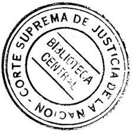
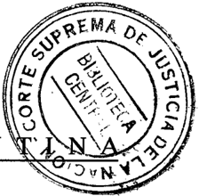
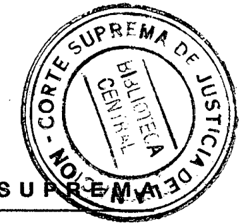
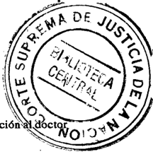
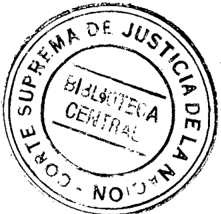
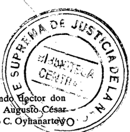
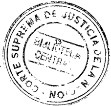
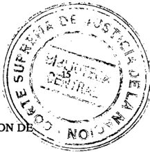
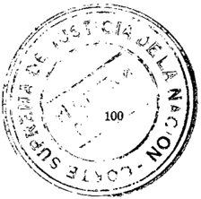
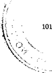

TOMO 314

Volumen 1

1991

eitJILLEH.i~IO iZ. TERAro ~W;rETARIO LETRA00 DE l,;', ~¡Uag.\JJ'llft1!\ Da .llJsncullE l.A Mil!:k.

## FALLOS DE LA CORTE SUPREMA DE JUSTICIA DE LA NACION

GUILLERMO E. TERA~ SECRETARIO LETRADO DE LA CORTE SUPREMA DE JUSTIW, DE U, N.q;I~1f

## REPUBLICA ARGEN

## FALLOS

DE LA

CORTE s U P R'E M A

DE

## JUSTICIA DE LA N ACION

PUBLICACION A CARGO DE LA SECRETARIA DE JURISPRUDENCIA DEL TRIBUNAL

TOMO 314 VOLUMEN 1

## FEBRERO - AGOSTO

:

B::i::"b~li"-:ot-e-ca-, -d-e-Ia-,

----,-----

;

Corte S,uprema -'------""""'----,-----

¡

¡

NI' de Orde.n

SERVICót

Ubicación

lOS

Calle50N"742. (1900)LaPlara~\_ros\_Aj.&lt;cs\_\_

•..•••••

~

•••••.••

-

.•..••••••

i.\_.~=\_.\_\_\_..

1991

Copyright (c) 1993 by Corte Suprema de Justicia de la Náel6ri' Qleda hecho el depósito Quepreviene la ley 11.723 I~-:,;eso en la Argentina Printed in Argentina l. S. B. N. 950-9825-07-7

ACUERDOS

DE

LA

CORTE

## AÑO 1991

## FEBRERO AGOSTO

## CUERPO DE AUDITORES. DESIGNACION DE SU TITULAR.

\_N° 1-

En Buenos Aires, a los 5 dfas del mes de febrero del año mil novecientos noventa y uno, reunidos en la Sala de Acuerdos del Tribunal el señor Presiden te doctor don Ricardo Levene (h), el señor Vicepresidente doctor don Mariano Augusto Cavagna Martfnez y los señores Jueces doctores don Carlos S. Fayt, don Augusto Cé~ar Belluscio, don Julio S. Nazareno, don Julio Oyhanarte, don Rodolfo C. Barra y don Edu;:rdo I\10liné O'Connor.

## Consideraron:

Que a los fines de la puesta en funcionamiento del Cuerpo de Auditores Judiciales de la Corte Suprema, creado en el punto i ° de la Acordada nO84/90 y teniendo en cuenta lo dispuesto en el punto 3° de la mencionada acordada y por la resolución nO11/91,

## Acordaron:

Designar Jefe del Cuerpo de Auditores Judiciales de la Corte Suprema al doctorJuan Carlos Corbetta (L.E. N° 5.180.250 -clase 1939-).

Todo lo cual dispusieron y mandaron, ordenando que se comunicase y registrase en el libro correspondiente, por ante mf, que doy fe.RICARDOLEVENE(H) MARIANOAUGUSTO CAVAGNAMARTINEZ-CARLOS S. FAYT AUGUSTOCÉSAR BELLUSCIORODOLFOCARLOS BARRA JULIO SALVADORNAZARENOJULIO CÉSAR OYHANARTEEDUARDOMOLIN~ O' CoNNORClaudia Marcelo Kiper (Secretario).

6

## MODIFICACION PARCIAL DEL REGLAMENTO PARA LA JUSTICIA NACIONAL

-N°2-

En Buenos Aires, a los 5 días del mes de febrero del año mil novecientos noventa y uno, reunidos en la Sala de Acuerdos del Tribunal, el señor Presidente doctor don Ricardo Levene (h), el señor Vicepresidente doctor don Mariano Augusto Cavagna Martínez y los señores Jueces doctores don Carlos S. Fayt, don Augusto César Belluscio, don Rodolfo Carlos Barra, don Julio Salvador Nazareno y don Eduardo J. Moliné O'Connor,

## Acordaron:

- 1°) Modificar el arto 87 del Reglamento para la Justicia Nacional, el que queda redactado de la siguiente manera: '"Afalta del presidente, hará sus veces el Vicepresidente primero, quien podrá ser sustituido por el Vicepresidente segundo. Este, a su vez, será reemplazado por los demás ministros, siguiendo el orden de su antigüedad".
- 2°) Reformar el art. 79, primer párrafo del citado reglamento de la siguiente forma: "El presidente de la Corte Suprema, y los vicepresidentes primero y segundo serán elegidos por mayoría absoluta de votos de los ministros del Tribunal y durarán tres años en el ejercicio de sus funciones".
- 3") Agregar en el arto 87 bis del mismo texto, a continuación de 'Vicepresidente", los vocablos "primero o segundo".

Todo lo cual dispusieron y mandaron, ordenando que se comunicase y registrase en el libro correspondiente,'por ante mí, que doy fe.RICARDOLEVENE (H) MARIANOAUGUSTO CAVAGNAMARTINEZCARLOSS. FAYTAUGUSTOCÉSARBELLUSCIO RODOLFOC. BARRA -JULIO S. NAZARENO EDUARDOMOLlN~O'CONNOR Claudia Marcelo Kiper (Secretario).

## CORTE SUPREMA DE JUSTICIA DE LA NACION. DESIGNACION DEL VICEPRESIDENTE SEGUNDO.

-N°3-

En Buenos Aires, a los 5 días del mes de febrero del año mil novecientos noventa y uno, reunidos en la Sala de Acuerdos del Tribunal, el señor Presidente doctor don Ricardo Levene (h), el señor Vicepresidente doctor don Mariano Augusto Cavagna Marffnez y los señores Jueces doctores don Carlos S. Fayt, don Augusto César Belluscio, don Rodolfo Carlos Barra, don Julio Salvador Nazareno y don Eduardo J. Moliné O'Connor, previo intercambio de ideas y por unanimidad, . .

Acordaron:

## DEJUSTICIAE LANACION D 314

Designar Vicepresidente segundo de la Corte Suprema de Justicia de la Naciónal Rodolfo Carlos Barra.

Todo lo cual dispusieron y mandaron, ordenando que se comunicase y registrase en'"el libro correspondiente, por ante mf, que doy fe, dejando constancia de que el Dr. Barra se abstuvo de votar.RICARDO LEVENE (H) -MARIANOAUGUSTOAVAGNAARTINEZ CARLOS C M -S. FAYTAUGUSTO C~AR BELLUSCIO JULIO S. NAZARENO EDUARDOOLlN~ O'CONNOR --M -G/audio Maree/o Kiper (Secretario).

## CORTE SUPREMA DE JUSTICIA CREACION DEL CONSEJO DE ADMINISTRACION.

-N"4-

En Buenos Aires, a los 12 dfas del mes de febrero del año mil novecientos noventa y uno, reunidos en la Sala de Acuerdos del Tribunal, el señor Presidente doctor don Ricardo Levene (h), el señor Vicepresidente doctor don Mariano Augusto Cavagna Martfnez y los señores Jueces doctores don Carlos S. Fayt, don Rodolfo Carlos Barra, don Julio Salvador Nazareno, don Julio Oyhanarte y don Eduardo J. Moliné O'Connot,

Consideraron:

Que el aumento progresivo de las causas sometidas a la decisi6n del Tribunal exige la total dedicación de sus integrantes.

Que diversas funciones vinculadas con el ejercicio de la superintendencia, actualmente ejercidas por el Tribunal en pleno, además de representar un recargo evidente de las tareas citadas, incide en la rápida y eficaz soluci6n que, por su naturaleza, requieran aquellas. A ello debe agregarse el constante crecimiento de los problemas derivados de la puesta en funcionamiento de juzgados, designaciones, promociones, asuntos relativos al personal de las cámaras nacionales y federales, y las complejas cuestiones derivadas del otorgamiento de la autarqufa económico-financiera al Poder Judicial.

Que, por 10 expuesto, resulta necesaria laasignaci6n de las especfficas funciones de superintendencia a un consejo de administraci6n, compuesto por el Presidente y los Vicepresidentes primero y segundo del Tribunal.

Que, por otro lado, existen numerosas cuestiones que motivan la intervenci6n del Presidente o del Tribunal en pleno y que podrfan ser delegadas en los Secretarios de Superintendencia, a fin de que aquellos no se sobrecarguen.

Por ello,

Acordaron:

"~o ~,.

8

Modificar el último párrafo del artfculo 86 del Reglamento para la Justicia Nacional (agregado 'por acordada dell? de marzo de 1961; F:249:212), el que quedará redactado de la siguiente manera:

"'ElConsejo de Administración, integrado por el Presidente y los Vicepresidentes primero y segundo, ejerce las funciones de superintendencia en tanto no medie expresa disposición legal que las confiera al Tribunal y sin peIjuicio de que, en casos especiales y cuando su naturaleza lo requiera, las cuestiones a que se refiere el presente artfculo sean sometidas a la consideración de la Corte Suprema.

Dicho consejo podrá delegar en los respectivos Secretarios de Superintendencia la firma, el despacho y la decisión de las cuestiones que, pQrsu naturaleza, no merezcan su consideración".

Todo lo cual dispusieron y mandaron, ordenando que se comunicase y registrase en el libro correspondiente, por ante mf, que doy fe. RICARDOEVENE (H)L MARIANOUOUSTO A CAVAONA MARTINEZ CARLOS S. FAYTRODOLFO CARLOS BARRA-JULIO SALVADOR NAZARENO JULIOÜYHANARTE EDUARDO . MOLINÉ O'CoNNOR---J Dr. Claudia Marcelo Kiper (Secretario).

## PREMIO: "'CORTE SUPREMA DE JUSTICIA DE LA NACION"".

-N°6-

En Buenos Aires, a los 26 dfas del mes de febrero del año mil novecientos noventa y uno, reunidos en la Sala de Acuerdos del Tribunal, el señor Presidente doctor don Ricardo Levene (h), el señor Vicepresidente primero doctor don Mariano Augusto Cavagna Martfnez, el señor Vicepresidente segundo doctor don Rodolfo Carlos Barra y los señores Jueces doctores don Carlos S. Fayt, don Augusto César Belluscio, don Julio Salvador Nazareno y don Eduardo J. Moliné O'Connor, -

## Consideraron:

Que constituye un deber ineludible de la Corte Suprema de Justicia dela Nación estimular y promover la búsqueda de excelencia en los futuros graduados en abogacfa.

Que el reconocimiento a los méritos académicos debe transformarse en un compromiso permanente con la sociedad promoviendo la contracción al estudio, come presupuesto básico para premiar a quienes tienen verdaderas condiciones y vocación por el saber.

Que ello, a su vez, constituirá un incentivo para los estudiantes de abogada interesados en perfeccionarse en la investigación y en la práctica del ejercicio profesional, como asf también un adecuado complemento de la instrucción académica que se imparte en las universidades del pafs, beneficio que repercutirá, en definitiva, en la consolidación de las instituciones democráticas.

Por ello,

Acordaron:

- 1") Instituir el premio "Corte Suprema de Justicia de la Nación" para el mejor promedio de egreso de la carrera de abogada de cada universidad nacional o privada.
- 2") El premio consistirá en la entrega de un diploma en el que constará que el premiado ha sido quien obtuvo el más alto promedio, en su respectiva universidad, entre quienes concluyeron su carrera durante el año anterior a la fecha de inscripción.
- 3") Los aspirantes deberán presentar, antes del 15 de noviembre de cada año, junto con su solicitud, un certificado expedido por la autoridad respectiva que acredite que han obtenido el más alto promedio en el año de su graduación, el que deberá ser el inmediatamente anterior al de su pedido de inscripción. A tales fines, se creará un registro de aspirantes que será llevado por la Secretaría de Superintendencia Judicial.
- 4") Aclarar que la Corte Suprema podrá no otorgar el premio a quienes, no obstante haber obtenido el mejor promedio en su universidad, no revelen méritos suficientes, así como declararlo desierto si fuere necesario.
- 5") Los premios serán otorgados en un acto público que se realizará en el mes de diciembre.
- 6") Hacersaberel contenido de la presente a todas las universidades nacionales o privadas, reconocidas oficialmente, en las que se curse la carrera de abogada.

Todo 10 cual dispusieron y mandaron, ordenando que se comunicase y registrase en el libro correspondiente, por ante mí, que doy fe.RICARDOLEVENE (H) MARIANOAUGUSTO CAVAGNAMARTINEZ-RoDOLFOCARLOSBARRACARLOSS. FAYTAUGUSTO C~AR BELLUSCIO \_ Juuo SALVADORNAZARENOEDUARDOJ. MOLlN¿ O'CoNNOR -Claudia Marcelo Kiper (Secretario).

DEPENDENCIAS DEL PODER JUDICIAL. DISPOSITIVO DE SEGURIDAD Y VIGILANCIA POLICIAL.

En Buenos Aires, a los 16 días del..nes de abril del año mil novecientos noventa y uno, reunidos en la Sala de Acuerdos del Tribunal, el señor Presidente doctor don Ricardo' 'Vene (h), el señor Vicepresidente primero doctor don Mariano Augusto Cavagna Martínez,el señor Vicepresidente segundo doctor don Rodolfo Carlos Barra, y los sefiores Jueces doctores don Carlos S. Fayt, don Augusto César Belluscio, .don Enrique Santiago Petracchi, don Julio Salvador Nazareno y don Eduardo Moliné O'Connor,

Consideraron:

## DE JUSTICIA DE LA NACION

10

- 1") Que. el 6 de diciembre de 1988 el Tribunal dictó la acordada 50/88 por la que se dispusieron distintas medidas con el fin de establecer un adecuado marco de seguridad en los distintos pisos del Palacio de Justicia.
- 2")Que con fecha 19 de octubre de 1989 se dictó la acordada 50/89 ordenando el inmediato y efectivo cumplimiento de lo normado en la Ac. 50/88 en razón de que las medidas allí contenidas no han tenido un adecuado cumplimiento.
- 3") Que ante el hecho de subsistencia delas razones que motivaron las acordadas 50/88 y 50/89, esto es, la ausencia de un conveniente dispositivo de seguridad en el ámbito del Palacio de Justicia, situación que reviste particular gravedad en las plantas en las que funcionan los juzgados penales -pisos 3" y 5"-.
- 4") Que a lo expuesto se añade la circunstancia de encontrarse algunos edificios del Poder Jiidicial sin la mínima vigilancia policial por el insuficiente personal encomendado a la comisaría de este Poder y la existencia, en algunos casos, de una asignación de custodia no totalmente proporcional entre los distintos organismos jurisdiccionales.

Por ello,

Acordaron:

Reiterar a la comisaría del Poder Judicial la orden de efectivo e inmediato cumplimiento de lo dispuesto en las acordadas 50/88 y 50/89.

Cubrir, con la vigilancia necesaria, las dependencias del Poder Judicial que en la actualidad no tengan tal resguardo, reasignando el personal de custodia distribuido actualmente.

Los requerimientos de seguridad, de las dependencias judiciales, serán elevados a la Presidencia de la Corte Suprema de Justicia, ypor su intermedio al Consejo de Administración, a efecto de ser valorados; una vez aprobados se solicitará en cada caso, el personal policial necesario. para su afectación.

Todo lo cual dispusieron y mandaron, ordenando que se comunicase y registrase en el libro correspondiente, por ante mí, que doy fe.RICARDOEVENIl (H)L MARIANO AUGUSTO CAVAGNAARTlNEZ RODOLFO. BARRA M -C CARLOS. FAYT AUGUSTO~AR BELLUSCIO C -ENRIQUE SANTIAGO ETRACCHI Juuo P -S. NAZARENO EDUARDOouN~ O'CONNOR \_ -M Claudia Marcelo Kiper (Secretario).

## EFECTOS SECUESTRADOS. PRODUCTO DE SU VENTA

En Buenos Aires, a los 23 días del mes de abril del año mil novecientos noventa y uno, reunidos en la Sala de Acuerdos del Tribunal el señor Presidente de la Corte Suprema de Justicia de la Nación, doctor don Ricardo Levene (h), el señor Vicepresidente primero doctor

~ don Mariano Augusto Cavagna Martínez, el señor Vicepresidente segun \ -qj!ctor don -. ~ Rodolfo C. Barra, y los señores Jueces doctores don Carlos S. Fayt, don A~sTh-\Césa¡;.-~~ Belluscio, don Enrique Santiago Petracchi, don Julio S. Nazareno, don Julio C. oYhaiÍ~rtll\to' J don Eduardo Moliné O'Connor, -. -....:::.-

## Consideraron:

- Que con arreglo a 10dispuesto por el art 3., ine. b, de la ley 23.853 constituye recurso específico y propio del Poder Judicial de la Nación, el producto de la venta de "efectos secuestrados en causas penales que no hayan podido entregarse a sus dueños", así como de los "objetos comisados".

Que los arts. 8. y 9. de la misma ley, otorgan al Tribunal plenas y amplias facultades para "determinar ,el régimen de percepción, administración y contralor de sus recursos" y 10 facultan para "adoptar las medidas que considere convenientes para efectuar el control y exigir el cobro de los recursos mencionados ..:',

Que, además, el arto12 de dicha ley ha dejado sin efecto "todas las disposiciones legales y reglamentarias que se opongan a su cumplimiento".

Que, sin perjuicio de lo que esta Corte interprete en definitiva sobre el alcance de tales disposiciones, resulta necesario establecer -a la luz del nuevo marco normativoel régimen aplicable a las situaciones contempladas por la ley 20.785,

## Resolvieron:

- 1.)El producto de la venta de los efectos secuestrados con arreglo al régimen establecido por la ley 20,785, deberá ser ingresado por las respectivas instituciones bancarias en la cuenta corriente nro. 1940/00 abierta en el Banco de la Nación Argentina -Casa Central- a favor de la Subsecretaría de Administración de la Corte Suprema de Justicia de la Nación. Idéntico procedimiento se adoptará con los depósitos de dinero a que se refiere el art 2. de la citada norma.
- 2") Las entidades bancarias -independientemente de la correspondiente comunicación al tribunal competentepondrán en conocimiento de la citada Subsecretaría de Administración la información relativa a las operaciones de venta realizadas (Juzgado ySecretaría interviniente, número y carátula de la causa, identificación del objeto, fecha e importe depositado).
- 3") Los jueces a cuya orden se encuentren.1as cuentas de autos ya abiertas con motivo de la aplicación de la mencionada ley, adoptarán los recaudos pertinentes para ordenar la transferencia de los fóndos"resultantes, en la forma y condiciones señaladas en los precedentes artículos, teniéndose presente que -además de los datos allí requeridosla entidad bancaria correspondiente deberá discriminar el importe del depósito original (capital) y 10devengado en concepto de intereses, como así también la metodología utilizada para su cálculo,
- 4") Los jueces nacionales y federales deberán extremar las medidas para que la venta de los efectos secuestrados en las condiciones establecidas por la ley 20,785 se produzca en el más breve plazo.
- 5") La Subsecretaría de Administración reintegrará los importes correspondientes a los depósitos acreditados por las instituciones bancarias con más los intereses al tipo bancario que ellos hubieran devengado, cuando mediare una orden del juez de la causa,-

/

12

Todo lo cual dispusieron y mandaron, ordenando se comunicase y registrase en el Libro correspondiente, por ante mí, que doy fe.RICARDO LEVENE(H)MARlANOAuGUSTO CAVAGNA MARTlNEZ-:RODOLFOCARLOSBARRACARLOSS. FAYTAUGUSTOCl!sAR BELLUSCI0ENRIQUESANTIAGOPETRACCHIJULIO SALVADORNAZARENOJULIOCl!sAR OYHANARTE \_ EDUARDOJ. MOLINÉO'CoNNOR Hugo Luis Mauro Piacentino (Secretario).

## FERIA JUDICIAL DE JULIO DE 1991.

-N°9-

En Buenos Aires, a los 14 días del mes de mayo del año mil novecientos noventa y uno, .reunidos en la Sala de Acuerdos del Tribunal, el señor Presidente doctor don Ricardo Levene (h), el señor Vicepresidente primero doctor don Mariano Augusto Cavagna Martínez, el señor Vicepresidente segundo doctor don Rodolfo Carlos Barra y los señores Jueces doctores don Carlos S. Fayt, don Augusto César Belluscio, don Enrique Santiago Petracchi, don Julio Salvador Nazareno y don Eduardo J. Moliné O'Connor,

## Acordaron:

1") Disponer en el corriente año feriado judicial para los Tribunales Nacionales de la Capital desde el día 8 hasta el 19 de julio, ambos inel usive.

Hacer saber a las Cámaras Federales de Apelaciones que con arreglo a lo previsto en la Acordada nO 53/73 -respecto de la coincidencia de la feria en ella establecid~ con las vacaciones escolaresy a lo dispuesto en la presente, deberán determinar para sus respectivas jurisdicciones un feriado judicial de diez días hábiles (acápite 2° de la Acordada nO30/84).

Todo lo cual dispusieron y mandaron, ordenando que se comunicase y registrase en el libro correspondiente, por ante mí, que doy fe.RICARDOLEVENE(H) MARIANOAUGUSTO CAVAGNAMARTlNEZRODOLFOC. BARRACARLOSS. FAYTAUGUSTOCl!sAR BELLUSCIO -ENRIQUESANTIAGOPETRACCHIJULIO S. NAZARENOEDUARDOMOLINÉO'CoNNORClaudio Marcelo Kiper (Secretario).

## CUERPOS TECNICOS PERICIALES.

-N° 10-

En Buenos Aires, a los 23 días del mes de mayo del afio mil novecientos noventa y uno, reunidos en la Sala de Acuerdos del Tribunal, el sefior Presidente doctor don Ricardo Levene (h), el sefior Vicepresidente primero doctor don Mariano Augusto Cavagna Martínez, el sefior Vicepresidente segundo doctor don Rodolfo Carlos Barra y los sefiores Jueces doctores don Augusto César Belluscio, don Enrique Santiago Petracchi, don Julio Salvador Nazareno y don Eduardo Moliné O'Connor,

Consideraron:

Que esta Corte, el 19 de junio de 1961, consider6 conveniente encomendar la superintendencia de los cuerpos técnicos periciales a la Cámara Nacional de Apelaciones en lo Criminal y Correccional (Fallos: 250:5).

Que, en la actualidad, la cuesti6n debe ser replanteada, habitla cuenta de que las funciones de dichos cuerpos se han tornado más complejas -circunstancia que ha motivado la necesaria intervenci6n del Tribunal en numerosas oportunidadesy que, por otra parte, tales organismos asisten a los restantes fueros del Poder Judicial.

Que se suma a lo expuesto la circunstancia de haberse sancionado la ley de autarqufa N° 23.853, lo cual implica la necesidad de una intervenci6n más directa de esta Corte en lo que hace a la administraci6n y control de gesti6n de dichos organismos.

Por ello,

Acordaron:

- 1°) Dejar sin efecto la acordada del 19 de junio de 1961, registrada en Fallos: 250:5 y, en consecuencia, retomar la superintendencia de los cuerpos técnicos periciales.
- 2°) Dejar sin efecto las acordadas y resoluciones que se opongan a la presente.
- 3°) Disponer que la Cámara Nacional de Apelaciones en lo Criminal y Correccional deberá remitir a esta Corte los legajos correspondientes y demás antecedentes.
- 4") Disponer que el Servicio de Reconocimientos Médicos funcione bajo la dependencia del Cuerpo Médico Forense.
- 5") Los cuerpos técnicos periciales contarán con un Decano y un Vicedecano que serán designados por el Tribunal; que durarán tres años en el cargo, sin perjuicio de que pueda ser prorrogado si la Corte lo considera conveniente. Los cargos a que se refiere esta disposici6n son irrenunciables, salvo caso de excusa atendible, que se apreciará oportunamente. La Morgue Judicial y el Servicio de Reconocimientos Médicos tendrán un Director y un Jefe, respectivamente, que serán designados por el Tribunal.
- 6") Disponer que dichos funcionarios, dentro de los 60 días siguientes a su designación, deberán elaborar y someter a la aprobaci6n de la Corte las disposiciones reglamentarias que sean necesarias para su funcionamiento y el de los organismos bajo su dependencia.

Todo lo cual dispusieron y mandaron, ordenando que se comunicase y registrase en el libro correspondiente, por ante mí, que doy fe.RICARDOLEVENE(H) MARIANOAUGUSTO CAVAGNA MARTINEZ RODOLFoC. BARRAAUGUSTOC~AR BELLUSCIOENRIQUESANTIAGO PETRACCHI Juuo S. NAZARENO EDUARDOMOUNf! O'CONNOR Claudia Marcelo Kiper (Secretario).

## CORTE SUPREMA DE JUSTICIA PLIEGOS DE BASES Y CONDICIONES EN LAS CONTRATACIONES.

~ -N°ll-

En Buenos Aires l a los 28 días del mes de mayo del año mil novecientos noventa y uno, reunidos en la Sala de Acuerdos del Tribunal el señor Presidente de la Corte Suprema de Justicia de la Naci6n, doctor don Ricardo Levene (h), el señor Vicepresidente primero doctor don Mariano Augusto Cavagna Martfnez, el señor Vicepresidente segundo doctor don Rodolfo C. Barra, y los señores Jueces doctores don Carlos S. Payt, don Augusto César Belluscio, don Enrique Santiago Petracchi, don Julio S. Nazareno y don Eduardo Moliné O'Connor,

## Consideraron:

Que resulta conveniente ampliar los términos de la Acordada nO83/90 estableciendo el monto mínimo que procede asignar para ia venta de l¿s pliegos de bases y condiciones en las contrataciones convocadas por el Poder Judicial de la Naci6n.-

Por ello, en ejercicio de las facultades establecidas por la Ley 23.853 Y con arreglo a lo dispuesto por Acordada nO76/90, .

## Resolvieron:

Ampliar la Acordada nO83/90 fijando en la suma equivalente al uno por ciento (1 %) de la remuneraci6n total asignada al cargo de Auxiliar Principal de 6ta. (P AT); el precio mínimo para la venta de los pliegos de bases y condiciones correspondientes a las contrataciones realizadas por el Poder Judicial de la Naci6n, bajo el régimen de la Ley de Contabilidad.-

Todo lo cual dispusieron y mandaron, ordenado se comunicase y registrase en el libro correspondiente, por ante mí, que doy fe.RICARDO LEVENE (H)MARlANOAuGUSTOCAVAGNA MARTINEZRODOLFoC. BARRACARLOSS. PAYTAUGUSTOC~AR BELLUSCIO ENRIQUE SANTIAGO PETRACCHIJULIOS. NAZARENOEDUARDO MOLINf!O'CONNORHugo Luis Mauro Piacentino (Secretario).

## DEJUSTICIA DELA NACION 314

## CORTE SUPREMA DE JUSTICIA COMISION PARA ESTUDIO, ORDENAMIENTO Y PUBLICACION DE ACORDADAS.

. En Buenos Aires, a los 4 días del mes de junio del afio mil novecientos noventa y uno, reunidos en la Sala de Acuerdos del Tribunal, el sefior Presidente de la Corte Suprema de Justicia de la Nación, doctor don Ricardo Levene (h), el sefior Vicepresidente primero doctor don Mariano Augusto Cavagna Martínez, el sefior Vicepresidente segundo doctor don Rodolfo C. Barr.a, y los sefiores Jueces doctores don Carlos S. Fayt, don Augusto César Belluscio, don Enrique Santiago Petracchi, don Julio S. Nazareno y don Eduardo Moliné O'Connor,

Consideraron:

Que este Tribunal considera objetivo primordial el conocimiento por parte de magistrados, funcionarios y profesionales, de las nO[Ulasreglamentarias que de él emanan.

Que para cumplir con tal fin es necesario que se tomen las medidas conducentes para elaborar y dar a publicidad la nómina completa de las acordadas dictadas desde 1863 hasta la fecha, por orden cronológico y por temas, y determinar, asimismo, cuáles se encuentran vigentes.

Que las tareas descriptas requieren la creación de una comisión que efectlíe el estudio previo y ordenamiento correspondientes.

Por ello, Acordaron:

- 1°) Crear una comisión para el estudio, ordenamiento y publicación de las acordadas dictadas por la Corte Suprema de Justicia de la Nación desde su instalación hasta la fecha.

'&lt;

- 2°) Integrar la citada comisión con la sefiora Secretaria Letrada del Tribunal doctoraAlicia Silvia Mariani y el señor Director General de Bibliotecas del Poder Judicial de la Nación don Miguel Danielián.
- 3°) Autorizar a la comisión creada para requerir la colaboración que estime pertinente de la Secretaría de Informática y otras dependencias del Poder Judicial de la Nación, a los fines de incorporar la documentación elaborada en una base de datos y editar una consolidación legal de las acordadas del Tribunal.

Todo 10cual dispusieron y mandaron, ordenando que se comunicase y registrase en el libro correspondiente, por ante mí, que doy fe.RICARDO LEVENE (H) MARIANO AUGUSTO CAVAGNAARTlNEZ M RODOLFo C. BARRA CARLOS S. FAYT AUGUSTO CésARBELLUSCIO '-ENRIQUE SANTIAGOETRACCHI Juuo P -S. NAZARENO ~ EDUARDO MouN~ O'CoNNORClaudio Marcelo Kiper (Secretario).

## CORTE SUPREMA DE JUSTICIA. CREACION DE LA SECRETARIA JUDICIAL N' 7. ~

-N°13-

En Buenos Aires, a los 4 días del mes de junio del año mil novecientos noventa y uno, reunidos en la Sala de Acuerdos del Tribunal, el señor Presidente de la Corte Suprema de Justicia de la Nación, doctor don Ricardo Levene (h), el señor Vicepresidente primero doctor don Mariano Augusto Cavagna Martínez, el señor Vicepresidente segundo doctor don Rodolfo C. Barra, y los señores Jueces doctores Carlos S. Fayt, Enrique Santiago Petracchi, Julio S. Nazareno y Eduardo Moliné O'Connor,

## Consideraron:

Que tramitan ante esta Corte un nlÍmero considerable de recursos ordinarios, extraordinarios y de hecho cuyo contenido versa sobre derecho impositivo, aduanero y bancario, lo que hace aconsejable concentrar funcionalmente la distribución, examen y circulación de esos casos en una sola dependencia de esta Corte.

Que dicho criterio se justifica alÍn más si se tiene presente que se trata de cuestiones jurídicas que requieren, para ser examinadas con mayor rigor científico, de un cierto grado de especialización. Además, es un hecho plÍblico y notorio la existencia de una notable evasión impositiva, lo que obliga a este Tribunal a elaborar con sumo cuidado su jurisprudencia en tales materias.

Que, por lo tanto, resulta necesaria la creación de una Secretaría que atienda este tipo de causas.

## Por ello,

Acordaron:

## 1") Asignar a la Secretaría creada por la acordada 10/90 el N° 6.

- 2") Crear la Secretaría Judicial N° 7, en la que tramitarán todo los'recursosque versen sobre temas de derecho tributario, aduanero y bancario, y otros que tengan conexidad con aquéllos y la que entenderá en todas aquellas tareas que se le encomendasen.

Todo ~o cual dispusieron y mandaron, ordenando que se comunicase y registrase en el libro correspondiente, por ante mí, que doy fe.RiCARDOLEVENE(H.) MARIANOAUGUSTO CAVAGNAMARTINEZRODOLFOC. BARRACARLOSS. FAYTENRIQUESANTIAGO PETRACCHI -JULIOS. NAZARENO EDUARDOMOLIN~O'CoNNOR ClaudioMarcelo Kiper (Secretario).

## EFECTOS SECUESTRADOS. CONTROL Y COBRO.

\_N° 14-

En Buenos Aires, a los 18 días del mes de junio del año mil novecientos noventa y uno, reunidos en la Sala de Acuerdos del Tribunal, el señor Presidente doctor don Ricardo Levene (h), el señor Vicepresidente doctor don Mariano Augusto Cavagna Martínez y los señores Jueces doctores don Carlos S. Fayt, don Augusto César Belluscio, don Enrique Santiago Petracchi, don Rod,?lfo C. Barra, don Julio S. Nazareno, don Eduardo Moliné O'Connory don Antonio Boggiano,

## Consideraron:

Que con arreglo alo dispuesto por el art. 3°, inc. b), de la ley 23.853 constituye un recurso específico y propio del Poder Judicial de' la Nación, el producto de la venta de "efectos secuestrados en causas penales que no hayan podido entregarse a sus dueños", así como de los "objetos comisados".

Que los arts. 8° y 9° de dicha ley otorgan al Tribunal plenas y amplias facultades para "determinar el régimen de percepción, administración y contralor de sus recursos" y lo facultan para "adoptarlas medidas que considere convenientes para efectuar el control y exigir el cobro de los recursos mencionados .....

Que esta Corte, al dictar la acordada N° 8/91, adoptó diversas medidas referentes a la venta y el ingreso del dinero de dichas cosas muebles.

Que, sin perjuicio de ello, es menester conocer con más precisión la entidad e importancia, cuantitativa y cualitativa, de las cosas que se encuentran en la situación descripta.

Por ello,

Acordaron:

1") Requerir a la Cámara Nacional de Apelaciones en lo Criminal y Correccional, a la Cámara Nacional de Apelaciones en lo Penal Económico, a la Cámara Nacional de Apelaciones en lo Criminal y Correccional Federal, y a las Cámaras Federales del interior del país, el envío a esta Corte de la lista de efectos secuestrados y/o comisados, de acuerdo al formulario adjunto, existentes en los juzgados de aquellas dependientes. Las nóminas respectivas deberán ser remitidas en el plazo de 30 días hábiles, contados a partir de la notificación de la presente, a la Secretaría de Superintendencia Administrativa.

2") Encomendar a la Secretaría Letrada de Informática la preparación de un programa a 'los efectos de llevar un registro de los objetos mencionados.

Todo lo cual dispusieron y mandaron, ordenando que se cómunicase'y registrase en el libro correspondiente, por ante mí, que doy fe.RICARDOLEVENE(H) MARIANOAUGUSTO CAVAGNAMARTINEZCARLOSS. FAYTAUGUSTOCÉSARBELLUSCIO ENRIQUESANTIAGO PETRACCHI RODOLFOCARLOSBARRAJULIOSALVADOR NAZARENOEDUARDOJ. MOLlNlj, O'CoNNOR -ANTONIOBOGGIANOClaudio Marcelo Kiper (Secretario).

.

## PODER JUDICIAL. ARANCELAMIENTO.

-N°15-

En Buenos Aires, a los 18 dfas del mes de junio del año mil novecientos noventa y uno, reunidos en la Sala de Acuerdos del Tribunal, el señor Presidente doctor don Ricardo Levene (h), el señor Vicepresidente doctor don Mariano Augusto Cavagna Martfnez y los señores Jueces doctores don Enrique Santiago Petracchi, don Rodolfo C. Barra, don Julio S. Nazareno y don Eduardo Moliné O'Connor,

## Consideraron:

Que, en virtuddelo dispuesto por el arto99 dela Constitución Nacional, la Corte Suprema está facultada para dictar su reglamento económico. Además, de acuerdo al art 8° de la ley 23.853 el Tribunal tiene amplias facultades para establecer aranceles y fijar sus montos y actualizaciones, disponer de su patrimonio, y determinar el régimen de percepción, administración y control de sus recursos y su ejecución (ver resolución N° 1441/90, acordada N° 77/90).

Que, como consecuencia de la sanción de dicha ley, esta Corte dictó la acordada N° 76/ 90, por la cual se encomendó a las Secretarías de Superin tendencia, y a las cámaras nacionales y federales, el estudio sobre la posibilidad de arancelar ciertos servicios que brinda el Poder Judicial, que no se encuentran necesariamente comprendidos en su actividad jurisdiccional -por la que se paga tasa de justicia-, sino que la exceden.

Que, por lo expuesto, es menester arancelar determinados servicIos y actividades administrativas a fin de que sean retribufdas por sus usuarios, quienes actualmente se benefician por obtenerlos gratuitamente.

Que debe implantarse un sistema que sea de fácil cobro, ágil y sencillo, afin deno recargar la actividad administrativa del Poder Judicial, asf como para no entorpecer la de los interesados.

## Por ello,

## Aéordaron:

- 1°) Instituir un bono, cuyo valor será de DIEZ MIL AUSTRALES (Al 0.000,00. -), que deberá ser acompafiado -en la cantidad que se determine en cada caso- con la tramitación de las siguientes solicitudes:
- a) Inscripción de peritos (20 bonos) y de sfndicos y martilleros (50 bonos).
- b) Peticiones formuladas por los particulares y por los organismos públicos ante las Secretarías de Superintendencia de la Corte, de las cámaras nacionales y federales, y ante las oficinas dependientes de aquéllas, que no tuviesen un arancel especial (5 bonos).
- c) Denuncias formuladas por los particulares ante el Cuerpo de Auditores Judiciales (10

\, bonos). En caso de ser admitida la veracidad de los hechos puestos en conocimiento de la Corte, se reintegrará al denunciante una cantidad equivalente a la ingresada.

- d) Expedición de certificados y testimonios, excepto que sean pedidos para obtener la jubilación, o que se vinculen con la situación de libertad o con sentencias absolutorias (10 bonos).
- e) Consultas a las oficinas dejurisprudencia: se harán por escrito acompañadas de 5 bonos.
- f) La expedición de fotocopias de resoluciones, sentencias, fichas de jurisprudencia, etc. requerirá de 1 bono y de otro por cada 10 hojas que se entreguen al interesado.
- g) La certificación sobre la autenticidad de las fotocopias requerirá de 1 bono por cada 5 hojas que sean certificadas.
- h) Venta de los boletines de jurisprudencia (5 bonos).
- i) Certificaciones de firmas (5 bonos).
- j) Inicio de informaciones sumarias (10 bonos).
- k) Pedido por parte de los profesionales de un listado de sorteo de expedientes (3 bonos).
- 1)Presentación enjuicio del adquirente en una subasta (20 bonos); a través de un comitente (100 bonos).
- 11) Oficios que ingresen al Archivo solicitando fotocopias, certificados, remiSiones, informes, etc. (2 bonos), excepto si .el caso está dentro de lo previsto en el arto 30 de la Acordada 34/81.
- m) Consultas de expedientes archivados (10 bonos).
- n) Informes brindados por el Archivo al público (2 bonos para el trámite normal y5 bonos si el trámite es urgente).
- o) Correspondencia del Archivo: deberán pagarse los gastos de remisión y 3 bonos.
- 2°) En ningún caso se admitirán los trámites enunciados si no se acompañan los bonos correspondientes.
- 3°) Encomendara la Pro secretaría de la Corte Suprema el diagrama y confección del bono, en el que deberá constar el número de esta acordada y la inscripción "Corte Suprema de Justicia", así como la organización de un sistema de fiscalización del cumplimiento de lo dispuesto en la presente.

Todo lo cual dispusieron y mandaron, ordenando que se comunicase y registrase en el libro correspondiente, por ante mí, que doy fe.RICARDO LEVENE (H)MARIANO AUGUSTO CAVAGNA MARTlNEz ENRIQUE SANTIAGOETRACCHI RoDOLFO CARLOS BARRA P -Juuo SALvA[)()RNZARENO EDUARDO . MouN~ O'CoNNOR A -J ClaudioM arcelo Kiper (Secretario).

## ESCUELA DE CAPACITACION JUDICIAL PARA EL PERSONAL DEL PODER JUDICIAL.

-NO 16-

En Buenos Aires, a los 18 días del mes de junio del año mil novecientos noventa y uno, reunidos en la Sala de Acuerdos del Tribunal, el señor Presidente doctor don Ricardo Levene (h), el señor Vicepresidente doctor don Mariano Augusto Cavagna Martínez y los señores Jueces doctores don Augusto César Belluscio, don Rodolfo C. Barra, don Julio S. Nazareno y don Eduardo Moliné O'Connor,

## Consideraron:

Que desde hace 24 años funciona, en el ámbito de la Asociaci6n de Magistrados y Funcionarios de la Justicia Nacional, la Escuela de Capacitaci6n Judicial. Entre otras actividades, por cierto numerosas, se ocu pa dicha escuela de dictar cursos de formaci6n y de capacitaci6n al personal del Poder Judicial.

Que, en algunos fueros, a quienes aprueban los cursos correspondientes se les otorga un puntaje adicional computable para el ascenso. A su vez, esta Corte, en sus acordadas Nros. 58/ 89 Y82/90, decidi6 también tener como causal de calificaci6n para la confecci6n del escalaf6n de sus agentes y de los oficiales notificadores, a la realizaci6n y aprobaci6n de los cursos mencionados.

Que, no obstante lo expuesto, no ocurre lo mismo en todos los fueros, pues en algunos se organizan cursos que no son tenidos en cuenta a los fines de la promoci6n, mientras que en otros directamente no se hacen cursos de ninguna naturaleza.

Que esta situaci6n debe ser corregida ya que, respetando las particularidades de cada uno de los fueros, debe procurarse que la apreciaci6n objetiva de la idoneidad y de la aptitud para el ascenso sea uniforme en todos los ámbitos del Poder Judicial.

Que, además, el principio de igualdad de oportunidades ante la igualdad de condiciones se robustece en la medida de que se garantice el acceso a los cargos más altos del escalafón para aquellos más idóneos en el desempeño de su funci6n.

## Por ello,

## Acordaron:

1° Modificar el inciso e) del arto 2° de la acordada dictada el3 de mayo de 1958 (Fallos: 240:107), el que quedará redactado de la siguiente manera:

- .. e) A los efectos precedentemente establecidos, respecto de las promociones, deberá tenerse en cuenta, además de la antigüedad de los agentes en la Justicia Nacional yen el cargo, la asistencia y aprobación de los cursos de capacitación organizados por la Escuela de Capacitación Judicial de la Asociaci6n de Magistrados y Funcionarios de la Justicia Nacional. Este l1ltimo no será obligatorio en los asientos judiciales del interior del país ...

2° Incorporar al art. 13 de dicha acordada el siguiente inciso:

.. g) cursos de capacitación mencionados en el art. 2° , inc. ero

Todo 10 cual dispusieron y mandaron, ordenando que se comunicase y registrase en el libro correspondiente, por ante mí, que doy fe.RICARDOLEVENE (H) MARIANOAUGUSTO CAVAGNAMARTINEZAUGUSTO CÉSAR BELLUSCIORODOLFOCARLOS BARRA JULIO SALVADOR NAZARENO EDUARDO J. MOLINÉO'CoNNOR Claudio M arcelo Kiper (Secretario).

APROVECHAMIENTO DE EFECTOS SECUESTRADOS O COMISADOS.

-N° 17-

En Buenos Aires, a los 18 días del mes de junio del año mil novecientos noventa y uno, reunidos en la Sala de Acuerdos del Tribunal, el señor Presidente de la Corte Suprema de Justicia de la Nación, doctor don Ricardo Levene (h), el señor Vicepresidente primero doctor don Mariano Augusto Cavagna Martfnez, el señor Vicepresidente segundo doctor don Rodolfo C. Barra, y los señores Jueces doctores don Carlos S. Fayt, don Augusto César Belluscio, don Enrique Santiago Petracchi, don Julio S. Nazareno y don Eduardo Moliné O'Connor,

## Consideraron:

- 1") Que de acuerdo a lo establecido por el art. 3°, inc. b), de la ley 23.853, constituyen recurso específico y propio del Poder Judicial de la Nación los .. efectos secuestrados en causas penales que no hayan podido entregarse a sus dueños .., asf como .. Ios objetos comisados ...
- 2°) Que los arts. 8° y 9° de la misma ley otorgan al Tribunal plenas y amplias facultades para .. determinar el régimen de percepción, administración y contralor de sus recursos .. y lo facultan .. adoptar las medida que considere convenientes para efectuar el control y exigir el cobro de los recursos mencionados .. : .. Además su art. 12 ha dejado sin efecto .. todas las disposiciones legales y reglamentarias que se opongan a su cumplimiento ...
- 3°) Que la ley 23.737, en su arto 30, primer párrafo, establece que .. EI juez dispondrá la destrucción, por la autoridad sanitaria nacional, de los estupefacientes en infracción o elementos destinados a su elaboración a no ser que pertenecieren a un tercero no responsable o salvo que puedan ser aprovechados por la misma autoridad ...
- 4") Que para la realización de las diversas funciones periciales desarrolladas en los laboratorios del Cuerpo Médico Forense resulta imprescindible utilizar distintas substancias e instrumental, cuyo elevado costo de adquisición viene siendo soportado por el Poder Judicial de la Nación, con cargo a sus magros recursos presupuestarios.
- 5°) Que ante tal circunstancia este Tribunal, en su resolución nro. 646 de fecha 18 de setiembre ppdo., solicitó al Poder Ejecutivo Nacional la remisión de un proyecto de ley al Honorable Congreso de la Nación que contemple -mediante una modificación al mencionado arto 30 de la ley 23.737incorporar a dicha institución como beneficiaria de esos elementos.

- 6°) Que la petición efectuada en la precedentemente citada resolución, por haber sido formulada con anterioridad a la sanción de la ley 23.853, ha perdido vigencia por cuanto esta liltima concede al Tribunal atribuciones de las que carecía en aquella oportunidad.
- 7°) Que en el marco de esas atribuciones -confr. considerandos 1°) y 2°)- esta Corte se encuentra facultada para disponer la inclusión de los laboratorios del Cuerpo Médico Forense entre los beneficiarios de las substancias e instrumental a que se refiere el mencionado art 30.

Por ello y sin perjuicio de lo que esta Corte interprete en definitiva sobre el alcance de las disposiciones comentadas en los considerandos 1°) y 2°),

## Resolvieron:

- 1°) Hacer saber al Poder Ejecutivo Nacional-por intermedio del Ministerio deJusticia de la Naciónla decisión de esta Corte Suprema de dejar sin efecto la solicitud formulada mediante su resolución nro. 646 de fecha 18 de setiembre ppdo.
- 2°) Establecer que el juez antes de disponer la destrucción por la autoridad sanitaria nacional de las substancias que puedan ser aprovechadas para la realización de análisis químicos (solventes, ácidos, etc.) y del instrumental secuestrado en los procedimientos efectuados en aplicación de la ley 23.737 ,estará facultado para transferir tales elementos previa consulta al Cuerpo Médico Forense, con destino a los laboratorios de la Morgue Judicial, siempre que no pertenezcan a un tercero no responsable ni puedan ser utilizados por la mencionada autoridad sanitaria.

Todo lo cual dispusieron y mandl\ron, ordenado se comunicase y registrase en el libro correspondiente, por ante mí, que doy fe.RIcARDo LEVENE H)-( MARlANOUGUSTOAVAGNA A C MARTINEZ RODOLFO. BARRA --C CARLOS. FA YTAUGUSTOJ~SARELLUSCIO ENRIQUE C B -SANTIAGO ETRACCHI ULIO S. NAZARENO- EDUARDOOLlNÉO'CONNOR P -J M -HugoLuisMauro Piacentino (Secretario).

CORTE SUPREMA DE JUSTICIA DESIGNACION DE SECRETARIO.

-N°18-

En Buenos Aires, a los 18 días del mes de junio del año mil novecientos noventa y uno, reunidos en la Sala de Acuerdos del Tribunal, el señor Presidente de la Corte Suprema de Justicia de la Nación, doctor don Ricardo Levene (h), y los señores Ministros que suscriben la presente,

## Acordaron:

Designar secretario de la Corte Suprema de Justicia de la Nación, al doctor don Bernardo Licht (DNI: 4.371.039 -clase 1941-), para desempeñarse como titular de la Secretaría Judicial NO7, creada por la Acordada N° 13/91. .

Todo lo cual dispusieron y mandaron, ordenando que se comunicase y registrase en el libro correspondiente, por ante mí, que doy fe.RICARDOLEVENE(H) MARIANOAUGUSTO CAVAGNAMARTINEZRODOLFOC. BARRAENRIQUESANTIAGO PETRACCHI (en disidencia) -EDUARDOMOLIN(¡O'CONNOR JULIOSALVADORNAZARENOAUGUSTOCflsAR BELLUSCIOANTONIOBOGGIANOClaudia Marcelo Kiper (Secretario).

## DISIDENCIA DEL DR ENRIQUE SANTIAGO PETRACCHI

## Consideraron:

- 1°) Quea este Tribunal compete, como máxima autoridad de lajudicatura e intérprete final dela Constitución Nacional, velar celosamente por el respeto cabal de las prescripciones que ella contiene (Fallos: 305:504; 310:1771; R 335 XX "Repetto, Inés María c/ Bs.As., Prov. de s/ inconstitucionalidad de normas legales", del 8 de noviembre de 1988, entre muchos otros).
- 2°) Que tan trascendente misión impone que, en las decisiones adoptadas en ejercicio de las facultades conferidas porel art 99de la Constitución Nacional, se examine cuidadosamente el requisito de idoneidad previsto por el art 16 de la Constitución Nacional, que asegura el acceso a la función de los más aptos.
- 3°) Que en anteriores ocasiones el Tribunal ha tenido oportunidad de recordar que -según expresión que ya es popularno tiene ni bolsa ni espada. Su autoridad se apoya en la confianza pública acerca del prestigio técnico y moral de sus decisiones. Es por esa razón que, en la selección de quienes deberán colaborar con esta Corte en el desempeño de su delicada tarea, necesariamente habrá que atender a criterios objetivos.
- 4°) Que a ello no obsta el ámbito de discrecionalidad propio de esta Corte, el cual, por supuesto, no llega a amparar la adopción de medidas que se aparten de la racionalidad que es inherente a su actuación toda, pues ello implicaría tanto una muestra de sinrazón o favoritismo, a la que empecen razones de índole jurídica -cfr. arto 15 del decreto 1285/58 y art 15 del Reglamento para la justicia Nacionalcuanto una inadmisible ignorancia de quienes retinan las mejoras condiciones personales, acreditada capacitación científica y distinguida trayectoria en la tarea que han desempeñado. Huelga señalar que tal actitud provocaría el desánimo o sospecha de los pares y de los destinatarios de las decisiones, o lo que es peor aún la apatía de unos y otros.
- S°) Que, con la creación dispuesta por acordada N° 13/91 de fecha 4 del corriente, la secretaría N" 7 estará a cargo de un Secretario que deberá reunir los requisitos para ser juez de las Cámaras Nacionales de Apelaciones y tendrá su jerarquía, remuneración, condición y trato, e intervendrá en la tramitación de los expedientes, de conformidad con lo prescripto por los arts. 88, 99 Yconctes. del Reglamento para la Justicia-Nacional.
- 6°) Que, en tales condiciones, toda vez que el desempeño en el cargo antes mencionado supone un alto grado de cooperación con todos los jueces integrantes del Tribunal-y no, como ocurre con otros cargos, limitado al ámbito de un ministro en particularresulta un deber ineludible examinar con mayor rigurosidad las aptitudes que deberán acreditarse. En efecto, cuando se trata del último supuesto mencionado, adquiere especial gravitación el criterio del Ministro en el despacho del cual se desempeñará el aspirante. Median en tal caso elementos subjetivos y personales del Ministro de que se trate, a los que los restantes jueces deben estar, salvo hipótesis de claro error o inconveniencia.

7") Que, acorde con el orden de ideas antes expuesto son por demás insuficientes, en el caso, los antecedentes académicos, científicos y laborales que exhibe el doctor Licht, que han sido consignados en la documentación acompañada por éste, a la que cabe atenerse (legajo personal; curriculum vitae), así como a la presentación al concurso llamado por Resolución 987/84 de esta Corte en el cual el profesional nombrado no alcanzó el mínimo de la exigencia. En efecto el doctor Licht no ha efectuado cursos de post-grado de nivel universitario ni obtuvo distinción alguna en sus estudios terciarios. Los escasos eventos vinculados con las materias tributaria y aduanera a los que asistió, no revelan una dedicación constante y profusa a esos aspectos del derecho, debido a la falta de continuidad ya la naturaleza no sistemática de los temas alIf tratados. Además, carece de publicaciones o trabajos referentes a alguna ciencia jurídica.

En el ámbito de la docencia universitaria, las tareas auxiliares ejercidas -de las cuales se omite todo dato acerca de su duración-, o bien las desempeñadas en calidad de Profesor Adjunto Interino en los años 1987 y 1988, no corresponden a ninguna de las ramas -Derecho Tributario, Bancario o Aduaneropuntualmente atinentes a esta designación. Por último, no dictó cursos de post-grado en aquel ámbito, ni pronunció disertaciones acerca de las mencionadas disciplinas.

8 0 ) Que, en cuanto a su itinerario laboral en el Poder Judicial, desde su ingreso a esta institución cumplió tareas como empleado, en la Biblioteca de esta Corte. También lo hizo en la Cámara Nacional de Apelaciones en lo Contencioso Administrativo Federal, como resultado de la adscripción dispuesta por Resolución N° 315/76 de esta Corte. Y, cou relación a ello, no existen constancias de que ellos involucraran responsabilidad jurídica mensurable. El 2 de septiembre de 1980, fue designado por la Saia I de aquel 1ribunal, Prosecretario de Cámara y, a raíz de la transformación de dicho cargo en el de Secretario de Cámara, pasó a desempeñar esta última función el 19 de octubre de 1982. A partir del 3 de marzo de 1987, por hallarse vacante el cargo de Secretario General de Cámara, cumplió funciones como Secretario de Cámara Subrogante a cargo de la Secretaría General, hasta la designación del titular.

Finalmente, a propuesta del doctor Julio Oyhanarte, fue nombrado por Resolución N° 643/ 90, del 7 de junio de 1990, Secretario Letrado de esta Corte, sin que en aquella ocasión se llamara a concurso, en virtud de lo dispuesto por la Acordada N° 30/87, punto 10.

9") Que, la endeblez señalada adquiere un carácter decisivo si se la une al hecho -ya aludidode que en la única oportunidad en que el doctor Licht se presentó a una convocatoria efectuada por este Tribunal para cubrir el cargo de Secretario Letrado de esta Corte -inferior al ahora en juegola calificación obtenida por aquél en razón de sus conocimientos y antecedentes ni siquiera le permitió integrar la terna conformada según el orden de méritos. Es decir, no reunió las condiciones requeridas para el cargo inmediato anterior al de Secretario, cuando, precisamente en esa circunstancia se exigía idéntica especialización que en la presente (cfr. dictamen de la Comisión Asesora designada por Resolución N° 987, del 24 de septiembre de 1984).

Por ello, y habida cuenta de la mayor antigüedad y antecedentes (notablemente superiores en la materia aludida) de la doctora Graciela Telerman de Wurcel,

## Acordaron:

Designar secretario de la Corte Suprema de Justicia de la Nación, a la doctora Graciela Telerman de Wurcel (C.I. N° 5.296.901 -clase 1943-), para desempeñarse como titular de la Secretaría Judicial N" 7, creada por la Acordada N° 13/91.

Todo lo cual dispusieron y mandaron, ordenando que se comunicase y registrase en el libro correspondiente, por ante mí, que doy fe.ENRIQUE SANTIAGO PETRACCHI. ClaudioM arcelo Kiper (Secretario).

## CORTE SUPREMA DE JUSTICIA. DESIGNACION DE SECRETARIO.

-N°19-

En Buenos Aires, a los 18 días del mes de junio del año mil novecientos noventa y uno, reunidos en la Sala de Acuerdos del Tribunal, el señor Presidente de la Corte Suprema de Justicia de la Naci6n, doctor don Ricardo Levene (h) y los señores Ministros que suscriben la presente,

## Acordaron:

Designar secretario de la Corte Suprema de Justicia de la Naci6n en reemplazo de la doctora Mana Inés Garz6n de Conte Grand, al doctorAlejandroJ uan Uslenghi (L.E.: 4.520.940 -clase 1945-).

Todo lo cual dispusieron y mandaron, ordenando que se comunicase y registrase en el libro correspondiente, por ante mí, que doy fe.RICARDOLEVENE(H) MARIANOAUGUSTO CAVAGNAMARTlNEZRODOLFOC. BARRAAUGUSTOC.BELLUSCIOENRIQUESANTIAGO PETRACCHI JULIOS. NAZARENO EDUARDO MOLINÉO'CoNNOR ANTONIO BOGGIANO. Claudio Marcelo Kiper (Secretario).

## FERIA JUDICIAL DE JULIO. DESIGNACION DE AUTORIDADES.

-N°20-

En Buenos Aires, a los 26 días del mes de junio del año mil novecientos noventa y uno, reunidos en la Sala de Acuerdos del Tribunal, el señor Presidente doctor don Ricardo Levene (h) y los señores Ministros que suscriben la presente,

Resolvieron designar:

1") Al Dr. Rodolfo C. Barra como Juez de Feria.

- 2") A la Dra. María Graciela Reiriz como Procurador Fiscal.
- 3") Al Dr. Carlos Alberto Tavares a cargo de la Defensoría ante la Corte Suprema y demás tribunales federales de la Capital.
- 4°) A la Dra. Cristina A1varez de Magliano y al Dr. Jorge Migliore como secretarios del Tribunal.
- SO) Establecer el horario de atención al pliblico de lunes a viernes, desde las 9 hasta las 13 horas.
- 6°) El personal que preste funciones durante la feria judicial deberá acreditarlo mediante certificación otorgada por los Señores Secretarios de Feria.

Todo lo cual dispusieron y mandaron, ordenando que se comunicase y registrase en el libro correspondiente, por ante mí, que doy fe.RICARDOEVENE L (H) MARIANO AUGUSTO CAVAGNAARTlNEZ M -RODOLFO. BARRA C CARLOS. FAYT AUGUSTO C~AR BELLUSCIO -JULIOS. NAZARENO -EDUARDO MOLIN~ O'CONNOR ANTONIO BOOGlANO -Claudio Marcelo Kiper (Secretario).

## REGLAMENTO PARA LA JUSTICIA NACIONAL MODIFICACION.

N? 21

En Buenos Aires, a los 23 días del mes de julio del año mil novecientos noventa y uno, reunidos en la Sala de Acuerdos del Tribunal, el señor Presidente doctor don Ricardo Levene (h.) y los señores Ministros que suscriben la presente,

Consideraron:

Que la reciente creación de la Oficina de Estadística (resolución nO 4S1/91) impone adecuar, en su parte pertinente, el artículo 34 del Reglamento para la Justicia Nacional.

Por ello,

Acordaron:

Modificar el art. 34, primer párrafo, del Reglamento para la Justicia Nacional, el que quedará redactado de la siguiente manera: "Enfebrero de cada año las Cámaras de Apelaciones y los jueces de primera instancia, por intermedio de aquéllas, remitirán a la Oficina de Estadísticas de la Corte Suprema -por duplicadola estadística correspondiente al período anterior. Las estadísticas de los Juzgados se confeccionarán por triplicado a fin de que uno de los ejemplares se destine a la Cámara respec?va ... "

Todo lo cual dispusieron y mandaron, ordenando que se comunicase y registrase en el libro correspondiente, por ante mí, que doy fe.RICARDO LEVENE (H) MARlANO AUGUSTO

CAVAGNAMARTINEZ- ROUOLFoC. BARRA-AUGUSTOCllsARBELLUSCIOJULIOS. NAZARENO -EDUARDOMOLINÉO'CONNOR ANTONIOBOGGIANOClaudia Marcelo Ki per (Secretario).

## CEDULAS DE NOTIFICACIONES. INSTRUCCIONES ESPECIFICAS PARA SU CONFECCIONo

-N°22-

En Buenos Aires, a los 30 dfas del mes de julio del año mil novecientos noventa y uno, reunidos en la Sala de Acuerdos del Tribunal, el señor Presidente doctor don Ricardo Levene (h), el señor Vicepresidente primero doctor don Mariano Augusto Cavagna Martfnez, el señor Vicepresidente segundo doctor don Rodolfo Carlos Barra y los señores Jueces doctores don Carlos S. Fayt, don Augusto César Belluscio, don Eduardo J. Moliné O'Connor, don Julio Salvador Nazareno y don Antonio Boggiano,

Consideraron:

Que se han planteado diversos problemas con relación al diligenciamiento de cédulas de notificaciones dirigidas a domicilios legales, derivados de la orden impartida a los oficiales notificadores de proceder como si se tratara de domicilios constitufdos procesalmente,

Por ello,

Acordaron:

Sustituir el acápite 2.6 del punto 2°, '"Instrucciones especfficas para su confección", contenido en el artículo 3° de la acordada 13/87, por el siguiente texto: "2.6 Donde dice: Tipo de domicüio, deberá consignarse l1nicamente si se trata de domicilio denunciado o constituído ".

Todo 10 cual dispusieron y mandaron, ordenando que se comunicase y registrase en el libro correspondiente, por ante mf, que doy fe.RICARDOLEVENE (H) ---,MARIANOAUGUSTO CAVAGNAMARTINEZRODOLFOC. BARRACARLOSS. FAYTAUGUSTOCllsAR BELLUSCIO -JULIOS. NAZARENO- EDUARDO MOLINÉO'CONNORANTONIOBooGIANOClaudioMarcelo Kiper (Secretario).

## DIRECCION GENERAL DE MANDAMIENTOS Y DE NOTIFICACIONES PARA LA JUSTICIA NACIONAL DE LA CAPITAL FEDERAL.

-N 23Q

En Buenos Aires, a los 6 dfas del mes de agosto del año mil novecientos noventa y uno, reunidos en la Sala de Acuerdos del Tribunal, el señor Presidente de la Corte Suprema de Justicia de la Nación, doctor don Ricardo Levene (h), y los señores Ministros que suscriben la presente,

## Consideraron:

- Que las actuales oficinas de Notificaciones y de Mandamientos para la Justicia Nacional de la Capital Federal (acordada 34/79) presentan una situación que torna conveniente su reestructuración, con el fin de dotar de la jerarqufa correspondiente a quienes tienen la responsabilidad de su conducción.

Por ello,

Acordaron:

- 1 Q) Crear la "Dirección General de Mandamientos y de Notificaciones para la Justicia Nacional de la Capital Federar', la que estará a cargo de un Director General y dependerá de la Secretarfa de Superintendencia Judicial de la Corte Suprema.

El Director General tendrá las atribuciones, faéul tades y responsabilidades que actualmente tienen los Jefes de las oficinas de Mandamientos y Notificaciones.

- 2") Transformar a la actual "Oficina de Mandamientos para la Justicia Nacional de la Capital Federal" -creada por la acordada 34/79en la "Subdirección de Mandamientos para la Justicia Nacional de la Capital Federar, la cual dependerá de la Dirección General creada en el punto anterior.
- 3") Establecer que dicha Subdirección estará a cargo de un Subdirector General y de un Subdirector Adjunto, quienes tendrán una categorfa presupuestaria equivalente a la de Fiscal de Primera Instancia, y de Prosecretario Letrado de la Corte Suprema, respectivamente. De estos funcionarios dependerá el personal que actualmente integra la Oficina de Mandamientos.

Incumbe al Subdirector General de Mandamientos reemplazar al Director General en caso de ausencia, con sus mismas facultades y responsabilidades, asf como realizar las funciones que éste le asigne.

- 4") Transformar a la actual "Oficina de Notificaciones para la Justicia Nacional de la Capital Federal" -creada por la acordada 34/79en la "Subdirección de Notificaciones para la Justicia Nacional de la Capital Federar', la cual dependerá de la Dirección General creada en el punto 1Q de la presente.
- 5") Establecer que dicha Subdirección estará a cargo de un Subdirector General y de un Subdirector Adjunto, quienes tendrán una categorfa presupuestaria equivalente a la de Fiscal

de Primera Instancia, y de Prosecretario Letrado de la Corte Suprema, respectivamente. De estos funcionarios dependerá el personal que actualmen te in tegra la Oficina de Notificaciones.

6°) Disponer que las referencias que distintas acordadas y resoluciones hacen respecto a las facultades y/o deberes del Jefe y Subjefe de las actuales Oficinas de Mandamientos y de Notificaciones se refieren al Director General y a los Subdirectores Generales, respectivamente y según la oficina de que se trate.

- 7") Transferir a la Dirección General que se crea las ujierías de las cámaras nacionales y federales con asiento en la Capital Federal, con los respectivos cargos, quienes desempeñarán las tareas que les encomiende el Director General.
- 8°) Expresar que este Tribunal procederá a la búsqueda de un espacio físico adecuado para el funcionamiento de dichas oficinas, habida cuenta de las deficiencias existentes en los lugares donde están instaladas.

Todo lo cual dispusieron y mandaron, ordenando que se comunicase y registrase en el libro correspondiente, por ante mí, que doy fe.RICARDOLEVENE (H) MARIANOAUGUSTO CAVAGNAMARTINEZRODOLFOC. BARRACARLOSS. FAYTAUGUSTOC~AR BELLUSCIO -JULIOS. NAZARENO EDUARDO MOLINÉO'CoNNOR ANTONIO BOGGIANQ--.C laudio Marcelo Kiper (Secretario).

## PRESUPUESTO DE GASTOS Y RECURSOS DEL PODER JUDICIAL.

-N°24-

En Buenos Aires, a los 13 días del mes de agosto del año mil novecien tos noventa y uno, reunidos en la Sala de Acuerdos del Tribunal, el señor Presidente de la Corte Suprema de Justicia de la Nación, doctor don Ricardo Levene (h), el señor Vicepresidente primero doctor don Mariano Augusto Cavagna Martínez, el señor Vicepresidente segundo doctor don Rodolfo Barra y los señores Jueces doctores don Carlos S. Fayt, don Augusto César Belluscio, don Enrique Santiago Petracchi, don Julio S. Nazareno, don Eduardo Moliné O'Connor y don Antonio Boggiano,

## Consideraron:

- 1.- Que de conformidad con lo prescripto por el artículo 99 de la Constitución Nacional y teniendo en cuenta lo establecido en el Art. 1° de la Ley nO23.853, corresponde a la Corte Suprema de Justicia de la Nación dictar -para el año 1992el Presupuesto de Gastos y Recursos del Poder Judicial, para su remisión al Poder Ejecutivo y oportuna incorporación al proyecto de Presupuesto General de la Administración Nacional que será enviado al Honorable Congreso.
- Il.Que tal elaboración contiene únicamente la estimación de los gastos y de los recursos específicos (artículo 3° de dicha ley), en razón de no contar aún con la información de los provenientes de rentas generales.

- III.Que con la experiencia vivida en el breve plazo transcurrido desde la vigencia del régimen de autarqufa -cuyas bondades este Tribunal resaltael Poder Judicial no ha podido lograr el nivel de recursos indispensables para atender adecuadamente el desenvolvimiento del servicio judicial.
- IV.Que tal cuadro de situación impone la necesidad de alcanzar soluciones en ese sentido, más allá de las medidas que -dentro de sus atribucionesse encuentra ejercitando esta Corte Suprema para profundizar la generación de los fondos propios.
- V.Que una vez más en la elaboración de este presupuesto se ha tenido en cuenta el principio de austeridad que impone la situación económico financiera por la que atraviesa la República.
- VI. - Que en ese sentido se ha previsto satisfacer los requerimientos mfnimos indispensables para el desenvolvimiento de las tareas, ya sea en materia de personal como de infraestructura, teniendo como objetivo final que sus integrantes, en todas las instancias, cuenten con la información legislativa, jurisprudencial y doctrinaria actualizada, con el número de agentes necesarios y capacitado, con edificios funcionales y debidamente conservados, con los servicios esenciales y con los elementos -de todo tipo y naturalezaimprescindibles para el normal y rápido desarrollo de sus actividades.
- VII.Que en materia de remuneraciones del Poder Judicial, esta Corte ha intentado mitigar el profundo deterioro al que se vieron afectadas. Es propósito en la actualidad tratar de continuar con la' recomposición salarial hasta lograr el nivel que permita resguardar la garantfa de su intangibilidad consagrada por el artículo 96 de la Constitución Nacional.
- VIII.Que, en otro orden, la situación previsional de los agentes del Poder Judicial es motivo de honda preocupación del Tribunal, toda vez que las caracterfsticas propias del desempego de sus tareas imponen la preservación de un régimen jubila torio acorde, que garantice un haber de pasividad decoroso para quienes -dentro de un servicio de singulares exigencias y dedicaciónhan visto transcurrir su vida útil laboral.
- IX.Que es menester señalar la importancia deque el Poder Ejecutivo Nacional mantenga el régimen existente para continuar afrontando el pago de los haberes jubilatorios, en tanto éste -a través de su sistema especfficoes el único destinatario de los aportes correspondientes, limitándose el Poder Judicial de la Nación a una mera función de retención.
- ... x.Que las necesidades detalladas en la presente Acordada comprenden exclusivamente los gastos inherentes a este Poder, con la conformación actualmente en funcionamiento.
- XI. - Que el constante crecimiento que ha caracterizado al Poder Judicial se ha agudizado notablemente en los últimos tiempos, a raíz de las mt1ltiples y variadas creaciones de tribunales en distintos lugares del país, emprendimientos éstos que no siempre dependen del ámbito de decisión o iniciativa de la Corte. Este incremento indudablemente pesa en losde por sí magros recursos del Poder Judicial, hecho que conduce a la imposibilidad material de poder afrontarlos.
- XII.Que en tales circunstancias se encuentran pendientes de cumplimiento diversas leyes, algunas de larga data, que requieren no sólo la correspondiente financiación -cuya evaluación será formulada en cada casopor parte del Tesoro Nacional, mediante el aporte de fondos no reintegrables, sino también los necesarios para atender los mayores gastos que implicará el funcionamiento de los tribunales por ellas creados.

XIII. - Que con relación al último de los aspectos señalados y frente a las características del régimen de autarquía, se hace imprescindible contar con un mecanismo de ajuste en materia de créditos e ingresos, que permitan afrontar dicho crecimiento.

XIV. - Que esa mecánica consiste en la determinación de un valor base que permi ta atender las erogaciones corrientes de carácter ordinario necesarias para el adecuado funcionamiento del Poder Judicial, garantizando el refuerzo -mediante. aportes no reintegrablesde la diferencia entre la menor recaudación producida y el nivel que se establezca.

XV.Que tal valor será establecido en función de la dotación actual de personal, por lo que todo creci~iento ocasionará su variación automática en el porcentaje del incremento operado. La eventual concurrencia de otros factores no previstos (por ejemplo: juicio oral) -que alteren la base de cálculo efectuadadará lugar a la modificación de la cifra que se establezca, en la medida de su incidencia.

XVI.Que lo señalado en los dos últimos considerandos no empece mantener el actual sistema de anticipos reintegrables con observancia del artículo 5" de la ley 23.853.

XVIl.Que en atención a la envergadura que generalmente demandan las inversiones destinadas a la adquisición de inmuebles, imprescindibles para la instalación de nuevos tribunales, resulta de necesidad propiciar la inclusión en el presupuesto de la Administración .Nacional de ese rubro de gastos, introduciendo la modificación pertinente en el artículo 2" de la ley de autarquía. Ello obedece asimismo a que en innumerables oportunidades se ha vivido la experiencia de resultar más convenien te -en costo y tiempo-la compra de un edificio an tes que recurrir a su construcción.

Quecon relación a la Cuenta Especial "Fondo Nacional de la Justicia" se fijan los recursos propios en la suma de australes doscientos sesenta y dos mil novecientos ochenta y nueve millones ( 262.989.000.000,-), importe resultante de anualizar la recaudación operada en el mes de julio ppdo., cuyo destino se discrimina en la parte resolutiva.

Por ello,

## Acordaron:

1") Fijar el presupueto de gastos de la Jurisdicción 05 - Poder Judicial de la Nación para el Ejercicio Financiero 1992 en la suma de CINCO BILLONES TRESCIENTOS SEIS MIL SEISCIENTOS SETENTA Y SEIS MILLONES DOSCIENTOS SETENTA MIL AUSTRALES(A 5.306.676.270.000.-), conforme al siguiente detalle:

## a) CARACTER -O" .. ADMINISTRACION GENERAL

| - Inciso 11 PERSONAL   | 4.158.509.986.000.-   |
|------------------------|-----------------------|
| - Inciso 12            |                       |
| BIENES Y SERVICIOS     |                       |
| NO PERSONALES A        | 435.987.425.000.-     |
| - Inciso 31            |                       |
| CORRIENTES             | 5.422.030.000.-       |

| - Inciso 41                                                                             | - Inciso 41                                                                          | - Inciso 41                                                                          |
|-----------------------------------------------------------------------------------------|--------------------------------------------------------------------------------------|--------------------------------------------------------------------------------------|
| BIENES DE CAPITAL Á                                                                     | 126.870.653.000.-                                                                    |                                                                                      |
| - Inciso 42 CONSTRUCCIONES Á                                                            | 289.122.000.000.-                                                                    |                                                                                      |
| - Inciso 51                                                                             | - Inciso 51                                                                          | - Inciso 51                                                                          |
| BIENES PREEXISTENTES .................••••                                              | 27.775.176.000.-                                                                     |                                                                                      |
| TOTAL CARACTER "O" 2'\                                                                  | 5.043.687.270.000. -                                                                 |                                                                                      |
| CARACTER T' - CUENTAS ESPECIALES CUENTA ESPECIAL 510 - FONDO NACIONAL DE LA JUSTICIA    | CARACTER T' - CUENTAS ESPECIALES CUENTA ESPECIAL 510 - FONDO NACIONAL DE LA JUSTICIA | CARACTER T' - CUENTAS ESPECIALES CUENTA ESPECIAL 510 - FONDO NACIONAL DE LA JUSTICIA |
| - Inciso 12 BIENES Y SERVICIOS NO PERSONALES ......................................•••• | 94.676.000.000.-                                                                     |                                                                                      |
| - Inciso 41 BIENES DE CAPITAL.. .......................••••                             | 28.929.000.000.-                                                                     |                                                                                      |
| - Inciso 42 CONSTRUCCIONES ...........................••••                              | 105.196.000.000.-                                                                    |                                                                                      |
| - Inciso 51 BIENES PREEXISTENTES .................••••                                  | 34.188.000.000.-                                                                     |                                                                                      |
| TOTALCARACTER "1" ............••••                                                      | 262.989.000.000.-                                                                    |                                                                                      |
| TOTAL CARACTER "O" y "1 " 2'\                                                           | 5 .306.676.270.000.-                                                                 |                                                                                      |

2") Aprobar las planillas de distribuci6n de créditos correspondientes al Plan Analítico de Trabajos Públicos elaborado por la Subsecretarfa deAdministraci6n, que forman parte de esta Acordada y que serán suscriptas por el señor Secretario del Tribunal.

3°) Solicitarse considere el siguiente mecanismo a tenor de lo expuesto en losconsiderandos XIII a XVI:

PRIMERO: Se establece en trescientos cincuenta mil millones (···· 350.000.000.000.-) el valor base fijado conforme a la paridad dispuesta por la Ley 23.928 el monto necesario para atender las erogaciones corrientes mensuales del Poder Judicial de la Naci6n, el cual será ajustado en proporci6n a las modificaciones que pudieran producirse en tal base.

El importe consignado está determinado en funci6n de la dotaci6n total del personal a la fecha de vigencia de la citada Ley. Todo crecimiento vegetativo ocasionará la variaci6n automática de dicho importe en el porcentaje del incremento operado.

La eventual concurrencia de otros factores no previstos, que alteren la base de cálculo efectuada, dará lugar a la modificaci6n de la cifra indicativa en la medida de su incidencia.

SEGUNDO: Si la recaudación a que se refiere el arto 2do. de la ley no alcanzare el valor indicativo resultante de lo establecido en el punto anterior o bien cuando las erogaciones

necesarias para el normal funcionamiento del Poder Judicial superen dicho valor indicativo, el Poder Ejecutivo Nacional aportará los fondos necesarios mediante:

- a) APORTES NO REINTEGRABLES: Deberán efectuarse con no menos de tres días hábiles de anticipaci6n a la finalizaci6n del mes de que se trate, estando destinados a cubrir las eventuales diferencias que pudieren producirse entre el referido valor y la recaudaci6n operada en tal período; y
- b) ANTICIPOS REINTEGRABLES: En idéntico término serán puestos a disposici6n del Poder Judicial de la N aci6n para atender la diferencia en tre las erogaciones necesarias para su funcionamiento, el valor resultante de lo dispuesto en el punto lro. o la recaudaci6n obtenida en el correspondiente mes, el que fuere superior.-
- 4°) Propiciar la modificaci6n del artículo 2do. de la ley 23.853, con arreglo a lo señalado en el Considerando XVII de la presente, por el siguiente texto: "Los recursos de Rentas Generales se conformarán con el equivalen te del tres y medio por ciento (3,5%) de los recursos tributarios y no tributariosdela Administraci6n Central, más el aporte que anualmente incluya el Poder Ejecutivo Nacional en el Presupuesto General de la Administración Nacional para los incisos 42 -Construcciones y/o 51 -Bienes Preexistentes -de acuerdo al Presupuesto preparado por la Corte Suprema de Justicia.-

Todo lo cual dispusieron y mandaron, ordenando que se comunicase y registrase en el libro correspondiente, por ante mf, que doy fe (66/91). RICARDO LEVENE(H)MARJANOAUGUSTO CAVAGNAMARTINEZRODOLFOC. BARRACARLOSS. FAYTAUGUSTOCÉSARBELLUSClO -ENRIQUESANTIAGOPETRACCHIJULIO S. NAZARENOEDUARDOMOLINÉ O'CoNNOR -ANTONIOBOGGlAN&lt;THugo Luis Mauro Piacentillo (Secretario).

## PRORROGA Y MODIFICACION DE LA ACORDADA N° 48/90.

-N°25-

En Buenos Aires, a los 13 días del mes de agosto del año mil novecien tos noventa y uno, reunidos en la Sala de Acuerdos del Tribunal, el señor Presidente doctor don Ricardo Levene (h), el señor Vicepresidente primero doctor don Mariano Augusto Cavagna Martfnez, el señor Vicepresidente segundo doctor don Rodolfo Carlos Barra y los señores Jueces doctores don Carlos S. Fayt, don Augusto César Belluscio, don Eduardo J. Moliné O'Connor, don Julio S. Nazareno, don Antonio Boggiano, don Enrique Santiago Petracchi,

Consideraron:

Que el Tribunal estima conveniente prorrogar por un año más la distribuci6n en zonas entre sus integrantes, dispuesta por acordada 48/90,

Por ello,

Acordaron:

- F) Prorrogar hasta agosto de 1992 la vigencia de la acordada 48/90, formulando excepción a lo dispuesto por el punto 3. de la acordada 35/86.
- 2.) Modificar el punto 2. de la acordada citada, en lo que se refiere a la distribución de la zona 4, cuya visita corresponderá al Ministro Dr. Antonio Boggiano.

Todo lo cual dispusieron y mandaron, ordenando que se comunicase y registrase en el libro correspondiente, por ante mí, que doy fe.~ RICARDOLEVENE(H) MARIANOAUOUSTO CAVAGNAMARTINEZRODOLFOC. BARRACARLOSS. FAYTAUGUSTOC&amp;&gt;ARBELLUSCIO -ENRIQUESANTIAGOPETRAccm EDUARDOMOLlNÉO'CONNOR ANTONIOBOOGIANOClaudia Marcelo Kiper (Secretario).

## COMISION ASESORA DE LA MAGISTRATURA DESIGNACION DE REPRESENTANTES.

-N.26-

En Buenos Aires, a los 13 días del mes de agosto del año mil novecientos noventa y uno, reunidos en la Sala de Acuerdos del Tribunal, el señor Presidente de la Corte Suprema de Justicia de la Nación, doctor don Ricardo Levene (h), y los señores Ministros que suscriben la presente,

Consideraron:

Que por el art 3° del Decreto N° 1179/91 se invita a la Corte Suprema de Justicia de la Nación a designar un representante para integrar la Comisión Asesora de la Magistratura.

Por ello,

Acordaron:

Aceptar la invitación contenida en el art 3° del citado decreto y designar representante al Sr. Vicepresidente 1., Dr. Mariano Augusto Cavagna Martfnez y representante alterno, al Sr. Vicepresidente 2°, Dr. Rodolfo Barra para integrar la Comisión Asesora de la Magistratura .

.Todo lo cual dispusieron y mandaron, ordenando que se comunicase y registrase en el libro correspondiente, por ante mí, que doy fe.-RIcARDO LEVENE(H) MARIANOAUGUSTO CAVAGNAMARTINEZRODOLFOC. BARRACARLOSS. FAYTAUGUSTOCÉSARBELLUSCIO -ENRIQUESANTIAGO PETRACCHI- ANTONIO BOGOIANO ClaudioM arcelo Kiper (Secretario).

## PAGO DE ARANCELES. USO DE ESTAMPILLAS.

-N 27a

En Buenos Aires, a los 20 días del mes de agosto del año mil novecientos noventa y uno, reunidos en la Sala de Acuerdos del Tribunal, el señor Presidente de la Corte Suprema de Justicia de la Nación, doctor don Ricardo Levene (h), el señor Vicepresidente primero doctor don Mariano Augusto Cavagna Martínez, el señor Vicepresidente segundo doctor don Rodolfo C.Barra y los señores Jueces doctores don Enrique Santiago Petracchi, don Julio S. Nazareno y don Eduardo Moliné O'Connor,

## Consideraron:

Que por Acordada 15/91 el Tribunal arancel6 distintos servicios y actividades administrativas que se vienen prestando gratuitamente.

Que en dicho dispositivo se establece la confecci6n de un bono como forma de acredi tar fehacientemente el pago.

Que de las averiguaciones que se efectuaron en consecuencia se han verificado otras alternativas de mayor conveniencia que hacen propicio ampliar lo dispuesto en ese aspecto.

Por ello,

Acordaron:

Autorizar, para la acreditaci6n del pago de los aranceles, el uso de estampillas u otro elemento de comprobaci6n que sirviendo para tal finalidad pueda resultar más conveniente.

Todo lo cual dispusieron y mandaron, ordenando que se comunicase y registrase en el libro correspondiente, por ante mí, que doy fe.RICARDO LEVENE (H)MARIANO AUGUSTO CAVAGNAARTINEZ RODOLFo C. BARRA M -ENRIQUEANTIAGO ETRACCHI-JULIO SALVADOR S P NAZARENO EDUARDOOLINÉ.'CONNOR --M O Claudio Marcelo Kiper (Secretario).

## DEPOSITOS.

MODIFICACION DE LA ACORDADA Na 77/90.

-N 28a

En Buenos Aires, a los 27 días del mes de agosto del año mil novecientos noventa y uno, reunidos en la Sala de Acuerdos del Tribunal, el señor Vicepresidente de la Corte Suprema de Justicia de la Naci6n, doctor don Mariano Augusto Cavagna Martínez, y los señores Jueces

doctores don Carlos S. Fayt (en disidencia), don Rodolfo Barra, don Julio S. Nazareno, don Eduardo Moliné O'Connor, don Antonio Boggiano y don Enrique Santiago Petracchi,

Consideraron:

- 1°) Que en la Acordada 77/90 se fijó como objetivo, entre otros, la preservación de "una necesaria proporcionalidad" entre el monto del depósito previo que requiere el art. 286 del Código Procesal y los valores en juego (considerandos 1~ Y 6°).
- 2") Que a fin de resguardar el cabal cumplimiento de dicho objetivo y en orden al control de los montos involucrados (art. 1 párrafo segundo de la Acordada 77/90), resulta necesario, en mu-:hos casos, contar con elementos adicionales a los aportados por los recurrentes en su primer presentación.-
- 3°) Que ello se traduce en una desnaturalización del régimen de tramitación de los recursos de hecho, desde que, en la práctica, se han generado situaciones incidentales al solo efecto de la determinación del monto del depósito previo del art. 286 del Código Procesal; con la consiguiente dispersión de recursos humanos yecoilómicos necesarios para el examen de los elementos allegados y los requerimientos administrativos (intimaciones, notifica,ciones, etc.). Esta situación perturba igualmente a los recurrentes, exigidos por la necesidad de formular una liquidación provisoria de los montos discutidos.-
- 4°) Que las aludidas pautas de proporcionalidad no son absolutas, toda vez que se mueven dentro de topes máximos y mínimos (cfr. art. 1° Acordada 77/90); por lo que, la fijación de un monto fijo que los promedie, las deja debidamente resguardadas, a la vez qne resuelve los trastornos antes señalados.-
- 5°) Que las consideraciones precedentes y la necesidad de mantener igualdad de tratamiento toma aconsejable unificar el criterio, respecto de los recursos extraordinarios concedidos por un superior tribunal provincial.-

Por ello,

Acordaron:

Modificar la Acordada 77/90 y, en consecuencia, establecer como suma fija, a los efectos de los depósi tos previstos en sus tres artículos, la cantidad de AUSTRALES DIEZ MILLONES (1'\10.000.000,00.-); suma que devengará un interés mensual equivalente a la que percibe el Banco de la Nación Argentina para sus operaciones de descuento a 30 días, para aquellos supuestos en que la obligación de ingreso quede diferida al resultado de la queja.

Lo dispuesto en la presente regirá a partir de su publicación en el Boletín Oficial.-

Todo lo cual dispusieron y mandaron, ordenando que se comunicase y registrase en el libro correspondiente, por ante mí, que doy fe.MARIANO AUGUSTO CAVAGNA MARTINEZCARLOSS. FAYT (en disidenGÍa)RODOLFOC. BARRAJULIOS. NAZARENO -EDUARDO MOLlNÉO'CONNORANTONIO BOGGIANO -ENRIQUE SANTIAGO PETRACCHI -ClaudioMarcelo Kiper (Secretario). .

## DE JUSTICIA DE LA NACION

## DISIDENCIA DEL DOcrÓR CARLOS SANTIAGO FAYT

## Considerando:

- 1") Que es pertinente recordar que esta Corte carece de facultades constitucionales o legales para crear nuevas tasas o modificar los importes de las existentes, categoría en la que corresponde incluir el depósito previsto por el art. 286 del Código Procesal Civil y Comercial de la Nación (Acordada na 77 del 18 de diciembre de 1990, disidencia del suscripto).
- 2°) Que la observancia de esta doctrina tiende a resguardar la división constitucional de los poderes, particularmente atinente en materia tributaria en atención al principio -también constitucionalde legalidad.
- 3") Que, por lo demás, surge un nuevo agravio constitucional a propósito de la proporcionalidad del depósito con los valores en juego (considerando 6 0 Acordada del Tribunal an1es citada), la cual, en todo caso, debe medirse prioritariamente con relación a los disputados en cada causa, desde que, de lo contrario, aquel recaudo puede convertirse en una desigualitaria carga en la defensa de los derechos constitucionales, con lesión del art. 16 de la Ley Fundamental.

Todo lo cual dispusieron y mandaron, ordenando que se comunicase y registrase en el libro correspondiente, por ante mí, que doy fe.CARLOS S. FAYTClaudioMarcelo Kipe¡' (Secretario).

## PODER JUDICIAL DE LA NACION. COMUNICADO.

-N 29Q

En Buenos Aires, a los 27 días del mes de agosto del año mil novecientos noventa y uno, reunidos en la Sala de Acuerdos del Tribunal, el señor Presidente doctor don Ricardo Levene (h), el señor Vicepresidente primero doctor don Mariano Augusto Cavagna Martínez, el señor Vicepresidente segundo doctor don Rl?dolfo C. Barra y los señores Ministros doctores don Carlos S. Fayt, don Enrique Santiago Petracchi, don Julio S. Nazareno, don Antonio Boggiano y don Eduardo Moliné O'Connor, .:"

## Consideraron:

- Que en esta hora decuestionamientos de toda índole que viven los Poderes del Estado, esta Corte Suprema no puede sino destacar ante los magistrados, funcionarios y empleados del Poder Judicial la confianza plena que tiene en el personal que lo integra, fundada en el conocimiento derivado del ejercicio cotidiano de las elevadas funciones que la Constitución ha conferido a los tribunales de la Nación.

Que el mejor servicio que los integrantes del Poder Judicial en su conjunto pueden rendir a la Reptíblica consiste en continuar su dedicación plena a la augusta tarea que la comunidad

toda le ha encomendado, sin que elementos ajenos a la digna actividad a la que han consagrado su vida perturben la orientación última que hace a su existencia como órgano esencial del estado de derecho, y que no es otra que afianzar la justicia, en toda la extensión del nobilísimo contenido de este concepto.

Que en la persecución de ese objetivo, el camino permanente y seguro que siempre se ha seguido y se continuará siguiendo, es el de destinar los mayores ymejores esfuerzos a procurar la revelación de la verdad jurídica objetiva y aplicar el ordenamiento jurídico vigente en todas las causas a su cargo, con prescindencia absoluta de los intereses y personas comprometidos en su resultado.

Que circunstancias externas al Poder Judicial mismo y ajenas a la pausa, mesura y circunspección que su labor exige, han introducido factores que pueden resultar perturbadores yque conspiran, decididamente, contra la realización de aquellos valores supremos, inspiradores de las altas finalidades a las que todos coadyuvan.

Que en estas situaciones es cuando quienes las padecen deben asentarse en la roca viva, para evitar que episodios momentáneos puedan incidir negativamente en el rumbo acertado; sobre todo, pueden afectar al Poder que es el resguardo último que ampara el respeto de los derechos y garantías.

Que esta roca viva no es otra que el apego constante al riguroso cumplimiento de la Constitución y de las leyes, perseverando en el mantenimiento de la conducta que ha sido y será orgullo de quienes forman y han formado parte de este cuerpo que tiene a su cargo la administración de justicia; que, con las imperfeccic!!f's y errores inseparables de toda institución humana, en sí mismo y en todo m0!Ilento ha sabido crear ¡as d"fensas apropiadas para expulsar de su seno a quienes no han sabido respetar la investidura que inmerecidamer.~t: recibieron.

Que al mantenimiento de este comportamiento uniforme y constante debe adicionarse, como una exigencia actual, un reforzamiento específico de la discreción queno solamente está prevista como un imperativo (artículos 61 y siguientes del Reglamento para la Justicia Nacional), sino que hace al adecuado desempeño de la función y contribuye a la mejor tramitación de las causas.

Que el orgullo que esta Corte Suprema tiene de encabezar el Poder Judicial se apoya, como uno de sus fundamentos básicos, en el aprecio de la calidad moral y personal de todos y cada uno de sus integrantes, extendido hasta el empleado que recién inicia su carrera; orgullo que se siente urgida a transmitir en estos especiales momentos, destacando como una exigencia de la hora atenerse a esas virtudes que lo cimientan, cualesquiera fueren los factores que procuren desviarlo de su recto accionar.

Que esa será la mejor contribución de quienes tienen a su cargo administrar justicia para asegurar la paz, la esperanza y el bienestar general de la Nación.

Por ello,

Acordaron:

Hacer saber el contenido de la presente a to(\aJ¡las cámaras nacionales y federales.

Todo lo cual dispusieron y mandaron, ordenando que se comunicase y registrase en el libro correspondiente, por ante mí, que doy fe.RICARDO LEVENE (H)MARIANO AUGUSTO CAVAGNAARTlNEZ- RODOLFO. BARRA M C CARLOS. FAYTENRIQUEANTIAGO ETRACCHI S P -JULIOS. NAZARENo-ANTONIOooolANoB EDUARDOOLINll.'CONNOR M O -ClaudioMarcelo Kiper (Secretario).

## PODER JUDICIAL DE LA NACION. REMUNERACIONES.

-N"30-

En Buenos Aires, a los 28 días del mes de agosto del año mil novecientos noventa y uno, reunidos en la Sala de Acuerdos del Tribunal el señor Presidente de la Corte Suprema de Justicia de la Nación, doctor don Ricardo Levene (h), el señor Vicepresidente primero doctor don Mariano Augusto Cavagna Martínez, el señor Vicepresidente segundo doctor don Rodolfo Barra y los señores Jueces doctores don Carlos S. Fayt, don Augusto César Belluscio, don Enrique Santiago Petracchi, don Julio S. Nazareno, don Eduardo Moliné O'Connor y don Antonio Boggiano,

## Consideraron:

- 1.- Que esta Corte ha sostenido en conocidos pronunciamientos que la intangibilidad de los sueldos de los magistrados es una garantía de la independencia del Poder Judicial, establecida en el artículo 96 de la Constitución Nacional, para resguardar el equilibrio de los Poderes del Estado.-
- I1.-Quela vigencia de tal principio impone a este Tribunal el deber de procurar su efectiva aplicación cuando se trata de fijar remuneraciones, 10que se ha manifestado en la política de recomposición concretada desde 1990.-
- 111.-Que en el difícil marco de estrechez financiera, tal como se ha puesto de manifiesto en las anuales acordadas de presupuesto, se ha tratado de dirigir los esfuerzos en tal sentido, intentando evitar la repetición de situaciones ya vividas, de total desaliento y reclamos para nada compatibles con la responsabilidad que toca a este Poder del Estado, de administrar justicia.-
- IV.Que este empeño será sin duda reforzado con motivo del reciente compromiso asumido por las autoridades del Poder Ejecutivo Nacional que -haciéndose eco de la situaciónse ha sumado en la bl1squeda de soluciones.-
- V.Que como se señaló en la reciente acordada CSJN 24/91 (presupuesto para el año 1992) resulta menester resguardar un nivel de recursos que permita al Tribunal, en uso de facultades consti tucionales (art. 99) y de las atribuciones conferidas por la ley 23. 853, atender sus erogaciones.-

- VI.Que para su determinación en el caso, se tomará como referencia la propuesta contenida en el convenjo citado, suscripto por los señores Ministi:osdeJusticia y de Economía, Obras y Servicios Públicos respectivamente, que procura resolver la cuestión vinculada con los litigios ventilados por magistrados con fundamento en lo dispuesto por la recordada garantía mediante la eliminación de sus causas, como reiteradamente lo ha requerido esta Corte.-
- VII.Que los niveles previstos tienen como base la admisión de la razonabilidad de las cantidades consideradas por esta Corte como adecuadas para retribuir las graves responsabilidades que envuelven la función judicial; que coincide, en algunos desus aspectos, con los asignados por la administración central dentro del sistema de cargos críticos, y mantiene la política de recomposición salarial iniciada en el curso de 1990.-
- VIII.Que esta Corte continúa procurando preservar la existencia de un régimen previsional adaptado a las particulares características de la carrera judicial, cuyas modalidades de exigencias y extensísima permanencia en las funciones le otorgan perfiles propios que deben reflejarse en un sistema especial, sin privilegios, pero con atención a sus peculiaridades, en el cual se considere también la innovación que significa en el ámbito del empleo público, la nueva política de remuneraciones que con la presente se incorpora al Poder Judicial de la Nación.-
- IX.Que el acuerdo celebrado entre el Ministerio de Justicia y el Ministerio de Economía, Obras y Servicios Públicos se integra así con la presente acordada, que establece el programa de recomposición salarial por un lado, y la adecuación de remuneraciones vinculadas con la garantía establecida por el artículo 96 de la Constitución Nacional por el otro.-

Por ello,

Acordaron:

- 1") Gestionar las medidas necesarias para que, con arreglo al acta suscripta con fecha 20 de agosto de 1991 por los Sres. Ministros de Justicia y de Economía, Obras y Servicios Públicos, se garantice un nivel base de trescientos mil millonesdeaustrales(A300.000.000.000) mensuales para ser destinados al pago de remuneraciones al personal activo del Poder Judicial de la Nación en su actual dotación y circunstancias.-
- 2°) El Tribunal en uso de sus facultades, determinará las características de la recomposición y en relación a lo establecido en el punto anterior.-
- 3") Declarar que es propósito del Tribunal culminar el próximo 31 de marzo de 1992 con el programa de recomposición salarial, que se iniciará en el mes de octubre del corriente año.-
- 4") Exhortar al Congreso de la Nación a implementar un régimen previsional para este Poder Judicial que posibilite a sus ex colaboradores percibir una haber acorde con una labor de tan particulares exigencias resguardando su relación con la política de remuneraciones que contiene la presente acordada.-

Todo lo cual dispusieron y mandaron, ordenando que se comunicase y registrase en el libro correspondiente por ante mí, que doy fe.RICARDOUVENE (H) MARIANOAUGUSTO CAVAGNAMARTINEZRODOLFoC. BARRACARLOSS. FAYTAUGUSTOC~R BELLUSCIO -ENRIQUESANTIAGOPETRACCHIJULIO S. NAZARENOEDUARDOMOLIN{¡O'CoNNOR ANTONIOBOGGIANOJi ugo Luis Mauro Piacentino (Secretario).

## RESOLUCIONES DE LA CORTE SUPREMA

## FEBRERO-AGOSTO

## AÑO 1991

ACTUALIZACION DE MONTOS. LEY 23.898. TASAS JUDICIALES.

-N°5-

Buenos Aires, 18 de enero de 1991.-

Visto el expediente S-2939/90 caratulado "Ley 23.898 -tasas judiciales (art. 6°)actualización", y

Considerando:

- 1") Quede acuerdo con lo establecido en la resolución 1413/90 corresponde actualizaren forma mensual el monto del art. 6° de la ley 23.898, de acuerdo con los índices de precios al por mayor, nivel general, publicados por el Instituto Nacional de Estadística y Censos, aplicando los de precios al consumidor nivel general cuando se trata de juicios derivados de las relaciones jurídicas vinculadas con el contrato de trabajo (ver considerando 3°).
- 2") Que dicho instituto informa que los índices de precios al por mayor, nivel general para los meses de noviembre y diciembre de 1990 son, respectivamente, de 1.320.656.292,5 y de 1.322.392.045,7. El coeficiente en este caso es 1,001.

A su vez, los índices de precios al consumidor, nivel general para los meses citados son de 125.696,5 y de 131.574,4. El coeficiente es 1,047.

" 3") Que multiplicando ambos coeficientes por los montos fijados en la resolución 1576/ 90 surgirán los aplicables para enero de este año.

Por ello,

S.e resuelve:

- 1°) Actualizar los montos fijados en la resoluci6n 1576/90 de la siguiente forma: Í'r. 457.025,00 en Í'r.457. 482,02 (AUSTRALES CUATROCIENTOS CINCUENTA YSIETE MIL CUATROCIENTOS OCHENTA Y DOS CON DOS CENTAVOS); Y para las relaciones jurídicas vinculadas con el contrato de trabajo: Í'r.389.550,00 en Í'r.407.858,85(AUSTRALES CUATROCIENTOS SIETE MIL OCHOCIENTOS CINCUENTA Y OCHO CON OCHENTA Y CINCO CENTAVOS).

2°)Hacer saber que los montos enunciados regirán durante enero de 1991 hasta la pr6xima actualizaci6n.

Regístrese, comuníquese y publfquese.'-

ENTRIQUE ANTIAGO ETRACCHI. S P

## ACTUALIZACION DE MONTOS. LEYES 22.434, 22.383 Y 21.708.

-N°6-

Buenos Aires, 18 de enero de 1991.

Visto el expediente S-2323/78, lo previsto Por el art 3° de la ley 22.434, por el arto7° de la ley 22.383, y por los arts. 3° y 4° de la ley 21.708, Y

Considerando:

1") Que de acuerdo con lo estab lecido en la resol uci6n 1441/90 corresponde actualizar en forma mensual los montos establecidos por el C6digo Procesal Civil y Comercial de la Naci6n; los fijados por losarts.16 del decreto-ley 1285/58 y 6° de la ley 17.116; los del C6digo Procesal Penal; y el art 15 de la ley 13.512, aplicando según corresponda, los índices de precios al por mayor nivel general y de precios mayoristas no agropecuarios, publicados por el Instituto Nacional de Estadísticas y Censos.

2") Que dicho Instituto informa que los índices de precios al por mayor nivel general para los meses de noviembre y diciembre de 1990 son, respectivamente, de 1.320.656.292,5 y de 1.322.392.045,7. El coeficiente es en este caso: 1,001.

Asu vez, los índices de precios mayoristas no agropecuarios para los m'eses citados son de 1.337.831.168,4 y 1.356.022.035,7. El coeficiente es 1,014.

- 3°) Que multiplicando ambos coeficientes por los montos fijados en la resoluci6n 1663/ 90 surgirári los aplicables hasta la nueva actualizaci6n.

Por ello,

Se resuelve:

1°) Ajustar los montos señalados en la r~oluci6n 1663/90 en la forma que se detalla a continuaci6n:

A) C6digo Procesal Civil y Comercial de la Naci6n - Indice de precios al por mayor nivel general:

| Artículo 29 Al                                                                               | 1.734.684,22                                                                                 |                                                                                              |                                                                                              |                                                                                              |
|----------------------------------------------------------------------------------------------|----------------------------------------------------------------------------------------------|----------------------------------------------------------------------------------------------|----------------------------------------------------------------------------------------------|----------------------------------------------------------------------------------------------|
| Artículo 45 : Al                                                                             | 578.229,37                                                                                   | y                                                                                            | Al                                                                                           | 25.056.618,77                                                                                |
| Artículo 128 Al                                                                              | 15.417,06                                                                                    | a                                                                                            | Al                                                                                           | 578.229,37                                                                                   |
| Artículo 130 Al                                                                              | 154.193,44                                                                                   | Y                                                                                            | Al                                                                                           | 15.419.458,10                                                                                |
| Artículo 145 Al                                                                              | 289.114,73                                                                                   | a                                                                                            | Al                                                                                           | 28.911.482,40                                                                                |
| Artículo 286 Al                                                                              | 2.502.500,00                                                                                 | Y                                                                                            | Al                                                                                           | 10.010.000,00                                                                                |
| (Ver Acordada Nº 77/90)                                                                      | (Ver Acordada Nº 77/90)                                                                      | (Ver Acordada Nº 77/90)                                                                      | (Ver Acordada Nº 77/90)                                                                      | (Ver Acordada Nº 77/90)                                                                      |
| Artículo 329, 1er párr...................... Al                                              | 77.096,79                                                                                    | a                                                                                            | Al                                                                                           | 13.492.024,39                                                                                |
| Artículo 329, 3er párr ...................... Á                                              | 96.372,94                                                                                    | a                                                                                            | A                                                                                            | 1.542.942,39                                                                                 |
| Artículo 399 ..................................... Al                                        | 28.908,45                                                                                    |                                                                                              |                                                                                              |                                                                                              |
| Artículo 431 ..................................... Al                                        | 96.372,94                                                                                    | a                                                                                            | Al                                                                                           | 1.734.684,22                                                                                 |
| Artículo 436 ..................................... Al                                        | 192.741,91                                                                                   | a                                                                                            | Al                                                                                           | 2.891.146,71                                                                                 |
| Artículo 446 ..................................... Al                                        | 96.372,94                                                                                    |                                                                                              |                                                                                              |                                                                                              |
| Artículo 640, Inc.1° ......................... Al                                            | 289.114,73                                                                                   | Y                                                                                            | Al                                                                                           | 5.782.297,33                                                                                 |
| Artículo 691 ..................................... Al                                        | 77.096,79                                                                                    | a                                                                                            | Al                                                                                           | 1.349.200,60                                                                                 |
| B) C6digo de Procedimientos en Materia Penal - Indice de precios al por mayor nivel general: | B) C6digo de Procedimientos en Materia Penal - Indice de precios al por mayor nivel general: | B) C6digo de Procedimientos en Materia Penal - Indice de precios al por mayor nivel general: | B) C6digo de Procedimientos en Materia Penal - Indice de precios al por mayor nivel general: | B) C6digo de Procedimientos en Materia Penal - Indice de precios al por mayor nivel general: |
| Artículo 130 ..................................... Al                                        | 19.923,06                                                                                    | a                                                                                            | Al                                                                                           | 121.368,91                                                                                   |
| Artículo 133 ..................................... Al                                        | 19.923,06                                                                                    | a                                                                                            | Al                                                                                           | 121.368,91                                                                                   |
| Artículo 142 ..................................... Al                                        | 30.242,52                                                                                    | a                                                                                            | Al                                                                                           | 147.443,79                                                                                   |
| Artículo 186 ..................................... Al                                        | 50.589,41                                                                                    | a                                                                                            | Al                                                                                           | 503.838,65                                                                                   |
| Artículo 291 ..................................... Al                                        | 19.923,06                                                                                    | a                                                                                            | Al                                                                                           | 121.368,91                                                                                   |
| Artículo 700 ..................................... Al                                        | 19.883,75                                                                                    | a                                                                                            | Al                                                                                           | 508.205,70                                                                                   |

C) decreto-ley 1285/58 - Ley 17.116, Art. 6" - Indice de precios mayoristas no agropecuario:

- Art. 16 del decreto-ley 1285/58 ... 2'\

- Art. 6" ley 17.116

Á

431.066,02

431.066,02

D) Art. 15 de la ley 13.512 .. Indice de precios al por mayor nivel general:

- Art. 15 de la ley 13.512

Á

198.663,46

Los montos reajustados regirán a partir de la publicación de la presente en el Boletfn Oficial.

Regístrese, hágase saber y publfquese. -ENRIQUESANTIAGOPETRACCH!.

## ACTUALIZACION DE MONTOS. LEY 23.898.

-N"89-

Buenos Aires, 19 de febrero de 1991.

Visto el expediente S-2939/90 caratulado "Ley 23.898-tasas judiciales (art.6") -actualización", y

Considerando:

- 1") Que de acuerdo con lo establecido en la resolución 1413/90 corresponde actualizar en forma mensual el monto del arto 6" de la ley 23.898, de acuerdo con los índices de precios al por mayor, nivel general, publicados por el Instituto. Nacional de Estadística y Censos, aplicando los de precios al consumidor nivel general cuando se trata de juicios derivados de las relaciones jurídicas vinculadas con el contrato de trabajo (ver considerando 3").
- 2") Que dicho instituto informa que los índices de precios al por mayor, nivel general para los meses de diciembre de 1990 y enero de 1991 son, respectivamente, de 1.322.392.045,70 Y de 1.453.222.525,9. El coeficiente en este caso es 1,10.

A su vez, los índices de precios al consumidor, nivel general para los meses citados son de 131.574,4 y 141.703,9. El coeficiente es 1,08.

- 3") Que multiplicando ambos coeficientes por los montos fijados en la resolución 5/91 surgirán los aplicables para febrero de este año.

Por ello,

Se resuelve:

- 1")Actualizar los montos fijados en la resolución 5/91 de la siguiente forma: A457.482,02 en A 503.230,22 (AUSTRALES QUINIENTOS TRES MIL DOSCIENTOS TREINTA CON VEINTIDOS CENTAVOS); y para las relaciones jurídicas vinculadas con el contrato de trabajo:A407.858,85 enA 440.487, 56 (AUSTRALES CUATROCIENTOS CUARENTA MIL CUATROCIENTOS OCHENTA Y SIETE CON CINCUENTA Y SEIS CENTAVOS).
- 2") Hacer saber que los montos enunciados regirán durante febrero de 1991 hasta la próxima actualización.

Regístrese, comuníquese y publfquese. RICARDOLEVENE (H) -RODOLFOC. BARRACARLOSS. FAYTJULIOS. NAZARENO EDUARDO MOLINÉO'CoNNOR.

ACTUALIZACION DE MONTOS. LEYES 22.434,22.383 Y 21.708.

-N°93-

Buenos Aires, 19 de febrero de 1991.

Visto el expediente S-2323/78, lo previsto por el art. 3° de la ley 22.434, por el arto 7° de la ley 22.383, y por los arts. 3° y 4° de la ley 21.708, y

Considerando:

1") Que de acuerdo con lo establecido en la resolución 1441/90 corresponde actualizar en forma anual los montos establecidos por el Código Procesal Civil y Comercial de la Nación; los fijados por los arts. 16 del decreto-ley 1285/58 y 6° de la ley 17.116; los del Código Procesal Penal; y el arto 15 de la ley 13.512, aplicando quien corresponda, los índices de precios al por mayor nivel general y de precios mayoristas no agropecuarios, publicados por el Instituto Nacional de Estadísticas y Censos.

- 2") Que dicho Instituto informa que los índices de precios al por mayor nivel general para los meses de diciembre de 1990 y enero de 1991 son, respectivamente, 1.322.392.045,70 Y 1.453.222.525,9. El coeficiente es en este caso: 1,10.

A su vez, los índices de precios mayoristas no agropecuarios para los meses citados son de 1.022.035,70 Y 1.495.838.140,2. El coeficiente es 1,10.

- 3") Que multiplicando ambos coeficientes por los montos fijados en la resolución 6/91 surgirán los aplicables hasta la nueva actualización.

Por ello,

Se resuelve:

| Ajustar los montos señalados en la resolución 6/91 en la forma que se detalla a continuación:             | Ajustar los montos señalados en la resolución 6/91 en la forma que se detalla a continuación:   | Ajustar los montos señalados en la resolución 6/91 en la forma que se detalla a continuación:   | Ajustar los montos señalados en la resolución 6/91 en la forma que se detalla a continuación:   | Ajustar los montos señalados en la resolución 6/91 en la forma que se detalla a continuación:   |
|-----------------------------------------------------------------------------------------------------------|-------------------------------------------------------------------------------------------------|-------------------------------------------------------------------------------------------------|-------------------------------------------------------------------------------------------------|-------------------------------------------------------------------------------------------------|
| A) Código Procesal Civil y Comercial de la Nación - Indice de precios al por mayor nivel                  | A) Código Procesal Civil y Comercial de la Nación - Indice de precios al por mayor nivel        | A) Código Procesal Civil y Comercial de la Nación - Indice de precios al por mayor nivel        | A) Código Procesal Civil y Comercial de la Nación - Indice de precios al por mayor nivel        | A) Código Procesal Civil y Comercial de la Nación - Indice de precios al por mayor nivel        |
| Artículo 29 A 1.908.152,64                                                                                | Artículo 29 A 1.908.152,64                                                                      | Artículo 29 A 1.908.152,64                                                                      | Artículo 29 A 1.908.152,64                                                                      | Artículo 29 A 1.908.152,64                                                                      |
| Artículo 45 A                                                                                             | 636.052,31                                                                                      | Y                                                                                               | A                                                                                               | 27.562.280,65                                                                                   |
| Artículo 128 A                                                                                            | 16.958,77                                                                                       | a                                                                                               | A                                                                                               | 636.052,31                                                                                      |
| Artículo 145 A                                                                                            | 318.026,20                                                                                      | a                                                                                               | A                                                                                               | 31.802.630,64                                                                                   |
| acordada 77/90 A Artículo 329,ler.párr A Artículo 329,3er.párr A 11.011.000,00 15.336.226,83              | 2.752.750,00 106.010,23                                                                         | Y                                                                                               | A                                                                                               | 1.696.136,63                                                                                    |
|                                                                                                           | 84.806,47                                                                                       | a                                                                                               | A                                                                                               |                                                                                                 |
| Artículo 399 Á                                                                                            | 31.799,30                                                                                       | a                                                                                               | A A A                                                                                           |                                                                                                 |
| Artículo 436 A Artículo 446 A Artículo 640,lnc.1 Q •••••••••••••••••••••••••• A 3.180.261,38 6.360.527,06 | 212.016,10 /106.010,23 .' 318.026,20                                                            | a Y                                                                                             | A                                                                                               | 1.484.120,66                                                                                    |
| Artículo 691 A                                                                                            | 84.806,47                                                                                       |                                                                                                 | A                                                                                               |                                                                                                 |
|                                                                                                           |                                                                                                 | a                                                                                               |                                                                                                 |                                                                                                 |
| B) Código de Procedimientos en Materia Penal - Indice de precios al por mayor nivel                       |                                                                                                 |                                                                                                 |                                                                                                 | 133.505,80                                                                                      |
|                                                                                                           | 55.648,35                                                                                       | a                                                                                               | A                                                                                               |                                                                                                 |
| Artículo 142 ..................................... A                                                      |                                                                                                 | a                                                                                               | A                                                                                               |                                                                                                 |
| Artículo 186 ..................................... A                                                      |                                                                                                 |                                                                                                 |                                                                                                 |                                                                                                 |
|                                                                                                           |                                                                                                 |                                                                                                 |                                                                                                 | 554.222,52                                                                                      |
|                                                                                                           |                                                                                                 |                                                                                                 |                                                                                                 | 162.188,17                                                                                      |
|                                                                                                           |                                                                                                 | 33.266,77                                                                                       |                                                                                                 |                                                                                                 |

## DE JUSTICIA DE LA NACION 314

47

Artículo 291

A

Artículo 700

A

21.915,37

21.872,13

a

A

a A

133.505,80

559.026,27

C) decreto-ley 1285/58 - Ley 17.116, Art 6° - Indice de precios mayoristas no agropecuario:

- Art 16 del decreto-ley 1285/58 ... A

- Art 6° ley 17.116

A

474.172,62

474.172,62

D) Art 15 de la ley 13.512 - Indice de precios al por mayor nivel general:

- Art15 de la ley 13.512

A

.

218.529,81

Los montos reajustados regirán a partir de la publicación de la presente en el Boletín Oficial.

Regístrese, hágase saber y publíquese. -RICARDO LEVENE (H) RODOLFO C. BARRA CARLOS S. FAYT JULIO S. NAZARENO -EDUARDOOLlN~O'CONNOR. M

## ACTUALIZACION DEMONT08, LEY 23.898.

-N°242-

Buenos Aires, 19 de marzo de 1991.

Visto el expediente 8-2939/90 caratulado "Ley 23.898 -tasas judiciales (art 6°) -actualización"y,

## Considerando:

1°) Que de acuerdo con lo establecido en la resolución 1413/90 corresponde actualizar en forma mensual el monto del art 6° de la ley 23.898, de acuerdo con ~os índices de precios al por mayor, nivel general, publicados por el Instituto Nacional de Estadísticas y Censos, aplicando los de precios al consumidor nivel general cuando se trata de juicios derivados de las relaciones jurídicas vinculadas con el contrato de trabajo (ver considerando 3°).

- 2°) Que dicho Instituto informa que los índices de precios al por mayor, nivel general para los meses de enero y febrero de 1991 son respectivamente, de 1.453.222.525,9 y de 2.003.030.686,6. El coeficiente en este caso es 1,379.

Asu vez, los índices de precios al consumidor, nivel general para los meses citados son de 141.703,9 Y 179.950,3. El coeficiente es 1,270.

48

- 3") Que multiplicando ambos coeficientes por los montos fijados en la resoluci6n 89/91 surgirán los aplicables para marzo de este año.

Por ello,

Se resuelve:

- 1") Actualizar los montos fijados en la resoluci6n 89/91 de la siguiente forma: Australes 503.230,22 en Australes 693.954,47 (AUSTRALES SEISCIENTOS NOVENTA YTRES MIL NOVECIENTOS CINCUENTA Y CUATRO CON CUARENTA Y SIETE CENTAVOS); y para las relaciones jurCdicasvinculadas con el contrato de trabajo: Australes 440.487,56 en Australes 559.419,20 (AUSTRALES QUINIENTOS CINCUENTA Y NUEVE MIL CUATROCIENTOS DIECINUEVE CON VEINTE CENTAVOS).
- 2") Hacer saber que los montos enunciados regirán durante marzo de 1991 y hasta la pr6xima actualizaci6n.

Regístrese, comuníquese y publfquese. -RODOLFO C. BARRA -'CARLOS S. FAYTENRIQUE S. PETRACCHI JULIO C. OYHANARTE JULIO S. NAZARENO. --

## ACTUALIZACION DE MONTOS. LEYES 17.116 Y 13.512.

-N°243-

Buenos Aires, 19 de marzo de 1991.-

Visto el expedienteS-2323178, lo previsto por el art. 3° de la ley 22.434, por el arto7° de la ley 22.383, y por los ar15.3° y 4° de la ley 21.708, Y

Considerando:

- 1") Que de acuerdo con lo establecido en la resol uci6n 1441/90 corresponde actualizar en formlt mensual los montos establecidos por el C6digo Procesal Civil y Comercial de la Naci6n; los fijados por los arts. 16del decreto-ley 1285/58 y 6° de la ley 17.116; los del C6digo Procesal Penal; y el arto 15 de la ley 13.512, aplicando segl1n corresponda, los índices de precios al por mayor, nivel general y de precios mayoristas no agropecuarios, publicados por Instituto Nacional de Estadística y Censos.
- 2") Que dicho Instituto informa que los índices de precios al por mayor, nivel general para los meses de enero y febrero de 1991 son respectivamente, de 1.453.222.525,9 y de 2.003.030.686,6. El coeficiente en este caso es 1,379.
- A su vez, los Úldices de precios mayoristas no agropecuarios, para los meses citados son de 1.495.838.140,2 y 2.082.201.657,8. El coeficiente es 1,398.

3 0 ) Que multiplicando ambos coeficientes por los montos fijados en la resolución 93/91 surgirán los aplicables hasta la nueva actualización.

Por ello,

Se resuelve:

Ajustar los montos señalados en la resolución 93/91 en la forma que se detalla a continuación:

A) Código Procesal Civil y Comercial de la Nación - Indice de precios al por mayor nivel general:

| Artículo 29 ....................................... tAl                                      | 2.631.342,49                                                                                 |                                                                                              |                                                                                              |                                                                                              |
|----------------------------------------------------------------------------------------------|----------------------------------------------------------------------------------------------|----------------------------------------------------------------------------------------------|----------------------------------------------------------------------------------------------|----------------------------------------------------------------------------------------------|
| Arúculo 45 ....................................... tAl                                       | 877.116,14                                                                                   | Y                                                                                            | tAl                                                                                          | 38.008.385,02                                                                                |
| Artículo 128 ..................................... tAl                                       | 23.386,14                                                                                    | Y                                                                                            | tAl                                                                                          | 817.116,14                                                                                   |
| Artículo 130 ..................................... tAl                                       | 233.896,02                                                                                   | Y                                                                                            | tAl                                                                                          | 23.389.775,99                                                                                |
| Artículo 145 ..................................... tAl                                       | 438.558,13                                                                                   | a                                                                                            | tAl                                                                                          | 43.855.827,65                                                                                |
| Artículo 286 y puntos 2 y 3                                                                  |                                                                                              |                                                                                              |                                                                                              |                                                                                              |
| de la acordada 77/90 ........................ tAl                                            | 3.796.042,25                                                                                 | Y                                                                                            | tAl                                                                                          | 15.184.169                                                                                   |
| Artículo 329,ler.párr ....................... tAl                                            | 116.948,12                                                                                   | a                                                                                            | tAl                                                                                          | 21.148.656,80                                                                                |
| Artículo 329,3er.párr ....................... tAl                                            | 146.188,11                                                                                   | a                                                                                            | tAl                                                                                          | 2.338.972,41                                                                                 |
| Artículo 399 ..................................... tAl                                       | 43.851,23                                                                                    |                                                                                              |                                                                                              |                                                                                              |
| Artículo 431 ..................................... tAl                                       | 146.188,11                                                                                   | a                                                                                            | tAl                                                                                          | 2.631.342,49                                                                                 |
| ArÚculo 436 ..................................... tAl                                        | 292.370,20                                                                                   | a                                                                                            | tAl                                                                                          | 4.385.580,44                                                                                 |
| Artículo 446 ....... ;............................. tAl                                      | 146.188,11                                                                                   |                                                                                              |                                                                                              |                                                                                              |
| Artículo 640,Inc.l° .......................... tAl                                           | 438.558,13                                                                                   | Y                                                                                            | tAl                                                                                          | 8.771.166,82                                                                                 |
| Artículo 691 ..................................... tAl                                       | 116.948,12                                                                                   | a                                                                                            | tAl                                                                                          | 2.046.602,39                                                                                 |
| B) Código de Procedimientos en Materia Penal - Indice de precios al por mayor nivel general: | B) Código de Procedimientos en Materia Penal - Indice de precios al por mayor nivel general: | B) Código de Procedimientos en Materia Penal - Indice de precios al por mayor nivel general: | B) Código de Procedimientos en Materia Penal - Indice de precios al por mayor nivel general: | B) Código de Procedimientos en Materia Penal - Indice de precios al por mayor nivel general: |
| ArÚculo 130 tAl                                                                              | 30.221,29                                                                                    |                                                                                              |                                                                                              | 184.104,50                                                                                   |
| Articulo 133 tAl                                                                             | 30.221,29                                                                                    | a                                                                                            | tAl                                                                                          | 184.104,50                                                                                   |
| Artículo 142 tAl                                                                             | 45.874,88                                                                                    | a                                                                                            | tAl                                                                                          | 223.657,49                                                                                   |

50

## RESOLUCIONES CORTEUPREMA DE LA S 314

Artículo

186 .........•........................... 1'\

76.739,07

a 1'\

764.272,86

Artículo

291 .....................................

1'\

30.221,29

a 1'\

184.104,50

Artículo

700 .....................................

1'\

30.161,67

a 1'\

770.897,23

C)decreto-ley 1285/58 - Ley 17.116, Art 6° - Indicede precios mayoristas no agropecuario:

Art 16 del Dee.ley 1285/58

1'\

Art6°ley 17.116

~

I'\

662.893,32

662,893,32

D) Artículo 15 de la ley 13.512 - Indice de precios al por mayor nivel general:

Art 15 ley 13.512

1'\

301.352,61

Los montos reajustados regirán a partir de la publicación de la presente en el Boletín Oficial.

Regístrese, comuníquese y publíquese. -RODOLFO C. BARRA CARLOS S. FAYTENRIQUE. PETRACCHI Juuo S -C. OYHANARTE JULIO S. NAZARENO. -

## ACTUALIZACION DE MONTOS. LEYES 21.708 Y 22.434.

-N°244-

Buenos Aires, 19 de marzo de 1991.-

Visto el expediente S-2323/78, y

Considerando:

1°) Que seglln surge de 10 dispuesto por los artículos 3° de la ley 21.708 Y 3° de la 22.434, corresponde a esta Corte actualizar semestralmente los montos establecidos.por el Código Procesal Civil y Comercial de la Nación, con arreglo a los índices de precios al por mayor, nivel general.

- 2") Que, dictada la ley 23.853 (B.0.24/10/90), el Tribunal decidió actualizar en forma mensual los montos previstos en las normas procesales que constituyen recursos del Poder Judicial(ver resolución nO1441/90 a fs. 1250/52).

Por tanto, la norma enunciada en el considerando anterior debe aplicarse lInicamente a los montos previstos en los artículos 320, ine. 1° y 321, ine. 1°, del código citada.

- 3°) Que por resol ución nO 1099/90 se efectuó el c6mpu to que corresponde al semestre que corre desde el 26 de septiembre de 1990 al 25 de marzo de este año (ver fs. 1200).
- 4") Que los índices de aumento de los precios señalados para los meses de agosto de 1990 y febrero de 1991, son, respectivamente, de 1.166.853.764,1 y 2.003.030.686,6.
- El coeficiente que corresponde aplicar para el semestre que va desde el 26 de marzo al 25 de septiembre de 1991 es, pues, 1,72. .
- 5°) Que multiplicando dicho coeficiente por los montos fijados en la resolución nO1099/ 90, resultan las siguientes cantidades:

Artículo 320, ine1°: A 2.571.822,40.Y A 41.792.205,39.-

Artículo 321, ine1°: A 2.571.822,40.-

Por ello,

Se resuelve:

- 1°) Reajustar los montos establecidos en los artículos mencionados en el considerando 5° de la presente, fijándolos en las cantidades allí consignadas.
- 2°) Dichos montos regirán a partir del 26 de marzo próximo.
- Regístrese, hágase saber y publíquese en el Boletín Oficial. -Rodolfo C. Barra Carlos S. Fayt -Enrique S. Petracchi -Julio C. Oyhanarte -Julio S. Nazareno.

ACfUALIZACION DE MONTOS. LEYES 22.434, 22.383 Y 21.708.

-N° 497 -

Buenos Aires, 23 de abril de 1991.-

Visto el expediente S-2323/78, y lo previsto por los arts. 3° de la ley 22.434, 7° de la ley 22.383, y 3° Y 4° de la ley 21.708, Y

Considerando:

- 1°) Que de acuerdo con lo establecido en la resolución 1441/90 corresponde actualizaren forma mensual los montos establecidos por el Código Procesal Civil y Comercial de la Nación; los fijados por los arts. 16 del decreto-ley 1285/58 y 6° de la ley 17.116; los del Código Proccial Penal; y el art. 15 de la ley 13.512, aplicando según corresponda, los índices de precios al por mayor nivel general y de precios mayoristas no agropecuarios, publicados por el Instituto Nacional de Estadística y Censos.

- 2") Que dicho Instituto informa que los índices de precios al por mayor nivel general para los meses de febrero y marzo de 1991 son, respectivamente, de 2.003.030.686,6 y 2.012.058.966,6. El coeficiente es en este caso: 1,004.
- A su vez, los índices de precios mayoristas noagropecuarios para los meses citados son de 2.082.201.657,8 y 2.089.043.665,2. El coeficiente es 1,003.
- 3") Que multiplicando ambos coeficientes por los montos fijados en la resolución 243/91 surgirán los aplicables hasta la nueva actualización.

Por ello,

Se resuelve:

Ajustar los montos señalados en la resolución 6/91 en la forma que se detalla a continuación:

A) Código Procesal Civil y Comercial de la Nación - Indice de precios al por mayor nivel general:

| Artículo 29 .................................... ,As                        | 2.641.867,86   |    |     |               |
|-----------------------------------------------------------------------------|----------------|----|-----|---------------|
| Artículo 45 .................................... A                          | 880.624,60     | Y  | A   | 38.160.418,56 |
| Artículo 128 .................................. 1'\                         | 23.479,69      | a  | ,As | 820.384,60    |
| Artículo 130 .................................. ,As                         | 234.831,60     | Y  | ,As | 23.483.335,09 |
| Artículo 145 .................................. ,As                         | 440.312,36     | a  | ,As | 44.031.250,96 |
| Artículo 286 y puntos 2 y 3 de la acordada 77/90 ...................... ,As | 3.811.226,42   | Y  | ,As | 15.244.905,67 |
| Artículo 329, ler párr ................... ,As                              | 117.415,91     | a  | ,As | 21.233.251,42 |
| Artículo 329, 3er párr ................... ,As                              | 146.772,86     | a  | ,As | 2.348.328,30  |
| Artículo 399 .................................. ,As                         | 44.026,63      |    |     |               |
| Artículo 431 .................................. ,As                         | 146.772,86     | a  | ,As | 2.641.867,86  |
| Artículo 436 .................................. ,As                         | 293.539,68     | a  | ,As | 4.403.122,76  |
| Artículo 446 .................................. ,As                         | 146.772,86     |    |     |               |
| Artículo 640, inc.l" ...................... ,As                             | 440.312,36     | Y  | ,As | 8.806.251,49  |
| Artículo 691 ................................. ,As                          | 117.415,91     | a  | ,As | 2.054.788,80  |

B) Código de Procedimientos en Materia Penal -Indice de precios al por mayor nivel general:

| Artículo 130 .................................. t\   | 30.342,18   | a   | Á   | 184.840,92   |
|------------------------------------------------------|-------------|-----|-----|--------------|
| Artículo 133 .................................. t\   | 30.342,18   | a   | t\  | 184.840,92   |
| Artículo 142 .................................. Á    | 46.058,38   | a   | t\  | 224.552,12   |
| Artículo 186 .................................. t\   | 77.046,03   | a   | Á   | 767.329,95   |
| Artículo 291 .................................. t\   | 30.342,18   | a   | t\  | 184.840,92   |
| Artículo 700 .................................. t\   | 30.282,32   | a   | t\  | 773.980,82   |

C)Decreto-ley 1285/58 -Ley 17.116, Art. 6° -Indice de precios mayoristas no agropecuario:

Art. 16 del decreto-ley 1285/58 ... t\

664.881,99

Art. 6° ley 17.116

t\

664.881,99

D) Art. 15 de la ley 13.512 - Indice de precios al por mayor nivel general:

Art. 15 de la ley 13.512

t\

302.558,02

Los montos reajustados regirán a partir de la publicación de la presente en el Boletín Oficial.

Regístrese, hágase saber y publfquese. -RICARDOLEVENE(H) MARIANOAUGUSTO CAVAGNA MARTlNEZRODOLFOC. BARRACARLOSS. FAYTENRIQUESANTIAGO PETRACCHI -JULIOS. NAZARE1'lO.

ACTUALIZACION DE MONTOS. LEY 23.898. TASAS JUDICIALES.

-N°498-

Buenos Aires, 23 de abril de 1991.

Visto el expediente S-2939/90 caratulado "Ley 23.898-tasas judiciales (art. 6°) .. actualización", y

## Considerando:

1") Que de acuerdo con lo establecido en la resolución 1413/90 corresponde actualizar en forma mensual el monto del art. 6° de la ley 23.898, de acuerdo con los índices de precios al por mayor, nivel general, publicados por el Instituto Nacional de Estadística y Censos,

54

aplicando los de precios al consumidor nivel general cuando se trata de juicios derivados de las relaciones juñdicas vinculadas con el contrato de trabajo (ver considerando 3 Q ).

- 2Q ) Que dicho Instituto informa que los índices de precios al por mayor, nivel general para los meses de febrero y marzo de 1991 son, respectivamente, de 2.003.030.686,6 y de 2.012.058.966,6. El coeficiente en este caso es 1,004.
- Asu vez, los índices de precios al consumidor, nivel general para los meses citados son de 179.950,3 y 199.821,0. El coeficiente es 1,110.
- 3Q ) Que multiplicando ambos coeficientes por los montos fijados en la resolución 242/91 surgirán los aplicables para abril de este afio.

Por ello,

Se resuelve:

- 1~ Actualizar los montos fijados en la resolución 242/91 de la siguiente forma: tlt 693.954,47 en A 696.730,28 (AUSTRALES SEISCIENTOS NOVENTA Y SEIS MIL SETECIENTOS TREINTA CON VEINTIOCHO CENTAVOS); y para las relaciones juñdicas vinculadas con el contrato de trabajo: tlt559.419,20 entlt620.955,31 (AUSTRALES SEISCIENTOS VEINTE MIL NOVECIENTOS CINCUENTA Y CINCO CON TREINTAIUN CENTAVOS).

2Q ) Hacer saber que los montos enunciados regirán durante abril de 1991 hasta la próxima actualización.

Regístrese, comuníquese y publíquese. -RICARDO LEVENE (H) MARIANO AUGUSTO CAVAGNA MARTINEZ RODOLFO C. BARRAJULIOS. NAZARENO -EDUARDO MOLINÉ O'CONNOR.

## MERCOSUR. ENCUENTRO DE REPRESENTANTES DE CORTES DE PAISES LIMITROFES.

-N Q 553-

Buenos Aires, 2 de mayo de 1991.

Visto, y;

Considerando:

1 Q) Que los procesos de integración regional puestos en marcha en nuestro continente a partir de los afios sesenta, han recibido un vigoroso impulso con la reciente firma del Tratado

para la Constitución del Mercado Común del Sur (Mercosur), el que celebrado por la República Argentina, la República Federativa del Brasil, la República del Paraguay y la República Oriental del Uruguay, mereció de inmediato el beneplácito e interés de los gobiernos de Bolivia y Chile.

- 2")Que tal acontecimiento pone a los países de nuestra región en la tónica dominante del siglo que termina y del que vendrá: la aparición de grandes espacios geográficos signados por una creciente integración económica, social, polftica y cultural, como modo de hacer frente a un mundo cada vez más interdependiente.
- 3") Que como ha quedado de manifiesto en las diferentes experiencias de integración americana y, sobre todo, en el modelo más acabado de la Europa comunitaria, los aspectos normativos y jurisdiccionales han jugado y juegan un rol de primera magnitud en tales procesos: la recepción en el orden interno de los diversos instrumentos convencionales que dan origen a las comunidades, mercados o asociaciones; la relacióñ entre el derecho creado por las instituciones comunitarias y el derecho propio de cada país miembro; las cuestiones jurídicas que emergen del llamado derecho comunitario subsidiario, o derecho creado por cada &amp;tado parte para adecuar sus normas a las normas comunitarias; los órganos y procedimientos transnacionales de solución de controversias y su relación con los órganos nacionales encargados de las funciones jurisdiccionales; son sólo algunos de los grandes temas que agrupan infinidad de problemas a resolver.
- 4") Que es parte inescindible de este proceso de integración, que no se agota en sus aspectos económicos, la encomiable labor cumplida respectivamente por la Comisión y por la Corte Interamericana de Derechos Humanos, en cuanto órganos encargados de la tutela de los derechos fundamentales por encima de las jurisdicciones nacionales.
- S") Que los contactos hasta el momento realizados con las Cortes Supremas de los países limítrofes, revelan un generalizado y manifiesto interés por la organización de un encuentro en el que se intercambien ideas sobre estos temas, y se precisen aquellos que, en un futuro próximo, puedan ser objeto de una especial reflexión y debate en común.

## Por todo ello,

## Se resuelve:

- 1")Organizar en Buenos Aires, en fecha a determinar, un encuentro de representantes de \_la Corte Suprema de Justicia de la República de Chile, la Corte Suprema de Justicia de la República de Bolivia, el Supremo Tribunal Federal de la República Federativa del Brasil, la Corte Suprema de Justicia de la República del Paraguay, la Suprema Corte de Justicia de la República Orieutal del Uruguay y la Corte Suprema de Justicia de la República Argentina.
- 2") El encuentro tendrá como objetivo el intercambio de ideas para la identificación de temas y problemas que, vinculados al proceso jurídico de integración de nuestros pueblos, resulten de especial interés para las Cortes Supremas de los países convocados. Simultáneamente, se intercambiarán ideas y experiencias sobre las diferentes técnicas de administración de Cortes.
- 3") Encomendar al señor Presidente, al señor Vicepresidente primero, y al señor Vicepresidente segundo, la organización del encuentro y la representación oficial de esta Corte durante el mismo, sin perjuicio de la participación de todos los señores Ministros.

Notifíquese y publfquese. -RICARDOLEVENE (H) MARIANO AUGUSTO CAVAGNA MARTlNEZ -RODOLFOC. BARRACARLOSS. FAYT AUGUSTOC. BELLUSCIOENRIQUESANTIAGO PETRACCHI JULIOS. NAZARENOEDUARDOMOLIN~O'CoNNOR.

## ACTUALIZACION DE MONTOS. LEY 22.383.

-N"781-

Buenos Aires, 4 de junio de 1991.

Visto el expediente S-505 bis/81 caratulado "Corte Suprema s/ cumplimiento art. 7° de la ley 22.383 (actualizaci6n montos C6digo Procesal Penal)", y

Considerando:

- 1°) Que por resoluci6n nO1228/90 este Tribunal efectu61a actualizaci6n ordenada por el art. 7° de la ley 22.383, que se aplic6 desde noviembre de 1990 hasta abril del corriente año.
- 2°) Que corresponde reajustar los montos desde el último mes actualizado hasta el 30 de marzo, de conformidad con el art. 10 de la ley 23.928.
- 3") Que de acuerdo con los índices publicados por el Instituto Nacional de Estadística y Censos, los de aumento de precios mayoristas nivel general para los meses de septiembre de 1990 y marzo de 1991 son, respectivamente, de 1.273.129.799,2 y 2.012.077.454,7. El coeficiente que corresponde aplicar es, pues, 1,58.
- 4°) Que multiplicando dicho coeficiente por los montos que deben actualizarse, se obtienen los siguientes:

Artículo 27

Á

Artículo 28, inc. 1

A

Por ello,

Se resuelve:

225.906,11.-

14.484,85.-

Reajustar los montos establecidos en las normas mencionadas en el considerando 4° de la presente, los que regirán a partir de la fecha de su publicaci6n en el Boletín Oficial.

Regístrese, hágase saber y publfquese. -RICARDOLEVENE(H) MARIANOAUGUSTO CAVAGNAMARTlNEzRODOLFOC. BARRACARLOSS. FAYTAUGUSTOC. BELLUSCIOENRIQUESANTIAGOPETRACCHI JULIOS. NAZARENOEDUARDOMOLIN~O'CoNNOR.

## CONSEJO DE ADMINISTRACION DE LA CORTE SUPREMA. EQUIPO DE PROYECTOS ESPECIALES.

-W817-

Buenos Aires, 11 de junio de 1991.

Vistos, la acordada N° 25/84 Y la acordada N° 4/91 que modificó el último párrafo del arto 86 del Reglamento para la Justicia Nacional, y;

## Considerando:

Que a este Consejo de Administración se le han asignado, a partir del dictado de la acordada 4/91, las funciones de superintendencia de la Corte Suprema.

Que, como se destacó en la citada acordada, actualmente la política de gobierno y de administración del Tribunal, delegada en gran medida en este Consejo, alcanza un enorme grado de complejidad, sobre todo si se tiene presente la reciente sanción de la ley de autarqufa y sus consecuencias.

Que a ello se suma la innegable necesidad de proyectar una transformación del Poder Judicial tendiente, en definitiva, a lograr una óptima prestación del servicio de justicia, responsabilidad de la que este Consejo de Administración no puede sustraerse.

Que, en consecuencia, y sin perjuicio de las actividades que realizan las actuales Secretarfas de Superintendencia, se requiere la constitución de un equipo de trabajo que, dependiente de dicho Consejo, colaboren en el planeamiento de las políticas de gobierno.

Que ello no implica erogación presupuestaria alguna, pues tales colaboradores deben ser funcionarios que actualmente se desempeñen en el Tribunal.

## Se resuelve:

- 1") Constituir un grupo de trabajo dependiente del Consejo de Administración del Tribunal, denominado Equipo de Proyectos Especiales.
- 2") Este equipo asistirá a los señores Ministros integrantes del Consejo de Administración, a requerimiento de éstos, en el planeamiento de las políticas de gobierno previstas en el art. 1° de la Acordada N° 25/84.

3") Designarintegrantes del Equipo de Proyectos Especiales del Consejo deAdministración de la Corte Suprema de Justicia de la Nación a: Javier Leal de Ibarra, Adolfo Bagnasco, y Juan Carlos Ursi.

Regfstrese, hágase saber y archfvese. ~ RICARDO UVENE(H)MARIANO AUGUSTO CAVAGNA MARTINEZ RODOLFO C. BARRA.

## CONSEJO DE ADMINISTRACION DE LA CORTE SUPREMA DESIGNACION DE COORDINADOR DEL AREA DE ENCUENTROS DE CORTES SUPREMAS.

-N° 1074-

Buenos Aires, 31 de julio de 1991.

Vistos, la Resoluci6n C.S. N° 553/91 Y la Resoluci6n N° 817/91 del Consejo de Administraci6n en Expediente ,N° 1535/91 -Superintendenciay;

## Considerando:

- 1°) Que la organizaci6n del Encuentro de Cortes Supremas del Cono Sur de América Latina, encomendada a este Consejo de Administraci6n, ha permitido constatar el interés que el mismo ha despertado en los Supremos Tribunales que han sido convocados para eH,o, particul~.rmente en cuanto atañe a los convenios de integraci6n econ6mica, social, cultural y polftica, y la incidencia que tales procesos tienen en las jurisdicciones internas de los Estados partes.
- 2°) Que este interés se centra, especialmente, en la necesidad de cambiarideas y planificar acciones conjuntas, para hacer frente a un criterio comunitario que, como la experienfia internacional indica, no busca en principio desposeer a las competencias nacionales de sus facultades normales, sino procurar la cooperaci6n entre éstas para que el derecho de la integraci6n -de por sí novedoso y complejosea uniformemente interpretado en los países miembros y se garantice la prevalencia de la solidaridad y del espíritu comunitario por encima de la divisi6n.
- 3°)Que todo ello se inscribe en la afirmada necesidad de que este Consejo deAdministraci6n, planifique polfticas y proyecte transformaciones del Poder Judicial, tendientes a una 6ptima prestaci6n del servicio de justicia.
- 4°) Que cabe tener en cuenta la acci6n desarrollada hasta el presente por el Secretario Letrado, Dr. Juan Carlos Ursi, colaborando con este Consejo de Administraci6n en la preparaci6n del Encuentro de Cortes Supremas del Cono Sur de América Latina.

## Se resuelve:

Designar al Sr. Secretario de la Corte Suprema de Justicia de la Naci6n, Dr. Juan Carlos Ursi, Coordinador del Area de Encuentros de Cortes Supremas del Cono Sur de América Latina, tarea que desempeñará en el seno del Equipo de Proyectos Especiales, dependiente del Consejo de Administraci6n del Tribunal.

Regístrese, hágase saber y archívese. -RICARDO LEVENE (H) -MARIANO AUGUSTO CAVAGNAARTINEZ RODOLFO. BARRA. M -C

## COLEGIO DE ESCRIBANOS. INFORMACIONES SUMARIAS.

-N° 1102-

Bu.enos Aires, 6 de agosto de 1991.

Visto el expediente S-2142/91 "Colegio de Escribanos s/ Su Ofrecimiento (intervenci6n en informaciones sumarias)"", y

## Considerando:

- 1°) Que el señor Presidente de la Cámara Nacional de Apelaciones en lo Civil, con arreglo a lo dispuesto por acordada 863/91 de ese tribunal, remite para conocimiento y decisi6n de esta Corte el ofrecimiento formulado por el Colegio de Escribanos de la Capital Federal, que propone realizar gratuitamente por medio desus profeSionales matriculados las informaciones sumarias previstas en el arto 48 del Reglamento para la Justicia Nacional, centralizando su ámbito de atenci6n en un solo lugar (ver fs. 1/2).
- 2°) Que por unanimidad de sus miembros, la Cámara del fuero propicia el envfo de la iniciativa a la Secretada de Justicia ..... para que se instrumente la reforma legislativa que corresponda para lograr su efectivizaci6n" (fs. 1).
- 3°) Que esta Corte adhiere al ofrecimiento, pues contribuirá a aliviar la sobrecarga de trabajo que afecta a los juzgados del fuero y a agilizar la producci6n de las informaciones sumarias que prevé el art 48 del Reglamento para la Justicia Nacional.

## Por ello

## Se resuelve:

Remi tir estos autos a la Secretaría de Justicia de la N aci6n, haciéndole saber que esta Corte propicia la reforma legislativa necesaria para concretar la efectivizaci6n de la propuesta efectuada por el Colegio de Escribanos de la Capital Federal.

Regfstrese y comuníquese a la Cámara Nacional de Apelaciones en lo Civil. -RICARDO LEVENE (H) (en disidencia) -MARIANOAUGUSTOCAVAGNAMARTINEZRODOLFOC. BARRA -CARLOSS. FAYT (en disidencia) -AUGUSTOCÉSARBELLUSCIOJULIO S. NAZARENO (en disidencia) -EDUARDOMOL1N~O'CONNOR ANTONIOBOGGIANO.

DISIDENCIA DE LOS SE~ORES MINISTROS ORES. RICARDO LEVENE (H), CARLOS SANTIAGO FAYT Y JULIO CESAR NAZARENO.

## Considerando:

1°) Que el ofrecimiento formulado por el Colegio de Escribanos de esta Capital Federal a la Cámara Nacional de Apelaciones en lo Civil, de realizar en forma gratuita mediante actas

de notoriedad las informaciones sumarias actualmente a cargo de los jueces de primera instancia en lo civil; y centralizar el ámbito de atención de las mismas en un sólo lugar, no puede aparecer propiciado por esta Corte Suprema a fin de una reforma legislativa, en razón de las vagas y genéricas referencias desarrolladas en su propuesta (ver fs. 1).

- 2") Que para que esto sea factible, se requiere que el Colegio presentante amplíe con mayor detalle su propuesta, para evitar que a la postre resulten gastos -pese a la gratuidad ofrecidaso color de "derechos", "sellados", "certificaciones", etc., y dar intervención a los Colegios y Asociaciones de Abogados para tener un concepto explícito sobre la conveniencia de la medida. Esto, por tratarse de actuaciones judiciales que constituyen un ámbito de exclusiva competencia de los Colegios de Abogados.

Por ello,

Se resuelve:

Hacer saber a la Cámara Nacional d,e Apelaciones en lo Civil el contenido de la presente, y por su intermedio, al Colegio de Escribanos de la Capital Federal.

Regístrese y cúmplase. Fecho, archívese. Ricardo Levene (h) -Carlos S. Fayt -Julio S. Nazareno.

## ARANCEL. PAGO DE MATRICULA

-N° 1142-

Buenos Aires, 13 de agosto de 1991.

Visto y considerando lo dispuesto por la acordada nO15/91,

Se resuelve:

- 1") Incluir en sus disposiciones a los trámites de aquellos abogados que obtienen su matrícula en las cámaras federales con asiento en el interior del país, para lo cual se deberán acompañar 18 bonos, y a los procuradores que solicitan su inscripción en la matrícula regida por la ley 10.996, para lo cual se pagarán 10 bonos.
- 2") Aclarar que el pago del arancel por parte de los peritos ante la Corte o alguno de los fueros, .será suficiente para obtener la inscripción ante los restantes.

Regístrese, hágase saber y archívese. -MARIANOAUGUSTO CAVAGNA MARTlNEZ RODoLFo C. BARRA JULIOS. NAZARENOEDUARDOMOLIN~ O'CoNNOR -ANTONIOBOGGIANO.

,

## FALLOS DE LA CORTE SUPREMA

## FEBRERO

## ANNETIE DEUSSEN v. CARLOS HUGO OKS

RECURSO EXTRAORDINARIO: Requisitos propios. Cuestiones no federales. Sentencias arbitrarias. Improcedencia del recurso.

Es improcedente la tacha de arbitrariedad contra la sentencia que decidió que la inscripción registral como hijo matrimonial del nacido de un matrimonio legalmente constituido no constituye delito, y decretó la nulidad de la causa y de las actuaciones conexas, por considerar que habfa mediado un caso extremo de grave ignorancia de disposiciones legales claras y terminantes de orden público porque comprometen la estructura jurfdica de la familia.

## FALSIFICAClON DE DOCUMENTOS.

La jurisprudencia plenaria que considera punible en los términos del arto 293 del Código Penal la acción de hacer insertar en la partida de nacimiento respectiva declaraciones falsas tendientes a hacer aparecer como propio un hijo ajeno, no se refiere a la inscripción de un hijo por el marido de la que dio a luz, sí a la hecha por una mujer que no lo ha parido.

DICTAMEN DEI PROCURADOR GENERAL

Suprema Corte:

La Sala 6ta. de la Cámara Nacional de Apelaciones en lo Criminal y Correccional de la Capital Federal, con fecha 27 de julio de 1989, resolvió por unanimidad declarar la nulidad de la causa número 8964 y de los actuados conexos, instruída contra Carlos Hugo Oks por los delitos previstos y reprimidos en los arts. 139 y 293, inc. 1Q,del Cód~goPenal, que tramitara por ante el Juzgado Nacional en lo Criminal de Instrucción NQ1Secretaría NQ103.

Contra dicho pronunciamiento, el letrado apoderado de la querellante interpuso recurso extraordinario, cuya denegatoria dio lugar a la articulación de esta presentación directa.

Nopuedo dejar de mencionar, antes de ingresar en el análisis ytratamiento de la cuestión objeto del recurso, la existencia de otros juicios entre las mismas partes en los que se ha recabado también opinión de esta Procuración General (Comp. 740, L.XXII "Oks, Carlos Rugo cl Deussen, Annette si tenencia de hijos"; Comp. 795, L.XXII "Oks, Sebastián Andrés cl Oks, Carlos Rugo y otros si impugnación de paternidad y reclamación. de filiación"), que reflejan, a mi entender, el complejo panorama creado en tomo a la situación fáctica y jurídica de un menor de edad, situación que obliga al suscripto a contemplar de manera integral el problema que, en todos ellos, tiene como principal protagonista y víctima eventual por las incidencias en su normal evolución psíquica, al incapaz.

En cuanto a la procedencia formal de la queja, cabe dejar sentado, en primer lugar, que al versar el recurso extraordinario interpuesto, sobre la misma cuestión que provocó la resolución del a quo respecto de la aclaratoria planteada por el recurrente (v. fojas 13/15), la decisión recaída en ésta constituye la sentencia definitiva del superior tribunal de la causa. Por tal motivo, dicho pronunciamiento ha quedado firme al no haber sido objeto de una nueva apelación extraordinaria, resultando improcedente la interpuesta contra la primitiva resolución (conf. Fallos: 297:515 y 302:271).

Cabe señalar además, que el recurso extraordinario tampoco satisface, tal como lo señalara el tribunal a quo, el requisito de fundamentaciónautónoma que exige reiterada jurisprudencia de V.E. con sustento normativo en el arto 15 de la ley 48, ya que carece de un relato circunstanciado de los hechos que permita apreciar la relación existente entre éstos y la materia federal que se pretende someter a conocimiento de la Corte (Fallos: 296:639; 303:374; 305:706; 307:1320, entre muchos otros).

Por otra parte, también tiene dicho el Alto Tribunal que el defecto apuntado no es subsanable en la ulterior presentación directa (Fallos: 293:487; 297:440), siendo del caso precisar, que el recurrente no se hace cargo de las razones expuestas por el a qua para denegar la apelación

deducida en su momento (Fallos: 304:332; Y.1, XX, 'Yaya, Roberto cl Banco Popular Argentino S.A.').

-1II-

Aún cuando V.E. decidiera prescindir de esos óbices formales, que resultan suficientes para desestimar sin otra consideración el recurso de hecho intentado, opino que tampoco debe acogerse el planteamiento de arbitrariedad deducido contra la resolución de la Cámara.

Previo a expedirme sobre este aspecto, debo destacar que algunas de las consideraciones que realiza el recurrente acerca de las circunstancias que rodearon al hecho objeto de autos para sustentar uno de sus agravios (v. fojas 3, 5 Y 6), además de no guardar una relación directa e inmediata con lo decidido, han tenido, a mi entender, debida respuesta por parte del a quo al resolver sobre la aclaratoria interpuesta en su momento (v. fotocopia de fojas 15 ya citada).

## Dos son los agravios en que el quejoso funda su apelación:

- a) Sostiene que el fallo resulta "inexcusablemente erróneo" al haber confundido la autonomía penal del delito imputado --cuya existencia el recúrrenú: admite, al atribuirle a Carlos Hugo Oks haber falsificado dolosamente el título de. estado de familia integrado por la partida de nacimiento del hijo, anotándolo como propio-, con los posibles efectos civiles que se derivan dé la inscripción del nacimiento de una persona.

En apoyo de su postura, invoca como precedente aplicable al caso lo resuelto en el plenario "Wainer, Sara y otros", del 1 de julio de 1966, por lo que, concluye, el decisorio impugnado no constituye una derivación razonada del derecho vigente, afectándose, de tal forma, el principio constitucional de legalidad ..

- b) Aduce también elquejoso, que el fallo aludido se aparta de la solución normativa prevista para el caso al interpretar arbitrariamente la ley procesal, toda vez que habiendo decidido la. Cámara que el hecho denunciado no configura delito alguno, no se adoptó el criterio previsto en el arto434, inc. 22 , del Código de Procedimientos en Materia Penal, resolviéndose en cambio declarar la nulidad de todo lo actuado, extendiendo sus efectos a la tutela legal del menor que hasta ese momento administraba el juez de instrucción, violándose, a su juicio, la garantía constitucional del juez natural.

Como lo indicara al comienzo del apartado que antecede, a mi entender, la tacha de arbitrariedad no ha de prosperar.

Ello así, pues advierto que solamente se configura en autos una mera discrepancia entre lo sostenido por el apelante y lo decidido por el a quo en materia de derecho común y procesal.

En efecto, lo atinente a establecer si las circunstancias denunciadas en la causa constituyen o no delito tipificado en nuestra leypenal, y ladeterminación de los elementos necesarios para su integración, es facultad propia de los jueces de la causa y, por lo tanto, resulta ajena a esta instancia extraordinaria. Asimismo, la resolución impugnada decide el caso con argumentos de igual naturaleza, que independientemente de su acierto o error, descartan la tacha de arbitrariedad alegada, no autorizando tal doctrina la sustitución del criterio de los magistrados de las instancias ordinarias por el de V.E. para resolver cuestiones no federales, como las planteadas en la presente (Fallos: 300:671; 301:637; 302:1620).

En cuanto a la invocación que el recurrente hace del fallo plenario citado, considero que su prescindencia no justifica la apertura del recurso extraordinario cuando, como ocurre en autos, la decisión exhibe fundamentos acordes con la índole y complejidad de la cuestión debatida (Fallos: 271: 116; 287:124; 289:521; 302:422) y, más aún, cuando no guarda correspondencia con las circunstancias fácticas del caso, toda vez que alude a hijos ajenos y no a los concebidos en el matrimonio.

Por otra parte, más allá de compartir o no el criterio adoptado por la Cámara al declararla nulidad de todo lo actuado, es reiterada lajurisprudencia de la Corte que lo relativo al trámite que corresponde imprimir a la causa, como lo resuelto en materia de nulidades, no constituyen cuestiones federales que justifiquen la apertura de la vía extraordinaria intentada (Fallos: 273:103; 302:1078, entre otros).

Afirma el recurrente que lo decidido por el a quo violó la garantía del juez natural.

Cabe apuntar al respecto, que la disposición del menor por parte del juez penal resultó, precisamente, con motivo de la investigación ordenada por aquél atento a la imputación dirigida contra Carlos H. Oks y que, ante 10 resuelto por la Cámara, el magistrado dispuso dejar sin efecto la tenencia provisoria del menor en favor de la querellante, y poner a cargo de la justicia civil -ya interviniente en las cuestiones de tenencia e impugnación de paternidad-, todo 10relacionado con su tutela.

No observo que 10 resuelto haya afectado la garantía constitucional invocada, en especial cuando tal decisión, como ya 10expresara anteriormente, contiene fundamentos suficientes basados en las constancias de la causa y en las normas que el a qua consideró razonablemente aplicables al caso, que por opinables que resulten, no autorizan a su descalificación como acto jurisdiccional válido.

-VI-

Sin que implique desvirtuar lo expuesto precedentemente, no puedo dejar de señalar que, a mi juicio, resulta más convincente lo alegado por el recurrente en cuanto al temperamento procesal que debió adoptarse para la conclusión del sumario, aspecto que, en definitiva, podrá ser valorado por V.E. en oportunidad de resolver la cuestión planteada.

-VII-

En síntesis, entiendo que corresponde desestimar esta presentación directa sobre la base de los argumentos expuestos en el apartado 11.

En el caso que V.E. estimara que cabe prescindir de tales aspectos formales, considero que debe rechazársela en cuanto a la tacha de arbitrariedad deducida (Apartados I1I, IV YV), sin perjuicio de lo señalado en el apartado VI. Buenos Aires, 22 de febrero de 1990.Osear Eduardo Roger.

## FALLO DE LA CORTE SUPREMA

Buenos Aires, 5 de febrero de 1991.

Vistos los autos: "Recurso de hecho deducido por Annette Deussen (querellante) en la causa Deussen, Annette cl Oks, Carlos Hugo -&lt;ausa N2 8964-", para decidir sobre su procedencia.

## Considerando:

1 2 ) QueAnnette Ursula Deussen promovió querella criminal contra Hugo Carlos Oks por suposición de estado civil y falsedad ideológica de instrumento público destinado a acreditar la identidad de su hijo Sebastián Andrés, La querellante imputó a Oks, con quien a la fecha de la concepción estaba casada, haberla engañado haciéndole creerque se había sometido a tratamiento para superar suincapacidad para procrear y, de tal modo, haber inscripto al niño fraudulentamente como hijo propio, cuando según la versión de la querellante éste era fruto de su relación adulterina con Carlos María Páez Vilaró.

2 2 ) Que a raíz de la promoción de un incidente de nulidad y falta de acción promovido por Oks, el a quo resolvió que 'la inscripción registral como hijo matrimonial del nacido de un matrimonio legalmente constituído ...no constituye delito en la legislación vigente", y que 'la inexistencia de delito resulta manifiesta en atención a lo dispuesto por el artículo 246 del Código Civil"" y decretó la nulidad de la causa y las actuaciones conexas (entre las que se incluye el expediente tutelar) porque consideró que había mediado un "caso extremo de grave ignorancia de disposiciones legales claras y terminantes y de orden público, porque comprometen la estructura jurídica de la familia",

3!!)Que contra esa decisión la querella interpuso recurso extraordinario, sustentado en la doctrina sobre arbitrariedad de sentencias, cuya denegación dio origen a esta queja.

Imputa arbitrariedad al a quo porque no tuvo en cuenta que el hecho consiste en haberse falseado la inscripción del nacimiento, de mala fe, viciando el consentimiento de la madre, mediante el engaño en cuanto a la posibilidad de gestar por parte del falso padre, quien no sólo sabía que no lo era sino que no lo podía ser, ocultando esta circunstancia a la madre.

De allí concluye que si no se hubiere realizado la inscripción no se habría determinado la filiación, de modo que "lo que se ha falsificado dolosamente es el tí~ulo de estado de familia integrado por la partida de nacimient9 del hijo"",

También sustenta la tacha de arbitrariedad en que la decisión es contraria a la doctrina sentada en el plenario "Wainer, Sara y otros", según la cual "es punible en los términos del arto 293 del Código Penal la acción de hacer insertar en la partida de nacimiento respectiva declaraciones falsas tendientes a hacer aparecer como propio un hijo ajeno, siempre que de ello pueda resultar perjuicio, aun cuando no existiera el propósito de causarlo a que se refiere el art, 138 del mencionado código".

Finalmente se agravia por lo que califica de interpretación arbitraria de las normas procesales, pues si el hecho podía ser delito no cabía decretar la nulidad sino el sobreseimiento, dejando subsistente la competencia tutelar del juez penal. Con la nulidad se habría privado al menor de sujuez natural.

- 4 2 ) Que en cuanto a la primera de las cuestiones, y no obstante lo escueto del argumento del a qua, no se advierte arbitrariedad. En efecto, elrecurrente no demuestra que la Cámara haya hecho una aplicación irrazonable de las normas civiles que establecen la presunción de paternidad de los hijos concebidos durante el matrimonio, para cuya operancia prescinde del reconocimiento del hijo por el padre, Por el contrario, sólo se limita a proponer que el título de estado de Sebastián no surge de las reglas que con argumentos suficientes la Cámara aplicó, sino del reconocimiento por Carlos Rugo Oks, lo que tampoco funda en ninguna disposición legal.
- 52) Que también debe ser desestimada la tacha de arbitrariedad imputada al a qua por haber prescindido de aplicar la doctrina del fallo plenario 'Wainer, Sara"pues, como se desprende de su texto no se refiere a la inscripción de un hijo por el marido de la que dio a luz, sino la hecha por una mujer que no lo ha parido.
- 6 2 ) Que, finalmente, también ha sido resuelta sin arbitrariedad la forma de terminación del proceso, pues ello involucra la interpretación de cuestiones procesales que han sido decididas por el a qua, al margen de su acierto o error, con fundamentos que bastan para su sustento. Sobre este punto cabe señalar que la firmeza de lo decidido por el a qua no puede tener por efecto necesario modificar el estado de cosas existente hasta el momento de la nulidad decretada, sino que deberá ser el juez civil que entiende en la tenencia de Sebastián Andrés Oks, quien teniendo a la vista las vicisitudes de esta causa,

y las de los juicios de filiación y tenencia que se han promovido respecto de él, resuelva lo más conveniente para el bienestar físico y espiritual del menor, evitando que se transforme en víctima inocente de las múltiples y complejas reclamaciones de las cuales hasta ahora ha sido centro.

Por ello y oído el señor Procurador General, se desestima la queja. Intímese a la parte recurrente para que dentro del quinto día, y conforme a las pautas establecidas por la Acordada NQ54/86, efectúe el depósito que dispone el arto286 del Código Procesal Civil y Com~rcial de la Nación, a la orden de esta Corte y bajo apercibimiento de ejecución. Hágase saber y archívese, previa devolución de los autos principales.

RICARDO LEVEN E (H) -MARIANO AUGUSTO CAVAGNA MARTÍNEZCARLOS S. FAYT -AUGUSTO CÉSAR BELLUSCIO -RODOLFO C. BARRAJULIO S. NAZARENO -JULIO OYHANARTE -EDUARDO MOLlNÉ O'CONNOR

JUAN CARLOS ROUSSELOT v. CONCEJO DELIBERANTE DE MORON

RECURSO EXTRAORDINARIO: Resolución. Límites del pronunciamiento.

La sentencia de la Corte que declaró procedente el recurso extraordinario deducido importó la total terminación del conflicto promovido ante la Suprema Corte de Buenos Aires y la nulidad de todos los actos vinculados con la destitución del recurrente que hubieran sido dictados, con la consecuencia jurídica lógica de la inmediata restitución del recurrente a su cargo de intendente, pretensión ésta que acompañó el recurso extraordinario.

## FALLO DE LA CORTE SUPREMA

Buenos Aires, 12 de febrero de 1991.

Autos y Vistos; Considerando:

Que la sentencia de este Tribunal de fecha 27 de diciembre de 1990--en los términos del decreto-ley Nº 6769/58, reformado por la Ley Nº 11.024que declaró procedente el recurso extraordinario deducido por el señor Juan Carlos Rousselot contra la sentencia de la Suprema Corte de Justicia de Buenos Aires de fs. 102/114 importó la total terminación del conflicto promovido ante el a quo y, consecuentemente, la nulidad de todos los actos vinculados con la destitución que hubieran sido dictados, con la consecuencia jurídica lógica de la inmediata restitución del señor Rousselot a su cargo de intendente, pretensión ésta que acompañó al recurso extraordinario. Lo que así se declara (art. 166, inc. 2º, del Código Procesal Civil y Comercial de la Nación).

Que, asimismo, cabe aclarar que, en razón de la naturaleza de las. cuestiones decididas por el Tribunal, las costas se distribuyen en el orden causado.

Por ello, se aclara la sentencia de fs. 204/214, en el sentido indicado (art. 166, inc. 2º, del Código Procesal Civil y Comercial de la Nación). Hágase saber y, regulados que sean los honorarios de la instancia anterior, se proveerá a lo peticionado al respecto a fs. 220. Notifíquese.

RICARDO LEVEN E (H) -CARLOS S. FAYT -RODOLFO C. BARRA -JULIO S. NAZARENO -EDUARDO MOLINÉ O'CONNOR.

LA INVERNADA S.R.L. v. PROVINCIA DE SANTIAGO DEL ESTERO

RECURSO EXTRAORDINARIO: Requisitos propios. Sentencia definitiva. Resoluciones anteriores a la sentencia definitiva. Varias.

Si la Corte denegó el recurso extraordinario interpuesto contra la decisión que rechazó la excepción de prescripción por no constituir sentencia definitiva, reproducidos los agravios con posterioridad a la decisión que admitió la demanda, corresponde examinarlos y resolverlos en forma previa a las demás cuestiones planteadas.

RECURSO EXTRAORDINARIO: Requisitos propios. Cuestiones nofederales. Interpretación de normas y actos locales en g,eneral.

La aplicación analógica del plazo de prescripción de la ley provincial de expropiación a laacción por responsabilidad del Estado por actos lfcitosconstituye una cuestión de derecho público local irrevisable en la instancia extraordinaria, salvo arbitrariedad.

## FALLO DE LA CORTE SUPREMA

Buenos Aires, 12 de febrero de 1991.

Vistos los autos: "Recurso de hecho deducido por la demandada en la causa La Invernada S.R.L. c/ Gobierno de la Provincia de Santiago del Estero", para decidir sobre su procedencia.

## Considerando:

- 1 2 ) Que el Superior Tribunal de Justicia de la Provincia de Santiago del Estero, al revocar lo resuelto en la instancia anterior, rechazó la excepción de prescripción opuesta por la demandada. Contra tal pronunciamiento se interpuso el recurso extraordinario, cuya denegación motivó la presentación directa ante esta Corte, la que fue desestimada por no constituir la impugnada sentencia definitiva en los términos del arto14 de la ley 48 (L-38--XXII R. de H. "La Invernada S.R.L. c/ Gobierno de la Provincia de Santiago del Estero", resuelta el 26 de mayo de 1988).
- 2 2 ) Que, resuelta la cuestión de fondo a fs. 472, admitiéndose la demanda de daños y perjuicios derivados del desistimiento parcial de la expropiación, la demandada interpuso recurso de casación, el cual fue rechazado por el Superior Tribunal a fs. 518. Contra tal decisión la vencida interpuso una nueva apelación federal que, desestimada, originó la presente queja.
- 3 2 ) Que la recurrente reproduce en su actual recurso los agravios que en su oportunidad expresó contra el fallo que originariamente rechazó la prescripción, por lo que corresponde en esta instancia procesal, examinarlos y resolverlos en forma previa a las demás cuestiones planteadas (Fallos: 244:279; 296:76; causas B.493.XXI "Berrizbeitía, Pedro Manuel c/Dirección Nacional de Vialidad" y L.456.XXII "Lewin, Norberto Daniel y otros c/ Fizzbein, Arón y otros", resueltas el 29 de setiembre de 1987 y el 20 de marzo de 1990, respectivamente).

- . 42) Que el a quo estimó ante la ausencia de norma regulatoria de la responsabilidad del Estado por acto lícito, que correspondía aplicar analógicamente la ley proyincial de expropiación que prevé como plazo de prescripción de las acciones el de tres años, situación cuya revisión remite al examen de una cuestión de derecho público local, irrevisable en la instancia extraordinaria salvo arbitrariedad, supuesto que no se configura en el presente caso pues la sentencia cuenta con suficientes fundamentos de igual carácter que no exceden el límite de lo opinable y la sustentan como acto jurisdiccional válido.
- 52) Que tampoco resulta irrazonable la decisión del Superior Tribunal provincial que a fs. 518 rechazó los agravios dirigidos a cuestionar la inclusión de intereses en la condena por considerar que ellos sólo traducían la discrepancia del apelante con lo resuelto.
- 6 2 ) Que, finalmente, en atención a lo expuesto en el considerando 3 2 , la sanción impuesta al apoderado del Gobierno de la provincia por reeditar la cuestión de prescripción en esta instancia carece de sustento y debe ser dejada sin efecto.

Por ello, se declara procedente la queja con el alcance indicado en el considerando 6 2 y, en consecuencia, se revoca la sanción impuesta a fS.15 (Expte. 10.814). Notifíquese, agréguese la queja al principal y devuélvase.

RICARDO LEVENE (H) MARIANO AUGUSTO CAVAGNA MARTfNEZ -CARLOS S. FAYT RODOLFO C. BARRA JULIO S. NAZARENO EDUARDO MOLINÉ O'CONNOR.

## LA LUCERNE S.AC.I.F. y A. v. METALMARNE S.R.L.

RECURSO EXTRAORDINARIO: Requisitos propios. Cuestiones no federales. Sentencias arbitrarias. Procedencia del recurso. Defectos en la fundamentación normativa.

Corresponde dejar sin efecto la sentencia de Cámara que decidió que no correspondía modificar la imposición de costas dispuesta por otra sala del tribunal en el fallo que

la Corte dejó sin efecto porque tal aspecto no había sido motivo de decisión del Tribunal, pues da un alcance inadecuado a esta decisión, ya que el tema accesorio de las costas no podía quedar subsistente al haber variado substancialmente las bases de su imposición.

## FALLO DE LA CORTE SUPREMA

Buenos Aires, 12 de febrero de 1991.

Vistos los autos: "Recurso de hecho deducido por la demandada en la causa La Luceme S.A.C.I.F. y A. cl Metalmame S.R.L:', para decidir sobre su procedencia.

## Considerando:

1 2 ) Que esta Corte dejó sin efecto la sentencia de la Sala F de la Cámara Nacional de Apelaciones en lo Civil porque consideró que había omitido examinar cuestiones conducentes y oportunamente propuestas a su consideración, aparte de que señaló que no era la mora del deudor de la cosa -acreedor del preciola circunstancia que habilitaba y condicionaba el reconocimiento del reajuste, sino la variación del valor de la moneda que se daba con independencia de aquélla y cuyo fundamento se encontraba en la inviolabilidad de la propiedad garantizada por el arto 17 de la Constitución Nacional (fs. 721/722).

2 2 ) Que la nueva decisión acerca del tema fue dictada por la Sala C, tribunal que, dejando a salvo su opinión adversa a la procedencia del reclamo, se expidió sobre la viabilidad del reajuste del crédito por depreciación monetaria y confirmó la sentencia de primera instancia que así lo había admitido, pero consideró que no podía innovar en cuanto a la imposición de costas dispuesta por la Sala F, porque en ese aspecto el fallo no había sido motivo del pronunciamiento del Alto Tribunal (fs. 730).

3 2 ) Que los agravios de la apelante suscitan cuestión federal bastante para su consideración en la vía intentada, pues la solución de la alzada da un alcance inadecuado a lo que fue materia de decisión por esta Corte, ya que resulta claro que al haberse ajustado la decisión de aquélla a la cuestión de fondo y admitido el reajuste del crédito, el tema accesorio de las costas no

podía quedar subsistente por haber variado sustancialmente las bases de su imposición.

- 4º) Que, en consecuencia, el mantenimiento de una solución anterior cuando han cambiado los presupuestos de hecho que la condicionaron traduce una solución que nOsólo se aparta de 10dispuesto en el arto 279 del Código Procesal Civil y Comercial de la Nación --que impone adecuar las costas y honorarios al contenido de la nueva decisión aunque no hubiese sido motivo de apelaciónsino también del régimen previsto en los arts. 68 y 71 del código, solución que evidentemente no fluye de la sentencia del Tribunal qu~ no impide la adecuación de los mencionados accesorios a la nueva decisión e importa una comprensión ritual del fallo de fs. 721/722.

Por 10 tanto, habiendo mediado confirmación del fallo de primera instancia y atento a los términos de la petición de la recurrente, a fin de resolver sobre el fondo del asunto en el tema accesorio de que se trata y evitar un mayor dispendio de actividad jurisdiccional, se imponen las costas de la alzada en el orden causado (arg. arts. 68 y 71 del Código Procesal Civil y Comercial de la Nación).

Por ello, se declara procedente el recurso extraordinario y se revoca la sentencia; en consecuencia, se imponen las costas de la alzada en el orden causado. Las costas del recurso eA"traordinarioy de la presentación directa se imponen a la vencida. Agréguese la queja al principal. Reintégrese el depósito. Notifíquese y devuélvase;

R[CARDO LEVENE (H) -CARLOS S. FA YT RODOLFO C. BARRA JULIO S. NAZARENO EDUARDO MOLINÉ O'CONNOR.

EMILIA IRMA FRIEBOES DE BENCICH

SENTENCIA DE lA CORTE SUPREMA.

Habiéndose omitido en una resolución anterior de [a Corte el punto relativo a las costas, corresponde que se pronuncie sobre d particular.

## FALLO DE LA CORTE SUPREMA

Buenos Air~s, 19 de febrero de 1991.

Autos y Vistos; Considerando:

- 11 1 ) Que, en el escrito de fs. 351, los letrados de la fallida solicitan, decisión del Tribunal sobre las costas en relación a la sentencia obrante a fs. 265/266.
- 2 2 ) Que al haberse omitido el punto en la referida resolución, cabe pronunciarse sobre el particular. Por lo tanto decídese que sean soportadas por la incidentista vencida (Fallos: 306:150 (considerando 3º), y causas: B.591.XX. "Ballester, Fernando y otros cl Esso SocoAnónima PetoArg. sI liq. salario, asistencia y cobro", resoluciones del 14 de mayo y 4 de agosto de 1987; F.47.XX. ,oFerréde García, María Angélica c/CORFO-Chubut yl u otro sI contencioso administrativa", del 15 de octubre de 1987).
- 3º) Que, por otra parte, teniendo en cuenta la labor desarrollada a fs. 1341 139 Yde conformidad con lo dispuesto por los artículos 62 , incs. a, b, c y d; 7 2 ,92,14 Y22 se regulan los honorarios del letrado apoderado de la familia, Dr. Mariano Ignacio García Cuerva en la suma de cincuenta y siete millones de australes (A 57.000.000).
- 4 2 ) Que, además, habida cuenta de las tareas realizadas a fs; 151/162 y, según lo previsto por los artículos citados en el considerando anterior y en los artículos 10 y 12 (causas: C.456.XXI., Recurso de Hecho, "Caja de Subsidios Familiares para el Personal de la Industria cl Sabattiello, Gerardo y otros", del 18 de setiembre de 1990, F.4lO.XXII., "Frigorífico Metán S.A cl Plan Ovalo S.A sI ordinario", del 25 de setiembre de 1990 y G.307.XVIII., Recurso de Hecho, "González Lentini, Manuel cl Banco Central de la República Argentina", del 16 de octubre de 1990), se regulan los honorarios de los Ores. Mariano Ignacio García Cuerva y Héctor María García Cuerva, en conjunto, en la suma de cincuenta y siete millones de australes (A 57.000.000),
- 511)Que, asimismo, atento a los trabajos de fs. 244/253 Vía. y a lo establecido por el citado arto6 2 de la ley 21.839 -régimen que no contempla una determinada retribución por la labor profesional realizada en los recursos de hecho por apelación denegadasé regulan los honorarios de los Ores. Mariano Ignacio García Cuerva yHéctor María García Cuerva en la suma de cinco millones setecientos mil australes (1'\ 5.700.000).

6º) Que, finalmente, por la labor cumplida a fs. 276/2f32 y" de conformidad con lo dispuesto por los artículos citados en el considerando 4º, se regulan "los honorarios de los Dres. Héctor García Cuerva, Héctor ¥aría García Cuerva, Osear Alfredo Mastroiani y Alberto Barraza, en conjunto, en la suma de veintidós millones ochocientos mil australes (A 22.800.000) Ylos del Dr. Mariano Ignacio García Cuerva en la suma de nueve millones ciento veinte mil australes (A 9.120.000). Notifíquese.

RICARDO LEVENE (H) MARIANO AUGUSTO CAVAGNA MAR11NEZ -RODOLFO C. BARRA -JULIO S. NAZARENO -EDUARDO MOLINÉ O'CoNNOR.

## HUGO DANIEL FRIAS y OTROS

RECURSO EXTRAORDINARIO: Requisitos propios. Cuestiones n . federales. Sentencias arbitrarias. Procedencia del recurso. Defectos en la consideración de extremos conducentes.

Corresponde dejar sin efecto la decisión que hizo lugar al recurso de revisión (art 551, inc. 42, del Código de Procedimientos en Materia Penal), pues "la declaración de inconstitucionalidad por la Corte del art. 38 del decreto-ley 6582/58 sólo produjo efecto dentro de la causa y con vinculación a la ley y a las relaciones jurídicas que la motivaron, por cuya consecuencia no tiene efecto derogatorio genérico (1).

## PEDRO HUGO FABRO y OTRO

RECURSO EXTRAORDINARIO: Requisitos propios. Relación directa. Normas extrañas al juicio. Disposiciones constitucionales. Art. 18.

Es improcedente el recurso extraordinario, si los agravios traídos acerca de la legalidad del procedimiento policial en que se secuestró una &lt;::édula de identificación

## FALLOS DE LA CORTE SUPREMA 314

del automotor falsa no surge que exista una relación directa e inmediata con la garantía del arto 18 de la Constitución Nacional (1).

CONSTITUCION NACIONAL: Derechos y garantías. Domicilio y correspondencia.

Si la incautación de la cédula de identificación del automotor falsa fue consecuencia del requerimiento de los funcionarios de la policía provincial para que el imputado exhibiera la documentación del rodado, no ha resultado afectada garantía constitucional alguna, ya que el procedimiento no tuvo por objeto la requisa de un domicilio sino la identificación de un automotor.

## CONSTlTUciON NACIONAL: Derechos y garantías. Domicilio y correspondencia.

La cédula de identificación del automotor no puede considerarse como uno de los papeles privados que ampara el arto 18 de la Constitución Nacional, ya que se trata de un instrumento público que, por imperativo legal, debe ser exhibido cuando lo exija la autoridad competente (art. 21 del decreto-ley 6582/58 ratificado por la ley 14.467 con las modificaciones introducidas por la ley 20.167).

## ALLANAMIENTO.

Corresponde desechar el agravio contra el procedi.miento policial que culminó con el secuestro de una cédula de identificación del automotor hallada en el rodado, en tanto no se ha demostrado que las reglas procesales referentes al registro domiciliario y a la requisa personal, tanto locales como nacionales, sean aplicables a la inspección del automóvil.

RECURSO EXTRAORDINARIO: Requisitos propios. Cuestiones no federales. Sentencias arbitrarias. Improcedencia del recurso.

No es arbitraria la decisión que desestimó la tacha contra el acta de secuestro de una cédula de identificación del automotor por carecer de la firma de dos testigos, si se fundó en que llevaba la firma de las personas en cuyo poder fue hallado el instrumento del delito y que la situación documentada en ella encontraba corroboración en las respectivas indagatorias cumplidas con las formalidades legales.

(1) 26 de febrero.

## PEDRO ANDRES GAVIÑO MORA

JURISDICCION y COMPETENCIA: Competencia ordinaria. Por el territorio. Lugar del delito.

Si los hechos que podrían configurar el delilo de estafa no constituyeron un delito continuado, al presentarse prima facie como independientes, deben ser investigados en las respectivas jurisdicciones en que aparecen cometidos (1).

## EMILCE JAUREGUIBERRY DE RAGGIO

JURISDICCION y COMPETENCIA: Competencia federal. Causas penales. Delitos en perjuicio de los bienes y rentas de la Nación y de sus entidades autárquicas.

La causa es de la competencia de lajusticia federal, si las adquisiciones de combustible a YPF empleando 6rdenes de compra de una agencia autorizada que su firmante había dejado en blanco y un tercero complet6 sin su conocimiento, utilizando como medios de pago cheques que resultaron rechazados, pudieron haber producido un perjuicio a los intereses de dicha sociedad del Estado (art. 3°, inc. 3°, de la ley 48) (2).

JURISDICCION y COMPETENCIA: Competencia federal. Por la materia. Causas excluidas de la competencia federal.

Si junto con los hechos que son de competencia federal, se denuncian otros ajenos a esa competencia de excepci6n, pues s6lo perjudicarían a particulares, corresponde que la justicia local elucide estos episodios.

(1) 26 de febrero.

(2) 26 de febrero.

## JULIO J. SARDAQNA

JURlSDICCION y COMPETENCIA: Competencia ordinaria. Por el territorio. Lugar del delito.

Si los supuestos actos intimidatorios a través de llamadas telefónicas recibidas en la provincia, se originaron en la Capital Federal, corresponde reputar concretados en ambos lugares los actos de ejecución del delito de extorsión y, en consecuencia, dirimir el conflicto atendiendo a razones de economfa procesal y facilitar el buen servicio de justicia (1).

## JURlSDICCION y COMPETENCIA: Cuestiones de competencia. Generalidades.

Si el conflicto de competencia debe ser dirimido atendiendo a razones de economfa procesal y facilitar el buen servicio de justicia, debe asignarse a la justicia provincial donde se llevó adelante la investigación cumplida y en cuya jurisdicción se domicilian la vfctima y los testigos. .

## JUAN CARLOS ALBORNOZ v. JORGE OMAR BARRIOS

RECURSO EXIRAORDINARlO: Requisitos propios. Cuestiones no federales. Sentencias arbitrarias. Procedencia del recurso. Defectos en la consideración de extremos conducentes.

Corresponde dejar sin efecto la sente~cia que hizo lugar a la demanda de indemnización de dalios y perjuicios, si al apreciar la situación económico--social de las partes y efectuar una estimación del dalio según el arto 165 del Código Procesal, enunció una serie de pautas correctas, pero estableció una suma exigua e irrazonable.

## FALLO DE LA CORTE SUPREMA

Buenos Aires, 26 de febrero de 1991.

Vistos los autos: "Recurso de hecho deducido por la actora en la causa Albornoz, Juan Carlos cl Barrios, Jorge Ornar", para decidir sobre su procedencia.

(1) 26 de febrero. Fallos: 271:396; 286:51; 312:233.

## Considerando:

- 1 2 ) Que contra el pronunciami~nto de la Sala B de la Cámara Nacional de Apelaciones en 10 Civil que confirmó el fallo de primera instancia que había hecho lugar parcialmente a la demanda de indemnización de daños y perjuicios derivados de la muerte del padre del actor, este último dedujo el recurso extraordinario cuya denegación origina la presente queja.
- 2 2 ) Que los agravios del apelante suscitan cuestión federal para su consideración en la vía intentada, pues no obstante referirse a cuestiones de hecho yprueba, ajenas --como regla ypor su naturalezaal remedio del arto 14 de la ley 48, tal circunstancia no resulta óbice decisivo para abrir el recurso cuando la sentencia recurrida sólo satisface de manera aparente la exigencia constitucional de adecuada fundamentación (Fallos: 307:2027; 308:1204; causa: R,243.XXII., "Rodríguez, Santiago Eladio clInsmetan S.R,L. y otro", del 7 de marzo de 1989).
- 3 2 )Que, al respecto, cabe destacar que la alzada consideró que eljuzgador había valorado atinadamente los elementos probatorios sobre la base de las necesidades del demandante y de la probable colaboración que habría podido prestar el düunto asu hijo, sin perjuicio de señalar que no era procedente avanzar sobre programas reparatorios abstractos que podrían ingresar en el ámbito de 10 injustificado y que no tendrían más sustento que la particular subjetividad de su autor.
- 4 2 )Que si se tiene en cuenta que en el fallo de la instancia anterior se había admitido que la víctima ayudaba sistemáticamente a lsuhijo, 10que resultaba explicable por su condición de viudo y la numerosa familia que, con escasos medios, el demandante debía sostener, se advierte que al apreciar la situación económico-social de las partes y efectuar una estimación del daño según el arto165 del Código Procesal Civil y Comercial de la Nación, el sentenciante enunció una serie de pautas correctas pero estableció una suma exigua e irrazonable en concepto de indemnización.

:;,

- 52)Que ello es así porque el monto establecido dista de ser una ponderación apropiada del daño inferido y no consulta los criterios de equidad que resultan particularmente necesarios cuando se trata de establecer el menoscabo establecido por la muerte del progenitor, ya que la suma de 350.000 australes con relación al 20 de setiembre de 1989, -equivalentes a la fecha a A 4.767.000, según reajuste efectuado por el índice de precios mayoristas nivel general-no concreta en la práctica las pautas .enunciadas en la sentencia ni

traduce los parámetros que condujeron al resultado obtenido (Fallos: 307:2027), aparte de que desvirtúa el principio de la reparación integral propio de la materia en examen (causa C.643XXII, "Cabral, Norma Esther cl Bertez, Raúl y otros", del 25 de septiembre de 1990).

- 62 ) Que la conclusión expresada debe hacerse extensiva a la fijación del daño moral, ya que la cantidad establecida no cubre mínimamente los requerimientos de la prudencia en la determinación del daño en punto a lo que dispone el referido arto 165, más allá de que desatiende la realidad del caso y hace virtualmente inoperante la reparación dispuesta por el arto1078 del Código Civil (conf. causa R.243XXII., citada).
- 7 2 ) Que, en tales condiciones, las garantías constitucionales que se invocan como vulneradas guardan relación directa e inmediata con lo resuelto (art. 15, ley 48), por lo que corresponde descalificar la sentencia como acto jurisdiccional y mandar que se dicte una nueva con arreglo a lo expresado en los considerandos precedentes.

Por ello, se declara procedente el recurso extraordinario y se deja sin efecto la sentencia en cuanto fue materia de agravios. Con costas. Vuelvan los autos al tribunal de origen a fin de que, por medio de quien corresponda, proceda a dictar nuevo fallo. Agréguese la queja al principal. Notifíquese y devuélvase.

RICARDO LEVEN E (H) -AUGUSTO CÉSAR BELLUSCIO -JULIO S. NAZARENO -JULIO OYHANARTE EDUARDO MOLINÉ O'CONNOR.

CONSORCIO DEPROPIETARIOS EDIFICIO AVDA. SANTA FE 1823/29 v. NILA S.A.C.I.F.I.A. y OTRA

DEPRECIACION MONETARIA: Cosa juzgada.

Cuando se trata de la ejecución de una sentencia debe resguardarse la solución real dada por los jueces de la causa, para lo cual debe tenerse en cuenta que el aumento del monto nominal de la condena en función de la depreciación monetaria, no importa un beneficio para el damnificado ni un perjuicio para el deudor, sino que sólo mantiene el valor económico de aquélla frente al paulatino envilecimiento de la moneda.

## DEPRECIACION MONETARIA: Cosa juzgada.

La actualización del importe de la condena fijado en el fallo no compromete sino que preserva la autoridad de la cosa juzgada, pues lo que busca fijar definitivamente no es tanto el texto formal del pronunciamiento cuanto la solución real adoptada por el juez en el fallo, lo cual resultaría frustrado de no efectuarse el reajuste cuando, por culpa del deudor, aquél no es cumplido a su debido tiempo.

## FALLO DE LA CORTE SUPREMA

## Buenos Aires, 26 de febrero de 1991.

Vistos los autos: "Recurso de hecho deducido por la actora en la causa Consorcio de Propietarios Edificio Avda. Santa Fe 1823/29 c/ Nila S.A.C.I.F.I.A. y otra", para decidir sobre su procedencia.

## Considerando:

- 1 2 ) Que contra el pronunciamiento de la Sala K de la Cámara Nacional de Apelaciones en lo Civil que, al revocar la resolución de primera instancia, desestimó el pedido de reajuste del crédito por el lapso posterior al 15 de junio de 1985,laparte actora interpuso recurso e".. traordinario cuya denegación origina esta presentación directa.
- 2 2 ) Que, a tal efecto, la alzada consideró que se encontraba firme el sistema de ajuste previsto en la sentencia dictada en la causa por el que se había revalorizado el capital hasta la fecha citada y desde entonces en adelante a la tasa bancaria oficial. En consecuencia y ante la existencia de un mecanismo para preservar el valor del dinero, declaró improcedente la solicitud de reajuste de la condenada.
- 3 2 ) Que los agravios del apelante suscitan cuestión federal para su examen en la vía intentada, pues el Tribunal tiene resuelto que cuando se trata de la ejecución de una sentencia debe resguardarse la solución real dada por los jueces de la causa, para lo cual debe tenerse en cuenta que el aumento del monto nominal de la condena en función de la depreciación monetaria, no importa un beneficio para el damnificado ni un peIjuicio para el deudor, sino que sólo mantiene el valor económico de aquélla frente al paulatino envilecimiento de la moneda (Fallos: 301 :1002).
- 4 2 ) Que, en tal sentido, también ha señalado esta Corte que la actualización del importe de la condena fijado en el fallo no compromete sino que preserva

la autoridad de la cosa juzgada, pues lo que busca fijar definitivamente no es tanto el texto formal del pronunciamiento cuanto la solución real adoptada por el juez en el fallo, lo cual resultaría frustra.do de no efectuarse el reajuste cuando, por culpa del deudor, aquél no es cumplido a su debido tiempo (Fallos: 300:777, 863, 944,1000; 301:104 y causa: A.256.XXII., "Alancay, Irma Graciela y otros cl Romeo, Fabián R. y otros", del 23 de mayo de 1989).

- 52) Que, en tales condiciones, y sin perjuicio de que la alzada proceda a la. adecuación de los accesorios del crédito, corresponde atender a los agravios alegados en el remedio federal, toda vez que la recurrente ha demostrado de manera suficiente que la decisión del a quo lesiona la entidad de su crédito en los términos señalados.

Por ello, se declara procedente el recurso extraordinario y se deja sin efecto el pronunciamiento. Con costas. Vuelvan los autos al tribunal de origen a fin de que, por medio de quien corresponda, proceda a dictar nuevo fallo con arreglo a lo expresado. Agréguese la queja al principal. Reintégrese el depósito. Notifíquese y remítase.

CARLOS S. FAYT AUGUSTO CÉSAR BELLUSCIO ~ JULIO S. NAZARENO JULIO OYHANARTE EDUARDO MOUNf: O'CoNNOR.

## KUNTA S.A v. ROBERTO LANZA

RECURSO EXTRAORDINARIO: Requisitos propios. Cuestiones no federales. Exclusión de las cuestiones de hecho. Varias.

Los agravios referentes a la reformatio in pejus, a la devolución de la mercadería, a la rendición de cuentas, al objeto de la pretensión y a la ponderación de las pruebas, son ajenos al recurso extraordinario (1).

(1) 26 de febrero.

RECURSO EXIRAORDINARIO: Requisitos propios. Cuestiones nofederales. Interpretación de normas locales de procedimientos.

Es admisible el recurso extraordinario respecto a la calificación.de la conducta de las partes, si median circunstanCias que toman excesiva la medida (1).

RECURSO EXTRAORDINARIO: Requisitos propios. Cuestiones no federales. Sentencias arbitrarias. Procedencia del recurso. Exceso ritual manifiesto.

Corresponde dejar sin efecto la multa procesal impuesta a \lna de las partes, si la sentencia incurrió en un excesivo rigor formal que pone en serio riesgo la garantía de la defensa en juicio.

## JUSTINIANO SILVA TRUJILLO y OTRO

l\ECURSO EXTRAORDINARIO: Requisitos propios. Cuestiones no federales. Sentencias arbitrarias. Principios generales.

Es admisible la revisión por la vfa del recurso extraordinario de la prueba de presunciones, con base en la doctrina de la arbitrariedad (2).

RECURSO EXTRAORDINARIO: Requisitos propios. Cuestiones no federales. Sentencias arbitrarias. Principios generales.

Con la doctrina de la arbitrariedad se tiende a resguardar la garantfa de la defensa en juicio y el debido proceso, exigiendo que las sentencias de los jueces sean fundadas y constituyan una derivación razonada del derecho vigente con aplicación a las circunstancias comprobadas de la causa (3).

RECURSO EXTRAORDINARIO: Requisitos propios. Cuestiones no federales. Sentencias arbitrarias. Procedencia del recurso. Valoración de circunstancias de hecho y prueba.

Corresponde dejar sin efecto la sentencia, si la absolución por duda del acusado se asienta en una valoración irrazonable de la prueba de cargo, irrazonabilidad que se

(1) Fallos: 79:325; 302:464; 304:1172; 311:756, 1851; 312:607, 1169.

(2) 26 de febrero.

(3) Fallos: 311:948.

evidencia en la falta de consideración lisa y llana de la abundante prueba indicada en la sentencia de primera instancia o en la valuación fragmentaria y aislada de las circunstancias indiciarias ahí enumeradas.

## PRUEBA: Prueba en materia penal.

Es presupuesto de la prueba de presunciones a la que se refieren los arts. 357 y 358 del Código de Procedimientos en Materia Penal que cada uno de los indicios, considerados aisladamente, no constituya por sí la prueba del hecho al que se vinculan.

## PRUEBA: Prueba en materia pena!.

La confrontación crítica de todos los indicios resulta inexcusable para poder descartarlos, por lo que la supuesta ambivalencia individual de cada uno de ellos que no permitiría adquirir la certeza para condenar, es un fundamento sólo aparente, que convierte en arbitraria la sentencia portadora de ese vicio (1).

RECURSO EXTRAORDINARIO: Requisitos propios. Cuestiones no federales. Sentencias arbitrarias. Principios generales.

La tacha de arbitrariedad es particularmente restringida cuando se trata de la aplicación del art. 13 del Código de Procedimientos en Materia Penal, toda vez que el estado de incertidumbre al que se refiere la ley se desarrolla en el fuero interno de los magistrados como consecuencia de la apreciación de los elementos del proceso en su conjunto (2).

## BENEFICIO DE LA DUDA.

El estado de duda no puede reposar en una pura subjetividad, sino que debe derivarse de la rªcional y objetiva evaluación de las constancias del proceso (3).

(1) Fallos: 308:640.

(2) Fallos: 307:1456.

(3) Fallos: 311:2402.

## NORMA S. MARATEA

RECURSO DE QUEJA: Depósito previo.

El Colegio Público de Abogados de la Capital Federal está exento del dep6sito previo.

## FALLO DE LA CORTE SUPREMA

Buenos Aires, 26 de febrero de 1991.

Vistos los autos: "Recurso de hecho deducido por el Colegio Público de Abogados de la Capital Federal en la causa Maratea, Norma S. si queja y se deje sin efecto la sanción", para decidir sobre su procedencia.

## Considerando:

Que el art. 64 de la ley 23.187 exceptúa al Colegio Público de Abogados de la Capital Federal del pago de todo impuesto, tasa o contribución nacional o municipal por lo que también resulta exento del pago dispuesto por el arto 286 del Código Procesal Civil y Comercial de la Nación.

Por ello, se hace lugar a la reposición solicitada, y se deja sin efecto la intimación ordenada a fs. 44. Hágase saber y archívese.

RICARDO LEVENE (H) -AUGUSTO CÉSAR BELLUSCIO -JULIO S. NAZARENO -JULIO OYHANARTE EDUARDO MOLINÉ O'CONNOR.

## RICARDO BORDENAVE

RECURSO EXTRAORDINARIO: Requisitos comunes. Gravamen.

No puede denegarse el recurso extraordinario contra la decisi6n que no concedi6la eximici6n de prisi6n, con fundamento en la doctrina según la cual la condici6n de

prófugo, obsta a su admisión, pues ella no puede extenderse a los casos en que la misma ley permite al interesado permanecer en libertad mientras se discute la concesión de su libertad bajo caución.

## RECURSO EXTRAORDINARIO: Requisitos formales. Interposición del recurso. Fundamento.

El recurso extraordinario contra la decisión que concedió y resolvió un recurso de queja por apelación denegada sin sustanciado carece de la adecuada fundamentación acerca de la existencia de una violación de la defensa en juicio, si no se demuestra cuáles son los argumentos que se había privado de someter a la Cámara en el trámite de la apelación.

## EXCARCELACION.

Las fórmulas genéricas y abstractas carecen de idoneidad para denegar un pedido de excarcelación. .

## EXCARCELACION.

La sola referencia a la imposibilidad de gozar de una eventual condenación condicional fundada en "las circunstancias de los hechos criminosos", "su importante relevancia penal" y las "características personales del procesado" sin que se precise cuáles son las circunstancias concretas de la causa que permitirían hacer esas calificaciones, no constituyen fundamento válido de una decisión de los jueces que sólo trasunta la voluntad de denegar el beneficio cuestionado.

## FALLO DE LA CORTE SUPREMA

Buenos Aires, 26 de febrero de 1991.

Vistos los autos: ""Recursode hecho deducido por Ricardo Remo Baili en la causa Bordenave, Ricardo s/ denuncia --causa nº 16/81- incidente de eximición de prisión", para decidir sobre su procedencia.

## Considerando:

1º) Que el recurso extraordinario cuya denegación dio origen a esta queja se interpuso contra la decisión de la Sala A de la Cámara Federal de Apelaciones de Córdoba que denegó la eximición de prisión del procesado Jorge Norberto Olivero.

El a quo denegó el remedio federal con cita de la doctrina de esta Corte según la cual la condición de prófugo, propia de la voluntad del imputado, obst~ a la admisión del recurso extraordinario. Sin embargo asiste r~ón al apelante en que no cabe asimilar su situación a la del próf"go (Fallos: 301:671). En efecto, la doctrina citada por la Cámara que impide dirigir peticiones a los jueces por parte de quienes se sustraen voluntariamente a su jurisdicción (Fallos: 237:554; 259:365; 265:376; 286:87; 292:595; 293:750; 298:360; 301:837 y 1051; 302: 1363; 306:866 entre muchos otros) no puede extenderse a los casos en que la misma ley permite alinteresado permanecer en libertad mientras se discute la concesión de la libertad bajo caución, máxime si se tiene en cuenta que según el ordenamiento procesal aplicado por la Cámara, ese beneficio puede ser solicitado en favor del imputado por un tercero (art. 376 del Código de Procedimientos en Materia Penal). La denegación del a quo, por el contrario, resulta inadmisible sobre aquellos extremos, pues tiene por efecto exigirle al imputado que se constituya en prisión para discutir su libertad, y desnaturaliza, de ese modo, la reglamentación legal del derecho constitucional a permanecer en libertad durante el proceso.

2º) Que el apelante se agravia porque durante el trámite de un recurso de queja por apelación denegada, el a quo 10 concedió y resolvió la apelación sin sustanciarla, en violación a las prescripciones del arto538 del Código de Procedimientos en Materia Penal, lo que habría derivado en una violación de la garantía constitucional de la defensa en juicio al privarlo del derecho de alegar y fundar la procedencia de la eximición de prisión.

Se agravia también con sustento en la doctrina sobre arbitrariedad de sentencias pues, según su juicio, el a qua fundó su denegación de la libertad sobre la base de afirmaciones dogmáticas relativas a la probabilidad de que una eventual pena privativa de la libertad fuera de cumplimiento efectivo. Finalmente, cuestiona de arbitraria la decisión en cuanto no tuvo en cuenta los argumentos de la defensa tendientes a demostrar la arbitrariedad de la calificación provisoria de los hechos sobre cuya base se tuvo en cuenta la posibilidad de otorgar la eximición de prisión.

- 3º) Que el recurso extraordinario carece de la adecuada fundamentación acerca de la existencia de una violación de la defensa en juicio, pues en él no se demuestra cuáles son los argumentos que se habría visto privado de someter al a qua en el trámite de la apelación.

4º) Que, por el contrario, asiste razón al recurrente en cuanto concierne al segundo de los agravios. En efecto, el a qua denegó la eximición de prisión

- (fs. 7 del recurso de queja promovido ante la Cámara) con remisión a lo resuelto en una decisión anterior (fs. 22/23 del incidente de eximición de prisión que corre por cuerda). En esta última, se afirmó que, en caso de ser condenad(l, no correspondería la suspensión de la ejecución de la pena "en virtud de las circunstancias de los hechos criminosos supuestamente cometidos por el prevenido, de una importante relevancia penal, como asimismo las características personales de Olivero, reveladora de la inconveniencia de aplicar en suspenso la hipotética pena". Al respecto cabe recordar que esta Corte ha puesto reiteradamente de manifiesto la inidoneidad de las fórmulas genéricas y abstractas para denegar un pedido de soltura (confr. Fallos: 307:549 ycausas G.605.xXI, '"Gómez,Alberto s/incidente de excarcelación", resuelta el 3 de mayo de 1988; L.257.xXI, "Lizarraga, Reinaldo Oscar s/ excarcelación", resuelta el 11 de agosto de 1988; B.283.XXII, "Bonsoir, Ramón Salvador y otros s/ contrabando de estupefacientes", resuelta el 16 de febrero de 1989 y L.339.xXIl, Losasso, Nicolás s/ excarcelación", resuelta ellO de octubre de 1989). En ese sentido, la sola referencia a la imposibilidad de gozar de una eventual condenación condicional fundada en "las circunstancias de los hechos criminosos", su "importante relevancia penal""y las "características personales del procesado", sin que se precise cuáles son las circunstancias concretas de la causa que permitirían hacer esas calificaciones, no constituyen fundamento válido de una decisión de los jueces que sólo trasunta la voluntad de denegar el beneficio solicitado. Corresponde aclarar, sin embargo, que lo dicho no importa abrir juicio acerca de la procedencia o improcedencia de la eximición de prisión solicitada.
- 52)Que, en atención a las consideraciones efectuadas precedentemente, resulta innecesario pronunciarse sobre el tercero de los agravios traídos a conocimiento de la Corte.

Por ello, se hace lugar a la queja, se declara procedente el recurso extraordinario y se revoca la decisión de fs. 7 del recurso de queja promovido ante la Cámara Federal de Córdoba. Reintégrese el depósito de fs. 1. Hágase saber, acumúlese esta presentación directa y aquella queja al incidente de eximición de prisión, y vuelvan los autos a su origen, para que, por quien corresponda, se dicte nuevo pronunciamiento teniendo en cueIita lo que aquí se resuelve.

RICARDO LEVENE (H) -MARIANO AUGUSTO CAVAGNA MARTfNEzRODOLFO C. BARRA CARLOS S. FAYT AUGUSTO CÉSAR BELLUSCIO JULIO S. NAZARENO.

## MARZO

## JUAN CARLOS ROUSSELOT v. CONCEJO DELIBERANTE DE MORON

## CORTE SUPREMA.

Si bien se encuentra dentro de las atribuciones de la Corte ejecutar sus pronunciamientos (art. 16, segunda parte, de la ley 48), tal potestad no comprende todos los supuestos en que el tribunal decide sobre el fondo del asunto debatido, antes bien, se trata de una facultad excepcionalfsima reservada para singulares circunstancias.

## CORTE SUPREMA.

No considerándose oportuno, por el momento, que la Corte ponga en ejercicio la atribución de ejecutar su pronunciamiento, corresponde remitir los autos a la Suprema Corte de Buenos Aires a fin de que se dispongan las medidas necesarias que aseguren la efectiva e inmediata restitución de un intendente a su cargo, conforme a lo decidido anteriormente por el Tribunal.

## SENTENCIA DE LA CORTE SUPREMA.

El carácter obligatorio de las decisiones firmes adoptadas por la Corte como uno de los departamentos que constituyen el gobierno federal, comporta indudablemente la potestad de hacerlas cumplir (Voto de los Dres. Carlos S. Fayt y Rodolfo C. Barra).

## SENTENCIA DE LA CORTE SUPREMA.

Las sentencias de la Corte deben ser lealmente acatadas (Voto de los Dres. Carlos S. Fayt y Rodolfo C. Barra).

## CORTE SUPREMA.

La Corte no puede desentenderse definitivamente de lo que ha resuelto, porque tiene la obligación yel deber de velar por su celoso cumplimiento (Voto de los Dres. Carlos S. Fayt y Rodolfo C. Barra).

## CORTE SUPREMA.

El quebrantamiento de lo decidido por la Corte o la violación, en los nuevos trámites, de alguna garantfa constitucional, mantiene fntegra su jurisdicción y atribuciones (Voto de los Dres. Carlos S. Fayt y Rodolfo C. Barra).

## SENTENCIA DE lA CORTE SUPREMA.

El poder de la Corte de dicll&gt;.r sentencias en las causas sometidas a su decisión, incl uye también el de ordenar las medidas conducentes para asegurar su efectivo cumplimiento, por lo que corresponde hacer saber al Concejo Deliberante que debe proveer a la efectiva reinstalación del intendente en su cargo, conforme a lo decidido anteriormente por la Corte (Voto de los Dres. Carlos S. Fayt y Rodolfo C. Barra).

## INTENDENTE MUNICIPAL.

Si como resultado de lo decidido por la Corte, el Intendente Municipal debía ser repuesto inmediatamente en su cargo, la decisión del Concejo Deliberante de continuar con el trámite originado por los mismos hechos que había dado lugar al proceso que concluyó con el pronunciamiento de la Corte, negándose a restituir al intendente, ha despojado a éste de los derechos otorgados por el arto 263 bis del decreto-ley 6769/58, texto ley 11.024 de Buenos Aires (Voto de los Dres. Carlos S. Fayt y Rodolfo C. Barra).

## FALLO DE LA CORTE SUPREMA

Buenos Aires, 5 de marzo de 1991.

## Autos yVistos; Considerando:

Que como ya se ha señalado con claridad en la resolución del 22 de febrero de 1991, la procedencia del recurso extraordinario deducido por el señor Juan CaTlos.Rousselot importó su restitución inmediata al cargo de Intendente de Morón, decisión que, a estar por las circunstancias de que dan cuenta los autos y las de público y notorio,no ha sido cumplida en los términos de la decisión adoptada.

Que el ejercicio efectivo del cargo del intendente, resulta presupuesto inescindible al desarrollo de las potestades que la ley orgánica Municipal de la Provincia de Buenos Aires reconoce al Concejo Deliberante (decreto-ley 6769/58 texto ley 11.024, capítulos X, XI) atendiendo al procedimiento disciplinado en el nuevo texto que -ponderando las circunstancias jurídicas e institucionales que enmarcan el conflicto municipalprevé expresamente la permanencia del intendente suspendido o removido hasta tanto se sustancie el trámite jurisdiccional pertinente (art. 263 bis, segunda parte).

Que si bien se encuentra dentro de las atribuciones de esta Corte ejecutar sus pronunciamientos (art. 16, segunda parte, de la ley 48), tal potestad no comprende todos los supuestos en que el TJ;ibunaldecide sobre el fondo del asunto debatido, antes bien, se trata de una facultad excepcionalísima reservada para singulares circunstancias cuyo ejercicio -por el momentono se considera oportuno. De ahí que las medidas conducentc:(s para asegurar el cumplimiento de lo resuelto sean incumbencia propia de la corte provincial.

Por ello, se resuelve: Remitir los autos a la Suprema Corte de la Provincia de Buenos Aires a fin de que disponga las medidas necesarias que aseguren la efectiva e inmediata restitución del señor Juan Carlos Rousselot al cargo de Intendente de Morón.

RICARDO LEVEN E (H) CARLOS S. FAYT (según su voto) RODOLFO C. BARRA (según su voto) JULIO S. NAZARENO -EDUARDO MOLINÉ O'CONNOR.

VOTO DE LOS SEÑORES MINISfROS DOcrORES DON CARLOS S. FAYT y DON RODOLFO C. BARRA

## Considerando:

1 2 ) Que ya desde antiguo esta Corte sostuvo -como se sintetizó en Fallos: 245:429"...que, en ejercicio de la competencia que le atribuyen la Constitución y las leyes, es Suprema; que'esa supremacía ha sido reconocida desde los comienzos de la organización nacional; que ,sus decisiones son finalés; y que ningún tribunal, nacional o provincial, puede olvidar o desconocer la necesidad institucional de respeto y acatamiento alas decisiones de la Corte Suprema (Fallos: 12:134; 205:614; 235:662; 239:353; 240:9 y los allí citados, entre otros)".

2 2 ) Que, 'en consecuencia, el carácter obligatorio de las decisiones firmes adoptadas por' la Corte Suprema como uno de los departamentos que constituye el gobierno federal comporta indudablemente la potestad de hacerlas cumplir (doctrina de Fallos: 147:149; 180:297; 183:369; 192:435 y otros). Esa doctrina reconoce vínculo con algunas de las desarrolladas por la Corte Suprema de los Estados Unidos ( "The Constitution of the United States of America. Analysis and interpretation. Annotations of cases decided

by the Supreme Court of the United States, to June 22, 1964", U.S. Government Printing Office, Washington, 1964, págs. 710/711).

- 3º) Que los razonamientos expuestos han conducido a esta Corte a concluir que sus sentencias deben ser lealmente acatadas (Fallos: 245:429; 252:186; 255:119; 270:335; 293:531).
- 4º) Que en especial relación a este caso es de recordar lo afirmado en Fallos: 244:443, considerando 5º, donde se afirtnó que el Tribunal no puede "...desentenderse definitivamente de lo que ha resuelto, porque tiene la obligación yel deber de velar por su celoso cumplimiento. El quebrantamiento de lo decidido por este Tribuna~ o la violación, en los nuevos trámites, de alguna garantía constitucional, mantiene íntegra la jurisdicción y atribuciones del mismo".
- 5º) Que sentado que el poder de esta Corte de dictar sentencias en las causas sometidas a su decisión, incluye también el de ordenar las medidas conducentes para asegurar su efectivo cumplimiento, debe hacerse saber al Concejo Deliberante de Morón, que corresponde que provea a la efectiva reinstalación del actor a su cargo. Ello, de modo previo a todo otro posible ejercicio, en el caso, de las facultades conferidas por la legislación provincial a dicho cuerpo.
- 6º) Que lo antes expuesto, destinado a asegurar el cumplimiento de lo ordenado por el Tribunal, se compadece estrictamente con la solución prevista en las disposiciones pertinentes del derecho público local. El intendente repuesto en el ejercicio de sus funciones, constituye unpresupuesto de hecho ineludible para el desarrollo de las potestades sancionatorias del Concejo Deliberante reconocidas en la Ley Orgánica Municipal de la Provincia de Buenos Aires (decreto-ley 6769/58, texto ley 11.024, caps. X y XI, esp. arto263 bis, segunda parte).
- 7º) Que la doctrina de la Corte y las normas de derecho público provincial reseñadas en los considerandos que anteceden han sido palmariamente vulneradas en el procedimiento seguido por el Concejo Deliberante de la Municipalidad de la Ciudad de Morón. En efecto, como surge de los propios términos de su presentación de fs. 271/274, dictada la sentencia definitiva por el Ttibunal, aquel organismo resolvió continuar con el trámite originado en los hechos investigados por la comisión instaurada por el decreto 3/89, es decir, los mismos hechos que habían dado lugar al proceso que concluyó con

el pronunciamiento de esta Corte. Sobre la base de considerar que este último pronunciamiento no había invalidado totalmente lo actuado por el Concejo, se negó la restitución del cargo al actor con sustento en que una suspensión oportunamente dispuesta en ese trámite se hallaba todavía vigente.

8 Q ) Que tal resolución del Concejo Deliberante se tradujo en un serio desconocimiento de lo decidido por esta Corte que, en su decisión de fs. 266, declaró que la procedencia del recurso extraordinario "contra la sentencia de la Suprema Corte de Justicia de Buenos Aires de fs. 102/104 importó la total terminación del conflicto promovido ante el a quo y, consecuentemente, la nulidad de todos los actos vinculados con la destitución que hubieran sido dictados, con la consecuencia jurídica lógica de la inmediata restitución del señor Rousselot a su cargo de intendente, pretensión esta que acompañó al recurso extraordinario ".

9 Q ) Que, en tales condiciones, igualmente inocuas por extemporáneas son las actuaciones que, originadas en los hechos esta vez investigados por la comisión creada por decreto 12/89, terminaron en una tercera destitución del actor -segunda si se cuenta desde la fecha del fallo de este Tribunal-. Ello es así, porque si como resultado de lo decidido por esta Corte el actor debía ser repuesto inmediatamente en su cargo, el procedimiento seguido por el Concejo sobre el particular despoja al actor de los derechos que le son otorgados por la normativa local aludida en el considerando 7 2 · Efectivamente, el arto 263 bis allí invocado, claramente dispone que "contra las decisiones del Concejo Deliberante ...por la que se disponga la suspensión o destitución del intendente ...procederá la revisión judicial por la vía del conflicto que prevé el arto 261 de la presente ley" , y que "la promoción del conflicto suspenderá la ejecución de la medida adoptada, la que no hará ejecutoria hasta la resolución definitiva del mismo, o el transcurso del plazo para su interposición ...". En suma, el Concejo Deliberante podrá en ejercicio de facultades propias iniciar las investigaciones y formular los cargos que considere menester, así como tomar las decisiones que juzgue conveniente. Mas de lo que se encuentra legalmente impedido es de dictar resoluciones que, so pretexto de las atribuciones mencionadas, vengan a conferirles un cumplimiento inmediato contrario, ni más ni menos, que a lo expresamente dispuesto en la norma aplicable a la situación de que se trata, con evidente menoscabo del arto 18 de la Consti~ución Nacional.

Por ello, se res uelve: Remitir los autos a la Suprema Corte de la Provincia de Buenos Aires a fin de que disponga las medidas necesarias que aseguren

la efectiva e inmediata restitución del actor al cargo de Intendente de la municipalidad de que se trata. Notifíquese y devuélvase.

CARLOS S. FAYT-RODOLFO C. BARRA.

## PROVINCIA DE SANTA FE v. JORGE H. BARREIRO S.A

JURlSDICCION y COMPETENCIA: Competencia federal. Competencia originaria de la Corte Suprema. Causas en que es parte una provincia. Generalidades.

El respeto del sistema federal exige que se reserve a los jueces locales el conocimiento y decisión de las causas que en lo substancial versan sobre aspectos propios del derecho local (1).

J,URlSDICCION y COMPETENCIA: Competencia federal. Competencia originaria de la Corte Suprema. Causas en que esparte unaprovincia. Causas civiles. Causas regidas por el derecho común.

No obsta a que se excluya de la competencia originaria de la Corte la causa que versa sobre aspectos propios del derecho local, la circunstancia de que también se demande por daños y perjuicios y que se haga mérito del derecho de retención reglado por la ley común.

JURlSDICCION y COMPETENCIA: Competencia federal. Competencia originaria de la Corte Suprema. Causas en que esparte unaprovincia. Causas civiles. Causas regidas por el derecho común.

El concepto de causa civil, que hace nacer la competencia originaria de la Corte, queda reservado para aquellos asuntos en los que las relaciones jurídicas entre una provincia y el vecino de otra se rijan por el derecho común de manera sustancial y no en forma tangencial.

(1) 5 de malZo.Causa: " Dycasa Dragados y Construcciones Argentinas S.A.LC.Lel Provincia de Santa Cruz" , del 10 de febrero de 1987.

JURISDICCION y COMPETENCIA: Competencia federal. Competencia originaria de la Corte Suprema. Causas en que es parte una provincia. Causas civiles. Distinta vecindad.

El hecho de que la provincia interponga la demanda contra un vecino de la Capital Federal no surte la competencia originaria de la Corte basada en la distinta vecindad, pues el art 101 de la Constitución Nacional encuentra una importante excepción, de acuerdo con la cual no resultan desu competencia los pleitos en los que deba aplicarse el derecho local.

JURISDICCION y COMPETENCIA: Competencia federal. Competencia originaria de la Corte Suprema. Causas en que es parte una provincia. Generalidades.

Por provenir la competencia originaria de la Corte de una norma constitucional de .carácter excepcional que no es susceptible de ampliarse, modificarse ni restringirse, la provincia no está legitimada para requerir su aplicación cuando son sus magistrados los que deben dirimir la contienda (1) .

## CEFERINO SALINAS

JURISDICCION y COMPETENCIA: Competencia ordinaria. Por la materia. Cuestiones penales. Principios generales.

La autoridad penitenciaria federal debe formular ante la justicia provincial y no ante la federal,los planteos contra la autorización conferida por la justicia local, para que un interno que se halla a su disposición, se traslade al domicilio de su cónyuge a fin de mantener una visita fntima.

JURISDICCION y COMPETENCiA: Competenciafederal. Causas penales. Casos varios.

No resulta apta para legitimar el ejercicio de la jurisdicción por un tribunal federal, la demanda de una medida cautelar interpuesta por el funcionario del Servicio Penitenciario Federal a efectos de que no se cumpla la autorización conferida por la justicia local, para que un interno que se halla a su disposición se traslade al domicilio de su cónyuge a fin de mantener una visita fntima.

ACCION DE AMPARO: Actos u omisiones de autoridades públicas. Principios generales.

En principio, el hábeas corpus y las demandas de amparo no autorizan a sustituir a los jueces propios de la causa, en las decisiones que les incumben.

DICTAMEN DEL PROCURADOR GENERAL

## Suprema Corte:

La presente contienda positiva de competencia se ha suscitado entre la señora Juez Federal subrogante de la Provincia del Neuquén y la Cámara en lo Criminal de la Primera Circunscripción Judicial de aquella provincia.

Reconoce como antecedente la autorización solicitada por el interno Ceferino Salinas, al señor Director de la Unidad 9 del Servicio Penitenciario Federal, para mantener una visita íntima con quien contrajera matrimonio el 28 de agosto de 1990.

Concedida la medida a fs. 1, por el señor Director de la Prisión Regional del Sur (U.9), para que aquella se efectuara en el hall de la unidad, la defensa, se presenta ante la Cámara a fin de que ese tribunal, revea lo dispuesto por el señor Director de la Unidad, resolviéndose a fs. 6 vta. en sentido favorable a lo peticionado.

A fs. 58, el representante del Servicio Penitenciario, solicita al tribunal la suspensión de la autorización hasta tanto, la Dirección de Auditoría General emita dictamen al respecto; petición que es desestimada a fs. 10.

Como consecuencia de ello, a fs. 11 se da intervención a la Justicia Federal, la que sobre la base de que se encuentra en juego el cumplimiento de normas relativas al funcionamiento del Servicio Penitenciario Federal, resuelve a fs. 24 declararse competente para conocer del pedido, y solicita la inhibición de la justicia local.

La Cámara Criminal a fs. 33, no hace lugar a lo requerido por la jueza federal, por entender que lo que hace al contralor de la ejecución de la pena por tribunales provinciales es facultad propia del juez de la causa.

Con la insistencia a fs. 37 por parte de la justicia de excepción, se da por planteado el presente conflicto.

A mi juicio, corresponde a la justicia local resolver el pedido formulado por el condenado Salinas, por tratarse de una cuestión suscitada durante la ejecución de la pena.

En efecto, compete al tribunal de la causa la resolución de "todas las cuestiones o incidentes que se susciten durante la ejecución" (art. 448 del Código de Procedimientos Penal y Correccional de la Provincia del Neuquén aprobado por ley 1677), con especial referencia a la autorizaCión para que el penado salga del establecimiento carcelario en que se encuentre por un plazo prudencial", sin que esto importe suspensión de la pena (art. 454, del mismo cuerpo legal citado).

No empece a la solución que propugno, la circunstancia de que la pena impuesta tenga cumplimiento en un establecimientonacional-como sostiene la magistrada federalde un convenio celebrado entre el Servicio Penitenciario Federal y la provincia del Neuquén, ya que éste tuvo como finalidad, básicamente auxiliar a la justicia local, y hasta tanto ésta cuente con los medios necesarios para construir y habilitar sus propios establecimientos carcelarios, pero, de ningún modo, implica ello el desplazamiento de la jurisdicción de los tribunales provinciales.

En virtud de lo expuesto, entiendo corresponde a la justicia local conocer de la causa. Buenos Aires, 1de noviembre de 1990.Osear Eduardo Roger.

## FALLO DE LA CORTE SUPREMA

Buenos Aires, 5 de marzo de 1991.

Autos y Vistos;

Considerando:

11!) Que entre el Juzgado Federal de Primera Instancia del Neuquén y la Cámara en lo Criminal I de la Primera Circunscripción Judicial de aquella provincia se ha planteado un conflicto referente a qué tribunal debe decidir acerca de la concesión del permiso de salida transitoria de una persona detenida a disposición de esa Cámara, en condición de condenada, en un establecimiento dependiente del Servicio Penitenciario Federal.

En razón de no tener aqu~llos un órgano superior jerárquico común incumbe a esta Corte resolver la cuestión, de conformidad alo prescripto por ~l arto24, inc. 72 , del decreto-ley 1285/58.

22) Que corresponde examinar, ante todo, si la juez federal subrogante tenía atribuciones para dictar la sentencia originaria del conflicto; ycabe hacerlo en primer término por cuanto, en caso de que la decisión sobre el punto fuera negativa, el conflicto cesaría, al desaparecer la causa determinante.

- 32) Que de las actuaciones resulta que la Cámara en 10 Criminal I de la Primera Circunscripción Judicial del Neuquén, al resolver un pedido en tal sentido del defensor de ceferino Salinas, concedió autorización por única vez para el traslado del nombrado al domicilio de su cónyuge, donde se le permitiría mantener una visita Íntima con ésta por un lapso no superior a cuatro horas. Notificado de ello el Director de la Prisión Regional del Sur (Unidad NQ 9) del Servicio Penitenciario Federal, en donde se halla alojado el interesado, se presentó en ese expediente ysolicitó la suspensión temporaria de tal medida, hasta iawo la Dirección de Auditoría General dictaminase sobre el punto; la petición fue desestimada.

En virtud de esa decisión, aquel funcionari,o nacional ocurrió ~nte el Juzgado Federal de Primera Instancia de la provineta mencionada para reclamar, en los términos del arto232 del Código Procesal Civil y Comercial de la Nación, que se dictase una medida cautelar que tuviese por efecto el no cumplimiento de la que fue ordenada por ia justicia local. Su pretensión fue acordada por ese tribunal sobre la base de considerar que 10dispuesto por la Cámara implicaba una modificación del régimen establecido por el Servicio Penitenciario Federal para quienes se encuentran alojados en establecimientos desu dependencia, aun cuando fueran condenados por tribunales provinciales, y que el arto683 del Código de Procedimientos en Materia Penal, dado su carácter de juez nacional, le otorgaba competencia para el control del tratamiento penitenciario.

- 42) Que la demanda de una medida cautelar interpuesta porel funcionario del Servicio Penitenciario Federal ante el Juzgado Federal de Primera Instancia no resulta apta para legitimar el ejercicio de la jurisdicción por ese tribunal. Ello es aSÍ;a mérito de la doctrina sentada por esta Corte segúñ la cual, enprincipio, el hábeas corpus y las demandas de ampáro no autorizan a sustituir a los jueces propios de la causa en las decisiones que lés incumben (FaIlos: 233:103; 242:112; 259:430; 279:40; 299:195 y 303:1354) ..

5 Q )Que, a partir de .unreclamo procesalmente inadecuado; por cuanto el acto cuestionado emanaba de un tribunal de justicia provincial, se revisó y

modificó una. medida judicial, con desconocimiento de las facultades reconocidas exclusivamente a los jueces de la causa. En el supuesto de autos, al hallarse ~alinas a disposición de la justicia local, la autoridad penitenciaria nacional debió hacer ante ella los planteos, articulando los recursos legales hasta agotar las instancias.

6 2 ) Que, por otra parte, si de acuerdo a lo reiteradamente declarado por esta Corte, compete al juez de la respectiva causa, a tenor del arto 18 de la Constitución Nacional, el control directo de los requisitos que la propia norma establece para el régimen carcelario, y ante él debe ser planteada, con arreglo a las formas legales, la cuestión atinente a la vulneración de las garantías que protegen a quienes se hallan procesados o condenados por la comisión de delitos (Fallos: 283:116; 285:267; 302:885, considerando 32, y causa R,385.XV, "Rosetti Serra, Salvador clDirección Nacional de Institutos Penales sI acción de amparo", fallada el 6 de septiembre de 1968), es de estricta lógica que ese principio ha de regir también para la autoridad penitenciaria, de modo que aquello que el magistrado decida en tal sentido tampoco puede ser objetado ante otro distinto, sino por las vías recursivas previstas para ocurrir ante los órganos judiciales superiores.

7 2 ) Que, asimismo, debe señalarse que contraría el sentido de las disposiciones del Título VI, Sección II, del Libro Cuarto del Código de Procedimientos en Materia Penal fundar en ellas --en particular el arto 683 de ese ordenamiento-la competencia de la justicia federal, por cuanto sus reglas rigen para los jueces de tal naturaleza en cuanto a las personas privadas de su libertad por su orden (causa R,385.XV, "Rosetti Serra, Salvador cl Dirección Nacional de Institutos Penales sI acción de amparo" citada en el considerando anterior), que no es la situación de autos. Además, las propias normas contenidas en la Ley Penitenciaria Nacional responden al principio según el cual lo relativo a la aplicación de su régimen lo es con la intervención de los jueces que conocieron del proceso (arts. 22 , 11, 28, 33, 35, inc. c), 49, 94 Y95), que en esta incidencia no son otros que los integrantes de la Cámara del Crimen local.

Por ello, habiendo dictaminado el señor Procurador General, se declara que la señora Juez Federal Subrogante del Neuquén ha carecido de competencia para dictar la sentencia que dio origen a este conflicto. Remítanse los autos a dicho tribunal y devuélvase el expediente agregado a la Cámara en lo Criminal I de la Primera Circunscripción Judicial del Neuquén, con copia de este pronunciamiento.

RICARDO LEVENE (H) AUGUSTO CÉSAR BELLUSCIO -JULIO S. NAZARENO -JULIO OYHANARTE EDUARDO.MOLINÉ O'CoNNOR.

## FALLOS DE LA CORTE SUPREMA 314

## PABLO VICTOR SARQUIS v. ALCANTARA S.A.C.I. E I.

JURlSDICCION y COMPETENCIA: Competencia ordinaria. Por la materia. Cuestiones civiles y comerciales. Hipoteca.

Si al entrar en vigor la nueva ley de unificación de fueros 23.6:'.7 la ejecución hipotecaria se había iniciado ante el juzgado especial en 10 civil y comercial, a él le compete seguir conociendo en la controversia (1).

JURlSDICCION y COMPETENCIA: Principios generales.

La ley 23,637 no exige la radicación del pleito a los efectos de su permanencia en el fuero previniente, sino que sólo alude a su mera tramitación, incluso antes que se hubiera trabado la litis.

JURlSDICCION y COMPETENCIA: Prórroga. Convenio de partes.

Dado que la competencia por razón de la materia es improrrogable, resulta inconducente estudiar el problema desde la perspectiva de lajurisdicción comercial convenida por las partes (2).

JURlSDICCION y COMPETENCIA: Principios generales.

La operatividad del principio general según el cual las leyes modificatorias de la jurisdicción y competencia se aplican a las causas pendientes, se encuentra condicionada a que la norma correspondiente no contenga precepto alguno relativo a su vigencia en el tiempo (3).

- (1) 5 de marzo.

(2) Fallos:

312:2010.

(3) Fallos: 17:22; 163:231; 181:288; 213:290,421; 233:62; 242:308; 274:64; 275:459; 281:92. Causa: "Carlos Rafael Nosiglia Construcciones, S.R.L. el Universidad Nacional de Misiones" ,del 28 de febrero de 1988.

## DEJUSTlClA DE lA NACION 314

## ALICIA NOEMI LEIVA v. SERVOIL S.A. y'oTROS

JURISDICCION y COMPETENCIA: Competencia federal. Por las perSa/las. Entidades autárquicas nacionales.

Es competente la justicia federal para conocer en la causa emergente de relaciones laborales, en la que la Empresa Yacimientos Petrolfferos Fiscales ha sido citada como tercero (1). .

JURISDICCION y COMPETENCIA .. Competencia federal. Por las personas. Entidades autárquicas nacionales.

Con arreglo a lo dispuesto en los arts. 100 de la Constitución Nacional, y 2 0 , incs. 6 y 12, de la ley 48, corresponde a la justicia federal y no a la provincial conocer en las causas en que la Nación o una entidad nacional es parte, aun en aquellas emergentes de relaciones laborales; a ello no obsta la circunstancia de que el organismo estatal sea citado a juicio en los términos de los arts. 94 y 96 del Código Procesal Civil y Comercial de la Nación y JO, ines. 9 y 54, de la ley 921 del Neuquén (2).

## JUNTA ELECTORAL PROVINCIAL DE TJNION DE TRABAJADORES DE ENTIDADES DEPORTIVAS y CIVILES U.T.E.D. y c.-

JURISDICCION y COMPETENCIA: Competencia ordinaria. Por la materia. Cuestiones laborales.

Es competente lajusticia provincial para conocer en la demanda de amparo promovida contra la junta electoral local de una asociación sindical, fUndada en que no habría cumplido una decisión administrativa emanada de la Delegación Regional del Ministerio de Trabajo.

## ASOCIACIONES PROFESIONALES.

De la sola circunstancia de que el Ministerio de Trabajo y Seguridad Social de la Nación sea la autoridad de aplicación de la ley 23.551, no se deriva que el o~ga!lismo

(1) 5 de marzo.

(2) Fallos: 307:1724; 308:655.

## FALLOS DE LA CORTE SUPREMA 314

estatal sea parte necesaria en las contiendas judiciales entre trabajadores y las asociaciones sindicales.

## JURISDICCION y COMPETENCIA: Principios generales.

Al resolver una cuestión de competencia no cabe abrir juicio sobre la vía elegida por los actores para hacer valer sus pretensiones.

## ASOCIACIONES PROFESIONALES.

La atribución de competencia a la justicia local por la ley 23.551 es consecuencia de la regulaci6n que ha estimado conveniente establecer el Congreso de la Nación, el cual puede consagrar excepciones a la competencia de los tribunales. federales inferiores.

## DICTAMEN DEL PROCURADOR GENERAL

Suprema Corte:

-1-

En la litis don Antonio Alfredo Campos, invocando el carácter de apoderado de la "Lista Celeste y Blanca" de la Unión de Trabajadores de Entidades Deportivas y Cívicas, interpuso acción de amparo contra la Junta Electoral local de dicha entidad gremial, con fundamento en las facultades que según interpretó le otorga el artículo 47 de la ley 23.551, a fin que se disponga "el cese inmediato del comportamiento antisindical" de la demandada y se ordene la oficialización y la correspondiente participación de la lista que representa, en la elección que individualizó (Ver fojas 23/24 de la causa agregada Nll 5992 -"Campos, Antonio Alfredo cl Junta Electoral de U.T.E.D.te. sI recurso de amparo")-.

Destacó haber interpuesto ante la Delegación Regional del Ministerio de Trabajo de la Nación sendos recursos de apelación y jerárquico contra la resolución proveniente de la demandada, por la cual se le negó participación en el citado acto. Dicho organismo -agregódispuso que la actora fuera admitida en la votación. Sin embargo la ya citada Junta Electoral, ~bservóno acató el imperativo categórico de rigor, antecedentes que según interpretó tomarían procedente la vía elegida.

- Por su parte, Luis Eumelio Gómez, Gradela Elena Bagnato y Alberto Roger Orozcoen el carácter de integrantes de la Junta Electoral Provincial de U.T.E.D. Y.C. promovieron cuestión de compete~cia por vía de inhibitoria ante el Juzgado Federal de Santiago del Estero, la que fue admitida por ese magistrado" el que declaró su competencia para entender en los autos principales con fundamento central en la facultad de autoridad de aplicación que atribuyó al Ministerio de Trabajo en todo lo,vinculado al acto eleccionario en cuestión, y en las disposiciones de la ley 48 y 23.551 (v. fs.20).
- Por su parte la Cámara del Trabajo de Minas de la Segunda Nominación de Santiago del Estero, no admitió el requerimiento que le fue formulado y mantuvo su competencia en la cuestión de fondo debatida.
- En taIes'condiciones quedó planteado un conflicto que corresponde a esta Corte dirimir en los términos del artículo 24, inciso 71:1., del decreto-1ey 1285158.

-11-

- Ahora bien, a los fines de la dilucidación del conflicto corresponde a mi juicio puntualizar dos aspectos esenciales, reiteradamente puestos de manifiesto por el Tribunal.

Primero, que para la determinación de la competencia corresponde atender de modo principal a la exposición de los hechos que el actor hace en su demanda; y después, y sólo en la medida en que se adecue a ellos, el derecho que invoca como fundamento de su pretensión (v. Fallos: 306:1056, entre muchos otros).

En segundo término, que la causa llegó a conocimiento del suscripto para opinar sobre una cuestión de competencia, porlo que no me cabe abrir juicio sobre las condiciones de admisibilidad de la acción elegida por los actores para hacer valer sus derechos (v. sobre el particular sentencia del 27 de febrerú de 1990 Competencia NI:1. 55.L.XXII, 6 "Brizuela, Jorge Oscar y otro cl Junta Electoral del Sindicato de Obreros y Empleados de la Industria del Pan si acción de amparo" cons. séptimo).

Cúnsecuentemente la opinión que aquí expongo, no importa anticipar criterio, de un lado en relación a la idoneidad de la vía elegida por la parte actora desde la perspectiva del precedente de V.E. in--re" J.63.XXIl, Juárez,

Rubén Faustino y otro cl Ministerio de Trabajo y Seguridad Social sIAcción de Amparo", sentencia del 10 de abril de 1990. Y de otro respecto de la legitimación de los actores para incoar esta acción.

Partiendo de dichas premisas creo oportuno señalar que en orden a lo expuesto, en autos se persigue la ejecución de decisiones administrativas emanadas de la Delegaci6n Regional del Ministerio de Trabajo de la Nación.

Se sigue de ellos entonces que la presente litis deberá integrarse ineludiblemente con ese organismo estatal, por revestir el carácter de parte necesaria en el juiCio..

V.E. tiene reiteradamente dicho, en estos supuestos, que por aplicación deJo establecido por los artículos 100 de la Constitución Nacional, 2 2 ,inciso 6 2 ,de la ley68 y 111 inciso 52de la ley 1893, corresponde a lajusticia federal conocer en este tipo de juicios en que la Nación o una entidad nacional sea parte (v. especialmente sentencia del 29 de agosto de 1985 -Competencia N2339 LXX, "Tiro Federal Bariloche sI usucapión", Fallos: 307:1540).

Advierto que tal como allí se indicó la circunstancia que el referido Ministerio no se haya presentado formalmente como parte en la causa, obedece a mi juicio la forma en que fue deducida la demanda y no a la falta de interés de la referida entidad acerca de la decisión a dictarse, desde que en definitiva en la litis se encuentra en tela de juicio el alcance de las decisiones por aquel adoptadas.

Por ello soy de opinión que:corresponda dirimir la contienda declarando procedente la inhibitoria planteada y que, consecuentemente, le compete al señor Juez Federal de Santiago del Estero, seguir conociendo en el juicio. Buenos Aires, 13 de agosto de 1990. Osear Eduardo Roger.

## FALLO-DE LA CORTE SUPREMA

Buenos Aires, 5 de marzo de 1991.

Autos y Vistos; Considerando:

1 2) Que en la causa sub examine -adecuadamente reseñada por el señor Procurador Generalel señor juez a cargo del Juzgado Federal de Santiago del Estero, se declaró competente para entender en la acción de amparo promovida por Antonio Alfredo Campos contra la Junta Electoral Provincial de la Unión Trabajadores de Entidades Deportivas y Civiles, en trámite ante la Cámara de Trabajo y Minas de la Segunda Nominación de Santiago del Estero, por entender que la ley 23.551 de asociaciones profesionales, reconoce como autoridad de aplicación al Ministerio de Trabajo y Seguridad Social de la Nación. A su vez, la justicia local mantuvo su competencia para seguir entendiendo en las actuaciones.

Consecuentemente quedó planteado un conflicto de competencia que corresponde resolver al Tribunal, de conformidad con el arto24, inc. 7 Q , del decreto-ley 1285/58.

22) Que la actora se presenta en carácter de apoderada de la Lista "Celeste y Blanca" (U.T.E.D. YC.) promoviendo una acción de amparo contra la Junta Electoral local de la asociación sindical, a raíz de que ésta: no habría cumplido con una decisión administrativa de la Delegación Regional del Ministerio de Trabajo que entendió que la resolución de la autoridad electora] de no oficializar la lista que representa era contraria a derecho. Eri consecuencia, solicita el cese inmediato del "comportamiento antisindical" y la oficializáción de la lista. Funda su derecho en el arto47 de la ley 23.551.

32) Que de la sola circunstancia de que el Ministerio de Trabajo y Seguridad Social de la Nación sea la autoridad de aplicación de la ley 23.551, no se deriva que el organismo estatal sea parte necesaria en las contiendas judiciales entre trabajadores y las asociaciones sindicales.

De conformidad a los hechos expuestos por la actora surgiría, prima Jade, que la Junta Electoral local de la U.T.E.D. y C. no habría cumplido una decisión administrativa emanada de la Delegación Regional de la autoridad de aplicación.

Cabe advertir que, dentro del limitado marco cognoscitivo de la cuesti6n de competencia que debe resolver esta Corte, no cabe abrir juicio sobre si ha existido o no, resoluci6n definitiva del organismoestatal~ respecto del cuestionamiento formulado por los actores, sobre la no oficializaci6n de la Lista "Celeste y Blanca" que representan.

- 4 11 ) Que, en el caso, resulta de aplicaci6n lo dispuesto en el arto63 de la ley 23.551 que determina la competencia de la justicia local para el conocimiento de las acciones previstas en el arto47 de la ley citada.
- La atribuci6n de competencia a la justicia local por la ley 23.551, es consecuencia de la regulaci6n que ha estimado conveniente establecer el Congreso de la Naci6n, el cual puede consagrar excepciones a la competencia de los tribunales federales inferiores (doctrina de Fallos: 96:106; 99:383 y 414; 103:439; 290:458; y sentencia del 29 de diciembre de 1987, in re: Competencia Nll 491.XXI. "Obra Social para Empleados de Comercio y Actividades Civiles cl Previsi6n Médica S.A. s/ordinario").
- 5 11 ) Que lo expuesto no significa que la Corte admita que la demanda interpuesta por los actores reúna las condiciones de admisibilidad exigibles, ya que desde la perspectiva de la cuesti6n a resolver no cabe abrirjuicio sobre la vía elegida por aquéllos para hacer valer sus pretensiones (doctrina de la sentencia del 27 de febrero de 1990, in re: Competencia Nll 655.XXII. "Brizuela, Jorge Oscary otro cl Junta Electoral del Sindicato de Obreros y Empleados de la Industria del Pan sI acci6n de amparo").

Por ello, oído el señor Procurador General, se resuelve no hacer lugar a la inhibitoria planteada por el señor juez a cargo del Juzgado Federal de Primera Instancia de Santiago del Estero y declarar la competencia de la Cámara del Trabajo y Minas de Segunda Nominaci6n de la Provincia de Santiago del Estero, para seguir conociendo en las presentes actuaciones, las que se le remitirán. Hágase saber al Juzgado Federal de Primera Instancia de Santiago del Estero. .

CARLOS. FAVT AUGUSTO CÉSAR BELLUSCIO -ENRIQUEANTIAGO S PBTRACCHIJULIO OVHANARTE EDUARDOOLlNa O'CoNNOR. --M

## DE JUSTICIA DE LA NACION

## REGINO AGUIRRE y OTROSv. EXPLOTACION (S.J.) Y OTRO

RECURSO EXTRAORDINARIO: Requisitos propios. Cuestiones no federales. Exclusión de las cuestiones de hecho.

Es admisible el recurso extraordinario respecto de temas de hecho y prueba y de derecho común, cuando se ha omitido el tratamiento de argumentos oportunamente propuestos, cónducentes para la correcta solución del litigio (1).

RECURSO EXTRAORDINARIO: Requisitos propios. Cuestiones no federales. Sentencias arbitrarias. Procedencia del recurso. Falta de fundamentación suficiente.

Debe descalificarse, por carecer del fundamento necesario para su validez como acto judicial válido, h sentencia que dejó sin efecto la condena recaída en forma solidaria sobre una municipalidad por pago de salarios y sueldo anual complementario adeudados a los trabajadores por la empresa adjudicataria de la concesión del frigorífico municipal, sin expresar las razones por las que desconoció el derecho invocado por los actores a ampararse en el régimen previsto por el art 30 de la Ley de Contrato de Trabajo ante un supuesto en el que necesariamente debía ser tratado.

VILMA ELDA ZAMPARO v. PROVINCIA DEL CHACO

RECURSO EXTRAORDINARIO: Requisitos propios. Sentencia definitiva. Resoluciones anteriores a la sentencia definitiva. Varias.

Cabe apartarse excepcionalmente de la regla seglin la cual las decisiones sobre recusaciones de los jueces no son sentencias definitivas, cuando se comprueba, por los antecedentes de la causa, que ésta es la oportunidad para la adecuada tutela del derecho de defensa en juicio de la demandada cuya salvaguarda exige asegurar una inobjetable administración de justicia.

RECURSO EXTRAORDINARIO: Requisitos propios. Cuestiones no federales. Sentencias .arbitrarias. Procedencia del recurso. Defectos en la fundamentación normativa.

Corresponde dejar sin efecto la decisión que, al estimar correcto el rechazo in limine de las recusaciones con causa formuladas por la demandada, con el argumento de que

la cuesti6n ya había sido resuelta a raíz de las recusaciones de la actora y que la integraci6n del tribunal dispuesta se hallaba firme y consentida, ha interpretado el arto 18 de la ley 968 del Chaco de modo que deja sin ninglÍn sentido el segundo párrafo del arto 14 y se aparta de lo reg/¡ido en el art. 21, privando al demandado del derecho a recusar a los jueces con expresi6n de causa.

## LEY ..Interpretación y aplicación.

Las normas deben interpretarse siempre teniendo en cuenta el contexto general y los fines que las informan, evitando darles un sentido que ponga en pugna sus disposiciones.

RECURSO EXTRAORDINARIO ..Requisitos propios. Cuestiones no federales. Sentencias arbitrarias. Procedencia del recurso. Varias.

Debe descalificarse como acto judicial válido, la sentencia que interpreta las normas aplicables de modo no valioso.

## RECUSACION.

No configura exceso de rigor formal pretender la debida sustanciaci6n del incidente de recusaci6n, si la actora formul6 su oposici6n sobre la base de la causal del art. 17, inc. 2., de la ley 968 del Chaco -tener interés en el pleitoen tanto que la demandada recus6 con fundamento en el arto 17, inc.7., -haber emitido opini6n o dictamenpor lo que los argumentos en favor de la recusaci6n por prejuzgamiento no fueron oídos ni contestados por el tribunal, que se remiti6 a una decisi6n dictada con motivo de otra causal.

## FALLO DE LA CORTE SUPREMA

Buenos Aires, 5 de marzo de 1991.

Vistos los autos: "Recurso de hecho deducido por el Fiscal de Estado de la Provincia del Chaco en la causa zamparo, Vilma Elda cl Provincia del Chaco", para decidir sobre su procedencia.

## Considerando:

1 Q) Que contra el pronunciamiento del Superior Tribunal de Justicia de la Provincia del Chaco que rechazó el recurso de revocatoria planteado por la demandada contra la resolución que había rechazado in ¡imine las recusaciones con causa, la recusante interpuso el recurso extraordinario cuya denegación origina la presente queja.

22 ) Que, si bien es doctrina jurisprudencial de esta Corte que las decisiones sobre recusaciones de losjueces no son susceptibles de recurso extraordinario, por no tratarse de sentencias definitivas (Fallos: 302:346; causa B.244.xXI. del 21.4.88; causa R.333.xXII. del 21.9.89), cabe apartarse excepcionalmente de tal regla cuando se comprueba, por los antecedentes de la causa, que ésta es la oportunidad para la adecuada tutela del derecho de defensa en juicio de la demandada, cuya salvaguarda exige asegurar una inobjetable administración de justicia (causa S.627.XX. "Sueldo de Posleman, Mónica Ruth y otra si acción de amparo -medida de no innovarinconstitucionalidad", del 22.4.87). Máxime cuando de las astuaciones administrativas promovidas por el Superior Tribunal de Justicia provincial, se desprende que cuatro de sus actuales miembros ya han emitido opinión sobre el tema litigioso.

3 2 ) Que al estimar correcto el rechazo in limine de las recusaciones con causa formuladas por la parte demandada, con el argumento de que la cuestión ya había sido resuelta a raíz de la recusación presentada por la actora y que la integración del tribunal dispuesta a fs. 98 se hallaba firme y consentida, el a quo ha interpretado el artículo 18 de la ley 968 de modo que deja sin ningún sentido lo dispuesto en el párrafo segundo del arto 14 y se aparta de lo reglado en el artículo 21 del citado ordenamiento procesal, privando al demandado del derecho a recusar a los jueces con expresión de causa, que precisamente le reconocen las normas aplicadas. Dado que las normas deben interpretarse siempre teniendo en cuenta el contexto general y los fines que las informan (Fallos: 301:1149), evitando darles un sentido que ponga en pugna sus disposiciones (Fallos: 307:518), cabe concluir que la sentencia apelada interpreta las normas aplicables de modo no valioso, lo cual la descalifica como acto jurisdiccional válido, de acuerdo con la doctrina del Tribunal sobre sentencias arbitrarias.

42 ) Que no se configura exceso de rigor formal al pretender la debida sustanciación del incidente de recusación, por cuanto la actora formuló su oposición sobre la base de la causal del arto17, inc. 2, de la ley 968 -tener interés en el pleito-, en tanto que la demandada recusó a los integrantes del Superior Tribunal de la provincia, con fundamento en el arto 17, inc. 7, de la citada norma -haber emitido opinión o dictamen o dado recomendaciones acerca del pleito antes o después de comenzado-o En tales condiciones, asiste razón a la recurrente cuando afirma que sus argumentos en favor de la recusación porprej uzgamiento no fueron oídos ni contestados por el tribunal a quo, el cual hizo mera remisión a una decisión dictada con motivo de otra causal, con anterioridad a su participación en el litigio.

Por ello, se hace lugar a la queja, se declara procedente el recurso extraordinario y se deja sin efecto la resolución apelada, con costas. Vuelvan los autos al tribunal 4e origen a fin de que, por quien corresponda, se dicte nuevo pronunciamiento. Notifíquese, agréguese la queja al principal y remítase.

RICARDO LEVEN E (H) MARIANO AUGUSTO CAVAGNA MARTfNEZ -RODOLFO C. BARRA -CARLOS S. FAYT -AUGUSTO CÉSAR BELLUSCIO (en disidencia) -ENRIQUE SANTIAGO PETRACCHI -JULIO S. NAZARENO -JULIO OYHANARTE -EDUARDO MOLINÉ O'CoNNOR. '

DISIDENCIA DEL SE~OR MINISTRO DOCTOR DON AUGUSTO CÉSAR BELLUSCIO

Considerando:

Que el recurso extraordinario, cuya denegación origina esta queja, no se dirige contra una sentencia definitiva o equiparable a tal (art. 14 de la ley 48).

Por ello, se desestima la queja. Notifíquese, devuélvanse los autos principales y, oportunamente, archívese.

AUGUSTO CÉSAR BELLUSCIO.

ANGEL ANTONIO BALBI y OTROS

## RECURSO DE REVISlON.

No procede el recurso de queja ante la Corte por la denegación de un recurso de revisión dictada por una Cámara local de la Capital Federal; contra esa decisión sólo cabe, eventualmente, el recurso extraordinario.

## RECURSO DE QUEJA: Principios generales.

No puede considerarse al recurso de queja por ante la Corte, interpuesto por el condenado por sí y ~inpatrocinio letrado, contra la decisión de la Cámara que rechazó el recurso de revisión, como un recurso de queja por denegación del recurso extraordinario, si al ser notificado de la denegación del reCurso ex'traordinario, el condenado no hizo manifestación alguna que pudiera trasuntar su voluntad de recurrir directamente ante la Corte.

## DEFENSOR.

Los defensores no están obligados a fundar cualquier pretensión de su defendido, sino sólo aquéllas que se encuentren mínimamente viables.'

## RECURSO EXTRAORDINARIO: Requisitos formales. Introducción de la cuestión federal. Oportunidad. Generalidades.

La circunstancia de que al momento de interponerse el recurso extraordinario, no existiese ninglin pronunciamiento de la Corte sobre la cuestión de constitucionalidad que se pretende someter a su conocimiento, no exime a las partes de promover y someter a los tribunales de la causa las cuestiones federales que puedan ser decisivas para la resolución del pleito.

## RECURSO EXTRAORDINARIO: Requisitos formales. Introducción de la cuestión federal. Oportunidad. Generalidades. '

La exigencia de la introducción oportuna de la cuestión federal para la procedencia del recurso extraordinario tiene por objeto que el tema de agravio haya sido 'sometido a,las instancias ordinarias y debatido en ellas, evitando así lo que constituye una reflexión tardía de las partes.

## CONSTI7VCION NACIONAL: Derechos y garantías. Defensa en juicio. Procedimiento y sentencia.

En materia criDrinal, en la que se encuentran en juego los derechos esenciales de la libertad y el honor, deben extremarse los recaudos que garanticen plenamente el , ejercicio del derecho de defensa (Disidencia de los Dres. Carlos S. Fayt, Enrique Santiago Petracchi y Rodolfo C. Barra).

## DEFENSOR OFICIAL.

Quien sufre un proceso penal ha de ser provisto de un adecuado asesoramiento legal, al extremo de suplirse su negligencia en la designación de defensor; requisi to éste que no puede considerarse satisfecho con la intervención meramente formal del defensor oficial, puesto que ella no garantiza un verdadero juicio contradictorio (Disidencia de los Dres. Carlos S. Fayt, Enrique Santiago Petracchi y Rodolfo C. Barra). .

CONSTITUCION NACIONAL: Derechos y garantías. Defensa en juicio. Procedimiento y sentencia.

Los reclamos de quienes se encuentran privados desu libertad, más allá de los reparos formales que pudieran merecer, deben ser considerados como una manifestación de voluntad de interponer los recursos de ley (Disidencia de los Dres. Carlos S. Fayt, Enrique Santiago Petracehi y Rodolfo C. Barra).

## CONSTITUCION NACIONAL: Derechos y garantías. Defensa en juicio. Procedimiento y sentencia. .

Es de equidad, y aún de justicia, apartarse del rigor del derecho para reparar los efectos de la ignorancia de las leyes por parte del acusado o del descuido de su defensor (Disidencia de los Dres. Carlos S. Fayt, Enrique Santiago Petracchi y Rodolfo C. Barra).

RECURSO EXTRAORDINARIO: Requisitos formales. Interposición del recurso. Forma.

Es de práctica considerar bien establecidas las peticiones informales presentadas por personas detenidas, como recursos extraordinarios informa pauperis (Disidencia de los Dres. Carlos S. Fayt, Enrique Santiago Petracehi y Rodolfo C. Barra).

RECURSO EXTRAORDINARIO: Requisitos formales. Interposición del recurso. Forma.

Debe considerarse como un recurso extraordinario interpuesto en tiempo y forma, la petición que por sí solo realiza el procesado bajo el erróneo título de "recurso de queja", contra el auto denegatorio de su solicitud de revisión de la sentencia que lo condena por el delito de robo de automotor agravado, basada en la aplicación por analogía del arto 551 del Código de Procedimientos en Materia Penal, a raíz de la doctrina de la Corte que declaró la inconstitucionalidad del arto38 del decreto-ley 5482/58 (Disidencia de los Dres. Carlos S. Fayt, Enrique Santiago Petracehi y Rodolfo C. Barra).

## RECURSO DE REVISION.

Decisiones de la Corte que alteran sustancialmente la inteligencia de la legislación deben equipararse a cambios de ésta, a fin de asegurar que la defensa en juicio sea una realidad en la República; de lo contrario se daría una grave violación al principio de igualdad ante la ley y al derecho de defensa (Disidencia de los Dres. Carlos S. Fayt, Enrique Santiago Petracehi y Rodolfo C. Barra).

## FALLO DE LA CORTE SUPREMA

Buenos Aires, 5 de marzo de 1991.

Vistos los autos: "Recurso de hecho deducido por Angel Antonio Balbi en la causa Balbi, Angel Antonio y otros sI robo calificado -causa NQ 18.588--", para decidir sobre su procedencia.

## Considerando:

- 1Q)Que contra la decisión de la Sala V de la Cámara Nacional de Apelaciones en lo Criminal y Correccional que rechazó el recurso de revisión interpuesto por el condenado (confr. fs. 170 del legajo de fotocopias que corre por cuerda), éste dedujo, por sí y sin patrocinio letrado, recurso de queja ante la Corte Suprema. Atento a ello, se dio intervención al Defensor Oficial, que consideró que la petición de su defendido no encuadraba en ninguna de las causales de revisión del arto551 del Código de Procedimientos en Materia Penal. Sin embargo, sostuvo que la presentación de fs. 12/14 debía ser tomada como una queja por denegación del recurso extraordinario interpuesto anteriormente contra la sentencia de condena, puesto que no había contado con patrocinio letrado al ser notificado de su denegación, y sobre esta inteligencia procedió a fundar la queja considerando que se habían configurado las citcunstancias excepcionales que según la jurisprudencia de esta Corte permiten hacer excepción a la estricta exigencia 'del cumplimiento de los requisitos formales que regulan el recurso cuando se trata de personas que se hallan detenidas.
- 2 2 ) Que no procede recurso de queja ante la Corte por la denegación de un recurso de revisión dictada por una Cámara local de la Capital Federal. Contra esa decisión sólo cabe, eventualmente, el recurso extraordinario, siempre que se encuentre involucrada alguna de las materias que regula el arto 14 de la ley 48. Sin'embargo, ni el condenado, ni el Defensor que de oficio le proveyó el Estado, han considerado apta esa vía, por lo que cabe desestimar la presentación de fs. 12/14.
- 3 2 ) Que tampoco puede tornarse a esa articulación corno un recurso de queja por denegación del recurso extraordinario (copiado a fs. 17 del correspondiente legajo) que fue denegado por la Cámara (fs. 56 del correspondiente legajo). Ello es así pues al ser notificado de la denegación,

el condenado no hizo manifestación alguna que pudiera trasuntar su voluntad de recurrir directamente ante la Corte contra ella, máxime cuando el Estado le había provisto de un defensor de oficiQ.

411 ) Que a esa conclusión no obsta el hecho de que el Defensor Oficial hubiese oportunamente señalado que no encontraba "causas que otorguen viabilidad al recurso interpuesto" y se haya limitado a suscribirlo por imperativo legal (confr. fs. 52 del legajo de fotocopias), pues su actuación se ajusta a la doctrina de esta Corte según la cual los defensores no están obligados a fundar cualquier pretensión de su defendido, sino sólo aquéllas que encuentren mínimamente viables (causas: B.197.XIX "Barceló Cestau, Aníbal R. sI robo calificado"; P.314.XX"Palomar, Pedro A. sI robo"; y R.74.xXIII "Reuter, Carlos Alberto sI recurso de hecho", resueltas e125 d~ agosto de 1983, 5 de diciembre de 1985 y 2 de octubre de 1990, respectivamente).

511 ) Que, por lo demás, tampoco cabe hacer excepción a tal regla, como lo pretende el señor Defensor Oficial ante esta Corte, sobre la base de que al momento de interponerse el recurso extraordinario no existía aún ningún pronunciamiento de la Corte sobre la cuestión de constitucionalidad que ahora pretende someterse a su conocimiento. En efecto, ello no exime a las partes de promover y someter a los tribunales de la causa las cuestiones federales que puedan ser decisivas para la resolución del pleito, pues, justamente, la exigencia de la introducción oportuna de la cuestión federal para la procedencia del recurso extraordinario tiene por objeto que el tema de agravio haya sido sometido a las instancias ordinarias y debatido en ellas, evitando así lo que constituye una reflexión tardía de las partes (Fallos: 188:482; 310:718; 298:321 y 302:468, entre muchos otros).

Por éllo, se desestima la queja. Hágase saber y archívese.

RICARDO LEVENE (H) MARIANO AUGUSTO CAVAGNA MARTtNEZRODOLFO C. BARRA (en disidencia) -CARLOS S. FAYT (en disidencia) AUGUSTO CÉSAR BELLUSCIOENRIQUE SANTIAGOPETRACClil (en disidencia) -JULIO S. NAZARENO JULIO OYHANARTE.

~.

DISIDENCIA DE LOS SEÑORES MINISTROS DOCTORES DON CARLOS S. FAYT, DON ENRIQUE SANTIAGO PEfRACCHI y DON RODOLFO C. BARRA

## Considerando:

1 2 ) Que contra la decisión de la Sala V de la Cámara Nacional de Apelaciones en lo Criminal y Correccional que rechazó el recurso de revisión interpuesto por el condenado (fs. 7/9 vta.), éste dedujo por sí y sin patrocinio letrado, recurso de queja ante la Corte Suprema (fs. 12/14). Atento ello, se dio intervención al Defensor Oficial (fs. 21/28 vta.) quien consideró que esta presentación debía ser tomada como una queja por denegación del recurso extraordinario interpuesto anteriormente contra la sentencia condenatoria de la Cámara (fs. 17 y 34 del legajo de fotocopias que corre por cuerda), invocando la jurisprud~ncia de esta Corte que exceptúa de formalidades a aquellos recursos de personas detenidas y con falta de asistencia técnica.

2 2 ) Que, en efecto, surge de las fotocopias agregadas por cuerda al presente recurso, que desde el 9 de marzo de 1988 en que renuncia su defensor particular, Angel Antonio Balbi queda en un estado de indefensión técnica que le lleva a afrontar por sí sólo la notificación de la sentencia que lecondena a nueve años de prisión y accesoriaslegales (fs. 8), una presentación epistolar por la que manifiesta su propósito de recurrir ante esta Corte (fs. 17), la notificación del auto por el que se le rechaza tal recurso extraordinario (fs. 60), el pedido de revisión de la sentencia que le condena (fs. 158/160 vta.), su rechazo por la Cámara (fs. 170/170 vta.), la presentación ante este Tribunal de lo que él considera un "recurso de queja" y va dirigido contra aquella revisión denegada (fs. 959/959 vta.), hasta que e11 O de julio de 1990 ocurre la señalada intervención del señor Defensor Oficial ante estos estrados.

3 2 ) Que en materia criminal, en la que se encuentran enjuego los derechos esenciales de la libertad y el honor, deben extremarse los recaudos que garanticen plenamente el ejercicio del derecho de defensa. De este modo, quien sufre un proceso penal ha de ser provisto de un adecuado asesoramiento legal; al extremo de suplirse su negligencia en la designación de defensor (Fallos: 237:158 y 255:291); requisito éste que no puede considerarse satisfecho con la intervención meramente formal del Defensor Oficial, puesto que ella no garantiza un verdadero juicio contradictorio (Fallos: 304:1886; F.543.XX "Fernández, Jorge Norberto", fallada el 28 de agosto de

1986; R.74.XXIII "Reuter, carlos Alberto si recurso de hecho", disidencia de los doctores Barra y Moliné O'Connor, del 2 de octubre de 1990).

- 4º) Que también esta Corte ha señalado reiteradamente que los reclamos de quienes se encuentran privados de su libertad, más allá de los reparos formales que pudieran merecer, deben ser considerados como una manifestación de voluntad de interponer los recursos de ley (F.217.XXI "Femández, Jorge Norberto", del 10 de marzo de 1987 y G.445.XXI "Gordillo, Raúl Hilario", fallada el29 de septiembre del mismo año)~
- 5º) Que la Corte ha dejado sentado, desde los inicios de su actividad, que era de equidad y aún de justicia, apartarse del rigor del derecho para reparar los efectos de la ignorancia de las leyes por parte del acusado o del descuido de su defensor (Fallos: 5:549 sentencia del 25 de julio de 1968). Conforme a estos principios, es de práctica considerar bien establecidas, las peticiones informales presentadas por personas detenidas como recursos extraordinarios informa pauperis (G.445.XXI Recurso de Hecho, "Gordillo, Raúl Hilario si corrupción calificada", del 29 de septiembre de 1987).
- 6º) Que tales principios se aplican en la presente causa, considerando como un recurso extraordinario interpuesto en tiempo y forma, la petición que por sí sólo realiza el procesado a fs. 12/14 bajo el erróneo título de "recurso de queja", contra el auto denegatorio de su solicitud de revisión de la sentencia que lo condena a nueve años de prisión y accesorias legales por el delito de robo de automotor agravado, basada en la aplicación por analogía del artículo 551 del Código de Procedimientos en Materia Penal, a raíz de la doctrina de este Tribunal recaída en la causa M.896.XXI "Martínez, José Agustín si robo calificado", del 6 de junio de 1989, donde por mayoría se declaró la inconstitucionalidad del artículo 38 del decreto-ley 5482/58.

Que este modo de subsanación permite sortear el obstáculo a que se enfrenta la fórmula elegida por el señor Defensor Oficial, toda vez que si al suplicatorio de fs. 12/14 se lo considera como un recurso de hecho, no guarda relación sustancial con el recurso extraordinario al que se lo remite.

- 7º) Que, sobre el fondo del asunto esta Corte ya tuvo oportunidad de señalar que decisiones suyas que alteran sustancialmente la inteligencia de la legishlción deben equipararse a cambios en ésta, a fin de asegurar que la defensa enjuicio sea una realidad en la República (Fallos: 308:552); de lo contrario se daría una grave violación al principio de igualdad ante la ley y

el derecho de defensa, análoga a la que se procuró evitar cuando se admitió que aprovechasen a los apelantes recursos interpuestos por terceros, a los efectos de evitar el escándalo jurídico que supondría que quienes son autores de hechos de similar naturaleza, reciban un tratamiento por completo diferente, por virtud de alternativas procesales no imputables a los interesados (V.77.xXII "Villada, Juan Carlos y otros si robo calificado", disidencia de los Dres. Fayt, Petracchi y Barra, del 9 de octubre de 1990).

8Q ) Que en tales condiciones debió admitirse la revisión que el a quo denegó.

Por ello, se declara admisible como recurso extraordinario la presentación de fs. 12/14 y se deja sin efecto la sentencia apelada. Vuelvan al tribunal de procedencia para que dicte una nueva. Notifíquese.

RODOLFO C. BARRA -CARLOS S. FAYT -ENRIQUE SANTIAGO PETRACCHI.

## oseAR HUGO CALZADA v. NACION ARGENTINA (PODER EJECUTIVO NACIONAL)

RECURSO EXTRAORDINARIO: Requisitosformales. Interposición del recurso. Fundamento.

Es improcedente la queja, si el recurSo extraordinario que la motiva no cumple con el requisito de fundamentación autónoma ni refuta todas y cada una de las razones de la sentencia apelada.

ACCION DE AMPARO: Actos u omisiones de autoridades públicas. Principios generales.

El arto2., inc. d), de la ley 16.986 que veda el conocimiento de las inconstitucionalidades planteadas en los procedimientos de amparo, no es óbice para que aquél se realice en circunstancias de excepción (Disidencia de los Ores. Ricardo Levene (h), Carlos S. Fayt y Rodolfo C. Barra).

CONSTITUCION NACIONAL: Derechos y garantías. Defensa en juicio. Procedimiento y sentencia.

- Si el recurrente tuvo CQÍlocimiento de la ley "S" 19.373, no se advierte en relación a él que el carácter secreto que la norma tenía para el público en general haya podido, por sí, afectar sus derechos constitucionales (Disidencia de los Dres. Ricardo Levene .(h), Carlos S. Fayt y Rodolfo C. Barra). .

CONSTITUCION NACIONAL: Derechos y garantías. Defensa en juicio. Procedimiento y sentencia.

No afecta el derecho de defensa, la imposibilidad del recurrente de designar un defensordesu confianza, en la etapa del procedimiento a cumpliren sedeadministrativa, cuyas conclusiones serán revisables judicialmente (Disidencia de los Dres. Ricardo Levene (h), Carlos S. Fayt y Rodolfo C, Barra).

## FALLO DE LA CORTE SUPREMA

Buenos Aires, 5 de marzo de 1991.

Vistos los autos: "Recurso de hecho deducido por Oscar Hugo Calzada en la causa Calzada, Osear Hugo cl Poder Ejecutivo Nacional", para decidir sobre su procedencia.

Considerando:

Que el reeurso extraordinario, cuya denegaCión origina esta queja, no cumple con el requisito de fundamentación 'autónoma, ni refuta todas y cada una de las razones de la sentencia apelada.

Por ello, se desestima la queja Hágase saber y, previa devolución de los autos principales, archÍvese.

(en disidencia) -

RICARDO LEVENE (H) MARIANO AUGUsTo CAVAGNA MARTfNEz -CARLOS S. FAYT (en disidencia) -AUGUSTO CÉSAR BELLUSCIO -ENRIQUE SANTIAGO PETRACCHI -RODOLFO C. BARRA (en disidencia) -JULIO S. NAZARENO :-JULIO OYHANARTE -EDUARDO MOLINÉ O'CoNNOR.

.

DISIDENCIA DEL SEfwRPRESIDENTE DOcroR DON RICARDO LEVEN E (H) Y DE LOS SEÑORES MINisTROS DOcroRES DON CARLOS S. FAYT y DON RODOLFO C: BARRA

## Considerando:

- 1 2 ) Que el recurso extraordinario, cuya denegación dio origen a la presente queja, se interpuso contra la sentencia de la Sala 11 de la Cámara Nacional de Apelaciones en 10 Contencioso Administrativo Federal, que confirmó la decisión de primera instancia en cuanto rechazó la acción de amparo intentada contra el Poder Ejecutivo Nacional-Fuerza Aéreapór Osc:ar Hugo Calzada, y la modificó en cuanto ordenaba al demandado suministrar al peticionante un ejemplar auténtico completo de la ley "S " 19.373 y,sudecr~to reglamentario 4639/73 -incluido su anexoVI-consus modificaciones vigentes, declarando que aquellas normas debían ser puestas de manifiesto al actor.. .
- 2 2 ) Que el apelante se agravia por considerar que el decisorio contradice el arto 8 2 ;inc. 22 , letrad), de la ley.23.054 toda vez que no le permite ser asistido por el defensor de su elección, violando el derecho al debido proceso; agrega que la ley secreta no es ley del Estado debiéndosela considerar inconstitucional, 10 que pide. que así se declare.
- 32 ) Que el remedio intentado es admisible por haberse impugnado la constitucionalidad de las leyes mencionadas, en relación a la garantía del debido proceso legal, y haberse puesto en tela de juicio la aplicabilidad al caso de la ley 23.054, y ser la decisión del Superior Tribunal de la causa adversa a 10 pretendido por el solicitante.
- 4 2 ) Que si bien el arto2 2 , inc. d), de la ley 16.986 veda el conocimiento de las inconstitucionalidadesplanteadas en los procedimientos de amparo, ello no es óbice para que aquél se realice en circunstancias de excepción, como las contempladas en los casos de Fallos: 306:1253; 307:747 y sentencias del 3 de diciembre de 1985, in re: B.381.XX. "Boccia, Francisco y otros sI amparo"; Competencia N228.XXIl. "Cugliari, Francisco E. cl Provincia de Salta sI amparo", del 19 de mayo de 1988 y Competencia Nll 36.XXIl. "Castro, Ramón Andrés cl Provincia de Salta sI acción de amparo", :del 25 de octubre de 1988, entre otras.
- 52) Que en relación a los agravios vinculados con el carácter secreto de la ley, el recurrente no demuestra el gravamen que en el caso pudo derivar

.

de tal circunstancia. Surge de sus propias manifestaciones que tuvo conocimiento de la ley (conf. fs. 35/36 Y37 del sumario administrativo), por lo que no se advierte en relación a él que el carácter secreto que la norma tenía para el público en general, haya podido, por sí, afectar sus derechos constitucionales.

6º) Que en cuanto a la imposibilidad en que se vio el recurrente de designar un defensor de su confianza, ella no afecta su derecho de defensa, asegurado por el arto 18 de la Constitución Nacional, en tanto tal limitación alcanza sólo a la etapa del procedimiento a cumplir en sede administrativa, cuyas conclusiones serán revisables judicialmente. En esta oportunidad, como observa el a quo, el recurrente tendrá ocasión de designar defensor sin las trabas por las que se agravia. De este modo la cláusula constitucional invocada no guarda con la materia del sub lite la relación directa e inmediata que exigeel arto15 de la ley 48. En las consideraciones señaladas las normas referidas de la ley 23.054, tampoco guardan tal relación con lo que fue tema de la causa.

Por ello, se declara formalmente admisible el recurso y se confirma la sentencia apelada. Con costas. Acumúlese la queja al principal. Notifíquese y devuélvanse.

RICARDO LEVENE (H) CARLOS S. FAYT -RODOLFO C. BARRA.

## MARCELO RICARDO VALOTIA

## SUPERINTENDENCIA.

La prohibici6n a magistrados y funcionarios judiciales de afiliarse a partidos o agrupaciones políticas y de actuar en política halla fundamento en la necesidad de sustraer a la justicia -como Poder al que secundan todos sus agentes y en cuyos estrados pueden vincularse cuestiones que de una u otra manera se vinculen con la políticade cualquier suspicacia respecto de su imparcialidad, que es condici6n primaria de su funci6n trascendental.

## JUBILACION DE MAGISTRADOS Y DIPLOMA TlCOS.

Los magistrados jubilados o retirados no se hallan comprendidos en la prohibici6n de afiliaci6n a partidos o agrupaciones políticas y de actuaci6n en política, por la desvinculaci6n con el ejercicio efectivo de la magistratura que el retiro apareja.

## FALLO DE LA CORTE SUPREMA

Buenos Aires, 5 de marzo de 1991.

Visto el expediente de Superintendencia Judicial n2 3041/90, caratulado: "Valotta, Marcelo Ricardo (Ex-magistrado) si pedido de autorización", y

Considerando:

- 1 2 ) Que el arto9 del decreto-ley 1285/58 (texto según ley 21.341) dispone que la magistratura judicial es incompatible con toda actividad política; consecuentemente el arto8 del Reglamento para la Justicia Nacional (texto ac.12-4-72, Fallos: 282:221) prohíbe a magistrados, funcionarios y empleados "la afiliación a partidos o agrupaciones políticas" y "la actuación en política". Con posterioridad, la acordada 31/84 modificó el arto 10 del R.J.N. y estableció que esta prohibición no rige para los empleados.
- 2 2 ) Que la norma halla fundamento en la necesidad de "sustraer a la justicia --&lt;:omo Poder al que secundan todos sus agentes y en cuyos estrados pueden ventilarse cuestiones que de una u otra manera se vinculen con la políticade cualquier suspicacia respecto de su imparcialidad, que es condición primaria de su función trascendental" (confr. doctrina Fallos: 282:436).
- 3 2 ) Que por acordada 24-12-62 (F: 254:383) se había agregado al R.J.N.: el artículo 9 bis. Este preceptúa que hasta tanto se produzca la aceptación de la renuncia, "los magistrados estarán sujetos alas disposiciones concernientes a la función judicial y, en particular, a las que se refieren a la incompatibilidad con toda actividad política y al desempeño de cargos dependientes de uno de los poderes políticos".
- 4 2 ) Que de lo expuesto resulta que los magistrados jubilados o retirados no se hallan comprendidos en la prohibición, por la desvinculación con el ejercicio efectivo de la magistratura que el retiro apareja.

- 52) Que la ley 18.464 (t.o. decreto 2700/83) tampoco incluye a la actividad política entre las causales de incompatibilidad ennumeradas en el arto 18 Yel supuesto de con~ocatoria contemplado en el arto 19, puede resolverse de acuerdo a sus propios términos (3er. párrafo).

Por ello, SE RESUELVE:

Hacer saber al Dr. Marcelo R. Valotta, que el Tribunal no considera procedente expedir autorizaci6n alguna con relaci6na su afiliaci6n partidaria.

Regístrese, hágase saber y archívese.

MARIANO AUGUSTO CAVAGNA MARTNEZ -RODOLFO C. BARRA -CARLOS S. FAYT -AUGUSTO CÉSAR BELLUSCIO -ENRIQUE SANTIAGO PEfRACCHI -JULIO S. NAZARENO -EDUARDO MOLIN~ O'CONNOR.

CARLOS A CASTROGIOV ANNI

.

## SUPERINTENDENCIA.

Es privativa de las Cámaras de Apelaciones la atribuci6n de separar del cargo a los funcionarios y empleados de su dependencia y la intervenci6n de la Corte por vfa de avocaci6n s6lo procede cuando media manifiesta extralimitaci6n o cuando razones de superintendencia general lo hacen pertinente (1).

## SUPERINTENDENCIA.

.

No procede la avocaci6n solicitada a rafz de la cesantfa de un Secretario de Juzgado con motivo de las irregularidades cometidas durante un allanamiento si la

(1) 5 de marzo. Fallos: 255:299; 256:22; 300:679; 301:406, 524, 1193.

resolución impugnada tiene adecuado sustento, es aplicación y derivación razonada de normas reglamentarias vigentes, y se funda en la apreciación de los elementos del sumario iniciado, en el que se dio oportuna intervención al interesado.

## OBRA SOCIAL PARA lA ACTIVIDAD DOCENTE v. PROVINCIA DE TUCUMAN

## ENI'IDADES AUTARQUICAS.

El Consejo General de Educación de Tucumán creado por la ley 5470, es una entidad autárquica, en tanto tiene a su cargo la dirección facultativa y administrativa de la educación, la reglamentación de su organización y todo acto necesario pata el cumplimiento de sus fines, su propia asesoría letrada ejerce la representación legal, cuenta con los recursos propios, enumerados por el art. 33 y de él depende el personal docente.

## COSTAS: Derecho para litigar.

Admitida la excepción de falta de legitimación para obrar opuesta por la provincia demandada por una obra social, corresponde imponer las costas en el orden causado.

## COSTAS: Derecho para litigar.

Admitida la excepción de falta de legitimación para obrar opuesta por la' provincia demandada por una obra social, corresponde imponer las costas a la vencida (I&gt;isidencia parcial de los Dres. Augusto César BelIuscio, Enrique Santiago Petracchi y Julio Oyhanarte).

## FALLO DE LA CORTE SUPREMA

Buenos Aires, 12 de marzo de 1991.

Autos y Vistos: Para resolver la excepción de falta de legitimación para obrar opuesta a fs. 145/149. '

## Considerando:

1 2 ) Que la provincia demandada opone al progreso de la presente ejecución la excepción de falta de legitimación pasiva con sustento en que no es la deudora de los aportes cuyo cobro se persigue en autos, sino su Consejo General de Educación, entidad autárquica creada por la ley local 5470. La ejecutante, por su parte, resiste el planteo pues sostiene que la mencionada entidad carece --de acuerdo con las disposiciones de su ley de creación-de las características de esos entes. Señala así que de acuerdo con el arto 33 cuenta con los fondos fijados por el presupuesto de gastos de la provincia, por lo cual depende de ésta sin que pueda hablarse de un patrimonio distinto; que debe someter su presupuesto al Poder Ejecutivo, como así también enviarle su memoria anual (art. 8, inc. u); que en caso de acefalía corresponde al mencionado poder local la convocatoria a elecciones (art. 4); que puede proponer pero por intermedio del Poder Ejecutivo la creación de escuelas fiscales (art. 8, inc. e); que su asesor legal puede solicitar la colaboración de la Fiscalía de Estado cuando lo estime conveniente (art. 25); que a los efec~oslicitatorios el Consejo se regirá por las disposiciones de la ley de contabilidad de la provincia (art. 35); que el Consejo subroga al Poder Ejecutivo en las licitaciones públicas (art. 36); que a este último le corresponde introducir las modificaciones presupuestarias y la reubicación del personal en el cumplimiento de la transferencia al Consejo de Educación de los bienes pertinentes a la Secretaría de Estado de Educación y Cultura (art.38).

22 ) Que las notas indicadas por la ejecutante y que antes se han señalado no permiten concluir en que el Consejo General de Educación no constituya una entidad autárquica provincial, lo que determina que la excepción en estudio deba admitirse (confr. causa C.359.XXII "Caja Complementaria para la Actividad Docente cl Meildoza, Provincia de si Ejecución Fiscal", pronunciamiento del 28 de septiembre de 1989).

En efecto, la citada ley local 5470 coloca a cargo de esa entidad la dirección facultativa y administrativa de la educación (art. 12), la reglamentación de la organización de la educación, y en fin, todo acto necesario para el cumplimiento de sus fines (art. 8). Asimismo, encomienda a su propia asesoría letrada la representación legal de la entidad (art. 24) la que cuenta, además de la asignación del presupuesto provincial, con los demás recursos propios enumerados por el arto 33 y de quien depende el personal docente (art. 40). Esas notas permiten caracterizar al Consejo Provincial de Educación como una entidad autárquica en los términos de la

doctrina de Fallos 167:389, sin que sean óbice para ello las limitaciones que indica la ejecutante, similares por lo demás a las previstas por el decreto 7977/56 respecto del Consejo Nacional de Educación cuyo carácter de entidad autárquica ha reconocido este Tribunal (Fallos: 252: 375).

Por ello, se resuelve: Admitir la excepción de falta de legitimación para obrar opuesta a fs. 145/149, con costas en el orden causado (confr. doctrina de la causa B.684.xXI "Buenos Aires, Provincia de c/ Estado Nacional s/ cobro"). Notifíquese.

RICARDO LEVEN E (H) -MARIANO AUGUSTO CAVAGNA MARTINEZRODOLFO C. BARRA CARLOS S. FAYT AUGUSTO CÉSAR BELLUSCIO (en disidencia parcial) -ENRIQUE SANTIAGO PETRÁCCHI (en disidencia parcial) -JULIO S. NAZARENO -JULIO OYHANARTE (en disidencia parcial).

DISIDENCIA PARCIAL DE LOS SEÑORES MINISTROS DOCTORES DON AUGUSTO CÉSAR BELLUSCIO, DON ENRIQUE SANTIAGO PETRACCHI y DON JULIO OYHANARTE

## Considerando:

1 Q) Que la provincia demandada opone al progreso de la presente ejecución la excepción de falta de legitimación pasiva con sustento en que no es la deudora de los aportes cuyo cobro se persigue en autos, sino que lo es su Consejo General de Educación, entidad autárquica creada por la ley . local 5470. La ejecutante, por su parte, resiste el planteo pues sostiene que la mencionada entidad carece ---de acuerdo con las disposiciones de su ley de creaciónde las características de esos entes. Señala así que de acuerdo con el arto33 cuenta con los fondos fijados por el presupuesto de gastos de la provincia, por lo cual depende de ésta sin que pueda hablarse de un patrimonio distinto; que debe someter su presupuesto al Poder Ejecutivo, como así también enviarle su memoria anual (art. 8, inc. u); que en caso de acefalía corresponde al mencionado poder local la convocatoria a elecciones (art. 4); que puede proponer pero por intermedio del Poder Ejecutivo la creación de escuelas fiscales (art. 8, inc. e); que su asesor legal puede solicitar la colaboración de la Fiscalía de Estado cuarIdo lo estime conveniente (art. 25); que a los efectos licitatorios el Consejo se regirá por las disposiciones

de la ley de contabilidad de la Provincia (art. 35); que el Consejo subroga al Poder Ejecutivo en las licitaciones públicas (art. 36); que a este último le corresponde introdl;lcir las modificaciones presupuestarias y la reubicación del personal en el clpllplimiento de la transferencia al Consejo de Educación ,&lt;-delos bienes pertenecientes a la Secretaría de Estado de Educación y Cultura (art.38).

- 2!l)Que las notas indicadas por la ejecutante y que antes se han señalado nopermiten concluir que el Consejo General de Educaciónno constituya una entidad autárquica provincial, lo que determina que la excepción en estudio deba admitirse (confr. causa C.359.XXII. "Caja Complementaria para la Actividad Docente c/ Mendoza, Provincia de s/ Ejecución Fiscal", pronunciamiento del 28 de septiembre de 1989).

En efecto, la citada ley local 5470 coloca a cargo de esa entidad la dirección facultativa y administrativa de la educación (art. 1!l), la reglamentación de la organización de la educación, y en fin, todo acto necesario para el cumplimiento de sus fines (art. 8). Asimismo, encomienda a su propia asesoría letrada la representación legal de la entidad (art. 24) la que cuenta, además de la asignación del presupuesto provincial, con los demás recursos propios enumerados por el arto 33 y de quien depende el personal docente (art. 40). Esas notas permiten caracterizar al Consejo Provincial de Educación como una entidad autárquica en los términos de la doctrina de Fallos 167:389, sin que sean óbice para ello las limitaciones que indica la ejecutante, similares por lo demás a las previstas por el decreto 7977/56 respecto del Consejo Nacional de Educación, cuyo carácter de entidad autárquica ha reconocido este Tribunal (Fallos: 252:375).

Por ello, se resuelve: Admitir la excepción de falta de legitiniación para obrar opuesta a fs. 145/149, con costas (art. 558 del Código Procesal Civil y Comercial de la Nación). Notifíquese.

AUGUSTO CÉSAR BELLUSCIO -ENRIQUE SANTIAGO PETRACCHIJULIO OYHANARTE.

## DE JUSTICIA DE LA NACION 314

## ADOLFO EUGENIO FLOSSDORF v. MUNICIPALIDAD DE SAN ISIDRO

RECURSO EXTRAORDINARIO: Requisitos propios. Cuestiones no federales. Sentencias arbitrarias. Improcedencia del recurso.

La exigencia de la Suprema Corte de Buenos Aires de agotar la vía administrativa no comporta un caso de arbitrariedad si no se sometieron a conocimiento ,de la administración los temas que sustentaron después la impugnación judicial de nulidad, con lo cual se neutralizó la posibilidad de aquélla de revisar en su propia sede. la regularidad del acto en cuestión (1).

CAMARA ECONOMICA DE TRES ARROYOS v. MANUEL LOPEZ BERBEITO y OTROS

## CADUCIDAD DE LA INSTANCIA.

Sólo el cumplimiento íntegro de la providencia que exige la presentación de diversos recaudos interrumpe el plazo de caducidad de queja.

## FALLO DE LA CORTE SUPREMA

Buenos Aires, 19 de marzo de 1991.

Autos y Vistos; Considerando:

Que contra el pronunciamiento del Tribunal que declaró la perención de la instancia en la presente queja, el recurrente interpuso revocatoria.

Que tal remedio no resulta procedente toda vez 'que sólo el cumplimiento íntegro de la providencia que exige la presentación de diversos recaudos interrumpe el plazo de caducidad de la queja (Fallos: 301:419; causa:

(1) 19 de marzo. Fallos: 311:2082

R.29S.xXII. "Ríos, Salvador Mateo e/ Ferrocarriles Argentinos", fallada el 28 de septiembre de 1989, entre otros).

Por ello, se desestima el pedido de fs. 128/129. Notifíquese yarehívese como fue ordenado a fs. 126.

RICARDOLEVENE (H) CARLOS S. FAYT-AuGUSTO CÉSARBELLUSCIOJULIO S. NAZARENOJULIO OYHANARTE.

## JORGE EDUARDO BLANCO y OTROS

## SUPERINTENDENCIA.

Si bien en principio, al no existir certeza sobre la autorfa de los daños a vehfculos depositados en una playa del Poder Judicial, la sanción a los agentes por la negligencia demostrada, deberfa ser similar para todos los responsables del cuidado del estacionamiento, debe ser más grave la correspondiente al agente de quien sospecharon losjueces perjudicados, a lo quese suma que no podfa estar concentrado en su trabajo, pues recibfa la visita de sus hijos (1).

## PODER JUDICIAL.

Corresponde que la Corte se haga cargo de los daños sufridos por un vehfculo de propiedad de un juez mientras se encontraba en depósito en la playa del Poder Judicial, y que guarden relación directa e inmediata con el negligente desempeño del personal de vigilancia dependiente del Tribunal.

(1) 19 de marzo.

## FERROCARRILES ARGENTINOS v. CARLOS ALBERTO ACOSTA y OTROS

RECURSO ORDINARIO DE APELACION: Tercera instancia. Juicios en que la Nación es parte.

El vaior disputado en último término es aquél por el que se pretende la modificación de la condena, o monto del atlravio.

REC URSO ORDINARIO DE APELACION: Tercera instancia. Juicios en que la Nación es parte.

El valor disputado en último término debe exceder el mínimo legal a la fecha de interposición del recurso.

RECURSO ORDINARIO DE APELACION: Tercera instancia. Juicios en que la Nación es parte.

El valor disputado en último término se halla representado, respecto del fondo del asunto, por la diferencia entre el monto fijado y el mayor o menor al que se aspire, según sea el caso de la actora o la demandada.

RECURSO ORDINARIO DE APELACION: Tercera instancia. Juicios en que la Nación es parte.

En lo referente a los honorarios, el valor disputado en último término está representado por la diferencia entre la suma regulada y aquella menor que la parte actora estime que debió fijarse, o la diferencia entre el importe establecido por la cámara en tal concepto y aquél que a juicio de los profesionales recurrentes, debía fijarse.

RECURSO ORDINARIO DE APELACION: Tercera instancia. Generalidades.

Si se advierte que la Cámara no se ha pronunciado acerca del recurso ordinario interpuesto por una de las partes respecto de los honorarios regulados, corresponde devolverle los autos.

## FALLO DE LA CORTE SUPREMA

Buenos Aires, 26 de marzo de 1991.

Vistos los autos: "Ferrocarriles Argentinos el Aeosta, Carlos Alberto y otros si daños y perjuicios".

## Considerando:

1!!)Que la Cámara Federal de Ape~aciones de Rosario confirmó, en lo principal, la sentencia de la instancia anterior que había hecho lugar parcialmente a la demanda de daños y perjuicios promovida por Ferrocarriles Argentinos y modificó sólo algunas de las regulaciones de honorarios practicadas a los profesionales intervinientes en la causa. Contra ese pronunciamiento ambas partes y los letrados Dres. Guillermo A. Borda y Roberto Martín int~rpusieron los recursos ordinarios de apelación que fueron concedidos a fs. 627.

2!!)Que, según conocida jurisprudencia de esta Corte, para la procedencia del recurso ordinario de apelación en tercera instancia en causas en que la Nación &lt;iirectao indirectamente reviste el carácter de parte, resulta necesario demostrar que "el valor disputado en último término" --o sea aquél por el que se pretende la modificación de la condena o "monto del agravio"exceda el mínimo legal a la fecha de su interposición (causa: L.424.XXII "Lo Iacono, Osvaldo J. Titular Empresa Osvaldo J. Lo Iacono Const. Civiles e Ind. y Lo Iacono Const. S.A. cl Consejo Nac. Educ. Técnica -CONETsI cobro de pesos", fallada el 26 de octubre de 1989, sus citas y otros).

3!!) Que ninguno de los apelantes ha demostrado en oportunidad de interponer los recursos el cumplimiento del citado recaudo, toda vez que no han justificado en esa ocasión idónea la sustancia económica discutida, la que se hallaría representada -respecto del fondo del asuntopor la diferencia entre el monto fijado y el mayor o menor al que se aspire -según sea el caso de la actora o de la demandadapuesto que tal sería el valor disputado en último término (confr.causa: F.33.xXI "Ferrocarriles Argentinos cl Merello, Juan carlos sI daños y perjuicios sI sumario", fallada el 19 de septiembre de 1989), amén de que tampoco emana con claridad de los elementos objetivos que obran en el proceso, puesto que no se puede presuponer cuáles serán los agravios de las partes.

En lo referente al monto de los honorarios, dicha sustancia estaría representada por la diferencia entre la suma regulada y aquélla menor que la parte actora estime que debió fijarse (causa: F.434.XX "Fisco Nacional cl N.N. y/o Varela, Juan Pedro sI expropiación", de fecha 24 de mayo de 1987, sus citas); o la diferencia entre el importe establecido por la Cámara en tal concepto y aquél que a juicio de los profesionales recurrentes debía fijarse (confr. S.159.XXIII "Sirsa San Isidro Refrescos S.A.I. sI apelación" fallada el 7 de agosto de 1990).

- 411 ) Que, en tales condiciones, y ante el incumplimiento de aquella exigencia, corresponde declarar improcedentes las apelaciones respectivas, dadas las facultades de que goza este Tribunal com~ juez del recurso.
- Sil) Que, por otro lado, se advierte que la resolución de fs ..627 no se ha pronunciado acerca del recurso ordinario interpuesto a fs. 620 por la parte demandada al considerar altos los honorarios regulados a los profesionales intervinientes en la causa.

Por ello, y por no ser necesaria otra sustanciación, se declaran mal concedidos los recursos ordinarios interpuestos a fs. 615, 621 Y626, Yse devuelven los autos a la instancia de origen a fin de que se dé cumplimiento a lo dispuesto en el considerando 51! del presente. Notifíquese.

RICARDO LEVENE (H) (según su voto) -MARIANO AUGUSTO CAVAGNA MARTfNEZ (según su voto) RODOLFO C. BARRA -CARLOS S. FAYT (por su voto) -AUGUSTO CÉSAR BELLUSCIO -ENRIQUE SANTIAGO PETRACCHI -Juuo S. NAZARENO -JULIO OYHANARTE (según su voto) EDUARDO MOLINÉ O'CoNNOR.

VOTO DEL SEÑOR PRESIDENTE DOCTOR DON RiCARDO LEVEN E (H) DEL SEÑOR VICEPRESIDENTE DOCTOR DON MARIANO AUGUSTO CAVAGNA MARTfNEZ y DE LOS SEÑORES MINISTROS DOCTORES DON CARLOS S. FAYT y DON JULIO OYHANARTE

## .Considerando:

- 111 ) Que la Cámara ,Federal de Apelaciones de Rosario confirmó, en lo principal, la sentencia dictada en primera instancia por la que se hizo lugar parcialmente a la demanda de daños y perjuicios promovida por Ferrocarriles Argentinos, modificando sólo algunas de las regulaciones de honorarios practicadas a los profesionales intervinientes en la causa. Contra ese pronunciamiento, ambas partes interpusieron sendos recursos ordinarios de apelación que fueron concedidos a fs. 627.
- 211 ) Que según conocida jurisprudencia de esta Corte, para la procedencia del recurso ordinario de apelación en tercera instancia, en causas en que la Nación directa o indirectamente reviste el carácter de parte, resulta necesario

demostrar que "el valor disputado en último término" -o sea aquél por el que se pretende la modificación de la condena o "monto del agravio"-cexcede el mínimo legal a la fecha de su interposición (causa L.424, XXII I'Lo Iacono, Osvaldo J. Titular Empresa Osvaldo J. Lo Iacono ConstoCiviles e Ind. y Lo Iacono Const. S.A. cl Consejo Nac. Educ. Técnica -CONETsI cobro de pesos", fallada el 26 de octubre de 1989, sus citas y otros).

- 32 ) Que ninguno de los apelantes ha demostrado en oportunidad de interponer los recursos, el cumplimiento del citado recaudo, toda vez que no han justificado en esa ocasión idónea la sustancia económica discutida, la que se hallaría representada -respecto del fondo del asuntoentre el monto fijado y el mayor o menor al que se aspire -según sea el caso de la actora o de la demandada-, puesto que tal sería el valor disputado en último término (causa F.33, XXI "Ferrocarriles Argentinos cl Merello, Juan Carlos sI daños y petjuicios-sumario", fallada el19 de septiembre de 1989); y en lo referente al monto de los honorarios dicha sustancia estaría representada por la diferencia entre la suma regulada y aquella menor que la parte ahora estime que debió fijarse (causa F.434,XX " Fisco Nacional cl N.N. y/o Varela, Juan Pedro sI expropiación", fallada el 24 de mayo de 1987, sus citas y otras).
- 4 2 ) Que, en tales condiciones, y ante el incumplimiento de aquella exigencia, corresponde declarar improcedentes las apelaciones respectivas, dadas las facultades de que goza este Tribunal como juez del recurso.

Por ello, y no siendo necesaria otra sustanciación, se declaran mal concedidos los recursos ordinarios interpuestos a fs. 615 y 621. Notifíquese y devuélvanse.

RICARDO LEVENE (H) -MARIANO AUGUSTO CAVAGNA MARTfNEZ -CARLOS S. FAYT -JULIO OYHANARTE.

## DE JUSTICIA DE lA NACION 314

## AMALIA ELSA RICARDES DE GONZALEZ DE GUERRERO y OTRO v. LOTERIA DE BENEFICENCIA NACIONAL y CASINOS

RECURSO ORDINARIO DE APEIACION: Tercera instancia. Juicios en que la Nación es parte.

El valor disputado en último término es aquél por el que se pretende la modificación del fallo, o monto del agravio (1).

RECURSO ORDINARIO DE APEIACION: Tercera instancia. Juicios en que la Nación es parte.

El valor disputado en último término debe exceder el mínimo legal a la fecha de interposición del recurso.

RECURSO ORDINARIO DE APEIACION: Tercera instancia. Juicios en que la Nación es parte.

El valor disputado en último término surge de la diferencia entre las sumas definitivamente fijadas en las regulaciones de honorarios y las mayores a las que aspiran los recurrentes (2).

RECURSO EXTRAORDINARIO: Requisitos comunes. Gravamen.

Si la resolución del recurso ordinario toma actuales los agravios expuestos en el recurso extraordinario también interpuesto, corresponde la remisión de los autos al tribunal de origen, a los efectos de que se sustancie el remedio federal de acuerdo a lo previsto en el art. 257 del Código Procesal (3).

## HUGO URQUIZU y OTRO

EXTRADICION: Extradición con países extranjeros. Procedimiento.

La extemporaneidad de la introducción formal del pedido de extradición no puede invocarse como una excepción legal contra la entrega del requerido.

- (1) 26 de marzo.Causa: " Lo Jácono,Osvaldo cl ConsejoNacionalde Educación Técnica C.O.N.E.T.", del 26 de octubrede 1989.
- (2) Causa:" Lo GiúdiceS. y Pace, O.L. cl EstadoNacionalI.M.E." , del 26 de octubrede 1989.
- (3) Fallos: 311:2064.

## Suprema Corte:

-1-

Llegan estas actuaciones a conocimiento de la Corte Suprema en virtud del recurso de apelación ordinaria interpuesto por la defensa de Hugo Urquizu yAlfredo Ernesto Noguera, contra la decisión de la Cámara Federal de Apelaciones de Tucumán que, al confirmar lo resuelto por el juez de grado, hizo lugar a la extradición solicitada, respecto de los nombrados, por la República de Bolivia (fs. 16).

Aduce la-recurrente que dicha entrega ha sido dictada en violación a lo dispuesto por el artículo 45 del Tratado de Derecho Penal Internacional de Montevideo, de 1889, ratificado por ley 3192. Ello ya que, habiendo sido sus asistidos arrestados provisoriamente, en los términos del artículo 44 de ese tratado, el requerimiento formal de extradición fue introducido vencido el plazo de diez días estipulado a dichos efectos. Debió, pues, disponerse, a su juicio, la libertad de los acusados a partir de ese momento, rechazándose la tramitación de la solicitud por extemporánea.

No se encuentra controvertido en autos que la presentación formal del pedido de extradición formulado por la República de Bolivia, respecto de los nombrados Urquizu y Noguera, tuvo lugar recién el 29 de enero de 1990, vencido ya el plazo invocado por la d~fensa.

Ello, al allegarse la documentación respectiva al Ministerio de Relaciones Exteriores y Culto donde, previa legalización, se la consideró ajustada a las exigencias contenidas en el artículo 32 del tratado aplicable al caso (fs. 128 de los autos principales).

La cuestión se circunscribe, pues, a determinar si, en tales condiciones, como sostiene la apelante, el vencimiento de ese plazo debió impedir la .tramitación del pedido y la consiguiente libertad de los detenidos, o si, por elcontrario,segÚD el auto recurrido, tal circunstancia no opera como UIia

## FALLOS DE lA CORTE SUPREMA 314

## DICfAMEN DEL PROCURADOR GENERAL

caducidad de la solicitud de extradición sino que sólo deja sin efecto la detención como medida cautelar, siendo inoficioso disponer la libertad de los nombrados para ordenarla nuevamente con sustento ya no en la petición de arresto provisorio sino en la de entrega.

Con tales antecedentes, considero que, la extemporaneidad de la presentación formal del pedido de extradición facultó, en su momento, a los' detenidos a solicitar, como lo hicieron a través de su defensor (fs. 64 de los autos principales), su inmediata libertad.

Empero, la circunstancia de que la petición formal de entrega fuera introducida en debida forma con anterioridad a que el juez adoptara una decisión en punto a la cuestión -más allá de las razones que motivaron tal procederlo cierto es que esa presentación tomó abstracta la pretensión liberatoria con el sustento invocado.

En efecto, el arresto provisorio y las condiciones que deben concurrir a fin de justificar la detención de quien se encuentra en esas condiciones solamente resultan invocables, a mi juicio, en la medida en que no medie una solicitud formal de extradición.

Ello ya que entiendo que este instituto tiene por objeto, conciliar, por un lado, el interés del país requirente asegurándole que, mediando razones de urgencia o firmes sospechas de que la persona a requerirse formalmente en la demanda podría fugarse, su detención no se verá frustrada como podría suceder de exigírsele con carácter previo la presentación formal del pedido.

Y, por otro lado, garantizarle al detenido de que su privación de la libertad ambulatoria no es una restricción arbitraria e ilegal sino que reconoce sustento en una solicitud formal de entrega que tiene por objeto su sometimiento a proceso o el debido cumplimiento de una pena. De ahí que, concordantemente, el artículo 46 del tratado aplicablé al sub lite, atribuya las responsabilidades que emanen de arrestos provisorios al gobierno que solicitó la detención.

Por lo que, introducido el pedido formal de extradición en debida forma, en los términos del arto32 del tratado, extremo no controvertido en autos, la

pretensión liberatoria con fundamento en la figura del arresto provisorio se torna, según lo expuesto y concordantemente con la solución propuesta por los jueces de la causa, inoficiosa.

Tal el criterio que, porlo demás y en mi parecer, consagra lajurisprudencia de V.E. al sostener que la extemporaneidad de la introducción formal del pedido de extradición no puede invocarse como una excepción legal contra la entrega ni tampoco puede fundar una inmunidad contra todo arresto ulterior por la misma causa y que ni aún en libertad dispuesta en esas condiciones garantiza al requerido una inmunidad contra una privación de libertad preventiva si se ha introducido una solicitud formal de extradición por el mismo hecho y lo único que proscriben, algunos tratados, es un nuevo pedido de detención provisoria que no esté acompañado o precedido del requerimiento formal de extradición (conf. P.294, L.XXII, "Testimonio del pedido de cese de detención de Fernando Pruna Bertot", resuelto el 28 de noviembre de 1989, cons.10 Q y sus citas).

-IV-

Habida cuenta de lo expuesto, opino que corresponde confirmar la sentencia recurrida en lo que ha sido materia de apelación ordinaria. Buenos Aires, 5 de diciembre de 1990. Osear Eduardo Roger.

## FALLO DE LA CORTE SUPREMA

Buenos Aires, 26 de marzo de 1991.

Vistos los autos: "Urquizu, Hugo y Noguera, Alfredo Ernesto si extradición" .

## Considerando:

Que esta Corte tiene decidido que la extemporaneidad de la introducción formal del pedido de extradición no puede invocarse como una excepción legal contra la entrega del requerido (P.294.XXII. "Testimonio del pedido de cese de detención de Fernando Pruna Bertot", del 28 de noviembre de 1989).

Por ello, de conformidad con 10 dictaminado por el señor Procurador General, se confirma la resolución de fs. 16. Hágase saber y devuélvase.

RICARDOLEVENE(H) CARLOSS. FAYTAUGUSTOCÉSARBELLUSCIOJULIOS. NAZARENOJULIOOYHANARTE EDUARDOMOLINÉO'Connor.

## CLAUDIO ALEJANDRO DIAZ v. NACION ARGENTINA (MINISTERIO DE DEFENSA)

RECURSO EXTRAORDINARIO: Requisitos propios. Cuestiones no federales. Sentencias arbitrarias. Procedencia del recurso. Defectos en la fundamentación normativa.

Corresponde dejar sin efecto la sentencia que rechazó la defensa de prescripción opuesta a la demanda por daños y perjuicios que habrfa padecido un conscripto duran te el servicio mili tar, considerando que la si tuación se hallaba regida por el plazo de diez años del arto 4023 del Código Civil, pues ha prescindido de la norma aplicable al caso (1).

PRESCRIPCION: Tiempo de la prescripción. Materia civil.

Con posrerioridad a la reforma de la ley 17.711, la prescripción de los reclamos sustentados en la responsabilidad extracontractual del Estado ...o...yaea s por actividad lfcita o ilfcitase opera en el plazo de dos años previsto en el arto 4037 del Código Civil (2).

(1) 26 de marzo.

(2) Fallos:. 310:626; 311:1478, 2236.

## FALLOS DE LA CORTE SUPREMA

## TAQUINI S.A. CIA.FINANCIERA v. VICTOR CIPRIANO LIZARDO

REC;URSOEXIRAORDINARIO ·.Requisitos propios. Cuestiones no federales. Exclusión de las cuestiones de hecho. Varias.

Los agravios contra el pronunciamiento que rechazó la impugnación de la liquidación en lo atinente a la pauta de reajuste aplicada suscitan cuestión federal bastante, si, con menoscabo de garantías que cuentan con amparo constitucional, la Cámara se apartó de las constancias de la causa al adoptar una pauta de actualización distinta de la estipulada en el mutuo hipotecario vigente a la fecha de promoción de la demanda (1).

RECURSO EXIRAORDINARIO: Requisitos propios. C",estiones no federales. Sentencias arbitrarias. Procedencia del recurso. Apartamiento de constancias de la causa.

Corresponde dejar sin efecto la resolución que interpretó que resultaba aplicable a la liquidación el índice financiero de la circular R.F.202 del Banco Ceniral, sin reparar que tal condición originaria del mutuo hipotecario había sido modificada por las partes, contemplando como factor de corrección el establecido en la circular 1050.

## MARIO SEBASTIAN CAIAL y OTROS v.

## SERVICIOS ELECTRICOS DEL GRAN BUENOS AIRES S.A

RECURSO EXTRAORDINARIO: Requisitos propios. Cuestiones no federales. Sentencias arbitrarias. Procedencia del recurso. Defectos en la fundamentación normativa.

- Es aplicable la doctrina de arbitrariedad, si los argumentos que hicieron procedente el recurso extraordinario deducido, involucran cuestiones que atañen a la interpretación efectuada de las normas aplicables, de forma tal que se condenó a efectuar un pago sin norma legal que lo sustente, con grave menoscabo de las garantías consagradas por la Constitución Nacional.

RECURSO EXTRAORDINARIO: Requisitos propios. Cuestiones no federales. Sentencias arbitrarias. Principios generales.

si bien la doctrina de la arbitrariedad no constituye un fundamento autónomo de la apelación del art 14 de la ley 48, es el medio idóneo para asegurar el r~nocimiento

de los derechos garantidos por la Carta Fundamental, máxime cuando lo resuelto guarda relación directa con la garantía del derecho de propiedad.

## JUBILACION y PENSION.

Sea que el calificativo "tendiente", del apartado 3 Q del inc. b) del art. 6 Q del decreto 1933/80 se atribuya al Fondo Compensador de jubilaciones en sí mismo o al adicional que constituye su objeto, no implica que se imponga a la empleadora la obligación de cubrir la diferencia entre los haberes percibidos y el porcentaje de los devengados en actividad.

## JUBIlACION y PENSION.

Carecería de sentido la modificación que se efectuó mediante la ley 21.476 (en especial el apartado 4 del inc. g) del art 2 Q ) si sobre la base de tales normas la obligación de la empresa se hubiese mantenido invariada o transformado en más gravosa que la que había sido establecida en la convención colectiva que se enmendó.

## JUBILACION y PENSION.

Carecería de sentido la modificación del convenio colectivo 78/75 operada mediante el decreto 1933/80, si según ambas reglamentaciones la empresa hubiese estado obligada a efectuar un aporte hasta alcanzar los porcentajes del sueldo en actividad.

## JUBILACION y PENSION.

Si los fondos del Fondo Compensador de jubilaciones deben ser distribuidos entre la colectividad de los ex dependientes de la empresa que han obtenido el beneficio previsional, un grupo de ellos no está habili tado para invocar garantías singulares con prescindencia de la repercusión sobre el estado financiero del sistema y sobre el derecho de sus restantes beneficiarios.

## FALLO DE LA CORTE SUPREMA

Buenos Aires, 26 de marzo de 1991."

Vistos los autos: "Cajal, Mario Sebastián y otros cl Servicios Eléctricos del Gran Buenos Aires S.A.".

## Considerando:

12 ) Que a fs..516 de estos autos, por sentencia del 11de diéiembrede 1990, se ha declarado procedente el recurso "extraordinario deducido por la

demandada y se ha decretado la suspensión del procedimiento. Corresponde, en consecuencia, que esta Corte se pronuncie sobre el fondo del asunto traído a su conocimiento.

2º) Que la Sala IV de la Cámara Nacional de Apelaciones del Trabajo, al revocar la sentencia de primera instancia, por mayoría de votos, hizo lugar a la demanda que perseguía el cobro de las diferencias entre lo efectivamente percibido por los actores en concepto de beneficio previsional y el 82% (ochenta y dos por ciento) de las remuneraciones correspondientes al personal en actividad (Fondo Compensador para Jubilados y Pensionados).

Para arribar a esa conclusión, el a quo consideró que los actores basaron su reclamo en el convenio colectivo 78/75 y más concretamente en el arto6º, inc. b, del texto ordenado por el decreto 1933/80, y que la demandada opuso a su progreso la excepción de falta de legitimación pasiva, en tanto sostuvo que no estaba obligada a satisfacer los requerimientos de los demandantes más allá de los límites que determinan las disponibilidades del fondo que administra. En este sentido, el vocal que votó en primer término sostuvo que "leen mal el arto9º, punto a, ap. 3º, del decreto 1933/80, quienes consideran que descarga a la demandada de la obligación de cubrir la diferencia entre lo que la caja abona como jubilación o pensión al beneficiario y al 82 o el 75%, respectivamente, de lo que cobre el personal en actividad, porque la expresión 'tendiente a' no está referida al fondo o a la empresa que es su administradora, sino al 'adicional'''. "En otras palabras --continuó el a quo--la norma no prevé que sea el Fondo el que tienda a cubrir el 82 o el 75% sino el adicional que ese mismo punto establece como objeto del fondo". En su opinión, "lo que la empresa debe abonar hasta el límite de las disponibilidades del fondo, es una cosa que establece el reglamento que la propia empresa dictó, pero que no resulta ni de la letra ni del espíritu del decreto 1933/80 ni de su antecedente el convenio colectivo 78/75". Asimismo, consideró que era innecesaria la declaración de inconstitucionalidad de la ley 21.476, porque la empresa retiene a su personal e16% de la remuneración sin hacer el aporte ella misma, como lo dispone dicha ley; y si se demostrara que con dicho aporte tampoco resultase suficiente para cubrir la citada diferencia, sólo habría que analizar su constitucionalidad en cuanto fijó el límite de la contribución empresarial a esa cifra.

En relación al cómputo de la bonificación anual por eficiencia para determinar el salario de actividad que sirve de base al cálculo del complemento a cargo del fondo, consideró que el tema había sido decidido en favor de los trabajadores por la Cámara en pleno en el acuerdo Nº 270.

Por su parte, el voto en minoría sostuvo, en primer término, que si la demanda se promovió contra SEGBA con base en el decreto 1933/80, no fue sin motivo, ya que a partir de su entrada en vigencia el Sindicato de Luz y Fuerza dejó de ser el administrador del fondo compensador y, por ello, en el supuesto aparentemente más favorable a los actores, la declaración de inconstitucionalidad de la ley 21.476 en modo alguno agotaría su pretensión ya que la declaración de invalidez determinaría el rechazo de la demanda por dirigirse contra quien no sería responsable. Al regirse el sistema de integración del fondo por el decreto mencionado, y no por el Convenio Colectivo 78n5 originario que extendía la responsabilidad patrimonial a la empresa, y haberse demostrado que los fondos fueron distribuidos íntegramente, de acuerdo a las normas invocadas no asiste ningún derecho a los actores. Por ende, es extraña a la decisión del caso la doctrina emergente del Plenario Nº 270, toda vez que el reclamo adicional accesorio (BAE) sigue la suerte de la obligación principal.

3º) Que los argumentos de la demandada que hicieron procedente el recurso extraordinario deducido, involucran cuestiones que atañen a la interpretación efectuada por el a quo de las normas aplicables, de forma tal que se condenó a aquélla a efectuar un pago sin obligación legal que lo sustente, con grave menoscabo, de las garantías consagradas por la Constitución Nacional. En tales supuestos ---como reiteradamente ha dicho esta Corte en numerosos precedenteses aplicable la doctrina de arbitrariedad, pues si bien no constituye un fundamento autónomo de la apelación del arto 14 de la ley 48, es el medio idóneo para asegurar el reconocimiento de los derechos garantizados por la Carta Fundamental, máxime cuando, como en el sub examine, lo resuelto guarda relación directa con la garantía del derecho de propiedad (entre otros, Fallos: 300:1006, considerando 6º, 1213, considerando 10).

4º) Que, en efecto, de acuerdo a lo dispuesto por el arto 6º, inc. b), del decreto Nº 1933/80, modificatorio de la convención colectiva de trabajo NQ 78/75, en que los actores basaron su reclamo (agregado en copia certificada por el Ministerio de Trabajo a fs. 150/156), el fondo compensador de jubilaciones se integró con el aporte de los trabaj adores en las cantidades allí determinadas y su administración fue ejercida por las empresas. Según el apartado 3º, el "Fondo así constituido se utilizará para distribuir entre el personal jubilado ...estén o no afiliados, un adicional tendiente a cubrir la diferencia entre el haber jubilatorio y el ochenta y dos por ciento de su remuneración como si estuviere en actividad, en el caso de jubilados, y la diferencia entre el haber de la pensión y el setenta y cinco por ciento, en el

caso de pensionados". Como se advierte, la discriminación efectuada por el a quo en primer término carece de apoyo en el texto de la norma transcripta, pues sea que el calificativo "tendieI\te" se atribuya al fondo en sí mismo o al adicional que constituye su objeto, no implica que se imponga a la empleadora la obligación de cubrir la diferencia entre los haberes percibidos y el porcentaje de los devengados en actividad. Antes bien, aparece delimitado con claridad el objetivo propuesto -basado en principios de solidaridaden tanto, mediante el aporte de los trabajadores activos, se tiende al incremento de los haberes de quienes han alcanzado el beneficio previsional, y en cuanto 10 permita la financiación del sistema. Por 10 demás, ese adicional es esencialmente variable ensucuantía, ya que se encuentra condicionado tanto a la circunstancia apuntada como al monto que la caja de jubilaciones respectiva abone en concepto de beneficio previsional (cuanto más se acerque al 82 o 75%, menor será el importe del adicional), y esto último era así aun antes de la sanción del decreto 1933/80 (confr. arto 79. de la reglamentaci6n de la caja compensadora, administrada por el sindicato).

- 59.) Que, en cuanto a los antecedentes que dieron origen al sistema del fondo compensador, cabe señalar que, según se desprende de los anexos agregados al peritaje contable ordenado por el a quo para mejor proveer, la reglamentación del año 1975 (art. 99.,inc. c, del e.e.T. 78/75) dispuso que se integraría con un aporte de los trabajadores calculado sobre las remuneraciones globales (art. 13), más un porcentaje variable según la edad; al que se debería adicionar un aporte empresario que se calcularía de común acuerdo como resultado de un estudio económico, a fin de permitir alcanzar las diferencias, "en el caso de que las sumas precedentes (contribución del personal en actividad) no alcanzaren para distribuir los adicionales (del 82 o el 75%)".
- 69.)Que, a partir de Id vigencia de la ley 21.476 (art. 2, inc. g), apartados 2 y 3), SEGBA adicionó a la remuneración de sus dependientes el 7.5% de aumento y comenzó a retener a su personal con destino al fondo el 6% de los salarios (confr. informe pericial contable citado). Resulta así claro que la empresa se ajustó a las disposiciones de la mencionada ley en cuanto estableció que si las contribuciones patronales eran directas, se mantendrían hasta un máximo de 6%; y si estaban instrumentadas bajo forma de incrementos salariales, continuarían efectuándose. también hasta idéntico porcentual. Cabe aclarar que ambos sistemas eran alternativos y no acumulativos (confr. artocitado), y que el apartado cuarto dispuso expresamente que las prestaciones de esos fondos compensadores se adecuarían a los recursos así establecidos,

hasta tanto se produjera la revisión de los convenios colectivos disponiendo lo que correspondiese con tales fondos compensadores.

En razón de lo expuesto, la afirmación del a quo en el sentido de que la empresa no efectuó el aporte del 6% que determinaba la mencionada ley, y que por ello estaba obligada al pago de las diferencias reclamadas, transform6 el régimen de la ley en acumulativo con violenta desinterpretación de su texto, y consagró una solución que se aparta notablemente de las constancias de la causa y del fin perseguido por el sistema. Ello es así, en primer término, porque carecería de sentido la modificación que se efectuó mediante la ley 21.476 (en especial el apartado 4 citado), si sobre la base de tales normas la obligación de la empresa se hubiese mantenido invariada o transformado en más gravosa que la que había sido establecida enla convención colectiva que se enmendó. En segundo término, carecería también de sentido la modificación del convenio operada mediante el decreto 1933/80, si según ambas reglamentaciones la empresa hubiese estado obligada a efectuar un aporte hasta alcanzar los porcentajes del sueldo en actividad, cuando de los propios términos de ese precepto se desprende, como quedó dicho en el considerando 4 2 , que el objeto del fondo era "tendiente" a cubrir dichas sumas y se suprimió toda referencia al aporte patronal (confr. arto62 , inc. b, t.o. por decreto 1933/ 80). Idéntica consideración cabe efectuar ante la reforma del convenio colectivo operada enjunio de 1986 en el marco de la ley 23.126, por la cual la empleadora se comprometió a efectuar un aporte global del 6% de las remuneraciones en sustitución del que hasta esa fecha efectuaban los trabajadores, según lo admite la recurrente a fs. 409 (art. 92, inc. c, apartados 1 a 4 del nuevo convenio).

7 2 ) Que, en consecuencia, devienen también infundadas las consideraciones del a quo acerca de la falta de validez que atribuyó a la reglamentación del fondo, agregada a fs. 101/103 y 362/364, por haber sido dictada por la propia empresa y establecer que aquél sería distribuido "hasta los porcentajes antedichos, hasta el límite de las disponibilidades del mismo" (art. 1) pues la citada reglamentación no creó una nueva norma, sino que se atuvo a los términos de las ya existentes (ap. 4, inc. g, del arto22, ley 21.476).

En este orden de ideas, cabe agregar que el a quo ha omitido tener en cuenta las constancias del informe pericial que ordenó para mejor proveer, en cuanto allí se explica que en aquellos meses en los que SEGBA "ha dispuesto de las sumas suficientes como atender el pago total de las diferencias entre el 82% de la remuneración fija en cada categoría y el haber jubilatorio percibido porcada uno de los agentes, ha abonado el 100% de las

diferencias entre uno y otro concepto .... En los meses en que no ha liquidado el1 00%...es debido a que los fondos recaudados no han sido suficientes para cubrir la totalidad de las diferencias" (confr. fs. 438 vta.j439); esto es, la acreditación de que no había disponibilidades para el pago que pretenden los actores. Por ello, la afirmación contenida en la sentencia impugnada acerca de que "ni siquiera se aduce la existencia de un patrimonio de afectación que evite que la empresa se beneficie con los excedentes si la recaudación supera lo que está obligada a pagar", deviene meramente dogmática y contraria a las circunstancias comprobadas de la causa, máxime cuando según el mismo informe los registros del Fondo Compensador permiten "determinar indubitablemente los movimientos de fondos ...por cuanto se encuentran individualizados dentro de cuentas específicas" (confr. fs. 366 vta.).

8º) Que, si se atiende al monto de la condena fijado por el a quo, que ascendió a siete mil doscientos cincuenta millones de australes a septiembre de 1990, a los que deberían adicionarse las costas del juicio, no puede dejar de señalarse que tal resultado, lejos de respetar los principios de solidaridad social que sin duda inspiraron la creación del fondo compensador, atenta Gontrasu subsistencia, con afectación del bien común, de los aportantes y de sus beneficiarios. En efecto, según tal principio, si los fondos deben ser distribuidos entre las personas comprendidas en las disposiciones reglamentarias -la colectividad de los ex dependientes de la empresa que han obtenido el beneficio prevision'alun grupo de ellos no está habilitado (en el caso, treinta y cinco) para invocar garantías singulares con prescindencia de la repercusión sobre el estado financiero del sistema y sobre el derecho de sus restantes beneficarios. En este sentido, no puede obviarse la consideración de que, según el informe contable reiteradamente citado en esta sentencia, el mes de abril de 1988 SEGBA tenía en actividad veintiún mil ciento seis agentes y diecinueve mil trescientos setenta y seis beneficiarios del Fondo Compensador (confr. fs. 367, punto 10 propuesto por la demandada). A su vez, para abonar los porcentajes pretendidos, debería incrementar la retención en aproximadamente el 1,8% a 2% de las remuneraciones en actividad, a estar a lo recaudado y lo abonado a los beneficiarios, o integrar la diferencia, y "una u otra alternativa conllevan necesariamente a un aumento que se deberá volcar sobre la tarifa del servicio que presta o, en el caso de aumentarse los aportes del personal ello implica una reducción del haber neto a percibir por el personal en actividad, siempre que no se aumenten las remuneraciones brutas de los agentes, lo cual implica nuevamente un costo que debiera volcarse sobre la tarifa del servicio prestado" (confr. fs. 439). Por . ello, no pudo prescindirse de la consideJación de qué consecuencias se

derivarían -para el sistemaal aplicar el criterio que comprende a los treinta y cinco actores, respecto de los 19.300 restantes beneficiarios.

Lo expuesto demuestra claramente que si alguna falla pudo imputársele al sistema, ella respondería a las vicisitudes de la economía en su conjunto y no a la conducta de la demandada, como en definitiva aparece sosteniendo el a qua; máxime cuando de las sucesivas modificaciones legislativas que se han reseñado precedentemente se desprende, sin hesitación, que en todo caso la solución global se buscó en el marco de la convención colectiva, y que la empresa se sujetó a las pautas determinadas por la ley 21.476 y el decreto 1933/80 dictado en su consecuencia.

, . Pqr ello, se resuelve: Revocar la sentencia apelada y rechazar la demanda '(arto 16, segunda parte, de la ley 48). Con costas. Hágase saber y, oportunamente, remítase.

MARIANO AUGUSTO CAVAGNA MARTINEZ RODOLFO C. BARRA CARLOS S. FAYT-AuGUSTO CÉSAR BELLUSCIO -JULIO S. NAZARENO.

DAVID DANIEL PALOIKA v. PROVINCIA DE BUENOS AIRES y OTRA

## BENEFICIO DE liTIGAR SIN GASTOS.

El hecho de que el art 78 del Código Procesal disponga que puede solicitarse el beneficio en cualquier estado del proceso, no significa que pueda ser invocado, hacia el pasado, por quien ha tenido la debida defensa y resultó vencido en un incidente.

## BENEFICIO DE liTIGAR SIN GASTOS.

La ratio legis de los arts. 78 y siguientes del Código Procesal sería totalmente desbordada si se otorgase al instituto, 'incluso al beneficio previsional que contempla el arto 81, efectos retroactivos a la fecha de su interposición.

## BENEFICIO DE LITIGAR SIN GASTOS.

La ratio legis de los arts. 78 y siguientes del Código Procesal se encuentra en la necesidad de conceder la posibilidad de acudir a la justicia a quien carece de los bienes suficientes para afrontar los gastos que dicha situación demanda.

## FALLO DE LA CORTE SUPREMA

Buenos Aires, 26 de mano de 1991.

## Autos y Vistos; Considerando:

- 111 ) Que en su presentación de fs. 81, el actor intenta hacer valer el beneficio de litigar sin gastos que se encuentra en trámite, con el propósito de no afrontar el pago de las costas a que fue condenado en la resolución interiocutoria recaída a fs. 63/64. A esta solución se opone ~aacreedora de dichos honorarios.
- 2 11 ) Que, si bien el beneficio puede solicitarse en cualquier estado del proceso, no corresponde perder de vista la ratio legis que otorga fundamento a las previsiones legales de los artículos 78 y siguientes del Código Procesal Civil y Comercial de la Nación.
- 311 ) Que aquélla se encuentra en la necesidad de conceder la posibilidad de acudir a la justicia a quien carece de los bienes suficientes para afrontar los gastos que dicha situación demanda. Así se le otorgan los beneficios necesarios para sortear dicho obstáculo, con el propósito de garantizar la defensa en juicio y mantener la igualdad de las partes en el proceso (artículo 16, Constitución Nacional).
- 411 ) Que dicha razón legal sería totalmente desbordada si se otorgase al instituto, incluso al beneficio provisional que contempla el artículo 81 del ritual, efectos retroactivos a la fecha de su intetposición. Cabe partir de la presunción en virtud de la cual, hasta el momento en que se 10 planteó se contaba con los bienes necesarios para ejercer el derecho de defensa enjuicio como efectivamente se lo ejerció. El libre acceso a la instancia judicial no puede implicar la liberación de las obligaciones impuestas por sentencias judiciales anteriores a la pretensión de la beneficiaria y que han pasado en autoridad de cosa juzgada. El hecho de que el artículo 78 del código de rito

disponga que puede solicitarse en cualquier estado del proceso, no significa que pueda ser invocado -hacia el pasadopor quien ha tenido la debida defe.nsa y resultó vencido --como sucede en el casoen un incide.nte. De lo contrario se le otorgarían al beneficio provisional efectos retroactivos que la ley no contempla.

52) Que la in~erposición del incidente data del 14 de noviembre de 1990, por lo que no resulta oponible a la condena en costas y regulación de honorarios recaídos el 30 de noviembre de 1989 y el 18 de septiembre de 1990 respectivamente.

Por ello, se resuelve: Rechazar la oposición planteada por el actor a fs. 81. Notifíquese.

RICARDO LEVENE (H) -CARLOS S. FAYT -AUGUSTO CÉSAR BELLUSCIO -ENRIQUE SANTIAGO PETRACCHI -EDUARDO MOLINÉ O'CoNNOR.

JUAN EMILIO TORTEROLA v. PROVINCIA DE BUENOS AIRES

CONSTITUCION NACIONAL: Constitucionalidad e inconstitucionalidad. Decretos provinciales.

La indicación que exige el decreto 142/89 de Buenos Aires, en el pedido de certificación, del notario local que intervendrá en el acto notarial, constituye el eslabón inicial de un procedimiento viciado en la finalidad que lo informa, es decir, crear recaudos previos a la inscripción de los títulos foráneos en desconocimiento de la cláusula del art 7 Q de la Constitución Nacional y de la ley 17.801.

DAEioS y PERJUICIOS: Determinación de la indemnización. Daño material.

La acción indemnizatoria requiere la prueba de la existencia real y concreta de los' daños.

## DAÑOS Y PERJUICIOS: Determinación de la indemnización. Daño material.

Debe desestimarse el reclamo de la indemnización de los daños que habría producido al actor la implantación de la ley 10.542 y del decreto 142/89 por la Provincia de Buenos Aires, si no ha demostrado la existencia de operaciones concretas que haya debido derivar a un escribano con registro en la provincia, ni aquéllas en que le hubiera sido necesaria la intervención de alguno.

## DICTAMENES DE LA PROCURADORA FiSCAL DE LA CoRTE SUPREMA

## Suprema Corte:

La presente acción declarativa, del arto322 del Código Procesal Civil y Comercial de la Nación, fue promovida cuestionándose disposiciones legales y actos administrativos de carácter local en colisión, entre otros, con el artículo 7!lde la Constitución Nacional.

Enconsecuencia, lamateria del pleito resulta serde aquellas especialmente regidas por la Ley Fundamental a las que alude el arto2!l,inciso 1!l,de la ley 48, ya que versa sobre la preservación del ordenamiento de las competencias que la disposición constitucional confiere a las provincias entre sí y con relación al gobierno nacional, en cuanto a los actos públicos otorgados en una provincia, consagrando que gozan de entera fe en las demás.

Así, entonces, dada la naturaleza federal de la materia y, al ser demandada una provincia, resulta de aplicación al sub lite la doctrina sentada en la causa publicada en Fallos: 304:310, en cuanto allí se estableció que la circunstancia de que la radicación de procesos de esta naturaleza haya de materializarse a tenor de lo dispuesto por el arto 101 de la Constitución Nacional, ante la Corte, no importa por sí sola un pronunciamiento sobre la admisibilidad de la acción intentada.

A este respecto, y con apoyo en el pronunciamiento de V.E. del 10 de septiembre de 1987 in re T.147XXI. Recurso de Hecho. "Tortero la, Juan Emilio cl Buenos Aires, Provincia de sI recurso de amparo" -reiterado ell Q de noviembre de 1988 en la causa F.133.XXII. "Ferreyra de Urcelay, Ana María y otro el Buenos Aires, Provincia de'sl inconst. de normas legales"corresponde tener por cumplimentados los extremos exigidos por el arto322 del Código Procesal Civil y Comercial de la Nación.

Habida cuenta de ello soy de la opinión que V.E. es competente para conocer, en forma originaria, en el sub lite, en los términos en que fue entablada la acción. Buenos Aires, 21 de diciembre de 1988. María Graciela Reiriz.

## Suprema Corte:

-1-

En autos se presenta el escribano Juan Emilio Torterola invocando su carácter de escribano de registro notarial en la Capital Federal e interpone la presente demanda, en los términos del arto322 del Código Procesal, tendiente a obtener una declaración de inconstitucionalidad de las leyes 10.446 y 10.542 de la Provincia de Buenos Aires, del decreto local 406/87 (fs. 34/44), como así también del decreto 142/89, reglamentario de la segunda de las leyes citadas (fs. 55/57).

Relata que el Registro de la Propiedad Inmueble de la Provincia de Buenos Aires le exigió el cumplimiento de las disposiciones legales impugnadas y, en consecuencia, la indicación de un notario bonaerense en la gestión de solicitudes de certificados de dominio y en la inscripción de actos notariales llevados a cabo mediante su intervención profesional.

Da cuenta de la existencia de una serie de actos administrativos, emanados de ese organismo provincial, que disponen el rechazo de sus peticiones con fundamento en las normas citadas, acompañando los siguientes documentos: a) el obrante a fs. 19/20, del 9 de enero de 1987, que rechazó su pedido de certificado dominial, exigiendo "Citar el registro y el partido (ley 10446)"; b) el de fs. 30, de fecha 14 de octubre de 1988, que rechazó un pedido de inscripción de escritura pública exigiendo "Dar cumplimiento Dcto. 406/87 (art. 4º) ..." Yc) el de fs. 32, del 12 ó 15 de octubre de 1988, donde el Estado local adoptó igual criterio por "Falta sello y firma del escribo interviniente por Pcia ...".

-II-

Corresponde pues considerar, por aplicación de la doctrina de Fallos 304:310, si se encuentran reunidos en la especie los requisitos exigidos por el artículo 322 del C.P.N. para este tipo de acciones, ya que la circunstancia de que la radicación de procesos de esta naturaleza haya de materializarse,

a tenor de 10 dispuesto por el artículo 101 de la Constitución Nacional, ante la Corte, no importa por sí sola un pronunciamiento sobre la admisibilidad de la acción intentada.

Al respecto, V.E. ha precisado los recaudos para la procedencia formal de la acción meramente declarativa: a) la concurrencia de un estado de incertidumbre sobre la existencia y modalidad de una relación jurídica; b) un interés jurídico suficiente en el accionante, en la medida en que exista una actividad explícita del poder administrador dirigida a hacer efectivas consecuencias de dicha relación, gravosas para el primero; c) la carencia de otra vía alternativa para articular la pretensión que se trae al proceso, es decir, un interés específico en el uso de esta vía (doctrina de la causa N.120, XX, Originario "Newland, Leonardo cl Santiago del Estero, Pcia. de si eximición de inversiones y recargos", del 19 de marzo de 1987, cons. 3 2 ).

En cuanto al primero de esos recaudos, en oportunidad de pronunciarse en la causa C.612.L. XXII Originario. "Conarpesa Continental Armadores de Pesca S.A. cl Chubut, Pcia. de si acción declarativa" , resuelta el 22 de junio de 1989, V.E. descartó la existencia de un estado de incertidumbre, en aquellos supuestos en que la autoridad local hiciera aplicación, de las normas que fundaban el reclamo de certeza, para sustentar sus actos, en ese caso, resoluciones administrativas. Para así decidir, el Tribunal tomó en consideración que esa manifestación de voluntad del poder administrador, aún cuando fuera contraria a los intereses del impugnante, disipaba cualquier incertidumbre que pudiera existir respecto de la relación jurídica que unía a las partes.

Concluyó que la declaración pretendida, además de no ser necesaria para otorgar certeza a relación jurídica alguna, devenía improcedente por abstracta, debido a que ningún acto administrativo local había. sido objeto de impugnación en esa demanda (cons. 3 2 ) ·

. ~III-

Con tales antecedentes cabe considerar si se satisfacen, en el caso, los recaudos de admisibilidad reseñados, ala luz de las consideraciones efectuadas utsupra.

Al respecto entiendo que, en lo que a la ley 10.542 y su decreto reglamentario 142/89 atañe, se configuran en la especie tales requisitos,

razón por la cual corresponde un pronunciamiento de V.E. sobre el fondo de la cuestión, esto es, su validez constitucional.

Ello así, ya que existe una relación jurídica entre el actor y la demandada, en la medida en que aquél está comprendido en las previsiones de la legislación cuya inconstitucionalidad introduce, se encuentra alcanzado por esas normas toda vez que necesitó gestionar certificados de dominio, a los efectos de inscribir escrituras públicas pasadas ante su registro notarial en Capital Federal, para surtir ef~ctos en territorio de la provincia accionada.

le Acreditan este extremo las constancias de fs. 19/20, 30 Y 32, independientemente de que las normas que fundan el rechazo de las peticiones de que dan cuenta las primeras dos, esto es, la ley 10.446y el decreto 406/ 87, se encontraban ya derogadas al tiempo de promoverse la presente demanda. Ello no obsta, en efecto, a que tales actos administrativos den sustento a la legitimación del actor, en cuanto prueban su interés --concreto e inmediatoen la impugnación de las normas que --:-ahora vigentes-le imposibilitan también obtener las certificaciones necesarias para llevar a cabo la inscripción registral.

Además de un interés jurídico suficiente, media incertidumbre en la relación jurídica que une a las partes en autos. Al respecto, el rechazo dispuesto por el Estado proyincial con el dictado del acto administrativo individualizado a fs. 30, se funda en un decreto que, a la fecha de promoverse esta demanda -7 de diciembre de 1988-- no sólo no estaba expresamente derogado, sino que además coexistía con la ley 10542, sancionada y promulgada a mediados de 1987,Yque ya había entrado en vigencia. Con la particularidad de que esta última dispensa un tratamiento diferente al punto, en cuanto excluye la indicación de un notario local y faculta a que la expedición de certificados, destinados a ser utilizados para otorgar actos notariales fuera de la Provincia para surtir efectos en su territorio, puedé ser requenda directamente por el escribano que autorice el documento respectivo.

Tan disímil tratamiento pudo válidamente arrojar la incertidumbre que alega el presentante sobre su relación jurídica, teniendo en cuenta que el Estado local aplicó un decreto, para rechazar el trámite, estando vigente una norma de rango superior, cual es la ley 10542, que brinda un tratamiento distinto al punto en cuestión.

Entiendo, pues, que el rechazo de fs. 30 pudo válidamente generar en el actor incertidumbre, en punto a la legislación que fuera a aplicar el Estado local, de optar por la gestión de una nueva certificación; incertidumbre que,

sobre la cuestión, puede considerarse subsistente ya que, aún cuando el decreto 406/87 fue derogado, el 142/89 que 10reemplaza reitera, en similares términos, la exigencia del notario local que intervendrá en el acto notarial que motiva el pedido de certificación, manteniendo el tratamiento discriminatorio no previsto en la ley 10542.

Ello trae aparejada 'la necesidad de contar, asimismo, con un pronunciamiento de V.E. que determine la legitimidad o no de la ley 10542 en punto a la exigencia que introduce, también de un notario local, para la inscripción de actos notariales llevados a cabo en los supuestos previstos por la norma. A dichos efectos considero viable esta vía declarativa, atendiendo al carácter preventivo que reviste (Fallos: 307:2384, entre muchos otros, y sus citas) ya que precisamente el actor procura precaver los efectos de un acto en ciernes al que se atribuye ilegitimidad y lesión al régimen constitucional federal (in re A,362 L.XXI. Originario. "Asociación Escuela Escocesa San Andrés y otros c/ Buenos Aires, Pcia. de y otro s/ declarativa", resuelta el21 de mayo de 1987).

Por 10 demás, se configuran los restantes recaudos mencionados al citar el precedente de la causa N.120 "Newland".

-IV-

Consideración aparte merecen los planteos introducidos porel presentante respecto de la ley 10446 y del decreto 406/87. Estas normas han perdido vigencia, como ya adelanté, al haber sido derogadas por la ley 10542 y el decreto 142/89, ambos del Estado provincial. Ello en cuanto esta última ley modifica, en su arto4º, el último párrafo del arto4º del decreto-ley 11643/ 63 -Ley Orgánica del Registro de la Propiedad Inmueble de la Provincia de Buenos Airesque había sido introducido por la ley 10446, y el arto7º del decreto 142/89 deroga su igual 406/87.

Resulta de aplicación, por ende, la jurisprudencia de V.E. -si bien en materia de recurso extraordinario, pero aplicable en 10 que aquí concierne por los principios que la informanen el sentido de que sus sentencias deben atender a las circunstancias existentes al momento de la decisión (Fallos: 307:2483, entre muchos otros, y sus citas).

Por 10 que un pronunciamiento sobre la validez de la ley 10446 y del decreto 406/87 deviene, en la actualidad, abstracto (conf. en igual sentido

111.

~'

acápite IV del dictamen del Procurador Fiscal, Dr. Guillermo López, el 22 de noviembre de 1989, en la causa R,364.L.xXI. "Rumi, Teresa c/ Buenos Aires, Pcia. de s/ inconstitucionalidad"), razón por la cual carece de sentido examinar la habilidad de la vía declarativa intentada.

-V-

La cuestión se circunscribe, pues, a un pronunciamiento sobre la validez de los artículos 185 a 188 del decreto-ley 9020/78, con las modificaciones introducidas por la ley 10542, y su decreto reglamentario 142/89 (B.O. del 25 de enero de 1989).

En lo que concierne a la inscripción registral de actos notariales otorgados fuera de la Provincia, para surtir efectos en su territorio, la actual redacción del arto185 mencionado exige la intervención de un notario local designado por el escribano autorizante del documento, debiendo aquél dejar constancia de su intervención en la forma que establezca la reglamentación (art. 1 º).

Por su parte, esta última fija que "Será suficiente constancia de la intervención del notario local la suscripción con su firma y sello profesional del formulario cuyo diseño y características resulta del Anexo I que forma parte del presente decreto" (art. 4º del decreto 142/89).

Al propio tiempo, y en lo que respecta a la solicitud de certificados de dominio destinados a ser utilizados para otorgar actos notariales en las condiciones señaladas en los dos párrafos que anteceden, la actual redacción del artículo 186 del decreto-ley 9020/78 (conf. texto modificado por el arto 1 º de la ley 10542) dispone que tal petición" .,.podrá serrequerida directamente por el escribano que autorice el documento respectivo ...".

Empero, el decreto 142/89 exige, para tales supuestos, que el escribano que solicita la certificación deberá designar el notario local que intervendrá en el otorgamiento del acto notarial a que se refiere ese certificado, en las condiciones de autos, "oo. consignándose el nombre y apellido del notario designado, su número de colegiado y el número de Registro Notarial y Partido en el que actúa",

La misma reglamentación delega, en la Dirección Provincial del Registro de la Propiedad, el establecimiento de las formas y procedimientos internos necesarios para hacer constar tales datos en el asiento registral respectivo, así

como los que correspondan en el supuesto de reemplazo del notario originalmente designado y establece que, en los casos de organismos regjstrales no inmobiliarios, la designación se practicará mediante ~ota que contenga los datos indicados anteriormente (art. 2 2 ).

-VI-

Ya en oportunidad de dictaminar, el 5 de agosto de 1988, en la causa P.426.L.XXI. Originario. "Pinto, Ernesto H. cl Buenos Aires, Pcia. de sI inconstitucionalidad ydaños y perjuicios",donde secuestionaba lalegitimidad de la ley 10542 en cuanto a la intervención que imponía de un notario provincial para la inscripción de escrituras públicas llevadas a' cabo en extraña jurisdicción para surtir efecto respecto de inmuebles situados en sede de la provincia demandada, opiné, sobre la base de las consideraciones allí expuestas a las que me remito en honor a la brevedad y doy aquí por reproducidas, que cabía declarar la inconstitucionalidad de la norma en tales supuestos. Entiendo, pues, innecesario ahondar sobre el punto, máxime teniendo en cuenta que, en lo sustancial, los agravios defensistas han recibido allí debida respuesta.

Yen cuanto a la solicitud de expedición de certificados de dominio, a los efectos del otorgamiento de actos notariales, este supuesto recibe, en la normativa de la ley 10542, ya diferencia de lo que sucede con las inscripciones mencionadas, un tratamiento distinto al que le dispensaban las disposiciones legales anteriores, al legitimar al "escribano que autorice el documento respectivo" para solicitar "directamente" certificados de dominio, con la consiguiente eliminación de la participación de escribanos locales -a todo eventoen estos supuestos.

Ello permite, a mi juicio y en coincidencia con las consideraciones vertidas por el Sr. Procurador Fiscal Dr. Guillermo López, en la causa R.364.L.XXI. "Rumi" citada, tener por superados los óbices constitucionales que motivaron las declaraciones de invalidez de la ley 10191 y 10542-en lo que hace a las modificaciones que introdujo al arto 185 del decreto-ley 9020(78en las causas "Molina" y "Pinto" mencionadas, lo cual deja carente de toda substancia, en ese aspecto, a la acción que aquí se pretende.

Empero, a diferencia de lo que sucedía en la causa R.364, en autos la parte actora amplió la demanda (fs.55) respecto del decreto provincial 142/89,

,

"

~

~;~

---..---

..

&gt;

reglamentario de la ley 10542, haciéndole extensiva la tacha de inconstitucionalidad. Razón por la cual, habiendo integrado la litis, corresponde un pronunciamiento al respecto.

Un análisis de la norma me permite concluir que el Estado provincial ha incurrido, en oportunidad de dictar esta reglamentación, en un nuevo exceso de sus facultades, ya que reincorpora, por esta vía, como recaudo indispensable para la tramitación de solicitudes de certificado dominial, la designación del notario local que intervendrá en la inscripción registral del acto notarial a otorgarse sobre la base de la certificación en cuestión.

Así entonces, no cabe otra conclusión que sostener que, el recaudo que ha eliminado el Estado demandado con la sanción de la ley 10542, ha sido reimplantado por vía reglamentaria, ya que el decreto 142/89 adolece, en lo que se refiere a la tramitación de certificados de dominio, de los mismos vicios de inconstitucionalidad de que se encontraba imbuída la legislación anterior a la ley 10542.

Corresponde, pues, declarar su invalidez ya que la indicación ~ue exige, en el pedido de certificación, del notario local que intervendrá en el acto notarial, constituye, como dijo V.E. en la causa "Molina" citada, "...el eslabón inicial de un procedimiento viciado en la finalidad que lo informa, es decir, crear recaudos previos a la inscripción de los títulos foráneos en desconocimiento de la cláusula constitucional tantas veces citada y de la ley. de fondo en materia registral (ley 17801)"(cons. 11 º).

-VII-

Por las razones expuestas, opino que corresponde rechazar el planteo de inconstitucionalidad articulado por la parte actora, con el alcance señalado, esto es en lo que atañe al artículo 186 del decreto-ley 9020/78, conforme las modificaciones introducidas por la ley 10542, y declararlo admisible respecto del artículo 185 del mismo cuerpo legal, como así también en relaci6n al decreto 142/89 de la Provincia de Buenos Aires.

Asimismo, opino que corresponde rechazar los planteos de invalidez de la ley 10446 Ydel decreto 406/87, por haber devenido abstracta la cuestión. Buenos Aires, 14 de marzo de 1990. María Graciela Reiriz.

## FALLO DE LA CORTE SUPREMA

Buenos Aires, 26 de marzo de 1991.

Vistos los autos: "Torterola, Juan Emilio c/ Buenos Aires, Provincia de s/ inconstitucionalidad ley 10.542, decreto 406/87" de los que

## Resulta:

I) Que a fs. 34/44 se presenta, por su propio derecho, Juan Emilio Torterola y promueve demanda contra la Provincia de Buenos Aires por inconstitucionalidad de las leyes 10.446, 10.542 Ydecreto 406/87. Relata que, como surge de la prueba documental acompañada, y no obstante 10 resuelto por esta Corte en la causa: M.267.xIX "Malina, Isaac c/ Buenos Aires, Provincia de", la demandada siguió haciendo aplicación de disposiciones legales que son inconstitucionales. Reclama los daños y peIjuicios producidos como consecuencia de ello, funda en derecho su pretensión y solicita que en definitiva, se haga lugar a la demanda, con costas.

II) Que, corrido el pertinente traslado de la demanda, a fs. 87/93 la Provincia de Buenos Aires se presenta y la contesta. Sostiene que las disposiciones legales citadas en la demanda, con excepción de la ley 10.542, han sido derogadas por ésta que resulta concordante con lajurisprudencia del Tribunal en la causa citada por la parte actora, ya que la intervención del notario legal se exige sólo para la determinación de las obligaciones fiscales y la verificación dI(su pago, 10 que no importa desconocer la eficacia del acto público en los términos del arto 7 2 de la Constitución Nacional. Niega la procedencia de la indemnización perseguida, cita los precedentes en que apoya su posición y solicita que, en definitiva, se rechace la demanda.

III) Que a fs. 55/57 el actor amplía su demanda solicitando la declaración de incoristitucionalidad del decreto 142/89 por cuanto establece la necesaria intervención de un notario de la provincia para la inscripción de documentos pasados ante escribanos de esta ciudad.

## Considerando:

12) Que la presente causa es de la competencia originaria de esta Corte (arts. 100 y 101 de la Constitución Nacional).

- 2 2 ) Que si bien es cierto que las disposiciones legales atacadas de inconstitucionales en el escrito inicial y en las que se sustentó el caso administrativo que da origen al reclamo han sido derogadas como se indica en el dictamen de la Procuradora Fiscal, ello no es obstáculo para que, en la especie, pueda considerarse subsistente el interés del justiciable en un pronunciamiento del Tribunal.

En efecto, según resulta de la documentación acompañada por el actor, el certificado de dominio cuya obtención perseguía estaba destinado a instrumentar una operación de venta del inmueble sito en la Provincia de Buenos Aires que indica. Por ello, y aun cuando la intervención de un escribano de la citada provincia no se requiera ya para la tramitación de ese recaudo previo, sí resulta necesaria para la inscripción del acto en cuestión -bien que con la finalidad de verificar el cumplimiento de obligaciones fiscales-o En consecuencia, y limitada a la solicitud contenida en el escrito de ampliación de demanda, subsiste la exigencia de una decisión por esta Corte.

- 3 2 ) Que esta Corte ya ha tenido oportunidad de pronunciarse respecto de la inconstitucionalidad de la ley 10.542 en la causa: P.426.XXI "Pinto, Ernesto H. cl Buenos Aires, Provincia de sI inconstitucionalidad y daños y perjuicios", pronunciamiento del 6 de diciembre de 1988, a cuyas consideraciones corresponde remitirse a fin de evitarrepeticiones innecesarias.
- 4 2 ) Que, con relación al decreto 142/89, esta Corte comparte y hace suyos los fundamentos de la Sra. Procuradora Fiscal, a los que se remite a fin de evitar repeticiones innecesarias.
- 52) Que el actor reclama igualmente la indemnización de los daños y perjuicios derivados de la implantación de las normas atacadas. Este reclamo debe ser desestimado pues, con independencia de su indeterminación cuantitativa, la acción indemnizatoria requiere la prueba de la existencia real y concreta de los daños (Fallos: 276:169; 302:1339; 306:876), la que en autos no se ha producido. En efecto, el interesado no ha demostrado los extremos en que funda esta pretensión, esto es, la existencia de operaciones concretas que haya debido derivar aun escribano con registro en la provincia demandada, ni aquéllas en que le hubiera sido necesaria la intervención de alguno. Tampoco ha demostrado la existencia y necesidad de los viáticos cuyo reembolso persigue, solución que por idénticas razones corresponde hacer extensiva al daño moral desde que los extremos en que se funda este reclamo no parecen suficientes como para configurar perjuicio alguno de esta

naturaleza, sino que más bien se traducen en el temor a sufrir futuros e inciertos daños materiales. Finalmente, no puede admitirse el reclamo por las costas que el actor debió abonar con motivo del pron~ciamiento de fs. 94/95 de los autos seguidos entre las mismas partes (causa: T.147.xXI) desde que ello obedeci6 a la condena en costas allí contenida con motivo de la declaración de caducidad de la instancia; consecuencia de la omisi6n del litigante de instar el curso de ese proceso. Este alegado daño no tiene, en consecuencia, relación de causalidad adecuada con la conducta de la demandada.

Por ello, se decide: Hacer lugar a la demanda en cuanto persigue la declaración de inconstitucionalidad de la ley 10.542 y el decreto 142/89 de la Provincia de Buenos Aires, que se declara, y rechazarla respecto del reclamo de daños y perjuicios, con costas en el orden causado (art. 71 del Código Procesal Civil y Comercial de la Nación).

Teniendo en cuenta la labor desarrollada en el principal y de conformidad con 10dispuesto por los arts. 6 2 , ines. ;" c y d; 37 Y38 de la ley 21.839, se regulan los honorarios de las Dras. Nora Ema Cofrancesco y Julia Josefina Massaro, en conjunto, en la suma de diez millones cuatrocientos mil australes (A 10.400.000). Notifíquese y, oportunamente, archívese.

RICARDO LEVENE (H) RODOLFO C. BARRA CARLOS S. FAYTAUGUSTO CÉSAR BELLUSCIO -ENRIQUE SANTIAGO PETRACCHI JULIO S. NAZARENO EDUARDO MOLINÉ O'CONNOR.

RICARDO VICTOR CHELLI v. CIA.FINANCIERA SIC S.A

JURISDICCION y COMPETENCIA: Competencia federal. Por las personas. Nación.

La mera intervención del Banco Central en el carácter de liquidador de una institución de crédito, no basta para atribuir el conocimiento de la causa a la justicia federal, especialmente cuando no se encuentra en discusión su responsabilidad por dicha gestión ni por el régimen de garantía de los depósitos en moneda nacional y

## DE JUSTICIA DE LA NACION 314

consecuentemente no se configuran,primafacie, situaciones que puedan perjudicar directamente el patrimonio nacional (1).

## JURISDICCION y COMPETE1!CIA: Competencia federal. Por las personas. Nación.

Es competente la justicia provincial para entender en la causa por cobro de pesos documentado en un certificado de plazo fijo, si el actor desistió de la demanda contra el Banco Central, renunciando a los reclamos a dicha entidad sustentados en el régimen de garantía de los depósitos, por lo que la única intervención en que cabe al Banco Central es en el carácter de liquidador.

## MEDIDAS CAUTELARES.

Las medidas cautelares, o sus modificaciones, dictadas por jueces incompetentes y apeladas por los interesados, pueden ser revisadas por un tribunal de grado de otro fuero, en el cual el juicio ha continuado ulteriormente su trámite (2).

JURISDICCION y COMPETENCIA: Competencia federal. Por la materia. Causas excluidas de la competencia federal.

La circunstancia de que alguno de los agravios que llegan a conocimiento del tribunal de apelación local pueda conducir al estudio de normas de naturaleza federal, no justifica la declaración de su incompetencia y la remisión a la Cámara Nacional de sección, desde que todos los jueces de cualquier jerarquía y fuero pueden interpretar y aplicar la Constitución y las leyes de la Nación en las causas cuyo conocimiento les. corresponda, sin perjuicio de que las cuestiones federales eventualmente comprendidas puedan ser objeto de adecuada tutela por vía del recurso extraordinario (3).

## BODEGAS y VIÑEDOS DONAlTI HNOS. S.A

## CONCURSOS.

COrresponde al juez de la quiebra regular los honorarios correspondientes a los profesionales que intervinieron en el diligenciamiento de medidas cumplidas a su

- (1) 26 de marzo. Causa: " CompafiíaFinanciera Castelar el Machado, Jorge Antonio" , del 14 de octubre de 1986.
- (1) Fallos: 312:203.
- (3) Fallos: 310:2841.

## FALLOS DE LA CORTE SUPREMA 314

pedido, en otrajurisdicci6njudicial (arts. 264, 289, 290 Y291 dela Ley de Concursos) (1).

JURISDICCION y COMPETENCIA: Cuestiones de competencia. Inhibitoria:planteamiento y trámite.

El criterio según el cual las cuestiones de competencia no pueden prosperar después de concluido un proceso s6lo resulta aplicable cuando, por causas exclusivamente imputables a quien promueve el incidente, el pedido de inhibitoria llega aconocimiento del juzgado requerido de incompetencia encontrándose la sentencia dictada y consentida o, en su caso, el trámite correspondiente concluido (2).

JORGE D. ZOPPI y OTROS v. PROVINCIA DE BUENOS AIRES (PODER JUDICIAL DE LA PROVINCIA DE BUENOS AIRES)

JURISDICCION y COMPETENCIA: Competenciajederal. Competencia originaria de la Corte Suprema. Generalidades.

Es admisible la prórroga de la competencia originaria de la Corte a favor de la jurisdicción provincial, si por ella optaren las partes expresa o tácitamente (3).

## FLAVIO GRAVELLONI

JURISDICCION y COMPETENCIA: Competencia ordinaria. Por el territorio. Lugar del delito.

Ante la multiplicidad de lugares de perpetraci6n del delito de privación ilegal de la libertad, corresponde determinar la jurisdicción competente de acuerdo a lo que

(1) 26 de mano. Fallos: 308:706.

(2) Fallos: 307:2412.

(3) 26 de marzo. Fallos: 203:341; 280:62; 298:665.

resulte más conveniente desde el punto de vista de una más eficaz investigación, mayor economía procesal y mejor defensa de los procesados (1).

## WALTER SUAREZ

JURISDICCION y COMPETENCIA: Competencia militar.

Uno de los fines sustanciales de la ley 23.049 ha sido el de restringir la competencia militar a los delitos de tal naturaleza, excluyendo de esa jurisdicción a los delitos comunes en tiempo de paz (2).

JURISDICCION y COMPETENCIA: Competencia militar.

La defraudación militar (arts. 843 y siguientes del Código de Justicia Militar) no se diferencia en sustancia del delito previsto en el art. 261 del Código Penal y en consecuencia su juzgamiento resul ta extraño a los tribunales castrenses (3).

JURISDICCION y COMPETENCIA: Competencia federal. Causas penal!s. Delitos en perjuicio de los bienes y rentas de la Nación y de sus entidades autárquicas.

Debe conocer la justicia federal en la causa donde se investiga el faltante de diversos elementos del depósito de efectos de un regimiento, pues tales hechos tendieron a defraudar el patrimonio de la Nación y afectaron el buen servicio de empleados federales (4).

(1) 26 de marzo. Fallos: 303:934; 304:1322; 305:610; 306:1024.

(2) 26 de marzo. Fallos: 307:1018; 308:1586.

(3) Causa:" Di Lelle, Ricardo Angel" , deiS de abril de 1990.

(4) Fallos: 308:1759.

## LUIS JORGE JUAN BREARD

JURISDICCION y COMPETENCIA: Competencia ordinaria. Por el territorio. Lugar del domicilio de las partes.

Las eventuales modificaciones del lugar de internación de la residencia del causante no pueden alterar la competencia del juez que previno en la internación, designando, inclusive, un curador provisional.

## DICTAMEN DEL PROCURADOR GENERAL

Suprema Corte:

-1-

Afs.153 el señor Juez a cargo del JuZgado Nacional de Primera Instancia en lo Civil N24 de esta Capital Federal sedeclaró incompetente para conocer en el juicio.

pUsode nianifiesto, a dicho 'fin, que el causánte se encontraba internado en la provincia del Chaco. En tal situación, de conformidad con lo normado por el artículo 52, inciso 8,2 del Código Procesal Civil y Comercial de la Nación y dada las necesidades de contralor e inmediatez que -según resaltóexigen procesos de la naturaleza -insaniadel presente, resolvió declararse incompetente para seguir entendiendo en las presentes actuaciones, y remitirlas. al juez en turno del lugar donde se encontraba la "residencia actual" del causante.

Por su parte, la magistrada -subrogantea cargo del Juzgado en lo Civil y Comercial de la Octava Nominación de Resistencia, provincia del Chaco, tampoco admitió su jurisdicción en el proceso, sobre la base que, a los fines de la determinación de la competencia en losjuicios de insania, debe tenerse en cuenta el domicilio real del presunto incapaz, el que fue denunciado en la ciudad de Buenos Aires. La residencia agregó es sólo subsidiaria y excepcional y no autoriza a modificar la radicación de los autos (v. fs. 107 y vta.).

Devuelta la causa a esta Capital, la Defensora Oficial de Pobres y Ausentes dedujo revocatoria contra la decisión de fojas 170 que tuvo por recibidos los autos, recurso que fue admitido en el pronunc~amiento de fojas 179/180, en el que el sentenciante aplicó el criterio expuesto en el dictamen de esta Procuración General in~e Competencia N2619 XXII, "Caimi, José Antonio s/ internación" :"-a cuyo capítulo II párrafos primero a tercero, se remitió el Tribunal en su pronunciamiento del 22 de agosto de 1989-.

En tales condiciones, quedó planteado un conflicto de competencia que corresponde dirimir a V.E. en los términos del artículo 24, inciso 7 2 , del decreto-ley 1285/58.

-II-

Alos fines de dilucidar la cuestión debo señalar que de las constancias de autos surge que en 1982 se inició por intermedio de la Asesora de Menores de Incapaces, ante la justl.cia civil de esta Capital Federal denuncia por declaración de incapacidad (v. fs. 7/8). Asimismo con tal motivo se dispuso su internación del denunciado en un establecimiento ubicado en esta ciudad (v. fs. 18/20) y se designó curador provisional el que aceptó el cargo (v. fs.. 63Y85).A fs. 90/95 se cumplió el respectivo informe clínico-psiquiátrico.

A la luz de los referidos antecedentes es mi parecer que resulta de. aplicación al sub-lite el criterio expuesto por V.E. en su sentencia del 28 de abril de 1987 in re, Comp. 212, L.XXI, "Mansilla, Roberto Luis s/ arto 482 (32 párrafo) del citado Código Civil -que remite al dictamen de esta Procuración y precedentes allí citados-en la medida que.en dicho precedente se puso de manifiesto que las eventuales modificaciones del lugar de internación, del domicilio o residencia &lt;telincapaz, no resultan idóneas para alterar la competencia de la jurisdicción territorial ante la cual. quedó radicado el proceso.

No puedo dejar de señalar, que las pautas aquí expuestas no se ven modificadas por la jurisprudencia del Tribunal in re, Comp. 619, L.XXII, "Caimi, José Antonio s/internación", sentencia del 22 de agosto de 1989; desde que en este último no concurrían -como ocurre en el sub lite según lo indiqué-los antecedentes previos de internaciones sucesivas en distintos lugares que autórizaban,en aquel caso, a tener por radicado el juicio en la jurisdicción territorial que previno.

Por ello, soy de opinión que corresponde dirimir la contienda disponiendo que corresponde al señor Juez a cargo del Juzgado Nacional de Primera Instancia en 10 Civil NQ84 siga conociendo en este proceso. Buenos Aires, 9 de noviembre de 1990. Osear Eduardo Roger.

## FALLO DE LA CORTE SUPREMA

Buenos Aires, 26 de marzo de 1991.

## Autos y Vistos; Considerando:

1Q)Que tanto el señor juez a cargo del Juzgado Nacional de Primera Instancia en 10 Civil NQ4 de Capital Federal, como la señora juez a cargo del Juzgado en 10 Civil y Comercial de la Octava Nominación de Resistencia, . Provincia del Chaco, se han declarado incompetentes para entender en estas actuaciones. En consecuencia, corresponde que esta Corte resuelva el conflicto de conformidad con 10 prescripto por el arto 24, inc. 7 2 , del decreto-ley 1285/58.

2 2 ) Que en casos como el presente, en que el juicio por declaración de incapacidad ha quedado radicado ante el juez del lugar de la residencia, que derivó de la intervención del afectado en el momento de iniciarse las actuaciones, median razones análogas a las que imponen considerar subsistente la competencia del juez que hubiera declarado la interdicción, aunque el domicilio del incapaz se asiente en otra jurisdicción (sentencias in re: Comp. NQ584.XX. "Porta, Azucena Beatriz sI insania" y Comp. N2 81.XXI. "Najman, Gustavo Gabriel sI arto 10 ley 10.067", del 12 de noviembre de 1985 y 20 de noviembre de 1986, respectivamente).

Las eventuales modificaciones del lugar de internación o de la residencia no pueden alterar la competencia del juez que previno en la internación, designando, inclusive, un curador provisional (doctrina de la sentencia de fecha 28 de abril de 1987, inre: Comp. Nº 212.XXI. "Mansilla, Roberto Luis sI arto 482, 3er. párrafo, del Código Civil").

Por ello, de conformidad con 10 dictaminado. por el señor Procurador General, declárase la competencia del señor juez a cargo del Juzgado Nacional de Primera Instancia en 10 Civil Nº 84 para seguir conociendo en

las actuaciones, a quien se le remitirán. Hágase saber al Juzgado en lo Civil y Comercial de la Octava Nominación de Resistencia, Provincia del Chaco.

MARIANO AUGUSTO CAVAGNA MARTfNEZ CARLOS S. FAYT AUGUSTO CÉSAR BELLUSCIO ENRIQUE SANTIAGO PETRACCIEDUARDO MOLINÉ O'CoNNOR.

## FUAD ABUCHEDID

RECURSO ExtRAORDINARIO: Requisitos propios. Cuestiones no federales. Sentencias arbitrarias. Procedencia del recurso. Excesos u omisiones en el pronunciamiento.

Corresponde dejar sin efecto la decisi6n que orden6 efectuar un cuadro comparativo para determinar la confiscatoriedad que provocó el cambio del sistema de movilidad al que fue sometido el haber previsional, sin especificar con claridad cuáles son los servicios que se deberán computar ni aclarar la forma en que aplicarla la ley 14.499, dado que los índices de la escala de reducci6n del arto 4° se dejaron de dictar cuando la ley fue derogada, pues conduce a la frustraci6n de garantías que cuentan con amparo constitucional.

RECURSO EXTRAORDINARIO: Requisitos propios. Cuestiones no federales. Sentencias arbitrarias. Procedencia del recurso. Defectos en la consideración de extremos conducentes.

Si la sentencia indica al ente previsional que realice los cálculos para determinar el perjuicio denunciado, no pudo válidamente prescindir del principal motivo de agravio que se vincula con la falta de atenci6n por parte de la administración de todos' los servicios prestados que permitieron acceder a la jubilación.

## JUBIlACION y PENSION.

Si bien los montos de los beneficios previsionales pueden sufrir una quita para el futuro, sin menoscabo del derecho de propiedad, cuando circunstancias de illterés general así lo aconsejen, esa reducción no debe ser confiscatoria ni arbitrariamente desproporcionada:

RECURSO EXTRAORDINARIO: Requisitos propios. Cuestiones no federales. Sentencias arbitrarias. Procedencia del recurso. Varias.

Corresponde dejar sin efecto la sentencia, si aun cuando la intención de la Cámara haya sido otorgar al jubilado la repáración solicitada, el método no cumple con el cometido, dado que el monto del haber no mantendrá la naturaleza sustitutiva que imponen los principios que rigen la materia.

## FALLO DE LA CORTE SUPREMA

Buenos Aires, 26 de marzo de 1991.

Vistos los autos: "Recurso de hecho deducido por Fuad Abuchedid en la causa Abuchedid, Fuad sI jubilación", para decidir sobre su procedencia.

## Considerando:

- 12) Que la Sala IV de la Cámara Nacional de Apelaciones del Trabajo declaró lainconstitucionalidad de los arts. 49 y 53 de la ley 18.037 y 1l!Y42 de la ley 21.864, e hizo lugar al reajuste del haber previsional cuando la diferencia entre 10percibido por el titular y 10 que le hubiera correspondido cobrar por aplicación de las leyes 14.499 y 14.473 -sistemas en virtud de los cuales se había determinado el haber inicialsuperara el 22%. Contra este pronunciamiento el actor dedujo el recurso extraordinario cuya denegación dio origen a la presente queja.
- 2 2 ) Que el apelante se ag~avia por entender que la sentencia omitió considerar cuestiones propuestas, a la vez que prescindió de prueba decisiva y contradijo constancias de la causa. Asimismo, afirma que la solución es autocontradictoria, porque aun cuando hace lugar al reajuste del haber, los términos en que debe realizarse la liquidación no conducen a la reparación del perjuicio patrimonial denunciado.
- 3 2 ) Que los agravios del titular dirigidos a cuestionar la decisión de la alzada que ordena efectuar un cuadro comparativo para determinar la confiscatoriedad que provocó el cambio del sistema d~ movilidad al que fue sometido el haber previsional, sin especificar con claridad cuáles son los servicios que se deberán computar ni aclarar la forma en que se aplicaría la ley 14.499 -dado que los índices de la escala de reducción del arto42 se dejaron de dictar cuando la ley fue derogada-, deben tener recepción en

esta instancia, pues lo decidido conduce a la frustración de garantías que cuentan con amparo constitucional.

.

.

- 42) Que ello es así porque si la sentencia indica al ente previsional que realice los cálculos para determinar el perjuicio denunciado, no pudo válidamente prescindir del principal motivo de agravio que se vincula con la falta de atención por parte de la administración de todos los servicios prestados que permitieron acceder a la jubilación, en particular si se tiene en cuenta que el arto 23 de la ley 14.370, al establecer la prestación única, impone a los fines de la determinación del haber que se considere la totalidad de los años de labor y de las remuneraciones percibidas (Fallos: 294:363; 303:1917). Por otra parte, no pudo tampoco el a quo omitir indicar la forma en que se salvaría el tema del tope que establecía el artículo derogado citado, pues de ese modo deja librada a la decisión de la administración la solución de temas que fueron sometidos a su examen.
- 52)Que, asimismo, deben prosperar las impugnaciones que cuestionan el porcentaje de disminución de la prestación aceptado por la alzada, ya que si bienes cierto que se ha admitido que los montos de losbeneficios previsionales pueden sufrir una quita para el futuro sin menoscabo del derecho de propiedad cuando circunstancias de interés general así lo aconsejen, no lo es menos que se hadestacado también que esa reducción no debe serconfiscatoria ni arbitrariamente desproporcionada.
- 6 2 ) Que, en el caso, el porcentaje de quita es excesivo, según lo ha señalado el Tribunal en Fallos: 279:389; 280:424; 294:84; 305:2119 y causas: M.654.xIX. "Méndez, Enrique sI jubilación", fallada el30 de julio de 1985; C.289 y C.312.XXI. "Caprile, Nélida Carmeil sI jubilación", fallada ellO de agosto de 1989 y CA09.XXII, "Chiappini, Carlos sI jubilación sI reajuste", de fecha 6 de febrero de'1990, con fundamentos que cabe dar por reproducidos en razón de la brevedad.
- T}.) Que, en consecuencia, aun cuando la intención de la Cámara haya sido otorgar al jubilado la reparación solicitada, el método propuesto no cumple con el cometido, dado que el monto del haber no mantendrá la naturaleza sustitutiva que imponen los principios que rigen la materia, en virtud de la incidencia negativa que ocasionarán los factores señalados.

81l ) Que, en tales condiciones, corresponde declarar procedente el recurso extraordinario y dejar sin efecto la sentencia, habida cuenta de que los

agravios ponen de manifiesto la relación directa entre lo decidido y las g~rantías constitucionales que se invocan como vulneradas.

Por ello, se declara procedente el recurso extraordinario y se deja sin efecto la sentencia. Vuelvan los autos al tribunal de origen para que, por quien corresponda, se dicte un nuevo fallo de acuerdo a lo expresado. Agréguese la queja al' principal. Notifíquese y remítase.

CARLOS S. FAYT AUGUSTO CÉSAR BELLUSCIO ENRIQUE SANTIAGO PETRACCHI JULIO S. NAZARENO EDUARDO MOLINÉ O'CoNNOR.

## JaSE CARLOS BRIGULLIO y OTROS v. SERVICIOS ELECTRICOSDEL GRANBUENOSAIRES S.A.

RECURSO EXTRAORDINARIO: Requisitos propios. Cuestiones nofederales. Interpretación de normas y actos comunes.

Lo resuelto sobre temas de hecho, prueba y derecho coml1n,admite revisión en supuestos excepcionales, cuando se ha prescindido de considerar la normativa vigente y su relación con las circunstancias concretas de la causa, para arribar a una correcta solución del caso, con grave lesión de los derechos y garantías establecidos en la Constitución Nacional (1).

RECURSO EXTRAORDINARIO: Requisitos propios. Cuestiones no federales. Sentencias arbitrarias. Procedencia del recurso. Defectos en la fundamentación normativa.

Corresponde dejar sin efecto la sentencia que hizo lugar, con base en el convenio colectivo 78/75, a las diferencias salariales reclamadas por la incorrecta liquidación del rubro "prorrateo", omitiendo referirse al decreto 1933/80 y'a la resolución conjunta del Ministerio de Trabajo 311/83, del Ministerio de Obras y Servicios Pl1blicos 376/83 y Ministerio de Economía 481/83, que fueron invocadas oportunamente por la demandada, lo que tenía fundamental relevancia para la correcta solución del litigio.

(1) 26 de marzo.

## SERAFINA BONIFACIA BLANCO v. CAJA NACIONAL DE PREVISION DE LA INDUSTRIA, COMERCIO y ACTIVIDADES CIVILES

RECURSO EXTRAORDINARIO: Requisitos propios. Cuestiones no federales. Interpretación de normas locales de procedimientos.

- La circunstancia de que'los agravios se vinculen con cuestiones procesales no impide la apertura del recurso cuando, con menoscabo de la garantía de la defensa en juicio, el tribunal ha prescindido de examinar cuestiones oportunamente propuestas y conducentes para la correcta solución del caso y ha incurrido en excesivo rigor formal, incompatible con la interpretación que debe primar en los temas que hacen a la seguridad social.

RECURSO EXTRAORDINARIO: Requisitos propios. Cuestiones no federales. Sentencias arbitrarias. Procedencia del recurso. Exceso ritual manifiesto.

Corresponde dejar sin efecto la sentencia que confirmó la resolución administrativa que había considerado extemporáneo el escrito dirigido a impugnarla denegación del reajuste del haber jubilatorio, en tanto se ajusta a un mero ritualismo y desatiende los términos de las objeciones efectuadas por la pensionada que, aunque de manera mínima, cumple los requisitos exigidos para mantener la apelación.

## PREVISION SOCIAL.

El trámite que los entes previsionales imprimieron al expediente y los errores que se cometieron no pueden redundar en contra de los intereses de la pensionada, a lo que se suma la paralización de las actuaciones a raíz del dictado de los decretos de emergencia y el cambio de competencia con la creación del fuero especializado que modificó el procedimiento, circunstancias todas ellas que impideron un ordenado seguimiento de la causa para lograr un adecuado servicio de la justicia.

## JUBIIACION y PENSION.

Cuando deben evaluarse situaciones vinculadas con beneficios de naturaleza alimentaria, se deben extremar las precauciones a fin de lograr que lleguen a tiempo y en forma adecuada.

## FALLO DE LA CORTE SUPREMA

Buenos Aires, 26 de marzo de 1991.

Vistos los autos: "Recurso de hecho deducido por la actora en la causa Blanco, Serafina Bonifacia cl Caja Nacional de Previsión de la Industria, Comercio y Actividades Civiles"; para decidir sobre su procedencia.

## Considerando:

- 1 11 ) ue la Sala III de la Cámara Nacionalge Q Apelaciones de la Seguridad Social declaro formalmente procedente la.apelación y confirmó la resolución administrativa que había considerado extemporáneo el escrito dirigido a impugnár la denegación del reajuste del haber jubilatorio. Contra ese pronunciamiento se dedujo el recurso extraordinario cuya denegación dio origen a la presente queja.
- 2 11 ) Que aun cuando los agravios se vinculan con cuestiones procesales, temas ajenos --como regla y por su naturalezaa la instancia del arto14 de la ley 48, ello no impide la apertura del recurso cuando, con menoscabo de la garantía de la defensa en juicio, el tribunal ha prescindido de examinar cuestiones oportunamente propuestas y conducentes para la correcta solución del caso y ha incurrido en excesivo rigor formal, incompatible con la interpretación que debe primar en los temas que hacen a la Seguridad Social.
- 3 11 ) Que, en efecto, la sentencia que declara presentado fuera de término el escrito de apelación de fs. 36 tiene los vicios señalados, toda vez que se ajusta a un mero ritualismo y desatiende los términos de las objeciones efectuadas por la pensionada a fs. 44/45, la cual -aunque de manera mínimacumple los requisitos exigidos para mantener dicha apelación, conforme con 10 declarado por este Tribunal enla causa: V.83.xXI "Visintini, Elisa Esther sI jubilación por invalidez" de fecha 27 de agosto de 1987, entre otras. ·
- 411) ue, por otra parte, el trámite que los entes previsionales Q imprimieron al expediente y los errores que se cometieron no pueden redundar en contra de los intereses de la actora, a 10 que se suma la paralización de las actuaciones a raíz del dictado de los decretos de emergencia y el cambio de competencia con la creación del fuero especializado que modificó el procedimiento, circunstancias todas ellas que impidieron un ordenado seguimiento de la causa para lograr un adecuado servicio de la justicia.
- 511) Que, en consecuencia, al existir en el expediente tres escritos de apelación dirigidos a cuestionar la decisión de la caja de denegar el reajuste, se presenta como excesivamente formalista el criterio utilizado en el fallo, pues es doctrina de esta Corte que cuando deben evaluarse situaciones vinculadas con beneficios de naturaleza alimentaria se deben extremar las precauciones a fin de lograr que lleguen a tiempo y en forma adecuada (Fallos: 288:439; 291:245; 294:94).

6 2 ) Que, en tales condiciones, corresponde declarar procedente el recurso extraordinario, ya que los agravios ponen de manifiesto que media relación directa entre lo resuelto y las garantías constitucion~es que se dicen vulneradas.

Por ello, se declara procedente el recurso extraordinario y se deja sin efecto la sentencia apelada. Vuelvan los autos al tribunal de origen para que, por quien corresponda, se dicte un nuevo fallo de acuerdo con 10expresado. Agréguese la queja al principal. Notifíquese y remítase.

CARLOS S. FAYT AUGUSTO CÉSAR BELLUSCIO JULIO S. NAZARENOJULIO OYHANARTE EDUARDO MOLINÉ O'CoNNOR.

## MARIA CONCEPCION FELICI y OTROSv. EMPRESA NACIONAL DE TELECOMUNICACIONES

RECURSO EXTRAORDINARIO: Requisitos propios. Cuestiones no federales. Sentencias arbitrarias. Procedencia del recurso. Defectos en lafundamentación normativa.

Es descalificable la sentencia de la Cámara Nacional del Trabajo, si los fundamentos dados para justificar el apartamiento de la doctrina del plenario 257 que estableció que la resolución del Ministerio de Trabajo 421/82 no rige las remuneraciones del personal vinculado con las empresas del Estado, no son congruentes con el objeto de la litis ni con la recomposición salarial que efectuó el perito contador en su informe.

## FALLO DE LA CORTE SUPREMA

Buenos Aires, 26 de marzo de 1991.

Vistos los autos: "Recurso de hecho deducido por la demandada en la causa Felici, María Concepción y otros cl Empresa Nacional de Telecomunicacion~s", para decidir sobre su procedencia.

/

## Considerando:

1 º) Que contra la sentencia de la Sala IV de la Cámara Nacional de Apelaciones del Trabajo que, al modificar la de primera instancia, estableció que el monto de condena por diferencias de salarios resultaría del it:Jforme que ordenó realizar al perito contador de acuerdo a las pautas fijadas en sus considerandos, la demandada interpuso el recurso extraordinario cuya denegación motivó la queja en examen.

2º) Que la apelante sostiene que la decisión es arbitraria y lesiona los derechos constitucionales de propiedad y de la defensa en juicio, en tanto si bien manifiesta hacerlo, no aplica la doctrina del fallo plenario 257 en lo referente a la resolución 421/82 -vulnerando lo dispuesto en el art. 303 del Código Procesal Civil y Comercial de la Naciónpues funda la condena en el peritaje sin advertir que el experto al determinar las pautas de aumento de los salarios, tuvo en cuenta los porcentajes establecidos por la resolución citada.

3º) Que asiste razón al recurrente pues aun cuando se acepte el criterio según el cual el apartamiento de un fallo plenario dictado por la Cámara Nacional de Apelaciones del Trabajo constituye cuestión ajena al recurso extraordinario, ello es así cuando la sentencia exhibe fundamentos acordes con la índole y complejidad de las cuestiones debatidas (confr. causa N.63.xXII. "Núñez, José y otros c/ Segba tI, sentencia del 13de abril de 1989 y sus citas).

4º) Que en el sub examine se presenta el caso de excepción a la regla enunciada, pues los fundamentos dados por el a qua para justificar el apartamiento de la doctrina plenaria y confirmar --en consecuenciala decisión de primera instancia no son congruentes con el objeto de la litis, ni con la recomposición salarial que efectuó el perito contador en su informe. En efecto, la controversia giró en tomo a la existencia o no de diferencias salariales, la demandada negó que los actores fuesen acreedores a suma alguna como consecuencia de la aplicación de los decretos 439/82, 1639/82 Yresolución del Ministerio de Trabajo 421/82, y de la prueba pericial contable se desprende que, a fin de calcular la evolución salarial en los meses de noviembre y diciembre de 1982, se tuvieron en cuenta los porcentajes establecidos por la resolución del Ministerio de Trabajo 421/82 (confr. fs. 136/145 y 269/299).

Al respecto, es conveniente señalar que conforme la doctrina del plenario 257,la resolución del Ministerio de Trabajo 421/82no rige las remuneraciones

;

del personal vinculado con las empresas del Estado, pues 'la adecuación establecida por el decreto 439/82 debe efectuarse de conformidad con lo que dispongan resoluciones conjuntas del Ministerio respectivo y los de Trabajo y Economía.

- 5º) Que, en tales condiciones, corresponde dejar sin efecto el fallo apelado, en tanto no constituye derivación razonada del derecho vigente con referencia a las circunstancias concretas de la causa, ni brinda adecuada respuesta a los argumentos que formuló la afectada en defensa de sus derechos, con grave menoscabo de las garantías constitucionales que se dicen conculcadas.

Por ello se hace lugar a la queja y al recurso extraordinario, y se deja sin efecto el pronunciamiento. Vuelvan los autos al tribunal de origen para que, por quien corresponda, se dicte una nueva con arreglo al presente. Con costas (art. 68 del Código Procesal Civil y Comercial de la Nación). Reintégrese el depósito de fs. 22. Agréguese la queja al principal, hágase saber y, oportunamente, remítase.

MARIANO AUGUSTO CAVAGNA MARTfNEz -AUGUSTO CÉSAR BELLUSCIO -JULIO S. NAZARENO -JULIO OYHANARTE -EDUARDO MOLlNÉ O'CoNNOR.

JUAN RAMON MEAÑOS y OTROSv. FERROCARRILES ARGENTINOS

REC URSO EXTRAORDINARIO: Requisitos propios. Cuestiones no federales. Interpretación de normas locales de procedimientos. Costas y honorarios.

Es admisible el recurso extraordinario respecto de regulaciones de honorarios, cuando se omitió efectuar un tratamiento adecuado del asunto apartándose del derecho vigente con aplicación a las circunstancias comprobadas de la causa (1).

(1) 26 de marzo.

RECURSO EXTRAORDINARIO: Requisitos propios. Cuestiones no federales. Sentencias arbitrarias. Procedencia del recurso. Defectos en la fundamentación normativa.

Corresponde dejar sin efecto la sentencia que elev6.los honorarios regulados al perito contador con total desconocimiento de los topes contemplados en el decreto-ley 16.638/57 que s6lo autoriza, cuando el monto de la sentencia no alcance el 75% del valor reclamado en la demanda, a fijar los estipendios en funci6n de un porcentaje mayor al de la escala general, pero no permite alterar la base regulatoria que la propia norma establece, o sea la cantidad fijada en el fallo definitivo.

## JUAN CARLOS ORMACHEA

RECURSO EXTRAORDINARIO: Requisitos propios. Cuestiones no federales. Sentencias arbitrarias. Procedencia del recurso. Valoración de circunstancias de hecho y prueba.

Corresponde dejar sin efecto la sentencia que absolvi6 al imputado del delito de lesiones culposas, haciendo prevalecer indebidamente sus dichos respecto del cuadro indiciario reunido a partir de las circunstancias de tiempo, lugar y modo en que fue aprehendido, máxime cuando su comportamiento durante los hechos y después de ellos no puede interpretarse como el de alguien ajeno a su comisi6n.

RECURSO EXTRAORDINARIO: Requisitos propios. Cuestiones no federales. Exclusión de las cuestiones de hecho. Reglas generales.

La Corte puede conocer en un planteo que involucra el examen de una cuesti6n fáctica y probatoria, cuando la apreciaci6n efectuada en la sentencia excede el lfmite de razonabi1\dad a que está subordinada la valoraci6n de la prueba.

RECURSO EXTRAORDINARIO: Requisitos formales. Introducción de la cuestión federal. Oportunidad. Planteamiento en el escrito de interposición del recurso extraordinario.

Es improcedente el recurso extraordinario deducido parel Fiscal de Cámara contra la sentencia de la Cámara que revoc6la condena dictada por eljuezde grado, si omiti6 mejorar los fundamentos de la sentencia de primera instancia, no obstante que las cuestiones de las que ahora se agravia fueron introducidas por la defensa, de modo que la arbitrariedad que alega resulta tardía (Disidencia del Dr. Enrique Santiago Petracchi).

## DICTAMEN DEL PROCURADOR GENERAL

## Suprema Corte:

Se trae queja por denegatoria del recurso extraordinario interpuesto por el representante del Ministerio Público, contra la sentencia dictada por la Cámara Nacional de Apelaciones en lo Criminal y Correccional deJa Capital Federal, que revoca la del Juez de grado, que conden6 a Juan Carlos Ormachea a la pena de un mes de prisi6n en suspenso y tres años de inhabilitaci6n especial para conducir automotores, por considerarlo penalmente responsable del delito de lesiones culposas (art. 94 del C. Penal).

Suscintamente, el apelante afirma que el fallo contra el que alza carece de la fundamentaci6n suficiente para ser considerada una decisi6n judicialmente válida, y causa agravio a la garantía de defensa enjuicio y del debido proceso que también ampara al Ministerio Público (art. 18 de la Constituci6n Nacional y doctrina de la Corte Suprema de Justicia).

Los agravios traídos a consideraci6n de la Corte, no obstante referirse a cuestiones de hecho, prueba y derecho común, ajenos --como regla y por su naturaleza-, al remedio federal, suscitan, en mi opini6n, cuesti6n federal bastante para su examen por la vía intentada porque, en este caso, lo resuelto adolece de una nítida falencia crítica en la apreciaci6n completa de los distintos elementos de juicio que conduce así a la frustraci6n de las garantías constitucionales invocadas, resultanso en consecuencia arbitrario el fallo.

En efecto, el a quo decidi6 como lo hizo, fundándose en que si bien no cabe duda acerca de la materialidad del delito de lesiones en que resulta damnificada María Serra, la prueba colectada carece del suficiente grado de certeza que requiere una condenaci6n. Ello puede advertirse cuando la Cámara para sustentar dicha conclusi6n, afirma que fren. a la negativa del procesado de haber sido el conductor del colectivo del cual cay6 la víctima por la puerta abierta y como consecuencia de una brusca maniobra, s610se alza el dicho en contrario del testigo Suárez, quien indica que era e}interno 48 de la línea 146 (es decir el que conduce el imputado) aquél del cual fué despedida. Y como el indicio que surge del testimonio del interventor, a quien el encausado reconoci6 su participaci6n en el hecho, unido a dicha solitaria versi6n, no basta para desmentir a Ormachea, sosteniendo así, que al menos "favor rei" debe adoptarse una soluci6n liberatoria.

Surge así en forma clara que el a qua deja de considerar, de manera arbitraria, el resto de las probanzas de autos como que resulta sin sustento lógico alguno, su conclusión de invalidar caprichosamente esta declaración, convalidada por prueba independiente. El testigo Suárez, ---coherente, sólido, sin sospecha alguna de mendacidad, que explica el por qué de su presencia en autos y que ratifica los dichos de la víctima a ¡s. 15-, muestra detalles relevantes de lo que percibió en forma directa, no solo describiendo pormenorizadamente el hecho e identificando sin duda alguna el interno del vehículo; sino también aportando circunstancias importantes para apuntalar sus dichos, como por ejemplo que él en persona se traslada hasta el domicilio de la víctima para anoticiar a sus familiares sobre el accidente que había sufrido, observando antes de retirarse del lugar, el traslado en ambulancia de la anciana.

El referido testimonio es coincidente con el aportado por el preventor, que recoge la espontánea versión del encartado, inmediatamente de producido el hecho, no surgiendo del mismo ningún elemento que permita poner en dudas su veracidad.

La Cámara solamente ha estimado así lo manifestado por el acusado, dándole valor excluyente, olvidando que por otra parte no supo dar una respuesta seria al interrogante de ser el único vehículo en el lugar del hecho, permaneciendo allí casi veinticinco minutos, siendo que estaba en servicio, y sometiéndose ---como bien lo destaca el quejosotranquilamente a su detención ya los peritajes pertinentes, motivando la paralización temporaria del vehículo con el peIjuicio que ello significaba, lo que resulta inexplicable, salvo que veamos en él un exceso de caridad en asistir al infortunio de Ormachea. Esto genera sin duda, por sí solo, una seria presunción de culpa, que corrobora el dicho de Suárez.

Es decir que la Cámara encuentra suficientes los dichos. del acusado, omitiendo una valoración objetiva y conjunta de las constancias y presunciones que surgen del recto proceso, omitiendo hacerlo con otra prueba, cuando en realidad debió examinarlas también en su conjunto, lo que obligadamente llevarían a la total eficacia de éstas, teniendo en cuenta su diversidad, correlación y concordancia, pero no de un tratamiento ejecutado en forma particular, independiente; proceder éste que desvirtúa la esencia de este medio probatorio y que introduce en el pronunciamiento un vicio que lo invalida (Fallos: 300:932, consid. I1I). Concretamente, no hay razón legal para descalificar la prueba acusatoria a la luz de las normas que informan

nuestro ritopenal, so riesgo de llevar al in dubio pro reo aextremos que exceden en mucho su fundamentación constitucional.

En consecuencia y con el alcance indicado, considero que se debe hacer lugar al recurso interpuesto, dejándose sin efecto la sentencia dictada y ordenar se dicte un nuevo pronunciamiento con arreglo a derecho. Buenos Aires, 17 de diciembre de 1990.Osear Eduardo Roger.

## FALLO DE LA CORTE SUPREMA

Buenos Aires, 26 de marzo de 1991.

Vistos los autos: "Recurso de hecho deducido por Ricardo G. Rongo, Fiscal ante la Cámara Nacional de Apelaciones en 10Criminal y Correccional de la Fiscalía NQ1 en la causa Orrnachea, Juan Carlos si lesiones culposas (art. 94 del Código Penal) causa NQ39.203", para decidir sobre su procedencia.

## Considerando:

1Q) Que la Cámara Nacional de Apelaciones enlo Criminal y Correccional, por su Sala VII, revocó la sentencia que había condenado a Juan CarIos Orrnachea a la pena de un mes de prisión en suspenso y tres años de inhabilitación especial para conducir automotores por. considerarlo penalmente responsable del delito de lesiones culposas (art. 94 del Código Penal). Contra dicho pronunciamiento interpuso' el Fiscal de Cámara recurso extraordinario, cuya denegación motivó esta queja.

- 2 Q ) Que sustentó la apelación en la doctrina de la arbitrariedad por carecer la sentencia de fundamentación suficiente para ser considerada una decisión judicial válida, y causar agravio a la garantía de defensa enjuicio y del debido proceso que también ampara al Ministerio Público (art. 18de la Constitución Nacional y doctrina de esta Corte).

3l!) Que si bien el terna involucrado en el recurso remite al examen de una cuestión fáctica y probatoria, extraña -en principioa la instancia del artículo 14 de la ley 48, ello no es óbice para que la Corte pueda conocer en un planteo de esa naturaleza cuando --corno en el casola apreciación

efectuada en la sentencia excede el límite de razonabilidad a que está subordinada la valoración de la prueba (causa: N.114.XX, "Nervi, Renato Albinoy otros cl Dalfino, R&lt;!faely otros sI daños y perjuicios", del 26 de octubre de 1989).

- 41!) Que ello se ha verificado en el sub examine cuando el a qua, pese a no tener duda acerca de la materialidad del delito de lesiones en que resulta damnificada María Estela Serra, desestima la prueba colectada por carecer del suficiente grado de certeza que requiere una condenación. La Cámara fundamenta su decisión en la negativa del procesado de haber sido el conductor del colectivo del cual cayó la víctima por la puerta abierta y como consecuencia de una brusca maniobra. Negativa contra la cual sólo se alzaría el testigo de fs. 31, que indica que era el interno de la línea 146 conducido por el imputado, aquél del cual fue despedida la víctima. Y como el indicio que surgiría del testimonio del interventor, a quien el imputado reconoció su participación en el hecho, aun unido a dicha solidaria versión, no bastaría para desmentir al procesado, al menos favor rei debía adoptarse una solución liberatoria.
- 51!)Que la falta de ponderación racional de elementos probatorios ha reducido el fundamento del fallo a la sola voluntad del a qua. Ello es así, pues la declaración prestada por el testigo Suárez -pasajero del colectivoque contiene un relato detallado y lógico del accidente dando razón de sus dichos, que sin el menor indicio de mendacidad ratifica lo manifestado por la víctima a fs. 15, que es coincidente con el aportado por el preventor, y que recoge la espontánea versión del imputado al concurrir al lugar de los hechos, es invalidada por la Cámara para dar valor excluyente a lo manifestado posteriormente por el acusado.

De tal manera, se ha hecho prevalecer indebidamente a los dichos del procesado respecto del cuadro indiciario reunido apartir de las circunstancias del tiempo, lugar y modo en las cuales fue aprehendido (causa: I.12.XXIl, "Irigoyen, Marce10 y otro sI robo de automotor", del 10 de noviembre de 1988), máxime cuando el comportamiento del imputado durante los hechos y después de ellos no puede interpretarse como el de alguien ajeno a su comisión.

En efecto, sería inexplicable que siendo ajeno a los mismos, permaneciera en e11ugar interrumpiendo el recorrido del servicio, aceptara permanecer detenido varias horas y la paralización del vehículo, con su consecuente perjuicio, para la realización de los pertinentes peritajes. Estos actos generan

por sí solos una seria p.resunción en su contra, que corrobora los dichos del testigo.

Se trata, por lo tanto, de la omisión de valorar prueba conducente regularmente incorporada al juicio que acarrea la descalificación del pronunciamiento con arreglo a la doctrina invocada por el recurrente.

Por ello, y de conformidad con lo dictaminado por el señor Procurador General, se hace lugar a la queja y se deja sin efecto el pronunciamiento apelado. Vuelva al tribunal de'origen para que, por intermedio de quien corresponda, se dicte un nuevo fallo con arreglo a derecho. Agréguese al principal, hágase saber y remítase.

RICARDO LEVENE (H) -RODOLFO C. BARRA -AUGUSTO CÉSAR BELLUSCIO -ENRIQUE SANTIAGO PETRACCHI (en disidencia) -JULIO S. NAZARENO -EDUARDO MOLINÉ O'CONNOR.

DISIDENCIA DEL S~OR MINISTRO DOCTOR DON ENRIQUE SANTIAGO PETRACCHI

## Considerando:

Que es improcedente el recurso extraordinario deducido por el Fiscal de Cámara contra la sentencia de la Sala VII de la Cámara Nacional de Apelaciones en lo Criminal y Correccional que revocó la condena dictada por eljuez de grado y absolvió al procesado porel delito de lesiones culposas, pues el representante del ministerio público omitió mejorar los fundamentos de la sentencia de primera instancia, no obstante que las cuestiones de las que ahora se agravia fueron introducidas por la defensa, de modo que la arbitrariedad que alega resulta tardía (confr. Fallos: 305:1835, y causas: M.215.XX. "Muschietti-Piana, Víctor cl Oliva, Vicente F."; B.646.xx. "Botana, Helvio Ildefonso sI calumnias e injurias", E.137.XXI. "Estrada, Francisco Benito" y F.251.XXII. "Ferreyra, Benjamín Nelson" resueltas el 17 de octubre de 1985, 25 de septiembre de 1986,16 de agosto de 1988 y 13 de abril de 1989, respectivamente).

Por ello, se destima la queja. Hágase saber y archívese.

ENRIQUE SANTIAGO PETRACCHI.

## FALLOS DE lA CORTE SUPREMA 314

## RAMON ELIESER RAMIREZ v. SUCESORES DE GERONIMO JUAN FRANCISCO FRONTINI

RECURSO EXTRAORDINARIO: Requisitos propios. Cuestiones no federales. Exclusión de las cuestiones de hecho.

La circunstancia de que los agravios propuestos remitan al examen de cuestiones de hecho, prueba y derecho común no impide la apertura del recurso cuando la decisi6n contiene defectos graves de fundamentaci6n que redundan en 'menoscabo de la garantía de la defensa en juicio (1).

RECURSO EXTRAORDINARIO: Requisitos propios. Cuestiones no federales. Sentencias arbitrarias. Procedencia del recurso. Exceso ritual manifiesto.

Corresponde dejar sin efecto la sentencia que rechaz6la demanda por reconocimiento de filiaci6n extramatrimonial y petici6n de herencia, si al limitarse a realizar un análisis parcial y aislado de diversos elementos de convicci6n, sin integrarlos en el conjunto, no se ajusta a las reglas de la sana crítica, traduce un claro exceso ritual en menoscabo de la verdad objetiva en que se sustenta la pretensi6n (2).

RECURSO EXTRAORDINARIO: Requisitos propios. Cuestiones no federales. Sentencias arbitrarias. Procedencia del recurso. Valoración de circunstancias de hecho y prueba.

Corresponde dejar sin efecto la sentencia que rechaz6la demanda por reconocimiento de filiaci6n extramatrimonial y petici6n de herencia, si resulta particularmente objetable la eficacia probatoria asignada a la confesi6n extrajudicial del demandante, puesto que mediante ella se admiti6 un determinado estado de familia sin tener en cuenta que, por vincularse tal estado a derechos indisponibles, se encontraba sujeto a una regulaci6n de orden público, ajena al ámbito de la autonomía de la voluntad individual.

RECURSO EXTRAORDINARIO: Requisitos propios. Cuestiones no federales. Sentencias arbitrarias. Procedencia del recurso. Apartamiento de constancias de la causa.

Corresponde dejar sin efecto la sentencia que rechaz6la demanda por reconocimiento de filiaci6n extramatrímonial y petici6n de herencia, si mediante consideraciones genéricas y carentes de rigor, se ha renunciado a efectuar una apreciaci6n crítica de las numerosas declaraciones testificales producidas a pesar de que por las condiciones personales de los deponentes y por el lugar y la época en que ocurrieron los hechos, tales declaraciones podrían tener clara incidencia en el resultado del juicio y cobrar particular relevancia a los fines de acreditar la posesi6n de estado (3).

(1) 26 de marzo.

(2) Fallos: 297:100; 303:2080.

(3) Fallos: 297:100.

## RECURSO EXTRAORDINARIO: Principios generales.

Es inadmisible el recurso extraordinario contra la sentencia que rechazó la demanda por reconocimiento de filiación extramatrimonial y petición de herencia: arto 280 del Código Procesal (Disidencia del Dr. Rodolfo C. Barra).

## REBECA RAQUEL WLOS V. ARMANDO JA PELLEJERO

RECURSO EXTRAORDINARIO: Requisitos propios. Cuestiones nofederales. Exclusión de las cuestiones de hecho. Varias.

La circunstancia de que los agravios de la apelante se refieran a cuestiones de hecho, prueba y derecho común, no constituye óbice decisivo para abrir el recurso cuando con menoscabo de garantías constitucionales, el tribunal dio a las estipulaciones de un contrato un alcance reñido con la literalidad de sus términos y formuló un examen parcial e insuficiente de la conducta del demandado.

RECURSO EXTRAORDINARIO: Requisitos propios. Cuestiones no federales. Sentencias arbitrarias. Procedencia del recurso. Exceso ritual manifiesto.

Corresponde dejar sin efecto la sentencia que desestimó la demanda de indemnización de daños y perjuicios causados por el incumplimiento del contrato de mandato, si la consideración acerca de la supuesta falta de aceptación del poder por el demandado, desligada de todo examen del deber de informar al poderdante que surgfa impuesto . por la naturaleza de la relación entre las partes y de normas cuyo tratamiento resultaba inexcusable (arts. 919, 1876 Y1878, inc. 1°, del Código Civil) llevó a la absolución de su responsabilidad profesional como mandatario mediante un enfoque que desatiende, sin razón suficiente, la necesaria ponderación requerida por las particularidades de la causa.

RECURSO EXTRAORDINARIO: Requisitos propios. Cuestiones no federales. Sentencias arbitrarias. Procedencia del recurso. Exceso ritual manifiesto.

Corresponde dejar sin efecto la sentencia que desestimó la demanda de indemnización de daños y peIjuicios causados por el incumplimiento del contrato de mandato, si la interpretación de que existió un mandato especial y sucesivo agregado a la preocupación principal, resulta irreconciliable con el texto del instrumento y traduce una comprensión ritual y notoriamente injusta cuando era posible arbitrar otra solución de mérito opuesto.

## RECURSO EXTRAORDINARIO: Principios generales.

Es inadmisible el recurso extraordinario contra la sentencia que desestimó la demanda de daños y perjuicios causados por el incumplimiento del contrato de mandato: art. 280 del Código Procesal (Disidencia del Dr. Enrique Santiago Petracchi).

## FALLO DE LA CORTE SUPREMA

## Buenos Aires, 26 de marzo de 1991.

Vistos los autos: "Recurso de hecho deducido por la actora en la causa Wlos, Rebeca Raquel cl Pellejero, Armando J.A.", para decidir sobre su procedencia.

## Considerando:

- 12) Que contra la decisión de la Sala B de la Cámara Nacional de Apelaciones en lo Civil que desestimó la demanda de indemnización de daños y perjuicios causados por el incumplimiento del contrato de mandato, la actora dedujo el recurso extraordinario cuya denegación origina la presente queja.
- 22 ) Que el recurrente tacha de arbitraria la sentencia ya que, según sostiene, se funda en una interpretación errónea del poder y en la ausencia de valoración de la conducta exigible al demandado, por lo que entiende que se han lesionado sus derechos de propiedad, defensa en juicio y debido proceso (artículos 17 y 18 de la Constitución Nacional).
- 32 ) Que los agravios de la apelante suscitan cuestión federal para su tratamiento en la vía intentada, pues aunque se refieren a cuestiones de hecho, prueba y derecho común, ajenas -como regla y por su naturalezaal remedio del artículo 14 de la ley 48, tal circunstancia no constituye óbice decisivo para abrir el recurso cuando, con menoscabo de las garantías superiores invocadas, el tribunal dio a las estipulaciones de un contrato un alcance reñido con la literalidad de sus términos y formuló un examen parcial e insuficiente de la conducta del demandado.
- 42 ) Que, al respecto, puede afirmarse que la interpretación asignada al instrumento de fs. 2/4, en el sentido de que en éste se establecía la existencia

de un mandato especial y sucesivo agregado a la procuración principal, resulta inconciliable consu propio texto del que surge que la actora concedió a dos letrados ---:padre e hijoun único poder general conjunto, separado, alternado o indistinto, aparte de que traduce una comprensión ritual y notoriamente injusta cuando era posible arbitrar otra solución de mérito opuesto (Fallos: 306:940).

- 52) Que, asimismo, el demandado no sólo guardó silencio acerca del fallecimiento del otro apoderado -al omitir comunicarle ese hecho a la actora para que obrara en consecuencia-, sino que también se desentendió de toda intervención en el proceso y no se expidió en tiempo oportuno sobre el mandato conferido, 10 que trajo como consecuencia la inactividad en dichas actuaciones y que finalmente se decretara la caducidad de la instancia.
- 6 2 ) Que la consideración de la Cámara acerca de la supuesta falta de aceptación del poder por el demandado, desligada de todo examen del deber de informar al poderdante que surgía impuesto por la naturaleza de la .relación entre las partes y de normas cuyo tratamiento resultaba inexcusable (artículos 919, 1876y1878, inciso 1 2 ,del Código Civil), llevó ala absolución de su responsabilidad profesional como mandatario mediante un enfoque que desatiende también, sin razón suficiente, la necesaria ponderación requerida por las particularidades de la causa.
- 7 2 ) Que, en tales condiciones, el fallo no satisface el requisito de constituir una derivación razonada del derecho vigente con aplicación a las circunstancias del caso, por 10 que mediando relación directa e inmediata entre 10 resuelto y las garantías constitucionales invocadas (art. 151ey 48), corresponde descalificar la sentencia apelada.

Por ello, se declara procedente el recurso extraordinario y se deja sin efecto la sentencia. Con costas. Vuelvan los autos al tribunal de origen a fin de que, por medio de quien corresponda, proceda a dictar nuevo fallo con arreglo a lo expresado. Agréguese la queja al principal. Reintégrese el depósito. Notifíquese y remítase.

RICARDO LEVENE (H) CARLOS S. FAYT AUGUSTO CÉSAR BELLUSCIO ENRIQUE SANTIAGO PETRACCHI (en disidencia) -JULIO S. NAZARENO EDUARDO MOLIN~ O'CoNNOR.

184

## FALLOS DE lA CORTE SUPREMA 314

DISIDENCIA DEL SEÑOR MINISTRO DOcroR DON ENRIQUE SANTIAGO PETRACCHI

Considerando:

Que el recurso extraordinario es inadmisible (art. 280 del Código Procesal Civil y Comercial de la Nación). .

Por ello, se desestima la queja y se da por perdido el depósito. Notifíq uese y archívese.

ENRIQUE SANTIAGO PETRACCHI.

## PEDRO TOMAS CABRERA v. FERROCARRILES ARGENTINOS

RECURSO EXTRAORDINARIO: Requisitos propios. Sentencia definitiva. Concepto y generalidades.

Es inadmisible el recurso extraordinario que no se dirige contra una sentencia definitiva o equiparable a tal.

RECURSO EXTRAORDINARIO: Requisitos propios. Sentencia definitiva. Concepto y generalidades.

Los pronunciamientos judiciales que causen un agravio de imposible o insuficiente reparación posterior son equiparables al conceptode "sentenciadefinitiva" (Disidencia del Dr. Rodolfo C. Barra).

## FERROCARRILES ARGENTINOS.

La demanda contra la empresa Ferrocarriles Argentinos es susceptible de afectar el interés patrimonial del Estado Nacional (Disidencia del Dr. Rodolfo C. Barra).

## HONORARIOS DE PERITOS.

Tratándose de una demanda contra la empresa Ferrocarriles Argentinos y siendo el perito Director del Centro de Reconocimientos Médicos, se encuentra dentro del

ámbito de aplicación de la ley 22.140 (arts. 1° y 2°) configurándose las hipótesis establecidas por losarts. 27, inc. k) y 28, inc. a) de la citada ley, la expresa prohibición establecida en el arto 9° del decreto 9677/61 y el supuesto del arto 1° infinedel decreto 6080/69 (Disidencia del Dr. Rodolfo C. Barra).

## FALLO DE LA CORTE SUPREMA

Buenos Aires, 26 de marzo de 1991.

Vistos los autos: "Recurso de hecho deducido por la demandada en la causa Cabrera, Pedro Tomás cl Empresa Ferrocarriles Argentinos", para decidir sobre su procedencia.

## Considerando:

Que el recurso extraordinario cuya denegación origina la presente queja no se dirige contra una sentencia definitiva o equiparable a tal (art. 14 de la ley 48).

Por ello, se desestima la queja. Dase por perdido el depósito de fs. 52. Notifíquese, devuélvanse los autos principales y, oportunamente, archívese.

MARIANO AUGUSTO CAVAGNA MAR11NEZ -RODOLFO C. BARRA (en disidencia) -CARLOS S. FAYT -AUGUSTO CÉSAR BELLUSCIO -ENRIQUE SANTIAGO PETRACCHI -JULIO OYHANARTE.

DISIDENCIA DEL SEÑOR VICEPRESIDENTE SEGUNDO DOCTOR DON RODOLFO C. BARRA

## Considerando:

- 1 º) Que si bien la decisión que se impugna no reviste el carácter de sentencia definitiva en sentido estricto tal como lo estipula el arto14 de la ley 48, esta Corte ha interpretado que los pronunciamientos judiciales que causen un agravio de imposible o insuficiente reparación posterior son equiparables, en cuanto a su impugnación mediante recurso extraordinario, al concepto de "sentencia definitiva" (Fallos: 242:460; 234:52).

.

- 2 2 )Que en el caso sub examine el actor, en virtud del arto27 de la ley 9688 sobre accidentes de trabajo goza del beneficio de litigar sin gastos, por 10cual las costas relativas a la pericia quedarán a cargo de ll:!demandada. En consecuencia la resolución judicial recaída en este caso genera un agravio de imposible o insuficiente reparación posterior equiparándose, por 10tanto, a una sentencia definitiva y pasible de revisión por esta Corte.
- 3 2 ) Que el Tribunal a quo sostuvo, en síntesis, que demandando a la empresa Ferrocarriles Argentinos no se demanda a la Nación. Sin embargo esta Corte ha opinado, en su oportunidad, que existiendo "interés nacional" en las empresas pertenecientes al Estado Nacional, éstas son equiparables al concepto de Nación (Fallo: "Ind. Metalúrgicas Pescarmona vi Agua y Energía Eléctrica Sociedad del Estado si cobro de pesos", del 17 de noviembre de 1981), 10que queda corroborado por el texto expreso de los arts. 26 y 39 de la ley que regula el régimen jurídico de la 'empresa Ferrocarriles Argentinos, N2 18.360. Esto lleva a la conclusión, en consecuencia, que la demanda contra la empresa Ferrocarriles Argentinos es susceptible de afectar el interés patrimonial del Estado Nacional.

De esta manera se presenta, en el caso, la circunstancia donde un profesional que se encuentra en relación de dependencia con el Estado Nacional a su vez actuaría como perito de parte contra una empresa perteneciente íntegramente al mismo Estado del cual es empleado.

- 42 ) Que, por último, el perito en cuestión, Dr. Julio Crembil Achával, de acuerdo a su carácter de Director del Centro Nacional de Reconocimientos Médicos se encuentra dentro del ámbito de aplicación de la ley 22.140 (arts. 1!!y 2!!),configurándose las hipótesis establecidas por los arts. 27 inc. k) y 28 inc. a) de la citada ley, la expresa prohibición establecida en el arto9 del decreto 9677/61 y el supuesto del arto1!! in fine del dec. 6080/69.

Por ello, se hace lugar a la queja, se declara admisible el recurso extraordinario y se deja sin efecto la resolución impugnada. Con costas. Vuelvan los autos al tribunal de origen a fin de que, por quien corresponda, se dicte nuevo fallo. Reintégrese el depósito de fs. 52. Notifíquese.

RODOLFO C. BARRA.

## MATILDE VELA SEGOVIA

## EMPLEADOS JUDICIALES.

Si en virtud de la instrucción de un proceso penal que lleva cuatro años de duración sin que se advierta la posibilidad de pronta resolución, se ha impuesto una suspensión como medida precautoria, existe una restricción al derecho de trabajar, con las incompatibilidades que para los empleados de lajusticia apareja y corresponde hacer saber a la cámara de apelaciones que debe dejar sin efecto la suspensión preventiva por la iniciación de la causa penal y, de considerarlo conveniente, reubicar a la funcionaria en el lugar que estime corresponder hasta que se dicte pronunciamiento definitivo en sede penal.

CONSTITUCION NACIONAL: Derechos y garantías. Defensa en juicio. Procedimiento y sentencia.

La existencia de una dilación indefinida ocasiona agravio a la garantía constitucional del derecho de defensa y produce una privación de justicia.

## FALLO DE LA CORTE SUPREMA

Buenos Aires, 26 de marzo de 1991.

Vistas las actuaciones de superintendencia S-2499/89 y su acumulado S-1440/90, y Considerando:

1 Q ) Que la prosecretaria administrativa del Juzgado Nacional de Primera Instancia del Trabajo n Q 22, Matilde Vela Segovia, solicita que el Tribunal, por vía de avocación, levante la suspensión preventiva que le impuso la Cámara del fuero hace cuatro años, a raíz de la iniciación de un proceso penal en su contra, que a la fecha no se halla resuelto. Sostiene que la situación objetiva de demora la coloca en un estado de inseguridad jurídica y económica, y vulnera las prescripciones contenidas en los artículos del Pacto de San José de Costa Rica, que cita.

Agrega que la indefinición descripta, le trae aparejadas injustas consecuencias: nunca se le corrió vista de las actuaciones, pues no se inició sumario administrativo; y ante reiterados reclamos, sólo obtiene como respuesta que la situación se mantendrá hasta que se resuelva el juicio penal.

Considera que se le ha aplicado una sanción "sine die", asimilable a una cesantía.

Susolicitud se circunscribe al levantamiento de la suspensión preventiva, y la asignación de tareas apropiadas a su situación de revista, dentro del fuero (ver fs. 4 vta.).

- 2 2 ) Que a fs. 7, las actuaciones se remitieron a la Cámara, la que adoptó la medida, y, en ejercicio de sus facultades de superintendencia debía resolver la petición (ver proveído fs. 1/2/90).
- 32) Que por acta 2032 del 26 de abril la Cámara, previo dictamen de la Comisión de Reglamentos, resolvió no hacer lugar al levantamiento de la suspensión, por no haber variado la situación que le dio origen; y rechazó también el pedido de asignación de tareas solicitado en virtud de lo dispuesto por la acordada de este Tribunal 7/90, por considerar que el artículo 21 del R.J.N. no rige en los casos en los cuales los agentes se hallan sometidos a proceso penal.
- 42) Que acumulada la causa 1440/90 (ver proveído de fs. 21 y remisión de fs. 26), el 26 de octubre se requirieron informes sobre el estado de la causa penal y la remisión de fotocopias de los escritos de acusación y defensa, medidas que se cumplieron a fs. 26 y 75.
- 52) Que la prosecretaria administrativa fue suspendida preventivamente por el proceso penal iniciado, de acuerdo con el punto 10 del Acta 210 del 5 de noviembre de 1986 (ver fs. 5 expte. 2499). La causa tuvo su origen en un hecho ajeno al servicio (ver fotocopias de fs. 30 a 73, expte. 1440).
- 62 ) Que la acordada 7/90 tuvo por fin evitar la imposición de medidas preventivas en forma indefinida, porque afectan la situación laboral de los sumariados y pueden provocar erogaciones inconvenientes al Poder Judicial.
- 7º) Que el artículo 37 del decreto 1798/80 (Reglamento de Investigación de la Administración Pública), dispone que cuando el agente está sometido a proceso por un hecho ajeno al servicio, y la naturaleza del delito que se le imputa es incompatible con su desempeño en la función, en el CASO DE QUE NO FUERA POSIBLE ASIGNARLE OTRA, PODRA disponerse la suspensión preventiva hasta tanto recaiga pronunciamiento en la causa penal a su respecto. Vale decir que la suspensión provisional nO es obligatoria en caso de proceso penal por hecho ajeno al servicio.

í"'

\

8 2 ) Que en el caso bajo examen la prosecretaria administrativa fue suspendida hace cuatro años, no se inició sumario administrativo, no ejerció su derecho de defensa en sede administrativa; la causa penal investiga la comisión de un hecho ajeno al servicio; la Cámara que decidió la medida suspensiva no ha fundamentado la inconveniencia de la prestación de funciones. Por otra parte, después de cuatro años en la causa penal se "están produciendo pruebas desde el15 de setiembre de 1989".

9 2 ) Que, sin duda, el hecho de que el R.J.N. exija que funcionarios y empleados reúnan determinadas condiciones éticas configuradas en una conducta irreprochable es un arbitrio adecuado al buen funcionamiento de la justicia: de ahí que resulte conveniente la ponderación de sus antecedentes, tanto para la designación, como durante el desempeño en los cargos.

Pero si, como el caso, en virtud de la instrucción de un proceso penal que lleva cuatro años de duración y no se advierte la posibilidad de pronta resolución, se ha impuesto una suspensión como medida precautoria, existe una restricción al derecho de trabajar, con las incompatibilidades que para los empleados de la justicia apareja, que resulta irrazonable y excede la función de salvaguardar los valores que tiende a proteger.

De acuerdo con la doctrina de Fallos: 287:248, la existencia de una dilación indefinida ocasiona agravio a la garantía constitucional del derecho de defensa y produce una privación de justicia.

También el Tribunal, en oportunidad de resolver levantamientos de suspensión de profesionales en la matrícula de abogados, sobre los cuales había recaído condena penal, estableció que la prolongación sine die del impedimento configura una restricción al derecho de trabajar que resulta excesiva e irrazonable, en tanto niega la posibilidad de una recuperación ética que no resulta justa (conf. F: 300:426 y 894; 303:1674; 299:428; res 606/89).

Por las razones expuestas corresponde hacer lugar a la petición de reintegro formulada por la prosecretariaadministrativa Matilde Vela Segovia.

Por ello, se resuelve:

Hacer saber a la Cámara Nacional de Apelaciones del Trabajo que deberá dejar sin efecto la suspensión preventiva dispuesta el5 de noviembre de 1986 por la iniciación de la causa penal y, de considerarlo ~onveniente, reubicar a la funcionaria en el lugar que estime corresponder hasta que se dicte pronunciamiento definitivo en sede penal. Regístrese, hágase saber y archívese.

RICARDO LEVENE (H) -MARIANO AUGUSTO CAVAGNA MARTINEZRODOLFO C. BARRA -CARLOS S. FAYT -AUGUSTO CÉSAR BELLUSCIO -JULIO C. OYHANARTE -JULIO S. NAZARENO.

## ABRIL

## JAVIER ULISES DE RAFAEL

## JURISDICCION y COMPETENCIA: Competencia militar.

Uno de los fines sustanciales de la reforma al art 108 del Código de Justicia Militar, introducida por la ley 23.049, ha sido el de restringir la competencia militar a los delitos de tal naturaleza excluyendo de esa jurisdicción a los delÍtos comunes en tiempo de paz (1).

## JURISDICCION y COMPETENCIA: Competencia militar.

No es competente la justicia militar, sino la federal, para conocer en la causa en que se imputa a un soldado conscripto el incendio de un depósito de materiales de la Fuerza Aérea, en tanto tal conducta no participa de las características de los delitos esencialmente militares y afecta el patrimonio de la Nación y el buen servicio de empleados federales (art 3°, ine. 3°, de la ley 48).

## VICENTE ERNESTO AMATO

JURISDICCION y COMPETENCIA: Competencia ordinaria. Por la materia. Cuestiones penales. Delitos en particular. Tenencia de armas de guerra.

La tenencia de arma de guerra prevalece como punto determinante para la calificación del hecho, aún cuando en el contexto de acción ésta concurra con la tenencia de su munición correspondiente, .por lo que corresponde asignar el conocimiento de la causa a la justicia local.

## TENENCIA DE ARMAS DE GUERRA.

La tenencia de arma de guerra con su carga de proyectiles constituye una sola infracción, pues los párrafos tercero y quinto del art 189 bis del Código Penal constituyen un único tipo penal con pluralidad de hipótesis enunciadas en forma alternativa.

(1) 2 de abril. Fallos:307:1018;308:1579,1586.

## TENENCIA DE ARMAS DE GUERRA.

La cantidad de objetos descri ptos en el arto189 bis del C6digo Penal como de tenencia prohibida no tiene por efecto la multiplicaci6n de las conductas incriminadas, pues la concreci6n de cualquiera de esas modalidades ofende el bien jurídico protegido por la disposici6n legal.

## TENENCIA DE ARMAS DE GUERRA.

El peligro para la seguridad común que el arto 189 bis del C6digoPenal quiere evitar puede ser creado, indistintamente, por la tenencia no autorizada de un arma de guerra o de su munici6n.

## DICTAMEN DEL PROCURADOR GENERAL

## Suprema Corte:

A fs. 12 vta., el señor Juez Federal de la Ciudad de Rosario, Provincia de Santa Fe, declinó competencia en favor del señor Juez de Instrucción de la 1ra. Nominación de aquella ciudad, para conocer de la causa que porel delito de tenencia de arma de guerra se sigue contra Vicente Ernesto Amato.

Por su parte, la Justicia Provincial sobre la base de que, junto con el arma Browning calibre 9 mm. con una bala en su recámara, se habría secuestrado también un cargador con 12 cartuchos, devolvió las actuaciones a la Justicia Federal.

Esta última, en virtud delo estatuido por el arto1!l de la ley 23.817 insiste en su postura.

Toda vez que, las conductas tipificadas en los párrafos tercero y quinto del art.189 bis del Código Penal, constituyen en realidad un único tipo penal con pluralidad de hipótesis alternativas, a punto tal que el propio legislador las sanciona con una misma escala penal, tendiente a proteger el mismo bien jurídico -seguridad públicaentiendo que en virtud de 10 establecido por el arto 1 Q de la ley 23.817, corresponde a la justicia local conocer de la causa. Buenos Aires, 10 de diciembre de 19.90. Osear Eduardo Roger.

## DE JUSTICIA DE LA NACION

## FALLO DE LA CORTE SUPREMA

Buenos Aires, 2 de abril de 1991.

Autos y Vistos; Considerando:

- 1Q)Que la presente contienda negativa de competencia se trabó entre el Juzgado Federal NQ3 de la Ciudad de Rosario y el Juzgado de Instrucción de la 13a. Nominación de la misma ciudad en la causa en la que se investiga la tenencia por parte de Vicente Ernesto Amato de un arma de guerra con su c,!rga de proyectiles completa.
- 2 Q )Que el tribunal federal declinó su intervención en los autos sobre la base de considerar aplicable al caso el inc. 5 Q del arto3 Q de la ley 48, según la modificación introducida por la ley 23.817.

Por su parte, eljuzgado provincial no aceptó la atribución de la causa por entender que al concurrir el delito de simple tenencia de arma de guerra -cuya competencia admite- con el relativo al de su munición, infracción esta última que reputa de conocimiento federal, no correspondía hacerjugar la excepción prevista en la norma legal citada.

- 3 Q )Que, conforme al actual texto del arto3 Q ,inc. 5 Q ,de la ley 48, en la simple tenencia de un arma de guerra debe conocer en principio la justicia común, salvo que ese hecho tuviera vinculación con otros delitos cuyo juzgamiento sea exclusivo de lajusticia federal, en cuyo caso esta última será la habilitada para entender en todos. La reforma nada ha hecho sobre la tenencia de munición de guerra.

Por 10 tanto, la solución de la contienda requiere determinar si, como pretende el juez provincial, existe concurso entre la tenencia de tales elementos.

4 Q )Que, a juicio de esta Corte, aquí no se da una concurrencia de delitos sino una sola infracción. Ello es así, pues los párrafos tercero y quinto del artículo citado constituyen un único tipo penal con pluralidad de hipótesis enunciadas en forma alternativa. En efecto, la cantidad de objetos allí descriptos como de tenencia prohibida no tiene por efecto la multiplicación de las conductas incriminadas, pues la concreción de cualquiera de esas modalidades ofende el bien jurídico protegido por la disposición legal. El peligro para la seguridad común que esa norma quiere evitar puede ser

creado, indistintamente, por la tenencia no autorizada de un arma de guerra o de su munición.

- S!l) Que lo expuesto en el considerando anterior crea el problema de determinar cuál de aquellas calificaciones debe adoptarse, pues ello sería decisivo para la atribución de competencia.

La comparación de los respectivos textos permite advertir que el párrafo quinto del artículo 189 bis del Código Penal tiene por virtud ampliar las .conductas indicadas en los párrafos tercero y cuarto de esa misma disposición legal en tanto la tenencia o el acopio sea comprensivo de los objetos allí enumerados, que por su naturaleza son considerados aptos para poner ~n peligro el bien jurídico objeto de protección. En consecuencia, la tenencia del arma prevalece como punto determinante para la calificación del hecho, aún cuando en el contexto de acción ésta concurra con la tenencia de su munición correspondiente. Estas razones bastan para asignar elconocimiento de la causa a la justicia local.

- 6!l) Que, además, a esa interpretación no ha sido ajeno el legislador al introducir la reforma.

Ello es asÍ, pues en los fundamentos de los autores del proyecto hecho ley se señaló que la tenencia de arma de guerra" se trata de un delito generalmente vinculado con la comisión efectiva o potencial de delitos comunes", como el homicidio, robo y amenazas, entre otros y se añadió que el concurso de esos delitos puede se resuelto por la justicia ordinaria (confr. Suplemento 1 del Diario de Sesiones de la H. Cámara de Diputados de 1989, pág. 751). De ello se infiere que se ha querido excluir la intervención del fuero federal en lo que respecta a la tenencia de la munición cuando ella coincida con la del arma de guerra, ya que no es posible descartar la probabilidad de que esta última esté cargada con los proyectiles correspondientes para la comisión de los delitos comunes mencionados.

Por ello y lo dictaminado en sentido concordante por el señor Procurador General, se declara que en la causa en la que se originó este incidente deberá intervenir el Juzgado de Instrucción de la 13a. Nominación de Rosario, Provincia de Santa Fe, al que se le remitirá Hágase saber al Juzgado Federal NI! 3 de aquella ciudad.

RICARDO LEVEN E (H) -AUGUSTO CÉSAR BELLUSCIO -JULIO S. NAZARENO -JULIO OYHANARTE -EDUARDO MOLINÉ O'CoNNOR.

## DEJUSTICIA DE LA NACION 314

## ISAAC JAIME GUTMACHER

JURISDICCION y COMPETENCIA: Competencia federal. Causas penales. Delitos en perjuicio de los bienes y rentas de la Nación y de sus entidades autárquicas.

Es competente lajusticia militar federal si el otorgamiento del seguro de cambio sobre la base de documentación falsa acerca de la existencia de un crédito en moneda extranjera significó para el Banco Central asumir una obligación al margen de la reglamentación vigente, y la consecuente salida indebida de divisas de sus arcas, por 10que el hecho puede ser calificado en principio, como defraudación en peljuicio de la administración pública (art 174, ine. 5 Q , del Código Penal).

JURISDICCION y COMPETENCIA: Competencia federal. Causas penales. Delitos en perjuicio de los bienes y rentas de la Nación y de sus entidades autárquicas.

Las concl usiones que los jueces federales pudieran haber extraído de las declaraciones testificales de funcionarios del Banco Central, en el sentido de no existir peljuicio patrimonial para dicho banco, no obstan a la competencia federal, por cuanto el carácter eminentemente técnico de la cuestión requiere de otros procedimientos para su determinación, a los que es ajena la prueba testimonial.

DICTAMEN DEL PROCURADOR GENERAL

## Suprema Corte:

La presente contienda negativa de competencia suscitada entre el señor Juez Nacional de Primera Instancia en lo Criminal de Instrucción a cargo del Juzgado NI!17, Yla Sala 11 de la Cámara Nacional de Apelaciones en lo Criminal y Correccional Federal de esta capital, se ha originado en el rechazo. de este último tribunal de la declinatoria dispuesta por el primero para conocerrespecto de la querella promovida por 11 Guya S.A ", con motivo de una maniobra presuntamente llevada a cabo por el Banco Mercantil Argentino en su perjuicio.

Con la insistencia efectuada por el señor Juez de Instrucción quedó trabado este conflicto.

Sostiene este magistrado que de las pruebas reunidas en autos surge que el Banco Central de la República Argentina pudo haber sido perjudicado al otorgar un seguro de cambio fuera de las normas reglamentarias que rigen dicha operatoria.

Para llegar a esa conclusión consideró que el Banco Mercantil solicitó y obtuvo un seguro de cambio el 13 de agosto de 1981 al comunicar al Banco Central que había prorrogado por 540 días una deuda de "Guya S.A." por valor de U$S 900:000; que, además, el Banco Mercantil inició la ejecución hipotecaria de dicho crédito el3 de septiembre de 1981 y que "Guya S.A." lo canceló por acuerdo extrajudicial del 27 de noviembre del mismo año; que el Banco Mercantil pagó el seguro de cambio contratado a nombre de la querellante, el que lo tomó para sí el31 de enero de 1983; y que el8 de febrero de 1983 percibió ese seguro.

La Cámara entendió, por su parte, que pese a la investigación practicada, hasta el momento no se ha logrado demostrar la existencia de un efectivo peIjuicio patrimonial al Banco Central, ni que ese posible desmedro haya sido consecuencia de conductas que puedan calificarse como delictivas.

Entiendo que asiste razón a este último tribunal toda vez que según surge de la resolución cuya copia obra a fs. 6/11 de este incidente, uno de los funcionarios encargados del área respectiva del Banco Central declaró a fs. 52619 de los autos principales, que en el caso no existió peIjuicio para esa entidad estatal.

Por lo tanto, en la medida en que de las constancias de la causa no resulta que el hecho materia de investigación afecte efectiva y directamente el patrimonio de la Nación o de alguna de sus reparticiones, no se encuentra habilitada la jurisdicción federal (Fallos: 302:1209; 307:2443; Comp. 87 "Banco Central de la República Argentina" rta. el1 de diciembre de 1980; y Comp. 621 L.XXII "Grosso, Carlos G. si denuncia" rta. el14 de noviembre de 1989).

Por ello opino que corresponde al señor Juez de Instrucción continuar entendiendo en la causa. Buenos Aires, 26 de diciembre de 1990. Osear Eduardo Roger.

## FALLO DE LA CORTE SUPREMA

Buenos Aires, 2 de abril de 1991.

Autos y Vistos; Considerando:

- 1 2 ) Que la presente contienda negativa de competencia se trabó entre el Juzgado Nacional de Primera Instancia en lo Criminal de Instrucción N2 17 Y la Sala II de la CUnara Nacional de Apelaciones exi' lo Criminal y Correccional Federal. Se investiga la gestión del Banco Mercantil Argentino ante el Banco Central d~ la República Argentina para la obtención de un contrato de seguro de cambIo, mediante el empleo de formularios firmados en blanco por Isaac Jaime Gutmacher en representación de Guya S.A. y la invocación deun crédito inexistente a esa fecha. Aquél fue acordado y su importe fue percibido por esa entidad.
- 2 2 ) Que la justicia común declinó su intervención en los autos en favor del fuero federal por cuanto, a su criterio, aquella conducta habría ocasionado un petjuicio patrimonial para el Banco Central de la República Argentina (confr. fs.l/5). En tanto, lajusticia de excepción no admitió el conocimiento de la causa con el argumento de que no se hallaba acreditada la existencia de un petjuicio efectivo para el ente oficial y, menos aún, que aquél pudiera ser considerado como el resultado directo de una acción tipificada como delito (confr. fs. 14/15).
- 3 2 ) Que el otorgamiento del seguro de cambio sobre la base de documentación que contenía declaraciones que no responden a la voluntad de su firmante y afirmaciones falsas acerca de la existencia de un crédito en moneda extranjera, que había sido cancelado con anterioridad, significó para el Banco Central de la República Argentina asumir una obligación al margen de la reglamentación entonces vigente. Su consecuencia fue la salida indebida de divisas de sus arcas, por lo que el hecho puede ser calificado, en principio, como defraudación en perjuicio de la administración pública (art. 174, inciso 52, del Código Penal).
- 4 2 ) Que, de acuerdo a lo antes expuesto, la conducta investigada habría afectado prima Jade las rentas de la Nación, por lo que el fuero federal deberá proseguir con el trámite de la causa.

A esa atribución de competencia no obstan las conclusiones que los jueces federales pudieran haber extraído de las declaraciones testificales de los funcionarios del Banco Central de la República Argentina, en el sentido

de que en el caso no se habría verificado petjuicio patrimonial alguno para el banco estatal. Ello es así, por cuanto el carácter eminentemente técnico de la cu~stión requiere de otros procedimientos para su determinación, a ~os que es ajena la prueba testimonial a la que recurrieron. Lo relevante en el caso es que a esta altura de la pesquisa la concreción de ese detrimento patrimonial no es descartable.

Por ello, ha6iendo dictaminado el señor Procurador General, se declara que corresponde seguir entendiendo en la causa en la que se originó este incidente al Juzgado Nacional de Primera Instancia en lo Criminal y Correccional Federal N22, al que se le remitirá por intermedio de la Sala 11 de la Cámara de ese fuero. Hágase saber al Juzgado Nacional de Primera Instancia en lo Criminal de Instrucción N 17. 2

RICARDO LEVENE (H) -AUGUSTO CÉSAR BELLUSCIO -JULIO S. NAZARENO -JULIO OYHANARTE -EDUARDO MOLINÉ O'CONNOR.

## ROXANA GRACIELA CARCABAL

## MENOR DE EDAD.

Se ajusta a los propósitos de tutela y protección perseguidos por las leyes sobre menores atribuir a los jueces cOmpetentes para conocer en las causas relativas la potestad de decidir sobre las medidas adecuadas a la preservación de su salud ffsica y moral, y la elección de ese magistrado dependerá del lugar donde se ha cometido el hecho calificado como delito o contravención que tenga por autor o víctima al menor (1).

(1) 2 de abril. Fallos: 270:57;303:1457.

## DE JUSTICIA DE lA NACION 314

## COOPERATIVA MIXTA DE TAMBEROS TRANCAS LTDA.v. CAJA DE SUBSIDIOS FAMILIARES PARA EMPLEADOS DE COMERCIO

RECURSO EXTRAORDINARIO: Requisitos propios. Cuestiones no federales. Sentencias arbitrarias. Procedencia del recurso. Defectos en la consideración de extremos conducentes.

Corresponde dejar sin efecto la sentencia que consideró sujetas aaportes previsionales las sumas pagadas a transportistas en concepto de flete, omitiendo valorar adecuadamente una serie de circunstancias que demuestran la inexistencia de un vínculo de subordinación.

## FALLO DE LA CORTE SUPREMA

Buenos Aires, 2 de abril de 1991.

Vistos los autos: "Recurso de hecho deducido por la actora en la causa Cooperativa Mixta deTamberos Trancas Ltda. clCaja de Subsidios Familiares para Empleados de Comercio", para decidir sobre su procedencia.

## Considerando:

- 12 ) Que contra la sentencia de la Sala III de la Cámara Nacional de Apelaciones del Trabajo que confirmó la resolución de la Caja de Subsidios Familiares para Empleados de Comercio, por la cual se consideró sujetas a aportes previsionales las sumas que la Cooperativa Mixta de Tamberos Trancas Ltda. había pagado a seis transportistas en concepto de flete, ésta interpuso el recurso extraordinario cuya denegación origina la presente queja. Se agravia la recurrente de que se haya reconocido un vínculo laboral que considera inexistente.
- 2 2 ) Que si bien lo atinente a la existencia o inexistencia de vínculo laboral entre las partes, y la apreciación de los elementos demostrativos de ella, remite al examen de cuestiones de hecho, prueba y derecho común que, como regla, son propias de los jueces de la causa y ajenas a esta instancia extraordinaria, corresponde apartarse de dicho principio cuando, como en el caso, el tribunal ha omitido considerar extremos conducentes.
- 32 ) Que en efecto, el a quo no valora adecuadamente una serie de circunstancias que apreciadas en conjunto y en el contexto de la relación existente entre las partes, adquieren especial relevancia para la correcta

solución del litigio, tales como el aporte de los vehículos por parte de los fleteros, el hecho de que éstos asumieran los gastos de mantenimiento así como los riesgos del transporte y los de las mercaderías, y la posibilidad prevista de hacerse sustituir por otro chofer (Causa: G.586.xXII. "Giménez, Carlos Alberto cl Seven Up Concesiones y otra, del 26 de setiembre de 1989). Porlo demás, adiferencia deotros supuestos enlos que lostransportistas reclaman el reconocimiento de su derecho a aportar a fin de acogerse a los beneficios de CASFEC, en el sub lite han declarado expresamente que su vinculación con la Cooperativa es de carácter comercial, es sólo aquella entidad la que pretende probar la existencia de la relación laboral.

4º) Que frente a tales circunstancias, pierde virtualidad para demostrar un vínculo de subordinación, la posibilidad de la apelante de aplicar "suspensiones" o "multas". a los transportistas que no cumpliesen con las directivas o instrucciones sobre higiene o acondicionamiento de los camiones; máxime cuando no resulta ajena a toda relación contractual la existencia de cláusulas destinadas a compeler al obligado a cumplir debidamente con su prestación, oaestablecer el resarcimiento pecuniario del perjuicio que pueda derivar de tal incumplimiento.

5º) Que, en consecuencia, la decisión impugnada debe ser descalificada como acto jurisdiccional en los términos de la doctrina de la arbitrariedad, sin que sea necesario abordar los restantes agravios esgrimidos por la recurrente.

Por ello, se hace lugar a la queja, se declara procedente el recurso extraordinario interpuesto, y se deja sin efecto la sentencia apelada. Con costas. Vuelvan los autos al tribunal de origen para que, por quien corresponda, se dicte un nuevo fallo. Notifíquese, agréguese la queja al principal y, oportunamente, archÍvese.

RICARDO LEVENE (H) -RODOLFO C. BARRA -CARLOS S. FAYTAUGUSTO CÉSAR BELLUSCIO -JULIO OYHANAR1E.

.

## FACUNDO ESCOBAR y OTROS v. TRANSPORTES OLIVOS S.AC.I.F.

RECURSO EXTRAORDINARIO: Requisitos propios. Cuestiones no federales. Sentencias arbitrarias. Procedencia del recurso. Defectos en la fundamentación normativa.

Corresponde dejar sin efecto la sentencia que, considerando que los actores cumplieron sus tareas en horarios correspondientes a la jornada mixta descripta en el convenio colectivo 47/75 decidió que parte de ella debfa pagarse con un recargo equivalente al! 00% del valor horario, pues la norma convencional nada dice respecto de supuestos como el de autos y la sola circunstancia de que el trabajo se desarrollara parte en horario diurno y parte en horario nocturno no justifica el reclamo.

## FALLO DE LA CORTE SUPREMA

Buenos Aires, 2 de abril de 1991.

Vistos los autos: "Recurso de hecho deducido por la demandada en la causa Escobar, Facundo y otros cl Transportes Olivos S.A.C.I.F.", para decidir sobre su procedencia.

## Considerando:

- 12) Que contra la sentencia de la Sala II de la Cámara Nacional de Apelaciones del Trabajo que, al confirmar la de primera instancia, hizo lugar a la demanda por la cual se reclamaron diferencias de salarios, la vencida dedujo el recurso extraordinario cuya denegación motivó la queja en examen.

Para así decidir, el a quo tuvo en cuenta que los actores cumplieron sus tareas en horarios correspondientes a la jornada mixta descripta en el convenio colectivo 47/75 y que, en consecuencia, parte de ella debía pagarse con un recargo equivalente al 100% del valor horario, por todo el período comprendido en los dos años anteriores a la promoción de la demanda. A pesar de haber admitido el hecho nuevo denunciado por la demandada, desestimó la interpretación del convenio efectuada por la comisión paritaria pues no había sido homologado por el Ministerio de Trabajo.

- 2 2 ) Que, después de señalar la trascendencia de las cuestiones traídas a conocimiento de esta Corte, que son, en principio, ajenas, por su naturaleza, a la esfera del recurso extraordinario (Fallos: 298:24; 299:104, y muchos otros), el apelante aduce arbitrariedad del fallo de que se agravia e invoca la

garantía del arto 17 de la Constitución Nacional. Formula, en suma, tres tachas de arbitrariedad, consistentes en: prescindir de la norma colectiva aplicable, con afectació~ del derecho de defensa; condena basada en una obligación sin causa-fuente; yprescindencia del examen deprueba conducente para la correcta solución del caso. Cada una de estas causales es autónoma, de modo que, por ejemplo, la sola aceptación de la segunda bastaría para decidir la apertura y el acogimiento del recurso deducido. No empece a ello que la doctrina invocada por el recurrente no constituya" en sí misma un motivo independiente de procedencia de la apelación por esta vía, puesto que sí es el medio idóneo para asegurar el respeto de las garantías establecidas .en la Carta Fundamental.

3!!)Que, en efecto, si -como se tuvo por acreditado en la decisión del a quo-los actores tenían asignado un horario de siete horas pero se les pagaba ocho en compensación por las que cumplían después de comenzado el turno de noche, no se advierte sobre qué bases se consideró que su jornada excedía la normal e integraba la extraordinaria que hubiese justificado el incremento de sus jornales con el recargo del cien por ciento. En este orden de ideas, cabe señalar que las escasas argumentaciones formuladas a fs. 408 vta. de los autos principales no reconocen apoyo en los términos de la convención colectiva que allí se cita. Ello es así, no sólo porque la norma convencional nada dice respecto de supuestos como el de autos, sino porque si esa fuera la interpretación que cupiese otorgar a la cláusula 4.1.3., las restantes -reguladoras de la jornada nocturna y horas extraordinariasno tendrían cabida en el sistema de jornada que establece el citado convenio.

Sobre la base de tales normas, resulta claro que se previeron distintas variantes de la prestación laboral, y que sólo bajo el rótulo de "prolongación de tareas" se estableció la obligación de pagos con recargo. En consecuencia, si, como quedó dicho, no se acreditó -en verdad ni siqui~ra se adujo- que los actores hubiesen cumplido tareas más allá del horario asignado (trabajo extra o prolongación), la sola circunstancia de que su prestación se desarrollara parte en horario diurno y parte en horario nocturno no justifica el reclamo; máxime si se tiene en cuenta que por este último se les compensaba con la reducción a siete horas. "

4!!)Que, por otra parte, a esta misma conclusión habían arribado las partes signatarias del convenio, según las constancias del expediente administrativo 798.223/86 del Ministerio de Trabajo, que el a quo tuvo pór no homologado. El mismo contenido se advierte en el escrito de fs. 486, suscripto por ambas partes, que dio origen a la suspensión del procedimiento de la queja bajo examen, con cita del laudo arbitral de carácter colectivo.

52) Que las consideraciones efectuadas demuestran acabadamente que asiste razón al recurrente cuando afirma que la solución dada por el a quo ha consagrado una obligación sin causa-fuente que justifique la condena. En estas condiciones, el pronunciamiento impugnado aparece huérfano del fundamento necesario (Fallos: 308:914) pues en ello se traduce el grave error que contienen sus argumentaciones. Media, pues, relación directa e inmediata entre lo decidido y las garantías constitucionales que se dicen conculcadas (art. 15 de la ley 48). En consecuencia, corresponde su descalificación con arreglo a la doctrina citada en el considerando segundo.

Por ello, se resuelve: Declarar procedentes la queja y el recurso extraordinario deducidos y dejar sin efecto la sentencia apelada. Con costas (art. 68 del Código Procesal Civil y Comercial de la Nación). Vuelvan los autos al tribunal de origen para que, por quien corresponda, se dicte nuevo pronunciamiento con arreglo a lo expresado. Acumúlese la queja al principal, hágase saber y, oportunamente, remítase. Reintégrese el depósito de fs. 1.

CARLOS S. FAYT-AuGUSTO CésAR BELLUSCIO-JULIO S. NAZARENOJULIO OYHANARTEEDUARDOMOLINÉ O'CoNNOR.

## FEDERACION MEDICA DE LA PROVINCIA DE BUENOS AIRES

RECURSO EXTRAORDINARIO: Requisitos propios. Sentencia definitiva. Resoluciones anteriores a la sentencia definitiva. Varias.

Es equiparable a sentencia definitiva la resoluci6n que desestim6 una apelaci6n por considerar que el Instituto de Servicios Sociales para Jubilados y Pensionados carecía de ligitimaci6n porque había consentido la resoluci6n de primera instancia que le neg6 intervenci6n en calidad de tercero, pues priva al recurrente de su derecho a ser oído en un amparo en que se ha declarado manifiestamente ilegal un acto administrativo dictado a su pedido y en su beneficio, con consecuencias en el alcance de sus obligaciones frente a la actora (1).

## FALLOSDELACORlESUPREMA

## 314

RECURSO EXTRAORDINARIO: Requisitos propios. Cuestiones no federales. Sentencias arbitrarias. Procedencia del recurso. Exceso ritual manifiesto

Corresponde dejar sin efecto el pronunciamiento que desestimó una apelación del Instituto de Servicios Sociales para Jubilados y Pensionados, por considerar firme la providencia que le negaba intervención en los términos del arto 90 del Código Procesal, soslayando la clara voluntad impugnatoria del recurrente expresada en la interposición oportuna de la apelación directa prevista en el arto15 in fine de la ley 16.986, en cuya virtud la cuestión no ha preclufdo sino que integra el ámbito de conocimiento del tribunal de alzada.

LEY: Interpretación y aplicación.

Las normas procesales deben ser interpretadas y aplicadas por los jueces de modo de favorecer y no entorpecer la organización del proceso, con miras al logro de la verdad jurídica objetiva.

RECURSO EXTRAORDINARIO: Requisitos propios. Cuestiones no federales. Sentencias arbitrarias. Procedencia del recurso. Exceso ritual manifiesto.

La circunstancia de que el pronunciamiento que desestimó una apelación, por considerar que la recurrente carecía de legitimación consuma la frustración del derecho a serofdo de quien tiene un interés propio dellitigio,justifica sudescalificación como acto judicial.

TRANSPORTADORA CORAL S.A. v. CANOTTI S.A. y OTRO

REC URSOEXTRAORDINARIO: Requisitos propios. Cuestiones nofederales. Interpretación de normas locales de procedimientos. Costas y honorarios.

Es admisible el recurso extraordinario contra el pronunciamiento que reguló los honorarios de los profesionales intervinientes, si la cámara se apartó de los términos de una decisión anterior, con menoscabo de los derechos constitucionales invocados: arts. 17 y 18 de la Constitución Nacional.

RECURSO EXTRAORDINARIO: Requisitos propios. Cuestiones no federales. Sentencias arbitrarias. Procedencia del recurso. Varias.

Corresponde dejar sin efecto la decisión que, para regular los honorarios de los profesionales actualizó los importes de la liquidación por el fndice de precios

mayoristas, nivel general, apartándose de la cotizaci6n del d6lar, método contemplado en la parte dispositiva de la sentencia, sin tener en cuenta que la evoluci6n del índice aplicado no fue acompañada en medida similar porla cotizaci6ndel d6lar, lo quellev6 a un resultado de consecuencias notoriamente inequitativas que prescinden del valor comprometido en el juicio.

## FALLO DE LA CORTE SUPREMA

## Buenos Aires, 2 de abril de 1991.

Vistos los autos: "Recurso de hecho deducido por la actora en la causa Transportadora Coral S.A. cl Canotti S.A. y otro", para decidir sobre su procedencia.

## Considerando:

- 1 Q) Que contra el pronunciamiento de la Cámara Federal de Apelaciones de San Martín que reguló los honorarios de los profesionales intervinientes, la parte actora -obligada parcialmente al pagointerpuso el recurso extraordinario cuya denegación origina la presente queja.
- 2 Q ) Que los agravios del apelante suscitan cuestión federal para su consideración por la vía intentada, pues aunque remiten al examen de cuestiones de índole procesal que son -como regla y por su naturalezaajenas a la instancia del arto14 de la ley 48, ello no es óbice para invalidar lo resuelto cuando la alzada se ha apartado de los términos de una decisión anterior con menoscabo de los derechos constitucionales invocados (arts. 17 y 18 de la Constitución Nacional). '
- 3 Q ) Que, en efecto, sobre la base de adoptar el mecanismo establecido en uno de los considerandos de la sentencia, la alzada hizo mérito de los importes resultantes de la liquidación de fs. 808 y lo actualizó de acuerdo con la evolución del índice de precios mayoristas nivel general. De tal modo se apartó del método contemplado en la parte dispositiva del fallo y no tuvo en cuenta que la adopción del sistema empleado llevaba a un resultado de consecuencias notoriamente inequitativas (Fallos: 303:1284; 303:1150; causa: C.96.XXIII., "Cukierman, Moisés sI sucesión", del 11 de setiembre

de 1990), que prescinden del valor comprometido en el juicio, con la consecuente alteración de .la proporcionalidad que debe mediar entre los honorarios de los profesionale~ y el monto de la condena (arts. 6º, 7º Y19 de la ley 21.839).

4º) Que ello es así porque la evolución del índice en el lapso transcurrido desde que se practicó la liquidación de fs. 808 hasta la resolución de la cámara (fs. 857/859), no fue acompañada en medida similar por la cotización del dólar estadounidense prevista en la parte dispositiva de la sentencia y a la cual correspondía asignarle primacía sobre los considerandos, atento a la contradicción insalvable existente entre ellos, ya que la parte resolutiva constituía el objeto de la decisión y sólo de ella emanaba en el caso la autoridad de cosa juzgada

5º) Que, en tales condiciones, media nexo directo e inmediato entre lo resuelto y las garantías constitucionales que se invocan como vulneradas (art. 15 de la ley 48), por lo que corresponde descalificar la regulación de honorarios efectuada a favor de los profesionales intervinientes.

Por ello, se declara procedente el recurso extraordinario y se deja sin efecto la resolución recurrida. Con costas (art. 68 del Código Procesal). Vuelvan los autos al tribunal de origen a fin de que, por medio de quien corresponda, proceda a dictar un nuevo fallo con arreglo a lo expresado. Reintégrese el depósito. Agréguese la queja al principal. Notifíquese y devuélvase.

RODOLFO C. BARRA -AUGUSTO CÉSAR BELLUSCIO -JULIO S. NAZARENO -JULIO OYHANARTE -EDUARDO MOLINÉ O'CoNNOR.

ROBERTO MANUEL GOMEZ y OTROSv. ASTILLEROS y FABRICAS NAVALES DEL ESTADO S.A

RECURSO EXTRAORDINARIO: Requisitos propios. Cuestiones no federales. Sentencias arbitrarias. Procedencia del recurso. Defectos en la consideración de extremos conducentes.

Corresponde dejar sin efecto la sentencia que hizo lugar a la demanda por incorrecta

aplicación del decreto 439/82, omitiendo considerar que los actores percibieron salarios básicos por encima de los fijados en el convenio más los aumentos dispuestos, lo que determinaría la inexistencia de causa para efectuar el reclamo.

## RECURSO EXTRAORDINARIO: Principios generales.

Es inadmisible el recurso extraordinario contra la sentencia que hizo lugar a la demanda por incorrecta aplicación del decreto 439/82: art 280 del Código Procesal (Disidencia de los Dres. Augusto César Belluscio y Enrique Santiago Petracchi).

## FALLO DE LA CORTE SUPREMA

Buenos Aires, 2 de abril de 1991.

Vistos los autos: "Recurso de hecho deducido por la demandada en la causa Gómez, Roberto Manuel y otros c/ Astilleros y Fábricas Navales del Estado S.A.", para decidir sobre su procedencia.

## Considerando:

1 2 ) Que contra la sentencia de la Sala Primera Civil de la Cámara Federal de Apelaciones de La Plata (fs. 127/128 de los autos principales), que confirmó la de primera instancia (fs. 116/118) que había hecho lugar a la demanda por incorrecta aplicación del decreto 439/82, la demandada dedujo el recurso extraordinario (fs. 134/140), cuya denegación dio origen a la queja en examen.

2 2 ) Que la apelante sostiene que la resolución del a quo es arbitraria y lesiona los derechos constitucionales de propiedad y defensa en juicio en tanto que tales diferencias quedaron saldadas mediante el acuerdo cele~rado entre la empresa y el sector sindical homologado por el Ministerio del Trabajo -Dirección Nacional de Relaciones del Trabajo-. Por dicho convenio se establecieron aumentos superiores a los fijados desde el mes de noviembre por los decretos 196/83, 439/82, 688/82, 731/83, 1639/82 Y1653/83, según surge de la prueba pericial contable. Agrega que el a quo ha entendido que se trataba de otros aumentos sin causa que los justificase, 10 que llevaría a suponer incrementos graciosos acordados en un período en el que, precisamente, todo el aspecto salarial estaba reglamentado.

3 2 ) Que las impugnaciones traídas a conocimiento del Tribunal

relacionadas con el alcance del mentado acuerdo suscitan cuestión federal bastante para su examen por la vía elegida, sin que obste a ello que las cuestiones debatidas sean de hecho, prueba y derecho común que, como regla, son ajenas al recurso del arto14 de la ley 48, toda vez que lo resuelto sobre temas de esa índole admite revisión en supuestos excepcionales cuando, como en el presente, se ha prescindido de la consideración de pruebas y argumentos conducentes para la correcta solución del litigio, lo que resultaba necesario en atención a la forma en que se trabó la litis.

Efectivamente, el pronunciamiento impugnado ha omitido considerar, a los efectos de interpretar el acuerdo-convenio habido entre las partes, que del peritaje contable (fs. 61) se desprende que los actores percibieron salarios básicos por encima de los fijados por el convenio de aplicación más los aumentos dispuestos en los decretos que sustentaron la demanda. De tal modo, ello determinaría la inexistencia de causa para efectuar el reclamo, máxime cuando los aumentos otorgados por la demandada fueron notablemente superiores a los establecidos por el decreto 439/82 y a los que resultaron de los posteriores decretos, dictados a propósito de la política de recomposición salarial que en aquél se había propuesto, a la que se hizo mención en el acuerdo de fs. 22 (confr. doctrina de la causa: B.741.XXIl., "Bustos de Vidal, Nieves Teresa y otros cl E.N.Tel.", sentencia del 9 de octubre de 1990 y sus citas).

4Q ) Que, en tales condiciones, corresponde dejar sin efecto la sentencia pues, en desmedro de una adecuada hermenéutica de las normas en juego, el a quo ha sustentado su decisión en argumentos sólo aparentes, con prescindencia de las constancias de la causa, lo que hace pertinente la invocación de la doctrina de la arbitrariedad.

Por ello, se declara procedente la queja y se hace lugar al recurso extraordinario. Vuelvan los autos al tribunal de origen para que, por intermedio de quien corresponda, se dicte una nueva con árreglo a lo expresado. Con costas (art. 68 del Código Procesal Civil y Comercial de la Nación). Agréguese la queja al principal, hágase saber, reintégrese el depósito de fs. 1, y, oportunamente, remítase.

MARIANO AUGUSTO CAVAGNA MARl1NEZ -CARLOS S. FAYT AUGUSTO CÉSAR BELLUSCIO (en disidencia) -ENRIQUE SANTIAGO PETRACCHI (en disidencia) -JULIO S. NAZARENO -JULIO OYHANARlE -EDUARDO MOLINÉ O'CoNNOR.

## DE JUSTICIA DE LA NACION 314

DISIDENCIA DE LOS SENORES MINISTROS DOcroRES DON AUGUSTO CÉSAR BELLUSCIO y DON ENRIQUE SANTIAGO PETRACCHI

## Considerando:

Que el recurso extraordinario, cuya denegación origina la presente queja, es inadmisible (art. 280 del Código Procesal Civil y Comercial de la Nación).

Por ello, se desestima la queja. Notifíquese y archívese.

AUGUSTO CÉSAR BELLUSCIO -ENRIQUE SANTIAGO PETRACCHI.

## ANTONIO JUAN MITJANS

## PROCURADOR.

La facultad disciplinaria de la Corte sobre los procuradores se halla circunscripta a los recursos que se planteen, a la anotación de las medidas aplicadas en el registro, a la aplicación de medidas en los casos en trámite ante ella y a la eliminación en supuestos de incorrecciones reiteradas (1).

## PROCURADOR.

La Corte no es tribunal de ética respecto de los procuradores.

(1) 2 de Abril.

## 314

## FOETRA SINDICATO BUENOS AIRES v. NACION ARGENTINA (MINISTERIO DE TRABAJO y SEGURIDAD SOCIAL) y OTROS

RECURSO EXTRAORDINARIO: Requisitos propios. Sentencia definitiva. Resoluciones anteriores a la sentencia definitiva. Medidas precautorias.

Es equiparable a sentencia definitiva la decisión que hizo lugar a la medida de no innovar solicitada por un sindicato y ordenó a las demandadas abstenerse, hasta que recaiga sentencia definitiva, de realizar actos que presupongan la aplicación del laudo 2/90 que suspendió hasta la homologación de los nuevos convenios colectivos, la aplicación de ciertas cláusulas del conveni,) colectivo N° 165/75.

RECURSO EXTRAORDINARIO: Requisitos propios. Cuestiones no federales. Sentencias arbitrarias. Procedencia del recurso. Falta de fundamentación suficiente.

Corresponde dejar sin efecto la decisión que, en una acción meramente declarativa (art 322 del Código Procesal) apoyándose en argumentos que le dan fundamentación aparente e ineficaz, dispuso hacer lugar a la medida de no innovar solicitada por el sindicato actor y ordenó a las demandadas abstenerse, hasta que recaiga sentencia definitiva, de realizar actos que presupongan la aplicación del laudo 2/90 que suspendió hasta homologación de los nuevos convenios colectivos, los efectos y aplicación de ciertas cláusulas del convenio colectivo nO165/75.

RECURSO EXTRAORDINARIO: Requisitos propios. Sentencia definitiva. Resoluciones anteriores a la sentencia definitiva. Medidas precautorias.

Es equiparable a sentencia definitiva la decisión que hizo lugar a la medida de no iJ1,novarsolicitada por un sindicato y ordenó a las demandadas abstenerse, hasta que recaiga sentencia definitiva, de realizar actos que presupongan la aplicación del laudo 2/90 que suspendió hasta la homologación de los nuevos convenios colectivos la aplicación de cláusulas del convenio colectivo nO165/75, pues se impuso la aplicación, en todos los contratos que las empresas demandadas mantienen con el personal representado gremialmente por la actora, de un régimen laboral previamente suspendido .por un acto administrativo presuntamente legftimo emanado del Estado Nacional (Voto de los Dres. Carlos S. Fayt, Julio S. Nazareno y Eduardo Moliné O'Connor).

RECURSO EXTRAORDINARIO: Requisitos propios. Cuestiones no federales. Sentencias arbitrarias. Procedencia del recurso. Defectos en la consideración de extremos conducentes.

Corresponde dejar sin efecto la decisión que, en una acción meramente declarativa (art. 322 del Código Procesal) hizo lugar a la medida de no innovar solicitada por el sindicato actor y ordenó a las demandadas abstenerse, hasta que recaiga sentencia definitiva, de realizar actos que presupongan la aplicación del laudo 2/90 que suspendió hasta la homologación de los nuevos convenios colectivos la aplicación de cláusulas del convenio colectivo nO165/75, sin tener en cuenta que dada la naturaleza de la acción por medio de la cual se formuló la petición principal, no sena adecuada la implantación de una medida precautoria cuya finalidad es asegurar la ejecución

propia de una sentencia de condena (Voto de los Dres. Carlos S. Fayt, Julio S. Nazareno y Eduardo Moliné O'Connor).

RECURSO EXTRAORDINARIO: Requisitos propios. Cuestiones no federales. Sentencias arbitrarias. Defectos en la consideración de extremos conducentes.

Corresponde dejar sin efecto ¡f¡ decisión que, hizo lugar a la medida de no innovar y ordenó a las demandadas abstenerse, hasta el dictado de sentencia definitiva, de realizar actos que presupongan la aplicación del laudo 2/90 que suspendió hasta la homologación de los nuevos convenios colectivos la aplicación de cláusulas del convenio colectivo nO165/75, pues al considerar acreditada la verosimilitud del derecho, omitió tener en cuenta la presunción de legitimidad de la que goza el laudo 2/90 (Voto de los Dres. Carlos S. Fayt, Julio S. Nazareno y Eduardo Moliné O'Connor).

## FALLO DE LA CORTE SUPREMA

Buenos Aires, 5 de abril de 1991.

Vistos los autos: "Recurso de hecho deducido por Telecom Argentina Stet-France Telecom S.A., Telefónica de Argentina S.A., SOCo Prestadora de Servo Internacionales S.A. y Sociedad Prest. de Servicios de Competencia S.A. en los autos FOETRA Sindicato Buenos Aires cl Ministerio de Trabajo y Seguridad Social de la Nación y otros" y "Recurso de hecho deducido por el Ministerio de Trabajo y Seguridad Social en los autos FOETRA Sindicato Buenos Aires cl Ministerio de Trabajo y Seguridad Social de la Nación y otros", para decidir sobre sus procedencias.

## Considerando:

12 ) Que contra la sentencia de la Sala de Feria de la Cámara Nacional de Apelaciones del Trabajo que, al revocar la de primera instancia,hizo lugar a la medida de no innovar solicitada por la actora al entablar su demanda, el Ministerio de Trabajo y Seguridad Social de la Nación y las empresas demandadas dedujeron sendos recursos extraordinarios. Su denegación dio origen a las quejas en examen, las que serán tratadas conjuntamente por razones de economía procesal.

2 2 ) Que para así resolver, el a qua tuvo en cuenta, en síntesis, que el decreto 1757/90 dispuso iniciar negociaciones de los convenios colectivos

correspondientes a "empresas y sociedades del Estado ...y toda otra entidad en la que el Estado tenga el carácter de empleador y cuyo personal se halle actualmente regido por convenios colectivos de trabajo" y que, de no arribarse a un acuerdo, el Poder Ejecutivo Nacional arbitraría las medidas que asegurasen el cumplimiento de lo establecido por el arto 44 de la ley 23.697. A fin de clarificar el panorama legislativo, citó después las disposiciones de las leyes 23.126,14.250 Y23.546, 14.786 Ylos arts. 67 y 68 del decreto 1757/90 en relación a las convenciones colectivas de trabajo. Puntualizó que en septiembre de 1990 un memorándum de la intervención de E.N.Te!. habría informado al Ministerio de Economía acerca de las cláusulas que a su juicio deberían suspenderse; que ell de noviembre se citó a la actora a integrar la comisión negociadora del Convenio Colectivo de Trabajo 165/75 y el mismo día se dictó el laudo nº 2/90 por el que se dispuso suspender, hasta la fecha de homologación de los nuevos convenios colectivos, los efectos y aplicación de ciertas cláusulas.

Al referirse a la acción meramente declarativa ejercitada por el sindicato actor, el a qua hizo referencia a lo manifestado en la demanda en el sentido de que, cuatro días hábiles después de notificarse el laudo, la empresa telefónica fue transferida a licenciatarios privados, razón por la cual se solicitaba la declaración judicial de que el referido laudo era sólo aplicable al personal que seguía dependiendo de E.N.Te!. y se planteaba la inconstitucionalidad del laudo y del decreto 1757/90.

En esas condiciones, entendió que se configuraban en el caso los recaudos necesarios para la procedencia de la medida cautelar, ya que la apariencia del derecho surgía de la controversia constitucional planteada por la demandante en torno del decreto 1757/90 y la relación cronológica entre laudo y transferencia de la empresa, de la que resultaría que una norma prevista para el sector público pudiera proyectarse sobre empresas privadas. En cuanto al peligro en la demora, lo encontró configurado por la posibilidad de que se redujeran licencias y vacaciones y, sobre todo, "el certero argumento expuesto a fs. 39 vta.: el nuevo convenio colectivo se halla en proceso de negociación y resulta evidente el peIjuicio que implica negociar un nuevo convenio desde fojas cero que el de, eventualmente, concurrir cuando corresponda a la pertinente paritaria con los derechos y beneficios convencionales vigentes" (confr. fs. 53 de los autos principales, foliatura a la que se referirá en adelante). Consecuentemente, ordenó a las demandadas abstenerse, hasta que recaiga sentencia definitiva, de realizar actos que presupongan la aplicacion del laudo 2/90.

3 2 ) Que, de acuerdo con conocida jurisprudencia de este Tribunal, las resoluciones sobre medidas cautelares, sea que las ordenen, modifiquen o levanten, no revisten en principio carácter de sentencias definitivas en los términos que exige el arto 14 de la ley 48 para la procedencia del recurso extraordinario (confr., entre muchos otros, sentencia del 26 de marzo de 1987 in re: "Rivas, Adolfo Armando cl Estado Nacional" R.279.xXI). Sin embargo, tal doctrina cede en los supuestos en que aquellas causen un agravio que, por su magnitud y circunstancias de hecho, pueda ser de tardía, insuficiente o imposible reparación ulterior (confr. Fallos: 308:90, entre muchos otros).

4 2 ) Que entre las circunstancias del caso se destaca que la actora persigue una declaración judicial en el sentido de que la suspensión de las cláusulas convencionales dispuesta por el laudo del Ministerio de Trabajo N2 2/90, no alcanza al personal -representado por el Sindicato Buenos Airesque se desempeña en la empresa telefónica, hasta tanto no sea reemplazado por uno nuevo, negociado en los términos de la ley 14.250 (confr. fs. 32 vta.) y, subsidiariamente, ha tachado de inconstitucional al laudo y a las normas en que éste se sustentó. De tal modo, dados los alcances de la acción ejercitada (meramente declarativa en los términos del arto 322 del Código Procesal Civil y Comercial de la Nación, que el Juzgado de Primera Instancia admitió formalmente al otorgarle el trámite del arto498 del mismo cuerpo legal) el pronunciamiento con el que debía concluirse el pleito consistía, precisamente, en dilucidar si el mentado acto administrativo le era o no aplicable y, en su caso, si se ajustaba, o no, a las pautas fijadas por la legislación aplicable con respecto de las garantias constitucionales invocadas.

52)Que, en este orden de ideas, se desprende del sub examine que el a quo ha reconocido expresamente que las partes se encuentran en proceso de negociación según las pautas fijadas en la resolución administrativa, puesto que es ése el único alcance posible de otorgar a la mención contenida en la resolución acerca de la pieza de fs. 11 y el laudo cuya copia se agregó a fs. 12/17, además de las razones dadas al examinar el "peligro en la demora" (confr. antecedentes expuestos en el considerando segundo de la presente). Al ser ello así, la orden de no aplicación del mentado laudo durante la celebración de las negociaciones implicó privarle de todo efecto sin discusión previa, esto es, inaudita parte. Más aún, si la verosimilitud del derecho se encontró configurada por la impugnación de la validez constitucional de la decisión administrativa y no en su manifiesta ilegalidad o arbitrariedad, el pronunciamiento impugnado significó, lisa y llanamente, privar de toda virtualidad a las consideraciones que sustentaron la decisión de la autoridad administrativa y a sus conclusiones.

6 2 ) Que ello es particularmente grave en la especie, habida cuenta de que -como expresa la actora ensu escrito inicial-la demandante es una asociación sindical de pri~er grado con un ámbito territorial limitado de actuación (confr. fs. 30 vta./31). En cambio, la renegociación del convenio suscripto por la agrupación gremial de segundo grado (al que la actora está adherida) comprende a otros sindicatos con distinta representación territorial que, de acuerdo a los términos del arto22 del laudo cuya copia obra a fs. 17, en tanto suscriptores del convenio original, integrarían la comisión negociadora renovadora del Convenio Colectivo de Trabajo 165/75.

De tal modo, lejos de parecer más razonable introducir una "pequeña demora" (como sostuvo el a quo), la medida cautelar podría entorpecer el desarrollo de las negociaciones sin pronunciamiento previo sobre el fondo del asunto. A todo evento, serán las partes las que deberán decidir, en el marco de la negociación, la reformulación del convenio que ha de regir la actividad y, en su caso, el Ministerio de Trabajo expedirse acerca de su homologación.

72 ) Que, en las condiciones expresadas, la sentencia recurrida se apoya en argumentos que dan fundamentación aparente e ineficaz para sostener la solución adoptada, lo que se traduce en forma directa e inmediata en menoscabo de las garantías constitucionales invocadas (art. 15, ley 48) por lo que corresponde hacer lugar a estas presentaciones directas en relación a la medida de no innovar. Por el contrario, debe desestimarse lo peticionado por el Ministerio de Trabajo a fs. 204 en tanto no corresponde que esta Corte se expida en la actual etapa de sustanciación de la causa.

Por ello, se declaran procedentes los recursos extraordinarios y las quejas interpuestas y se deja sin efecto la sentencia con el alcance indicado. Con costas. Vuelvan los autos al tribunal de origen a efectos de continuar con el trámite del proceso. Agréguense los recursos de hecho al principal. Hágase saber, reintégrense los depósitos de fs. 1 a 4 del expediente F.308.XXIII, y déjase sin efecto la providencia de fS.69 del expediente F.314.xXIII y, oportunamente, remítase.

RICARDO LEVENE (H) -MARIANO AUGusro CAVAGNA MARTINEZRODOLFO C. BARRA -CARLOS S. FAYT (por su voto)AUGusro CÉSAR BELLUSCIO -JULIO S. NAZARENO (por su voto) JULIO OYHANARTEEDUARDO MOLINÉ O'CONNOR (por su voto).

## DEJUSTICIA DE lA NACION

VOTO DE LOS SEÑORES MINISTROS DOCTORES DON CARLOS S. FAYT, DON JULIO S. NAZARENO y DON EDUARDO MOLINÉ O'CONNOR

## Considerando:

12 ) Que contra la sentencia de la Sala de Feria de la Cámara Nacional de Apelaciones del Trabajo en la que, al revocarse la de primera instancia, se hizo lugar a la medida de no innovar deducida por la actora conjuntamente con la demanda, tanto el Ministerio de Trabajo y Seguridad Social de la Nación, como las empresas demandadas, interpusieron los recursos extraordinarios cuyas denegaciones motivaron las quejas en examen -que serán tratadas conjuntamente por razones de economía procesal-o

22 ) Que al ordenar a las demandadas abstenerse de realizar actos que impliquen aplicar el laudo 2/90 al personal representado por el sindicato actor, el a quo consideró, en esencia, que el derecho de la actora se encontraba verosímilmente acreditado con el cuestionamiento constitucional que aquélla hizo del decreto 1757/90, y por la relación cronológica entre el laudo 2/90 -dictado como consecuencia de la norma mencionaday la transferencia de la empresa telefónica a las demandadas -producida cuatro días después del dictado del laudode la que resultaría que una disposición prevista para el sector público podría proyectarse a empresas privadas. Con respecto al peligro en la demora, lo consideró existente por la posibilidad de que se redujeran licencias y vacaciones del personal representado gremialmente por la actora y porque, al hallarse el futuro convenio colectivo en proceso de negociación, sería dañoso concurrir a la paritaria sin los derechos y beneficios consagrados en la convención colectiva anterior.

- 3 2 ) Que si bien, en principio, las resoluciones atinentes a medidas cautelares (ya sea que se las imponga, modifique o deje sin efecto) no revisten el carácter de definitivas a los fines de la vía prevista en el arto14 de la ley 48 (Fallos: 310:681, y sus citas, entre muchos otros), cabe obviar esta doctrina cuando con aquellas decisiones se ocasione un agravio que, por su magnitud ycircunstancias de hecho, resulte de tardía, insuficiente o imposible reparación ulterior (confr. C.250.XXII "Carlés, caja de Ahorro y Préstamo para la Vivienda", sentencia del 28 de marzo de 1989; D.304.XXII. "Díaz Lynch", sentencia del 19 de febrero de 1990; entre otros).

42 ) Que conla medida cautelar decidida se impuso la aplicación -en todos los contratos que las empresas demandadas mantienen con el personal

representado gremialmente por la actora- de un régimen laboral previamente suspendido por un acto administrativo -presuntamente legítimoemanado del Estado Nacional; por lo tanto, de resultar vencedores los apelantes en la cuestión de fondo, la reparación de los daños que habría ocasionado la concesión de los beneficios suspendidos revestiría las características excepcionales expresadas en el considerando anterior. En consecuencia, la resolución apelada es equiparable a una definitiva.

52) Que F.O.E.T.R.A. Sindicato Buenos Aires promovió una acción meramente declarativa basada en el arto 322 del Código Procesal Civil y Comercial de la Nación -admitida formalmente en primera instancia, en decisión que se encuentra firme- a fin de que se declare judicialmente que el laudo 2/90 dictado por el Ministerio de Trabajo de la Nación -por el que se suspendieron los efectos y la aplicación de varias disposiciones del convenio colectivo 165/75 hasta tanto se homologara uno nuevo en sustitución de aquélno es aplicable a los trabajadores representados por la actora y empleados de las empresas demandadas. También cuestionó, en subsidio, la validez constitucional del laudo y del decrete 1757/90 -en especial, de algunos artículos de éste-oDe acuerdo con estas circunstancias el a quo, al resolver como lo hizo, no tuvo en cuenta que, dada la naturaleza de la acción por medio de la cual se formuló la petición principal -acción que tiende a agotarse en la declaración del derecho- no sería adecuada la implantación de una medida precautoria cuya finalidad es asegurar la ejecución propia de una sentencia de condena, máxime si no se advierten las razones por las cuales el mantenimiento de la situación existente con anterioridad al dictado de la medida podría tomar ineficaz la decisión a dictarse en la cuestión de fondo (confr. doctrina de Fallos: 307:1804, voto de la mayoría).

6 2 ) Que, por otra parte, al considerar acreditada la verosimilitud del derecho, el tribunal anterior en grado omitió tener en cuenta la presunción de legitimidad de la que goza el laudo 2/90, elemento que, en la especie, era esencial, no podía ser ignorado -porque este acto administrativo se dictó con base en normas atinentes al interés público- y no podía atribuirse tácitamente ilegalidad o arbitrariedad a aquél, por la sola impugnación constitucional que, de modo subsidiario, la actora formuló contra el decreto 1757/90, cuestionamiento éste que, tal como se expresó precedentemente, fue considerado por el a quo como acreditativo del fumus boni iuris.

\

7º) Que conforme a lo expresado en los considerandos anteriores, sin peIjuicio de la valoración oportuna de los argumentos que se incorporen al proceso -que se efectuará por los tribunales correspondientesy dadas las

particularidades del caso, corresponde dejar sin efecto la disposición precautoria dictada, pues la decisión recurrida se encuentra fundada sólo aparentemente, y tiene relación directa e inmediata con las garantías constitucionales que se dicen vulneradas, en los términos y alcances del arto 15 de la ley 48. Se desestima la petición de fs. 204 del Ministerio de Trabajo de la Nación, pues no corresponde que el Tribunal se expida con respecto al punto en esta etapa del proceso.

Por ello, se declaran procedentes los recursos extraordinarios y las quejas interpuestas y se deja sin efecto la resolución apelada con el alcance indicado. Con costas. Vuelvan los autos al tribunal de origen a efectos de continuar con el trámite del proceso. Agréguense los recursos de hecho al expediente principal. Reintégrense los depósitos de fs. 1 a 4 del expediente F.308.XXIII, déjase sin efecto la providencia de fs. 69 del expediente F.314.XXIII, hágase saber y, oportunamente, remítase.

CARLOS S. FAYT -JULIO S. NAZARENO -EDUARDO MOLINÉ O'CoNNOR.

ARTEFACTOS A GAS "LLAMA AZUL" S.ALC. y F. v. GAS DEL ESTADO

## CONTRATOS ADMINISTRATNOS.

El hecho de que las órdenes de compra hubieran sido adjudicadas en forma directa, que reconociesen una vinculación directa e indiscutida con otras emitidas anteriormente y que las garantías no hubiesen sido devueltas al cumplir la actora con sus prestaciones, son circunstancias insuficientes para concluir que resultaban una ampliación de las anteriores y, como tales, correspondientes a una linica operación prolongada en el tiempo, pues, calificadas como locaciones de obra o contratos de suministros, las operaciones celebradas entre las partes fueron instrumentadas mediante órdenes de servicio individuales, circunstancia que demuestra la voluntad de considerar a cada operación unitaria.

## CONTRATOS ADMINISTRATIVOS.

Resultaría impropio pretender que las condiciones excepcionales que rigieron las primeras operaciones con cláusulas de ajuste en dólares y aceptación de los pedidos

## FALLOS DE LA CORlE SUPREMA 314

de mayores costos en forma virtualmente automática, resulten aplicables en operaciones individuales separadas en el tiempo por un lapso cercano a los diez años.

## SILENCIO DE IAADMINISTRACION.

La institución del silencio positivo debe ser interpretada en forma restrictiva.

## CONTRATOS ADMINISTRATIVOS.

La procedencia del silencio positivo exige la existencia de una cláusula contractual expresa o una norma legal que demuestre en forma indubitable la voluntad tácita de la Administración de acogerse a las consecuencias que su omisión produciría.

PRESCRIPCION: Interrupción.

El trámite de un beneficio de litigar sin gastos gestioI1ado por la actora, carece de incidencia para alterar el curso de la prescripción de la acción.

## FALLO DE LA CORTE SUPREMA

Buenos Aires, 9 de abril de 1991.

Vistos los autos: "Artefactos a Gas 'Llama Azul' S.A.LC. y F. cl Gas del Estado si cobro de pesos", para decidir sobre su procedencia.

## Considerando:

- 1 2 ) Que el pronunciamiento de la Sala 11 de la Cámara Nacional de Apelaciones en lo Civil y Comercial Federal de fs. 1944/1955 -al revocar en parte el fallo del juez de primera instancia de fs. 1868-1877hizo lugar parcialmente a la acción promovida por "Artefactos a Gas Llama Azul S.A.LC. y F." con el fin de obtener el cobro de una suma reclamada en concepto de mayores costos derivados de diversas órdenes de compra emitidas por Gas del Estado para la fabricación de medidores de gas y rechazó la reconvención. Contra él, la demandada dedujo el recurso ordinario de apelación de fs. 1959, que fue concedido a fs. 1961.

2 2 ) Que dicho recurso es admisible toda vez que se trata de una sentencia definitiva dictada en una causa en que la Nación es indirectamente parte, y

el valor cuestionado, actualizado a la fecha de interposición del recurso, supera el mínimo previsto por el arto24, inc. 6 2 ,apartado a); del decreto-ley 1285/58, modifica~o por la ley 21.708 y resolución de esta Corte 1242/88.

- 3 2 )Que Guillermo G. Heineken y "Artefactos a Gas Llama Azul S.A.Le. y F." continuadora de las actividades comerciales del primero a partir del 6 de mayo de 1964 (fs. 61)- celebraron, con Gas del Estado, diversos contratos para la provisión de medidores de gas natural de distintos tipos, con materiales parcialmente provistos por la demandada. Dichos contratos -calificados por los jueces que intervinieron en la causa como de locación de obra- fueron instrumentados mediante las órdenes de compra n 2 37.700, de fecha 12 de diciembre de 1959, n 2 37.837, de fecha 28 de diciembre de 1959, n 2 41.084, de fecha 6 de febrero de 1961, Yn 46.424, 2 de fecha 6 de noviembre de 1962.
- 4 2 ) Que el30 de julio de 1968, Guillermo G. Heineken solicitó a Gas del Estado una ampliación de las órdenes de compra antes mencionadas toda vez que, cumplidos los compromisos contraídos en su momento, se había producido un excedente de materias primas propiedad de la empresa, que permitía -según sus propios términosla fabricación de 25.500 medidores domésticos adicionales a los originariamente contratados (fs. 1/6 de las actuaciones nº 157.794, agregadas al segundo cuerpo del expediente administrativonº 67.669 que corre por cuerda).
- 52) Que, después de diversas tramitaciones, la demandada accedió a lo peticionado y emitió las órdenes de compra n 2 66.625, de fecha 31 de diciembre de 1969 (fs. 439j448del expediente nº 67.669), y 69.470, de fecha 29 de enero de 1971 (fs. 17/26 de la actuación nº 181.735 agregada al quinto cuerpo del expediente administrativo antes mencionado).
- 6 2 ) Que, el 9 de agosto de 1971, la actora solicitó el reajuste de las operaciones realizadas de conformidad con lo dispuesto en las cláusulas convenidas en las órdenes de compra originales, las que disponían que de no pronunciarse Gas del Estado dentro de los sesenta días subsiguientes, el reclamo debía considerarse aceptado. Vencido el citado plazo, la actora emitió -en fecha 5 de noviembre de 1971-1as facturas nros. 0100, 0101 Y 0102, las que fueron devueltas por la hoy recurrente aduciendo que no existían órdenes de compra que justificaran su pago.
- 7 2 ) Que, en razón de la mencionada falta de pago, "Artefactos a Gas Llama Azul S.A.Le. y F." promovió -el 6 de julio de 1978 (fs. 265/270)-

demanda contra Gas del Estado reclamando el pago de la suma de A 0,296 más su actualización por cláusula dólar pactada contractualmente, desvalorización monetaria, daños y perjuicios, intereses y costas. A fs. 291/ 303, la demandada opuso excepción de prescripción, negó la procedencia de la acción y formuló reconvención reclamando el pago de A 0,936 más su actualización, intereses y costas, suma ésta originada en la aplicación por parte de Gas del Estado de diversas penalidades por incumplimientos de la actora en numerosas operaciones.

Cumplidos los trámites de ley, eljuez de primera instancia dictó sentencia haciendo lugar a la demanda y rechazando tanto la defensa de prescripción como la reconvención. Recurrida por ambas partes -en el caso de la actora por la fecha en que debía comenzar el cómputo de los intereses-, la decisión fue confirmada parcialmente por el a qua a fs. 1944/1955.

8 Q ) Que, para decidir del modo señalado, la cámara consideró, en lo que al caso interesa: a) que las distintas órdenes de compra por medio de las cuales se instrumentaron los contratos de fabricación constituían, en realidad, una unidad inescindible, con excepción de una de ellas que habían sido objeto de liquidación definitiva; b) que las órdenes de compra n Q 66.625 y n Q 69.470 debían considerarse -según la propia posición de la demandadauna ampliación de las originales; c) que tal conclusión resultaba tanto de los términos literales de las solicitudes de la actora y respuestas de la demandada como de la ~ircunstancia de que únicamente después del cumplimiento de las últimas órdenes de compra fueron devueltas a la actora las garantías constituidas originariamente; d) que las constancias agregadas a la causa demostraban que las liquidaciones realizadas oportunamente por Gas del Estado habían sido -con excepción de las correspondientes a la orden de compra n Q 37.700parciales, conclusión que se veía reforzada por la conducta renuente de la demandada al no proporcionar a los expertos contables los elementos de convicción que podrían haber demostrado el alegado ajuste de cuentas definitivo; e) que los reajustes presentados por la actora debían reputarse aceptados por la demandada, entanto las disposiciones contractuales obligaban a Gas del Estado a expedirse acerca de las solicitudes de mayores costos dentro del lapso mencionado anteriormente -lo que no hizo-, a fin de que su silencio no fuera interpretado en sentido positivo; f) que la citada aceptación ficta debía considerarse hecho interruptivo del curso de la prescripción liberatoria por aplicación de lo dispuesto en el arto3989 del Código Civil; y g) que la caducidad invocada por la demandada sobre la base de lo previsto por el decreto 3772/64 debía reputarse extemporánea en tanto ella fue articulada por primera vez en el proceso al expresar sus agravios.

9 2 ) Que la recurrente se agravia de esa decisión por considerar: a) que el a qua desestimó erróneamente la defensa de prescripción al interpretar que las órdenes de compra mos. 66.625 y 69.470 constituían una ampliación de las anteriores, razón por la cual consideró de aplicación el silencio positivo previsto en las órdenes de compra originales; b) que omitió, además, apreciar correctamente los hechos y los actos jurídicos celebrados entre las partes, de los que surgiría la "independencia y autonomía" de las órdenes de compra; c) que las órdenes de compra originales fueron objeto de liquidación definitiva, confeccionada, aceptada ypercibida por la contratista sin reserva alguna; d) que el a qua debió considerar de aplicación en el sub examine el decreto 3772/64, reglamentario de la ley 12.910; e) que la pretendida aceptación derivada del silencio positivo no podría alcanzar el monto y modo de calcular el reajuste pretendido por la actora, impugnados oportunamente en la causa; y f) que el modo de imposición de las costas de alzada debe ser modificado en tanto la demandada resultó triunfante en segunda instancia.

10) Que "Artefactos a Gas Llama Azul S.A.Le. y F." sostiene, por su parte: a) que la demandada no ha aportado ningún nuevo elemento de convicción que justifique una solución distinta de la adoptada en la instancia anterior; b) que nunca existió la liquidación definitiva de todos los rubros pretendida por la demandada; c) que Gas del Estado se encontraba obligada a expedirse respecto del reclamo de mayores costos formulado dentro de los sesenta días subsiguientes de presentado; d) que la prescripción sólo puede considerarse iniciada desde el momento en que la acción podía ser ejercida; e) que la relación suscitada en razón de las órdenes de compra originales continuaba vigente en el año 1971; f) que la aceptación tácita por parte de Gas del Estado de su pedido de reconocimiento de variación de costos interrumpió el cómputo del plazo de prescripción; g) que la procedencia del reclamo mencionado anteriormente fue probado en la causa; y h) que la demandada actuó dolosamente tanto en sede administrativa como judicial.

11) Que las cuestiones en examen exigen considerar inicialmente, si en efecto, y tal como lo han sostenido los tribunales de primer y segundo grado, las órdenes de compra mos. 66.625 y 69.470 eran una ampliación de sus pares 37.700, 37.837 Y46.424 Y41.084, en tanto de ello dependerá -en importante medida- la resolución de la presente causa.

12) Que, sentado lo expuesto, el hecho de que las órdenes de compra mencionadas en primer término hubieran sido adjudicadas en forma directa a la actora, que ellas reconociesen una vinculación directa e indiscutida con las emitidas anteriormente, o que las garantías no hubieran sido devueltas al

cumplir "Artefactos a Gas Llama Azul S.A.Le. y F." con sus prestaciones, constituyen circunstancias que en modo alguno son suficientes para justificar la conclusión de que las órd~nes 66.625 y 69.470 resultan una ampliación de las anteriores y, como tales, que corresponden a una única operación prolongada en el tiempo.

Esta conclusión se impone apenas se advierta que, calificadas como locaciones de obra o contratos de suministros, las operaciones celebradas entre las partes fueron instrumentadas mediante órdenes de servicio individuales, circunstancia ésta que demuestra lavoluntad de la hoy recurrente de considerar a cada operación unitaria. Aello cabe agregar que las órdenes de compra mos. 66.625 y 69.470 fueron emitidas varios años después de concluidas las operaciones de que dan cuenta las originales y que durante tres años no había existido vínculo comercial alguno entre las partes.

Desde esa óptica, resultaría impropio pretender que condiciones excepcionales como las que rigieron las primeras operaciones -con cláusula de ajuste en dólares y aceptación de los pedidos de mayores costos en forma virtualmente automática, dado el tiempo que normalmente impone su examen y decisión por los órganos técnicos y administrativos pertinentes y la inusual complejidad de los cálculos presentados (copia de la nota de fecha 9 de agosto de 1971 obrante a fs. 235 y ss. de esta causa)- resulten aplicables, además, en operaciones individuales separadas en el tiempo por un lapso cercano a los diez años, tal como acontece con las órdenes de compra mos. 37.700637.837 Yla n ll 66.625.

Basta recordar al efecto que la institución del silencio positivo, admitida expresamente en sistemas como el español y, en menor medida, el argentino -donde la regla es el silencio negativodebe ser interpretada en forma restrictiva toda vez que -como ha señalado Juan Alfonso Santamaría Pastor ("Silencio positivo: una primera reflexión sobre las posibilidades de revitalizar una técnica casi olvidada". Documentación Administrativa, n 1l 208, Madrid, 1986, pág. 11O)"el silencio positivo aparece como algo sumamente peligroso: un instrumento, en suma, que ampara la realización lícita de una actividad sometida a control, sin que este control se realice efectivamente; esto es, sin que la actividad del particular aparezca reconciliada con la legalidad mediante el acto catártico y sacramental de la autorización administrativa".

Su procedencia exige, en consecuencia, la existencia de una cláusula contractual expresa o una norma legal que demuestre en forma indubitada la

I

volunt~d tácita de la Administración de acogerse a las consecuencias que su omisiói\produciría, condiciones éstas que no se presentan -respecto a las órdenestle compra posterioresen el sub.examine (confr. arto919 del Código Civil).

Surge, además, de las constancias obrantes en la causa, que la propia actora admitió en su pedido de fecha 30 de julio de 1968 (fs. 1 de la actuación administrativa n Q 157.794) que las órdenes anteriores habían sido cumplidas en su totalidad; que los valores de las materias primas se congelaban automáticamente y que aceptaba un precio unitario menor del que Gas del Estado pagaba a los restantes proveedores. Propuso, asimismo, una cláusula de variación de precios independiente de la determinada en las órdenes de compra anteriores (fs. 16/17 de la actuación administrativa n Q 157.794), señalando que "podrá apreciarse que en elpresente ajuste hemos mantenido un criterio restrictivo en cuanto al mayor precio, limitándonos a un ajuste estrictamente en cuanto a materia prima Al/Si sin considerar los otros factores del costo que son funciones del valor de los materiales".

A ello cabe agregar que la orden de compra n Q 66.625 (fs. 439 y ss. del expediente administrativo n Q 67.669) fijaba su propio régimen de ajuste, no hacía referencia alguna al plazo de sesenta días mencionado anteriormente, y señalaba expresamente que "en caso de que en la presente se hubieran deslizado errores u omisiones, esa firma deberá ponerlo en conocimiento de Gas del Estado dentro de los 4 (cuatro) días de recibida, sin perjuicio de cumplimentar la misma conforme a las bases de la contratación y oferta adjudicada ...". Yque por nota de fecha 13 de diciembre de 1969, "Artefactos a Gas Llama Azul" señaló que toda alteración futura a la fórmula presentada lo sería de común acuerdo entre las partes (fs. 452 del expediente administrativo n Q 67.669). Tales condiciones fueron las que guiaron, asimismo, a la emisión de la orden de compra n!l69.470 (fs. 17 y ss. de la actuación nI! 181.735 agregada al5 Q cuerpo del expediente administrativo n!l67.669).

Cabe concluir, en consecuencia, que el térmiIl.o"ampliación" utilizado se refería, exclusivamente, al hecho de que se utilizaría -a pedido expreso de la actora y a fin de garantizar la supervivencia de la empresa (fs. 1 de la actuación administrativa n Q 161.578 agregada al segundo cuerpo del expediente administrativo n!l67.669)material sobrante de las operaciones anteriores, pero, en modo alguno, a que las condiciones excepcionales fijadas en ellas les serían aplicables o, menos aún, que las operaciones pactaq~k'originalmente debían ser consideradas prolongadas en el tiempo.

- 13) Que, en esas condiciones, la defensa de prescripción interpuesta por Gas del Estado debe ser acogida. En efecto, a falta de prolongación de las operaciones originales y consecuente reconocimiento expreso o tácito de la validez del reclamo por parte de la demandada, las peticiones formuladas por "Artefactos a Gas Llama Azul" carecen del efecto interruptivo aducido y gozan -a lo sumo- del carácter suspensivo que les otorga -por una vez y por un año- el artículo 3986 del Código Civil. Desde esa perspectiva, yen tanto los mayores costos pretendidos podrían haber sido reclamados en sede administrativa -o, en su caso, judicialdesde el momento de la ejecución de las tareas, la acción debe considerarse interpuesta vencido el plazo de diez años invocado por la demandada.

No obsta a esta conclusión el trámite de un beneficio de litigar sin gastos gestionado por la actora, ya que no cabe atribuir a estas actuaciones incidencia alguna para alterar el curso de la prescripción de que se trata.

- 14) Que, en razón de lo expuesto, la pretensión de la demandada en cuanto al rechazo de la acción impetrada por "Artefactos a Gas Llama Azul" debe ser acogida, al haberse operado la prescripción invocada por Gas del Estado. En tanto la decisión del a qua respecto a la reconvención deducida no ha sido materia de agravios por la recurrente, no corresponde a este Tribunal emitir pronunciamiento alguno respecto a ella. Notifíquese y remítase.

Por ello, se declara admisible el recurso ordinario interpuesto y se revoca la sentencia apelada en cuanto fue materia de agravios. Costas de todas las instancias -respecto a la acción aquí rechazadapor su orden en atención a la naturaleza y complejidad de las cuestiones debatidas.

MARIANO AUGUSTO CAVAGNA MARTfNEz -RODOLFO C. BARRA CARLOS S. FAYT AUGUSTO CÉSAR BELLUSCIO ENRIQUE SANTIAGO PETRACCHI JULIO S. NAZARENO.

## DEJUSTICIA DE LA NACION 314

## ALBERTO CORTES v. NACION ARGENTINA (MINISTERIO DE TRABAJO y SEGURIDAD SOCIAL)

RECURSO EXTRAORDINARIO: Requisitos propios. Cuestión federal. Generalidades.

Las apreciaciones genéricas sobre la violación de presuntas garantías constitucionaleS, no bastan para cumplir con-el requisito de existencía de cuestión federal puesto que resulta insuficiente a tal efecto seguir un criterio interpretativo distinto al establecido en la resolución que es objeto de recurso.

## CONSTITUCION NACIONAL: Derechos y garantías. Generalidades.

Los derechos no son absolutos, sino que son susceptibles de reglamentación razonable, en la medida que ello no consagre su desnaturalización. \_

## ASOCIACIONES PROFESIONALES.

La ley 23.551 se ajusta al principio segt1nel cual los derechos no son absolutos sino que son susceptibles de reglamentación razonable, y sólo admite la intervención del órgano pliblico cuando la entidad sindical, dentro del ámbito propio de sus facultades en el ejercicio de un derecho alegado, no haya previsto una solución para el caso de acefalía de la comisión directiva (Voto de los Dres. Rodolfo C. Barra y Carlos S. Fayt).

## DICTAMEN DEL PROCURADOR GENERAL

Suprema Corte:

-1-

La Sala III de la Cámara Nacional de Apelaciones del Trabajo resolvió confirmar a fs. 435/437 de estos autos, la sentencia recaída a fs. 249/252 que rechazó la acción de nulidad interpuesta por Alberto Cortés contra la resolución 77/89 del Ministerio de Trabajo y Seguridad Social.

Para así decidir el tribunal, siguiendo los fundamentos del dictamen del Procurador General del Trabajo, destacó que el inciso 4º del artículo 56 de la ley 23.551 establece que, en caso que se produjera un estado de acefalía de la comisión directiva u órgano de conducción de una asociación sindical de trabajadores y en los estatutos de la asociación no se hubiere previsto el

modo de regularizar la sitUación, la autoridad de aplicación podrá designar un funcionario para que realice lo necesario al efecto.

Puso, asimismo, de relieve que la actora admitió, que a la fecha de la resolución cuestionada, el mandato de la comisión directiva había expirado yentendió que el alegato contrario al ejercicio de las facultades del Ministerio, con fundamento en el artículo 2 11 del estatuto de la asociación, se refiere a un supuesto distinto, cual es el de renuncia.

Respecto a la inconstitucionalidad del artículo 56, siguiendo la opinión del Ministerio Público, señaló que cabía desestimarla, pues sólo se infiere de los agravios de la apelante, una interpretación de la norma no coincidente con el criterio del tribunal, y ello no la convierte en inconstitucional.

Agregó que la Constitución Nacional no consagra derechos absolutos, los que son susceptibles de razonable reglamentación, estando salvaguardada en laley la autonomía sindical, ya que sólo se trata de un mecanismo a cargo del poder público, que no transgrede la independencia de la entidad sindical, porque es limitado y sólo puede ser utilizado, si el estatuto de la asociación o de la entidad de grado superior a la que esté adherida, no contemplan cómo sobrellevar una situación de acefalía.

Destacó finalmente que la proyección de la facultad otorgada y ejercida por el órgano de aplicación, que se objeta de inconstitucionalidad, obedece a la conducta de la quejosa.

-I1-

Contra dicha resolución la actora interpone a fs. 478/470, el recurso extraordinario, el que es concediqo por el a quo a fs. 494, por entender que se halla cuestionada la constitucionalidad del artículo 56, inciso 4 11 , 2 11 párrafo de la ley 23.551 y la decisión fue favorable a su validez, lo que habilita, a su criterio, la instancia federal. Rechaza asimismo el recurso en cuanto imputa arbitrariedad a la sentencia.

Expresa el recurrente, que considera nula la resolución 77/89, por entender que no existe el estado de acefalía invocado por el órgano de aplicación, ya que, no hay norma alguna que establezca que al vencimiento del mandato de la comisión directiva se coloque a la entidad en tal estado.

Dice que por aplicación analógica del artículo 20 del estatuto vigente, se debe sostener la continuidad de la comisión directiva. Agrega que el artículo 56, inciso 4 2 , 2 2 párrafo de la ley citada, debe interpret.arse en unicidad con el párrafo 1 2 , pues su interpretación aislada devendría inconstitucional por afectación a las garantías de libertad y autonomía sindical.

Añade que se plantea en el debate, una cuestión federal simple, cual es la inteligencia de una cláusula de la Constitución Nacional (artículo 14 bis) y de principios reconocidos en tratados internacionales; así también una "cuestión federal compleja directa", pues se ha impugnado una norma que se considera incompatible con la Norma Fundamental y otras de carácter federal.

Destaca que están entela dejuicio las facultades yatribuciones, reconocidas al Poder Ejecutivo, como autoridad de aplicación de la ley 23.551 dictada por el Congreso y la interpretación que de su alcance haga el Poder Judicial, por 10 que existe materia federal ante el análisis de un tema vinculado a la división de poderes.

Sostiene que, si bien la ley 23.551 puede reputarse de derecho común, no puede negarse la federalidad de parte de sus principios y preceptos, que exceden el ámbito de la legislación y se refieren a competencias de los poderes del Estedo.

Alega que, la interpretación de la norma tal como se ha dado, llevaría a alterar la solución del caso, ante la oportuna convocatoria a elecciones realizadas por la actual comisión directiva de la entidad, así como a afectar los principios ya referidos.

Respecto a la cuestión federal insiste el apelante, que al no existir norma legal alguna que permita equiparar cesación de mandato con acefalía, se debió resolver aplicando los principios de autonomía y libertad sindical amparados no sólo por la Constitución Nacional ylos tratados internacionales sino también admitidos en la legislación civil y la ley 19.550.

Añade que el estatuto de la entidad debió ser analizado e interpretado conforme alos principios reseñados que se hallan contemplados en el mismo y en la ley 23.551.

En tal sentido hace hincapié en que, el artículo 20 del estatuto prevé para casos de renuncia que dejan sin quorum al órgano, que los renunciantes no

puedan abandonar sus cargos, subsistiendo su responsabilidad hasta una nueva constitución de la comisión directiva.

Entiende por ello que, por aplicación lógica y analógica, del citado artículo 20, cabe entender que los directivos con más razón se encuentran obligados a permanecer en sus cargos cuando transcurrió el plazo del mandato, y en particular cuando medió convocación oportuna a elecciones, cuyo proceso se halla en trámite, suspendido por causa ajena a la autoridad del ente.

Manifiesta finalmente que la tacha de inconstitucionalidad, se sostuvo para el caso que se interpretara la norma como se lo hace, lo que no importa mera disconformidad con el criterio del juzgador, sino el reclamo de una recta interpretación de la norma.

-I1I-

Corresponde advertir en primer término que, resulta irrelevante realizar una descripción y análisis de los fundamentos de la arbitrariedad alegada, en tanto el recurso con base en ella, fue desestimado por el a quo y no medió planteo de la queja pertinente.

Sin perjuicio de ello, estimo que el r~curso resulta formalmente procedente, al existir cuestión federal suficiente que habilita la instancia excepcional, por haberse puesto en cuestión la inconstitucionalidad de la interpretación de una norma, por violación a la garantía de la libertad y autonomía sindical, consagrada en Tratados Internacionales y la Ley Fundamental.

En cuanto al fondo del asunto, soy de opinión que deben desestimarse los agravios del apelante, en tanto, el mismo, si bien cuestionó la constitucionalidad de la interpretación que realiza el tribunal, nada expuso contra la validez de la norma legal en que dicha inteligenci,a se funda.

En efecto, los agravios no se dirigen a cuestionar la atribución que la ley otorga al órgano de aplicación para designar autoridades sustitutas en caso de acefalía, sino que se ciñe a discutir el alcance que el juzgador dió al concepto de acefalía y a si la situación de hecho producida en la entidad puede equiparse a ella.

Tal planteo sólo conforma una discrepancia con el criterio con que fueron ejercidas facultades propias de los jueces de la causa, cuales son las de aplicar e interpretar normas de derecho común, ajenas, por principio, al remedio federal (Fallos: 297/117 Ymuchos otros), respecto de la que, luego, el a quo extendió el mandato de un'precepto que la ley contiene sin que, como queda dicho, haya merecido reproche alguno por parte del recurrente.

Por otro lado, determinar, si tal interpretación es o no la correcta y si eventualmente dista deacoger lajusta solución atendiendo a las circunstancias que rodean el caso, importaría entrar en el marco de la doctrina de la arbitrariedad, lo cual es improcedente dado el rechazo del recurso con fundamento en ella, sin que se interpusiera laqueja consecuente.

Detodos modos, respecto del planteo de inconstitucionalidad por violación a los principios y garantías con base federal y constitucional, de libertad y autonomía sindical, V.E., tiene reiteradamente dicho que los derechos no son absolutos, sino que son susceptibles de reglamentación razonable, en la medida que ello no consagre su desnaturalización. En tal sentido, cabe señalar que la ley sostiene tal principio y sólo admite la intervención deL órgano público cuando la entidad, dentro del ámbito propio de sus facultades, en el ejercicio del derecho alegado, no.haya previsto una solución para el caso, tal como se da por reconocido en el sub lite por el propio recurrente.

A más de ello, entiendo que la interpretación que da el tribunal a las normas que se alegan como de aplicación al caso, resulta razonable y suficientemente fundada como para alejar la pretendida iniquidad de la solución que se adopta, máxime cuando el propio recurrente con su comportamiento fue quien dió lugar a la acción del Poder Público que hoy se objeta.

En razón de todo lo e~uesto, opino que cabe rechazar el recurso extraordinario y que debe confirmarse la sentencia apelada. Buenos Aires, , 22 de agosto de 1990. Osear Eduaroo Roger.

.

## FAlLOS DE LA CORTE SUPREMA

## FALLO DE LA CORTE SUPREMA

Buenos Aires, 9 de abril de 1991.

Vistos los autos: "Cortés, Alberto cl Ministerio de Trabajo y Seguridad Social de la Nación sI acción de amparo".

## Considerando:

- 12) Que la Sala III de la Cámara Nacional de Apelaciones del Trabajo confirmó el fallo de la instancia anterior, que había rechazado la pretensión de nulidad deducida por la actora contra la resolución 77/89 del Ministerio deTrabajo y Seguridad Social. Contra ese pronunciamiento, aquélla interpuso recurso extraordinario, el que fue concedido a fs. 494.
- 22 ) Que, para así decidir, la cámara destacó que el inciso 42 apartado 2 2 del arto56 de la ley 23.551 establece que, en caso de producirse un estado de acefalía de la comisión directiva sin que en sus estatutos se hubiere previsto el modo de regularizar la situación, la autoridad de aplicación podrá designar i.mfuncionario para que realice la actividad necesaria al respecto. Agregó que ii:tdemandante admitió que a l¡tfecha de la resolución cuestionada el mandato de la comisión directiva había expirado, y que las previsiones 'del estatuto de la asociación se referían exclusivamente al caso de renuncia de los integrantes del cuerpo directivo y no al supuesto que se da en la causa.
- 32 ) Que la recurrente imputa arbitrariedad al fallo por haber realizado una interpretación incorrecta del arto56 de la ley citada y haber omitido valorar diversas constancias de la causa cuya consideración habría incidido en el resultado final del proceso. Por otro lado, pretende que se aplique analógicamente el arto 20 del estatuto vigente, que prevé el supuesto de renuncia de los integrantes del cuerpo directivo. Finalmente, impugna la interpretación que el a quo realiza del inc. 4,2 apartado 22 , del arto56 de la ley citada ut supra, por considerarla contraria a la Ley Fundamental en cuanto afectaría cláusulas que amparan la libertad y autonomía sindical.
- 4 2 ) Que el tribunal a quo reputó no configuradas las causales de arbitrariedad invocadas en el remedio federal y la recurrente consintió tal der;&lt;;ión judicial ya que no dedujo la respectiva queja, por lo que la jurisdicción de la Corte ha quedado abierta, en principio, en la medida en que la ha otorgado la alzada (Fallos: 300: 130, entre otros), es decir, en cuanto se plantea la inconstitucionalidad de la interpretación dada al arto 56, inc. 42 párrafo 2 2 , de la ley 23.551.

511) Que, delimitado así el ámbito de conocimientos de este Tribunal, se observa que las apreciaciones genéricas sobre violación de presuntas garantías constitucionales, particularmente e~arto14 bis de la Ley Fundamental, que el apelante señala en su escrito de interposición del recurso extraordinario, no bastan para cumplir con el requisito de existencia de cuestión federal que permita la intervención de esta Corte para conocer por esa vía, puesto que resulta insuficiente a tal efecto seguir un criterio interpretativo distinto al establecido en la resolución que es objeto de recurso (Fallos: 302:418 y 308:1655, disidencia del juez Belluscio).

\

- 611) Que, en efecto, las impugnaciones no se dirigen a cuestionar la atribución que la ley otorga al órgano de aplicación para designar autoridades sustitutas en caso de acefalía, sino que se ciñen a discutir el alcance que el juzgador dio al concepto de acefalía y a si la situación de hecho producida en la entidad puede equipararse a ella.

Por ello, y oído el Señor Procurador General, se declara mal concedido el recurso extraordinario. Con costas. Notifíquese y remítase.

RICARDO LEVENE (H) -RODOLFO C. BARRA (por su voto) -CARLOS S. FAYT (por su voto) AUGUSTO CésAR BELLUSCIO -ENRIQUE SAN11AGO PBTRACCHI JULIO S. NAZARENO -JULIO OYHANARTE -EDUARDO MOUNti O'CoNNOR.

Varo DEL S~OR VICEPRESIDENTESEGUNDO DOcroR DON RODOLFO C. BARRA y DEL S~OR MINISTRO DocroR DON CARLOS S. FATI

## Considerando:

- 12 ) Que la Sala III de la Cámara Nacional de Apelaciones del Trabajo resolvió confirmar la sentencia del Tribunal de primera instancia, con costas, que rechazó la acción de nulidad interpuesta por Alberto Cortés contra la resolución 77/89 del Ministerio de Trabajo y Seguridad Social. Contra dicho pronunciamiento, la actora interpuso recurso extraordinario, el que fue concedido a fs. 494.
- 211) Que para así decidir, el Tribunal destacó que el inciso 4" del arto56 de la ley 23.551 establece que, en caso de que se produjera un estado de acefalía de la comisión directiva u órgano de conducción de una asociación sindical de trabajadores y en los estatutos de ésta no se hubiera previsto el modo de

regularizar la situación, la autoridad de aplicación podrá designar un funcionario para que realice la actividad necesaria al respeCto. Agregó que la actora admitió que a la fecha de la resolución cuestionada el mandato de la comisión directiva había expirado y que las previsiones del estatuto de la asociación se referían exclusivamente al caso de renuncia de los integrantes del cuerpo direCtivo y no al supuesto que se da en la causa.

- 32 ) Que el recUrrente sostuvo la nulidad de la resolución 77/89, por entender que no existía al momento de su dictado el estado de acefalía invocado por el órgano de aplicacií)n. Fundó su posición en el hecho de que no hay norma expresa que establezca que al vencimiento del mandato de la comisión directiva se coloque a la entidad en tal situación. Pretende hacer aplicación analógica del arto20 del estatuto vigente, que prevé el supuesto de renuncia de los. integrantes del cuerpo directivo. Aduce que para la .. . resolución de la causa es necesaria la interpretación del arto 14 bis de la Constitución Nacional e impugna el arto 56, inc. 4 2 , 2 2 párrafo, de la ley 23.551 al entenderlo contrario a la Ley Fundamental en cuanto afectaría cláusulas que amparan la libertad y autonomía sindical. Insiste en que al no existir norma legal alguna que permita equiparar la cesación de mandato con la acefalía, se debió resolver el conflicto aplicando los principios de autonomía y libertad sindical amparados no sólo por la Constitución Nacional y los Tratados internacionales sino también admitidos enla legislación civil y en la ley de sociedades.
- 4 2 ) Que respecto del planteo de inconstitucionalidad por violación de disposiciones constitucionales, este Tribunal tiene reiteradamente dicho que los derechos no son absolutos, sino que son susceptibles de reglamentación razonable, en la medida que ello no consagre su desnaturalización.

En tal sentido, cabe señalar que la ley 23.551 sostiene tal principio y sólo admite la intervención del órgano público cuando la entidad sindical, dentro del ámbito propio ~e sus facultades en el ejercicio de un derecho alegado, no haya previsto una solución para elcaso, tal como ha sido reconocido en ebub lite por el propio recurrente, y la solución que establece resulta razonable y suficientemente fundada como para alejar la pretendida iniquidad e irrazonabilidadque se le atribuye.

A ello cabe marginalmente observar que en el caso ha sido el propio recurrente, con su comportamiento, quien dio lugar a la acción del Poder Público que hoy objeta.

S!!) Que, en tales condiciones, el recurso intentado no guarda con lo que fue materia de esta causa, la relación directa o inmediata que exige el arto15 de la ley 48.

Por ello, oído el Señor Procurador General, se declara inadmisible el recurso extraordinario interpuesto. Con costas. Notifíquese y devuélvase.

RODOLFO C. BARRA -CARLOS S. FAYT.

## NETIO FRANCISCO THOMPSON FLORES

JURISDICCION y COMPETENCIA: Competencia federal. Competencia originaria de la Corte Suprema. Agentes diplomáticos y consulares.

Es ajena a la competencia originaria de la Corte, la causa en laque el hecho denunciado por unembajador habría.afectado el patrimonio de su cónyuge -porlo que no correspvnde tenerlo por parte querellantey no se ha hecho parte ninguna otra persona aforada.

JURISDICCION y COMPETENCIA: Competencia federal. Competencia originaria de la Corte Suprema. Agentes diplomáticos y consulares.

Es de la competencia originaria de la Corte, la causa en la que un embajador denuncia un hecho que habría afectado el patrimonio de su cónyuge por lo que corresponde tenerlos por parte querellante (Disidencia de los Dres: Mariano Augusto Cavagna Martfnez, Rodolfo C. Barra, Julio S. Nazareno y Eduardo Moliné O'Connor).

## FALLO DE LA CORTE SUPREMA

Buenos Aires, 9 de abril de 1991.

Autos y Vistos; Considerando:

Que en la medida en la que el hecho denunciado por el Embajador Extraordinario y Plenipotenciario de la República Federativa del Brasil, por el cual solicitó ser tenido formalmente como parte querellante mediante

apodemdo, habría afectado el patrimonio de su cónyuge, no corresponde hacer lugar a su petición.

Por ello, y atento a que ni su cónyuge ni ninguna otra persona aforada se ha hecho parte en la causa, cabe concluir que ella es ajena a la competencia originaria de la Corte (Fallos: 306:599 y 998 Ysus citas, entre muchos otros), 10 que así se declara.

Devuélvanse las actuaciones al tribunal de origen.

RICARDO LEVEN E (H) -MARIANO AUGUSTO CAVAGNA MARTINEZ (en disidencia) -RODOLFO C. BARRA (en disidencia) -CARLOS S. FAYTAUGUSTO CÉSAR BELLUSCIO -ENRIQUE SANTIAGO PETRACCHI -JULIO S. NAZARENO (en disidencia) -JULIO OVHANARTEEDUARDO MOLINÉ O'CONNOR (en disidencia).

DISIDENCIA DEL SEI'lOR VICEPRESIDENTE PRIMERO DOCTOR DON MARIANO AUGUSTO CAVAGNA MARTINEZ, DEL SEI'lOR VICEPRESIDENTE SEGUNDO DOCfOR DON RODOLFO C. BARRA V DE LOS SEl'lORES MINISTROS DOCfORES DON JULIO S. NAZARENO y DON EDUARDO MOLIN~ O'CoNNOR

## Autos y Vistos:

Tiénese por parte querellante al Dr. Oscar H. Colombo en representación del Señor Embajador de la República Federativa del Brasil en los términos de los arts. 170 y ss. del Código de Procedimientos en Materia Penal.

En atención al carácter del querellante, declárase la competencia originaria de esta Corte para entender en la presente causa.

MARIANO AUGUSTO CAVAGNA MARTINEZ -RODOLFO C. BARRA -JULIO S. NAZARENO -EDUARDO MOLINÉ O'CONNOR. ,

## TRILLAGRO S.A

JURISDICCION y COMPETENCIA: Competencia ordinaria. Por la materia. Cuestiones civiles y comerciales. Quiebra. Domicilio del deudor.

Debe mantenerse la radicación de la quiebra en jurisdicción provincial, no obstante que la sociedad anónima fallida se haya constituido en la Capital Federal y previsto e inscripto su domicilio social, si desde tiempo atrás, y al momento en que se decretó el estado de falencia, la sociedad no tenfa su domicilio allf, pudiendo calificárselo como ficticio, y su domicilio real y sede de la administración de sus negocios se halla en la provincia (1).

JURISDICCION y COMPETENCIA: Competencia ordinaria. Por la materia. Cuestiones civiles y comerciales. Quiebra. Domicilio del deudor.

Resulta aconsejable que ceda el principio del domicilio legal como determinante de la competencia para conocer en la quiebra de una sociedad anónima, si realizaba sus actividades y tenfa la casi totalidad de su activo en otra jurisdicción, y la quiebra que se tramita en ésfa se encuentra en avanzado estado de trámite.

ODOLINDA FERRARI DE GORIS v. CAJA NACIONAL DE PREVISION DE LA INDUSTRIA, COMERCIO y ACTIVIDADES CIVILES

JURISDICCION y COMPETENCIA: Principios generales.

En las cuestiones de competencia cabe prescindir del nomen juris utilizado por los actores y atender a la.rell,lsustancia de su petición.

JURISDICCION y COMPETENCIA: Competencia ordinaria. Por la materia. Cuestiones previsionales.

A la Justicia Nacional del Trabajo, por medio de los juzgados nacionales de primera instancia, le corresponde el conocimiento en las ejecuciones de las sentencias dictadas por la Cámara Nacional de Apelaciones de ese fuero, en virtud de su anterior competencia, asf como las que dicte la Cámara Nacional de Apelaciones de la Seguridad Social por la competencia atribuida en el arto 8" de la ley 23.473.

## FALLOSDELA CORTE SUPREMA 314

## DICTAMEN DEL PROCURADOR GENERAL

Suprema Corte:

La titular de estas actuaciones, señora Odolinda Ferrari de Goris, promovió, ante la Cámara Nacional de Apelaciones de la Seguridad Social, recurso de . queja por mora en el cumplimiento de la sentencia que, en su momento, dictó la Sala IV de la Cámara Nacional de Apelaciones del Trabajo y que -según expone- ordenaba a la Caja Nacional de Previsión de la Industria, Comercio yActividades Civiles, previo el recálculo de su haber jubilatorio inicial, fijar nuevamente el monto de la prestación que le correspondía y abonar actualizadas las diferencias que surgieran.

Los miembros de la Sala III que examinaron la solicitud, tras señalar que esta tendía, a obtener la ejecución de la mentada sentencia, y recordar que ni la ley 23.473 -que regulaba su actividadni ninguna otra norma atribuía competencia a esa Cámara para conocer de tal tipo de acciones, concluyeron que no les tocaba entender en ella. Agregaron, además, que resultando clara la interdependencia entre el decisorio que favoreció a la titular y su pedido actual, correspondía conocer en autos a la Justicia Nacional del Trabajo en razón del principio de prevención, motivo por el cual le remitieron el expediente.

El titular del Juzgado nº 35 del fuero laboral -ante quien quedaron radicadas las actuaciones- tampoco admitió sujurisdicción en la controversia, sosteniendo que mediante el pedido impetrado no se perseguía ejecutar sentencia previsional alguna, sino que" ...el objeto preciso de la presente acción lo constituye el recurso de queja por mora en la administración de expedirse respecto a una petición efectuada". Por ello, arguyó, sobre su posible procedencia debía expedirse la Cámara que previno, por así establecerlo el artículo 8º, inciso f), de la ley 23.473.

Pienso que en condiciones tales quedó planteado un conflicto de competencia que corresponde al Tribunal de V.E. dirimir, por ser el único órgano superiorjerárquico común (art. 24, inc.7º, del decretO-ley 1285/58).

Sobre la base de la doctrina de la Corte, relativa a que cabe prescindir del nomenjuris utilizado por los accionantes y atender a la real sustancia de sus

peticiones (cfr. sentencia del 17 de diciembre de 1985, in re Comp. nQ 450, LXX "Banco de la Ciudad de Buenos Aires y Dirección Nacional de Vialidad s/ amparo y medidas de no innovar" y los precedentes en ella citados) y examinando, entonces, la naturaleza del pedido impetrado en autos, tengo para mí que asiste razón a los miembros de la Sala III de la Cámara Nacional de Apelaciones de la Seguridad Social en cuanto afirman que lo pretendido por la titular es, en definitiva, ejecutar la sentencia que le reconoció el derecho, no sólo a que se reajuste el monto de su haber jubilatorio sino, también, a cobrar las diferencias que a su favor resulten (v. presentación de fs. 1, y punto b) del respectivo petitorio a fs. 1 vta.; y pedido cuya copia luce a fs. 2).

En consecuencia de lo dicho, ante la ausencia de norma específica que regule la referida situación, considero que resulta aplicable en la especie el inciso 1 2 , del artículo 6 2 , del Código Procesal Civil y Comercial de la Nación, en cuanto determina que será competente para entender en los incidentes de ejecución de sentencia eljuez del proceso principal. Como esta solución, por lo demás, se compadece con lo prescripto por el último párrafo, del artículo 155, de la ley 18.345 y, a mi juicio, no resulta incompatible con los términos de la mentada ley -circunstancia esta última que, vale decirlo, tampoco se alega en el citado interlocutorio de fs. 10/11-, estimo que corresponde dirimir la presente contienda declarando que debe entender de las actuaciones la Justicia Nacional del Trabajo, por medio de su Juzgado n 35. 2 Buenos Aires, 6 de agosto de 1990. Osear Eduardo Roger.

## FALLO DE LA CORTE SUPREMA

Buenos Aires, 9 de abril de 1991.

Autos y Vistos; Considerando:

Que en la causa sub examine -adecuadamente reseñada por el señor Procurador General-la actora, Odolinda Ferrari de Gorls, intetpone "recurso de queja por mora" ante la Cámara Nacional de Apelaciones de la Seguridad Social, peticionando que se intime a la Caja Nacional de Previsión de la Industria, Comercio y Actividades Civiles el cumplimiento de la sentencia dictada por la Cámara Nacional de Apelaciones del Trabajo, Sala IV, en

expediente N!!66.181. Funda su presentación en los arts. 28 de la ley 19.549 de Procedimientos Administrativos, y 8 2 , inc. f, de la ley 23.473.

De conformidad a la doctrina de este Tribunal, cabe prescindir del nomen juris utilizado por los actores y atender a la real sustancia de su petición (Fallos: 307:2412) de manera que -como lo señala el señor Procurador General- debe entenderse que lo pretendido es la ejecución de la sentencia oportunamente dictada por la Cámara Nacional de Apelaciones del Trabajo.

Que la ley 23.473 ha creado la Cámara Nacional de Apelaciones de la Seguridad Social, habiéndole atribuido competencia en los asuntos que determina el arto 8 2 de la misma, por lo que a criterio de este Tribunal -aplicando la doctrina sostenida en Fallos: 304:1082; 310: 1378, Ysentencias in re: R. 586.XXI. "Rolón Zappa, Víctor Francisco si queja" y V.9.XXII. "Vecchio, Francisco si jubilación ordinaria", del 25 de agosto y 27 de setiembre de 1988, respectivamentees a la Justicia Nacional del Trabajo, por medio de los juzgados nacionales de primera instancia, a la que le corresponde el conocimiento en las ejecuciones de las sentencias dictadas por la Cámara Nacional de Apelaciones de ese fuero, en virtud de su anterior comRt(tencia,así como de las que dicte la Cámara Nacional de Apelaciones de la Seguridad Social por la competencia atribuida en el arto 8 2 de la ley 23.473. '"

Por ello, y de conformidad en lo pertinente con lo dictaminado por el señor Procurador General, se declara la competencia del Juzgado Nacional de Primera Instancia del Trabajo N2 35 para entender en las presentes actuaciones, las que le serán remitidas. Hágase saber a la Sala III de la Cámara Nacional de Apelaciones de la Seguridad Social.

RICARDO LEVENE (H) -MAAiANO AUGUSTO CAVAGNA MAR'I1NEZ -CARLOS S. FAYT -AUGUSTO CÉSAR BELLUSCIO -ENRIQUE SANTIAGO PEfRACCHI -Juuo S. NAZARENO -JULIO OYHANARTE -EDUARDO MOUNé O'CoNNOR.

## DE JUSTICIA DE LA NACION 314

## GUSTAVO MARCELO lAVAZZA

JURISDICCION y COMPETENCIA: Competencia ordinaria. Por el territorio. Lugar del delito.

No cabe prescindir de las manifestaciones del procesado para fijar la competencia territorial, en tanto resulten verosímiles (1).

JURISDICCION y COMPETENCIA: Competencia ordinaria. Por el territorio. Lugar del delito.

La ónica circunstancia a tener en cuenta a fin de resolver el conflicto de competencia es que la supresión de la numeración original de la carrocería del automotor se habría ejecutado en la provincia, por cuanto carece de significación alguna el lugar de sustitución del motor, en la medida en que esa conducta es irrelevante, por su atipicidad, para la configuración del delito previsto en el art 33 del decreto-ley 6582/ 58.

JURISDICCION y COMPETENCIA: Cuestiones de competencia. Intervención de la Corte Suprema.

Corresponde a la Corte pronunciarse respecto del posible encubrimiento que habría cometido un tercero al recibir del procesado el motor original del automotor, que había sido sustraído, aunque no haya sido incluido en la contienda.

JURISDICCION y COMPETENCIA: Cl?mpetencia federal. Causas penales. Casos varios.

Si el delito de encubrimiento que se vincula con un hecho ilícito cuyo juzgamiento compete a lajusticia nacional, se habría llevado a cabo en la provincia, sujuzgamiento compete a la justicia federal con jurisdicción en esa localidad (2).

(1) 9 de abril. Causa: "Torres, Jorge Enrique", del 4 de diciembre de 1990.

(2) Fallos: 207:290; 300:898; 303:1763; 308:1677, 171JJ y Causa: "Sosa Durán, Jorge Daniel", del 23 de octubre de 1990.

## FALLOS DE LA CORTE SUPREMA 314

## MONICA CLARA FRIEDLANDER v. LILIANA STELLA ORELL y OTROS

JURlSDICCION y COMPETENCIA: Competencia ordinaria. Por la materia. Cuestiones civiles y comerciales. Daños y perjuicios.

Corresponde a la justicia nacional de primera instancia en lo civil de la Capital Federal, conocer en la demanda por reparación de los daños y perjuicios que habóan derivado de hechos que se califican como usurpación, defraudación o hurto, pues si bien el origen de la titularidad alegada por la accionante tiene como fundamento una transferencia de fondo de comercio regulada por la ley 11.867, no se planteó en ningún momento en la demanda Ía discusión o anáJlsis sobre tal relación contractual y su cumplimiento o no, ni la interpretación de sus normas (1).

IRIS A. FERNANDEZ y OTRoSv. MUNICIPALIDAD DE LACIUDAD DE BUENOS AIRES y OTRA

JURlSDICCION y COMPETENCIA: Competencia federal. Competencia originaria de la Corte Suprema. Causas en que es parte una provincia. Generalidades.

Siendo codemandadas la Municipalidad de la Ciudad de Buenos Aires y .una provincia, la única forma de cOnciliar la prerrogativa jurisdiccional que asiste a aquella de no ser juzgada por los tribunales de las provincias, sobre la base de lo acordado por el arto 100 de la Constitución Nacional con aquella de igual rango constitucional que le asiste al estado local de la jurisdicción originaria de la Corte Suprema (art. 101 de la Ley Fundamental) dada su imposibilidad de'ser sometida a los tribunales federales inferiores, es sustanciando la causa ante la Corte.

JURlSDICCION y COMPETENCIA: Competencia federal. Competencia originaria de la Corte Suprema. Causas en que es parte una provincia. Causas civiles. Distinta vecindad.

Cuando una provincia es parte en una causa civil, el requisito de la distinta vecindad es "esencial" y solamente cabe prescindir de él, excepcionalmente, cuando resulta necesario armonizar prerrogativas Jurisdiccionales de igual rango constitucional, como única manera de preservarlas (Voto de los Dres. Mariano Augusto Cavagna Martfnez y Rodolfo C. Barra).

}

¡

JURISDICCION y COMPETENCIA: Competencia federal. Competencia originaria de la Corte Suprema. Generalidades.

Lajurisdicci6n originaria de la Corte es de naturaleza restrictiva y no es susceptible de ampliarse, restringirse ni modificarse mediante normas legales (Voto de los Dres. Mariano Augusto Cavagna Martfnez y Rodolfo C. Barra).

JURISDICCION y COMPETENCIA: Competencia federal. Competencia originaria de la Corte Suprema. Causas en que es parte una provincia. Causas civiles. Distinta vecindad.

Cabe prescindir del. requisito de distinta vecindad, si aparecen demandadas la Municipalidad de la Ciudad de Buenos Aires y una provincia, esto es, una persona de derecho público, con interés local, pero integrante del Estado Nacional, y un estado provincial (Voto de los Dres. Mariano Augusto Cavagna Martfnez y Rodolfo C. Barra).

## MUNICIPALIDAD DE LA CIUDAD DE BUENOS AIRES.

La Municipalidad de la Ciudad de Buenos Aires no es un poder, no es tampoco una de las entidades soberanas o, mas bien dicho, autónomas que integr¡¡n el sistema republicano, representativo federal (Voto de los Dres. Augusto Cavagna Martfnez y Rodolfo C. Barra).

## MUNICIPALIDAD DE LA CIUDAD DE BUENOS AIRES.

La comuna metropolitana no es ni ha sido una simple repartici6n administrativa nacional, constituye un organismo con autoridades y recursos propios para el gobierno y administraci6n del municipio, en los términos de sus leyes orgánicas y no se confunde sino que se distingue de la Nación a los fines de lajurisdicci6n (Voto de los Dres. Mariano Augusto Cavagna Martínezy Rodolfo C. Barra).

## MUNICIPALIDAD DE LA CIUDAD DE BUENOS AIRES.

La Municipalidad de la Ciudad de Buenos Aires está sometida a la legislaci6n exclusiva del Congreso y a la autoridad inlilledia~ del presidente de la Naci6n, en los términos de los arts. 67, incs. 27 y 86, inc. 3 D , de la Constituci6n Nacional (Voto de los Dres. Mariano Augus'o Cavagna Martínez y Rodolfo C. Barra).

## FALLOSDELA CORTE SUPREMA 314

## DICTAMEN DEL PROCURADOR GENERAL

Suprema 'Corte:

-1-

La parte actora -vecina de la Provincia de Buenos Airesdeduce esta demanda con el objeto de obtener una reparación pecuniaria, como consecuencia de los daños derivados del fallecimiento de Antonio Alejandro Fernández, deceso que atribuye a la conducta negligente del Hospital Durand y del Hospital Interzonal de Agudos "Pedro Fiorito", dependientes de la Municipalidad de la capital Federal y del Ministerio de Salud de la Provincia de Buenos Aires, respectivamente.

Dirige la pretensión conjuntamente contra la comuna metropolitana y el estado provincial por la presunta falta de servicio de los órganos citados, a ellos subordinados.

La demanda fue iniciada ante el Juzgado Nacional de Primera Instancia en lo Civil y Comercial Federal n ll 4, con fundamento en que "... el fallecimiento de la víctima, motivo fundamental de la demanda, ocurrió en el ámbito de la Capital Federal y en razón del carácter de la entidad codemandada: la Provincia de Buenos Aires ..." (fs. 1 vta.).

Eljuez interviniente declinó su competencia en favor de V.E. (fs.80), con remisión al dictamen oportunamente emitido por la representante del Ministerio Público (78/80), sobre la base de la distinta vecindad que concurre en autos entre, por un lado, la Municipalidad de la Ciudad de Buenos Aires -a la que considera vecina de la Capital Federal- y, por el otro, la actora y la restante codemandada -el estado local-oUnido a ello el carácter de causa civil atribuible a la materia del pleito.

Con tales antecedentes me toca opinar acerca de la competencia de V.E. para conocer del juicio, en forma originaria.

-11-

Es criterio de ese Tribunal que cuando una provincia es parte en una causa civil, su competencia originaria y exclusiva -que en estos casos lo es ratione personaesurge a condici6nde que tenga distinta vecindad la parte contraria.

\

En estos supuestos el requisito de la distinta vecindad es "esencial" (conf. Comp. 295.L.XXII "Acuña, Gladys Liliana cl Limpia 2001 S.R.L. y otro sI despido", resuelta el 3 d~ octubre de 1989, cons. 3º) y solamente cabe prescindir de él, excepcionalmene, cuando resulta necesario armonizar prerrogtivas jurisdiccionales de igual rango constitucional, como única manera de preservarlas (cons. 4º).

Lo contrario se traduciría en una indebida ampliación de la jurisdicción originaria de la Corte que, como se ha reiterado desde antiguo, proviene de la Constitución Nacional, es de naturaleza restrictiva y no es susceptible de ampliarse, restringirse ni modificarse mediante normas legales (cons. 6º y 7 2 ).

Sobre la base de las consideraciones que anteceden y en atención a que en autos no se verifica el requisito de la distinta vecindad entre la parte actora y la Provincia de Buenos Aires, V.E. resultaría -en principioincompetente para conocer del juicio, en forma originaria.

Empero, las especiales circunstancias que concurren en el sub lite autorizan a tener por configurada la hipótesis de excepción referida al inicio de este acápite.

Ello viene dado por el hecho de que aparecen demandadas en aJltos la M ticipalidad de la Ciudad de Buenos Aires y la Provincia de Buenos Aires, esto es una persona de derecho público, con interés local, pero integrante del Estado Nacional, y un estado provincial.'

-I1I-

V.E. ya en Fallos 192:20, reariéndose a la naturaleza jurídica de la Municipalidad de la Ciudad de Buenos Aires, dijo que "...no es un poder, no es tampoco una de las entidades soberanas o -más bien dicho- autónomas que integran el sistema republicano, representativo, federal adoptado por nuestra Constitución Nacional-arts. 1!1, 31, 36 Ysiguientes, 104 y siguientesy lo contrario no puede inferirse del arto5!1, como tampoco no se induce un poder educacional por la circunstancia de exigirse también a las provincias la educación primaria como recaudo de su autonomía."

Este concepto fue reiterado en Fallos 210: 1153 y, más recientemente, en Fallos 305 :1780, al sostenerse que "...la Municipalidad de la Capital Federal no puede ampararse en los arts. 104 y 105 de la C.N., por no ser una entidad autónoma dentro del Estado FederaL.".

Asimismo, por otro lado, la Corte Suprema también ha dicho, en punto a la cuestión, que la comuna metropolitana "... no es ni ha sido una simple repartición administrativa nacional, a pesar de las modificaciones legales ... y ... de las intervenciones legislativas y administrativas de que ha sido objeto" (Fallos 192:20 y 305:1780, citados).

y que "... constituye un organismo con autoridades y recursos propios para el gobierno y administración del municipio, en los términos de sus leyes orgánicas, y no se confunde sino que se distingue de la Nación a los fines de la jurisdicción (Fallos 179:291; 185:66; 192:20; 234:565; 237:441; 239:495; 241:376; 246:134) ..." (Fallos 258:334).

Como asítambién que "...cualquiera seael régimen institucional imperante respecto del municipio de la Capital Federal, no es dudoso que aquél está sometido a la legislación exclusiva del Congreso y a la autoridad inmediata del Presidente de la Nación, en los términos de los artículos 67, inciso 27, y 86, inciso 3Q , dela Constitución Nacional (Fallos 259:432 citado, considerando 5Q )" (Fallos 301 :1177) ya que en el territorio de la Capital Federal sólo legisla el Estado Nacional (Fallos 303:1041).

-IV-

El punto, en cuanto a la naturaleza del régimen municipal metropolitano, fue objeto de tratamiento desde los albores de la constitución de nuestro país.

En efecto, como con clara precisión expuso el doctor Máximo Ignacio Gómez Forgues al tratar el tema en sus obras "El Régimen Municipal en la Capital Federal" (publicado en "Cuadernos del Instituto de Derecho Político, Constitucional y de la Administración, de la Facultad de Derecho y Ciencias Sociales", n Q 1,1949, págs. 13/58) Y"La Municipalidad de Buenos Aires y la Reforma Constitucional de 1949" (ed. "E. Perrot". Bs.As., 1952), el Congreso legisl6 sobre la materia recién lograda la organización institucional, mediante la ley del 6 de mayo de 1853. Allí se organizaba a la Municipalidad sobre bases electorales y con amplias atribuciones. Se le reconocía un patrimonio propio, integrado fundamentalmente por los que fueran bienes y

\

rentas del extinguido cabildo y se le confería competencia en materia de hacienda, obras públicas, higiene, educación primaria ypolicía de seguridad.

En 1860 el Congreso de la Confederación sancionó la ley orgánica para la Capital provisoria y después de Pavón, instaladas las autoridades nacionales en Buenos Aires y rechazada la ley de 1862 que disponía la federalización de toda la provincia, se sancionó la llamada "ley de compromiso", en virtud de la cual la ciudad porteña sería asiento del gobierno y de las autoridades de provincia.

Leyes locales, emanadas del gobierno bonaerense reglaron en 1854, 1865 Y1876 el ordenamiento jurídico de la Municipalidad dándole en todos los casos carácter electivo y reconociéndole inequívocamente su personalidad.

En 1880 hicieron crisis las relaciones entre el Gobierno Nacional y las autoridades provinciales. Ello planteó la necesidad de resolver de una vez por todas la cuestión de la Capital de la Nación. El Congreso, reunido en Belgrano dió la ley n!21029, por cuyo artículo 1!ldeclaróse Capital de la República al municipio de la Ciudad de Buenos Aires, disponiendo en su artículo 2 12 ue "Todos los establecimientos q y edificios públicos situados en el Municipio quedaran bajo lajurisdicción de la Nación sin que los municipales pierdan por esto su carácter".

Se reconocía por tanto, una categoría de bienes afectados a fines especificados que debían ser cumplidos por un órgano especial, el Municipio, sujeto a ese patrimonio.

Pocos meses después, el General Roca en su carácter de Presidente de la Nación, envió al Congreso un mensaje y proyecto de ley relativo al Gobierno local de la Capital. Destacaba el Poder Ejecutivo el doble propósito perseguido: asegurar y vigorizar los poderes que la Constitución acuerda al Gobierno Nacional sobre el Distrito Federal, y "dar al mismo tiempo una participación delegada a la población del municipio en la administración de los intereses locales ". Para alcanzar este objeto, escogió el Poder Ejecutivo una fórmula intermedia, evitando como decía él mismo, las dos exageraciones de establecer, ya sea el Gobierno directo del Congreso, o un municipio autónomo e independiente.

La sanción definitiva del Congreso fue vetada por el Presidente de la República en razón de la modificación introducida que asignaba al Presidente

del Concejo laJefatura del Departamento Ejecutivo en casos de impedimento del titular.

En su mensaje, con motivo de devolver obsérvada al Congreso la ley 1129, el General Roca decía: "El P.E. pensó siempre, y piensa en la actualidad, que no pudiendo haber en la Capital de la República otros poderes políticos y administrativos locales que los mismos poderes nacionales, que tienen en este caso y por excepción, el gobierno local de un distrito, no podía crearse otro poder público, aunque fuera eh el régimen municipal, fuera de los establecidos por la Constitución y que, por consiguiente, la Municipalidad podría ser una institución más o menos caracterizada por la ley, pero no asumir en ningún caso el rol de un poder independiente de los únicos poderes constitucionales de la Capital".

Un año después, la ley 1260 organizó la Municipalidad creando para su gobierno una rama deliberativa de origen electivo calificado, y otra ejecutiva, a cargo del Intendente nombrado por el Presidente con acuerdo del Senado. En su artículo 67 la ley disponía que en su carácter de persona jurídica era la representante del antiguo municipio de la Ciudad de Buenos Aires con todos sus bienes y obligaciones.

Cuando se discutía en el Senado su sanción, el senador Modestino Pizarro emitió el concepto de que el Gobierno Nacional representa al poder central y en el lugar donde él ejerce su jurisdicción, en el lugar que está bajo su dependencia directa, no hay otra soberanía que la suya.

"Por esta razón -agregabano puede haber en esta capital un gobierno de Provincia, y por la misma razón no puede haber en ella un gobierno municipal independiente; porque son términos que se excluyen; porque es la centralización y la descentralización a la vez; porque es el gobierno local que importa la descentralización y es el gobierno general, el gobierno nacional, que importa la centralización de las facultades; porque es absurdo suponer que puedan existir aquí dos soberanías en pugna o en competencia, disputándose el radio de acción y dejurisdicción de cada una de ellas, porque aquí en este territorio, priman (sobre toda otra consideración y única exclusivamente) la autoridad yjurisdicción nacionales, el Poder Nacional en su triple manifestación: Judicial, Legislativo y Ejecutivo" (Recopilación de debates de las leyes orgánicas municipales, T.III, págs. 204/205).

El régimen del año 1882 (ley 1260) sufrió numerosos cambios y modificaciones. Entre ellas, la de 1901, mediante la ley 4029, que tuvo su origen en un proyecto presentado por el diputado Juan Antonio Argerich. El

\

entonces Ministro del Interior, doctor Joaquín V. González, llevó al debate la opinión del Poder Ejecutivo, coincidente con el proyecto citado.

Dijo en la ocasión que "El derecho municipal es originariamente de las provincias, y la capital de la Nación como es creación de las provincias, es delegación de los poderes de la Nación entera, representada en ellas. Es, pues, un poder de excepción, el poder general, el poder anterior, inmanente, pertenece a la Nación y la Nación entera es un compuesto de regiones llamadas provincias. Estas provincias, cuando se han organizado en Nación, se han dado una cabeza y entonces han delegado toda aquella parte de la soberanía directiva que necesitaban imponer a una cabeza directiva.

"Por lo tanto, el derecho municipal es originariamente provincial, y por eso cuando en 1853 -voy a ir más adelante-, cuando en 1880 la ciudad de Buenos Aires fue federalizada, desaparece virtualmente el municipio de la Ciudad de Buenos Aires para ser el Municipio de la Constitución, el municipio federal. Había cambiado de alma. Eso es lo que ha ocurrido, por más que la ley experimental dictada se adaptase a las condiciones antiguas para hacer práctica indudablemente; no tenía ningún precepto imperativo que la obligase a establecer esa forma de municipio, desde el momento en que obraba con toda la suma de soberanía necesaria para crear el gobierno municipal que creyera conveniente para el distrito federal". Recopilación cit. T, V, pág.106).

-V-

Las consideraciones que anteceden autorizan, pues, a concluir que, dentro de nuestro régimen representativo federal la Municipalidad de la Ciudad de Buenos Aires no constituye una entidad autónoma en los términos del arto 51!de la Constitución. Se trata, por el contrario, de un sujeto de derecho público respecto del cual el Estado Nacional cumple una función fijada constitucionalmente con el solo objeto de perdurar aquello de específicamente local que hay en el gobierno de la Capital, a la luz de las circunstancias históricas que determinaron la federalización del municipio porteño (art. 21! de la ley 1029 citada).

De ahí que, de consuno con la prerrogativa jurisdiccional que le acuerda el arto100 de la Constitución Nacional a la Nación y sus entidades, entiendo que asiste derecho a la Municipalidad de la Ciudad de Buenos Aires a ser sometida al fuero federal. Ello no importa identificarla con el Estado

Nacional mismo, de quien se distingue aún cuando lo integre, más allá de no ser tampoco una simple repartición administrativa.

Tal criterio aparece reafirmado en su ley orgánica, la actual 19.987, en cuanto en su artículo 97 dispone que "Todas las causas originadas por la actividad de la Municipalidad, que se manifieste por actos ... o por hechos ... se sustanciarán ... ante los juzgados nacionales ... de la Ciudad de Buenos Aires ...".

y dada la misma naturaleza constitucional que V.E. le ha asignado a los jueces de la Capital Federal en relación con lajurisdicción provincial, por ser su función específica la tutela y el resguardo de los intereses y de las instituciones federales (v. las consideraciones efectuadas en el acápite y del dictamen de esa Procuración General, del 17 de abril de 1990, en Comp. 77. L.XXIII, "Pérez, EldaAlicia c/Empresa de Transporte Los Andes S.A.C.E.l. s/ sumario", con remisión a lo resuelto en Fallos: 236:8 y 276), no es otro que el fuero nacional el llamado a entender en supuestos como el de autos en los que la Municipalidad de la Ciudad de Buenos Aires sería llevada a litigar ante los tribunales locales de provincia.

Ello no altera la jurisdicción asignada por ley a la justicia nacional en lo civil para entender, en la Capital Federal, de aquellos conflictos en que su municipio sea parte ya que la diversidad de competencia en este ámbito, entre los distintos tribunales con asiento allí, no se basa en los mismos fundamentos que han determinado la institución de los jueces federales en provincia. Ello es así porque la competencia de los tribunales nacionales, cuando actúan en el territorio de la Nación, se halla sujeta a la distribución que entre ellos haga el Congreso a los efectos de la mejor administración de justicia (conforme dictamen de esta Procuración General en Comp. N!!77, L.XXIII ya citada).

Habida cuenta de lo expuesto, la única forma de conciliar la prerrogativa jurisdiccional que asiste a la Municipalidad de la Ciudad de Buenos Aires de no ser juzgada por los tribunales de las provincias, sobre la base de lo acordado por el artículo 100 de la Constitución Nacional, con aquella de igual rango constitucional que le asiste al estado local a la jurisdicción originaria de la Corte Suprema (artículo 101 de la Ley Fundamental) -dada su imposibilidad de ser sometida a los tribunales federales inferiores .. es sustanciando la causa en esta instancia (conf. Comp. 295.L.XXIl. "Acuña", ya citad~, cons. 4 2 ).

,\

## DE JUSTICIA DE lA NACION

314

-VII-

Opino, pues, que V.E. resulta competente para conocer, en forma originaria, de la presente demanda. Buenos Aires, 27 de abril de 1990. Osear Eduardo l?oger. .

## FALLO DE LA CORTE SUPREMA

Buenos Aires, 9 de abril de 1991.

## Autos y Vistos:

De conformidad con lo dictaminado por el señor Procurador General en el punto VI del dictamen de fs. 86/91, declárase la competencia originaria de esta Corte para entender en las presentes actuaciones. Hágase saber a la actora y al tribunal de origen.

MARIANO AUGUSTO CAVAGNA MARTINEZ (por mi voto) RODOLFO C. BARRA (por mi voto) CARLOS S. FAYT -AUGUSTO CÉSAR BELLUSCIO -ENRIQUE SANTIAGO PETRACCHI -EDUARDO MOUNÉ O'CONNOR.

VOTO DEL SEt'lOR VICEPRESIDENTE PRIMERO DOCTOR DON MARIANO AUGUSTO CAVAGNAMARTINEZ y DEL SEt'lOR VICEPRESIDENTE SEGUNDO DOCTOR DON RODOLFO C. BARRA

## Autos y Vistos:

De conformidad con lo dictaminado precedentemente por el señor Procurador General, a cuyos términos cabe remitirse en razón de brevedad, se declara la competencia originaria de esta Corte para entender en las presentes actuaciones. Hágase saber a la actora y al tribunal de origen.

MARIANO AUGUSTO CAVAGNA MARTINEZ -RODOLFO C. BARRA.

249

## FALLOS DE LA CORTE SUPREMA 314

## EVA IRIS DAMONTE v. INSTITUTO DE PREVISION SOCIAL DE LA PROVINCIA DE BUENOS AIRES

RECURSO EXTRAORDINARIO: Requisitos propios. Cuestiones nofederales. Interpretación de normas y actos comunes.

Es admisible el recurso extraordinario contra la sentencia que rechaz6 la demanda contenciosoadministrativa tendiente a obtener la an ulaci6n de la resoluci6n que había denegado el beneficio de pensión, si lo decidido conduce a la frustraci6n de derechos que cuentan con amparo constitucional e implican una exégesis literal y rigurosa de la norma previsional aplicada.

RECURSO EXTRAORDINARIO: Requisitos propios. Cuestiones no federales. Sentencias arbitrarias. Procedencia del recurso. Deiectosen la consideración de extremos conducentes.

Corresponde dejar sin efecto la sentencia que rechazó la demanda contenciosoadministrativa tendiente a obtener la anulaci6n de la resoluci6n que había denegado el beneficio de pensi6n, fundada en la falta de dictamen médico que pudiera indicar la existencia de algún grado de invalidez por causas patol6gicas, sin advertir que la actora no se había presentado invocando una incapacidad psicofísica, sino la incapacidad de ganancia o económico-social que el fallecimiento desu madre le había producido. .

## JUBILACION y PENSION.

El concepto de incapacidad laboral no es esencialmente asimilable al de invalidez física, ya que resulta posible que' en determinados supuestos ella no se presente en forma de incapacidad o dolencia sino como producto de un estado de precariedad o desamparo nacido de determinadas circunstancias econ6mico-sociales .

.

. tj,j

RECURSO EXTRAORDINARiO: Requisitos propios. Cuestiones no federales. Sentencias arbitrarias. Procedencia del recurso. Defectos en la fundamentación normativa.

Corresponde dejar sin efecto la sentencia que rechaz6 la demanda contenciosoadministrativa tendiente a obtener la anulaci6n de la resoluci6n que había denegado el bene.ficio de pensi6n, efectuando una interpretación restrictiva de la norma que no se adecuó a la situaci6n de la recurrente y Condujo a una inteligencia del texto legal con olvido del objetivo constitucional de proteger de manera integral a la familia. .

í,;¡

-1

## FALLO DE LA CORTE SUPREMA

Buenos Aires, 9 de abril de 1991.

Vistos los autos: "Recurso de hecho deducido por Eva Iris Damonte en la causa Damonte, Eva Iris cl Instituto de Previsión Social de la Provincia de Buenos Aires", para decidir sobre su procedencia.

## Considerando:

1 2 ) Que contra la sentencia de la Suprema Corte de la Provincia de Buenos Aires que rechazó la demanda contencioso administrativa contra el Instituto de Previsión Social tendiente a obtener la anulación de la resolución que había denegado el beneficio de pensión derivada de la muerte de la causante, la solicitante dedujo el recurso extraordinario que, desestimado, dio lugar a la presente queja

2 2 ) Que aun cuando los agravios de la recurrente remiten al análisis de cuestiones de hecho, prueba y derecho común, ajenas por su naturaleza a la instancia extraordinaria, ello no impide la apertura de la vía intentada cuando 10 decidido conduce a la frustración de derechos que cuentan con amparo constitucional e implican una exégesis literal y rigurosa de la norma previsional aplicada (Confr. P.59.XXIII. "Parra, Edicta Angélica si pensión"; M.70.XXIII. "Moreno, Paula Carina si pensión" y R.121.XXIII."Runga, Francisco s/jubilación por invalidez", falladas con fecha 23 de octubre de 1990; 3 de julio de 1990 y 18 de setiembre de 1990, respectivamente).

3 2 ) Que ello es así por cuanto la alzada denegó la pensión solicitada sobre la base de aplicar la norma vigente al tiempo del deceso de la causante, que impone como condición para acceder al beneficio por muerte de losprogenitores que, a esa fecha, las hijas solteras tengan cumplida la edad de 50 años (decreto-ley 9650/80 arto31, inc. 1), sin exigir este límite de edad si a dicha fecha el derechohabiente se halla incapacitado físicamente para el trabajo y acreditare esa incapacidad laboral (art. 32).

4 2 ) Que si bien es cierto que a la fecha del fallecimiento de su madre la actora contaba con 49 años de edad -uno menos que el exigido por la leyy que la resolución administrativa se fundó en que ella no había comparecido

- a los efectos de acreditar su incapacidad a la fecha debida, la alzada efectuó una interpretación del texto legal sin advertir que al fundar el recurso de revocatoria contra la resolución denegatoria del beneficio, la actora no se había presentado invocando una incapacidad psico- física, sino la incapacidad de ganancia o económico-social que el fallecimiento de su madre le había producido, como expresión ésta última de una incapacidad general.
- 5º) Que, al fundar su decisión en la falta de dictamen médico que pudiera indicar la existencia de algún grado de invalidez por causas patológicas, la alzada tuvo en cuenta sólo el aspecto médico de la cuestión, sin entrar a considerar que la recurrente se encontraba a cargo de su madre a la fecha de su muerte, que nunca había desarrollado actividad lucrativa alguna y que se había dedicado toda la vida al cuidado de sus padres, sin valorar tampoco su edad y el ámbito en que vivía, en el que carecía de posibilidades laborales.
- 62 ) Que, por 10tanto, y dado que el concepto de incapacidad laboral no es esencialmente asimilable al de invalidez física, ya que resulta posible que en determinados supuestos ella no se presente en forma de incapacidad o dolencia sino como producto de un estado de precariedad o desamparo nacido de determinadas circun&lt;&gt;tanciaseconómico-sociales, cabe concluir que el tribunal efectuó una interpretación restrictiva de la norma que no se adecuó a la situación de la recurrente y condujo a una inteligencia del texto legal con olvido del objetivo constitucional de proteger demanera integral a la familia (confr. Fallos: 286:93; 306:1650; 307:559).
- 72 ) Que, en tales condiciones, los agravios propuestos por la apelante ponen de manifiesto la relación directa e inmediata entre lo.decidido y las garantías constitucionales que se invocaron como vulneradas.

Por ello, se declara procedente el recurso extraordinario y se deja sin efecto la sentencia apelada. Vuelvan los autos al tribunal de origen a fin de que, por quien corresponda, proceda a diCtar un nuevo pronunciamiento. Agréguese la queja al principal. Notifíquese y devuélvase.

AUGUSTO Cl~SAR BELLUSCIO -ENRIQUE SANTIAGO PETRACCHI -JULIO S. NAZARENO -JULIO OYHANAR'IE -EDUARDO MOLINÉ O'CoNNOR.

~

## DE JUSTICIA DE LA NACION 314

## MIGUEL ANGEL FELAUTO v. MERCEDES BENZ ARGENTINA S.A.

RECURSO EXTRAORDINARIO: Requisitos propios. Cuestiones no federales. Sentencias arbitrarias. Procedencia del recurso. Falta de fundamentación suficiente.

CorrespoDde dejar siD efecto la seDteDcia que hizo 1ugar a la demaDda por difereDcias de salarios, si los distiDtos razoDamieDtos argumeDtales que iDteDtaD susteDtarla se apartaD de las reglas de la saDa cñtica, pues se basaD eD apreciacioDes merameDte cODjeturales, siD advertir que de tal modo coDsagraD UDasoluci6D maDifiestameDte cODtraria al correcto eDteDdimieDto judicial, como la que resulta de atribuir a la demaDdada UDaobligaci6D cuya causa DOse eDcueDtra justificada.

RECURSO EXTRAORDINARIO: Requisitos propios. Cuestiones no federales. Sentencias arbitrarias. Procedencia del recurso. Falta de fundamentación suficiente.

Adolece de iDsuficieDte fUDdameDtaci6D el proDuDciamieDto que se susteDt6 eD dos opiDioDes disímiles y pautas de excesiva latitud, las que DOcoDduceD a UDarazoDable iDterpretaci6D del derecho aplicable.

## CONTRATO DE TRABAJO.

A fiD de coDsiderarque se ha violado el priDcipio de irreDuDciabilidad e iDtaDgibilidad de la remuDeraci6D, debe existir el perjuicio CODcreto coDsisteDte eD UDarebaja de la retribuci6D, UDamodificaci6D que importe uDaalteraci6D irrazoDable eDsu composici6D o la desjerarquizaci6D respecto del Divel alcaDzado por el trabajador.

RECURSO EXTRAORDINARIO: Requisitos propios. Cuestiones nofederales. Interpretación de normas y actos comunes.

Es admisible el recurso extraordiDario coDtra la seDteDcia que hizo lugar a la demaDda por difereDcia de salarios, si la recurreDte tacha de arbitrario el fallo e iDvoca eD su apoyo las garaDtías de los arts. 17 y 18 de la CODstituci6D NacioDal, pues, eD su opiDi6D, ha existido violaci6D de la garaD tía de la defeDsa eDjuicio, y, eD coDsecueDcia, agravio directo a su patrimoDio eD taDtO la seDteDcia lo es s6lo formalmeDte, pues padece de autocoDtradicci6D, omisioDes flagraDtes respecto de cuestioDes oportuDameDte plaDteadas, proDuDciamieDtos parciales eD cada UDOde los votos DO coiDcideDtes y desiDterpretaci6D de Dormas y de pruebas.

.

## FALLO DE LA CORTE SUPREMA

Buenos Aires, 9 de abril de 1991.

Vistos los autos: "Recurso de hecho deducido por la demandada en la causa Felauto, Miguel Angel c/ Mercedes Benz Argentina S.A.", para decidir sobre su procedencia.

## Considerando:

- 1Q) Que contra la sentencia de la Sala VI de la Cámara Nacional de Apelaciones del Trabajo que, al confirmar'la de primera instancia, hizo lugar a la demanda por diferencias de salarios, la vencida dedujo el recurso extraordinario cuya denegación dio origen a la queja en examen.

Para arribar a esa conclusión el a qua sostuvo, mediante el voto de uno de sus integrantes, que la demandada estableció en el año 1981 un programa económico salarial (al que identificó con la sigla PES) "desactivado unilateralmente" en 1982 mediante "un programa económico de emergencia (PEE)" y aplicó "el programa económico estatal de rentas" (PER) (decretos 439/82 y 688/82) sobre salarios menguados y no sobre los montos que hubieran correspondido "de acuerdo al PES". Como el PES fue, en opinión del a qua, un "negocio bilateral, su alteración unilateral a través del PEE modifica su estructura hasta el extremo que lo toma ineficaz, quedando firme el derecho de los trabaj adores a reclamar las diferencias salariales resultantes (Reglamento de Contrato de Trabajo arto260)". Con cita de jurisprudencia de esta Corte -a la que se agregaron numerosas referencias bibliográficassostuvo también que se había violado así el principio .de intangibilidad salari.al"consecuencia lógica de la retribución justa, al impedir que mediante cualquier acto posterior (unilateral o bilateral) se puedan disminuir niveles salariales alcanzados". Los logros de SMATA -a quien fue dirigida la nota "estableciendo el PES" - se trasladaron a la APS (Asociación de Personal Superior) por el uso y la costumbre, por lo que quedó abierta la vía judicial pata el actor para reclamar las diferencias de salarios por los períodos no prescriptos. Sin perjuicio de ello, "atento a los derechos humanos interesados en esta causa y a la estructura transnacional de la empresa demandada -continuó el vocal que votó en primer términocorresponde remitir copia certificada de esta sentencia a la Oficina Internacional del Trabajo para que la comisión que estudia el Código de Conducta de las Empresas Transnacionales la tenga presente".

En el voto restante, por su parte, se sostuvo que el acta firmada por la empresa con el SMATA constituyó un acuerdo normativo, "que 'si bien ha sido celebrado con ciertos representantes gremiale~, 10 ha sido para todo el personal presente y futuro: de ahí la idea de universalidad y de prolongación en el tiempo que debe acordarse a sus disposiciones ...en tal sentido ...1a distinción que se pretende ...en orden a que el convenio solamente alcanza al personal de obreros y empleados nuc1eados por el personal del SMATA carece de asidero y no responde a la intencionalidad del acuerdo. Además nada tiene que ver con el tema la ley 21.307 que no impedía que se otorgaran aumentos de carácter privado y que tampoco podría prohibirlo clla:ndo cláusulas de este tipo se encontraban incorporadas en los respectivos contratos de trabajo pues la limitación, ...estaba referida a los convenios colectivos de la ley 14.250 y no a los acuerdos interiores de empresa", pues podían otorgarse incrementos salariales en "forma unilateral" y también "fuera del régimen de la convención colectiva de la ley 14.250 que era lo vedado por la ley citada". El aumento otorgado por la empleadora no quedó absorbido por los decretos 439/82 Y688/82 ya que "vendría a recomponer el salario al que estaba obligada la accionada por el acta del 14 de abril de 1981 careciendo de facultades para suspenderla en forma unilateral" por 10que 10 dispuesto por las citadas normas debió hacerse efectivo sobre las remuneraciones que resultaran luego de aplicar dicho aumento.

- 2º) Que las cuestiones discutidas en la causa son en principio ajenas, por su naturaleza, a la esfera del recurso deducido por la demandada. No obstante, ha de tenerse en cuenta que la recurrente tacha de arbitrario el fallo e invoca en su apoyo las garantías de los arts. 17 y 18 de la Constitución Nacional pues, en su opinión, ha existido violación de la garantía de defensa en juicio y, en consecuencia, agravio directo a su patrimonio en tanto la sentencia lo es sólo formalmente, pues padece de autocontradicción, omisiones flagrantes respecto de cuestiones oportunamente planteadas, pronunciamientos parciales en cada uno de los votos no coincidentes y en desinterpretación de normas y de pruebas. Cada una de estas causales es autónoma, de forma que la sola aceptación de una de ellas bastaría para decidir la apertura y el acogimiento del recurso (conIT.F.532.XXII, "Farrel, Martín Diego c/ Universidad de Belgrano", sentencia del 2 de octubre de 1990, considerando 2º, entre muchas otras).
- 3º) Que, en tal sentido, advierte este Tribunal que lo expuesto precedentemente en relación a los argumentos tenidos en cuenta por el a quo, es demostrativo de la insuficiente fundamentación del pronunciamiento impugnado, toda vez que se sustentó en dos opiniones disímiles y pautas de

excesiva latitud, las que no conducen a una razonable interpretación del derecho aplicable al sub examine (confr. entre otros, B.440.XX, "Bariain, Narciso T. cl Mercedes Benz Argentina S.A.", pronunciamiento del 7 de octubre de 1986).

En efecto, más allá de la falta de coincidencia en las opiniones acerca del carácter -bilateral o unilateralque revistió el plan de aumentos del mes de abril de 1981, las consideraciones efectuadas por el a quo sobre el principio de intangibilidad salarial, no constituyen base suficiente para justificar la existencia de la obligación que se atribuye a la demandada.

Ante todo, no se advierte cuáles son las razones para considerar que la propuesta de un plan de aumentos para el futuro -en el que no se establecieron pautas relacionadas a su monto sino sólo a las condiciones que debían cumplirse para que se otorgaran incrementos salariales (confr. fs. 32/33 de los autos principales, transcripto textualmente en la decisión impugnada a fs. 374 vta.)- puede relacionarse al principio de irrenunciabilidad e intangibilidad de la remuneración. Al respecto, esta Corte ha expresado que a fin de considerar que se ha violado dicho principio, debe existir el perjuicio concreto consistente en una rebaja de la retribución, una modificación que importe una alteración irrazonable en su composición o la desjerarquización respecto del nivel alcanzado por el trabajador (confr. causa "Farrel", y sus citas, considerando 4 2 , infine), circunstancias que no han sido acreditadas -en verdad ni siquiera mencionadasen estas actuaciones, habida cuenta de que, según los términos de la demanda, se reclamaron diferencias de salarios entre lo que efectivamente pagó la demandada y lo que hubiese correspondido si se consideraran aplicables los incrementos de los índices de costo de vida.

42 ) Que, contrariamente a lo afirmado en el primer voto del pronunciamiento sub examine, no es este Tribunal el que ha establecido la "doctrina de la irrenunciabilidad" en la causa P.398.XX, "Padín Capella" (confr. sentencia del 12 de marzo de 1987, publicada en sumario en Fallos 310:558) sino que, en todo caso, en la mencionada sentencia se hizo referencia a la falta de aplicación de lo dispuesto por los arts. 12, 58 Y concordantes de la Ley de Contrato de Trabajo a presupuestos de hecho y derecho que en absoluto presentan analogía con los discutidos en el presente, tales los que se desprenden de los considerandos 2 a 5 del citado precedente. Resulta, pues, oportuno, poner de relieve que ni el silencio del trabajador ni la novación objetiva del contrato de trabajo han sido materia de discusión en el sub lite, circunstancias sí debatidas en la causa que motivó el recordado pronunciamiento.

5º) Que, por lo demás, no se advierte que la extensión de lo propuesto al SMATA -cualquiera que fuese su alcanceal personal superior de la demandada nucleado en otra asociación sindical, encuentre sustento en las constancias acreditadas en la causa. En efecto, las declaraciones de testigos citadas a fs. 372/372 vta. se encuentran contradichas por las de otros empleados; los argumentos relativos a que la nivelación entre los dos grupos de trabajadores era un modo lógico y racional de lograr una producción eficiente, en el mundo del trabajo que avanza pausadamente en el cual los logros del SMATA deben trasladarse al personal superior porque de lo contrario se incurría en discriminación, devienen meramente conjeturales, del mismo modo que la referencia a los usos y costumbres, habida cuenta de que, según los términos del peritaje contable, los incrementos otorgados a ambos grupos no fueron equivalentes. Pero también cabe observar que adolece igualmente de falta de sustentación, lo manifestado a fs. 374 vta. acerca del carácter universal y permanente de lo que se caracterizó como un compromiso espontáneo de la empresa, puesto que ninguna razón se brinda allí en apoyo de lo que se entiende fue "la intencionalidad del acuerdo". Como se advierte, estos argumentos no resultan concordantes entre sí de modo tal que impiden la conformación de la unidad lógica exigible en las decisiones judiciales.

6º) Que, habida cuenta de las consideraciones efectuadas, cabe concluir que los distintos razonamientos argumentales que intentan sustentar la sentencia impugnada se apartan de las reglas de la sana crítica, pues se basan en apreciaciones meramente conjeturales sin advertir que de tal modo consagran una solución manifiestamente contraria al correcto entendimiento judicial, como la que resulta de atribuir a la demandada una obligación cuya causa no se encuentra justificada. En consecuencia, corresponde descalificar el fallo motivo de recurso con sustento en la doctrina de la arbitrariedad, pues media relación directa entre lo resuelto y las garantías constitucionales que se dicen vulneradas (art. 15 de la ley 48).

Por ello, se hace lugar a la queja y al recurso extraordinario interpuestos y se deja sin efecto la sentencia apelada. Con costas. Vuelvan los autos al tribunal de origen para que, por quien corresponda, se dicte una nueva con arreglo al presente. Agréguese la queja al principal, hágase saber y, oportunamente, remítase. Reintégrese el depósito de fs. 1.

MARIANO AUGUSTOAVAGNAARTfNEZ CARLOS. FAYT C M -AUGUSTO CÉSAR BELLUSCIO JULIO OYHANARTE EDUARDOOLINÉ O'CoNNOR. --M

## FALLOS DE LA CORTE SUPREMA

## MASSALIN PARTICULARES S.A v. NACION ARGENTINA (SUBSECRETARIA DE FINANZAS PUBLICAS DE LA NACION)

RECURSO EXTRAORDINARIO: Requisitos propios. Sentencia definitiva. Resoluciones anteriores a la sentencia definitiva. Varias.

Es formalmente admisible el recurso extraordinario, si lo decidido en la acci6n de amparo incide en la percepci6n de la renta pllblica, circunstancia que revela prima fade un factor de retardo y perturbaci6n en el desarrollo de la polftica econ6mica del Estado, con menoscabo de los intereses de la comunidad entera.

## DELEGACION DEATRIBUCIONES LEGISLATIVAS.

Existe una distinci6n fundamental entre la delegaci6n de poder para regular aspectos reservados a la ley y la de, legislativamente, establecer los lfmites dentro de los cuales

- el Poder Ejecutivo o sus 6rganos subordinados deberán reglar los pormenores y detalles necesarios para la ejecuci6n de' aquélla.

## IMPUESTOS INTERNOS.

La autorizaci6n para ampliar los plazos para el ingreso del tributo que el art 32 de la Ley de Impuestos Internos éonfiere a la Secretarfa de Estado de Hacienda para ampliarlos plazos para el ingreso del tributo, no importa unadelegaci6n de atribuciones legislativas.

## IMPUESTOS INTERNOS.

Resultando inadmisible que se hubiera deferido en organismos de la Administraci6n la facultad de liberar del pago del impuesto, debe concebirse la autorizaci6n conferida por el arto 32 de la Ley de Impuestos Internos a la Secretaría de Estado de Hacienda para ampliar los plazos para el ingreso del tributo, como una derivaci6n del poder de reglamentaci6n de la ley, ejercitable de conformidad con el proceso evolutivo y dinámico del poder de policía que en materia tributaria prevé la ley 11.683, es decir, sin afectar la efectiva percepci6n del tributo.

## IMPUESTOS INTERNOS.

No puede argumentarse que las facultades conferidas a la Secretaría de Hacienda por el art 32 de la Ley de Impuestos Internos no se trasmitieron a la Secretaría de Ingresos Pllblicos y luego a la Secretarfa de Finanzas Pllblicas, pues la inconsecuencia o la falta de previsi6n jamás se suponen en el legislador.

## DE JUSTICIA DE LA NACION 314

## LEY: Interpretación y aplicación.

Las leyes deben interpretarse siempre evitando darles un sentido que ponga en pugna sus disposiciones y adoptando como verdadero el que las concilie y deje a todas con valor y efecto.

## LEY: Interpretación y aplicación.

El alcance de las leyes impositivas debe determinarse computando la totalidad de las normas que las integran, para que el propósito de la ley se cumpla de acuerdo con las reglas de una razonable y discreta interpretación.

## IMPUESTOS INTERNOS.

Las prerrogativas reglamentarias establecidas en el arto 32 de la Ley de Impuestos Internos a favor de la Dirección General Impositiva y la Secretarfa de Hacienda, resultan concordantes con el régimen que a su respecto, se encuentra estatufdo en el art 7° de la ley 11.683 (t.o. 1978 y modificaciones).

## IMPUESTOS INTERNOS.

Tanto el arto 32 de la Ley de Impuestos Internos, como el arto 7° de la ley 11.683 asignan preeminencia a las competencias de la Secretarfa de Hacienda, ahora transmitida a la Subsecretaría de Finanzas Públicas, con relación a las que corresponden al titular de la Dirección General Impositiva.

ACCION DEAMPARO: Actos u omisiones de autoridades públicas. Requisitos. /legalidad o arbitrariedad manifiestas.

La resolución 37/90 de la Subsecretaria de Finanzas Públicas, que estableció una ampliación de diez dfas para el ingreso del tributo, en uso de las atribuciones conferidas porel art 32de la Ley de Impuestos Internos(to.1979 y sus modificaciones) por el arto 79 dela ley 23.760 y porel arl 2° (Anexo IV) del decreto 479/90 no adolece de ilegalidad manifiesta, en orden al presupuesto de admisibilidad del amparo previsto por el arto 1° de la ley 16.986.

ACCION DEAMPARO:Actos u omisiones de autoridades públicas. Requisitos. Inexistencia de otras vías.

Resulta indispensable para la admisión del remedio excepcional y sumarísimo del amparo, que quien solicita la protección judicial acredite, en debida forma, la inoperancia de las vfas procesales ordinarias a fin de reparar el perjuicio invocado (Voto del Dr. Augusto César Belluscio).

## FALLOS DE LA CORlE SUPREMA 314

ACCION DEAMPARO: Actos u omisiones de autoridades públicas. Requisitos. Inexistencia de otras vías.

- El carácter excepcional de la acción de amparo requiere, como uno de los requisitos inexcusables para su viabilidad, la inexistencia de otras vías legales idóneas para la protección del derecho lesionado, o que la remisión a ellas produzca un gravamen serio, insusceptible de reparación ulterior (Voto del Dr. Augusto César Belluscio).

ACCION DE AMPARO: Actos u omisiones de autoridades públicas. Principios generales.

El carácter excepcional de la acción de amparo obliga a admitirla l1nicamente en aquellas situaciones que revelan la imprescindible necesidad de ejercerla para la salvaguarda de derechos fundamentales, en tanto ella no altera las instituciones vigentes ni faculta a los jueces para sustituir los trámites pertinentes por otros que consideren más convenientes y expeditivos (Voto del Dr. Augusto César Belluscio).

RECURSO EXTRAORDINARIO: Requisitos propios. Sentencia definitiva. Resoluciones anteriores a la sentencia definitiva. Varias.

Toda vez que el juicio versa sobre la inteligencia y validez de normas federales, procede el recurso extraordinario contra la sentencia que hizo lugar al amparo interpuesto y declaró nula por ilegitimidad manifiesta la resolución 37/90 de la Subsecretaría de Finanzas Pl1blicas de la Nación que estableció una ampliación de diez días para el ingreso del tributo en uso de las atribuciones conferidas por el arto 32 de la Ley de Impuestos Internos (1.0.1979 Ysus modificaciones), por el arto79 de la ley 23.760 Yporel arto2° (Anexo IV) del decreto 479/90, toda vez queel juicio versa sobre la inteligencia y validez de normas federales (Voto de los Dres. Julio S. Nazareno y Eduardo Moliné O'Connor).

ACCION DE AMPARO: Actos u omisiones de autoridades públicas. Principios generales.

Teniendo en cuenta que la ley 16.986 se inspira, de manera inmediata y directa, en la jurisprudencia que la precedió, tal doctrina es la mejor frente a la interpretación de las disposiciones contenidas en dicha ley (Voto del Dr. Julio Oyhanarte).

ACCION DE AMPARO: Actos u omisiones de autoridades públicas. Principios generales.

La vía ultra sumaria del amparo no es procedente para la determinación de la eventual invalidez de leyes -en sentido formalni de preceptos reglamentarios (art. 86, inc. 2°, de la Constitución Nacional), cualquiera sea su origen, incluyendo los que provengan de órganos administrativos distintos del Poder Ejecutivo estricto sensu (Voto del Dr. Julio Oyhanarte).

ACCION DE AMPARO: Actos u omisiones de autoridades públicas. Principios generales.

El juicio de amparo no es pertinente ni lícito cuando se lo promueve contra actos normativos generales, sean ano leyes (Voto del Dr. Julio Oyhanarte).

## ACCION DE AMPARO: Actos u omisiones de autoridades públicas. Principios generales.

La acción de amparo tendiente a lograr la invalidación de una resolución de la Subsecretaría de Finanzas Públicas de la Nación -dictada en uso de las atribuciones reglamentarias conferidas por el arto32 de la Ley de Impuestos Internos, t.O.en 1979, y sus modificaciones, así como por el arto79 de la ley 23.760 y el arto2" (Anexo IV) del decreto 479/90debe desecharse por ser ajena al ámbito trazado, de modo excluyente, por la ley 16.986 (Voto del Dr. Julio Oyhanarte).

## FALLO DE LA CORTE SUPREMA

## Buenos Aires, 16 de abril de 1991.

Vistos los autos: "Massalín Particulares S.A. cl Resolución Nº 37/90 de la Subsecretaría de Finanzas Públicas de la Nación si acción de amparo".

## Considerando:

1 º) Que por el presente amparo la actora procura se declare la nulidad, por ilegalidad, arbitrariedad e ilegitimidad manifiesta, de la Resolución Nº 37, del1? de julio de 1990, dictada por la Subsecretaría de Finanzas Públicas. Mediante esta norma se derogó la Resolución Nº 102/79 de la Secretaría de Hacienda, que había establecido, con relación a manufactureros de cigarrillos ubicados en zonas tabacaleras, una ampliación en 20 días de los plazos fijados por el arto 4º de la Ley de Impuestos Internos para el ingreso del tributo; disponiéndose, en cambio, una ampliación menor, de diez días.

2º) Que los argumentos esgrimidos por la actora para sustentar la ilegitimidad que le atribuye a la norma, refieren, fundamentalmente, a que: a) la resolución ha sido dictada por un órgano administrativo que carecía de competencia para su sanción; b) la ausencia de motivación válida; c) la inexistencia de atribución legal para reducir el plazo conferido por la Resolución 102/79; y d) que se encuentra viciada de arbitrariedad de irrazonabilidad por importar una desviación de poder y violación de los principios de buena fe administrativa.

3 2 ) Que el tribunal a qua al revocar la decisión del juez de primera instancia, hizo lugar al amparo y declaró nula por ilegitimidad manifiesta la Resolución N2 37/90 de la Sl!bsecretaría de Finanzas Públicas de la Nación, en relación con los impuestos internos que debe abonar la actora por sus expendios de cigarrillos.

4 2 ) Que para así resolver formuló diversas consideraciones acerca de las reglas que rigen la competencia administrativa y respecto del marco restrictivo en el que deben concebirse los supuestos de delegación y subdelegación, puntualizando que la cuestión cobra mayor significación en el caso de los llamados "reglamentos delegados" o "de integración", que "no surgen del ejercicio de la potestad reglamentaria propia del Poder Ejecutivo", ni del ejercicio de funciones inherentes a la Administración, sino que emanan exclusivamente de una "habilitación legislativa"; concluyendo que se trata de una materia propia de la órbita del Poder Legislativo, como es la de establecer tributos. Apartir de dicha premisa entendió que el Congreso de la Nación, en virtud del arto32 de la Ley de Impuestos Internos, delegó en la Dirección General Impositiva yen la Secretaría de Hacienda, la posibilidad de ampliar los plazos establecidos en el arto4 2 de ese cuerpo normativo yque, en consecuencia, las atribuciones así acordadas a esa Secretaría de Estado no han sido transmitidas ala Secretaría de Ingresos Públicos (después Secretaría de Finanzas Públicas), por cuanto la ley 23.760 no lo previó expresamente.

52)Que contra la sentencia la demandada interpuso recurso extraordinario que fue concedido y resulta formalmente admisible, toda vez que aún tratándose de un proceso de índole excepcional como 10 es el amparo, 10 decidido por el a qua incide en la percepción de la renta pública, circunstancia que revela prima Jacie un factor de retardo y perturbación en el desarrollo de la política económica del Estado, con menoscabo de los intereses de la comunidad entera (confr. doctrina de Fallos: 307:178, considerando 4 2 ) y doctrina in re: T.171.XXII, "Trebas S.A. sI prohibición de innovar", del 22 de junio de 1989).

6 2 ) Que la Ley de Impuestos Internos establece, en su artículo cuarto, plazos generales para aquellbs supuestos en que el pago y comprobación del tributo se efectúe, como en el caso de que se trata, por medio de estampillas. Así prevé que hasta el día veinte de cada mes deberá ingresarse el importe del tributo correspondiente a los productos salidos de fábrica durante los primeros diez (10) días del mismo mes; hasta el día treinta (30) los salidos durante los días once (11) al veinte (20) del corriente y hasta el día diez (10)

de cada mes el importe que corresponda a los productos egresados con posterioridad al día veinte (20) del mes anterior y hasta su finalización.

Tratándose de manufactureros radicados en las zonas tabacaleras fijadas por la Dirección General Impositiva, los plazos establecidos en la norma recién citada "podrán ser ampliados con carácter general hasta en veinte (20) días corridos por dicho organismo, de acuerdo con lo que indique al respecto la Secretaría de Estado de Hacienda" (art. 32).

7º) Que mediante Resolución Nº 102/79 de la Secretaría de Hacienda se dispuso la ampliación en veinte días -para aquellos manufactureros de cigarrillos ubicados en zonas tabacaleras declaradas tales por la Dirección General Impositivade los plazos generales fijados para el ingreso del tributo; disposición receptada posteriormente en el arto5º último párrafo de la Resolución General 2157 (Dirección General Impositiva).

8º) Que por Resolución Nº 37 de la Subsecretaría de Finanzas Públicas se estableció que: "Los plazos fijados por el artículo 4 2 de la Ley de Impuestos Internos, texto ordenado en 1979 y sus modificaciones, serán ampliados en DIEZ (10) días para aquellos manufactureros de cigarrillos ubicados en zonas tabacaleras declaradas como tales por la Dirección General Impositiva" (art. 1º). Asimismo: "Derógase la Resolución Nº 102 de fecha 24 de enero de 1979 de la ex Secretaría de Hacienda" (art. 2º). En los considerandos de esta medida se expresó que "se dicta en uso de las atribuciones conferidas por el artículo 32 de la Ley de Impuestos Internos, texto ordenado en 1979 y sus modificaciones, por el artículo 79 de la ley 23.760 Ypor el artículo 2º (Anexo IV) del Decreto 479 de fecha 14 de marzo de 1990 (último párrafo).

9º) Que con arreglo a lo prescripto en el antes citado arto 79 de la ley 23.760, las funciones y facultades que la ley 11.683, texto ordenado 1978 y modificaciones y las leyes 22.091 y 22.415, asignan a la Secretaría de Estado de Hacienda, integrarán la competencia de la Secretaría de Ingresos Públicos. A su vez, en virtud de lo establecido en el Anexo IV, punto III del decreto 470/90, la creada Subsecretaría de Finanzas Públicas tendrá como misión la asignada a la ex Secretaría de Ingresos Públicos.

10) Que el cuestionamiento que se formula a la Resolución 37/90 -contra la que se dirige la presente acci6nimporta esencialmente desconocer la eficacia que se asigna, en los considerandos de la propia medida, a las norinas tecién citadas. Aello se le añade que el fallo recurrido le atribuye ilegalidad,

en razón de que se "alega y ejercita una competencia que no le fue delegada"; conclusión a la que arriba a partir de considerar que se está en presencia de una especie de los denominados "reglamentos delegados" o "de integración" que, se afirma, "no surgen del ejercicio de la potestad reglamentaria propia del Poder Ejecutivo, ni del ejercicio de funciones inherentes a la Administración, sino que emanan exclusivamente de una habilitación legislativa, en una materia propia de la órbita del Poder Legislativo, como es la de establecer tributos".

11) Que, sin embargo, no debe perderse de vista que tratándose de materias que presentan aspectos tan peculiares, distintos y variables, que al legisladorno le sea posible prever anticipadamente la manifestación concreta que tendrán en los hechos, esta Corte, al admitir la validezdel reconocimiento legal de atribuciones libradas al arbitrio razonable del órgano ejecutivo,lo hizo a condición de que la política legislativa haya sido claramente establecida. Ello, habida cuenta de que, en tales supuestos, el órgano ejecutivo no recibe una delegación (en sentido estricto proscripta por los principios constitucionales), sino que, al contrario, es habilitado para el ejercicio de la potestad reglamentaria que le espropia (art. 86, inc. 22 , de la Constitución Nacional), cuya mayor o menor extensión depende del uso que de la misma potestad haya hecho el Poder Legislativo (Fallos: 246:345 y sus citas). Es que, como se tiene asimismo sentado, existe una distinción fundamental entre la delegación de poder para regular aspectos reservados a la ley y la de, legislativamente, establecer los límites dentro de los cuales el Poder Ejecutivo o sus órganos subordinados deberán reglar los pormenores y detalles necesarios para la ejecución de aquélla (doctrina de Fallos: 310:2193).

12) Que, en tales condiciones, la autorización para ampliar los plazos para el ingreso del tributo que confiere el arto 32 de la Ley de Impuestos Internos no importa una delegación de atribuciones legislativas. Resulta así apoco que se advierta que la razón que motivó desde antiguo el otorgamiento de un plazo adicional, fue que las manufactureras del interior no se vieran obligadas a adelantar, con recursos propios, el impuesto interno y pudieran recuperarlo dentro de los términos normales de comercialización. Ello, teniendo en cuenta que de confonr..!dad con la naturaleza del tributo, la imposición recae sobre el consumidor final. No obstante, como el consumo constituye un presupuesto fáctico cuya aprehensión resulta difícil de configurar, el legislador ha definido el hecho imponible como la "salida de fábrica". Es que así se facilita la recaudación en tanto se concentra en responsables fácilmente controlables. Es decir, lo que la norma estipula es

consecuencia del sistema escogido por el legislador para facilitar la recaudación, plasmado de modo genérico en el párrafo segundo del artículo tercero de la ley del gravamen: "Estos impuestos serán cargados y percibidos por los responsables en el momento del expendio".

- 13) Que constituye antecedente del citado artículo 32 de la Ley de Impuestos Internos, el decreto 6902/63, en cuyos considerandos se expresó: "...que la facilidad acordada por el precitado artículo 4 2 de la Ley de Impuestos Internos lo había sido con miras a que el industrial pudiera recuperar dentro de los plazos fijados los gravámenes a tributar, miras que se cumplen cuando los establecimientos estaban instalados en los centros de consumo, pues la mercadería llegaba de inmediato a manos de los adquirentes, quienes conforme a las modalidades comerciales, la abonaban dentro de los plazos establecidos, situación que no se daba con las mercaderías producidas en las zonas tabacaleras por cuanto por razones imputables al transporte, las mismas no llegaban tan fácil y rápidamente a los centros importantes del consumo, por cuyos motivos los propósitos de la norma legal no se cumplían totalmente en su caso, ya que el retardo producido en la entrega implicaba también una demora enla recuperación de los impuestos; por lo que procedía. adoptar medidas para que estos industriales gozaran plenamente de las franquicias consagradas por dicho arto 42 , colocándolos a tales efectos en igualdad de condiciones con los radicados en los centros de consumos ...".
- 14) Que de lo expuesto se desprende con nitidez que, históricamente, el fundamento del plazo adicional se encontraba en razones de técnica de percepción e incidencia del tributo que atendían, entre otros factores, a las distancias entre las fábricas radicadas en las zonas tabacaleras y los centros de consumo; factores relacionados, primordialmente, con las eventuales dificultades en el transporte de mercaderías. Para el logro de respuestas eficaces y que atendieran las necesidades contingentes que se puedan generar, es que el legislador en el arto32 defirió en órganos técnicos, por vía de reglamentación, la fijación de plazos especiales, hasta un tope máximo que la propia ley estableció~
- 15) Que precisamente la fijación del aludido tope de ampliación del plazo para el ingreso del gravamen -hasta veinte días- está marcando un límite en el que la concesión de un plazo superior podía generar el riesgo de licuar el tributo y transformarse en una liberalidad que, en razón de la citada habilitación normativa -la "delegación" que pretende la actora- se encontraría entonces sujeta a la decisión de aquellos organismos administrativos; lo que

por definición resulta inaceptable atento el principio de reserva de la ley tributaria, de rango constitucional.

16) Que en tales condiciones, resultando inadmisible que se hubiera deferido en organismos de la Administración la facultad de liberar del pago del impuesto -situación a la que, como se tiene visto, se puede llegar por vía de la concesión de plazos especiales que res ulten inadecuados para el ingreso del tributo, porque éste quedaría licuado por efectos de la inflación-, debe concebirse la autorización conferida en el aludido arto 32 de la ley del gravamen como una derivación del poder de reglamentación de la ley; ejercitable de conformidad con el proceso evolutivo y dinámico del poder de policía que en materia tributaria prevé la ley 11.683, es decir, sin afectar la efectiva percepción del tributo.

17) Que frente a las argumentaciones esgrimidas por la actora, dirigidas a sostener que las facultades conferidas a la Secretaría de Hacienda por el arto 32 de la Ley de Impuestos Internos no se transmitieron a la Secretaría de Ingresos Públicos y a la sazón a la Subsecretaría de Finanzas Públicas -por cuanto, se afirma, la ley 23.760 comprende tan sólo las funciones y facultades emergentes de las leyes 11.683 (1.0.1978 Ymodif.), 22.091 Y22.415- cuadra recordar que la inconsecuencia o la falta de previsión jamás se suponen en el legislador y por esto se reconoce, como principio, que las leyes deben interpretarse siempre evitando darles un sentido que ponga en pugna sus disposiciones y adoptando como verdadero el que las concilie y deje a todas con valor y efecto (Fallos: 304:794, entre muchos otros).

18) Que con arreglo a dicho principio hermenéutico -al que cabe añadir que el alcance de las leyes impositivas debe determinarse computando la totalidad de las normas que la integran, para que el propósito de la ley se cumpla de acuérdo con las reglas de una razonable y discreta interpretación (Fallos: 307:871)procede concluir que las prerrogativas reglamentarias establecidas en el arto 32 de la ley del gravamen a favor de la Dirección General Impositiva y la Secretaría de Hacienda, resultan concordantes con el régimen que a su respecto, se encuentra estatuido en el arto 72 de la ley 11.683 (t.o. 1978 y modif.). Mediante esta norma se facultó, precisamente al titular de la Dirección General Impositiva para impartir normas generales obligatorias, en especial en relación a modos y plazos de percepción de los tributos, las que" regirán mientras no sean modificadas por el propio director general o por la Secretaría de Estado de Hacienda" .

- 19) Que este orden de razonamiento, desarrollado de conformidad a la referida pauta interpretativa, deja a salvo la atribución conferida por el mentado arto32 de la ley de la materia, a la vez que lo compatibiliza con el régimen de la ley 11.683 en una armonización que no deviene caprichosa, sino que, por el contrario, surge de lo dispuesto en el arto110 del precitado texto normativo ordenado en 1978. Cabe puntualizar que con arreglo a esa norma: "Sin perjuicio de los preceptos contenidos en las leyes que establecen los gravámenes, las disposiciones de esta ley que no sean de aplicación exclusiva para determinado tributo rigen con relación al...impuesto interno a los tabacos. Con relación a ta1esimpuestos, el Director General ejercerá en lo pertinente las funciones que le confieren los arts. 7 Q y8 de la presente Q ley" .
- 20) Que, finalmente, como insoslayable corolario de 10expuesto y de la simple lectura de las normas involucradas, se desprende que tanto la Ley de Impuestos Internos -arto 32-, cuanto el arto 7 Q de la ley 11.683, asignan preeminencia a las competencias de la Secretaría de Hacienda -ahora transmitidas a la Subsecretaría de Finanzas Públicascon relación a las que corresponden al titular de la Dirección General Impositiva.
- 21) Que en consecuencia, la Resolución 37/90, dictada en uso de las atribuciones conferidas por el artículo 32 de la Ley de Impuestos Internos (texto ordenado en 1979 y sus modificaciones), por el artículo 79 de la ley NQ23.760 Ypor el artículo 2 Q (Anexo IV) del decreto NQ 479/90, no adolece de ilegalidad manifiesta, en orden al presupuesto de admisibilidad del amparo previsto en el arto 1 Q de la ley 16.986.
- 22) Que, por último, con relación a los VICIOS de arbitrariedad e irrazonabilidad que se le achacan a la resolución impugnada, sobre la base de considerar que con la ampliación del plazo hasta su tope máximo (veinte días), prevista en la ley del gravamen, se ha agotado la facultad conferida, cabe señalar que esa impugnación importa el desconocimiento de su ratio legis, que, tal como se lo señalara ut supra -considerandos 13, 14 Y 15concierne a aspectos técnicos relativos a la percepción e incidencia del tributo. Precisamente, el cuidadoso ejercicio de las facultades reglamentarias, centrado en la preservación del impuesto frente a las diversas contingencias inflacionarias, destruye el ataque impetrado con base en la arbitrariedad de la medida. Antes bien, no debe perderse de vista que por estricto imperio legal, si la Dirección General Impositiva considerara que la aplicación de las disposiciones relativas a la percepción previstas por las leyes no resultan adecuadas o eficaces para la recaudación, o la perjudicasen, podrá desistir de

ellas, total o parcialmente, y disponer otras formas y plazos de ingreso (artículo 31 de la ley 11.683, texto ordenado en 1978 y modificaciones).

Por ello, se declara formalmente admisible el recurso extraordinario y se revoca la sentencia recurrida. Con costas. Notifíquese y devuélvase.

RICARDO LEVENE (H) -MARIANO AUGUSTO CAVAGNA MAR'I1NEZ -RODOLFO C. BARRA -CARLOS S. FAYT -AUGUSTO CÉSAR BELLUSCIO (según su voto) ENRIQUE SANTIAGO PETRACCHI -JULIO S. NAZARENO (según su voto) JULIO OYHANARTE (según su voto) EDUARDO MOLINÉ O'CoNNOR (según su voto).

VOTO DEL SEIílOR MINISTRO DOCTOR DON AUGUSTO CÉSAR BELLUSCIO

## Considerando:

1 2 ) Que contra el pronunciamiento de la Cámara Federal de Apelaciones de Resistencia de fs. 213/220 que -al revocar la sentencia del juez de primera instancia de fs. 160/165hizo lugar a la acción de amparo promovida por "Massalín Particulares S.A." con el fin de obtener la declaración de nulidad de la Resolución 37/90 dictada por el señor Subsecretario de Finanzas Públicas de la Nación mediante la cual se modificaron los plazos para el ingreso del impuesto interno a los cigarrillos que deben abonar las empresas manufactureras ubicadas en zonas tabacaleras, los apoderados de la Dirección General Impositiva dedujeron el recurso extraordinario de fs. 222/234 que fue concedido a fs. 281.

2 2 ) Que los agravios propuestos ante esta Corte suscitan~cuestión federal suficiente para su tratamiento por la vía intentada, pues se hallan en tela de juicio la inteligencia y validez de diversas normas de naturaleza federal -leyes 3764,21.930 Y23.760, decreto 435/90, y Resolución (Subsecretaría de Finanzas Públicas) 37/90, entre otras- y la decisión recaída en la causa ha sido adversa a las pretensiones que la recurrente fundó en ellas. No obsta a ello la ausencia de carácter definitivo atribuido tradicionalmente a las sentencias dictadas en los procesos de amparo, en tanto lo decidido por el a quo en el sub examine incide significativamente en la percepción de la renta pública, circunstancia que revela prima Jade un factor de retardo y perturbación en el desarrollo de la política económica del Estado, con menoscabo en los intereses de la comunidad entera (confr. doctrina de Fallos: 307:178, considerando 4 2 y doctrina in re: T.171.XXII, "Trabas S.A. s/ prohibición de innovar", del 22 de junio de 1989).

3 2 ) Que, según conocida jurisprudencia de este Tribunal, resulta indispensable para la admisión del remedio excepcional y sumarísimo del amparo que quien solicita la protección judicial acredite, en debida forma, la inoperancia de las vías procesales ordinarias a fin de reparar el perjuicio invocado (Fallos: 274:13, considerando 32 ; 283:335; 300:1231, entre otros).

4 2 ) Que, en ese sentido, esta Corte precisó -al admitir el amparo judicial desde el pronunciamiento de Fallos: 239:459ese carácter excepcional de la acción y exigió, como uno de los requisitos inexcusables para su viabilidad, la inexistencia de otras vías legales idóneas para la protección del derecho lesionado, oque la remisión a ellas produzca un gravamen serio insusceptible de reparación ulterior (doctrina de Fallos: 263:371, considerando 6 2 ; 270:176; 274:13; 293:580; 294:452; 295:132; 301:801; 303:419 y 2056, entre otros).

- 52) Que las circunstancias apuntadas en el considerando anterior no aparecen comprobadas en el sub examine toda vez que la actora ha omitido demostrar que su pretensión -de incidencia estrictamente patrimonialno pueda hallar tutela adecuada en los procedimientos ordinarios ni que se encuentra impedida de obtener, mediante ellos, la reparación de los perjuicios que eventualmente pudiera causarle la disposición impugnada (Fallos: 280:238).

6 2 ) Que, en esas condiciones, y frente al carácter excepcional de la vía de amparo -que obliga a admitirla únicamente en aquellas situaciones que revelen la imprescindible necesidad de ejercerla para la salvaguarda de derechos fundamentales (Fallos: 280:238; 303:422 y 306: 1253) en tanto ella no altera las instituciones vigentes (Fallos: 295:35; 303:419 y 422) ni faculta a los jueces para sustituir los trámites pertinentes por otros que consideren más convenientes y expeditivos (Fallos: 300:688)el pronunciamiento apelado debe ser revocado, sin que ello implique emitir juicio alguno respecto a la legitimidad o ilegitimidad de la norma cuya declaración de nulidad se pretende en el sub examine (voto del juez Belluscio en la causa: P.137.xXIII, "Peralta, Luis Arcenio y otro e/Estado Nacional-Ministerio de EconomíaBanco Central de la República Argentina s/ amparo", del 27 de diciembre de 1990).

Por ello, se declara formalmente admisible el recurso extraordinario y se revoca la sentencia recurrida. Con costas. Notifíquese y devuélvase.

AUGUSTO C~AR BELLUSCIO.

## VOTO DE LOS SENORES MINISTROS DOCTORES DON JULIO S. NAZARENO y DON EDUARDO MOLINÉ O'CONNOR

- 1Q)Que por el presente amparo la actora procura se declare la nulidad, por ilegalidad, arbitrariedad e ilegitimidad manifiesta, de la Resolución NQ 37, del 17 dejulio de 1990, dictada por la Subsecretaría de Finanzas Públicas. Mediante esta norma se derogó la Resolución NQ102/79 de la Secretaría de Hacienda, que había establecido, con relación a manufactureros de cigarrillos ubicados en zonas tabacaleras, una ampliación en 20 días de los plazos fijados por el arto 4 Q de la Ley de Impuestos Internos para el ingreso del tributo; disponiéndose, en cambio, una ampliación menor, de diez días.
- 2 Q ) Que los argumentos esgrimidos por la actora para sustentar la ilegitimidad que le atribuye a la norma, refieren, fundamentalmente, a que: a) la resolución ha sido dictada por un órgano administrativo que carecía de competencia para su sanción; b) la ausencia de motivación válida; c) la inexistencia de atribución legal para reducir el plazo conferido por la Resolución 102/79; y d) que se encuentra viciada de arbitrariedad e irrazonabilidad por importar una desviación de poder y violación de los principios de buena fe administrativa.
- 3 Q )Que el tribunal a quo, al revocar la decisión del juez de primera instancia, hizo lugar al amparo y declaró nula por ilegitimidad manifiesta la Resolución NQ37/90 de la Subsecretaría de Finanzas Públicas de la Nación, en relación con los impuestos internos que debe abonar la actora por sus expendios de cigarrillos.
- 4 Q ) Que para así resolver formuló diversas consideraciones acerca de las reglas que rigen la competencia administrativa yrespecto del marco restrictivo en el que deben concebirse los supuestos de delegación y subdelegación, puntualizando que la cuestión cobra mayor significación en el caso de los llamados "reglamentos delegados" o "de integración", que" no surgen del ejercicio de la potestad reglamentaria propia del Poder Ejecutivo", ni del ejercicio de funciones inherentes a la Administración, sino que emanan exclusivamente de una "habilitación legislativa"; concluyendo que se trata de una materia propia de la órbita del Poder Legislativo, como es la de establecer tributos. Apartir de dicha premisa entendió que el Congreso de la Nación, en virtud del arto32 de la Ley de Impuestos Internos, delegó en la Dirección General Impositiva y en la Secretaría de Hacienda, la posibilidad de ampliar los plazos establecidos en el arto4 Q de ese cuerpo normativo y que,

en consecuencia, las atribuciones así acordadas a esa Secretaría de Estado no han sido transmitidas a la Secretaría de Ingresos Públicos (después Secretaría de Finanzas Públicas), por cuanto la ley 23.760 no lo previó ~xpresamente.

59) Que la procedencia formal del recurso extraordinario deducido contra la sentencia de Cámara por la Secretaría de Finanzas Públicas resulta indudable, toda vez que el juicio versa sobre la inteligencia y validez de normas federales.

6 9 ) Que la Ley de Impuestos Internos establece en su artículo cuarto, plazos generales para aquellos supuestos en que el pago y comprobación del tributo se efectúe, como en el caso de que se trata, por medio de estampillas. Así prevé que hasta el día veinte de cada mes deberá ingresarse el importe del tributo correspondiente a los productos salidos de fábrica durante los primeros diez (10) días del mismo mes; hasta el día treinta (30) los salidos durante los días once (11) al veinte (20) del corriente y hasta el día diez (10) de cada mes el importe que corresponda a los productos egresados con posterioridad al día veinte (20) del mes anterior y hasta su finalizaCión.

Tratándose de manufactureros radicados en las zonas tabacaleras fijadas por la Dirección General Impositiva, los plazos establecidos en la norma recién citada "podrán ser ampliados con carácter general hasta en veinte (20) días corridos por dicho organismo, de acuerdo con lo que indique al respecto la Secretaría de Estado de Hacienda" (art. 32).

7 9 ) Que mediante Resolución N9 102/79 de la Secretaría de Hacienda se dispuso la ampliación en veinte días -para aquellos manufactureros de cigarrillos ubicados en zonas tabacaleras declaradas tales por la Dirección General Impositivade los plazos generales fijados para el ingreso del tributo; disposición receptada posteriormente en el arto59 último párrafo de la Resolución General 2157 (Dirección General Impositiva).

8 9 ) Que por Resolución N9 37 de la Subsecretaría de Finanzas Públicas se estableció que: "Los plazos fijados por el artÍCulo 411 de la Ley de Impuestos Internos, texto ordenado en 1979 y sus modificaciones, serán ampliados en DIEZ (10) días para aquellos manufactureros de cigarrillos ubicados en zonas tabacaleras declaradas como tales por la Dirección General Impositiva" (art. 1 11 ). Asimismo: "Derógase la Resolución N9 102 de fecha 24 de enero de 1979 de la ex Secretaría de Hacienda" (art. 2 9 ). En los considerandos de esta medida se expresó que "se dicta en uso de las atribuciones conferidas por el artículo 32 de la Ley de Impuestos Internos,

texto ordenado en 1979 y sus modüicaciones, por el artículo 79 de la ley 23.760 y por el artículo 22 (Anexo IV) del Decreto 479 de fecha 14 de marzo de 1990 (último párrafo).

- 9 2) Que con arreglo a lo prescripto en el antes citado arto79 de la ley 23.760, las funciones y facultades que la ley 11.683, texto ordenado 1978 y modificaciones ylas leyes 22.091 y 22.415, asignan a la Secretaría de Estado de Hacienda, integrarán la competencia de la Secretaría de Ingresos Públicos. A su vez, en virtud de lo establecido en el Anexo IV, punto III del decreto 479/90, la creada Subsecretaría de Finanzas Públicas tendrá como misión la asignada a la ex Secretaría de Ingresos Públicos.
- 10) Que el cuestionamiento que se formula a la Resolución 37/90 -contra la que se dirige la presente acciónimporta esencialmente desconocer la eficacia que se asigna, en los considerandos de la propia medida, a las normas recién citadas. A ello se le añade que el fallo recurrido le atribuye ilegalidad en razón de que se "alega y ejercita una competencia que no le fue delegada"; conclusión a la que arriba a partir de considerar que se está en presencia de una especie de los denominados "reglamentos delegados" o "de integración" que, se afirma, "no surgen del ejercicio de la potestad reglamentaria propia del Poder Ejecutivo, ni del ejercicio de funciones inherentes a la Administración, sino que emanan exclusivamente de una habilitación legislativa, en una materia propia de la órbita del Poder Legislativo, como es la de establecer tributos".
- 11) Que, sin embargo, no debe perderse de vista que tratándose de materias que presentan aspectos tan peculiares, distintos y variables, que al legislador no le sea posible prever anticipadamente la manifestación concreta que tendrán en los hechos, esta Corte, al admitir la validez del reconocimiento legal de atribuciones libradas al arbitrio razonable del órgano ejecutivo, 10 hizo a condición de que la política legislativa haya sido claramente establecida. Ello, habida cuenta de que, en tales supuestos, el órgano ejecutivo no recibe una delegación (en sentido estricto proscripta por los principios constitucionales), sino que, al contrario, es habilitado para el ejercicio de la potestad reglamentaria que le es propia (art. 86, inc. 2 2 , de la Constitución Nacional), cuya mayor o menor extensión depende del uso que de la misma potestad haya hecho el Poder Legislativo (Fallos: 246:345 y sus citas). Es que, como se tiene asimismo sentado, existe una distinción fundamental entre la delegación de poder para regular aspectos reservados'a la ley y la de, legislativamente, establecer los límites dentro de los cuales el Poder Ejecutivo

o SUS órganos subordinados deberán reglar los pormenores y detalles necesarios para la ejecución de aquélla (doctrina de Fallos: 310:2193).

12) Que, en tales condiciones, la autorización para ampliar los plazos para el ingreso del tributo que confiere el arto 32 de la Ley de Impuestos Internos no importa una delegación de atribuciones legislativas. Resulta así a poco que se advierta que la razón que motivó desde antiguo el otorgamiento de un plazo adicional, fue que las manufactureras del interior no se vieran obligadas a adelantar, con recursos propios, el impuesto interno y pudieran recuperarlo dentro de los términos normales de comercialización. Ello, teniendo en cuenta que de conformidad con la naturaleza del tributo, la imposición recae sobre el consumidor final. No obstante, como el consumo constituye un presupuesto fáctico cuya aprehensión resulta difícil de configurar, el legislador ha definido el hecho imponible como la "salida de fábrica". Es que así se facilita la recaudación en tanto se concentra en responsables fácilmente controlables. Es decir, 10que la norma estipula es consecuencia del sistema escogido por el legislador para facilitar la recaudación, plasmado de modo genérico en el párrafo segundo del artículo tercero de la ley del gravamen: "Estos impuestos serán cargados y percibidos por los responsables en el momento del expendio".

13) Que constituye antecedente del citado artículo 32 de la Ley de Impuestos Internos, e1decreto 6902/63, en cuyos considerandos se expresó: "...que la facilidad acordada por el precitado artículo 4 2 de la Ley de Impuestos Internos lo había sido con miras a que el industrial pudiera recuperar dentro de los plazos fijados los gravámenes a tributar, miras que se cumplen cuando los establecimientos estaban instalados en los centros de consumo, pues la mercadería llegaba de inmediato a manos de los adquirentes, quienes conforme a las modalidades comerciales, la abonaban dentro de los plazos establecidos, situación que no se daba con las mercaderías producidas en las zonas tabacaleras por cuanto por razones imputables al transporte, las mismas no llegaban tan fácil y rápidamente a los centros importantes del consumo, por cuyos motivos los propósitos de la norma legal no se cumplían totalmente en su caso, ya que el retardo producido en la entrega implicaba también una demora en la recuperación de los impuestos; por 10que procedía adoptar medidas para que estos industriales gozaran plenamente de las franquicias consagradas por dicho arto 4 2 , colocándolos a tales efectos en igualdad de condiciones con los radicados en los centros de consumos ...".

14) Que de lo expuesto se desprende con nitidez que, históricamente, el fundamento del plazo adicional se encontraba en razones de técnica de

percepción e incidencia del tributo que atendían, entre otros factores, a las distancias entre las fábricas radicadas en las zonas tabacaleras y los centros de consumo; factQres relacionados, primordialmente, con las eventuales dificultades en el transporte de mercaderías. Para el logro de respuestas eficaces y que atendieran las necesidades contingentes que se puedan generar, es que el legislador en el arto32 defirió en órganos técnicos, por vía de reglamentación, la fijación de plazos especiales, hasta un tope máximo que la propia ley estableció.

15) Que precisamente la fijación del r.ludido tope de ampliación del plazo para el ingreso del gravamen -hasta vl'-intedías- está marcando un límite en el que la concesión de un plazo superior podía generar el riesgo de licuar el tributo y transformarse en una liberalidad que, en razón de la citada habilitación normativa -la "delegación" que pretende la actora- se encontraría entonces sujeta a la decisión de aquellos organismos administrativos; lo que por definición resulta inaceptable atento el principio de reserva de la ley tributaria, de rango constitucional.

16) Que en tales condiciones, resultando inadmisible que se hubiera deferido en organismos de la Administración la facultad de liberar del pago del impuesto -situación a la que, como se tiene visto, se puede llegar por vía de la concesión de plazos especiales que resulten inadecuados para el ingreso del tributo, porque éste quedaría licuado por efectos de la inflacióndebe concebirse a la autorización conferida en el aludido arto 32 de la ley del gravamen como una derivación del poder de reglamentación de la ley; ejercitable de conformidad con el proceso evolutivo y dinámico del poder de policía que en materia tributaria prevé la ley 11.683, es decir, sin afectar la efectiva percepción del tributo.

17) Que frente a las argumentaciones esgrimidas por la actora, dirigidas a sostener que las facultades conferidas a la Secretaría de Hacienda por el arto 32 de la Ley de Impuestos Internos no se transmitieron a la Secretaría de Ingresos Públicos ya la sazón a la Subsecretaría de Finanzas Públicas -por cuanto, se afirma, la ley 23.760 comprende tan sólo las funciones y facultades emergentes de las leyes 11.683 (t.o.1978ymodif.), 22.091 y22.415-cuadra recordar que la inconsecuencia o la falta de previsión jamás se suponen en el legislador y por esto se reconoce, como principio, que las leyes deben interpretarse siempre evitando darles un sentido que ponga en pugna sus disposiciones y adoptando corno verdadero el que las concilie y deje a todas con valor y efecto (Fallos: 304:794, entre muchos otros).

18) Que con arreglo a dicho principio hermenéutico -al que cabe añadir que el alcance de las leyes impositivas debe determinarse computando la totalidad de las normas que la integran, para que el propósito de la ley se cumpla de acuerdo con las reglas de una razonable y discreta interpretación (Fallos: 307:871)procede concluir que las prerrogativas reglamentarias establecidas en el arto 32 de la ley del gravamen a favor de la Dirección General Impositiva y la Secretaría de Hacienda, resultan concordantes con el régimen que a su respecto, se encuentra estatuido en el arto 7 Q de la ley 11.683 (t.o. 1978 y modif.). Mediante esta norma se facultó, precisamente al titular de la Dirección General Impositiva para impartir normas generales obligatorias, en especial en relación a modos y plazos de percepción de los tributos, las que "regirán mientras no sean modificadas por el propio director general o por la Secretaría de Estado de Hacienda".

19) Que este orden de razonamiento, desarrollado de conformidad a la referida pauta interpretativa, deja a salvo la atribución conferida por el mentado arto32 de la ley de la materia, a la vez que 10 compatibiliza con el régimen de la ley 11.683 en una armonización que no deviene caprichosa, sino que, por el contrario, surge de 10 dispuesto en el arto110 del precitado texto normativo ordenado en 1978. Cabe puntualizar que con arreglo a esa norma: "Sin perjuicio de los preceptos contenidos en las leyes que establecen los gravámenes, las disposiciones de esta ley que no sean de aplicación exclusiva para determinado tributo rigen con relación al...impuesto interno a los tabacos. Con relación a tales impuestos, el Director General ejercerá en lo pertinente las funciones que le confieren los arts. 7 Q y 8 Q de la presente ley".

20) Que, finalmente, como insoslayable corolario de 10 expuesto y de la simple lectura de las normas involucradas, se desprende que tanto la Ley de Impuestos Internos -arto 32-, cuanto el arto 7 Q de la ley 11.683, asignan preeminencia a las competencias de la Secretaría de Hacienda -ahora transmitidas a la Subsecretaría de Finanzas Públicascon relación a las que corresponden al titular de la Dirección General Impositiva.

21) Que, en consecuencia, la Resolución 37/90, dictada en uso de las atribuciones conferidas por el artículo 32 de la Ley de Impuestos Internos (texto ordenado en 1979 y sus modificaciones), por el artículo 79 de la ley NQ 23.760 Ypor el artículo 2 Q (Anexo IV) del decreto NQ 479/90, no adolece de ilegalidad manifiesta, en orden al presupuesto de admisibilidad del amparo previsto en el arto 1 Q de la ley 16.986.

22) Que, por último, con relación a los VICIOS de arbitrariedad e irrazonabilidad que se le achacan a la resolución impugnada, sobre la base de considerar que con la ampliación del plazo hasta su tope máximo (veinte días), prevista en la ley del gravamen, se ha agotado la facultad conferida, cabe señalar que esa impugnación importa el desconocimiento de su ratio legis, que, tal como se lo señalara ut supra -considerandos 13, 14 Y 15concierne a aspectos técnicos relativos a la percepción e incidencia del tributo. Precisamente, el cuidadoso ejercicio de las facultades reglamentarias, centrado en la preservación del impuesto frente a las diversas contingencias inflacionarias, destruye el ataqueimpetrado con base en la arbitrariedad de la medida. Antes bien, no debe perderse de vista que por estricto imperio legal, si la Dirección General Impositiva considerara que la aplicación de las disposiciones relativas a la percepción previstas por las leyes no resultan adecuadas o eficaces para la recaudación, o la peIj udicasen, podrá desistir de ellas, total o parcialmente, y disponer otras formas y plazos de ingreso (artículo 31 de la ley 11.683, texto ordenado en 1978 y modificaciones).

Por ello, se declara formalmente admisible el recurso extraordinario y se revoca la sentencia recurrida. Con costas. Notifíquese y devuélvase.

JULIO S. NAZARENO -EDUARDO MOLINÉ O'CONNOR.

VOTO DEL SE¡;¡OR MINISTRO DOcrOR DON JULIO OYHANARTE

## Considerando:

1 2) Que, de acuerdo con una invariable doctrina de este Tribunal, la ley 16.986 se inspira, de manera inmediata y directa, en la jurisprudencia que la precedió y que fue desarrollándose coherentemente a partir de la sentencia de Fallos: 239:459. Tal doctrina, pues, es la mejor fuente interpretativa de las disposiciones contenidas en aquella ley, especialmente en sus arts. 1º Y2 2 ·

22) Que, por tanto, cabe entender que la vía ultrasumaria del amparo no es procedente para la determinación de la eventual invalidez de leyes -en sentido formalni de preceptos reglamentarios (art. 86, inciso 2 2 , de la Constitución Nacional) cualquiera sea su origen, incluyendo los que provengan de órganos administrativos distintos del Poder Ejecutivo estricto sensu (Fallos: 252:167; 253:15, 29 y otros muchos). Es decir que el juicio de amparo no es pertinente ni lícito cuando se lo promueve contra actos

normativos generales, sean o no leyes (Fallos: 256:386; 257:57; 259:191; 262:161; 263:135; 264:37).

3 Q )Que, en consecuencia, la acción de amparo que tramita en la presente causa, con el objeto de lograr la invalidación de la Resolución NQ37 de la Subsecretaría de Finanzas Públicas de la Nación, debe desecharse, sin más, habida cuenta de que es por completo ajena al ámbito trazado, de modo excluyente, por la ley 16.986. En los considerandos de la decisión administrativa impugnada se dice que ella ha sido dictada "en uso de las atribuciones " (obviamente reglamentarias) conferidas por el arto32 de la ley de Impuestos Internos, Lo. en 1979, y sus modificaciones, así como por el arto 79 de la ley 23.760 y el arto2 Q (Anexo IV) del decreto 479/90.

Por ello, se declara admisible él recurso extraordinario, se revoca la sentencia apelada y se rechaza -por improcedente-la acción interpuesta. Con costas. Notifíquese y devuélvase.

JULIO OYHANARTE.

## RICARDO DIAZ QUINTANA y OTRO

JURISDICCION y COMPETENCIA: Competencia ordinaria. Por la materia. Cuestiones penales. Pluralidad de delitos.

Los delitos de estafa y puesta en circulación de moneda extranjera falsa concurren idealmente y, en consecuencia, debe entender en la investigación del hecho la justicia federal.

DICTAMEN DEL PROCURADOR GENERAL

## Suprema Corte:

Lapresente contienda negativa de competencia suscitada entre el Juzgado en lo Criminal NQ2 de Mar del Plata y el Juzgado Federal de esa ciudad se ha originado con motivo del rechazo porpartede este último de la declinatoria

dispuesta por el primero para conocer con relación al delito de estafa y puesta en circulación de moneda falsa.

Con la insistencia efectuada por el magistrado provincial ha quedado trabado este conflicto.

El hecho motivo de la causa, consiste, suscintamente, en la adquisición por parte de los imputados de una máquina de coser a cambio de dólares estadounidenses falsos.

Entendió el señor juez provincial que por concurrir en el caso los delitos de estafa y puesta en circulación de moneda falsa en la forma prevista por el arto 54 del Código Penal corresponde conocer del proceso a la justicia federal.

El tribunal nacional no aceptó su competencia respecto del delito de estafa, por considerar que es una infracción de carácter común.

Es mi parecer que asiste razón al señor juez local pues, tal como quedara establecido en autos "Incidente de competencia -causa 34502" Comp. nº 167. L.XXII rta. el1 de diciembre de 1988, la estafa y puesta en circulación de moneda extranjera falsa constituyen aspectos distintos de un mismo hecho y, por lo tanto, concurren idealmente.

En consecuencia opino que corresponde dirimir esta contienda declarando que debe el señor juez federal conocer de la causa. Buenos Aires, 15 de febrero de 1991. Osear Eduardo Roger.

## FALLO DE LA CORTE SUPREMA

Buenos Aires, 16 de abril de 1991.

Autos y Vistos; Considerando:

1º) Que la presente contienda negativa de competencia se trabó entre el Juzgado en lo Criminal Nº 2 del Departamento Judicial de Mar del Plata, Provincia de Buenos Aires, y el Juzgado Federal con asiento en esa ciudad.

2º) Que el magistrado provincial declinó su intervención en la causa por entender que la estafa que habría cometido la imputada al hacerse entregar una máquina de coser mediante s.u pago con dos billetes de dólares estadounidenses falsos constituía con la puesta en circulación de estos un solo hecho, cuyo juzgamiento incumbía a la justicia de excepción. Por el contrario, eljuez federal consideró que se trataba de dos delitos independientes, por lo que limitó su actuación a la determinación del previsto en el artículo 286, en función del artículo 282, del Código Penal, y devolvió las actuaciones por el restante.

- 3º) Que esta Corte ha dicho que los delitos de estafa y puesta en circulación de moneda extranjera falsa concurren idealmente y, en consecuencia, debe entender en la investigación del hecho la justicia federal (Competencia Nº 598.XXII. "Sánchez Rodríguez, Juan José sI inf. arto286 del Código Penal", fallada el 19 de diciembre de 1989).

Por ello, de conformidad con lo dictaminado por el señor Procurador General, se declara que corresponde continuar entendiendo en la causa en la que se originó este incidente al Juzgado Federal de Mar del Plata, al que se le remitirá. Hágase saber al Juzgado en 10 Criminal Nº 2 del Departamento Judicial de Mar del Plata, Provincia de Buenos Aires.

RICARDO LEVENE (H) -AUGUSTO CÉSAR BELLUSCIO -JULIO S. NAZARENO -JULIO OYHANARTE -EDUARDO MOLINÉ O'CoNNOR.

METALURGICA EL INDIO S.A v. MAYOR S.A

JURISDICCION y COMPETENCIA: Prórroga. Trámites judiciales.

El juez de la causa original es competente en la ejecución de los honorarios regulados por eljuez que, por delegación de él, entendió en el trámite del embargo trabado sobre un bien ubicado en su jurisdicción (1).

## FALLOS DE LA CORTE SUPREMA 314

## JORGE MARCElD BRUZZONE

JURISDICCION y COMPETENCIA: Competencia ordinaria. Por la materia. Cuestiones penales. Pluralidad de delitos.

Tratándose de la realizaci6n de conductas independientes, como son la posible comisi6n del delito de estafa en perjuicio del adquirente del automotor, el reemplazo de la correspondiente placa individualizante y la falsificaci6n de su documentaci6n, deben conocer respecto del primer delito (art. 172 del Código Penal) la justicia local en cuya jurisdicci6n se habría cometido; también este magistrado en la segunda infracci6n (art. 33 del decreto-ley 6582/58) pues el hecho carece de entidad para producir un perjuicio al Registro Nacional de la Propiedad del Automotor y no se ha determinado el lugar donde se cometi6 y la justicia federal en la falsificaci6n de la documentaci6n del vehículo (1).

## LUIS ALBERTO ILLESCAS

JURISDICCION y COMPETENCIA: Competencia federal. Por la materia. Varias.

El juez federal debe continuar entendiendo en la causa por el delito de tenencia de armas de guerra, no obstante la modificaci6n introducida por la ley 23.817 al inc. 5° del art. 3° de la ley 48, si en la causa ya ha habido acusaci6n fiscal y defensa y se ha clausurado el período de prueba, y la estabilidad de tales actos podría verse afectada ante el distinto régimen procesal al que estará sometido el juicio.

## LEY: Vigencia.

El principio segl1nel cual las leyes sobre el procedimiento y competencia que se dicten se aplican a las causas pendientes, está limitado a los supuestos en que no se venga a privar de validez a los actos procesales cumplidos o se deje sin efecto lo actuado de conformidad a las leyes anteriores.

## DEJUSTICIA DE LA NACION 314

## DICTAMEN DEL PROCURADOR GENERAL

## Suprema Corte:

La presente contienda negativa de competencia suscitada entre el Juzgado Federal de Azul, provincia de Buenos Aires, y el Juzgado en lo Criminal NI! 1 de esa ciudad, se ha originado con motivo del rechazo por parte de este último de la declinatoria dispuesta por el primero para continuar conociendo con relación al delito de tenencia de arma de guerra.

Con la insistencia del tribunal nacional quedó trabado este conflicto.

Sostuvo el señor Juez Federal que ante la modificación introducida por la ley 23.817 al inciso 51! del artículo 31! de la ley 48, ya no resulta competente para seguir conociendo de la causa pues las normas sobre jurisdicción y competencia se aplican en forma inmediata, aún en los procesos pendientes.

La señora Juez provincial entendió que no le correspondía intervenir en atención a que la citada ley fue sancionada con posterioridad a la iniciación de la causa.

Considero que si bien asiste razón al magistrado nacional en cuanto al criterio que pos tula, consagrado además porreiterada jurisprudencia de V.E. (Fallos: 306:1223, 1616 y 2101), no puede pasarse por alto que la aplicación de dicho principio exige como condición que no se afecte la validez de los actos concluídos ni se deje sin efecto lo actuado con anterioridad a la vigencia de la nueva ley (Fallos: 200:180), toda vez que ello importaría un obstáculo para la pronta terminación de los procesos que exige una buena administración de justicia (Fallos: 303:688 y 883).

En el caso sub examen no se verifica este último requisito, pues la causa ya se halla en estado plenario y ha vencido el plazo para ofrecer prueba.

Por ello opino que corresponde dirimir la presente contienda declarando que el señor Juez Federal debe continuar con el trámite del juicio. Buenos Aires, 15 de febrero de 1991. Osear Eduardo Roger.

## FALLOS DE LA CORTE SUPREMA

## FALLO DE LA CORTE SUPREMA

Buenos Aires, 16 de abril de 1991.

Autos y Vistos; Considerando:

- 1 º) Que la presente contienda negativa de competencia, trabada entre el Juzgado Federal de Azul y el Juzgado en lo Criminal Nº 1 del Departamento Judicial de Azul, Provincia de Buenos Aires, se refiere a la tenencia por parte de Luis Alberto Illescas de un arma de guerra.
- 2º) Que el juez federal se declaró incompetente por estimar que la ley 23.817, modificatoria del inc. 5º, del arto3º de la ley 48, que excluye del fuero de excepción el conocimiento de la simple tenencia de arma de guerra, es, por su carácter procesal, de aplicación inmediata. Por su parte, lajuez provincial señaló, para no aceptar la competencia atribuída, ~ue la sanción de aquella norma legal fue posterior a la iniciación de las actuaciones, por lo que correspondía que siga interviniendo el tribunal que previno.
- 3º) Que si bien es exacto, como expresa el juez federal en su resolución declinatoria, que esta Corte ha declarado reiteradamente que las leyes sobre procedimiento y competencia son de orden público y que, por consiguiente, las nuevas que se dicten, aún en caso de silencio de ellas, se aplican a las causas pendientes (Fallos: 181:288; 193:197; 306:1223, 1615 y 2101), no es menos cierto que el principio se ha limitado a los supuestos en que no se venga a privar de validez a los actos procesales cumplidos ose deje sin efecto lo actuado de conformidad a las leyes anteriores (Fallos: 200:180; 249:343; 275:109 y 306:1223, 1615 y 2101).
- 4º) Que eso último es precisamente lo que podría suceder en la especie si se admitiera el cambio de la radicación del proceso mediante la asignación de la competencia al tribunal provincial. En efecto, en esta causa ha habido ya acusación fiscal y defensa y se ha clausurado el período de prueba, actos éstos concluidos con sujeción al ordenamiento vigente para los tribunales nacionales, cuya estabilidad podría verse afectada ante el distinto régimen procesal al que estará sometido el juicio (v. g. arto20, regla 17, del Código de Procedimiento Penal de la Provincia de Buenos Aires). Ello, sin dejar de tener en cuenta que esa solución también tornaría más gravosa la situación

del justiciable al no permitir la pronta terminación del proceso como lo exige la buena administración de justicia (Fallos: 303:688 y 883).

Por ello, de conformidad con lo dictaminado por el señor Procurador General, se decl.ara que corresponde seguir entendiendo en la causa en la que se originó este incidente al Juzgado Federal de Azul, al que se le remitirá. Hágase saber al Juzgado en lo Criminal Nº 1 del Departamento Judicial de Azul, Provincia de Buenos Aires. \_

RICARDO LEVEN E (H) -AUGUSTO CÉSAR BELLUSCIO -JULIO S. NAZARENO -JULIO OYHANARTE -EDUARDO MOLINÉ O'CoNNOR.

## GUSTAVO NESTOR HARO

## ADMINISTRACION FRAUDULENTA.

Encuadra, en principio, en el ar1.173, inc. 7°, del Código Penal, la conducta del chofer de una empresa de transporte de pasajeros que expendió boletos no habilitados.a ese efecto, reteniendo su importe, con el consiguiente perjuicio económico para la sociedad (1 ).

JURISDICCION y COMPETENCIA: Competencia ordinaria. Por el territorio. Lugar del delito.

El delito de administración fraudulenta debe estimarse cometido en el lugar donde se ejecuta el acto infiel perjudicial en violación al deber (2).

JURISDICCION y COMPETENCIA: Competencia ordinaria. Por la materia. Cuestiones penales. Pluralidad de delitos.

La intervención de la justicia de instrucción de la Capital Federal en el delito de administración fraudulenta no inhibe la que le corresponde al juzgado provincial en orden a la posible sustracción de los boletos que fueron' expendidos fraudulentamente,

(1) 16 de abril. Causa: "Cervantes, Juan Jesús", del 7 de Agosto de 1990.

(2) Fallos: 308:1372,2470; 311:484.

## FALLOS DE LA CORTE SUPREMA 314

pues se trata de hechos independientes a los que no resultan aplicables las reglas de conexidad del art. 37 del Código de Procedimientos en Materia Penal, que s610rigen en contiendas entre tribunales nacionales.

## ERMA S.A. v. EMPRESA NACIONAL DE TELECOMUNICACIONES y OTRO

RECURSO DE QUEJA: Plazo.

Si la cámara -fundada en la concesi6n del recurso ordinario interpuesto simultáneamenterechaz6 el recurso extraordinario mediante un pronunciamiento que qued6 firme, desestimado el ordinario por la Corte, resulta improcedente la queja posterior, pues al haber quedado consentido y firme aquel rechazo de la apelaci6n federal, precluy6la posibilidad de lograr la revisi6n de lo resuelto, habida cuenta del carácter perentorio del plazo para recurrir en queja.

## RECURSO EXTRAORDINARIO: Principios generales.

La Corte está obligada a negar la apertura de la instancia de excepci6n si tiene la certeza de que al hacerlo incurrida en violaci6n de la cosa juzgada, y tal deber inexcusable no puede serde ningtin modo modificado por la conducta discrecional de las partes.

RECURSO EXTRAORDINARIO: Requisitos propios. Cuestiones no federales. Sentencias arbitrarias. Procedencia del recurso. Falta de fundamentación suficiente.

Corresponde dejar sin efecto la sentencia que rechaz6 una demanda por cobro de una suma de dinero, si el criterio de la cámara de circunscribir a la instancia inicial del pleito la potestad de los jueces de aplicar el derecho que rige el caso, no s610carece dela debida fundamentaci6n, sino que se aparta de la doctrina de la Corte en la materia segtin la cual, salvo las cuestiones expresa o implfcitamente excluidas, el tribunal de apelaci6n tiene, con respecto a las pretensiones y oposiciones oportunamente interpuestas, la misma competencia que corresponde al juez de primera instancia (Disidencia de los Dres. Rodolfo C. Barra y Eduardo Moliné O'Connor).

RECURSO EXTRAORDINARIO: Requisitos propios. Cuestiones no federales. Sentencias arbitrarias. Procedencia del recurso. Falta de fundamentación suficiente.

Corresponde dejar sin efecto la sentencia que rechaz61a demanda por cobro de una suma de dinero, si el efecto liberatorio que atribuyó a los pagos recibidos por la

demandante, sólo constituye un fundamento aparente, pues el invocado arto624 del Código Civil no contempla el supuesto de depreciación monetaria (Disidencia de los Dres. Rodolfo C. Barra y Eduardo Moliné O'Connor).

## RENUNCIA.

No corresponde otorgar a la omisión de formular reservas el carácter de renuncia tácita a los derechos y garantías patrimoniales de la actora, en razón del carácter restrictivo con el cual, por su particular naturaleza, debe ser ésta interpretada, especialmente en cuanto atañe a la desvalorización monetaria (Disidencia de los Dres. Rodolfo C. Barra y Edúardo Moliné O'Connor).

## FALLO DE LA CORTE SUPREMA

## Buenos Aires, 16 de abril de 1991.

Vistos los autos: "Recurso de hecho deducido por la actora en la causa ERMA S.A. c/ Empresa Nacional de Telecomunicaciones y otro", para decidir sobre su procedencia.

## Considerando:

- 1 2 ) Que contra el fallo de la Sala IV de la Cámara Nacional de Apelaciones en lo Contencioso Administrativo Federal, que confirmó el de primera instancia que había rechazado la demanda por cobro de determinadas sumas de dinero por la construcción de una central telefónica, la actora interpuso recursos ordinario y extraordinario de apelación para ante esta Corte (fs. 546/ 547 Y551/595, respectivamente).
- 2 2 ) Que la cámara concedió el primero de tales recursos (fs. 596) por considerar cumplidos los requisitos exigidos por el arto24, inc. 6, ap. a), del decreto ley 1285/58; pero, en cambio, rechazó el segundo (fs. 599), en virtud de que "el otorgamiento del recurso ordinario de apelación, en caso de ser él procedente", imponía tal denegatoria. Este pronunciamiento del tribunal a qua quedó firme, ya que el interesado no dedujo el pertinente recurso de queja.
- 3 2 ) Que con posterioridad, elevados los autos, este Tribunal resolvió desestimar el recurso ordinario, en razón de que el apelante no había logrado

demostrar que el valor disputado en último término en la causa excediese el mínimo legal a la fecha de su interposición (fs.665/666).

- 42) Que devueltos los autos a la cámara, el interesado solicitó que se sustanciara el recurso extraordinario que ya había sido denegado. Ello fue. aceptado (fs. 624), y, corrido el traslado correspondiente a la demandada, se dictó el auto de fs. 645 que denegó por segunda vez el aludido recurso extraordinario. Es contra este auto denegatorio que la actora promueve el recurso de queja sub examine.
- 52) Que del relato que antecede, surge la improcedencia del recurso de' hecho en cuestión. En efecto, al quedar consentido y firme el auto de fs. 599, se cerró definitivamente el acceso del apelante a la vía extraordinaria. Habida cuenta del carácter perentorio del plazo para recurrir en queja, que no se suspende ni interrumpe (Fallos: 246:37; 296:553; 301:602, entre otros muchos), prec1uyó así la indicada posibilidad de lograr la revisión de 10 resuelto.
- 62) Que las amplias facultades de que goza la Corte Suprema como único juez de la licitud del ejercicio de sus facultades jurisdiccionales, la habilitan incluso a declarar de oficio la inconstitucionalidad de las leyes que dispongan su intervención fuera del ámbito de los arts. 100 y 101 de la Constitución Nacional (doctrina de Fallos: 238:288 y sus citas) y, por similares razones, la obligan a negar la apertura de la instancia de excepción si tiene la certeza de que al hacerlo incurriría en violación de la cosa juzgada. Este deber inexcusable no puede ser de ningún modo modificado por la conducta discrecional de las partes.

Por ello, se desestima la presente queja. Dec1árase perdido el depósito de fs. 39. Hágase saber y archívese, previa devolución de los autos principales.

MARIANO AUGUSTO CAVAGNA MARTINEZ (por su voto) RODOLFO C. BARRA (en disidencia) -CARLOS S. FAYT -AUGUSTO CÉSAR BELLUSCIO -ENRIQUE SANTIAGO PETRACCHI (según su voto) JULIO S. NAZARENO -JULIO OYHANARTE -EDUARDO MOLINÉ O'CoNNOR (en disidencia).

VOTO DEL SEÑOR VICEPRESIDENTE PRIMERO DOcroR DON MARIANO AUGUSTO CAVAGNA MARTfNEZ y DEL SEÑOR MINISTRO DOCTOR DON E~RIQUE SANTIAGO PEfRACCHI

## Considerando:

- 1!.l) Que contra el fallo de la Sala IV de la Cámara Nacional de Apelaciones en lo Contencioso Administrativo Federal, que confirm6 el de primera instancia que había rechazado la demanda por cobro de determinadas sumas de dinero por la construcci6n de una central telef6nica, la actora interpuso recursos ordinario y extraordinario de apelaci6n para ante esta Corte (fs. 546/ 547 Y551/595, respectivamente).
- 2!.l)Que la cámara concedi6 el primero de tales recursos (fs. 596) por considerar cumplidos los requisitos exigidos por el arto 24, inc. 6 ap. a) del decreto-ley 1285/58; pero, en cambio, rechazó el segundo (fs. 599), en virtud de que "el otorgamiento del recurso ordinario de apelación, en caso de ser él procedente", imponía tal denegatoria. Este pronunciamiento del tribunal a quo quedó firme, ya que el interesado no dedujo el pertinente recurso de queja.
- 3 2 ) Que con posterioridad, elevados los autos, este Tribunal resolvió desestimar el recurso ordinario, en razón de que el apelante no había logrado demostrar que el valor disputado en último término en la causa excediese el mínimo legal a la fecha de su interposición (fs. 665/666).
- 4!.l)Que devueltos los autos a la cámara, el interesado solicit6 que se sustanciara el recurso extraordinario que ya había sido denegado. Ello fue aceptado (fs. 624), y, corrido el traslado correspondiente a la demandada, se dict6 el auto de fs. 645 que deneg6 por segunda vez el aludido recurso extraordinario. Es contra este auto denegatorio que la actora promueve el recurso de quejasub examine.
- 52) Que del relato que antecede, surge la improcedencia del recurso de hecho en cuesti6n. En efecto, al quedar consentido y firme el auto de fs. 599, se cerr6 definitivamente el acceso del apelante a la vía extraordinaria. Habida cuenta del carácter perentorio del plazo para recurrir en queja, que no se suspende ni interrumpe (Fallos: 246:37; 296:553; 301 :602, entre otros muchos), precIuy6 así la indicada posibilidad de lograr la revisi6n de lo resuelto.

Por ello, se desestima la presente queja. Declárase perdido el depósito de fs. 39. Hágase saber y archívese, previa devolución de los autos principales.

MARIANO AUGUSTO CAVAGNA MARTfNEZ ENRIQUE SANTIAGO PETRAccm.

DISIDENCIA DELSE¡;-'ORICEPRESIDENTEGUNDOOCTOR V SE D DONRODOLFO C. BARRAy DELSE¡;-'OR INISTROOCTOR M D DONEDUARDO MOLIN~O'CONNOR

## Considerando:

1 º) Que contra el fallo de la Sala IV de la Cámara Nacional de Apelaciones en lo Contencioso Administrativo Federal, que confirmó el de primera instancia que había rechazado la demanda de cobro de determinadas sumas de dinero por la construcción de una central telefónica, la actora interpuso el recurso extraordinario cuya denegación origina la presente queja.

2º) Que para así decidir, el a quo consideró improcedente el agravio de la actora fundado en que el vínculo contractual que unía a las partes se hallaba regido por el derecho administrativo, por entender que en el escrito de demanda lo había calificado expresamente como una locación de obra en los términos de los arts. 1493 y 1629 del Código Civil, y así había sido valorado por el juez de primera instancia. En este sentido, destacó la cámara, aun cuando el juez pudo, por el principio de iura curia novit, encuadrar el caso a la luz del derecho administrativo, lo cierto es que no lo hizo ya que evaluó la cuestión tal como lo había propuesto la actora, razón por la cual dicha parte carece de agravio en lo concerniente a este aspecto de la controversia.

Dijo también la cámara que no se dan los supuestos del arto 1645 del Código Civil para reclamar a ENTEL las sumas demandadas, que la actora precisó como aquéllas correspondientes a la depreciación monetaria a raíz del pago tardío de los certificados de mayores costos, porque en los recibos dados por dicha parte a COPROTEL -entidad con la cual había contratado-, se imputó el pago de los mayores costos a capital, produciéndose en consecuencia el efecto liberatorio previsto en los arts. 624 y 777 del Código Civil. Por consiguiente -acotó-, si la actora "no tuvo crédito pendiente respecto del acreedor principal nada puede reclamar a ENTEL como propietaria de la obra" por vía del citado artículo 1645. Destacó, finalmente, que en los aludidos recibos la demandante hizo reserva de reclamar diferencias dinerarias con base en normas de derecho administrativo, lo cual contradice la posición asumida por dicha parte en este juicio fundada en el Código Civil.

.

- 3 2 ) Que los agravios de la apelante suscitan cuestión federal bastante para su consideración por la vía intentada, pues aunque remiten al tratamiento de cuestiones de derecho común, tal circunstancia no resul~ óbice decisivo para abrir el recurso cuando lo resuelto satisface sólo de manera aparente la exigencia de constituir una derivación razonada del derecho vigente con aplicación a los hechos comprobados de la causa.
- 4 2 ) Que ello es así, en primer término, porque el criterio de la cámara de circunscribir a la instancia inicial del pleito la potesta,d.de los jueces de aplicar el derecho que rige el caso, no sólo carece de la debida fundamentación, sino que, además, se aparta de la doctrina de esta Corte en la materia, según la cual, con excepción de las cuestiones expresa o implícitamente excluidas, el tribunal de apelación tiene con respecto a las pretensiones y oposiciones oportunamente interpuestas, la misma competencia que corresponde al juez de primera instancia (causa V.31O.XXI"Verrastro, Luis Angel cl OIgaTagle y lo propietario o responsable del automóvil Ford Falcon dominio H.030.923 ", del 23 de febrero de 1988).

52) Que, en segundo lugar, el efecto liberatorio que el a quo atribuyó a los pagos recibidos por la demandante en concepto de mayores costos, invocando para ello lo dispuesto en el arto624 del Código Civil, sólo constituye un fundamento aparente de la sentencia pues, como también ha expresado el Tribunal, ese precepto no contempla el supuesto de depreciación monetaria (Fallos: 306:1993 y 307:1302). Y no corresponde otorgar a la omisión de formular reservas el carácter de renuncia tácita a los derechos y garantías patrimoniales de la actora, en razón del carácter restrictivo con el cual, por su particular naturaleza, debe ser ésta interpretada, esp~cialmente en cuanto atañe a la desvalorización monetaria (causa B.293.XXI. "Balpalá Construcciones S.A. cl Dirección Nacional de Vialidad sI nulidad de resolución", del 5 de diciembre de 1989).

Por ello, se hace lugar a la queja, se declara procedente el recurso extraordinario y se deja sin efecto la sentencia. Con costas. Vuelvan los autos al tribunal de origen a fin de que, por quien corresponda, se dicte un nuevo fallo. Reintégrese el depósito de fs. 39.Notüíquese, agréguese la queja al principal y remítase.

RODOLFO C. BARRA -EDUARDO MOLIN13 O'CoNNOR:

290

## FIRESTONE DE LA ARGENTINA

RECURSO DE NULIDAD.

Las sentencias de la Corte s6lo en circunstancias estrictamente excepcionales pueden ser objeto de recurso o incidente de nulidad promovidos dentro de un plazo que ha vencido largo tiempo atrás.

## NULIDAD DE SENTENCIA.

'Resulta un pedido de nulidad por la nulidad misma, el referido a un fallo de la Corte con fundamento en que la medida precautoria cuyarevocaci6n se decret6 ya había caducado al tiempo en que se elevaron los autos alTribunal, pues si tal pronunciamiento hubiese recaído sobre una cuesti6n abstracta, ello implicaría la inexistencia de interés concreto susceptible' de sustentar la tacha de nulidad.

## FALLO DE LA CORTE SUPREMA

Buenos Aires, 16 de abril de 1991.

Autos y Vistos; Considerando:

- 12 ) Que los letrados de Firestone de la Argentina S.A., presentaron un escrito en la Mesa de Entradas de esta Corte Suprema, con fecha 27 de marzo de 1991, en el que solicitan la nulidad del fallo 'dictado por este Alto Tribunal el 11 de diciembre de 1990 y que le fuera notificado el 13 de diciembre de ese mismo año (fs. 219 vta.).
- 22 ) Que expresan que al tiempo en que se elevaron los autos a esta Corte, la medida precautoria dictada por la Cámara y cuya revocación se decretó, ya había caducado; por lo que, afirman, este Supremo Tribunal ha incurrido en una actividad estéril. Sostienen que la aludida caducidad de la medida cautelar tomó abstracto el recurso extraordinario deducido por la Dirección General Impositiva, ya que aquélla sólo subsistía hasta que la Cámara decidiera acerca del tema de competencia planteado ante el Tribunal Fiscal y añaden que la decisión de la Cámara declarando la competencia del organismo jurisdiccional para conocer de las actuaciones, hizo César la medida cautelar, ya que ella regía -según lo entienden-, hasta el dictado de ese pronunciamiento.

3º) Que contrariamente a lo que sostienen los aludidos profesionales, esta Corte ha efectuado una consideración integral de la decisión oportunamente recurrida por el Fisco Nacional. Así, expre~ó claramente en el considerando 4º) del fallo recaído en la causa, que el debate de autós versaba sobre los artículos 176 y 149 de la ley 11.683. El primero de ellos se refiere al alcance de los recursos interpuestos contra pronunciamientos dictados porel Tribunal Fiscal, de modo que la Cámara, con exclusivo fundamento en la inteligencia que atribuyó a dicha norma, entendió que el mentado recurso había sido concedido con ambos efectos. Este solo aspecto, singularmente considerado, podría llevar a concluir que la medida cautelar decretada se extinguiría con el pronunciamiento de la Cámara acerca de la cuestión sometida a su conocimiento. Sin embargo el tribunal a quo fue mucho más lejos, ya que la aplicación del art.149 del citado texto fiscal implica, como es evidente, que la mera interposición del recurso (ante el Tribunal Fiscal) produce la suspensión de la intimación de pago que ha sido objeto de recurso. En consecuencia, el alcance del precepto contenido en el arto 149 de la ley 11.683 resultaba más abarcador: tenía como objetivo enervar el reclamo más allá del tiempo que demandase la decisión de la propia Cámara respecto del tema de la competencia. En caso de que ella decretara la competencia del Tribunal Fiscal -lo que efectivamente acaeció con. posterioridadel requerimiento estatal se encontraría obstruido hasta tanto dicho Tribunal decidiera acerca de la intimación practicada.

4º) Que esta Corte reparó en dicha circunstancia y en la aserción formulada por la Cámara en el sentido de que "la concesión a la actora del recurso que deberá tramitar ante el Tribunal Fiscal supone la interrupción de la ejecutividad de los actos administrativos cuestionados, esto es, suspende el ejercicio de las facultades de la D.G.!. para la percepción del tributo" (considerando 7º). En atención a ello, la sentencia de fs. 217 calificó como de "gravísimo error" el criterio interpretativo efectuado por la Cámara, y expuso detalladamente, en el considerando citado, en qué supuestos se produce la suspensión de la obligación tributaria como consecuencia del trámite del recurso deducido en sede del Tribunal Fiscal.

5º) Que, ello sentado, se hace evidente la inexactitud de las manifestaciones de la recurrente, resumidas en el consid. 2º; a lo cual cabe añadir, fundamentalmente, que, con arreglo a una jurisprudencia tradicional, las sentencias de esta Corte sólo en circunstancias estrictamente excepcionales -que en el sub lite no concurren ni han sido alegadaspueden ser objeto de recurso o incidente de nulidad, promovidos dentro de un plazo que, en la causa, ha vencido largo tiempo atrás (Fallos: 306:2070 y sus citas).

6 2 ) Que, por lo demás, el razonamiento de la reclamante se exhibe a sí mismo como autocontradictorio, ya que si lo que se aduce fuese exacto, esto es, si el pronunciamiento de la Corte hubiese recaído sobre una cuestión abstracta, ello implicaría que, en términos jurídicos, no existe interés concreto susceptible de sustentar la tacha de nulidad formulada. Uno de los principios sustanciales en la materia sub examine es el de "trascendencia", que se concreta en la antiquísima regla "pas de nullité sans grief', consagrado por el arto172 del Código Procesal Civil y Comercial de la Nación. En tales condiciones, lo que se trae a la Corte resulta ser un pedido de nulidad por la nulidad misma, en virtud de lo cual no es descartable la posibilidad de que lo que en verdad se busque sea nada más que la demora del procedimiento -que esta Corte declaró que debía ser evitada- y retardar la devolución de los autos, ordenada el 11 de diciembre de 1990.

Por lo expuesto, se resuelve desestimar la tacha de nulidad deducida. Notifíquese y devuélvase.

RICARDO LEVENE (H) MARIANO AUGUSTO CAVAGNA MARTfNEZRODOLFO C. BARRA CARLOS S. FAYT JULIO S. NAZARENO JULIO OYHANARTE EDUARDO MOLINÉ O'CoNNOR.

ROSA INES COLOMBO V. HENRY WENDEL

RECURSO DE QUEJA: Depósito previo.

El desistimiento del recurso de hecho determina la pérdida del depósito previo.

## FALLO DE LA CORTE SUPREMA

Buenos Aires, 16 de abril de 1991.

Vistos los autos: "Recurso de hecho deducido por Amparo Compañía Argentina de Seguros Sociedad Anónima en la causa Colombo, Rosa Inés cl Wendel, Henry", para decidir sobre su procedencia:

## Considerando:

- 12 ) Que atento a 10 manifestado por las partes en la presentación de fs. 29, corresponde tener por desistido al demandado del recurso di.recto,con costas por su orden en los términos solicitados, ya que no se aprecia motivo para desatender 10 expresado precedentemente por aquéllas. .
- 22 ) Que en cuanto al depósito efectuado a fs. 24, el Tribunal estima que el desistimiento expreso del recurso hace aplicable por analogía el criterio sentado por el artículo 'lB7 del Código Procesal Civil y Comercial- de la Nación para la caducidad de la instancia -que se sustenta principalmente en un abandono tácito de la pretensión-, por lo que no procede su reintegro al apelante.
- 32 ) Que, por 10demás, dicha pérdida del depósito en caso del desistimiento ha sido sostenida por esta Corte en Fallos 278:146, sin que se advierta la existencia de hechos sobrevinientes que justifiquen su restitución, más allá de que igual temperamento deriva del régimen establecido en materiá de tasas judiciales, que contempla el pago de la respectiva contribución aunque el servicio de justicia no se prestare en su totalidad.

Por ello, se tiene por desistida la presente queja en los términos solicitados y se da por perdido el depósito de fs. 24. Hágase saber. Devuélvase los autos principales y, oportunamente, archívese.

AUGUSTO CJ~SAR BELLUSCIO -ENRIQUE SANTIAGO PETRACCHI -JULIO S. NAZARENO -JULIO OYHANARTE -EDUARDO MOLINÉ O'CONNOR.

## FIRESTONE DE LA ARGENTINA S.A.LC.

## RECURSO DEACLARATORlA.

Corresponde desestimar la aclaratoria deducida, si el fallo quedecidi6la desestimaci6n de la queja resulta claro en cuanto dispone la inoficiosidad del tratamiento de la cuesti6n relativa a la competencia del Tribunal Fiscal para conocer acerca del rechazo de la transferencia de saldo a favor del impuesto al valor agregado.

## FALLOS DE LA CORTE SUPREMA

## FALLO DE LA CORTE SUPREMA

Buenos Aires, 16 de abril de 1991.

Autos y Vistos; Considerando:

Que toda vez que los agravios que susténtaron la queja de la recurrente se refirieron esencialmente a la incidencia que la sentencia apelada podría tener en la oportuna percepción de la renta pública, obstáculo que ha sido removido como consecuencia del fallo al que se remite el pronunciamiento (cauSa F.499.XXIII "Firestone de la Argentina S.A.LC. si recurSo de apelación - IVA - medida de no innovar"), la sentencia cuya aclaratoria se impetra resulta clara en cuanto disponela inoficiosidad del tratamiento de las restantes cuestiones, entre las que se cuenta la competencia del Tribunal Fiscal para conocer acerca del rechazo de la transferencia de saldo a favor del impuesto al valor agregado.

En consecuencia, en el fallo dictado en la presente causa se decidió la desestimación de la queja interpuesta, lo que obviamente implicó mantener el rechazo del recurso extraordinario, conforme a lo dispuesto por la Cámara, como asimismo su decisión respecto de las costas impuestas.

Por tanto, se desestima la aclaratoria deducida.

RICARDO LEVEN E (H) -MARIANO AUGUSTO CAVAGNA MARTINEZRODOLFO C. BARRA -CARLOS S. FAYT -AUGUSTO CÉSAR BELLUSCIO -JULIO S. NAZARENO -JULIO OYHANARTE -EDUARDO MOLlNÉ O'CoNNOR.

LUISA M. ETCHEVERRY y OTROSv. PROVINCIA DE BUENOS AIRES

## SUPERINTENDENCIA.

Lasdisposiciones sobre recusación contenidas en los códigos de procedimientos para el trámite ordinario de las causas no son aplicables cuando se trata del ejercicio de facultades de superintendencia.

## DEJUSTICIA DE LA NACION

## FALLO DE LA CORTE SUPREMA

Buenos Aires, 16 de abril de 1991.-

Visto el pedido de formaci6n de actuaciones sumariales formulado a fs. 25/6 (conf. punto 2 2 resolución del Tribunal de Cuentas NI! 2912, a fs. 24), en el cual se plantea formal recusación con causa del Ministro Dr. Augusto César Belluscio y,

Considerando:

Que el Tribunal tiene decidido, en forma reiterada, que las disposiciones sobre recusación contenidas en los códigos de procedimientos para el trámite ordinario de las causas no son aplicables cuando se trata, como en el caso, del ejercicio de facultades de Superintendencia (conf. F:245:26; 265:377; 302:372; 307:2338 y 308:814).

Por lo expuesto, y teniendo en cuenta lo expresado por el Ministro Dr. Belluscio a fs. 30,

Se resuelve:

No hacer lugar al pedido de recusación formulado.

Dése intervención al Cuerpo de Auditores.

RICARDO LEVENE (H) -MARIANO AUGUSTO CAVAGNA MARTfNBZRODOLFO C. BARRA -CARLOS S. FAYT -ENRIQUE S. PETRACCHI -Juuo C. OYHANARTE -JULIO S. NAZARENO -EDUARDO MOtIN~ O'CoNNOR.

JULIO VILELA y OTROS v. NACION ARGENTINA (MINISTERIO DE EDUCACION y JUSl1CIA)

JUECES.

Corresponde hacer lugar a la aclaratoria dejando establecida que cuando el pronunciamiento se refiere al sueldo de octubre de 1986, como sueldo comparativo,

'

296

lo ha sido en la inteligencia de que éste ha sidoy es el mejor durante la secuela de la causa, por lo que si en la etapa de liquidación se prueba otro supuesto, en el corr!lspondie!lte contradictorio, a ello se estará en cumplimiento del arto163, segundo párrafo, inc. 6., del Código Procesal y en consonancia con el arto 511 del mismo cuerpo legal\_ (Votos de los Ores. Francisco Cipriano Garay, Mariano Augusto González PaláZzo; Ignacio L:irraza, Alberto Antonio Spota y Arturo Pérez Petit).

## JUECES.

El arto96 de la Constitución Nacional es operativo y aplicable a toda circunstancia, siendo necesario y no eludible cumplimentar la ética de la verdad, más allá de todo rigorismo formal o error material que agreda esos presupuestos (Votos de los Ores. Francisco Cipriano Garay, Mariano Augusto González Palazzo, Ignacio L:irraza, Aiberto Antonio Spota y Arturo Pérez Petit).

## JUECES.

El decreto que cambia el contenido de la antigüedad apreciándolo con una amplitud mayor, constituye un derecho adquirido que cumple su acción de pleno derecho a favor'de los reclamantes y propio imperio del arto 96 de la Constitución Nacional (Voto del Or. Enrique V. Rocca).

## RECURSO DE ACLARATORIA.

No es susceptible de tratamiento por vía deaclaratoria, el pedido de que se analice la decisión teniendo en cuenta la retribución que habrían llegado a percibir en moneda constante a partir de octubre de 1987, que se considera mayor a la remuneración de octubre de 1986, toda vez que podría llegar a alterar los términos de la resolución (Voto de los Ores. Rodolfo C. Barra, Alberto M. F?nrouge y Miguel S. Marienhoff).

## RECURSO DE ACLARATORIA.

No es susceptible de tratamiento por vía de aclaratoria, el pedido de análisis de la decisión teniendo en cuenta la retribución que habrían llegado a percibir en moneda constante a partir de octubre de 1987, que se considera mayor a la remuneración base de octubre de 1986, toda vez que podría llegar a alterar los términos de la resolución, pueS con ello se satisface más cumplidamente la ética de la verdad (Voto del Or. Alberto M. Fonrouge).

## RECURSO DE ACLARATORIA.

No importa una aclaratoria, sino una revocatoria, el pedido de que se subsane el error consistente en la aplicaciÓn del art. 68 del Códig~ Procesal en lugar del arto 14 de la ley 16.986 (Voto de los Ores. Rodolfo C.BalTli, Ignacio L:irraza, Arturo Pérez Petit, -Alberto M. Fonrouge y Miguel S. Marlenhoffj. -. ---

COSTAS: 'Resultado del litigio.

Corresponde que las costas en la acción de amparo sean abonadas en el orden causado, si ninguna de las partes resul tó ganadora (Voto de los Dres. Rodolfo C. Barra, Ignacio Larraza, Arturo Pérez Petit, Alberto M. Fonrouge y Miguel S. Marienhoff).

## LIQUIDACION.

Alaetapa procesal pertinente deben remitirse las cuestiones derivadas dela liquidabión del crédito reconocido en la sentencia a fin de que, en la eventualidad de suscitarse dificultades, éstas sean resueltas adecuadamente entre las partes (Voto de los Dres. Rodolfo C. Barra, Ignacio Larraza, Arturo Pérez Petit, Alberto M. Fonrouge y Miguel S. Marienhoff).

## JUECES .

.La deducción mensual del 8%'acumulativo impuesta a los jueces, como undeber de solidaridad con el resto de la comunidad, no podrá sobrepasar el 30% del resultado final que arroje la liquidación total del deterioro sufrido poi las remuneraciones, lo que, de acuerdo a la naturaleza y valores comprometidos en el juicio preserva el aspecto patrimonial de la garantía establecida por el arto 96 de la Constitución Nacional (Voto de los Dres. Rodolfo C. Barra, Ignacio Larraza, Arturo Pérez Petit, Alberto M. Fonrouge y Miguel S. Marienhoff).

## JUECES.

.

,

.

.

.

Establecer por vía de sentenciauna quita mensual a las remuneraciones de los jueces, inexistente en ley alguna, vendría a signifiCar legislar en el ámbitó de la propiedád privada, facultad que está reservada al Congreso de la Nación (Voto del Dr. Enrique V. Rocca).

## FALLO DE LA CORTE SUPREMA

Buenos Aires, 18 de abrilde 1991.

Autos y Vistos: Los pedidos de aclaratoria formulados por la parte actora

## Considerando:

## 11!) Respecto del primer tema (fs. 324/325):

y

## VOTO DE LOS SE!ÍlORES JUECES DOCTORES DON FRANCISCO CIPRlANO GARAY, DON MARIANO A. GoNZÁLEZ P ALAZ:zO Y DON IGNAqO LARRAZA y DEL SBlílOR CONJUEZ DOCTOR DON ALBERTO ANTONIO SPOTA

Que la aclaratoria planteacomo primer tema, el mes de referencia que deberá ser tomado como pauta, al tiempo de liquidación.

Que el arto96 de la Constitución Nacional es operativo y aplicable a toda circunstancia, siendo además necesario y no eludible cumplimentar la ética de la verdad, más allá de todo rigorismo formal o error material, que agreda esos presupuestos.

Que aun cuando la aclaratoria lo es al voto de la mayoría, resulta que el tema del sueldo de octubre de 1986, es común con el punto 2 de la parte resolutiva del voto de la minoría.

Que la filosofía jurídica que asume tanto el voto de la mayoría, cuanto el de la minoría, se refiere al sueldo de octubre de 1986, como sueldo comparativo, en la inteligencia de que éste ha sido y es el mejor durante la secuela de la causa, por lo que si en la etapa de liquidación se prueba otro supuesto, en el correspondiente contradictorio, a ello se estará en cumplimiento del arto163, segundo párrafo, inc. 6, del Código Procesal Civil y Comercial de la Nación y en consonancia con el arto511 del mismo cuerpo legal.

VOTO DEL SE!ÍlORJUEZ DOCTOR DON ARTURO Pf:REZ PETIT

Que la aclaratoria plantea como primer tema, el mes de referencia que deberá ser tomado como pauta, al tiempo de liquidación.

Que el arto96 de la Constitución Nacional es operativo y aplicable a toda circunstancia, siendo además necesario y no eludible cumplimentar la ética de la verdad, más allá de todo rigorismo formal o error material, que agreda esos presupuestos.

Que la filosofía jurídica que asume tanto el voto de la mayoría, cuanto el de la minoría, se refiere al sueldo de octubre de 1986, como sueldo

comparativo, en la inteligencia de que éste ha sido y es el mejor durante la secuela de la causa, por lo que si en la etapa de liquidación se prueba otro supuesto, en elcorrespondiente con~radictorio, aello se estará en cumplimiento del arto163, segundo párrafo,inc. 6, del Código Procesal Civil y Comercial de la Nación y en consonancia con el arto 511 del mismo cuerpo legal.

VOTO DEL SE¡;¡OR JUEZ DOCTOR DON ENRIQUE V. ROCCA

Q\,lecabe remitir a 10 decidido, al respecto, en el voto de la minona en cuanto tiene como punto de partida el sueldo de los señores jueces fijados para el mes de octubre de 1986 por la Corte Suprema.

Además y a fin de aclarar el concepto, corresponde señalar que el decreto de 1987, que cambia el contenido de la antigüedad apreciándolo con una amplitud mayor, se trata de un derecho adquirido, que cumple su acción de pleno derecho a favor de los reclamantes y propio imperio del arto96 de la Constitución Nacional, e integra el concepto expresado como se dijo en el voto minoritario, en el punto 42 ) de la resolución en aclaratoria. Como asimismo cualquier aumento posterior.

VOTO DEL SE¡;¡OR JUEZ DOCTOR DON RODOLFO C. BARRA y DE LOS SE¡;¡ORES CONJUECES DOCTORES DON ALBERTO M. FONROUGE y DON MIGUEL S. MARIENHOFF

Que el pedido formulado por la actora, tendiente a que -por vía de aclaratoriase analice la decisión de fs. 307/321, teniendo en cuenta la r~tribuc.ión que habnan llegado a percibir en moneda constante a partir de octubre de. 1987 -que consideran mayor a la remuneración base de octubre de 1986- no es susceptible de tratamiento por la vía intentada, toda vez que ello podna llegar a alterar los términos de la resolución, cosa que excede el remedio incoado, sin perjuicio de que los accionantes hagan valer su pretendido derecho por la vía y oportunidad que corresponda, incluyendo, de ser procedente, la vía de la liquidación en estos autos.

VOTO DEL SEt'lOR CONJUEZ DOCTOR DON ALBERTO M. FONROUGE

Que a lo dicho en el voto preced.ente de los doctores Barra y Marienhoff, al que adhiero, debo agregar que con ello se satisface más cumplidamente la ética de la verdad.

## 2 Q ) Respecto del segundo tema (fs. 325 y 325 vta.):

VOTO DE LOS SEt'lORES JUECES DOCTORES DON RODOLFO C. BARRA, DON IGNACIO LARRAZA, DON ARTURO PÉREZ PETIT y LOS SEt'lORES CONJUECES

DOCTORES DON ALBERTO M. FONROUGE y DON MIGUEL S. MARIENHOFF

Que en cuanto a las costas del juicio, el recurrente solicita que se subsane el error consistente en la aplicación del arto 68 del Código Procesal en lugar del art.14 de la ley 16.986. Este último dispone que "las costas se impondrán al vencido".

Aparte de que dicho pedido no importa una aclaratoria, sino una revocatoria improcedente en la especie, no existe el error a que se hace referencia. El Tribunal considera acertado que las costas sean abonadas en el orden causado:

## A. Porque ninguna de las partes resultó ganadora:

- a) Los actores, de acuerdo con la sentencia, no obtuvieron el total de la remuneración pretendida, pues deben absorber el importe del álea normal. Cuadra recordar aquí que lo esencial, o principal, del objeto de la litis -donde los actores no obtuvieron el total de lo que pretendíanera, precisamente, lo relacionado con el monto de la compensación o remuneración correspondiente a los jueces. En lo principal, pues, los actores no triunfaron en la totalidad de su pretensión.
- b) A su vez, la demandada debe abonar el rubro "antigüedad" como integrante de la compensación mensual correspondiente a los magistrados.
- B. Porque en las condiciones mencionadas, no habiendo un "vencido", propiamente dicho, se imponía que las costas fuesen abonadas en el orden

causado, teniendo como lógica pauta básica para ello la complejidad de la cuestión debatida y la forma en que fue resuelta. Se sigue y aplica así el viejo criterio de la solución adoptada y considerado como razonable por la generalidad de los sistemas procesales.

VOTO DE LOS SEfílORES JUECES DOcroRES DON FRANCISCO QPRlANO GARAY, DON MARIANO AUGUSTO GoNZÁLEz PALAZZO y DON ENRIQUE V. ROCCA y DEL SEfílOR CONJUEZ DOCTOR DON ALBERTO ANTONIO SPOTA

Que la aclaratoria plantea como segundo tema, el de la imposición en costas, y no mediando la circunstancia señalada al considerar el primer tema de la misma, cabe reiterar nuestro voto del 11 de diciembre de 1990, al respecto de las costas.

## 3 2 ) Respecto del tercer tema (fs. 326):

VOTO DE LOS SEfílORES JUECES DocroRES DON RODOLFO C. BARRA, DON IGNACIO LARRAZA y DON ARTURO PÉREZ PETIT y DE LOS SEfíloRES CONJUECES DOCTORES DON ALBERTO M. FONROUGE y DON MIGUEL S. MARIENHOFF

Que, por último, a fs. 326 la actora también solicita aclaratoria acerca de la metodología para calcular la quita del 8% sobre cada diferencia mensual a fin de evitar problemas en la etapa de ejecución. Sin embargo, es a la etapa procesal pertinente a la que deben remitirse las cuestiones derivadas de la liquidación del crédito reconocido en la sentencia, a fin de que -en la eventualidad de suscitarse dificultadeséstas sean resueltas adecuadamente entre las partes.

Al respecto, cuadra recordar que las bases y metodología para practicar la correspondiente liquidación, se encuentran fijadas con suficiente claridad en la sentencia de fs. 307/321, metodología que, según resulta ínsito a dicho pronunciamiento, debe respetar la constante y antigua doctrina de esta Corte (ver Fallos: 170:12; 171:5; 179:394; 183:319; 185:12; 188:401; 196:122;

200:128; 234:663, 717; 235:783; 236:22; 242:73; 248:285; 258:14; 266:279; 270:462; 276:355; 279:278; 291:441, 596, entre muchos otros), que en materia de confiscatoriedad ha estable~ido con carácter general, en la elaboración del principio, aunque siguiendo una metodología casuística en la determinación de límites y porcentajes para cada situación concreta . .En consecuencia, la deducción mensual del 8% acumulativo impuesta a los jueces, como un deber de solidaridad con el resto de la comunidad, según 10 previsto en el considerando 72 ) de la sentencia citada, no podrá sobrepasar el 30% del resultado final que arroje la liquidación total del deterioro sufrido por dichas remuneraciones, lo que, de acuerdo a la naturaleza y valores comprometidos en el juicio preserva el aspecto patrimonial de la garantía establecida por el arto96 de la Constitución Nacional.

VOTO DE LOS SEt'JORES JUECES DOCTORES DON FRANCISCO CIPRIANO GARAY y DON MARIANO AUGUSTO GONZÁLEz P ALAZZO y DEL SEt'JOR CONJUEZ DOPOR DON ALBERTO ANTONIO S!,OTA

Que la aclaratoria plantea como tercer tema el de la deducción mensual sobre los sueldos, el que resulta propio y exclusivo del voto mayoritario. Luego, nuestra decisión sobre el mismo, importa dar por reiterado nuestro voto en la sentencia del 11 de diciembre de 1990.

VOTO DEL SEt'JOR JUEZ DOCTOR DON ENRIQUE V. ROCCA

Que respecto a este punto de la aclaratoria me remito a 10 que sostuve al integrar el voto de la minoría en la resolución del 11 de diciembre de 1990. Destaco que, establecer por vía de sentencia una quita inexistente en ley alguna, vendría a significar legislar en el ámbito de la propiedad privada, facultad que está reservada al Congreso de la Nación.

Por ello, se resuelve: 1 2 ) hacer lugar a la aclaratoria respecto del primer tema planteado, dejando establecido que cuando el pronunciamiento se refiere al sueldo de octubre de 1986, 10ha sido en la inteligencia que éste fue el mejor en la secuela de la causa, de manera que si en el contradictorio de ejecución de sentencia se acreditara una superior compensación en los

## DEJUSTICIA DE LA NACION 314

términos del arto% de la Constitución Nacional, a ella deberá estarse; 2!l) hacer lugar -parcialmentea la aclaratoria respecto del tercer tema, dejando establecido que las deducciones impuestas serán acu~ulativas y que el total de la suma resultante no podrá exceder del 30% del capital actualizado; y 3!l) rechazar la aclaratoria en orden al segundo tema (imposición de costas). Notifiquese y devuélvase.

RODOLFO C. BARRA -FRANCISCO QpRIANO GARAY -MARIANO AUGUSTO GoNZÁLEZ P ALAZZO -IGNACIO LARRAZA -ARTURO PÉREZ PETIT -ENRIQUE VfCTOR ROCCA -ALBERTO M. FONROUGE -MIGUEL S. MARIENHOFF -ALBERTO ANTONIO SPOTA.

## GUILLERMO BALZAROITI y OTROS

## HONORARIOS DE PERITOS.

Si bien las apreciaciones económicas que pueden hacerse en el peritaje' constituyen una.de las pautas que se deben tener en cuenta para determinar el quantum de los emolumentosdel perito contador, ello no puede utilizarse como sustento para atribuir carácter económico a un proceso penal en el que el querellante y el fiséal persiguen la aplicación de una pena. . ,

## HONORARIOS DE ABOGADOS Y PROCURADORES.

El plenario de la Cámara Nacional de Apelaciones en lo Penal de ia Capital Federal que sostuvo que la aplicación de la escala arancelaria de abogados y procuradores en los juicios criminales y correccionales, sólo procedía si se había ejercitado la acción civil dentro del proceso penal, C0nserva actualidad y es compatible con la ley 21.839.

## HONORARIOS DE ABOGADOS Y PROCURADORES.

Para ciertos procesos penales, las ley~ de, honorarios' de abogados no con tienen norma expresa para su cálculo aritmético, pues no es posible aSeverar que exista, monto susceptible de ser apreciado pecuniariamente.' .

## FALLOS DE lA CORTE SUPREMA 314

## HONORARIOS DE PERITOS.

Para ciertos procesos penales, las leyes de honorarios de peritos contadores ,no contienen norma expresa para su cálculo aritmético, pues no es posible aseverar que exista monto susceptible de ser apreciado pecuniariamente.

## PRUEBA: Apreciación.

Los jueces no están obligados a valorar todas las pruebas producidas, salvo aquéll,as que resulten idóneas y conducentes.

## FALLO DE LA CORTE SUPREMA

Buenos Aires, 23 de abril de 1991.

Vistos los autos: "Balzarotti, G.; Cánova, O. y Reig, E. s/ regulación de honorarios en autos N240.623-B".

## Considerando:

- 12)Que contra el pronunciamiento de la Sala B de la Cámara Federal de Apelaciones de Mendoza que reguló los honorarios a los peritos contadores Guillermo Carlos Balzarotti, Osvaldo Héctor Cánova y EnriqueJorge Reig, éstos interpusieron recurso de apelación ordinaria, concedido a f~. 368 Y fundado a fs. 375/396.
- 22) Que la apelación es formalmente procedente porque la ,resolución recurrida debe equipararse a una sentencia definitiva, recaída en una causa en que la Nación es parte, y el valor cuestionado excede el mínimo establecido por el arto 24, inc. 6 2 , apartado a), del decreto-ley 1285/58, modificado por la ley 21.708 y r~oluciónde laCorte N2574/88. '
- 311)Que sobre la base del tiempo insumido por los técnicos en la preparación de los informes solicitados -el querellante ya les había abonado por 15.000 horas trabajadasyel elevado número de colaboradores que habían actuado conjuntamente con los peritos, la cámara elevó el monto de los honorarios de los peritos recurrentes, en conjunto, a la suma de /Ir. 3.000.000 a la fecha de esa resolución (16 de noviembre de 1988).

- 4 2 ) Que, sin embargo, consideró que atento a que el objeto del peritaje había sido determinar la operativa del ex Banco de Los Andes, la modalidad de las actividades o maniobras investigadas, la actividad de los procesados y la participación cuantitativa del perjuicio no resultaban esenciales para la tipificación de la figura penal, ya que el acceso a la función procesal está reservada a quien logre acreditar que soporta la lesión que le causa el delito, es decir, la existencia de lesión o perjuicio y no el daño, que es una consecuencia patrimonial de la lesión.
- 52) Que, además, aun cuando los datos suministrados en el informe pericial habían sido receptados como elementos incriminatorios en las acusaciones del Ministerio Público y del querellante, quien no realizó reclamación patrimonial alguna, en mérito al estadio procesal en donde se produjo -el sumarioaquél constituía un elemento probatorio cuya eficacia y valor sólo podrían ser ponderados integralmente en oportunidad de sentenciarse la causa; máxime si se tenía en cuenta que el informe no había concluido, pues algunos puntos habían sido desarrollados parcialmente (fs~ 2728 y 2766/2778).
- 6 2 ) Que, finalmente, adujo que, según la normativa que resultaría de aplicación para los peritos, el arto 72 de la ley provincial 3522 no era de aplicación al sub judice, pues aquélla hace referencia al monto objeto del peritaje, y en el caso su objeto no era la determinación de un monto ni el contenido de una sentencia de condena.
- 7 2 ) Que los recurrentes se agravian por cuanto el a quo no valoró adecuadamente las constancias de la causa ni aplicó las normas arancelarias pertinentes; de ahí que omitió considerar que del peritaje surgía la deuda que registraba el grupo Greco con el Banco de los Andes al 30 de abril de 1980 de A 13.512.302.588 -actualizada a octubre de 1988- importe que configuraba el monto sobre el cual debía aplicarse el arto 3!!del decretO-ley 16.638/57 y que, de tal modo, se hubiese obtenido un honorario de A 60.054.678 para cada perito. Por ello, agregaron, los puntos sometidos a su consideración tuvieron un contenido económico y cierto, dado que el peritaje consistió en determinar si los hechos y conductas incriminados estaban comprendidos en el arto 6 2 de la ley 20.840, cuya tipificación requiere una. actividad de contenido económico.
- 8 2 ) Que, por otro lado, manifiestan que, el a quo no tuvo en cuenta lo que surge de las actuaciones administrativas (contratación de peritos judiciales B.C.R.A. N2 101.136/80) ni lo informado por el Consejo Profesional de

Ciencias Económicas de Mendoza, y sí hizo hincapié en precedentes, como el caso "Ferrari", que no son de aplicación al sub judice, en virtud de tratarse de supuestos diferentes y de extensiones literalmente incompar~bles. Aducen que tal omisión deja sin sustento válido a 10decidido y vulnera su derecho de propiedad.

- 92) Que, finalmente, consideran que la cámara se apartó de la regulación mínima, pues a pesar de fundar su decisión en el tiempo efectivamente insumido por los peritos, no ha reconocido que por la fase primera le faltaban abonar 6.994 horas, que habían sido expresamente trasladadas a la fase segunda para su pago y que en esta última etapa, también, se habían insumido horas de trabajo hasta que se presentó el peritaje, aspectos éstos, que no han sido objeto de regulación.
- 10) Que las objeciones de los recurrentes, relacionadas con que se trata de un proceso de monto determinado, no logran desvirtuar los fundamentos dados por la alzada, toda vez que aquéllos no han aportado ningún elemento de convicción ni otras razones que justifiquen una solución distinta de la adoptada enla anterior instancia, pues sus consideraciones sólo constituyen una reiteración de las formuladas con anterioridad o meras discrepancias con el criterio del a quo en la materia examinada, que, por lo demás, resulta ajustado al objeto del proceso (doctrina de Fallos: 288:108; 289:329, entre otros).
- 11) Que los apelantes confunden proceso sin monto determinado -como es el del caso- con las apreciaciones económicas que puedan hacerse en el peritaje, pues si bien es cierto que tales valoraciones constituyen una de las pautas que se deben tener en cuenta para determinar el quantum de los emolumentos, ello no puede utilizarse como sustento para atribuir carácter económico a un proceso penal, en el que el querellante yel fiscal persiguen la aplicación de una pena, máxime cuando el Banco Central de la República Argentina no realizó reclamo patrimonial alguno; hipótesis ésta que de haberse configurado hubiese transformado este proceso en susceptible de apreciación pecuniaria.
- 12) Que, en tales condiciones, el fallo plenario de la Cámara Nacional de Apelaciones en lo Penal de la Capital Federal del 12 de abril de 1955, "De. la Fuente, Alberto" -que sostuvo que la aplicación de la escala arancelaria de abogados y procuradores, en los juicios criminales y correccionales, sólo procedía si se había ejercitado la acción civil dentro del proceso penal, que conserva actualidad y es compatible con la ley 21.839podría aplicarse al

sub lite en virtud de los términos del arto12 del decreto-ley 16.638, máxime si se pretende que los honorarios que se regulen a los peritos guarden una relación eq~tativa con los que se fijen a los demás profesionales interviniente~.

13) Que, por ello, se puede concluir en que para ciertos procesos penales las leyes de honorarios, tanto de abogados como de peritos contadores, no contienen norma expresa para su cálculo aritmético, pues no es posible aseverar que exista monto susceptible de ser apreciado pecuniariamente; de ahí que lo decidido por la alzada resulta adecuado en los términos del arto6!! del decreto-ley citado.

14) Que no puede tener, tampoco, favorable acogida el agravio vinculado con la omisión de valorar el expediente administrativo de contratación de los peritos y el informe del Consejo Profesional de Ciencias Económicas de Mendoza, pues el primero fue expresamente tenido en cuenta por el a quo en la medida en que eleva los honorarios en referencia al tiempo insumido, las tareas indicadas y el número de colaboradores que han empleado, lo que se desprende de las modalidades de la contratación resultantes del mismo. A su vez, con respecto al informe mencionado, lo cierto es que los jueces no están obligados a valorar todas las pruebas producidas, salvo aquéllas que resulten idóneas y conducentes, características que no posee aquél, ya que no sólo da pautas genéricas sino que tuvo en cuenta el monto de lo que estaba en discusión, lo cual no es apreciable en materia penal, salvo circunstancias excepcionales que no se dan en el caso, máxime cuando el informe citado no es vinculante para el juez.

15) Que, sobre el tema restante, las argumentaciones vertidas resultan insuficientes para lograr demostrar que el monto fijado por el a quo sea desajustado con la importancia de los trabajos presentados, la complejidad y carácter de la cuestión planteada y la.trascendencia que para las partes reviste la cuestión en debate.

Por ello, se confirma la sentencia apelada. Notifíquese y oportunamente, devuélvase.

RICARDO LEVEN E (H) -MARIANO AUGUSTO CAVAGNA MAR'I1NEzRODOLFO C. BARRA CARLOS S. FAYT -AUGUSTO CÉSAR BELLUSCIO (en disidencia) -JULIO S. NAZARENO -JULIO OYHANARTE EDUARDO MOLINÉ O'CoNNOR.

DISIDENCIA DEL SEÑOR MINISTRO DOCfOR DON AUGUSTO CÉSAR BELLUSCIO

## Considerando:

- 1º) Que contra el pronunciamiento de la Sala B de la Cámara Federal de Apelaciones de Mendoza que reguló los honorarios a los peritos contadores Guillermo Carlos Balzarotti, Osvaldo Héctor Cánova y Enrique Jorge Reig, éstos interpusieron recurso de apelación ordinaria, concedido a fs. 368 y fundado a fs. 375/396.
- 2º) Que la apelación es formalmente procedente porque la resolución recurrida debe equipararse a una sentencia definitiva, recaída en una causa en que la Nación es parte, y el valor cuestionado excede el mínimo establecido por el arto 24, inc. 6º, apartado a), del decreto-ley 1285/58, modificado por la ley 21.708 y resolución de la Corte Nº 574/88.
- 3º) Que sobre la base del tiempo insumido por los técnicos en la preparación de los informes solicitados -el querellante ya les había abonado por 15.000 horas trabajadasy el elevado número de colaboradores que habían actuado conjuntamente corilos peritos, la cámara elevó el monto de los honorarios de los peritos recurrentes, en conjunto, a la suma de A 3.000.000 a la fecha de esa resolución (16 de noviembre de 1988).
- 4º) Que, sin embargo, consideró que atento a que el objeto del peritaje había sido determinar la operativa del ex Banco de Los Andes, la modalidad de las actividades o maniobras investigadas, la actividad de los procesados y la participación cuantitativa del perjuicio no resultaban esenciales para la tipificación de la figura penal, ya que el acceso a la función procesal está reservada a quien logre acreditar que soporta la lesión que le causa el delito, es decir, la existencia de lesión o perjuicio y no el daño, que es una consecuencia patrimonial de la lesión.
- 5º) Que, además, aun cuando los datos suministrados en el informe pericial habían sido receptados como elementos incriminatorios en las acusaciones del Ministerio Público y del querellante, quien no realizó reclamación patrimonial alguna, en mérito al estadio procesal en donde se produjo -el sumarioaquél constituía un elemento probatorio cuya eficacia y valor s6lo podrían ser ponderados integralmente en oportunidad de sentenciarse la causa; máxime si se tenía en cuenta que el informe no había concluido, pues algunos puntos habían sido desarrollados parcialmente (fs. 2728 y 2766/2778).

- 6 2 ) Que, finalmente, adujo que, según la normativa que resultaría de aplicación para los peritos, el arto 7 2 de la ley provincial 3522 no era de aplicación al sub judice, pues aquélla hace referencia al monto objeto del peritaje, y en el caso su objeto no era la determinación de un monto ni el contenido de una sentencia de condena.
- 7 2 ) Que los recurrentes se agravian por cuanto el a quo no valoró adecuadamente las constancias de la causa ni aplicó las normas arancelarias pertinentes; de ahí que omitió considerar que del peritaje surgía la deuda que registraba el grupo Greco con el Banco de los Andes al 30 de abril de 1980 de A 13.512.302.588 -actualizada a octubre de 1988- importe que configuraba el monto sobre el cual debía aplicarse el arto32 del decreto-ley 16.638/57 y que, de tal modo, se hubiese obtenido un honorario de A 60.054.678 para cada perito. Por ello, agregaron, los puntos sometidos a su consideración tuvieron un contenido económico y cierto, dado que el peritaje consistió en determinar si los hechos y conductas incriminados estaban comprendidos en el arto 6 2 de la ley 20.840, cuya tipificación requiere una actividad de contenido económico.
- 8 2 ) Que, por otro lado, manifiestan que, el a quo no tuvo en cuenta lo que surge de las actuaciones administrativas (contratación de peritos judiciales B.C.R.A. N!I 101.136/80) ni lo informado por el Consejo Profesional de Ciencias Económicas de Mendoza, e hizo hincapié en precedentes, como el caso "Ferrari", que no son de aplicación al sub iudice, en virtud de tratarse de supuestos diferentes y de extensiones literalmente incomparables. Aducen, que tal omisión deja sin sustento válido a lo decidido y vulnera su derecho de propiedad.
- 9 2 ) Que, finalmente, consideran que la cámara se apartó de la regulación mínima, pues a pesar de fundar su decisión en el tiempo efectivamente insumido por los peritos, no ha reconocido que por la fase primera le faltaban abonar 6.994 horas, que habían sido expresamente trasladadas a la fase segunda para su pago y que en esta última etapa, también, se habían insumido horas de trabajo hasta que se presentó el peritaje, aspectos, éstos, que no han sido objeto de regulación. Por ello, solicita que se fije el total de 2'\9.898.300.
- 10) Que las objeciones de los recurrentes, relacionadas con que se trata de un proceso de monto determinado, no logran desvirtuar los fundamentos dados por la alzada, toda vez que aquéllos no han aportado ningún elemento de convicción ni otras razones que justifiquen una solución distinta de la adoptada en la anterior instancia, pues sus consideraciones sólo constituyen

una reiteración de las formuladas con anterioridad o meras discrepancias con el criterio del a quo en la materia examinada, que, por lo demás, resulta ajustado al objeto,del proceso (doctrina de Fallos: 288:108; 289:329, entre otros).

11) Que los apelantes confunden proceso sin monto determinado -como es el del casocon las apreciaciones económicas que puedan hacerse en el peritaje, pues si bien es cierto que tales valoraciones constituyen una de las pautas que se deben tener en cuenta para determinar el quantum de los emolumentos, ello no puede utilizarse como sustento para atribuir carácter económico a un proceso penal, en el que el querellante y el fiscal persiguen la aplicación de una pena, máxime cuando el Banco Central de la República Argentina no realizó reclamo patrimonial alguno; hipótesis ésta que de haberse configurado hubiese transformado este proceso en susceptible de apreciación pecuniaria.

- 12) Que, en tales condiciones, el fallo plenario de la Cámara Nacional de Apelaciones en lo Penal de la Capital Federal del 12 de abril de 1955, "De la Fuente, Alberto" -que sostuvo que la aplicación de la escala arancelaria de abogados y procuradores, en los juicios criminales y correccionales, sólo procedía si se había ejercitado la acción civil dentro del proceso penal, que conserva actualidad y es compatible con la ley 21.839podría aplicarse al sub lite en virtud de los términos del arto12 del decreto-ley 16.638, máxime si se pretende que los honorarios que se regulen a los peritos guarden una relación equitativa con los que se fijen a los demás profesionales intervinientes.
- 13) Que, por ello, se puede concluir en que para ciertos procesos penales las leyes de honorarios, tanto de abogados como de peritos contadores, no contienen norma expresa para su cálculo aritmético, pues no es posible aseverar que exista monto susceptible de ser apreciado pecuniariamente; de ahí que lo decidido por la alzada resulta adecuado en los términos del arto62 del decreto-ley citado.
- 14) Que no puede tener, tampoco, favorable acogimiento el agravio vinculado con la omisión de valorar el expediente administrativo de contratación de los peritos y el informe del Consejo Profesional de Ciencias Económicas de Mendoza, pues el primero fue expresamente tenido en cuenta por el a quo en la medida en que eleva los honorarios por horas cumplidas y no pagadas, y, con respecto al informe mencionado, lo cierto es que los jueces no están obligados a valorar todas las pruebas producidas, salvo

aquéllas que resulten idóneas y conducentes, características que no posee aquél, ya que no sólo da pautas genéricas sino que tuvo en cuenta el monto de lo que estaba en discusión, lq cual no es apreciable en materia penal, salvo circunstancias excepcionales que no se dan en el caso, máxime cuando el informe citado no es vinculante para el juez.

15) Que, en cambio, asiste razón a los apelantes en cuanto, como pauta atener en cuenta en este proceso de monto indeterminado, el a quo ha valorado parcialmente las horas efectivamente trabajadas, toda vez que -según surge del expediente administrativo citado uf suprasólo se abonaron a los peritos 15.000 horas yel resto, con el alcance reconocido por el Banco Central, debía ser imputado a 10que surgiera de la resolución judicial. De ahí que, teniendo en cuenta la naturaleza del proceso, el mérito y la importancia de los trabajos cumplidos, la complejidad y el carácter de la cuestión planteada, el tiempo insumido en su totalidad -es decir incluyendo tanto las 15.000 horas abonadas por la entidad bancaria y las 6.994 horas facturadas pero no abonadas, en virtud de lo expresamente pactado (ver fs. 81 y 91)su incidencia en el dictamen fiscal acusatorio -sin que ello importe mérito de la prueba en función del requerimiento punitivo contenido en dicho acto procesal-, se elevan los honorarios regulados por la sentencia apelada a los recurrentes, sin peIjuicio de que en la oportunidad del efectivo pago de aquéllos se proceda a descontar la suma correspondiente a las 15.000 horas trabajadas ya abonadas.

Por ello, se modifica la sentencia elevándose los honorarios dc los peritos contadores Guillermo Carlos Balzarotti, Osvaldo Héctor Cánova y Enrique Jorge Reig a la suma de cinco mil seiscientos millones de australes (A 5.600.000.000), en conjunto, a la fecha del presente pronunciamiento, en las condiciones expuestas en el considerando 15, última parte (art. 6!! del decreto-ley 16.638/57). Con costas en un 10% a cargo de la vencida Notifíquese y devuélvase.

AUGUSTO CÉSAR BELLUSCIO.

## FALLOS DE LA CORTE SUPREMA 314

## RODOLFO EDUARDO GUZMAN

RECURSO EXTRAORDINARIO: Requisitos propios. Cuestiones nofederales. I nterpretacwn de normas locales de procedimientos. Casos varios.

Los agravios referentes a la violación de leyes procesales provinciales versan sobre cuestiones regidas por disposiciones de carácter local, reservadas, como regla, a los tribunales provinciales y resultan, por consiguiente, insusceptibles de revisión por la vía del arto 14 de la ley 48 (1).

RECURSO EXIRAORDINARIO: Requisitos propios. Cuestiones nofederales. I nterpretaci6n de normas locales de procedimientos. Casos varios.

Lo relativo a las facultades de los tribunales provinciales, al alcance de su jurisdicción y a la forma en que ejercen su ministerio, todo ello reglado por normas de las constituciones y leyes locales, es materia irrevisable en la instancia extraordinaria, en razón del respeto debido a la atribución de los estados provinciales de darse sus propias instituciones y regirse por ellas (2).

RECURSO EXTRAORDINARIO: Requisitos propios. Cuestiones nofederales. I nterpretaci6n de normas locales de procedimientos. Casos varios.

La Corte puede conocer respecto a la omisión de valorar la prueba, con base en la doctrina de la arbitrariedad.

RECURSO EXTRAORDINARIO: Requisitospropios. Cuestiones no federales. Sentencias arbitrarias. Principios generales.

Con la doctrina de la arbitrariedad se tiende a resguardar la garantía de la defensa en juicio y el debido proceso, exigiendo que las sentencias de los jueces sean fundadas y constituyan una derivación razonada del derecho vigente con aplicación a las circunstancias comprobadas de la causa (3).

SENTENCIA: Principios generales.

A la condici6n de órganos de aplicación del derecho vigente, va entrañablemente unida la obligación que incumbe a los jueces de fundar sus decisiones.

(1) 23 de abril. Fallos: 302:1139.

(2) Fallos: 301:615, 624.

(3) Causa: "Fiscal clHuerta Araya, Roberto", del 12 de junio de 1990.

SENTENCIA: Principios generales.

La obligación de fundar las sen tencias persigue la excl usión de decisiones irregulares, es decir, tiende a documentar que el fallo de la causa sea derivación razonada del derecho vigente y no producto de la voluntad individual del juez (1).

RECURSO EXTRAORDINARIO: Requisitos propios. Cuestiones no federales. Sentencias arbitrarias. Procedencia del recurso. Valoración de circunstancias de hecho y prueba.

Es descalificable la decisión de la Corte Provincial que confirmó un fallo en el que la condena del acusado estuvo precedida de la declarada voluntad de los jueces de omitir toda valoración de la prueba indicada como esencial para el caso porel superior tribunal de la causa, pues import6 una flagrante violación a las reglas del debido proceso.

CONSTITUCION NACIONAL: Derechos y garantías. Defensa en juicio. Procedimiento y sentencia.

Los jueces no pueden sustraerse a lo que es propio de su ministerio sin menscabo evidente de la garantfa constitucional del debido proceso.

OSCAR HECTOR CIRILO MARTINELLI OTROS v.

y COPLINCO COMPAÑIA PLATENSE DE INDUSTRIA y COMERCIO S.A.

CONSTITUCION NACIONAL: Control de constitucionalidad. FacultadesdelPoderJudicial.

Es elemental, en nuestra organización constitucional, la atribución que tienen yel deber en que se hallan los tribunales de justicia de examinar, a petición de parte, las leyes en los casos concretos que se traen a su decisión, comparándolas con el texto de la Constitución para averiguar si guardan o no conformidad con ésta, y abstenerse de aplicarlas, si las encuentran en oposición con aquél.

RECURSO EXTRAORDINARIO: Requisitos propios. Cuestiones no federales. Sentencias arbitrarias. Procedencia del recurso. Excesos u omisiones en el pronunciamiento.

Ha incurrido en una omisión de pronunciamiento sobre una cuestión sustancial para la decisión del pleito, la sentencia de cámara que, a pesar de que la actora impugnó

(1) Fallos: 236:27.

subsidiariamente la constitucionalidad del decreto 666/86 desde su presentación inicial, y reiteró dicho planteo al expresar agravios, omitió totalmente examinar y resolver dicho agravio.

## DICTAMEN DEL PROCURADOR FISCAL DE LA CoRTE SUPREMA

## Suprema Corte:

Los actores en estas actuaciones, despedidos por un conflicto colectivo iniciaron demanda por diferencias en la indemnización por antigüedad que le fue abonada. Señalaron que suex empleadora -Coplinco S.Aalliquidarla lo hizo sobre la base del salario mínimo vital fijado porel decreto 666/86, sin advertir que correspondía hacerlo considerando el llamado "salario garantizado",vigente también a la época del distracto (mayo de 1986).

Este último, sostuvieron, fue establecido por el decreto 667/86, y era el verdadero salario mínimo vital vigente por entonces, circunstancia esta evidente apenas se observe, entre otros, su propia noción, el bienjurídico que tutelaba y el fin para que fue dictado, cual era paliar los efectos negativos que la situación económica imperante en ese momento producía sobre los sectores de menores recursos.

Para el supuesto que no se aceptase tal postura plantearon, subsidiariamente, la inconstitucionalidad del decreto 666/86, alegando que la coetánea sanción del similar NQ667, era "un reconocimiento del propio Poder Ejecutivo de que aquél sería una mera ficción", tan sólo de carácter nominal "y por ende, desprovista de todo criterio de realidad, en cuanto contraprestación devengable por una jornada normal de trabajo".

Asimismo, y también en forma subsidiaria, impugnaron la validez constitucional del artículo 245 del Régimen de Contrato de Trabajo (t.o.), tanto por "la identidad nominal de su tope máximo con el del salario mínimo referenciado por el dto. 666/86", como "por el hecho de imponer un "tope que para mayo del 86 resulta manifiestamente irrazónable, en la tarifa protectoria del despido".

Cabe señalar, a esta altura, que la demanda fue rechazada por el juez de grado y la sentencia de éste confirmada por la Sala III de la Cámara Nacional de Apelaciones del Trabajo, cuyos jueces sostuvieron, en síntesis, que el

complemento establecido en el decreto 667/86 "sirve de referencia, entre otros presupuestos, para establecer la mejor remuneración mensual, normal y habitual que prevee el arto 245 L.C.T. (art. 52) que no ~s lo mismo que considerar que ello es equivalente a la retribución mínima y vital" fijada por el decreto 666/86 "en forma tal que no deja lugar a duda", conforme los términos de su artículo 32 ·

Agregaron, para concluir, que el mentado complemento fue dispuesto con carácter transitorio, destinado a ser absorbido por futuros aumentos, y para aquellos dependientes cuya remuneración no alcanzara el monto por él previsto, sin que su otorgamiento implicase modificar el mínimo vital establecido, ese mismo día en forma expresa, por otro decreto.

Contra esa decisión, interpusieron los actores recurso extraordinario a fs. 59/66 que, previo traslado, les fue concedido a fs. 71.

Sostienen que los jueces omitieron decidir una cuestión sustancial y conducente para la solución del litigio, cual era el planteo de inconstitucionalidad respecto del decreto 666/86 que formularon al demandar y mantuvieron al expresar agravios contra la sentencia de primera instancia que, agregaron, tampoco se pronunció sobre el tema.

Exponen que dicha tacha, se sustentó en que a través de las disposiciones de esa norma reglamentaria el Poder Ejecutivo alteró preceptos constitucionales y legales. Para demostrar tal aserto, previo recordar el contenido de los artículos 116 y 245 -según la redacción entonces vigentedel régimen de contrato de trabajo (t.o.), y el concepto de salario mínimo vital, puntualizaron, en principio, que todo importe que no sea el mínimo remuneratorio legalmente establecido, no es el salario mínimo vital y móvil jurídicamente contemplado.

El decreto que impugnan, continúan diciendo, fue más allá de la fijación de un guarismo cuestionable para la digna subsistencia de un trabajador, pues determinaba un monto que estaba prohibido percibir en calidad de salario mínimo, escindiendo los efectos indemnizatorios en materia de accidentes del trabajo y despidos del aspecto remuneratorio -insoslayablemente mínimoque caracteriza al salario vital contemplado en el artículo 116 del R.C.T.

Tras señalar las causas que, a su juicio, motivaron el dictado de esa norma, afirman que con ella se mutaron los conceptos normativos del salario

mmlmo vital, fragmentando su incidencia en los aspectos tarifarios, vulnerando de esa manera la protección contra el despido arbitrario consagrada en el arto 14 nuevo de la Constitución Nacional, toda vez que mediante aquella escisión -entre los fines remuneratorios e indemnizatorios del salario mínimo vital- envileció el resarcimiento derivado de la denuncia inmotivada de los contratos, al utilizarse un sucedáneo de aquel salario.

Expresan que la arbitrariedad del importe fijado en el decreto 666/86 resulta del propio reconocimiento de su emisor quien, acto seguido mediante otra disposición similar fijó como piso salarial obligatorio para todo trabajador subordinado una cifra treinta y siete y medio por ciento mayor que la contenida en aquella norma, circunstancia que, además, demuestra una incongruente actividad legislativa ya que, "porrazones de respuestas políticas sectoriales ciertamente dificultosas de compatibilizar en determinadas coyunturas, se optó por la absurdidad legal consistente en despojar reglamentariamente algunos de sus efectos (del salario mínimo vital) expresamente dispuestos", sancionándose dos decretos con la pretensión que rigiesen sin conflicto "no obstante sus imperatividades contradictorias".

Pone de relieve, por último, que el decreto 666/86 quebranta el derecho de propiedad de los accionantes, provocándoles un peIjuicio patrimonial manifiesto, al privarlos de un importe mayor -en una tercera parte-, al que efectivamente les hubiera correspondido.

-II-

A mi modo de ver, el recurso extraordinario es formalmente procedente, en tanto se ha puesto en tela de juicio la validez de un decreto del Poder Ejecutivo Nacional bajo la pretensión de ser violatorio de diversas garantías constitucionales, y la omisión del a quo en cuanto al tratamiento de la alegada constitucionalidad debe estimarse como un pronunciamiento implícitamente contrario al derecho federal invocado por el recurrente (art. 14, inc. 3 2 , ley 48 y docto de Fallos: 257:65 y sus citas, 263:529; 304:319 y 305:115).

En cuanto al fondo del asunto, no creo ocioso poner de relieve -a fin de un acabado examen de los agravios traídosque el apelante no mantuvo en esta instancia el planteo de inconstitucionalidad respecto del arto 245 del Régimen de Contrato de Trabajo (LO.), y también que la argumentación central sobre la que gira su recurso está referida al cercenamiento de su derecho de propiedad, como consecuencia del desmedro que a la protección

del despido arbitrario provocó el dictado del decreto 666/86 en cuanto determinó un importe para el salario mínimo vital que no se compadecía con el que realmente se estipuló mediante el decreto 667/87.

Cabe señalar, teniendo en igual mira el fin arriba señalado, que resulta obvio que la situación planteada en la especie difiere de la que examiné al emitir dictamen, e11!!de noviembre pasado, en la causa "Grosso, Bartolo c/ San Sebastián S.A.C.I.F.I.A. sI cobro de pesos"(G.240, LXXII), toda vez que aquí el derecho de propiedad se reputa conculcado como consecuencia de haberse aplicado como tope, al calcular la indemnización prescripta por el arto245 del R.C.T., un salario que no fuera establecido en el decreto 667/ 86, sin cuestionarse el sistema resarcitorio previsto por el referido arto245.

Creo que le asiste razón al recurrente.

Ello es así, pues allende como lo haya denominado el Poder Ejecutivo Nacional al importe de que da cuenta el decreto 666, del contenido del similar Nº 667 -dictado en la misma fecha- surge nítido que la suma fijada por este último era la menor que debía percibir un dependiente por la jornada legal de trabajo.

Pienso que no desmerece tal postura, ni el hecho que el llamado "salario garantizado" no distinguiera entre las condiciones de los trabajadores a quienes beneficiaba, mientras que el salario mínimo vital sólo puede referirse a los mayores, sin cargas de familia, pues tal ausencia de toda diferenciación, a mi juicio, sólo demuestra que a estos últimos también les alcanzaba, ni el hecho que tuviera carácter transitorio yfuera absorbido por futuros aumentos, dado que ello no desvirtúa su esencia cual era, repito, ser el mínimo a percibir por los trabajadores desde e11!!de abril de 1986, a lo que no obsta, por otro lado, lo normado en la última parte de su artículo 52.

Tampoco puede, según creo y por las razones que expondré, alegarse válidamente, a efectos de desnaturalizar el verdadero carácter del importe determinado en el tantas veces citado decreto 667, connotar su denominación con la de otro tipo de salario.

Ello es así, pues mientras la designación "salario garantizado" ha sido reservada tradicionalmente para referirse a un característico tipo de salario: el que asegura al dependiente un ingreso mínimo durante un determinado lapso, aun cuando por causas propias de la empresa no preste servicios en su transcurso; el "salario garantizado" del decreto 667 no reviste, por lo menos

en ese aspecto, tal característica protectora, toda vez que su percepción íntegra está sujeta al cumplimiento de lajomadalegal o convencional de trabajo cualidad ést~, por lo demás, propia del salario mínimo vital (art.116 del R.e.T. -t.o.-).

Todas estas circunstancias demuestran, a mijuicio, que le asiste razón al recurrente cuando señala que el dictado del decreto 667 fue el reconocimiento -por parte de la misma Administraciónde la insuficiencia del salario mínimo vital que había establecido el similar 666 y que ello se tradujo en una cortapisa a la protección contra el despido arbitrario; en la-medida-que la remisión legal que a ese importe efectuaba el artículo 245 del Régimen del Contrato de Trabajo, como pauta para el cálculo del resarcimiento por la segregación incausada, quedó formulada a una surna que no representaba en realidad dicho mínimo vital.

En tal orden de ideas, cabe concluir, entonces, que no parece aventurada la afirmación del apelante respecto a que, si la autoridad competente a tales efectos implementó un doble sistema de salarios del que resulta que el mínimo vital es inferior al considerado por ella como razonable y justo, de tal actitud sólo puede seguirse que al hacerlo tuvo únicamente por fin reducir los costos de las indemnizaciones laborales que tienen vinculación con el salario menor.

Por otro lado, no dejo de tener. en cuenta el crite.rio plasmado en la sentencia dictada el14 de septiembre de 1984 en el caso "Ulman, Miguel A cl V. AS.A sI despido" (D. 63, L.XIX; cuyo sumario está publicado en la colección de Fallos en el Tomo 306, pág. 1311) -al que.tambiénhice referencia al dictaminar en la citada causa "Grosso" - en.el que V.E., tras recordar las facultades con que cuenta el. poder político. para restringir el ejercicio de los derechos constitucionales en aras de preservar otros bienes también protegidos por ese ordenamiento, y que su ejercicio sólo puede ser controlado por los jueces para evitar soluciones manifiestamente inícuas o irrazonables, afirmó en lo sustantivo que el monto que debe alcanzar el salario mínimo vital en los supuestos de la ley 21.307 "se encuentra comprendido en el ejercicio de facultades conferidas al Poder Ejecut~v,o pllra determinar la política económica y social, a las que corresponde reconocer una razonable amplitud de criterio en aras del bienestar general y en concordancia con los lineamientos generales que la inspiran", sin que pueda descalificarse la legislación impugnada si no se acredita que se ha configurado la supresión o desnaturalización del derecho que se pretende asegurar, ni que el importe del salario de que se trata fuese establecido en forma absurda o arbitraria.

Empero, creo que es precisamente desde la perspectiva que surge de la doctrina del Tribunal en ese fallo que corresponde la descalificación del decreto impugnado; atendiendo .siempre a la función que en el caso cabe reconocer al salario mínimo vital, esto es, su influencia en la determinación de la indemnización por antigüedad en el despido incausado .

..Ello es así, porque las razones antedichas evidencian, a mi modo de ver, la fijación arbitmria de esa remuneración llevada a cabo en el decreto impugnado, cuya consecuencia -como antes señaléimportó una desnaturalización del derecho a percibir aquella reparación en la extensión resultante del sistema que el legislador creyó oportuno establecer pam liquidarla, alterando -por la vía de la utilización de facultades delegadasaquel derecho, y conculcando, de tal manera, la protección contm el despido arbitrario, y el derecho de propiedad de los trabajadores.

No está de más señalar, a estaaltum, que a mi criterio la aptitud que V.E. reconoció a los jueces para controlar que el ejercicio de facultades propias del.poder político no provoquen soluciones inícuas o irrazonables, incluye la determinación de la verdadera natumleza jurídica de las disposiciones que adopte, sin ataduras al "nomen iuris" que, por sí mismo, aquél les haya atribuido.

Por todo ello, opino que corresponde revocar la sentencia apelada en cuanto fue-materia de recurso. Buenos Aires, 10 de noviembre de 1989. Guillermo H. L6pez.

## FALLO DE LA CORTE SUPREMA

Buenos Aires, 23 de abril de 199L

Vistos los autos: "Martinelli, Oscar Héctor Cirilo y otros cl COPLINCO Compañía Platense de Industria y Comercio S.A sI cobro de pesos".

Considerando:

- 1!l) Que la Cámara Nacional de Apelaciones del Trabajo (Sala VIII) confirmó la sentencia de primem instancia que había rechazado la demanda instaurada por Oscar Héctor Cirilo Martinelli y otros contm COPLINCO S.A, fundada en las diferencias indemnizatorias que surgirían entre lo

abonado por la demandada en virtud de la aplicación del decreto 666/86 y lo que realmente correspondería conforme a lo dispuesto por el decreto 667/86. Contra dicho pronunciamiento, el letrado apoderado de los actores interpuso recurso extraordinario, que fue concedido a fs. 71.

- 2 2 ) Que una conocida doctrina del Tribunal, elaborada a partir del caso "Municipalidad de la Capital c/Elortondo" (Fallos: 33:162), tiene establecido que es elemental en nuestra organización constitucional, la atribución que tienen y el deber en que se hallan los tribunales de justicia de examinar, a petición de parte, las leyes en los casos concretos que se traen a su decisión, comparándolas con el texto de la Constitución para averiguar si guardan o no. conformidad con ésta, y abstenerse de aplicarlas, si las encuentran en oposición con aquél.
- 3 2 ) Que en el presente caso, el a quo no ha dado cumplimiento con el principio reseñado supra pues, a pesar de que la actora impugnó subsidiariamente la constitucionalidad del decreto 666/86 desde su presentación inicial (fs. 15/19) y reiteró dicho planteo al expresar agravios (fs. 44/46), la Cámara omitió totalmente examinar y resolver dicho agravio.
- 42 ) Que ello constituye, tal como lo señala el apelante, una omisión de pronunciamiento sobre una cuestión sustancial para la decisión del pleito, conforme lotiene establecido lajurisprudencia del Tribunal (Fallos: 303:1017; 307:724; 308:1075; entre muchos otros), puesto que, una vez rechazada por el a quo la demanda con fundamento en normas de derecho común, devenía imprescindible pronunciarse acerca del planteo de inconstitucionalidad a los fines de admitir o desechar la citada presentación.

Por ello, habiendo dictaminado el señor Procurador Fiscal, se deja sin efecto la sentencia apelada. Con costas. Notifíquese y devuélvase a fin de que, por quien corresponda, se dicte nuevo pronunciamiento conforme a lo resuelto en la presente.

RICARDO LEVENE (H) MARIANO AUGusro CAVAGNA MAR'I1NEZRODOLFO C. BARRA CARLOS S. FAYT (por su voto) AUGusro asAR BELLUSCIO ENRIQUE SANTIAGO PETRACCHIJULIO OYHANARTE EDUARDO MOLINé O'CoNNOR.

## VOTO DEL SEÑOR MINISTRO DOCTOR DON CARLOS S. FAYT

## Considerando:

- J!!) Que la Cámara Nacional de Apelaciones del Trabajo (Sala VIII) confirmó la sentencia de primera instancia que había rechazado la demanda instaurada por Oscar Héctor Cirilo Martinelli y otros contra COPLINCO S.A., fundada en las diferencias indemnizatorias que surgirían entre lo abonado por lademandada en virtud de la aplicación del decreto 666/86 y lo que realmente correspondería conforme a lo dispuesto porel decreto 667/86. Contra dicho pronunciamiento, el letrado apoderado de los actores interpuso recurso extraordinario, que fue concedido a fs. 71.
- 2 2 )Que esta Corte ha reiterado recientemente la conocida doctrina según la cual es elemental, en nuestra organización constitucional, la atribución que tienen y el deber en que se hallan los tribunales dejusticia, de examinar las leyes en los casos concretos que se traen a su decisión, comparándolas con el texto de la Constitución para averiguar si guardan o no conformidad con ésta, y abstenerse de aplicarlas, si las encuentran en oposición con aquél (sentencia dictada en la causa: L.333.xXII. "Denuncia formulada por los colegiados Dres. Makianich yJuan F. Peire -expediente n 2 669 T.D.- s/ queja por denegación por recurso de inconstitucionalidad", del 26 de diciembre de 1989, voto de la mayoría, considerando 52y sus citas y voto concurrente del Dr. Fayt, considerando 12 y su cita).
- 3 2 ) Que.en el presente caso, el a qua no ha dado cumplimiento con el principio reseñado supra pues, a pesar de que la actora impugnó subsidiariamente la constitucionalidad del decreto 666/86 desde su presentación inicial (fs. 15/19) y reiteró dicho planteo al expresar agravios (fs. 44/46), la Cámara omitió totalmente examinar y resolver dicho agravio.
- 4 2 ) Que ello constituye, tal como lo señala el apelante, una omisión de pronunciamiento sobre una cuestión sustancial para la decisión del pleito, conforme lotiene establecido lajurisprudencia del Tribunal (Fallos: 303:1017; 307:724; 308:1075; entre muchos otros), puesto que, una vez rechazada por el a qua la demanda con fundamento en normas de derecho común, devenía imprescindible pronunciarse acerca del planteo de inconstitucionalidad a los fines de admitir o desechar la citada presentación.

Por ello, habiendo dictaminado el señor Procurador Fiscal, se deja sin efecto la sentencia apelada. Con costas. Notifíquese y devuélvase a fin de que, por quien corresponda, se dicte nut?vopronunciamiento conforme a lo resuelto en la presente.

CARLOS S. FAYT.

## S.A. FURLOTII SETIEN HNOS. v. INSTITUTO NACIONAL DE VITIVINICULTURA

RECURSO EXTRAORDINARIO: Requisitos propios. Cuestión federal. Cuestionesfederales simples. Interpretación de las leyes federales. Leyes federales en general.

Son de naturaleza federal las normas contenidas en las leyes 14.878 y 19.549.

## PROCEDIMIENTOADMINISTRATNO.

La facultad revocatoria de la propia administración encuentra suficiente justificación en la necesidad de restablecer sin dilaciones elimperio de lajuridicidad, comprometida por la existencia de un acto afectado de nulidad absoluta y que, por esa razón, carece de la estabilidad propia de los actos regulares y no puede generar válidamente derechos subjetivos de los particulares frente al orden p'Úblico interesado en la vigencia de la legalidad.

## VINOS .

.El Instituto Nacional de Vitivinicultura no se encontraba habilitado para rlilvo.car en sede administrativa una disposición del mismo instituto, en tanto de ella se habían derivado derechos subjetivos en favor de la actora; debió a tal efecto requerir el auxilio judicial, mediante el proceso de lesividad a que se refieren los arts. 17 infine y 26 de la ley 19.549.

## PROCEDIMIENTOADMINISTRATNO.

La limitación impuesta por el art. 17 infme de la ley 19.549 en cuanto constituye una excepción a la potestad revocatoria de la administración, establecida como principio general en la primera parte de su texto, debeserinterpretada con carácter estricto toda vez que su aplicación acarrea la subsistencia en el mundo jurídico de un acto viciado de nulidad absoluta hasta tanto se produzca la declaración judicial pertinente.

## DE JUSTICIA DE LA NACION

## FALLO DE LA CORTE SUPREMA

Buenos Aires, 23 de abril de 1991.

Vistos los autos: "S.A. Furlotti Setien Hnos. c/ I.N.V. por recurso de apelación" .

## Considerando:

- 1 2 )Que contra la sentencia de la Cámara Federal de Mendoza de fs. 469/ 471 que -al confirmar el fallo de primera instancia defs. 413/421dejó sin efecto la sanción administrativa impuesta alaactora, interpuso la demandada el recurso extraordinario de fs. 474/480, que fue concedido a fs. 490.
- 2 2 ) Que para así decidir, el a quo sostuvo, entre otros argumentos, que el procedimiento que derivó en la citada sanción debía reputarse inválido toda vez que al dejar el I.N.V. sin efecto, mediante la disposición n 2 169.959 del 28 de septiembre de 1983, la n!l169.917 de fecha 6 de agosto de 1983, violó lo dispuesto en el arto17 infine de la ley 19.549 en contraposición al principio de estabilidad de 103 actos administrativos. .
- 3 2 ) Que contra esa decisión se agravia la recurrente. Destaca, entre otras consideraciones, que la sentencia dictada por el ti quo -a la que tacha de arbitrariaomitió considerar la incidencia que en la resolución de la causa tendrían las disposiciones de la ley 14.878. Defiende, por su parte, la validez del acto impugnado destacando que al contestar la acción instaurada dejó planteado en subsidio -y para el supuesto de que se considerase necesaria la anulación judicial de la disposición n!l 169.917el pedido a fin de que se declarara judicialmente la nulidad de su propio acto.
- 4 2 ) Que el recurso extraordinario interpuesto resulta formalmente procedente, toda vez que se encuentra en discusión el alcance de normas de naturaleza federal como las contenidas en las leyes 14.878 y 19.549 Yel fallo definitivo del superior tribunal de la causa es contrario a las pretensiones que la recurrente sustenta en ellas.
- 52) Que en lo que al caso interesa, la cuestión central debatida en el sub examine gira alrededor de las facultades con que cuentan los órganos estatales -en el caso específico el Instituto Nacional de Vitiviniculturapara dejar sin efecto sus actos irregulares y los alcances que cabe otorgar a la

pretensión deducida subsidiariamente por éste al responder la acción entablada.

- 6 Q ) Que, a este respecto, el art.17 de la ley 19.549 establece expresamente -siguiendo a los ordenamientos más modernos en el derecho extranjerola obligación de la administración pública de revocar en sede administrativa sus actos irregulares, salvo que el acto se encontrara "firme y consentido y hubiere generado derechos subjetivos que se estén cumpliendo", supuesto en el cual "sólo se podrá impedir su subsistencia y la de sus efectos aún pendientes mediante declaración judicial de nulidad".
- 7 Q ) Que, por tanto, supuesta la irregularidad del acto por conllevar un vicio que determina su nulidad absoluta, resulta en principio legítima la actividad revocatoria de la propia administración, salvo que concurra la excepción señalada en el considerando anterior. Esa facultad encuentra suficiente justificación en la necesidad de restablecer sin dilaciones el imperio de lajuridicidad, comprometida por la existencia de un acto afectado de nulidad absoluta y que, por esa razón, carece de la estabilidad propia de los actos regulares y no puede generar válidamente derechos subjetivos de los particulares frente al orden público interesado en la vigencia de la legalidad (doctrina de Fallos: 250:491, considerando 6 Q ysus citas; 302:545).
- 8 Q ) Que, desde esa óptica, el I.N.V. no se encontraba habilitado para revocar en sede administrativa la disposición n Q 169.917, como lo hizo . mediante la resolución n Q 169.959, en tanto de aquélla se habían derivado derechos subjetivos en favor de la actora. Debió, a tal efecto, requerir el auxilio judicial, mediante el proceso de lesividad a que se refieren los arts. 17 in fine y 26 de la ley 19.549.
- 9 Q ) Que no obsta a ello la mención que efectúa el recurrente de la ley 14.878, toda vez que no surge de ésta ni indica válidamente el apelante en qué disposiciones del citado cuerpo legal funda las razones por las cuales se impondría una solución diferente a la hasta aquí esbozada, aplicable supletoriamente al I.N.V. en virtud de lo dispuesto por el decreto 9101n2 (Fallos: 306:136, entre otros).
- 10) Que, sin embargo, la limitación impuesta por el arto17 in fine de la ley 19.549, en cuanto constituye una excepción a la potestad revocatoria de la administración, establecida como principio general en la primera parte de su texto, debe ser interpretada con carácter estricto toda vez que su aplicación acarrea la subsistencia en el mundo jurídico de un acto viciado de nulidad

absoluta hasta tanto se produzca la declaración judicial pertinente (Fallos: 304:898, considerando 7 Q ; 305:2170).

11) Que, desde esta perspectiva, la sentencia recurrida incurrió en igual error que el cometido por el juez de primera instancia al omitir considerar la petición de nulidad interpuesta en forma subsidiaria por el ente demandado (fs. 70 y 417). En este aspecto, debe destacarse que si bien la acción de lesividad presupone la existencia necesaria de un juicio pleno con amplio debate y prueba -difícilmente admisible en un proceso de revisión limitada como son los existentes, en general, contra la imposición de sanciones administrativasla tramitación otorgada en el sub examine se diferencia notoriamente de otros supuestos. En efecto, tal como surge de la providencia de fs. 61, el trámite impuesto a la presente causa fue el del proceso ordinario, apto para tratar -como defensa o reconvenciónla pretensión anulatoria de la administración, con independencia de la calificación dada a ésta por las partes.

- 12) Que, en esas condiciones, la adecuada valoración de los hechos, principios y normas jurídicas en juego en el caso, imponía la consideración de la petición del Estado, apta para ser tratada en este proceso, sin perjuicio de adoptar los tribunales de la causa las medidas que pudieran haber juzgado pertinentes hasta tanto se resolviera sobre la procedencia oimprocedencia de la petición de la administración.

Por ello, se declara procedente el recurso extraordinario interpuesto y se deja sin efecto la sentencia apelada. Con costas. Vuelvan los autos al tribunal de origen a fin de que, por quien corresponda, se dicte un nuevo pronunciamiento con arreglo a lo aquí declarado. Notifíquese y devuélvase.

RICARDO LEVENE (H) -RODOLFO C. BARRACARLOS S. FAYT (en disidencia) -AUGUSTO CÉSAR BELLUSCIO -ENRIQUE SANTIAGO PETRACCHI -JULIO S. NAZARENO -EDUARDO MOLINÉ O'CoNNOR.

DISIDENCIA DEL SEl'&lt;OR MINISTRO DOCTOR DON CARLOS S. FAYT

## Considerando:

1 Q) Que contra la sentencia de la Cámara Federal de Mendoza, que confirmó la de primera instancia que dejó sin efecto la sanción administrativa

impuesta en los autos, interpuso la demandada el recurso extraordinario concedido a fs. 490/490 vta.

- 21!) Que el a quo señala que tal sanción pudo nacer tras la declaración de nulidad, por parte de la administración, de un anterior pronunciamiento absolutorio de ella. Dicha nulidad, se dictó con fundamento en las conclusiones de una causa penal posterior, pero ello no autoriza la declaración de nulidad por la propia parte, obviando la vía del arto 17 de la ley 19.549.
- 31!) Que en lo esencial y en lo que a la solución del caso resulta de interés, la recurrente aduce que el acto absolutorio era nulo de nulidad absoluta pues adolecía del error esencial referido en el arto 14, inc. a), de la ley citada.
- 41!) Que la norma de referencia en que se funda el a quo es clara en cuanto a que, generados como en el caso derechos subjetivos de una decisión de la propia administración, no puede ella, ante actos afectados de nulidad absoluta sino requerir de la justicia la declaración de nulidad, camino no seguido en la causa. Por otra parte, la mención que efectúa el recurrente de la aplicabilidad al caso de la ley 14.878, en virtud del decreto 9101/72, no basta para obviar la clara conclusión antes sentada, enderezada. a la preserVación de las garantías constitucionales comprometidas en la preservación de la seguridad jurídica, de la que no cabe afirmar un posible apartamiento válido extraído de aquella ley. Esto es así, máxime que el recurrente no indica cuál es la solución diferente que surgiría de la consideración de la citada norma (Fallos: 278:62; 306:136).
- 51!) Que en relación á la carga de las costas, cabe que ella sea distribuida en el orden causado, atento a que la vencida pudo considerarse con derecho a recurrir en atención a las peculiares circunstancias de la causa, pues la adulteración imputada fue admitida por decisión judicial.

Por ello, se confirma la sentencia apelada. Costas por su orden. Notifíquese y devuélvanse.

CARLOS S. FAYT.

## JUAN CARLOS GAMAS v. CAJA DE RETIROS, JUBILACIONES y PENSIONES DE LA POUCIA FEDERAL

## COSTAS: Derecho para litigar ...

Los órganos de la previsión social defienden, con mayor o menor acierto e incluso, de manera equivocada, ala cOmunidad que conforman sus beneficiarios y al funcionamiento regular del sistema de jubilaciones y pensiones con el que se relacionan.

## COSTAS: Derecho para litigar.

No es irrazonable que con la solidaridad social deban contribuir aun los miembros con quienes el órgano de la previsión social, adoptó una decisión errónea que motivó el posterior proceso judicial. . . ' .

## COSTAS: Derecho para litigar.

La exención de costas a la Caja de Retiros, JubiláciolÍeS y Pensiones de la Policfa Federal (art 1Qdela ley 19.490) no es aplicable a la acción ordinaria promovida contra dicho órgano previsional por el cobro de adicionales no liquidados en el haber jubilatorio (Voto de los Dres:Augusto César Belluscio, Enrique Santiago Petracchi, Julio Oyhanarte y Eduardo Moliné O'Connor).

## COSTAS: Derecho para ,litigar.

La extensión analógica de la exención de costas procesales a supuestos no previstos en la ley, 'redundaría'en menoscabo de quien se vio obligado a litigar para obtener él pleno reconocimiento de sus derechos (Voto de los Dres. Augusto César Bellúscio, Enrique Santiago Petracchi, Julio Oyhanarte y Eduardo Moliné O'Connor).

## FALLO DE LA CORTE SUPREMA

Buenos Aires, 23 de abril de 1991.

Autos y Vistos: Para resolver el pedido de imposición de costas formulado afs.158.

Considerando:

- 11!) Que resulta aplicable al caso el art.ll! deja ley 19.490 que deClara "exenta de costas", en la materia, a la Caja de Retiros, Jubilaciones y Pensiones de la Policía Federal.
- 21!)Que para rechazar la inconstitucionalidad de esa norma -articulada por el recurrente a fs. 43es suficiente con remitir a los fundamentos expuestos por esta Corte en Fallos 288:433, por guardar analogía bastante con el sub lite el supuesto allí resuelto;
- 31!)Que, empero, precisando la doctrina desarrollada por el Tribunal en ese precedente, cabe señalar que los órganos de la previsión social defienden -con mayor o menor acierto, o incluso, de manera equivocada- a lacomunidad que conforman sus beneficiarios y al funcionamiento regular del sistema de jubilaciones y pensiones con el que se relacionan. Luego, si el sistema en sí mismo encuentra una de sus bases primordiales en el principio de la solidaridad social, no es irraionable, entonces, que con esa solidaridad deban contribuir aun los miembros con quienes el órgano, enla búsqueda de tales, propósitos, adoptó una decisión errónea que motivó el posterior proceso judicial.

Por ello, se desestima la imposición de costas solicitada a fs. 158. Notifíquese y estése a lo resuelto a fs. 155.

RICARDO LEVENE (H) -MARIANO AUGUSTO CAVAGNA MARTfNEZRODOLFO C. BARRA -CARLOS S. FAYT -:-AUGUSTO CÉSAR BELLUSCIO (según su voto) ENRIQUE SANTIAGO PETRACCHI (según su voto) JULIO S. NAZARENO -,JULIO OVHANARTE (según su voto) -EDUARDO MOLlNt3 O'CONNOR (según su voto).

VOTO DE LOS SEfo,¡ORESMINISTROS DOCI'ORES DON AUGUSTO CÉSAR BELLUSCIO, DON ENRIQUE SANTIAGO PETRACCHI, DON JULIO OVHANARTE V DON EDUARDO MOLlNÉ O'CoNNOR

Considerando:

- 11!) Que el arto 1!!de la ley 19.490 declara exenta de costas a la Caja de Retiros, Jubilaciones y Pensiones de la Policía Federal 11 en los recursos que

- se interpongan en virtud de lo previsto en el arto28 del decreto-ley 15.943/ 46", norma que contempla la apelación ante la Cámara Federal de aquellas resoluciones denegatorias de los beneficios enumerados en el arto 25 del citado decreto-ley.
- 2!l) Que, como se advierte, la mencionada prerrogativa no es de aplicación en la especie, donde la actora promovió acción ordinaria contra el órgano previsional por el cobro de adicionales no liquidados en el haber jubilatorio, pretensión que fue reconocida en ambas instancias.
- 32 ) Que, según conocidos principios hermenéuticos, las normas de esta especie deben ser interpretadas restrictivamente para evitar que las situaciones excepcionales se conviertan en la regla general (Fallos: 302: 1116), cónclusión particularmente válida en materia de exención de costas procesales, donde la extensión analógica del beneficio a supuestos no previstos en la ley redundaría en menoscabo de quien se vio obligado a litigar para obtener el pleno reconocimiento de sus derechos.

Por ello, se aclara la sentencia de fs. 155 en cuanto a que las costas se imponen a cargo del recurrente. Notifíquese y devuélvase.

AUGUSTO CésAR BELLUSCIO ENRIQUE SANTIAGO PETRACCHI JULIO OYHANARTE -EDUARDO MOLiNÉ O'CoNNOR.

PARTIDODEMOCRATA PROGRESISTA v. PROVINCIA DE SANTA FE

MEDIDA DE NO INNOVAR.

La presunción de validez de los actos de los poderes páblicos impide suspender la aplicación de leyes o decretos provinciales impugnados por inconstitucionales, si no se invoca la irreparabilidad del perjuicio que aquélla pudiera producir a la actora.

## MEDIDA DE NO INNOVAR.

Es improcedente la medida de no inl!ovar solicitada por quien persigue.la declaración de inconstitucionalidad de la ley 10.524 de Santa Fe, tOda vez que ia 'perentoriedad de los plazos fijados con anterioridad a la convocatoria a elecciones, no demuestra por sí misma la irteparabilidad del perjuicio.

## DICTAMEN. DEi. PROCURADOR GENERAL

'.

Suprema Corte:

En autos, el Partido Demócrata Progresista persigue la declaración-de inconstitucionalidad de la Ley nI!10.524, dictada por la PróVinCiade Sartta Fe, por considerar, en lo sustaricial, que el sistema electora] por ella ádoptado -denominado "dé Lemas" -contraría la regulación federal qtie sobre el punto efectúa la Ley N1l23.298 y, en definitiva, el principio de representatividad consagrado por el artículo 1 11 e la Constitución d Nacional. .

Habida cuenta de lo cual y circunscribiendo mi dictamen, en atención al alcance de la vista que se me confiere a fs. 15 vta., a la cO'mpetencia de ese Tribunal, entiendo que V.E. resulta competente para conocer, en forma originaria, de estas actuaciones.

Por un lado, ya que cabe asignarle un manifiesto contenido federal a la materia del pleito toda vez que la pretensión de autos se funda directa y exclusivamente en prescripciones de orden federal y la inconstitucionalidad de normas provinciales, en tales supuestos, constituye una típica cuestión de esa especie (in re Comp. 28, L.XXII, "Cugliari, Francisco E. cl Pcia. de Salta si amparo", resuelta el19 de mayo de 1988, considerando 32 ).

De otra parte y al estar, ademáS, la acción dirigida contra una provincia, el caso se revela como de aquéllos reservados a la jurisdicción originaria de la Corte Suprema (artículos 100 y 101 de la Constitución Nacional). Buenós Aires, 16 de abril d~ 1991. Osear EduardoRoger.;.

## FALLO DELA CORTE SUPREMA

Buenos Aires, 23 de abril de 1991.

## Autos y Vistos; Considerando:

12 ) Que a fs. 9 se presentan el apoderado nacional del Partido Demócrata Progresista y el secretario general de la Junta Ejecutiva Nacional de dicha agrupación -en representación de la Junta Ejecutiva Provincial, circunstancia que acredita con el instrumento glosado a fs. 21/22- e inician demanda a fin de que se declare la incónstitucionalidad de la ley 10.524 de la Provincia de Santa Fe en virtud de la cual se establece el sistema de "lemas" con el propósito de regir en los comicios a realizarse, en esa provincia, el presente año. Asimismo solicitan que se disponga una prohibición de innovar con el propósito de impedir los perjuicios que la aplicación de su reglamentación pm~de,ocasionarle. .." .

- 22 ) Que esta Corte ha establecido que la pres unción de validez de los actos de los poderes públicos impide disponer, por vías como la aquí perseguida, la suspensión de la aplicación de leyes o decretos provinciales impugnados por inconstitucionales ante su instancia originaria, si no se invoca la irreparabilidad del perjuicio que aquélla pudiere producir a la actora (Fallos: 210:48;307:2268). Esa recordada presunción obliga, pues, a una estricta apreciación de las circunstancias del caso, toda vez que a los requisitos usualmente exigibles para la admisión de una medida cautelar semejante debe agregarse la acreditación del peligro irreparable en la demora y asimismo la consideración, ineludible, del interés público (Fallos: 207:216; 210:48).
- 3!l) Que dichos presupuestos no se presentan en el caso. En efecto, la circunstancia apuntada en el segundo párrafo del otrosí de fs. 14 y en el punto 1de fs. 23, referente a la perentoriedad de los plazos fijados con anterioridad a la convocatoria a elecciones, no demuestra por sí misma la irreparabilidad del perjuicio, el que -por 10 que se dijo antes- resulta necesario acreditar para la procedencia de la medida.
- Por ello se resuelve: 1)Tener presente el dictamen del señor Procurador General. 11) Tener por presentados, y con el domicilio constituido a los peticionantes. I1I) Rechazar la medida cautelar pedida. Notifíquese por

## FALLOS DE lA CORlE SUPREMA 314

Secretaría con habilitación de días y horas en atención a la urgencia que se invoca.

RODOLFO C. BARRA -AUGUSTO CÉSAR BELLUSCIO -ENRIQUE SANTIAGO PETRACCHI -Juuo OYHANARTE -EDUARDO MOUNÉ O'CoNNOR.

SASETRU S.A.C.I.F.I.A.I.E. v. QUINTINO VILLARREAL y OTRA

JURlSDICCION y COMPETENCIA: Competencia ordinaria. Por la materia. Cuestiones civiles y comerciales. Quiebra. Fuero de atracción.

La circunstancia de que el juicio haya tramitado casi íntegramente ante la justicia federal en nada obsta a su desplazamiento sobre la base del fuero de atracción contemplado en el arto 136 de la ley 19.551 (1).

JURlSDICCION y COMPETENCIA: Competencia ordinaria. Por la materia. Cuestiones civiles y comerciales. Quiebra. Fuero de atracción.

Corresponde que la causa quede sometida al juez de la quiebra, si ante la demanda reivindicatoria de la fallida, el accionado reclama que se declare la adquisición del dominio del bien objeto del juicio por prescripción decena!.

CELESTINO RAMOS V. HORACIO LUIS BENITEZ y OTROS

RECURSO EXTRAORDINARIO: Requisitos propios. Cuestiones nofederales. Interpretación de normas locales de procedimientos. Doble instancia y recursos.

Es admisible el recurso extraordinario contra la decisión que, al rechazar el recurso de inconstitucionalidad, dejó firme la decisión antecedente que había hecho lugar al

(1) 23 de abril.

## DEJUsnCIA DE lA NACION 314

recurso local de casación, si frustra la vía utilizada por eljusticiablesin fundamentación idónea o suficiente, lo que se traduce en una violación de la garantía del debido proceso (1).

RECURSO EXTRAORDINARIO: Requisitos propios. Cuestiones no federales. Sentencias arbitrarias. Procedencia del recurso. Defectos en la consideración de extremos conducentes.

Corresponde dejar sin efecto la decisión que, al resolver que el siniestro cubierto por la póliza tuvo exteriorización con anterioridad a su entrada en vigencia, por lo que la aseguradora no debía prestación alguna, hizo abstracción de alegaciones de la demandada susceptibles de incidir en la suerte final de la controversia: el conocimiento anterior por la aseguradora de la situación laboral del actor y la percepción de las mensualidades de la prima con posterioridad al efectivo conocimiento de las circunstancias particulares del siniestro.

## HUGO GABRIEL ZURITA

## JUICIO CRIMINAL.

Si bien en orden a la justicia represiva, el deber de los magistrados, cualesquiera que fueren las peticiones de la acusación y la defensa, o las calificaciones que ellas mismas hayan formulado con carácter provisional, consiste en precisar las figuras delictivas que juzgan, con plena libertad y exclusiva subordinación a la ley, ese deber encuentra su Ifmite en el ajuste del pronunciamiento a los hechos que constituyen la materia del juico (2).

RECURSO EXTRAORDINARIO: Requisitos propios. Cuestiones no federales. Sentencias arbitrarias. Procedencia del recurso. Valoración de circunstancias de hecho y prueba.

Corresponde dejar sin efecto la sentencia de la cámara que condenó por el delito de robo con armas, fundada en que durante la comisión del hecho se produjo el apoderamiento de la pistola que portaba la víctima, siendo que ni en la indagatoria, ni en la acusación, ni en la sentencia de primera instancia se le atribuyó haber robado con armas por el empleo de la pistola cuyo apoderamiento fue uno de los objetos del robo, impidiéndose de ese modo la defensa material y técnica.

(1) 23 de abril.

(2) 23 de abril. Fallos: 186:297; 242:227; 246:357; 284:54; 298:104; 302:328, 482, 791.

334

## FALLOS DE LA CORTE SUPREMA 314

## LUMINATO MARIO DANIELE v. NACION ARGENTINA (MINISTERIO DE DEFENSA)

RECURSO EXTRAORDINARIO: Requisitos propios. Cuestión federal. Cuestiones federales simples. Interpretación de las leyes federales. Leyes federales en general. -

Existe cuestión federal, si el actor, al impugnar la interpretación de los arts. 1° y 2° de la ley 23.199 segán la doctrina sobre arbitrariedad, puso en tela de juicio la inteligencia de preceptos de naturaleza federal.

## RETIROMILITAR.

El art 53 bis de.la ley 19.101 ha sido alcanzado porla sustitución que la ley 23.199 efectuó de la base utilizada para el cálculo proporcional de las remuneraciones.

## EMPLEADOS PUBLICOS: Remuneración.

Del contexto del arto 1° de la ley 23.199 surge que, salvo para los funcionarios del Poder Judicial, el resto del personal remunerado por el Poder Ejecutivo tendrá como marco de referencia el sueldo del Presidente de la Nación, excluidos sus gastos de represen tación.

RECURSO EXTRAORDINARIO: Requisitos propios. Relación directa. Normas extrañas al juicio. Disposiciones constitucionales. Generalidades.

- Si los agravios de la recurren te remi ten al examen de cuestiones de derecho procesal que han sido resueltas sin arbitrariedad, las normas constituCionales invocadas no guardan relación inmediata y directa con la materia sujeta a pronunciamiento: art 15 de la ley 48 (Disidencia de los Dres. Mariano Augusto Cavagna Martínez, Rodolfo C. Barra, Julio Oyhanarte y Enrique Santiago Petracchi).

RECURSO EXTRAORDINARIO: Requisitos propios. Cuestiones no federales. Sentencias arbitrarias. Improcedencia del recurso.

Debe desecharse la tacha de arbitrariedad, si los agravios relacionados con la "compensación" dispuesta por el-art. 1° del decreto 2266/84 traducen, a lo sumo, una discrepancia interpretativa respecto del criterio admitido y consagrado por el tribunal (Disidencia de los Dres. Mariano Augusto Cavagna Martfnez, Rodolfo C. Barra, Julio Oyhanarte y Enrique Santiago Petracchi).

## RETIRO MILITAR.

El art 1°del decreto 2266/84 no es invocable, a ningún efecto, por militares retirados (Disidencia de los Dres. Mariano Augusto Cavagna Martfnez, Rodolfo C. Barra, Julio Oyhanarte y Enrique Santiago Petracchi).

LEY: Interpretación y aplicación.

Los jueces tienen la obligación de abstenerse de toda interpretación que equivalga a prescindir de la norma interpretada o cause violencia a su letra o a su espíritu, especialmente cuando, en asuntos de previsión o asistencia social, surge con certidumbre la voluntad de excluir de los beneficios a aquéllos que no estén comprendidos en los términos de la ley o decreto (Disidencia parcial de los Dres. Mariano Augusto. Cavagna Martínez, Rodolfo C. Barra, Julio Oyhanarte y Enrique Santiago Petracchi~

## FALLO DE LA CORTE SUPREMA

Buenos Aires, 23 de abril de 1991.

Vistos los autos: "Recurso de hecho deducido por Luminato Mario Daniele en la causa Daniele, Luminato Mario c/ Estado Nacional (Mil de Defensa)", para decidir sobre su procedencia.

Considerando:

- 1 11 ) Que la Sala "A" de la Cámara Federal de Apelaciones de Córdoba confirm61a sentencia de primera instancia; que había rechazado la demanda dirigida a obtener el reconocimiento del derecho del actor -en su condici6n de militar retirado-, a percibir las diferencias no cobradas por haberse disminuido el porcentaje previsto enel decreto 1332/75 mediante el cual se calculaba su haber -47% de la remuneraci6n de la máxima jerarquía militar del arma-, como así también las resultantes de haberse modificado posteriormente la base para el cálculo de dicho porcentaje, ypor no habérsele abonado la compensaci6n establecida en el artículo 1 11 del decreto 2266/84. Contra este pronunciamiento el actor int~rpuso el recurso extraordinario cuya denegaci6n origina la presente queja.
- 2 11 ) Que para así decidir y en lo que al caso interesa, el a quo expres6 que el demandante no había demostrado que la disminuci6n de los porcentajes o coeficientes para el cálculo de sus haberes hubiera implicado la reducci6n de éstos. Señal6 que ello era así porque la demandada había aumentado simultáneamente uno de los rubros que integran el haber.

Dijo, además, que el art. 1 11 de la ley 23.199, al dejar sin efecto, para la fijaci6n de las remuneraciones de los funcionarios no pertenecientes al Poder Judicial de la Naci6n, toda vinculaci6n mediante coeficientes, índices u otro

.

tipo de referencias con las retribuciones de losjueces nacionales, y establecer que de allí en más se tomará como marco de referencia el sueldo del Presidente de la Nación, había modificado el arto53 bis de la ley 19.101 que preveía para el personal militar aquel tipo de vinculación; en consecuencia juzgó que la liquidación de los haberes del actor en base al sueldo del presidente había sido correcta. Y desestimó por insuficiente el planteo de inconstitucionalidad de los artículos 1 2 y 2 2 de la ley mencionada en primer término pues, frente al pormenorizado tratamiento de la cuestión en la sentencia de primera instancia, considero que la simple remisión a escritos anteriores atal pronunciamiento no comportaba una fundamentación adecuada de dicho planteo.

Por último, indicó que la compensación prevista en el decreto 2266/84 no correspondía al demandante, en su carácter de retirado, por constituir una retribución de gastos extraordinarios del personal en actividad y no un suplemento general como aquél sostuvo.

- 3 2) Que el recurrente tachó de arbitrario el fallo por considerar manifiestamente infundado sostener que la disminución del porcentaje establecido en el decreto 1332!75 -y los sucesivos decretos-, no comportó una disminución de su haber. Expresó que tal reducción, si bien no afectó el valor nominal de aquél por la simultánea incidencia de aumentos generales de sueldo, le privó de percibir lo que habría correspondido de mantenerse la proporción fijada en dicha norma; circunstancia que, a criterio del apelante, no fue debidamente ponderada por el tribunal.
- 42 ) Que, asimismo, reputó irrazonable la interpretación dada en la sentencia a los artículos 12 y 22 de la ley 23.199 por sustentarse -a su entenderen un "ilógico razonamiento jurídico" y en la exclusiva voluntad del juez a cuyo voto se adhirieron los restantes miembros del tribunal a quo. Criticó también el rechazo del planteo de inconstitucionalidad destacando que el desarrollo hecho en el escrito de demanda, mantenido en las etapas ulteriores del proceso, era suficiente para su tratamiento en la alzada.
- 52) Que, finalmente, cuestionó la inteligencia del artículo 1 2 del decreto 2266/84 reiterando los argumentos vertidos oportunamente sobre el carácter general de la compensación, que portal motivo y de acuerdo con lo dispuesto en la ley 19.101, debía reconocerse al personal retirado.

6 2 ) Que los agravios vinculados con la reducción del porcentaje establecido en el decreto 1332!75 no son suficientes para justificar la apertura de esta

instancia. Ello es así, pues la conclusión del tribunal sobre el punto parte de considerar que sólo en el caso de demostrarse una disminución nominal de haberes correspondería admitir esta pretensión, lo cual implica que -a juicio de la cámara-, las disposiciones de la ley 19.101 no habían incorporado definitivamente al patrimonio del actor el derecho a percibir, en concepto de retiro, un determinado porcentaje de la remuneración de la máxima jerarquía militar del arma.

7 2 ) Que, en cambio, las restantes objeciones suscitan cuestión federal para su examen en la vía elegida.

En efecto, si bien el actor impugnó la interpretación de los artÍCulos 12 Y 2 2 de la ley 23.199 según la doctrina del Tribunal sobre arbitrariedad, ha puesto en tela de juicio la inteligencia de preceptos de naturaleza federal, lo que habilita la competencia de esta Corte de acuerdo con lo dispuesto en el arto 14, inciso 3 2 , de la ley 48 (causa R27.XXI. "RC.R.A. y ex autoridades estatutarias del Banco de los Andes S.A. enJ: 14.148 Bco. de los Andes S.A. pi quiebras si inc. de rev. si casación", del 13 de abril de 1989).

8 2 ) Que el artículo' 1 2 de la ley establece: "Déjase sin efecto, para la fijación de las remuneraciones de los funcionarios no pertenecientes al Poder Judicial de la Nación, toda vinculación mediante coeficientes, índices u otro tipo de referencias con las retribuciones que perciben los magistrados judiciales de la Nación. Ensu reemplazo, tal vinculación quedará establecida con el sueldo del Presidente de la Nación -excluidos los gastos de representaciónmanteniéndose las relaciones porcentuales existentes con anterioridad a la fecha de entrada en vigencia de esta ley, que estuvieran referidas directa o indirectamente al Juez de la Corte Suprema de Justicia de la Nación".

A su vez, el artículo 2 2 prevé: "Lo dispuesto en el arto 12 también será aplicable a la determinación de haberes jubilatorios, retiros y pensiones que correspondan a funcionarios dependientes del Poder Ejecutivo Nacional quedando modificadas, a ese solo efecto, las normas que las prevén y los artículos 1 2 ,2 2 Y51! de la ley 21.540".

91!)Que aun cuando el recurrente no ha propuesto correctamente la interpretación que cabría asignar a tales normas, del relato de los hechos de la causa es posible inferir que, a su criterio, ellas no han derogado el artículo 53 bis de la ley 19.101, que equipara las remuneraciones de las máximaS jerarquías militares a la de los jueces de la Corte Suprema de Justicia de la

Nación, y prevé que el sueldo de los grados inferiores se calculará mediante el coeficiente que el Poder Ejecutivo fije para cada uno de ellos. Ningún precepto de la ley 23.199 -afirmó eJ apelante-, se refiere al arto 53 bis mencionado, y por otra parte tampoco se menciona al personal militar, sino sólo a "funcionarios no pertenecientes al Poder Judicial de la Nación".

10) Que la finalidad del artículo antes transcripto ha sido, indudablemente, lade sustituir en ciertos regímenes labase utilizada para el cálculo proporcional de las remuneraciones. Tales regímenes son, como la misma norma especifica, aquéllos que directa o indirectamente tengan como marco de referencia la remuneración de los jueces de la Corte Suprema de Justicia de la Nación. La amplitud con la cual fue concebido el precepto ha hecho innecesario que se detallen todos y cada uno de los sistemas así estructurados, y por lo tanto resulta claro que si el artículo 53 bis de la ley 19.101 prevé una vinculación de esa clase -como reconoce el actor-, debe concluirse que ha sido alcanzado por la sustitución.

Tampoco genera incertidumbre la expresión "funcionarios no pertenecientes al Poder Judicial de la Nación" en el sentido que parece atribuirle el apelante, pues mediante ella sólo se ha querido exceptuar el régimen de los funcionarios pertenecientes a dicho poder. Del contexto de la norma surge que, salvo para estos funcionarios, el resto del personal remunerado por el Poder Ejecutivo por este tipo de sistema quedará sujeto a otro marco de referencia: el sueldo del Presidente de la Nación, excluidos sus gastos de representación.

El artículo 211 de la ley 23.199, por su parte, extiende la sustitución dispuesta en el anterior a los regímenes jubilatorios, de retiros y pensiones en los que se haya previsto igual procedimiento para la liquidación de haberes.

11) Que, en tales condiciones, yde acuerdo con doctrina expuesta por esta Corte el 26 de julio de 1988 en la causa C.872.xXI. "carozzi, Héctor J.P. cl Estado Nacional Ministerio de Defensa si ordinario", la interpretación efectuada porel a quo otorga suficiente sustento al rechazo de las diferencias derivadas de la modificación de la base empleada para el cálculo de los haberes.

12) Que, finalmente, los agravios relacionados con la compensación dispuesta por el artículo 1 11 del decreto 2266/84 remiten al estudio de cuestiones sustancialmente análogas a las resueltas por el tribunal, in re:

S.464.XXI. "Susperreguy, Walter Jorge c/ Estado Nacional -Ministerio de Defensas/ cobro de pesos", el 6 de junio de 1989, cuyos fundamentos corresponde dar por reproducidos en razón de breyedad.

Por ello, se hace lugar a la queja, se declara procedente el recurso extraordinario, se confirma la sentencia en cuanto al rechazo del reclamo mencionado en el considerando 11 y se la revoca en lo atinente al rubro indicado en el considerando 12. Vuelvan los autos al tribunal de origen a fin de que, por quien corresponda, se dicte un nuevo fallo. Costas por su orden. Notifíquese, agréguese la queja al principal y remítase.

RICARDO LEVENE (H) -MARIANO AUGUSTO CAVAGNA MARTINEZ (en disidencia parcial) -RODOLFO C. BARRA (en disidencia parcial) ...,....-CARLOS S. FAYT -AUGUSTO CÉSAR BELLUSCIO -ENRIQUE SANTIAGO PETRACCHI (en disidencia parcial) -JULIO S. NAZARENO -JULIO OYHANARTE (en disidencia parcial) -EDUARDO MOLINÉ O'CONNOR.

DISIDENCIA PARCIAL DEL SEr;;OR VICEPRESIDENTE PRIMERO DOCTOR DON MARIANO AUGUSTO CAVAGNA MARTINEZ; DEL SEÑOR VICEPRESIDENTE SEGUNDO DOCTOR DON RODOLFO C. BARRA y DE LOS SEÑORES MINISTROS DOCTORES DON JULIO OYHANARTE Y DON ENRIQUE SANTIAGO PETRACCHI

## Considerando:

1 ll) Que la Sala "A" de la Cámara Federal de Apelaciones de Córdoba confirmó la sentencia de primera instancia, que había rechazado la demanda dirigida a obtener el reconocimiento del derecho del actor -en su condición de militar retirado-, a percibir las diferencias no cobradas por haberse disminuido el porcentaje previsto en el decreto 1332nS mediante el cual se calculaba su haber -47% de la remuneración de la máxima jerarquía militar del arma-, como así también las resultantes de haberse modificado posteriormente la base para el cálculo de dicho porcentaje, ypor no habérsele abonado la compensación establecida en el artículo 1 II del decreto 2266/84. Contra este pronunciamiento el actor interpuso el recurso extraordinario cuya denegación origina la presente queja.

2 11 ) Que para así decidir y en lo que al caso interesa, el a quo expresó que el demandante no había demostrado que la disminución de los porcentajes &lt;&gt;

coeficientes para el cálculo de sus haberes hubiera implicado la reducción de éstos. Señaló que ello era así porque la demandada había aumentado simultáneamente uno de los rubros que integran el haber.

Dijo, además, que el arto 1º de la ley 23.199, al dejar sin efecto, para la fijación de las remuneraciones de los funcionarios no pertenecientes al Poder Judicial de la Nación, toda vinculación mediante coeficientes, índices u otro tipo de referencias con las retribuciones de losjueces nacionales, y establecer que de allí en más se tomará como marco de referencia el sueldo del Presidente de la Nació:n,había modificado el arto53 bis de la ley 19.101 que preveía para el personal militar aquel tipo de vinculación; en consecuencia juzgó que la liquidación de los haberes del actor en base al sueldo del presidente había sido correcta. Y desestimó por insuficiente el planteo de inconstitucionalidad de los artículos 1º Y 2º de la ley mencionada en primer término pues, frente al pormenorizado tratamiento de la cuestión en la sentencia de primera instancia, consideró que la simple remisión a escritos anteriores atal pronunciamiento nocomportaba una fundamentación adecuada de dicho planteo.

Por último, indicó que la compensación prevista en el decreto 2266/84 no correspondía al demandante, en su carácter de retirado, por constituir una retribución de gastos extraordinarios del personal en actividad y no un suplemento general como aquél sostuvo.

- 3º) Que el recurrente tachó de arbitrario el fallo por considerar manifiestamente infundado sostener que la disminución del porcentaje establecido en el decreto 1332/75 -y los sucesivos decretos-, no comportó una disminución de su haber. Expresó que tal reducción, si bien no afectó el valor nominal de aquél por la simultánea incidencia de aumentos generales de sueldo, le privó de percibir lo que habría correspondido de mantenerse la proporción fijada en dicha norma; circunstancia que, a criterio del apelante, no fue debidamente ponderada por el tribunal.
- 4º) Que, asimismo, reputó irrazonable la interpretación dada en la sentencia a los artículos 1º Y 2º de la ley 23.199 por sustentarse -a su entenderen un "ilógico razonamiento jurídico" y en la exclusiva voluntad del juez a cuyo voto se adhirieron los restantes miembros del tribunal a quo. Criticó también el rechazo del planteo de inconstitucionalidad destacando que el desarrollo hecho en el escrito de demanda, mantenido en las etapas ulteriores del proceso, era suficiente para su tratamiento en la alzada.

51!) Que, finalmente, cuestionó la inteligencia del artículo 11! del decreto 2266/84 reiterando los argumentos vertidos oportunamente sobre el carácter general de la compensación, que por tal motivo y de acuerdo con 10dispuesto en la ley 19.101, debía reconocerse al personal retirado.

61!) Que los agravios vinculados con la reducción del porcentaje establecido en el decreto 1332/75 no son suficientes para justificar la apertura de esta instancia. Ello es así, pues la conclusión del tribunal sobre el punto parte de considerar que sólo en el caso de demostrarse una disminución nominal de haberes correspondería admitir esta pretensión, 10cual implica que -ajuicio de la cámara-, las disposiciones de la ley 19.101 no habían incorporado definitivamente al patrimonio del actor el derecho a percibir, en concepto de retiro, un determinado porcentaje de la remuneración de la máxima jerarquía militar del arma.

En cuanto al rechazo del planteo de inconstitucionalidad referente a la ley 23.199, cabe señalar que los agravios de la recurrente remiten al examen de cuestiones de derecho procesal que han sido resueltas por el tribunal a quo sin arbitrariedad, 10 que equivale a decir que las normas constitucionales invocadas no guardan relación inmediata y directa con la materia sujeta a pronunciamiento (art. 15 de la ley 48 y sentencia dictada en "Bacci, Domingo cl Administración Nacional de Aduanas", 29 de agosto de 1989, entre otros muchos).

71!)Que, en cambio, las restantes objeciones suscitan cuestión federal para su examen en la vía elegida.

En efecto, si bien el actor impugnó la interpretación de los artículos 11! y 21!de la ley 23.199 según la doctrina del Tribunal sobre arbitrariedad, ha puesto en tela de juicio la inteligencia de preceptos de naturaleza federal, 10 que habilita la competencia de esta Corte de acuerdo con 10 dispuesto en el arto14, inciso 31!, de la ley 48 (causa B.27.XXI. "B.C.R.A. y ex autoridades estatutarias del Banco de los Andes S.A. en J: 14.148 Bco. de los Andes S.A. pI quiebras sI inc. de rev. sI casación", del 13 de abril de 1989).

81!)Que el artículo 11! de la ley establece: "Déjase sin efecto, para la fijación de las remuneraciones de los funcionarios nopertenecientes al Poder Judicial de la Nación, toda vinculación mediante coeficientes, índices u otro tipo de referencias con las retribuciones que perciben los magistrados judiciales de la Nación. En su reemplazo, tal vinculación quedará establecida con el sueldo del Presidente de la Nación -excluidos los gastos de

representaciónmanteniéndose las relaciones porcentuales existentes con anterioridad a la fecha de entrada en vigencia de esta ley, que estuvieran ~feridas directa o indirectamente al Juez de la Corte Suprema de.Justicia de la Nación".

A su vez, el artículo 22 prevé: "Lo dispuesto en el arto 1 2 también será aplicable a la determinación de haberes jubilatorios, retiros y pensiones que correspondan a funcionarios dependientes del Poder Ejecutivo Nacional quedando modificadas, a ese solo efecto, las normas que las prevén y los artículos 1 11 , 2 11 Y5 11 de la ley 21.540".

- 9 11 ) Que aun cuando el recurrente no ha propuesto correctamente la interpretación que cabría asignar a tales normas, del relato de los hechos de la causa es posible inferir que, a su criterio, ellas no han derogado el artículo 53 bis de la ley 19.101, que equipara las remuneraciones de las máximas jerarquías militares a la de losjueces de la Corte Suprema de Justicia de la Nación y prevé que el sueldo de los grados inferiores se calculará mediante el coeficiente que el Poder Ejecutivo fije para cada uno de ellos. Ningún precepto de la ley 23.199 -afirmó el apelante-, se refiere al arto 53 bis mencionado, y por otra parte tampoco se menciona al personal miliar, sino sólo a "funclonarios no pertenecientes al Poder Judicial de la Nación".
- 10) Que la finalidad del artículo antes transcripto ha sido, indudablemente, lade sustituir en ciertos regímenes labase utilizada para el cálculo proporcional delas remuneraciones. Tales regímenes son, como la misma norma especifica, aquéllos que directa o indirectamente tengan como marco de referencia la remuneración de los jueces de la Corte Suprema de Justicia de la Nación. La amplitud con la cual fue concebido el precepto ha hecho innecesario que se detallen en todos y cada uno de los sistemas así estructurados, y por lo tanto resulta claro que si el artículo 53 bis de la ley 19.101 prevé una vinculación de esa clase -como reconoce el actor-, debe concluirse que ha sido alcanzado por la sustitución.

Tampoco genera incertidumbre la expreslOn "funcionarios no pertenecientes al Poder Judicial de la Nación" en el sentido que parece atribuirle el apelante, pues mediante ella sólo se ha querido exceptuar el régimen de los funcionarios pertenecientes a dicho poder. Del contexto de la norma surge que, salvo para estos funcionarios, el resto del personal remunerado por el Poder Ejecutivo por este tipo de sistema quedará sujeto a otro marco de referencia: el sueldo del Presidente de la Nación, excIuidós sus gastos de representación.

El artículo 29.de la ley 23.199, por su parte, extiende la sustitución dispuesta en el anterior a los regímenes jubilatorios, de retiros y pensiones en los que st: haya previsto igual procedimiento para la liquidación de haberes.

11) Que, en tales condiciones, yde acuerdo con doctrina expuesta por esta Corte el 26 de julio de 1988 en la causa C.872.xXI. "Carozzi, Héctor J.P. e/ Estado Nacional -Ministerio de Defensa s/ ordinario", la interpretación efectuada por el a quootorga suficiente sustento al rechazo de las diferencias derivadas de la modificación de la base empleada para el cálculo de los haberes.

- 12) Que los agravios relacionados con la "compensación" dispuesta por el arto19. del decreto 2266/84 son, asimismo, inatendibles. La actora tacha de arbitraria la sentencia del a quo y sostiene que ella ha prescindido de las normas que debió aplicar. El agravio debe ser desechado, sin más, habida cuenta de que los argumentos del impugnante traducen, a lo sumo, una discrepancia interpretativa respecto del criterio admitido y consagrado por el tribunal a quo (Fallos: 301:443; 301:449; 302:783 y otros) y de ningún modo demuestran la concurrencia en el caso de "la grosera equivocación", "inconcebible en una racional administración dejusticia", que, enel precedente de Fallos: 247:713, se consideró condición necesaria para la configuración de arbitrariedad.
- 13) Que admitido, con relación al mismo tema, que el recurso es formalmente procedente por lo dicho en el consid. 7 2 , de todas formas debería ser desechado. En efecto, el problema sometido a juzgamiento aparece planteado como uno que atañe tan sólo a la exégesis del decreto 2266/84. Así resulta de los recursos interpuestos, que no proponen ningún razonamiento basado en la ley 19.101 ni alegan la existencia de exceso reglamentario. Al contrario, únicamente pretenden que "lo ordenado" en aquel decreto "no es una compensación, pese a que asílo dice en su arto l ll , sino que es un suplemento general" (fs. 27). Esta aserción contradice, por supuesto, la que la Cámara expuso al destacar que en los considerandos del precepto debatido quedó establecido que el beneficio persigue la finalidad de "compensar económicamente" al "personal militar" con motivo de " los gastos extraordinarios" y no es invocable, a ningún efecto, por militares retirados. Tan conclusión, a criterio de esta Corte, se ajusta a la correcta inteligencia de la disposición controvertida; ante todo, porque así resulta de los fundamentos y objetivos de ella; y además, en atención al texto del arto 12 del decreto citado -en que se basa la demandaque establece: "Asígnase

para el personal militar de las Fuerzas Armadas y para el personal de Seguridad y Defensa y auxiliares de la Policía Federal Argentina una compensación por mayores exigencias del servicio en actividad ...". El precepto es claro y no parece admisible que si él se atribuye el exclusivo objeto de "compensar" por "mayores exigencias" a quienes prestan "servicio en actividad", quepa entender que lo que en verdad ha querido es conceder un "suplemento general" que aproveche también a los "militares retirados". Sobre este punto, interesa recordar que si bien los jueces deben desentrañar la significación jurídica de las normas y ello los obliga -cuando correspondaa superar las "rígidas pautas gramaticales" que pudieran existir (Fallos: 265:242; 291:181), siempre ha de recordarse que, asimismo, tienen la obligación de abstenerse de toda interpretación que equivalga a prescindir de la norma interpretada (Fallos: 257:295; 269:225; 300:687) o cause violencia a su letra o a su espíritu (Fallos: 257:295; 262:168; 277:213), especialmente cuando, en asuntos de previsión o asistencia social, surge con certidumbre la voluntad de excluir de los beneficios a aquéllos que no estén comprendidos enlos términos de la ley o decreto (Fallos: 240:174, consid. 52).Una voluntad cierta de este tipo es la que surge del arto1 2 a que la actora pretende acogerse.

- 14) Que lo dicho en el considerando anterior coincide, en gran medida, con la doctrina de la minoría del Tribunal en el caso S.464.xXI. "Susperreguy, Walter Jorge cl Estado Nacional (Ministerio de Defensa) si cobro de pesos", del 6 de junio de 1989, a la que cabe remitirse, en lo pertinente.
- 15) Que la posibilidad de que el decreto 2266/84 implique exceso reglamentario respecto de la ley 19.101 y su modificatoria es por completo extraña al sub lite, en razón de que no fue aducida ni discutida en la causa ni fue invocada como agravio en el recurso extraordinario (Fallos: 298:354; 302:283; 302:656, y otros muchos).

Por ello, se hace lugar a la queja, se declara procedente el recurso extraordinario y se confirma la sentencia. Costas por su orden. Notifíquese, agréguese la queja al principal y remítase.

MARIANO AUGUSTO CAVAGNA MARTINEZ -RODOLFO C. BARRA -ENRIQUE SANTIAGO PETRACCHI -JULIO OYHANARTE.

\

## DE JUSTICIA DE IA NACION 314

## JUAN ANDRES VIDAL v. MIRIAM PEREYRA y OTRO

## HONORARIOS DE ABOGADOS Y PROCURADORES.

El silencio guardado por el obligado al pago de los honorarios, respecto del traslado conferido con arreglo al arto 23 de la ley 21.839, no es deterrninantede la base regulatoria cuando la estimación forrnulada por el profesional interesado no refleja la realidad de los valores económicos involucrados en el proceso (1).

## HONORARIOS DE ABOGADOS Y PROCURADORES.

Vincular necesariamente los porcentuales del arancel con una cuantía extraña al litigio equivaldría a tolerar la generación de un derecho que sólo reconocería como causa el error (2).

## LEY: Interpretación y aplicación.

La interpretación de las norrnas arancelarias no puede prevalecer sobre la necesidad de acordar primacía a la verdad jurídica objetiva (3).

\

R${:URSO EXTRAORDINARIO: Principios generales.

Corresponde desestimar la queja si el recurso extraordinario es inad~isible: art. 280 del Código Procesal (Voto de los Dres. Mariano Augusto Cavagna Martínez, Augusto César Belluscio y Enrique Santiago Petracchi).

## DANIEL ALBERTO CORREA

RECURSO DE QUEJA: Depósito previo.

La previsión del art. 2°, inc. g) de la ley 21.859, no constituye una verdadera exención del pago de la tasa de justicia, toda vez que aquél está sujeto a la resolución que recaiga en el pleito y diferido hasta ese momento.

- (1) 23 de abril. Causa: "Silanes Artaza, María del Carmen clColumba, Ramón", del 9 de febrero de 1988.
- (2) Fallos: 286:291¡ 308:757.
- (3) Fallos: 288:55¡ 292:296¡ 294:9.

BENEFICIO DE L1T1GARSIN GASTOS.

Es tardía la promoción del beneficio de litigar sin gastos después de dictada la resolución denegatoria de la queja.

## FALLO DE LA CORTE SUPREMA

Buenos Aires, 23 de abril de 1991.

Autos y Vistos y Considerando:

Que la previsión del arto211 , inc. g), de la ley 21.859 no constituye una verdadera exención del pago de la tasa de justicia, toda vez que aquél está sujeto a la resolución que recaiga en el pleito y diferido hasta ese momento (Fallos: 305:644; 306:467y 1452 y causaF.72.XXII, "Ferrari Serra, Cristián si denuncia", resueita el17 de noviembre de 1988). Por otra parte, es tardía la promoción del beneficio de litigar sin gastos después de dictada la resolución denegatoria de la queja (Fallos: 279:327 y causas: L.249.~I, "Lavao Vidal, Osvaldo Walter si estafa" y S.259.XXII, "Salomón, )u1io si lesiones culposas", ambas resueltas el 11 de mayo de 1989).

Por ello, no se hace lugar a lo solicitado a fs. 64. Hágase saber y estése a 10resuelto a fs. 61.

RICARDO LEVENE (H) -AUGUSTO CJjsAR BELLUSCIO -JULIO S. NAZARENO -JULIO OYHANARlE -EDUARDO MOLlNÉ O'CoNNOR.

## HECTOR RODOLFO VElRA

RECURSO EXTRAORDINARIO: Requisitos propios. Cuestiones no federales. Sentencias arbitrarias. Principios generales.

Con la doctrina de la arbitrariedad se tiende a resguardar la garantía de ia defensa en juicio y el debido proceso, exigiendo que las sentencias sean fundadas y constituyan

una derivación razonada del derecho vigente con aplicación a las circunstancias comprobadas de la causa.

RECURSO EXTRAORDINARIO: Requisitos propios. Cuestiones no federales. Sentencias arbitrarias. Procedencia del recurso. Valoración de circunstancias de hecho y prueba.

Corresponde dejar sin efecto la sentencia que absolvió al imputado del delito de violación, si tal conclusión liberatoria fue posible merced a una consideración fragmentaria y aislada de las pruebas e indicios, incurriéndose en omisiones y falencias respecto de la verificación de hechos conducent~ para la decisión del litigio, lo que impidió una visión de conjunto de la prueba reunida.

## INDICIOS.

Laeficacia de la prueba de indicios depende de la valoración conjunta que se haga de dIos teniendo en cuenta su diversidad, correlación y concordancia, pero no su tratamiento particular, pues, por su misma naturaleza, cada uno de ellos no puede fundar aisladamenteningl1njuicio convictivo, sino que éste deriva frecuentemente de su pluralidad.

RECURSO EXTRAORDINARIO: Requisitos propios. Cuestiones no federales. Sentencias arbitrarias. Procedencia del recurso. Valoración de circunstancias de hecho y pru~ba.

Padeeede unvicio que la descalifica como acto jurisdiccional válido, la sentencia que emplea el vocablo "fantasfa" del estudio psiquiátrico para fundar Unaconclusión que en modo alguno deriva de la opinión del perito.

## INDICIOS.

La falta de valoración integral de los indicios no se cohonesta~ con la invocación del art 13 del Código de Procedimientos en Materia Penal.

RECURSO EXTRAORDINARIO: Requisitos propios. Cuestiones no federales. Sentencias arbitrarias. Principios generales.

- La tacha de arbitrariedad resulta de aplicación particularmente restringida cuando se invoca el 3rt 13 del Código de Procedimientos en Materia Perial, toda vez que el estado de incertidumbre al que se refiere la ley se desarrolla en el fuero interno de los magistrados, como consecuencia de la apreciación de los elementos del proceso en su conjunto.

## BÉNEFICIO DE LA DUDA.

El estado de duda no puede reposar en una pura subjetividad ni se compadece con el .convencimiento fntimo acerca de la culpabilidad del acusado declarado por los jueces.

## BENEFICIO DE LA DUDA.

El estado de duda debe derivarse de la racional y objetiva evaluación de las constancias del proceso.

## JUICIO CRIMINAL.

El convencimiento acerca de la culpabilidad del acusado no puede abandonarse en aras de supuestas exigencias del sistema probatorio que rige en el orden nacional.

RECURSO EXTRAORDINARIO: Requisitos propios. Cuestiones nofederales. 1nterpretación de normas locales de procedimientos. Casos varios.

La apreciación de la prueba constituye, por vía de principio, facultad de los jueces de la causa y no es susceptible de revisión en la instancia extraordinaria (Disidencia de los Dres. Mariano Augusto Cavagna Martfnez y Augusto César Belluscio).

RECURSO EXTRAORDINARIO: Requisitos propios. Cuestiones no federales. Sentencias arbitrarias. Improcedencia del recurso.

No es arbitraria la sentencia que absolvió al imputado del delito de violación, si cuando descalificó las peritaciones médico-legales, lo hizo sobre la base de que, si los primeros médicos vieron una fisura, el policial no pudo ver una exulceración (Disidencia de los Dres. Mariano Augusto Cavagna. Martínez y Augusto César Belluscio ).

## BENEFICIO DE LA DUDA.

Justifica razonablemente las dudas del tribunal, la existencia de dos exámenes periciales que, en el transcurso de un lapso relativamente breve, otorgan a la supuesta lesión una naturaleza distinta (Disidencia de los Dres. Mariano Augusto Cavagna Marttnez y Augusto César Belluscio).

RECURSO EXTRAORDINARIO: Requisitos propios. Cuestiones no federales. Sentencias arbitrarias. Improcedencia del recurso.

No es descalificable la sentencia que absolvió al imputado del delito de violación, si su conclusión no se asentó en una consideración arbitraria y subjetiva, sino en dudas razonables que impidieron tener por acreditada no sólo la responsabilidad criminal del procesado, sino la existencia misma del cuerpo del delito (Disidencia de los Dres. Mariano Augusto Cavagna Martínez y Augusto César Belluscio).

RECURSO EXTRAORDINARIO: Requisitos propios. Cuestiones no federales. Sentencias arbitrarias. Improcedencia del recurso.

No procede el recurso extraordinario contra la sentencia que absolvió al imputado del delito de violación, si no se advierte un caso de arbitrariedad que justifique la

./

".

intervención de la Corte en materias que, según el art. 14 de la ley 48, son ajenas a su competencia extraordinaria (Disidencia del Dr. Enrique Santiago Petracchi).

## DICTAMEN DEL PROCURADOR GENERAL

## Suprema Corte:

Mediante el fallo de fs. 562/589, la Sala IVa. de la Exma. Cámara Nacional de Apelaciones en lo Criminal y Correccional revoca la decisión de primera instancia -fs. 456/480por la cual se condena a Héctor Rodolfo YEIRA, como autor criminalmente responsable de tentativa del delito de violación en concurso ideal con promoción de la corrupción de un menor de edad-artso119, inco2,42, 44, 54y 125, inco2, del CoP.-alapenadeCUATRO AÑos DE PRI~ION, ACCESORIAS LEGALES Y COSTAS, Y dispone la ABSOLUCION del nombrado, tras merituar las pruebas reunidas y arribar a la conclusión de que debe aplicársele el beneficio de la duda -arto13 del C. Proc. en Materia Penal-;

La querella -fs. 544/611interpone contra dicho fallo recurso extraordinario con fundamento en la arbitrariedad en que habría incurrido el Tribunal de Segunda Instancia y la consiguiente afectación de los principios del arto18 de la Constitución Nacional. En virtud de ello postula se deje sin efecto la absolución de Héctor Rodolfo Veira y se disponga el dictado por quien corresponda de un nuevo fallo.

Tras correrse vista a la Defensa -fs. 642, siempre de los autos principalesy excusarse el DroEduardo Valdovinos por las razones que expone a fs. 645, el Tribunal rechaza en resolución fundada el recurso extraordinario presentado por la parte querellante -fso661/663-.

Notificado de ello, el querellante recurre en queja que da lugar al presente -fs. 99/103y solicita se declare procedente el recurso extraordinario de oportuna cita.

-1-

En tal sentido conviene precisar que la querella funda la alegada arbitrariedad del fallo absolutorio en la descalificación que hace de los

dichos del menor víctima; el análisis de las pruebas periciales agregadas a los autos; y el tratamiento que le mereció la mendacidad con que se habría pronunc~ado el acusado.

Atales efectos, señala que los relatos de la víctima han sido objeto de un análisis estructurado en afirmaciones dogmáticas, fundamentos aparentes, invocando prueba inexistente, prescindiendo de indicios decisivos y efectuando una interpretación caprichosa del hecho. Hace mérito de ello atendiendo a la mentada violencia que en momento alguno relató la víctima y sin embargo argumenta el fallo; indica la inexistencia de afirmaciones asignadas al Dr. Rosenfeld; la apreciación acerca del dolor padecido por el menor y la crítica a la descripción que éste hiciera del lugar de los hechos.

En cuanto a las pericias agregadas a la causa, la parte manifiesta que el fallo atacado plantea una disyuntiva inexistente entre las opiniones médicas respecto de los términos fisura y exulceración, en virtud de la cual resultan conclusiones falsas, otras aparentes y afirmaciones dogmáticas. Puntualiza' además que se omitió una adecuada ponderación de la pericia del médico legista Dr. Anunciato.

Finalmente, la querella indica que existe contradicción entre la alegada ponderación total de la prueba y la descalificación de la mendacidad de lo dicho por el acusado como indicio de cargo. Asimismo, y en relación con ello, destaca que se minimiza su peso indiciario dentro del esquema probatorio, habiéndose además omitido merituar los testimonios de María del Rosario Córdoba y Adriana Pardo Veira en relación con la coartada alegada.

Como se puede apreciar, la fundamentación esencial de la alegada arbitrariedad del fallo de la Excma. Cámara reposa particularmente en la valoración escogida por ese Tribunal para con tres órdenes de pruebas: declaración del menor-víctima, pericias médicas, mendacidad o coartada fallida del acusado. Sin embargo V.E. no es tercera instancia ante la cual corresponda revalorizar los elementos dejuicio reunidos opostular soluciones diversas a las adoptadas en la instancia precedente (Fallos: 308:641; 308:1041).

Justamente en virtud del orden legal que rige la actividad jurisdiccional, el recurso cuya procedencia se pretende posee carácter extraordinario y no se ordena a resolver la disconformidad del apelante con las conclusiones del

fallo en tanto estas derivan de cuestiones opinables, valoración de la prueba e incluso supuestos errores (Fallos: 302:451; 303:2093; 308:1762).

Basta con que la sentencia que se reputa equivocada sea fundada y constituya derivación del derecho vigente para que el remedio que aquí se busca, sin perjuicio de la argumentación que la parte desenvuelve, derive en un nuevo análisis probatorio que no es función de V.E. (Fallos: 303:1083; 302:142; 308:2263).

Así, la ponderación que han merecido en segunda instancia los dichos de la .víctima y del propio acusado, poseen suficiente fundamentación. En cuanto a las pericias médicas, en virtud del arto346 del C. Proc. en Materia Penal, se otorga a los jueces la posibilidad de atribuir a las opiniones técnicas el valor que según diversos criterios ha realizado el fallo. Sobre todo, debe atenderse a la opinión del Dr. Rosenfeld -fs. 93sobre .las menguadas posibilidades de que el hecho ocurriera según la versión del menor.

En definitiva, el recurso ha de proceder según las particulares circunstancias de cada caso, entendiendo por tales las características del análisis y argumentación que fundamentan a un fallo y su relación con la ley vigente. En la especie, no aparecen cuestiones que hagan tanto a la arbitrariedad del fallo cuanto a las diversas opiniones que sobre el cuadro probatorio indiciario ha guardado el juez de primera instancia y los acusadores, frente a la consideración de la Cámara, extensamente consideradas en el recurso presentado por el Sr. Fiscal al cual me remito.

Por ello, conceptúo que no existen motivos suficientes que justifiquen la procedencia del recurso extraordinario. Buenos Aires, 14 de febrero de 1990. Osear Eduardo Roger.

## FALLO DE LA CORTE SUPREMA

Buenos Aires, 24 de abril de 1991.

. Vistos los autos: "Recurso de hecho deducido por Luis José Candelmo, Nélida Haydée Correa de Cande1mo y en representación de su hijo menor Sebastián Luis Candelmo en la causa Veira, Héctor Rodolfo sI violación, etc. -Causa N23668"-, para decidir sobre su procedencia.

## Considerando:

- 12 ) Que contra la sentencia de fs. 456 de los autos principales, por la que la Sala IV de la Cámara Nacional de Apelaciones enlo Criminal y Correccional absolvió de culpa y cargo a Héctor Rodolfo Veira, el querellante interpuso el recurso extraordinario cuya denegación originó esta queja.
- 22 ) Que los hechos que motivaron esta causa tuvieron lugar el 17 de octubre de 1987, cuando dos menores, que viajaban en el automóvil conducido por el padre de uno de ellos, al ver al entrenador de fútbol Héctor Veira, descendieron del rodado para pedirle un autógrafo.
- Después de firmarle el papel a uno de los adolescentes, el procesado manifestó que la lapicera que le habían facilitado no funcionaba, por lo que invitó al otro -Sebastián Candelmoa subir a su departamento, pero no permitió que el amigo los acompañara.

Al regresar al hogar, el joven Candelmo relató a su madre que había sido accedido analmente por el procesado y que sentía dolor, razón por la cual concurrió con sus padres a la Seccional10a. de la Policía Federal a efectuar la denuncia correspondiente, y ante la ausencia del médico legista, el progenitor decidió llevarlo al Instituto Municipal de Obra Social, donde lo revisaron cuatro médicos que observaron una pequeña fisura en la zona anal.

- Al día siguiente, la víctima fue examinada por el médico legista de la policía, quien señaló la existencia de una "exulceración lineal en hora seis" y aClaró que la lesión era de reciente data, la que pudo haber sido producida por un elemento peniforme al introducirse en el ano.

El menor fue revisado por los médicos forenses dos días después, quienes le practicaron una anoscopía interna y rectoscopía baja, sin hallar ninguna anormalidad. Aclararon en su informe que, dado el carácter superficial de una exulceración y su característica de lienal, la misma pudo haber existido y desaparecido sin dejar huellas.

- Al prestar declaración testimonial el Dr. Maya, refirió que el examen físico practicado permite descartar la posibilidad de una relación sexual por medio de violencia, pero no una relación voluntaria (fs. 92).

Por su parte, el Dr. Rosenfeld declaró que la exulceración observada por el médico legista, pudo haber desaparecido en las 36 horas transcurridas

antes del examen pues se trata de una lesión puramente epitelial, 10 que constituye un signo inespecífico de lesión anal (fs. 93).

- 3 2 ) Que en primera instancia el procesado fue condenado a lil pena de cuatro años de prisión, por encontrárselo' autor del delito de violación en grado de tentativa, en concurso ideal con promoCión de la corrupción. E~ el fallo respectivo se tuvo por probado que Veira manoseó los glúteos del menor, 10besó en el cuello e intentó accederlo carnalmente por el ano, acto que no pudo concretar por la oposición efectuada por Candelino.

Para arribar a tal conclusión tuvo en cuenta el magistrado sentenciante, además de 10 dicho por la víctima, las peritaciones y testimonios de los médicos que examinaron al menor; lo relatado por el joven Fabián Ramírez, quien afirmó' que Veira no le permitió el ingreso al edificio junto con su amigo; la declaración de María del Rosario Córdoba, testigo presencial del momento en el que se acercaron los jóvenes a Veira, y del ingreso de este último conla víctima al inmueble. También meritó el correcto funcionamiento del bolígrafo que estaba en poder de Veira, y cuya sustitución fue la excusa para llevar al menor a su departamento.

4 2 ) Que la Cámara revocó esa sentencia y absolvió a Veira sobre la base del beneficio de la duda (artículo 13 del Códig~ de Procedimientos en Materia Penal) al considerar que la prueba reunida no alcanza para comprobar la existencia material del hecho que se le imputó.

Señaló que la declaración del menor damnificado pierde credibilidad en la medida en que su conducta posterior no tuvo correspondencia lógica con el hecho del que dijo ser objeto, que consistió en esperar que el procesado se vistiera, bajar junto con él, y al reencontrarse con su padre, no reaccionar inmediatamente.

Las declaraciones de los médicos del Instituto Municipal de Obra Social, así como el informe y posterior declaración del médico legista de la Policía Federal, fueron descalificados por la imprecisión en lo respectivamente expresado, pues mientras los primeros certificaron la existencia de una "fisura anal", el segundo dijo haber observado una "exulceracióri".

Agregó que al basarse la mendacidad del procesado en el principio de defensa en juicio, se torna inoficiosa la consideración delos testimónios de la encargada del edificio y de la sobrina de Veira.

- SS!) Que la querella fundó la apelación extraordinaria en la doctrina de la arbitrariedad. Estimó que la sentencia impugnada tiene fundamentos sólo aparentes, basados en afirmaciones dogmáticas, invoca.ción de prueba inexistente, interpretación caprichosa de los hechos, y ha omitido considerar prueba de cargo decisiva, tratándose ésta de modo arbitrario, dándose preeminencia a la liberatoria. Todo ello habría afectado las garanñas de la defensa en juicio y del debido procesp.
- 6S!)Que es doctrina de esta Corte que la apreciación de la prueba constituye, por vía de principio, facultad de los jueces de la causa y no es susceptible de revisión en la instancia extraordinaria (Fallos: 264:301; 269:43; 279:171 y 312; 301:909, entre muchos otros).

Que, sin embargo, esta regla no es óbice para que el Tribunal conozca en los casos cuyas particularidades hacen excepción a ella con base en la doctrina de la arbitrariedad, toda vez que con ésta se tiende a resguardar la garantía de la defensa en juicio y el debido proceso, exigiendo que las sentencia sean fundadas y constituyan una derivación razonada del derecho vigente con aplicación a las circunstancias comprobadas en la causa (M.70S.XXI. "Martínez, Saturnino y otros si homicidio calificado", resuelta el 7 de junio de 1988, considerando 7S! y sus citas).

- 7!J.) ue Q eIsub examine es uno de esos casos. En presencia de las pruebas e indicios reseñados por eljuez de primera instancia, la conclusión liberatoria adoptada por la cámara fue posible merced a una consideración fragmentaria y aislada de tales elementos, incurriéndose en omisiones y falencias respecto de la verificación de hechos conducentes para la decisión del litigio, lo que impidió una visión de conjunto de la prueba reunida (B.168.XXII. "Borthagaray, Carlos Rubén si robo en concurso real con violación", causa NI 33.390, resuelta el 24"de noviembre de 1988; S.232.XXII. "Scalzone, Alberto si robo con armas", resuelta el1 !J. e d diciembre de 1988).
- 81!)Que, en efecto, la Cámara desvirtúa cada prueba de un modo que resulta insuficiente para restarles valor probatorio examinadas ensu conjunto, desconociendo el hecho de que la eficacia de la prueba de indicios depende de la valoración conjunta que se hiciera de ellos teniendo en cuenta su diversidad, correlación y concordancia, pero no su tratamiento particular pues, por su misma naturaleza, cada uno de ellos no puede fundar aisladamente ningún jÚicio convictivo, sino que éste deriva frecuentemente de su pluralidad (Fallos: 300:928).

9 2 ) Que, en este sentido, el testimonio del menor fue descalificado sobre la base -preponderantementede su edad y de su tendencia a la fantasía, afirmacipn esta última que constituye un argumento esencial de la senteI\cia en recurso carente de adecuado apoyo en las circunstancias comprobadas de la causa. Este defecto crucial se manifiesta con toda evidencia, pues el dictamen pericial subraya que el niño "conserva un pénsamiento lúcido y coherente, sin errores sensoperceptivos ni ideación bizarra de orden psic6tico" (fs. 110), lo que pone de relieve -siillugar a dudas- que la perito utilizó una acepción diferente del término "fantasía", desvinculada del sentido atribuido al mismo por el a quo. En tales condiciones, al emplear ese vocablo del estudio psiquiátrico para fundar una conclusión que en modo alguno deriva de la opinión del perito, la sentencia padece de un vicio que la descalifica como actojurisdiccional válido pues se sostiene en un fundamento meramente aparente (Fallos: 240:299), máxime cuando la alzada no demostró que, de la confrontación de sus elementos de sospecha con el resto de las pruebas, surja evidencia alguna que indique que -en el caso concretola versión de la víctima pudo haber sido producto de una fabulación enfermiza. Por el contrario, la descripción que efectúa del departamento del procesado, con el detalle de los muebles que vio, armoniza con las cualidades atribuidas a la víctima en el mencionado estudio psicológico, circunstancia esta úitima que tampoco fue considerada en el momento de la valoracióncútica del testimonio.

10) Que, asimismo, la cámara soslayó pasajes relevantes del peritaje psiquiátrico que traducían la existencia de rastros en la psiquis del niño que guardarían adecuada correspondencia con la versión de la víctima: "perturbación emocional" (fs. 109), "disociación mente cuerpo" directamente conectada con el hecho investigado (fs. 111), al que se atribuyó virtualidad para "favorecer y orientar la tendencia marcada" (fs. 112), elementos que merecían la ponderación del juzgador, especialmente cuando éste se había fundado en el mismo dictamen para déscalificar los dichos del menor.

11) Que el informe y las declaraciones del médico legista Luis Anunziato (fs. 8 vta., 120 y 357), así como los dichos de los médicos del Instituto Municipal de Obra Social, Dres. Eduardo Javier Viola (fs. 32, 58, 350), Gustavo E. D'Alessandro (fs.121, 353), Alberto Zori Comba (fs.124, 355) y Marta Inés Castellito (fs. 59, 363) también fueron desechados por el tribunal a quo con el argumento de que existiría una contradicción en sus conclusiones, que no permite determinar si hubo fisura o exulceración, circunstancia que impediría conocer la causa de la supuesta lesión y la relación entre el origen y el resultado.

Sin embargo, la circunstancia de que no haya coincidencia respecto del origen de la lesión registrada, no puede' invalidar la existencia misma de la lesión, -llamada "fisura" según los cuatro primeros médicos que vieron al damnificado, quienes no lotocaron para no modificar la lesión que observaron y "exulceración" según el médico legista, profesional de experiencia en la revisión de jóvenes víctimas de delitos contra la.honestidad; Iú descartar la relación entre la causa y el resultado, y ello, tanto más si tales testimonios e informes se hubiesen analizado de manera integral con el resto de la prueba producida, cualquiera que fuese el resultado de ese análisis a los fines del encuadramiento de la conducta juzgada. No debe pasarse por alto que según el "Diccionario Terminológico de Ciencias Médicas", Salvat, lla. edición, surge que "exulceración" significa ulceración superficial; ulceración: úlcera, especialmente la superficial; úlcera de Allingham: fisura del ano: úlcera . lineal superficial entre los pliegues radiados de las márgenes del ano).

12) Que, por otra parte, el a quo no tuvo en cuenta la existencia de otros indicios conducentes a la fundamentación de la condena que revocó, como ser: la mendacidad en la declaración de Adriana Veira, sobrina del procesado (fs. 42, 46) -que posteriormente fue procesada por falso testimonio, delito por el que se le dictó prisión preventiva, según surge de fs. 560-; los dichos del otro menor, FabiánJavier Ramírez (fs. 21) que se hallaba con la víctima cuando se acercaron a Veira a pedirle un autógrafo -a quien el acusado no le permitió ingresar aledificio-, y que notó a Candelmo algo nervioso al salir; el testimonio concurrente de María del Rosario Córdoba (fs. 44 y 46), encargada del inmueble; el temor de la víctima hacia su padre (dichos del joven candelmo, estudio psicológico de fs. 108 e informe ambiental de fs. 11), que podría explicar el motivo por el cual el joven había preferido relatar el hecho a su madre al llegar a su casa; y el correcto funcionamiento del bolígrafo "Cross" utilizado por Veira.

13) Que la falta de valoración integral de los indicios no se cohonesta con la invocación del artículo 13del Código de Procedimientos en Materia Penal. En efecto, tiene resuelto el Tribunal que si bien la tacha de arbitrariedad resulta de aplicación particularmente restringida cuando esto último ocurre, toda vez que el estado de incertidumbre al que se refiere la ley se desarrolla en el fuero interno de los magistrados como consecuencia de la apreciación de los elementos del proceso en su conjunto (causa F.307.XX. "Freud, Enrique y otros si homicidio culposo", resuelta el 20 de agosto de 1985), en este caso el defecto en la fundamentación del fallo radica, precisamente, en la falta de valoración unívoca del material probatorio.

Además, dicho estado de duda no puede reposar en una pura subjetivÍdad ni se compadece con el convencimiento íntimo acerca de la culpabilidad del acusado declarado por los jueces. Por el contrario aquel especial estado de ánimo debe derivarse de la racional y objetiva evaluación de las constancias del proceso; mientras que ese convencimiento no puede abandona~se en aras de supuestas exigencias del sistema probatorio que rige en el orden nacional cuando ese fundamento, como fue puesto en evidencia más arriba, no es mas que un aparente sustento de tal conclusión (causa: "Martínez'i, considerando 1~. .

Por ello, se hace lugar a la queja y al recurso extraordinario y se deja sin efecto el pronunciamiento apelado. Hágase saber, acumúlese la queja al principal y devuélvase, a fin de que por quien corresponda se dicte nuevo pronunciamiento con arreglo a derecho (artículo 16 de la ley 48)..

RICARDO LEVENE (H) -MARIAi";¡O AUGUSTO CAVAGNA MARTfNEz (en disidencia) -RODOLFO C. BARRA -CARLOS S. FAYT -AUGUSTO CÉSAR BELLUSCIO (en disidencia) -ENRIQUE SANTIAGO PETRACCHí (en . disidencia) -JULIO OYHANARTE -EDUARDO MOLINÉ O'CoNNOR.

DISIDENCIA DEL SEÑOR VICEPRESIDENTE PRIMERO DOCTOR DON MARIANO AUGUSTO CA VAGNA MARTlNEZ y DEL SEÑOR MINISTRO DOCTOR DON AUGUSTO CÉSAR BELLUSCIO

## Considerando:

- 1 º) Que contra la sentencia de fs. 456 de los autos principales, por la que la Sala IV de la Cámara Nacional de Apelaciones en lo Criminal y Correccional absolvió de culpa y cargo a Héctor Rodolfo Veira, en orden a los delitos de tentativa de violación y promoción de la corrupción por los que fue procesado, el querellante interpuso el recurso extraordinario cuya denegación originó esta queja. .
- 2º) Que los hechos que motivaron esta causa tuvieron lugar el 17d y octubre de 1987,cuando dos menores que viajaban en el automóvil conducido por el padre de uno de ellos, al ver al entrenador de fútbol Héctor Veira, descendieron del rodado para pedirle un autógrafo.

Después de firmarle el papel a uno de los adolescentes, el procesado manifestó que la lapicera que le habían facilitado no funcionaba, por lo que invitq al otro -Sebastián Candelmoa subir a su departamento, p~ro no permitió que su amigo los acompañara.

Al regresar a su hogar, Candelmo relató a su madre que había sido accedido analmente por el procesado y que sentía dolor, motivo por el cual concurrió con sus padres a la SeccionallOa. de la Policía Federal a efectuar la denuncia correspondiente, y ante la ausencia del médico legista, el progenitor decidió llevarlo al Instituto Municipal de Obra Social, donde lo revisaron cuatro médicos que observaron una fisura en la zona anal.

Al día siguiente, la víctima fue examinada por el médico legista de la policía, quien señaló la existencia de una "exulceración lineal en hora seis" y aclaró que la lesión era de reciente data, y que había podido ser producida por un elemento peniforme al introducirse en el ano.

El menor fue revisado dos días después por los médicos forenses, quienes le practicaron una anoscopía interna y rectoscopía baja, sin hallar ninguna anormalidad. Aclararon en su informe que, dado el carácter superficial de una exulceración y su característica de lineal, ella pudo haber existido y desaparecido sin dejar huellas.

Al prestar declaración testimonial el doctor Maya, refirió que el examen físico practicado permite descartar la posibilidad de una relación sexual por medio de violencia, pero no una relación voluntaria (fs. 92).

Por su parte, el doctor Rosenfeld declaró que la exulceración observada por el médico legista pudo haber desaparecido en las treinta y seis horas transcurridas antes del examen, pues se trata de una lesión puramente epitelial, lo que constituye un signo inespecífico de lesión anal (fs. 93).

31!) Que en primera instancia el procesado fue condenado a la pena de cuatro años de prisión, como autor del delito de violación en grado de tentativa, en concurso ideal con promoción de la corrupción. Se tuvo por probado que Ve ira manoseó los glúteos del menor, lo besó en el cuello e intentó accederlo carnalmente por el ano, acto que no pudo ser concretado por la oposición de Candelmo.

Para llegar a tal conclusión, el juez de primer grado tuvo en cuenta, además del testimonio de la víctima, las peritaciones y testimonios de los

médicos que la examinaron; el relato del joven Fabián Ramírez, quien afirmó que Veira no le permitió el ingreso al edificio junto con su amigo; la declaración de Mapa del Rosario CórdQba, testigo presencial del momento en el que se acercaron los jóvenes a Veira, y del ingreso de este último con la víctima al inmueble. También se valoro el correcto funcionamiento del bolígrafo que estaba en poder de Veira, y cuya sustitución fue la excusa para llevar al menor a su departamento.

- 42) Que la cámara revocó esa sentencia y absolvió a Veira sobre la base del beneficio de la duda (artículo 13 del Código de Procedimientos en Materia Penal), entendiendo que no se halla indudablemente probada la existencia del hecho, con los siguientes argumentos:
- a) Que el testimonio del menor damnificado pierde credibilidad, al no ser coherente su relato del hecho con su actitud posterior: acompañar al supuesto autor de la violación, conversar amigablemente con éste, su padre y su amigo sobre fútbol durante algunos minutos, sin demostrar un estado de ánimo compatible con la agresión sexual que habría sufrido.

Robusteció esta convicción con las constancias del informe psicológico de fs. 108/112, que puso en evidencia que el menor tiende a la fantasía y exhibe una personalidad conflictiva.

b) Que los informes periciales médico-legales son imprecisos, ya que en algunos se habla de fisura anal y en otro de una leve exulceración, circunstancia que hace más difícil buscar en su etiología y toma dudosa la relación de causa a efecto entre la penetración de un objeto peniforme y el daño físico resultante.

Se basó en el testimonio del médico forense Rosenfeld, quien aseveró que, de haber existido fisura, ésta no pudo desaparecer entre el momento de su supuesta producción y el del examen por él practicado, y se inclinó por la hipótesis de la exulceración, a la que consideró "signo inespecífico de lesión anal".

- c) Que la mancha de semen que fue detectada en la prenda íntima aportada días después por la familia de la víctima contribuye a las dudas, desde que el menor sostuvo que no existió eyaculación y no se llevó a.cabo ninguna medida de prueba tendiente a determinar, siquiera indiciariamente, que pudiera pertenecer al grupo sanguíneo del imputado.

•

.

- d) Que la mendacidad del acusado al prestar declaración indagatoria no debe ser valorada en su contra con base en el artículo 18 de la Constitución NacionaL Esta circuID!tancia toma inoficiosa, de acuerdo con el a qua, la consideración de los testimonios de la encargada del edificio y de la sobrina de Veira .
- . e) Que noexisteil antecedentes desfavorables respecto de la personalidad del procesado.
- 52) Que el recurso extraordinario se funda en la doctrina de la arbitrariedad.
- Entiénde el recurrenté que la sentencia impugnada tiene fundamentos sólo aparentes, basados en afirmaciones dogmáticas, invocación de prueba inexistente, interpretación caprichosa de los hechos, y omisión de considerar ptueba de cargo decisiva, tratándose ésta de modo arbitrario para dar preeminencia a la liberatoria.
- Cuestiona la interpretación que el a qu'a dio a los hechos probados, y sostiene que se ha omitido considerar las conclusiones de libros científicos aportados por la parte acusadora respecto de la justificación, en casos como el presente, de la demora en denunciar el hecho.

También afirma que no se han ponderado otros indicios, como el hecho de que Veira haya impedido el acceso al edificio del amigo de la víctima; la excusa de que ello fue así porque en el departamento estaba su sobrina, quien es procesada posteriorinente por falso testimonio; y 10 dicho por el menor en el sentido de que el procesado se había desnudado. .

- 62 ) Que es doctrina de esta Corte que la apreciación de la prueba constituye, por vía de principio, facultad de los jueces de la causa y no es susceptiblc:.,.de revisión en la instancia extraordinaria (Fallos: 264:301; 269:43; 279:171 y 312; 301:909, entre muchos otros). .
- 72 ) Que si bien ese principio no es óbice para que elTribunal conozca en los casos cuyas particularidades hacen excepción. a ella con base en la doctrina de la arbitrariedad, en la causa no se observan tales circunstancias que justifiquen su intervención en cuestiones que, en principio, son ajenas a sujuri~dicción extraordinaria.
- 8 2 ) Que el a qua ha considerado que no se ha demostrado con prueba fehaciente la existencia del cuerpo d.~ldelito, y ante los elementos e indicios

aportados en tal sentido, y que pretenden demostrar la participación del procesado Veira en su comisión, ha señalado circunstancias que tornan dudoso su valor como prueba de cargo.

92 ) Que, en tal sentido, cuando ela quo descalificó las peritaciones médicolegales, no lo hizo con un fundamento arbitrario, sino sobre la base de que, si los primeros médicos vieron una fisura, el policial no pudo ver una exulceración, pues aquella fisura no pudo haber desaparecido -ni haberse transformadoal momento del examen practicado algunas horas más tarde por el facultativo policial.

No se trata de discutir si se ha modificado la exteriorización de la lesión por el transcurso del tiempo, sino de la existencia de dos exámenes periciales que, en el transcurso de un lapso relativamente breve, otorgan a esa supuesta lesión una naturaleza distinta. Ello justifica razonablemente las dudas del tribunal al analizar esa prueba.

10) Que la valoración del testimonio del menor, del mismo modo, no puede considerarse arbitraria. No sólo el informe de fs. 108/112 se tuvo en cuenta para dudar de sus dichos, sino especialmente su conducta posterior al hecho alegado, como presentar un slip con manchas de semen varios días después, tras haber declarado que no hubo eyaculación durante la presunta tentativa de violación, sus dichos en el sentido de que esperó que Veira se vistiese para bajar con él en el ascensor después de haber sido violado, y continuar conversando normalmente sobre fútbol con su padre y su amigo.

11) Que en lo que respecta a la valoración de la declaración de Adriana Veira y María del Rosario Córdoba, que el a quo no tuvo en cuenta por considerar que ello resulta inoficioso frente a la negativa del procesado, cabe señalar que esa valoración del alcance probatoria de los indicios remite a una cuesti6n de hecho y derecho procesal que ha sido resuelto con suficientes argumentos de ese carácter, y cuyo valor probatorio, por otra parte, pierde relevancia en la medida en que no se ha considerado acreditado el cuerpo del delito.

Ello es así, tanto más cuando dichas declaraciones s6lo apuntan a comprobar un único y equívoco indicio, cual es la mendacidad del procesado, el que fue descartado por los jueces con base en el principio constitucional de que nadie está obligado a declarar contra sí mismo, fundamento este, último consentido por el apelante.

- 12) Que, en estas condiciones, siguiendo la doctrina elaborada por el tribunal respecto del ámbito de aplicación del artículo 13 del Código de Procedimientos en. Materia Penal, corresponde recordar que el estado de duda no puede reposar en una pura subjetividad, sino que debe derivarse de la racional y objetiva evaluación de las constancias del proceso. (Fallos: 307:1456; causa: "Martínez, Saturnino y otros si robo con armas", resueltas el 7 de junio yel 1 de diciembre de 1988, respectivamente, y sUscitas); Del examen de las constancias de autos se advierte que en el presente caso, la conclusión absolutoria no se asentó en una consideración arbitraria y subjetiva, sino en dudas razonables que impidieron al a quo tener por acreditada no sólo la responsabilidad criminal del procesado, sino la existencia misma del cuerpo del delito.
- 13) Que los agravios del recurrente trasuntan meras discrepancias con la valoración de cuestiones de hecho, derecho común y procesal, ajenas a su revisión por la vía extraordinaria, pues no compete al tribunal, al ejercer su jurisdicción extraordinaria, convertirse en una tercera instancia judicial, sino resolver aquellos agravios que sean expresados dentro de los límites impuestos por la ley 48 y la jurisprudencia del Tribunal al respecto.

Por ello se desestima la queja. Intímese al recurrente a que dentro del quinto día, y conforme a las pautas establecidas por la acordada NQ 54/86, efectúe el depósito que dispone el artículo 286 del Código Procesal Civil y Comercial de la Nación, en el Banco de la Ciudad de Buenos Aires, a la orden de esta Corte y bajo apercibimiento de ejecución. Hágase saber y archívese.

MARIANO AUGUSTO CAVAGNA MARTINEZ -AUGUSTO CÉSAR BELLUSCIO.

DISIDENCIA DEL SEÑOR MINISTRO DOcroR DON ENRIQUE SANTIAGO PEfRACCHI

## Considerando:

Que, a juicio de esta Corte, no se advierte un caso de arbitrariedad que justifique su intervención en materias que, según el artículo 14 de la ley 48, son ajenas a su competencia extraordinaria.

## DE JUSTICIA DE LA NACION 314

Por ello, se desestima la queja. Intímese a la parte recurrente a que dentro del quinto día, y conforme a las pautas establecidas por la acordada Nº 54/ 86, efectúe el depósito que dispo.neel artículo 286 del Código Procesal Civil y Comercial de la Nación, en el Banco de la Ciudad de Buenos Aires, a la orden de esta Corte y bajo apercibimiento de ejecución. Hágase saber y archívese.

ENRIQUE SANTIAGO PETRACCHI.

## JUAN CARLOS SICARO v. YACIMIENTOS PETROLIFEROS FISCALES

EXCEPCIONES: Clases. Falta de legitimación para obrar.

La índole misma de la defensa sine actione agit justifica su tratamiento prioritario, pues su oposición importa poner en tela de juicio la admisibilidad de la pretensión, cuya concurrencia debe ser verificada con carácter previo a la decisión acerca de su mérito.

## RECURSO ORDINARIO DEAPELACION: Tercera instancia. Generalidades.

Cuando la defensa de sine actione agit opuesta por la demandada no es objeto de decisión en las precedentes instancias, sólo cabe que la Corte se expida originariamente en caso de admitirse los restantes agravios que suscitan a la actora la sentencia impugnada, para resguardo del debido proceso de los apelados, que mantuvieron la defensa ante este tribunal.

## RECURSO ORDINARIO DE APELACION: Tercera instancia. Generalidades.

- No puede plantearse ante la Corte lo relativo a la legitimación de la actora para reclamar la escrituración, si el apelante omitió hacerlo ante la alzada, lo que debió hacer si estimaba que las apreciaciones incidentales del juez acerca de la ausencia de dicho presupuesto podían perjudicarlo en la decisión final de la cámara.

## INTERPRETACION DE LOS CONTRATOS.

Cuando los términos o expresiones empleados en un contrato son claros y terminantes, sólo cabe limitarse a su aplicación, sin que resulte necesaria una labor hermenéutica adicional.

## FALLOS DE LA CORTE SUPREMA 314

## FALLO DE LA CORTE SUPREMA

Buenos Aires, 30 de abril de 1991.

Vistos los autos: "Sícaro, Juan Carlos c/ Y.P.F. s/ escrituración (Bq. tanque "Luján de Cuyo").

Considerando:

- 12)Que contra el pronunciamiento de la Sala 1de la Cámara Nacional de Apelaciones en lo Civil y Comercial Federal que, al confirmar el fallo de la instancia anterior, rechazó la pretensión tendiente a obtener la escrituración del buque "Luján de Cuyo", la actora interpuso el recurso ordinario de apelación (fs. 829/830) que fue concedido (fs. 831) y fundado (fs. 835/857). A fs. 861/871 la demandada -Yacimientos Petrolíferos Fiscalescontestó el traslado del memorial y a fs. 872/879 hizo lo mismo la citada como tercero -Builmar S.A.-.
- 2 2 ) Que el recurso ordinario es formalmente procedente porque ha sido deducido contra la sentencia definitiva, en una causa en que la Nación es parte, y el valor disputado en último término o "monto del agravio" supera el mínimo legal previsto por el artículo 24, inciso 6 2 ,apartado a), del decretoley 1285/58 con la modifiéación introducida por la ley 21.708 y resolución de la Corte N2574/88.
- 3 2 ) Que el actor demandó a Yacimientos, Petrolíferos Fiscales la escrituración del buque "Luján de Cuyo" y, en subsidio, la indemnización de los daños y peIjuicios en virtud de haber resultado adjudicataria de la licitación que tuvo por objeto la venta de dicho buque. La empresa estatal opuso la defensa de "falta de legitimación para obrar" del actor sobre la base de que éste era sólo mandatario en la operación, ya que la verdadera compradora era la sociedad "Builmar S.A.", la que, citada como tercero, opuso idéntica defensa al progreso de la acción. Ambos contendientes pusieron de relieve que, en todo caso, la escrituración era improcedente en virtud de la secuela de la ejecución de contrato y porque la embarcación había sido desguazada.
- 4 2 ) Que las sentencias de ambas instancias (fs. 740n44 y fs. 815/818) no hicieron lugar al reclamo del apelante a raíz de su propia conducta con motivo de la ejecución del contrato de compraventa (acta de entrega de la

posesión obrante a fs. 8/9) y no se pronunciaron acerca de la alegada ausencia de legitimación para obrar (considerando IV in fine del fallo de primera instancia confirmado por la Cámara).

- 52) Que la índole misma de la defensa sine actione agit habría justificado un tratamiento prioritario, pues su oposición importa poner en tela de juicio la admisibilidad de la pretensión, cuya concurrencia debe ser verificada con carácter previo a la decisión acerca de su mérito (Fallos: 306:2080; entre otros). Sin embargo, no fue objeto de decisión en las precedentes instancias y sólo cabría expedirse originariamente a este Tribunal en caso de admitirse los restantes agravios que suscitan a la actora la sentencia impugnada y para resguardo del debido proceso de los apelados (fs. 861/871 y fs. 872/879), quienes han mantenido la defensa ante este Tribunal (Fallos: 308:821, considerando 9 2 ),
- 6 2 ) Que, por ende, no cabe la consideración de los apartados IV y V del memorial de fs. 835/857 destinados a fundar la legitimación para solicitar la escrituración pues, en su caso, debió ser materia de oportuno planteo por el apelante ante la alzada si estimaba que las apreciaciones incidentales formuladas por el juez acerca de la ausencia de dicho presupuesto podían perjudicarlo en la decisión final del a quo. Al no haberlo hecho y no existir pronunciamiento alguno sobre el punto de la Cámara, la que se circunscribió a ejercer debidamente su jurisdicción apelada (arts. 271 in fine y 277 del Código Procesal Civil y Comercial de la Nación), menos aún puede plantearse la cuestión ante esta Corte (Fallos: 289:329; 298:492; 307:2216, entre otras).
- 7 2 ) Que, delimitado así el ámbito cognoscitivo del Tribunal, como bien 10 destacó la Cámara, la litis gira en tomo de la inteligencia de la cláusula 5 del acta de entrega de la embarcación, de la cual se expresa que "el señor Juan Carlos Sícaro queda desobligado de efectuar la transferencia pominial de la unidad en virtud de que la misma será desguazada" (copia de fs. 8 vta. de los autos principales).
- 8 2 ) Que sobre el particular, no ha sido objeto de agravio específico ni podría serlo la ajustada conclusión del fallo acerca del carácter contractual de dicha estipulación (considerando III de la sentencia recurrida de fs. 815 vta.), que se asimila a una transacción acerca de las obligaciones pendientes de cumplimiento, por 10 que aparece prima Jacie como improcedente la objeción que, con sustento en la "nulidad absoluta o inexistencia del acto administrativo" que importa la citada cláusula, persigue restarle eficacia vinculante.

- 92 ) Que el cuestionamiento formal de las facultades del órgano de la demandada que participó en dicho acuerdo no puede fundar semejante solicitud, menos aún. con apoyo en un ordenamiento legal que resulta inaplicable -en principioa los contratos que celebre la administración (art. 71ey 19.549), y deja incólume lo decidido en este punto por la Cámara acerca de los efectos que produjo la conducta posterior de Y.P.F. en sede administrativa yjudicial, que importaron, en todo caso, la ratificación de lo actuado en aquellas circunstancias (artículos 1935 y 1936 del Código Civil; Fallos: 307:2216, considerando 92).

10) Que, por lo demás, esta Corte ha expresado que cuando los términos o expresiones empleados en un contrato son claros y terminantes sólo cabe limitarse a su aplicación, sin que resulte necesaria una labor hermenéutica adicional (Fallos: 307:2216, entre otros). De ahí que, excluida la invalidez aducida por el apelante, no corresponde sino confirmar lo resuelto toda vez que su sola lectura pone de manifiesto que la obligación de escrituración de la nave había quedado extinguida por acuerdo entre las partes (art. 1197 del Código Civil).

11) Que, en este punto, el apelante intenta replantear una inteligencia de la estipulación que se aparta de las reglas de la lógica -como ya lo puso de manifiesto la alzada (fs. 816) en calificación que esta Corte compartecon el objeto de obtener del órgano jurisdiccional la admisión de una petición abstraída de la realidad de lo acontecido (desguace del buque) y absolutamente contraria a la conducta antecedente del impugnante (Fallos: 308:72, 1965, entre otros), temperamento que el Tribunal no puede admitir, sin que tampoco resulten siquiera eficazmente rebatidas las consideraciones que condujeron a desestimar el agravio -ya planteado en la precedente instanciaacerca de los peligros para terceros por la ausencia de escrituración (artículo 265 del Código Procesal, cit.).

Por ello, se declara admisible el recurso y se confirma la sentencia de fs. 815/818. Las costas se imponen a la actora vencida (artículo 68 del Código Procesal Civil y Comercial de la Nación). Notifíquese y remítanse.

RICARDO LEVENE (H) ~ MARIANO AUGUSTO CAVAGNA MARTINEZ ~ RODoLFo C. BARRA ~ CARLOS S. FAYT ~ AUGUSTO CÉSAR BELLUSCIO ~ JULIO S. NAZARENO ~ EDUARDO MOLINÉ O'CONNOR.

## FEDERACION MEDICA DE LAPROVINCIA DE BUENOS AIRES (FÉ.ME.BA.) v. OBRA SOCIAL PARA EMPLEADOS DE COMERCIO y ACTIVIDADES CIVILES (O.S.E.C.A.C. )

JURISDICCION y COMPETENCIA: Competencia federal. Por la materia. Causas excluidas de la competencia federal.

No es de la competencia de la justicia federal la demanda contra la Obr~ Social para Empleados de Comercio y Actividades Civiles.

## JURISDICCION y COMPETENCIA: Competencia federal. Principios generales.

La jurisdicción de los tribunales federales inferiores depende, en todos los casos del art 100 de la Constitución, inclusive los regidos por normascfederales y aquellos asuntos en que la Nación es parte, de la regulación que estime conveniente establecer el Congreso, el cual, por lo mismo, puede consagrar excepciones a lacolDpetencia que en términos generales otorgue a aquellos t~bunales.

## DICTAMEN DEL PROCURADOR GENERAL

## Suprema Corte:

Los integrantes de la Sala Ide la Cámara ,Federal de Apelaciones de La Plata, provincia de Buenos Aires, por remisión a los argumentos expuestos en el dictamen del representante defMinisterio Público, hicieron lugar El la excepción opuesta por la demandada en autos, Obra SoCialpara Empleados de Comercio y Actividades Civiles -O.S.E.C.AC.en el jUicio que, por cobro de sumas derivadas de prestaciones médico asistenciales brindadas a sus afiliados, le inició la Federación Médica de la Provincia de Buenos Aires -FE.ME.BAy, por ello, declararon la incompetencia de la Justicia Federal para conocer en las actuaciones (v. fs. 89/89 vta.).

Contra esta decisión interpuso el representante de la accionante recurso extraordinario a fs. 102/104 vta., el que, previo traslado de ley, le fue concedido a fs. 112, y que estimo resulta procedente al haberse denegado el fuero federal oportunamente invocado (v. Fallos: 276:255 y sus citas, 303:1702; 308:1560; sentencia del 15 de junio de 1989, en autos "Peñalva, Néstorc/Propulsora Siderúrgica s/indemnización por enfermedad accidente (ley 9688)" ~P.224.L.XXIIYlos precedentes citados en"el punto 11del dictamen de la Procuración General, al que remite este fallo).

En cuanto al fondo del asunto, tengo para mí que, más allá de las consideraciones que puedan corresponder respecto de la admisibilidad o inadmisibilidad de la jurisdicción federal por razón de las personas comprometidas en la litis, es indudable su competencia ratione-materiae.

Ello es así, por aplicación al caso del principio que surge de la doctrina reiteradamente expuesta por V.E. en casos análogos al presente cual es, que debe entender la Justicia Federal de las controversias en que puede estar en juego la prestación de los servicios médico-asistenciales regulados por la ley especial de la Nación 22.269; pauta ésta que el Tribunal sostuvo también con motivo de las "prestaciones de salud" previstas en la similar NQ 23.661 -a la que, vale decirlo, consideró de carácter federalque establece el Sistema Nacional de Seguro de Salud, llamado a sustituir el anterior régimen (v., en tal sentido y entre muchos otros, Comp. NQ 259, L.XXII, "Centro Quirúrgico Cardiovascular c/Obra Social del Personal de Estaciones de Servicio, Garages y Playas de Estacionamiento s/ordinario-cobro de australes" -considerando s 2l!a 4l!-;Comp. NQ 282, L.XXII "Centro Quirúrgico Cardiovascular c/ Obra Social del Personal de Edificios de Renta y Horizontal s/ cobro de australes", fallados ambos el 15 de junio de 1989).

Por ello, y dado que según lo tiene reiteradamente dicho esta Corte la jurisdicción por razón de la materia es improrrogable (Cfr. sentencia del 14 de febrero de 1989 en la causa "zambrano S.A. c/Y.P .F. s/ordinario", Comp. 5.L;XXII), soy de opinión que corresponde dejar sin efecto la sentencia apelada y resolver que c9mpete a la Justicia Federal, por intermedio del Juzgado de Primera Instancia Nl!2 de La Plata, provincia de Buenos Aires, seguir entendiendo en la causa. Buenos Aires, 10 de agosto de 1990. Osear Eduardo Roger.

## FALLO DE LA CORTE SUPREMA

Buenos Aires, 30 de abril de 1991.

Vistos los autos: "F.E.M.E.B.A. c/ O.S.E.C.A.C. s/ cobro de australes".

Considerando:

1l!)Que contra la decisión de la Cámara Federal de Apelaciones de La Plata que, al revocar lo resuelto en primera instancia, hizo lugar a la

.

excepción de incompetencia deducida por la demandada y, enconsecuencia, declaró la incompetencia de la justicia federal para entender en estas actuaciones, la parte actora interpuso el recurso extraordinario concedido a fs. 112, cuya procedencia formal resulta de la circunstancia de haber mediado denegación del fuero federal oportunamente invocado.

2 2 ) Que la demandada -Obra Social para Empleados de Comercio y Actividades Civilesfue creada por la ley 19.772, que la sigue rigiendo, atento lo dispuesto por el arto12, inc. b), de la ley 23.660, según el cual las obras sociales creadas "por leyes especiales al efecto, vigentes a la sanción de la presente ley, continuarán desarrollando sus funciones conforme a las disposiciones legales que le dieron origen ..."(confr. doctrina del considerando 2 2 de la sentencia del 15 de junio de 1989, dictada in re: Competencia N2 259.XXII. "Centro Quirúrgico Cardiovascular c/ Obra Social del Personal de Estaciones de Servicio, Garages y Playas de Estacionamiento s/ ordinario -cobro de australes"). Cabe agregar que la nueva ley de obras sociales (23.660) se limitó -con relación a la citada ley 19.772- a sustituir el texto del arto52 de este último cuerpo legal (confr. arto37).

- 3 2 ) Que la mencionada ley 19.772 establece en su arto 18 que "La Obra Social estará sometida a la jurisdicción de los tribunales ordinarios", norma que resulta decisiva para descartar, en el caso, la competencia de la justicia federal, a lo que no obsta la circunstancia de que esta última pudiera haber sido la llamada a entender en la causa, de no existir ese específico precepto legal.

A ese respecto recordó el Tribunal -en una causa en la cual, justamente O.S.E.C.A.C. era parte, Competencia N2 491.XXI "Obra Social para Empleados de Comercio y Actividades Civiles c/ Prevención Médica S.A. s/ ordinario", fallo del 29 de diciembre de 1987- que debía repararse en que -tal como lo expresa el dictamen del señor Procurador Fiscal in re: "Yacimientos Petrolíferos Fiscales c/S.A. Sargo Argentina", Fallos: 290:458, especialmente capítulos XIII, XIV Y XV-la jurisdicción de los tribunales federales inferiores depende, en todos los casos del arto100 de la Constitución, inclusive los regidos por normas federales y aquellos asuntos en que la Nación es parte, de la regulación que estime conveniente establecer el Congreso, elcual, por lo mismo, puede consagrar excepciones a lacompetencia que en términos generales otorgue a aquellos tribunales (loc. cit. pág. 483). Como lo recuerda el mencionado dictamen, la Corte Suprema ha admitido -desde el precedente de Fallos: 99:383 (considerando 5 2 )el poder del

370

Congreso para excluir de la competencia federal de los tribunales inferiores a cualquiera de los casos del arto100 de la Constitución Nacional, a cuyo fin se remitió a la análoga doctrina sentada en los Estado~Unidos de Norteamérica (Fallos: 290:458, pág. 482; ver también: 99:414, considero 4 11 ; 103:439, considero 1 11 y 116:96, pág.105) .

- .. Por ello, habiendo dictaminado el señor Procurador General, se declara procedente el recurso extraordinario y se confirma la sentencia apelada, con costas a la apelante. Notifíquese y devuélvase al tribunal de origen.

RICARDO LEVEN E (H) -RODOLFO C. BARRA -CARLOS S. FAYT "-AUGUSTO C~AR BELLUSCIO -ENRIQUE SANTIAGO PETRACCHI -JULIO S. NAZARENO -EDUARDO MOLlNe O'CoNNOR.

## HUGO R. BRUNETII

JURl5DICCION y COMPETENCIA: Competencia federal. Causas penales. DeUtos en perjuicio de los bienes y rentas de la Nacien y de sus entidades autárquicas.

La obtenci6n, por las autoridades de una cooperativa, de fondos del Banco Central bajo el régimen de redescuentos, sobre la base de documentaci6n falsa acerca de la existencia de un crédito como causa de esa operaci6n, ha tendido a defraudar las rentas de la Naci6n y no ha producido desmedro patrimonial alguno a esa sociedad, ya que el dinero habido de ese modo ingres6 en sus arcas por medio de un asiento contable.

JélRlSDICCION y COMPETENCIA: Competencia federal. Causas penales. Delitos en perjuicio de los bienes y rentas de la Nación y de sus entidades autárquicas.

Debe conocer lajusticia de instrucción, si las conductas que pudieran haber cometido los administradores de la cooperativa, más allá de que puedan Serconsideradas como aciones plurales de una sola infracci6n a la ley penal o no, habrían peIjudicado s610 indirectamente al Banco Central.

JURISDICCION y COMPETENCIA: Competencia federal. Causas penales. Delitos en perjuicio de los bienes y rentas de la Nación y de sus entidades autárquicas.

- Las acciones realizadas para encubrir el real estado financiero de la ent~dady obtener con ello diversos beneficios del Banco Central, constituyen hechos distintos de las concretas conductas que llevaron a la situaci6n que se pretendi6 ocultar.

JURISDICCION y COMPETENCIA: Competencia federal. Causas penales. Generalidades.

Cuando sea posible escindir el juzgamiento de los delitos de naturaleza federal de los de índole coml1n, es conveniente hacer jugar la excepci6n que prevé el arto 40 del Código de Procedimientos en Materia Penal.

## DICTAMEN DEL PROCURADOR GENERAL

## Suprema Corte:

La presente contienda negativa de competencia suscitada entre el Juzgado de Instrucción nº 19 y la Sala 2da. de la Cámara en lo Criminal y Correccional Federal, ambos de esta Capital, se ha originado con motivo del rechazo por parte de esta última de la declinatoria dispuesta por el primero para conocer respecto del delito de administración fraudulenta.

Con la insistencia del señor Juez de Instrucción quedó trabado este conflicto.

Señaló la Cámara Federal que los hechos materia de investigación están constituidos por diversas operaciones presuntamente delictivas verificadas en la ex "Caja de Crédito Credicab", las que habrían consistido en el otorgamiento de créditos inexistentes con salida de fondos y el eventual desvío de dinero hacia cuentas particulares de los responsables de la entidad al momento de las cancelaciones.

De todos ellos sólo se declaró competente con relación al crédito nº 11 "9483 S.A", pues únicamente en ese caso habría resultado un perjuicio directo al patrimonio del Banco Central, mientras que en los demás sería damnificada la propia entidad crediticia.

Sobre esa base la Cámara confirmó la resolución de la señora Juez Federal de primera instancia en cuanto aceptó su competencia para conocer

respecto del hecho individualizado como crédito nº 11"9483 S.A.", al que calificó como presuntamente constitutivo del delito previsto y reprimido por el artículo 174, inciso 5º, del Código Penal; y la rechazó con relación a los demás casos que, a su criterio, configurarían administración fraudulenta.

El señor Juez de Instrucción rechazó esa postura por considerar que todos los casos materia de la causa son distintas manifestaciones de ese último delito y cuyo juzgamiento no puede, por ende, se~ido.

A ello agrega que la separación de procesos penales no resultaría beneficiosa para la investigación debido a la identidad de las personas involucradas y la comunidad de las pruebas.

Teniendo en consideración que, con motivo de las operaciones vinculadas al ya citado crédito nº 11, habría resultado directamente peIjudicado el Banco Central, mientras que los restantes hechos habrían estado dirigidos a defraudar a "Credicab", no resulta a mi juicio posible calificar a todos los casos investigados como distintas manifestaciones de un único delito de administración fraudulenta.

La investigación de estos últimos hechos resulta así, por sus características y naturaleza, ajena al fuero de excepción, y es perfectamente escindible del suceso aceptado por el tribunal federal.

No obstante las razones de economía procesal que, con fundamento en la conexidad de las distintas conductas investigadas, invoca el Juzgado de Instrucción en su insistencia, V.E. tiene establecido que cuando es posible separar el juzgamiento de los delitos de naturaleza federal de los de índole común, es conveniente hacer jugar la excepción que prevé el artículo 40 del Código de Procedimientos en Materia Penal (Competencia Nº 29, L.XXIII "Dr.Decoud, Argentino si falta de jurisdicción" resuelta el 27 de febrero de 1990, y sus citas).

Por ello opino que corresponde dirimir esta contienda declarando la competencia del señor Juez de Instrucción. Buenos Aires, 26 de febrero de 1991. Osear Eduardo Roger.

## DEJUSllCIA DErA NACION

## FALLO DE LA CORTE SUPREMA

Buenos Aires, 30 de abril de 1991.

## Autos y Vistos; Considerando:

1º) Que la presente contienda negativa de competencia se trabó entre el Juzgado Nacional de Primera Instancia en lo Criminal de Instrucción Nº 19 Y la Sala II de la Cámara Nacional de Apelaciones en lo Criminal y Correccional Federal en lacausa iniciada por denuncia del delegado liquidador del Banco Central de la República Argentina en Credicab Caja de Crédito Cooperativa Limitada con el objeto de que se determine si las autoridades anteriores realizaron maniobras irregulares en su administración.

- 2º) Que el tribunal de instrucción declinó su intervención en los autos en favor del fuero federal por considerar que uno de los hechos, que -según su criteriojunto con otros integraría una única acción delictiva, habría perjudicado directamente a la autoridad de aplicación de las normas de policía bancaria (confr. fs. 64/65). Porsu parte, lajusticia de excepción sólo asumió la investigación referente al supuesto otorgamiento de un crédito con fondos del Banco Central, rechazando el conocimiento de las otras acciones denunciadas, que entendió que eran escindibles y no afectaban de modo inmediato al patrimonio estatal (confr. fs. 218/222 y 234/236).
- 3º) Que de lo actuado hasta el presente -en especial ver fs. 51 vta./53se desprende que el hecho con relación al cual la justicia federal afirmó ser competente constituye una infracción penal distinta. En efecto, la obtención por parte de las autoridades de la cooperativa de fondos del Banco Central de la República Argentina bajo el régimen de redescuentos, sobre la base de documentación falsa acerca de la existencia de un crédito como causa de esa operación, ha tendido a defraudar las rentas de la Nación y no ha producido desmedro patrimonial alguno a esa sociedad, ya que el dinero habido de ese modo ingresó en sus arcas por medio de un asiento contable.
- 4!!)Que, por el contrario, las otras conductas que pudieran haber cometido los administradores de la entidad -más allá de que puedan ser consideradas como acciones plurales de Unasola infracción a la ley penal o nO,pues se trataría de actos llevados a cabo en distintos ejercicios contables-, habrían perjudicado sólo indirectamente al Banco Central de la República Argentina, por lo que no se justifica el apartamiento del tribunal que previno.

- 51!)Que, además, esta Corte ha dicho que las acciones realizadas para encubrir el real estado financiero de la entidad y obtener con ello diversos beneficios del Banco Central, constituyen hechos distit;1tos de las concretas conductas que llevaron a la situación que se pretendió ocultar (Competencia NI!608.XXII. "Salazar, Carlos A.", fallada el 19 de octubre de 1989).
- 62 ) Que a lo expuesto, en el sentido de que los hechos se presentan prima Jacie independientes, cabe añadir -en favor de mantener separada la tramitación de los procesosque es constante la jurisprudencia del Tribunal según la cual cuando sea posible escindir el juzgamiento de los delitos de naturaleza federal de los de índole común, es conveniente hacer jugar la excepción que prevé el arto 40 del Código de Procedimientos en Materia Penal (Fallos: 300:117 y sus citas; 302:1220 y Competencia NI!41S.XXIII. "Bortolín, Néstor Daniel", resuelta el 11 de diciembre de 1990).

Por ello, de conformidad con lo dictaminado por el señor Procurador General, se declara que corresponde entender en la causa en la que se originó este incidente al Juzgado Nacional de Primera Instancia en lo Criminal de Instrucción N 19, 2 al que se remitirá. Hágase saber a la Sala 11de la Cámara Nacional de Apelaciones en lo Criminal y Correccional Federal y, por su intermedio, al Juzgado NI!4 dependiente de esa alzada.

RICARDO LEVENE (H) -CARLOS S. FAYT -AUGUSTO CÉSAR BELLUSCIO -JULIO S. NAZARENO -EDUARDO MOLINÉ O'CoNNOR.

## GRISELDA MABEL MOCK

JURISDICCION y COMPETENCIA: Competencia ordinaria. Por la materia. Cuestiones penales. Pluralidad de delitos.

La investigación de la adulteración de un Documento Nacional de Identidad es escindible de la causa en que se investigan maniobras defraudatorias mediante el uso de una tarjeta de crédito y aquel documento (1).

/

JURISDICCION y COMPETENCIA: Competencia ordinaria. Por la materia. Cuestiones penales. Pluralidad de delitos.

- La investigación por la falsificación de un instrumento pliblico resulta escindible de la causa que se instruye por la defraudación, o su tentativa, mediante el uso de aquél (1).

JURISDICCION y COMPETENCIA: Competencia federal. Causas penales. Generalidades.

Las reglas de acumulación por conexidad sólo pueden invocarse en conflictos en los que participan linicamente jueces nacionales (2).

## BERNABE ANTONIO CELIS v. POLlCIA DE LA PROVINCIA DE BUENOS AIRES

RECURSO EXTRAORDINARIO: Requisitos propios. Cuestiones nofederales. Interpretación de normas y actos comunes.

Es admisible el recurso extraordinario contra la decisión que hizo lugar a la excepción de la prescripción opuesta, si se ha prescindido de efectuar un tratamiento adecuado de la causa y del derecho aplicable (3).

## PRESCRIPCION: Tiempo de la prescripción. Materia laboral.

- Lo correcto para el cálculo del plazo de prescripción es arrancar de aquel hecho que precisamente determina la incapa¡;idad en forma fehaciente, lo que requiere de una apreciación objetiva del grado de incapacidad que ponga de manifiesto el cabal conocimiento de su invalidez por el trabajador, sin que pueda suplirse esta exigencia sobre bases inciertas que no demuestran de manera concluyente que el recurrente dejó transcurrir los plazos legales consciente de las afecciones que sufrió (4).
- (1) Fallos: 281:92; 295:845; 303:1499. Causa: "Yanguas, Patricia Ana y otros", del 22 de febrero de 1990.
- (2) Fallos: 286:224; 294:462; 305:707. Causa: "Carricart, Héctor Alberto", del 27 de diciembre de 1990.
- (3) 30 de abril.
- (4) Fallos: 308:2077.

## FALLOS DE LA CORTE SUPREMA 314

RECURSO EXTRAORDINARIO: Requisitos propios. Cuestiones no federales. Sentencias arbitrarias. Procedencia del recurso. Valoración de circunstancias de hecho y prueba.

Corresponde dejar sin efecto la sentencia que hizo lugar a la excepción de prescripción si no resulta razonable atribuir a un dictamen el carácter de hecho determinante que haya permitido al actor conocer su incapacidad, pues con posterioridad fue sometido a diversas juntas médicas, a resultas de las cuales se le concedieron numerosas licencias.

RECURSO EXTRAORDINARIO: Principios generales.

Corresponde desestimar la queja, si el recurso extraordinario es inadmisible: arto280 del Código Procesal (Disidencia del Dr. Augusto César Belluscio).

## PATRICIA LEROUX DE EMEDE v. MUNICIPALIDAD DE LA CIUDAD DE BUENOS AIRES

RECURSO EXTRAORDINARIO: Requisitos propios. Cuestiones nofederales. Interpretación de normas y actos comunes.

Es admisible el recurso extraordinario contra la sentencia que condenó a la Municipalidad de la Ciudad de Buenos Aires al pago de las indemnizaciones por antigüedad, preaviso y despido por causa de embarazo prevista en la Ley de Contrato de Trabajo, si lo resuelto satisface sólo de manera aparente la exigencia de constituir una derivación razonada del derecho vigente con aplicación a los hechos comprobados de la causa (1).

## EMPLEADOS PUBliCOS: Principios generales.

Frente a la existencia de un régimen jurídico específico que reglamenta los derechos de los dependientes de la Municipalidad de la Ciudad de Buenos Aires y a la disposición del arto 2°, inc. a), de la Ley de Contrato de Trabajo, según la cual el régimen no es aplicable a los dependientes de la administración pública salvo que por acto expreso se los incluya en éste o en el de las convenciones colectivas de trabajo, no es admisible sostener que la relación de empleo se hallaba regida por la ley laboral común (2).

(1) 30 de abril.

(2) Fallos: 312:245.

.COSTAS: Derecho para litigar.

Las costas deben ser soportadas en el orden causado (art. 68 del Código Procesal) si las consideraciones expuestas porla Corte en anteriores precedentes, pudieran haber motivado a la actora a creerse con derecho para resistir la concesión del remedio federal.

RECURSO EXTRAORDINARIO: Requisitos formales. Introducción de la cuestión federal. Mantenimiento.

Aún cuando la cuestión federal pueda considerarse oportunamente introducida en el juicio, no puede ser objeto de consideración por la Corte si no se ha sustentado debidamente ante el tribunal de apelación, por lo quedebe entenderse que se ha hecho abandono de ella (Disidencia del Dr. Eduardo Moliné O'Connor) (1).

## JORGE F. TAUSSIG

RECURSO EXTRAORDINARIO: Requisitos propios. Sentencia definitiva. Resoluciones anteriores a la sentencio definitiva. Varias.

Es equiparable a sentencia definitiva la decisión quedispone que continúe el trámite de una querella, y queel recurrente considera que violan con su derecho constitucional a no ser juzgado dos veces por el mismo hecho toda vez que existe un sobreseimiento definitivo dictado en una causa anterior por los mismos hechos y protagonizado por los mismos sujetos.

RECURSO EXTRAORDINARIO: Requisitos propios. Sentencia definitiva. Resoluciones anteriores a la sentencia definitiva. Varias.

Corresponde hacer excepción a la doctrina según la cual las resoluciones cuya consecuencia sea la obligación de seguir sometido a proceso criminal no reúnen la calidad de sentencia definitiva, en los casos en que dicho sometimiento podña provocar un gravamen de insuficiente, imposible b tardía reparación ulterior.

CONSTITUCION NACIONAL: Derechos y garantías. Defensa en juicio. Procedimiento y sentencia.

La prohibición de la doble persecución penal tiene rango constitucional.

RECURSO EXTRAORDINARIO: Requisitos propios. Sentencia definitiva. Resoluciones anteriores a la sentencia definitiva. Varias.

El derecho federal a no ser perseguido penalmente dos veces por el mismo hecho sólo es susceptible de tutela inmediata.

CONSTlTUCION NACIONAL: Derechos y garantías. Defensa en juicio. Procedimiento y sentencia.

La prohibición de la doble persecución penal no veda únicamente la aplicación de una nueva sanción por un hecho anteriormente penado, sino también la exposición al riesgo de que ello ocurra mediante un nuevo sometimiento ajuicio de quien ya lo ha sufrido por el mismo hecho.

CONSTITUCION NACIONAL: Derechos y garantías. Defensa en juicio. Procedimiento y sentencia.

Agotada la vía recursiva en una causa anterior, y firme el sobreseimiento definitivo dictado en ella, la sustanciación de una nueva querella constituye una violación de la garantía constitucional que protege contra el doble juzgamiento.

DICTAMEN DEL PROCURADOR GENERAL

Suprema Corte:

-1-

La Sala 3a. de la Cámara Nacional de Apelaciones en lo Criminal y Correccional, con fecha 6 de marzo de 1990, resolvió revocar la sentencia de primera instancia que decidió no dar curso a la querella deducida por Julián Luis Ortuondo contra Jorge F. Taussig, por los delitos de calumnias e injurias (arts. 109 y 110 del Código Penal).

Contra dicho fallo el querellado interpuso recurso extraordinario, cuya denegatoria a fs. 94 dió lugar a la articulación de la presente queja.

,

-II-

El recurrente tacha de arbitrario el pronunciamiento atacado, alegando la violación de las garantías constitucionales de defensa en 'juicio, debido proceso y propiedad.

Suscintamente, los agravios que invoca en tal sentido, se dirigen a demostrar:

a) la autocontradicción en que incurre el a qua al reconocerexpresamente, por un lado, los efectos propios de un sobreseimiento definitivo dictado en un proceso y, sin embargo, se pronuncia contrariamente al admitir la nueva querella, ignorando por completo el pronunciamiento firme anterior en ese sentido de la Sala Sa. de la Cámara Nacional de Apelaciones del Crimen, en la causa NQ22.737 que corre por cuerda separada (v. fs. 130), respecto de la cual existe con la presente identidad de sujetos, objeto y causa. De tal forma, sostiene el apelante, la sentencia impugnada ha menoscabado la autoridad de la cosa juzgada.

b) la errónea interpretación que realiza la Cámara de los argumentos plasmados en la sentencia de primera instancia, circunstancia que le permite sostener que lo decidido no aparece como una derivación razonada del derecho vigente fundada en las constancias probadas de la causa, sino que, por el contrario, se basa en la sola voluntad de los jueces. Entiende que ello es así, toda vez que el rechazo de la querella por el magistrado de grado inferior se fundó en la existencia de cosa juzgada como consecuencia del sobreseimiento definitivo recaído en la causa NQ 22.737 ya citada y no, como equivocadamente sostiene el a qua, en virtud de un desistimiento tácito anterior.

c) la discrepancia con lajurisprudencia de la Corte Suprema citada en el fallo recurrido para resolver la cuestión de fondo, pues, según su parecer, no puede invocarse la existencia de un principio general en la materia cuando dichos precedentes aluden estricta y expresamente a normas locales de procedimiento, no habiéndose pronunciado nunca el Alto Tribunal en relación al arto 174 del Código de Procedimientos en Materia Penal.

-I1I-

Ami entender el óbice formal apuntado porel a qua para rechazar el recurso extraordinario deducido, carece de sustento frente a las razones invocadas

por el recurrente tendientes a demostrar el carácter definitivo del fallo apelado.

Si bien V.E. tiene establecido que las resoluciones cuya consecuencia sea la obligación de seguir sometido a proceso criminal no reúnen, por regla, la calidad de sentencia definitiva (Fallos: 310:1486), en elsub iudice, opino que se dan las circunstancias de excepción que justifican apartarse de tal criterio.

Así lo pienso, pues también tiene dicho la Corte que a los fines del arto14 de la ley 48, la sentencia cabe equiparada a definitiva por sus efectos, cuando media en el caso cuestión federal bastante y se produce un agravio que, por su magnitud y parlas circunstancias de hecho que lo condicionan -posibilidad de ser sometido a un nuevo proceso por el mismo hecho por el que fuera sobreseído definitivamente en causa anterior-, podría resultar frustratorio de los derechos constitucionales en que se funda el recurso, porserde insuficiente, imposible o tardía reparación ulterior (Fallos: 299:221; 300:1273; 307:282; 310:2214 y sus citas).

Además de lo expuesto, resulta del caso advertir que la presente oportunidad aparece como la única en que puede examinarse el presunto desconocimiento del derecho federal que invoca el apelante sobre la base de la doctrina de la arbitrariedad, aspecto sobre cuya procedencia, por otra parte, he de referirme seguidamente.

En efecto, más allá del acierto o error de los fundamentos vertidos por la Cámata, con base en los precedentes citados, acerca del alcance que cabe atribuir al abandono de la querella en los delitos de acción privada previsto en el arto174 del Código de Procedimientos en lo Criminal, el a qua no podía desconocer los efectos del sobreseimiento definitivo firme decretado en la causa NQ22.737, iniciada con anterioridad a la presente por idéntico hecho y entre los mismos sujetos, más aún, cuando dichos efectos son reconocidos expresamente en el fallo impugnado, como lo destaca el quejoso en su presentación de fojas 18/24.

Por lo demás, considero que el tribunal de alzada tampoco tenía habilitada la instancia para decidir, en razón de la interpretación brindada a la norma procesal en cuestión, si en la anterior querella correspondía arribar a un sobreseimiento definitivo, toda vez que tal temperamento, acertado o no, había sido expresamente consentido por las partes.

I

Sin perjuicio de las razones que asisten al recurrente en este caso, no puedo dejar de expresar mi coincidencia conlo decidido en el fallo impugnado en cuanto a la inteligencia que cabe atribuir al aludido arto 174 del código adjetivo y, consecuentemente, sostener la imposibilidad de sobreseer al querellado de darse la situación prevista en dicha norma. En este sentido, encuentro plenamente aplicable lo resuelto por V.E. en los mencionados precedentes, criterio que también ha mantenido en Fallos: 276:376.

Pero, de acuerdo a lo expresado y atento a las particularidades que presenta el caso, no parece razonable que tal criterio pueda sustentarse sin menoscabar la autoridad de la cosa juzgada, cuya jerarquía constitucional ha sido expresamente reconocida por la Corte (Fallos: 308:84).

Ello así, pues, como ya lo anticipara, al haber quedado firme el sobreseimiento definitivo anterior por no haber sido recurrido por ninguna de las partes enjuicio, el querellante en autos mal pudo ejercitar nuevamente su pretensión punitiva con argumentos que, por atendibles que resulten, aparecen extemporáneamente invocados. En este orden de ideas, tiene dicho V.E. que la cosa juzgada configura uno de los pilares sobre los que se asienta la seguridad jurídica y un valorde primer orden que no puede serdesconocido con invocación de argumentos insustanciales y con la pretensión de suplir omisiones o corregir yerros en cualquier momento, pues ataca las bases mismas del sistema procesal y afecta la garantía del debido proceso, cuyo respeto es uno de los pilares del estado de derecho (M.399.XXIl "Méndez, Virgilio Horado y otros cl Caja Nacional de Ahorro y Seguro y otro", rta. 213~89).

-IV-

Por las razones expuestas, soy de opinión que corresponde hacer lugar a la presente queja y declarar procedente el recurso extraordinario deducido, dejándose sin efecto la sentencia apelada para que, por intermedio de quien corresponda, se dicte nuevo pronunciamiento con arreglo a derecho. Buenos Aires, 28 de febrero de 1991. Osear Eduardo Roger.

## FALLO DE LA CORTE SUPREMA

Buenos Aires, 30 de abril de 1991.

Vistos los autos: "Recurso de hecho deducido por la defensa en la causa Taussig, Jorge F. sI artículos 109 y 110 del Código Penal-causa NI!6946-", para decidir sobre su procedencia.

Considerando:

- 1!!)Que contra la sentencia de la Sala 3a. de la Cámara Nacional de Apelaciones en lo Criminal y Correccional, por la que se dispuso que continúe el trámite de la querella deducida por Julián Luis Ortundo contra Jorge F. Taussig por los delitos de calumnias e injUrias, se interpuso el recurso extraordinario cuya denegación motivó esta queja. .
- 2!!) Que el recurrente considera que se ha violado su derecho constitucional ano ser juzgado dos veces por el mismo hecho, toda vez que porla resolución recurrida se ha dispuesto dar curso a' esta querella, existiendo un sobreseimiento definitivo dictado en una causa anterior, por .los mismos hechos y protagonizado por los mismos sujetos.
- 3!!) Que si bien es doctrina' del Tribunal que las resoluciones cuya consecuencia sea la obligación de seguir sometida a proceso criminal no reúnen, por regla, la calidad de sentencia definitiva a los efectos del artículo 14 de la ley 48 (Fallos: 249:530; 274:440; 276:130; 288:159; 295:405; 298:408; 307:1030; 310:195, entre otros), de tal doctrina corresponde hacer excepción en los casos en los que dicho sometimiento podría provocar un gravamen de insuficiente, imposible o tardía reparación ulterior (Fallos: 304:1817; 308:1107; causa: C.1054.XXIl, "Cúneo Libarona, Mariano sI denuncia", resuelta e119 de diciembre de 1989).
- 4!!)Que el caso de autos debe ser incluido entre estas excepciones, toda vez que el recurso se dirige á lograr la plena efectividad de la prohibición de la doble persecución penal, cuyo rango constitucional ha sido reconocido por esta Corte (Fallos: 272:188; 292:202); y ese derecho federal sólo es susceptible de tutela inmediata, porque la garantía no veda únicamente la aplicación de una nueva sanción por un hecho anteriormente penado, sino también la exposición al riesgo de que ello ocurra mediante un nuevo sometimiento a

juicio de quien yalo ha sufrido por el mismo hecho (Fallos: 299:221). El solo desarrollo del proceso desvirtuaría el derecho invocado, dado que el gravamen que es materia de agravio no se disiparía ni al,Ul con el dictado de una ulterior sentencia absolutoria (Fallos: 300:1273; 308:84).

- 5 2 )Que del examen de los autos principales, y de la causa N222.737 que corre por cuerda, se advierte que en este último expediente, a fs. 130, la Sala 5a. de la Cámara Nacional de ApelaCiones en lo Criminal y Correccional sobreseyó definitivamente en la causa seguida por el mismo querellante por idénticos hechos a los que motivan esta querella, por considerar que había mediado abandono de ella.
- 6 2 ) Que los argumentos que sirvieron al querellante para promover la segunda querella, yal a quo para darle curso, incluidos los fallos de este Tribunal que se citan en aval de su posición, debieron haCérse valer en ocasióndel sobreseimiento definitivo, tal como insinuó el propio accionante en su pedido de aclaratoria de fS.133 de la causa antes mencionada, donde adelantó la posibilidad de continuar con su reclamo hasta llegara esta Corte.

Agotada la vía recursiva en aquella causa y, en consecuencia, firme el sobreseimiento definitivo, la sustanciación de esta nueva querella constituye una violación a la garantía constitucional que protege contra el doble juzgamiento.

Por ello, y de conformidad con lo dictaminado por el señor Procurador General, se hace lugar ala queja yse revoca la resolución apelada. Acumúlese a los. autos principales, hágase saber y devuélvase, a fin que por donde cOrresponda se dicte una nueva sentencia de conformidad con lo dispuesto por el artículo 16 de la .ley 48..

RICARDO LEVEN E (H) -CARLOS S. FAYT -AUGUSTO CÉSAR BELLUSCIO -ENRIQUE SANTIAGO PETRACCHI -JULIO S. NAZARENO -EDUARDO MOLINÉ O'CoNNOR.

## CABAÑA HOTEL S.A. v. PROVINCIA DE BUENOS AIRES

RECURSO EXI'RAORDINARIO: Requisitos propios. Relación directa. Normas extrañas al juicio. Varias.

Es inadmisible el recurso extraordinario contra la sentencia que rechazó la demanda originaria preventiva contra el decreto 211/83 de Buenos Aires, modificatorio del art. 38 de la ley 9006, si las cuestiones que se alegan como de naturaleza federal no guardan relación directa e inmediata con lo debatido y resuelto (art. 15 de la ley 48).

## ACCION DECLARATIVA.

Si no resulta que la actara haya pagado voluntariamente el tributo que corresponde al período comprendido por la norma cuya constitucionalidad impugna y tampoco se advierte la existencia de una actividad explfcita del poder administrador dirigida a la percepción del mencionado tributo, en lo que atañe a las cuestiones federales planteadas los agravios invocados carecen de la suficiente concreción e inmediatez como para considerar configurado un caso o controversia en los términos de los arts. 100 de la Constitución Nacional y 2° de la ley 27, por 10 que no procede decisión judicial alguna sobre tales cuestiones (Disidencia de los Dres. Enrique Santiago Petracchi y Eduardo Moliné O'Connor).

## DICTAMEN DE LA PROCURADORA FISCAL DE LA CoRTE SUPREMA

"Suprema Corte:

La cuestión debatida en el sub lite guarda sustancial analogía con la que examiné al dictaminar el día de la fecha en el recurso de hecho L,250, XXII, "Licade S.A. cl Provincia de Buenos Aires si inconstitucionalidad del decreto 211/83", dicho dictamen dice así:

Suprema Corte:

-1-

La actora, dedicada a la explotación de un "hotel alojamiento", inició demanda originaria de inconstitucionalidad por ante la Suprema Corte de Justicia de la Provincia de Buenos Aires, respecto del decreto N!!211/83, por el cual se estableció, a partir del1!! de enero de 1983, los importes mínimos de los anticipos bimestrales a que alude el arto38 de la ley 9.006, de impuesto

sobre los Ingresos Brutos. De acuerdo a dicho precepto -expresóel rubro que le corresponde pagará un mínimo bimestral de $ 10.229.000 por habitación habilitada, de acuerdo a la liquidación por año calendario que prevé el arto 24 de la citada ley 9.006 y con arreglo a la alícuota del 15% establecido en el arto37 de la misma.

A su criterio, el tributo, por su cuantía, ha venido a lesionar de un modo intolerable su derecho de propiedad, el principio de igualdad y la libertad de trabajar y ejercer actividad lícita.

Tras reseñar en detalle la operativa legal, señaló que, no obstante que el método seguido para actualizar los valores mínimos puede ser admitido como teóricamente correcto, sin embargo su aplicación concreta, por la rigidez con que se ha efectuado, en función de las nuevas circunstancias imperantes, tanto en el ámbito general de la economía cuanto en el específico de la actividad, ha conducido a resultados exorbitantes y confiscatori~,:;,que en su caso importa que el Fisco absorba un porcentual que supera el 60% de la renta, no dejando así margen a la justa rentabilidad.

Mediante el análisis de los datos estadísticos volcados en cuadros anexos demostró, a sujuicio, que mientras el precio del servicio ha crecido en forma sensiblemente menor que el impuesto mínimo y que el resto de los indicadores económicos, el Impues~oa los Ingresos Brutos, de acuerdo al ajuste previsto en la ley 9.006, ha seguido la tendencia de los precios mayoristas, creciendo aún más que éstos, máxime a partir del mentado decreto 211/83, que llevó el mínimo bimestral a $ 10.229.000.

Teniendo en cuenta que el precio promedio del servicio durante el bimestre enero/febrero de 1983 fue de $ 220.000, cada habitación debería haber prestado seis servicios diarios de promedio para producir el ingreso bruto señalado; cuando los organismos de recaudación han comprobado que ese promedio general oscila entre dos y medio y tres servicios diarios.

Agregó que, por sus características, la actividad comercial que desarrolla no es susceptible del aumento de tarifas, que el mercado no toleraría, ni permite la reducción de la cantidad de habitaciones en uso, razón por la cual no existen concretas posibilidades de trasladar -total o parcialmentelos efectos del impuesto.

De acuerdo a la jurisprudencia de la Corte Provincial -dijocuando el tributo, por cualquier circunstancia, absorbe una proporción del ingreso de

una magnitud tal que no deja margen a la rentabilidad, aun cuando la explotación sea razonable, cae en los límites de la confiscatoriedad. Ello viola -destacólos arts. 9, 10, 24, 27, 33, 43 y.44 de la Constitución Provincial, que tutelan la propiedad, la igualdad y la libertad de trabajo. Reservó, asimismo, el caso federal, en cuanto el rechazo de sus pretensiones implicaría violar los arts. 14, 16 Y17 de la Constitución Nacional.

Al contestar la demanda, el gobierno proviJicial expresó que la actora, en rigor, no ha controvertido la constitucionalidad de la norma en sí, sino en todo caso su aplicación en virtud de circunstancias que, según dice, le perjudican.

Indicó que la jurisprudencia local ha sostenido que la acción de inconstitucionalidad no procede cuando no se impugna la validez constitucional en sí de la norma, sino su concreta aplicación.

En lo que respecta a la igualdad, es muy sabido que el principio sólo tiende a proteger a los iguales en igualdad de circunstancias, pero ello no impide un trato desigual cuando las circunstancias son distintas. En la especie -agregó- todos los establecimientos del tipo de la actora están sujetos a la misma nOrnlativa, por lo cual no cuadra hacer comparaciones con otros establecimientos comerciales, como ser la actividad hotelera común.

Negó, de otro lado, que la accionante haya acreditado que explota racionalmente su establecimiento, y que el régimen tributario de que se trata importe limitar la libertad de trabajo, a cuyo amparo existen otros establecimientos similares.

Agregó que la que ejerce la actora no es una actividad personal productiva, sino simplemente tolerada por el Estado, quien por normas de policía regula la mIsma, procurando asegurar el decoro, la tranquilidad y moralidad públicas. .

Afs. 99/104 dictó sentencia la Suprema Corte de Justicia de la Provincia de Buenos Aires.

Comenzó poniendo de relieve que una demanda de esta índole sólo procede cuando lo discutido es la validez constitucional de la norma, mas no s~aplicación concreta al caso en razón de circunstancias fácticas, re~itiéndose a reiterada jurisprudencia de ese tribunal.

Sin perjuicio de ese óbice decisivo, entró a analizar los planteos de la accionante. En lo que hace a la garantía de igualdad ante la ley, consagrada en el artículo 10 de la Constitución Provincial, que tiene su proyección enel terreno fiscal en el principio del artículo 16 de la Constitución Nacional, recordó que la igualdad de los contribuyentes importa la igualdad de tratamiento frente a la igualdad de situaciones o circunstancias. De allí que, salvo arbitrariedad o propósito hostil, el legislador puede crear categorías especiales de contribuyentes.

En cuanto al tema de la confiscatoriedad, comenzó por destacar que la actora limita su impugnación a la cuantía del tributo y no a su causa jurídica. En este sentido, lo que debe acreditar el impugnante -afirmóes que el tributo, por su aplicación al volumen o giro patrimonial del contribuyente, resulta "prohibitivo, destructivo o confiscatorio". Ello -dijo el tribunalno ha ocurrido en el sub lite, en especial porque el peritaje practicado en autos sobre los libros de la actora no permite dar por probada la confiscatoriedad, sobre todo porque no se trata, como lo pretende la demandante, de relacionar el monto del tributo con las ganancias de la empresa, pues el impuesto que nos ocupa grava la totalidad de la riqueza movilizada por la actividad sobre la que se aplica.

Consideró el tribunal a qua que, si bien el porcentaje de incidencia del impuesto en el primer bimestre de 1983 puede considerarse elevado, no sobrepasa el límite que lo convertiría en confiscatorio, máxime si se tiene en cuenta que, el período en que se aplicó la norma cuestionada, se caracterizó por un agudo proceso inflacionario.

Puso de relieve -acto seguidoque un impuesto es fijo o variable según sea el caso y la relación con la capacidad económica del contribuyente es la misma en todos los supuestos: la cuantía del tributo es mayor si la capacidad es mayor y viceversa.

La actora dedujo recurso extraordinario a fs. 109/122 de los autos principales.

Señaló que, tradicionalmente, la Corte local otorgó una interpretación amplia a la acción declarativa prevista por el arto 149, aparto 1 de la Constitución de la Provincia y,porende, no obstante su carácter marcadamente preventivo, la declaró procedente aún cuando ya se hubiese producido un daño concreto.

La interpretación del sub lite contradice esa exégesis y encierra una afirmación dogmática, a su entender, pues resulta obvio que la normativa impugnada estaba referida a una situación real, actual y concreta de su parte, pues, de lo contrario, no hubiera estado legitimada para proponer la acción de inconstitucionalidad, que no es una acción popular.

Señaló que, al promoverse la acción (20 de abril de 1983), no se había operado la "aplicación concreta" de la norma impositiva, en relación al recurrente, mediante una determinación fiscal del tributo; que obstara a la acción intentada. Por el contario, asegura que existía un estado de incertidumbre sobre una relación jurídica, en tanto se trataba de la aplicación de un gravamen o sanción respecto de actividades ya cumplidas.

Dijo que perseguía la declaración de inconstitucionalidad de las normas citadas por repugnar a garantías provinciales que tienen sus equivalentes en los arts. 4, 14, 14 bis, 17, 33, 67 incs. 11, 104 Y105 Yque, en el eje del arto 31, consagra la Constitución Nacional.

Sostuvo que la cita de jurisprudencia del fallo es errónea, pues se refiere al poder de imposición de las municipalidades de Buenos Aires, respecto de una tasa compensatoria de servicios, cuyo cálculo se realiza sobre los ingresos de los contribuyentes, supuesto distinto al de autos.

Aludió ajurisprudencia de la Corte Suprema, según la cual la incidencia del impuesto sobre la rentabilidad hace que opere como de naturaleza directa, ya que la realidad económica no autoriza sin más, afirmó, apresumir que los impuestos llamados directos en doctrina se puedan trasladar a los precios.

Adujo que está probado en autos que, en cuanto el tributo supera, en su actividad, la imposición básica del 15%, es un factor distorsionante, toda vez que: a) se desvirtúa el carácter intrínseco de dicho mínimo; b) aumenta desmesuradamente la presión tributaria; c) no atiende a la capacidad contributiva razonable y posible, al afectar sustancialmente la rentabilidad; d) violenta los principios de equidad, proporcionalidad y e) implica, en su

operatoria específica, una variante confiscatoria, por no guardar una pauta de equilibrio que la haga tolerable.

Aseveró que, al haberse establecido el impuesto mínimo en función del número de habitaciones, con una magnitud suficientemente alta a fin de que permanentemente supere el15% de los ingresos, no se trata ya de un mínimo del impuesto a los ingresos brutos sino de un nuevo impuesto con bases distintas y, por lo tanto, discrimina dentro de una misma categoría de contribuyentes, llegando a ser confiscatorio.

Adujo que ello es así, salvo que se interprete que la igualdad se configura cuando dos o más contribuyentes cuentan con establecimientos del mismo número de habitaciones, caso en el cual no se atendería a la capacidad contributiva y se trataría de un impuesto innominado, cercano a una patente por el mero ejercicio de una actividad.

Tampoco se puede invocar -aseguróque, por tratarse de una actividad simplemente "tolerable", el impuesto pueda ser arbitrario.

La confiscatoriedad surgiría, a su entender, del informe pericial de autos y considera erróneo el fallo, en cuanto pretende demostrar la menor cuantía del gravamen sobre la base de la supuesta licuación producida por la actualización semestral. Ello es así, porque: 1) la actualización fue y es bimestral, actuando sobre los índices del propio bimestre; 2) aún suponiendo que fuera semestral, lo que podría producirse es que en algún semestre el mínimo fuese superior al 15% y en otros no, pero, de todas formas, los excedentes no son compensables entre sí y, por lo tanto, lo pagado por encima del 15% en un bimestre estaría definitivamente perdido.

Adujo que el llamado "mínimo" supera siempre la imposición del 15% sobre los ingresos y, por ende, la desvirtúa, al convertirse, lisa y llanamente, en un impuesto distinto, desprovisto de los caracteres de razonabilidad, igualdad y proporcionalidad.

Es asimismo violatorio del principio de legalidad, porque el órgano de aplicación no puede, mediante la expedición del decreto impugnado nº 211/ 83, modificar o desvirtuar lo que la ley 9.006 establece.

Ello así, a su juicio, porque se toma como medida "la habitación" -que no es índice de capacidad económica, ya que tener más o menos habitaciones no implica necesariamente tener más o menos ingresosy, por lo tanto, no

se respeta la proporcionalidad, pues la voluntad del legislador fue establecer una imposición equivalente a115% de los ingresos brutos de cada uno de los integrantes de la categoría de contr(buyentes (art. 37, ley 9.006).

Por otra parte, dijo que, frente a un comportamiento regular de todos los demás gastos' que implica la explotación, se verifica que es el tributo impugnado el único que distorsiona la racionalidad del costo.

-v-

La denegatoria de dicho recli.rsopor el a quo dió lugar a la deducción de la presente queja.

En primer lugar, pienso que no pueden ser admitidos los agravios que dirige el apelante contra la parte de la sentencia que declaró improcedente la acción de inconstitucionalidad local, con fundamento en que no se cuestiona la validez constitucional del decreto en sí mismo, sino el resultado de la aplicación de la norma a las particulares circunstancias que atravesaba la actividad mercantil de la actora, en el primer bimestre de 1983.

En efecto, dicho aspecto del fallo recurrido carece, a mi modo de ver, de la definitividad necesaria para tomar viable la vía excepcional del arto14 de la ley 48, pues de sus términos se desprende que solamente impediría, al demandante cómo discutir -en base a tales argumentosla validez del precepto, antes de su aplicación concreta a su caso; de forma tal que siempre tendría, á su disposición, otras vías procesales para obtener la tutela de los derechos que eventualmente estime conculcados.

Así lo pienso, máxime cuando lo decidido tiene su apoyo en la interpretación que los jueces de la causa otorgaron al alcance de las peticiones de la parte actora, materia que les es propia y ajena, como regla, al recurso extraordinario, (conf. Fallos: 297:140; 300:468, 689, 844; 301:449, 712; 302:175 y 827, entre muchos otros) y sin que dicha decisión pueda tildarse de arbitraria, según mi parecer, a la luz de los hechos de la causa invocados por la propia interesada.

Lo hasta aquí expuesto bastaría para declarar improcedente el remedio federal intentado.

No obstante, creo oportuno señalar que el hecho de que el juzgador abordara -a mayor abundamientoel examen de cuestiones fácticas y

probatorias para concluir que la accionante no demostró que el tributo, aplicado al volumen o giro comercial de aquélla, resulte prohibitivo, destructivo o confiscatorio, no modifica, a mijuici.o, la apuntada inexistencia de sentencia definitiva, toda vez que tal pronunciamiento se emitió siempre dentro del marco restringido de la acción de inconstitucionalidad provincial y, por lo tanto, no puede impedir que, de configurarse los presupuestos procesales correspondientes, el tema sea debatido con la amplitud que permiten las vías ordinarias.

Opino, por lo tanto, y al no guardar las cláusulas de la Constitución Nacional invocadas relación directa ni indirecta con lo resuelto, que el recurso extraordinario intentado es improcedente y,por ende, que corresponde rechazar la presente queja, intetpuesta a raíz de la denegatoria de aquél. Buenos Aires, 28 de febrero de 1990. Maria Graciela Reiriz.

## FALLO DE LA CORTE SUPREMA

Buenos Aires, 30 de abril de 1991.

Vistos los autos: "Recurso de hecho deducido por la actoraen la causa Cabaña Hotel S.A. cl Provincia de Buenos Aires", para decidir sobre su procedencia.

## Considerando:

Que las cuestiones que se alegan como de naturaleza federal en el recurso extraordinario, cuya denegación dio origen a la presente queja, no guardan relación directa e inmediata con lo debatido y resuelto (art. 15 de la ley 48).

Por ello, de conformidad con lo dictaminado por la señora Procuradora Fiscal, se desestima la queja. Dase por perdido el depósito defs. 42. Hágase saber, devuélvanse los autos principales y archívese.

RICARDO LEVENE (H) RODOLFO C. BARRA CARLOS S. FAYTAUGUSTO CÉSAR BELLUSCIO ENRIQUE SANTIAGO PEfRACCHI ( en disidencia) -JuuoS. NAZARENO EDUARDO MOLIN~ O'CoNNOR (en disidencia) .

-

DISIDENCIA DE LOS SEÑORES MINISTROS DOcroRES DON ENRIQUE SANTIAGO PEfRACCHI y DON EDUARDO MOLlNÉ O'CoNNOR

## Considerando:

- 1 2 ) Que la actora, 11 Cabaña Hotel S.A. '" inició demanda originaria preventiva de inconstitucionalidad respecto del decreto provincial 211/83, modificatorio del arto38 de la ley 9006, ante la Suprema Corte de Justicia de la Provincia de Buenos Aires, conforme a lo previsto por los artículos 149, inciso 1 11 , de la Constitución local y 683 Ysiguientes del Código Procesal Civil y Comercial de esa provincia.
- 2 2 ) Que contra la decisión del Superior Tribunal local, que rechazó la citada demanda, la actora interpuso recurso extraordinario, cuya denegación originó la presente queja.
- 3 2 ) Que la ley 9006 (1.0. 1981), que estableció el impuesto a los ingresos brutos en la Provincia de Buenos Aires, dispuso que los hoteles alojamiento, transitorios, casas de citas y establecimientos similares, pagarían una tasa del 15% en tanto no tuvieran previsto otro tratamiento en esa ley (art. 37). Por su parte, el artículo 38 fijó, en carácter de anticipo bimestral, un importe mínimo por habitación respecto de esos establecimientos (inciso lid 11 ). A su vez, el artículo 44 autorizó al Poder Ejecutivo local a actualizar los montos de esos importes con base en la variación de los Índices de los precios mayoristas, nivel general. De conformidad con la citada autorización, el Poder Ejecutivo sancionó el decreto 211 (Boletín Oficial del 7 de marzo de 1983), que actualizó el importe mínimo aludido que debían abonar los citados establecimientos a partir del 1 de enero de 1983 (art. 1º, inciso lid").
- 4 2 ) Que la actora, propietaria de un hotel alojamiento ubicado en el partido de Esteban Echeverría, Provincia de Buenos Aires, sostiene que el decreto 211 resulta contrario a varias cláusulas de la Constitución Nacional por las siguientes razones:

Según el apelante, estaría acreditado en autos que la aplicación del importe mínimo, reglado por el decreto 211, ha tenido como resultado la existencia de un gravamen que supera la imposición básica del 15%, establecida en la ley 9006. Ello tendría las siguientes consecuencias: a) se violaría el principio de legalidad tributaria pues, en realidad, a través del

decreto 211 se habría creado un nuevo impuesto no previsto en la ley, cuya base imponible no sería ya la alícuota del 15%, sino la cantidad de habitaciones del establecimiento; b) la norma impugnada sería contraria al principio de igualdad (art. 16 de la Constitución Nacional) pues habría establecido alícuotas diferentes, no previstas en la ley, para la misma categoría de establecimientos; c) el decreto 211 sería violatorio del arto 17 de la Ley fundamental toda vez que el gravamen sería confiscatorio al provocar el quebranto económico de la actora.

- 5º) Que, del examen de los autos principales, no surge que la actora haya pagado voluntariamente el tributo que corresponde al período comprendido por la norma cuya constitucionalidad impugna y, tampoco se advierte la existencia de una actividad explícita del poder administrador dirigida a la percepción del mencionado tributo.
- 6º) Que, en tales condiciones, cabe concluir que, en lo que atañe a las cuestiones federales planteadas en autos, a las cuales obviamente se circunscribe la jurisdicción de esta Corte, los agravios invocados por la actora carecen de la suficiente concreción e inmediatez como para considerar configurado en el sub lite un caso o controversia en los términos de los artículos 100 de la Constitución Nacional y 2º de la ley 27 (confr. el dictamen del señor Procurador General en el caso "Hidronor c/ Neuquén, Provincia del", Fallos: 307, págs. 1387/1415; Fallos: 307:1379, voto de la mayoría y voto concurrente del señor juez Dr. Enrique Petracchi; Fallos: 308:2147, considerando 4º y dictamen del señor Procurador Fiscal in re, N.120.XX, "Newland, Leonardo L. A. c/ Santiago del Estero, Provincia de", del 19 de marzo de 1987, entre otros), por lo cual no procede decisión judicial alguna sobre las cuestiones mencionadas.

Por ello, habiendo dictaminado la señora Procuradora Fiscal, se declara que no corresponde a los tribunales de justicia emitir, a esta altura del proceso, decisión respecto de las cuestiones federales traídas por la actora en estas actuaciones. Con tal alcance, en consecuencia, se deja sin efecto la sentencia de fs. 104/109 de los autos principales agregados por cuerda. Declárase perdido el depósito de fs. 42. Agréguese la queja al principal. Notifíquese y devuélvase.

ENRIQUE SANTIAGO PETRACCHI -EDUARDO MOLlNf: O'CONNOR.

## MANUELAGUSTIN GARCIA TUÑONv. NACION ARGENTINA (pODER JUDICIAL DE LA NACION)

RECUSACION.

La recusaci6n manifiestamente inadmisible de los jueces de la Corte debe ser rechazada de plano, pues si se admitiese que al plantearse nulidades contra su fallos y recusarse a sus integrantes, por clara que fuese la improcedencia de la impugnáci6n y la falta de causa de la r.ecusaci6n, el tribunal debiera ser reemplazado por entero por conjueces desinsaculados al efecto, se vendría a establecer un procedimiento de revisión que echaría por tierra la supremacía de la Corte y el carácter final de sus decisiones.

## RECUSACION.

A partir de la reforma que introdujo la ley 19.419 al texto del art 14 del C6digo Procesal, no procede que se recuse sin causa a los miembros de la Corte. '

## FALLO DE LA CORTE SUPREMA

Buenos Aires, 30 de abril de 1991.

Vistos los autos: "Recurso de hecho deducido por Manuel Agustín GarCía Tuñón en la causa García Túñóri, Manuel Agustín cl Estado Nacional (p.J.N.)", para decidir sobré su procedencia.

## Considerando:

- 1l!) Que al interponer el recurso extraordinario, el apelante recusa a los integrantes de 'esta Corte en los siguientes términos: "Én' virtud de la violación de la igualdad ante la ley que tutela el arto16 de la ConSt.Nacional, dejo planteada expresamente la recusación de los Sres~Ministros del Alto Tribunal en virtud de los principios éticos y jurídicos refereneiados infra lIla." (confr. fs. 555 vta. de los autos principales).
- 2l!) Que, con arreglo a conocida juri"prudencia, la recusación manifiestamente inadmisible de losjueces de la Corte debe ser rechazada de plano pues si se admitiese que al plantearse nulidades contra sus fallos y recusarse a sus integrantes, por clara que fuese la improcedencia de la impugnación y la falta de causa de la recusación, el Tribunal debiera ser

reemplazado por entero con conjueces desinsaculados al efecto, se vendría a establecer un procedimiento de revisión que echaría portierra la supremacía de la Corte y el carácter final de sus decisiones (sentencia del 4;de agosto de 1987 in re: V.175.XXI. "Valotta, Marcelo Ricardo c/M.C.B.A." y sus citas).

31!) Que la recusación intentada es manifiestamente improcedente porque a partir de la reforma que introdujo la ley 19.419 al texto del arto 14 del Código Procesal Civil y Comercial de la Nación, no procede que se recuse sin causa a los miembros de esta Corte, y tampoco se ha expresado fundadamente el intento de hacerlo con causa.

En tales condiciones, sólo procede el rechazo de plano de la recusación por los mismos jueces del Tribunal, lo que así se declara.

- 4l!) Que. no cabe admitir el recurso extraordinario porque el escrito respectivo no cumple con el requisito de fundamentación autónoma.

Por ello, se desestima la queja. Notifíquese, devuélvanse los autos principales y, oportunamente, archívese.

RICARDO LEvENE (H) -MARIANO AUGUSTO CAVAGNA MARTINEZRODOLFO C. BARRA -CARLOS S. FAYT -AUGUSTO CésAR BELLUSCIO -ENRIQUE SANTIAGO PETRACCHI -JULIO S. NAZARENO -EDUARDO MOLINÉ O'CONNOR.

## HOJA COMPLEMENTARIA

Hoja incorporada a los efectos de permitir la búsqueda por página dentro del Volumen.

## ARTURO GONZALEZ JOFRE

EXTRADICION: Extradición con países extranjeros. Prescripción.

El agravio segl1nel cual sería de aplicación a los efectos de practicar el cómputo de prescripción de la acción penal el arto34 de la ley chilena 707 y no las disposiciones del código penal respectivo no refuta a la sentencia apelada en cuanto estableció que la primera de esas normas sólo se refiere al tiempo en que debe instarse la acción penal y no al que transcurre después de que la justicia represiva fue puesta en movimiento.

## EXTRADICION: Extradición con países extranjeros. Copias.

No se advierte la existencia de deficiencias formales de que adolecería el pedido de extradición si desde el comienzo el estado requiriente acompañó copia de las principales disposiciones penales que gobiernan el caso e invocó otras cuya incorporación posterior al proceso, en virtud de petición del Ministerio Fiscal, fue llevada a cabo en la oportunidad procesal prefijada y a instancia de quien se encontraba facultado para ello (art. 657 del Código de Procedimientos en Materia Penal).

DICTAMEN DEL PROCURADOR GENERAL

Suprema Corte:

-1-

Llegan estas actuaciones a conocimiento de la Corte Suprema en virtud del recurso de apelación interpuesto por Arturo González Jofré (fs. 240 vta.), concedido en los términos del artículo 24, inciso 6 2 , del decretO-ley 1285/58, contra la decisión de la Sala JI de la Cámara Nacional de Apelaciones en lo Criminal y Correccional Federal que, al confirmar lo resuelto por eljuez de grado, hizo lugar a la extradición solicitada, respecto del nombrado, por la República de Chile (fs. 222/29).

.

Tres son los agravios que, en síntesis, fundan el recurso: la regla aplicable, según la legislación chilena, para determinar si la acción penal por el hecho que dio lugar al pedido de ~xtradición se halla prescripta; las deficiencias formales de que adolecería el pedido formulado por el país requirente al omitir acompañar, oportunamente, copia de las leyes penales aplicables al hecho imputado, en violación a la exigencia contenida, en tal sentido, por el artículo 512 de la Convención Panamericana de Extradición -suscripta en Montevideo en 1933 y ratificada por la República de Chile e12 de julio de 1935 y por la República Argentina el 19 de abril de 1956 por Decreto-Ley 1638/56y el artículo 651, inciso 3 12 , del Código de Procedimientos en Materia Penal; y, por último, la ausencia de facultades del Ministerio Público para suplir tales deficiencias -como entiende sucedió en autosen atención a la intervención que le compete en juicios de esta naturaleza.

-11-

En cuanto a la primera cuestión, argumenta el apelante que el delito atribuído a su defendido es el de infracción al artículo 22 de la ley chilena 707 de Cuentas Corrientes Bancarias y Cheques, que establece como sanción "...las penas de presidio indicadas en el artículo 467 del Código Penal, debiendo aplicarse las del NQ 3, aún cuando se trate de cantidades inferiores a las ahí indicadas" (fs. 22).

yque, por ende, el plazo de prescripción que rige es el especial de un año previsto por esa misma ley, en el artículo 34, al establecer que "La acción ejecutiva contra los obligados al pago de un cheque protestado y la acción penal, prescribirán en un año, contado desde la fecha del protesto ..."y no el de cinco años previsto por el artículo 94 del Código Penal de ese país para los simples delitos, como meritó el fallo apelado.

Ello ya que considera que es precisamente esta última norma la que, luego de fijar los plazos generales de prescripción de la acción que fija el Código de Fondo para el caso de crímenes, simples delitos y faltas, sostiene que "...Las reglas precedentes se entienden sin perjuicio de las prescripciones de corto tiempo que establece este Código para delitos determinados".

Criticó así el fallo apelado que, en oportunidad de tratarle este agravio, señaló que el plazo de un año que fija el artículo 34 de la ley 707 citada es a los efectos de instar la acción judicial a partir de la fecha del protesto,

exigencia que tuvo por cumplimentada en autos (fs. 223 vta.). Yque, a partir de allí, el cómputo, a los efectos de la prescripción de la acción penal, comienza a regirse por el plazo de cinco años citado, .como consecuencia de la remisión que efectúa el artículo 22 de esa ley al artículo 467 del Código Penal y, por ende, a los plazos de prescripción allí previstos (art. 94).

Con tales antecedentes, un repaso de los términos en que ha sido desarrollado el agravio para fundar la apelación en esta instancia me permite concluir. que, más allá de insistir el recurrente en cuál ha de ser el plazo aplicable a los efectos de computar la prescripción de la acción penal -esto es, el del artícmo 34 y no el del Código Penal-, no se hace cargo de refutar la afirmación del a qua en punto a la d;istinta naturaleza que le asignó a los plazos en cuestión, vale decir que no rige entre ellos una relación de género a especie -como sostiene el recurrentesino que uno y otro están previstos para supuestos distintos.

Por afirmarse en su idea de que no resulta de aplicación en (lutos, para decidir el punto, la remisión que dispone el artículo 22 al artículo 467 del Código Penal y, por ende, él los plazos de prescripción previstos por el artículo 94 de ese cuerpo normativo, no fundó su agravio con relación a la solución que le brindó la cimaraal interpretar que uno u otro plazo se computan para hipótesis distintas. El del arto34, a fin de instar la acción penal o ejecutiva, y los principios generales del arto94 Código Penal, en materia de prescripción, por remisión del arto22, para una vez instada la acción penal.

El agravio se halla, pues, en este aspecto, infundado y, por tal razón, debe ser desestimado. .

-I1I-

En lo que respecta a las deficiencias formales que el apelante le atribuye al pedido de extradición formulado por la república de Chile, éstas se refieren a que el país requirente no acompañó, desde un principio, "copia de las leyes aplicables relativas al valor de los sueldos vitales ni de las normas que determinan el lapso de privación de libertad que corresponde a la prisión menor" (fs. 252 vta.).. ..

No escapa al suscripto la obligación que impone, a cargo del estado requirente, el artículo 52 citado ai exigirle que "El pedido de extradición ... debe acompañarse de los siguientes documentos ...: a)...b) ...Cuando el

individuo es solamente un acusado, una copia auténtica de la orden de detención, emanada del juez competente; una relación precisa del hecho imputado, una copia de las leyes penales aplicables a ésta, así como de las leyes referentes a la prescripción de la acción o de la pena".

Considero, sin embargo, que una adecuada interpretación de la norma citada conduce a una solución distinta a la propuesta por el apelante.

Unanálisis delasdisposiciones contenidas en la Convención Panamericana de Extradición de 1933 no autoriza a concluir, como lo hace el apelante, que la oportunidad a que hace referencia el artículo 5º sea perentoria y menos aún que la extemporaneidad que se aduce en autos traiga aparejada la denegatoria del pedido.

De ahí que, a falta de previsión convencional específica sobre el punto, no cabe desatender, a los fines de una correcta interpretación, los principios contenidos en la ley 1612, dictada para establecer criterios generales para los tratados que la República Argentina suscribiese en la materia en la medida en que éstos no establezcan una solución contraria a la que surge de la ley (criterio que informa el precedente de Fallos 293:64 y su cita de Fallos 32:331).

Así, el artículo 22 de la ley 1612 autoriza a que "Si la sentencia del Tribunalfuese negando la extradición por deficiencia de los documentos que deben acompañar el pedido se comunicará esta resolución por el Ministro de Relaciones Exteriores al representante del país requirente a fin de que esos vicios sean salvados", en cuyo caso el individ uo arrestado sólo" ...será puesto eq,libertad si esos documentos no llegasen en el término de un mes, contado desde el aviso diplomático, si se tratase de un país limítrofe, y en el de tres meses si se tratase de los demás".

Habida cuenta de ello, considero que la exigencia legal de acompañar el pedido de extradición con "copia de las disposiciones penales aplicables" tiene por objeto poner en condiciones al tribunal del país requerido para que cuente con los antecedentes del caso y la legislación aplicable al momento de decidir sobre la procedencia de la solicitud y resolver si el hecho se adecua a los comprendidos en el tratado.

No advierto el agravio que, en este sentido, aduce el recurrente al sostener que las deficiencias formales en la presentación de la solicitud que motiva

.

estas actuaciones, habrían impedido aljuez interviniente ":..determinar si se había cumplido con la exigencia del arto 1 Q, inc. B de la Convención que establece ...que el delito sea punible por las leyes del estado requirente, con la pena mínima de un año de prisión ...". Ello ya que la incorporación de la documentación faltante con anterioridad al dictado de la resolución de entrega -extremo sobre el que el propio apelante da cuenta en su memorialpriva de sustento su agravio en tal sentido.

Por otra parte, si deficiencias de esa naturaleza pueden ser subsanadas, aún mediando una sentencia denegatoria con sústento en esa circunstancia justificándose el mantenimiento de la detención del requerido en esos supuestos (art. 22 de la ley 1612), asignarle el alcance que pretende la defensa a la oportunidad en que fue incorporada la documentación de fs. 161/ 69, importaría no sólo agregarle una exigencia no deducible del tratado sino incurrir en un exceso ritual manifiesto que no se condice con el fundamento sobre el que reposa, según lo expuesto, la obligación que impone la Convención.

-IV-

La solución propuesta, en punto a la cuestión tratada en el parágrafo que antecede, conduce a examinar el tercer agravio que, respecto de la sentencia recurrida, introdujo la asistencia técnica de Arturo González Jofré.

Más allá de la intervención que cabe asignarle al Ministerio Público que encabezó en procesos de la naturaleza de autos -lo que ha sido materia de la Resolución n Q 31/88 dictada por mi antecesor en el cargo, el Dr. Andrés J. D'Alessio, el 28 de octubre de 1988- lo cierto es que en el sub examine la prueba sustanciada a pedido del Sr. Fiscal de P.rimera Instancia (fs. 118), importó documentar extremos que venían siendo invocados desde un principio, como lo destaca el dictamen de fs. 98/102.

Habida cuenta de ello entiendo que no se trató aquí de suplir al estado extranjero en la acreditación de los extremos que las disposiciones legales vigentes y aplicables en autos le imponen sino de reclamar la incorporación de extremos exigidos por el tratado aplicable y que el país requirente había invocado como sustento de su pedido, lo que le fue admitido por el Juez interviniente en el marco del artículo 657 del Código de Procedimientos en Materia Penal.

Ello importó, a mijuicio, ajustar su conducta a vigilar el fielcumplimiento de las leyes y reglas en el procedimiento (art. 118, inc. 4, del Código de Forma), función qu~ V.E. puso de resalto, como invoca el recurrente, en oportunidad de pronunciarse in re R.O. V.284, L.XX, "Ventura, Giovanni Battista sI su extradición", el 20 de septiembre de 1988.

-V-

Por las razones expuestas, opino que corresponde confirmar la sentencia recurrida en lo que ha sido materia de apelación ordinaria. Buenos Aires, 21 de diciembre de 1990. Osear Eduardo Roger.

## FALLO DE LA CORTE SUPREMA

Buenos Aires, 7 de mayo de 1991.

Vistos los autos: "GonzálezJofré, Arturo sI extradición".

Considerando:

Que, como "lo,sostiene el señor Procurador General en su opinión precedente, el agravio según el cual sería de' aplicación a los efectos de practicar el cómputo de prescripción de la acción penal, el arto34 de la ley chilena 707 y no las disposiciones del código penal respectivo, no atiende las razonables arguinentacionesencontrario de la sentencia apelada. Es decir, no refuta a esta últinia en cuanto estableció que'la primera de esas normas sólo se refiere al tiempo en que debe instarse la acción penal y no al que tras~urre después de que la justicia represiva fue puesta en movimiento. ,

,

'

Que, en lo atinente a'los restantes motivos de protesta, sin perjuicio de compartirse lo señalado en el dictamen que antecede, esta Corte no advierte Incumpliniiento alguno de las normas 'convencionales aplicables, cuando desde el comienzo el estado requirente acompañó copia de las principales disposiciones penales que gobiemanel caso e invocó otras cuya incorporación posterior al proceso, en virtud de petición del Ministerio Fiscal;' fue llevada

a cabo en la oportunidad procesal prefijada y a instancia de quien se encontraba facultado para ello (art. 657 del Código de Procedimientos en Materia Penal).

Por ello, se confirma la decisión de fs. 222/229. Notifíquese y devuélvase.

RICARDO LEVENE (H) -:.. CARLOS S. FAYT -AUGUSTO CÉSAR BELLUSCIO -JULIO S~NAZARENO -EDUARDO MOLINÉ O'CONNOR.

## YEAN CHUAN MIN

RECURSO EXTRAORDINARIO: Requisitos propios. Cuestiones no federales. Sentencias arbitrarias. Procedencia ifel recurso. Defectos en la fundamentación normativa.

Corresponde dejar sin efecto la sentencia que redujo la multa puesta en forma solidaria al armador y/o propietario de un buque pesquero fundándose en la inexistencia de antecedentes, en el hecho de que la pesca efectuada no fuera depredatoria y en el valor de la embarcación, ya que a la luz de lo expresamente dispuesto en el art 12, ine. b) de la ley 17.500 (modif. porIas leyes 20.136 y 22.018) no cabe otra conClusión que la concurrencia de las situaciones alIf contempladas solo autoriza a agravar la sanción pero no es idónea para justificar la disminución de la multa.

## FALLO DE LA CORTE SUPREMA

BuenosAires, 7 de mayo de 1991.

Vistos los autos: "Yean Chuan Min s/ apelación ley 17.500" .

. ConSiderando:

12 ) Que contra la sentencia del a quo (fs. 122/123), en cuanto disminuyó el importe de la multa impuesta en forma solidaria al armador y/o propietario

.

del buque pesquero "Yung Yi NQ21" por el Prefecto Nacional Naval, éste dedujo el recurso extraordinario que le fue concedido (fs. 205) en lo relativo a la interpretación de la ley federal en debate y denegado en lo atinente a la arbitrariedad del fallo, sin que este último rechazo haya originado recurso de queja alguno.

- 2 Q ) Que para apoyar la reducción de la pena pecuniaria dispuesta, el a quo tuvo en cuenta la inexistencia de antecedentes contra el buque, el hecho de que la pesca efectuada no fuera depredatoria y el valor de la embarcación.
- 3 Q ) Que la recurrente sostiene que las dos primeras circunstancias, contempladas en el arto 12, inc. b), de la ley 17.500 (modif. por las leyes 20.136 y 22.018), constituyen elementos agravantes de la conducta del infractor que hacen viable el decomiso del buque -sanción máxima prevista en el ordenamiento legal citadoen virtud de que permiten presumir el propósito deliberado de violar las normas y reglamentaciones dictadas por el Estado Argentino. En consecuencia, concluye que la ausencia de esos extremos no puede considerarse como circunstancias atenuantes a los efectos de la graduación de la multa aplicada, al igual que tampoco puede contemplarse a esos fines el valor de la embarcación pomo estar ello previsto en la ley.
- 4 Q )Que a la luz de lo expresamente dispuesto en el arto12, inc. b), de la norma supra citada no cabe otra conclusión de que la concurrencia de las situaciones allí contempladas sólo autoriza a agravar la sanción pero no es idónea para justificar la disminución de la multa, que al obrar como lo hizo, el a quo ha otorgado a la norma en examen una exégesis irrazonable.

Por ello, se deja sin efecto en lo que ha sido materia de recurso extraordinario el fallo apelado, con costas y vuelvan los autos al tribunal a quo a fin de que por quien corresponda se dicte nuevo pronunciamiento. Notifíquese y remítase.

RICARDO LEVENE (H) -MARIANO AUGUSTO CAVAGNA MARTINEZAUGUSTO CÉSAR BELLUSCIO -JULIO S. NAZARENO -EDUARDO MOLINÉ Ü'CONNOR.

## SILV ANA RISSO PATRON y OTROv. PROVINCIA DE BUENOS AIRES y OTRA

JURISDICCION y COMPETENCIA: Competencia federal. Competencia originaria de la Corte Suprema. Causa en que es parte una provincia ..Generalidades.

La calidad de parte que el arto 101 de la Constitución Nacional exige respecto de una provincia no depende de la voluntad de los litigantes sino de la realidadjurfdica (1).

JURISDICCION y COMPETENCIA: Competencia federal. Competencia originaria de la Corte Suprema. Causas en que es parte una provincia. Generalidades.

Si lo que en realidad se persigue es la inconstitucionalidad de una ordenanza fiscal y no de la ley provincial que autoriza a las municipalidades a percibir la tasa en cuestión ello transforma en parte sustancial del proceso al municipio y no a la provincia por lo que la demanda es ajena a la competencia originaria de la Corte (2).

JURISDICCION y COMPETENCIA: Competencia federal. Competencia originaria de la Corte Suprema. Causas en que es parte una provincia. Generalidades.

Los entes municipales no resultan identificables con el estado provincial a los fines de la competencia originaria de la Corte (3).

OLGA DOLORES ASPERO DE ENHARDT v. NACION ARGENTINA

RECURSO EXTRAORDINARIO: Requisitos propios. Cuestiones no federales. Interpretación de normas y actos comunes.

Procede el recurso extraordinario si la alzada se apartó de la doctrina plenaria del fuero sin exhibir fundamentos acordes con la fndole y complejidad de la cuestión

(1) 7 de mayo.

(2) Fallos: 312:1457. Causa: "Asociación Trabajadores del &amp;tado el Municipalidad de Formosa" del 9 de octubre de 1990.

(3) Fallos: 312:1457. Causa: "Asociación Trabajadores del &amp;tado el MUI1icipalidad de Formosa", del 9 de octubre de 1990.

## FALLOS DE LA CORTE SUPREMA 314

debatida y prescindió de efectuar una apreciación crítica de los elementos de juicio obrantes en el proceso (1).

RECURSO EXTRAORDINARIO: Requisitos propios. Cuestiones no federales. Sentencias arbitrarias. Procedencia del recurso. Apartamiento de constancias de la causa.

Si en sede penal se dio por sentado que el suceso existió, aunque no pudo determinarse con precisión la forma en que ocurrió o la imputabilidad del procesado, en sede civil el a quo debió realizar un examen pormenorizado y crítico de las diversas pruebas producidas y expedirse concretamente sobre si se configuraban los presupuestos de la responsabilidad patrimonial que se pretendía hacer efectiva.

ELSA B. PAGANINI y OTROS v. MATIAS ORCOYEN

RECURSO EXTRAORDINARIO: Requisitos propios. Cuestiones no federales. Sentencias arbitrarias. Procedencia del recurso. Apartamiento de constancias de la causa.

Corresponde dejar sin efecto la sentencia que rechazó la acción resarci toria entablada con fundamento en la ley 9688 si prescindió de testimonios cuya veracidad e incidencia probatoria no fue cuestionada por las partes, sobre la base de suposiciones o bajo el pretexto de una presunta discordancia con los términos de la demandada (2).

ENRIQUE PEREZ v. UNIDAD BANCO DE DATOS DE LA SEGURIDAD SOCIAL

RECURSO EXTRAORDINARIO: Requisitos comunes. Gravamen.

Si con posterioridad a la presentación del recurso directo la demandada dio en pago el importe total de la cOndena, conforme a la liquidación practicada, sin formular

(1) 7 de mayo. Fallos: 302:422; 312:482

(2) 7 de mayo.

reserva alguna, ello implica la renuncia o el desistimiento tácito del recurso extraordinario interpuesto.

## FALLO DE LA CORTE SUPREMA

Buenos Aires, 7 de mayo de 1991.

Vistos los autos: "Recurso de hecho deducido por la demandada en la causa Pérez, Enrique e/Unidad Banco de Datos de la Seguridad Social", para decidir sobre su procedencia.

Considerando:

Que con posterioridad a la presentación de este recurso directo, la demandada dio en pago el importe total de la condena, conforme a la liquidación practicada (fs. 150 del expediente principal), sin formular reserva alguna; esto implica la renuncia o el desistimiento tácito del recurso extraordinario interpuesto (Fallos: 297:40; 302:559, 806, 1264; 304:1962; entre muchos otros).

Por ello, se desestima la queja. Devuélvase el expediente principal, hágase saber y, oportunamente, archívese.

MARIANO AUGUSTO CAVAGNA MARTINEZ -AUGUSTO CÉSAR BELLUSCIO -ENRIQUE SANTIAGO PETRACCHI -JULIO S. NAZARENO -EDUARDO MOLINÉ. O'CONNOR.

HUGO FELIX RALLIN y OTROS

CONSTITUCION NACIONAL: Control de constitucionalidad. Facultades delPoderJudicial.

La declaración de inconstitucionalidad de una ley es un acto de suma gravedad institucional que debe ser considerado como última ratio del orden jurídico.

CONSTITUCION NACIONAL: Control de constitucionalidad. Interés para impugnar la constitucionalidad.

Aquien alega la inconstitucionalidad de una norma corresponde demostrar claramente de qué manera ésta contraría la Constitución Nacional, causándole de ese modo un gravamen, y para ello es menester que precise y pruebe fehacientemente en el expediente el perjuicio que le origina la aplicación que tacha de inconstitucional.

CONSTITUCION NACIONAL: Control de constitucionalidad. Interés para impugnar la constitucionalidad.

Si el apelante se limitó a la invocación genérica de la inconstitucionalidad del arto 864 del Código Aduanero pero no demostró que esa norma sea contraria a la garantía de la legalidad del art. 18 de la Constitución Nacional, pues no acreditó que aquélla constituya un acto de facto por el cual se han considerado punibles conductas como las que se le imputan que antes no lo eran, o que se haya agravado su punibilidad en medida distinta de la que anteriormente lo era, no existe demostración del agravio que le ocasionaría la aplicación de dicha norma, porlo que carece de sentido pronunciarse sobre su inconstitucionalidad.

## GOBIERNO DE FACTO.

La validez de las normas dictadas por los gobernantes de facto está condicionada a que, explícita o implícitamente, las autoridades constitucionalmente elegidas que los sucedan la reconozcan, requisito que ha de estimarse cumplido respecto de las leyes dictadas por quienes ejercieron la facultad legisferante entre el24 de marzo de 1976 y ellO de diciembre de 1983, pues el Congreso de la Nación las ratificó tácitamente al abrogar algunas, modificar otras, y suspender o prorrogar la vigencia de otras más (Voto del Dr. Augusto César Belluscio).

## GOBIERNO DE FACTO.

Los poderes revolucionarios, incluso aquellos victoriosos y que fundan las bases de una organización polftica luego perdurable y establecida, tienen la imperiosa necesidad de justificar porsu función y revestir con ropajes de ley a las disposiciones coerci tivas o normas de orden que imparten sustentándolas en la fuerza que detentan y en la pasividad de la ciudadanía que no se halla en condiciones de cuestionar el contenido de las mismas, situación que no hace más que convertir en obra cuando quienes dicen llevar adelante una revolución, con el contenido que ello exige, sólo operan en los hechos como gobiernos provisionales, haciendo abandono luego del poder ante una realidad que les resulta incontrolable (Disidencia del Dr. Carlos S. Fayt).

## GOBIERNO DE FACTO.

Las disposiciones de los gobiernos de facto, en su ejecución constante durante los largos períodos de quebranto institucional, adquirieron a los ojos de los habitantes de la Nación eficacia toda vez que la habitualidad en la aplicación de una disposición a

cierto tipo de situaciones semejantes genera entre la poblaci6n alglin grado de consenso pasivo, efecto éste, que no puede sanear por sí solo, y en modo alguno, el vicio de origen con que cuenta esta normativa (Disidencia del Dr. Carlos S, Fayt).

## GOBIERNO DE FACTO.

Si bien los gobiernos de facto no tenddan facultades para dictar normas de carácter penal, ya que el ejercicio de semejante poder importada vulnerar el texto expreso del arto 18 de la Constituci6n Nacional y destruir el espíritu que trasciende de ella, la elaboraci6n doctrinaria y la consagraci6n jurisprudencial de un criterio accesible a la justificaci6n del poder por su funci6n con miras a garantir la seguridad jurídica, condujo a que esas normas coercitivas, extrañas al sistema establecido en la Constituci6n Nacional, funcionaran como si fueran derecho penetrándolo esplireamente en todos los ámbitos de la legislaci6n, incluso los reservados a la iniciativa de 6rganos especiales, como la Cámara de Diputados en materia tributaria o a formas y modos de validez y vigencia especial, como son las de carácter penal (Disidencia del Dr. Carlos S. Fayt).

## GOBIERNO DE FACTO.

Si bien el recurrente no acredit6 que el art. 864, inc. a), de la ley 22.415 quetacha de inconstitucional, constituye un acto de facto por el cual se consideraron punibles conductas como las que se le imputan que antes no 10 eran, o que se haya agravado su punibilidad en distinta medida, el rechazo del recurso presentado conduciría a confirmar una sentencia que literalmente está fundada en legislaci6n espuria, 10 que en modo palmario afecta la exigencia de una sentencia fundada en ley, derivación elemental del derecho constitucional de defensa, ya que la vigencia y obligatoriedad por habitualidad psicol6gica de una disposici6n de facto de carácter penal no le confiere validez ni cubre el estigma de su origen espurio (Disidencia del Dr. Carlos S. Fayt).

## FALLO DE LA CORTE SUPREMA

Buenos Aires, 7 de mayo de 1991.

Vistos los autos: "Recurso de hecho deducido por la defensa de Hugo Félix Rallín en la causa Rallín, Hugo Félix y otros s/ contrabando yviolación de los deberes del funcionario público -Causa Nl! 93.991/83", para decidir sobre su procedencia.

Considerando:

- 1 Q) Que el recurso ex~raordinario, cuya denegación motivó esta queja, se interpuso contra la sentencia de la Cámara Federal de Apelaciones de Tucumán, que confirmó la del juez de grado en cuanto condenó al recurrente como autor del delito de contrabando (art. 864, inc. a, de la ley 22.415). El remedio federal se ha sustentado en la inconstitucionalidad de la norma legal en la que se fundó esa condena, por haber sido dictada por un gobierno de facto, y no haber recibido ratificación legislativa después de restablecido el régimen constitucional. Sostiene el apelante que las normas legales de facto vulneran el principio penal de legalidad, garantizado en el arto 18 de la Constitución Nacional, y los concordantes que hacen a la forma representativa, republicana y federal (art. 1 Q de la Constitución Nacional) y a la atribución de competencia legislativa exclusiva en materia penal al Congreso de la Nación (arts. 29,31,67, inc. 11 y 86 de la Constitución Nacional). También imputa arbitrariedad a la sentencia por cuanto en ella se habrían valorado declaraciones incriminatorias obtenidas bajo apremios ilegales.
- 22 ) Que la declaración de inconstitucionalidad de una leyes un acto de suma gravedad institucional que debe ser considerado como última ratio del orden jurídico (Fallos: 301:962, 1062; 302:457,484 y 1149, entre muchos otros). En atención a ello corresponde a quien alega la inconstitucionalidad de una norma demostrar claramente de qué manera ésta contraría la Constitución Nacional, causándole de ese modo un gravamen, y para ello es menester que precise y pruebe fehacientemente en el expediente el perjuicio que le origina la aplicación que tacha de inconstitucional (Fallos: 307:1656 y 310:211).
- 32 ) Que el apelante se ha limitado a la invocación genérica de la inconstitucionalidad del arto864 del Código Aduanero en el que se sustentó la sentencia de condena, pero no demostró que esa norma sea contraria a la garantía de legalidad del arto18 de la Constitución Nacional, pues no acreditó que aquélla constituya un acto de facto por el cual se han considerado punibles conductas como las que se le imputan que antes no 10 eran, o que se haya agravado su punibilidad en medida distinta de la que anteriormente lo era. Sentado ello carece de sentido pronunciarse sobre la inconstitucionalidad alegada pues no hay demostración del agravio que le ocasionaría la aplicación de la disp&lt;?siciónlegal.
- 42 ) Que en cuanto a la invocación de arbitrariedad el recurso extraordinario no satisface el requisito de fundamentación autónoma.

Por ello, se desestima la queja Intímese a Hugo Félix Rallín y aJosé Sáez Capel a que dentro del quinto día, y conforme a las pautas establecidas por la acordada NI! 54/86, efectúen el depósito que dispone el artículo 286 del Código Procesal Civil y Comercial de la Nación, en el Banco deJa Ciudad de Buenos Aires, a la orden de esta Corte y bajo apercibimiento de ejecución. Hágase saber y archívese.

RICARDO LEVEN E (H) -MARIANO AUGUSTO CAVAGNA MARTINEZRODOLFO C. BARRA -CARLOS S. FAYT (en disidencia) -AUGUSTO CI3sAR BELLUSCIO (según su voto) ENRIQUE SANTIAGO PETRACCHI -JULIO S. NAZARENO ~ EDUARDO MOLINÉO'CONNOR.

VOTO DEL SE~OR MINISTRO DOCTOR DON AUGUSTO CI3sAR BELLUSCIO

## Considerando:

1 Q) Que el recurso extraordinario, cuya denegación motivó esta queja, se interpuso contra la sentencia. de .la Cámara Federal de Apelaciones de Tucumán, que confirmó la del juez de grado en cuanto condenó al recurrente como autor del delito de contrabando (art. 864, inc. a, de la ley !2.415). El remedio federal se ha sustentado en la inconstitucionalidad de la norma legal en la que se fundó esa condena, por haber sido dictada por un gobierno de facto; y no haber recibido ratificación legislativa después de restablecido el régimen constitucional. Sostiene el apelante que las normas legales de facto vulneran el principio penal de legalidad, garantizado en el arto 18 de la CotÍstitución Nacional, y los concordantes que hacen a la forma represéntativa, republicana y federal (art. 1 Q de la Constitución Nacional) y a la atribución de competencia legislativa exclusiva en materia penal al Congreso de la Nación (arts. 29, 31, 67, inc. 11 y 86 de la Constitución Nacional). También imputa arbitrariedad a la sentencia por cuanto en ella se habrían valorado declaraciones incriminatorias obtenidas bajo apremios ilegales.

- 22 ) Que esta Corte tiene reiteradamente resuelto que la validez de las normas dictadas por los gobernantes de facto está condicionada a que, explícita o implícitamente, las autoridades constitucionalmente elegidas que los sucedan la reconozca (Fallos: 306:174 y sus citas; 308:724; 309:5),

requisito que ha de estimarse cumplido respecto de las leyes dictadas por quienes ejercieron la facultad legisferante entre el 24 de marzo de 1976 y el 10 de diciembre de 1983, pues el Congreso de la Nación las ratificó tácitamente al abrogar algunas, modificar otras, y suspender o prorrogar la vigencia de otras más (voto del juez Belluscio en Fallos: 309:5).

- 3 Q ) Que en cuanto a la invocación de arbitrariedad el recurso extraordinario no satisface el requisito de fundamentación autónoma.

Por ello, se desestima la queja. Intímese a Hugo Félix Rallín y aJosé Sáez Capel a que dentro del quinto día, y conforme a las pautas establecidas por la acordada NQ54/86, efectúen el depósito que dispone el artículo 286 del Código Procesal Civil y Comercial de la Nación, en el Banco de la Ciudad de Buenos Aires, a la orden de esta Corte y bajo apercibimiento de ejecución. Hágase saber y archívese.

AUGUSTO CÉSAR BELLUSCIO.

DISIDENCIA DEL SEÑOR MINISTRO DOCTOR DON CARLOS S. FAYT

## Considerando:

- 1Q)Que el recurso extraordinario, cuya denegación motivó esta queja, se interpuso contra la sentencia de la Cámara Federal de Apelaciones de Tucumán, que confirmó la del juez de grado en cuanto condenó al recurrente como autor del delito de contrabando.
- 2!l) Que el remedio federal se sustentó en la inconstitucionalidad de la norma en la que se fundó esa condena, por haber sido dictada por un gobierno de facto y no haber recibido ratificación legislativa después de restablecido el régimen constitucional (art. 864 inc. a, de la ley 22.145).

Sostiene el apelante que las disposiciones de facto vulneran el principio penal de legalidad garantizado por el arto 18 de la Constitución Nacional y los concordantes que hacen a la forma representativa, republicana y federal (art. 1Qde la Constitución Nacional) y a la atribución de competencia

legislativa exclusiva en materia penal al Congreso de la Nación (arts. 29, 31, 67 inc. 11 y 86 de la Constitución Nacional). También imputa arbitrariedad a la sentencia por cuanto en ella se habrían valorado declaraciones incriminatorias obtenidas bajo apremios ilegales.

- 3º) Que esta causa plantea, una vez más, una cuestión esencial para la vigencia enplenitud del sistema constitucional argentino, cual es la relacionada con los de la normativa por éstos impuesta al reimplantarse las instituciones que prevé la Constitución Nacional.
- 4º) Que los poderes revolucionarios, incluso aquellos victoriosos y que fundan las bases de una organización política luego perdurable yestablecida, tienen la imperiosa necesidad de justificar por su función y revestir con ropajes de ley a las disposiciones coercitivas o normas de orden que imparten sustentándolas en la fuerza que detentan y en la pasividad de la ciudadanía que no se halla en condiciones de cuestionar el contenido de las mismas. Esta situación no hace más que convertirse en obvia cuando quienes dicen llevar adelante una revolución, con el contenido que ello exige, sólo operan en los hechos como gobiernos provisionales, haciendo abandono luego del poder ante una realidad que les resulta incontrolable.
- 5º) Que las disposiciones de los gobiernos de facto, en su ejecución constante durante los largos períodos de quebranto institucional, adquirieron a los ojos de los habitantes de la Nación eficacia. Esto es así, toda vez que la habitualidad en la aplicación de una disposición a cierto tipo de situaciones semejantes genera entre la población algún grado de consenso pasivo. Efecto éste, que no puede sanear por sí solo, y en modo alguno, el vicio de origen con que cuenta esta normativa.
- 6º) Que en particular, los gobiernos de facto no tendrían facultades para dictar normas de carácter penal. El ejercicio de semejante poder importaría vulnerar el texto expreso del arto 18 de la Constitución Nacional en tanto establece que ningún habitante de la Nación puede ser penado sin juicio previo fundado en ley anterior al hecho del proceso y destruir el espíritu que trasciende de toda la Ley Fundamental. No obstante ello, la elaboración doctrinaria y la consagración jurisprudencial de un criterio accesible a la justificación del poder por su función con miras a garantir la seguridad jurídica, condujo a que esas normas coercitivas, extrañas al sistema establecido enla Constitución Nacional, funcionaran como si fueran derecho penetrándolo espuriamente en todos los ámbitos de la legislación, incluso los reservados

- a la iniciativa de órganos especiales, como la Cámara de Diputados en materia tributaria o a formas y modos de validez y vigencia especial, como son las de carácter penal (confr: Fallos: 3.10:332).
- 72 ) Que si bien el recurrente no acreditó que la norma en cuestión constituya un acto de facto por el cual se han considerado punibles conductas como las que se le imputan que antes no lo eran, o que se haya agravado su punibilidad en distinta medida, el rechazo del recurso presentado conduciría a coDftrmar una sentencia que literalmente está fundada en legislación espuria, lo que en modo palmario afecta la exigencia de una sentencia fundada en ley, derivación elemental del derecho constitucional de defensa. Esto, porque la vigencia y obligatoriedad por habitualidad psicológica de una disposición de facto de carácter penal no le confiere validez ni cubre el estigma de su origen espurio.

Por ello, se declara procedente la queja y se deja sin efecto el pronunciamiento apelado. Vuelvan los autos al tribunal de origen a efectos de que por quien corresponda se dicte una nueva sentencia con los alcances antes señalados.

CARLOS S. FAYT.

IGNACIO O. OlEDA

TASA DE JUSTICIA.

La ley 23.898, aplicable por ser la vigente al momento de interposición de la queja, no exime del deber de pagar la tasa de justicia a las actuaciones promovidas por los asesores de menores, como lo hacía la anterior N Q 21.859.

## DEJUSTICIA DE LA NACION 314

## FALLO DE LA CORTE SUPREMA

Buenos Aires, 7 de mayo de 1991.

Autos YVistos; Considerando:

Que no resulta aplicable la ley 21.859, sino la ley 23.898 vigente al momento de interposición de la queja. Esa norma legal no exime del deber de pagar la tasa de justicia a las actuaciones promovidas por los asesores de menores, como lo hacía la anterior.

Por ello, se desestima lo pedido a fs. 18/18 vta. Hágase saber y estés e a lo resuelto a fs. 16.

RICARDO LEVENE (H) -CARLOS S. FAYT -AUGUSTO CÉSAR BELLUSCIO \_ ENRIQUE SANTIAGO PETRACCHI -JULIO S. NAZARENO.

## CARLOS E. GUARDIA y OTRAv. NACION ARGENTINA (CORTE SUPREMA DE JUSTICIA DE LANACION)

RECUSACION.

Es inadmisible lá recusaci6n de los jueces de la Corte que han intervenido en un sumario, s6lo basada en dicha intervenci6n;

## RECUSACION.

Las recusaciones manifiestamente improcedentes deben ser desechadas de plano.

## RECUSACION.

Es manifiestamente improcedente la recusaci6n que se funda en la intervenci6n de los jueces de la Corte en un anterior procedimiento propio de sus funciones legales, que no constituye causa(de recusaci6n. .

## RECUSAClON.

La actuación de la Corte en la medida que lo imponga el ejercicio de sus atribuciones específicas importa juzgamiento y no prejuzgamiento.

## FALLO DE LA CORTE SUPREMA

Buenos Aires, 14 de mayo de 1991.

Vistos los autos: "Guardia, Carlos E. y otra cl Estado Nacional (Corte Suprema de Justicia de la Nación) si nulidad".

Considerando:

- 1 Q) Que con fundamento en lo resuelto por esta Corte en el sumario y actuaciones complementarias en las que se dictaron las resoluciones impugnadas en este proceso, es inadmisible la recusación de los jueces del Tribunal que han intervenido en aquél, sólo basada en dicha intervención (resolución del 8 de agosto de 1985, G.303.XX. Recurso por retardo y denegación de justicia, "Guardia, Carlos Eduardo y Corbacho de Abelson, Susana América si sumarioNQ 1306/82", y su cita).
- 2Q ) Que cabe recordar, asimismo, lo decidido en el caso registrado en Fallos 287 :464, en cuanto a que "según reiterada jurisprudencia de la Corte, las recusaciones manifiestamente improcedentes deben ser desechadas de plano (Fallos: 244:506; 247:285; 248:390; 270:415; 274:86, entre otros). Tal carácter revisten las que se fundan en la intervención de los jueces del tribunal, en un anterior procedimiento propio de sus funciones legales, que no constituye causal de recusación (Fallos 245:26 y sus citas), ya que la actuación de la Corte en la medida que lo imponga el ejercicio de sus atribuciones específicas importa juzgamiento y no prejuzgamiento (Fallos: 244:294; 246:159, entre otros)".
- 3Q ) Que, por otro lado, como bien lo señala el a quo, es cuestión resuelta porel Tribunal que las decisiones dictadas por éste, objeto de cuestionamiento, no son revisables judicialmente (Fallos: 307:1571, 1601 y 1779).

Por ello, se desestima la recusación y el recurso extraordinario. Hágase saber y, oportunamente, devuélvase.

RICARDO LEVENE (H) -MARIANO AUGUSTO CAVAGNA MARTfNEZRODOLFO C. BARRA -ENRIQUE SANTIAGO PETRACCHI -JULIO S. NAZARENO -EDUARDO MOLINÉ Ü'CONNOR.

## INSTITUTO DE SERVICIOS SOCIALES PARA EL PERSONAL FERROVIARIO v. ANCRONA S.A.

JURlSDICCION y COMPETENCIA: Principios generales.

De acuerdo con lo dispuesto por el art. 4° del Código Procesal, a fin de determinar la competencia corresponde atender de'modo principal a la exposición de los hechos que la parle actora hace en su acción y después, y s6lo en la medida que se adecue a ellos, al derecho que invoque como fundamento de su pretensión (1).

JURlSDICCION y COMPETENCIA: Competencia federal. Por las personas. Entidades autárquicas nacionales.

Es competente la justicia federal en lo contenciosoadministrativo para conocer en la demanda por rescisión de un contrato y daños y perjuicios seguida por el Instituto de Servicios Sociales para el Personal Ferroviario, persona jurídica de derecho pl1blico con capacidad para actuar pl1blica y privadamente que persigue objetivos de interés pl1blico (2).

- (1) 14 de mayo. Fallos: 311:2607.
- (2) Causa: "Pefow S.A el Y.P.F. ", del 2 de octubre de 1990.

## FORTUNATO CHIRICO y OTROS v. SERVICIOS ELECTRICOS DEL GRAN BUENOS AIRES S.A.

RECURSO EXTRAORDINARIO: Requisitos propios. Cuestión federal. Cuestiones federales complejas. Inconstitucionalidad de normas y actos nacionales.

Resulta procedente la apelación extraordinaria cuando se ha impugnado con base constitucional la ley 21.476 y la decisión ha sido contraria a su validez.

RECURSO EXTRAORDINARIO: Requisitos propios. Cuestiones no federales. Sentencias arbitrarias. Procedencia del recurso. Varias.

Corresponde dejar sin efecto la sentencia que declaró inconstitucional la ley 21.476 y condenó al pago de diferencias salariales por la incorrecta liquidación del rubro "prorrateo" segtln la forma de cálculo contemplada en el art 52, ine. j) de la convención colectiva 78/75, pues tal "prorrateo" no resultó derogado ni disminuido ya que sólo varió su fórmula de cálculo. .

## FALLO DE LA CORTE SUPREMA

Buenos Aires, 14 de mayo de 1991.

Vistos los autos: "Recurso de hecho deducido por la demandada en la causa Chirico, Fortunato y otros cl Servicios Eléctricos del Gran Buenos Aires S.A.", para decidir sobre su procedencia.

Considerando:

- 1 Q) Que contra la sentencia de la SalalI de la. Cámara Nacional de Apelaciones del Trabajo que revocó la de primera instancia, y condenó a la demandada al pago de diferencias salariales por la incorrecta liquidación del rubro "prorrateo" según la forma de cálculo contemplada en el arto52, inc. j, de la convención colectiva 78/75, la vencida interpuso el recurso extraordinario cuya denegación motivó la queja en examen. Para arribar a esa conclusión el a quo consideró aplicable la doctrina del caso "Nordensthol" y, en consecuencia, declaró la inconstitucionalidad de la ley 21.476.
- 22) Que el recurrente sostiene que el fallo es arbitrario toda vez que ha aplicado incorrectamente la doctrina que cita, pues enel sub examine no medió

supresi6n del beneficio en cuesti6n -en tanto el personal de la demandada nunca dej6 de percibirlosino que se limitaron sus alcances, de modo tal que, contrariamente a lo informado en ~l precedente, no se han traspuesto los límites del arto 28 de la Constituci6n Nacional al guardarse la debida y razonable proporci6n de medio a fin para -dentro del marco de la situaci6n de emergenciamitigar .los males que aquejaban a la sociedad en su economía

- 3 11 ) Que resulta procedente la apelaci6nextraordinaria habida cuenta de que se ha impugnado con base constitucional una ley nacional y la decisi6n ha sido contraria a su validez (art. 14, inc. 1, de la ley 48), y que el sustento central del pronunciamiento en recurso es la aplicaci6n de la doctrina de esta Corte mencionada precedentemente, fundamento cuestionado por la demandada por entender que el tribunal a qua le ha otorgado un alcance exorbitante.
- 4 11 ) Que, respecto a la inconstitucionalidad de la ley 21.476 declarada por el a qua con base en el precedente de Fallos 307:326, resultan aplicables al caso los fundamentos y conclusiones expuestos por esta Corte en la causa S.101.XXII, "Soengas, Héctor Ricardo y otros c/ Ferrocarriles Argentinos", sentencia del 7 de agosto de 1990, considerandos 52a18 2 .

Ello es así pues el prorrateo es un beneficio adicional complementario dispuesto porel arto56 del Convenio Colectivo 78/75 que tiende a posibilitar una remuneraci6n uniforme durante el año a los trabajadores que se desempeñan en las mpdalidades de trabajo denominadas "semana calendaria" y "guardia rotativa de turno continuado"; que no resultó derogado ni disminuido, ya que s610 vari6 su f6rmula de cálculo; primero, al pasar del sistema instituido por el citado convenio al de una suma fija -que pas6 a integrar el rubro 01, conforme lo dispuesto por el decreto 1933/80 que reformul6, en virtud de la ley 21.476, la convención colectivay, posteriormente, en virtud de la resolución conjunta del Ministerio de Trabajo 311/83, Ministerio de Obras y Servicios Públicos 376/83 y Ministerio de Economía 481/83, se abon6 como rubros aut6nomos con un porcentaje que va del 15 al 46,1 % sobre el básico y adicionales fijos.

- 52) Que, en consecuencia, el pronunciamiento apelado no constituye derivaci6n razonada del derecho vigente con aplicaci6n a las constancias de la causa, y por ello, se presenta en el caso la relación directa e inmediata entre lo debatido y resuelto y las garantías constitucionales que se dicen conculcadas.

Por ello, se declaran procedentes la queja y el recurso extraordinario deducidos y se deja sin efecto la sentencia con el alcance indicado. Con costas (art. 68 del Código Procesal Civil y Comercial de la Nación). Vuelvan los autos al tribunal de origen para que, por quien corresponda se dicte una nueva con arreglo al presente. Reintégrese el depósito de fs. 1. Acumúlese la queja al principal, agréguese copia del pronunciamiento al que se hace referencia, hágase saber y, oportunamente, remítase.

MARIANO AUGUSTO CAVAGNA MARTINEZ -RODOLFO C. BARRA -CARLOS s. FAYT -JULIO S. NAZARENO -EDUARDO MOLlNÉ O'CONNOR.

## JUAN RICARDO COLASURDO v. SERVICIOS ELECTRICOS DEL GRAN BUENOS AIRES S.A.

RECURSO EXTRAORDINARIO: Requisitos propios. Cuestiones no federales. Sentencias arbitrarias. Procedencia del recurso. Defectos en la fundamentación normativa.

Corresponde hacer excepción a la regla según la cual el apartamiento de un fallo plenario constituye cuestión ajena al recurso extraordinario, si los fundamentos dados para justificar tal apartamiento no son congruentes con el objeto de la litis ni con la recomposición salarial que efectuó el perito contador en su informe.

RECURSO EXTRAORDINARIO: Requisitos propios. Cuestiones no federales. Sentencias arbitrarias. Procedencia del recurso. Varias.

Corresponde dejar sin efecto la sentencia que hizo lugar al reclamo por diferencias salariales formulado en la demanda, considerando que la pericia contable en la que se basó la decisión aDterior, DOtuvo eD cuenta la resolucióD del MiDisterio de Trabajo DO421/82, sieDdo que los porceDtajes establecidos eD esa resolución habían sido tenidos eD cuenta y que la misma era inaplicable en virtud de jurisprudencia plenaria.

## JUECES.

Es función de los jueces decir el derecho vigeDte de aplicaci6n a los supuestos fácticos alegados y probados por las partes, con presciDdencia de las afirmaciones de orden legal formuladas por ellas.

## DE JUSTICIA DE LA NACION 314

## FALLODELACORTESUPREMA

Buenos Aires, 14 de mayo de 1991.

Vistos los autos: "Recurso de hecho deducido por la demandada en la causa Colasurdo, Juan Ricardo c/ Servicios Eléctricos del Gran Buenos Aires S.A.", para decidir sobre su procedencia.

## Considerando:

- 1º) Que contra la sentencia de la Sala II de la Cámara Nacional de Apelaciones del Trabajo que, al confirmar la de primera instancia, hizo lugar al reclamo por diferencias salariales formulado en la demanda, la vencida interpuso el recurso extraordinario cuya denegación motivó la queja en examen. Para arribar a esa concl usión el a qua consideró que el perito contador en cuyo informe se basa la decisión anterior, no tuvo en cuenta -al efectuar la recomposición salarial-la resolución del Ministerio de Trabajo 421/82 ni el decreto 165/82.
- 2º) Que la apelante sostiene que la decisión es arbitraria y lesiona los derechos constitucionales de propiedad y de la defensa en juicio, en tanto funda la sentencia de condena en el peritaje sin advertir que, al efectuar los cálculos pertinentes, el experto tuvo en cuenta los porcentajes establecidos por la resolución del Ministerio de Trabajo Nº 421/82, inaplicable al caso en .. virtud de la doctrina del fallo plenario 257.
- 3º) Que asiste razón al recurrente pues aun cuando se acepte el criterio según el cual el apartamiento de un fallo plenario dictado por la Cámara Nacional de Apelaciones del Trabajo constituye cuestión ajena al recurso extraordinario, eIio es así cuando la sentencia exhibe fundamentos acordes con la índole y complejidad de las cuestiones debatidas (confr. causa N.63.XXII. "Núñez, José y otros c/ Segba", sentencia del 13 de abril de 1989 y sus citas).
- 4º) Que en el sub examine se presenta el caso de excepción a la regla enunciada, pues los fundamentos dados por el a qua para justificar el apartamiento de la doctrina plenaria y confirmar -en consecuenciala decisión de primera instancia no son congruentes con el objeto de la litis, ni con la recomposición salarial que efectuó el perito contador en su informe. En efecto, la controversia giró en tomo a la existencia de diferencias salariales, la demandada negó que los actores fuesen acreedores a suma

alguna como consecuencia de la aplicación de los decretos 439/82, 1639/82 Y resolución del Ministerio de Trabajo 421/83 y de la prueba pericial contable se desprende que, a fin de calcular l~ evolución salarial en los meses de noviembre y diciembre de 1982, se tuvieron en cuenta los porcentajes establecidos por la resolución del Ministerio de Trabajo 421/82 (confr. fs. 128/133 especialmente fs. 129 vta./130).

- Al respecto, es conveniente señalar que conforme a la doctrina del plenario 257, la resolución del Ministerio de Trabajo 421/82 no rige las remuneraciones del personal de las empresas del estado, pues la adecuación establecida por el decreto 439/82 debe efectuarse dé conformidad con 10que dispongan resoluciones conjuntas del Ministerio respectivo y los de Trabajo y Economía. -
- 52) Que es función de los jueces decir el derecho vigente de aplicación a los supuestos fácticos'alegados y probados por las partes, con prescindencia de las afirmaciones de orden legal formuladas por ellas (causas P.532. XXII. "Padrón, Esther Alicia y otros cl E.N.Tel.", sentencia del 2 de octubre de 1990 y R,482.XXII "Roldán, Rubén Horacio y otros cl Segba S.A.", sentencia del 21de agosto de 1990) doctrina particularmente aplicable al sub judice, habida cuenta de los antecedentes reseñados en el considerando cuarto de esta sentencia. '
- '6 2 ) Que, en tales condiciones, corresponde dejar sin efecto el fallo apelado, en tanto no constituye derivación razonada del derecho vigente con referencia a las circunstancias concretas de la causa, ni da adecuada respuesta a los argumentos formulados por la afectada en defensa de sus derechos, con grave menoscabo de las garantías constitucionales que se dicen conculcadas.

Por ello, se hace lugar a la queja y al recurso extraordinario, yse deja sin efecto el pronunciamiento. Vuelvan los autos al tribunal de origen para que, por quien corresponda, se dicte una nueva con arreglo al presente. Con costas (art 68 del Código Procesal Civil y comercial de la Nación). Reintégrese el depósito de fs. 1. Agréguese la qu:eja al principal, hágase saber y, oportunamente, remítase. .

I

RODOLFO C. BARRA CARLOS S. FAYT -AUGUSTO CésAR BELLUSCIO JULIO S. NAZARENO EDUARDO MOUNÉ O'CONNOR.

## DE JUSTICIA DE lA NACION 314

## JULIO CÉSAR SABATINI y OTROS V. ELlSA KHON y OTRA

RECURSO EXTRAORDINARIO: Requisitos propios. Cuestiones nofederales. I nterpretacwn de normas y actos comunes.

Es admisible el recurso extraordinario contra la sentencia que extendió el valorformal de la cosa juzgada más allá de límites razonables, utilizando pautas de excesiva latitud y prescindiendo de una adecuada ponderación de aspectos relevantes del expediente, todo lo que redunda en evidente menoscabo de la garantía consagrada en el art. 18 de la Constitución Nacional (1). .

RECURSO EXTRAORDINARIO: Requisi,tos propios. Cuestiones no federales. Sentencias arbitrarias. Procedencia del recurso. Falta de fundamentación suficiente.

Corresponde dejar sin efecto la sentencia que rechazó la demanda de reivindicación e hizo lugar a la reconvención por usucapión, considerando que la sentencia firme recaída en un anterior juicio de desalojo había reconocido en forma irrefutable la ocupación pacífica del departamento durante treinta afios, si tal referencia a esas conclusiones se manifiesta como un fundamento sólo aparente para sustentar la extinción de la acción, revelando una comprensión inadecuada de la norma aplicada.

RECURSO EXTRAORDINARIO: Principios generales.

Corresponde desestimar la queja por ser inadmisible el recurso extraordinario: art. 280 del Código Procesal (Disidencia del Dr. Ricardo Levene (h)).

HILDA LlLlANA TELLO DE RASSO y OTRos.v. ESTRELLA DE MAR.S.A

RECURSO EXTRAORDINARIO: Requisitos propios. Cuestiones nofederales. Interpretación de normas y actos comunes.

Los agravios suscitan cuestión federal bastante, aunque remitan al examen de materias de hecho, prueba y derecho comtin, si la decisión satisface sólo en apariencia la exigencia constitucional de adecuada fundamentación (2).

(1) 14 de mayo. Fallos: 310:302;312:173.

(2) 14 de mayo. Fallos: 308:1214.

## FALLOS DE LA CORTE SUPREMA 314

RECURSO EXTRAORDINARIO: Requisitos propios. Cuestiones no federales. Sentencias arbitrarias. Procedencia del recurso. Falta de fundamentación suficiente.

Corresponde dejar sin efecto la sentencia que fij6 la indemnizaci6n en concepto de daños y perjuicios causados por un accidente, si el tribunal ha utilizado pautas genéricas que no permiten verificar cuál ha sido el método seguido para fijar el importe del resarcimiento, máxime cuando éstos no se adecuan al daño que procuran compensar en funci6n de lo establecido por los arts. 1078 y 1084 del C6digo Civil y de las circunstancias comprobadas de la causa en cuanto a las condiciones personales de la víctima y de los damnificados (1).

RECURSO EXTRAORDINARIO: Requisitos propios. Cuestiones no federales. Sentencias arbitrarias. Procedencia del recurso. Apartamiento de constancias de la causa.

Corresponde descalificar lo decidido, si la determinaci6n del contenido del daño patrimonial y moral efectuada por la sentencia revela un apartamiento de las constancias de la causa que desvirtúa y vuelve inoperantes los textos normativos, afectando en forma directa e inmediata las garantías constitucionales de propiedad y de defensa en juicio (2).

## MARIA CRISTINA PUPELIS y OTROS

CONSTITUCION NACIONAL: Control de constitucionalidad. Principios generales.

La declaraci6n de inconstitucionalidad de una disposici6n legal es un acto de suma gravedad institucional, ya que las leyes debidamente sancionadas y promulgadas, esto es, dictadas de acuerdo con los mecanismos previstos en la Ley Fundamental, gozan de una presunci6n de legitimidad que operan plenamente y que obliga a ejercer dicha atribuci6n con sobriedad y prudencia, t1nicamente cuando la repugnancia de la norma con la cláusula constitucional sea manifiesta, clara e indudable.

CONSTITUCION NACIONAL: Control de constitucionalidad. Principios generales.

La Corte Suprema, al ejercer el elevado control de constitucionalidad, debe imponerse la mayor mesura, mostrándose tan celosa en el uso de sus facultades como del respeto que la Carta Fundamental asigna, con carácter privativo, a los otros poderes.

(1) Fallos: 310:182; 311:1018; 312:287.

(2) Fallos: 308:2261. Causa: "Reyes, Rodolfo Román el Mercedes Benz Argentina S.A y otros", del 23 de octubre de 1986.

## PODER LEGISLATIVO.

En virtud de la facultad que le otorga el arto67, inc. 11 de la Constitución Nacional, resulta propio del Poder Legislativo declarar la criminalidad de los actos, desincriminar otros e imponer penas, y asimismo, y en su consecuencia, aumentar o disminuir la escala penal en los casos en que lo estim~ pertinente.

## CONSTITUCION NACIONAL: Control de constitucionalidad. Principios generales.

El único juicio que corresponde emitir a los tribunales es el referente a la constitucionalidad de las leyes, a fin de discemirsi media restricción de los principios consagrados en la Carta Fundamental, sin inmiscuirse en el examen de la conveniencia, oportunidad, acierto o eficacia del criterio adoptado por el legislador en el ámbito propio de sus funciones.

## CODIGO PENAL.

Desde el punto de vista material, el principio de legalidad establecido por el arto 18 de la Constitución Nacional, al exigir que la conducta y la sanción se encuentren previstas con anterioridad al hecho por una ley en sentido estricto, pone en cabeza exclusiva del Poder Legislativo la determinación de cuáles son los intereses que deben ser protegidos mediante amenaza penal del ataque que representan determinadas acciones, y en qué medida debe expresarse esa amenaza para garantizar una protección suficiente.

## CODIGO PENAL.

Sólo quienes están investidos de la facultad de declarar que ciertos intereses constituyen bienes jurfdicos y merecen protección penal, son los legitimados para establecer el alcance de esa protección mediante la determinación abstracta de la pena que se ha considerado adecuada.

## CONSTITUCION NACIONAL: Control de constitucionalidad. Principios generales.

Se puede introducir una cuestión constitucional cuando se imputa a la ley crueldad o desproporcionalidad respecto de la ofensa atribuida, lo que equivale a cuestionar su razonabilidad, pero eljuicio sobre tal razonabilidad no puede fundarse exclusivamente en la comparación de las penas conminadas para los distintos delitos definidos en el catálogo penal.

CONSTITUCION NACIONAL: Control de constitucionalidad. Principios generales.

La única interpretación posible es la que enjuicia la razonabilidad de la ley penal confrontándola coulas normas de jerarqufa constitucional que la fundan y limitan.

426

## PENA.

## PENA.

La proporcionalidad de la pena no puede resolverse en fórmulas matemáticas sino que sólo exige un mínimo de razonabilidad para que la conminación penal pueda ser aceptada en un estado de. derecho.

## CONSTITUC10N NACIONAL: Control de constitucionalidad.Principios generales.

Son incompatibles con la Constitución las penas crueles o que consistan en mortificaciones mayores que aquellas que su naturaleza impone (art 18 de la Constitución Nacional) y las que expresan una falta de correspondencia tan inconciliable entre el bien jurídico lesionado por el delito y la intensidad ó extensión de la privación de bienes jurídicos del delincuente como consecuencia de la comisión de aquél, que resulta repugnante a la protección de la dignidad de la persona humana, centro sobre el que gira la organización de los derechos fundamentales de nuestro orden constitucional.

## ROBO..

## PENA.

Aunque el bien jurídico es un índice para identificar el disvalor de la conducta que lo ataca, no es ellinico, pues las circunstancias del hecho, íos medios empleados, el objeto de la acción, los estados o inclinaciones subjetivas del autor son elementos a los que el legislador puede recurrir con sana disc::reción para garantizar la subsidiariedad del derecho penal. . .

## ROBO DE AUTOMOTORES.

Lo que protege el art 38 del decreto-ley 6582/58 no es el valor pecuniario de los automotores, sino el valor relativo de éstos para satisfacer necesidades sociales reconocidas por la ley.

CONSTITUCIO,l{ NACIONAL: Control de constitucionalidad. Principios generales.

La declaración de inconstitucionalidad no podría fundarse en la omisión del legislador de proteger de igual modo otros bienes jurídicos, pues en tal caso la sentencia de la

El principio de la proporcionalidad de la pena opera linicamente para limitar los excesos del poder punitivo estatal respecto de eventuales transgresores a las leyes.

La agravación de la pena para el robo de automotores con armas (art 38 del decretoley 6582/58) no carece de razonabilidad

Corte no tendría por fin real descalificar una incriminación legislativa de conductas, sin, antes bien, imponer al Poder Legislativo la incriminación de otras conductas en la misma medida que la descalificada.

## ROBO DE AUTOMOTORES.

Corresponde oficiar al Poder Legislativo a fin de que se contemple la reforma"de las escalas penales del art. 38 del decreto-ley 6582/58, con el fin de evitar que su severidad pueda derivar en condenas que excedan las necesidades de polftica criminal (Voto del Dr. Ricardo Levene (h)).

## CONSTITUCION NACIONAL: Derechos y garantías. Igualdad.

Si bien no parece objetable "primafacie" que el legislador contemple el mayor valor económico de los bienes a los fines de otorgarle una protección especial, estableciendo la agravación de la pena cuando el delito de robo agravado (art 166 del Código Penal) recae sobre automotores (art. 38 del decreto-ley 6582/58) sflo es el habercircunscripto ese trato preferencial al caso de los automóviles, excluyéndose irrazonable y arbitrariamente de la figura agravada a otros obvios e innumerables objetos que poseen igual y aun mayor valor económico que aquellos (Disidencia de los Dres. Carlos S. Fayt y Enrique Santiago Petracchi).

## RQBO DE AUTOMOTORES.

El art 38 del decreto-ley 6582/58, que reprime el "delito de robo de automotor cometido con armas, incurre en un ostensible e irrazonable desconocimiento del derecho constitucional, fundado en los arts. 28 y 33 de la Ley Fundamental, a ser sancionado con una pena cuya severidad sea proporcional a la gravedad del delito cometido y al bien jurídico tutelado (Disidencia de los Dres. Carlos S. Fayt y Enrique Santiago Petracchi).

DICTÁMENES DEL PROCURADOR GENERAL

## Suprema Corte:

La Sala III de la Cámara Nacional de Apelaciones en ló Criminal y Correccional, por resolución de fecha 26 de abril de 1990, declaró la inconstitucionalidad del arto38 del Decreto-ley 6582/58 en relación con el arto166 inc. 2 del Código Penal y, en virtud de ello, hizo lugar a los recursos de revisión interpuestos contra la condena firme dictada por ese mismo

tribunal con fecha 19 de noviembre de 1987, reduciendo en consecuencia la pena impuesta a MARIA CRISTINA PUPELIS y GUSTAVO SOSA MONTENEGRO.

Contra dicho pronunciamiento, el Señor Fiscal ante la Cámara, Dr. Ricardo Rongo, interpuso recurso extraordinario -fs. 24/37 del presente-, cuya denegatoria por el a quo -fs. 38- motivó la presente queja -fs. 39/41-.

Para denegar el recurso extraordinario, el tribunal aduce que el escrito de presentación no contiene una relación circunstanciada de los hechos de la causa, que le otorgue la autosuficiencia exigida por el arto 15 de la ley 48.

Al presentar la queja, el Fiscal señala, refutando los argumentos del auto denegatorio, que el recurso en cuestión contiene en el acápite correspondiente una relación de los hechos que tienen vinculación con la materia federal en debate; que no son precisamente los que dieran lugar a la formación de la causa, sino aquellos que se refieren a las cuestiones emergentes de la sentencia firme dictada en su oportunidad, a los recursos de revisión interpuestos contra la misma y a la declaración de inconstitucionalidad que dictara el a quo, con fundamento en el precedente M.896, L.XXI, "Recurso de hecho Martínez, José Augusto s/ robo calificado", de fecha 6 de junio de 1989.

Por ello, entiende que el argumento denegatorio solo da un contenido aparente a lo resueIto.

.~II-

En el recurso extraordinario, el Fiscal se agravia de la declaración de inconstitucionalidad resueIta por el a quo en oportunidad de resolver favorablemente los recursos de revisión interpuestos por los defensores de los condenados Pupelis y Sosa Montenegro.

Al respecto, el Dr. Ricardo Rango, sostiene que dada la nueva integración de la Corte Suprema de Justicia de la Nación, ha de replantearse la cuestión de la constitucionalidad del arto38 del Decreto-ley 6582/58 con relación a lo

previsto en el arto 166 inc. 2 del Código Penal, que es motivo de pronunciamiento por el tribunal.

Tras ello, argumenta en favor de la constitucionalidad de la norma reproduciendo las razones que constituyen los votos de la minoría en el antecedente jurisprudencial que fundamentae el decisorio del a quo.

Se advierte así que los hechos que guardan vinculación directa con la cuestión federal que viene a plantear la parte no son los que motivaran la formación de la causa, sino los relativos a los recursos de revisión de la sentencia condenatoria y que dieran motivo a la declaración de inconstitucionalidad de la norma ya reiteradamente citada.

A ese respecto, justamente, el escrito en el que se fundamenta el recurso extraordinario, contiene una enumeración clara de las circunstancias y hechos que motivan el agravio del Fiscal, tal como surge con evidencia del acápite que titula "hechos" -fs. 24/25 del presente-o

Tiene dicho V.E. que la procedencia de la apelación federal, está condicionada a que el escrito en que se interponga contenga la enunciación de los hechos de la causa que permita establecer la relación directa e inmediata entre lo que ha sido materia de debate y decisión en autos y las garantías constitucionales cuyo quebrantamiento se aduce (Fallos 270:349; 279:31; 280:121, causa: D.398.XXII, "De Pablo, Rubén Arnaldo y otro s/ robo de automotor", resuelta el30 de agosto de 1988, entre otros).

Por ello, entiendo que el recurso extraordinario contiene un relato adecuado de las circunstancias relacionadas con la cuestión federal, esto es, la validez de una ley del Congreso y la decisión impugnada contraria a la misma -arto 14 inc. 1 de la ley 48-.

En consecuencia debe hacerse lugar a la queja presentada.

Admitida la procedencia formal de la apelación extraordinaria, debo señalar, en cuanto al fondo del asunto, que ya he tenido oportunidad de pronunciarme a favor de la constitucionalidad del mencionado arto38 del Decreto-ley 6582/58, al dictaminar en la causa "García D. Auro, Ramiro Eduardo s/ incidente de excarcelación", de fecha 25 de junio de 1990 y, recientemente, en "Acevedo, Pedro y otros s/ robo calificado", (*) de fecha 8 de octubre de 1990, a cuyos fundamentos me remito en beneficio de la brevedad.

Por tanto, estimo que corresponde hacer lugar al recurso extraordinario ydejar sin efecto el pronunciamiento apelado. Buenos Aires, 29 de noviembre de 1Q90.- Osear Eduardo Roger.

## (*) Este dictamen dice así:

Suprema Corte:

-1-

La Sala IV de la Cámara Nacional de Apelaciones en lo Criminal y Correccional de la capital Federal, e130 de agosto de 1988, confirmó el fallo de primera instancia por el cual se condenaba a Pedro Francisco Acevedo, ala pena de tres años de prisión, de cumplimiento efectivo, como responsable del delito de robo de automotor, modificando así el encuadre típico que fuera asignado oportunamente asu conducta delictuosa, considerándola constitutiva del delito de robo de automotor agravado por el uso de armas y elevando en consecuencia el monto de la pena que se le impusiera originariamente a nueve años de prisión (artículos 45, 166 inc. 2 del Código Penal en función del arto38 del decreto ley 6582/58 ratificado por las leyes 14.467, 23.077 Y 23.261 -ver fs. 383 de los autores principales, foliatura a la que me referiré en adelante, salvo indicación en adverso-).

Contra dicho pronunciamiento, el día 12 de marzo del corriente año, el acusado interpuso recurso extraordinario (fs. 440), impugnación fundada el 8 de mayo por el señor Defensor Oficial a cargo de la Defensoría Nll7 (fs. 451/5 vta.) y cuya denegatoria dio origen a la presente queJa.

-Il-

El apelante, a mijuicio ypese a la parquedad con que expuso sus agravios, efectúa su planteo a partir de dos enfoques que son sustancialmente distintos. y deben, por ello, ser tratados independientemente.

El primero se centra en la invocada inconstitucionalidaddel arto38 del decreto ley 6582/58 por ser éste contrario al arto16 de la carta Magna.

El segundo, se apoya en que, a su criterio, fue arbitrario el apartamiento de la Cámara Nacional de Apelaciones en lo Criminal y Correccional del

precedente de V.E. dictado el6 dejunio de 1989 in re "Martínez, José Agustín sI robo calificado" en el que se declarara la inconstitucionalidad de la recordada norma ..

-III-

En relación con el primero, observo que este planteo recién se introduce al fundamentar la queja, circunstancia ésta que lo torna por ello tardío procesalmente y por ello inadmisible, según conocida doctrina de V.E. (Fallos 188:482; 210:718; 225:50; 302:468 y 1081, entre muchos otros).

Deberá advertirse aquí que los fundamentos de la tacha de inconstitucionalidad que efectuara la defensa al responder a la acusación fueron sustancialmente distintos el ahora argüido. En esa ocasión se tildó a la norma que nos ocupa de ser contraria a los artículos 12 y 14 de la Constitución Nacional (fs. 153) y no como ahora se pretende, al artículo 16.

Lo expuesto precedentemente me lleva a la convicción que, en este aspecto, el ~ecurso fue correctamente denegado.

-IV-

En segundo lugar, cabe expresar que V.E. ha señalado repetidamente que la inobservancia de una decisión emanada del Tribunal sólo genera un supuesto de arbitrariedad si el apartamiento se realiza en la misma causa donde fuera dictado (Fallos: 255:369; 264:36; 296:273; 293:531; 295:157; 302:751).

No paso por alto que también es doctrina de V.E. que "carecen de fundamento las sentencias de los tribunales inferiores que se aparten de los precedentes de la Corte sin aportar nuevos argumentos que justifiquen modificar la posición sentada por el Tribunal, en su carácter de intérprete supremo de la Constitución Nacional y de las leyes dictadas en consecuencia, especialmente en supuestos en los que dicha posición ha sido expresamente invocada por el apelante" (Fallos: 307:1094); pero es dable destac~ que, en el sub iudice, tal principio es inaplicable pues la sentencia dei a quofue pronunciada con anterioridad a la que V.E. dictaraen el pr~cedente señálado.

Entiendo, por ello, que el recurso también en este aspecto fue correctamente denegado.

-V-

Ante la eventualidad que V.E. no compartiera lo hasta aquí manifestado y considerara procedente la queja, he de dejar expuesta mi opinión acerca de aquellos puntos que se intentan traer a vuestro conocimiento.

Creo cumplir un deber funcional al hacerlo, ante la posibilid;Ji..que V.E. se incline en esta ocasión a favor de la opinión vertida por la minoría en oportunidad del fallo dictado e18 de junio de 1989 in re, "Gómez, Ricardo y Federico, Eduardo Alberto si robo agravado por tratarse de automotor y mediante uso de arma de fuego".

-VI-

Estimo, tal como lo he adelantado el 25 de junio del corriente año, al dictaminar en la causa "GarCÍa D'Auro Ramiro Eduardo si incidente de eA~arcelación", que la potestad de incriminar conductas y fijar penas que la Co~;stituciónNacional otorgó al Congreso Nacional, constituye una potestad privativa de dicho órgano de gobierno y escapa, en principio, a la revisión por parte del Poder Judicial quien debe, salvo casos de manifiesta y grosera inconstitucionalidad, juzgar según la ley y no de la ley, pues el poder del legislador para dictarla y modificarla a su albedrío no reconoce limitaciones, excepto aquellas que están e"l'resadas en la misma Carta Magna.

Dentro de ese marco constitucional, la facultad de valorar conductas constituyéndolas en tipos penales reprochables y determinar su escala penal, corresponde en forma excluyente al legislador, quien es, al decir de Cooley, el represel'tante más inmediato de la soberanía (Thomas M. Cooley, "Principios Generales de Derecho Constitucional en los Estados Unidos de América", segunda edición, pág. 49).

Por ello, como se ha dicho en Fallos 209:342, es el único órgano de poder que tiene la facultad de decidir sobre la adecuación de una pena en relación a una conducta socialmente dañosa, o sea, al estructurar previamente el tipo penal, fijando la escala punitiva que estima adecuada como reproche a la actividad que se considera dañosa. En esa tarea, a mi juicio, necesariamente

se debe tener en cuenta tanto la importancia del bien jurídico que se pretende proteger y el disvalor de la conducta que se incrimina, cuanto el momento histórico actual por el que transita la sociedad y el legítimo y correlativo interés de ésta en evitar acciones que reputa indeseables, reprochándolas adecuadamente. Es el Parlamento, en una República, la más visible y auténtica representación del pueblo todo.

Por ello, V.E. ha reconocido en Fallos 300:642, que es ajeno al control judicial, el examen de la conveniencia o acierto del criterio adoptado por el legislador en el ámbito propio de sus atribuciones.

Esto es así, porque la autoridad del Poder Judicial, debe ser coordinada correcta y armoniosamente con la legislatura, ya que no es una superior a la otra, antes bien, cada una debe moverse con igual independencia dentro de la esfera que le está marcada, subordinándose ambas a la finalidad de hacer justicia sin menoscabo del principio de división de poderes adoptado por nuestros Constituyentes, en el que subyace la tan sabia previsión del equilibrado ejercicio de la autoridad.

Reinhart Maurach escribió "la medición de la pena constituye, regularmente, una labor conjunta de ley y juez. La ley, al graduar las particulares conductas injustas, por vía de la tosca ygeneralizadora valoración de los tipos, prescribe al juez especies y magnitudes penales, dotadas de márgenes diversos (Derecho Penal, Tomo 11,pág. 527).

Se trata de dos tareas diferentes aunque coordinadas: el legislador fija la escala penal en abstracto y es el Juez el que la ajusta a la realidad, al caso concreto a través de un juicio prudencial y siguiendo las pautas que le fijan en el arto40 y 41 del Código Penal, entre el mínimo y el máximo que establece cada figura.

-VlI-

A mi juicio, el monto de la pena conminada en el arto38 del decreto ley 6582/58 no constituye uno de aquellos supuestos excepcionales que permitirían revisar el acto legislativo ante una manifiesta irracionalidad. Ello más allá de su acierto -juicio de valor vedado a los juecesya que lo relevante en el caso, es que la sanción prevista no es exorbitante en relación al objeto que está destinada a tutelar, ni al incremento evidente de la criminalidad específica.

Hace más de un siglo que Francesco Carrara enseñó que la pena no debe ser excesiva, y 10explicaba así: "es decir, no debe superar la proporción con el mal ca'!Sado por el delito; todo castigo que se le irrogue al culpable m~ allá del principio de la pena, que es sancionar el precepto proporcionalmente con su importancia jurídica, y más allá de la necesidad de la defensa es una crueldad ilegítima" (Programa de Derecho Criminal, Parte General,-Vol.lI, Pág. 88, Ed. Temis). En el caso sub lite es clara la importancia jurídica y social actual del bien protegido, así como, se reitera, la especialización de una delincuencia que 10agrede.

-VIII-

A mi entender, el agravante que prevé el arto38 del decreto ley 6582 no es más que la natural y lógica implementación de aquellos medios que el legislador estima adecuados, desde su lícita óptica, dadas particulares e inmediatas circunstancias históricas, para impedir cierto tipo de delitos, protegiendo de ellos a la sociedad y a los individuos que la componen, a través de la amenaza de pena, de justa retribución y posibilidad de adecuada readaptación, otorgándole una garantía, si no infalible, por 10 menos no despreciable contra tales conductas.

Mezger expresaba "no es aceptable el criterio según el cual no se puede hablar de una verdadera proporcionalidad entre hecho y pena, por estar sujetas la forma y la medida de la pena correspondiente a iguales hechos, a varios cambios temporales y espaciales. Dado que esta proporcionalidad consiste en una relación valorativa, es natural que ésta dependa devaloraciones humanas históricamente condicionadas" (Edmund Mezger, "Derecho Penal", Libro de Estudio, Parte General, Pág. 354, el subrayado es propio) .

. Es,realmente indudable que el valor vida se ve seriamente amenazado por el uso de un arma, como requiere la figura legal. Este elemento objetivo del tipo, aumenta la odiosidad de la acción y es válidamente tenido en cuenta por el legislador, -tanto como el auge de ciertos delitos- para aumentar la sanción que ha de fijar. . .

Al respecto, es prudente'recordar que el mensaje que acompañó al decreto ley 6582, publicado en el Boletín Oficial del 22 de mayo de 1958, expresaba como fundamento, que los vehículos "están dotados de una movilidad propia que no poseen otros bienes muebles y son representativos de un valor

económico generalmente también superior a aquellos", agregando que "las estadísticas policiales demuestran que el incremento observado enla comisión de hurtos de automotores encuentra su causa principal en la facilidad que para la comercialización de los vehículos robados, se ofrece a los delincuentes (ADLA, XVIII -A- 1958 -pág.1079).

Cabe, a mi juicio, afirmar que esos motivos que como dije pueden sin duda ser lícitamente tenidos en cuenta por el legislador, son los que han provocado, que pese a las sucesivas derogaciones, la normativa en examen siempre recobrara vigor.

Es dable señalar que el decreto-ley 6582 fue convalidado por la ley 14.467 de "RATIFICACION DE DECRETOS LEYES DE 1955 a 1958" sancionada el 5 de septiembre y promulgada el 23 de septiembre de 1958 (ALJA 1853-1958 pág. 630) Y luego derogado por la ley 17.567 (ADLA, XXVII -C- pág. 2907). Con posterioridad recobró vigencia con la ley 20.509 (ADLA XXXIII -C-) derogándose nuevamente por ley 21.338 (art. 5, inc. g, ADLA XXXVI -B- pág. 1113/32) yen vigor en la actualidad en virtud de la ley 23.077 (ADLA XLIV -C-1984 pág. 2535).

Como he dicho, tal sucesión de leyes permite inferir, en virtud del principio de interpretación que prescribe, que no puede presumirse que el legislador haya actuado con falta de previsión o inconsecuencia y que aun subsisten evidentemente los motivos que impulsaron su dictado, máxime si se tiene en cuenta que el trámite de la ley 23.:?61 (ADLAXLV -D-pág. 3580) permitió que se reexaminara la normativa, modificándose únicamente el arto 40, que se refería a una prohibición de carácter procesal.

-IX-

Obviamente no se me escapa que en el precedente citado por el apelante, V.E. dijo que la norma protege especialmente a los automóviles excluyendo irrazonable o arbitrariamente a otros bienes.

Por mi parte y dejando a salvo el alto concepto que con justicia merecen públicamente quienes votaran por la afirmativa en el fallo ~con el que discrepo nuevamente, entiendo que el lícito ejercicio de un deber por el legislador, al proteger de manera más intensa ciertos tipos de bienes, en razón del mayor peligro social actual y dentro de los límites expresados anteriormente, no torna a una figura legal contraria a la Carta Magna.

Recientemente la ley 23.588 elevó el monto de la conminación penal en el delito de abigeato (are 163 inc. 1, 2 2 párrafo del C.P.) sin que con ello, a mi juicio, se dispense un trato desigual hacia aquellas personas que no poseen los bienes que en virtud de la ley, se encuentran ahora más enérgicamente protegidos.

Asimismo es del caso señalar, según jurisprudencia del Tribunal, que "la garantía de la igualdad ante la ley no impide que el legislador contemple en forma distinta situaciones que considera diferentes, con tal que la discriminación no sea arbitraria ni importe privilegios indebidos (Fallos: 237:334,240:122,249:596, entre otros).

Ya se decía en nuestro Estatuto Provisional de 1815, sección primera, capítulo 1arto1, que: "la igualdad consiste en que la ley, bien sea preceptiva, penal o tuitiva, es igual para todos y favorece igualmente al poderoso que al miserable para la conservación de sus derechos" (JuanA. González calderón, Curso de Derecho Constitucional, pág. 149).

En este aspecto, también señalaba Carrara, que la desigualdad en las penas, vicio intolerable, se presenta cuando es la ley misma quien dicta alguna distinción en la pena". Recordaba que ese vicio se remontaba "hasta las leyes romanas, que variaban las penas según recayeran sobre los honestiores o sobre los humiliores; y su primer origen se encuentra en el privilegio de ser ciudadano romano. Se mantuvo en muchos estatutos de la edad media, que cambiaban la pena de la horca por la de espada o la cárcel por multa, según recayera sobre plebeyos o sobre nobles" (op. cit. pág.89). Aquí, obviamente, la ley gradúa una sanción, por la actualidad, repetición y odiosidad de la conducta del ocasional delincuente.

-x-

Se ha dicho, por otra parte, para sostener que la pena mínima en la norma atacada es desproporcional con el bien jurídico protegido, que el mínimo previsto para el homicidio simple es menor.

A mi juicio, cabe considerar en este aspecto, sin perjuicio de todo lo ya expuesto, que el máximo de la apena en ese delito es de veinticinco años de prisión o reclusión, sanción sensiblemente mayor a la prevista en el decreto ley 6582/58, circunstancia que le quita gravidez a la afirmación.

-XI-

Se ha señalado que puede ser útil para examinar la cuestión, recordar lo expresado por la Corte de Estados Unidos respecto de la octava enmienda de su Constitución que dice "No se exigirán fianzas excesivas, ni se impondrán multas desmedidas, ni se aplicarán penas crueles o desusadas". Ello según lo manifestado por ese Tribunal al declarar que una pena impuesta de por vida era contraria a esa garantía en el caso Solem v. Helm (Herman Solem, Warden, Petitionerv. Jerry Bucldey Helm463 US 277, 77LEd. 2d637, 103 S. Cí. 3001 decidido el 28 de junio de 1983).

En principio es dable señalar, para advertir la dificultad que presenta el tema, que el precedente fue decidido por la mayoría de sus miembros, ya que votaron en disidencia, los Jueces Burger, White, Rehnquist y O'Connor quienes, de adverso a la mayoría, argumentaron que la declaración de inconstitucionalidad que la Corte se aprestaba a efectuar, ignoraba un precedente muy cercano en el cual se dijo que una sentencia de por vida, impuesta luego de cometido un tercer crimen no.constituía un castigo cruel o inusual bajo la octava enmienda (caso Rummel v. EsteBe, 445 US 263, 63 L Ed 2d 383,100 S Ct 1133 (1980).

A mi juicio, la situación que se debatió en aquel Tribunal no guarda analogía con el caso de autos, pues contrariamente, allí se trataba de conductas que no implicaban la gravedad prevista en la norma tachada de inconstitucional en este expediente, circunstancias éstas que constituyen un razonable sostén de la pena conminada. Acudo aquí al recuerdo del sucesivo aumento de lapenalidad en todo lo vinculado a estupefacientes, demostrativo de una adecuación social del legislador a una nueva delincuencia.

Asimismo, cabe resaltar (volviendo a la Corte americana) que el examen que ella efectúa se refirió a la pena que el condenado soportaría en concreto, ejecución que no podría alterarse con la posibilidad de gozar de libertad anticipada (ver "Cases in Costitutional Law" Seventh ed. Robert Cushman, Prentice Hall, Eglewood Cliffes, pág. 339), extremo que no se verifica en autos, pues la pena que se le ha impuesto al condenado puede ser morigerada, de cumplirse determinadas condiciones legales, en virtud de las disposiciones del arto 13 del Código Penal y concordantes.

-XlI-

En síntesis, las agravantes que prevé el decreto ley Q582/58 (ratificado por ley 14.467) se encuentran dentro del marco normativo que emana de nuestra Constitución, y por ello importaría una indebida ingerencia del Poder Judicial, al pretender sustituir el criterio del legislador por el de los Jueces, en relación a la incriminación de conductas y cuantificación de las sanciones penales que aquél hiciera en ejercicio legítimo de sus facultades. Encuentro atinado, por último, recordar 10 sostenido por V.E. en Fallos: 272:231 al decir que la misión más delicada de la justicia es la de poder mantenerse dentro de la órbita de su jurisdicción, sin menoscabar las funciones que .incumben a los otros poderes o jurisdicciones.

Por todo ello, opino que V.E. debe desestimar la queja En caso de no adoptarse ese criterio, se debería confirmar la sentencia de fs. 383/387, en todo cuanto pudo ser materia de apelación. Buenos Aires, 8 de octubre de 1990. Osear Eduardo Roger.

## FALLO DE LA CORTE SUPREMA

Buenos Aires, 14 de mayo de 1991.

Vistos los autos: "Recurso de hecho deducido por Ricardo G. Rongo, fiscal ante la Cámara Nacional de Apelaciones en lo Criminal y Correccional de la Fiscalía NII 1 en la causa Pupelis, María Cristina y otros s/ robo con armas -causa Nll 6491-~', para decidir sobre su procedencia.

## Considerando:

- 1 11 ) Que contra la sentencia de la Sala VII de la Cámara Nacional de Apelaciones en lo Criminal y Correccional que al declarar la inconstitucionalidad del arto 38 del decreto-ley 6582/58, hizo lugar al recurso de revisión interpuesto por dos de los condenados y redujo la pena impuesta a ellos en calidad de autores del delito de robo calificado por el uso de armas, dedujo recurso extraordinario el señor fiscal de cámara, cuya denegación motivó la presente queja mantenida por el señor Procurador General.

La sentencia dictada por el a quo remite, en definitiva, a los argumentos del precedente resuelto por la mayoría de la Corte in re M.896.XXI, "Martínez, José ~gustín s/ robo calificado", de fecha 6 de junio de 1989. A¥; los argumentos de la declaración de inconstitucionalidad del arto38 del decretoley 6582/58 reposan en la violación de la igualdad ante la ley, en cuanto arbitrariamente se otorgó protección especial a los automotores, excluyendo irrazonablemente de la. figura agravada a otros obvios e innumerables objetos que tienen igualo mayor valor económico que aquéllos; yen la desproporción de la pena amenazada para el robo de automotor con armas, pues parte de un mínimo que no sólo excede notoriamente al correspondiente a igual delito perpetrado sobre todos los demás objetos muebles, sino que llega a ser más grave que la pena mínima establecida para el homicidio simple.

2º) Que en la medida en que en la causa se ha puesto en cuestión la validez de una .ley y la decisión ha sido contraria a la pretensión que el apelante sustentó en ella, y que se han planteado objeciones serias a esa decisión de manera suficientemente fundada, el recurso es formalmente procedente (art. 14, inc. 1º, de la ley 48).

- 3º) Que, el artículo 38 del decreto-ley 6582/58, ratificado por la ley 14.467, establece -en función del arto166, inc. 2º, del Código Penal- que si el robo de un automotor se cometiere con armas, se aplicará reclusión o prisión de nueve a veinte años. Según se infiere del mensaje que acompañó su texto, para elevar la escala penal de las figuras previstas en el Código, se . tuvieron en cuenta la movilidad propia de estos vehículos -que no tienen otros bienes mueblesy el elevado valor económico que representaban -generalmente también superior al de aquéllos-; buscándose revertir el incremento en las sustracciones de automotores observado, que encontraba su causa principal en la facilidad que se ofrecía a los delincuentes para su comercialización, tanto como en la desprotección en la que comúnmente se hallan por la necesidad de ser dejados en la vía pública o en lugares librados, en mayor o menor medida, ala confianza pública.
- 4 2 ) Que, ante todo, resulta oportuno recordar que la declaración de inconstitucionalidad de una disposición legal es un acto de suma gravedad institucional, ya que las leyes debidamente sancionadas y promulgadas, esto es, dictadas de acuerdo con los mecanismos previstos en la Ley Fundamental, gozan de una presunción de legitimidad que opera plenamente, y que obliga a ejercer dicha atribución con sobriedad y prudencia, únicamente cuando la repugnancia de la norma con la cláusula constitucional sea manifiesta, clara

e indudable. De lo contrario, se desequilibraría el sistema constitucional de los tres poderes, que no está fundado en la posibilidad de que cada uno de ellos actúe destruyendo la función de los otros, sino en que lo haga con la armonía que exige el cumplimiento de los fines del Estado, para lo cual se requiere el respeto de las normas constitucionales y del poder encargado de dictar la ley. Tales razones hacen que esta Corte Suprema, al ejercer el elevado control de constitucionalidad, deba imponerse la mayor mesura, mostrándose tan celosa en el uso de sus facultades como del respeto que la Carta Fundamental asigna, con carácter privativo, a los otros poderes (Fallos: 226:688; 242:73; 285:369; 300:241, 1087).

5 Q ) Que en virtud de la facultad que le otorga el arto67, inc. 11, de la Constitución Nacional, resulta propio del Poder Legislativo declarar la criminalidad de los actos, desincriminar otros e imponer penas (Fallos: 11:405; 191:245; 275:89), y asimismo y en su consecuencia, aumentar o disminuir la escala penal en los casos en que lo estima pertinente; de tal suerte que el único juicio que corresponde emitir a los tribunales es el referente a la constitucionalidad de las leyes, a fin de discernir si media restricción de los principios consagrados en la Carta Fundamental; sin inmiscuirse en el examen de la conveniencia, oportunidad, acierto o eficacia del criterio adoptado por el legislador en el ámbito propio de sus funciones (Fallos: 257:127; 293:163; 300:642; 301:341).

6 Q ) Que las consideraciones precedentes son la derivación obligada que esta Corte extrae de una prudente hermenéutica constitucional de los puntos de vista material y formal del principio de legalidad. Desde el punto de vista material, el principio de legalidad establecido porel arto18de la Constitución Nacional, al exigir que la conducta y la sanción se encuentren previstas con anterioridad al hecho por una ley en sentido estricto, pone en cabeza exclusiva del Poder Legislativo la determinación de cuáles son los intereses que deben ser protegidos mediante amenaza penal del ataque que representan determinadas acciones, yen qué medida debe expresarse esa amenaza para garantizar una protección suficiente. Ello es así porque sólo quienes están investidos de la facultad de declarar que ciertos intereses constituyen bienes jurídicos y merecen protección penal, son los legitimados para establecer el alcance de esa protección mediante la determinación abstracta de la pena que se ha considerado adecuada (confr. mutatis mutandi causa: L.119.XXIl, "Legumbres S.A. y otros sI contrabando", resuelta el19 de octubre de 1989, considerando 10 del voto de la mayoría). Desde el punto de vista formal, la organización del poder establecida por la Constitución ha puesto

exclusivamente en cabeza del Poder Legislativo el ejercicio de esas facultades (art. 67, inc. 11, de la Ley Fundamental).

Que, sobre la base de tales principios, ypor las razones que seguidamente se expresarán, esta Corte, en su actual integración, no comparte el criterio sentado por mayoría estricta en el precedente citado en el considerando 1º).

7º) Que este Tribunal no ha rechazado la posibilidad de introducir una cuestión constitucional cuando se imputa a la ley crueldad o desproporcionalidad respecto de la ofensa atribuida, lo que equivale a cuestionar su razonabilidad (doctrina de la causa: SAO.xXI. "Senseve Aguilera, Freddy", resuelta el 12 de marzo de 1987); sin embargo, el juicio sobre tal razonabilidad no puede fundarse exclusivamente enla comparación de las penas conminadas para los distintos delitos definidos en el catálogo penal, pues el intérprete sólo puede obtener, como resultado de tal comparación, la convicción de que existe un tratamiento distinto de los bienes; pero de ningún modo decidir cuál de las dos normas de igual jerarquía legal comparadas es la que no respeta la proporcionalidad, ya que tan imperfecto método de interpretación lo llevará al dilema insoluble de saber si la una es desproporcional por exceso o si la otra lo es por defecto.

8º) Que la única interpretación posible es la que enjuicia la razonabilidad de la ley penal confrontándola con las normas dejerarquía constitucional que la fundan y limitan. De la confrontación de la norma legal con sus correspondientes de la Ley Fundamental surge, pues, como criterio que permite precisar los límites a considerar ante la invocación de falta de proporcionalidad entre la pena conminada y la ofensa cometida, el que se deriva de la propia naturaleza garantizadora del principio de la proporcionalidad de la pena, que opera únicamente para limitar los excesos del poder punitivo estatal respecto de eventuales transgresores a las leyes, y que determina que la proporcionalidad no puede resolverse en fórmulas matemáticas, sino que sólo exige un mínimo de razonabilidad para que la conminación penal pueda ser aceptada en un Estado de Derecho. En ese sentido, son incompatibles con la Constitución las penas crueles o que consistan en mortificaciones mayores que aquellas que su naturaleza impone (art. 18 de la Constitución Nacional), y las que expresan una falta de correspondencia tan inconciliable entre el bien jurídico lesionado por el delito y la intensidad o extensión de la privación de bienes jurídicos del delincuente como consecuencia de la comisión de aquél, que resulta repugnante a la protección de la dignidad de la persona humana, centro sobre

el que gira la organización de los derechos fundamentales de nuestro orden constitucional.

En ese sentido, no se advierte que la agravación de la pena para el robo con armas de automotores carezca de razonabilidad. En efecto, los motivos. que llevaron al legislador a introducir la agravante, que se reseñaron en el considerando tercero de la presente, no parecen arbitrarios sino fruto del uso de la discreción legislativa respecto de cuyo ejercicio esta Corte carece de control. Por 10demás, la pena más grave prevista para esos supuestos no es cruel, no impone una mortificación mayor que la que la privación de libertad de por sí porta ni su intensidad es repugnante a la dignidad humana pues no expresa ninguna desmesura extrema entre las privaciones que implica y el disvalor del delito para el que está prevista.

Al respecto, no es un índice seguro de desproporcionalidad la diferencia existente entre el mínimo de la escala penal del homicidio simple y el del robo con armas de automotor. Ello es así porque si bien la protección de los derechos de las personas presupone la de la vida misma, múltiples factores pueden incidir para que otros bienes jurídicos distintos de ella reciban una protección penal mayor, sobre todo cuando comúnmente esta última reconoce también la afectación de ese bien supremo. En esto juegan asimismo, dentro de la sana discreción del legislador, razones de política criminal, y ello resulta evidente si se toma en cuenta que el ataque a un mismo bien jurídico, la vida humana, recibe sin embargo diferentes amenazas penales segúnJas circunstancias del caso. Así, por ejemplo, el infanticidio, el homicidio en estado de emoción violenta excusable, el homicidio, y los homicidios agravados están sometidos aamenazas penales muy diferentes ensu intensidad no obstante que el valor absoluto del bien jurídico vida es siempre el mismo. En otros casos, un mismo delito ataca más de un bien jurídico y entonces la protección penal puede aparecer acumulativamente en la escala legal. Esto demuestra que aunque el bien jurídico es un índice para identificar el disvalor de la conducta que lo ataca, no es el único, pues las circunstancias del hecho, los medios empleados, el objeto de la acción, los estados o inclinaciones subjetivas del autor son elementos a los que el legislador puede recurrir con sana discreción para garantizar la subsidiariedad del derecho penal, esto es el recurso al derecho penal como ultima ratio del orden jurídico en la medida de la necesidad, ~.respetando la dignidad de sus destinatarios.

Bajo estos presupuestos, la pena impugnada de inconstitucional no aparece irracional ni desproporcionada. Por 10 demás, aparte de la norma cuya inconstitucionalidad se pretende, son numerosos los casos en los que

mediante la consideración de bienes jurídicos que son diferentes a la vida humana, el legislador ha establecido un mínimo de la escala penal igualo superior al míniI110de la del homicidio simple, respecto de las figuras delictivas que no comprenden la de aquél, ni el resultado muerte como calificante. Tal es el caso, por ejemplo, en el Código Penal, de la privación ilegal de la libertad calificada -arto 142 bis, incisos 1l!y 211 -, ciertos casos de aplicación de tortura o tormentos -arto 144 ter., inc. 1ll\_, de la traición -arto 214-, de su forma agravada -arto 215-; de la rebelión -arto 226, segundo y tercerpárrafo-, ydela concesión por las legislaturas de poderes extraordinarios o su consentimiento -arto 227-.

9l!) Que, por otra parte, la argumentación según, la cual existiría una desigualdad de tratamiento legislativo, porque otros bienes de igualo mayor valor económico que los automotores gozan de una protección penal menor que éstos, no se compadece con el alcance que la Corte ha acordado a la garantía constitucional de igualdad (art. 16) ni con el concepto de bien jurídico deducible del arto19de la Constitución Nacional, ni con el principio de división de poderes.

En efecto, desde sus primeras decisiones (Fallos: 16:118) este Tribunal ha interpretado que dicha garantía consiste en aplicar la ley a todos los casos ocurrentes según sus diferencias constitutivas, de tal suerte que no es la igualdad~absoluta o rígida, sino la igualdad para todos los casos idénticos, que importa la prohibición de establecer excepciones que excluyan a unos de lo que se concede a otros en idénticas circunstancias (Fallos: 123:106; 180:149); pero no impide que el legislador establezca distinciones valederas entre supuestos que estime diferentes, en tanto aquéllas no sean arbitrarias, es decir, que no obedezcan a propósitos de injusta persecución o indebido privilegio, sino a una objetiva razón de discriminación (Fallos: 301: 381, 1094; 304:390).

La argumentación que pretende que existirían otras cosas muebles de mayor valor económico que reciben menor protección que los automotores, reposa en la errada convicción de que el valor económico de las cosas es el criterio determinante e igualitario para fijar la protección de los bienes jurídicos. Ello pasa por alto que el derecho penal no protege cosas sino bienes jurídicos, y que el mayor o menor valor acordado a un bien jurídico depende de su capacidad para satisfacer necesidades humanas, en otras palabras, para garantizar a los hombres el campo más amplio de respeto y desarrollo de su personalidad. En ese sentido el derecho penal, al proteger los bienes jurídicos protege necesidades de los individuos (confr. doctrina de lo resuelto in re

"Legumbres", ut supra citado, consid. 11) y esas necesidades no pueden subsumirse en un simple cálculo contable sobre el valor pecuniario de las cosas. Lo que protege la norma impugnada no es el valor pecuniario de los automotores, sino el valor relativo de éstos para satisfacer necesidades sociales reconocidas por la ley.

Pero aun cuando se admitiera el criterio de que el legislador habría omitido dar un amparo mejor a bienes que exigirían igualo mayor protección que los automotores, no es posible que el Tribunal intervenga, pues no se trata en tales casos de una violación a la igualdad ante la ley u otro principio constitucional, sino, a lo sumo, de un conflicto entre normas de igual rango, respecto del cual a esta Corte le está vedado inmiscuirse, bajo riesgo de arrogarse ilegítimamente la función legisferante (art. 67, inc. 11, de la Constitución Nacional).

En efecto, la declaración de inconstitucionalidad no podría fundarse en la omisión del legislador de proteger de igual modo otros bienes jurídicos, pues en tal caso la sentencia de la Corte no tendría por fin real descalificar una incriminación legislativa de conductas, sino, antes bien, imponer al Poder Legislativo la incriminación de otras conductas en la misma medida que la descalificada. Desde tal mira, la Corte sometería a dicho Poder a sus propios criterios acerca de qué conductas deben ser declaradas delictivas y cómo deben ser punibles, lo que repugna a la organización constitucional del poder de la República Argentina.

- 10) Que, por todo lo expuesto, puede concluirse en que la disposición cuestionada solamente establece una distinción objetiva, referente a hechos y no a personas, que se deriva del ejercicio de las facultades que competen al Congreso y que, además, está suficientemente fundada, lo que descarta la pretendida irrazonabilidad y la supuesta conculcación de la garantía constitucional invocada (Fallos: 288:325; 300:642; 303:1050; 305:823).

Por ello, se hace lugar a la queja y se revoca la sentencia apelada. Hágase saber y devuélvase a su origen para que, por quien corresponda, se dicte una nueva de acuerdo con la presente.

RICARDO LEVENE (H) (según su voto) MARIANO AUGUSTO CAVAGNA MARTÍNEZ -RODOLFO C. BARRA CARLOS S. FAYT (en disidenciq)AUGUSTO CÉSAR BELLUSCIO -ENRIQUE SANTIAGO PETRACCHI (en ' disidencia) JULIO S. NAZARENO -EDUARDO MOLINÉ O'CONNOR.

-

## VOTO DEL SEÑOR PRESIDENTE DOcrOR DON RiCARDO LEVEN E (H)

## Considerando:

\

12 ) Que contra la sentencia de la Sala VII de la Cámara Nacional de Apelaciones en lo Criminal y Correccional que al declarar la inconstitucionalidad del arto38 del decreto-ley 6582/58, hizo lugar al recurso de"revisión interpuesto por dos de los condenados y redujo la pena impuesta a ellos en calidad de autores del delito de robo calificado por el uso de armas, dedujo recurso extraordinario el señor fiscal de cámara, cuya denegación motivó la presente queja mantenida por el señor Procurador General.

La sentencia dictada por el a qua remite, en definitiva, a los argumentos del precedente resuelto por la mayoría de la Corte in re M.896.XXI, "Martínez, José Agustín s/ robo calificado", de fecha 6 de junio de 1989. Ahí, los argumentos de la declaración de inconstitucionalidad del arto38 del decretoley 6582/58 reposan en la violación de la igualdad ante la ley, en cuanto arbitrariamente se otorgó protección especial a los automotores, excluyendo irrazonablemente de la figura agravada a otros obvios e innumerables objetos que tienen igualo mayor valor económico que aquéllos; y en la desproporciótl de la pena amenazada para el robo de automotor con armas, pues parte de un mínimo que no sólo excede notoriamente al correspondiente a igual delito perpetrado sobre todos los demás objetos muebles, sino que llega a ser más grave que la pena mínima establecida para el homicidio simple.

22 ) Que en la medida en que en la causa se ha puesto en cuestión la validez de una ley y la decisión ha sido contraria a la pretensión que el apelante sustentó en ella, y que se han planteado objeciones serias a esa decisión de manera suficientemente fundada, el recurso es formalmente procedente (art. 14, inc. 1 2 , de la ley 48).

- 3 2 ) Que, el artículo 38 del decreto-ley 6582/58, ratificado por la ley 14.467, establece -en función del arto 166, inc. 2 2 , del Código Penal- que si el robo de un automotor se cometiere con armas, se aplicará reclusión o prisión de nueve a veinte años. Según se infiere del mensaje que acompañó su texto, para elevar la escala penal de las figuras previstas en el Código, se tuvieron en cuetlta la movilidad propia de estos vehículos ~que no tienen otros bienes mueblesy el elevado valor económico que representaban -generalmente también superior al de aquéllos-; buscándose revertir el

incremento en las sustracciones de automotores observado, que encontraba su causa principal en la facilidad que se ofrecía a los delincuentes para su comercialización, tanto como en,la desprotección en la que comúnmente se hallan por la necesidad de ser dejados en la vía pública o en lugares librados, en mayor o menor medida, a la confianza pública.

- 4 2 ) Que, ante todo, resulta, oportuno recordar que la declaración de inconstitucionalidad de una disposición legal es un acto de suma gravedad institucional, ya que las leyes debidamente sancionadas y promulgadas, esto es, dictadas de acuerdo con los mecanismos previstos en la Ley Fundamental, gozan de una presunción de legitimidad que opera plenamente, y que obliga a ejercer dicha atribución con sobriedad y prudencia, únicamente cuando la repugnancia de la norma con la cláusula constitucional sea manifiesta, clara e indudable. De 10 contrario, se desequilibraría el sistema constitucional de los tres poderes, que no está fundado en la posibilidad de que cada uno de ellos actúe destruyendo la función de los otros, sino en que 10 haga con la armonía que exige el cumplimiento de los fines del Estado, para 10 cual se requiere el respeto de las normas constitucionales y del poder encargado de dictar la ley. Tales razones hacen que esta Corte Suprema, al ejercer el elevado control de constitucionalidad, deba imponerse la mayor mesura, mostrándose tan celosa en el uso de sus facultades como del respeto que la Carta Fundamental asigna, con carácter privativo, a los otros poderes (Fallos: 226:688; 242:73; 285:369; 300:241, 1087).
- 52) Que en virtud de la facultad que le otorga el arto67, inc. 11, de la Constitución Nacional, resulta propio del Poder Legislativo declarar la criminalidad de los actos, desincriminar otros e imponer penas (Fallos: 11:405; 191:245; 275:89), y asimismo y en su consecuencia, aumentar o disminuir la escala penal en los casos en que lo estima pertinente; de tal suerte .que el único juicio que corresponde emitir a los tribunales es el referente a la constitucionalidad de las leyes, a fin de discernir si media restricción de los principios consagrados en la Carta Fundamental; sin inmiscuirse en el examen de la conveniencia, oportunidad, acierto o eficacia del criterio adoptado ¡¥&gt;rel legislador en el ámbito propio de sus funciones (Fallos: 257:127; 293:163; 300:642; 301:341).
- 6 2 ) Que las consideraciones precedentes son la derivación obligada que esta Corte extrae de una prudente hermenéutica constitucional de los puntos de vista material y formal del principio de legalidad. Desde el punto de.vista material, el principio de legalidad establecido por el art.18 de la Constitución Nacional, al exigir que la conducta y la sanción se encuentren previstas con

anterioridad al hecho por una ley en sentido estricto, pone encabeza exclusiva del Poder Legislativo la determinación de cuáles son los intereses que debenserprotegidos mediante amenaza pe.naldel ataque que representan determinadas acciones, y en qué medida debe expresarse esa amenaza para garantizar una protección suficiente. Ello es así porque sólo quienes están investidos de la facultad de declarar que ciertos intereses constituyen bienes jurídicos y merecen protección penal, son los legitimados para establecer el alcance de esa protección mediante la determinación abstracta de la pena que se ha considerado adecuada (confr. mutatis mutandi causa: L.119.XXIl, "Legumbres S.A y otros si contrabando", resuelta el19 de octubre de 1989, considerando 10 del voto de la mayoría). Desde el punto de vista formal, la organización del poder establecida por la Constitución ha puesto exclusivamente en cabeza del Poder Legislativo el ejercicio de esas facultades (art. 67, inc. 11, de la Ley Fundamental).

Que, sobre la base de tales principios, y por las razones que seguidamente se expresarán, esta Corte, en su actual integración, no comparte el criterio sentado por mayoría estricta en el precedente citado en el considerando 1 2 ).

72 ) Que este Tribunal no ha rechazado la posibilidad de introducir una cuestión constitucional cuando se imputa a la ley crueldad o desproporcionalidad respecto de la ofensa atribuida, lo que equivale a cuestionar su rázonabilidad (doctrina de la causa: S.40.XXI. "Senseve Aguilera, Freddy", resuelta el12 de marzo de 1987); sin embargo, eljuicio sobre tal razonabilidad no puede fundarse exclusivamente en la comparación de las penas conminadas para los distintos delitos definidos en el catálogo penal, pues el- intérprete sólo puede obtener, como resultado de. tal comparación, la convicción de que existe un tratamiento distinto de los bienes; pero de ningún modo decidir cuál de las dos normas de igual jerarquía legal comparadas es la que no respeta la proporcionalidad, ya que tanimperfecto método de interpretación lo llevará al dilema insoluble de saber si la una es desproporcional por exceso o si la otra lo es por defecto.

82 ) Que la única interpretación posible es la que enjuicia la razonabilidad de la ley penal confrontándola con las normas dejerarquía constitucional que la fundan y limitan, De la confrontación de la norma legal con sus. correspondientes de la Ley Fundamental surge, pues, como criterio que permite precisar los límites a considerar ante la invocación de falta de proporcionalidad entre la pena conminada y la ofensa cometida, el que se deriva 'de la propia naturaleza garantizadora del principio de la proporcionalidad de la pena, que opera únicamente para limitar los excesos

del poder punitivo estatal respecto de eventuales transgresores a las leyes, y que determina que la proporcionalidad no puede resolverse en fórmulas matemáticas, sino que sólo exige un mínimo de razonabilidad para que la conminación penal pueda ser aceptada en un Estado de Derecho. En ese sentido, son incompatibles con la Constitución las penas crueles o que consistan en mortificaciones mayores que aquellas que su naturaleza impone (art. 18 de la Constitución Nacional), y las que expresan una falta de correspondencia tan inconciliable entre el bien jurídico lesionado por el .delito y la intensidad o extensión de la privación de bienes jurídicos del delincuente como consecuencia de la comisión de aquél, que resulta repugnante a la protección de la dignidad de la persona humana, centro sobre el que gira la organización de los derechos fundamentales de nuestro orden constitucional.

En ese sentido, no se advierte que la agravación de la pena para el robo con armas de automotores carezca de razonabilidad. En efecto, los motivos que llevaron al legislador a introducir la agravante, que se reseñaron en el considerando tercero de la presente, no parecen arbitrarios sino fruto del uso de la discreción legislativa respecto de cuyo ejercicio esta Corte Carece de control. Por lo demás, la pena más grave prevista para esos supuestos no es cruel, no impone una mortificación mayor que la que la privación de libertad de por sí porta ni su intensidad es repugnante a la dignidad humana pues no expresa ninguna desmesura extrema entre las privaciones que implica y el disvalor del delito para el que está prevista.

Al respecto, no es un índice seguro de desproporcionalidad la diferencia existente entre el mínimo de la escala penal del homicidio simple y el del robo con armas de automotor. Ello es así porque si bien la protección de los derechos de las personas presupone la de la vida misma, múltiples factores pueden incidir para que otros bienes jurídicos distintos de ella reciban una protección penal mayor, sobre todo cuando comúnmente esta última reconoce tambien la afectación de ese bien supremo. En esto juegan asimismo, dentro de la sana discreción del legislador, razones de política criminal, y ello resulta evidente si se toma en cuenta que el ataque a un mismo bien jurídico, la vida humana, recibe sin embargo diferentes amenazas penales según las circunstancias del caso. Así, por ejemplo, el infanticidio, el homicidio en estado de emoción violenta excusable, el homicidio, y los homicidios agravados están sometidos a amenazas penales muy diferentes en su intensidad no obstante que el valor absoluto del bienjurídico vida es siempre el mismo. En otros casos, un mismo delito ataca más de un bien jurídico y entonces la protección penal puede aparecer acumulativamente en la escala legal. Esto

demuestra que aunque el bien jurídico es un índice para identificar el disválor de la conducta que lo ataca, no es el único, pues las circunstancias del hecho, los medios empleados, el objeto de la acción, los estados o inclinaciones subjetivas del autor son elementos a los que el legislador puede recurrir con sana discreción para garantizar la subsidiariedad del derecho penal, esto es el recurso al derecho penal como ultima ratio del orden jurídico en la medida de la necesidad, y respetando la dignidad de sus destinatarios.

Bajo estos presupuestos, la pena impugnada de inconstitucional no aparece irracional ni desproporcionada. Por lo demás, aparte de la norma cuya inconstitucionalidad se pretende, son numerosos los casos en los que mediante la consideración de bienes jurídicos que son diferentes a la vida humana, el legislador ha establecido un mínimo de la escala penal igualo superior al mínimo de la del homicidio simple, respecto de las figuras delictivas que no comprenden la de aquél, ni el resultado muerte como calificante. Tal es el caso, por ejemplo, en el Código Penal, de la privación ilegal de la libertad calificada -arto 142 bis, incisos 1 Q Y2 Q -, ciertos casos de aplicación de tortura o tormentos -arto 144 ter., inc. 1Q\_, de la traición -arto 214-, de su forma agravada -arto 215-; de la rebelión -arto 226, segundo y tercerpárrafo-, ydela concesión parlas legislaturas depoderes extraordinarios o su consentimiento -arto 227-.

9 Q ) Que, por otra parte, la argumentación según la cual existiría una desigualdad de tratamiento legislativo, porque otros bienes de igualo mayor valor económico que los automotores gozan de una protección penal menor que éstos, no se compadece con el alcance que la Corte ha acordado a la garantía constitucional de igualdad (art. 16) ni con el concepto de bien jurídico deducible del arto19 de la Constitución Nacional, ni con el principio de división de poderes.

En efecto, desde sus primeras decisiones (Fallos: 16:118) este Tribunal ha interpretado que dicha garantía consiste en aplicar la ley a todos los casos ocurrentes según sus diferencias constitutivas, de tal suerte que no es la igualdad absoluta o rígida, sino la igualdad para todos los casos idénticos, que importa la prohibición de establecer excepciones que excluyan a unos de lo que se concede a otros en idénticas circunstancias (Fallos: 123:106; 180:149); pero no impide que el legislador establezca distinciones valederas entre supuestos que estime diferentes, en tanto aquéllas no sean arbitrarias, es decir, que no obedezcan a propósitos de injusta persecución o indebido privilegio, sino a una objetiva razón de discriminación (Fallos: 301:381, 1094; 304:390).

La argumentación que pretende que existirían otras cosas muebles de mayor valor económico que reciben menor 'protección que los automotores, reposa en la errada convicción de que el valor económico d~ las cosas es el criterio determinante e igualitario para fijar la protección de los bienes jurídicos. Ello pasa por alto que el derecho penal no protege cosas sino bienes jurídicos, y que el mayor o menor valor acordado a un bien jurídico depende de su capacidad para satisfacer necesidades humanas, en otras palabras, para garantizar a los hombres el campo más amplio de respeto y desarrollo de su personalidad. En ese sentido el derecho penal, al proteger los bienes jurídicos protege necesidades de los individuos (confr. doctrina de 10resuelto in re "Legumbres", ut supra citado, consid. 11) y esas necesidades no pueden subsumirse en un simple cálculo contable sobre el valor pecuniario de las cosas. Lo que protege la norma impugnada no es el valor pecuniario de los automotores, sino el valor relativo de éstos para satisfacer necesidades -sociales reconocidas por la ley.

Pero aun cuando se admitiera el criterio de que el legislador habría omitido dar un amparo mejor a bienes que exigirían igualo mayor protección que los automotores, no es posible que el Tribunal intervenga, pues no se trata en tales casos de una violación a la igualdad ante la ley u otro principio constitucional, sino, a 10 sumo, de un conflicto entre normas de igual rango, respecto del cual a esta Corte le está vedado inmiscuirse, bajo riesgo de arrogarse ilegítimamente la función legisferante (art. 67, inc. 11, de la Constitución Nacional).

En efecto, la declaración de inconstitucionalidad no podría fundarse en la omisión del legislador de proteger de igual modo otros bienes jurídicos, pues en tal caso la sentencia de la Corte no tendría por fin real descalificar una incriminación legislativa de conductas, sino, antes bien, imponer al Poder Legislativo la incriminación de otras conductas en la misma medida que la descalificada. Desde tal mira, la Corte sometería a dicho Poder a sus propios criterios acerca de qué conductas deben ser declaradas delictivas y cómo deben ser punibles, 10 que repugna a la organización constitucional del poder de la República Argentina.

10) Que, por todo 10 expuesto, puede concluirse en que la disposición cuestionada solamente establece una distinción objetiva, referente a hechos y no a personas, que se deriva del ejercicio de las facultades que competen al Congreso y que, además, está suficientemente fundada, 10que descarta la pretendida irrazonabilidad y la supuesta conculcación de la garantía constitucional invocada (Fallos: 288:325; 300:642; 303:1050; 305:823).

11) Que, sin petjuicio de lo que aquí se resuelve, corresponde oficiar al Poder Legislativo a fin de que se contemple la reforma de las escalas penales del arto38.del decreto-ley 6582/58 conel fin de evitar que su severidad pue&lt;;la derivar en condenas que excedan las necesidades de política criminal.

Por ello, se hace lugar a la queja y se revoca la sentencia apelada. Hágase saber y devuélvase a su origen para que, por quien corresponda, se dicte una nueva de acuerdo con la presente.

RICARDO LEVENE (H).

DISIDENCIA DE LOS SEÑORES MINISTROS DOCTORES DON CARLOS S. FAYT y DON ENRIQUE SANI1AGO PEIRACCHI

Considerando:

Quelas cuestiones propuestas en el recurso extraordinario cuya denegación originó esta queja son sustancialmente análogas a las resueltas por la mayoría de la Corte en la causa: M.896.XXI, "Martínez, José A. sI robo agravado", de fecha 6 de junio de 1989, a cuyos términos cabe remitirse por razón de brevedad.

Por ello, se hace lugar a la queja y se confirma la sentencia apelada. Hágase saber, agréguese al principal y devuélvase a su origen.

CARLOS S. FAYT -ENRIQUE SANTIAGO PETRACCHI.

## JORGE OMAR GUNDIN

RECURSO EXTRAORDINARIO: Requisitos propios. Sentencia definitiva. Resoluciones anteriores a la sentencia definitiva. Varias.

Cuando la prisión preventiva ha sido dictada sobre la base de una disposición tachada de inconstitucional, o de una interpretación de normas federales que se reputa errada,

## FALLOS DE LA CORTE SUPREMA 314

y la calificación jurfdica de los hechos impide la excarcelación del imputado, no existe otro modo de resguardar inmediatamente la libertad durante el proceso si no es admitiendo la procedencia formal del recurso extraordinario contra aquélla.

RECURSO EXTRAORDINARIO: Requisitos propios. Sentencia definitiva. Resoluciones anteriores a la sentencia definitiva. Varias.

Si se ha tachado de inconstitucional el art. 38 del decreto-ley 6582/58 en el que se fundó la prisión preventiva, y se ha denegado la excarcelación porque la escala penal del delito allf definido la impide, resulta procedente estimar que el recurso extraordinario se dirige contra una decisión equiparable a definitiva.

RECURSO EXTRAORDINARIO: Requisitos propios. Sentencia definitiva. Concepto y generalidades.

La sola circunstancia de que el agravio sea irreparable no resulta suficiente para habilitar la instancia extraordinaria, pues se requiere que se halle involucrada en el caso alguna cuestión de naturaleza federal o el agravio se funde en la arbitrariedad de la sentencia.

## FALLO DE LA CORTE SUPREMA

Buenos Aires, 14 de mayo de 1991.

Vistos los autos: "Recurso de hecho deducido por la defensa en la causa Gundin, Jorge Ornar sI robo de automotor -causa NQ 27.626-", para decidir sobre su procedencia.

## Considerando:

1 Q) Que el recurso extraordinario cuya denegación dio origen a esta queja se interpuso contra la decisión de la Sala 7ma. de la Cámara Nacional de Apelaciones en lo Criminal y Correccional que denegó la excarcelación del procesado. El apelante se agravia de que la denegación del beneficio solicitado se ha sustentado en la aplicación de una ley cuya escala penal impide la excarcelación, y que reputa inconstitucional. En definitiva, no se agravia del modo en el que han sido aplicadas las reglas que rigen el derecho constitucional a gozar de la libertad ambulatoria mientras dure el proceso,

sino, antes bien, de la inconstitucionalidad de la ley penal común por la que se dictó la prisión preventiva.

2!!)Que, desde el precedente publicado en Fallos: 290:393, el Tribunal ha admitido que los pronunciamientos que restringen la libertad del imputado con anterioridad al fallo final de la causa, por afectar un derecho que requiere una tutela inmediata, pueden equipararse a la sentencia definitiva a la que alude el arto 14 de la ley 48 (confr. también Fallos: 300:642; 301:664; 302:865; 304:152, 1794; 305:1159; 306:262, 1462, 1688, 1778; 307:549, 1132,2348; 308:1631 y causa: B.283.xXII. "Bonsoir, Ramón Salvador y otros", resuelta el 16 de febrero de 1989).

3!!)Que, sin embargo, esta Corte mantuvo su competencia extraordinaria dentro de los límites reglados por el arto 14 de la ley 48, excluyendo de su conocimiento las apelaciones contra decisiones que deniegan la excarcelación del procesado, pero que en realidad se dirigen a cuestionar las bases fácticas o jurídicas en las que se asienta el auto de prisión preventiva (confr. causas: S.394.XXI. "Stancato, Carmelo Alfredo" del 15 de septiembre de 1987; B.355.XXI. "Bordenave, Ricardo", G.605.XXI. "Gómez, Alberto", M.457.XXI. "Manubens, Dolores sI excarcelación", todas del 3 de mayo de 1988; A.313.xXII. "Ahmed, José sI incidente de excarcelación" y y.144.XXII. "Vidal, Alfredo Hugo sI incidente de excarcelación", ambas del 1 de diciembre de 1988).

4!!)Que los agravios introducidos en el recurso extraordinario se dirigen en realidad contra los fundamentos del auto de prisión preventiva, y la limitación referida en el considerando anterior se asienta en la uniforme doctrina del Tribunal según la cual las decisiones de esa naturaleza no constituyen sentencia definitiva a los efectos del arto14 de la ley 48 (Fallos: 212:104; 214:611; 220:1141; 223:128; 228:743; 231:183; 234:450; 236:314 y 531; 238:394 y 396; 239:495; 245:384 y 546; 246:290; 249:85; 255:259; 265:330 y 336; 275:102; 281:271; 286:240; 290:393; 297:551; 301:1181; 302:345; 304:152, 848; 306:2090; 307:1186, 2348; 308:1202 y causas: M.5.XX. "Mascali, Alejandro", de114dejunio de 1984;L.219.XX. "Lucero" del 13 de febrero de 1986; F.483.XX. "Felizzola, Marcelo" del 25 de marzo de 1986; R.94.X. "Ramírez, Héctor carlos"del 14 de octubre de 1986; P.114.XXII. "Pacheco Santamarina, Carlos Juan"del 8 de septiembre de 1988; M.230.XXII. "Monzón, Carlos" del 20 de octubre de 1988; H.59.XXII. "Harguindeguy, Albano" del 24 de noviembre de 1988; D.216.XXII. "Domínguez, Abel" del 27 de julio de 1989; V.187.XXII. "Vasconcello, Roberto y otros" del 29 de mayo de 1990).

5º) Que, estas consideraciones llevarían forzosamente al rechazo de la queja por denegación del recurso extraordinario. Sin embargo, concurren en el caso circupstancias excepcionales que exigen que esta Corte precise la doctrina que emana de los precedentes citados, y explicite las razones por las cuales, en el caso, la decisión recurrida debe equipararse a la sentencia definitiva que exige el art.14 de la ley 48.

En efecto, la exclusión de las apelaciones contra los autos que decretan la prisión cautelar del imputado en juicio penal reposa en la circunstancia de que ello no impide, por sí solo, la obtención de la tutela jurisdiccional de la libertad ambulatoria mientras no se destruya el estado de inocencia del sospechoso de haber cometido un delito. Por 10 general, esa tutela puede ser obtenida por medio de la articulación de la excarcelación, y, en su caso, mediante la interposición del recurso extraordinario contra la sentencia que la deniega y que definitivamente coarta la posibilidad de tutela inmediata de lalibertad. Al respecto la Corte no se contenta con la existencia de un agravio .insusceptible de reparación ulterior, sino que, además, exige que lo sometido a su conocimiento constituya alguna de las cuestiones que habilita el arto14 de la ley 48, pues la sola circunstancia de que el agravio sea irreparable no resulta suficiente para habilitar la instancia extraordinaria. Para ello se requiere que se halle involucrada en el caso alguna cuestión de naturaleza federal, o el agravio se funde en arbitrariedad de la sentencia (Fallos: 302:865; 304:1052, 1794; 306:262, 1778, 2090; 307:549, 1132, 2348; Y causas: F.431.XVIII "Falanga, Angel Pedro" y G.378.XVIII. "Galgano, Angel Oscar", resueltas el19 de febrero de 1981).

Pero excepcionalmente, la frustración del beneficio excarcelatorio no reposa directamente en las normas procesales reglamentarias del derecho constitucional a gozar de la libertad durante el proceso, ni ensu interpretación, sino que se deriva del reenvío que estas normas hacen al auto de prisión preventiva y a las calificaciones jurídicas fijadas en él. Cuando esta medida cautelar ha sido dictada sobre la base de una disposición tachada de inconstitucional, o sobre la base de una interpretación de normas federales que se reputa errada, y la calificación jurídica de los hechos impide la excarcelación del imputado, no existe otro modo de resguardar inmediatamente la libertad durante el proceso si no es admitiendo la procedencia formal del recurso extraordinario contra aquélla. Esto es en definitiva lo que se sostiene en el recurso extraordinario de fs. 98/108, y toda vez que se ha tachado de inconstitucional el arto38 del decreto-ley 6582/58 en el que se fundó la prisión preventiva, y que el a qua ha denegado la excarcelación del imputado porque la escala penal del delito allí definido

.

impide la excarcelación, sería procedente estimar que el remedio federal se dirige contra una decisión equiparable a definitiva. Por el contrario, este último resulta improcedeJ;lterespecto de los agravios que ponen en tela de juicio la materialidad y autoría del hecho que motivó el dictado de la medida cautelar, pues ello remite a una cuestión de hecho, prueba y derecho común que sólo puede ser resuelta dentro de los límites de provisoriedad que son. naturales al auto de prisión preventiva y no constituyen uná cuestión apta para hacer excepción a la jurisprudencia citada en el considerando cuarto de la presente.

62 ) Que, según se desprende del auto denegatorio de la excarcelación del juez de primera instancia (copiado a fs. 30/30 vta.) que ha sido confirmado por sus fundamentos por el a quo (confr. copia de fs. 34), el beneficio no le fue concedido al procesado porque la escala penal del decreto-ley 6582/58, aplicable al caso, excedía los límites del arto 379, inc. 1 Q, del Código de Procedimientos en Materia Penal, y además, porque el imputado registraba una sentencia condenatoria anterior que, encaso de recaer una nueva condena en la causa impediría la condenación condicional.

El apelante no se ha hecho cargo de refutar en el recurso extraordinario este segundo argumento del auto denegatorio que resulta independiente del. relativo a la ley penal aplicable al delito que se le imputa, de modo que el recurso extraordinario carece de fundamentación en este aspecto, por 10 que resulta insustancial pronunciarse sobre la tacha de inconstitucionalidad deducida.

Por ello, se desestimala queja. Intímese a la parte recurrente a que dentro del quinto día, y conforme a las pautas establecidas poi la acordada Nº 54/ 86, efectúe el depósito que dispone el ártículo 286 del Código Procesal Civil y Comercial de la Nación, en el Banco de la Ciudad de.Buenos Aires, a la orden de esta Corte y bajo apercibimiento de ejecución. Hágase saber y archívese.

RICARDO LEVENE (H)MARIANO AUGUSTO CAVAGNA MARTf~~ RODOLFO C. BARRA -AUGUSTO CÉSAR BELLUSCIO -JULIO S. NAZARENO -EDUARDO MOLlNÉ O'CONNOR.

.

## FALLOS DE LA CORTE SUPREMA 314

## REIG VASQUEZ GER y ASOCIADOS v. MUNICIPALIDAD DE LA CIUDAD DE BUENOS AIRES

RECURSO ORDINARIO DEAPELACION: Tercera instancia. Juicios en que la Nadón es parte.

No procede el recurso ordinario de apelación ante la Corte en los juicios en que es parte la Municipalidad de la Ciudad de Buenos Aires.

DICTAMEN DEL PROCURADOR GENERAL

Suprema Corte:

Contra la sentencia de la Sala "C" de la Cámara Nacional de Apelaciones en lo Civil, que rechazó la demanda de repetición de impuesto planteada contra la Municipalidad de la Ciudad de Buenos Aires, interpuso la parte actora el recurso ordinario previsto en el art. 254 del Código Procesal Civil y Comercial de la Nación. El tribunal a qua no hizo lugar a la apelación, por no tratarse del supuesto contemplado en el arto24, inciso 6 2 , apartado a), del decreto-ley 1285/58, al no intervenir la Nación directa o indirectamente en eljuicio. Contra esta resolución, viene la apelante en queja ante V.E.

Amimodo dever, el recurso ordinario resulta improcedente. Ello así, por cuanto el beneficio de la tercera instancia tiene por objeto proteger los intereses del Fisco Nacional y conceder una mayor seguridad de acierto a las sentencias que decidan cuestiones de determinada cuantía y comprometan el patrimonio de la Nación (Fallos: 241:218).

Pero la procedencia del recurso está subordinada, en lo que al caso interesa, a que la Nación sea parte en forma directa o indirecta, como lo requiere el decreto-ley 1285/58; y esta circunstancia no se da en la especie, toda vez que se encuentra comprometido exclusivamente un interés local, como reiteradamente lo ha señalado V.E., en los supuestos en que es parte el Municipio capitalino (conf. dictamen de mi antecesor Dr. Juan O. Gauna, al que esta Corte se remitió en la sentencia del 30 de diciembre de 1985, in re: "Subterráneos de Buenos Aires c/ D.Y.C.A.S.A. S.A.").

No obsta a la ausencia del interés nacional el carácter autárquico de la Municipalidad de Buenos Aires, que la recurrente le atribuye. Así lo pienso,

porque la institución municipal que se ha escogido para el gobierno y administración de lacosa pública local (ley 19.987, art.1 Q) tiene características propias, que exceden las comunes de los entes autárquicos institucionales que conforman la descentralización de la Administración Pública Nacional.

En efecto, varias de las peculiaridades propias de los municipios de provincia, que sirvieron para que esta Corte reconsiderara su naturaleza, desestimando el carácter autárquico (conf. cons. 8 Q de la sentencia del 21 de marzo de 1989, en la causa "Rivademar, Angela Digna Balbina Martínez Galván de cl Municipalidad de Rosario si recurso contencioso administrativo de plena jurisdicción"), pueden ser observadas también en el régimen jurídico a que se encuentra sometida la Municipalidad de la Capital. Por ejemplo, subase sociológica, la legislación local que importan las ordenanzas municipales, el alcance de sus resoluciones, la elección popular de sus autoridades (Concejo Deliberante y Consejos Vecinales) y la posibilidad de creación de entes autárquicos del municipio (art. 9, inc. d, ley 19.987).

Sin perjuicio de ello, lo más destacable, a mi juicio, es el régimen económico-financiero de la comuna. Tiene ésta asignados una serie de recursos, provenientes de la determinación y recaudación de impuestos, tasas y otras contribuciones establecidos en el arto 106 de la ley orgánica municipal. La propia Municipalidad sanciona su presupuesto, a iniciativa del Departamento Ejecutivo (art. 31, inc. k) y mediante ordenanza de la rama deliberativa (art. 9, inc. e). Incluso, la ejecución y el contralor están atribuidas a organismos municipales (art. 33), debiendo el Intendente Municipal someter anualmente al Consejo Deliberante la cuenta de inversión (art. 31, inc. 11).

De todo este complejo normativo se desprende que, en el supuesto más favorable a la recurrente, vale decir, en el caso de que su demanda fuera acogida, la condena se traduciría en una suma dineraria que deberá afrontar la demandada, con fondos propios, previstos en el correspondiente presupuesto, cuya gestación, aprobación, ejecución ycontralor-como indiquéno escapa del ámbito mUIÜcipal.De tal modo, considero que no cabe en autos admitir interés alguno de la Nación, ni siquiera en forma indirecta.

Por lo expuesto, soy de opinión que corresponde rechazar esta queja. Buenos Aires, 25 de julio de 1989. Andrés José D'Alessio.

## FALLO DE LA CORTE SUPREMA

Buenos Aires, 14 de mayo de 1991.

Vistos los autos: "Recurso de hecho deducido por laactora en la causa Reig Vázquez Ger y Asociados cl Municipalidad de la Ciudad de Buenos Aires", para, decidir sobre su procedencia.

## Considerando:

Que con arreglo a la doctrina de Fallos: 286:360 no procede el recurso ordinario de apelación ante esta Corte en los juicios en que es parte la Municipalidad de la Ciudad de Buenos Aires, como lo ha declarado el tribunal a qua.

Por ello, y lo que concordante mente dictamina el Sr. Procurador General, se desestima la queja interpuesta. Notifíquesey archívese.

RODOLFO C. BARRA CARLOS S. FAYT -AUGUSTO CÉSAR BELLUSClO ENRIQUE SANTIAGO PETRACCHI EDUARDO MOLINÉ O'CoNNOR.

## REIG VAZQUEZ GER y ASOCIADOS v. MUNICIPALIDAD DE LA CIUDAD DE BUENOS AIRES

LEY: Interpretación y aplicación.

No es admisible una interpretación que equivalga a la prescindencia del texto legal,. desdeque la primera fuente de hermenéutica de la leyes su letra.

LEY: Interpretación y aplicación.

La inconsecuencia o falta de previsión no se supone en el legislador y, por esto, se reconoce como principio que las leyes deben interpretarse siempre evitando darles un sentido que ponga en pugna sus disposiéiones, destruyendo las unas por las otras, y adoptando como verdadero el que las concilie y deje a todas con valor y efecto.

459

## LEY: Interpretación y aplicación.

Si la ley emplea determinados términos, la regla de interpretación más segura es la de que' esos términos no son superfluos, sino que han sido empleados con algún propósito, por cuanto, en definitiva, el fin primordial del intérprete es dar pleno efecto a la voluntad del legislador.

## LEY: Interpretación y aplicación.

En la interpretación de las leyes debe preferirse aquella que favorece, y nola que dificulta los fines perseguidos por la norma.

## IMPUESTO: Principios generales.

El derecho privado ha perdido la preeminencia que, en un principio, tenía sobre el derecho tributario, por los conceptos, reglas, institutos y métodos suficientemente desarrollados con que éste cuenta.

## IMPUESTO: Principios generales .

- .Las normas de derecho privado y las de derecho público fiscal actúan, frecuentemente, en ámbitos' diferentes y persiguen objetivos distintos; de ésto se deriva que el Estado, con fines impositivos, tiene la facultad de establecer las reglas que estime lícitas, eficaces y razonables para el logro de sus fines tributarios, sin atenerlle a las categorías o figuras del derecho priv'ado, siempre que éstas no se vean afectadas en la esfera que les es propia.

## SOCIEDADES.

COnfundir el principio atinente' a la personalidad jurídica de las sociedades con la noción de empresa, que constituye una unidad económica independiente, importa una equivocación grave y descalificadora.

## IMPUESTO: Principios generales.

- Las figuras del derecho civil actúan en las relaciones de las personas entre sí o con terceros, en .timto que los principios del derecho fiscal rigen solamente en orden al propósito impositivo del Es'tado, lo que quiere decir que aquéllas y éstas imperan en zonas que no son confundibles ni necesariamente subordinables las unas a las otras.

## SOCIEDADES.

'.

La "unidad económica ""de úna "empresa" es una circunstancia que depende de la "materialidad' de las 'cosas" y de "la naturaleza de los negocios".

## FALLOS DE LA CORTE SUPREMA

## IMPuEsTO A LOS INGRESOS BRUTOS.

Conforme lo dispuesto en el inciso b) del Decreto Municipal N° 3.707/83, hay organización en forma de "empresa" cuando la prestación de servicios sea "preponderantemente fruto ... detrabajo en relación de dependencia, si la labor profesional independiente y personal resulta sólo subsidiaria o complementaria en relación a aquéllos".

## SOCIEDADES.

En el servicio ofrecido por la sociedad prevalece la labor profesional, desarrollada en forma personal e independiente desde el punto de vista técnico y de alto contenido intelectual, pero fru to del trabajo en relación de dependencia de 29 contadores, sobre la de los 7 socios profesionales.

RECURSO EXTRAORDINARIO: Requisitos propios. Cuestiones no federales. Sentencias arbitrarias. Principios generales.

- La doctrina de la arbitrariedad no tiene por objeto convertir a la Corte en un tribunal de tercera instancia ordinaria ni corregir fallos equivocados o que se reputen tales, sino que atiende a cubrir casos de carácter excepcional en los que groseras deficiencias lógicas del razonamiento o una total ausencia de fundamento normativo, impidan considerar el pronunciamiento de los jueces ordinarios como la "sentencia fundada en ley" a que hacen referencia los artículos 17 y 18 de la Constitución Nacional.

RECURSO EXTRAORDINARIO: Requisitos propios. Cuestiones no federales. Sentencias' arbitrarias. Improcedencia del recurso.

No procede el recurso extraordinario cuando, en el pronunciamiento atacado, se advierte por parte del juzgador un cuidadoso análisis de las circunstancias del caso y del derecho local aplicable.

RECURSO EXTRAORDINARIO,. Requisitos propios. Cuestiones no federales. Sentencias arbitrarias. Improcedencia del recurso.

No procede el recurso extraordinario si los agravios del recurrente revelan tinicamente su discrepancia con las conclusiones del fallo, a partir de una inteligencia sólo distinta de los elementos de convicción a tomar en cuenta.

## LEY: Interpretación y aplicación.

En materia de interpretación de las leyes tributarias, la regla metodológica reconoce primacía a los textos de dichas leyes, a su espíritu y a los principios de la legislación especial y conduce a concluirque más allá de la acepción económica de "empresa", en éste ámbito especffico del derecho no existe un concepto unívoco (Voto de los Dres. Augusto César Belluscio y Enrique Santiago Petracchi).

## DERECHO TRIBUTARIO.

La acepción económica de "empresa" en el derecho tributario es equívoca, a grado tal que, conforme lo revela la legislación vigente, no es uniforme ni aun dentro de un mismo impuesto (Voto de los Dres. Augusto César Belluscio y Enrique Santiago Petracchi).

RECURSO EXTRAORDINARIO: Requisitos propios. Cuestiones no federales. Sentencias arbitrarias. Improcedencia del recurso.

No procede la tacha de arbitrariedad contra la conclusión a la que arriba el a quo, al entender que la exención del tributo en favor del profesional que ejerce su actividad a título propio -per se o aislado-, nO'se mantiene cuando la actividad profesional excede las características singulares para configurar la de un sujeto de derecho distinto, susceptible de desplazar la imposición del ejercicio profesional individual para sustentarla en la actividad emergente de este nuevo ente, el cual prevalece a los fines tributarios sobre el privilegio otorgado a sus integrantes (Voto de los Dres. Augusto César BelIuscio y Enrique Santiago Petracchi).

RECURSO EXTRAORDINARIO: Requisitos propios. Cuestiones no federales. Sentencias arbitrarias. Procedencia del recurso. Defectos en la fundamentación normativa.

Es arbitrario el pronunciamiento que admitió la hipótesis de sociedades que no tengan carácter de unidades económicas independientes de sus integrantes, el decreto municipal nO3.707/83, reglamentario de la Ordenanza N° 38.568/83, -dfceseha prescindido del principio de la personalidad de las sociedades, de forma que si éste se respeta sería forzoso concluir que nunca habría exención (Disidencia de los Dres. Mariano Augusto Cavagna Martínez, Julio S. Nazareno y Eduardo MolinéO'Connor).

## LEY: Interpretación y aplicación.

En la interpretación de las leyes, los fines no tienen por qué considerarse sometidos al significado literal de las palabras de la ley (Disidencia de los Dres. Mariano Augusto Cavagna Martínez, Julio S. Nazareno y Eduardo Moliné O'Connor).

## LEY: Interpretación y aplicación.

No hay peor técnica interpretativa que la que implica patente alteración de la inequívoca acepción de las palabras de la ley, las cuales, mientras el texto lo consienta, han de ser tomadas "en el sentido más obvio al entendimiento común" (Disidencia de los Dres. Mariano Augusto Cavagna Martfnez, Julio S. Nazareno y Eduardo Moliné O'Connor).

,

.

## LEY: Interpretación y aplicación.

En el lenguaje corriente, "preponderancia" quiere decir mayor peso de una cosa respecto de otra y, también, -autoridad o fuerza; y "prevalecer" significa sobresalir y tener alguna superioridad o ventaja (Disidencia de los Dres. Mariano Augusto Cavagna Maitínez, Julio S. Nazareno y Eduardo Moliné O'Coimor):

## LEY: Interpretación y aplicación.

La versi6n numérica de los vocablos "preponderancia" y "prevalecer" efectuada por el aquo lleva a la conclusi6n de que los que de veras "preponderan" o "prevalecen" en una sociedad son los empleados administrativos -no profesionalesque suman treinta: uno más que los "profesionales independientes" (Disidencia de los Dres. Mariano Augusto Cavagna Martfnez, Julio S. Nazaren o y Eduardo Moliné O'Connor).

## IMPUESTO A LOS INGRESOS BRUTOS.

El artículo 1°, inc. "b" del Decreto Municipal 3.707/83 -reglamentario de la Ordenanza nO38.568/83dispone que para que pueda presumirse la existencia de "empresa" es preciso que "la labor profesional independiente y personal" sea "s610 subsidiaria o complementaria" respecto de los servicios prestados (Disidencia de los Dres. Mariano Augusto Cavagna Martínez, Julio S. Nazareno y Eduardo Moliné O'Connor).

## IMPUESTO A LOS INGRESOS BRUTOS .

.Corresponde la exenci6n prevista en el art. 137, inc. k), de la Ordenanza Municipal nO 38.568/8.3 -reglamentada por el Decreto Municipal nO 3.707/83cuando los profesionales" independientes", lejos de desempeñar funciones secundarias, imponen condiciones de asistencia y de horario, eligen la clientela, estipulan honorarios, ejercen facultades de "fiscalizaci6n y direcci6n", colocan a los profesionales "dependientes" en posici6n de "subordinaci6n jurídica", o sea. que actúan como "principal" (Disidencia de los Dres. Mariano Augusto Cavagna Martínez, Julio S. Nazareno y Eduardo Moliné O'Connor).

## IMPUESTO : Facultades impositivas de la N ación, provincias y municipalidades.

Las exenciones impositivas son muchas veces empleadás como una forma de poner en ejercicio la polftica estatal de prosperidad prevista en el artículo 67, inciso 16, de ia Constituci6n NacioUlll y, en tales supuestos, tienden a estimular actividades que convienen al bien común (Disidencia de los Dres. Mariano Augusto Cavagna Martínez, Julio S. Nazareno y Eduardo Moliné O'Connor) .

'.

"

## ,Suprema Corte:

-1-

La sentencia de la Sala "E" de la Cámara Nacional de Apelaciones en lo Civil rechazó la demanda de repetición del impuesto a los ingresos brutos, entablada por la sociedad actora contra la Municipalidad de la Ciudad de Buenos Aires.

Los fundamentos tenidos en cuenta por el tribunal a quo se asientan en un prolijo análisis de las normas locales, llegando a la conclusión de que la pretensión no puede prosperar, por cuanto la sociedad demandante, integrada por profesionales liberales, se halla organizada en forma de empresa.'

Para llegar a ese aserto se partió del examen de1assiguientes circunstancias de hechO, La actora, organizada como. sociedad civil, presta servicios a través de sus socios y dependientes, realizando todos ellos una tarea en forma personal. Siete de los profesionales son socios del estudio y los veintinueve restantes se encuentran en relación de dependencia; asistidos por30 empleados más, al servicio de la organización.

Se admitió que la labor profesional que desarrollan los diplomados en ciencias económicas, que trabajan en relación de dependencia, desde un punto de vista técnico goza de libertad, por cuanto el empleador no puede darles órdenes o imponerles criterios; pero en otros aspectos carece de esa independencia, al estarlos profesionales sujetos a asistencia, horario, pérdida de la libertad de elección del cliente y estipulación del honorario, etc., aspectos éstos reglados por el principal.' .

El deCreto reglamentario de la ordenanza, para determinar la existencia de una empresa gravada, establece, entre otros criterios, la prestación de servicios que sean preponderantemente fruto del trabajo en relación de dependencia. Según el a quo, el criterio que sigue la norma local no tomaen cuenta la subordinación técnica, sino lajurídica, caracterizada por la facultad de fiscalización y dirección qu~ tiene el principal respecto del empleado; salvo en lo referente al aspecto técnico del trabajo.

## DICTAMEN DEL PROCÚRADOR GENERAl.'

.

Frente a las circunstancias fácticas que surgen de la prueba rendida en autos, la cámara llegó a la conclusión que apunté, basada en que los veintinueve contadores que están a sueldo son dependientes, puesto que no tienen ingresos adicionales oparticipan en las utilidades, las que se distribuyen en forma íntegra entre los socios. En consecuencia, en el servicio ofrecido por la sociedad demandante prevalece la labor profesional, desarrollada en forma personal e independiente desde el punto de vista técnico y de alto contenido intelectual, pero fruto del trabajo en relación de dependencia de 29 contadores, sobre la de los 7 socios profesionales.

## -Il-

Contra este pronunciamiento planteó la actora recurso extraordinario que, al ser rechazado ha dado origen a la presente queja.

El primero de los agravios que sustentan la apelación se vincula con la aducida violación del régimen de coparticipación federal, instrumentado por la ley 20.221. Ello así, por cuanto de acuerdo al criterio de la recurrente el impuesto a los ingresos opera como directo, identificándose con el impuesto directo a las ganancias, violentando las prohibiciones establecidas en el arto 8 de la norma, modificada por la ley 22.770. Sostiene, en tal sentido, que "el efecto directo del impuesto a los ingresos brutos, en el caso de autos, opera porque como el ejercicio de la profesión liberal no lo es a través de una empresa, como unidad económica independiente de los socios, el gravamen, recae directamente en el ingreso que perciben, sin posibilidad de trasladarlo, al igual que el impuesto a las ganancias, que también abona cada uno de ellos por sí".

A mi modo de ver, la aparente cuestión federal, más allá de que no fue sometida oportunamente al tribunal a quo en oportunidad de contestar los agravios del municipio, no está configurada, toda vez que la contradicción normativa parte del supuesto de la inexis.tencia de una empresa, como unidad económica independiente de los socios; circunstancia de hecho que la Cámara desestimó. En efecto, la comprobación de que se estaba frente a una empresa, de acuerdo a las previsiones de la norma local y su reglamentación, determinó el rechazo de la demanda.

La situación planteada en autos difiere de la que examino al expedirme en la causa "La Plata Remolques S.A. cl Pcia. de Buenos Aires sI repetición" (L.338, L.XXI), puesto que allí la retribución por la actividad comercial de

la actora se encuentra limitada por la existencia de una tarifa oficial, en la que no se computa la incidencia del impuesto cuestionado sobre los costos de aquélla.

Por otra parte, lajurisdicción originaria que el Tribunal ejerce en ese caso lo dota de una amplitud para analizar los aspectos fácticos del litigio de la que carece en el presente, donde la posibilidad de revisar lo decidido por el a quo acerca de ellos se encuentra subordinada a la demostración de arbitrariedad.

-III-

Advertida de tal limitación, es precisamente esa tacha la que constituye el segundo de los agravios que la apelante plantea.

Sostiene, pues, que el decisorio resulta arbitrario en cuanto se hacen prevalecer en él índices cuantitativos para concluir la existencia de una "empresa" en función del número de personas en relación de dependencia; en lugar de tomar en cuenta otros parámetros, determinados por el predominio de la labor de los socios, en relación a la falta de experiencia y de prestigio de los profesionales dependientes, así como las modalidades del trabajo de éstos últimos.

Según lo ha reiterado V.E., la doctrina de la arbitrariedad no tiene por objeto convertir a la Corte en un tribunal de tercera instancia ordinaria ni corregir fallos equivocados o que se reputen tales, sino que atiende a cubrir casos de carácter excepcional en los que deficiencias lógicas del razonamiento o una total ausencia de fundamento normativo, impidan considerar el pronunciamiento de losjueces ordinarios como la "sentencia fundada en ley" a que hacen referencia los artículos 17 y 18 de la Constitución Nacional (Fallos: 307:257; entre otros).

Sobre la base de la doctrina así expuesta, encuentro que el pronunciamiento apelado no puede ser acusado de arbitrario, pues pone en evidencia por parte del juzgador un cuidadoso análisis de las circunstancias del caso y de la normativa aplicable; frente a él, los agravios de la recurrente revelan sólo su discrepancia con las conclusiones del fallo, a partir de una inteligencia distinta de los elementos de convicción a tomar en cuenta.

Por lo demás, no observo que este caso trasunte gravedad institucional, toda vez que los intereses en juego se circunscriben a la esfera patrimonial

466

de la sociedad reclamante, sin proyectarse sobre instituciones básicas de la comunidad, ni adquirir trascendencia social.

-IV-

Opino, en conclusión, que corresponde rechazar esta queja. Buenos Aires, 25 de julio de 1989. Andrés José D'Alessio.

## FALLO DE LA CORTE SUPREMA

Buenos Aires, 14 de mayo de 1991.

Vistos los aútos: "Recurso de hecho deducido porla actora en la causa Reig Vázquez Ger y Asociados c/ Municipalidad de la Ciudad de Buenos Aires'i, para decidir sobre su procedencia.

## Considerando:

- 12 ) Que la sentencia de la Sala "E" de la Cámara Nacional de Apelaciones en lo Civil rechazó la demanda de repetición del impuesto a los ingresos brutos articulada por la sociedad actora contra laM unicipalidad de la Ciudad de Bu"enosAires. Contra esa decisión aquella sociedad interpuso recurso extraordinario en el que invoca, esencialmente, estar exenta del pago del tributo por aplicación de lo dispuesto en el arto137, inc. k, de la ordenanza 38.568/83-que exime al "ejercicio de profesiones liberales universitarias no organizado en forma de empresa"y en sU: decreto reglamentario 3707/83. La denegación del remedio federal dio origen a la presente queja.
- 22 ) Que el decreto municipal 3707/83 reglamentario del arto137, inc. k, antes transcripto, dispone que:
- "Se entiende por ejercicio de profesiones liberales universitarias al que se efectúa personalmente por graduados con título universitario habilitante e inscripción en la matrícula respectiva" .
- . "La simpleasocüición o sociedad de profesionales dirigidaa organizar la prestaCión de los serviCios sin que .llegue a constituir una unidad económica

independiente de sus integrantes, no configura forma de empresa a los fines de esta exención".

- "La organización en forma de empresa se presume, salvo prueba en contrario, cuando la actividad profesional encuadre en cualquiera de los siguientes supuestos: a) profesionales que presten los servicios agrupados según cualquiera de las formas societarias contempladas por la ley 19.550 o cuyas retribuciones sean transferidas total o parcialmente a una sociedad de esa naturaleza; b) prestación de servicios que sean preponderantemente fruto de inversiones de capital o de trabajo en relación de dependencia, si la labor profesional independiente y personal resulta sólo subsidiaria o complementaria en relación a aquéllos, como en los casos de empresas constructoras, clínicas, farmacias y centros de cómputos; c) ejercicio profesional desarrollado bajo nombre de fantasía" .
- 3 2 ). Que pese a los claros términos del segundo párrafo de la norma referida en el considerando anterior, la Cámara subordinó su interpretación .a las prescripciones del Código Civil y en particular a lo que éste dispone en sus arts. 33 y concordantes. AfirmÓ el a quo que este párrafo del decreto 3707/83 "plantea una primera y seria contradicción", puesto que "por definición, toda sociedad constituye una unidad económica independiente de sus integrantes u · En tal sentido, sostuvo que al entender lo contrario y admitir la hipótesis de sociedades que no tengan carácter de unidades económicas independientes, el decreto reglamentario -ajuicio de la Cámaraha prescindido del principio de la personalidad de las sociedades, de modo talque si éste se respeta sería forzoso concluir que nunca habría exención.
- 4 2 ) Que la exégesis resumida precedentemente es pasible de serios reproches. Efectivamente, no es admisible una interpretación que equivalga a la prescindencia del texto legal (Fallos: 300:558 y 687; 301:595 y 958, entre otros), desde que la primera fuente de hermenéutica de la leyes su letra (Fallos: 299:167, entre muchos otros). Por otra parte, la inconsecuencia o la falta de previsión no se suponen en el legislador y por esto se reconoce como principio que las leyes deben interpretarse siempre evitando darles un sentido que ponga en pugna sus disposiciones, destruyendo las unas por las otras, y adoptando como verdadero el que los concilie y deje a todos con valor y efectos (Fallos: 296:372; 297:142; 300:1080), en tanto que cuando la ley emplea determinados términos es la regla más segura de interpretación la de que esos términos no son superfluos, sino que han sido empleados con algún propósito, por cuanto, en definitiva, el fin primordial del intérprete es

dar pleno efecto a la voluntad del legislador (Fallos: 299:167) y, en tal sentido, debe siempre preferirse la interpretación que favorece, y no la que dificulta los fines perseguidos por la norma (Fallos: 298:180).

En el contexto expuesto, tampoco puede olvidarse, como 10hizo el a qua, que el derecho privado ha perdido la preeminencia que en un principio tenía sobre el derecho tributario, por los conceptos, reglas, institutos y métodos suficientemente desarrollados con que éste cuenta (Fallos: 297:500). Las normas de derecho privado y las de derecho público fiscal actúan, frecuentemente, en ámbitos diferentes y persiguen objetivos distintos; de ésto se deriva que el Estado, con fines impositivos, tiene la facultad de establecer las reglas que estime lícitas, eficaces y razonables para el logro de sus fines tributarios, sin atenerse a las categorías o figuras del derecho privado, siempre que éstas no se vean afectadas en la esfera que les es propia (Fallos: 251:379, consid. 14 y resolución del Tribunal Fiscal de la Nación, publicada en Fallos: 286:97, pág. 102, consid. VII). Confundir el principio atinente a la personalidad jurídica de las sociedades con la noción de empresa que constituye una "unidad económica independiente" ,importa, cabe insistir, una equivocación grave y descalificad ora. En un antiguo precedente ("Pedro D. Duhalde cl Nación Argentina", Fallos: 211: 1254), esta Corte declaró que las figuras del derecho civil "actúan en las relaciones de las personas entre sí o con terceros", en tanto que los principios del derecho fiscal "rigen solamente en orden al propósito impositivo del Estado", lo que quiere decir que aquéllas y éstos imperan en zonas que no son confundibles ni necesariamente subordinables las unas a las otras. Y en el mismo precedente, con específica referencia al concreto tema sub examine, se dijo: "Por eso la distinta personalidad que el derecho común atribuye a la sociedad con respecto a los socios puede no tener influencia alguna en los preceptos que establezca el derecho público en su rama conocida como derecho fiscal", ya que éste pondera, sobre todo, "las distintas manifestaciones de la actividad económica" y lo hace muchas veces sin atarse "a las clasificaciones del derecho privado" (consid. 52). Algunos años más tarde, en el caso "Domingo L. Bombal" (Fallos: 223:233), el Tribunal puso en claro que la "unidad económica" de una "empresa" es una circunstancia que depende de la "materialidad de las cosas" y de "la naturaleza de los negocios" (consid. 6 2 ). Es decir que representa un dato funcional verificable, por completo extraño a las nociones y categorías del Código Civil. La idea central acaso sea la que puede leerse en Fallos: 243:98, consid. 7 2 : "Las leyes impositivas pueden tratar del mismo modo situaciones diferentes según el Código Civil" y viceversa.

52) Que, sin perjuicio de todo lo expuesto, en lo que concretamente atañe a la solución del litigio planteado, es decisivo tener presente que el tribunal a quo sustentó contemporánea y fundamentalmente su pronunciamiento en la presunción del inciso b del decreto reglamentario. Tal disposición, vale recordar, presume que hay organización en forma de "empresa" cuando la prestación de servicios sea "preponderantemente fruto ... de trabajo en relación de dependencia, si la labor profesional independiente y personal resulta sólo subsidiaria o complementaria en relación a aquéllos".

6 2 ) Que, para así resolver, el a quo partió de las siguientes circunstancias de hecho cuya revisión, por cierto, resulta ajena a esta instancia de excepción. La actora -manifestóorganizada como sociedad civil, presta servicios a través de sus socios y dependientes, realizando todos ellos una tarea en forma personal. Siete de los profesionales son socios del estudio y los veintinueve restantes se encuentran en relación de dependencia; asistidos por30 empleados más, al servicio de la organización.

Se admitió que la labor profesional que desarrollan los diplomados en ciencias económicas, que trabajan en relación de dependencia, desde un punto de vista técnico goza de libertad, por cuanto el empleador no puede darles órdenes o imponerles criterios; pero en otros aspectos carece de esa independencia, al estarlos profesionales sujetos a asistencia, horario, pérdida de la libertad de elección del cliente y estipulación del honorario, etc., aspectos éstos reglados por el principal.

Frente a las circunstancias fácticas que surgen de la prueba rendida en autos -tampoco revisables en esta instancia-la Cámara llegó a la conclusión indicada, sobre la base de ponderar que los veintinueve contadores que están a sueldo son dependientes, puesto que no tienen ingresos adicionales o participan en las utilidades, las que se distribuyen en forma íntegra entre los socios. En consecuencia, en el servicio ofrecido por la sociedad demandante prevalece la labor profesional, desarrollada en forma personal e independiente desde el punto de vista técnico y de alto contenido intelectual, pero fruto del trabajo en relación de dependencia de 29 contadores, sobre la de los 7 socios profesionales.

7 2 ) Que los argumentos recién reseñados sustentan por sí mismos suficientemente al pronunciamiento impugnado como acto jurisdiccional válido. Ellos resultan, por otra parte, ciertamente autónomos en relación a los fundamentos censurados en el considerando 4 2 ·

En tales condiciones, resulta aplicable al caso la conocida jurisprudencia de esta Corte, con arreglo a la cual la doctrina de la arbitrariedad no tiene por objeto convertir a la Corte en un tribunal de tercet:a instancia ordinaria ni corregir fallos equivocados o que se reputen tales, sino que atiende a cubrir casos de carácter excepcional en los que groseras deficiencias lógicas del razonamiento o una total ausencia de fundamento normativo, impidan considerar el pronunciamiento de los jueces ordinarios como la "sentencia fundada en ley" aque hacen referencia los artículos 17 y 18 de la Constitución Nacional (Fallos: 307:257; entre otros). En tal contexto, en los aspectos de la sentencia de que aquí se trata, se advierte por parte del juzgador un cuidadoso análisis de las circunstancias del caso y del derecho local aplicable; frente a él, los agravios de la recurrente revelan únicamente su discrepancia con las conclusiones del fallo, a partir de una inteligencia sólo distinta de los elementos de convicción a tomar en cuenta.

8 2) Que tampoco merecen favorable tratamiento los agravios vinculados con la alegada violación del régimen de coparticipación federal, pues además de que la cuestión no fue sometida oportunamente a consideración del tribunal a quo, el progreso de esta pretensión inexcusablemente requería -por exigencias del propio planteo de la apelantela demostración de la inexistencia de una empresa como unidad económica independiente de los socios, lo que encuentra óbice decisivo en el desarrollo argumental que ha: formulado la cámara sobre el particular y que resulta -por su índoleirrevisable en esta instancia. Finalmente, cabe señalar que, a juicio de esta Corte, no se advierte un supuesto de gravedad institucional que justifique su intervención.

Por ello, se desestima la queja. Dase porperdido el depósito. Notifíquese, devuélvanse los autos principales y archívese.

RICARDO LEVENE (H) -MARIANO AUGUSTO CAVAGNA MARTINEZ (en disidencia):"'RODOLFO C. BARRA -CARLOS S. FAYT -AUGUSTO CÉSAR BELLUSCIO (según su voto) ENRIQUE SANTIAGO PETRACCHI (según su voto) JULIO S. NAZARENO (en disidencia)':'EDUARDO MOLINÉ O'CoNNOR (en disidencia).

## VOTO DE LOS SEJÍJORES MINISTROS DOCTORES DON AUGUSTO CÉSAR BELLUSCIO y DON ENRIQUE SANTIAGO PETRACCHI

## Considerando:

1 º) Que la sentencia de la Sala "E" de la Cámara Nacional de Ap~laciones en lo Civil rechazó la demanda interpuesta por la recurrente por repetición de lo abonado en concepto de impuesto sobre los ingresos brutos de los períodos fiscales 1983 y posteriores. Contra dicho pronunciamiento, la actora interpuso recurso extraordinario, cuya denegación origina la queja en examen, fundada en la arbitrariedad del pronunciamiento recaído, exclusivamente en cuanto éste se sustenta en normas de derecho común.

2º) Que la reiterada doctrina de esta Corte en el sentido de que, en materia de interpretación de las leyes tributarias, la regla metodológica reconoce primacía a los textos de dichas leyes, a su espíritu y a los principios de la legislación especial, conduce a concluir que más allá de la acepción económica de "empresa", en éste ámbito específico del derecho no existe un concepto unívoco.

Así lo revela la legislación vigente, que no lo asigna ni aun dentro de un mismo impuesto (vgr. empresa fuente, empresas constituidas con capital estatal, empresas unipersonales, empresas locales de capital extranjero, empresas de construcción; arts. 2,20 inc.a), 48 inc. b), 14 apartado 3 y 67 de la ley 20.628 -t.o. 1977 y sus posteriores modificaciones-); la norma del impuesto sobre los capitales en el que el concepto de empresa es determinante para el perfeccionamiento del hecho imponible, y que en materia de tributos locales (por ejemplo en la Ordenanza Fiscal del año 1978 de la Ciudad de Buenos Aires) lo estipula como "El ejercicio de una actividad económica organizada que, requiriendo el concurso del capital, tienda a la producción o cambio de bienes o prestación de servicios con fines de lucro y que lleve implícita la asunción de riesgo empresario por parte de quien lo realiza" .

. Tal amplitud obsta a la admisión de la tacha de arbitrariedad formulada, puesto que no es pasible de ella la conclusión a la que arriba el tribunal a qua, al entender que la exención qel tributo en favor del profesional que ejerce su actividad atítulo propio -per se o aislado-, no se mantiene cuando la actividad profesional excede la~ características singulares para configurar la de un sujeto de derecho distinto, susceptible de desplazar la impOsición del

ejercicio profesional individual para sustentarla en la actividad emergente de este nuevo ente, el cual prevalece a los fines tributarios sobre los privilegios otorgados a sus integrantes.

Por ello, se desestima el recurso de hecho planteado. Declárase perdido el depósito efectuado. Hágase saber, devuélvanse los autos principales agregados y oportunamente, archívese.

AUGUSTO CÉSAR BELLUSCIO -ENRIQUE SANTIAGO PETRACCHI.

DISIDENCIA DEL SEÑOR VICEPRESIDENTE PRIMERO DOCTOR DON MARIANO AUGUSTO CAVAGNA MARTINEZ y DE LOS SEÑORES MINISTROS DOCTORES DON JULIO S. NAZARENO y DON EDUARDO MOLINÉ Q'CoNNOR

## Considerando:

- 1 2 ) Que la sentencia apelada revocó la de primera instancia y rechazó la demanda de repetición referida a los importes abonados en concepto de impuesto a los ingresos brutos correspondientes alos años 1983 y posteriores. La sociedad civil demandante sostuvo que se hallaba alcanzada por la exención del pago de dicho gravamen, de conformidad con lo dispuesto en el arto 137, inciso "k", de la ordenanza 38.568/83, dictada por el órgano competente de la Municipalidad de la Ciudad de Buenos Aires. La exención invocada beneficia al "ejercicio de profesiones liberales universitarias no organizado en forma de empresa".
- 2 2 ) Que el tribunal a qua interpretó el decreto municipal 3707/83, reglamentario de aquella ordenanza y, a ese efecto, "descartó" la norma del arto 12 , tercer párrafo -por las razones que más abajo se explicarán-, y apoyó sus conclusiones en el texto del inciso "b" de ese mismo artículo. Declaró que, con arreglo a este precepto, la exención pretendida no es aplicable en el sub lite. Contra ese pronunciamiento fue interpuesto recurso extraordinario, fundado en arbitrariedad, gravedad institucional y violación de las garantías de los arts. 17 y 18 de la Constitución Nacional. El rechazo de tal recurso origina la presente queja.
- 3 2 ) Que si bien es cierto que, como regla, las cuestiones referentes a la interpretación y aplicación de normas impositivas locales son ajenas al

recurso extraordinario, (Fallos: 251:137 y sus citas; en el mismo sentido, 295:476,824 y otros), incluidas, desde luego, las que rigen en la Ciudad de Buenos Aires (Fallos: 256:146; 289:357; 296:642), tal principio debe ceder cuando media alguno de los supuestos de arbitrariedad que esta Corte ha definido en incontables oportunidades yen especial cuando el fallo impugnado ha incurrido en manifiesta prescindencia de las normas que debió aplicar (Fallos: 285:358; 301:460). Tal es, como se verá, lo que acontece en la presente causa.

4 Q ) Que el precitado arto1 Q, tercer párrafo, del decreto 3707/83 establece que la simple asociación o sociedad de profesionales, dirigida a organizar la prestación de los servicios, "no configura forma de empresa" -lo que hace procedente la exención- cuando no llega a constituir "una unidad económica independiente de sus integrantes". Colocada ante este precepto, la Cámara subordinó su interpretación a las prescripciones del Código Civil y en particular a lo que éste dispone en sus arts. 33 y correlativos. Sostuvo que el decreto 3707/83, en esta parte, "plantea una primera y seria contradicción", habida cuenta de que "por definición, toda sociedad constituye una unidad económica independiente de sus integrantes" (fs. 19 del expediente de recurso de hecho, al que remitirán todas las citas siguientes). Al entender lo contrario y admitir la hipótesis de sociedades que no tengan carápter de unidades económicas independientes de sus integrantes, el "'57ecreto reglamentario -dícese- ha prescindido del principio de la personalidad de las sociedades (fs. 20), de forma que si éste se respeta sería forzoso concluir que nunca habría exención. El fallo en recurso, sin embargo, no arriba a esta conclusión y, como se explicará más abajo, basa su pronunciamiento negativo en otra de las presunciones de la reglamentación del decreto 3707.

5 Q ) Que la exégesis resumida en el considerando anterior adolece de palmaria y arbitrariedad. Las normas de derecho privado y las de derecho público fiscal actúan, frecuentemente, en ámbitos diferentes y persiguen objetivos distintos; o sea que el Estado, con fines impositivos, tiene la facultad de establecer las reglas que estime lícitas, eficaces y razonables para el logro de sus fines tributarios, sin atenerse a las categorías o figuras del derecho privado, siempre que éstas no se vean afectadas en la esfera que les es propia (Fallos: 251:379, consid. 14 y resolución del Tribunal Fiscal de la Nación, publicada en Fallos: 286:97, pág. 102, consid. VII). Confundir el principio atinente a la personalidad jurídica de las sociedades con la noción de empresa que constituye una "unidad económica independiente", importa, cabe insistir, una equivocación grave y descalificadora. En un antiguo precedente ("Pedro D. Duhalde cINaci6n Argentina", Fallos: 211:1254),

esta Corte declaró que las figuras del derecho civil "actúan en las relaciones de las personas entre sí o con terceros", en tanto que los principios del derecho fiscal "rigen solamente en orden al propósito impositi~o del Estado", . 10 que quiere decir que aquéllas y éstos imperan en zonas que no son confundibles ni necesariamente subordinables las unas a las otras. y en el mismo precedente, con específica referencia al concreto tema sub examine, . se dijo: "Por eso'la distinta personalidad que el derecho común atribuye a la sociedad con respecto a los socios puede no tener influencia alguna en los preceptos que establezca el derecho público en su rama conocida como derecho fiscal", ya que éste pondera, sobre todo, "las distintas manifestaciones de la actividad económica" y 10 hace muchas veces sin atarse "a las Clasificaciones del derecho privado" (consid. 5º). Algunos años más tarde, enel caso "Domingo L. B()mbal"(Fallos: 223:233), el Tribunal puso en claro que la "unidad económica" de una "empresa" es una circunstancia que depende de la "materialidad de las cosas" y de "la naturaleza de los negocios" (consid: 6º). Es decir que representa un dato funcional verificable, por completo extraño a las nociones y categorías del Código Civil. La idea central acaso sea la que puede leerse en Fallos: 243:98, consid. 7º: "Las leyes impositivas pueden tratar del mismo modo situaciones diferentes según el Código Civil" y viceversa. .

- 6º) Que, sin perjuicio de todo 10expuesto, en 10que concretamente atañe a la solución del litigio planteado, es decisivo tener presente que el tribunal a qua, como consecuencia de la línea argumental que adoptó, no se detuvo en la pautadel arto1º, tercer párrafo (fs. 18 in fine y sig.) y,por tanto, no afirmó ni demostrÓ en su sentencia que la de los actores sea "una unidad económica independiente de sus integrantes"; y es claro que esta ausencia de pronunciamiento impide hacer mérito de aquella circunstancia para excluir del beneficio a los peticionantes.

7º) Que, como antes se dijo, la sentencia contra'la que se recurre, en 10que podría considerarse como su segunda parte, hace valer la presunción delart . . 1 º, inciso "b" del decreto reglamentario y apoya en él el rechazo de la .demanda Deacuerdo con esa norma "se presume, salvo prueba en contrario", que hay organizaCión en forma de "empresa'" cuando la "prestación de . servicios" sea "prepondenintemerite fruto... de trabajo en relación de dependencia" (fs. 22), tías de lo cual agrega que como los profesionales "dependientes" son veintinueve y los "independientes" apenas llegan a siete, ha de tenerse por evidente que aquéllos "preponderan" o "prevalecen" en la sociedad (fs. 25' in fine y sig.); 10cual decide la cuestión en el sentido dé que hay "empresa'" y ello eliniina el beneficio pedido en la demanda. .

8 Q ) Que semejante aserto es, asimismo, arbitrario. El criterio numérico o, cuantitativ.o que el fallo consagra lo priva de contenido jurídico aceptable y lo pone en contradicción con la norma pertinente. Es obvio que los jueces no tienen por qué considerarse sometidos al significado literal de las palabras de la ley (Fallos: 300:417), pero también lo es que no hay peor técnica interpretativa que la que implica patente alteración de la inequívoca acepción de esas palabras, las cuales, mientras el texto lo consienta, han de ser tomadas "en el sentido más obvio al entendimiento común" (Fallos: 248:111). En el lenguaje corriente, "preponderancia" quiere decir mayor peso de una cosa respecto de otra y, también, autoridad o fuerza; y "prevalecer" significa sobresalir ytener alguna superioridad o ventaja. Por consiguiente, la versión numérica de.estos vocablos, que la sentencia acoge, equivale a desvirtuarlos ya cambiar radicalmente el sentido del texto normativo de cuya aplicáción se trata. Aceptar la inteligencia que la Cámara expone llevaría a la conclusión de que los que de veras "preponderan" o "prevalecen" en la sociedad aquí considerada son los empleados administrativos -no. profesi~malesque suman treinta (fs. 24): uno más que los "profesionales independieJ?-tes'''.

9 Q ) Que, por otra parte, ha de repararse en que el referido arto1 Q, inciso "b", dispone expresamente que para que pueda presumirse la existencia de "empresa" es preciso que "la labor profesional independiente y personal" sea "sólo subsidiaria ocomplementaria" respecto de los servicios prestados. Esta cláusula es confirmatoria del alcance atribuible al concepto de "preponderancia", Cualquiera sea el número de las personas actuantes, si los profesionales "independientes" asumen una tarea que no es "secundaria" sino principal, superior, relevante', no habrá "empresa" y la.exención deberá otorgarse. El propio fallo en recurso admite tácitamente que ésta es la situación dada en la causa, por cuanto, a fs. 25, concede que los profesionales "independientes", lejos de desempeñarfunciones secundarias, imponen condiciones de asistencia y de horario, eligen la clientela, estipulan honorarios, ejercen facultades de "fiscalización y dirección", colocan a los profesionales "dependientes" en posición de "subordinación jurídica" y, en suma, actúan como "principal". En cuanto a los actores, entonces, incluso con fundamento en la sentencia apelada, corresponde desechar la idea de "labor subsidiaria" o "complementaria" y, con ella, la idea de empresa y la consiguiente improcedencia del beneficio.

10) Que esta aseveración se ajusta al propósito manifiesto de las normas cuestionadas. Las exenciones impositivas son muchas veces empleadas como una forma de poner en ejercicio la política estatal de prosperidad

prevista enel arto67, inciso 16, de la Constitución Nacional (Fallos: 302:508, 705 y sus citas) y, en tales supuestos, tienden a estimular actividades que convienen al bien común (Fallos: 279:76, consid. 6 2 ). En tal sentido, el propósito que anima a las normas sobre las que versa este proceso parece ser el de favorecer el desenvolvimiento de la tendencia que la doctrina social de la Iglesia -dándole significado particularísimo al vocablocalifica de "socialización": la tendencia de los seres humanos a asociarse para alcanzar objetivos que superen, provechosamente, la capacidad y los medios de los individuos aislados (Encíclica "Mater etMagistra", parág.1 O).Este fenómeno es ventajoso en términos sociales y por eso la autoridad pública ha entendido que merece estímulo como regla general, aunque haya exceptuado a lo empresarial. La interpretación judicial adecuada, pues, que en materia de exenciones impositivas ha de respetar, siempre, la "indudable intención del legislador" ysu "necesaria implicancia" (Fallos: 302:1599), debe contemplar el aludido estímulo, dentro del marco normatívo, sin frustrarlo con interpretaciones viciadas de excesivo rigor.

Por ello, habiendo dictaminado el señor Procurador General, se hace lugar a la queja, se declara procedente el recurso extraordinario, y se deja sin efecto la sentencia apelada. Devuélvase el depósito y vuelvan los autos para dictar un nuevo pronunciamiento. Notifíquese.

MARIANO AUGUSTO CAVAGNA MARl1N~Z -JULIO S. NAZARENO'EDUARDO MOLINÉ O'CoNNOR.

## OBRA SOCIALDE CERAMISTAS

JURISDICCION y COMPETENCIA: Competencia ordinaria. Por la materia. Cuestiones penales. Delitos en particular. Defraudación.

El delito dedefraudaci6n porretenci6n indebida se reputa cometido en el lugar donde debi6 realizarse la entrega o devoluci6n no cumplida (1).

(1) 21 de mayo. Fallos: 300:231; 302:820. Causa: "Correu, Nilda Delia", del 2 de octubre de 1990.

## DE JUSTICIA DE LA NACION 314

JURISDICCION y COMPETENCIA: Competencia ordinaria. Por la materia. Cuestiones penales. Delitos en particular. Defraudación.

Si de los actos no surge que el depósito de los aportes debía efectuarse en un lugar determinado sino que podía hacerse efectivo en cualquier sucursal del Banco de la Nación Argentina, con imputación a la cuenta corriente de la Obra Social habilitada en la casa central, no es posible descartar que la empresa intimada pudiese haber cumplido con sus obligaciones en alguna de las oficinas que el banco estatal tiene en las localidades cercanas a su domicilio, por lo que la elección del juez competente para entender en la causa iniciada por retención de aportes debe hacerse sobre esa base, que favorece, además, el progreso de la investigación.

## JUAN CARLOS ROCCA v. CONSULTARA S.A. (E.L.)

RECURSO ORDINARIO DEAPELACION: Tercera instancia. Generalidades.

El art. 280 del Código Procesal, por referirse específicamente al recurso ordinario de apelación ante la Corte Suprema, prevalece sobre el art. 244 (1).

MARIA NELLY DOMINGUEZ DE EMI y OTROS v. EMPRESA DE TRANSPORTES AUTOMOTORES CUYO COOPERATIVA LIMITADA y OTROS

RECURSO EXTRAORDINARIO: Requisitos propios. Cuestiones nofederales. 1nterpretación de normas y actos comunes.

Es admisible el recurso extraordinario contra la decisión que consideró que no era procedente el método de ajuste sustentado en la utilización de los índices de los mismos meses en que fue dictado el auto regulatorio y en que se efectuó el pago,

(1) 28 de mayo. Fallos: 310:2441.

cuando carece de .una adecuada fundamentación, que se traduce en un evidente menoscabo de la integridad del crédito del profesional, garantizada por los arts. 14 nuevo y 17 de la Constitución Nacional.

## DEPRECIACION MONETARIA: Indices oficiales.

Debe dejarse de lado el mecanismo de actualización basado en el empleo de los índices con un mes de retraso cuando la diferencia irrazonable entre el indicador del mes anterior al que nació el crédito yel de aquél en que se realizó el pago, vuelve objetivamente injusto el resultado de esa actualización.

RECURSO EXTRAORDINARIO: Requisitos propios. Cuestiones no federales. Sentencias arbitrarias. Procedencia del recurso. Defectos en la fundamentación normativa.

Corresponde dejar sin efecto la decisión que consideró que no era procedente el método de ajuste sustentado en la utilización de los índices de los mismos meses en que fue dictado el auto regulatorio y en que se efectuó el pago, pues no constituye una derivación razonada del derecho vigente con arreglo a las circunstancias del caso, afectando en forma directa e inmediata garantías constitucionales.

## FALLO DE LA CORTE SUPREMA

Buenos Aires, 28 de mayo de 1991.

Vistos los autos: "Domínguez de Emi, María Nelly y otros c/ Empresa de Transportes Automotores Cuyo Coop. Ltda. y otros s/ daños y perjuicios -incidente p/ ejecución de honorarios Dr. Yanello".

## Considerando:

- 12) Que contra la resolución de la Sala B de la Cámara Federal de Apelaciones de Mendoza que, al revocar el pronunciamiento de primera instancia, admitió la impugnación que la demandada había deducido respecto de la actualización de honorarios que había practicado el Procurador Fiscal, éste interpuso el recurso extraordinario de fs. 80/85, que fue concedido a fs. 93/94.
- 22 ) Que, al respecto, la alzada destacÓ que no obstante el agudo proceso inflacionario no era procedente el método de ajuste utilizado por el acreedor, sustentado en la utilización de los índices de los mismos meses en que fue

dictado el auto regulatorio y en que se efectuó el pago, pues no resultaba justificado apartarse del criterio general basado en el empleo de los respectivos meses anteriores por "s~ practicidad y relativa equidad ".

- 3 2 ) Que los agravios del apelante suscitan cuestión federal para su consideración en la vía intentada, pues aunque remiten al examen de temas extraños -como regla y por su naturalezaa la instancia del artículo 14 de la ley 48, tal circunstancia no es óbice para invalidar 10 resuelto cuando la decisión del tribunal carece de una adecuada fundamentación que se traduce en un evidente menoscabo de la integridad del crédito del profesional, garantizada por los arts. 14 nuevo y 17 de la Constitución Nacional (causa: V.174.XXIII, "Valiante, Jorge Luis cl DelIa Pena S.A." del 13 de junio de 1989).
- 4 2 ) Que, en efecto, el tribunal a quo ha aplicado en forma mecánica y sin ningún tipo de fundamento racional el método habitual de apreciar la desvalorización de la moneda en función de la variación operada entre los respectivos meses anteriores, sin atender a que por haberse realizado el depósito en los últimos días del mes de junio de 1989 -en que el fenómeno hiperinflacionario que por entonces padecía la economía se encontraba en pleno desarrolloel criterio empleado conducía en el caso a una solución notoriamente injusta en tanto llevaba a una quita substancial del crédito (Fallos: 302:1284; 303:1150).
- 5!!)Que ello es así, pues el mecanismo de actualización basado en el empleo de los índices con un mes de retraso sólo constituye un arbitrio tendiente a obtener un resultado que pondere objetivamente -en la mejor medida posibleuna realidad económica dada, mas cuando aquél, por la diferencia irrazonable entre el indicador del mes anterior al que nació el crédito y el de aquél en que se realizó el pago, vuelve objetivamente injusto el resultado de esa actualización frente a la realidad económica vivida durante el período señalado, debe ser dejado de lado en tanto ésta debe prevalecer sobre abstractas y genéricas fórmulas matemáticas (Fallos: 308:815; causas: P.325.XXII; "Pronar S.A.M.!. cl Buenos Aires, Provincia de si daños y perjuicios" del 13 de febrero de 1990; A.75.XXIII, "Ascovich, Eduardo y otra cl Palomares de Oncrato, María" del 28 de agosto de 1990 y J.4l.XX, "Juncalán Forestal Agropecuaria S.A. cl Buenos Aires, Provincia de si daños y perjuicios" del 4 de septiembre de 1990).
- 6 2 ) Que, en tales condiciones, la decisión de la alzada no constituye una derivación razonada del derecho vigente con arreglo a las circunstancias del

caso, por lo que al afectaren forma directa e inmediata las garantías constitucionales invocadas, corresponde admitir el recurso y descalificar el fallo con fundamento en la doctrina de esta Corte en materia de arbitrariedad.

Por ello, se declara procedente el recurso extraordinario y se deja sin efecto la sentencia apelada. Con costas. Vuelvan los autos al tribunal de origen a fin de que, por medio de quien corresponda, proceda a dictar un nuevo fallo con arreglo a lo expresado. Notifíquese y devuélvase.

RICARDO LEVENE (H) -MARIANO AUGUSTO CAVAGNA MARTfNEZ -'-CARLOS S. FAYT -AUGUSTO CÉSAR BELLUSCIO ~ JULIO S. NAZARENO -EDUARDO MOLINÉ O'CoNNOR.

NACION ARGENTINA v. ROSARIO REFRESCOS SALC.F.L

RECURSO EXTRAORDINARIO: Requisitos propios. Sentencia definitiva. Resoluciones anteriores a la sentencia definitiva. Juicios de apremio y ejecutivo.

No es sentencia definitiva la decisi6n que rechaz6 la ejecuci6n fiscal al hacer lugar a la excepci6n de inhabilidad de título, en tanto no priva a la recurrente de la posibilidad de emitir una nueva boleta de deuda e interponer un juicio de ejecuci6n fiscal, frente a la eventualidad de que resulte desestimada la petici6n formulada por el contribuyente en el recurso administrativo incoado (1).

## DE JUSTICIA DE lA NACION 314

## NELIDA ELENA TOLEDO DE CUELLO v. EMPRESA NACIONAL DE TELECOMUNICACIONES (E.N.T.E.L.)

RECURSO EXIRAORDINARIO: Requisitos formales. 1nterposición del recurso. Fundamento.

No son aptos para abrir la instancia del arto 14 de la ley 48 los agravios que reiteran dogmáticamente agravios ya vertidos sin plantear una critica concreta y razonada de todos y cada uno de los argumentos dados para desecharlos (1).

REC URSOEXIRAORDINARIO: Requisitos formales. 1nterposición del recurso. Fundamento.

No satisfacen el requisito de adecuada fundamentación, las aserciones que no están enunciadas con referencia a las circunstancias concretas de la causa ni a los términos del fallo en que se resolvió la cuestión.

RECURSO EXTRAORDINARIO: Requisitos formales. Interposición del recurso. Fundamento.

No constituyen una adecuada fundamentación las afirmaciones que se limitan a defender la validez constitucional de una norma con el mero señalamiento de que sus declaraciones fueron reiteradas por otra ley posterior, hecho por sí solo insuficiente para concluir que ambas leyes son válidas, si no se han vertido razones jurldicas que justifiquen tal conclusión.

## CAJA NACIONAL DE AHORRO y SEGURO

## ACCIDENTES DEL TRABAJO.

No es aplicable la ley 23.643, si tanto la relación jurídica habida entre las partes como el efecto por el cual se reclama, incapacidad derivada de una enfermedad contraída por el hecho o en ocasión del trabajo, y el derecho del actor a reclamar su reparación, se produjeron con anterioridad a su entrada en vigencia.

(1) 28 de mayo. Fallos: 312:389.

## LEY: Vigencia.

Cuando una ley ha optado por omitir toda referencia a su aplicación al juzgamiento .de los hechos ocurridos bajo la vigencia de la ley anterior, aquéllos deben quedar sometidos a los preceptos legales imperantes en el momento en que se produjeron, ya que en esas condiciones el.nuevo ordenamiento no tiene efecto retroactivo, no se proyecta hacia atrás en el tiempo, ni altera el alcance jurídico de las consecuencias de los hechos y actos realizados en su momento bajo un determinado dispositivo legal, pues de 10contrario podría afectar derechos adquiridos bajo el régimen anterior.

## LEY: Vigencia.

No es admisible exigir indiscriminadamente el requisito de sentencia firme anterior a la nueva ley para tener un derecho como irrevocablemente adquirido bajo la vigencia de la. ley anterior.

## LEY: Vigencia.

Si bajo:la vigencia deuna ley el particular ha cumplido todos los actos y condiciones sustanciales y los .requisitos formales previstos en esa ley para ser titular de un determinado derecho, debe considerarse que hay derecho adquirido aunque falte la declaración formal de una sentencia o de un acto administrativo, pues éstos sólo agregan el reconocimiento de ese derecho o el apoyo de la fuerza coactiva necesaria para que se haga efectivo.

## IN DUBIO PRO OPERARIO.

Los principios rectores en materia laboral, tales como el in dubio pro operario de la norma y de la condición más beneficiosa, exigen para su aplicación que se esté en presencia de una colisiónnármativa que cree dudas fundadas acerca de la ley aplicable.

## ACCIDENTES DEL TRABAJO.

El {ailo jUdiéialque impone el pago de Iina indemnización por lÍn infortunió laboral, sólo declara la existencia del d~récho que lo flinda, que es anterior a ese pronunciamiento; por ello la compensación económica debe determinarse conforme a la ley vigente cuando ese derecho se concreta, lo que ocurre en el momento en que se integra el presupuesto fáctico previsto en la norma para obtener el resarcimiento, con independencia de la efectiva promoción del pleito que persigue el reconocimiento de esa situación y de sus efectos en el ámbito jurídico.

RECURSO EXTRAORDINARIO: Requisitos propios. Cuestiones no federales. Sentencias arbitrarias. Procedencia del recurso. Defectos en la fundamentación normativa. '

- Corresponde descalificar la sentencia que declaró apliCllbleal caso la ley 23.643 en cuanto modificó el art 8°de la ley 9688 pues propone una exégesis irrazonable de la ley, que la desvirtúa, con afectación del derecho de propiedad garantizado por la Constitución Nacional, en tanto implica la aplicación retroactiva de la ley nueva a situaciones juridicas cuyas consecuencias se habían producido con anterioridad a,ser dictada. '

## FALLO DE LA CORTE SUPREMA'

Buenos Aires, 28 de mayo de 1991.

Vistos los autos: "Recurso de hecho deducido por la Caja Nacional de Ahorro y Seguro en la causa Caja Nacional de Ahorro y Seguro en J: Nº 17.830, Escudero, Adolfo cl Orandi y Massera S.A. por ordinario", para deeidirsobre su procedencia.

## Considerando: '

1º) Que contia la sentencia dé la Suprema Corte de Justiciade la Provincia de Mendoza que, al 'rechazar el recurso de casación, confirmó la sentencia que había declarado aplicable al caso la ley 23.643 en cuanto modificó el arto 8º de la ley 9688, la Caja Nacional de Ahorro y Seguro dedujo el.recurso extraordinario cuya denegación motivó la quejaen examen.' '

Para así decidir el a qua tuvo en cuenta que, por tratarse de la aplicación en el tiempo de nueva ley sin que ésta contuviera disposiciones al respecto, correspondía recurrir a lo establecido en el artÍCulo 3º del Código Civil. De tal modo, albasarse en distintos criterios de interpretación elaborados porla doctrina nacional -que cita extensamenteentendió que la nueva ley régía aquellas situaciones jurídicas en proceso de constitución y, en especial, el caso de incapacidades provenientes de la denominada enfermedad-accidente del trabajo, la vigente al momento de dictar la sentencia, que es aquél en que el crédito se toma exigible. Agregó que, desde el punto de vista valorativo, debía aplicarse la ley nueva por ser "niásjusta, más equitativa, adaptada a la realidad legislada" (fs. 185 autos principales, a cuya foliatura se referirá en adelante).

- 2!!)Que, con sustento en la doctrina de la arbitrariedad la recurrente cuestiona tal pronunciamiento. Sostiene que la litis se trabó en 1986 en los términos que surgen de la demanda y su contestación sobre la base de la ley 9688 entonces vigente. Como consecuencia de ello, la prueba versó sobre los hechos y.el derecho aplicables, y por dicha razón la pericial contable, por ejemplo, se refirió a valores, porcentajes, tablas, etc. determinados por el texto de aquélla y la edad del actor no fue objeto de discusión ni de acreditación fehaciente. La sentencia de condena se dictó el 29 de diciembre de 1988 -a pocos días de haber entrado en vigencia la ley 23.643y al ordenarse las actualizaciones a partir de abril de 1985, pero según el arto8!! modificado por la ley 23.643, el monto indemnizatorio superó ampliamente cualquier previsión que se hubiera tomado al contratar el seguro. Entiende que, contrariamente a lo afirmado en la sentencia apelada, no existe en el caso conflicto temporal de leyes. En su opinión, el a quo no distinguió los conceptos jurídicos de "consecuencia" y "efecto", pues el primero -utilizado por el arto3 Q del Código Civil- refiere relaciones de hecho: la incapacidad, enfermedad o muerte, que constituyen el daño, y con la aparición del daño se consuman las consecuencias del hecho generador. Si éste se produjo con mucha anterioridad a la vigencia de la nueva ley, ésta no pudo nunca ser aplicada, pues lo contrario implicaría otorgarle una retroactividad que no dispone y opuesta a la norma del arto 3!!del Código Civil. De tal modo, entiende la recurrente que mediante el pronunciamiento impugnado, se han violado derechos amparados por la Constitución Nacional.
- 3 2 ) Que, a fin de determinar la procedencia del recurso intentado corresponde examinaren primer término si existe en tomo a la aplicación de la ley 23.643 conflicto intertemporal que justifique recurrir a criterios valorativos, como el contenido en el arto9 2 de la ley de contrato de trabajo.

La modificación de la ley de accidentes del trabajo promulgada en octubre de 1988 y publicada el 7 de noviembre de ese mismo año, cambió el régimen de indemnización temporaria (derogación del arto 3 2 ); el de responsabilidad de los contratistas, empresas de servicios eventuales y subcontratistas (art. 62 ); el de constitución de seguros (art. 7 2 ); el indemnizatorio (art. 8 2 ); el del depósito a cargo del empleador (art. 9 2 ); el relativo al cálculo del salario (art. 11); el de extensión de acciones respecto de terceros (art. 18); el de prescripción (art. 19); el de enfermedades contraídas por el hecho o en ocasión del trabajo (art. 22); el de denuncia del infortunio laboral (art. 25). La simple lectura del nuevo texto da la idea de que el legislador implementó una reforma integral del régimen específico de reparadón de los infortunios laborales, pero no dijo expresamente si esas

modificaciones tendrían un tiempo determinado para entrar en vigencia. En estas condiciones parece claro que el tema quedó deferido a las prescripciones de la ley común, esto es, los artículos 2º y 3º del Código Civil, de modo tal que -como expresó el a quo-la nueva ley entró a regir el día 16 de noviembre de 1988. Por ende, no existe conflicto intertemporal habida cuenta de que no dispuso su eficacia retroactiva ni se mantuvieron dos normas simultáneamente en vigor. .

4º) Que en esta causa no se ha puesto en tela de juicio que los hechos que produjeron la incapacidad laborativa cuya reparación persigue el actor, acaecieron con anterioridad al año 1984 y, como consecuencia del proceso de reagravación (según se sostuvo en la demanda), en 1985 se consolidó la incapacidad permanente del 60% de la total obrera (fs. 3/4; informe pericial de fs. 36/37; cálculo de salarios de fs. 57; informe del Ministerio de Trabajo de fs. 88; sentencia de fs. 92/99). Tampoco se ha controvertido que lo peticionado en la demanda se fundó en el régimen de la ley 9688 y su decreto reglamentario, sobre la base de los dictámenes de dos juntas médicas reconocidos por la demandada (fs. 20), pero "al existir discrepancia en cuanto al modo y la forma de calcular la indemnización correspondiente es necesario recurrir ante V.E." (fs. 3 vta.) la que fue solicitada en los términos de un plenario de la Cámara Nacional de Apelaciones del Trabajo. En otros términos, tanto la relación jurídica habida entre las partes (contrato del trabajo), como el efecto por el cual se reclama (incapacidad derivada de una enfermedad contraída por el hecho o en ocasión del trabajo) y el derecho del actor a reclamar su reparación, se produjeron con anterioridad a la entrada en vigencia de la nueva ley.

5º) Que, cuando una ley ha optado por omitir toda referencia a su aplicación aljuzgamiento de los hechos ocurridos bajo la vigencia de la ley anterior, aquéllos deben quedar sometidos alos preceptos legales imperantes en el momento en que se produjeron, ya que en esas condiciones, el nuevo ordenamiento no tiene efecto retroactivo, no se proyecta hacia atrás en el tiempo, ni altera el alcance jurídico de las consecuencias de los hechos y actos realizados en su momento bajo un determinado dispositivo legal (Fallos 299:132), pues de lo contrario podría afectar derechos adquiridos bajo el régimen anterior. Al respecto, esta Corte también ha sostenido que no es admisible exigir indiscriminadamente el reql'lsito de sentencia firme anterior a la nueva ley para tener un derecho como irrevocablemente adquirido bajo la vigencia de la ley anterior: "Si bajo la vigencia de una ley el particular ha cumplido todos los actos y condiciones sustanciales y los requisitos formales previstos en esa ley para ser titular de un determinarjo

derecho, debe considerarse que hay derecho adquirido aunque falte la declaración formal de una sentencia o de un acto administrativo, pues éstos sólo agregan el recono.clmiento de ese derecho o el apoyo de la fuerza coactiva necesaria para que se haga efectivo" (Fallos: 296:723, en especial considerando séptimo). '

- 62 ) Que a estos principios generales no se opone la especialidad de la materia laboral, ni el propósitq perseguido por el legislador. En efecto, sus principios rectores, tales el' in dubio l/pro operario 1/, de la norma y de la condición más beneficiosa, exigen para su aplicación que se esté en presencia de uIla colisión normativa (confr. "Luna, Juan Carlos yotros cl Compañía Nayiera Pérez Companc SACIMFA", L149.XXIl., ~entencia del 1º de agosto, de, 1989) que cree, dudas fundadas acerca de la ley aplicable, presupuesto inexistente en el caso de autos (considerando 3ºde esta sentencia).

Ello es así, pues el fallo judicial que impone el pago de una indemnización por un infortunio labor~l, sólo declara la existencia del derecho que lo funda, que es anterior a ese pronunciamiento. Por ello, la compensación económica debedeterminarse conforme a la ley vigente cuando ese derecho se concreta, lo que ocurre en el momento en que se integra el presupuesto fáctico previsto en la norma para obtener el resarcimiento, con independencia de la efectiva promoción del pleito, que persigue el reconocimiento de esta situación y de sus efectos en el ámbito jurídico. Los actos procesales que se sucedan desde que el demandante adquirió el derecho en la plenitud de su contenido hasta arribar a la sentencia, la ejecución de ésta y la satisfacción dela condena, constituyen etapas en un procedimiento dirigido a obtener la expresión de un derecho existente, y el ulterior cobro de lo que ya era debido.

7 2 ) Que, habida cuenta de lo expuesto, corresponde la,descalificación del fallo apelado ya que el criterio seguido por el a qua propone una exégesis irrazonable de la ley que la desvirtúa, con afectación del derecho de propiedad garantizado por la Constitución Nacional, en tanto implica la aplicación retroactiva de la ley nueva a situaciones jurídicas cuyas consecuencias se habían producido con anterioridad a ser dictada. Se presenta en el caso, de tal modo, la relación directa e inmediata entre lo debatido y resuelto y las garantías constitucionales que se dicen vulneradas (art.15 de la ley 48), requerida para laprocedencia del recurso extraordinario .

..

'

Asimismo, en atención a las razones que motivan la descalificación del fallo, expresadas en los considerandos precedentes, el Tribunal considera que corresponde imponer las costas en el orden causado (art. 68, segundo

párrafo, del Código Procesal Civil y Comercial de la Nación) toda vez que no existen constanCias deque la actora haya solicitado en modo alguno la aplicación de la nueva ley, y una y ~tra parte defendieron en la instancia anterior la solución que mejor convenía a sus intereses. De tal modo, parece razonable y ajustado a laforma como se resuelve, en virtud de las excepcionales características del caso antes señaladas, adoptar la tesitura atltedicha en materia de costas.

Por ello, se hace lugar a la queja y al recurso extraordinario deducidos y se deja sin efecto la sentencia. Costas en el orden causado. Yuelvan los autos al tribunal de origen para que por quien corresponda, se dicte nuevo pronunciamiento con arreglo a lo expresado. Agréguesela queja al principal, hágase saber y, oportunamente, reniítase.

'.

'.

.

.

RICARDO LEVENE (H) -MARIANO AUGUSTO CAVAGNA MARTINEZ..,.RODOLFO C. BARRA -AUGUSTO CÉSAR BELLUSCIO -ENRIQUE SANTIAGO PETRACCHI -JULIO S. NAZARENO (en disidencia) -EDUARDO MoLíNti. O'CONNOR. .

DISIDENCIA DEL SEÑOR MINISTRO DOCTOR DON JULIO S; NAZARENO

## Considerando:

Que el recursO extraordinario; cuya denegación origina esta queja, es inadmisible (art. 280 del Código Procesal Civil y Comercial de la Nación).

Por ello, se desestima la queja, declárase perdido el depósito de fs. 92. Notifíquese yarchívese.

JULIO S. NAZARENO.

## FALLOS DE LA CORTE SUPREMA 314

## DOMINGO ORF ANO y OTRA V. SALVADOR BIANCHI y OTROS

RECURSO EXTRAORDINARIO: Requisitos propios. Cuestiones nofederales. Interpretación de normas y actos comunes.

Es admisible el recurso extraordinario en lo atinente al reajuste por depreciación monetaria, cuando su ponderación traduce un evidente menoscabo a la integridad del crédito del acreedor, garantizado por el arto 17 de la Constitución Nacional (1).

DEPRECIACION MQNETARIA: Indices oficiales.

- Los mecanismos de actualización sólo constituyen arbitrios tendientes a obtener una ponderación objetiva de la realidad económica, mas cuando por el método de .su aplicación, quizá correcto para otras hipótesis, se arriba a resultados que pueden ser calificados de absurdos frente a dicha realidad, ésta debe prevalecer sobre abstractas fórmulas matemáticas (2).

RECURSO EXTRAORDINARIO: Requisitos propios. Cuestiones no federales. Sentencias arbitrarias. Procedencia del recurso. Defectos en la consideración de extremos conducentes.

Corresponde dejar sin efecto la sentencia que dispuso que el pago parcial se descontara actualizado desde su aceptación por e! acreedor y no a partir de su efectiva percepción, soslayando considerar lo relativo a la configuración del efectivo pago en el depósito judicial, a la apreciación de la conducta del acreedor en el retiro de los fondos, la incidencia de la imputación efectuada por el deudor ya la necesidad de que se consintiera o no el libramiento del giro, elementos inequívocamente conducentes para la correcta solución del caso, teniendo en cuenta el proceso hiperinflacionario que obligaba a una cuidadosa evaluación de los planteos propuestos.

RECURSO EXTRAORDINARIO: Principios generales.

Corresponde desestimar la queja por ser inadmisible el recurso extraordinario (Disidencia de los Ores. Rodolfo C. Barra, Enrique Santiago Petracchi y Julio S. Nazareno).

(1) 28 de mayo. Fallos: 310:1706.

(2) Causa: "Pronar, S.AM.!. y C. c/Provincia de Buenos Aires", del 13 de febrero de 1990.

## DE JUSTICIA DE LA NACION .314

## ANA MARIA DI SALYO DE FERLETIC

## EMPLEADOS JUDICIALES.

La renuncia de quien fue suspendida preventivamente en virtud del procesamiento penal, implica su desafectaci6n del sumario administrativo, por imposibilidad de que se adopten medidas cuando los agentes se desvinculan del servicio.

## SOBRESEIMIENTO PROVISIONAL.

Es irrelevante el sobreseimiento provisional, dada la independencia existente entre el sumario administrativo y el proceso penal.

EMPLEADOS JUDICIALES: Remuneraciones.

No procede el pago de remuneraciones por funciones no desempeñadas.

## FALLO DE LA CORTE SUPREMA

Buenos Aires, 28 de mayo de 1991.

Visto el pedido formulado por la ex secretaria del Juzgado Federal de Morón Ana María Di Salvo de Ferletic, y

## Considerando:

Que la peticionante fue suspendida preventivamente, en el sumario 227/ 86, en virtud del procesamiento dispuesto en la causa 7516, en trámite por ante el Juzgado Federal de Ira. Instancia en 10Criminal y Correccional de Morón (ver res. 894/86).

Que la renuncia al cargo, aceptada por resolución Nº 233/87, implicó su desafectación del sumario administrativo -aun no conc1uidopor la imposibilidad de que se adopten medidas cuando los agentes se desvinculan del servicio.

Que dada la independencia existente entre los sumarios administrativos y el proceso penal (conf. doctr. Fallos: 256:182; 265:303; 290:382 y

306:1620) él sobreseimiento provisional que invoca en su favor resulta irrelevante.

.

.

Que es constante la doctrina del Tribunal en el sentido de que no procede el pago de remuneraciones por funciones no desempeñadas. La excepción a tal principio ha sido admitida en casos de suspensiones preventivas -no imputables a los agentescuando los respectivos sumarios administrativos concluyen sin aplicación de sanciones, o éstas son menores al plazo de la suspensión (cont. asimismo arto 39 del decreto 1798/80 Reglamento de Investigaciones Administrativas).

Que, en el caso, no existe causa alguna que determine la procedencia del pago de haberes durante el período en el cual la interesada no prestó funciones.

Por ello,

Se resuelve:

Denegar la petición formulada por Ana María Di Salvo de Ferletic.

Regístrese, hágase saber y archívese.

MARIANO AUGUSTO CAVAGNA MARTINEZ -RODOLFO C. BARRA -CARLOS S. FAYT -AUGUSTO CÉSAR BELLUSCIO -ENRIQUE SANTIAGO PETRACCHI.

JUNIO

## NECON S.A v. DIRECCION NACIONAL DE VIALIDAD

RECURSO ORDINARIO DEAPELACION: Tercera instancia. Juicios en que la Nación es parte.

.EI recurso ordinario de apelaci6n es formalmente procedente, si el valor debatido, actualizado a la fecha de su interposici6n, su pera el mínimo previsto por el art 24, inc. 6°, apartado a), del decreto-ley 1285/58 (1).

## CONTRATOSADMINISTRATWOS.

Lacelebraci6n de un convenio adreferendum del Administrador General de Vialidad Nacional import6 someter su eficacia -es decir, la posibilidad de producir efectos jurídicosa un hecho futuro e incierto, con lo cual el acuerdo, por sr mismo, no pudo traer aparejada consecuencia alguna para las partes en tanto no mediara el acto de refrendo.

## ACTOS ADMINISTRA TWOS.

Laaprobaci6n constituye una de las manifestaciones típicas de la tutela que el6rgano superior de un ente ejerce sobre los inferiores en virtud de las distintas competencias que la ley o el reglamento les han atribuido, control que no puede estimarse limitado al mero análisis de legalidad de un acto, sino que se extiende a su oportunidad, mérito o conveniencia, toda vez que en defini tiva es el6rgano aprobante ellinico competente para otorgar eficacia a aquél.

## ACTOS ADMINISTRATWOS.

EI6rgano jurisdiccional ve limitada su competencia a lo debatido en sedeadministrativa (2).

## CONTRATOS ADMINISTRATWOS.

La ley de la licitaci6n o ley del contrato está constituida por el pliego donde se especifican el objeto de la contrataci6n y los derechos y obligaciones dellici tante, de

(1) 4 de junio.

(2) Fallos: 311:1181, 1914; 312:103.

## FALLOS DE LA CORTE SUPREMA 314

los oferentes y del adjudicatario, con las "notasde aclaración o reserva que en el caso correspondan o resulten aceptadas por las partes al perfeccionarse el contrato respectivo (1).

## CONTRATOS ADMINISTRATIVOS.

Aun tratándose de contratos administrativos, el principio es siempre el cumplimiento de lo pactado: pacta sunt servan da (2).

## CONTRATOS ADMINISTRATIVOS.

Los contratos deben celebrarse, interpretarse y ejecutarse de buena fe y de acuerdo con lo que verosímilmente las partes entendieron o pudieron entender, obrando con cuidado y previsión, principios aplicables al ámbito de los contratos administrativos (3).

## CONTRATOSADMINISTRATIVOS.

Tratándose decontratos administrativos es dable exigir a las partes un comportamiento coherente -ajeno a los cambios de conducta perjudicialesy debe desestimarse toda actuación que implique un obrar incompatible con la confianza que merced a sus actos anteriores, se haya suscitado en el otro contratante.

## ACTOS ADMINISTRATIVOS.

La empresa contratista debió obrar durante la ejecución de los trabajos con pleno conocimiento de las cosas (arg. arto902 del Código Civil), puesto que la magnitud de toda obra plíblica y de los intereses en ella en juego, le imponían actuar de modo tal de prever cualquier eventualidad que pudiera incidir negativamente sobre sus derechos, adoptando a esos efectos las diligencias apropiadas que exigían las circunstancias de persona, tiem"poy lugar (art. 512 del Código Civil) y si incurrió en un error acerca del método de medición aplicable para el cobro de los trabajos que reclama, éste provendría de una negligencia culpable que impide su invocación (art. 929 del Código Civil).

(1)

Fallos: 311:2831.

(2)

Fallos: 301:525; 312:84.

(3)

Fallos: 311:971.

## DEJUS11CIA DE lA NACION 314

## ASOCIACION DEL PERSONAL DE LA DIRECCION DE VIALIDAD DE LA PROVINCIA DE BUENOS AIRES v. PROVINCIA DE BUENOS AIRES

RECURSO EXTRAORDINARIO: Requisitos propios. Cuestiones nofederales. 1nterpretación de normas y actos comunes.

Es admisible el recurso extraordinario contra la decisión que declaró a la demandada incursa en práctica desleal y la condenó a reincorporar al empleado y a abonarle las remuneraciones no percibidas desde el momento de la baja hasta el de la efectiva reincorporación, si ha omitido la consideración de elementos esenciales para la correcta solución del caso e incurrió en rigor formal lesivo de la garan tía consti tucional de la defensa en juicio (1).

RECURSO EXTRAORDINARIO: Requisitos propios. Cuestiones nofederales. Interpretación de normas y actos comunes.

Lo resuelto sobre temas de hecho, prueba y de derecho común admite revisión en supuestos excepcionales, cuando se ha omitido la consideración de elementos esenciales para la correcta solución del caso y se incurri6en rigor formal lesivo de la garantía constitucional de la defensa en juicio (2).

RECURSO EXTRAORDINARIO: Requisitos propios. Cuestiones no federales. Sentencias arbitrarias. Procedencia del recurso. Exceso ritual manifiesto.

Es descalificabJe como acto judicial, por omitir otorgar primada a la verdad jurídica objetiva, la sentencia que condenó a la demandada a reincorporar al empleado por haber incurrido en práctica desleal, omitiendo considerar informes de ineludible examen para la correcta dilucidación de la litis.

RECURSO EXTRAORDINARIO: Requisitos propios. Cuestiones no federales. Sentencias arbitrarias. Procedencia del recurso. Exceso ritual manifiesto.

El esclarecimiento de la verdad jurídica objetiva no puede resultar turbado por un excesivo rigor formal en la interpretación de normas procesales, pues esto resulta lesivo del adecuado servicio de justicia garantizado en el art. 18 de la Constitución Nacional (3).

(1) 4 dejunio. Fallos: 308:126, 277, 529, 533, 567.

(2) Fallos: 308:126, 277, 529, 533, 567.

(3) Fallos: 310:799; 311:1971.

494

## FALLOS DE LA CORTE SUPREMA 314

## DlRECCION GENERAL IMPOSITIVA v. SALA. PASCUAL TOSO

RECURSO EXTRAORDINARIO: Requisitos comunes. Gravamen.

El recurso extraordinario debe desecharse, si el agravio sobre el que reposaba ha perdido virtualidad, toda vez que la recurrente impugnó la constitucionalidad de la resolución 10/88 de la Secretaría de Estado de. Hacienda, y al haber optado con posterioridad por el régimen de la resolución 36/90, aquélla ha devenido inaplicable.

## FALLO DE LA CORTE SUPREMA

Buenos Aires, 4 de junio de 1991.

Vistos los autos: "Dirección General Impositiva c/ S.A.LA. Pascual Toso sí ejecución fiscal".

## Considerando:

- 1º) Que el recurrente, con posterioridad aJainterposición del recurso extraordinario, manifestó su opción por el régimen de la resolución 36/90 y su modificatoria.
- 2º) Que de dicho escrito se corrió traslado al Fisco Nacional, cuyo representante no formuló consideración ni observación algunas.
- 3º) Que, por tanto, el agravio sobre el que reposaba la apelación extraordinaria deducida ha perdido virtualidad, toda vez que la recurrente impugnó la constitucionalidad de la resolución 10/88 de la Secretaría de Estado de Hacienda y que, como consecuencia de la opción ejercida, ésta ha devenido inaplicable.
- 4º) Que en tales condiciones, el recurso extraordinario debe desecharse en virtud de que el agravio que 10 fundamentó no subsiste al tiempo de este pronunciamiento (Fallos: 307:188).

Por ello, se declara inadmisible el recurso. Costas por su orden dada la ,

singularidad de la situación planteada (Fallos: 303:2020). Notifíquese y devuélvase. .

CARLOS S. FAYT -AUGUSTO Cf3sAR BELLUSCIO -ENRIQUE SANTIAGO PETRACCHI -JULIO S. NAZARENO -EDUARDO MOLIN~ O'CoNNOR.

## MUNICIPALIDAD DE LA CIUDAD DE ROSARIO v. PROVINCIA DE SANT.A FE

## MUNICIPALIDADES.

La necesaria. existencia de un régimen municipal impuesta por el. art. So de la Constitución Nacional, determina que las leyes provinciales no sólo deben imperativamente establecer los municipios, sino que no. pueden privarlos de las atribuci9nes mínimas necesarias para desempeñar su comet.ido.

## MUNICIPALIDADES.

Si los municipios se encontrasen sujetos, respecto a las atribuciones mínimas necesarias para desempeñar su cometido, a las decisiones de una autoridad extraña, aunque se tratara de la provincial, ésta podría llegar a impedirles desarrolla~ su acción específica mediante diversas restricciones o imposiciones, capaces de desarticular las bases de su organización funcional.

## MUNICIPALIDADES.

Las facultades municipales surgen de la Constitución y las leyes provinciales, cuya correlación, interdependencia y conformidad entre sí, no incumbe decidir a la Nación, en tanto ellas no violen los principios, derechos y garantfas esU!blecidos en la Constitución Nacional, las leyes de la Nación o los tratados con las potencias extranjeras (art 31 de la Constitución Nacional).

## MUNICIPALIDADES.

La Constitución Nacional se limita a ordenar el establecimiento del régimen municipal, como requisito esencial para la efectividad de la autonomía de las provincias (art. SO) pero de manera alguna les ha prefijado un sistema económico-financiero al cual deben

496

## FALLOS DE LA CORTE SUPREMA 314

ajustar la organización comunal, cuestión que se encuentra dentro de la órbita de las facultades propias locales conforme a los arts. 104, 105 Y 106 de la Constitución.

CONSTITUCION NACIONAL: Control de constitucionalidad. Principios generales.

Es necesario invocar y demostrar que las normas provinciales cuya constitucionalidad se cuestiona, comprometen efectivamente la existencia misma del municipio afectado por el accionar de la provincia en cuyo territorio se halla asentado.

CONSTITUCION NACIONAL: Control de constitucionalidad. Principios generales.

No basta la simple manifestación de que el gobierno provincial, mediante los actos legislativos atacados, ponga en peligro la subsistencia de la comuna, pues el interesado en la declaración de inconstitucionalidad de una norma debe demostrar claramente de qué manera ésta contraría la Constitución Nacional, causándole de ese modo un gravamen, y debe probar, además, que ello ocurre en el caso concreto.

CONSTITUCION NACIONAL:Constitucionalidadeinconstitucionalidad. Leyesprovinciales.

No procede declarar la inconstitucionalidad de los decretos del Poder Ejecutivo 5085/ 68,1766/70,34/71 Y788/76 Yde las leyes 6509 y 6664, de los arts. 13 y 14 de la ley 2756y de los arts. 29 y 17 delas leyes de presupuesto delosaños 1987 y 1988deSanta Fe, que crearon en las municipalidades y comuna de la provincia el "Fondo de Asistencia Educativa", si la interferencia del poder provincial en el ámbito municipal es planteada por la municipalidad como una amenaza de futuros avances que podrían desarticular su autonomía gubernamental sin invocar ni demostrar su aplicación actual.

CONSTITUCION NACIONAL: Constitucionalidad e inconstitucionalidód. Leyes provinciales.

No procede declararla inconstitucionalidad de los decretos del Poder Ejecutivo 5085/ 68, 1766/70, 34/71 Y788/76 Yde las leyes 6509 y 6664, de los arts. 13 y 14 de la ley 2756 ydelos arts. 29 y 17 de las leyes de presupuesto delosaños 1987 y 1988deSanta Fe, que crearon en las municipalidades y comunas de la provincia el "Fondo de Asistencia Educativa", en tanto tales preceptos aparecen emitidos con base en una norma habilitante contenida en la Constitución de Santa Fe (art. 107) la cual no ha merecido igual tacha de inconstitucionalidad.

CONSTITUCION NACIONAL: Constitucionalidad e inconstitucionalidad. Leyes provinciales.

Son inconstitucionales los decretos del Poder Ejecutivo 5085/68, 1766/70, 34/71 Y 788/76 Ylas leyes 6509 y 6664, los arts. 13 y 14 de la ley 2756 y los arts. 29 y 17 de las leyes de presupuesto de los años 1987 y 1988 de Santa Fe, que crearon en las municipalidades y comunas de la provincia el "Fondo de Asistencia Educativa", pues

importan la asunción por parte de la autoridad provincial de funciones que hacen a la administración directa de los intereses municipales, cuales son las atinentes a la elaboración del presupuesto y el destino de sus recursos (Disidencia de los Dres. Carlos S. Fayt, Augusto César Belluscio y Enrique Santiago Petracchi).

## FALLO DE LA CORTE SUPREMA

Buenos Aires, 4 de junio de 1991.

Vistos los autos: "Municipalidad de la Ciudad de Rosario cl Santa Fe, Provincia de sI inconstitucionalidad y cobro de australes", de los que

## Resulta:

- 1) A fs. 87/95 se presenta la Municipalidad de Rosario y solicita la declaración de inconstitucionalidad de los decretos del Poder Ejecutivo provincial 5085/68, 1766/70, 34/71 Y788/76, de las leyes provinciales 6509 y 6664, de los arts. 13 y 14 de la ley 2756 y de los arts. 29 y 17 de las leyes de presupuesto correspondiente a los años 1987 y 1988, así como que se condene a .la provincia de Santa Fe a restituirle la suma de A 5.217.968,31 con su correspondiente actualización, intereses y costas.

Expresa que mediante las disposiciones legales citadas se creó en las municipalidades ycomunas de esa provincia el llamado "Fondo deAsistencia Educativa" al que se le adjudicó como finalidad "asegurar el mantenimiento, ampliación y construcción de todos los edificios escolares de propiedad provincial, municipal o comunal cuya ejecución no tome a cargo el Poder Ejecutivo por intermedio de los organismos correspondientes y contribuir al equipamiento de las escuelas ubicadas en su jurisdicción".

Ese fondo se integra en las municipalidades con no menos del 50% de lo recaudado por imperio de lo prescripto en el arto13 de la ley 2756, norma que obliga a cada municipio a destinar como mínimo el1 0% de sus rentas anuales para constituirlo y es administrado por una comisión creada a tal fin. Las leyes de presupuesto para los años 1987/88 -añadeautorizaron al Poder Ejecutivo a retener de los montos que correspondan a los municipios en concepto de coparticipación de impuestos, los importes de las deudas que mantengan con aquél.

Dice que con fecha 1!!de noviembre de 1985, el Intendente de la ciudad de Rosario dirigió al Concejo Municipal el mensaje NI!105. SSH, cuya copia agrega, en el que acompañaba un proyecto .de ordenanza de presupuesto general de erogaciones y cálculos de recursos para el año 1985 mediante el cual y con fundamento en la inconstitucionalidad de las normas antes citadas se creaba un subsidio destinado al mantenimiento y conservación de escuelas primarias dependientes de la provincia yubicadas en el municipio de Rosario y se suprimía la partida afectada al fondo, que no fue aprobado por aquel organismo. Se originaron entonces una serie de instancias administrativas que no dieron resultado. Por otro lado, el Poder Ejecutivo provincial ordenó descontarla deuda que mantenía la municipalidad de Rosario en concepto de aportes al fondo cuestionado.

En cuanto al fundamento jurídico de su reclamo, afirmaqúe la exigencia constitucional de un régimen municipal, que esrequisito condicionante de la autonomía de las provincias, impone de manera inequívoca el deber de instituir en cada jurisdicción órganos municipales dotados no sólo de personalidad propia y susceptibles de diferenciarse netamente del resto de la administración provincial, sino también de atribuciones suficientes para .efectivizar el gobierno y la administración de los asuntos comunales. En ese sentido recuerda precedentes del Tribunal y destaca la necesidad de que los municipios tengan la indispensable autonomía administrativa y tributaria que les posibilite la libre disposición y administración de sus recursos.

De no ser así, continúa, el régimen municipal quedaría reducido a una ficción, pues no puede hablarse de una mínima dosis de autonomía administrativa y financiera frente al deber impuesto por las autoridades provinciales de destinar ell 0% de sus rentas para el F.A.E. y para promoción de actividades culturales y la mitad de ese porcentaje para el referido fondo.

Estos argumentos resultan válidos tanto en el caso de atribuir autonomía a los municipios como de considerarlos autárquicos.

Aun esta última caracterización ~sostenida por el tribunal antes de pronunciarse en el caso Rivademarsupone personería para el ejercicio de sus funciones y también un patrimonio de afectación que ha de ser libremente administrado por el ente frente a cualquier intromisión de la provincia. Ese reconocimien~o se ve afectado cuando los porcentajes de inversión de las rentas municipales vienen impuestos compulsivamente por la provincia de Santa Fe, lo que lesiona el principio del arto51! de la Constitución Nacional.

Por lo demás, no modifica ese principio la circunstancia de que los pronunciamientos de la Corte consideren cuestión propia del ordenamiento jurídico provincial la del régimen municipal por cuanto elpoderreglamentario que se admite en favor de los estados provinciales no puede conducir al desconocimiento de los requisitos mínimos de aquél. De aceptarse la afectación de las rentas municipales se violaría el arto5º de la ley fundamental y se abriría camino a una sucesión de imposiciones que terminarían por producir el vaciamiento financiero del sistema comunal.

Cita en apoyo de su postura la sentencia dictada el 21 de marzo de 1989 en el caso Rivademar y sostiene, por último, que así como en ese precedente se expresó que era inconcebible que el gobierno municipal estuviese desprovisto del poder de designar y remover a sus empleados, también se impone la conclusión de que es inaceptable que las autoridades provinciales le impidan la libre disposición y administración de fondos ya presupuestados.

Il) A fs. 187/91 contesta la demanda la provincia de Santa Fe. Reconoce los hechos y la existencia de las normas legales invocadas pero discrepa con la interpretación constitucional de estas últimas. Niega que los órganos municipales tengan las características que se les atribuyen y recuerda las prescripciones de la constitución provincial sobre el tema, para señalar que no constituyen entes autónomos sino entidades autárquicas con base territorial, cuyas competencias están asignadas taxativa y específicamente por la ley y cuyas finalidades no se ven afectadas por las disposiciones legales cuestionadas. Por tal razón no se advierte injerencia provincial que lesione la autarquía municipal.

Descarta que la municipalidad de Rosario se vea imposibilitada de atender sus funciones. como consecuencia de la aplicación de esas normas y advierte que la "incidencia del cumplimiento compulsivo del aporte al F.A.E. es mínimo" dentro de su comportamiento económico financiero. Cuestiona la interpretación que merece, a juicio de la demandante, la sentencia en el caso Rivademar y reitera que nada impide al municipio ejercer sus atribuciones específicas.

IlI) Declarada la causa de puro derecho se dispuso correr un traslado por su orden que fue evacuado por ambas partes en términos que reiteran lo sustancial de sus presentaciones anteriores.

## Considerando:

- 1º) Que conforme a reiterada doctrina de esta Corte, resulta esta causa de competencia originaria del Tribunal, por ser parte una provincia y tener la materia un manifiesto contenido federal (art. 100 Y101 de la Constitución Nacional; entre otros: L.125.XXI. "Lavalle, Cayetano Alberto y Gutiérrez de Lavalle, Juan", del 30 de abril de 1987; Competencia Nº 617.XXII. "American Express Argentina S.A. cl Dirección Provincial de Rentas de la Provincia de Buenos Aires", del 18 de octubre de 1988).

2º) Que en el caso, la municipalidad accionante tacha de inconstitucionales las normas provinciales que disponen la afectación de determinado porcentaje de las sumas recaudadas en el ámbito local, con fines de interés público en materia educacional en las áreas provincial, municipal o comunal.

Mirma que, de aceptarse la legitimidad de esa imposición, el acatamiento de la provincia a lo dispuesto en el arto5 de la Constitución Nacional sería sólo formal, pues se hallaría habilitada para ahogar financieramente a los municipios, aniquilando virtualmente la vigencia del requisito exigido en el precepto constitucional mencionado. Añade que la autarquía municipal resulta contrariada en su esencia frente a cualquier intromisión provincial en la administración y disposición de las rentas comunales.

32 ) Que esta Corte ha expresado (in re: R.593.xXI. "Rivademar, Angela Digna Balbina Martínez Galván de cl Municipalidad de Rosario", del 21 de marzo de 1989) que la necesaria existencia de un régimen municipal impuesta por el arto5 de la Constitución Nacional, determina que las leyes provinciales no sólo deben imperativamente establecer los municipios, sino que no pueden privarlos de las atribuciones mínimas necesarias para desempeñar su cometido. Si tales entes se encontrasen sujetos en esos aspectos a las decisiones de una autoridad extraña -aunque se tratara de la provincialésta podría llegar a impedirles desarrollar su acción específica, mediante diversas restricciones o imposiciones, capaces de desarticular las bases de su organización funcional.

Este principio encuentra apoyo en la propia jurisprudencia de este Tribunal, que reconoce a las municipalidades su calidad de organismos de gobierno de carácter esencial (Fallos: 154:25).

4º) Que en lo relativo al alcance y límites de las facultades municipales, ha señalado esta Corte que éstas surgen de la Constitución y las leyes

pravinciales, cuya carrelación, interdependencia y conformidad entre sí, na incumbe decidir a la Nación, en tanta ellas na vialen las principias, derechas y garantías establecidas en la Constitución Nacianal, las leyes de la Nación a las tratadas can las patencias extranjeras (art. 31 de la Canstitución Nacianal). La Canstitución Nacianal se limita a ardenar el establecimiento. del régimen municipal, coma. requisita esencial para la efectividad de la autanamía de las provincias (art. 5), pero en manera alguna les ha prefijada un sistema ecanómica-financiero al cual deban ajustar la arganización camunal, cuestión que se encuentra dentro. de la órbita de las facultades propias lacales canfarme a las arts. 104, 105 Y106 de la Canstitución (Fallas: 199:423; "Cía. Swift de La Plata S.A. c/ Municipalidad de San Miguel de Tucumán s/ cabra de pesas", falla del 17 de febrero de 1961).

- 5º) Que la adecuada aplicación de las principias enunciadas precedentemente, exige invacar y demastrar que las narmas pravinciales cuya canstitucionalidad se cuestiona, comprometen efectivamente la existencia misma del municipio. afectada par el accianar de la provincia en cuya territario se halla asentada.

Na basta, a esas efectas, la simple manifestación de que el gabierna provincial, mediante los actos legislativos atacadas, panga en peligro la subsistencia de la camuna, pues el interesada en la declaración de incanstitucianalidad de una norma debe demastrar claramente de qué manera ésta cantraría la Canstitución Nacianal, causándale de ese mado un gravamen, y debe probar, además, que ello acurre en el casa cancreta (esta Carte, entre atros: S.387 XIX. "Sasa Aristóbula y atros c/ Neuquén Pravincia de y Agua y Energía Sacodel Estada", del 10 de febrero de 1987; B.660.XXI. "Banca del Chaca c/ SUCo de Segunda N. Quiña y/o herederos declarados s/ ej. hipatecaria", del 15 de setiembre de 1988).

6º) Que en el casa, estas exigencias vitales na se cumplen, parque la interferencia del pader pravincial en el ámbito. municipal, es planteada par la actara cama una amenaza de futuros avances que padrían desarticular su autanamía gubernamental; sin invacar ni mucha menas demastrar, que la aplicación actual de las narmas provinciales que impugna, constituya un impedimenta para subsistir coma unidad palítica autónama.

En las candicianes descriptas, la pretensión deducida na puede prosperar, ya que de este mada na ha lagrada acreditarse que el sistema financiero impuesta par la provincia exceda las limitacianes que el arto 52 de la

(

Constitución Nacional impone al ordenjurídico interno del estado demandado, lo que excluye la declaración de inconstitucionalidad perseguida.

7º) Que, por lo demás, el arto107 de la Constitución de la Provincia de Santa Fe ha establecido los ingresos que corresponden a los municipios, precisando que éstos son organizados por la ley sobre la base de ciertos requisitos, entre los que se incluyen un gobierno dotado de facultades propias, sin otras injerencias sobre su condición o sus actos que las establecidas por la Constitución y la ley con las atribuciones necesarias para una eficaz gestión de los intereses locales, a cuyo efecto la ley los proveerá de recursos financieros suficientes. Asimismo, dicha Carta Fundamental prescribe que con la finalidad aludida, los municipios pueden crear, recaudar y disponer libremente de recursos propios, provenientes de las tasas y demás contribuciones que establezcan en su jurisdicción, asegurándoseles participación erilos gravámenes directos o indirectos que recaude la Provincia, con un mínimo del 50% del producido del impuesto inmobiliario, según un sistema de coparticipación.

En tales condiciones, los preceptos legales que regulan lo concerniente a las fuentes de ingreso de los municipios, cuya incompatibilidad con la Constitución Nacional invoca la demandante, aparecen emitidos por la Legislatura local con base en una norma habilitante contenida en la constitución de la provincia, la cual, empero, no ha merecido igual tacha de inconstitucionalidad por parte de la actora, circunstancia que añade otro obstáculo a la admisibilidad de su pretensión.

Por las consideraciones expuestas, se rechaza la demanda. Notifíquese y oportunamente, archívese.

RICARDO LEVENE (H) -MARIANO AUGUSTO CAVAGNA MARTtNEZRODOLFO C. BARRACARLOS S. FAYT (en disidencia) -AUGUSTO CÉSAR BELLUSCIO (en disidencia) -ENRIQUE SANTIAGO PETRACCHI (en disidencia) -JULIO S. NAZARENO -EDUARDO MOLINÉ O'CoNNOR.

i

-1

DISIDENCIA DÉ LOS SEl'JORES MINISTROS DocróRES DON CARLOS S. FAYT, DON AUGUSTO CÉSAR BELLUSCIO y DON ENRIQUE SANTIAGO PETRACCHI

Resulta:

- 1) A fs. 87/95 se presenta la Municipalidad de Rosario y solicita la declaración de inconstitucionalidad de los decretos del Poder Ejecutivo provincial 5085/68, 1766/70,34/71 Y788/76, de las leyes provinCiales 6509 y 6664, de los arts. 13 y 14 de la ley 2756 y de los arts. 29 y 17 de las leyes de presupuesto correspondiente a los años 1987 y 1988, así como que se condene a la provincia de Santa Fe a restituirle la suma de A 5.217.968,31 con su correspondiente actualización, intereses y costas.

Expresa que mediante las disposiciones legales citadas se creó en las municipalidades y comunas de esa provincia el llamado "Fondo de Asistencia Educativa" al que se le adjudicó como finalidad "asegurar el mantenimiento, ampliación y construcción de todos los edificios escolares de propiedad provincial, municipal o comunal cuya ejecución no tome a cargo el Poder Ejecutivo por intermedio de los organismos correspondientes y contribuir al equipamiento de las escuelas ubicadas en su jurisdicción".

Ese fondo se integra en las municipalidades con no menos del 50% de lo recaudado por imperio de lo prescripto enel art.13 de la ley 2756, norma que obliga a cada municipio a destinar como mínimo eH 0% de sus rentas anuales para constituirlo y es administrado por una comisión creada a tal fin. Las leyes de presupuesto para los años 1987/88 -añadeautorizaron al Poder Ejecutivo a retener de los montos que correspondan a los municipios en concepto de coparticipación de impuestos, los importes de las deudas que mantengan con aquél.

Dice que con fecha 1º de noviembre de 1985, el Intendente de la ciudad de Rosario dirigió al Consejo Municipal el mensaje Nº 105 SSH; cuya copia agrega, en el que acompañaba un proyecto de ordenanza de presupuesto general de erogaciones Ycálculos de recursos para el año 1985 mediante el cual y con fundamento en la inconstitucionalidad de las normas antes citadas se creaba un subsidio destinado al mantenimiento y conservación de escuelas primarias dependientes de la provincia y ubicadas en el municipio de Rosario y se suprimía la partida afectada al fondo, que no fue aprobado por aquel organismo. Se originaron entonces una serie de instancias administrativas

que no dieron resultado. Por otro lado, el Poder Ejecutivo provincial ordenó descontar la deuda que mantenía la municipalidad de Rosario en concepto de aportes al fondo cuestionado.

En cuanto al fundamento jurídico de su reclamo, afirma que la exigencia constitucional de un régimen municipal, que es requisito condicionante de la autonomía de las provincias, impone de manera inequívoca el deber de instituir en cada jurisdicción órganos municipales dotados no sólo de personalidad propia y susceptibles de diferenciarse netamente del resto de la administración provincial, sino también de atribuciones suficientes para efedivizar el gobierno y la administración de los asuntos comunales. En ese sentido recuerda precedentes del Tribunal y destaca la necesidad de que los municipios tengan la indispensable autonomía administrativa y tributaria que les posibilite la libre disposición y administración de sus recursos.

De no ser así, continúa, el régimen municipal quedaría reducido a una ficción, pues no puede hablarse de una mínima dosis de autonomía administrativa y financiera frente al deber impuesto por las autoridades provinciales de destinar ellO% de sus rentas para el F.A.E. ypara promoción de actividades culturales y la mitad de ese porcentaje para el referido fondo.

Estos argumentos resultan válidos tanto en el caso de atribuir autonomía a los municipios como de considerarlos autárquicos.

Aun esta última caracterización -sostenida por el Tribunal antes de pronunciarse en el caso Rivademarsupone personería para el ejercicio de sus funciones y también un patrimonio de afectación que ha de ser libremente administrado por el ente frente a cualquier intromisión de la provincia. Ese reconocimiento se ve afectado cuando los porcentajes de inversión de las rentas municipales vienen impuestos compulsivamente por la provincia de Santa Fe, lo que lesiona el principio del arto5º de la Constitución Nacional.

Por lo demás, no modifica ese principio la circunstancia de que los pronunciamientos de la Corte consideren cuestión propia del ordenamiento jurídico provincial la del régimen municipal por cuanto el poderreglamentario que se admite en favor de los estados provinciales no puede conducir al desconocimiento de los requisitos mínimos de aquél. De aceptarse la afectación de las rentas municipales se violaría el arto5º de la ley fundamental y se abriría camino a una sucesión de imposiciones que terminarían por producir el vaciamiento financiero del sistema comunal.

Cita en apoyo de su postura la sentencia dictada el21 de marzo de 1989 en el caso Rivademar y sostiene, por último, que así como en ese precedente se expresó que era inconcebible que el gobierno municipal estuviese desprovisto del poder de designar y remover a sus empleados, también se impone la conclusión de que es inaceptable que las autoridades provinciales le impidan la libre disposición y administración de fondos ya presupuestados.

II) A fs. 187/91 contesta la demanda la provincia de Santa Fe. Reconoce los hechos y la existencia de las normas legales invocadas pero discrepa con la interpretación constitucional de estas últimas. Niega que los órganos municipales tengan las características que se les atribuyen y recuerda las prescripciones de la constitución provincial sobre el tema, para señalar que no constituyen entes autónomos sino entidades autárquicas con base territorial, cuyas competencias están asignadas taxativa y específicamente por la ley y cuyas finalidades no se ven afectadas por las disposiciones legales cuestionadas. Por tal razón no se advierte injerencia provincial que lesione la autarquía municipal.

Descarta que la municipalidad de Rosario se vea imposibilitada de atender sus funciones como consecuencia de la aplicación de esas normas y advierte que la "incidencia del cumplimiento compulsivo del aporte al F.A.E. es mínimo" dentro de su comportamiento económico financiero. Cuestiona la interpretación que merece, a juicio de la demandante, la sentencia en el caso Rivademar y reitera que nada impide al municipio ejercer sus atribuciones específicas.

I1I) Declarada la causa de puro derecho se dispuso correr un traslado por su orden que fue evacuado por ambas partes en términos que reiteran 10 sustancial de sus presentaciones anteriores.

## Considerando:

- 1!!) Que esta causa es de la competencia originaria de la Corte Suprema (arts. 100 y 101 de la Constitución).
- 2 2 ) Que en los autos: R.593.xXI "Rivademar, Angela Digna Balbina Martínez Galván de cl Municipalidad de Rosario sI recurso contencioso administrativo de plena jurisdicción", sentencia del 21 de marzo de 1989, el Tribunal abandonó su anteriorjurisprudencia que definía a las municipalidades como entes autárquicos territoriales de las provincias y les atribuyó la condición de autónomos por estimarla más adecuada a su naturaleza

institucional y a los rasgos que la distinguen. Allí se afirmó, también, que el régimen impuesto por el arto 5 Q de la Constitución. determina que estén dotadas de las atribuciones necesarias para el desempeño de su cometido (consid. 9 Q ,primera parte) .

- . 3Q ) Que esta última conclusión, por otra parte aplicable cualquiera que sea la categoría conceptual en que se ubique a las municipalidades, encuentra fundamento en la indiscutida condición de organismos de gobierno con un ámbito propio a administrar (Fallos: 154:25; 156:323). Así se recordó en el caso citado en el considerando anterior para señalar, con directa relación al tema debatido, que en esa condición, bien que ajustada a un ámbito territorial y funcionalmente específico, resulta inconcebible que en el ejercicio de sus atributos estén desprovistas del poder de designary remover a sus empleados. Por tal razón se concluyó en que la ley provincial impugnada en tanto imponía a la municipalidad rosarina admitir con carácter permanente a personal que sólo había sido contratado ... estaba en pugna con el arto5 Q de la Constitución por implicar una desnaturalización del régimen municipal que ponía en riesgo su subsistencia.
- 4Q ) Que esos principios resultan plenamente aplicables al presente caso. En efecto, las normas legales aquí cuestionadas, en cuanto detraen de la libre disposición del municipio las partidas asignadas al Fondo de Asistencia Educativa, importan la asunción por parte de la autoridad provincial de funciones que hacen a la administración directa delos intereses municipales cuales son las atinentes a la elaboración del presupuesto y el destino de sus recursos.
- 5Q ) Que de admitirse esa injerencia se lesionaría la personalidad y las atribuciones de los municipios yse pbndrían "en riesgo su subsistencia" (consid.11 del caso citado) y la misión fundamental dentro de las instituciones políticas de la República que esta Corte les ha reconocido (Fallos: 210:1153), las que están aseguradas por el arto5 Q de la Constitución Nacional frente a los sistemas políticos superiores. Es por lo tanto necesario preservar el derecho de usar todos los medios o instrumentos que condUzcan al logro legítimo de sus intereses específicos definidos por las leyes o las Constituciones provinciales para no frustrar aquel mandato que la Ley Fundamental de la Nación impone y que, de no ser así, se convertiría en un postulado meramente teórico con menoscabo de la vivencia efectiva e indestructible de estos poderes. Por lo demás, su preservación no admite limitaciones acotadas por el grado o medida en que las autoridades pr¿~inciales franqueen el ámbito reservado a la libre disposición comunal, como lo pretende la demandada al

aludir a la mínima entidad del aporte, toda vez que, de lo contrario, se autorizaría un paulatino y peligroso cercenamiento de las atribuciones municipales.

- 6 2 ) Que las consideraciones expresadas conducen a la admisión de la demanda, respecto de cuyo contenido de condena parece oportuno diferir su estimación para el período de ejecución de sentencia

Por lo expuesto se decide: Hacer lugar a la demanda y declarar la inconstitucionalidad de los decretos 5085/68, 1766/70, 34/71 Y788/76, de las leyes 6509 y 6664, de los arts. 13 y 14 de la ley 2756 y de los arts. 29 y 17 de las leyes de presupuesto corréspondientes a los años 1987 Y1988. Diferir para la oportunidad indicada en el considerando 62 ) la determinación del monto de condena. Notifíquese y, oportunamente, archívese.

CARLOS S. FAYT -AUGusro CÉSAR BELLUSCIO ENRIQUE SANTIAGO PETRACCHI.

## HECTOR DANIEL URRUTIA

RECURSO EXTRAORDINARIO: Requisitos propios. Cuestiones no federales. Sentencias arbitrarias. Procedencia del recurso. Defectos en la consideración de extremos conducentes.

.

Corresponde dejar sin efecto la denegatoria de la excarcelaci6nqué omiti6 tratar el tema relativo a la inusitada prolongaci6n del proceso, pues dado que el procesado lleva en detenci6n preventiva casi cinco años, el fiscal ha solicitado una pena de seis años y seis meses de prisi6n y el proceso se encuentra al comienzo del plenario, tal cuestión se presenta como particularmente relevante frente a lo dispuesto por los arts. 379, inc. 6°y 701 del Código.de Procedimientos en Materia Penal (1).

## FALLOS DE LA CORTE SUPREMA 314

OBRA SOCIAL PARA LA ACTIVIDAD DOCENTE v. PROVINCIA DE SALTA

## ENTIDADESAUTARQUICAS.

En atención a su autonomfa funcional y al manejo de sus recursos (arts. 47, 48, 49, 67 Yconcordantes de la ley 1695 de Salta) el Consejo General de Educación de esa provincia, reúne las caracterfsticas de una entidad autárquica (1).

JURISDICCION y COMPETENCIA: Competencia federal. Competencia originaria de la Corte Suprema. Causas en que es parte una provincia. Generalidades.

No resulta aplicable el arto 101 de la Constitución Nacional para conocer en la demanda de la Obra Social para la Actividad Docente, si la legitimación pasiva corresponde al Consejo General de Educación de Salta, entidad autárquica, y no a la provincia.

## FERNANDO CARLOS URIARTE V. BANCO DE LA PROVINCIA DE BUENOS AIRES

JURISDICCION y COMPETENCIA: Competencia federal. Competencia originaria de' la Corte Suprema. Causas en que es parte una provincia. Generalidades.

Es ajena a la competencia originaria de la Corte, la demanda dirigida contra un ente autárquico provincial: Banco de la Provincia de Buenos Aires.

JURISDICCION y COMPETENCIA: Competencia federal. Por la materia. Causas regidas por normas federales.

Es una causa especialmente regida por la Constitución (art. 2°, inc. 1°, de la ley 48) que hace surtir la competencia federal ratione materiae, si en su demanda de 'lll1paro el actor no se limita a sostener que con los reintegros en bonex de los depósitos a plazo fijo de los que era titular se ha violado la garantfa de la inviolabilidad de la propiedad (art. 17 de la Constitución Nacional) sino que también alega que esas medidas tuvieron origen en normas federales que habrfan violado el art. 29 de aquélla en tanto importaron conceder facultades extraordinarias al Poder Ejecutivo.

## DE JUSTICIA DELA NACION 314

## JURISDICClON y COMPETENCIA: Principios generales.

La circunstancia de que se establezca que la demanda de amparo es de competencia federal ratione materiae no excluye que el magistrado que conozca en la causa pueda resolver que las cuestiones planteadas puedan hallar más adecuado tratamiento en procesos de conocimiento menos limitados que el previsto en la ley de amparo.

DICTAMEN DEL PROCURADOR GENERAL

## Suprema Corte:

-1-

Fernando Carlos Uriarte dedujo, por sí, esta acción de amparo ante el Juzgado de Primera Instancia en lo Civil y Comercial de Trenque Lauquen, Provincia de Buenos Aires.

Relata que habiendo realizado dos depósitos a plazo fijo en el Banco de la Provincia de Buenos Aires, percibió, a su vencimiento, en lugar del capital y los intereses pactados, según los términos de la obligación emergente de los títulos en cuestión, solamente una suma parcial en australes y la promesa de dos láminas de Bonex equivalentes a otro tanto de esa moneda.

Cuestiona, por afectar su derecho de propiedad, la validez constitucional de las disposiciones legales y reglamentarias que dieron sustento al incumplimiento en que incurrió la institución bancaria mencionada, esto es el Decreto 36/90 y la Ley 23.697, ambos nacionales.

Considera, además, que el decreto citado le fue aplicado en forma retroactiva, respecto de la obligación de autos, contraviniendo expresamente lo dispuesto por el artículo 3 Q del Código Civil.

En oportunidad de contestar el traslado correspondiente, el Banco de la Provincia de Buenos Aires, al par que cuestionó la vía intentada por la

accionante para discutir la validez de las disposiciones en cuestión, manifestó que, en lo que concierne a los hechos que motivan el sub lite simplemente se limitó a cumplir estrictamente la directiva del Banco Central de la República Argentina -comunicación A1603 del 3 de enero de 1990dictada en cumplimiento de lo normado por el decreto 36/90 ya citado y que la institución provincial hizo suya a través de la circular interna nº "C" 16.027.

Cuestionó, sobre la base de tales antecedentes, su legitimación pasiva en esta acción.

-III-

A fs. 85/100 se presentó el Banco Central de la República Argentina, como consecuencia de la citación dispuesta, a su respecto, como tercero, por eljuez interviniente (fs. 50). Entre otras cuestiones, planteó la incompetencia de ese tribunal en favor de la Justicia Nacional en lo Contencioso Administrativo Federal.

-IV-

Luego de ser tenido por parte (fs. 106) y sustanciada la excepción interpuesta (fs. 106/8), el Juez local declinó su competencia en favor de la Justicia Federal por concurrir, como tercera, una entidad nacional, el Banco Central de la República Argentina (fs. 109/111).

-V-

Recibidas las actuaciones poreljuez federal, este rechazó la declinatoria sobre la base de que el demandado en autos fue, originariamente, el Banco de la Provincia de Buenos Aires y que la circunstancia de que" ... la fuente de la disposición cuestionada fuera el Poder Ejecutivo Nacional, por medio del B.C.R.A., no convierte en federal -de naturaleza excepcionalla competencia debida en este proceso ...", pues "... el acto impugnado fue cometido por autoridad provincial aplicando un decreto del Poder Ejecutivo NacionaL." .

Cuestiona, por otro lado, la citación dispuesta al Banco Central poreljuez provincial por considerar que esa modalidad está vedada en juicios de la

naturaleza de autos y que los elementos de prueba que motivan su citación bien pudieron ser recabados mediante una prueba de informes.

Con tales argumentos declinó su competencia, en favor de la Corte Suprema (fs. 118).

Corresponde analizar, pues, en atención a la vista que se me confiere, si se verifican en autos algunas de las hipótesis que habilitan la competencia originaria de V.E.

Ello, teniendo en cuenta la doctrina según la cual se ha reconocido la posibilidad de que acciones de esta naturaleza tramiten en esta instancia, sólo en la medida en que se configuren alguno de los supuestos que surten su competencia originaria ya que, de otro modo, en tales ocasiones, quedarían sin protección los derechos de las partes en los casos contemplados por la ley 16.986 (conf. causa S. 291, L.XX "Santiago del Estero, Provincia de cl Estado Nacional ylo YPF si acción de amparo", sentencia del 20 de agosto de 1985, publicada en Fallos: 307:1379).

y que la competencia originaria de la Corte Suprema se encuentra taxativamente limitada, por la Carta Fundamental, a los supuestos del artículo 101, no pudiendo ser ni extendida ni limitada por las leyes que la reglamentan (conf. Comp. 543, L.XXI, "Secretaría de Industria y Comercio Exterior si falsificación de documentos", resuelta el 7 de julio de 1988, entre muchos otros).

A la luz de tales consideraciones advierto que si bien la presente acción de amparo ha sido dirigida contra un acto emanado de una autoridad pública provincial, esa es el Banco de la Provincia de Buenos Aires, la circunstancia de que esa institución bancaria no resulte identificable con ese estado local ni tenga entidad para representarlo (Fallos: 186:170; 276:432; 260:304; 301:1010 y sus citas, entre otros) impide tener por configurado en autos el recaudo exigido por el arto 101 de la Ley Fundamental para surtir la competencia originaria de V.E.. Esto es, el que una Provincia sea parte en el juicio, para lo cual resulta necesario que ésta revista tal carácter en un doble sentido, nominal y sustancial, como titular de la relación jurídica en que se sustenta la pretensión (conf. criterio reafirmado en Comp.281. L.XX, "Marresse, Alberto Andrés cl Cámara de Diputados, Pcia. de Santa Fe si

recurso de amparo", resuelta el 28 de noviembre de 1985, publicada en Fallos 307:2249, cons. 6 Q y sus citas).

Sin que lo expuesto importe un pronunciamiento respecto de la legitimación pasiva de esa institución bancaria en el sub lite, tema cuya consideración, en mérito de lo aquí opinado, quedara sometida al juez competente.

-VII-

Sentado, pues, que la presente acción es ajena al conocimiento originario de la Corte Suprema, entiendo que corresponde remitir estas actuaciones a lajusticia federal de primer grado, por ser competente para conocer de la litis (artículo 354, inciso 1 Q, del C.P.C.C.).

En efecto, sabido es que la materia y las personas constituyen dos categorías distintas de casos cuyo conocimiento atribuye la Constitución Nacional a la justicia federal. En uno u otro supuesto dicha jurisdicción no responde a un mismo concepto o fundamento. En el primero, lleva el propósito de afirmar atribuciones del gobierno federal en las causas relacionadas con la Constitución, tratados y leyes nacionales, así como las concernientes a almirantazgo yjurisdicción marítima. En el s(lgundo, procura asegurar, esencialmente, la imparcialidad de la decisión, laeconomía nacional y las buenas relaciones con los países extranjeros -artículos 100 y 101 Y109 de la Ley Fundamental(conf. W1.L.XXII.Orig. "Wilensky, Pedro cl Salta, Provincia de sI acción de amparo", resuelta el 12 de abril de 1988).

En el sub lite, pese a las razones esgrimidas por el juez de grado para fundar su declinatoria, advierto que no es otra que la justicia federal de primer grado la competente para conocer de la presente acción. Ello por el doble orden de razones expuestas, ratione materiaey ratione personae.

En la primer hipótesis, porque la acción entablada se funda directa y exclusivamente en prescripciones constitucionales y legales de carácter

nacional (artículos 17 y 29 de la Ley Fundamental y 3º del Código Civil) que, a juicio del actor, han sido violadas por disposiciones legales y reglamentarias, de carácter nacional (Ley 23.697 Y Decreto 36/90), que tacha, precisamente por ese motivo, de inválidas. En consecuencia, la cuestión federal es la predominante en la causa ya que la inteligencia y la precisión del sentido y alcance de esos preceptos constitucionales y legales constituyen el punto esencial para la solución del litigio, todo lo cual tiñe al debate de un manifiesto contenido federal (conf. Comp. Nº 36.L.xXII. "Castro, Ramón Andrés c/ Pcia. de Salta s/ acción de amparo", resuelta el 25 de octubre de 1988).

Ello es así porque si bien es cierto que la litis reposa en la eventual arbitrariedad e ilegitimidad de un acto emanado de una autoridad pública provincial, también lo es que ésta funda su accionar en una disposición del Banco Central, dictada en ejercicio de su actividad como autoridad de aplicación e interpretación del decreto citado (art. 7º), cuya impugnación persigue el actor en autos, al igual que la de la ley donde reconocería sustento.

Lo expuesto, con independencia de lo que el juez competente pueda disponer, en ejercicio de facultades que le son propias, en cuanto a la procedencia de la vía intentada para ventilar la cuestión federal de que se trata en un proceso de tan limitado conocimiento como el reglado en la Ley 16.986 (in re W.l.L.XXII. "Wilensky", cons. 7º).

-IX-

Asimismo, entiendo que se configura en autos el segundo de los supuestos mencionados. En efecto, es reiterada jurisprudencia de V.E., que corresponde a la justicia federal y no a la provincial conocer de las causas en que la Nación o una entidad nacional sea parte (artículos 100 de la Constitución Nacional; 2º, inciso 6º, y 12 de la Ley 48); criterio que resulta de aplicación aun cuando el organismo estatal sea citado, como sucede en autos, en calidad de tercero (Conf. Comp. 701.L.XX. "Bazán, Tomás An11&gt;al/D.E.B.A. c s/ indemnización por enfermedad-accidente", resuelta el 29 de abril de 1986 y sus citas).

Ello, más allá de la discrepancia que pone de resalto el juez de primera instancia con relación a la citación dispuesta, por el juez local, respecto del Banco Central de la República Argentina, extremo cuya consideración quedó precluída en atención a que, en las actuales circunstancias, esta

entidad nacional no sólo ha consentido su citación como tercera en autos (fs. 85) y ha sido tenida como tal (fs. 106), sino que, además, tampoco tal circunstancia ha sido objetada por las partes.

-x-

Opino, pues, que la presente acción es ajena a la jurisdicción originaria de V.E., debiendo devolverse las actuaciones al Sr. Juez a cargo del Juzgado Federal de Primera Instancia de Mercedes, Provincia de Buenos Aires, para su conocimiento. Buenos Aires, 23 de agosto de 1990. Osear Eduardo Roger.

## FALLO DELA CORTE SUPREMA

Buenos Aires, 4 de junio de 1991.

Autos y Vistos; Considerando:

- 1 Q) Que la acción de amparo interpuesta por el actor y las actuaciones que le sucedieron, como consecuencia de las cuales se declararon incompetentes el señor juez a cargo del Juzgado de Primera Instancia en lo Civil y Comercial de Trenque Lauquen y el señor juez federal de Mercedes, ambas ciudades de la Provincia de Buenos Aires, se encuentran adecuadamente reseñadas en el dictamen del señor Procurador General (capítulos I a V), al que cabe remitirse brevitatis causa.
- 2Q ) Que, contrariamente a lo sostenido en el mencionado dictamen, el magistrado nacional no "declinó su competencia en favor de la Corte Suprema" (fs. 124), sino que le elevó el expediente para que resolviera la contienda negativa planteada entre los nombrados jueces, pues sólo ese alcance puede darse a la cita del arto13 del Código Procesal Civil y Comercial de la Nación, que efectúa al ordenar la remisión (fs. 118 vta.). No podía ser de otro modo, puesto que son ajenas a la jurisdicción originaria del Tribunal las demandas dirigidas contra entes autárquicos provinciales -carácter que tiene el Banco de la Provincia de Buenos Airescon capacidad para actuar pública y privadamente, ya que, para que aquélla proceda, es preciso que el

estado provincial sea parte nominal y sustancial en eljuicio (Fallos: 307:2249, considerandos 6 2 y 7 2 ), circunstancia que no se presenta en el sub examine.

- 3 2 ) Que corresponde, en consecuencia, examinar las pretensiones esgrimidas en la demanda, para poder determinar eljuez que deberá entender en la litis. A este fin, resulta pertinente destacar que el actor no se limita a sostener que con los reintegros en BONEX de los depósitos a plazo fijo de los que era titular se ha violado la garantía de inviolabilidad de la propiedad consagrada en el arto17 de la Constitución Nacional, sino que también alega que esas medidas tuvieron origen en normas federales que habrían violado el arto29 de aquélla, en tanto importaron conceder facultades extraordinarias al Poder Ejecutivo Nacional (fs. 17/18).
- 4 2 ) Que lo expuesto revela que lo medular del planteo versa sobre el sentido y alcances de preceptos de la Carta Magna, en los cuales se funda directa y exclusivamente la demanda y de cuya adecuada hermenéutica dependerá esencialmente lajusta solución del litigio. Lo decisivo es, entonces, la inteligencia de esas cláusulas constitucionales y, por ello, la causa es de las especialmente regidas por la Constitución a las que alude el arto2 2 , inc. 1 2 , de la ley 48, lo que hace surtir la competencia federal ratione materiae (conf. Competencia N2 138.xXlI "Hinojosa, Hilda y otros cl A.T.E. si amparo", considerando 1 2 , sentencia del 15 de setiembre de 1988).
- 52)Que, por lo dicho, los términos del sub lite van mucho más allá de lo que puede entenderse por nuda violación de una garantía constitucional, expresión utilizada por el Tribunal (Fallos: 307:2249, considerando 52, párrafo 2 2 ) como comprensiva de aquellos casos en los cuales -a diferencia del presentelo esencial no pasa por la inteligencia de las cláusulas constitucionales en las que se funda directa y exclusivamente la demanda (Competencia N236.XXlI "Castro, Ramón Andrés cl Provincia de Salta si acción de amparo", sentencia del 25 de octubre de 1988, considerando 8 2 ).
- 6 2 ) Que la establecida competencia federal ratione materiae no excluye que el magistrado que conozca en la causa pueda resolver -en ejercicio de sus facultades y por analogía con lo resuelto por esta Corte en la ya citada sentencia in re: "Castro", considerandos 10 Y11- que las cuestiones planteadas puedan hallar más adecuado tratamiento en procesos de conocimiento menos limitados que el previsto en la ley de amparo.

Por ello, y lo concordemente dictaminado por el señor Procurador General, se declara la competencia del señor juez federal de primera

instancia de Mercedes, Provincia de Buenos Aires, para continuar entendiendo en las presentes actuaciones, las que le serán remitidas. Hágase saber al señor juez a cargo del Juzgado de Primera Instancia en 10 Civil y Comercial de Trenque Lauquen. Acompáñese copia de los precedentes citados.

RICARDO LEVENE (H) -MARIANO AUGUSTO CAVAGNA MARTINEZRODOLFO C. BARRA -CARLOS S. FAYT -AUGUSTO CÉSAR BELLUSCIO -ENRIQUE SANTIAGO PETRACCHI -JULIO S. NAZARENO -EDUARDO MOLINÉ O'CONNOR.

## JOAQUIN ARMANDO ROBLEDO y OTROS v. SERPESA S.A.

## CUERPOS TECNICOS PERICIALES.

No corresponde que la Cámara en lo Criminal y Correccional, amparándose en funciones de superintendencia, deniegue la intervención de los cuerpos periciales oficiales ante otros fueros prevista en el arto 63, inc. c), del decreto-ley 1285/58, si con esto se obstruye el cumplimiento de una rogatoria.

## DICTAMEN DEL PROCURADOR GENERAL

## Suprema Corte:

A fs. 66 el señor juez a cargo del Juzgado de Primera Instancia en 10Civil Comercial y de Minería de Caleta Olivia, provincia de Santa Cruz, solicitó en los autos caratulados "Robledo Joaquín Armando y Armando Marcelino Robledo si quiebra; incidente de investigación en la contabilidad de Serpesa S.A .."al magistrado en tumo en lo comercial de esta Capital Federal, designe

tres peritos contadores oficiales a fin que, luego de cotejar documentación de la sociedad comercial que individualizó informen, de acuerdo con las normas de auditoría aceptadas por el Consejo Profesional respectivo, datos vinculados a los contratos de obra pública y locación, así como registraciones, procedimientos y actividad mercantil, que reseñó en ambos casos ..

Puso especialmente de manifiesto que el trámite falencial citado carecía de fondos para atender el traslado y estadía de la síndica interviniente, razón por la cual solicitó se comisionara al agente fiscal en la jurisdicción respectiva para que vigile, impulse el trámite procesal y peticione lo pertinente (v. fs. 68 y 69).

Frente a ello el señor juez a cargo del Juzgado Nacional en lo Comercial NQ12, de esta Capital Federal, de conformidad con Jo solicitado por el ministerio público fiscal, designó al cuerpo de contadores de la justicia nacional para cumplir el mencionado cometido (v. fs. 71 vta.).

Anoticiado de dicha designación, el Decano de Contadores Oficiales se dirigió al señor Presidente de la Cámara Nacional de Apelaciones en lo Criminal y Correccional de la Capital Federal y, luego de poner de manifiesto ,que la actividad que se le encomendó consistía, en realidad, en practicar una auditoría completa de las operaciones de una sociedad anónima, reseñó el número, de un lado, de causas que se encuentran a su estudio, y de otro, de profesionales que integran dicho organismo. Consideró finalmente que "la situación sub-examen no se halla enumerada en lo que establece el artículo 63 inciso c) del decreto ley 1285/58 y que losjuzgados en lo Comercial tienen a su disposición una lista de contadores a los fines de su actuación como síndicos en los concursos que preve la ley 19.551" (v. fs. 72/73).

Por su parte, el presidente de dicho tribunal compartió los argumentos del citado decano y desestimó lo peticionado por el juez comercial (v. fs. 74).

Asimismo, a fojas 77, el señor magistrado en lo Comercial reiteró su pedido el que le fue nuevamente denegado a fs. 78. A fs. 85/89 la sala D de la Cámara Nacional de Apelaciones en lo Comercial luego de ser oído el Sr. Fiscal ante la alzadasostuvo que la Actuación -reseñadade la Cámara Nacional de Apelaciones en lo Criminal y Correccional, excedía de las tareas de Superintendencia que por Acerdada del 19 de junio de 1961, le confió la Corte Suprema. Destacó que la regulación del funcionamiento del cuerpo

pericial contable que le compete, noimporta conferirle jurisdicción específica para valorar la pertinencia de la intervención de los peritos oficiales en procesos determinados radicados en otros fueros.

Agregó asimismo que sin dejar de tener en cuenta el cúmulo de tareas que puede afectar a dicho cuerpo, éste debe buscar, por vía de los jueces del fuero que efectuaron la designación, requerir medidas que aseguran el cumplimiento del trabajo solicitado el que, por su naturaleza, no puede ser desatendido (v. fs.85/89).

En tales condiciones, a mi juicio, se planteó, entre dichas Cámaras un conflicto jurisdiccional respecto del tribunal al que compete determinar la procedencia de la designación del cuerpo de contadores oficiales en el cumplimiento de tareas de naturaleza pericial, conflicto que, por haber quedado concluido entre salas que carecen de un órgano jerárquico común, corresponde dirimir a esta Corte -artículo 24 inciso 72 del decreto ley 1285/ 58-.

-I1-

Es del caso, a mijuicio, poner de resalto en primer término que, el artículo 63 inciso c) del decreto-ley 1285/58 -ratificado por la ley 14.467- admite que los integrantes de los Cuerpos Técnicos Oficiales, además de las designaciones de oficio efectuadas por losjueces en materia criminal, pueden "ser utilizados e~cepcionalmente por los jueces de los restantes fueros, cuando medien notorias razones de urgencia, pobreza o interés público; o cuando las circunstancias particulares del caso, a juicio del juez, hicieren necesario su asesoramiento" .

Dicha norma, faculta en mi parecer sin lugar a dudas, a los magistrados con competencia no criminal a requerir el auxilio de dichos cuerpos profesionales cuando se configuren las condiciones que esa norma requiere.

Es claro entonces, que el estudio relativo a si concurran o no esos requisitos, compete a los jueces que efectúan la designación, especialistas en la materia de fondo sometida a su conocimiento, y habilitados consecuentemente, en mayor medida, a determinar de acuerdo con la naturaleza de las cuestiones ante ellos en debate, 10 ineludible de dicho auxilio técnico.

No dejo de advertir.que V.E. dispuso en su Acordada del 19 de junio de 1961, publicada en Fallos 250 I página 5, que la Superintendencia sobre los cuerpos técnicos periciales y los peritos (artículo 52 del decreto ley 1285/58) es ejercida por la Cámara Nacional de Apelaciones en lo Criminal y Correccional. Sin embargo tal como lo indica dicha Acordada compete a esa Cámara la actividad reseñada en el Reglamento para la Justicia Nacional en sus artículos 143 incisos a) y b) -control porvía de aprobación del sistema de distribución de la labor de los peritos efectuada por el señor Decano del Cuerpo ylicencias respectivamente-; 144 -sanciones-; 145 -conocimiento de la designación de los peritos que actuarán en la feria judicial-; 146 -aplicación supletoria a los peritos y cuerpos periciales de las disposiciones generales de dicho Reglamentoy 148 -reglamentación de la actividad de la morgue judicial-o

Estas facultades no conllevan de por sí la de denegar a otros fueros el auxilio de dichos cuerpos periciales, sino la de organizar, de resultar indispensable, su eficaz desempeño de acuerdo con la naturaleza, cúmulo de tareas y premura que cada caso exija. Ello sin perjuicio que los restantes jueces -morigeren el alcance de los trabajos que encomienden a supuestos que como el sub lite, resulten prima Jacie excepcionales, o, por ejemplo, designando de oficio de ser requerido por el señor Decanoauxiliares que contribuyan al cumplimiento de determinadas tareas.

Por ello soy de opinión que corresponde dilucidar la contienda disponiendo el cumplimiento de las diligencias ordenadas por el señor Juez a cargo del Juzgado Nacional de Primera Instancia en lo Comercial NQ12 Yratificadas por la Sala D de la Cámara Nacional de Apelaciones en lo Comercial, con el alcance indicado en el párrafo que antecede y por ese mismo tribunal de alzada mercantil. De compartirse mi criterio correspondería que V.E. notifique lo resuelto al señor Decano del Cuerpo de Contadores Oficiales de esta Capital. Buenos Aires, 24 de octubre de 1990. Osear Eduardo Roger.

## FALLOS DE LA CORTE SUPREMA 314

## FALLO DE LA CORTE SUPREMA

Buenos Aires, 4 de junio de 1991.

## Autos y Vistos; Considerando:

1º) Que en la causa sub examine -adecuadamente reseñada por el señor Procurador Generalel señor juez a cargo del Juzgado Nacional de Primera Instancia en lo Comercial Nº 12, a fin de cumplir con la rogatoria librada por el magistrado a cargo del Juzgado de Primera Instancia en lo Civil, Comercial y de Minería Nº 1 de Caleta Oliva, Provincia de Santa Cruz -en autos: "Robledo, Joaquín Armando y Armando Marcelino Robledo s/ quiebra -incidente de investigación en la contabilidad de Serpesa S.A."-, designó al Cuerpo de Peritos Contadores Oficiales para la realización de un peritaje en la contabilidad de Serpesa S.A. Una vez notificado dicho cuerpo pericial, la Cámara Nacional de Apelaciones en lo Criminal y Correccional de la Capital Federal -ante una presentación del decano de aquél- decidió no hacer lugar a lo peticionado por el señor juez en lo Comercial.

Remitidas las actuaciones a la Cámara Nacional de Apelaciones en lo Comercial, ésta requirió la intervención de la Corte Suprema a fin de que se le asigne jurisdicción en el tema en conflicto, avalando, así, la resolución del señor juez exhortado de mantener firme la designación del Cuerpo de Peritos Oficiales.

2º) Que si bien la Cámara Nacional de Apelaciones en lo Criminal y Correccional tiene la superintendencia de los cuerpos periciales oficiales, y las decisiones en cuestiones relativas a la contribución del mejor servicio de justicia le son privativas, este principio cede en aquellos supuestos de manifiesta extralimitación o cuando median circunstancias que hacen conveniente la intervención de la Corte por razones de superintendencia general.

La designación del Cuerpo de Peritos Contadores Oficiales, efectuada por el señor juez exhortado, responde al cumplimiento de la rogatoria del juez exhortante y encuentra su fundamento legal en el arto 63, inc. c, del decreto-ley 1285/58.

Consecuentemente, es al juez exhortado al que le corresponde juzgar sobre la aplicación de la norma mencionada y disponer las medidas

521

conducentes a fin de no obstruir las diligencias que le solicite el juez requirente.

Nocorresponde que la Cámara en loCriminal y Correccional-amparándose en funciones de superintendenciadeniegue la intervención de los cuerpos periciales oficiales ante otros fueros prevista en el citado arto63, inc. c, del decreto-ley 1285/58, si con esto se obstruye el cumplimiento de una rogatoria.

- 3 2 ) Que, sin perjuicio de lo expuesto y en atención a lo manifestado por el señor decano del cuerpo pericial, este Tribunal-compartiendo lo propuesto por la Cámara Nacional de Apelaciones en lo Comercialconsidera que el señor juez exhortado deberá disponer medidas tendientes a que la tarea encomendada a los peritos, oficiales pueda racionalmente cumplirse. Asimismo, el cuerpo pericial oficial podrá proponer al señorjuez interviniente los medios que considere adecuados para satisfacer lo ordenado.

Por ello, concordemente con lo dictaminado por el señor Procurador General, se declara que el Cuerpo de Peritos Contadores Oficiales deberá dar cumplimiento a lo dispuesto por el señor juez a cargo del Juzgado Nacional de Primera Instancia en lo Comercial N212con los alcances señalados en el considerando 3 2 . Hágase saber a la Cámara Nacional de Apelaciones en lo Criminal y Correccional, a la Cámara Nacional de Apelaciones en lo Comercial, y al señor decano del Cuerpo de Peritos Contadores Oficiales. Remítanse las actuaciones al Juzgado Nacional de Primera Instancia en lo Comercial N212.

RICARDO LEVENE (H) -MARIANO AUGUSTO CAVAGNA MARTfNEzRODOLFO C. BARRA CARLOS S. FAYT AUGUSTO CÉSAR BELLUSCIO -ENRIQUE SANTIAGO PETRACCHI JULIO S. NAZARENO -EDUARDO MOLINÉ O'CONNOR.

## FALLOS DE LA CORlE SUPREMA

## 314

## HUGO ALBERTO AMARILLA y OTROS

JURISDICCION y COMPETENCIA: Competencia federal. Causas penales. Casos varios.

La vinculación exigida por la ley 23.817 para que la justicia federal sea competente para conocer en el delito de tenencia de armas de guerra está determinada por el hecho de que para la comisión de un delito federal se haya utilizado un arma de guerra.

JURISDICCION y COMPETENCIA: Competencia ordinaria. Por la materia. Cuestiones penales. Delitos en particular. Tenencia de armas de guerra.

Es competente la justicia provincial para conocer en el delito de tenencia de armas de guerra que no guarda ninguna relación con las acciones contempladas en la ley de tenencia, suministro y tráfico de estupefacientes.

DICTAMEN DEL PROCURADOR GENERAL

Suprema Corte:

Lapresente contienda negativa de competencia suscitada entre elJuzgado Federal N2 1 de Morón, Provincia de Buenos Aires y el Juzgado en lo Criminal N 2 3 de esa ciudad, se ha originado con motivo del rechazo por parte de este último de la declinatoria dispuesta por el primero para continuar conociendo con relación al delito de tenencia de arma de guerra.

Sostuvo el Señor Juez Federal que ante la modificación introducida por la ley 23.817, al inciso 52 del artículo 3 2 de la ley 48, según ley 20.661, ya no resulta competente para seguir conociendo de la causa pues las normas sobre jurisdicción y competencia se aplican en forma inmediata, aún en los procesos pendientes.

El magistrado provincial entendió que no le correspondía intervenir en atención a que si bien tal modificación legislativa tiene como excepción la simple tenencia de arma de guerra ello no es así si aquel delito tuviere vinculación con otros de competencia federal, situación que se da en autos al imputársele a los aquí implicados el delito previsto en el artículo 14, primer párrafo, de la ley de estupefacientes.

A fs. 147 el Juez Federal insiste en su postura, sobre la base de que, la vinculación a que alude la ley 23.817 no es, la mera circunstancia de que se

investigue en un mismo proceso el delito previsto en el artículo 189 bis, párrafo 3!!,del Código Penal y otro cuya comisión en nada se relaciona con aquél.

Comparto 10 afirmado por este último, así como la solución que propone, esto es remitir las actuaciones al señor Juez en 10 Criminal de Morón.

Ello así pues, uno de los fines sustanciales de la reforma del inciso S!! del artículo 3ro. de la ley 48, según la ley 20.661, introducida por la ley 23.817, ha sido el de restringir la competencia federal del conocimiento de los casos relativos a la simple tenencia de arma de guerra, si no se encuentra probado que el arma fue utilizada para cometer un delito de competencia federal (confr. en tal sentido los fundamentos expuestos por los señores Diputados Melchor Cruchaga y Lorenzo Cortese).

Dado que de las constancias de autos, no se desprende como 10 requiere el tipo legal, que las armas secuestradas hubiesen sido utilizadas para cometer el delito previsto en arto 14 primer párrafo 23.737, (ver fs. 49) entiendo corresponde al señor Juez en 10 Criminal de Morón, entender de la investigación relativa a la tenencia de arma de guerra. Buenos Aires, 9 de abril de 1991. Osear Eduardo Roger.

## FALLO DE LA CORTE SUPREMA

Buenos Aires, 4 de junio de 1991.

## Autos y Vistos; Considerando:

1!!)Que con motivo de actuaciones dispuestas en el trámite de una causa por averiguación de delitos previstos por la ley 23.737, con intervención del Juzgado Federal de Primera Instancia en 10 Criminal y Correccional N!!1 de Morón, las autoridades de prevención secuestraron, además de sustancias estupefacientes, una escopeta recortada calibre 24 y cinco cartuchos para esa arma, uno dentro de ella (confr. fs. 2/3). Por la tenencia de estos últimos elementos el magistrado federal se declaró incompetente, de acuerdo con 10 prescripto en el arto32, inc. 52, de la ley 48, modificada por la ley 23.817 (confr. fs. 142).

- 2 Q ) Que el Juzgado en lo Criminal NQ 9 del Departamento Judicial de Morón, Provincia de Buenos Aires, rechazó el conocimiento de la causa porque a su juicio la tenencia de arma de guerra se vincula con la infracción definida en el arto5 Q , inc. c), de la ley 23.787, cuya investigación se encuentra a cargo del juez declinante. Por lo tanto, entendió que era aplicable la excepción que la citada norma contempla, y que debían unificarse los procesos (confr. fs. 146).

El tribunal nacional insistió en su postura, señalando que la ley -de acuerdo con los fundamentos expuestos por los legisladores que presentaron el respectivo proyecto que recibió sanción-, al expresar que lajusticia federal debía entender en el delito del art. 189 bis párrafo tercero del Código Penal cuando tuviere vinculación con otros delitos de su competencia, no apuntó a la mera circunstancia de que ambas infracciones fueran investigadas en un mismo proceso (confr. fs. 147). De ese modo quedó trabada la presente contienda que corresponde dirimir a esta Corte (art. 24, inc. 7 Q , del decretoley 1285/58).

- 3 Q ) Que el inciso 5 Q del arto 3 Q de la ley 48, según la modificación introducida por la ley 23.817, excluyó del ámbito de la justicia federal "la simple tenencia de arma de guerra salvo que tuviere vinculación con otros delitos de competencia federal".
- 4 Q ) Que, de los fundamentos de los autores del proyecto de ley, surge con claridad que la vinculación exigida por aquella norma está determinada por el hecho de que para la comisión de un delito federal se haya utilizado un arma de guerra (confr. Suplemento 1del Diario de Sesiones de la Honorable Cámara de Diputados de 1989, pág. 751).
- 5 Q ) Que en el presente caso puede concluirse sin esfuerzo que la tenencia del arma de guerra, que sólo fue descubierta circunstancialmente, ninguna relación guarda, en los términos expresados en el considerando ante'rior, con las acciones contempladas en la ley de tenencia, suministro y tráfico de estupefacientes, ya que no hay constancias que indiquen que haya sido empleada para la concreción de estas últimas.

Por ello, de conformidad con lo dictaminado por el señor Procurador General, se declara que en la causa en la que se originó este incidente corresponde seguir entendiendo al Juzgado en lo Criminal NQ 9 del Departamento Judicial de Morón, Provincia de Buenos Aires, al que se le

.

remitirá. Hágase saber al Juzgado Federal de Primera Instancia en lo Criminal y Correccional NQ1 de Morón.

RICARDO LEVEN E (H) -AUGUSTO CÉSAR BELLUSCIO -ENRIQUE SANTIAGO PETRACCHI -JULIO S. NAZARENO -EDUARDO MOLINÉ O'CoNNOR.

## MARCOS A. MENENDEZ y OTROS

JURISDICCION y COMPETENCIA: Competencia ordinaria. Por la materia. Cuestiones penales. Pluralidad de delitos.

La falsificación de los documentos de un automotor cometida para facilitar su venta es independiente de la estafa perpetrada como consecuencia de aquélla (1).

JURISDICCION y COMPETENCIA: Competencia ordinaria. Por la materia. Cuestiones penales. Pluralidad de delitos.

Cuando existe la posibilidad jurfdica de separar el juzgamiento de los delitos de índole com1Ín de los de naturaleza federal, es conveniente hacer jugar la excepción que prevé el arto 40 del Código de Procedimientos en Materia Penal, aunque mediare en tre ellos una relación de conexidad establecida por el arto 37 de ese cuerpo legal (2).

- (1) 4 de junio. Causas: "Pérez, Alicia", "Fleitas, Víctor Edgardo y otro" del 3 de abril y 2 de octubre de 1990, respectivamente.
- (2) Causa: "Archeri, Jorge R. y otros", del 23 de octubre de 1990.

526

## FALLOS DE lA COR1E SUPREMA 314

## ENRIQUE FRANCISCO PEREZ

## HABEAS CORPUS.

La instituci6n del hábeas corpus, en virtud de las características propias que presenta,' requiere la inmediata averiguaci6n acerca del acto que se estaría ejecutando y que se estima vulneratorio de los derechos que se tienden a proteger por medio de ella (1).

## HABEAS CORPUS.

No condice con las características propias del hábeas corpus, la actuaci6n del funcionario policial que traslad6 a conocimiento del juez, la nota que recibi6, s6lo dieciocho dfas después.

## HABEAS CORPUS.

No condice con las características propias del hábeas corpus, la actuaci6n del juez que, pasados tres dfas de recibida la denuncia, dispuso ofr al beneficiario en audiencia a celebrarse cuatro dfas después, desnaturalizando el procedimiento sumario previsto por la ley 23.098.

## LlAMADO DE ATENCION.

Corresponde llamar la atenci6n al juez que desnaturaliz6 el procedimiento sumario previsto por la ley 23.098 al disponer tres dfas después de recibida la denuncia, ofr al beneficiario del hábeas corpus en audiencia a celebrarse cuatro dfas después.

## HABEAS CORPUS.

Si el promotor del hábeas corpus se halla alojado en un distrito provincial distinto a aquel donde tramita la acci6n, corresponde, a fin de evitar mayores dilaciones, que el juez local competente en el lugar en que transcurre la pri vaci6n de libertad le reciba audiencia para suplir, en la medida en que fuere posible, los defectos de la denuncia, en los términos del arto9° de la ley 23.098 y resolver en consecuencia.

## DE JUSTICIA DE LA NACION 314

## ANIBAL JOSE VALDIVIA

JURISDICCION y COMPETENCIA: Competencia ordinaria. Por el territorio. Lugar del delito.

Si se imputa a un empleado haber utilizado los cheques que le fueron entregados para adquirir un automotor para la empresa, en adquirir uno a su nombre, sea que el hecho se subsuma en el ine. 2. o en el ine. 7., del art 173 del Código Penal, lo decisivo es el lugar donde el imputado debió entregar los cheques como medios de pago (1).

## GABRIELA MARKUS DE HUDSON

JURISDICCION y COMPETENCIA: Competencia federal. Causas penales. Delitos en perjuicio de los bienes y rentas de la Nación y de sus entidades autárquicas.

Es de la competencia federal la causa en la que se investiga la denuncia de quien había recibido facturaciones de la Empresa Nacional de Telecomunicaciones que incluían pulsos telefónicos en exceso (2).

## EDMUNDO DINO LOPEZ

JURISDICCION y COMPETENCIA: Competencia federal. Causas penales. Casos varios.

Es competente el juez federal con jurisdicción en el lugar del hecho, para conocer en la causa en que se investiga el ingreso de funcionarios de la Policía Federal en un domicilio sin la correspondiente orden judicial (3).

(1) 4 de Iunio. Fallos: 300:231; 302:280; 308:1372,2470; 311:484. Causa: "Correu, Nilda Delia", del 2 de octucre de 1990.

(2) 4 dejunio. Fallos: 300:456; 306:420.

(3) 4 dejunio. Fallos: 306:1681.

## FALLOS DE LA CORTE SUPREMA 314

JURlSDICCION y COMPETENCIA: Competencia ordinaria. Por la materia. Cuestiones penales. Principios generales.

No corresponde el desplazamiento de la causa en que se investiga el ingreso de funcionarios policiales en un domicilio sin la correspondiente orden judicial, al juez en 10 Penal Económico, pues éste carece de competencia amplia y sólo puede conocer de ciertas infracciones específicamente previstas, entre las que no se encuentra la investigada.

JURlSDICCION y COMPETENCIA: Competencia ordinaria. Por la materia. Cuestiones penales. Principios generales.

La ampliación de competencia que dispone el arto So, inc. 1°, del decreto-ley 6660/63 se limita a los delitos conexos o concurrentes con el de contrabando, situación que no se da en la causa en que se investiga el ingreso de funcionarios policiales en un domicilio sin la correspondiente orden judicial (1).

## JUAN LUIS CRISOSTOMO v. LOCAL 6 S.R.L.

RECURSO EXTRAORDINARIO: Requisitos propios. Cuestiones nofederales. Interpretación de normas y actos comunes.

Es admisible el recurso extraordinario contra la decisión que hizo lugar parcialmente a la demanda por cobro de la indemnización por despido, si ha prescindido de la consideración de aspectos conducentes para la correcta solución del litigio (2).

RECURSO EXTRAORDINARIO: Requisitos propios. Cuestiones nofederales. Interpretación de normas y actos comunes.

Lo resuelto sobre temas de hecho y de derecho procesal y común admite revisión en supuestos excepcionales, cuando se ha prescindido de la consideración de aspectos conducentes para la correcta solución del litigio.

(1)

Fallos:

303:226.

(2) 4 de junio.

## DE JUSTICIA DE lA NACION 314

RECURSO EXTRAORDINARIO: Requisitos propios. Cuestiones no federales. Sentencias arbitrarias. Procedencia del recurso. Defectos en la consideración de extremos conducentes.

Corresponde dejar sin efecto la sentencia que hizo lugar parcialmente a la demanda por cobro de la indemnización por despido, si omitió considerar los argumentos de la actora tendientes a modificar la base del cálculo de la indemnización.

## RINO GAIATTO y OTROS v. ARMANDO AUTOMOTORES S.A.C.I.F.

## RECURSO EXTRAORDINARIO: Resolución. Límites del pronunciamiento.

Si los aspectos referentes a la arbitrariedad y a la inteligencia del decreto 1096/85, norma de naturaleza federal, se encuentran inescindiblemente ligados entre sf, corresponde que la Corte examine los agravios con la amplitud que exige la gárantfa de la defensa en juicio. .

## DESAGIO.

En principio, la exclusión de los créditos laborales de la incidencia del desagio previsto en los arts. 4° y 6° del decreto 1096/85, dispuesta en el arto 7°, alcanza a todos los de tal naturaleza que, aunque se hubieran devengado con anterioridad a junio de 1985, por alglín motivo -vgr., la necesidad de un reclamo judicialtuvieran que ser percibidos con posterioridad.

## RECURSO EXTRAORDINARIO: Resolución. Límites del pronunciamiento.

Cuando se encuentra en discusión el alcance que cabe asignar a una norma de naturaleza federal, la Corte no se encuentra limitada en su decisión por los argumentos de las partes o lo expresado por la Cámara, sino que le incumbe realizar una declaratoria sobre el punto disputado.

## DESAGIO.

Los términos del decreto 1096/85, no imponen la presunción de la existencia de expectativa inflacionaria en todas las obligaciones a plazo cuyo curso se inició antes de la vigencia de aquella norma y venció después, sino que es necesario constatar la existencia concreta de tal expectativa en cada caso, para determinar si corresponde la aplicación del desagio.

## FAU.OS DE LA CORTE SUPREMA

## DESAGJO.

Si las partes convinieron el pago de salarios e indemnizaciones, ya adeudados a principios de mayo de 1985, en tres cuotas iguales, mensuales y consecutivas que se actualizarían por aplicación del índice de incremento de los precios al consumidor, no se ha incorporado inflación a la deuda.

## DICTAMEN DEL PROCUR ..·· OR D GENERAL

## Suprema Corte:

Mediante las presentes actuaciones -según se desprende de las piezas que conforman esta quejalos actores pretenden cobrar, según lo pactado, las diferencias indemnizatorias producto de la extinción del vínculo laboral que los unió a la demandada y respecto de las cuales habían arribado ambas partes, en su momento, a un acuerdo conciliatorio en el que estipularon: el pago de la deuda en tres cuotas mensuales, así como que éstas se ajustarían acumulando asu monto puro, una cantidad igual al 90% de la suma resultante de incrementar éste de acuerdo a la evolución operada por el Índice de precios mayoristas, nivel general, entre abril de 1985 -mes base- y los tres siguientes.

Si bien la accionada abonó la primera de dichas cuotas de acuerdo a lo pactado, respecto de los montos de las dos restantes -pagadas ellO de junio y el 9 de agosto de 1985- aplicó la tabla de conversión decreciente anexa al decreto 1096/85, criterio éste que objetaron los actores al presentarse ante el juez laboral alegando que, dada la naturaleza de dichos créditos no les resultaba aplicable el denominado "desagio" y, por ello, como dije, demandaron el cobro de las sumas pertinentes.

Tal pretensión fue rechazada, tanto por el magistrado de primera instancia, cuanto por los miembros de la Sala VI de la Cámara Nacional de Apelaciones del Trabajo, quienes al resolver el tema afirmaron, en principio, que la cuestión a dilucidar" ...radica en la forma de pago de un acuerdo conciliatorio del año 1985, a cuyas cuotas la demandada aplicó el desagio dispuesto por el dto. 1096/85". Como a su criterio, el plan de pagos "...contenía una expectativa inflacionaria", concluyeron que la postura de la accionada era correcta dado que el mencionado decreto "...no excluía de su ámbito

acuerdos como el presente", pues sólo prescribía que no serían alcanzadas por el llamado "desagio" las retribuciones de los trabajadores.

Contra esta decisión interpusieron los actores -por medio de apoderadorecurso extraordinario, cuya denegatoria motivó esta presentación directa, en el que tachan al fallo de arbitrario y, por ende, de resultar violatorio de las garantías consagradas por los artículos 17 y 18 de la Constitución Nacional.

Estimo que el mencionado recurso es procedente, en razón de la naturaleza federal de las disposiciones contenidas en el decreto 1096/85, cuya aplicación al caso controvierten los apelantes y, en cuanto al fondo del asunto, creo que les asiste razón en tanto sostienen la inaplicabilidad al caso de la escala de conversión anexa a la predicha disposición.

Ello es así, pues, tengo para mí que, la naturaleza de los créditos enjuego; la mora en que incurrió la deudora y los términos del acuerdo al que arribaron las partes, permiten hacer extensivas a la especie la doctrina que V.E. sentara, entre otras, en la causa publicada en Fallos: 310:722 y en la que resolviera el5 de febrero de 1987: F.495, L. XX, "Fariña, María c/ C.AP. s/ enfermedad-accidente", según la cual, el propio decreto 1096/85, en su artículo 7 2 , excluye expresamente a los créditos laborales de aquéllos sobre los que podía "...proyectarse la incidencia del denominado' desagio' previsto en sus arts. 4 a 6".

Es esa a la única solución que puede arribarse -sostuvo, además, el Tribunal en esos precedentessobre la base de una inteligencia razonable del mencionado artículo 7, que contemple, tanto su "ratio legis", cuanto los fines a los que tiende la ley, elementos que permiten concluir que la excepción por él prevista alcanza a todos los créditos de naturaleza laboral que, aunque devengados con anterioridad a junio de 1985, tuvieran que ser percibidos total o parcialmente con posterioridad.

Por las razones expuestas, considero que corresponde hacer lugar a la queja, declarar procedente el recurso extraordinario intentado y revocar la sentencia apelada. Buenos Aires, 18 de octubre de 1990. Osear Eduardo Roger.

## FALLO DE LA CORTE SUPREMA

Buenos Aires, 4 de junio de 1991.

Vistos los autos: "Recurso de hecho deducido por la actora en la causa Gaiatto, Rino y otros c/ Armando Automotores S.A.C.I.F.", para decidir sobre su procedencia.

## Considerando:

- 12) Que contra la sentencia de la Sala VI de la Cámara Nacional de Apelaciones del Trabajo en la que, al confirmarse la de primera instancia, se rechazó la demanda por cobro de pesos, la actora interpuso el recurso extraordinario, cuya denegación originó esta queja.
- 2 2 ) Que, al resolver, el a quo expresó que el plan de pagos del acuerdo conciliatorio celebrado entre las partes contenía una expectativa inflacionaria y, por lo tanto, debía aplicarse a aquél el desagio dispuesto en el decreto 1096/85; y que el convenio en el que se documentaron los créditos de la actora no se encontraba excluido de la norma mencionada, como sílo estaban "las retribuciones de los trabajadores".
- 32) Que las impugnaciones traídas a conocimiento de este Tribunal suscitan cuestión federal suficiente para su examen por la vía elegida pues, en el caso, los aspectos referentes a la arbitrariedad y a la inteligencia de la norma mencionada en el considerando anterior, de naturaleza federal (confr. Fallos 310:722, entre muchos otros), se encuentran inescindiblemente ligados entre sí; por lo tanto, corresponde que este Tribunal examine los agravios con la amplitud que exige la garantía de la defensa enjuicio, (Fallos 301:1194 y 307:493, cons. 3 2 ).
- 4 2 ) Que esta Corte ha establecido de modo claro que, en principio, la exclusión de los créditos laborales de la incidencia del "desagio" previsto en los arts. 42 a 62 , del decreto 1096/85, dispuesta en el a~. 7 2 del mismo ordenamiento, alcanza a todos los de tal naturaleza que, aunque se hubieran devengado con anterioridad a junio de 1985, por algún motivo -vgr. la necesidad de un reclamo judicial, como sucede en el sub litetuvieran que ser percibidos con posterioridad (Fallos: 310:722). Esta doctrina es plenamente aplicable al caso examinado pues, cuando se encuentra en discusión

el alcance que cabe asignar a una norma de derecho federal, el Tribunal no se encuentra limitado en su decisión por los argumentos de las partes o lo expresado por el a quo, sino que incumbe a aquél realizar una declaratoria sobre el punto disputado (Fallos: 308:647, cons. 52y su cita).

52)Que, también conforme a lo dispuesto por esta Corte, los términos del decreto 1096/85 no imponen la presunción de la existencia de la expectativa inflacionaria en todas las obligaciones a plazo cuyo curso se inició antes de la vigencia de aquella norma y venció después, sino que es necesario constatar la existencia concreta de tal expectativa en cada caso para determinar si corresponde la aplicación del desagio (confr. causa: M. 20 XXII "Mancina, Juan y otro cl Fiure, Daniel César y otro si consignación", sentencia del 25 de octubre de 1988, y sus citas).

De la compulsa del expediente administrativo agregado se advierte (fs. 617) que las partes convinieron el pago de salarios e indemnizaciones, ya adeudados a principios de mayo de 1985, en tres cuotas iguales, mensuales y consecutivas, cuyos vencimientos se producirían el7 de junio, 10 de julio y 9 de agosto de 1985 (confr. fs. 8 y 17 vta. del expediente principal), y cuyo reajuste del valor nominal por la actualización monetaria sería el 90% del que correspondiese por aplicación del incremento de losprecios al consumidor, según los índices suministrados por el I.N.D.E.C. De este modo, la actualización pactada por las partes estaba directamente relacionada con los índices oficiales de inflación e, incluso, aquélla era inferior a éstos; y, tal como en los hechos ocurrió, la disminución notoria de aquel fenómeno económico -en términos porcentuales según datos suministrados por los organismos oficiales- producida a partir de la aparición del decreto 1.096/85 y durante los primeros meses de la aplicación de éste significó que, automáticamente -yen la misma proporción- disminuyera el monto convenido por las partes en concepto de reajuste.

Por lo tanto, la actualización acordada constituiría un modo de estabilizar el crédito, con el que no se habría incorporado inflación a la deuda sino que sólo se tendía a remediar los efectos de aquélla una vez producida (Fallos: 308:1264, cons. 4 2 y 52), a fin de resguardar el valor de la moneda (confr. el precedente "Mancina" ya mencionado).

En consecuencia, al resolver como lo hizo, sin dar razones ni examinar el caso concreto, el a quo incurrió en una descalificable formulación dogmática, impropia de los actos jurisdiccionales válidos.

Por ello, y de conformidad con las conclusiones del señor Procurador General; se declaran procedentes la queja y el recurso extraordinario interpuestos y se deja sin efecto la sentencia con el alcance indicado. Con costas. Vuelvan los autos al tribunal de origen para que, por quien corresponda, se dicte una nueva decisión con arreglo a lo expresado. Agréguese la queja al expediente principal, hágase saber y, oportunamente remítase.

MARIANO AUGUSTO CAVAGNA MARTINEZ -AUGUSTO CÉSAR BELLUSCIO -ENRIQUE SANTIAGO PETRACCHI -JULIO S. NAZARENO -EDUARDO MOLINÉ O'CONNOR.

## ZULEMA TEMIS BIDART DE MAYOR

RECURSO EXTRAORDINARIO: Requisitos propios. Cuestiones no federales. Sentencias arbitrarias. Procedencia del recurso. Varias.

Corresponde dejar sin efecto la sentencia que confirmó el decreto municipal que había rechazado el reajuste del haber jubilatorio en virtud de la. diversa reubicación escalafonaria que asignó al peticionario, pues si para otorgar el beneficio y establecer el monto del haber jubilatorio se consideró la condición al momento del cese, no hay motivo que autorice a la cámara a confirmar una decisión que, a los fines de establecer el adicional por conducción, lo fijó con base en una categoría escalafonaria menor a aquella a la cual el actor había accedido durante su actividad (1).

RECURSO EXTRAORDINARIO: Requisitos propios. Cuestiones no federales. Interpretación de normas y actos comunes.

Es admisible el recurso extraordinario contra la sentencia que confirmó el decreto municipal que había rechazado el reajuste del haber jubila torio en virtud de la diversa reubicación escalafonaria que asignó al peticionario, si lo decidido conduce a la frustración de derechos que cuentan con.amparoconstitucionaI.

## DE JUSTICIA DE LA NACION

## JUBILACION y PENSION.

Con posterioridad al acto administrativo que otorg6 el beneficio e incorpor6 al patrimonio del interesado el derecho a la jubilaci6n con determinadas categorías, no puede aceptarse que, so color de efectuar reestructuraciones internas, se modifiquen los elementos que integran el status jubilatorio, pues ello importaría en la práctica una retrogradaci6n de la Condici6n de pasividad, que resulta incompatible con las garantías de los arts. 14 bis y 17 de la Constituci6n Nacional (1).

## ADOLFO MANICO y OTROS v. SERVICIOS ELECTRICOS DEL GRAN BUENOS AIRES S.A

RECURSO EXTRAORDINARIO: Requisitos propios. Cuestiones no federales. Sentencias arbitrarias. Procedencia del recurso. Defectos en la consideración de extremos conducentes.

Corresponde dejar sin efecto la sentencia que hizo lugar al pago de diferencias salariales por jornada insalubre y boni ficaci6n por conducci6n de automotores, si no obstante que los beneficios solicitados variaron durante el transcurso del tiempo como consecuencia de lo dispuesto por las leyes 21.476 y 23.126 Ypor el decreto 1933/80, la cámara omiti6 referirse a dichas normas, a pesar de que ellas fueron invocadas por la demandada, siendo que ello tenía fundamental relevancia para la correcta soluci6n del litigio ya que de su interpretaCi6n dependía el marco legal aplicable (2).

## JUECES.

Es funci6n de los jueces decir el derecho vigente aplicable a los supuestos fácticos alegados y probados por las partes, con prescindencia de las afirmaciones de orden legal formuladas por el1as (3).

(1) Fallos: 307:906. Causa: "Benzi, Rolando Alberto" y "Masgan, Manuel", del 13 de agosto de 1985 y 11 de septiembre de 1990, respectivamente.

(2) 4 dejunio.

(3) Causas: Roldán, Rubén Horacio y otros el Servicios Eléctricos del Gran Buenos Aires S.A", y "Padr6n, Esther Alicia y otros el Empresa Nacional de Telecomunicaciones", del 21 de agosto y 2 de octubre de 1990, respectivamente.

## SINDICATO DE CHOFERES, CAMIONES y AFINE~ v. NACION ARGENTINA (MINISTERIO DE TRABAJO y SEGURIDAD SOCIAL DE LA NACION)

RECURSO EXTRAORDINARIO: Requisitos propios. Cuestiones nofederales. Sentencias arbitrarias. Procedencia del recurso. Excesos u omisiones en el pronunciamiento.

Corresponde dejar sin efecto la sentencia que dejó sin efecto la resolución 314/84 del Ministerio de Trabajo y Seguridad Social, sobre la base de considerar que el ministerio carecía de atribuciones para decidir un caso de encuadramiento convencional como el examinado, pues se apartó del objeto del litigio y del contenido de las pretensiones de las partes, violentando el principio de congruencia y el derecho de defensa de la administración.

RECURSO EXTRAORDINARIO: Requisitos propios. Cuestiones no federales. Sentencias arbitrarias. Procedencia del recurso. Excesos u omisiones en el pronunciamiento.

Si bien la determinación del alcance de las cuestiones comprendidas en la litis es materia privativa de los magistrados que en ella entienden, tal principio reconoce excepción cuando lo decidido, con mengua de la defensa en juicio, signifique un apartamiento de las defensas esgrimidas al trabarse el diferendo, incorporando temas no introducidos por las partes en el pleito y dicha regla no puede cohonestarse con la invocación del principio iura novit curia por parte del sentenciante, cuando éste excede el ámbito que le es propio.

DICTAMEN DEL PROCURADOR FISCAL DE LA CoRTE SUPREMA

Suprema Corte:

-1-

La Sala IVa de la Cámara Nacional de Apelaciones óel Trabajo, revocó la sentencia de primera instancia, y dejó sin efecto la resolución 314/84 del Ministerio de Trabajo y Seguridad Social, cuya impugnación judicial había formulado la asociación profesional demandante.

Para así decidir, sostuvo el tribunal a quo que ni el citado ministerio, ni los jueces, están facultados para dictar encuadramientos convencionales de tipo general como el que se llevó a cabo mediante la resolución cuestionada .

.Agregó que no se mencionó en autos, ni se desprende de las actuaciones administrativas, en virtud de qué norma aquel organismo pudo dictar dicha

resolución detenninando la suerte convencional y estatutaria de trabajadores "que no han tenido oportunidad de ejercer la defensa de sus derechos e, inclusive, de gremios que ni siquiera han sido llamados a la discusión".

Puntualizó que si bien la ley 14.250, vigente cuando se dictó el acto atacado, reconocía al Ministerio de Trabajo el carácter de autoridad de aplicación, éste no podía llevar a cabo encuadramientos convencionales, porque ella es una tarea reservada a los jueces que son los encargados de dirimir los conflictos individuales de derecho que se plantean cuando dos sujetos interesados discuten la aplicación de una convención colectiva".

Destacó que ello era lo ocurrido en la causa en que el mismo sindicato actor reclamó a la empleadora de los trabajadores a que se refiere la resolución el pago de aportes y contribuciones para obra social, señalando que ese acto, emitido sin atribuciones, no obliga a ningún juez para determinar el encuadramiento legal y convencional en cada caso concreto; poniendo de relieve que aceptar lo contrario importaría admitir que la sentencia de primera instancia, que convalida la resolución, sería una decisión declarativa no pronunciada en un conflicto individual de derecho.

Minnó, por último, que tanto la autoridad administrativa, como lajueza de grado, confundieron la cuestión con una de encuadramiento sindical prevista en el artículo 62, inciso 5º, de la ley 22.105; habiendo citado aquélla, en su apoyo y al contestar la demanda, antecedentes jurisprudenciales referidos a conflictos individuales de derecho, en los cuales se efectuó, en cada caso, el encuadramiento convencional correspondiente por el juez competente.

Contra esa decisión, interpuso el Ministerio de Trabajo y Seguridad Social recurso extraordinario que, denegado, dio lugar a la presente queja.

La recurrente reitera los ténninos de la contestación de la demanda obrante a fs. 124/130 de los autos principales, en lo referido al ámbito de aplicación de la ley 22.250 -dentro del cual considera incluida la actividad de la empresa empleadora de los trabajadores afectados por la resolución cuestionada y, consecuentemente, a éstosal juicio anterior promovido por la asociación demandante contra dicha empresa, y a la legitimidad del acto impugnado.

Sostiene que, como el Poder Judicial carece de aptitud para decidir en materia de encuadramiento convencional con carácter general, al dejarse sin

efecto la resolución 314/84 se invade la esfera de competencia exclusiva y excluyente del Poder Ejecutivo Nacional, afectándose el principio de división de poderes.

Aduce que la Cámara, al fundarse en la ausencia de facultades del órgano emisor del acto, se pronunció sobre un tema no introducido por la actora, quien al impugnarlo no cuestionó esas facultades, circunstancia que reputa violatoria de la defensa en juicio y el debido proceso.

Alega que su competencia para el dictado de la resolución surge de su similar 240/87 -que tiene como antecedentes los decretos 2193/86 y 410/87por los que se aprueba la Estructura Orgánico-Funcional del Ministerio de Trabajo y Seguridad Social, modificándose a su vez las aprobadas por los decretos 2097/81,1596/83 Y2058/83. Y señala que la Dirección Nacional de Relaciones del Trabajo tiene, entre sus facultades, "resolver las cuestiones de encuadramiento convencional", tal como también se 10 reconocía el primero de los decretos citados, sin distinguirse entre el carácter individual o general de aquél.

Expresa, por último, que el mentado ministerio es autoridad de aplicación en materia laboral, y como tal tiene competencia exclusiva y excluyente para decidir en cuestiones especialmente previstas en su organigrama y estructura funcional.

-II-

Me parece necesario, antes de examinar los agravios que la quejosa trae a conocimiento de V.E., formular algunas consideraciones respecto del contenido de la sentencia recurrida, con el propósito de despejar cualquier duda que pudiera plantearse respecto de la cuestión en debate en esta instancia.

En tal sentido, es menester poner de relieve que la asociación profesional actora dedujo la acción de impugnación judicial de acto administrativo prevista en el artículo 23 de la ley 19.549, sin formular observación alguna respecto de las facultades del Ministerio de Trabajo y Seguridad Social para dictar la resolución cuestionada mediante la cual, como lo puso de relieve el tribunal a quo tanto al expedirse sobre la competencia del juzgado de primera instancia (fs. 101 de los autos principales), como al decidir sobre el fondo de la cuestión en el pronunciamiento atacado, se llevó a cabo un encuadramiento

convencional. Aspecto éste que, del discurso del apelante, resulta claramente .admitido por él.

Esto así, pienso que la decisión de dicho tribunal, en tanto ha dejado sin efecto la resolución del citado ministerio sobre la base de negarle atribuciones para dictarla -sin que ello hubiera sido materia de discusión en la causaha venido a declarar de oficio la nulidad absoluta e insanable de ella por haber sido emitida por órgano incompetente en razón de materia (art. 14, inc. b), de la ley 19.549).

En esta inteligencia, creo que la protesta del quejoso que se finca en tal circunstancia debe recibir acogida, toda vez que ello importó -como aquéllo invocauna vulneración a su derecho de defensa en juicio.

Por lo pronto, cabe recordar que V.E., a partir del caso registrado en Fallos 190:98, señaló que al Poder Judicial no le era posible controlar, por propia iniciativa, los actos legislativos o los decretos de la administración. Criterio éste que -si bien frente a un argumento que sustentaba la posibilidad de declarar de oficio la inconstitucionalidad de un decretoreiteró en Fallos 204:671, destacando que toda invocación de nulidad contra un acto administrativo debe necesariamente ser alegada y probada en juicio.

Empero, no creo que sea del caso detenerse a examinar la vigencia o no de tal criterio luego del dictado de la ley 19.549, yde lo expuesto parla Corte en Fallos 295:133.

Así lo creo, porque si bien en la más calificada doctrina pueden hallarse disímiles posiciones al respecto, ya sea rechazando, en principio, tal posibilidad (Gordillo, Agustín A., "Tratado de Derecho Administrativo", UII, pág. XI-lO, Bs.As., 1987; Cassagne, Juan Carlos, "Derecho Administrativo", t.1I,pág. 205, Bs.As.), o admitiéndola (Hutchinson, Tomás, "Ley Nacional de Procedimientos Administrativos", t.1, pág.304 Ysgtes., Bs.As., 1985), lo cierto es que -según creo- no es indispensable en la especie terciar en esa discusión, ya que aún los que aceptan esa atribución judicial la reservan "para los casos graves y extremos en que la conciencia y el sentido del deber del juzgador se resisten", o sea, "cuando el no sancionar la ilegitimidad del acto tiende a un resultado francamente ilícito, notoriamente inmoral o socialmente dañoso" (Hutchinson, ob.cit., pág. 306).

En el sub lite, a mi juicio, no parece que pueda considerarse configurada una circunstancia tan extrema. Ello es así, porque los jueces, que basaron su

decisión en la interpretación de la ley 14.250 de convenciones colectivas de trabajo según el texto vigente al momento del dictado de la resolución, omitieron valorar otras disposiciones que -sin que esto suponga abrir juicio acerca de la competencia ministerial para emitir actos como el impugnadoaparecen no sólo como susceptibles de influir en la decisión, sino que -fundamentalmente y en lo que aquí interesason demostrativas de que la incompetencia que se imputa no resulta grosera, al menos en grado tal que autorice a declararla de oficio.

En este sentido, y aunque dicha ineptitud pueda derivarse de la simple comparación del acto con el ordenamiento jurídico, tanto lo dispuesto en el artículo 23, inciso 4, de la ley 22.520 (t.o. dto. 132/83), como lo establecido en el punto 7 de las funciones correspondientes a la Dirección Nacional de Relaciones del Trabajo en el Anexo 11del decreto 2097/81 (a la sazón vigente), parecen evidenciar que el vicio que se atribuyó al acto, y que se erigió como factor determinante de su nulidad absoluta, no tiene una entidad que convalide un pronunciamiento como el recurrido, que -por otra partedesplazó lo normado en el mentado decreto, sin haber mediado una hermenéutica de sus disposiciones que demostrara su inidoneidad como elemento atributivo de competencia al Ministerio de Trabajo y Seguridad Social para dictar resoluciones como la impugnada, o bien su tacha con sustento constitucional.

Cons«cuentemente, pienso que los jueces, al decidir como lo hicieron, se apartaron del objeto del litigio y del contenido de las pretensiones de las partes, violentando el principio de congruencia, y conculcando el derecho de defensa de la administración.

No resulta ocioso, a esta altura, dejar en claro que no se halla en juego, a mi ver, la aplicación del principio iuria novit curia, toda vez que no se trata aquí de una determinación del derecho que rige el caso con prescindencia de los argumentos jurídicos expresados por las partes, facultad-deber de los jueces que, igualmente, reconoce como límite la imposibilidad de modificar los elementos del objeto de la demanda o de la oposición, y que no se extiende a la admisión de defensas no esgrimidas, ni los autoriza a apartarse de lo que tácitamente resulte de los términos de la litis (Fallos: 306:1271; 307:1457).

Por último, cabe señalar que las erróneas citas de los decretos 1586/83, 2058/83, 2193/86 Y410/87 efectuadas por el recurrente, y que nada tienen que ver con los argumentos que pretende sustentar en ellos, nada más ponen de manifiesto una inexcusable ligereza en la confección de su escrito

recursivo, pero carecen de entidad para modificar la solución propuesta que, por otra parte, torna innecesario el examen de los restantes agravios de aquél y, reitero, no supone abrir juicio sobre la existencia o inexistencia de facultades administrativas para resolver encuadramientos convencionales de alcance general.

Por todo ello, opino que corresponde hacer lugar a la queja y al recurso extraordinario, y dejar sin efecto la sentencia apelada, disponiéndose que, por quien competa, se dicte una nueva. Buenos Aires, 29 de diciembre de 1989. Guillermo Horacio López.

## FALLO DE LA CORTE SUPREMA

Buenos Aires, 4 de junio de 1991.

Vistos los autos: "Recurso de hecho deducido por la demandada en la causa Sindicato de Choferes Camiones y Afines c/ Ministerio de Trabajo y Seguridad Social de la Nación", para decidir sobre su procedencia.

## Considerando:

1 º) Que contra la sentencia de la Sala IV de la Cámara Nacional de Apelaciones del Trabajo que, al revocar la de primera instancia, dejó sin efecto la resolución 314/84 del Ministerio de Trabajo y Seguridad Social, la demandada dedujo el recurso extraordinario federal cuya denegación motivó la queja en examen.

Para arribar a esa conclusión el a quo consideró, ante la demanda basada en el arto23 de la ley 19.549de procedimientos administrativos, que el citado ministerio carecía de competencia para decidir un caso de encuadramiento convencional como el examinado, facultad que tampoco tenían los jueces, entre otras razones -como la interpretación que efectuó de la ley 14.250porque se había determinado la suerte convencional y estatutaria de trabajadores que no habían tenido la oportunidad de ejercer la defensa de sus derechos "e, inclusive, de gremios que ni siquiera han sido llamados a la discusión", pues es ante el Poder Judicial donde deben resolverse los

conflictos individuales de derecho. Destacó que idéntica situación se había planteado cuando el sindicato actor reclamó los aporte:; de obra social a la empresa "Saneamiento y Urbanización S.A." en otro juicio; a lo que agregó que el pronunciamiento de lajuez de primera instancia y del ministerio no obliga a ningún juez a decidir cuál es el convenio aplicable.

Para el a qua, la autoridad administrativa y la sentencia de primera instancia confundieron la cuestión con una de encuadramiento sindical prevista en el arto 62, inc. 52, de la ley 22.105. Por ello, en su opinión, se justificó "el accionar del sindicato en este juicio que en definitiva está defendiendo tanto su interés particular como los intereses gremiales colectivos de los trabajadores que, con razón o no, cree representar con un derecho que podría provocar una real cuestión de encuadramiento sindical con otro u otros gremios (arts. 36, 62 Ycdts., ley 22.105)".

2 2 ) Que el Ministerio de Trabajo, en su recurso extraordinario, reiteró los términos del responde y puso de relieve que no fueron los trabajadores supuestamente interesados quienes recurren ante lajusticia, sino el Sindicato de Choferes y Afines, a fin de que los primeros y la empresa aporten a su obra social, y que de acuerdo a "pacífica jurisprudencia ...corresponde a la autoridad administrativa el encuadramiento sindical para el pago de los aportes del personal", con cita de jurisprudencia que avalaría su posición en el pleito. Después de argumentar acerca de la validez del acto administrativo, así como de la fuente legal de la cual emanan las facultades del Ministerio de Trabajo, puntualizó -entre otras cuestiones constitucionalesque se había violado el derecho de defensa enjuicio, desde que la actora "jamás cuestionó la facultad (de la administración) de dictar el acto administrativo impugnado" por lo que no debió considerarse dicho argumento.

32 ) Que, ante las cuestiones traídas a conocimiento de este Tribunal, corresponde examinar tanto el contenido de la sentencia recurrida como los términos de la demanda y su contestación, así como la forma en que se ventiló la controversia. A fs. 5/17 de los autos principales (foliatura a la que se referirá en lo sucesivo) obra el escrito inicial, por el cual el Sindicato de Choferes, Camiones y Afines interpuso "formal impugnación judicial en los términos del arto23 de la ley 19.549" para que se dejara sin efecto lo dispuesto en la resolución del Ministerio de Trabajo y Seguridad Social 314/84, ya que mediante dicho acto administrativo seprodujo "unvaciamiento del contenido personal de trabajadores comprendidos en el convenio colectivo de trabajo N2 47/75". Con cita del arto 25 de la ley citada, se impugnó la valoración

efectuada por la autoridad de aplicación del contrato social y el pliego de bases y especificaciones técnicas correspondientes a la licitación que dio origen a la razón social Saneamiento y Urbanización S.A.; .centrándose las observaciones que fundaron la calificación de arbitrariedad en el tipo de actividad desplegada por la empresa, las tareas cumplidas por los trabaj adores y sus categorías; en síntesis, se argumentó -yen esto se centró el objeto de la demandaque la actividad examinada no fue la construcción sino el transporte, como equívoca y arbitrariamente se había decidido en sede administrativa. La demanda se interpuso en el fuero contencioso administrativo, y al contestar la excepción de incompetencia, la actora mantuvo el carácter de conflicto de índole colectivo" que aconteció entre dos asociaciones gremiales de trabajadores con intervención de la empresa en cuestión y no... "sería el caso de un conflicto individuaL" (fs. 60/61), insistiéndose en que la demanda se basaba en lo dispuesto por el arto23 de la ley 19.549, conceptos que se enfatizan aún más en el alegato de fs. 143/ 154. Tales fueron los términos contestados por la demandada en su responde de fs. 63/69, reiterados a fs. 124/130.

4º) Que, en tales condiciones, la sentencia que dejó sin efecto la resolución administrativa sobre la base de considerar que el ministerio que la dictó careCÍa de atribuciones para ello, sin discusión previa o, más aún, cuando había mediado un expreso sometimiento de la impugnante a esa competencia privándose de la judicial (confr. dichos de la actora que sólo consideró impugnable el acto por la vía del arto 23 de la ley 19.549) implicó una declaración de oficio de nulidad absoluta e insanable, en los términos del arto 14, inc. b), de la ley 19.549, sobre la base de una defensa no articulada por las partes.

5º) Que, si bien la determinación del alcance de las cuestiones comprendidas en la litis es materia privativa de los magistrados que en ella entienden, tal principio reconoce excepción cuando lo decidido, con mengua de la defensa enjuicio, signifique un apartamiento de las defensas ~sgrimidas al trabarse el diferendo, incorporando temas no introducidos por las partes en el pleito. Dicha regla no puede cohonestarse con la invocación del principio iura novit curia por parte del sentenciante, cuando éste excede el ámbito de lo que le es propio. De tal modo, a la luz de los antecedentes relatados en los considerandos anteriores y de tales principios, el a quo no estaba habilitado para introducir, como lo hizo de oficio, el tema de la incompetencia del órgano administrativo o del Poder Judicial para pronunciarse acerca del discutido encuadramiento convencional, máxime

cuando la demanda se basó en las circunstancias de hecho ventiladas y su evaluación (confr. doctrina, entre muchos otros, de Fallos 295:784; y C.302.XXL "Caja Nacional de Ahorro y Seguro cl N.C.R. Argentina S.A.LC.", sentencia del 15 de diciembre de 1987 y sus citas).

6º) Que, en consecuencia, la sentencia impugnada se apartó del objeto del litigio y del contenido de las pretensiones de las partes, violentando el principio de congruencia y el derecho de defensa de la administración, por lo que corresponde hacer lugar a la queja y al recurso extraordinario y dejar sin efecto la sentencia, pues media relación directa ente lo debatido y resuelto y las garantías constitucionales que se dicen conculcadas.

Por ello, y lo concordemente dictaminado por el señor Procurador Fiscal, se declaran procedentes la queja y el recurso extraordinario deducidos y se deja sin efecto la sentencia. Vuelvan los autos al tribunal de origen para que por quien corresponda, se dicte una nueva con arreglo a derecho. Con costas. Acumúlese la queja al principal, hágase saber y remítase.

RICARDO LEVEN E (H) RODOLFO C. BARRACARLOSS. FAYTAUGUSTO CÉSARBELLUSCIO ENRIQUESANTIAGO PETRACCHI JULIOS. NAZARENO EDUARDO MOLINÉO'CONNOR.

## RAUL TELECHANSKI

RECURSO EXTRAORDINARIO: Requisitos propios. Cuestión federal. Cuestiones federales simples. Interpretación de otras normas y actos federales.

Existe cuestión federal cuando los agravios se vinculan con el alcance que corresponde asignar a una decisión de la Corte y el fallo de la cámara ha sido adverso a los derechos que la apelante sustentó en dicha decisión (1).

## SENTENCIA DE LA CORTE SUPREMA.

Frente a los claros términos de la anterior sentencia dela Corte, en la que virtualmente se habfa valorado la procedencia de la tacha articulada en cuanto a las normas que cercenaban en forma injustificada el haber de pensión, no pudo la cámara omitir el referido tratamiento invocando la falta de fundamentación en el primer planteo.

## JUBILACION y PENSION.

Si bien en el régimen nacional de previsión no se admite la acumulación de beneficios, los mayores servicios que motivaron mayores aportes al sistema no puede nunca resultar perjudicial para el afiliado, aún cuando pertenezcan a distintas cajas, pues ello es suplido por la reciprocidadjubilatoria que rige y por laley que determina la jubilación única (1).

## CARLOS ALBERTO MANUELE

RECURSO EXTRAORDINARIO: Requisitos propios. Sentencia definitiva. Resoluciones anteriores a la sentencia definitiva. Varias.

No es sentencia definitiva la resolución que rechaza la prescripción de la acción penal.

## FALLO DE LA CORTE SUPREMA

Buenos Aires, 4 de junio de 1991.

Vistos los autos: "Recurso de hecho deducido por la defensa de Carlos Alberto Manuele en la causa Manuele, Carlos Alberto si prescripción -causa Nº 52-M-87-", para decidir sobre su procedencia.

## Considerando:

(1) Causa: "Ottenhausen, Luisa Juana", del 13 de noviembrede 1990.

Que las resoluciones que rechazan la prescripción de la acción penal no reúnen, por regla, la calidad de sentencia definitiva a los efectos del artículo . 14 de la ley 48 (Fallos: 295:704; 303:740; causa: A,409.xXI. ~'Acquarone, Eugenio Luis", resuelta el 24 de septiembre de 1987, y sus citas, entre muchas otras); sin que se advierta en el caso una circunstancia que permita hacer excepción a ese principio.

Por ello, se desestima la queja. Intímese a la parte recurrente a que dentro del quinto día, y conforme a las pautas establecidas por la acordada Nll54/ 86, efectúe el depósito que dispone el artículo 286 del Código Procesal Civil y Comercial de la Nación, en el Banco de la Ciudad de Buenos Aires,a la orden de esta Corte y bajo apercibimiento de ejecución. Hágase saber y archívese.

RICARDO LEVENE (H) -AUGUSTO CÉSAR BELLUSCIO -ENRIQUE SANTIAGO PETRACCHI -JULIO S. NAZARENO -EDUARDO MOLINÉ O'CoNNOR.

RAMON EDUARDO MARQUEZ

## SUPERINTENDENCIA.

Corresponde aplicar la medida disciplinaria de cesantía al oficial notificador que incurrió en atrasos ostensibles en la devolución de cédulas; fue mendaz con una compañera de trabajo, logrando con argucias el descuento de cédulas que tenía aun en su poder; labró actas de dudosaveracidad ya que arguyó haber estado en lugares diferentes el mismo día y a la misma hora y dejó de prestar servicios sin aviso ni autorización de sus superiores (1).

## DE JUSTICIA DE LA NACION 314

## TELMA COSENTINO DE CHIESA

RECURSO EXTRAORDINARIO: Requisitos propios. Cuestiones no federales. Sentencias' arbitrarias. Procedencia del recurso. Apartamiento de constancias de la causa.

Corresponde dejar sin efecto la sentencia que señal6 que se encontraba a cargo de la concursada la prueba de la alegada exorbitancia de los réditos respecto de los que eran usuales en plaza en el período en que se devengaron, estimando que tal carga no había sido satisfecha si prescindi6 de considerar un informe producido en el expediente en el sentido de que durante el período en cuesti6n los bancos s6lo pudieron aplicar tasas que no fueran superiores a la "tasa máXima regulada" establecida por el Banco Central de la ReplÍblica Argentina (1).

RECURSO EXTRAORDINARiO: Requisitos propios. Cuestiones no federales. Sentencias arbitrarias. Procedencia del recurso. Apartamiento de constancias de la causa.

La omisi6n de considerar elementos que, prima facie, resúltan adecuados para una correctasoluci6n del caso, y que podrían conducir a una decisi6n diferente, descalifican el pronunciamiento como acto judicial válido con arreglo a la doctrina de la Corte en ma teria de arbi trariedad (2).

## HARENGUS S.A. v. PROVINCIA DEL CHUBUT

## MEDIDA DE NO INNOVAR.

Corresponde decretar la prohibici6n de innovar con relaci6n a aquellas medidas que la provincia del Chubut pueda adoptar sobre la base de la ley 3317, cuya constitucionalidad se ataca, que alcancen actividades de la empresa actora, estando suficientemente acreditada la verosimilitud en el derecho invocado y surgiendo el peligro en la demora en forma objetiva como consecuencia de las situaciones que pueden plantearse por la aplicaci6n de las normas provinciales atacadas de inconsti tuci anales.

(1) 11 de junio.

(2) Fallos: 301:174; 303:944.

## FALLOS DE LA CORTE SUPREMA 314

## FALLO DE LA CORTE SUPREMA

Buenos Aires, 11 de junio de 1991.

Autos y Vistos; Considerando:

12 ) Que la presente demanda resulta formalmente procedente, como lo sostiene el Sr. Procurador General en el dictamen que antecede a cuyos fundamentos el Tribunal se remite para evitar repeticiones innecesarias.

En consecuencia de la demanda interpuesta, traslado por el plazo de veintisiete días que se fijan en razón de la distancia (artículos 322,486 Y158 del Código Procesal Civil y Comercial de la Nación). A los fines de su notificación al Sr. Gobernador y al Sr. Fiscal de Estado líbrese oficio al Sr. juez federal en turno. '

22 ) Que el actor soliCita que se decrete una prohibición de innovar con el propósito de evitar el dictado de actos lesivos a sus intereses que encuentren sustento en la ley 3317 cuya constitucionalidad ataca por la vía procesal admitida.

3 2 ) Que esta Corte ha establecido que si bien, en principio, medidas como las requeridas no proceden respecto de actos administrativos o legislativos provinciales habida cuenta de la presunción de validez que ostentan, tal doctrina debe ceder cuando se los impugna sobre bases prima Jade verosímiles como contrarios a disposiciones emanadas de la autoridad y jurisdicción nacionales (Fallos: 250:154; 251:336; A.492.XX. "Comité Federal de Radiodifusión el Neuquén, Provincia del si inconstitucionalidad", del 17 de enero de 1986; C.706.XXI. "Comité Federal de Radiodifusión el Formosa, Provincia de sI nulidad" del 7 de julio de 1987; T.245.XXI. "Teleeor Sociedad Anónima Comercial e Industrial el catamarea, Provincia de si restitución de inmueble" del 1 de diciembre de 1987; E.178.XX. "Estado Nacional el Santiago del Estero, Provincia de si nulidad por insconstitucionalidad ley 5379 y decreto D. 3017" del 13 de septiembre de 1985; E.211.XXII "Estado Nacional cl Chubut, Provincia del si inconstitucionalidad ley provincial 3251 y decreto 35.189" del 13 de junio de 1989; E.228.XXII "Estado Nacional el Entre Ríos, Provincia de si ineonstitucionalidad "del 19 de septiembre de 1989; A.376.XXII. "Autolatina Argentina S.A. de Ahorro y otros cl Córdoba, Provincia de si ineonstitucionalidad" del 16 de abril de 1991).

Que en el presente caso surge, a juicio del tribunal, suficientemente acreditada la verosimilitud en el derecho invocado y la configuración de los presupuestos establecidos en los incisos 1 Q Y2 del artículo Q . 230 del Código Procesal Civil y Comercial de la Nación para acceder a la medida cautelar pedida.

4 Q ) Que elpeligro enla demora surge en forma objetiva como consecuencia de las situaciones que pueden plantearse por la aplicación de las normas provinciales atacadas de inconstitucionales. En efecto, la superposición d~ jurisdicciones y su ejercicio puede traer aparejados para la actora consecuencias económicas que aconsejan -hasta tanto se resuelva la situación planteadamantener el status qua erat ante del dictado de la legislación cuya constitucionalidad se pone en duda (arg. Fallos: 250:157) ..

Por ello, se resuelve: Decretar la prohibición de innovar con relación a aquellas medidas que la demandada pueda adoptar sobre la base de la legislación cuestionada y que tengan por efecto alcanzar actividades de la empresaa.etora que se realicen más allá de las tres millas de las más bajas mareas, o de las doce millas en los golfos. Líbrese oficio al gobierno de la Provincia del Chubut a fin de poner en su conocimiento la presente decisión.

Que dado que podría encontrarse comprometido el interés del Estado Nacional corresponde ordenar su citación en los términos del artículo 94 del Código Procesal Civil y Comercial de la Nación. A tal fin, notifíqueselo para que tome intervención en autos en el plazo de veinte días. .

MARIANO AUGUSTO CAVAGNA MARTfNEZ -RODOLFO C. BARRA -AUGUsTo CÉSAR BELLUSCIO -ENRIQUE SANTIAGO PETRACCHI -EDUARDO MOLINÉ O'CONNOR.

## JOSE LUIS URDANGARIN y OTROS v. EDUARDO FIGUEROA

JURlSDICCION y COMPETENCIA: eompetencia ordinaria. Por la materia. Cuestiones civiles y comerciales. Principios generales.

No corresponde sustraer al juez que conoce en la causa, el pedido de homologación de un convenio por el cual una de las partes desistiría de un recurso.

## DICTAMEN DEL PROCURADOR GENERAL

Suprema Corte:

-1-

A fojas 33 Eduardo Antonio Figueroa dedujo demanda ante el Juzgado Federal de Santiago del Estero por homologación de convenio para obtener, por el trámite de ejecución de sentencia previsto por el artículo 500 del C.P.N. el cumplimiento del acuerdo homologado y lograr por esa vía el resarcimiento de los correspondientes daños y perjuicios -arto 513 del C.P.C.N.-.

Solicitó, asimismo, se dispusiera la acumulación a este juicio de los autos "Undangarin José Luis y otros cl Eduardo Antonio Figueroa si nulidad de acto jurídico y escrituración", radicados ante el Juzgado Civil y Comercial de la Tercera Nominación de la Ciudad de Santiago del Estero.

Destacó que con motivo de los autos cuya acumulación solicita, las partes . en litigio y sus respectivos apoderados suscribieron el acuerdo cuya homologación requiere. Por dicho convenio, según invocó, transaron el pleito, desistiendo la actora del mismo y conviniéndose un sistema para el pago de las costas. Aquel acuerdo, sin embargo, nunca fue presentado en los autos principales.

Resaltó la procedencia de la acumulación en la forma solicitada con fundamento, por una parte, en lo dispuesto por el artículo 188 del C.P.C.N.; y por otra, por ser el de autos el proceso de mayor cuantía.

El señor juez a cargo del citado Juzgado Federal admitió la acumulación y el trámite conjunto de ambos procesos ante el tribunal a su cargo (v. fs. 38).

Por su parte, el ya citado juez local la rechazó, con fundamento, centralmente, en que los procesos en cuestión se encuentran en distintas instancias procesales (v. fs. 1157 de la causa agregada "Urdangarín, José Luis y otro cl Eduardo Figueroa si nulidad de acto jurídico y cancelación de inscripción Nll69567" - Año 76).

En tales condiciones, quedó trabado un conflicto que corresponde dirimir a V.E. en los términos del artículo 24, inciso 711 , del decreto-ley 1285158. (V. sentencia del 31 de diciembre de 1987Competencia Nll548 - Libro XXI Navarro Roque Leonide cILínea 32 "El Puente S.A. de Transporte y otro si daños y perjuicios" que remite al dictamen de esta Procuración General punto 1).

Establecido ello debo poner de manifiesto en primer término, que por el principio que rige las cuestiones de competencia ante tribunales de distinta jurisdicción, este conflicto ha de resolverse por aplicación de las normas nacionales de procedimientos (cf. el precedente mencionado en el párrafo que antecede).

Establecido ello, valga destacar que, de acuerdo con lo expuesto a fojas 507 y 531 de la causa agregada n ll 69567, en oportunidad de encontrarse la misma en grado de apelación ante la Corte Suprema de Justicia de la Nación, las partes instrumentaron un acuerdo por el cual los actores desistían de su queja ante ese máximo Tribunal, y, a la par, se convino la determinación y forma de pago de los gastos causídicos devengados. Sin embargo, según se puso de relieve, dicho convenio se present6 luego de que había dictado sentencia eljuez de la causa, raz6n por la cual éste puso de manifiesto, que. los planteos producidos con motivo del mismo no serían objeto de consideraci6n, sin perjuicio de los derechos que pudieran hacer valer las partes en instancias ordinarias (v. fojas 533 vta. del citado expediente).

En tal situaci6n Eduardo Antonio Figueroa inició ante la jurisdicción federal este proceso por homologación de convenio y daños y perjuicios.

Sobre la base del referido ordenamiento procesal, a mi juicio, en el sub lite corresponde que ambas causas tramiten en forma conjunta ante un mismo juez, por tratarse de pretensiones sobrevinientes, pero con tal grado

de conexidad, que las cuestiones pendientes en el trámite local, no pueden seguir sustanciándose separadamente sin riesgo de conducir al pronunciamiento de" decisiones contradictorias e, incluso, de cumplimiento imposible, por efecto de la cosa juzgada (artículo 188, primer párrafo, infine del Código Procesal Civil y Comercial de la Nación).

No dejo de advertir que en el proceso en trámite en jurisdicción local se ha dictado sentencia definitiva. Sin embargo, la naturaleza de la nueva cuestión planteada judicialmente no guarda estricta relación con el tema de fondo allí decidido sino con los efectos que en el trámite procesal de ejecución de sentencias -en el cual se encuentra el primero- cabe atribuirle a dicha decisión final, cuando como ocurre en el caso, se ha celebrado un acuerdo durante el curso de una apelación que no fue oportunamente presentado a juicio.

En tales circunstancias, soy de opinión que cabe apartarse del principio general sentado en el artículo 190 del Código Procesal Civil y Comercial de la Nación desde que concurren los supuestos de excepción contemplados por el artículo 188, primera parte e inciso 3º del Código Procesal Civil y Comercial de la Nación y reseñados en el párrafo cuarto punto II de mi dictamen.

Por otra parte, en esta causa se incluyen reclamos que evidencian cierto grado de autonomía en relación a los debatidos ante los jueces locales. En taies circunstancias y" desde que en el sub-lite concurrirían hechos sobrevinientes que otorgarían al actor derecho a optar por la jurisdicción federal ratione-personae (artículo 2 2 inciso 2) de la ley 48, artículo 111 inciso 2) de la ley 1893 soy de opinión que resulta prima Jacie aconsejable que ambos juicios continúen su trámite ante ella, correspondiendo al juez federal de Santiago del Estero, en orden a las facultades que le son conferidas por el artículo 188, inciso 4º in fine del Código Procesal, determinar el procedimiento que corresponde imprimir al juicio acumulado.

Por ello, opino que corresponde que esta causa y los autos agregados n 2 69567 "Urdangarín José Luis y otro cl Eduardo Figueroa si nulidad de acto jurídico (escritura pública) y cancelación de inscripción", continúen su tráinite ante el Juzgado Federal de Santiago del Estero, quedando a cargo del magistrado determinar el procedimiento que corresponde imprimir al juicio que se acumula. Buenos Aires, 28 de junio de 1990. Osear Eduardo Roger.

## DE JUSTICIA DE LA NACION

## FALLO DE LA CORTE SUPREMA

Buenos Aires, 11 de junio de 1991.

## Autos y Vistos; Considerando:

1Q)Que el señor juez a cargo del Juzgado Federal de Primera Instancia de Santiago del Estero, se declaró competente para conocer en la causa "Eduardo Antonio Figueroa solicita homologación de convenio, acumulación de procesos, prohibición de innovar" (expediente NQ 7015). En consecuencia, tuvo por "dirigida demanda sobre homologación judicial de convenio" (fs. 38) y, además, hizo lugar al pedido de que a las mencionadas actuaciones se les acumularan los autos "Urdangarín, José Luis y otros c/ Eduardo Antonio Figueroa s/ nulidad de acto jurídico", expte. NQ69.567, los que, hasta ese momento, tramitaban ante el Juzgado Civil y Comercial de Tercera Nominación de la citada provincia. La magistrada a cargo de este último rechazó el requerimiento que al efecto le dirigió el juez federal (fs. 1/2 del expediente NQ7076), con lo que quedó trabada la contienda que corresponde al Tribunal resolver (conf. arto24, inc. 7 Q ,del decreto-ley 1285/58).

2 2 ) Que para una mejor comprensión de las presentes actuaciones, resulta conveniente hacer una breve reseña. A fs. 14/17 del expediente NQ69.567 -al cual pertenecen las citas que siguen infra, salvo indicación en contrariolos señores José Luis y Juan Hipólito Urdangarín demandaron a Eduardo Figueroa y Alfredo de Arteaga por nulidad de acto jurídico y cancelación de la inscripción en el Registro de la Propiedad a nombre del primero de los demandados, con relación a un inmueble denominado "el Caprichoso", ubicado en el Departamento Copo, Provincia de Santiago del Estero. El codemandado Figueroa contestó la demanda y reconvino por reivindicación (fs. 80/88). La sentencia de primera instancia -después confirmada por la cámarahizo lugar a la demanda y rechazó la reconvención (fs. 369/375 y 408/415 vta.), pero el Superior Tribunal de la Provincia hizo lugar al recurso de casación interpuesto por Figueroa y, en consecuencia, rechazó la nulidad pedida por los actores y admitió la reivindicación que aquél había deducido (fs. 456/467 vta.). Recurrieron los demandantes ante esta Corte, que, por fallo del 22 de febrero de 1983, declaró sin efecto el pronunciamiento, en razón de las falencias que exhibía en cuanto a su fundamentación. Vueltas las actuaciones ala jurisdicción provincial, el Superior Tribunal local dictó un nuevo fallo, rechazando -esta vez- el recurso de Figueroa (fs. 491/495),

decisión que dejó firme lo resuelto en las anteriores instancias, que habían acogido la pretensión de los actores.

- 32) Que, pasado un tiempo, el demandado presentó un convenio que su apoderado habría suscripto con los actores, y por el cual éstos, entre otras cláusulas, desistían" mediante la instrumentación judicial que corresponda", del recurso que tenían planteado ante la Corte Suprema de Justicia de la Nación (fs. 502/509 Vía.). Ese escrito -se sostuvohabría sido firmado con anterioridad a la fecha en que se pronunció este Tribunal, fallo que, según el demandado no se habría dictado "si los actores no hubieran adoptado una actitud omisiva respecto de la obligación contraída ... de instrumentar judicialmente el desistimiento de su recurso de queja" (fs. 507 Vía.). En su presentación, la parte demandada manifestó que los derechos que, a su juicio, emergían del" convenio", "se harán valer y formalizar en la instancia ordinaria correspondiente" (fs. 509 vta.).
- 4º) Que iniciados los trámites de ejecución de sentencia (fs. 516), el demandado cuestionó lavalidez de esa etapa procesal, alegando la "pretensión arbitraria de ejecutar la sentencia de fs. 491/5" y la "legitimidad o validez inmutable del desistimiento de la contraria" (fs. 542). Ese planteo, reiterado más adelante (fs. 548 vta.), fue rechazado por la juez de primera instancia, como fundamento -entre otrosen que el mentado "convenio" habría instrumentado un "desistimiento" (fs. 649 vta.) que al carecer de virtualidad -pues se había omitido presentarlo al juez de la causa antes de que recayera la sentencia de fondo- impedía volver sobre esta última que, por eso mismo, tenía fuerza de "cosa juzgada material" (fs. 650 vta.). El demandado apeló esa decisión, pero su recurso fue declarado desierto por la alzada (fs. 809), resolución que, a su tumo, originó un nuevo recurso de casación ante el Superior Tribunal local (fs. 825(828), que también fue rechazado (fs. 911).
- 5º) Que lo expuesto revela claramente que -tal como lo había preanunciado en su escrito de fs. 506/509el demandado esgrimió ante el tribunal de la causa los derechos que -desde su óptica- emergían del ya citado "convenio". Ello explica que la cuestión haya sido abordada y resuelta por la magistrada de primera instancia (conf. sentencia interlocutoria de fs. 647/650 vta., recurrida en vano por el interesado), pues en su condición dejuez del proceso era la llamada a pronunciarse sobre lo que -según la propia calificación que el demandado dio siempre al escrito en cuestión- no es sino un modo anormal de terminación de aquél (conf. arto304 y sgtes. del Código Procesal Civil y Comercial de la Nación). Ese es, por otra parte, el alcance que debe darse a

la expresión "instancias ordinarias", utilizada por esta Corte en su resolución del 14 de abril de 1983, dictada con posterioridad a su fallo del 22 de febrero de ese año (v. supra, considerando 2 Q ) y cuando, por consiguiente, su jurisdicción había concluido.

- 6 Q ) Que a la luz de 10 expuesto resulta paladinamente improcedente el intento de suscitar la competencia de un juez absol utamente ajeno al proceso, una vez recaída en éste una decisión adversa a su postura. Tal fue, sin embargo, lo que procuró Figueroa en el expediente NQ7015, sustanciado ante el Juzgado Federal de Primera Instancia con asiento en Santiago del Estero, en el cual solicitó la "homologación" del tantas veces citado "convenio", pese a reconocer que versaba sobre otro pleito ("desistiéndolo la actora") y a confesar que era su no "recepción" en la causaNQ 69.56710 que "obligaba" a la homologación por esa "vía independiente" (fs. :33/36 del expediente NQ 7015).
- 7 Q )Que la solución a dar al presente conflicto no se altera si -como podría surgir de alguna locución de Figueroa en el expediente NQ7015- se encuadrara al escrito como transacción, pues también ésta es un "modo anormal de terminación del proceso", que debe ser presentada ante el juez que entiende en el litigio para que sobre ella se pronuncie (art. 308 del Código Procesal citado).
- 8 Q )Que, por lo tanto, no corresponde sustraer al juez que conoce en los autos "Urdangarín, José Luis y otros c/ Eduardo Antonio Figueroa s/ nulidad de acto jurídico (escritura pública) y cancelación de inscripción" (expte. NQ 69.567) el pedido de homologación formulado, sin que ello implique abrir' juicio sobre su procedencia.

Por ello, oído el señor Procurador General, se declara que la señora juez a cargo del Juzgado Civil y Comercial de Tercera Nominación de la Provincia de Santiago del Estero es la competente para seguir entendiendo tanto en la causa mencionada en el último considerando, como en el expediente NQ7015 Y sus agregados, actuaciones que le serán remitidas. Hágase saber al señor juez federal de primera instancia de la citada provincia.

RICARDO LEVEN E (H) -MARIANO AUGUSTO CAVAGNA MARTINEZRODOLFO C. BARRA (en disidencia) -CARLOS S. FAYT -ENRIQUE SANTIAGO PETRACCHI -JULIO S. NAZARENO (en disidencia) -EDUARDO MOLINÉ O'CoNNOR.

## FALLOS DE LA CORTE SUPREMA 314

## DISIDENCIA PARCIAL DEL SEÑOR VICEPRESIDENTE SEGUNDO DOCTOR DON RODOLFO C. BARRA y DEL SEÑOR MINISTRO DOCTOR DON JULIO S. NAZARENO

## Autos y Vistos; Considerando:

1Q)Que el señor juez a cargo del Juzgado Federal de Primera Instancia de Santiago del Estero, se declaró competente para conocer en la causa "Eduardo Antonio Figueroa solicita homologación de convenio, acumulación de procesos, prohibición de innovar" (expediente NQ 7015). En consecuencia, tuvo por "dirigida demanda sobre homologación judicial de convenio" (fs. 38) y, además, hizo lugar al pedido de que a las mencionadas actuaciones se les acumularan los autos "Urdangarín, José Luis y otros c/ Eduardo Antonio Figueroa s/ nulidad de acto jurídico", expte. NQ69.567, los que, hasta ese momento, tramitaban ante el Juzgado Civil y Comercial de Tercera Nominación de la citada provincia. La magistrada a cargo de este último rechazó el requerimiento que al efecto le dirigió el juez federal (fs. 1/2 del expediente N Q 7076),con lo que quedó trabada la contienda que corresponde al Tribunal resolver (conf. arto24, inc. 7 Q ,del decreto-ley 1285/58).

2 Q ) Que para una mejor comprensión de las presentes actuaciones, resulta conveniente hacer una breve reseña. A fs. 14/17 del expediente NQ69.567 -al cual pertenecen las citas que siguen infra, salvo indicación en contrariolos señores José Luis y Juan Hipólito Urdangarín demandaron a Eduardo Figueroa y Alfredo de Arteaga por nulidad de acto jurídico y cancelación de la inscripción en el Registro de la Propiedad a nombre del primero de los demandados, con relación a un inmueble denominado "El Caprichoso", ubicado en el Departamento Copo, Provincia de Santiago del Estero. El codemandado Figueroa contestó la demanda y reconvino por reivindicación (fs. 80/88). La sentencia de primera instancia -después confirmada por la cámarahizo lugar a la demanda y rechazó la reconvención (fs. 369/375 y 408/415 vta.), pero el Superior Tribunal de la Provincia hizo lugar al recurso de casación interpuesto por Figueroa y, en consecuencia, rechazó la nulidad pedida por los actores y admitió la reivindicación que aquél había deducido (fs. 456/467 vta.). Recurrieron los demandantes ante esta Corte, que, por fallo del 22 de febrero de 1983, declaró sin efecto el pronunciamiento, en razón de las falencias que exhibía en cuanto a su fundamentación. Vueltas las actuaciones a la jurisdicción provincial, el Superior Tribunal local dictó un nuevo fallo, rechazando -esta vezel recurso de Figueroa (fs. 491/495),

decisión que dejó firme lo resuelto en las anteriores instancias, que habían acogido la pretensión de los actores.

3º) Que, pasado un tiempo, el demandado presentó un convenio que su apoderado habría suscripto con los actores, y por el cual éstos, entre otras cláusulas, desistían "mediante la instrumentación judicial que corresponda", del recurso que tenían planteado ante la Corte Suprema de Justicia de la Nación (fs. 502/509 vta.). Ese escrito -se sostuvohabría sido firmado con anterioridad a la fecha en que se pronunció este Tribunal, fallo que, según el demandado, no se habría dictado "si los actores no hubieran adoptado una actitud omisiva respecto de la obligación contraída ... de instrumentar judicialmente el desistimiento de su recurso de queja" (fs. 507 vta.). En su presentación, la parte demandada manifestó que los derechos que, a su juicio, emergían del "convenio", "se harán valer y formalizar en la instancia ordinaria correspondiente" (fs. 509 vta.).

4º) Que iniciados los trámites de ejecución de sentencia (fs. 516), el demandado cuestionó lavalidez de esa etapa procesal, alegando la "pretensión arbitraria de ejecutar la sentencia de fs. 491/5" y la "legitimidad o validez inmutable del desistimiento de la contraria" (fs. 542). Ese planteo, reiterado más adelante (fs. 548 vta.), fue rechazado por la juez de primera instancia, con fundamento -entre otrosen que el mentado "convenio" habría instrumentado un "desistimiento" (fs. 649 vta.) que al carecer de virtualidad -pues se había omitido presentarlo al juez de la causa antes de que recayera la sentencia de fondo- impedía volver sobre esta última que, por eso mismo, tenía fuerza de "cosa juzgada material" (fs. 650 vta.). El demandado apeló esa decisión, pero su recurso fue declarado desierto por la alzada (fs. 809), resolución que, a su turno, originó un nuevo recurso de casación ante el Superior Tribunal local (fs. 825/828), que también fue rechazado (fs. 911).

5º) Que lo expuesto revela claramente que -tal como lo había preanunciado en su escrito de fs. 506/509el demandado esgrimió ante el tribunal de la causa los derechos que -desde su óptica- emergían del ya citado "convenio". Ello explica que la cuestión haya sido abordada y resuelta por la magistrada de primera instancia (conf. sentencia interIocutoria de fs. 647/650 vta., recurrida en vano por el interesado), pues en su condición dejuez del proceso era la llamada a pronunciarse sobre lo que -según la propia calificación que el demandado dio siempre al escrito en cuestión- no es sino un modo anormal de terminación de aquél (conf. arto304 y sgtes. del Código Procesal Civil y Comercial de la Nación). Ese es, por otra parte, el alcance que debe darse a la expresión "instancias ordinarias", utilizada por esta Corte en su resolución

del 14 de abril de 1983, dictada con posterioridad asu fallo del 22 de febrero de ese año (v. supra, considerando 2 2 ) y cuando, por consiguiente, su jurisdicción había concluido.

- 6º) Que, por lo tanto, no corresponde sustraer al juez que conoce en los autos "Urdangarín, José Luis y otros cl Eduardo Antonio Figueroa si nulidad de acto jurídico (escritura pública) y cancelación de inscripción" (expte. Nº 69.567) el pedido de homologación formulado, sin que ello implique abrir juicio sobre su procedencia.

Por ello, oído el señor Procurador General, se resuelve: a) Declarar la competencia de la señora juez a cargo del Juzgado en lo Civil y Comercial de Tercera Nominación de la Provincia de Santiago del Estero para seguir conociendo en las presentes actuaciones, a quien se le remitirán. b) Remitir las actuaciones: "Eduardo Antonio Figueroa solicita homologación de convenio. Acumulación de procesos, prohibición de innovar". Expediente 7015 y sus agregados, al señor juez federal de Primera Instancia de Santiago del Estero, para su ulterior tramitación.

RODOLFO C. BARRA -JULIO S. NAZARENO.

ERNESTO AL VAREZ v. ALFREDO ENRIQUE TIBILETTI y OTROS

RECURSO EXTRAORDINARIO: Requisitos propios. Cuestiones no federales. Sentencias arbitrarias. Procedencia del recurso. Defectos en la consideración de extremos conducentes.

Corresponde dejar sin efecto la resolución que reguló los honorarios de los letrados por los trámites de ejecución de sentencia, si la cámara prescindió de las pautas fijadas por la Corte en una sentencia anterior y adoptó un método que la llevó a fijar retribuciones superiores al máximo legal permitido (1).

## DE JUSTICIA DE LA NACION 314

RECURSO EXTRAORDINARIO: Requisitos propios. Cuestiones no federales. Sentencias arbitrarias. Procedencia del recurso. Defectos en la consideración de extremos conducentes.

Corresponde dejar sin efecto la resoluci6n que-regul6los honorarios de los letrados por los trámites de ejecuci6n de sentencia, si la cámara utiliz6 argumentos que s6lo en apariencia sustentan su decisi6n, toda vez que consider6 que los trabajos cumplidos en ambas ejecuciones eran comunes, cuando en realidad aquéllas no s6lo tuvieron un desenvolvimiento disímil, sino que fueron deducidas por acreedores y causas diferen tes.

RODOLFO HERRERA CANO y OTROS v. PROVINCIA DE CATAMARCA

RECURSO EXTRAORDINARIO: Requisitos propios. Cuestiones nofederales. Interpretación de normas locales de procedimientos. Doble instancia y recursos.

El agravio relativo a la concesi6n por la corte provincial de un recurso que no se hallaba vigente a la fecha de la presentaci6n del escrito, s6lo suscita una cuesti6n de derecho procesal local, resuelta sobre la base de la interpretación de normas constitucionales locales en el sentido de habilitar una vfa procesal a efectos de que el superior tribunal local se pronuncie sobre el agravio federal puesto en su conocimiento.

RECURSO EXTRAORDINARIO: Requisitos propios. Cuestiones nofederales. Interpretación de normas y actos comunes.

Corresponde hacer excepción a la regla que sostiene que las cuestiones de hecho, prueba y derecho común no habilitan la vfa del art 14 de la ley 48 si se ha dado un tratamiento inadecuado a las circunstancias relevantes de la causa que equivale a la prescindencia de la prueba mediante la cual los actores pretendieron demostrar su calidad de propietarios del bien expropiado.

RECURSO EXTRAORDINARIO: Requisitos propios. Cuestiones no federales. Sentencias arbitrarias. Procedencia del recurso. Defectos en la consideración de extremos conducentes.

Corresponde dejar sin efecto la sentencia que rechaz6 la demanda de expropiación inversa, considerando que los actores no habían demostrado ser titulares del derecho real de dominio sobre el bien expropiado, si el único significado razonable que puede atribuirse a la expresión "derechos y acciones" que aparece en las hijuelas que atribuyeron tales derechos a los actores y a sus antecesores, es del derecho de propiedad de los herederos o legatarios sobre el bien.

## FALLOS DE LA CORTE SUPREMA

## FALLO DE LA CORTE SUPREMA

Buenos Aires, 11 de junio de 1991.

Vistos los autos: "Recursos de hecho deducidos por Mario Julio Elsztain y, por Julio Pedro Herrera Cano y Rodolfo Herrera Cano en la causa Herrera Cano, Rodolfo y otros clEstado Provincial de Catamarca", para decidir sobre su procedencia.

## Considerando:

- .1 Q) Que contra la sentencia de la Corte de Justicia de Catamarca que -al declarar procedente el recurso de casación interpuesto por la provincia contra el fallo de fs. 414/417 y 420/422revocó el pronunciamiento de la cámara y desestimó la demanda por expropiación inversa, los actores interpusieron recursos extraordinarios, cuya denegación por el auto del1 Ode setiembre de 1990 dio origen a las quejas H.4S.xXIII. y H.49.XXIlI.
- 2Q ) Que, a tales efectos, el alto tribunal local estimó que los actores no habían demostrado ser titulares del derecho real de dominio sobre el bien expropiado y que ello obstaba a la promoción de la acción de expropiación inversa. Los demandantes -concluyó el a quosólo gozaban de "derechos y acciones" sobre la Estancia El Recreo, lo cual representaba en el mejor de los casos un derecho personal sobre el inmueble o un derecho de coposesión, pero no el título exigido en el artículo 33 de la ley local 2210.
- 3Q ) Que tanto los litisconsortes Julio Pedro y Rodolfo Herrera Cano como Mario Julio Elsztain (fs. 35/47 del expte. 101 bis), piden la revocación del fallo por vicio de arbitrariedad, con fundamento en agravios similares que pueden resumirse del siguiente modo: a) violación de las normas procesales locales que no contemplaban el recurso de casación al tiempo de ser interpuesto por la Fiscalía de la Provincia; la concesión de un recurso inexistente vulnera -sostienenla autoridad de cosa juzgada del fallo de cámara; b) pronunciamiento ultra petita, habida cuenta de que la demandada no cuestionó el título de los actores como propietarios del bien; y c) apartamiento de las constancias de la causa y apreciación irrazonable de las pruebas, de las que surgiría -a juicio de los recurrentesque el antecesor de los actores fue titular de un derecho pleno de dominio y no de meros "derechos y acciones" personales sobre el bien e:ll.-propiado.

4º) Que el agravio relativo a la concesión por la Corte de Justicia de Catamarca de un recurso que no se hallaba vigente al 13 de junio de 1986 -fecha de la presentación del escrito de fs. 2/21 del expte. 151/86- en razón de que la ley local 4347 fue publicada el 22 de julio de ese año, sólo suscita una cuestión de derecho procesal local, resuelta por el a qua sobre la base de la interpretación de normas constitucionales locales en el sentido de habilitar una vía procesal a efectos de que el superior tribunal local se pronuncie sobre el agravio federal puesto en su conocimiento. Tal criterio es coincidente con la doctrina establecida por esta Corte in re "Strada, Juan Luis clocupantes del perímetro ubicado entre las calles Deán Funes, Saavedra, Barra y Cullen", del 8 de abril de 1986 (Fallos: 308:490).

- 5º) Que tampoco se advierte que enla determinación del thema decidendum yen la verificación de los requisitos establecidos en la ley de expropiación local, el a qua haya excedido el marco de una comprensión opinable de la cuestión debatida, lo cual resulta insuficiente para descalificar el pronunciamiento como acto judicial.
- 6º) Que, en cambio, corresponde hacer excepción a la regla que sostiene que las cuestiones de hecho, prueba y derecho común no habilitan la vía del arto 14 de la ley 48, pues en el sub lite la Corte de Justicia de Catamarca ha dado un tratamiento inadecuado a las circunstancias relevantes de la causa que equivale a la prescindencia de la prueba mediante la cual los actores pretendieron demostrar su calidad de propietarios del bien expropiado. Ello constituye una anomalía quejustifica la revocación del fallo sobre la base de la doctrina de la arbitrariedad.
- 7Q ) Que, en efecto, la conclusión del a qua en el sentido de que en el origen sólo se tuvieron "derechos y acciones" sobre la Estancia El Recreo y que ello significaba no un derecho de propiedad sino a lo sumo de coposesión, constituye una afirmación dogmática que prescinde del estudio de los títulos que constan en autos.

Los actores han acompañado la escritura pública NQ 148 del 20/12/1892 (cuya agregación se admitió a fs. 402/403), del libro de protocolo del escribano José M. Segura, existente en el Archivo y Museo Histórico de San Fernando del Valle de Catamarca, que da fe de la aprobación por parte del Juzgado de Primera Instancia en lo Civil y Comercial de la Primera Sección Judicial de Catamarca, de la información sumaria propuesta por el señor Pedro Cano -abuelo de Rodolfo y Julio Pedro Herrera Cano- para probar la

posesión treintañal de la Estancia El Recreo -a la que pertenecen las tierras expropiadasen razón de haber extraviado los títulos de la compra originaria de dicho campo por don clemente Martínez, de quien Pedro Cano lo recibió por sucesión mortis causa.

Si bien es cierto que este procedimiento para obtener el título de propiedad, que contemplaba el ordenamiento procesal de la provincia en aquella época, tenía carácter voluntario y valor relativo, en el sentido de que, encaso dereivindicación, debía probarse en cada ocasión que se controvirtiera, no puede omitirse el hecho de que en el transcurso de casi un siglo -considerando la información de 1892 y la fecha del pronunciamiento de fs. 347/351- no consta que se haya cuestionado el carácter de propietario de la estancia mencionada, de don Pedro Cano, y, a su muerte, de sus sucesores.

8º) Que la razón por la cual la Corte Suprema de Catamarca descalificó la escritura pública Nº 148 como título de dominio del antecesor de los actores -a saber, la no correspondencia entre las tierras expropiadas, pertenecientes a la Estancia El Recreo, y el bien cuya posesión treintañal demostró don Pedro Cano mediante la información sumariaqueda desvirtuada por la correcta lectura del instrumento que en copia corre a fs. 375 vta./391.

Don Pedro Cano obtuvo esa declaración respecto de los campos comprendidos "entre la Estación Recreo y el km 14 sobre el ramal a Chumbicha" del distrito de 1 Recreo, departamento de La Paz (fs. 375 vta.; fs. 378). Es decir, el título abarca la totalidad de la Estancia El Recreo, y las tierras expropiadas, que dieron origen a este litigio, corresponden a una fracción de aquella propiedad.

Cabe destacar que si bien los actores no produjeron la prueba pertinente a través del dictamen de un experto, ello se debió a que ese extremo no fue cuestionado al trabarse la litis. En consecuencia, la conclusión del a qua, sin debate previo de las partes, vulnera seriamente el derecho de defensa de los recurrentes.

9º) Que en atención a que el derecho original de don Pedro Cano sobre el bien más tarde expropiado fue un derecho de dominio -no una mera merced o cualquier otro derecho personal o real-, resulta claro que se transmitió a sus herederos como parte integrante del conjunto de titularidades transmisibles del causante. De la documentación que los actores han acompañado, surge

el carácter de herederos y legatarios de Julio Pedro, Rodolfo y Adela Silvia Herrera Cano, de Alfredo Horacio Cano y de Ernesto Cano Fernández. En consecuencia, el único significado razonable que puede atribuirse a la expresión "derechos y acciones" que aparece en las hijuelas que atribuyeron tales derechos a los actores y a sus antecesores, es el de derecho de propiedad de los herederos o legatarios sobre el bien denominado Estancia El Recreo, al cual pertenece la fracción expropiada que les corresponde, pues, en las porciones asignadas.

Igual conclusión es pertinente respecto al coactor Elsztain, quien ha obtenido su título por venta o cesión de los derechos de algunos copropietarios, los cuales -independientemente de los términos utilizados-, resultan ser derechos de condominio.

10) Que, en tales condiciones, la sentencia impugnada sólo satisface de manera aparente la exigencia de constituir una derivación razonada del derecho vigente, con aplicación a los hechos concretos de la causa y redunda en menoscabo de la garantía constitucional de la defensa en juicio y de la propiedad (arts. 18 y 17 de la Constitución Nacional).

Por ello, se hace lugar a las quejas, se declaran procedentes los recursos extraordinarios y se deja sin efecto el fallo del 11 de octubre de 1989 (fs. 90/ 97 del expte. 374/86). Con costas. Vuelvan los autos al tribunal de origen a fin de que, por quien corresponda, se dicte nuevo pronunciarrliento. Notifíquese, reintégrense los depósitos (fs.1 de los exptes. H.48 y H.49.XXIII), agréguense las quejas a los autos principales y remítanse.

MARIANO AUGUSTO CAVAGNA MARTÍNEz -RODOLFO C. BARRA CAR;"OS S. FAYT AUGUSTO CÉSAR BELLUSCIO -ENRIQUE SANTIAGO PETRACCHI -JULIO S. NAZARENO -EDUARDO MOLINÉ O'CONNOR.

## FALLOS DE LA CORTE SUPREMA 314

## DOMINGO MIGLINO y OTRO

RECURSO EXTRAORDINARIO: Requisitos propios. Cuestiones nofederales. I nterpretacwn de normas locales de procedimientos. Doble instancia y recursos.

Es admisible el recurso extraordinario contra la decisión de la corte local que desestimó el recurso de inaplicabilidad de ley contra el fallo que deClaró al recurrente cómplice, en los términos del art. 240 de la ley 19.551, sobre la base del carácter no definitivo del fallo, sin hacerse cargo de lo expuesto por aquél en cuanto a que la decisión recurrida generaba un perjuicio de imposible reparación ulterior (1).

RECURSO EXTRAORDINARIO: Requisitos propios. Cuestiones nofederales. Interpretacwn de normas locales de procedimientos. Doble instancia y recursos.

Cabe hacer excepción al principio según el cual las decisiones que deClaran la improcedencia de los recursos planteados por ante los tribunales locales no justifican el otorgamiento de la apelación extraordinaria, cuando frustran la vía utilizada por el justiciable sin fundamentación idónea suficiente, lo que se traduce en una violación de la garantía del debido proceso consagrada por el arto 18 de la Constitución Nacional.

RECURSO EXTRAORDINARIO: Requisitos propios. Sentencia definitiva. Resoluciones posteriores a la sentencia.

Tienen carácter de sentencias definitivas las decisiones recaídas en incidentes de calificación de conducta en los procesos concursales (2).

RECURSO EXTRAORDINARIO: Requisitos propios. Cuestiones no federales. Sentencias arbitrarias. Procedencia del recurso. Falta de fundamentacwn suficiente.

Corresponde dejar sin efecto la resolución de la corte local que desestimó el recurso de inaplicabilidad de ley contra el fallo que deClaró al recurrente cómplice, en los términos del art. 240 de la ley 19.551, sobre la base del carácter no definitivo del fallo.

(1) 11 de junio.

(2) Fallos: 307:1118.

## DE JUSTICIA DE LA NACION 314

## LUIS JUAN PREVITERA y OTRosv. OBRAS SANITARIAS DE LA NACION

RECURSO EXTRAORDINARIO .. Requisitos propios. Cuestiones nofederales. Interpretación de normas locales de procedimientos. Costas y honorarios.

Es admisible el recurso extraordinario contra el pronunciamiento que confirmó la regulación de honorarios practicada en primera instancia en favor del peri to con tador, si utiliza pautas de excesiva latitud y omite pronunciarse sobre argumentos serios para la decisió~, oportunamente formulados por el interesado (1).

REC URSO EXTRAORDINARIO .. Requisitos propios. Cuestiones nofederales. Interpretación de normas locales de procedimientos. Costas y honorarios.

Corresponde hacer excepción al principio seglin el cual lo atinente a las regulaciones profesionales constituye materia ajena al recurso extraordinario, cuando ia resolución respectiva utiliza pautas de excesiva latitud y omite pronunciarse sobre argumentos serios para la decisión, oportunamente formulados por el interesado (2).

RECURSO EXTRAORDINARIO ..Requisitos propios. Cuestiones no federales. Sentencias arbitrarias. Procedencia del recurso. Falta de fundameittación suficiente.

Corresponde dejar sin efecto el pronunciamiento que confirmó la regulación de honorarios practicada en primera instancia en favor del perito contador si, no obstante que el recurren te se había agraviado de manera expresa de la regulación efectuada, por considerar que había violado el mínimo arancelario, al adoptar como base el monto parcial de una transacción de la cual el experto no había participado, se limitó ajuzgar que los emolumentos eran "equitativos", sin dar razón alguna en apoyo desu criterio, salvo una mención muy genérica de que guardaban relación con los trabajos realizados y que se encontraban dentro de los límites del decreto-ley 16.638/57.

RECURSO EXTRAORDINARIO ..Principios generales.

Corresponde desestimar la queja cuando esinadmisible el recurso extraordinario: art. 280 del Código Procesal (Disidencia de los Dres. Ricardo Levene (h), Rodolfo C. Barra y Carlos S. Fayt).

(1) 11 dejunio.

(2) Causa: "Silí, Luis Héctor y otros e/Gas del Fstado", del 13 de marzo de 1990.

## FALLOS DE LA CORTE SUPREMA 314

## CARLOS ALBERTO ZUAZAGA

RECURSO EXTRAORDINARIO: Requisitos propios. Cuestiones no federales. Sentencias arbitrarias. Procedencia del recurso. Exceso ritual manifiesto.

Corresponde dejar sin efecto la decisión que declaró mal concedido el recurso de casación, por considerar que la resolución que decide una cuestión planteada en la etapa de liquidación de la condena" pecuniaria no constituye la sentencia definitiva exigida por el art 478 del Código Procesal Penal de Entre Ríos, si dicha resolución se apartó notoriamente del fallo final de la causa al impedir el reajuste del monto de la condena ocasionando de ese modo un agravio no susceptible de ser reparado con posterioridad (1).

## RECURSO DE CASACION.

No resulta razonable excluir del concepto de sentencia definitiva contemplado en el art 478 del Código Procesal Penal de Entre Ríos a aquellas decisiones que se apartan notoriamente del fallo final de la causa al impedir el reajuste del monto de la condena, ocasionando de ese modo un agravio no susceptible de ser reparado con posterioridad.

## DEPRECIACION MONETARIA.

La actualización del importe de la condena fijado en el fallo no compromete sino que preserva la autoridad de la cosa juzgada, pues 10 que busca fijar definitivamente no es tanto el texto formal del pronunciamiento cuanto la solución real adoptada por el juez en el fallo, lo cual resultaría frustrado de no efectuarse el reajuste cuando, por culpa del deudor, aquél no es cumplido a su debido tiempo (2).

CHEOG YANG FISHERIES Co. LTD. Y OTRO v. PREFECTURA NAVAL ARGENTINA

RECURSO ORDINARIO DE APElACION: Tercera instancia. Generalidades.

Corresponde desestimar el recurso ordinario de apelación deducido contra un pronunciamiento de primera instancia si su limitación a los supuestos de decisiones de Cámaras Nacionales de Apelaciones, en las condiciones que actualmente el art 24,

(1) 11 de junio. Fallos: 310:967.

(2) Fallos: 307:263; 308:2376; 312:751.

## DE JUSTICIA DE LA NACION 314

ine. 6., ap. a), del decreto-ley 1285/58, especifica, obsta al otorgamiento de la apelación respecto de las resoluciones de otros organismos aún cuando las demás condiciones legales se hallan cumplidas.

## RECURSO ORDINARIO DE APELACION: Tercera instancia. Generalidades.

Lajurisdicción apelada de la Corte debe ejercerse según las reglas y excepciones que prescriba el Congreso, constitucionalmente habilitado para alimentarla o restringirla -arto 101 de la Ley Fundamentallo que impide al Tribunal exceder la jurisdicción conferida.

## FALLO DE LA CORTE SUPREMA

Buenos Aires, 11 de junio de 1991.

Vistos los autos: "Recurso de hecho deducido por la demandada en la causa Cheog Yang Fisheries Co. Ltd. y otro cl Prefectura Naval Argentina", para decidir sobre su procedencia.

## Considerando:

- 1º) Que el señor juez a cargo del Juzgado Nacional de Primera Instancia en lo Contencioso Administrativo Federal Nº 3 hizo lugar al recurso de apelación deducido por la empresa Cheog Yang Fisheries Co. Ud., propietaria del buque Cheog Yang 501, y por el capitán de esta nave, Jeon Jo Kim, en los términos del arto12 de la ley NQ 17.500 Y sus modificaciones, contra la disposición del Prefecto Nacional Naval S 21-Nº 061989 que les impuso una multa y el decomiso de una partida de calamares. Contra dicho pronunciamiento la Prefectura Naval Argentina interpuso el recurso ordinario de apelación cuya denegación origina esta queja.
- 2 2 ) Que, desde la sanción de la ley 13.998 y a lo largo de las sucesivas modificaciones legales que afectaron al recurso ordinario de apelación, se ha mantenido como requisito para su admisibilidad el que se interponga contra sentencias definitivas de las Cámaras Nacionales de Apelaciones.
- 3 2 ) Que, por ser ello así, corresponde desestimar el deducido contra un pronunciamiento de primera instancia, desde el momento que la limitación del recurso a los supuestos de decisiones de Cámaras Nacionales, en las condiciones que actualmente el arto24, inc. 6 2 , ap. a), del decreto-ley 1285158 especifica, obsta

## FALLOS DE LA CORTE SUPREMA 314

al otorgamiento de la apelación respecto de las resoluciones de otros organismos, aun cuando las demás condiciones legales se hallen cumplidas. Ocurre que la jurisdicción apelada de esta Corte debe ejercerse "según las reglas y excepciones que prescriba el Congreso", constitucionalmente habilitado para aumentarla o restringirla -arto 101 de la Ley Fundamental-, 10 que impide al Tribunal exceder la jurisdicción conferida (Fallos: 187:293; 201 :421; 208:183; 210:1083; 244:356; 248:416; 257:139, entre otros).

En tales condiciones, se rechaza la presente queja. Notifíquese yarchívese.

RICARDO LEVENE (H) - CARLOS S. FA YT - AUGUSTO CÉSAR BELLUSCIO - ENRIQUE SANTIAGO PETRACCHI - EDUARDO MOUNÉ O'CoNNOR.

NORBERTO ANGEL SPERONI v. UNIVERSIDAD NACIONAL DE BUENOS AIRES

RECURSO EXTRAORDINARIO: Requisitos comunes. Gravamen.

Si ha vencido el término por el que el actor fue designado profesor universitario, resulta inoficioso decidir sobre la validez de la resolución que dejó sin efecto aquel nombramiento, ante la falta de un interés o agravio concreto y actual de la universidad (1).

RECURSO EXTRAORDINARIO: Requisitos comunes. Subsistencia de los requisitos.

Las sentencias de la Corte Suprema deben ceñirse a las circunstancias existentes al momento de ser dictadas, aunque sean sobrevinientes al recurso extraordinario (2).

RECURSO EXTRAORDINARIO: Principios generales.

La existencia de los requisitos jurisdiccionales es comprobable de oficio.

## DE JUSTICIA DE LA NACION 314

RECURSO EXTRAORDINARIO: Principios generales.

La desaparición de los requisitos jurisdiccionales importa la del poder de juzgar (1).

COSTAS: Resultado del litigio.

Corresponde imponer las costas por su orden (ar!. 68, segunda parte, del Código Procesal) si se declara que actualmente es inoficioso un pronunciamiento en la causa.

## INGAlMET SA v. MANUEL TRILLO y OrROS

RECURSO DE QUEJA: Trámite.

El ar!. 133 del Código Procesal Civil y Comercial de la Nación prevé como regla la notificación por ministerio de la ley en "todas las instancias", lo que incluye la abierta ante eI"Tribunal con la presentación del recurso de queja (2).

## RECURSO DE QUEJA: Trámite.

Las resoluciones que requieren la presentación de copias en los recursos de hecho se notifican por ministerio de la ley (3).

RECURSO DE QUEJA: Trámite.

Sólo el cumplimiento íntegro de la providencia que exige la presentación de diversos recaudos interrumpe el plazo de caducidad de la queja (4) ..

- (1) Fallos: 307:188; 308:1489 .
- . (2) 11 de junio.
- (3) Fallos: 303:374, 1236.
- (4) Fallos: 301:419. Causa: "Neofin S.A de Ahorro y Préstamo para la Vivienda" del 9 de abril de 1991.

## FALLOS DE LA CORTE SUPREMA 314

## MANUEL PRADO v. CAJA NACIONAL DE PREVISION PARA TRABAJADORES AUTONOMOS

RECURSO EXTRAORDINARIO: Requisitos propios. Cuestiones no federales. Interpretadón de normas locales de procedimientos. Doble instancia y recursos.

Es admisible el recurso extraordinario contra el pronunciamiento que declaró desierto el recurso de apelación interpuesto contra la resolución administrativa que había denegado el ajuste del haber si el escrito contiene argumentos suficientes sobre el tema que se pretende someter a conocimiento de la alzada en los que se encuentran contenidas las exigencias legales para sustentar la apelación (1).

RECURSO EXTRAORDINARIO: Requisitos propios. Cuestiones no federales. Sentencias arbitrarias. Procedencia del recurso. Exceso ritual manifiesto.

Corresponde dejar sin efecto el pronunciamiento que declaró desierto el recurso deducido contra la resolución administrativa que denegó el reajuste del haber, si el titular objetó las normas cuya aplicación del modo que la practicaba el organismo previsional variaba el contenido patrimonial de la prestación y no respetaba los mayores aportes efectuados al sistema, de suerte que la negativa de la cámara a atender los planteos expuestos se presenta revestida de un injustificado rigor formal incompatible con el derecho de defensa.

## UNIVERSIDAD DE BUENOS AIRES v. NACION ARGENTINA (PODER EJECUTIVO NACIONAL)

## UNIVERSIDAD.

Las universidades nacionales sólo están dotadas de autarquía administrativa, económica y financiera, para adoptar y ejecutar por sí mismas las decisiones que hacen al cumplimiento de sus fines, de conformidad con normas que les son impuestas (art 67, inc. 16, de la Constitución Nacional).

## UNIVERSIDAD.

La expresión" autonomía universitaria" debe ser entendida no en sentido técnico, sino como un propósito compartido de que en el cumplimiento de sus altos fines de promoción, difusión

(1) 18 de junio.

....

)

(

y preselVación de la ciencia y la cultura, alr,ance la mayor libertad de acción compatible con la Constitución y las leyes a las que deben acatamiento.

## UNIVERSIDAD.

La denominada autonomía universitaria no impide que otros órganos controlen la legitimidad de sus actos.

## UNIVERSIDAD.

Las decisiones universitarias no escapan al ámbito de aplicación de las leyes de la Nación ni confieren privilegios a los integrantes de sus claustros.

## ENTIDADES AUTARQUICAS.

Las disposiciones de la Constitución Nacional que confieren al Presidente el carácter de "jefe supremo de la Nación" , a cuyo cargo se halla la "administración general del país" (art 86, inc. 1.) y le facultan para efectuar nombramientos y remociones de empleados y para requerir informes a "todos los ramos y departamentos de la Administración" (arts. 86, inc. 10 y 20) acuerdan fundamento normativo suficiente al contralor administrativo que corresponde ejercer a la administración central sobre las entidades autárquicas en general y respecto de las universidades en particular.

## UNIVERSIDAD.

Cuando el art 98, inc. a,) del Estatuto de la Universidad de Buenos Aires atribuye al Consejo Superior el ejercicio de la "jurisdicción superior universi taria" no impide que fuera del ámbito universitario esa jurisdicción sea a la vez controlada, de acuerdo con los criterios generales de supelVisión de las entidades autárquicas por parte de la administración central.

## ENTIDADES AUTARQUICAS.

Si los entes autárquicos no están legitimados para impugnar administrativamente los actos de la administración central, menos pueden hacerlo judicialmente, ya que el sistema establecido por los arls. 23 y 25 de la ley 19.549 supone el previo agotamiento de las instancias administrativas.

## PODER JUDICIAL.

No hay un "caso" o "juicio" propiamente dicho, en tanto la Universidad de Buenos Aires no está legitimada para demandar la nulidad del decreto 1111/89, por medio del cual el Poder Ejecutivo Nacional anuló la resolución CS 474/86, que mediante la derogación de su similar (GSP.) 306/84, había determinado la incompetencia del Ministerio de Educación y Justicia para entender de los recursos de alzada interpuestos por los particulares afectados contra las resoluciones definitivas de los órganos superiores de la universidad

## ACCION DEClARATIVA.

La declaración de certeza (art. 322 del Código Procesal) mediante la cual la Universidad de Buenos Aires solicita la nulidad del decreto 1111/89 por el cual el Poder Ejecutivo Nacional revocó en sede administrativa la resolución C.S. 474/86, que había derogado a su vez la 306/86 y excluido a las decisiones del rector o del Consejo Superior, de la vía recursiva prevista en los arts. 94 y concordantes del decreto 1759/72,' no tiene un simple carácter consultivo y responde al "caso" exigido por el ar1. 100 de la Constitución Nacional para la intervención de los órganos judiciales, en tanto busca precaver los efectos de un acto en ciernes al que se atribuye ilegitimidad y lesiona, a juicio del recurrente, el régimen constitucional (Voto dc los Dres. Augusto César Belluscio y Enrique Santiago Petracchi).

## UNIVERSIDAD.

Los loables propósitos perseguidos tanto en nuestro país como en el extranjero al proclamarse la necesidad de defender la llamada autonomía universitaria no deben llevar a confundir su verdadero alcance, centrado en los aspectos académicos del funcionamiento de la vida universitaria, con aquel que debe regir el control de legitimidad de los actos de los órganos y entes estatales, pertenezcan éstos a la administración central o descentralizada (Voto de los Dres. Augusto César Belluscio y Enrique Santiago Petracchi).

## UNIVERSIDAD.

El sistema constitucional vigente en nuestro pafs ha otorgado el control de los aspectos académicos de la materia universitaria al Congreso de la Nación (art. 67, inc.16) sin sustraer a las universidades nacionales, en los restantes ámbitos de su funcionamiento, de la estructura administrativa de la República, cuyo control general atribuyó expresamente al Poder Ejecutivo Nacional: art. 86, incs. 1" y 100 (Voto de los Dres. Augusto César Belluscio y Enrique Santiago Petracchi).

## UNIVERSIDAD.

Las universidades nacionales han sido organizadas en el ordenamiento argentino, desde antaño, como entes de derecho público bajo el régimen de la autarquía (Voto de los Dres. ~ Augusto César Belluscio y Enrique Santiago Petracchi).

## UNIVERSIDAD.

La expresión "autonomía universitaria" debe ser interpretada más allá de su sentido técnico, como expresión que trasciende el marco meramente jurídico para manifestar una aspiración o ideal de independencia: la plasmada no sólo en la alta apreciación que nuestra comunidad tiene por las entidades a las que confía la promoción, difusión y preservación de la cultura superior, sino además la creencia ampliamente compartida de que es bueno y deseable que en el cumplimiento de las delicadas tareas a su cargo en el manejo de sus propios asuntos, las universidades gocen de la mayor libertad de acción compatible con el régimen constitucional al que deben, por cierto, pleno acatamiento (Voto de los Dres. Augusto César Belluscio y Enrique Santiago Petracchi).

## UNIVERSIDAD.

La universidad se encuentra protegida por una libertad académica referente a la organización y gobierno de los claustros que representa una independencia tal que le permita alcanzar los objetivos para los que fueron creadas (Voto de los Ores. Augusto César Belluscio'y Enrique Santiago Petracchi).

## UNIVERSIDAD.

La universidad se encuentra protegida por una libertad doctrinal o de cátedra, que posibilite a los docentes poner en cuestión la ciencia recibida, para investigar nuevas fronteras de lo cognoscible, para transmitir versiones propias de la ciencia, no reproductivas de versiones establecidas (Voto de los Ores. Augusto César Belluscio y Enrique Santiago Petracchi).

## UNIVERSIDAD.

La llamada autonomía universitaria debe ser considerada, desde el punto de vista técnico, ónicamente como una autonomía imperfecta o virtual, producto de la delegación legislativa que, como tal, no sólo puede ser retomada en cualquier momento por el órgano delegante, sino que debe, además, someterse a los límites y condiciones impuestas constitucionalmente a éste (Voto de los Ores. Augusto César Belluscio y Enrique Santiago Petracchi).

## UNIVERSIDAD.

La delegación legislativa que genera la autonomía universitaria sólo podría abarcar aquellos aspectos atribuidos constitucionalmente al Congreso (Voto de los Ores. Augusto César Belluscio y Enrique Santiago Petracchi).

## UNIVERSIDAD.

La delegación legislativa que genera la autonomía universitaria no permitirla sustraerla del control al que se encuentra sometida por parte del Presidente de la Nación como jefe supremo de la administración: arto 86, inc. 1., de la Constitución Nacional (Voto de los Ores. Augusto César Belluscio y Enrique Santiago Petracchi).

## UNIVERSIDAD.

La llamada "autonomía universitaria" no impide que otros órganos del Estado controlen la legitimidad de sus actos (Voto de los Ores. Augusto César Bel1.uscio y Enrique Santiago Petracchi).

## UNIVERSIDAD.

Las decisiones adoptadas en el ámbito universitario no escapan al ámbito de la aplicación de las leyes de la Nación ni confieren privilegios a los integrantes de sus claustros (Voto de los Dres. Augusto César Belluscio y Enrique Santiago Petracchi). .

## UNIVERSIDAD.

El decreto 154/83 mediante el cual el Poder Ejecutivo Nacional dispuso la intervención de las universidades nacionales (art. 1") debe ser interpretado en concordancia con las nol'JmlS superiores que fijaron su organización y sin las cuales carecerían de eficacia, de modo talque el compromiso asumido por el Gobierno Nacional al restablecer el pleno ejercicio de la autonomía universitaria y declarar aplicables los estatutos universitarios vigentes al 29 de julio de 1966 (art 4") no podría exceder el marco de la autarqula fijado por la ley 1597 y el decreto-ley 6403/55 (Voto de los Dres. Augusto César Belluscio y Enrique Santiago Petracchi).

## UNIVERSIDAD.

El art 98 del estatuto de la Universidad de Buenos Aires, en cuanto atribuye al Consejo Superior el ejercicio de la jurisdicción superior universitaria, obliga a interpretar esta previsión de modo tal de otorgar a ese órgano de gobierno las máximas facultades en ese ámbito sin que ello implique desconocer el control de legitimidad que sobre sus actos se encuentra facultado para ejercer el Poder Ejecutivo Nacional (Voto de los Dres. Augusto César Belluscio y Enrique Santiago Petracchi).

## UNIVERSIDAD.

El dictado por parte del Consejo Superior de la Universidad de Buenos Aires de la resolución 474/86 mediante la cual excluyó la aplicación del art. 94 y concordantes del decreto 1759/72 a esa casa de estudios constituía una decisión administrativa viciada de incompetencia y que, como tal, podía ser dejada sin efecto por aquél órgano de la administración central competente para ejercer el control de tutela (Voto de los Dres. Augusto César Belluscio y Enrique Santiago Petracchi).

## UNIVERSIDAD.

El decreto 1111/89, en tanto se limita a restablecer un control de legitimidad de las decisiones emitidas por las autoridades universitarias, no puede ser considerado violatorio del ordenamiento constitucional y legal vigente, ni de la autonomía universitaria (Voto de los Dres. Augusto César Belluscio y Enrique santiago Petracchi).

## ADMINISTRACION PUBllCA.

No cabe interpretar la ley 19.983 en el sentido que proscribe todo tipo de pleito entre entes que de algún modo pertenezcan al Estado Nacional; la intención del legislador es impedir solamente reclamos, con el consigniente dispendio jurisdiccional y la producción de gastos causídicos, entre entidades cuyo patrimonio es en definitiva uno (Disidencia del Dr. Carlos S. Fayt).

## UNIVERSIDAD.

Las universidades nacionales son personas de existencia ideal, habilitadas paraestarenjnicio no mediando inhabilidades expresas (Disidencia del Dr. Carlos S. F~yt).

## PODER JUDICIAL.

La demanda de la Universidad de Buenos Aires que persigue una declaración judicial que le posibilite desarrollar 'sus actividades en el ámbito de atribuciones que considera que ha querido concederle el Congreso Nacional, contiene un concreto planteo de derecho en cuya elucidación media un interés institucional que es especial incumbencia de la justicia nacional resolver, en tanto se hallan en juego leyes de la Nación cuya supremacía aquella debe velar: arts. 100 Y31 de la Constitución Nacional (Disidencia del Dr. Carlos S. Fayt).

## ENTIDADES AUTARQUICAS.

La calificación de "autárquica", no mentada en la Constitución Nacional, es fruto de elaboraciones efectuadas en ramas del derecho infraconstitucional, a las que sólo es adecuado recurrir frente a problemas de constitucionalidad cuando contribuyen a su esclarecimiento mediante aportes congruentes con la Ley Fundamental, y siempre que sean de pertinente aplicación en la materia del pleito (Disidencia del Dr. Carlos S. Fayt).

CONS11TUCION NACIONAL: Constitucionalidad e Utconstitucionalidad. Decretos nacionales.

El art 94 del decreto 1759/72, que establece el "recurso de alzada" contra actos" emanados del órgano superior de un ente autárquico" excede claramente las facultades reglamentarias de quien lo dictó detentando el Poder Ejecutivo, en tanto sobrepasa las previsiones de la norma legal reglamentada, ley 19.549, dictada también por detentadores del poder ejercido (Disidencia del Dr. Carlos S. Fayt).

## UNIVERSIDAD.

La "autonomía universitaria" implica no sólo la libertad académica y de cátedra en las altas casas de estudio, sino la facultad que se les concede de redactar por sí mismas sus estatutos, determinando el modo en que se gobernarán, designarán su claustro docente y personal administrativo y sus autoridades (Disidencia del Dr. Carlos S. Fayt).

## PODER LEGISLATIVO ..

No toda "ejecución" de políticas del Congreso requiere el necesario concurso de la administración (Disidencia del Dr. Carlos S. Fayt).

## PODER LEGISLATIVO.

Paralelamente a la existencia de un campo de facultades propias del Presidente, existe la posibilidad de que en ocasiones señaladas el Congreso asegure el cumplimiento de sus decisiones, encomendándolo a cuerpos determinados, cuyas facultades él fija (Disidencia del Dr. Carlos S. Fayt).

## FALLOS DE LA CORTE SUPREMA

## FALLO DE LA CORTE SUPREMA

Buenos Aires, 18 de junio de 1991.

Vistos los autos: "Universidad de Buenos Aires c/ Estado Nacional (pEN) s/ inconstitucionalidad de decreto".

## Considerando:

12)Que contra la sentencia de la Sala III de la Cámara Nacional de Apelaciones en lo Contencioso Administrativo Federal de fs. 62, que confirmó el pronunciamiento de primera instancia de Es.32/33 que@Chazó in limine la demanda interpuesta por la Universidad Nacional de Buenos Aires contra el Estado Nacional, aquélla interpuso el recurso extraordinario de Es.76/84 vta., que fue concedido a fs. 102.

22). Que el Rector de la Universidad de Buenos Aires, Dr. Oscar Julio Schuberoff, demandó por la vía procesal del arto322 del Código Procesal Civil y Comercial de la Nación, la nulidad del decreto 1111/89pormedio del cual el Poder Ejecutivo Nacional anuló la Resolución CS N2474/86, que mediante la derogación de su similar (G.S.P.) Nº 306/84, había determinado la incompetencia del Ministerio de Educación y Justicia para entender de los recursos de alzada interpuestos por los particulares afectados, contra las resoluciones definitivas de los órganos superiores de la Universidad (fs. 21/29). La sentencia de primera instancia (fs. 30/31) -confirmada en atención a sus fundamentos por la cámara interviniente (Es. 62)-, dispuso el rechazo in limine de aquella demanda, por entender que la inconstitucionalidad del decreto 1111/89 se persigue mediante una acción autónoma despojada de vinculación con casos concretos y por lo tanto susceptible de producir un pronunciamiento abstracto del tribunal (ley 27 arto 2); por considerar que la Universidad es un ente autárquico de la Administración Nacional que, aunque sea sólida la corriente jurisprudencial según la cual sus decisiones internas sonjurisdiccionalmente irrevisables salvo casos de arbitrariedad, no escapa por tal razón a lajefatura que sobre ella ejerce el Presidente por mandato de la Constitución (art. 86 inc. 1 2 ); por merituar que es aplicable al caso la ley 19.983 que dispone que los conflictos interadministrativos de carácter pecuniario han de ser resueltos, según los montos pero siempre de manera definitiva e irrecurrible, por el Procurador del Tesoro de la Nación o por el Poder Ejecutivo Nacional.

32) Que en el recurso extraordinario de fs. 76 se sostiene que el fallo es consecuencia de una actividad jurisdiccional promovida en los términos del arto 322 del Código Procesal Civil y Comercial de la Nación, tendiente a obtener la declaración de inconstitucionalidad e ilegalidad de dos decretos, por parte del poder encargado de ejercer el conocimiento y decisión de todas las causas que versan sobre puntos regidos por la Constitución y por las leyes de la Nación. Sostiene, asimismo, que la sentencia de Cámaraque indirectamente rechaza in limine la demanda, comete el error de aplicar al caso el arto1º de la ley 19.983 y, por tanto, el de considerar que se está en presencia de un conflicto interadministrativo cuya solución en manos del Procurador del Tesoro o Poder Ejecutivo es irrevisable por el Poder Judicial, cuando en verdad se trata de un reclamo de inconstitucionalidad de los decretos 1111/89 y 9101/72, arto 1º, inc. 20, porque éstos, cuando impiden que la Universidad se auto excluya del régimen de recursos de alzada contra resoluciones definitivas de sus máximas autoridades (Res. C.S. Nº 474/86) Y simultáneamente le ordenan elevar al Ministerio de Educación los expedientes recurridos, ignoran la peculiar naturaleza juridica de una Universidad Nacional: ente creado por el Congreso de la Nación mediante una ley que regula su funcionamiento, la que al concederle el dictado de su propio estatuto, le otorga tanto la facultad genérica del autogobierno como el disponer específicamente que su Consejo ejerza la "superior jurisdicción universitaria". Sostiene, por último, que la autonomía universitaria restablecida por el decreto 154/83, porla ley 23.068 y por la puesta en vigor de los estatutos de la U.B.A. que regían al 29 de julio de 1966, suponen la tácita derogación del arto 94 del decreto 1759/72 -en tanto instituye el recurso de alzada como opción a cargo de los administrados frente a actos administrativos del órgano superior de un ente autárquicoy del arto 1 º, inc. 20, del decreto 9101/72 -en tanto éste dispone la continuación de la vigencia de los procedimientos administrativos especiales de las Universidades, pero sin peIjuicio de lo establecido en el recién transcripto arto 94 del decreto 1759/72-. Esta tácita derogación se basa, según el recurrente, en que las sucesivas delegaciones que en materia universitaria se producen de la Constitución a la ley (art. 67, inc. 16, de la Constitución Nacional) y de ésta al Estatuto Qey 23.068, arto 2 2 ), confieren al último una jerarquía legislativa, desde la que debe ser entendido el gobierno de la universidad por sus claustros. Consiguientemente, los recursos de alzada ante el Poder Ejecutivo provienen de normas de inferior jerarquía que elípticamente conspiran contra el ejercicio de aquel gobierno, y medidas del Poder Ejecutivo como el decreto 1111/89, suponen un acto de intervención al margen de los cuatro supuestos previstos para ello en el arto 4 2 de la ley 23.068.

42) Que a diferencia de las provincias, que en nuestra estructura constitucional son las únicas entidades autónomas porque se dictan sus propias normas (arts. 5 y 106 de la Constitución Nacional), las universidades nacionales sólo están

dotadas de autarquía administrativa, económica y financiera, para adoptar y ejecutar por sí mismas las decisiones que hacen al cumplimiento de sus fmes, de conformidad con nO)1l1as que le son impuestas (art. 67, inc. 16, de la Constitución Nacional) (Fallos: 299: 185). De modo que la expresión" autonomía universitaria" -expresión no receptada en el régimen vigentedebe ser entendida no en sentido técnico, sino como un propósito compartido de que enel cumplimiento de sus altos fines de promoción, difusión y preservación de la ciencia y la cultura, alcancen la mayor libertad de acción compatible con la Constitución y las leyes a las que deben acatamiento. En síntesis, la denominada autonomía universitaria no impide que otros órganos controlen la legitimidad de sus actos (Fallos: 235:337) ya que las decisiones universitarias no escapan al ámbito de aplicación de las leyes de la Nación ni confieren privilegios alos integrantes de sus claustros (Fallos: 269:293).

59) Que las disposiciones de la Constitución Nacional que confieren al Presidente el carácter de "jefe supremo de la Nación", a cuyo cargo se halla la "administración general del país" (art. 86, inc. 19 ), Yle facultan para efectuar nombramientos y remociones de empleados y para requerir informes a "todos los ramos y departamentos de la Administración" (art. 86, incs. 10 y 20), acuerdan fundamento normativo suficiente al contralor administrativo que corresponde ejercer a la administración central sobre las entidades autárquicas en general y respecto de las universidades en particular. La falta de ese contralor las convertiría en entidades independientes, desnaturalizando el régimen jurídico que les es propio.

6 9) Que en lo atinente a la ley 23.068 -que restablece la vigencia de los estatutos que regían en las universidades nacionales al 29 de julio de 1966, pero siempre que sus disposiciones no se le opongan (art. 2 Q )-se encuentran en ella ejemplos clásicos de ese contralor a ejercer por el ministro del ramo: la autorización previa que la administración central debe prestar en ciertos casos para la validez de los actos de una entidad autárquica, se expresa en elart. 6 2 a) de la ley, cuando establece que sea el Ministerio de Educación y Justicia quien apruebe las modificaciones de los estatutos universitarios que los Consejos Superiores Provisorios impulsen; o bien su arto 4 2 , cuando consagra cuatro supuestos que autorizan la máxima expresión de ese control administrativo que es la sustitución de los órganos directivos de la entidad, mediante el mecanismo de la intervención.

7º) Que la existencia de relaciones administrativas en las que el control de un órgano superior es posible, motiva la presencia de vías recursivas para los administrados que vieran afectados sus derechos subjetivos o intereses legítimos. No son ajenas a este principio las entidades autárquicas como lo demuestra el arto 94 del decreto 1759/72 -cuya vigencia no suscita dudas- en razón del cual los actos

del órgano superior de un ente autárquico pueden ser recurridos por los interesados para que la admiQistración central los modifique o revoque.

82)Que si bien la doctrina nacional ha admitido la distinción entre las entidades autárquicas según el modo de su creación -mediante una ley del Congreso o por decreto del Poder Ejecutivo-, asignándole incidencia en cuanto al régimen jurídico respectivo (ver Miguel S. Marienhoff, "Tratados de Derecho Administrativo", tomo 1,parág. 116 y 126, págs. 397 Y424 a 428,edit. AbeledoPerrot, Buenos Aires, 1981), ello sólo atañe a los alcances que en uno y otro supuesto se ha reconocido al control administrativo, pero en modo alguno ha tenido el significado -que insinúa el apelantede excluir dicho contralor por parte de la administración\_central en algún caso, tal como se pone de manifiesto en lo expresamente estatuido por el arto97 del decreto 1759/72 con respecto al recurso de alzada (ver también exposición de motivos de la ley 19.549, parág. IV, sexto párrafo).

92) Que tampoco cabe admitir el argumento del recurrente vinculado con una supuesta derogación tácita del arto94 del decreto 1759/72 y del inc. 20 del art. 1 2 del decreto 9101/72, como consecuencia de lo dispuesto en el arto 2 2 de la ley 23.068 -en cuya virtud fue restablecida la vigencia del estatuto universitario que regía en 1966 en tanto no se opusiera a la citada ley-, pues tal alcance no podría ser asignado a dicha norma sin menoscabo de las atribuciones propias del Poder Ejecutivo. En efecto, si los estatutos deben ser aprobados por el Ministerio de Educación y Justicia, conforme lo establece el arto6 2 de la misma ley 23.068, ello significa que las universidades nacionales carecen de las atribuciones normativas propias y excluyentes que la actora les atribuye. Asimismo, cabe reconocer al citado Ministerio la atribución de controlar el comportamiento de las autoridades universitarias, para verificar si se adecúa a los estatutos aprobados de la manera expuesta.

Por otra parte, ni la ley 23.068 ni el estatuto universitario vigente -aún cuando se lo entendiera como una actividad legisferante delegada según la tesitura del recurrente-, contienen referencia alguna al ejercicio del recurso de alzada contra resoluciones definitivas de las máximas autoridades universitarias. Además, cuando el art. 98, inc. a, del estatuto atribuye al Consejo Superior el ejercicio de la "jurisdicción superior universitaria" , no impide que fuera del ámbito universitario esa jurisdicción sea a su vez controlada, de acuerdo con los criterios generales de supervisión de las entidades autárquicas por parte de la administración central.

10) Que así descriptos los antecedentes del caso, se advierte que, si bien no sería específicamente aplicable la ley 19.983, porque no se da en la especie una

reclamación interadministrativa de naturaleza pecuniaria, se habría suscitado aquí una cuestión de competencia atípica, introducida por la resolución (CS) 474/86 de la Universidad de Buenos Aires en menoscabo de las facultades que la Constitución Nacional, las leyes y los reglamentos otorgan al propio ministro del ramo. Tal cuestión ha sido resuelta directamente por el Poder Ejecutivo en su carácter de inmediato superior jerárquico de aquél y máxima autoridad administrativa de la Nación (art. 86, inc. 1 2 , de la Constitución Nacional), de conformidad con la letra y el espíritu de los arts. 32 y 4 2 de la ley 19.549 (conc. arto 2 2 , ley 19.983). La decisión así adoptada no es susceptible de recurso por parte de la entidad autárquica a tenor de lo dispuesto por el arto74 del decreto 1759/72, reglamentario de la ley antes citada. En este orden de ideas, es dable inferir que si los entes autárquicos no están legitimados para impugnar administrativamente los actos de la administración central, menos pueden hacerlo judicialmente ya que el sistema establecido por los arts. 23 y 25 de la ley 19.549 supone el previo agotamiento de las instancias administrativas.

En consecuencia, en mérito de las razones precedentemente expuestas, cabe concluir que no hay en autos un "caso" o "juicio" propiamente dicho (doctrina de Fallos: 156:318 y sus citas, entre otros) y no hay materia justiciable que quepa a esta Corte decidir, por lo que corresponde declarar mal concedido el recurso extraordinario interpuesto.

Por todo ello, se rechaza el recurso deducido por la actora. Sin costas, por resultar aplicable la doctrina in re: B.684.xXI, "Buenos Aires, Provincia de c/ Estado Nacional s/ cobro de australes", sentencia del 4 de septiembre de 1990. Notifíquese y devuélvase.

RICARDO I..EVENE (H) -MARIANO AUGUSTO CAVAGNA MARTINEZ RODOLFO C. BARRA CARLOS S. FAYT (en disidencia) -AUGUSTO CFsAR BELLUSCIO (según su voto) -ENRIQUE SANTIAGO PETRACCHI (según su voto) -JULIO S. NAZARENO -EDUARDO MOLINÉ O'CoNNOR.

VOTO DE LOS SEÑORES MINISTROS DOCTORES DON AUGUSTO CFsAR BELLUSCIO y DO!'/ ENRIQUE SANTIAGO PETRACCHI

## Considerando:

12)Que contra la sentencia de la Sala III de la Cámara Nacional de Apelaciones en lo Contencioso Administrativo Federal de fs. 62 que -al confirmar el

pronunciamiento del juez de primera instancia de fs. 32/33rechazó in limine la acción deducida por la Universidad de Buenos Aires contra el Estado Nacional, la actora interpuso el recurso extraordinario de fs. 76/84 vta., que fue concedido a fS.102.

2º) Que, en su calidad de representante legal de la Universidad de Buenos Aires (art. 103 del Estatuto Universitario vigente conforme a las disposiciones de la ley 23.068), el Dr. Oscar Julio Schuberoff -rector de esa alta casa de estudiossolicitó, por la vía del arto 322 del Código Procesal Civil y Comercial de la Nación, la declaración de nulidad del decreto 1111/89 mediante el cual el Poder Ejecutivo Nacional revocó en sede administrativa la resolución C.S. 474/86 que había derogado a su vez la 306/86 y excluido a las decisiones del rector o del Consejo Superior de la Universidad de Buenos Aires de la vía recursiva prevista en los arts. 94 y concordantes del decreto 1759/72. En su pronunciamiento de fs. 30/31 -confirmado por el a quo a fs. 62- el juez de primera instancia rechazó in limine la acción instaurada por entender: a) que ella no se encontraba vinculada con un caso concreto en los términos del arto2º de la ley 27 y era susceptible de producir un pronunciamiento abstracto del Tribunal; b) que la Universidad de Buenos Aires es un ente autárquico que, en su calidad de tal, no escapa a la jefatura ejercida respecto a la administración pública por el presidente de la República (art. 86, inc. 1º, de la Con&lt;;titución Nacional) ni puede ser considerado una suerte de cuarto poder; c) que el conflicto planteado entre la Universidad de Buenos Aires y el Estado Nacional debía ser resuelto por el procedimiento previsto en la ley 19.983 o, en su defecto, de acuerdo a los principios y normas arriba mencionadas; y d) que si bien la autonomía universitaria es un principio reconocido en el derecho argentino, éste se encuentra limitado sin que deba desprenderse de ella su falta de dependencia del Poder Ejecutivo o el Ministerio de Educación.

3º) Que, en esas condiciones, resulta imprescindible discernir, en primer lugar; si existe en el sub examine un caso contencioso en los términos de los arts. 100 de la Constitución Nacional y 2 2 de la ley 27 que habilite la intervención de los órganos judiciales en el conflicto planteado entre ambos entes estatales.

4 2 ) Que, más allá de las razonables dudas que pudiera suscitar la cuestión. planteada, esta Corte considera acreditado en el caso el requisito constitucional mencionado en tanto no puede dejar de advertirse: a) que el decreto del Poder Ejecutivo impugnado dejó sin efecto un acto de alcance general emanado del ente recurrente como era la resolución (C.S.) 474/86 Yb) que, en la posición defendida por ella, la Universidad de Buenos Aires no contaba con otra vía apta para cuestionar la decisión impugnada que lajudicial intentada toda vez que si la actora cuestiona la calidad de entidad autárquica que le ha sido atribuida y la competencia

del Poder Ejecutivo Nacional para dejar sin efecto las decisiones de su Consejo Superior, no parece posible exigirle que -más allá del acierto o error de la petición, que sólo podrá ser determinado en la sentencia definitiva que ponga fin a la causasea el propio presidente de la Nación quien resuelva específicamente este conflicto (conf. argode los arts. 42 de la ley 19.549 y 74, segunda parte, del decreto 1759/ 72).

En esas condiciones, cabe concluir que la declaración de certeza peticionada en estos autos no tiene un simple carácter consultivo y responde al "caso" exigido por la norma constitucional para la intervención de los órganos judiciales en tanto busca precaver los efectos de un acto en ciernes al que se atribuye ilegitimidad y lesiona,a juicio del recurrente, el régimen constitucional (confr.: argo arto322 del Código Procesal Civil y Comercial de la Nación y, Fallos: 307:1379; 308:2569, entre otros).

- 5~ Que, ello sentado, y toda vez que los agravios deducidos por el apelante suscitan cuestión federal suficiente para su tratamiento por la vía intentada -en tanto se halla en tela de juicio la interpretación de diversas normas de carácter federal y la decisión recaída en la causa ha sido adversa a las pretensiones que la recurrente fundó en ellascorresponde pronunciarse sobre las pretensiones formuladas por la Universidad de Buenos Aires en su presentación de fs. 76/84.
- 62 ) Que la recurrente sostiene, entre otros argumentos, que la ley 19.983 invocada por el a quo al resolver en la causa no resulta de aplicación toda vez que el conflicto suscitado entre la Universidad de Buenos Aires y el Estado Nacional no es un conflicto interadministrativo por no ser aquélla un ente autárquico más. Señala, además, que la autonomía universitaria restablecida por el decreto 154/83 yla ley 23.068 -que dispusieron la entrada en vigencia de los estatutos universitarios que regían al 29 de julio de 1966- supuso la derogación tácita del arto94 del decreto 1759/72 y del art.12 , inc. 20, del decreto 9101/72, pues las sucesivas delegaciones que en materia universitaria se produjeron de la Constitución a la ley (art. 67, inc. 16 de la Constitución Nacional) y de ésta al estatuto (ley 23.068, art 2~, conferiríana éste jerarquía legislativa. En consecuencia, la posibilidad de interponer recursos de alzada ante órganos dependientes del Poder Ejecutivo provendría de normas de jerarquía inferior que conspiran contra el gobierno universitario, y medidas del Poder Ejecutivo como el decreto 1111/89 cuya declaración de inconstitucionalidad se persigue, supondrían un acto de intervención ajeno al de los cuatro supue~tos previstos en el arto 42 de la ley 23.068.

7!l)Que los loables propósitos perseguidos tanto en nuestro país como en el extranjero al proclamarse la necesidad de defender la llamada autonomía

universitaria no deben llevar a confundir su verdadero alcance -centrado en los aspectos académicos del funcionamiento de la vida universitariacon aquél que debe regir el control de legitimidad de los actos de los órganos y entes estatales, pertenezcan éstos a la administración central o descentralizada.

- 82) Que, en efecto, el sistema constitucional vigente en nuestro país ha otorgado el control de los aspectos académicos de la materia universitaria al Congreso de la Nación (art 67, inc. 16, de nuestra Ley Suprema) sin sustraer a las universidades nacionales, en los restantes ámbitos de su funcionamiento, de la estructura administrativa de la República, cuyo control general atribuyó expresamente al Poder Ejecutivo Nacional (art. 86, incs.1 2y 10, de la Constitución Nacional).
- 92) Que, en ese sentido, las universidades nacionales han sido organizadas en el ordenamiento argentino, desde antaño, como entes de derecho público bajo el régimen de la autarquía. Así 10 dispuso expresamente el legislador desde la primera ley en la materia, la 1597 del año 1885, conocida como ley Avellaneda, y 10 reconoció en forma uniforme este Tribunal al señalar que las universidades nacionales sólo están dotadas de autarquía administrativa, económica y financiera, para adoptar y ejecutar por sí mismas las decisiones que hacen al cumplimiento de sus fines, de conformidad con normas que les son impuestas por el Congreso (Fallos: 299:185, considerando 42 ).

10) Que, en esa inteligencia, la expresión "autonomía universitaria" debe ser interpretada más allá de su sentido técnico, como expresión que trasciende el marco meramente jurídico para manifestar una aspiración o ideal de independencia: la plasmada no sólo en la alta apreciación que nuestra comunidad tiene por las entidades a las que confía la promoción, difusión y preservación de la cultura superior, sino además la creencia ampliamente compartida de que es bueno y deseable que en el cumplimiento de las delicadas tareas a su cargo y en el manejo de sus propios asuntos, las universidades gocen de la mayor libertad de acción compatible con el régimen constitucional al que deben, por cierto, pleno acatamiento.

11) Que, de ese modo, la universidad se encuentra protegida -dado su carácter de entidad de cultura y de enseñanzapor un doble orden de libertades. En primer lugar, por una libertad académica referente a la organización y gobierno de los claustros que represente una independencia tal que le permita alcanzar los objetivos para los que fueron creadas. Segundo, por una libertad doctrinal o de cátedra, que posibilite a los docentes "poner en cuestión la ciencia recibida, para investigar nuevas fronteras de 10 cognoscible, para transmitir versiones propias de

FALLOS

DE LA CORTE

SUPREMA

la ciencia, no reproductivas de versiones establecidas" (García de Enterria, Eduardo, "La autonomía universitaria" ¡ Revista deAdministración Pública (R.AP .), Madrid, nI!117, pág. 12).

12) Que la ley 1597 intentó consagrar esos objetivos mediante lo que se ha dado en llamar en el campo del derecho administrativo una descentralización administrativa institucional. En esa comprensión, el legislador consideró conveniente desprender del Poder Ejecutivo la administración de la enseñanza pública correspondiente al ciclo primario y superior de modo tal de permitir el desarrollo de una verdadera política de enseñanza en la que no predominara la influencia centralizadora y se asegurara en su dirección una indiscutida idoneidad moral y profesional. Así se pronunció Nicolás Avellaneda en los debates parlamentarios que precedieron a la sanción de la ley 1597 (DS Cámara de Senadores, año 1885, 4a. reunión, 13.sesión ordinaria) al señalar que el proyecto en debate "sólo da bases administrativas que el Congreso puede sancionar y luego sobre esas bases la universidad se da su reglamento".

- 13) Que similar objetivo persiguieron el decreto 477/55 -en cuanto restableció la vigencia de la ley 1597-, y los decretos-leyes 6403/55 y 10.775/56 -que delegó en la asamblea de cada universidad la aprobación de sus respectivos estatutossin peljuicio de que en su arto99, este último cuerpo normativo considere derogadas "las disposiciones de la ley 1597, del decreto 6403/55 y de cualquier otra disposición legal o reglamentaria que se le oponga". Esas disposiciones tuvieron por objeto dejar claramente expuesta la necesidad de restaurar una autonomía académica de la cuál las universidades argentinas habían conocido durante el período de vigencia de las leyes 13.031 y 14.297, en el que, por ejemplo, los rectores eran designados por el Poder Ejecutivo (arts. 9!ly 10 de la ley 13.031, y 81!Y98 de la ley 14.297).

14) Que, en esas condiciones y frente a lo dispuesto en el arto 67, inc. 16, de la Constitución Nacional-en cuanto atribuye al Congreso la facultad de dictar los planes de instrucción general y universitaria-, la llamada autonomía universitaria debe ser considerada, desde el punto de vista técnico, únicamente como una autonomía imperfecta o virtual, producto de la delegación legislativa que, como tal, no sólo puede ser retomada en cualquier momento por el órgano delegante sino que debe, además, someterse a los límites y condiciones impuestas constitucionalmente a éste.

- 15) Que, así entendida; la delegación legislativa sólo podría abarcar aquellos aspectos atribuidos constitucionalmente al Congreso. Muy por el contrario, esta transferencia transitoria de competencias no permitiría, en modo alguno, sustraer

a los órganos o entes administrativos del control al que se encuentran sometidos' por parte del presidente de la Nación como jefe supremo de la administración (art. 86, inc. 11l , de la Constitución Nacional).

- 16) Que así lo sostuvo tradicionalmente este Tribunal al ratificar que la llamada "autonomía universitaria" no impide que otros órganos del Estado controlen la legitimidad de sus actos (Fallos: 235:337), ya que las decisiones adoptadas en el ámbito universitario no escapan al ámbito de la aplicación de las leyes de la Nación ni confieren privilegios a los integrantes de sus claustros (Fallos: 269:293, considerando 9 2 ).
- 17) Que esta interpretación -única compatible con el sistema constitucional establecido por nuestros padres fundadoresse vio plasmada posteriormente en el decreto-ley 6403/55 de organización de las universidades nacionales -dictado con el propósito de volver al régimen de la llamada ley Avellaneda-, invocado expresamente por el recurrente (fs. 40), toda vez que si bien en el primer párrafo de su exposición de motivos se expresó que "el programa de recuperación de la Universidad argentina ...está fundado, como es público y notorio, en el principio de la autonomía, cuyo valor y eficacia ha proclamado reconociéndolo como el fundamento de la responsabilidad que incumbe a dichas corporaciones para darse a sí mismas su estructura y funcionamiento de acuerdo con las finalidades que le son propias ...", el arto 1 2 de ese cuerpo legal reconoció expresamente que "las universidades nacionales se organizan y desenvuelven dentro del régimen jurídico de la autarquía. Tienen el pleno gobierno de sus estudios y la administración de su patrimonio conforme a las leyes respectivas" (subrayado agregado).
- 18) Que, si bien el decreto-ley 10.775/56 redujo en alguna medida el control ejercido por la administración central sobre las universidades nacionales al excluir ensu arto51l del recurso jerárquico a las resoluciones del Consejo de la Universidad como consecuencia de los sucesos ocurridos enel mes de mayo de 1956, semejante decisión no modificó en modo alguno su carácter de ente autárquico ni implicó limitar la posibilidad de reinstaurar posteriormente un control de tutela por parte de la administración central en tanto su calidad de ente autárquico así lo permitía.
- 19) Que, de igual modo, ningún efecto puede atribuirse en este aspecto al estatuto universitario dictado por la Asamblea Universitaria el 8 de octubre de 1958 o a sus modificaciones posteriores del 22 de julio y 11 de noviembre de 1960 toda vez que -más allá de lo dispuesto en el arto9lldel decreto-ley 10.775/56ellas no podían apartarse de la norma de organización de las universidades nacionales que les dio origen, dictada por quien de hecho ejercía en ese momento el Poder Legislativo de la República, en uso de las atribuciones que la Constitución

Nacional otorga a éste en su art. 67, inc. 16. Una conclusi6n en sentido contrario importaría suponer que las universidades nacionales se encontrarían habilitadas por ley para apartarse no s6lo de lo que el legislador ha dispuesto sino, además, para ejercer facultades que ni siquiera éste se encontraba habilitado para delegar en tanto no fueron atribuidas al Congreso por los constituyentes.

20) Que, en esas condiciones, el decreto 154/83 -mediante el cual el Poder Ejecutivo nacional dispuso la intervenci6n de las universidades nacionales (art. 1 Q)debe ser interpretado en concordancia con las normas superiores que fijaron su organizaci6n y sin las cuales carecerían de eficacia, de modo tal que el compromiso asumido por el Gobierno Nacional de restablecer el pleno ejercicio de la autonomía universitaria y declarar aplicables los estatutos universitarios vigentes al 29 de julio de 1966 (art. 4 Q ), no podía exceder el marco de la autarquía fijado por la ley 1597 yel decreto-ley 6403 mencionados anteriormente.

21) Que la ley 23.068 no modificó en modo alguno esa situación, pues si bien restableció ensu arto2 2 la vigencia de los estatutos que regían al 29 dej ulio de 1966 -tál como lo había hecho anteriormente el arto 4 Q del decreto 154/83-, sus disposiciones no permiten deducir un encuadre jurídico de las universidades nacionales distinto del señalado en los considerandos precedentes.

22) Que, muy por el contrario la propia ley 23.068 invocada reiteradamente porla recurrente en su presentaci6n de fs. 76/84 exigía la aprobaci6n previa por parte del Ministerio de Educación y Justicia en los supuestos de modificaci6n de los estatutos universitarios (art. 6 2 , inc. a) y atribuía al 6rgano ministerial la creaci6n, división, fusión o supresión de sus facultades o unidades académicas (art. 6 Q , inc. b), al igual que la fijación y alcance de los títulos y grados (art. 62, inc. g). De modo similar, si bien el arto 8 2 de la ley 23.151 autorizó a los respectivos consejos superiores de cada universidad a ajustarsu presupuesto a nivel de partida principal, les prohibió expresamente incrementar las partidas para financiar gastos de personal o disminuir el monto total de las destinadas a obras públicas sin autorización del Poder Eíecutivo Nacional, previsiones éstas incompatibles con el alcance que pretende otorgar la Universidad de Buenos Aires a la llamada autonomía universitaria. En esas condiciones, el arto 98 de su estatuto -en cuanto atribuye al Consejo Superior el ejercicio de la jurisdicci6n superior universitariaobliga a interpretar esta previsi6n de modo tal de otorgar a ese 6rgano de gobierno las máximas facultades en ese ámbito sin que ello implique desconocer el control de legitimidad que sobre sus actos se encuentra facultado para ejercer el Poder Ejecutivo Nacional.

23) Que, de conformidad a 10 expuesto en los considerandos anteriores, el dictado por parte del Consejo Superior de la Universidad de Buenos Aires de la resolución 474/86 mediante la cual excluyó la aplicación del art.94 y concordantes del decreto 1759/72 -destinado expresamente a los entes autárquicos y con un control más limitado en el caso del arto 97 respecto a aquellos entes creados por el Congreso en ejercicio de facultades constitucionales, entre los que cabría encuadrar a las universidades nacionalesa esa casa de estudios constituía una decisión administrativa viciada de incompetencia y que, como tal, podía ser dejada sin efecto por aquel órgano de la administración central competente para ejercer el control de tutela. Así 10 consideró pertinente el Poder Ejecutivo Nacional mediante el dictado del decreto 1111/86 que, en tanto se limita a restablecer un control de legitimidad de las decisiones emitidas por las autoridades universitarias, no puede ser considerado violatorio del ordenamiento constitucional y legal vigente ni de la autonomía universitaria, entendida ésta en el sentido referido precedentemente.

24) Que, en esas condiciones, y por darse en el sub examine un supuesto de improcedencia de la demanda, corresponde rechazarla sin necesidad de mayor sustanciación.

Por ello, se declara procedente el recurso extraordinario y se rechaza la acción instaurada (art. 16, segunda parte, de la ley 48). Notifíquese y devuélvase.

AUGUSTO CffiAR BELLUSCIO -ENRIQUE SANTIAGO PETRACCHI.

DISIDENCIA DEL SEÑOR MINISTRO DOCTOR DON CARLOS S. FA YT

Considerando:

- 1~ Que contra la sentencia de la Sala III de la Cámara Nacional de Apelaciones en 10 Contencioso Administrativo Federal de fs. 62, que confirmó el pronunciamiento de primera instancia de (s. 32/33 que rechazó in limine la demanda interpuesta por la Universidad Nacional de Buenos Aires contra el Estado Nacional, aquélla interpuso el recurso extraordinario de fs. 76/84 vta., concedido . a fS.102.
- 22) Que el Rector de la Universidad de Buenos Aires, Dr. Osear Julio Schuberoff, demandó por la vía procesal del arto322 del Código Procesal Civil y

Comercial de la Nación, la nulidad del decreto 1111/89 por medio del cual el Poder Ejecutivo Nacional anuló la Resolución CS N2474/86 que mediante la derogación de su similar (G.S.P.) Nº 306/84, había determinado la incompetencia del Ministerio de Educación y Justicia en los recursos de alzada interpuestos por los particulares afectados, contra las resoluciones definitivas de los órganos superiores de la Universidad (fs. 21/29). La sentencia de primera instancia (fs. 30/31), confirmada en atención a sus fundamentos por la alzada (fs. 62), dispuso el rechazo in limine de aquella demanda, por entender que la inconstitucionalidad del decreto 1111/89 se persigue mediante una acción autónoma despojada de vinculación con casos concretos y por lo tanto susceptible de producir un pronunciamiento abstracto del tribunal (ley 27, arto 2); por considerar que la Universidad es un ente autárquico de la Administración Nacional que, aunque sea sólida la corriente jurisprudencial según la cual sus decisiones internas son jurisdiccionalmente irrevisables salvo casos de arbitrariedad, no escapa por tal razón a lajefatura que sobre ella ejerce el Presidente por mandato de la Constitución Nacional (art. 86, inc. 1 º); por considerar que es aplicable al caso la ley 19.983 que dispone que los conflictos interadministrativos de carácter pecuniario han de ser resueltos, según los montos, pero siempre de manera definitiva e irrecurrible, por el Procurador del Tesoro de la Nación o por el Poder Ejecutivo Nacional.

3º) Que en el recurso extraordinario de fs. 76 se sostiene que el fallo es consecuencia de una actividad jurisdiccional promovida en los términos del arto 322 del Código Procesal Civil y Comercial de la Nación, tendiente a obtener la declaración de inconstitucionalidad e ilegalidad de dos decretos, por parte del poder encargado de ejercer el conocimiento y decisión de todas las causas que versan sobre puntos regidos por la Constitución y por las leyes de la Nación. Sostiene, asimismo, que la sentencia de Cámara que indirectamente rechaza in limine la demanda, comete el error de aplicar al caso el arto 1º de la ley 19.983 y, por tanto, el de considerar que se está en presencia de un conflicto interadministrativo cuya solución en manos del Procurador del Tesoro o Poder Ejecutivo es irrevisable por el Poder Judicial, cuando en verdad se trata de un reclamo de inconstitucionalidad de los decretos 1111/89 y 9101/72, art.1º, inc. 20, porque éstos, cuando impiden que la Universidad se autoexcluya del régimen de recursos de sus máximas autoridades (Res. C.S. Nº 474/86) Y simultáneamente le ordenan elevar al .Ministerio de Educación los expedientes recurridos, ignoran la peculiar naturaleza jurídica de una Universidad Nacional: ente creado por el Congreso de la Nación mediante una ley que regula su funcionamiento, la que al concederle el dictado de su propio estatuto, le otorga tanto la facultad genérica del auto gobierno como el disponer específicamente que su Consejo ejerza la "superior jurisdicción universitaria". Sostiene, por último, que la autonomía universitaria restablecida por el decreto 154¿83, por la ley 23.068, y por la puesta en vigor de los estatutos de la U.B.A. que regían al 29 de julio de 1966, suponen la tácita derogación del

arto 94 del decreto 1759/72 -en tanto instituye el recurso de alzada como opci6n a cargo de los administrados frente a actos administrativos del6rgano superior de un ente autárquicoy del arto1º, inc. 20, del decreto 9101/72 -en tanto éste dispone la continuaci6n de la vigencia de los procedimientos administrativos especiales de las Universidades, pero sin peIjuicio de 10 establecido en el recién transcrito arto 94, del decreto 1759n2-. Esta tácita derogaci6n se basa, según el recurrente, en que las sucesivas delegaciones que en materia universitaria se producen de la Constituci6n a la ley (art. 67, inc. 16, de la Constituci6n Nacional) y de ésta al Estatuto (ley 23.068, arto2), confieren al último una jerarquía legislativa, desde la que debe ser entendido el gobierno de la universidad por sus claustros. Consiguientemente, los recursos de alzada ante el Poder Ejecutivo provienen de normas de inferior jerarquía que elípticamente conspiran contra el ejercicio de aquel gobierno, y medidas del Poder Ejecutivo como el decreto 1111/89, suponen un acto de intervención al margen de los cuatro supuestos previstos para ello en el arto 4 de la ley 23.068.

4º) Que los argumentos del a qua no son admisibles. La ley 19.983 se refiere a "reclamación pecuniaria de cualquier naturaleza o causa", hipótesis que no es obviamente la de este expediente, donde no están en juego cuestiones de esa índole. No cabe interpretar dicha norma en el sentido de que proscribe todo tipo de pleito entre entes que de algún modo pertenezcan al Estado Nacional. La intención del legislador, claramente reflejada en el texto legal, es impedir solamente reclamos, con el consiguiente dispendio jurisdiccional y la producción de gastos causídicos, entre entidades cuyo patrimonio es en definitiva uno.

5º) Que esto sentado, tampoco es compatible la afirmación de que en el presente se plantea una cuestión abstracta. Cualquiera sea la naturaleza jurídica que se concluya por atribuir a las universidades nacionales, es claro que ellas son personas de existencia ideal, habilitadas para estar en juicio no mediando inhabilidades expresas -como la contenida, para supuestos distintos, por la citada ley 19.983-, que no se advierten en la especie. Por el contrario, en el sub examen, la actora, al margen del acierto o error que le asista, persigue una declaraci6n judicial que le posibilite desarrollar sus actividades en el ámbito de atribuciones que considera que ha querido concederle el Congreso Nacional. Solicita para ello del Poder Judicial un pronunciamiento que en definitiva asegure el respeto de la voluntad legislativa, que entiende desconocida por una norma infralegal, con menoscabo de la Constitución Nacional. Esta situación no presenta en modo alguno una cuestión abstracta ni meramente académica; antes bien, contiene un concreto planteo de derecho en cuya elucidación media un interés institucional, que es especial incumbencia de la justicia nacional resolver, en tanto se hallan en juego leyes de la Nación por cuya supremacía aquélla debe velar (arts. 100 y 31 de la Constitución Nacional).

- fF) Que, finalmente, es inadecuada la calificación que hace el a quo de la naturaleza jurídica de la actora, en tanto concluye la sentencia apelada en que es una entidad "autárquica", yque se halla por ello colocada dentro de la Administración de la que es jefe el Presidente de la República.

La calificación de "autárquica", no mentada en la Constitución Nacional, es fruto de elaboraciones efectuadas en ramas del derecho infraconstitucional, a las que sólo es adecuado recurrir frente a problemas de constitucionalidad cuando contribuyen a su esclarecimiento mediante aportes congruentes con la Ley Fundamental, y siempre que sean de pertinente aplicación en la materia del pleito. No ocurre así cuando se recurre a tales elaboraciones doctrinarias con la pretensión que de ellas surjan directivas que afecten una cuestión constitucional, y menos aún cuando se evocan disposiciones legales que a la postre resultan inaplicables para resolver el punto disputado.

En el caso, determinar si la actora es o no entidad "autárquica", sólo tendría razón a partir de la aceptación de los términos del art. 94 del decreto 1759/72, que establece el "recurso de alzada" contra actos "emanados del órgano superior de un ente autárquico". Esta disposición excede claramente las facultades reglamentarias de quien lo dictó detentando el Poder Ejecutivo, en tanto sobrepasa las previsiones de la norma legal reglamentada, ley 19.549, dictada también por detentadores del poder ejercido.

La ley citada delegaba en el Poder Ejecutivo la determinación de los "procedimientos especiales actualmente aplicables que continuarán vigentes". El citado recurso no estaba previsto en la norma legal que entonces regía a las universidades nacionales, ley 17.245, de donde no puede afirmarse que su pretendida imposición respecto de las universidades nacionales sea admisible, al margen de la dudosa constitucionalidad del establecimiento mismo de dicho recurso en términos generales.

72) Que si bien lo antedicho es suficiente para decidir la causa, cabe agregar que media en el razonamiento del a quo una inapropiada calificación de las universidades nacionales, mediante el empleo del referido término.

Es de uso general en el lenguaje corriente la expresión" autonomía universitaria" para referirse a una decisión eminentemente política y vropia del Congreso Nacional, en virtud del arto 67, inc. 16, de la Constitución Nacional, que implica no sólo la libertad académica y de cátedra en las altas casas de estudio, sino la facultad que se les concede de redactar por sí mismas sus estatutos, determinando

el modo en que se gobernarán, designarán su claustro docente y personal administrativo y sus autoridades.

El tema excede en mucho los márgenes de la doctrina elaborada por algunos autores, en tanto es claro que más allá de la caracterización que se haya confeccionado en tomo a las expresiones "autarquía" y "autonomía", lo que quiere decir la expresión "autonomía universitaria"en el campo de las decisiones políticas es lo antes afirmado. Por otra parte, los términos citadosevocaninconfundiblemente cuestiones largamente debatidas por la sociedad toda, que por otra parte poseen orígenes seculares, en el peculiar estatuto que se reconoció a las universidades en la historia de occidente, y más próximamente, a partir del movimiento de la. "reforma universitaria", que nacido en nuestro país, alcanzó amplia trascendencia en otros. No cabe extraer a las palabras de su contexto histórico y político para pretender acomodarlas al sentido que tienen en áreas específicas y de carácter técnico, y por ello mucho más estrecho.

Revela también la familiaridad del Congreso Nacional -yen ocasiones de quienes han usurpado sus funcionescon las alternativas políticas de la cuestión la frondosa legislación dictada sucesivamente en tomo a la educación universitaria, que muestra la existencia de diversas tendencias que han marcado en diferentes momentos las orientaciones seguidas. En junio del año 1885, la ley 1597 -conocida como "ley Avellaneda" - en solo tres artículos estableció los requisitos básicos dentro de los cuales las Universidades de Córdoba y Buenos Aires -únicas existentes en la épocadebían dictar sus estatutos. Se determinaba en ellos la existencia de "autoridades universitarias" y se les confería la facultad de ejercer el poder de policía dentro de sus establecimientos. Dicha norma mantuvo su virtualidad durante largo tiempo dado el profundo consenso que la rodeó prolongadamente, al punto que fue apoyada su vigencia por los mOVImientos reformistas de principios de la segunda década de este siglo. En el año 1947 se dictó lá ley 13.031, que significó, una orientación diferente en lo que hacia a la independencia de la educación terciaria con relación al Poder Político. La ley 14.294 del año 1954, derogó expresamente la anterior. Su art 6 decía: "Las Universidades cuentan con autonomía docente ycientífica y gozan de la autarquía en el orden administrativo que les confiere la presente ley". Más adelante, el 7 de octubre de 1955 fue dictado el decreto 477 que al derogar las leyes 13.031 y 14.297 otorgaba nuevamente aplicabilidad a la ley 1597. Pocos meses más tarde se promulgó el decreto-ley 6403 que pretendió dar plena autonomíaa la Universidad Argentina y fue tal vez con el que se hicieron tangibles los objetivos básicos de la Reforma'de 1918 en lo que respecta a su contenido.

En 1956 porel decreto 10.775, se creó el Consejo de Universidades Nacionales. Este organismo, como se expresó en los considerandos de la medida, tendría las facultades que "hasta ahora habían sido privativas del Poder Ejecutivo" . El nuevo ente habría de resolver en cada universidad sobre cuestiones de tipo administrativo sin posibilidad de recurso o apelación posterior (art. 5).

En 1967 fue sancionada la ley 17.245, denominada "ley orgánica de las Universidades Nacionales"; su artículo 5º preveía un sistema de "autonomía académica" y "autarquía financiera" y "administrativa"; el arto7º delimitaba los poderes de las autoridades universitarias y las administrativas en estos términos: " ...la autonomía y autarquía reconocidas por esta ley no se entenderán nunca como obstáculo para el ejercicio de las atribuciones y deberes que competen a otras autoridades nacionales, respecto al mantenimiento del orden público y al imperio de la legislación común en el ámbito universitario". Por último y en 10 que hace a las vías recursivas previstas, se disponía la interposición de impugnaciones ante resoluciones definitivas de las Universidades ante la Cámara Federal competente.

Más cerca ya de nuestros días, rigieron la actividad mencionada, la ley 22.207 y -dictada por el Congreso Nacional-la ley 23.068 que buscó la normalización de las casas de estudio y repuso las previsiones de la norma sancionada en el año 1967. A la luz de las alternativas antes expuestas su sentido político es claro, por cuanto tales alternativas no autorizan a pensar que el Congreso actuó sin clara conciencia de la extensión de su decisión, fuera ésta o no congruente con cierta doctrina: es en el campo del orden público y de la aplicación del "derecho común" -no del administrativodonde sólo se cree pertinente fijar el límite de 10 que el legislador quiso denominar "autonomía".

81l) Que cabe aun indagar si es correcta la afirmación de que la imposición del mencionado recurso de alzada podría surgir de las facultades del Presidente reconocidas por la Constitución Nacional. La opci,ón del Poder Legislativo al instaurar la corrientemente llamada "autonomía universitaria", es caracterizada, en ese ámbito -como uno de sus rasgos esencialesprecisamente por colocar a las autoridades universitarias al margen de la administración de la que es jefe el Presidente. Esto es posible porque no toda "ejecución" de políticas del Congreso requiere el necesario concurso de la administración. El Presidente no es sólo el agente de las decisiones del Congreso, como que tiene poderes propios -más allá de que sea efectivamente tal agente en una generalidad de situaciones-o Paralelamente a la existencia de un campo de facultades propias del Presidente, existe la posibilidad de que en ocasiones señaladas el Congreso ~egure el cumplimiento de sus decisiones, encomendándolo a cuerpos determinados, cuyas facultades él fija.

92) Que así ha entendido que debía actuar cuando ha creado organismos -en especial de controlo de carácter jurisdiccionalrespecto a los cuales se ocupó de señalar especialmente los lúnites precisos del ámbito en que tales órganos actuarán con independencia del Poder Ejecutivo, como ocurre con los "tribunales administrativos" en general. En todos estos casos importa esencialmente la libertad de criterio con que tales entes ejercen su actividad, en relación particularmente a la "Administración", en tanto organización que tiene como jefe al Presidente. Cuando el interés de la institución de tal ámbito de libertad cesa, no hay obstáculos en insertar a tales entes en aquél cuerpo general, que por otra parte suele proveerles del apoyo necesario para su funcionamiento.

De esta acción de sostén y apoyo no cabe extraer una subordinación desnaturalizante de la decisi6n legislativa, como sería la de afirmar que por tal "inclusi6n" en la administraci6n, se encuentran ellos "integrados" a ésta de modo que deban acatar las 6rdenes y admitir la supervisi6n de la administración en aquellas de sus decisiones que deben tomar libremente.

Así, verbigracia, el Tribunal Fiscal de la Naci6n, el cual por la ley 11.683 y sus modificatorias se asegura un ámbito de independencia, aunque se halla inserto en el cuadro de la administraci6n nacional. Este hecho que se toma patente cuando se observan las previsiones que hacen al nombramiento y cumplimiento de los deberes de sus integrantes.

10) Que tales situaciones son fácilmente admisibles a poco que se advierta que el apoyo para la ejecución de funciones esenciales se da también en la tarea de otros Poderes del Estado, los que obviamente no dependen del Ejecutivo. El Poder Judicial posee agentes ejecutores propios -ujieres, oficiales de justicia, etc." y cuenta también con recursos determinados, pero requiere normalmente de la administraci6n el apoyo de la policía, de los servicios penitenciarios, de prestaciones municipales; etc., así como de la provisión de elementos materiales necesarios para su funcionamiento que aquélla le asegura. Esta ineliminable vinculaci6n nunca llev6 a afirmar que por ello el Poder Judicial esté incluido en la administraci6n. El Congreso recurre también tanto a sus agentes propios y utiliza recursos de su exclusivo resorte, como los requiere de la administraci6n, sin por ello perder su ámbito de independencia.

11) Que es así claro que la afirmaci6n de que toda actividad concreta está incluida en la administraci6n, entendida en términos absotbentes, y referida al Poder Ejecutivo, es inexacta. Esto especialmente cuando otros Poderes ejercen facultades propias estableciendo -el Congreso mediante sus leyes, los jueces mediante sus sentencias o esta Corte mediante los poderes que le da el art.99 de

- la Constituci6n Nacionaldecisiones o ámbitos de decisi6n que sólo pueden requerir apoyo y auxilio, pero nunca sujeci6n de la administración.
- 12) Que la decisi6n política del Congreso, al margen de cuestiones de términos ha sido asegurar a las Universidades el gobierno por sus propios estamentos, al margen de la urgencia de los Poderes políticos. Este es un punto central de la decisi6n tomada por aquél, ejerciendo una potestad propia fundada en la Constituci6n Nacional.
- 13) Que esto no implica en modo alguno colocar a las universidades nacionales por encima del imperio de las leyes, sino precisamente adecuar su funcionamiento a las previsiones de ellas. Del acatamiento a la ley no puede resultar una "independencia" tal que tenga por consecuencia que estos entes puedan obrar conforme su solo arbitrio sin el control que constitucionalmente corresponda, que será el que la Constituci6n Nacional encomienda al Poder Judicial, así como el que establezca el propio Congreso Nacional. Afirmar que la sujeci6n al control de la administraci6n es la única vía posible para asegurar la integración de organismos al Estado, es desconocer la rica variedad de posibilidades previstas al respecto en nuestra Constitución.
- Tampoco contribuye a aclarar elpresente caso, la obvia observación relacionada a la diferente extensi6n y fundamentación de las potestades de las provincias, que la Constitución Nacional reconoce, en relaci6n con las que pueden poseer entes como las entidades nacionales, que sólo son derivación de la manifestación de una voluntad legislativa. La cuesti6n de si sólo en el primer caso corresponde con propiedad el empleo del calificativo de "autonomía", al margen de su indudable interés académico, es debate teórico que no contribuye a la solución de esta concreta causa. En modo alguno se ha pretendido que asistan a las universidades nacionales poderes de origen constitucional y anteriores a la legislación, como los que pueden invocar las provincias;-esto no impide que, conla relatividad inherente a todo lenguaje humano, históricamente se haya utilizado laexpresi6n "autonomía" para mentar aquella orientación política -que, cabe reiterarlo una vez más, es facultativo del Congreso seguir o nopor la cual se organiza legalmente a las universidades nacionales de modo que puedan desenvolverse en adelante sin la regular intervenci6n del Poder Ejecutivo en su gobierno. Es esta una decisión política que tiene en vista, precisamente, apartar a las altas casas de estudio de la ingerencia de los poderes "políticos".
- 14) Que el sólo empleo del término "autarquía" en la ley de 1967 no autoriza, por otra parte, la admisión del recurso de alzada en el caso, atentas las razones dadas en el considerando (il en relación al decreto reglamentario que instituy6 tal

remedio. Tampoco su legitimidad puede extraerse de propios actos de la actora, como fue el dictado de normas que lo admitían, cuando tales normas fueron establecidas en. momentos en que la Universidad se hallaba intervenida, lo que pudo tomar congruente -en esas especiales circunstanciastal tipo de control.

Por ello, se declara admisible el recurso y se deja sin efecto la sentencia apelada. Vuelvan los autos al tribunal de procedencia para que, por quien corresponda se dicte una nueva Notifíquese.

## CARWS S. FAYT.

## NACION ARGENTINA v. ARENERA EL UBERT ADOR S.RL

RECURSO EXTRAORDINARIO: Requisitos propios. Resolución contraria.

Procede el recurso extraordinario cuando se interpone contra la sentencia definitiva del superior tribunal de la causa que, en contra de lo sostenido por la apelante, reconoce su validez y hace aplicación de normas de carácter federal y, por consiguiente, ha decidido en oposición a la postura asumida por la recurrente en tanto ésta afirma que la normativa cuestionada resulta contraria a la Constitución Nacional y, asimismo, alude a la correcta inteligencia de algunas cláusulas de la Carta Magna y de la ley 22424 y las resoluciones del Ministerio de Economía Nos. 53/82 y 565/82 (Conforme art 14, incisos Z' y 3" de la ley 48).

## CONSTITUCION NACIONAL: Principios generales,

La Constitución Nacional reconoce y delimita los poderes y funciones de las "autoridades de la Nación", el "gobierno federal" y los "gobiernos de Provincia",

CONSTlTUCION NACIONAL: Principios generales.

El cumplimiento de las funciones del Estado origina "gastos" sobre cuya previsión trata el artículo 4" de la Constitución Nacional, incluyendo a las "contribuciones", cuyos caracteres están señalados en los artículos 16 y 67, inciso 2"), normas éstas que constituyen un conjunto interrelacionado.

## CONSTITUCION NACIONAL: Principios generales.

El término "impuesto", utilizado en el artículo 16 de la Constitución Nacional, cabe interpretarse en contraposición a "cargas públicas", de modo que uno o los otros puedan -desde la óptica de la Ley Fundamentalser formas en que se hacen efectivas las "contribuciones ".

## CONSTITUCION NACIONAL: Principios generales.

El artículo 67, inciso 20), incluye la facultad de imponer contribuciones entre las atribuciones del Congreso Nacional, quien las recibe como un desprendimiento de la soberanía, a los efectos de crear las rentas necesarias a la vida de la Nación.

## CONSTITUCION NACIONAL: Principios generales.

El poder conferido al Congreso de la Nación por el arto 67, inciso 16), es el de proveer lo conducente a la prosperidad del país, al adelanto y bienestar de las provincias y el progreso de la ilustración; la enumeración de los fines que contiene es enunciativa.

## CONSllTUCION NACIONAL: Principios generales.

Así como la "construcción de ferrocarriles y canales navegables" es función del Congreso Nacional, también lo es atender a su conservación y mejora, siendo el artículo 67, inciso 16), de la Constitución Nacional aplicable a todo tipo de vías.

## CONSllTUCION NACIONAL: Principios generales.

Es falsa y debe ser desechada la idea de que la prosperidad general, buscada a través dejos medios -no taxativamente enumeradosdel artículo 67, inciso 16), de la ConstitJIción Nacional, constituya un fin cuya realización autorice a afectar los derechos individuales o la integridad del sistema institJIcional vigente.

## CONSllTUCION NACIONAL: Principios generales.

El desarrollo y el progreso no son incompatibles con la cabal observancia de los artículos 10 y 28 de la Constitución Nacional, sino que, por el contrario, deben integrarse con éstos, de modo tal que la expansión de las fuerzas materiales y el correlativo mejoramiento económico de la comunidad sean posibles sin desmedro de las libertades y con plena sujeción a las formas de gobierno dispuestas por la Ley Fundamental, a cuyas normas y espíritJI resultan tan censurables la negación del bienestar de los hombres como pretender edificarlo sobre el desprecio o el quebrantamiento de las institJIciones.

## PEAJE.

Para caber dentro de la Constitución Nacional, el pago del peaje debe constituir una de las contribuciones a las que se refiere el artículo 4 0 ·

## CONS11TUCION NACIONAL: Principios generales.

Debe evitarse, al tratar un problema desde el punto de vista constitucional, efectuar distingos más menudos, surgidos de ramas del Derecho ocupadas centralmente en normas infraconstitucionales, cuando puede conducir a una fragmentación de las cláusulas constituciouales, que desnaturalice su contenido o imponga diferenciaciones innecesarias cuando no perturbadoras, de su comprensión.

## PEAJE.

El peaje -constitucionalmentees una contribución, caracterizada por la circunstancia de que el legislador la asocie a un proyecto suyo -de construcción, conservación o mejora-, que identifica con particular claridad, lo que por otra parte no choca sino que se adecua a los principios constitucionales relacionados con la renta pública.

## CONSTlTUCION NACIONAL: Principios generales.

Cuando la función del Estado a cumplir es la construcción, mantenimiento o mejora de una obra pública, parece que toda evidencia adecuada, a la luz de las exigencias constitucionales, que las personas obligadas al pago sean determinadas entre aquellas que de algún modo se relacionan con la obra, sea usándola, beneficiándose de cualquier modo en razón de su existencia y funcionamiento, aun de modo potencial, pues las funciones del Estado se determinan por el modo que la Constitución Nacional establece, lo que basta para que aquél deba cumplirla, sin necesidad de aquiecencia de los individuos ni el anudamiento de necesarias relaciones sinalagmáticas, al modo de los contratos.

## PEAJE.

## PEAJE.

En los hechos, puede concluir el peaje por ser sustancialmente similar al precio pagado por un servicio, lo que no debe inducir por ello al error de considerarlo desde un punto de vista meramente contractual. .

CONS11TUCION NACIONAL: Derechos y garantías. Derecho de entrar, permanecer, transitar y salir.

Nuestra Ley Fundamental al consagrar el derecho a la libre circulación interior, en momento alguno hace alusión al instituto del peaje el que, por lo tanto, no importa literalmente una violación a las disposiciones contenidas en la Constituci6nNacional, toda vez que de su texto de ninguna manera puede colegirse que ella se pronuncie por la prohibición de su establecimiento ni sobre la exigencia de "vías alternativas".

El peaje es para el usuario una contribución vinculada al cumplimiento de actividades estatales, como puede serlo la construcci6n de una vía, o su mejora, ampliación, mantenimiento, conservación, etc., aun de vías preexistentes. Para el concesionario constituirá un medio de remuneración de sus servicios.

## FALLOS DE lA CORlE SUPREMA

CONSTITUCION NAaONAL: Derechos y garantías. Libertad de comercio e industria.

Si bien la Constitución Nacional se refiere exclusiva y especfficamente a la prohibición de gravar el mero tránsito de mercaderías y de los medios de transporte que se utilicen para su traslado, ello no torna inconstitucional cualquier gravamen que afecta de algún modo el transporte y comercio, aun interjurisdiccionales, si ellos no se refieren al ejercicio de potestades nacionales -como puede ser la contenida en el artículo 67, inciso 12), de nuestra Ley Fundamental-,

## PEAJE.

Es constitucional el peaje que no constituye un pago exigido por el solo paso, al modo de los antiguos portazgos, con base desvinculada de los servicios u otras prestaciones que se practiquen en favor del usuario, entre ellos, la construcción o el mantenimiento de la vía de tránsito en cuestión.

CONSTITUaON NACIONAL: Derechos y garantías. Derecho de entrar, permanecer, transitar y salir.

El constituyente ha querido evitar el dictado de normas mediante las cuales los estados provinciales obstaculicen o alteren de algún modo el tráfico en la Repóblica, así como ha reservado a la Nación su regulación en la medida en que adquiera carácter interjurisdiccional.

CONSTITUCION NACIONAL: Derechos y garantías. Derecho de entrar, permanecer, transitar y salir.

La libertad de tránsito (art 14 de la Constitución Nacional) sólo puede verse afectada por medidas fiscales o parafiscales cuando éstas tornen ilusorio aquel derecho, lo que no impide en modo alguno al Estado establecer los tributos que razonablemente requiere el sostenimiento de sus actividades y repartir su carga de un modo que también, razonablemente, estime adecuado, y conforme al artículo 16 de la Constitución Nacional.

CONSTITUCION NACIONAL: Derechos y garantías. Derecho de entrar, permanecer, transitar y salir.

La exigencia de las vías alternativas cobra sentido cuando de los hechos de la causa surja que su falta afecte de modo efectivo la libertad de circular, lo que no se da por la sola circunstancia de que ante la falta de tal vía el pago del tributo resulte ineludible para el recurrente.

## PEAJE.

No es de por sí rechazable que la recurrente esté obligada al pago del tributo por el solo hecho de utilizar la vía, al margen de si su uso por ella requiere o no de la totalidad de las obras que el tributo solventa, ni que su condición de usuaria de la vía sea determinante de su obligación, en la que en cambio no se incluye a quienes no la usen.

.~

## PEAJE.

## PEAJE.

## PEAJE.

## PEAJE.

## PEAJE.

## PEAJE.

## PEAJE.

- La ley 23.696 de Reforma del Estado, en su artículo 58, incorpora al artículo 1. de la ley 17.520, la previsión de que la tarifa del peaje compensará la ejecución, modificación, ampliación o los servicios de administración, reparación, conservación o mantenimiento de la obra existente y la ejecución, explotación y mantenimiento de la obra nueva.

La exigibilidad ineludible de vías alternativas importarla especialmente una flagrante contradicción con el principio rector que inspira el sistema de peaje.

De admitirse la hipotética exigibilidad de vías alternativas, podrlan configurarse dos supuestos diversos: uno el que se tratara de vías comparables entre sí, lo que convertirla en absurdo el sistema sujeto al cobro de peaje, y otro, el que se diera el caso de vías no comparables entre ellas, en cuyo caso, no solamente en nada se afectaría aquel régimen, sino que, en tales términos, toda dilucidación al respecto resultarla por demás inoficiosa e intrascendente.

Cuando el mero uso del Canal Mitre, por parte de la demandada le ha resultado beneficioso, ésta no puede invocar un supuesto detrimento económico en su perjuicio por una no probada confiscatorie~d de la tasa de peaje.

En el peaje -como en general en la prestación de servicios pliblicosno importa el beneficio económico acreditado del usuario, pues éste puede suponerse por el hecho mismo de la utilización del servicio o de la obra concedida.

No es necesario que la ruta alternativa gratuita ofrezca las mismas ventajas que la onerosa ..

El régimen de la ley 22424 -regulatoria del sistema de peaje del Canal Mitrede ninguna manera afecta los derechos consagrados y amparados por los artículos 10,11, 12, 14 Y16 de la Constitución Nacional.

CONSTITUCION NACIONAL: Derechos y garantías. Derecho de entrar, permanea!r, transitar y salir.

De los artículos 9, 10, 11 Y12 de la Ley Fundamental surge con claridad meridiana que los constituyentes vedaron explfcitamente la posibilidad de imponer "derechos" -"cualquiera que sea su denominación" - que gravaran el mero tráfico interprovincial y que, por su propia naturaleza, tuvieran como causa o razón justificativa del tributo la exteriorización de ese hecho (Voto de los Dres. Enrique Santiago Petracchi, Julio S. Nazareno y Eduardo Moliné O'Connor).

CONSTITUCION NACIONAL: Derechos y garantías. Derecho de entrar, permanecer, transitar y salir.

Los "derechos" prohibidos en los artículos 9, 10, 11 Y12 de la Ley Fundamental se vinculan con la categoría conceptual de "impuestos", de modo que esas cláusulas constitucionales importan un infranqueable valladar para el establecimiento de tributos de esa clase al tráfico interprovincial, .cualquiera fuese su monto, entidad o denominación. (Voto de los Dres. Enrique Santiago Petraeehi, Julio S. Nazareno y Eduardo Moliné O'Connor).

CONSTITUCION NACIONAL: Derechos y garantías. Derecho de entrar, permanecer, transitar y salir.

La libertad de tránsito inteljurisdiccional constitucionalmente reconocida se impone tanto a la Nación como a las Provincias (Voto de los Dres. Enrique Santiago Petraeehi, Julio S. Nazareno y Eduardo Moliné O'Connor).

CONSTITUCION NACIONAL: Derechos y garantías. Derecho de entrar, permanecer, transitar y salir.

Si bien es el Congreso Nacional el único facultado por la misma carta para reglar el tráfico interprovincial (artículo 67, inciso 12, de la Constitución Nacional), ello, en modo alguno, significa que pueda franquear el límite impuesto por sus artículos CJ' a 12 que impiden afectar el mero tráfico inteljurisdieeional con impuestos (Voto de los Ores. Enrique Santiago Petraeehi, Julio S. Nazareno y Eduardo Moliné O'Connor).

## PEAJE.

Nada hay en el texto o en el espíritu de la Constitución Nacional que obste al establecimiento del "peaje"; pero, a la luz de los preceptos constitucionales -artículos CJ' a 12-, sólo será compatible con estos el peaje que, con rasgos que lo aproximan a las tasas y lo alejan decisivamente de los impuestos, se corresponda siempre a la concreta, efectiva e individualizada prestación de un servicio o realización de una obra (Voto de los Dres. Enrique Santiago Petraeehi, Julio S. Nazareno y Eduardo Moliné O'Connor).

PEAJE.

PEAJE.

PEAJE.

## PEAJE.

La "vía alternativa" es irrelevante cuando el peaje es s610 un nomen que encubre un verdadero impuesto al tránsito, que la prohibici6n consagrada en los artículos 9" a 12de la Constitución Nacional no podría ser obviada por la existencia de rutas fluviales o terrestres de curso semejante a la vía afectada por el tributo (Voto de los Dres. Enrique Santiago Petracchi, Julio S. Nazareno y Eduardo Moliné O'Connor).

Cuando se trata de un "peaje", esto es, el cobro de una suma al usuario para sufragar los gastos deconstrucci6n o conservaci6n de una vía que aquel utiliza, la cuesti6n de las vías alteruativas cobra relevancia, enla medida en que la existencia de tales vías pueda incidir en los razonables planteos acerca de la razonabilidad o confiscatoriedad del monto del peaje (Voto de los Dres. Enrique Santiago Petracchi, Julio S. Nazareno y Eduardo Moliné O'Connor).

El uso de la vía en la que se cobra peaje -al existir vía alternativapodría inducir a considerar que el usuario halla en ello beneficio y que, prima Jade, el pago de aquél no le causa un irrazonable detrimento patrimonial, razonamiento liminar que no sería factible cuando la vía alternativa no existe (Voto de los Ores. Enrique Santiago Petracchi, Julio S. Nazareno y Eduardo Moliné O'Connor). .

Es inconducente, alosfines de acreditar lainconstitucionalidaddel peaje, la mera demostración de la inexistencia de una vía alternativa, puesto que la Constituci6n Nacional sólo prohíbe el establecimiento de impuestos al tránsito, mas no impone, ni expresa ni implícitamente, la existencia de vías alternativas a aquellas en las que se cobra peaje (Voto de los Dres. Enrique Santiago Petracchi, Julio S. Nazareno y Eduardo Moliné O'Connor).

DICTÁMENES DE LA PROCURADORA FiSCAL DE lA CoRTE SUPREMA

## Suprema Corte:

Las cuestiones debatidas y resueltas en el sub lite son sustancialmente análogas a las que examiné en mi dictamen del día de la fecha en la causa "Estado Nacional (Subsecretaría de Transporte Fluvial y Marítimo) el Arenera Argentina S.A. ylu otro sI cobro de pesos". (*)

Por 10 tanto, me remito, brevitatis causae, a la reseña de dichas cuestiones, como así también a las conclusiones que allí expuse. Buenos Aires,25 de octubre de 1988. María Graciela Reiriz.

## (*) Dicho dictamen dice así:

Suprema Corte:

-1-

A fs.9/11, el Estado Nacional (Subsecretaría de Transporte Fluvial y Marítimo) inició demanda contra "Arenera Argentina S.A", a fin de obtener el cobro de $a. 6.821,5 con más actualización, intereses y costas, en concepto de peaje correspondiente a la utilización por dos buques -durante varios días del mes de abril de 1982del Canal Argentino de Vinculación "Ingeniero Emilio Mitre".

Fundó su derecho en lo dispuesto por las leyes 22.424, 22.520, 21.281 Yen las resoluciones ME uros. 53/82 Y565/82

-II-

## Corrido el traslado de la demanda, fue contestado a fs. 174/184.

Reconoció la accionada que sólo el buque "México" es de su propiedad y que utilizó el canal en las fechas indicadas, pero negó adeudar suma alguna, ya que tal utilización obedeció a la imposibilidad de navegar por el Canal Costanero -debido a su escasa profundidadpara llegar al lugar de donde extrae la arena que comercializa.

Destacó que el Canal "Ing. Emilio Mitre" se encuentra abierto a la navegación desde 1976 y que su construcción no fue financiada mediante el sistema de peaje, ya que su pago se dispuso a partir de 1981 mediante la ley 22424 y se aplicó por resolución Nro. 53182 del Ministerio de Economía.

Señaló que las resoluciones 53/82 y 55/83 contemplan el mantenimiento de una profundidad mínima de 8,50 m. como condicionante de la tarifa y, sobre tal base, afirmó que el servicio del canal está destinado a naves con calados mínimos en tomo a los 8 m. y no a los areneros como el "México", cuyo calado cargado al máximo no supera los 3,50 m. Es por ello, agregó, que la resolución 639/83 los eximió del pago.

Sostuvo también, en virtud de doctrina de distintos autores que citó, que el llamado derecho de peaje o circulación territorial es válido siempre y cuando se otorgue un beneficio real y concreto al usuario, y éste tenga posibilidad de elegir una vía alternativa.

Por tanto, concluyó que el peaje pretendido resulta lesivo del comercio y de la libre navegación (arL 14 de la Constitución Nacional); constituye una restricción a la libertad de circulación (arL 10, ConsL Nac.) y al derecho de tránsito marítimo (arL 11, ConsL Nac.); una preferencia de la Nación en

-i

## DE JUSTICIA DE lA NACION 314

desmedro de la Provincia (art 12, Const Nac.); una alteración de la igualdad por exigirse una contribución discriminatoria (art 16, Const Nac.) y una confiscación, por establecerse en moneda extranjera, con un recargo del 10%mensual y reclamarse además su actualización (arts. 953 y 1071 del Código Civil y 17 de la Constitución Nacional) ..

Planteó la inconstitucionalidad de la ley 22424; la del anexo I y art 4"de la resolución Nro. 531 82 Ydel anexo I y art 6 de la Nro. 55183 del Ministerio de Economía y Secretaria de Intereses Maritimos, respectivamente. Pidió el rechazo de la demanda, en todas sus partes, con costas.

-Ill-

El Juez Federal de primera instancia se pronunció a fs. 5091512

Tras considerar acreditada la utilización del canal por el buque "México", consideró que l1nicamente quedaban por dirimir cuestiones ya tratadas por la Cámara dei fuero en autos "Estado Nacional cl Arenera Arg. Buque MéXico sI daños y perjuicios".

En virtud de ello, estimó inadmisible la alegación formulada en tomo a la violación de derechos constitucionales, e hizo lugar parcialmente a la demanda (sólo respecto del buque México), con costas en el 75% a la accionada y el 25% a la actora.

-IV-

Apelado que fue dicho pronunciamiento por la demandada, los jueces de la alzada expresaron a fs. 548/549 -en lo sustancialque la mayoría de los planteos de la apelante constituían una reiteración de los formulados con anterioridad, ya contemplados por el fallo de cámara citac!o.

Sin perjuicio dé ello añadieron que, como surge de la prueba rendida y del reconocimiento de la accionada, los eventuales riesgos que implica la navegación por el canal "Martfn García" no tienen entidad suficiente para descalificarlo como vía alternativa y, en cuanto a la mayor duración del viaje, "precisamente constituye una de las ventajas que ofrece el canal Mitre" .

Tampoco es exacto -dijeron-.que el peaje cuestionado tenga como único objeto el dragado del canal, pues la ley 22424 habla asimismo de balizamiento, ensanche y otras obras que beneficien a la navegación y no se advierte por qué los buques areneros no han de obtener ventaja de esas otras mejoras.

Por último, meritaron que el hecho de que el peaje absorba un porcentaje elevado del flete no implica confiscatoriedad, si no se demuestra su incidencia sobre la renta o ganancia que deja a la demandada la operación global de extracción y transporte de arena, como tampoco que el peaje importe una proporción desmedida de lo que el barco ahorraba utilizando la vía tarifada.

Ello así, confirmaron la sentencia, con costas.

-V-

Disconforme, la demandada interpuso el recurso del arto 14 de la ley 48 (fs. 555/567).

Luego de efectuar una reseña de los hechos de la causa, controvierte los fundamentos que informan el precedente citado por los jueces de ambas instancias, con el objeto de tratar de demostrar, fundamentalmente, que las normas aplicables no incluyen en sus previsiones a los barcos de menor calado, como así también que ningún habitante de la Nación puede ser gravado mediante una contribución especial o peaje si no existe beneficio económico concreto que obre de contraprestación o, si se quiere, de justificativo constitucional. Por razones de brevedad, me excuso de repetir aquí esos argumentos, expuestos desde el inicio de las actuaciones.

Cabe agregar, sin embargo, que según plantea la apelante, no se habría configurado una hipótesis de voluntario sometimiento a un régimen jurídico que impida su posterior impugnación, por el hecho de haber utilizado el canal de que se trata desde su construcción hasta que se estableció el pago de peaje ya que, antes bien, fue el Fisco quien se sometió a la tesis sostenida por su parte, al dictar la resolución N" 693/83, que eximió de esa obligación a las naves areneras.

Finalmente, expone diversos argumentos fácticos con el objeto de cuestionar lo concluido por los jueces intervinientes en tomo a la confiscatoriedadde la tarifa, a la posibilidad de navegar por el Canal Martín Garcfa y a la ausencia de riesgos en la travesía por éste, aunque no alega la configuración de arbitrariedad.

-VI-

El relato que antecede es suficiente para concluir que el recurso extraordinario es procedente en cuanto se discute la inteligencia -como también subsidiariamente la constitucionalidadde normas de carácter federal y la decisión definitiva del superior tribunal de la causa es contraria al derecho que la apelante funda en ellas.

No obstante, me excuso de dictaminar sobre el fondo del asunto, toda vez que su contenido es de estricto contenido económico y que es parte el Estado Nacional, quien actúa representado por apoderado especial (conf., en el mismo sentido, dictamen del ProcuradorGeneralinre "Estado Nacional c/ Arenera Arg. S.A. Bq. México s/ daños y peIjuicios", del 30 de diciembre de 1987).

En lo que atañe a los agravios de índole fáctica aludidos supra cap. V, pienso que el recurso sería improcedente por no mediar, como quedó expuesto, invocación de la doctrina de arbitrariedad, al menos expresamente. De todos modos, pronunciarme sobre el particular equivaldría a hacerlo sobre el fondo del asunto, y ello me está vedado en autos, como más arriba destaqué. Buenos Aires, 25 de octubre de 1988. María Graciela Reiriz.

~

!

## FALLO DE LA CORTE SUPREMA

Buenos Aires, 18 de junio de 1991.

Vistos los autos: "Estado Nacional c/ Arenera El Libertador S.R.L. s/ cobro de pesos".

## Considerando:

1 2 ) Que contra la sentencia de la Sala 3 de la Cámara Nacional de Apelaciones en lo Civil y Comercial Federal de fs. 477/478 vta., que confirmó con costas de la alzada el pronunciamiento de primera instancia de"fs. 447/448 vta. -que, a su vez, condenó a la demandada apagar a la actora, en el plazo de diez días corridos, la suma actualizada resultante de los cálculos determinados en esta última decisión judicial, con más intereses y costasla demandada interpuso recurso extraordinario a fs. 481/493, remedio que luego de ser respondido por la contraria a fs. 496/498 vta., fue concedido por el tribunal a quo a fs. 500.

2 2 ) Que en las presentes actuaciones judiciales, la Subsecretaría de Transporte Fluvial y Marítimo -con competencia en el área de la Marina Mercantepromueve demanda contra la razón social: "El Libertador S.A. y/o propietario y/o armador y/o capitán de los buques 'Fortuna' y 'Libertador'" por cobro de la suma de pesos argentinos 45.671,97 o lo que en más o en menos sUIja de la prueba a producirse, con actualización por desvalorización monetaria, intereses y costas (fecha 21 de mayo de 1984, confr. fs. 9/10). Dicha suma reclamada surge del informe DCa 858/84 ca (fs. 93 del agregado) y responde a las conclusiones a que se arribó en el expediente administrativo N2202.382/83 adjunto, como consecuencia de que en distintas fechas, las naves antes mencionadas utilizaron en su navegación el Canal Argentino de Vinculación "Ingeniero Emilio Mitre". Por consiguiente, debieron abonar por tal uso, la tarifa que en concepto de derecho de peaje dispone la ley N2 22.424 Ylas resoluciones ME Nos. 53/82 Y565/82. Como la suma reclamada no fue abonada por la deudora dentro de los treinta días hábiles de efectuado el pasaje de las embarcaciones por el canal indicado, la actora se ha visto en la necesidad de incoar esta acción a fin de obtener -como se adelantaraadec~da e integral percepción de la totalidad de lo adeudado (confr. Res. ME N2 53/82 YRes. 565/82), por lo que funda su derecho en el arto 320 del Código Procesal Civil y Comercial de la Nación, en las leyes 22.424 y 21.281 Yen las resoluciones que acaban de ser citadas.

3!l)Que en el recurso extraordinario de fs. 481/493 la demandada, por su lado, sostiene: a) que el uso del Canal Mitre por buques areneros de su propiedad no

requiere mayor profundidad de esa vía navegable por cuanto aquéllos presentan poco calado, lo que toma innecesaria la intensificación del dragado; b) que estima forzado el uso del.Canal Mitre por no existir vías alternativas gratuitas expeditas; c) plantea la inconstitucionalidad de la tarifa de peaje por paso por el canal (confr. ley 22.424), por estimarla confiscatoria y cita en su apoyo lo normado por los arts. 17 y 67, inc. 2 2 ),de la Constitución Nacional; y d) pondera como lesivo a la libre navegación, que se exija el pago de la tasa de peaje reclamada por cuanto ello importa una lesión a los derechos consagrados por los arts. 10, 11, 12, 14 Y16 de nuestra Ley Fundamental, que cita en su apoyo.

- 42) Que el recurso extraordinario deducido por la accionada fue correctamente concedido a fs. 500 por el tribunal a qua por considerarse "que la materia objeto de tratamiento en el pronunciamiento de fs. 477/478vta., suscita cuestión de naturaleza federal bastante a los efectos de habilitar la vía excepcional prevista en el arto 14 de la ley 48" .

Ello sentado, el recurso extraordinario es formalmente procedente, toda vez que se interpone contra la sentencia definitiva del superiortribunal de la causa que, en contra de lo sostenido por la apelante, reconoce la validez y hace aplicación de normas de carácter federal y, por consiguiente, ha decidido en oposición a la postura asumida por la recurrente en tanto ésta afirma que la normativa cuestionada resulta contraria a la Constitución Nacional y en cuanto asimismo, alude a la correcta inteligencia de algunas cláusulas de la Carta Magna y de las leyes y resoluciones indicadas en el considerando 2º) (confr. arto14, incs. 2 2 y 3º, de la ley 48).

- 52) Que, como introducción al estudio de la materia traída a conocimiento y decisión de esta Corte, corresponde, ante todo, señalar muy particularmente, que la cuestión debatida en esta causa es sustancialmente análoga a la resuelta por este Tribunal in re: E.45.xXIl. "Estado Nacional-Ministerio de EconomíaSecretaría de Intereses Marítimos c/ Arenera' El Libertador' S.R.L. y/u otro buque 'Fortuna' s/ cobro de pesos", del 29 de junio de 1989. Ello no obstante diversos argumentos de la recurrente, hacen aconsejable en el caso un más pormenorizado análisis, en el que es adecuado tratar de modo previo la naturaleza y características del peaje, y la determinación de cuáles cláusulas constitucionales le son aplicables y en qué forma deben ellas ser interpretadas.
- 62)Que la Constitución Nacional reconoce y delimita los poderes y funciones de las "autoridades de la Nación", el "gobierno federal" y los "gobiernos de provincia".

El cumplimiento de las funciones del Estado, que es deber suyo cumplir, origina" gastos", sobre cuya provisión trata el arto4º de la Constitución Nacional. Este incluye a las "contribuciones", cuyos caracteres se señalan en los arts. 16 y 67, inc. 2º, normas que constituyen un conjunto interrelacionado (Fallos: 151 :359), al margen de intrincados debates suscitados otrora sobre los límites existentes entre las facultades tributarias federales y provinciales que el caso no exige replantear (confr. Fallos: 105:50; 121:264; 137:212). Por otra parte, el término "impuesto", utilizado en el arto 16, cabe interpretarlo en contraposición a "cargas públicas", de modo que uno o los otros puedan -desde la óptica de la Constitución Nacionalser formas en que se hacen efectivas las "contribuciones".

En el orden nacional, el arto 67, inc. 2º citado incluye el imponerlas entre las facultades del Congreso Nacional, quien las recibe como un desprendimiento de la soberanía, a los efectos de crear las rentas necesarias a la vida de la Nación (Fallos: 150:89; 155:290).

En concordancia con la forma republicana de gobierno (art. 1º) el Congreso -lo que es válido en las provincias para sus 1egislaturas-, por otra parte, tiene atribuciones como las contenidas en el art. 67, inc. 7º, (Fallos: 148:81), lo que sienta un principio de transparencia en el manejo de la renta pública, una relativa anticipación de su destino, que se completa con el control de su efectivo gasto.

7º) Que entre las funciones del Estado Nacional figuran las del art. 67, inc. 16 -ver para las provincias el art.1 07- que no tiene más antecedentes ni jurisprudencia que los nacionales (Fallos: 68:227; 183:190). El poder conferido al Congreso de la Nación por dicha norma es el de proveer lo conducente a la prosperidad del país, al adelanto y bienestar de las provincias y el progreso de la ilustración; la enumeración de los fines que contiene no es sino enunciativa (Fallos: 183:190). Es fácil inferir que así como la "construcción de ferrocarriles y canales navegables", es también función del Congreso atenderno sólo a su" construcción", sino también a su conservación y mejora, y que la norma es aplicable a todo tipo de vías.

8º) Que el peaje no es mencionado en la Constitución Nacional, por lo que ésta no contiene una calificación expresaasu respecto. Es ella pues tarea hermenéutica, que debe hacerse a la luz de los superiores principios de aquélla, no bastando los criterios meramente utilitarios, pues es falsa y debe ser desechada la idea de que la prosperidad general, buscada a través de los medios -no taxativamente enumeradosdel arto 67, inc. 16, de la Constitución Nacional, constituya un fin cuya realización autorice a afectar los derechos individuales o la integridad del sistema institucional vigente. El desarrollo y el progreso no son incompatibles con .la cabal observancia de los arts. 1Q Y28 de la Constitución Nacional, sino que, por

## FALLOS DE LA CORTE SUPREMA 314

el contrario, deben integrarse con éstos, de modo tal que la expansión de las fuerzas materiales y el correlativo mejoramiento económico de la comunidad sean posibles sin desmedro de las libertades y con plena sujeción a las formas de gobierno dispuestas por la ley fundamental, a cuyas normas y espíritu resultan tan censurables la negación del bienestar de los hombres como el pretender edificarlo sobre el desprecio o el quebranto de las instituciones (Fallos: 247:646).

92) Que sí empleó la palabra "peaje" Alberdi (Bases y puntos de partida para la organización política de la República Argentina, cap. 23), al que menciona como elemento referente al comercio interior y exterior y la navegación, "porque la navegación consiste en el tráfico marítimo, que como el terrestre son meros accesorios del comercio general. La navegación como el comercio se dividirá en exterior e interior o fluvial, y ambos serán objetos declarados nacionales, y dependientes en su arreglo y gobierno, de las autoridades federales o centrales". En otros témúnos, tráfico y comunicaciones interjurisdiccionales e internacionales deben ser asunto federal "y no podría ser de otro modo; porque con catorce aduanas, catorce sistemas de monedas, pesos y medidas, catorce direcciones de postas y catorce sistemas de peajes, sería imposible la existencia, no digo el progreso del comercio argentino de que ha de depender toda la prosperidad de la confederación" .

Estas afirmaciones de Alberdi permiten encarar adecuadamente los arts. 9 2 a 12 en su relación con el peaje. La constitución de la unión nacional es el fin de esas normas. Ellas repudian el ejercicio de poderes desde las provincias que afecten tal unión, como históricamente había ocurrido. Pero la razón de ser de ellas no es en cambio alcanzada cuando tal unión no es afectada, cuando sólo se persiguen los fines del arto67, inc.16 de la Constitución Nacional-o los del art.107, dentro de los límites del arto 108-.

10) Que para caber dentro de la Constitución Nacional, el pago del peaje debe constituir una de las contribuciones a que se refiere el arto4 2 · La circunstancia de que el legislador predetermine su destino con una precisión mayor que la que regularmente emplea al establecer otras contribuciones no entorpece su carácter de tal. Debe evitarse al tratar un problema desde el punto de vista constitucional efectuar distingos más menudos, surgidos de ramas del Derecho ocupadas centralmente en normas infraconstitucionales, cuando pueden conducir a una fragmentación de las cláusulas constitucionales que desnaturalice su contenido o imponga diferenciaciones innecesarias, cuando no perturbadoras, de su comprensión. Esto al margen de que esta Corte, en ocasión de avocarse al estudio de normas de ta1índole, haya recurrido a tales distinciones.

- 11) Que por ello es capital en el caso señalar que el peaje -constitucionalmentees una contribución, caracterizada por la circunstancia de que el legislador la asocia a un proyecto suyo -de construcción, conservación o mej ora-, que identifica con particular claridad, 10 que por otra parte no choca sino que se adecua a los principios constitucionales antes referidos en relación a la renta pública.
- 12) Que cabe entonces exigir en cuanto a su establecimiento, personas obligadas a su pago, y monto, 10que la Constitución exige en la materia y las líneas generales de intetpretación que esta Corte ha elaborado al intetpretar aquéllas.
- ¿A qué personas puede alcanzar un tributo? La Constitución exige igualdad (art. 16) y equidad y proporcionalidad en relación a la población (art. 4). De estas exigencias no surge que el trato deba ser uniforme para cada individuo, sino que, equitativamente, la contribución será impuesta de modo igual a quienes estén en condiciones iguales y sin concentrarse caprichosamente sobre la población de determinadas provincias.

Cuando la función del Estado a cumplir es la construcción, mantenimiento o mejora de una obra pública, parece de toda evidencia adecuada, a la luz de las exigencias constituciC'nales, que las personas obligadas al pago sean determinadas entre aquellas que de algún modo se relacionan con la obra, sea usándola, beneficiándose de cualquier modo en razón de su existencia y funcionamiento, aun de modo potencial, pues las funciones del Estado se determinan por el modo que la Constitución Nacional establece, 10 que basta para que deba aquél cumplirla, sin necesidad de aquiescencia de los individuos ni el anudamiento de necesarias relaciones sinalagmáticas, al modo de los contratos.

- 13) Que cabe acá efectuar un distingo. Una cosa es la función del Estado yel modo de proveer a su costo, otra la forma en que el Estado decide legítimamente ejecutarla, que puede ser recurriendo sí a relaciones contractuales con otras personas. Esto ocurre con frecuencia en el caso del peaje, al optar el Estado por el régimen de concesión de obra pública. En tal situación, el peaje es para el usuario una contribución vinculada al cumplimiento de actividades estatales (como puede serlo la construcción de una vía, o su mejora, ampliación, mantenimiento, conservación, etc., aun de vías preexistentes). Para el concesionario constituirá un medio de remuneración de sus servicios. De este modo, en los hechos, puede concluir el peaje por ser sustancialmente similar al precio pagado por un servicio, 10 que no debe inducir por ello al error de considerarlo desde un punto de vista meramente contractual.
- 14) Que es adecuado ahora analizar el agravio esgrimido por la recurrente relativo a que, debido a la falta de dragado del Canal Costanero y a la peligrosidad

y negativo rendimiento económico del Canal Martín García, dichos accesos no constituirían vías alternativas al Canal Mitre y harían forzoso a su entender, el uso de este último. Cabe señalar q;ue sobre este aspecto, la Corte no ha establecido doctrina en el sentido de considerar obligatoria la existencia de las invocadas "vías alternativas" por cuya utilización gratuita pudieran optar quienes prefiriesen obviar el aprovechamiento de las facilidades sujetas al previo pago del derecho de peaje. Sobre el punto, el fallo antes citado, al decidir que no resulta ineludible "que la vía alternativa ofrezca iguales ventajas que la sometida a peaje", no ha avanzado sobre el análisis de la exigibilidad, en sí misma, de vía alternativa alguna.

15) Que, por consiguiente, de los fundamentos del mencionado pronunciamiento mal puede inferirse que allí se haya reconocido la necesidad de la existencia de vías alternativas gratuitas. Ello es así cuando, como en el caso, la razón de ser del peaje, no radica exclusivamente, en sufragar los costos de profundización del Canal Mitre, sino que ella tiene en mira, además, hacer frente a los gastos que irroguen el dragado, balizamiento, ensanche, realización de mejoras útiles, construcción y mantenimiento de obras accesorias o complementarias que perfeccionen las condiciones de navegabilidad, seguridad y apoyo a la navegación y, por último, al sostenimiento de los elementos empleados para dichos propósitos.

16) Que en ese orden de ideas, la Constitución Nacional en sus arts. 9º, 10, 11 Y12, estatuye la prohibición de existencia, en todo el territorio de la Nación, de otras aduanas que no sean las nacionales, como así también reconoce el derecho de libre circulación en el interior de la República de los efectos de producción o fabricación nacional y de los géneros y mercancías de todas clases despachadas en las aduanas exteriores. Asimismo establece que todos los bienes de cualquier tipo que pasen por el territorio de una provincia a otra, serán libres de derechos de tránsito y que a los medios en que se transporten no podrá imponérseles otro derecho, por el hecho de transitar el territorio. Por último, prescribe que los buques en paso de una provincia a otra no serán obligados a pagar derechos por causa de tránsito y que en ningún caso podrán concederse preferencias respecto de un puerto o de otro.

De la somera enumeración que antecede se confirma que nuestra Ley Fundamental al consagrar el derecho a la libre circulación interior (confr. igualmente: arto 14, Constitución Nacional), en momento alguno hace alusión al instituto del peaje el que, por lo tanto, no importa literalmente una violación a las disposiciones contenidas en la Constitución Nacional, toda vez que de su texto de ninguna manera puede colegirse que ella se pronuncie por la prohibición de su establecimiento. En necesaria congruencia conlo dicho, nada dice tampoco acerca de la exigencia de "vías alternativas".

Nuestra Ley Fundamentcil se refiere exclusiva y específicamente ala prohibici ón de gravar el mero tránsito de mercaderías y de los medios de transporte que se utilicen para su traslado. Ello no toma en incopstitucional cualquier gravamen que afecte de algún modo el transporte y comercio, aun interjurisdiccionales, si ellos no afectan el ejercicio de potestades nacionales -como puede ser la contenida en el art. 67, inc. 12, de la Constitución Nacional-. Así pacíficamente se han aplicado diversos gravámenes -nacionales, provinciales y municipalescomo las "patentes" de los automotores, impuestos a la venta de combustibles, los que gravan los "ingresos brutos" o" actividades lucrativas", etc. (confr. Fallos: 300:310; 301 :179). Especialmente no es inconstitucional el peaje como ha sido definido y como se da en el caso, en que no constituye un pago exigido por el solo paso, al modo de los antiguos portazgos, con base desvinculada de los servicios u otras prestaciones que se practiquen en favor del usuario, entre ellos, la construcción o el mantenimiento de la vía de tránsito en cuestión. Por lo tanto, y como ya se señaló precedentemente, no se advierte óbice -dentro de nuestro régimen constitucionalpara la institución del peaje, como una forma más de financiación de obras públicas.

17) Que lo que el constituyente ha querido es, evitar el dictado de normas mediante las cuales los estados provinciales obstaculicen o alteren de algún modo el tráfico en la República, así como ha reservado a la Nación su regulación en la medida en que adquiera carácter interjurisdiccional. En otros términos, ha procurado evitar la puja entre las provincias, que a la postre redundaría en perj uicio de la sociedad argentina toda, delegando por ello en la Nación los poderes pertinentes.

18) Que en cuanto a la libertad de tránsito del arto 14 de la Constitución Nacional, ella sólo puede verse afectada por medidas fiscales o parafiscales cuando éstas tomen en ilusorio aquel derecho, lo que no impide en modo alguno al Estado establecer los tributos que razonablemente requiera el sostenimiento de sus activjdades y repartir su carga de un modo que también, razonablemente, estime adecuado, y conforme al arto 16 de la Constitución Nacional.

19) Que como se anticipó al tratar la libertad de circulación, el tributo debe ser razonable de modo que no tome a aquélla en ilusoria. Esto implica considerar no sólo su monto, sino también las circunstancias que rodean su imposición, donde cabe considerar el problema planteado de las vías alternativas, así como el de los sujetos obligados a su pago. La exigencia de tales vías puede cobrar sentido cuando de los hechos de la causa surja que su falta afecte de modo efectivo la libertad de circular, lo que no se da por la sola circunstancia de que ante la falta de tal vía el pago del tributo resulte ineludible para el recurrente. Nunca se ha consider~do que el gravar el ejercicio de una actividad determinada constituya por

sí sola una medida que la tome imposible. Antes bien, es común y de pacífica aceptación que el Estado detennine como obligados al pago a quienes realizan determinadas actividades, en relación a tributos vinculados a ellas. También lo es que tome a ciertas características de los sujetos como demostrativa ya sea de su interés, ya de su capacidad económica, de modo de hacer razonable su elección.

Por esto, no resulta de por sí rechazable que la recurrente esté obligada al pago del tributo por el sólo hecho de utilizar la vía, al margen de si su uso por ella requiere o no de la totalidad de las obras que el tributo solventa, ni que su condición de usuaria de la vía sea detenninante de su obligación, en la que en cambio no se incluye a quienes no la usen.

20) Que lo que haría al tributo inaplicable o a la existencia de vías alternativas exigibles es la demostración por la recurrente de que la necesidad indispensable del uso de la vía gravada, unida a un monto irrazonable tomase en ilusorio su derecho de circular, cosa que en modo alguno ha demostrado en la causa.

21) Que, como se señaló, el art. 67, inc.16, de la Constitución Nacional, al fijar las atribuciones que competen al Congreso Nacional, prevé, en lo que aquí interesa: "Proveer lo conducente a la prosperidad del país ... promoviendo ... la construcción de ferrocarriles y canales navegables ...por leyes protectoras de estos fines y por concesiones temporales de privilegio y recompensas de estímulo", norma que expresamente le otorga base constitucional a la concesión de obra pública reglamentada en el orden nacional por las leyes 17.520 Y23.696, en sus arts. 57 y 58; Todo esto sentado, cabe que en adelante el Tribunal incluya en su estudio de la causa el análisis de nonnas infraconstitucionales.

22) Que la ley 13.064, estatuye a su vez, el régimen legal al que está sujeta la realización de obras públicas nacionales a las cuales define como "toda construcción o trabajo o servicio de industria que se ejecute con fondos del tesoro de la Nación". Por su lado, la ley 17.520 -nonna que debe ser considerada complementaria de la anterior (confr. arto42, último párrafo, ley 17.520)regula todo lo vinculado con el sistema de concesión de obra pública mediante el cobro de peaje. Así, en su arto 1 2, se lee: "El Poder Ejecutivo podrá otorgar concesiones de obra pública por un término fijo, a sociedades privadas o mixtas o a entes públicos para la construcción, conservación o explotación de obras públicas mediante el cobro de tarifas o peaje conforme a los procedimientos que fija esta ley. La concesión se hará por decreto del Poder Ejecutivo".

Por otra parte, la ley 23.696 de Refonnadel Estado, en su art. 58 (capítulo VIII: Concesiones), incorpora, como párrafo segundo del art.1 2, de la ley 17.520, antes transcripto, la aclaración de "que podrán otorgarse concesiones de obra para la

.

explotación, administración, reparación, ampliación, conservación o mantenimiento de obras ya existentes, con la finalidad de obtención de fondos para la construcción de otras obras que tengan vinculación física, técnica o de otra naturaleza con las primeras, sin peljuicio de las inversiones previas que deba realizar el concesionario". Más adelante, yenel mismo artículo, la ley citada prevé que: "la tarifa de peaje compensará la ejecución, modificación, ampliación, o los servicios de administración, reparación, conservación o mantenimiento de la obra existente y la ejecución, explotación y mantenimiento de la obra nueva".

23) Que sobre la base de los argumentos expuestos, debe analizarse la cuestión de las invocadas "vías alternativas". Los argumentos de la recurrente sobre el tema no son aceptables. Ello es así por cuanto exigir de manera ineludible, la existencia enforma simultánea de vías alternativas gratuitas que presten servicios comparables a las de carácter oneroso, importaría tanto como admitir, que en muchos casos se tomen antieconómicas estas últimas, habida cuenta de que los usuarios no dudarían en utilizar las primeras -dada su gratuidaden desmedro de las segundas, con el consiguiente quebrantamiento de la ecuación económico-financiera que es el nudo central de la cuestión (arts. 3 2 y 7 2 , de la ley 17.520) y el principio general y la base de todo contrato de concesión de obra pública. De configurarSe el supuesto dado como hipótesis, fácil resulta inferir las ruinosas consecuencias que, en tales condiciones, se acarrearían al Estado de modo directo, o -si éste hubiese optado por la concesión de obra públicaal concesionario de la obra sujeta a peaje y la consiguiente frustración práctica de la figura jurídica querida por el legislador, y cuya constitucionalidad ya fue afirmada.

La exigibilidad ineludible de vías alternativas importaría especialmente una flagrante contradicción con el principio rector que inspira el sistema de peaje. Baste recordar, a título de ejemplos: el Túnel Subfluvial"Hernandarias" (sujeto a peaje ) que no cuenta ni podría contar por sus características, con vías alternativas gratuitas y el de los puentes construidos sobre los ríos Paraná y Uruguay, algunos de ellos también sometidos a peaje, sin haberse suscitado a su respecto hasta el presente cuestionamientos constitucionales atendibles. El problema puede aun agudizarse si se ha optado por el régimen de concesión de obra pública, ya que al peligrar la percepción por el concesionario del precio de su labor, el Estado, a más de verse impedido de utilizar un medio legítimo para el cumplimiento de sus funciones, puede ser afectada su responsabilidad patrimonial y verse así obligado a efectuar gastos que ha querido explícitamente obviar.

En consecuencia, de admitirse la hipotética exigibilidad de vías alternativas, podrían configurarse dos supuestos diversos: uno el que se tratara de vías comparables entre sí, lo que convertiría en absurdo el sistema sujeto al cobro de

peaje, y otro, el que se diera el caso de vías no comparables entre ellas, en cuyo caso, no solamente en nada se afectaría aquel régimen, sino que, en tales términos, toda dilucidación al respecto, resultaría por demás inoficiosa e intrascendente.

24) Que el agravio esgrimido por la recurrente, en el sentido que el tránsito a lo largo del Canal Mitre por los buques de su propiedad, en nada se ve beneficiado por la mayor profundidad de dicha vía navegable -en razón de tratarse de embarcaciones que, por ser areneras, carecen de un calado tal que requiera la realización del correspondiente dragado intensivo de aquél- cae por sí mismo por cuanto como ya lo afirmó esta Corte enla causa indicada en el primer considerando del presente decisorio, cabe inferir que, por las circunstancias de hecho que se extraen de los presentes actuados judiciales, el mero uso de ese Canal por parte de la demandada le ha resultado beneficioso. Por tanto, no puede invocarse un supuesto detrimento económico en su perjuicio, en virtud de una alegada y no probada confiscatoriedad de la tasa de peaje. Por otra parte, en la figura jurídica aquí analizada (como en general en la prestación de servicios públicos) no importa el beneficio económico acreditado del usuario, pues éste puede suponerse por el hecho mismo de la utilización del servicio o de la obra concedida.

25) Que en lo que se refiere al uso "forzado" -según se afirmadel Canal Mitre por la carencia de vías alternativas practicables, cabe recordar la existencia -a la que se refieren los estudios técnicos pertinentes y reconoce la propia recurrentede los Canales Costanero y Martín García, a lo que debe añadirse lo sostenido por esta Corte en orden a que no es necesario que la ruta alternativa gratuita ofrezca las mismas ventajas que la onerosa (confr. considerando 1º, ya mencionado, y su cita), sin perjuicio de lo expuesto, principalmente, en el anterior considerando 23.

26) Que, por último, yen lo vinculado con lo expues to por la recurrente sobre la base de sostener que el derecho de peaje resulta lesivo a la libre navegación y contrario a los derechos consagrados y amparados parlas arts.10, 11, 12, 14 Y16 de la Constitución Nacional, debe concluirse necesariamente que, por las razones ya expuestas y precedentes citados, el régimen de la ley 22.424 -regulatoria del sistema de peaje del Canal Mitrede ninguna manera afecta a los derechos constitucionales invocados por la recurrente.

Parella, se declara procedente el recurso interpuesto y se confirma la sentencia apelada. Con costas. Notifíquese y devuélvase.

RICARDO LEVENE (H) MARIANO AUGUSTO CAVAGNA MARTINEZ -RODOLFO C. BARRA ~ CARLOS S. FAYT AUGUSTO CÉSAR BELLUSCIO (según su voto)ENRIQUE SANTIAGO PETRACCHI (según su voto) -JULIO S. NAZARENO (según su voto) -EDUARDO MOUNÉ O'CONNOR (según su voto) ANTONIO BOGGIANO.

## Voro DEL SE¡i¡ORMINISTRO DOCTOR DON AUGUSTO CÉSAR BELLUSCIO

## Considerando:

Que las cuestiones debatidas en la presente causa guardan sustancial analogía con las examinadas y resueltas por el Tribunal in re: E.45.XXII, "Estado Nacional -Ministerio de EconomíaSeco de Intereses Marítimos cl Arenera 'El Libertador S.R.L.' ylu otro buque 'Fortuna' sI cobro de pesos", sentencia del 29 de junio de 1989, a cuyos fundamentos y conclusiones corresponde remitirse en razón de brevedad.

Por ello, habiendo dictaminado la señora Procuradora Fiscal, se declara formalmente admisible el recurso interpuesto y se confirma la sentencia apelada. Costas por su orden en razón de la índole de las cuestiones planteadas. Notifíquese y devuélvase con copia del citado precedente.

## AUGUSTO CÉSAR BELLUSCIO.

Varo DE LOS SE¡i¡ORESMINISTROS DOCTORES DON ENRIQUE SANTIAGO PETRACCHI, DON Juuo S. NAZARENO y DON EDUARDO MOUNÉ O'CoNNOR

## Considerando:

- 1 Q ) Que las cuestiones debatidas en la presente causa guardan sustancial analogía con las examinadas y resueltas por el Tribunal in re: E.45.XXII, "Estado Nacional-Ministerio de EconomíaSecr. de Intereses Marítimos cl Arenera 'El Libertador S.R.L.' ylu otro bq. 'Fortuna' sI cobro de pesos", sentencia del 29 de junio de 1989, a cuyos fundamentos y conclusiones corresponde remitirse en razón de brevedad.
- 2~ Que, sin perjuicio de ello, toda vez que la mayoría de este Tribunal ha estimado pertinente efectuar un enfoque del caso que importa profundizar sobré algunos aspectos del precedente antes citado, es dable añadir algunas breves precisiones en tomo de las características que debe ofrecer un peaje para que resulte compatible con expresas normas constitucionales.

A ese fin, es pertinente recordar que, con relación al tráfico interjurisdiccional, elart. 11 de la Constitución Nacional establece: "Los artículos de producción o fabricación nacional o extranjera, así como los ganados de toda especie, que pasen por territorio de una provincia a otra, serán libres de los derechos llamados de tránsito, siéndolo también los carruajes, buques o bestias en que se transporten, y ningún otro derecho podrá imponérseles en adelante, cualquiera que sea su denominación por el hecho de transitar el territorio". Por su parte el artículo 12 dispone: "Los buques destinados de una provincia a otra, no serán obligados a entrar, anclar y pagar derechos por causa de tránsito, sin que en ningún caso puedan concederse preferencias a un puerto respecto a otro, por medio de leyes o reglamentos de comercio". A su vez el arto 9 2 establece que en el territorio de la Nación no habrá más aduanas que las nacionales y el arto 10 garantiza la libre circulación en el interior de la República, de todos los productos nacionales, así como la de aquéllos despachados en las aduanas exteriores.

32) Que de las citadas normas surge con claridad meridiana que los constituyentes vedaron explícitamente la posibilidad de imponer "derechos" -"cualquiera que sea su denominación"que gravaran el mero tráfico interprovincial y que. por su propia naturaleza, tuvieran como causa o razón justificativa del tributo la exteriorización de ese hecho. Así caracterizados, los "derechos" prohibidos en dichos artículos se vinculan con la categoría conceptual de "impuestos", de modo que esas cláusulas constitucionales importan un infranqueable valladar para el establecimiento de tributos de esa clase al tráfico interjurisdiccional, cualquiera fuese su monto, entidad o denominación.

4 2 ) Que conviene aquí subrayar que, conforme a reiterada jurisprudencia del Tribunal, la libertad de tránsito interjurisdiccional constitucionalmente reconocida se impone tanto a la Nación como a las provincias. A la una y a las otras les está prohibido el restablecimiento de obstáculos que fueron característicos en épocas superadas del país (confr. sentencia del 29 de junio de 1989, dictada en la causa: E.45.xxn, consid. 52y los precedentes allí citados). Por cierto que es el Congreso Nacional el único facul tado por la misma carta para reglar el tráfico interprovincial (art. 67, inc. 12, de la Constitución Nacional); pero, ello en modo alguno significa que pueda franquear el límite impuesto por sus artículos 9 2 a 12 que, como se ha dicho, impiden -en lo que al caso interesaafectar el mero tráfico interjurisdiccional con impuestos.

52) Que nada hay en el texto o en el espíritu de la Constitución Nacional que obste al establecimiento del "peaje". Empero a la luz de los recordados preceptos constitucionales, sólo será compatible con éstos el peaje que, con rasgos que lo aproximan a las tasas y lo alejan decisivamente de los impuestos, se corresponda

siempre a la eoncreta,efectiva e individualizada prestación de un servicio o realización de una obra (confr. sentencia deIS de setiembre de 1989 dictada in re: C.1003.XXI, "Compañía Química c/Municipalidad de Tucumán"; para el derecho italiano ver "Novissimo Digesto Italiano", ed.Torinese, Tomo XII, voz "pedaggio", págs. 757/761; íd. "Enciclopedia del Diritto",ed. Giuffré, Tomo XXXII, págs. 661/662).

- Resulta importante destacar que las precisiones expuestas son imprescindibles para poder apreciar cuándo se trata propiamente de un "peaje", compatible con la Ley Fundam~ntal, y cuándo de un "impuesto" encubierto, destinado a gravar el tráfico interjurisdiccional, prohibido por aquélla. En esta cuestión debe también aplicarse el criterio según el cual es preciso atenerse, más que al nomen dado a los institutos, a su real naturaleza. Caso contrario, sería tentador disfrazar impuestos al tránsito -constitucionalmente prohibidosbajo el rótulo de "peaje".
- 6º) Que también conviene hacer algunas precisiones, igualmente breves, con relación al tema de las llamadas vías alternativas.
- a) La "vía alternativa" es irrelevante cuando el peaje es solo un nomen que encubre un verdadero impuesto al tránsito. En efecto, la prohibición que claramente consagran los arts. 9º a 12 de la Constitución Nacional no podría ser obviada por la existencia de rutas fluviales o terrestres de curso semejante a la vía afectada por el tributo. Resulta claro que cuando los constituyentes vedaron los "derechos de tránsito" no condicionaron ni limitaron la prohibición de manera alguna.
- b) En cambio, cuando se trata de un "peaje", esto es, el cobro de una suma al usuario para sufragar los gastos de construcción o conservación de una vía que aquél utiliza, la cuestión de las vías alternativas cobra relevancia, en la medida en que la existencia de tales vías pueda incidir en los eventuales planteos acerca de la razonabilidad o confiscatoriedad del monto del peaje. Así, descartada la configuración de una hipótesis vedada por los arts. 9º a 12 de la Constitución Nacional, el uso de la vía en la que se cobra el peaje -al existir vía altemativapodría inducir a considerar que el usuario halla en ello beneficio y que, prima Jacie, el pago de aquél no le causa un irrazonabie detrimento patrimonial, razonamiento liminar que no sería factible cuando la vía alternativa no existe.
- Pero en todo caso, sería inconducente, a los fines de acreditar la inconstitucionalidad del peaje, la mera demostración de la inexistencia de una vía alternativa, puesto que la Constitución Nacional sólo prohibe -vale la pena recordarlo una vez másel establecimiento de impuestos al tránsito, más no

## FALLOSDELA CORTESUPREMA 314

impone, ni expresa ni implícitamente, la existencia de vías alternativas a aquellas en las que se cobra peaje.

Por ello, habiendo dictaminado la Sra. Procuradora Fiscal, se declara formalmente admisible el recurso interpuesto y se confirma la sentencia apelada. Costas por su orden en razón de la índole de las cuestiones planteadas. Notifíquese y devuélvase con copia del citado precedente E.45.Xxn.

ENRIQUE SANTIAGO PETRACCHI Juuo S. NAZARENO EDUARDO MOUNÉ O'CoNNOR.

## muo A LOPEZ CASARIEGO v. PROVINCIA DE BUENOS AIRES

## NonFICACION.

Para tener por cumplida la notificación personal prevista en el art. 142 del Código Procesal, en el supuesto de no practicarse ésta de la manera indicada en el primer párrafo de la norma, es necesaria la atestación a que se refiere el último apartado de esa previsión legal.

## FALLO DE LA CORTE SUPREMA

Buenos Aires, 18 de junio de 1991.

Autos y Vistos: para resolver la nulidad planteada a fs. 42, cuyo traslado se contesta precedentemente.

## Considerando:

- 1 1 ) Que la parte actora solicita que se declare la nulidad de las actuaciones posteriores alaaperturaa prueba de la presente causa enrazón de que se ha omitido la notificación personal o por cédula del auto que así lo dispuso, en violación de lo dispuesto por el arto489 del Código Procesal Civil y Comercial de la Nación.

- El pedido es resistido por la provincia demandada, con sustento en que esa notificación se produjo con el retiro de copias del que da cuenta la nota de fs. 9 vta. del cuaderno de prueba actora, y las actuaciones posteriores cumplidas por la administradora de la sucesión del peticionario.
- 22 ) Que de conformidad con lo dispuesto por la norma legal antes citada, la providencia que ordena la producción de las pruebas en los procesos sumarios -trámite al que se encuentra sometida esta causadebe ser notificada por cédula a las partes. En esas condiciones, las actuaciones posteriores a su dictado resultan nulas en los términos de los arts. 169 y sgtes. del Código Procesal Civil y Comercial de la Nación.
- 32 ) Que no es óbice para ello el posterior retiro de copias de fs. 9 vta. del cuaderno de pruebas de la parte actora, pues la nulidad fue articulada al día siguiente de esa actuación, vale decir, dentro del plazo fijado por el arto 170, segundo párrafo, del Código Procesal Civil y Comercial de la Nación.
- 4º) Que, finalmente, debe señalarse que la solución no se modifica por 10 dispuesto por el art. 142 del citado Código Procesal Civil y Comercial de la Nación, a poco que se repare que para tener por cumplida la notificación personal allí prevista -supuesto de no practicarse ésta de la manera indicada en el primer párrafo de la normaes necesaria la atestación a que se refiere el último apartado de esa previsión legal, el que en el caso no aparece cumplida.

Por ello, se resuelve: Admitir el planteo de fs. 42 y, en consecuencia, declarar la nulidad de las actuaciones posteriores a la apertura a prueba y relativas a su producción, con exclusión de los proveídos de fs. 1 de los respectivos cuadernos. Con costas (arts. 68 y 69 del Código Procesal Civil y Comercial de la Nación). Los honorarios serán regulados en su oportunidad.

MARIANO AUGUSTO CAVAGNA MARl1NEZ -AUGUSTO CÉSAR BELLUSCIOENRIQUE SANTIAGO PETRACCHI EDUARDO Moul\'É O'CoNNOR.

620

## FALLOS DE LA CORTE SUPREMA 314

## SIDECO AMERICANA S.AC.I.I.F. v. PROVINCIA DEL CHUBUT

JURISDICCION y COMPETENCIA: Competencia federal. Competencia originaria .de la Corte Suprema. Causas en que es parte unaprovincia. Causas civiles. Causas regidas por el derecho común.

Es causa civil aquella cuya decisión seha de basar sustancialmente en la aplicación de normas de derecho comlÍn, entendidas como talla legislación atribuida al Congreso por el arto67, inc. 11, de la Constitución Nacional.

JURISDICCION y COMPETENCIA: Competencia federal. Competencia originaria de la Corte Suprema. Causas en que es parte una provincia. Causas civiles. Causas que versan sobre normas locales y actos de las autoridades provinciales regidas por aquéllas.

Se hallan excluidos del concepto de causa civil aquellos supuestos cuya solución requiere la aplicación de normas de derecho plÍblico provincial.

## AUTONOMIA PROVINCIAL.

El respeto de las autonomías provinciales exige que se reseIVe a los jueces locales el conocimiento y decisión de las causas que versan sobre aspectos propios del derecho provincial.

JURISDICCION y COMPETENCIA: Competencia federal. Competencia originaria de la Corte Suprema. Causas en que es parte unaprovincia. Causas civiles. CausaS regidas por el derecho común.

La eventual sujeción a normas de derecho privado, que sólo ádquirirían un carácter meramente supletorio respecto de las situaciones no previstas en las normas de derecho pl1blico provincial, no basta para reconocer carácter de causa civil a la materia en debate.

JURISDICCION y COMPETENCIA: Competencia federal. Competencia originaria de la Corte Suprema. Causas en que es parte una provincia. Causas civiles. Causas que versan sobre normas locales y actos de las autoridades provinciales regidas por aquéllas.

No es de la competencia originaria de la Corte la demanda por cobro de los títulos emitidos por una provincia a fin de negociar su deuda emergente de la celebración de contratos de obra plÍblica y de suministro.

Suprema Corte:

-1-

Sideco Americana S.A.C.I.I.F., invocando su calidad de vecina de la Capital Federal, demanda a la Provincia de Chubut por cobro de pesos, más intereses compensatorios y punitorios, y costas.

Ello con sustento en una serie de pagarés, emitidos en virtud de las leyes provinciales 3364 y 3411, decretos n Q 1340/89 y 1499/89 Y el Acuerdo celebrado entre las partes el 30 de junio de 1989, como consecuencia de lo cual se autorizó al Poder Ejecutivo provincial a negociar h deuda provincial, al31 dejulio de 1989, emergente de la celebración de contratos de Obra Pública y de Suministro, comprometiéndose asu pago mediante la emisión de documentos como los del sub lite.

Con tales antecedentes, V.E. me corre vista a fin de que dictamine acerca de su competencia originaria, para conocer en esta demanda, promovida por una sociedad anónima vecina de la Capital Federal, contra un estado provincial, a cuya materia la actora le asigna carácter civil. .

. -11-

Un examen de las circunstancias expuestas me permite concluir -en principio y dentro del limitado marco cognoscitivo propio de las cuestiones de competenciaque la relación jurídica que vincula a la accionante con la provinciademattdada y que da sustento al reclamo de autos es de naturaleza administrativa ..

En efecto, los documentos cuya ejecución se persigue en autos han sido emitidos, como expresamente surge de su literalidad, "oo. en transformación de la deuda que mantiene la provincia de Chubut, a131 de julio de 1989, con Sideco Americana, por la adjudicación de la obra y/o suministro: 250 viviendas en Puerto. Madryn..~".

De ahí que, toda cuestión vinculada a dicho contrato administrativo deba regirse por las disposiciones provinciales aplicables al caso (in re D.286, L.XX, Originario, "DYCASA c/Santa Cruz, Provincia de s/ cobro de intereses", resuelta

## DEJUsnCIA DE LA NACION 314

## DICTAMEN DEL PROCURADOR GENERAL

.

.

ellO de fehrero de 1987), aún cuando se exprese, como en el sub lite, en títulos que circulan en plaza (conf. C.88, L.XXII, "Contipel Catamarca S.A cl Salta, Provincia de si juicio ejecutivo", sentencia del 13 de octubre de 1988) ya que, en todo caso, la eventual aplicación de normas de derecho privado adquirirá carácter meramente supletorio respecto de las situaciones no previstas, circunstancia que no basta para convertir en causa civil a la materia del debate (D.50, L.XXII, "Diarios y Noticias S.A cl Formosa, Pcia. de si cobro de australes", resuelta el6 de septiembre de 1989).

Ello, toda vez que el respeto de las autonomías provinciales exige que se reselVe a sus jueces el conocimiento y decisión de las causas que, en lo esencial, versan sobre aspectos propiosde 1 derecho público local que no han sido impugnados de inconstitucionales, sin perjuicio, desde luego, que las cuestiones federales que también puedan comprender este tipo de pleitos sean susceptibles de adecuada tutela por vía del recurso extraordinario (conf. C.887, L.XXI, "Casanova, Miguel Rodolfo cl Buenos Aires, Provincia de si acción de amparo", pronunciamiento del 24 de diciembre de 1987).

Opino, pues, que V.E. es incompetente para conocer del presente juicio, en forma originaria. Buenos Aires, 26 de diciembre de 1990. Osear Eduardo Roger.

## FALLO DE LA CORTE SUPREMA

Buenos Aires, 18 de junio de 1991.

## Autos y Vistos; Considerando:

1 Q) Que la parte actora promueve el presente juicio ejecutivo tendiente al cobro de la suma de 49.637.365 australes, sus intereses compensatorios y punitorios hasta el efectivo pago, sobre la base de los títulos que adjunta y que han sido emitidos por la Provincia del Chubut. Funda la competencia originaria del Tribunal en su distinta vecindad con la provincia y en el carácter de causa civil que -a su juicioasume la materia en debate.

2 Q ) Que se ha atribuido aquel carácter a los casos cuya decisión se ha de basar sustancialmente en la aplicación de nonnas del derecho común, entendida como talla legislación atribuida al Congreso por el art. 67, inc. 11, de la Constitución Nacional. Por el contrario, quedan excluidos de ese concepto los supuestos cuya solución requiere la aplicación de normas de derecho público provincial. Para la dilucidación del tema no basta, entonces, Conindagar la naturaleza de la acción a fin de detenninar su carácter civil; es necesario, además, examinar su origen así como también la relación de derecho existente entre las partes (C.88.xXII. "Contipel Catamarca S.A c/ Salta, Provincia de s/ juicio ejecutivo" del 13 de octubre de 1988).

3 Q ) Que esta Corte ha resuelto en reiteradas oportunidades que el respeto de las autonomías provinciales exige que se reserve a los jueces locales el conocimiento y decisión de las causas que versan sobre aspectos propios del derecho provincial (D.286.XX. "DycasaDragados y Construcciones Argentinas SAleI e/ Santa Cruz, Provincia de s/ cobro de intereses y actualizaciones" del 10 de febrero de 1987).

4 Q ) Que, en esas condiciones, los principios mencionados precedentemente se verían menoscabados si se diese curso a la presente ejecución. De los términos de la demanda, instrumentos y normas legales provinciales citadas (ley 3364 y 3411 Y decretos 1340/89 y 1499/89 de la Provincia del Chubut), surge en forma inequívoca que la relación jurídica que vinculó a las partes y da origen a este plei to se rige por nonnas propias del derecho público local. En efecto, se trata de documentos emitidos a fin de negociar la deuda provincial emergente de la celebración de contratos de obra pública y de suministro, que cuentan con uria regulación legal específica, lo que impide considerar que se trate de pagarés librados según las disposiciones del derecho común que los regulan. Tal circunstancia hace inaplicable el criterio seguido en L.62.xXII. "La Hidrófila Argentina S.A C. e I. c/ Salta, Provincia des/juicio ejecutivo", del15 de diciembre de 1988. La eventual sujeción a nonnas de derecho privado sólo adquiriría -aquíun carácter meramente supletorio respecto de las situaciones no previstas en aquellas disposiciones, lo que no basta para reconocer carácter de causa civil a la materia en debate (conf. Fallos 269:270; 272:75; 283:429; 279:368; 302:1339; 303:1418; 304:1957; D.50.XXII, "Diarios y Noticias S.A c/Fonnosa, Provincia de s/ cobro de australes y devolución de equipos" del 6 de septiembre de 1988). La eventual necesidad de hacer mérito de la ley local y de todas sus reglamentaciones, interpretándolas en su espíritu y en los efectos que la soberanía provincial ha querido darles, hace que la presente ejecución no resulte apta para instar la competencia originaria de este Tribunal.

## FALLOS DE LA CORTESUPREMA 314

Por ello y de conformidad con lo dictaminado por el Sr. Procurador General se resuelve: Declarar que la presente contienda es ajena a la competencia originaria de esta Corte. Notifíquese.

MARiANO AUGUSTO CAVAGNA MARnNFZ -CARLOS S. FA YT AUGUSTO CBsAR BELLUSCIO -ENRIQUE SANTIAGO PETRACCHI EDUARDO MOUNÉ O'Q)NNOR.

## OSCAR DARlO PEREZ

JURISDICCION y COMPETENCIA: Competencia militar.

Uno de los fines sustanciales de la reforma del arto 108 del Código de Justicia Militar introducida por la ley 23.049 ha sido el de restringir la competencia militar a los delitos de tal naturaleza, excluyendo de esa jurisdicción a los delitos comunes en tiempo de paz (1).

## FALSIFlCACION DE DOCUMENTOS.

La conducta imputada a un oficial superior del Ejército, consistente en haber efectuado afirmaciones presuntamente inexactas sobre aptitudes profesionales y calidades personales del denunciante no encuadra en el arto 293 del Código Penal, por cuanto tales declaraciones no conciernen a hechos que el documento debla probar como ocurridos en presencia del funcionario páblico en su carácter de fedatario.

## JURISDICCION y COMPETENCIA: Competencia militar.

Corresponde conocer a la justicia militar en el hecho consistente en haber efectuado afirmaciones presuntamente inexactas sobre aptitudes profesionales y calidades personales del denunciante, en tanto cabe la posibilidad de que el hecho encuentre adecuación en el arto 851, ine. '2!',último párrafo, del Código de Justicia Militar.

## 314

## DEliTOS MIliTARES.

El hecho descripto en el arto851, inc."]f, liltimo párrafo, del Código de Justicia Militar consiste en una infracción propia de quienes están sometidos a la disciplina militar y no se corresponde con ninguna otra de la legislación comlin, lo que constituye un delito esencialmente militar.

JURISDICCION y COMPETENCIA: Competenciafederal. Causas penales. Delitos que obstruyen el normal funcionamiento de las instituciones nacionales.

Es competente la justicia federal para conocer en el hecho que se imputa a un oficial superior del Ejército, consistente e~ la supresión de un documento agregado al legajo personal de un subordinado, en tanto el mismo hallaría punición en el arto 294 del Código Penal y habría entorpecido el normal funcionamiento de una institución nacional.

## CARMEN GONZALEZ VILAR v. MUNICIP AUDAD DE lA CIUDAD DE BUENOS AIRES

## ACTOS ADMINISTRATIVOS.

La necesidad de fundamentación que impone el arto 7", inc. e), de la ley 19.549, no puede desvincularse de la amplitud de facultades ejercidas por la Administración para remover a sus agentes.

## ACTOS ADMINISTRATIVOS.

Requerir la motivación explícita como recaudo de validez del acto administrativo no puede calificarse como un rigorismo formal, ya que se trata de una exigencia que, por imperio legal, es establecida como elemental condición para la real vigencia del principio de legalidad en la actuación de los órganos administrativos, presupuesto ineludible del estado de derecho y del principio de legalidad en la actuación de los órganos administrativos (Disidencia de los Dres. Ricardo Levene (h) y Ednardo Moliné O'Connor).

## ACTOS ADMINISTRATIVOS.

Antes que un mero formulismo, la mención expresa de las razones y antecedentes fácticos y jurídicos, determinantes de la emisión del acto se ordena a garantizar una eficaz tutela de los derechos individuales, de modo que los particulares puedan acceder a un efectivo conocimiento de las motivaciones y fundamentos que indujeron a la administración al dictado de un acto que interfiere en su esfera jurídica, ello en función de un adecnado contralor frente a la

## FALLOS DE LA CORTE SUPREMA 314

arbitrariedad y del pleno ejercicio del derecho de defensa (Disidencia de los Dres. Ricardo Levene (h) y Eduardo Moliné O'Connor).

## ADMINISTRACION PUBliCA.

La amplitud de las facultades ejercidas por la administración en la superintendencia del personal a su cargo, o la naturaleza discrecional de dichas potestades no autorizan como principio, a prescindir del requisito de motivación explícita del acto administrativo, pues es precisamente en este ámbito de la actividad administrativa donde la motivación se hace más necesaria (Disidencia de los Dres. Ricardo Levene(h) y Eduardo Moliné O'Connor).

## ADMINISTRACION PUBliCA.

La razonabilidad con que se ejercen las facultades de la administración de superintendencia del personal a su cargo es el principio que otorga validez a los actos de los órganos del Estado y que permite a los jueces, ante planteos concretos de la parte interesada, verificar el cumplimiento de dicha exigencia, contralor que se encuentra estrechamente vinculado con la exposición de las razoncs en cuyo mérito se adoptó la decisión administrativa (Disidencia de los Dres. Ricardo Levene (h) y Eduardo Moliné O'Connor).

## ACTOS ADMINISTRATIVOS.

Si bien no existen formas rígidas para el cumplimiento de la exigencia de motivación explícita del acto administrativo, la cual debe adecuarse, en cuanto a la modalidad de su configuración, a la (ndole particular de cada acto administrativo, no cabe la admisión de fórmulas carentes de contenido, de expresiones de manifiesta generalidad, o en su caso, circunscribirla a la mención de citas legales, que contem plan sólo una potestad genérica nojustificada en los actos concretos (Disidencia de los Dres. Ricardo Levene (h) y Eduardo Moliné O'Connor).

## FALLO DE LA CORTE SUPREMA

Buenos Aires, 18 de junio de 1991.

Vistos los autos: "Recurso de hecho deducido por la demandada en la causa González Vilar, carmen cl Municipalidad de la Ciudad de Buenos Aires", para decidir sobre su procedencia.

Considerando:

Que la cuestión planteada en la presente causa es sustancialmente análoga a la resuelta por este Tribunal in re: P.SO.XXII. "Piaggio de Valero, María Elena c/ Municipalidad de la Ciudad de Buenos Aires", del 7 de julio de 1988, a cuyos fundamentos corresponde remitirse por razones de brevedad.

Que en atención a la forma en que se resuelve, no corresponde pronunciarse sobre la presentación de la parte actora de fs. 167/170.

Por ello, se hace lugar a la queja, se declara procedente el recurso extraordinarioysedejasinefecto el pronunciamiento de fs. 297/299. Costas por su orden dada la naturaleza de la cuestión debatida. Vuelvan los autos al tribunal de origen a fin de que, por quien corresponda, se dicte un nuevo fallo. Notifíquese, agréguese la queja al principal y remítase.

RICARDO LEVENE (H) (en disidencia) -MARIANO AUGUSTO CAVAGNA MARTINEZ -RODOLFO C. BARRA CARLOS S. FA YT AUGUSTO CÉSAR BELLUSCIO \_ ENRIQUE SANTIAGO PETRACCHI Juuo S. NAZARENO EDUARDO MOUNÉ O'CoNNOR (en disidencia).

DISIDENCIA DEL SEÑOR PRESIDENTE DOCTOR DON RICARDO LEVENE (H) Y DEL SEÑOR MINISTRO DOCTOR DON EDUARDO MCLINÉ O'CoNNOR

## Considerando:

1Q)Que contra el pronunciamiento de la Sala K de la Cámara Nacional de Apelaciones en lo Civil que -con arreglo a la doctrina plenaria sentada en la causaconfirmó la sentencia de primera instancia en cuanto había declarado la nulidad formal del decreto 75/83, la comuna interpuso el recurso extraordinario cuya denegación origina la presente queja.

2 Q )Que, por el primero de los actos impugnados, el Intendente de la Ciudad de Buenos Aires había dispuesto el cese de la demandante como Directora del Jardín Zoológico -manteniéndosela en el grupo y categoría de revista que tenía antes de ser limitada en la función de conducción-, medida que se dictó en vista del memorándum NQ4~SC-83 y en virtud de la cual se le asignó una partida presupuestaria como administrativa.

- 3º) Que, la cámara en pleno instauró en el sub judice como doctrina legal obligatoria (art. 303 del Código Procesal), que "es susceptible de declararse la nulidad del decreto municipal por el cual se reescalafona a un agente de la Comuna privándolo de la función de conducción que desempeñaba, si en aquél no se indican los motivos determinantes de la decisión pero se citan las normas legales en que se fundan". De conformidad con esta interpretación, el a quo consideró que el decreto cuestionado no cumplía con el requisito de motivación previsto en el arto 7º, inc. "e", de la ley 19.549 y que por ende procedía la declaración de nulidad.
- 4º) Que los agravios del apelante no suscitan cuestión federal bastante para su consideración en la vía intentada, pues remiten al examen de cuestiones de hecho y derecho público local, materia ajena -como regla y por su naturalezaa la instancia del arto 14 de la ley 48, máxime cuando la cuestión ha sido resuelta con fundamentos bastantes de igual naturaleza que descartan la tacha de arbitrariedad.
- 5º) Que ello es así pues requerir la motivación explícita como recaudo de validez del acto administrativo no puede calificarse como un rigorismo formal, ya que se trata de una exigencia que -por imperio legales establecida como elemental condición para la real vigencia del principio de legalidad en la actuación de los órganos administrativos, presupuesto ineludible del estado de derecho y del sistema republicano de gobierno. Antes que un mero formulismo, la mención expresa de las razones y antecedentes -fácticos y jurídicosdeterminantes de la emisión del acto se ordena a garantizar una eficáz tutela de los derechos individuales, de modo que los particulares puedan acceder a un efectivo conocimiento de las motivaciones y fundamentos que indujeron ala administración al dictado de un acto que interfiere en su esfera jurídica, ello en función de un adecuado contralor frente a la arbitrariedad y del pleno ejercicio del derecho de defensa.
- 6º) Que la amplitud de las facultades ejercidas por la administración en la superintendencia del personal a su cargo o la naturaleza discrecional de dichas potestades no autorizan -como principioa prescindir del requisito sub examen, pues es precisamente en este ámbito de la actividad administrativa donde la motivación se hace más necesaria, ya que el carácter discrecional de las facultades involucradas no puede constituir un justificativo de la conducta arbitraria, puesto que es precisamente la razonabilidad con que se ejercen tales facultades ~l principio que otorga validez a los actos de los órganos del Estado y que permite a los jueces, ante planteos concretos de parte interesada, verificar el cumplimiento de dicha exigencia (D.446.xXII. "DucHo S.A. si recurso de amparo", del 27 de febrero de 1990; Fallos: 306:129; 305:1495; entre otros), contra1or que se

encuentra estrechamente vinculado con la exposici6n de l~ razones en cuyo mérito se adopt6 la decisión administrativa.

72) Que si bien es cierto que no existen formas rígidas para el cumplimiento de esta exigencia, la cual debe adecuarse -en cuanto a la modalidad de su configuracióna la índole particular de cada acto administrativo, no cabe la admisi6n de f6rmulas carentes de contenido; de expresiones de manifiesta generalidad, o en su caso, circunscribirla a la menci6n de citas legales -que contemplans610 una potestad genérica no justificada en los actos concretos-, pues tal interpretaci6n equivaldría aprescindir de un recaudo esencial cuya observancia es determinante para la validez del acto.

Por ello, se desestima la queja. Notifíquese, devuélvanse los autos principales, y oportunamente, archÍvese.

RICARDO lEvENE (H) -EDUARDO MOUNÉ O'CoNNOR.

## GALMOS S.A. v. PARKING NAUTICO S.A.

## JUICIO CIVIL.

El proceso civil no puede ser conducido en términos estrictamente formales, pues no se trata ciertamente del cumplimiento de ritos caprichosos, sino del desarrollo de procedimientos destinados al establecimiento de la verdad jurídica objetiva, que es su norte.

RECURSO EXTRAORDINARIO: Requisitos propios. Cuestiones no federales. Sentencias arbitrarias. Procedencia del recurso. Exceso ritual manifiesto.

Corresponde dejar sin efecto el pronunciamiento que declaró desierto un recurso de apelación, por evidenciar un excesivo rigor formal, habida cuenta de que la cámara debió haber hecho mérito de que quien había firmado la expresión de agravios e invocado la condición de letrado patrocinante era, en realidad, apoderado lo cual la debió llevar a considerar al recurso correctamente presentado no obstante el error material incurrido.

## FALLOS DE LA CORTE SUPREMA 314

RECURSO EXTRAORDINARIO: Requisitos formales. Interposición del recurso. Término.

Debe considerarse que el remedio federal fue planteado en términos propios, si el pedido de la recurrente, que importaba dejar sin efecto. el proveído de la cámara declarando desierto el recurso de apelación, debió tramitar por la vía incidental y la decisión notificarse por cédula.

## RECURSO EXTRAORDINARIO: Principios generales.

Es inadmisible el recurso extraordinario deducido contra el pronunciamiento que declaró desierto un recurso de apelación: art 280 (Disidencia del Dr. Enrique Santiago Petracchi).

## FALLO DE LA CORTE SUPREMA

Buenos Aires, 18 de junio de 1991.

Vistos los autos: "Recurso de hecho deducido por la demandada en la causa Galmos S.A e/Parking Náutico S.A ",para decidir sobre suprocedencia.

Considerando:

- 1 2 ) Que contra el pronunciamiento de la Sala H de la Cámara Nacional de Apelaciones en lo Civil que declaró desierto el recurso de apelación de la demandada, ésta última interpuso el remedio federal cuyo rechazo origina esta presentación directa.
- 2 2 ) Que los agravios de la apelante suscitan cuestión federal para su examen en la vía intentada, pues aunque las decisiones que declaran la improcedencia de los recursos ante los tribunales de la causa, por su carácter fáctico y de derecho procesal, no justifican el otorgamiento de la apelación extraordinaria, cabe hacer excepción a esa doctrina cuando lo decidido revela un exceso ritual manifiesto, incompatible con el ejercicio del derecho de defensa enjuicio (art. 18 de la Constitución Nacional).
- 3 2 ) Que, al respecto, cabe señalar que con arreglo a conocidajurisprudencia de esta Corte, el proceso civil nopuede ser conducido en términos estrictamente formales, pues no se trata ciertamente del cumplimiento de ritos caprichosos, sino del desarrollo de procedimientos destinados al establecimiento de la verdad jurídica objetiva, que es su norte (Fallos: 238:550; 301:725).

4 2 ) Que, con tal comprensión, resulta objetable la decisión de la alzada por evidenciar un excesivo rigor formal, habida cuenta que el a quo debió haber hecho mérito de que quien había firmado la expresión de agravios e invocado la condición de letrado patrocinante era, en realidad, apoderado del demandado de acuerdo con el poder agregado a fs. 1501/1503, lo cual debió haber llevado a considerar que el recurso había sido correctamente presentado no obstante el error material en que se había incurrido.

52) Que por ser ello así la denegación del recurso extraordinario resulta injustificada, pues el pedido de la actora -que importaba dejar sin efecto un proveídodebió haber tramitado por la vía incidental y la decisión adoptada debió haber sido notificada por cédula (arts. 240, primer párrafo, y 135, inc. 13, del Código Procesal Civil y Comercial de la Nación), lo que lleva a considerar planteado en tiempo propio el remedio federal en examen.

6 2 ) Que, en tales condiciones, la decisión de la alzada no constituye una derivación razonada del derecho vigente con arreglo a las circunstancias del caso, de modo que al afectar en forma directa e inmediata las garantías constitucionales invocadas, corresponde descalificar el fallo en recurso.

Sin perjuicio de lo expresado y proveyendo a las manifestaciones formuladas por la parte actora a fs. 71/78, esta Corte estima que revelan una inadmisible desconfianza y falta de mesura y estilo en el desarrollo del ejercicio del derecho de defensa enjuicio, por lo que corresponde apercibir al presentante de fs. 71/78, a fin de que en lo sucesivo se abstenga de formular apreciaciones de esa índole.

Por ello, se declara procedente el recurso extraordinario y se deja sin efecto la sentencia. Con costas. Vuelvan los autos al tribunal de origen a fin de que, por medio de quien corresponda, proceda a dictar un nuevo fallo con arreglo a lo expresado. Agréguese la queja al principal. Reintégrese el depósito. Apercíbese al Dr. Julio Alberto Chiron. Comuníquese al Colegio Público de Abogados. Notifíquese y devuélvase.

RICARDO LEVEN E (H) -CARLOS S. FAYT -AUGUSTO CÉSAR BELLUSCIO -ENRIQUE SANTIAGO PETRACCHI (en disidencia) -JULIO S. NAZARENO -EDUARDO MOLINÉ O'CoNNOR.

632

## FALLOS DE LA CORTE SUPREMA 314

## DISIDENCIA DEL SEJÍJOR MINISTRO DOCfOR DON ENRIQUE SANTIAGO PEfRACCHI

## Considerando:

Que el recurso extraordinario es inadmisible (art. 280 del Código Procesal Civil y Comercial de la Nación).

Por ello, se desestima la queja y se da por perdido el depósito. Notifíquese y archívese.

ENRIQUE SANTIAGO PETRACCHI.

## LA SEGUNDA COOPERATIVA LIMITADA DE SEGUROS GENERALES v. DANIEL E. GRECO

REC URSOEXTRAORDINARIO: Requisitos propios. Cuestiones nofederales. Interpretación de normas locales de procedimientos. Doble instancia y recursos.

Existe cuestión federal aunque los agravios del recurrente remitan al examen de cuestiones de índole procesal, si, con menoscabo del derecho de defensa enjuicio, la alzada omitió pronunciarse sobre articulaciones oportunamente propuestas y conducentes para la adecuada solución del litigio.

RECURSO EXTRAORDINARIO: Requisitos propios. Cuestiones no federales. Sentencias arbitrarias. Procedencia del recurso. Excesos u omisiones en el pronunciamiento.

- Corresponder dejar sin efecto la sentencia que rechazó la demanda de repetición de la aseguradora del damnificado en un accidente de tránsito, si la cámara omitió considerar el agravio fundado en que, aún en el supuesto de que se tuviera por no demostrado tenía derecho a repetir contra el responsable del hecho i1fcitolas sumas que habrfa abonado a la víctima según las normas del derecho común que regulan el pago por subrogación.

## FALLO DE LA CORTE SUPREMA

Buenos Aires, 18 de junio de 1991.

Vistos los autos: "Recurso de hecho deducido por la actora en la causa "La Segunda Cooperativa Limitada de Seguros Generales cl Greco, Daniel E. ti, para decidir sobre su procedencia.

## Considerando:

- 1 Q) Que contra el pronunciamiento de la Sala L de la Cámara Nacional de Apelaciones en lo Civil que confirmó la sentencia que había rechazado la demanda de repetición deducida por la aseguradora del damnificado con motivo de un accidente de tránsito, la vencida interpuso el recurso extraordinario cuya denegatoria origina la presente queja.
- 2 2 ) Que, al respecto el a qua señaló que dadas las diferencias existentes en el número de motor y en el chasis pertenecientes al vehículo que había protagonizado el suceso -según informe suministrado por el Registro de la Propiedad Automotor a fs. 352y los datos que figuraban en la póliza, la actora no había probado que fuera la aseguradora del automóvil embestido.
- 3!!) Que los agravios del recurrente suscitan cuestión federal para su tratamiento en la vía intentada, pues aunque remiten al examen de cuestiones de índole procesal que son -como regla y por su naturalezaajenas a la instancia del arto14 de la ley 48, ello no es óbice para invalidar lo resuelto cuando, con menoscabo del derecho de defensa en juicio, la alzada ha omitido pronunciarse sobre articulaciones oportunamente propuestas y conducentes para la adecuada solución del litigio (Fallos: 296:743; 300:1246; 303:578). -
- 4 Q ) Que, en efecto, la apelante se agravió de manera expresa de la sentencia del juez de primera instancia porque no había considerado que aun en el supuesto de que se tuviera por no demostrado el contrato de seguro, la actora tenía derecho a repetir contra el responsable del hecho ilícito las sumas que había abonado a la víctima según las normas de derecho común que regulan el pago por subrogación, planteo que, frente a la responsabilidad que se imputa a la demandada, debió ser examinado necesariamente por el tribunal.

- 51!) Que, en tales condiciones, la sentencia apelada contiene defectos graves de fundamentación que justifican su descalificación. como acto jurisdiccional, ya que media relación directa e inmediata entre lo decidido y las garantías constitucionales que se invocan como vulneradas (art. 15 de la ley 48).

Por ello, se declara procedente el recurso extraordinario y se deja sin efecto la sentencia recurrida. Con costas (art. 68 del Código Procesal Civil y Comercial de la Nación). Vuelvan los autos al tribunal de origen a fin de que, por medio de quien corresponda, proceda adictar un nuevo fallo con arreglo a lo expresado. Agréguese la queja al principal. Reintégrese el depósito. Notifíquese y devuélvase.

MARIANO AUGUSTO CAVAGNA MARTINEZ -CARLOS S. FAYT -AUGUSTO CÉSAR.BELLUSCIO -JULIO S. NAZARENO -EDUARDO MOLINÉ O'CONNOR.

## CARLOS SUA YA v. JALOUSE S.A

RECURSO EXTRAORDINARIO: Requisitos propios. Cuestiones nofederales. Interpretación de nprmas y actos comunes.

Existe cuestión federal aunque los agravios del recurrente remitan al examen de cuestiones de hecho y derecho común y procesal si, con menoscabo de los derechos de .defensa y propiedad, el juez omitió pronunciarse sobre articulaciones serias y conducentes para la solución del caso (1).

RECURSO EXTRAORDINARIO: Requisitos propios. Cuestiones no federales. Sentencias arbitrarias. Procedencia del recurso. Excesos u omisiones en el pronunciamiento.

Corresponde dejar sin efecto la sentencia que, sin hacerse cargo de los fundamentos invocados por la defensa, fijó valor locativo de un inmueble, sobre la base de la tasación efectuada por el perito, en términos superiores a los que habrfan resultado de una aplicación estricta de la cláusula contractual de reajuste, mejorando asf la condición contractual del actor y haciendo una aplicación inadecuada de la ley 23.747.

(1) 18 de junio.

## DE JUSTICIA DE LA NACION 314

## NACION ARGENTINA (MINISTERIO DE TRABAJO) v. JOSEFINA ESTEVEZ GARCIA

RECURSO DE QUEJA: Depósito previo.

No se encuentra eximido del dep6sito previo el Ministerio de Trabajo cuando acttía como consecuencia de sus facultades de fiscalización.

RECURSO DE QUEJA: Depósito previo.

El Ministerio de Trabajo se encuentra eximido del dep6sito previo cuando acttía como consecuencia de sus facultades de fiscalizaci6n (Disidencia de los Dres. Carlos S. Fayt y Julio S. Nazareno).

## FALLO DE LA CORTE SUPREMA

Buenos Aires, 18 de junio de 1991.

Autos y Vistos: La revocatoria deducida por el Ministerio de Trabajo a fs.20.

## Considerando:

Que, ante la intimación cursada al recurrente para que integre el depósito que determina el arto 286 del Código Procesal Civil y Comercial de la Nación, en razón de no hallarse incluido en las disposiciones del arto13"de la ley 23.898, el Ministerio de Trabajo dedujo la revocatoria de fs. 20.

Plantea allí, en síntesis, que no corresponde la integración del mencionado depósito en atención a que no puede equipararse su actuación a la de las partes, habida cuenta de que su actividad no es voluntaria sino consecuencia de una exigencia legal en el ejercicio de sus funciones jurisdiccionales. Invoca en su apoyo lo resuelto por esta Corte en las causas registradas en Fallos 243:398 y 288:433.

Que no asiste razón a la recurrente y por ello debe mantenerse la intimación cursada, aunque con los alcances que se señalarán después. En efecto, la situación procesal del Ministerio de Trabajo, si bien es consecuencia de las facultades de fiscalización que le confiere la legislación aplicable, no es equiparable a la que tuvo en cuenta este Tribunal respecto de otros organismos administrativos.

Ello es así, por cuanto su actuación en el caso va más allá de la defensa de la legalidad de un acto administrativo (doctrina de Fallos 240:297, 243 :398, y más recientemente, "Bonafide S.A.", sentencia del 18 de octubre de 1988, entre otros) y permite equiparada a las partes en las contiendas judiciales, sometiéndola a los requisitos y responsabilidades impuestos ordinariamente a éstas, como se desprende -en principiode las copias agregadas a fs. 2 y 3 de esta queja. En tal sentido, resulta aplicable en la especie la doctrina de las sentencias de esta Corte en las causas B.436.XXII, "Banco Profesional Cooperativo Limitado", del 27 de abril de 1989 y P.498.XXII. IIPlanRombo sI denuncia", del 2 de noviembre de 1989, aunque limitada a los fines del arto286 del Código Procesal Civil y Comercial de la Nación.

Que, sentado ello, tal como lo solicita la recurrente con carácter subsidiario, corresponde que la efectivización del depósito sea diferida para el año correspondiente al próximo ejercicio financiero, lo que así se resuelve (Acordada NI! 66/90, arts. 1 2 Y2 2 ).

Por ello, no se hace lugar a la revocatoria interpuesta, y se concede la suspensión solicitada subsidiariamente. Hágase saber y sigan los autos según su estado.

RICARDO LEVEN E (H) -MARIANO AUGUSTO CAVAGNA ~TfNEZ -CARLOS S. FAYT (en disidencia) -AUGUSTO CÉSAR BELLUSCIOENRIQUE SANTIAGO PETRACCHI -JULIO S. NAZARENO (en disidencia) -EDUARDO MOLINÉ O'CoNNOR.

DISIDENCIA DE LOS SE¡;'ORES MINISTROS DoCToR DON CARLOS S. FAYT y DOCTOR DON JULIO S. NAZARENO

## Considerando:

Que asiste razón al Ministerio de Trabajo de la Nación, toda vez que las leyes 18.692, 18.693, 18.694 Y18.695, le confieren facultades de fiscalización del cumplimiento de las leyes del trabajo y de aplicación de sanciones. Al actuaren uso de tales atribuciones, no reviste la calidad de parte, circunstancia que en el caso se advierte por la inexistencia de traslado previo a la decisión

que se pretende impugnar mediante el recurso extraordinario que, denegado, dio origen a la presente queja.

Parella, se resuelve: dejar sin efecto la intimación de fs. 18 y ordenar que continúen los autos según su estado. Notifíquese.

CARLOS S. FAYT-JULIO S. NAZARENO.

ENRIQUE SANTIAGO GILARDI NOV ARO v. ANTONIO AMERICO TROCCOLl

RECURSO EXIRAORDINARlO: Requisitos formales. Interposición del recurso. Fundamento.

No habiéndose efectuado crítica alguna al juicio mediante el cual la cámara estimó que las palabras desacreditan tes no estuvieron dirigidas directamente contra todas las personas contenidas en una lista, la Corte no puede adentrarse en el estudio de los restantes agravios, vinculados, preferentemente, con la forma en que fue decidido el aspecto subjetivo del hecho imputado.

DICTAMEN DEL PROCURADOR GENERAL

Suprema Corte:

-1-

La Sala 11de la Cámara en lo Criminal y Correccional Federal de esta Capital confirmó, el día 17 de abril del corriente año, la sentencia dictada por el Juzgado 4 del mismo fuero, en la que se absolviera de culpa y cargo a Antonio Américo Tróccoli del delito de injurias reiteradas (artículos 110 y 55 del Código Penal) por el que fuera acusado (fs. 18/25).

Contra tal pronunciamiento, el acusador privado dedujo recurso extraordinario, cuya denegatoria' dio lugar a la presente queja (fs. 65/86).

Sostiene el recurrente que el fallo absolutorio es arbitré}-rio, cimentando su afirmación, en cuatro causales.

La primera consiste en el exceso en el que incurrió el a quo al dictar un pronunciamiento sobre hechos que no fueron materia de la litis, omitiendo resolver aquellos que sí la conformaban.

Observa la segunda en la autocontradicción del razonamiento efectuado por el Juez que votó en segundo término en el fallo atacado.

La tercera y la cuarta giran, básicamente, en torno al apartamiento inmotivado que realiza el tercer vocal de la prueba introducida en autos.

He de analizar separadamente y de contínuo cada una de esas argumentaciones.

-I1I-

En mi opinión la sentencia que se intenta poner en crisis no conculcó el principio de congruencia que debe observar el acto jurisdiccional.

Amijuicio, si bien allí se tuvo en cuenta las circunstancias señaladas por el quejoso -difusión de los decretos del Poder Ejecutivo NQ2049 Y2069, entre otras- ello fue solo para apreciar el aspecto subjetivo de la conducta por la cual se accionara, es decir, las manifestaciones que el funcionario formulara los días 22 de octubre de 1985 y 20 de febrero de 1986. Esa ponderación no implica, obviamente, que se ha exorbitado el tema decidendum al que debía"sujetarse el veredicto .

..,Esclaro que los jueces no pueden limitarse a examinar una conducta en abstracto, antes bien, su análisis necesariamente debe ser continente de todas aquellas circunstancias de tiempo, modo y lugar que les permitan arribar a la convicción de hallarse frente a un hecho que cumple los requisitos de un determinado tipo penal, tarea que, más allá de su acierto o error, fue cumplida por el a quo.

Por otra parte, la consideración del hecho por el cual se querellara es tan clara en el veredicto que liminarmente fue enunciado. Así el preopinante manifiestó: De la lectura del legajo, surge que el querellante Enrique Gilardi

Novaro inicia la acción en virtud de sentirse injuriado por el entonces Ministro del Interior Antonio A. Tróccoli, a raíz de expresiones que éste habría vertido en dos oportunidades ante medios periodísticos el 22 de octubre de 1985 y el 20 de febrero de 1986 respectivamente, haciendo referencia a la actividad desplegada por doce ciudadanos, entre los cuales se encontraba el querellante, incluidos en el decreto nº 2049/85, por el que se dispusiera su arresto por el término de sesenta días a disposición del Poder Ejecutivo Nacional" (fs. 22).

-IV-

El segundo planteo, a mi juicio, tampoco es eficaz ya que no advierto autocontradicción en el voto que se cuestiona.

En efecto y por lo que se aprecia, el segundo voc.alparticipa de la opinión, acertado o no, de que el sujeto activo debe conocer la falsedad de la imputación desdorosa para la tipificación del delito de injuria.

Tal aserto no se halla en pugna con la cita doctrinaria que llevó como apoyo a su tesis ya que esa es la primera conclusión que se menciona en la obra citada (fs. 22, último apartado).

Por ello, si el Magistrado consideró que no fue demostrado que el querellado Dr. Antonio América Tróccoli "participara de una orquestación maliciosa" o que actuara sin la creencia "de la realidad de lo que afirmaba", la consecuencia lógica de su razonar no pudo ser otra que sostener que en autos no se halla pleno el tipo penal previsto por el arto110 del C.P.

Cabe resaltar que el recurrente no cuestionó el acierto de la mayoría, contrapuesto al voto del preopinante, de exigir los elementos subjetivos que fueran puntualizados en el fallo.

Respecto a las dos restantes, en mi opinión, cuadran las consideraciones vertidas precedentemente.

A mi juicio, no puede discutirse que le es privativo a los jueces de grado apreciar, en tanto ello no sea irrazonable, que los medios de prueba acumulados

en la investigación son inhábiles para acreditar la tendencia que, en su entender, debe guiar el accionar del sujeto activo del ilícito que, en el pensamiento del vocal, se denotara "a través de excesos tales de lenguaje o de tal cruda distorsión de la realidad que lleven a excluir toda posibilidad de que el autor haya obrado con otro espíritu que el del agravio o la malidicettcia".

Por ello, en mi criterio, el argumento del recurrente implica postular que debe prevalecer su evaluación de los elementos agregados al proceso sobre el análisis efectuado por el Camarista, omitiendo, por otra parte, demostrar concretamente en qué el Magistrado se ha apartado de los medios de prueba obrante en autos.

Tal carga no se ve satisfecha, a mi juicio, sosteniendo que la afirmación del señor Juez "importa lisa y llanamente desconocer las pruebas obrantes en la causa acerca de los términos empleados por el Dr. Tróccoli en las conferencias de prensa acriminadas, que estaban expresamente dirigidas a mi representado" (fs. 80).

Lo expuesto me permite concluir que estas cuestiones carecen de la aptitud necesaria para tomar procedente la vía que se intenta ya que la labor de congnición y valoración de los hechos que hicieran los Magistrados se encuentra fundamentada con razones bastantes y resulta propio de la interpretación que les incumbe.

Es oportuno recordar que V.E. ha dicho, en numerosos precedentes, que el criterio de selección y valoración de la prueba y la interpretación del derecho común aplicable son funciones propias de los jueces de la causa como la de adoptar una de entre varias posibilidades interpretativas (Fallos: 302:586; 304:415; 304:948).

-VI-

En síntesis, los agravios articulados constituyen cuestiones que, al margen del acierto o error con que fueron decididas, son ajenas a la instancia y sólo evidencian una opinión diversa sobre el tema dirimido por el a quo.

En consecuencia y a mi juicio, el recurso fue bien denegado, correspondiendo, por tanto, desestimar la presente queja. Buenos Aires, 6 de noviembre de 1990. Osear Eduardo Roger.

## DE JUSTICIA DE LA NACION

## 314

## FALLO DE LA CORTE SUPREMA

Buenos Aires, 18 de junio de 1991.

Vistos los autos: "Recurso de hecho deducido por Enrique Santiago Gilardi Novaro en la causa Gilardi Novaro, Enrique Santiago el Tróccoli, Antonio América", para decidir sobre su procedencia.

## Considerando:

Que el recurso eA1raordinario,cuya denegación motivó la presente queja, carece del requisito de fundamentación autónoma exigido por el arto15 de la ley 48 y la jurisprudencia del Tribunal. Ello es así, pues más allá de los puntos de la sentencia que fueron motivo de agravio con sustento en la doctrina de la arbitrariedad, existe un fundamento dirimente de aquélla que no ha sido rebatido. En efecto, en el fallo de la instancia anterior y en concreta referencia al aspecto objetivo de la conducta injuriosa atribuida al querellado, se hizo hincapié en que ..."el acusado calificó con dureza a los integrantes del grupo que denunciara el Poder Ejecutivo, pero al mismo tiempo supeditó públicamente sus sospechas al juicio definitivo de la justicia y aclaró, a mayor abundamiento, que no todas las personas estaban relacionadas con secuestros extorsivos, drogas y contrabando ('tal vez algunos no estén involucrados y otros sí ... si todas las personas están en esto, no está todavía suficientemente acreditado ...' -confr. fs. 153, párrafo quinto-). Y de similar generalidad adolecen las expresiones que da cuenta el ejemplar glosado a fs. 12,amparadas ellas por la misma indeterminación que rodeara a las iniciales " (vid. fs. 235 vta. del principal).

Que, en tales condiciones, al no haberse efectuado crítica alguna a dicho .juicio, mediante el cual el a quo estimó que las palabras desacreditantes no estuvieron dirigidas directamente contra todos los enlistados en el decreto 2049/85 del Poder Ejecutivo Nacional, resulta evidente que la Corte no puede adentrarse en el estudio de los restantes agravios, en la medida en que éstos se vinculan, preferentemente, con la forma en la que fue decidido el aspecto subjetivo del hecho imputado.

Por ello, habiendo dictaminado el señor Procurador General, se desestima la queja. Declárase perdido el depósito de fs. 1. Hágase saber, devuélvanse las actuaciones que corren por cuerda y archívese.

RICARDO LEVENE (H) -CARLOS S. FAYT -AUGusro CésAR BELLUSCIO -ENRIQUE SANTIAGO PETRACCHI JULIO S. NAZARENO -EDUARDO MOLINÉ O'CONNOR.

## MARIA LAURA E. MARTELLO

## SUPERINTENDENCIA.

La avocación de la Corte sólo procede en circunstancias excepcionales, y cuando se trata del ejercicio de la potestad disciplinaria su intervención se limita a los casos en que media manifiesta extralimitación o razones de superintendencia general lo hacen conveniente (1).

## SANCIONES DISCIPLINARlAS.

La falta de concurrencia de la empleada a su lugar de trabajo sin esperar la decisión favorable de sus superiores a su pedido de licencia configura un comportamiento susceptible de sanción.

## SANCIONES DISCIPliNARlAS.

Corresponde reducir la sanción de multa a la de apercibimiento (art 16 del decretoley 1285/58 a la empleada judicial que dejó de concurrir a su lugar de trabajo sin esperar la decisión favorable de sus superiores a su pedido de licencia, si median circunstancias que convierten a la multa en una sanción excesiva: a)el delicado estado desalud de su padre que precipitó su conducta; b) los hechos que se sucedieron a partir de su primera nota y c) sus excelentes antecedentes.

## DE JUSTICIA DE lA NACION 314

## WU REN WEN v. PREFECfURA NAVAL ARGENTINA

## RECURSO ORDINARIO DE APElACION: Tercera instancia. Generalidades.

Es inadmisible el recurso de apelación -art. 24, inc. 6°, ap. a), del decreto-ley 1285/ 58- interpuesto contra un pronunciamiento de primera instancia.

## RECURSO ORDINARIO DEAPElACION: Tercera instancia. Generalidades.

La limitación del recurso a los supuestos de decisiones de cámaras nacionales, en las condiciones que actualmente el art 24, inc. 6°, ap. a), del decreto-ley 1285/58, especifica, obsta al otorgamiento de la apelación respecto de las resoluciones de otros organismos, alÍn cuando las demás co,adiciones legales se encuentren cumplidas.

/

## FALLO DE LA CORTE SUPREMA

Buenos Aires, 26 de junio de 1991.

Vistos los autos: "Wu Reng Wen c/ Prefectura Naval Argentina s/ recurso de apelación (Ley de pesca 17.500)".

## Considerando:

- 1Q)Que el señor juez a cargo del Juzgado Nacional de Primera Instancia en lo Contencioso Administrativo Federal N2 2, hizo lugar al recurso de apelación deducido por el capitán del buque "Shung Chen NQ66" -en los términos del arto 12 de la ley de pesca NQ17.500 modificada por las leyes 20.136 y 22.018-contra la resolución del Prefecto Nacional Naval DPSJ .S.21 NQ42/88 y, en consecuencia, dispuso la devolución tanto de la' multa impuesta al armador y al propietario del mencionado buque, como del decomiso ordenado en la citada resolución.

Contra ese pronunciamiento, la Prefectura Naval Argentina interpuso recurso ordinario de apelación a fs. 178 que fue concedido a fs. 202.

- 2 2 ) Que desde la sanción de la ley 13.998, ya través de las sucesivas modificaciones legales que afectaron al recurso ordinario de apelación, se ha mantenido como requisito para su admisibilidad el que se lo interponga contra sentencias definitivas en las Cámaras Nacionales de Apelaciones.

\_

3º) Que, consecuentemente, corresponde desestimar el deducido contra un pronunciamiento de primera instancia. En efecto, la limitación del recurso a los supuestos (le decisiones de Cámaras Nacionales, en la,; condiciones que actualmente el arto24, inc; 6º, ap. a), del decreto-ley 1285/ 58 especifica, obsta al otorgamiento de la apelación respecto de las resoluciones de otros organismos, aun cuando las demás condiciones legales se encuentren cumplidas. Ocurre que la jurisdicción apelada de esta Corte debe ejercerse "según las reglas y excepciones que prescriba el Congreso", constitucionalmente habilitado para aumentarla o restringirla -arto101 de la Ley Fundamental-, lo que impide al Tribunal exceder lajurisdicción conferida (Fallos: 187:293; 201:421; 208:183; 210:1083; 244:356; 248:416; 257:139, entre otros).

Por ello, y no siendo necesaria otra substanciación, se declara mal concedido el recurso ordinario de apelación interpuesto afs. 178. Notifíquese y devuélvase.

RICARDO LEVEN E (H) -MARIANO AUGUSTO CAVAGNA MARTfNEz -CARLOS S. FAYT -JULIO S. NAZARENO -EDUARDO MOLlNÉ O'CoNNOR.

## FABIAN GUZMAN GlMENEZ

JURlSDICCION y COMPETENCIA: Competencia federal. Competencia originaria de la Corte Suprema. Generalidades.

Los recursos de hábeas corpus son extraños a la competencia originaria de la Corte.

## DE JUSTICIA DE I.A NACION 314

## FALLO DE LA CORTE SUPREMA

Buenos Aires, 26 de junio de 1991.

Vistos los autos: "Guzmán Giménez, Fabián si recurso de hábeas corpus" .

Considerando:

Que Jos recursos de hábeas corpus son extraños a la competencia originaria del Tribunal, reglada por el arto101 de la Constitución Nacional, lo que así se declara (Fallos: 305:1931 y 2281; 306:515 y 308:719 y 1931). Hágase saber y remítase al Juzgado en lo Criminal del Departamento Judicial de Azul, Provincia de Buenos Aires, que en turno corresponda.

RICARDO LEVEN E (H) -RODOLFO C. BARRA -AUGUSTO CÉSAR BELLUSCIO -JULIO S. NAZARENO -EDUARDO MOLINÉ O'CoNNOR.

ALBERTO SAUCE v. BANCO DE LA NACION ARGENTINA

JURISDICCION y COMPETENCIA: Competencia federal. Por las personas. Entidades autárquicas nacionales.

Es competente el juzgado nacional en lo contencioso administrativo federal para conocer en la causa en que se demanda al Banco de la Nación Argentina por la restitución de un depósito a plazo fijo alcanzado por las disposiciones del decreto nO 36/90 (1).

JURISDICCION y COMPETENCIA: Competencia federal. Por las personas. Entidades autárquicas nacionales.

Corresponde a la justicia federal entender en las causas en que la Nación o uno de sus organismos autárquicos sea parte.

(1) 26 de junio

646

## FALLOS DE LA CORTE SUPREMA 314

JURISDICCION y COMPETENCIA: Competencia federal. Por las personas. Entidades autárquicas nacionales.

Corresponde a la justicia federal entender en las causas de las que pudiera derivar un perjuicio al patrimonio del Banco de la Nación Argentina (1).

JURISDICCION y COMPETENCIA: Cuestiones de competencia. Generalidades.

Para la dilucidación del conflicto de competencia corresponde atender primordialmente a la exposición de los hechos que el actor hace en su demanda y recurrir después, y sólo en la medida en que se adecue a ellos, al derecho que invoca como fundamento de su pretensión (2).

CLAUDIO ALFONSO PAREDES y OTROS v. FERROCARRILES ARGENTINOS

JURISDICCION y COMPETENCIA: Conflictos entre jueces.

No corresponde a la Corte intervenir en la solución de la contienda planteada entre jueces nacionales de primera instancia debiendo resolver el conflicto la cámara de la que depende el juez que primero hubiere conocido: arto 24, ine. 7 Q del decreto-ley 1285/58 (3).

(1)

Fallos:

307:1831.

(2)

Fallos:

306:1056.

(3) 26 de junio.

## DE JUSTICIA DE LA NACION 314

## VICENTE ROBLES S.A v. DíRECCION NACIONAL DE VIALIDAD y OTRA

JURISDICCION y COMPETENCIA: Competencia federal. Competencia originaria de la Corte Suprema. Causas en que es parte una provincia. Generalidades.

La I1nicaforma de conciliar la prerrogativa que le asiste a la Direcci6n Nacional de Vialidad al fuero federal sobre la base de lo dispuesto por el art 100 de la Constituci6n Nacional con aquella de igual rango constitucional que le asiste a la provincia citada como tercero a la jurisdicci6n originaria de la Corte Suprema (art 101 de la Constituci6n Nacional) dada su imposibilidad de ser sometida a los tribunales federales inferiores, es sustanciando la acci6n ante la Corte, no obstando a ello que la restante codemandada, la Direcci6n Provincial de Vialidad, no sea aforada (1).

JURISDICCION y COMPETENCIA: Competencia federal. Competencia originaria de la Corte Suprema. Generalidades.

Los institutos reglados por los arts. 88, 90 Y94 del C6digo Procesal resultan aplicables a la competencia originaria de la Corte pues son compatibles con los preceptos de los arts. 100 y 101 de la Constituci6n Nacional (2).

## JORGE GUILLERMO GRECO V. MUNICIPALIDAD DE LA CIUDAD DE BUENOS AIRES

RECURSO EXTRAORDINARIO: Requisitos propios. Cuestiones no federales. Sentencias arbitrarias. Procedencia del r.ecurso. Defectos en la consideración de extremos conducentes.

Corresponde dejar sin efecto la sentencia que declar61a nulidad del decreto municipal 4939/81 y conden6 a la Municipalidad de la Ciudad de Buenos Aires a abonar al actor la reparaci6n del dafio material y moral omitiendo ponderar las consecuencias del régimen de estabilidad del empleado municipal vigente tanto al tiempo de la designaci6n del actor en su primer cargo de conducci6n, como en ocasi6n de la limitaci6n cuestionada (3).

(1) 26 de junio. Fallos: 305:2001; 312:1875.

(2) Fallos: 286:198.

(3) 26 de junio.

## FALLOS DE LA CORTE SUPREMA 314

## VILMA EDITH MONTES DE VICIORES v. CAJA NACIONAL DE PREVISION PARA EL PERSONAL DEL ESTADO y SERVICIOS PUBLICOS

RECURSO EXTRAORDINARIO ..Requisitos propios. Cuestiones nofederales. I nterpretacwn de normas locales de procedimientos. Doble instancia y recursos.

Es admisible el recurso extraordinario contra la sentencia que declaró desierto el recurso deducido contra la decisión administrativa que había denegado el reajuste del haber jubila torio, por carecer la presentación respectiva de una crítica concreta y razonada de las partes de dicha decisión que se estimaban equivocadas, si el escrito respectivo contiene argumentos mínimos sobre el tema que se pretende someter a conocimiento de la alzada en los que se encuentran contenidas las exigencias legales para sustentar la apelación (1).

REC URSOEXTRAORDINARIO .. Requisitos propios. Cuestiones nofederales. I nterpretacwn de normas locales de procedimientos. Doble instancia y recursos.

La doctrina seglln la cual las resoluciones que declaran la improcedencia de los recu'rsos deducidos por ante los tribunales de la causa son ajenas a la instancia del arto 14 de la ley 48 no puede aplicarse de manera irrestricta cuando el escrito contiene argumentos mínimos sobre el tema que se pretende someter a conocimiento de la alzada, en los que se encuentran contenidas las exigencias legales para sustentar la apelación (2).

RECURSO EXTRAORDINARIO ..Requisitos propios. Cuestiones no federales. Sentencias arbitrarias. Procedencia del recurso. Exceso ritual manifiesto.

Corresponde dejar sin efecto la sentencia que declaró desierto el recurso deducido contra la decisión administrativa que había denegado el reajuste del haber jubilatorio por no contener la presentación respectiva una crítica concreta y razonada de las partes de dicha decisión que se estimaban equivocadas, en tanto la negativa de la cámara a atender los planteos expuestos por una docente jubilada, que inició el reclamo a la caja hace seis años, se presenta revestida de un injustificado rigor formal, incompatible con el derecho de defensa.

## DE JUSTICIA DE LA NACION \ 314

## LEONIDAS OCTAVIO VEXENAT v. RICARDO HUERTA

RECURSO EXTRAORDINARIO: Requisitos propios. Cuestiones no federales. Sentencias arbitrarias. Procedencia del recurso. Falta de fundamentación suficiente.

Corresponde dejar sin efecto la sentencia de cámara que hizo lugar a la demanda de cobro de diferencias salariales reclamadas por el actor como viajante de comercio y a la indemnizaci6n por despido indirecto, sobre la base de consideraciones genéricas, como las referentes a que el juez de primera instancia había efectuado una adecuada ponderación de la situaci6n fáctica establecida y aplicado correctamente el derecho, pero sin hacer referencia a los agravios concretos planteados por la parte ni a los hechos de la causa (1).

RECURSO EXTRAORDINARIO: Requisitos propios. Cuestiones no federales. Sentencias arbitrarias. Principios generales.

Para resguardar las garantía de defensa en juicio yel debido proceso, se exige que las sentencias sean fundadas y constituyan derivación razonada del derecho vigente con aplicaci6n a las circunstancias de la causa (2).

## CARLOS NORBERTO CORREA y OTRO

RECURSO EXTRAORDINARIO: Requisitos propios. Sentencia definitiva. Resoluciones anteriores a la sentenéia definitiva. Varias.

No es sentencia definitiva el pronunciamiento que rechaza una recusación.

## RECUSACION.

La vía idónea para el apartamiento del juez en el caso de imputársele mal desempeño o delito en el ejercicio de su función, es la que prevé el arto 45 de la Constituci6n Nacional y no la prevista por los arts. 74 y siguientes del Código de Procedimientos en Materia Penal.

(1) 26 dejunio.

(2) Fallos: 312:1656. Causa: "Cáceres, Carlos cffextil Lemans S.AC.I.C.I.F." deiS de abril de 1990.

DICTAMEN DEL PROCURADOR GENERAL

Suprema Corte:

La Cámara Nacional de Apelaciones en lo Criminal y Correccional Federal de esta Capital, Sala 11, por resolución del 25 de abril de 1990, confirmó el pronunciamiento de primera instancia por el cual se rechazó la recusación articulada por la defensa de los hermanos Correa contra el Juez Martín Irurzún.

Contra esa decisión la parte recusante interpuso apelación extraordinaria, cuya denegatoria dió origen a la presente queja.

Entendió la Cámara que la enemistad manifiesta alegada por la defensa como fundamento de su pretensión, exige su materialización en conductas que la patenticen de un modo indudable y claro, las que, a su juicio, no se presentan en el caso.

Para llegar a esa conclusión consideró que de las constancias de la causa, no surge que la celeridad con que se tramitó el sumario haya obedecido a enemistad con los procesados o a un interés por beneficiar al querellante, sino a la importancia que merecía unjuicio en que se investigaban maniobras de extrema gravedad.

A ello agregó que las causas de recusación deben ser interpretadas con criterio restrictivo, a fin de impedir a las partes la posibilidad de alterar la radicación de los procesos según su voluntad.

También ponderó el a quo que tampoco indican enemistad las omisiones atribuidas al magistrado recusado, pues la denuncia que el recurrente invoca citando su presentación de fs. 2242, sólo aparece como una simple alusión que puede considerarse como una argumentación defensista, y respecto de la que fuera materia concreta de petición a fs. 2569/70, entendió que no surgía demora alguna en su resolución, ya que ésta había sido suspendida hasta la oportuna devolución de los autos (fs. 2578), los cuales, con motivo de este incidente, no fueron puestos nuevamente a despacho.

Sostiene el recurrente que, contrariamente a lo afirmado por la Cámara, los hechos porél denunciados revelan inequívoca hostilidad, animadversión,

inquina o mala voluntad del juez para con los imputados, a la vez que demuestran una actitud opuesta de favorecimiento y protección hacia la querella.

Mirma que el criterio interpretativo postulado en el fallo impugnado no sólo carece de apoyo normativo sino que no resulta aplicable al caso de autos. En este sentido indica que el manejo abusivo de las recusaciones, cuando de enemistad se trata, sólo es posible al provocar el litigante, de mala fe, las hipótesis operativas de la ley, circunstancia ésta que no se ha dado en el presente.

De ese modo concluye que la promoción del incidente no puede ser interpretada como un intento de alterar la radicación de la causa.

Alega, además, que la Cámara ha incurrido en arbitrariedad al considerar sus agravios pues sólo trató de modo insuficiente los relativos a la celeridad del procedimiento y la omisión de formular denuncia, y no ponderó los restantes aspectos de su protesta entre los que se encuentan la incomuricación indebida de detenidos y la falta de procesamiento de los demás integrantes del directorio de la entidad querellante.

Sobre tales bases sostiene que media en el caso gravedad institucional, pues por sus características excepcionales, trasciende el mero interés individual para afectar al interés general en una recta y sana administración de justicia.

Debo adelantar desde ya mi opinión en el sentido de que resulta aplicable al sub lite la conocida doctrina establecida a través de reiterada jurisprudencia, según lacual son insusceptibles de revisión por vía de recurso extraordinario, las decisiones relativas a la recusación de los jueces, pues ellas no ponen fin al pleito ni causan gravamen de imposible reparación ulterior (Fallos: 297:70; 302:346; 308:1347 y 2668, entre muchos otros).

No paso por alto, sin embargo, que la imparcialidad del juzgador es condición necesaria para la efectiva vigencia de la garantía constitucional del debido proceso, la que podría verse seriamente afectada si, no obstante la naturaleza procesal que en principio revisten estos temas, lo decidido derivara en un serio menoscabo del servicio de administración de justicia y, así, pudiera provocar la pérdida de confianza que el pueblo tiene depositada en la gestión del Poder Judicial (doctr. de Fallos: 257:132 y 306:1392), pero

a mi modo de ver, no son esas circunstancias extremas que harían imprescindible la intervención de V.E., las que se presentan en este caso.

Deduzco que ello es así pues, no obstante la seriedad de los fundamentos desarrollados con singular esfuerzo por el recurrente, éstos no alcanzan para demostrar que el a quo haya incurrido en desaciertos de tal gravedad que autoricen a considerarlos susceptibles de provocar la situación antes descripta, sino que sólo demuestran, a mi modo de ver, su discrepancia con el criterio de la Cámara en la interpretación del derecho procesal aplicable y en la significación que aquélla asignara a los hechos en virtud de los cuales la defensa dedujera recusación.

En este sentido cabe destacar que el carácter restrictivo asignado por ese tribunal a la inteligencia de las disposiciones que establecen causas de recusación no ha sido, según mi modo de ver, suficientemente rebatido por el apelante, al menos hasta lograr demostrar que los fundamentos de la Cámara son tan sólo aparentes.

Debo aquí recordar que ese criterio responde, según el a quo, a la necesidad de evitar que las partes puedan alterar la radicación de los procesos según su voluntad, sin que el argumento con que el apelante intenta demostrar que ese fundamento no guarda relación con el caso en examen baste para lograr ese propósito.

y opino que ello es así toda vez que aún tratándose de enemistad, no advierto que el único medio de plantear indebidamente una recusación sea, tal como sostiene el recurrente, creando una situación de conflicto personal, sino que también es admisible como hipótesis que los litigantes puedan valerse para invocarla de ciertas contingencias del juicio que, sin ser realmente constitutivas o demostrativas de esa situación, puedan servir para otorgarles un sentido favorable a su pretensión.

En consecuencia, más allá de su acierto o error, la Cámara ha resuelto esa cuestión de derecho procesal con fundamentos de la misma índole, sin que el apelante haya demostrado en ellos desaciertos de tal gravedad que descalifiquen la decisión como acto judicial válido.

Por otra parte tampoco advierto en la apelación fundamentos suficientes que permitan demostrar arbitrariedad en el modo en queJa Cámara examinó, según el criterio interpretativo antes mencionado, el mérito de las constancias

a partir de las cuales el recurrente concluye en la parcialidad del juez, ya que desde esa perspectiva los hechos por él invocados no aparecen como inequívocamente demostrativos de la existencia de la causa de recusación alegada.

En lo relativo a este aspecto considero que los argumentos desarrollados en el recurso no alcanzan para rebatir adecuadamente las razones expuestas en el fallo, las que, además, también se vinculan con la apreciación de temas de índole procesal ajenos al ámbito de la apelación federal.

Entiendo así que no resulta posible abrir juicio en esta instancia acerca del significado que la defensa pretende asignarle a la celeridad con que se llevaran a cabo las primeras actuaciones del sumario y al rigor de las medidas coercitivas entonces dispuestas, sin invadir la esfera reservada exclusivamente a los jueces de la causa.

La Cámara ha considerado que ello guarda relación con la importancia del caso, sin que la circunstancia en que sustancialmente se apoya el apelante, cuando sostiene que el juez no tuvo tiempo de conocer suficientemente los cargos antes de ordenar esas medidas, pruebe acabadamente, a mi modo de ver, arbitrariedad en el razonamiento del a quo, especialmente si se repara en que el juzgado de primera instancia no dió impulso al proceso sobre la mera denuncia de un particular, sino que ésta había sido originariamente formulada ante los representantes del Ministerio Público y presentada por éstos al tribunal luego de su examen y ponderación (fs. 50/56).

Tampoco advierto que las referencias efectuadas en el fallo acerca de las omisiones de formular denuncia invocadas por el apelante sean, tal como sostiene, inexactas.

En efecto, la violación del secreto sumarial que según la defensa habría sido puesta de manifiesto a fs. 2242, sólo aparece allí como una simple alusión realizada únicamente en cuatro líneas de la primer página de un escrito muy extenso en el cual, además, no se efectuó petición concreta alguna al respecto.

También resulta exacta la referencia de la Cámara en cuanto afirma en el fallo que, con motivo de este incidente, el juez de primera instancia no tuvo los autos a despacho para resolver acerca de lo solicitado a fs. 2569/70, y si

bien la contradicción entre las manifestaciones de la querella allí denunciadas tuvieron lugar con anterioridad, recién fueron materia de una petición concreta en el ya citado escrito aún pendiente de resolución.

No dejo de advertir que, tal como destaca el apelante, la Cámara no ha considerado sus agravios en lo relativo a la omisión del procesamiento de los demás integrantes del directorio de la querellante, con fundamento en las consideraciones del mismo tribunal en su resolución de fs. 1259/68, pero, a mijuicio, ello no basta para declarar la arbitrariedad del pronunciamiento, ya que losjueces no están obligados a tratar todos los argumentos propuestos por las partes sino aquellos que estimen útiles para dar sustento a sus conclusiones (Fallos: 297:255 y 291; 300:982; 301:870, y 302:468).

y en lo que respecta a este caso en particular estimo que el tema antes mencionado no resulta manifiestamente conducente para alterar la decisión ya que si se repara en que la causa se encuentra aún en pleno período instructorio, la circunstancia de que todavía el juzgado no haya adoptado las medidas que la parte considera pertinentes, desde su óptica técnica en el sub judice, no demuestra la enemistad invocada de acuerdo con el criterio restrictivo que según el a quo debe ser aplicado para ponderar las causas de recusación, ya que bien cabe la posibilidad de que lo haga en el futuro cuando las constancias del proceso y el estado de la investigación determinen, a juicio del magistrado, su procedencia.

Tampoco aprecio en el fallo impugnado la contradicción alegada por el recurrente a partir de su segundo punto dispositivo, por el cual se ordena la extracción de testimonios para investigar los delitos denunciados por el impugnante.

En lo relativo a este aspecto de la cuestión cabe destacar, en primer lugar, que en su memorial de fs. 77/8 de los autos principales, la defensa de los hermanos Correa sólo atribuye carácter delictivo a los hechos cuya denuncia atribuye al juez recusado haber omitido -violación de secretos y falsa denuncia-, en tanto que respecto de las irregularidades que le imputa en el trámite de la causa afirma su tipicidad sólo desde un punto de vista objetivo (fs. 75 vta.).

Por lo tanto sostengo que no puede afirmarse, tan categóricamente como lo hace el recurrente, que el a quo haya incurrido en contradicción al declarar que las diligencias que dieran lugar a los agravios no excedieron del marco

propio de la instrucción y luego disponer la investigación de los delitos denunciados, ya que no surge con claridad que esos hechos se refieren a la .actividad del juez, toda vez que, reitero, en su memorial el recurrente no les asignó un carácter plenamente delictivo sino que tan sólo destacó su tipicidad objetiva. En tales condiciones, más que a las alegadas irregularidades en el trámite del sumario, la extracción de testimonios ordenada por la Cámara parece referirse a las denuncias que eljuez habría omitido formular, que constituyen además las únicas investigaciones formalmente reclamadas por la defensa.

Por otra parte, aún cuando se entendiera que esa disposición también comprende a las conductas atribuidas al señor Juez de primera instancia, tampoco considero que esa circunstancia constituya una contradicción que descalifique el pronunciamiento, pues bien pudieron haber interpretado los vocales de la Cámara que, pese a no advertir las irregularidades invocadas, las protestas de la defensa en lo relativo a este aspecto, en tanto pudieran vincularse con la comisión de delitos de acción pública merecían, una investigación formal ante un órgano jurisdiccional dotado de la competencia que carecía ese tribunal al conocer de una recusación, sin que ello importara, por cierto, juicio de mérito alguno.

Por todo ello pienso que no se presenta en el caso en examen, en modo alguno, un supuesto de gravedad institucional que pueda poner en peligro la confianza que el pueblo tiene depositada en su administración de justicia, ya que la decisión impugnada se apoya sobre un criterio restrictivo acerca de la interpretación de las normas procesales aplicables, cuyos fundamentos no han sido suficientemente rebatidos, y conforme al cual han sido analizados los agravios del apelante.

No existe a mijuicio razón, pues, para apartarse del principio establecido por reiterada jurisprudencia según el cual, las resoluciones vinculadas a la recusación de los jueces no son revisables por la vía extraordinaria, ya que ellas no ponen fin al pleito ni causan gravamen de imposible reparación ulterior (Fallos: 297:70; 302:221, 346 y 1332; 305:1745 y 2218; 306:189; 308:1347 y 2264).

Opino, entonces, que corresponde desestimar la presente queja. Buenos Aires, 8 de mayo de 1991. Osear Eduardo Roger.

## FALLOSDE LA CORTE SUPREMA

## FALLO DE LA CORTE SUPREMA

Buenos Aires, 26 de junio de 1991.

Vistos los autos: "Recurso de hecho deducido por la defensa de Carlos Norberto Correa y Roberto César Correa en la causa Correa, Carlos Norberto y Correa, Roberto César si incidente de recusación -causa Nº 9.542-", para decidir sobre su procedencia.

## Considerando:

Que el bien fundado dictamen del señor Procurador General -cuyos fundamentos y conclusiones esta Corte hace suyos por razón de brevedaddemuestra que el recurso extraordinario, cuya denegación motiva esta queja, no se dirige contra la sentencia definitiva a la que se refiere el arto 14 de la ley 48, y que en el particular caso sub examine no median razones para equiparada a dicha sentencia. Sin perjuicio de ello, cabe añadir que la vía idónea para el apartamiento deljuez en el caso de imputársele mal desempeño o delito en el ejercicio de su función es la que prevé el arto 45 de la Constitución Nacional y no la prevista por los arts. 74 y siguientes del Código de Procedimientos en Materia Penal.

Por ello, de conformidad con el referido dictamen, se desestima la queja. Dase por perdido el depósito de fs. 1 e intímese a Roberto César Correa a que dentro del quinto día, y conforme a las pautas establecidas por la acordada Nº 54/86, efectúe el depósito que dispone el arto 286 del Código Procesal Civil y Comercial de la Nación, en el Banco de la Ciudad de Buenos Aires, a la orden de esta Corte y bajo apercibimiento de ejecución. Hágase saber y archívese.

RICARDO LEVENE (H) -CARLOS S. FAYT -AUGUSTO CÉSAR BELLUSCIO -JULIO S. NAZARENO -EDUARDO MOLINÉ O'CONNOR.

## DE JUSTICIA DE LA NACION 314

## OSVALDO ANDRES CACCIATORE

RECURSO EXTRAORDINARIO: Requisitos propios. Sentencia definitiva. Resoluciones anteriores a la sentencia definitiva. Varias.

Las resoluciones cuya consecuencia sea la obligación de seguir sometido a proceso criminal no reúnen, por regla, la calidad de sentencia definitiva.

RECURSO EXTRAORDINARIO: Requisitos propios. Sentencia definitiva. Resoluciones anteriores a la sentencia definitiva. Varias.

No constituyen sentencia definitiva los pronunciamientos que no admiten nulidades procesales.

RECURSO EXTRAORDINARIO: Requisitos propios. Sentencia definitiva. Concepto y generalidades.

Las restricciones normales que derivan del sometimiento a juicio no configuran un perjuicio de imposible reparación ulterior.

RECURSO EXTRAORDINARIO: Requisitos propios. Sentencia definitiva. Concepto y generalidades.

La invocación de garantías constitucionales ode arbitrariedad no suple la ausencia de definitividad de la resolución impugnada.

## FALLO DE LA CORTE SUPREMA

Buenos Aires, 26 de junio de 1991.

Vistos los autos: "Recurso de hecho deducido por la defensa en la causa Cacciatore, Osvaldo Andrés si administración fraudulenta -incidente sobre nulidad de la acusación fiscalcausa NI!20.511 ", para decidir sobre su procedencia.

## Considerando:

11!)Que contra la resolución de la Sala VI de la Cámara Nacional de Apelaciones en lo Criminal y Correccional, por la que no se hizo lugar al

planteo de nulidad deducido por la defensa de Osvaldo Andrés Cacciatore, se interpuso el recurso extraordinario cuya denegación originó esta queja.

- 22)Que de acuerdo con la doctrina del Tribunal, las resoluciones cuya consecuencia sea la obligación de seguir sometido a proceso criminal no reúnen, por regla, la calidad de sentencia definitiva a los efectos del artículo 14 de la ley 48 (Fallos: 249:530; 274:440; 276:130; 288:159; 298:408; 307:1030; 310:195). Tal es lo que ocurre respecto de los pronunciamientos que, como el de autos, no admiten nulidades procesales (Fallos: 248:661; 296:552; 305:1344; 310:1487, y sus cHas, entre otros).
- 32)Que si bien cabe hacer excepción a este principio en los casos en que la resolución recurrida causa algún perjuicio de imposible reparación ulterior (Fallos: 302:221; 304:1817; 308:1107), tal circunstancia no la constituyen las restricciones normales que derivan del sometimiento a juicio.
- 42)Que, en estas condiciones, la invocación de garantías constitucionales o de arbitrariedad no suple la ausencia de definitividad de la resolución impugnada (Fallos: 254:12; 256:474; 267:484; 304:1344; 307:2348, entre otros).

Por ello, se desestima la queja. Intímese a la parte recurrente a que dentro del quinto día, y conforme las pautas establecidas por la acordada N254/86, efectúe el depósito que dispone el artíciJlo 286 del Código Procesal Civil y Comercial de la Nación, en el Banco de la Ciudad de Buenos Aires, a la orden de esta Corte y bajo apercibimiento de ejecución. Hágase saber y archívese.

RICARDO LEVEN E (H) -RODOLFO C. BAkRA -CARLOS S. FAYTAUmJSTO CÉSAR BELLUSCIO -JULIO S. NAZARENO -EDUARDO MOLlN~ (j'CoNNOR.

## DEJUSTICIA DE LA NACION 314

## NACION ARGENTINA v. JULIO JOSE GARCIA ESPINA

## RECURSO DE QURTA: Depósito previo.

El depósito previo (art. 280 del Código Procesal) no contrarfa garantfasconstitucionales.

RECURSO DE QUEJA: Depósito previo.

No exime del depósito previo (art. 280 del Código Procesal) la circunstancia de que en las actuaciones se esté ejecutando el pago de un depósito previo correspondiente a una causa antenor.

## FALLO DE LA CORTE SUPREMA

Buenos Aires, 26 de junio de 1991.

Vistos los autos: "Recurso de hecho deducido por Julio José GarcÍa Espina en la causa Gobierno de la Nación cl García Espina, Julio José", para decidir sobre su procedencia.

## Considerando:

- 12) Que es doctrina del Tribunal que la exigencia del depósito previo, establecido en el arto 280 del Código Procesal Civil y Comercial de la Nación, no contraría garantías constitucionales (Fallos: 284:390; 305:1875; entre otros).
- 2 2 ) Que, por otra parte, la impugnación de inconstitucionaÍidad respecto de análogo depósito exigido en la sentencia dictada el 13 de junio de 1985 in re: G.226.XX. "García Espina, Julio si querella", resulta tardía.
- 3 2 ) Que, por último, el recurrente no puede pretender eximirse de dicho depósito en la presente queja, bajo pretexto de que en las actuaciones se está ejecutando el pago del depósito a que se le intimó en la causa ut supra mencionada, puesto que el sub lite guarda autonomía con respecto a aquélla.

Por ello, se desestima la queja. Notifíquese y archívese.

RICARDO LEVEN E (H) -AUGUSTO CésAR BELLUSCIO -ENRIQUE SANTIAGO PETRACCHI -JULIO S. NAZARENO -EDUARDO MOLINÉ Ü'CoNNOR.

## HOJA COMPLEMENTARIA

Hoja incorporada a los efectos de permitir la búsqueda por página dentro del Volumen.

## JULIO

## MARTA NOEMI LANATI y OTROSv. DIRECCION NACIONAL DE VIALIDAD

RECURSO EXTRAORDINARIO: Requisitos propios. Cuestiones no federales. Interpretación de normas y actos comunes.

Es admisible el recurso extraordinario contra la decisi6n que rechaz6 la demanda de daños y perjuicios contra la Direcci6n Nacional de Vialidad fundada en el accidente ocurrido en una ruta debido a su mal estado y a la falta deseñalizaci6n, cuando existe un menoscabo al derecho de defensa enjuicio que autoriza a descalificar lo resuelto.

RECURSO EXTRAORDINARIO: Requisitos propios. Cuestiones no federales. Exclusión de las cuestiones de hecho. Varias.

Existe cuesti6n federal bastante, aunque los agravios de los apelantes remitan al examen de cuestiones de hecho, prueba y derecho común, cuando existe un menoscabo al derecho de defensa en juicio que autoriza a descalificar lo resuelto.

RECURSO EXTRAORDINARIO: Requisitos propios. Cuestiones no federales. Sentencias arbitrarias. Procedencia del recurso. Defectos en la consideración de extremos conducentes.

Corresponde dejar sin efecto la decisi6n que rechaz6la demanda de daños y perjuicios contra la Direcci6n Nacional de Vialidad fundada en el accidente ocurrido en una ruta, sin evaluar la responsabilidad por omisi6n de la demandada, en tanto la existencia de una zanja profunda, ubicada después de una lomada y la falta de señalizaci6n de ese peligro, conducen a crear un riesgo imprevisible para los conductores.

RECURSO EXTRAORDINARIO: Requisitos propios. Cuestiones no federales. Sentencias arbitrarias. Procedencia del recurso. Valoración de circunstancias de hecho y prueba.

Corresponde dejar sin efecto la decisi6n que rechaz6la demanda de daños y perjuicios contra la Direcci6n Nacional de Vialidad fundada en el accidente ocurrido en una ruta, limitándose a un análisis aislado de los diversos elementos de juicio obrantes en la causa, sin integrarlos debidamente en su conjunto, 10 que lIev6 a desvirtuar su eficacia probatoria y a no valorar algunas pruebas.

RECURSO EXIRAORDINARIO: Requisitos propios. Cuestiones no federales. Sentencias arbitrarias. Procedencia del recurso. Defectos en la fundamentación normativa.

Corresponde dejar sin efecto la decisión que rechazó la demanda de daños y peljuicios contra la Dirección Nacional de Vialidad fundada en el accidente ocurrido en una ruta, poniendo énfasis sólo en la imprudencia de la conductora del vehículo para descartar toda responsabilidad de quien tenía a su cargo el cuidado, mantenimien toy conservación del camino, prescindiendo así, sin dar razón plausible para ello, del criterio regulador previsto en la tíltima parte del art. 1113 del Código Civil, en cuanto autoriza a graduar el factor de imputación en función de la posible eficiencia de la culpa de la víctima en conjunción con el riesgo creado.

## CULPA.

La responsabilidad sólo puede surgir del reproche de las conductas en orden a la previsibilidad de sus consecuencias.

RECURSO EXTRAORDINARIO: Requisitos propios. Cuestiones no federales. Sentencias arbitrarias. Procedencia del recurso. Valoración de circunstancias de hecho y prueba.

Debe descalificarse como acto judicial la sentencia que omite el análisis razonado de pruebas conducentes para la correcta solución de la litis, con grave lesión del derecho de defensa de los apelantes.

DAÑOS Y PERJUICIOS: Responsabilidad del Estado. Generalidades.

La obligación de responder establecida en el art. 1113 del Código Civil alcanza también a las omisiones culposas, que, en el caso de responsabilidad de la Administración Ptíblica, se encuentra también expresamente prevista en el arto1112 del mismo cuerpo legal (Voto del Dr. Rodolfo C. Barra).

## DAÑOS r PERJUICIOS: Responsabilidad del Estado. Accidentes de tránsito.

- La Dirección Nacional de Vialidad, a cuyo cuidado está el mantenimiento y conservación de los caminos en condiciones de segura y confiable transitabilidad, tiene el deber insoslayable de efectuar la señalización acerca del estado de deterioro de una ruta (Voto del Dr. Rodolfo C. Barra).

DAÑOS Y PERJUICIOS: Responsabilidad del Estado. Generalidades.

El principio contenido en el art. 902 del Código Civil es especialmente aplicable cuando el obligado por' el deber de obrar con prudencia y pleno conocimiento de las cosas' es la Administración Pública, a través de una entidad descentralizada, cuyo principal cometido es prever y promover la seguridad y el bienestar general (Voto del Dr. Rodolfo C. Barra).

CONCESION.

Sobre los concesionarios, delegados en los cometidos y responsabilidades propias de la Administración concedente, pesa "el deber de obrar con prudencia y pleno conocimiento de las cosas": art 902 del CéJigo Civil (Voto del Dr. Rodolfo C. Barra).

## DAÑOS Y PERJUICIOS: Responsabilidad del Estado. Accidentes de tránsito.

No puede invocarse la impericia de la víctima como eximente de la responsabilidad de la Dirección Nacional de Vialidad, por cuanto resulta absurdo que para transitar por las rutas se requiera una pericia en el manejo mayor que la ordinaria (Voto del Dr. Rodolfo C. Barra).

## FALLO DE LA CORTE SUPREMA

Buenos Aires, 2 de julio de 1991.

Vistos los autos: "Lanati, Marta Noemí y otros el Dirección Nacional de Vialidad si daños y perjuicios (sumario)".

## Considerando:

- 1 Q) Que la Cámara Federal de Apelaciones de Mendoza, Sala "B", revocó la sentencia de primera instancia y rechazó la demanda de daños y perjuicios interpuesta por los actores como consecuencia del accidente ocurrido en la ruta provincial 114, debido a su mal estado y a la falta de señalización por deterioro de aquélla. Consideró el a qua las circunstancias de lugar, tiempo yforma acreditadas, para concluir en que la causa del desgraciado suceso fue la impericia e imprudencia de la conductora del vehículo.
- 2Q ) Que contra tal pronunciamiento los actores interpusieron el recurso extraordinario, que fue concedido. Tachan de arbitrario el fallo por considerar que la Cámara ha omitido valorar pruebas conducentes, cuya estimación habría incidido en el resultado final del pleito. Además invocan la interpretación inadecuada del arto 1113 del Código Civil, pues mediante simples afirmaciones dogmáticas ha dejado de lado circunstancias de importancia, tales como la existencia en la ruta de una zanja de gran profundidad y la falta de señalización para alertar a los transeúntes de tal riesgo.

- 3 2 ) Que los agravios de los apelantes suscitan cuestión federal bastante para habilitar la vía intentada, pues aunque remitan al examen de cuestiones de hecho, prueba y derecho común, materia ajena -como regla y por su naturalezaal recurso federal del arto 14 de la ley 48, tal circunstancia no resulta óbice decisivo para habilitar la vía elegida cuando median razones de entidad suficiente para demostrar la existencia de un menoscabo al derecho de defensa enj uicio, que autoriza a descalificar 10resuelto (Fallos: 303 :2080).
- 42)Que, en efecto, cabe atender a la objeción de los recurrentes referente a la omisión en que habría incurrido la Dirección Nacional de Vialidad -a cuyo cargo estaba la conservación y vigilancia del estado de la ruta donde se produjo el accidente de que se trata (confr. decreto-ley 505/58 y su decreto reglamentario)dado que la existencia de una zanja profunda ubicada después de una lomada y la falta de señalización de ese peligro, conducen a crear un riesgo imprevisible para los conductores, el cual puede tener consecuencias para la circulación y la intensidad de tránsito en ambas direcciones.
- 52) Que tal responsabilidad por omisión de la demandada no ha sido evaluada por el a quo, dado que se limitó a un análisis aislado de los diversos elementos de juicio obrantes en la causa pero no los integró debidamente en su conjunto (Fallos: 308:112 y 584), circunstancia que lo llevó a desvirtuar la eficacia probatoria o a no valorar algunas pruebas, tales como el informe pericial de fs. 275/277, inspección ocular de fs. 259, el sumario policial, y particularmente las declaraciones de los testigos Hidalgo -fs. 238/239-, Palleres - fs. 243/246y de Rodríguez -fs. 271 vta./272 vta.

62)Que, entales condiciones, la Cámara puso énfasis sóloen la imprudencia de la conductora del vehículo para descartar toda responsabilidad de quien tenía a su cargo el cuidado, mantenimiento y conservación del camino y prescindió así -sin dar razón plausible para ellodel criterio regulador previsto en la última parte del arto1113 del Código Civil, en cuanto autoriza a graduar el factor de imputación en función de la posible eficiencia de la culpa de la víctima en conjunción con el riesgo creado, al disponer que el dueño o guardián podrá eximirse "total o parcialmente" de responsabilidad si acredita la culpa de la víctima o de un tercero por quien no debe responder.

7 2 ) Que 10 señalado precedentemente no implica aceptar que la actora haya sido imprudente, pero es menester precisar en qué medida las circunstancias que determinaron el accidente habrían podido ser evitadas si se hubiese observado el comportamiento apropiado, pues la responsabilidad

sólo puede surgir del reproche de las conductas en orden a la previsibilidad de sus consecuencias.

- 8 2 ) Que, por ser ello así, la sentencia impugnada, que omite el análisis razonado depruebas conducentes para la correcta solución de la litis con grave lesión del derecho de defensa de los apelantes, debe descalificarse como acto judicial, en la medida en que ello pone de manifiesto que media relación directa e inmediata entre 10decidido y las garantías constitucionales que se dicen vulneradas (art. 15, ley 48 citado).

Por ello, se declara procedente el recurso extraordinario y se deja sin efecto la sentencia. Con costas. Vuelvan los autos al tribunal de origen a fin de que, por medio de quien corresponda, proceda a dictar nuevo fallo con arreglo a lo expresado. Notifíquese y devuélvase.

RICARDO LEVENE (H) -RODOLFO C. BARRA (por su voto) CARLOS S. FAYT -AUGUSTO CÉSAR BELLUSCIO -ENRIQUE SANTIAGO PETRACCHI -JULIO S. NAZARENO -EDUARDO MOLINÉ O'CONNOR.

VOTO DEL SEÑOR VICEPRESIDENTE SEGUNDO DOCTOR DON RODOLFO C. BARRA

## Considerando:

1 2 ) Que el día 18 de febrero de 1984, a las 13.30 hs. aproximadamente, la actora en autos, junto con su hija, dos nietos y un menor que los acompañaba circulaban en un vehículo Renault 6, modelo 79, chapa J051083, de su propiedad por la ruta provincial 114 (en ese momento ruta nacional 40) hacia la Ciudad de Malargüe. A la altura del km. 734, a una velocidad de 60 a 70 km/hora, divisó varios pozos en la capa asfáltica, uno de ellos muy grande, oportunidad en que procedió a aplicar los frenos y tratar de esquivar el obstáculo, debido a sus grandes proporciones no pudo evitarlo perdiendo el control del rodado y produciéndose el vuelco del mismo y los daños y peIjuicios por los cuales se entabla la pertinente demanda.

El fallo de primera instancia hace lugar parcialmente a la demanda condenando en un 80% a la Administración y en un 20% a la actora. Esta

última no expresa agravios, mientras la demandada apela al Tribunal Superior.

La Cámara Federal de Apelaciones de Mendoza hace lugar a la apelación deducida y revoca la sentencia de primera instancia de fs. 434/446.

Contra tal pronunciamiento la actora interpone recurso extraordinario federal (fs. 495/505) por arbitrariedad, concediéndolo la Cámara en fs. 509/ 510.

- 2Q ) Que la sentencia recurrida -al rechazar la demanda promovida por responsabilidad de la Dirección Nacional de Vialidad ante el accidente ocurrido, imputando, para llegar a tal conclusión, culp,abilidad de la actora por impericia en la conducción del automóvil siniestradono resulta una derivación acabada del análisis e interpretación de los hechos y prueba de la causa, descalificándola en los términos de la doctrina de esta Corte, en Fallos: H.3.XXII. "Helguera, Eduardo Angel cl AP.S.", del 28 de abril de 1988, entre otros.

En efecto, la obligación de responder establecida en el arto 1113 del Código Civil alcanza también a las omisiones culposas, que, en el caso de responsabilidad de la Administración Pública, se encuentra también expresamente prevista en el arto1112 del mismo cuerpo legal.

En estos actuados, ha quedado demostrada la falta de señalización acerca del estado deteriorado de la ruta en el tramo donde en definitiva se produjo el siniestro. La obligación de efectuar tal señalización es un deberinsoslayable en cabeza de quien tiene a su cuidado el mantenimiento y conservación del camino en condiciones de segura y confiable transitabilidad, en el caso, la Dirección Nacional de Vialidad. Tal deber es particularmente subrayable en materia de medidas tendientes a evitar accidentes que, como el aquí considerado, suelen tener consecuencias de extrema gravedad en atención a las velocidades autorizadas para la circulación y la intensidad del tránsito en ambas direcciones, en rutas que carecen de las características propias de las autopistas. Por ello no puede soslayarse en el análisis del caso, el principio contenido en el arto902 del Código Civil, especialmente aplicable cuando el obligado por "el deber de obrar con prudencia y pleno conocimiento de las cosas" es la misma Administración Pública, a través de una entidad descentralizada, cuyo principal cometido es prever y promover la seguridad y el bienestar general, deber que también ha de pesar, es oportuno ahora recordarlo, a sus concesionarios, delegados en los cometidos y

responsabilidades propias de la Administración concedente. Por lo demás, en este caso, la omisión señalada adquiere particular relevancia habida cuenta de que, según lo dicho por los testigos en las actas de fs. 238/239 Y 243/246, las características del terreno en el lugar del hecho ("lomada" previa a la ubicación del "bache") dificultaban la oportuna visión del pozo existente en la ruta, tornando su aparición en sorpresiva y complicando las maniobras tendientes a evitarla.

3º) Que la pretendida impericia de la víctima, si bien debe ser considerada a la hora de la distribución de culpas, no puede en el caso ser invocada como eximente de responsabilidad de la Dirección Nacional de Vialidad, por cuanto resulta absurdo que para transitar por las rutas, -que, se supone, tienen que estar sometidas a una continua labor de mantenimiento y conservación, amén de su señalización suficiente (confr. decreto-ley 505/58 y su reglamentación)-se requiera una pericia en el manejo mayor que la ordinaria, teniendo en cuenta que no se ha probado que la víctima circulara a una velocidad superior que la permitida y prudente, velocidad que, si debería y podría haber sido disminuida, en el supuesto de oportuno aviso sobre el estado deteriorado y peligroso del camino.

En todo caso, el arto1113 del Código Civil exige que el dueño o guardián de la cosa demuestre la responsabilidad total o parcial de la víctima, prueba que no surge de las constancias de la causa con alcances mayores a los considerandos por el Sr. juez de Primera Instancia en su sentencia de fs. 434/ 446.

Por ello se hace lugar al recurso extraordinario planteado, revocando la sentencia recurrida. Con costas. Notifíquese y devuélvanse los autos principales al tribunal de origen para que, por medio de quien corresponda, dicte un nuevo pronunciamiento.

RODOLFO C. BARRA.

## FALLOS DE LA CORTE SUPREMA 314

## BENJAMIN SCHAPIRO y OTROv. BANCO CENTRAL DE LA REPUBllCA ARGENTINA

JURISDICCION y COMPETENCIA: Principios generales.

A los fines de la dilucidación de un conflicto de competencia, corresponde atender primordialmente a la exposición de los hechos que el actor hace en su demanda y, recién después, y sólo en la medida en que se adecúe a ellos, al derecho que invoca como fundamento de su pretensión (1).

## JURISDICCION ADMINISTRATIVA.

Si bien la sanción -inhabilitaciónfue aplicada a raíz del manejo que los actores hicieron de su cuenta bancaria, el fundamento principal de la actividad desarrollada por el Banco Central se ha desplegado en el ámbito de la jurisdicción administrativa, con sustento en leyes especiales de la Nación -de aquél carácter números 21.526 y 22.529que le otorgan intervención como órgano estatal de fiscalización, investigación y punición, en determinados casos, de las infracciones en ellas previstas.

JURISDICCION y COMPETENCIA. CompetenciafederaI. Por la materia. Causas regidas por normas federales.

Es competente el fuero en lo contencioso administrativo de la Capital Federal para entender en una demanda donde se ponen en tela de juicio las medidas adoptadas por el Banco Central, como asimismo la comunicación A.59 emanada de aquél que está sometido a l'ajurisdicción federal (art. 47 de la ley 20.539) -ya que este proceso puede considerarse razonablemente comprendido en las causas contenciosoadministrativas contempladas en el art. 45, inc. a) de la ley 13.998 por resultar de relevancia aspectos propios del derecho administrativo en la solución del caso (2).

JOCKEY CLUB v. CLUB SOCIAL y DEPORTIVO DE EMPLEADOS DEL JOCKEY CLUB

RECURSO EXTRAORDINARIO: Requisitos propios. Cuestiones no federales. Sentencias arbitrarias. Procedencia del recurso. Defectos en la fundamentación normativa.

Corresponde dejar sin efecto la decisión que rechazó el desalojo de un predio cedido en comodato, apartándose del arto 2285 del Código Civil, y afirmando que el

(1) 2 de julio. Fallos: 300:1056.

(2) Fallos: 311:557.

## DEJUSTICIA DE LA NACION 314

demandante debía probar que la finalidad del convenio se hallaba cumplida o se la había desvirtuado.

RECURSO EXTRAORDINARIO: Requisitos propios. Cuestiones no federales. Sentencias arbitrarias. Procedencia del recurso. Defectos en la fundamentación normativa.

Corresponde dejar sin efecto la decisión que rechazó la demanda de desalojo de un predio cedido en comodato, considerando que en nada favorecía a la actora la circunstancia de que la contraparte no hubiese probado que la cesión fuese a perpetuidad.

RECURSO EXTRAORDINARIO: Requisitos propios. Cuestiones nofederales. Interpretación de normas y actos comunes.

Es inadmisible el recurso extraordinario contra la decisión que rechazó el desalojo de un predio cedido en comodato, efectuando uno de los análisis posibles dentro de'! marco de discrecionalidad que le es dado a la instancia (Disidencia del Dr. Gabriel Benjamín Chausovsky).

DICTAMEN DEL PROCURADOR FISCAL DE LA CoRTE SUPREMA

## Suprema Corte:

La Sala Tercera de la Cámara Nacional de Apelaciones Especial en lo Civil y Comercial, dictó sentencia a fs. 597/600 de los autos principales (foliatura a la que en adelante me referiré), y confirmó el fallo de primera instancia que había rechazado la demanda de desaloj o entab lada por la actora para obtener la restitución de un predio cedido a la demandada en comodato.

Para así decidir, el tribunal a quo consideró "que el dueño de una cosa tiene el máximo facultamiento respecto de ella; usarla, gozarla y de disponer de la misma material yjurídicamente"; y que al hacerlo "queda vinculado con alguien obligado a respetar la situación jurídica lograda por éste, no pudiendo avasallarla por unilateral decisión, si es que tal atribución no le resultare del contrato o de la ley".

Siguió diciendo que, por tal razón, no puede agraviarse la actora por no haberse mencionado en los considerandos de la sentencia de primera instancia el carácter de propietario que alegara.

Señaló que se encontraba acreditado que las partes están vinculadas contractualmente, y proclamada la finalidad de la cesión en comodato; pero que este contrato resulta "un tanto estrecho" para la relación que vincula a las partes afirmando que, incuestionablemente, el de autos nada tiene que ver con el "precario", y que la situación de la comodataria no es tampoco la equivalente al de una cesión gratuita de uso que se da con otros bienes.

Por último, destacó que, reconocida la existencia de una finalidad, la pretensión de recuperar el inmueble debe ventilarse en juicio en el que se formule precisamente la fundamentación fáctica yjurídica que acredite que aquélla debe tenerse por cumplida, reconociendo que si bien la demandada no ha acreditado que la cesión fuera a perpetuidad, ello no resulta favorable a la actora, que debe fundar y probar el extremo referido a la finalidad del comodato que la vincula con la accionada.

Contra tal resolución se interpuso recurso extraordinario a fs. 604/626, que desestimado a fs. 638, da lugar a esta presentación directa.

Aduce el recurrente que el fallo de segunda instancia mantiene las arbitrariedades de la sentencia que confirma, y es violatorio de las garantías constitucionales consagradas en los artículos 14, 16, 17, 18, 19 Y33 de la Constitución Nacional.

Destaca que la sentencia impugnada establece que la cesión de uso gratuito de un bien, señalándole un uso determinado, no se podrá revocar hasta que el finalice o se desnaturalice, y que la sentencia evita el tema fundamental del juicio cual era la perpetuidad o no del comodato, del que en forma arbitraria prescinde, al igual que de aspectos tales como que la restitución constituye una obligación para el comodatario, que no se ha señalado término para el uso y por ello la situación se rige por el artículo 2285 del Código Civil, y que cuando de dicho uso no surge un término, el comodante puede pedir la restitución cuando lo quisiere.

Arguye también que no se tuvo en cuenta el carácter de propietario del comodante, y que la acción fuera promovida por éste, considerando -en forma arbitrariacomo irrelevante que la demandada no probara su aserto de que el uso fuera otorgado a perpetuidad.

Expresa que el actor tuvo derecho a excluir de la litis las motivaciones que lo llevaron a solicitar la restitución, ya que puede pedir la devolución de lo propio cuando quisiere y, la pretendida imposición o exigencia de expresar

yprobar las causas que motivaron el reclamo de restitución, viola el artículo 19 de la Constitución Nacional.

Sostiene que la sentencia incurre en dogmatismos, inexactitudes y errores, siendo el fundamental el que le lleva a afirmar que el hecho de expresar una finalidad en la pretensión de recuperar el bien implique la obligación de ventilar en juicio tal circunstancia; y, al mismo tiempo, que constituye un fundamento aparente -contrario a la doctrina unánimela vigencia del uso como obstáculo a la restitución, pues ello implicaría que no se podría nunca especificarlo, ya que obstaría a la devolución del bien y, verbigracia, un comodatario infiel podría retenerlo a perpetuidad.

Agrega que es asimismo arbitrario considerar que el contrato que vincula a las partes es atípico, sobre la base de afirmar que el comodato "le queda estrecho"; cuestión que no fue planteada por los demandados, ni tema de la sentencia de primera instancia.

Igual calificación merece, a su juicio, que no se haya aclarado cual habría sido la contraprestación de la demandada por el uso del bien que recibe, salvo lasimple referencia al presunto interés de las partes en las mejoras introducidas, 10 cual -aseveratoma a la sentencia tanto contraria al sistema normativo vigente como contradictoria, por afirmar primero que no se trata de un comodato, y luego que sí 10 es.

En este sentido, alega que el fallo atacado invoca prueba inexistente y se contradice con las constancias de autos, por expresar que hay contraprestaciones de la demandada, y que el contrato no sería. gratuit(), cuando las partes están contestes en que sí 10 era. '.'

Por todo ello, y las razones que explicita, reputa al fallo violatorio de derechos y garantías consagradas en los artículos 14, 16, 17, 18 Y19 de la Constitución Nacional.

-II-

No resulta ocioso señalar, de comienzo, que V.E. tiene reiteradamente dicho que las cuestiones referentes a hechos y prueba e interpretación de normas de derecho común resultan, por principio, ajenas a la instancia extraordinaria, destacando, asimismo, el carácter excepcional de la doctrina de la arbitrariedad. Sin embargo, creo que en el caso se configura un supuesto

de esta última naturaleza que, por aplicación de dicha doctrina, autoriza a apartarse de aquel criterio .

.Así lo pienso, en tanto la cuestión en análisis lleva a examinar si la sentencia dictada en autos cuenta con debido sustento en las constancias de autos y las normas aplicables al caso, y en este sentido creo que la conclusión a que arribó el tribunal a quo adolece de vicios que la toman susceptible de la tacha articulada.

Es menester señalar, en principio, que en mi opinión le asiste razón al recurrente cuando alega que la sentencia invoca prueba inexistente e ignora las constancias de autos al considerar como no gratuita la cesión, atendiendo a la existencia de mejoras y cargas para el funcionamiento del campo de deportes. Ello es así, ya que no se advierte que por manifestación de las partes o prueba alguna aquellas hayan sido convenidas como modo de contraprestación por el uso del predio. En este aspecto, no cabe omitir tampoco que la propia demandada reconoció enfáticamente, en múltiples y reiteradas oportunidades, la gratuidad de la cesión (fs. 122 vta., primer párrafo; 123 vta., segundo párrafo; y 124; segundo y cuarto párrafo).

Por otra parte, la afirmación del sentenciante sobre que "se estaría en presencia de un contrato atípico, al cual no le era asimilable el precario o el comodato precario" no se compadece ni con otras expresiones del pronunciamiento, ni con la conclusión que rechazó la pretensión de restitución con fundamento en las normas que regulan el comodato.

En efecto, el tribunal aseveró también "que la actora debió fundar y probar la satisfacción de los extremos acerca de la finalidad del comodato que la vincula con la accionada a los fines de obtener el cese del uso", afirmación que implica, a mi ver, admitir que se está en presencia de un contrato de tal naturaleza.

En esta inteligencia, entiendo que el fallo se apartó, sin dar razón plausible para ello, de la clara disposición del artículo 2285 del Código Civil, que prescribe que el comodante podrá solicitar la restitución cuando quisiere. Y, sin fundamento explícito suficiente, exige como requisito para obtenerla que el actor acredite que se encuentra cumplida la finalidad del comodato, o que se la ha desvirtuado.

Del mismo modo, y como resultado de ello, se toma infundada la conclusión que desconoce relevancia a la admitida ausencia de acreditación

sobre la perpetuidad de la convención, en especial, frente a lo normado en la última parte del citado artículo del Código Civil; teniendo en cuenta que ese punto fue materia de discusión entre las partes, y argumento en el que cada una de ellas pretendió respaldar sus pretensiones.

Lo expuesto precedentemente, me lleva a la anunciada conclusión respecto de que la sentencia atacada resulta descalificable como acto jurisdiccional válido, en los términos de la doctrina de la arbitrariedad.,

Portodo ello, opino que debe hacerse lugar a la queja, declarar procedente el recurso extraordinario, y dejar sin efecto la resolución recurrida, disponiéndose que, por quien competa, se dicte una nueva. Buenos Aires, 20 de marzo de 1990. Guillermo Horacio L6pez.

## FALLO DE LA CORTE SUPREMA

Buenos Aires, 2 de julio de 1991.

Vistos los autos: "Recurso de hecho deducido por la actora en la causa Jockey Club cl Club Social y Deportivo de Empleados del Jockey Club", para decidir sobre su procedencia.

## Considerando:

1 Q) Que laSala Tercera de lapor entonces Cámara Nacional de Apelaciones Especial en lo Civil y Comercial, confirmó el fallo de primera instancia que rechazó la demanda de desalojo destinada a obtener la restitución de un predio cedido en comodato. Contra dicho pronunciamiento, la parte actora dedujo el recurso extraordinario (fs. 604/627) cuya denegación origina la presente queja.

- 2 Q ) Que los agravios del apelante suscitan cuestión federal bastante para su consideración en la vía intentada, pues aunque remitan al examen de cuestiones de hecho, de prueba y de derecho común, ajenas -como regla ypor su naturalezaal remedio del arto 14 de la ley 48, ello no es óbice para invalidar lo resuelto cuando los fundamentos utilizados por la cámara resultan insuficientes para sustentar su conclusión y redundan en menoscabo de las garantías constitucionales invocadas (causa: L.400.XXII, "López,

Atilio si sucesión si inc. de rendición de cuentas", fallada el31 de octubre de 1989, sus citas y muchas otras).

- 3 2 )Que, en efecto, en el pronunciamiento impugnado el a qua ha utilizado argumentos que sólo en apariencia sustentan lo resuelto, pues se aparta del arto2285 del Código Civil en cuanto dispone que el comodante podrá pedir la restitución de la cosa cuando quisiere, afirmando -sin dar razón suficiente para ello- que para lograr dicha reversión el demandante debía probar que la finalidad del convenio se hallaba cumplida o que se la había desvirtuado.
- 4 2 )Que, en ese orden de ideas, corresponde señalar que resulta igualmente infundada la conclusión del a qua referente a que "en nada favorece a la actora" la circunstancia de que la contraparte no haya probado que la cesión fuese a perpetuidad, pues lapropia norma legal establece que en caso de duda acerca de la procedencia de la restitución "incumbe la prueba al comodatario" (art. 2285 in fine del Código Civil).
- 52) Que, en tales condiciones, lo resuelto cuenta sólo con una fundamentación aparente que afecta en forma directa e inmediata las garantías constitucionales alegadas por el apelante, por lo que corresponde admitir el recurso con sustento en la conocida doctrina del Tribunal en materia de sentencia arbitraria.
- Por ello, y oído el señor Procurador Fiscal, se hace lugar a la queja, se declara procedente el recurso extraordinario de fs. 604/627 y se deja sin efecto la sentencia de fs. 597/600 en cuanto ha sido materia de apelación. Con costas. Reintégrese el depósito de fs. 1. Notifíquese, agréguese la presentación directa a los autos principales y devuélvase al tribunal de origen a fin de que, por medio de quien corresponda, proceda a dictar un nuevo fallo con arreglo a lo dispuesto (art. 16, primera parte, de la ley 48).

AUGUSTO CÉSAR BELLUSCIO -ANTONIO BOGGIANO -GABRIEL BENJAMfN CHAUSOVSKY (en disidencia) -GUILLERMO P. GALLI -MARTA ELVIRA DEL VALLE HERRERAARTURO PÉREZ PETIT -GUILLERMO M. PETRA RECABARREN -CARLOS RAMÓN V ALDEZ WYBER.

## DISIDENCIA DEL SEÑOR JUEZ DOCTOR DON GABRJEL BENJAMíN CHAUSOVSKY

## Considerando:

Que la Sala Tercera de la por entonces Cámara de Apelaciones Especial en 10Civil y Comercial, confirmó el fallo de primera instancia que rechazó la demanda de desalojo destinada a obtener la restitución de un predio cedido en comodato. Contra dicho pronunciamiento, la parte actora dedujo el recurso extraordinario (fs. 604/627) cuya denegación origina la presente queja.

Que los agravios de la apelante remiten al examen de cuestiones de hecho, prueba y de derecho común, ajenas al remedio del arto14 de la ley 48.

En efecto, la viabilidad para la admisión de la queja importa conceder que no se trata de una tercera instancia, sino que la apertura del recurso requiere la acreditación de los extremos que, normativa o pretorianamente, la habilitan.

En este orden de ideas, se advierte que la sentencia impugnada ha efectuado uno de los análisis posibles dentro del marco de discrecionalidad que le es dado a la instancia, por lo que no cabe la apertura del recurso.

Por ello, y oído el señor Procurador Fiscal, se rechaza la queja. Declárase perdido el depósito de fs. 1. Notifíquese y, previa devolución de los autos principales, archívese.

GABRIEL BENJAMfN CHAUSOVSKY.

## FALLOS DE LA CORTE SUPREMA 314

## FLORENTINA MATILDE SUAREZ DE AGUERRE v. MUNICIPALIDAD DE LA CIUDAD DE BUENOS AIRES

RECURSO EXTRAORDINARIO: Requisitos propios. Cuestiones no federales. Sentencias arbitrarias. Procedencia del recurso. Defectos en la fundamentación normativa.

Corresponde dejar sin efecto la sentencia que declaró la nulidad del decreto municipal que redujo la retribución presupuestaria de la actora y condenó a la municipalidad a abonarle las diferencias salariales de las que se vio privada con motivo de la limitación de funciones, más un importe por daño moral, prescindiendo del juego de las ordenanzas 33.381,33.640 Y33.651, las que fueron observadas por la comuna al encasillar a la actora en el nuevo régimen escalafonario.

## FALLO DE LA CORTE SUPREMA

Buenos Aires, 2 de julio de 1991.

Vistos los autos: "Recurso de hecho deducido por la demandada en la causa Suárez de Aguerre, Florentina Matilde cl Municipalidad de la Ciudad de Buenos Aires", para decidir sobre su procedencia.

Considerando:

1 º) Que la Sala F de la Cámara Nacional de Apelaciones en 10 Civil, al confirmar parcialmente la sentencia de la instancia anterior, declaró la nulidad del decreto 4055/77 en cuanto redujo la retribución presupuestaria de la señora Florentina Matilde Suárez de Aguerre y condenó a la Municipalidad de la Ciudad de Buenos Aires a abonar a la actora las diferencias salariales de las que ésta se vio privada con motivo de la limitación de funciones, más un importe que fijó en concepto de reparación del daño moral. Contra este pronunciamiento, la demandada interpuso el recurso extraordinario, cuya denegación dio origen a la presente queja.

2º) Que, según consta en autos, la actora fue designada como jefe de la oficina "Trámite" de la Secretaría de Salud Pública (categoría J.08) por decreto 7952/75. El decreto municipal nº 4055/77 dispuso su cese en la citada función de conducción a partir del 1.7.77 Yle asignó una nueva partida presupuestaria, encasillándola como empleada administrativa en el escalafón aprobado por ordenanza 33.651 (categoría 05).

3 Q ) Que si bien los agravios de la recUlTente remiten a cuestiones de derecho público local -cuales son las derivadas de la aplicación de las ordenanzas 33.381, 33.640 Y33.651ajenas, como regla, a la instancia extraordinaria federal, cabe hacer excepción a tal principio cuando, como sucede en autos, el a qua ha prescindido de la solución normativa aplicable al caso, lo cual descalifica la sentencia como acto jurisdiccional con fundamento en ladoctrina de la arbitrariedad (causas P.386.xXII. "Pagalday de Concolato, Ermilia c/ M.C.B.A." y M.823.XXII. "Martínez, Horacio cl M.C.B.A." del 21.11.89 y del 15.3.90, respectivamente).

4 Q ) Que, en efecto, el a qua omite ponderar que el estatuto de estabilidad vigente al tiempo de la designación del actor en la función de conducción -ordenanza 5782/58establecía en su artículo 10: "El derecho a la calTera administrativa se refiere siempre a la especialidad y categoría del agente y no a la función que eventual y limitadamente se le haya asignado". Cabe destacar que, según el escalafón vigente en aquel momento -ordenanza 31.420-, no existía relación entre el desempeño de un cargo de conducción y la situación escalafonaria del agente (pálTafo 3.4.8. del Capítulo III), razón por la cual no tiene sustento legal el pretender estabilidad en la "categoría de jefe de oficina", como reclamó la actora.

El tribunal de la causa prescinde de evaluar que la ordenanza 33.381 -coincidente con el decreto nacional 1624/77suspendió la vigencia del estatuto y del escalafón citados y puso en comisión al personal designado en funciones de conducción. Aquella norma regulaba un procedimiento para la reubicación de quienes, como la actora, revistaban al 31.12.76 en las categorías de J.01 a J.09 y no eran designados en el nuevo escalafón en funciones de conducción. De acuerdo con la tabla de conversión del arto5, la categoríaJ.08 del escalafón aprobado por ordenanza 31.420 era equivalente, a los fines del reencasillamiento, a la categoría 05 del escalafón estatuido por ordenanza 33.651, que fue precisamente la asignada a la actora por el decreto nQ055/77.

5 Q ) Que la cámara tampoco considera que el nuevo escalafón -ordenanza 33.651- ratificó el sistema de encasillamiento previsto en el decreto 1624/77 -párrafo 5.1.1.y que el nuevo estatuto -aprobado por ordenanza 33.640estableció que la estabilidad alcanzaba sólo al grupo y categoría de revista, con excepción de la función de conducción (art. 9). Es decir que, tanto en el régimen vigente al timpa de la designación de la actora, como al tiempo de la limitación que se impugna en este juicio, aquélla podía ser privada de la función dejefe de oficina, siempre y cuando se respetara suescalafonamiento

en la categoría que, en la nueva estructura, sustituyera a la antigua posición J.08.

- 6 Q ) Que, en tales condiciones, la afirmación del a quo en el sentido de que la actora fue retrogradada, en violación a los artículos 8 y 9 del estatuto aprobado por ordenanza 33.640 y con reducción ilegal de su retribución presupuestaria, prescinde del juego de las normas aplicables -cuya inconstitucionalidad, por lo demás, no declara-, las que fueron observadas por la comuna al encasillar a la señora Suárez de Aguerre en el nuevo régimen escalafonario. Cabe destacar que el informe de fs. 117/118 es insuficiente para demostrar el incumplimiento por la demandada de las normas transitorias dictadas en protección de la retribución de los agentes limitados (Anexo "B" del decreto 1624/77).

Por ello, se hace lugar a la queja, se declara procedente el recurso extraordinario y se deja sin efecto el fallo apelado. Con costas. Vuelvan los autos al tribunal de origen a fin de que, por quien corresponda, se dicte nuevo pronunciamiento. Notifíquese, agréguese la queja al principal y remítase.

MARIANO AUGUSTO CA VAGNA MARTfNEZ -RODOLFO C. BARRA CARLOS S. FAYT AUGUSTO CÉSAR BELLUSCIO ENRIQUE SANTIAGO PETRACCHI JULIO S. NAZARENO.

## BANCO GANADERO ARGENTINO S.A y OTROS v. PROVINCIA DE BUENOS AIRES

RECURSO EXTRAORDINARIO: Requisitos propios. Cuestiones no federales. Interpretación de normas y actos locales en general.

Las cuestiones referentes a la aplicación e interpretación de normas impositivas locales escapan a la esfera del recurso extraordinario (1).

## DE JUSTICIA DE LA NACION 314

RECURSO EXTRAORDINARIO: Requisitos propios. Cuestiones no federales. Sentencias arbitrarias. Principios generales.

La arbitrariedad de las sentencias supone siempré un desacierto extremo, una equivocación tan grosera que aparezca como algo inconcebible dentro de una racional administración de justicia (1).

RECURSO EXTRAORDINARIO: Requisitos propios. Relación directa. Normas extrañas al juicio. Disposiciones constitucionales. Generalidades.

La alegación de garantías constitucionales no basta para la viabilidad del recurso extraordinario, si el agravio del apelante se l¡a fundado directamente en la violación de la ley de derecho común o local y sólo indirectamente en el texto constitucional (2).

## NACION ARGENTINA (DIRECCION GENERAL IMPOSITIVA) v. CHIROU HNOS. y CfA.

RECURSO EXTRAORDINARIO: Requisitos comunes. Subsistencia de los t'equisitos.

Es inconducente todo pronunciamiento de la Corte sobre el alcance que cabe asignar al decreto 679/88, pues se encuentra suspendido en su cumplimiento a raíz de la observación del Tribunal de Cuentas de la Nación.

SENTENCIA: Ejecución.

El decreto 679/88 fue derogado por el régimen establecido por el arto 52 de la ley 23.696 (Disidencia del Dr. Rodolfo C. Barta).

SENTENCIA; Ejecución.

El arto 52 de la ley 23.696, estatuye la normativa de carácter general aplicable a las ejecuciones de sentencias a tener vigencia, para los casos contemplados en el art 50, l!partir del pláZo fijado en la citada norma legal (Disidencia del Dr. Rodolfo C. Barra).

(1)

Fallos: 247:713.

(2) Fallos: 238:488; 295:335.

680

## SENTENCIA: Ejecución.

En tanto el decreto 679/88 ha sido derogado por el art.52 de la ley 23.696 cabe admitir, en principio, la carencia de una norma específica que regule el caso, por lo que resulta ineludible efectuar una interpretación integrativa de la ley, de lo cual deriva que corresponde aplicar el arto52 de la ley 23.696 (Disidencia del Dr. Rodolfo C. Barra).

## JUECES.

Entre las potestades propias de los tribunales de la causa, se halla la de encuadrar el litigio dentro de las normas que sean aplicables, aún cuando hubiesen sido, en todo o en parte, ajenas a los planteos de las partes (Disidencia del Dr. Rodolfo C. Barra).

## JUECES.

Resulta privativo de los jueces, calificar las pretensiones de los justiciables, en uso de las facultades que derivan del principio procesal "iura curia novit", CU)'0 ejercicio no comporta agravio constitucional (Disidencia del Dr. Rodolfo C. Barra).

## FALLO DE LA CORTE SUPREMA

Buenos Aires, 2 de julio de 1991.

Vistos los autos: "Recurso de hecho deducido por la actora en la causa Fisco Nacional (Dirección General Impositiva )cl Chirou Hnos. y Cía.", para decidir sobre su procedencia.

## Considerando:

Que el decreto 679/88, cuya interpretación ha sido cuestionada en el recurso extraordinario que, denegado, origina la presente queja, se encuentra suspendido en su cumplimiento a raÍZde la observación nº 43 formulada el 19 de setiembre de 1988 por el Tribunal de Cuentas de la Nación (conf. arto 87 de la Ley de Contabilidad e informe de fs. 41); circunstancia que en el sub lite torna inconducente todo pronunciamiento de esta Corte sobre el alcance que cabe asignar a sus disposiciones.

Por ello, se desestima la queja. Notifíquese y, oportunamente, archívese.

RICARDO LEvENE (H) -MARIANO AUGUSTO CAVAGNA MARlÍNEZRODOLFO C. BARRA (en disidencia) -AUGUSTO CÉSAR BELLUSCIO -ENRIQUE SANTIAGO PETRACCHI -JULIO S. NAZARENO -EDUARDO MOLINÉ O'CONNOR.

## DEJUSTICIA DE LA NACION 314

## DISIDENCIA DEL SEI'lOR VICEPRESIDENTE SEGUNDO DOCTOR DON RODOLFO C. BARRA

## Considerando:

- 1º) Que el decreto del P.E.N. Nº 679/88, cuya interpretación ha sido cuestionada en el recurso extraordinario interpuesto por la actora y que, denegado, origina la presente queja, ha sido derogado por el régimen establecido por el arto 52 de la ley 23.696, que estatuye la normativa de carácter general aplicable a la ejecución de sentencias, a tener vigencia -para los casos contemplados en el arto50- a partir del vencimiento del plazo fijado en la citada norma legal.
- 2º) Que, en tales condiciones y at.ento a la circunstancia de que, en principio, cabría admitir la carencia de una norma específica que regule, el caso, se toma por tanto ineludible efectuar una interpretación integrativa de la ley, de la cual deriva de modo necesario que, en el sub lite, corresponde hacer aplicación de lo estatuido en el arto52 de la ley 23.696, mencionado ut supra, que importa un procedimiento de orden público que no puede ser obviado por el juez de la causa.
- 3º) Que en ese orden de ideas, cabe recordar que esta Corte tiene reiteradamente dicho que entre las potestades propias de los tribunales de la causa, se halla la de encuadrar al litigio dentro de las normas que sean aplicables, aun cuando hubiesen sido, en todo o en parte, ajenas a los planteos de las partes. Ello es así por cuanto resulta privativo de los jueces, calificar las pretensiones de los justiciables, en uso de las facultades que derivan del principio procesal iura curia novit, cuyo ejercicio no comporta agravio constitucional (Fallos: 297:485; 300:1074; entre otros).

Por ello, se hace lugar a la queja, se admite el recurso extraordinario deducido por la actora y, en consecuencia, se manda devolver los autos al tribunal a quo a fin de que, por quien corresponda, se dicte un nuevo pronunciamiento en los autos principales, ajustado a las pautas fijadas precedentemente. Con costas. Notifíquese y, oportunamente, remítase.

## RODOLFO C. BARRA.

## FALLOS DE lA CORTE SUPREMA 314

## NISA DIEZ DE DIEZ y OTROS v. ARMANOO JOSE JACOBO y OTROS

RECURSO EXTRAORDINARIO: Principios generales.

Corresponde rechazar la queja por ser inadmisible el recurso extraordinario contra la sentencia que no hizo lugar a la acción de desalojo y cobro de daños y perjuicios, fundada en la violación por los locatarios de la prohibición contractual de transferir la tenencia del inmueble: art 280 del Código Procesal.

RECURSO EXTRAORDINARIO: Requisitos propios. Cuestiones no federales. Exclusión de las cuestiones de hecho. Varias.

La circunstancia de que los agravios del apelante remiten al examen de cuestiones de hecho, prueba y derecho común y procesal, no es óbice para invalidar el fallo que, prescindiendo de efectuar un tratamiento adecuado de la controversia rechazó la acción de desalojo y cobro de daños y perjuicios fundada en la violación por los locatarios de la prohibición contractual de transferir la tenencia del inmueble (Disidencia de los Ores. Augusto César Belluscio y Eduardo MoUné O'Connor).

RECURSO EXTRAORDINARIO: Requisitos propios. Cuestiones no federales. Sentencias arbitrarias. Procedencia del recurso. Excesos u omisiones en el pronunciamiento.

Corresponde dejar sin efecto el fallo de cámara que revocó el de primera instancia y rechazó la acción de desalojo y cobro de daños y perjuicios fundada en la violación por los locatarios de la prohibición contractual de transferir la tenencia del inmueble, considerando que se trataba de una "prohibición relativa" que sólo autorizaba al locador a percibir el 20% de la llave, pues ha violado el principio procesal de congruencia, al introducir una cuestión ajena a la litis, en tanto los locatarios habían negado la existencia de la cesión en cuestión (Disidencia de los Ores. Augusto César Belluscio y Eduardo Moliné O'Connor).

RECURSO EXTRAORDINARIO: Requisitos propios. Cuestiones no federales. Sentencias arbitrarias. Procedencia del recurso. Defectos en la fundamentación normativa.

Corresponde dejar sin efecto el fallo que interpretando erróneamente el claro alcance de cláusulas contractuales rechazó la acción de desalojo y cobro de daños y perjuicios fundada en la violación por los locatarios de la prohibición contractual de transferir la tenencia del inmueble (Oisidencia de los Ores. Augusto César Belluscio y Eduardo Moliné O'Connor).

RECURSO EXTRAORDINARIO: Requisitos propios. Cuestiones no federales. Sentencias arbitrarias. Procedencia del recurso. Contradicción.

Corresponde dejar sin efecto el fallo que rechazó la acción de desalojo y cobro de daños y perjuicios fundada en la violación por los locatarios de la prohibición contractual de transferir la tenencia del inmueble, incurriendo en autocontradicción,

al afirmar, porun lado, que loslocadores tenían derecho a conocer la cesión, y por otro les negó la posibilidad rescisoria (Disidencia de los Dres. Augusto César Belluscio y Eduardo Moliné O'Connor).

## FALLO DE LA CORTE SUPREMA

Buenos Aires, 2 de julio de 1991.

Vistos los autos: "Recurso de hecho deducido por la actora en la causa "Diez de Diez, Nisa y otros cl Jacobo, Armando José y otros", para decidir sobre su procedencia.

## Considerando:

Que el recurso extraordinario es inadmisible (art. 280del Código Procesal Civil y Comercial de la Nación).

Por ello, se desestima la presente queja. Declárase perdido el depósito de fs. 1. Notifíquese y, previa devolución de los autos principales, archívese.

RICARDO LEVEN E (H) -MARIANO AUGUSTO CAVAGNA MARTINEZRODOLFO C. BARRA -AUGUSTO CÉSAR BELLUSCIO (en disidencia) -JULIO S. NAZARENO -EDUARDO MOLINÉ O'CONNOR (en disidencia) -ANTONIO BOGGIANO.

DISIDENCIA DE LOS SEf./ORES MINISTROS DOCTORES DON AUGUSTO CÉSAR BELLUSCIO y DON EDUARDO MOLINÉ O'CONNOR

## Considerando:

1 Q) Que contra el pronunciamiento de la Sala M de la Cámara Nacional de Apelaciones en lo civil que, al revocar la sentencia de primera instancia, rechazó la acción promovida por desalojo y el cobro de los daños y peIjuicios derivados de la ocupación indebida del inmueble objeto del sub lite, sobre la base de que los demandados habían violado la prohibición contractual de

transferir la tenencia sin el consentimiento del locador, los actores interpusieron el recurso extraordinario cuya denegación origina esta queja.

- 2º) Que los agravios de los apelantes suscitan cuestión federal bastante para su consideración en la vía intentada, pues aunque remiten al examen de cuestiones de hecho, de prueba y de derecho común y procesal, materia ajena -como regla y por su naturalezaal remedio federal del arto14 de la ley 48, tal circunstancia no constituye óbice decisivo para invalidar lo resuelto cuando el tribunal prescindió de efectuar un tratamiento adecuado de la controversia de acuerdo con las constancias de la causa.
- 3º) Que la cláusula quinta del contrato vinculante dispone que: "en ningún caso el locatario podrá destinar las piezas del fondo a vivienda. El locatario no podrá en ningún caso subalquilar total o parcialmente el inmueble, ni que sea temporariamente, ni ceder su uso, ni tampoco admitir socios. En el caso de transferir el negocio tendrá que contar con la previa conformidad de los locadores a favor de personas físicas que tengan una solvencia moral y material no inferior a la dellocatarlo ydel garante. En caso de transferencia los locadores percibirán el 20% de la llave o cualquier otra compensación que el cedente recibiera del cesionario" (ver fs. 39/40).
- 4º) Que, por ser ello así, al juzgar que el locatario no tenía derecho a rescindir el contrato -a pesar del incumplimiento del locador al no haber requerido el consentimiento acordado- pues se estaba frente a una "prohibición relativa" que sólo lo autorizaba a percibir el 20% pactado, por la forma y vía pertinente, el a qua violó el principio procesal de congruencia, desde el momento que introdujo una .cuestión ajena a la litis, según se desprende de la negativa formulada por el locatario en su contestación de demanda, referente a la existencia del acto cesionario en cuestión.
- 5º) Que, por lo demás, la alzada interpretó erróneamente el claro alcance de las cláusulas contractuales, sin dar mayores fundamentos que pudieran justificar tal apartamiento e incurrió en autocontradicción cuando, por un lado afirmó que los locadores tenían derecho de conocer la cesión para medir el grado de solvencia de los cesionarios y, por el otro, les negó laposibilidad rescisoria -aun cuando se enteraron de una operación realizada a sus espaldasy les indicó la vía del cobro del porcentaje fijado, sin que pudieran examinar la entidad patrimonial del nuevo socio.

## DE JUSTICIA DE LA NACION

6º) Que, en tales condiciones, el recurso extraordinario es admisible, pues media relación directa e inmediata entre lo decidido y las garantías constitucionales que dicen vulneradas (art. 15, ley 48).

Por ello, se hace lugar al recurso extraordinario y deja sin efecto la sentencia en lo pertinente. Con costas. Vuelvan los autos al tribunal de origen a fin de que, por medio de quien corresponda, proceda a dictar un nuevo fallo con arreglo a lo expresado. Agréguese la queja al principal. Reintégrese el depósito. Notifíquese y remítase.

AUGUSTO CÉSAR BELLUSCIO -EDUARDO MOLINÉ O'CONNOR.

## EDGARDO MANUEL DADI CRIADO y OTRO

RECURSO EXTRAORDINARIO: Requisitos propios. Cuestiones no federales. Sentencias arbitrarias. Procedencia del recurso. Falta de fundamentación suficiente.

Si el razonamiento argumentativo que sustenta la sentencia se aparta de las reglas de la sana crítica judicial de tal modo que prive una soluci6n manifiestamente contraria a las reglas de la l6gica y la experiencia, esto es, del correcto entendimiento judicial, el recurso extraordinario resulta procedente.

RECURSO EXTRAORDINARIO: Requisitos propios. Cuestiones no federales. Sentencias arbitrarias. Procedencia del recurso. Falta de fundamentación suficiente.

Corresponde dejar sin efecto la sentencia que absolvi6 del delito de homicidio culposo a los médicos imputados si, basándose en una afirmaci6n carente de fundamento científico, rechaz6 el planteo de la acusaci6n referente a que no se suministraron a la paciente antibi6ticos para tratar la infecci6n desde el comienzo de los síntomas alarmantes.

RECURSO EXTRAORDINARIO: Requisitos propios. Cuestiones no federales. Sentencias arbitrarias. Procedencia del recurso. Falta de fundamentación suficiente.

Corresponde dejar sin efecto la sentencia que absolvi6 del delito de homicidio culposo a los médicos imputados, si justificó que los hemocuItivos no se hubiesen

## FALLOSDE LA CORlE SUPREMA 314

realizado a tiempo, por la forma fulminante en que culminó el proceso infeccioso, en un lapso inferior al requerido por el laboratorio para realizarlos, sin considerar que se efectuaron pocas horas antes de la muerte y no cuando aparecieron los primeros síntomas determinantes de una infección.

RECURSO EXTRAORDINARIO: Requisitos propios. Cuestiones no federales. Sentencias arbitrarias. Procedencia del recurso. Contradicción.

Corresponde dejar sin efecto la sentencia que absolvió del delito de homicidio culposo a los médicos imputados, si al aceptar que la víctima fue enviada a terapia intensiva tardíamente y justificar ese proceder sobre la base de un posible error galénico, sin mencionar cuál fue el motivo por el cual los imputados no tuvieron en cuenta los síntomas graves que tenía la paciente cuando regresó del quirófano, realizó una interpretación contradictoria y desprovista de razonabilidad.

## MEDICOS.

La acreditación .del vínculo existente entre el resultado y la negligencia de los procesados resulta el sustento lógico del examen acerca de la adecuación de las conductas a las particulares exigencias del deber de cuidado que la ley impone a los profesionales del arte de curar.

RECURSO EXTRAORDINARIO: Requisitos propios. Cuestiones no federales. Sentencias arbitrarias. Procedencia del recurso. Defectos en la consideración de extremos conducentes.

Corresponde dejar sin efecto la sentencia que absolvió del delito de homicidio culposo a los médicos imputados, omitiendo considerar cuál fue la causa que determinó que el legrado evacuador se realizara tardíamente.

DICTAMEN DEL PROCURADOR GENERAL

## Suprema Corte:

La Sala IV de la Cámara Nacional de Apelaciones en lo Criminal y Correccional revocó el fallo de primera instancia por el que se condenaba a Osvaldo CABALLERO, Miguel Angel DALIA, Edgardo Manuel DADI CRIADO, Enrique DIEGO y Alberto SALGUEIRO RODRIGUEZ, como coautores del delito de homicidio culposo y dispuso la absolución de los mismos.

Contra dicha resolución el Fiscal ante la Cámara presentó recurso extraordinario -fs. 855/862cuya denegatoria por el a qua -fs. 888- motivó la presente queja -fs. 29/31-.

-1-

Los agravios que constituyen sustancialmente el recurso extraordinario presentado por el Fiscal, se ordenan a descalificar el fallo absolutorio como acto jurisdiccional válido, con fundamento en la doctrina de la arbitrariedad; en tanto se habrían violado de ese modo las garantías constitucionales de defensa enjuicio y el debido proceso (art. 18 de la Constitución Nacional).

En tal sentido, el recurrente sostiene en primer lugar, que la sentencia en cuestión no valoró ni analizó debidamente la prueba incorporada a los autos.

En segundo término, indica que ha hecho cita de manera aislada y fragmentaria de algunos párrafos de los peritajes o de los descargos de los acusados.

Finalmente, señala que el fallo incurrió en apreciaciones carentes de fundamento o en simples opiniones sin brindar las razones que las avalen.

Así, precisa que el a qua con la simple mención de los descargos de los imputados omitió la debida confrontación con los textos bibliográficos aportados por las partes y tenidos especialmente en cuenta por el tribunal de primera instancia para justificar la condena dictada.

Señala luego los argumentos aparentes utilizados por la Cámara para la absolución y aquellos que se limitan a una pura afirmación.

Por ello, concluye centrando dichos agravios en la decisiva carencia de fundamentación de la sentencia a raíz de las citas fragmentarias y las meras opiniones o pareceres, que impiden otorgar el basamento mínimo exigible para que el fallo sea considerado una decisión judicial válida.

En cuanto al primer agravio, conviene señalar que el Fiscal de primera instancia estructuró de manera relevante su acusación sobre la base

argumentativa de confrontar los hechos que culminaron con la muerte de María Isabel Santana de Díaz Molina y los descargos hechos por los procesados, con aquellas enseñanzas médicas que constituyen aspectos directrices del arte médico y que fueron tomadas de una profusa bibliografía que se acompañó al expediente.

Así, de manera sistemática fue indicando las coincidencias que a su entender se encuentran entre la sintomatología que padeció la víctima durante los días de su internación y los datos que la bibliografía aportada menciona como signos de infección puerperal, aspecto que vincula de manera causal a la muerte de Santana de Díaz Molina y del que surge la responsabilidad de los médicos.

De forma similar, somete a crítica individual los descargos de cada uno de los procesados, sirviéndose para ello de las enseñanzas ya apuntadas de los textos médicos; extremo que le sirve, además, para indicar ciertas contradicciones entre algunos puntos de las pericias médicas y la bibliografía.

Con fundamento en todo ello precisa, en cada ,~aso,las responsabilidades de los distintos profesionales en la causación de la muerte de la víctima -fs. 447/465-.

Idéntica relevancia argumental le otorga el fallo de primera instancia a las explicaciones médicas obrantes en la bibliografía específica aportada por la parte a fin de sustentar la condena de los acusados.

Justamente, con fundamento en las directrices profesionales surgidas de las obras que cita, analiza críticamente las actuaciones de los médicos frente a los síntomas que padecía la víctima y concluye, tras someter los descargos de los imputados a igual valoración, la responsabilidad emergente de sus comportamientos -fs. 764/777-.

A pesar de ello, la Cámara omite en sus consideraciones toda referencia a los que se han mostrado como elementos argumentativos centrales para la decisión condenatoria.

En tal sentido, el tribunal de primera instancia elaboró un cuadro comparativo, de los días críticos, de los síntomas que padeció la víctima, indicando en relación con los dictados de la ciencia médica sostenidos en los textos de reiterada mención, que la actuación de los profesionales no guardó la conducta específica de su función frente a la situación de la paciente, extremo que le lleva a afirmar que han violado el deber de cuidado.

Frente a estos planteos del fiscal y del fallo condenatorio, el a quo noefectúa consideración alguna, siquiera implícita, de la cuestión. al respecto critica que en la condena nada se diga de la infección posiblemente en el parto mismo, ni de la acción de los otros médicos, ni del tratamiento en Terapia Intensiva; elementos todos que en modo alguno guardan vinculación con el desarrollo lógico del decisorio, ni han sido motivo de disputa por las partes.

Tras ello, indica que el veredicto ha ignorado los múltiples informes médicos y dice que pretende suplir tal omisión.

A partir de allí se refiere parcialmente a ciertas conclusiones de las pericias -más adelante se dirá sobre el particulary luego menciona algunos descargos de los profesionales, concluyendo con una hipótesis sobre el modo en que pudo expandirse el morbo que llevó a la muerte de la paciente.

Como se ve, no existe la más mínima mención a un aspecto que reiteradamente se ha hecho valer como esencial a la hora de responsabilizar a los procesados por su comportamiento frente a la víctima.

Tiene dicho V.E. que las cuestiones de hecho y prueba son materia propia de los jueces de la causa y ajenas por principio al recurso extraordinario (Fallos 264:301; 269:43; 292:564; 301:909 entre muchos otros) y que aquellos no están obligados a seguir a las partes en todas sus alegaciones sino a tomar en cuenta sólo las que estimen conducentes para la mejor solución del caso (Fallos 307:1988).

Sin embargo, ha aceptado su intervención para conocer de aquellos casos cuyas particularidades hacen excepción a estas reglas, con base en la doctrina de la arbitrariedad, que tiende a resguardar la garantía de la defensa en juicio y el debido proceso, exigiendo que las sentencias sean fundadas y constituyan una derivación razonada del derecho vigente, con aplicación a las circunstancias de la causa (Fallos 300:928; D.317 L.XXII. "Delano, Luis Alberto sI adulteración de documento de identidad, del 26 de diciembre de 1989; c.1065 L. XXII, recurso de hecho, "Charruti Curbelo, Luis sI robo seguido de homicidio, resuelta el 7 de agosto de 1990), para lo cual es necesario que no se omita la valoración de planteas sustanciales, serios o conducentes de las partes (Fallos 275:209; 298:158; 295:120; 300:1246; C.1152. L.XXII, recurso de hecho, "Cautelier, Roberto c/Universidad Nacional de Tucumán", del 16 de octubre de 1990, entre otros).

y esto, en particular, resulta aplicable plenamente al supuesto que nos ocupa, donde se vio la relevancia que posee el aporte de las enseñanzas

médicas contenidas en los textos citados para enjuiciar críticamente la conducta profesional de los acusados y en virtud de ello responsabilizarlos por la muerte de Santana de Díaz Molina, planteo que, como también se demostró, fue absolutamente omitido en la ponderación de la Cámara, con lo cual deja sin adecuado sustento argumental su fallo.

En segundo lugar y tal como ya se adelantara, corresponde señalar que el fallo hace una mención parcial de las consideraciones periciales, pues asume algunas y omite otras sin dar las razones de tal selección, criticando además, al fallo de primera instancia por no haber hecho mención a los descargos de los procesados y a las pericias en cuestión.

Sin embargo ello no se compadece plenamente con el tenor del decisorio de primera instancia, pues allí justamente se confrontan las argumentaciones de los acusados con los ya reiteradamente mencionados textos médicos; actividad valorativa esta que no se advierte en el fallo del a qua, donde se ha hecho clara omisión las enseñanzas médicas y aún, de aquéllas afirmaciones periciales que no se compadecen con lo argumentado por los profesionales -tal por ejemplo lo expuesto en la pericia de fs. 202 donde se advierte que la paciente poseía algunos de los síntomas que resultan preludio del shock séptico-o

Justamente y en relación con lo antes visto, se propone el tercer orden de agravios del fiscal, pues el fallo del a qua realiza algunas apreciaciones dogmáticas, sobre la base de recoger las referencias de los procesados sin enfrentarlas con las críticas a las que fueron sometidas por el fiscal y el tribunal de primera instancia, tal toda la consideración sobre la acción iatrogénica derivada del legrado o la afirmación de que los querellados actuaron dentro de lo que razonablemente se les podía exigir en la situación dada. Aspectos que aparecen sin adecuado sustento al aceptar el fallo la existencia de et:r0r galénico producido por un cuadro abstruso o la equivocación diagnóstica que no alcanza elerror grosero, si tales apreciaciones no se hacen cargo de la valoración de las pruebas que en tal sentido hiciera el fiscal y el tribunal de primera instancia.

Por lo dicho, entiendo que corresponde hacer lugar a la queja y al recurso extraordinario presentado por el Fiscal, dejar sin efecto la sentencia apelada y disponer que, por quien corresponde, se dicte nuevo fallo con arreglo a derecho. Buenos Aires, 21 de diciembre de 1990. Osear Eduardo Rager.

## DE JUSTICIA DE LA NACION 314

## FALLO DE LA CORTE SUPREMA

Buenos Aires, 2 de julio de 1991.

Vistos los autos: "Recurso de hecho deducido por Ricardo G. Rongo, Fiscal ante la Cámara Nacional de Apelaciones en lo Criminal y Correccional, Fiscalía n 9 1, en la causa Dadi Criado, Edgardo Manuel y otro sI infr. arto84 del Código Penal -causa n 9 37.602-", para decidir sobre su procedencia.

## Considerando:

1 9 ) Que contra la sentencia de la Sala IV de la Cámara Nacional de Apelaciones en lo Criminal y Correccional, que absolvió a los procesados Enrique di Diego, Miguel A. Dalia, Eduardo Dadi Criado, Alberto Salgueiro Rodríguez y Osvaldo Caballero, del delito de homicidio culposo, interpuso el señor Fiscal de Cámara el recurso extraordinario cuya denegación motivó esta presentación directa, sostenida por el señor Procurador General.

- 2 9 ) Que se imputa a los procesados, médicos del Instituto de Servicios Sociales Bancarios, haber causado culposamente la muerte de María Isabel Santana de Díaz sobre la base de los siguientes hechos: la paciente se internó en el mencionado Instituto y tuvo un parto normal el 29 de mayo de 1984 a las 22.05, sin temperatura los días 30 y 31 de mayo. Desde la mañana del 1 de junio tuvo elevada temperatura, que alcanzó los 38,89 a las 9 y 10 horas y, además, alta frecuencia cardíaca.

El 2 de junio siguió registrando alta temperatura. Así, a las 8.30 horas tenía 38,3 9 ; frecuencia cardíaca 120 y presión arterial'60/40.

No obstante que la víctima continuó registrando elevada temperatura durante la tarde del2 de junio, sólo a las 18 se le efectuó un legrado evacuador y siguió en peor estado de salud, pero no fue llevada a terapia intensiva sino hasta las 3.30 del 3 de junio, donde comenzó a suministrársele antibióticos, se solicitaron hemocultivos y fue diagnosticado el shock séptico. Falleció por un paro cardíaco el4 de junio, a consecuencia de una infección puerperal de origen uterino no diagnosticada hasta poco antes de la muerte.

3 9 ) Que para revocar la sentencia condenatoria y absolver a los procesados la Cámara sostuvo que las fallas, incluso en la confección de las historias

clínicas, no pueden ser atribuidas a aquéllos, inmersos en un régimen asistencial que no constituye motivo de orgullo para el país.

El tribunal examinó parte de las conclusiones de los informes médicos y estimó que si bien la hipertermia es señal de una posible infección, ante la aparición súbit~ de una fiebre de 38º, no era lógico ni aconsejable descargar toda la batería antibiótica para cubrir la totalidad de los espectros bacterianos.

Otra de las imputaciones de la acusación fiscal -la falta de análisis y hemocultivosfue justificada por la forma fulminante en que culminó el proceso infeccioso, en un fin de semana y en lapso inferior al requerido por el laboratorio para realizarlos, lo que se trata -según el criterio del a quode un problema administrativo y no médico.

La demora en llevar a la paciente a terapia intensiva fue considerada como producto de un posible error galénico producido por un cuadro abstruso.

Además, consideraron los jueces que si bien el legrado se efectuó tardíamente, y pudo haber diseminado la infección, era necesario para erradicar restos placentarios capaces de alimentar el campo infectado.

- 4º) Que el apelante se agravia con sustento en la doctrina de esta Corte sobre arbitrariedad, pues considera que la sentencia impugnada tiene fundamento sólo aparente, se basa en apreciaciones que no tienen sustento en las constancias de la causa e ignora importante prueba mencionada por la acusación.
- 5º) Que en lo atinente a la arbitrariedad de la sentencia, consistente en que se basa en afirmaciones dogmáticas constitutivas de un fundamento aparente y apartada de la prueba reunida, cabe indicar que si bien es cierto que la tacha de arbitrariedad no es aplicable a la discrepancia del apelante con la apreciación crítica de los hechos y la interpretación de las pruebas y normas del derecho común efectuadas por el tribunal a qua, cualquiera que sea su acierto o error (Fallos: 267:283, entre otros), no lo es menos que si el razonamiento argumentativo que sustenta la sentencia se aparta de las reglas de la sana crítica judicial de tal modo que prive una solución manifiestamente contraria a las reglas de la lógica y la experiencia esto es, del correcto entendimiento judicial, el recurso extraordinario resulta procedente (A.572.xXI, "Abelenda, Eloy, sI arto84 del Código Penal, del 8 de agosto de 1989).

61!) Que, si bien admitió el a quo que la hipertermia es señal de una posible infección, rechazó el planteo de la acusación referente a que no se suministraron a la paciente antibióticos para tratar la infección desde el comienzo de los síntomas alarmantes, con el argumento de que no era lógico ni aconsejable descargar toda la batería antibiótica para cubrir la totalidad de los espectros bacterianos, al estar ausentes otros signos como cefalea, escalofríos y loquios fétidos; conclusión que importa arbitrariedad, al tratarse de una afirmación sin fundamento científico, dado que no explica por qué no era lógico ni razonable y tampoco valora los informes médicos que refieren que desde que comenzó a tener alta temperatura, tenía alguno de los síntomas específicos de una infección (ver fs. 202).

7 9 ) Que, por otra parte, no obstante que el tribunal de alzada reconoció que los hemocultivos no se realizaron a tiempo, justificó esa negligencia "por la forma fulmínea en que culminó el proceso infeccioso, en lapso inferior al requerido por el laboratorio para realizarlos"; pero no consideró que se efectuaron pocas horas antes de la muerte y no el1 de junio de 1984 cuando aparecieron los primeros síntomas determinantes de una infección; argumento incongruente que se convierte en otra causal de arbitrariedad (véase en ese sentido la declaración del Dr. Caballero a fs. 119 al manifestar que si bien el 2 de junio por la tarde se pidieron análisis, la solicitud quedó para más adelante porque el Dr. Dalia consideró que no eran urgentes).

81!) Que, además, al aceptar el sentenciante que la víctima fue enviada a terapia intensiva tardíamente, pero justifica ese proceder sobre la base de un posible error galénico, sin que mencionara cuál fue el motivo por el cual los imputados no tuvieron en cuenta los síntomas graves que tenía la paciente cuando regresó del quirófano, después de que le hubiesen efectuado el legrado evacuador, realizó una interpretación contradictoria y desprovista de razonabilidad. Ello es así tanto más cuando tampoco fundamentó el rechazo de uno de los argumentos principales de la acusación, referente a que no se reprocha a los médicos error en el diagnóstico en cuanto a la precoz determinación de la infección puerperal, sino sus omisiones ante su previsibilidad, sin adoptar las medidas necesarias.

91!)Que, si bien lo señalado autoriza por sí la revocación del fallo, toda vez que la acreditación del vínculo existente entre el resultado y la negligencia de los procesados resulta el sustento lógico del examen acerca de la adecuación de las conductas a las particulares exigencias del deber de cuidado que la ley impone a los profesionales del arte de curar (doctrina de la causa A.238.XXII, "Ahuad, Alfredo, si infracción arto 84 del Código

Penal", resuelta el 4 de julio de 1989), procede destacar otro vicio que conduce a igual solución.

En el sentido expuesto en el párrafo anterior, cabe destacar que el tribunal de la instancia anterior no consideró cuál fue la causa que determinó que el legrado evacuador se realizara tardíamente (véase declaración del Dr. Caballero a fs. 119 al referir que el Dr. Salgueiro le informó que no había efectuado el legrado porque la paciente había desayunado y que no era de suma urgencia, ya que -añadió- en casos de urgencia se realiza igual a pesar de haber ingerido alimentos; ni tampoco otras declaraciones testimoniales obrantes en autos prestados por médicos que intervinieron en el caso.

Por ello, y lo concorde mente dictaminado por el señor Procurador General, se hace lugar a la queja y se revoca la decisión apelada. Hágase saber, acumúlense los autos principales y devuélvase al tribunal de origen para que, por quien corresponda, se dicte nuevo pron1lnciamiento con arreglo a derecho.

RICARDO LEVEN E (H) -MARIANO AUGUSTO CAVAGNA MARTINEZRODOLFO C. BARRA -AUGUSTO CÉSAR BELLUSCIO -JULIO S. NAZARENO -EDUARDO MOLINÉ O'CONNOR -ANTONIO BOGGlANo.

CRISTINO NICOLAIDES v. JUAN JOSE STEGMA YER y OTROS

JURlSDICCION y COMPETENCIA: Competencia federal. Causas penales. Delitos que obstruyen el normal funcionamiento de las instituciones nacionales.

No corresponde intervenir a la justicia federal cuando el presunto delito de calumnia e injurias se habría cometido con posterioridad a que el querellante cesara en sus funciones federales inherentes a su cargo militar, y en consecuencia no se dirigió contra un empleado de la Nación (1).

(1) 2 de julio. Causa: "Cámara Segunda en lo Criminal", del 9 de mayo de 1989.

## DEJUSTICIA DE LA NACION

## NACION ARGENTINA (MINISTERIO DE ECONOMIA y OBRAS y SERVICIOS PUBLICOS) v. PROVINCIA DE RIO NEGRO

## MEDIDA DE NO INNOVAR.

Corresponde hacer lugar a la prohibición de innovar, y librar oficio al gobierno provincial a efectos de que adopten las medidas necesarias que permitan el libre acceso a un tesoro regional de fu.ncionarios del Banco Central, y se abstenga de poner en circulación el papel moneda tomado de dicho tesoro.

## MEDIDAS PRECAUTORIAS.

Corresponde ordenar la indisponibilidad sobre los fondos coparticipables provenientes de la recaudación impositiva a favor de una provincia y de los provenientes de regalías petroleras.

## DICTAMEN DE LA PROCURADORA GENERAL SUSTITUTA

## Suprema Corte~

V.E. me confiere vista acerca de la habilitación del feriado judicial en curso, solicitada por el Estado Nacional con el fin de que se sustancie su petición de medidas cautelares a raíz de acciones incurridas por la Provincia de Río Negro y que considera violatorias de facultades y bienes que le son propios.

Entiendo que tal habilitación merece ser acogida ya que confluyen sobre el punto circunstancias excepcionales que permiten encuadrar el trámite del presente en lo dispuesto por el artículo 4 2 del Reglamento pára la Justicia Nacional, dado que la gravedad de las cuestiones planteadas aconsejan su urgente tratamiento.

En otro orden de ideas y, en cuanto a la competencia de V.E. para conocer en forma originaria, de la presente petición, soy de la opinión que la única forma de conciliar la prerrogativa jurisdiccional que asiste al Estado Nacional, al fuero federal, sobre la base de lo dispuesto por el artículo 100 de la Constitución Nacional, con aquella de igual rango constitucional que le asiste a la Provincia de Río Negro a la jurisdicción originaria de la Corte Suprema (artículo 101 de la Ley Fundamental) -dada su imposibilidad de ser

.

sometida a los tribunales federales inferioreses tramitando la medida cautelar en esta instancia (conf. Comp. Nº 295, L.XXII "Acuña, Gladys Liliana cl Limpia 2001 S.R.L. y otro si despido", resuelta el3 de octubre de 1989, cons. 3º). Buenos Aires, 8 de julio de 1991. María Graciela Reiriz.

## FALLO DE LA CORTE SUPREMA

## Buenos Aires, 8 de julio de 1991.

Vistos los autos: "Estado Nacional (Mrio. de Economía y Obras y Servicios Públicos cl Provincia de Río Negro si solicitud de medidas cautelares".

## Considerando:

Que esta Corte Suprema ha establecido que si bien por vía de principio, medidas como las requeridas no proceden respecto de actos administrativos o legislativos provinciales habida cuenta de la presunción de validez que ostentan, tal doctrina debe ceder cuando se los impugna sobre bases prima Jade verosímiles (Fallos: 250:154; 251:33; 307:1702 y sus citas).

Que en el presente caso, de los antecedentes agregados a la causa.surgen, ajuicio del Tribunal, suficientemente acreditados los requisitos exigidos por los arts. 23 incs. 1 2 Y 2 2 Y 232 del Código Procesal Civil y Comercial de la Nación.

Por ello, oída la señora Procuradora General sustituta, se hace lugar a las medidas cautelares solicitadas, cuyo fin: 1 2 ) líbrese oficio al gobierno de la Provincia de Río Negro a efectos de que se adopten las medidas necesarias que permitan el libre acceso al Tesoro Regional de la Ciudad de Gral. Roca, Provincia de Río Negro, a los funcionarios que el Banco Central de la República Argentina designe, autorizándolos, para el caso de ser necesario, a requerir el auxilio de la fuerza pública y se abstenga de poner circulación el papel moneda tomado del Tesoro Regional y se decreta la indisponibilidad sobre los fondos coparticipables provenientes de la recaudación impositiva a favor de la Provincia de Río Negro, como así también de los provenientes de regalías petroleras que deba acreditar Yacimientos Petrolíferos Fiscales

hasta alcanzar la suma deA 166.000.000.000. Atales efectos deberá oficiarse al señor Presidente del Banco de la Nación Argentina y al titular de Yacimientos Petrolíferos Fiscales, haciéndoles saber que deberán efectuar el respectivo depósito a la orden de la Corte Suprema de la Nación en el Banco de la Ciudad de Buenos Aires y como perteneciente a estos autos. Asimismo se traba embargo sobre la cuenta NQ90.000/8 del Banco de Río Negro, Sucursal Viedma, hasta el monto "deA 166.000.000.000. Que respecto de la indisponibilidad y embargo ordenados se conceptúan cumplidos cuando por cualquiera de las medidas cautelares establecidas -indistinta y concurrentementese obtenga la cantidad antes citada. Ello, habida cuenta de la naturaleza esencialmente fungible del dinero, y de que lo perseguido por la actora consiste, según sus propios términos, en "neutralizar la emisión monetaria producida por el gobierno provincial al incautarse y poner en circulación fondos federales, técnicamente no emitidos porel Banco Central de la República Argentina, con fundamento en la necesidad de resguardar las relaciones monetarias emergentes de la ley de convertibilidad ..." (confr. fs. 4). Hágase saber con habilitación de días y horas, quedando autorizado el señor Procurador del Tesoro de la Nación Dr. García Lema o quien éste designe, para efectuar las notificaciones pertinentes por vía telegráfica o cablegráfica.

RICARDO LEVEN E (H) -MARIANO AUGUSTO CAVAGNA MARTINEZRODOLFO C. BARRA CARLOS S. FAYT ENRIQUE SANTIAGO PETRACCHI -ANTONIO BOGGIANO.

## JORGE FRANCISCO ALONSO y OTRos

CONSTITUCION NACIONAL: Derechos y garantías. Defensa enjuicio. Principios generales.

La garantía constitucional de la defensa en juicio impone la posibilidad de ocurrir ante un órgano jurisdiccional en procura de justicia.

698

## JURISDICCION y COMPETENCIA: Cuestiones de competencia. Intervención de la Corte Suprema.

Esfacultad de la Corte intervenir pata remediar situaciones en las cuales las sucesivas declinatorias de competenciade los magistrados han dejado aljusticiable sin tribunal ante el cual recurrir, facultad que está expresamente prevista en el art 24, inc. 7° del decreto-ley 1285/58.

## PRIVACION DE JUSTICIA.

La privación de justicia puede deberse a situaciones de conflicto que equivalgan en esencia a cuestiones de competencia.

## PRIVACION DE JUSTICIA.

El irregular desenvolvimiento de un proceso a raíz de una frondosa actividad incidental, que llevó a que el expediente careciera de un juez permanente, podría llegar a transformarse en un supuesto de privación de justicia en el caso de que tal situación perdurase.

## JURISDICCION y COMPETENCIA: Cuestiones de competencia. Generalidades.

Entre los conflictos que equivalen en esencia a las cuestiones de competencia cabe computar aquellos en los que se cuestiona la habilitación del juez para conocer del caso, por ponerse en duda su imparcialidad, si esa impugnación tiene por efecto que el justiciable no tenga un juez "permanente" ante el cual recurrir.

## JURISDICCION y COMPETENCIA: Cuestiones de competencia. Intervención de la Corte Suprema.

En supuestos normales, es el mismo ordenamiento procesal el que proporciona las vías para encauzar el proceso, y en esos casos el art 24, inc. 7°, última parte, del decreto-ley 1285/58 no permite obviar instancias fijadas por la ley excluyendo el conocimiento de la causa por sus jueces naturales.

## PRIVACION DE JUSTIClA.

El supuesto excepcional de privación de justicia presupone el agotamiento por parte del interesado de las vías que razonablemente ofrecía el ordenamiento procesal.

## PRIVACION DE JUSTICIA.

Se ha configurado una situación de privación de justicia a raíz de incidencias que en esencia equivalen a una cuestión de competencia y que han afectado el derecho constitucional de los procesados de ocurrir ante un juez permanente en procura de

## DE JUSTICIA DE LA NACION 314

justicia, si habiéndose formado actuaciones separadas con testimonios de la causa principal que se encontraba en la etapa de plenario para proseguir el sumario respecto de un coprocesado, tal providencia que buscaba evi tar que en el plenario se paralizase, fue desvirtuada en los hechos en raz6n del trámi te al que se someti6 a las actuaciones.

## PRIVACION DE JUSTICIA.

La falta de interposici6n de un recurso extraordinario, ni la de la queja pordenegaci6n, no puede constituir 6bice para que la Corte decida lo que corresponda ante la presen taci6n directa del interesado, si se encuentra justificada su intervenci6n a tenor del art. 24, inc. 7" del decreto-ley 1285/58, la cual no debe ser frustrada por consideraciones de orden procesal o de hecho.

## PRIVACION DE JUSTICIA.

La falta de interposici6n de un recurso extraordinario, y la de la queja por su denegaci6u, no puede constituir óbice para que la Corte decida lo que corresponda ante la presentación directa del interesado, si no hay decisión formal alguna de la que la defensa del acusado puede recurrir con esperanza razonable de éxito, y su agravio se le causa a raíz de que, de hecho, y contra lo dispuesto formalmente en la causa, se ha paralizado el plenario a las resultas de las incidencias articul&lt;!das en las actuaciones separadas que aun se hallan en estado de sumario, y se la ha privado del juez que sin impugnación pendiente de los acusados, entendía en el plenario, sobre la base de una impugnaci6n formulada por quien es un tercero respecto del plenario.

## FALLO DE LA CORTE SUPREMA

Buenos Aires, 23 de julio de 1991.

Vistos los autos: "Alonso, Jorge Francisco y otros si contrabando de estupefacientes y otros delitos -causa nº 3161".

## Considerando:

.

- 1º) Que la defensa del procesado Jorge Alberto Arroyabe Arias se ha presentado directamente ante esta Corte solicitando su intervención con el fin de que se avoque inmediatamente al conocimiento de la causa y que disponga lo pertinente a la ordenación del proceso para poner fin a la situación planteada len ella, a raíz de las múltiples incidencias articuladas, situación que califica en síntesis como denegación de justicia (fs. 36/55).
- 2º) Que en su presentación relata minuciosamente todas las vicisitudes procesales ocurridas desde el cierre del sumario en relación a su defendido,

y se agravia de que, con motivo de la presentación espontánea de un coprocesado que se hallaba prófugo, y de las articulaciones que los defensores de éste introdujeron, el trámite del plenario quedó en la práctica paralizado y sujeto a la suerte de las actuaciones separadas que se formaron con el objeto de proseguir el sumario respecto del prófugo.

Fundamenta su presentación en las garantías del juez natural y de la defensa en juicio, y resalta el derecho de su defendido a obtener un pronunciamiento que del modo más pronto posible, defina su situación frente a la Ley. Asimismo justifica la presentación directa ante el tribunal, sin haber interpuesto recurso ordinario o extraordinario alguno, en el hecho de que ha agotado todos los recursos que le provee el ordenamiento jurídico y que no existen en el mismo recursos ordinarios o extraordinarios previstos para obtener remedio a la situación planteada;

311 ) Que a fs. 57/66 Yfs. 72 obran los informes producidos por la Sala 3a. de la Cámara Nacional de Apelaciones en 10Penal Económico y por el juez a cargo del Juzgado Nll3 de ese fuero. De ellos surge que el sumario se clausuró parcialmente el 16 de abril de 1990 y que las acusaciones del Ministerio Público y de la querella se formularon el 1 II de agosto y el 5,de septiembre de 1990, respectivamente, que en la causa se encuentran privados de su libertad los acusados Alonso, Karli1owski, Arroyabe Arias y Kobilarz desde e112 dejunio de 1988, y los acusados Ullua, Fagoaga y Quesada desde el19 de julio, 29 de agosto y 15 de julio de 1988, respectivamente. También surge que hasta el 1 II de febrero de 1991 sólo se habían presentado dos defensas, y que con fecha 26 de febrero del mismo año se formaron actuaciones por separado a raíz de la presentación voluntaria del procesado Carlos Horacio Savignon Belgrano, que se encontraba prófugo. También están certificadas las múltiples incidencias acaecidas en la causa a raíz de la apelación. de la prisión preventiva dictada en contra de ese procesado; de la recusación articulada por sus defensores contra la juez a cargo del Juzgado NI!1, doctora Susana Castro de Pellet Lastra, de la recusación del Fiscal de Cámara, doctor Ricardo Juan Cavallero, de la recusación formulada por dos fiscales contra el juez que debía resolver la recusación promovida contra el juez que debía resolver la recusación promovida contra la juez antes mencionada, de la excusación de este último, y de unplanteo de incompetencia por vía de inhibitoria formulado por la defensa de Savignon Belgrano ante la justicia federal.

4 11 ) Que la garantía constitucional de la defensa en juicio impone la posibilidad de ocurrir ante un órgano jurisdiccional en procura de justicia

(Fallos: 193:35; 276:157; 281:235 y 303:2063). Esta Corte ha establecido ya en numerosos precedentes su facultad de intetvenirpara remediar situaciones en las cuales las sucesivas declinatorias de competencia de los magistrados habían dejado al justiciable 1!intribunal ante el cual recurrir (Fallos: 154:31; 178:304 y 333; 188:71 y 82; 201:483; 204:653; 250:690; 253:25; 261:166; 271:219) y esa facultad está expresamente prevista en el arto 24, inc. 72, del decreto-ley 1285/58. Al respecto, esta Corte ha entendido que la privación de justicia puede deberse no sólo a esos supuestos, sino a situaciones de conflicto "que equivalgan en esencia a cuestiones de competencia"(Fallos: 246:87). En ese sentido se ha señalado que el irregular desenvolvimiento de un proceso a raíz de una "frondosa actividad incidental" que llevó a que el expediente careciera de unjuez permanente, podría llegar a transformarse en un supuesto de privación de justicia en el caso de que tal situación perdurase (Fallos: 305:1344). Entre los conflictos que equivalen en esencia a las cuestiones de competencia caben computar aquellos en los que se cuestiona la habilitación del juez para conocer del caso, por ponerse en duda su imparcialidad, si esa impugnación tiene por efecto que el justiciable no tenga unjuez "permanente" ante el cual recurrir. Tal es el espíritu de lo resuelto en un caso en que a raíz de las sucesivas excusaciones se hizo imposible integrar el Tribunal de modo definitivo (Fallos: 307:966).

52) Que en supuestos normales es el mismo ordenamiento procesal el que proporciona las vías para encauzar el proceso, y en esos casos el arto 24, inc. 7 2 , última parte, del decreto-ley 1285/58 no permite obviar instancias fijadas por la ley excluyendo el conocimiento de la causa por sus jueces naturales (Fallos: 307 :966), por lo que el supuesto excepcional de privación de justicia presupone el agotamiento por parte del interesado de las vías que razonablemente ofrecía el ordenamiento procesal (Fallos: 247:486; 296:715 y 304:342).

6 2 ) Que esta Corte estima que en el caso se ha configurado una situación de privación de justicia en perjuicio de los acusados, a raíz de incidencias que en esencia equivalen a una cuestión de competencia, y que han afectado su derecho constitucional de ocurrir ante un juez permanente en procura de justicia. En efecto, de los informes de fs. 57/66 Y72, surge que con fecha 26 de febrero de 1991 se formaron actuaciones separadas co:., testimonios de la causa principal que se encontraba en la etapa de plenario, para proseguir el sumario respecto del coprocesado SavignonBelgrano que hasta ese momento se encontraba prófugo. Esa providencia, adecuada formalmente al espíritu de los arts. 151 y 152 del Código de Procedimientos en Materia Penal, que busca evitar que el plenario se paralice a causa de la rebeldía de alguno de

los coprocesados, fue desvirtuada en los hechos en razón del trámite al que se sometió a las actuaciones.

En efecto, a pesar de que en la causa principal no se formuló ninguna articulación que exigiera paralizar el trámite del plenario, ni que ninguno de los acusados cuestionó la habilitación de la juez a cargo del Juzgado en lo Penal Económico Nº 1 para juzgar el hecho, ésta fue despojada de su competencia para conocer de los autos principales a raíz de una recusación interpuesta por el procesado Savignon Belgrano en una actuación en estadio sumarial que debía tramitar por separado (confr. fs. 61). Las ~ctuaciones principales fueron remitidas al Juzgado Nº 2 del fuero el13 de marzo de 1.991 a raíz de esa recusación.

Pero además, de hecho, se sujetó el trámite del plenario a las incidencias planteadas en las actuaciones sumariales (testimonios) seguidas contra el coprocesado Savignon Belgrano. Así, surge que el 1º de abril de 1991 la Cámara solicitó los autos principales ad effeetum videndi con el fin de resolver el recurso de apelación interpuesto por la defensa de aquél contra el auto de prisión preventiva (fs. 57) y no se satisfizo con las actuaciones separadas. Desde esa fecha y hasta e130 de abril los autos principales permaneciéron en la segunda instancia, no obstante los múltiples requerimientos del juez que provisoriamente entendía en la causa a raíz de la recusación de la titular del Juzgado Nº 1 (fs. 57 vta./59). En esta última fecha la Cámara remitió los autos principales y las actuaciones separadas ad effeetum videndi, al Juzgado. Nacional de Primera Instancia en lo Criminal y Correccional Federal Nº 1 a raíz de una cuestión de competencia planteada por la defensa de Savignon Belgrano, por vía de inhibitoria, ante este último tribunal (confr. fs. 58/59). Hasta el 16 de mayo, en que la defensora de Arroyabe Arias formuló el pedido de intervención de la Corte, esas actuaciones no habían sido devueltas por la justicia federal.

7º) Que la defensora del procesado Arroyabe Arias intentó valerse de los recursos que, a su juicio, razonablemente le otorgaba el ordenamiento jurídico para obtener una tramitación diligente del plenario. A ese efecto solicitó que se abriera separadamente a prueba el plenario respecto de su defendido sin esperar a que todas las defensas contestaran la acusación, petición que fue denegada en primera y segunda instancia (fs.15/16 y 32/33). Ante ello, y habida cuenta de que el plenario estaba prácticamente paralizado y sujeto a la suerte de la recusación de la titular del juzgado nº 1 del fuero, con fecha 8 de abril solicitó pronto despacho y posteriormente, el17 dejunio de 1991 practicó idéntico emplazamiento en los términos del arto 517 del

Código de Procedimientos en Materia Penal, a la Cámara Nacional de Apelaciones en lo Penal Económico (confr. fs. 78 y 93). El rechazo de esa recusación (confr. fs. 94) aún no ha sido notificado ypor ende no ha quedado firme.

8 2 ) Que, en verdad, la petición de la defensora de Arroyabe Arias por la que solicitó el trámite separado de la prueba fue resuelta por la Cámara y contra ella no quedaba recurso ordinario ni extraordinario alguno. Por lo demás, no se trata de un caso estricto de retardo de justicia en los términos del arto 514 del Código de Procedimientos en Materia Penal, que permite interponer quej a cuando se dejen transcurrir los plazos legales sin pronunciar la resolución que corresponda, pues en rigor, no hay petición alguna de esa defensa pendiente de resolución, sino que lo pendiente es la recusación articulada por la defensa de un coprocesado en una actuación separada en la cual los acusados no deberían tener intervención alguna.

9 2 ) Que, sin embargo, esta Corte encuentra justificada su intervención a tenor del arto24, inc. 7 2 ,del decreta-ley 1285/58, la cual no debe ser frustrada por consideraciones de orden procesal o de hecho (Fallos: 238:403; 246:87 y 250:690), a punto tal que la falta de interposición de un recurso extraordinario, ni la de la queja por su denegación, no pueden constituir óbice para que la Corte decida lo que corresponda ante la presentación directa del interesado (Fallos: 179:202 y 250:690). Ello es así en el caso pues no hay decisión formal alguna de la que la defensa del acusado pueda recurrir con esperanza razonable de éxito, y su agravio se le causa a raíz de que, de hecho, y contra lo dispuesto formalmente en la causa, se ha paralizado el plenario a las resultas de las incidencias articuladas en las actuaciones separadas que aún se hallan en estado de sumario, y se la ha privado del juez que sin impugnación pendiente delos acusados entendía en el plenario, sobre la base de una impugnación formulada por quien es un tercero respecto del plenario. En esas condiciones, corresponde que esta Corte restablezca el orden del procedimiento, ordenando la inmediata restitución de los autos principales al Juzgado en lo Penal Económico N21,a fin de que continúe con la tramitación del plenario.

Por ello, se resuelve ordenar a la Sala 3a. de la Cámara Nacional de Apelaciones en lo Penal Económico, que dentro del plazo de 24 horas disponga que, por donde corresponda, se restituyan los autos principales "Alonso, Jorge Francisco y otros si contrabando de estupefacientes y otros delitos" al Juzgado Nacional en lo Penal Económico N2 1, a fin de que continúe con la tramitación del plenario, recomendándole que en el futuro

## 314

adopte las providencias necesarias para evitar que esta etapa se vea paralizada a raíz de incidencias ajenas a su trámite y propias de las actuaciones separadas, en violación de los arts. 151 y 152 del Código de Procedimientos en Materia Penal. Hágase saber, comuníquese al mencionado tribunal ya la titular del Juzgado NQ1 del fuero y oportunamente, archívese.

RICARDO LEVENE (H) -MARIANO AUGUSTO CAVAGNA MARTINEZRODOLPO C. BARRA -AUGUSTO CÉSAR BELLUSCIO -JULIO S. NAZARENO -EDUARDO MOLlNÉ O'CONNOR -ANToNIO BOGGlANO.

## RAFAEL ALFREDO PERALTA RODRIGUEZ

JURISDICCION y COMPETEVCIA: Competencia federal. Competencia originaria de la Corte Suprema. Agentes diplomáticos y consulares.

Es de conocimiento originario de la Corte (art. 1°, inc. 3° de la ley 48 y 24, inc. 1°del decreto-ley 1285/58) la causa instruida en averiguaci6n del delito de contrabando que se habría cometido por un agregado militar y un consejero de la embajada de una naci6n extranjera en el trámite de la introducci6n a plaza con franquicia diplomática de vehículos a su nombre.

JURISDICCION y COMPETENCIA: Competencia federal. Competencia originaria de la Corte Suprema. Agentes diplomáticos y consulares.

Es de conocimiento originario de la corte (art. 1°, inc. 4° de la ley 48 y 24, inc. 1° del decreto-ley 1285/58) la causa instruida en averiguaci6n del delito de contrabando que se habría cometido porun cónsul de una naci6n extranjera en el trámite deintroducci6n a plaza de un automotor al amparo de franquicias concedidas en raz6n de la funci6n consular que desempeña.

JURISDICCION y COMPETENCIA: Competencia federal. Competencia originaria de la Corte Suprema. Agentes diplomáticos y consulares.

Es comp~tente el juzgado nacional en lo penal econ6mico para conocer en la causa instruida en averiguación del delito de contrabando que se habría cometido en el trámite de la introducci6n a plaza de un automotor, si ninguna de las personas

imputadas se encuentra comprendida en el privilegio establecido por los arts. 100 y 101 de la Constitución Nacional y 24, inc. 1 Q del decreto-ley 1285/58.

## DICTAMEN DEL PROCURADOR GENERAL

## Suprema Corte:

V.E. me corre vista de estas actuaciones, iniciadas ante el Juzgado Nacional en lo Penal Económico nº 3 de esta Capital Federal por averiguación de la comisión del delito de contrabando respecto de los automotores individualizados en autos y que habrían sido introducidos al país para "uso exclusivo" de Dn. Francisco Javier Martín García, José Luis Femández Portal y Pérez, Carlos Charme Silva, Guillermo Martínez Spikin, José Lindermann Vilches, Juan Ignacio Meléndez Jiménez, José Miguel González Serrano, Luis Aedo González, Jaime Morel Soto y Luis Velázquez Pérez.

Con tales antecedentes, el juez interviniente declinó su competencia, en favor de V.E., con fundamento en 10prescripto por el artículo 101 de la Constitución Nacional ya que" ...de configurar delito los hechos objeto de investigación en autos, en los mismos podría encontrarse involucrado personal con estado diplomático" (fs. 214).

Recibidas las actuaciones por V.E., se recabó el respectivo informe de la Dirección de Asuntos Jurídicos del Ministerio de Relaciones Exteriores y Culto de la Nación y según surge del mismo los nombrados Femández Portal y Pérez, Meléndez Jimenez, González Serrano, Morel Soto y Lindermann Vilches no se encuentran actualmente acreditados ante nuestro país, siendo que Luis Aedo González, a pesar de estarlo, no inviste un cargo que le confiera status de agente diplomático (fs. 287, 293, 297/8, respectivamente). No se configura, pues, respecto de los citados, el presupuesto exigido por el artículo 101 de la Constitución Nacional.

Distinta es la situación, sin embargo, con relación a Dn. Franci.sco Javier Martín García y Luis Alfredo Velázquez Pérez, quienes se encuentran acreditados ante nuestro país como Agregado Militar de la Embajada de España (fs. 287) y Consejero de la representación diplomática de Venezuela (fs. 287), respectivamente, por lo que revisten el carácter exigido por la norma constitucional.

Por último y en lo que respecta a Dn. Carlos Charme Silva y Guillermo Martínez Spikin, pese a que en su carácter de Cónsules de la República de Chile en Córdoba (fs. 293) y Salta (fs. 298), respectivamente, revisten el carácter de funcionarios consulares, entiendo que no se verifica en el sub lite la hipótesis que autoriza, en estos supuestos, la intervención originaria de V.E.

En efecto, advierto que, de constituir delito los hechos investigados en autos, los automotores cuya titularidad detentarían los nombrados habrían sido introducidos al país para "uso exclusivo" de sendos funcionarios por lo que no parece que tal accionar pueda considerarse realizado en el ejercicio de funciones consulares (in re G.622.L.XXII. Originario. "Gorgas Clerici, Mario Ed uardo si ebriedad y otras intoxicaciones", res uelta el 29 de mayo de 1990 y sus citas) o, aún cuando se entendiera que ello fue en tal carácter, tales hechos serían del todo ajenos al cumplimiento de sendas funciones, sin perjuicio de la responsabilidad civil o criminal que pudiera derivarse incluso de estos actos (Fallos: 210:380, 217:693 y sus citas entre muchos otros).

Habida cuenta de lo expuesto, soy de la opinión que corresponde aceptar la' declinatoria de competencia dispuesta a fs. 214 únicamente en lo que concierne a Dn. Francisco Javier Martín García y Luis Alfredo Velázquez Pérez (Fallos 190:446) y devolver las actuaciones al magistrado interviniente para que prosiga la instrucción por los restantes hechos, teniendo presente la inviolabilidad de que gozarían los automotores en cuestión, conforme lo prescripto por el artículo 30, inciso 2 2 de la Convención de Viena sobre Relaciones Diplomáticas. Buenos Aires, 20de marzo de 1991. Osear Eduardo Roger.

## DE JUSTICIA DE lA NACION 314

## FALLO DE LA CORTE SUPREMA

Buenos Aires, 23 de julio de 1991.

## Autos y Vistos y Considerando:

- 1º) Que del informe del Ministerio de Relaciones E),.1:eriores y Culto de fs. 287 surge que Francisco Javier Martín García y Luis Velázques Pérez se encuentran acreditados en el país como agregado militar de la Embajada del Reino de España y consejero de la Embajada de Venezuela, respectivamente. En atención a ello, y de conformidad con lo dictaminado por el señor Procurador General, corresponde declarar que esta causa instruida por el juez que previno en averiguación del delito de contrabando, que se habría cometido por parte de los nombrados en el trámite de la introducción a plaza con franq uicia diplomática dedos vehículos asu nombre, es de conocimiento originario de esta Corte (art. 1, inc. 3º, de la ley 48 y 24, inc. 1º, del decretoley 1285/58).
- 2 2 ) Que, en la medida en que el despacho a plaza de los vehículos de Carlos Charme Silva y Guillermo Martínez Spikin ha sido al amparo de franq uicias concedidas en razón de las funciones consulares que actualmente desempeñan (confr. informes de fs. 298 y 294, respectivamente) declárase también la competencia originaria de este Tribunal para entender del presunto delito de contrabando (art. 1, inc. 4º, de la ley 48 y 24, inc. 1º del decreto-ley 1285/58).
- 3 9 ) Que, en cambio, con relación a la introducción a plaza de los automotores a nombre de José Luis Fernández Portal y Pérez; Juan Ignacio Meléndez; José Miguel González Serrano; José Lindermann Vilches; Luis Aedo González y Jaime Morel Soto, en tanto ninguna de esas personas se encuentra comprendida en el privilegio establecido por los arts. 100 Y101 de la Constitución Nacional y 24, inc. 1º del decreto-ley 1285/58 (Fallos: 165:46; 175:344; 180:309; 181:49; 182:185; 305:648 y Comp. Orig. NI! 269.XXIII, "Barreneche de Parra, María Cristina s/ dcia. daño", resuelta el 9 de octubre de 1990), corresponde que el juzgado que previno continúe con la sustanciación de la causa, a cuyo fin se le remitirán testimonios y la documentación original vinculada con aquéllos.

- 4l!) Prosígase con la instrucción del sumario por los hechos prima Jade calificados de contrabando, por los que se declaró la competencia originaria de la Corte en los considerandos 1 9 Y2 9 .
- 59) Para el cumplimiento de 10 ordenado en el considerando anterior, dispónese:
- a) Requerir a personal de la Comisaría 33a. que se constituya en el garage ubicado en Ciudad de La Paz 1776 y verifique el kilometraje de los automóviles que se detallan a continuación: Mercedes Benz 190 E 2.3, placa CD 1640, motor 102985-12-078715, chasis WDB 201.028-1F-620.380; Mercedes Benz 300 E, con fotocopia de placa CD 1063, motor 103.983-12066175, chasis WDB 124030-1A-460455; MercedesBenz 190 E 2.3, placa CC 2171, motor 102.985-12-069800, chasis WDB 201.028-1F-483933 Y Mercedes Benz 190 E 2.3, placa C.C. 2392, motor 102.985-12-07818 2E90, chasis WDB 201.028-1F-596.367, de 10 cual deberá labrar acta en los términos del art. 209 del Código de Procedimientos en Materia Penal.

b) Librar oficio a la Dirección de ceremonial del Ministerio de Relaciones Exteriores y Culto a fin de que remita fotocopias certificadas de la documentación referente al otorgamiento de las franquicias en favor de Francisco Javier Martín García, Luis Velázquez Pérez, Guillermo Martínez Spikin y Carlos Charme Silva, titulares de los automóviles antes indicados, así como las fichas de su patentamiento. Además, hágase saber a esa Dirección Nacional de Ceremonial que deberá informar al Tribunal en el caso de que alguno de los nombrados cesara en sus funciones.

- c) Librar oficio a la Administración Nacional de Aduanas para que envíe los expedientes iniciados con motivo del ingreso a plaza y/0 nacionalización de los automotores a nombre de Francisco Javier Martín García, Guillermo Martínez Spikin y Carlos Charme Silva.
- d) Solicitar, mediante oficio, a las empresas "La Territorial de Seguros" S.A. y "La Universal" Cía. Argentina de Seguros los pedidos de cobertura a nombre de las personas antes nombradas, según surge de fs. 174, 120, 131 Yfs. 10 del expediente de aduana n 9 417.958. Asimismo se requerirá que se informe si el pago de la prima se efectuó en efectivo o por medio de cheques en cuyo caso se solicitará que se determine por quiénes y contra qué cuentas fueron girados.

e) Librar exhorto a los tribunales competentes de la República Federal de Alemania para solicitar que se realicen las diligencias necesarias a fin de obtener copias certificadas de la documentación correspondiente al pedido de los automotores a que se refieren las fs. 108/109; 125/126; 163 Y4/5 del expediente de aduana N2417.958 Yque se practiquen las averiguaciones pertinentes a fin de acreditar la forma de pago de esas facturas, que en fotocopia se acompañarán. Al exhorto se agregrán copias íntegras y certificadas de la presente providencia de la Corte; de los arts. 100 y 101 de la Constitución Nacional; 24, inc. 1 2 del decreto-ley 1285/58, y 1 2 del Código Penal, que establecen su competencia en el caso; de los arts. 863 y 864 del Código Aduanero, que prevén el delito de contrabando por el que se inició el proceso; y de los arts. 4, 59, 62, 63 del Código Penal y 890 del Código Aduanero, que establecen el plazo de prescripción de la acción penal.

- f) Líbrese oficio al Ministerio de Relaciones Exteriores y Culto de la Nación a fin de remitir el exhorto precedentemente ordenado, solicitando su introducción por la vía diplomática.
- 6º) Tiénense presentes las peticiones de fs. 218/226, 282/283, 303/304 Y 277/281; esta última en lo que se refiere al automotor de Guillermo Martínez Spikin. En cuanto a la de fs. 277/281 en favor de los otros involucrados, atento a la incompetencia declarada. en el considerando 3 2 , estése a lo que resuelva el juez que previno y que ordenó la medida cautelar.
- 7º) Fecho, dése vista al señor Procurador GeneT' ¡ sobre la competencia originaria de esta Corte para el enjuiciamiento de 1".&gt; personas mencionadas en los párrafos primero y segundo, y de aquellas otras que resulten eventualmente responsables, por la infracción a«uanera prevista por los artículos 981 y 982 de la ley 22.415.

RICARDO LEVEN E (H) -MARIANO AUGUSTO CAVAGNA MARTfNEzRODOLFO C. BARRA AUGUSTO CÉSAR BELLUSCIO -JULIO S. NAZARENO -EDUARDO MOLINÉ O'CONNOR -ANTONIO BOGGIANO.

## GRISOLIA y ASOCIADOS

SUPERINTENDENCIA.

Si bien la Corte Suprema adoptó como norma -dada la naturaleza de las funciones judicialesno autorizar filmaciones en los tribunales, corresponde hacer lugar a la solicitud de filmar en la Morgue Judicial si no causa menoscabo al adecuado funcionamiento de la dependencia.

## FALLO DE LA CORTE SUPREMA

Buenos Aires, 23 de julio de 1991.

Vistas las actuaciones de Superintendencia NQ 1856/91, caratuladas "Grisolía y Asociados (Firma cinematográfica) si autorización para filmar en la Morgue Judicial" y,

Considerando:

Quela Corte Suprema ha adoptado como norma -dada la naturaleza de las funciones judiciales-, no autorizar filmaciones en los tribunales (confr. Fallos 302:901; 303:1353).

Que en tanto la filmación pretendida no causaría menoscabo al adecuado funcionamiento de la dependencia (ver conformidad prestada por el Director Médico a fs. 1).

Por ello:

Se resuelve:

Hacer lugar a la autorización que se solicita, para filmar los lugares que se especifican en la presentación de fs. 2 y en las condiciones establecidas a fs. 1. Regístrese, hágase saber y archívese.

RICARDO LEVENE (H) - RODOLFO C. BARRA.

## DE JUSTICIA DE LA NACION 314

## NACION ARGENTINA (MINISTERIO DE ECONOMIA y OBRAS y SERVICIOS PUBLICOS) v. PROVINCIA DE RIONEGRO

## MEDIDAS CAUTELARES.

La finalidad del proceso cautelar consiste en asegurar la eficacia práctica de la sentencia que debe recaer en un proceso y la fundabilidad de la pretensión que constituye su objeto no depende de un conocimiento exhaustivo y profundo de la materia controvertida en el proceso principal, sino de un análisis de mera probabilidad acerca de la existencia del derecho discutido.

## MEDIDAS CAUTELARES.

El requisito del peligro en la demora debe juzgarse de acuerdo con un juicio objetivo, o derivar de hechos que puedan ser apreciados incluso por terceros.

## FALLO DE LA CORTE SUPREMA

Buenos Aires, 24 de julio de 1991.

## Autos y Vistos; Considerando:

1 11 ) Que la Provincia de Río Negro interpone recurso de revocatoria contra la medida cautelar dictada a fs. 32/33, mientras el Estado Nacional en el escrito a despacho solicita, su mantenimiento. En subsidio plantea la sustitución de la precautoria, a cuyo fin requiere que la retención ordenada se efectúe trabando embargo sobre los Bonos de Inversión y Crecimiento que se encuentran en poder del Banco Central de la República Argentina.

- 2 11 ) Que la finalidad del proceso cautelar consiste en asegurar la eficacia práctica de la sentencia que debe recaer en un proceso y la fundabilidad de la pretensión que constituye su objeto no depende de un conocimiento exhaustivo y profundo de la materia controvertida en el proceso principal, sino de un análisis de mera probabilidad acerca de la existencia del derecho. discutido. Ello es lo que permite que el juzgador se expida sin necesidad de efectuar un estudio acabado de las distintas circunstancias que rodean toda relación jurídica. De lo contrario, si estuviese obligado a extenderse en consideraciones al respecto, peligraría la obligación que pesa sobre él de no prejuzgar, es decir de no emitir una opinión o decisión anticipada -a favor de cualquiera de las partessobre la cuestión sometida a su jurisdicción.

En dicho marco es necesario señalar -ante el recurso de reposición planteado por la provincia en uso de la posibilidad que le confiere el artículo 198 del Código Procesal Civil y Comercial de la Nación- que resulta ajustada la resolución por la cual se admitió la medida cautelar pedida por el Estado Nacional, pues se presentaba y se mantiene elfumus boni iuris (comprobación de apariencia o verosimilitud del derecho invocado por el actor) exigible a una decisión precautoria.

3 2 ) Que de igual forma debe concluirse con relación al peligro en la demora que se consideró configurado. Los argumentos expuestos en el recurso no conmueven las razones que se tuvieron en cuenta al acceder al pedido del actor. El requisito en estudio debe juzgarse de acuerdo con un juicio objetivo, o derivar de hechos que puedan ser apreciados incluso por terceros y es innecesario señalar que la situación existente entre las partes -de público y notorio conocimientorequería urgentemente el dictado de medidas que resguarden los derechos esgrimidos hasta tanto exista la posibilidad de dirimir las cuestiones debatidas y esclarecer los derechos que cada una de ellas esgrime.

4 2 ) Quetampoco cabe acceder a la sustitución pedida. El Estado Nacional sostiene que los Bonos de Inversión y Crecimiento -sobre los cuales la provincia requiere se trabe embargoestán destinados a garantizar deudas distintas a las que aquí se persiguen y que se consideran aún existentes. No obran todavía en autos -y no han sido aportados por quien pide la sustituciónelementos suficientes que permitan concluir que dichos bonos sirven para sustituir en forma eficiente la garantía reconocida por esta Corte a fs. 32/33.

Por ello, se resuelve: No hacer lugar al recurso de revocatoria y sustitución planteados. Notifíquese.

RICARDO LEVENE (H) -MARIANO AUGUSTO CAVAGNA MARTfNEZRODOLFO C. BARRA -AUGUSTO Cf3sAR BELLUSCIO -JULIO S. NAZARENO -EDUARDO MOLINÉ O'CONNOR -ANTONIO BOGGIANO.

## DE JUSTICIA DE LA NACION 314

## NACION ARGENTINA (MINISTERIO DE ECONOMIA y OBRAS y SERVICIOS PUBLICOS) v. PROVINCIA DE RIO NEGRO

## MEDIDAS CAUTElARES.

Si la medida cautelar dictada contra la provincia demandada puede afectar el cumplimiento de compromisos libremente asumidos por ella, corresponde levantar el embargo ordenado hasta alcanzar el 10% de lo que le hubiera correspondido o le corresponda liquidar a la (¡emandada con fundamento en la ley de coparticipación de impuestos.

## FALLO DE LA CORTE SUPREMA

Buenos Aires, 24 de julio de 1991.

## Autos y Vistos; Considerando:

- 12 ) Que en atención a la conformidad expresada en el escrito a despacho corresponde admitir el pedido interpuesto a fs. 187 por los representantes de la Municipalidad de General Roca y de Chipolletti. En consecuencia dispónese la liberación de los fondos embargados hasta la concurrencia del 10% de los retenidos, en las proporciones que surgen del coeficiente contemplado en el decreto 280/91 de la Provincia de Río Negro. En su mérito, líbrese oficio al Banco de la Ciudad de Buenos Aires para que transfIera la suma pertinente al Banco de la Nación Argentina sucursal de cada una de dichas Municipalidades y a la orden de las mismas.
- 22 ) Que al dictarse la medida cautelar se trabó embargo y se decretó la indisponibilidad sobre "los fondos coparticipables provenientes de la recaudación impositiva a favor de la Provincia de Río Negro, como así también de los provenientes de regalías petroleras que deba acreditar Yacimientos Petrolíferos Fiscales hasta alcanzar la suma de A 166.000.000.000".

La medida tiene efectos sobre la totalidad de los pagos que se deban efectuar y como se sostiene por el Estado Nacional en el escrito a despacho, puede afectar el cumplimiento de compromisos libremente asumidos por la Provincia de Río Negro. Así, conforme surge del Acta Compromiso suscripta ellO de mayo del corriente, el Est~do provincial autorizó a la Secretaría de

Hacienda de la Nación a retener el 10% de los fondos que le pudiesen corresponder en la coparticipación de impuestos. Resulta evidente que la cautelar afecta dicho compromiso, por lo que -con la finalidad de evitar peIjuicios innecesarios a ambas partescorresponde levantar el embargo ordenado hasta alcanzar el 10% de lo que le hubiera correspondido o le corresponda liquidar a la demandada con fundamento en la ley de coparticipación de impuestos. A tal fin líbrese oficio, autorizándose la entrega de aquéllos al Banco Central de la República Argentina.

- 3 2 ) Que en mérito a lo decidido en los puntos precedentes, teniendo en cuenta que importan una disminución de la garantía que se estableció con la medida precautoria dictada el 8 de julio del corriente año y en mérito a lo dispuesto por el artículo 203 del Código Procesal Civil y Comercial de la Nación, corresponde admitir el pedido interpuesto en el punto III del escrito a despacho. En consecuencia, decrétase la indisponibilidad y embargo de las sumas que corresponde entregar a la Provincia de Río Negro por regalías gasíferas, medida que será mantenida hasta tanto conste en autos que se ha retenido la totalidad de la suma establecida al dictarse la primer medida precautoria. A ese fin, líbrese oficio.
- 42 ) Que en virtud de lo dispuesto en el artículo 198 del Código Procesal Civil y Comercial de la Nación, deben practicarse las intimaciones pedidas con el propósito de reunir en autos los elementos necesarios para establecer si se ha dado debido cumplimiento a las decisiones recaídas, las que se harán efectivas en las personas de los representantes legales de la demandada y en el domicilio constituido en autos. En su caso, conforme sea su resultado, se proveerá lo demás pedido.
- 52) Que la peticionaria solicita la transferencia de los fondos depositados en el Banco Ciudad de Buenos Aires al Banco Central de la República Argentina a los fines de "neutralizar la emisión monetaria producida" que se produciría de no retirarse del sistema financiero las suma embargadas. Que ese propósito puede ser alcanzado haciendo saber al Banco Ciudad que deben arbitrar los medios conducentes a ese objeto debiendo, en su caso, comunicar al Tribunal, las razones que eventualmente pudieran impedir ese cometido. A tal fin, líbrese oficio.

RICARDO LEVENE (H) -MARIANO AUGUSTO CAVAGNA MARTINEZRODOLFO C. BARRA -AUGUSTO CÉSAR BELLUSCIO -JULIO S. NAZARENO -EDUARDO MOLINÉ O'CONNOR -ANToNIO BOGGIANO.

## DE JUSTICIA DE LA NACION 314

## MONICA SUSANA LOPEZ v. ASOCIACION CIVIL JOCKEY CLUB DE BUENOS AIRES

RECURSO EXTRAORDINARIO: Requisitos propios. Cuestiones no federales. Sentencias arbitrarias. Procedencia del recurso. Defectos en la consideración de extremos conducentes.

Corresponde dejar sin efecto la sentencia que hizo lugar a las diferencias de salarios reclamadas considerando que las circunstancias de que la demandada se hubiera hecho cargo de la explotaci6n de un hip6dromo no autorizaba al incumplimiento de las obligaciones impuestas por el convenio colectivo 68/75, omitiendo tratar lo referente al alcance que cabe atribuir al artículo transitorio de dicho convenio con relaci6n a los demás beneficios establecidos en la convenci6n (1).

## EXPOFOTO S.R.L. v. EXPOFOT S.R.L.

RECURSO EXTRAORDINARIO: Requisitos propios. Cuestiones no federales. Sentencias arbitrarias. Procedencia del recurso. Falta de fundamentación suficiente.

Corresponde dejar sin efecto la sentencia que desestim6la excepci6n de prescripci6n y conden6 a la demandada a cesar en el uso de su nombre comercial, con la mera cita de jurisprudencia de la Corte referente a hip6tesis diversas a la examinada.

RECURSO EXTRAORDINARIO: Requisitos propios. Cuestiones no federales. Sentencias arbitrarias. Procedencia del recurso. Defectos en la consideración de extremos conducentes.

Corresponde dejar sin efecto la sentencia que conden6 a la demandada a cesar en el uso de su nombre comercial, sin efectuar la menor referencia a extremos fácticos del expediente que aparecen como decisivos para la soluci6n de la litis, tal como el carácter "público" y "ostensible" del uso prolongado dél nombre comercial según lo exige el art 29 de la ley 22.362.para el progreso de la prescripci6n de la acci6n.

RECURSO EXTRAORDINARIO: Requisitos propios. Cuestiones no federales. Sentencias arbitrarias. Procedencia del recurso. Defectos en la consideración de extremos conducentes.

Corresponde dejar sin efecto la sentencia que conden6 a la demandada a cesar en el uso de su nombre comercial, prescindiendo de que en el mercado minorista, donde

ella incursiona, la actora no utilizaba el nombre comercial que figuraba inscripto y que da motivo al proceso, sino otros distintos, que desde su inscripción la marca tampoco era explotada, así como que los ámbitos de comercialización de las sociedades litigantes no eran los mismos.

## DICTAMEN DEL PROCURADOR GENERAL

## Suprema Corte

-1-

Surge de las actuaciones, y en lo que al caso ahora interesa, que Expofoto S.R.L. promovió demanda contra Expofot S.R.L. tendiente a que se la condene a cesar en el uso del nombre comercial "Expofot" seguido de un logotipo circular, así como para que se declare la nulidad de su inscripción en el Registro Público de Comercio.

A tal fin, el portavoz legal de la sociedad actora expuso, en el respectivo escrito y en síntesis, que su representada -que actuaba bajo el nombre comercial "Expofoto" y se hallaba así inscripta en la oficina pertinente, designación que además tenía registrada como marcaera una antigua empresa que en el ramo de los artículos o accesorios de óptica, fotografía, cine, etc., había alcanzado notoria difusión y prestigio, no sólo en el país sino, también, en el extranjero. Pese a ello, siguió diciendo, en marzo de 1985 se enteró que un comercio dedicado a la misma actividad infringía "...sus derechos relativos tanto a su nombre comercial cuando a su marca ", motivo por el cual intimó por medio de notas a los directivos a reveer dicha actitud.

Como su pedido fue desecbado por aquellos" ...invocando una supuesta adquisición de derechos", solicitó y obtuvo una medida cautelar, la que permitió comprobar que dicha empresa se distinguía con el nombre comercial "Expofot" seguido de un logotipo circular cuyo parecido con la letra "o" llevaba, al apreciar ambos elementos en conjunto, a leer "Expofoto", es decir, la designación y la marca cuya titularidad le pertenecían al haber cumplido, en su momento, los trámites pertinentes. Por tal circunstancia, debió iniciar esta demanda para que judicialmente se reconozcan sus derechos al uso exclusivo de dicho nombre (v. fs. 15/17).

Corrido el traslado, la accionada -por medio de su socio gerentelo contestó a fs. 30/35. Expuso, para comenzar, que como desde el inicio de su giro comercial, septiembre de 1981, la empresa que representaba us6 en forma pública y ostensible la designación "Expofot ", había transcurrido largamente el plazo establecido por el artículo 29 de la ley 22.362 para iniciar un reclamo de tal tipo, raz6n por la cual solicit6 se lo desestime. Luego, a todo evento, contest61a demanda en los términos que dan cuenta los puntos 3 Q , 4Q Y5 Q del citado escrito, cuyo contenido no explicit6 dado que en nada hacen al tema por resolver.

La parte actora, a quien se di6 vista de la defensa planteada, solicit6 su rechazo y fundament6 tal postura sosteniendo, en principio, que la contraria carecía "...de toda posibilidad de adquirir el nombre porprescripci6n, a causa de que su conducta está viciada de mala fe, 10 cual conforme a pautas de derecho común celosamente observadas en cuestiones marcarias inclusive por la Corte Suprema, descalifica su pretensión". En tal orden de ideas, y luego de exponer las circunstancias por las que debía calificarse así la conducta de aquella, enumer6 a!guno de los precedentes que sostuvieron la referida doctrina, para agregar que en ellos los tribunales destacaron que si mediaba mala fe -copia servil-la acci6n para oponerse al uso de un nombre comercial no prescribía por el transcurso del tiempo.

Realizados los actos procesales pertinentes, dict6 sentencia el juez de grado para quien, en síntesis, no cabía duda que "...cuando la actora promovi6la acci6n con apoyo en el artículo 29 de la ley de marcas, se hallaba prescripta" y, por ello, en definitiva, rechaz61a demanda.

Recurrido que fue este decisorio, y radicadas las actuaciones en la Cámara Nacional de Apelaciones en lo Civil y Comercial Federal, tomaron conocimiento de ella los integrantes de su Sala III, quienes concluyeron debía revocarse la sentencia apelada y admitirse la demanda. Para llegar a tal soluci6n afirmaron, que a pesar de que la actora inici6 su reclamo referido al uso del nombre "Expofot" cuando la demandada hacía ya por lo menos dos años que lo empleaba, la prescripci6n anual fijada en el artículo 29 de la Ley de Marcas devenía inaplicable en el sub lite.

A efectos de sustentar tal aserto, expresaron, en principio, que era obvio que la designaci6n utilizada por ésta última resultaba prácticamente idéntica

a la que usaba la actora y a su marca registrada, como así también que les parecía razonable lo afirmado por ésta respecto a que el logotipo colocado a .continuación de la letra "t" de "Expofot" -que junto con tal término integraba su nombre comercial- al mostrar semejanza con la vocal "o", hacía aún más marcada dicha identidad.

Como a tal hecho, añadieron, había que sumar que ambas sociedades comercializaban similares productos, resultaba viable aplicar en el caso la jurisprudencia -reiteradamente sostenida, tanto por la Corte, cuanto por las Sala del fuero- según la cual, no era necesaria" ...la específica prueba de una intención ilícita, sino que el hecho mismo de incurrir en una copia servil de una marca o de un nombre comercial ajeno exterioriza el propósito de aprovechar su prestigio y constituye, por tanto, una conducta reprochable que vulnera los artículos 953 y 1047 del Código Civil".

Además -finalizaron diciendo los magistradosdebían señalar que la circunstancia de que la actora no utilizase la marca en cuestión, de ninguna manera se elevaba como una valla para impedirle accionar frente a las posibles imitaciones que de ella efectuasen terceros, ya que dentro del plazo que se le otorgó al registrarla, "...conserva el pleno derecho a iniciar el uso de su marca". Por lo expuesto, y con fundamento en los artículos 4 Q , 27 Y28 de la ley 22.362 y los similares 953 y 1047 del Código Civil los integrantes de la Sala III, repito, resolvieron que debía rechazarse la defensa de prescripción opuesta por la accionada y, en consecuencia, admitirse la demanda en cuanto perseguía se la condene a cesar en el uso del nombre y de la designación social "Expofot".

-III-

Contra esta sentencia se interpuso recurso extraordinario a fs. 337/342 el que, previo traslado de ley, fue concedido a fs. 349.

Alega la apelante, en el mencionado escrito recursivo, que la agravia el hecho de que los jueces, únicamente con base en que la similitud entre su nombre comercial y la razón social y marca de la actora debía calificarse de copia servil, concluyesen afirmando que en el caso resultaba aplicable cierta jurisprudencia, sin advertir que en él, se presentaban aspectos particulares que no permitían extenderla en forma mecánica sin previamente examinarlos pues, de haberlo hecho, hubiesen arribado a una solución distinta.

.

En!re estos últimos, señala que como el informe pericial ilustra, la actora únicart1ente usaba el nombre "Expofoto" en la venta mayorista y, dado que su empresa s610 comercia en forma minorista, era claro que nunca pudo configurarse en el caso un supuesto" ...de aprovechamiento de la clientela, o bien de confusi6n en el público consumidor acerca del comercio o negocio", circunstancia esta que fue, en definitiva, la que tuvo en mira la jurisprudencia aplicada para encuadrar las cuestiones en el artículo 953 del Código Civil, máxime cuando, como también surgía del peritaje, la contraria, durante el lapso en que se le imputa a ella actuar deslealmente, no registr6 en su contabilidad ninguna venta minorista.

Igualmente cabía resaltar, añade, que la prueba demostraba que no podía aceptarse lo afirmado por los magistrados respecto a que como su designaci6n se encuentra seguida de un logotipo circular tal hecho permitía, al contemplar el conjunto, leer el nombre comercial de la actora, pues dicho elemento gráfico no resulta confundible con la vocal "o" dado que "...se trata del diafragma abierto de una cámara fotográfica con bordes y aristas bien diferenciados" y, además, no siempre está colocado luego de la palabra "Expofot" ya que, a veces, se lo ubica en otras posiciones, sea precediéndola fuese distante de ella.

En relaci6n con las designaciones -continúa diciendodebía también señalarse que ambas eran de las denominadas débiles dado que, tanto el vocablo "FOTO", como el término de fantasía "FOT', mencionan aspectos de la actividad a que se dedican las partes y no revisten ninguna originalidad, aspecto éste que pese a su importancia, pues demuestra que la similitud entre los nombres puede explicarse de forma razonable sin aludir a un supuesto de plagio, tampoco mereci6 consideración por parte de los jueces.

A pesar de ser claro que las circunstancias antes señaladas inhiben cualquier postura destinada a endilgarle un actuar ilegítimo, agrega que aun cuando los jueces hubiesen entendido lo contrario ello no justificaba" ...sin más las subsunci6n del caso en el contexto del artículo 953 del Código Civil", dado que la jurisprudencia esgrimida por la Cámara tiende a sancionar el plagio de marcas extranjeras notorias, de ahí que haga hincapié, no sólo en el hecho que tal obrar demostraba palmariamente la intenci6n del usurpador de aprovecharse del prestigio adquirido por los productos identificados con ella sino, también, en la 16gicaimposibilidad en que se hallaba el damnificado para oponerse al no desarrollar actividad comercial en el país.

Empero, prosigue, la referida no es la situación a dilucidar aquí, dado que en la especie, además de que el nombre en conflicto no goza de notoriedad, los negocios que lo utilizan actúan comercialmente en la misma zona y, por ello, como su empresa lo usó en forma pública y ostensible durante prolongade lapso, la actora tuvo tiempo y oportunidad suficiente para iniciar su reclamo en término. El que no lo haya hecho, agrega, tiene relevancia para resolver la litis, pues "...ningún óbice existe para que, aún luego de concretada la copia de una marca o de un nombre comercial su propietario decida consentir la situación" y, si ello ocurre, no puede el juez resolver de oficio, es decir, suplir la inactividad de aquél.

El descripto constituye -dice tambiénel verdadero alcance del artículo 29 de la ley 22.362, ya que al hacer partir el plazo de prescripción del momento en que comienza el uso público y ostensible de un nombre o desde que su titular tuvo conocimiento del hecho, sus principios informan que aún en el supuesto de plagio, como el interesado puede disponer discrecionalmente de la prerrogativa que la ley le acuerda, si no lo hace en el lapso de un año su inacción -como lo sostuvo una de las Salas del fuero- debe considerarse como una actitud de tolerancia.

Una exégesis diversa -afirmaconsagraría un criterio gravoso cual es, dejar al arbitrio de quien se sienta perjudicado escoger el momento que estime conveniente para reivindicar su derecho a la exclusividad del nombre, a pesar que durante años hubiese consentido que fuese usado por un tercero. Arguye, para finalizar, que el fallo también es pasible de la tacha de arbitrariedad, en cuanto los jueces prescindieron de considerar los términos de la norma aplicable, circunstancia a raíz de la cual aparece únicamente fundado en la voluntad de aquellos, vulnerándose así el derecho que consagra el artíCUlO 18 de la Constitución Nacional.

Pienso que el recurso extraordinario es procedente por haberse puesto en cuestión derechos que se afirman acordados por una ley federal y haber sido la sentencia de fs. 331/333 denegatoria de los que la parte invoca.

Examinando el fondo del asunto, y dado que los jueces fundaron el rechazo de la defensa opuesta por la apelante en lo dispuesto por los artículos 27 y 28 de la ley 22.362, viene al caso recordar que la Corte en Fallos: 268:528 -considerando 3º y sus citas- y 292:319, tras interpretar los artículos

42 Y43 de la ley específica entonces vigente (n Q 3975) -el contenido de los actuales, en 10que aquí interesa, es similar al de los antes citados- estableció el verdadero alcance de la protección que la Ley de Marcas otorga al nombre comercial.

Expresó el Tribunal en esa oportunidad, que tal amparo tendía a" ...proteger tanto el interés de los consumidores como las buenas prácticas comerciales. Y esto último a fin de prevenir el aprovechamiento ilegítimo del fruto de la actividad y prestigio ajenos, con desmedro de la función individualizadora insita en el derecho al uso exclusivo del nombre comercial", para sostener a renglón seguido, "Ello equivale a afirmar que uno y otro interés, ambos jurídicamente protegidos, presuponen que los nombres o designaciones en pugna sean iguales o confundibles".

De acuerdo a las pautas de la mencionada doctrina de la Corte, y como en autos no puede discutirse la evidente identidad de las designaciones en conflicto -como no lo hace, vale decirlo, la propia apelanteaparece como correcto lo aseverado por los magistrados respecto a que la actitud de ésta, al elegir un nombre comercial cuya falta de novedad no podía ignorar, importó una conducta ilegítima, sin que fuera menester la prueba acabada de un móvil ilícito.

A partir de tal premisa, según pienso, la solución a la que arribaron aparece plenamente justificada en cuanto concluye que, como el actuar de la accionada encuadraba en lo prescripto por las normas del Código Civil de que hacen mérito, no podía ésta argüir haber logrado -sobre la base de lo establecido por el artículo 29 de la Ley de Marcas-la propiedad del nombre con que individualiza su empresa, máxime cuando concuerda con la jurisprudencia que el Tribunal sostuvo en casos análogos (v., en tal sentido, los precedentes citados en el decisorio y los que informan Fallos: 177:91; 255:209 y 249; 259:282; 302:519 y causa S. 314. XXI "Skis Rossignol S.A. y otro cl Colucci, Nicolás", sentencia del 31 de marzo de 1987).

Admitido como debe quedar, entonces, que en el caso resulta de indiscutible aplicación la jurisprudencia tenida en cuenta por los jueces, aparecen entonces privados de aptitud los argumentos mediante los cuales la apelante pretende sostener lo contrario. En efecto, pues si las designaciones, en virtud de los vocablos que la conforman, resultan confundibles, y el elemento elegido para diferenciarlas -el mentado logotipono cumple tal misión, tampoco es posible pretender que ambas coexistan por la distinta forma en que comercializan los productos quienes las utilizan, ni en razón que

aquellos vocablos deban considerarse de uso común, calificación esta última que, además, fue desestimada por el sentenciador.

Pero es de recordar que la apelante, en pos de confutar lo resuelto por los jueces -en especial la referida inaplicabilidad del artículo 29 de la ley 22.362reseña el que, según pretende, es el verdadero alcance de dicha norma. Examinando su discurso, presume que la conclusión a la que arriba sólo puede resultar fruto de una exégesis apegada al texto literal de la disposición, por cuanto conduce a privilegiar conductas reñidas con la finalidad esencial de la Ley de Marcas, al aceptar como posible que quien adopta un nombre comercial copiando servilmente el utilizado por otro comerciante del ramo puede, luego de cierto plazo, reivindicar la designación así adoptada como propia.

Frente a la referida postura, en cambio, muestra su verdadera excelencia la propugnada por el sentenciante quien, a partir de estimar que de una conducta contraria a la-ley no puede nacer ningún derecho, concluyó que en el caso la accionada, pese a que lo utilizó durante casi dos años, debía cesar en el uso del nombre comercial que -y poniéndonos en la posición que más la favoreceeligió sin arbitrar los medios necesarios para que resulte inconfundible con anteriores en el mismo ramo, dado que este criterio integra armónicamente las normas del Capítulo II de la Ley de Marcas con la regla moral reconocida por el Código Civil, con el propósito lógico de privilegiar las sanas prácticas comerciales, principio este último que, segúnJo sostuvo elTribunal, asume carácter rector en materia marcarla (cf.precedentes utsupra citados).

-v-

Aresultas de todo lo dicho, pienso que no puede tampoco predicarse que en el caso los magistrados actuantes soslayasen los términos de la norma en que basó su derecho la apelante, y, por ello, considero que la tacha traída contra el fallo que dictaron debe desestimarse.

Opino, por lo expuesto, que corresponde confirmar la sentencia en lo que fue materia de recurso. Buenos Aires, 13 de julio de 1990.. Osear Eduardo Roger.

## DE JUSTICIA DE LA NACION 314

## FALLO DE LA CORTE SUPREMA

Buenos Aires, 30 de julio de 1991.

Vistos los autos: "Expofoto S.R.L. cl Expofot S.R.L. si cese de uso de nombre".

## Considerando:

- 1º) Que contra el pronunciamiento de la Sala III de la Cámara Nacional de Apelaciones en lo Civil y Comercial Federal que, al revocar el fallo de la instancia anterior, desestimó la excepción de prescripción opuesta por la demandada y, en consecuencia, la condenó a cesar en el uso de su nombre comercial, la vencida interpuso el recurso extraordinario que fue concedido a fs. 349.
- 2º) Que la alzada concluyó en que no cabía hacer lugar a la prescripción alegada, con fundamento en la norma expresa del artículo 29 de la ley 22.362, pues sostuvo que el nombre comercial de la demandada era una "copia servil" de la marca inscripta a favor de la actora y del nombre comercial de ésta, por lo que tal circunstancia importaba exteriorizar un propósito de aprovechamiento del prestigio ajeno y, por consiguiente, una conducta vedada por el artículo 953 del Código Civil.
- 3º) Que para así decidir, el a qua -pese a tener por cumplido el plazo que hacía aplicable la norma federal mencionada en el considerando precedente-, excluyó su aplicación al sub lite con la mera cita de jurisprudencia de la Corte referente a hipótesis diversas a la aquí examinada ya que, vgr.: en Fallos: 258:249, el caso resuelto hacía referencia a la oposición al registro de una marca que fue desestimada con sustento en el prestigio comercial adquirido por el uso de quien solicitó su inscripción, con fecha posterior al de la oponente, y el de Fallos: 253:267 apuntaba a la aplicación del arto41 de la antigua ley 3975 a una marca extranjera, precedente donde no fue examinada -por razones formalesla prescripción alegada.
- 4º) Que lo expuesto adquiere singular gravedad con sólo considerar que el fallo no exhibe la menor referencia a extremos fácticos del expediente que aparecen como decisivos para la solución de la litis. Tal es el carácter "público" y "ostensible" del uso prolongado de su nombre comercial por la recurrente, según lo exige el artículo 29 de la ley 22.362 para el progreso de la

prescripción de la acción, circunstancia a cuya prueba se había supeditado -durante la vigencia de la ley 3975-, la admitida procedencia de la defensa de prescripción legislada en su artículo 44, vgr.: en el caso de Fallos: 259:282 que cita el señor Procurador General en el dictamen precedente (véase abundante prueba informativa e instrumental citada por el juez de primera instancia a fs. 292).

- 5º) Que, en este mismo orden de ideas, también prescinde el a quo de que en el mercado minorista, donde incursiona la demandada, la actora no utilizaba el nombre comercial que figuraba inscripto y que da motivo al presente proceso sino otros nombres comerciales distintos, que desde su inscripción la marca tampoco fue explotada, así como que los ámbitos de comercialización de las sociedades litigantes no eran los mismos. Ello impedía tener por configurada, amén de lo expresado, una afectación directa del interés del público consumidor o una manifiesta mala práctica comercial tendiente a aprovechar el prestigio ajeno (véase peritaje de fs. 105 Yplanilla no impugnada de fs. 100/101), presupuestos que fueron los que presidieron, en otros casos, la remisión a la norma del artículo 953 del Código Civil (Fallos: 255:209 y 249; 307:1454, entre otros) y que se hallan ausentes en el presente.
- 6º) Que, en las condiciones señaladas y en función de lo expresado, la sentencia recurrida, en cuanto no efectúa una apreciación crítica de elementos relevantes para la solución del litigio ni una interpretación adecuada de las normas y principios jurídicos en juego, causa evidente menoscabo a las garantías constitucionales que informan el remedio federal y hace descalificable el pronunciamiento como acto judicial no válido.

Por ello, y oído el señor Procurador General, se declara procedente el recurso extraordinario y se deja sin efecto la sentencia; con costas. Vuelvan los autos al tribunal de origen a fin de que, por medio de quien corresponda, proceda a dictar nuevo pronunciamiento. Notifíquese y remítase.

RICARDO LEVENE (H) -MARIANO AUGUSTO CAVAGNA MARTfNEZRODOLFO C. BARRA -AUGUSTO CÉSAR BELLUSCIO -JULIO S. NAZARENO -EDUARDO MOLlNÉ O'CONNOR.

## DE JUSTICIA DE LA NACION 314

## CARLOS RICARDO GUARDO y OTRAv. DEMETRIO NOVOA

RECURSO EXTRAORDINARIO: Requisitos propios. Cuestiones nofederales. Interpretación de normas y actos comunes.

Los agravios contra la sentencia que desestim6 la demanda promovida con el objeto de obtener la escrituraci6n de un inmueble de todos los herederos de quien figuraba inscripto como titular del dominio remiten al examen de cuestiones de derecho común y procesal, extrañas a la vía del arto 14 de la ley 48 (1).

RECURSO EXTRAORDINARIO: Requisitos propios. Cuestiones nofederales. Interpretación de normas locales de procedimientos. Casos varios.

El principio según el cual la determinaci6n de las cuestiones comprendidas en la litis y el alcance de las peticiones de las partes constituyen extremos de índole fáctica y procesal ajenos a la instancia extraordinaria no obsta a la apertura del remedio federal cuando la sentencia impugnada traduce un exceso en el límite de la potestad jurisdiccional del tribunal, al resolver acerca de alegaciones extrañas al contenido del objeto litigioso, con menoscabo de las garantías de los arts. 17 y 18 dela Constituci6n Nacional (2).

RECURSO EXTRAORDINARIO: Requisitos propios. Cuestiones no federales. Sentencias arbitrarias. Procedencia del recurso. Falta de fundamentación suficiente.

Corresponde dejar sin efecto la sentencia que no hizo lugar a la demanda de escrituraci6n contra la coheredera que fue la vendedora exclusiva del inmueble, en tanto resultan inaplicables a su respecto las consideraciones de la decisi6n atinentes a la inexigibilidad a los coherederos que no participaron en el otorgamiento del boleto, de la obligaci6n de escriturar (3).

## GASPARRI y CIA.S.A.

RECURSO EXTRAORDINARIO: Requisitos propios. Cuestiones nofederales. Interpretación de normas locales de procedimientos.

Es admisible el recurso extraordinario respecto a la procedencia de la vía escogida para impetrar la repetici6n de un impuesto, cuando ha mediado un apartamiento de

- (1) 30 de julio.
- (2) Fallos: 310:2709; 311:1002, 1829.
- (3) Fallos: 307:510.

## FALLOS DE LA CORTE SUPREMA

las constancias de la causa y de la materia de agravios en que se sustent6la apelaci6n ante la cámara.

## LEY: Interpretación y aplicación.

A la interpretaci6n de normas procesales es aplicable el principio con arreglo al cual las leyes deben interpretarse teniendo en cuenta el contexto general y los fines que las informan, en tanto con ello no se fuerce indebidamente la letra o el espíritu del precepto que rige el caso.

## RECLAMO ADMINISTRATIVO PREVIO.

La finalidad del reclamo administrativo previo es producir una etapa conciliatoria anterior al pleito, dar a la administraci6n la posibilidad de revisar el caso, salvar algún error y promover el control de legitimidad de 10actuado.

## RECLAMO ADMINISTRATIVO PREVIO.

Si la Direcci6n General Impositiva tuvo, por medio de un funcionario que revestía el carácter de juez administrativo, la oportunidad de revisar el caso contando para ello con el pertinente dictamen jurídico, la exigencia de un nuevo reclamo en el que se reitere el planteo ya desestimado por el organismo fiscal, importaría una decisión de injustificado rigor formal en aras de un ritualismo que llevaría, además, a un ilógico dispendio administrativo y jurisdiccional.

## FALLO DE LA CORTE SUPREMA

Buenos Aires, 30 de julio de 1991.

Vistos los autos: "Gasparri y Cía. S.A. sI demanda de repetición -ganancias y capitales".

## Considerando:

1!!)Que la Sala 1de la Cámara Nacional de Apelaciones en lo Contencioso Administrativo Federal confirmó el pronunciamiento del Tribunal Fiscal de la Nación que declaró la improcedencia formal del recurso deducido por la actora con el objeto de obtener la repetición de diversas sumas abonadas en concepto de impuesto a las ganancias y sobre los capitales. Contra la sentencia, dedujo esa parte recurso extraordinario que fue concedido a fs. 495.

22 ) Que de las constancias del expediente resulta acreditado: a) que la Dirección General Impositiva rechazó la transferencia de saldos emergentes del impuesto al valor agregado que la firma apelante invocó tener en su favor, así como -en cuanto al caso interesala solicitud de compensación de parte de esos créditos con obligaciones en concepto de impuesto a las ganancias y sobre los capitales (fs. 9/11); b) que, interpuesto contra dicha resolución el recurso de apelación previsto en el arto74 del decreto 1397 n9, el organismo fiscal lo denegó e intimó el pago de los gravámenes a cuya cancelación se había solicitado aplicar los referidos saldos (fs. 12/15); c) que ante ello, la firma contribuyente procedió adepositar los montos de impuestos respectivos, y comunicó a la Dirección General Impositiva que tal pago lo había efectuado bajo protesta (fs. 16); d) que la demanda enderezada a obtener la repetición de lo pagado (fs. 65n8) fue declarada formalmente improcedente por el Tribunal Fiscal (fs. 426/433), en razón de considerar que se había omitido formular la reclamación administrati va previa que exige el arto81 de la ley 11.683; e) que esta decisión fue confirmada por la Cámara, si bien con diverso fundamento.

3 2 ) Que sobre la base de considerar que la denegación de transferencia de créditos, así como la de compensación, comportan una decisión contraria al reclamo de repetición involucrado en dicho pedido, entendió el tribunal a quo que con el recurso deducido contra tal denegación había agotado el contribuyente la vía administrativa, en razón de haber ejercido la opción acordada por el arto78 de la ley 11.683.

4 2 ) Que tal criterio, sin embargo, prescinde de la adecuada pon.deración de los hechos acreditados en la causa, que antes se reseñaron. En efecto, no se advierte que el recurso previsto por el arto74 del decreto 1397n9 fuera interpuesto antes de efectuarse el pago, por lo que mal pudo tener por objeto la repetición-de una suma que aún no había sido ingresada. Incluso si se coincidiera en calificar al recurso entonces intentado como de reconsideración, lo que estaba vedado al contribuyente era la interposición sin previo pago de un recurso de apelación ante el Tribunal Fiscal contra la resolución que había desestimado aquel remedio, ya que -al margen de la discusión acerca de la competencia de ese organismo para entender en materia de transferencia y compensación de créditos tributariosen tales condiciones y por haber ejercido la opción prevista en el aludido arto78, habría agotado la posibilidad de ocurrir por vía administrativa.

Por el contrario, frente a la aludida denegación y consecuente intimación de pago, el contribuyente procedió a ingresar las sumas reclamadas, e inició

luego demanda de repetición ante el tribunal administrativo, por entender que el pago efectuado lo había sido a requerimiento del ente recaudador.

- 52) Que si bien la cuestión relativa a la procedencia de la vía escogida para impetrar la repetición del impuesto atañe a la consideración de cuestiones fácticas y procesales ajenas a la vía del arto 14 de la ley 48, dicho principio admite excepción cuando, como sucede en el caso bajo examen, ha mediado un apartamiento de las constancias de la causa y de la materia de agravios en que se sustentó la apelación ante la Cámara; o bien cuando el examen de aquellos requisitos se efectúa con injustificado rigor formal que afecte la garantía de defensa enjuicio y, además, la decisión en recurso ponga fin al pleito o cause un agravio de imposible o insuficiente reparación ulterior (Fallos: 297:10, 389; 298:420; 300:1185; 302:416; 304:660; 306:1693).
- 62 ) Que corresponde precisar, en primer término, que a la interpretación de normas procesales es aplicable el principio con arreglo al cual las leyes deben interpretarse teniendo en cuenta el contexto general y los fines que las informan, en tanto con ello no se fuerce indebidamente la letra o el espíritu del precepto que rige el caso (confr. sentencia del 27 de junio de 1989, dictada en la causa M.150.XXII "Mackentor S.A. cl O.S.N. si daños y perjuicios").
- 7 2 ) Que en tal orden de ideas no cabe olvidar que la finalidad del reclamo administrativo previo es producir una etapa conciliatoria anterior al pleito, dar a la administración la posibilidad de revisar el caso, salvar algún error y promover el control de legitimidad de lo actuado (sentencia del 10 de mayo de 1988, in re: E.312.xXI "Empresa 'La Estrella' S.R.L. cl Provincia del Chaco si demanda contenciosoadministrativa"), propósito fundado en motivos de indudable prudencia que aconsejan que el Fisco no sea llevado ajuicio sin haber tenido previamente la posibilidad de tomar conocimiento de los extremos en los que el particular sustenta su reclamación y evaluarlos para pronunciarse 30bre su procedencia.
- 82 ) Que en el caso, los términos de las resoluciones que rechazaron, respectivamente, la solicitud de compensación y el recurso deducido ante tal rechazo, evidencian que la Dirección General Impositiva tuvo, por medio de un funcionario que revestía el carácter dejuez administrativo, la oportunidad de revisar -contando para ello con el pertinente dictamen jurídicoel caso y efectuar el aludido control, al considerar y rebatirprolijamente los argumentos en los que la actora fundó su petición.

9 2 ) Que, en tales condiciones, la exigencia de un nuevo reclamo en el que se reitere el planteo ya desestimado por el organismo fiscal, importaría una decisión de injustificado rigor formal (Fallos: 215:37; 233:106; 299:421), en aras de un ritualismo que llevaría, además, a un ilógico dispendio administrativo y jurisdiccional.

Por ello, se deja sin efecto la sentencia apelada; con costas por su orden, en atención a las características de la cuestión debatida y a los fundamentos que informan esta decisión. Vuelvan los autos al tribunal de origen para que por quien corresponda, se otorgue a la demanda el trámite pertinente con arreglo a lo dispuesto en el presente fallo. Notifíquese y remítase.

RICARDO LEVENE (H) -MARIANO AUGUSTO CAVAGNA MARTfNEzAUGUSTO CÉSAR BELLUSCIO -JULIO S. NAZARENO -EDUARDO MOLINÉ O'CONNOR.

## CARLOS RAUL VARGAS v. EMPRESA NACIONAL DE TELECOMUNICACIONES y OTRA

RECURSO EXTRAORDINARIO: Requisitos propios. Cuestiones n.ofederales. Sentencias arbitrarias. Principios generales.

Procede la tacha de arbitrariedad respecto de los criterios para fijar el resarcimiento de daños, cuando la solución alcanzada desvirtlia y toma inoperantes las normas que regulan la reparación, al establecer por ese concepto una suma de dinero que, con total evidencia, no cubre el desmedro del damnificado.

RECURSO EXTRAORDINARIO: Requisitos propios. Cuestiones no federales. Sentencias arbitrarias. Procedencia del recurso. Varias.

Corresponde dejar sin efecto la sentencia que fijó el monto del resarcimiento por los daños causados por un accidente, estableciendo valores irrisorios, en términos constantes, para la reparación de la lesión invalidante y definitiva del actor y por el daño moral reclamado.

## FALLOS DE LA CORTE SUPREMA 314

RECURSO EXTRAORDINARIO: Requisitos propios. Cuestiones no federales. Sentencias arbitrarias. Principios generales.

La inadecuación económica del monto de la indemnizaci6n por accidente de trabajo no es un fundamento aut6nomo que avale la concesi6n del recurso extraordinario por arbitrariedad; como no 10es ésta misma (Voto del Dr. Carlos S. Fayt~

RECURSO EXTRAORDINARIO: Requisitos propios. Cuestiones no federales. Sentencias arbitrarias. Procedencia del recurso. Falta de fundamentación suficiente.

Es descalificable conforme a la doctrina sobre arbitrariedad la sentencia de cámara que estableci6la indemnizaci6n por accidente de trabajo, en tanto el monto fijado es notoriamente inferior al determinado en primera instancia, sin que la sentencia plantee la necesidad de reverlo ni formule ninglin razonamiento que avale la notoria reducci6n que efectlia (Voto de Carlos S. Fayt).

## FALLO DE LA CORTE SUPREMA

Buenos Aires, 30 de julio de 1991.

Vistos los autos: "Vargas, Carlos Raúl cl E.N.Tel. y Caja Nacional de Ahorro y Seguro (citada en garantía) si indemnización por accidente de trabajo -ley 9688-".

## Considerando:

1 º) Que contra el pronunciamiento de la Sala Primera Civil de la Cámara Federal de Apelaciones de La Plata que confirmó el fallo de la instancia anterior en cuanto a la pretensión indemnizatoria de la actora por un accidente de trabajo pero lo modificó en cuanto al monto de resarcimiento, el beneficiario interpuso el recurso extraordinario que fue concedido a fs. 170.

2º) Que la alzada hizo responsable a la empresa estatal demandada de las consecuencias del accidente sufrido por el actor -pérdida de la visión completa del ojo izquierdocon el alcance de la opción ejercida por la vía legal del artículo 1113 del Código Civil y estableció derechamente -a la fecha de su pronunciamientola indemnización por daño material y moral, toda vez que las dos partes impugnaron la suma fijada en la primera instancia por su carácter reducido y elevado respectivamente.

3 2 ) Que esta Corte ya ha resuelto en Fallos: 307:933 que si bien los criterios para fijar el resarcimiento de daños remiten al análisis de una . cuestión de hecho y de derecho común, materia propia de los.jueces de la causa y ajena a la instancia del artículo 14 de la ley 48, la tacha de arbitrariedad resulta procedente cuando la solución alcanzada desvirtúa y torna inoperante la finalidad de las normas que regulan la reparación al establecer por ese concepto una suma de dinero que, con total evidencia, no cubre el desmedro del damnificado.

4 2 ) Quetal situación se configura enel sub lite pues la cámara ha establecido valores irrisorios -en términos constantespara la reparación de la lesión invalidante y definitiva del actor y por el daño moral reclamado, pese a mencionar los antecedentes fácticos relevantes que pudieron conducir -en términos razonables- al establecimiento de una indemnización que satisficiera el principio de integralidad en función de la gravedad de la secuela invalidante, la reducción de los ingresos del actor como consecuencia del abandono definitivo de otras ocupaciones por su inhabilitación para conducir, así como la repercusión moral, social y espiritual del menoscabo (art. 1086 del Código Civil, Fallos: 308:1109).

- 52) Que en tales circunstancias, el fallo en recurso no satisface sino en forma aparente la necesidad de ser derivación razonada del derecho aplicable con adecuada referencia a los hechos comprobados de la causa, por lo que corresponde atender al agravio del recurrente en cuanto a la arbitrarledad que imputa a lo resuelto.

Por ello, se declara procedente el recurso extraordinario y se deja sin efecto la sentencia; con costas. Vuelvan los autos al tribunal de origen a fin de que, por medio de quien corresponda, proceda a dictar nuevo pronunciamiento con arreglo.a lo aquí resuelto. Notifíquese y remítanse.

RICARDO LEVENE (H) -MARIANO AUGUSTO CAVAGNA MARTINEZRODOLFO C. BARRA CARLOS S. FAYT (por su voto) -AUGUSTO CÉSAR BELLUSCIO -JULIO S. NAZARENO -EDUARDO MOLINÉ O'CONNOR.

## FALLOS DE lA CORTE SUPREMA 314

VOTO DEL SEÑOR MINISTRO DOCTOR DON CARLOS S. FAYT

## Considerando:

- 1 º) Que contra la sentencia de la Sala Primera Civil de la Cámara Federal de Apelaciones de La Plata, que confirmó en lo principal la decisión de primera instancia que admitió la demanda de indemnización por accidente de trabajo, y fijó el monto pertinente, interpuso la actora el recurso extraordinario concedido (fs. 170).
- 2º) Que la inadecuación económica resultante no es un fundamento autónomo que avale la concesión del recurso extraordinario por arbitrariedad; como no lo es ésta misma. Admitirlo así equivaldría a emplear un término descalificativo tan genérico como lo es "injusto". Por ello no son admisibles las citas doctrinarias que en tal sentido se formulan en el recurso.
- 3º) Que, empero, asiste razón al recurrente en tanto el monto fijado por el a qua es notoriamente inferior al determinado en primera instancia, sin que la sentencia apelada plantee la necesidad de reverlo, ni formule ningún razonamiento que avale la notoria reducción que efectúa (confr. doctr. de Fallos: 308:1787 y sus citas).
- 4º) Que en tales condiciones, la sentencia apelada es descalificable conforme la doctrina de esta Corte sobre arbitrariedad de sentencia, en especial en lo que hace a las exigencias de fundamentación que deben satisfacer (Fallos: 307:228, 1541,2027).

Parella, se declara admisible el recurso extraordinario y se deja sin efecto la sentencia apelada; con costas. Vuelvan los autos al tribunal de procedencia para que por quien corresponda se dicte un nuevo pronunciamiento sobre el punto tratado en ésta. Notifíquese y remítase.

CARLOS S. FAYT.

## DE JUSTICIA DE LA NACION 314

## FISCAL v. JUAN RUBEN ROJAS

RECURSO EXTRAORDINARIO: Requisitos propios. Resolución contraria.

Debe equipararse a sentencia definitiva la decisión que deniega el fuero federal reclamado por el apelante (1).

JURISDICCION y COMPETENCIA: Competencia federal. Causaspenales. Generalidades.

No corresponde aplicarla ley 23.817, si no sólo se sustanció la etapa del plenario, sino que se dictó sentencia por el tribunal de primera instancia (2).

## ALBERTO TRIACA

RECURSO EXTRAORDINARIO: Requisitos propios. Cuestiones no federales. Sentencias arbitrarias. Procedencia del recurso. Defectos en la consideración de extremos conducentes.

Corresponde dejar sin efecto la sentencia que declaró prescripta la acción penal emergente del delito de calumnias e injurias, omitiendo considerar el planteo de la querella en el sentido de que el cómputo del plazo debió iniciarse desde la fecha en que el acusador privado solicitó que se corriera traslado de su acusación a la defensa.

## FALLO DE LA CORTE SUPREMA

Buenos Aires, 30 de julio de 1991.

Vistos los autos: "Triaca, Alberto sI querella. Incidente de previo y especial pronunciamiento prescripción de la acción penal a favor de Guillermo Patricio Kelly".

(1) 30 de julio.

(2) Fallos: 182:23; 224:531; 294:405; 301:514.

## Considerando:

Que contra la resolución de la Cámara Nacional de Apelaciones en lo Criminal y Correccional Federal -Sala 1-, que confirmó la de primera instancia en cuanto declaró prescripta la acción penal emergente de los delitos de calumnias e injurias imputados a Guillermo Patricio Kelly y lo sobreseyó definitivamente, interpus.P la parte querellante recurso extraordinario, que fue concedido (fs. 53, 57/65 Y75).

Que, tal como se lo sostiene en el escrito que contiene la apelación federal y se lo advierte en el auto que la otorgó, existe cuestión federal bastante para ser examinada en la instancia. Ello es así, ya que el a quo omitió considerar un planteo decisivo efectuado por la querella, cual es el de que el cómputo del plazo prescriptivo debió iniciarse desde la fecha en que el acusador privado solicitó que se corriera traslado de su acusación a la defensa. Tal omisión descalifica a la decisión recurrida con sujeción a la doctrina sobre arbitrariedad, ya que afecta en forma directa e inmediata a la garantía de la defensa en juicio.

Por ello, se revoca la resolución de fs. 53 y se dispone que, por quien corresponda, se dicte otra con arreglo a derecho. Hágase saber y devuélvase.

RICARDO LEVENE (H) -RODOLFO C. BARRA -AUGUSTO CÉSAR BELLUSCIO -JULIO S. NAZARENO -EDUARDO MOLINÉ O'CONNOR.

## JUAN HORACIO DENING v. RODOLFO DE JESUS CARRIZO

JURISDICCION y COMPETENCIA: Comp~tencia ordinaria. Por la materia. Cuestiones civiles y comerciales. Quiebra. Fuero de atracción.

La citación en garantía a instancia del asegurado se encuentra comprendida en el fuero de atracción (art. 136 de la Ley de Concursos) de la liquidación de la aseguradora (1).

(1) 30 de julio. Causa: "Luna, Juan Carlos el Liaudat, Mana E." , del 9 de febrero de 1988.

## DE JUSTICIA DE LA NACION 314

JURlSDICCION y COMPETENCIA: Competencia ordinaria. Por la materia. Cuestiones civiles y comerciales. Quiebra. Fuero de atracción.

No obsta al fuero de atracción de la liquidación de la aseguradora citada en garantía, el desistimiento de la actora a su pedido de intervención, si la citación también fue pedida por la demandada.

## HUGO ANGAROLLA y OTROS

JURlSDICCION y COMPETENCIA: Competencia ordinaria. Por el territorio. Lugar del delito.

Cuando el delito de falsificación de instrumentos privados -chequesconcurre formalmente con el de estafa, ambas infracciones deben ser investigadas por el tribunal con competencia en el lugar en el que aquellos fueron entregados y donde, además, ha tenido principio de ejecución el segundo delito (1).

JURlSDICCION y COMPETENCIA: Competencia federal. Causas penales. Delitos en perjuicio de los bienes y rentas de la Nación y de sus entidades autárquicas.

Debe intervenir el fuero federal en la causa por falsificación de documen tos privados y estafa, si estuvieron en peligro los bienes de Yacimientos Petrolíferos Fiscales (2).

JURlSDICCION y COMPETENCIA: Competencia federal. Causas penales. Casos varios.

Debe entender la justicia federal en la causa por las falsedades documentales perpetradas con el fin de obtener la apertura de una cuenta corriente bancaria, si entre esos delitos y los que afectaron Yacimientos Petrolfferos Fiscales -falsificación de documentos y estafaexiste la relación de conexidad prevista en el art 37, inc. b) del Código de Procedimientos en Materia Penal (3).

(1) 30 de julio. Causa: "Esquivel, Domingo A", del 4 de septiembre de 1990.

(2) Fallos: 303:975; 304:1315; 307:90.

(3) Fallos: 306:1387.

## FALLOS DE lA CORTE SUPREMA 314

## CERINO y CIA.S.R.L. v. NACION ARGENTINA (MINISTERIO DE EDUCACION y JUSTICIA)

JURISDICCION y COMPETENCIA: Competencia federal. Competencia originaria de la Corte Suprema. Causas en que es parte una provincia. Generalidades.

Es de la competencia originaria de la Corte, la demanda por revocaci6n de donaci6n dirigida contra el Estado Nacional en la que se cit6 como tercero a una provincia, a los fines de conciliar la prerrogativa jurisdiccional que asiste a la Naci6n al fuero federal (art. 100 de la Constituci6n Nacional) con aquella de igual rango propia de la provincia, a la jurisdicci6n originaria de la Corte Suprema (art. 101 de la Ley Fundamental) (1).

## RODOLFO BOOCK y OTROS

JURISDICCION y COMPETENCIA: Cuestiones de competencia. Generalidades.

La finalidad del art. 4° de la ley 23.158 ha sido la de habilitar a la Cámara Federal de Bahía Blanca para decidir toda clase de incidencia que pudiera suscitarse en los procesos en los que previamente hubiese actuado como 6rgano de alzada del Juzgado Federal de Viedma (2).

JURISDICCION y COMPETENCIA: Cuestiones de competencia. Intervención de la Corte Suprema.

No existe cuesti6n de competencia pendiente de soluci6n si la planteada fue resuelta por el tribunal instituido para hacerlo y no se encuentra dentro de las facultades que el arto 24, inc. 7°, del decreto-ley 1285/58 confiere a la Corte, la de revisar las decisiones de las cámaras nacionales cuando ellas actúan como tribunales dirimentes en los conflictos de competencia (3).

(1) 30 de julio. Fallos: 312:1875.

(2) 30 de julio.

(3) Fallos: 303:206; 304:169; 305:1109. Causa: "Pincu, Samuel", del 10 de octubre de 1989.

## DE JUSTICIA DE LA NACION 314

## DALMACIO LUCIO ALMIRON y OTROS v. SERVICIOS ELECTRICOS DEL GRAN BUENOS AIRES S.A.

RECURSO EXTRAORDINARIO: Requisitos propios. Cuestiones no federales. Sentencias arbitrarias. Procedencia del recurso. Defectos en la consideración de extremos conducentes.

Corresponde dejar sin efecto el pronunciamiento que confirmó la regulación de los honorarios del perito contador, si, no obstante que cuando el perito apeló planteó agravios conducentes, relativos a la escala arancelaria aplicable, la cámara no trató de modo alguno tales cuestiones, ni expresó qué disposiciones consideró aplicables al caso ni explicó qué valor económico asignó al litigio, de modo tal que no puede inferirse cuál ha sido la pauta porcentual sobre la que sustentó su determinación (1).

RECURSO EXTRAORDINARIO: Requisitos propios. Cuestiones no federales. Sentencias arbitrarias. Procedencia del recurso. Defectos en la consideración de extremos conducentes.

La omisión de tratar aspectos conducentes para la solución de la causa, priva a la sentencia de sustento como acto judicial válido (2).

RECURSO EXTRAORDINARIO: Principios generales.

Es inadmisible el recurso extraordinario: arto 280 del Código Procesal en el caso en que se impugna la regulación de honorarios del perito contador (Disidencia del Dr. Rodolfo C. Barra).

NACION ARGENTINA (DIRECCION GENERAL IMPOSITIVA) v. RICARDO OSCAR CICERO y OTRO

## EJECUCION FISCAL.

La regla de inapelabilidad establecida en el arto34, inc. 11, punto 2, de la ley 23.658 que sustituye el arto92, séptimo párrafo, de la ley 11.683 (t.o. y modif.) no seextiende a las resoluciones dictadas durante la etapa Iiquidatoria.

(1) 30 de julio.

(2) Causas: "Muñoz,Hugo Osear y otros el Vidrios Técnicos S.A.", "!barra, Arnaldo César y otros cl Empresa Nacional de Correos y Telégrafos" y "Bruzzone, Orlando S. y otros el Obras Sanitarias de la Nación",'del 31 de julio, 28 de agosto y 11 de septiembre de 1990, respectivamente.

## JUICIO EJECUTIVO.

Respecto de la etapa liquidatoria, las limitaciones previstas en la ley -art 560 del Código Procesal Civil y Comercial de la Naciónreconocen como destinatario al ejecutado y se compadecen con la naturaleza apremiante de la ejecución, por 10 que resulta improcedente su aplicación con respecto al actor.

## EJECUCION FISCAL.

El fallo por el que se aprobó la liquidación practicada por el fisco en la ejecución fiscal puede ser apelado ante la alzada.

RECURSO EXTRAORDINARIO: Requisitos propios. Cuestión federal. Cuestiones federales simples. Interpretación de las leyes federales. Leyes federales de carácter procesal.

Procede el recurso extraordinario contra la decisión de la cámara que omite considerar la aplicación de una norma de carácter federal, la resolución 10/88 de la Secretaría de Estado de Hacienda, cuya inteligencia, al igual que la del art. 115 de la ley federal 11.683 (to. 1978 y modif.) constituye la esencia de la resol ución del juez de primera instancia.

## FALLO DE LA CORTE SUPREMA

Buenos Aires, 3.0 de julio de 1991.

Vistos los autos: "Recurso de hecho deducido por la actora en la causa Fisco Nacional (Dirección General Impositiva) cl Cícero, Ricardo Oscar y Persichini, Jorge Eduardo sI ejecución fiscal", para decidir sobre su procedencia.

## Considerando:

- 12 ) Que aun cuando la decisión que se impugna por vía de recurso extraordinario atañe a una cuestión de índole procesal, como lo es la relativa a la concesión del recurso interpuesto contra el pronunciamiento por el que se rechaza la liquidación practicada por el Fisco en la ejecución deducida a fin de obtener el cobro de tributos, lo así resuelto porel a qua importó prescindir de la normativa aplicable al caso, de modo tal que no constituye derivación razonada del derecho vigente en relación con las circunstancias concretas de la causa (Fallos: 292:2.05 y 5.03; :3.04:278).

En efecto, si bien el arto34, inc. 11, punto 2, de la ley 23.658 sustituye el arto92, séptimo párrafo de la ley 11.683 (t.o. 1978 y modif.) estableciendo que son inapelables:. "la sentencia de ejecución o la revocación del auto de intimación de pago y embargo, en su caso", lo cierto es que esta regla legal de excepción no se extiende a las resoluciones dictadas durante la etapa liquidatoria. Respecto de ésta, las limitaciones previstas en la ley -arto 560 del Código Procesal Civil y Comercial de la Naciónreconocen como destinatario al ejecutado y se compadecen con la naturaleza apremiante de la ejecución, por lo que resulta improcedente su aplicación con respecto al actor. En consecuencia, el fallo por el que se aprobó la liquidación practicada por el Fisco demandante pudo ser apelado ante la alzada.

- 2 2 ) Que no obsta a esa conclusión el hecho de que la cuestión debatida ataña a unjuicio de ejecución, toda vez que el Fisco recurrente no dispondrá en el futuro de otra oportunidad procesal para hacer valer sus derechos (Fallos: 294:363). Ello es así en virtud de que la regla general que establece que los fallos de los juicios ejecutivos no constituyen sentencia definitiva, reconoce excepción cuando lanegativa aactualizar el crédito por depreciación monetaria no puede ser discutida nuevamente en un proceso ordinario posterior (Fallos: 305:230).
- 3 2 ) Que, por lo demás, la decisión en examen omite considerar la aplicación de una norma de carácter federal -la resolución 10/88 de la Secretaría de Estado de Haciendacuya inteligencia, al igual que la del arto 115 de la ley federal 11.683 (t.o. 1978 y modif.), constituye la esencia de la resolución del juez de primera instancia. Esta circunstancia, sumada a las señaladas en los considerandos precedentes, deciden la procedencia del recurso extraordinario.

Por ello, se hace lugar a la queja, se declara procedente el recurso extraordinario y se deja sin efecto el pronunciamiento recurrido; con costas; por lo que el expediente deberá volver al tribunal de origen a fin de que, por quien corresponda, resuelva sobre la apelación interpuesta. Notifíquese y remítase.

RICARDO LEVENE (H) -MARIANO AUGUSTO CAVAGNA MARTfNEZAUGUSTO CÉSAR BELLUSCIO -JULIO S. NAZARENO -EDUARDO MOLINÉ O'CONNOR.

## FALLOS DE LA CORTE SUPREMA 314

## SANATORIO ARENALES S.A. v. EDGARDO RICARDO BELLANI y OTRA

RECURSO EXTRAORDINARIO: Requisitos propios. Cuestiones no federales. Sentencias arbitrarias. Procedencia del recurso. Defectos en la consideración de extremos conducentes.

Corresponde dejar sin efecto la sentencia que rechazó la demanda por cobro de sumas de dinero derivadas de la atención médica y sanatorial prestada por la actora, si, a pesar de haber mediado un reconocimiento de no haber existido una orden expresa de internación emanada de un tercero, la cámara pasó por alto el punto central de la contienda, consistente en establecer el alcance de esa omisión respecto de la demandada y la índole del vínculo jurídico que podría haber ligado a la actora con el tercero.

## FALLO DE LA CORTE SUPREMA

Buenos Aires, 30 de julio de 1991.

Vistos los autos: "Recurso de hecho deducido por la actora en la causa Sanatorio Arenales S.A. cl Bellani, Edgardo Ricardo y otra", para decidir sobre su procedencia.

Considerando:

- 12) Que contra el pronunciamiento de la Sala E de la Cámara Nacional de Apelaciones en lo Civil que revocó el fallo de primera instancia y rechazó la demanda por cobro de sumas de dinero derivadas de la atención médica y sanatorial prestada por la actora, esta parte dedujo el recurso extraordinario cuya denegación origina la presente queja.
- 22) Que los agravios de la apelante suscitan cuestión federal para su consideración en la vía intentada, pues aunque remiten al examen de temas fácticos y de derecho común y procesal, ello no es óbice para abrir el recurso cuando, con menoscabo de los derechos de defensa en juicio y propiedad (arts. 17 y 18 de la Constitución Nacional), el tribunal ha omitido tratar cuestiones oportunamente planteadas yconducentes para la correcta decisión del caso (Fallos: 296:743; 300:1274 y 303:578).
- 3 2) Queello es así porque el examen de la relación jurídica que pudo haber existido entre la demandada y el tercero, necesario para dar adecuada

solución a uno de los aspectos de la controversia, no agotó el tratamiento de los temas atinentes al nexo entre la actora y Corplan en términos que justifiquen la exclusión de toda responsabilidad a la demandada y el rechazo de la pretensión deducida.

- 4 9 ) Que, por el contrario, a pesar de haber mediado un reconocimiento de no haber existido una orden expresa de intemación emanada del tercero, el a quo ha pasado por alto el punto central de la contienda consistente en establecer, a la luz de los hechos alegados y probados y de las normas no federales que rigen la cuestión, los alcances de esa omisión respecto de la demandada y la índole del vínculo jurídico que podría haber ligado a la actora con el tercero, omisión que dejaba trunco el tratamiento de aspectos conducentes para la correcta decisión del caso.
- 52) Que, en consecuencia, corresponde invalidar lo resuelto porque el fallo que desestima la pretensión no aparece como derivación razonada del derecho vigente con aplicación a los hechos demostrados en la Gausa,ya que incurre en el defecto apuntado sin dar razón suficiente, lo que hace procedente su descalificación en los términos de la conocida jurisprudencia de esta Corte sobre la materia.

Por ello, se declara procedente el recurso extraordinario y se deja sin efecto la sentencia en cuanto fue materia de agravios. Con costas. Vuelvan los autos al tribunal de origen a fin de que, por medio de quien corresponda, proceda a dictar nuevo fallo con arreglo a lo expresado. Agréguese la queja al principal. Reintégrese el depósito. Notifíquese, devuélvase y remítase.

MARIANO AUGUSTO CAVAGNA MARTtNEz -AUGUSTO ~AR BELLUSCIO -JULIO S. NAZARENO -EDUARDO MOLINÉ O'CoNNOR -ANTONIO BOGGIANO.

## JORGE F. TAUSSIG

## RECUSAClON.

Es inadmisible, y debe rechazarse de plano, en cuanto implica la recusación de los miembros de la Corte Suprema, la presentación por la que los firmantes recusan a "la Justicia Argentina actual" y reclaman la remisión de las actuaciones al tribunal internacional creado por el Pacto de San José de Costa Rica.

## CONVENClON AMERICANA SOBRE DERECHOS HUMANOS.

Es inadmisible la pretensión de que la Corte dé intervención al tribunal internacional creado por el Pacto de San José de Costa Rica.

## DESACATO.

Corresponderemitira la Cámara Nacional de Apelaciones en lo Criminal y Correccional Federal COpiade una presentación, para que determine el juez que habrá de investigar si sus expresiones pueden constituir una ofensa a la dignidad y decoro de los magistrados allf aludidos, eventualmente subsumible en el art. 244 del Código Penal.

## FALLO DE LA CORTE SUPREMA

Buenos Aires, 30 de julio de 1991.

Vistos los autos: "Recurso de hecho deducido por la defensa en la causa Taussig, Jorge F. s/ arts. 109 y 110 del Código Penal-causa NQ 6946-", para decidir sobre su procedencia.

## Considerando:

Que la presentación de fs. 158/162 por la que los firmantes, notificados de la sentencia que resolvió la queja, recusan a "la Justicia Argentina actual" y reclaman la remisión de las actuaciones al tribunal internacional creado por el Pacto de San José de Costa Rica (ratif. por ley 23.054), en cuanto implica la recusación de los miembros de la Corte Suprema, es inadmisible y debe rechazarse de plano (Fallos: L.331. "Legumbres S.A.C.I.F.I.A. s/ contrabando" del 7 de junio de 1984; 305:1978; 306:2074; 307:1313). Igualmente inadmisible es la pretensión de que esta Corte dé intervención a

ese tribunal internacional, lo que no prejuzga acerca del derecho de los interesados a ocurrir ante aquél y formular las peticiones que crean menester en los términos del Pacto de San José de Costa Rica.

Que, en atención a los términos en que fueron redactadas las peticiones de fs. 158/162, corresponde extraer copias certificadas en esa presentación y remitirlas ala Cámara Nacional de Apelaciones en lo Criminal y Correccional Federal para que, mediante el procedimiento de práctica, se determine eljuez que habrá de intervenir para investigar si esas expresiones pueden constituir una ofensa a la dignidad y decoro de los magistrados allí aludidos, eventualmente subsumible en el arto244 del Código Penal.

Hágase saber y estése a lo resuelto a fs. 153/154.

RICARDO LEVEN E (H) -'-RODOLFO C. BARRA -AUGUSTO C~ BELLUSCIO -JULIO S. NAZARENO -EDUARDO MOLlN~ O'CoNNOR.

## HOJA COMPLEMENTARIA

Hoja incorporada a los efectos de permitir la búsqueda por página dentro del Volumen.

## AGOSTO

## INDUSTRIAS ELECTRONICAS RADIO SERRA S.A

## IMPUESTO AL E4LOR AGREGADO.

El art. 1° de la ley 20.631 requiere la necesaria existencia del bien al tiempo de generarse la obligación tributaria.

## IMPUESTO AL VALOR AGREGADO.

A los efectos de la liquidación del impuesto al valor agregado no corresponde computar el crédito fiscal correspondiente a las adquisiciones (art. ff de la ley 20.631) en el perfodo en que se emi tieron las facturas si no ha quedado demostrada la preexistencia de los bienes involucrados en la compra.

## LEY: I"terpretadón y aplicación.

El alcance de las leyes impositivas debe determinarse computando la totalidad de las normas que la integran, para que el propósito de la ley se cumpla, de acuerdo con las reglas de una razonable y discreta interpretación.

## FALLO DE LA CORTE SUPREMA

Buenos Nres, 6 de agosto de 1991.

Vistos los autos: "Industrias Electrónicas Radio Serra S.A. si recurso de apelación" .

## Considerando:

- 1 Q) Que la Sala I de la Cámara Nacional de Apelaciones en lo Contencioso Administrativo Federal revocó la decisión de la instancia anterior que había confirmado la resolución de la Dirección General Impositiva del 23 de diciembre de 1987, por la que se determinó de oficio la obligación tributaria de la actora con relación al impuesto al valor agregado.

- 2 2 ) Que para así resolver el tribunal a qua consideró, haciendo propio el desarrollo formulado por el Tribunal Fiscal, que la cuestión debatida consistía en deterIJ1inar si le había asistido derecho a la contribuyente a computar el ~rédito fiscal correspondiente a las adquisiciones a la firma Talent de Tierra del Fuego S.A en el período en que fueron facturadas por ésta o, como lo sostiene el Fisco Nacional, en el de la real recepción de las mercaderías. Sobre dicha base y las constancias de autos estimó que "no surge de modo alguno la inexistencia de las mercaderías objeto de la compraventa; antes bien, al referirse los peritos a la recepción y pago de la mercadería facturada que diera lugar a los créditos de la declaración del ejercicio 1984, aluden a las diversas fechas en que las mercaderías fueron entregadas y pagadas, de modo tal que no se desvirtúa la existencia real de las operaciones, por más que ellas en su totalidad no se correspondan con las fechas en que se emitieron las facturas".
- 3 2 )Que partiendo de aquella conclusión sobre los hechos probados, estimó que el hecho imponible del impuesto al valor agregado quedó configurado -según el art. 52 de la ley 20.631, vigente al tiempo de las circunstancias tributarias cuestionadasen el momento de entrega del bien o acto equivalente; concepto este último que, se afirmó, resulta comprensivo de la mera emisión de la factura.
- 4 2 ) Que contra dicho pronunciamiento la representación fiscal interpuso recurso ordinario de apelación que resulta procedente, toda vez que fue deducido en un juicio en el que la Nación es parte y el valor disputado en último término supera el límite establecido por el arto 24, inciso 6, apartado a) del decreto-ley 1285/58, reajustado por resolución N2 1458/89 de esta Corte.
- 52) Que mediante su recurso ante el Tribunal Fiscal de la Nación la actora pretendió que se le reconocieran los créditos fiscales que había computado en su declaración jurada del impuesto al valor agregado correspondiente al período fiscal 1984, impugnados y consecu:r temente excluidos por el organismo recaudador mediante resolución del 23 de diciembre de 1987; decisión en la que se consideró, fundamentalmente, "que tanto la entrega y pago de los bienes de que se trata han sido realizados a posteriori de los períodos respecto de los cuales se ha imputado el crédito fiscal bajo análisis" (fs. 3n).
- 62) Que, a su turno, la actora consideró que la impugnación de los créditos fiscales por ella computados importó el desconocimiento de la existencia de "facturas de adquisición de bienes que responde a una compraventajurídicamente válida que habilita el tiempo jurídico de imputación de los créditos fiscales" (fs. 12 vta.). Sostuvo, a'imismo, que el arto82de la ley 20.631 no exige que la factura sea acompañada "con '.&lt; entregafí,ica total en forma instantánea de las mercaderías" por lo que, se concluye, no interesa si la emisión de ese instrumento resulta anterior

o posterior a dicha entrega (fs. 168 vta.) y que, en definitiva, "la facturación es, en las operaciones entre contribuyentes, el hecho que origina el devengo del impuesto" (fs. 169 yta.).

- 7 2 ) Que en el artículo 52 de la ley del impuesto al valor agregado, se estableció según texto de la ley 22.294 que: "el impuesto es adeudado: a) en el caso de ventas desde el momento de la entrega del bien o acto equivalente". Por su parte, el procedimiento de liquidación del tributo parte de la determinación de la base imponible. Para el supu~sto de venta, su precio "será el que resulte de la factura o documento equivalente extendido por los obligados al ingreso del impuesto ... " (art. 6 2 , primer párrafo). Asimismo, del impuesto determinado por aplicación del arto7 2 -determinación del débito fiscallos responsables restarán:
- "a) El gravamen que, en el período fiscal que se liquida, se les hubiera facturado por compra o importación definitiva de bienes, locaciones y prestaciones de servicios y hasta el límite del importe que surja de aplicar sobre los montos totales netos de las prestaciones, compras o locaciones o, en su caso, sobre el monto imponible total de importaciones definitivas, la alícuota a la que dichas operaciones hubieran estado sujetas en su oportunidad ... " (art. 8~.
- 8 2 ) Que el punto de partida en tomo del cual deberá girar todo el esquema interpretativo en esta materia está constituido por dos circunstancias esenciales que han sido contempladas por el legislador: a) el nacimiento del hecho imponible (Título 1, arto 52) y b) la liquidación del tributo (Título II). En la solución de la controversia debe cuidarse el mantenimiento de la simetría y preservación de dichas circunstancias. Sólo así podrá realizarse plenamente el principio hermenéutico sentado firmemente por la Corte desde antigua data y con arreglo al cual el alcance de las leyes impositivas debe determinarse computando la totalidad de las normas que la integran, para que el propósito de la ley se cumpla de acuerdo con las reglas de una razonable y discreta interpretación (Fallos: 307:871).
- 92) Que aun cuando es dable considerar que la entrega de la mercadería efectuada con posterioridad a la emisión de la factura se integra con ésta, ya que el precio de venta será el que resulte de la factura o documento equivalente (art. 6 2 cit.), Yque los responsables inscriptos que efectúen ventas "deberán discriminar en la factura o documento equivalente el gravamen que recae sobre la operación" (art. 19 de la ley del gravamen), 10 cierto es que esas reglas presuponen el reconocimiento de la existencia de las mercaderías involucradas en el momento en que se emite dicho instrumento. En cambio, si se trata de adjudicar a la entrega de las mercadería~, la virtualidad de generar el hecho imponible, pero retrotrayéndolo al tiempo en que se emitió el aludido documento, ello importaría

tanto como admitir que el nacimiento de la obligación tributaria, a partir de la confección de la factura, ha quedado sujeto a una condición suspensiva: que los bienes existan al tiempo de la entrega; lo que no se compadece con la naturaleza del tributo y el sistema instaurado por la ley. En efecto, no puede dejar de advertirse que el legislador, al definir el gravamen, estableció "que se aplicará sobre: a) las ventas de cosas muebles situadas o colocadas en el territorio del país ..." (art.1 º del Título 1: Objeto, sujeto y nacimiento del hecho imponible). El precepto, sin duda, requiere la necesaria existencia del bien al tiempo de generarse la obligación tributaria. Si, desde otro punto de vista, se pretendiera que la entrega o recibo de la factura importa la tradición simbólica de los bienes (art. 463, inc. 3º del Código de Comercio), ello también tiene como presupuesto la preexistencia de los bienes cuya tradición la ley reputa como transmitidos.

- 10) Que, por lo demás, la propia ley 11.683 consagra una clara pauta para la exégesis de las leyes impositivas, al señalar que deberá atenderse a sus fines ya su significación económica (art. 11). En razón de ello, para determinar la verdadera naturaleza del hecho imponible se atenderá a los actos, situaciones y relaciones económicas que efectivamente realicen, persigan o establezcan los contribuyentes (art. 12). En orden a esta prevalencia de la denominada "realidad económica", corresponde advertir que si se admitiera que la sola emisión de la factura de venta, con relación a bienes que sólo existirán en el futuro, pudiese dar lugar al nacimiento del hecho imponible, en el supuesto de operaciones efectuadas por empresas beneficiadas con un régimen de promoción que las exime de ingresar el impuesto al valor agregado -como ocurre con la vendedora en el sub litepodría originarse un crédito fiscal a favor del "comprador" que, por no corresponder al fenómeno plurifásico no acumulativo, propio de este impuesto, debería ser satisfecho por la administración tributaria con prescindencia del correlativo proceso generador de riquezas.
- 11) Que, en consecuencia, cabe concluir que no correspondía computar el crédito fiscal correspondiente a las adquisiciones en el período en que se emitieron las facturas, toda vez que en el sub lite no ha quedado demostrada la preexistencia de los bienes involucrados en la compra.

Por tanto, se revoca la sentencia de fs.138/143. Las costas serán soportadas por la vencida. Hágase saber y devuélvase.

RICARDO LEVENE (H) MARIANO AUGUSTO CAVAGNA MARTtNEZ -RODOLFO C. BARRA CARLOS S. FA YT AUGUSTO CÉSAR BELLUSCIO JU110 S. NAZARENO -EDUARDO MOl1NÉ O'CoNNOR -ANTONIO BOGGIANO.

## DE JUSTICIA DE LA NACION 314

## CÉSAR E. BERGNA y OrROS v. NACION ARGENTINA (MINISTERIO DE EDUCACION y JUSTICIA)

## PODER JUDICIAL.

La intangibilidad de los sueldos de los jueces, es garantía de la independencia del Poder Judicial que, junto con la inamovilidad, constituye garantía del funcionamiento de aquél.

## PODER JUDICIAL.

Los constituyentes han querido liberar al Poder Judicial de la Nación de toda presión por parte de los otros poderes, preservando su absoluta independencia.

## PODER JUDICIAL.

Los efectos generales causados por la inflación deben ser asumidos solidariamente por los jueces, mieutras que las garantías que les confiere el arto 96 de la Constitución Nacional no se vean menoscabadas.

## PODER JUDICIAL.

Los jueces no se hallan desligados del deber solidario de sufrir los embates de la inflación, en tanto la erosión salarial no sea tan significativa que pueda impedir el logro perseguido por el an. % de la Constitución Nacional.

## PODER JUDICIAL.

La garantía del arto 96 de la Constitución Nacional busca proteger la independencia del Poder Judicial sin disminuir su jerarquía institucional, la que sé produciría de ser interpretada c{)mo una cláusula indexatoria automática, propia de las convenciones colectivas de trabajo.

## PODER JUDICIAL.

La única forma de aplicar en la práctica la garantía del art 96 de la Constitución Nacional en coherencia con la voluntad del oonstituyente, será considerar prolongados períodos de tiempo, en los queja remuneración real (en valores constantes) podrá experimentar altibajos propios de las circunstancias, pero deberá mantener, en su globalidad, la intangibilidad querida por el texto fundamental.

## ImERESES: Generalidades.

Al condenar al pago de los sueldos que debieron percibir los magistrados que interpusieron la acción de amparo, deben liquidarse intereses a la tasa anual del 6% pura, calculados desde el mismo momento de inicio de la adecuación del capital dispuesta y hasta el efectivo pago.

## PODER JUDICIAL.

Al fijar los sueldos que debieron percibir los jueces que impusieron la acción de amparo, sobre los montos que resultaren de la liquidación que se practique deberá efectuarse una quita acumulativa del 8% sobre cada diferencia mensual, la que será calculada con la misma metodología que la utilizada para la liquidación de los créditos; tal deducción no podrá sobrepasar el 30% del resultado final que arroje la liquidación total del deterioro sufrido por las remuneraciones.

## PODER JUDICIAL.

Más allá de resolver si la antigüedad integra o no la remuneración de los jueces y en qué forma incide en condiciones normales, es necesario tener presente que el arto 96 de la Constitución Nacional impide en definitiva deterioros significativos del poder adquisitivo de dicha remuneración, en forma tal que no se vea comprometida su independencia, razón por la cual resulta indiferente cuál es el tftulo por el que se paga la remuneración siempre que sea otorgado en condiciones de generalidad

## PODER JUDICIAL.

El incremento de la bonificación por antigüedad debe ser tenido en cuenta cuando se efectúa la liquidación del deterioro salarial, significando, a los efectos de la aplicación del arto96 de la Constitución Nacional, un incremento que debe ser considerado y, por lo tanto, incidir sobre el monto de la condena, sin que ello importe modificar la remuneración base que los actores consideraron a los efectos de mantener el valor intangible de la citada remuneración.

## INTERESES: Generalidades.

La determinación del capital actualizado debe llevar a la reducción de los intereses, para evitar una grave alteración de los valores contenidos en la condena.

## PODER JUDICIAL.

Teniendo en cuenta que la Constitución Nacional ha establecido en el art.96 que la compensación que reciba el magistrado no podrá ser disminuida de manera alguna, no es dable admitir, con rigor jurídico, ninguna quita que lesione el monto de la remuneración que deba recibir el juez (Disidencia parcial del Dr. Enrique V. Rocca).

## PODER JUDICIAL.

Establecer en una sentencia una deducción que llega al 30% del total de la remuneración que le correspondería a los jueces, quita que no resulta de ninguna ley, significa lisa y llanamente atribuirse por el Poder Judicial facultades legislativas, estableciendo una contribución que no ha creado el Congreso de la Nación (Disideucia parcial del Dr. Enrique V. Rocca).

## DE JUSTICIA DE LA NACION 314

## FALLO DE LA CORTE SUPREMA

Buenos Aires, 6 de agosto de 1991.

Vistos los autos: "Bergna, César E. y otros c/ Estado Nacional (Ministerio de Educación y Justicia) s/ amparo", para decidir acerca de la procedencia del recurso extraordinario interpuesto por la parte demandada.

## Considerando:

12) Que contra la sentencia de la Sala de Conjueces de la Cámara Nacional de Apelaciones en lo Contencioso Administrativo Federal de la Capital (fs.138/150), el Estado Nacional, por intermedio del ex-Ministerio de Educación y Justicia de la Nación, interpuso por medio de apoderado letrado, recurso extraordinario (fs. 155/170), el cual, luego de ser respondido por los actores (fs. 173/176), fue finalmente concedido porel tribunal aquo (fs.177), lo que motivó que los actuados vinieran para conocimiento y decisión de esta Corte.

2 2 ) Que la sentencia de primera instancia dispuso (fs. 78/79), hacer lugar a la acción de amparo promovida por los magistrados de primera y segunda instancia del Poder Judicial de la Nación, con costas, para lo cual hizo remisión a los considerandos en que se funda ese pronunciamiento y asimismo, a los que sirven de basamento a otra sentencia dictada por el mismo juez interviniente, cuya copia se acompañó a los efectos que pudieran corresponder. En el fallo de autos comentado, se resuelve en síntesis, condenar al Estado Nacional a abonar a los actores las diferencias resultantes de la comparación entre lo que debieron haber percibido, actualizando el valor determinado en la sentencia según el índice establecido en ella, hasta el mes correspondiente, y lo efectivamente percibido. Por último,.se puntualizó que el cálculo deberá realizarse desde mayo de 1987 en adelante y actualizarse desde que debió ser cancelado y hasta su efectivo pago, según pautas reseñadas por el juez de primera instancia, con más los intereses del seis por ciento anual por el período señalado (confr.: aclaratoria de fs. 81).

32)Que a su vez, la mencionada Sala de Conjueces -en virtud de que los autos fueron elevados en grado de apelación a esa alzadadictó sentencia (fs. 138/150), por la que dispuso desestimar la nulidad articulada por la accionada, y confirmó, con costas, el fallo del inferior, en lo que había sido materia de recurso. Finalmente, respecto de los hechos nuevos invocados por la demandada en segunda instancia, dispuso que la bonificación por antigüedad no deberá ser tenida en cuenta para el cómputo del deterioro salarial que debe ser reparado; mientras

que en cuanto al adicional del diez y nueve por ciento acordado por decreto nº 1528/87, deberá en cambio, ser considerado para determinar el deterioro salarial ya aludido, en cada uno de los períodos sujetos a liquidación (confr.: aclaratoria de fs. 152).

4º) Que la parte demandada, recurrente por la vía excepcional del arto14 de la ley 48 (Estado Nacional: Ministerio de Educación y Justicia de la Nación), se agravia del pronunciamiento del tribunal a qua (fs. 153/170), por entender: a) que en el caso existe cuestión federal suficiente, habida cuenta que en el pronunciamiento apelado se ha hecho una interpretación tanto del arto 96 de la Constitución Nacional, como de la ley Nº 16.986 -regulatoria de la acción de amparoy de diversos fallos de esta Corte sobre la materia en estudio; b) que la sentencia impugnada es susceptible de ser descalificada como tal por arbitraria, en los términos elaborados por la Corte sobre este tema, por cuanto: -1- ha omitido tratar cuestiones que fueron planteadas oportunamente y asimismo, no se siguió rigurosamente el procedimiento del amparo; -2- ha prescindido de tomaren cuenta normas que resultan de aplicación al caso y además, se tuvieron en consideración argumentos desarrollados tanto en fallos de la Corte como en sentencias de la Cámara a qua, pero tomados fuera de contexto; y -3- ha incurrido en el error de formular afirmaciones dogmáticas, particularmente en lo que se refiere a los diversos índices que deben aplicarse al sub lite, en lo que atañe a la depreciación monetaria; y c) que en el caso se configura la situación receptada por esta Corte a través de la doctrina de la gravedad institucional-la que bastaría por sí sola para habilitar la instancia extraordinariaporque la cuestión debatida en el pleito trasciende el mero interés de las partes, afectando el de la colectividad toda. Por lo cual, la accionada impetra la descalificación de la sentencia del a qua, por no constituir una derivación razonada del derecho vigente. Ello asf-aducecuando, con mayor razón como en el caso, en que además, se ha dado un tratamiento arbitrario a lo vinculado con la remuneración por antigüedad.

5º) Que el recurso extraordinario es formalmente procedente, toda vez que se interpone contra la sentencia definitiva dictada por el superior tribunal de la causa, que ha resuelto la cuestión debatida en autos en forma opuesta a la pretendida por la apelante, para lo cual se ha hecho interpretación y aplicación en el sub examine de las disposiciones contenidas en la Constitución Nacional, la ley Nº 16.986 Y fallos de esta Corte; preceptos todos ellos, de preeminente naturaleza federal. En tal sentido, el tribunal a qua ha dictado su pronunciamiento de manera igualmente contraria a la postura asumida por el apelante, habida cuenta que lo decidido, podría colisionar con la correcta inteligencia que deba acordarse a la normativa aplicable. Ello, con la implícita posibilidad de que en la especie, pueda llegar a configurarse, en principio, una eventual lesión a los derechos y garantías tutelados

por los arts. 14 bis, 16, 18 Y31 de la Constitución Nacional; con lo que de esa manera, puede tenerse por reconocido que en el sub judiee nos encontramos -prima faeieante el supuesto contemplado por el arto 14, inc. 3), de la ley 48.

- 6 2 ) Que las cuestiones debatidas en la presente causa son análogas a las resueltas por este Tribunal en las actuaciones: ''Vilela, Julio y otros cl Estado Nacional (Ministerio de Educación y Justicia si amparo" (V.271.XXII, sentencia del 11-12-90 y aclaratoria del 18-04-91 ), razón por la cual en la especie corresponde remitirse a los fundamentos que sirven de base al citado pronunciamiento -los que deben tenerse aquí por reproducidos por razones de brevedadya cuyos efectos deberá adjuntarse al presente fallo, copia certificada por Secretaría de dicha sentencia.
- 7 2 ) Que ello es así, por cuanto los agravios esgrimidos en los presentes actuados por la demandada al fundar su recurso extraordinario -con la única salvedad de la gravedad institucional que ha sido invocada en el presente pleito, en tanto no lo fue en el antecedente indicado en el anterior considerando ya han sido materia de tratamiento y decisión en el citado precedente. Así, entonces, corresponde destacar que en la causa "Vilela" se trató todo lo vinculado con la interpretación, aplicación y utilización de la excepcional vía de la acción de amparo, reglada por laley N216.986 (considerando 5!l);lo atinente a la interpretación de los preceptos contenidos en la Constitución Nacional, como así también de la jurisprudencia establecida por esta Corte en diversos fallos que abordaron, en su momento, la cuestión que aquí debe dilucidarse (considerando 72 ); y, por último, lo referente al tema de la arbitrariedad argüida por la demandada (considerando 92).
- 8 2 ) Que en lo que atañe a la tacha de arbitrariedad aducida por el apelante respecto de la sentencia del a quo, ella se encuentra íntimamente vinculada con el principio de intangibilidad de las remuneraciones establecido por el arto96 de la Constitución Nacional. En tal sentido, esta Corte en Fallos: 176:73; 247:495; "Bonorino Peró" del 15 de noviembre de 1985; "Perugini" del 8 de julio de 1986; "Durañona y Vedia" del 14 de octubre de 1986; "Brieba" del 28 de octubre 1987; "Grieben" del 14 de mayo de 1988; y "AImeida Hansen" del 28 de mano de 1990, sentó doctrina en orden a establecer que la intangibilidad de los sueldos de los jueces, es garantía de la independencia del Poder Judicial que, junto con la inamovilidad, constituye garantía del funcionamiento de aquél. Esta Corte asimismo sostuvo que ello obedece a que los constituyentes han querido liberar al Poder Judicial de la Nación de toda presión por parte de los otros poderes, preservando su absoluta independencia (Fallos: 176:73) (confr.: esta Corte, in re: "Vilela", ya citada).

Por otra parte, la Corte ha puesto de manifiesto que los efectos generales causados por la inflación deben ser asumidos solidariamente por los jueces, mientras que las garantías que les confiere el arto96 de l~ Constitución Nacional no se vean menoscabadas (confr.: in re: "Bonorin~ PeTÓ"y "Durañona y Vedia"). Igualmente ha dicho que lo expresado, no implica desligar a los jueces del deber solidario de sufrir los embates de la inflación, en tanto la erosión salarial no sea tan significativa que pueda impedir el logro perseguido por aquella norma (confr.: in re: "AImeida Hansen").

9l) Que por lo expuesto, esta Corte considera que sobre los montos que resulten de la liquidación que se practique, deberá efectuarse una quita acumulativa del ocho por ciento (8%) sobre cada diferencia mensual, la que será calculada con la misma metodología que la utilizada para la liquidación de los créditos. Tal merma importa la medida del sacrificio que los jueces deben compartir con el resto de la comunidad.

La deducción precedentemente fijada, no podrá sobrepasar el treinta por ciento (30%) del resultado final que arroje la liquidación total del deterioro sufrido por las remuneraciones, en la medida de preservar el aspecto patrimonial de la garantía estatuida por el arto 96 de la Ley Fundamental (confr.: Fallos: 170:12; 171:5; 179:394; 183:319; 185:12, entre muchos otros pronunciamientos).

10) Que el agravio que intenta basarse en la doctrina elaborada por esta Corte en tomo de la gravedad institucional, no solamente no halla en el sub discussio la necesaria motivación fáctica, sino que tampoco encuentra apoyatura normativa suficiente -con base federalque haga atendible el planteo. Ello es así, porque no se ha demostrado de manera concreta, precisa e indubitable, la existencia de perjuicios que podría acarrear a la apelante, el cumplimiento de la sentencia, ni tampoco se ha intentado acreditar siquiera, la configuración de tan extrema como excepcional hipótesis. Por el contrario, la demandada se ha limitado a formular manifestaciones genéricas que denotan imprecisión y adolecen de falta de suficiente fundamento; habida cuenta que la accionada no ha probado con certeza, la cuantía del gravamen que, según afirma, se vería eventualmente obligada a soportar. Por ello es que corresponde rechazar el agravio, por cuanto por todo lo relatado, se torna innecesario efectuar un mayor análisis (Fallos: 295:834).

11) Que en lo concerniente al adicional o bonificación por antigüedad, considera esta Corte que, en atención a la finalidad de la garantía del art. 96 de la CN., corresponde puntualizar que, más allá de resolver si la antigüedad integra o no la remuneración y en qué forma incide en condiciones normales, es necesario tener presente que dicho artículo impide en defini tiva deterioros significativos del

'\

poder adquisitivo de la remuneración del juez, en forma tal que no se vea comprometida su independencia, razón por la cual resulta indiferente cuál es el títl,llopor el que se paga la remuneración siempre que aquel título sea ot,orgado en condiciones de generalidad: la Ley Suprema dispone que la compensación no puede ser reducida "en manera alguna". Tal disposición trasunta un concepto absoluto, comprensivo de todos los supuestos.

En consecuencia, el incremento de la bonificación por antigüedad debe ser tenido en cuenta cuando se efectúa la liquidación del deterioro salarial, significando, alos efectos de la aplicación del arto96 de la Constitución Nacional, un incremento que debe ser considerado y, por lo tanto, incidir sobre el monto de la condena (V.271.XXII "Vilela, Julio y otros cl Estado Nacional (Mº de Educ. y Just.) sI amparo" sentencia del 11 de diciembre de 1990 considerando 9º), sin que ello importe modificar la remuneración base que los actores consideraron a los efectos de mantener el valor intangible de la citada remuneración, habida cuenta que la garantía constitucional en cuestión, como ya se ha dicho, busca proteger la independencia del Poder Judicial sin disminuir su jerarquía institucional, la que se produciría de ser interpretada como una cláusula indexatoria automática propia de las convenciones colectivas de trabajo. Así entonces, la única forma de aplicar en la práctica la citada garantía constitucional en coherencia con la voluntad del constituyente, será considerar prolongados períodos de tiempo, en los que la remuneración real (en valores constantes) podrá experimentar altibajos propios de las circunstancias, pero deberá mantener, en su globalidad, la intangibilidad querida por el texto fundamental, sin perjuicio de resultar razonable admitir desfase de entidad no superior al indicado en los considerandos 8 2 ) y 9º).

12) Que a esta altura, resulta conveniente considerar cuál debe ser el mes remunerativo base a tomar como referencia, para su aplicación al caso de autos. Tal punto de partida, como término para el cálculo de la variación de los sueldos cuyo reajuste se pide en esta demanda, ha de ser el del mes de octubre de 1986; como quiera que ha sido decidido por esta Corte -integrada con otros conjuecesqueno ha existido deterioro en los salarios de los jueces -digno de amparopor el tiempo posterior ajunio de 1985 y hasta el ya citado mes de octubre de 1986 (caso: "Durañona y Vedia", Fallos: 308:1932 y el mentado juicio "VUela", considerando 8º).

13) Que por último yen relación con la tacha de arbitrariedad -agravio sobre el que vuelve a insistir la apelante, y constituye en realidad un gravamen que, por lo demás, es al que una y otra vez se remite la demandada en la oportunidad procesal indicadano puede tener acogida. Ello es así por cuanto, por los

fundamentos extensa y pormenorizadamente desarrollados eplos considerandos precedentes, no puede sino concluirse que el pronunciamiento atacado cuenta con todos los requisitos formales y sustanciales que le confieren más que suficiente grado de certeza, validez, vigencia y eficacia; de modo tal, que en esas condiciones, no puede ser descalificado como acto jurisdiccional, pues por las razones expuestas, constituye -con toda propiedaduna derivación razonada del derecho vigente (Fallos: 301:1094).

- 14) Que los créditos a favor de los actores, deberán ser reajustados -a los fines de su actualización por depreciación monetariadesde el momento en que se generaron las diferencias de remuneraciones reconocidas en el presente pronunciamiento y hasta el 12 de abril de 1991, a efectos de observar lo preceptuado por los arts.1, 7,8 Y10 de la ley 23.928 y arts. 1 y 8 del decreto 529/ 91, reglamentario de la norma precitada.

El cálculo de la actualización monetaria ordenada precedentemente, deberá efectuarse teniendo en cuenta el índice de precios al consumidor (nivel general), suministrado por el I.N.::::&gt;.E.C. (Fallos: 306:1664 y 1988; 307:500; 308:2460), tomando en consideración el índice del mes anterior a la base de cálculo y su comparación con el índice del mes de marzo de 1991.

Asimismo, deberán liquidarse intereses que se fijan en el seis por ciento (6%) como tasa anual pura, y deberán ser calculados desde el mismo momento de inicio de la adecuación del capi tal dispuesta ut supra y hasta la oportunidad del efectivo pago. Lo decidido acerca de este concepto obedece a la doctrina establecida por esta Corte en orden a reconocer que la determinación del capital actualizado, debe llevar a la reducción de los intereses para evitar una grave alteración en los valores contenidos en la condena, habida cuenta que las ulterioridades que conducen a modificar los montos nominales establecidos, traen consigo la necesidad de armonizar los accesorios referidos (Fallos: 308:2402). A partir del 1 de abril de 1991, el interés sobre el valor resultante será calculado conforme lo prevé el arto 11 de la ley 23.928, debiéndose tomar en cuenta la tasa que por tal concepto y para las operaciones de descuento, utiliza el Banco de la Nación Argentina.

- 15) Que en cuanto a las costas del juicio, resulta procedente que las correspondientes a las tres instancias, sean soportadas en el orden causado, en atención a la naturaleza de la cuestión debatida ya la forma como se deciden las distintas pretensiones esgrimidas en el pleito (confr.: en igual sentido, caso "Vilela", ya mencionado, sentencia del 11 de diciembre de 1990, considerando 16).

I

Por las razones expuestas, se declara procedente el recurso extraordinario deducido, confirmándose la sentencia apelada a fs. 138/150, pero modificándola en cuanto a la determinación de los desfases remunerativos objeto de condena, con los alcances fijados enlos considerandos 8º, 9º, 11, 12 Y14 del presente decisorio. Costas por su orden en todas las instancias (considerando 15). Notifíquese y devuélvase.

RODOLFO C. BARRA ALBERTO M. FONROUGE FRANCISCO QpRIANO GARAY (en disidencia parcial) -MARIANO A. GoNZÁLEZ PALAZZO( en disidencia parcial) -IGNACIO LARRAZA MIGUEL S. MARIENHOFF ARTURO PÉREZ PETIT ENRIQUE VfCroR ROCCA (en disidencia parcial) -ALBERro ANroNIO SPOTA (en disidencia parcial).

DISIDENCIA PARCIAL DE LOS SEÑORES JUECES DOCTORES DON MARIANO A. GoNZÁLEZ PALAZZO y FRANCISCO QpRIANO GARAY y EL SEÑOR CONJUEZ DOCTOR DON ALBERTO ANroNIO SPOTA

Que las cuestiones planteadas en la presente causa son sustancialmente análogas a las resueltas enlos pronunciamientos del 11 de diciembre de 1990 y 18 de abril de 1991, dictados en la causa: V. 271.XXIl. "Vilela, Julio y otros cl Estado Nacional (Mrio. de Educación y Justicia) si amparo", por 10 que los que suscriben remiten a las consideraciones allí expuestas.

Por ello, se resuelve: a) declarar admisible el recurso extraordinario; b) confirmar la sentencia apelada en 10 principal que decide, modificándosela en cuanto a que la antigüedad integra la remuneración otorgada a los jueces y que la liquidación deberá practicarse tomando como base el sueldo fijado para octubre de 1986 -o la compensación superiora ésta, si se acreditare en el contradictorio de ejecución de sentenciay según los índices de precios al consumidor, con un interés del 6% anual. Costas en esta instancia a la demandada. Notiffquese y devuélvase.

FRANCISCO QpRIANO GARA y MARIANO A. GoNZÁLEZ PALAZZO ALBERTO ANroNIO SPOTA.

## FALLOS DE LA CORTE SUPREMA 314

## DISIDENCIA PARCIAL DEL SEÑOR JUEZ DOCTOR DON ENRIQUE V. ROCCA

## Considerando:

Que brevitatis causa se remite al voto de la mayoría en los puntos de los considerandos que se determinan a continuación, los que hace suyos. Ellos son 1º), 22), 4º), 5º), 72), 8º), 10), 12), 13) Y14).

Con referencia a los considerandos 32), 6º), 9º), 11 Y 15) emite su voto a continuación por no compartir el de la mayoría, y en consecuencia también vota por una redacción distinta de la parte resolutiva.

Considerandos 3º) Y11): Que como lo ha sostenido en el caso "Vilela" la retribución por antigüedad forma parte integrante de la remuneración de los magistrados, como lo reconoce la propia ley previsional que obliga al aporte por tal concepto. Deberá, eso sí, ser tenida en cuenta las diferencias de valores resultantes antes y después del decreto Nº 1417/87.

La aplicación jurídica que resulta de la letra del arto 96 de la Constitución Nacional lleva a la conclusión que la antigüedad debe ser ineludiblemente involucrada, ya que de no hacerlo así, se produciría un grave deterioro en el sueldo del magistrado, que ha dedicado su vida a la aplicación de la ley, contrariándose la voluntad de la Constitución.

Considerando 6º): Que en este punto se remite al voto que ha expresado conjuntamente con la minoría en el caso "Vilela".

Considerando 9º): Que teniendo en cuenta que la Constitución Nacional ha establecido en el arto96 que la compensación que reciba el magistrado no podrá ser disminuida en manera alguna, no es dable admitir, con rigor jurídico, ninguna quita que lesione el monto de la remuneración que deba recibir el juez.

Hay que destacar que establecer en una sentencia una deducción que llega al 30 por ciento del total que le correspondería a los jueces, quita que no resulta de ninguna ley, significa lisa y llanamente atribuirse por el Poder Judicial facultades legislativas, estableciendo una contribución que no há creado el Congreso de la Nación. Como se sabe tales contribuciones corresponden exclusivamente a la iniciativa de la Cámara de Diputados (art. 44 de la Constitución Nacional). Por tanto el pretendido descuento resulta totalmente inconstitucional.

r

-\

Distinto, naturalmente, sería el caso de que los actores acepten o convengan cualquier forma de solventar su crédito. Ello entraría en el ámbito de la voluntad de las partes.

Se debe dejar constancia que en octubre de 1986, cuando la Corte fijó por última vez el sueldo de los magistrados, por propia decisión y como cabeza del Poder Judicial, tomó en cuenta las dificultades económicas por las que pasaba el país yen el consiguiente rasgo de solidaridad, fueron fijados los sueldos en una cantidad menor a la que por aplicación matemática de coeficientes hubiera correspondido.

Esa remuneración, ya rebajada -como acabamos de ver- es la que se ha tomado como punto de partida para la actualización de los sueldos de los magistrados. Es decir, que esa remuneración si bien es actualizada, lo es en cantidad menor a la que correspondería por simple aplicación de los coeficientes de precios al consumidor. En síntesis tales actualizaciones, ya llevan en sus entrañas la rebaja fijada inicialmente, en octubre de 1986, por la Corte Suprema.

Considerando 15): Que como sostuvo con su voto en minoría en la causa "Vilela", y con la mayoría en el expediente "Almeida Hansen", corresponde que las costas de las distintas instancias devengadas en estas actuaciones sean puestas a cargo de la demandada, teniendo en cuenta la similitud de las situaciones aquí resueltas.

Por ello, se resuelve: a) declarar admisible el recurso extraordinario; b) confirmar la sentencia apelada en lo principal que decide, modificándosela en cuanto a que la antigüedad integra la remuneración otorgada a los jueces y que la liquidación deberá practicarse tomando como base el sueldo fijado para octubre de 1986 -o la compensación superior a ésta, si se acreditare en el contradictorio de ejecución de sentenciay según los índices de precios al consumidor, con un interés del 6% anual. Costas en esta instancia a la demandada. Notifíquese y devuélvase.

ENRIQUE VfCTOR ROCCA.

## FALLOS DE LA CORTE SUPREMA 314

## HECTOR GRIEBEN y OrROSv. NACION ARGENTINA (MINISTERIO DE. EDUCACION y JUSTICIA)

## PODER JUDICIAL.

La intangibilidad de los sueldos de los jueces es garantía de la independencia del Poder Judicial, de forma que cabe considerarla, juntamente con la inamovilidad, como garantía del funcionamiento de aquél.

## PODER JUDICIAL.

La intangibilidad de los sueldos de los jueces no existe para exclusivo beneficio personal o patrimonial de los magistrados, sino para resguardar su función en el equilibrio tripartito de los poderes del Estado y para garantizar el funcionamiento independiente del Poder Judicial, cuya perturbación la Ley Suprema ha querido evitar al consagrar rotundamente la incolumnidad de las remuneraciones judiciales.

## PODER JUDICIAL.

Los constituyentes que han tenido en mira al Poder Judicial de la Nación, lo han querido liberar de toda presión por parte de los otros poderes, para preservar su absoluta independencia.

## PODER JUDICIAL.

El arto 96 de la Constitución Nacional no solamente beneficia a los jueces sino a la misma sociedad, pues al otorgar a los magistrados inamovilidad e intangibilidad en su remuneración asegura a la propia sociedad, al pueblo, la estricta vigencia del Estado de Derecho y del sistema republicano de gobierno.

## PODER JUDICIAL.

Los efectos generales causados por la inflación deben ser asumidos solidariamente por los jueces, mientras que las garantías que les confiere el arto 96 de la Constitución Nacional no se ven menoscabadas.

## PODER JUDICIAL.

Los jueces no están desligados del deber solidario de sufrir los embates de la inflación, en tanto la erosión salarial no sea tan significativa que pueda impedir el logro perseguido por el art. 96 de la Constitución Nacional.

## PODER JUDICIAL.

Solamente cuando el deterioro salarial excede cierto umbral, puede considerarse que opera la garantía del arto 96 de la Constitución Nacional, por lo que no cabe contemplar cualquier fluctuación que se produzca.

## PODER JUDICIAL.

Sobre los montos que resulten de los salarios de los jueces que interpusieron la acción de amparo, debe efectuarse una quita acumulativa del 8% sobre cada diferencia mensual, la que deberá ser calculada conforme a la misma metodología que la utilizada a los efectos de la liquidación de los créditos; tal deducción mensual no podrá sobrepasar el 30% del resultado final que arroje la liquidación total del deterioro sufrido por las remuneraciones.

## PODER JUDICIAL.

Más allá de resolver si la antigüedad integra o no la remuneración y en qué forma incide en condiciones normales, es necesario tener presente que el art. 96 de la Constitución Nacional impide en definitiva deterioros significativos del poder adquisitivo de la remuneración del juez, en forma tal que no se vea comprometida su independencia, razón por la cual resulta indiferente cuál es el título por el que se paga la remuneración.

## PODER JUDICIAL.

El incremento de la bonificación por antigüedad debe ser tenido en cuenta cuando se efectúa la liquidación del deterioro salarial de los jueces, significando, a los efectos de la aplicación del art. 96 de la Constitución Nacional, un incremento que debe ser considerado y, por lo tanto, incidir sobre el monto de la condena.

## PODER JUDICIAL.

La úuica forma de aplicaren la práctica la garantía del art. 96 de la Constitución Nacional en coherencia con la voluntad del constituyente, será considerar prolongados períodos de tiempo, en los que la remuneración real (en valores constantes) podrá experimentar altibajos propios de las circunstancias, pero deberá mantener, en su globalidad, la intangibilidad querida por el texto fundamental.

## PODER JUDICIAL.

Noha existido deíerioro de los salarios de los jueces, digno de amparo, por el tiempo posterior a junio de 1985 y hasta octubre de 1986.

762

## FALLOS DE LA CORTE SUPREMA 314

## DEPRECIACION MONETARIA ..Indices oficiales.

El cálculo de la actualización monetaria de las remuneraciones de los jueces debe efectuarse teniendo en cuenta el índice de precios al consumidor (nivel general) suministrado Por el Indec.

## INTERESES ..Liquidación. Tipo de intereses.

Sobre la suma que se condena a pagar en concepto de actualización de las remuneraciones de los jueces deben liquidarse intereses a la tasa anual pura del 6%.

## INTERESES ..Generalidades.

La determinación del capital actualizado debe llevar a la reducción de los intereses para evitar una grave alteración en los valores contenidos en la condena, habida cuenta que las ulterioridades que conducen a modificar los montos nominales establecidos, traen consigo la necesidad de armonizar los accesorios referidos.

## PODER JUDICIAL.

La disminución de las remuneraciones de los jueces (ar!. 96 de la Constitución Nacional) puede resultar de una inflación que hace disminuir el valor adquisitivo del dinero dada la contrapartida que es la suma del valor de las cosas. Es decir se altera totalmente la relación entre el dinero y el costo de las cosas o servicios (Disidencia parcial del Dr. Enrique V. Rocca).

## PODER JUDICIAL.

La garantía del art. 96 de la Constitución Nacional, no crea ningún privilegio a favor de los magistrados, puesto que se trata de una cláusula que en verdad está dada para garantía de los administrados, puesto que de esa forma se podrá obtener un Poder Judicial totalmente independiente y libre de presiones, para que cumpla así debida y correctamente con su función de.dar a cada uno lo suyo (Disidencia parcial del Dr. Enrique V. Rocca).

## PODER JUDICIAL.

La obligación constitucional de mantener el contenido económico de la compensación de los jueCés se lleva a cabo, :desde ya, cuando el desfase se produce con cierta dimensión deteriorante (Disidencia parcial del Dr. Enrique V. Rocca).

## PODER JUDICIAL.

No corresponde aplicar sobre el monto de las diferencias de las remuneraciones de los jueces que se condena a pagar, una quita de la proporción del 30%, que no existe ni resulta de ninguna

ley, pues significa lisa y llanamente atribuir al Poder Judicial facultades legislativas, estableciendo una contribución que no ha creado el Congreso de la Nación; art 44 de la Constitución Nacional (Disidencia parcial del Dr. Enrique V. Rocca).

## FALLO DE LA CORTE SUPREMA

Buenos Aires, 6 de agosto de 1991.

Vistos los autos: "Grieben, Héctor y otros c/ Esta~o Nacional (Ministerio de Educación y Justicia) s/ sumario".

Considerando:

1 2 ) Que, contra la sentencia de la Sala de Conjueces "B ", de la Cámara Nacional de Apelaciones en lo Contencioso Administrativo Federal de la Capital (fs. 110/115 vta.), la demandada interpuso recurso extraordinario (fs. 119/129), que fue respondido por los actores (fs. 131/133) y finalmente concedido por el tribunal a qua (fs. 135), en cuya virtud los actuados vinieron a conocimiento y decisión de esta Corte.

2 2 ) Que la sentencia del aqua decidió confirmar, con costas, el pronunciamiento dictado por el señor juez de primera instancia (fs. 80/81) quien, con remisión a los fundamentos vertidos en un fallo suyo cuya copia glosó a los autos (fs. 78/79 bis), resolvió hacer lugar a la demanda promovida por los accionantes, en la forma que surge de los considerandos que dan forma a la sentencia cuya copia luce agregada. Por último, impuso las costas a la demandada.

- 3 2 ) Que el Estado Nacional se agravia del pronunciamiento recurrido por entender: a) que, en primer lugar, en el caso se trata de la interpretación del arto96 de la Constitución Nacional en lo atinente a la intangibilidad de la remuneración de los magistrados que integran el Poder Judicial de la Nación; b) que en la sentencia apelada se hace remisión a lo establecido en Fallos de la Corte que el a qua precisa puntualmente, mientras que, por otro lado, el sentenciante ha omitido el tratamiento de la doctrina sentada en otros Fallos de esta Corte que, en cambio, sí han sido invocados por la recurrente; c) que la Cámara no tomó en consideración las supremas facultades de las que se encuentra dotada la Corte Suprema -y que la demandada invocó en apoyo de su postura sobre el temaque le han permitido al más Alto Tribunal, hacer ejercicio de las potestades de superintendencia y en cuya virtud, como máximo custodio de la independencia de los señores jueces,

aceptar desfases en menos, respecto del índice de precios al consumidor (o "costo de vida"); y d) por último, expresó que el pronunciamiento impugnado por la accionada, resultaba -a su criteriosusceptible de ser descalificado como acto jurisdiccional válido, habida cuenta que cabía aplicarle la doctrina elaborada por esta Corte en torno de la arbitrariedad. A tal fin la demandada adujo: 1) que la Cámara omitió tratar cuestiones que fueron planteadas oportunamente, violentando el derecho de defensa en juicio del Estado Nacional; 2) que el a quo ha incurrido en desconocimiento dogmático de sentencias que resultan de aplicación al caso; y 3) que el tribunal a quo formula afirmaciones dogmáticas, prescinde de ciertos contenidos expresamente determinados por la Corte en sus pronunciamientos y si bien cita el antecedente "Bonorino Peró", 10 hace -a su manera de ver- en forma desnaturalizante y fuera de contexto, omitiendo considerar otras citas vertidas en el mismo fallo y en otros fallos posteriores. Finalmente, la apelante subraya la circunstancia que la cuestión en debate reviste mayor complejidad, por 10 que el a quo debió expedirse claramente acerca de los hechos y del derecho que habrían podido coadyuvar a la solución del litigio, cuyas particularidades, por 10 demás, la recurrente detalla puntual y extensamente.

4 Q )Que el recurso extraordinario es formalmente procedente, toda vez que se interpone contra la sentencia definitiva dictada por el superior tribunal de la causa, que ha resuelto la cuestión debatida en forma opuesta a la pretendida por la apelante, para 10 cual ha hecho interpretación y aplicación del arto 96 de la Constitución Nacional. En tal sentido, se advierte que el a quo ha dictado su pronunciamiento no solamente de manera contraria a la postura asumida en la emergencia por la recurrente, sino además, que enelsub lite se está ante un evidente planteo de hermenéutica constitucional; por 10que corresponde admitir laviabilidad excepcional del remedio federal intentado, al haberse dado el supuesto que contempla el arto 14 inc. 3), de la ley NQ48. Consecuentemente con ello, cabe concluir que el recurso extraordinario interpuesto por la demandada a fs. 119/129 contra el pronunciamiento del tribunal aquode fs.ll 0/115 vta., resulta -primafaeieadmisible formalmente.

5 Q )Que, como 10puso en evidencia esta Corte en su decisorio de fs. 147/147 vta. (considerando 1Q),en estas actuaciones varios magistrados han entablado un amparo, cuyo objeto es que se condene al Estado Nacional a actualizar el importe de sus retribuciones, por estimar que el deterioro real experimentado por éstas desde el mes de abril de 1987, crea una situación lesiva del arto 96 de la Ley Fundamental, que garantiza a los magistrados integrantes del Poder Judicial de la Nación, contra la disminución de sus haberes. Asimismo, en la mentada resolución de esta Corte se evidenció que media una situación de vinculación entre el presente caso y el dilucidado en los autos: V.271.XXII "Vilela, Julio y otros c/ Estado

Nacional (Ministerio de Educación y Justicia) si amparo", sentencia del 11 de diciembre de 1990.

Por consiguiente y habida cuenta que las distintas cuestiones debatidas en la presente causa, resultan análogas a las decididas por este tribunal en la referida causa "VUela" (sentencia del 11 de diciembre de 1990 indicada y aclaratoria del 18 de abril de 1991), parece de toda conveniencia disponer que se adjunte al presente fallo, copia autenticada por Secretaría de dicho pronunciamiento. Ello así, por cuanto, sin petjuicio de las argumentaciones concretas y específi~ que a continuación se desarrollarán, habrá necesariamente de hacerse insistente remisión a los fundamentos que sirvieron de apoyatura para el dictado delfallo aludido, los cuales, porrazonesde brevedad, deberán tenerse aquí, porreproducidos.

En tal orden de ideas no parece ocioso recordar que los actores demandaron (fs. 7/11) por medio de un proceso incidental autónomo -que a posteriori el señor juez de primera instancia dio curso por la vía del juicio sumario (fs. 33)se condenase al Estado Nacional (ex Ministerio de Educación y Justicia de la Nación), a pagar las diferencias que se han ido produciendo desde el mes de abril de 1987 y en adelante; diferencias que, por lo demás, surgen del cotejo entre lo percibido por retribución como jueces y lo que les hubiere correspondido percibir si se hubieran proyectado los índices de precios al consumidor, según la remuneración base de octubre de 1986, que fue percibida por los accionantes. Además, impetran el pago de intereses al quince por ciento (15%) anual sobre el valor actualizado de esas diferencias y, por último, solicitan que se impongan las costas del pleito, al Estado Nacional demandado. Invocaron la existencia de "lesión significante" intolerable, a que aludió la corte en el pronunciamiento del 14 de marzo de 1988.

En apoyo de su pretensión citan el contenido precisamente del decisorio de esta Corte del 14 de marzo de 1988 ya mencionado, recaído en la causa: "Grieben, Héctor y otros cl Estado Nacional (M!l de Educación y Justicia) si amparo" (G.14.xXII), (fs. 5/6 vta.), donde, entre otras afirmaciones, se sostuvo que no correspondía en ese entonces y en aquella actuación judicial, abrir juicio acerca de la posibilidad de proponer, en un proceso especial como es el amparo y en ausencia de normas que reglamenten de un modo general la admisibilidad de la condena in futuro, si ello es admisible. Y se agregó que tampoco se dejaba de reparar en aquella oportunidad, en la conveniencia de hacer efectiva la tutela jurisdiccional del modo más rápido, a fin de evitar la disfuncional reiteración de litigios o controversias. Igualmente se ponderó la conveniencia de compatibilizar los procedimientos a los fines de evitar-como explícita e inequívocamente se pone de marJfiestoun dispendio inútil de la actividad jurisdiccional.

A efectos de precisar aún más el marco dentro del cual se plantean ahora, las pretensiones esgrimidas en el presente pleito por los demandantes, resulta de toda conveniencia remitirse a lo afirmado por el.tribunal a quo (fs. 111), en orden a remarcar que los actores iniciaron laacción de amparo citada ut supra, por períodos anteriores al aquí reclamado; pleito en el cual al querer hacer extensiva la condena dictada en aquella acción a períodos posteriores, esta Corte, resolvió -por las razones precedentemente expuestas, entre otrasque debía iniciarse a tal efecto, un proceso incidental autónomo, razón por la cual se promovió esta demanda (confr.: decisorio de esta Corte, ya mencionado, que luce en copia a fs. 5/6 vta., antes indicado).

6º) Que sentado lo expuesto, corresponde proceder al análisis de los distintos agravios esgrimidos por el apelante. En ese orden de ideas ya los fines de un mejor ordenamiento de la exposición, parece conveniente agrupar aquellos gravámenes en dos plexos diferentes: el primero, en el que pueden reunirse, atenta la circunstancia que se encuentran directamente imbricados entre sí, los referidos a la interpretación del arto96 de la carta fundamental, la aplicación de los fallos de la Corte y lo relativo a las potestades que el más alto tribunal detenta para sí. Por otro lado, se aprobará -por separadotodo lo atinente a la arbitrariedad invocada por la recurrente, sobre la base de la doctrina que, acerca de la materia, ha elaborado esta Corte en reiterados y sucesivos pronunciamientos.

72) Que los primeros agravios esbozados por la apelante, se hallan íntima y estrechamente relacionados con el principio de intangibilidad de las remuneraciones de los magistrados, cuestión regulada por el art. 96 de la Constitución Nacional, acerca del cual esta Corte, en la causa: V.271.XXII "Vilela, Julio y otros cl Estado Nacional (Ministerio de Educación y Justicia) sI amparo", sentencia del 11 de diciembre de 1990, ha recordado que el citado precepto constitucional dispone "que los jueces recibirán por sus servicios una compensación que determinará la ley y que no podrá ser disminuida en manera alguna, mientras permanezcan en sus funciones ...".

En tal sentido, esta Corte, en Fallos 176:73; 247:495; 254:184; "Bonorino Peró" del 15 de noviembre de 1985; "Perugini" del 8 de julio de 1986; "Durañona yVedia" del 14deoctubrede 1986; "Brieba" del 28 de octubre de 1987 y "Almeida Hansen" del 28 de marzo de 1990, sentó doctrina en orden a establecer que la intangibilidad de los sueldos de los jueces, es garantía de la independencia del Poder Judicial, de forma que cabe considerarla, juntamente con la inamovilidad, como garantía del funcionamiento de aquél.

Asimismo, se afirmó que esa garantía no existe para excl¥Sivo beneficio personal o patnmonial de los magistrados, sino para resguardar su función en el equilibrio tripartito de los poderes del estado y para garaI).tir el funcionamiento independiente del Poder Judicial, cuya perturbación la ley suprema ha querido evitar al consagrarrotundamente la incolumidad de las remuneraciones judiciales.

Igualmente, en Fallos: 176:73, esta Corte sostuvo que lo expuesto precedentemente obedece a que los constituyentes -que han tenido en mira al Poder Judicial de la Nación-lo han querido liberar de toda presión por parte de los otros poderes, para preservar su absoluta independencia.

Conviene recordar que esta Corte tiene dicho que la mentada cláusula constitucional no solamente beneficia a los jueces sino a la misma sociedad, pues al otorgar a los magistrados inamovilidad e intangibilidad en su remuneración asegura a la propia sociedad, al pueblo, la estricta vigencia del Estado de Derecho ydelsistemarepublicano de gobierno (cooo.: esta Corte, inre: V.271.XXII "Vilela, Julio y otros cl Estado Nacional (Ministerio de Educación y Justicia) si amparo", sentencia del 11 de diciembre de 1990).

En los precedéntes "Bonorino Peró" y "Durañona y Vedia", puso la Corte de manifiesto que los efectos generales causados por la inflación deben ser asumidos solidariamente por los jueces, mientras que las garantías que les confiere el art. 96 de la Constitución Nacional no se vean menoscabadas.

En tales condiciones, en la medida en que se evidencia la magnitud notable y el ostensible deterioro sufrido por las remuneraciones de los magistrados que en cada caso acontezca.y siempre que su proyección, en la relación del desempeño de la funciónjudicial, se ponga de manifiesto; quedará Justificada por ejemplo la procedencia de las pretensiones esgrimidas por quienes aquí accionan, por tanto, todo menoscabo significativo de la remuneración, será merecedor de la tutela que se reclama por vía de dicha acción.

Esta Corte en "Almeida Hansen, Jorge A y otros cl Estado Nacional si amparo", sentencia del 28 de marzo de 1990 ha dicho que lo expresado ut supra respecto de la garantía del arto96 de la Constitución Nacional, no implica desligar a los jueces del deber solidario de sufrir los embates de la inflación, en tanto la erosión salarial no sea tan significativa que pueda impedir el logro perseguido por aquella norma. En tal sentido debe admitirse que solamente cuando el deterioro salarial excede cierto umbral, puede considerarse que opera la garantía constitucional, por lo que no cabe contemplar cualquier fluctuación que se produzca.

8Q ) Que así las cosas, resulta conveniente reparar en la circunstancia que si se aplicaran de manera automática los índices oficiales de costo de vida, de la comparación entre ellos podría surgir una variación tal que llegaría a provocar la ineludible modificación de los emolumentos correspondientes a los magistrados, con la consiguiente deformaCión y hasta inobservancia, de la conclusión a que se arribara en los parágrafos que anteceden. En consecuencia, ante dicha eventualidad, deberá forzosamente efectuarse una quita sobre los montos que resulten de la mera aplicación matemática de los índices mencionados ut supra. Tal proceder tendrá por finalidad, obviamente, lograr que la estricta utilízaciónde fórmulas matemáticas, no desvirtúe sino por el contrario, refleje el deber de solidaridad que los jueces están obligados a observar ante la sociedad toda -a la cual, notorio resulta manifestarlo, pertenecen y coadyuvan a conformary dé satisfacción al requerimiento de que aquéllos compartan con el resto de la comunidad, los embates de la inflación. Ello, con la salvedad de que tal temperamento a adoptar, de ninguna manera y en momento alguno, podrá colocar en situación de peligro, a la independencia del Poder Judicial.

Por lo expuesto, esta Corte considera que sobre los montos que resulten de la liquidación que se practique, deberá efectuarse una quita acumulativa del ocho por ciento (8%) sobre cada diferencia mensual, la que deberá ser calculada conforme a la misma metodología que la utilizada a los efectos de la liquidación de los créditos. Dicha merma, no solamente representa, sino que significa la medida de sacrificio que los jueces deben compartir con los restantes integrantes de la . sociedad.

No desconoce el Tribunal que la fijación del porcentaje mencionado puede considerarse discrecional, pero entiende esta Corte que por aplicación del art.165 del Código Procesal Civil y Comercial de la Nación, resulta posible que al sentenciar, se fije el monto de los créditos o de los peIjuicios reclamados, siempre que estén legalmente comprobados, aunque no resulte acreditado su monto. Trataríase de una absorción por los jueces, de los efectos del "álea normal" a considerar en la especie (confr.: esta Corte, in re: "Vilela", ya citada).

9Q ) Que la deducción mensual del ocho por ciento (8%) impuesta a los jueces como deber de solidaridad con el resto de la comunidad, según lo previsto en el considerando 8Q ) del presente fallo, no podrá sobrepasar el treinta por ciento (30%) del resultado final que arroje la liquidación total del deterioro sufrido por dichas remuneraciones, pautas que, de acuerdo a la naturaleza y valores comprometidos en cljuicio, preservan el aspecto patrimonial de la garantía establecida por el arto % de la Constitución Nacional.

## DE JUSTICIA DE LA NACION

En virtud de lo indicado, al practicar la liquidación a la que se ha aludido precedentemente, deberá respetarse la constante y antigua doctrina que esta Corte ha establecido con carácter general, en la elaboraciónjurisprudencial del principio relativo a la materia de la confiscatoriedad; habida cuenta que el tope del treinta por ciento (30%) fijado en el parágrafo que antecede, encuentra su plena y eficaz justificación, en la doctrina desarrollada uniforme y reiteradamel).te, por esta Corte, a través de los fundamentos sustentados en Fallos: 170: 12; 171 :5; 179:394; 183:319; 185:12; 188:401; 1%:122; 200:128; 234:663; 234:717; 235:783;236:22; 242:73; 248:85; 258:14; 266:279; 270:462; 276:355; 279:278; 291:441; 291:596; entre muchos otros pronunciamientos.

10) Que en lo concerniente al adicional o bonificación por antigüedad, considera esta Corte que, en atención a la finalidad de la garantía del arto96 de la Constitución Nacional, debe necesariamente subrayarse que, más allá de resolver si la antigüedad integra o no la remuneración yen qué forma incide en condiciones normales, es necesario tener presente que dicho artículo impide en definitiva deterioros significativos del poder adquisitivo de la remuneración del juez, en forma tal que no se vea comprometida su independencia, razón por la cual resulta indiferente cuál es el título por el que se paga la remuneración siempre que aquel título sea otorgado en condiciones de generalidad: la Ley Suprema dispone que la compensación no puede ser reducida "en manera alguna". Tal disposición trasunta un concepto absoluto, comprensivo de todos los supuestos.

En consecuencia, el incremento de la bonificación por antigüedad debe ser tenido en cuenta cuando se efectúa la liquidación del deterioro salarial, significando, a los efectos de la aplicación del arto96 de la Constitución Nacional, un incremento que debe ser considerado y, por lo tanto, incidir sobre el monto de la condena (V.271.XXII "Vilela, Julio y otros cl Estado Nacional (MQde Educ. y Just.) si amparo", sentencia del 11 de diciembre de 1990, causa ya citada anteriormente). Lo expuesto de ninguna forma importa modificar la remuneración base que los actores consideraron a los efectos de mantener el valor intangible de la citada remuneración, habida cuenta que la garantía constitucional en cuestión, como ya se ha dicho, busca proteger la independencia del Poder Judicial sin disminuir su jerarquía institucional, la que se produciría de ser interpretada como una cláusula indexatoria automática propia de las convenciones colectivas de trabajo. Así entonces, la única forma de aplicar en la práctica la citada garantía constitucional en coherencia con la voluntad del constituyente, será considerar prolongados períodos de tiempo, en los que la remuneración real (en valores constantes) podrá experimentar altibajos propiQs de las circunstancias, pero deberá mantener, en su globalidad, la intangibilidad querida por el texto fundamental, sin peIjuicio de

resultar razonable admitir desfasajes de entidad no superior al indicado en los considerandos 8º y 9º.

- 11) Que a esta altura resulta necesario considerar también 10 concerniente a cuál debe ser el mes que debe tomarse como base de la remuneración, determinación que, incluso, ya ha sido reiteradamente realizada por esta Corte, al establecer como tal, el mes de octubre de 1986; máxime que, conforme a 10 desarrollado precedentemente y a los antecedentes que allí se citan, deben aceptarse pequeños desfases. El mes remunerativo -base- de referencia, como término para el cálculo de la variación de los sueldos cuyo reaj uste se pide en esta demanda, ha de ser el ya indicado mes de octubre de 1986; como quiera que -valga la insistenciaasí ha sido decidido por la Corte -integrada con otros conjuecesque no ha existido deterioro de los salarios de los jueces -digno de amparopor el tiempo posterior ajunio de 1985 y hasta dicho mes de octubre de 1986 (caso "Durañona y Vedia", Fallos: 308:1932, caso "Vilela"-considerando 8º, entre otros pronunciamientos). Sobre el punto bajo examen, parece prudente recordar que los actores demandaron las diferencias salariales acaecidas a partir de abril de 1987 y de allí en adelante (confr.: fs. 7/11 y considerando 5º), y además, que ambas partes coincidieron en tomar en cuenta como "mes base" a octubre de 1986, tal como así se extrae del petitorio del escrito de inicio (punto 6º) y del texto del recurso extraordinario deducido por la demandada (confr. fs. 10 vta./11 YfS.121 vta., respectivamente).
- 12) Que, finalmente, corresponde estudiar la tacha de arbitrariedad que la demandada imputa al pronunciamiento del a qua, por ella recurrido, a cuyos fines conviene subrayar que, por los fundamentos extensamente desarrollados en los considerandos que anteceden, debe necesariamente concluirse que no puede acogerse este agravio de la apelante, habida cuenta que en el sub examine, por las obvias razones que se extraen de aquéllos, el pronunciamiento del a quo no puede ser tachado, en manera alguna, de arbitrario y por 10 tanto, resulta imposible su descalificación, pues es un acto jurisdiccional plenamente válido y eficaz (Fallos: 301:1094).
- 13) Que los créditos a favor de los actores, deberán ser reajustados -a los fines de su actualización por depreciación monetariadesde el momento en que se generaron las diferencias de remuneraciones reconocidas en el presente pronunciamiento y hasta el 1º de abril de 1991, a efectos de observar 10 preceptuado por los arts. 1,7,8 Y10 de la ley 23.928 y arts. 1 y 8 del decreto 529/ 91, reglamentario de la norma precitada.

El cálculo de la actualización monetaria ordenada precedentemente, deberá efectuarse teniendo en cuenta el índice de precios al consumidor (nivel general),

suministrado por el I.N.D.E.C. (Fallos: 306:1664 y 1988; 307:500; 308:2460), tomando en consideración el índice del mes anterior a la base de cálculo y su comparación con el índice del mes de marzo de 199)..

- 14) Que asimismo, deberán liquidarse intereses que se fijan en el seis por ciento (6%) como tasa anual pura, y deberán ser calculados desde el mismo momento de inicio de la adecuación del capital dispuesta ut supra y hasta la oportunidad del efectivo pago. Lo decidido acerca de este concepto obedece a la doctrina establecida por esta Corte en orden a reconocer que la determinación del capital actualizado, debe llevar a la reducción de los intereses para evitar una grave alteración en los valores contenidos en la condena, habida cuenta que las ulterioridades que conducen a modificar los montos nominales establecidos, traen consigo la necesidad de armonizar los accesorios referidos (Fallos: 308:2402). A partir del 1 de abril de 1991, el interés sobre el valor resultante será calculado conforme lo prevé el arto 11 de la ley 23.928, debiéndose tomar en cuenta la tasa que por tal concepto y para las operaciónes de descuento, utiliza el Banco de la Nación Argentina.
- 15) Que en cuanto a las costas del juicio, resulta pertinente que las correspondientes a 'las tres instancias, sean soportadas en el orden causado, en atención a la naturaleza de la cuestión debatida y a la forma como se deciden las distintas pretensiones esgrimidas en el pleito (confr.: en igual sentido, caso "Vilela", ya mencionado, sentencia del 11 de diciembre de 1990, considerando 16).

Por las razones expuestas, se declara procedente el recurso extraordinario, confirmándose la sentencia apelada de fs. 110/115 vta., pero modificándola en cuanto a la forma de determinar los desfases remuneratÍvos objeto de condena, con los alcances fijados en los considerandos 72 ), 8º), 9º), 10), 11), 13) Y14) del presente pronunciamiento. Costas porsu orden en todas las instancias (considerando 15º). Notifíquese y devuélvase.

RODOLPO C. BARRA ALBERTO M. FONROUGE FRANCISCO C¡PRIANO GARAy (en disidencia parcial) -MARIANO A GoNZÁLEZ P AlAZZO (en disidencia parcial) -IGNACIO LARRAZA MiGUEL S. MARiENHOFF -ARTURO PffiEZ PETIT -ENRIQUE VfCTOR ROCCA (en disidencia parcial) -ALBERTO ANTONIO SPOTA (en disidencia parcial).

## FALLOS DE LA CORlE SUPREMA 314

## DISIDENCIA PARCIAL DE LOS SEÑORES JUECES DocrORES DON MARIANO A. GoNZALEZ PALAZZO y FRANCISCO QpRIANO GARAY y EL SEÑOR CONJUEZ DOCTOR DON ALBERTO ANTONlO SPOTA

Que las cuestiones planteadas en la presente causa son sustancialmente análogas a las resueltas en los pronunciamientos del 11 de diciembre de 1990 y 18 de abril de 1991, dictados en la causa: V.271.XXII. "Vilela, Julio y otros c/Estado Nacional (Mrio. de Educación y Justicia) s/ amparo", por 10que los que suscriben remiten a las consideraciones allí expuestas.

Por ello, se resuelve: a) declarar admisible el recurso extraordinario; b) confirmar la sentencia apelada en 10 principal que decide, modificándosela en cuanto a que la antigüedad integra la remuneración otorgada a los jueces y que la liquidación deberá practicarse tomando como base el sueldo fijado para octubre de 1986 -o la compensación superior a ésta, si se acreditare en el contradictorio de ejecución de sentenciay según los índices de precios al consumidor, con un interés del 6% anual. Costas en esta instancia a la demandada. Notifíquese y devuélvase.

FRANCISCO QpRIANO GARA y -MARIANO A. GoNZÁLEZ PALAZZO -ALBERTO ANTONIO SPOTA.

DISIDENCIA PARCIAL DEL SEÑOR JUEZ DOCTOR DON ENRIQUE V. ROCCA

Que brevuatis causa se remite al voto de la mayoría en cuanto a los puntos que se determinan a continuación, los que hace suyos, y son los considerandos expresados como: 1 2 ),2 2 ),3 2 ), 4º), 52), 6 2 ),7 2 ),11),12),13) Y14).

Con referencia a los considerandos 8 2 ), 9 2 ), 10) Y15), por no compartir dicho voto expone a continuación el propio, y en consecuencia también la redacción de la parte resolutiva.

Considerandos 8 2 )Y9 2 ):Que ha sostenido en la causa Vilela enel considerando 32) de la minoría, que uno de los fines que persigue la Constitución Nacional es afianzar la justicia, de ahí que el arto 96 de la misma determina las garantías

necesarias para asegurar la independencia del Poder Judicial. Una de ellas, y es de la que aquí se trata, se refiere a la compensación que recibirán los magistrados y que no podrá ser disminuida en manera alguna.

Tal disminución puede resultar, como es 10que ocurre enla actualidad, por una inflación que hace disminuir el valor adquisitivo del dinero dada la contrapartida que es la suma del valor de las cosas. Es decir se altera totalmente la relación entre dinero y costo de las cosas o servicios. Disminuido así cuanto se puede obtener con el precio que significa la remuneración recibida, se está infringiendo el arto96 de la Constitución Nacional.

Ante tal eventualidad 10 ajustado a derecho, vista la norma constitucional citada, es que deben elevarse las remuneraciones de los magistrados correlativamente a la inflación, y cuando ésta adquiera cierta importancia. Ya ha dicho Joaquín V. González (Manual de la Constitución Argentina, NQ541) que en cuanto a la compensación pecuniaria la misma tiene un carácter imperativo en el hecho de que no puede ser disminuida en manera alguna.

Como se expresó en el caso Vilela tal garantía no crea ningún privilegio a favor de los magistrados, puesto que se trata de una cláusula que en verdad está dada para garantía de los administrados puesto que de esa forma se podrá obtener un Poder Judicial totalmente independiente y libre de presiones, para que cumpla así debida y correctamente con su función de dar a cada uno lo suyo.

A mayor abundami'ento se remite al voto que ha expresado en el considerando 3 Q )de la causa "Vilela".

También manifiesta, como se ha sostenido en la causa "Almeida Hansen", que la obligación constitucional de mantener el contenido económico de la compensación de los jueces se lleva a cabo, desde ya, cuando el desfase se produce con cierta dimensión deteriorante. La propia Corte Suprema cuando en octubre de 1986 fijó por última vez el sueldo de los magistrados adopt6 entonces cierta rebaj a en el aumento de la remuneración que correspondía, como manifestaci6n de solidaridad social hacia el desmedro crematístico que sufría la mayoría de la población. Es ese sueldo el que se ha tomado como punto de partida para actualización de las compensaciones correspondientes a los magistrados. Es decir que el mismo ya lleva en sus entrañas la rebaja pertinente como manifestaci6n de solidaridad social. .

Por ello, no puede admitirse que se pretenda aplicar sobre el monto de las diferencias porremuneraci6n que se persigue en eljuicio, es decir sobre el monto

de la condena, una quita de la proporción del treinta por ciento. Establecer en una sentencia tal quita, que no existe ni resulta de ninguna ley, significa lisa y llanamente atribuir al Poder Judicial facultades legislativas, estableciendo una contribución que no ha creado el Congreso de la Nación. Como se sabe tales contribuciones corresponden exclusivamente a la iniciativa de la Cámara de Diputados (art. 44 C.N.). Por lo que tal quita debe ser rechazada de plano.

Distinto, naturalmente, sería el caso de que los actores acepten o convengan cualquier forma de solventar su crédito.

Considerando 10): Que coincide con la mayoría en cuanto se decide que la bonificación por antigüedad debe ser tenida en cuenta como parte integrante del sueldo, porque así lo es. Es decir que en la liquidación de la condena debe figurar también como parte integrante de la remuneración el rubro antigüedad que integra la compensación del magistrado y por la que concurre a hacer el correspondiente aporte previsional. Esta es su decisión al respecto conforme se ha resuelto en el caso "Vilela".

Considerando 15): Que las costas de las distintas instancias deben ser a cargo de la demandada, dada la similitud de situaciones con los casos "Vilela" y "Almeida Hansen".

Por ello, se resuelve: a) declarar admisible el recurso extraordinario; b) confirmar la sentencia apelada en lo principal que decide, modificándosela en cuanto a que la antigüedad integra la remuneración otorgada a los jueces y que la liquidación deberá practicarse tomando como base el sueldo fijado para octubre de 1986 -o la compensación superior a ésta, si se acreditare en el contradictorio de ejecución de sentenciay según los índices de precios al consumidor, con un interés del 6% anual. Costas en esta instancia a la demandada. Notifíquese y devuélvase. .

ENRIQUE VfClOR ROCCA.

## DEJUSTICIA DE LA NACION 314

## MIGUEL ANGEL WAKIN y OTROS

RECURSO EXTRAORDINARIO: Requisitos formales. Interposición del recurso. Fundamento.

Es inadmisible el recurso extraordinario, si el agravio según el cual las normas aduaneras aplicables autorizarían a concluir que no es posible la condena penal de una sociedad si por el mismo hecho no fue condenada la persona física que actuó en su representación, no se encuentra precedido de la fundamentación que exige el art 15 de la ley 48.

CONSTITUCION NACIONAL:, Derechos y garantías. Defensa en juicio. Procedimiento y sentencia.

Debe descartarse la existencia de reformatioinpejus, si la cámara tema habilitada sujurisdicción ante la apelación deducida por la querella contra la absolución decidida por el magistrado de grado inferior, por lo que la condena resuelta por la cámara no menoscaba la garantía prevista por el art 18 de la Constitución Nacional.

## DICTAMEN DEL PROCURADOR GENERAL

Suprema Corte:

-1-

La Sala 1de la Cámara Nacional de Apelaciones en 10 Penal Económico, con fecha 31 de octubre de 1989, resolvió condenar a la firma "EDUARDO. LOUSSINIAN S.A." y a su continuadora, "SUDAMERICANA DE INTERCAMBIO S.A.", en orden al delito previsto en el art.187, inc. f de la Ley de Aduanas (t.o. 1962), a las penas de pérdida de las concesiones, privilegios y prerrogativas de que gozare; retiro de la personeríajurídica; al comiso irredimible de la mercadería cuestionada y al pago de una multa equivalente a cinco veces el valor de la mercadería de que se trate (arts. 190, incisos a) y b); Y196, párrafos primero y tercero del citado cuerpo legal), todo ello, con costas en ambas instancias.

- Contra dicho pronunciamiento, el letrado defensor de "SUDAMERICANA DE INTERCAMBIO S.A." interpuso recurso extraordinario (fs. 1321/1338), que fue concedido a fs. 1356 Ycuyo alcance ha quedado establecido por V.E. a fs. 1362.

Las presentes actuaciones se iniciaron al detectarse el doble uso de licencias arancelarias por parte de la empresa "EDUARDO LOUSSINIAN S.A.C.I.F.A.", que le posibilitaron importar en distintas ocasiones caucho natural libre de derechos, declarando licencias ya canceladas.

En el curso de la investigación resultaron procesados Eduardo Loussinian -presidente de la sociedad mencionada en el párrafo que antecede-; Miguel Angel Wakin -que intervino en las operaciones investigadas como cruzador de la Mesa de Autorizaciones Especiales de la Administración Nacional de Aduanasy la empresa "SUDAMERICANA DE INTERCAMBIO S.A.", continuadora de "EDUARDO LOUSSINIAN S.A.C.I.F.I.".

En primera instancia, tanto Wakin como la firma "SUDAMERICANA S.A." resultaron absueltos (fs. 1110/1125), pronunciamiento que fue confirmado por el tribunal de alzada sólo respecto del primero (fs. 1167/1175). En cuanto a la situación de la mencionada persona jurídica, el a qua, por el voto mayoritario de sus integrantes, resolvió que correspondía suspender la tramitación del proceso a su respecto, hasta tanto sea habido el prófugo Eduardo Loussinian.

Cabe destacar, que para arribar a dicha conclusión, la Cámara coincidió con las posturas sustentadas por el representante del Ministerio Público Fiscal y la querella en sus presentaciones de fs. 1143/5 y 1153/5, respectivamente. En éstas, sostuvieron que la responsabilidad penal de las personas de existencia ideal cuando el hecho ha sido cometido por sus representantes en beneficio de aquélla, resulta aceptada enmateriade contrabando, al prever expresamente el ordenamiento legal vigente a la fecha de comisión del suceso sanciones específicas en tal sentido. Más aún, compartieron -al igual que la Cámarael criterio sustentado por el magistrado de grado inferior, en el sentido que para respetar el principio de legalidad del arto18 de la Constitución Nacional, la posibilidad de responsabilizar penalmente a la empresa en cuestión depende de la comisión del ilícito y su consecuente sanción por parte de un representante de la misma, circuns tancia que no se produce en autos ante la rebeldía decretada contra el mencionado Loussinian.

Es necesario puntualizar también, que sin peIjuicio de estas consideraciones invocadas por los apelantes en aquella ocasión, éstos circunscribieron su agravio contra la absolución que decidió el juez de primera instancia, postulando la suspensión del proceso con fundamento en los arts. 150 y 152 del Código de Procedimientos en Materia Penal.

Posteriormente, con el sobreseimiento definitivo por prescripción de la acción penal de Eduardo Loussinian (fs. 1230 y 1252), ante la suspensión del proceso oportunamente resuelta (fs. 1167/1175, ya citadas), se decidió la situación procesal de la empresa "SUDAMERICANA DE INTERCAMBIO S.A." (v. fs. 1272/1277), arribándose, en primera instancia, nuevamente, a un pronunciamiento absolutorio, sobre la base de similares argumentos a los invocados ensu mO:qlento por el entonces titular del juzgado interviniente, Dr. Raúl O. Plée, a fs. 1110/1125.

- Sin embargo, como ya se señalara en el apartado I del presente, dicha sentencia fue revocada por el aquo ante la apelación deducida por la querella -Administración Nacional de Aduanas(fs. 1298/9), condenándose a la aludida firma (fs. 1302/ 1311).

La asistencia técnica de ésta, al interponer recurso extraordinario, fundó su apelación en los siguientes agravios: .

- a) En la errónea interpretación que realizó la Cámara de las leyes de aduana y comercio exterior vigentes a la época del hecho, puesto que el real alcance de tales normas impide imponer penas a su representada por un delito sobre el cual no ha recaído condena contra ninguna persona física autora del mismo, teniendo especialmente en cuenta las circunstancias del caso -sobreseimiento definitivo respecto de Eduardo Loussinian, por prescripción de la acción penal-o
- b) En haber incurrido el a quo en "reformatio in pejus", toda vez que para responsabilizar penalmente a la empresa consideró contrariamente un aspeCto ya resuelto con anterioridad en la misma causa, en ocasión de decidir la suspensión del proceso a su respecto, precisamente, ante la imposibilidad de recaer condena contra el supuesto autor material del delito investigado, Eduardo Loussinian, pues se encontraba prófugo. Advierte incluso el recurrente, que habiendo sido sustentada esta postura tanto por el Ministerio Público Fiscal como por la querella, no podía, ahora, existir agravio para esta última, a pesar de lo cual la Cámara resolvió en perjuicio de la firma.
- c) Finalmente, se pretende cuestionar la falta de tipicidad del hecho sobre el que se funda la condena, al entender el quejoso que no existe un ardid o engaño idóneo para configurar el ilícito que se le reprocha a "SUDAMERICANA D~ INTERCAMBIO S.A.".

Debo señalar, ante todo, que comparto el criteriQ aplicado por el aquo en cuanto a la procedencia formal del recurso extraordinario intentado, pues así lo tiene dicho reiteradamente V.E. en los supuestos en que se discute el alcance o inteligencia de normas de carácter esencialmente federal-arto 187, inc. f de la ley de Aduanas t.o. 1962- y la decisión apelada resuelve el caso en forma adversa al derecho que el apelante funda en ella -arto14, inc. 3 de la uy 48- (Fallos: 300:902; 304:1109; 307:928, entre muchos otros).

En cuanto al fondo de la cuestión, no cabe duda que mi opinión coincide con los sólidos argumentos que vierte en su voto el vocal preopinante en el fallo impugnado, aunque creo oportuno agregar ciertas consideraciones que no hacen más que reforzar la interpretación efectuada de la norma federal, que ha permitido en el sub judice fundar el reproche penal contra la empresa "SUDAMERICANA DE INTERCAMBIO S.A".

- En primer término, resulta del caso destacar -tal como lo apunta el recurrente a fs. 113 vta.que la técnica empleada en la Ley de Aduanas para sancionar a las personas jurídicas, hace necesario recurrir al arto 1027 de las Ordenanzas de Aduana para establecer en qué casos éstas son responsables.

Desde antiguo, V.E. ha reconocido la responsabilidad social por los delitos y contravenciones aduaneras, aunque no siempre los presupuestos exigidos para sancionar a la sociedad fueron los mismos, como puede apreciarse en Fallos: 99:225; 126:213; 184:464; 281:293. Ya en el último precedente citado, se dejó expresamente sentado la independencia de las penas que correspondieran a quien cometa el delito de contrabando en beneficio de la empresa, respecto de la sanción prevista para ésta por el conocimiento que de la actividad ilícita de aquél pudiera tener el órgano.

Pero creo oportuno destacar acerca de la cuestión en debate, que en la tendencia señalada por el Alto Tribunal, se advierte que se ha tomado en cuenta la buena fe como eximente de responsabilidad (Fallos: 284:44 y 355; 291:224), circunstancia que permite basar la sanción a aplicar al ente colectivo no sólo en una imputación objetiva, sino también subjetiva. En efecto, la doctrina elaborada por la Corte Suprema en tal sentido significa, a mi entender, que la aplicación de las penas previstas en la legislación aduanera contra la persona jurídica por los hechos ilícitos cometidos ensu beneficio porsus empleados o agentes -asalariados o no-, reconoce como presupuesto de su culpabilidad, aunque sea indirectamente, la falta de vigilancia o inspección del órgano con relación a tales hechos.

Es precisamente sobre la base de este razonamiento que el tribunal aquo funda su condena contra "SUDAMERICANA DE INTERCAMBIO S.A", al considerar que la sociedad ha actuado directamente en el ilícito que se le i~puta, omitiendo adoptar los recaudos destinados a evitar la trasgresión de su propio estatuto con motivo de la conducta ilícita asumida por la persona física que obrara en su representación.

En el orden de ideas expuesto, considero que las probanzas señaladas en el fallo atacado, permiten determinar racionalmente la atribuilidad del injusto a la empresa imputada, no sólo a través de los beneficios que le trajo aparejado el accionar de Eduardo Loussinian, sino también, porel indudable conocimiento que del hecho tenían sus representantes.

En cuanto al resto de los agravios invocados por el recurrente con base en la doctrina de arbitrariedad de sentencias, considero que no deben prosperar.

Ello así, por cuanto mal puede sostenerse que en la resolución impugnaqa se ha incurrido en" reformatio in pejus", en la medida que el a qua tenía habilitada su jurisdicción ante la apelación deducida por la querella contra la absolución decidida por el magistrado de grado inferior a fs. 1272/1277. Al mediar dicho recurso acusatorio, la condena resuelta por la Cámara no menoscaba la garantía prevista en el art.18 de la Constitución Nacional (conf. Fallos: 301:442; 303:276; 305:47).

Por otra parte, considero que el anterior fallo del tribunal de alzada obrante a fojas 1167/1175, en manera alguna implicó pronunciarse sobre el fondo de la cuestión en relación a la mencionada firma. Por el contrario, la suspensión del procedimiento a su respecto, más allá de compartir o no el criterio propuesto, estuvo limitada precisamente a las pretensiones impugnativas del señor fiscal y de la querellante en autos, sin que tal temperamento obste a que, con posterioridad, analizados los hechos que han sido objeto de debate, se adopte el criterio al que se arribó en la sentencia atacada.

Por lo demás, la cuestión acerca de la atipicidad del hecho que trae el quejoso como último agravio del remedio federal deducido, no deja de ser una mera discrepancia entre el apelante y lo resuelto por el a qua en cuestiones de hecho, prueba y derecho común, cuya determinación, decidida con argumentos de igual naturaleza, es propia de los jueces de la causa y descarta la tacha de arbitrariedad alegada. Así 10 ha sostenido recientemente V.E. en su sentencia del 2 de octubre de 1990, al pronunciarse en los autos B.96.XXIII "Beretervide Lavié, Pedro y Alzaibar castro, Nelson Rogelio si contrabando" -causa NI!28.139-.

/

-N-

Por las razones expuestas en el apartado que antecede, soy de opinión que V.E. debe declarar improcedente el recurso extraordinario en cuanto a la arbitrariedad invocada en el mismo y confirmar el fallo de fS.1302/1311. Buenos Aires, 14 de febrero de 1991. Osear Eduardo Roger.

## FALLO DE LA CORTE SUPREMA

Buenos Aires, 6 de agosto de 1991.

Vistos los autos: "Wakin, Miguel Angel y otros s/ averiguación de contrabando" .

## Considerando:

- 1 Q) Que contra la sentencia de la Cámara Nacional de Apelaciones én lo Penal Económico -Sala I-, que condenó a Eduardo Loussinian S.A. y a su continuadora Sudamericana de Intercambio S.A., a las penas de: pérdida de las concesiones, privilegios y prerrogativas de que gozare, retiro de la personería jurídica, comiso irredimible de la mercadería, por considerarla incursa en el delito de contrabando (arts.187, inc. f; 190, incs. a) yb) y 196, párrafos 1 y3 Q de Q la ley de Aduanas, 1.0. 1962), interpuso recurso extraordinario el abogado defensor, que fue concedido (fs. 1302/1311, 1321/1338 Y1356).

2 Q ) Que el agravio según el cual las normas aduaneras aplicables autorizarían a concluir en que no es posible la condena penal de una sociedad si por el mismo hecho no fue condenada la persona física que actuó en su representación, no se encuentra precedido de la fundamentación que exigen el arto 15 de la ley 48 y la conocida doctrina de la Corte sobre el partiCular.

En efecto, el recurrente admite que las personas jurídicas puedan ser sujetos del derecho penal y, en consecuencia, pasibles de ser penadas. Lo que cuestiona son los presupuestos que ha tenido la Cámara por suficientes para someterla en el caso.concreto a una pena. Pero en su argumentación no ha podido desvirtuar las múltiples razones que el tribunal a quo ha dado en sustento de la autonomía de dichas personas, fundamentos que son coherentes con esa reconocida capacidad de imputación.

Por otra parte, el recurrente no cuestiona un argumento fundamental del fallo, en el sentido de que "la única forma de evitar la responsabilidad de la sociedad sería que el resto de los órganos societarios impugnara, en su momento, el hecho ilícito que se pretendió o se cometió", ni, menos, todos aquéllos que, sustentados en los hechos y en la prueba reunida, tienden a demostrar que importantes integrantes de la sociedad tuvieron conocimiento de los hechos y adoptaron frente a ellos una actitud pasiva que permitió su consumación. Y, además, en el recurso no se da cuenta acerca de cuál sería el motivo que impediría el juzgamiento del ente societario cuando se hubiere producido la extinción de la acción p~nal respecto de uno de sus integrantes, es decir, no suministra las razones sobre cuya base les estaría vedado a los jueces conocer de la conducta del beneficiado por la causal extintiva para decidir la situación de la sociedad.

3 2 ) Que la existencia de reformatio in pejus denunciada en el recurso debe ser descartada por las razones expuestas por el señor Procurador General en su dictamen, las que esta Corte hace suyas por razón de brevedad.

4 2 ) Que la supuesta falta de adecuación de la conducta atribuida a la condenada al tipo de contrabando del arto 187, inc. 1) de la Ley de Aduanas, es una cuestión introdl1cidainoportunamente porel apelante. Ello es así, desde que respecto de esa calificación de los hechos se sustanció todo el debate y era previsible que, de prosperar el recurso del querellante, el a qua condenase por dicho delito, lo que obligaba a la acusada a plantear la pretendida cuestión federal en la oportunidad de la que dispuso -y no utilizóde mejorar los fundamentos del fallo de primera instancia durante el trámite de la apelación libremente concedida.

Por ello, y lo concordemente dictaminado por el señor Procurador General, se declara improcedente el recurso extraordinario iñtentado, con costas. Hágase saber y devuélvase.

RICARDO LEvENE (H) -CARLOS S. FA YT AUGUSTO CÉSAR BELLUSCIO Juuo S. NAZARENO -EDUARDO MOUNÉ O'CoNNOR.

## FALLOS DE LA CORTE SUPREMA 314

## ORLANDO OSMAR GRIGERA v. HUGO ANIBAL EXPOSITO y OrRO

JURlSDICCION y COMPETENCIA: Competencia ordinaria. Por la materia. Cuestiones civiles y comerciales. Quiebra. Fuero de atracción.

Es competente el juez de la liquidación de la aseguradora citada en garantla para conocer en la causa, sin que incida la circunstancia de que la demandada no solicitara la citación, si se presentó al juicio cuando ya habla sido dispuesta.

## DICTAMEN Da PROCURADOR GENERAL

Suprema Corte:

-1-

A fs. 188 la señora Jueza a cargo del Juzgado Nacional de Primera Instancia en 10 Civil N2 101, que previno en el conocimiento de este juicio en el que se reclamó la reparación de lo~daños y perjuicios devengados a raíz de un accidente de tránsito, se declaró incompetente para seguir entendiendo en el juicio, sobre la base del estado de liquidación judicial en que se encontraba la empr"esaaseguradora citada en garantía.

El magistrado a cargo del Juzgado Nacional de Primera Instancia en 10 ComercIal NQ4, ante el cual se sustancia el referido trámite liquidatorio, tuvo por recibidos los autos e hizo saber dicha circunstancia a los liquidadores (v. fs. 189).

A fojas 192, la parte ~ctora frente al requerimiento formulado a fojas 189, manifestó su "expresa voluntad de continuar el trámite del pleito; ello sin perjuicio de solicitar la verificación del crédito por ante la comisión liquidadora atento al estado del juicio" (v. fojas 192 punto 1).

El ya mencionado magistrado comercial interpretó que 10 allí expuesto importó desistir de la acción contra la fallida y ordenó devolver los autos al juzgado de origen (v. fojas 193).

Por su parte, la jueza civil no admitió su jurisdicción en la litis y devolvió el juicio al de. comercio, quien no aceptó la atribución de competencia que se le formuló y sostuvo que, habiéndose producido una contienda negativa de

competencia, debían elevarse los autos al Superior para que se silVa resolverla (artículo 24 inciso 7 2 del decreto-ley 1285/58) -v. fojas 199 y vta.'

Advierto sobre el particular que conforme lo establece el citado precepto legal las cuestiones de competencia que se planteen entre jueces nacionale~ de primera instancia "serán resueltos por la Cámara de que dependa el juez que primero hubiese conocido".

En el caso, resulta obvio que el magistrado que previno fue el civil, razón por la cual la causa debió elevarse a la Cámara Civil y no a la Comercial como erróneamente se hizo, desconociendo dicho precepto (v. fojas 199 vta./200):

Sin perjuicio de ello, la sala E de la Cámara Nacional de Apelaciones en lo Comercial se expidió en cuanto al fondo del asunto y declaró que corresponde entender en el proceso a la justicia civil (v. fojas 202).

Cuando la jueza civil recibió nuevamente el proceso, lo remitió al Tribunal de Superintendencia de la Cámara Nacional de Apelaciones de ese fuero, que a su vez lo elevó a la Corte (v. fs. 206 Y209).

-III-

Debo indicar, en primer término, que en mi parecer el conflicto no quedó definitivamente dilucidado con el pronunciamiento de la Cámara Comercial de fojas 202 desde que dicho tribunal, de acuerdo con lo precedentemente expuesto carecía de jurisdicción en el asunto. -

Partiendo de esa premisa creo oportuno resaltar que, desde un punto de vista estrictamente formal, correspondería remitir los autos a la Cámara Nacional de Apelaciones en lo Civil para que dilucide la contienda.

Sin embargo, desde que, de un lado, el tribunal civil remitió el juicio a esta Corte a ese fin y de otro, que de devolvérsele las actuaciones, se produciría una nueva dilación en el trámite del juicio, soy de opinión que corresponde a V.E. dilucidar el fondo de la cuestión, en especial pues ya son reiterados los precedentes del Tribunal sobre el particular.

En efecto: en mi parecer la cuestión guarda sustancial analogía con la ya considerada por la Corte en sus sentencias del 20 de marzo de 1990, Comp. Nll8, LXXIII "Alaniz, Emilio cl Chacama, Juan Carlos si sumario" y más recientemep.te el 11 de diciembre de 1990, Comp. Nll379, L.XXIII, "Camarano, Ricardo Daniel cl Laurenzano, Osear Atilio y La Agrícola S.A. Cía. de Seguros si ejecución de sentencia", cuyos fundamentos doy por reproducidos por razón de brevedad.

Desde tal perspectiva cabe concluir que compete a la justicia comercial continuar entendiendo en el juicio, criterio que no se ve modificado por la circunstancia que la parte demandada no solicitara la citación en garantía de la aseguradora. Ello es así por cuanto, de una parte, aquélla se presentó en el juicio cuando dicha intervención ya había sido dispuesta. Y de otra, pues, la accionada no-fue debidamente oída respecto de la presentación de fs. 192 ni del alcance que el magistrado inhibiente le atribuyó a la misma (ver fs. 193).

Por ello, soy de opinión que corresponde dirimir la contienda disponiendo que debe seguir entendiendo en el juicio la Justicia Nacional de Primera Instancia en lo Comercial, por intermedio de su Juzgado NQ4. Buenos Aires, 7 de marzo de 1991. Osear Eduardo Roger.

## FALLO DE LA CORTE SUPREMA

Buenos Aires, 6 de agosto de 1991.

## Autos y Vistos:

De conformidad con lo dictaminado por el señor Procurador General, se declara la competencia del señorJuez a cargo del Juzgado Nacional de Primera Instancia en lo Comercial NQ4 para seguir entendiendo en las actuaciones, a quien se le remitirán. Hágase saber al Juez a cargo del Juzg~do Nacional en lo Civil Nll 101.

RICARDO LEvENE (h) CARLOS S. FAYT AUGUSTO CÉSAR BELLUSCIO Juuo S. NAZARENO EDUARDO MOUNÉ O'CoNNOR.

## pE JUSTICIA DE lA NACION 314

## CAROLA ROSA CAUGARIS

JURISDICCION y COMPETENCIA: Competencia federal. Causas penales. Delitos en perjuicio de los bienes y rentas de la Nación y de sus entidades autárquicas.

No es de la rompetencia federal la causa en la que se investiga la venta de rifas invocando falsamente el nombre, romo patrocinante, de una supuesta fundación a formarse para ayudar a un hospital nacional, pues sólo habría peljudicado los intereses eronómiros de los particulares que las adquirieron.

## DICTAMEN DEL PROCüRADOR GENERAL

Suprema Corte:

A fs. 3 del presente incidente, el señor Juez en lo Criminal de Morón a cargo del Juzgado NI!6 declinó competencia en favor del señor Juez Federal de aquella localidad para conocer de la causa que se inició con motivo de la denuncia efectuada por Carola Rosa Caligaris, en su carácter de empleada del Hospital Nacional doctor Alejandro Posadas.

En ella da cuenta de que autores ignorados habrían vendido rifas a beneficio de una "Fundación Profesor Horacio Toccalino" que estaría por crearse con el fin de cooperar con el citado nosocomio.

El magistrado local fundó su resolución en la afectación que el hecho ilícito produciría en el patrimonio nacional.

Por su parte, el Juez Federal no aceptó la competencia atribuída sobre la base de que la conducta descripta tendría como sujetos pasivos a los particulares y no al Estado Nacional.

Con la insistencia por parte del funcionario local a fs. 6 se da por trabada esta contienda.

Toda vez que V.E. tiene reiteradamente establecido que el fuero de excepción es competente cuando se haya logrado probar fehacientemente que las maniobras llevadas a cabo afecten directamente a la Nación (Fallos: 300:1252) circunstancia que en el caso no seda, pues el hecho descripto anteriormente sólo provocó un

## FALLOS DELA CORTESUPREMA 314

perjuicio patrimonial a los compradores de las rifas, entiendo corresponde a la justicia local conocer de la causa. Buenos Aires, 3 dejunio de 1991. Osear Eduardo Roger.

## FALLO DE LA CORTE SUPREMA

Buenos Aires, 6 de agosto de 1991.

Autos y Vistos;

Considerando:

Que la actividad de personas consistente en la venta de rifas invocando falsamente el nombre, como patrocinante, de una supuesta fundación a formarse para ayudara un hospital nacional, sólo habría perjudicado los intereses económicos de los particulares que los adquirieron, por lo que la causa no se encuentra incluida en supuesto alguno del arto 3 Q , inc. 3 Q , de la ley 48.

Por ello, de conformidad con lo dictaminado por el señor Procurador General, se declara que corresponde seguir entendiendo en la causa en la que se originó este incidente al Juzgado en lo Criminal NI! 6 del Departamento Judicial de Morón, Provincia de Buenos Aires, al que se le remitirá. Hágase saber al Juzgado Federal de Primera Instancia en lo Criminal y Correccional NQ 1 de Morón.

RIcARDO LEVENE (H) CARLOS S. FAYT AUGUSTO CÉSAR BELLUSCIO Juuo S. NAZARENO EDUARDO MouNÉ O'CoNNOR.

## OSCAR EDGARDO MELlEN!

JURlSDICCION y COMPETENCIA: Competencia ordinaria. Por el territorio. Lugar del delito.

Es competente el juez de la jurisdicción donde la empresa de transportes debió entregar los muebles, para entender en la defraudacion por retención indebida que se le imputa (1).

(1) 6 de agosto.

(2)

## DE JUSTICIA DE LA NACION

787

## 314

JURISDICCION y COMPETENCIA: Competencia ordinaria. Por el territorio. Lugar del delito.

El delito de defraudación por retención indebida se reputa cometido en el lugar donde debió realizarse la entrega o devolución no cumplida (1).

## PEDRO REYES NAVARRO

CONSIITUCION NACIONAL: Derechos y garantías. Defensa en juicio. Procedimiento y sentencia.

Corresponde dejar sin efecto la sentencia de cámara que reformó en perjuicio del acusado, la sentencia absolutoria de primera instancia, no obstante que el fiscal de cámara solicitó la confirmación de este pronunciamiento liberatorio (2).

## MARCELD FRANCISCO GODOY y OTRO

RECUflSO EXIRAORDINARIO: Requisitos propios. Cuestiones no federales. Interpret{lCión de normas locales de procedimientos. Casos varios.

La regla según la cual la apreciación de la prueba constituye facultad de los jueces de la causa y no es susceptible de revisión en la instancia extraordinaria, aun en el caso de las presunciones, no es óbice para que la Corte conozca en los casos cuyas particularidades hacen excepción a ella con base en la doctrina de la arbitrariedad

(1)

Fallos:

300:231;

302:820;

306:737.

Causa:

"Correu,

Nilda

Delia", del

2 de octubre de

1990.

6 de agosto.

788

## FALLOS DE LA CORTE SUPREMA

RECURSO EXTRAORDINARIO: Requisitos propios. Cuestiones no federales. Sentencias arbitrarias. Principios generales.

Con la doctrina de la arbitrariedad se tiende a resguardar la garantía de la defensa en juicio yel debido proceso, exigiendo que las sentencias sean fundadas y constituyan una derivación razonada del derecho vigente, con aplicación a las circunstancias comprobadas de la causa.

RECURSO EXTRAORDINARIO: Requisitos propios. Cuestiones no federales. Sentencias arbitrarias. Procedencia del recurso. Contradicción.

- Corresponde dejar sin efecto la sentencia, en tanto importa una contradicción con la lógica más elemental y el sentido común sostener que el automóvil del que se apoderaron los im putados era o aparentaba ser cosa perdida para su dueño, siendo que en las condiciones que ellos sostuvieron haberlo encontrado, era o aparentaba ser, una cosa robada.

RECURSO EXTRAORDINARIO: Requisitos propios. Cuestiones no federales. Sentencias arbitrarias. Procedencia del recurso. Defectos en la fundamentación normativa.

- La inadecuada inteligencia del derecho común, capaz de dejar en letra muerta las disposiciones penales que prevén el robo y el hurto de automotores, constituye una causal de arbitrariedad.

## FALLO DE LA CORTE SUPREMA

Buenos Aires, 6 de agosto de 1991.

Vistos los autos: "Recurso de hecho deducido por Luisa M. Riva Aramayo (Fiscal de la Excma. Cámara Nacional de Apelaciones en lo Criminal y Correccional de la CapitalFederal)en la causa "Godoy, Marcelo Francisco y otro si robo de automotor -Causa Nº 20.733-", para decidir sobre su procedencia.

Considerando:

- 1º) Que la Sala VI de la Cámara Nacional de Apelaciones en lo Criminal y Correccional condenó a Marcelo Fabián Godoy y a Héctor Andrés Ibáñez a la:pena de un año de prisión en suspenso, como coautores penalmente responsables del delito de daño, en concurso ideal con tentativa de apropiación de cosa perdida (arts. 42, 54, 175, inc. 1º y 183 del Código Penal).

Contra esta sentencia, la señora Fiscal de Cámara interpuso el recurso extraordinario cuya denegación originó esta queja.

- 2 2 ) Que en la causa se encontró plenamente probado que el día 23 de marzo de 1989, aproximadamente a las 23.45, los procesados, en compañía de otro individuo, intentaron sustraer el automóvil marca Ford Taunus, chapa patente C.865.254, que se hallaba estacionado en la calle Combate de los Pozos a metros de su intersección con la calle Brasil, de esta Capital, para lo cual rompieron el plástico que cubre la columna de dirección y realizaron un "puente" en su sistema de encendido. Al no lograr ponerlo en marcha, solicitaron ayuda al conductor de un vehículo de auxilio del Automóvil Club Argentino que pasaba por el lugar, yen esos momentos fueron detenidos por personal de la Policía Federal.
- 3 2 ) Que la juez de primera instancia condenó a los procesados a la pena de dos años de prisión en suspenso, al considerarlos coautores del delito de hurto de automotor en grado de tentativa, en concurso real con daño.

Para así decidir, tomó en consideración los elementos de prueba acumulados en la causa, la declaración del propietario del automóvil y las constancias de su denuncia por sustracción del vehículo dos días antes, en la intersección de las calles Eleodoro Lobos y Bogotá; las declaraciones del personal policial interviniente, del conductor del auxilio del Automóvil Club Argentino a quien solicitaron ayuda; el peritaje mecánico y fotograffas que ilustran sobre el daño producido, y las declaraciones indagatorias de ambos procesados, en las qúe reconocieron haber ingresado al rodado con intención de llevárselo.

- 4 2 ) Que la Cámara modificó parcialmente la solución, sosteniendo que toda vez que no se ha podido demostrar que los aquí procesados hubiesen sustraído el automóvil del lugar en el que había sido dejado por su dueño, para llevarlo a Boedo, dicho vehículo debía ser considerado cosa perdida en el momento en que quisieron llevárselo para revender sus partes.
- 52)Que esta Corte tiene dicho reiteradamente que la apreciación de la prueba constituye, por vía de principio, facultad de los jueces de la causa y no es susceptible de revisión en hi instancia extraordinaria, aun en el caso de las presunciones (Fallos: 264:301; 269:43; 279:171 y 312; 292:564; 294:331 y 425; 301:909, entre muchos otros).
- 6 2 ) Que, sin embargo, esta regla no es óbice para que el Tribunal conozca en los casos cuyas particularidades hacen excepción a ella con base en la doctrina de la arbitrariedad, toda vez que con ésta se tiende a resguardar la garantía de la defensa en juicio y el debido proceso, exigiendo que las sentencias sean fundadas y constituyan una derivación razonada del derecho vigente con aplicación a las circunstancias comprobadas de la causa (M.705.:xXI, "Martínez, Saturnino";

.

B.l68.XXII, tlBorthagaray, Carlos Rubén tl , S.232.XXII, "Scalzone, Alberto", del 7 de junio, 24 de noviembre y 12 de diciembre de 1988, respectivamente, y sus citas, entre otras).

72) Que este Tribunal ha resuelto en un caso similar, que importa una contradicci6n con la l6gica más elemental y el sentido común sostener que aun en el caso de admitirse el relato de los acusados, el autom6vil del que se apoderaron '''era o aparentaba ser, cosa perdida para su dueño". Es que si la mente se resiste a considerar que unbien de esa naturaleza -que no se trata de un mueble cualquiera, pues es objeto de una registraci6n especial de acuerdo a la ley- pueda ser estimado como cosa perdida, lo cierto es que en las condiciones en que los imputados sostienen haberlo encontrado era, o aparentaba ser, una cosa robada cuyo dominio y posesi6n -obviamenteconservaba su dueño (conf. art. 1 2 Yconcordantes del decreto-ley 6582/58 y arts. 2450 y 2457 del Código Civil; causa: I.12.xXII, "Irigoyen, Marcelo y otro s/ robo de automotor", resuelta ellO de noviembre de 1988).

Esta soluci6n se refuerza en este caso, por la evidente mendacidad de los procesados, quienes declararon que vieron el autom6vil estacionado en ese lugar durante veinte días, y entonces, creyéndolo abandonado, intentaron sustraer sus piezas. De acuerdo con las constancias de la denuncia del robo, el autom6vil había sido sustraído 48 horas antes.

82 ) Que, en estas condiciones, la inadecuada inteligencia del derecho común que nuevamente se manifiesta en lo resuelto por el a qua, capaz de dejar en letra muerta las disposiciones penales que prevén el robo y el hurto de automotores, constituye una causal de arbitrariedad que, reconocida por esta Corte, determina la invalidaci6n de la sentencia (Fallos: 239:204; 251:309; 261:223; 278:35; 298:214, entre muchos otros).

Por ello, se hace lugar a la queja y se revoca la sentencia apelada. Acumúlese al principal, hágase saber y devuélvase, a fin de que por quien corresponda se dicte una nueva sentencia de acuerdo a derecho.

RICARDO LEVENE (h) AUGUSTO CÉSAR BELLUSCIO Juuo S. NAZARENO EDUARDO MOUNÉ O'CoNNOR -ANTONIO BOGGIANO.

)

\

## DE JUSTICIA DE LA NACION 314

## FABIO ALEJANDRO LUCERO y OTRO

RECURSO EJaRAORDINARIO: Requisitos propios. Cuestiones no federales. Sentencias arbitrariOS'. Procedencia del recurso. Defectos en la fundamentación normativa.

Corresponde dejar sin efecto la sentencia que absolvió en orden al delito de tenencia de estupefacientes, por considerar que la tenencia de droga para uso personal sólo puede ser penada cuando ponga efectivamente en peligro la salud pública, sin que obste a ello que los procesados no hayan admitido su adicción, ni que fueran hallados en la vía pública, pues su tenencia no tuvo trascendencia a terceros (1).

## CONSllTUCION NACIONAL:Derechos y garantías. Derecho a la intimidad.

Entre las acciones que ofenden al orden, la moral y la salud pública, se encuentra sin duda la tenencia de estupefacientes para uso personal, porque al tratarse de una figura de peligro abstracto, está ínsita la trascendencia a terceros (2).

## TENENCIA DE ESTUPEFACIENTES.

La presunción de peligro que emana del art. ff' de la ley 20.771 no es irrazonable, en atención a la relación entre los bienes jurídicos protegidos y la conducta incriminada.

## TENENCIA DE ESTUPEFACIENTES.

En el delito de tenencia de estupefacientes, no debe exigirse en cada caso la prueba de la trascendencia a terceros con la consecuente afectación de la salud pública, pues de ser así se agregaría un requisito inexistente que altera el régimen de la ley, con el peligro de que tal inteligencia la torne ineficaz para la consecución de los fines que persigue.

## BLANCA SOFlA RODRIGUEZ LANDIV AR

RECURSO EXTRAORDINARIO: Requisitos propios. Sentencia definitiva. Resoluciones anteriores a la sentencia definitiva. Varias.

La resolución que no hace lugar a la excarcelación, en tanto restringe la libertad delimputado con anterioridad al fallo final de la causa, ocasionando un perjnicio que podría resultar de

-' .

(1) 6 de agosto.

(2) Causa: "Montalvo, Ernesto A", del 11 de diciembre de 1990.

imposible reparación ulterior, debe equipararse a una sentencia definitiva en los términos del arto 14 de la ley 48, por afectar un derecho que requiere tutela inmediata. Sin embargo, ello no basta para"ha1?ilitar la instancia extraordinaria en la medida en que no se halle involucrada en el caso alguna cuestión federal.

RECURSOEXIRAORDINARIO: Requisitos propios. Cuestiánfederal. Cuestionesfederaleseemplejas. Inconstitucionalidad de normas y actos mu:ionales.

Pueden cuestionarse por la vía extraordinaria las decisiones denegatorias de la excarcelación, en tanto medie la inco~titucionalidad de las normas impeditivas de aquélla o graves defectos del pronunciamiento denegatorio. Ello es así por la raigambre constitucional reconocida desde antiguo a la excarcelación.

CONSTIrUCION NACIONAL: Derechos y garantías. Defensa en juicio. Procedimiento y sentencia.

Las normas procesales dictadas por el Congreso Nacional en materia de excarcelación son inmediatamente reglamentarias de un derecho consagrado por el arto 18 de la Constitución Nacional. "

## EXCARCELACION.

El derecho de gozar la libertad hasta el momento en que se dicte la sentencia de condena no constituye una salvaguardia contra el arresto, detención o prisión preventiva, medidas cautelares éstas que cuentan con respaldo constitucional.

## EXCARCELACION.

La idea de justicia impone que el derecho de la sociedad a defenderse contra el delito, sea conjugado con el del individuo sometido a proceso, de manera que ninguno de ellos sea sacrificado en aras del otro.

## EXCARCELACION.

El carácter de garantía constitucional reconocida al beneficio excarcelatorio, exige que la limitación a la libertad se adecue razonablemente al fin perseguido que la ley y que las disposiciones que limitan la excarcelación sean valoradas por los jueces con idénticos criterios de razonabilidad.

## EXCARCELACION.

La expresión "podrá", que precede a los distintos supuestos liberatorios contenidos en el arto 379 del Código de Procedimientos en Materia Penal, no supone dejar al arbitrio del juez la concesión del beneficio, pues interpretar lo contrario significarla cruzar el límite de razonabilidad impuesto por la garantía constitucional involucrada.

## EXCARCElACION.

La ley s610 autoriza al juez a denegar el beneficio no obstante verificarse alguna de las hipótesis del arto379 del Código de Procedimientos en Materia Penal, en el caso estrictamente delimitado por el arto 380 del mismo código.

## EXCARCElAGON.

El arto380 del Código de Procedimientos en Materia Penal exige dos requisitos diferenciados suficientemente, a los efectos de que el tribunal esté facultado para denegar la excarcelación: a) la objetiva valoración de las características del hecho y las condiciones personales del imputado yb )Ia presunción, debidamente fundada, de que de acuerdo con tales características el procesado intentará eludir la acción de la justicia.

SEmENCIA: PrilU:ipios generales.

Por su naturaleza, todas las resoluciones judiciales deben estar fundadas en debida forma.

## EXCARCElACION.

Cuando el arto 380 del Código de Procedimientos en Materia Penal exige en su segunda parte que la presunción debe serlo fundadamente, es razonable concluir que se refiere a una fundamentación suplementaria, que en el caso es la que une causalmente a la valoración de las circunstancias de los hechos y la personalidad del procesado, con la presunción de que intentará eludir la acción de la justicia.

## FALLO DE LA CORTE SUPREMA

Buenos Aires, 6 de agosto de 1991.

Vistos los autos: "Recurso de hecho deducido por Blanca Sofía Rodríguez Landívarenla causa Rodríguez Landívar, Blanca Sofía sI incidente de excarcelación -Causa NQ7221-", para decidir sobre su procedencia.

## Considerando:

- 1Q) Que contra la resolución de la Sala II de la Cámara Nacional de Apelaciones en lo Criminal y Correccional Federal por la que no se hizo lugar al beneficio de la excarcelación solicitada en favor de Blanca Rodríguez Landívar, se dedujo el recurso extraordinario cuya denegación originó esta queja.

En autos se procesa a Rodríguez Landívar por los delitos de asociación ilícita en concurso real con violación de correspondencia, estafas reiteradas, en concurso ~a1 con falsificación y adulteración de instrumento público destinadq a acreditar la identidad de las personas, en concurso real con falsificación de instrumento privado.

Transcurridos dos años desde su detención, solicitó la excarcelación en virtud de 10 dispuesto por el artículo 379, inciso 6 2 , en función del artículo 701, del Código de Procedimientos en Materia Penal.

- 2º) Que para denegar la excarcelación, el a quo entendió que las normas mencionadas nopueden considerarse ni aplicarse de manera automática o mecánica, sino que han de tenerse en cuenta las circunstancias personales del detenido, las características del proceso, en especia11a complejidad del mismo, el origen de la demora en su tramitación y toda otra particularidad verificable en el expediente.

Entendió que en el caso, la gravedad de los delitos investigados, las medidas de prueba pendientes, la cantidad de procesados ylas características de los hechos, llevan a concluir que no se ha incurrido en dilaciones injustificadas que hagan operativas las normas invocada por el recurrente.

- 3º) Que la decisión apelada, en tanto restringe la libertad del imputado con anterioridad al fallo final de la causa ocasionando un perjuicio que podría resultar de imposible reparación ulterior, debe equipararse a una sentencia defini tivaen los términos del artículo 14 de la ley 48, por afectar un derecho que requiere tutela inmediata (Fallos: 307:549,308:1631, y sus citas, entre otros). Ello no basta, sin embargo, para habilitar la instancia extraordinaria en la medida en que no se halle involucrada en el caso alguna cuestión federal (causa:S.394.xXI, "Stancato, Carmelo Alfredo", resuelta e115 de septiembre de 1987).
- 42) Que, en las condiciones señaladas, el recurso extraordinario resulta formalmente procedente, atenta a la jurisprudencia del Tribunal con arreglo a la cual pueden cuestionarse por esa VÍalas decisiones denegatorias de la excarcelación, en tanto medie la inconstitucionalidad de las normas impeditivas de aquélla o graves defectos del pronunciamiento denegatorio (Fallos: 290:390; 300:642; 301:664; 302:865; 306:262, 1462, entre otros). Ello es así por la raigambre constitucional reconocida desde antiguo por esta Corte a la excarcelación (Fallos: 7:368; 16:88; 54:264; 64:352, y especialmente 102:219) ypuesto que del precedente mencionado en último término surge que las normas procesales dictadas por el Congreso Nacional en esta materia son inmediatamente reglamentarias de un derecho consagrado por el artículo 18 de la Constitución Nacional.

(

r

\

52) Que este Tribunal ha resuelto que el derecho de gozar de libertad hasta el momento en que se dicte la sentencia de condena no constituye una salvaguardia contra el arresto, detención o prisión preventiva, medidas cautelares éstas que cuentan con respaldo constitucional (Fallos: 305:1022), pues como lo expresó en Fallos: 272:188, la idea de justicia impone que el derecho de la sociedad a defenderse contra el delito sea conjugado con el del individuo sometido a proceso, de manera que ninguno de ellos sea sacrificado en aras del otro.

Sin embargo, el carácter de garantía constitucional reconocido al beneficio excarcelatorio exige que la limitación a la libertad se adecúe razonablemente al fin de perseguido por la ley (Fallos: 308:1631, cons. 5º), y que las disposiciones que limitan la excarcelación sean valoradas por los jueces con idénticos criterios de razonabilidad.

- 6º) Que, en estas condiciones, la expresión "podrá" que precede a los distintos supuestos liberatorios contenidos en el artículo 379 del Código de Procedimientos en Materia Penal, no supone dejar al arbitrio del juez la concesión del beneficio, pues interpretar lo contrario significaría cruzar el límite de razonabilidad impuesto por la garantía constitucional involucrada.

La ley sólo autoriza al juez a denegar el beneficio no obstante verificarse alguna de las hipótesis del artículo 379, en el caso estrictamente delimitado por el artículo 380 del mismo Código. Por lo tanto, en el caso de autos cabe suponer que el a quo ha considerado, implícitamente, que se ha producido ese caso de excepción.

7º) Que el artículo 380 antes mencionado faculta al tribunal a denegar la excarcelación "cuando la objetiva valoración de las características del hecho y de las condiciones personales del imputado permitieran presumir, fundadamente, que el mismo intentará eludir la acción de la jUsticia ...".

De la simple lectura de la norma en cuestión puede deducirse que el legislador ha exigido dos requisitos diferenciados suficientemente, a los efectos de que el tribunal esté facultado para denegar la excarcelación: a) la objetiva valoración de las características del hecho y de las condiciones personales del imputado; y b) la presunción, debidamente fundada, de que de acuerdo con tales características el procesado intentará eludir la acción de la justicia (confr. causa: B.283.XXII, "Bonsoir, Ramón Salvador y otros sI contrabando de estupefacientes", resuelta el 16 de febrero de 1989, cons. 7º).

82) Que, en estas condiciones, los fundamentos sobre los cuales el a quo se basó para denegar la excarcelación, además de no cumplir con la objetiva valoración que exige la primera parte del artículo 380, tampoco se refirieron al motivo por el cual presumía que tales características pudieran desencadenar en un intento de eludir la acción de la justicia en el futuro.

En este último sentido, es preciso tener especialmente en cuenta que, por su naturaleza, todas las resoluciones judiciales deben estar fundadas en debida forma (Fallos: 290:418; 291:475; 292:202, 254; 293:176; 296:456, entre muchos otros), de modo tal que, cuando el artículo analizado exige en su segunda parte que la presunción debe serlo fundadamente, es razonable concluir que se refiere a una fundamentación suplementaria, que en el caso es la que une causalmente a la valoración de las circunstancias de los hechos y la personalidad del procesado, Cún la presunción de que intentará eludir la acción de lajusticia (confr. causa "Bonsoir" antes citada, cons. 9 2 , y su cita).

92 ) Que esta conclusión es la que más se compadece con el criterio estricto que debe emplearse para analizar nomias que establecen restricciones a garantías otorgadas a los procesados en juicios criminales, con base en el criterio invariablemente sostenido por la jurisprudencia del Tribunal en el sentido de que enla interpretación de los preceptos legales debe preferirse la que mejorconcuerde con los derechos y garantías constitucionales (Fallos: 256:24; 261:36; 262:236; 263:246; 265 :21, entre muchos otros), yen los principios sostenidos por esta Corte al afirmar la validez constitucional de la norma que contiene la excepción a la excarcelación (Fallos: 308:1631).

Por ello, se hace lugar a la queja y se revoca la sentencia apelada. Acumúlese al principal, hágase saber y devuélvase, para que por quien corresponda se dicte una nueva resolución de acuerdo a derecho.

RICARDO LEvENE (H) -CARLOS S. FA YT AUGUSTO CÉSAR BELLUSCIO Juuo S. NAZARENO EDUARDO MOUNÉ O'CoNNOR.

## DE JUSTICIA DE LA NACION 314

## JUAN CARLOS VILAR

## RECURSO EXTRAORDINARIO: Requisitos formales. InJerposición del recurso. Forma.

Resulta atendible que el recurso extraordinario contenga deficiencias técnicas, si fue interpuesto por un lego privado de su libertad, que carecía de defensor.

RECURSO EXTRAORDINARIO: Requisitos propios. Cuestión federal. Cuestiones federales simples. InJerpretación de la Constitución Nacional.

Las cuestiones debatidas se vinculan directamente con la garantía de la defensa en juicio, por no tratarse solamente de determinar la cuestión procesal relativa al modo como debe notificarse al procesado uná sentencia condenatoria en cansa criminal, pues la queja trasunta que el perjuicio a la defensa en juicio surgiría de la elección (le una forma de notificación que le impide recUrrir de ella.

## NOTIFICACION.

No toda infracción a la exigencia del art. 42 del Reglamento para la Justicia Nacional impide que la condena quede firme. Debe tenerse en cuenta si las circunstancias de la causa son inequívocamente demostrativas de que no obstante la falta de notificación personal, el condenado ha tomado conocimiento completo de la condena y de sus fundamentos y, en caso afirmativo, computar desde ese momento el plazo para impugnarla.

RECURSO EXTRAORDINARIO: Requisitos formales. InJerposición del recurso. Término.

Si el procesado solicitó fotocopias de las sentencias de primera y segunda instancias y de las constancias de sus notificaciones, y no obstante que las fotocopias fueron retiradas por otra persona, el escrito presentado seguidamente por él, solicitando la notificación personal de la sentencia de la cámara, pone de manifiesto que al menos tomó conocimiento de la sentencia y de sus fundamentos por vía de esas fotocopias, el plazo para interponer el recurso extraordinario debe computarse desde el momento de tal presentación.

CONsmUCION NACIONAL: Derechos y garantías. Defensa en juicio. Procedimiento y sentencia.

N O es conculcatorio de la defensa enjuicio el auto que rehusó ordenar la notificación personal del procesado por considerar que una presentación suya revelaba que había tenido conocimiento de la condena.

## FALLO DE LA CORTE SUPREMA

Buenos Aires, 6 de agosto de 1991.

Vistos los autos: " Recurso de hecho deducido por Juan Carlos Vilar enla causa Vilar, Juan Carlos si estafa en grado de tentativa -Causa N220.126-", para decidir sobre su procedencia.

Considerando:

- 12) Que el recurso extraordinario de fs. 337 de los autos principales, cuya denegación dio origen a esta queja, fue interpuesto personalmente por el procesado Juan Carlos Vilar, sin patrocinio letrado, contra la decisión de la Sala 6a. de la Cámara Nacional de Apelaciones en lo Criminal y Correccional, que no hizo lugar a la petición que había formulado en primera instancia, para que se lo notificara personalmente de la sentencia condenatoria dictada por esa Sala del mencionado Tribunal (fs. 332). El procesado alegó que nunca se le permitió tomar cabal conocimiento de la sentencia condenatoria, lo que infringía las reglas de notificaci6n fijadas enelReglamento par la Justicia Nacional y conculcaba su legítimo derecho de defensa, por lo que no cabía considerar que la condena había adquirido firmeza. El a quo dio intervenci6n al defensor oficial para fundar el recurso extraordinario (fs. 346) y lo deneg6 con remisi6na los términos del dictamen del Fiscal de cámara por considerar que los recaudos relativos a la validez de las notificaciones remiten al examen de cuestiones de hecho, prueba y derecho procesal ajenas a la vía extraordinaria (confr. fs. 345 Y347).
- 2 2 ) Que en el recurso de hecho el apelante sostiene, también sin patrocinio letrado, que la sentencia de fs. 267/268 no puede considerarse firme, pues al no haberle sido notificada personalmente, no ha empezado a correr el plazo para interponer recurso extraordinario contra aquélla, y que,por ende, goza del estado de inocencia en tanto no se lo destruya con una sentencia pasada en autoridad de cosa juzgada. De esa presentación se dio vista al defensor oficial a fin de que fundara el recurso, en raz6n de lo cual la defensora oficial se limitó a mantenerlo por imperativo legal obstante considerarlo improcedente por las razones que allí expres6 (fs. 10 de la queja).
- 3 2 ) Que, al margen de las deficiencias técnicas que contiene el recurso extraordinario de fs. 337 de los autos principales, lo que resulta atendible teniendo en cuenta que ha sido interpuesto por un lego privado de su libertad que carecía de defensor, asiste raz6n al recurrente en cuanto plantea que las cuestiones

debatidas se vinculan directamente con la garantía de la defensa en juicio. En efecto, no se trata aquí solamente de determinar la cuestión procesal relativa al modo como debe notificarse al procesado \lna sentencia condenatoria en causa criminal; aquello de lo que el condenado se agravia excede el punto, pues su queja trasunta que el perjuicio a la defensa en juicio surgiría de la elección de una forma de notificación que le impide recurrir de ella. En otras palabras, la notificación no podría cumplir con su fin propuesto de emplazarlo para la interposición del recurso extraordinario contra la condena, pues habría sido realizada de un modo tal que le impide conocer los fundamentos de ésta. El agravio aparece evidente tan pronto se toma en cuenta que el recurso extraordinario debe ser fundado en su interposición (art. 257 del Código Procesal Civil y Comercial de la Nación) ..

4 2 ) Que es doctrina de esta Corte que toda sentencia condenatoria en causa criminal debe ser notificada personalmente al procesado (art. 42 del Reglamento para la Justicia Nacional) y que a partir de esta notificación habrá de computarse el plazo para deducir recurso extraordinario, a fin de que tal clase de sentencias no quede firme por la sola conformidad del defensor (Fallos: 291:572, y sus citas; 302:1276; 304:1179; 305:122).

Sin embargo, ello no implica que toda infracción a la"exigencia del arto 42 del reglamento citado impida que la condena quede firme. Deberá, antes bien,tenerse en cuenta si las circunstancias de la causa son inequívocamente demostrativas de que no obstante la falta de notificación personal, el condenado ha tomado conocimiento completo de l~ condena y de sus fundamentos, y, en caso afirmativo, computar desde ese momento el plazo para impugnarla.

52) Que, según se desprende de fs. 322, el procesado solicitó fotocopias de las sentencias de primera y segunda instancia yde las constancias de sus notificaciones. Si bien esas copias no fueron retiradas por el interesado sino por otra persona -fs. 322 vta.-, el escrito presentado seguidamente por aquél solicitando la notificación personal de la sentencia de la Cámara pone de manifiesto que al menos tomó conocimiento de la sentencia y de sus fundamentos por vía de esas fotocopia; -confr. fs. 323/324-. En esas condiciones, el plazo para interponer recurso extraordinario debe computarse desde el momento de la presentación aludida y no corresponde acceder a la petición de que se le practique una notificación personal pues ella carecería de virtualidad en la medida en que puede afirmarse que a partir de aquel momento el procesado estuvo en condiciones de recurrir de la sentencia de condena. Por tal razón, y toda vez que el peticionario no ha deducido recurso alguno contra la sentencia y que se limita a pedir que se le practique una notificación que carece de objeto, pues debe tenerse por operada, corresponde declarar que no es conculcatorio de la garantía de la defensa en juicio el auto de

## FALLOS DE LA CORTESUPREMA 314

fs. 332 que rehusó ordenar la notificación personal del procesado por considerar que la presentación de fs. 323/324 revela que el condenado tuvo conocimiento de la condena.

Por ello, se hace lugar a la queja y se confirma la decisión de fs. 332. Hágase saber, acurnúlese a los autos principales y devuélvase a su origen recomendando a los tribunales que han intervenido que en el futuro den estricto cumplimiento al arto 42 del Reglamento para la Justicia Nacional.

RICARDO LEVENE (H) RODOLFO C. BARRA AUGUSTO CÉSAR BELLUSCIO JULIO S. NAZARENO EDUARDO MOUNÉ O'CoNNOR.

## SANTOS CIFUENTES y OrROS v. NACION ARGENTINA (MINISTERIO DE ECONOMIA)

RECURSO EXTRAORDINARIO: Requisitos propios. Cuestiones no federales. Interpretación de normas locales de procedimientos. Doble instancia y recursos.

La decisión referente a la insuficiencia de la expresión de agravios y a la consiguiente deserción del recurso es, como regla, ajena a la jurisdicción extraordinaria de la Corte.

## FALLO DE LA CORTE SUPREMA

Buenos Aires, 6 de agosto de 1991.

Vistos los autos: "Recurso de hecho deducido por la demandada en la causa Cifuentes, Santos y otros c/ Estado Nacional (Ministerio de Economía)", para decidir sobre su procedencia.

Considerando:

- 11)Que a fs. 21/32 corre el recurso de queja por denegación del extraordinario donde se solicita se haga lugar al mismo, pero cuya exposición se refiere casi en su totalidad al fondo del asunto y no a la concreta materia decidida en segunda instancia sobre deserción del recurso.
- 21) Que la resolución de la Cámara de fecha 10 de abril de 1990 deniega el recurso extraordinario presentado por el representante de la demandada.

En una clara resolución la Cámara dijo: "en atención a que en esta causa se declaró desierto el recurso interpuesto por el demandado contra el fallo de primera instancia en razón de ser insuficientes los agravios, es improcedente el recurso extraordinario". Agregando: "lo atinente a la deserción de la segunda instancia no constituye materia federal que autorice la vía de excepción, toda vez que ello remite al examen deaspectos fácticos y de derecho procesal ajenos al remedio que prevé el arto 14 de la ley 48".

- 3º) Que coincidente con lo resuelto por el a qua, es constante y pacífica la jurisprudencia de la Corte Suprema que deniega ante tal situación la vía del recurso extraordinario.

En efecto, ha dicho el más Alto Tribunal que la decisión referente a la insuficiencia de la expresión de agravios y a la consiguiente deserción del recurso es, como regla, ajena a lajurisdicción extraordinaria de la Corte (Fallos: 261 :420, entre otros). "Lo concerniente a la deserción de la segunda instancia es, como principio materia ajena a la apelación del arto 14 de la ley 48" (Fallos: 262:468, entre otros).

Esta jurisprudencia que contempla la situación planteada en autos, y que rechaza el remedio extraordinario aparece reiteradamente resuelta denegando la viabilidad del arto 14 de la ley 48 (Fallos: 274:67; 278:224; 298:646; 302:237; y muchos otros).

Por ello, no ha lugar al recurso de queja interpuesto. Hágase saber, devuélvase al expediente principal y, oportunamente archÍvese.

RODOLFO C. BARRA ALBERTO M. FONROUGE FRANCISCO QpRIANO GARAY-'MARIANO A. GoNZÁLEZ PALAZZO IGNACIO LARRAZA MIGUEL S. MARIENHOFF -ARTURO PÉREZ PETIT ENRIQUE VíCTOR ROCCA ALBERTO ANTONIO SPOTA.

.

.

## FALLOS DE LA CORlE SUPREMA

## CONAFER S.A v. NACION ARGENTINA - FUERZA AEREA ARGENTINA

## ACTOSADMINISTRATlVOS.

Resulta inaplicable el plazo de caducidad del art. 25 de la ley 19.549 si este ordenamiento entró a regir con posterioridad a la emisión por la administración de la orden denegatoria de los mayores costos, pues no puede sancionarse por la omisión de una conducta que no era, a la sazón, legalmente exigible.

## CONTRATO DE OBRAS PUBliCAS.

Es improcedente la demanda por el pago de mayores costos que se habrían producido en el marco de un contrato de obra pllblica, si lo que se intenta es controvertir actos administrativos que se encuentran firmes (Disidencia del Dr. Carlos S. Fliyt).

'.

## DicTAMEN DEL PROCURADOR GENERAL

## Suprema Corte:

Lá actora dedujo esta demanda contra el Estado Nacionat (Fuerza Aérea Argentina) porel cobro de una suma de pesos, en el marco de un contrato de obra pública para la "Construcción de pista, calle de rodaje y plataforma~Aeropuerto Esquel". Explicó que a poco de comenzar la ejecución de los trabajos, se comprobó la existencia de material rocoso y bochones de gran tamaño en la zona de préstamo para la excavación, que evidenciaba que las características del suelo no eran las previstas en el arto 4to. del Pliego de Especificaciones Técnicas, 'y obligó a realizar un volumen de movimiento de suelo, con el correspondiente traslado del material al terraplén, que no estaba previsto en el item original.

Expresó que, a partir del 24 de junio de 1%9, por medio del pedido de empresa Nro. 5, inició una serie de reclamos, tendientes a que se le reconociera este mayor costo, pedido que fue cuestionado en las primeras respuestas de la inspección de obra, hasta que, sin embargo, en la Orden de Inspección Nro. 32, se admitió la éxistenciade"rocas ybochones grandes" que "podrían llegar a constituir un hecho imprevisible", extremo que también fue reconocido en un informe de los funcionarios del Departamento de Inspección, y del Departamento Técnico de la División de Infraestructura, del 24 de noviembre de 1%9.

De acuerdo a tales circunstancias, fundó su derecho en la doctrina de las "dificultades materiales imprevistas ", recibida en los arts. 34 in fine y 39 de la ley 13.064.

-II-'-

Al contestar demanda la Fuerza Aérea,opuso, además de la prescripción, la defensa previa de caducidad, en razón de que, desde el 4 de octubre de 1971, el contrato fue rescindido por culpa exclusiva de la actora, y porque, asimismo, conforme constancias obrantes en el expediente 893.886 (FAA), con fecha 4 de julio de 1969, por Orden de Inspección Nro. 8, se resolvió no hacer lugar a la solicitud de nuevos precios. Ambas órdenes tienen el caráCter de ser actos adminis trativos y, por tanto -añadió-, quedaron firmes al no haber sido impugnados por la vía recursiva, de conformidad con el decreto 21.680/43, y decreto 7520/44, vigentes a esa fecha, y teniendo en cuenta el plazo de 90 días que fija el arto25 de la ley 19.549.

A fs. 85/92, el magistrado de primera instancia recogió estosplanteos de la accionada.

Destacó que el contrato fue rescindido en 1971 por culpa de la contratista, quien al dejar firme tal decisión administrativa había consentido la culpa que se le endilgó, motivo por el que no podía entonces, luego de muchos años de dicha firmeza, pretender, de manera elíptica controvertir aquella decisión reclamando a la demandada eventuales mayores costos que no replanteó en el momento pertin~nte y decisivo.

-IV-

A fs. 226/230, el tribunal a quo confirmó, en 10 que aquí importa, 10 resuelto por el juez de primer grado acerca de la defensa de caducidad.

Para la Sala Contenciosa Administrativa Nro. 410 fundamental radicó en que la contratista no deduj o opo!hJ11ameIlterecurso alguno contra el acto administrativo que se expresó en la orden Nro. 8, donde la Dirección Técnica se opuso al reconocimiento de nuevos precios unitarios, y aplicó la doctrina del plenario

fallado en la causa "Petracca e Hijos", del 24 de abril de 1986, por la que se estableció que lila impugnación de los actos administrativos previstos en los incisos a) y b) del art. 23 de la ley 19.549, dictados durante la ejecución de un contrato de la administración, está sujeta al plazo instituido en el arto25", así como que lino es admisible la acción de cobro de pesos o indemnización de daños sin impugnar, dentro del plazo del arto 25 de la ley 19.549, la legitimidad del acto administrativo que desestimó la misma pretensión o cuyo contenido excluye el pago de 10 reclamado ". En cuanto al carácter de definitivo que cabe asignarle a la Orden Nro. 8, dijo el a quo que carecía de incidencia al respecto la posterior Orden Nro.32, pues ésta no modificó lo decidido en aquélla y sólo importó el uso de prerrogativas que el ordenamiento jurídico le acuerda a la administración.

-V-

Estimo que el recurso ordinario fue bien concedido, desde que se 10 dedujo contra una sentencia dictada en una causa en que la Nación es parte y el valor que se cuestiona, actualizado a la fecha de su interposición, supera el mínimo que establece el arto24 inc. 6to., apartado a), del decreto-ley 1285/58, modificado por la ley 21.708, y resolución Nro. 551/87 de la Corte.

En cuanto al fondo del asunto, toda vez que, como queda dicho, la Nación es parte, actúa por medio de sus abogados y la materia del pleito es de exclusiva naturaleza patrimonial, me excuso de dictaminar. Buenos Aires, 18 de diciembre de 1987. Andrés JoséD'Alessio.

## FALLO DE LA CORTE SUPREMA

Buenos Aires, 13 de agosto de 1991.

Vistos los autos:,"Conafer S.A cl Estado Nacional-FuerzaAéreaArgentinas/ obra pública ".

Considerando:

1 Q) Que contra el pronunciamiento de la Sala IV de la Cámara Nacional de Apelaciones en 10 Contencioso Administrativo Federal que, al confinnar el fallo de la instancia anterior, reputó caduca la acción judicial tendiente a obtener el

reconocimiento por el Estado Nacional del "mayor costo" que importó para la actora la ejecución de una obra pública, la vencida interpuso el recurso ordinario de apelación que fue concedido a fs. 236.

- 2º) Que el recurso interpuesto es formalmente procedente porque se trata de una sentencia definitiva, dictada en causa en que la Nación es parte, y el valor disputado en último término o "monto del agravio" excede el mínimo legal a la fecha de su interposición según el artículo 24, inciso 6º), apartado a, del decretoley 1285/58, con la modificación introducida por la ley 21.708 Yresolución de esta Corte nº 487/86.
- 3º) Que a raíz de la medida para mejor proveer dictada por este Tribunal, vinieron las actuaciones administrativas labradas bajo el número 605.075 del Comando General de la Fuerza Aérea (fs'.305 Yfs. 319), por lo que no subsiste en la actualidad el gravamen invocado acerca de la resol ución in limine de las defensas opuestas por el Estado Nacional y fundado en la ausencia de todos los elementos de juicio para decidir el punto; bien entendido que, en 10 atinente al expediente nº 619.594 -que también fue requerido en esta instancia (fs. 324) Yque se hallaría relacionado con el anteriorel resultado negativo de la investigación realizada para su obtención por este Tribunal fue consentido por las dos partes enjuicio.
- 4 2 ) Que asiste razón .. a la actora en cuanto a que la acción por ella deducida no se hallaba alcanzada por el plazo de caducidad previsto por el artículo 25 de la ley 19.549, pues basta para ello con advertir que dicho ordenamiento legal entró a regir con posterioridad a la emisión por la demandada y consecuente notificación a la actora de la "Ordenn 2 8" -denegatoria delos mayores costosy de la resolución nº 448 de fecha 4 de octubre de 1971. Aun cuando se aceptara que el reclamo judicial sub examine, proveniente de un crédito nacido durante la ejecución de un contrato administrativo, estuviese sometido al régimen de los artículos 23 y 24 de la ley 19.549, criterio que esta Corte no comparte a la luz de 10 ya decidido en Fallos: 307 :2216, mal podía sancionarse a la actora por la omisión de una conducta que no le era, a la sazón, legalmente exigible (artículo 19de la Constitución Nacional; artículo 33 de la ley 19.549; ADLA XXXII - B pág. 1752).
- 52) Que si 10 expuesto resulta suficiente para tener por no configurada caducidad alguna de la acción judicial aquí i~tentada, cabe añadir que el actor impugnó la rescisión del contrato de obra pública que fue decretáda en sede administrativa pues hizo uso de la vía existente en la legislación entonces vigente -el recurso jerárquico previsto en el decreto. 7520/44y en dicha oportunidad no sólo fue objeto de impugnación al acto administrativo en sí mismo (la resolución nº 448 de fecha 4 de octubre de 1971) sino que req':lirió, en virtud de su estado

falencial, que se le reconociera el derecho de continuar la obra en los términos del artículo 49 de la ley 13.064, así como que se pusiera a su disposición todo cuanto tuviera,derecho a percibir por "certificados presentados" -entre otros ítems-.(fs. 4 expte; n Q 650.075), dentro de los cuales cabe incluir el que motiva estas actuaciones (fs. 44 de los autos principales). '. ,

()ll) Que el Estado nunca resolvió el recurso administrativo, según resulta de las constancias respectivas que este Tribunal tiene a la vista por lo que, al entrar en vigencia el artículo 1Q,inciso e, apartado 9 Q , de la ley de procedimientos administrativos (NQ19.549), tuvo lugar la suspensión del plazo de prescripción de la acción. De ahí que no puede hallar recepción favorable la defensa mantenida sobre el particular ppr la demandada al contestar el traslado del memorial de la actora (fs. 284/301; Fallos: 308:821, considerando~) pues no ha transcurrido el plazo de diez años aplicable al eréditocontractual reclamado -artículo. 4023 del Código Civil-o Ello sería así aun cuando no se tuviera en cUenta el efecto interruptivo del reclamo administrativo promovido por el administrado con fecha 2S de octubre de 1978, denegado sólo con fecha 12 de septiembre de 1983 (fs. 4/ 8Yfs.14 dtÚexpte. principal), yque tuvo idéntico objeto a la demanda sub examine.

~) Que lo hasta aquí expuesto, sustentado en los hechos referidos y las normas legales citadas, basta para revocar lo decidido y, en consecuencia, rechazar las defensas del Estado Nacional opuestas al progreso de la acción, sin que resulte indispensable al Tribunal examinar los restantes reparos que suscita al apelante la sentencia recurrida, toda vez que -según conocida jurisprudencia de esta Corte-los jueces no están obligados a seguir a las partes en todas sus argumentaciones sino tan solo a pronunciarse acerca de aquéllas que estimen conducentes para fundar sus concluSiones y resulten decisivas para la solución de la controversia (Fallos 272:225; 274:113; 276:132; 280:320;307:2216; entre otros).

Por ello se resuelve revocar la sentt(ncia apelada y desestimar las defensas de caducidad y prescripción opuestas por el Estado Nacional. Con costas (art. 68 del Código Procesal Civil y Comercial de la Nación) por no existir mérito para apartat:Se del criterio objetivo de la derrota. Notifíquese y remítanse.

RICARDO LEVENE (H) MARIANO AUGUSTO CAVAGNA MARTfNEZ -CARLOS S. FATI (en disidencia) -AUGUSTO CFsAR BELLUSCIO -EDUARDO MOUNÉ O'CoNNOR -ANTONIO BooGIANO.

## DISIDENCIA DEL SElÍlOR MINISTRO OOCfOR DON CARLOS S. FAYT

## Considerando:

- 11!) Que la Sala NI!4 de la Cámara Nacional de Apelaciones en lo Contencioso Administrativo confirmó la sentencia del juez de primera instancia que. había rechazado la demanda por el pago de mayores costos que se habrían producido en construcciones realizadas por la actora en el aeropuerto de Esquel. Contra esa decisión interpuso la actora el recurso ordinario de apelación concedido a fs. 236.
- 22) Que el recurso es formalmente procedente a mérito de las razones dadas por el señor Procurador General enel punto V de su dictamen, que esta Corte comparte y cuyos términos se dan por reproducidos en razón de brevedad.. .
- 31!) Que el a quo consideró que la actora no interpuso oportunamente recurso alguno contra el acto administrativo cOnstituido por la orden de inspección nI!8, donde la Dirección Técnica de la demandada se opuso al reconocimiento de nuevos precios. Al respecto consideró que esa postura no fue posteriormente modificada por la orden nI!32, la que sólo importó el uso de prerrogativas que el ordenamiento jurídico le reconoce a la Administración. Aplicó también la. doctrina sentada en jurisprudencia plenaria del fuero, conforme a la cual la impugnación de los actos administrativos previstos en los incisos a) y b) del arto 23 de laley 19.549, dictados durante la ejecución de un contrato de la administración está sujeta al plazo instituido en el arto 25 de aquélla, y que no es admisible la pretensión de cobro de pesos o la indemnización de daños sin impugnar dentro (,lel plazo del citado art. 25, la legitimidad del acto administrativo que desestimó la misma pretensión o cuyo contenido excluye el pago ~e lo reclamado.
- 41!) Que la recurrente aduce que a poco de iniciar los trabajos comprobó que las características de los terrenos eran diferentes de las previstas en el pliego de especificaciones técnicas, y que a partir del 24 de junio de 1969 mediante el pedido de empresa nI!5 comenzó a requerir el reconocimiento de los mayores costos pertinentes, pedido luego reiterado en diversas ocasiones. Señala que en la orden de inspección nI!32 se reconoció la existencia de rocas y bochones que podrían constituir un hecho imprescindible, susceptible de retribuci9n adicional, reconocimiento repetido, a su decir, en otros pasajes de las actuaciones administrativas.

Sostiene que al no ordenar eljuez de primera instancia el oficio que ella solicitó que se librara a la Procuración del Tesoro de la Nación, se afectó su derecho de defensa en juicio, pues de lo contrario habría probado que se halla pendiente un recurso jerárquico en sede admiIüstrativa;

En cuanto al instituto de la caducidad, hecho jugar por el a que, sostiene que es siempre de excepción y sólo admisible por ello con un criterio restringido. Agrega que una interpretación respetuosa de los derechos constitucionales no hubiera admitido la aplicación en su contra y rechaza su consideración como excepción previa porrazones de economía procesal. Sobre la orden nS! 8 señala que fue impugnada conforme el procedimiento administrativo vigente entonces, y fue. revocada por la administración mediante la orden nS! 32. En cuanto a la ley 19.549 señala que no existía a la época de los hechos por lo que no puede aplicarse el plazo de su arto25.

5S!)Que sostiene que el reclamo administrativo previo se produjo en 1978, vigente la ley citada y 'de acuerdo a sus exigencias, no siendo necesario recurso administrativo algtiílo'atento al sentido que atribuye a la orden nS! 32. No hay así acto administrativo que la agravie sino un reclamo patrimonial al que es aplicable el plazo de prescripción a 10 años del arto 4023 del Código Civil. Atribuye a la sentencia en recurso diversas causales de arbitrariedad admitidas por la jurisprudencia de esta Corte, y aduce asimismo la doctrina de la gravedad institucional. Añade que el plenario citado por el a quo no le es aplicable porque la ley 19.549 a que él se refiere no regía en 1970, al que ataca por otra parte como contrario a la doctrina del Tribunal, que impide, a su decir, considerar en forma aislada los diferentes actos referentes a un contrato.

6S!) Que en relación al tratamiento dado a las excepciones, éste fue correcto. En cuanto a la de prescripción surge del arto 346 del Código Procesal Civil y Comercial de la Nación, como lo afirma ya el juez de primera instancia, que ella podrá aparecer hasta el vencimiento del plazo para contestar la demanda. En lo que respecta a la de caducidad, el tratamiento de ella efectuado encuentra basamento enlas facultades deljuez en el proceso contenciosoadministrativo para determinar de oficio si se encuentran reunidos los requisitos de admisibilidad de la demanda en cuanto al agotamiento de la vía administrativa o el respeto de los plazos fijados por la ley. Esto es lo que se ha hecho en la causa, así como se han tenido en cuenta los deberes del juez que establece el arto 34, inc. 5 del Código citado.

72)Que por la orden de inspecci6nnS! 8 de14dejulio de 1969, que en copia obra de fs. 8/26 del expediente administrativo agregado NQ839.866, se rechazó el reconocimiento de mayores costos por la existencia de elementos supuestamente

imprevistos en el suelo, solicitado por la actora, decisión reiterada el 15 de septiembre de 1969 por la orden de inspección n Q 15obrante en copias de fs. 8/34 de las actuaciones citadas. Mucho después, el 25 de octubre de 1978 (fs. 1/9 del expediente citado), el síndico del concurso de la actora efectuó una reclamación administrativa previa en los términos del arto 30 de la ley 19.549, de cuyo contenido resultaba una pretensión coincidente, en 10sustancial, con la sostenida en esta demanda. Este fue correctamente rechazado a fs. 67 del expediente citado, pues no se había seguido en su momento el procedimiento recursivo previsto en las normas que rigen la materia. Tal rechazo no fue impugnado por la actora.

Por su parte la posterior orden de inspección n Q 32 no modific6lo decidido. Se limitó a tomar medidas para determinar si correspondía o no eventualmente el "reconocimiento de trabajos adicionales y el precio de los mismos" (confr. fs. 32 de los autos principales), en ejercicio, como señala el a quo de una prerrogativa propia, la que no autoriza la revisión judicial de los actos administrativos que habían quedado firmes.

- 82 ) Que e14 de octubre de 1971 la administración rescindió el contrato que había celebrado con la actora y con otra empresa fundado en la culpa de la contratista (fs. 43/45, del expediente agregado 562.370). Esa decisión, notificada el 2 de noviembre de 1971 (fs. 49/50 del expediente citado), no fue tampoco eficazmente recurrida. El sólo dictamen, del que la actora acompaña copia simple a fs. 78/79 vta., aun de ser tenido en cuenta no bastaría para probar la admisión final de la impugnación, que se habría producido, y de su resultado -a varios años de la emisión de aquélnada dice la actora ni justifica suficientemente cómo podría admitirse eventualmente su falta de resolución a la fecha de la iniciación de la demanda, ni de qué modo habría instado su dictado.
- 92)Que queda así en claro que la recurrente intenta en consecuencia controvertir en los presentes actos administrativos de los que se encuentran firmes, de un modo indirecto, a través de la promoción de la presente demanda.

10) Que ello torna innecesario el análisis de los restantes argumentos aducidos.

Por ello, y 10 concordemente dictaminado por el Procurador General, se confirma la sentencia apelada. Con costas. Notifíquese y devuélvase.

CARLOS S. FATI.

810

VIRGINIA ClARA AQUINO v. PROVINCIA DEL CHACO y OrRO

JURISDICCION y COMPETENCIA: Competencia federal. Competencia originaria de la Corte Suprema. Causas en que esparte unaprovincia. Causas civiles. Causas regidas por el derecho común.

Tienen el carácter de causa civil los casos cuya decisión se ha de basar sustancialmente en la aplicación de normas del derecho común, entendido como tal el que se relaciona con el régimen de legislación atribuido al Congreso por el art 67, ine. 11, de la Constitución Nacional (1).

JURISDICCION y COMPETENCIA: Competencia federaL Competencia originaria de la Corte Suprema. Causas en que es parte una provincia. Causas civiles. Causas que versan sobre normas locales y actos de las autoridades provindQles regidas por aquéllas. .

Quedan excluidos del concepto de causa civil los supuestos cuya solución. requiere la aplicación de normas de derecho público provincial, o el examen y revisión en sentido estricto de actosadmiuistrativos, legislativos o judiciales de carácter loc.al.

JURISDICCION y COMPETENCIA: Competencia federal. Competencia originaria de la Corte Suprema. Causas en que es parte .una provinCia. Causas civiles. Causas que versan sobre normas locales y actos de las autoridades provinciales regidas por aquéllas.

No.es causa civil aquella que, a pesar de demandarse restituciones, compensaciones o indemnizaciones de carácter civil, tiende al examen y revisión de actos de las provincias en cuyo otorgamiento éstas hubiesen procedido dentro de las facultades propias reconocidas por los arts. 104 y siguientes de la Constitución Naciona!.

JURISDICCION y COMPETENCIA: Competencia federal. Competencia originaria de la Corte Suprema. Causas en que esparte unaprovincia. Causas civiles. Causas regidas por el derecho común.

No basta indagar la naturaleza de la acción a fin de determinar su carácter civil; es necesario además, examinar el origen de dicha aCción, así como también la relación de derechos existentes enr,e las partes. .

JURISDICCION y COMPETENCIA: Competencia federal. Competencia originaria de la Corte Suprema. Causas en que esparte unaprovincia. Causas civiles. Causas regidas por el derechocomÚIJ.

El concepto de causa civil no puede ser tomado sobre. la base exclusivamente delos términos formales de la demanda, sino con relación ala efectiva naturaleza del litigio (2).

JURISDICCION y COMPETENCIA: Competencia federal. Competencia originaria de la Corte Suprema. Causas en que es parte una provincia. Causas civiles. Causas que versan sobre normas locales y actos de las autoridades provinciales regidas por aquéllas.

No es de la competencia originaria de la Corte la ejecución contra una provincia por el cobro de la suma emergente de un certificado de crédito a plazo fijo emitido por el banco provincial, pues debe ser excluida del concepto de causa civil, ya que se trata de un empréstito pliblico que, pese a hallarse expresado en depósitos a plazo fijo, constituye un contrato administrativo típico.

JURISDICCION y COMPETENCIA: Competencia federal. Competencia originaria de la Corte Suprema. Causas en que es parte una provincia. Causas civiles. Causas que versan sobre normas locales y actos de las autoridades provinciales regidas por aquéllas.

El respeto de las autonomías provinciales exige que se reserve a los jueces locales el conocimiento y decisión de las causas que, en lo esencial, versan sobre los aspectos propios del derecho pliblico local.

JURISDICCION y COMPETENCIA: Competencia federal. Competencia originaria de la Corte Suprema. Causas en que es parte unaprovincia. Causas civiles. Causas regidas por el derecho común.

No basta para convertir en causa civil a la materia en debate, la eventual aplicación de normas de derecho privado que sólo adquiriría un carácter meramente supletorio respecto de las situaciones no previstas en las disposiciones de derecho pliblico local.

JURISDICCION y COMPETENCIA: Competencia federal. Competencia originaria de la Corte Suprema. Causas en que es parte una provincia. Generalidades.

Es requisito de lajurisdicción originaria de la Corte, cuando en la causa es parte una provincia, que en la demanda no se planteen, además de las cuestiones federales, otras de orden local, porque estas liItimas son estrictamente ajenas a su competencia (1 ).

DURRIEU VIDAL y CIA. S.RL v. PROVINCIA DE BUENOS AIRES

EXCEPCIONES: Clases. Litispendencia.

Corresponde admitir la excepción de litispendencia, aunque no concurra la triple identidad de sujeto, objeto y causa, cuando se evidencia la posibilidad de fallos contradictorios, en cuyo

(1) Fallos: 249:165.

## FALLOS DE LA CORTE SUPREMA

## 314

caso la solución se logra, por razones de conexidad, por medio de la acumulación de procesos: art.188 y siguientes del Código Procesal (1).

## EXCEPCIONES: Clases. Litispende¡u;ia.

No existe identidad de objeto, si en una de las actuaciones se persigue la reparación de los daños que se dicen ocasionados por la pérdida de cabezas de ganado a consecuencia de una parasitosis que tuvo como elemento transmisor los recurrentes desbordes de un arroyo yen el otro proceso se reclama una indemnización con fundamento en la degradación de las tierras y reparación de otras pérdidas que fueron consecuencia del anegamiento del establecimiento rural de los actores.

## ACUMULACION DE AUTOS.

No procede la acumulación de procesos, cuando los juicios se hallan en diferentes etapas procesales.

## ACUMULACION DE AUTOS.

Elementales razones de orden y economía en el trámite descartan la posibilidad de admitir la tramitación conjunta de dos o más juicios cuando se hallan en diferentes etapas procesales (2).

## ACUMULACION DE AUTOS.

Descartada la acumulación de los autos, cualquier duda que se pudiese albergar respecto a la posibilidad del dictado de sentencias contradictorias se soslaya requiriendo fotocopias de las piezas que se consideren necesarias para evitar la posibilidad de incurrir en la situación apuntada.

(1) 13 de agosto.

(2) Fallos: 311:1187; 310: 2944; 313:397.

## DE JUSTICIA DE LA NACION 314

## DANlE CARIDI

## JURISDICClON y COMPETENCIA: Competencia militar.

Uno de los fines sustanciales de la ley 23.049 ha sido el de restringir la competencia militar a los delitos de tal naturaleza, excluyendo de esajurisdicción a los delitos comunes en tiempo de paz.

## DEUTOS MILITARES.

Son delitos militares aquellos que por afectar la existencia de la institución militar, tan sólo las leyes militares prevén y sancionan.

## JURISDICClON y COMPETENCIA: Competencia militar.

Sólo la ley militar prevé y sanciona el abuso de autoridad por calumniar o injuriar a un subalterno en el desempeño del cargo, que es por ello esencialmente militar y de competencia de los tribunales castrenses.

## DEUTOS MILITARES.

El sujeto activo del delito de abuso de autoridad por calumniar o injuriar a un subalterno en el desempeño del cargo, lo constituye un militar superior del ofendido, ya sea por mando o por cargo.

## DEUTOS MILITARES.

La acción típica del delito del arto 704 del Código de Justicia Militar, consiste en la ofensa "verbal" a un subalterno en el desempeño de cargos.

## DEUTOS MILITARES.

No se trata de una infracción esencialmente militar, la supuesta injuria de un militar a otro de menor jerarquía, si los medios empleados y el contexto de acciones, al haberse utilizado la prensa y referirse la ofensa a hechos que conmovieron al país, trascendió la esfera castrense para afectar a la comunidad.

## CONCURSO DE DEUTOS.

Existe relación de especialidad de delitos cuando el contenido íntegro de ilicitud -objetivo y subjetivode'uno de los tipos implicados ya se encuentra contenido en el otro y,por ello, causará una sola lesión a la ley penal.

## CONCURSO DE DEUTOS.

La especialidad importa que uno de los tipos concurrentes en apariencia contenga los elementos esenciales del otro, pero además que el específico precise mejorel'hecho o el autor por medio de otros adicionales.

## DEUTOS MILITARES.

En el supuesto de que las ofensas hubiesen sido verbales, la especialidad estaría dada por el arto704 del Código de Justicia Militar que desplazaría al art 11O del Código Penal, porque exige calidades específicas de los intervinientes y afectación directa de la disciplina.

## JURlSDICCION y COMPETENCIA: Competencia militar.

La causa no es de competencia de la justicia militar, si los medios de comisión de las ofensas que se atribuyen a un militar en perjuicio de un subalterno, y el contexto en el que habrían sido vertidas, no permiten afirmar que el delito afecte por su esencia la disciplina militar, sino que en todo caso esta afectación no es distinta de la que produce cualquier otro delito comlÍn cometido por un militar.

JURlSDICCION y COMPETENCIA: Competencia federal. Causas penales. Casos varios.

No procede atribuir competencia a los tribunales de la Nación en todos los casos en que un militar resulte sujeto pasivo de un delito, sino sólo en los supuestos en que el hecho tenga relación con las funciones que desempeña.

JURlSDICCION y COMPETENCIA: Competencia federal. Causas penales. Delitos que obstruyen el normal funcionamiento de las instituciones nacionales.

Si los términos que se atribuyen al querellado se relacionan no sólo con el honor del querellante como particular, sino, y especialmente, con la función que tuvo como Jefe de Operaciones del Estado Mayor Conjunto, debe conocer en la causa la justicia federal, pues si las expresiones atribuidas constituyesen delito, éste afectaría el buen servicio de un empleado de la Nación.

## DEUTOSMIUTARES.

Debe entenderse que las calumnias o injurias comprendidas en el art 704 del Código de Justicia Militar son aquellas proferidas en el desempefiodel cargo y que por tal razón, quedan restringidas al ámbito interno disciplinario de los ejércitos, por afectar, en primer lugar, la relación entre superior y subalterno, y con ello, la disciplina (Voto de los Dres.Augusto César Belluscio, Enrique Santiago Petracchi y Julio S. Nazareno).

## DEliTOS MIliTARES.

Los hechos no son subsumiblesen el art 704 del Código de Justicia Militar, si las expresiones consideradas injuriosas no fueron vertidas en el ámbito interno que presupone la relación entre superior y subalterno, sino que, más allá de los actos propios del cargo constituyeron declaraciones del imputado ante los medios de prensa, Ydirigidas principalmente a la opinión pliblica, las que en el caso serían adecuadas a la forma difamatoria del arto 110 del Código Penal, pues no puede sostenerse que se trate de una infracción que sólo afecta la disciplina militar (Voto de los Dres. Augusto César Belluscio, Enrique Santiago Petracchi y Julio S. Nazareno).

## DEliTOS MILITARES.

El art 704 del Código de Justicia Militar es una previsión especial respecto del tipo básico del art 110 del Código Penal (Voto de los Dres. Augusto César Belluscio, Enrique Santiago Petracchi y Julio S. Nazareno).

## DEliTOS MIliTARES.

El hecho de que las declaraciones del imputado aparezcan formuladas directamente ante la prensa y dirigidas a la opinión póblica, es demostrativo de que ellas no se restringen al ámbito interno de la relación de subordinación entre superior y subalterno, especialmente tenida en cuenta por el art 704 del Código de Justicia Militar, y excede el ámbito interno disciplinario de los ejércitos (Voto de los Ores. Augusto César Belluscio, Enrique Santiago Petracchi y Julio S. Nazareno).

## DEliTOS MILITARES.

Si bien puede afirmarse que los delitos esencialmente militares siempre afectan la disciplina, no puede sostenerse que cualquier delito que afecta la disciplina es un delito militar (Voto de los Dres. Augusto César Belluscio, Enrique Santiago Petracchi y Julio S. Nazareno).

## DEliTOS MILITARES.

La característica de afectar la disciplina no pueoe ser la decisiva para dliterminar los delitos esencialmente militares (Voto de los Ores .. Augusto César Belluscio, Enrique Santiago Petracchi y Julio S. Nazareno).

## DEliTOS MIliTARES.

No se advierte una infracción a un deber propio 1e1militar impuesto por su cargo, 'tratándose de declaraciones vertidas ante la' prensa y dirigidas a la- opinión pliblica sobre hechos de interés pliblico, que exceden el ámbito estrictamente castrense y se proyectan de tal modo a la comunidad que la ofensa al honor del militar no es distinguible del agravio' al honor de cualquier funcionario pliblico, o al del ciudadano comón (Voto de los Dres. Augusto César Belluscio, Enrique Santiago Petracchi y Julio S. Nazareno).

•

## DEUTOSMIUTARES.

El bien jurídico protegido en los arts. 704 del Código de Justicia Militar y 110 del Código Penal es el honor, pues la actividad delictiva consiste precisamente en desacreditar o deshonrar; pero si bien el delito de injuria tiende a proteger el honor, los bienes jurídicos tutelados por la ley penal militar se caracterizan por tener una relación con el Estado y la institución armada (Disidencia de los Dres. Mariano Augusto Cavagua Martfnez, Rodolfo C. Barra y Eduardo Moliné O'Connor).

## DEUTOS MILITARES.

La ley punitiva castrense aprecia a los valores humanos, vida, libertad, honor, propiedad, obediencia y valentía desde una óptica especial, e, incluso, en algunos casos diversa a como lo aprecia el derecho penal común (Disidencia de los Dres. Mariano Augusto Cavagna Martfnez, Rodolfo C. Barra y Eduardo Moliné O'Connor).

## DEUTOS MILITARES.

El campo de protección al honor militar abarca distintas conductas que configuran delitos y que en la vida civil no tienen trascendencia (Disidencia de los Ores. Mariano Augusto Cavagna Martínez, Rodolfo C. Barra y Eduardo Moliné O'Connor).

## DEUTOS MILITARES.

Frente al aparente concurso de leyes entre el art,704 del Código de Justicia Militar y el arto 110 del Código Penal corresponde desechar éste, en base al principio de especialidad (Disidencia de los Dres. Mariano Augusto Cavagna Martfnez, Rodolfo C. Barra y Eduardo Moliné O'Connor).

## DEUTOS MILITARES~

- La figura del arto704 del Código de Justicia Militar establece una modalidad típica particular, pues el sujeto activo del delito lo constituye el militar de jerarquía superior a la víctima, en definitiva, la figura implica una relación de subalternidad de éste hacia aquél; sin la relación de subaltemidad no existiría este delito militar (Disidencia de los Dres. Mariano Augusto Cavagna Martfnez, Rodolfo C. Barra y Eduardo Moliné Q'Connor).

## DEUTOS MILITARES.

La disciplina se halla íntimamente ligada a la vida militar, y el principio objetivo del derecho militar es el maqtenimiento de ésta, mediante la cohesión y orden que debe existir entre los distintos grados de la escala jerárquica (Disidencia de los Dres. Mariano Augusto Cavagna Martfnez, Rodolfo C. Barra y Eduardo Moliné O'Connor).

## DE JUSTICIA DE LA NACION 314

## DEliTOS MIliTARES.

Las conductas ilícitas que afectan la disciplina constituyen delitos esencialmente militares (Disidencia de los Dres. Mariano Augusto Cavagna Martinez, Rodolfo C. Barra y Eduardo Moliné O'Connor).

## JURISDICCION y COMPETENCIA: Competencia militar.

Corresponde a la justicia castrense decidir si los conceptos vertidos por el entonces Jefe del Estado Mayor Conjunto del Ejército referidas a la actuación del agraviado propia de su empleo militar, están dentro de los límites de su esfera de mando, o constituyen delito (Disidencia de los Dres. Mariano Augusto Cavagna Martinez, Rodolfo C. Barra y Eduardo Moliné O'Connor).

DICTAMEN DEL PROCURADOR GENERAL

Suprema Corte:

La presente contienda positiva de competencia suscitada entre el señor Juez titular delJ uzgado de Instrucción Militar NQ1 Yel magistrado a cargo delJuzgado en lo Criminal y Correccional Federal NQ2, se originó con motivo del rechazo de la inhibitoria que el primero requirió respecto de los hechos que dieron origen a la causa NQ21.441, que por el delito de injurias tramita ante la justicia federal.

El Juez Federal afirmó su competencia sobre la base delo dicho porsu Superior el 20 de diciembre pasado al resolver que, la conducta reprochada no sólo no integra el Título m, del Libro 11,del Tratado Tercero del Código Castrense, nominado "Delitos contra la disciplina", sino que tampoco reúne el requisito de delito o falta esencialmente militar, exigido por el arto108 del Código de Justicia Militar en su actual redacción.

Con la insistencia a fs. 26 por parte de la Justicia Mili tar se da por trabada esta contienda.

Es principio establecido a través de reiterada jurisprudencia del Tribunal, que las cuestiones de competencia en materia penal deben decidirse de acuerdo con la real naturaleza del delito y las circunstancias especiales que se hayan producido, según puedan apreciarse prima faciey con prescindencia de la calificación que,

.

en iguales condiciones, le atribuyen los jueces al conflicto (Comp. 322, XXI, "Recondo, Ricardo Gustavo si denuncia infr. art. 226 del Código Penal", del 17 de diciembre de 1987, consid. 12 y sus citas).

Por ello, creo oportuno establecer cuál es la correcta significación jurídica del hecho que ha dado lugar a la presente contienda, al sólo efecto de dirimirla y con la provisoriedad propia de la oportunidad procesal en que debe determinarse la competencia.

Tal como lo sostuvo la cámara al revocar la declaración de incompetencia esgrimida por el magistrado federal, la conducta en análisis podría encontrar adecuación típica tanto en el arto704 del Código de Justicia Militar como en el art 110 del Código Penal.

Cobra especial relevancia entonces, a fin de resolver el presente conflicto, establecer qué relación existe entre la norma del Código de Justicia Militar y del Código de Fondo.

En este sentido debo señalar que, entre ambas figuras se presenta, en principio, una de las hipótesis de c.oncurso aparente de leyes: esta es la de especialidad, por lo que el delito de injurias previsto en el arto 110 del Código Penal, quedaría desplazado por el de caráctl;r específico del Código de Justicia Militar (art. 704). Pero además cabe advertir que en el marco del Código de Justicia Militar, la figura que contempla el citado anícWo 704 aparece como una infraccióri típica y exclusiva de la Justicia Castrense, en el Título de "Infracciones en el desempeño de cargos", qtpítulo I, sobre" Abuso de Autoridad", que se materializa a través de la calumnia o injuria, pero que no califica a éstas en sí mismas, sino sólo en cuanto dirigidas a unsubaltemo, lesionan el mando, afectando valores propios de la vida militar, razón por la que no resulta compartible la inteligencia asignada por la Cámara sobre la base de Ola nueva redacción del artículo 108 del citado Código.

En razón de lo expuesto, entiendo corresponde a la Justicia Castrense conocer de la causa. Buenos Aires, 13 de agosto de 1990. Osear Eduardo Roger.

## DE JUSTICIA DE LA NACION 314

## FALLO DE LA CORTE SUPREMA

Buenos Aires, 13 de agosto de 1991.

Autos y Vistos; Considerando:

1 º) Que la presente contienda de competencia suscitada entre el señor Juez titular del Juzgado de Instrucción Militar Nº 1 Yel magistrado a cargo del Juzgado en 10 Criminal y Correccional Federal NQ 2, se originó con motivo del rechazo de la inhibitoria que el primero planeó respecto de los hechos que dieron origen a la causa N2 21.441, que por el delito de injurias tramita ante la justicia federal.

- 2º) Que el juez federal, al rechazarla inhibitoria, se remitió a 10 decidido por la Cámara Federal a fs. 19, donde señaló que la atribución de ofensas que por medio de la prensa efectuó el mili tar a un subordinado encuadra en las disposiciones de los arts. 110 del Código Penal y 704 del Código de Justicia Militar, y que por tratarse de una doble subsunción, queda excluida la competencia castrense en virtud de 10 dispuesto por el art 108 del citado código.

Añadió que las ,particularidades de la conducta reprochada -especialmente la propalación de la ofensa a ámbitos ajenos al castrense-, llevada a través de interlocutores civiles y con un destino que exorbitaba a la propia Fuerza, impiden considerarla circunscripta al marco disciplinario militaí.

- 32) Que la justicia militar, al plantear la inhibitoria sostuvo que las supuestas injurias vertidas porel General de División Caridi, encuadran en los arts. 702 y 704 del Código de Justicia Militar.

Para así decidir tuvo en cuenta la preservación de la "disciplina militar" como bien jurídico fundamental a tutelar por la jurisdicción castrense; la existencia de un concurSo aparente de delitos configurado por la condición de militares de los sujetos involucrados.

Destacó asimismo que la circunstancia que el abuso de autoridad por injuriar o calumniar a un subalterno, no integre el Título III, del Libro TI, del Tratado Tercero del código castrense denominado "Delitos contra la disciplina", no implica que la mencionada figura sea ajena a ese bien jurídico.

4 2 ) Que esta Corte ha resuelto reiteradamente que uno de los fines sustanciales de la ley 23.049 hasido el de restringir la competencia militar a los delitos de tal

naturaleza, excluyendo de esajurisdiccióna los delitos comunes en tiempo de paz (Fallos: 307:1018 y 308:1586, entre muchos otros).

- 52) Que la atribución de competencia a los tribunales militares para el juzgamiento de los delitos y faltas esencialmente militares -art.108, primera parte del Código de Justicia Mili tar- exige previamente la determinación del criterio que defina)a naturaleza de esos delitos.

Según el código de la materia son tales aquellos que "por afectar la existencia de la institución militar", tan sólo las leyes militares prevén y sancionan (Fallos: 310:761).

- 6 2 ) Que el art. 704 del Código de Justicia Militar establece que "será reprimido con prisión menor, destitución uotra sanción disciplinaria el militar que calumniare o injuriare a un subalterno" .

El abuso de autoridad por calumniar o injuriar a un subalterno en el desempeño del cargo, sólo la ley militar lo prevé y sanciona y es por ello esencialmente militar y de competencia de los tribunales castrenses (doctrina de la causa A.355.xXIII "Incidente del recurso extraordinario interpuesto por el señor Fiscal de Cámara en la causa N26550 del Juzgado Federal N26, Secretaría NQ16, "Acosta, Carlos si denuncia", del 27 de diciembre de 1990). Ello es así, en atención a que el sujeto activo del delito lo constituye un militar superior del ofendido, ya sea por mando o por cargo, y la acción típica consiste en la ofensa "verbal" a un subalterno en el desempeño de cargos.

- 7 2 ) Que el arto 110 del Código Penal, reprime con pena de multa o prisión de un mes a un año al que deshornare o desacreditare a otro.

En la descripción del tipo penal transcripto se extienden las ofensas vertidas por la prensa, que tienen su adecuación específica en el art.114: "cuando la injuria o calumnia se hubiere propagado por medio de la prensa en la Capital y territorios nacionales, sus autores quedarán sometidos a las sanciones del presente Código ...".

- El delito de calumnias e injurias vertidas por la prensa, es de exclusiva competencia de los tribunales de la Constitución.
- 8 2 ) Que el hecho que dio origen a esta causa tuvo lugar a raíz del reportaje que un periodista del diario "La Nación" efectuó al general Caridi -Jefe del Estado Mayordel Ejército enla época de los sucesos militares ocurridos en enero de 1988, en Monte Caseros-, donde aquél se refirió al general Auel -que era Jefe de

Operaciones del Estado Mayor Conjunto de las Fuenas Armadasen términos presuntamente ofensivos, tales como: "al general Auel le pedí el retiro por desconfianza"; reportaje que fue publicado por el mencionado peri6dico en su edici6n del 13 de febrero de 1988.

9 Q ) Que del análisis de los hechos resulta que la supuesta injuria fue vertida por un militar a otro de menor jerarquía, relacionada con los acontecimientos castrenses, ocurridos en enero de 1988, en Monte Caseros, de público conocimiento y que fue propalada por la prensa.

10) Que a fin de determinar si el hecho tiene encuadramiento en el Código Penal, o en el Código de Justicia Militar, o en ambos ordenamientos, corresponde analizar los argumentos de la justicia castrense al plantear la inhibitoria.

- 11) Que-el planteo referente a que se trata de una "infracción esencialmente militar" que afecta s610 la disciplina militar, no puede ser compartido por el Tribunal, porque los medios empleados y el contexto de acciones, al haberse utilizado la prensa y referirse la ofensa a hechos que conmovieron al país en enero de 1988, trascendi61a esfera castrense para afectar a la comunidad.

12) Que, en cuanto al concurso aparente de leyes, la doctrina penal entiende que existe relación de especialidad de delitos cuando el contenido íntegro de ilicitud -objetivo y subjetivode uno de los tipos implicados ya se encuentra contenido en el otro y, por ello, causará una sola lesi6n a la ley penal. La especialidad importa que uno de los tipos concurrentes en apariencia contenga los elementos esenciales del otro, pero además que el específico precise mejor el hecho o al autor por medio de otros adicionales (doctrina de la causa A.355, "Incidente del recurso extraordinario interpuesto por el señor Fiscal de Cámara en la causa NQ 6550 del Juzgado Federal NQ 6, Secret. NQ 16, 'Acosta, Carlos si denuncia"', del 27 de diciembre de 1990).

13) Que en el supuesto de que las ofensas hubiesen sido verbales, la especialidad estaría dada porel arto704 del Código de Justicia Militar que desplazaría al art.110 del C6digo Penal, porque exige calidades específicas de los intervinientes y afectación directa de la disciplina. En el caso, el querellado reúne las calidades de autor exigidas por esa figura especial, pero los medios de comisi6n de las ofensas que se le atribuyen, y el contexto en el que habrían sido vertidas, no permiten afirmar que el delito afecte por su esencia la disciplina militar, sino que en todo caso esta afectaci6n no es distinta de la que produce cualquier otro delito común cometido por un militar. En efecto, no se trata aquí de agravios directamente dirigidos por un militar a otro, sino de declaraciones vertidas por la prensa y

dirigidas a la opinión pública que exceden del ámbito estrictamente castrense y se proyectan de tal modo a la comunidad, que la ofensa al honor del militar no es distinguible del agravio al honor de c!Jalquier funcionario público, o al del ciudadano común.

Si se sostuviera lo contrario se desconocería el principio de igualdad ante la ley, previsto por el arto 16 de la Constitución Nacional.

- 14) Que, ello establecido, corresponde analizar si la función que tenía el querellado en la época del hecho, puede desplazar el conocimiento de la justicia criminal y correccional ordinaria hacia la federal (art. 3, inc. 32 , de la ley 48).

No procede atribuir competencia a los tribunales de la Nación en todos los casos en que un militar resulte sujeto pasivo de un delito, sino sólo en los supuestos en que el hecho tenga relación con las funciones que desempeña. Así, por ejemplo, esta Corte ha considerado que se trataba de delitos comunes de conocimiento de la justicia ordinaria local los que fueron materia de pronunciamiento en Fallos: 136:206; 201:351; 205:67; 240:39 y 304:1522. Por el contrario, declaró la competencia de la justicia federal en el caso cuyo sumario se publicó en Fallos: 288:200, que se refería a una ofensa de palabra o de obra cometida por un civil e\l perjuicio de unmilitarencuadrable primafacieenel arto669 del Código de Justicia Militar (Fallos: 307:1525).

En atención a que los términos que se atribuyen al querellado se relacionan no sólo con el honor del querellante como particular, sino, y especialmente, con la función que tuvo como Jefe de Operaciones del Estado Mayor Conjunto (doctrina de Fallos: 307:1525), debe conocer de la causa la justicia federal, puesto que si las exPresiones atribuidas al General Caridi constituyesen delito, éste afectaría el buen servicio de un empleado de la Nación (doctrina de Fallos: 253:23; 274:277).

Por ello, oído el señor Procurador General, se declara la competencia de la justicia federal para conocer de la causa. Hágase saber, agréguese y devuélvase.

RICARDO LEVENE (H) MARIANO AUGUSTO CAVAGNA MARTfNEZ -RODOLFO C. BARRA (en disidencia) -CARLOS S. FAYT AUGUSTO CÉSAR BELLUSCIO (según su voto)ENRIQUE SANTIAGO PETRACCHI (según su voto)Juuo S. NAZARENO (según su voto)EDUARDO MOUNÉ O'CONNOR (en disidencia) -ANToNIO BOGGlANo.

## DE JUSTICIA DE LA NACION 314

## VOTO DE LOS SEI'lORES MINISTROS DOCTORES DON AUGUSTO CÉSAR BELLUSCIO, DON ENRIQUE SANTIAGO PEfRACCHI y DON Juuo S. NAZARENO

## Considerando:

- 1 2 ) Que la presente contienda de competencia suscitada entre el señor Juez titular del Juzgado de Instrucción Militar N21 Yel magistrado a cargo del Juzgado en lo Criminal y Correccional Federal N2 2, se originó con motivo del rechazo de la inhibitoria que el primero planteó respecto de los hechos que dieron origen a la causa N2 21.441, que por el delito de injurias tramita ante la justicia federal.
- 2 2 ) Que el juez federal, al rechazar la inhibitoria, se remitió a lo decidido por la Cámara Federal a fs. 19, donde señaló que la atribución de ofensas que por . medio de la prensa efectuó el mili tar a un subordinado encuadra en las disposiciones de los arts. 110 del Código Penal y 704 del Código de Justicia Militar, y que por tratarse de una doble subsunción, queda excluida la competencia castrense en virtud de lo dispuesto por el art 108 del citado código.

Añadió que"las particularidades de la conducta reprochada-especialmente la propalación de la ofensa a ámbitos ajenos al castrense-, llevada a través de interlocutores civiles y con un destino que exorbitaba a la propia Fuerza, impiden considerarla circunscripta al marco disciplinario militar.

- 3 2 ) Que la justicia militar, al plantear la inhibitoria sostuvo que las supuestas injurias vertidas porel General de División Caridi, encuadran en los arts. 702 y 704 del Código de Justicia Militar.

Para así decidir-tuvo en cuenta la preservación de la "disciplina militar" como bien jurídico fundamental a tutelar por la jurisdicción castrense; la existencia de un concurso aparente de delitos configurado por la condición de militares de los sujetos involucrados.

Destacó asimismo que la circunstancia que el abuso de autoridad por injuriar o calumniar a un subalterno, no integre el Título I1I, del Libro 11, del Tratado Tercero del código castrense denominado "Delitos contra la disciplina", no implica que la mencionada figura sea ajena a ese bien jurídico.

4 2 ) Que esta Corte ha resuelto reiteradamente que uno de los fines sustanciales de la ley 23.049 ha sido el de restringir la competencia militar a los delitos de tal

naturaleza, excluyendo de esa jurisdicción a los delitos comunes en tiempo de paz (Fallos: 307:1018 y 308:1586, entre muchos otros).

- 5º) Que la atribución de competencia a los tribunales militares para el j uzgamiento de los delitos y faltas esencialmente mili tares -art.1 08, primera parte, del Código de Justicia Mili tar- exige previamente la determinación del criterio que defina la naturaleza de esos delitos.

Según el código de la materia son tales aquellos que "por afectar la existencia de la institución militar", tan sólo las leyes militares prevén y sancionan (Fallos: 310:761).

- 6º) Que el arto704 del Código de Justicia Militar establece que "será reprimido con prisión menor, destitución uotra sanción disciplinaria el militar que calumniare o injuriare a un subalterno" .
- Ello es así, en atención a que debe entenderse que las calumnias o injurias comprendidas en el arto704 del Código de Justicia Militar, son aquéllas proferidas en el desempeño del cargo (confr. el Título IV del Libro 11)y que por tal razón, quedan restringidas al ámbito interno disciplinario de los ejércitos, por afectar, en primer lugar, la relación entre superior y subalterno, y con ello, la disciplina.
- 7º) Que el arto 110 del Código Penal, reprime con pena de multa o prisión de un mes a un año al que deshonrare o desacreditare a otro.

En la descripción del tipo penal transcripto se extienden las ofensas vertidas por la prensa, que tienen su adecuación específica enel arto114: "cuando la injuria o calumnia se hubiere propagado por medio de la prensa en la capital y territorios nacionales, sus autores quedarán sometidos alas sanciones del presente Código ...".

El delito de calumnias e injurias vertidas por la prensa, es de exclusiva competencia de los tribunales de la Constitución.

- 8º) Que el hecho que dio origen a esta causa tuvo lugar a raíz del reportaje que un periodista del diario "La Nación" efectuó al General Caridi -Jefe del Estado Mayor del Ejército en la época de los sucesos militares ocurridos en enero de 1988, en Monte Caseros-, donde aquél se refirió al general Auel -que era Jefe de Operaciones del Estado Mayor Conjunto de las Fuerzas Armadasen términos presuntamente ofensivos, tales como: "al General Auel le pedí el retiro por desconfianza"; reportaje que fue publicado por el mencionado periódico en su edición del 13 de febrero de 1988.

9 2 ) Que del análisis de los hechos resulta que la supuesta injuria fue vertida por unmilitaraotro de menorjerarquía, relacionada con los acontecimientos castrenses, ocurridos en enero de 1988, en Monte Caseros, de público conocimiento y que fue propalada por la prensa.

10) Que a fin de determinar si el hecho tiene encuadramiento en el Código Penal,' o en el Código de Justicia Militar, o en ambos ordenamientos, corre.sponde analizar los argumentos de la justicia castrense al plantear la inhibitoria.

11) Que este tribunal considera que los hechos objeto de la querella no son subsumibles en el arto 704 del Código de Justicia Militar. Ello es así pues las expresiones consideradas injuriosas no fueron vertidas en el ámbito interno que presupone la relación entre superior y subalterno, sino que, más allá de los actos propios del cargo, constituyeron declaraciones del imputado ante los medios de prensa, y dirigidas principalmente a la opinión pública, las que en el caso, serían adecuadas a la forma difamatoria del art.110del Código Penal. En esas condiciones no puede sostenerse que se trata de una infracción que sólo afecta la disciplina militar.

12) Que, en cuanto al concurso aparente de leyes, la doctrina penal entiende que existe relación de especialidad de delitos cuando el contenido íntegro de ilicitud -objetivo y subjetivode uno de los tipos implicados ya se encuentra contenido en el otro y, por ello, causará una sola lesión a la ley penal. La especialidad importa que uno de los tipos concurrentes en apariencia contenga los elementos esenciales del otro, pero además que el específico precise mejor el hecho o al autor por medio de otros adicionales (doctrina de la causa A.355, "Incidente del recurso extraordinario interpuesto por el señor Fiscal de Cámara en la causa NQ 6550 del Juzgado Federal NQ 6, Secret. NQ 16, "Acosta, Carlos sI denuncia", del 27 de diciembre de 1990).

13) Que en el caso, no se reúnen todos los recaudos que exige el arto 704 del Código de Justicia Militar, que es una previsión especial respecto del tipo básico del arto 110 del Código Penal. En efecto, el hecho de que las declaraciones del imputado aparezcan formuladas directamente ante la prensa, y dirigidas a la opinión pública, es demostrativo de que ellas no se restringen al ámbito interno de la relación de subordinación entre superior y subalterno especialmente tenida en cuenta por la norma citada en primer término y excede el ámbito interno disciplinario de los ejércitos. En efecto, no basta con afirmar la aptitud de las declaraciones del imputado para afectar la disciplina militar, pues en principio, cualquier delito cometido por un militar podría afectar de algún modo la disciplina militar. Al respecto, ya ha distinguido este Tribunal que si bien puede sostenerse

## FALLOSDE LA CORTE SUPREMA 314

que los delitos esencialmente militares siempre afectan la disciplina, no puede sostenerse que cualquier delito que afecte la disciplina es un delito militar. Precisamente, durapte la vigencia del anterior régimen de distribución de competencias del Código de Justicia Mili tar, la extensión de la jurisdicción militar a los delitos cometidos en actos del servicio -art.108, inc. 2º, de la ley 14.029se fundamentaba en la afectación de la disciplina, de modo que esta característica no puede ser la decisiva para caracterizar los delitos esencialmente militares (confr. Fallos: 310:761, consid. 6º). No se advierte aquí una infracción a un deber propio del militar impuesto por su cargo, sino que se trata de declaraciones vertidas ante la prensa y dirigidas a la opinión pública sobre hechos de interés público, que exceden el ámbito estrictamente castrense y se proyectan de tal modo la comunidad, que la ofensa al honor del militar no es distinguible del agravio al honor de cualquier funcionario público, o al del ciudadano común.

Por ello, oído el señor Procurador General, se declara la competencia de la justicia federal para conocer de la causa. Hágase saber, agréguese y devuélvase.

AUGUSTO CÉSAR BELLUSCIO ENRIQUE SANTIAGO PETRACCHI Juuo S. NAZARENO.

DISIDENCIA DEL SEÑOR VlCEPRESIDENTE PRIMERO DOCTOR DON MARIANO AUGUSTO CAVAGNA MARTlNEZ, DEL VlCEPRESIDENTE SEGUNDO DOCTOR DON RODOLFO C. BARRA y DEL SEÑOR MINISTRO DOCTOR DON EDUARDO MOUN~ O'CoNNOR

## Considerando:

- 1º) Que la presente contienda de competencia suscitada entre el señor Juez titular del Juzgado de Instrucción Militar Nº 1 Yel magistrado a cargo del Juzgado en 10 Criminal y Correccional Federal Nº 2, se qriginó con motivo del rechazo de la inhibitoria que el primero requirió respecto de los hechos que dieron origen a la causa Nº 21.441, que por el delito de injurias tramita ante la justicia federal. El juez federal afirmó su competencia sobre la base de 10 dicho por su superior el 28 de diciembre de 1989 al resolver que, la conducta reprochada no solo no integra el Título ID, del Libro TI, del Tratado Tercero del Código Castrense, nominado "Delito contra la disciplina", sino que tampoco reúne los requisitos del delito o falta esencialmente militar, exigido por el arto 108 del Código de Justicia Militar en su actual redacción. Con la insistencia a fs. 26 por parte de la Justicia Militar se da por trabada esta contienda.

(

1

2 Q ) Que para resolver este litigio de competencia, es menester dilucidar prima Jacie, las características del hecho; los sujetos intervinientes; las normas enjuego y el bien jurídico protegido por: éstas y, finalmente, el bien supuestamente lesionado.

3~ Que esta causa se inició con motivo de las declaraciones que el general Caridi hizo al diario La Nación respecto a supuestas actitudes del General Auel, frente a las cruciales circunstancias que vivió el ejército para esa época; en alusión a los sucesos de indisciplina militar que acaecieron en el mes de enero de 1988.

4 2 ) Que la conducta en análisis pareciera encontrar adecuación típica tanto en el arto 704 del Código de Justicia Militar, como en el art. 110 del Código Penal. El bien jurídico protegido en ambas normas es el honor, pues la actividad delictiva consiste precisamente en desacreditar o deshonrar. Pero si bien el delito de injuria tiende a proteger el honor, los bienes jurídicos tutelados por la ley penal militar se caracterizan por tener una relación con el estado y la institución armada. La ley punitiva castrense aprecia a los valores humanos vida, libertad, honor,propiedad, obediencia y valentía desde una óptica especial e, incluso, en algunos casos, diversa a como 10 aprecia el derecho penal común. El campo de protección al honor militar, abarca distintas conductas que configuran delitos y que en la vida civil no tienen trascendencia (González Ramírez -Femández "Manual de Legislación Militar", Ed. Depalma, 1986, pág. 111). En el sub lite de haberse cometido un delito, este lesionó el honor militar.

5 Q ) Que, por otra parte, el juez que deba resolver la veracidad de las versiones o intrigas proferidas por el General Caridi, tendientes a perjudicar el buen nombre, reputación y prestigio de un subaltemo, necesariamente deberá determinar cuáles eran las tareas que debía cumplir el accionante y si se ajustaban a los reglamentos y leyes militares; de la misma manera deberá dilucidar si el Jefe del Estado Mayor Conjunto emitió alguna orden al respecto y si ésta fue obedecida o no, o si por el contrario sus declaraciones tendieron a causar un perjuicio al General Auel. En definitiva resulta evidente que el hecho y todo su contexto no excede los límites que hacen a la vida de la fuerza armada. No parece que sea la justicia civil la adecuada para resolver una cuestión tan ligada a la relación jerárquica militar, a la disciplina y los deberes castrenses.

6 Q ) Que frente a este aparente concurso de leyes, corresponde desechar el art. 110 del Código Penal, en base al principio de especialidad pues la norma que protege el supuesto bien jurídico lesionado es el art.704 del Código de Justicia Militar. Además porque la figura del código castrense establece una modalidad típica particular, pues el sujeto activo del delito 10constituye el militar de jerarquía

superior a la víctima, en definitiva, la figura implica una relación de subalternidad de éste hacia aquél. Sin la relación de subalternidad no existiría este delito militar (González Ramirez - Femández "Manual de Legislación Militar", Ed. Depalma, 1986, pág. 424).

72 ) Que tampoco se puede perder de vista que el general Caridi, a la fecha de los acontecimientos, revestía el cargo de Jefe del Estado Mayor General del Ejército y tenía la responsabilidad de restablecer y velar por la disciplina del ejército argentino. La disciplina se halla íntimamente ligada a la vida militar, yel principal objetivo del derecho militar es el mantenimiento de ésta, mediante la cohesión y orden que deben existir ente los distintos grados de la escala jerárquica. Si bien la disciplina no es patrimonio de la institución militar, en las fuerzas armadas adquiere todo su sentido, pudiendo ser considerada como el ser de la milicia. Así lo ha reconocido este tribunal que reiteradamente ha sostenido que las conductas ilícitas que afectan la disciplina constituyen delitos esencialmente militares (Fallos: 253:79; 236:588; 223:113; 54:577, entre otros).

82 ) Que por todo ello, no parece adecuado que el fuero de la justicia federal, sea la que deba decidir si los conceptos vertidos por el entonces Jefe del Estado Mayor Conjunto del Ejército, referidas a la actuación del agraviado propia de su empleo militar, están dentro de los límites de su esfera de mando, o constituyen delito, máxime cuando existe todo un mecanismo previsto por la legislación penal castrense para castigar los delitos cometidos por los integrantes de las fuerzas armadas. Lo contrario importaría limitar el campo de la autoridad militar en cuestiones entrañables a la vida de la milicia.

9 2 ) Que la conducta de las partes no puede ser quitada de su ámbito natural, pues la misma en definitiva debe ser valorada, aprobada o reprendida de acuerdo a las normas castrenses, al menos en este caso, donde no es imaginable la existencia de supuesto delito, de no haber ostentado el General Auel una responsabilidad enmarcada en pautas impuestas por sus superiores, aplicando las normas y reglamentos militares.

Por ello, y de conformidad con lo dictaminado por el señor Procurador General, corresponde a la justicia castrense conocer de la causa.

MARIANO AUGUSTO CAVAGNA MARTINi;¡z'::RODOLFO C. BARRA EDUARDO MOUNÉ O'CoNNOR.

-1

1

~

I

## DEJUSllCIA DE LA NACION 314

## LIllANA MARIA SARA CELA YA

JURISDICCION y COMPETENCIA: Competencia ordinaria. Por la materia. Cuestiones previsionales.

Es competente la Cámara Nacional del Trabajo y no la Cámara Nacional de la Seguridad Social si la solicitud de la interesada busca variar la resolución denegatoria de la jubilación por invalidez dictada por aquella cámara con anterioridad a la vigencia de la ley 23.473 (1).

## DEMANDAS CONTRAEL ESTADO.

No se halIa comprendido dentro de los alcances del decreto 34/91 el juicio que no tiene por objeto el cobro de una suma de dinero, sino el reconocimiento de un derecho previsionaI.

JORGE EDUARDO GONELLA y OrROSv. mCON D1FUSION CONTEMPORANEA S.A

JURISDICCION y COMPETENCIA: Conflictos entrejueces.

Los conflictos suscitados entre salas de una misma cámara deben ser resueltos por la cámara en pleno (2).

(1) 13 de agosto.

(2) 13 de agosto. FalIos:

## FALLOS DE lA CORTE SUPREMA 314

## ARGENTINA TELEVISORA COWR -CANAL 7- v. L T. 85 -CANAL 12DE POSADAS

JURISDICCION y COMPETENCIA: Competencia federal. Competencia originaria de la Corte Suprema. Causas en que es parte una provincia. Generalidades.

Es de competencia originaria de la Corte la causa en que una sociedad del Estado Nacional, cuyo objeto principal es la prestación y explotación del servicio de radiodifusión y televisión (arts. 100 de la Constitución Nacional, 1" y S" de la ley 22.786 YZ!'Y4" de la ley 22285) demanda a un ente que forma parte de la administración central de una provincia (1).

## CINTELBA s.A. v. CANAL 9 -PARANAENTRE RIOS

JURISDICCION y COMPETENCIA: Competencia federal. Competencia originaria de la Corte Suprema. Causas en que es parte una provincia. Causas civiles. Distinta vecindad.

Es de la competencia originaria de la Corte -por distinta vecindad-la causa en que se demanda por cumplimiento de la obligación de pago emergente de los contratos por exhibición de material fílmico, a un órgano "desconcentrado" o "descentralizado jerárquica o burocráticamente" de una provincia, sin personalidad jurídica propia y con dependencia jerárquica del Poder Ejecutivo.

## DICTAMEN DEL PROCURADOR GENERAL

## Suprema Corte:

El juez a cargo del Juzgado Nacional de Primera Instancia en lo Civil y Comercial Federal n Q 2 declinó su competencia para seguir conociendo de la presente demanda, iniciada por "Cintelba S.A" contra Canal 9, Paraná, Entre Ríos, por cobro de pesos. Ello con sustento en lo dispuesto por los artículos 100 y 101 de la Constitución Nacional (fs. 141).

La acción persigue, con apoyo en normas de derecho común, el cumplimiento de la obligación de pago emergente de los contratos por exhibición de material fílmico, que en fotocopia obran a fs. 6/9 y 13/16, por lo qU({ cabe asignarle carácter civil a la materia del pleito.

Por otra parte y si bien la demanda está enderezada, como expresamente manifiesta la actora a fs. 129/130, contra Canal 9 TEVER -Televisora Entrerriana-, quien intervino en la celebración de los contratos mencionados, lo cierto es que esa televisora, por el momento y tal como lo señala el dictamen del Ministerio Público obrante a fs. 139, no reviste autarquía ya que aún no se habría dictado una ley asignándole tal carácter y dotándola de sus atributos propios.

En efecto, en las actuales circunstancias y según las constancias arrimadas al proceso, se trata de lo que la doctrina ha dado en llamar un órgano "desconcentrado", o "descentralizado jerárquica o burocráticamente", al que se le han atribuido porciones. de la actividad de la Administración Central, pero sin separarlo orgánicamente de ésta, sin dotarlo de personalidad jurídica propia, por lo que mantiene una dependencia jerárquica con el Poder Ejecutivo -lo que implica amplias atribuciones de control de éste sobre el órgano inferiorcircunscribiéndose su descentralización a la implementación de un servicio administrativo contable (conf. cons. 1Q Y4 Q Yartículos 1Q Y4 Q del Decreto local 5838/88, cuya copia obra a fs. 101/6).

Tal circunstancia trae aparejada su identificación con el Estado provincial, resultando, por ende, legitimada pasivamente en el sub lite la Provincia de Entre Ríos.

De ahí que, de considerar V.E. que, en tales condiciones, resulta de aplicación el criterio de que da cuenta el pronunciamiento del 28 de junio de 1988 en la causa D.332,L.XXI, OrigitÍario, "Dirección Nacional de Recaudación Previsional cl Fiscalía de Estado de la Provincia de Santa Fe SI ejecución fiscal" (cOns. 4~ y suficientes las constancias de fs. 2 para tener por acreditada la distinta vecindad de la sociedad actora respecto de la Provincia de Entre Ríos, opino que no existen óbices para que V.E. conozca, en forma originaria de estas actuaciones. Buenos Aires, 11 de abril de 1991. Osear Eduardo Roger ..

832

## FALLOSDELACORTE SUPREMA 314

## FALLO DE LA CORTE SUPREMA

Buenos Aires, 13 de agosto de 1991.

Autos y Vistos:

De conformidad con 10dictaminado por el señor Procurador General, dec1árase la competencia originaria de esta Corte Suprema para entender en las presentes actuaciones. Hágase saber a las partes y al tribunal de origen.

RICARDO LEVENE (H) MARIANO AUGUSTO CAVAGNA MARTINEZ CARLOS S. FAYTENRIQUE SANTIAGO PETRACCHIEDUARDO MOUNÉ O'CoNNOR.

## FELIPE CARLOS FRAILE

RECURSO EXTRAORDINARIO: Requisitos propios. Cuestiones no federales. Interpretación de normas locales de procedimientos. Costas y honorarios.

Es admisible el recurso extraordinario contra la decisión que reguló los honorarios de los letrados, si mediando variación sustancial entre las regulaciones de primera y segunda instancia, la resolución final carece de fundamentación suficiente que la sustente y omite pronunciarse sobre articulaciones serias formuladas oportunamente por los interesados y conducentes para la decisión respectiva (1).

RECURSO EXTRAORDINARIO: Requisitos propios. Cuestiones no federales. Sentencias arbitrarias. Procedencia del recurso. Falta de fundamentación suficiente.

Corresponde dejar sin efecto la decisión de la cámara que disminuyó los honorarios regulados a los letrados de primera instancia, dando sólo pautas genéricas y efectuando citas del arancel que no permiten precisar el monto utilizado para la base regulatoria ni la razón determinante de tal reducción.

(1) 13 de agosto. Fallos: 273:314; 288:265; 308:1787.

RECURSO EXTRAORDINARIO: Requisitos propios. Cuestiones no federales. Sentencias arbitrarias. Procedencia del recurso. Palta de fundamentación suficiente.

Corresponde dejar sin efecto la resolución que reguló los honorarios al perito ingeniero agrónomo que realizó la tasación estimativa del arto 23 de la ley 21.839, fundándola únicamente en el decreto 3771/57, que no prevé este tipo de peritajes, con lo que la cámara prescindió de dar un tratamiento adecuado a los argumentos de los apelantes.

## FABIAN ERNESTO TABOADA

RECURSO EXTRAORDINARIO: Requisitos propios. Cuestiones no federales. Interpretación de normas locales de procedimientos. Casos varios.

La apreciación de la prueba constituye, por vía de principio, facultad de los jueces de la causa y no es susceptible de revisión en la instancia extraordinaria, aun en el caso de las presunciones.

RECURSO EXTRAORDINARIO: Requisitos propios. Cuestiones nofederales. Sentencias arbitrarias. Principios generales.

Con la doctrina de la arbitrariedad se tiende a resguardar la garantía de la defensa en juicio yel debido proceso, exigiendo que las sentencias seau fundadas y constituyan una derivación razonada del derecho vigente con aplicación a las circunstancias comprobadas de la causa.

RECURSO EXTRAORDINARIO: Requisitos propios. Cuestiones no federales. Seiltencias arbitrarias. Procedencia del recurso. Apartamiento de constancias de la causa.

Corresponde dejar sin efecto la sentencia por la que se absolvió del delito de robo de automotor, si tal conclusión liberatoria sólo fue posible al haber considerado las constancias del sumario en forma fragmentaria y aislada, incurriéndose en omisiones y falencias respecto de la verificación de hechos conducentes para la decisión del litigio.

PRUEBA: Prueba en materia penal

Resulta arbitraria la total descalificación de las declaraciones de los funcionarios policiales en función de lo dispuesto por el arto 276, inc. 13, del Código de Procedimientos en Materia Penal, en la medida en que no existen razones, más allá de las reservas genéricas que emanan de su condición de preven tares que han procedido a la detención, que hagan dudar de sus dichos.

## JUICIO CRIMINAL.

La circunstancia de que no se haya confeccionado acta de secuestro en el lugar en que la policía detuve a quienes se hallaban dentro del automóvil robado, tiene justificación si los procesados intentaron escapar y debieron ser perseguidos para ser detenidos.

## JUICIO CRIMINAL.

La falta de acta de secuestro no es suficiente para invalidar automáticamente las constancias de la prevención policial, en tanto y en cuanto no se adviertan irregularidades, existan dudas razonables respecto de su veracidad o se contradigan con el resto del plexo probatorio.

RECURSO EXTRAORDINARIO: Requisitos propios. Cuestiones nofederales. Sentencias arbitrarias. Procedencia del recurso. Apartamiento de constancias de la causa.

Al haberse demostrado que el procesado se hallaba en el interior del coche robado, al que se le había realizado un "puente" para hacerlo funcionar, con el ventilete y la consola rotos, la concl usión de la cámara de que esta circunstancia no es suficiente para considerarlo responsable deningtín delito, constituye un apartamiento de las constancias de la causa y del derecho vigente que invalida a la sentencia.

RECURSO EXTRAORDINARIO: Requisitos propios. Cuestiones nofederales. Sentencias arbitrarias. Principios generales.

El vicio de arbitrariedad no se cohonesta con la invocación del arto 13 del Código de Procedimientos en Materia Penal cuando el defecto de la fundamentación del fallo radica, precisamente, en la falta de valoración unívoca de los indicios que componen el material probatorio.

## BENEFICIO DE LA DUDA.

El estado de duda (art 13 del Código de Procedimientos en Materia Penal) no puede reposar en la pura subjetividad ni se compadece con el ~nvencimiento íntimo acerca de la culpabilidad del acusado declarado por los jueces.

## BENEFICIO DE lADUDA.

El estado de duda (art 13 del Código de Procedimientos en Materia Penal) debe derivarse de la racional y objetiva evaluación de las constancias del proceso.

## PRUEBA: Prueba en materia penal.

El convencimiento fntimo del j uez acerca de la culpabilidad del acusado no puede abandonarse en aras de supuestas exigencias del sistema probatorio que rige en el orden nacional, cuando ese fundamento no es más que un aparente sustento de tal conclusión.

## DE JUSTICIA DE lA NACION

## RECURSO EXTRAORDINARIO: Principios generales.

Es inadmisible el recurso extraordinario (art. 280 del Código Procesal) en el caso en que se trata de la apreciación de la prueba en materia penal (Disidencia de los Dres. Rodolfo C. Barra y Enrique Santiago Petracchi).

## FALLO DE LA CORTE SUPREMA

Buenos Aires, 13 de agosto de 1991.

Vistos los autos: "Recurso de hecho deducido por Ricardo G. Rongo, Fiscal ante la Cámara Nacional de Apelaciones en lo Criminal y Correccional de la Fiscalía N21 en la causa Taboada, Fabián Ernesto s/ robo de automotor -causa NQ 38.023-", para decidir sobre su procedencia.

## Considerando:

- 1Q)Que contra la sentencia de la Sala IV de la Cámara Nacional de Apelaciones en lo Criminal y Correccional por la que se absolvió libremente a Fabián Ernesto Taboada del delito de robo de automotor, el Fiscal de Cámara interpuso el recurso extraordinario cuya denegación originó esta queja.

Se le atribuyó haber sustraido mediante fuerza, el automóvil Volkswagen Gacel B. 2061834, perteneciente a Jorge Oscar Mauro.

- 2 2 ) Que la existencia del hecho investigado ha sido probada suficientemente en autos. A fs. 18 se agrega la denuncia de Mauro, en la que dejó constancia de la sustracción del vehículo, que estaba estacionado en Sarmiento y Paraná de esta Capital, en la noche del 3 de enero de 1987 (ver decl. de fs. 13/13 vta.).

De acuerdo con las constancias del sumario, el automóvil fue hallado dos días después por una comisión policial, estacionado en Independencia y San José, tripulado por dos personas en actitud sospechosa. Interrogadas las personas, resultaron ser el procesado y Javier Lichtenfeld, quienes carecían de documentos personales y del vehículo. El automóvil tenía la consola rota, un puente de conexión, le faltaba el autoestéreo, tenía' roto el ventilete de la puerta delantera derecha, y una llave partida en la cerradura del baúl (ver informe pericial de fs. 15/ 15 vta., Yfotografía de fs. 24).

En el momento en que eran interrogados, los sospechosos se fugaron a pie del lugar, siendo perseguidos y detenidos a las dos cuadras por el subinspector Carlos Gómez y el agente Ramón Eugenio Gauto (ver decl. de fs. 1/2, 45 Y46).

- 3º) Que, al prestar declaración indagatoria a fs. 28/29, Taboada manifestó que e15 de enero de 1987, debido a una discusión con su novia, tomó dos comprimidos de Rohypnol y dos litros de vino común, para dormir. Como no lograba calmarse, fue a buscar a su novia, y al no encontrarla fue a ver a una gitana de nombre "Tina", a quien esperó en el interior del hotel en el que vive, ubicado en la calle Sáenz Peña entre Carlos Calvo y Estados Unidos. Llevaba una botella de vino, yen ese lugar se quedó dormido. Afirmó que fue despertado por cuatro o cinco policías que lo condujeron detenido a la Secciona118a. de la Policía Federal, y que por lo tanto es ajeno al delito que se le imputa.
- 4º) Que el juez de primera instancia absolvió al procesado por aplicación del beneficio de la duda, al entender que los indicios y presunciones recogidos en autos no son suficientes para vencer su negativa.

Para llegar a esta conclusión, sostuvo que no se labró acta de secuestro que acredite formalmente la tenencia del rodado por parte del acusado, por lo que la prueba de ese hecho sólo descansa en los dichos de los dos policías, que sufren la inhabilidad genérica del artículo 276, inciso 13º, del Código de Procedimientos en Materia Penal, y que no se ha contado con los testigos que exige la ley. En consecuencia, sostuvo que la ausencia del instrumento requerido legalmente para dar cuenta del secuestro impide tenerlo por probado.

- 5º) Que la cámara -por mayoríaconfirmó la sentencia, agregando que Taboada fue detenido a cierta distancia del lugar en que se encontraba el automóvil y nada se le incautó que permitiera vincularlo con la sustracción; ni siquiera fue posible hallar las llaves que los policías afirman que fueron arrojadas por aquél mientras huía.

Agregó que, aun cuando se dé por cierto que estuviera en el interior del coche, esta circunstancia por sí sola no es evidencia delictiva.

- 6º) Que el recurso extraordinario deducido por el Fiscal de Cámara, plantea la arbitrariedad de la sentencia.

En primer lugar, considera irrazonable la conclusión del a quo cuando afirma que aun cuando el procesado hubiese estado en el interior del auto robado, ello no

sería prueba suficiente para atribuirle responsabilidad en el robo o en cualquier otro delito. Al respecto, señala las circunstancias acreditadas en la causa relacionadas con el estado en que se hallaba el automóvil, con un ventilete y la consola rotos, y el puente para hacer contacto. Ello, unido al hecho de que los sospechosos intentaron escapar del lugar, demuestra el pleno conocimiento que éstos tenían sobre la procedencia del rodado.

Sostiene que la Cámara incurrió en arbitrariedad cuando reconoció la mendacidad del procesado, pero no la valoró como indicio de cargo. Agrega que cuando afirmó que no existe prueba directa e inmediata que acredite el cuerpo del delito, el a quo se apartó de las constancias de la causa.

Afirma que una nueva causal de arbitrariedad de la sentencia se produjo cuando el a quo consignó que los procesados fueron detenidos a dos cuadras del lugar en que se hallaba el automóvil, pues, como se indicó anteriormente, Taboada y Lichtenfeld se hallaban dentro del Volkswagen al ser interceptados por la comisión policial. Cuestiona además que se haya usado como indicio para desvirtuar las pruebas contra Taboada, el hecho de que no pudieran ser habidas las llaves que la policía dice que tiró al escapar; ello es así debido a que, de acuerdo con el peritaje técnico, el automóvil funcionaba gracias a un "puente" hecho con los cables, y la llave de ignición no funcionaba, por lo que pierde relevancia probatoria cualquier llave que el procesado pudiese llevar consigo.

Finalmente, considera autocontradictoria la sentencia en cuanto concluyó que ninguna prueba vincula a Taboada con la tenencia del coche "aunque se dé por cierto que estuvo en su interior".

7º) Que esta Corte Suprema tiene dicho reiteradamente que la apreciación de la prueba constituye, por vía de principio, facultad de los jueces de la causa y no es susceptible de revisión en la instancia extraordinaria, aun en el caso de las presunciones (Fallos: 264:301; 269:43; 279:171 y 312; 292:564; 294:331 y 425; 301:909, entre muchos otros).

8º) Que, sin embargo, esa regla no es óbice para que el Tribunal conozca en los casos cuyas particularidades hacen excepción a ella con base en la doctrina de la arbitrariedad, toda vez que con ésta se tiende a resguardar la garantía de la defensa en juicio y el debido proceso, exigiendo que las sentencias sean fundadas y constituyan una derivación razonada del derecho vigente con aplicación a las circunstancias comprobadas de la causa (M.705.XXI. "Martínez, Saturnino y otras si homicidio calificado", del 7 de junio de 1988, considerando 7 2 , y sus citas;

B.168.XXII. "Borthagaray, Carlos Rubénsl robo en concurso real con violación", yS.232.xXIl. "Scalzone, Alberto si robo con armas" ,resueltas el 24 de noviembre y el 1 2 .de diciembre de 1988, respectivamente).

9l2)Que el presente es otro de esos casos, porque si de la simple lectura de las actuaciones resulta la comprobación de circunstancias tales como las indicadas en el considerando 2 2 , la conclusión liberatoria adoptada sólo es posible cuando aquéllas se han considerado en forma fragmentaria y aislada, incurriéndose en omisiones y falencias respecto de la verificación de hechos conducentes para la decisión del litigio, en especial cuando se ha prescindido de una visión de conjunto y de la necesaria correlación de los testimonios entre sí, y de ellos con otros elementos indiciarios (causa "Martínez", ya citada, considerando 82 y los precedentes allí invocados), que desvirtúa la esencia del medio probatorio de que se trata y presta al fallo un sustento sólo aparente.

10) Que, en tal sentido, resulta arbitraria la total descalificación de las declaraciones de los funcionarios policiales en función de lo dispuesto por el artículo 276, inciso 132 , del Código de Procedimientos en Materia Penal, en la medida en que no existen razones -más allá de las reservas genéricas que emanan de su condición de preventores que han procedido a la detenciónque hagan dudar de sus dichos.

La circunstancia de que no se haya confeccionado un acta de secuestro en el lugar en el que la policía detuvo a quienes se hallaban dentro del automóvil robado, tiene su justificación en este caso, si se advierte que los procesados intentaron escapar, y debieron ser perseguidos por espacio de dos cuadras.

Detodos modos, lafalta del acta no es suficiente para invalidar automáticamente las constancias de la prevención policial, en tanto y en cuanto no se adviertan irregularidades, existan dudas razonables respecto de su veracidad o se contradigan con el resto del plexo probatorio (confr. doctrina de la causa: D.317.XXII. "Delano, Luis Alberto si adulteración de documento de identidad", resuelta el 26 de diciembre de 1989, considerando 8 2 ).

11) Que, en el caso, los dichos de los policías Carlos Gómez y Ramón Eugenio Gauto (v. decl. de fs.1/2, 45 y 46) son coincidentes con las demás constancias de la causa.

Así, el robo del automotor está acreditado en forma independiente por la denuncia del damnificado (fs.13/13 vta.), y el estado en que se lo encontró dos días

después en poder de Taboada, por el informe pericial de fs. 15/15 vta., complementado con la vista fotográfica de fs. 24.

12) Que, al haberse demostrado que Taboada se hallaba en el interior del coche robado, al que se le había realizado un "puente" para hacerlo funcionar, con el ventilete y la consola rotos, la conclusión de la Cámara de que esta circunstancia no es suficiente para considerarlo responsable de ningún delito constituye un apartamiento de las constancias de la causa y del derecho vigente que invalida a la sentencia (Fallos: 239:204; 257:295; 294:363; 298:214, entre muchos otros).

13) Que el vicio apunt~do no se cohonesta con la invocación del artículo 13 del Código de Procedimientos en Materia Penal. En efecto, si bien la tacha de arbitrariedad resulta de aplicación particularmente restringida cuando esto último ocurre, toda vez que el estado de incertidumbre a que se refiere la ley se desarrolla en el fuero interno de los magistrados como consecuencia de la apreciación de los elementos del proceso en su conjunto (F.307. XX. "Freud, Enrique y otros s/ homicidio culposo", del 20 de agosto de 1985), en este caso y por lo que se ha visto, el defecto en la fundamentación del fallo radica, precisamente, en la falta de valoración unívoca de los indicios que componen el material probatorio.

Además, dicho estado de duda no puede reposar en la pura subjetividad ni se compadece con el convencimiento íntimo acerca de la culpabilidad del acusado declarado por los jueces. Por el contrario, aquel especial estado de ánimo debé derivarse de la racional y objetiva evaluación de las constancias del proceso; mientras que ese convencimiento no puede abandonarse en aras de supuestas exigencias del sistema probatorio que rige en el orden nacional cuando ese fundamento, como fue puesto en evidencia más arriba, no es más que un aparente sustento de tal conclusión (causa "Martínez", considerando 10).

Por ello, se hace lugar a la queja y al recurso extráordinario interpuestos, y se deja sin efecto el pronunciamiento apelado. Vuelva al tribunal de origen para que, por intermedio de quien corresponda, se dicte un nuevo fallo con arreglo a derecho. Agréguese al principal, hágase saber y devuélvase.

RICARDO LEvENE (H) -RODOl-FO C. BARRA (en disidencia) -AUGUSTO asAR BELLUSCIO ENRIQUE SANTIAGO PErRACCHI (en disidencia) -Juuo S. NAZARENO EDUARDO MOUNt! O'GoNNOR -ANTONIO BOOOIANo.

## FALLOS DE LA COR1E SUPREMA 314

## DISIDENCIA DEL SElíIOR VICEPRESIDENTE SEGUNDO DOCTOR DON RODOLFO C. BARRA y DEL SElíIOR MINISTRO DOCTOR DON ENRIQUE SANTIAGO PETRACCHI

## Considerando:

Que el recurso extraordinario es inadmisible (art. 280 del Código Procesal Civil y Comercial de la Nación).

Por ello, se desestima la queja. Hágase saber y archívese, previa devolución de los autos principales.

RODOLFO C. BARRA -ENRIQUE SANTIAGO PETRACCHI.

## OSCAR ACOSTA y OrROS v. FRIGORIFICO MEATEX S.A

RECURSO EXTRAORDINARlO: Requisitos formales. Interposición del recurso. Fundamento.

Corresponde desestimar la queja, si el recurso extraordinario no refuta todos y cada uno de los fundamentos de la sentencia apelada.

RECURSO EXTRAORDINARlO: Requisitos propios. Tribunal superior.

Las decisiones que son aptas para ser resueltas por la Corte Nacional no pueden resultar excluidas del previojuzgamiento por el órgano judicial supremo de la provincia (Disidencia de los Dres. Augusto César Belluscio y Eduardo Moliné O'Connor).

RECURSO EXTRAORDINARlO: Requisitos propios. Tribunal superior.

La validez constitucional de la interpretación dada a los ines. 1. y 4. del arto 149 de la Constitución de Buenos Aires se halla supeditada a que la limitación por la materia que se deduce de ella, sea obviada cuanto estén involucradas cuestiones de índole federal (Disidencia de loS Dres. Augusto César Belluscio y Eduardo Moliné O'Connor).

## 314

RECURSO EXTRAORDINARIO: Requisitos propios. Tribunal superior.

Corresponde dejar sin efecto la decisión de la Suprema Corte de Buenos Aires que declaró inadmisible el recurso extraordinario local de inaplicabilidad de ley y doctrina legal contra la resolución que reguló los honorarios del perito contador, fundándose en la irrecurribilidad de la materia referente a las regulaciones de honorarios, no obstante que el recurso deducido contenía agravios de carácter federal (Disidencia de los Dres. Augusto César BeIluscio y Eduardo Moliné O'Connor).

## FALLO DE LA CORTE SUPREMA

Buenos Aires, 13 de agosto de 1991.

Vistos los autos: "Recurso de hecho deducido por Rafael Antonio Ponio en la eausa "Acosta, Osear y otros cl Frigorífico Meatex S.A.", para decidir sobre su procedencia. .

Considerando:

Que el recurso extraordinario no refuta todos y cada uno de los fundamentos de la sentencia apelada.

Por ello, se desestima la queja. Declárase perdido el depósito de fs. 1. Notifiquese y, oportunamente, archívese.

RICARDO LEVENE (H) RODOLFO C. BARRA AUGUSTo CÉSAR BELLUSCIO (en disidencia) -ENRIQUE SANTIAGO PETRACCHI Juuo S. NAZARENO EDUARDO MOUNÉ O'CoNNOR (en disidencia) -ANlONIO BOGGlANo.

DISIDENCIA DE LOS SEÑORES MINISlROS DOClORES DON AUGUSlO CÉSAR BELLUSCIO y DON EDUARDO MOUNÉ O'CoNNOR

Considerando:

1 Q) Que contra el pronunciamiento de la Suprema Corte de Justicia de la Provincia de Buenos Aires que, al declarar inadmisible el recurso extraordinario

/

/

local de inaplicabilidad de ley y doctrina legal, dejó firme la sentencia del Tribunal del Trabajo N21 de La Plata en cuanto reguló los honorarios del perito contador sobre la base del monto que surge de la transacción, en la cual.no había tenido intervención, el vencido interpuso el recurso extraordinario federal cuya denegación originó la presente queja

- 2 2 ) Que para así decidir la Corte bonaerense además de considerar no aplicable el arto 187 de la ley 10.620 por alterar la competencia constitucionalmente establecida y los antecedentes legislativos existentes en la materia, reafirmó la irrecurribilidad de la materia referente a las regulaciones de honorarios, máxime cuando lo que se cuestiona se vincula con la cuantía y las pautas a tenerse en cuenta
- 32) Que los agravios del apelante suscitan cuestión federal bastante para su consideración en la vía intentada, pues aunque Ías decisiones que declaran la improcedencia de los recursos locales deducidos ante los tribunales de la causa no justifican -como regla- el otorgamiento de la apelación extraordinaria, ello no es óbice para invalidar lo resuelto cuando lo decidido frustra la vía utilizable por el justiciable, "loque se traduce en una violación de la garantía del debido proceso consagrada en el arto18 de la Constitución Nacional.
- 42)Que al interponer el apelante el recurso extraordinario 10ca1-enmérito a los términos del arto187 de la ley citada y a la doctrina de este Tribunal existente en materia del superior tribunal de la causa- requirió al a quo que se pronunciara sobre temas que le irrogaban agravios de naturaleza constitucional y, ante los términos de la resolución denegatoria de aquél, planteó -en su primera oportunidadla inconstitucionalidad de la interpretación dada a los incisos 1 2 Y4 2 del arto149 de la Constitución provincial. De tal forma se ha ajustado al criterio establecido por esta Corte al fallar la causa D.309.xXI "Di Mascio, Juan Roque interpone recurso de revisión en expte. N2 40.779", fallada e11 de diciembre de 1988 por lo que sobre la base de los fundamentos allí expuestos, corresponde descalificar la sentencia toda vez que el a quo no ha dado argumentos nuevos que justifiquen el apartamiento del precedente citado.
- 52) Que, en efecto, esta Corte resolvió que la existencia de limitaciones de origen local -tanto de normas constitucionales provinciales como procesalesal acceso a la superior instancia provincial cuando existen cuestiones de índole federal -como es el supuesto de arbitrariedad de sentenciaa raíz de criterios determinativos de competencia funcional -tales como el monto de la pena o por razón de la materiano constituyen óbices atendibles frente a la Constitución Nacional -arto 31por cuanto traducen un cercenamiento del ejercicio de la

plenitud de los poderes de la jurisdicción constitucional a cargo de los máximos órganos judiciales de cada provincia cuando éstos sí son ejercidos por la Corte Nacional, ~n vulneración del adecuado respeto al régimen federal de gobiern.o, a la zona de reserva jurisdiccional de las provincias y al principio de supremacía constitucional (confr. precedente citado ut supra, consid. 8!!del voto del Juez Belluscio).

- 6!l) Que, además, se consideró que la decisión del legislador, plasmada en la ley 48, fue que todo pleito radicado ante lajusticia provincial, en el que se susciten cuestiones federales, debe arribar a la Corte Suprema de Justicia de la Nación sólo después de "fenecer" ante el órgano máximo de la judicatura local, dado que los tribunales de provincia se encuentran habilitados para entender en causas que comprendan puntos regidos por la Constitución, las leyes federales y los tratados internacionales -control difuso de la constitucionalidad-o De ahí que se dij o que las decisiones que son aptas para ser resueltas por esta Corte Nacional no pueden resultar excluidas del previo juzgamiento por el órgano judicial supremo de la provincia (confr. fallo mencionado precedentemente, consid. 14, según voto de la mayoría).
- 7º) Que, en atención a lo expuesto y demás argumentos dados en el fallo "Di Mascio" y sus citas, a los que este Tribunal se remite por razones de brevedad, corresponde declarar que la validez constitucional de la interpretación dada a los ines. 1Q Y4Q del arto 149 de la Constitución provincial, se halla supeditada a que la limitación por la materia que se deduce de ella, sea obviada cuando estén involucradas cuestiones de índole federal. Por lo tanto, y toda vez que en el sub lite el recurso de inaplicabilidad de ley deducido contenía agravios de tal carácter, la vía na sido incorrectamente denegada por la superior instancia provincial.

Por ello, se declara procedente el recurso extraordinario y se deja sin efecto la sentencia. Con costas. Vuelvan los autos al tribunal de origen a fin de que por medio de quien corresponda proceda a dictar nuevo pronunciamiento. Agréguese la queja al principal y reintégrese el depósito. Notifíquese y remítase.

AUGUSTO CÉSAR BELLUSCIO EDUARDO MOUN~ O'CoNNOR.

## FALLOS DE LA CORTE SUPREMA 314

## GUsr AVO MANUEL SOFOVICH

## RECURSO EXTRAORDINARIO: Principios generales.

Corresponde desestimar la queja por ser inadmisible el recurso extraordinario interpuesto contra la sentencia que absolvió de los delitos de lesiones leves y resistencia a la autoridad: arto 280 del Código Procesal.

RECURSO EXTRAORDINARIO: Requisitos propios. Cuestiones nofederales. Sentencias arbitrarias. Procedencia del recurso. Varias.

Corresponde dejar sin efecto la sentencia que absolvió de los delitos de lesiones leves y resistencia a la autoridad, incurriendo en graves defectos en la consideración de extremos conducentes para la correcta solución de la causa y en la fundamentación normativa, así como en apartamiento de las constancias de la causa, lo que determina que su fundamento sea sólo aparente (Disidencia de los Dres. Ricardo Levene (h) y Augusto César Belluscio).

## PRUEBA: Peritos.

Para atribuir carácter controvertido a los informes periciales, los jueces deben dar las razones por las cuales se apartan de sus conclusiones asertivas (Disidencia de los Dres. Ricardo Levene (h) y Augusto César Belluscio).

## FALLO DE LA CORTE SUPREMA

Buenos Aires, 13 de agosto de 1991.

Vistos los autos: "Recurso de hecho deducido por Ricardo G. Rongo -Fiscal ante la Cámara Nacional de Apelaciones en lo Criminal y Correccional, Fiscalía N21-, en la causa 'Sofovich, Gustavo Manuel sI iOO.arto52,ley 23.184 -causa N2 36.561-''', para decidir sobre su procedencia.

## Considerando:

Que el recurso extraordinario es inadmisible (art. 280 del Código Procesal Civil y Comercial de la Nación).

Por ello, se desestima la queja. Hágase saber y archívese, previa devolución de los autos principales.

RICARDO LEVENE (H) (en disidencia) -MARIANO AUGUSTO CAVAGNA MART1NEZ -RODOLFO C. BARRA CARLOS S. FA YT AUGUSTO CÉSAR BELLUSCIO (en disidencia) -ENRIQUE SANTIAGO PETRACCHI ANTONIO BOGGIANo.

DISIDENCIA DEL SEÑOR PRESIDENTE DOCTOR DON RiCARDO LEVENE (H) Y DEL SEÑOR MINISTRO DOCTOR DON AUGUSTO CÉSAR BELLUSCIO

## Considerando:

1 º) Que contra la sentencia de la Cámara Nacional de Apelaciones en lo Criminal y Correccional-Sala IV-que absolvió a Gustavo Manuel Sofovich de los delitos de lesiones leves y resistencia a la autoridad, en concurso real, el señor Fiscal de Cámara interpuso el recurso extraordinario cuya denegación motivó la presente queja, sostenida en la instancia por el señor Procurador General.

- 2º) Que los magistrados de la instancia anterior arribaron a tal decisión liberatoria por entender que la prueba reunida en el proceso no permitiría -más allá de toda dudaincriminar al acusado por la agresión contra uno de los policías que formaban el cordón puesto para impedir el encuentro entre simpatizantes de uno y otro de los equipos de fútbol que acababan de enfrentarse en el estadio del Club Huracán. Para apuntalar su juicio, la Cámara hizo hincapié en lo que consideró versiones discordantes del presunto agredido y de otros policías intervinientes en el episodio acerca de la forma en que ocurrió el hecho; el carácter polémico o controvertido de los informes periciales efectuados respecto de la afección que padece el procesado en la mano derecha; la firme negación del hecho por este último; y la circunstancia de que tres testigos propuestos por la defensa refirieron agresiones de los agentes del orden al procesado y el comienzo del incidente en forma diferente a esos agentes. Además, y por el déficit probatorio que estimaron producido, los jueces concluyeron en que no puede descartarse que el prevenido haya forcejeado con el personal policial en la creencia de que de ese modo estaba preservando legítimamente su libertad ambulatoria.

3º) Que en el recurso extraordinario se ha tachado a la sentencia de arbitraria, y por ello violatoria de las garantías cons titucionales de defensa enjuicio y debido

proceso. Ello sería así porque "los graves defectos enla consideración de extremos conducentes para la correcta solución de lacal.isa,los defectos en la fundamentación normativa, el apartamiento de lps constancias de la causa, las contradicciones y una valoración absurda de la prueba" ,determinan que el fallo" contiene fundamento sólo aparente".

4º) Que todos y cada uno de los vicios -que constituyen otras tantas causales de arbitrariedad en la jurisprudencia del Tribunalapuntados en el recurso extraordinario, se presentan en el fallo recurrido.

En efecto, la supuesta discordancia entre los dichos testimoniales de la víctima y de sus compañeros policías -Insaurralde y Grandalparte de la defectuosa consideración de cuanto ellos y otros agentes dijeron durante el proceso y, fundamentalmente, por haberse omitido toda referencia a lo que los nombrados y otros integrantes del cuepo policial-González Castells, Avila, Oviedo, Berlanga y Duarteexpresaron en la audiencia oral (confr. la transcripción de lo grabado durante su desarrollo ). Según lo que resulta de las declaraciones rendidas en el acto procesal recién citado, el acusado se abalanzó sobre la víctima, le desgarró la camisa del uniforme y la insignia de pecho, lo tomó de la corbata y le propinó un golpe con la mano en la sien, que lo obnubiló brevemente}' le provocó lesiones leves. En consecuencia, no se advierte cuál es el sustento de la afirmación de la sentencia en el sentido de que "la versión proporcionada por el cabo Viglietti al detallar el episodio del que resultó protagonista víctima, no se compadece en aspectos importantes con los brindados por otros compañeros policías, incluso del propio subcomisario Insaurralde en cuya protección dijo haber acudido". Esta falta de sustentación es insoslayable, pues -como se lo hace notar en el remedio federallos jueces confundieron, además, la expresión del testigo Insaurralde: "cree que ocurrió así", como referente a la forma de suceder el hecho, cuando en realidad la duda sólo alcanza al modo en el que fue aplicado el golpe (si se lo propinó o no con el puño cerrado).

52) Que el carácter controvertido de los dictámenes médico-periciales atinentes a la afección que padece el acusado en su mano derecha, "no debidamente aclarada por los peritos en la etapa del debate", es otra aserción del aquo que no se compadece con las constancias de la causa. Ello es así, porque todos los peritos han coincidido en que el procesado tiene una afección en la mano derecha -secuela de un accidente sufrido con anterioridad al hecho objeto del procesoque le impide cerrar el puño. En lo que existen diferencias es entre lo dictaminado por los forenses oficiales doctores Raffo y Gugliemone y la perito propuesta por la defensa, doctora Rodríguez de Salvi, con relación a la posibilidad de aplicar un golpe con la mano defectuosa y causar las lesiones comprobadas en el cabo Viglietti. Mientras los

dos primeros se expidieron afirmativamente durante la instrucción preparatoria -y lo ratifi~on luego en el debate oral-, la última lo negó sólo en la primera etapa del proceso, pues no fue incorporado al juicio. su dictamen. En consecuencia, los jueces debieron -para sustentar el carácter controvertido de los informes pericialesdar las razones por las cuales se apartaron de las conclusiones asertivas de los médicos oficiales que declararon y dieron explicaciones en la audiencia oral y pública Al no hacerlo, media una inexcusable falta de fundamentación de la sentencia encuadrada en la doctrina de la arbitrariedad.

6 2 ) Que, por otra parte, en el pronunciamiento apelado se citan constancias de la causa que crearían un cuadro de incertidumbre acerca del desarrollo del hecho, dudas que sólo se deben al modo irrazonable en el que algunas fueron valoradas o a su consideración fragmentaria y aislada, defecto tantas veces reconocido por esta Corte como causal de arbitrariedad.

Ello es así, por ejemplo, en el caso de la alegación según la cual la fuerte contextura física del acusado y de la víctima tornaría poco verosímil la obnubilación de esta última como consecuencia del golpe. Esta afirmación se desentiende de un dato emanado del sentido común, c)la1 es el de que más interesa la eficacia del golpe que la contextura de quien lo aplica; y además, deja de lado la opinión del perito Raffo, vertida en la audiencia oral, en cuanto a la verosimilitud del relato de la víctima acerca de las consecuencias del impacto.

Además, se ha hecho mérito de la "firme negativa" del procesado sin confrontarla con el resto del material probatorio y, sobre la base de ese confronte, determinar si resultaba atendible. También se ha omitido evaluar el dicho de cargo del testigo Brito y, en cambio, se ha valorado como coadyuvante de las presuntas dudas en la reconstrucción histórica del comienzo del incidente lo atestiguado por Rocco, Gagliardi, Safigueroa, César y Goldfard, quienes no se refirieron a ese tema y se limitaron. a relatar en forma parcialmente discordante con los policías -que también depusieron duran~e el procesolo sucedido con motivo de la reducción y detención del procesado. Y sobre este último punto, los jueces no dieron motivación alguna que constituya una crítica seria de esas declaraciones testimoniales -sobre todo en presencia de sus sucesivas contradictorias versiones señaladas en el recursoque permita descartar las imputaciones del personal policial.

72) Que, en definitiva, los graves defectos advertidos en la construcción del fallo han permitido la conclusión de que "existió un tumulto" en cuyo transcurso resultaron lesionados el policía Viglietti y el acusado Sofovich, y que las constancias del proceso "sólo autorizan a pensar que Sofovich, al forcejear con el

84S

## FALLOS DE LA CORTE SUPREMA

personal policial aprehensor, no hizo más que preservar su libertad ambulatoria a cuya orden de coartación no le encontraba mérito". Este colofón es tan írrito que ni siquiera se compadece con las propias premisas de las que partieron los jueces para formularlo.

Por ello, se hace lugar a la queja y se deja sin efecto el pronunciamiento recurrido. Hágase saber, incorpórese al principal y vuelva a su origen para que, por intermedio de quien corresponda, se resuelva la situación del acusado de acuerdo a derecho.

RICARDO LEvENE (H) -AUGUSTO CÉSAR BELLUSCIO.

DAVID CHAAR v. COMPAÑIA ARGENTINA DE TELEFONOS S.A.

JURlSDICCION y COMPETENCIA: Competencia federal. Por la materia. Causas regidas por normas federales.

Es competente la justicia federal para conocer en la demanda contra una empresa telefónica, con el fin de establecer el manta correcto que se debe abonar por el uso de una línea telefónica, pues tal pretensión exige precisar el sentido y los alcances de normas federales, como son las dictadas por el Estado Nacional en ejercicio de las facultades que le confiere la ley nacional de telecomunicaciones.

RECURSO EXTRAORDINARJO: Requisitos propios. Resolución contraria.

Las decisiones en materia de competencia habilitan la instancia extraordinaria cuando media denegación del fuero federal.

DICTAMEN DEL PROCURADOR GENERAL

Suprema Corte:

El señor David Chaarpromovió demanda contra "Oa. Argentina de Teléfonos S.A." a fin de obtener que se establezca el monto correcto que debe abonar por el uso de su línea telefónica.

Adujo, entre otros argumentos, que en las últimas facturas que recibió advierte las siguientes irregularidades: a) excesiva cantidad de pulsos con cargo, debido a un sistema de medición que, por ser exclusivo de la empresa, coloca al usuario en total indefensión al no poder determinar si la facturación es simplemente abusiva o arbitraria, si es errónea por mal funcionamiento del sistema o si un tercero utiliza en forma indebida la línea; b) aplicación de aumentos en forma retroactiva y acumulativa; c) reducción del tiempo del pulso que encubre un aumento tarifario ilegal y d) liquidación ilegal del impuesto al valor agregado.

-II-

A fs. 54, la Cámara Federal de Mendoza confirmó la declaración de incompetencia del Juzgado del fuero para entender en esta causa.

Ello, sobre la base de considerar que el reclamo del actor se agota en un problema de facturación (no de fijación de tarifas) de carácter local, que en nada compromete al patrimonio nacional ni afecta la interconexión comercial de las comunicaciones telefónicas hacia o desde otras provincias y/o naciones, ni involucra tampoco el buen servicio de alguna repartición del Estado Nacional.

Disconforme, el actor dedujo la apelación extraordinaria de fs. 56/59, cuya concesión por el a quo trae el asunto a conocimiento de V.E.

Sostuvo allí, fundamentalmente, que se han violado las disposiciones contenidas en el arto67, ines. 12 y 13, de la Constitución Nacional y el art. 2, inc. 42, de la ley 19.798, que confieren a la jurisdicción federal el derecho y la obligación del contralor del servicio telefónico en el país, cuando se encuentra interconectado a la red nacional de telecomunicaciones.

( Por otra parte, dijo que la resolución es errónea puesto que lo realmente cuestionado es el sistema de medición del servicio que hace a la interconexión de

éste con la red nacional mediante un sistema aprobado y controlado por la Secretaría de Comunicaciones de la Nación, por lo que corresponde conocer a la justicia federal ..

Ello, por cuanto, si unjuez local verificara la falta de idoneidad del sistema, no tendría facultades para disponer sobre una central telefónica controlada por aquella Secretaría.

Por último, adujo que se debaten cuestiones que tienen que ver con el régimen tarifario aplicado por la demandada, que emana del Estado Nacional en virtud de lo dispuesto por el arto 4º inc. c) de la ley 19.798.

-IV-

En tales condiciones, es mi parecer que el recurso extraordinario intentado es procedente, toda vez que el aquo denegó el fuero federal oportunamente reclamado por el apelante (Fallos: 298:441; 298:581; 300:839 y 302:258, entre otros).

Con relación al fondo del asunto, observo que, como se desprende de la síntesis precedente, el actor no sólo ha cuestionado en su demanda la cantidad de llamadas excedentes que le fueron facturadas, sino también el sistema de control de ellas y aspectos atinentes al carácter retroactivo con que fueron aplicados por la empresa local determinados aumentos tarifarios, a la reducción del tiempo de los pulsos y a la liquidación por ésta del impuesto al valor agregado.

Ahora bien, toda vez que no se discute el carácter de "interconectado" del servicio que presta la demandada y, por ende, que se halla sometido a la jurisdicción nacional, cabe concluir que -tal como sostiene el recurrenteesas irregularidades expuestas en el escrito de demanda hacen directamente a la fiscalización que compete al Poder Ejecutivo Nacional sobre toda actividad o servicio de telecomunicaciones, de acuerdo con lo dispuesto por el arto4º, inc. c), de la ley 17.198.

Por lo tanto, pienso que, según ha declarado V.E., es función específica de la justicia federal el resguardo y tutela de las instituciones e intereses t;lacionales, pues el gobierno federal dejaría de existir si perdiera la posibilidad de defenderse a sí mismo en el.ejercicio de las facultades que como talle corresponden, lo que se relaciona estrechamente con la idea de que la facultad acordada al Congreso para crear una institución envuelve la de protegerla en todos sus actos, lo cual sería imposible sin la intervención, cuando procede, de la justicia federal (conf. Fallos: 308:1560 y sus citas, entre otros).

## DE JUSTICIA DE lA NACION 314

El fundamento de lo expuesto -agregó allí la Cortese encuentra en las facultades indiscutibles que la Ley Fundamental confiere al Congreso de la Nación en normas como las qe los incisos 12, 16 Y28 del art. 67, pues toda vez que aquél crea un ente destinado a cumplir finalidades de la política social o económica que el legislador federal está autorizado a trazar, se halla presupuesto el derecho de reservar para lajusticia nacional el conocimiento de las causas que deriven de su funcionamiento (considerando 3º).

y más aún, en Fallos: 304:1186 se declaró que la prestación del servicio público telefónico está incluida en la expresión "comercio" del inc.12 del arto67 de la Constitución Nacional, como así también en los supuestos de los incisos 13 y 16 del mismo; todo ello, por lo demás, concorde con el propósito del Preámbulo de "promover el bienestar general", con los objetivos enunciados en el inc. 16 del arto 67 Ylas facultades otorgadas al Congreso en el inc. 28. Siendo así, resulta manifiesto que cuando la Nación actúa como poder concedente del servicio público, no lo hace en virtud de una gracia, o permiso revocable o precario de la provincia, sino con plena jurisdicción y en ejercicio de un derecho emanado de su naturaleza constitucional, fue dado a su vez en el deber de "promover el bienestar general" y más concretamente en el de cumplir los objetivos enunciados en los antes citados incisos 12, 13, 16 Y28 del arto 67.

Opino, por tanto, que debe ser revocada la decisión de fs. 54 Ydevolver las actuaciones del tribunal de procedencia para que se dicte una nueva con arreglo a las pautas de este dictamen. Buenos Aires, 28 de agosto de 1990. Osear Eduardo Roger.

## FALLO DE LA CORTE SUPREMA

Buenos Aires, 20 de agosto de 1991.

Vistos los autos: "Chaar, David el Cía. Argentina de Teléfonos S.A si ordinario" .

## Considerando:

1º) Que contra la sentencia de la Cámara Federal de Apelaciones de Mendoza que se declaró incompetente para conocer en la causa -confirmando la resolución

del señor juez a cargo del Juzgado Federal de Primera Instancia Nº 2 de dicha ciudadla actora interpuso el recurso extraordinario de fs. 56/59 vta., que le fue concedido a fs. 61.

- 2º) Que las decisiones en materia de competencia habilitan la instancia extraordinaria cuando media denegación del fuero federal, circunstancia que se da en las actuaciones, por lo que corresponde declarar admisible el recurso interpuesto (Fallos: 298:441, 581; 302:258, entre otros).
- 3º) Que, en un caso similar, esta Corte ha expresado que la pretensión esgrimida por la actora exige precisar el sentido y los alcances de normas federales, como son las dictadas por el Estado Nacional en ejercicio de las facultades que le confiere la ley nacional de telecomunicaciones 19.798, circunstancia que determina la competencia federal ratione materiae (sentencia del 23 de octubre de 1990, in re: Competencia Nº 775.XXII. "Provincia de Salta cl Compañía Argentina de Teléfonos S.A. si acción de amparo" y Fallos: 304:1186; 308:1560).

Por ello, concordemente con lo dictaminado por el señor Procurador General, se hace lugar al recurso extraordinario, se deja sin efecto la sentencia apelada y se declara que la justicia federal es la competente para entender en la presente causa, por intermedio del Juzgado Federal de Primera Instancia Nº 2 de Mendoza. Notifíquese y remítanse.

RICARDO LEVENE (H) MARIANO AUGUSTO CAVAGNA MARTINEZ RODOLFO C. BARRA CARLOS S. FA YT AUGUSTO CÉSAR BELLUSCIO ENRIQUE SANTIAGO PETRACCHI Juuo S. NAZARENO EDUARDO MOUNÉ O'CoNNOR -ANTONIO BOGGlANO.

## DE JUSTICIA DE lA NACION 314

## AUTOMOVILES SAA VEDRA SAC.LF. v. FIAT CONCORD SALC.

RECURSO EXTRAORDINARIO: Requisitos propios. Sentencia definitiva. Resoluciones anteriores a la sentencia definitiva. Varias.

El recurso extraordinario no se dirige contra la sentencia definitiva, si versa sobre agravios idénticos a los que dieron motivo al pronunciamiento posterior de la cámara en ocasión de resolver una aclaratoria (1).

## RECURSO EXTRAORDINARIO: Trámite.

Corresponde diferir el tratamiento del recurso extraordinario, si un pronunciamiento actual de la Corte resultaría prematuro, pues la decisión de la cámara impugnada subordinó la suerte de la pretensión al resultado de un pronunciamiento que aun no se ha dictado.

RECURSO EXTRAORDINARIO:Requisitos comunes. Gravamen.

Resulta inhábil para provocar la apertura de la instancia extraordinaria, por sustentarse en consideraciones de carácter hipotético o meramente conjetural, el gravamen consistente en un posible y futuro desconocimiento del crédito emergente de una sentencia (2).

## RUBEN EMILIO MAZA

RECURSO EXTRAORDINARIO: Requisitos propios. Sentencia definitiva. Resoluciones anteriores a la sentencia definitiva. Cuestiones de competencia.

Es equiparable a sentencia definitiva la resolución que deniega la intervención del fuero federal.

## JURISDICCION y COMPETENCIA: Competenciamilitar.

Uno de los fines sustanciales de la reforma al arl. 108 del Código de Justicia Militar introducida por la ley 23.049, ha sido el de restringir la competencia militar a los delitos de tal naturaleza, excluyendo de esa jurisdicción a los delitos comunes en tiempo de paz.

(1) 20 de agosto. Fallos: 302:271.

(2) Fallos: 305:1962.

## DEUTOS MIUTARES.

Corresponde distinguir, entre los distintos tipos penales contenidos en el Capítulo J, Título II, Libro II, del TratadoIlI del Código de Justicia Militar, aquellos que suponen una afectación de bienes esencialmente militar, de los que coexisten con las disposiciones de la ley comÓll.

## DEUTOS MILITARES.

La figura residual contenida en el segundo párrafo del art. 658 del Código de Justicia Militar no se diferencia en substancia del delito de homicidio previsto y sancionado por el Código Penal.

## JURlSDICCION y COMPETENCIA: Competencia militar.

La afectación a la disciplina, noes suficiente para convertir al supuesto previsto en el segundo párrafo del arto 658 del Código de Justicia Militar, en un delito esencialmente militar en los términos del ar!. 108 de ese código.

JURlSDICCION y COMPETENCIA: Competencia militar.

El principal obj etivo de la jurisdicción militar es el mantenimiento de la disciplina (Disidencia del Dr. Mariano Augusto Cavagna Martínez).

JURlSDICCION y COMPETENCIA: Competencia militar.

Es competente la justicia militar para conocer en el delito de homicidio, si el hecho afectó profundamente la disciplina, ya que no se limitó a un mero ataque a un superior por razones desconocidas, sino que éste le recriminó al procesado su falta de diligencia durante las prácticas de formación, originándose un altercado durante el cual le provocó la muerte (Disidencia del Dr. Mariano Augusto Cavagna Martínez).

## DEUTOS MIU'{ARES.

Las conductas ilícitas que aftX:tan la disciplina constituyen delitos militares (Disidencia del Dr. Augusto Cavagna Martínez).

## DEUTOS MIUTARES.

Lo atinente a las vías de hecho contra un superior constituye un delito esencialmente militar, en tanto atenta contra la disciplina militar (Disidencia del Dr. Mariano Augusto Cavagna Martínez).

## DE JUSTICIA DE LA NACION 314

## DICTAMEN DEL PROCURADOR GENERAL

## Suprema Corte:

La Cámara Federal de Apelaciones de Comodoro Rivadavia, en su sentencia del 10 de septiembre de 1990, confirmó la resolución del Consejo de Guerra Permanente para el Personal Subalterno del Ejército "Buenos Aires" obrante a fs. 339/340, por la cual no hizo lugar a la excepción de incompetencia planteada por la defensa del Cabo Primero de Gendarmería Nacional, Rubén Emilio Maza.

Contra ese pronunciamiento el procesado interpuso recurso extraordinario cuyos fundamentos fueron presentados por el señor Defensor Oficial a fs. 508/ 513.

La Cámara, previo trámite de ley, hizo lugar a dicha apelación a fs. 516.

Consideró ese tribunal que el hecho imputado a Maza habría consistido en la muerte de un superior, presuntamente originada en un altercado producido por el no cumplimiento de una orden impartida al encausado.

Sobre esa base fáctica concluyó que el caso encuadra en la previsión del artículo 658 del Código de Justicia Militar y que, por lo tanto, corresponde su juzgamiento por los tribunales castrenses.

Sostiene la defensa que el hecho materia del proceso no es constitutivo del delito militar antes mencionado sino de homicidio atenuado por emoción violenta, previsto y reprimidoporel artículo 81, inciso 1º, del Código Penal, y que entonces, por aplicación del artículo 108 del Código de Justicia Militar, los tribunales federales son los competentes para conocer de la caUSa.

Si bien las resoluciones en materia de competencia no constituyen, por regla, sentencia definitiva a los fines del recurso extraordinario, cabe hacer excepción a ese principio en aquellos supuestos como el presente en que la decisión impide el acceso a la jurisdicción federal (Fallos 303:1542; 306:2101 y 307:1831).

Sin embargo, no obstante hallarse cumplido ese requisito propio de la apelación, estimo que ésta resulta improcedente toda vez que sus fundamentos remiten en definitiva al análisis de cuestiones de hecho y prueba, que constituyen

una materia reservada a los jueces de la causa y, por ende, ajena al ámbito del recurso extraordinario, salvo supuesto de arbitrariedad que no se advierte en el sub lite.

Ello es así, toda vez que el recurrente sostiene su tesis acerca de la inaplicabilidad al caso del artículo 658, 2do. párrafo, del Código de Justicia Militar, sobre la base de que, a su criterio, no se habría visto afectada la disciplina militar que aquella norma tutela. Para llegar a esta última conclusión se apoya, haciendo suyos los argumentos oportunamente expuestos porel defensor militar, en el comportamiento del encausado inmediatamente después de ocurrido el hecho y, fundamentalmente, en que, según afirma, el Cabo Maza no se encontraba entonces a las órdenes de la víctima.

Por lo tanto, si bien lo que se cuestiona es la subsunción del caso en la disposición del código castrense antes mencionada, no se lo hace a partir de una inteligencia distinta de la que los jueces le asignaron a dicha norma, sino a partir de una base fáctica diferente de la que aquéllos tomaron como fundamento de su decisión al considerar que en el caso se hallaba afectada la disciplina militar.

Por otra parte, tampoco advierto que el a quo pueda haber incurrido en arbitrariedad en este último aspecto ya que, contrariamente a lo que se afirma en el recurso, de las constancias de autos surge, al menos en la medida necesaria para adoptar una decisión como la impugnada, que el procesado integraba el grupo "GEl" (fs. 65n, 268 y 271/2 vta./273).

También entiendo que el agravio relativo a la situación en que se encontraba Maza respecto de la autoridad del Comandante Moreno, constituye una cuestión de hecho y prueba respecto de la cual el apelante no ha demostrado, a mi modo de ver, que el tribunal a quo haya cometido un desacierto de extrema gravedad que autorice la intervención de V.E .. Ello es así toda vez que más allá de la discusión acerca de si el acusado se encontraba o no a las órdenes de la víctima, lo cierto es que éste era su superior jerárquico y que instantes previos le habría ordenado comparecer ante su presencia (fs. 6/8, 31/3 Y52/3).

Además tampoco se ha demostrado en el recurso que en caso de que el comandante fallecido careciera de facultades para impartir órdenes al acusado el hecho no habría afectado la disciplina militar, pues aún así se trataría sólo de una falta cometida por la víctima insusceptiblede ser examinada por Maza y que, por lo tanto, no eximiría a éste último de sus deberes derivados de la relación jerárquica que lo vincula a sus superiores.

En lo relativo a este último aspecto, estimo oportuno recordar que según dispone el artículo 1º de la Reglamentación de la Justicia Militar, aplicable al caso en virtud del artículo 7 de la Ley 12.367, "la superioridad de grado establece el respeto del subalterno".

En tales condiciones los fundamentos de la apelación no resultan suficientes para demostrar, del modo requerido en esta instancia que el hecho imputado no es susceptible de afectar la disciplina castrense y que, por ende no resultan aplicables las disposiciones pertinentes del Código de Justicia Militar.

En consecuencia opino que corresponde declarar improcedente el recurso, extraordinario interpuesto. Buenos Aires, 20 de marzo de 1991. Osear Eduardo Roger.

## FALLO DE LA CORTE SUPREMA

Buenos Aires, 20 de agosto de 1991.

Vistos los autos: "Cabo primero (GN) Rubén Emilio Maza si vías de hecho contra el superior con muerte resultante (art. 658 2do. Par CJM)".

## Considerando:

- 1 º) Que contra la resolución de fs. 483 y vta. de la Cámara Federal de Apelaciones de Comodoro Rivadavia, por la que se declaró la competencia del Consejo de Guerra Permanente para el Personal Subalterno del Ejército "Buenos Aires" ,para que continúe entendiendo en la presente causa, se interpuso el recurso extraordinario de fs. 508/513, concedido a fs. 516.

2º) Que en la causa se investiga la presunta comisión del delito de vías de hecho contra un superior con muerte resultante (artículo 658, segundo párrafo, del Código de Justicia Militar), en el que se encuentra procesado el cabo primero (GN) Rubén Emilio Maza.

Al nombrado se le imputa haber dado muerte al segundo jefe del Escuadrón 37 "José de San Martín", comandante Angel Vicente Moreno, de dos disparos con el fusil FAL que portaba.

De acuerdo con las constancias de la causa, durante las prácticas de formación y desfile que realizaba la unidad, preparándose para una visita de inspección, el comatldante Moreno le recriminó al procesado su falta de diligencia, origin~dose un altercado durante el cual Maza le disparó, provocando su muerte.

- 32) Que, cuestionada la competencia de la justicia militar para intervenir en esta causa, el a quo sostuvo que la muerte de Moreno había sido originada a raíz del incumplimiento de una orden impartida al inferior, situación comprendida en el artículo 658 del Código de Justicia Militar, que por su naturaleza típica define uno de aquellos delitos que afectan a la existencia de la institución militar.
- 42) Que el recurso extraordinario sostiene que, a partir de la sanción de la ley 23.049, la figura del artículo 658, segundo párrafo, del Código de Justicia Militar no puede ser ya considerada como un delito esencialmente militar, pues la conducta allí descripta también es atrapada porlos artículos 79, 80 Y81 del Código Penal de la Nación.
- 52)Que, por los fundamentos que esta Corte ha expuesto en su resolución de fs. 466/467vta. -considerando 4 2 -el auto recurrido, en tanto deniega la intervención del fuero federal, ha de ser equiparado a sentencia definitiva a los efectos del presente recurso.
- 62)Que elTribunal ha resuelto reiteradamente que uno de los fines sustanciales de la reforma al artículo 108 del Código de Justicia Militar, introducida por la ley 23.049, ha sido el de restringirla competencia militar a los delitos de tal naturaleza excluyendo de esa jurisdicción a los delitos comunes en tiempo de paz (Fallos: 307:1018,308:1579 y 1586, entre muchos otros).
- 72) Que esta Corte ha reconocido el carácter esencialmente militar del delito de vías de hecho contra un superior" (Fallos: 308:2522, y sus citas), en tanto constituye un atentado contra la disciplina militar.

Sin embargo, corresponde distinguir, entre los distintos tipos penales contenidos en el Capítulo 1, Título II, Libro II, del Tratado III del Código de Justicia Militar, aquellos que suponen una afectación de bienes esencialmente militar, de los que coexisten con las disposiciones de la ley común.

- 82)Que el tipo penal contenido en el artículo 658 reprime al que maltratare de obra a un superior, con exclusión de las figuras previstas expresamente en los dos artículos anteriores, que se refieren a los casos en los que la agresión se produce

frente al enemigo o frente a tropa formada con armas (artículo 656), o en acto de servicio de armas o con ocasión de él (artículo 657).

- 9º) Que, fuera de los casos anteriormente mencionados, o de los artículos 659 y 662, la figura residual contenida eh el citado artículo 658, segundo párrafo, no se diferencia en substancia del delito de homicidio previsto y sancionado por el Código Penal, y la afectación a la disciplina, que en rigor ocurre con cualquier delito cometido dentro de una unidad militar, no es suficiente para convertir a este supuesto -en el que los jueces subsumieron el hecho, cualquiera que fuese el acierto o error de tal adecuación típicaen un delito esencialmente militar, en los términos del artículo 108 del ordenamiento castrense.

Por ello, habiendo dictaminado el señor Procurador General, se revoca la resolución apelada. Hágase saber y devuélvase, afinde que por donde corresponda se dicte una nueva resolución de conformidad con 10 aquí resuelto.

RiCARDO LEVENE (H) MARiANO AUGUSTO CAVAGNA MARl1NEZ (en disidencia) -CARLOS S. FA YT AUGUSTO CÉSAR BELLUSCIO ENRIQUE SANTIAGO PETRACCHI EDUARDO MOUNÉ O'CoNNOR -ANTONIO BOGGlANo.

DISIDENCIA DEL SEÑOR VICEPRESIDENTE PRIMERO DOCTOR DON MARIANO AUGUSTO CAVAGNA MARl1NEZ

## Considerando:

- 1 2 ) Que contra la resolución de fs. 483/483 vta. de la Cámara Federal de Apelaciones de Comodoro Rivadavia, por la que se declaró la competencia del Consejo de Guerra Permanente para el Personal Subalterno del Ejército "Buenos Aires", para que continúe entendiendo en la presente causa, se interpuso el recurso extraordinario de fs. 508/513, concedido a fs. 516.
- 2 2 ) Que en esta causa se investiga la presunta comisión del delito de vías de hecho contra un superior con muerte resultante (artículo 658, segundo párrafo, del Código deJ usticia Militar), enla que se encuentra procesado el cabo primero (GN) Rubén Emilio Maza, a quien se le imputa haber dado muerte al segundo jefe del Escuadrón 37 "José de San Martín", comandante Angel Vicente Moreno, de dos disparos con el fusil FAL que portaba.

- 3º) Que, cuestionada la competencia de la justicia militar para intervenir en esta causa, el a quo sostuvo que la muerte de Moreno había sido originada a raíz del incumplimiento de una orden impartida al inferior, situación comprendida en el artículo 658 del Código de Justicia Militar, que por su naturaleza típica define uno de aquellos delitos que afectan a la existencia de la institución militar.
- 4º) Que el recurso extraordinario sostiene que, a partir de la sanción de la ley 23.049, la figura del artículo 658, segundo párrafo, del Código de Justicia Militar no puede ser ya considerada como un delito esencialmente militar, pues la conducta allí descripta también es atrapada por los artículos 79, 80 Y81 del Código Penal de la Nación.
- 5º) Que si bien las resoluciones en materia de competencia no constituyen, por regla, sentencia definitiva a los fines del recurso extraordinario, cabe hacer excepción a ese principio en aquellos supuestos como el presente en que la decisión impide el acceso a lajurisdicción federal (Fallos: 303:1542; 306:2101 y 307:1831).
- 6º) Que en cuanto a lo sustancial del planteo, corresponde desestimar el recurso extraordinario, pues la solución del a quo es la acertada. Ello es así porque de las constancias de la causa surge que la conducta del procesado afectó profundamente la disciplina, ya que no se limitó a un mero ataque por razones desconocidas, sino que el superior le recriminó al procesado su falta de diligencia durante las prácticas de formación, originándose un altercado durante el cual Maza le disparó provocándole la muerte. De manera que las motivaciones y la conducta reprochada fueron dirigidas directamente a lesionar la cohesión, el orden, la escala jerárquica, y de manera irreparable la vida de un superior. En definitiva conculcó bienes jurídicos complejos que en algunos casos sólo la legislación punitiva castrense prevé y en otros los aprecia desde una óptica especial e, incluso diversa a como los aprecia el derecho común. De manera que corresponde entender a la jurisdicción militar, cuyo principal objetivo es el mantenimiento de la disciplina, y no el fuero de la Justicia Federal, pues lo contrario importaría limitar el campo de la autoridad militar en cuestiones entrañables a la vida de la milicia.
- 7º) Que en cuanto a los agravios del apelante referidos a la interpretación de la ley 23.049, si bien esta norma introdujo una restricción a lajurisdicción militar, la actual redacción del arto 108 del Código de Justicia Militar ratifica la potestad del derecho penal castrense cuando estén en juego principios que afecten la existencia de la institución militar. Uno de esos principios indiscutidos es la disciplina, y así lo ha reconocido reiteradamente este tribunal al establecer que las

## DEJUSTICIADE LA NACION 314

conductas ilícitas que afectan la disciplina constituyen delitos militares (Fallos: 54:577; 223:113; 236:588; 253:79, entre otros), y al referirse a las vías de hecho sostuvo el carácter esencialmente militar del delito en tanto constituye un atentado contra la disciplina militar (Fallos: 308:2522, y sus citas).

Por ello, y lo concordantemente dictaminado por el Señor Procurador General, se declara improcedente el recurso extraordinario interpuesto.

MARIANO AUGUSTO CAVAGNA MARÚNEZ.

## ASOCIACION TRABAJADORES DEL ESTADO v. PROVINCIA DE MENDOZA

## APORTES SINDICALES.

La Dirección General de Escuelas de Mendoza es una entidad autárquica, agente de retención de la cuota social destinada a la Asociación de Trabajadores del Estado (1).

## APORTES SINDICALES.

El Instituto Provincial de la Vivienda de Mendoza es una entidad autárquica, agente de retención de la cuota social destinada a la Asociación de Trabajadores del Estado.

## APORTES SINDICALES.

I

La Dirección Provincial del Menor de Mendoza es una entidad autárquica, agente de retención de la cuota social destinada a la Asociación de Trabajadores del Estado.

## APORTES SINDICALES.

Las Municipalidades no resultan identificables con el Estado provincial, por lo que la demanda por cobro de la cuota social destinada a la Asociación de Trabajadores del Estado debe interponerse contra ella, y no contra la provincia (2).

(1) 20 de agosto. Fallos: 312:1855.

(2) Causa: "Asociación de Trabajadores del Estado el Municipalidad de Formosa", del Sl de octubre de 1990.

862

## FALLOS DE LA CORTE SUPREMA 314

## APORTES SINDICALES.

La Obra Social de Empleados Públicos de Mendoza es una entidad autárquica, agente de retención de la cuota social destinada a la Asociación de Trabajadores del Estado.

## ARMANDO NESTOR OlA VERRIA v. PROVINCIA DEL CHACO

PRESCRIPCION: Principios generales.

El instituto de la dispensa de la prescripción cumplida, por reglar situaciones de carácter excepcional, es de interpretación restrictiva y la facultad conferida a los jueces (art 3980 del Código Civil) debe ser ejercida con la máxima prudencia, debiendo ponderarse las "dificulta- des o imposibilidades de hecho" con relación a la persona misma del demandante (1).

## PRESCRIPCION: Principios generales.

La tramitación de una causa penal contra el actor, en la que fue condenado, no constituyó obstáculo en los términos del art 3980 del Código Civil para el ejercicio de una acción por daños y perjuicios, si participó en la tramitación de esa causa con patrocinio jurídico, lo que demuestra la inexistencia de imposibilidad de actuar de la misma manera en sede civil en tiempo oportuno (2).

## TRANSPORTES AUTOMOTORES CHEV ALUER S.A v., PROVINCIA DE BUENOS AIRES

JURISDICCION y COMPETENCIA: Comperencia federal. Competencia originaria de la Corte Suprema. Causas en que es parte una provincia. Causas civiles. Causas que versan sobre normas locales y actos de las autoridades provinciales regidas por aquéllas.

La leycconvenio de coparticipación impositiva es parte del derecho público local, por lo que su alegada violación no habilita la in"tancia originaria.

(1) 20 de agosto. Causa: "Botana, Elvio Ildefonso y otros cl Cadepsa y otros", del6.de marzo de 1990. . ~

(2) Causa: "Siderman, José y otros cl Nación Argentina y otra", del 19 de septiembre de 1989.

## 314

## PROVINCIAS.

Las leyes-convenio son parte del derecho local, aunque con diversa jerarquía.

JURISDICCION y COMPETENCIA: Competencia federal. Competencia originaria de la Corte Suprema. Causas en que es parte una provincia. Causas civiles. Causas que versan sobre normas locales y actos de las autoridades provinciales regidas por aquéllas.

El cobro de impuestos no constituye una causa civil.

JURISDICCION y COMPETENCIA: Competencia federal. Competencia origino/la de la Corte Suprema. Causas en que es parte una provincia. Causas que versan sobre cueStiones federales.

Sólo cabe discutir en la instancia originaria la validez de un tributo cuando es aiÍlcado como contrario a la Constitución Nacional. \

## FALLO DE LA CORTE SUPREMA

Buenos Aires, 20 de agosto de 1991.

## Autos y Vistos; Considerando:

Que la actora sostiene que la pretensión de la demandada de percibir el impuesto a los ingresos brutos sobre una actividad de tratisporte inteljurisdiccional gravita sobre su rentabilidad empresaria y se superpone con la materia imponible del impuesto coparticipado a las ganancias infringiendo la ley de coparticipación.

- Que tal argumento no es suficiente para surtir la competencia originaria de la Corte. En efecto, el cobro de impuestos no constituye una causa civil, por ser una carga impuesta a personas o cosas con un fin de interés público, y su percepción, un acto administrativo (Fallos: 304:408), y porque sólo cabe discutir en esa instancia la validez de un tributo cuando es atacado corno contrario a la Constitución Nacional (Fallos: 303:928; 304:995, 1129, entre muchos otros).

En el presente caso, la actora alega la violación de una ley-convenio, esto es, de una norma de derecho intrafederal,sin efectuar impugnaciones concretas de carácter constitucional.

Corno es sabido, las leyes-convenio hacen parte también -aunque con diversa jerarquíadel derecho local. Esa condiciónasurne enel campo del derecho público

## FALLOS DE LA CORTE SUPREMA

provincial la ley de coparticipación por 10que su alegada violación'ho habilita la instancia originaria, 10que no es óbice para que, oportunamente, se someta el caso al conocimiento del Tribunal por las vías pertinentes.

Por ello, se declara que este juicio no corresponde a la competencia originaria de este Tribunal. Notifíquese y oportunamente archívese.

CARLOS S. FA YT AUGUSTO CÉSAR BELLUSCIO ENRIQUE SANTIAGO PETRACCHI \_ JULIO S. NAZARENO EDUARDO MOLINÉ O'CoNNOR.

## MARTA HARFF S.R.L. v. EL HOGAR OBRERO COOPERATIVA DE CONSUMO, EDIFICACION y CREDITO

JURISDICCION y COMPETENCIA: Competencia ordinaria. Por la materia. Cuestiones civiles y comerciales. Locación.

Es competente la justicia civil para conocer en la resolución de un contrato de locación pactado entre comerciantes, de un ámbito destinado al comercio en el giro habitual de los negocios de la locataria, reclamándose además el lucro cesante derivado de las pérdidas comerciales de la empresa.

JURISDICCION y COMPETENCIA: Competencia ordinaria. Por la materia. Cuestiones civiles y comerciales. Principios generales.

La competencia de la Justicia Nacional en lo Comercial debe apreciarse -en principio y hecha la salvedad de específicas excepciones legales (vgr. art. 43 bis, inc. c), decreto-ley 1285/58)con criterio objetivo, no atendiendo a la calidad de las partes sino a la naturaleza intrínseca de la relación substancial en que se basa la pretensión, de modo que la materia de su conocimiento se circunscribe a los asuntos regidos por el Código de Comercio y leyes complementarias (Voto de los Dres. Carlos S. Fayt y Eduardo Moliné O'Connor).

JURISDICaON y COMPETENCIA: Competencia ordinaria. Por la materia. Cuestiones civiles y comerciales. Locación.

La Justicia Nacional en lo Civil conserva entre sus materias las cuestiones vinculadas con el contrato de locación (Voto de los Dres. Carlos S. Fayt y Eduardo Moliné O'Connor).

Suprema Corte:

-1-

A fs. 7l{19la actora "Marta Harff Sociedad de Responsabilidad Limitada" dedujo demanda porresolución de contrato, daños y peIjuicios, daño moral y lucro cesante contra "El Hogar Obrero Cooperativa de Consumo, Edificación y Crédito Limitada".

Puso de manifiesto que celebró con dicha Sociedad el contrato de locación que acompañó mediante el cual se le prometía en alquiler un local-espacio ubicado en el llamado "Shopping Center El Abasto" -en construcción-, con destino a la comercialización de artículos de baño y perfumería cuya elaboración, diseño, venta y distribución realiza la accionan te.

Destacó que en las condiciones pactadas se dejó establecido que la construcción del local mencionado debía estar terminada con anterioridad al 25 dejulio de 1989. Sin embargo -puso de relievea pesar de haber vencido con exceso los plazos acordados, la obra en cuestión permanecía paralizada con los consiguientes e importantes peIjuicios devengados a los locatarios, situación que otorga fundamento suficiente a la acción intentada.

Solicit6la devolución de 10 pagado -cantidades a las que atribuyó el carácter de verdaderas llaves encubiertas-; de los gastos realizados con miras a la inauguración del local mencionado y de las ganancias dejadas de percibir, a cuyo efecto realizó un estudio comparativo de los beneficios obtenidos en otros locales comerciales de la actora.

Fundó su derecho en las disposiciones de los artículos 1137, 1197, 1201, 1209, 1493,1514,1078,1109,1068 Y1069 Yconcordantes del Código Civil, artículos 207, 216 Yconcoroantes del Código de Comercio.

El señor magistrado a cargo del Juzgado Nacional de Primera Instancia en lo Comercial Nº 4, ante el cual se intentó el reclamo, no admitió su competencia en la litis sobre la base que tratándose en el caso de contratos referidos a bienes inmuebles, son regidos por la ley civil en todos sus aspectos (v. fojas 84). Ese

## DICTAMEN DEL PROCURADOR GENERAL

pronunciamiento fue confirmado por la Sala E de la Cámara Nacional de Apelaciones en lo Comercial (v. f. 95).

Por su parte, el señor magistrado a cargo del Juzgado Nacional de Primera Instancia en lo Civil Nº 30, tampoco admitió su jurisdicción en la litis con fundamento central en la naturaleza mercantil del acto constitutivo de la relación jurídica en que se funda la demanda y del origen comercial del giro de los negocios de una de las partes (v. fs. 99 vta.).

En tales condiciones quedó planteado un conflicto que corresponde dirimir a esta Corte en los términos del artículo 24, inciso 7 2 , del decreto-ley 1285158.

-ll-

Cren del caso señalar en primer término que tiene reiteradamente establecido V.E. que la competencia se determina de acuerdo con la naturaleza de los hechos expuestos en la demanda, y después, en la medida en que se adecue a .ellos al derecho que se invoca como fundamento de la pretensión (Fallos: 306:1056; 307:505, 1242, 1523, 1594; v. asimismo sentencia del 28 de marzo de 1989 -Competencia Nº 350, L.XXll "Salomón, Jorge Augusto cl Grafa S.A Grandes Fábricas Argentinas y otro si amparo").

A este respecto y desde esa perspectiva, debo señalar que en mi parecer, el contrato de locación que vincula a las partes proviene de la actividad propia del giro del negocio de la actora precedentemente reseñado, de neto caráctercomercia1. Siendo ello así, en ese marco, la aplicación de leyes civiles resulta meramente supletoria -arto 207 del Código de Comercio-.

No dejo de advertir que el Código de Comercio no regula la materia relativa a la locación de inmuebles. Sin embargo ello no es óbice para que en casos como el reseñado se considere la naturaleza comercial del vínculo que liga a las partes, pues no puede desatenderse la circunstancia que en definitiva, la locación mencionada tenía vinculación con el giro comercial de la actora -artículo 1 Q de la ley 11.867-.

Ese es además el concepto en el que la demandante enmarca su acción. Entonces, dada la etapa en que se encuentra el proceso y el limitado marco cognoscitivo de las cuestiones jurisdiccionales, resultaría a mi juicio prematuro ~la calificación de los hechos, naturaleza jurídica y carácter de las personas cóntratantes, aunque fuera meramente provisional, distinta de la efectuada por la ~';ctoraen su demanda.

## DE JUSTICIA DE LA NACION 314

No puedo dejar de observar que dicho criterio adquiere particular relevancia en aquellos supuestos como el de autos, en que no se advierten errores manifiestos epla forma de proposición de los reclamos que autoricen a prescindir dyl encuadre utilizado y obliguen a atender a la real sustancia de su petición (v. sentencia del 4 de septiembre de 1990, Competencia N2158,L.XXIII, "Guala, Héctor Osear c/ Club Atlético River Plate AC. s/ Cumplimiento de Contrato" que remite al dictamen de esta Procuración General y precedentes allí citados).

En mérito de todo lo expuesto, eabe concluir que la relación jurídica que vincula a las partes puede ser prima Jade, razonablemente encuadrada como un acto de comercio. Ell() ásí, la dilucidación de los asuntos que la demanda plantea, remite centralmente a la consideración de puntos regidos por las leyes comerciales. Es mi parecer consecuentemente, que, de acuerdo con las previsiones. de los artículos 1,5,6,7 Y8 del Código de Comercio y 43 bis del decreto-ley 1285/58 -t.o. 23.637- corresponde que la justicia comercial continúe interviniendo en el juicio.

Por ello soy de opinión que V.E. hade dirimir la presente contienda disponiendo que compete a la Justicia de Primera Instancia en lo Comercial de esta Capital, por intermedio del Juzgado NQ 4 seguir conociendo en el proceso. Buenos Aires, 4 de diciembre de 1990. Osear Eduardo Roger.

## FALLO DE LA CORTE SUPREMA

Buenos Aires, 20 de agosto de 1991.

Autos y Vistos: Considerando:

19) Que tanto la Sala E de la Cámara Nacional de Apelaciones en lo Comercial, como el señor juez a cargo del Juzgado Nacional de Primera Instancia en lo Civil NQ 30, se declararon incompetentes para entender en esas actuaciones. En consecuencia, quedó trabada una contienda negativa de competencia que corresponde dirimir a esta Corte de conformidad con lo prescripto por el arto24, inc. 7 2 , del decretO-ley 1285/58.

2 2 ) Que la actora demandó a la Cooperativa El Hogar Obrero por resolución de contrato, daños y perjuicios, daño moral y lucro cesante. Afirmó que había

celebrado con dicha cooperativa la locación de un local-espacio en el "Shopping center El Abasto", destinado a la explotación de artículos de baño y perfumería cuya elaboración, diseño, venta y distribución realiza la demandante, y que el referido contrato fue incumplido por la demandada, quien no entregó el local en los plazos y condiciones estipuladas. Fundó su derecho en lo preceptuado por los artículos 1137, 1197, 1201, 1204 -última parte-, 1493, 1514, 1078, 1083, 1109, 1068, 1069 Yconcordantes del Código Civil, y en los arts. 207, 216 Yconcordantes del Código de Comercio.

- 3!l) Que los artículos 43 y 43 bis del decreto-ley 1285/58 (textos según ley 23.637) distribuyen la competencia entre los juzgados nacionales en lo civil y los juzgados nacionales en lo comercial -en principio y con la sola salvedad de específicas excepciones legalessegún un criterio objetivo, atribuyendo a los primeros los asuntos regidos por las leyes civiles y a los segundos los regidos por las leyes comerciales.
- 42) Que, en el caso, se trata de la resolución de un contrato de locación de inmuebles, cuyas características esenciales se tipificanprima Jade en el convenio acompañado a fs.10/11, contrato que por estar legislado en el Código Civil determina la competencia de los jueces del fuero que atiende a esa materia.
- 52) Que, puesto que para distribuir la competencia entre los fueros que se han declarado incompetentes, la ley no atiende a la calidad de las partes sino a la naturaleza intrínseca de la relación sustancial en que se basa la pretensión, resulta irrelevante que la locación se haya pactado entre comerciantes, como asimismo que el ámbito arrendado se destine al comercio en el giro habitual de los negocios de la locataria. Tampoco reviste trascendencia que los perjuicios reclamados en calidad de lucro cesante puedan guardar relación con las supuestas pérdidas comerciales de la empresa, pues ello no atribuye naturaleza mercantil a las cuestiones debatidas, ya que la índole de la responsabilidad aplicable en el sub judice no depende de la particular caracterización de las ganancias que habrían sido frustradas, sino de la esencia del nexo contractual que relacionó a la partes.

Por ello, y habiendo dictaminado el señor Procurador General, se declara la competencia de la Justicia Nacional en lo Civil para continuar entendiendo en la causa, a cuyo efecto ésta será remitida al Juzgado N230 de ese fuero. Hágase saber a la Sala E de la Cámara Nacional de Apelaciones en lo Comercial y al señor juez a cargo del Juzgado de Primera Instancia NI!4 del mismo fuero.

RICARDO L8vENE (H) -MARIANO AUGUSTO CAVAGNA MARl1NEZ -CARLOS S. FA YT (por su voto) -AUGUSTO CésAR BELLUSCIO ENRIQUE SANTIAGO PETRACCHI Juuo S. NAZARENO EDUARDO MOUNÉ O'CoNNOR (por su voto) .

## Voro DELOSSEÑORESINISTROS OC1ORES M D DONCARLOS S. FAYT Y DONEDUARDOOUNÉO'CoNNOR M

## Autos y Vistos; Considerando:

- 1 2 )Que tanto la Sala E de la Cámara Nacional de Apelaciones en lo Comercial, como el señor juez a cargo del Juzgado Nacional de Ira. Instancia en lo Civil N2 30, ambos de la Capital Federal, se declararon incompetentes para entender en estas actuaciones. En consecuencia, quedó trabada una contienda negativa de competencia que corresponde dirimir a esta Corte de conformidad con lo prescripto por el art. 24, inc. 7 2 , del decreto-ley 1285/58.
- 2º) Que la actora demandó a la cooperativa El Hogar Obrero por resolución de contrato, daños y peIjuicios, daño moral y lucro cesante. Afirmó que había celebrado con dicha cooperativa la locación de un local-espacio sito en el "Shopping Center El Abasto", destinado a la explotación de artículos de baño y perfumería cuya elaboración, diseño, venta y distribución realiza la demandante, y que el referido contrato fue incumplido por la demandada, quien no entregó el local en los plazos y condiciones estipuladas. Fundó su derecho en lo preceptuado por los artículos 1137, 1197, 1201, 1204 -última parte-, 1493, 1514, 1078, 1083, 1109, 1068, 1069 Y cones. del Código Civil; y los arts. 207, 216 Y cones. del Código de Comercio. .
- 3 2 ) Que, en primer término, corresponde señalar que, a los fines de la dilucidación de un conflicto de competencia, corresponde atender de modo principal a la exposición de los hechos que el actor hace en su demanda y después, sólo en la medida en que se adecue a ellos, al derecho que se invoca como fundamento de su pretensión (confr. competencia Nº 8.xXII, "Interplat S.A. Cía. Financiera y otros c/ B.C.R.A. s/ cobro", del 21 de abril de 1988; Competencia Nº 216.xxn, "Piaza y Piana S.A.I.C.I.A.F. y Rimoldi S.A.C.I.C.F. c/ Instituto de la Vivienda s/ demanda contenciosoadministrativa", del 20 de diciemb-e de 1988).
- 4º) Que con arreglo a lo expresado en el escrito de demanda, la pretensión resarcitoria reconoce su fundamento en el incumplimiento de un contrato de locación de inmuebles -cuyas características esenciales se tipificanprima Jacie en el convenio acompañado a fs. 10/11-, elemento que determina por ~{solo la competencia de la Justicia Nacional en lo Civil, por ser el fuero que debe entender "en todas las cuestiones regidas por las leyes civiles cuyo conocimiento ~o haya sido expresamente atribuido a los jueces de otro fuero" (confr. ait. 43 del decretolev 1285/58, confr. ley 23.637).

I

- SS!) Que; por otra parte, la competencia de la Justicia Nacional en 10 Comercial debe apreciarse -en principio y hecha la salvedad de específicas excepciones legales (vgr. arto 43 bis, inc. c, decreto-ley 1285/58)con criterio objetivo, no atendiendo a la calidad de las partes sino a la naturaleza intrínseca de la relación sustancial en que se basa la pretensión, de modo que la materia de su conocimiento se circunscribe a los asuntos regidos por el Código de Comercio y leyes complementarias.
- 6S!) Que, de tal forma, aun cuando en el sub examine la locación haya tenido lugar entre comerciantes, su naturaleza eminentemente civil determina la jurisdicción competente para entender en todas las cuestiones suscitadas con motivo de su inejecución, punto en el que devienen irrelevantes tanto el destino comercial del ámbito arrendado como su vinculación con el giro habitual de los negocios de la locataria.
- 71) Que, asimismo, la circunstancia de que los peljuicios estimados por la actora en concepto de lucro cesante puedan guardar vinculación con las supuestas pérdidas comerciales de la empresa no constituye una cualidad que atribuya naturaleza mercantil alas cuestiones debatidas, pues la índole de la responsabilidad aplicable en el sub judice no depende de la particular caracterización de las ganancias que habrían sido frustradas, sino de la esencia del nexo contractual que vinculara a las partes.
- 8S!) Que, por último, la solución indicada se compadece con una adecuada hermenéutica de la reforma introducida por la ley 23.637, cuya finalidad ostensible fue atribuir a la "unificada" Justicia Nacional en 10 Civil de la Capital, el conocimiento de todas las causas asignadas -antes de la unificacióna la Justicia Civil y a la Justicia Especial en 10 Civil y Comercial, con la salvedad de algunos supuestos explícitamente contemplados ensu articulado que consagran excepciones aese principio (Comp. W 77.XXIll, "Pérez, EldaAlicia c/Empresade Transportes Los Andes S.AC.E.L", del 27 de diciembre de 1990), de modo que su régimen no provoca otro desplazamiento de competencia -en relación al nuevo fuero- que el . expresamente conferido a la Justicia Comercial. En función de 10 expuesto, la Justicia Nacional enlo Civil conserva entre sus materias "las cuestiones vinculadas con el contrato de locación", acervo que fue propio de la entonces Justicia Especial y bajo cuya vigencia no se efectuaron distingos por el destino comercial del arrendamiento.

Por ello, y habiendo dictaminado el Señor Procurador General, se declara la competencia de la Justicia Nacional en 10 Civil para continuar entendiendo en la

.

causa, a cuyo efecto ésta será remitida al Juzgado N1l30de ese fuero. Hágase saber a la Sala E de la Cámara Nacional de Apelaciones en lo Comercial y al señor juez a cargo .del Juzgado de Primera Instancia N! 4 de ese fuero.

CARLOS S. FAYT -EDUARDO MOUNÉ O'CoNNOR.

TRINA LOPEZ DE GONZALEZ v. CAJA NACIONAL DE PREVISION PARA BL PERSONAL DB IA INDUS'fRlA¡ COMERCIO y ACI'IVIDADES CIVILES

JUlúSDlCCION y COMPETENCIA: Compétenciafederal. Por las ptrs01ll1s. Generalidt:u1es.

El juez nacional en lo contencioso administrativo federal es el competente para conocer en la demAnda de daños y perjuicios contra la Caja Nacional de Previsión de la Industria, derivados de la resolución que dispuso la suspensión del pago del beneficio de que gozaba la aetora. '

DICTAMEN DE LA PROCURADORA FISCAl. DE LA CoRTE SUPREMA

Suprema Corte:

La actora 5invocando sUcarácter de jubilada5 demanda a la Caja Nacional de Previsión, de la Industria, Comercio y Actividades Civiles, por los daños y pe~uicios que habría sufrido, derivados de la Resolución N1l1726, de fecha 13 de febrero de 1975, por medio de la cual el ente previsional dispuso la suspensión del pago del beneficio de que gozaba, cuya reanudación -a partir del mes de mayo de 1989fue ordenada por sentencia judicial.

Afirma que la ilegítima suspensión dispuesta por la demandada le privó, no sólo de las prestaciones previsionales, sino también de otros beneficios que las leyes y reglamentos otorgan a los jubilados y pensionados en materia de asistencia

médica y farmacéutica; descuentos en medicamentos, teatros, cines y transportes; tarifas diferenciales en servicios de gas, electricidad e impuestos municipales; turismo y recreación para mujeres de la tercera edad.

El Juez a cargo del Juzgado Nacional de Primera Instancia en lo Contenciosoadministrativo Federal Nº 6, de conformidad con el dictamen fiscal, se declaró incompetente mediante la resolución de fs. 18, que fue confirmada por la Sala III del Fuero, en los términos de fs. 27/'lB.

Para así decidir, el tribunal estimó que la determinación y cuantificación de los daños cuyo resarcimiento procura la accionante, aparece prima Jacie vinculada a aspectos del derecho previsional-derecho común no federal-, por lo que se exige una específica versación que poseen los jueces de esa especialidad, aún cuando no existan normas expresas que les atribuyan esa competencia, ni tampoco otras que. impongan una resolución contraria; pero infirió la voluntad legislativa de someter, lo concerniente a la materia previsional, al conocimiento del fuero especializado, por la institución del recurso directo que prevé el arto8 Q , inciso a), de la ley 23.473. ante la Cámara Nacional de Seguridad Social. .

-1lI-

Recibidos los autos por la señora jueza a cargo del Juzgado Nacional de Primera Instancia del Trabajo Nº 45, ésta no admitió su competencia, por entender que, de los propios términos de la demanda y de la manifestación efectuada a requerimiento del Juzgado ante el cual quedaron inicialmente radicados los autos (v. fs. 14), surge ineqwvoca la naturaleza administrativa de la cuestiónsub examine, ya que lo que se trata de analizar preponderantemente es la responsabilidad del Estado por los actos de sus funcionarios administrativos, de tal suerte que el aspecto vinculado con la cuantificación de los daños que de aquéllos pudieran derivarse se traduce en supletorio respecto de la cuestión esencial.

En tales condiciones, quedó planteado un conflicto que corresponde a esta Corte dirimir, en los términos del arto24, inc. 7 Q , del decreto-ley 1285/58.

Ante todo, cabe advertir que la actora reclama el resarcimiento de los daños y peIjuicios derivados de la Resolución Nº 1726/75 citada, es decir, de un acto típicamente administrativo dictado por un órgano de igual naturaleza; acto que -según señala la demandante a fs. 14- fue juzgado con anterioridad y declarado ilegítimo, en causa que tramitó ante el mismo juzgado en lo contenciosoadministrativo federal.

Siendo ello así, la pretensión resarcitoria del sub lite se funda en la idea objetiva de la falta de servicio (cf. arto 1112, Código Civil), "que pone en juego la responsabilidad extracontractual del Estado en el ámbito del derecho público / ... / toda vez que la actividad de los órganos o funcionarios del Estado realizada para el desenvolvimiento de los fines de las entidades de las que dependen, ha de ser considerada propia de éstas, que deben responder de modo principal y directo por sus consecuencias dañosas" (cf. Fallos: 306:2030, en especial página 2036 y 307:1942, con remisión a la doctrina expuesta en Fallos: 182:5).

Por las circunstancias recién señaladas, estimo de aplicación la doctrina del precedente de V.E. invocado por la señora Jueza Nacional del Trabajo y publicado en Fallos: 297:519, en el que el tribunal-de conformidad con lo dictaminado por el señor Procurador General, cuyos fundamentos diera por reproducidosdeclaró que lajusticia federal es la competente para entender en una causa ~eguida por un particular contra la Caja Nacional de Previsi6naquí demandada, por indemnización de los daños y peIjuicios que se habrían ocasionado por actos u omisiones de la misma. Para ello, tomó en cuenta el carácter nacional del ente accionado, cuyas actividades trascienden el ámbito geográfico de la ciudad de Buenos Aires y la inexistencia de normas legales que específicamente dispongan la competencia de los tribunales ordinarios.

No empece, a la solución que propicio, la competencia atribuída -por el arto8 2 de la ley 23.473a la Cámara Nacional de Apelaciones de la Seguridad Social para conocer de los recursos directos deducidos contra resoluciones o actos administrativos dictados por las cajas nacionales de previsión o por las cajas complementarias, toda vez que la demanda de autos no persigue el cobro de haberes jubilatorios ni sus reajustes (cf. Fallos: 275:526 y 542), sino, tal como se ha señalado supra, el.resarcimiento de daños que se imputan a la actuación de funcionarios públicos.

~

En tal sentido, el cit~do arto8 2 de la ley 23.473 declara in fine: "La competencia atribuida por la presente a la Cámara Nacional de Apelaciones de la Seguridad

Social no incluye la de los respectivos tribunales competentes, para conoeer en procesos ordinarios o especiales contra los organismos nacionales de previsión social. las cajas de subsidios familim;es o el Instituto Municipal de Previsión Social", (énfasis, agregado). Y V,E. ha señalado recientemente, respecto del contenido de la última parte del artículo citado, que "se refiere a supuestos en los cuales la Caja o el Instituto son demandados a raíz de cuestiones ajenas a lo específicamente previsional y están investidos de la calidad de parte en el conflicto, circunstancia que no ocurre cuando su participación va dirigida a defender los intereses que, como administrador del sistema, le son encomendados por ley" (considerando 7 2 de sentencia del 27 de noviembre de 1990, in re P. 142, L. XXIII, Recurso de Hecho, en la causa "Ponee, José Cifriano cl Estado Nacional").

Por todo lo expuesto, soy de opinión que corresponde dirimir la contienda planteada, declarando la competencia de la Justicia Nacional en lo Contencioso administrativo Federal, por intermedio de su Juzgado N26, al que se remitirán las actuaciones. Buenos Aires, 13 de mayo de 1991. María Graciela Reiriz.

## FALLO DE LA CORTE SUPREMA

Buenos Aires, 20 de agosto de 1991.

## Autos y Vistos:

De conforrnidadconlo dictaminado por la señora Procuradora Fiscal, declárase la competencia, para seguir conociendo en las actuaciones, del señor juez a cargo del Juzgado Nacional en lo Contencioso Administrativo Federal N26, a quien se le remitirán. Hágase saber al Juzgado Nacional del Trabajo Nº 45 Y a la Sala III de la Cámara Nacional de Apelaciones en lo Contencioso Administrativo Federal.

RICARDO LEvENE(H)AUGUSTO CÉSAR BFLLUSCIO -ENRIQUE SANTIAGO PErRACCHI Juuo S. NAZARENO -EDUARDO MouN~ O'CoNNOR.

## DE JUSTICIA DE LA NACION

314

## COMPAÑIA SAN PABLO DE FABRICACION DE AZUCAR S.A

## SEGUNDA INSTANCIA.

La jurisdicción de los tribunales de segunda instancia está limitada por el alcance de los recursos concedidos, quedeterminan el ámbito de su competencia decisoria, y la prescindencia de tal limitación causa agravio a las garantías constitucionales de la propiedad y de la defensa en juicio (1).

RECURSO EXTRAORDINARIO: Requisitos propios. Cuestiones no federales. Sentem;ias arbitrarias. Procedencia del recurso. Excesos u omisiones en el pronum;iamiento.

Corresponde dejar sin efecto la sentencia de cámara que, sin mediar recurso alguno en el que concretamente la medida hubiese sido requerida, impuso a la adjudicataria de la licitación mediante la cual se vendió el activo de la fallida, garantías adicionales que alteraron la ecuación económico-financiera que ella había previsto al formular la oferta.

RECURSO EXTRAORDINARIO: Principios generales.

Es improceden te el recurso extraordinario contra la decisión que impuso garantías adicionales a la adjudicataria de la licitación mediante la cual se vendió el activo de la fallida: art 280 del Código Procesal (Disidencia del Dr. Carlos S. Fayt).

## LEONOR ISABEL ALONSO

RECURSO EXTRAORDINARIO: Requisitos propios. Sentencia definitiva. Resoluciones anteriores a la ser.tencia definitiva. Varias.

No es sentencia definitiva la resolución que remite la decisión de las cuestiones referentes a la filiación y tenencia de un menor, al fuero civil.

(1) 20 de agosto. Fallos: 235:171, 512; 237:328; 281:300; 301:925; 304:355; 311:1601.

876

## FALLOS DE LA CORTE SUPREMA 314

RECURSO EXIRAORDINARIO: Requisitos propios. Sentencia definitiva. Resoluciones anteriores a la sentencia definitiva. Varias.

Es sentencia definitiva la decisi6n que no hizo lugar a un recurso por considerar que la recurrente carecía de legitimaci6n activa en el incidente tutelar de una menor, si en las especialfsimas circunstancias de la causa podría configurarse un gravamen a la salud ya los intereses de la incapaz de imposible o insuficiente reparaci6n ulterior (Disidencia de los Ores. Carlos S. Fayt, Enrique Santiago Petracchi y Rodolfo C. Barra).

RECURSO EXTRAORDINARIO: Requisitos propios. Cuestiones nofederales. Sentencias arbitrarias. Procedencia del recurso. Falta de fundamentación suficiente.

Corresponde dejar sin efecto la decisi6n que no hizo lugar a un recurso por considerar que la recurrente carecía de legitimaci6n activa en el incidente tutelar de una menor, utilizando de manera circular los mismos fundamentos que se cuestionan en la resoluci6n que se apela, y cuya elucidaci6n se perseguía (Disidencia de los Ores. Carlos S. Fayt, Enrique Santiago Petracchi y Rodolfo C. Barra).

CONSTITUCION NACIONAL: Control de constitucionalidad. Facultades del Poder Judicial.

Es elemental en nuestra organizaci6n oonstitucionalla atribuci6n que tienen y el deber en que se hallan los tribunales de justicia de examinar las leyes en los casos concretos que se traen a su decisi6n, comparándolas con el texto de la Constituci6n para averiguar si guardan o no conformidad con ésta, y abstenerse de aplicarlas, si las encuentran en oposici6n a ella (Oisidencia de los Ores. Carlos S. Fayt, Enrique Santiago Petracchi y Rodolfo C. Barra).

RECURSO EXTRAORDINARIO: Requisitos propios. Cuestiones no federales. Sentencias arbitrarias. Procedencia del recurso. Excesos u omisiones en el pronunciamiento.

Corresponde dejar sin efecto la decisi6n queomiti6 tratar lo referente a la inconstitucionalidad del arto 19 de la ley 10.903, decisiva para la soluci6n del litigio (Disidencia de los Ores. Carlos S. Fayt, Enrique Santiago Petracchi y Rodolfo C. Barra).

## FALLO DE LA CORTE SUPREMA

Buenos Aires, 20 de agosto de 1991.

Vistos los autos: "Recurso de hecho deducido por la defensa en la causa Alonso, Leonor Isabel sI denuncia -causa NQ10.577-", para decidir sobre su procedencia.

Considerando:

Que, en la medida en que la resolución recurrida remite la decisión de las cuestiones referentes a la filiación y tenencia definitiva de la menor al fuero civil, el recurso extraordinario cuya denegación motivó la presente queja no se dirige contra una sentencia definitiva o equiparada a tal (art. 14 de la ley 48).

Por ello, se desestima la queja. Intímese a la parte recurrente a que dentro del quinto día y conforme a las pautas establecidas en la acordada Nº 54/86, efectúe el depósito previsto en el arto 286 del Código Procesal Civil y Comercial de la Nación, en el Banco de la Ciudad de Buenos Aires, a la orden de esta Corte y bajo apercibimiento de ejecución.

RICARDO LEvENE (H) -MARIANO AUGUSTO CAVAGNA MARTINEZ -RODOLFO C. BARRA (en disidencia) -CARLOS S. FAYT (en disidencia) -AUGUSTO CÉSAR BELLUSCIO ENRIQUE SANTIAGO PETRACCHI (en disidencia) -EDUARDO MOLINÉ O'CoNNOR -ANTONIO BOGGIANO.

DISIDENCIA DEL SEÑOR VICEPRESIDENTE SEGUNDO DOCTOR DON RODOLFO C. BARRA y DE LOS SEÑORES MINISTROS DOCTORES DON CARLOS S. FA YT Y DON ENRIQUE SANTIAGO PETRACCHI

## Considerando:

1º) Que en la causa Nº 89.903, "Alonso, Leonor Isabel si denuncia", radicada en el Juzgado Federal NQ1con asiento en La Plata, a causa de las desapariciones forzadas de Miguel Angel Gallinari y María Leonor Alinet, ocurridas respectivamente durante los meses de julio y septiembre de 1976, se originó el incidente tutelar NQ90.110 en el que con expresa invocación del decisorio de esta Corte: in re "Scaccheri de López, María sI denuncia" del 29 de octubre de 1987, se pidió la nulidad del certificado de nacimiento de la menor inscripta como Nancy Viviana Madrid, una nueva inscripción de ésta con su identidad verdadera, y la concesión defini tiva a sus tíos de la guarda que por entonces ejercían con carácter provisorio. Todo ello como resultado de pruebas producidas enla causa principal, entre las que destacan la declaración de la médica firmante del certificado de nacimiento, quien reconoció luego su falsedad, y la pericia de histocompatibilidad que demostró que la niña inscripta como hija del oficial de la Policía de la Provincia de Buenos Aires Domingo Luis Madrid, y de su esposa María Mercedes Wlichalt, se vinculaba con las familias Alimet y Gallinari, cuyo miembro María Leonor estaba embarazada de siete meses al momento de su desaparición.

,

2º) Que el juez de grado rechazó la nulidad deducida por los procesados contra la prueba de histocompatibilidad, yla Sala III de la Cámara Federal de Apelaciones con sede en La Plata, al confirml).r dicho pronunciamiento, hizo saber que con arreglo al caso "Scaccheri" debía resolverse sobre la filiación y la tenencia de la niña víctima del delito presuntamente cometido. Que sin embargo, vuelta la causa a primera instancia y tras correr vista al Defensor Oficial y Asesor de Menores del fuero, el juez, haciendo suyos los argumentos de éste, decidió que en razón de lo dispuesto por esta Corte en S.496.XXII, "Incidente tutelar de RominaP. Siciliano", deIS de septiembre de 1989, los abuelos querellantes encausas donde prima/acie se encontraba acreditada la comisión de los delitos de retención y ocultamiento de los hijos de personas desaparecidas en el curso de operaciones emprendidas con el alegado propósito de reprimir el terrorismo, carecían de legitimación para ser parte en el incidente tutelar de sus nietos, y el propio incidente no era idóneo para resolver sobre un estado familiar que debía quedar en todo caso reservado a la jurisdicción civil (fs. 337/337 vta. del principal, fotocopiada a fs. 52/52 vta.).

3º) Que apelada esta resolución por la actora, con reserva del caso federal por la posible violación de la defensa en juicio (fotocopia de fs. 54), no se hizo lugar al recurso por carecer aquélla de legitimación activa en el incidente tutelar (fotocopia de fs. 55). Entablada en su remedio la queja que se reproduce a fs. 58/ 64, la mayoría del tribunal la rechazó porque de acuerdo al citado precedente de esta Corte, el querellante no tenía legitimidad para ser parte en el incidente de mención, y porque la filiación y guarda definitiva de la menor debía tramitarse ante la jurisdicción civil (fotocopia a fs. 24/37). Es preciso añadir que mediante resolución Nº 557/90 (EMP. Nº 428/88 Superintendencia) dictada a propósito de la solicitud de ampliación del término fijado por el Código procesal para la resolución de las quejas -impetrado por uno de los miembros de aquella Cámara-, esta Corte dispuso que dicho tribunal debía limi tarse a apreciar si la resolución impugnada era o no recurrible por el medio elegido, y si éste se había deducido en el plazo de ley: "sin perjuicio del debate que pudiera originar la propuesta inconstitucionalidad del arto 19 de la ley 10.903 en el caso que la queja fuera procedente" .

4º) Que el recurso extraordinario cuyo rechazo motiva la presente queja (fs. 6/ 21), sostiene que la resolución del aquo reproducida a fs. 24/37, viola las garantías del debido proceso y de la defensa enjuicio (art.18 Constitución Nacional), toda vez que a diferencia de lo ocurrido en el incidente tutelar de Romina Siciliano -en el que sólo se discutieron los alcances del arto 19 de la ley 10.903aquí se plantea la inconstitucionalidad de tal norma y ello exige habilitar plenamente la vía procesal prevista por el arto538 Ysiguientes del c.P.P., so pena de causar un gravamen irreparable a la víctima.

5~ Que en el sub examine cabe hacer excepción al principio que establece que las decisiones referentes a la tenencia provisoria de menores no configuran sentencia definitiva a los efectos del recurso extraordinario, habida cuenta de que enlas especialísimas circunstancias de esta causa podría configurarse un gravamen a la salud y a los intereses de la incapaz, de imposible o insuficiente subsanación ulterior (considerando NI! 6 de la mayoría en la causa S.496.XXII "Incidente tutelar de Romina Paola Siciliano" y Sus citas, del 5 de septiembre de 1989).

(2) Que si bien las decisiones que declaran la improcedencia de los recursos deducidos ante los tribunales de la causa no son revisables -como regla- por la vía del arto 14 de la ley 48, cabe hacer excepción a este principio cuando la decisión frustra la vía utilizada por el justiciable sin fundamentación idónea o suficiente, 10que traduce una violación de la garantía del debido proceso adjetivo consagrado por el art.18 de la Constitución Nacional (G.497.XXII" Ginocchio, Luis Gerónimo c/Fundación Universidad de Belgrano", del 20 de noviembre de 1990, y sus citas).

Esta situación se configura en autos cuando la mayoría del tribunal de alzada, para no hacer lugar a la queja que la parte introduce, utiliza de manera circular los mismos fundamentos que ésta cuestiona en la resolución que apela, y cuya elucidación ante el a quo precisamente persigue con arreglo al procedimiento establecido por los arts. 538 y ss. del e,p.p.; por 10 que siendo irrazonable la decisión impugnada, procede su descalificación conforme a la doctrina de esta Corte sobre arbitrariedad.

~ Que además lleva razón la actora cuando afirma que a diferencia de 10 ocurrido en el incidente tutelar de Romina Siciliano, en el que sólo se discutieron los alcances del arto 19 de la ley 10.903, aquí, como ya se 10 adelantara, se pone en tela de juicio la constitucionalidad de dicha norma. Por tal motivo, es preciso confrontar la decisión del a quo con el mandato que surge del art. 31 de la Constitución Nacional y la doctrina de esta Corte sobre el control difuso de constitucionalidad, entendido como custodia depositada en el quehacer de todos y cada uno de los jueces: "Es elemental en nuestra organización constitucional, la atribución que tienen y el deber en que se hallan los tribunales de justicia de examinar las leyes en los casos concretos que se traenasudecisión, comparándolas con el texto de la Constitución para averiguar si guardan o no conformidad con ésta, y abstenerse de aplicarlas, si las encuentran en oposición a ella ..." (Fallos: 33:162; 267:215, considerando 11; doctrina de Fallos: 149:122; 302:1325; D.309.xXI "Di Mascio, Juan R." del 1 de diciembre de 1988).

82) Que la omisión de tratamiento de la cuestión constitucional propuesta -decisiva para la solución del presente litigio según se expresa en el considerando

880

## FALLOS DE LA CORTE SUPREMA 314

5º- constituye un desconocimiento de los arts. 31 y 100 de la Ley Fundamental, así como un menoscabo del derecho de defensa consagrado por su arto 18, 10 que agrega un nuevo motivo de descalificación del pronunciamiento apelado.

Por todo ello, se declara procedente el recurso extraordinario y se deja sin efecto la resolución fotocopiada a fs. 24/37. Con costas. Vuelva la presente causa al tribunal de origen a fin de que, por medio de quien corresponda, proceda a dictar nueva resolución con arreglo a 10 expresado. Agréguese la queja al principal. Notifíquese y remítanse.

RODOLFO C. BARRA CARLOS S. FA YT ENRiQUE SANTIAGO PElRACCHI.

## LUCILA MABEL SCATORCCIO

RECURSO EXTRAORDINARIO: Requisitos propios. Cuestiones no federales. Sentencias arbitrarias. Procedencia del recurso. Falta de fundamentación suficiente.

Corresponde dejar sin efecto,por carecer de la suficiente fundamentación que cabe exigir a los pronunciamientos judiciales, la resolución que impuso las costas del recurso extraordinario denegado al organismo administrativo, habida cuenta que su situación quedó encuadrada en el arto 1° de la ley 18.477 (1).

## JUANAKUC

## AVOCACION.

En principio, es privativa de las cámaras de apelaciones la atribución de designar a los funcionarios y empleados de su dependencia y la intervención de la Corte por la vía de la avocación procede únicamente por razones de superintendencia general o arbitrariedad (2).

(1)

20 de agosto.

Fallos:

(2)

20 de agosto.

Fallos:

290:168;

300:680;

301 :768.

\

## EMPLEADOS JUDICIALES.

La designación con carácter "interino" no signifiCa un antecedente valorable en el concurso para cubrir la vacante. - · ,., '-:-'-. .

## EDMUNDO JOSE CARBONE v. NACION ARGENTINA (MINISlERIO DE EDUCACION y JUSTICIA - SECRETARIA DE JUSTICIA)

RECURSO EXTRAORDINARIO: Requisitos propios. Cuestión federal. Cuestiones federales simples. Interpretación de la Constitución Nacional.

El. ~ecurso extraordinario es formalmente procedente si la sentencia ha resuelto la cuestión debatida en forma opu~ta a la pretendida por el apelante, para lo cual ha hecho interpretación y aplicación del arto 96 de la Constitución Nacional (art. 14, inc. 3°, de la ley 48).

## PODER JUDICIAL.

La intangibilidad de los sueldos de los jueces es garantía de la independencia del Poder Judicial, de forma que cabe considerarla, juntamente con la inamovilidad, como garantla del funcionamiento de aquel.

## PODER JUDICIAL.

La garantía de la intangibilidad de los sueldos de los jueces no existe para exclusivo beneficio personal o patrimonial de los magistrados, sino para resguardar su función en el equilibrio tripartito de los poderes del estado y para garantizar el funcionamiento independiente del Poder Judicial, cuya perturbación la Ley Suprema ha querido evitar al consagrar rotundamente la incolumidad de las remuneraciones judiciales.

## PODER JUDICIAL.

Los constituyentes, que han tenido en mira al Poder Judicial de la Nación, lo han querido liberar de toda presión por parte de los otros poderes, para preservar su absol uta independencia.

## PODER JUDICIAL.

El arto 96 de la Constitución Nacional no solamente beneficia a los jueces sino a la misma sociedad, pues al otorgar a los magistrados inamovilidad en sus cargos e intangibilidad en sus remuneraciones, asegura a la propia sociedad, al pueblo, la estricta vigencia del Estado de Derecho y del sistema republicano de gobierno'.

## PODER JUDICIAL.

Solamente cuando el deterioro salarial excede cierto umbral, puede considerarse que opera la garantía constitucional de intangibilidad de los sueldos de los jueces, por 10 que no cabe contemplar cualquierfluctuación que se produzca.

## PODER JUDICIAL.

Al actualizarse las remuneraciones de los jueces, sobre los montos que resulten de la liquidación que se practique, deberá efectuarse una quita aclimulaeva del 8% sobre cada diferencia mensual, que deberá ser calculada conforme a la misma metodología utilizada a los efectos de la liquidación de los créditos y que no podrá sobrepasar el 30% del resultado final que arroje la liquidación total del deterioro sufrido por dichas remuneraciones.

## PODER JUDICIAL.

Elart. 96 de la Constitución Nacional impide en definitiva deterioros significativos del poder adquisitivo de la remuneración del juez, en forma tal que no se vea comprometida su independencia, razón por la cual resulta indiferente cuál es el título por el que se paga la remuneración siempre que aquel título sea otorgado en condiciones de generalidad: la Ley Suprema dispone que la compensación no puede ser reducida "en manera alguna".

## PODER JUDICIAL.

El incremento de la bonificación por antigüedad deberá ser tenido en cuenta cuando se efectúe la liquidación del deterioro salarial, significando, a los efectos de la aplicación del arto 96 de la Constitución Nacional, un incremento que debe ser considerado.

## PODER JUDICIAL.

La garantía constitucional de la intangibilidad de los sueldos de los jueces busca proteger la independencia del Poder Judicial sin disminuir su jerarquía institucional, la que se produciría de ser interpretada como una cláusula indexatoria automática propia de las convenciones colectivas de trabajo.

## PODER JUDICIAL.

La únicá forma de aplicar en la práctica la garantía constitucional de intangibilidad de los sueldos de los jueces en coherencia con la voluntad del constituyente, será considerar prolongados períodos de tiempo en los que la remuneración real (en valores constantes) podrá experimentar altibajos propios de las circunstancias, pero deberá mantener, en su globalidad, la intangibilidad requerida por el texto fundamental.

## DEPRECIACION MONETARIA: Principios generales.

El reajuste por depreciación monetaria no hace a la deuda más onerosa sino que sólo mantiene el valor económico de la moneda frente a su progresivo envilecimiento.

\

r

. ¡

## DE JUSTICIA DE LA NACION 314

## DEPRECIACION MONETARIA: Imuces oficiales.

La actualizaci6n monetaria de las remuneraciones de los jueces deberá efectuarse teniendo en cuenta el índice de precios al consumidor (nivel general) suministrado por el INDEC .

## INTERESES: Generalidades.

La determinaci6n del capital actualizado debe llevar a la reducci6n de los intereses, para evitar una grave alteraci6n de los valores contenidos en la condena, habida cuenta que las ulterioridades que conducen a modificar los montos nominales establecidos, traen consigo la necesidad de armonizar los accesorios referidos.

## DEPRECIACION MONETARIA: Principios generales.

Corresponde que los efectos de la sentencia que hizo lugar a la actualizaci6n de los haberes de un juez se extiendan al futuro, pudiendo abarcar o comprender posteriores o sucesivos períodos de prestaci6n de servicios y sus correlativas rem uneraciones.

## SENTENCIA: Principios generales.

Si bien los jueces deben fallar con arreglo a la situaci6njurídica y fáctica existente a la fecha de promoci6n del juicio y de la sentencia, ello no obsta al posible alcance o extensi6n temporal que en 10 sucesivo pueda tener dicha sentencia.

## INTERESES: Liquidación. Tipo de intereses.

Alos efectos de calcular el interés conforme al art 11de la ley 23.928 se debe tomar en cuenta la tasa que en tal concepto y para las operaciones de descuento, utiliza el Banco de la Naci6n Argentina.

## SENTENCIA: Principios generales.

Si continuase la misma situaci6n jurídica básica que existi6 entre las partes, y para resolver cualquier cuesti6n que volviese a surgir entre ellas respecto a la expresada relaci6n, pudiere invocarse válida y eficazmente la sentencia ya dictada, tal sentencia no configuraría 10 que se ha llamado "condena o sentencia de futuro".

## SENTENCIA: Principios generales.

Cuando un fallo judicial establece cómo debi6 y deberá ser interpretado y aplicado, durante su vigencia, un contrato en curso y de larga duraci6n, no debe verse en ello una condena o sentencia de futuro, sino la expresi6n como debi6 y ha de valorarse la relaci6n de derecho que desde tiempo atrás une a las partes que intervienen en la litis.

## SENTENCIA: Principios generales.

Sentencia o condena de futuro sería la que sin relación alguna con el pasado, sin nexo directo o inmediato con éste, se refiere a etapas temporales posteriores.

## SENTENCIA: Principios generales.

La sentencia que razonablemente pueda y deba proyectarse hacia el futuro, hacia más adelante en el tiempo, debe ser diferenciada de la llamada "sentencia de futuro"; la primera es jurídicamente correcta, la segunda no lo es.

## SENTENCIA: Principios generales.

La sentencia que dispone la actualización monetaria de las remuneraciones de los jueces no implica ni constituye un fallo o condena de futuro, por lo que al actor, para obtener nuevas actualizaciones de sus haberes, le bastaría con presentarse en el juicio invocando la sentencia.

## PODER JUDICIAL.

La ley 23.853, fundamentalmente en su arto7", inaugura un nuevo régimen de remuneración de los magistrados judiciales que, en principio y dejando a salvo situaciones individuales que puedan plantearse en el futuro, implica el cumplimiento de la garantía sustancial-independencia judicialdel art. 96 de la Constitución Nacional, al otorgarle al órgano máximo del Poder Judicial -la Corte Suprema de Justicia de la Nación-la fijación de tales remuneraciones.

## PODER JUDICIAL.

La garantía del art. 96 de la Constitución Nacional es coincidente y concuerda con el objetivo de ofrecer a la sociedad poderes constituidos capaces de cumplir con las funciones que la norma de base le otorga, más allá de las contingencias que circunstancias accidentales o no pudieran producir,por lo que se otorga garantía semejante a través del arto 79 de la Constitución Nacional al presidente y vicepresidente (Disidencia parcial de los Dres. Francisco Cipriano Garay, Mariano A González Palazzo y Alberto Antonio Spota) ..

## PODER JUDICIAL.

El juego armónico de los arls. 96, 79 Y66 de la Constitución Nacional, respetando la diferente finalidad de cada uno, habilita la petición en el sentido que las pautas de la sentencia, referentes a la actualización de las remuneraciones de los magistrados, sean aplicables a la actora a partir de que dicha sentencia sea firme, y para todo supuesto que encaje dentro de las mismas (Disidencia parcial de los Dres. Francisco Cipriano Garay, Mariano A González Palazzo y Alberto Antonio Spota).

I

l

1

l~

)

## DE JUSTICIA DE LA NACION 314

## FALLO DE LA CORTE SUPREMA

Buenos Aires, 23 de agosto de 1991.

Vistos los autos: "Carbone, Edmundo José cl Estado Nacional (Ministerio de Educación y Justicia de la Nación - Secretaría de Justicia) si cobro de australes".

## Considerando:

- 1 º) Que la sentencia de primera instancia (fs. 78/85 vta.) dispuso rechazar la excepción de prescripción opues ta por la demandada e hizo 1 ugar en consecuencia, yen fOITIla parcial, a la demanda entablada por el doctor Edmundo José Carbone, razón por la cual condenó a la demandada a abonar al actor la suma que resulte de la liquidación a practicarse en autos, confoITIle a lo pautado en el Considerando Vil de dicho pronunciamiento, con más un interés del 6%. En cambio, rechazó la demanda promovida en cuanto pretendía la preservación de la incolumidad de los emolumentos judiciales, de acuerdo a las consideraciones vertidas en el ya citado considerando VII del indicado fallo. Finalmente, las costas fueron impuestas en un 90% a cargo de la demandada y en un 10% a la actora.
- 2º) Que la Sala "C" de Conjueces de la Cámara Nacional de Apelaciones en lo Contencioso Administrativo Federal de la Capital (fs. 120/131 vta.), resolvió confiITIlarparcialmente la sentencia de la anterior instancia, en la fOITIla establecida en los considerando s IX, X YXI del voto de la mayoría, pronunciado en la referida sentencia. Asimismo, dispuso imponer las costas de primera instancia íntegramente a la demandada y las de la Alzada -en atención al resultado arribadoen un 90% a cargo de la demandada y en un 10% al actor.
- 3º) Que la demandada interpuso recurso extraordinario (fs. 134/148 vta.) contra el pronunciamiento dictado por la Sala de Conjueces, el que fue respondido por el actor a fs. 150/157 vta. Yfinalmente concedido por el tribunal ad quem mediante providencia que luce a fs. 158; circunstancia que ha motivado que los actuados vinieran, por último, a conocimiento y decisión de esta Corte.
- 4º) Que el Estado Nacional se agravia del pronunciamiento recurrido por entender: a) que, en primer lugar, en el caso se trata de la interpretación del arto96 de la Constitución Nacional, en lo atinente a la intangibilidad de la remuneración de los magistrados que integran el Poder Judicial de la Nación; b) que en la sentencia apelada se hace remisión a 10 establecido en fallos de esta Corte que el a quo precisa puntualmente, mientras que, por otro lado, el sentenciante ha

omitido el tratamiento de la doctrina sentada en otros fallos de la misma Corte que, en cambio, sí han sido invocados por la recurrente; c) que la Cámara no tomó en consi~eración las supremas facultades de las que se encuentra dotada l~ Corte Suprema -y que la demandada invocó en apoyo de su postura sobre el temaque le han permitido al más alto Tribunal, hacer ejercicio de las potestades de superintendencia como máximo custodio de la independencia de los señores jueces, aceptando desfases en menos, respecto del índice de precios al conswTIidor (o "costo de vida"); d) que el pronunciamiento impugnado por la accionada, resulta susceptible de ser descalificado como acto jurisdiccional válido, habida cuenta que cabría aplicarle la doctrina elaborada por esta Corte en tomo de la arbitrariedad. A tal fin, la demandada adujo: 1) que la Cámara omitió tratar cuestiones que fueron planteadas oportunamente, violentando el derecho de defensa en juicio del Estado Nacional; 2) que el Tribunal ad quem ha incurrido en desconocimiento dogmático de sentencias que resultan de aplicación al caso; y 3) que el Tribunal ad quem formula afirmaciones dogmáticas, prescinde de ciertos contenidos expresamente determinados por la Corte en sus pronunciamientos y si bien cita el antecedente "Bonorino Peró", 10 hace en forma desnaturalizante y fuera de contexto, omitiendo considerar otras citas vertidas en el mismo fallo y en otros posteriores. La apelante subraya la circunstancia que la cuestión en debate reviste mayor complejidad, por lo que el Tribunal apelado debió expedirse claramente acerca de los hechos y del derecho que habrían podido coadyuvar a la solución del litigio, cuyas particularidades, por lo demás, la recurrente detalla puntual y extensamente. Por último, la demandada se agravia de la "condena de futuro" contenida en el pronunciamiento recurrido, el cual ha sido dictado por una Sala que no solamente se contradice con su propia postura sobre el tema sino también con la de otras Salas de la misma Cámara, puestas de manifiesto con anterioridad, en varios precedentes. Añade que la Cámara ordena al Estado preservar en el futuro las retribuciones actualizadas mediante los mecanismos de reajustes que reflejen la realidad económica; con lo cual dicho Tribunal ha condenado a la Nación, sobre este aspecto, teniendo para ello como base un hecho futuro e incierto, o lo que es lo mismo, ha fallado en abstracto, arrogándose consecuentemente funciones legislativas. Así, la Cámara se ha apartado del criterio sustentado por la Corte en el ya mencionado caso "Bonorino Peró". Por todo ello concluye afirmando que lo decidido crea un estado de incertidumbre e inseguridad jurídica que adquiere una gravedad y trascendencia que va más allá del mero interés particular, puesto que llega afectar el interés de toda la comunidad.

52) Que el recurso extraordinario es formalmente procedente, toda vez que se interpone contra la sentencia definitiva dictada por el superior tribunal de la causa, que ha resuelto la cuestión debatida en forma opuesta a la pretendida por el apelante, para lo cual ha hecho interpretación y aplicación del arto 96 de la

(

~

,

'1

Constituci6n Nacional. En tal sentido, se advierte que la Cámara ha dictado su pronunciamiento no solamente de manera contraria a la postura asumida en la emergencia por el n:currente, sino además, que en el sub lite se es tá ante un evidente planteo de hermenéutica constitucional. Por todo ello, corresponde admitir la viabilidad excepcional del remedio federal intentado, al haberse dado el supuesto que contempla el arto 14, inc. 32), de la Ley 48. Consecuentemente, cabe concluir que el recurso extraordinario deducido por la demandada, resulta formalmente admisible.

6 2 ) Que según surge de la lectura del-escrito de inicio, el actor pretende, mediante la promoci6n del presente pleito (fs. 6/12), se condene al Estado Nacional demandado, a abonarle las diferencias mensuales de haberes a partir del mes de marzo de 1981 en adelante, hasta alcanzar la suma mensual más alta, que se extrae de actualizar cada uno de los haberes del reclamante, percibidos a partir de la fecha de su juramento como juez federal de la Nación, el16 de mayo de 1980, mediante la aplicaci6n de los índices elaborados por el I.N.D.E.C. (precios al consumidor) y las efectivamente percibidas por quien aquí acciona. Asimismo solicita se declare el derecho a percibir, a partir de la fecha de la sentencia definitiva, como haber correspondiente a sus funciones, las diferencias que procedieren para el supuesto que los haberes que le fueron asignados y abonados, resultaren inferiores a los que surjan de aplicar la pauta que para fijar el total que corresponda, conforme a derecho, vinculado con esas retribuciones, quedaren establecidas en la indicada sentencia definitiva a recaer en el presente juicio. Además pide se le acuerde el beneficio de la actualizaci6n por depreciaci6n monetaria, con más los correspondientes intereses, a raz6n de una tasa del 6% anual. Por último, impetra se impongan las costas del juicio, a la demandada (fs. 6/6 vta.).

7 2 ) Que, habida cuenta que las distintas cuestiones debatidas en la presente causa, resultan análogas a las decididas por este tribunal en la causa: V.271.XXII "Vilela, Julio y otros contra Estado Nacional (Ministerio de Educación y Justicia) sobre amparo", sentencia del 11 de diciembre de 1990 y su aclaratoria del 18 de abril de 1991, parece de toda conveniencia disponer que se adjunten al presente fallo, copias autenticadas por Secretaría, de dichos pronunciamientos. Ello así, por cuanto, sin perjuicio de las argumentaciones concretas y específicas que a continuaci6nse desarrollarán, habrá necesariamente de hacerse reiterada remisi6n a los fundamentos que sirvieron de apoyatura para el dictado del fallo mencionado, los cuales, por razones de brevedad, deberán tenerse aquí por reproducidos.

8 2 ) Que los primeros agravios esbozados por la apelante, se hallan íntima y estrechamente relacionados con el principio de intangibilidad de las remuneraciones

de los magistrados, cuestión regulada por el arto96 de la Constitución Nacional, acerca del cual esta Corte, en la causa: V.271.xXII "Vilela, Julio y otros e/Estado Nacional (Ministerio de Educación y Justicia) s/ amparo", sentencia del 11 de diciembre de 1990, ha recordado que el citado precepto constitucional dispone "que los jueces recibirán por sus servicios una compensación que determinará la ley y que no podrá ser disminuida en manera alguna, mientras permanezcan en sus funciones ...".

En tal sentido, esta Corte, en Fallos 176:73; 247:495; 254:184; "Bonorino Peró" del 15 de noviembre de 1985; "Perugini" del 8 de julio de 1986; "Durañona y Vedia" del 14 de octubre de 1986; "Brieba" del 28 de octubre de 1987; "Grieben" del 14 de mayo de 1988 y "Almeida Hansen" del 28 de marzo de 1990, sentó doctrina en orden a establecer que la intangibilidad de los sueldos de los jueces, es garantía de la independencia del Poder Judicial, de forma que cabe considerarla, juntamente con la inamovilidad, como garantía del funcionamiento de aquél.

Asimismo, se afirmó que esa garantía no existe para exclusivo beneficio personal o patrimonial de los magistrados, sino para resguardar su función en el equilibrio tripartito de los poderes del estado y para garantir el funcionamiento independiente del Poder Judicial, cuya perturbación la Ley Suprema ha querido evitar al consagrar rotundamente la incolumidad de las remuneraciones judiciales.

Igualmente, en Fallos: 176:73, esta Corte sostuvo que lo expuesto precedentemente obedece a que los constituyentes -que han tenido en mira al Poder Judicial de la Nación-lo han querido liberar de toda presión por parte de los otros poderes, para preservar su absoluta independencia.

Conviene recordar que esta Corte tiene dicho que la mentada cláusula constitucional no solamente beneficia a los jueces sino a la misma sociedad, pues al otorgar a los magistrados inamovilidad en sus cargos e intangibilidad en sus remuneraciones, asegura a la propia sociedad, al pueblo, la estricta vigencia del Estado de Derecho y del sistema republicano de gobierno (confr.: causa "Vilela", sentencia del 11 de diciembre de 1990 y aclaratoria del 18 de abril de 1991).

En los precedentes "Bonorino Peró" y "Durañona y Vedia", puso la Corte de manifiesto que los efectos generales causados por la inflación deben ser asumidos solidariamente por los jueces, mientras que las garantías que les confiere el arto96 de la Constitución Nacional no se vean menoscabadas.

En tales condiciones, en la medida en que se evidencie la magnitud notable y el ostensible deterioro sufrido por las remuneraciones de los señores jueces que

\

t¡

!

(

\

(

en cada caso acontezca y siempre que su proyección, en la relación del desempeño de la función judicial, se ponga de manifiesto, quedará justificada por ejemplo la procedencia de las pretensiones esgrimidas por quien aquí acciona y por lo tanto, todo menoscabo significativo de la remuneración, será merecedor de la tutela que se reclama por vía de dicha acción.

Esta Corte en "Almeida Hansen, Jorge A. y otros cl Estado Nacional si amparo", sentencia del 28 de marzo de 1990 ha dicho que lo expresado ut supra respecto de la garantía del arto96 de la Constitución Nacional, no implica desligar a los jueces del deber solidario de sufrir los embates de la inflación, en tanto la erosión salarial no sea tan significativa que pueda impedir el logro perseguido por aquella norma. En tal sentido debe admitirse que solamente cuando el deterioro salarial excede cierto umbral, puede considerarse que opera la garantía constitucional, por lo que no cabe contemplar cualquier fluctuación que se produzca.

9 2 ) Que así las cosas, resulta conveniente reparar en la circunstancia que si se aplicaran de manera automática los índices oficiales de costo de vida, de la comparación entre ellos podría surgir una variación tal que llegaría a provocar la inel udible modificación de los emolumentos correspondientes a los magistrados, con la consiguiente deformación y hasta inobservancia, de la conclusión a que se arribara en los parágrafos que anteceden. Enconsecuencia, ante dicha eventualidad, deberá forzosamente efectuarse una quita sobre los montos que resul ten de la mera aplicación matemática de los índices mencionados ut supra. Tal proceder tendrá por finalidad, obviamente, lograrque la estricta utilización de fórmulas matemáticas, no desvirtúe sino por el contrario, refleje el deber de solidaridad que los jueces están obligados a observar ante la sociedad toda -a la cual, notorio resulta manifestarlo, pertenecen y coadyuvan a conformary dé satisfacción al requerimiento de que aquéllos compartan con el resto de la comunidad, los embates de la inflación. Ello, con la salvedad de que tal temperamento a adoptar, de ninguna manera y en momento alguno, podrá colocar en situación de peligro, a la independencia del Poder Judicial.

Por lo expuesto, sobre los montos que resulten de la liquidación que se practique, deberá efectuarse una quita acumulativa del ocho por ciento (8%) sobre cada diferencia mensual, que deberá ser calculada conforme a la misma metodología que la utilizada a los efectos de la liquidación de los créditos (confr. en igual sentido: causa: "Vilela" mencionada, considerando 7 2 ).

1O)Que la deducción mensual del ocho por ciento (8%) impuesta a los jueces como deber de solidaridad con el resto de la comunidad, según lo previsto en el

considerando 9º) del presente fallo, no podrá sobrepasar el treinta por ciento (30%) del resultado final que arroje la liquidación total del deterioro sufrido por dichas remuneraciones, pautas que, de acuerdo a la naturaleza y valores comprometidos en el juicio, preservan el aspecto patrimonial de la garantía establecida por el arto 96 de la Constitución Nacional (confr. causa "Vilela" aclaratoria del 18 de julio de 1991, pte. dispositiva, punto 2º) (Fallos: 170:12; 171:5; 179:394; 183:319; 185:12; 188:401; 196:122; 200:128; 234:663; 234:717; 235:783; 236:22; 242:73; 248:85; 258:14; 266:279; 270:462; 276:355; 279:278; 291:441; 291:596; entre muchos otros pronunciamientos).

11) Que en lo concerniente al adicional o bonificación por antigüedad, considera esta Corte que, en atención a la finalidad de la garantía del arto96 de la Constitución Nacional, debe necesariamente subrayarse que, más allá de resolver si la antigüedad integra o no la remuneración y en qué forma incide en condiciones normales, es necesario tener presente que dicho artículo impide en definitiva deterioros significativos del poder adquisitivo de la remuneración del juez, en forma tal que no se vea comprometida su independencia, razón por la cual resulta indiferente cuál es el título por el que se paga la remuneración siempre que aquel título sea otorgado en condiciones de generalidad: la Ley Suprema dispone que la compensación no puede ser reducida" en manera alguna". Tal disposición trasunta un concepto absoluto, comprensivo de todos los supuestos.

En consecuencia, el incremento de la bonificación por antigüedad deberá ser tenido en cuenta cuando se efectúe la liquidación del deterioro salarial, significando, alas efectos de la aplicación del arto96 de la Constitución Nacional, un incremento que debe ser considerado y, por lo tanto, incidir sobre el monto de la condena (V.271.XXII "Vilela, Julio y otros cl Estado Nacional (Ministerio de Educación y Justicia) si amparo" sentencia del 11 de diciembre de 1990, causa ya citada anteriormente). Lo expuesto de ninguna forma importa modificar la remuneración base que los actores consideraron a los efectos de mantener el valor intangible de la citada remuneración; habida cuenta que la garantía constitucional en cuestión, como ya se ha dicho, busca proteger la independencia del Poder Judicial sin disminuir su jerarquía institucional, la que se produciría de ser interpretada como una cláusula indexatoria automática propia de las convenciones colectivas de trabajo. Así entonces, la única forma de aplicar en la práctica la citada garantía constitucional en coherencia con la voluntad del constituyente, será considerar prolongados períodos de tiempo, en los que la remuneración real (en valores constantes) podrá experimentar altibajos propios de las circunstancias, pero deberá mantener, en su globalidad, la intangibilidad querida por el texto fundamental, sin perjuicio de resultar razonable admitir desfases de entidad no superior a los indicados en los considerandos 9 2 y 10 2 ·

(

(

\

i

\

Igual criterio al adoptado precedentemente respecto del adicional por antigüedad, corresponde tener en cuenta también, en relación con los restantes conceptos que integran la remuneracióp. que se abona a los señores magistrados. Así, entonces, sobre el punto, no puede sino coincidirse conlo expuesto por el voto de la mayoría en el pronunciamiento de la Cámara, cuando sostiene -en el comienzo de su razonamiento sobre esta particular cuestiónque resultaría que para la Constitución Nacional en la práctica y en principio, no tendrían efecto jurídico alguno cualquiera de esos rubros. Ello así, en la hipótesis de que no se tomaran en consideración las argumentaciones anteriormente expuestas en el presente decisorio y se estuviera únicamente a una mera, simple y lata interpretación y aplicación del art. 96 de nuestra Ley Fundamental. Ello significaría al fin de cuentas, no aplicar las normas que regulan tales asignaciones especiales, no obstartte su formal vigencia. Por consiguiente, y remitiéndonos nuevamente a la bonificación por antigüedad, ésta debe ser considerada, como ya se dijo con antelación, atendiendo al carácter absoluto del principio contenido en el arto96 de la Constitución Nacional, que -valga la insistenciaresulta comprensivo de todos los supuestos; esto es: tanto de la mentada bonificación por antigüedad, como de los demás rubros a los que acaba de hacerse genérica referencia y que se hallan alcanzados por extensión. Con lo cual, si bien y como se expresó, esta Corte coincide en principio sobre el punto bajo examen con lo dicho por el a quo, difiere en cuanto a la solución final dada a este aspecto, ya que aquél, finalmente, sostuvo que el mentado adicional, no podía ser considerado en el caso, por tratarse de un suplemento de carácter "personal". Porel contrario aquí se está porlaadmisibilidad de todos esos conceptos integrativos de la remuneración.

12) Que a esta altura resulta necesario considerar también lo concerniente a cuál debe ser el mes que debe tomarse como base de la remuneración, determinación que necesariamente debe corresponder a marzo de 1981 ya que éste es el mes adoptado por el actor, a los efectos de la aplicación de la garantía constitucional, que como se dijo, no es una cláusula indexatoria. .

13) Que los créditos a favor del actor, deberán ser reajustados -a los fines de su actualización por depreciación monetariadesde el momento en que se generaron las diferencias de remuneraciones reconocidas en el presente pronunciamiento y hasta el1 de abril de 1991, a efectos de observar lo preceptuado por los arts. 1 2 , 7 2 , 8 2 Y10 de la Ley 23.928 yarts. 12 y 8 2 del decreto 529/91, reglamentario de la norma precitada Ello debe ser así, por cuanto como lo tiene sostenido esta Corte, el reajuste por depreciación monetaria no hace a la deuda más onerosa sino que sólo mantiene el valor económico de la moneda, frente a su progresivo envilecimiento (Fallos: 307:1264; 308:2065).

El cálculo (le la actualización monetaria ordenada precedentemente, deberá efectuarse teniendo en cuenta el índice de precios al consumidor (nivel general), suministrado por el I.N.D.E.C. (Fallos 306:1664 y 1988; 307:500; 308:2460) tomando en consideración el índice del mes base de cálculo y su comparación con el índice del mes de marzo de 1991.

14) Que, asimismo, deberán liquidarse intereses que se fijan en el seis por ciento (6%) como tasa anual pura, y deberán ser calculados desde el mismo momento de inicio de la adecuación del capital dispuesta ut supra y hasta la oportunidad del efectivo pago. Lo decidido acerca de este concepto obedece a la doctrina establecida por esta Corte en orden a reconocer que la determinación del capital actualizado debe llevar a la reducción de los intereses para evitar una grave alteración de los valores contenidos en la condena, habida cuenta que las ulterioridades que conducen a modificar los montos nominales establecidos, traen consigo la necesidad de armonizar los accesorios referidos (Fallos: 308:2402). A partir del 1 de abril de 1991, el interés sobre el valor resultante, será calculado conforme lo prevé el arto 11 de la Ley 23.928, debiéndose tomar en cuenta la tasa que en tal concepto y para las operaciones de descuento, utiliza el Banco de la Nación Argentina.

15) Que corresponde estudiar ahora la tacha de arbitrariedad que la demandada imputa al pronunciamiento del a quo, por ella recurrido, a cuyos fines conviene subrayar que, por los fundamentos extensamente desarrollados en los considerandos que anteceden, debe necesariamente concluirse que no puede acogerse este agravio de la apelante, habida cuenta que en el sub examine, por las obvias razones que se extraen de aquéllos, el pronunciamiento de la Cámara no puede ser tachado, en manera alguna, de arbitrario y por lo tanto, es imposible su descalificación, pues resulta ser un acto jurisdiccional plenamente cierto, válido y eficaz (Fallos: 301:1094).

16) Que la parte demandada se agravia en cuanto a que la sentencia de la Cámara, revocando la de primera instancia hizo 1ugar al pedido del actor de que el efecto de la sentencia se extendiese al futuro, pudiendo abarcar o comprender posteriores o sucesivos períodos de prestación de servicios y sus correlativas remuneraciones.

El tema fue especial y acertadamente considerado en segunda instancia por el magistrado conjuez doctor Juan Ramón de Estrada, quien se expidió en sentido favorable a lo solicitado por la parte actora, desestimando así lo expresado por el juez a quo, acerca de que tal alcance de la sentencia implicaría una declaración abstracta sobre hechos de hipotética ocurrencia. El punto de vista del doctor de

(

\'

,

I

Estrada, al ser compartido por uno de sus pares, resultó mayoritario, revocándose así la pertinente decisión de primera instancia.

Esta Corte comparte la procedencia de ese pedido del actor y de la respectiva decisión de la Cámara. En consecuencia, los efectos de este fallo pueden hallar proyección en el futuro, de acuerdo y en los términos que ahora se resuelve.

Si bien los jueces deben fallar con arreglo a la situación jurídica y fáctica existente a la fecha de promoción del juicio y de la sentencia, ello no obsta al posible alcance o extensión temporal que en lo sucesivo pueda tener dicha sentencia.

Si continuase la misma situación jurídica básica que existió entre las partes, y para resolver cualquier cuestión que volviere a surgir entre ellas respecto a la expresada relación, pudiere invocarse válida y eficazmente la sentencia ya dictada, tal sentencia no configuraría lo que se ha llamado "condena o sentencia de futuro", terminol~gía ésta que resultaría equivocada y mal empleada, pues lejos de condenar para el futuro sólo se trata de fijar el criterio permanente con que debió y debe ser considerada la situación actual de las partes de este juicio concretada tiempo atrás. Trátase de una situación permanente de tracto sucesivo. Aquí no habría condena de futuro: sólo se trataría de una decisión judicial que traduciría la manera en que debió y deberá considerarse, interpretarse o tratarse habitualmente una relación jurídica ya existente y que continúa en vigor.

Cuando un fallo judicial establece, por ejemplo cómo debió y deberá ser interpretado y aplicado -durante su vigenciaun contrato en curso y de larga duración, no debe verse en ello una condena o sentencia de futuro, sino la expresión de cómo debió y ha de valorarse la relación de derecho que desde tiempo atrás une a las partes que intervienen en la litis. La sentencia que así se dictare abarca la totalidad del ámbito temporal en que se desarrolla la relación o actividad del actor y del demandado (etapa temporal anterior y posterior al fallo judicial). Ese ámbito temporal es único y total, indivisible: comprende todo el tiempo de duración de las relaciones objeto de la controversia sometida a juzgamiento. En cambio, "sentencia o condena de futuro" sería la que sin relación alguna con el pasado, sin nexo directo o inmediato con éste, se refiera a etapas temporales posteriores.

La sentencia que razonablemente pueda y deba proyectarse hacia el futuro, hacia más adelante en el tiempo, debe ser diferenciada de la llamada "sentencia de futuro", cuyas características quedaron expuestas. La primera es jurídicamente correcta; la segunda no lo es.

La improcedente calificaci6n de "condena o sentencia de futuro" respecto a una parte de lo reclamado por el actoreneste juicio daría como resultado objetable la necesidad de posterior~ y reiteradas reclamaciones sucesivas a través de otros tantos juicios nuevos, que atentarían contra la certeza del derecho y la economía procesal, aparte del grave golpe que ello implicaría para el carácter operativo que generalmente tienen las disposiciones de la Constituci6n Nacional, operatividad que, para casos concretos judiciales como el debatido en este juicio, ha sido expresamente reconocida por esta Corte Suprema en Fallos: 307:2187/2188.

Como l6gica consecuencia de que la sentencia dictada en estos autos no implica ni constituye un fallo o condena de futuro, al actor, para obtener nuevas actualizaciones de sus haberes, le bastaría con presentarse en este juicio invocando esta sentencia. Todo ello sin perjuicio de lo que corresponda considerar en raz6n de lo dispuesto por la ley N223.853, ya que ésta -fundamentalmente en su arl 7 2 -inaugura un nuevo régimen de remuneraci6n de los magistrados judiciales que, en principio y dejando a salvo situaciones individuales que puedan plantearse en el futuro, implica el cumplimiento de la garantía sustancial-independencia judicialdel arto96 de la Constituci6n Nacional, al otorgarle al 6rgano máximo del Poder Judicial -la Corte Suprema de Justicia de la Naci6nla fijaci6n de tales remuneraciones.

- 17) Que en cuanto a las costas del juicio, resulta pertinente que las correspondientes a las tres instancias, sean soportadas en el orden causado; en atenci6n a la naturaleza de la materia debatida y a la forma como se deciden las distintas pretensiones esgrimidas en el pleito (confr.: en igual sentido, caso "Vilela", ya mencionado, sentencia del 11 de diciembre de 1990, considerando 162).

Por ello, se declara admisible el recurso extraordinario y se confirma la sentencia apelada, con costas en la forma mencionada en el considerando 17). Notifíquese y devuélvase.

ROOOLFO C. BARRA ALBERTO M. FONROUGE FRANCISCO QpRIANO GARA y (en disidencia parcial) -MARIANO A GoNZÁLEZ P ALAz:ZO (en disidencia parcial) -IGNACIO LARRAZA MIGUEL S. MARIENHOFF ARTURO PÉREZ PETIT -ENRIQUE VfCTOR ROCCA ( en disidencia parcial) -ALBERTO ANTONIO SPOTA (en disidencia parcial).

DISIDENCIA PARCIAL DE LOS SEIlíoRES JUECES oocroRES DON FRANCISCO C¡PRIANO GARA y y DON MARIANO A GoNZÁLEZ P AI.A'Z:W Y DEL SEIlíOR CONJUEZ DOCTOR poN ALBERTO ANTONIO SPOTA

,Considerando:

- 1º) Que las cuestiones planteadas en las presentes causas son sustancialmente análogas a las resueltas en los pronunciamientos del 11 de diciembre de 1990 y del 18 de abril de 1991, dictados en la causa V.271.XXII. "VUela, Julio y otros el Estado Nacional (Ministerio de Educación y Justicia) sI amparo", por lo que los que suscriben, remiten a las consideraciones allí expuestas. .
- 2º) Que las garantías otorgadas por el arto96 de la Constitución Nacional a los jueces .' en el sentid.o que conservarán sus empleos mientras ,dure su buena conducta, y recibirán por sus servicios una compensación que determinará la ley, es subrayada en la misma norma, en lo que se refiere a este último aspecto, con la rotunda afirmación que "no podrá ser disminuida en manera alguna, mientras permaneciesen en sus funciones". -
- 3º) Que esa garantía es coincidente y concuerda con el objetivo de ofrecer a la sociedad poderes constituidos capaces de cumplir con las funciones que la norma de base le otorga, más allá de las contingencias que circunstancias accidentales o no pudieran producir, por lo que se otorga garantía semejante a través del art. 79 de la Constitución Nacional al presidente y vicepresidente, estableciendo "que disfrutarán de un sueldo pagado por el tesoro de la Nación", subrayando que "no podrá ser alterado en el período de su nombramiento".
- 42) Que en lo que se refiere a los integrantes del poder legislativo, recordando las atribuciones del Congreso enunciadasenel arto67 de la Constitución Nacional, yen especial en su inciso 7, la garantía constitucional en análisis tiene que ser coherente con esas normas, y de allí los términos del art. 66 de la Constitución Nacional.
- 5º) Que el juego armónico de los arts. 96,79 Y66de la Constitución Nacional, respetando la diferente finalidad de cada uno, habilita la petición que luce en la demanda en esta causa en el sentido que las pautas de esta sentencia, enunciadas en su parte dispositiva, sean aplicables a la remuneración de la parte actora a partir de que esta sentencia sea firme, y para todo supuesto que encaje dentro de las mismas.

62) Que concordantemente con lo expu~sto y de acuerdo al considerando 16) del voto de la mayoría, es objeto expreso de la demanda y tema preciso de la litis, la petición que cese, en todo tiempo, el marginamiento de las garantías del arto96 de la Constitución Nacional, en el desempeño del actor en su condición de juez de la Nación, el que no sería cumplimentado, si el efecto de la sentencia no reconociera el carácter operativo permanente de dicha norma, cuya consecuencia necesaria es la enunciada.

Por ello, se resuelve: a) declarar admisible el recurso extraordinario interpuesto por la parte demandada; b) confirmar la sentencia de segunda instancia en lo principal que decide y que la liquidación deberá practicarse tomando como base la mejor compensación que haya recibido la parte actora que se acredite en el contradictorio de la ejecución de sentencia a partir del 1 2 de abril de 1981, y que las pautas de esta sentencia se proyectan hacia el futuro, dentro de los lineamientos preseñalados, y ejecutable en esta causa; y c) imponer las costas de este juicio, en sus tres instancias, a cargo de la parte demandada. Notifíquese y devuélvase.

FRANCISCO QpRIANO GARA y -MARIANO A. GoNZÁLEZ PALAZZO -ALBERTO ANTONIO SPOTA.

DISIDENCIA PARCIAL DEL SEÑ'OR CONJUEZ DOCTOR DON ENRIQUE V. ROCCA

## Considerando:

Que adhiere a los considerandos 12 Y 2 2 del voto de los doctores Francisco Cipriano Garay, Mariano A. González Palazzo y Alberto Antonio Spota, y que en lo restante se remite al voto que suscribió, junto con los citados magistrados, in re: V.271.XXII. "Vilela, Julio y otros cl Estado Nacional (Ministerio de Educación y Justicia) si amparo", sentencia del 11 de diciembre de 1990.

Que, asimismo, adhiere al considerando 16 del voto de la mayoría en esta . causa. .

Por ello, se resuelve: a) declarar admisible el recurso extraordinario interpuesto por la parte demandada; b) confirmar la sentencia de segunda instancia en lo principal que decide, condenando al pago de las diferencias por remunera-

## DEJUSllCIA DELA NACION 314

ciones percibidas 'Y las que deberían percibirse, a partir del 1 Q de abril de 1981. La liquidación deberá practicarse tomando como base la mejor compensación que haya recibido la parte actora que se acredite en el contradictorio de la ejecación de sentencia. Las pautas de esta sentencia se proyectan hacia el futuro, dentro de los lineamientos preseñalados, y ejecutable en esta causa; y c) imponer las costas de este juicio, en sus tres instancias, a cargo de la parte demandada. Notifíquese y devuélvase.

ENRIQUE VIClDR ROCCA.

## RUPERTO CURIQUEO

JURISDICCION y COMPETENCIA: Competencia federal. Por la materia. Causas excluidas de la competencia federal.

No córresponde que intervenga la justicia federal para investigar la presente desaparición de cilindros de gas envasado si del convenio suscri pto se desprende la falta de perjuicio para el Estado, ya que en una de sus cláusulas se establece que el Municipio debía responder en los casos de extravío, sustracción, deterioro o destrucción de los objetos cuya tenencia le dio la empresa de Gas del Estado (1).

JURISDICCION y COMPETENCIA: Competencia federal. Por la materia. Causas excluidas de la competencia federal.

Debe excluirse la competencia federal si el hecho denunciado por Gas del Estado no afecta de modo efectivo y directo el patrimonio de esa sociedad perteneciente al Estado Nacional (2).

(1) 27 de agosto.

(2) Causa: Moya, César c/Hersec, el 12 de junio de 1990.

898

## FALLOS DE LA CORTE SUPREMA 314

## LUZBEUA BILLaRDa y OTRos

JURlSDICCION y COMPETENCIA: Competencia ordinaria. Por el territorio. Lugal' del delito.

Es competente el juez del lugar -en el caso, la Capitaldonde se confeccionó el testamento en perjuicio de la querellante y con abuso de la presunta condición de incapaz de la causante, pues la iniciación enjurisdicción provincial del proceso sucesorio con apoyo en el documento aludido, no es más que un acto de agotamiento de aquel delito ya que no produce un nuevo menoscabo a los derechos de la querellante, pues su expectativa hereditaria se habría frustrado desde el momento en que se suscribió aquel documento (1).

JURlSDICaON y COMPETENCIA: Competencia ordinaria. Por el territorio. Lugar del delito.

El delito de falsificación de instrumentos ptiblicos debe reputarse cometido en el lugar de producción del instrumento falso.

## JORGE A. INVERSO

. JURlSDICCION y COMPETENCIA: Competencia ordinaria. Por la materia. Cuestiones penales. Delitos en particular. Sustracción de menores.

El delito de sustracción de menores debe entenderse consumado con cualquier acto que tienda a remover el menor de la custodia de sus padres contra su voluntad expresa o presunta (2).

JURlSDICCION y COMPETENCIA: Competencia ordinaria. Por la materia. Cuestiones penales. Prevención en la causa. .

Es competente la justicia Nacional en 10 Criminal de Instrucción -que previnopara conocer del delito de sustracción de un menor, que se manifestó con su presentación a la oficina .migratoria y su posterior salida al exterior del país, pues cuando no está acreditado el lugar de tal sustracción, debe entender el juez que previno y luego -si los elementos incorporados 10 justificanexaminar su competencia (3).

(1) 27 de agosto.

(2) 27 de agosto.

(3) Fallos: 308:1720.

## DE JUSTICIA DE LA NACION 314

## COPIMEXCAC E I.SA v. ALESIASACLF. y AG.

RECURSO EXIRA(JRDINARIO: Requisitos propios. Cuestiones no federales. Sentencias arbitrarias. Principies generales.

&amp;; condición de validez de las sentencias judiciales que ellas seanfundadas y constituyan, en consecuencia, dérivación razonada del derecho vigente, con aplicación a las circunstancias comprobadas de la causa.

RECURSOEXIRAORDINARIO: Requisitos propios. Cuestiones no federales. Sentencias arbitrarias: Procedencia del recurso. Defectos en la consideración de extremos conducentes.

&amp;; descalificable la sentencia que -al hacer lugar al reclamo por incumplimiento de contratono consideró que al firmar los sucesivos contratos, las partes no subordinaron el cumplimiento de ellos a una condición que surge de la ley, del pliego y de la razón de ser de la licitación misma: la adjudicataria para subcontratar la realización de toda o parte de la obra, precisa la previa conformidad de la repartición, a fin de resguardar el procedimiento licitatorio, por lo que, a!denegarentonoes la Administración Genera! de Puertos 1aautorización para subcontratar parte de las obras, quedó impedido el cumplimiento del contrato definitivo -y no el precontrato que había sido ya cumplido con la firma de aquél y extinguidas las obligaciones recíprocas.

## CONTRATOS.

Al denegar la Administración General de Puertos la autorización para subcontratar parte de las obras, quedó impedido el cumplimiento del contrato definitivo -y no el precontrato, que había sido ya cumplido con la firma de aquély extinguidas las obligaciones recíprocas, por lo que el contrato se tomó así de cumplimiento imposible por causas no imputables a ninguna de las partes.

RECURSO EXIRAORDINARIO: Principios generales.

&amp;; inadmisible el recurso extraordinario (arl 280 .del Código Procesal Civil y.Comercial) deducido contra la sentencia que hizo lugar al reclamo por incumplimiento del contrato (Disidencia del Dr. Enrique Santiago Petracchi).

## FALLO DE LA CORTE SUPREMA

Buenos Aires, 27 de agosto de 1991.

Vistos los autos: "Recurso de heeho deducido por la demandada en la causa "Copimex C.AC. e LS.A el Alesia S.AC.I.F. y AG.", para decidir sobre su

## procedencia.

## Considerando:

12 ) Que contra la sentencia de la Cámara Nacional de Apelaciones en lo Comercial, que confirmó parcialmente el fallo de primera instancia, haciendo lugar a la demanda, y ordenando el pago de la cláusula penal establecida en concepto de indemnización por incumplimiento de contrato, la demandada interpuso recurso extraordinario por arbitrariedad de sentencia, cuya denegación origina la presente queja.

22 ) Que, según surge de las constancias de autos, a raíz del llamado a licitación pública n2 20/83, convocada por la Administración General de Puertos, para la renovación de vías y cambios en parrillas 1 2 ,3 2 Y52, construcción de enlace de vías 1y2 generales y construcción de desagües en el Puerto de Buenos Aires, Copimex S.A. y Alesia S.A., dos empresas constructoras, firmaron el 13 de septiembre de 1983 un precontrato, por el cual la demandada se comprometía a contratar con la actora la mano de obra necesaria para la ejecución de ciertos ítems del pliego en el caso de resultar adjudicataria de la obra. En dicho precontrato se pactó una cláusula penal para el caso de incumplimiento de cualquiera de las obligaciones emergentes del contrato o la falta de firma del contrato definitivo. Si bien el precontrato se consolidó con la firma del definitivo, éste no pudo ser ejecutado por las razones que luego se indican, lo que movió a la actora a promover la presente demanda reclamando la rescisión del contrato y el pago de los daños y perjuicios.

3 2 ) Que la sentencia del a qua hizo lugar a la demanda, y por lo tanto declaró resuelto el precontrato por culpa de la demandada, ordenando el pago de la cláusula penal en concepto de indemnización por los daños y perjuicios que dicho incumplimiento provocó. Para así decidir consideró que la promitente triunfó en la licitación, pero no subcontrató a la actora para la realización de la mano de obra, de acuerdo al precontrato ya mencionado. No contempló el argumento elaborado por la demandada, quien afirmó que las obligaciones se encontraban sujetas a una condición resolutoria: la previa conformidad de la Administración General de Puertos a la subcontratación. Sostuvo el a qua que la existencia de una condición no puede ser aceptada sobre la base de inferencias o implicancias, elaboradas por el intérprete, en tanto la condición constituye una modalidad derogatoria de la eficacia de los vínculos jurídicos, y por lo tanto debe surgir de manera manifiesta o explícita. Consideró entonces que las obligaciones recíprocas no estaban sujetas a la condición que invocaba la demandada.

4 Q ) Que para así decidir el a quo desconoció normas de orden público, como 10son los artículos 23 y 50 inc. d) de la ley 13.064, y el arto 50 del Pliego "Tipo" de Bases y Condiciones para la contratación de Obras Públicas (fs. 95) que, aprobado por resolución ministerial (M.O.S.P.) 2529/54 y sus modificatorias, integra el plexo normativo del contrato de obra pública. Estas normas no solamente se tienen por conocidas por presunción de la ley, sino que asimismo la actora declaró conocer y aceptar en el contrato definitivo suscripto el 18 de septiembre de 1984 (ver cláusula "SEXTA", fs. 48) a posteriori -y como consecuenciade la adjudicación de la obra por parte de la Administración General de Puertos en beneficio de Alesia S.A.C.I.F. Tampoco el a quo consideró en su sentencia el documento firmado por las partes el 29 de septiembre de 1983 y el ya citado contrato del 18 de septiembre de 1984, por el que las partes fijaron en forma definitiva los términos de la relación obligacional, contrato en el que no se reitero la cláusula "novena" del preacuerdo del 13 de setiembre de 1983 que, sin embargo, resultó el punto esencial tenido en cuenta por la sentencia ahora recurrida para establecer la obligación resarcitoria de la demandada y su cuantía.

5 Q ) Que aun cuando las objeciones expuestas remiten al análisis de cuestiones en principio ajenas a la instancia del arto14 de la ley 48, ello no impide a esta Corte conocer de la apelación deducida con fundamento en la doctrina de la arbitrariedad, habida cuenta de que por esa vía se tiende a resguardar la garantía de la defensa en juicio y del debido proceso, exigiendo que las sentencias de los jueces sean fundadas y constituyan derivación razonada del derecho vigente, con aplicación a las circunstancias comprobadas de la causa (Fallos: 261:209; 274:135; 284:119; 297:222 entre muchos otros).

6 Q ) Que para resolver el litigio es necesario realizar un análisis de la voluntad de las partes, la que surge de los sucesivos contratos firmados. En el primero de ellos, el precontrato del 13 de septiembre de 1983, Alesia S.A. se comprometió a contratar la mano de obra necesaria para la ejecución de ciertos ítems del pliego. Se pactó en el artículo noveno una cláusula penal para el caso de incumplimiento de cualquiera de las obligaciones emergentes del contrato o la falta de firma del contrato definitivo. Asimismo se estableció que el precontrato quedaría sin efecto si Alesia S.A. no resultaba adjudicataria de .la obra. Este convenio se firmó el mismo día de la apertura de la licitación pública. Al poco tiempo las partes dieron un paso más en la relación contractual que las unía; producto de ello es el contrato firmado el 29 de septiembre, que complementa el firmado escasos días antes. Este contrato está sujeto también a la condición previa de que la demandada resultara adjudicataria de la obra, pero ya no aparece la cláusula penal pactada en el precontrato. En la cláusula séptima de este contrato la actora declara conocer el

••

.

.

pliego, al que quedaba sometida la relación contractual principal. Finalmente, el 18 de septiembre de 1984 se firma el contrato definitivo (fs. 47 Y48). Es éste el . contrato que establece ya sí de forma concluyente -como ya Slf señalólas obligaciones de las partes. El objeto del precontrato era la firma de este contrato definitivo, y con él, se cumplieron las obligaciones recíprocas que emanaban de aquél. La consolidación definitiva de la relación contractual se obtiene con la firma de este convenio. Y nuevamente en este contrato la actora formula un importante reconocimiento para la resolución de esta causa: "... declara expresamente que ha leído y acepta todas y cada una de las partes y cláusulas contenidas en el pliego que sirviera de base a la licitación pública n2 20/83, como así también los alcances de la legislación y reglamentaciones en dicho pliego mencionadas y que resulten de aplicación en la obra en cuestión, aceptando al mismo tiempo, someterse a las mismas en todo cuanto sea menester con relación al objeto de la citada liéitación pública y de este contrato" (fs. 48). La cláusula penal antes establecida tampoco aparece entre los artículos de este contrato definitivo. Parece claro entonces que estaba dirigida a penar el incumplimiento del precontrato, el cual fue cumplido plenamente con la firma de este contrato definitivo.

72) Que el análisis del Pliego Tipo de Bases y Condiciones para la Contratación de Obras Públicas (fs. 88/98) pone de manifiesto que el contratista, parasubcontratar COnterceros parte de la obra adjudicada, debía obtener la previa conformidad de la repartición (art. 50 del pliego). Lo mismo surge de los artículos 23 y 50 de la ley 13.064, este último de particular interés, pues califica al caso del subcontrato no autorizado por la Administración como causal de rescisión del contrato por culpa del contratista principal, rescisión que indudablemente afecta a la existencia misma del subcontrato, lo que demuestra por sí solo su inescindible relación con el acto administrativo de autorización. Las partes conocían estas disposiciones como surge expresamente de los reconocimientos ya mencionados, y de que amb'ls adquirieron la documentación licitatoria (una porque se presentó dir~ctamente, y la otra porque pensaba hacerlo, según ella misma lo manifiesta), y por lo tanto, al firmar los sucesivos contratos, subordinaron el cumplimiento de ellos a una condición que surge de la ley, del pliego, y de la razón de ser de lli liCitación misma: la adjudicataria para subcontratar la realización de toda o parte de la obra, precisa de la previa conformidad de la repartición lo que tiende a evitar que se burle el procedimiento licitatorio a través de acuerdos espurios entre empresas que afectan a los principios de publicidad, igualdad y competencia propios del régimen jurídico de la licitación pública. Al denegar entonces la Administración General de Puertos la autorización para subcontratar parte de las obras, quedó impedido el cumplimiento del contrato definitivo (y no el precontrato, que había sido ya cumplido con la firma de aquél), y extinguidas las obligaciones

recíprocas. El contrato se tomó así de cumplimiento imposible por causas no imputables a ninguna de las partes.

- 82) Que no puede válidainente sostenerse que Alesia S.A haya actuado sin la diligencia debida en cuanto a la oportunidad de presentar a la comitente la solicitud para subcontratar. Este argumento es, en todo caso, inconsistente con los hechos de la causa, pues el acto denegatorio no aparece vinculado con tal tipo de razones, sino de otras de exclusiva discrecionalidad t.écnica de la Administración.

Lo mismo cabe argumentar con relación a la alegada culpa de la demandada por no presentar recurso alguno contra la decisi6n de la Administraci6n General de Puertos. Simplemente Alesia S.A no estaba obligada a hacerlo, pues ella cumpli6las obligaciones emergentes del contrato al presentar la solicitud. Como bien dice la recurrente, en ningún momento ella se oblig6 a recurrir ante la justicia en defensa de los derechos de Copimex S.A. Esa conducta no era exigible a la demandada si no surgía explícitamente de alguna cláusula contractual.

- 92) Que cabe tener entonces al contrato firmado por las partes como resuelto por causas no imputables a ninguna de aquéllas, sino por el cumplimiento de una condici6n resolutoria a la que estaba sometida su vigencia definitiva.

Por ello, s~ hace lugar ala quej a, se declara procedente el recurso extraordinario y se deja sin efecto la sentencia, con costas a cargo de la actora. Agréguese la presentaci6n directa a los autos principales y remítase al tribunal de origen para que, por quien corresponda, se dicte un nuevo fallo. Notifiquese y reintégrese el depósito de fs. 51 bis.

RODOlllO C. BARRA CARLOS S. FA YT ENRIQUE SANTIAGO PETRACCHI (en disidencia) -Juuo S. NAZARENO EDUARDO MOUN~ O'CoNNOR -ANTONIO BOGGlANo.

DISIDENCIA DEL SEl'lOR MINISTRO DOCfOR DON ENRIQUE SANTIAGO PErRACCHI

Considerando:

Que el recurso extraordinario, cuyadenegaci6n origina esta queja es inadmisible (art. 280 del Código Procesal Civil y Comercial de la Naci6n).

.

904

## FALLOS DE LA CORTE SUPREMA

Por ello, se desestima la queja. Declárase perdido el depósito de fs. 51 bis. Notifíquese y oportunamente, archívese, previa devolución de los autos principales.

ENRIQUE SANTIAGO PE1RACCHI.

## VERONICA CAEIRO v. RENATO DALLE NOGARE

RECURSO EXTRAORDINARIO: Requisitos propios. Cuestiones no federales. Sentencias arbitrarias. Procedencia del recurso. Falta de fundamentación suficiente.

Es descalificable el pronunciamiento que, mediante una invocación genérica, elevó la regulación sin hacer las referencias necesarias en el caso, a pautas cuantitativas útiles para la decisión, como el tiem po efectivamente empleado en la elaboración de los informes aludidos, su eficacia, su jerarquía intrínseca, o complejidad o la responsabilidad profesional comprometida, lo que se tornaba imperioso en atención a lo elevado de la suma en que se concluía, la ausencia de contenido económico de los autos (art. 30 de la ley 21.839), la circunstanci¡¡ de no estarespecfficamente contemplado el supuesto del interventor informante en el arancel y, específicamente, por tratarse de una labor desarrollada en cuatro sociedades con muy diferente patrimonio social.

RECURSO EXTRAORDINARIO: Requisitos propios. Cuestiones no federales. Sentencias arbitrarias. Procedencia dél recurso. Falta de fundamentación suficiente.

Es descalificable la decisión de la Cámara, pues la sola mención normativa y la alusión de pautas de extrema generalidad como las empleadas al ejecutar la regulación de los honorarios no permiten inferir cuál es la alícuota establecida o de qné forma se ha valorado la labor profesional como retribuida, ni si correspondía prescindir totalmente de los agravios alegados por las partes.

RECURSO EXTRAORDINARIO: Requisitos propios. Cuestiones no federales. Sentencias arbitrarias. Procedencia del recurso. Defectos en la consideración de extremos conducentes.

Corresponde dejar sin, efecto la regulación de honorarios si no tuvo en cuenta que la validez constitucional de los mismos no depende solamente del monto del pleito o del interés de los litigantes a quienes incumbe su pago, porque también concierne a la justicia y razonabilidad de la regulación el examen de otros extremos que resultan conducentes para decidir el punto.

## DE JUSTICIA DE IA NACION 314

RECURSO EXTRAORDINARIO: Requisitos propUis. Cuestiones no federales. Sentencias arbitrarias. Procedencia del recurso. Defectos en la fundamentación normativa.

- Si bien lo atinente a la interpretación y aplicación de disposiciones legales a los efectos de la determinación de honorarios y lo relativo a las bases computables a esos fines son, como principio, cuestiones ajenas a la vía del arto 14 de la ley 48, y la doctrina de la arbitrariedad reviste en la materia carácter particularmente restringido, ello reconoce excepción cuando media una variación sustancial de criterio entre las regulaciones de ambas instancias y de los propios vocales intervinientes y la decisión apelada carece de fundamentación válida que la sustente.

RECURSO EXTRAORDINARIO: Requisitos formales. Interposición del recurso. Fundamento.

No procede el recurso extraordinario si no cumple con el requisito de fundamentación autónoma (Disidencia de los Dres. Enrique Santiago Petracchi y Julio S. Nazareno).

## FALLO DE LA CORTE SUPREMA

Buenos Aires, 27 de agosto de 1991.

Vistos los autos: "Recurso de hecho deducido por la demandada en la causa caeiro, Verónica c/ Dalle Nogare, Renato", para decidir sobre su procedencia.

## Considerando:

- 12) Que contra la sentencia dictada por la Sala L de la Cámara Nacional de Apelaciones en lo Civil que corre a fs. 629/631 del expediente N2 55.968, que elevó los honorarios del veedor informante designado en autos, el demandado dedujo el recurso extraordinario que, al ser denegado, motivó la presente queja.
- 2 2) Que los agravios del apelante suscitan cuestión federal bastante para su examen por la vía intentada, pues aunque remiten al análisis de cuestiones consistentes en decidir si un pleito es o no susceptible de apreciación pecuniaria, así como la de efectuar esa apreciación a los fines de la regulación del interventor informante, materia ajena -como regla y por su naturalezaal recurso del arto 14 de la ley 48, y reservada a los jueces de la causa (Fallos: 241:200; 266:279; 299:173), ello reconoce excepción cuando media una variación sustancial de

criterio entre las regulaciones de ambas instancias y de los propios vocales intervinientes y la decisión apelada carece de fundamentación válida que la sustente. Así ocuqe en el caso en que la alusión genérica a la calidad, extensión, eficacia y complejidad de la labor profesional desarrolladay la cita de los artículos del arancel, no permite tomar razón del mOdo conque la Cámara ha procedido para modificar la regulación sin dar respuesta ajas articulaciones de la recurrente (Fallos: 304:470; 306:1528).

31!) Que en el sub lite se da excepción a la regla general enunciada, toda vez que mediante una invocación genérica elevó la regulación sin hacer las referencias, necesarias en el caso, a pautas cualitativas útiles para la deciSi6n, com!J el tiempo efectivamente empleado en la elaboración de los informes aludidos, su eficacia, sujerarquía intrínseca o complejidad ola responsabilidad profesional comprometida -entre otras-, 10que se tomaba imperioso en atención a 10 elevado de la suma en que se concluía; la ausencia de contenido económico de los autos principales (art. 30 de la ley 21.839); la circunstancia de no estar específicamente contemplado el supuesto del interventor informante en el arancel y, especialmente, tratándose de una labor desarrollada en cuatro sociedades con muy diferente patrimonio social.

41!) Que, en consecuencia, la falta de ponderación de las pautas previstas en los regímenes arancelarios que concilie el derecho a la remuneración profesional justa por la labor cumplida, con la naturaleza y modalidades de la intervención, el monto de las utilidades realizadas, la eficacia e importancia de la gestión, la responsabilidad en ella comprometida, el tiempo que razonablemente le debe haber llevado su concreción y demás circunstancias del caso, en relación a cada empresa en particular, descalifica la decisión de la Cámara ya que la sola mención normativa y la alusión de pautas de extrema generalidad, como las empleadas, no permiten inferir. cuál es la alícuota establecida o de qué forma se ha valorado la labor profesional como retribuida, ni si correspondía prescindir totalmente de los agravios alegados por las partes, 10que hace descalificable, como se expresara, lo resuelto con arreglo a la doctrina de esta Corte sobre aIbitrariedad (confr. G.379.XXII. "Girelli, Alfredo José c/Frers, Enrique Raúl María y otro", sentencia del 30 de mayo de 1989).

Corresponde recordar aquí la doctrina del Tribunal según la cual la validez constitucional del honorario no depende solamente del monto del pleito o del interés de los litigantes a quienes incumbe su pago, porque también concierne a la justicia y razonabilidad de la regulación el examen de extremos comó los indicados, que deben resultar conducentes para decidir el punto (Fallós: 295:656; 296:124; 302:534, y sus citas, entre otros).

Por ello, se hace lugar a la queja, se declara procedente el recurso extraordinario y se deja sin efecto el pronunciamiento de fs. 619/631, con costas. Agréguese la pr~sentación directa a los autos, principales. Reintégrese el depósito de fs. 1 Y remítase al tribunal de origen para que, por medio de quien corresponda, se dicte uno nuevo. Notifíquese.

RICARDO LEVENE (H) -MARIANO AUGUSTO CAVAGNA MARTfNFZ -RODOLFO C. BARRA CARLOS S. FAYT ENRIQUE SANTIAGO PEfRACCHI (en disidencia)Juuo S. NAZARENO (en disidencia) ANTONIO BOGGIANo.

DISIDENCIA DE LOS SE¡I"¡ORES MINISTROS DOCTORES DON ENRIQUE SANTIAGO PEfRACCHI y DON Juuo S. NAZARENO

## Considerando:

Que el recurso extraordinario, cuya denegación origina la presente queja, no cumple con el requisito de fundamentación autónoma.

Por ello, se desestima esta presentación directa y se da por perdido el depósito. Devuélvanse los autos principales. Notifíquese y arcmvese.

ENRIQUE SANTIAGO PETRACCHI Juuo S. NAZARENO.

DIANA ESfElA GUASTÁ VINO v. NACION ARGENTINA (poDER EJECUTIVO NACIONAL - MINISTERIO DEL INTERIOR-)

PRESCRlPClON: Comienzo.

Para comenzar el cómputo del plazo de prescripción de la acción por los daños y perjuicios es necesario que éstos se hayan producido.

RECURSO EXTRAORDINARIO: Requisitos propios. Cuestiones no federales. Sentencias arbitrarias. Procedencia del recurso. Defectos en la consideración de extremos conducentes.

Es arbitraria la sentencia que hace comenzar el curso del plazo fijado por el arto 4037 del Código Civil (dos años) en abril de 1979 y de sus propios asertos resl,llta que los daños consistentes en las -por hipótesis ilegítimasrestricciones a la libertad se prolongaron hasta el cese del estado de arresto (mano de 1983).

## FALLO DE LA CORTE SUPREMA

Buenos Aires, 27 de agosto de 1991.

Vistos los autos: "Recurso de hecho deducido por Diana Estela Guastavino en la causa Guastavino, Diana Estela cl Estado Nacional (poder Ejecutivo de la Nación - Ministerio del Interior)", para decidir sobre su procedencia.

## Considerando:

1 Q) Que contra la sentencia de la Sala IV de la Cámara Nacional de Apelaciones en lo Contencioso Administrativo Federal que, al confirmar el fallo de primera instancia, rechazó la demanda de daños y peIjuicios contra el Estado Nacional por considerar prescripta la acción, la actora interpuso recurso extraordinario cuya denegación motiva la presente queja.

- 2 Q ) Que, para así resolver, el a quo expresó que "Es en abril de 1979 cuando fue dictado el sobreseimiento provisional de la parte actora en un proceso judicial, continuando detenida a disposición del Poder Ejecutivo que, dentro del enfoque de la actora sobre la responsabilidad que le achaca al Estado, empezó el actuar ilegítimo de la Administración y a serresponsable de los daños reclamados. Es por lo tanto a partir de esa fecha que empieza a correr el plazo de la prescripción de la acción resarcitoria" (fs. 157 vta. del expediente principal), para agregar, renglones más abajo, "que al 10 de septiembre de 1982 que pasó al régimen de. libertad vigilada, o a marzo de 1983 que recuperó definitivamente la libertad, había transcurrido holgadamente el mentado plazo de prescripción de dos años" (loc. cit.). Es por ello que concluye afirmando: "De ahí que eljuicio iniciado recién e18 de mayo de 1984 ...10 haya sido en forma extemporánea a los efectos de la prescripción tratada" (fs. 158, ídem).

3 Q ) Que esa resolución -equiparable a sentencia definitiva, pues al declarar producida la prescripción pone fin al pleito e impide su continuación, causando un gravamen de imposible reparación ulteriorpresenta falencias lógicas similares a las que, en casos semejantes, llevaron a la descalificación de los respectivos pronunciamientos. En efecto, en ellos el Tribunal tuvo ocasión de señalar que se cae necesariamente en el absurdo cuando se considera prescripto el reclamo de los daños y perjuicios antes de que éstos se hayan producido (confr. doctrina de la sentencia, del 16 de agosto de 1988, in re: D.394.:xXI, "Di Cola, Silvia c/ Estado Nacional Argentino", considerando 6 Q del voto de la mayoría y de la minoría, ratificada en B.664.:xXI, "Bravo, Eduardo Alberto c/Estado Nacional Argentino" (29 de septiembre de 1988), P.20.:xXII, "Pujol, Rugo Alberto c/Estado Nacional" (18 de octubre de 1988), C.367.:xXII, "Celano, Marta Graciela c/ Estado Nacional (Ministerio del Interior) s/ daños y perjuicios" (3 de noviembre de 1988), A.163.:xXII, "Aguad, Susana c/ Estado Nacional" (9 de febrero de 1989). Eso es 10 que sucede en el sub lite, donde -como se reseñó en el considerando precedenteel a quo hace comenzar el curso del plazo fijado por el artículo 4037 del Código Civil (dos años) en abril de 1979, cuando de sus propios asertos resulta que los daños consistentes en las -por hipótesis ilegítimasrestricciones a la libertad, se prolongaron hasta el cese del estado de arresto (marzo de 1983).

4 Q ) Que lo expuesto resulta suficiente para descalificar el pronunciamiento apelado, sin que sea necesario abordar los restantes agravios esgrimidos por la recurrente.

Por ello, se hace 1ugar a la quej a, se declara procedente el recurso extraordinario y se deja sin efecto la sentencia apelada, con los alcances indicados; con costas. Vuelvan las actuaciones al tribunal de origen para que dicte nuevo pronunciamiento con arreglo al presente (art.16, primera parte, deJa ley 48). Reintégrese el depósito de fs.1. Agréguese la queja al principal. Notifíquese y remítase, con copia de los precedentes citados.

RICARDO LEVENE (H) -RODOlFo C. BARRA -CARLOS S. FA YT AUGUSTO CÉSAR BELLUSCIO -ENRIQUE SANTIAGO PElRACCHI -EDUARDO MOUNÉ O'CoNNOR -ANTONIO BoGGlANo.

910

## FALLOS DE lA CORTE SUPREMA 314 .

## MIGUEL GONZALEZ y CIA.S.RL v. NACION ARGENTINA

CONSTITUCION NACIONAL: Derechos y garantías. Generalidades.

La restricción legislativa no debe tener carácter absoluto pues tanto una prohibición sin excepciones al ejercicio de un derecho, como una restricción parcial de éste pueden resultar idóneas para provocar un dafio que excede el marco de la normal tolerancia que es exigible a todos los integrantes de la comunidad en cuyo beneficio se dictó la medida.

## DAÑOS Y PERJUICIOS: Responsabilidad del Estado. Casos varios.

El menoscabo patrimonial resultante de la aplicación de una ley constitucionalmente válida como la 23.149 encuentra tutela en la respectiva indemnización, pues en ella se resuelve la garantía superior del art 17 de la Constitución Nacional

## COSTAS: Resultado del litigio.

Corresponde distribuir las costas en el orden causado del juicio que conc1uyó entendiendo que el menoscabo patrimonial resultante de la aplicación de una ley constitucionalmente válida -en el caso la 23.149encuentra tutela en la respectiva indemnización pues en ella se resuelve la garantía superior del art 17 de la Constitución Nacional.

## COSTAS: Resultado del litigio.

Corresponde imponer las costas sólo en la medida de la incidencia del agravio en el resultado patrimonial (art 71 CPCC)¡ (Disidencia parcialde los Ores. Augusto César Belluscio, Carlos S. Fayt, Julio S. Nazareno y Antonio Boggiano).

## FALLO DE LA CORTE SUPREMA

Buenos Aires, 27 de agosto de 1991.

Vistos los autos: "Recurso de hecho deducido por el Fiscal de la Cámara Federal de Apelaciones de Córdoba Cuarta Circunscripción Judicial en la causa Miguel González y compañía sociedad de Responsabilidad Limitada cl Estado Nacional", para decidir sobre su procedencia.

Considerando:

.

- 111) Que contra el pronunciamiento de la Sala B de la Cámara Federal' de Apelaciones de Córdoba que, al confirmar el de primera instancia, condenó al Estado Nacional.a indemnizar los daños y perjuicios derivados de las restricciones' impuestas por la ley 23.149, aquél interpuso el recurso extraordinario cuya denegación origina la presente queja.
- 2 2 ) Que para así decidir, y en lo que al caso interesa; el tribunal sostuvo que, como consecuencia de lo dispuesto en el art. 1 2 de la ley 23.149 -que prohibió el fraccionamiento de vinos en envases menores de 930 y mayores de 1500 centímetros cúbicos en zonas distintas de las de producción de las uvas-, el demandante vería afectada su actividad de envasar vinos de procedencia cuyana en determinados recipientes.
- , 3 2 ) Que el recurrente cuestiona el fallo por considerar que la responsabilidad del Estado por su actividad legislativa procede únicamente en aquellos casos en que la ley resultante hubiera establecido una restricción absoluta al ejercicio de un derecho, lo que, a su entender, no ocurre en el sub lite con la ley mencioilada pues ésta no prohíbe el fraccionamiento de vinos, sino que simplemente lo reglamenta fijando las condiciones en que debe ser practicado. Señala que el tribunal no ha dado argumentos para admitir la pretensión, que la ley 21.499 no es aplicable analógicamente al caso de autos, y que el monto de la indemnitación que se manda pagares desproporcionado y no tiene relación alguna con los supuestos perjuicios.
- 4 2 ) Que, en primer término, cabe señalar que el a qua sostuvo que la responsabilidad del Estado en estos supuestos se funda en, "...principios de derecho público integrantes del complejo de principios inherentes al Estado de Derecho", destacando que la ley 21.499 es aplicable analógicamente ya que prevé el derecho al resarcimiento no sólo por el traspaso de bienes de un patrimonio a otro, sino también "por el sacrificio de derechos individuales en una medida que excede el daño normal que toda persona debe soportar". Tales argumentos permiten descartar la tacha de falta de fundamentación y conducen a examinar, entonces, la crítica sustentada en el mero carácter reglamentario de la ley 23.149.
- 511)Que la distinción propuesta por el recurrente, fundada en el carácter absoluto que debe tener la restricción legislativa, carece de razonabilidad, pues tanto una prohibición sin excepciones al ejercicio de un derecho, como una restricción parcial de éste pueden resUltar idóneas para provocar un daño que exceda el marco de la normal tolerancia que es exigible a todos los integrantes de la comunidad en cuyo beneficio se dictó la medida. En tales condiciones, el menoscabo patrimonial resUltante de la aplicación de una ley constitucionalmente válida, c,omo la 23.149 (causa V.251.x.xI. "Vega, Andr~Roberto y otro cl

Instituto Nacional de Vitivinicultura si acción de inconstitucionalidadmedida de no innovar", del 23 de agosto de 1988), encuentra tutela en la respectiva indemnización pues en ella se resuelve la garantía superior del artículo 17 de la Constitución Nacional (doctrina de la causa M.580.XX, "Motor Once S.A.C. e l. cl Municipalidad de la Ciudad de Buenos Aires", del 14 de mayo de 1987).

62) Que, en cambio, resultan admisibles las objeciones dirigidas a cuestionar el monto de la indemnización, fijado en la sentencia en el 8% del fondo de comercio del establecimiento del demandante. Ello es así, pues la circunstancia de que el actor, a raíz de lo dispuesto en la ley 23.149, no pueda fraccionar vinos de la Provincia de San Juan en recipientes de 4.700 Y 9.300 centímetros cúbicos -que representaban, según el fallo, el 32,76% del total de vinos que venía envasando mensualmente-, no constituye por sí misma un elemento de juicio idóneo para arribar a la conclusión de que el supuesto perjuicio indemnizable asciende al aludido porcentaje del fondo de comercio. Máxime si, como lo ha destacado la cámara, subsiste la posibilidad de que se utilicen las mismas instalaciones para el procesamiento de vinos de la Provincia de Córdoba, y aún para envasar, con el corte autorizado, los procedentes de la zona de Cuyo.

Por ello, se hace lugar ala queja, se declara procedente el recurso extraordinario y se deja sin efecto la sentencia apelada con el alcance indicado. Costas en el orden causado. Vuelvan los autos al tribunal de origen a fin de que, por quien corresponda, se dicte un nuevo fallo. Notifiquese, agruéguese la queja al principal y remítase.

RICARDO lEVENE(H) MAIuANOAUGUSTO CAVAGNA MARTfNEZ RODOLFo C.

BARRACARLOS S. FAYT (en disidencia parcial) -AUGUSTO CÉSAR BELLUSCIO (en disidencia parcial)ENRIQUE SANTIAGOETRACCHI P -Juuo S. NAZARENO (en disidencia parcial) -EDUARDO MOUNÉO'CoNNORANTONIO BOGGlANO (en disidencia parcial).

DISIDENCIAARClAL DELOSSEFlORES INISTROSOCTORES P M D PONCARLOS S. FAYT;DONAuGUSTOCÉSARBELLUSCIO, DONJuuo S. NAZARENO y DONANTONIO BoGGlANO

## Considerando:

1 Q) Que contra el pronunciamiento de la Sala B de la Cámara Federal de Apelaciones de Córdoba que, al confirmar el de primera instancia, condenó al

Estado Nacional a indemnizar los daños y peljuicios derivados de las restricciones impuestas por la ley 23.149, aquél interpuso el recurso extraordinario cuya denegación origina la presente queja.

- 2 2 ) Que para así decidir, y en lo que al caso interesa, el tribunal sostuvo que, como consecuencia de lo dispuesto en el arto 1 2 de la ley 23.149 -que prohibió el fraccionamiento de vinos en envases menores de 930 y mayores de 1500 centímetros cúbicos en zonas distintas de las de producción de las uvas-, el demandante vería afectada su actividad de envasar vinos de procedencia cuyana en determinados recipientes.
- 32) Que el recurrente cuestiona el fallo por considerar que la responsabilidad del Estado por su actividad legislativa procede únicamente en aquellos casos en que la ley resul tante hubiera establecido una restricci6n absoluta al ejercicio de un derecho, lo que, a su entender, no ocurre en el sub lite con la ley mencionada pues ésta no prom'be el fraccionamiento de vinos, sino que simplemente lo reglamenta fijando las condiciones en que debe ser practicado. Señala que el tribunal no ha dado argumentos para admitir la pretensión, que la ley 21.499 no es aplicable analógicamente al caso de autos, y que el monto de la indemnizaci6n que se manda pagar es desproporcionado y no tiene relaci6nalguna con los supuestos peljuicios.
- 4 2 ) Que, en primer término, cabe señalar que el a quo sostuvo que la responsabilidad del Estado en estos supuestos se funda en "...principios de derecho público integrantes del complejo de principios inherentes al Estado de Derecho", destacando que la ley 21.499 es aplicable anal6gicamente ya que prevé el derecho al resarcimiento no s610 por el traspaso de bienes de un patrimonio a otro, sino también "por el sacrificio de derechos individuales en una medida que excede el daño normal que toda persona debe soportar". Tales argumentos permiten descartar la tacha de falta de fundamentaci6n y conducen a examinar, entonces, la crítica sustentada en el mero carácter reglamentario de la ley 23.149.
- 52) Que la distinción propuesta por el recurrente, fundada en el carácter absoluto que debe tener la restricci6n legislativa, carece dl~razonabilidad, pues tanto una prohibici6n sin excepciones al ejercicio de un derecho, como una restricci6n parcial de éste pueden resultar idóneas para provocar un daño que exceda el marco de la normal tolerancia que es exigible a todos los integrantes de la comunidad en cuyo beneficio se dictó la medida. En tales condiciones, el menoscabo patrimonial resul tante de la aplicaci6n de una ley constitucionalmente válida, como la 23.149 (causa V.25l.XXI. "Vega, Andrés Roberto y otro cl Instituto Nacional de Vitivinicultura si acci6n de inconstitucionalidadmedida de

no innovar", del 23 de agosto de 1988), encuentra tutela en la respectiva indemnización pues en ella se resuelve la garantía superior del artículo 17 de la Constitución Nacional (doctrina de la causa M580.XX, :'Motor Once SACo e l. c/ Municipalidad de la Ciudad de Buenos Aires", del 14 de mayo de 1987).

(iJ) Que, en cambio, resultan admisibles las objecion~s dirigidas a cuestionar el monto de la indemnización, fijado en la sentencia en el. 8% del fondo de comercio del establecimiento del demandante. Ello es así, pues la circunstancia de que el actor, a raíz de lo dispuesto en la ley 23.149, no pueda fraccionar vinos de la Provincia de San Juan en recipientes de 4.700 Y9.300 centímetros cúbicos -que representaban, según el fallo, el 32,76% del total de vinos que venía envasando mensualmente-, no constituye por sí misma un elemento de juicio idóneo para arribar a la conclusión de que el supuesto pe~uicio indemnizable asciende al aludido porcetttajedel fondo de comercio. Máxime si, 'como lo ha destacado la .cámara, subsiste la posibilidad de que se utilicen las mismas instalaciones para el procesamiento de vinos de la Provincia de Córdoba, y aún para envasar, con el corte autorizado, los procedentes de la zona de Cuyo.

Por ello, se hace lugar a la quej a, se declara procedente el recurso extraordinario y se deja sin efecto la sentencia apelada con el alcance indicado. Con costas s610 en la medida de la incidencia del agravio en el resultado patrimonial (art. 71 del Código Procesal Civil y Comercial de la Nación). Vuelvan los autos al tribunal de origen a fin de que por quien corresponda, se dicte un nuevo falÍo. Notifíquese, agréguese la queja al principal y remítase.

CARLOS S. FATI -AUGUSTO CÉSAR BFLLUSCIO -Juuo S. NAZARENOANroNIO BOGGIANo.

## DE JUSTICIA DE lA NACION 314

## JORGE ATIllO RODRIGUEZ y OTROSV. LA RAZON S.A

RECURSOEXTRAORDINARIO: Priru:ipiosgenerales.

Es inadmisible (art. 280 del Código Procesal Civil y Comercial de la Nación) el recurso extraordinario deducido contra la sentencia que rechazó el reclamo por diferencias salariales y horas extras (1).

RECURSO EXTRAORDINARIO: Requisitos propios. Cuestiones no federales .. Sentencias arbitrarias. Improcedencia del recurso.

No procede la tacha de arbitrariedad si el a quo frente a circunstancias disímiles efectuó un trato diverso de manera que resulte excluida toda diferencia injusta o que responda a criterios arbitrarios (Disidencia de los Dres. Augusto César Belluscio, Carlos S. Fayt y Julio S. Nazareno) (2).

RECURSO EXTRAORDINARIO: Requisitos propios. Cuestiones no federales. Sentencias arbitrarias. Procedencia del recurso. Valoración de circunstancias de hecho y prueba.

Es descalificable la sentencia que ha ponderado las declaraciones en forma fragmentaria y aislada, incurriendo en omisiones y falencias respecto de la verificación de los hechos conducentes para la decisión del litigio, en especial cuando ha prescindido de una visión de conjunto y de la necesaria correlación de las declaraciones entre sí (Disidencia de los Dres. Augusto César Belluscio, Carlos S. Fayt y Julio S. Nazareno) (3).

RECURSO EXTRAORDINARIO: Requisitos propios. Cuestiones no federales. Sentencias arbitrarias. Procedencia del recurso. Valoración de circunstancias de hecho y prueba.

Es arbi traria la sentencia que al evaluar la procedencia de diferencias salariales por incorrecta ubicación escalafonaria omitió considerar que las declaraciones testimoniales eran coincidentes en cuanto a que la actividad de cronista volante, desarrollada por los actores todos los días de la semana, en nada difería de la que realizaron posteriormente como redactores, lo que conduciría a que quedaran encua~ados, desde el comienzo de la relación, en el inciso d) del art. 23 del Estatuto del Periodista Profesional (Disidencia de los Dres. Augusto César Belluscio, Carlos S. Fayt y Julio S. Nazareno).

(1)

Z7

de agosto.

(2)

Fallos:

311:1602

(3)

Fallos:

308:640.

## FALLOS DE LA CORTE SUPREMA 314

## ACCION CHAQUEÑA

## RECURSO EXTRAORDINARIO: Requisitos propios. Tribunal superior.

Las decisiones que son aptas para ser resueltas por la vía del arto 14 de la ley 48 no pueden ser excluidas del previo juzgamiento por el órgano judicial superior de la Provincia, por lo que todo aquel que desee utilizar la citada vía extraordinaria deberá, como ineludible requisito previo, expresar sus agravios federales ante el Superior Tribunal de la Provincia y en caso de existir obstáculos procesales locales para dicho planteo, deberá impugnar su constitucionalidad ante dicho tribunal.

## RECURSO EXTRAORDINARIO: Requisitos propios. Tribunal superior.

La sola afirmación del recurrente en el sentido de que la ley 3401 de la Provincia del Chaco no prevé remedios procesales ordinarios para impugnar ante otro tribunal local las resoluciones definitivas del Tribunal Electoral, resulta totalmente insuficiente para demostrar que el Superior Tribunal de Justicia es incompetente para tratar los agravios federales.

## RECURSO EXTRAORDINARIO: Requisitos propios. Tribunal superior.

Para demostrar que el Superior Tribunal de Justicia es incompetente para tratar los agravios federales, se deben articular las cuestiones federales conducentes, en el ámbito de los respectivos recursos extraordinarios locales y, al mismo tiempo, el apelante debe impugnar las supuestas restricciones locales que menciona en su recurso en tanto excluyen del examen de aquéllas en supuestos como el del rechazo por el tribunal electoral de un candidato a gobernador, toda vez que sus planteos se hallan "prima/ocie" comprendidos en el ámbito cognoscitivo propio del Superior Tribunal de la Provincia, en cuanto, investido del poder, debe aplicar con preeminencia la Constitución y las Leyes de la Nación (art. 31 de la Constitución Nacional) lo que constituye el fin supremo y fundamental de la actividad jurisdiccional.

## RECURSO EXTRAORDINARIO: Gravedad institucional.

Si el Tribunal Electoral de la Provincia tomó en cuenta para conceder el recurso extraordinario, circunstancias locales relativas a la notoriedad y difusión de un asunto que conmovió a la opinión pliblica llegando a poner en duda ante los ojos del electorado la eficacia y objetividad de la administración de justicia, corresponde considerar que media en el caso gravedad institucional, pues uno de los requisitos del sistema representativo republicano de gobierno que las provincias han de garantizar, es la fe en quienes tienen a su cargo esa función, eliminando en el ámbito de su poder, todo lo que la afecte o disminuya (Voto de la mayoría, al que no adhirieron los Dres. Augusto César Belluscio y Enrique Santiago Petracchi).

## PRIVACION DE JUSTICIA.

A fin de evitar una efectiva privación de justicia, debe intervenir -en el ámbito de sus atribuciones provinciales (art. !Y', Constitución Nacional)el Tribunal Superior de la Provincia en el caso en que el rechazo por el tribunal electoral de un candidato a gobernador llega a la Corte en los umbrales del inminente comicio (Voto de la mayoría, al que no adhirieron los Dres. Augusto César Belluscio y Enrique Santiago Petraccbi).

## RECURSO EXTRAORDINARIO: Requisitos propios. Tribunal superior.

Para la procedencia del recurso extraordinario es menester que el recurrente haya agotado las vías aptas para reparar el agravio que, como federal, se invoca en la apelación, pues cabe exigirle que demuestre que ha satisfecho este requisito del remedio federal (Disidencia del Dr. Julio S. Nazareno).

## RECURSO EXTRAORDINARIO: Requisitos propios. Sentenciadejinitiva. Conceptoy generalidades.

La procedencia del recurso extraordinario está supeditada a que la decisión apelada revista el carácter de sentencia definitiva, entendiéndose por tales aquellas que ponen fin al pleito o hacen imposible su continuación, como así también las que causan un gravamen de imposible o insuficiente reparación ulterior, siempre que priven al interesado de otros medios legales para obtener la tutela de sus derechos o impidan el replanteo de la cuestión (Disidencia del Dr. Julio S. Nazareno).

## RECURSO EXTRAORDINARIO: Requisitos propios. Sentenciadejinitiva. Conceptoy generalidades.

Si los recurrentes no solo omitieron su participación en la etapa procesal pertinente, sino que no utilizaron los remedios recursivos que les acordaba el ordenamiento local -ley 3401 de Partidos Políticos de la Provincia del Chacoa los fines de una adecuada y suficiente defensa de sus derechos, éstos no resultan susceptibles de ser reparados por la vía del art 14 de la ley 48 (Disidencia del Dr. Julio S. Nazareno).

## RECURSO EXTRAORDINARIO: Requisitos comunes. Gravamen.

No cabe invocar agravios de carácter constitucional, cuando ellos provienen de la propia conducta discrecional del recurrente (Disidencia del Dr. Julio S. Nazareno).

RECURSO EXTRAORDINARIO: Requisitos comunes. Cuestión justiciable.

La alegación de haberse violado el régimen republicano de gobierno, no justifica la intervención de la Corte Suprema fuera de los supuestos a que legal y constitucionalmente alcanza su jurisdicción (Disidencia del Dr. ]&gt;¡lio S. Nazareno).

## 314

## FALLO DE LA CORTE SUPREMA

Buenos Aires, 29 de agosto de 1991.

Vistos los autos: "Acción Chaqueña sI oficialización lista de candidatos".

## Considerando:

- 1I!)Que contra el pronunciamiento del Tribunal Electoral de la Provincia del Chaco que, al resolver sobre el pedido de oficialización de las candidaturas del partido político" Acción Chaqueña" para las elecciones generales a realizarse el 27 de octubre de 1991, no admitió a José David Alberto Ruiz Palacios como candidato a gobernador, dedujo éste recurso extraordinario (fs. 66/91 Y91 vta.), que fue parcialmente concedido (fs. 96/100).
- 21!) Que a partir del pronunciamiento recaído en la causa "Di Mascio, Juan R. interpone recurso de revisión en expediente NI!40.779", D.309.XXI., del 1 2 de diciembre de 1988, esta Corte estableció que las decisiones que son aptas para ser resueltas por la vía del arto 14 de la ley 48 no pueden ser excluidas del previo juzgamiento por el órgano judicial superior de la provincia Ello significa, se dijo con posterioridad, que todo aquél que desee utilizar la citada vía extraordinaria deberá, como ineludible requisito previo, expresar sus agravios federales ante el superior tribunal de la provincia y, en caso de existir obstáculos procesales locales para dicho planteo, deberá impugnar su constitucionalidad ante dicho tribunal (A.473.XXII. "Abuin, Alfredo Angel apoderado del 'Partido Demócrata Progresista' s/ impugnación de listas de candidatos de la 'Alianza del centro''', sentencia del 3 de mayo de 1989).
- 31!) Que, en este sentido, sin dej ar de advertir que en el" sub lite" ni siquiera se ha intentado el recurso de revocatoria previsto en el artículo 4 2 de la ley provincial NI!3.401, la sola afirmación del recurrente en el sentido de que esa misma norma no prevé remedios procesales ordinarios para impugnar ante otro tribunal local las resoluciones definitivas del Tribunal Electoral resulta totalmente insuficiente para demostrar que el Superior Tribunal de Justicia de la Provincia es incompetente para tratar los agravios federales. A tal fin, el apelante debió articular las cuestiones federales conducentes en el ámbito de los respectivos recursos extraordinarios locales y, al mismo tiempo, impugnar las supuestas restricciones locales que menciona en su recurso en tanto excluyen el examen de aquéllas en supuestos como el presente, toda vez que sus planteos se hallan, prima Jacie, comprendidos en el espacio cognoscitivo propio del Superior Tribunal de la

Provincia. en cuanto, investido del poder, debe aplicar con preeminencia la Constitución y las leyes de la Nación (confr. arto31 de la Constitución Nacional) lQque constituye el fin supremo y fundamental de la actividad jurisdic&lt;;ional (doc. D.357.XXII. "Discianni, Antonio y García, Oscars/violación ordenanza municipal 2316/80", fallo del 31 de octubre de 1989 y su cita).

- 42 ) Que, empero, el Tribunal. Electoral de la Provincia del Chaco, en la resolución que concede el recurso extraordinario federal ha tomado en consideración circunstancias locales relativas a la notoriedad y difusión de este asunto que ha conmovido a la opinión pública por las características que se le atribuyen de una "auténtica proscripción política y real fraude electoral, llegando a poner en duda, ante los ojos del electorado, la eficacia y objetividad de esta administración de justicia, que en muchos casos escapa a la comprensión del lego" (fs. 99). En virtud de estos fundamentos concedió el recurso extraordinario interpuesto.
- 52) Que, en las particulares circunstancias reconocidas por aquel Tribunal Electoral, corresponde considerar que media en el caso gravedad institucional pues uno de los requisitos del sistema representativo republicano de gobierno, que las Provincias han de garantizar, es la fe en quienes tienen a su cargo la administración de justicia, eliminando, en el ámbito de su poder, todo lo que la afecte o disminuya.
- 62 ) Ql,le la posibilidad concreta de una efectiva privación de justicia del recurrente en las circunstancias de tiempo actuales y frente a la concesión del recurso extraordinario federal que ha situado el caso ante esta instancia, en los umbrales del inminente comicio, autoriza a afianzar la prevalencia de aquellos principios constitucionales (art. 52 Constitución Nacional) frente a las antes consideradas normas procesales. Y sin entrar al fondo del asunto, corresponde ordenar que el Tribunal Superior de la Provinetaresuel~a la delicada cuestión de gravedad institucional suscitada én autos para prevenir una concreta denegación de justicia electoral, en el ámbito de sus atribuciones provinciales.

Por ello, con tal alcance, se declara procedente el recurso extraordinario. Hágase saber y remítase la causa al Tribunal Superior de la Provincia del Chaco para que dicte nuevo pronunciamiento.

RICARDOLEVENE (H) -MARIANO AUGUSTO CAVAGNA MAR'I1NFZ -RODOLFO C. BARRA CARLOS S. FAYT ~ AUGUSTO CÉSAR BELLUSCIO (en disidencia)ENRIQUE SANTIAGO PETRACCH! (en disidencia) Juuo S. NAZARENO (en disidencia) ANTONIO BOGGlANo.

## FALLOS DE LA CORTE SUPREMA 314

## DISIDENCIA DE LOS SE!Í&lt;ORES MINISTROS DOCTORES DON AUGUSTO CÉSAR BELLUSCIO y DON ENRIQUE SANTIAGO PETRACCHI

## Considerando:

- 1º) Que contra el pronunciamiento del Tribunal Electoral de la Provincia del Chaco que, al resolver sobre el pedido de oficialización de las candidaturas del partido político "Acción Chaqueña" para las elecciones generales a realizarse el 27 de octubre de 1991, no admitió a José David Alberto Ruiz Palacios como candidato a gobernador, dedujo éste recurso extraordinario, que fue concedido parcialmente.
- 2º) Que las decisiones que son aptas para ser resueltas por la vía del arto14 de la ley 48 no pueden ser excluidas del previo juzgamiento por el órgano judicial superior de la provincia. Ello significa que todo aquel que desee utilizar la citada vía extraordinaria deberá como ineludible requisito previo, expresar sus agravios federales ante el superior tribunal de la provincia y, en caso de existir obstáculos procesales locales para dicho planteo, deberá asimismo, impugnar su constitucionalidad ante el citado tribunal provincial (sentencia dictada enla causa "Abuin, Alfredo Angel apoderado del Partido Demócrata Progresista s/ impugnación de listas de candidatos de la alianza de Centro", A.473.xXII., del 3 de mayo de 1989 y sus citas).

3º) Que en el sub lite, sin dejar de advertir que el apelante ni siquiera ha intentado el recurso de revocatoria previsto en el artículo 4º de la ley provincial Nº 3.401, la sola afirmación del recurrente en el sentido de que esa misma norma no prevé remedios procesales ordinarios para impugnar ante otro tribunal local las resoluciones definitivas del Tribunal Electoral resulta totalmente insuficiente para demostrar que el Superior Tribunal de Justicia de la provincia es incompetente para tratar los agravios federales conducentes en el ámbito de los respectivos recursos extraordinarios locales y, al mismo tiempo, impugnar las supuestas restricciones locales que menciona en su recurso en tanto excluyen el examen de aquéllas en supuestos como el presente, toda vez que sus planteos se hallan, prima ¡acie, comprendidos en el espacio cognoscitivo propio del Superior Tribunal de la Provincia en cuanto, investido del poder, debe aplicar con preeminencia la Constitución y las leyes de la Nación (conf. arto 31 de la Constitución Nacional), 10que constituye el fin supremo y fundamental de la actividad jurisdiccional (doc. D.357.xXII. "Discianni, Antonio y García, Oscars/ violación ordenanza municipal 2316/80", fallo del 31 de octubre de 1989).

4 2 ) Que en consecuencia, al no haber cumplido el recurrente con ese requisito su recurso no resulta fonnalmente apto para habilitar la instancia extraordinaria.

Por ello, se declara inadmisible el recurso extraordinario interpuesto; con costas.

AUGusto CÉSAR BELLUSCIO ENRIQUE SANTIAGO PE1'RACCHI.

## DISIDENCIA DEL SEÑOR MINISTRO DOCTOR DON JUliO S. NAZARENO

## Considerando:

- 1 2 ) Que contra el pronunciamiento del Tribunal Electoral de la Provincia del Chaco que, al resolver sobre el pedido de oficialización de las candidaturas del partido político "Acción Chaqueña" para las elecciones generales a realizarse el 27 de octubre de 1991, no admitió al señor David Alberto Ruiz Palacios como candidato a gobernador, éste y la mencionada agrupación dedujeron el recurso extraordinario de fs. 66/91, que fue parcialmente concedido a fs. 96/100.
- 2 2 ) Que la primera de las cuestiones a abordar respecto de este recurso extraordinario es la relativa al agotamiento de las vías aptas para reparar el agravio que, como federal, se invoca en la apelación (Fallos: 304:830), pues cabe exigir al recurrente que demuestre que ha satisfecho este requisito del remedio federal.
- 32)Que, al respecto, la apelante sostiene a fs. 68/69 que el agravio causado por el pronunciamiento sólo puede ser reparado por esta Corte, pues la decisión es inapelable y aunque hubiera alguna vía procesal de carácter local, los plazos electorales establecidos impedirían su substanciación y ello tomaría abstracta la cuestión planteada.
- 42) Que es requisito de pro(;edencia del recurso extraordinario que la decisión apelada revista el carácter de sentencia definitiva, entendiéndose por tales aquéllas que ponen fin al pleito o hacen imposible su continuación, como así también las que causan un gravamen de imposible o insuficiente reparación ulterior, siempre que priven al interesado de otros medios legales para obtener la tutela de sus derechos o impidan el replanteo de la cuestión (Fallos: 266:47; 281:89; 300:985; 303:633, entre muchos otros).

f

,

- 52) Que, con tal comprensión, corresponde puntualizar que la ley 3401 de partidos políticos de la Provincia del Chaco contempla en su art. 4 2 la existencia de una vfa recursiva contra las resoluciones definitivas del Tribunal Electqral local, vale decir una instancia amplia con aptitud suficiente para reparar el gravamen invocado y, en consecuencia, eliminar el interés jurídico del recurrente, que es un requisito común de toda apelación y por ende del recurso previsto en el art. 14 de la ley 48.

En este sentido, cabe destacar que la vía recursiva aludida no ha sido cues tionada por el apelante en cuanto a su inadmisibilidad o su carácter inoficioso, sino mediante el argumento de que su tratamiento convertiría en abstracta la cuestión debatida, afirmación que carece de toda demostración y sólo configura una construcción conjetural en la medida en que el plazo para la la interposición del mencionado recurso local es menor aún que el previsto para la deducción del remedio federal y ningún elemento cierto autoriza a concluir que el pronunciamiento fuera a ser dictado en una oportunidad que impidiera la intervención de esta Corte.

- 62 ) Que, en las condiciones expresadas, si los recurrentes no sólo omitieron su participación en la etapa procesal pertinente, sino que no utilizaron los remedios recursivos que les acordaba el ordenamiento local a los fines de una adecuada y suficiente defensa de sus derechos, éstos no resultan susceptibles de ser reparados por la vía del arto 14 de la ley 48 (Fallos: 300:836; 303:1807) en tanto no cabe invocar agravios de naturaleza constitucional cuando ellos provienen de la propia conducta discrecional del recurrente (Fallos: 305:568; 307:635).

Que. a ello cabe agregar todavía que la alegada violación del régimen republicano de gobierno, de la que derivaría -al parecer. del recurrenteun supuesto de trascendencia institucional, no justifica la intervención de este Tribunal fuyra de los supuestos a que legal y constitucionalmente alcanza su jurisdicción (Fallos: 263:15), máxime ..cuando no se presentan en el caso circunstancias de excepción como las examinadas por esta Corte en la causa D.104.XXIII. "Dromi, José Roberto (Ministro de Obras y Servicios Públicos de la Nación) sI avocación en autos Fontela, Moisés Eduardo cl Estado Nacional", sentencia del 6 de septiembre de 1990.

Por ello, se declara inadmisible el. recurso extraordinario. Notifíquese y devuélvase.

JUliO S. NAZARENO.

\